# 一、RAG 架构概览

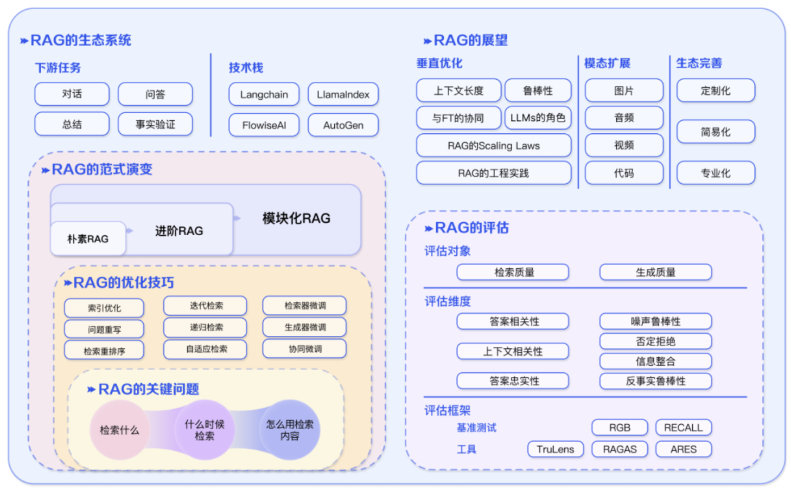

## 1、RAG 初探及面临的挑战

- **长下文长度**：
    - 检索内容过多，超过窗口限制怎么办 ？
    - 如果 LLMs 的上下文窗口不再受限制，RAG 应该如何改进？

- **鲁棒性**：
    - 检索到错误内容怎么处理？
    - 怎么对检索出来内容进行过滤和验证？
    - 怎么提高模型抗毒、抗噪声的能力？

- **与微调协同**：
    - 如何同时发挥 RAG 和 FT 的效果？
    - 两者怎么协同，怎么组织，是串行、交替还是端到端？

- **Scaling-Law**：
    - RAG 模型是否满足 Scaling Law？
    - RAG 是否会，或是在什么场景下会出现 Inverse Scaling Law 的现象？

- **LLM 的角色**：
    - LLMs 可以用于检索（用 LLMs 的生成代替检索或检索 LLMs 记忆）、用于生成、用于评估？
    - 如何进一步挖掘 LLMs 在 RAG 中的潜力？

- **工程实践**：
    - 如何降低超大规模语料的检索时延？
    - 如何保证检索出来内容不被大模型泄露？

## 2、核心问题与优化方向

### 2.1 核心问题

- 问题一：**如何处理非结构化多模态文档**

- 问题二：**纯向量数据库带来的低召回和低命中率**

    > 主要是因为向量表征不仅缺乏对精确信息的表达，对语义召回也有损耗

- 问题三：**如何处理语义鸿沟，如意图不明或多跳提问**

    > 对于意图不明的笼统提问，或者一些需要在多个子问题基础之上综合才能得到答案的所谓“多跳”问答，都无法通过搜索提问来获得答案，因此提问和答案之间存在着明显的语义鸿沟

### 2.2 优化方向

- **方案一：优化 Text Chunking 工具**

    > RAGFlow 引入了针对非结构化数据进行 Semantic Chunking 的步骤，从而保证数据的入口质量
    >
    > 具体做法：采用专门训练的模型来解析文档布局，避免简易的 Text Chunking 工具对不同布局内部数据的干扰

- **方案二：采用企业级搜索引擎提供混合搜索，来作为唯一的后端数据库**

    > 利用向量进行相似搜索，实现类似粗排效果
    >
    > 利用 BM25 进行全文搜索，保证精确查询能力

- 方案三：**对排序模型的升级**，并且都需要**在数据库层面提供原生张量支持**

    - 以 Col-xxx 为代表的延迟交互模型崛起

        > 采用延迟交互模型相当于在数据库层面提供了类似重排序模型这样的能力

    - 基于 VLM 和延迟交互模型实现多模态 RAG

        > 可以解锁更加复杂的文档（例如杂志，饼图等等）在企业端的商业价值

## 3、核心步骤探讨

### 3.1 数据清洗

#### (1) 方案一：传统方式

> 参看：https://baoyu.io/translations/rag/a-guide-on-12-tuning-strategies-for-production-ready-rag-applications#data-cleaning

- 方式一：**对query预处理再检索** 

    > 参考：https://liduos.com/how-to-improve-llm-rag-accuracy-and-recall.html

    - **对 query 进行摘要提取，去除多余的噪声**，如：“我想找兼职的服务员岗位”可以提取为“兼职&服务员”；
    - **根据 query 生成自定义的查询语句**，如：“我想找兼职的服务员岗位”可以变为“类别=兼职 && 职位=服务员”
    - **将 query 拆分为一个个的小短语**，如：“我想找兼职的服务员岗位”可以拆分为“兼职”、“服务员”

    

- 方式二：**动态上下文窗口**

    > 参考：https://liduos.com/rag-optimisation-implementation-scheme.html
    >
    > 动态上下文窗口的方案：能够处理大规模文档，保留重要的上下文信息，提升检索效率，同时保持灵活性和可配置性

    整体方案：

    > 首先，将文本切分为小块，接着再用滑动窗口进行串联；
    >
    > 然后，对文本块进行相似检索，但是返回的却是滑动窗口包含的多个文本块

    - 文档预处理阶段实现满足上下文窗口的原始文本分块
        - **小文本块拆分**：将长文档拆分为多个较小的段，每个段可以是固定长度的片段，也可以根据自然段落或句子进行拆分
        - **添加窗口，生成中等文本块**：使用滑动窗口方法，将文档按一定的窗口大小和步长进行滑动，从而生成多个重叠的中等文本片段
    - 文档检索阶段实现文本的三次检索
        - **第一阶段：小分块检索**：
            - 使用小文档块(docs_index_small)和小嵌入块(embedding_chunks_small)初始化一个检索器(first_retriever)
            - 使用这个检索器检索与查询相关的文档，并将结果存储在 first 变量中
            - 对检索到的文档 ID 进行清理和过滤，确保它们是相关的，并存储在 ids_clean 变量中
        - **第二阶段：移动窗口检索**
            - 针对每个唯一的源文档，使用小文档块检索与该源文档相关的所有文档块
            - 使用包含这些文档块的新检索器(second_retriever)，再次进行检索，以进一步缩小相关文档的范围，将检索到的文档添加到 docs 列表中
        - **第三阶段：中等分块检索**
            - 使用过滤条件从中等文档块(docs_index_medium)检索相关文档，使用包含这些文档块的新检索器(third_retriever)进行检索
            - 从检索到的文档中选择前 third_num_k 个文档，存储在 third 变量中
            - 清理文档的元数据，删除不需要的内容，将最终检索到的文档按文件名分类，并存储在 qa_chunks 字典中

#### (2) 方案二：文档智能(Document Intelligence)

**文档智能(Document Intelligence)**：针对多模态非结构化的文档，采用视觉模型来解析文档布局，从而保证数据入口的高质量

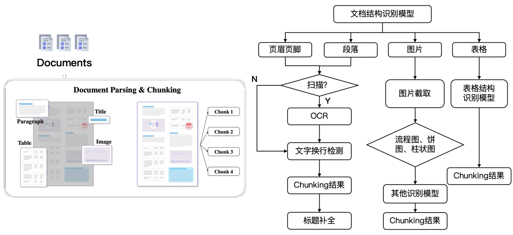

- 第一代：构建在传统视觉模型的基础之上

    > 包含开源的 RAGFlow DeepDoc模块

    - 好处：可以运行在 CPU 上
    - 缺点：对于各场景的泛化能力相对有限。由于需要分别针对不同场景和数据训练相应的模型，因此这类技术被戏称为“雕花”。

- 第二代`OCR`：开始向生成式模型的架构演进，即采用统一的基于 Transformer 的 Encoder-Decoder 架构生成图片识别后的文字结果

    > 类似多模态 VLM，在架构上有着诸多的相似之处

    - 好处：
        - 在不同场景的泛化能力，相比过去的视觉模型都有了不小提高
        - 在文档布局中可以引入文本信息，比如：M2Doc 在基于视觉的 Encoder-Decoder 架构上融合了 BERT，可以更好地确定文字和段落的语义边界

    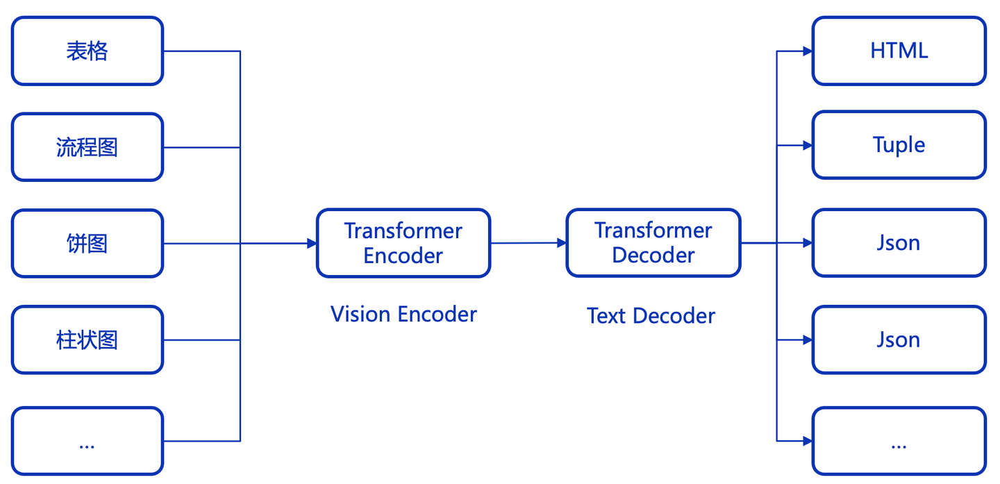

#### (3) 方案三：优化 Chunking

> 通过 LLM 解释 Chunk 的文本内容，从而新增一些诸如标签之类的附加信息，可以从一定层面上缓解这些 Chunk 无法被召回的语义鸿沟问题

- **Jina 推出了 `Late Chunking`**：针对文本类数据，把 Text Chunking 的步骤放到了 Embedding 之后，即先用 Embedding 模型对整个文档的文本进行编码，然后在 Embedding 模型最后一步的均值 Pooling 之前输出 Chunking 的边界，这就是“Late”的由来

    > 跟传统的 Text Chunking 方法相比，Late Chunking 可以更好地保留文本上下文信息
    >
    > 不过，Late Chunking 需要 Embedding 模型最后的输出是均值 Pooling，而大多数 Embedding 模型则是 CLS Pooling，因此并不能直接搭配

- **`dsRAG`**：提供自动上下文

    - 方式一：利用大模型给每个 Text Chunk 添加上下文信息，用来解决原始文本不容易检索的问题

        > 例如文本中如果包含疾病治疗方案，而治疗方案却没有疾病描述，那么检索时，可能就无法命中这段文本

    - 方式二：通过聚类来组合 Text Chunk 形成更长的文本

        > 尽管评测分数良好，但这一点在实际使用未必奏效

- **`Contextual Chunking`**：给每个 Text Chunk 引入特定于该 Chunk 的上下文解释(LLM 生成)

    > 因此，Contextual Retrieval 和 dsRAG 是类似的效果

- **`Meta-Chunking`**：寻找到文本段落内具有语言逻辑链接的句子集合的边界

    > 具体做法：采用 LLM 进行分类，判断句子是否在一个 Chunk

- **多粒度混合 Chunking**：

    - 每个文档都被切割成较小粒度的 Chunk，通常由一两个句子组成
    - 这些 Chunk 被视作图的节点，检索时，根据查询由模型来预测需要的 Chunk 粒度
    - 然后在图结构中根据这个粒度决定图中遍历的深度——遍历越深，相当于最终的 Chunk 粒度越大

    > 并没有缓解语义鸿沟问题，只是动态决定返回大模型的上下文长度，避免上下文冗余，因此实际价值不如上述的一些方案大

### 3.2 混合搜索

采用**向量搜索 + 稀疏搜索 + 全文搜索**的三路混合，可以达到最好的召回

- **向量可以表示语义**，即这段文字跟其他文字在一个上下文窗口内共同出现概率的压缩表示 ，因此向量天然无法表示精确的查询

    > 一句话，乃至一篇文章，都可以只用一个向量来表示，这时向量本质上表达的是这段文字的“语义”

- **全文搜索和稀疏向量，则主要用来表达精确语义**

因此，将两者结合，符合我们日常生活中对语义和精确的双重需求

---

混合搜索，在 RAG 体系中通常由专用的数据库来承担。虽然看起来有很多提供各种混合搜索能力的数据库，但真正能满足混合搜索的选择并不多见，这是因为，一个符合要求的全文搜索，并不容易实现：

1. 用稀疏向量很难模拟全文搜索：稀疏向量的初衷是取代全文搜索，利用一个标准的预训练模型，将文档中的冗余词删除，并且增加扩展词，从而形成一个标准的固定维度的稀疏向量输出（例如 3 万或者 10 万维）

    > 这在通用查询任务上必然会表现更好，然而在实际使用中，依然有大量用户提问的关键词，并不在生成稀疏向量的预训练模型中，例如各种机器型号，说明书，专用词汇等等

2. 全文搜索，不只是提供一个简单的 BM25 计算就可以，还需要考虑短语查询以及相应的性能问题

    > RAGFlow 采用 Elasticsearch 作为唯一的后端文档搜索引擎
    >
    > 在 RAGFlow 里，用户的一个问题，并不是简单的直接送到 Elasticsearch，而是首先经过查询分析，这包括：
    >
    > 1. 分词后删掉无意义的词
    > 2. 给剩余的词计算对应的词权重
    > 3. 给剩余的词产生基于二元分词的短语查询，它们和常规分词结果一起被送去作为查询

---

一个对话“在原文中，教师应该在什么时候提问？”，它产生的查询可能会有如下的结果：

- ((原文中 OR "原文" OR ("原文"~2)^0.5)^1.0) OR ((教师)^0.9991 (提问)^0.000541 (应该)^0.000368 ("教师 应该 提问"~4)^1.5)((企业)^0.550884 (格局)^0.252471 (文章)^0.195081 (新发)^0.000607 (提到)^0.000261 (展)^0.000262 (适应)^0.000230 (应该)^0.000203 ("文章 提到 企业 应该 适应 新发 展 格局"~4)^1.5)
    这个查询非常复杂，但可以看到，它把一个问答转成了包含大量短语的查询，如果倒排索引中没有保存位置信息，就无法提供这种查询能力。
- 另一方面，为了保证召回，在默认情况下，全文搜索需要保证关键词之前默认采用“OR”的关系而非“AND”，它对查询性能提出了很大的挑战。

因此，一个合格的全文搜索，还需要提供查询动态剪枝的技术，并且这种动态剪枝，还需要考虑包含短语查询在内的各种查询。

这样一来，符合要求的全文搜索就所剩无几了。除了最常见的 Elasticsearch 之外，我们在另一款开源的 RAG 用数据库 Infinity 也充分提供了以上能力。

### 3.3 排序模型

#### (1) embedding 与 rerank

在 RAG 上下文里，排序和两个组件有关

- 一个是用来做粗筛的部分，这就是向量搜索依赖的 Embedding 模型

    > 对于 Embedding 模型来说，它通常采用 Encoder 架构，它的训练目标是使得语义相似的文本在向量空间距离更近

- 另一个是在精排阶段所用的 Reranker 模型

    > Reranker 采用 Cross Encoder 架构，训练目标是预测查询和文档之间的分数

#### (2) 二者工作方式

- **左边就是 Embedding 模型的工作方式**：分别对查询和文档进行编码，然后经过 Pooling 后输出一个向量，在排序阶段只需要计算向量相似度

    > 由于丢失了查询和文档中 Token 之间两两之间的交互信息，因此会丢失很多语义信息，所以向量搜索常用来做粗筛

- **作为 Reranker 的 Cross Encoder**：它的 Encoder 网络可以跟 Embedding 模型完全一致，但因为把查询和文档一起输入模型，最终只输出一个得分，因此则可以捕获 Token 之间两两之间的关系，所以排序质量要高出很多

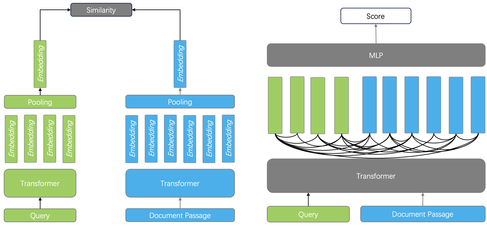

#### (3) 二者对比

- 对于 Encoder 来说，文档的 Embedding，在建立索引的离线阶段就可以完成，因此在线查询阶段，只需要对查询进行编码，就可以快速得到答案
- 而 Cross Encoder，需要对每个查询-文档对进行交叉编码和模型输出，计算成本高昂，所以它只能用来做重排，并且粗筛的结果不能太多，否则会大大增加查询延迟

#### (4) rerank 优化之延迟交互模型(基于张量的重排序)

> 在 2024 年上半年，Reranker 的榜单基本都是 各种 Cross Encoder ，而到了下半年，榜单更多为基于 LLM(Decoder) 的重排序模型所占据

综合排序效果和成本，**延迟交互模型**的重排序方案引起关注，这就是**基于张量的重排序**

- **具体做法**：

    - 索引阶段：保存 Encoder 为每个 Token 生成的 Embedding，因此对于一个文档来说，就是用一个张量 Tensor 来表示一个文档

    - 查询阶段：只需要生成查询的每个 Token 的 Embedding，然后计算所有查询和 Text Çhunk 之间所有 Token 两两之间的相似度，然后累加就是最终文档得分

- **优点**：

    - 这种重排序，同样捕获了 Token 之间的交互信息，所以理论上可以做到跟 Cross Encoder 接近或者持平的效果

    - 另一方面，由于在查询时不涉及复杂的模型推理，所以成本相比 Cross Encoder，或者基于 LLM 的 Reranker要低得多，这甚至可以把排序做到数据库内部

- **好处**：即使粗筛的结果并不理想，但采用基于张量的重排序，可以对更多的结果进行重排，因此也有很大的概率弥补之前的召回

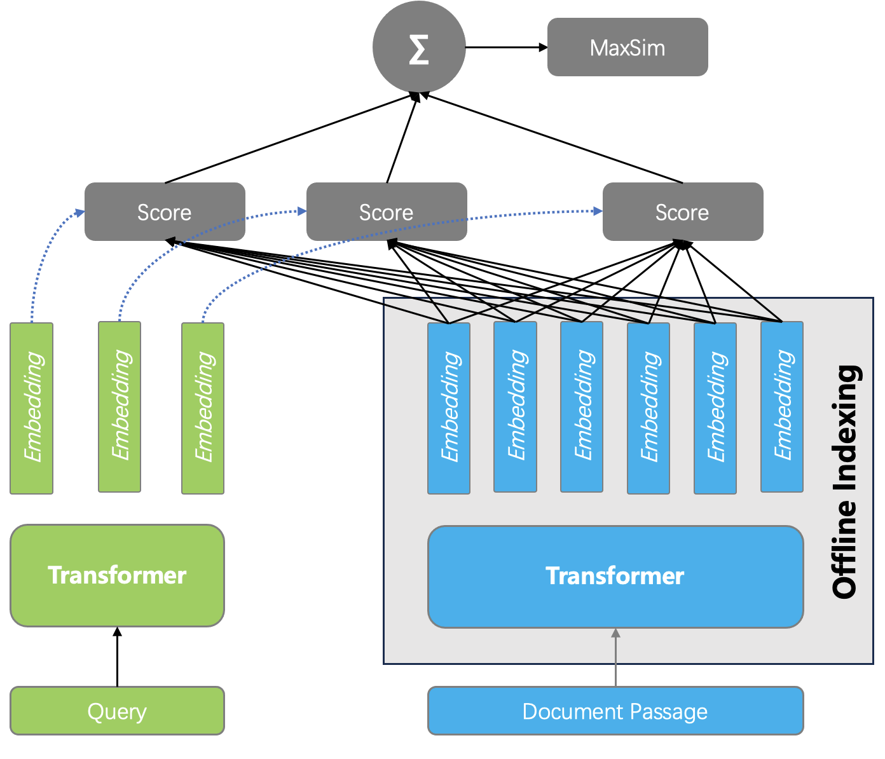

### 3.4 语义鸿沟

#### (1) RAPTOR

- 核心：**把文本内容预聚类，接着利用 LLM 对聚类后的文本生成摘要**，这些摘要数据连同原始文本一起被送到搜索系统

- 好处：由于这些摘要数据提供了对文本更加宏观的理解，因此**对意图不明的提问或跨 Chunk 的多跳提问，都可以产生合适的回答**

#### (2) SiReRAG

**在 RAPTOR 基础之上又有了 SiReRAG**：文本之间分别采用相似度和相关性衡量不同维度的需求

- **相似度**：直接采用向量或全文搜索等其他手段计算 Text Chunk 之间的语义距离

    > 这就是 RAPTOR 本身，也是图中左边的部分

- **相关性**：表示 Text Chunk 之间存在某种关联，首先通过采用 LLM 从每个 Text Chunk 提取命名实体，再根据命名实体跟 Text Chunk 之间的关系构建层次化树状结构

    > 就是图中右边的部分

**召回时**：有多种不同的文本粒度共同提供混合召回，包括实体，实体分组，原始文本，因此可以继续增强对于数据宏观层面的理解，在意图不明和多跳问答查询上的召回有进一步提升

> SiReRAG 其实跟 GraphRAG 已经很接近了，区别仅在于抽取出的实体如何进一步加工和组织

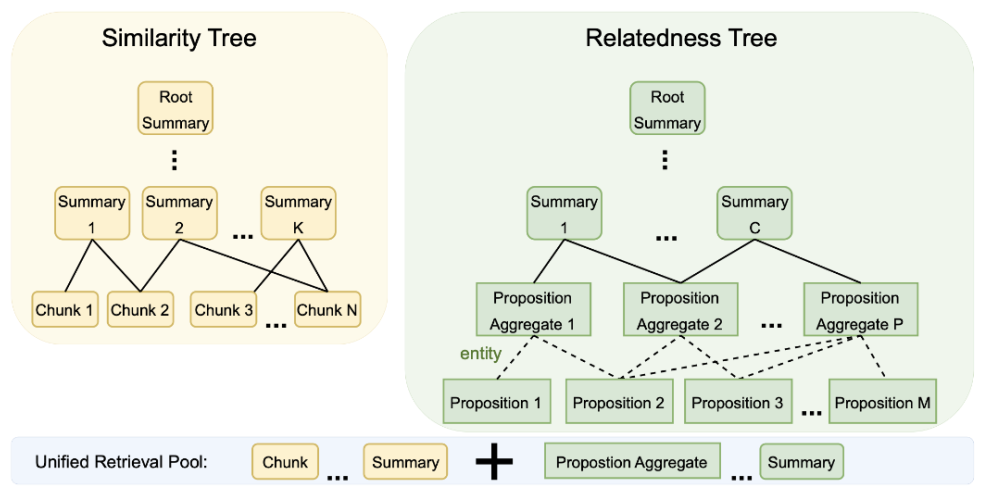

#### (3) GraphRAG

##### 1. 简介

- 利用大模型自动抽取文档内的命名实体，然后利用这些实体自动构建知识图谱
- 在图谱中，同样利用聚类产生实体聚集的“社区”，并利用 LLM 生成这些社区的摘要
- 在召回时，知识图谱的实体、边、以及社区摘要，连同原始文档一起来做混合召回

由于这些数据同样形成了文档中跨 Chunk 的关联信息，因此对于宏观性提问，多跳提问，有着更好的效果

GraphRAG 可以看作是解决语义鸿沟的当下行之有效的策略和架构

> 之所以用“架构”，是因为这其实代表了一种范式，如何用 LLM 来抽取知识图谱，通过辅助召回来解决复杂问答的设计

**GraphRAG的痛点**：Token 消耗非常惊人

> 基于 GraphRAG 的变种，代表性的有 Fast GraphRAG、LightRAG、LazyGraphRAG

##### 2. GraphRAG 变种

- **Fast GraphRAG**：

    - 同样利用 LLM 抽取实体和关系，但省掉了“社区”及其摘要的生成，降低了对 LLM 请求的频率

    - 在检索时， Fast GraphRAG 根据查询在知识图谱上找到最接近的实体，然后采用个性化 PageRank 在知识图谱上随机游走，获取子图，然后依靠子图生成最终答案
    
    > **HippoRAG**：提到了海马体索引理论，基于个性化 PageRank 的随机游走策略，跟人类大脑根据记忆思考的方式很类似，因此把知识图谱构建好之后，在查询的时候按照个性化 PageRank 来检索知识图谱，可以模拟人类大脑基于长文本类信息进行回忆和思考的过程
    
    不论是 Fast GraphRAG，还是 HippoRAG，都可以用下图进行模拟
    
    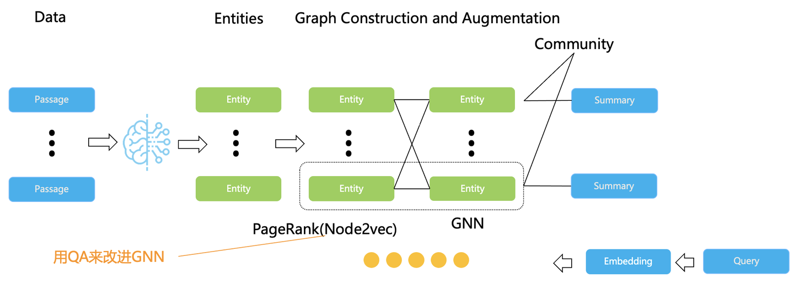

- **LightRAG**：也是对 GraphRAG 的简化，它拿掉了社区，因此更加轻量级

- **LazyGraphRAG**：则是对 GraphRAG 的完全简化，甚至已经不依赖 LLM 来抽取知识图谱，只用一些本地小模型抽取名词，然后根据共现情况提取社区结构。至于社区的摘要，则只在查询时动态处理

##### 3. GraphRAG 架构

- 实质上是利用 LLM 给原始文档补充足够的信息，这些信息以易于连接的图格式组织在一起，在搜索时，在文本相似度之外又添加了引入基于各类实体产生的相关信息带来的辅助召回能力

- 因此，在 GraphRAG 中，知识图谱的价值并不在于给人来查看，而更多是为复杂和意图不清的提问提供更多依据和上下文

围绕 GraphRAG 的后续工作，除了降低成本之外，还在于如何把实体组织成更有效的结构

- **KG-Retriever**：把知识图谱连同原始数据在一起，构建成多层次的图索引结构，检索时采用不同粒度
- **Mixture-of-PageRanks**：在个性化 PageRank 的基础上，引入了基于时间的相关性信息

##### 4. GraphRAG 的工程实现

 **GraphRAG 的工程实现**：采用图数据库实现 GraphRAG 是很自然的选择，图数据库天然可以更好的表达知识图谱

具体数据建模：在 GraphRAG 中，知识图谱的实体、边等都是文字描述，此外还有根据实体之间聚类得到的社区以及由此生成的总结

一个典型的 GraphRAG 数据建模可以如下图所示：

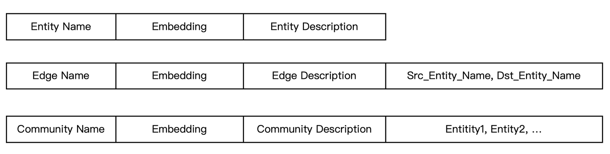

一个功能完备的全文索引，除了提供相似度得分计算之外，还应该提供基于关键词的过滤能力。

- 因此，对以上 Schema 中边的 `<源实体名，目标实体名>` 字段建立全文索引提供关键词过滤，就可以很方便的进行基于边和实体的子图检索。

- 除此之外，如果数据库可以提供无缝衔接的全文索引和向量索引，就可以针对 GraphRAG 提供非常方便的混合搜索，所有边，实体，乃至社区，它们的描述都被纳入全文搜索的范畴，连同向量一起，就提供了基于 GraphRAG 的 2 路混合召回。

从以上数据 Schema 也可以看出，这些数据，只需要再增加一个类型字段，就可以连同原始的文本 Chunk 一起保存在同一张表，这就是把 GraphRAG 和 RAG 结合的 HybridRAG 

显然，采用一个具备丰富索引能力的数据库，可以极大降低让 GraphRAG 落地的工程难度，即便是诸如 KG-Retriever，Mixture-of-PageRanks 等各类改变图结构的工作，也可以通过调整索引格式以及增加特定索引的搜索方式，方便地支持

### 3.5 多模态 RAG

多模态 RAG 的意义：通过 RAG 根据用户的提问，在一大堆 PDF 中找到包含答案的图片和文字，就可以用 VLM 生成最后的答案

- 一种方案：采用模型来把多模态文档转成文本，然后再建立索引，提供检索

- 另一种：根据 VLM 的进展，直接生成向量，规避掉复杂的 OCR 过程

    > ColPali：把一张图片看作 1024个 Image Patch，分别生成 Embedding
    >
    > - 因此一张图片就是用一个张量来表示
    > - 而最终的排序，就通过张量来进行
    >
    > 整个检索过程，如下图所示：可以看到，它需要数据库，不仅支持基于张量的重排序，还需要在向量检索阶段，支持多向量索引
    >
    > 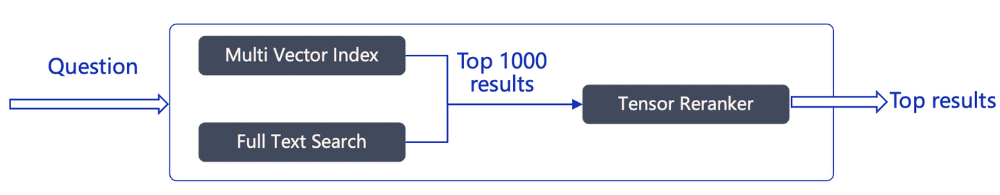

## 4、Agentic与Memory

### 4.1 Agentic RAG

Agentic RAG：**Agent 直接用于 RAG，可以提供高级 RAG 能力**，例如 Self RAG、Adaptive RAG 等

> RAG 本身是 Agent 的重要算子，可以解锁 Agent 访问内部数据的能力

如下图所示：可以让 RAG 在一个更加复杂的场景下以更加可控的方式提供各种适应性变化

> 实现这类 Agentic RAG，需要 Agent 框架具备“闭环”能力，在吴恩达定义的 Agent 四种设计模式中，这种“闭环”被称作反思能力

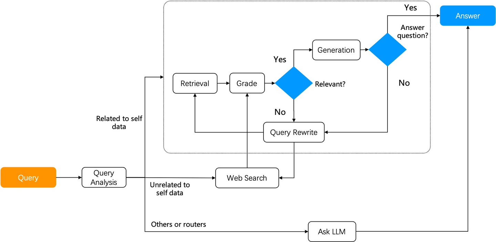

### 4.2 自主决策的 Agent

把 RAG 跟这样的 Agent 集成到一起，可以解锁更多的场景：如下图所示，系统存在多个可以自主决策的 Agent ，可以把复杂的问答分解为多个子任务，每个 Agent 负责特定的功能，这种分工可以提高系统的整体效率和准确性

- Detector Agent：旨在识别可能包含错误假设和前提的查询，这些查询会影响 LLM 回答的准确性
- Thought Agent：负责处理和分析所有检索到的内容信息，综合数据得到结论，并生成一系列详细的 Reasoning 思考结果；
- Answer Agent：利用 Through Agent 的输出产生答案，目的是在多轮对话中确保答案的输出受到最新的逻辑影响。

### 4.3 RARE

**RARE**：在 RAG 的基础上增加了 MCTS 蒙特卡洛树搜索框架，通过 2 个动作来在检索的基础上增强 Reasoning 能力：

- 基于初始问题生成查询
- 基于生成的子问题进行查询

### 4.4 RAG 与 Memory

伴随着这种这种 Reasoning 能力，可以看到 RAG 和 Agent 之间已经密不可分，交互更加频繁

因此，RAG 需要为 Agent 提供除文档搜索之外的**记忆管理功能**，这些记忆信息包括：**用户对话 Session，用户个性化信息**等等

Agent 不仅仅需要调用 RAG 完成内部数据的搜索，还需要实时获取上下文信息

## 5、RAG 痛点总结

### 5.1 共性痛点

1. **内容缺失**：当知识库中缺少上下文时，RAG系统可能会提供一个看似合理但不正确的答案，而不是表示不知道

    解决方案：包括清理数据和精心设计提示词

2. **错过排名靠前的文档**：重要文档可能未出现在系统检索组件返回的顶部结果中，导致系统无法提供准确的响应

    解决方案：包括调整检索策略和嵌入模型调优

3. **不在上下文中 — 整合策略限制**：文档整合长度限制超过LLM窗口大小，导致整合策略受限

    解决方案：调整检索策略和嵌入模型调优

4. **文件信息未提取**：文档中的关键信息未被提取出来

    解决方案：包括数据清洗、提示词压缩和长内容优先排序

5. **格式错误**：输出格式与预期不符

    解决方案：改进提示词、格式化输出和使用大模型的Json模式

6. **答案(特异性)不正确**：系统可能会返回过于笼统或过于详细的答案，导致与用户想要的信息深度不匹配

    解决方案：采用先进的检索策略。

7. **回答不完整**：回答不全面

    解决方案：包括查询转换和细分问题。

8. **数据提取可扩展性**：数据摄取的可扩展性问题

    解决方案：并行处理和提升处理速度

9. **结构化数据QA**：结构化数据问答问题

    解决方案：链式思维表格包和混合自洽查询引擎包

10. **从复杂PDF中提取数据**：从复杂PDF中提取数据困难

    解决方案：嵌入式表格检索技术

11. **后备模型**：需要一个后备模型策略

    解决方案：Neutrino路由器或OpenRouter

12. **LLM安全性**：大语言模型的安全性问题。这是一个需要持续关注和解决的问题

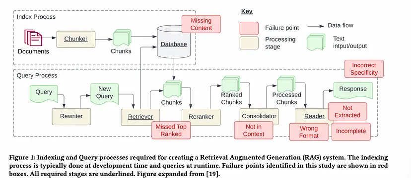

### 5.2 RAG落地过程中的问题

- **检索效率低下**：

    - 痛点描述：在庞大的数据集中进行有效检索是一个挑战，尤其是当需要实时响应时

    - 相关问题：如何优化检索算法以减少查询延迟?

- **信息融合困难**：

    - 痛点描述：将检索到的信息与生成的内容无缝融合是一项复杂任务，需要精确的算法来确保信息的准确性和连贯性

    - 相关问题：如何设计有效的信息融合策略?

- **上下文理解的局限性**：

    - 痛点描述：模型可能难以准确理解查询的上下文，特别是在复杂或模糊的情境中

    - 相关问题：如何提高模型对上下文的理解能力?

- **数据偏差和噪声**：

    - 痛点描述：检索到的数据可能包含偏差和噪声，这会影响模型的输出质量

    - 相关问题：如何识别并减少数据中的偏差和噪声?

- **答案准确性和可靠性问题**：

    - 痛点描述：生成的答案可能不够准确或可靠，尤其是在需要精确事实性回答的情况下

    - 相关问题：如何验证和提高生成答案的准确性?

- **可扩展性问题**：

    - 痛点描述：随着数据量的增加，模型可能难以保持高性能和可扩展性

    - 相关问题：如何确保模型能够处理大规模数据?

- **资源消耗**：

    - 痛点描述：RAG技术通常需要大量的计算资源，这在资源受限的环境中是一个挑战

    - 相关问题：如何优化模型以减少资源消耗?

- **隐私和安全问题**：

    - 痛点描述：处理敏感数据时，需要确保用户隐私和数据安全

    - 相关问题：如何实现隐私保护的数据处理?

## 6、持续改进的测试和监控

RAG 系统由于其实时、动态的特性，需要强大的测试和监控实践。以下是有效的策略：

- **真实场景测试**：在类似生产的环境中模拟常见的用户查询

    > 跟踪系统的响应以识别可能影响质量的差距、排名不一致或与上下文相关的问题

- **用于测试的合成数据**：由于很难预测所有用户查询，因此合成数据生成可以填补测试空白

    > 使用 LLM 根据已知文档创建假设的问答对，尤其是对于训练数据有限的领域

- **性能指标**：监控响应准确性、排名靠前的文档的相关性、检索延迟和用户反馈

    > 对重大偏差（例如检索质量突然下降）创建警报

- **自动评估和人机验证**：OpenAI 的 OpenEvals 或 G-Eval 等自动化工具可以提供初步质量检查

    > 将这些与定期人工审核相结合，以确保发现并纠正细微问题（例如格式遵守或特异性）

- **自适应反馈循环**：使用来自用户交互的持续反馈机制来调整和微调检索和生成组件

    > 例如，来自用户对响应质量的评分的反馈可以指导排名算法的改进并完善 LLM 的提示说明

# 