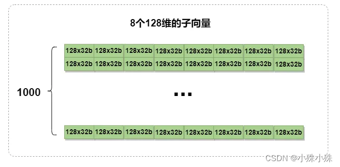
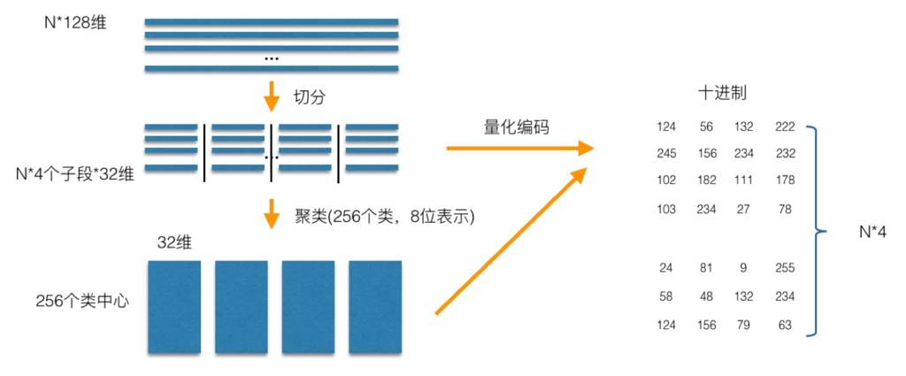
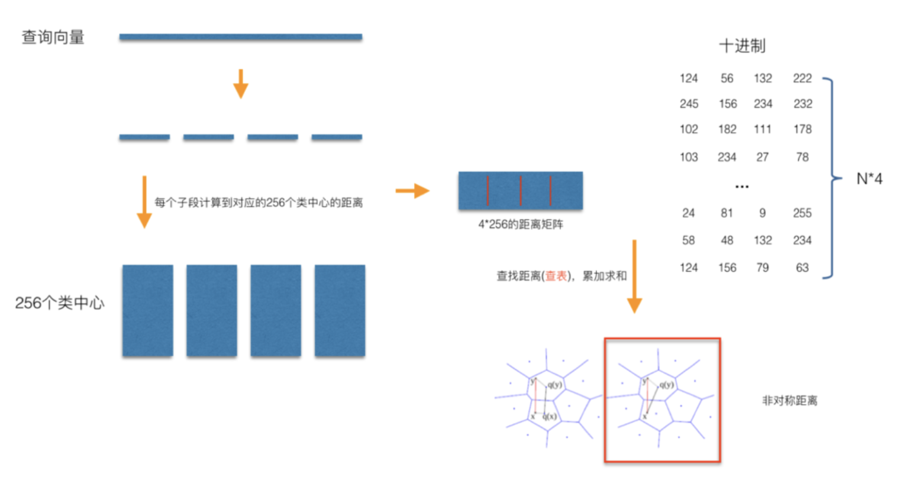
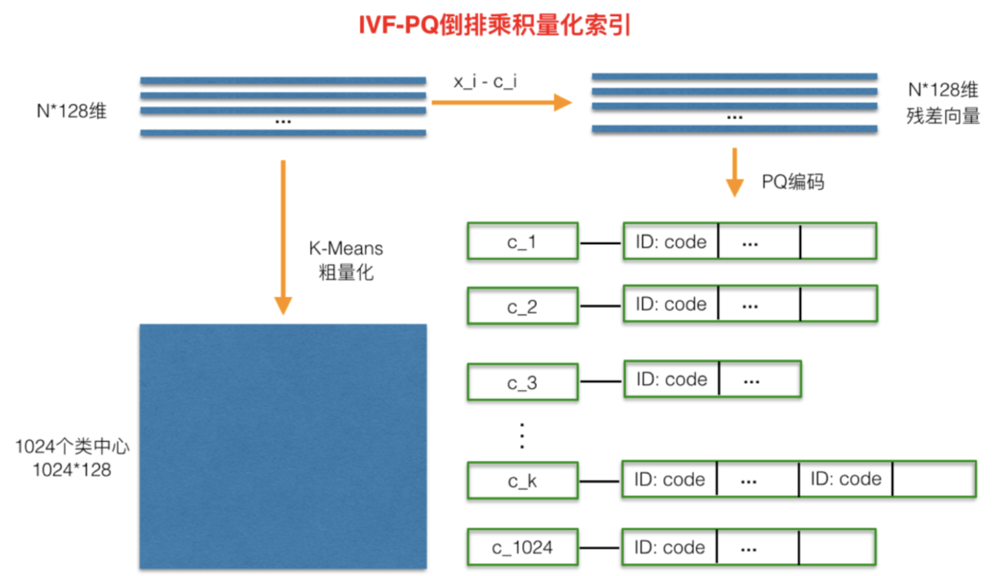

Faiss 基础索引类型：https://github.com/facebookresearch/faiss/wiki/Faiss-indexes

# 一、Faiss 简介

Faiss 主要用于以下几个方面：**索引与量化器**

## 1、索引类型

Faiss 提供了多种算法和索引结构来实现高效的最近邻搜索，主要包括：

- **Flat 暴力索引**：采用暴力搜索方法，逐一计算查询向量与所有向量的距离，找到最近邻

    > 计算量较大，适合数据量较小的情况

- **IVF 倒排索引**：通过将向量空间划分为多个簇，每个簇对应一个倒排文件，从而减少搜索空间

    > 适用于大规模数据集

- **HNSW 图索引**：基于小世界图的索引结构

    > 适用于大规模和高维数据集

- **LSH 哈希索引**：通过哈希函数将相似的向量映射到相同的桶中，从而减少搜索空间

    > 适用于高维数据集的近似最近邻搜索

- **KD-Tree 和 Ball-Tree 索引**(非 Faiss 内置索引)：通常用于低维数据集的最近邻搜索

    - `KD-Tree`：一种基于二叉树的数据结构，通过递归地将数据集划分为两个子集，形成树结构，从而减少搜索空间

        > 适用于低维数据集的最近邻搜索

    - `Ball-Tree`：类似 KD-Tree，其使用超球体（ball）来划分空间，更适用于高维数据集

## 2、量化器

- SQ(标准量化)
- PQ(乘积量化)
- RQ(残差量化)
- LSQ(局部检索量化)
- AQ(加法量化)

# 二、常用距离

## 1、L2 距离(欧氏距离)

用于衡量两个向量之间的空间距离

- 在二维空间中，L2距离可以通过勾股定理计算得出，即两点之间的直线距离

- 在多维空间中，L2距离表示为两个向量之间每个对应维度差值的平方和的平方根

$$
L2(A, B) = \sqrt{\sum^n_{i=0}(A_i - B_i)}
$$

## 2、IP(内积)

内积（点积）和余弦相似度经常用于衡量向量之间的相似性，余弦相似度基于向量的方向来度量，而不是长度
$$
A * B = \sum^n_{i=1}A_iB_i
$$

## 3、内积和余弦相似度

要在 Faiss 中使用余弦相似度，通常需要将向量进行归一化处理，然后使用内积计算余弦相似度

 取值范围 `[-1, 1]`，值越接近 1 表示向量越相似
$$
cos \quad similerity(A, B) = \frac{A * B}{||A|| \quad ||B||}
$$

## 4、余弦距离

余弦距离定义为余弦相似度的一个变形，通常用于衡量向量之间的不相似度

取值范围 `[0, 2]`，越接近0距离越近
$$
cos \quad distance(A, B) = 1 - cos \quad similarity(A, B)
$$

## 5、汉明距离


# 三、量化器

- **标准量化**：直接将向量离散化，不变维度；
- **乘积量化**：将向量分段，然后对每段进项单独量化；
- **加法量化**：将完整的向量拆分成多级向量（维度与原始向量相同）的和，对每级进行量化

## 1、SQ(标量量化)

> 参考文档：https://yongyuan.name/blog/scalar-quantization.html

标量量化：将向量分成若干个区间，然后将每个区间映射到一个离散的数值用对数据直接量化

比如：数据是1000x1024按照 8bit 量化，假设每个维度的取值范围是0到1000

- 先根据维度分成1024组，每组划分为个级别，每个级别代表4（1000/256）
- 最终向量中的值将被分配到所在组的256个级别中的一个，得到量化结果

> 注意：在检索的时候faiss.IndexScalarQuantizer还会遍历所有数据，然后对筛选出的数据计算精确的距离，时间复杂度很高，所以实际中不要使用faiss.IndexScalarQuantizer，可以使用faiss.IndexIVFScalarQuantizer

---

Scalar Quantization标量量化，分为3个过程：

- training过程：主要是训练 encode 过程，需要的参数主要是每 1 维对应的最大值、最小值；
- encode过程：将 float 向量量化为 int8 向量
- decode过程：将 int8 向量解码为 float 向量


- training过程：从样本中随机采样出 N 个样本后，训练过程主要是得到 N 个样本中每 1 维的最大值、最小值

    > 得到最大值、最小值后，将它们保存下来即可。实际在训练的时候，N能大的时候，尽量大点

- encode过程：对于一个 d 维的待编码的 float 型向量 `x = {x_1, x_2, …., x_d}`，过程如下：

    - 对每 1 维，求 `value_i = (x_i - min_i) / (max_i - min_i)`；

    - 对每 1 维，如果 `value_i < 0`，则 `value_i` 重置为 `value_i=0`；

        如果 `value_i > 1`，则 `value_i` 重置为 `value_i=1`

        > 理论情况下，不会出现 `value_i < 0` 或 `value_i > 1`

    - 对每 1 维，对应的编码 `code_i = int(255 * value_i)`。为什么是255？可以思考下；

- decode过程：对每 1 维，`x_i = min_i + (code_i + 0.5) * (max_i - min_i) / 255`，通过该式子，即可完成对第 i 维的解码

## 2、PQ(乘积量化)

> 参考文档：https://yongyuan.name/blog/vector-ann-search.html

- PQ是一种用于高维向量压缩和相似性搜索的技术，特别适用于大规模向量数据集的近似最近邻搜索

- PQ 将高维向量分解为多个子空间，并对每个子空间进行独立的向量量化，从而实现高效的向量压缩和搜索

### (1) PQ量化

量化过程有如下3个步骤：

1. 向量分解：将原始高维向量分解为多个子向量，每个子向量属于一个子空间
2. 子空间量化：对每个子空间进行独立的向量量化，将连续的向量空间划分为离散的子空间
3. 编码：将原始向量编码为子空间的离散码字，以表示原始向量在每个子空间中的位置

---

案例：

- 数据集是一个1000x1024的矩阵，每个向量维度1024

    

- **向量分解**：先将每个1024维的向量平均分成8个128维的子向量

    

- **子空间量化**：然后对这8组子向量分别使用 k-means 聚成256类(8位表示)

    - 下图中（1）竖着的一列为一组，每组进行聚类，聚类成256个簇，形成8x256的码表（2）
    - 然后将每个 128 维的原向量转换成簇的中心点，如下图中的（3）

- **编码**：接下来将每一个格中的128维向量根据（2）量化成一个簇ID（0-256 占8bit），这样原始1024维浮点数（32位）向量便压缩成 8 个 8 位整数，即下图（4）中粉色矩阵中的一行

    

在上面的例子中，子向量数量和每个子向量簇的数量是两个超参数，经过实验子向量数量选择8和簇的数量选择256通常是最佳的

---



在训练阶段，针对 N 个训练样本：

- 假设样本维度为 128 维，将其切分为 4 个子空间，则每个子空间维度为32维

- 在每一个子空间中，对子向量采用 K-Means 对其进行聚类(图中示意聚成256类)

    > 这样每一个子空间都能得到一个码本

- 这样训练样本的每个子段，都可以用子空间的聚类中心来近似，对应的编码即为类中心的 ID

- 对于待编码的样本，将它进行相同的切分，然后在各个子空间里逐一找到距离它们最近的类中心，然后用类中心的id来表示它们，即完成了待编码样本的编码

### (2) PQ检索

检索过程非常类似于召回+排序：

1. 量化查询向量：使用上面的压缩过程将查询向量转换成中心点 ID 矩阵

2. 召回：将查询的 PQ 编码与码本中的所有 PQ 编码进行比较，寻找与查询编码最接近的候选向量，比如计算海明距离

3. 排序：对于每个候选编码，找到对应的原始向量，然后精确计算相似度，进行排序


---



> PQ乘积量化能够加速索引的原理：即将全样本的距离计算，转化为到子空间类中心的距离计算

- 查询向量来到时，按训练样本生成码本的过程，将其同样分成相同的子段，然后在每个子空间中，计算子段到该子空间中所有聚类中心得距离

    > 如图，可以得到 4*256 个距离，把这些算好的距离称作距离池

- 在计算库中某个样本到查询向量的距离时，分别到距离池中取各个子段对应的距离即可

- 所有子段对应的距离取出来后，将这些子段的距离求和相加，即得到该样本到查询样本间的非对称距离

- 所有距离算好后，排序后即得到我们最终想要的结果

### (3) IVF-PQ

- **PQ乘积量化缺点**：计算距离时，距离虽然已经预先算好了，但是对于每个样本到查询样本的距离，还是得老老实实挨个去求和相加计算距离

- **IVF-PQ 方案**：通过聚类的方式实现感兴趣区域的快速定位



在PQ乘积量化之前，增加了一个粗量化过程：

- 先对 N 个训练样本采用 K-Means 聚类

    > 这里聚类的数目一般设置得不应过大，一般设置为1024差不多

- 得到了聚类中心后，针对每一个样本 `x_i`，找到其距离最近的类中心 `c_i` 后，两者相减得到样本 `x_i` 的残差向量 `(x_i - c_i)`

- 后面剩下的过程，就是针对 `(x_i - c_i)` 的PQ乘积量化过程

---

在查询的时候，通过相同的粗量化，可以快速定位到查询向量属于哪个c_i（即在哪一个感兴趣区域），然后在该感兴趣区域按上面所述的PQ乘积量化距离计算方式计算距离

## 3、加法量化

加法量化：将原始向量表示为多个部分的和，每个部分都可以独立进行量化

> 在加法量化中，每个部分由一个码本表示，最终的量化结果是这些部分码本的加和

### 3.1 RQ(残差量化)

 **残差量化**：涉及对数据进行多次量化，每次量化都使用相同的量化级别，但重建过程中会考虑前一次量化产生的误差

**关键点**：通过只处理量化过程产生的误差，可以更有效地压缩数据，同时尽量减少信息损失

---

过程包括以下步骤：

1. 初步量化：对数据进行一次简单的量化（K-means），将其划分到有限数量的级别中

2. 计算残差：计算初步量化后的数据与原始数据之间的差异，这些差异被称为“残差”

3. 再次量化：对计算出的残差进行再次量化，这次量化可以更加精确，因为残差通常比原始数据小很多

4. 迭代过程：2、3 两个步骤迭代进行，即对残差的量化结果再次计算残差，并进行量化

### 3.2 LSQ(局部检索量化)

局部检索量化：

- 先使用 k-means 将原始高维向量空间划分为若干个簇
- 然后将原始的高维向量映射到最近的簇心
- 最后再使用量化方法将高维向量转换成一个代表性的低维向量

检索的时候使用局部搜索的方法在这些低维向量上进行最近邻搜索


### 3.3 AQ(加法量化)

加法量化：将残差量化或者局部量化的结果加起来作为向量的量化结果


# 四、IndexFlat

## 1、索引类型

- `IndexFlatL2`
- `IndexFlatIP`
- `IndexScalarQuantizer(SQ)`
- `IndexPQ`

## 2、Flat

### 2.1 介绍

- Flat-Index 只是将 vector 编码为固定大小的 code，然后存储在 `ntotal * code_size` 字节的数组中

- 检索时，所有索引 vector 都被顺序解码，并与查询 vector 比较

### 2.2 支持的操作

Flat-Index 类似 C++ vector，即不存储 vector-Ids，因为顺序编号就足够了，因此：

- 不支持 `add_with_id`，但可以将其包装在 `IndexIDMap` 中来实现
- 支持高效的直接向量访问（使用 `reconstruct` 和 `reconstruct_n` ）
- 支持使用remove `remove`，但会缩小索引并更改编号

### 2.3 Vectors 编码

- `IndexFlat`：vector 存储时不进行压缩
- `IndexScalarQuantizer` with `QT_fp16`：向量被压缩为 16 位浮点
- `IndexScalarQuantizer` with `QT_8bit/QT_6bi/QT_4bit`：向量转换为 8/6/4位整数编码
- `IndexPQ`：向量被分成子向量，每个子向量为几个 bit（通常为 8 位）
- `IndexResidual`(残差编码)：向量通过残差进行量化和逐步细化。在每个量化阶段，可以细化 codebook 大小

## 3、PQ


## 4、SQ


## 5、residual(残差)


# 五、IndexIVF(cell-probe)

## 1、索引类型

- `IndexIVFFlat`
- `IndexIVFScalarQuantizer(IVF-SQ)`
- `IndexIVFPQ`
- `IndexIVFPQR` 

## 2、k-means

- 核心思想：

    - 先对向量数据先进行聚类，然后将每个向量分配到最近的聚类中心，经过聚类算法不断调整聚类中心位置，这样就可以将向量数据分成多个不同的簇；

    - 每次搜索时，只需要先判断搜索向量属于哪个簇，然后再在这一个簇中进行搜索，大大减少了搜索的范围

- 基本步骤：
    - 选择 k 个初始聚类中心
    - 将每个数据点分配到最近的聚类中心
    - 计算每个聚类的新中心
    - 重复步骤 2 和 3，直到聚类中心不再改变或达到最大迭代次数
- 缺点：在搜索的时候，如果搜索的内容正好处于两个分类区域的中间，就很有可能遗漏掉最相似的向量


## 3、紧邻相似

- 将向量包含在 Voronoi 单元格中，当引入一个新的查询向量时，首先测量其与质心 (centroids) 之间的距离，然后将搜索范围限制在该质心所在的单元格内

- 为了解决搜索时可能存在的遗漏问题，可以将搜索范围动态调整，例如当 nprobe = 1 时，只搜索最近的一个聚类中心，当 nprobe = 2 时，搜索最近的两个聚类中心，根据实际业务的需求调整 nprobe 的值


## 4、IVF

- 特征空间被划分为 `nlist` 单元
- 由于使用量化函数（在 k 均值的情况下，分配给最接近查询的质心），数据库向量被分配给这些单元格之一，并存储在由`nlist`倒排列表形成的倒排文件结构中
- 查询时，选择一组 `nprobe `倒排列表
- 将查询与分配给这些列表的每个数据库向量进行比较

> 仅将数据库的一小部分与查询进行比较：作为第一个近似值，该部分是`nprobe/nlist` 
>
> 但该近似值通常被低估，因为倒排列表的长度不等。当未选择给定查询的最近邻居的单元格时，就会出现失败情况

# 六、IndexHNSW

> 参考文档：https://yongyuan.name/blog/vector-ann-search.html

## 1、索引类型

- `IndexHNSWFlat`(无编码)

## 2、HNSW

`IndexHNSW`使用平面索引作为底层存储来快速访问数据库向量并抽象向量的压缩/解压缩

- `M` 是图中使用的邻居数量：M 越大，精度越高，但占用的内存也越多
- `efConstruction` 是添加时的探索深度
- `efSearch` 是搜索的探索深度

> 除了 HNSW 的 Flat 索引外，HNSW 不支持从索引中删除向量，这会破坏图结构

## 3、介绍

> 通过采用层状结构，将边按特征半径进行分层，使每个顶点在所有层中平均度数变为常数，从而将NSW的计算复杂度由多重对数(Polylogarithmic)复杂度降到了对数(logarithmic)复杂度

**算法描述**：对于每一个要插入的元素，采用指数衰变概率分布函数来随机选取整数最大层


- 图构建元素插入过程（Algorithm 1）：从顶层开始贪心遍历 graph，以便在某层 A 中找到最近邻

    当在A层找到局部最小值之后，再将A层中找到的最近邻作为输入点（entry point），继续在下一层中寻找最近邻，重复该过程；

- 层内最近邻查找（Algorithm 2）：贪心搜索的改进版本；

- 在搜索阶段，维护一个动态列表，用于保持 ef 个找到的最近邻元素

---

搜索时：

- 通过顶层以逐步递减的特性半径对其进行路由
- 到了第 0 层后，再在局部区域做更精细的搜索

# 七、IndexLSH(局部敏感hash)

> 参考文档：https://yongyuan.name/blog/vector-ann-search.html

在 Faiss 中， `IndedLSH`只是一个带有二进制代码的 Flat 索引

数据库向量和查询向量被散列成二进制代码，并与汉明距离进行比较

```
IndexLSH * index = new faiss::IndexLSH (d, nbits);
```

其中`d`是输入向量维度， `nbits`是每个存储向量使用的位数

如果 n_bits <= d，则使用一组正交投影仪，或者如果 n_bits > d，则使用紧框架

## 1、介绍

可阅读：https://github.com/FALCONN-LIB/FALCONN/wiki/LSH-Primer

- LSH 是一种将环境空间随机划分为遵循所需相似性度量的单元的方法

- LSH 的核心构建块是**局部敏感哈希函数**

    > 哈希函数局部敏感：靠近的点对比相距较远的点对更容易发生碰撞

- LSH 数据结构使用位置敏感的哈希函数来划分数据集空间：每个可能的哈希值本质上都对应于其自己的单元

## 2、多个哈希函数和表

- 对 K 个独立分区进行采样，桶对应于相应分区中大小为 K 的单元元组

    > 如果选择的 K 足够大，则查询和相应的最近邻落入同一个桶的概率将会很小

- 解决方案：有 L 个独立的哈希表，即对 K * L 分区（哈希函数）进行采样
    - 给定一个查询，现在执行 L 个独立的哈希表查找并获得一组 L 个候选存储桶（每个表一个）
    - 然后，使用 L 个桶中的所有数据点作为候选点，并计算查询与每个点之间的距离

- 特点：

    - 如果 K 太小，每个桶的数据点太多，查询时间就会很长

    - 如果 K 太大，则需要 L 很大，但较大的 L 值会导致高空间消耗(许多表)和缓慢的查询(计算许多哈希函数)

        > 需要 L 介于 100 到 1000 之间

## 3、Multiprobe LSH

> 太多的 L 会消耗过多的空间

- 常规的：对于构建的 L 个哈希表，在每一个哈希表中找到查询样本落入的哈希桶，并遍历

- Multiprobe：不止在查询样本所在的哈希桶中遍历，还会找寻其他 T 个哈希桶进行遍历

    > 其他哈希桶的选取准则：跟查询样本所在的哈希桶邻近的哈希桶，“邻近”指的是汉明距离度量下的邻近

---

补充：如果不使用 Multiprobe，我们需要的哈希表数目 L 在 100 到 1000 之间

## 4、核心参数

- K，每个哈希表的哈希函数（空间分区）的数量
- L，哈希表的数量（每个哈希表有K个哈希函数）
- T，探测数量（所有哈希表中探测的桶总数）

---

这三个设置参数可以按照如下顺序进行：

- 首先，根据可使用的内存大小选取 L
- 然后在 K 和 T 之间折中：哈希函数数目 K 越大，则 T 也比较大，反之 K 越小，L也可以相应的减小
- 获取 K 和 L 最优值的方式：
    - 对于每个固定的 K，如果在查询样本集上获得了想要的精度，则此时 T 的值即为合理的值
    - 在对 T 进行调参时，不需要重新构建哈希表，甚至还可以采用二分搜索的方式来加快 T 参数的选取过程

## 5、性能特性

- 适用于小数据集和中型规模的数据集(几个million-几十个million)
- 如果对于大型规模数据集(几百个 million 以上)，基于矢量量化的Faiss是一个明智的选择

# 八、索引使用总结

近似最近邻搜索（ANN）算法能够计算向量之间的距离，从而提升向量相似度检索的速度

> ANNS 的核心思想是不再局限于只返回最精确的结果项，而是仅搜索可能是近邻的数据项，即以牺牲可接受范围内的精度的方式提高检索效率

## 1、索引类型

### 1.1 暴力索引

- `FLAT`：暴力检索，适用于需要 100% 召回率且数据规模相对较小（百万级）的向量相似性搜索应用

    > 对于每一次查询，目标向量会与向量集合中的一条条向量进行距离计算
    >
    > - 训练参数：无需训练
    > - 检索参数：`metric_type` 距离指标，如 L2、IP 等

### 1.2 IVF 索引

- `IVF_FLAT`：采用聚类对思想(Faiss)，将向量划分到 nlist 个单元中，对于目标向量，比较与 nlist 个聚类中心的向量的距离，再与前 nprobe个单元的向量进行比较，从而大大减少查询时间

    > - 训练参数：`nlist` 范围 `[1, 65536]`，nlist 推荐 `nlist = 4 * sqrt(512MB / (dim* 4bytes))`
    > - 检索参数：`nprobe` 范围 `[1, nlist]`
    >
    > 适用于追求查询准确性和查询速度之间理想平衡的场景（高速查询、要求高召回率）

- `IVF_SQ8`：相比于 IVF_FLAT，IVF_SQ8 对向量进行了压缩，将Float(4 bytes) 转换为UINT8(1 bytes)，可以节省70%的资源消耗

    > - 训练参数：`nlist` 范围 `[1, 65536]`，nlist 推荐 `nlist = 4 * sqrt(512MB / (dim* 4bytes))`
    > - 检索参数：`nprobe` 范围 `[1, nlist]`
    >
    > 适用于磁盘或内存、显存资源有限的场景（高速查询、磁盘和内存资源有限、接受召回率的小幅妥协）

- `IVF_PQ`：同样使用量化的方法对向量进行压缩，通过将原来的高维向量空间均匀分解为低维向量空间的笛卡尔积

    > 基于IVF_FLAT的一种向量数据有损压缩算法（PQ乘积量化）：PQ先将D维空间切分成M份：类似于将128维空间切分成M个D/M维的子空间，每个子向量进行 k-means 聚类
    >
    > 
    >
    > - 训练参数：
    >     - `nlist` 范围 `[1, 65536]`，nlist 推荐 `nlist = 4 * sqrt(512MB / (dim* 4bytes))`
    >     - `m` 量化因子 `dim mod m == 0`
    > - 检索参数：`nprobe` 范围 `[1, nlist]`
    >
    > 适用于追求高查询速度、低准确性的场景（超高速查询、磁盘和内存资源有限、接受召回率的实质性妥协）

### 1.3 图索引

`HNSW`：分层图索引算法，根据一定的规则为图像构建出一个上层稀疏，下层稠密的多层图索引；检索时从上层开始，向下层迭代

---

HNSW 结构：

- **层级结构**：借鉴了 SkipList 的思想

    - HNSW 索引由多层图组成，底层图密度最高，上层图密度逐层递减。每一层的节点数和连通性不同，顶层节点稀疏且连接数少，底层节点密集且连接数多
    - 这种结构使得在较高层次上快速找到近似位置，然后在较低层次上进行更精细的搜索

- **节点连接**：

    - 每个节点在每层通过最多 `m` 条边连接到其他节点，这些连接通过贪心算法选择，以优化小世界性质，即每个节点能够通过较少的跳跃访问大多数其他节点
    - `m` 值决定了每个节点在每层的连接数，影响图的稠密度和导航效率

- **索引构建**：

    - 在构建索引时，`efConstruction` 控制每次插入新节点时，探索的候选节点数量

        > 较高的 `efConstruction` 值会使新节点与更多的重要节点连接，增强图的连通性

    - 控制的是索引构建过程中，每次插入新节点时探索的候选节点数量，影响的是索引构建时的探索深度和连接质量

        > 这使得在查询时，能够更快速地找到近似邻居，提高查询效率和精度

- **查询过程**：

    - 查询从顶层开始，通过贪心算法找到离查询点最近的节点，然后逐层向下搜索
    - 在每一层，`ef` 控制探索的候选节点数量，确保在每个层次上都能找到较优的节点进行下一步搜索
    - 最终在底层完成精确搜索，通过较高的 `ef` 值，保证找到最接近查询点的节点

---

图层数：由数据集的大小和一个概率参数决定，具体的，图层数与数据集大小成对数关系

- 图层数L的计算与节点数N、自然对数函数以及参数M有关：
    - **最大层级计算**：
        每个新节点在构建索引时，会被分配一个随机层级（height），该层级从0到L-1，其中L是图的最大层数。这个层级是通过一个随机过程决定的，通常使用负对数随机分布
    - **概率分布**：
        在很多实现中，节点被分配到第 k 层的概率大致是 `1 / M^k`。也就是说，随着层级的增加，节点分布的密度迅速减少。高层级的节点数量会少于低层级

- 计算图层数的公式：
    - 假设节点数为N，M为每个节点的最大连接数，图层数L的期望值可以近似表示为：$L = log_M(N)$

---

参数设置：

- 训练参数

    - M 图节点的最大度数 [4, 64]
        - 含义：每个节点在每一层的最大邻居数，或最大边数目

        - 作用：控制节点间的连接数量。较高的 `m` 值会使图的连通性更强，从而提高搜索效率，但会增加索引构建和查询的内存消耗

        - 索引结构影响：主要影响的是索引图的稠密度和内存消耗，以及查询路径的长度和效率

        - 说明：**决定了节点在每层的最大连接数，影响图的连通性和导航效率**

    - efConstruction 搜索范围[8, 512]
        - 含义：在构建索引时，用于控制插入新节点时探索的候选节点数量
        - 作用：影响索引构建的质量和时间。较高的 `efConstruction` 值会增加构建时间和内存使用，但会产生更高质量的索引，即更高的搜索精度和效率
        - 索引结构影响：主要影响的是索引构建过程的复杂性和构建时间，以及最终索引的质量和查询精度
        - 说明：**影响索引构建时的探索深度和时间，较高的值提高索引质量**，并且与召回率正相关
- 检索参数

    - ef 搜索范围 [topk, 32768]
        - 说明：**控制查询时的探索深度，较高的值提高查询精度**
        - 补充：控制搜索精确度和搜索性能，注意 ef 必须大于 K


### 1.4 标量索引

- **Sorted（STL_SORT）**：
    - 针对整数类型（Int）的排序索引。
    - 通过排序的方式来加快范围查询和精确查询的速度。

- **Tries**：
    - 适用于字符串类型（VARCHAR）的高效前缀匹配和自动补全。
    - 使用前缀树（Trie）结构来组织和索引字符串数据

## 2、数据格式&距离公式&向量

| 数据格式   | 距离计算公式                                                 | 索引类型                                                     |
| ---------- | ------------------------------------------------------------ | ------------------------------------------------------------ |
| 浮点型向量 | 欧氏距离 (L2)<br/>内积 (IP)                                  | FLAT<br/>IVF_FLAT<br/>IVF_SQ8<br/>IVF_PQ<br/>HNSW<br/>IVF_HNSW<br/>RHNSW_FLAT<br/>RHNSW_SQ<br/>RHNSW_PQ<br/>ANNOY |
| 二值型向量 | 杰卡德距离 (Jaccard)<br/>谷本距离 (Tanimoto)<br/>汉明距离 (Hamming) | BIN_FLAT<br/>BIN_IVF_FLA                                     |
| 二值型向量 | 超结构 (superstructure)<br/>子结构 (substructure)            | BIN_FLAT                                                     |

浮点型向量主要使用以下距离计算公式：

- 欧氏距离(L2)：主要运用于计算机视觉领域
- 内积(IP)：主要运用于自然语言处理（NLP）领域

---

二值型向量主要使用以下距离计算公式：

- 汉明距离 (Hamming)：主要运用于自然语言处理（NLP）领域
- 杰卡德距离 (Jaccard)：主要运用于化学分子式检索领域
- 谷本距离 (Tanimoto)：主要运用于化学分子式检索领域
- 超结构 (Superstructure)：主要运用于检索化学分子式的相似超结构

- 子结构 (Substructure)：主要运用于检索化学分子式的相似子结构

# 九、Milvus

官方文档：https://milvus.io/docs/v2.3.x/data_processing.md

## 1、简介

https://blog.51cto.com/liguodong/5110587

Milvus 基于 FAISS、Annoy、HNSW 等向量搜索库构建，核心是解决稠密向量相似度检索的问题

> 在向量检索库的基础上，Milvus 支持数据分区分片、数据持久化、增量数据摄取、标量向量混合查询、time travel 等功能

- **Collection**：包含一组 entity，可以等价于关系型数据库系统（RDBMS）中的表

- **Entity**：包含一组 field，field 与实际对象相对应。field 可以是代表对象属性的结构化数据，也可以是代表对象特征的向量。primary key 是用于指代一个 entity 的唯一值

    > 目前 Milvus 不支持 primary key 去重

- **Field**：Entity 的组成部分，可以是结构化数据，例如数字和字符串，也可以是向量

---

- **Partition**：将收集数据划分为物理存储上的多个部分，每个分区可以包含多个段

- **Segment：Milvus** 在数据插入时，通过合并数据自动创建的数据文件

    > 一个 collection 可以包含多个 segment。一个 segment 可以包含多个 entity
    >
    > 在搜索中，Milvus 会搜索每个 segment，并返回合并后的结果

- **Sharding**：将数据写入操作分散到不同节点上，使 Milvus 能充分利用集群的并行计算能力进行写入

    > 默认情况下，单个 Collection 包含 2 个分片（Shard）
    >
    > 目前 Milvus 采用基于主键哈希的分片方式

- **PChannel**：表示物理信道，每个 PChannel 对应一个日志存储主题

    > 默认情况下，将分配一组 256 个 PChannels 来存储记录 Milvus 集群启动时数据插入、删除和更新的日志

- **VChannel**：表示逻辑通道，每个集合将分配一组 VChannels，用于记录数据的插入、删除和更新。

    > Channels 在逻辑上是分开的，但在物理上共享资源

## 2、架构


整个系统分为四个层次：

- **接入层(Access Layer)**：由一组无状态 proxy 组成，对外提供用户连接的 endpoint，负责验证客户端请求并合并返回结果

- **协调服务(Coordinator Service)**：系统的大脑，负责向执行节点分配任务。它承担的任务包括集群拓扑节点管理、负载均衡、时间戳生成、数据声明和数据管理等

    - **Root coordinator（root coord）**：负责处理数据定义语言（DDL）和数据控制语言（DCL）请求

        > 比如，创建或删除 collection、partition、index 等，同时负责维护中心授时服务 TSO 和时间窗口的推进

    - **Query coordinator (query coord）**：负责管理 query node 的拓扑结构和负载均衡以及从增长的 segment 移交切换到密封的 segment

    - **Data coordinator (data coord）**：负责管理 data node 的拓扑结构，维护数据的元信息以及触发 flush、compact 等后台数据操作

    - **Index coordinator (index coord）**：负责管理 index node 的拓扑结构，构建索引和维护索引元信息

- **执行节点(Worker Node)**：系统的四肢，负责完成协调服务下发的指令和 proxy 发起的数据操作语言（DML）命令

    - **Query node**： Query node 通过订阅消息存储（log broker）获取增量日志数据并转化为 growing segment，基于对象存储加载历史数据，提供标量+向量的混合查询和搜索功能
    - **Data node**： Data node 通过订阅消息存储获取增量日志数据，处理更改请求，并将日志数据打包存储在对象存储上实现日志快照持久化
    - **Index node**： Index node 负责执行索引构建任务，Index node不需要常驻于内存，可以通过 serverless 的模式实现

- **存储服务 (Storage)**： 系统的骨骼，负责 Milvus 数据的持久化

    - 元数据存储（meta store）：负责存储元信息的快照，比如：集合 schema 信息、节点状态信息、消息消费的 checkpoint 等

        > 元信息存储需要极高的可用性、强一致和事务支持，因此，etcd 是这个场景下的不二选择

    - 消息存储（log broker）：是一套支持回放的发布订阅系统，用于持久化流式写入的数据，以及可靠的异步执行查询、事件通知和结果返回

        > 执行节点宕机恢复时，通过回放消息存储保证增量数据的完整性

    - 对象存储（object storage）：负责存储日志的快照文件、标量/向量索引文件以及查询的中间处理结果

        > Milvus 可以基于内存或 SSD 的缓存池，通过冷热分离的方式提升性能以降低成本·

## 3、一致性与字段类型

### 3.1 一致性

> 分布式数据库必须在一致性、可用性和延迟之间进行权衡；
>
> 当场景中同时存在读写需求时，一致性级别决定用户在某个时间节点能检索访问到的数据试图

在向量数据库中，提供四种一致性级别：

- **Strong，强一致性**；能够保证检索获取的数据是最新版本的数据，但延迟较高
- **Bounded ，有限过期一致性**；允许数据经过一个小的时间段以后达到一致，对召回率影响较小，延迟较低（推荐）
- **Session，会话一致性**；保证在一次会话中，能够读取当前会话中写入的数据
- **Eventually，最终一致性**；不保证读取和写入的顺序，数据最终会收敛到相同状态，延迟最低

### 3.2 字段类型

**For primary key field**:

- DataType.Int64 (numpy.int64)
- DataType.VarChar (VARCHAR)

**For scalar field**:

- DataType.Bool (Boolean)
- DataType.Int8 (numpy.int8)
- DataType.Int16 (numpy.int16)
- DataType.Int32 (numpy.int32)
- DataType.Int64 (numpy.int64)
- DataType.Float (numpy.float32)
- DataType.Double (numpy.double)
- DataType.VarChar (VARCHAR)

**For vector field**:

- DataType.BinaryVector (Binary vector)
- DataType.FloatVector (Float vector)

## 4、索引构建

- 为了避免数据更新时频繁建立索引，Milvus 中的集合被进一步划分为多个段，每个段都有自己的索引

- 索引节点将要索引的日志快照从一个Segment（对象存储中）加载到内存中，反序列化相应的数据和元数据来构建索引，索引时序列化索引构建完成，并将其写回对象存储

## 5、数据查询

- 数据查询：在指定集合中查找距离目标向量最近的 `k` 个向量或到该向量指定距离范围内的所有向量的过程

- Milvus 中的集合被分割成多个段，查询节点按段加载索引。当搜索请求到达时，它会广播到所有查询节点以进行并发搜索。然后每个节点修剪局部片段，搜索满足条件的向量，并减少并返回搜索结果

- 数据查询中查询节点是相互独立的。每个节点只负责两个任务： 
    - 按照查询坐标的指令加载或释放段；
    - 在本地部分进行搜索。
    - proxy负责减少每个查询节点的搜索结果并将最终结果返回给客户端

- 有两种类型的段：增长段（用于增量数据）和密封段（用于历史数据）。
    - 查询节点订阅 vchannel 以接收最近的更新（增量数据）作为不断增长的段。
    - 当增长的细分达到预定义的阈值时，数据协调将其密封并开始构建索引。
    - 然后由查询坐标发起的切换操作将增量数据转换为历史数据
    - 查询坐标将根据内存使用情况、CPU 开销和段数量在所有查询节点之间均匀分配密封段

## 6、性能与数据写入

https://maimai.cn/article/detail?fid=1765325324&efid=CzzPs6txtBrPb4eAR4gspA

> 如果有大量离线写入的场景，建议使用 BulkInsert，原因是 BulkInsert 不会对查询性能造成太大的影响，并且也大大减少了流式写入对消息队列产生的压力

如何合理选择流式还是批式写入呢：

1. 单次写入超过 100MB 以上，建议选择批式写入
2. 希望尽可能减少写入对线上查询的影响，建议选择批式写入
3. 希望写入实时可见，建议选择流式写入
4. 单次写入小于 10MB 以下，建议选择流式写入

在选择好写入方式的基础上，还有几个经验需要关注：

1. 尽可能批量写入，整体吞吐会更高，建议每次写入的大小控制在 10M
2. 单个 Shard 的流式写入量不建议超过 10M/s
3. Datanode 多于 Shard 的情况下，部分 DataNode 可能无法获得负载
4. 导入目前支持的文件大小上限是 1GB，接下来会支持更大的导入文件大小上限
5. 不建议频繁导入小文件，会给 compaction 带来比较大的压力
