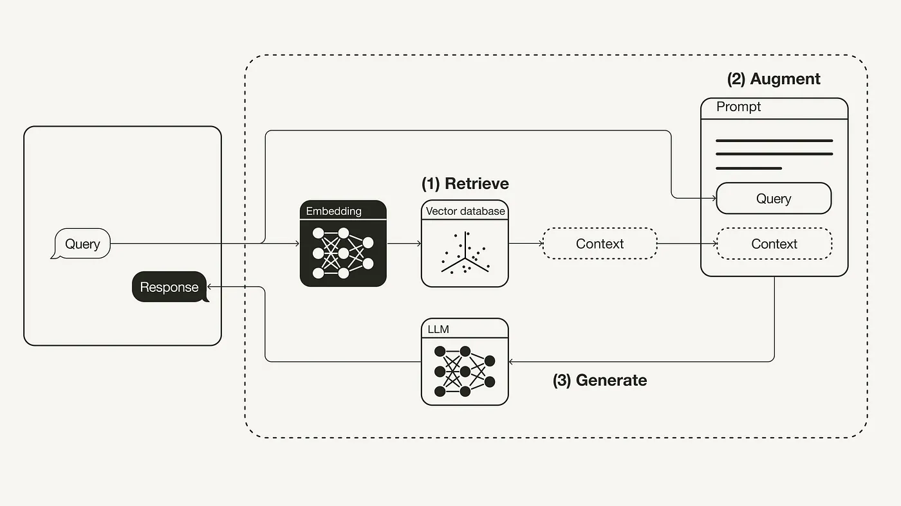
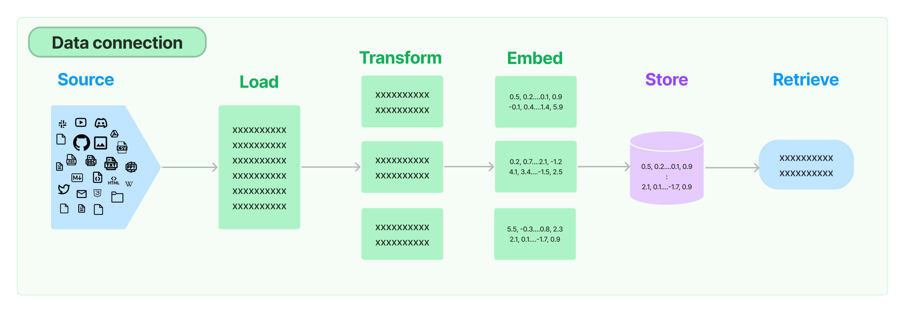
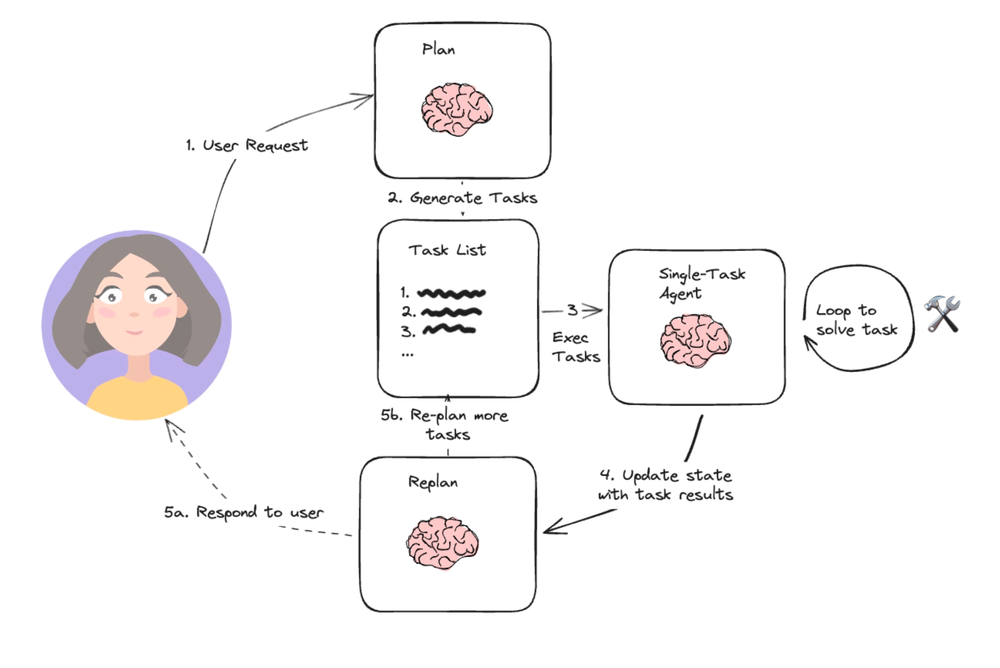
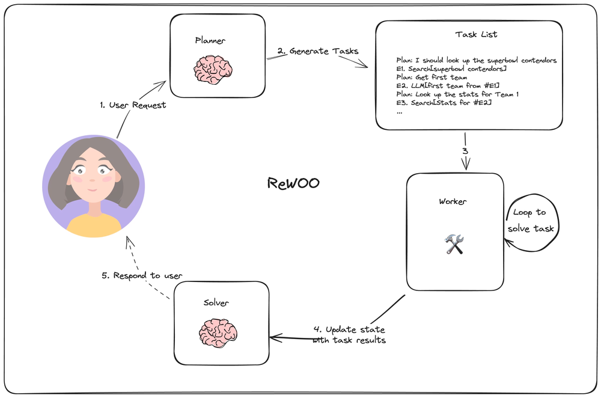
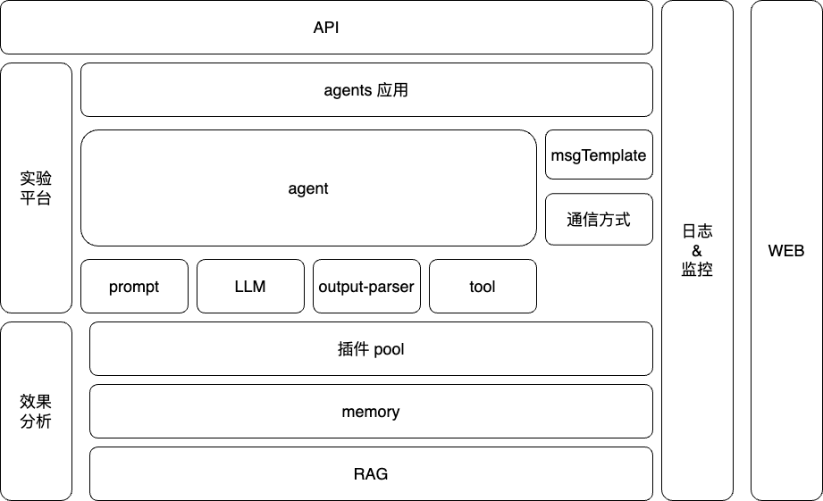
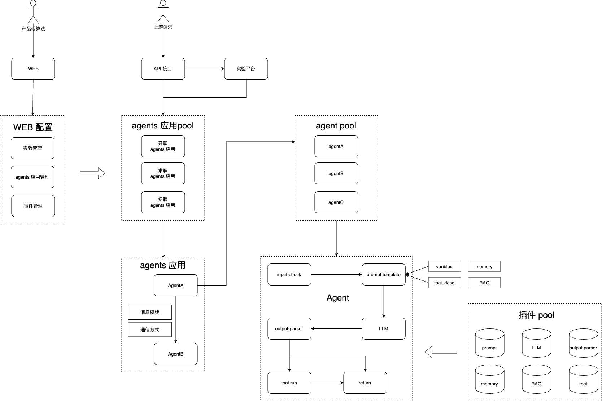
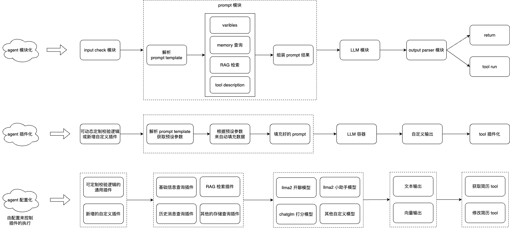
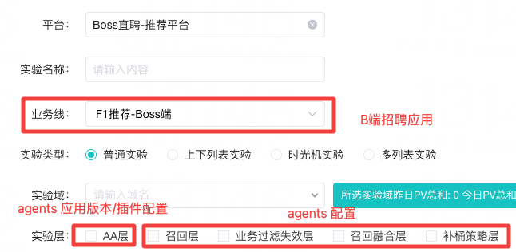
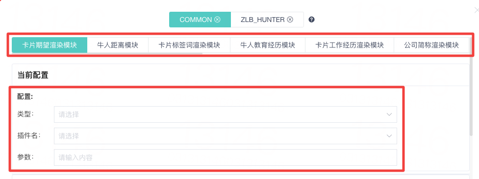
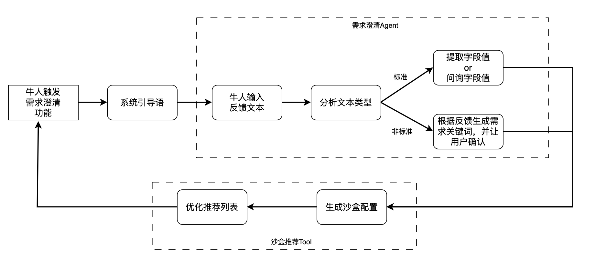

# 一、背景&目标

大模型具有强大的通用语义理解能力，一定的逻辑推理能力。但大模型在具体业务落地中，也面临一些挑战：

1）大模型应用中，大模型的效果，不仅受到模型能力的影响，还受到输入 prompt 的影响，因此需要根据具体的业务要求处理、构造、变换 prompt的内容；

2）实际业务中，除了大模型以外，还需要一些具备特殊逻辑的 function 来完善功能，并根据用户的输入做出对应的业务判断、状态设置、流程调用等；

3）复杂业务中，往往需要不同的流程进行配合，此时单独的一个大模型无法支持，因此需要由多个大模型或者业务模块相互作用，共同完成目标；

4）开源实现方面，业界较火的 lang-chain 仅支持单个大模型构建的应用，因此无法支持涉及到多个大模型及业务模块共同组成的复杂场景。

具体到求职招聘业务（或者求职招聘推荐业务），不同的场景，会有不同的应用需求。不同的应用，都需要应对流程设计、应用上线、实验评估、应用优化等4个方面的问题。

综上，为了应对大模型在业务应用中的挑战、提升应用落地的效率，需要开发一套通用的 agent 应用平台。


# 二、开源项目调研

## 1、openai 功能点

> 可参考：https://platform.openai.com/docs/guides/text-generation

- **Text generation**：prompt、model、ouputparser、token

- **Function calling**：

- 函数定义：name、description、params

```python
tools = [
        {
            "type": "function",
            "function": {
                "name": "get_current_weather",
                "description": "Get the current weather in a given location",
                "parameters": {
                    "type": "object",
                    "properties": {
                        "location": {
                            "type": "string",
                            "description": "The city and state, e.g. San Francisco, CA",
                        },
                        "unit": {"type": "string", "enum": ["celsius", "fahrenheit"]},
                    },
                    "required": ["location"],
                },
            },
        }
    ]
```

- 函数调用：

  - step1：将 description 组装进 prompt；
  - step2：校验 model 返回的结果，如果满足 tool_calls 条件，则进行 step3；
  - step3：解析输出(建议json格式)，获取 function_name  + function_args(若有)；
  - step4：将 function_args 作为入参，来调用对应的 function；
  - step5(针对 Action Agent 的实现)：使用 function 响应来组装 prompt，再次调用 model。

- **Embedding(RAG)**：

> 可参考：https://baoyu.io/translations/rag/retrieval-augmented-generation-rag-from-theory-to-langchain-implementation
>
> 

- 使用场景：检索、相似性分组、推荐、异常检测、相似性分布、分类

  - 数据写入步骤：

  - load：加载数据
    - split：文档分块
    - embedding：向量嵌入
    - save：存储

  - 数据使用步骤：

  - retriever：检索
    - splice prompt：增强(拼接prompt)

- **其他模块**：fine-tuning、image-generation、vision、text-switch-speech、moderation

## 2、langchain 项目

> 可参考：https://python.langchain.com/docs/get_started/introduction

- **model**：
  - LLM Stream
  - LLM Cache

- **prompt**：
- - prompt template：由 template + input_variables 组成

```python
from langchain import PromptTemplate


template = "What is a good name for a company that makes {product}?"


prompt = PromptTemplate.from_template(template)
prompt.format(product="colorful socks")


#result: What is a good name for a company that makes colorful socks?
```

- - prompt selector：从多个 prompt template 中选择满足要求的 template

```python
#MMR（最大边际相关性）选择法
from langchain.prompts.example_selector import (
    MaxMarginalRelevanceExampleSelector,
    SemanticSimilarityExampleSelector,
)
from langchain.vectorstores import FAISS
from langchain.embeddings import OpenAIEmbeddings
from langchain.prompts import FewShotPromptTemplate, PromptTemplate


example_prompt = PromptTemplate(
    input_variables=["input", "output"],
    template="Input: {input}\nOutput: {output}",
)


# These are a lot of examples of a pretend task of creating antonyms.
examples = [
    {"input": "happy", "output": "sad"},
    {"input": "tall", "output": "short"},
    {"input": "energetic", "output": "lethargic"},
    {"input": "sunny", "output": "gloomy"},
    {"input": "windy", "output": "calm"},
]


example_selector = MaxMarginalRelevanceExampleSelector.from_examples(
    # This is the list of examples available to select from.
    examples,
    # This is the embedding class used to produce embeddings which are used to measure semantic similarity.
    OpenAIEmbeddings(),
    # This is the VectorStore class that is used to store the embeddings and do a similarity search over.
    FAISS,
    # This is the number of examples to produce.
    k=2,
)
mmr_prompt = FewShotPromptTemplate(
    # We provide an ExampleSelector instead of examples.
    example_selector=example_selector,
    example_prompt=example_prompt,
    prefix="Give the antonym of every input",
    suffix="Input: {adjective}\nOutput:",
    input_variables=["adjective"],
)


# Input is a feeling, so should select the happy/sad example as the first one
print(mmr_prompt.format(adjective="worried"))


# 结果
Give the antonym of every input


Input: happy
Output: sad


Input: windy
Output: calm


Input: worried
Output:
```

- **output-parser**：

- - 获取格式化指令: 返回包含语言模型输出应如何格式化的字符串；
    - 解析: 接受字符串并将其解析为某种结构；
    - 带提示解析(可选): 接受字符串和提示并将其解析为某种结构(场景：需要从提示中获取信息以重试或修复输出的情况)

```python
from langchain.output_parsers import CommaSeparatedListOutputParser
from langchain.prompts import PromptTemplate, ChatPromptTemplate, HumanMessagePromptTemplate
from langchain.llms import OpenAI
from langchain.chat_models import ChatOpenAI


output_parser = CommaSeparatedListOutputParser()


format_instructions = output_parser.get_format_instructions()
prompt = PromptTemplate(
    template="List five {subject}.\n{format_instructions}",
    input_variables=["subject"],
    partial_variables={"format_instructions": format_instructions}
)
model = OpenAI(temperature=0)
_input = prompt.format(subject="ice cream flavors")
output = model(_input)
output_parser.parse(output)


# 结果：
['Vanilla', 'Chocolate', 'Strawberry', 'Mint Chocolate Chip', 'Cookies and Cream']
```

- **memory**：保存历史消息；

- - 窗口缓存策略：只使用最后 K 个交互消息；
    - 实体缓存策略：使用 LLM 从实体中提取信息，并随时间建立对该实体的知识；
    - 摘要缓存策略：即时总结对话并将当前摘要存储，用于压缩信息，有利于较长的对话；
    - vector 缓存策略：使用向量来存储记忆，然后在调用时查询最具 "显著性" 的前 K 个文档；
    - graph 缓存策略：使用知识图谱来重建记忆；

- **RAG**：文档加载器、文档转换器、文本嵌入模型、向量存储、数据检索；



- **chain**：将一系列执行功能通过硬编码的方式进行组装(prompt + LLM + outputparser 等)；
  - sequential chain：将多个组件顺序链接；
  - router chain：根据给定输入动态选择下一个执行链条的 chain；

- **agent**：使用 LLM 作为推理引擎来确定要采取的动作及顺序；

> chain 与 agent 的区别：chain 通过硬编码来控制执行流程，agent 通过 LLM 来控制执行流程

- - 组成元素：prompt + LLM(控制大脑) + tools

    - tool 的定义：可以执行一定逻辑的功能函数，可以是 function、chain、其他 agent 等
    - agent 执行器(如 AgentExecutor、BabyAGI、AutoGPT)：以 AgentExecutor 为例，其执行步骤为：
    - - 步骤一：处理用户输入，即将 history(可选) 与 input 组装在一起；

        - 步骤二：while 循环条件判断(循环次数、执行时间)；
    - 步骤三：执行 agent.plan 逻辑(补充：plan 逻辑支持个性化的硬编码实现)；
        - 步骤四：判断 agent 的输出类型；
      - 如果是 agentFinish，则直接返回结果 agentFinish；
          - 如果是 agentAction，则获取内部参数 tool_name 来调用 tool 执行，并拿到执行结果 observation，将 agentAction + observation 组合返回；
    - 步骤五：while 中断条件，判断 output 输出
          - 如果是 agentFinish，直接返回；
          - 如果是 agentAction + observation 的组合，则跳转到步骤二；
    - 步骤六：解析输出结果，并返回；
    - **callback 函数**：允许在 LLM 应用程序的各个阶段进行钩子操作，可用于日志记录、监控、流式传输等任务

## 3、agentScope 项目

> 可参考：https://modelscope.github.io/agentscope/zh_CN/tutorial_zh/quick_start.html

- **agent**：能够与环境和其他智能体交互，并采取行动改变环境的自主实体；

- **service**：能够执行特定任务的功能性API，类似 function；

- **message**：信息的载体，用于不同 agent 间的消息传递；

- **workflow**：智能体执行和智能体之间的消息交换的有序序列，类似 agent 执行器或 chain；

- - **pipeline**：以一定的表达式，将多个不同的 agent 串联起来，形成一个 multi-agents 应用；
    - **msgHub**：通过消息广播的形式，管理一组智能体之间的对话/群聊，比如：用 msgHub 实现狼人杀；

## 4、agent 实现案例

- **ReAct**：让模型逐步思考，即 Action Agent，典型实现 Zero-shot React Agent

> 参考论文：https://arxiv.org/abs/2210.03629

- - 执行逻辑：

    - 用户给 Agent 一个任务
      - 思考： Agent “思考 “要做什么
      - 行动/行动输入： Agent 决定采取什么行动（又称使用什么工具）以及该工具的输入应该是什么
      - 工具的输出
- 记忆方式：
      - memory：使用传统存储记录输入、输出
  - 步骤记忆：保留一个与该任务相关的中间 Agent 步骤，并将完整的列表传递给LLM调用
    - Action Agent 存在的问题：
      - Calculation Error： 由于计算错误带来的回答答案错误；
  - Missing-step Error： 当涉及多个步骤时，有时会遗漏一些中间推理步骤；
      - Semantic Misunderstanding Error：对用户输入问题的语义理解和推理步骤的连贯性方面的其他错误，可能是由于 LLM（语言模型）能力不足导致
- 局限：只适合处理简单场景，不适合处理复杂场景



- **plan-and-execute**：让模型先理解问题并制定解决方案的计划

> 参考论文：https://arxiv.org/abs/2305.04091

- - 执行逻辑：

    - - 让模型先理解问题并制定解决方案的计划，解决 Missing-step Error
        - 让模型按步骤执行计划并解决问题，解决 Semantic Misunderstanding Error



# 三、现有项目调研

## 1、单 Agent 逻辑

- 步骤一：处理用户输入；
- 步骤二：组装 prompt；
- 步骤三：调用 LLM 执行；
- 步骤四：解析模型输出，按策略进行个性化处理；

## 2、多 Agent 逻辑

- 步骤一：获取基本信息；

- 步骤二：根据 state + req 获取要执行的 agent；

- 步骤三：执行 agent 逻辑；

- - 获取历史消息；
    - 组装 prompt（history + prompt template + function）；
    - 调用 LLM 执行；
    - 判断是否要调用 function：调用 fuction 获取结果，或直接将 LLM 返回作为结果；
    - 结果存储并更新状态，然后拿到结果进行步骤四；

- 步骤四：判断返回结果的类型

- - 若是 str，则直接返回；
    - 若是 tuple，则跳转到步骤二。

# 四、系统架构

## 1、核心概念

- **agents 应用**：以一定的逻辑将一个或多个 agent 进行组装，来共同支持某个指定场景的需求；

- **agent**：使用 LLM + tools 来完成特定功能的一个实现，核心输入为 prompt、llm、tools、output-parser

- **prompt**：核心字段为 role + content

- - role 类型：

    - - System：由 tool 的 description + memory、rag 等组装而成；
        - user：由 template + 预定义字段解析组装而成；
        - assistant：模型返回；

    - content 来源：预定义字段(如 jobId)、入参字段(如 input_variables)、tool 的描述、历史消息、rag 检索消息；

- **LLM**：支持不同模型、同一模型的不同版本等

- **tool/function**：完成某个特定常规功能(非LLM)的实现，可以是函数、api 等方式；

- **output-parser**：将大模型返回的结果进行解析；

- **memory**：对整个执行流程的历史消息或其他状态信息进行存储；

- **rag**：对模型未知消息进行向量化存储，方便模型对消息进行回答，避免幻觉，可以是最新公共数据、私有数据等；

- - 离线写入：加载数据、数据转换/切分、数据嵌入/转换、数据向量存储；
    - 实时查询：数据检索、数据组装 prompt；

- **消息&通信**：

- - 消息：多个不同 agent 间进行数据交互的消息模版；
    - 通信：多个不同 agent 间的通信实现方式，如单向通信、广播等；

## 2、核心功能

- web 配置管理页面：

- - agents 应用的管理、调试、体验、自助上线等；
    - 实验配置的管理、调试、上线等；
    - 新插件的注册、下线等；

- 对外提供服务：

- - 提供统一的对外接口，支持通过 type 字段来进行应用的场景区分和实验分流；
    - 支持根据实验配置来进行应用的插件调整。

## 3、架构图&数据流程图

### 3.1 架构图



### 3.2 数据流程图



# 五、系统核心模块

> 备注：下述所有模块都支持插件化

## 1、agents 应用模块

> 定义：以一定的逻辑将一个或多个 agent 进行组装，来共同支持某个指定场景的需求

- **核心元素**：一个或多个 agent、消息模版、通信方式(单向、广播等)、agent 执行的个性化逻辑；

- **经典实现案例**：

- - **单个 agent**：直接将 agent 的结果返回；

    - **复杂 agent**：

    - - **Action Agents**：循环调用，并解析 LLM 返回值的 step 来控制下一步的执行，或直接返回(finish)

        - - 步骤一：处理用户输入，即将 history(可选) 与 input 组装在一起；
            - 步骤二：while 循环条件判断(循环次数、执行时间)；
            - 步骤三：执行 agent.plan 逻辑(补充：plan 逻辑支持个性化的硬编码实现)；
            - 步骤四：判断 agent 的输出类型；
            - 如果是 agentFinish，则直接返回结果 agentFinish；
            - 如果是 agentAction，则获取内部参数 tool_name 来调用 tool 执行，并拿到执行结果 observation，将 agentAction + observation 组合返回；
            - 步骤五：while 中断条件，判断 output 输出
            - 如果是 agentFinish，直接返回；
            - 如果是 agentAction + observation 的组合，则跳转到步骤二；
            - 步骤六：解析输出结果，并返回；

        - **plan-and-execute-agents**：根据预先决定的执行顺序，来控制不同 agent 的调用执行；

        - - 步骤一：根据输入来解析&判断，确定要执行的 agent；
            - 步骤二：调用 agent 执行；

## 2、agent 模块

> 使用 LLM + tools 来完成特定功能的一个实现，核心输入为 prompt、llm、tools、output-parser



## 3、消息&通信模块

- 消息：负责不同 agent 间调用时的数据传输，核心字段：

- - name：消息名称，用来表示来自哪个 agent；
    - content：要传输的数据，支持泛型；
    - timestamp：时间戳，用来标记这条消息的产出时间；
    - msgId：当前消息的全局唯一 ID；

- 通信：定义 agent 的不同调用方式

- - 单向通信：由 agentA 将消息传递给一个 agent，即采用 agentScope 中的 **pipeline 方式**使多个 agent 顺序执行；

```python
#案例一：
from agentscope.pipelines import SequentialPipeline
pipe = SequentialPipeline([agent1, agent2, agent3])
x = pipe(x)


#案例二：
if condition(x):
    x = agent1(x)
else:
    x = agent2(x)
```

- - 广播通信：由 agentA 将消息传递给多个 agent，即采用 agentScope 中的 **msgHub 方式**允许一组 agent 共享消息；

```python
#案例
with msghub(
    participants=[agent1, agent2, agent3], announcement=initial_announcement
) as hub:
    # 智能体现在可以在这个块中广播和接收消息
    agent1()
    agent2()


    # 或者手动广播一条消息
    hub.broadcast(some_message)
```

## 4、prompt 模块

核心字段为 role + content

- role 类型：

- - System：由 tool 的 description + memory、rag 等组装而成；
    - user：由 template + 预定义字段解析组装而成；
    - assistant：模型返回；

- content 来源：预定义字段(如 jobId)、入参字段(如 input_variables)、tool 的描述、历史消息、rag 检索消息；

## 5、LLM 模块

- 支持不同模型、同一模型的不同版本等


## 6、tool/function 模块

- 完成某个特定常规功能(非LLM)的实现，可以是函数、api 等方式


## 7、output-parser 模块

- 将大模型返回的结果进行解析


## 8、memory 模块

- 对整个执行流程的历史消息或其他状态信息进行存储


## 9、rag 模块

对模型未知消息进行向量化存储，方便模型对消息进行回答，避免幻觉，可以是最新公共数据、私有数据等；

- 离线写入：加载数据、数据转换/切分、数据嵌入/转换、数据向量存储；
- 实时查询：数据检索、数据组装 prompt；


## 10、实验模块

- 实验配置维度：agents 应用维度，对应 F1 的业务线；

- 实验粒度：agents 应用插件 + agent 插件；

- 实验维度：

- - 维度一：针对“agents 应用”进行实验，比如 agents 应用逻辑进行了调整，希望针对 version2 和 version1 进行对比实验；
    - 维度二：针对整个 agent 进行实验，比如 agent 逻辑进行了调整，希望针对 version2 和 version1 进行对比实验；
    - 维度三：针对某个 agent 内部的 prompt/llm 等进行实验






> 补充：还需要一个“版本配置”字段，支持 agents 应用、agent 等进行逻辑调整前后的版本对比实验

## 11、web 配置与管理模块

支持 agents 应用、agent、实验等模块的创建、修改、调试、功能体验、功能上线等操作，以及 prompt/llm/tool 等组件的注册上线


# 六、现有项目实现/迁移(假设)

## 1、多Agent：普朗克

- - 1）MainAgent：利用 LLM 进行意图识别并调用其他Agent、回答通用问题（闲聊、求职/招聘常识等）；
    - 2）ProfileAgent：利用 LLM 及系统工具(function)，增删查改用户信息（CV），比如修改简历；
    - 3）RecommendAgent：利用 LLM 即推荐系统相关工具(function)，比如给用户推荐Job、生成推荐理由、调整用户需求/偏好等。

## 2、单Agent：B/C端招聘/求职助手



# 七、agent 论文补充

## 1、ReAct


## 2、plan-and-executor

