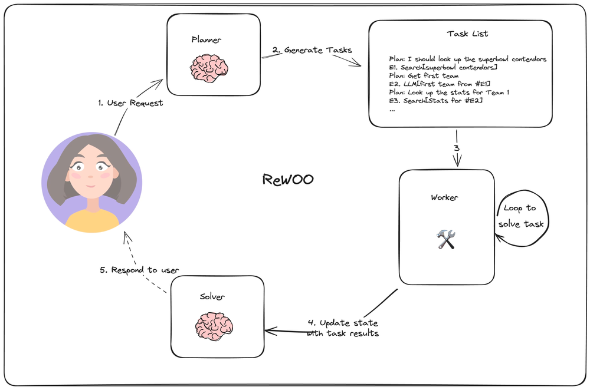

# 一、Agent 实现方式

## 1、ReAct(Reason和Action)

> 参考论文：https://arxiv.org/abs/2210.03629

ReAct：模型推理分成两部分，Reason和Action

- Reason生成分析步骤，Action生成工具调用请求，二者交替进行直到得到最终的结果

### 1.1 简介

- 执行逻辑：
    - 用户给 Agent 一个任务
    - 思考： Agent “思考 “要做什么
    - 行动/行动输入： Agent 决定采取什么行动（又称使用什么工具）以及该工具的输入应该是什么
    - 工具的输出
- 记忆方式：
    - memory：使用传统存储记录输入、输出
    - 步骤记忆：保留一个与该任务相关的中间 Agent 步骤，并将完整的列表传递给LLM调用
- Action Agent 存在的问题：
    - Calculation Error： 由于计算错误带来的回答答案错误；
    - Missing-step Error： 当涉及多个步骤时，有时会遗漏一些中间推理步骤；
    - Semantic Misunderstanding Error：对用户输入问题的语义理解和推理步骤的连贯性方面的其他错误，可能是由于 LLM（语言模型）能力不足导致
- 局限：只适合处理简单场景，不适合处理复杂场景

## 2、plan-and-execute

> 参考论文：https://arxiv.org/abs/2305.04091

让模型先理解问题并制定解决方案的计划

- 执行逻辑：
    - 让模型先理解问题并制定解决方案的计划，解决 Missing-step Error
    - 让模型按步骤执行计划并解决问题，解决 Semantic Misunderstanding Error

## 3、十种Agent规划实现

参考链接：https://liduos.com/llm-agent-planning.html

### 3.1 很重要。。。待补充

# 二、流式处理

## 1、Flowable

### 1.1 核心函数

### 1.2 Flowable(RxJava) 与 Flux(Reactor)

### 1.3 背压

## 2、retrofit

## 3、SSE

# 三、Milvus

## 1、简介

https://blog.51cto.com/liguodong/5110587

Milvus 基于 FAISS、Annoy、HNSW 等向量搜索库构建，核心是解决稠密向量相似度检索的问题

> 在向量检索库的基础上，Milvus 支持数据分区分片、数据持久化、增量数据摄取、标量向量混合查询、time travel 等功能

- **Collection**：包含一组 entity，可以等价于关系型数据库系统（RDBMS）中的表

- **Entity**：包含一组 field，field 与实际对象相对应。field 可以是代表对象属性的结构化数据，也可以是代表对象特征的向量。primary key 是用于指代一个 entity 的唯一值

    > 目前 Milvus 不支持 primary key 去重

- **Field**：Entity 的组成部分，可以是结构化数据，例如数字和字符串，也可以是向量

---

- **Partition**：将收集数据划分为物理存储上的多个部分，每个分区可以包含多个段

- **Segment：Milvus** 在数据插入时，通过合并数据自动创建的数据文件

    > 一个 collection 可以包含多个 segment。一个 segment 可以包含多个 entity
    >
    > 在搜索中，Milvus 会搜索每个 segment，并返回合并后的结果

- **Sharding**：将数据写入操作分散到不同节点上，使 Milvus 能充分利用集群的并行计算能力进行写入

    > 默认情况下，单个 Collection 包含 2 个分片（Shard）
    >
    > 目前 Milvus 采用基于主键哈希的分片方式

- **PChannel**：表示物理信道，每个 PChannel 对应一个日志存储主题

    > 默认情况下，将分配一组 256 个 PChannels 来存储记录 Milvus 集群启动时数据插入、删除和更新的日志

- **VChannel**：表示逻辑通道，每个集合将分配一组 VChannels，用于记录数据的插入、删除和更新。

    > Channels 在逻辑上是分开的，但在物理上共享资源

## 2、架构

整个系统分为四个层次：

- **接入层(Access Layer)**：由一组无状态 proxy 组成，对外提供用户连接的 endpoint，负责验证客户端请求并合并返回结果

- **协调服务(Coordinator Service)**：系统的大脑，负责向执行节点分配任务。它承担的任务包括集群拓扑节点管理、负载均衡、时间戳生成、数据声明和数据管理等

    - **Root coordinator（root coord）**：负责处理数据定义语言（DDL）和数据控制语言（DCL）请求

        > 比如，创建或删除 collection、partition、index 等，同时负责维护中心授时服务 TSO 和时间窗口的推进

    - **Query coordinator (query coord）**：负责管理 query node 的拓扑结构和负载均衡以及从增长的 segment 移交切换到密封的 segment

    - **Data coordinator (data coord）**：负责管理 data node 的拓扑结构，维护数据的元信息以及触发 flush、compact 等后台数据操作

    - **Index coordinator (index coord）**：负责管理 index node 的拓扑结构，构建索引和维护索引元信息

- **执行节点(Worker Node)**：系统的四肢，负责完成协调服务下发的指令和 proxy 发起的数据操作语言（DML）命令

    - **Query node**： Query node 通过订阅消息存储（log broker）获取增量日志数据并转化为 growing segment，基于对象存储加载历史数据，提供标量+向量的混合查询和搜索功能
    - **Data node**： Data node 通过订阅消息存储获取增量日志数据，处理更改请求，并将日志数据打包存储在对象存储上实现日志快照持久化
    - **Index node**： Index node 负责执行索引构建任务，Index node不需要常驻于内存，可以通过 serverless 的模式实现

- **存储服务 (Storage)**： 系统的骨骼，负责 Milvus 数据的持久化

    - 元数据存储（meta store）：负责存储元信息的快照，比如：集合 schema 信息、节点状态信息、消息消费的 checkpoint 等

        > 元信息存储需要极高的可用性、强一致和事务支持，因此，etcd 是这个场景下的不二选择

    - 消息存储（log broker）：是一套支持回放的发布订阅系统，用于持久化流式写入的数据，以及可靠的异步执行查询、事件通知和结果返回

        > 执行节点宕机恢复时，通过回放消息存储保证增量数据的完整性

    - 对象存储（object storage）：负责存储日志的快照文件、标量/向量索引文件以及查询的中间处理结果

        > Milvus 可以基于内存或 SSD 的缓存池，通过冷热分离的方式提升性能以降低成本

## 3、索引

近似最近邻搜索（ANN）算法能够计算向量之间的距离，从而提升向量相似度检索的速度

> ANNS 的核心思想是不再局限于只返回最精确的结果项，而是仅搜索可能是近邻的数据项，即以牺牲可接受范围内的精度的方式提高检索效率

### 3.1 索引类型

#### (1) 基于量化的索引

- `FLAT`：暴力检索，适用于需要 100% 召回率且数据规模相对较小（百万级）的向量相似性搜索应用

    > 对于每一次查询，目标向量会与向量集合中的一条条向量进行距离计算
    >
    > - 训练参数：无需训练
    > - 检索参数：`metric_type` 距离指标，如 L2、IP 等

- `IVF_FLAT`：采用聚类对思想(Faiss)，将向量划分到 nlist 个单元中，对于目标向量，比较与 nlist 个聚类中心的向量的距离，再与前 nprobe个单元的向量进行比较，从而大大减少查询时间

    > - 训练参数：`nlist` 范围 `[1, 65536]`，nlist 推荐 `nlist = 4 * sqrt(512MB / (dim* 4bytes))`
    > - 检索参数：`nprobe` 范围 `[1, nlist]`
    >
    > 适用于追求查询准确性和查询速度之间理想平衡的场景（高速查询、要求高召回率）

- `IVF_SQ8`：相比于 IVF_FLAT，IVF_SQ8 对向量进行了压缩，将Float(4 bytes) 转换为UINT8(1 bytes)，可以节省70%的资源消耗

    > - 训练参数：`nlist` 范围 `[1, 65536]`，nlist 推荐 `nlist = 4 * sqrt(512MB / (dim* 4bytes))`
    > - 检索参数：`nprobe` 范围 `[1, nlist]`
    >
    > 适用于磁盘或内存、显存资源有限的场景（高速查询、磁盘和内存资源有限、接受召回率的小幅妥协）

- `IVF_PQ`：同样使用量化的方法对向量进行压缩，通过将原来的高维向量空间均匀分解为低维向量空间的笛卡尔积

    > 基于IVF_FLAT的一种向量数据有损压缩算法（PQ乘积量化）：PQ先将D维空间切分成M份：类似于将128维空间切分成M个D/M维的子空间，每个子向量进行 k-means 聚类
    >
    > 
    >
    > - 训练参数：
    >     - `nlist` 范围 `[1, 65536]`，nlist 推荐 `nlist = 4 * sqrt(512MB / (dim* 4bytes))`
    >     - `m` 量化因子 `dim mod m == 0`
    > - 检索参数：`nprobe` 范围 `[1, nlist]`
    >
    > 适用于追求高查询速度、低准确性的场景（超高速查询、磁盘和内存资源有限、接受召回率的实质性妥协）

#### (2) 基于图的索引

`HNSW`：分层图索引算法，根据一定的规则为图像构建出一个上层稀疏，下层稠密的多层图索引；检索时从上层开始，向下层迭代

---

HNSW 结构：

- **层级结构**：借鉴了 SkipList 的思想
    - HNSW 索引由多层图组成，底层图密度最高，上层图密度逐层递减。每一层的节点数和连通性不同，顶层节点稀疏且连接数少，底层节点密集且连接数多
    - 这种结构使得在较高层次上快速找到近似位置，然后在较低层次上进行更精细的搜索

- **节点连接**：
    - 每个节点在每层通过最多 `m` 条边连接到其他节点，这些连接通过贪心算法选择，以优化小世界性质，即每个节点能够通过较少的跳跃访问大多数其他节点
    - `m` 值决定了每个节点在每层的连接数，影响图的稠密度和导航效率

- **索引构建**：

    - 在构建索引时，`efConstruction` 控制每次插入新节点时，探索的候选节点数量

        > 较高的 `efConstruction` 值会使新节点与更多的重要节点连接，增强图的连通性

    - 控制的是索引构建过程中，每次插入新节点时探索的候选节点数量，影响的是索引构建时的探索深度和连接质量

        > 这使得在查询时，能够更快速地找到近似邻居，提高查询效率和精度

- **查询过程**：
    - 查询从顶层开始，通过贪心算法找到离查询点最近的节点，然后逐层向下搜索
    - 在每一层，`ef` 控制探索的候选节点数量，确保在每个层次上都能找到较优的节点进行下一步搜索
    - 最终在底层完成精确搜索，通过较高的 `ef` 值，保证找到最接近查询点的节点

---

图层数：由数据集的大小和一个概率参数决定，具体的，图层数与数据集大小成对数关系

- 图层数L的计算与节点数N、自然对数函数以及参数M有关：
    - **最大层级计算**：
        每个新节点在构建索引时，会被分配一个随机层级（height），该层级从0到L-1，其中L是图的最大层数。这个层级是通过一个随机过程决定的，通常使用负对数随机分布
    - **概率分布**：
        在很多实现中，节点被分配到第 k 层的概率大致是 `1 / M^k`。也就是说，随着层级的增加，节点分布的密度迅速减少。高层级的节点数量会少于低层级

- 计算图层数的公式：
    - 假设节点数为N，M为每个节点的最大连接数，图层数L的期望值可以近似表示为：$L = log_M(N)$

---

参数设置：

- 训练参数

    - M 图节点的最大度数 [4, 64]
        - 含义：每个节点在每一层的最大邻居数，或最大边数目

        - 作用：控制节点间的连接数量。较高的 `m` 值会使图的连通性更强，从而提高搜索效率，但会增加索引构建和查询的内存消耗

        - 索引结构影响：主要影响的是索引图的稠密度和内存消耗，以及查询路径的长度和效率

        - 说明：**决定了节点在每层的最大连接数，影响图的连通性和导航效率**

    - efConstruction 搜索范围[8, 512]
        - 含义：在构建索引时，用于控制插入新节点时探索的候选节点数量
        - 作用：影响索引构建的质量和时间。较高的 `efConstruction` 值会增加构建时间和内存使用，但会产生更高质量的索引，即更高的搜索精度和效率
        - 索引结构影响：主要影响的是索引构建过程的复杂性和构建时间，以及最终索引的质量和查询精度
        - 说明：**影响索引构建时的探索深度和时间，较高的值提高索引质量**，并且与召回率正相关
- 检索参数

    - ef 搜索范围 [topk, 32768]
        - 说明：**控制查询时的探索深度，较高的值提高查询精度**
        - 补充：控制搜索精确度和搜索性能，注意 ef 必须大于 K

#### (3) 基于树的索引

`ANNOY`：近似近邻树算法，通过训练多个超平面将高维空间划分到多个子空间，并以树结构存储

> 基于树的索引(1/n棵二叉树)
>
> - 建树时每次选择空间中的两个质心作为分割点，相当于kmeans过程，以使得两棵子树分割的尽量均匀以保证logn的检索复杂度
> - 以垂直于过两点的直线的超平面来分割整个空间，然后在两个子空间内递归分割直到子空间最多只有k个点

- 训练参数：`n_trees` 子空间数量[1, 1024]
- 检索参数：`search_k` 搜索范围，值越大越精确，耗时越长

> 适用于追求高召回率的场景（低维向量空间）

#### (4) 基于量化和图的索引

- RHNSW_FLAT：基于量化和图的索引，高速查询、需要尽可能高的召回率、内存资源大的情景
- RHNSW_SQ：基于量化和图的索引，高速查询、磁盘和内存资源有限、接受召回率的小幅妥协
- RHNSW_PQ：基于量化和图的索引，超高速查询、磁盘和内存资源有限、接受召回率的实质性妥协

#### (5) 标量索引

- **Sorted（STL_SORT）**：
    - 针对整数类型（Int）的排序索引。
    - 通过排序的方式来加快范围查询和精确查询的速度。

- **Tries**：
    - 适用于字符串类型（VARCHAR）的高效前缀匹配和自动补全。
    - 使用前缀树（Trie）结构来组织和索引字符串数据

### 3.2 距离计算公式

| 数据格式   | 距离计算公式                                                 | 索引类型                                                     |
| ---------- | ------------------------------------------------------------ | ------------------------------------------------------------ |
| 浮点型向量 | 欧氏距离 (L2) 内积 (IP)                                  | FLAT IVF_FLAT IVF_SQ8 IVF_PQ HNSW IVF_HNSW RHNSW_FLAT RHNSW_SQ RHNSW_PQ ANNOY |
| 二值型向量 | 杰卡德距离 (Jaccard) 谷本距离 (Tanimoto) 汉明距离 (Hamming) | BIN_FLAT BIN_IVF_FLA                                     |
| 二值型向量 | 超结构 (superstructure) 子结构 (substructure)            | BIN_FLAT                                                     |

浮点型向量主要使用以下距离计算公式：

- 欧氏距离(L2)：主要运用于计算机视觉领域
- 内积(IP)：主要运用于自然语言处理（NLP）领域

---

二值型向量主要使用以下距离计算公式：

- 汉明距离 (Hamming)：主要运用于自然语言处理（NLP）领域
- 杰卡德距离 (Jaccard)：主要运用于化学分子式检索领域
- 谷本距离 (Tanimoto)：主要运用于化学分子式检索领域
- 超结构 (Superstructure)：主要运用于检索化学分子式的相似超结构

- 子结构 (Substructure)：主要运用于检索化学分子式的相似子结构

## 4、一致性与字段类型

### 4.1 一致性

> 分布式数据库必须在一致性、可用性和延迟之间进行权衡；
>
> 当场景中同时存在读写需求时，一致性级别决定用户在某个时间节点能检索访问到的数据试图

在向量数据库中，提供四种一致性级别：

- **Strong，强一致性**；能够保证检索获取的数据是最新版本的数据，但延迟较高
- **Bounded ，有限过期一致性**；允许数据经过一个小的时间段以后达到一致，对召回率影响较小，延迟较低（推荐）
- **Session，会话一致性**；保证在一次会话中，能够读取当前会话中写入的数据
- **Eventually，最终一致性**；不保证读取和写入的顺序，数据最终会收敛到相同状态，延迟最低

### 4.2 字段类型

**For primary key field**:

- DataType.Int64 (numpy.int64)
- DataType.VarChar (VARCHAR)

**For scalar field**:

- DataType.Bool (Boolean)
- DataType.Int8 (numpy.int8)
- DataType.Int16 (numpy.int16)
- DataType.Int32 (numpy.int32)
- DataType.Int64 (numpy.int64)
- DataType.Float (numpy.float32)
- DataType.Double (numpy.double)
- DataType.VarChar (VARCHAR)

**For vector field**:

- DataType.BinaryVector (Binary vector)
- DataType.FloatVector (Float vector)

## 5、性能与数据写入

https://maimai.cn/article/detail?fid=1765325324&efid=CzzPs6txtBrPb4eAR4gspA

> 如果有大量离线写入的场景，建议使用 BulkInsert，原因是 BulkInsert 不会对查询性能造成太大的影响，并且也大大减少了流式写入对消息队列产生的压力

如何合理选择流式还是批式写入呢：

1. 单次写入超过 100MB 以上，建议选择批式写入
2. 希望尽可能减少写入对线上查询的影响，建议选择批式写入
3. 希望写入实时可见，建议选择流式写入
4. 单次写入小于 10MB 以下，建议选择流式写入

在选择好写入方式的基础上，还有几个经验需要关注：

1. 尽可能批量写入，整体吞吐会更高，建议每次写入的大小控制在 10M
2. 单个 Shard 的流式写入量不建议超过 10M/s
3. Datanode 多于 Shard 的情况下，部分 DataNode 可能无法获得负载
4. 导入目前支持的文件大小上限是 1GB，接下来会支持更大的导入文件大小上限
5. 不建议频繁导入小文件，会给 compaction 带来比较大的压力

# 四、rag

## 1、bce

- github：https://github.com/netease-youdao/BCEmbedding/blob/master/README_zh.md
- 技术博客：https://zhuanlan.zhihu.com/p/681370855

## 2、BM25

> BM25 算法是用来计算某一个目标文档(Doc)相对于一个查询关键字(Query)的“相关性”，
>
> BM25 是“非监督学习”排序算法中的一个典型代表，这里的“非监督”是指所有的文档相对于某一个查询关键字是否相关

经典的 BM25 分为三个部分：

1. 单词和目标文档的相关性
2. 单词和查询关键词的相关性
3. 单词的权重部分

这三个部分的乘积组成某一个单词的分数，然后，整个文档相对于某个查询关键字的分数，就是所有查询关键字里所有单词分数的总和

文档：https://juejin.cn/post/7012533060398743583

# 五、vllm

# 六、可视化编排

参考 dify 框架：

- 官网：https://dify.ai/zh
- github：https://github.com/langgenius/dify/blob/main/README_CN.md

# 七、多模态支持

