# 一、框架基础类搭建

> 说明：框架的基础类参照 langchain 的设计理念进行搭建

## 1、prompt 相关

### 1.1 架构设计

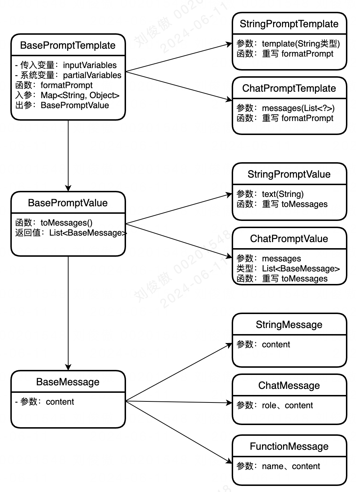

### 1.2 测试案例

- **StringPromptTemplate 测试案例**：

```java
StringPromptTemplate promptTemplate = StringPromptTemplate.fromTemplate(
                        "What is a good name for a company that makes {product}?");

BasePromptValue value = promptTemplate.formatPrompt(MapUtils.of("product", "colorful socks"));

System.out.println(value.toMessages().get(0).getContent());
```

- **ChatPromptTemplate 测试案例**：

```java
String template = "You are a helpful assistant that translates {input_language} to {output_language}.";
StringPromptTemplate systemMessagePrompt = StringPromptTemplate.fromTemplate(template);

String humanTemplate = "{text}";
StringPromptTemplate humanMessagePrompt = StringPromptTemplate.fromTemplate(humanTemplate);

ChatPromptTemplate chatPrompt = ChatPromptTemplate.fromMessages(
                    Lists.newArrayList(systemMessagePrompt, humanMessagePrompt));

BasePromptValue output = chatPrompt.formatPrompt(
                MapUtils.of("input_language", "English", 
                            "output_language", "French", 
                            "text", "I love programming."));

System.out.println(output.toMessages());
```

## 2、LLM 相关

### 2.1 架构设计

> 补充：LLMResult 的 generations 为 List 是因为一次调用模型可以返回多个值，比如：openAI 的入参 `n`

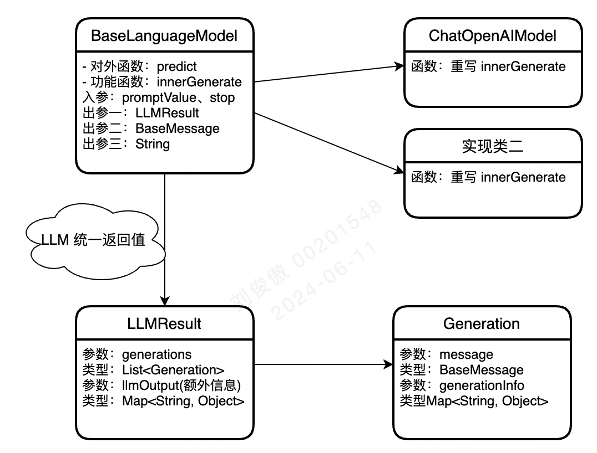

### 2.2 测试案例

- 返回 LLMResult 案例：

```java
String template = "You are a helpful assistant that translates {input_language} to {output_language}.";
StringPromptTemplate systemMessagePrompt = StringPromptTemplate.fromTemplate(template);


String humanTemplate = "{text}";
StringPromptTemplate humanMessagePrompt = StringPromptTemplate.fromTemplate(humanTemplate);


ChatPromptTemplate chatPrompt = ChatPromptTemplate.fromMessages(
                    Lists.newArrayList(systemMessagePrompt, humanMessagePrompt));


BasePromptValue chatPromptValue = chatPrompt.formatPrompt(
                MapUtils.of("input_language", "English", 
                            "output_language", "French", 
                            "text", "I love programming."));


ChatOpenAIModel model = new ChatOpenAIModel();
LLMResult llmResult = model.predictInfo(chatPromptValue, null);
System.out.println();
System.out.println(JSON.toJSONString(llmResult));
```

结果：

```json
{
    "generations": [
        {
            "generationInfo": {
                "finishReason": "stop"
            },
            "message": {
                "content": "J'adore programmer.",
                "role": "assistant"
            }
        }
    ],
    "llmOutput": {
        "token_usage": {
            "completion_tokens": "6",
            "prompt_tokens": "26",
            "total_tokens": "32"
        },
        "model_name": "gpt-4"
    }
}
```

- 返回 BaseMessage 案例：

```java
String template = "You are a helpful assistant that translates {input_language} to {output_language}.";
StringPromptTemplate systemMessagePrompt = StringPromptTemplate.fromTemplate(template);

String humanTemplate = "{text}";
StringPromptTemplate humanMessagePrompt = StringPromptTemplate.fromTemplate(humanTemplate);


ChatPromptTemplate chatPrompt = ChatPromptTemplate.fromMessages(
                    Lists.newArrayList(systemMessagePrompt, humanMessagePrompt));

BasePromptValue chatPromptValue = chatPrompt.formatPrompt(
                MapUtils.of("input_language", "English", 
                            "output_language", "French", 
                            "text", "I love programming."));

ChatOpenAIModel model = new ChatOpenAIModel();
BaseMessage predictMsg = model.predict(chatPromptValue);
System.out.println();
System.out.println(JSON.toJSONString(predictMsg));
```

结果：

```json
{
    "additionalKwargs": {
        
    },
    "content": "J'aime la programmation.",
    "role": "assistant"
}
```

- 返回 String 案例：

```java
String template = "You are a helpful assistant that translates {input_language} to {output_language}. {text}";
StringPromptTemplate promptTemplate = StringPromptTemplate.fromTemplate(template);
BasePromptValue value = promptTemplate.formatPrompt(
                MapUtils.of("input_language", "English", 
                            "output_language", "French", 
                            "text", "I love programming."));
String str= value.toMessages().get(0).getContent();
System.out.println(str);

ChatOpenAIModel model = new ChatOpenAIModel();
String predictStr = model.predict(str);
System.out.println();
System.out.println(predictStr);

//输出：
You are a helpful assistant that translates English to French. I love programming.

J'aime la programmation.
```

## 3、output-parser & tool 相关

### 3.1 output-parser 架构设计

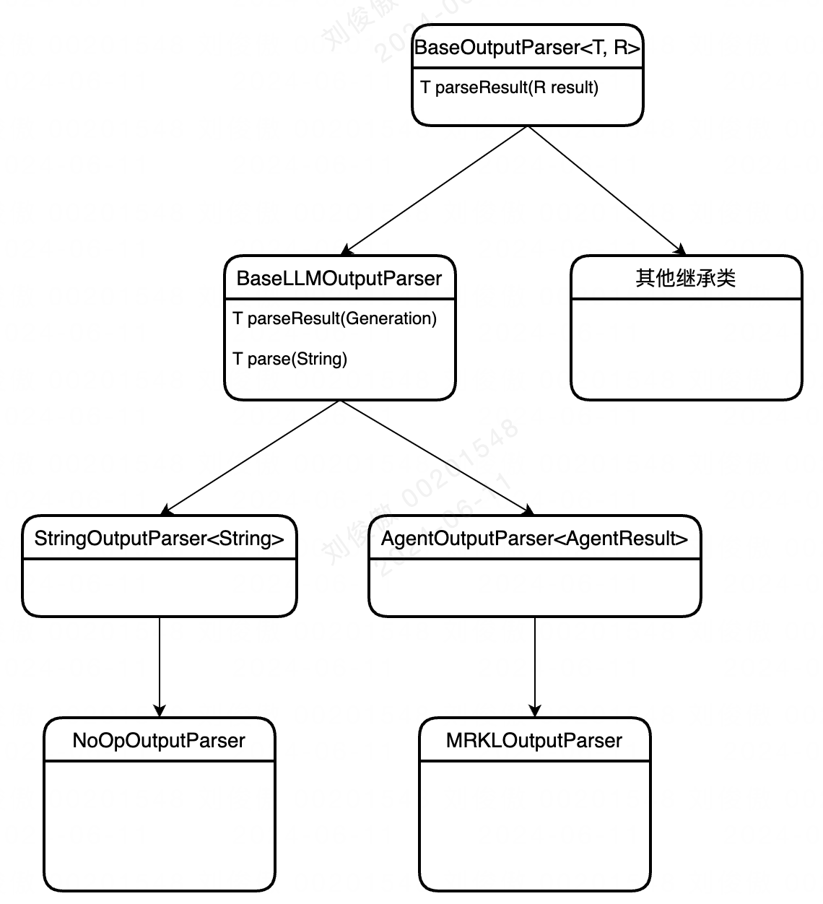

### 3.2 tool 架构设计

> 补充：现阶段的内部字段设计不能很好的兼容普朗克，后续需要微调

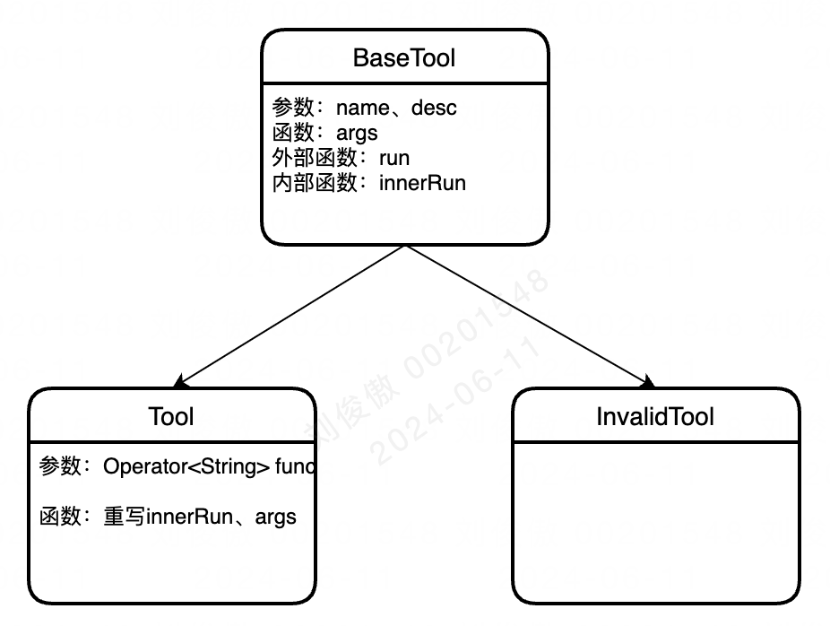

## 4、Chain 相关

> 补充：需要调用 llm 的相关操作实现类都需要继承 Chain
>
> 目的：统一&简化调用，即不论如何实现，调用时只需要 chain.run 即可

### 4.1 架构设计

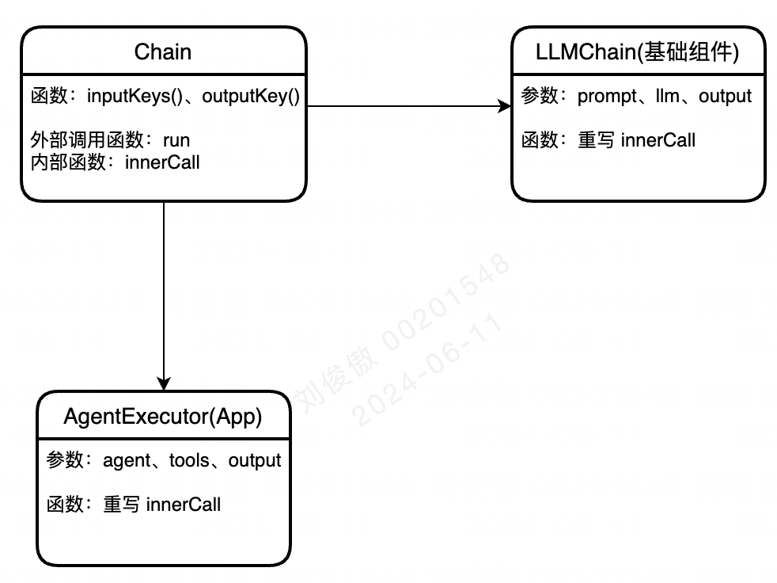

### 4.2 测试案例

```java
String template = "You are a helpful assistant that translates {input_language} to {output_language}.";
StringPromptTemplate systemMessagePrompt = StringPromptTemplate.fromTemplate(template);

String humanTemplate = "{text}";
StringPromptTemplate humanMessagePrompt = StringPromptTemplate.fromTemplate(humanTemplate);

ChatPromptTemplate chatPrompt = ChatPromptTemplate.fromMessages(Lists.newArrayList(systemMessagePrompt, humanMessagePrompt));

ChatOpenAIModel model = new ChatOpenAIModel();
LLMChain llmChain = new LLMChain(model, chatPrompt);
String run = llmChain.run(MapUtils.of(
                    "input_language", "English", 
                    "output_language", "French", 
                    "text", "I love programming."));

System.out.println(run);
//输出：J'adore programmer.
```

## 5、agent 相关

### 5.1 架构设计

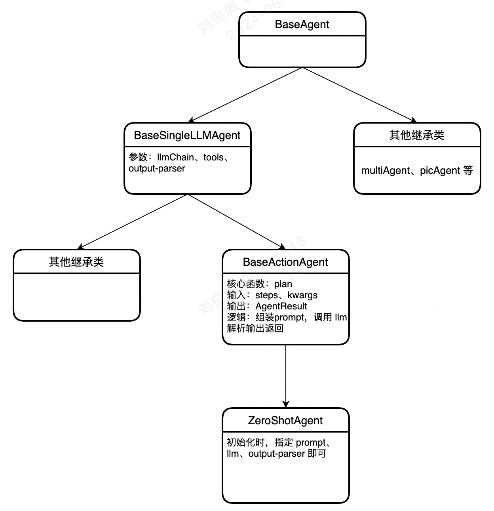

### 5.2 测试案例

```java
ChatOpenAIModel model = new ChatOpenAIModel();

Tool tool = new Tool("Calculator", 
                    "Useful for when you need to answer questions about math.",
                    s -> {
                        LLMMathChain chain = new LLMMathChain(model);
                        return chain.run(s);
                    });

ZeroShotAgent agent = new ZeroShotAgent(
                                model, 
                                Lists.newArrayList(tool), 
                                Maps.newHashMap());

AgentExecutor executor = new AgentExecutor(agent, Lists.newArrayList(tool));

String query = "What is that 200 raised to the 0.023 power?";
String run = executor.run(query);
System.out.println(run);
```


# 二、整体框架搭建

## 1、整体架构脉络

### 1.1 架构图

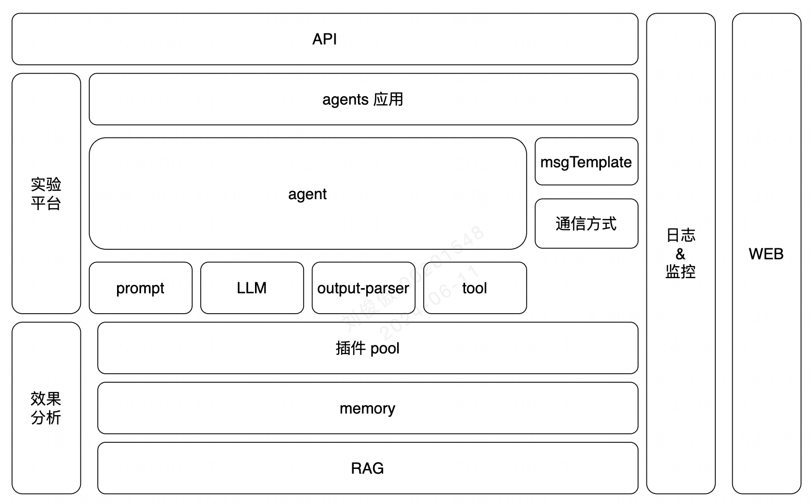

### 1.2 数据流程图

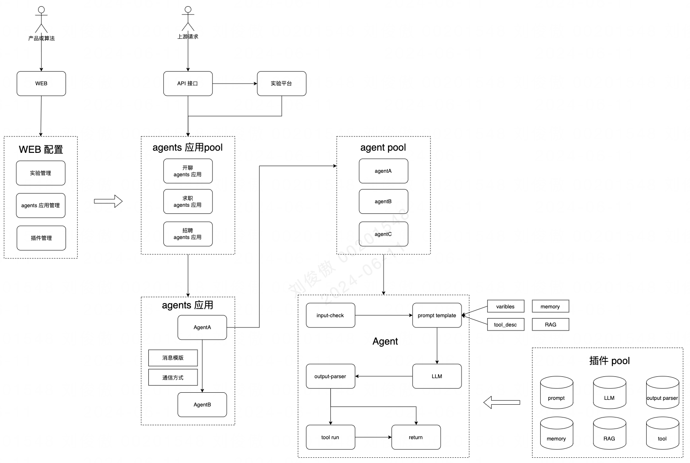

### 1.3 系统详细流程图

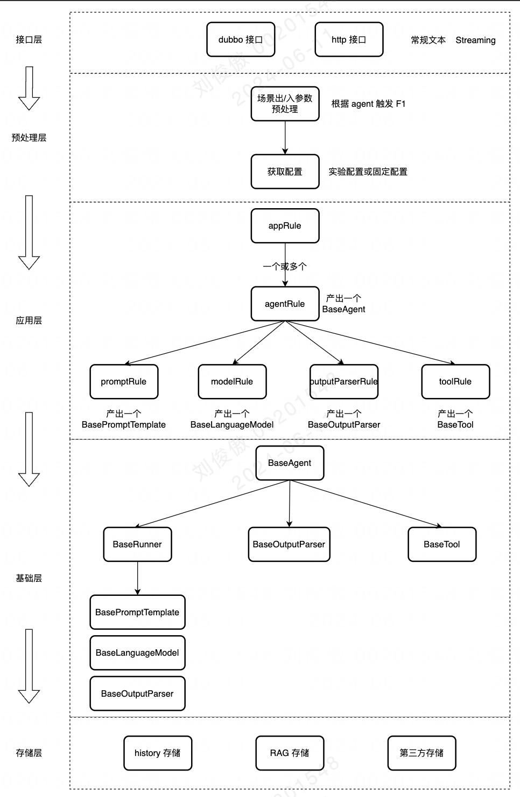

### 1.4 特别说明

#### (1) 基础层

基础层对于 prompt、model、output-parser、tool 都提供了最基础的封装，无需场景开发人员关注；

- prompt 提供了 openAI 格式的 chat 和 llm 格式的 string 基础类，如果有新的模型格式，只需要新增一个新的 prompt 基础类即可；
- model 提供了调用 openai 和公司内 model 的基础类（http方式），因此基本不需要增加新的基础类；
- output-parser 提供了 openAI 格式的 chat 和 llm 格式的 string 的基础类，如果需要新的输出解析，只需要添加新的继承实现类即可；
- tool 是一个基本的 pojo 类型，包含 name、description、parameter；
- runner：仅支持调用模型并返回，由 prompt、model、output-parser 组成；
- agent：除了调用模型，还支持调用 tool，由 runner、output-parser、tools 组成；

#### (2) 应用层

应用层对于 prompt/model/output-parser/tool/agent/app 都提供了插件通用实现，且支持第三方开发新的插件；

- promptRule：根据用户输入和预设逻辑产出一个 promptTemplate

> - template 方面：支持通过配置来指定 system 和 user 模版；
> - variables 方面：支持用户通过配置传入指定参数、支持系统内部数据的预设参数、history 等固定参数；
> - token 截取方面：提供了几种通用的 token 计算方式(可新增)，可通过参数来指定，且 max_token 也可指定；

- modelRule：模型调用默认为 http 方式，因此根据用户输入和预设逻辑产出 httpReq 和 respConvert 逻辑即可；

> - httpReq 方面：指定 url、model、key、temperature、max_token 等
> - respConvert 方面：以 openAI 为例，先截取 "data:"，再获取 choice -> messages -> content 等

- outputParserRule：将模型的返回值转换为 AgentFinish 和 AgentAction

> - AgentFinish：包含返回值和额外日志数据
> - AgentAction：包含 name、args、日志数据，可用于指导调用 tool

- toolRule：函数 schema 指定函数信息、函数 functionCall 负责触发逻辑的执行
- agentRule：由上面的 prompt/model/output-parser/tools 生成一个 BaseAgent，触发 agent 执行后，可按需要添加一些额外的补充逻辑；

> - 获取 agent 返回值后，触发 tool 的执行；
> - 获取 agent 返回值后，直接返回；
> - 获取 agent 返回值后，进行一些状态和额外数据的组装和处理等；

- appRule：由一个或多个 agent 组成，多个 agent 间的调用方式(串行、广播等)均可按需实现；

#### (3) 预处理层

预处理层提供了通用的出/入参的通用逻辑，并且配置方式提供了实验和固定配置的方式

- 出/入参的处理：入参校验、出参额外处理等；
- 获取配置：支持实验方式、json 文件的固定配置；

#### (4) 额外说明

- 历史消息：history 存储提供了一个可重写的函数，既可以使用系统提供的存储，也可以采用第三方的个性化存储，只需要满足 BaseMessage 的存储格式即可；

- 系统同时提供了常规文本和 streaming 方式的接口，可以按需调用，且同时支持 dubbo 和 http 的调用方式；

- 基础层和应用层的区别：

- - 基础层：将整个大模型执行所需的组件和过程规范化，实现了只需要提供相应的组件即可调用大模型并返回；

    - - 规范化组件：prompt、model、output-parser 等；
        - 规范化过程：prompt template 与 variables 的组装、model 的调用、agent 的执行；

    - 应用层：根据不同场景的需求进行各种个性化逻辑；

    - - 个性化生成组件：promptRule、modelRule 等；
        - 个性化执行逻辑：拿到 agent 返回结果后，再进行一些个性化处理、多个 agent 间的交互处理等；

    - 特别概念说明：ruunner、agent、agent 执行器

    - - runner：通过 prompt 调用 model 拿到返回值，并通过 output-parser 解析后返回；
        - agent：拿到 model 的返回值后，还可以进行判断，是直接返回 string，还是可以调用 tool；
        - agent 执行器(agentRule)：调用 agent 之后，还可以执行额外的步骤，比如：ReAct、autoGPT 等

## 2、场景接入说明

### 2.1 模型与逻辑评估

- 评估新场景的模型格式：现阶段 llm 的 string 格式和 openAI 的 chat 格式是否能支持；

> 如果不能支持，则需要增加新格式的基础类

- 评估现有的插件逻辑：现有的 prompt、model、output-parser、tools、agent 等插件是否存在可以复用的；
- 评估配置接入方式：是使用实验方式，还是固定配置方式；

### 2.2 逻辑开发

- 开发对应的预处理层逻辑；
- 开发对应的 appRule 逻辑；
- 开发对应的 agentRule、promptRule、modelRule、output-parserRule、toolRule 等逻辑；

# 三、RAG搭建

## 1、架构设计

### 1.1 数据 embedding 逻辑

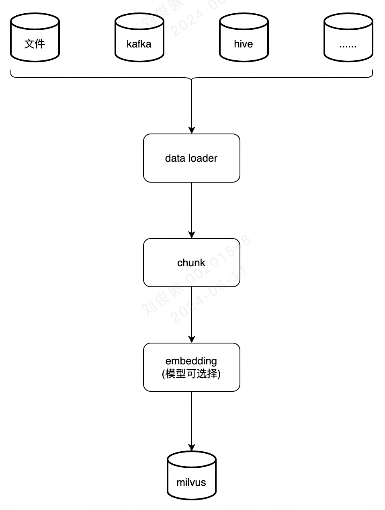

### 1.2 数据 retrieval 逻辑

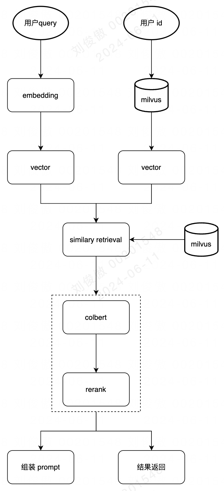

### 1.3 存储与模型选择

- **milvus 存储**：使用tcloud提供的向量数据库

- - 接入文档：[https://tcloud-doc.kanzhun.tech/docs/category/%E5%90%91%E9%87%8F%E6%95%B0%E6%8D%AE%E5%BA%93](https://tcloud-doc.kanzhun.tech/docs/category/向量数据库)

- **embedding 模型**：选用网易有道的 bce embedding

- - github：https://github.com/netease-youdao/BCEmbedding/blob/master/README_zh.md
    - huggingface：https://huggingface.co/maidalun1020/bce-embedding-base_v1

- **colbert 模型(按需选择，可选)**：选用斯坦福的 colbert-v2

- - github：https://github.com/stanford-futuredata/ColBERT
    - hugginface：https://huggingface.co/colbert-ir/colbertv2.0

- **rerank 模型**：默认选择网易有道的 bce rerank，可根据需要进行替换

- - github：https://github.com/netease-youdao/BCEmbedding/blob/master/README_zh.md
    - hugginface：https://huggingface.co/maidalun1020/bce-reranker-base_v1

## 2、系统实现

整个系统拆分为四个模块：

- **核心模块**：实现上采取模块化 + 策略化的方式实现

- - **embedding**：

    - - 阶段拆分：整个逻辑切分为 dataLoader、chunk、embedding、store 等阶段，每个阶段都提供了一个通用的实现类，同时也支持使用方来自定义实现类；
        - strategy：strategy 是上述阶段的一个整体包装实现，可根据实际应用场景需要进行插拔替换；

    - **retrieval**：提供多种不同的 milvus 检索函数，如：id 精确查询、vector 相似查询、标量查询等；

- **embedding 离线更新模块**：数据加载部分由 spark 查询 hive 来提供，后续计算则直接运行核心模块提供的 strategy 即可；

- **embedding 实时更新模块**：数据加载部分由监听 binlog 的 kafka 来提供，后续计算同“embedding 离线更新模块”，直接运行核心模块提供的 strategy 即可；

- **retrieval 应用模块**：在所需场景的服务中直接引入核心模块，按需调用其提供的 retrieval 接口即可；