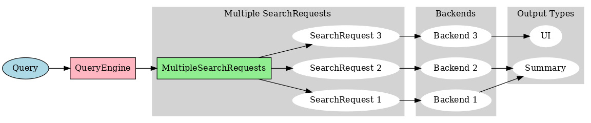

# 一、RAG混合检索调研

> RAG 的核心点：数据检索的准确性、prompt 增强的有效性、影响模型回答的正确性

## 1、论文

[[翻译\]大语言模型的检索增强生成技术（RAG）综述](https://www.zuogang.li/翻译大语言模型的检索增强生成技术（rag）综述/)

## 2、RAG 与微调的关系


## 3、RAG 的三个阶段

### 3.1 初级 RAG（**Naive RAG**）

- 流程：
    - 构建索引
    - 检索：进行向量相似检索，并返回 topK
    - 生成：将 topK 的数据块增装进 prompt 进行模型生成
- 局限性：
    - 检索方面：
        - 检索到的信息块可能并非都与查询内容相关联
        - 召回率可能不够，即相关的信息块有遗漏
    - prompt 增强方面：如何有效地将检索到的文本段落中的上下文与当前的生成任务结合起来

### 3.2 高级 RAG（Advanced RAG）

> 融合了预检索和检索后处理的技术

- 预检索优化方向：采用滑动窗口技术、更细致的内容分段以及元数据优化等方法来改善索引效率
    - 提高索引数据的细致程度：提升文本的规范化、统一性，并确保信息的准确无误和上下文的充分性
    - 改进索引结构的设计：尽可能地收集相关上下文并减少无关信息的干扰
    - 增加元数据信息：增加类如日期、用途、章节、小节等
    - 进行对齐方式的优化：解决文档间的不一致和对齐问题（没懂这个的影响是啥？？？）
    - 实施混合式检索策略：集成关键词搜索、语义搜索以及向量搜索等多种方法
- 检索后优化方向：
    - 增加 rerank 重排：优先考虑文档的差异性来进行重新排序、交替地把最优文档放在最前面和最后面、rerank模型
    - 增加 doc 的分解与压缩：将文档按某些层级进行分解和摘要提取，然后再计算相关性（rerank）

### 3.3 多模态 RAG

> 融合了多种方法来增强功能模块，比如在相似性检索中融入搜索模块，并在检索器中采用微调策略

- 搜索模块：搜索数据源涵盖了从搜索引擎、文本数据、表格数据到知识图谱等多种类型
- 记忆模块：利用记忆能力来引导检索（如何落地场景或落地实现？？？）
- 补充生成模块：通过大模型来进行摘要提取生成上下文，解决检索数据的冗余和噪声问题
- 任务适配模块：提升 rag 对于不同场景的适用性
- 查询文本对齐增强模块：解决数据对齐问题
- 验证模块：评估检索到的文档与查询请求之间的相关性


## 4、框架--LLamaIndex

### 4.1 简介

**LlamaIndex** 是一个专注于与大型语言模型（LLMs）集成的数据索引和检索框架。其主要目的是通过智能数据索引和查询，使得大型语言模型可以更有效地访问和利用外部数据

关键特性：

1. **数据索引**：LlamaIndex 可以构建复杂的数据索引，适用于不同类型的数据，包括文档、数据库记录等。
2. **与LLMs的集成**：设计的重点是与大型语言模型（如GPT-4）集成，以提供增强的数据访问和回答能力。
3. **查询优化**：通过优化查询，使得语言模型可以更高效地从大量数据中提取有用的信息。
4. **应用场景**：通常用于需要与自然语言处理（NLP）模型紧密合作的应用，如智能问答系统、文档理解和分析等。

### 4.2 详细研究

github：https://github.com/run-llama/llama_index

研究中，待完善。。。

## 5、混合检索方式

### 5.1 向量检索


### 5.2 词频检索


# 二、提高RAG效果的方案

## 1、方案一：对query预处理再进行检索

参考：https://liduos.com/how-to-improve-llm-rag-accuracy-and-recall.html



- 将自然语言查询通过大语言模型转换为优化后的自定义查询语句，最终能够高效理解达到提高准确性和召回率的目的

## 2、方案二：动态上下文窗口

参考：https://liduos.com/rag-optimisation-implementation-scheme.html

> 动态上下文窗口的方案：能够处理大规模文档，保留重要的上下文信息，提升检索效率，同时保持灵活性和可配置性

整体方案：

> 首先在小文档块中进行粗略检索，然后在特定的源文档中进行更精确的检索，最后在中等文档块中进行最终的检索

- 文档预处理阶段实现满足上下文窗口的原始文本分块
    - **小文本块拆分**：以 `50 token`大小（可根据自身文档之间的组织规律动态调整粒度）对文本做首次分割
    - **添加窗口**：以步长为 3，窗口大小为 6，将上述步骤的小块匹配到不同的上下文窗口
    - **中等文本块**：以小文本块 3 倍（可动态配置），即`150 token`大小对文本做二次分割，形成中等文本块
- 文档检索阶段实现文本的三次检索
    - **第一阶段：小分块检索**：
        - 使用小文档块(docs_index_small)和小嵌入块(embedding_chunks_small)初始化一个检索器(first_retriever)
        - 使用这个检索器检索与查询相关的文档，并将结果存储在 first 变量中
        - 对检索到的文档 ID 进行清理和过滤，确保它们是相关的，并存储在 ids_clean 变量中
    - **第二阶段：移动窗口检索**
        - 针对每个唯一的源文档，使用小文档块检索与该源文档相关的所有文档块
        - 使用包含这些文档块的新检索器(second_retriever)，再次进行检索，以进一步缩小相关文档的范围，将检索到的文档添加到 docs 列表中
    - **第三阶段：中等分块检索**
        - 使用过滤条件从中等文档块(docs_index_medium)检索相关文档，使用包含这些文档块的新检索器(third_retriever)进行检索
        - 从检索到的文档中选择前 third_num_k 个文档，存储在 third 变量中
        - 清理文档的元数据，删除不需要的内容，将最终检索到的文档按文件名分类，并存储在 qa_chunks 字典中

---

**优势**：

- 处理大规模文档
- 保留上下文信息
- 提升检索效率
- 灵活性和可配置性
- 支持多种检索策略

**不足**：整体的响应效率需要优化


# 三、RAG评估调研

## 1、论文

[《在 RAG 中对大语言模型进行基准测试》](https://arxiv.org/abs/2304.09848)

## 2、评估方法

### 2.1 黑盒评估

#### (1) 简述

黑盒方式是一种端到端的评估方式，看不到 RAG 应用的内部，只能从输入给 RAG 应用的信息和返回的信息来评估 RAG 的效果

- 用户提问（User's query）
- RAG 系统召回的引用上下文（retrieved contexts）
- RAG 系统的回答（RAG's response）


三个对应的指标得分：

- **Context Relevance**：衡量召回的 Context 能够支持 Query 的程度，该得分低表示召回太多与 Query 问题无关的内容
- **Faithfulness**：衡量生成的答案在给定的上下文中的事实一致性，该得分低表示 LLM 的回答不遵从召回的知识，那么回答出现幻觉的可能就越大
- **Answer Relevance**：侧重评估生成的答案与给定查询提示的相关性，该得分低表示答案不完整或包含冗余信息

#### (2) 如何定量计算这些指标

参考论文：[LLM-as-a-Judge](https://arxiv.org/abs/2306.05685) ，即使用 LLM 作为裁判来进行打分

案例：使用 GPT-4 进行打分

- 提问：

    ```shell
    There is an existing knowledge base chatbot application. I asked it a question and got a reply. Do you think this reply is a good answer to the question? Please rate this reply. The score is an integer between 0 and 10. 0 means that the reply cannot answer the question at all, and 10 means that the reply can answer the question perfectly.
    
    Question: Where is France and what is it’s capital?
    Reply: France is in western Europe and Paris is its capital.
    ```

- 答案：

    ```
    10
    ```

#### (3) 生成 question 和 ground-truth

> ground-truth 是人类写好的可以回答对应提问的标准回答

**Answer Correctness**：定义 Ground-truth 和 Response 之间指标，用来衡量 RAG 回答的正确性


可以使用 **ragas 的 Synthetic Test Data generation 和 llama-index 的 QuestionGeneration** 来生成 question 和 ground-truth


### 2.2 白盒评估


#### (1) 评估 embedding model 和 rerank model

信息检索召回领域的常用指标：

> 考虑排名的指标：对于召回有 ground-truth 的文档，在所有召回文档中的排名是敏感的，即改变召回的所有文档之间的相关顺序，会使得这个指标得分发生变化
>
> 而不考虑排名的指标则与之相反
>
> 
>
> 比如在上图中，假设 RAG 应用召回了 top_k=5 个文档，其中，A、C 和 E 文档是 ground-truth。A 文档排名为1，它的相关性得分最高，并且得分向右依次减小。
>
> 如果 B 和 C 文档调换了位置，那么考虑排名的指标得分就会发生变化，而不考虑排名的指标的得分则不会发生变化

- **考虑排名的指标**：
    - **平均精确率（AP）**：测量检索到的所有相关块并计算加权分数，数据集上的AP的平均值通常被称为MAP
    - **倒数排名（RR）**：测量您的检索中第一个相关块出现的位置，数据集上的RR的平均值通常被称为MRR
    - **归一化折扣累积增益（NDCG）**：考虑了相关性分类非二元的情况
- **不考虑排名的指标**：
    - **上下文召回率(Context Recall)**：系统完整地检索到了所有必要的文档的程度
    - **上下文精确率(Context Precision)**：系统检索到的信号（与噪音相比）的程度

---

##### MTEB

- [MTEB的论文](https://arxiv.org/abs/2210.07316)

- MTEB 涵盖了 8 个嵌入任务，包括双语挖掘(Bitext Mining)、分类、聚类、成对分类、重新排序、检索、语义文本相似度(STS)、摘要

- 对于 Embedding 模型，`NDCG` 是最重要的指标

    对于 Rerank 模型，`MAP` 是最重要的指标

#### (2) 评估 LLM

生成过程可以直接使用上文介绍过的由 Context 到 Response 这一步的 LLM-based 的指标，即 **Faithfulness 来评估**

- 对于简单的 query，比如标准答案只有简单短语，可以使用一些经典的指标
    - `ROUGE-L Precision`：测量生成的答案和检索到的上下文之间的最长公共子序列
    - `Token Overlap Precision`：计算生成的答案和检索到的上下文之间 token overlap 的精度


## 3、评估框架

### 3.1 RAGAs

#### (1) 简介

**RAGAs** 是一种架构，它结合了信息检索（IR）和生成模型（如GPT-4），以增强生成模型的性能。其主要目的是通过从外部知识库中检索相关信息，并将其与生成模型结合，使生成的文本更准确和有信息量

关键特性：

1. **检索增强生成**：RAGAs 在生成文本之前，会先从外部数据源中检索相关信息。这些信息被用来辅助生成模型，提高生成结果的准确性和相关性。
2. **结合检索和生成模型**：RAGAs 典型地包括两个主要组件：一个信息检索模块和一个生成模块。检索模块负责从大规模知识库中找到相关信息，生成模块则利用这些信息生成最终的输出。
3. **应用场景**：广泛应用于需要高准确性和丰富内容的生成任务，如复杂问答系统、对话系统、内容创作等

#### (2)详细研究

github：https://github.com/explodinggradients/ragas

RAGAs使用案例：

- https://www.luxiangdong.com/2024/02/22/advrag3/

- https://liduos.com/how-to-evaluate-rag-application.html