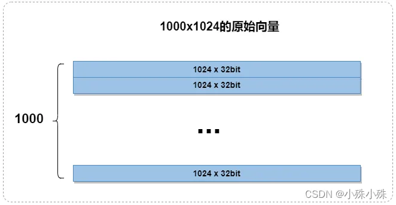
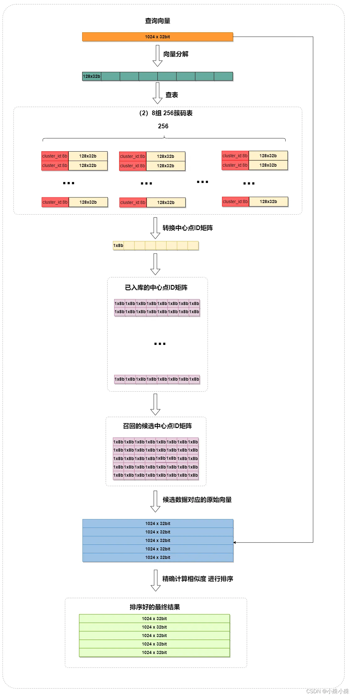
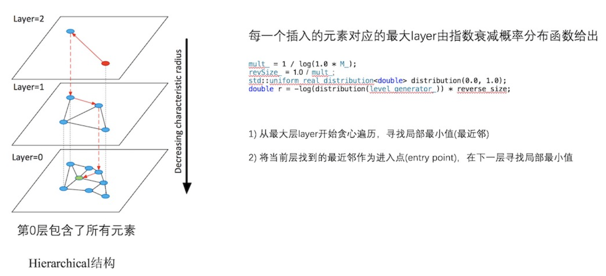

Faiss 基础索引类型：https://github.com/facebookresearch/faiss/wiki/Faiss-indexes

# 一、Faiss 简介

Faiss 主要用于以下几个方面：**索引与量化器**

## 1、索引类型

Faiss 提供了多种算法和索引结构来实现高效的最近邻搜索，主要包括：

- **Flat 暴力索引**：采用暴力搜索方法，逐一计算查询向量与所有向量的距离，找到最近邻

    > 计算量较大，适合数据量较小的情况

- **IVF 倒排索引**：通过将向量空间划分为多个簇，每个簇对应一个倒排文件，从而减少搜索空间

    > 适用于大规模数据集

- **HNSW 图索引**：基于小世界图的索引结构

    > 适用于大规模和高维数据集

- **LSH 哈希索引**：通过哈希函数将相似的向量映射到相同的桶中，从而减少搜索空间

    > 适用于高维数据集的近似最近邻搜索

- **KD-Tree 和 Ball-Tree 索引**(非 Faiss 内置索引)：通常用于低维数据集的最近邻搜索

    - `KD-Tree`：一种基于二叉树的数据结构，通过递归地将数据集划分为两个子集，形成树结构，从而减少搜索空间

        > 适用于低维数据集的最近邻搜索

    - `Ball-Tree`：类似 KD-Tree，其使用超球体（ball）来划分空间，更适用于高维数据集

## 2、量化器

- SQ(标准量化)
- PQ(乘积量化)
- RQ(残差量化)
- LSQ(局部检索量化)
- AQ(加法量化)

# 二、常用距离

## 1、L2 距离(欧氏距离)

用于衡量两个向量之间的空间距离

- 在二维空间中，L2距离可以通过勾股定理计算得出，即两点之间的直线距离

- 在多维空间中，L2距离表示为两个向量之间每个对应维度差值的平方和的平方根

$$
L2(A, B) = \sqrt{\sum^n_{i=0}(A_i - B_i)}
$$

## 2、IP(内积)

内积（点积）和余弦相似度经常用于衡量向量之间的相似性，余弦相似度基于向量的方向来度量，而不是长度
$$
A * B = \sum^n_{i=1}A_iB_i
$$

## 3、内积和余弦相似度

要在 Faiss 中使用余弦相似度，通常需要将向量进行归一化处理，然后使用内积计算余弦相似度

 取值范围 `[-1, 1]`，值越接近 1 表示向量越相似
$$
cos \quad similerity(A, B) = \frac{A * B}{||A|| \quad ||B||}
$$

## 4、余弦距离

余弦距离定义为余弦相似度的一个变形，通常用于衡量向量之间的不相似度

取值范围 `[0, 2]`，越接近0距离越近
$$
cos \quad distance(A, B) = 1 - cos \quad similarity(A, B)
$$

## 5、汉明距离


# 三、量化器

- **标准量化**：直接将向量离散化，不变维度；
- **乘积量化**：将向量分段，然后对每段进项单独量化；
- **加法量化**：将完整的向量拆分成多级向量（维度与原始向量相同）的和，对每级进行量化

## 1、SQ(标量量化)

> 参考文档：https://yongyuan.name/blog/scalar-quantization.html

标量量化：将向量分成若干个区间，然后将每个区间映射到一个离散的数值用对数据直接量化

比如：数据是1000x1024按照 8bit 量化，假设每个维度的取值范围是0到1000

- 先根据维度分成1024组，每组划分为个级别，每个级别代表4（1000/256）
- 最终向量中的值将被分配到所在组的256个级别中的一个，得到量化结果

> 注意：在检索的时候faiss.IndexScalarQuantizer还会遍历所有数据，然后对筛选出的数据计算精确的距离，时间复杂度很高，所以实际中不要使用faiss.IndexScalarQuantizer，可以使用faiss.IndexIVFScalarQuantizer

---

Scalar Quantization标量量化，分为3个过程：

- training过程：主要是训练 encode 过程，需要的参数主要是每 1 维对应的最大值、最小值；
- encode过程：将 float 向量量化为 int8 向量
- decode过程：将 int8 向量解码为 float 向量


- training过程：从样本中随机采样出 N 个样本后，训练过程主要是得到 N 个样本中每 1 维的最大值、最小值

    > 得到最大值、最小值后，将它们保存下来即可。实际在训练的时候，N能大的时候，尽量大点

- encode过程：对于一个 d 维的待编码的 float 型向量 `x = {x_1, x_2, …., x_d}`，过程如下：

    - 对每 1 维，求 `value_i = (x_i - min_i) / (max_i - min_i)`；

    - 对每 1 维，如果 `value_i < 0`，则 `value_i` 重置为 `value_i=0`；

        如果 `value_i > 1`，则 `value_i` 重置为 `value_i=1`

        > 理论情况下，不会出现 `value_i < 0` 或 `value_i > 1`

    - 对每 1 维，对应的编码 `code_i = int(255 * value_i)`。为什么是255？可以思考下；

- decode过程：对每 1 维，`x_i = min_i + (code_i + 0.5) * (max_i - min_i) / 255`，通过该式子，即可完成对第 i 维的解码

## 2、PQ(乘积量化)

> 参考文档：https://yongyuan.name/blog/vector-ann-search.html

- PQ是一种用于高维向量压缩和相似性搜索的技术，特别适用于大规模向量数据集的近似最近邻搜索

- PQ 将高维向量分解为多个子空间，并对每个子空间进行独立的向量量化，从而实现高效的向量压缩和搜索

### (1) PQ量化

量化过程有如下3个步骤：

1. 向量分解：将原始高维向量分解为多个子向量，每个子向量属于一个子空间
2. 子空间量化：对每个子空间进行独立的向量量化，将连续的向量空间划分为离散的子空间
3. 编码：将原始向量编码为子空间的离散码字，以表示原始向量在每个子空间中的位置

---

案例：

- 数据集是一个1000x1024的矩阵，每个向量维度1024

    

- **向量分解**：先将每个1024维的向量平均分成8个128维的子向量

    

- **子空间量化**：然后对这8组子向量分别使用 k-means 聚成256类(8位表示)

    - 下图中（1）竖着的一列为一组，每组进行聚类，聚类成256个簇，形成8x256的码表（2）
    - 然后将每个 128 维的原向量转换成簇的中心点，如下图中的（3）

- **编码**：接下来将每一个格中的128维向量根据（2）量化成一个簇ID（0-256 占8bit），这样原始1024维浮点数（32位）向量便压缩成 8 个 8 位整数，即下图（4）中粉色矩阵中的一行

    

在上面的例子中，子向量数量和每个子向量簇的数量是两个超参数，经过实验子向量数量选择8和簇的数量选择256通常是最佳的

---


在训练阶段，针对 N 个训练样本：

- 假设样本维度为 128 维，将其切分为 4 个子空间，则每个子空间维度为32维

- 在每一个子空间中，对子向量采用 K-Means 对其进行聚类(图中示意聚成256类)

    > 这样每一个子空间都能得到一个码本

- 这样训练样本的每个子段，都可以用子空间的聚类中心来近似，对应的编码即为类中心的 ID

- 对于待编码的样本，将它进行相同的切分，然后在各个子空间里逐一找到距离它们最近的类中心，然后用类中心的id来表示它们，即完成了待编码样本的编码

### (2) PQ检索

检索过程非常类似于召回+排序：

1. 量化查询向量：使用上面的压缩过程将查询向量转换成中心点 ID 矩阵

2. 召回：将查询的 PQ 编码与码本中的所有 PQ 编码进行比较，寻找与查询编码最接近的候选向量，比如计算海明距离

3. 排序：对于每个候选编码，找到对应的原始向量，然后精确计算相似度，进行排序



---


> PQ乘积量化能够加速索引的原理：即将全样本的距离计算，转化为到子空间类中心的距离计算

- 查询向量来到时，按训练样本生成码本的过程，将其同样分成相同的子段，然后在每个子空间中，计算子段到该子空间中所有聚类中心得距离

    > 如图，可以得到 4*256 个距离，把这些算好的距离称作距离池

- 在计算库中某个样本到查询向量的距离时，分别到距离池中取各个子段对应的距离即可

- 所有子段对应的距离取出来后，将这些子段的距离求和相加，即得到该样本到查询样本间的非对称距离

- 所有距离算好后，排序后即得到我们最终想要的结果

### (3) IVF-PQ

- **PQ乘积量化缺点**：计算距离时，距离虽然已经预先算好了，但是对于每个样本到查询样本的距离，还是得老老实实挨个去求和相加计算距离

- **IVF-PQ 方案**：通过聚类的方式实现感兴趣区域的快速定位


在PQ乘积量化之前，增加了一个粗量化过程：

- 先对 N 个训练样本采用 K-Means 聚类

    > 这里聚类的数目一般设置得不应过大，一般设置为1024差不多

- 得到了聚类中心后，针对每一个样本 `x_i`，找到其距离最近的类中心 `c_i` 后，两者相减得到样本 `x_i` 的残差向量 `(x_i - c_i)`

- 后面剩下的过程，就是针对 `(x_i - c_i)` 的PQ乘积量化过程

---

在查询的时候，通过相同的粗量化，可以快速定位到查询向量属于哪个c_i（即在哪一个感兴趣区域），然后在该感兴趣区域按上面所述的PQ乘积量化距离计算方式计算距离

## 3、加法量化

加法量化：将原始向量表示为多个部分的和，每个部分都可以独立进行量化

> 在加法量化中，每个部分由一个码本表示，最终的量化结果是这些部分码本的加和

### 3.1 RQ(残差量化)

 **残差量化**：涉及对数据进行多次量化，每次量化都使用相同的量化级别，但重建过程中会考虑前一次量化产生的误差

**关键点**：通过只处理量化过程产生的误差，可以更有效地压缩数据，同时尽量减少信息损失

---

过程包括以下步骤：

1. 初步量化：对数据进行一次简单的量化（K-means），将其划分到有限数量的级别中

2. 计算残差：计算初步量化后的数据与原始数据之间的差异，这些差异被称为“残差”

3. 再次量化：对计算出的残差进行再次量化，这次量化可以更加精确，因为残差通常比原始数据小很多

4. 迭代过程：2、3 两个步骤迭代进行，即对残差的量化结果再次计算残差，并进行量化

### 3.2 LSQ(局部检索量化)

局部检索量化：

- 先使用 k-means 将原始高维向量空间划分为若干个簇
- 然后将原始的高维向量映射到最近的簇心
- 最后再使用量化方法将高维向量转换成一个代表性的低维向量

检索的时候使用局部搜索的方法在这些低维向量上进行最近邻搜索


### 3.3 AQ(加法量化)

加法量化：将残差量化或者局部量化的结果加起来作为向量的量化结果


# 二、IndexFlat

## 1、索引类型

- `IndexFlatL2`
- `IndexFlatIP`
- `IndexScalarQuantizer(SQ)`
- `IndexPQ`

## 2、Flat

### 2.1 介绍

- Flat-Index 只是将 vector 编码为固定大小的 code，然后存储在 `ntotal * code_size` 字节的数组中

- 检索时，所有索引 vector 都被顺序解码，并与查询 vector 比较

### 2.2 支持的操作

Flat-Index 类似 C++ vector，即不存储 vector-Ids，因为顺序编号就足够了，因此：

- 不支持 `add_with_id`，但可以将其包装在 `IndexIDMap` 中来实现
- 支持高效的直接向量访问（使用 `reconstruct` 和 `reconstruct_n` ）
- 支持使用remove `remove`，但会缩小索引并更改编号

### 2.3 Vectors 编码

- `IndexFlat`：vector 存储时不进行压缩
- `IndexScalarQuantizer` with `QT_fp16`：向量被压缩为 16 位浮点
- `IndexScalarQuantizer` with `QT_8bit/QT_6bi/QT_4bit`：向量转换为 8/6/4位整数编码
- `IndexPQ`：向量被分成子向量，每个子向量为几个 bit（通常为 8 位）
- `IndexResidual`(残差编码)：向量通过残差进行量化和逐步细化。在每个量化阶段，可以细化 codebook 大小

## 3、PQ


## 4、SQ


## 5、residual(残差)


# 三、IndexIVF(cell-probe)

## 1、索引类型

- `IndexIVFFlat`
- `IndexIVFScalarQuantizer(IVF-SQ)`
- `IndexIVFPQ`
- `IndexIVFPQR` 

## 2、IVF

 `K-means`：找到最近邻居的保证为代价来加速检索过程

- 特征空间被划分为 `nlist` 单元
- 由于使用量化函数（在 k 均值的情况下，分配给最接近查询的质心），数据库向量被分配给这些单元格之一，并存储在由`nlist`倒排列表形成的倒排文件结构中
- 查询时，选择一组 `nprobe `倒排列表
- 将查询与分配给这些列表的每个数据库向量进行比较

> 仅将数据库的一小部分与查询进行比较：作为第一个近似值，该部分是`nprobe/nlist` 
>
> 但该近似值通常被低估，因为倒排列表的长度不等。当未选择给定查询的最近邻居的单元格时，就会出现失败情况

# 四、IndexHNSW

> 参考文档：https://yongyuan.name/blog/vector-ann-search.html

## 1、索引类型

- `IndexHNSWFlat`(无编码)

## 2、HNSW

`IndexHNSW`使用平面索引作为底层存储来快速访问数据库向量并抽象向量的压缩/解压缩

- `M` 是图中使用的邻居数量：M 越大，精度越高，但占用的内存也越多
- `efConstruction` 是添加时的探索深度
- `efSearch` 是搜索的探索深度

> 除了 HNSW 的 Flat 索引外，HNSW 不支持从索引中删除向量，这会破坏图结构

## 3、介绍

> 通过采用层状结构，将边按特征半径进行分层，使每个顶点在所有层中平均度数变为常数，从而将NSW的计算复杂度由多重对数(Polylogarithmic)复杂度降到了对数(logarithmic)复杂度

**算法描述**：对于每一个要插入的元素，采用指数衰变概率分布函数来随机选取整数最大层



- 图构建元素插入过程（Algorithm 1）：从顶层开始贪心遍历 graph，以便在某层 A 中找到最近邻

    当在A层找到局部最小值之后，再将A层中找到的最近邻作为输入点（entry point），继续在下一层中寻找最近邻，重复该过程；

- 层内最近邻查找（Algorithm 2）：贪心搜索的改进版本；

- 在搜索阶段，维护一个动态列表，用于保持 ef 个找到的最近邻元素

---

搜索时：

- 通过顶层以逐步递减的特性半径对其进行路由
- 到了第 0 层后，再在局部区域做更精细的搜索

# 五、IndexLSH(局部敏感hash)

> 参考文档：https://yongyuan.name/blog/vector-ann-search.html

在 Faiss 中， `IndedLSH`只是一个带有二进制代码的 Flat 索引

数据库向量和查询向量被散列成二进制代码，并与汉明距离进行比较

```
IndexLSH * index = new faiss::IndexLSH (d, nbits);
```

其中`d`是输入向量维度， `nbits`是每个存储向量使用的位数

如果 n_bits <= d，则使用一组正交投影仪，或者如果 n_bits > d，则使用紧框架

## 1、介绍

可阅读：https://github.com/FALCONN-LIB/FALCONN/wiki/LSH-Primer

- LSH 是一种将环境空间随机划分为遵循所需相似性度量的单元的方法

- LSH 的核心构建块是**局部敏感哈希函数**

    > 哈希函数局部敏感：靠近的点对比相距较远的点对更容易发生碰撞

- LSH 数据结构使用位置敏感的哈希函数来划分数据集空间：每个可能的哈希值本质上都对应于其自己的单元

## 2、多个哈希函数和表

- 对 K 个独立分区进行采样，桶对应于相应分区中大小为 K 的单元元组

    > 如果选择的 K 足够大，则查询和相应的最近邻落入同一个桶的概率将会很小

- 解决方案：有 L 个独立的哈希表，即对 K * L 分区（哈希函数）进行采样
    - 给定一个查询，现在执行 L 个独立的哈希表查找并获得一组 L 个候选存储桶（每个表一个）
    - 然后，使用 L 个桶中的所有数据点作为候选点，并计算查询与每个点之间的距离

- 特点：

    - 如果 K 太小，每个桶的数据点太多，查询时间就会很长

    - 如果 K 太大，则需要 L 很大，但较大的 L 值会导致高空间消耗(许多表)和缓慢的查询(计算许多哈希函数)

        > 需要 L 介于 100 到 1000 之间

## 3、Multiprobe LSH

> 太多的 L 会消耗过多的空间

- 常规的：对于构建的 L 个哈希表，在每一个哈希表中找到查询样本落入的哈希桶，并遍历

- Multiprobe：不止在查询样本所在的哈希桶中遍历，还会找寻其他 T 个哈希桶进行遍历

    > 其他哈希桶的选取准则：跟查询样本所在的哈希桶邻近的哈希桶，“邻近”指的是汉明距离度量下的邻近

---

补充：如果不使用 Multiprobe，我们需要的哈希表数目 L 在 100 到 1000 之间

## 4、核心参数

- K，每个哈希表的哈希函数（空间分区）的数量
- L，哈希表的数量（每个哈希表有K个哈希函数）
- T，探测数量（所有哈希表中探测的桶总数）

---

这三个设置参数可以按照如下顺序进行：

- 首先，根据可使用的内存大小选取 L
- 然后在 K 和 T 之间折中：哈希函数数目 K 越大，则 T 也比较大，反之 K 越小，L也可以相应的减小
- 获取 K 和 L 最优值的方式：
    - 对于每个固定的 K，如果在查询样本集上获得了想要的精度，则此时 T 的值即为合理的值
    - 在对 T 进行调参时，不需要重新构建哈希表，甚至还可以采用二分搜索的方式来加快 T 参数的选取过程

## 5、性能特性

- 适用于小数据集和中型规模的数据集(几个million-几十个million)
- 如果对于大型规模数据集(几百个 million 以上)，基于矢量量化的Faiss是一个明智的选择


# 六、Milvus

https://milvus.io/docs/v2.3.x/data_processing.md

## 1、索引构建

- 为了避免数据更新时频繁建立索引，Milvus 中的集合被进一步划分为多个段，每个段都有自己的索引

- 索引节点将要索引的日志快照从一个Segment（对象存储中）加载到内存中，反序列化相应的数据和元数据来构建索引，索引时序列化索引构建完成，并将其写回对象存储

## 2、数据查询

- 数据查询指在指定的集合中查找距离目标向量最近的*k个*向量或者到该向量指定距离范围内的*所有*向量的过程

- Milvus 中的集合被分割成多个段，查询节点按段加载索引。当搜索请求到达时，它会广播到所有查询节点以进行并发搜索。然后每个节点修剪局部片段，搜索满足条件的向量，并减少并返回搜索结果

- 数据查询中查询节点是相互独立的。每个节点只负责两个任务： 
    - 按照查询坐标的指令加载或释放段；
    - 在本地部分进行搜索。
    - proxy负责减少每个查询节点的搜索结果并将最终结果返回给客户端

- 有两种类型的段：增长段（用于增量数据）和密封段（用于历史数据）。
    - 查询节点订阅 vchannel 以接收最近的更新（增量数据）作为不断增长的段。
    - 当增长的细分达到预定义的阈值时，数据协调将其密封并开始构建索引。
    - 然后由查询坐标发起的切换操作将增量数据转换为历史数据
    - 查询坐标将根据内存使用情况、CPU 开销和段数量在所有查询节点之间均匀分配密封段
