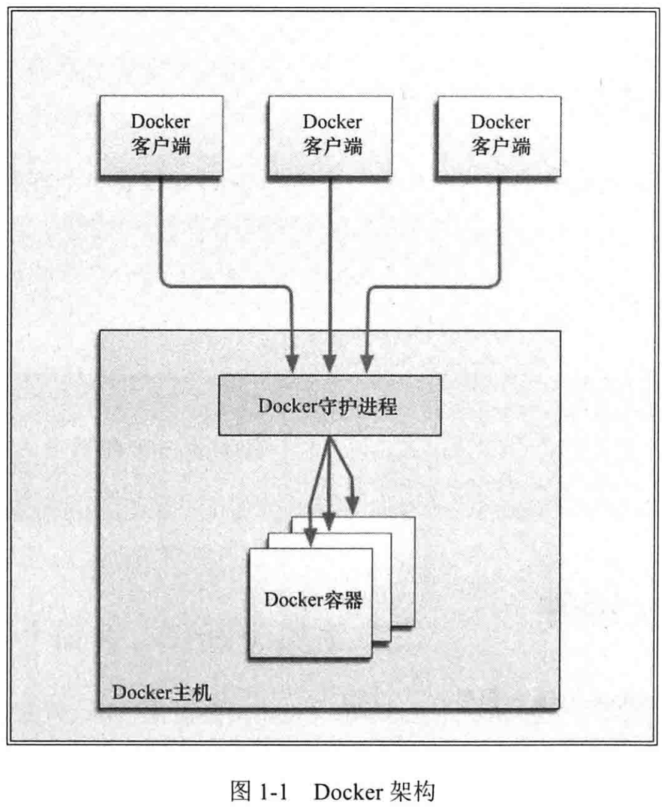
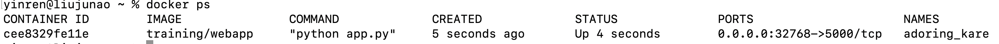
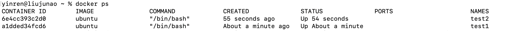
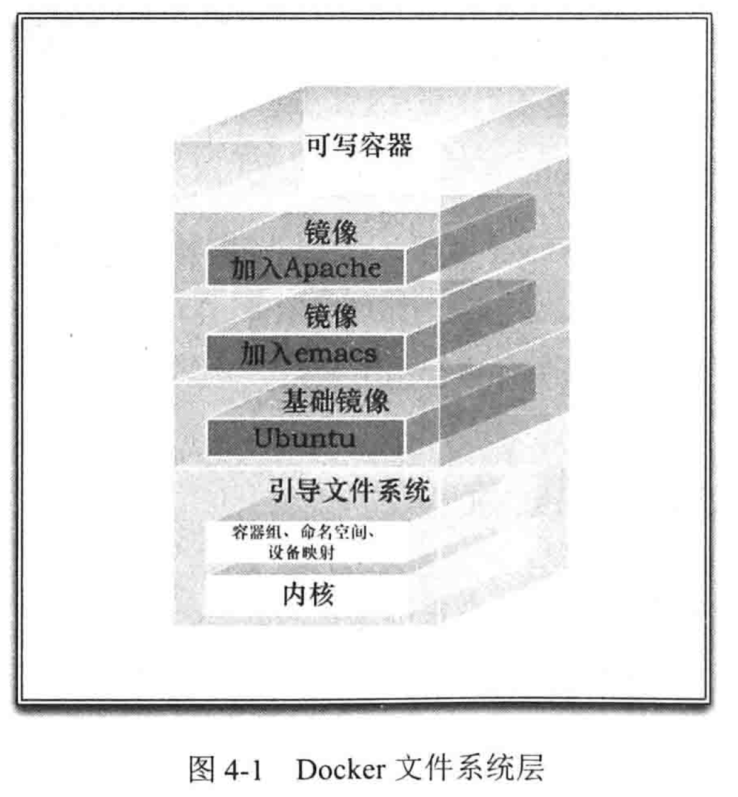

- 书籍：《第一本Docker》
- 文章：[Docker 概念学习](https://coolshell.cn/?s=docker) 

# 一、简介

## 1、Docker 简介

> Docker 是一个能够把开发的应用程序自动部署到容器的开源引擎

- **提供一个简单、轻量的建模方式**：依赖“写时复制”模型，使应用程序修改很快

- **职责的逻辑分离**：开发人员只需关心容器中运行的应用程序，运维人员只需关系如何管理容器

- **快速、高效的开发生命周期**：缩短代码从开发、测试到部署、上线运行的周期，使应用程序具备可移植性，易于构建，并易于协作

- **鼓励使用面向服务的架构**：推荐单个容器只运行一个应用程序或进程

  > 这种模型下，应用程序或服务都可以表示为一系列内部互联的容器，从而使分布式部署应用程序，扩展或调试应用程序都变得简单，同时也提高了程序的内省性

## 2、Docker 组件

- **Docker 客户端和服务器**： Docker 是一个客户-服务器(C/S)架构的程序，Docker 客户端只需向 Docker 服务器或守护进程发出请求，服务器或守护进行将完成所有工作并返回结果

  > - 可以在同一台宿主机上运行 Docker 守护进程和客户端
  > - 也可以从本地的 Docker 客户端连接到运行在另一台宿主机上的远程 Docker 守护进程
  >
  > 

- **Docker 镜像**： 用户基于镜像来运行自己的容器，是基于联合文件系统的一种层式结构，由一系列指令构建

- **Registry**： Docker 用 Registry 来保存用户构建的镜像，Registry 分为公有和私有

- **Docker 容器**： 容器基于镜像启动，可以运行一个或多个进程；容器就是一个镜像格式、一系列标准的操作、一个执行环境

  > 可以认为：**镜像**是 Docker 生命周期中的**构建或打包阶段**，而**容器则是启动或执行阶段**

## 3、Docker 特点

- **文件系统隔离**： 每个容器都有自己的 root 文件系统
- **进程隔离**： 每个容器都运行在自己的进程环境中
- **网络隔离**：容器间的虚拟网络接口和 IP 地址是分开的
- **资源隔离和分组**：使用 cgroups(control group)将 CPU 和内存之类的资源独立分配给每个 Docker 容器
- **写时复制**：文件系统都是通过写时复制创建，因此文件系统是分层的、快速的、而且占用的磁盘空间更小
- **日志**：容器产生的 STDOUT、STDERR、STDIN 这些 IO 流都会被收集并记入日志用来进行日志分析和故障排错
- **交互式 shell**：用户可以创建一个伪 tty 终端，将其连接到 STDIN，为容器提供一个交互式的 shell

# 二、Docker 容器

## 1、命令

- 查看 docker 版本： `docker --version`
- 查看 docker 信息：`docker info` 

---

- **获取镜像**：`docker pull ubuntu` 或 `docker pull ubuntu:${version}`

- **启动容器**：`docker run -it ubuntu:${version} /bin/bash `

  > 给容器命名：`docker run --name test_name -d ubuntu:${version}`
  >
  > - `--name`：给容器命名
  > - `-t`：终端
  > - `-i`：交互操作
  > - `-d`：后台运行(守护式容器)
  > - `/bin/bash`：放在镜像名后的是命令，此处的 /bin/bash 表示为交互式 Shell
  >
  > ---
  >
  > `exit`：退出终端

- **启动已停止运行的容器**：`docker start ${CONTAINER ID}`

  > `docker ps -a`：查看所有容器

- **停止一个容器**： `docker stop ${CONTAINER ID}`

- **重启容器**：`docker restart ${CONTAINER ID}` 或 `docker run --restart=${field} ...`

  > `--restart` 取值：
  >
  > - `always`：表示无论容器的退出代码是什么，Docker 都会自动重启该容器
  >
  > - `on-failure`：表示只有当容器的退出代码非 0 时，才会自动重启
  >
  >   > 比如：`--restart=on-failure:5`，但当容器退出代码非 0 时，Docker 最多自动重启 **5 次**

- **进入处于后台运行模式的容器**：

  - `docker attach`：该命令下，若从容器退出，会导致容器的停止

  - `docker exec`：推荐，因为该方式下退出容器终端，不会导致容器的停止

    > `docker exec` 命令可以在容器内部额外启动新进程
    >
    > 比如：
    >
    > - `docker exec -d test_name touch /etc/config_file`：在容器内创建一个空文件
    > - `docker exec -t -i test_name /bin/bash`：在容器内打开一个 shell 交互式任务

- **导入导出容器**：

  - **导出容器**：`docker export ${CONTAINER ID} > ubuntu.tar(名称自己定)`

  - **导入容器**：`docker import xxx`

    > - 案例一：`cat docker/ubuntu.tar | docker import - test/ubuntu:v1` 
    > - 案例二：`docker import http://example.com/exampleimage.tgz example/imagerepo`

- **删除容器**：`docker rm -f ${CONTAINER ID}`

- **清理处于终止状态的所有容器**： `docker container prune` 

## 2、案例：运行一个 web 应用

**目标**：在 docker 容器中使用 Python Flask 应用来运行一个web应用

- 拉取：`docker pull training/webapp`

- **运行**：`docker run -d -P training/webapp python app.py` 

  > - `-d`：让容器在后台运行
  >
  > - `-P`：容器内端口随机映射到主机端口
  >
  > - `-p`：自定义设置端口
  >
  >   > `docker run -d -p 5000:5000 training/webapp python app.py`： 容器内的 5000 端口映射到本地主机的 5000 端口
  >
  > - `/udp`：绑定 UDP 端口，`docker run -d -p 127.0.0.1:5000:5000/udp training/webapp python app.py`

- **查看容器**：`docekr ps` 

  > 
  >
  > - 此处多了端口信息，Docker 开放了 5000 端口（默认 Python Flask 端口）映射到主机端口 32768 上
  > - 访问 `http://localhost:32768/`，便可得到 `hello world`

- 查看指定容器(ID 或名字)的某个确定端口映射到宿主机的端口号：`docker port ${CONTAINER ID/docker_name}` 

- **查看容器日志**：`docker logs ${CONTAINER ID/docker_name`

- **查看容器内运行的进程**：`docker top ${CONTAINER ID/docker_name}`

- **查看容器的底层信息**：`docker inspect ${CONTAINER ID/docker_name}` 

  > 返回一个记录着 Docker 容器的配置和状态信息的 JSON 文件

- 停止容器：`docker stop ${CONTAINER ID/docker_name}`

- 启动已停止容器：`docker start ${CONTAINER ID/docker_name}` 

- 重启容器：`docker restart ${CONTAINER ID/docker_name}`

- **移除容器**：`docker rm ${CONTAINER ID/docker_name}`

  > 注：删除容器时，容器必须是停止状态，否则会报错
  >
  > 案例：`docker rm 'docker ps -a -q'`
  >
  > - `-a`：表示列出所有容器
  > - `-q`：表示只返回容器 ID

## 3、容器连接

### (1) 连接方式一：端口映射

- **端口映射**：`docker run -d -P training/webapp python app.py` 

  > - `-d`：让容器在后台运行
  >
  > - `-P`：容器内端口随机映射到主机端口
  >
  > - `-p`：自定义设置端口
  >
  >   > `docker run -d -p 5000:5000 training/webapp python app.py`： 容器内的 5000 端口映射到本地主机的 5000 端口
  >
  > - `/udp`：绑定 UDP 端口，`docker run -d -p 127.0.0.1:5000:5000/udp training/webapp python app.py`

### (2) 连接方式二：新建网络连接

- **容器互联**：

  - 容器命名：`docker run -d -P --name yinren training/webapp python app.py`

  - 新建网络：`docker network create -d bridge test-net` 

    > - `-d`：指定网络类型，有 bridge、overlay

  - 运行一个容器并连接到新建的 test-net 网络：`docker run -itd --name test1 --network test-net ubuntu /bin/bash` 
  - **打开新终端**，再运行一个容器并连接：`docker run -itd --name test2 --network test-net ubuntu /bin/bash` 

  

  > 检查 test1 和 test2 中有无 ping 命令，若没有则 `apt install iputils-ping` 

  **执行连接**：

  - `test1` 终端下：`docker exec -it test1 /bin/bash`，`ping test2`
  - `test2` 终端下：`docker exec -it test2 /bin/bash`，`ping test1` 

# 三、镜像使用

## 1、简述

Docker 镜像是由文件系统叠加而成：

- 最底层的是一个**引导文件系统** `bootfs` 

  > Docker 用户几乎不会与引导文件系统有什么交互，当容器启动后，将会被移到内存中，而引导文件系统则会被卸载，以留出更多内存供 initrd 磁盘镜像使用

- 第二层是 **root 文件系统** `rootfs` 

  > `rootfs` 位于 `bootfs` 之上，可以说一种或多种操作系统(例如：Ubuntu)
  >
  > - 传统 Linux 引导过程，root 文件系统会最先以只读的方式加载，当引导结束并完成完整性检查后，才会被切换为读写模式
  >
  > - Docker 中，root 文件系统永远是只读状态，且 Docker 利用**联合加载**技术会在 root 文件系统层上加载更多的只读文件系统

- Docker 将使用联合加载的文件系统称为**镜像**

  > - 一个镜像可以放到另一个镜像的顶部，位于下面的镜像称为父镜像，直到镜像栈的最底部，最底部的镜像称为**基础镜像** 

- 当从一个镜像启动容器时，Docker 会在该**镜像的最顶层加载一个读写文件系统** 

  > - 当 Docker 第一次启动容器时，初始的读写层为空；当文件系统发生变化时，这些变化都会应用到这一层
  >
  > - 当创建一个新容器时，Docker 会构建一个镜像栈，并在栈的最顶层添加一个读写层
  >
  >   > 这个读写层再加上其下面的镜像层以及一些配置数据，就构成了一个容器
  >
  > ---
  >
  > - **写时复制**：例如修改一个文件，这个文件首先会从该读写层下面的只读层复制到该读写层，该文件的只读依然存在，但已被读写层中的该文件副本所隐藏
  >
  > - **镜像分层框架**：容器可以修改，都有自己的状态，并且可以启动和停止
  >
  >   > 该特点可以快速构建镜像并运行包含自己的应用程序和服务的容器



## 2、命令

- **列出镜像列表**：`docker images`
- **获取新镜像**：`docker pull ${image_name(:version[可选])}`
- **查找镜像**：`docker search ${image_name}` 或去 Docker Hub 网站查找
- **删除镜像**：`docker rmi ${IMAGE ID/image_name}` 
- **推送镜像**：`docker push ${user_name}/${image_name}` 
- **从容器运行 Registry**：`docker run -p 5000:5000 registry`

- **创建镜像**：

  - **提交镜像**：`docker commit -m="has update" -a="runoob" e218edb10161 runoob/ubuntu:v`

    > 从已经创建的容器中更新镜像，并且提交这个镜像
    >
    > - `-m`：提交的描述信息
    > - `-a`：指定镜像作者
    > - `e218edb10161`：容器 ID
    > - `runoob/ubuntu:v`：指定要创建的目标镜像名
    >
    > 注：`docker commit` 提交的只是创建容器的镜像与容器的当前状态之间的差异部分

  - **构建镜像**：`docker build`

    > 使用 Dockerfile 指令来创建一个新的镜像(**推荐**)：
    >
    > - **创建一个 Dockerfile 文件**，其中包含一组指令来告诉 Docker 如何构建镜像
    >
    >   > 保存 Dockerfile 的目录为构建上下文，Docker 会在构建镜像时，将构建上下文和该上下文中的文件和目录上传到 Docker 守护进程。这样 Docker 守护进程就能直接访问你想在镜像中存储的任何代码、文件或其他数据
    >
    >   ```shell
    >   FROM    centos:6.7  														# 指定使用哪个镜像源
    >   MAINTAINER      Fisher "fisher@sudops.com"
    >   
    >   RUN     /bin/echo 'root:123456' |chpasswd       # RUN 指令告诉 docker 在镜像内执行命令，安装了什么
    >   RUN     useradd runoob
    >   RUN     /bin/echo 'runoob:123456' |chpasswd
    >   RUN     /bin/echo -e "LANG=\"en_US.UTF-8\"" >/etc/default/local
    >   EXPOSE  22
    >   EXPOSE  80
    >   CMD     /usr/sbin/sshd -D
    >   ```
    >
    >   > **注意**：每个指令都会在镜像上创建一个新的层，**每一个指令的前缀都必须是大写** 
    >   >
    >   > ---
    >   >
    >   > Docker 大体按照如下流程执行 Dockerfile 中的指令：
    >   >
    >   > - Docker 从基础镜像运行一个容器
    >   > - 执行一条指令，对容器作出修改
    >   > - 执行类似 docker commit 的操作，提交一个新的镜像层
    >   > - Docker 再基于刚提交的镜像运行一个新容器
    >   > - 执行 Dockerfile 中的下一条指令，直到所有指令都执行完毕
    >   >
    >   > ---
    >   >
    >   > 指令详解：
    >   >
    >   > - `FROM` 指令：Dockerfile 的第一条指令，指定一个已存在的镜像，后续指令都将基于该基础镜像进行
    >   >
    >   > - `MAINTAINER` 指令：告诉 Docker 该镜像的作者，以及作者的电子邮件地址
    >   >
    >   > - `RUN` 指令：会在当前镜像中运行指定的命令，默认在 shell 里使用包装器 `/bin/sh -c` 来执行
    >   >
    >   >   > 若在一个不支持 shell 的平台上或不希望在 shell 中运行，可以使用 exec 格式的 RUN 指令：`RUN ["apt-get","install","-y","nginx"]`
    >
    > - **构建**：`docker build -t yinren/centos:6.7 .`
    >
    >   > - `-t`：指定要创建的目标镜像名
    >   > - `.`：Dockerfile 文件所在目录，可以指定Dockerfile 的绝对路径

- **设置镜像标签**：`docker tag ${image_id} ${username}/${image_name}:${tag_name}` 

## 3、Dockerfile

> Dockerfile 是一个用来构建镜像的文本文件，文本内容包含了一条条构建镜像所需的指令和说明

### (1) 使用 Dockerfile 定制镜像

> **注意**：Dockerfile 的指令每执行一次都会在 docker 上新建一层，过多无意义的层会造成镜像膨胀过大
>
> - 小技巧：==以 **&&** 符号连接命令，这样执行后，只会创建一层镜像== 

以“定制一个 nginx 镜像(构建好的镜像内会有一个 /usr/share/nginx/html/index.html 文件)”为例：

- 新建一个名为 Dockerfile 的文件，并添加一下内容：

  ```shell
  FROM nginx
  RUN echo '这是一个本地构建的nginx镜像' > /usr/share/nginx/html/index.html
  ```

  > - `FROM`：该处的 nginx 就是定制需要的基础镜像，后续的操作都是基于 nginx
  >
  > - `MAINTAINER` ：告诉 Docker 该镜像的作者，以及作者的电子邮件地址
  >
  > - `RUN`：用于执行后续命令
  >
  >   > 有以下两种格式：
  >   >
  >   > - `shell` 格式：`RUN <命令行命令>`，<命令行命令> 等同于，在终端操作的 shell 命令
  >   > - `exec` 格式：`RUN ["可执行文件", "参数1", "参数2"]`，例如：`RUN ["./test.php", "dev", "offline"] 等价于 RUN ./test.php dev offline` 
  >
  > - `ENV`：在镜像中设置环境变量

- 开始构建：`docker build -t nginx:test .` 

  > - `-t`：指定要创建的目标镜像名
  > - `.`：Dockerfile 文件所在目录，可以指定Dockerfile 的绝对路径

### (2) 指令详解

[菜鸟教程之Docker指令](https://www.runoob.com/docker/docker-dockerfile.html)

==TODO==


### (3) Dockerfile 和构建缓存

- 由于每步的构建过程都会将结果提交为镜像，所以 Docker 会将之前的镜像层看做缓存

  > - Docker 会将之前构建时创建的镜像当作缓存并作为新的开始点
  > - 当再次构建时：
  >   - 假设第 1 步到第 3 步没有发生改变，则直接从第 4 步开始
  >   - 若第 1 步到第 3 步之间做了修改，则会从第一条发生了变化的指令开始
  > - **略过缓存功能**：`--no-cache` 

# 四、在测试中使用 Docker

## 1、使用 Docker 测试一个静态网站

> 下面从将 Nginx 安装到容器来架构一个简单的网站开始，该网站命名为 Sample

### (1) 初始 Dockerfile

- 先创建一个目录，保存 Dockerfile

  ```shell
  mkdir sample
  cd sample
  touch Dockerfile
  ```

- 创建目录存放配置文件，并从 Github 上下载作者准备好的示例文件

  ```shell
  mkdir nginx && cd nginx
  wget https://raw.githubusercontent.com/jamtur01/dockerbook-code/master/code/5/sample/nginx/global.conf
  wget https://raw.githubusercontent.com/jamtur01/dockerbook-code/master/code/5/sample/nginx/nginx.conf
  ```

  > - `global.conf`：
  >
  >   ```shell
  >   server {
  >           listen          0.0.0.0:80;
  >           server_name     _;
  >   
  >           root            /var/www/html/website;
  >           index           index.html index.htm;
  >   
  >           access_log      /var/log/nginx/default_access.log;
  >           error_log       /var/log/nginx/default_error.log;
  >   }
  >   ```
  >
  > - `nginx.conf`：
  >
  >   ```shell
  >   user www-data;
  >   worker_processes 4;
  >   pid /run/nginx.pid;
  >   daemon off;
  >   
  >   events {  }
  >   
  >   http {
  >     sendfile on;
  >     tcp_nopush on;
  >     tcp_nodelay on;
  >     keepalive_timeout 65;
  >     types_hash_max_size 2048;
  >     include /etc/nginx/mime.types;
  >     default_type application/octet-stream;
  >     access_log /var/log/nginx/access.log;
  >     error_log /var/log/nginx/error.log;
  >     gzip on;
  >     gzip_disable "msie6";
  >     include /etc/nginx/conf.d/*.conf;
  >   }
  >   ```

- 编辑 Dockerfile

  ```shell
  FROM ubuntu:15.10
  MAINTAINER yinren "yinren@example.com"
  ENV REFRESHED_AT 2020-07-06
  RUN apt-get update
  RUN apt-get -y -q install nginx   						# 安装 Nginx
  RUN mkdir -p /var/www/html										# 在容器中创建一个目录 /var/www/html
  ADD nginx/global.conf /etc/nginx/conf.d				# 将本地文件的 Nginx 配置文件添加到镜像中
  ADD nginx/nginx.conf /etc/nginx/nginx.conf
  EXPOSE 80																			# 公开镜像的 80 端口
  ```

### (2) 构建 Sample 网站和 Nginx 镜像

- 构建镜像：`docker build -t yinren/nginx .`

- 查看构建新镜像的步骤和层级：`docker history yinren/nginx` 

### (3) 从 Sample 网站和 Nginx 镜像构建容器

- 创建存放网站代码的目录：

  ```shell
  cd sample
  mkdir website && cd website
  wget https://raw.githubusercontent.com/jamtur01/dockerbook-code/master/code/5/sample/website/index.html
  ```

- 创建容器：`docker run -d -p 80 --name website -v $PWD/website:/var/www/html/website yinren/nginx/nginx` 

### (4) 修改网站

- 直接打开：`vim $PWD/website/index.html`
- 修改：`This is a test website` --> `This is a test website for Docker` 
- 刷新浏览器，便可访问修改后的网站

## 2、使用 Docker 创建并测试 Web 应用程序

### (1) 案例一

1. **构建 Sinatra 应用程序**

   - 编辑 Dockerfile

     ```dockerfile
     FROM ubuntu:15.10
     MAINTAINER yinren yinren@example.com
     ENV REFRESHED_AT 2020-07-06
     
     RUN apt-get update
     RUN apt-get -y install ruby ruby-dev build-essential redis-tools # 安装 Ruby 和 RubyGem
     RUN gem install --no-rdoc --no-ri sinatra json redis		# 使用 gem 命令安装 sinatra、json、redis 包
     
     RUN mkdir -p /opt/webapp																# 创建新目录来存放新的 Web 应用程序
     
     EXPOSE 4567																						  # 公开 WEBrick 的默认端口为 4567
     
     CMD ["/opt/webapp/bin/webapp"]  									# 指定/opt/webapp/bin/webapp为 Web 应用程序的启动文件
     ```

   - 构建镜像：`docker build -t yinren/sinatra`

2. **创建 Sinatra 容器**

   - 下载 Sinatra Web 应用程序的源代码：

     ```shell
     wget --cut-dirs=3 -nH -r --no-parent http://dockerbook.com/code/5/sinatra/webapp
     ls -l webapp
     ```

     webapp 中有 bin/ 和 lib/ 文件夹：

     **bin/ 中**：`webapp`(exec 文件)

     ```shell
     #!/usr/bin/ruby
     
     $:.unshift(File.expand_path(File.join(File.dirname(__FILE__), "..", "lib")))
     
     require 'app'
     
     App.run!
     ```

     **lib/ 中**：`app.rb`(ruby 文件)

     > 作用：接收输入参数，并将输入转化为 JSON 输出

     ```ruby
     require "rubygems"
     require "sinatra"
     require "json"
     
     class App < Sinatra::Application
     
       set :bind, '0.0.0.0'
     
       get '/' do
         "<h1>DockerBook Test Sinatra app</h1>"
       end
     
       post '/json/?' do
         params.to_json
       end
     
     end
     ```

   - 使文件可执行：`chmod +x $PWD/webapp/bin/webapp` 

   - 创建容器：`docker run -d -p 4567 --name webapp -v $PWD/webapp:/opt/webapp yinren/sinatra`

     > - 从 `yinren/sinatra` 镜像创建一个新的名为 webapp 的容器
     > - 指定一个新卷 `$PWD/webapp` 来存放新的 Sinatra Web 应用程序，并将这个卷挂载到在 Dockerfile 里创建的目录 `/opt/webapp`

   - 查看 docker 执行日志：`docker log -f webapp`

   - 查看 docker 里正在运行的进程：`docker top webapp`

   - 查看端口映射：`docker port webapp 4567` 
   - 使用 curl 来测试这个程序：`curl -i -H 'Accept: application/json' -d 'name=Foo&status=Bar' http://localhost:49160/json` 

### (2) 案例二

1. 构建 Redis 镜像和容器

   - 新建 Dockerfile

     ```dockerfile
     FROM ubuntu:15.10
     MAINTAINER yinren yinren@example.com
     ENV REFRESHED_AT 2020-07-06
     
     RUN apt-get update
     RUN apt-get -y install redis-server redis-tools   # 安装 redis
     
     EXPOSE 6379																				# 公开端口 6379
     ENTRYPOINT ["/usr/bin/redis-server"]              # 指定启动 redis 服务器的 ENTRYPOINT
     CMD []  									
     ```

   - 构建：`docker build -t yinren/redis`

   - 运行容器：`docker run -d -p 6379 --name yinren/redis` 

   - 查看端口映射：`docker port redis 6379` 

     > 查看到映射的本地端口后，试着连接 redis 实例

   - 查看 redis 服务是否正常：`redis-cli -h 127.0.0.1 -p ${port}`

     > 此处的 `${port}` 就是上面查看的端口映射的本地端口

2. **连接到 Redis 容器**

   使用 Sinatra 连接 redis 服务并存储传入的参数，因此需要能与 redis 服务器对话：

   - 方式一：Docker 容器公开端口并绑定到本地网络接口

     > 这样，就可以把容器里的服务在本地 Docker 宿主机所在的外部网络上公开

   - 方式二：内部网络，Docker 安装时会创建一个新的网络接口 `docker0`，每个 Docker 容器都会在这个接口上分配一个 IP 地址

     `ip a show docker0`，范围为 `172.16~172.30`

     > `docker0` 是一个虚拟的以太网桥，用于连接容器和本地宿主网络

3. **连接 Redis**

   - 查看 redis 容器的网络配置：`docker inspect redis`

     > 只查看 ip 地址信息：`docker inspect -f '{{.NetworkSettings.IPAddress}}' redis`

   - 通过 ip 地址进行连接：`redis-cli -h ${port}`

   通过 IP 地址直连的问题：

   第一：要在应用程序里对 redis 容器的 IP 地址做硬编码

   第二：若重启容器，Docker 会改变容器的 IP 地址

### (3) 容器通信

1. **让 Docker 容器互连**

   - 新建一个 redis 容器：`docker run -d --name redis yinren/redis`

   - 启动 web 应用程序，并把它连接到新的 redis 容器上：`docker run -p 4567 --name webapp --link redis:db -t -i -v $PWD/webapp:/opt/webapp yinren/sinatra /bin/bash`

     > `-v`：把 Web 应用程序作为卷挂载到容器里
     >
     > `--link`：创建了两个容器间的父子连接，`要连接容器名：连接后容器的别名`

     也可以把多个容器连接在一起：

     `docker run -p 4567 --name webapp2 --link redis:db ...`

     `docker run -p 4567 --name webapp3 --link redis:db ...`

2. **使用容器连接来通信**

   让应用程序连接到 redis 的两种方法：

   - 方式一：**使用环境变量里的一些连接信息** 

   - 方式二：**使用 DNS 和 /etc/hosts 信息** 

## 3、将 Docker 用于持续集成

Docker 让部署以及宿主机的清理变得开销很低，将使用 Jenkins CI 构建一个测试流水线：

- 构建 Jenkins 和 Docker 服务器

  ```dockerfile
  FROM ubuntu:15.10
  MAINTAINER yinren yinren@example.com
  ENV REFRESHED_AT 2020-07-06
  
  RUN apt-get update -qq && apt-get install -11y curl
  RUN curl https://get.docker.io/gpg | apt-key add -
  RUN echo deb http://get.docker.io/ubuntu docker main > /etc/apt/sources.list.d/docker.list
  RUN apt-get update -qq && apt-get install -qqy iptables ca-certificates lxc openjdk-6-jdk git-core lxc-docker
  
  # 设置 jenkins 的数据目录和镜像站点
  ENV JENKINS_HOME /opt/jenkins/data
  ENV JENKINS_MIRROR http://mirrrors.jenkins-ci.org
  
  RUN mkdir -p $JENKINS_HOME/plugins
  RUN curl -sf -o /opt/jenkins/jenkins.war -L $JENKINS_MIRROR/war-stable/latest/jenkins.war
  RUN for plugin in chucknorris greenballs scm-api git-client git ws-cleanup;do curl -sf -o $JENKINS_HOME/plugins/${plugin}.hpi -L $JENKINS_MIRROR/plugins/${plugin}/latest/${plugin}.hpi;done
  
  ADD ./dockerjenkins.sh /usr/local/bin/dockerjenkins.sh
  RUN chmod +x /usr/local/bin/dockerjenkins.sh
  
  VOLUME /var/lib/docker								# 从容器运行的宿主机挂在一个卷
  
  EXPOSE 8080																				
  ENTRYPOINT ["/usr/local/bin/dockerjenkins.sh"]    # 指定一个要运行的 shell 脚本作为容器的启动命令      
  ```

- 构建：`docker build -t yinren/dockerjenkins`

- 创建容器：`docker run -p 8080:8080 --name jenkins --privileged -d yinren/dockerjenkins`

  > `--privileged` 可以启动 Docker 的特权模式，允许我们以宿主机具有的所有能力来运行容器

- 查看日志信息：`docker logs jenkins` 
