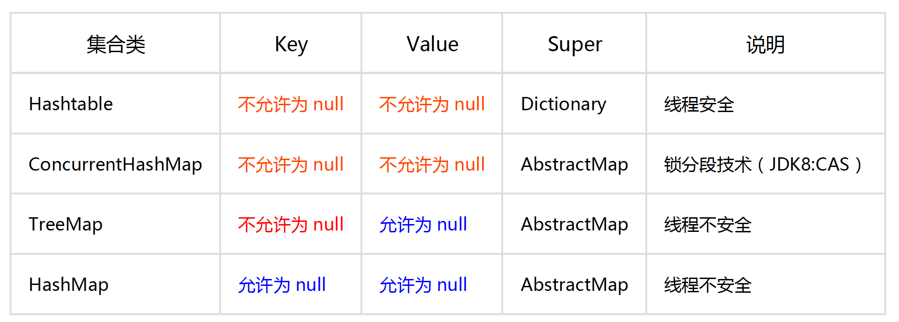
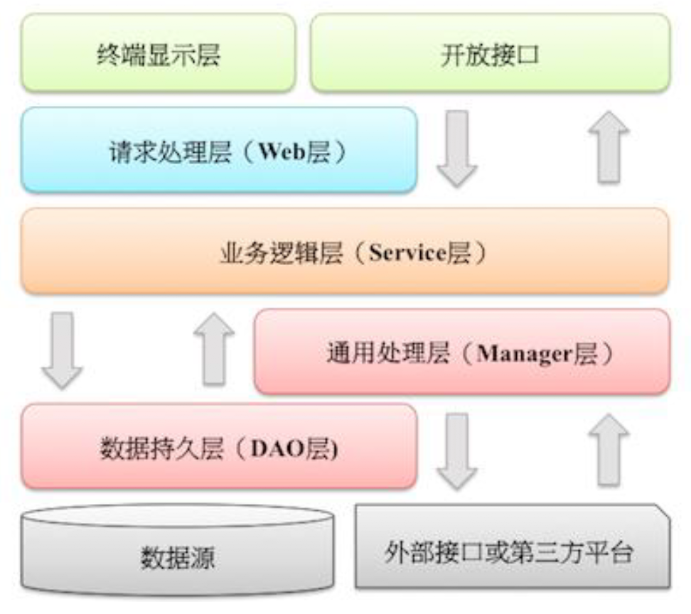

# 前言：项目结构

建议：

1. 随着服务的复杂，导致的实现类越来越多，则建议在相应模块下为每个特定服务建立特定文件夹，从而进行收纳分类
2. 每个类的代码行数建议控制在 500 行以内

```
* {project}	-------------------------------------------	项目目录(与 artifactId 对应)
    * deploy ------------------------------------------ plus 发布所需的脚本文件目录
        * plusboot.yaml ------------------------------- plus 发布(MDPDeploy)所需的脚本文件
        * manifest.yaml ------------------------------- plus 发布(AutoDeploy)所需的脚本文件
    * src --------------------------------------------- 项目主目录
        * main ---------------------------------------- 代码与资源目录
            * java ------------------------------------ java 代码根目录
                * {BasePackage Name} ------------------ Java 包对应的目录结构
                    * annotation ---------------------- 自定义注解
                    * aop ----------------------------- 切面相关代码
                    * config -------------------------- 配置文件
                    * constant ------------------------ 常量相关代码
                    * controller ---------------------- controller 类
                    * domain -------------------------- 实体类(建议为每个服务建立特定文件夹，包含进 ao、bo等中)
                        * ao -------------------------- 应用对象，在 Web 层与 Service 层之间抽象的复用对象模型
                        * bo -------------------------- 业务对象，由 Service 层输出的封装业务逻辑的对象
                        * do -------------------------- 与数据库表结构一一对应，通过 DAO 层向上传输数据源对象
                        * dto ------------------------- 数据传输对象，Service 或 Manager 向外传输的对象
                        * vo -------------------------- 显示层对象，通常是 Web 向模板渲染引擎层传输的对象
                    * enums --------------------------- 枚举类
                    * exception ----------------------- 自定义异常
                    * logcenter ----------------------- logCenter 相关类
                    * mq ------------------------------ 消息队列相关代码
                        * consumer -------------------- 消费者
                        * producer -------------------- 生产者
                    * service ------------------------- 自定义逻辑服务(建议为每个特定服务建单独文件夹)
                        * impl ------------------------ 逻辑服务接口类的实现类
                        * support --------------------- 调用第三方的服务类
                    * thrift -------------------------- thrift 相关代码
                        * utils --------------------------- 工具类
                        * async ----------------------- 异步服务类(如：线程池服务类)
                        * cache ----------------------- 缓存相关处理类
                        * crane ----------------------- 定时任务相关代码
                        * ...
            * profiles -------------------------------- 环境配置
                * dev --------------------------------- dev 环境
                * prod -------------------------------- prod 环境
                * staging ----------------------------- st 环境
                * test -------------------------------- test 环境
            * resources ------------------------------- 资源文件
                * mappers ----------------------------- mapper xml 文件
                * META-INF ---------------------------- properties 文件
                    * app.properties ------------------ appKey 文件
                * application.yml --------------------- spring 配置文件(yml)
                * applicationContext.xml -------------- spring 配置文件(xml)
                * log4j2 ------------------------------ 日志配置文件
                    * log4j2-local.xml
                    * log4j2-offline.xml
                    * log4j2-online.xml
        * test ---------------------------------------- test 文件
    * .gitignore -------------------------------------- gitignore 文件
    * pom.xml ----------------------------------------- maven 配置文件
```

# 一、编程规约

## 1、命名风格

| 要求 | 说明                                                         |
| :--: | ------------------------------------------------------------ |
| 强制 | 命名不能以下划线或美元符号开始和结束                         |
| 强制 | 命名严禁拼音与英文混合                                       |
| 强制 | 类名使用 UpperCamelCase 风格，除 DO / BO / DTO / VO / AO / PO / UID 等 |
| 强制 | 方法名、参数名、成员变量、局部变量统一使用 lowerCamelCase 风格 |
| 强制 | 常量名全部大写，单词间用下划线隔开                           |
| 强制 | 抽象类命名使用 Abstract 或 Base 开头<br>异常类命名使用 Exception 结尾<br>测试类命名以要测试的类名开头，以 Test 结尾 |
| 强制 | 数组的类型与中括号紧挨                                       |
| 强制 | POJO 中的布尔变量不要加 `is` 前缀，否则部分框架解析会引起序列化错误 |
| 强制 | 包名统一小写，且只有一个英语单词                             |
| 强制 | 避免在子父类的成员变量间、相同函数的不同代码块间的局部变量间采用相同命名 |
| 强制 | 杜绝不规范缩写，避免望文不知义                               |
| 推荐 | 编程元素命名时，尽量用完整的单词组合                         |
| 推荐 | 常量与变量命名时，表示类型的名词放在词尾                     |
| 推荐 | 若模块、接口、类、方法使用了设计模式，命名时需体现出具体模式 |
| 推荐 | 接口的方法和属性不加任何修饰符号，但药加上有效的 Javadoc 注释 |
| 参考 | 枚举类名带上 Enum 后缀；枚举成员名称全大写，单词间用下划线隔开 |

各层命名规约： 

- **Service/DAO 层方法命名规约**：
    1. 获取单个对象的方法用 get 做前缀
    2. 获取多个对象的方法用 list 做前缀，复数结尾，如：listObjects
    3. 获取统计值的方法用 count 做前缀
    4. 插入的方法用 save/insert 做前缀
    5. 删除的方法用 remove/delete 做前缀
    6. 修改的方法用 update 做前缀

- 领域模型命名规约：
    1. 数据对象：xxxDO，xxx 即为数据表名
    2. 数据传输对象：xxxDTO，xxx 为业务领域相关的名称
    3. 展示对象：xxxVO，xxx 一般为网页名称
    4. POJO 是 DO/DTO/BO/VO 的统称，禁止命名成 xxxPOJO

## 2、常量定义

| 要求 | 说明                                                         |
| :--: | ------------------------------------------------------------ |
| 强制 | 不允许任何魔法值出现在代码中                                 |
| 强制 | long 或 Long 赋值时，数值后使用大写的 L                      |
| 推荐 | 按常量功能归类，分开维护                                     |
| 推荐 | 常量的复用层次有五层：<br>1、跨应用共享常量：放置在二方库中，通常是 client 的 constant 目录下<br>2、应用内共享常量：放置在一方库中，通常是子模块的 constant 目录下<br>3、子工程内共享常量：在当前子工程的 constant 目录下<br>4、包内共享常量：在当前包下单独的 constant 目录下<br>5、类内共享常量：直接在类内部 private static final 定义 |
| 推荐 | 若变量值在一个固定范围内变化用 enum 类来定义                 |

- **一方库**：指是本项目中的依赖

- **二方库**：指公司内部其他项目提供的依赖

- **三方库**：指其他组织、公司等来自第三方的依赖

## 3、代码格式

| 要求 | 说明                                                         |
| :--: | ------------------------------------------------------------ |
| 强制 | 若大括号内为空，则简洁地写成 `{}`                            |
| 强制 | 左小括号和右边相邻字符间不出现空格<br>右小括号和左边相邻字符间也不出现空格<br>左大括号前需要加空格 |
| 强制 | `if/for/while/switch/do` 等保留字与括号之间都必须加空格      |
| 强制 | 任何二目、三目运算符的左右两边都需要加一个空格               |
| 强制 | 采用四空格缩进，禁止使用 tab 字符                            |
| 强制 | 注释的双斜线与注释内容之间有且仅有一个空格                   |
| 强制 | 类型强转时，右括号与强制转换值之间不需要任何空格隔开         |
| 强制 | 单行字符数限制不超过 120个，超出需要换行：<br>1、第二行相对第一行缩进4个空格，从第三行开始，不再继续缩进<br>2、运算符与下文一起换行<br>3、方法调用的点符号与下文一起换行<br>4、方法调用中的多个参数需要换行时，在逗号后进行<br>5、在括号前不要换行 |
| 强制 | 方法参数在定义和传入时，多个参数逗号后，必须加空格           |
| 强制 | IDE 的 text file encoding 设置为 UTF-8<br>IDE 中文件的换行符使用 Unix 格式 |
| 推荐 | 单个方法的总行数不超过80行                                   |
| 推荐 | 没必要增加空格使变量赋值等号与上一行对应位置的等号对齐       |
| 推荐 | 不同逻辑、不同语义、不同业务的代码之间插入一个空行分隔，以提升可读性 |

## 4、OOP 规约

| 要求 | 说明                                                         |
| :--: | ------------------------------------------------------------ |
| 强制 | 用类名来访问静态变量或静态方法                               |
| 强制 | 覆写方法，必须加 `@Override` 注解                            |
| 强制 | 相同参数类型、相同业务含义，才可以使用可变参数，避免使用 `Object ... obj` |
| 强制 | 接口过时必须加 `@Deprecated` 注解，并说明新接口或新服务      |
| 强制 | 不能使用过时的类或方法                                       |
| 强制 | Object 的 equals 方法容易抛空指针异常，应使用常量或确定有值的对象来调用 equals |
| 强制 | 所有整型包装类对象间值的比较，全部使用 equals 方法           |
| 强制 | 任何货币金额，均以最小货币单位、整型类型进行存储             |
| 强制 | 浮点数间的等值判断：<br>1、基本数据类型不能用 `==` 比较<br>2、包装数据类型不能用 `equals` 判断 |
| 强制 | 数据对象 DO 类的属性类型要与数据库字段类型匹配               |
| 强制 | 禁止使用 `BigDecimal(double)` 方式把 double 值转化为 BigDecimal 对象 |
| 强制 | 所有的 POJO 类属性必须使用包装数据类型                       |
| 强制 | RPC 方法的返回值和参数必须使用包装数据类型                   |
| 推荐 | 所有的局部变量使用基本数据类型                               |
| 强制 | 定义 DO/DTO/VO 等 POJO 类时，不要设定任何属性默认值          |
| 强制 | 序列化类的新增属性时，不要修改 serialVersionUID，避免反序列失败<br>若完全不兼容升级，避免反序列化混乱，则请修改 serialVersionUID |
| 强制 | 构造方法中禁止加入业务逻辑，若有初始化逻辑，请放在 `init` 方法中 |
| 强制 | POJO 类必须写 toString 方法                                  |
| 强制 | 禁止在 POJO 类中，同时存在对应属性 xxx 的 isXxx() 和 getXxx() 方法 |
| 推荐 | 用索引访问 `String.split` 数组时，检查最后一个分隔符后有无内容，否则有抛 IndexOutOfBoundsException 风险 |
| 推荐 | 当一个类有多个构造方法、多个同名方法，这些方法应按顺序放置在一起 |
| 推荐 | 类内方法定义的顺序依次是：公有方法或保护方法 > 私有方法 > getter / setter 方法 |
| 推荐 | setter 方法中，参数名称与类成员变量名称一致，this.成员名 = 参数名；getter/setter 方法中，不要增加业务逻辑 |
| 推荐 | 循环体内，字符串的连接方式，使用 `StringBuilder.append` 方法进行扩展 |
| 推荐 | final 可以声明类、成员变量、方法、本地变量，使用 final 关键字的情况：<br>1、不允许被继承的类，如：String 类<br/>2、不允许修改引用的域对象，如：POJO 类的域变量<br/>3、不允许被覆写的方法，如：POJO 类的 setter 方法<br/>4、不允许运行过程中重新赋值的局部变量<br/>5、避免上下文重复使用一个变量，使用 final 可以强制重新定义一个变量，方便更好地进行重构 |
| 推荐 | 慎用 Object 的 clone 方法来拷贝对象                          |
| 推荐 | 类成员与方法访问控制从严：<br/>1、若不允许外部直接通过 new 来创建对象，则构造方法必须是 private<br/>2、工具类不允许有 public 或 default 构造方法<br/>3、类非 static 成员变量并且与子类共享，必须是 protected<br/>4、类非 static 成员变量并且仅在本类使用，必须是 private<br/>5、类 static 成员变量若仅在本类使用，必须是 private<br/>6、若是 static 成员变量，考虑是否为 final<br/>7、类成员方法只供类内部调用，必须是 private<br/>8、类成员方法只对继承类公开，则限制为 protected |

## 5、日期时间

| 要求 | 说明                                                         |
| :--: | ------------------------------------------------------------ |
| 强制 | 日期格式化时，传入 pattern 中表示年份统一使用小写的 `y`      |
| 强制 | 1、表示月份是大写的 `M` <--> 表示分钟则是小写的 `m`<br/>2、24小时制的是大写的 `H` <--> 12小时制的则是小写的 `h` |
| 强制 | 获取当前毫秒数：`System.currentTimeMillis()`                 |
| 强制 | 不允许在程序任何地方中使用：<br>1、`java.sql.Date`：不记录时间，getHours() 抛出异常 <br>2、`java.sql.Time`：不记录日期，getYear() 抛出异常<br>3、`java.sql.Timestamp`：构造方法 super((time/1000)*1000) 的 fastTime 和 nanos 分开存储秒和纳秒信息 |
| 强制 | 不要在程序中写死一年为 365 天，避免在公历闰年时出现日期转换错误或程序逻辑错误 |
| 推荐 | 避免公历闰年 2 月问题                                        |
| 推荐 | 使用枚举值来指代月份(注意：Date，Calendar 等日期相关类的月份 month 取值在 `0-11` 之间) |

## 6、集合处理

| 要求 | 说明                                                         |
| :--: | ------------------------------------------------------------ |
| 强制 | hashCode 和 equals 的处理，遵循如下规则：<br/>1、只要重写 equals，就必须重写 hashCode<br>2、Set 依据 hashCode 和 equals 存储不重复对象，所以 Set 必须重写这两个方法<br/>3、若自定义对象作为 Map 的键，则必须覆写 hashCode 和 equals |
| 强制 | 使用 isEmpty() 方法判断集合内部的元素是否为空                |
| 强制 | 用 `Collectors.toMap()` 转为 Map 时，要用含有参数类型为 `BinaryOperator`，参数名为 `mergeFunction` 的方法<br>否则当出现相同 key 值时会抛出 IllegalStateException 异常 |
| 强制 | 用 `Collectors.toMap()` 转为 Map 时，注意当 value 为 null 时会抛 NPE 异常 |
| 强制 | `ArrayList.subList` 不可强转，否则会抛出 ClassCastException 异常 |
| 强制 | 使用 Map 的 `keySet()/values()/entrySet()` 时，不可添加元素，否则会抛出 UnsupportedOperationException 异常 |
| 强制 | Collections 返回的对象 `emptyList()/singletonList()` 都是 `immutable list`，不可添加或删除元素 |
| 强制 | `subList` 中，对父集合的增加或删除，均会导致子列表的遍历、增加、删除产生 ConcurrentModificationException 异常 |
| 强制 | 使用集合转数组的方法，必须使用集合的 `toArray(T[] array)`，传入类型一致、长度为 0 的空数组 |
| 强制 | 使用 Collection 的 addAll() 方法时，都要对输入的集合参数进行 NPE 判断 |
| 强制 | `Arrays.asList()` 把数组转换成集合时，不能使用 `add/remove/clear`，会抛出 UnsupportedOperationException 异常 |
| 强制 | `<? extends T>` 不能使用 add 方法，`<? super T> ` 不能使用 get 方法，两者在接口调用赋值的场景中容易出错 |
| 强制 | 无泛型限制集合赋值给泛型限制集合时，集合元素需要进行 instanceof 判断，避免抛出 ClassCastException 异常 |
| 强制 | `foreach` 循环不要进行 remove/add 操作，remove 元素请使用 Iterator 方式，如果并发操作，需要对 Iterator 对象加锁 |
| 推荐 | 集合泛型定义时，使用 diamond 语法`<>`或全省略                |
| 推荐 | 集合初始化时，指定集合初始值大小                             |
| 推荐 | 使用 entrySet 遍历 Map 类集合 KV                             |
| 推荐 | 注意 Map 类集合 K/V 能不能存储 null 值                       |
| 参考 | 合理利用集合的有序性(sort)和稳定性(order)，避免集合的无序性(unsort)和不稳定性(unorder)带来的负面影响 |
| 参考 | 利用 Set 元素唯一的特性，快速对集合进行去重操作；避免使用 List 的 contains() 进行遍历去重或判断包含操作 |



## 7、并发处理

| 要求 | 说明                                                         |
| :--: | ------------------------------------------------------------ |
| 强制 | 获取单例对象需要保证线程安全，其中的方法也要保证线程安全     |
| 强制 | 创建线程或线程池时，请指定有意义的线程名称，方便出错时回溯   |
| 强制 | 线程资源必须通过线程池提供，不允许在应用中自行显式创建线程   |
| 强制 | 线程池不允许使用 Executors 创建，而是通过 ThreadPoolExecutor 方式 |
| 强制 | SimpleDateFormat 线程不安全，不要定义为 static 变量；若定义为 static，必须加锁或使用 DateUtils 工具类 |
| 强制 | 必须回收自定义的 ThreadLocal 变量，尽量在代理中使用 try-finally 块回收 |
| 强制 | 高并发时，同步调用要考量锁的性能损耗：<br>1、能用无锁数据结构，就不要用锁<br>2、能锁区块，就不要锁整个方法体<br>3、能用对象锁，就不要用类锁 |
| 强制 | 对多个资源、数据库表、对象同时加锁时，需要保持一致的加锁顺序，否则可能会造成死锁 |
| 强制 | 阻塞等待获取锁时，必须在 `try` 代码块之外                    |
| 强制 | 尝试获取锁时，必须先判断当前线程是否持有锁，锁的释放规则与锁的阻塞等待方式相同 |
| 强制 | 并发修改同一记录时，避免更新丢失，需要加锁，并使用 version 作为更新依据 |
| 强制 | 多线程并行处理定时任务时，使用 ScheduledExecutorService 代替 Timer 的 TimeTask |
| 推荐 | 资金相关的金融敏感信息，使用悲观锁策略                       |
| 推荐 | CountDownLatch 进行异步转同步操作，每个线程退出前必须调用 countDown，避免主线程无法执行 await |
| 推荐 | 避免 Random 实例被多线程使用，但会因竞争同一 seed 导致性能下降 |
| 推荐 | 通过双重检查锁，实现延迟初始化的优化问题隐患的解决方案：将目标属性声明为 `volatile` |
| 参考 | volatile 可解决一写多读的变量同步问题；但无法解决多写的线程安全问题 |
| 参考 | ThreadLocal 对象使用 static 修饰，ThreadLocal 无法解决共享对象的更新问题 |

## 8、控制语句

| 要求 | 说明                                                         |
| :--: | ------------------------------------------------------------ |
| 强制 | 1、switch 内，case 要么 `continue/break/return` 终止，要么注释说明将继续执行到哪一个 case 为止<br>2、switch 内，必须包含一个 default 语句并且放在最后 |
| 强制 | 当 switch 括号内的变量类型为 String 并且此变量为外部参数时，必须先进行 null 判断 |
| 强制 | 在 `if/else/for/while/do` 语句中必须使用大括号               |
| 强制 | 三目运算符：`condition ? 表达式1 : 表达式2`，注意表达式 1 和 2 在类型对齐时，可能因自动拆箱导致 NPE 异常<br>会触发类型对齐的拆箱操作的场景：<br>1、表达式 1 或表达式 2 的值只要有一个是原始类型<br/>2、表达式 1 或表达式 2 的值的类型不一致，会强制拆箱升级成表示范围更大的那个类型 |
| 强制 | 高并发场景中，避免使用”等于”判断作为中断或退出的条件         |
| 推荐 | 当某个方法的代码行数超过 10 行时，return / throw 等中断逻辑的右大括号后加一个空行 |
| 推荐 | 表达异常的分支时，少用 `if-else` 方式                        |
| 推荐 | 除常用方法外，不要在条件判断中执行复杂语句                   |
| 推荐 | 不要在其它表达式(尤其是条件表达式)中，插入赋值语句           |
| 推荐 | 以下操作尽量移至循环体外处理，如：定义对象和变量、获取数据库连接，不必要的 try-catch 操作 |
| 推荐 | 避免采用取反逻辑运算符                                       |
| 推荐 | 接口入参保护校验                                             |

- 下列情形，**需要进行参数校验**： 
    1. 调用频次低的方法
    2. 执行时间开销很大的方法
    3. 需要极高稳定性和可用性的方法
    4. 对外提供的开放接口，不管是 RPC/API/HTTP 接口
    5. 敏感权限入口

- 下列情形，**不需要进行参数校验**： 
    1. 极有可能被循环调用的方法，但必须注明外部参数检查
    2. 底层调用频度比较高的方法
    3. 被声明成 private 只会被自己代码所调用的方法

## 9、注视规约

| 要求 | 说明                                                         |
| :--: | ------------------------------------------------------------ |
| 强制 | 类、类属性、类方法的注释必须使用 Javadoc 规范                |
| 强制 | 所有的抽象方法必须用 Javadoc 注释                            |
| 强制 | 所有的类必须添加创建者和创建日期                             |
| 强制 | 1、方法内部单行注释：在被注释语句上方另起一行，使用 `//` 注释<br>2、方法内部多行注释：使用 `/* */` 注释，注意与代码对齐 |
| 强制 | 所有的枚举类型字段必须有注释，说明每个数据项的用途           |
| 推荐 | 用中文注释把问题说清楚，专有名词与关键字保持英文原文即可     |
| 推荐 | 代码修改的同时，注释也要进行相应的修改，尤其是参数、返回值、异常、核心逻辑等的修改 |
| 推荐 | 1、在类中删除未使用的任何字段和方法<br>2、在方法中删除未使用的任何参数声明与内部变量 |
| 参考 | 代码被注释掉有两种可能性：<br/>1、后续会恢复此段代码逻辑：在上方详细说明<br/>2、永久不用：建议直接删掉即可 |
| 参考 | 注释的要求：<br/>第一、能够准确反映设计思想和代码逻辑<br/>第二、能够描述业务含义 |
| 参考 | 好的命名、代码结构是自解释的，注释力求精简准确、表达到位，避免过多过滥的注释 |
| 参考 | 特殊注释标记，请注明标记人与标记时间<br/>1、待办事宜 `TODO`：(标记人，标记时间，[预计处理时间])表示需要实现，但目前还未实现的功能<br/>2、错误，不能工作 `FIXME`：(标记人，标记时间，[预计处理时间])表示某代码是错误的，且不能工作，需要及时纠正 |

## 10、其它

| 要求 | 说明                                                         |
| :--: | ------------------------------------------------------------ |
| 强制 | 使用正则表达式时，利用其预编译功能，加快正则匹配速度         |
| 强制 | 使用 `Spring BeanUtils, Cglib BeanCopier` 替代 Apache Beanutils 进行属性 copy（注意均是**浅拷贝**） |
| 强制 | velocity 调用 POJO 属性时，直接用属性名取值，会自动调用`getXxx()、isXxx()` |
| 强制 | 后台输送给页面的变量必须加 `$!{var}`——中间的感叹号<br>注意：若 var 为 null 或不存在，则 `${var}` 会直接显示在页面上 |
| 强制 | `Math.random()` 返回 `double` 类型；Random 的 nextInt 或 nextLong 方法返回整形 |
| 推荐 | 不要在视图模板中加入任何复杂的逻辑                           |
| 推荐 | 任何数据结构的构造或初始化，都应指定大小，避免数据结构无限增长吃光内存 |
| 推荐 | 及时清理不再使用的代码段或配置信息                           |

# 二、异常日志

## 1、错误码

| 要求 | 说明                                                         |
| :--: | ------------------------------------------------------------ |
| 强制 | 错误码的制定原则：快速溯源、简单易记、沟通标准化             |
| 强制 | 错误码不体现版本号和错误等级信息                             |
| 强制 | 全部正常，但不得不填充错误码时返回五个零：00000              |
| 强制 | 错误码为字符串类型，共5位，分成两个部分：错误产生来源+四位数字编号<br>1、错误产生来源分为 `A/B/C`<br/>    (1) `A` 表示错误来源于用户，如：参数错误、用户安装版本过低、用户支付超时等问题；<br/>    (2) `B` 表示错误来源于当前系统，如：业务逻辑出错、程序健壮性差等问题；<br/>    (3) `C` 表示错误来源于第三方服务，如：CDN服务出错、消息投递超时等问题；<br/>2、四位数字编号从 0001 到 9999，大类之间的步长间距预留 100 |
| 强制 | 编号不与公司业务架构和组织架构挂钩，一切以先到先申请的原则进行，审批生效，编号即被永久固定 |
| 强制 | 错误码使用者避免随意定义新的错误码                           |
| 强制 | 错误码不能直接输出给用户作为提示信息使用                     |
| 推荐 | 错误码之外的业务独特信息由 error_message 来承载，而不是让错误码本身涵盖过多具体业务属性 |
| 推荐 | 获取第三方服务错误码时，向上抛出允许本系统转义，由 C 转为 B，并且在错误信息上带上原有的第三方错误码 |
| 参考 | 错误码分为一级宏观错误码、二级宏观错误码、三级宏观错误码<br>用一级宏观错误码：A0001(用户端错误)、B0001(系统执行出错)、C0001(调用第三方服务出错) |
| 参考 | 错误码的后三位编号与 HTTP 状态码没有任何关系                 |
| 参考 | 错误码尽量有利于不同文化背景的开发者进行交流与代码协作       |
| 参考 | 错误码即人性，感性认知+口口相传，使用纯数字来进行错误码编排不利于感性记忆和分类 |

## 2、异常处理

| 要求 | 说明                                                         |
| :--: | ------------------------------------------------------------ |
| 强制 | Java 类库中定义的可以通过预检查方式规避的RuntimeException异常不应该通过catch 的方式来处理<br>比如：NullPointerException，IndexOutOfBoundsException 等等 |
| 强制 | 异常不要用来做流程控制，条件控制                             |
| 强制 | catch 时请分清稳定代码和非稳定代码<br>1、稳定代码：指无论如何不会出错的代码<br/>2、非稳定代码的 catch：先进行区分异常类型，再做对应的异常处理 |
| 强制 | 捕获的异常，要处理，而不是抛弃；或者将该异常抛给调用者<br>最外层的业务使用者：必须处理异常，将其转化为用户可以理解的内容 |
| 强制 | 事务场景中，抛出异常被 catch 后，如果需要回滚，一定要注意手动回滚事务 |
| 强制 | finally 块必须对资源对象、流对象进行关闭，有异常也要做 try-catch |
| 强制 | 不要在 finally 块中使用 return                               |
| 强制 | 捕获异常与抛异常，必须是完全匹配，或者捕获异常是抛异常的父类 |
| 强制 | 在调用 RPC、二方包、或动态生成类的相关方法时，捕捉异常必须使用 Throwable 类来进行拦截 |
| 推荐 | 方法的返回值可以为 null，不强制返回空集合或空对象等，必须添加注释充分说明什么情况下会返回 null 值 |
| 参考 | 1、公司外的 http/api 开放接口必须使用“错误码”<br>2、应用内部推荐异常抛出<br/>3、跨应用间 RPC 调用优先考虑使用 Result 方式，封装 isSuccess() 方法、“错误码”、“错误简短信息”<br/>4、应用内部推荐异常抛出 |
| 参考 | 避免出现重复的代码（Don't Repeat Yourself），即 DRY 原则     |

NPE产生的场景：使用 JDK8 的 `Optional` 类来防止 NPE 问题

1. 返回类型为基本数据类型，return 包装数据类型的对象时，自动拆箱有可能产生 NPE
2. 数据库的查询结果可能为 null
3. 集合里的元素即使 isNotEmpty，取出的数据元素也可能为 null
4. 远程调用返回对象时，一律要求进行空指针判断，防止 NPE
5. 对于 Session 中获取的数据，建议进行 NPE 检查，避免空指针
6. 级联调用 obj.getA().getB().getC()；一连串调用，易产生 NPE

> 定义时区分 unchecked / checked 异常，避免直接抛出 new RuntimeException()，更不允许抛出 Exception 或 Throwable，应使用有业务含义的自定义异常
>
> 推荐业界已定义过的自定义异常，如：DAOException / ServiceException等

## 3、日志规约

| 要求 | 说明                                                         |
| :--: | ------------------------------------------------------------ |
| 强制 | 不可直接使用日志系统 `Log4j、Logback`，而应依赖使用日志框架 `SLF4J、JCL--Jakarta Commons Logging`<br>使用门面模式的日志框架，有利于维护和各个类的日志处理方式统一 |
| 强制 | 所有日志文件至少保存 15 天                                   |
| 强制 | 扩展日志命名方式：`appName_logType_logName.log`              |
| 强制 | 日志输出时，字符串变量间的拼接使用占位符 `{}` 的方式         |
| 强制 | 对于 `trace/debug/info` 级别的日志输出，必须进行日志级别的开关判断 |
| 强制 | 避免重复打印日志，浪费磁盘空间，务必在 log4j.xml 中设置 `additivity=false` |
| 强制 | 生产环境禁止直接使用 System.out 或 System.err 输出日志或使用 e.printStackTrace() 打印异常堆栈 |
| 强制 | 异常信息应该包括：案发现场信息和异常堆栈信息；如果不处理，则通过关键字 throws 往上抛出 |
| 强制 | 日志打印时禁止直接用 JSON 工具将对象转换成 String            |
| 推荐 | 谨慎记录日志：<br/>1、生产环境禁止输出 debug 日志<br/>2、有选择地输出 info 日志<br/>3、使用 warn 记录业务行为信息，要注意日志输出量，并及时删除这些观察日志 |
| 推荐 | 1、可以使用 warn 来记录用户输入参数错误的情况，避免用户投诉时，无所适从<br/>2、如非必要，请不要在此场景打出 error 级别，避免频繁报警 |
| 推荐 | 尽量用英文来描述日志错误信息，也可以使用中文描述，避免产生歧义 |

# 三、单元测试

| 要求 | 说明                                                         |
| :--: | ------------------------------------------------------------ |
| 强制 | 好的单元测试必须遵守 AIR 原则：<br/>1、`A`：Automatic(自动化) <br/>2、`I`：Independent(独立性)<br/>3、`R`：Repeatable(可重复) |
| 强制 | 单元测试应该全自动执行，并且非交互式                         |
| 强制 | 保持单元测试的独立性                                         |
| 强制 | 单元测试可以重复执行，不能受到外界环境的影响                 |
| 强制 | 对于单元测试，要保证测试粒度足够小，有助于精确定位问题(单测粒度至多是类级别，一般是方法级别) |
| 强制 | 核心业务、核心应用、核心模块的增量代码确保单元测试通过       |
| 强制 | 单元测试代码必须写在如下工程目录：`src/test/java`，不允许写在业务代码目录下 |
| 推荐 | 单元测试的基本目标：语句覆盖率达到 70%；核心模块的语句覆盖率和分支覆盖率都要达到 100% |
| 推荐 | 编写单元测试代码遵守 BCDE 原则，以保证被测试模块的交付质量：<br/>1、`B`：Border，边界值测试，包括循环边界、特殊取值、特殊时间点、数据顺序等<br/>2、`C`：Correct，正确的输入，并得到预期的结果<br/>3、`D`：Design，与设计文档相结合，来编写单元测试<br/>4、`E`：Error，强制错误信息输入(如：非法数据、异常流程、业务允许外等)，并得到预期的结果 |
| 推荐 | 数据库的查询，更新，删除等操作，请使用程序插入或导入数据的方式来准备数据<br/>不能假设数据库的数据存在或直接操作数据库把数据插入进去 |
| 推荐 | 与数据库相关的单元测试，设定自动回滚机制，避免造成脏数据；或者对单元测试产生的数据有明确的前后缀标识 |
| 推荐 | 对于不可测的代码在适当的时机做必要的重构，使代码变得可测，避免为了达到测试要求而书写不规范测试代码 |
| 推荐 | 在设计评审阶段，开发人员需要和测试人员一起确定单元测试范围，单元测试最好覆盖所有测试用例 `UC` |
| 推荐 | 单元测试作为一种质量保障手段，在项目提测前完成单元测试，不建议项目发布后补充单元测试用例 |
|      |                                                              |
|      |                                                              |

为了更方便地进行单元测试，业务代码应避免以下情况： 

1. 构造方法中做的事情过多
2. 存在过多的全局变量和静态方法
3. 存在过多的外部依赖
4. 存在过多的条件语句

不要对单元测试存在如下误解： 

1. 误解一：这是测试同学的事情

2. 误解二：单元测试代码多余

    > 系统的整体功能与各单元部件的测试正常与否是强相关的

3. 误解三：单元测试代码不需要维护

4. 误解四：单元测试与线上故障没有辩证关系

    > 好的单元测试能够最大限度地规避线上故障

# 四、安全规约

| 要求 | 说明                                                         |
| :--: | ------------------------------------------------------------ |
| 强制 | 隶属于用户个人的页面或功能必须进行权限控制校验               |
| 强制 | 用户敏感数据禁止直接展示，必须对展示数据进行脱敏             |
| 强制 | 输入的 SQL 参数严格使用参数绑定或 METADATA 字段值限定，防止SQL注入，禁止字符串拼接 SQL 访问数据库 |
| 强制 | 用户请求传入的任何参数必须做有效性验证                       |
| 强制 | 禁止向 HTML 页面输出未经安全过滤或未正确转义的用户数据       |
| 强制 | 表单、AJAX 提交必须执行 CSRF 安全验证                        |
| 强制 | URL 外部重定向传入的目标地址必须执行白名单过滤               |
| 强制 | 使用平台资源必须实现正确的防重放机制，如：数量限制、疲劳度控制、验证码校验 |

**忽略参数校验可能导致**： 

1. page size 过大导致内存溢出 
2. 恶意 order by 导致数据库慢查询
3. 缓存击穿
4. SSRF
5. 任意重定向
6. SQL 注入，Shell 注入，反序列化注入
7. 正则输入源串拒绝服务 ReDoS 

# 五、MySQL 数据库

## 1、建表规约

| 要求 | 说明                                                         |
| :--: | ------------------------------------------------------------ |
| 强制 | 表达是与否概念的字段，使用 `is_xxx` 命名，数据类型是 `unsigned tinyint`(1表示是，0表示否) |
| 强制 | 表名、字段名必须使用小写字母或数字，禁止出现数字开头，禁止两个下划线中间只出现数字 |
| 强制 | 表名不使用复数名词                                           |
| 强制 | 禁用 MySQL 官方的保留字，如 `desc、range、match、delayed` 等 |
| 强制 | 主键索引名为 `pk_字段名`；唯一索引名为 `uk_字段名`；普通索引名则为 `idx_字段名` |
| 强制 | 小数类型为 `decimal`，禁止使用 float 和 double               |
| 强制 | 如果存储的字符串长度几乎相等，使用 char 定长字符串类型       |
| 强制 | 1、varchar 是可变长字符串，不预先分配存储空间，长度不要超过 5000<br/>2、若长度大于 5000，定义字段类型为 text，独立出来一张表，用主键来对应，避免影响其它字段索引效率 |
| 强制 | 表必备三字段：<br/>1、`id`：主键，类型为 bigint unsigned、单表时自增、步长为1<br/>2、`gmt_create`, `gmt_modified`：`datetime` 类型，前者表示主动式创建，后者表示被动式更新 |
| 推荐 | 表的命名最好是遵循“业务名称_表的作用”                        |
| 推荐 | 库名与应用名称尽量一致                                       |
| 推荐 | 若修改字段含义或对字段表示的状态追加时，需要及时更新字段注释 |
| 推荐 | 字段允许适当冗余，以提高查询性能，但必须考虑数据一致         |
| 推荐 | 单表行数超过 500 万行或单表容量超过 2GB，才推荐进行分库分表  |
| 参考 | 合适的字符存储长度，不但节约数据库表空间、节约索引存储，更重要的是提升检索速度 |

**冗余字段应遵循**：

1. 不是频繁修改的字段
2.  不是唯一索引的字段
3. 不是 varchar 超长字段，更不能是 text 字段 

---

无符号值可以避免误存负数，且扩大了表示范围：

|   对象   | 年龄区间  |        类型         | 字节 |         表示范围          |
| :------: | :-------: | :-----------------: | :--: | :-----------------------: |
|    人    | 150岁之内 | `tinyint unsigned`  |  1   |     无符号值：0到255      |
|    龟    |  数百岁   | `smallint unsigned` |  2   |    无符号值：0到65535     |
| 恐龙化石 | 数千万年  |   `int unsigned`    |  4   |    无符号值：0到约43亿    |
|   太阳   | 约50亿年  |  `bigint unsigned`  |  8   | 无符号值：0到约10的19次方 |

## 2、索引规约

| 要求 | 说明                                                         |
| :--: | ------------------------------------------------------------ |
| 强制 | 业务上具有唯一特性的字段，即使是组合字段，也必须建成唯一索引 |
| 强制 | 1、超过三个表禁止 join，需要 join 的字段，数据类型保持绝对一致<br>2、多表关联查询时，保证被关联的字段需要有索引 |
| 强制 | varchar 字段建立索引时，必须指定索引长度(没必要对全字段建立索引，根据实际文本区分度决定索引长度) |
| 强制 | 页面搜索严禁左模糊或全模糊，若需要请走搜索引擎来解决         |
| 推荐 | 使用 order by 时，请利用索引的有序性<br>order by 最后的字段是组合索引的一部分，并且放在索引组合顺序的最后，避免出现 `file_sort`，影响查询性能 |
|      | 利用覆盖索引来进行查询操作，避免回表                         |
|      | 利用延迟关联或子查询优化超多分页场景                         |
|      | SQL 性能优化的目标：最好是 consts 级别，至少要达到 range 级别，要求是 ref 级别 |
|      | 建组合索引时，区分度最高的在最左边                           |
|      | 防止因字段类型不同造成的隐式转换，导致索引失效               |
|      |                                                              |

SQL 性能级别：

1. `consts` 单表中最多只有一个匹配行(主键或唯一索)），在优化阶段即可读取到数据
2. `ref` 指使用普通索引
3. `range` 对索引进行范围检索

---

创建索引时避免有如下极端误解：

1. 误解一：索引宁滥勿缺，认为一个查询就需要建一个索引
2. 误解二：吝啬索引的创建，认为索引会消耗空间、严重拖慢记录的更新以及行的新增速度
3. 误解三：抵制惟一索引，认为惟一索引一律需要在应用层通过“先查后插”方式解决

## 3、SQL 语句

| 要求 | 说明                                                         |
| :--: | ------------------------------------------------------------ |
| 强制 | 不要使用 `count(列名)` 或 `count(常量)` 来替代 `count(*)`    |
| 强制 | `count(distinct col)` 计算该列除 NULL 之外的不重复行数<br/>注意： `count(distinct col1, col2)` 若其中一列全为 NULL，则即使另一列有不同的值，也返回为 0 |
| 强制 | 当某一列的值全是 NULL 时，`count(col)` 返回 0，但 `sum(col)` 返回 NULL，因此注意 sum() 的 NPE 问题 |
| 强制 | 使用 `ISNULL()` 判断是否为 NULL 值<br/>1、`NULL<>NULL` 返回 NULL，而不是 false<br/>2、``NULL=NULL` 返回 NULL，而不是 true<br/>3、`NULL<>1` 返回 NULL，而不是 true |
| 强制 | 代码中写分页查询逻辑时，若 count 为 0 应直接返回，避免执行后面的分页语句 |
| 强制 | 不得使用外键与级联，一切外键概念必须在应用层解决             |
| 强制 | 禁止使用存储过程，存储过程难以调试和扩展，更没有移植性       |
| 强制 | 数据订正(特别是删除或修改)时，要先 select，避免出现误删除，确认无误才能执行更新语句 |
| 强制 | 对于数据库中表记录的查询和变更，只要涉及多个表，都需要在列名前加表的别名(或表名)进行限定 |
| 推荐 | SQL 语句中表的别名前加 as，并且以 t1、t2、t3、...的顺序依次命名 |
| 推荐 | 避免`in` 操作，若实在避免不了，需要仔细评估 in 后边的集合元素数量，控制在 1000 个之内 |
| 参考 | `TRUNCATE TABLE` 比 `DELETE` 速度快，但 TRUNCATE 无事务且不触发 trigger，有可能造成事故，故不建议使用 |

所有字符均采用 `utf8` 字符集，但字符计数注意：

1. `SELECT LENGTH("轻松工作");` 返回 12 
2. `SELECT CHARACTER_LENGTH("轻松工作")` 返回 4

> 如果需要存储表情，则选择 `utf8mb4` 存储，注意它与 utf8 编码的区别 

## 4、ORM 映射

| 要求 | 说明                                                         |
| :--: | ------------------------------------------------------------ |
| 强制 | 表查询不要使用 `*` 作为查询的字段列表，必须写明需要哪些字段  |
| 强制 | POJO 类的布尔属性不能加 `is`，而数据库字段必须加 `is_`，要求在 resultMap 中进行字段与属性间的映射 |
| 强制 | 每一个表必须有一个 `<resultMap>` 与之对应                    |
| 强制 | sql.xml 配置参数使用：`#{}，#param#`，注意：禁止使用 `${}`，此种方式容易出现 SQL 注入 |
| 强制 | 不推荐使用 iBATIS 自带的 queryForList(String statementName,int start,int size) |
| 强制 | 不允许直接拿 HashMap 与 Hashtable 作为查询结果集的输出       |
| 强制 | 更新数据表记录时，必须同时更新记录对应的 gmt_modified 字段值为当前时间 |
| 参考 | 不要滥用 `@Transactional` 事务，事务会影响数据库的 QPS       |

表查询使用 `*` 的缺点：

1. 增加查询分析器解析成本
2. 增减字段容易与 resultMap 配置不一致
3. 无用字段增加网络消耗，尤其是 text 类型字段

# 六、工程结构

## 1、应用分层



- 开放接口层：

    - 可直接封装 Service 方法暴露成 RPC 接口
    - 通过Web封装成http接口
    - 网关控制层等

- 终端显示层：各个端的模板渲染并执行显示的层

    > 当前主要是 velocity 渲染、JS 渲染、JSP 渲染、移动端展示等

- Web 层：主要是对访问控制进行转发，各类基本参数校验，或不复用的业务简单处理等

- Service 层：相对具体的业务逻辑服务层

- Manager层：通用业务处理层，它有如下特征： 

    1. 对第三方平台封装的层，预处理返回结果及转化异常信息
    2. 对 Service 层通用能力的下沉，如缓存方案、中间件通用处理
    3. 与 DAO 层交互，对多个 DAO 的组合复用

- DAO层：数据访问层，与底层 MySQL、Oracle、Hbase、OB 等进行数据交互

- 外部接口或第三方平台：包括其它部门 RPC 开放接口，基础平台，其它公司的HTTP接口

---

分层领域模型规约： 

- `DO`(Data Object)：此对象与数据库表结构一一对应，通过 DAO 层向上传输数据源对象

- `DTO`(Data Transfer Object)：数据传输对象，Service 或 Manager 向外传输的对象

- `BO`(Business Object)：业务对象，可以由 Service 层输出的封装业务逻辑的对象

- `VO`(View Object)：显示层对象，通常是 Web 向模板渲染引擎层传输的对象

> Query：数据查询对象，各层接收上层的查询请求
>
> 注意：超过2个参数的查询封装，禁止使用Map类来传输

## 2、二方库依赖

| 要求 | 说明                                                         |
| :--: | ------------------------------------------------------------ |
| 强制 | 定义GAV遵从以下规则：<br/>1、`GroupID` 格式：`com.{公司/BU}.业务线 [.子业务线]`，最多4级<br/>2、``ArtifactID` 格式：`产品线名-模块名`，语义不重复不遗漏<br/>3、`Version`：详细规定参考下方 |
| 强制 | 二方库版本号命名方式：`主版本号.次版本号.修订号`<br/>1、主版本号：产品方向改变、或大规模API不兼容、或架构不兼容升级<br/>2、次版本号：保持相对兼容性，增加主要功能特性，影响范围极小的API不兼容修改<br/>3、修订号：保持完全兼容性，修复BUG、新增次要功能特性等 |
| 强制 | 线上应用不要依赖 SNAPSHOT 版本(安全包除外)<br/>正式发布的类库必须先去中央仓库进行查证，使 RELEASE 版本号有延续性，且版本号不允许覆盖升级 |
| 强制 | 二方库的新增或升级，保持除功能点之外的其它 jar 包仲裁结果不变<br/>如果有改变，必须明确评估和验 |
| 强制 | 二方库里可以定义枚举类型，参数可以使用枚举类型，但接口返回值不允许使用枚举类型或包含枚举类型的 POJO 对象 |
| 强制 | 依赖于一个二方库群时，必须定义一个统一的版本变量，避免版本号不一致 |
| 强制 | 禁止在子项目的 pom 依赖中出现相同的 GroupId，相同的 ArtifactId，但是不同的 Version |
| 推荐 | 底层基础技术框架、核心数据管理平台、或近硬件端系统谨慎引入第三方实现 |
| 推荐 | pom 中的依赖声明放在 `<dependencies>` 语句块中，版本仲裁放在 `<dependencyManagement>` 语句块中 |
| 推荐 | 二方库不要有配置项，最低限度不要再增加配置项                 |
| 推荐 | 不要使用不稳定的工具包或 Utils 类                            |

为避免应用二方库的依赖冲突问题，二方库发布者应当遵循以下原则：

1. **精简可控原则**：移除一切不必要的 API 和依赖，只包含 Service API、必要的领域模型对象、Utils类、常量、枚举等

    > - 若依赖其它二方库，尽量 provided 引入，让二方库使用者去依赖具体版本号
    >
    > - 无log具体实现，只依赖日志框架

2. **稳定可追溯原则**：每个版本的变化应该被记录，二方库由谁维护，源码在哪里，都需要能方便查到

## 3、服务器

| 要求 | 说明                                                         |
| :--: | ------------------------------------------------------------ |
| 推荐 | 高并发服务器建议调小 TCP 协议的 time_wait 超时时间           |
| 推荐 | 调大服务器所支持的最大文件句柄数`fd`                         |
| 推荐 | 给 JVM 环境参数设置 `-XX:+HeapDumpOnOutOfMemoryError` 参数，让 JVM 碰到 OOM 场景时输出 dump 信息 |
| 推荐 | 在线上生产环境，JVM 的 Xms 和 Xmx 设置一样大小的内存容量，避免在 GC 后调整堆大小带来的压力 |
| 参考 | 1、服务器内部重定向必须使用 forward<br/>2、外部重定向地址必须使用 URL Broker 生成，否则因线上采用 HTTPS 协议而导致浏览器提示“不安全“ |

# 七、设计规约

系统架构设计时明确以下目标： 

- 确定系统边界。确定系统在技术层面上的做与不做
- 确定系统内模块之间的关系。确定模块之间的依赖关系及模块的宏观输入与输出
- 确定指导后续设计与演化的原则。使后续的子系统或模块设计在一个既定的框架内和技术方向上继续演化

| 要求 | 说明                                                         |
| :--: | ------------------------------------------------------------ |
| 强制 | 存储方案和底层数据结构的设计获得评审一致通过，并沉淀成为文档 |
| 强制 | 需求分析阶段，若与系统交互的 User 超过一类且相关的 User Case 超过5个，则使用用例图来表达更加清晰的结构化需求 |
| 强制 | 若某个业务对象的状态超过 3 个，则使用状态图来表达并且明确状态变化的各个触发条件 |
| 强制 | 若系统中某个功能的调用链路上的涉及对象超过3个，则使用时序图来表达并且明确各调用环节的输入与输出 |
| 强制 | 若系统中模型类超过5个，并且存在复杂的依赖关系，则使用类图来表达并且明确类之间的关系 |
| 强制 | 若系统中超过2个对象之间存在协作关系，并且需要表示复杂的处理流程，则使用活动图来表示 |
| 推荐 | 需求分析与系统设计在考虑主干功能的同时，需要充分评估异常流程与业务边界 |
| 推荐 | 类在设计与实现时要符合单一原                                 |
| 推荐 | 谨慎使用继承的方式来进行扩展，优先使用聚合/组合的方式来实现  |
| 推荐 | 系统设计阶段，根据依赖倒置原则，尽量依赖抽象类与接口，有利于扩展与维护 |
| 推荐 | 系统设计阶段，注意对扩展开放，对修改闭合                     |
| 推荐 | 系统设计阶段，共性业务或公共行为抽取出来公共模块、公共配置、公共类、公共方法等，在系统中不出现重复代码 |
| 推荐 | 避免如下误解：敏捷开发 = 讲故事 + 编码 + 发布                |
| 参考 | 设计文档的作用是明确需求、理顺逻辑、后期维护，次要目的用于指导编码 |
| 参考 | 可扩展性的本质是找到系统的变化点，并隔离变化点               |
| 参考 | 设计的本质就是识别和表达系统难点                             |
| 参考 | 代码即文档的观点是错误的，清晰的代码只是文档的某个片断，而不是全部 |

在做无障碍产品设计时，需要考虑到：

- 所有可交互的控件元素必须能被tab键聚焦，并且焦点顺序需符合自然操作逻辑
- 用于登陆校验和请求拦截的验证码均需提供图形验证以外的其它方式
- 自定义的控件类型需明确交互方式