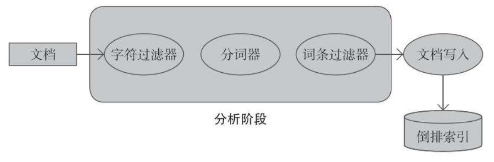

书籍地址：https://weread.qq.com/web/reader/7d13227071a486ab7d123b4

# 一、回顾与简介

> Elasticsearch使用的默认的堆大小（最小和最大都是）是2GB

## 1、Lucene 简介

### (1) Lucene 索引

- **文档 `document`**：索引与搜索的主要数据载体，包含一个或多个字段，存放将要写入索引或将从索引搜索出来的数据
- **字段 `field`**：文档的一个片段，包括字段的名称和内容两个部分
- **词项 `term`**：搜索时的一个单位，代表了文本中的一个词
- **词条 `token`**：词项在字段文本中的一次出现，包括词项的文本、开始和结束的偏移量以及类型

#### 1. 倒排索引

> `Lucene` 将写入的所有信息组织为倒排索引 `inverted index` 的结构形式

倒排索引是一种将词项映射到文档的数据结构，可以把倒排索引当作面向词项的而不是面向文档的数据结构

---

**案例**：只包含 title 字段的文档如下：


**说明**：

- 每个词项指向该词项所出现过的文档数，以及在文档中的位置
- 这种索引组织方式支持快速有效的搜索操作，如：基于词项的查询
- 除词项本身外，每个词项有一个与之关联的计数，该计数可以告诉 Lucene 该词项在多少份文档中出现过

#### 2. 段

- 索引由多个段 `segment` 组成，每个段只会写入一次但会被查询多次

- 索引期间，一个段创建后不再修改，如：段中某个文档被删除，相关信息会被单独保存在一个文件中，而段本身并没有被修改

- 多个段会在段合并 `segment merge` 阶段被合并在一起

    > - 段合并操作或被强制执行，或由 Lucene 的内在机制决定在某个时刻执行，合并后段的数量更少，但是单个段的体积更大
    > - 段合并操作 I/O 耗时严重，合并期间有些不再使用的信息将被清理掉，如：被删除的文档
    > - 对于容纳相同数据量的索引，搜索一个大段比搜索多个小段速度更快

---

注：实际的 Lucene 索引更复杂、更高深，除了词项的文档频率和出现该词项的文档列表之外，还包含其他附加信息

#### 3. norm

- `norm` 是一种与每个被索引文档相关的因子，用于存储文档的归一化结果，被用于计算查询的相关得分

- `norm` 基于索引时的文档加权值 `boost` 计算得出，与文档一起被索引
- `norm` 可以让 `Lucene` 在建立索引时考虑不同文档的权重，代价仅仅是需要一些额外的磁盘空间和内存来索引和存储 `norm` 信息

#### 4. 词项向量

- 词项向量 `term vector` 是一种针对每个文档的微型倒排索引
- 词项向量由词项和词项的出现频率结对组成，还可以包括词项的位置信息

> Lucene 和 Elasticsearch 默认都禁用词项向量索引，不过要启用诸如关键词高亮之类的功能，就需要启用这个选项

#### 5. 倒排项格式

- Lucene 的解码器架构，允许开发者控制索引文件写入磁盘的格式，倒排项就是索引中可定制的部分之一

- 倒排项可以存储字段、词项、文档、词项位置和偏移量以及载荷 `payload`

    > 载荷：一个在 Lucene 索引中随意存放的字节数组，可以包含任何需要的信息

注：针对不同目的，Lucene 提供不同倒排项格式，如：唯一标识格式专门为高散列范围字段提供

#### 6. doc values

- **倒排索引不适用场景**：操作文档而不是词项，此时 `Lucene` 要把索引翻转过来构成正排索引，然后再进行这些功能所需要的计算

- **解决**：Lucene 引入 `doc values` 和额外数据结构来进行排序和聚合。

- `doc values` 是存储字段的正排索引，Lucene 和 Elasticsearch 都允许通过配置来指定 `doc values` 的具体存储方式

    > 可选的存储方式包括：基于内存的、基于硬盘的以及二者的混合

#### 7. 文档分析

> 当把文档导入 Elasticsearch 时，会经历一个必要的分析阶段，以生成倒排索引

分析阶段由 `Lucene` 经过一系列步骤完成，如下图：



**文本分析过程**：由分析器来执行，分析器包含一个分词器、零到多个词条过滤器、零到多个字符过滤器

- **分词器**：用来将文本切割成词条，词条是携带各种额外信息的词项，包括词项在原始文本中的位置和词项的长度

    > 由分词器得到的结果被称为词条流，因为这些词条被一个接一个地推送给过滤器处理

- **过滤器**：数量可选，用于处理词条流中的词条，如：移除、修改词条流中的词条、生成新的词条

    > Lucene 有很多现成的过滤器，也可以根据需要实现新的过滤器
    >
    > 过滤器案例：
    >
    > - 小写过滤器：将所有词条转化为小写
    > - ASCII 过滤器：移除词条中所有非ASCII字符
    > - 同义词过滤器：根据同义词规则，将一个词条转化为另一个词条
    > - 多语言词干还原过滤器：将词条的文本部分转换成词根形式，即词干还原
    >
    > 当分析器中有多个过滤器时，会逐个处理，因此可以通过添加多个过滤器的方式来获得近乎无限的分析能力

- **字符过滤器**：在分词器之前被调用，分析阶段开始前完成文本预处理

    > 字符过滤器的一个例子就是 HTML 文本的去除标签处理

---

- 在查询时也会经过分析阶段，但可以选择其他路径而不分析查询条件

    > 注：Elasticsearch 有些查询会被分析，而有些则不会被分析，如：前缀查询不会被分析，而匹配查询会被分析

- 关于索引期与检索期的查询分析：只有当查询语句经过分词过程得到的词项能与索引中的词项匹配上时，才会返回预期的文档集

    > 如：若在索引期使用词干还原与小写转换，则在查询期，也应该对查询串做相同的处理，否则查询可能不会返回任何结果

#### 8. Lucene 查询语言基础

> 若查询被设置为要被分析，则预先选定的分析器将会对查询中的所有词项进行处理

Lucene 的查询被分割为词项与操作符：

- **词项**：可以是单个的词，也可以是一个短语(用双引号括起来的一组词)

- 查询可以包含布尔操作符，布尔操作符连接多个词项，使之构成从句：

    **布尔操作符**：

    - `AND`：文档匹配当前从句，当且仅当 AND 操作符左右两边的词项都在文档中出现

        > 如：当执行 apache AND lucene 这样的查询时，只有同时包含词项 apache 和词项 lucene 的文档才会被返回给用

    - `OR`：包含当前从句中任意词项的文档都被视为与该从句匹配

        > 如：当执行 apache OR lucene 这样的查询时，任意包含词项 apache 或词项 lucene 的文档都会被返回给用户

    - `NOT`：与当前从句匹配的文档必须不包含NOT操作符后面的词项

        > 如：当执行 lucene NOT Elasticsearch 这样的查询时，只有包含词项 lucene 且不包含词项 Elasticsearch 的文档才会返回

    **运算操作符**：

    - `+`：只有包含 `+` 操作符后面词项的文档才会被认为与从句匹配

        > 如：当查找那些必须包含 lucene，但 apache 可出现可不出现的文档时，可以执行查询：+lucene apache

    - `–`：与从句匹配的文档不能出现 `-` 操作符后的词项

        > 如：当查找那些包含 lucene，但是不包含 Elasticsearch 的文档时，可以执行查询：+lucene-Elasticsearch

---

补充：

- 若查询中没有出现前面提到过的任意操作符，则默认使用 `OR` 操作符

- 可以使用圆括号对从句进行分组，以构造更复杂的从句

#### 9. 对字段执行查询

> Lucene 所有数据都存储在字段中，而字段又是文档的组成单位

- 为实现针对某个字段的查询，用户需要提供字段名称，再加上冒号以及将要对该字段执行查询的从句

    > 如：若查询所有在 `title` 字段中包含词项 `Elasticsearch` 的文档，可以执行 `title:Elasticsearch`

- 也可以在一个字段中同时使用多个从句

    > 如：若查找所有在 `title` 字段中同时包含词项 `Elasticsearch` 和短语 `mastering book` 的文档，可执行 `title:(+Elasticsearch +"mastering book")` 或 `+title:Elasticsearch +title:"mastering book"` 

#### 10. 词项修饰符

> 除使用简单词项和从句的常规字段查询外，Lucene 还允许使用修饰符修改传入查询对象的词项

- 通配符：
    - `?`：匹配任意一个字符
    - `*`：匹配多个字符

- 模糊查询：`~` + 整数值

    - 当使用该修饰符修饰一个词项时，意味着搜索那些包含与该词项近似的词项的文档

    - `～` 字符后的整数值定义了近似词项与原始词项的最大编辑距离

        > 如：执行查询 `writer～2` 时，意味着包含词项 `writer` 和 `writers` 的文档都可以被视为与查询匹配

    - 当修饰符 `～` 作用于短语时，其后的整数值表示 Lucene 可以接受词项之间多大距离

        > 如：执行查询 `title:"mastering Elasticsearch"`，则在 title 字段中包含 `mastering Elasticsearch` 的文档被视为与查询匹配，而包含 `mastering book Elasticsearch` 的文档则被认为不匹配
        >
        > 但若执行查询 `title:"mastering Elasticsearch"~2`，则这两个文档都被认为与查询匹配

    - 还可以使用 `^` 字符并赋予一个浮点数对词项加权，从而提高该词项的重要程度

        > 小于1的权重值会降低文档重要性，而大于1的权重值会提高文档重要性。词项权重值默认为1

    - 也可以使用方括号和花括号来构建范围查询

        > 如：
        >
        > - 在数值类型字段上执行范围查询 `price:[10.00 TO 15.00]`，则返回文档的 price 字段值将在 `10.00 - 15.00` 间
        >
        > - 在字符串类型字段上执行范围查询 `name:[Adam TO Adria]`，则返回文档的 name 字段中，包含了按字典顺序介于 Adam 和 Adria 之间的词项
        >
        > - 执行一边受限而另一边不受限制的范围查询 `price:[10.00 TO *]`，则返回文档的 price 字段值大于等于 10.00

#### 11. 特殊字符处理

搜索某个特殊字符 `+、–、&&、||、！、(、)、{}、[]、^、"、~、*、?、：、\、/`，需要先使用反斜杠对特殊字符进行转义

> 如：搜索 `abc"efg` 这个词项，需要按如下方式处理：`abc\"efg` 

### (2) Elasticsearch 概览

#### 1. 基本概念

- **索引**：Elasticsearch 存储数据的逻辑名字空间，在有分片和副本的情况下可能由一个或多个 Lucene 索引构成

- **文档**：文档就是 JSON 对象，包含的实际数据由键值对构成

    > 注：一旦某个字段上生成了索引，Elasticsearch 就会为那个字段创建一个数据类型

- **类型**：Elasticsearch 的一个文档类型代表一类相似的文档

    > 类型有两个重要组成部分：
    >
    > - 一是名字，如：一个用户或一篇博客
    > - 二是字段的数据类型和 Lucene 配置之间的映射关系

- **映射**：存储分析链所需的信息，如：将输入文本拆分成词条、进行词条过滤和额外处理(如去除 HTML 标签)

    > 文档在生成索引之前都要经历分析阶段

- **节点**：运行在服务器上的单个 Elasticsearch 服务实例

    - 第一类节点(数据节点)：用来储存数据，同时提供对这些数据的搜索功能，Elasticsearch 可用来索引和存储数据

    - 第二类节点(主节点)：作为监督者控制其他节点的工作
    - 第三类节点(客户端节点)：只用于查询路由
    - 第四类节点(部落节点)：关联多个集群，允许在多个集群之上执行几乎所有可以在单集群 Elasticsearch 上执行的功能
    - 第五类节点(ingest 节点)：可以在生成索引之前先进行数据转换

- **集群**：多个协同工作的 Elasticsearch 节点的集合

- **分片**：存储在一个或多个节点上的容器，由 Lucene 段组成

    - 索引由一到多个分片组成，让数据可以分布开
    - 分片数量在索引创建时就配置好，之后无法增减

    > 分片也有主从之分：
    >
    > - 所有改动索引的操作都发生在主分片上，从分片的数据由主分片复制而来，支持数据快速检索和高可用
    > - 若主分片所在的服务器宕机，从分片会自动升级为主分片

- **副本**：为支持高可用而保存在分片中的另一份数据，也有助于提供快速检索体验

#### 2. 工作原理

- Elasticsearch 使用 `zen discovery` 模块来组成集群，使用单播作为默认发现机制

- 当一个 Elasticsearch 节点启动时，先尝试去搜索和发现单播主机列表，寻找主节点
    - 单播主机列表由配置文件 `elasticsearch.yml` 中的 `discovery.zen.ping.unicast.hosts` 参数指定
    - 默认单播主机列表是 `["127.0.0.1"，"[::1]"]`，因此每个节点启动时并不会自己形成一个集群

## 2、Elasticsearch 5.x 简介

### (1) 新特性

#### 1. Elasticsearch 5.x 新特性

- **`Ingest` 节点**：可用于在构建索引之前先进行简单的数据转换和处理

    > 注：任意节点都可以配置成 `ingest` 节点，而且非常轻量级

- **索引收缩**：`_shrink API` 可以让用户将现有的索引收缩成一个新索引，并且分片数更少

    > 一旦索引构建完成，就无法减少分片数量，而且每个分片都会消耗资源

- **`Painless` 脚本语言**：Painless 脚本语言，又快又安全。要变得更强大和更有适应性，Painless还有很多优化工作要做

- **快速聚合**：查询在协调节点上进行解析，并用二进制格式序列化到不同节点上，使得更高效，缓存的查询语句更多，在数据被切分为按时间分片的场景中表现得尤其突出，因此聚合速度大大提高

- **新的自动完成建议器**：自动完成建议器现在基于 Lucene 的第一版新的 suggest API 构建

    > 由于自动完成建议器对语法和响应有要求，类型补齐字段的语法和数据结构都有了变化

- **多维点**：基于 `k-d` 树地理空间数据结构构建，可以提供快速的单维和多维数字范围以及地理空间点形状过滤功能

    > 多维点有助于减少磁盘空间和内存占用，加快搜索

- **通过查询 API 删除**：支持通过 `_delete_by_query REST` 端点来删除满足查询条件的文档

#### 2. Elasticsearch 2.x 新特性

- **重建索引 API**：`_reindex API` 把数据从一个索引移到另一个索引，而且在为文档重新生成索引的同时还提供了丰富的控制手段，比如用脚本做数据转换、许多可配置参数等
- **通过查询更新**：`update_by_query REST` 端点提供了根据某些条件直接更新文档，并且无须重新索引数据的功能
- **任务 API**：通过 `_task REST` 端点提供的任务管理 API，用于从集群的一个或多个节点获取当前正在执行的任务信息
- **查询 `Profiler`**：可以调试查询语句，了解为什么有的查询很慢，并采取步骤优化它，注：需要将 `profile` 标志置 `true`

### (2) Elasticsearch 演进

> 演进方向：功能/性能/运维、节点/集群

#### 1、0.7.0

2010年5月14日发布，第一个可以查询到发版信息的版本，重要特性：

- `Zen Discovery` 自动发现模块

- `Groovy Client` 支持

- 简单的插件管理机制

- 更好支持 `ICU` 分词器

- 更多的管理 API

#### 2、1.0.0

2014年2月14日发布，重要特性：

- `Snapshot/Restore API` 备份恢复API

- 支持聚合分析 `Aggregations`

- `CAT API` 支持

- 支持联盟查询

- 断路器支持

- `Doc values` 引入

#### 3、2.0.0

2015年10月28日发布，重要特性：

- 增加了 `pipleline Aggregations`

- `query/filter` 查询合并，都合并到 query 中，根据不同的上下文执行不同的查询

- 存储压缩可配置

- `Rivers` 模块被移除

- `Multicast` 组播发现被移除，成为一个插件，生产环境必须配置单播地址

#### 4、5.0.0 (GA)

2016年10月26日发布，重要特性：

- Lucene 6.x 的支持，磁盘空间少一半；索引时间少一半；查询性能提升25%；支持 IPV6

- `Internal engine` 级别移除了用于避免同一文档并发更新的竞争锁，带来 `15%-20%` 的性能提升

- `Shrink API` 可将分片数收缩成它的因数，如：之前15个分片，可以收缩成5个或3个或1个

    > 场景：在写入压力非常大的收集阶段，设置足够多的索引，充分利用 `shard` 并行写能力，索引写完之后收缩成更少的 `shard`，提高查询性能

- 提供了第一个 Java 原生的 REST 客户端 SDK

- `IngestNode`：之前若要对数据加工，都在索引之前处理，如：`logstash` 可以对日志进行结构化和转换，现在可以直接在 es 处理

- 提供了 `Painless` 脚本，代替 `Groovy` 脚本

#### 5、6.0.0

2017年8月31日发布，重要特性：

- 稀疏性 `Doc Values` 的支持

- `Index sorting`，即索引阶段的排序

- 顺序号的支持，每个 es 的操作都有一个顺序编号(类似增量设计)

- 无缝滚动升级

- `Removal of types`，在 6.0 里面，开始不支持一个 index 里面存在多个 type

- `Index-template inheritance`，索引版本的继承，目前索引模板是所有匹配的都会合并，这样会造成索引模板有一些冲突问题， 6.0 将会只匹配一个，索引创建时也会进行验证

- `Load aware shard routing`， 基于负载的请求路由，目前的搜索请求是全节点轮询，则性能最慢的节点往往会造成整体的延迟增加，新的实现方式将基于队列的耗费时间自动调节队列长度，负载高的节点的队列长度将减少，让其他节点分摊更多的压力，搜索和索引都将基于这种机制

- 已经关闭的索引将也支持 `replica` 的自动处理，确保数据可靠

#### 6、7.0.0

2019年4月10日发布，重要特性：

- 引入了真正的内存断路器，可以更精准地检测出无法处理的请求，并防止使单个节点不稳定

- `Zen2` 是 Elasticsearch 的全新集群协调层，提高了可靠性、性能和用户体验，变得更快、更安全，并更易于使用

- 查询优化

- 更快的前 k 个查询

- 间隔查询

- Function score 2.0

# 二、查询 DSL 进阶

## 1、Lucene 文本评分机制 —— BM25

- 评分：指针对给定查询计算某个文档的分值属性的过程

- 文档得分：是一个描述文档与查询匹配程度的参数

    > Lucene 的评分算法：
    >
    > - `TF-IDF`(词频/逆文档频率)
    > - `BM25`(最佳匹配)

### (1) 理解精确率与召回率

- **精确率**：获取到的相关文档数占获取到的总文档数(包括相关与不相关)的比例，用百分数表示

- **召回率**：获取到的相关记录数占数据库中相关的记录总数的比例，用百分数表示

    > 在分析阶段中，可以控制 Lucene 的评分机制，进而提高召回率

注：Elasticsearch 提供了定制权重和函数评分查询等其他不同的功能，增强用户的控制力

### (2) 回顾 TF-IDF

#### 1. TF-IDF 评分机制简介

> `TF-IDF` 是 Lucene 评级功能的核心，融合了向量空间模型 `VSM` 和信息获取的布尔模型

- Lucene 主要理念：与一个查询词项在整个集合中出现的次数相比，该词项在文档中出现的次数越多，则文档就和查询越相关

- Lucene 也会利用查询规范的布尔逻辑，先用布尔模型来缩小要打分的文档的范围

---

用 TF-IDF 为文档打分，要考虑几个因子：

- **词频 `TF`**：一个基于词项的因子，用来表示一个词项在某文档中出现了多少次；词频越高，文档得分越高

    > 计算方法：用该词项在文档中出现的次数，除以文档的词项总数

- **逆文档频率 `IDF`**：一个基于词项的因子，用来告诉评分公式该词项有多罕见；逆文档频率越高，该词项就越罕见；评分公式利用该因子来为包含罕见词项的文档加权

    > - 计算方法：$ln{包含词项 t 的文档数除以文档总数}$ 
    >
    > - 计算IDF时要用到 log 运算，因为 the、that、is 之类的词项可能会出现非常多次，要降低这些频繁出现的词项权重，提高很少出现的词项权重

- **协调因子 `coord`**：基于文档中词项个数的协调因子，一个文档命中了查询中的词项越多，得分越高

- **字段权重 `field boost`**：查询期赋予某个字段的权重值

- **文档权重 `document boost`**：索引期赋予某个文档的权重值

- **长度范数 `Length norm`**：每个字段基于词项个数的归一化因子(在索引期被计算并存储在索引中)

    > 一个字段包含的词项数越多，该因子的权重越低，即 Lucene 评分公式更“喜欢”包含更少词项的字段

- **查询范数 `Query norm`**：一个基于查询的归一化因子，等于查询中词项的权重平方和

    > 查询范数使不同查询的得分能互相比较，尽管这种比较通常是困难和不可行的

---

- 信息获取过程中，相关性评分函数的简单实现：把每个检索词项的 `TF-IDF` 权重相加，而`每个词项的权重= TF(term) * IDF(term)`

    > 由一次检索中出现的所有词项的组合权重就可以计算出得分，用于返回排序后的结果

- Lucene 实际使用的评分公式：

    $score(q,d)=coord(q,d)*queryNorm(q)*\sum_{t \ in \ q}(tf(t \ in \ d)*idf(t)^2 * boost(t)*norm(t,d))$ 

    > 对于一次检索，`score(q,d)` 就是文档的得分

#### 2. BM25 评分机制简介

BM25 也是一种根据相关性来为文档进行打分和评级

- 两种算法都用到了词频、逆文档频率和字段长度范化，但这些因子的定义稍有不同
- 两种模型都根据某些 IDF 函数和 TF 函数为每个词项算出权重，并把所有词项的权重相加，作为这个文档对应这次查询的得分

---

BM25 使用的数学公式：$bm25(d) = \sum_{t \in q,f_{t,d}>0}log[1+\frac{N-df_t+0.5}{df_t+0.5}\cdot \frac{f_{t,d}}{f_{t,d}+k \cdot (1-b+b \frac{l(d)}{avgdl})}]$ 

- `N` 是数据集中可用的文档总数

- $df_t$ 是包含这个词项的文档总数

- `k` 或 `k1` 是饱和度参数，控制词项频率增长多快时会导致词频饱和，默认值是 `1.2`，值越小饱和越快，值越大饱和越慢

    > 饱和度是用于限制词频在具体文档中的影响的参数，通过调节参数 k 可以调节词频的影响

- `b` 是长度参数，控制字段长度归一化的影响，值为 `0.0` 时完全关闭归一化，值为 `1.0` 时进行完全泛化，默认值是 `0.75`

- `l(d)` 是文档中的词条数量

- `avgdl` 是整个数据集里所有文档的平均长度

- $f_{t，d}$ 是文档中一个词项的频率

### (3) BM25 与 TF-IDF 的不同

#### 1. 饱和点

- `TF-IDF` 中由饱合度引起的评分问题：
    - 若布尔查询条件中的 N 个词项里，某个词项在某份文档中出现了许多次，则这份文档的分值就会极高，因为其词项饱和度`sqrt(termFreq)` 很弱
    - 若查询条件是 `x or y`，而某份文档中有 1000 个 x，0 个 y，则 `TF-IDF` 不会考虑 `y` 从未出现过，仍然会给它极高的分数，协调因子 `coord` 就是用来弱化这种行为的

- `BM25` 提供了参数 `k1`，可以对词项饱和度提供更有力的控制

    - 即使查询条件中的某个词项出现了许多次，所增加的分数也远比不上另一个词项出现的次数从 0 变为 1

    - BM25 倾向尽量多的查询词项都出现过的文档，若某份文档中 x 出现过 5 次，y 只出现过一次，而另一份文档中出现过 1000 个 x和 0 个 y，则前一份文档的得分肯定会高很多

#### 2. 平均文档长度

- `TF-IDF` 和 `BM25` 的另一个显著区别是 `BM25` 考虑了文档长度的影响，比如：

    - 某篇包含了 1000 个词项的文章中，假如“旅行”这个词只出现过一两次，则内容与旅行没有太大关系
    - 但若“旅行”这个词在一篇很短的推文中就出现了两次，则这篇推文肯定和旅行有很大关系

- `TF-IDF` 在计算与文档长度相关的分数时处理得很片面，篇幅较长的文档字数自然多，因此词频也会比较高，与词项不太相关，与查询条件也不太相关

    `BM25` 引入了文档长度进行补偿，有些文档的内容涉及范围比较广，因此字数多也合理

    > 从数学公式中可以看到，BM25引入了调节参数 `b`、文档长度 `dl`、平均文档长度 `avdl` 等来调节词项因子

## 2、查询 DSL 重构

- 查询 DSL 是向 Elasticsearch 发送 JSON 格式的查询条件的接口


## 3、为任务选择合适的查询

### (1) 查询方式分类

#### 1. 基本查询

- **用途**：索引检索，其输入数据既可以分析也可以不分析

- **特征**：基本查询内部不可以包含其他查询

- **用法**：通常作为其他复杂查询的一部分或单独传递给 Elasticsearch。

    > 可以把基本查询比作修筑大厦的砖块，而大厦就是各种复杂查询

---

属于基本查询的查询方式举例如下：

- `match` 查询：适用执行全文检索且需要对输入进行分析的场景

    > 使用场景：
    >
    > - 分析输入内容却不需要完整的 Lucene 查询语法支持
    >
    > - 适合处理用户输入文本的场景，因为不需要进行查询语法解析，发生解析错误的概率极低

- `match_all` 查询：匹配所有文档，常用于需要对所有索引内容进行归类处理的场景

- `term` 查询：一种简单、无需对输入进行分析的查询方式，可以查询单个词项

    > - 使用场景：针对不需要分析的字段进行检索，如：在测试代码中检索 tags 字段
    >
    > - 经常跟过滤器配合使用，如：在测试代码中针对 category 字段进行过滤操作

---

简单查询包括：`match、multi_match、common、fuzzy_like_this、fuzzy_like_this_field、geoshape、ids、match_all、query_string、simple_query_string、range、prefix、regexp、span_term、term、terms、wildcard` 等

#### 2. 组合查询

- 唯一用途：把其他查询组合在一起使用

    > 简单查询是建造高楼的砖块，组合查询就是粘合这些砖块的水泥

- 可以把组合查询无穷次地嵌套，用来构建极其复杂的查询，唯一能够阻止这样嵌套的障碍是性能

----

组合查询的一些示例和用法如下：

- `dis_max` 查询：这种查询的文档得分结果和最高权重的子查询得分高度相关，而不是如 bool 查询那样对所有子查询得分进行求和

    > - 返回匹配所有子查询文档，并计算最终得分 = max(各子查询的得分) + tie_breaker * (非最高得分子查询的得分之和)
    >
    > - 适用场景：希望最高得分子查询能够在打分过程中起决定作用

- `bool` 查询：能够把多个查询用布尔逻辑组织在一起，可以控制查询的某个子查询部分是必须匹配、可以匹配还是不应该匹配

    > 适用场景：
    >
    > - 把匹配不同查询条件的查询组合在一起使用
    >
    > - 希望文档的最终得分为所有子查询得分的和
    >
    > ---
    >
    > 以下 Boolean 从句可以组合起来，用于匹配文档：
    >
    > - `must`：写在这个从句里面的条件必须匹配上，才能返回文档
    > - `should`：写在 should 从句中的查询条件可能被匹配上，也可能不匹配，但若 bool 查询中没有 must 从句，则至少要匹配上一个 should 条件，文档才会返回
    > - `must_not`：写在这个从句中的条件一定不能被匹配上
    > - `filter`：写在这个从句中的查询条件必须被选中的文档匹配上，只是这种匹配与评分无关
    >
    > ---
    >
    > bool查询的结构如下：
    >
    > ```json
    > {
    >     "query": {
    >         "bool": {
    >             "must": [{}],
    >             "should": [{}],
    >             "must_not": [{}],
    >             "filter": [{}]
    >         }
    >     }
    > }
    > ```
    >
    > ---
    >
    > 下面这些参数 bool 查询也支持：
    >
    > - `boost`：用于控制 `must` 或 `should` 查询从句的分数
    >
    > - `minimum_should_match`：只适用于 should 从句，可以限定要返回一份文档，至少要匹配多少个 should 从句
    >
    > - `disable_coord`：bool 查询会对所有的 should 从句使用查询协调，因为匹配的从句越多，文档的得分就越高
    >
    >     > 下述情况要禁用查询协调：当在文本字段中查找同义词 turmoil 和 riot 时，并不关心文档中出现了多少同义词，此时把 disable_coord 置为 true，以禁用查询协调，让相似的从句不影响分数的计算
    >     >
    >     > ```json
    >     > {
    >     >     "query": {
    >     >         "bool": {
    >     >             "disable_coord": true,
    >     >             "should": [
    >     >                 {
    >     >                     "term": {
    >     >                         "text": {
    >     >                             "value": "turmoil"
    >     >                         }
    >     >                     }
    >     >                 },
    >     >                 {
    >     >                     "term": {
    >     >                         "text": {
    >     >                             "value": "riot"
    >     >                         }
    >     >                     }
    >     >                 }
    >     >             ]
    >     >         }
    >     >     }
    >     > }
    >     > ```

---

组合查询包括：`bool、boosting、constant_score、dis_max、filtered、function_score、has_child、has_parent、indices、nested、span_first、span_multi、span_first、span_multi、span_near、span_not、span_or、span_term、top_children` 等

#### 3. 无分析查询

- **特征**：不会被分析，直接传递给 Lucene 索引

    > 要么确切理解分析过程，并提供合适的词项；要么直接针对无分析字段进行查询

- **分析**：这类查询会精确匹配传入的词语，不会使用语言分析器等工具对词语进行分词和其他处理

- **用途**：适用于把 Elasticsearch 当作 NoSQL 数据库使用

---

无分析查询案例：

- `term` 查询：即词项查询，可以匹配某个字段中的给定值，如：希望匹配一个拥有特定标签的文档，可以使用词项查询
- `prefix` 查询：即前缀查询，常用于自动完成功能，即用户输入一段文本，搜索系统返回所有以这个文本开头的文档

---

无分析查询包括：`common、ids、prefix、span_term、term、terms、wildcard` 等

#### 4. 全文检索查询

- **分析**：这类查询会根据索引映射配置对输入进行分析，支持 Lucene 查询语法和打分计算等功能

- **用途**：
    - 当构建类似 Google 的查询接口时，可以使用全文检索查询
    - 若查询的一部分文本来自用户输入，可以考虑 query_string、match、simple_query_string 等查询

---

全文检索查询类别的示例和用法如下：`simle_query_string` 查询构建于 Lucene 的 `SimpleQueryParser` 类

> 若不希望在遭遇解析错误时直接失败，而是想要尝试给出用户期望的答案，那么这种查询方式是不错的选择

全文检索查询包括：`match、multi_match、query_string、simple_query_string` 等

#### 5. 模式匹配查询

- 这类查询都在查询语句中支持各种通配符，如：前缀查询 prefix、通配符查询 wildcard、正则表达式查询 regexp

- 正则表达式查询：想找出其词项匹配某个固定模式的文档

- 模式匹配查询包括：`prefix、regexp、wildcard` 等

#### 6. 支持相似度操作的查询

- **用途**：可以根据给定词项查找近似词项或文档的查询方式的集合

- **案例**：

    - `fuzzy` 查询：找出包含 `crimea` 的近似词项的文档

        > 用途：提供类似“你是不是想找XXX”的功能

    - `more_like_this` 查询：找出文档标题与输入文本相似的文档

        > 可以使用本类别下的某个查询来查找包含与给定输入内容近似的词项或字段的文档

- 该查询包括：`fuzzy_like_this、fuzzy_like_this_field、fuzzy、more_like_this、more_like_this_field` 等

#### 7. 支持打分操作的查询

- 适用于和全文搜索查询组合使用的场景，包括允许在查询时修改打分计算过程的查询方式，如：function_score 查询

- **用途**：这是一组用于改善查询精度和相关度的查询方式，通过指定自定义权重因子或提供额外处理逻辑的方式来改变文档得分

- 案例：`function_score` 查询可以使用函数，从而通过数学计算的方式改变文档得

- 本类查询包括：`boosting、constant_score、function_score、indices` 等

#### 8. 位置敏感查询

> Elasticsearch 提供的各种范围查询就是这类查询的典型代表

- **特征**：不仅可以匹配特定词项，还能匹配词项的位置信息，即允许使用索引中存储的词项位置信息

- **用途**：要找出一组和其他单词保持一定距离的单词

    > 如：找出同时包含 mastering 和 Elasticsearch 且这两个单词相互临近，后面距离不超过 3 的位置包含 second 和 edition 单词

- **缺点**：这些查询开销很大，需要消耗大量CPU资源才能保证正确处理

---

本类查询包括：`match_phrase、span_first、span_multi、span_near、span_not、span_or、span_term` 等

#### 9. 结构敏感查询

- **特征**：基于结构化数据，即支持对文档结构进行检索且不需要对文档数据进行扁平化处理的查询方式

- **用途**：能够在子文档或嵌套文档中进行搜索，或查找属于给定父文档的子文档

- 这类查询包括：`nested、has_child、has_parent、top_children` 等

### (2) 使用示例

#### 1. 测试数据

- 先创建一个名为 `library` 的索引，并加入一些测试数据，library 索引的映射如下：


---

- 用到的数据在books.json文件中。文件中的示例文档如下：


---

- 运行下面的命令将会使用给定的映射创建索引，并索引数据：

    ```shell
    curl -XPUT 'localhost:9200/library'
    curl -XPUT 'localhost:9200/library/book/_mapping' -d @library.json
    curl -s -XPOST 'localhost:9200/_bulk' --data-binary @books.json
    ```

- 将两份新文档添加到索引中的命令如下：

    

#### 2. 基本查询示例

- 需求：匹配给定取值范围的文档

- 案例：查出书籍本数在 `[1，3]` 区间内的查询如下所示：

    ```shell
    curl -XGET 'localhost:9200/library/_search?pretty' -d
    '{
    	"query": {
    		"range": {
    			"copies": {
    				"gte": 1,
    				"lte": 3
    			}
    		}
    	}
    }'
    ```

#### 3. 组合查询示例

使用组合查询来组合其他查询方式：

- **对多个词项的布尔查询**：用户要显示由查询条件决定的书的若干个标签，若用户提供的标签数超过3个，只要求匹配上查询条件中标签数的75%即可；若用户提供了 3 个或更少的标签，就要全部匹配

    ```shell
    curl -XGET "http://localhost:9200/library/_search?pretty" -d
    '{
    	"query": {
    		"bool": {
    			"should": [
    				{"term": {"tags": {"value": "novel"}}},
    				{"term": {"tags": {"value": "polish"}}},
    				{"term": {"tags": {"value": "classics"}}},
    				{"term": {"tags": {"value": "criminal"}}}
    			]
    		}
    	}
    }'
    ```

- **对匹配文档加权**：包含一个可选的加权片段的 bool 查询，来实现对部分文档的权重提升，如：需要找出所有至少有一本的书籍，并对 1950 年后出版的书籍进行加权，可以使用如下查询命令：

    ```shell
    curl -XGET "http://localhost:9200/library/_search?pretty" -d
    '{
    	"query": {
    		"bool": {
    			"must": [{"range": {"copies": {"gte": 1}}}],
    			"should": [{"range": {"year": {"gt": 1950}}}]
    		}
    	}
    }'
    ```

- **忽略查询的较低得分部分**：`dis_max` 查询可以控制查询中得分较低部分的影响，如：希望找出所有 title 字段匹配 Young Werther 或 characters 字段匹配 Werther 的文档，并在文档打分时仅考虑得分最高的查询片段，可以执行如下查询命令：

    - **执行完整查询**：

        ```shell
        curl -XGET "http://localhost:9200/library/_search?pretty" -d
        '{
        	"query": {
        		"dis_max": {
        			"tie_breaker": 0.0,
        			"queries": [
        				{"match": {"title": "Young Werther"}},
        				{"match": {"characters": "Werther"}}
        			]
        		}
        	},
        	"_source": false
        }'
        ```

        结果如下：

        

    - **分批执行查询**：
    
        - **查询一**：
    
            ```shell
            curl -XGET "http://localhost:9200/library/_search?pretty" -d
            '{
            	"query": {
            		"match": {"title": "Young Werther"}
            	},
            	"_source": false
            }'
            ```
        
            结果如下：
        
            
        
        - **查询二**：
        
            ```shell
            curl -XGET "http://localhost:9200/library/_search?pretty" -d
            '{
            	"query": {
            		"match": {"characters": "Werther"}
            	},
            	"_source": false
            }'
            ```
    
    > 结论：`dis_max` 查询返回的文档得分等于打分最高的查询片段的得分(上面的第一个查询片段)

#### 4. 无分析查询示例

需求：查找出所有 tags 字段包含 novel 值的书籍，执行如下查询命令

```shell
curl -XGET "http://localhost:9200/library/_search?pretty" -d
'{
	"query": {
		"term": {
			"tags": "novel"
		}
	}
}'
```

#### 5. 全文检索查询示例

选出两个简单场景的查询示例加以展示：

- **使用 Lucene 查询语法**：

    案例：找出 title 字段包含 sorrows 和 young 词项、author 字段包含 von goethe 短语，且本数不超过5本的书，执行如下查询：

    

    > 在这个查询中，使用 Lucene 查询语法来传递所有匹配条件，让 Lucene 通过查询解析器来构造合适的查询

- **对用户查询语句进行容错处理**：

    - 错误查询：

        

        失败提示：即在构建查询时遇到了解析错误，查询无法被成功地构建出来

        

    - 解决方法：使用一个可以尝试处理用户输入错误的查询解析器，并试图猜测用户的查询用意，如：用 `simple_query_string` 查询来改写上面这个例子，代码如下：

        

        > 如果执行这个查询，Elasticsearch 能够返回合适的文档结果，尽管查询并未被恰当地构造

#### 6. 模式匹配查询示例

使用通配符的查询例子有很多，不过在这里只展示下面这两个例子：

- **使用前缀查询实现自动完成功能**：

    - 分析：前缀查询不会被分析，直接基于特定字段中被索引的词项工作

    - 案例：假定对 title 字段的所有词条提供自动完成功能，此时用户输入的前缀是 wes，符合条件的对应查询构造如下

        

- **模式匹配**：

    - 分析：若匹配特定模式，而此时索引中的词条无法支持，则可以尝试使用 regexp 查询

    - 注意：regexp 查询的执行性能与所选正则表达式相关，若选择一个能够被改写成大量词项的正则表达式，执行性能将极其糟糕

    - 案例：找出符合以下条件的文档：文档的 characters 字段中包含以 wat 开头、以 n 结尾、中间有两个任意字符的词项

        

#### 7. 支持相似度操作的查询示例

- 使用 fuzzy 查询找出包含与给定词项近似的文档，如：查找包含 younger 的近似词项的文档，可以执行如下查询命令：

    

#### 8. 支持修改得分的查询用例

- 分析：Elasticsearch 提供的 function_score 查询是个非常赞的工具，可以改变匹配到的文档的得分

- 案例：想要列出所有的书籍，不过要通过降低书籍得分的方式把那些当前无货的书籍放到结果列表的末尾。不希望按标记是否有货的字段进行排序，因为用户有时候清楚地知道要找什么书，而且全文检索查询的结果得分也是很重要的。不过，如果仅仅想把当前无货的书籍排到结果尾部，可以执行如下查询命令：

    

#### 9. 模式查询示例

因为资源消耗过于巨大，所以这类查询用得不多，与模式有关的查询可以按短语和词项的正确顺序去匹配文档，案例如下：

- **匹配短语**：

    - 分析：这是这一类对位置敏感的查询中最简单，同时也是性能最高的

    - 案例：只需要在文档的 otitle 字段中匹配到短语 leiden des jungen 的查询

        

- **无处不在的跨度查询**：

    - 分析：短语查询在处理位置敏感需求时非常简便

    - 案例：在 die词项后面不超过两个位置的地方包含一个 des jungen 短语，并且紧跟着短语后面是一个 werthers 词项，这时使用范围查询，符合这些条件的查询命令如下

        

### (3) 查询 DSL 的变化

- `missing` 查询(missing 过滤器)被彻底去除，要使用 `must_not` 代替
- 有 `bool` 查询后，`AND/OR` 过滤器被彻底去除，`must` 布尔从句可以替换 `AND`，`should` 从句可以替换 `OR`
- 查询类型 `count` 从查询 DSL 中彻底去除，若只想得到文档数量，则在使用聚合时，把 size 参数设为 0 也可以达到相同目的
- 查询类型 `scan` 也被去除，功能由 `scroll` 请求替代，后者可以按 `_doc` 的顺序将文档排序
- 过滤查询已经在 Elasticsearch 5.x 中被彻底去除

## 4、查询改写

> **查询改写**：把原本代价昂贵的查询语句改写成一组性能更高的查询语句，从而加快查询执行速度，该过程对客户端不可见

### (1) 前缀查询示例

- **假设**：索引下面数据

    

- **需求**：找出索引中所有 `name` 字段以字母 `j` 开头的文档

- **使用前缀查询**，同时设置查询改写属性以确定执行查询改写的具体方法

    

- **查询结果**：返回结果有 3 份文档，但没有显式设置待查询索引的映射，而 Elasticsearch 猜测出了 name 字段的映射，并将其设置为字符串类型并进行文本分析

    

- **结果检查命令**：

    

- **新的返回结果格式类似如下**：

    

### (2) 回到 Lucene

- **Lucene 倒排索引**：包含词项、总数、文档指针、词项在文档中的位置

    

- Lucene 内部实现会将 “找出索引中所有 `name` 字段以字母 `j` 开头的文档” 的前缀查询改为下面的 Lucene 查询：

    

- 使用 Elasticsearch API 检查重写片段，使用 Explain API 执行如下命令：

    

    执行结果如下：

    

> **结论**：Elasticsearch 对 name 字段使用了一个词项是 `joe` 的确定分值的查询

### (3) 查询改写的属性

- **作用**：多词项查询的 `rewrite` 属性可以控制查询在 Lucene 内部的改写方式，如：取值 `constant_score_boolean` 

- **使用**：将 `rewrite` 参数存放在代表实际查询的 JSON 对象中

    

- `rewrite` 参数配置：

    - `scoring_boolean`：将每个生成的词项转化为布尔查询中的一个 `should` 从句

        > - 特点：需要对每个文档都单独计算得分
        > - 缺点：比较耗费CPU(因为要计算和保存每个词项的得分)，且部分查询生成太多词项，以至于超出布尔查询默认的1024个从句限制

    - `constant_score_boolean`：类似 `scoring_boolean` 但 CPU 耗费更少

        > - 特点：并不计算每个从句的得分，而是每个从句得到一个与查询权重相同的常数得分(默认为1)，可以通过设置查询权重来改变这个默认值
        >
        > - 缺点：这种重写方法也会生成布尔 should 从句，因此也受布尔从句最大数量 `1024` 的限制

    - `constant_score`(默认属性)：一个一个按顺序去为每个词项标记文档，匹配上的文档将按查询的权重被设置为常值分数

        > 当搜索的词项很少时，性能与 `constant_score_boolean` 相近

    - `top_terms_N`：将每个生成的词项转化为布尔查询中的一个 should 从句，并保存计算出来的查询得分

        > 与 `scoring_boolean` 不同：只保留最佳的 N 个词项，以避免触及布尔从句数量的限制，并提升查询整体性能

    - `top_terms_boost_N`：类似 `top_terms_N`

        > 不同点：其文档得分不是通过计算得出，而是被设置为跟查询权重(boost)一致，默认值为 `1` 

    - `top_terms_blended_freqs_N`：先把每个词项转化为布尔查询的 should 从句，但所有词项查询都会计算分数

        > - `N` 指定选择多少个分数最高的词项
        > - 只关心得分最高的词项，所以不会超出布尔查询的限制

---

**案例**：

- 范例查询使用 `top_terms_N` 选项，且 `N=2`，则查询代码如下：

    

- **返回结果**：结果和之前使用的查询不同，这里的文档得分都不等于 1.0

    > 注：`top_terms_N` 需要保留得分最高的 N 个词项

    

## 5、查询模版

> 专用查询模板 API 端点 `_search/template` 

### (1) 引入查询模版

- **使用查询模版的背景**：知道发往 `Elasticsearch` 的查询类型，但查询结构没有最终确定
- **原理**：通过查询模板可以快速提供查询的最基础版本，让应用程序提供参数，且当查询参数改变时在 Elasticsearch 侧修改查询

---

**案例**：

- **场景**：假定一个 library 索引的查询语句，可以返回最相关的书籍记录，且允许用户选择是否对书籍的库存状态做筛选

- **初版的简化示例**：需要传入两个参数：一个查询短语和一个代表书籍库存状态的布尔变量

    > 代码中的 QUERY 和 BOOLEAN 是占位符，代表应用程序传递给查询的变量

    

- **第一个查询模版**：参数 `inline` 在创建模板时会用到，变量 `{{phrase}}` 和 `{{avail}}` 替换占位符，且添加新的 `params` 片段

    > Elasticsearch 尝试解析查询语句时，若遇到 `{{phrase}}` 变量，将尝试从 `params` 片段中查找出名为 `phrase` 的参数，并用参数值替换掉 `{{phrase}}` 变量：
    >
    > - 需把参数值放到 `params` 片段中，并在查询中使用形如 `{{var}}` 的标记来引用 `params` 片段中参数名为 `var` 的参数
    >
    > - 此外，查询本身被嵌套进一个 `inline` 元素中，从而实现查询的参数化

    

- **查询使用**：用 `HTTP GET` 请求把查询语句发送给地址为 `/library/_search/template` 的 REST 端点，请求命令构造如下

    > 注：这里不是通常使用的 `/library/_search` 端点

    

### (2) Mustache 模版引擎

> Elasticsearch 使用 `Mustache` 模板引擎来为查询模板生成可用的查询语句，其中每个变量都会被双大括号包裹

部分功能点介绍：包括条件表达式、循环、默认值

- **条件表达式**：表达式 `{{val}}` 用来插入变量 val 的值，而 `{{#val}}` 和 `{{/val}}` 则用来在变量 `val` 取值计算为 `true` 时把位于它们之间的变量标记替换为变量值

    > - 案例：这个命令将返回 `library` 索引中的所有文档
    >
    >     
    >
    > - 条件改变：把 `limit` 参数的取值改为 `true`，则再次执行查询后，只能得到两个文档

- **循环**：结构同条件表达式，位于 `{{#val}}` 和 `{{/val}}` 间，若表达式变量的取值是数组，则可以使用 `{{.}}` 指代当前变量值

    > 若需要模板引擎遍历一个词项数组来生成一个词项查询，可以执行如下命令：
    >
    > 
    >
    > 上面的请求会命中两条结果

- **默认值**：允许在未定义指定参数时设置默认值，给 `var` 变量设置默认值的语法如下：

    

    > 案例：给查询模板中的 `phrase` 参数设置默认值 `complete`，可以使用如下命令：
    >
    > 
    >
    > - 这个命令将从 Elasticsearch 中查询出所有 title 字段中包含 front 的文档
    >
    > - 若在 params 片段中不指定 phrase 参数的值，就会查出所有包含 complete 的文档

- **把查询模板保存到文件**：Elasticsearch 可以从 `config/scripts` 目录中动态地读取查询模板

    > 案例：
    >
    > - 首先，创建名为 `bookList.mustache` 的文件(在 `/etc/elasticsearch/scripts/` 目录中)，文件内容如下：
    >
    >     
    >
    > - 接着，在查询中通过模板名称来使用该文件的内容(模板文件名去掉 `.mustache` 后缀)，如：bookList 模板
    >
    >     > `file` 参数：指定从 Elasticsearch 的 `config/scripts` 目录中载入模板
    >
    >     

- **在集群中存储模板**：Elasticsearch 集群状态也可以存储模板，并通过模板的 `_id` 使用，通常都把模板名用作 `_id` 

    > 案例：
    >
    > - **模版保存**：下面的 curl 请求可用于把模板存入 Elasticsearch
    >
    >     
    >
    > - **模版索引**：执行下面的命令之后，上面的模板就可以随时在查询中使用
    >
    >     
    >
    > - **模版查询**：上面的模板已经用 `id template1` 索引，可以使用如下命令获取
    >
    >     
    >
    >     模版查询结果：Elasticsearch 使用 Mustache，并把模板内容保存成一个 JSON 字符串
    >
    >     
    >
    > - **模版删除**：
    >
    >     

# 三、不只文本搜索

## 1、多匹配类型

> `multi_match` 基于简单的 `match` 查询构建，支持在多个字段中查询

### (1) 最佳字段(best_fields)匹配

> 使用 `best_fields` 类型进行字段匹配，需要将 `multi_match` 查询的 `type` 属性值设置为 `best_fields` 查询

**最佳字段匹配**：多匹配查询会为 `fields` 字段中的每个值生成一个 `match` 查询，适合在要做最佳匹配的字段中有多个值的查询

案例：

- **查询范例**：

    

- 上述查询会被替换为下面的查询：

    

- 两个查询的返回结果：

    

---

- **文档得分计算方式**：

    - 若设置查询中的 `tie_breaker` 属性，则每份文档的得分等于最佳匹配字段得分与其他匹配字段的得分之和，只是其他被匹配上的字段得分需要乘以 tie_breaker 的值
    - 若没有设置 `tie_breaker` 属性，则文档得分等于最佳匹配字段的得分

- **最佳字段匹配的原理**：当使用 `AND` 操作符或 `minimum_should_match` 属性时，最佳字段匹配会被转换为多个 `match` 查询，且`operator、minimum_should_match` 的属性值会被应用到生成出来的 match 查询上

    - 由于这个原因，下面的查询不会返回任何命中文档：

        

    - 这是由于上面的查询被转换成下面这样：

        

    - 而这个查询与 Lucene 中的复合查询等价：

        

> 注：索引中并没有任意文档在单个字段中包含了 `complete、conan、doyle` 这3个词项。可以使用cross_fields(跨字段)匹配来实现在多个字段中命中不同的词项

### (2) 跨字段(cross_fields)匹配

> `cross_fields` 匹配适合查询条件中的所有词项都在同一份文档搜索的字段中出现

- 上节查询案例用 `cross_fields` 匹配类型替换其中的 `best_fields` 类型：

    

- 此时 Elasticsearch 返回的结果如下所示：

    

- cross_fields 查询被转化为如下等价的 Lucene 查询：

    

---

- 操作符：

    - 使用 `AND` 操作符时，只有命中所有词项(任意字段)的文档才被返回
    - 使用 `OR` 操作符，则在任意字段中只要命中了一个词项，文档就会被返回

- 当使用 cross_fields 类型时，需注意不同字段的词项频率可能带来的问题

    > Elasticsearch 对查询中涉及的多个字段中的词项频率做了平衡，即在查询涉及的字段中，为每个命中词项赋予近似权重

### (3) 最多字段(most_fields)匹配

> `most_fields` 类型用于帮助检索那些多处包含相同文本，但文本分析处理方式不同的文档

典型例子：在不同字段中包含不同语言的内容

- 例如搜索 title 或 otitle 字段中包含 Die leiden 文档的查询：

    

- Elasticsearch 内部，上面的查询会被转换成如下查询：

    

> 注：返回文档的分数是所有 match 查询的得分之和除以匹配上的 match 从句的数量

### (4) 短语(phrase)匹配

> `phrase` 匹配类似 `best_fields` 匹配，区别为后者将原始查询转换为 `match` 查询，前者将原始查询转换为 `match_phrase` 查询

- 如下面的查询范例：

    

- 因为使用了短语匹配，上面的查询被转换为下面这种形式：

    

### (5) 带前缀的短语(phrase_prefix)匹配

> `phrase_prefix` 类型类似 `phrase` 类型，只是原始查询被转换为 `match_phrase_prefix` 查询，而不是 `match_phrase` 查询

- 如下面这个查询：

    

- 在 Elasticsearch 内部，原始查询被转换为类似下面这样的查询：

    

## 2、用函数得分查询控制分数

- Elasticsearch 提供 `function_score` 查询来控制分数的计算过程，如：实现某种非常特别的评分算法、修改最终得分等

    > 注：Elasticsearch 使用默认评分算法来返回最相关的结果

- `function_score` 查询可用于完全掌控特定查询的分数计算过程，如下是 function_score 查询的语法：

    > function_score 查询有两部分：
    >
    > - 第一部分基础查询找出需要的全部结果集
    >
    > - 第二部分是一系列函数，用于调整得分，这些函数应用在主查询部分匹配到的每份文档，以改变或替换原来的查询_score
    >
    >     > 注：function_score 查询的每个函数都包含一个可选的过滤器，用于告诉 Elasticsearch 哪些记录需要调整分数(默认是所有记录)，还包括一段描述，讲解如何调整分数

    

- `function_score` 查询参数包括：

    - `boost`(可选)：为整个查询定义权重

    - `max_boost`：定义 `function_score` 要应用的最大权重

    - `boost_mode`(可选) ：默认为 `multiply`，定义评分函数的组合结果如何与子查询分数一起影响最终得分

        > 可能的值有：
        >
        > - `replace`：只采用函数得分，忽略查询得分
        > - `max`：取函数得分和查询得分的最大值
        > - `min`：取函数得分和查询得分的最小值
        > - `avg` 或 `multiply`：取函数得分和查询得分的乘积

    - `score_mode`：描述单个评分函数的结果如何聚合

        > 可能的值有：
        >
        > - `first`：采用第一个能匹配上的函数
        > - `avg、max、sum、min、multiply`

    - `min_score`：要采用的最小分数，用于排除掉因为相关程度不够，而没有达到某个得分标准的文档

## 3、函数得分查询下的内嵌函数

### (1) weight 函数

`weight` 函数可以给每个文档简单地应用一次权重，而不必将 `boost` 标准化，如：把 `weight` 值设置为 2，意味着 `2*_score`，如：

> 下面的查询将命中所有属于 `novel` 这类书，但会给 `classics` 类的书更高得分


> 注：`boost_mode` 设置为 `replace`，导致查询得到的 `_score` 值将被 `filter` 从句中的 `weight` 函数覆盖，因此查询输出结果中前面的书 `_score` 值都是2，这些书既属于 novel 类又属于 classics 类

### (2) 字段值因子(field_value_factor)函数

用文档中一个字段的得分来修改 `_score`：

- 查询将找出所有标签中有 `novel` 的书，但总分会依赖 `year` 字段，即书的出版年份不同会对总分产生不同影响，年份值越大，书的得分就越高

- `boost_mode` 值设置 `multiply`，因此最终的评分算法公式是：

    ```
    _score = _score * doc['total_experience'].value
    ```


---

- 问题：
    - 问题一：若用 `field_value_factor` 来影响得分的字段值为 `0`，则最终得分就是 `0`
    - 问题二：Lucene 的 `_score` 取值范围通常是 `0` 到 `10`，所以若字段的值大于 `0`，全文搜索的得分结果就全乱了

- 解决上述问题：除了使用 `field` 参数，`field_value_factor` 函数还提供如下可用参数：
    - `factor` 参数：一个可选的用于乘以字段得分的因子，默认值为 1
    - `modifier` 参数：可应用于修改字段得分的数学算式，可以是 `none、log、log1p、log2p、ln、ln1p、ln2p、square、sqrt、reciprocal`，默认值是 `none` 

### (3) 脚本评分(script_score)函数

> Elasticsearch 的最强大功能，用定制脚本即可完全控制评分逻辑，同时脚本也会被缓存，因此重复执行时会加快执行速度

例子如下：

```json
{
    "script_score": {
        "script": "doc['year'].value"
    }
}
```

> 注：script 参数获取字段值的特殊语法，这是 Painless 脚本语言获取字段值的方法

### (4) 衰变函数——linear(线性)、exp(指数)、gauss(高斯)

> 三种衰变函数只能用于数字、日期、地理位置字段

三种函数都使用 `origin、scale、decay、offset` 这几个参数，来控制衰变曲线的形状

- `origin` 点：用于计算距离，而对日期字段的默认值是 `now`(当前时间戳)

- 参数 `scale`：定义到 origin 点的距离，此时算出的分数与 `decay` 参数相等，可以认为参数 `origin` 和 `scale` 定义了最小值和最大值，曲线将在这个范围内波动

    > 若希望近 10 天内生成的文档可以有更大的权重，则可以将 origin 定义成当前时间戳，把 scale 定义成 10d

- 选项 `decay`：定义文档根据位置不同而降级的程度，默认值是 `0.5`

- `offset`：当文档的衰变函数距离大于定义的 `offset` 参数时，衰变函数才真的进行计算，其中默认值是 `0` 

---

案例查询如下：Elasticsearch 对距离给定 origin 的值 100 以外就应用衰变函数进行计算

- 从 origin 的年份算起，100 年以前出版的书得分会很低，但不会归零
- 但若把 `weight` 或 `field_value_factor` 等其他函数的分数查询与衰变函数一起使用，并把这些函数的结果结合在一起，100年前的书的得分仍可能变高


## 4、查询二次评分

- 查询二次评分能对查询条件返回文档的前若干个文档重新打分，即先取得某个查询(或 `post_filter` 短语)命中文档的前 N 个，然后再执行某个 `rescore` 公式为这些文档重新打分
- 二次评分的常用场景：对整个文档集运行评分算法代价过大，但可以高效地先通过快速获取的方法得到前 N 个文档，再对它们打分

- 简单案例：因为使用了 `match_all` 查询，会命中所有文档且所有命中文档得分都等于 1

    > 这个查询非常简单，但足以用来演示查询二次评分对检索结果的影响

    ```json
    {
        "query": {
            "match_all": {}
        }
    }
    ```

## 5、二次评分查询的结构

案例：

- **案例一**：使用查询二次评分的功能改写前面的查询，即将文档得分改为文档的 year 字段的值，修改后的查询如下所示：

    

    **查询执行结果**：

    - Elasticsearch 执行的第一个查询返回了所有文档
    - 查看文档得分发现，Elasticsearch 已经使用第 2 个查询对第 1 个查询的前 N 份命中文档进行重新打分
    - 最终，这些被重新打分的文档得分等于两个查询的得分之和

    

    

- 案例二：更深入理解查询二次评分以及如何使用参数来调节二次评分函数的行为

    - 首先，对索引执行主查询，命中所有在 title 字段中包含 The 或 Complete 的文档
    - 然后，对这一步的结果集执行 `rescore_query` 计算
    - 题目中同时包含 The 和 Sorrows 的文档被 `rescore_query` 修改了最终得分

    

---

> 注：二次评分不能与排序(sorting)结合使用，因为排序在重新打分前就已结束，排序并不会考虑新计算出来的文档得分

二次评分对象的查询参数：

- `window_size`：默认为 from 和 size 参数之和，指定了每个 `shard` 中需要进行二次评分的文档个数

    > 注意：`from` 和 `size` 参数的和不能大于 `index.max_result_window` 索引的值，默认值是 10000

- `score_mode` 参数：默认为 `total`，是组合每份文档最终得分的方法，支持如下参数

    - `total` 参数：将原始得分与 `rescore_query` 得分相加，是 `score_mode` 参数的默认值
    - `multiply` 参数：将原始得分与 `rescore_query` 得分相乘，对 `function_query` 二次评分很有用
    - `avg` 参数：对原始得分与 `rescore_query` 得分取平均值
    - `max` 参数：对原始得分与 `rescore_query` 得分取最大值
    - `min` 参数：对原始得分与 `rescore_query` 得分取最小值

- `query_weight`：默认为1，第1个查询的得分将乘以该参数值，之后再与二次评分查询的得分相加

- `rescore_query_weight`：默认为1，在与第1个查询的得分相加之前，二次评分查询得分将乘以该参数值

> 文档最终得分公式如下：`original_query_score * query_weight + rescore_query_score * rescore_query_weight` 

## 6、Elasticsearch 脚本

> 可以使用脚本计算分值、文本相关性、数据过滤、数据分析、对文档进行部分更新等

### (1) 语法

脚本的常见模式如下，可用于任意 Elasticsearch API：

```json
"script": {
    "lang": "...",
    "inline" | "id" | "file": "...",
    "params": {...}
}
```

脚本参数：

- `lang` 参数：定义了写脚本的语言，默认是 Painless
- `inline|id|file` 参数：脚本的来源
    - 内联的脚本可以写为 `inline` 
    - 用 `id` 标记的存储脚本可以从集群中获取
    - 文件脚本可以从 `config/scripts` 目录下的文件中获取
- `params` 参数：为任意将被传入脚本的命名参数

### (2) Elasticsearch 各版本的脚本变化

脚本的主要变化：

- MVEL 废弃与删除：Elasticsearch 1.4 版发布后，Groovy 取代它成了默认脚本语言，在最新版本中，MVEL 已彻底删除

- Groovy 废弃：从 Elasticsearch 5.0 开始，Groovy 脚本语言被废弃，新的语言 `Painless` 取代了 Groovy

    > 要使用 Groovy，需在 `elasticsearch.yml` 中开启动态脚本设置，若使用的是 `Painless` 脚本，就不需要任何额外设置

- 其他语言插件的废弃：引入 Painless 后，语言插件支持 JavaScript、Python 和 Groovy 一起在 Elasticsearch5.0.0 中被废弃

---

除 `Painless`，以下脚本语言仍被 Elasticsearch 直接支持：

- `Lucene` 表达式：主要用于快速定制评分与排序
- `Mustache`：用于查询模板
- `Java` 或原生脚本：适用于写定制插件

## 7、脚本语言 Painless

> `Painless` 专为 `Elasticsearch` 设计，可以安全地用于内联和脚本存储，不必担心任何安全问题或配置变化

### (1) Painless 脚本语法

Painless的基本语法和语义：

- **脚本中的变量定义**：Painless 允许在脚本中定义 Elasticsearch 使用的变量，用 `def` 定义新变量，后面跟着变量名和值

    - 定义 sum 变量并赋初始值 0：`def sum = 0`
    - 定义列表：`def list = [0, 1, 2, 3]`

- **条件语句**：标准的 `if...elseif...else` 结构

    ```java
    def total = 0;
    for (def i = 0; i < doc['tag'].length; i++) {
    	if (doc['tag'][i] == 'novel') {
    		total += 1;
    	} else if (doc['tags'][i] == 'classics') {
            total += 10;
        } else {
            total += 20;
        }
    }
    return total;
    ```

- **循环**：

    - `while` 循环：将一直执行，直到括号中的条件不为 true

        ```java
        def i = 2;
        def sum = 0;
        while (i > 0) {
            sum += i;
            i--;
        }
        ```

    - `for` 循环：

         ```java
         def sum = 0;
         for (def i = 0; i < 10; i++) {
             sum += i;
         }
         
         def sum = 0;
         for (i in [0, 1, 2, 3, 4, 5, 6, 7, 8, 0]) {
             sum += i;
         }
         ```

---

**注意**：在查询中使用脚本时，要把脚本格式化成一个字符串，尤其要小心换行符：


### (2) 案例

#### 1. 案例一：修改文档得分

示例脚本：

- 用它修改文档的得分，将实现如下计算分数的算法：
    - 若 year 字段的值小于 1800，给书 1.0 分
    - 若 year 字段的值在 1800 到 1900 之间，给书 2.0 分
    - 其他书的得分为 year 字段的值减 1000

- 请求如下：

    

- 执行结果如下：

    

    

#### 2. 案例二：用脚本为结果排序

- 根据一个字符串字段的值对文档进行排序：

    

- 上面的查询根据 tags 字段的值将结果降序排列，请求结果如下：

  
  
  

#### 3. 案例三：按多个字段排序

按照姓和名的顺序排序：


## 8、Lucene 表达式

> Lucene表达式的实际工作原理：支持将 JavaScript 表达式编译成 Java 字节码

### (1) 基础知识

- Lucene 表达式可以使用在 Elasticsearch 的功能：
    - 用于排序的脚本
    - 数值字段中的聚合
    - `script_score` 查询中的 `function_score` 查询
    - 使用 `script_fields` 的查询

- 用户需记住：
    - Lucene 表达式仅能在数值字段上使用
    - Lucene 表达式不能访问存储字段(stored field)
    - 没有为字段提供值时，会使用数值 0
    - 可使用 `_score` 访问文档得分，可以使用 `doc['field_name'].value` 访问文档的单值数值字段中的值
    - Lucene 表达式中不允许使用循环，只能使用单条语句

### (2) 案例

- 使用 library 索引将每份命中文档的得分赋值为其出版年份数的 10%，执行如下查询：

    - 首先，用 `function_score` 查询封装 `match_all` 查询，这是因为希望所有文档都命中，并且对文档得分使用脚本
    - 然后，设置脚本的语言为表达式(将 `lang` 属性的值设置为 `expression`)，目的是通知 Elasticsearch 脚本类型为 Lucene 脚本
    - 当然，提供了脚本，也需要提供对应的参数，就像使用其他脚本一样

    

- 执行结果如下：

    

    

# 四、数据建模与分析

## 1、Elasticsearch 中的数据建模方法

> Elasticsearch 是一个 NoSQL 型文档存储，仍提供了一些管理关系型数据的方法

Elasticsearch 中主要有 4 种定义文档结构的方法：

- **扁平式结构**：用简单的键值对索引文档，有时也用简单对象形式

    > 优点：数据存储成这种格式可以索引更快，也可以查询更快
    >
    > 缺点：会导致难以维护不同实体间的关系，因为 Elasticsearch 不知道实体间的对应关系
    >
    > 局限：使用扁平式结构后，要在应用代码中做关联，以发现文档间的关系，但对大规模数据不合适

- **数据反范式化**：把其他文档内的相关字段多复制一份，目的只是为了维护实体之间的关系

    > 应用场景：用于维护扁平式结构，也可以通过在每份文档中多保存一到多个字段来维护它们之间的关系
    >
    > 优点：速度很快
    >
    > 缺点：由于要处理很多份副本，因此会占用大量空间

- **嵌套与父子关系**：是 Elasticsearch 为管理关系型数据自带的解决方案

## 2、管理 Elasticsearch 中的关系型数据

### (1) 对象类型

> Elasticsearch 会尽量不介入数据建模和构建倒排索引的过程

Elasticsearch 能很自如地索引结构化对象：

- 处理 JSON 文档：若想工作正常，内部对象与其父对象之间必须是一对一的关系

    

- 结构调整后的 JSON 对象：

  
  
- Elasticsearch 把内部对象打平后的 JSON 结构：

  > 这种文档表示会带来问题，如：当查找包含指定 ISBN 号码及发行量的图书时，Elasticsearch 会使用跨字段匹配的功能，返回包含指定 ISBN 号码但任意发行量的图书
  
  

- 使用下面的命令索引文档并测试查询效果，索引命令如下：

    

- 若执行一个简单的查询，搜索 isbn 字段值为 1234567890 且 circulation 字段值为 2000 的图书：

    

    返回的结果：

    

- 可以通过重新排列映射和文档来避免交叉查找：

    

---

- 利用字段间关联关系的代价是会构建出更复杂的查询，从而引发更重要的问题：映射中将会包含字段所有数值的信息

    > 当文档字段中包含有多个可能的值时，结果可能出错。
    >
    > 即不允许构建某些复杂查询，如：查找所有销量大于 10000 且 ISBN 号以 23 开头的图书
    >
    > 对这种查询来说，嵌套对象是更好的解决方案

- 对象类型只适用不存在跨字段查找的场景，即不需要在嵌套对象中搜索，或只需要在单个字段中搜索而不需要关联多个字段

### (2) 嵌套文档

- 定义嵌套文档：把 object 替换为 nested 类型，例如将前面的范例修改一下，使用嵌套文档：

    > 注：object是Elasticsearch的默认类型

    

- 在使用嵌套文档时，Elasticsearch 实际上是为主对象创建一份文档，并为内部对象创建另外的文档

    > - 普通查询时，另外的文档会被自动过滤，不会被搜索到或展示出来
    > - 这在 Apache Lucene 中被称为块连接`blockjoin`，出于性能考虑，所有文档都会保存在一个段块 `segmentblock` 中

- **嵌套文档必须与主文档同时被索引**：因为在相互关联的两端，文档的存储与索引同时进行，即嵌套对象称为索引期连接

    > - 当文档都很小且主文档数据易于获取时，这种文档之间的强关联关系不会造成什么问题
    > - 但文档很大且关联双方之一变化频繁时，重建另外一部分文档不太现实
    >
    > 当一份嵌套文档属于多份主文档时，问题会变得非常棘手，解决：**父-子功能**

---

- 嵌套查询语法如下：

    

- 查询前面的例子：使用嵌套映射并重新索引相同的文档，再将查询修改为嵌套查询，嵌套查询命令如下：

    > 此时查询不会返回任何文档，这是因为嵌套文档并不会与这样的查询匹配

    

### (3) 父子关系

- **父子功能的最大优势**：处理关系两端的文档相互独立，即每端的文档都可以被独立索引

- **代价**：相互独立文档会导致更复杂的查询及更差的查询性能

- **解决**：Elasticsearch中提供了特殊的查询和过滤器来处理这种关系，因此父子关系又被称为查询期连接（query-time join）。父子关系的第二个缺点表现在大型应用及多节点Elasticsearch环境安装的场景，这一点要显著得多。

---

在多节点分布式 Elasticsearch 集群中使用父子关系：

- **集群中的父子关系**：

    - 为让问题清晰，先将父子关系的文档索引起来，即索引 `rel_pch` 有两种文档类型（包含父文档的 book 和包含子文档的 editon）

        > 在下面的映射中，edition 文档类型的映射包含了 `_parent` 参数，描述了父文档类型的名字

        

    - 然后将数据导入索引，一份示例文档内容如下：

        

- **用 parent ID 查找子文档**：Elasticsearch 对父子关系文档有两个专用查询：`has_parent` 和 `has_child`，5.0 版新增 `parent_id` 查询，用于查找某个父亲的所有子文档，例：找出所有 `parent_id` 为1的子文档

    > 这种查询需要两个参数，一是 `type` ，即子文档的 type。二是 `id`，即父文档的 `_id` 

    

### (4) 数据反范式案例

仍然用前面的书与版本的例子，以反范式的方式保存如下（在此仅展示两份文档来举例说明）：


这样保存数据就可以支持快速索引和快速查询，但有两个缺点：

- 需要占用更多的存储空间：原因是数据冗余(`book_id` 和 `book_title` 在每份文档中都存了一份)

- 若要在 `book_title` 字段中搜索，得到的文档数量等于这个 `title` 出现过的文档数量，因此若一本书有 10000 个版本，则在 Elasticsearch 的 title 中搜索这本书的数量时，会得到 10000，而不是 1

## 3、用聚合做数据分析

### (1) Elasticsearch 5.0 的快速聚合

- **分片查询缓存优点**：当查询请求可以用到一个或多个索引时，每个参与的分片都会在本地执行查询，并将本地的执行结果返回给协调节点，由它将所有这种分片级的结果汇总起来，成为完整的结果集

    > 分片请求缓存模块会在每个分片上将本地结果缓存起来，这样频繁执行的(代价大)查询请求就可以立刻得到结果

- **5.0 之前分片查询缓存的两个明显问题**：
    - 问题一：JSON 内容非确定性，即使两个请求在逻辑上一样，但生成的 JSON 字符串却可能不同，而分区缓存的键是整个 JSON 字符串，因此相同的请求也可能无法从缓存中受益
    - 问题二：许多时候的请求都是基于时间，特别是相对于当前时间，因此后续的请求就总会与前面请求的时间范围稍微不同，则启用这个缓存许多时会浪费大量内存，因为缓存很少会被命中

- 5.0 之后改进了分片级缓存的聚合速度，归功于查询执行过程中的主查询重构

    - 5.0之前：每个节点上收到的查询请求都是 JSON 格式，并会利用分片上可以得到的信息(如：映射)来解析请求，生成 Lucene 请求，再作为查询阶段的一部分执行

    - 5.0之后：完全没有这个代价了，协调节点会接受请求并完成查询解析，再把查询请求转换成一种序列化的内部格式(每个节点都能理解的内部查询对象)，并且与可用的映射无关；这些内部查询对象再在每个节点上进行解析，基于分片上可以得到的映射等信息，转换成真正的 Lucene 请求

        > - 在 Elasticsearch 5.0 中，分片请求缓存默认启用，且对所有请求都默认设置为 `"size": 0` 
        >
        > - 这个缓存对于分析型用例最有用，即用户只希望由聚合结果得到对数据的汇总信息，而不必在结果中得到具体文档内容

### (2) 重温聚合

#### 1. *指标聚合(Metric 聚合)

利用指标聚合可以得到数据的统计信息，包含以下几大类：

- 计算基础统计信息：min、max、sum、value_count 聚合等
- 一次性计算所有基础统计信息：stats 聚合
- 计算扩展统计信息：extended_stats 聚合，除包括基础统计，还会提供针对某个字段的 sum_of_squares、方差、std_deviation等信息
- 计算唯一值计数：cardinality 聚合，用于得到一个字段中所有不同值的各自总数

---

所有 metric 聚合的语法类似，如下：

- `aggregation_name`：要用的聚合的名字，如：total_unique_records
- `aggregation_type`：要用的聚合的类型，如：stats、min、max、cardinality 等
- `field`参数：包含着字段名，将会在这个字段上进行聚合运算


#### 2. 桶聚合(Bucket 聚合)

桶聚合提供了一种简单的方法来将满足某些标准的文档分组，用于将文档分类

- Elasticsearch 提供了许多种不同的“桶”来按不同的方式将文档分类，如：按日期、年龄段、流行词汇、位置的经纬度信息等

    > 工作原理相同：基于某些标准对文档进行分类

- Bucket 聚合可以相互嵌套：每个桶中定义了一个文档集，因此可以针对它再做一次聚合，并在上一级桶的上下文中执行，如：国家级别的桶可以包含省级的桶，而省级桶又可以进一步包含市级桶

- 桶聚合可以进一步分为两类：结果中只包含单个桶的单桶、结果中包含多于一个桶的多桶

#### 3. 管道聚合(Pipeline 聚合)

用于对上一阶段的聚合操作产生的结果集做计算，可以分为两大类：

- `Parent`(父管道聚合)：这类管道聚合计算自己的输出(桶或聚合)，这个输出会加入父聚合的桶或聚合
    - 派生聚合
    - 累积和聚合
    - 桶脚本聚合
    - 桶选择器聚合
    - 序列差分聚合
- `Sibling`(兄弟管道聚合)：一个已有的聚合是一个管道聚合的输入，在它的同级增加的新聚合，就是兄弟聚合，兄弟聚合不会是输入聚合的现有桶的一部分
    - avg 桶聚合
    - max 桶聚合
    - min 桶聚合
    - sum 桶聚合
    - stats 桶聚合
    - 扩展统计桶聚合
    - 百分比桶聚合
    - 移动平均桶聚合

---

管道聚合不支持子聚合，但可以用 `bucket_path` 参数支持聚合链，因此管道聚合链的最终输出包含链中每个聚合输出， `bucket_path` 语法如下：


### (3) 一类新的聚合：矩阵聚合

> **矩阵聚合**：允许用户操作多个字段，并利用从这些字段中提取的值来生成结果矩阵，

**矩阵统计**：为矩阵聚合的具体聚合类型，由给定的字段集合算出数值统计，案例分析：

- 先创建一个名为 person 的索引，里面包含 10 个人的身高及 self_esteem 值(范围从1到10)

    

    下面就是height和self_esteem之间关系的示例数据：

    

- 接下来用 bulk API 索引这份数据：

    ```shell
    curl -XPOST localhost:9200/_bulk --data-binary @persions.txt
    ```

- 然后，用 `matrix_stats` 聚合来计算描述 height 和 self_esteem 这两个变量间的关系程度统计值：

    ```shell
    curl -XPOST "http://localhost:9200/persons/_search?pretty" -d
    '{
        "aggs":{
            "matrixstats":{
                "matrix_stats":{
                    "fields":[
                        "height",
                        "self_esteem"
                    ]
                }
            }
        },
        "size":0
    }'
    ```

    上面的聚合查询输出结果如下：

    

    

- 上面用到了如下参数：
    - `count`：计算中用到的每个字段的示例数据个数
    - `mean`：每个字段的平均值
    - `variance`：对每个字段的度量值，描述示例数据离平均值的偏离有多少
    - `skewness`：对每个字段的度量值，量化描述平均值周围的非对称分布
    - `kurtosis`：对每个字段的度量值，描述分布的形状
    - `covariance`：用矩阵量化地描述一个字段的改变怎样与另一个相关
    - `correlation`：值为-1到1（包含）的转换矩阵，描述了字段分布之间的关系

----

**处理缺失值**：若对某些字段计算矩阵统计，而在某些文档中这个字段又没有值，则默认行为就会忽略这些文档

> 可以用 `missing` 参数为所有缺失的值提供一个默认值，比如：
>
> ```json
> {
>     "aggs":{
>         "matrixstats":{
>             "matrix_stats":{
>                 "fields":[
>                     "height",
>                     "self_esteem"
>                 ],
>                 "missing":{
>                     "self_esteem":6
>                 }
>             }
>         }
>     },
>     "size":0
> }
> ```

# 五、改善用户搜索体验

- 用 `term suggester` 和 `phrasesuggester` 实现“你的意思是”功能

- 用 `completion suggester` 实现自动完成功能，即“边输入边搜索”

- 用 `completion suggester` 处理高级查询和部分匹配时的局限性

    > 用 n-grams 实现定制 completion suggester 解决这些问题

- 讨论了同义词的实现，以及在某些场景下使用同义词的限制

## 1、测试数据

索引一些从 Wikipedia dump 上下载的数据：

1. 下载 dump 文件：

    ```shell
    wget https://github.com/bharvidixit/mastering-elasticsearch-5.0/tree/master/chapter-5/enwikinews-20160926-cirrussearch-content.json.gz
    ```

2. 将已下载文件的路径声明为一个变量，并把索引名也声明为一个变量：

    ```shell
    export dump=enwikinews-20160926-cirrussearch-content.json.gz
    export index=wikinews
    ```

3. 创建一个名为chunks的目录，在目录中将下载的JSON格式的压缩文件拆分成多块：

    ```shell
    mkdir chunks
    cd chunks
    zcat ../$dump | split -a 10 -l 500 - $index
    ```

4. 用下面代码将数据索引到本机运行的 Elasticsearch 中：

    ```shell
    exportes=localhost:9200
    for file in *;do
    echo -n "${file}:  "
    took=$(curl -s -XPOST $es/$index/_bulk?pretty --data-binary @$file | grep took | cut -d ':' -f 2 | cut -d',' -f 1)
    printf '%7s\n' $took
    ["x$took" = "x"] || rm $file
    done
    ```

> 等数据导入名为 wikinews 的索引之后，索引共包含 21067 份文档

## 2、suggester

> term 和 phrase suggester可以用来改正拼写错误，completion 和 context suggester 能够用来开发出迅捷且自动化的补全功能

### (1) 在 _search 端点下使用 suggester

- suggest 内部提供要分析的文本和要使用的 suggester 类型(term 或 phrase)，因此想得到对 chrimes in wordl 的建议(拼写错误单词)，就要运行下面的查询(在 _search 端点下使用建议请求)：

    ```json
    curl -XPOST "http://localhost:9200/wikinews/_search?pretty" -d 
    '{
        "suggest":{
            "first_suggestion":{
                "text":"chrimes in wordl",
                "term":{
                    "field":"title"
                }
            }
        }
    }'
    ```

    - 建议请求被封装在 suggest 对象中，用选定的名字(如：first_suggestion)发给 Elasticsearch
    - 另外，用 text 参数指定了想得到建议的文本
    - 最后，增加 suggester 对象，即 term 或 phrase
    - suggester 对象包含着自己的配置，如：用于建议的字段(field 属性)

- 通过添加多个建议名，可以一次性发送多个建议请求，如：已有建议再包含一个关于单词 arest 的建议，使用的命令如下：

    ```json
    curl -XPOST "http://localhost:9200/wikinews/_search?pretty" -d 
    '{
        "suggest":{
            "first_suggestion":{
                "text":"chrimes in wordl",
                "term":{
                    "field":"title"
                }
            },
            "second_suggestion":{
                "text":"arest",
                "term":{
                    "field":"text"
                }
            }
        }
    }'
    ```

---

- **理解 suggester 响应**：

    - 上述命令执行结果分析：

        - term suggester 针对 first_suggestion 一节的 text 参数中的每个词项返回了可能的建议列表
        - 对于每个词项，term suggester 都会返回一组可能的建议，并包含附加的信息
        - 从为词项 wordl 返回的响应中，可以看到原来的单词(text参数)、与原来 text 参数的偏移量(offset参数)，长度(length参数)

    - options 数组则包含对给定单词的建议，若 Elasticsearch 找不到任何的建议就为空

        数组中的每一项都是一个建议，包含如下属性：

        - `text`：Elasticsearch 给出的建议词

        - `score`：建议词的得分，得分越高的建议词，其质量越高

        - `freq`：建议词在文档出现的频率，频率越高，说明包含这个建议词的文档也越多，则这个词符合查询意图的可能性也越大

            > 频率指建议词在被查询索引的文档中出现过多少次

- **对相同建议文本的多种建议类型**：若一次获得针对同一段文本的多种类型的查询建议，则可以用 suggest 对象把建议请求封装起来，让 text 作为 suggest 对象的一个选项

    如：若想获取文本 arest 在 text 字段和 title 字段中的建议，可以使用如下命令：

    ```json
    curl -XPOST "http://localhost:9200/wikinews/_search?pretty" -d 
    '{
        "query":{
            "match_all":{
            }
        },
        "suggest":{
            "text":"arest",
            "first_suggestion":{
                "term":{
                    "field":"text"
                }
            },
            "second_suggestion":{
                "term":{
                    "field":"title"
                }
            }
        }
    }'
    ```

### (2) term suggester

> term suggester 基于编辑距离来运作，即增删改某些字符转化为原词的改动越少，这个建议词就越有可能是最佳选择
>
> 如：为了把 worl 转化为 work，需要把字母 `l` 改为字母 `k`，改动了一个字符，因此编辑距离为 `1` 
>
> 当然，提供给 suggester 的文本需要先经过分词转化为词项，之后再针对各个词项给出查询建议

Elasticsearch 中 term suggester 的各种配置选项：

- term suggester 的通用配置选项：对所有基于 term suggester 的 suggester 实现都有效

    - `text`(必需)：代表希望从 Elasticsearch 得到建议的文本内容
    - `field`(必需)：允许指定要产生建议的字段，如：若仅希望从 title 字段的词项中产生建议，给本选项赋值为 title
    - `analyzer`：指定分析器，分析器会把 text 参数中提供的文本切分成词项，默认使用 field 参数所对应字段的分析器
    - `size`：指定针对 text 参数提供的词项，每个词项最多返回的建议词数量。默认值是 5
    - `sort`：指定给出建议词的排序方式
        - `score`(默认)：表示先按建议词得分排序，再按文档频率排序，最后按词项本身排序
        - `frequency`：表示先按文档频率排序，再按建议词得分排序，最后按词项本身排序
    - `suggest_mode`：控制什么样的建议词可以被返回
        - `missing`(默认)：对 text 参数的词项做一个区分对待，若该词项不存在于索引中，则返回它的建议词，否则不返回
        - `popular`：在生成建议词时做一个判断，若建议词比原词更受欢迎(在更多文档中出现)则返回，否则不返回
        - `always`：为 text 中的每个词都生成建议词

- term suggester 的其他配置选项：

    - `lowercase_terms`：若本选项设置为 true，Elasticsearch 会把 text 文本做分词后得到的词项都转为小写

    - `max_edits`：用来设定建议词与原始词的最大编辑距离，可取 1 或 2(默认)

        > 设置为 1 可能会得到较少的建议词，而对于有多个拼写错误的原始词，则可能没有建议词
        >
        > 若看到很多不正确的建议词，那可能是由于拼写错误引起，此时可以尝试将 max_edits 的值设置为1

    - `prefix_length`：设置建议词开头必须和原始词开头字符匹配的字符数量，默认值为 1

        > 若正在为 suggester 的性能而苦恼，可以通过增大这个值来获得更好的性能，因为这样做会减少参与计算的建议词数量

    - `min_word_length`：用于指定可以返回的建议词的最少字符数。默认值是 4

    - `shard_size`：用于指定每个分片返回建议词的最大数量，默认等于 size 参数的值

        > 若给这个参数设定更大(大于 size 参数值)的值，就会得到更精确的文档频率(因为词项分布在多个索引分片中，除非索引只有一个分片)，但是会导致拼写检查器的性能下降

    - `max_inspections`：用于控制 Elasticsearch 在一个分片中要检查多少个候选者来产生可用的建议词，默认值是 5

        > 针对每个原始词总共最多需要扫描 `shard_size*max_inspecitons` 个候选者

    - `min_doc_freq`：控制建议词的最低文档频率，只有文档频率高于本选项值的建议词才可以被返回，默认值 `0f` 表示未启用

        > - 这个值是**针对每个分片**的，不是索引的全局取值
        >
        > - 把取值设置为大于 0 的数，可以提高返回建议词的质量，但是会让一些文档频率低于本值的建议词无法被返回
        >
        >     如：取值为 2 表示只有在给定分片中文档频率大于等于 2 的建议词才能被返回
        >
        > - 取值也可设置百分比，但取值必须小于 1(如：0.01 表示 1%)，即建议词的文档频率最低不能小于当前分片文档数的 1%

    - `max_term_freq`：设置文本中词项的最大文档频率，文档频率高于设定值的词项不会给出拼写纠错建议，默认值是 `0.01f` 

        > - 这个值也是针对单个分片设定
        > - 取值可以是精确数字(如 4 或 100)，也可以是小于 1 的小数，表示百分比(如 0.01 表示 1%)
        >
        > - 取值越高，拼写检查器的性能越好，可用于在拼写检查时排除掉高频词，因为高频词往往不会存在拼写错误

    - `string_distance`：用于指定计算词项相似度的算法

        现在支持以下算法：

        - `internal`(默认)：基于 Damerau-Levenshtein 相似度算法的优化实现
        - `damerau_levenshtein`：是 Damerau-Levenshtein 字符串距离算法的实现
        - `levenshtein`：是 Levenshtein 距离算法的实现
        - `jarowinkler`：是 Jaro-Winkler 距离算法的实现
        - `ngram`：是基于 n-gram 距离的算法实现

### (3) phrase suggester

> phrasesuggester 建立在 term suggester 基础上，并增加了额外的短语计算逻辑，因此可以返回完整的关于短语的建议，而不是针对单个词项的建议
>
> 基于 n-gram 语言模型计算建议项的质量，在短语纠错方面比 term suggester 更好
>
> n-gram 方法将索引词项切分成 gram，即指由一个或多个字母组成的单词片段，如：将 mastering 切分成 maas st te er ri in ng

**使用示例**：可以执行如下命令，向 _search 端点发送一个仅含有 suggest 片段的简单查询请求

```json
curl -XGET "http://localhost:9200/wikinews/_search?pretty" -d 
'{
    "query":{
        "match_all":{
        }
    },
    "suggest":{
        "text":"Unitd States",
        "our_suggestion":{
            "phrase":{
                "field":"text"
            }
        }
    }
}'
```

结果返回的是完整的短语建议，而不是针对单个词项的建议，建议项列表默认按得分排序

---

phrase suggester 配置参数：可以使用 term suggester 的通用配置参数

- **基本参数**：用来定义一般行为

    - `highlight`：设置对建议项的高亮处理，需结合 `pre_tag` 及 `post_tag` 属性使用

        > 被 pre_tag 和 post_tag 括起来的返回项将被高亮显示，如：这两者可以被分别设置为<b>和</b>，则被<b>和</b>括起来的返回项就会被显示为高亮

    - `gram_size`：指定 `field` 参数对应字段中存储的 `n-gram` 的最大的 `n`

        > - 若指定字段中没存储 `n-gram`，这个值应该被设置为 `1` 或根本不用在请求中携带这个参数
        >
        > - 若这个值没有设置，Elasticsearch 会尝试去探测正确的值，如：对于使用 shingle 过滤器的字段，这个值会被设置为max_shingle_size 属性的取值

    - `confidence`：可以基于得分来限制返回的建议项。选项值被作用到输入短语的原始得分上（原始得分乘以这个值），得到新的得分。新的得分作为临界值用于限制生成的建议项。如果建议项的得分高于这个临界值，可以被放入输出结果列表，否则被丢弃。例如，取值1.0（本选项的默认值）意味着只有得分高于输入短语的建议项才会被输出。另一方面，设置为0.0表示输出所有建议项（个数受size参数的限制），而不管得分高低

    - `max_errors`：这个属性用于指定拼写错误词项的最大个数或百分比。取值可以是一个整数，例如1、5，或者一个0～1的浮点数。浮点数会被解释成百分比，表示最多可以有百分之多少的词项含有拼写错误。例如，0.5代表50%。而如果取值为整数，比如1、5，Elasticsearch会把它当作拼写错误词项的最大个数。默认值是1，意思是最多只能有一个词项有拼写错误

    - `separator`：这个选项用于指定将返回的bigram字段中的词项分隔开的分隔符。默认分隔符是空格。

    - `collate`：该选项允许用户检查特定查询（在collate对象内部使用query属性）返回建议项的每一项。这里的查询或过滤实际上是一个模板，对外暴露一个{{suggestion}}变量，该变量代表当前正在处理的建议。在collate对象中添加prune属性，将其值设置为true，通过这种办法Elasticsearch就可以将建议项与查询或过滤器匹配的信息包含进来（这些信息被包含在返回结果的collate_match属性中）。除此之外，如果使用了preference属性，查询偏好信息也会被包含进返回结果中（可以使用普通查询中的同名参数的值）

    - `real_word_error_likehood`：这个选项用于设定词项有多大的可能会拼写出错，尽管存在于索引的词典中。选项取值是百分比，默认值为0.95，用于告知Elasticsearch的词典中约有5%的词项拼写不正确。减小这个值意味着更多的词项会被认为含有拼写错误，尽管它们可能是正确的

- **平滑模型配置参数**：用来平衡 n-gram 权重，即平衡索引中不存在的稀有 n-gram 词元和索引中存在的高频 n-gram 词元之间的权重

    > 为了使用某个平滑模型，需要在请求中添加一个 `smoothing` 对象，并让它包含一个要使用的平滑模型的名称
    >
    > 当然也可以根据需要设置平滑模型的各种属性，如：执行命令
    >
    > ```json
    > curl -XGET "http://localhost:9200/wikinews/_search?pretty" -d 
    > '{
    >     "suggest":{
    >         "text":"chrimes in world",
    >         "generators_example_suggestion":{
    >             "phrase":{
    >                 "analyzer":"standard",
    >                 "field":"text",
    >                 "smoothing":{
    >                     "linear":{
    >                         "trigram_lambda":0.1,
    >                         "bigram_lambda":0.6,
    >                         "unigram_lambda":0.3
    >                     }
    >                 }
    >             }
    >         }
    >     }
    > }'
    > ```

    - `Stupid backoff`：默认平滑模型，为了能够修改或强制使用，需要在请求中使用名称 `stupid_backoff`

        > Stupid backoff 平滑模型的实现：若高阶的 `n-gram` 出现频率为0，会转而使用低阶的 `n-gram` 频率(且给该频率打个折扣，折扣率由discount参数指定)
        >
        > 举例：假定有一个二元分词 ab 和一个单元分词 c，ab 和 c 普遍存在于索引中，而索引中不存在三元分词 abc，则 Stupid backoff 模型会直接使用 ab 二元分词模型，且给一个与 discount 属性值相同的折扣
        >
        > Stupid backoff 模型只提供了一个 discount 参数供调整，默认值是 0.4，被用来给低阶的 n-gram 打折

    - `Laplace` 平滑(加法平滑)：为使用该模型，需要使用 `laplace` 作为模型名字

        > 使用时，由 `alpha` 参数指定的常量(默认值0.5)将被加到词项的频率上，用来平衡频繁和不频繁的 n-gram
        >
        > Laplace平滑模型可以通过 alpha 属性进行配置，Alpha参数默认值为0.5，取值通常等于或小于 1.0

    - 线性插值：使用配置中提供的 `lambda` 值计算三元分词、二元分词及单元分词的权重

        为使用该模型，需在查询对象中指定 `smoothing` 为 `linear`，并提供：`trigram_lambda、bigram_lambda、unigram_lambda`，且以上 3 个参数之和必须为 1

- **候选者生成器参数**：负责生成各个词项的建议列表，这些列表被用来生成最终的短语建议

    - **直接生成器**：唯一可用的候选者生成器

        Elasticsearch 允许在一个短语建议请求中指定多个直接生成器，可以通过 `direct_generators` 列表来做到这一点

        如：执行如下命令

        ```json
        curl -XGET "http://localhost:9200/wikinews/_search?pretty" -d 
        '{
            "suggest":{
                "text":"chrimes in wordl",
                "generators_example_suggestion":{
                    "phrase":{
                        "analyzer":"standard",
                        "field":"text",
                        "direct_generator":[
                            {
                                "field":"text",
                                "suggest_mode":"always",
                                "min_word_length":2
                            },
                            {
                                "field":"text",
                                "suggest_mode":"always",
                                "min_word_length":3
                            }
                        ]
                    }
                }
            }
        }'
        ```

### (4) completion suggester

> completion suggester 是一个基于前缀的 suggester，可以用非常高效的方法实现自动完成功能，将复杂的数据结构存储在索引中，不用在查询时实时计算
>
> 注：这个 suggester 与改正用户的拼写错误无关

- **completion suggester 的背后逻辑**：

    - **底层**：基于 `FST(Finite State Transducer)` 数据结构

        > FST 特点：十分高效，但构建很消耗资源，特别是在拥有大量数据时
        >
        > 缺点：若在某些节点上构建这些数据结构，则每当节点重启或集群状态变更时，都会付出性能代价
        >
        > 改进：在索引过程中创建类似 FST 的数据结构，并存储在索引中，因此需要时就可以加载进内存

    - **使用**：假设要添加一个针对书籍作者的自动完成功能，数据存储在另一个索引中。除了作者的名字之外，还想返回该作者所写的书的ID，通过一个额外查询来得到这些数据

        首先使用如下命令建立 authors 索引：

        ```json
        curl -XPUT "http://localhost:9200/authors" -d 
        '{
            "mappings":{
                "author":{
                    "properties":{
                        "name":{
                            "type":"keyword"
                        },
                        "suggest":{
                            "type":"completion"
                        }
                    }
                }
            }
        }'
        ```

        - 该索引包含一个名为 author 的类型

        - 每个文档有两个字段：name 字段是作者的名字，suggest 字段是用于自动完成的字段

            > 用 completion 类型定义，因此就会在索引中保存类似 FST 的数据结构

- **索引数据**：索引 completion 类型数据需要一般索引时信息和一些额外的信息

    索引两个描述 author 信息文档的命令：

    ```json
    curl -XPOST "http://localhost:9200/authors/author/1" -d 
    '{
        "name":"Fyodor Dostoevsky",
        "suggest":{
            "input":[
                "fyodor",
                "dostoevsky"
            ]
        }
    }'
    
    curl -XPOST "http://localhost:9200/authors/author/2" -d
    '{
        "name":"Joseph Conrad",
        "suggest":{
            "input":[
                "Joseph",
                "Conrad"
            ]
        }
    }'
    ```

    > completion 字段使用 input 属性提供构建类 FST 的数据结构所要用到的输入信息，并用于匹配用户输入，来决定 suggester 要不要返回相应的文档

- **查询数据**：假如要找到作者名以 fyo 开头的文档，可以使用如下命令：

    ```json
    curl -XGET "http://localhost:9200/authors/_search?pretty" -d
    '{
        "suggest":{
            "authorAutocomplete":{
                "prefix":"fyo",
                "completion":{
                    "field":"suggest"
                }
            }
        }
    }'
    ```

    发送请求的目标是 `_suggest` 端点，因为在这里并不想发送一个标准查询，而仅仅对自动完成的结果感兴趣

    查询的其他部分和标准的发往 `_suggest` 端点的 `suggest` 查询如出一辙，查询类别需要设置为 completion

    ---

    **自定义权重**：词项频率将被基于前缀的 suggester 作为文档权重，但不适用拥有多个索引分片或索引由多个索引段组成时

    > 在这些情况下，可以通过给 completion 类型的字段指定 weight 属性来自定义权重
    >
    > - weight 属性取值应该设置为整数，而不是浮点数，与查询 boost、文档 boost 情况类似
    > - weight 取值越大，建议项的重要性越大
    >
    > 这项功能给了很多调整建议项排序的机会

    如：给前面例子中的第一份文档指定权重，可以使用如下命令：

    ```json
    curl -XPOST "http://localhost:9200/authors/author/1" -d 
    '{
        "name":"Fyodor Dostoevsky",
        "suggest":{
            "input":[
                "fyodor",
                "dostoevsky"
            ],
            "weight":80
        }
    }'
    ```

- **使用 completion suggester 的模糊功能**：要处理搜索命令中的输入错误，可以使用 completion suggester 的模糊功能

    如：想找 fyo，但不小心输入了 fio，用下面的命令仍然可以得到正确的结果：

    ```json
    curl -XGET "http://localhost:9200/authors/_search?pretty" -d
    '{
        "suggest":{
            "authorAutocomplete":{
                "text":"fyo",
                "completion":{
                    "field":"suggest",
                    "fuzzy":{
                        "fuzziness":2
                    }
                }
            }
        }
    }'
    ```

    > 与查询条件中的前缀匹配的长度越长，建议的得分就越高

## 3、实现自定义自动完成功能

**completion suggester 不足**：

- **不足一**：只支持前缀查询，不支持更通用的残缺词完成功能
- **不足二**：不支持高级查询和过滤器

---

解决上述不足：基于 `n-grams` 实现一个定制的自动完成功能

**创建索引**：用下面的 `settings` 和 `mappings` 来创建索引 `location-suggestion` 

```json
curl -XPOST "http://localhost:9200/location-suggestion" -d 
'{
    "settings":{
        "index":{
            "analysis":{
                "filter":{
                    "nGram_filter":{
                        "token_chars":[
                            "letter",
                            "digit",
                            "punctuation",
                            "symbol",
                            "whitespace"
                        ],
                        "min_gram":"2",
                        "type":"nGram",
                        "max_gram":"20"
                    }
                },
                "analyzer":{
                    "nGram_analyzer":{
                        "filter":[
                            "lowercase",
                            "asciifolding",
                            "nGram_filter"
                        ],
                        "type":"custom",
                        "tokenizer":"whitespace"
                    },
                    "whitespace_analyzer":{
                        "filter":[
                            "lowercase",
                            "asciifolding"
                        ],
                        "type":"custom",
                        "tokenizer":"whitespace"
                    }
                }
            }
        }
    },
    "mappings":{
        "locations":{
            "properties":{
                "name":{
                    "type":"text",
                    "analyzer":"nGram_analyzer",
                    "search_analyzer":"whitespace_analyzer"
                },
                "country":{
                    "type":"keyword"
                }
            }
        }
    }
}'
```

- **理解参数**：

    - **配置 settings**：包含两个定制的 analyzer：nGram_analyzer和whitespace_analyzer

        > 使用空格分词器定制一个whitespace_analyzer，这样所有的 token 都以小写字母和 asci 格式索引起来

        nGram_analyzer 有个定制的过滤器 nGram_filter，用到了下面这些参数：

        - `type`：描述了 token 过滤器的类型，如：N-gram

        - `token_chars`：描述在生成的字符中怎样的字符是合法的

            > 标点和特殊字符都会被从字符流中除掉

        - `min_gram` 和 `max_gram`：设置生成的子字符串的最小和最大长度，并把它们加入搜索表

            > 如：按本文索引设置，India 产生字符：`["di","dia","ia","in","ind","indi","india","nd","ndi","ndia"]`

    - **配置 mappings**：本文索引的文档类型是 `locations`，有两个字段 `name` 和 `country`

        - 为 name 字段定义 analyzer 的方法用于自动推荐，把这个字段的索引分析器设置成 `nGram_analyzer`，而搜索分析器则设置成 `whitespace_analyzer`

- **索引文档**：把一些包含 name 和 country 名的文档索引起来

    ```json
    curl -XPOST "http://localhost:9200/location-suggestion/location/1" -d 
    '{"name":"Bradford", "country":"england"}'
    curl -XPOST "http://localhost:9200/location-suggestion/location/2" -d 
    '{"name":"Bridport", "country":"england"}'
    curl -XPOST "http://localhost:9200/location-suggestion/location/3" -d 
    '{"name":"San Diego Country Estates", "country":"usa"}'
    curl -XPOST "http://localhost:9200/location-suggestion/location/3" -d 
    '{"name":"Ike's Point, NJ", "country":"usa"}'
    ```

- **用自动完成功能搜索文档**：现在索引中已经有了 4 份文档，可以执行搜索请求来测试自动完成功能

    - 第一个请求内容是 `ke's`，可以匹配 `Ike's Point，NJ` 并从索引中返回第四份文档

        ```json
        curl -XGET "http://localhost:9200/location-suggestion/location/_search" -d
        '{
            "query":{
                "match":{
                    "name":"ke's"
                }
            }
        }'
        ```

    - 类似地，搜索 `br` 会返回 `Bradford` 和 `Bridpoint`，用 `size` 参数可以控制响应内容中返回的匹配文档数

    > 也可以在既定的上下文中使用高级查询和过滤器来提供建议，像普通的搜索请求一样工作

## 4、处理同义词

### (1) 为同义词搜索准备 settings

要在搜索中使用同义词，相应字段要提前配置同义词词条过滤器，这个过滤器允许在 `settings` 中直接设置同义词，也可以从文件中获得同义词：

```json
curl -XPUT "http://localhost:9200/synonyms-index" -d
'{
    "settings":{
        "analysis":{
            "filter":{
                "my_synonym_filter":{
                    "type":"synonym",
                    "synonyms":[
                        "shares",
                        "equity",
                        "stock"
                    ]
                }
            },
            "analyzer":{
                "my_synonyms":{
                    "tokenizer":"standard",
                    "filter":[
                        "lowercase",
                        "my_synonym_filter"
                    ]
                }
            }
        }
    }
}'
```

上面索引设置中：

- 用定制过滤器 `my_synonym_filter` 创建了一个定制分析器，是基于同义词词条过滤器
- 还用 `synonyms` 参数定义了 `shares、equity、stock` 3个词，都属于同一个同义词组

除了使用内置词，也可以在 Elasticsearch 的配置目录 `/etc/elasticsearch/` 下创建名为 `synonyms.txt` 文件，把这些同义词都写在文件里，使用这个文件，定制过滤器配置如下：

```json
"my_synonym_filter":{
    "type":"synonym",
    "synonyms_path":"synonyms.txt"
}
```

> 将文件 `/etc/elasticsearch/synonyms.txt` 的属主改为用户 Elasticsearc

### (2) 格式化同义词

- **用逗号分隔的单词**：这种结构可以搜索任意单词，也可以找到任意其他词，原因在于词条就是用这种方法生成的：

    > - 这种格式叫作简单扩展
    > - 使用这种格式代价非常昂贵，因为每个词项都将被同义词组中的若干个词替代，因此会导致索引尺寸变得异常大


- **使用符号 `=>` 的语法**：左边的词项将被右边的词项替代

    - 简单收缩：当在右边只放一个词时
    - 类型扩展：若左边只有一个词而右边有多个时

    这种格式会导致词项被按这样的规则替换：

    

    ---

    注：当多种解析方法都合适时，启动最早并可以解析最多词条的规则将胜出，如规则：

    ```
    a => x 
    a b => y
    b c d => z
    ```

    输入 `a b c d e` 会解析成 `y b c d`，第二个规则胜出，因为启动最早，且与同时启动的其他规则相比，可以匹配最多的输入词条

### (3) 同义词扩展与收缩

索引时使用简单扩展有两个主要缺点：

- 缺点一：会让索引变得异常大

- 缺点二：对于现有文档，要改变同义词规则就必须重新索引

    > 不过搜索速度会非常快，因为 Elasticsearch 只需要查找一个词项
    >
    > 若在查询时使用这个技巧，会对搜索速度造成极大的性能影响，因为对单一词项的查询会被改写成寻找同义词组中的所有词项。

在查询时使用简单查询最大优点：不需要重新索引文档就可以更新同义词规则

---

简单收缩：

- 像 `u s a，united states=>usa` 这样的简单收缩会将左侧的一组同义词映射成右边的一个词，这种方法有许多优点：
    - 首先，索引大小很正常，因为一个词项替换了整个同义词组
    - 其次，查询性能非常好，因为只需要匹配一个词项
    - 第三，同义词规则更新时不需要重新索引文档，有下面的方法可以做到

- 简单收缩缺点：会极大影响相关性，属于同一个同义词组的所有词项都有相同的反向文档频率，因此无法区分最常见和最不常见单词

# 六、分布式索引架构

## 1、选择合适数量的分片和副本

> 两台服务器处于相同的网络中，并且 9200 和 930 0端口相互开放

- 当开始使用 Elasticsearch时，一般会先创建索引，往索引中导入数据，然后开始执行查询

- 在数据量不大和查询压力不是很高会很顺利，但随着应用程序规模的成长，不得不索引越来越多的数据，每秒钟处理越来越多的请求，这时问题开始出现

    > 本章将给出如何处理这个问题的一些指导方针，不幸的是不会有具体的处理方法

### (1) 分片和预分配

- **分片**：将一个 Elasticsearch 索引分割成更小索引的过程，这样才能在同一集群的不同节点上将它们分散

    > 查询时，总结果集汇总了索引中每个分片的返回结果

- **预分配**：Elasticsearch 默认为每个索引创建 5 个分片，即使在单节点环境下也是如此

    > - **背景**：当前版本的 Elasticsearch 无法将已有的索引重新分割成多份，必须在创建索引时就指定好需要的分片数量
    > - **问题**：若索引只有一个分片，则当应用程序的增长超过了单台服务器的容量时，就会遇到问题
    > - **解决**：只有创建一个拥有更多分片的新索引，并重新索引数据
    > - **局限**：这样的操作需要额外的时间和服务器资源，如 CPU、内存、大量的存储
    >
    > Elasticsearch 设计者选择的默认配置(5个分片和1个副本)是在数据量增长和合并多分片搜索结果之间做了平衡

- **问题**：什么时候需要用更多的分片？或者 什么时候应该让分片数量尽可能少？

    > 注意：为了保证高可用和查询的吞吐量，需要配置副本，且跟普通的分片一样需要占用节点上的空间
    >
    > 若每个分片有一份额外的拷贝，最终会有20个分片(10个是主分片，另10个是副本)

- 节点数和分片数、副本数的简单计算公式如下：`所需最大节点数 = 分片数 * (副本数+1)` 

    > 若计划使用 10 个分片和 2 个副本，则所需的最大的节点数是 30

### (2) 预分配的正面例子

- 注意点：使用的分片数量应该尽可能少

- 有时更多分片较好，因为一个分片是一个 Lucene 索引，更多的分片意味每个在较小的 Lucene 索引上执行的操作会更快

    > 将查询拆散成对每个分片的请求然后再合并结果的代价：如那种每个查询都在指定用户的上下文中执行的多租户系统
    >
    > 解决：可以将单个用户的数据都索引到一个独立的分片中，在查询时就只查询那个用户的分片，这时需要使用路由

### (3) 多分片与多索引(副本)

**副本**：

- 使用分片够存储超过单节点容量限制的数据，而使用副本则解决了日渐增长的吞吐量、高可用和容错的问题

- 当一个存放主分片的节点失效后，Elasticsearch 会把一个可用的副本升级为新的主分片

- 默认情况下，Elasticsearch 只为每个索引分片创建一个副本，但不同于分片的数量，副本的数量可以通过相关的 API 随时更改

    > 该功能让构建应用程序变得非常方便，因为在需要更大的查询吞吐量时，使用副本就可以应对不断增长的并发查询

- 增加副本数量可以让查询负载分散到更多机器上，理论上可以让 Elasticsearch 处理更多的并发请求

使用过多副本的缺点：额外的副本占用了额外的存储空间，也会增加构建索引副本的开销，主分片及其副本之间的数据同步也存在开销

---

增加或减少副本数量的命令：

```json
curl -XPUT 'localhost:9200/books/_settings' -d
'{
	"index": {
        "number_of_replicas": 2
    }
}'
```

## 2、路由

### (1) 分片和数据

- Elasticsearch 查询时，请求会被发送至所有的分片，因此能均匀分发数据的算法，让每个分片都包含差不多数量的文档

    > 并不希望某个分片持有99%的数据，而另一个分片持有剩下的1%，这样做极其低效

- 当删除文档或为一份文档增加新版本时，分片算法需要对同一个文档标识符永远生成相同的值

- 另外，某些时候需要把一部分数据都索引到相同的分片上

    > 如：将特定类别的书籍都存储在某个特定的分片上，在查询这类书时可以避免查询多个分片及合并查询结果

### (2) 测试路由功能

案例：演示 Elasticsearch 如何分配分片，以及如何将文档存放到特定分片上

> 使用 Elasticsearch的 `_cat API`，可以查看 Elasticsearch 到底对数据做了什么

- 用如下的命令启动两个 Elasticsearch 节点并创建索引：

    ```json
    curl -XPUT 'localhost:9200/documents' -d
    '{
    	"settings": {
            "number_of_replicas": 0,
            "number_of_shards": 2
        }
    }'
    ```

    > 这个索引有两个分片，但没有副本

- 索引文档命令：

    ```json
    curl -XPUT 'localhost:9200/documents/docs/1' -d '{"title": "Document No.1"}'
    curl -XPUT 'localhost:9200/documents/docs/2' -d '{"title": "Document No.2"}'
    curl -XPUT 'localhost:9200/documents/docs/3' -d '{"title": "Document No.3"}'
    curl -XPUT 'localhost:9200/documents/docs/4' -d '{"title": "Document No.4"}'
    ```

- 然后，从下面命令的输出中可以看到两个主分片已经创建成功：

    ```json
    curl -XGET localhost:9200/_cat/shard?v
    ```

    

    > 从上面可以看到与分片有关的信息：集群的每个节点恰好包含两份文档，基于分片的索引做到了平均分布文档

    接下来关掉第二个节点，现在 `cat` 命令输出如下结果：

    

    第一个信息是集群状态红色，即至少有一个主分片不见了，因此一些数据不再可用，索引的某些部分也不再可用

- Elasticsearch 还是允许执行查询，至于是通知用户查询结果可能不完整还是拒绝查询请求，则由应用的构建者来决定：

    ```json
    curl -XGET 'localhost:9200/documents/_search?pretty'
    ```

    Elasticsearch 返回了关于故障的信息：有一个分片不可用

    - 在返回的结果集中，只能看到标识符为 1、2 和 4 的文档(至少在主分片恢复正常之前如此)
    - 若启动第2个节点，经过一段时间(取决于网络和网关模块的设置)后，集群就会恢复到绿色状态，此时所有的文档都可用

    

    

### (3) 在索引过程中使用路由

- 路由参数 `routing`：控制 Elasticsearch 选择将文档发送到哪个分片

    > 路由参数值无关紧要，可以选择任何值，重要的是在将不同文档放到同一个分片上时，需要使用相同的值
    >
    > 即给不同的文档使用相同的路由参数值可以确保这些文档被索引到相同分片中

- 向 Elasticsearch 提供路由信息有多种途径，最简单的办法是在索引文档时加一个 routing URI 参数：

    ```json
    curl -XPUT localhost:9200/books/doc/1?routing=A -d '{"title": "Document"}'
    ```

    也可以在批量索引时使用这个参数：在批量索引时，路由参数由每份文档元数据中的 `_routing` 属性指定，如：

    ```json
    curl -XPOST localhost:9200/_bulk --data-binary 
    '{"index": {"_index": "books", "_type": "doc", "_routing": "A" }}
    {"title": "Document"}'
    ```

### (4) 路由实战

现在重复前面的例子，只是这次会使用路由：

- 首先删除旧文档：如果不这么做，那么使用相同的标识符添加文档时，路由会把相同的文档都存放到另一个分片上去

    ```json
    curl -XPOST "http://localhost:9200/documents/_delete_by_query" -d
    '{"query": {"match_all": {}}}'
    ```

- 然后重新索引数据，但是这次会增加路由信息：

    ```json
    curl -XPOST localhost:9200/documents/doc/1?routing=A -d '{"title": "Document No. 1"}'
    curl -XPOST localhost:9200/documents/doc/1?routing=B -d '{"title": "Document No. 2"}'
    curl -XPOST localhost:9200/documents/doc/1?routing=C -d '{"title": "Document No. 3"}'
    curl -XPOST localhost:9200/documents/doc/1?routing=D -d '{"title": "Document No. 4"}'
    ```

    > 路由参数指示 Elasticsearch 应该将文档放到哪个分片上
    >
    > 同一个分片可能会存放多份文档，因为分片数往往少于路由参数值的个数

- 现在停掉一个节点，集群会再次显示红色状态，执行匹配所有文档的查询，Elasticsearch 将返回相应的结果：

    ```json
    curl -XGET 'localhost:9200/documents/_search?q=*&pretty'
    ```

    响应结果如下：

    

    

### (5) 查询

> 路由允许用户指定 Elasticsearch 应该在哪个分片上执行查询

案例：从路由值 A 确定的分片上查询数据，可以执行如下查询命令：

```json
curl -XGET 'localhost:9200/documents/_search?pretty&q=*&routing=A'
```

或者执行命令：

```json
curl -XGET 'http://localhost:9200/documents/doc/_search?routing=A&pretty' -d
'{
	"query": {
        "match_all": {}
    }
}'
```

---

**路由确保在索引时，拥有相同路由值的文档被索引到相同的分片上**：

- 一个特定的分片上，可以有很多路由值不同的文档

- 路由可以限制查询时使用的节点数，但不能替代过滤功能

    > 无论一个查询有没有使用路由，都应该使用相同的过滤器

**案例**：若拿用户标识来作为路由值，在搜索该用户的数据时，还应当在查询中包含一个按用户标识进行过滤的过滤器

### (6) 别名

> 别名让用户可以像使用普通索引那样来使用路由

用下面的命令来创建一个别名：

```json
curl -XPOST 'http://localhost:9200/_aliases' -d
'{
	"actions": [
        "add": {
        	"index": "documents",
        	"alias": "documentsA",
        	"routing": "A"
        }
    ]
}'
```

上面例子：

- 创建了一个 doucmentsA 的虚拟索引(别名)，用来代表来自 doucments 索引的信息
- 同时，在使用路由值 A 时，查询会被限定在相关的分片上

### (7) 多值路由

- 文档被放置在哪个分片上取决于文档的路由值，多值路由查询意味着查询会发生在一个或多个分片上：

    ```json
    curl -XGET 'localhost:9200/documents/_search?routing=A,B'
    ```

- 多值路由也支持别名：

    ```json
    curl -XPOST 'http://localhost:9200/_aliases' -d
    '{
    	"actions": [
            "add": {
            	"index": "documents",
            	"alias": "documentsA",
            	"search_routing": "A,B",
            	"index_routing": "A"
            }
        ]
    }'
    ```

> 注：索引时不支持多个路由值，同时要做适当的过滤

## 3、分片分配控制

> Elasticsearch 集群主节点主要任务之一：在节点间分配分片，并为让集群处于均衡状态，而将分片从一个节点迁移到另一个节点

### (1) 部署意识

- 部署意识：允许使用通用参数来配置分片和副本的部署。

    > 适用场景：集群运行在一台物理服务器的多个虚拟机上、多个机架上，甚至分布在多个可用区之间

- 部署意识通过为实例打标签，而让主分片和副本分布在不同的区或机架上，从而保证高可用

    > 避免同一台物理服务器、机架或可用区里面的多个节点宕机而引发的问题

----

**案例**：假设集群包含4个节点

- 每个节点都绑定了一个指定的 IP 地址，每个节点都被赋予了一个 tag 属性和一个 group 属性

    > 对应 elasticsearch.yml 文件中的 `node.attr.tag` 和 `node.attr.group` 属性
    >
    > 注：node.attr 可以使用任何想配置的属性名

    

- 现在把下面的属性加入到所有节点的 elasticsearch.yml 文件中：

    ```shell
    cluster.routing.allocation.awareness.attributes: group
    ```

    > 设置属性时可以指定多个属性名，如：`cluster.routing.allocation.awareness.attributes: group,node`

- 然后，先启动前两个节点，即 `node.group` 属性值是 `groupA` 的那两个

    接下来用下面的命令创建一个索引：

    ```json
    curl -XPOST 'localhost:9200/mastering' -d 
    '{
    	"settings": {
            "index": {
                "number_of_shards": 2,
                "number_of_replicas": 1
            }
        }
    }'
    ```

    执行了前面的命令后，拥有两个节点的集群看起来会类似下面的截图：

    

- 接着，启动剩下的两个节点(`node.attr.group` 设置成 groupB 的那两个)：

    

**结论**：当使用分片部署意识时，Elasticsearch 不会将主分片和副本放到拥有相同属性值的节点上

> 注：在使用部署意识时，分片不会被部署到没有设置指定属性的节点上

---

1. **强制部署意识**：通过使用 `cluster.routing.allocation.awareness.force.zone.values` 属性，并提供一个用逗号分隔的列表值来指定这些属性值

    > 如：若对于部署意识来说只使用 `node.attr.gorup` 属性的 `groupA` 和 `groupB` 两个值，就应该把下面的代码加到elasticsearch.yml文件中：
    >
    > ```json
    > cluster.routing.allocation.awareness.attributes: group
    > cluster.routing.allocation.awareness.force.zone.values: groupA, groupB
    > ```
    >
    > 适用场景：预先知道部署意识参数需要接受几个值，且不希望超过副本被部署到集群中

2. **分片分配过滤**：Elasticsearch 允许在整个集群或索引的级别来配置分片的分配

    - 在集群的级别上可以使用带下面前缀的属性：

        ```json
        cluster.routing.allocation.include
        cluster.routing.allocation.require
        cluster.routing.allocation.exclude
        ```

    - 处理索引级的分配时，使用带下面前缀的属性：

        ```json
        index.routing.allocation.include
        index.routing.allocation.require
        index.routing.allocation.exclude
        ```

    上面三种属性的

    ---

    对应 tag 和 group 的 3 个特殊属性：`_ip、_name、_host`：

    - `_ip`：可以用来匹配或排除节点的 IP 地址

        > 例：`cluster.routing.allocation.include._ip: 192.168.2.1`

    - `_name`：可以用来通过名字匹配节点

        > 例：`cluster.routing.allocation.include._name: node-1`

    - `_host`：可以用来通过主机名匹配节点

        > 例：`cluster.routing.allocation.include._host: es-host-1` 

3. **运行时更新分配策略**：

    > 可以通过更新 API 来实时更新这些设置：
    >
    > 1. 索引级更新：为了更新一个特定索引(如 mastering 索引)的设置
    >
    >     ```json
    >     curl -XPUT 'localhost:9200/mastering/_settings' -d 
    >     '{
    >     	"index.routing.allocation.require.group": "groupA"
    >     }'
    >     ```
    >
    > 2. 集群级更新：更新整个集群的设置
    >
    >     ```json
    >     //transient: 意味着在集群重启后属性将失效
    >     curl -XPUT 'localhost:9200/_cluster/settings' -d 
    >     '{
    >     	"transient": {
    >             "cluster.routing.allocation.require.group": "groupA"
    >         }
    >     }'
    >     //persistent: 在重启后保留设置
    >     curl -XPUT 'localhost:9200/_cluster/settings' -d 
    >     '{
    >     	"persistent": {
    >             "cluster.routing.allocation.require.group": "groupA"
    >         }
    >     }'
    >     ```
    >
    >     注：命令被发送至 `_cluster/_settings` 端点，可以在一次调用中包含多个属性

### (2) 确定每个节点允许的总分片数

> 可以定义每个节点上允许分配给一个索引的分片总数(包括主分片和副本)

需要给 `index.routing.allocation.total_shards_per_node` 属性设置一个期望值：

```json
curl -XPUT 'localhost:9200/mastering/_settings' -d 
'{
	"index.routing.allocation.total_shards_per_node": "4"
}'
```

> 这会造成单个节点上最多为同一个索引分配4个分片

### (3) 确定每台物理服务器允许的总分片数

`cluster.routing.allocation.same_shard.host` 默认为 `false`，设置为 `true` 会阻止 Elasticsearch 将主分片和副本部署在同一台物理主机上

> 具体通过检查主机名和主机地址实现，若服务器性能很强大，且打算在一台物理主机上运行多个节点，建议设为 `true` 
>
> 前提：当在单台物理机器上运行多个 Elasticsearch 节点时

1. **包含**：使用示例集群观察包含如何工作

    - 首先，用下面的命令删除并重新创建 mastering 索引：

        ```json
        curl -XDELETE 'localhost:9200/mastering'
        curl -XPUT 'localhost:9200/mastering' -d
        '{
        	"settings": {
                "index": {
                    "number_of_shards": 2,
                    "number_of_replicas": 0
                }
            }
        }'
        ```

    - 然后执行下面的命令：

        ```json
        curl -XPUT 'localhost:9200/mastering/_settings' -d
        '{
        	"index.routing.allocation.include.tag": "node1",
        	"index.routing.allocation.include.group": "groupA",
        	"index.routing.allocation.total_shards_per_node": 1
        }'
        ```

    - 若把查询索引状态的命令响应可视化，就会看到与下面的图片很相似集群：

        

        > mastering 索引的分片被部署到了 tag 属性为 node1 或 group 属性为 groupA 的节点上了

2. **必须**：

    - 使用前面的示例集群，执行下面的命令：

        ```json
        curl -XPUT 'localhost:9200/mastering/_settings' -d
        '{
        	"index.routing.allocation.require.tag": "node1",
        	"index.routing.allocation.require.group": "groupA"
        }'
        ```

    - 若把查询索引状态的命令响应可视化，就会看到与下面的图片很相似的集群：

        

        > 由于 Elasticsearch 将 mastering 索引的分片仅分配到与两个 require 参数都匹配的节点上，本例的两个参数都匹配的只有第一个节点

3. **排除**：

    - 执行下面的命令：

        ```json
        curl -XPUT 'localhost:9200/mastering/_settings' -d
        '{
        	"index.routing.allocation.exclude.tag": "node1",
        	"index.routing.allocation.require.group": "groupA"
        }'
        ```

    - 再看看集群：

        

        要求 group 属性必须等于 groupA，同时希望排除 tag 等于 node1 的节点：导致 mastering 索引的分片被分配到了 IP 地址是192.168.2.2 的节点上

4. **基于磁盘的分配**：默认开启，可将 `cluster.routing.allocation.disk.threshold_enabled` 设置为 `false` 

    另外 3 个属性可以帮助配置基于磁盘的分片分配行为：

    - `cluster.routing.allocation.disk.watermark.low`：可以让 Elasticsearch 在触发条件时不再在节点上分配新的分片

        > 默认值是 85%，即当磁盘使用率大于等于85%之后，节点上将不再分配新的分片
        >
        > 可以设置为绝对值，如：1024MB 或 10GB

    - `cluster.routing.allocation.disk.watermark.high`：可以让 Elasticsearch 在触发条件时尝试将分片从本节点上迁移出去

        > 默认值是90%，即当磁盘使用率达到90%后，Elasticsearch 会尝试将部分分片从本节点上迁出
        >
        > 可以设置为绝对值，如：1024MB 或 10GB

    - `cluster.info.update.interval`：默认每 30 秒巡查一遍各个节点的磁盘使用情况

## 4、查询执行偏好

### (1) preference 参数

为了控制发送的查询(和其他操作)执行的地点，可以使用 preference 参数，可以被赋予下面这些值中的一个：

- `_primary`：控制发送操作在主分片上执行，若向 mastering 索引发送一个查询请求，并将 preference 参数设置为`_primary`，则请求就会在node1和node2上执行

    > 如：若主分片在某个机柜，副本在其他机柜，可能希望通过在主分片上执行操作来避免网络开销

- `_primary_first`：具有自动故障恢复机制，若向 mastering 索引发送一个查询请求，并设置 preference 参数为 `_primary_fist`，则查询除在 node1 和 node2 上执行外，当一旦一个(或多个)主分片失效，查询就会在相应的副本上执行

    > 该选项类似 `_primary`，只是当主分片由于某些原因不可用时会转而使用其副本

- `_replica`：控制查询请求发往副本，而不会发往主分片

- `_replica_first`：类似 `_primary_first`，当使用 `_replica_first` 时，查询会先发往副本分片，若副本分片不可用，就会发生切换，把查询发到主分片上执行

- `_local`：设置 Elasticsearch 优先在本地节点上执行操作

    > - 若发送一个查询请求给 node3 并同时将 preference 参数设为 `_local`，则查询就会在该节点上执行
    >
    > - 若将查询发送给 node2，则就会有一个查询在主分片 1 上执行(部署在节点node2上)，另一部分查询会在包含分片 0 的 node1 或 node3 上执行

- `_prefer_node：Tg5Q7AX(节点的标识符)`：使 Elasticsearch 优先在指定的节点上执行查询，若该指定节点上的一些分片不可用时，会将恰当的查询内容发送给包含可用分片的节点

    > 使用 `_prefer_node` 选项会优先选用某个特殊节点，不可用时再切换到其他节点

- `_shards：0,1`：指定操作在哪个分片上执行，唯一可以和其他选项组合的偏好参数

    > 如：为了在本地的 0 和 1 分片上执行查询，应该用分号连接 `0, 1和_local`，如：`0,1；_local`
    >
    > 作用：允许在单个分片上执行查询对于调试非常有用

- `custom，string value`：把 `_preference` 参数值设置为一个自定义字符串，可以确保使用相同参数值的查询在相同的分片上执行

    > - 若发送一个 `_preference` 参数值为 mastering_elasticsearch 的查询，则查询会在位于 node1 和 node2 节点的主分片上执行
    >
    > - 之后如果发送另一个有同样 `_preference` 参数值的查询，则第2个查询还是会在 node1 和 node2 节点上执行
    >
    > 该功能有不同的刷新频率，且不希望用户重复执行查询会看到不同结果。Elasticsearch 默认会在分片和副本之间随机执行操作，如果发送大量的请求，那么最终每个分片和副本上将会执行相同(或几乎相同)数量的查询

### (2) 使用查询执行偏好案例

下面例子展示了在搜索请求中如何使用preference参数：

```json
curl -XGET "http://localhost:9200/documents/_search?preference=_primary&pretty" -d
'{
	"query": {
        "match_all": {}
    }
}'
```

注：若传入了错误的 preference 值，Elasticsearch 会忽略并直接按默认的 preference 值执行，不会抛出任何错误

## 5、索引类型——创建索引的改进方法

- 过多创建索引或分片都会消耗过多的资源：因为在最底层每个索引或分片都其实是一个 Lucene 索引，其占用的内存、文件描述符和其他资源都特别多
- 分片和索引数量过多也会带来搜索时的负担：分片越多，意味着查询要在更多的分片上执行，Elasticsearch 要把从所有分片返回的响应汇总在一起，然后再返回给客户端

- 文档类型优势：通过特殊的 `_type` 字段来在索引内部将文档分类，使在不同类型间搜索，即使要涉及多个索引，代价也可忽略

---

在创建多个文档类型时必须知道两件事：

- 一是同一个字段名不能有多种不同的数据类型

- 二是不能从索引中删除数据类型

    > 唯一的解决方案：再创建一个新索引，然后重新索引数据

# 七、底层索引控制

## 1、可用的相似度模型

> `TF-IDF` 是之前默认的相似度模型，但在 Lucene 6.0 时改成了 `BM25` 

除了BM25，还有以下的相似度模型可用：

- `TF-IDF(classic)` 模型：基于 `TF-IDF` 的相似度模型，在 Elasticsearch 5.0 之前一直是默认的相似度模型

    > 注：为了在 Elasticsearch 中使用，要用 `classic` 这个名字

- 随机偏离模型(Divergence From Randomness，`DFR`)：这是一种基于同名概率模型的相似度模型

    > 注：为了在 Elasticsearch 中使用，需要使用该模型的名字 `DFR`，随机偏离模型在类似自然语言的文本上使用效果较好

- 独立偏离模型(Divergence From Independence，`DFI`)：这是一种基于同名概率模型的相似度模型

    > 注：要在 Elasticsearch 中使用该模型的名字 `DFI`

- 基于信息的模型（information-based）：该模型与随机偏离模型类似

    > 注：为了在 Elasticsearch 中使用，需要使用该模型的名字 `IB`，在类似自然语言的文本上使用也有较好的效果

- LM Dirichlet模型：该相似度模型结合了狄利克雷先验与贝叶斯平滑

    > 注：为了在 Elasticsearch 中使用，需要使用该模型的名字 `LM Dirichlet`

- LM Jelinek Mercer模型：该相似度模型使用了Jelinek Mercer平滑方法

    > 注：为了在 Elasticsearch 中使用，需要使用该模型的名字 `LMJelinekMercer` 

## 2、为每个字段配置相似度模型

Elasticsearch 从 0.90 以后允许用户在映射中为每个字段设置不同的相似度模型：

- 假设有下面这个映射，用于索引博客的贴子：

    ```json
    {
        "mappings": {
            "post": {
                "properties": {
                    "id": {
                        "type": "long",
                        "store": "yes"
                    },
                    "name": {
                        "type": "text",
                        "store": "yes",
                        "index": "analyzed"
                    },
                    "contents": {
                        "type": "text",
                        "store": "no",
                        "index": "analyzed"
                    }
                }
            }
        }
    }
    ```

- 在name字段和contents字段中使用classic相似度模型：需要扩展字段定义，并添加 `similarity` 属性，并将该字段的值设置为相应的相似度模型的名字

    修改后的映射如下所示：

    ```json
    {
        "mappings": {
            "post": {
                "properties": {
                    "id": {
                        "type": "long",
                        "store": "yes"
                    },
                    "name": {
                        "type": "text",
                        "store": "yes",
                        "index": "analyzed",
                        "similarity": "classic"
                    },
                    "contents": {
                        "type": "text",
                        "store": "no",
                        "index": "analyzed",
                        "similarity": "classic"
                    }
                }
            }
        }
    }
    ```

## 3、相似度模型配置

> 按需要为索引中的每个字段配置不同的相似度模型：在索引配置相关部分提供相应的相似度模型配置信息

就像下面的代码这样：

```json
{
    "settings":{
        "index":{
            "similarity":{
                "mastering_similarity":{
                    "type":"classic",
                    "discount_overlaps":false
                }
            }
        }
    },
    "mappings":{
        "post":{
            "properties":{
                "id":{
                    "type":"long",
                    "store":"yes"
                },
                "name":{
                    "type":"text",
                    "store":"yes",
                    "index":"analyzed",
                    "similarity":"mastering_similarity"
                },
                "contents":{
                    "type":"text",
                    "store":"no",
                    "index":"analyzed"
                }
            }
        }
    }
}
```

## 4、选择默认的相似度模型

- 为了设置默认的相似度模型，需要提供一份相似度模型的配置文件，由默认的相似度模型调用：

    ```json
    {
        "settings":{
            "index":{
                "similarity":{
                    "default":{
                        "type":"classic",
                        "discount_overlaps":false
                    }
                }
            }
        },
        ...
    }
    ```

- 由于所有的相似度模型都在全局范围内使用了 query norm和coordination 这两个评分因子，但在默认的相似度模型配置中被移除：用户需要定义另外一个名为 base 的相似度模型：

    ```json
    {
        "settings":{
            "index":{
                "similarity":{
                    "base":{
                        "type":"classic",
                        "discount_overlaps":false
                    }
                }
            }
        },
        ...
    }
    ```

    > 若 base 相似度模型出现在索引配置中，当 Elasticsearch 使用其他相似度模型计算文档得分时，则使用 base 相似度模型来计算query norm 和 coordination 评分因子

---

**配置被选用的相似度模型**：每个新增的相似度模型都可以根据用户需求进行配置

> Elasticsearch允许用户不加配置而直接使用 default 和 classic 相似度模型，而 `DFR、DFI、IB` 模型则需要进一步配置才能使用

- **配置 TF-IDF 相似度模型**：在TF-IDF相似度模型中，只可以设置一个参数：discount_overlaps属性，其默认值为true。默认情况下，位置增量（position increment）为0（即该词条的position计数与前一个词条相同）的词条在计算评分时并不会被考虑进去。如果在计算文档时需要考虑这类词条，则需要将相似度模型的discount_overlaps属性值设置为false

- **配置 BM25 相似度模型**：在Okapi BM25相似度模型中，有如下参数可以配置

    - k1：该参数为浮点数，控制饱和度（saturation），即词频归一化中的非线性项
    - b：该参数为浮点数，用于控制文档长度对词频的影响
    - discount_overlaps：与TF-IDF相似度模型中的discount_overlaps参数作用相同

- **配置 DFR 相似度模型**：在DFR相似度模型中，有如下参数可以配置。

    - basic_model：该参数值可设置为be、d、g、if、in、ine或p
    - after_effect：该参数值可设置为no、b或l
    - normalization：该参数值可设置为no、h1、h2、h3或z

    如果normalization参数值不是no，则需要设置归一化因子。归一化因子的设置依赖于选择的normalization参数值。参数值为h1时，使用normalization.h1.c属性；参数值为h2时，使用normalization.h2.c属性；参数值为h3时，使用normalization.h3.c属性；参数值为z时，使用normalization.z.z属性。这些属性值的类型均为浮点数。下面的代码片段展示了如何配置相似度模型：

    ```json
    "similarity": {
        "esserverbook_dfr_similarity": {
            "type": "DFR",
            "basic_model": "g",
            "after_effect": "l",
            "normalization": "h2",
            "normalization.h2.c": "2.0"
        }
    }
    ```

- **配置 IB 相似度模型**：在IB相似度模型中，有如下参数可以配置。

    - distribution：该参数值可设置为ll或spl
    - lambda：该参数值可设置为df或tff

    此外，IB模型也需要配置归一化因子，配置方式与DFR模型相同，故不赘述。下面的代码片段展示了如何配置IB相似度模型：

    ```json
    "similarity": {
        "esserverbook_ib_similarity": {
            "type": "IB",
            "distribution": "ll",
            "lambda": "df",
            "normalization": "z",
            "normalization.z.z": "0.25"
        }
    }
    ```

- **配置 LM Dirichlet 相似度模型**：在LM Dirichlet相似度模型中，可以配置mu参数，该参数默认值为2000。

    下面是该模型参数配置的例子：

    ```json
    "similarity": {
        "esserverbook_lm_dirichlet_similarity": {
            "type": "LMDirichlet",
            "mu": "1000"
        }
    }
    ```

- **配置 LM Jelinek Mercer 相似度模型**：在LM Jelinek Mercer相似度模型中，可以配置lambda参数，该参数默认值为0.1

    下面是该模型参数配置的例子：

    ```json
    "similarity": {
        "esserverbook_lm_jelinek_mercer_similarity": {
            "type": "LMJelinekMercer",
            "lambda": "0.7"
        }
    }
    ```

> 一般来说，对于较短字段（如文档的title字段），lambda的值可设置在0.1左右；而对于较长字段，lambda值应该设置为0.7

## 5、存储类型

Elasticsearch 提供几种可用的存储类型，默认会根据操作系统的环境来自动选择最佳方案，也可以通过以下方法改变默认行为：

- 方式一：通过在 elasticsearch.yml 文件中增加 `index.store.type` 属性来设置所有索引

- 方式二：在创建索引时设置单个索引，如下所示：

    ```json
    curl -XPUT "http://localhost:9200/index_name" -d
    '{
    	"settings": {
            "index.store.type": "niofs"
        }
    }'
    ```

---

**Elasticsearch 存储类型**：

- **简单文件系统 `simplefs`**：随机存取文件(Java 的 `RandomAccessFile`，对应 Lucene 的 `SimpleFSDirectory`)，对于简单的应用，该store 类型足够

    > 可以设置 `index.store.type` 属性值为 `simplefs` 
    >
    > - **瓶颈**：多线程读写，可能会导致很糟糕的性能
    > - 对 Elasticsearch 来说，通常使用基于 NIO 的 store 类型来替换简单文件系统 store 类型

- **NIO 文件系统 `niofs`**：基于 java.nio 包中 `FileChannel` 类的实现(对应 Lucene 的 `NIOFSDirectory` 类)

    > 需要将 `index.store.type` 属性值设置为 `niofs` 
    >
    > - **特点**：允许多线程并发操作同一个文件，同时不用担心性能下降

- **MMap 文件系统 `mmapfs`**：使用 Lucene 的 `MMapDirectory` 类，其使用 mmap 系统调用处理读操作，使用随机读写文件处理写操作

    - 读文件时，会将文件映射到同样大小的虚拟地址空间中，因为 mmap 没有加锁操作，因此在多线程读写时可扩展
    - 当使用 mmap 读取索引文件时，不需要把文件加载到操作系统缓存中去，因此访问会更快(因为被映射到虚拟地址空间中)

    > 将 `index.store.type` 属性值设置为 `mmap` 
    >
    > - **特点**：该 store 类型等价于允许 Lucene 或 Elasticsearch 直接访问 I/O 缓存，因此读写索引文件速度更快

- **默认的混合文件系统 `fs`**：默认的文件系统实现，当设置成 `fs` 时，Elasticsearch 可以根据操作系统环境的不同而自动选用最佳实现

    > 在32位 Windows 上是 `simplefs`，在其他32位系统上是 `niofs`，而在64位系统上是 `mmapfs` 

## 6、准实时、提交、更新及事务日志

### (1) 索引更新及更新提交

- **索引段都是独立的 Lucene 索引**：即查询可以与索引并行进行，只是不时有新增的索引段被添加至可被搜索的索引段集合之中

- **提交**：Lucene 通过创建后续的(基于索引只写一次的特性)`segments_N` 文件来实现此功能，该文件列举了索引中的索引段

    > Lucene 能确保索引更改以原子操作方式写入索引，即便有错误发生，也能保证索引数据的一致性

- **刷新**：Searcher 重新打开的过程，若索引更新提交，但 `Searcher` 实例并没有重新打开，则觉察不到新索引段的加入

    > 一次提交并不足以保证新索引的数据能被搜索到，因为 Lucene 使用 `Searcher` 抽象类来执行索引的读取，而该类需要被刷新
    >
    > 注：
    >
    > - Lucene 不会在每次新增一份文档(或每次批量增加文档)时刷新，但 Searcher 会每秒钟刷新一次
    > - 上次刷新之后新增的数据在下一次刷新操作之前并不会被搜索到

- Elasticsearch 提供了强制刷新的 API，如命令：

    ```json
    curl -XGET localhost:9200/test/_refresh
    ```

### (2) 更改默认的刷新时间

更改 `Searcher` 自动刷新的时间间隔：

- 方式一：更改 Elasticsearch 配置文件中的 `index.refresh_interval` 参数值

- 方式二：使用配置更新相关的API，如：

    ```json
    curl -XPUT localhost:9200/test/_settings -d 
    '{
    	"index": {
            "refresh_interval": "5m"
        }
    }'
    ```

    > 上面的命令将 Searcher 的自动刷新时间间隔更改为 5 分钟

### (3) 事务日志

Lucene 能保证索引的一致性和原子性，但问题：

- **问题一**：不能保证当往索引中写数据失败时不丢失数据(如：磁盘空间不足、设备损坏、没有足够文件句柄供创建新索引文件使用)

- **问题二**：频繁提交会导致严重的性能问题(因为每次提交会触发一个索引段的创建操作，同时也可能触发索引段的合并)

**解决方案**：Elasticsearch 通过使用事务日志的方法来解决这些问题

- 作用：事务日志用来保存所有的未提交的事务，Elasticsearch 会不时创建一个新的日志文件用于记录每个事务的后续操作

- 能力：当有错误发生时，事务日志将会被检查，必要时会再次执行某些操作，以确保没有丢失任何更改

- 事务日志刷新：将事务日志中的信息到步进存储介质(即 Lucene索引)，同时清空事务日志的时刻

    > 事务日志刷新与 Searcher 刷新的区别：
    >
    > - Searcher 刷新是所期望的，即让最新的文档可以被搜索到
    > - 事务日志刷新则用来保障数据已经正确地写入了索引，并可以清空事务日志
    >
    > ---
    >
    > 使用对应 API 手动强制执行事务日志刷新，即强制将事务日志中涉及的所有数据更改操作同步到索引中，并清空事务日志文件
    >
    > ```json
    > curl -XGET localhost:9200/_flush
    > ```
    >
    > 也可以使用 fush 命令对特定的索引进行事务日志刷新，如：当索引名为 library 时
    >
    > ```json
    > curl -XGET localhost:9200/library/_flush
    > curl -XGET localhost:9200/library/_reflush //在事务日志刷新之后，调用 Searcher 刷新操作
    > ```

---

- **事务日志相关配置**：以下参数可以通过索引设置更新API进行配置，以控制事务日志的行为

    - `index.translog.sync_interval`：默认5秒，控制事务日志多久同步到磁盘上一次，不能设置小于100毫秒的值

    - `index.translog.durability`：控制在每次索引、删除、更新或批量请求操作之后，是否要同步并提交事务日志

        > 可以设置成 `request` 或 `async`：
        >
        > - 当设置成 `request`(默认值)时，每次请求之后都会同步并提交，在出现硬件故障时，所有有响应的请求操作肯定都已经同步到了磁盘上
        > - 当设置成 `async` 时，每经过 `sync_interval` 时长间隔，才会在后台做一次同步和提交操作，当出现硬件故障时，从最后一次提交之后的所有写入操作都会被丢弃

    - `index.translog.fush_threshold_size`：默认 512MB，确定事务日志的最大容量，当容量超过该参数值时，就强制进行事务日志刷新操作

    案例：将触发刷新操作的标准设置成 256MB

    ```json
    curl -XPUT localhost:9200/test/_settings -d
    '{
    	"index": {
            "translog.flush_threshold_size": "256mb"
        }
    }'
    ```

- **处理崩溃的事务日志**：

    - 事务日志崩溃：当 Elasticsearch 发现事务文件中的校验和不匹配时，就认为检测到了崩溃事件，然后会将那个分区标志为失效，不再把任何数据分配到那个节点

        > 若有副本，请尝试从副本中恢复数据

    - 若 Elasticsearch 无法进行数据恢复，用户可以恢复这个分片的部分数据，代价是事务日志中的数据全部丢失

        > 用脚本 `elasticsearch-translog.sh` 可以很轻松地完成这项功能，在 Elasticsearch 的 bin 目录下
        >
        > 注：当 Elasticsearch 处于运行状态时不能运行 `elasticsearch-translog` 脚本，否则事务日志中的数据就会被丢弃
        >
        > ---
        >
        > 要运行elasticsearch-translog脚本，要输入truncate子命令，以及-d选项指定的崩溃事务日志的目录，如下所示：
        >
        > ```json
        > sudo /usr/share/elasticsearch/bin/elasticsearch-translog truncate -d  /var/lib/elasticsearchdata/nodes/0/indices/my_index/0/translog
        > ```
        >
        > 在上面的命令中，/var/lib/elasticsearchdata指向某个节点上的数据路径

### (4) 实时读取

**实时读取操作**：提供返回文档各种版本(包括未提交版本)的可能，

- 实时读取操作从索引中读取数据时，先检查事务日志中是否有可用的新版本

- 若近期索引没有与事务日志同步，则索引中的数据将会被忽略，事务日志中的较新版本的文档将会被返回

---

演示实时读取的工作原理，用下面的命令替换示例中的搜索操作：

```json
curl -XGET localhost:9200/test/test/1?pretty
```

Elasticsearch将会返回类似下面的结果：

```json
{
    "_index": "test",
    "_type": "test",
    "_id": "1",
    "_version": 2,
    "exists": true,
    "_source": {
        "title": "test2"
    }
}
```

> 案例并没有使用刷新操作就得到了最新版本的文档

## 7、控制段合并

### (1) 段合并简介

- **段合并**：多个索引段的内容拷贝合并到一个更大的索引段里，而那些旧的索引段会被抛弃并从磁盘删除

    > 注：Lucene 段和数据结构只会被写入一次，但会被读取多次，其中只有用于保存文档删除信息的文件会被多次更改

- **段合并的原因**：
    - 首先，索引段的个数越多，搜索性能越低且要耗费更多的内存
    - 另外，由于索引段不可变，因此从索引中删除文档时，只是做删除标记，物理上并没有被删除。当段合并发生时，标记删除的文档不会再被拷贝到新的索引段中，即索引段会变小
- **段合并的优点**：
    - 当若干个索引段合并为一个索引段时，会减少索引段的数量并提高搜索速度
    - 同时也会减少索引的容量(文档数)，因为在段合并时会真正删除被标记为已删除的那些文档

- **段合并的缺点**：I/O 操作代价较大，在速度较慢的系统，段合并会显著影响性能

    > 考虑到这个原因：Elasticsearch 允许用户选择段合并策略及存储级节流

### (2) 配置 tiered 合并策略

`tiered` 合并策略是 Elasticsearch 5.0 的默认选项，合并大小相近的索引段，并考虑每层允许的索引段的最大个数

> 读者需要区分单次可合并的索引段的个数与每层允许的索引段数量的区别

- **阈值**：索引期间，`tiered` 计算索引中允许出现多少个索引段的数值

- 若正在构建的索引中的段数超过了阈值，`tiered` 将先对索引段按容量降序排序，然后选择一个成本最低的合并

    > 合并成本的计算方法倾向于回收更多已删除的文档，及产生更小的索引段

- 若某次合并产生的索引段大小大于 `index.merge.policy.max_merged_segment` 参数值，`tiered` 会少选择一些索引段参与合并，使得生成的索引段的大小小于阈值

    > 即对于有较大分片的索引，默认的 `index.merge.policy.max_merged_segment` 会显得过小，会导致产生大量的索引段被创建，从而降低查询速度
    >
    > 用户应该根据自己的具体数据量，观察索引段的状况，不断调整合并策略以满足业务需求

---

`tiered` 合并策略的可配置选项：

- `index.merge.policy.expunge_deletes_allowed`：默认值为 10，用于衡量段中已经被删除的文档所占的百分比

    > 当执行 `expungeDeletes` 时，该参数值用于确定索引段是否被合并

- `index.merge.policy.foor_segment`：用于阻止频繁刷新微小索引段，小于该参数值的索引段由索引合并机制处理，因为索引合并机制用的值和这个参数值大小相同，默认值为 `2MB` 

- `index.merge.policy.max_merge_at_once`：默认值为10，确定索引期单次合并涉及的索引段数量的上限

    > 该参数值较大时，会一次合并更多数量的索引段，但会消耗更多的 I/O 资源

- `index.merge.policy.max_merge_at_once_explicit`：默认值为 30，确定索引优化操作或 `expungeDeletes` 操作能参与的索引段数量的上限

    > 该值对索引期参与合并的索引段数量的上限没有影响

- `index.merge.policy.max_merged_segment`：默认值为 5GB，确定索引期段合并中产生的单个索引段大小的上限

    > 这是一个近似值，因为合并后产生的索引段的大小是通过累加参与合并的索引段的大小减去被删除文档的大小而来

- `index.merge.policy.segments_per_tier`：默认值为 10，确定每层允许出现的索引段数量的上限

    > 值越小，就会导致越少的索引段数量，即更多的合并操作以及更差的索引性能
    >
    > 可以设置为大于等于 index.merge.policy.max_merge_at_once，否则会遇到很多与索引合并以及性能相关的问题

- `index.reclaim_deletes_weight`：默认为 2.0，确定索引合并操作中清除被删除文档这个因素的权重

    > 若设置为 0.0，则清除被删除文档对索引合并没有影响，该值越高，则清除越多被删除文档的合并越受合并策略青睐

- `index.compund_format`：布尔类型，默认 false，确定索引是否存储为复合文件格式

    > 若设置为 true，则 Lucene 将所有文件存储在一个文件中

### (4) 合并调度

> Elasticsearch 使用并发合并调度器 `ConcurrentMergeScheduler` 定制合并策略的执行方式

**并发合并调度器**：

- 使用多线程执行段合并操作，每次开启一个新线程，直到线程数达到上限

    > 若达到线程数上限，而又必须开启新线程，则所有的索引操作都将被挂起，直到至少有一个索引合并操作完成

- 可以通过修改 `index.merge.scheduler.max_thread_count` 属性来控制最大线程数

    > 可以按如下公式来计算允许的最大线程数：
    >
    > `Math.max(1, Math.min(4, Runtime.getRuntime().availableProcessors() / 2))` 

### (5) 强制合并

Elasticsearch 提供了一个强制合并API，用于对一到多个索引进行强制合并

> 这个操作是阻塞式的，直到合并结束，若 HTTP 连接断开，请求仍然会在后台继续执行，所有的新请求都将被堵塞，直到上一次强制合并完成

强制合并 API 支持以下参数：

- `max_num_segments`：合并结束后的段的数量，默认检查是否需要执行合并操作，若需要就执行

    > 要把索引完全合并起来，就设置成 1

- `only_expunge_deletes`：控制合并操作是否只涉及有删除操作的段，允许只合并包含已删除数据的段，默认为 false

    > - 当一个文档被从 Lucene 中删除时，并没有真正地被从段中删除，而只是被标记为“已删除”
    > - 在段合并操作中，会创建一个新的不包含这些已删除数据的段

- `fush`：控制在强制合并操作结束之后，Elasticsearch 是否要执行刷新操作，默认为 true

## 8、理解 Elasticsearch 缓存

### (1) 节点查询缓存

- 查询缓存用于缓存查询的结果。每个节点上都有一个查询缓存，供节点上的所有分片共用

    > 查询缓存使用的淘汰策略是 LRU(最近最少使用)：当缓存满时，最近最少被使用的数据将被淘汰，为新数据腾出空间

- 查询缓存只缓存过滤器上下文中使用的查询

- **配置节点查询缓存**：

    - `indices.queries.cache.size`：控制过滤器缓存所使用的内存大小，默认 10%

        > - 可以接受百分比的值(如 5%)或具体值(如 512MB)
        > - 这是一个节点级的参数，必须配置在集群中每个数据节点的 elasticsearch.yml 文件中

    - `index.queries.cache.enabled`：默认为true，控制是否启用查询缓存

        > 这是一个索引级的参数，可以针对每个索引进行配置，即可以在创建索引时配置，也可以用更新设置 API 动态地在线修改

---

注：

- 查询缓存默认只会缓存 `size=0` 的查询结果，即不缓存命中结果，只缓存 `hits.total、aggregations、suggestions` 的响应

- 若请求大小大于 0，就不会被缓存，即使在索引设置中启用了请求缓存

- 对于缓存起来的请求，键就是完整的 JSON 请求，使用者要保证 JSON 请求的键内容按相同顺序发送

### (2) 分片查询缓存

- 当 Elasticsearch 针对一个或多个索引执行查询时，协调节点在接收到查询请求后，会将请求转发给所有相关的数据结点，然后每个结点上的相关分片都会在本地执行查询，并将本地结果返回给协调节点，再由协调节点将这些分片级的结果合并成一个完整的结果集

- 分片请求缓存模块负责将每个分片上的结果缓存起来，由此可以快速地响应查询次数最多(通常也是代价最大)的请求

- 通过这个缓存，经常使用的汇聚结果就可以被缓存起来，让响应更快

    > 无论是否缓存，得到的汇聚结果都是相同的，不会得到过期数据

- 若只有最新的索引上的数据会经常被更新，就非常适合使用这个缓存，旧索引上的结果在缓存中就可以直接得到

---

1. **启用和禁用分片查询缓存**

    - `index.requests.cache.enable` 参数用于启用或禁用查询缓存，默认启用，但在创建索引时可以用如下方式禁用：

        ```json
        curl -XPUT "http://localhost:9200/library" -d
        '{
        	"settings": {
                "index.requests.cache.enable": false
            }
        }'
        ```

    - 也可以用更新设置 API 启用或禁用：

        ```json
        curl -XPUT "http://localhost:9200/library/_settings" -d
        '{
        	"index.requests.cache.enable": true
        }'
        ```

    - 还允许根据每个请求来启用或禁用查询缓存：

        ```json
        curl -XGET "http://localhost:9200/library/_search?request_cache=true" -d
        '{
        	"size": 0,
        	"aggs": {
                "popular_tags": {
                    "terms": {
                        "field": "tags"
                    }
                }
            }
        }'
        ```

2. **查询缓存设置**：缓存是在节点级管理的，默认最大会占用堆的 1%，可以在 elasticsearch.yml 文件中用如下方式修改：

    ```json
    indices.requests.cache.size: 2%
    ```

3. **缓存失效**：当分片刷新或分片中的数据被更新时，缓存结果就会自动失效

    - 刷新间隔越长，缓存内容的有效期就越长

    - 若缓存满了，最近最少使用的缓存键将被淘汰

    - 可以用 _cache API 清除缓存：

        ```json
        curl -XPOST "http://localhost:9200/library/_cache/clear?request_cache=true"
        ```

### (3) 字段数据缓存

- **字段数据缓存及使用时机**：当查询涉及非倒排数据操作时，Elasticsearch 将相关字段的全部数据加载到内存中
- **作用**：可以被 Elasticsearch 用于聚合和脚本计算，以及基于字段值的排序等场景
- **场景**：当第一次执行非倒排数据操作时，Elasticsearch 会把所有相关字段的数据加载入内存，默认这些给定字段的数据不会被移除，因此可以快速用基于文档的方法访问索引文档中给定字段的值
- **弊端**：从硬件角度看，构建字段数据缓存代价通常很高，因为相关字段的所有数据都要加载到内存中，消耗 I/O 操作和CPU资源

- **使用**：在集群的每个节点上通过 `indices.fielddata.cache.size` 参数控制字段数据缓存，默认不设限制

    > 这个参数值是字段数据缓存的最大值，如：节点堆空间的 30% 或 12GB 的绝对值

- **替代品(`doc values`)**：对于 `not_analyzed`(关键字类型字段)默认启用，在索引期会进行计算，并按列格式存储在磁盘上

    > `Doc values` 的速度与字段数据缓存不相上下，而且需要的内存更少

### (4) 使用 circuit breaker

**`circuitbreaker`(断路器)**：用于限制某些特定功能使用过多的内存，Elasticsearch会估算内存使用量，当内存使用量到达某个阈值，会拒绝执行查询，可用的 circuit breaker 分类：

> 注：所有 circuit breaker 都可以在生产集群上通过集群更新设置 API 动态修改

- **父亲 `circuit breaker`**：参数 `indices.breaker.total.limit` 设置，一般默认是 JVM 堆的 70%

- **字段数据 `circuit breaker`**：若某个查询的内存使用估算值高于预定值，字段数据 circuit breaker 将拒绝该查询执行

    > 默认 `indices.breaker.fielddata.limit` 设为 `60%`，即 JVM 堆内存最多有 60% 能用于字段数据缓存
    >
    > 可以结合 `indices.breaker.fielddata.overhead` 估算内存使用量，默认该系数为 `1.03` 

- **`request circuit breaker`**：允许用户配置当总体内存使用的估计量高于 `indices.breaker.request.limit` 属性值时，拒绝执行查询(阈值设置为 JVM 默认配置的总堆内存的 60%)

- **`In-fight request circuit breaker`**：允许 Elasticsearch 限制所有正在到来的或 HTTP 级请求的内存使用，以避免超过节点上某内存标准，内存的使用与请求本身的内容长度有关

    > 通过参数 `network.breaker.infight_requests.limit` 配置，默认是 JVM 堆的 100%
    >
    > `network.breaker.infight_requests.overhead` 默认为 1，所有 `in-fight` 估计值都会与它相乘，得到一个最终的估计值

- **脚本编译 `circuit breaker`**：当脚本第一次输入Elasticsearch 时，会编译并在缓存中保存编译后的版本

    > 作用为限制内部脚本编译的时长，可以用 `script.max_compilations_per_minute` 参数设置一分钟内允许编译多少份不同的脚本，默认值是 15

# 八、管理 Elasticsearch

## 1、Elasticsearch 的节点类型

### (1) 数据节点

- **数据节点作用**：负责保存数据、段合并和执行查询

    > 数据节点是集群中真正承担工作任务的地方，因此服务器的配置应该比集群中的其他节点高

- **指定数据节点好处**：可以做到主节点与数据节点之间的分离

- 每个节点都可以成为数据节点，可以在 `/etc/elasticsearch/elasticsearch.yml` 文件中增加如下配置来专门指定数据节点：

    ```json
    node.data: true
    node.master: false
    node.ingest: false
    ```

### (2) 主节点

- **主节点作用**：负责管理整个集群，即管理所有节点的状态并周期性地将集群状态同步到集群中的所有其他节点
- **工作方式**：主节点定期向所有其他节点发送 ping 消息，以此判断它们是否正常存活(别的节点也会向主节点发送ping消息)
- **主节点的任务**：配置管理，即管理着全部元数据及集群中所有索引的映射，若主节点下线，会从所有候选主节点中选出新的主节点

- 配置方式：可以在 `/etc/elasticsearch/elasticsearch.yml` 文件中增加如下行来专门指定主节点：

    ```json
    node.data: false
    node.master: true
    node.ingest: false
    ```

### (3) lngest 节点

- 数据处理管道由一到多个 `ingest` 节点组成，由 `ingest` 节点负责每个环节的处理

    > 依 ingest 节点要处理的任务不同，可能会需要很多资源，因此有时要在集群中指定专用的 ingest 节点

- 可以在 `/etc/elasticsearch/elasticsearch.yml` 文件中增加如下行来专门指定 ingest 节点

    ```json
    node.data: false
    node.master: false
    node.ingest: true
    ```

### (4) 部落节点

- 部落节点是一种特殊类型的协调节点，可以连接多个集群，并在连上的所有集群中执行查询或其他操作

### (5) 协调节点/客户端节点

Elasticsearch 的查询过程分为两个阶段：分散阶段和集中阶段

> 两个阶段都由接收查询请求的协调节点来管理，同时也是集群中的负载均衡器

- 在分散阶段，协调节点将查询请求转发给保存数据的数据节点，每个数据节点都在本地执行查询，再将结果返回给协调节点

- 在集中阶段，协调节点将所有数据节点返回的结果合并成一个总结果集

> 在大型集群中，指定协调节点可以将负载从数据节点和主节点分离出来

可以通过在文件 `/etc/elasticsearch/elasticsearch.yml` 中增加如下行来指定协调节点：

```json
node.data: false
node.master: false
node.ingest: false
```

注：增加过多的协调节点会加重集群的负担，因为主节点必须关注集群中所有节点的状态更新，并把相应信息推送给集群中的每个节点

## 2、发现和恢复模块

- 当一个 Elasticsearch 节点启动时，会先找到可能成为主节点的服务器列表，完成发现集群中其他节点的过程

    > - 成为主节点的服务器配置为 `["127.0.0.1"，"[::1]"]`，即每个 Elasticsearch 节点都只能发现自己，不会发现别的节点
    > - Elasticsearch 2.0 之前的默认行为：由拥有相同集群名称并可以用多播相互通信的节点自动形成集群

- 形成集群和发现节点的过程称为发现，负责发现的模块有两个作用：**选主节点和发现集群的新节点**

- 集群建立后，开始恢复过程，即 Elasticsearch 从网关读取元数据和索引，并准备好保存需要使用的分片

    > - 主分片恢复完成之后，Elasticsearch 就可以响应外部请求
    > - 若存在副本，则 Elasticsearch 将继续恢复其他的副本

### (1) 发现模块的配置

发现模块的多种实现：

- **Zen 发现(默认)**：默认使用单播来发现集群中的其他节点

    > 单播发现中：
    >
    > - 集群之外的节点会向配置文件中的 `discovery.zen.ping.unicast.hosts` 参数指定的所有服务器发送 ping 请求
    >
    >     > 通过这种方式，告诉所有指定的节点已经做好了组成集群的准备，可以加入现有的集群，也可以形成新的集群
    >
    > - 加入集群之后就会收到整个集群的拓扑信息，但最早期只会与指定列表中的服务器建立连接
    >
    >     > 注：单播 Zen 发现机制要求相同集群中的所有节点有相同的集群名
    >
    > - 单播发现的节点列表不必包括集群中全部的节点，因为一旦连上了列表中的任意节点，就会得到集群中所有节点的信息

    - 单播 Zen 发现配置：

        - `discovery.zen.ping.unicast.hosts`：集群初始节点列表或数组，每个节点可配置名字或 IP 地址，还可以加上一个端口号或端口范围，但列表中的所有节点都必须是候选主节点

            > 格式案例：`["master1"，"master2：9300"，"master3[9300-9305]"]` 

        - `discovery.zen.minimum_master_nodes`(默认 1)：最大并发连接数，若初始连接会连向很多节点，则建议调大这个默认值，同时这个属性也可用于防止集群的脑裂

    - 主节点选举的相关配置：

        - **脑裂**：产生两个同名的集群和两个主节点

            > 假设一个集群由 10 个候选主节点组成，若有 3 个节点从集群中断开连接，但这 3 个节点可以相互访问，由于 Zen 发现和主节点选举进程的存在，这些脱离集群的节点会选举出一个新的主节点，于是就产生了两个同名的集群和两个主节点

        - **脑裂问题**：若脑裂期间索引数据，则当集群从脑裂中恢复时，会出现数据丢失和不可恢复的情况

        - **避免脑裂**：`discovery.zen.minium_master_nodes` 定义了要组建集群至少需要有多少个候选主节点相互处于已连接状态

            > 当 `discovery.zen.minium_master_nodes` 值为集群中一半的节点数加 1 时(如为 6)，则当有3个节点断开时(3小于6)，这3个节点无法重新选举出一个新的主节点，会等待重新连接上最初的那个集群

    - Zen 发现故障检测和配置：

        - Elasticsearch 的两个检测进程：

            - 第1个进程：由主节点发送 ping 请求到集群中的其他全部节点，检测它们是否可用
            - 第 2 个进程是相反的过程：每个节点都发送 ping 请求到主节点，检测主节点是否在运行并履行其职责

        - 检测配置：

            - `discovery.zen.fd.ping_interval`：定义节点多久向目标节点发送一次 ping 请求，默认 1 秒

            - `discovery.zen.fd.ping_timeout`：定义节点在接到 ping 请求的响应之前会等待多久，默认 30 秒

                > 若节点负载经常达到 100% 或网络速度较慢，可以考虑增加等待时间

            - `discovery.zen.fd.ping_retires`：定义在目标节点被认为不可用前最大的 ping 请求重试次数，默认 3 次

                > 若网络丢包严重，可以调高重试次数或解决网络问题

        - 主节点是唯一可以改变集群状态的节点：
            - 为保证集群状态更新按正确的次序进行，Elasticsearch 的主节点每次只处理一个集群状态更新请求，先在本地更新，然后再把请求发送给其他节点，以使这些节点能够同步状态
            - 主节点会在指定的时间内等待其他节点的响应，若超时或全部节点都返回确认信息，才会继续执行下一个更新集群状态的请求
            - `discovery.zen.publish_timeout` ：默认 30 秒，修改主节点等待回应的时间

    - 无主节点块：`discovery.zen.no_master_block` 可设置无主节点时，仍执行某些操作，其包含两种取值：

        - `all`：不管是读还是写，节点上的所有操作都将被拒绝

            > 通过 API 发起的集群状态读写操作也是这样，包括获得索引设置、设置映射和集群状态API等

        - `write`(默认)：只有写操作会被拒绝，读操作会基于最后更新的集群配置来回复

            > 问题：导致对遗留数据的部分读问题，因为这个节点可能已经与集群中的其他节点隔离开

- **亚马逊 EC2 发现**：仅限亚马逊弹性计算云(EC2)上运行的 Elasticsearch 集群

- **其他节点发现方式**：

    - Azure发现：https://www.elastic.co/guide/en/elasticsearch/plugins/5.0/discovery-azure-classic.html
    - 谷歌计算引擎发现：https://www.elastic.co/guide/en/elasticsearch/plugins/5.0/discovery-gce.html
    - 基于文件的发现：https://www.elastic.co/guide/en/elasticsearch/plugins/5.0/discovery-file.html

### (2) 网关和恢复模块的配置

- **网关作用**：

    - 网关模块允许存储 Elasticsearch 正常运行所需要的全部数据，即存储 Lucene 索引数据和所有元数据，以及每个索引的映射信息

    - 集群状态改变时，会通过网关模块持久化

    - 当集群启动时，集群的状态就会从网关模块加载并应用在集群上

- **通过网关来恢复的过程**：

    - 恢复过程加载通过网关模块存储的数据以使 Elasticsearch 正常工作：
        - 每当集群整体重启发生时，恢复过程就会启动，加载所有提到的相关信息：元数据、映射和全部索引
        - 当恢复过程启动时，主分片会首先初始化，然后副本可能使用网关数据，也可能与主分片不同步时使用拷贝自主分片数据
    - Elasticsearch 允许配置何时需要使用网关模块恢复集群数据：
        - 可以设置 Elasticsearch 在开始恢复过程前等待一定数量的候选主节点或数据节点加入集群
        - 注意：在集群完成恢复前，其上的所有操作都不被允许，目的是防止修改冲突

- **相关配置属性**：可以修改的网关配置

    > Elasticsearch 节点可以是数据节点(只持有数据)，可以是主节点，或请求处理节点(既不持有数据，也不是主节点)

    - `gateway.recovery_after_nodes`：数字类型，控制集群中存在多少个节点之后才启动恢复过程

        > 如：设为5时，则至少需要5个节点加入集群之后才会开始恢复过程，无论是数据节点还是主节点

    - `gateway.recovery_after_data_nodes`：数字类型，控制集群中存在多少个数据节点之后才启动恢复过程

    - `gateway.recovery_after_master_nodes`：数字类型，控制集群中存在多少个主节点之后才启动恢复过程

    - `gateway.recovery_after_time`：默认为 5分钟，当前面的条件满足后，再等待多少时间才开始恢复过程

        > 如：设置为 5m，当定义好的前提条件满足后，再过5分钟才会开始恢复过程

- **本地网关**：本地网关使用节点上的本地可用存储来保存元数据、映射和索引。发往网关的写操作同步完成，以保证写入过程中不会发生数据丢失

    - `gateway.expected_nodes`：默认为 0，集群存在的节点数量(包括数据节点和主节点)，当所需数量的节点加入集群后，本地分片的恢复会立刻开始
    - `gateway.expected_master_nodes`：默认为 0，集群存在的主节点数量，当所需数量的主节点加入集群之后，本地分片的恢复就会立刻开始
    - `gateway.expected_data_nodes`：默认为 0，集群存在的数据节点数量，所需数量的数据节点加入集群之后，本地分片的恢复就会立刻开始
    - `gateway.recover_after_time`：若要求的节点数量得不到满足时，超过该等待时间，恢复过程就会开始

- **恢复过程的底层配置**(集群级别的恢复配置)：恢复过程的配置多数都在集群级别设定，允许设置恢复模块工作时遵守的通用规则

    - `indices.recovery.max_types_per_sec`：默认为40MB，在恢复分片时每秒可以传输的最大数据量，若 不需要限制数据传输，可以设置为0

        > 可以用来控制恢复过程对网络的使用，设置更高的值可以带来更高的网络利用率和更短的恢复时间

    - `indices.recovery.compress`：默认为 true，恢复过程在传输数据时是否压缩数据，设为 false 可以降低CPU的压力，但是会造成网络传输数据量的加大

    - `indices.recovery.translog_ops`：默认为1000，恢复过程的一次请求在分片间传输的事务日志的行数

    - `indices.recovery.translog_size`：从源分片拷贝事务日志时使用的数据块的大小，默认为 512KB

        > 当开启了压缩选项 `indices.recovery.compress` 时，数据块会被压缩

### (3) 索引恢复 API

- 向 `_recovery` 端点发送 HTTTP GET 请求(查询全部索引或指定索引)，可以得到索引恢复的状态：

    ```shell
    curl -XGET 'localhost:9200/_recovery?pretty'
    ```

- 添加 `active_only=true` 参数来限制只返回正在恢复中的分片的信息：

    ```shell
    curl -XGET 'localhost:9200/_recovery?active_only=true&pretty'
    ```

- 添加 `detailed=true` 参数获得更详细的信息：

    ```shell
    curl -XGET 'localhost:9200/_recovery?detailed=true&pretty'
    ```

## 3、使用对人类友好的 Cat API

> Cat API 以简单的文本、表格的形式来返回数据，并且还提供无需对数据的进一步处理的聚合结果

### (1) Cap API 的基础知识

- 基础命令：`curl -XGET 'localhost:9200/_cat'`
- 允许使用 Cat API 来获取的信息：
    - `/_cat/tasks`：集群中正在运行的任务
    - `/_cat/segments`：段的统计信息
    - `/_cat/segments/{index}`：段的统计信息(限定为特定的索引)
    - `/_cat/allocation`：与分片分配相关的信息
    - `/_cat/fielddata`：字段数据缓存大小
    - `/_cat/fielddata/{fields}`：针对单个字段的字段数据缓存大小
    - `/_cat/recovery`：恢复信息
    - `/_cat/recovery/{index}`：恢复信息(限定为特定的索引)
    - `/_cat/repositories`：注册到集群中的快照仓库信息
    - `/_cat/nodeattrs`：关于定制节点属性的信息
    - `/_cat/indices`：索引的统计信息
    - `/_cat/indices/{index}`：索引的统计信息(限定为特定的索引)
    - `/_cat/snapshots/{repository}`：属于特定仓库的关于所有快照的信息
    - `/_cat/plugins`：安装在每个节点上的插件
    - `/_cat/aliases`：索引别名与给定别名的索引
    - `/_cat/nodes`：节点信息，包括选主意向
    - `/_cat/master`：主节点信息
    - `/_cat/health`：集群健康状态
    - `/_cat/pending_tasks`：被挂起执行的任务
    - `/_cat/thread_pool`：集群内每个节点的线程池信息
    - `/_cat/count`：集群内每个节点上的单个或多个线程池信息
    - `/_cat/shards`：整个集群或单个索引的文档数量
    - `/_cat/shards/{index}`：所有分片相关的信息(限定为特定的索引)

### (2) 使用 Cat API

- **Cat API 参考案例**：

    - 执行命令：`curl -XGET 'localhost:9200/_cat/health'` 

        响应内容：

        

    - 添加参数 `v` 的命令：`curl -XGET 'localhost:9200/_cat/health?v'` 

        响应内容：

        

- **Cat API 通用参数**：
    - `v`：给响应添加一个表头，标明每列数据的名称
    - `h`：限制只显示选定的列
    - `help`：显示某个特定端点可以显示的所有可能的列，显示这个特定端点的参数名、参数缩写和其描述信息
    - `bytes`：呈现字节量信息的格式，允许给所有的数字设置基数，如：`bytes=b` 表示以 byte 为单位，`bytes=k` 表示以 KB 为单位

- **Cat API 的例子**：

    - 获取关于主节点的信息：`curl -XGET 'localhost:9200/_cat/master?v'`

        

    - 获得关于节点的信息：`curl -XGET 'localhost:9200/_cat/nodes?v&h=name,node.role,load,uptime'` 

        

## 4、备份

- Elasticsearch 通过 `_snapshot` 端点提供快照API，允许在远端仓库中为单个索引或整个集群创建快照

    > 集群中的每个节点都可以访问仓库并拥有读写权限

- Elasticsearch 允许在共享文件系统、HDFS 或云上创建快照

**在文件系统中保存备份**：

- 要在文件系统仓库中创建快照，只能用共享文件系统创建
- 集群中所有数据和主节点都要能访问这个仓库，可以用网络文件系统 `NFS` 创建

---

**创建快照的步骤**：

1. **注册仓库路径**：在所有主节点和数据节点的 `elasticsearch.yml` 文件中增加一行 `path.repo: ["/mnt/nfs"]`，然后依次重启所有节点，重新加载配置

2. **在 Elasticsearch 中注册共享文件系统仓库**：用 `es-backup` 这个名字注册共享文件系统仓库

    ```shell
    curl -XPUT 'http://localhost:9200/_snapshot/es-backup' -d 
    '{
    	"type": "fs",
    	"settings": {
    		"location": "/mnt/nfs/es-backup",
    		"compress": true
    	}
    }'
    ```

    以下参数可用于仓库注册：

    - `location`(必需)：快照位置

    - `compress`：默认 true，对快照文件启用压缩，但压缩只适用于元数据文件(包括索引映射和设置)，数据文件不会被压缩

    - `chunk_size`：在生成快照时大文件会被拆成多个块，默认为 null，即不限制块的大小

        > 块的大小可以用字节描述，也可以用其他单位，如1g，10m，5k等

    - `max_restore_bytes_per_sec`：限制每个节点的恢复速度，默认是每秒 40mb

    - `max_snapshot_bytes_per_sec`：限制每个节点的快照速度，默认是每秒 40mb

    - `readonly`：让仓库只读，默认值为 false

3. **生成快照**：在一个仓库中为同一个集群生成多个快照，如：在 es-snapshot 仓库中创建一个名为 snapshot_1 的快照

    ```shell
    # wait_for_completion 参数设置在快照初始化之后，请求是立即返回(默认 true)，还是等快照结束
    curl -XPUT 'http://localhost:9200/_snapshot/es-backup/snapshot_1?wait_for_completion=true'
    ```

    默认集群所有状态为 open 和 started 的索引都会被打入快照。要改变这个行为，可以在快照请求的消息体中指定具体的索引列表：

    ```shell
    curl -XPUT 'http://localhost:9200/_snapshot/es-backup/snapshot_1?wait_for_completion=true' -d
    '{
    	"indices": "index_1,index_2",
    	"ignore_unavailable": "true",
    	"include_global_state": false
    }'
    ```

    创建快照时可以在请求消息中使用以下设置：

    - `indices`：要打入快照的索引列表

    - `ignore_unavailable`：设为 true 表示创建快照的过程会忽略不存在的索引，若没有设置且索引不存在，则快照请求会失败

    - `include_global_state`：设为 false 表示集群的全局状态可能不会被保存为快照的一部分；设为 true 时，若快照中要包含的一或多个索引的主分区不是全部可用，则整个快照不会失败

        > 除了为每个索引都创建一份拷贝，快照也会保存整个集群的元数据，包括持久化的集群设置和模板

4. **获得快照信息**：

    - 获得一个快照的详细信息：`curl -XPUT 'http://localhost:9200/_snapshot/es-backup/snapshot_1'`
    - 获取多个快照的信息，用逗号分隔快照名
    - 用 `_all` 关键字可以获得全部快照的详细信息：`curl -XPUT 'http://localhost:9200/_snapshot/es-backup/_all`

5. **删除快照**：把已有的快照删除，也会将执行中的快照进程中止

    ```shell
    curl -XDELETE 'http://localhost:9200/_snapshot/es-backup/snapshot_1'
    ```

## 5、快照恢复

**恢复快照的过程**：

1. **恢复多个索引**：只恢复快照中的部分索引

    ```shell
    curl -XPOST "http://localhost:9200/_snapshot/es-backup/snapshot_1/_restore" -d
    '{
    	"indices": "index_1,index_2",
    	"ignore_unavailable": "true"
    }'
    ```

2. **重命名索引**：快照恢复时，重命名索引(注：索引一旦创建就无法改名，只可以创建别名)

    ```shell
    curl -XPOST "http://localhost:9200/_snapshot/es-backup/snapshot_1/_restore" -d
    '{
    	"indices": "index_1",
    	"ignore_unavailable": "true",
    	"rename_replacement": "restored_index"
    }'
    ```

3. **部分恢复**：避免部分分片无法生成快照导致整个恢复过程的失败

    ```shell
    #恢复过程结束后，缺失的分片会被创建成空
    curl -XPOST "http://localhost:9200/_snapshot/es-backup/snapshot_1/_restore" -d
    '{
    	"partial": true
    }'
    ```

4. **在恢复过程中修改索引设置**：索引设置可以在恢复过程中修改，如：副本数、刷新间隔等

    将索引 my_index 的副本数设置为0，并使用默认的刷新间隔

    ```shell
    #indices 参数可以包含多个用逗号分隔的索引名
    curl -XPOST "http://localhost:9200/_snapshot/es-backup/snapshot_1/_restore" -d
    '{
    	"indices": "my_index",
    	"index_settings": {
    		"index.number_of_replicas": 0
    	},
    	"ignore_index_settings": [
    		"index.refresh_interval"
    	]
    }'
    ```

    恢复过程结束后，可以用如下命令增加副本：

    ```shell
    curl -XPUT "http://localhost:9200/my_index/_settings" -d
    '{
    	"index": {
    		"number_of_replicas": 1
    	}
    }'
    ```

5. **恢复到其他集群**：把快照恢复的目标改写成一个新集群的注意点

    - 与生成快照的集群相比，新集群的版本必须相等或更高(但大版本也只能多1)

        > 如：可以将 1.x 的快照恢复到 2.x 的集群中，但不能将 1.x 的快照恢复到 5.x 的集群中

    - 快照恢复的过程中可以应用索引设置

    - 新集群的大小(节点数量等)不一定要与旧集群相同

    - 恢复过程中要保证有充足的磁盘空间和内存

    - 所有节点设置必须相同(如：同义词、hunspell 文件等)，生成快照时所有节点上已有的插件(如：attachment插件)也必须相同

    - 若原集群中的索引用分片分配过滤机制指定到了特定节点上，那在新集群中必须也使用相同的规则

        > 若新集群没有节点能提供合适的配置属性让将要恢复的索引分配在上面，则这个索引不能被成功恢复，除非在恢复的过程中修改了这些索引的分配设置

# 九、ingest 节点

> ingest 节点：可以在索引数据之前，就先进行预处理

## 1、ingest 管道结构

ingest 管道的结构定义：

```json
{
    "description": "",
    "processors": []
}
```

- `description`：包含一段文本，描述管道是什么
- `processors`：一到多个处理器组成的列表，且处理器的执行顺序就是被声明的顺序

## 2、ingest API

- **创建或更改管道**：

    ```shell
    curl -XPUT "localhost:9200/_ingest/pipeline/pipeline-id" -d
    '{
    	"description": "pipeline description",
    	"processors": [
    		{
    			"set": {
    				"field": "foo",
    				"value": "bar"
    			}
    		}
    	]
    }'
    ```

- **获取管道细节**：`curl -XGET "localhost:9200/_ingest/pipeline/pipeline-id?pretty"`

    > 可以用逗号间隔的 ID 列表来通过一个请求获得多个管道的信息，在ID中也可以使用通配符

- **删除管道**：`curl -XDELETE "localhost:9200/_ingest/pipeline/pipeline-id"` 

    > 可以用逗号间隔的 ID 列表来通过一个请求获得多个管道的信息，在ID中也可以使用通配符

- **模拟管道用于调试**：除了`_ingest API`，Elasticsearch还提供了`_simulate API` 来调试管道

    > 模拟 API 可用于对一个输入文档的集合运行管道，这些输入文档不会真正被索引，只会被用于测试管道

    ```shell
    curl -XPOST "localhost:9200/_ingest/pipeline/_simulate" -d
    '{
    	"pipeline": {},
    	"docs": []
    }'
    ```

    - `pipeline` 参数包含对管道的定义
    - `docs` 参数包含着 JSON 文档的数组，用于对给定的管道进行测试

    ---

    案例：

    - 通过 `set` 处理器来给文档增加一个新的名为 category 的字段，值为 search engine：

        ```shell
        curl -XPOST "localhost:9200/_ingest/pipeline/_simulate?pretty" -d
        '{
        	"pipeline": {
        		"description": "adding a new field and value to the each document",
            	"processors": [
            		{
            			"set": {
        					"field": "category",
        					"value": "search engine"
        				}
            		}
            	]
        	},
        	"docs": [
        		{
        			"_index": "index",
        			"_type": "type",
        			"_id": "id",
        			"_source": {
        				"name": "lucene"
        			}
        		},
        		{
        			"_index": "index",
        			"_type": "type",
        			"_id": "id",
        			"_source": {
        				"name": "elasticsearch"
        			}
        		}
        	]
        }'
        ```

    - 使用 `verbose` 参数了解当文档经过管道时，每个处理器如何处理，案例：每个处理器都会对每份输入的文档增加一个新字段

        ```shell
        curl -XPOST "localhost:9200/_ingest/pipeline/_simulate?pretty&verbose" -d
        '{
        	"pipeline": {
        		"description": "adding a new field and value to the each document",
            	"processors": [
            		{
            			"set": {
        					"field": "category",
        					"value": "search engine"
        				}
            		},
            		{
            			"set": {
        					"field": "field3",
        					"value": "value3"
        				}
            		}
            	]
        	},
        	"docs": [
        		{
        			"_index": "index",
        			"_type": "type",
        			"_id": "id",
        			"_source": {
        				"name": "lucene"
        			}
        		},
        		{
        			"_index": "index",
        			"_type": "type",
        			"_id": "id",
        			"_source": {
        				"name": "elasticsearch"
        			}
        		}
        	]
        }'
        ```

    - 对一个已有的管道使用模拟 API，则可以直接使用下面的请求：

        ```shell
        curl -XPOST "localhost:9200/_ingest/pipeline/my-pipeline/_simulate" -d
        '{
        	"docs": [
        		{/** first document**/},
        		{/** second document**/},
        		//...
        	]
        }'
        ```

## 3、处理管道中的错误

> ingest 管道就是一系列的处理器，按被定义的顺序逐个执行，并会在第一次出异常时中止

参数 `on_failure`：定义一系列在出错的处理器之后立刻执行的处理器，在管道级和在处理器级都可以指定这个参数

- 若处理器使用 `on_failure` 配置，即使内容是空的，处理器中抛出的异常也会被捕获，然后管道会继续执行其他剩下的处理器。
- 在 `on_failure` 声明内可以进一步定义处理器，因此可以嵌套进行错误处理

具体使用：

- **在同一份文档和索引中标记错误**：要将文档中的 name 字段重命名为 technology_name，若文档中不包含 name 字段，处理器会给文档附上一条出错消息，用于在 Elasticsearch 中做后续分析

    - 注册一个管道：

        ```shell
        curl -XPUT "http://localhost:9200/_ingest/pipeline/pipeline1" -d
        '{
        	"description": "my first pipeline with handled exceptions",
            "processors": [
                {
                    "rename": {
                        "field": "name",
                        "target_field": "technology_name",
                        "on_failure": [
                        	{
                        		"set": {
                        			"field": "error",
                        			"value": "field "name" does not exist, cannot rename to "technology_name""
                        		}
                        	}
                        ]
                    }
                }
            ]
        }'
        ```

    - 用这个管道索引一份文档：

        ```shell
        curl -XPOST "http://localhost:9200/my_index/doc/1?pipeline=pipeline1" -d
        '{
        	"message": "learning ingest APIs"
        }'
        ```

    - 当用下面的命令从Elasticsearch中获取这份文档时，会看到它多包含了一个error字段，value是提供的出错消息：

        ```shell
        curl -XGET "http://localhost:9200/my_index/doc/1"
        ```

- **在另一个索引中索引容易出错的文档**：把所有容易出错的文档都保存到另一个索引中，可以这样定义on_failure的内容

    ```json
    "on_failure": [
        {
            "set": {
                "field": "_index",
                "value": "failed-{{_index}}"
            }
        }
    ]
    ```

    > 上面的语法会创建一个名为failed-my_index的新索引，并会索引所有抛出了错误的文档

- **直接忽略错误**：若不想对错误进行处理，也不想索引操作被中断，则可以直接忽略错误，只需将 `ignore_failure` 参数设为 true

    ```json
    {
    	"description": "pipeline which ignore errors",
        "processors": [
            {
                "rename": {
                    "field": "name",
                    "target_field": "technology_name",
                    "ignore_failure": true
                }
            }
        ]
    }
    ```

## 4、使用 ingest 处理器

- **Append 处理器**：可以接受一个值，也可以接受值的数组

    - 若字段已存在且是数组，则处理器可以将一到多个值追加到数组中
    - 若字段已存在且是一个 scalar，也可以将一个 scalar 转换成数组，并将一到多个值追加进去
    - 另外在字段不存在时，也可以用提供的值创建一个数组

    ```shell
    {
    	"append": {
    		"field": "tags",
    		"value": ["tag1", "tag2", "tag3"]
    	}
    }
    ```

- **Convert 处理器**：用于将一个字段的值转换成另一种不同类型，如：将字符串格式的整数转换为整型

    ```json
    //将字符串类型的"33"转换为数字类型的33
    {
        "convert": {
            "field": "field1",
            "type": "integer"
        }
    }
    ```

    可选参数：

    - `target_field`：用于保存转换后的值的字段，默认在原字段中更新
    - `ignore_missing`：默认 false，若设为 true 而字段又不存在或为null，则处理器就会直接退出，不会对文档进行改动

- **Grok 处理器**：可以从文档的一个文本型字段中提取出结构化的字段

    > 可以指定从哪个字段中提取内容出来，以及准备匹配的 grok 模式
    >
    > grok 模式和正则表达式一样，支持可重用的别名化的表达式

# 十、提升性能

## 1、查询验证与分析器

查询的两个重要特性：

- **查询验证**：用于确认查询是可以正确执行还是有问题

    > 用 `validate API` 来避免将不希望的、有问题的查询发往 Elasticsearch

- **查询的全部执行时间信息**：通过 `profile API` 确认查询的各个环节各自占用了多少时间，从而最终解决查询慢问题

### (1) 执行前验证代价大的查询

> 在写新的查询语句时，最好能确认查询语句语法都正确，而且不会有任何数据类型与字段定义相冲突之类的问题

Elasticsearch 提供了专门的 `_validate` REST 端点来验证查询，并且不会真正执行，案例：

- 首先，创建索引并索引一些示例文档：

    ```shell
    curl -XPUT "http://localhost:9200/elasticsearch_books/books/_bulk?refresh" -d
    '{
    	"index": {
    		"_id": 1
    	}
    }
    {
    	"author": "d_bharvi", 
    	"publishing_date": "2009-11-15T14:12:12",
    	"title": "Elasticsearch Essentials"
    }
    {
    	"index": {
    		"_id": 2
    	}
    }
    {
    	"author": "d_bharvi", 
    	"publishing_date": "2009-11-15T14:12:13",
    	"title": "Mastering Elasticsearch 5.0"
    }'
    ```

- 然后，写一条简单的查询，并在新创建的索引上验证：

    ```shell
    curl -XGET "http://localhost:9200/elasticsearch_books/books/_validate/query?explain=true" -d
    '{
    	"query": {
    		"bool": {
    			"must": [
    				{
    					"query_string": {
    						"default_field": "title",
    						"query": "elasticsearch AND essentials"
    					}
    				}
    			],
    			"filter": {
    				"term": {
    					"author": "d_bharvi"
    				}
    			}
    		}
    	}
    }'
    ```

- 响应中有3个值得注意的主要属性：

    - `valid`：true 表示查询语句正确，可以在索引上执行，否则为 false

    - `_shards`：valid API 是随机在某个分片上执行的，因此里面的总分片数总是1

    - `explanations`：包含着底层重写过的查询，若查询正确，则真正执行的就是这个语句，否则里面是查询不正确的详细解释

    ```json
    {
        "valid": true,
        "_shards": {
            "total": 1,
            "successful": 1,
            "failed": 0
        },
        "explanations": [
            {
                "index": "elasticsearch_books",
                "valid": true,
                "explanation": "+(+(+title:elasticsearch +title:#author:d_bharvi) #(#_type:books)"
            }
        ]
    }
    ```

### (2) 获得详细查询执行报告的查询分析器

```shell
curl -XGET "http://localhost:9200/elasticsearch_books/_search" -d
'{
	"profile": true,
	"query": {
		"match": {
			"title": "mastering elasticsearch"
		}
	}
}'
```

`profile` 响应对象的结构：

- `profile.shard.id`：响应中包含的每个分片的唯一 ID
- `profile.shard.searches`：包含查询执行详细信息的数组
- `profile.shard.rewrite_time`：一次完整的查询改写过程所花费的总时间(单位纳秒)
- `profile.shard.collector`：这一部分是关于运行查询的 Lucene 收集器的内容

## 2、热点线程

### (1) 简介

**热点线程 API**：

> 热点线程是一个 Java 线程，会占用大量 CPU，并且会执行相当长的一段时间

- **应用场景**：当集群比平时执行得慢或消耗大量 CPU 资源

- **目的**：提供查找问题根源所必需的信息

- **使用**：通过使用 `/_nodes/hot_threads` 或 `/_nodes/{nodeornodes}/hot_threads` 端点，可以检查所有的节点、其中的一部分节点或其中一个节点

- **案例**：查看所有节点上的热点线程

    ```shell
    curl 'localhost:9200/_nodes/hot_threads'
    ```

- **API 支持的参数**：

    - `threads`：需要分析的线程数，默认3个，Elasticsearch 通过查看由 type 参数决定的信息来选取指定数量的热点线程

    - `interval`：定义两次检查的间隔时间，默认 500ms

        > 为了计算线程在某项操作(由 `type` 参数指定)上花费的时间百分比，Elasticsearch 会对线程做二次检查

    - `type`：需要检查的线程状态类型，默认 cpu

        > 可以检查某个线程消耗的CPU时间(cpu)、线程处于阻塞状态的时间(block)、线程处于等待状态的时间(wait)

    - `snapshots`：需要生成的堆栈(某一时刻方法嵌套调用的序列)的快照数量，默认是 10个

    案例：以 1s 为周期查看所有节点上处于等待状态的热点线程

    ```shell
    curl 'localhost:9200/_nodes/hot_threads?type=wait&interval=1s'
    ```

### (2) 热点线程的使用说明

- 大多数的 Elasticsearch API 返回 JSON 格式，而热点线程 API 会返回格式化的、包含若干个部分的文本

- **响应的产生逻辑**：

    - Elasticsearch 选取所有运行着的线程，并收集每个线程的各种信息

        > 如：花费的 CPU 时间、线程被阻塞或处于等待状态的次数、被阻塞或处于等待状态持续了多长时间等

    - 然后会等待一段时间(由 `interval` 参数指定)，之后再次收集同样的信息

    - 当这些完成后，基于线程消耗的时间进行降序排序，这样消耗最多时间的线程就排在列表的顶部

        > 时间是通过由 `type` 参数指定的操作类型来衡量

    - 之后，前 N 个线程(N是由 `threads` 参数指定的线程数)被 Elasticsearch 用来分析

        > **Elasticsearch 的工作**：每隔几毫秒，对上一步选择的线程获取一些堆栈的快照(快照的数量由 `snapshot` 参数指定)

    - 最后，将堆栈信息组合起来，以可视化的方式展示线程状态的变化，然后将响应返回给调用者

## 3、扩展 Elasticsearch 集群

### (1) 垂直扩展

垂直扩展，即向运行 Elasticsearch 的服务器增加更多的资源：

- 可以添加内存
- 可以更换到有着更佳的 CPU 或更快的磁盘存储的机器上

垂直扩展的限制：当数据量够大、查询够复杂时，就会碰到内存问题，增加更多的内存也于事无补

### (2) 水平扩展

**水平扩展**：若一台机器容纳不下数据，会把索引分成多个分片 `shard`，并把它们分散到集群中

> 当没有足够的计算能力来处理查询时，总是可以为分片增加更多的副本

- **自动创建副本**：Elasticsearch 允许在集群足够大时自动扩展副本，设置 `index.auto_expand_replicas` 为 `0-all` 

    > - 假设小索引名称是 mastering_meta，并且让 Elasticsearch 自动扩展它的副本，可以使用以下的命令来创建索引：
    >
    >     ```shell
    >     curl -XPUT 'localhost:9200/mastering_meta/' -d
    >     '{
    >     	"settings": {
    >     		"index": {
    >     			"auto_expand_replicas": "0-all"
    >     		}
    >     	}
    >     }'
    >     ```
    >
    > - 若索引已存在，可以使用下面的命令来更新索引的配置：
    >
    >     ```shell
    >     curl -XPUT 'localhost:9200/mastering_meta/_settings' -d
    >     '{
    >     	"index": {
    >             "auto_expand_replicas": "0-all"
    >         }
    >     }'
    >     ```

- **冗余和高可用**：Elasticsearch 的副本机制不仅可以处理更高的查询吞吐量，同时也给了冗余和高可用

- **成本和性能的适应性**：Elasticsearch 的分布式特征和能够水平扩展的能力可以解决运行时的性能和成本问题

### (3) 高负载下的 es

- **Elasticsearch 优化的一般建议**：

    - **索引刷新频率**：指文档需要多长时间才能出现在搜索结果中，刷新频率默认是 1s，即索引查询器每隔1秒重新打开一次

        > 规则非常简单：刷新频率越高，查询越慢，且索引文档的吞吐量越低。
        >
        > - 若能接受一个较低的刷新频率，如 10s 或 30s，会减轻 Elasticsearch 压力
        > - 因为内部对象重新打开时速度会比较慢，这样会有更多可用的资源来处理索引和查询请求

    - **线程池调优**：调整默认线程池配置的场景，即节点队列已填满，但仍有计算能力剩余，而且这些计算能力可以被指定用于处理等待中的操作

        > 例：若做性能测试时发现 Elasticsearch 实例并不是 100% 饱和，但却收到了拒绝执行的错误，则需要调整 Elasticsearch 线程池
        >
        > - 既可以增加同时执行的线程数，也可以增加队列的长度
        > - 并发执行的线程数增加到一个很大的数值时，会产生大量的CPU上下文切换，进而导致性能下降

    - **数据分布**：Elasticsearch 的每个索引都可以被分成多个分片，且每个分片都会有多个副本，当有若干个 Elasticsearch 节点，而且索引被分割成多个分片时，数据的均匀分布对于平衡集群的负载十分重要，不要让某些节点做了比其他节点多太多的工作

        > - 使用更多的分片，可以降低单个服务器上的负载
        >
        >     > 适用场景：
        >     >
        >     > - 高索引量的使用场景，即把索引分散到多个分片上来降低服务器的CPU和I/O子系统的压力
        >     > - 复杂查询的场景
        >
        > - 增加 Elasticsearch 节点和副本数量，来解决节点无法处理查询带来的负载
        >
        >     > 主分片的物理拷贝会被部署到这些节点上，会使得文档索引慢一些，但是会给同时处理更多查询的能力

- **高查询频率场景下的建议**：

    - **节点查询缓存和分片查询缓存**：

        - 节点查询缓存：有助于查询性能(当查询使用过滤器时)，即缓存会在一个节点上的全部索引间共享

            > - `indices.queries.cache.size`：控制缓存大小，表示给定节点能被节点查询缓存使用的全部内存数量，默认10%
            > - 若查询已使用过滤器，就应该监控缓存的大小和逐出，若逐出过多，则缓存可能太小，应该考虑增加缓存大小

        - 分片查询缓存：目的是缓存聚合、建议器结果和命中数(不会缓存返回文档，只在查询 size=0 时起作用)

            > - 当查询使用聚合或建议时，最好启用这个缓存(默认关闭)
            >
            > - `index.requests.cache.enable` 设为 `true` 表示开启分片查询缓存
            >
            >     ```shell
            >     #开启 mastering 索引的缓存
            >     curl -XPUT 'localhost:9200/mastering/_settings' -d
            >     '{
            >     	"index.requests.cache.enable": true
            >     }'
            >     ```
            >
            > - `indices.requests.cache.size` 设置分片查询缓存默认使用的内存量，默认不会超过分配给 Elasticsearch 节点的JVM 堆栈的 1%
            >
            > - `indices.requests.cache.expire` 可以指定缓存的过期时间
            >
            > 注：若不使用聚合或建议器，则分片查询缓存就毫无意义

    - **使用路由**：有着相同路由值的数据会保存到相同的分片上，可以避免在请求特定数据时查询所有的分片

    - **将查询并行起来**：适用场景为集群中有一打节点，但索引只在一个分片上

    - **掌控 `size` 和 `shard_size`**：在处理使用聚合的查询时，对于某些查询可以使用这两个属性

        - `size` 参数：定义最后的聚合结果会返回多少组数据

            > 聚合最终结果的节点会从每个返回结果的分片获取靠前的结果，并且只会返回前 size 个结果给客户端

        - `shard_size` 参数：具有相同含义，只是作用在分片层次上

            > - 增加 shard_size 会让聚合结果更加准确(如对重点词的聚合)，代价是更大的网络开销和内存使用
            > - 降低这个参数会让聚合的结果不那么精确，但却有着网络开销小和内存使用低的好处

- **高索引吞吐量场景与 Elasticsearch**：

    - **批量索引**：批量索引的线程池大小默认等于 CPU 核数，另有一个大小为 50 的请求队列

        > - 不要向 Elasticsearch 发送过多的超出其处理能力的批量索引请求，若 Elasticsearch 不能及时处理，先是请求会排队，然后很快就会开始看到请求被拒绝执行的异常，并且数据不会被索引
        >
        > - 同时，不要让批量请求太大，否则 Elasticsearch 会需要大量的内存来处理

    - **掌控文档的字段**：要让存储的字段尽可能少或完全不使用，大多数情况下需要存储的字段只是 `_source` 

        > Elasticsearch 会默认索引 `_all` 字段(Elasticsearch 用来从其他文本字段收集数据)
        >
        > - 在索引生成阶段，关闭 `_all` 字段，在类型映射中添加如下一条：`"_all": {"enabled": false}` 
        >
        >     ```shell
        >     #缩小文档的大小和减少其内文本字段的数量会让索引操作稍快一些
        >     curl -XPUT 'localhost:9200/disabling_all' -d
        >     '{
        >     	"mappings": {
        >     		"test_type": {
        >     			"_all": {
        >     				"enabled": false
        >     			},
        >     			"properties": {
        >     				"name": {
        >     					"type": "text"
        >     				},
        >     				"tag": {
        >     					"type": "keyword"
        >     				}
        >     			}
        >     		}
        >     	}
        >     }'
        >     ```
        >
        > - 禁用 `_all` 字段时，可考虑设置一个新的默认搜索字段，通过设置 `index.query.default_field` 属性来指定
        >
        >     ```shell
        >     curl -XPUT 'localhost:9200/disabling_all' -d
        >     '{
        >     	"mappings": {
        >     		"test_type": {
        >     			"_all": {
        >     				"enabled": false
        >     			},
        >     			"properties": {
        >     				"name": {
        >     					"type": "text"
        >     				},
        >     				"tag": {
        >     					"type": "keyword"
        >     				}
        >     			}
        >     		}
        >     	},
        >     	"settings": {
        >     		"index.query.default_field": "name"
        >     	}
        >     }'
        >     ```

    - **索引的结构和副本**：在设计索引结构时，需要考虑索引的分片和副本的数量，同时也需要考虑 Elasticsearch 节点上的数据分布、性能优化、可用性、可靠性等

        - 首先，考虑把索引的主分片部署到所有节点上，这样就可以并行地索引文档，加快索引速度
        - 然后是数据复制，即过多的副本会导致索引速度下降，原因：
            - 首先，要在主分片和副本之间传递数据
            - 其次，通常主分片和其他主分片的副本会被混合部署在相同的节点上

    - **调整预写日志**：内部模块 `translog` 是一个基于分片的结构，用来实现预写日志，让 Elasticsearch 的 GET 请求可以获得最新的数据，确保数据的持久性，以及优化 Lucene 索引的写入

        > - Elasticsearch 默认在事务日志中保留最多 5000 个操作或最多占用 512MB 空间：
        >
        >     > `index.translog.fush_threshold_ops` 和 `index.translog.fush_threshold_size`：可以设置事务日志保存的最大操作数量和最大体积，两者都是在索引级别生效，并能通过 Elasticsearch 的 API 实时更新
        >
        > - 一旦发生故障，对于拥有大量事务日志的节点来说，分片的初始化会慢一些
        >
        >     > 因为 Elasticsearch 需要在分片生效前处理完全部的事务日志

    - **索引期间的内存缓存**：可供索引缓存使用的内存越多(`indices.memeory.index_buffer_size` 设置节点)，Elasticsearch 在内存中容纳的文档就越多，默认 10%

        > 建议：每个在索引期间生效的分片分配 512MB 内存，即若给 Elasticsearch 节点分配 20GB 的堆空间且节点上有 10 个活动分片，则 Elasticsearch 默认会给每个分片大约 200MB 内存用作索引缓存(20GB的10%，再除以10个分片)

## 4、用 shrink 和 rollover API 高效管理基于时间的索引

**索引分片的基本知识**：

- 创建索引时要先定义分片的数量，在索引创建完之后将无法增加或减少分片的数量
- 分片数越多，索引吞吐量越大，查询速度越慢，需要的资源越多

### (1) shrink API

`_shrink REST` 端点：让用户可以将一个现有索引的主分片数减少，最终生成一个新索引

- **收缩的过程如下**：

    - 首先，创建一个与源索引有相同定义的目标索引，但主分片数会更少

    - 然后，创建硬连接，将源索引中的段连接到目标索引

        > 若文件系统不支持硬连接，就把所有段拷贝到新索引中，这样的过程当然会更耗时

    - 最后，对目标索引执行恢复流程，就好像它是一个已经关闭了的索引，现在刚刚被再次打开一样

- **对要收缩的索引的要求**：

    - 目标索引不能存在于集群中

    - 在收缩请求中，目标索引的主分片数量必须是源索引分片数量的因子

        > 假如索引有6个主分片，那可以收缩成3个、2个或1个主分片
        >
        > 假如源索引有10个主分片，就可以收缩成5个、2个或1个

    - 源索引的主分片数一定要比目标索引多

    - 目标索引的主分片数量必须是源索引的主分片数量的因子

    - 假如源索引的几个分片要收缩成目标索引的一个分片，那这几个分片中的文档数量总和不能超过2147483519份，因为这是Elasticsearch的一个分片所能容纳的最大文档数

    - 处理收缩操作的节点必须有足够的剩余磁盘空间，足够将现有的索引再复制一份

- **收缩索引案例**：

    - 创建一个名为 `source_index` 的索引：

        ```shell
        curl -XPUT "http:/localhost:9200/source_index"
        ```

    - 收缩操作前的注意点：只有处于只读状态的索引才能被收缩；所有主分片都必须分配到同一个节点上，同样所有副本分片也都要被分配到一个节点上

        ```shell
        curl -XPUT "http:/localhost:9200/source_index/_settings" -d
        '{
        	"settings": {
        		"index.routing.allocation.require._name": "shrink_node_name",
        		"index.bolcks.write": true
        	}
        }'
        ```

    - 收缩成一个名为 `target_index` 的新索引：

        ```shell
        curl -XPOST "http:/localhost:9200/source_index/_shrink/target_index?pretty"
        ```

        执行收缩请求时不能指定映射，但可以添加别名：

        ```shell
        curl -XPOST "http:/localhost:9200/source_index/_shrink/target_index" -d
        '{
        	"settings": {
        		"index.number_of_replicas": 1,
        		"index.number_of_shards": 1
        	},
        	"aliases": {
        		"search_index": {}
        	}
        }'
        ```

    - 用 cat API 监控索引收缩过程：

        ```shell
        curl -XGET 'localhost:9200/_cat/recovery'
        ```

### (2) rollover API

`rollover API`：用于生成一个新索引，并将现有的别名从旧索引切换到新索引

案例：讲解 `rollover API` 怎么工作

1. 创建一个带别名的索引：

    ```shell
    curl -XPUT "http://localhost:9200/myindex-000001" -d
    '{
    	"aliases": {
    		"index_alisa": {}
    	}
    }'
    ```

2. 索引一份文档，来测试一下切换条件：

    ```shell
    curl -XPUT "http://localhost:9200/myindex-000001/doc/1" -d
    '{
    	"content": "testing rollover concepts"
    }'
    ```

3. 创建一个条件来把别名切换到新索引上：

    > 若 myindex-000001 已经创建一天或包含一份文档，会指定创建一个新索引，并把 myindex-000001 的 index_alias 加到新创建的索引上
    >
    > ```shell
    > curl -XPOST "http://localhost:9200/index_alias/_rollover" -d
    > '{
    > 	"conditions": {
    > 		"max_age": "1d",
    > 		"max_docs": 1
    > 	}
    > }'
    > ```

4. 用 `_cat/indices` API  查看索引，就会看到新创建的名为 `myindex-000002` 的索引，并且别名也已经自动切换到新索引上

    - 在 rollover 请求中传递更多设置

        ```shell
        curl -XPOST "http://localhost:9200/index_alias/_rollover" -d
        '{
        	"conditions": {
        		"max_docs": 1
        	},
        	"settings": {
        		"index.number_of_shards": 2
        	}
        }'
        ```

    - 创建新索引名的模式：若现有的索引名以“–数字”的模式结尾，如：logs-000001，那新的索引名也会遵循相同的模式，即将数字递增形成logs-000002。数字部分长度为6，中间以0填充，与旧索引的名字无关

        - 若旧索引的名字不满足这个模式，则必须用下面的方法指定新索引的名字

            ```shell
            #先创建别名，因为这些命令会使用别名，本例别名为 index_alias
            curl -XPOST "http://localhost:9200/index_alias/_rollover/new_index_name" -d
            '{
            	"conditions": {
            		"max_age": "7d",
            		"max_docs": 10000
            	}
            }'
            ```

        - 若索引名满足要求的模式：

            ```shell
            curl -XPOST "http://localhost:9200/index_alias/_rollover" -d
            '{
            	"conditions": {
            		"max_age": "7d",
            		"max_docs": 10000
            	}
            }'
            ```
