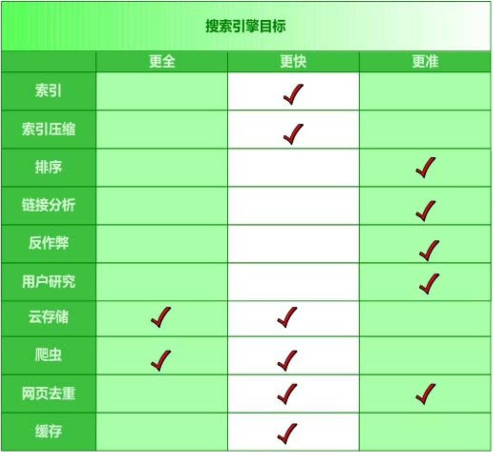

# 一、搜索引擎及其技术架构

## 1、搜索引擎技术发展史

- **史前时代(分类目录的一代)**：通过人工收集整理，把属于各个类别的高质量网站或网页分门别类罗列，用户可以根据分级目录来查找高质量的网站

- **第一代(文本检索的一代)**：采用经典的信息检索模型，比如：布尔模型、向量空间模型、概率模型，来计算用户查询关键词和网页文本内容的相关程度

- **第二代(链接分析的一代)**：充分利用了网页之间的链接关系，并深入挖掘和利用了网页链接所代表的含义

    > - Google率先提出并使用PageRank链接分析技术，采用链接分析能够有效改善搜索结果质量
    >
    > - 并未考虑用户的个性化要求，所以只要输入的查询请求相同，所有用户都会获得相同的搜索结果

- **第三代(用户中心的一代)**：理解用户发出的某个很短小的查询词背后包含的真正需求

## 2、搜索引擎的3个目标

- **更全**：从索引的网页数量而言，可以通过提高网络爬虫相关技术来达到此目标
- **更快**：索引相关技术、缓存技术、分布式海量云存储平台等
- **更准**：排序技术、链接分析技术、用户研究技术

## 3、搜索引擎的技术架构

# 二、网络爬虫

## 1、通用爬虫框架

- 首先，从互联网页面中精心选择一部分网页，以这些网页的链接地址作为种子URL，将这些种子 URL 放入待抓取 URL 队列中，爬虫从待抓取 URL 队列依次读取，并将 URL通过DNS解析，把链接地址转换为网站服务器对应的IP地址。

- 然后 将其和网页相对路径名称交给网页下载器，对于下载到本地的网页，一方面将其存储到页面库中，等待建立索引等后续处理;另一方面将下载网页的URL放入已抓取URL队列中， 这个队列记载了爬虫系统已经下载过的网页URL，以避免网页的重复抓取。
- 对于刚下载的网页，从中抽取出所包含的所有链接信息，并在已抓取URL队列中检查，如果发现链接还没有被抓取过，则将这个URL放入待抓取URL队列末尾，在之后的抓取调度中会下载这个URL对应的网页

如此这般，形成循环，直到待抓取URL队列为空，这代表着爬虫系统已将能够抓取的网页尽数抓完，此时完成了一轮完整的抓取过程。

> 对于爬虫来说，往往还需要进行网页去重及网页反作弊

---

**爬虫划分为如下3种类型**：

- 批量型爬虫(**Batch Crawler**)：有比较明确的抓取范围和目标，当爬虫达到这个设定的目标后，即停止抓取过程

- 增量型爬虫(**Incremental Crawler**)：会保持持续不断的抓取，对于抓取到的网页，要定期更新

- 垂直型爬虫(**Focused Crawler**)：关注特定主题内容或属于特定行业的网页

    > - 最大的特点和难点：如何识别网页内容是否属于指定行业或主题
    >
    > - 需要爬虫在抓取阶段就能够动态识别某个网址是否与主题相关，并尽量不去抓取无关页面，以达到节省资源的目的

## 2、优秀爬虫的特性(从爬虫开发者的角度)

实用的爬虫系统都应该具备以下几种特性：

- **高性能**：主要是指爬虫下载网页的抓取速度，常见的评价方式是以爬虫每秒能够下载的网页数量作为性能指标

    > 要提高爬虫的性能，在设计时程序访问磁盘的操作方法及具体实现 时数据结构的选择很关键

- **可扩展性**：爬虫需要抓取的网页数量巨大，为了能够尽可能缩短抓取周期，爬虫系统应该有很好的可扩展性，即很容易通过增加抓取服务器和爬虫数量来达到此目的

- **健壮性**：

    - 爬虫对各种异常情况能够正确处理
    - 再次启动爬虫时，能够恢复之前抓取的内容和数据结构，而不是每次都需要把所有工作完全从头做起

- **友好性**：

    - 一是保护网站的部分私密性
    - 另一是减少被抓取网站的网络负载

    > 爬虫禁抓协议和网页禁抓标记：
    >
    > - 爬虫禁抓协议：一般以目录为单位，指由网站所有者生成一个指定的文件 `robot.txt`，并放在网站服务器的根目录下，这个文件指明了网站中哪些目录下的网页是不允许爬虫抓取的
    >
    > - 网页禁抓标记：处理单个网页的场景，即在网页的HTML代码里加入 `meta name=“robots”` 标记，`content` 字段指出允许或不允许爬虫的哪些行为，可以分为两种情形
    >
    >     - 一种是告知爬虫不要索引该网页内容，以 `noindex` 作为标记
    >     - 另外一种情形是告知爬虫不要抓取网页所包含的链接，以 `nofollow` 作为标记
    >
    >     

## 3、爬虫质量的评价标准(从搜索引擎用户体验的角度考虑)

爬虫研发的目标简单描述如下，在资源有限的情况下，既然搜索引擎只能抓取互联网现存网页的一部分，

- **抓取网页重要性**：那么就尽可能选择比较重要的那部分页面来索引
- **抓取网页时新性**：对于已经抓取到的网页，尽可能快地更新其内容，使得索引网页和互联网对应页面内容同步更新
- **抓取网页覆盖率**：在此基础上，尽可能扩大抓取范围，抓取到更多以前无法发现的网页

## 4、抓取策略

> 爬虫抓取的基本目标：优先选择重要网页进行抓取

### (1) 宽度优先遍历策略(Breath First)

**宽度优先遍历**：没有明确提出和使用网页重要性衡量标准， 只是将新下载的网页抽取链接，并追加到待抓取URL队列中

**示意图**：假设队列头的网页是1号网页，从1号网页中抽取出3个链接指向2号、3号和4号网页，于是按照编号顺序依次放入待抓取URL队列，图中网页的编号就是这个网 页在待抓取URL队列中的顺序编号，之后爬虫以此顺序进行下载

### (2) 非完全 PageRank 策略(Partial PageRank)

> PageRank 是个全局性算法，即当所有网页都下载完成后，其计算结果才可靠

**非完全 PageRank 策略的基本思路**：对于已经下载的网页，加上待抓取 URL 队列中的 URL 一起，形成网页集合，在此集合内进行 PageRank 计算，计算完成后，将待抓取 URL 队列里的网页按照 PageRank 得分由高到低排序，形成的序列就是爬虫接下来应该依次抓取的 URL 列表

- 缺点：如果每次新抓取到一个网页，就将所有已经下载的网页重新计算新的非完全 PageRank 值，明显效率太低
- 折中办法：每当新下载的网页攒够 K 个，然后将所有下载页面重新计算一遍新的非完全 PageRank
- 新的问题：在展开下一轮 PageRank 计算之前，从新下载的网页抽取出包含的链接，很有可能这些链接的重要性非常高，理应优先下载，这 种情况该如何解决
- 解决：非完全 PageRank 赋予这些新抽取出来但是又没有 PageRank 值的网页一个临时 PageRank 值，将这个网页的所有入链传导的 PageRank值汇总，作为临时PageRank值，如果这个值比待抓取URL队列 中已经计算出来PageRank值的网页高，那么优先下载这个URL

---

案例分析：设定每下载 3 个网页即进行新的 PageRank 计算

- 此时已经有 {P1，P2，P3} 3个网页下 载到本地，这 3 个网页包含的链接指向{P4，P5，P6}，形成待抓取 URL 队列，如何决定其下载顺序?
- 将这6个网页形成新的集合，对这个 集合计算 PageRank 值，这样P4、P5和P6就获得自己对应的PageRank 值，由大到小排序，即可得出其下载顺序。
- 假设顺序为：P5、 P4、P6，当下载 P5 页面后抽取出链接，指向页面P8，此时赋予 P8 临时 PageRank 值，若这个值大于 P4 和 P6的 PageRank，则接下来优先下载 P8
- 如此不断循环，即形成了非完全 PageRank 策略的计算思路

### (3) OCIP策略(Online Page Importance Compuation)

OCIP 的字面含义是“在线页面重要性计算”，可以将其看做是一种改进的 PageRank 算法

- 在算法开始之前，每个互联网页面都给予相同的“现金”(cash)，每当下载了某个页面 P 后，P 将自己拥有的“现金”平均分配给页面中包含的链接页面，把自己的“现金”清空
- 而对于待抓取 URL队列中的网页，则根据其手头拥有的现金金额多少排序，优先下载现金最充裕的网页

**与 PageRank 的区别**：PageRank 每次需要迭代计算，而 OCIP 策略不需要迭代过程，所以计算速度远远快于 PageRank，适合实时计算使用，同时 PageRank 在计算时，存在向无链接关系网页的远程跳转过程，而OCIP没有这一计算因子

> 实验结果表明，OCIP 是种较好的重要性衡量策略，效果略优于宽度优先遍历策略

### (4) 大站优先策略(Larger Sites First)

**大站优先策略思路**：以网站为单位来衡量网页重要性，对于待抓取 URL 队列中的网页，根据所属网站归类，如果哪个网站等待下载的页面最多，则优先下载这些链接

> 其本质思想倾向于优先下载大型网站，因为大型网站往往包含更多的页面

## 5、网页更新策略

> 对于已经抓取过的网页，爬虫还要负责保持其内容和互联网页面内容的同步

### (1) 历史参考策略

**历史参考策略**：建立于假设之上，即过去频繁更新的网页，将来也会频繁更新，因此为了预估某个网页何时进行更新，可以通过参考其历史更新情况来做出决定

- 这种方法往往利用泊松过程来对网页的变化进行建模，根据每个网页过去的变动情况，利用模型预测将来何时内容会再次发生变化，以此来指导爬虫的抓取过程

### (2) 用户体验策略

**用户体验策略**：以用户体验为核心，即使本地索引的网页内容过时，但如果不影响用户体验，那晚些更新这些过时网页也未尝不可

- 所以判断一个网页何时更新为好，取决于这个网页的内容变化所带来搜索质量的变化(往往采用搜索结果排名的变化来衡量)，影响越大的网页，则应该越快更新

- 用户体验策略保存网页的多个历史版本，并根据过去每次内容变化对搜索质量的影响，得出一个平均值，以此作为判断爬虫重抓该网页时机的参考依据，对于影响越厉害的网页，则越优先调度重新抓取

### (3) 聚类抽样策略

> 上面两种网页更新策略严重依赖网页的历史更新信息：
>
> - 为每个网页保存其历史信息，搜索系统会大量增加额外负担
> - 若是首次抓取到的网页，因为没有历史信息，所以也就无法按照这两种思路去预估其更新周期

**聚类抽样策略**：网页具有一些属性，根据这些属性可以预测其更新周期，具有相似属性的网页，其更新周期也是类似的

- 可以根据这些属性将网页归类，同一类别内的网页具有相同的更新频率
- 为了计算某个类别的更新周期，只需对类别内网页进行采样，以这些被采样网页的更新周期作为类别内所有其他网页的更新周期

与之前叙述的两种方法相比较：

- 一方面无须为每个网页保存历史信息
- 另一方面，对于新网页，即使没有历史信息，也可以根据其所属类别来对其进行更新

---

将能够体现网页更新周期的属性特征划分为两大类：静态特征和动态特征

- 静态特征：包括页面的内容、图片数量、页面大小、链接深度、PageRank 值等十几种
- 动态特征：体现了静态特征随着时间的变化情况，比如图片数量的变化情况、入链出链的变化情况等

## 6、暗网抓取(Deep Web Crawling)

> 所谓暗网，是指目前搜索引擎爬虫按照常规方式很难抓取到的互联网页面
>
> 比如：只有用户按照需求输入查询之后，才可能获得相关数据

暗网爬虫：将暗网数据从数据库中挖掘出来，并将其加入搜索引擎的索引，这样在搜索时便可利用这些数据，增加信息覆盖程度

暗网爬虫的技术挑战：

- 一是查询组合太多，如果一一组合遍历，则会给被访问网站造成太大压力，所以如何精心组合查询选项是个难点
- 第二点是，有的查询是文本框，比如图书搜索中需要输入书名，爬虫怎样才能够填入合适的内容

### (1) 查询组合问题

- **场景**：垂直搜索网站往往会给用户提供多个查询输入框，不同输入框代表了搜索对象某方面的属性

- **简单粗暴的方式**：将各个输入框可能的输入值组合起来形成查询，比如对于机票查询来说，将所有出发城市、所有目的城市和时间范围的选项一一组合，形成大量的查询，提交给垂直搜索引擎，从其搜索结果里提炼数据库记录

    > 很多组合是无效的，大量的返回结果为空，同时对被访问网站造成了巨大的流量压力

- **富含信息查询模板技术**：对于某个固定的查询模板， 如果给模板内每个属性都赋值，形成不同的查询组合，提交给垂直搜索引擎，观察所有返回页面的内容，如果相互之间内容差异较大，则这个查询模板就是富含信息查询模板

    > 不足：在对所有查询模板一一试探，判断其是否富含信息查询模板，则因为查询模板数量太多，系统效率还是会很低，因此需要进一 步减少提交的查询数目
    >
    > **ISIT 算法**：基本思路是，首先从一维模板开始，对一维查询模板逐 个考察，看其是否富含信息查询模板，如果是的话，则将这个一维模板扩展到二维，再次依次考察对应的二维模板，如此类推，逐步增加维数，直到再也无法找到富含信息查询模板为止。

### (2) 文本框填写问题

> 在爬虫运转起来之前，因为对目标网站一无所知，所以必须人工提供一些提示

- 通过人工观察网站进行定位，提供一个与网站内容相关的初始种子查询关键词表，对于不同的网站，需要人工提供不同的词表，以此作为爬虫能够继续工作的基础条件

- 爬虫根据初始种子词表，向垂直搜索引擎提交查询，并下载返回结果页面。之后从返回结果页面里自动挖掘出相关的关键词，并形成一个新的查询列表，依次将新挖掘出的查询提交给搜索引擎
- 如此往复，直到无法下载到新的内容为止

通过这种人工启发结合递归迭代的方式，尽可能覆盖数据库里的记录

## 7、分布式爬虫

> **分布式爬虫的三个层级**：分布式数据中心、分布式抓取服务器、分布式爬虫程序

### (1) 主从式分布爬虫(Master-Slave)

主从式分布爬虫：不同的服务器承担不同的角色分工

- 有一台专门负责对其他服务器提供 URL 分发服务，其他机器则进行实际的网页下载
- URL 服务器维护待抓取URL队列，并从中获得待抓取网页的URL，分配给不同的抓取服务器，另外还要对抓取服务器之间的工作进行负载均衡，使得各个服务器承担的工作量大致相等
- 抓取服务器之间没有通信联系，每个抓取服务器只和 URL 服务器进行消息传递

在这种架构中，因为 URL服务器承担很多管理任务，同时待抓取URL队列数量巨大，所以 URL服务器容易成为整个系统的瓶颈

### (2) 对等式分布爬虫(Peer to Peer)

在对等式分布爬虫体系中，服务器之间不存在分工差异，每台服务器承担相同的功能，各自负担一部分 URL 的抓取工作

> 问题：由于没有 URL 服务器存在，每台抓取服务器的任务分工就成为问题

上图案例，由服务器自己来判断某个 URL 是否应该由自己来抓取，或者将这个 URL 传递给相应的服务器。

采取的判断方法：对网址的主域名进行哈希计算并取模，并将该网址转发给对应编号的抓取服务器或自己处理

---

- **优势**：由于没有 URL 分发服务器，所以此种方法不存在系统瓶颈问题，且其哈希函数不是针对整个 URL，而只针对主域名，所以可以保证同一网站的网页都由同一台服务器抓取
    - 一方面可以提高下载效率 (DNS域名解析可以缓存)
    - 另外一方面也可以主动控制对某个网站的访问速度，避免对某个网站访问压力过大

- **劣势**：假设在抓取过程中某台服务器宕机，或新加入一台抓取服务器，因为取模时 m 是以服务器个数确定的，所以此时m值发生变化，导致大部分URL哈希取模后的值跟着变化，这意味着几乎所有任务都需要重新进行分配，无疑会导致资源 的极大浪费
- **改进**：放弃哈希取模方式，转而采用一致性哈希方法，即将网站的主域名进行哈希，映射为一个范围在0到 $2^{32}$ 之间的某个数值，大量的网站主域名会被均匀地哈希到这个数值区间
    - 将哈希值范围首尾相接，即认为数值 0 和最大值重合，这样可以将其看做有序的环状序列，从数值0开始，沿着环的顺时针方向，哈希值逐渐增大，直到环的结尾
    - 某个抓取服务器负责这个环状序列的一个片段，即落在某个哈希取值范围内的URL都由该服 务器负责下载

# 三、搜索引擎索引

## 1、索引基础

### (1) 单词 -- 文本矩阵

### (2) 倒排索引基本概念

### (3) 倒排索引简单实例

## 2、单词词典

### (1) 哈希加链表

### (2) 树形结构

## 3、倒排列表

## 4、建立索引

### (1) 两遍文档遍历法

### (2) 排序法

### (3) 归并法

## 5、动态索引

## 6、索引更新策略

### (1) 完全重建策略

### (2) 再合并策略

### (3) 原地更新策略

### (4) 混合策略

## 7、查询处理

### (1) 一次一文档

### (2) 一次一单词

### (3) 跳跃指针

## 8、多字段索引

### (1) 多索引方式

### (2) 倒排列表方式

### (3) 扩展列表方式

## 9、短语查询

### (1) 位置信息索引

### (2) 双词索引

### (3) 短语索引

### (4) 混合方法

## 10、分布式索引

### (1) 按文档划分

### (2) 按单词划分

### (3) 两种方案的比较

# 四、索引压缩

## 1、词典压缩

## 2、倒排列表压缩算法

### (1) 评价索引压缩算法的指标

### (2) 一元编码与二进制编码

### (3) Elias Gamma 算法与 Elias Delta 算法

### (4) Golomb 算法与 Rice 算法

### (5) 变长字节算法

### (6) SimpleX 系列算法

### (7) PForDelta 算法

## 3、文档编号重排序

## 4、静态索引裁剪

### (1) 以单词为中心的索引裁剪

### (2) 以文档为中心的索引裁剪

# 五、索引模型与搜索排序

## 1、布尔模型

## 2、向量空间模型

### (1) 文档表示

### (2) 相似性计算

### (3) 特征权重计算

## 3、概率检索模型

### (1) 概率排序原理

### (2) 二元独立模型

### (3) BM25 模型

### (4) BM25F模型

## 4、语言模型方法

## 5、机器学习排序

### (1) 机器学习排序的基本思路

### (2) 单文档方法

### (3) 文档对方法

### (4) 文档列表方法

## 6、检索质量评价标准

### (1) 精确率与召回率

### (2) P@10 指标

### (3) MAP 指标

# 六、链接分析

## 1、Web 图

## 2、两个概念模型及算法之间的关系

### (1) 随机游走模型

### (2) 子集传播模型

### (3) 链接分析算法之间的关系

## 3、PageRank 算法

### (1) 从入链数量到 PageRank

### (2) PageRank 计算

### (3) 链接陷阱与远程跳转

## 4、HITS 算法

### (1) Hub 页面与 Authority 页面

### (2) 相互增强关系

### (3) HITS 算法

### (4) HITS 算法存在的问题

### (5) HITS 算法与 PageRank 算法比较

## 5、SALSA 算法

### (1) 确定计算对象集合

### (2) 链接关系传播

### (3) Authority 权值计算

## 6、主题敏感 PageRank

### (1) 主题敏感 PageRank 与 PageRank 的差异

### (2) 主题敏感 PageRank 计算流程

### (3) 利用主题敏感 PageRank 构造个性化搜索

## 7、Hilltop 算法

### (1) Hilltop 算法的基本定义

### (2) Hilltop 算法

## 8、其他改进算法

### (1) 智能游走模型

### (2) 偏置游走模型

### (3) PHITS 算法

### (4) BFS 算法

# 七、云存储与云计算

## 1、云存储与云计算概述

### (1) 基本假设

### (2) 理论基础

### (3) 数据模型

### (4) 基本问题

### (5) Google 的云存储与云计算架构

## 2、Google 文件系统(GFS)

### (1) GFS 设计原则

### (2) GFS 整体架构

### (3) GFS 主控服务器

### (4) 系统交互行为

## 3、Chubby锁服务

## 4、BigTable

### (1) BigTable 的数据模型

### (2) BigTable 整体结构

### (3) BigTable 的管理数据

### (4) 主控服务器(Master Server)

### (5) 子表服务器(Tablet Server)

## 5、Megastore 系统

### (1) 实体群组切分

### (2) 数据模型

### (3) 数据读/写与备份

## 6、Map/Reduce 云计算模型

### (1) 计算模型

### (2) 整体逻辑流程

### (3) 应用示例

## 7、咖啡因系统 -- Percolator

### (1) 事务支持

### (2) 观察/通知体系结构

## 8、Pregel 图计算模型

## 9、Dynamo 云存储系统

### (1) 数据划分算法

### (2) 数据备份

### (3) 数据读/写

### (4) 数据版本控制

## 10、PNUTS 云存储系统

### (1) PNUTS 整体架构

### (2) 存储单元

### (3) 子表控制器与数据路由器

### (4) 雅虎消息代理

### (5) 数据一致性

## 11、HayStack 存储系统

### (1) HayStack 整体架构

### (2) 目录服务

### (3) HayStack 缓存

### (4) HayStack 存储系统

# 八、网页反作弊

## 1、内容作弊

### (1) 常见内容作弊手段

### (2) 内容农场

## 2、链接作弊

## 3、页面隐藏作弊

## 4、Web 2.0 作弊方法

## 5、反作弊技术的整体思路

### (1) 信任传播模型

### (2) 不信任传播模型

### (3) 异常发现模型

## 6、通用链接反作弊方法

### (1) TrustRank 算法

### (2) BadRank 算法

### (3) SpamRank

## 7、专用链接反作弊技术

### (1) 识别链接农场

### (2) 识别 Google 轰炸

## 8、识别内容作弊

## 9、反隐藏作弊

### (1) 识别页面隐藏

### (2) 识别网页重定向

## 10、搜索引擎反作弊综合框架

# 九、用户查询意图分析

## 1、搜索行为及其意图

### (1) 用户搜索行文

### (2) 用户搜索意图分类

## 2、搜索日志挖掘

### (1) 查询会话

### (2) 点击图

### (3) 查询图

## 3、相关搜索

### (1) 基于查询会话的方法

### (2) 基于点击图的方法

## 4、查询纠错

### (1) 编辑距离

### (2) 噪声信道模型

# 十、网页去重

## 1、通用去重算法框架

## 2、Shingling 算法

## 3、I-Match 算法

## 4、SimHash 算法

### (1) 文档指纹计算

### (2) 相似文档查找

## 5、SpotSig 算法

### (1) 特征抽取

### (2) 相似文档查找

# 十一、搜索引擎缓存机制

## 1、搜索引擎缓存系统架构

## 2、缓存对象

## 3、缓存结构

## 4、缓存淘汰策略

### (1) 动态策略

### (2) 混合策略

## 5、缓存更新策略

# 十二、搜索引擎发展趋势

### (1) 个性化搜索

### (2) 社会化搜索

### (3) 实时搜索

### (4) 移动搜索

### (5) 地理位置感知搜索

### (6) 跨语言搜索

### (7) 多媒体搜索

### (8) 情境搜索

