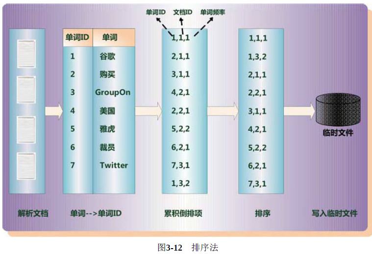
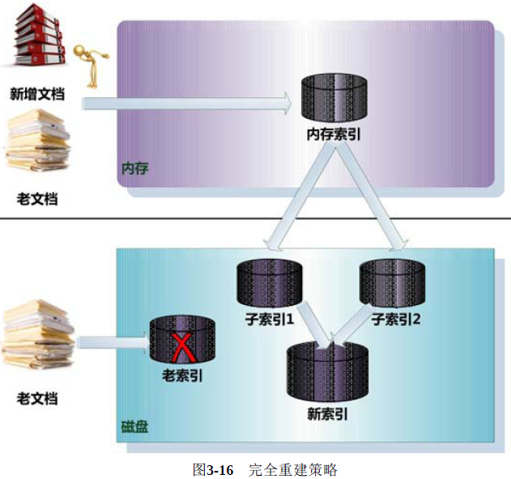
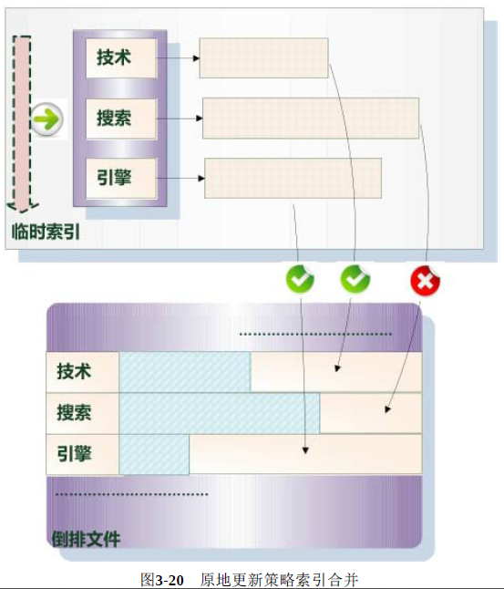

# 一、搜索引擎及其技术架构

## 1、搜索引擎技术发展史

- **史前时代(分类目录的一代)**：通过人工收集整理，把属于各个类别的高质量网站或网页分门别类罗列，用户可以根据分级目录来查找高质量的网站

- **第一代(文本检索的一代)**：采用经典的信息检索模型，比如：布尔模型、向量空间模型、概率模型，来计算用户查询关键词和网页文本内容的相关程度

- **第二代(链接分析的一代)**：充分利用了网页之间的链接关系，并深入挖掘和利用了网页链接所代表的含义

    > - Google率先提出并使用PageRank链接分析技术，采用链接分析能够有效改善搜索结果质量
    >
    > - 并未考虑用户的个性化要求，所以只要输入的查询请求相同，所有用户都会获得相同的搜索结果

- **第三代(用户中心的一代)**：理解用户发出的某个很短小的查询词背后包含的真正需求

## 2、搜索引擎的3个目标

- **更全**：从索引的网页数量而言，可以通过提高网络爬虫相关技术来达到此目标
- **更快**：索引相关技术、缓存技术、分布式海量云存储平台等
- **更准**：排序技术、链接分析技术、用户研究技术

## 3、搜索引擎的技术架构

# 二、网络爬虫

## 1、通用爬虫框架

- 首先，从互联网页面中精心选择一部分网页，以这些网页的链接地址作为种子URL，将这些种子 URL 放入待抓取 URL 队列中，爬虫从待抓取 URL 队列依次读取，并将 URL通过DNS解析，把链接地址转换为网站服务器对应的IP地址。

- 然后 将其和网页相对路径名称交给网页下载器，对于下载到本地的网页，一方面将其存储到页面库中，等待建立索引等后续处理;另一方面将下载网页的URL放入已抓取URL队列中， 这个队列记载了爬虫系统已经下载过的网页URL，以避免网页的重复抓取。
- 对于刚下载的网页，从中抽取出所包含的所有链接信息，并在已抓取URL队列中检查，如果发现链接还没有被抓取过，则将这个URL放入待抓取URL队列末尾，在之后的抓取调度中会下载这个URL对应的网页

如此这般，形成循环，直到待抓取URL队列为空，这代表着爬虫系统已将能够抓取的网页尽数抓完，此时完成了一轮完整的抓取过程。

> 对于爬虫来说，往往还需要进行网页去重及网页反作弊

---

**爬虫划分为如下3种类型**：

- 批量型爬虫(**Batch Crawler**)：有比较明确的抓取范围和目标，当爬虫达到这个设定的目标后，即停止抓取过程

- 增量型爬虫(**Incremental Crawler**)：会保持持续不断的抓取，对于抓取到的网页，要定期更新

- 垂直型爬虫(**Focused Crawler**)：关注特定主题内容或属于特定行业的网页

    > - 最大的特点和难点：如何识别网页内容是否属于指定行业或主题
    >
    > - 需要爬虫在抓取阶段就能够动态识别某个网址是否与主题相关，并尽量不去抓取无关页面，以达到节省资源的目的

## 2、优秀爬虫的特性(从爬虫开发者的角度)

实用的爬虫系统都应该具备以下几种特性：

- **高性能**：主要是指爬虫下载网页的抓取速度，常见的评价方式是以爬虫每秒能够下载的网页数量作为性能指标

    > 要提高爬虫的性能，在设计时程序访问磁盘的操作方法及具体实现 时数据结构的选择很关键

- **可扩展性**：爬虫需要抓取的网页数量巨大，为了能够尽可能缩短抓取周期，爬虫系统应该有很好的可扩展性，即很容易通过增加抓取服务器和爬虫数量来达到此目的

- **健壮性**：

    - 爬虫对各种异常情况能够正确处理
    - 再次启动爬虫时，能够恢复之前抓取的内容和数据结构，而不是每次都需要把所有工作完全从头做起

- **友好性**：

    - 一是保护网站的部分私密性
    - 另一是减少被抓取网站的网络负载

    > 爬虫禁抓协议和网页禁抓标记：
    >
    > - 爬虫禁抓协议：一般以目录为单位，指由网站所有者生成一个指定的文件 `robot.txt`，并放在网站服务器的根目录下，这个文件指明了网站中哪些目录下的网页是不允许爬虫抓取的
    >
    > - 网页禁抓标记：处理单个网页的场景，即在网页的HTML代码里加入 `meta name=“robots”` 标记，`content` 字段指出允许或不允许爬虫的哪些行为，可以分为两种情形
    >
    >     - 一种是告知爬虫不要索引该网页内容，以 `noindex` 作为标记
    >     - 另外一种情形是告知爬虫不要抓取网页所包含的链接，以 `nofollow` 作为标记
    >
    >     

## 3、爬虫质量的评价标准(从搜索引擎用户体验的角度考虑)

爬虫研发的目标简单描述如下，在资源有限的情况下，既然搜索引擎只能抓取互联网现存网页的一部分，

- **抓取网页重要性**：那么就尽可能选择比较重要的那部分页面来索引
- **抓取网页时新性**：对于已经抓取到的网页，尽可能快地更新其内容，使得索引网页和互联网对应页面内容同步更新
- **抓取网页覆盖率**：在此基础上，尽可能扩大抓取范围，抓取到更多以前无法发现的网页

## 4、抓取策略

> 爬虫抓取的基本目标：优先选择重要网页进行抓取

### (1) 宽度优先遍历策略(Breath First)

**宽度优先遍历**：没有明确提出和使用网页重要性衡量标准， 只是将新下载的网页抽取链接，并追加到待抓取URL队列中

**示意图**：假设队列头的网页是1号网页，从1号网页中抽取出3个链接指向2号、3号和4号网页，于是按照编号顺序依次放入待抓取URL队列，图中网页的编号就是这个网 页在待抓取URL队列中的顺序编号，之后爬虫以此顺序进行下载

### (2) 非完全 PageRank 策略(Partial PageRank)

> PageRank 是个全局性算法，即当所有网页都下载完成后，其计算结果才可靠

**非完全 PageRank 策略的基本思路**：对于已经下载的网页，加上待抓取 URL 队列中的 URL 一起，形成网页集合，在此集合内进行 PageRank 计算，计算完成后，将待抓取 URL 队列里的网页按照 PageRank 得分由高到低排序，形成的序列就是爬虫接下来应该依次抓取的 URL 列表

- 缺点：如果每次新抓取到一个网页，就将所有已经下载的网页重新计算新的非完全 PageRank 值，明显效率太低
- 折中办法：每当新下载的网页攒够 K 个，然后将所有下载页面重新计算一遍新的非完全 PageRank
- 新的问题：在展开下一轮 PageRank 计算之前，从新下载的网页抽取出包含的链接，很有可能这些链接的重要性非常高，理应优先下载，这 种情况该如何解决
- 解决：非完全 PageRank 赋予这些新抽取出来但是又没有 PageRank 值的网页一个临时 PageRank 值，将这个网页的所有入链传导的 PageRank值汇总，作为临时PageRank值，如果这个值比待抓取URL队列 中已经计算出来PageRank值的网页高，那么优先下载这个URL

---

案例分析：设定每下载 3 个网页即进行新的 PageRank 计算

- 此时已经有 {P1，P2，P3} 3个网页下 载到本地，这 3 个网页包含的链接指向{P4，P5，P6}，形成待抓取 URL 队列，如何决定其下载顺序?
- 将这6个网页形成新的集合，对这个 集合计算 PageRank 值，这样P4、P5和P6就获得自己对应的PageRank 值，由大到小排序，即可得出其下载顺序。
- 假设顺序为：P5、 P4、P6，当下载 P5 页面后抽取出链接，指向页面P8，此时赋予 P8 临时 PageRank 值，若这个值大于 P4 和 P6的 PageRank，则接下来优先下载 P8
- 如此不断循环，即形成了非完全 PageRank 策略的计算思路

### (3) OCIP策略(Online Page Importance Compuation)

OCIP 的字面含义是“在线页面重要性计算”，可以将其看做是一种改进的 PageRank 算法

- 在算法开始之前，每个互联网页面都给予相同的“现金”(cash)，每当下载了某个页面 P 后，P 将自己拥有的“现金”平均分配给页面中包含的链接页面，把自己的“现金”清空
- 而对于待抓取 URL队列中的网页，则根据其手头拥有的现金金额多少排序，优先下载现金最充裕的网页

**与 PageRank 的区别**：PageRank 每次需要迭代计算，而 OCIP 策略不需要迭代过程，所以计算速度远远快于 PageRank，适合实时计算使用，同时 PageRank 在计算时，存在向无链接关系网页的远程跳转过程，而OCIP没有这一计算因子

> 实验结果表明，OCIP 是种较好的重要性衡量策略，效果略优于宽度优先遍历策略

### (4) 大站优先策略(Larger Sites First)

**大站优先策略思路**：以网站为单位来衡量网页重要性，对于待抓取 URL 队列中的网页，根据所属网站归类，如果哪个网站等待下载的页面最多，则优先下载这些链接

> 其本质思想倾向于优先下载大型网站，因为大型网站往往包含更多的页面

## 5、网页更新策略

> 对于已经抓取过的网页，爬虫还要负责保持其内容和互联网页面内容的同步

### (1) 历史参考策略

**历史参考策略**：建立于假设之上，即过去频繁更新的网页，将来也会频繁更新，因此为了预估某个网页何时进行更新，可以通过参考其历史更新情况来做出决定

- 这种方法往往利用泊松过程来对网页的变化进行建模，根据每个网页过去的变动情况，利用模型预测将来何时内容会再次发生变化，以此来指导爬虫的抓取过程

### (2) 用户体验策略

**用户体验策略**：以用户体验为核心，即使本地索引的网页内容过时，但如果不影响用户体验，那晚些更新这些过时网页也未尝不可

- 所以判断一个网页何时更新为好，取决于这个网页的内容变化所带来搜索质量的变化(往往采用搜索结果排名的变化来衡量)，影响越大的网页，则应该越快更新

- 用户体验策略保存网页的多个历史版本，并根据过去每次内容变化对搜索质量的影响，得出一个平均值，以此作为判断爬虫重抓该网页时机的参考依据，对于影响越厉害的网页，则越优先调度重新抓取

### (3) 聚类抽样策略

> 上面两种网页更新策略严重依赖网页的历史更新信息：
>
> - 为每个网页保存其历史信息，搜索系统会大量增加额外负担
> - 若是首次抓取到的网页，因为没有历史信息，所以也就无法按照这两种思路去预估其更新周期

**聚类抽样策略**：网页具有一些属性，根据这些属性可以预测其更新周期，具有相似属性的网页，其更新周期也是类似的

- 可以根据这些属性将网页归类，同一类别内的网页具有相同的更新频率
- 为了计算某个类别的更新周期，只需对类别内网页进行采样，以这些被采样网页的更新周期作为类别内所有其他网页的更新周期

与之前叙述的两种方法相比较：

- 一方面无须为每个网页保存历史信息
- 另一方面，对于新网页，即使没有历史信息，也可以根据其所属类别来对其进行更新

---

将能够体现网页更新周期的属性特征划分为两大类：静态特征和动态特征

- 静态特征：包括页面的内容、图片数量、页面大小、链接深度、PageRank 值等十几种
- 动态特征：体现了静态特征随着时间的变化情况，比如图片数量的变化情况、入链出链的变化情况等

## 6、暗网抓取(Deep Web Crawling)

> 所谓暗网，是指目前搜索引擎爬虫按照常规方式很难抓取到的互联网页面
>
> 比如：只有用户按照需求输入查询之后，才可能获得相关数据

暗网爬虫：将暗网数据从数据库中挖掘出来，并将其加入搜索引擎的索引，这样在搜索时便可利用这些数据，增加信息覆盖程度

暗网爬虫的技术挑战：

- 一是查询组合太多，如果一一组合遍历，则会给被访问网站造成太大压力，所以如何精心组合查询选项是个难点
- 第二点是，有的查询是文本框，比如图书搜索中需要输入书名，爬虫怎样才能够填入合适的内容

### (1) 查询组合问题

- **场景**：垂直搜索网站往往会给用户提供多个查询输入框，不同输入框代表了搜索对象某方面的属性

- **简单粗暴的方式**：将各个输入框可能的输入值组合起来形成查询，比如对于机票查询来说，将所有出发城市、所有目的城市和时间范围的选项一一组合，形成大量的查询，提交给垂直搜索引擎，从其搜索结果里提炼数据库记录

    > 很多组合是无效的，大量的返回结果为空，同时对被访问网站造成了巨大的流量压力

- **富含信息查询模板技术**：对于某个固定的查询模板， 如果给模板内每个属性都赋值，形成不同的查询组合，提交给垂直搜索引擎，观察所有返回页面的内容，如果相互之间内容差异较大，则这个查询模板就是富含信息查询模板

    > 不足：在对所有查询模板一一试探，判断其是否富含信息查询模板，则因为查询模板数量太多，系统效率还是会很低，因此需要进一 步减少提交的查询数目
    >
    > **ISIT 算法**：基本思路是，首先从一维模板开始，对一维查询模板逐 个考察，看其是否富含信息查询模板，如果是的话，则将这个一维模板扩展到二维，再次依次考察对应的二维模板，如此类推，逐步增加维数，直到再也无法找到富含信息查询模板为止。

### (2) 文本框填写问题

> 在爬虫运转起来之前，因为对目标网站一无所知，所以必须人工提供一些提示

- 通过人工观察网站进行定位，提供一个与网站内容相关的初始种子查询关键词表，对于不同的网站，需要人工提供不同的词表，以此作为爬虫能够继续工作的基础条件

- 爬虫根据初始种子词表，向垂直搜索引擎提交查询，并下载返回结果页面。之后从返回结果页面里自动挖掘出相关的关键词，并形成一个新的查询列表，依次将新挖掘出的查询提交给搜索引擎
- 如此往复，直到无法下载到新的内容为止

通过这种人工启发结合递归迭代的方式，尽可能覆盖数据库里的记录

## 7、分布式爬虫

> **分布式爬虫的三个层级**：分布式数据中心、分布式抓取服务器、分布式爬虫程序

### (1) 主从式分布爬虫(Master-Slave)

主从式分布爬虫：不同的服务器承担不同的角色分工

- 有一台专门负责对其他服务器提供 URL 分发服务，其他机器则进行实际的网页下载
- URL 服务器维护待抓取URL队列，并从中获得待抓取网页的URL，分配给不同的抓取服务器，另外还要对抓取服务器之间的工作进行负载均衡，使得各个服务器承担的工作量大致相等
- 抓取服务器之间没有通信联系，每个抓取服务器只和 URL 服务器进行消息传递

在这种架构中，因为 URL服务器承担很多管理任务，同时待抓取URL队列数量巨大，所以 URL服务器容易成为整个系统的瓶颈

### (2) 对等式分布爬虫(Peer to Peer)

在对等式分布爬虫体系中，服务器之间不存在分工差异，每台服务器承担相同的功能，各自负担一部分 URL 的抓取工作

> 问题：由于没有 URL 服务器存在，每台抓取服务器的任务分工就成为问题

上图案例，由服务器自己来判断某个 URL 是否应该由自己来抓取，或者将这个 URL 传递给相应的服务器。

采取的判断方法：对网址的主域名进行哈希计算并取模，并将该网址转发给对应编号的抓取服务器或自己处理

---

- **优势**：由于没有 URL 分发服务器，所以此种方法不存在系统瓶颈问题，且其哈希函数不是针对整个 URL，而只针对主域名，所以可以保证同一网站的网页都由同一台服务器抓取
    - 一方面可以提高下载效率 (DNS域名解析可以缓存)
    - 另外一方面也可以主动控制对某个网站的访问速度，避免对某个网站访问压力过大

- **劣势**：假设在抓取过程中某台服务器宕机，或新加入一台抓取服务器，因为取模时 m 是以服务器个数确定的，所以此时m值发生变化，导致大部分URL哈希取模后的值跟着变化，这意味着几乎所有任务都需要重新进行分配，无疑会导致资源 的极大浪费
- **改进**：放弃哈希取模方式，转而采用一致性哈希方法，即将网站的主域名进行哈希，映射为一个范围在0到 $2^{32}$ 之间的某个数值，大量的网站主域名会被均匀地哈希到这个数值区间
    - 将哈希值范围首尾相接，即认为数值 0 和最大值重合，这样可以将其看做有序的环状序列，从数值0开始，沿着环的顺时针方向，哈希值逐渐增大，直到环的结尾
    - 某个抓取服务器负责这个环状序列的一个片段，即落在某个哈希取值范围内的URL都由该服 务器负责下载

# 三、搜索引擎索引

## 1、索引基础

### (1) 单词 -- 文本矩阵

**单词—文档矩阵**：表达两者之间所具有的一种包含关系的概念模型

> 每列代表一个文档，每行代表一个单词，打对钩的位置代表包含关系

有不同的方式来实现上述概念模型，比如：倒排索引、签名文件、后缀树等方式，而倒排索引是单词到文档映射关系的最佳实现方式

### (2) 倒排索引基本概念

- **文档(Document)**：代表以文本形式存在的存储对象，比如 Word、PDF、html、XML等不同格式的文件都可以称为文档

    > 在后续内容中，很多情况下会**使用文档来表征文本信息**

- **文档集合(Document Collection)**：由若干文档构成的集合，比如海量的互联网网页或大量的电子邮件

- **文档编号(Document ID)**：文档集合内每个文档的唯一编号，作为文档的唯一标识

- **单词编号(Word ID)**：以唯一的编号来表征某个单词，单词编号可以作为某个单词的唯一表征

- **倒排索引(Inverted Index)**：实现“单词-文档”矩阵的具体存储形式，通过倒排索引可以根据单词快速获取包含这个单词的文档列表

    > 倒排索引主要由两个部分组成：单词词典和倒排文件

- **单词词典(Lexicon)**：由文档集合出现的所有单词构成的字符串集合，每条索引项记载单词本身的一些信息及指向倒排列表的指针

    > 搜索引擎通常的索引单位是单词

- **倒排列表(PostingList)**：记载出现某个单词的所有文档的文档列表及单词在该文档中出现的位置信息，每条记录称为一个倒排项

    > 根据倒排列表，即可获知哪些文档包含某个单词

- **倒排文件(Inverted File)**：所有单词的倒排列表往往顺序地存储在磁盘的某个文件里，这个文件即被称为倒排文件，倒排文件是存储倒排索引的物理文件

### (3) 倒排索引简单实例

假设文档集合包含5个文档，每个文档内容如图，在图中最左端一栏是每个文档对应的文档编号，需要对这个文档集合建立倒排索引

- 首先，要用分词系统将文档自动切分成单词序列，这样每个文档就转换为由单词序列构成的数据流

    > 因为中文和英文等语言不同，单词之间没有明确的分隔符号

- 接着，对每个不同的单词赋予唯一的单词编号，同时记录下哪些文档包含这个单词，即可得到最简单的倒排索引

    > “单词ID”记录了每个单词的单词编号，第2列是对应的单词， 第3列即每个单词对应的倒排列表
    >
    > 比如单词“谷歌”，其单词编号为1， 倒排列表为{1,2,3,4,5}，说明文档集合中每个文档都包含了这个单词

    

- 然后，在单词对应的倒排列表中不仅记录文档编号，还记载单词频率信息(TF)，即单词在文档中出现的次数

    词频信息在搜索结果排序时，用于计算查询和文档相似度，方便后续排序时进行分值计算

    > 如图，单词“创始人”的单词编号为7，对应的倒排列表内容有(3;1)，其中 3 代表文档编号为 3 的文档包含这个单词，数字 1 代表词频信息，即这个单词在 3 号文档中只出现过1次，其他单词对应的倒排列表所代表的含义与此相同

    

- 最后，索引系统除了记录文档编号和单词频率信息外，还记载每个单词对应的文档频率信息及单词在某个文档出现位置的信息

    > - 文档频率信息：代表在文档集合中有多少个文档包含某个单词，可用于搜索结果排序
    > - 位置信息只有在支持短语查询时才能够派上用场，因此单词在某个文档中出现位置的信息并非索引系统一定要记录

    

---

比如：用户输入查询词“Facebook”

- 搜索系统查找倒排索引，从中可以读出包含这个单词的文档，这些文档就是提供给用户的搜索结果
- 利用单词频率信息、文档频率信息即可对这些候选搜索结果进行排序，计算文档和查询的相似性，按照相似性得分由高到低排序

## 2、单词词典

**单词词典**：用来维护文档集合中出现过的所有单词的相关信息，同时用来记载某个单词对应的倒排列表在倒排文件中的位置信息。在支持搜索时，根据用户的查询词，去单词词典里查询，就能够获得相应的倒排列表，并以此作为后续排序的基础

### (1) 哈希加链表

**词典结构**：由哈希表和链表组成，每个哈希表项保存一个指针，指针指向冲突链表，在冲突链表里，相同哈希值的单词形成链表结构

### (2) 树形结构

B树是另外一种高效查找结构，B树需要字典项能够按照大小排序（数字或者字符序）

B树形成了层级查找结构，中间节点用于指出一定顺序范围的词典项目存储在哪个子树中，起到根据词典项比较大小进行导航的作用，最底层的叶子节点存储单词的地址信息，根据这个地址就可以提取出单词字符串。

## 3、倒排列表

倒排列表用来记录有哪些文档包含某个单词。一般在文档集合里会有很多文档包含某个单词，每个文档会记录文档编号（DocID），单词在这个文档中出现的次数（TF）及单词在文档中哪些位置出现过等信息，这样与一个文档相关的信息被称做倒排索引项（Posting），包含这个单词的一系列倒排索引项形成了列表结构，这就是某个单词对应的倒排列表

文档编号差值：倒排列表中相邻的两个倒排索引项文档编号的差值，一般在索引构建过程中，可以保证倒排列表中后面出现的文档编号大于之前出现的文档编号，所以文档编号差值总是大于0的整数

> 在实际的搜索引擎系统中，并不存储倒排索引项中的实际文档编号，而是代之以文档编号差值（D-Gap）

对文档编号进行差值计算，主要原因是为了更好地对数据进行压缩，原始文档编号一般都是大数值，通过差值计算，就有效地将大数值转换为了小数值，而这有助于增加数据的压缩率

## 4、建立索引

### (1) 两遍文档遍历法

> 注意：此方法完全在内存中完成索引创建，而另外两种方法则通过内存和磁盘相互配合来完成索引创建

- **第一遍文档遍历**：主要目的是获得一些统计信息，并根据统计信息分配内存等资源，同时建立好单词相对应倒排列表在内存中的位置信息，即主要做些资源准备工作

  - 首先，收集全局的统计信息：文档集合包含的文档个数 N，文档集合内所包含的不同单词个数 M，每个单词在多少个文档中出现过的信息 DF。将所有单词对应的 DF 值全部相加，就可以知道建立最终索引所需的内存大小

    > 因为一个单词对应的 DF 值如果是10，说明有10个文档包含这个单词，那么这个单词对应的倒排列表应该包含10项内容，每一项记载某个文档的文档 ID 和单词在该文档对应的出现次数 TF

  - ji二者，在获得了上述3类信息后，就可以知道最终索引的大小，于是在内存中分配足够大的空间，用来存储倒排索引内容

    > 在内存中可以开辟连续存储区域，因为第一遍扫描已经获得了每个单词的 DF 信息，所以将连续存储区划分成不同大小的片段，词典内某个单词根据自己对应的 DF 信息，通过指针指向属于自己的内存片段的起始位置和终止位置
    >
    > 将来在第二遍扫描时，这个单词对应的倒排列表信息会被填充进这个片段中

- **第二遍文档遍历**：在第二遍扫描的时候，开始真正建立每个单词的倒排列表信息

  - 对某个单词，获得包含这个单词的每个文档的文档 ID，以及这个单词在文档中的出现次数 TF

    > 当第二遍扫描结束时，分配的内存空间正好被填充满，而每个单词用指针所指向的内存区域“片段”，其起始位置和终止位置之间的数据就是这个单词对应的倒排列表

  - 经过两遍扫描完成索引建立后，即可将内存的倒排列表和词典信息写入磁盘

---

**不足之处**：

- 索引构建完全在内存中完成，这就要求内存要足够大，否则如果文档集合太大，内存未必能够满足需求

  > 当文档集合非常大时，可能因内存不够，导致无法建立索引

- 在建立索引的过程中，从磁盘读取文档并解析文档基本是最消耗时间的一个步骤，而两遍扫描法因为要对文档集合进行两遍遍历，所以从速度上不占优势

### (2) 排序法

**排序法**：在建立索引的过程中，始终在内存中分配固定大小的空间，用来存放词典信息和索引的中间结果，当分配的空间被消耗光的时候，把中间结果写入磁盘，清空内存里中间结果所占空间，以用做下一轮存放索引中间结果的存储区

> 这种方法由于只需要固定大小的内存，所以可以对任意大小的文档集合建立索引

- **中间结果内存排序**：

  - 读入文档后，对文档进行编号，赋予唯一的文档 ID，并对文档内容解析

  - 对于文档中出现的单词，通过查词典将单词转换为对应的单词 ID，如果词典中没有这个单词，则赋予单词以唯一的单词 ID 并插入词典中

  - 然后，对该文档内每个单词建立一个（单词ID、文档ID、单词频率）三元组(单词对应文档的倒排列表项)，将这个三元组追加进中间结果存储区末尾。

  - 如果文档内的所有单词都经过如此处理，形成三元组序列的形式，则该文档被处理完成，开始依次序处理下一文档，过程与此类似。

  - 随着新的文档不断被处理完成，存储三元组集合的中间结果所占用的内存会越来越大，词典里包含的新单词也越来越多，当分配的内存定额被占满时，该方法对三元组中间结果进行排序

    > 排序原则：
    >
    > - 主键是单词 ID，即首先要按照单词 ID 由小到大排序
    > - 次键是文档 ID，即在相同单词 ID 的情况下，按照文档 ID 由小到大排序
    >
    > - 将排好序的三元组写入磁盘临时文件中
    >
    > 注意：在建立索引的过程中，词典是一直存储在内存中的，每次清空内存只是将中间结果写入磁盘，而随着处理文档的增加，词典占用的内存会逐渐增加，由于分配内存是固定大小，而词典占用内存越来越大，即越往后，可用来存储三元组的空间越来越少

  

- **合并中间结果**：

  - 在合并中间结果的过程中，系统为每个中间结果文件在内存中开辟一个数据缓冲区，用来存放文件的部分数据

    > 因为在形成中间结果文件前，已经按照单词 ID 和文档 ID 进行排序，所以进入缓冲区的数据有序

  - 合并过程中，将不同缓冲区中包含的同一个单词 ID 的三元组进行合并，如果某个单词 ID 的所有三元组全部合并完成，说明这个单词的倒排列表已经构建完成，则将其写入最终索引中

    > 同时将各个缓冲区中对应这个单词 ID 的三元组内容清空，这样缓冲区就可以继续从中间结果文件中读入后续的三元组来进行下一个单词的三元组合并

  - 当所有中间结果文件都依次被读入缓冲区，在合并完成后，就形成了最终的索引文件

---

**不足之处**：词典信息一直在内存中进行维护，随着处理的文档越来越多，词典里包含的词典项越来越多，所以占用内存越来越大，导致后期中间结果可用内存越来越少

> 排序法分配固定大小内存来建立索引，在分配的内存定额被消耗光时，只是将中间结果写入磁盘

### (3) 归并法

**归并法**：每次将内存中数据写入磁盘时，包括词典在内的所有中间结果信息都被写入磁盘，这样内存所有内容都可以被清空，后续建立索引可以使用全部的定额内存

> 分为两个大的阶段：
>
> - 首先在内存里维护中间结果，当内存占满后，将内存数据写入磁盘临时文件
> - 第二阶段对临时文件进行归并形成最终索引

- 首先，排序法在内存中存放的是词典信息和三元组数据，在建立索引的过程中，词典和三元组数据并没有直接的联系，词典只是为了将单词映射为单词 ID

  而归并法则是在内存中建立一个完整的内存索引结构，相当于对目前处理的文档子集单独在内存中建立起了一整套倒排索引，和最终索引相比，其结构和形式是相同的，区别只是这个索引只是部分文档的索引而非全部文档的索引

- 其次，在将中间结果写入磁盘临时文件时，归并法会将整个内存的倒排索引写入临时文件，对于某个单词的倒排列表在写入磁盘文件时，将词典项放在列表最前端，之后跟随相应的倒排列表，这样依次将单词和对应的倒排列表写入磁盘文件，随后彻底清空所占内存。

  而排序法只是将三元组数据排序后写入磁盘临时文件，词典作为一个映射表一直存储在内存中

- 最后，临时文件合并为最终索引的过程中，排序法因为保存的是有序三元组信息，所以在合并时，是对同一单词的三元组依次进行合并；

  而归并法的临时文件则是每个单词对应的部分倒排列表，所以在合并时针对每个单词的倒排列表进行合并，形成这个单词的最终倒排列

## 5、动态索引

**动态索引的三个关键索引结构**：倒排索引、临时索引、已删除文档列表

- **倒排索引**：对初始文档集合建立好的索引结构，一般单词词典存储在内存，对应倒排列表存储在磁盘文件

- **临时索引**：在内存中实时建立的倒排索引，当新文档进入系统，实时解析文档并追加到临时索引结构

- **已删除文档列表**：用来存储已被删除文档的相应文档 ID，形成一个文档 ID 列表

  > 注意：当一篇文档内容被更改，可以认为是旧文档先被删除，之后向系统内增加一篇新的文档，通过这种间接方式实现对内容更改的支持

**文档修改**：

- 当系统发现有新文档进入时，立即将其加入临时索引中
- 有文档被删除时，则将其加入删除文档队列
- 文档被更改时，则将原先文档放入删除队列，解析更改后的文档内容，并将其加入临时索引中

**文档查询**：实现动态环境下的准实时搜索功能

- 如果用户输入查询请求，则搜索引擎同时从倒排索引和临时索引中读取用户查询单词的倒排列表，找到包含用户查询的文档集合，并对两个结果进行合并
- 之后利用删除文档列表进行过滤，将搜索结果中那些已经被删除的文档从结果中过滤，形成最终的搜索结果，并返回给用户

**动态索引的优缺点**：

- **优点**：动态索引通过在内存中维护临时索引，可以实现对动态文档和实时搜索的支持
- **缺点**：服务器内存有限，随着新加入系统的文档越来越多，临时索引消耗的内存也会随之增加
- **改进措施**：当最初分配的内存将被使用完时，要考虑将临时索引的内容更新到磁盘索引中，以释放内存空间来容纳后续的新进文档，此时要考虑合理有效的索引更新策略

## 6、索引更新策略

常用的索引更新策略有4种：完全重建策略、再合并策略、原地更新策略、混合策略

### (1) 完全重建策略

**完全重建策略**：当新增文档达到一定数量，将新增文档和原先的老文档进行合并，对所有文档重新建立索引。新索引建立完成后，老的索引被遗弃释放，之后对用户查询的响应完全由新的索引负责

> 注意：因为重建索引需要较长时间，在进行索引重建的过程中，内存中仍然需要维护老的索引，来对用户的查询做出响应。只有当新索引完全建立完成后，才能释放旧的索引，将用户查询响应切换到新索引上

这种重建策略比较适合小文档集合，因为完全重建索引的代价较高，但主流商业搜索引擎一般采用此方式来维护索引更新

### (2) 再合并策略

有新增文档进入搜索系统时，搜索系统在内存维护临时倒排索引来记录其信息，当新增文档达到一定数量或指定大小的内存被消耗完，则把临时索引和老文档的倒排索引进行合并，以生成新的索引

搜索系统中的再合并策略按照以下步骤进行索引内容的更新：

- 当新增文档进入系统，解析文档，之后更新内存中维护的临时索引，文档中出现的每个单词，在其倒排列表末尾追加倒排列表项，这个临时索引可称为增量索引

- 一旦增量索引将指定内存消耗光，此时要进行一次索引合并，即将增量索引和老的倒排索引内容进行合并

  

注意：倒排文件里的倒排列表存放顺序已经按照索引单词字典顺序由低到高进行排序，增量索引在遍历词典时，也按照字典序由低到高排列，这样对老的倒排文件只需进行一遍扫描，并可顺序读取，减少文件操作中比较耗时的磁盘寻道时间，可以有效地提高合并效率

- 在合并过程中，需要依次遍历增量索引和老索引单词词典中包含的单词及其对应的倒排列表，可以用两个指针分别指向两套索引中目前需要合并的单词
- 若增量索引指向的单词，在词典序中小于老索引指向的单词，说明这个单词在老索引中未出现过，则直接将这个单词对应的倒排列表写入新索引的倒排文件中，同时增量索引指向下一个单词
- 若两个单词指针指向的单词相同，说明这个单词在增量索引和老索引中同时出现，则将老索引中这个单词对应的倒排列表写入新索引的倒排列表，然后把增量索引中这个单词对应的倒排列表追加到其后，这样就完成了这个单词所有倒排列表的合并
- 如果某个单词只在老索引中出现过，即发现老索引的单词指针指向的单词，其词典序小于增量索引单词指针指向的单词，则直接将老索引中对应的倒排列表写入新索引倒排文件中。老索引的单词指针后移指向下一个单词，继续进行合并

- 当两个索引的所有单词都遍历完成后，新索引建成，使用新索引来响应用户查询请求

**注意**：在合并索引期间，需要使用老索引响应用户查询请求

---

**再合并策略的优缺点**：

- **优点**：效率非常高

  > 高效的根本原因：在对老的倒排索引进行遍历时，因为已经按照索引单词的词典序由低到高排好顺序，所以可以顺序读取文件内容，减少磁盘寻道时间

- **缺点**：需要将很多未变的单词，从老索引中读取出来并写入新索引中，消耗无用的磁盘输入输出

### (3) 原地更新策略

原地更新策略：

- **基本出发点**：改进再合并策略的缺点

- **目标**：大量减少磁盘读／写操作，提升系统执行效率
  - 在索引更新过程中，若老索引的倒排列表没有变化，可以不需要读取这些信息，而只对那些倒排列表变化的单词进行处理
  - 甚至，即使老索引的倒排列表发生变化，是否可以只在其末尾进行追加操作，而不需要读取原先的倒排列表并重写到磁盘另一个位置

- **实现**：在索引合并时，并不生成新的索引文件，而是直接在原先老的索引文件里进行追加操作，将增量索引里单词的倒排列表项追加到老索引相应位置的末尾

  > 即只更新增量索引里出现的单词相关信息，其他单词相关信息不做变动

- **问题**：倒排文件为了加快查询读取速度，其倒排列表一般顺序存储，导致没有空余位置来追加新信息
- **解决方案**：为了能支持追加操作，原地更新策略在初始建立的索引中，会在每个单词的倒排列表末尾预留出一定的磁盘空间，在进行索引合并时，可以将增量索引追加到预留空间中

- **处理流程**：
  - 老索引中每个单词的倒排列表末尾都预留出空余磁盘空间，以作为信息追加时的存储区域
  - 在对新增索引进行合并时，按照词典序依次遍历新增索引中包含的单词，并对新增倒排列表的大小和老索引中相应预留空间大小进行比较
    - 如果预留空间足够大，则将新增列表追加到老索引即可
    - 如果预留空间不足以容纳新增倒排列表，则在磁盘中找到一块完整的连续存储区，之后将老索引中的倒排列表读出并写入新的磁盘位置，并将增量索引对应的倒排列表追加到其后，这样就完成了一次倒排列表的“迁移”工作

**原地更新策略的索引更新效率比再合并策略低**，主要有两个原因：

- 为了能快速迁移，需要找到足够大的磁盘连续存储区，所以这个策略需要对磁盘可用空间进行维护和管理，而这种维护和查找成本非常高

- 倒排文件一般按照相邻单词的词典序存储，但由于原地更新策略对单词的倒排列表做数据迁移，某些单词及其对应倒排列表会从老索引中移出，这样就破坏了这种单词连续性，导致在进行索引合并时不能进行顺序读取，必须维护一个单词到其倒排文件相应位置的映射表

  > 这样做，一方面降低了磁盘读取速度，另外一方面需要大量的内存来存储这种映射信息

### (4) 混合策略

**混合策略**：

- **出发点**：能够结合不同索引更新策略的长处，将不同的索引更新策略混合，以形成更高效的方法

  > 一般将单词根据其不同性质进行分类，不同类别的单词，对其索引采取不同的索引更新策略

- **常见做法**：根据单词的倒排列表长度进行区分，将单词划分为长倒排列表单词和短倒排列表单词

  > 长倒排列表单词采取原地更新策略，而短倒排列表单词则采取再合并策略

## 7、查询处理

搜索引擎对于用户查询的两种处理机制：一种被称做一次一文档方式，另外一种被称为一次一单词方式

> 查询优化过程：跳跃指针

---

**案例**：假设查询“搜索引擎技术”，而“搜索引擎”的文档ID为{1,3,4}，“技术”的文档ID为{1,2,4}

### (1) 一次一文档

> 搜索引擎接收到用户的查询后，首先将查询单词的倒排列表从磁盘读入内存

**一次一文档**：就是以倒排列表中包含的文档为单位，每次将其中某个文档与查询的最终相似性得分计算完毕，然后开始计算另外一个文档的最终得分，直到所有文档的得分都计算完毕为止

---

**案例分析**：

- 对于文档1：因为两个单词的倒排列表中都包含这个文档，所以可以根据各自的 TF 和 IDF 等参数计算文档和查询单词的相似性，之后将两个分数相加获得了文档1和用户查询的相似性得分。
- 随后搜索系统开始处理文档 2，因为文档 2 只在“技术”这个词汇的倒排列表中，所以根据相应的 TF 和 IDF 计算相似性后，即可得出文档 2 和用户查询的相似性得分
- 用类似的方法依次处理文档3和文档4
- 所有文档都计算完毕后，根据文档得分进行大小排序，输出得分最高的K个文档作为搜索结果输出，即完成了一次用户查询的响应

注：因为搜索系统的输出结果限定个数，所以在实现一次一文档方式时，不必保存所有文档的相关性得分，而只需要在内存中维护一个大小为K的优先级别队列，用来保存目前计算过程中得分最高的K个文档即可

> 一般采用根堆数据结构来实现优先级别队列，在计算结束时，按照得分大小输出就可以实现搜索目标

### (2) 一次一单词

> 一次一文档可以直观理解为在单词—文档矩阵中，以文档为单位，纵向进行分数累计，之后移动到后续文档接着计算，即计算过程是“先纵向再横向”

**一次一单词**：采取“先横向再纵向”的方式

- 首先将某个单词对应的倒排列表中的每个文档 ID 都计算一个部分相似性得分，即在单词—文档矩阵中首先进行横向移动

- 在计算完毕某个单词倒排列表中包含的所有文档后，接着计算下一个单词倒排列表中包含的文档 ID，即进行纵向计算
- 如果发现某个文档ID已经有了得分，则在原先得分基础上进行累加
- 当所有单词都处理完毕后，每个文档最终的相似性得分计算结束，之后按照大小排序，输出得分最高的K个文档作为搜索结果

---

**案例分析**：

为了保存数据，在内存中使用哈希表来保存中间结果及最终计算结果。

- 首先对包含“搜索引擎”的所有文档进行部分得分计算，比如：对于文档1，可以根据 TF 和 IDF 等参数计算相似性得分，之后根据文档ID在哈希表中查找，并把相似性得分保存在哈希表中
- 接着计算“技术”的相似性得分，若发现已经存在得分，则将哈希表对应的得分和刚刚计算出的得分相加作为最终得分，并更新哈希表中文档1对应的得分分值，获得了文档1和用户查询最终的相似性得分
- 计算完毕后，哈希表中存储了每个文档和用户查询的最终相似性得分，排序后输出得分最高的K个文档作为搜索结果

### (3) 跳跃指针

> 对于多词查询，找到包含所有查询词的文档，等价于求查询词对应的倒排列表的交集

**跳跃指针的基本思想**：将一个倒排列表数据化整为零，切分为若干个固定大小的数据块，一个数据块作为一组，对于每个数据块，增加元信息来记录关于这个块的一些信息

这样即使是面对压缩后的倒排列表，在进行倒排列表合并的时候也能有两个好处：

- 一个好处是无须解压缩所有倒排列表项，只解压缩部分数据即可
- 另外一个好处是无须比较任意两个文档 ID

---

**案例分析**：下图是将“Google”这个查询词对应的倒排列表加入跳跃指针后的数据结构

- 假设对于“Google”这个单词的倒排列表，数据块大小为 3，即每块数据包含 3 个文档 ID 及其词频信息
- 之后，在每块数据前面加入管理信息，如：第1块的管理信息是<<5,Pos1>>，其中数字5代表块中第1个文档ID的编号，Pos1即是跳跃指针，指向第2块的起始位置

建好上述索引结构，如何在一个带有跳跃指针的倒排列表里查找某个文档是否存在呢？

假设我们需要在单词“Google”压缩后的倒排列表里查找文档编号为7的文档。首先，对倒排列表前两个数值进行数据解压缩，读取第1组的跳跃指针数据，发现其值为<5,Pos1>，其中Pos1指出了第2组的跳跃指针在倒排列表中的起始位置，于是可以解压缩Pos1位置处连续两个数值，得到<13,Pos2>。跳跃指针的数值5和数值13，分别表示两组数据中最小编号文档的文档ID，我们要查找的7号文档落在两者之间，说明如果7号文档包含在单词“Google”的倒排列表中的话，一定会在第1组中，否则说明倒排列表中不包含这个文档。于是可以依次对第1组中的数据进行解压缩，并根据最小文档编号逆向恢复其原始的文档编号，当读到<2,1>的时候，可以知道这个文档对应的原始文档ID为：5＋2＝7，与我们正在查找的文档编号相同，说明7号文档在单词“Google”的倒排列表中，于是可以结束这次查找。而求两个查询词的倒排列表交集就是反复在两个倒排列表中查找某个文档是否存在，将同时在两个倒排列表中出现的文档ID作为计算结果。

从上面的查找过程可以看出，相对不包含跳跃指针的索引来说，我们只需要对其中一个数据块进行解压缩和文档编号查找即可获得结果，不用将所有索引数据都进行解压缩和比较操作，很明显这将加快查找速度，并节省内存空间。

上面例子设定分组大小为3，而在实际应用中，如何设定数据块或者数据组的大小对于效率有影响。数据块越小，则使用跳跃指针向后进行跳跃的可能性越大，但是缺点是增加了指针比较操作的次数；数据块越大，则可以有效减少指针比较次数，但是使用跳跃指针向后跳跃的可能性越小。所以需要根据数据情况对块大小进行合理设置才能取得最优结果。实践表明一个简单有效的启发规则是：假设倒排列表长度为L（即包含L个文档ID），使用L作为块大小，则效果较好。

## 8、多字段索引

### (1) 多索引方式

多索引方式针对每个不同的字段，分别建立一个索引：

- 当用户指定某个字段作为搜索范围时，可以从相应的索引里提取结果

- 当用户没有指定特定字段时，搜索引擎会对所有字段都进行查找并合并多个字段的相关性得分

  > 对于多索引方式来说，就需要对多个索引进行读取，所以这种方式的效率会比较低

### (2) 倒排列表方式

为了能够支持对指定字段的搜索：

- 可以将字段信息存储在某个关键词对应的倒排列表内，在倒排列表中每个文档索引项信息的末尾追加字段信息
- 在读出用户查询关键词的倒排列表的同时，就可以根据字段信息，判断这个关键词是否在某个字段出现，以此来进行过滤，并保留指定字段内出现过搜索词的文档作为搜索结果返回

假设：要处理的文档包含3个字段，所以可以用3个比特位（Bit）来分别表示关键词是否在某个字段出现过，每个比特位对应一个字段

### (3) 扩展列表方式

> 扩展列表是实际中应用得比较多的支持多字段索引的方法

这个方法为每个字段建立一个列表，这个列表记载了每个文档这个字段对应的出现位置信息

## 9、短语查询

> 搜索引擎支持短语查询，本质是如何在索引中维护单词之间的顺序关系或位置信息

### (1) 位置信息索引

> 词典的倒排列表的3种信息：文档ID、单词频率和单词位置信息

### (2) 双词索引

### (3) 短语索引

### (4) 混合方法

## 10、分布式索引

### (1) 按文档划分

### (2) 按单词划分

### (3) 两种方案的比较

# 四、索引压缩

## 1、词典压缩

## 2、倒排列表压缩算法

### (1) 评价索引压缩算法的指标

### (2) 一元编码与二进制编码

### (3) Elias Gamma 算法与 Elias Delta 算法

### (4) Golomb 算法与 Rice 算法

### (5) 变长字节算法

### (6) SimpleX 系列算法

### (7) PForDelta 算法

## 3、文档编号重排序

## 4、静态索引裁剪

### (1) 以单词为中心的索引裁剪

### (2) 以文档为中心的索引裁剪

# 五、索引模型与搜索排序

## 1、布尔模型

## 2、向量空间模型

### (1) 文档表示

### (2) 相似性计算

### (3) 特征权重计算

## 3、概率检索模型

### (1) 概率排序原理

### (2) 二元独立模型

### (3) BM25 模型

### (4) BM25F模型

## 4、语言模型方法

## 5、机器学习排序

### (1) 机器学习排序的基本思路

### (2) 单文档方法

### (3) 文档对方法

### (4) 文档列表方法

## 6、检索质量评价标准

### (1) 精确率与召回率

### (2) P@10 指标

### (3) MAP 指标

# 六、链接分析

## 1、Web 图

## 2、两个概念模型及算法之间的关系

### (1) 随机游走模型

### (2) 子集传播模型

### (3) 链接分析算法之间的关系

## 3、PageRank 算法

### (1) 从入链数量到 PageRank

### (2) PageRank 计算

### (3) 链接陷阱与远程跳转

## 4、HITS 算法

### (1) Hub 页面与 Authority 页面

### (2) 相互增强关系

### (3) HITS 算法

### (4) HITS 算法存在的问题

### (5) HITS 算法与 PageRank 算法比较

## 5、SALSA 算法

### (1) 确定计算对象集合

### (2) 链接关系传播

### (3) Authority 权值计算

## 6、主题敏感 PageRank

### (1) 主题敏感 PageRank 与 PageRank 的差异

### (2) 主题敏感 PageRank 计算流程

### (3) 利用主题敏感 PageRank 构造个性化搜索

## 7、Hilltop 算法

### (1) Hilltop 算法的基本定义

### (2) Hilltop 算法

## 8、其他改进算法

### (1) 智能游走模型

### (2) 偏置游走模型

### (3) PHITS 算法

### (4) BFS 算法

# 七、云存储与云计算

## 1、云存储与云计算概述

### (1) 基本假设

### (2) 理论基础

### (3) 数据模型

### (4) 基本问题

### (5) Google 的云存储与云计算架构

## 2、Google 文件系统(GFS)

### (1) GFS 设计原则

### (2) GFS 整体架构

### (3) GFS 主控服务器

### (4) 系统交互行为

## 3、Chubby锁服务

## 4、BigTable

### (1) BigTable 的数据模型

### (2) BigTable 整体结构

### (3) BigTable 的管理数据

### (4) 主控服务器(Master Server)

### (5) 子表服务器(Tablet Server)

## 5、Megastore 系统

### (1) 实体群组切分

### (2) 数据模型

### (3) 数据读/写与备份

## 6、Map/Reduce 云计算模型

### (1) 计算模型

### (2) 整体逻辑流程

### (3) 应用示例

## 7、咖啡因系统 -- Percolator

### (1) 事务支持

### (2) 观察/通知体系结构

## 8、Pregel 图计算模型

## 9、Dynamo 云存储系统

### (1) 数据划分算法

### (2) 数据备份

### (3) 数据读/写

### (4) 数据版本控制

## 10、PNUTS 云存储系统

### (1) PNUTS 整体架构

### (2) 存储单元

### (3) 子表控制器与数据路由器

### (4) 雅虎消息代理

### (5) 数据一致性

## 11、HayStack 存储系统

### (1) HayStack 整体架构

### (2) 目录服务

### (3) HayStack 缓存

### (4) HayStack 存储系统

# 八、网页反作弊

## 1、内容作弊

### (1) 常见内容作弊手段

### (2) 内容农场

## 2、链接作弊

## 3、页面隐藏作弊

## 4、Web 2.0 作弊方法

## 5、反作弊技术的整体思路

### (1) 信任传播模型

### (2) 不信任传播模型

### (3) 异常发现模型

## 6、通用链接反作弊方法

### (1) TrustRank 算法

### (2) BadRank 算法

### (3) SpamRank

## 7、专用链接反作弊技术

### (1) 识别链接农场

### (2) 识别 Google 轰炸

## 8、识别内容作弊

## 9、反隐藏作弊

### (1) 识别页面隐藏

### (2) 识别网页重定向

## 10、搜索引擎反作弊综合框架

# 九、用户查询意图分析

## 1、搜索行为及其意图

### (1) 用户搜索行文

### (2) 用户搜索意图分类

## 2、搜索日志挖掘

### (1) 查询会话

### (2) 点击图

### (3) 查询图

## 3、相关搜索

### (1) 基于查询会话的方法

### (2) 基于点击图的方法

## 4、查询纠错

### (1) 编辑距离

### (2) 噪声信道模型

# 十、网页去重

## 1、通用去重算法框架

## 2、Shingling 算法

## 3、I-Match 算法

## 4、SimHash 算法

### (1) 文档指纹计算

### (2) 相似文档查找

## 5、SpotSig 算法

### (1) 特征抽取

### (2) 相似文档查找

# 十一、搜索引擎缓存机制

## 1、搜索引擎缓存系统架构

## 2、缓存对象

## 3、缓存结构

## 4、缓存淘汰策略

### (1) 动态策略

### (2) 混合策略

## 5、缓存更新策略

# 十二、搜索引擎发展趋势

### (1) 个性化搜索

### (2) 社会化搜索

### (3) 实时搜索

### (4) 移动搜索

### (5) 地理位置感知搜索

### (6) 跨语言搜索

### (7) 多媒体搜索

### (8) 情境搜索

