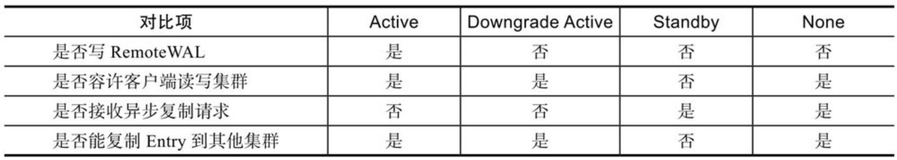

# 第一章 HBase 概述

## 1、HBase 数据模型

> HBase是一个稀疏的、分布式的、多维排序的Map

### (1) HBase 逻辑视图

- **`table`(表)**：一个表包含多行数据

- **`row`(行)**：一行数据包含一个唯一标识 rowkey、多个 column 以及对应的值

    > HBase 中，一张表中所有 row 都按照 rowkey 的字典序由小到大排序

- **`column`(列)**：由 `column family`(列簇)、`qualifier`(列名)两部分组成，两者中间使用 `:` 相连

    > column family 在表创建时指定，用户不能随意增减。
    >
    > 一个 column family下可以设置任意多个 qualifier，即 HBase 中的列可以动态增加

- **`timestamp`(时间戳)**：每个 cell 在写入 HBase 时都会默认分配一个时间戳作为该 cell 的版本

    > HBase支持多版本特性，即同一rowkey、column下可以有多个value存在，这些 value 使用 timestamp 作为版本号，版本越大，表示数据越新

- **`cell`(单元格)**：由五元组(row, column, timestamp, type, value)组成的结构，其中 `(row, column,timestamp, type)` 是K，value字段对应 KV 结构的 V

    - `type` 表示 `Put/Delete` 这样的操作类型
    - `timestamp` 代表这个 cell 的版本


### (2) 多维稀疏排序 Map

> HBase 中 Map 的 key 由 `rowkey、column family、qualif ier、type、timestamp` 组成，value 即为 cell 的值
>
> 如：`{"com.cnn.www","anchor","cnnsi.com","put","t9"} -> "CNN"`

- **多维**：HBase 的 Map key 是一个复合数据结构，由多维元素构成，包括 rowkey、column family、qualifier、type、timestamp

- **稀疏**：HBase 的空值不需要任何填充，避免造成大量空间的浪费，因此稀疏性是HBase的列可以无限扩展的一个重要条件

- **排序**：构成 HBase 的 KV 在同一个文件中有序，即按照 KV 中的 key 进行排序

    >  先比较 rowkey，再比较 column family:qualifier 和 timestamp

- **分布式**：构成 HBase 的所有 Map 并不集中在某台机器上，而是分布在整个集群中

### (3) 物理视图

HBase 中的数据按照列簇存储，即将数据按照列簇分别存储在不同的目录中：


- 列簇 anchor 的所有数据存储在一起形成：

    

- 列簇contents的所有数据存储在一起形成：

    

- 列簇people的所有数据存储在一起形成：

    

### (4) 行式存储、列式存储、列簇式存储

- **行式存储**：将一行数据存储在一起，一行数据写完之后再接着写下一行，最典型的如 MySQL 这类关系型数据库

    > - 行式存储在获取一行数据时很高效
    >
    > - 但只需要读取表中指定列对应的数据，那么行式存储会先取出一行行数据，再在每一行数据中截取待查找目标列。这种处理方式在查找过程中引入了大量无用列信息，从而导致大量内存占用
    >
    > 因此，这类系统仅适合于处理OLTP类型的负载，对于OLAP这类分析型负载并不擅长

- **列式存储**：将一列数据存储在一起，不同列的数据分别集中存储，最典型的如 Kudu、Parquet on HDFS 等系统

    > 列式存储对于只查找某些列数据的请求非常高效，只需要连续读出所有待查目标列，然后遍历处理即可；
    >
    > 但是反过来，列式存储对于获取一行的请求就不那么高效了，需要多次IO读多个列数据，最终合并得到一行数据。
    >
    > 另外，因为同一列的数据通常都具有相同的数据类型，因此列式存储具有天然的高压缩特性

- **列簇式存储**：介于行式存储和列式存储之间，可以通过不同的设计思路在行式存储和列式存储两者之间相互切换

## 2、HBase 体系结构

HBase 体系结构借鉴了 BigTable 论文，是典型的 Master-Slave 模型：

- 系统中有一个管理集群的 Master 节点以及大量实际服务用户读写的 RegionServer 节点
- HBase 中所有数据最终都存储在 HDFS 系统中，与 BigTable实 际数据存储在 GFS 中相对应
- 系统中还有一个 ZooKeeper 节点，协助 Master 对集群进行管理


### (1) HBase 客户端

 HBase客户端(Client)提供了 Shell 命令行接口、原生 Java API 编程接口、Thrift/REST API 编程接口以及MapReduce编程接口：

- Shell 命令支持所有常见的 DML/DDL操作，即数据的增删改查和表的日常维护等

- Thrift/REST API 主要用于支持非 Java 的上层业务需求
- MapReduce 接口主要用于批量数据导入以及批量数据读取

HBase 客户端访问数据行之前：

- 首先需要通过元数据表定位目标数据所在RegionServer，之后才会发送请求到该RegionServer
- 同时这些元数据会被缓存在客户端本地，以方便之后的请求访问
- 若集群 RegionServer 发生宕机或执行负载均衡，导致数据分片发生迁移，客户端需要重新请求最新的元数据并缓存在本地

### (2) Zookeeper

ZooKeeper 主要用于协调管理分布式应用程序：

- **实现 Master 高可用**：通常情况下系统中只有一个Master工作，一旦Active Master由于异常宕机，ZooKeeper会检测到该宕机事件，并通过一定机制选举出新的Master，保证系统正常运转

- **管理系统核心元数据**：管理系统中正常工作的 RegionServer 集合，保存系统元数据表 hbase:meta 所在的 RegionServer 地址等

- **参与 RegionServer 宕机恢复**：通过心跳可以感知到 RegionServer 是否宕机，并在宕机后通知 Master 进行宕机处理

- **实现分布式表锁**：HBase 中对一张表进行各种管理操作需要先加表锁，防止其他用户对同一张表进行管理操作，造成表状态不一致

    > HBase 中的表通常都是分布式存储，ZooKeeper 可以通过特定机制实现分布式表锁

### (3) Master

Master 主要负责 HBase 系统的各种管理工作：

- 处理用户的各种管理请求，包括建表、修改表、权限操作、切分表、合并数据分片以及 Compaction 等

- 管理集群中所有 RegionServer，包括 RegionServer 中 Region 的负载均衡、RegionServer 的宕机恢复以及 Region 的迁移等
- 清理过期日志以及文件，Master会每隔一段时间检查 HDFS 中 HLog 是否过期、HFile 是否已经被删除，并在过期之后将其删除

### (4) RegionServer

RegionServer 主要用来响应用户的 IO 请求，是 HBase 中最核心的模块，由WAL(HLog)、BlockCache 以及多个 Region 构成

- **WAL(HLog)**：HLog在HBase中有两个核心作用

    - 用于实现数据的高可靠性：HBase 数据随机写入时，并非直接写入 HFile 数据文件，而是先写入缓存，再异步刷新落盘

        > 为了防止缓存数据丢失，数据写入缓存之前，需顺序写入HLog，即使缓存数据丢失，仍然可以通过 HLog 日志恢复

    - 用于实现 HBase 集群间主从复制：通过回放主集群推送过来的 HLog 日志实现主从复制

- **BlockCache**(HBase 系统中的读缓存)：客户端从磁盘读取数据之后通常会将数据缓存到系统内存中，后续访问同一行数据可以直接从内存中获取而不需要访问磁盘

    > - BlockCache 缓存对象是一系列 Block 块，一个 Block 默认为 64K，由物理上相邻的多个 KV 数据组成
    >
    > - BlockCache同时利用了空间局部性和时间局部性原理：
    >     - 前者表示最近将读取的 KV 数据很可能与当前读取到的 KV 数据在地址上是邻近的，缓存单位是Block（块）而不是单个KV就可以实现空间局部性
    >     - 后者表示一个KV数据正在被访问，那么近期它还可能再次被访问。当前BlockCache主要有两种实现——LRUBlockCache和BucketCache，前者实现相对简单，而后者在GC优化方面有明显的提升

- **Region**：数据表的一个分片，当数据表大小超过一定阈值就会“水平切分”，分裂为两个Region

    > - Region 是集群负载均衡的基本单位
    > - 通常一张表的 Region 会分布在整个集群的多台 RegionServer 上，一个RegionServer上会管理多个Region
    >
    > - 一个Region由一个或者多个Store构成，Store的个数取决于表中列簇(column family)的个数，多少个列簇就有多少个Store
    >
    >     > HBase中，每个列簇的数据都集中存放在一起形成一个存储单元Store，因此建议将具有相同IO特性的数据设置在同一个列簇中
    >
    > - 每个 Store 由一个 MemStore 和一个或多个 HFile 组成
    >     - MemStore称为写缓存，用户写入数据时首先会写到MemStore，当MemStore写满之后（缓存数据超过阈值，默认128M）系统会异步地将数据 flush 成一个 HFile 文件
    >     - 随着数据不断写入，HFile文件会越来越多，当HFile文件数超过一定阈值之后系统将会执行Compact操作，将这些小文件通过一定策略合并成一个或多个大文件

### (5) HDFS

- HBase 底层依赖 HDFS 组件存储实际数据，包括用户数据文件、HLog 日志文件等最终都会写入 HDFS 落盘

- HDFS 数据默认三副本存储策略可以有效保证数据的高可靠性

- HBase 内部封装了一个名为 DFSClient 的HDFS客户端组件，负责对HDFS的实际数据进行读写访问

## 3、HBase 系统特性

### (1) HBase 优点

- **容量巨大**：HBase的单表可以支持千亿行、百万列的数据规模，数据容量可以达到TB甚至PB级别

- **良好的可扩展性**：集群容量扩展容易，主要包括数据存储节点扩展、读写服务节点扩展

    > - HBase 底层数据存储依赖于 HDFS 系统，HDFS 可以通过简单地增加 DataNode 实现扩展
    > - HBase 读写服务节点也一样，可以通过简单的增加 RegionServer 节点实现计算层的扩展

- **稀疏性**：HBase支持大量稀疏存储，即允许大量列值为空，并不占用任何存储空间

- **高性能**：HBase 主要擅长 OLTP 场景，数据写操作性能强劲，对于随机单点读以及小范围的扫描读，其性能也能够得到保证。对于大范围的扫描读可以使用 MapReduce 提供的API，以便实现更高效的并行扫描

- **多版本**：HBase支持多版本特性，即一个 KV 可以同时保留多个版本，用户可以根据需要选择最新版本或者某个历史版本

- **支持过期**：HBase 支持 TTL 过期特性，用户只需要设置过期时间，超过 TTL 的数据就会被自动清理，不需要用户写程序手动删除

- **Hadoop 原生支持**：HBase是Hadoop生态中的核心成员之一，很多生态组件都可以与其直接对接

### (2) HBase 缺点

- HBase 本身不支持很复杂的聚合运算

    > 如果业务中需要使用聚合运算，可以在 HBase 之上架设 Phoenix 组件或 Spark 组件，前者主要应用于小规模聚合的 OLTP 场景，后者应用于大规模聚合的 OLAP 场景

- HBase 本身并没有实现二级索引功能，所以不支持二级索引查找

    > Phoenix 支持二级索引功能

- HBase 原生不支持全局跨行事务，只支持单行事务模型

    > Phoenix 提供全局事务模型组件

## 4、OLAP 与 OLTP

> - OLTP 是做事务处理，即 OLTP 主要是对数据的增删改
>
> - OLAP 是做分析处理，即 OLAP 是对数据的查询
>
> OLTP 是数据库的应用，OLAP 是数据仓库的应用


# 第二章 基础数据结构与算法

## 1、跳跃表

> 跳跃表（SkipList）是一种能高效实现插入、删除、查找的内存数据结构，这些操作的期望复杂度都是O(logN)

### (1) 定义


- 跳跃表由多条分层的链表组成（设为S0, S1, S2, ... , Sn），例如图中有6条链表

- 每条链表中的元素都是有序的

- 每条链表都有两个元素：+∞（正无穷大）和- ∞（负无穷大），分别表示链表的头部和尾部

- 从上到下，上层链表元素集合是下层链表元素集合的子集，即S1是S0的子集，S2是S1的子集

- 跳跃表的高度定义为水平链表的层数

### (2) 查找


- 如果发现 currentNode 后继节点的值小于等于待查询值，则沿着这条链表向后查询，否则，切换到当前节点的下一层链表

- 继续查询，直到找到待查询值或 currentNode 为空节点为止

### (3) 插入

- 首先，需要按照查找流程找到待插入元素的前驱和后继

- 然后，按照如下随机算法生成一个高度值：

    ``` c
    // p是一个(0,1)之间的常数，一般取 p=1/4 或者 1/2
    public void randomHeight(double p){
        int height=0 ;
        while(random.nextDouble() < p) height ++;
        return height+1;
    }
    ```

- 最后，将待插入节点按照高度值生成一个垂直节点（这个节点的层数正好等于高度值），之后插入到跳跃表的多条链表中去

    假设height=randomHeight(p)，这里需要分两种情况讨论

    - 如果 height 大于跳跃表的高度，那么跳跃表的高度被提升为 height，同时需要更新头部节点和尾部节点的指针指向
    - 如果 height 小于等于跳跃表的高度，那么需要更新待插入元素前驱和后继的指针指向

## 2、LSM 树

> LSM 树会将所有写入操作处理为一次顺序写，而 HDFS 擅长的正是顺序写

LSM 树的索引一般由两部分组成

- 内存部分：一般采用跳跃表来维护一个有序的 Key-Value 集合
- 磁盘部分：一般由多个内部 Key-Value 有序的文件组成

### (1) Key-Value 存储格式

> LSM 中存储的是多个 Key-Value 组成的集合，每一个 Key-Value 一般都会用一个字节数组来表示

- **HBase rowkey 组成**：


字节数组主要分为以下几个字段

> 其中 Rowkey、Family、Qualifier、Timestamp、Type 这5个字段组成 KeyValue 中的 key 部分

- `keyLen`：占用4字节，用来存储KeyValue结构中Key所占用的字节长度

- `valueLen`：占用4字节，用来存储KeyValue结构中Value所占用的字节长度

- `rowkeyLen`：占用2字节，用来存储rowkey占用的字节长度

- `rowkeyBytes`：占用rowkeyLen个字节，用来存储rowkey的二进制内容

- `familyLen`：占用1字节，用来存储Family占用的字节长度

- `familyBytes`：占用familyLen字节，用来存储Family的二进制内容

- `qualifierBytes`：占用qualifierLen个字节，用来存储 Qualifier 的二进制内容

    ``` shell
    qualifierLen=keyLen -2B - rowkeyLen -1B - familyLen -8B -1B
    ```

- `timestamp`：占用8字节，表示 timestamp 对应的 long 值

- `type`：占用1字节，表示这个KeyValue操作的类型

    > HBase内有 Put、Delete、Delete Column、DeleteFamily

---

在比较这些KeyValue的大小顺序时，HBase按照如下方式（伪代码）来确定大小关系：

```c
int compare(KeyValue a, KeyValue b){
    int ret = Bytes.compare(a.rowKeyBytes, b.rowKeyBytes);
    if(ret != 0) return ret;
    ret = Bytes.compare(a.familyBytes, b.familyBytes);
    if(ret != 0) return ret;
    ret = Bytes.compare(a.qualifierBytes, b.qualifierBytes);
    if(ret != 0) return ret;
    // 注意：timestamp越大，排序越靠前
    ret = b.timestamp - a.timestamp;
    if(ret != 0) return ret;
    ret = a.type - b.type;
    return ret;
}
```

> 注：在HBase中，timestamp 越大的 KeyValue，排序越靠前。因为用户期望优先读取到那些版本号更新的数据

在 LSM 树的 KeyValue 中的 Key 部分，有3个字段必不可少：

- Key 的二进制内容

- 表示版本号的 64 位 long 值，在HBase中对应timestamp

    > 这个版本号通常表示数据的写入先后顺序，版本号越大的数据，越优先被用户读取
    >
    > 甚至会设计一定的策略，将那些版本号较小的数据过期淘汰（HBase中有TTL策略）

- type，表示这个 KeyValue 是 Put操作，还是Delete操作，或者是其他写入操作

### (2) LSM树的索引结构

一个 LSM 树的索引主要由两部分构成：内存部分和磁盘部分

- 内存部分是一个 ConcurrentSkipListMap，Key 就是前面所说的 Key 部分，Value是一个字节数组，数据写入时，直接写入MemStore中
- 随着不断写入，一旦内存占用超过一定的阈值时，就把内存部分的数据导出，形成一个有序的数据文件，存储在磁盘上


LSM 树索引结构如图：

- 内存部分导出形成一个有序数据文件的过程称为 flush
- 为了避免flush影响写入性能，会先把当前写入的MemStore设为Snapshot，不再容许新的写入操作写入这个Snapshot的MemStore
- 另开一个内存空间作为MemStore，让后面的数据写入
- 一旦Snapshot的MemStore写入完毕，对应内存空间就可以释放

> 通过两个 MemStore 来实现稳定的写入性能

### (3) 优化操作

> LSM 树全都使用 append 操作(磁盘顺序写)来实现数据写入，没有使用任何 seek+write(磁盘随机写)的方式来写入

- 随着写入的增加，内存数据会不断地刷新到磁盘上，最终磁盘上的数据文件会越来越多

    > 若数据没有任何的读取操作，磁盘上产生很多的数据文件对写入并无影响，且这时写入速度最快，因为所有IO都是顺序IO

- 一旦用户有读取请求，则需要将大量的磁盘文件进行多路归并，之后才能读取到所需的数据

    > 因为需要将那些Key相同的数据全局综合起来，最终选择出合适的版本返回给用户，所以磁盘文件数量越多，在读取的时候随机读取的次数也会越多，从而影响读取操作的性能

- 为了优化读取操作的性能，可以设置一定策略将选中的多个 hfile进行多路归并，合并成一个文件

    > 文件个数越少，则读取数据时需要 seek 操作的次数越少，读取性能则越好

---

按照选中的文件个数，将 compact 操作分成两种类型

> minor compact虽然能减少文件，但却无法彻底清除那些delete操作
>
> 而major compact能完全清理那些delete操作，保证数据的最小化

- `major compact`：将所有的 hfile 一次性多路归并成一个文件

    > major compact 不宜使用太频繁，适合周期性地跑

    - 好处：合并之后只有一个文件，这样读取的性能肯定最高
    - 问题：合并所有的文件可能需要很长的时间并消耗大量的 IO 带宽

- `minor compact`：即选中少数几个 hfile，将它们多路归并成一个文件
    - 优点：可以进行局部的 compact，通过少量的 IO 减少文件个数，提升读取操作的性能，适合较高频率地跑
    - 缺点：只合并了局部的数据，对于那些全局删除操作，无法在合并过程中完全删除

## 3、布隆过滤器

```java
public class BloomFilter {
  private int k;
  private int bitsPerKey;
  private int bitLen;
  private byte[] result;
  public BloomFilter(int k, int bitsPerKey) {
    this.k=k;
    this.bitsPerKey=bitsPerKey;
  }
  public byte[] generate(byte[][] keys) {
    assert keys !=null;
    bitLen=keys.length ＊ bitsPerKey;
    bitLen=((bitLen+7) / 8) << 3; //align the bitLen.
    bitLen=bitLen < 64 ? 64 : bitLen;
    result=new byte[bitLen >> 3]; //each byte have 8 bit.
    for (int i=0; i < keys.length; i++) {
      assert keys[i] !=null;
      int h=Bytes.hash(keys[i]);
      for (int t=0; t < k; t++) {
        int idx=(h % bitLen+bitLen) % bitLen;
        result[idx / 8] |=(1 << (idx % 8));
        int delta=(h >> 17) | (h << 15);
        h +=delta;
      }
    }
    return result;
  }
  public boolean contains(byte[] key) {
    assert result !=null;
    int h=Bytes.hash(key);
    for (int t=0; t < k; t++) {   //Hash k times
      int idx=(h % bitLen+bitLen) % bitLen;
      if ((result[idx / 8] & (1 << (idx % 8)))==0) {
        return false;
      }
      int delta=(h >> 17) | (h << 15);
      h +=delta;
    }
    return true;
  }
}
```


###  HBase与布隆过滤器

> HBase 的 Get 操作就是通过运用低成本高效率的布隆过滤器来过滤大量无效数据块的，从而节省大量磁盘 IO

用户可以对某些列设置不同类型的布隆过滤器：

- `NONE`：关闭布隆过滤器功能

- `ROW`：按照 rowkey 来计算布隆过滤器的二进制串并存储

    > Get 查询时，必须带 rowkey，所以用户可以在建表时默认把布隆过滤器设置为 ROW 类型

- `ROWCOL`：按照 `rowkey+family+qualifier` 这3个字段拼出byte[]来计算布隆过滤器值并存储

    > 若在查询时，Get 能指定 `rowkey、family、qualifier` 这3个字段，则肯定可以通过布隆过滤器提升性能

# 第三章 HBase 依赖服务

## 1、Zookeeper 简介


## 2、HBase 中 Zookeeper 核心配置


## 3、HDFS 简介

> HBase 项目本身并不负责文件层面的高可用和扩展性，通过把数据存储在 HDFS 上来实现大容量文件存储和文件备份

- **HDFS 并不支持文件的随机写以及多个客户端同时写同一个文件**

### (1) HDFS 架构


> - 存储在 HDFS 上面的文件实际上是由若干个数据块（Block，大小默认为128MB)组成，每一个Block会设定一个副本数N，表示这个Block在写入的时候会写入N个数据节点，以达到数据备份的目的
>
> - 读取时，只需要依次读取组成这个文件的 Block 即可完整读取整个文件
>
>     > 注意：读取时只需选择 N 个副本中的任何一个副本进行读取即可

一个线上的高可用HDFS集群主要由4个重要的服务组成：

- `NameNode`：线上需要部署2个NameNode ：一个节点是Active状态并对外提供服务；另一个节点是StandBy状态，作为Active的备份，备份状态下不提供对外服务，也就是说HDFS客户端无法通过请求StandBy状态的NameNode来实现修改文件元数据的目的。如果ZkFailoverController服务检测到Active状态的节点发生异常，会自动把StandBy状态的NameNode服务切换成Active的NameNode。

    NameNode存储并管理HDFS的文件元数据，这些元数据主要包括文件属性（文件大小、文件拥有者、组以及各个用户的文件访问权限等）以及文件的多个数据块分布在哪些存储节点上。需要注意的是，文件元数据是在不断更新的，例如HBase对HLog文件持续写入导致文件的Block数量不断增长，管理员修改了某些文件的访问权限，HBase把一个HFile从/hbase/data目录移到/hbase/archive目录。所有这些操作都会导致文件元数据的变更。因此NameNode本质上是一个独立的维护所有文件元数据的高可用KV数据库系统。为了保证每一次文件元数据都不丢失，NameNode采用写EditLog和FsImage的方式来保证元数据的高效持久化。每一次文件元数据的写入，都是先做一次EditLog的顺序写，然后再修改NameNode的内存状态。同时NameNode会有一个内部线程，周期性地把内存状态导出到本地磁盘持久化成FsImage（假设导出FsImage的时间点为t），那么对于小于时间点t的EditLog都认为是过期状态，是可以清理的，这个过程叫做推进checkpoint。

    注意：NameNode会把所有文件的元数据全部维护在内存中。因此，如果在HDFS中存放大量的小文件，则造成分配大量的Block，这样可能耗尽NameNode所有内存而导致OOM。因此，HDFS并不适合存储大量的小文件。当然，后续的HDFS版本支持NameNode对元数据分片，解决了NameNode的扩展性问题。

- `DataNode`：组成文件的所有Block都是存放在DataNode节点上的。一个逻辑上的Block会存放在N个不同的DataNode上。而NameNode、JournalNode、ZKFailoverController服务都是用来维护文件元数据的。

- `JournalNode`：由于NameNode是Active-Standby方式的高可用模型，且NameNode在本地写EditLog，那么存在一个问题——在StandBy状态下的NameNode切换成Active状态后，如何才能保证新Active的NameNode和切换前Active状态的NameNode拥有完全一致的数据？如果新Active的NameNode数据和老Active的NameNode不一致，那么整个分布式文件系统的数据也将不一致，这对用户来说是一件极为困扰的事情。

    为了保证两个NameNode在切换前后能读到一致的EditLog，HDFS单独实现了一个叫做JournalNode的服务。线上集群一般部署奇数个JournalNode（一般是3个，或者5个），在这些JournalNode内部，通过Paxos协议来保证数据一致性。因此可以认为，JournalNode其实就是用来维护EditLog一致性的Paxos组。

- `ZkFailoverController`：ZKFailoverController主要用来实现NameNode的自动切换

### (2) 文件写入


#### 1. 写入流程描述

1）DFS Client在创建FSDataOutputStream时，把文件元数据发给NameNode，得到一个文件唯一标识的f ileId，并向用户返回一个OutputStream。

2）用户拿到OutputStream之后，开始写数据。注意写数据都是按照Block来写的，不同的Block可能分布在不同的DataNode上，因此如果发现当前的Block已经写满，DFSClient就需要再发起请求向NameNode申请一个新的Block。在一个Block内部，数据由若干个Packet（默认64KB）组成，若当前的Packet写满了，就放入DataQueue队列，DataStreamer线程异步地把Packet写入到对应的DataNode。3个副本中的某个DataNode收到Packet之后，会先写本地文件，然后发送一份到第二个DataNode，第二个执行类似步骤后，发给第三个DataNode。等所有的DataNode都写完数据之后，就发送Packet的ACK给DFS Client，只有收到ACK的Packet才是写入成功的。

3）用户执行完写入操作后，需要关闭OutputStream。关闭过程中，DFSClient会先把本地DataQueue中未发出去的Packet全部发送到DataNode。若忘记关闭，对那些已经成功缓存在DFS Client的DataQueue中但尚未成功写入DataNode的数据，将没有机会写入DataNode中。对用户来说，这部分数据将丢失。


#### 2. FSDataOutputStream 中 hflush 和 hsync 的区别

hf lush成功返回，则表示DFSClient的DataQueue中所有Packet都已经成功发送到了3个DataNode上。但是对每个DataNode而言，数据仍然可能存放在操作系统的Cache上，若存在至少一个正常运行的DataNode，则数据不会丢失。hsync成功返回，则表示DFSClient DataQueue中的Packet不但成功发送到了3个DataNode，而且每个DataNode上的数据都持久化（sync）到了磁盘上，这样就算所有的DataNode都重启，数据依然存在（hf lush则没法保证）。

在HBASE-19024之后，HBase 1.5.0以上的版本可以在服务端通过设置hbase.wal.hsync来选择hf lush或者hsync。低于1.5.0的版本，可以在表中设置DURABILITY属性来实现。

在小米内部大部分HBase集群上，综合考虑写入性能和数据可靠性两方面因素，我们选择使用默认的hf lush来保证WAL持久性。因为底层的HDFS集群已经保证了数据的三副本，并且每一个副本位于不同的机架上，而三个机架同时断电的概率极小。但是对那些依赖云服务的HBase集群来说，有可能没法保证副本落在不同机架，hsync是一个合理的选择。

另外，针对小米广告业务和云服务这种对数据可靠性要求很高的业务，我们采用同步复制的方式来实现多个数据中心的数据备份，这样虽然仍选择用hf lush，但数据已经被同步写入两个数据中心的6个DataNode上，同样可以保证数据的高可靠性。


### (3) 文件读取


#### 1. 读取流程描述

1）DFSClient请求NameNode，获取到对应read position的Block信息（包括该Block落在了哪些DataNode上）。

2）DFSClient从Block对应的DataNode中选择一个合适的DataNode，对选中的DataNode创建一个BlockReader以进行数据读取。

HDFS读取流程很简单，但对HBase的读取性能影响重大，尤其是Locality和短路读这两个最为核心的因素。


#### 2. Locality

某些服务可能和DataNode部署在同一批机器上。因为DataNode本身需要消耗的内存资源和CPU资源都非常少，主要消耗网络带宽和磁盘资源。而HBase的RegionServer服务本身是内存和CPU消耗型服务，于是我们把RegionServer和DataNode部署在一批机器上。对某个DFSClient来说，一个文件在这台机器上的locality可以定义为：

locality=该文件存储在本地机器的字节数之和 / 该文件总字节数

因此，locality是[0, 1]之间的一个数，locality越大，则读取的数据都在本地，无需走网络进行数据读取，性能就越好。反之，则性能越差。


#### 3. 短路读（Short Circuit Read）

短路读是指对那些Block落在和DFSClient同一台机器上的数据，可以不走TCP协议进行读取，而是直接由DFSClient向本机的DataNode请求对应Block的文件描述符（File Descriptor），然后创建一个BlockReaderLocal，通过fd进行数据读取，这样就节省了走本地TCP协议栈的开销。

测试数据表明，locality和短路读对HBase的读性能影响重大。在locality=1.0情况下，不开短路读的p99性能要比开短路读差10%左右。如果用locality=0和locality=1相比，读操作性能则差距巨大。


#### 4. HDFS 在 HBase 系统中扮演的角色

HBase使用HDFS存储所有数据文件，从HDFS的视角看，HBase就是它的客户端。这样的架构有几点需要说明：

- HBase本身并不存储文件，它只规定文件格式以及文件内容，实际文件存储由HDFS实现
- HBase不提供机制保证存储数据的高可靠，数据的高可靠性由HDFS的多副本机制保证
- HBase-HDFS体系是典型的计算存储分离架构。这种轻耦合架构的好处是，一方面可以非常方便地使用其他存储替代HDFS作为HBase的存储方案；另一方面对于云上服务来说，计算资源和存储资源可以独立扩容缩容，给云上用户带来了极大的便利。


## 4、HBase 在 HDFS 中的文件布局

通过HDFS的客户端列出HBase集群的文件如下：

```shell
hadoop@hbase37:～/hadoop-current/bin$ ./hdfs dfs -ls /hbase
Found 10 items
drwxr-xr-x    - hadoop hadoop       02018-05-07 10:42 /hbase-nptest/.hbase-snapshot
drwxr-xr-x    - hadoop hadoop       02018-04-27 14:04 /hbase-nptest/.tmp
drwxr-xr-x    - hadoop hadoop       02018-07-06 21:07 /hbase-nptest/MasterProcWALs
drwxr-xr-x    - hadoop hadoop       02018-06-25 17:14 /hbase-nptest/WALs
drwxr-xr-x    - hadoop hadoop       02018-05-07 10:43 /hbase-nptest/archive
drwxr-xr-x    - hadoop hadoop       02017-10-10 20:24 /hbase-nptest/corrupt
drwxr-xr-x    - hadoop hadoop       02018-05-31 12:02 /hbase-nptest/data
-rw-r--r--    3 hadoop hadoop       422017-09-29 17:30 /hbase-nptest/hbase.id
-rw-r--r--   3 hadoop hadoop       72017-09-29 17:30 /hbase-nptest/hbase.version
drwxr-xr-x    - hadoop hadoop      02018-07-06 21:22 /hbase-nptest/oldWALs
```

- `hbase-snapshot`：snapshot 文件存储目录

    > 用户执行snapshot后，相关的snapshot元数据文件存储在该目录

- `.tmp`：临时文件目录，主要用于 HBase 表的创建和删除操作

    > - 表创建时，首先会在 tmp 目录下执行，执行成功后再将 tmp 目录下的表信息移动到实际表目录下
    > - 表删除操作会将表目录移动到 tmp 目录下，一定时间过后再将 tmp 目录下的文件真正删除

- `MasterProcWALs`：存储 Master Procedure 过程中的 WAL 文件，Master Procedure 功能主要用于可恢复的分布式 DDL 操作

    > Master Procedure 功能使用 WAL 记录 DDL 执行的中间状态，在异常发生之后可以通过 WAL 回放明确定位到中间状态点，继续执行后续操作以保证整个 DDL 操作的完整性

- `WALs`：存储集群中所有 RegionServer 的 HLog 日志文件

- `archive`：文件归档目录。这个目录主要会在以下几个场景下使用

    - 所有对 HFile 文件的删除操作都会将待删除文件临时放在该目录
    - 进行 Snapshot 或升级时使用到的归档目录
    - Compaction 删除 HFile 时，也会把旧的 HFile 移动到这里

- `corrupt`：存储损坏的 HLog 文件或 HFile 文件

- `data`：存储集群中所有 Region 的 HFile 数据。HFile文件在data目录下的完整路径如下所示：

    ``` 
    /hbase/data/default/usertable/fa13562579a4c0ec84858f2c947e8723/family/105baeff31ed481cb708c65728965666
    ```

    > 其中，default 表示命名空间，usertable 为表名，fa13562579a4c0ec84858f2c947e8723 为 Region名称，family 为列簇名，105baeff31ed481cb708c65728965666 为 HFile 文件名

除了HFile文件外，data 目录下还存储了一些重要的子目录和子文件

- `.tabledesc`：表描述文件，记录对应表的基本 schema 信息

- `.tmp`：表临时目录，主要用来存储 Flush 和 Compaction 过程中的中间结果

    > 以 `flush` 为例，MemStore 中的 KV 数据落盘形成 HFile 首先会生成在 `.tmp` 目录下，一旦完成再从 `.tmp` 目录移动到对应的实际文件目录

- `.regioninfo`：Region 描述文件

- `recovered.edits`：存储故障恢复时该 Region 需要回放的 WAL 日志数据

    > RegionServer 宕机后，该节点上还没有来得及 flush 到磁盘的数据需要通过 WAL 回放恢复，WAL文件首先需要按照Region进行切分，每个Region拥有对应的WAL数据片段，回放时只需要回放自己的WAL数据片段即可

- `hbase.id`：集群启动初始化的时候，创建的集群唯一id

- `hbase.version`：HBase软件版本文件，代码静态版本

- `oldWALs`：WAL 归档目录。一旦一个WAL文件中记录的所有KV数据确认已经从MemStore持久化到HFile，那么该WAL文件就会被移到该目录

# 第四章 HBase 客户端


# 第五章 RegionServer 的核心模块

> RegionServer 是 HBase 系统中最核心的组件，主要负责用户数据写入、读取等基础操作，包含的模块：HLog、MemStore、HFile、BlockCache

## 1、RegionServer 内部结构


一个RegionServer由一个（或多个）HLog、一个BlockCache以及多个Region组成

- `HLog` 用来保证数据写入的可靠性

- `BlockCache` 可以将数据块缓存在内存中以提升数据读取性能

- `Region` 是 HBase 中数据表的一个数据分片，一个 RegionServer 上通常会负责多个 Region 的数据读写

- 一个 Region 由多个 `Store` 组成，每个 Store 存放对应列簇的数据

    > 比如一个表中有两个列簇，这个表的所有 Region 就都会包含两个 Store

- 每个 Store 包含一个 MemStore 和多个 HFile，用户数据写入时会将对应列簇数据写入相应的MemStore，一旦写入数据的内存大小超过设定阈值，系统就会将 MemStore 中的数据落盘形成 HFile 文件

    > HFile 存放在 HDFS 上，是一种定制化格式的数据存储文件，方便用户进行数据读取

## 2、HLog

HBase 中系统故障恢复以及主从复制都基于 HLog 实现

> 所有写入操作(写入、更新、删除)的数据都先以追加形式写入 HLog，再写入 MemStore

- 当 RegionServer 在某些异常情况下发生宕机，此时已经写入 MemStore 中但尚未 flush 到磁盘的数据就会丢失，需要回放 HLog 补救丢失的数据
- HBase 主从复制需要主集群将 HLog 日志发送给从集群，从集群在本地执行回放操作，完成集群之间的数据复制

### (1) HLog 文件结构


- 每个 RegionServer 拥有一个或多个 HLog，每个 HLog 是多个 Region 共享

- HLog中，日志单元 WALEntry 表示一次行级更新的最小追加单元，其由 HLogKey 和 WALEdit 两部分组成

    - HLogKey 由 table name、region name、sequenceid 等字段构成

    - WALEdit 用来表示一个事务中的更新集合，为了保证事务的原子性，HBase 将一个行级事务的写入操作表示为一条记录

        ``` xml
        <logseq#-for-entire-txn>:<WALEdit-for-entire-txn>
        ```

        > 其中，WALEdit 会被序列化为格式 `<-1, # of edits, , , >`，比如<-1, 3, , , >，-1为标识符，表示这种新的日志结构

### (2) HLog 文件存储

HBase 中所有数据（包括HLog以及用户实际数据）都存储在 HDFS 的指定目录下，可以通过 hadoop 命令查看：

``` shell
drwxr-xr-x    - hadoop hadoop             02017-09-21 17:12 /hbase/WALs
drwxr-xr-x    - hadoop hadoop             02017-09-22 06:52 /hbase/oldWALs
```

其中，`/hbase/WALs` 存储当前还未过期的日志；`/hbase/oldWALs` 存储已经过期的日志

可以进一步查看 `/hbase/WALs` 目录下的日志文件，如下所示：

```shell
/hbase/WALs/hbase17.xj.bjbj.org,60020,1505980274300
/hbase/WALs/hbase18.xj.bjbj.org,60020,1505962561368
/hbase/WALs/hbase19.xj.bjbj.org,60020,1505980197364
```

`/hbase/WALs` 目录下通常会有多个子目录，每个子目录代表一个对应的 RegionServer

> 以 `hbase17.xj.bjbj.org,60020,1505980274300` 为例
>
> - `hbase17.xj.bjbj.org` 表示对应的 RegionServer 域名
> - 60020为端口号
> - 1505980274300 为目录生成时的时间戳

每个子目录下存储该 RegionServer 内的所有 HLog 文件，如下所示：

```shell
/hbase/WALs/hbase17.xj.bjbj.org,60020,1505980274300/hbase17.xj.bjbj.org%2C60020%2C1505980274300.default.1506184980449
```

> HLog文件为：`hbase17.xj.bjbj.org%2C60020%2C1505980274300.default.1506012772205` 

### (3) HLog 生命周期

HLog 文件生成之后并不会永久存储在系统中，使命完成后，文件就会失效最终被删除


HLog生命周期包含4个阶段：

- **HLog 构建**：HBase的任何写入（更新、删除）操作都会先将记录追加写入到 HLog 文件中

- **HLog 滚动**：HBase 后台启动一个线程，每隔一段时间（由参数'hbase.regionserver. logroll.period'决定，默认1小时）进行日志滚动。日志滚动会新建一个新的日志文件，接收新的日志数据

    > 日志滚动机制主要是为了方便过期日志数据能够以文件的形式直接删除

- **HLog 失效**：写入数据一旦从 MemStore 中落盘，对应的日志数据就会失效。为了方便处理，HBase中日志失效删除总是以文件为单位执行。查看某个HLog文件是否失效只需确认该HLog文件中所有日志记录对应的数据是否已经完成落盘，如果日志中所有日志记录已经落盘，则可以认为该日志文件失效

    > 一旦日志文件失效，就会从WALs文件夹移动到oldWALs文件夹，注意此时 HLog 并没有被系统删除

- **HLog 删除**：Master 后台会启动一个线程，每隔一段时间（参数'hbase.master.cleaner. interval'，默认1分钟）检查一次文件夹oldWALs 下的所有失效日志文件，确认是否可以删除，确认可以删除之后执行删除操作

    确认条件主要有两个：

    - 该 HLog 文件是否还在参与主从复制：对于使用HLog进行主从复制的业务，需要继续确认是否该HLog还在应用于主从复制

    - 该 HLog 文件是否已经在 OldWALs 目录中存在10分钟，默认情况下 oldWALs 里面的 HLog 文件最多可以再保存10分钟

        > 系统提供了参数设置日志文件的TTL（参数'hbase.master.logcleaner.ttl'，默认10分钟）

## 3、MemStore

### (1) Memstore 简介

HBase 系统中一张表会被水平切分成多个 Region，每个Region负责自己区域的数据读写请求

水平切分意味着每个 Region 会包含所有的列簇数据，HBase将不同列簇的数据存储在不同的Store中，每个Store由一个MemStore和一系列HFile组成：


HBase 基于 LSM 树模型实现，所有的数据写入操作首先会顺序写入日志 HLog，再写入 MemStore，当MemStore中数据大小超过阈值之后再将这些数据批量写入磁盘，生成一个新的HFile文件。LSM树架构有如下几个非常明显的优势：

- 这种写入方式将一次随机 IO 写入转换成一个顺序 IO 写入（HLog顺序写入）加上一次内存写入（MemStore写入），使得写入性能得到极大提升

    > 大数据领域中对写入性能有较高要求的数据库系统几乎都会采用这种写入模型，比如分布式列式存储系统Kudu、时间序列存储系统Druid等

- HFile 中 KeyValue 数据需要按照 Key 排序，排序之后可以在文件级别根据有序的Key建立索引树，极大提升数据读取效率

    > HDFS 只允许顺序读写，不能更新，因此需要数据在落盘生成 HFile 之前就完成排序工作，MemStore就是KeyValue数据排序的实际执行者

- MemStore作为一个缓存级的存储组件，总是缓存着最近写入的数据。对于很多业务来说，最新写入的数据被读取的概率会更大

    > 最典型的比如时序数据，80%的请求都会落到最近一天的数据上

- 在数据写入 HFile 之前，可以在内存中对 KeyValue 数据进行很多更高级的优化

    > 比如：业务数据保留版本仅设置为 1，这样 MemStore 在将数据写入 HFile 前可以丢弃老版本数据，仅保留最新版本数据

### (2) Memstore 内部结构

- MemStore 使用 ConcurrentSkipListMap，来同时保证高效的写入效率和高效的多线程读取效率
    - ConcurrentSkipListMap 使用跳跃表来保证数据的有序性，并保证数据的写入、查找、删除操作可在O(logN)时间复杂度完成
    - ConcurrentSkipListMap 的特点是线程安全，在底层采用了 CAS 原子性操作，避免了多线程访问条件下昂贵的锁开销，极大地提升了多线程访问场景下的读写性能

- MemStore 由两个 ConcurrentSkipListMap 实现，写入操作(包括更新删除操作)会将数据写入 ConcurrentSkipListMap A，当ConcurrentSkipListMap A 中数据量超过一定阈值之后会创建一个新的 ConcurrentSkipListMap B 来接收用户新的请求，之前已经写满的 ConcurrentSkipListMap A 会执行异步 flush 操作落盘形成 HFile

### (3) MemStore的 GC 问题

> MemStore 从本质上来看就是一块缓存，可以称为写缓存，大内存系统总会面临 GC 问题

MemStore 会引起严重的内存碎片，存在大量的小内存碎片会触发长时间的 Full GC

> 原因：一个 RegionServer 由多个 Region 构成，每个 Region 根据列簇的不同又包含多个 MemStore，这些 MemStore 共享内存。不同 Region 的数据写入对应的 MemStore，因为共享内存，在 JVM 看来所有 MemStore 的数据都是混合在一起写入Heap

此时假如 Region1 上对应的所有 MemStore 执行落盘操作，会出现下图所示场景：


- 不同 Region 由不同颜色表示，右边图为 JVM 中 MemStore 所占用的内存图，可见不同 Region 的数据在 JVM Heap 中是混合存储的，一旦深灰色条带表示的 Region1 的所有 MemStore 数据执行 flush 操作，这些深灰色条带所占内存就会被释放，变成白色条带

- 这些白色条带会继续为写入 MemStore 的数据分配空间，进而会分割成更小的条带
- 从 JVM 全局的视角来看，随着 MemStore 中数据的不断写入并且 flush，整个 JVM 将会产生大量越来越小的内存条带，这些条带实际上就是内存碎片
- 随着内存碎片越来越小，最后甚至分配不出来足够大的内存给写入的对象，此时就会触发 JVM 执行 Full GC 合并这些内存碎片

### (4) MSLAB 内存管理方式

为了优化这种内存碎片可能导致的 Full GC，HBase 借鉴了线程本地分配缓存 `TLAB` 的内存管理方式，通过顺序化分配内存、内存数据分块等特性使得内存碎片更加粗粒度，有效改善 Full GC 情况，具体实现步骤如下：

1、每个 MemStore 会实例化得到一个 MemStoreLAB 对象

2、MemStoreLAB 会申请一个 2M 大小的 Chunk 数组，同时维护一个 Chunk 偏移量，该偏移量初始值为 0

3、当一个 KeyValue 值插入 MemStore 后，MemStoreLAB 会首先通过 KeyValue.getBuffer() 取得 data 数组，并将 data 数组复制到Chunk 数组中，之后再将 Chunk 偏移量往前移动 data. length

4、当前 Chunk 满了之后，再调用 new byte[2 * 1024 * 1024] 申请一个新的 Chunk


> 不同颜色的细条带会聚集在一起形成 2M 大小的粗条带。这是因为MemStore会在将数据写入内存时首先申请2M的Chunk，再将实际数据写入申请的 Chunk 中
>
> 这种内存管理方式，使得 flush之后残留的内存碎片更加粗粒度，极大降低 Full GC 的触发频率

### (5) MemStore Chunk Pool

> 经过 MSLAB 优化之后，系统因为 MemStore 内存碎片触发的 Full GC 次数会明显降低

**问题**：新建 Chunk 对象会在 JVM 新生代申请新内存，如果申请比较频繁会导致 JVM 新生代 Eden 区满掉，触发 YGC

**MemStore Chunk Pool 的核心思想**：Chunk 能够被循环利用，具体实现步骤如下：

1、系统创建一个 Chunk Pool 来管理所有未被引用的 Chunk，这些 Chunk 就不会再被 JVM 当作垃圾回收

2、如果一个 Chunk 没有再被引用，将其放入 Chunk Pool

3、如果当前 Chunk Pool 已经达到了容量最大值，就不会再接纳新的 Chunk

4、当要申请新 Chunk 存储 KeyValue，首先从 Chunk Pool 获取，若能够获取得到就重复利用，否则就重新申请一个新的 Chunk

### (6) MSLAB相关配置

- HBase中 MSLAB 功能默认是开启的，默认的 ChunkSize 是2M，也可以通过参数"hbase.hregion.memstore.mslab.chunksize"进行设置，建议保持默认值

- Chunk Pool 功能默认关闭，需要配置参数"hbase.hregion.memstore.chunkpool.maxsize"为大于 0 的值才能开启

    > - "hbase.hregion.memstore.chunkpool.maxsize"取值为[0, 1]，表示整个MemStore分配给Chunk Pool的总大小为hbase.hregion.memstore.chunkpool.maxsize * Memstore Size
    > - "hbase.hregion.memstore.chunkpool.initialsize"取值为[0, 1]，表示初始化时申请多少个Chunk放到Pool里面，默认是0，表示初始化时不申请内存

## 4、HFile

### (1) HFile 逻辑结构


HFile文件主要分为4个部分：Scanned block部分、Non-scanned block部分、Load-on-open部分和Trailer

- `Scanned Block` 部分：表示顺序扫描 HFile 时所有的数据块将会被读取

    > 这个部分包含3种数据块：Data Block，Leaf Index Block以及Bloom Block
    >
    > - `Data Block` 中存储用户的 KeyValue 数据
    > - `Leaf Index Block` 中存储索引树的叶子节点数据
    > - `Bloom Block` 中存储布隆过滤器相关数据

- `Non-scanned Block` 部分：表示在 HFile 顺序扫描的时候数据不会被读取，主要包括 Meta Block 和 Intermediate Level Data Index Blocks 两部分
- `Load-on-open` 部分：这部分数据会在 RegionServer 打开 HFile 时直接加载到内存中，包括 FileInfo、布隆过滤器 MetaBlock、Root Data Index 和 Meta IndexBlock
- `Trailer` 部分：这部分主要记录了 HFile 的版本信息、其他各个部分的偏移值和寻址信息

### (2) HFile 物理结构

> HFile 文件由各种不同类型的Block（数据块）构成，虽然这些Block的类型不同，但却拥有相同的数据结构


> - Block 的大小可以在创建表列簇的时候通过参数 `blocksize=> '65535'` 指定，默认为64K
>
>     > 大号的Block有利于大规模的顺序扫描，而小号的Block更有利于随机查询
>
> - HFile 中所有 Block 都拥有相同的数据结构，HBase 将所有 Block 统一抽象为 `HFile-Block`
>
>     > HFileBlock 支持两种类型，一种类型含有 `checksum`，另一种不含有 `checksum`


HFileBlock 主要包含两部分：BlockHeader 和 BlockData

> 对于任意一种类型的 HFileBlock，都拥有相同结构的 BlockHeader，但是 BlockData 结构却不尽相同

- `BlockHeader` 主要存储 Block 相关元数据

    > Block 元数据中最核心的字段是 BlockType 字段，表示该 Block 的类型
    >
    > HBase中定义了8种BlockType，有的存储用户数据，有的存储索引数据，有的存储元数据(meta)

- `BlockData` 用来存储具体数据


### (3) HFile 的基础 Block

#### 1. Trailer Block

Trailer Block 主要记录了 HFile 的版本信息、各个部分的偏移值和寻址信息


> RegionServer 在打开 HFile 时会加载所有 HFile 的 Trailer 部分以及 load-on-open 部分到内存中

实际加载过程会首先会解析 Trailer Block，然后再进一步加载 load-on-open 部分的数据，具体步骤如下：

1) 加载 HFile version 版本信息，HBase 中 version 包含 majorVersion 和 minorVersion 两部分

    > - 前者决定了HFile的主版本(V1、V2还是V3)
    >
    > - 后者在主版本确定的基础上决定是否支持一些微小修正，比如是否支持 checksum 等
    >
    > 不同的版本使用不同的文件解析器对 HFile 进行读取解析

2) HBase 会根据 version 信息计算 Trailer Block 的大小，再根据 Trailer Block 大小加载整个 HFileTrailer Block 到内存中

    > Trailer Block 中包含很多统计字段，例如：
    >
    > - `TotalUncompressedBytes` 表示 HFile 中所有未压缩的 KeyValue 总大小
    > - `NumEntries` 表示 HFile 中所有 KeyValue 总数目
    > - `CompressionCodec` 表示该 HFile 所使用的压缩算法，HBase 中压缩算法主要有 `lzo、gz、snappy、lz4`等，默认 none

3) Trailer Block 中另两个重要的字段是 LoadOnOpenDataOffset 和 LoadOnOpenDataSize，前者表示 load-on-open Section 在整个HFile文件中的偏移量，后者表示 load-on-open Section 的大小

    > 根据此偏移量以及大小，HBase 会在启动后将 load-on-open Section 的数据全部加载到内存中
    >
    > load-on-open 部分主要包括 FileInfo 模块、Root Data Index 模块、布隆过滤器 Metadata 模块
    >
    > - FileInfo 是固定长度的数据块，主要记录了文件的一些统计元信息，比较重要的是AVG_KEY_LEN和AVG_VALUE_LEN，分别记录了该文件中所有Key和Value的平均长度
    > - Root Data Index 表示该文件数据索引的根节点信息
    > - 布隆过滤器 Metadata 记录了 HFile 中布隆过滤器的相关元数据

#### 2. Data Block

- Data Block 是 HBase 中文件读取的最小单元

- Data Block 中主要存储用户的KeyValue数据，而KeyValue结构是HBase存储的核心

> HBase 中所有数据都是以 KeyValue 结构存储在 HBase 中


KeyValue 由4个部分构成，分别为 Key Length、Value Length、Key、Value

- `Key Length` 和 `Value Length` 是两个固定长度的数值

- `Value` 是用户写入的实际数据

- `Key` 是一个复合结构，由多个部分构成：Rowkey、Column Family、Column Qualif ier、TimeStamp、KeyType

    > KeyType有四种类型，分别是 Put、Delete、DeleteColumn、DeleteFamily

### (4) HFile 中与布隆过滤器相关的 Block

> HBase 会为每个 HFile 分配对应的位数组，KeyValue 在写入 HFile 时会先对 Key 经过多个 hash 函数的映射，映射后将对应的数组位置为1，get 请求进来之后再使用相同的 hash 函数对待查询Key进行映射，如果在对应数组位上存在0，说明该 get 请求查询的 Key 肯定不在该 HFile 中

HFile 文件越大，里面存储的 KeyValue 值越多，位数组就会相应越大。一旦位数组太大就不适合直接加载到内存了

HFile V2 在设计上将位数组进行了拆分，拆成了多个独立的位数组（根据Key进行拆分，一部分连续的Key使用一个位数组）

> 一个HFile中就会包含多个位数组，根据Key进行查询时，首先会定位到具体的位数组，只需要加载此位数组到内存进行过滤即可，从而降低了内存开销

在文件结构上每个位数组对应 HFile 中一个 Bloom Block，因此多个位数组实际上会对应多个Bloom Block。为了方便根据Key定位对应的位数组，HFile V2又设计了相应的索引Bloom Index Block，对应的内存和逻辑结构如图5-13所示。


整个 HFile 中仅有一个 Bloom Index Block 数据块，位于 load-on-open 部分

- Bloom Index Block 从大的方面看由两部分内容构成，其一是 HFile 中布隆过滤器的元数据基本信息，其二是构建了指向Bloom Block的索引信息

- Bloom Index Block 结构中 TotalByteSize 表示位数组大小，NumChunks 表示 Bloom Block 的个数，HashCount 表示 hash 函数的个数，HashType 表示 hash 函数的类型，TotalKeyCount 表示布隆过滤器当前已经包含的Key的数目，TotalMaxKeys表示布隆过滤器当前最多包含的Key的数目

- Bloom Index Entry 对应每一个 Bloom Block 的索引项，作为索引分别指向 scanned block 部分的 Bloom Block，Bloom Block 中实际存储了对应的位数组

    > Bloom Index Entry 的结构见图5-13中间部分
    >
    > - BlockKey 是一个非常关键的字段，表示该 Index Entry 指向的 Bloom Block 中第一个执行 Hash 映射的 Key
    > - BlockOffset 表示对应 Bloom Block 在 HFile 中的偏移量

一次 get 请求根据布隆过滤器进行过滤查找需要执行以下三步操作：

1）首先根据待查找 Key 在 Bloom Index Block 所有的索引项中根据 BlockKey 进行二分查找，定位到对应的 Bloom Index Entry

2）再根据 Bloom Index Entry 中 BlockOffset 以及 BlockOndiskSize 加载该 Key 对应的位数组

3）对 Key 进行 Hash 映射，根据映射结果在位数组中查看是否所有位都为1，若不是，表示该文件中肯定不存在该Key，否则可能存在

### (5) HFile中索引相关的Block

##### 索引分类

- HFile 索引结构根据索引层级的不同分为：`single-level` 和 `multi-level`，前者表示单层索引，后者表示多级索引(两级或三级)

    > 随着 HFile 文件越来越大，Data Block 越来越多，索引数据也越来越大，已经无法全部加载到内存中，多级索引可以只加载部分索引，从而降低内存使用空间

- Index Block 有两类：Root Index Block 和 NonRoot Index Block。NonRoot Index Block 又分为 Intermediate Index Block和Leaf Index Block两种

    > HFile 中索引是树状结构
    >
    > - Root Index Block 表示索引数根节点，位于“ load-on-open”部分，会在 RegionServer 打开 HFile 时加载到内存中
    > - Intermediate Index Block 表示中间节点，位于“Non-Scanned block”部分
    > - Leaf Index Block 表示叶子节点，叶子节点直接指向实际 Data Block，位于“scanned block”部分
    >
    > 

##### Bloom Block 索引与 Data Block 索引

- 对于 `Bloom Block`，Bloom 索引结构实际上采用了单层结构，Bloom Index Block 就是一种Root Index Block

- 对于 `Data Block`，由于 HFile 刚开始数据量较小，索引采用单层结构，只有 Root Index 一层索引，直接指向 Data Block。当数据量慢慢变大，Root Index Block大小超过阈值之后，索引就会分裂为多级结构，由一层索引变为两层，根节点指向叶子节点，叶子节点指向实际Data Block。如果数据量再变大，索引层级就会变为三层

---

下面针对 Root index Block 和 NonRoot index Block 两种结构进行解析：

#### 1.  Root Index Block

Root Index Block 表示索引树根节点索引块，既可以作为Bloom Block的直接索引，也可以作为Data Block多极索引树的根索引


上图结构：

- Index Entry 表示具体的索引对象，每个索引对象由3个字段组成
    - Block Offset 表示索引指向 Data Block 的偏移量
    - BlockDataSize 表示索引指向 Data Block 在磁盘上的大小
    - BlockKey 表示索引指向 Data Block 中的第一个Key。

- 另外3个字段用来记录 MidKey 的相关信息，这些信息用于在对 HFile 进行 split 操作时，快速定位 HFile 的切分点位置

    > 注：单层索引结构和多级索引结构相比，仅缺少与 MidKey 相关的这三个字段

Root Index Block 位于整个HFile的“ load-on-open ”部分，因此会在Region Server打开HFile时直接加载到内存中

> 注：Trailer Block 中的字段 DataIndexCount 表示 Root Index Block 中 Index Entry 的个数，只有知道 Entry 的个数才能正确地将所有 Index Entry 加载到内存

#### 2. NonRoot Index Block

当HFile中Data Block越来越多，单层结构的根索引会不断膨胀，超过一定阈值之后就会分裂为多级结构的索引结构。多级结构中根节点是Root Index Block。而索引树的中间层节点和叶子节点在HBase中存储为NonRoot Index Block

> 从Block结构的视角分析，无论是中间节点还是叶子节点，其都拥有相同的结构


NonRoot Index Block 中的字段：

- Index Entry 用于指向叶子节点块或 Data Block

- Entry Offset 为 Index Entry 的内部索引字段，表示 Index Entry 在该 Block 中的相对偏移量，用于实现 Block 内的二分查找

    > 通过这种机制，所有非根节点索引块(Intermediate Index Block和Leaf Index Block)使用二分查找算法在其内部定位一个Key的具体索引

### (6) HFile V3 版本

HFile V3 格式和HFile V2基本相同，不同的是V3版本新增了对 cell 标签功能的支持

> cell标签为其他与安全相关的功能（如单元级ACL和单元级可见性）提供了实现框架。以单元级可见性为例，用户可以给cell设置0个或多个可见性标签，然后再将可见性标签与用户关联起来，只有关联过的用户才可以看到对应标签的cell

cell标签数据存储在HFile中。相关的修改有两个地方：

- `File Info Block` 新增了两个信息：MAX_TAGS_LEN和TAGS_COMPRESSED，前者表示单个cell中存储标签的最大字节数，后者是一个boolean类型的值，表示是否针对标签进行压缩处理

- `DataBlock` 中每个KeyValue结构新增三个标签相关的信息：Tags Length(2bytes)、Tags Type(1 bytes)和Tags bytes(variable)。Tags Length表示标签数据大小，Tags Type表示标签类型（标签类型有ACL_TAG_TYPE、VISIBILITY_TAG_TYPE等），Tags bytes表示具体的标签内容

## 5、BlockCache

> 一个 RegionServer 只有一个 BlockCache，在 RegionServer 启动时完成 BlockCache 的初始化工作

HBase 的 3 种 BlockCache 方案：`LRUBlockCache、SlabCache、BucketCache` 

> 3种方案的不同之处：主要在于内存管理模式，LRUBlockCache是将所有数据都放入JVM Heap中，交给JVM进行管理，后两种方案采用的机制允许将部分数据存储在堆外
>
> 注：LRUBlockCache 的 JVM 垃圾回收机制经常导致程序长时间暂停，而采用堆外内存对数据进行管理可以有效缓解系统长时间 GC

### (1) LRUBlockCache

LRUBlockCache 使用一个 ConcurrentHashMap 管理 BlockKey 到 Block 的映射关系，缓存 Block 只需要将 BlockKey 和对应的 Block 放入该 HashMap中，查询缓存就根据 BlockKey 从 HashMap 中获取即可

该方案采用严格的 LRU 淘汰算法，当 Block Cache 总量达到一定阈值之后就会启动淘汰机制，最近最少使用的 Block 会被置换出来

---

需要关注的三点实现细节：

#### 1. 缓存分层策略

> HBase 采用缓存分层设计，将整个 BlockCache 分为三个部分：`single-access、multi-access、in-memory`，分别占到整个BlockCache大小的25%、50%、25%

在一次随机读中：

- 一个 Block 从 HDFS 中加载出来之后首先放入 `single-access` 区

- 后续如果有多次请求访问到这个 Block，就会将这个 Block 移到 `multi-access` 区

- `in-memory` 区表示数据可以常驻内存，一般用来存放访问频繁、量小的数据，比如元数据(hbase:meta，hbase:namespace等表)

    > 在建表时，可以设置列簇属性 `IN_MEMORY=true`，设置之后该列簇的 Block 在从磁盘中加载出来后会直接放入 in-memory 区
    >
    > 注：进入 in-memory 区的 Block 仍会基于 LRU 淘汰算法在空间不足的情况下淘汰最近最不活跃的一些 Block

#### 2. LRU淘汰算法实现

在每次 cache block 时，系统将 BlockKey 和 Block 放入 HashMap 后都会检查 BlockCache 总量是否达到阈值，如果达到阈值，就会唤醒淘汰线程对 Map 中的 Block 进行淘汰

系统设置3个 MinMaxPriorityQueue，分别对应上述3个分层，每个队列中的元素按照最近最少被使用的规则排列，系统会优先取出最近最少使用的Block，将其对应的内存释放

#### 3. LRUBlockCache 方案优缺点

- **优点**：LRUBlockCache 方案使用 JVM 提供的 HashMap 管理缓存，简单有效

- **缺点**：随着数据从 single-access 区晋升到 multi-access 区或长时间停留在 single-access 区，对应的内存对象会从 young 区晋升到old 区，晋升到 old 区的 Block 被淘汰后会变为内存垃圾，最终由CMS回收

    > 这种算法会带来大量的内存碎片，碎片空间一直累计就会产生臭名昭著的 Full GC，导致stop-the-world暂停（STW）

### (2) SlabCache

> SlabCache 使用 Java NIO DirectByteBuffer 技术实现堆外内存存储，不再由 JVM 管理数据内存

系统初始化时会分配两个缓存区，分别占整个 BlockCache 大小的80%和20%，每个缓存区分别存储固定大小的 Block

- 前者主要存储小于等于 64K 的Block，后者存储小于等于 128K 的Block
- 若 Block 太大，使用 Least-Recently-Used 算法淘汰过期的 Block

> 注：SlabCache 淘汰 Block 时只需要将对应的 BufferByte 标记为空闲，后续 cache 对其上的内存直接进行覆盖即可

---

- 缺点：若用户设置 `BlockSize=256K`，简单使用 SlabCache 方案就不能达到缓存这部分 Block 的目的

- `DoubleBlockCache`：HBase 在实际实现中将 SlabCache 和 LRUBlockCache 搭配使用，即一个 Block 从 HDFS 中加载出来之后会在两个 Cache 中分别存储一份。缓存读时首先在 LRUBlockCache 中查找，如果 Cache Miss 再在 SlabCache 中查找，此时如果命中，则将该 Block 放入 LRUBlockCache 中

    > 弊端：SlabCache 中固定大小内存设置会导致实际内存使用率比较低，而且使用 LRUBlockCache 缓存 Block 依然会因为JVM GC产生大量内存碎片

### (3) BucketCache

BucketCache 通过不同配置方式可以工作在三种模式下：`heap、offheap、file` 

- heap 模式表示这些 Bucket 是从 JVM Heap 中申请
- offheap 模式使用 DirectByteBuffer 技术实现堆外内存存储管理
- file 模式使用类似 SSD 的存储介质来缓存 Data Block

> BucketCache 会申请许多带有固定大小标签的 Bucket，而一种 Bucket 存储一种指定 BlockSize 的 Data Block
>
> BucketCache 会在初始化的时候申请 14 种不同大小的 Bucket，而且如果某一种Bucket空间不足，系统会从其他Bucket空间借用内存使用，因此不会出现内存使用率低的情况

---

`CombinedBlock-Cache`：HBase 将 BucketCache 和 LRUBlockCache 搭配使用，即系统在 LRUBlockCache 中主要存储 Index Block 和 Bloom Block，而将 Data Block 存储在 BucketCache 中

#### 1. BucketCache的内存组织形式

HBase 启动之后会在内存中申请大量的 Bucket，每个 Bucket 的大小默认为 2MB

> 每个Bucket会有一个baseoffset变量和一个size标签

- `baseoffset` 变量：表示这个 Bucket 在实际物理空间中的起始地址，因此 Block 的物理地址就可以通过 baseoffset 和该 Block 在Bucket的偏移量唯一确定；

- `size` 标签表示这个 Bucket 可以存放的Block大小


HBase 使用 BucketAllocator 类实现对 Bucket 的组织管理：

1. HBase 会根据每个 Bucket 的 size 标签对 Bucket 进行分类，相同 size 标签的 Bucket 由同一个 BucketSizeInfo 管理

    > 上图中，左侧存放 64KB Block 的Bucket由 65KB BucketSizeInfo 管理，右侧存放 128KB Block 的 Bucket 由 129KB BucketSizeInfo 管理
    >
    > 注：Block 本身并不是严格固定大小的，总会大那么一点，比如64K的Block总是会比64K大一些

2. HBase 启动时，就决定了 size 标签的分类，默认标签有(4+1)K，(8+1)K，(16+1)K...(48+1)K，(56+1)K，(64+1)K，(96+1)K...(512+1)K。而且系统会首先从小到大遍历一次所有size标签，为每种size标签分配一个Bucket，最后所有剩余的Bucket都分配最大的size标签，默认分配 (512+1)K

    

3. Bucket 的 size 标签可以动态调整，比如 64K 的 Block 数目比较多，65K的Bucket用完了以后，其他size标签的完全空闲的Bucket可以转换成为65K的Bucket，但是会至少保留一个该size的Bucket

#### 2. BucketCache中Block缓存写入、读取流程

图5-19所示是 Block 写入缓存以及从缓存中读取 Block 的流程，图中主要包括5个模块：

> 图中实线表示Block写入流程，虚线表示Block缓存读取流程


- RAMCache 是一个存储 blockKey 和 Block 对应关系的 HashMap
- WriteThead 是整个 Block 写入的中心枢纽，主要负责异步地将 Block 写入到内存空间
- BucketAllocator 主要实现对Bucket的组织管理，为 Block 分配内存空间
- IOEngine 是具体的内存管理模块，将Block数据写入对应地址的内存空间
- BackingMap 也是一个 HashMap，用来存储 blockKey 与对应物理内存偏移量的映射关系，并且根据blockKey定位具体的Block

##### Block缓存写入流程：

1. 将 Block 写入 RAMCache

    > HBase设置了多个RAMCache，系统首先会根据 blockKey 进行 hash，根据 hash 结果将 Block 分配到对应的 RAMCache

2. WriteThead 从 RAMCache 中取出所有的 Block

    > HBase 会同时启动多个 WriteThead 并发地执行异步写入，每个 WriteThead 对应一个 RAMCache

3. 每个 WriteThead 会遍历 RAMCache 中所有 Block，分别调用 bucketAllocator 为这些 Block 分配内存空间

4. BucketAllocator 会选择与 Block 大小对应的 Bucket 进行存放，并且返回对应的物理地址偏移量 offset

5. WriteThead 将 Block 以及分配好的物理地址偏移量传给 IOEngine 模块，执行具体的内存写入操作

6. 写入成功后，将 blockKey 与对应物理内存偏移量的映射关系写入 BackingMap 中，方便后续查找时根据 blockKey 直接定位

##### Block缓存读取流程：

1. 首先从 RAMCache 中查找。对于还没有来得及写入 Bucket 的缓存Block，一定存储在 RAMCache 中

2. 如果在 RAMCache 中没有找到，再根据 blockKey 在 BackingMap 中找到对应的物理偏移地址量offset

3. 根据物理偏移地址 offset 直接从内存中查找对应的 Block 数据

#### 3. BucketCache 工作模式

BucketCache 默认有三种工作模式：heap、offheap和 file

> 这三种工作模式在内存逻辑组织形式以及缓存流程上都是相同的
>
> 但是三者对应的最终存储介质有所不同，即上述所讲的IOEngine有所不同

- heap 模式和 offheap 模式都使用内存作为最终存储介质，内存分配查询也都使用 Java NIO ByteBuffer 技术
    - heap 模式分配内存会调用 ByteBuffer.allocate 方法，从 JVM 提供的 heap 区分配
    - offheap 模式会调用 ByteBuffer.allocateDirect 方法，直接从操作系统分配

- file 模式使用 Fussion-IO 或 SSD 等作为存储介质，可以提供更大的存储容量，因此可以极大地提升缓存命中率

# 第六章 HBase 读写流程

## 1、HBase 写入流程

### (1) 写入流程的三个阶段


写入流程可以概括为三个阶段：

1. **客户端处理阶段**：客户端将用户的写入请求进行预处理，并根据集群元数据定位写入数据所在的 RegionServer，将请求发送给对应的 RegionServer

2. **Region 写入阶段**：RegionServer 接收到写入请求之后将数据解析出来，首先写入 WAL，再写入对应 Region 列簇的 MemStore

3. **MemStore Flush 阶段**：当 Region 中 MemStore 容量超过阈值，系统异步执行 flush 操作，将内存的数据写入文件，形成HFile

> 注：用户写入请求在完成 Region MemStore 的写入之后就会返回成功，MemStore Flush 是一个异步执行的过程

#### 1. 客户端处理阶段

HBase客户端处理写入请求的核心流程基本上可以概括为三步：

- **步骤 1**：提交 put 请求后，HBase 客户端将写入的数据添加到本地缓冲区中，符合条件就会通过 AsyncProcess 异步批量提交

    > - `autoflush=true`：表示 put 请求直接会提交给服务器进行处理
    > - `autoflush=false`：put 请求会首先放到本地缓冲区，等到本地缓冲区大小超过一定阈值(默认为2M)后才提交
    >
    > 后者使用批量提交请求，可以极大地提升写入吞吐量，但是因为没有保护机制，若客户端崩溃，会导致部分已提交的数据丢失

- **步骤 2**：提交前，HBase 会通过 HConnection的locateRegion 方法，在元数据表 hbase:meta 中根据 rowkey 找到归属的 RegionServer

    > 若是批量请求，会把这些 rowkey 按照 HRegionLocation 分组，不同分组的请求意味着发送到不同的 RegionServer，因此每个分组对应一次 RPC 请求
    >
    > 
    >
    > - 客户端根据写入的表以及 rowkey 在元数据缓存中查找，若能查找出该 rowkey 所在的 RegionServer 以及 Region，就可以直接发送写入请求（携带Region信息）到目标 RegionServer
    >
    > - 若客户端缓存中没有查到对应的 rowkey 信息，需要首先到 ZooKeeper 上 `/hbase-root/meta-region-server` 节点查找HBase元数据表所在的RegionServer。
    >
    >     向 hbase:meta 所在的 RegionServer 发送查询请求，在元数据表中查找 rowkey 所在的 RegionServer 以及 Region 信息
    >
    >     客户端接收到返回结果之后会将结果缓存到本地，以备下次使用
    >
    > - 客户端根据 rowkey 相关元数据信息将写入请求发送给目标 RegionServer，RegionServer 接收到请求之后会解析出具体的Region信息，查到对应的 Region 对象，并将数据写入目标 Region的MemStore 中

- **步骤 3**：HBase 会为每个 HRegionLocation 构造一个远程 RPC 请求 MultiServerCallable，并通过 `rpcCallerFactory. newCaller()` 执行调用，将请求经过 Protobuf 序列化后发送给对应的 RegionServer

#### 2. Region 写入阶段

服务器端 RegionServer 接收到客户端的写入请求后，首先会反序列化为 put 对象，然后执行各种检查操作，比如检查 Region 是否是只读、MemStore 大小是否超过 blockingMemstoreSize 等。检查完成之后，执行一系列核心操作：


1. `Acquire locks`：HBase 使用**行锁**保证对同一行数据的更是互斥操作，用以保证更新的原子性，要么更新成功，要么更新失败

2. `Update LATEST_TIMESTAMP timestamps`：更新所有待写入 KeyValue 的时间戳为当前系统时间

3. `Build WAL edit`：HBase 使用 WAL 机制保证数据可靠性，即首先写日志再写缓存，即使发生宕机，也可以通过恢复 HLog 还原出原始数据

    > 该步骤在内存中构建 WALEdit 对象，为了保证 Region 级别事务的写入原子性，一次写入操作中所有 KeyValue 会构建成一条WALEdit 记录

4. `Append WALEdit To WAL`：将步骤 3 中构造在内存中的 WALEdit 记录顺序写入 HLog 中，此时不需要执行 sync 操作

    > 当前版本的 HBase 使用 disruptor 实现了高效的生产者消费者队列，来实现 WAL 的追加写入操作

5. `Write back to MemStore`：写入 WAL 之后再将数据写入 MemStore

6. `Release row locks`：释放行锁

7. `Sync wal`：HLog 真正 sync 到 HDFS，在释放行锁之后执行 sync 操作是为了尽量减少持锁时间，提升写性能

    > 如果 sync 失败，执行回滚操作将 MemStore 中已经写入的数据移除

8. 结束写事务：此时该线程的更新操作才会对其他读请求可见，更新才实际生效

> 注意：先在第6步释放行锁，再在第7步 Sync WAL，最后在第8步打开 mvcc 让其他事务可以看到最新结果

#### 3. MemStore Flush 阶段

> 随着数据的不断写入，MemStore 中存储的数据会越来越多，系统为了将使用的内存保持在一个合理的水平，会将 MemStore 中的数据写入文件形成 HFile

flush 阶段是 HBase 的非常核心的阶段，理论上需要重点关注三个问题：

- MemStore Flush 的触发时机，即在哪些情况下 HBase 会触发 flush 操作
- MemStore Flush 的整体流程
- HFile 的构建流程，涉及 HFile 文件格式的构建、布隆过滤器的构建、HFile 索引的构建以及相关元数据的构建等

### (2) Region 写入流程

数据写入 Region 的流程可以抽象为两步：追加写入 HLog，随机写入 MemStore

#### 1. 追加写入 HLog

HLog 尽量保证成功写入 MemStore 中的数据不会因为进程异常退出或者机器宕机而丢失

> HBase 定义了多个 HLog 持久化等级，使得用户在数据高可靠和写入性能之间进行权衡

- **HLog 持久化等级**：HBase 可以通过设置 HLog 的持久化等级决定是否开启 HLog 机制以及 HLog 的落盘方式

    > 用户可以通过客户端设置 HLog 持久化等级：`put.setDurability(Durability.SYNC_WAL);`

    - `SKIP_WAL`：只写缓存，不写 HLog 日志

        > 因为只写内存，因此这种方式可以极大地提升写入性能，但是数据有丢失的风险

    - `ASYNC_WAL`：异步将数据写入 HLog 日志中

    - `SYNC_WAL`：同步将数据写入日志文件中

        > 注：数据只是被写入文件系统中，并没有真正落盘

    - `FSYNC_WAL`：同步将数据写入日志文件并强制落盘

        > 这是最严格的日志写入等级，可以保证数据不会丢失，但是性能相对比较差

    - `USER_DEFAULT`：如果用户没有指定持久化等级，默认 HBase 使用 SYNC_WAL 等级持久化数据

- **HLog 写入模型**：HBase 使用 `LMAX Disruptor` 框架实现无锁有界队列操作

    > HLog 写入需要经过三个阶段：首先将数据写入本地缓存，然后将本地缓存写入文件系统，最后执行 sync 操作同步到磁盘

    

    - 图中最左侧部分是 Region 处理 HLog 写入的两个前后操作：append 和 sync

        - 当调用 append 后，WALEdit 和 HLogKey 会被封装成 FSWALEntry 类，进而再封装成 Ring BufferTruck 类放入 Disruptor无锁有界队列中
        - 当调用 sync 后，会生成一个 SyncFuture，再封装成 RingBufferTruck 类放入同一个队列中，然后工作线程会被阻塞，等待notify() 来唤醒

    - 图中最右侧部分是消费者线程，在 Disruptor 框架中有且仅有一个消费者线程工作，这个框架会从 Disruptor 队列中依次取出RingBufferTruck 对象，然后根据如下选项来操作：

        - 若 RingBufferTruck 对象中封装的是 FSWALEntry，就会执行文件 append 操作，将记录追加写入 HDFS 文件中

            > 注：此时数据有可能并没有实际落盘，而只是写入到文件缓存

        - 若 RingBufferTruck 对象是 SyncFuture，会调用线程池的线程异步地批量刷盘，刷盘成功之后唤醒工作线程完成 HLog 的sync 操作

#### 2. 随机写入 MemStore

KeyValue 写入 Region 分为两步：首先追加写入 HLog，再写入 MemStore

> MemStore 使用数据结构 ConcurrentSkipListMap 来实际存储 KeyValue
>
> - 优点：能够非常友好地支持大规模并发写入，同时跳跃表本身是有序存储的，这有利于数据有序落盘，并且有利于提升MemStore中的KeyValue查找性能

---

MemStore 的写入流程可以表述为以下3步：

1. 检查当前可用的 Chunk 是否写满，如果写满，重新申请一个 2M 的 Chunk
2. 将当前 KeyValue 在内存中重新构建，在可用 Chunk 的指定 offset 处申请内存创建一个新的 KeyValue 对象
3. 将新创建的 KeyValue 对象写入 ConcurrentSkipListMap 中

> 注：HBase 使用 MemStore-Local Allocation Buffer（MSLAB）机制预先申请一个大的（2M）的Chunk内存，写入的KeyValue会进行一次封装，顺序拷贝这个Chunk中，这样，MemStore中的数据从内存f lush到硬盘的时候，JVM内存留下来的就不再是小的无法使用的内存碎片，而是大的可用的内存片段

### (3) MemStore Flush

#### 1. 触发条件

HBase 会在以下几种情况下触发 flush 操作：

- **MemStore 级别限制**：当 Region 中任意一个 MemStore 大小达到了上限 `hbase.hregion.memstore.flush.size`(默认128MB)，会触发 MemStor e刷新

- **Region 级别限制**：当 Region 中所有 MemStore 大小总和达到了上限`hbase.hregion. memstore.block.multiplier * hbase.hregion.memstore.f lush.size`，会触发 MemStore 刷新

- **RegionServer 级别限制**：当 RegionServer 中 MemStore 的大小总和超过低水位阈值 `hbase.regionserver.global.memstore.size.lower.limit*hbase.regionserver.global.memstore. size` 

    > RegionServer 开始强制执行 flush，先 flush MemStore 最大的 Region，再 flush 次大的，依次执行
    >
    > 若总 MemStore 大小超过高水位阈值 `hbase.regionserver.global.memstore.size`，RegionServer 会阻塞更新并强制执行flush，直至总 MemStore 大小下降到低水位阈值

- 当一个 RegionServer 中 HLog 数量达到上限`hbase.regionserver.maxlogs` 时，系统会选取最早的 HLog 对应的一个或多个 Region进行 flush

- **HBase 定期刷新 MemStore**：默认周期为 1 小时，确保 MemStore 不会长时间没有持久化

    > 为避免所有的 MemStore 在同一时间都进行 flush 而导致的问题，定期的 flush 操作有一定时间的随机延时

- **手动执行 flush**：用户可以通过 shell 命令 `flush 'tablename' 或 flush 'regionname'` 分别对一个表或一个Region进行 flush

#### 2. 执行流程

为了减少 flush 过程对读写的影响，HBase 采用了类似于两阶段提交的方式，将整个 flush 过程分为三个阶段：

1. **`prepare` 阶段**：遍历当前 Region 中的所有 MemStore，将 MemStore 中的当前数据集 CellSkipListSet(内部实现采用ConcurrentSkipListMap)做一个快照 snapshot，然后再新建一个 CellSkipListSet 接收新的数据写入

    > prepare 阶段需要添加 updateLock 对写请求阻塞，结束之后会释放该锁，因为此阶段没有任何费时操作，因此持锁时间很短

2. **`flush` 阶段**：遍历所有 MemStore，将 prepare 阶段生成的 snapshot 持久化为临时文件，临时文件会统一放到目录 `.tmp` 下

    > 这个过程因为涉及磁盘 IO 操作，因此相对比较耗时

3. **`commit` 阶段**：遍历所有的 MemStore，将 flush 阶段生成的临时文件移到指定的 ColumnFamily 目录下，针对 HFile 生成对应的storefile 和 Reader，把 storefile 添加到 Store 的 storefiles 列表中，最后再清空 prepare 阶段生成的 snapshot

#### 3. 生成 HFile

> HBase 执行 flush 操作之后将内存中的数据按照特定格式写成 HFile 文件

- **HFile 结构**：

    HFile 依次由 `Scanned Block、Non-scanned Block、Load-on-open、Trailer` 四个部分组成：

    > 一旦 MemStore 中所有KV都写入完成，Scanned Block 部分就构建完成。Non-scanned Block、Load-on-open、Trailer这三部分是在所有KV数据完成写入后再追加写入的

    - `Scanned Block`：这部分主要存储真实的 KV 数据，包括 Data Block、Leaf Index Block和Bloom Block

    - `Non-scanned Block`：这部分主要存储 Meta Block，这种Block大多数情况下可以不用关心

    - `Load-on-open`：主要存储 HFile 元数据信息，包括索引根节点、布隆过滤器元数据等

        > 在RegionServer打开HFile就会加载到内存，作为查询的入口

    - `Trailer`：存储 Load-on-open 和 Scanned Block 在HFile文件中的偏移量、文件大小(未压缩)、压缩算法、存储 KV 个数以及HFile 版本等基本信息

        > Trailer 部分的大小是固定的

- **构建"Scanned Block"部分**：

    > MemStore 中 KV 在 flush 成 HFile 时，首先构建 Scanned Block 部分，即 KV 写进来之后先构建 Data Block 并依次写入文件，在形成Data Block的过程中也会依次构建形成 Leaf index Block、Bloom Block 并依次写入文件

    

    - MemStore 执行 flush，首先新建一个 Scanner，这个 Scanner 从存储 KV 数据的 CellSkipListSet 中依次从小到大读出每个 cell(KeyValue)

        > 读取的顺序性保证了 HFile 文件中数据存储的顺序性，同时读取的顺序性是保证 HFile 索引构建以及布隆过滤器Meta Block构建的前提

    - appendGeneralBloomFilter：在内存中使用布隆过滤器算法构建 Bloom Block，下文也称为Bloom Chunk

    - appendDeleteFamilyBloomFilter ：针对标记为"DeleteFamily"或"DeleteFamilyVersion"的cell，在内存中使用布隆过滤器算法构建Bloom Block，基本流程和appendGeneralBloomFilter相同

    - HFile.Writer)writer.append ：将 cell 写入 Data Block 中，这是HFile文件构建的核心

- **构建 Bloom Block**：

    

    布隆过滤器内存中维护了多个称为chunk的数据结构，一个chunk主要由两个元素组成：

    - 一块连续的内存区域：主要存储一个特定长度的数组。默认数组中所有位都为0，对于row类型的布隆过滤器，cell进来之后会对其rowkey执行hash映射，将其映射到位数组的某一位，该位的值修改为1
    - `firstkey`：第一个写入该 chunk 的 cell 的 rowkey，用来构建 Bloom Index Block

    > cell 写进来之后，首先判断当前 chunk 是否已经写满
    >
    > - 写满的标准是这个chunk容纳的cell个数是否超过阈值。如果超过阈值，就会重新申请一个新的chunk，并将当前chunk放入ready chunks集合中
    > - 如果没有写满，则根据布隆过滤器算法使用多个hash函数分别对cell的rowkey进行映射，并将相应的位数组位置为 1

- **构建 Data Block**：

    一个cell在内存中生成对应的布隆过滤器信息之后就会写入 Data Block，写入过程分为两步：

    - `Encoding KeyValue`：使用特定的编码对 cell 进行编码处理，主要编码器有DiffKeyDeltaEncoder、FastDiffDeltaEncoder以及Pref ixKeyDeltaEncoder 等

        >  编码的基本思路：根据上一个 KeyValue 和当前 KeyValue 比较之后取 delta，展开讲就是 rowkey、column family以及column分别进行比较然后取 delta。假如前后两个 KeyValue 的 rowkey 相同，当前 rowkey 就可以使用特定的一个 flag 标记，不需要再完整地存储整个 rowkey。这样，在某些场景下可以极大地减少存储空间

    - 将编码后的 KeyValue 写入 DataOutputStream

        > 随着 cell 的不断写入，当前 Data Block 会因为大小超过阈值(默认64KB)而写满。写满后 Data Block 会将DataOutputStream 的数据 flush 到文件，该 Data Block 此时完成落盘

- **构建 Leaf Index Block**：

    Data Block 完成落盘之后会立刻在内存中构建一个 Leaf Index Entry 对象，并将该对象加入到当前 Leaf Index Block。Leaf Index Entry对象有三个重要的字段。

    - `firstKey`：落盘 Data Block 的第一个key，用来作为索引节点的实际内容，在索引树执行索引查找的时候使用
    - `blockOffset`：落盘 Data Block 在 HFile 文件中的偏移量，用于索引目标确定后快速定位目标Data Block
    - `blockDataSize`：落盘 Data Block 的大小，用于定位到 Data Block 之后的数据加载

    > 注：
    >
    > - Leaf Index Block 落盘是追加写入文件的，所以就会形成HFile中 Data Block、Leaf Index Block交叉出现的情况
    > - 和 Data Block 落盘流程一样，Leaf Index Block 落盘之后还需要再往上构建 Root Index Entry 并写入 Root Index Block，形成索引树的根节点。但是根节点并没有追加写入"Scanned block"部分，而是在最后写入"Load-on-open"部分
    > - HFile文件中索引树的构建是由低向上发展的，先生成Data Block，再生成Leaf Index Block，最后生成Root Index Block。而检索rowkey时刚好相反，先在Root Index Block中查询定位到某个Leaf Index Block，再在Leaf Index Block中二分查找定位到某个Data Block，最后将Data Block加载到内存进行遍历查找

- **构建 Bloom Block Index**：HFile文件中索引树的构建是由低向上发展的，先生成Data Block，再生成Leaf Index Block，最后生成Root Index Block。而检索rowkey时刚好相反，先在Root Index Block中查询定位到某个Leaf Index Block，再在Leaf Index Block中二分查找定位到某个Data Block，最后将Data Block加载到内存进行遍历查找

---

基本流程总结：

- flush 阶段生成 HFile 和 Compaction 阶段生成 HFile 的流程完全相同，不同的是，flush读取的是 MemStore中的KeyValue 写成HFile，而 Compaction 读取的是多个 HFile 中的 KeyValue 写成一个大的 HFile，KeyValue 来源不同
- KeyValue 数据生成HFile，首先会构建 Bloom Block 以及 Data Block，一旦写满一个Data Block就会将其落盘同时构造一个Leaf Index Entry，写入Leaf Index Block，直至Leaf Index Block写满落盘
- 每写入一个 KeyValue 就会动态地去构建"Scanned Block"部分，等所有的KeyValue都写入完成之后再静态地构建"Non-scanned Block"部分、"Load on open"部分以及"Trailer"部分

## 2、BulkLoad 功能


## 3、HBase 读取流程

> HBase 读数据的流程更加复杂。主要基于两个方面的原因：
>
> - 一是因为 HBase 一次范围查询可能会涉及多个 Region、多块缓存甚至多个数据存储文件
> - 二是因为 HBase 中更新操作以及删除操作的实现都很简单，
>     - 更新操作并没有更新原有数据，而是使用时间戳属性实现了多版本
>     - 删除操作也并没有真正删除原有数据，只是插入了一条标记为"deleted"标签的数据，真正的数据删除发生在系统异步执行 Major Compact 时

### (1) Client-Server 读取交互逻辑

#### 1. Client 读取过程

- Client 首先会从 ZooKeeper 中获取元数据 `hbase:meta` 表所在的 RegionServer

- 然后根据待读写 `rowkey` 发送请求到元数据所在 RegionServer，获取数据所在的目标 RegionServer 和 Region

    > 并将这部分元数据信息缓存到本地

- 最后将请求进行封装发送到目标 RegionServer 进行处理

#### 2. Client 数据读取的方式

- 从 API 的角度看，HBase 数据读取可以分为 get 和 scan 两类，get 请求通常根据给定 rowkey 查找一行记录，scan 请求通常根据给定的 startkey 和 stopkey 查找多行满足条件的记录
- 从技术实现的角度来看，get 请求也是一种 scan 请求，因此所有读取操作都可以认为是一次 scan 操作

#### 3. Client 的 scan 操作

> HBase 根据设置条件将一次大的 scan 操作拆分为多个 RPC 请求，每个 RPC 请求称为一次 next 请求，每次返回规定数量的结果

```java
public static void scan() {
    HTable table = ...;
    Scan scan = new Scan();
    scan.withStartRow(startRow) //设置检索起始row
    	.withStopRow(stopRow) 	//设置检索结束row
    	.setFamilyMap(Map<byte[], Set<byte[]> familyMap>) // 设置检索的列簇和对应列簇下的列集合
    	.setTimeRange(minStamp, maxStamp) //设置检索 TimeRange
        .setMaxVersions(maxVersions) //设置检索的最大版本号
    	.setFilter(filter) //设置检索过滤器
    	...
    scan.setMaxResultSize(10000); //设置每次 RPC 请求返回的数据量大小(不是数据条数)，默认 2G
    scan.setCacheing(500); //单次 RPC 请求的数据条数，默认为Integer.MAX_VALUE
    scan.setBatch(100); //设置一次 RPC 请求的数据列数量
    
    //每执行一次next()操作，客户端先会从本地缓存中检查是否有数据，如果有就直接返回给用户
    //如果没有就发起一次RPC请求到服务器端获取，获取成功之后缓存到本地
    ResultScanner rs = table.getScanner(scan);
    for (Result r : rs) {
        for (KeyValue kv : r.raw()) {
            ......
        }
    }
}
```

### (2) Server 端 Scan 框架体系

从宏观视角来看：

- 一次 scan 会同时扫描一张表的多个 Region，然后根据 `hbase:meta` 元数据将扫描的起始区间 `[startKey, stopKey)` 切分成多个互相独立的查询子区间，每个子区间对应一个 Region

- HBase 中每个 Region 都是一个独立的存储引擎，因此客户端可以将每个子区间请求分别发送给对应的 Region 进行处理

> RegionServer 接收到客户端的 get/scan 请求之后做了两件事情：
>
> - 首先构建 `scanner iterator` 体系
> - 然后执行 `next` 函数获取 `KeyValue`，并对其进行条件过滤

#### 1. 构建 Scanner Iterator 体系之构造三层 Scanner 体系

Scanner 的核心体系包括三层 Scanner：RegionScanner，StoreScanner，MemStoreScanner 和 StoreFileScanner：

> 注：`RegionScanner` 和 `StoreScanner` 承担组织调度任务，`StoreFileScanner` 和 `MemStoreScanner` 负责 KeyValue 的查找

- 一个 `RegionScanner` 由多个 `StoreScanner` 构成：一个 `StoreScanner` 对应一个列簇，每个 StoreScanner 负责对应 Store 的数据查找

- 一个 StoreScanner 由 `MemStoreScanner` 和 `StoreFileScanner` 构成，每个 Store 的数据由内存中的 MemStore 和磁盘上的StoreFile 文件组成

    > - StoreScanner 会为当前该 Store 中每个 HFile 构造一个 StoreFileScanner，用于实际执行对应文件的检索
    > - 同时，会为对应 MemStore 构造一个 MemStoreScanner，用于执行该 Store 中 MemStore 的数据检索


#### 2. 构建 Scanner Iterator 体系之数据查找

- 首先，过滤淘汰部分不满足查询条件的 Scanner，主要过滤策略有：Time Range 过滤、Rowkey Range 过滤以及布隆过滤器

- 然后，每个 Scanner seek 到 startKey，即在每个 HFile 文件或 MemStore 中 seek 扫描起始点 startKey

    > 如果 HFile 中没有找到 starkKey，则 seek 下一个 KeyValue 地址

- 最后，KeyValueScanner 合并构建最小堆，将该 Store 中的所有 StoreFileScanner 和 MemStoreScanner 合并成一个最小堆

    > heap 实际上是一个优先级队列，在队列中，按照 Scanner 排序规则将 Scanner seek 得到的 KeyValue 由小到大进行排序


#### 3. 执行 next 函数获取 KeyValue 并对其进行条件过滤

经过 Scanner 体系的构建，KeyValue 此时已经可以由小到大依次经过 KeyValueScanner 获得，但这些 KeyValue 是否满足用户设定的TimeRange 条件、版本号条件以及 Filter 条件还需要进一步的检查，检查规则如下：

- 1）检查该 KeyValue 的 KeyType 是否是 Deleted/DeletedColumn/DeleteFamily 等，如果是，则直接忽略该列所有其他版本，跳到下列（列簇）

- 2）检查该 KeyValue 的 Timestamp 是否在用户设定的 Timestamp Range 范围，如果不在该范围，忽略

- 3）检查该 KeyValue 是否满足用户设置的各种 filter 过滤器，如果不满足，忽略

- 4）检查该 KeyValue 是否满足用户查询中设定的版本数，比如用户只查询最新版本，则忽略该列的其他版本；反之，如果用户查询所有版本，则还需要查询该 cell 的其他版本

### (3) 过滤淘汰不符合查询条件的 HFile

过滤 StoreFile 主要有三种方式：根据 KeyRange 过滤，根据 TimeRange 过滤，根据布隆过滤器进行过滤

- 根据 KeyRange 过滤：因为 StoreFile 中所有 KeyValue 数据都是有序排列的，所以如果待检索 row 范围 `[ startrow，stoprow ]` 与文件起始 key 范围 `[firstkey, lastkey]` 没有交集，就过滤掉该 StoreFile

- 根据 TimeRange 过滤：StoreFile 中元数据有一个关于该 File 的 TimeRange 属性 `[miniTimestamp, maxTimestamp ]`，如果待检索的 TimeRange 与该文件时间范围没有交集，就可以过滤掉该 StoreFile

    > 如果该文件所有数据已经过期，也可以过滤淘汰

- 根据布隆过滤器进行过滤：系统根据待检索的 rowkey 获取对应的 Bloom Block 并加载到内存，再用 hash 函数对待检索 rowkey 进行 hash，根据 hash 后的结果在布隆过滤器数据中进行寻址，即可确定待检索 rowkey 是否一定不存在于该HFile

    > 通常情况下，热点 Bloom Block 会常驻内存

### (4) 从 HFile 中读取待查找 Key


#### 1. 根据 HFile 索引树定位目标 Block

HRegionServer 打开 HFile 时会将所有 HFile 的 `Trailer` 部分和 `Load-on-open` 部分加载到内存

> `Load-on-open` 包含 Root Index Block(即索引树的根节)

HFile 中的 Index Entry 由 BlockKey、Block Offset、BlockDataSize 三个字段组成：

> BlockKey 是整个 Block 的第一个rowkey，Block Offset 表示该索引节点指向的 Block 在 HFile 的偏移量

---

HFile 查询的索引过程：

> HFile 索引树索引在数据量不大的时候只有最上面一层，随着数据量增大开始分裂为多层，最多三层

- 1）用户输入 rowkey 为 'fb'，在 Root Index Block 中通过二分查找定位到 'fb' 在 'a'和'm' 之间，因此访问索引 'a' 指向的中间节点

    > Root Index Block常驻内存，所以这个过程很快。

- 2）将索引 'a' 指向的中间节点索引块加载到内存，然后通过二分查找定位 fb 在index 'd'和'h'之间，接着访问索引'd'指向的叶子节点

- 3）同理，将索引 'd' 指向的中间节点索引块加载到内存，通过二分查找定位找到fb在index 'f'和'g'之间，最后需要访问索引'f'指向的Data Block节点

- 4）将索引 'f' 指向的 Data Block 加载到内存，通过遍历的方式找到对应 KeyValue

> 上述流程中，Intermediate Index Block、Leaf Index Block以及Data Block都需要加载到内存，所以一次查询的IO正常为3次。但是实际上HBase为Block提供了缓存机制，可以将频繁使用的Block缓存在内存中，以便进一步加快实际读取过程

#### 2. BlockCache 中检索目标 Block

BlockCache 根据内存管理策略的不同经历了 `LRUBlockCache、SlabCache、BucketCache` 等多个方案的发展，在内存管理优化、GC优化方面都有了很大的提升

Block 缓存到 Block Cache 之后会构建一 个Map，Map 的 Key 是 BlockKey，Value 是 Block 在内存中的地址

- BlockKey 由两部分构成——HFile 名称以及 Block 在 HFile 中的偏移量
- BlockKey 是全局唯一
- 根据 BlockKey 可以获取该 Block 在 BlockCache 中内存位置，然后直接加载出该 Block 对象
- 如果在 BlockCache 中没有找到待查 Block，就需要在 HDFS 文件中查找

#### 3. HDFS 文件中检索目标 Block

根据文件索引提供的 Block Offset 以及 Block DataSize 可以在 HDFS 上读取到对应的 Data Block 内容，这个阶段 HBase 会下发命令给HDFS，HDFS 执行真正的 Data Block 查找工作，如图：

 

- HBase 会在加载 HFile 时，为每个 HFile 新建一个从 HDFS 读取数据的输入流——FSDataInputStream，之后所有对该 HFile 的读取操作都会使用这个文件级别的 InputStream 进行操作

    > 使用 FSDataInputStream 读取 HFile 中的数据块，命令下发到 HDFS，首先会联系 NameNode 组件

- NameNode 告知 HBase 可以去特定 DataNode 上访问特定 HDFSBlock

    NameNode 组件会做两件事情：

    - 找到属于这个 HFile 的所有 HDFSBlock 列表，确认待查找数据在哪个 HDFSBlock 上

        > HDFS 会将一个给定文件切分为多个大小等于 128M 的 Data Block，NameNode 上会存储数据文件与这些 HDFSBlock 的对应关系

    - 确认定位到的 HDFSBlock 在哪些 DataNode 上，选择一个最优 DataNode 返回给客户端，其中 HDFSBlock 与 DataNode 的对应关系存储在 NameNode

        > HDFS 将文件切分成多个 HDFSBlock 后，按照三副本原则将其分布在集群的不同节点，实现数据的高可靠存储


- 之后，HBase 会联系对应 DataNode，DataNode 首先找到指定 HDFSBlock，seek 到指定偏移量，并从磁盘读出指定大小的数据

- DataNode 读取数据实际上是向磁盘发送读取指令，磁盘接收到读取指令后，移动磁头到给定位置，读取出完整的 64K 数据返回

#### 4. 从 Block 中读取待查找 KeyValue

HFile Block由KeyValue（由小到大依次存储）构成，但这些KeyValue并不是固定长度的，只能遍历扫描查找


## 4、深入理解 Coprocessor

> HBase 使用 Coprocessor 机制，使用户可以将自己编写的程序运行在 RegionServer 上

### (1) Coprocessor 分类

> HBase Coprocessor 分为两种：Observer 和 Endpoint
>
> - Observer Coprocessor：只要 HBase 系统执行了get操作，对应的 preGetOp 就会得到执行
> - Endpoint Coprocessor：执行必须由用户显式触发调用

#### 1. Observer

> Observer Coprocessor 类似 MySQL 触发器，提供钩子使用户代码在特定事件发生之前或之后得到执行

4种 Observer 接口：

- `RegionObserver`：主要监听 Region 相关事件，比如 get、put、scan、delete、flush 等
- `RegionServerObserver`：主要监听 RegionServer 相关事件，比如 RegionServer 启动、关闭、执行 Region 合并等事件
- `WALObserver`：主要监听WAL相关事件，比如 WAL写入、滚动等
- `MasterObserver`：主要监听 Master 相关事件，比如建表、删表、修改表结构等

#### 2. Endpoint

> Endpoint Coprocessor 类似 MySQL 存储过程，允许将用户代码下推到数据层执行

通过 Endpoint Coprocessor，用户可以自定义一个客户端与 RegionServer 通信的RPC调用协议，通过 RPC 调用执行部署在服务器端的业务代码	

### (2) Coprocessor 加载

用户定义的 Coprocessor 可以通过两种方式加载到 RegionServer ：一种是通过配置文件静态加载；一种是动态加载

#### 1. 配置文件静态加载

通过静态加载的方式将 Coprocessor 加载到集群需要执行以下3个步骤：

1. 将 Coprocessor 配置到 `hbase-site.xml`，其定义了多个相关的配置项：
    - `hbase.coprocessor.region.classes`：配置 RegionObservers 和 Endpoint Coprocessor
    - `hbase.coprocessor.wal.classes`：配置 WALObservers
    - `hbase.coprocessor.master.classes`：配置 MasterObservers
2. 将 Coprocessor 代码放到 HBase 的 classpath 下，最简单的方法是将 Coprocessor 对应的 jar 包放在 HBase lib 目录下
3. 重启 HBase 集群

---

比如，业务实现一个 Endpoint Coprocessor，需要按如下方式配置到 hbase-site.xml：

```xml
<property>
    <name>hbase.coprocessor.region.classes</name>
    <value>org.myname.hbase.coprocessor.endpoint.SumEndPoint</value>
</property>
```

#### 2. 动态加载

动态加载当前主要有3种方式：

- **方式1**：使用 `shell` 

    1) disable 表，代码如下：`hbase(main):001:0> disable 'users'` 

    2) 修改表 schema，代码如下：`hbase(main):002:0> alter users', METHOD=> 'table_att', 'Coprocessor'=>'hdfs://    .../coprocessor.jar| org.libis.hbase.Coprocessor.RegionObserverExample "|"` 

        > - `hdfs://.../coprocessor.jar` 表示 Coprocessor 代码部署在 HDFS 的具体路径
        > - `org. libis.hbase.Coprocessor.RegionObserverExample` 是执行类的全称

    3) enable 表，代码如下：`hbase(main):003:0> enable 'users'` 

- **方式2**：使用 `HTableDescriptor的setValue()` 方法

    ```java
    ...
    String path="hdfs://.../coprocessor.jar";
    HTableDescriptor hTableDescriptor=new HTableDescriptor(tableName);
    hTableDescriptor.setValue("COPROCESSOR$1", path + "|" 
                              + RegionObserverExample.class.getCanonicalName()
                              + "|" + Coprocessor.PRIORITY_USER);
    ...
    ```

- **方式3**：使用 `HTableDescriptor的addCoprocessor()` 方法

    ```java
    ...
    Path path=new Path("hdfs://coprocessor_path");
    TableDescriptor hTableDescriptor=new HTableDescriptor(tableName);
    hTableDescriptor.addCoprocessor(RegionObserverExample.class.getCanonicalName(), path, 			
                                    Coprocessor.PRIORITY_USER, null);
    ...
    ```

# 第七章 Compaction 实现

> Compaction 核心功能是将小文件合并成大文件，提升读取效率
>
> 注：一般基于 LSM 树体系架构的系统都会设计 Compaction，比如 LevelDB、RocksDB、Cassandra 等

## 1、Compaction 基本工作原理

### (1) Compaction 简介

Compaction 是从一个 Region 的一个 Store 中选择部分 HFile 文件进行合并

- 合并原理：先从这些待合并的数据文件中依次读出 KeyValue，再由小到大排序后写入一个新的文件

    > 这个新生成的文件就会取代之前已合并的所有文件对外提供服务

- HBase 根据合并规模将 Compaction 分为两类：Minor Compaction和Major Compaction

    - `Minor Compaction`：指选取部分小的、相邻的 HFile，合并成一个更大的 HFile

    - `Major Compaction`：指将一个 Store 中所有的 HFile 合并成一个HFile

        > 这个过程还会完全清理三类无意义数据：被删除的数据、TTL过期数据、版本号超过设定版本号的数据
        >
        > 注：Major Compaction持续时间会比较长，整个过程会消耗大量系统资源，对上层业务有比较大的影响

在HBase的体系架构下，Compaction有以下核心作用：

- 合并小文件，减少文件数，稳定随机读延迟
- 提高数据的本地化率
- 清除无效数据，减少数据存储量

---

随着 HFile 文件数不断增多，查询可能需要越来越多的IO操作，读取延迟必然会越来越大


执行 Compaction 会使文件个数基本稳定，进而读取 IO 的次数会比较稳定，延迟就会稳定在一定范围

> 读取响应时间有了很大的毛刺，这是因为Compaction在执行的时候占用系统资源导致业务读取性能受到一定波及


---

- Compaction 的另一个重要作用：提高数据的本地化率
    - 本地化率越高，在HDFS上访问数据时延迟就越小
    - 本地化率越低，访问数据就可能大概率需要通过网络访问，延迟必然会比较大

- Compaction 合并小文件的同时会将落在远程 DataNode 上的数据读取出来重新写入大文件，合并后的大文件在当前 DataNode 节点上有一个副本，因此可以提高数据的本地化率

    > 极端情况下，Major Compaction可以将当前Region的本地化率提高到100%。这也是最常用的一种提高数据本地化率的方法

---

Compaction 在执行过程中的副作用：Compaction 操作重写文件会带来很大的带宽压力以及短时间 IO 压力

> Compaction 就是使用短时间的 IO 消耗以及带宽消耗换取后续查询的低延迟

### (2) Compaction 基本流程

> HBase 中 Compaction 只有在特定的触发条件才会执行，比如部分 flush 操作完成之后、周期性的 Compaction 检查操作等

一旦触发，HBase 会按照特定流程执行 Compaction，如图所示


> HBase 会将该 Compaction 交由一个独立的线程处理

整个 Compaction 的核心：从对应 Store 中选择合适的 HFile 文件进行合并

> 选取文件需要遵循很多条件，比如：待合并文件数不能太多也不能太少、文件大小不能太大等
>
> 最理想的情况是，选取那些IO负载重、文件小的文件集

HBase 提供多种文件选取算法：RatioBasedCompactionPolicy、ExploringCompactionPolicy、StripeCompactionPolicy、自定义策略

---

### (3) Compaction 分解的子流程

> Compaction 子流程：Compaction 触发时机、待合并 HFile 集合选择策略、挑选合适的执行线程池、HFile 文件合并执行

#### 1. Compaction 触发时机

Compaction 最常见的触发时机：MemStore Flush、后台线程周期性检查、手动触发

- **MemStore Flush**：MemStore Flush 会产生 HFile 文件，文件越来越多就需要 compact 执行合并

    > 每次执行完 flush 操作后，都会对当前 Store 中的文件数进行判断，一旦 Store 中总文件数大于`hbase.hstore.compactionThreshold`，就会触发 Compaction
    >
    > 注：Compaction 以 Store 为单位进行，而在 flush 触发条件下，整个 Region 的所有 Store 都会执行 compact 检查，所以一个Region 有可能会在短时间内执行多次 Compaction

- **后台线程周期性检查**：RegionServer 会在后台启动一个线程 CompactionChecker，定期触发检查对应 Store 是否需要执行Compaction，检查周期为 `hbase.server.thread. wakefrequency *hbase.server.compactchecker.interval.multiplier`

    > 该线程优先检查 Store 中总文件数是否大于阈值 `hbase.hstore.compactionThreshold`：
    >
    > - 一旦大于就会触发Compaction；
    >
    > - 如果不满足，接着检查是否满足 `Major Compaction` 条件，即当前 Store 中 HFile 的最早更新时间早于某个值 mcTime，就会触发 Major Compaction
    >
    >     > mcTime 是一个浮动值，浮动区间默认为 `[7-7×0.2，7+7×0.2]`，其中 7 为 `hbase.hregion.majorcompaction`，0.2 为`hbase.hregion.majorcompaction.jitter`，可见默认在7天左右就会执行一次Major Compaction
    >     >
    >     > 用户如果想禁用 Major Compaction，需要将参数 `hbase.hregion.majorcompaction` 设为 0

- **手动触发**：手动触发 Compaction 大多是为了执行Major Compaction

    手动触发 Major Compaction 的原因通常有三个

    - 其一，因为很多业务担心自动 Major Compaction 影响读写性能，因此会选择低峰期手动触发
    - 其二，用户在执行完 alter 操作之后希望立刻生效，手动触发 Major Compaction
    - 其三，HBase 管理员发现硬盘容量不够时手动触发 Major Compaction，删除大量过期数据

#### 2. 待合并 HFile 集合选择策略

> 选择合适的文件进行合并是整个 Compaction 的核心，因为合并文件的大小及其当前承载的 IO 数直接决定了 Compaction 的效果以及对整个系统其他业务的影响程度
>
> 理想情况：选择的待合并 HFile 文件集合承载了大量 IO 请求但是文件本身很小，这 样Compaction 本身不会消耗太多 IO，而且合并完成之后对读的性能会有显著提升

##### 选择策略的执行流程

- 首先，对该 Store 中所有 HFile 逐一进行排查，排除不满足条件的部分文件：

    - 排除当前正在执行 Compaction 的文件以及比这些文件更新的所有文件

    - 排除某些过大的文件，如果文件大于 hbase.hstore.compaction.max.size（默认Long. MAX_VALUE），则被排除，否则会产生大量IO消耗

- 接着，再判断侯选文件是否满足 Major Compaction 条件，若满足则选择全部文件进行合并

    > 经过排除后留下来的文件称为候选文件

    下述条件，只要满足其中一条就会执行 Major Compaction：

    - 用户强制执行 Major Compaction

    - 长时间没有进行 Major Compaction（上次执行Major Compaction的时间早于当前时间减去hbase.hregion.majorcompaction）且候选文件数小于 hbase.hstore.compaction.max（默认10）

    - Store 中含有 reference 文件，reference 文件是 region 分裂产生的临时文件，一般必须在 Compaction 过程中清理

- 如果满足 Major Compaction 条件，文件选择这一步就结束了，待合并 HFile 文件就是 Store 中所有 HFile 文件

    如果不满足 Major Compaction 条件，就必然为 Minor Compaction

    > HBase  的两种 Minor Compaction 文件选择策略：RatioBasedCompactionPolicy、ExploringCompactionPolicy

##### RatioBasedCompactionPolicy

从老到新逐一扫描所有候选文件，满足其中条件之一便停止扫描：

1. **`当前文件大小 < 比当前文件新的所有文件大小总和 * ratio`**：其中 ratio 是一个可变的比例，在高峰期 ratio 为 1.2，非高峰期 ratio 为5，也就是非高峰期允许compact更大的文件

    > HBase 允许用户配置参数 `hbase.offpeak.start.hour` 和 `hbase.offpeak.end.hour` 设置高峰期时间段

2. **`当前所剩候选文件数 <= hbase.store.compaction.min(默认为3)`**

> 注：停止扫描后，待合并文件就选择出来了，即当前扫描文件以及比它更新的所有文件

##### ExploringCompactionPolicy

> 该策略思路基本和 RatioBasedCompactionPolicy 相同

不同点：

- RatioBasedCompactionPolicy 策略：在找到一个合适的文件集合之后就停止扫描

- ExploringCompactionPolicy 策略：会记录所有合适的文件集合，并在这些文件集合中寻找最优解

    > 最优解可理解为：待合并文件数最多或待合并文件数相同的情况下文件较小，这样有利于减少 Compaction 带来的 IO 消耗

#### 3. 挑选合适的执行线程池

HBase 有一个专门的类 CompactSplitThead 负责接收 Compaction 请求和 split 请求，而且为了能够独立处理这些请求，这个类内部构造了多个线程池：largeCompactions、smallCompactions、splits 等

- `splits` 线程池负责处理所有的 split 请求
- `largeCompactions` 用来处理大 Compaction
- `smallCompaction` 负责处理小 Compaction

补充说明：

- 上述设计目的是能够将请求独立处理，提高系统的处理性能

- 大 Compaction 并不是 Major Compaction，小 Compaction 也并不是 Minor Compaction

    > 阈值 `hbase.regionserver.thread.compaction.throttle`：如果 Compaction 合并的总文件大小超过这个阈值就认为是大Compaction，否则认为是小 Compaction

- largeCompactions 线程池和 smallCompactions 线程池默认都只有一个线程，用户可以通过参数hbase.regionserver.thread.compaction.large 和 hbase.regionserver.thread.compaction. small 进行配置

#### 4. HFile 文件合并执行

合并流程主要分为如下几步：

1）分别读出待合并 HFile 文件的 KeyValue，进行归并排序处理，之后写到 `./tmp` 目录下的临时文件中

2）将临时文件移动到对应 Store 的数据目录

3）将 Compaction 的输入文件路径和输出文件路径封装为 KV 写入 HLog 日志，并打上 Compaction 标记，最后强制执行 sync

4）将对应 Store 数据目录下的 Compaction 输入文件全部删除

---

上述4个步骤看起来简单，但实际是很严谨的，具有很强的容错性和幂等性：

- 如果 RegionServer 在步骤 2 之前发生异常，本次 Compaction 会被认定为失败

    > 如果继续进行同样的 Compaction，上次异常对接下来的 Compaction 不会有任何影响，也不会对读写有任何影响
    >
    > 唯一的影响就是多了一份多余的数据

- 如果 RegionServer 在步骤 2 之后和步骤 3 之前发生异常，同样仅仅会多一份冗余数据

- 如果在步骤 3 之后和步骤 4 之前发生异常，RegionServer 在重新打开 Region 之后首先会从 HLog 中看到标有Compaction的日志，因为此时输入文件和输出文件已经持久化到HDFS，因此只需要根据 HLog 移除 Compaction 输入文件即可

### (4) Compaction 相关注意事项

对文件进行 Compaction 操作可以提升业务读取性能，然而，如果不对 Compaction 执行阶段的读写吞吐量进行限制，可能会引起短时间大量系统资源消耗，使得用户业务发生读写延迟抖动

#### 1. Limit Compaction Speed

> 该优化方案通过感知 Compaction 的压力情况自动调节系统的 Compaction 吞吐量，在压力大的时候降低合并吞吐量，压力小的时候增加合并吞吐量

基本原理如下：

- 在正常情况下，用户需要设置吞吐量下限参数 `hbase.hstore.compaction.throughput. lower.bound` 和上限参数 `hbase.hstore.compaction.throughput.higher.bound`，而 HBase 实际工作在吞吐量为 `lower+(higher - lower) * ratio` 

    > ratio 是一个取值`(0，1)` 的小数，由当前 Store 中待参与 Compaction的HFile 数量决定，数量越多，ratio越小，反之越大

- 如果当前 Store 中 HFile 的数量太多，并且超过了参数 blockingFileCount，此时所有写请求就会被阻塞以等待 Compaction 完成，这种场景下上述限制会自动失效

---

Compaction 除了带来严重的 IO 放大效应外，在某些情况下还会因为大量消耗带宽资源而严重影响其他业务：

- 正常请求下，Compaction尤其是Major Compaction会将大量数据文件合并为一个大HFile，读出所有数据文件的KV，重新排序之后写入另一个新建的文件。如果待合并文件都在本地，那么读是本地读，不会出现跨网络的情况；如果待合并文件并不都在本地，则需要跨网络进行数据读取。一旦跨网络读取就会有带宽资源消耗
- 数据写入文件默认都是三副本写入，不同副本位于不同节点，因此写的时候会跨网络执行，必然会消耗带宽资源

#### 2. Compaction BandWidth Limit

Compaction BandWidth Limit方案中主要涉及两个参数：compactBwLimit和numOfFilesDisableCompactLimit，作用分别如下：

- `compactBwLimit`：一次 Compaction 的最大带宽使用量，如果 Compaction 所使用的带宽高于该值，就会强制其sleep一段时间
- `numOfFilesDisableCompactLimit`：在写请求非常大的情况下，限制 Compaction 带宽的使用量必然会导致 HFile 堆积，进而会影响读请求响应延时。因此该值意义很明显，一旦Store中HFile数量超过该设定值，带宽限制就会失效

## 2、Compaction 高级策略

> 提供 Compaction 插件接口，用户只需实现特定接口，就可以根据自己的应用场景以及数据集定制特定的 Compaction 策略
>
> Compaction 可以支持表/列簇粒度的策略设置，使得用户可以根据应用场景为不同表/列簇选择不同的 Compaction 策略

优化 Compaction 的共性特征：

- 减少参与 Compaction 的文件数：首先需要将文件根据 rowkey、version 或其他属性进行分割，再根据这些属性挑选部分重要的文件参与合并，同时尽量不要合并大文件
- 不要合并那些不需要合并的文件：比如 OpenTSDB 应用场景下的老数据，这些数据基本不会被查询，因此不进行合并也不会影响查询性能
- 小 Region 更有利于 Compaction ：大 Region 会生成大量文件，不利于 Compaction；相反，小Region只会生成少量文件，这些文件合并不会引起显著的IO放大

---

介绍几个典型的 Compaction 策略以及其适应的应用场景：

#### FIFO Compaction

FIFO Compaction 策略：

- **简介**：主要参考了 RocksDB 的实现，选择那些过期的数据文件，即该文件内所有数据都已经过期

- **适用场景**：对应业务的列簇必须设置有 TTL，否则不适合该策略

- **该策略只做一件事**：收集所有已经过期的文件并删除

- **应用场景**：大量短时间存储的原始数据，比如：
    - 推荐业务：上层业务只需最近时间的用户行为特征
    - Nginx日志：用户只需存储最近几天的日志，方便查询某个用户最近一段时间的操作行为等

- **优势**：因为 FIFO Compaction 只是收集所有过期的数据文件并删除，并没有真正执行重写（几个小文件合并成大文件），因此不会消耗任何CPU和IO资源，也不会从 BlockCache 中淘汰任何热点数据

    > 无论对于读还是写，该策略都会提升吞吐量、降低延迟

---

开启 FIFO Compaction（表设置&列簇设置）：

``` shell
HTableDescriptor desc = new HTableDescriptor(tableName);
desc.setConfiguration(DefaultStoreEngine.DEFAULT_COMPACTION_POLICY_CLASS_KEY,
													FIFOCompactionPolicy.class.getName());

HColumnDescriptor desc = new HColumnDescriptor(family);
desc.setConfiguration(DefaultStoreEngine.DEFAULT_COMPACTION_POLICY_CLASS_KEY,
        											FIFOCompactionPolicy.class.getName());
```

#### Tier-Based Compaction

**常见的热点数据**：最近写入的数据总是最有可能被访问到，而老数据被访问到的频率相对比较低

> 之前的文件选择策略并没有对新文件和老文件进行“区别对待”，每次 Compaction 时可能会有很多老文件参与合并，这必然影响Compaction效率，且对降低读延迟没有太大的帮助

---

- `Tier-Based Compaction` 会根据候选文件的新老程度将其分为不同的等级，每个等级都有对应的参数，比如参数Compaction Ratio，表示该等级文件的选择几率，Ratio 越大，该等级的文件越有可能被选中参与 Compaction

    > 等级数、等级参数都可以通过CF属性在线更新

- `Date Tiered Compaction Policy` 基于时间窗的时间概念，时间窗的大小可以进行配置

    > 该方案参考了 Cassandra 的实现方案，Cassandra 通过设置多个时间窗来实现分级，时间窗的窗口大小类似于 Compaction Ratio 参数的作用，可以通过调整时间窗的大小来调整不同时间窗文件选择的优先级

---

使用 Tier-Based Compaction 策略需要遵循以下原则：

- 特别适合使用的场景：时间序列数据，默认使用 TTL 删除

    > 类似“获取最近1小时/3小时/1天”场景，同时不会执行 delete 操作，典型例子：基于 OpenTSDB 的监控系统

- 比较适合的应用场景：时间序列数据，但是有全局数据的更新操作以及少部分的删除操作

- 不适合的应用场景：非时间序列数据，或者包含大量的数据更新操作和删除操作

#### Level Compaction

Level Compaction 设计思路是将 Store 中的所有数据划分为很多层，每一层都会有一部分数据


- 数据不再按照时间先后进行组织，而是按照 KeyRange 进行组织，即每个 KeyRange 中包含多个文件，这些文件所有数据的Key必须分布在同一个范围

    > 比如：Key分布在Key0～KeyN之间的所有数据都会落在第一个KeyRange区间的文件中，Key分布在KeyN+1～KeyT之间的所有数据会落在第二个区间的文件中，以此类推

- 整个数据体系会被划分为很多层，最上层（Level 0）表示最新数据，最下层（Level 6）表示最旧数据

    > - 每一层都由大量 KeyRange 块组成(Level 0 除外)，KeyRange 之间没有 Key 重合
    > - 层数越大，对应层的每个 KeyRange 块越大，下层 KeyRange 块大小是上一层的 10倍

    - 数据从 MemStore 中 flush 后，会先落入 Level 0，此时落入 Level 0 的数据可能包含所有可能的Key
    - 若需要执行 Compaction，只需将 Level 0 中的 KV 逐个读出来，然后按照 Key 的分布分别插入 Level 1中对应KeyRange块的文件中
    - 如果此时刚好 Level 1 中的某个 KeyRange 块大小超过了阈值，就会继续往下一层合并

- Level Compaction 中依然存在 Major Compaction 的概念，发生 Major Compaction 只需将部分 Range 块内的文件执行合并就可以，而不需要合并整个 Region 内的数据文件

---

**优点**：

- 在这种合并策略实现中，从上到下只需要部分文件参与，而不需要对所有文件执行 Compaction 操作
- 对于很多“只读最近写入数据”的业务来说，大部分读请求都会落到 Level 0，这样可以使用 SSD 作为上层 Level 存储介质，进一步优化读

**缺点**：

- Level Compaction 因为层数太多导致合并的次数明显增多，经过测试发现，Level Compaction 对 IO 利用率并没有显著提升

#### Stripe Compaction

- Stripe Compaction 会将整个 Store 中的文件按照 Key 划分为多个 range(称为 stripe)

    > stripe 数量可以通过参数设定，相邻的 stripe 之间 Key 不会重合
    >
    > stripe 类似于 sub-region，即将一个大 Region 切分成很多小的 sub-region

- 随着数据写入，MemStore 执行 flush 形成 HFile，这些 HFile 并不会马上写入对应的stripe，而是放到一个称为 L0 的地方

    > 用户可以配置 L0 放置 HFile 的数量

    - 一旦 L0 放置的文件数超过设定值，系统就会将这些 HFile 写入对应的 stripe

    - 首先读出 HFile 的 KV，再根据 KV 的 Key 定位到具体的 stripe，将该 KV 插入对应的 stripe 文件中

        > stripe 就是一个个小的 Region，所以会像正常 Region一样执行 Minor Compaction 和 Major Compaction
        >
        > 可以预见，stripe 内部的 Major Compaction 并不会消耗太多系统资源

- 数据读取也很简单，系统可以根据对应的 Key 查找到对应的 stripe，然后在 stripe 内部执行查找，因为 stripe 内数据量相对很小，所以也会在一定程度上提升数据查找性能


Stripe Compaction 擅长的业务场景：

- **大 Region**：小 Region 没有必要切分为 stripe，一旦切分，反而会带来额外的管理开销

    > 一般默认 Region 小于 2G，就不适合使用 Stripe Compaction

- **Rowkey 具有统一格式**：Stripe Compaction 要求所有数据按照 Key 进行切分，生成多个 stripe

    > 如果 rowkey 不具有统一格式，则无法进行切分

# 第八章 负载均衡实现

> HBase 中数据分片的概念是 Region
>
> 本章将介绍 HBase 系统中 Region 迁移、合并、分裂等基本操作原理，基于这些知识介绍HBase系统负载均衡的实现机制

## 1、Region 迁移

> HBase 系统中，分片迁移就是 Region 迁移

HBase 中 Region 迁移是一个非常轻量级的操作，因为 HBase 的数据实际存储在 HDFS 上，不需要独立进行管理，因而 Region 在迁移的过程中不需要迁移实际数据，只要将读写服务迁移即可

### (1) Region 迁移的流程

Region 迁移的复杂性：

- 其一，Region 迁移过程涉及多种状态的改变
- 其二，迁移过程中涉及 Master、ZooKeeper（ZK）以及 RegionServer 等多个组件的相互协调

| 状态            | 说明                                             | 状态            | 说明                        |
| --------------- | ------------------------------------------------ | --------------- | --------------------------- |
| `OFFLINE`       | 下线状态，且未开放                               | `SPLITTING`     | Region 正在分裂             |
| `OPENING`       | Region 正在打开，但还未被开放                    | `SPLIT`         | Region 完成分裂             |
| `OPEN`          | Region 已经打开，且 RegionServer 已经通知 Master | `SPLITTING_NEW` | 分裂过程中产生新 Region     |
| `FAILED_OPEN`   | Region 打开失败                                  | `MERGING`       | Region 正在合并             |
| `CLOSING`       | Region 正在关闭                                  | `MERGED`        | Region 已经合并             |
| `CLOSED`        | Region 已经关闭                                  | `MERGING_NEW`   | 两个 Region 合并成新 Region |
| `FAILED_CLOSED` | Region 关闭失败                                  |                 |                             |

---

在实际执行过程中，Region迁移操作分两个阶段：unassign 阶段和 assign 阶段

#### unassign 阶段

> unassign 表示 Region 从源 RegionServer 上下线

1. Master 生成事件 M_ZK_REGION_CLOSING 并更新到 zk 组件，同时将本地内存中该 Region 的状态修改为 PENDING_CLOSE

2. Master 通过 RPC 发送 close 命令给拥有该 Region 的 RegionServer，令其关闭该 Region

3. RegionServer 接收到 Master 发送过来的命令后，生成一个 RS_ZK_REGION_CLOSING 事件，更新到 ZooKeeper

4. Master 监听到 ZooKeeper 节点变动后，更新内存中 Region 的状态为 CLOSING

5. RegionServer 执行 Region 关闭操作

    > 若该 Region 正在执行 flush 或 Compaction，等待操作完成；否则将该 Region 下的所有 MemStore 强制 flush，然后关闭Region 相关的服务

6. 关闭完成后生成事件 RS_ZK_REGION_CLOSED，更新到 zk，Master 监听到 zk 节点变动后，更新该 Region 的状态为CLOSED


#### assign 阶段

> assign 表示 Region 在目标 RegionServer 上上线

1. Master 生成事件 M_ZK_REGION_OFFLINE 并更新到 zk 组件，同时将本地内存中该 Region 的状态修改为 PENDING_OPEN

2. Master 通过 RPC 发送 open 命令给拥有该 Region 的 RegionServer，令其打开该 Region

3. RegionServer 接收到 Master 发送过来的命令后，生成一个 RS_ZK_REGION_OPENING 事件，更新到 ZooKeeper

4. Master 监听到 ZooKeeper 节点变动后，更新内存中 Region 的状态为 OPENING

5. RegionServer 执行 Region 打开操作，初始化相应的服务

6. 打开完成之后生成事件 RS_ZK_REGION_OPENED，更新到 zk，Master监听到 zk 节点变动后，更新该 Region 的状态为 OPEN


#### 总结

整个 unassign/assign 操作涉及 Master、RegionServer、ZooKeeper 三个组件，三个组件的主要职责如下：

- Master 负责维护 Region 在整个操作过程中的状态变化，起到枢纽的作用

- RegionServer 负责接收 Master 的指令执行具体 unassign/assign 操作，实际上就是关闭 Region 或打开 Region 操作

- ZooKeeper 负责存储操作过程中的事件

    > ZooKeeper 有一个路径为 `/hbase/region-in-transition` 的节点，一旦 Region 发生 unssign 操作，就会在这个节点下生成一个子节点，子节点的内容是“事件”经过序列化的字符串，并且Master会在这个子节点上监听，一旦发生任何事件，Master会监听到并更新Region的状态

### (2) Region In Transition

- **Region 状态的意义**：`unassign/assign` 操作都是由多个子操作组成，涉及多个组件的协调合作，只有通过记录 Region 状态才能知道当前 `unassign/assign` 的进度，在异常发生后才能根据具体进度继续执行

- **如何管理这些状态**：Region 状态存储在三个区域：meta 表、Master 内存、zk 的 region-in-transition 节点

    - **meta 表**：只存储 Region 所在的 RegionServer，并不存储迁移过程中的中间状态

        > - 如果 Region 从 rs1 成功迁移到 rs2，则 meta 表中就持久化存有 Region 与 rs2 的对应关系
        >
        > - 如果迁移中间出现异常，则 meta 表就仅持久化存有 Region 与 rs1 的对应关系

    - **Master 内存**：存储整个集群所有的 Region 信息，根据这个信息可以得出此 Region 当前以什么状态在哪个RegionServer上

        > Master 存储的 Region 状态变更都是由 RegionServer 通过 zk 通知给 Master，所以 Master 的 Region 状态变更总是滞后于真正的 Region 状态变更

    - **Zk**：存储临时性的状态转移信息，作为 Master 和 RegionServer 之间反馈 Region 状态的通道

        > 若 Master 或 RegionServer 在某个阶段发生异常，zk 上存储的状态可以在新 Master 启动后作为依据继续进行迁移操作

---

`region-in-transition(RIT)` 现象：Region 状态在三个地方不能保持一致

> 例子：RegionServer 已经将 Region 成功打开，但是在远程更新 hbase:meta 元数据时出现异常（网络异常、RegionServer宕机、hbase:meta异常等），此时 
>
> - Master 上维护的 Region 状态为 OPENING
> - ZooKeeper 节点上 Region 的状态为RS_ZK_REGION_OPENING
> - hbase:meta 存储的信息是 Region 所在 rs 为 null

## 2、Region 合并

**Region 合并的典型应用场景**：若集群中空闲 Region 很多，会导致集群管理运维成本增加，此时使用在线合并功能将这些 Region合并，减少集群中空闲 Region 的个数

> **空闲 Region**：Region 不再接收任何写入，且 Region 上的数据因为 TTL 过期被删除

---

从原理上看，Region 合并的主要流程如下：

1. 客户端发送 merge 请求给 Master

2. Master 将待合并的所有 Region 都 move 到同一个 RegionServer 上

3. Master 发送 merge 请求给该 RegionServer

4. RegionServer 启动一个本地事务执行 merge 操作

5. merge 操作将待合并的两个 Region 下线，并将两个 Region 的文件进行合并

6. 将这两个 Region 从 hbase:meta 中删除，并将新生成的 Region 添加到 hbase:meta 中

7. 将新生成的 Region 上线

---

HBase使用merge_region命令执行Region合并，如下：

``` shell
$ hbase> merge_region 'ENCODED_REGIONNAME', 'ENCODED_REGIONNAME'
$ hbase> merge_region 'ENCODED_REGIONNAME', 'ENCODED_REGIONNAME', true #强制让不相邻的Region进行合并
```

- merge_region 是一个异步操作，命令执行之后会立刻返回，用户需要一段时间之后手动检测合并是否成功

- merge_region 命令默认只能合并相邻的两个 Region，非相邻的 Region 无法执行合并操作

    > 可选参数 true：强制让不相邻的 Region 进行合并，但该参数风险较大，一般并不建议生产线上使用

## 3、Region 分裂

Region 分裂是 HBase 最核心的功能之一，是实现分布式可扩展性的基础

HBase中，Region分裂有多种触发策略可以配置，一旦触发，HBase会寻找分裂点，然后执行真正的分裂操作

### (1) Region 分裂触发策略

- `ConstantSizeRegionSplitPolicy`：表示 Region 中最大 Store 大小超过设置阈值 `hbase.hregion.max.f ilesize` 后触发分裂

    > **弊端**：对于大表和小表没有明显的区分
    >
    > - 阈值设置较大对大表比较友好，但是小表就有可能不会触发分裂
    >
    > - 阈值设置较小则对小表友好，但一个大表就会在整个集群产生大量的 Region

- `IncreasingToUpperBoundRegionSplitPolicy`：类似 ConstantSizeRegionSplitPolicy，但阈值可调整，调整后的

    > `阈值 = (#regions) *(#regions) * (#regions) * flush size * 2`，且阈值最大值为 `MaxRegionFileSize`
    >
    > - 优势：能够自适应大表和小表，而且在集群规模较大的场景下，对很多大表来说表现很优秀
    > - 弊端：在大集群场景下，很多小表就会产生大量小 Region，分散在整个集群中

- `SteppingSplitPolicy`：分裂阈值大小和待分裂 Region 所属表在当前 RegionServer 上的Region个数有关系，如果 Region 个数等于1，分裂阈值为 flush size * 2，否则为 MaxRegionFileSize

    > 对于大集群中的大表、小表会比 IncreasingToUpperBoundRegionSplitPolicy 更加友好，小表不会再产生大量的 小Region

- `DisableSplitPolicy`：可以禁止Region发生分裂
- `KeyPrefixRegionSplitPolicy` 和 `DelimitedKeyPref ixRegionSplitPolicy` 依据默认分裂策略，但对于分裂点有自己的规定，比如 KeyPrefixRegionSplitPolicy 要求必须让相同的 PrefixKey 处于同一个 Region 中


在用法上，一般情况下使用默认分裂策略即可，也可以在cf级别设置Region分裂策略，命令为如下：

```php
create  'table',  {
    NAME=>  'cf',  
    SPLIT_POLICY => 'org.apache.hadoop.hbase.regionserver. ConstantSizeRegionSplitPolicy'
                  }
```

### (2) Region 分裂准备工作——寻找分裂点

满足 Region 分裂策略之后就会触发 Region 分裂，而分裂被触发后的第一件事是寻找分裂点

> 注：用户手动执行分裂时可以指定分裂点进行分裂

**分裂点定义**：整个 Region 中最大 Store 中的最大文件中最中心的一个 Block 的首个 rowkey

> 补充：若定位到的 rowkey 是整个文件的首个 rowkey 或最后一个 rowkey，则认为没有分裂点

### (3) Region 核心分裂流程

> HBase 将整个分裂过程包装成了一个事务，目的是保证分裂事务的原子性

整个分裂事务过程分为三个阶段：prepare、execute和rollback

```java
if (!st.prepare()) return;
try {
    st.execute(this.server, this.server, user);
    success=true;
} catch (Exception e) {
    try {
        st.rollback(this.server, this.server);
    } catch (IOException re) {
        String msg="Failed rollback of failed split of parent.getRegionNameAsString()
        -- aborting server";
        LOG.info(msg, re);
    }
}
```

#### 1. prepare阶段

在内存中初始化两个子 Region，具体生成两个 HRegionInfo 对象，包含tableName、regionName、startkey、endkey等

同时会生成一个 transaction journal 用来记录分裂的进展，具体见rollback阶段

#### 2. execute阶段


这个阶段的步骤如下：

1. RegionServer 将 ZooKeeper 节点 /region-in-transition 中该 Region 的状态更改为 SPLITING

2. Master 通过 watch 节点 /region-in-transition 检测到 Region 状态改变，并修改内存中 Region 的状态，在 Master 页面 RIT 模块可以看到 Region 执行 split 的状态信息

3. 在父存储目录下新建临时文件夹 `.split`，保存 split 后的 daughter region 信息

4. 父 Region 关闭数据写入并触发 flush 操作，将写入 Region 的数据全部持久化到磁盘

    > 此后短时间内客户端落在父 Region 上的请求都会抛出异常 NotServingRegionException

5. 在 `.split` 文件夹下新建两个子文件夹，称为 daughter A、daughter B，并在文件夹中生成 reference 文件，分别指向父 Region 中对应文件

    > 这个步骤是所有步骤中最核心的一个环节，会生成 reference 文件日志
    >
    > reference 文件是一个引用文件(并非Linux链接文件)，文件内容并不是用户数据，而是由两部分构成：
    >
    > - 其一是分裂点 splitkey
    > - 其二是一个 boolean 类型的变量(true 或 false)，true表示该reference文件引用的是父文件的上半部分（top），false表示引用的是下半部分（bottom）

6. 父 Region 分裂为两个子 Region 后，将daughter A、daughter B 拷贝到 HBase 根目录下，形成两个新的 Region

7. 父 Region 通知修改 hbase:meta 表后下线，不再提供服务

    > 下线后，父 Region 在 meta 表中的信息并不会马上删除，而是将 split 列、offline 列标注为 true，并记录两个子 Region
    >
    > 

8. 开启 daughter A、daughter B 两个子Region。通知修改 hbase:meta 表，正式对外提供服务

    

#### 3. rollback 阶段

> 如果 execute 阶段出现异常，则执行 rollback 操作

为了实现回滚，整个分裂过程分为很多子阶段，回滚程序会根据当前进展到哪个子阶段清理对应的垃圾数据

代码中使用 `Journal Entry Type` 来表征各个子阶段：

| `Journal Entry Type`       | 拆分进度                           | 回滚(清理垃圾数据)             |
| -------------------------- | ---------------------------------- | ------------------------------ |
| `STARTED`                  | 拆分逻辑被触发                     | NONE                           |
| `PREPARED`                 | 执行拆分前的准备工作               | NONE                           |
| `SET_SPLITING_IN_ZK`       | Zookeeper 中创建出拆分节点         | 删除 Zookeeper 中的拆分节点    |
| `CREATE_SPLIT_DIR`         | 拆分目录 `.split` 被生成           | 清理父 Region 下的拆分目录     |
| `CLOSED_PARENT_REGION`     | 父 Region 被关闭                   | 重新对父 Region 执行初始化操作 |
| `OFFLINE_PARENT`           | 父 Region 被下线，不再提供线上服务 | 重新将父 Region 上线           |
| `STARTED_REGION_A_CREATED` | 第一个子 Region 被成功创建         | 清理第一个子 Region 的存储目录 |
| `STARTED_REGION_B_CREATED` | 第二个子 Region 被成功创建         | 清理第二个子 Region 的存储目录 |
| `OPENED_REGION_A`          | 第一个子 Region 被开启             | 关闭第一个子 Region            |
| `OPENED_REGION_B`          | 第二个子 Region 被开启             | 关闭第二个子 Region            |

### (4) Region 分裂原子性保证

> Region 分裂是一个比较复杂的过程，涉及父 Region 中 HFile 文件分裂、两个子 Region 生成、系统 meta 元数据更改等很多子步骤，因此必须保证整个分裂过程的原子性，即要么分裂成功，要么分裂失败，在任何情况下不能出现分裂完成一半的情况

为了实现原子性，HBase 使用状态机的方式保存分裂过程中的每个子步骤状态，这样一旦出现异常，系统可以根据当前所处的状态决定是否回滚，以及如何回滚。

遗憾的是，目前实现中这些中间状态都只存储在内存中，一旦在分裂过程中出现RegionServer宕机的情况，有可能会出现分裂处于中间状态的情况，也就是RIT状态。这种情况下需要使用HBCK工具具体查看并分析解决方案。

在2.0版本之后，HBase将实现新的分布式事务框架Procedure V2 (HBASE-12439)，新框架使用类似HLog的日志文件存储这种单机事务（DDL操作、split操作、move操作等）的中间状态，因此可以保证即使在事务执行过程中参与者发生了宕机，依然可以使用对应日志文件作为协调者，对事务进行回滚操作或者重试提交，从而大大减少甚至杜绝RIT现象。这也是HBase 2.0在可用性方面最值得期待的一个亮点功能

### (5) Region 分裂对其他模块的影响

Region 分裂过程因为没有涉及数据的移动，所以分裂成本本身并不是很高，可以很快完成

分裂后，子 Region 的文件实际没有任何用户数据，文件中存储的仅是一些元数据信息——分裂点rowkey等。

---

Region 分裂涉及的几个问题：

#### 通过 reference 文件查找数据


1. 根据 reference 文件名(父Region名 + HFile文件名)定位到真实数据所在文件路径

2. 根据 reference 文件内容中记录的两个重要字段确定实际扫描范围，top字段表示扫描范围是HFile上半部分还是下半部分
    - `top 为 true`：表示扫描的是上半部分，结合 splitkey 字段可以明确扫描范围为 `[firstkey, splitkey)`
    - `top 为 false`：表示扫描的是下半部分，结合 splitkey 字段可以明确扫描范围为 `[splitkey,endkey)` 

#### 父 Region 的数据迁移到子 Region 目录的时间

> 迁移发生在子 Region 执行 Major Compaction 时

根据 Compaction 原理，从一系列小文件中依次由小到大读出所有数据并写入一个大文件，完成之后再将所有小文件删掉，因此Compaction 本身就是一次数据迁移

分裂后的数据迁移完全可以借助 Compaction 实现，子 Region 执行 Major Compaction 后会将父目录中属于该子 Region 的所有数据读出来，并写入子 Region 目录数据文件中

#### 父 Region 被删除的时间

Master 会启动一个线程定期遍历检查所有处于 splitting 状态的父 Region，确定父Region是否可以被清理。检查过程分为两步：

1. 检测线程先在 meta 表中读出所有 split 列为 true 的 Region，并加载出分裂后生成的两个子 Region(meta表中splitA列和splitB列)

2. 检查两个子 Region 是否还存在引用文件，如果都不存在引用文件就可以认为该父 Region 对应的文件可以被删除

#### HBCK中的split相关命令

通常情况下建议使用HBCK查看报错信息，然后再根据HBCK提供的一些工具进行修复，HBCK提供了部分命令对处于split状态的rit region进行修复，主要的命令如下：

``` shell
-fixSplitParents   Try to force offline split parents to be online.
-removeParents     Try  to  offline  and  sideline  lingering  parents  and  keep daughter regions.
-fixReferenceFiles Try to offline lingering reference store files
```

## 4、HBase 的负载均衡应用

### (1) 负载均衡策略

#### SimpleLoadBalancer 策略

这种策略能够保证每个 RegionServer 的 Region 个数基本相等，假设集群中一共有 n 个 RegionServer，m 个 Region，那么集群的平均负载就是 `average=m/n`，这种策略能够保证所有 RegionServer 上的 Region 个数都在 `[floor(average), ceil(average)]` 之间

因此，SimpleLoadBalancer 策略中负载就是 Region 个数，集群负载迁移计划就是 Region 从个数较多的 RegionServer 上迁移到个数较少的 RegionServer 上

缺点：虽然集群中每个RegionServer的Region个数都基本相同，但因为某台RegionServer上的Region全部都是热点数据，导致90%的读写请求还是落在了这台RegionServer上，这样显而易见没有达到负载均衡的目的

#### StochasticLoadBalancer 策略

StochasticLoadBalancer 策略由多种独立负载加权计算的复合值，这些独立负载包括：

- Region 个数 `RegionCountSkewCostFunction` 
- Region 负载
- 读请求数 `ReadRequestCostFunction` 
- 写请求数 `WriteRequestCostFunction` 
- Storefile 大小 `StoreFileCostFunction` 
- MemStore 大小 `MemStoreSizeCostFunction` 
- 数据本地率 `LocalityCostFunction` 
- 移动代价 `MoveCostFunction` 

这些独立负载经过加权计算会得到一个代价值，系统使用这个代价值来评估当前 Region 分布是否均衡，越均衡代价值越低

HBase通过不断随机挑选迭代来找到一组Region迁移计划，使得代价值最小

### (2) 负载均衡策略的配置

StochasticLoadBalancer 是目前 HBase 默认的负载均衡策略。用户可以通过配置选择具体的负载均衡策略，如下所示：

```xml
<property>
    <name>hbase.master.loadbalancer.class</name>
    <value>org.apache.hadoop.hbase.master.balancer.SimpleLoadBalancer</value>
</property>
```

### (3) 负载均衡相关的命令

HBase提供了多个与负载均衡相关的shell命令，主要包括负载均衡开关balance_switch以及负载均衡执行balancer等命令


# 第九章 宕机恢复原理

## 1、HBase 常见故障分析

HBase系统中主要有两类服务进程：Master进程以及RegionServer进程。Master主要负责集群管理调度，在实际生产线上并没有非常大的压力，因此发生软件层面故障的概率非常低。RegionServer主要负责用户的读写服务，进程中包含很多缓存组件以及与HDFS交互的组件，实际生产线上往往会有非常大的压力，进而造成的软件层面故障会比较多。

下面，笔者总结了生产线上常见的一些可能导致RegionServer宕机的异常。

- **`Full GC` 异常**：长时间 Full GC 是导致 RegionServer 宕机的主要原因，其中 80% 以上的宕机原因都和 JVM Full GC 有关

    > 导致 JVM 发生 Full GC 的原因有很多：HBase对于Java堆内内存管理的不完善，HBase未合理使用堆外内存，JVM启动参数设置不合理，业务写入或读取吞吐量太大，写入读取字段太大

- **`HDFS` 异常**：RegionServer 写入读取数据都是直接操作 HDFS，若 HDFS 发生异常会导致 RegionServer 直接宕机

- **机器宕机**：物理节点直接宕机也是导致 RegionServer 进程挂掉的一个重要原因

- **`HBase Bug`**：因为 HBase 系统本身 bug 导致 RegionServer 宕机

    > 比如：RegionServer 经常会因为耗尽了机器的端口资源而自行宕机，这个bug的表现是，随着时间的推移，处于close_wait状态的端口越来越多，当超过机器的配置端口数（65535）时RegionServer进程就会被kill掉

## 2、HBase 故障恢复基本原理

### (1) Master 故障恢复原理

> Master 主要负责实现集群的负载均衡和读写调度，并没有直接参与用户的请求，所以整体负载并不很高

HBase 采用基本的热备方式来实现 Master 高可用，即集群中至少启动两个 Master 进程

- `Active Master`：进程启动之后会，成功注册到 ZooKeeper 上的 Master 节点

- `Backup-Masters`：在 Backup-Masters 节点进行注册的进程，并持续关注 Active Master 的情况

    > 一旦 Active Master 发生宕机，这些进程会再次竞争注册 Master 节点，注册成功就可成为 Active Master

---

**补充**：

- 一方面，Active Master 会接管整个系统的元数据管理任务，包括管理 ZooKeeper 以及 meta 表中的元数据，并根据元数据决定集群是否需要执行负载均衡操作等

- 另一方面，Active Master 会响应用户的各种管理命令，包括创建、删除、修改表，move、merge region 等命令

### (2) RegionServer 故障恢复原理

一旦 RegionServer 发生宕机，HBase 会马上检测到这种宕机，并且在检测到宕机之后将宕机 RegionServer 上的所有 Region 重新分配到集群中其他正常的 RegionServer 上，再根据 HLog 进行丢失数据恢复，恢复完成之后就可以对外提供服务


1. **Master 检测到 RegionServer 宕机**：HBase 检测宕机通过 ZooKeeper 实现，正常情况下 RegionServer 会周期性向 ZooKeeper 发送心跳，一旦发生宕机，心跳就会停止，超过一定时间 `SessionTimeout`，ZooKeeper就会认为 RegionServer 宕机离线，并将该消息通知给 Master

2. **切分未持久化数据的 HLog 日志**：HLog中所有 Region 的数据都混合存储在同一个文件中，为了使这些数据能够按照 Region 进行组织回放，需要将 HLog 日志进行切分再合并，同一个 Regio n的数据最终合并在一起，方便后续按照 Region 进行数据恢复

    > RegionServer 宕机后已经写入 MemStore 但还没有持久化到文件的这部分数据必然会丢失，HBase 提供了 WAL 机制来保证数据的可靠性，可以使用 HLog 进行恢复补救

3. **Master 重新分配宕机 RegionServer 上的 Region**：Master 会将不可用的 Region 重新分配到其他 RegionServer 上，但此时这些Region 还并没有上线，因为之前存储在 MemStore 中还没有落盘的数据需要回放

    > RegionServer 宕机之后，该Region Server上的Region实际上处于不可用状态，所有路由到这些Region上的请求都会返回异常

4. **回放 HLog 日志补救数据**
    - 第 3 步中，宕机 RegionServer 上的 Region 会被分配到其他 RegionServer 上，此时需要等待数据回放
    - 第 2 步中，HLog 已经按照 Region 将日志数据进行了切分再合并，针对指定的 Region，将对应的HLog数据进行回放，就可以完成丢失数据的补救工作

5. 恢复完成，对外提供服务。数据补救完成之后，可以对外提供读写服务

## 3、HBase 故障恢复流程

> 本节介绍 HBase 故障恢复的具体流程，重点讨论 RegionServer 的宕机恢复

### (1) Master 检测 RegionServer 宕机

> HBase 使用 ZooKeeper 协助 Master 检测 RegionServer 宕机

**临时节点**：

- 定义：所有 RegionServer 在启动之后都会在 ZooKeeper 节点 `/rs` 上注册一个子节点

- 意义：一旦连接在该节点上的客户端因为某些原因发生会话超时，这个临时节点就会自动消失，并通知 watch 在该临时节点（及其父节点）上的其他客户端

**检测宕机**：

- **检测过程**：使用 ZooKeeper 临时节点机制，RegionServer 注册成临时节点之后，Master 会 watch 在 `/rs` 节点上（该节点下的所有子节点一旦发生离线就会通知Master），这样一旦 RegionServer 发生宕机，RegionServer 注册到 `/rs` 节点下的临时节点就会离线，这个消息会马上通知给Master，Master检测到RegionServer宕机

- **会话超时**：RegionServer 发生了长时间的 GC，导致 RegionServer 注册到 `/rs` 节点下的临时节点离线

    > 会话超时时间设置：参数 `zookeeper.session. timeout`，默认为180s

### (2) 切分未持久化数据的 HLog

> **HBase LSM 树结构的问题**：一旦 RegionServer 宕机，已经写入内存中的数据就会丢失，所以系统要求数据写入内存之前先写入 HLog，这样即使 RegionServer 宕机也可以从 HLog 中恢复数据

**HLog 切分**：将 HLog 按照 Region 进行分组，每个 Region 的日志数据合并放在一起，方便后面按照 Region 进行回放

- HLog 背景：一台 RegionServer 默认只有一个 HLog 文件，即所有 Region 的日志都是混合写入该 HLog
- 回放背景：日志回放需要以 Region 为单元进行，一个 Region 一个 Region 地回放

---

HBase最初实现了单机版的HLog切分，之后0.96版本在单机版的基础上发展成**分布式日志切分**（Distributed Log Splitting，DLS）

#### LogSplitting(单机切分)

HBase 最初阶段日志切分的整个过程都由 Master 控制执行


假设集群中某台 RegionServer(`srv.example.com,60020,125413957298`)发生了宕机，这台 RegionServer 对应的所有 HLog 在 HDFS 上的存储路径为 `/hbase/WALs/srv.example.com,60020,125413957298` 

日志切分就是将这个目录下所有 HLog 文件中的所有 KV 按照 Region 进行分组

**整个切分合并流程可以归纳为下面三步**：

1. **将待切分日志文件夹重命名**

    > **重命名原因**：某些场景下 RegionServer 并没有真正宕机，但 Master 会认为其已经宕机并进行故障恢复，比如 RegionServer与ZooKeeper集群之间的网络发生异常，但与外网之间的网络正常
    >
    > - 所有的写入更新操作还会继续发送到该 RegionServer，而且该 RegionServer 会继续接收用户的请求
    > - 此时如果不重命名日志文件夹，就会发生 Master 已经在使用 HLog 进行故障恢复，但 RegionServer 还在不断写入HLog，导致数据发生不一致
    > - 将 HLog 文件夹重命名可以保证数据在写入 HLog 时异常，此时用户的请求就会异常终止，不会出现数据不一致的情况

2. 启动一个读线程依次顺序读出每个 HLog 中所有数据对，根据 HLogKey 所属的 Region 写入不同的内存 buffer 中

    > 图中 Buffer-Region1 内存放 Region1 对应的所有日志数据，这样整个 HLog 中的所有数据会完整地按照 Region 进行切分

3. 切分完成后，Master 会为每个 buffer 启动一个独立的写线程，负责将 buffer 中的数据写入各个 Region 对应的 HDFS 目录下

    > 写线程会先将数据写入临时路径：`/hbase/table_name/region/recoverd.edits/.tmp`，之后再重命名成为正式路径：`/hbase/table_name/region/recoverd. edits/.sequenceidx` 

> 切分完成之后，Region 重新分配到其他 RegionServer，最后按顺序回放对应 Region 的日志数据

---

**效率差原因**：

- 整个切分过程都只有 Master 参与，在某些场景下(比如集群整体宕机)，需要恢复大量数据(几十G甚至几百G)，Master 单机切分可能需要数小时

- 切分过程中 Master 在大负载的情况下一旦出现异常就会导致整个故障恢复不能正常完成


#### Distributed Log Splitting(分布式切分)

Distributed Log Splitting 是 Log Splitting 的分布式实现，借助 Master 和所有 RegionServer 的计算能力进行日志切分

> 其中 Master 是协调者，RegionServer 是实际的工作者


**DLS 基本步骤如下**：

1. Master 将待切分日志路径发布到 ZooKeeper 节点上(`/hbase/splitWAL`)，每个日志为一个任务，每个任务都有对应的状态，起始状态为 `TASK_UNASSIGNED` 

2. 所有 RegionServer 启动之后都注册在这个节点上等待新任务，一旦 Master 发布任务，RegionServer 就会抢占该任务

3. 抢占任务要先查看任务状态，如果是 `TASK_UNASSIGNED` 状态，说明当前没有被占有，此时修改该节点状态为 `TASK_OWNED`

    > 如果修改成功，表明任务抢占成功；如果修改失败，则说明其他 RegionServer 抢占成功

4. RegionServer 抢占任务成功之后，将任务分发给相应线程处理，如果处理成功，则将该任务对应的 ZooKeeper 节点状态修改为`TASK_DONE`；如果处理失败，则将状态修改为 `TASK_ERR` 

5. Master 一直监听该 ZooKeeper 节点，一旦发生状态修改就会得到通知。如果任务状态变更为 `TASK_ERR`，则 Master 重新发布该任务；如果任务状态变更为 `TASK_DONE`，则 Master 将对应的节点删除

---

下图是 RegionServer 抢占任务以及日志切分的示意图：


1. 假设 Master 当前发布了 4 个任务，即当前需要回放 4 个日志文件，分别为 hlog1、hlog2、hlog3、hlog4

2. RegionServer1 抢占到了 hlog1 和 hlog2 日志，RegionServer2 抢占到了 hlog3 日志，RegionServer3 抢占到了 hlog4 日志

3. 以 RegionServer1 为例，其抢占到 hlog1 和 hlog2 日志之后分别将任务分发给两个 HLogSplitter 线程进行处理，HLogSplitter 负责对日志文件执行具体的切分

    > 首先读出日志中每一个数据对，根据 HLogKey 所属 Region 写入不同的 Region Buffer

4. 每个 Region Buffer 都会有一个对应的写线程，将 buffer 中的日志数据写入 hdfs 中，写入路径为 `/hbase/table/region2/sequenceid.temp`，其中 sequenceid 是一个日志中某个 Region 对应的最大 sequenceid

5. 针对某一 Region 回放日志，只需要将该 Region 对应的所有文件按照 sequenceid 由小到大依次进行回放即可

---

- **优点**：可以很大程度上加快故障恢复的进程，正常故障恢复时间可以降低到分钟级别
- **缺点**：这种方式会产生很多日志小文件，产生的文件数将会是 `M×N`，其中 M 是待切分的总 hlog 数量，N是一个宕机 RegionServer 上的 Region 个数


#### Distributed Log Replay(DLS 改进)

Distributed Log Replay（DLR）方案在基本流程上做了一些改动，如图9-5所示。


相比 Distributed Log Splitting 的改动点：先重新分配 Region，再切分回放 HLog

- Region 重新分配打开之后状态设置为 recovering，核心在于 recovering 状态的 Region 可以对外提供写服务，不能提供读服务，而且不能执行 split、merge 等操作

- DLR 的 HLog 切分回放基本框架类似于Distributed Log Splitting，但在分解 HLog 为 Region-Buffer 之后并没有写入小文件，而是直接执行回放

    > 这种设计可以大大减少小文件的读写 IO 消耗，解决 DLS 的短板

---

**功能性缺陷**：主要是在 rolling upgrades 的场景下可能导致数据丢失

## 4、HBase 故障时间优化

HBase 故障恢复的 4 个核心流程：故障检测、切分 HLog、Assign Region、回放 Region 的 HLog 日志，其中切分 HLog 这一步耗时最长

---

**针对 HLog 切分的早期版本逻辑**：RegionServer 在为 Region 切分 HLog 时，需要为每一个 Region 打开一个 writer，发现当前 HLog 读到的 Entry 是 region-1 的数据时，就把这个 Entry 往 region-1 对应的writer做追加写入

**HBase 的系统背景**：对 HDFS 集群来说，HBase 的每一个 writer 需要消耗 3 个不同 DataNode 各一个 Xceiver 线程，这个 Xceiver 线程主要用来接受 HDFS 客户端发过来的数据包，而 HDFS 集群上的每个 DataNode 的 Xceiver 个数有限，默认为 4096

**这种方式的问题**：若集群同时宕机 2 台 RegionServer，需要消耗约 5000×3×2=30000 个 Xceiver 线程，超过了整个HDFS集群的上限4096×5=20480个，DataNode 便会不断报错告知 HBas e的 writer ：此时 Xceiver 个数不够

最后，HBase 集群会不断重试失败的 split log 任务，整个集群因为耗尽 HDFS 集群的 Xcevier 线程而一直无法恢复，对业务可用性造成灾难性的影响


**优化思路**：控制 writer 个数，即使一个 RegionServer 上的 Region 数为 5000，也不能直接打开5000个writer，核心思路是

- 为 HLog 中的每一个 Region 设一个缓冲池，每个 Region 的缓冲池有一个阈值上限 `hbase.regionserver.hlog.splitlog.buffersize`

- 如果碰到一条新的 HLog Entry，发现对应 Region 的缓冲池没有到上限，则直接写缓冲池

    否则，选出当前所有缓冲池中超过阈值的缓冲池集合，将这个集群中的缓冲池依次刷新成 HDFS 上的一个新文件，这个过程是放到一个 writer 池中完成，也就能保证任意时刻最多只有指定个数的 writer 在写数据文件

**优势**：任意时间点的 writer 个数得到控制，不会造成 Xceiver 被耗尽

**副作用**：split 操作之后产生的文件数变多，但实际影响不大


若想开启这个功能，首先需要使用HBase 1.4.1及以上版本，同时需要配置如下参数：

``` shell
#HBase 2.0.0 以上的版本改为：hbase.split.writer.creation.bounded
hbase.split.create.writer.limited=true #表示是否开启缓冲池功能
hbase.regionserver.hlog.splitlog.buffersize=536870912 #表示每个 Region 的缓冲池阈值，一旦超过阈值开始刷新成文件
hbase.regionserver.hlog.splitlog.writer.threads=32 #表示线程池的线程个数
```

---

此外，由上面可以看出，**集群故障恢复的快慢**其实由以下几个变量决定：

- 故障 RegionServer 的个数，设为 CrashedRSCount，整个集群的 RegionServer 个数为 TotalRSCount
- 故障 RegionServer 上需要切分的 HLog 个数，由参数 `hbase.hstore.blockingStoreFiles` 决定，设为 HLogPerRS
- HDFS集群的DataNode个数，设为DataNodeCount
- 每个 RegionServer 上能并行跑的 Split worker 个数，由参数 `hbase.regionserver.wal. max.splitters` 决定，设为 `MaxSplitWorkerPerRS` 
- 每个 Split worker 能开的 writer 线程个数，由 `hbase.regionserver.hlog.splitlog.writer. threads` 参数决定，设为 `WritersPerSplitWorker` 

---

- 保证集群既快又好地完成故障恢复，既让 Split HLog 有更高的并发，又要控制 Xceiver 个数不超过 HDFS 集群的总数，因此在满足如下条件的前提下，尽可能调高并发：`TotalRSCount × MaxSplitWorkerPerRS × WritersPerSplitWorker × 3 ≤ DataNodeCount×4096` 

- 想要调高并发，只能调大 MaxSplitWorkerPerRS 值或 WritersPerSplitWorker 的值，因此总共需要切分的日志个数为：`CrashedRSCount×HLogPerRS` 

    > 故障 RS 个数没法控制，只能控制 `hbase.hstore.blockingStoreFiles` 参数
    >
    > 注：设太大会导致故障恢复太慢，设太小会导致 MemStore 频繁地进行 flush 操作，影响性能

# 第十章 复制

为了实现跨 HBase 集群的数据同步，HBase 提供了非常重要的复制功能：

- **异步复制(默认方式)**：客户端执行完 put 之后，RegionServer 的后台线程不断地推送 HLog 的 Entry 到 Peer 集群

    > 这种方式一般能满足大多数场景的需求，例如跨集群数据备份、HBase集群间数据迁移等

- **串行复制**：解决无法保证 Region 迁移前后的 HLog 的 Entry 按照严格一致的顺序推送到备集群，某些极端情况下可能造成主从集群数据不一致的问题

- **同步复制**：解决异步复制无法满足强一致性的跨机房热备需求。因为备份机房的数据肯定会落后主集群，一旦主集群异常，无法直接切换到备份集群

## 1、复制场景及原理

现在有一个SSD的HBase集群被业务方A访问，业务方A对HBase集群的延迟和可用性要求非常高。现在又收到业务方B的需求，希望对表TableX跑数据分析任务（用MapReduce或者Spark来实现）。对HBase来说，这种任务都是用大量的scan去扫全表来实现的。如果直接去扫SSD在线集群，会极大影响集群的延迟和可用性，对业务方A来说不可接受。另外，业务方B的数据分析任务是一个每天定期跑的任务，希望每次分析的数据都尽可能是最新的数据。如何解决这个问题？

一个思路就是，用一批成本较低的HDD机器搭建一个离线的HBase集群，然后把表TableX的全量数据导入离线集群，再通过复制把增量数据实时地同步到离线集群，业务方B的分析任务直接跑在离线集群上。这样既满足了业务方B的需求，又不会对业务方A造成任何影响。操作方式大致如下。

步骤1：先确认表TableX的多个Column Family都已经将REPLICATION_SCOPE设为1。

步骤2：在SSD集群上添加一条DISABLED复制链路，提前把主集群正在写入的HLog堵在复制队列中[插图]，代码如下：

``` shell
add_peer '100', CLUSTER_KEY=> "zk1,zk2,zk3:11000:/hbase-hdd", 
				STATE=> "DISABLED",
                TABLE_CFS=> { "TableX"=> [] }
```

步骤3：对TableX做一个Snapshot，并用HBase内置的ExportSnapshot工具把Snapshot拷贝到离线集群上。注意，不要使用distcp拷贝snapshot，因为容易在某些情况下造成数据丢失。

步骤4：待Snapshot数据拷贝完成后，从Snapshot中恢复一个TableX表到离线集群。

步骤5：打开步骤1中添加的Peer：`enable_peer '100'`

步骤6：等待peer=100，所有堵住的HLog都被在线集群推送到离线集群，也就是两个集群的复制延迟等于0，就可以开始在离线集群上跑分析任务了。


为什么需要在步骤2创建一个DISABLED的Peer?

因为步骤3要完成Snapshot到离线集群的拷贝，可能需要花费较长时间。业务方A在此期间会不断写入新数据到TableX，如果不执行步骤2，则会造成离线集群丢失在拷贝Snapshot过程中产生的增量数据，造成主备集群数据不一致。提前创建一个DISABLED的Peer，可以使拷贝Snapshot过程中产生的增量数据都能堆积在Peer的复制队列中，直到拷贝Snapshot完成并enable_peer之后，由在线集群的RegionServer把这一段堵在复制队列中的HLog慢慢推送到离线集群。这样就能保证在线集群和离线集群数据的最终一致性。

复制功能还可以用于一些其他的场景，例如不同HBase集群间数据无缝迁移，跨HBase集群的数据备份，HBase集群同步到异构的存储系统等。思路和上述例子大同小异，感兴趣的读者可以思考并实践上面3种场景，这里不再赘述。


### (1) 管理流程的设计和问题

复制功能在HBase 1.x版本上实现的较为粗糙。Peer是指一条从主集群到备份集群的复制链路。一般在创建Peer时，需要指定PeerId、备份集群的ZooKeeper地址、是否开启数据同步，以及需要同步的namespace、table、column family等，甚至还可以指定这个复制链路同步到备份集群的数据带宽。

在HBase 1.x版本中，创建Peer的流程大致如下：HBase客户端在ZooKeeper上创建一个ZNode，创建完成之后客户端返回给用户创建Peer成功。这时HBase的每一个RegionServer会收到创建ZNode的Watch Event，然后在预先注册的CallBack中添加一个名为ReplicationSource,<PeerId>的线程。该Peer在ZooKeeper上维持一个HLog复制队列，写入时产生的新HLog文件名会被添加到这个复制队列中。同时，ReplicationSource不断地从HLog复制队列中取出HLog，然后把HLog的Entry逐个推送到备份集群。复制流程见图10-1。


事实上，在HBase 1.x版本的复制功能实现上，存在一些比较明显的问题：

- 暴露太大的ZooKeeper权限给客户端。HBase客户端必须拥有写ZooKeeper的ZNode的权限，若用户误写ZooKeeper节点，则可能造成灾难性的问题
- 创建、删除、修改Peer这些操作都直接请求ZooKeeper实现，不经过RegionServer或者Master服务，HBase服务端无法对请求进行认证，也无法实现Coprocessor
- 从图10-1中可以看出，HBase写了ZNode就返回给客户端。RegionServer添加Replication Source线程是异步的，因此客户端无法确认是否所有的RegionServer都成功完成Replication线程创建。若有某一个RegionServer初始化复制线程失败，则会造成该Peer同步阻塞。另外，这种方式也无法实现后续较为复杂的管理流程，如串行复制和同步复制。

在HBase 2.x版本上，小米HBase团队对复制功能进行了大规模的代码重构，主要体现在完善复制功能、修复遗留Bug、开发复制高级功能（例如串行复制和同步复制），等等。


HBase 2.x版本重新设计了复制管理流程。HBase客户端在创建Peer时，流程如下：

1）将创建Peer的请求发送到Master。

2）Master内实现了一个名为Procedure的框架。对于一个HBase的管理操作，我们会把管理操作拆分成N个步骤，Procedure在执行完第i个步骤后，会把这个步骤的状态信息持久化到HDFS上，然后继续跑第i+1个步骤。这样，在管理流程的任何一个步骤k出现异常，我们都可以直接从步骤k接着重试，而不需要把所有N个步骤重跑。对于创建Peer来说，Procedure会为该Peer创建相关的ZNode，并将复制相关的元数据保存在ZooKeeper中。

3）Master的Procedure会向每一个RegionServer发送创建Peer的请求，直到所有的RegionServer都成功创建Peer；否则会重试。

4）Master返回给HBase客户端。


HBase 2.x版本改进后的复制管理流程如图10-2所示。


改进之后，HBase很好地解决上述HBase 1.x的3个明显问题。把复制管理流程用Procedure实现之后，可以实现更加复杂的管理流程，为串行复制和同步复制铺好了道路。

我们以创建Peer为例，描述了HBase 1.x和HBase 2.x管理流程的一些问题和设计。删除Peer、修改Peer的流程与之类似，这里不再赘述。


### (2) 复制原理

在创建完Peer之后，真正负责数据同步的是RegionServer的ReplicationSource线程，这里讲讲数据究竟是如何同步到备份集群的。注意，由于HBase 1.x的复制功能存在一些问题[插图]，所以，这里以HBase 2.x版本为例分析复制功能。HBase 1.x和HBase 2.x的核心设计思路类似，因此，使用HBase1.x版本的读者也可以参考。

图10-3描述了数据复制的基本流程。这里，数据从主集群复制到备份集群。主集群也称为数据源、源集群、Source集群；备份集群也称为目的集群、Peer集群。


图10-3 数据复制推送流程


1）在创建Peer时，每一个RegionServer会创建一个ReplicationSource线程（线程名：replicationSource,10，这里10表示PeerId）。ReplicationSource首先把当前正在写入的HLog都保存在复制队列中。然后在RegionServer上注册一个Listener，用来监听HLog Roll操作。如果RegionServer做了HLog Roll操作，那么ReplicationSource收到这个操作后，会把这个HLog分到对应的walGroup-Queue里面，同时把HLog文件名持久化到ZooKeeper上，这样重启后还可以接着复制未复制完成的HLog。

2）每个WalGroup-Queue后端有一个ReplicationSourceWALReader的线程，这个线程不断地从Queue中取出一个HLog，然后把HLog中的Entry逐个读取出来，放到一个名为entryBatchQueue的队列内。

3）entryBatchQueue队列后端有一个名为ReplicationSourceShipper的线程，不断从Queue中取出Log Entry，交给Peer的ReplicationEndpoint。ReplicationEndpoint把这些Entry打包成一个replicateWALEntry操作，通过RPC发送到Peer集群的某个RegionServer上。对应Peer集群的RegionServer把replicateWALEntry解析成若干个Batch操作，并调用batch接口执行。待RPC调用成功之后，ReplicationSourceShipper会更新最近一次成功复制的HLog Position到ZooKeeper，以便RegionServer重启后，下次能找到最新的Position开始复制。


其中有两问题需要提示一下

（1）为什么需要把HLog分成多个walGroup-Queue?

一个Peer可能存在多个walGroup-Queue，因为现在RegionServer为了实现更高的吞吐量，容许同时写多个WAL（HBASE-5699），同时写的N个WAL属于N个独立的Group。所以，在一个Peer内，为每一个Group设置一个walGroup-Queue。一种常见的场景是，为每个业务设置一个namespace，然后每个namespace写自己独立的WAL，不同的WAL Group通过不同的复制线程去推，这样如果某个业务复制阻塞了，并不会影响其他的业务（因为不同的namespace产生的HLog会分到不同的walGroup-Queue）。

（2）哪些复制相关的信息是记录在ZooKeeper的？

复制过程中主要有两个重要的信息存放在ZooKeeper上：

- Peer相关的信息，例如：`/hbase/replication/peers/10/peer-state` 

    add_peer时设置的相关配置叫作PeerConf ig，是存放在/hbase/replication/peers/10内的，Peer是DISABLE还是ENABLE状态，是存放在/hbase/replication/peers/10/peer-state内的。

- 每个RegionServer都在/hbase/replication/rs下有一个独立的目录，用来记录这个Peer下有哪些HLog，以及每个HLog推送到哪个Position。示例如下：

    ``` 
    /hbase/replication/rs/hbase-hadoop-st3913.org,24600,1538568864416/10/hbase-hadoop-st3913.org%2C24600%2C1538568864416.1538623567442
    ```

    表示hbase-hadoop-st3913.org,24600,1538568864416这个RegionServer下，有一个peer=10的ReplicationSource，这个Peer目前有一个HLog: hbase-hadoop-st3913.org%2C24600%2C1538568864416.1538623567442，最近一次成功复制的HLog偏移量就被序列化存放在这个ZNode内。


## 2、串行复制

### (1) 非串行复制导致的问题

设想这样一个场景：如图10-4左侧所示，现在有一个源集群往Peer集群同步数据，其中有一个Region-A落在RegionServer0（简称RS0）上。此时，所有对Region-A的写入，都会被记录在RegionServer0对应的HLog-0内。


但是，一旦Region-A从RegionServer0移到RegionServer1上（见图10-4右侧），之后所有对Region-A的写入，都会被RegionServer1记录在对应的HLog-1内。这时，就至少存在两个HLog同时拥有Region-A的写入数据了，而RegionServer0和RegionServer1都会为Peer开一个复制线程（ReplicationSource）。也就是说，RegionServer0和RegionServer1会并行地把HLog-0和HLog-1内包含Region-A的数据写入Peer集群。

不同的RegionServer并行地把同一个Region的数据往Peer集群推送，至少会带来两个已知的问题。

第一个问题：写入操作在源集群的执行顺序和Peer集群的执行顺序不一致。

如图10-5所示，Region-A在源集群的写入顺序为：


1）t1时间点执行：Put, K0, V0, t1。

2）t2时间点执行：Put, K0, V0, t2。

3）在t3时间点，Region-A从RegionServer0移到RegionServer1上。

4）t4时间点执行：Put, K0, V0, t5。


由于RegionServer可能并行地把同一个Region的数据往Peer推送，那么数据到了Peer集群的写入顺序可能变成：

1）t6时间点执行：Put, K0, V0, t1。

2）t7时间点执行：Put, K0, V0, t5。

3）t8时间点执行：Put, K0, V0, t2。

可以看到，时间戳为t5的Put操作反而在时间戳为t2的Put操作之前写入到Peer集群。那么，在Peer集群的[ t7, t8）时间区间内，用户可以读取到t1和t5这两个版本的Put，但这种状态在源集群是永远读取不到的。

对于那些依赖HBase复制功能的消息系统来说，这意味着消息的发送顺序可能在复制过程中被颠倒。对那些要求消息顺序严格一致的业务来说，发生这种情况是不可接受的。


第二个问题：在极端情况下，可能导致主集群数据和备集群数据不一致。

在图10-6所示的例子中，由于写入操作在Peer集群执行可能乱序，左侧源集群的写入顺序到了Peer集群之后，就可能变成如右侧所示写入顺序。如果Peer集群在t7和t9之间，执行了完整的Major Compaction，那么执行Major Compaction之后，K0这一行数据全部都被清理，然后在t9这个时间点，时间戳为t2的Put开始在Peer集群执行。


这样最终导致的结果就是：源集群上rowkey=K0的所有cell都被清除，但是到了Peer集群，用户还能读取到一个多余的Put（时间戳为t2）。在这种极端情况下，就造成主备之间最终数据的不一致。对于要求主备集群最终一致性的业务来说，同样不可接受。


### (2) 串行复制的设计思路

为了解决非串行复制的问题，先思考一下产生该问题的原因。根本原因在于，Region从一个RegionServer移动到另外一个RegionServer的过程中，Region的数据会分散在两个RegionServer的HLog上，而两个RegionServer完全独立地推送各自的HLog，从而导致同一个Region的数据并行写入Peer集群。

那么一个简单的解决思路就是：把Region的数据按照Region移动发生的时间点t0分成两段，小于t0时间点的数据都在RegionServer0的HLog上，大于t0时间点的数据都在RegionServer1的HLog上。让RegionServer0先推小于t0的数据，等RegionServer0把小于t0的数据全部推送到Peer集群之后，RegionServer1再开始推送大于t0的数据。这样，就能保证Peer集群该Region的数据写入顺序完全和源集群的顺序一致，从而解决非串行复制带来的问题。

从整个时间轴上来看，Region可能会移动N次，因此需要N个类似t0这样的时间点，把时间轴分成N+1个区间。只要依次保证第i(0≤i< N)个区间的数据推送到Peer集群之后，再开始推送第i+1个区间的数据，那么非串行复制的问题就能解决。

目前HBase社区版本的实现如图10-7所示。先介绍三个重要的概念：


- Barrier ：和上述思路中t0的概念类似。具体指的是，每一次Region重新Assign到新的RegionServer时，新RegionServer打开Region前能读到的最大SequenceId（对应此Region在HLog中的最近一次写入数据分配的Sequence Id）。因此，每Open一次Region，就会产生一个新的Barrier。Region在Open N次之后，就会有N个Barrier把该Region的SequenceId数轴划分成N+1个区间。
- LastPushedSequenceId ：表示该Region最近一次成功推送到Peer集群的HLog的SequenceId。事实上，每次成功推送一个Entry到Peer集群之后，都需要将LastPushedSequenceId更新到最新的值
- PendingSequenceId：表示该Region当前读到的HLog的SequenceId。

HBase集群只要对每个Region都维护一个Barrier列表和LastPushedSequenceId，就能按照规则确保在上一个区间的数据完全推送之后，再推送下一个区间的数据。以图10-7所示的情况为例，LastPushedSeqenceId在Range-2区间内，说明Range-2这个区间有一个RegionServer正在推送该Region的数据，但是还没有完全推送结束。那么，负责推送Range-3区间的RegionServer发现上一个区间的HLog还没有完全推送结束，就会休眠一段时间之后再检查一次上一个区间是否推送结束，若推送结束则开始推本区间的数据；否则继续休眠。

串行复制功能由小米HBase研发团队设计并提交到社区，目前已经整合到HBase 2.x分支。对此功能有需求的读者，可以尝试使用此功能。


## 3、同步复制

通常，我们所说的HBase复制指的是异步复制，即HBase客户端写入数据到主集群之后就返回了，然后主集群再异步地把数据依次推送到备份集群。这样存在的一个问题是，若主集群因意外或者Bug无法提供服务时，备份集群的数据是比主集群少的。这时，HBase的可用性将受到极大影响，如果把业务切换到备份集群，则必须接受备份集群比主集群少的这个事实。

事实上，有些在线服务业务对可用性和数据一致性要求极高，这些业务期望能为在线集群搭建备份集群，一旦主集群可用性发生抖动，甚至无法提供服务时，就马上切换到备份集群上去，同时还要求备份集群的数据和主集群数据保持一致。这种需求是异步复制没法保证的，而HBase 2.1版本上实现的同步复制可以满足这类需求。

### (1) 设计思路

同步复制的核心思想是，RegionServer在收到写入请求之后，不仅会在主集群上写一份HLog日志，还会同时在备份集群上写一份RemoteWAL日志，如图10-8所示。只有等主集群上的HLog和备集群上的RemoteWAL都写入成功且MemStore写入成功后，才会返回给客户端，表明本次写入请求成功。除此之外，主集群到备集群之间还会开启异步复制链路，若主集群上的某个HLog通过异步复制完全推送到备份集群，那么这个HLog在备集群上对应的RemoteWAL则被清理，否则不可清理。因此，可以认为，RemoteWAL是指那些已经成功写入主集群但尚未被异步复制成功推送到备份集群的数据。


因此，对主集群的每一次写入，备份集群都不会丢失这次写入数据。一旦主集群发生故障，只需要回放RemoteWAL日志到备集群，备集群马上就可以为线上业务提供服务。这就是同步复制的核心设计。

#### 1. 集群复制的几种状态

为了方便实现同步复制，我们将主集群和备集群的同步复制状态分成4种（注意：每个Peer对应一个主集群和备集群，同步复制状态是指定Peer的主集群或备集群的状态）。

- Active（简称A）：这种状态的集群将在远程集群上写RemoteWAL日志，同时拒绝接收来自其他集群的复制数据。一般情况下，同步复制中的主集群会处于Active状态
- Downgrade Active（简称DA）：这种状态的集群将跳过写RemoteWAL流程，同时拒绝接收来自其他集群的复制数据。一般情况下，同步复制中的主集群因备份集群不可用卡住后，会被降级为DA状态，用来满足业务的实时读写
- Standby（简称S）：这种状态的集群不容许Peer内的表被客户端读写，它只接收来自其他集群的复制数据。同时确保不会将本集群中Peer内的表数据复制到其他集群上。一般情况下，同步复制中的备份集群会处于Standby状态
- None（简称N）：表示没有开启同步复制。

为了更直观地对比这几种状态，我们设计了表10-1。



集群的复制状态是可以从其中一种状态切换到另外一种状态的。4种状态的转移参见图10-9。


#### 2. 建立同步复制

建立同步复制过程如图10-10所示，可分为三步：


1）在主集群和备份集群分别建立一个指向对方集群的同步复制Peer。这时，主集群和备份集群的状态默认为DA。

2）通过transit_peer_sync_replication_state命令将备份集群的状态从DA切换成S。

3）将主集群状态从DA切换成A。

这样一个同步复制链路就成功地建立起来了。

#### 3. 备集群故障处理流程

当备份集群发生故障时，处理流程如下（见图10-11）：


1）先将主集群状态从A切换为DA。因为此时备份集群已经不可用，那么所有写入到主集群的请求可能因为写RemoteWAL失败而失败。我们必须先把主集群状态从A切成DA，这样就不需要写RemoteWAL了，从而保证业务能正常读写HBase集群。后续业务的写入已经不是同步写入到备份集群了，而是通过异步复制写入备份集群。

2）在确保备份集群恢复后，可以直接把备份集群状态切换成S。在第1步到第2步之间的数据都会由异步复制同步到备份集群，第2步后的写入都是同步写入到备份集群，因此主备集群数据最终是一致的。

3）最后把主集群状态从DA切换成A。

#### 4. 主集群故障处理流程

当主集群发生故障时，处理流程如下（见图10-12）：


1）先将备份集群状态从S切换成DA，切换成DA之后备份集群将不再接收来自主集群复制过来的数据，此时将以备份集群的数据为准。注意，S状态切换成DA状态的过程中，备集群会先回放RemoteWAL日志，保证主备集群数据一致性后，再让业务方把读写流量都切换到备份集群。

2）t4时间点，主集群已经恢复，虽然业务已经切换到原来的备集群上，但是原来的主集群还认为自己是A状态。

3）t5时间点，在上面“建立同步复制”中提到，备份集群建立了一个向主集群复制的Peer，由于A状态下会拒绝所有来自其他集群的复制请求，因此这个Peer会阻塞客户端写向备集群的HLog。这时，我们直接把原来的主集群切换成S状态，等原来备集群的Peer把数据都同步到主集群之后，两个集群的数据将最终保持一致。

4）t6时间点，把备集群状态从DA切换成A，继续开启同步复制保持数据一致性。

### (3) 同步复制和异步复制对比


写入性能对比：针对同步复制和异步复制的写场景，社区用YCSB做了一次压力测试。目前HBase 2.1版本，同步复制的写入性能比异步复制的写入性能下降13%左右（HBASE-20751）。后续，社区会持续对同步复制的写入性能进行优化，为对同步复制有需求的用户提供更好的性能体验。

# 第十一章 备份与恢复

## 1、Snapshot 概述


## 2、Snapshot 创建


## 3、Snapshot 恢复


## 4、Snapshot 进阶


# 第十二章 HBase 运维


# 第十三章 HBase 系统调优


# 第十四章 HBase 运维案例分析


# 第十五章 HBase 2.x 核心技术

## 1、Producere 功能


## 2、In Memory Compaction


## 3、MOB 对象存储


## 4、Offheap 读路径和 Offheap 写路径


## 5、异步化设计


# 第十六章 高级话题

## 1、二级索引


## 2、单行事务和跨行事务


## 3、HBase 开发与测试


