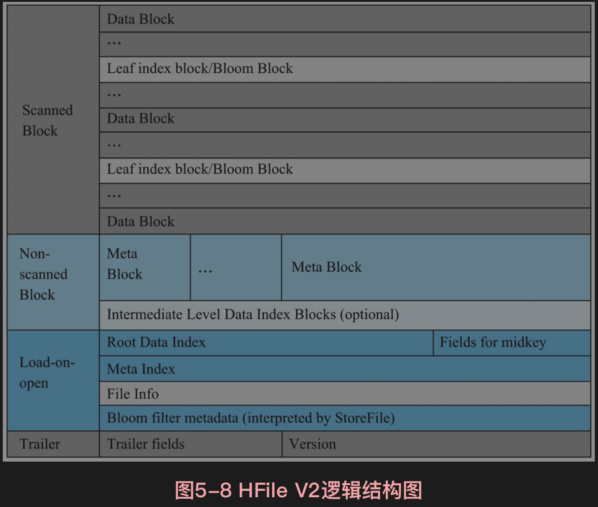
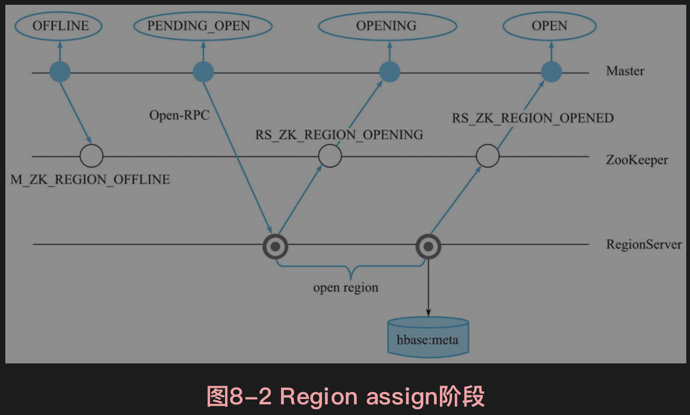
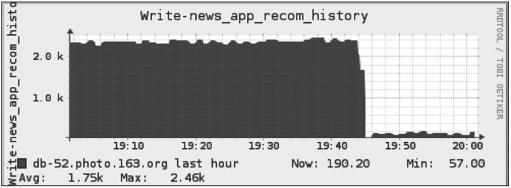
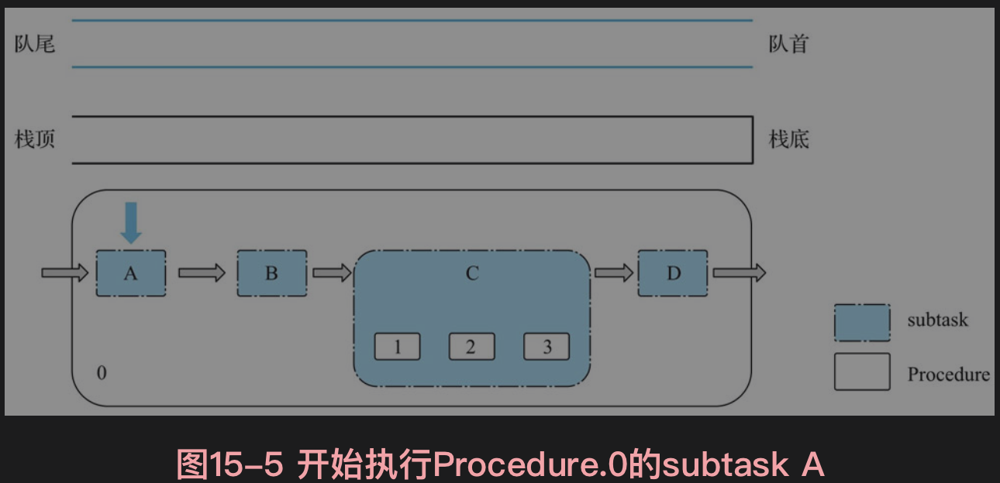
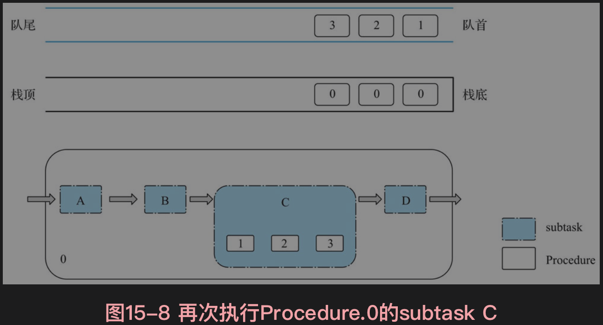
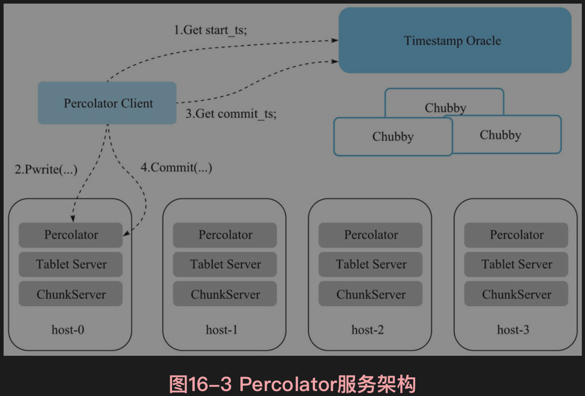

# 第一章 HBase 概述

## 1、HBase 数据模型

> HBase是一个稀疏的、分布式的、多维排序的Map

### (1) HBase 逻辑视图

- **`table`(表)**：一个表包含多行数据

- **`row`(行)**：一行数据包含一个唯一标识 rowkey、多个 column 以及对应的值

    > HBase 中，一张表中所有 row 都按照 rowkey 的字典序由小到大排序

- **`column`(列)**：由 `column family`(列簇)、`qualifier`(列名)两部分组成，两者中间使用 `:` 相连

    > column family 在表创建时指定，用户不能随意增减。
    >
    > 一个 column family下可以设置任意多个 qualifier，即 HBase 中的列可以动态增加

- **`timestamp`(时间戳)**：每个 cell 在写入 HBase 时都会默认分配一个时间戳作为该 cell 的版本

    > HBase支持多版本特性，即同一rowkey、column下可以有多个value存在，这些 value 使用 timestamp 作为版本号，版本越大，表示数据越新

- **`cell`(单元格)**：由五元组(row, column, timestamp, type, value)组成的结构，其中 `(row, column,timestamp, type)` 是K，value字段对应 KV 结构的 V

    - `type` 表示 `Put/Delete` 这样的操作类型
    - `timestamp` 代表这个 cell 的版本


### (2) 多维稀疏排序 Map

> HBase 中 Map 的 key 由 `rowkey、column family、qualif ier、type、timestamp` 组成，value 即为 cell 的值
>
> 如：`{"com.cnn.www","anchor","cnnsi.com","put","t9"} -> "CNN"`

- **多维**：HBase 的 Map key 是一个复合数据结构，由多维元素构成，包括 rowkey、column family、qualifier、type、timestamp

- **稀疏**：HBase 的空值不需要任何填充，避免造成大量空间的浪费，因此稀疏性是HBase的列可以无限扩展的一个重要条件

- **排序**：构成 HBase 的 KV 在同一个文件中有序，即按照 KV 中的 key 进行排序

    >  先比较 rowkey，再比较 column family:qualifier 和 timestamp

- **分布式**：构成 HBase 的所有 Map 并不集中在某台机器上，而是分布在整个集群中

### (3) 物理视图

HBase 中的数据按照列簇存储，即将数据按照列簇分别存储在不同的目录中：


- 列簇 anchor 的所有数据存储在一起形成：

    

- 列簇contents的所有数据存储在一起形成：

    

- 列簇people的所有数据存储在一起形成：

    

### (4) 行式存储、列式存储、列簇式存储

- **行式存储**：将一行数据存储在一起，一行数据写完之后再接着写下一行，最典型的如 MySQL 这类关系型数据库

    > - 行式存储在获取一行数据时很高效
    >
    > - 但只需要读取表中指定列对应的数据，那么行式存储会先取出一行行数据，再在每一行数据中截取待查找目标列。这种处理方式在查找过程中引入了大量无用列信息，从而导致大量内存占用
    >
    > 因此，这类系统仅适合于处理OLTP类型的负载，对于OLAP这类分析型负载并不擅长

- **列式存储**：将一列数据存储在一起，不同列的数据分别集中存储，最典型的如 Kudu、Parquet on HDFS 等系统

    > 列式存储对于只查找某些列数据的请求非常高效，只需要连续读出所有待查目标列，然后遍历处理即可；
    >
    > 但是反过来，列式存储对于获取一行的请求就不那么高效了，需要多次IO读多个列数据，最终合并得到一行数据。
    >
    > 另外，因为同一列的数据通常都具有相同的数据类型，因此列式存储具有天然的高压缩特性

- **列簇式存储**：介于行式存储和列式存储之间，可以通过不同的设计思路在行式存储和列式存储两者之间相互切换

## 2、HBase 体系结构

HBase 体系结构借鉴了 BigTable 论文，是典型的 Master-Slave 模型：

- 系统中有一个管理集群的 Master 节点以及大量实际服务用户读写的 RegionServer 节点
- HBase 中所有数据最终都存储在 HDFS 系统中，与 BigTable实 际数据存储在 GFS 中相对应
- 系统中还有一个 ZooKeeper 节点，协助 Master 对集群进行管理


### (1) HBase 客户端

 HBase客户端(Client)提供了 Shell 命令行接口、原生 Java API 编程接口、Thrift/REST API 编程接口以及MapReduce编程接口：

- Shell 命令支持所有常见的 DML/DDL操作，即数据的增删改查和表的日常维护等

- Thrift/REST API 主要用于支持非 Java 的上层业务需求
- MapReduce 接口主要用于批量数据导入以及批量数据读取

HBase 客户端访问数据行之前：

- 首先需要通过元数据表定位目标数据所在RegionServer，之后才会发送请求到该RegionServer
- 同时这些元数据会被缓存在客户端本地，以方便之后的请求访问
- 若集群 RegionServer 发生宕机或执行负载均衡，导致数据分片发生迁移，客户端需要重新请求最新的元数据并缓存在本地

### (2) Zookeeper

ZooKeeper 主要用于协调管理分布式应用程序：

- **实现 Master 高可用**：通常情况下系统中只有一个Master工作，一旦Active Master由于异常宕机，ZooKeeper会检测到该宕机事件，并通过一定机制选举出新的Master，保证系统正常运转

- **管理系统核心元数据**：管理系统中正常工作的 RegionServer 集合，保存系统元数据表 hbase:meta 所在的 RegionServer 地址等

- **参与 RegionServer 宕机恢复**：通过心跳可以感知到 RegionServer 是否宕机，并在宕机后通知 Master 进行宕机处理

- **实现分布式表锁**：HBase 中对一张表进行各种管理操作需要先加表锁，防止其他用户对同一张表进行管理操作，造成表状态不一致

    > HBase 中的表通常都是分布式存储，ZooKeeper 可以通过特定机制实现分布式表锁

### (3) Master

Master 主要负责 HBase 系统的各种管理工作：

- 处理用户的各种管理请求，包括建表、修改表、权限操作、切分表、合并数据分片以及 Compaction 等

- 管理集群中所有 RegionServer，包括 RegionServer 中 Region 的负载均衡、RegionServer 的宕机恢复以及 Region 的迁移等
- 清理过期日志以及文件，Master会每隔一段时间检查 HDFS 中 HLog 是否过期、HFile 是否已经被删除，并在过期之后将其删除

### (4) RegionServer

RegionServer 主要用来响应用户的 IO 请求，是 HBase 中最核心的模块，由WAL(HLog)、BlockCache 以及多个 Region 构成

- **WAL(HLog)**：HLog在HBase中有两个核心作用

    - 用于实现数据的高可靠性：HBase 数据随机写入时，并非直接写入 HFile 数据文件，而是先写入缓存，再异步刷新落盘

        > 为了防止缓存数据丢失，数据写入缓存之前，需顺序写入HLog，即使缓存数据丢失，仍然可以通过 HLog 日志恢复

    - 用于实现 HBase 集群间主从复制：通过回放主集群推送过来的 HLog 日志实现主从复制

- **BlockCache**(HBase 系统中的读缓存)：客户端从磁盘读取数据之后通常会将数据缓存到系统内存中，后续访问同一行数据可以直接从内存中获取而不需要访问磁盘

    > - BlockCache 缓存对象是一系列 Block 块，一个 Block 默认为 64K，由物理上相邻的多个 KV 数据组成
    >
    > - BlockCache同时利用了空间局部性和时间局部性原理：
    >     - 前者表示最近将读取的 KV 数据很可能与当前读取到的 KV 数据在地址上是邻近的，缓存单位是Block（块）而不是单个KV就可以实现空间局部性
    >     - 后者表示一个KV数据正在被访问，那么近期它还可能再次被访问。当前BlockCache主要有两种实现——LRUBlockCache和BucketCache，前者实现相对简单，而后者在GC优化方面有明显的提升

- **Region**：数据表的一个分片，当数据表大小超过一定阈值就会“水平切分”，分裂为两个Region

    > - Region 是集群负载均衡的基本单位
    > - 通常一张表的 Region 会分布在整个集群的多台 RegionServer 上，一个RegionServer上会管理多个Region
    >
    > - 一个Region由一个或者多个Store构成，Store的个数取决于表中列簇(column family)的个数，多少个列簇就有多少个Store
    >
    >     > HBase中，每个列簇的数据都集中存放在一起形成一个存储单元Store，因此建议将具有相同IO特性的数据设置在同一个列簇中
    >
    > - 每个 Store 由一个 MemStore 和一个或多个 HFile 组成
    >     - MemStore称为写缓存，用户写入数据时首先会写到MemStore，当MemStore写满之后（缓存数据超过阈值，默认128M）系统会异步地将数据 flush 成一个 HFile 文件
    >     - 随着数据不断写入，HFile文件会越来越多，当HFile文件数超过一定阈值之后系统将会执行Compact操作，将这些小文件通过一定策略合并成一个或多个大文件

### (5) HDFS

- HBase 底层依赖 HDFS 组件存储实际数据，包括用户数据文件、HLog 日志文件等最终都会写入 HDFS 落盘

- HDFS 数据默认三副本存储策略可以有效保证数据的高可靠性

- HBase 内部封装了一个名为 DFSClient 的HDFS客户端组件，负责对HDFS的实际数据进行读写访问

## 3、HBase 系统特性

### (1) HBase 优点

- **容量巨大**：HBase的单表可以支持千亿行、百万列的数据规模，数据容量可以达到TB甚至PB级别

- **良好的可扩展性**：集群容量扩展容易，主要包括数据存储节点扩展、读写服务节点扩展

    > - HBase 底层数据存储依赖于 HDFS 系统，HDFS 可以通过简单地增加 DataNode 实现扩展
    > - HBase 读写服务节点也一样，可以通过简单的增加 RegionServer 节点实现计算层的扩展

- **稀疏性**：HBase支持大量稀疏存储，即允许大量列值为空，并不占用任何存储空间

- **高性能**：HBase 主要擅长 OLTP 场景，数据写操作性能强劲，对于随机单点读以及小范围的扫描读，其性能也能够得到保证。对于大范围的扫描读可以使用 MapReduce 提供的API，以便实现更高效的并行扫描

- **多版本**：HBase支持多版本特性，即一个 KV 可以同时保留多个版本，用户可以根据需要选择最新版本或者某个历史版本

- **支持过期**：HBase 支持 TTL 过期特性，用户只需要设置过期时间，超过 TTL 的数据就会被自动清理，不需要用户写程序手动删除

- **Hadoop 原生支持**：HBase是Hadoop生态中的核心成员之一，很多生态组件都可以与其直接对接

### (2) HBase 缺点

- HBase 本身不支持很复杂的聚合运算

    > 如果业务中需要使用聚合运算，可以在 HBase 之上架设 Phoenix 组件或 Spark 组件，前者主要应用于小规模聚合的 OLTP 场景，后者应用于大规模聚合的 OLAP 场景

- HBase 本身并没有实现二级索引功能，所以不支持二级索引查找

    > Phoenix 支持二级索引功能

- HBase 原生不支持全局跨行事务，只支持单行事务模型

    > Phoenix 提供全局事务模型组件

## 4、OLAP 与 OLTP

> - OLTP 是做事务处理，即 OLTP 主要是对数据的增删改
>
> - OLAP 是做分析处理，即 OLAP 是对数据的查询
>
> OLTP 是数据库的应用，OLAP 是数据仓库的应用


# 第二章 基础数据结构与算法

## 1、跳跃表

> 跳跃表（SkipList）是一种能高效实现插入、删除、查找的内存数据结构，这些操作的期望复杂度都是O(logN)

### (1) 定义


- 跳跃表由多条分层的链表组成（设为S0, S1, S2, ... , Sn），例如图中有6条链表

- 每条链表中的元素都是有序的

- 每条链表都有两个元素：+∞（正无穷大）和- ∞（负无穷大），分别表示链表的头部和尾部

- 从上到下，上层链表元素集合是下层链表元素集合的子集，即S1是S0的子集，S2是S1的子集

- 跳跃表的高度定义为水平链表的层数

### (2) 查找


- 如果发现 currentNode 后继节点的值小于等于待查询值，则沿着这条链表向后查询，否则，切换到当前节点的下一层链表

- 继续查询，直到找到待查询值或 currentNode 为空节点为止

### (3) 插入

- 首先，需要按照查找流程找到待插入元素的前驱和后继

- 然后，按照如下随机算法生成一个高度值：

    ``` c
    // p是一个(0,1)之间的常数，一般取 p=1/4 或者 1/2
    public void randomHeight(double p){
        int height=0 ;
        while(random.nextDouble() < p) height ++;
        return height+1;
    }
    ```

- 最后，将待插入节点按照高度值生成一个垂直节点（这个节点的层数正好等于高度值），之后插入到跳跃表的多条链表中去

    假设height=randomHeight(p)，这里需要分两种情况讨论

    - 如果 height 大于跳跃表的高度，那么跳跃表的高度被提升为 height，同时需要更新头部节点和尾部节点的指针指向
    - 如果 height 小于等于跳跃表的高度，那么需要更新待插入元素前驱和后继的指针指向

## 2、LSM 树

> LSM 树会将所有写入操作处理为一次顺序写，而 HDFS 擅长的正是顺序写

LSM 树的索引一般由两部分组成

- 内存部分：一般采用跳跃表来维护一个有序的 Key-Value 集合
- 磁盘部分：一般由多个内部 Key-Value 有序的文件组成

### (1) Key-Value 存储格式

> LSM 中存储的是多个 Key-Value 组成的集合，每一个 Key-Value 一般都会用一个字节数组来表示

- **HBase rowkey 组成**：


字节数组主要分为以下几个字段

> 其中 Rowkey、Family、Qualifier、Timestamp、Type 这5个字段组成 KeyValue 中的 key 部分

- `keyLen`：占用4字节，用来存储KeyValue结构中Key所占用的字节长度

- `valueLen`：占用4字节，用来存储KeyValue结构中Value所占用的字节长度

- `rowkeyLen`：占用2字节，用来存储rowkey占用的字节长度

- `rowkeyBytes`：占用rowkeyLen个字节，用来存储rowkey的二进制内容

- `familyLen`：占用1字节，用来存储Family占用的字节长度

- `familyBytes`：占用familyLen字节，用来存储Family的二进制内容

- `qualifierBytes`：占用qualifierLen个字节，用来存储 Qualifier 的二进制内容

    ``` shell
    qualifierLen=keyLen -2B - rowkeyLen -1B - familyLen -8B -1B
    ```

- `timestamp`：占用8字节，表示 timestamp 对应的 long 值

- `type`：占用1字节，表示这个KeyValue操作的类型

    > HBase内有 Put、Delete、Delete Column、DeleteFamily

---

在比较这些KeyValue的大小顺序时，HBase按照如下方式（伪代码）来确定大小关系：

```c
int compare(KeyValue a, KeyValue b){
    int ret = Bytes.compare(a.rowKeyBytes, b.rowKeyBytes);
    if(ret != 0) return ret;
    ret = Bytes.compare(a.familyBytes, b.familyBytes);
    if(ret != 0) return ret;
    ret = Bytes.compare(a.qualifierBytes, b.qualifierBytes);
    if(ret != 0) return ret;
    // 注意：timestamp越大，排序越靠前
    ret = b.timestamp - a.timestamp;
    if(ret != 0) return ret;
    ret = a.type - b.type;
    return ret;
}
```

> 注：在HBase中，timestamp 越大的 KeyValue，排序越靠前。因为用户期望优先读取到那些版本号更新的数据

在 LSM 树的 KeyValue 中的 Key 部分，有3个字段必不可少：

- Key 的二进制内容

- 表示版本号的 64 位 long 值，在HBase中对应timestamp

    > 这个版本号通常表示数据的写入先后顺序，版本号越大的数据，越优先被用户读取
    >
    > 甚至会设计一定的策略，将那些版本号较小的数据过期淘汰（HBase中有TTL策略）

- type，表示这个 KeyValue 是 Put操作，还是Delete操作，或者是其他写入操作

### (2) LSM树的索引结构

一个 LSM 树的索引主要由两部分构成：内存部分和磁盘部分

- 内存部分是一个 ConcurrentSkipListMap，Key 就是前面所说的 Key 部分，Value是一个字节数组，数据写入时，直接写入MemStore中
- 随着不断写入，一旦内存占用超过一定的阈值时，就把内存部分的数据导出，形成一个有序的数据文件，存储在磁盘上


LSM 树索引结构如图：

- 内存部分导出形成一个有序数据文件的过程称为 flush
- 为了避免flush影响写入性能，会先把当前写入的MemStore设为Snapshot，不再容许新的写入操作写入这个Snapshot的MemStore
- 另开一个内存空间作为MemStore，让后面的数据写入
- 一旦Snapshot的MemStore写入完毕，对应内存空间就可以释放

> 通过两个 MemStore 来实现稳定的写入性能

### (3) 优化操作

> LSM 树全都使用 append 操作(磁盘顺序写)来实现数据写入，没有使用任何 seek+write(磁盘随机写)的方式来写入

- 随着写入的增加，内存数据会不断地刷新到磁盘上，最终磁盘上的数据文件会越来越多

    > 若数据没有任何的读取操作，磁盘上产生很多的数据文件对写入并无影响，且这时写入速度最快，因为所有IO都是顺序IO

- 一旦用户有读取请求，则需要将大量的磁盘文件进行多路归并，之后才能读取到所需的数据

    > 因为需要将那些Key相同的数据全局综合起来，最终选择出合适的版本返回给用户，所以磁盘文件数量越多，在读取的时候随机读取的次数也会越多，从而影响读取操作的性能

- 为了优化读取操作的性能，可以设置一定策略将选中的多个 hfile进行多路归并，合并成一个文件

    > 文件个数越少，则读取数据时需要 seek 操作的次数越少，读取性能则越好

---

按照选中的文件个数，将 compact 操作分成两种类型

> minor compact虽然能减少文件，但却无法彻底清除那些delete操作
>
> 而major compact能完全清理那些delete操作，保证数据的最小化

- `major compact`：将所有的 hfile 一次性多路归并成一个文件

    > major compact 不宜使用太频繁，适合周期性地跑

    - 好处：合并之后只有一个文件，这样读取的性能肯定最高
    - 问题：合并所有的文件可能需要很长的时间并消耗大量的 IO 带宽

- `minor compact`：即选中少数几个 hfile，将它们多路归并成一个文件
    - 优点：可以进行局部的 compact，通过少量的 IO 减少文件个数，提升读取操作的性能，适合较高频率地跑
    - 缺点：只合并了局部的数据，对于那些全局删除操作，无法在合并过程中完全删除

## 3、布隆过滤器

```java
public class BloomFilter {
  private int k;
  private int bitsPerKey;
  private int bitLen;
  private byte[] result;
  public BloomFilter(int k, int bitsPerKey) {
    this.k=k;
    this.bitsPerKey=bitsPerKey;
  }
  public byte[] generate(byte[][] keys) {
    assert keys !=null;
    bitLen=keys.length ＊ bitsPerKey;
    bitLen=((bitLen+7) / 8) << 3; //align the bitLen.
    bitLen=bitLen < 64 ? 64 : bitLen;
    result=new byte[bitLen >> 3]; //each byte have 8 bit.
    for (int i=0; i < keys.length; i++) {
      assert keys[i] !=null;
      int h=Bytes.hash(keys[i]);
      for (int t=0; t < k; t++) {
        int idx=(h % bitLen+bitLen) % bitLen;
        result[idx / 8] |=(1 << (idx % 8));
        int delta=(h >> 17) | (h << 15);
        h +=delta;
      }
    }
    return result;
  }
  public boolean contains(byte[] key) {
    assert result !=null;
    int h=Bytes.hash(key);
    for (int t=0; t < k; t++) {   //Hash k times
      int idx=(h % bitLen+bitLen) % bitLen;
      if ((result[idx / 8] & (1 << (idx % 8)))==0) {
        return false;
      }
      int delta=(h >> 17) | (h << 15);
      h +=delta;
    }
    return true;
  }
}
```


###  HBase与布隆过滤器

> HBase 的 Get 操作就是通过运用低成本高效率的布隆过滤器来过滤大量无效数据块的，从而节省大量磁盘 IO

用户可以对某些列设置不同类型的布隆过滤器：

- `NONE`：关闭布隆过滤器功能

- `ROW`：按照 rowkey 来计算布隆过滤器的二进制串并存储

    > Get 查询时，必须带 rowkey，所以用户可以在建表时默认把布隆过滤器设置为 ROW 类型

- `ROWCOL`：按照 `rowkey+family+qualifier` 这3个字段拼出byte[]来计算布隆过滤器值并存储

    > 若在查询时，Get 能指定 `rowkey、family、qualifier` 这3个字段，则肯定可以通过布隆过滤器提升性能

# 第三章 HBase 依赖服务

## 1、Zookeeper 简介


## 2、HBase 中 Zookeeper 核心配置


## 3、HDFS 简介

> HBase 项目本身并不负责文件层面的高可用和扩展性，通过把数据存储在 HDFS 上来实现大容量文件存储和文件备份

- **HDFS 并不支持文件的随机写以及多个客户端同时写同一个文件**

### (1) HDFS 架构


> - 存储在 HDFS 上面的文件实际上是由若干个数据块（Block，大小默认为128MB)组成，每一个Block会设定一个副本数N，表示这个Block在写入的时候会写入N个数据节点，以达到数据备份的目的
>
> - 读取时，只需要依次读取组成这个文件的 Block 即可完整读取整个文件
>
>     > 注意：读取时只需选择 N 个副本中的任何一个副本进行读取即可

一个线上的高可用HDFS集群主要由4个重要的服务组成：

- `NameNode`：线上需要部署2个NameNode ：一个节点是Active状态并对外提供服务；另一个节点是StandBy状态，作为Active的备份，备份状态下不提供对外服务，也就是说HDFS客户端无法通过请求StandBy状态的NameNode来实现修改文件元数据的目的。如果ZkFailoverController服务检测到Active状态的节点发生异常，会自动把StandBy状态的NameNode服务切换成Active的NameNode。

    NameNode存储并管理HDFS的文件元数据，这些元数据主要包括文件属性（文件大小、文件拥有者、组以及各个用户的文件访问权限等）以及文件的多个数据块分布在哪些存储节点上。需要注意的是，文件元数据是在不断更新的，例如HBase对HLog文件持续写入导致文件的Block数量不断增长，管理员修改了某些文件的访问权限，HBase把一个HFile从/hbase/data目录移到/hbase/archive目录。所有这些操作都会导致文件元数据的变更。因此NameNode本质上是一个独立的维护所有文件元数据的高可用KV数据库系统。为了保证每一次文件元数据都不丢失，NameNode采用写EditLog和FsImage的方式来保证元数据的高效持久化。每一次文件元数据的写入，都是先做一次EditLog的顺序写，然后再修改NameNode的内存状态。同时NameNode会有一个内部线程，周期性地把内存状态导出到本地磁盘持久化成FsImage（假设导出FsImage的时间点为t），那么对于小于时间点t的EditLog都认为是过期状态，是可以清理的，这个过程叫做推进checkpoint。

    注意：NameNode会把所有文件的元数据全部维护在内存中。因此，如果在HDFS中存放大量的小文件，则造成分配大量的Block，这样可能耗尽NameNode所有内存而导致OOM。因此，HDFS并不适合存储大量的小文件。当然，后续的HDFS版本支持NameNode对元数据分片，解决了NameNode的扩展性问题。

- `DataNode`：组成文件的所有Block都是存放在DataNode节点上的。一个逻辑上的Block会存放在N个不同的DataNode上。而NameNode、JournalNode、ZKFailoverController服务都是用来维护文件元数据的。

- `JournalNode`：由于NameNode是Active-Standby方式的高可用模型，且NameNode在本地写EditLog，那么存在一个问题——在StandBy状态下的NameNode切换成Active状态后，如何才能保证新Active的NameNode和切换前Active状态的NameNode拥有完全一致的数据？如果新Active的NameNode数据和老Active的NameNode不一致，那么整个分布式文件系统的数据也将不一致，这对用户来说是一件极为困扰的事情。

    为了保证两个NameNode在切换前后能读到一致的EditLog，HDFS单独实现了一个叫做JournalNode的服务。线上集群一般部署奇数个JournalNode（一般是3个，或者5个），在这些JournalNode内部，通过Paxos协议来保证数据一致性。因此可以认为，JournalNode其实就是用来维护EditLog一致性的Paxos组。

- `ZkFailoverController`：ZKFailoverController主要用来实现NameNode的自动切换

### (2) 文件写入


#### 1. 写入流程描述

1）DFS Client在创建FSDataOutputStream时，把文件元数据发给NameNode，得到一个文件唯一标识的f ileId，并向用户返回一个OutputStream。

2）用户拿到OutputStream之后，开始写数据。注意写数据都是按照Block来写的，不同的Block可能分布在不同的DataNode上，因此如果发现当前的Block已经写满，DFSClient就需要再发起请求向NameNode申请一个新的Block。在一个Block内部，数据由若干个Packet（默认64KB）组成，若当前的Packet写满了，就放入DataQueue队列，DataStreamer线程异步地把Packet写入到对应的DataNode。3个副本中的某个DataNode收到Packet之后，会先写本地文件，然后发送一份到第二个DataNode，第二个执行类似步骤后，发给第三个DataNode。等所有的DataNode都写完数据之后，就发送Packet的ACK给DFS Client，只有收到ACK的Packet才是写入成功的。

3）用户执行完写入操作后，需要关闭OutputStream。关闭过程中，DFSClient会先把本地DataQueue中未发出去的Packet全部发送到DataNode。若忘记关闭，对那些已经成功缓存在DFS Client的DataQueue中但尚未成功写入DataNode的数据，将没有机会写入DataNode中。对用户来说，这部分数据将丢失。


#### 2. FSDataOutputStream 中 hflush 和 hsync 的区别

hf lush成功返回，则表示DFSClient的DataQueue中所有Packet都已经成功发送到了3个DataNode上。但是对每个DataNode而言，数据仍然可能存放在操作系统的Cache上，若存在至少一个正常运行的DataNode，则数据不会丢失。hsync成功返回，则表示DFSClient DataQueue中的Packet不但成功发送到了3个DataNode，而且每个DataNode上的数据都持久化（sync）到了磁盘上，这样就算所有的DataNode都重启，数据依然存在（hf lush则没法保证）。

在HBASE-19024之后，HBase 1.5.0以上的版本可以在服务端通过设置hbase.wal.hsync来选择hf lush或者hsync。低于1.5.0的版本，可以在表中设置DURABILITY属性来实现。

在小米内部大部分HBase集群上，综合考虑写入性能和数据可靠性两方面因素，我们选择使用默认的hf lush来保证WAL持久性。因为底层的HDFS集群已经保证了数据的三副本，并且每一个副本位于不同的机架上，而三个机架同时断电的概率极小。但是对那些依赖云服务的HBase集群来说，有可能没法保证副本落在不同机架，hsync是一个合理的选择。

另外，针对小米广告业务和云服务这种对数据可靠性要求很高的业务，我们采用同步复制的方式来实现多个数据中心的数据备份，这样虽然仍选择用hf lush，但数据已经被同步写入两个数据中心的6个DataNode上，同样可以保证数据的高可靠性。


### (3) 文件读取


#### 1. 读取流程描述

1）DFSClient请求NameNode，获取到对应read position的Block信息（包括该Block落在了哪些DataNode上）。

2）DFSClient从Block对应的DataNode中选择一个合适的DataNode，对选中的DataNode创建一个BlockReader以进行数据读取。

HDFS读取流程很简单，但对HBase的读取性能影响重大，尤其是Locality和短路读这两个最为核心的因素。


#### 2. Locality

某些服务可能和DataNode部署在同一批机器上。因为DataNode本身需要消耗的内存资源和CPU资源都非常少，主要消耗网络带宽和磁盘资源。而HBase的RegionServer服务本身是内存和CPU消耗型服务，于是我们把RegionServer和DataNode部署在一批机器上。对某个DFSClient来说，一个文件在这台机器上的locality可以定义为：

locality=该文件存储在本地机器的字节数之和 / 该文件总字节数

因此，locality是[0, 1]之间的一个数，locality越大，则读取的数据都在本地，无需走网络进行数据读取，性能就越好。反之，则性能越差。


#### 3. 短路读（Short Circuit Read）

短路读是指对那些Block落在和DFSClient同一台机器上的数据，可以不走TCP协议进行读取，而是直接由DFSClient向本机的DataNode请求对应Block的文件描述符（File Descriptor），然后创建一个BlockReaderLocal，通过fd进行数据读取，这样就节省了走本地TCP协议栈的开销。

测试数据表明，locality和短路读对HBase的读性能影响重大。在locality=1.0情况下，不开短路读的p99性能要比开短路读差10%左右。如果用locality=0和locality=1相比，读操作性能则差距巨大。


#### 4. HDFS 在 HBase 系统中扮演的角色

HBase使用HDFS存储所有数据文件，从HDFS的视角看，HBase就是它的客户端。这样的架构有几点需要说明：

- HBase本身并不存储文件，它只规定文件格式以及文件内容，实际文件存储由HDFS实现
- HBase不提供机制保证存储数据的高可靠，数据的高可靠性由HDFS的多副本机制保证
- HBase-HDFS体系是典型的计算存储分离架构。这种轻耦合架构的好处是，一方面可以非常方便地使用其他存储替代HDFS作为HBase的存储方案；另一方面对于云上服务来说，计算资源和存储资源可以独立扩容缩容，给云上用户带来了极大的便利。


## 4、HBase 在 HDFS 中的文件布局

通过HDFS的客户端列出HBase集群的文件如下：

```shell
hadoop@hbase37:～/hadoop-current/bin$ ./hdfs dfs -ls /hbase
Found 10 items
drwxr-xr-x    - hadoop hadoop       02018-05-07 10:42 /hbase-nptest/.hbase-snapshot
drwxr-xr-x    - hadoop hadoop       02018-04-27 14:04 /hbase-nptest/.tmp
drwxr-xr-x    - hadoop hadoop       02018-07-06 21:07 /hbase-nptest/MasterProcWALs
drwxr-xr-x    - hadoop hadoop       02018-06-25 17:14 /hbase-nptest/WALs
drwxr-xr-x    - hadoop hadoop       02018-05-07 10:43 /hbase-nptest/archive
drwxr-xr-x    - hadoop hadoop       02017-10-10 20:24 /hbase-nptest/corrupt
drwxr-xr-x    - hadoop hadoop       02018-05-31 12:02 /hbase-nptest/data
-rw-r--r--    3 hadoop hadoop       422017-09-29 17:30 /hbase-nptest/hbase.id
-rw-r--r--   3 hadoop hadoop       72017-09-29 17:30 /hbase-nptest/hbase.version
drwxr-xr-x    - hadoop hadoop      02018-07-06 21:22 /hbase-nptest/oldWALs
```

- `hbase-snapshot`：snapshot 文件存储目录

    > 用户执行snapshot后，相关的snapshot元数据文件存储在该目录

- `.tmp`：临时文件目录，主要用于 HBase 表的创建和删除操作

    > - 表创建时，首先会在 tmp 目录下执行，执行成功后再将 tmp 目录下的表信息移动到实际表目录下
    > - 表删除操作会将表目录移动到 tmp 目录下，一定时间过后再将 tmp 目录下的文件真正删除

- `MasterProcWALs`：存储 Master Procedure 过程中的 WAL 文件，Master Procedure 功能主要用于可恢复的分布式 DDL 操作

    > Master Procedure 功能使用 WAL 记录 DDL 执行的中间状态，在异常发生之后可以通过 WAL 回放明确定位到中间状态点，继续执行后续操作以保证整个 DDL 操作的完整性

- `WALs`：存储集群中所有 RegionServer 的 HLog 日志文件

- `archive`：文件归档目录。这个目录主要会在以下几个场景下使用

    - 所有对 HFile 文件的删除操作都会将待删除文件临时放在该目录
    - 进行 Snapshot 或升级时使用到的归档目录
    - Compaction 删除 HFile 时，也会把旧的 HFile 移动到这里

- `corrupt`：存储损坏的 HLog 文件或 HFile 文件

- `data`：存储集群中所有 Region 的 HFile 数据。HFile文件在data目录下的完整路径如下所示：

    ``` 
    /hbase/data/default/usertable/fa13562579a4c0ec84858f2c947e8723/family/105baeff31ed481cb708c65728965666
    ```

    > 其中，default 表示命名空间，usertable 为表名，fa13562579a4c0ec84858f2c947e8723 为 Region名称，family 为列簇名，105baeff31ed481cb708c65728965666 为 HFile 文件名

除了HFile文件外，data 目录下还存储了一些重要的子目录和子文件

- `.tabledesc`：表描述文件，记录对应表的基本 schema 信息

- `.tmp`：表临时目录，主要用来存储 Flush 和 Compaction 过程中的中间结果

    > 以 `flush` 为例，MemStore 中的 KV 数据落盘形成 HFile 首先会生成在 `.tmp` 目录下，一旦完成再从 `.tmp` 目录移动到对应的实际文件目录

- `.regioninfo`：Region 描述文件

- `recovered.edits`：存储故障恢复时该 Region 需要回放的 WAL 日志数据

    > RegionServer 宕机后，该节点上还没有来得及 flush 到磁盘的数据需要通过 WAL 回放恢复，WAL文件首先需要按照Region进行切分，每个Region拥有对应的WAL数据片段，回放时只需要回放自己的WAL数据片段即可

- `hbase.id`：集群启动初始化的时候，创建的集群唯一id

- `hbase.version`：HBase软件版本文件，代码静态版本

- `oldWALs`：WAL 归档目录。一旦一个WAL文件中记录的所有KV数据确认已经从MemStore持久化到HFile，那么该WAL文件就会被移到该目录

# 第四章 HBase 客户端


# 第五章 RegionServer 的核心模块

> RegionServer 是 HBase 系统中最核心的组件，主要负责用户数据写入、读取等基础操作，包含的模块：HLog、MemStore、HFile、BlockCache

## 1、RegionServer 内部结构


一个RegionServer由一个（或多个）HLog、一个BlockCache以及多个Region组成

- `HLog` 用来保证数据写入的可靠性

- `BlockCache` 可以将数据块缓存在内存中以提升数据读取性能

- `Region` 是 HBase 中数据表的一个数据分片，一个 RegionServer 上通常会负责多个 Region 的数据读写

- 一个 Region 由多个 `Store` 组成，每个 Store 存放对应列簇的数据

    > 比如一个表中有两个列簇，这个表的所有 Region 就都会包含两个 Store

- 每个 Store 包含一个 MemStore 和多个 HFile，用户数据写入时会将对应列簇数据写入相应的MemStore，一旦写入数据的内存大小超过设定阈值，系统就会将 MemStore 中的数据落盘形成 HFile 文件

    > HFile 存放在 HDFS 上，是一种定制化格式的数据存储文件，方便用户进行数据读取

## 2、HLog

HBase 中系统故障恢复以及主从复制都基于 HLog 实现

> 所有写入操作(写入、更新、删除)的数据都先以追加形式写入 HLog，再写入 MemStore

- 当 RegionServer 在某些异常情况下发生宕机，此时已经写入 MemStore 中但尚未 flush 到磁盘的数据就会丢失，需要回放 HLog 补救丢失的数据
- HBase 主从复制需要主集群将 HLog 日志发送给从集群，从集群在本地执行回放操作，完成集群之间的数据复制

### (1) HLog 文件结构


- 每个 RegionServer 拥有一个或多个 HLog，每个 HLog 是多个 Region 共享

- HLog中，日志单元 WALEntry 表示一次行级更新的最小追加单元，其由 HLogKey 和 WALEdit 两部分组成

    - HLogKey 由 table name、region name、sequenceid 等字段构成

    - WALEdit 用来表示一个事务中的更新集合，为了保证事务的原子性，HBase 将一个行级事务的写入操作表示为一条记录

        ``` xml
        <logseq#-for-entire-txn>:<WALEdit-for-entire-txn>
        ```

        > 其中，WALEdit 会被序列化为格式 `<-1, # of edits, , , >`，比如<-1, 3, , , >，-1为标识符，表示这种新的日志结构

### (2) HLog 文件存储

HBase 中所有数据（包括HLog以及用户实际数据）都存储在 HDFS 的指定目录下，可以通过 hadoop 命令查看：

``` shell
drwxr-xr-x    - hadoop hadoop             02017-09-21 17:12 /hbase/WALs
drwxr-xr-x    - hadoop hadoop             02017-09-22 06:52 /hbase/oldWALs
```

其中，`/hbase/WALs` 存储当前还未过期的日志；`/hbase/oldWALs` 存储已经过期的日志

可以进一步查看 `/hbase/WALs` 目录下的日志文件，如下所示：

```shell
/hbase/WALs/hbase17.xj.bjbj.org,60020,1505980274300
/hbase/WALs/hbase18.xj.bjbj.org,60020,1505962561368
/hbase/WALs/hbase19.xj.bjbj.org,60020,1505980197364
```

`/hbase/WALs` 目录下通常会有多个子目录，每个子目录代表一个对应的 RegionServer

> 以 `hbase17.xj.bjbj.org,60020,1505980274300` 为例
>
> - `hbase17.xj.bjbj.org` 表示对应的 RegionServer 域名
> - 60020为端口号
> - 1505980274300 为目录生成时的时间戳

每个子目录下存储该 RegionServer 内的所有 HLog 文件，如下所示：

```shell
/hbase/WALs/hbase17.xj.bjbj.org,60020,1505980274300/hbase17.xj.bjbj.org%2C60020%2C1505980274300.default.1506184980449
```

> HLog文件为：`hbase17.xj.bjbj.org%2C60020%2C1505980274300.default.1506012772205` 

### (3) HLog 生命周期

HLog 文件生成之后并不会永久存储在系统中，使命完成后，文件就会失效最终被删除


HLog生命周期包含4个阶段：

- **HLog 构建**：HBase的任何写入（更新、删除）操作都会先将记录追加写入到 HLog 文件中

- **HLog 滚动**：HBase 后台启动一个线程，每隔一段时间（由参数'hbase.regionserver. logroll.period'决定，默认1小时）进行日志滚动。日志滚动会新建一个新的日志文件，接收新的日志数据

    > 日志滚动机制主要是为了方便过期日志数据能够以文件的形式直接删除

- **HLog 失效**：写入数据一旦从 MemStore 中落盘，对应的日志数据就会失效。为了方便处理，HBase中日志失效删除总是以文件为单位执行。查看某个HLog文件是否失效只需确认该HLog文件中所有日志记录对应的数据是否已经完成落盘，如果日志中所有日志记录已经落盘，则可以认为该日志文件失效

    > 一旦日志文件失效，就会从WALs文件夹移动到oldWALs文件夹，注意此时 HLog 并没有被系统删除

- **HLog 删除**：Master 后台会启动一个线程，每隔一段时间（参数'hbase.master.cleaner. interval'，默认1分钟）检查一次文件夹oldWALs 下的所有失效日志文件，确认是否可以删除，确认可以删除之后执行删除操作

    确认条件主要有两个：

    - 该 HLog 文件是否还在参与主从复制：对于使用HLog进行主从复制的业务，需要继续确认是否该HLog还在应用于主从复制

    - 该 HLog 文件是否已经在 OldWALs 目录中存在10分钟，默认情况下 oldWALs 里面的 HLog 文件最多可以再保存10分钟

        > 系统提供了参数设置日志文件的TTL（参数'hbase.master.logcleaner.ttl'，默认10分钟）

## 3、MemStore

### (1) Memstore 简介

HBase 系统中一张表会被水平切分成多个 Region，每个Region负责自己区域的数据读写请求

水平切分意味着每个 Region 会包含所有的列簇数据，HBase将不同列簇的数据存储在不同的Store中，每个Store由一个MemStore和一系列HFile组成：


HBase 基于 LSM 树模型实现，所有的数据写入操作首先会顺序写入日志 HLog，再写入 MemStore，当MemStore中数据大小超过阈值之后再将这些数据批量写入磁盘，生成一个新的HFile文件。LSM树架构有如下几个非常明显的优势：

- 这种写入方式将一次随机 IO 写入转换成一个顺序 IO 写入（HLog顺序写入）加上一次内存写入（MemStore写入），使得写入性能得到极大提升

    > 大数据领域中对写入性能有较高要求的数据库系统几乎都会采用这种写入模型，比如分布式列式存储系统Kudu、时间序列存储系统Druid等

- HFile 中 KeyValue 数据需要按照 Key 排序，排序之后可以在文件级别根据有序的Key建立索引树，极大提升数据读取效率

    > HDFS 只允许顺序读写，不能更新，因此需要数据在落盘生成 HFile 之前就完成排序工作，MemStore就是KeyValue数据排序的实际执行者

- MemStore作为一个缓存级的存储组件，总是缓存着最近写入的数据。对于很多业务来说，最新写入的数据被读取的概率会更大

    > 最典型的比如时序数据，80%的请求都会落到最近一天的数据上

- 在数据写入 HFile 之前，可以在内存中对 KeyValue 数据进行很多更高级的优化

    > 比如：业务数据保留版本仅设置为 1，这样 MemStore 在将数据写入 HFile 前可以丢弃老版本数据，仅保留最新版本数据

### (2) Memstore 内部结构

- MemStore 使用 ConcurrentSkipListMap，来同时保证高效的写入效率和高效的多线程读取效率
    - ConcurrentSkipListMap 使用跳跃表来保证数据的有序性，并保证数据的写入、查找、删除操作可在O(logN)时间复杂度完成
    - ConcurrentSkipListMap 的特点是线程安全，在底层采用了 CAS 原子性操作，避免了多线程访问条件下昂贵的锁开销，极大地提升了多线程访问场景下的读写性能

- MemStore 由两个 ConcurrentSkipListMap 实现，写入操作(包括更新删除操作)会将数据写入 ConcurrentSkipListMap A，当ConcurrentSkipListMap A 中数据量超过一定阈值之后会创建一个新的 ConcurrentSkipListMap B 来接收用户新的请求，之前已经写满的 ConcurrentSkipListMap A 会执行异步 flush 操作落盘形成 HFile

### (3) MemStore的 GC 问题

> MemStore 从本质上来看就是一块缓存，可以称为写缓存，大内存系统总会面临 GC 问题

MemStore 会引起严重的内存碎片，存在大量的小内存碎片会触发长时间的 Full GC

> 原因：一个 RegionServer 由多个 Region 构成，每个 Region 根据列簇的不同又包含多个 MemStore，这些 MemStore 共享内存。不同 Region 的数据写入对应的 MemStore，因为共享内存，在 JVM 看来所有 MemStore 的数据都是混合在一起写入Heap

此时假如 Region1 上对应的所有 MemStore 执行落盘操作，会出现下图所示场景：


- 不同 Region 由不同颜色表示，右边图为 JVM 中 MemStore 所占用的内存图，可见不同 Region 的数据在 JVM Heap 中是混合存储的，一旦深灰色条带表示的 Region1 的所有 MemStore 数据执行 flush 操作，这些深灰色条带所占内存就会被释放，变成白色条带

- 这些白色条带会继续为写入 MemStore 的数据分配空间，进而会分割成更小的条带
- 从 JVM 全局的视角来看，随着 MemStore 中数据的不断写入并且 flush，整个 JVM 将会产生大量越来越小的内存条带，这些条带实际上就是内存碎片
- 随着内存碎片越来越小，最后甚至分配不出来足够大的内存给写入的对象，此时就会触发 JVM 执行 Full GC 合并这些内存碎片

### (4) MSLAB 内存管理方式

为了优化这种内存碎片可能导致的 Full GC，HBase 借鉴了线程本地分配缓存 `TLAB` 的内存管理方式，通过顺序化分配内存、内存数据分块等特性使得内存碎片更加粗粒度，有效改善 Full GC 情况，具体实现步骤如下：

1、每个 MemStore 会实例化得到一个 MemStoreLAB 对象

2、MemStoreLAB 会申请一个 2M 大小的 Chunk 数组，同时维护一个 Chunk 偏移量，该偏移量初始值为 0

3、当一个 KeyValue 值插入 MemStore 后，MemStoreLAB 会首先通过 KeyValue.getBuffer() 取得 data 数组，并将 data 数组复制到Chunk 数组中，之后再将 Chunk 偏移量往前移动 data. length

4、当前 Chunk 满了之后，再调用 new byte[2 * 1024 * 1024] 申请一个新的 Chunk


> 不同颜色的细条带会聚集在一起形成 2M 大小的粗条带。这是因为MemStore会在将数据写入内存时首先申请2M的Chunk，再将实际数据写入申请的 Chunk 中
>
> 这种内存管理方式，使得 flush之后残留的内存碎片更加粗粒度，极大降低 Full GC 的触发频率

### (5) MemStore Chunk Pool

> 经过 MSLAB 优化之后，系统因为 MemStore 内存碎片触发的 Full GC 次数会明显降低

**问题**：新建 Chunk 对象会在 JVM 新生代申请新内存，如果申请比较频繁会导致 JVM 新生代 Eden 区满掉，触发 YGC

**MemStore Chunk Pool 的核心思想**：Chunk 能够被循环利用，具体实现步骤如下：

1、系统创建一个 Chunk Pool 来管理所有未被引用的 Chunk，这些 Chunk 就不会再被 JVM 当作垃圾回收

2、如果一个 Chunk 没有再被引用，将其放入 Chunk Pool

3、如果当前 Chunk Pool 已经达到了容量最大值，就不会再接纳新的 Chunk

4、当要申请新 Chunk 存储 KeyValue，首先从 Chunk Pool 获取，若能够获取得到就重复利用，否则就重新申请一个新的 Chunk

### (6) MSLAB相关配置

- HBase中 MSLAB 功能默认是开启的，默认的 ChunkSize 是2M，也可以通过参数"hbase.hregion.memstore.mslab.chunksize"进行设置，建议保持默认值

- Chunk Pool 功能默认关闭，需要配置参数"hbase.hregion.memstore.chunkpool.maxsize"为大于 0 的值才能开启

    > - "hbase.hregion.memstore.chunkpool.maxsize"取值为[0, 1]，表示整个MemStore分配给Chunk Pool的总大小为hbase.hregion.memstore.chunkpool.maxsize * Memstore Size
    > - "hbase.hregion.memstore.chunkpool.initialsize"取值为[0, 1]，表示初始化时申请多少个Chunk放到Pool里面，默认是0，表示初始化时不申请内存

## 4、HFile

### (1) HFile 逻辑结构



HFile文件主要分为4个部分：Scanned block部分、Non-scanned block部分、Load-on-open部分和Trailer

- `Scanned Block` 部分：表示顺序扫描 HFile 时所有的数据块将会被读取

    > 这个部分包含3种数据块：Data Block，Leaf Index Block以及Bloom Block
    >
    > - `Data Block` 中存储用户的 KeyValue 数据
    > - `Leaf Index Block` 中存储索引树的叶子节点数据
    > - `Bloom Block` 中存储布隆过滤器相关数据

- `Non-scanned Block` 部分：表示在 HFile 顺序扫描的时候数据不会被读取，主要包括 Meta Block 和 Intermediate Level Data Index Blocks 两部分
- `Load-on-open` 部分：这部分数据会在 RegionServer 打开 HFile 时直接加载到内存中，包括 FileInfo、布隆过滤器 MetaBlock、Root Data Index 和 Meta IndexBlock
- `Trailer` 部分：这部分主要记录了 HFile 的版本信息、其他各个部分的偏移值和寻址信息

### (2) HFile 物理结构

> HFile 文件由各种不同类型的Block（数据块）构成，虽然这些Block的类型不同，但却拥有相同的数据结构


> - Block 的大小可以在创建表列簇的时候通过参数 `blocksize=> '65535'` 指定，默认为64K
>
>     > 大号的Block有利于大规模的顺序扫描，而小号的Block更有利于随机查询
>
> - HFile 中所有 Block 都拥有相同的数据结构，HBase 将所有 Block 统一抽象为 `HFile-Block`
>
>     > HFileBlock 支持两种类型，一种类型含有 `checksum`，另一种不含有 `checksum`


HFileBlock 主要包含两部分：BlockHeader 和 BlockData

> 对于任意一种类型的 HFileBlock，都拥有相同结构的 BlockHeader，但是 BlockData 结构却不尽相同

- `BlockHeader` 主要存储 Block 相关元数据

    > Block 元数据中最核心的字段是 BlockType 字段，表示该 Block 的类型
    >
    > HBase中定义了8种BlockType，有的存储用户数据，有的存储索引数据，有的存储元数据(meta)

- `BlockData` 用来存储具体数据


### (3) HFile 的基础 Block

#### 1. Trailer Block

Trailer Block 主要记录了 HFile 的版本信息、各个部分的偏移值和寻址信息


> RegionServer 在打开 HFile 时会加载所有 HFile 的 Trailer 部分以及 load-on-open 部分到内存中

实际加载过程会首先会解析 Trailer Block，然后再进一步加载 load-on-open 部分的数据，具体步骤如下：

1) 加载 HFile version 版本信息，HBase 中 version 包含 majorVersion 和 minorVersion 两部分

    > - 前者决定了HFile的主版本(V1、V2还是V3)
    >
    > - 后者在主版本确定的基础上决定是否支持一些微小修正，比如是否支持 checksum 等
    >
    > 不同的版本使用不同的文件解析器对 HFile 进行读取解析

2) HBase 会根据 version 信息计算 Trailer Block 的大小，再根据 Trailer Block 大小加载整个 HFileTrailer Block 到内存中

    > Trailer Block 中包含很多统计字段，例如：
    >
    > - `TotalUncompressedBytes` 表示 HFile 中所有未压缩的 KeyValue 总大小
    > - `NumEntries` 表示 HFile 中所有 KeyValue 总数目
    > - `CompressionCodec` 表示该 HFile 所使用的压缩算法，HBase 中压缩算法主要有 `lzo、gz、snappy、lz4`等，默认 none

3) Trailer Block 中另两个重要的字段是 LoadOnOpenDataOffset 和 LoadOnOpenDataSize，前者表示 load-on-open Section 在整个HFile文件中的偏移量，后者表示 load-on-open Section 的大小

    > 根据此偏移量以及大小，HBase 会在启动后将 load-on-open Section 的数据全部加载到内存中
    >
    > load-on-open 部分主要包括 FileInfo 模块、Root Data Index 模块、布隆过滤器 Metadata 模块
    >
    > - FileInfo 是固定长度的数据块，主要记录了文件的一些统计元信息，比较重要的是AVG_KEY_LEN和AVG_VALUE_LEN，分别记录了该文件中所有Key和Value的平均长度
    > - Root Data Index 表示该文件数据索引的根节点信息
    > - 布隆过滤器 Metadata 记录了 HFile 中布隆过滤器的相关元数据

#### 2. Data Block

- Data Block 是 HBase 中文件读取的最小单元

- Data Block 中主要存储用户的KeyValue数据，而KeyValue结构是HBase存储的核心

> HBase 中所有数据都是以 KeyValue 结构存储在 HBase 中


KeyValue 由4个部分构成，分别为 Key Length、Value Length、Key、Value

- `Key Length` 和 `Value Length` 是两个固定长度的数值

- `Value` 是用户写入的实际数据

- `Key` 是一个复合结构，由多个部分构成：Rowkey、Column Family、Column Qualif ier、TimeStamp、KeyType

    > KeyType有四种类型，分别是 Put、Delete、DeleteColumn、DeleteFamily

### (4) HFile 中与布隆过滤器相关的 Block

> HBase 会为每个 HFile 分配对应的位数组，KeyValue 在写入 HFile 时会先对 Key 经过多个 hash 函数的映射，映射后将对应的数组位置为1，get 请求进来之后再使用相同的 hash 函数对待查询Key进行映射，如果在对应数组位上存在0，说明该 get 请求查询的 Key 肯定不在该 HFile 中

HFile 文件越大，里面存储的 KeyValue 值越多，位数组就会相应越大。一旦位数组太大就不适合直接加载到内存了

HFile V2 在设计上将位数组进行了拆分，拆成了多个独立的位数组（根据Key进行拆分，一部分连续的Key使用一个位数组）

> 一个HFile中就会包含多个位数组，根据Key进行查询时，首先会定位到具体的位数组，只需要加载此位数组到内存进行过滤即可，从而降低了内存开销

在文件结构上每个位数组对应 HFile 中一个 Bloom Block，因此多个位数组实际上会对应多个Bloom Block。为了方便根据Key定位对应的位数组，HFile V2又设计了相应的索引Bloom Index Block，对应的内存和逻辑结构如图5-13所示。


整个 HFile 中仅有一个 Bloom Index Block 数据块，位于 load-on-open 部分

- Bloom Index Block 从大的方面看由两部分内容构成，其一是 HFile 中布隆过滤器的元数据基本信息，其二是构建了指向Bloom Block的索引信息

- Bloom Index Block 结构中 TotalByteSize 表示位数组大小，NumChunks 表示 Bloom Block 的个数，HashCount 表示 hash 函数的个数，HashType 表示 hash 函数的类型，TotalKeyCount 表示布隆过滤器当前已经包含的Key的数目，TotalMaxKeys表示布隆过滤器当前最多包含的Key的数目

- Bloom Index Entry 对应每一个 Bloom Block 的索引项，作为索引分别指向 scanned block 部分的 Bloom Block，Bloom Block 中实际存储了对应的位数组

    > Bloom Index Entry 的结构见图5-13中间部分
    >
    > - BlockKey 是一个非常关键的字段，表示该 Index Entry 指向的 Bloom Block 中第一个执行 Hash 映射的 Key
    > - BlockOffset 表示对应 Bloom Block 在 HFile 中的偏移量

一次 get 请求根据布隆过滤器进行过滤查找需要执行以下三步操作：

1）首先根据待查找 Key 在 Bloom Index Block 所有的索引项中根据 BlockKey 进行二分查找，定位到对应的 Bloom Index Entry

2）再根据 Bloom Index Entry 中 BlockOffset 以及 BlockOndiskSize 加载该 Key 对应的位数组

3）对 Key 进行 Hash 映射，根据映射结果在位数组中查看是否所有位都为1，若不是，表示该文件中肯定不存在该Key，否则可能存在

### (5) HFile中索引相关的Block

##### 索引分类

- HFile 索引结构根据索引层级的不同分为：`single-level` 和 `multi-level`，前者表示单层索引，后者表示多级索引(两级或三级)

    > 随着 HFile 文件越来越大，Data Block 越来越多，索引数据也越来越大，已经无法全部加载到内存中，多级索引可以只加载部分索引，从而降低内存使用空间

- Index Block 有两类：Root Index Block 和 NonRoot Index Block。NonRoot Index Block 又分为 Intermediate Index Block和Leaf Index Block两种

    > HFile 中索引是树状结构
    >
    > - Root Index Block 表示索引数根节点，位于“ load-on-open”部分，会在 RegionServer 打开 HFile 时加载到内存中
    > - Intermediate Index Block 表示中间节点，位于“Non-Scanned block”部分
    > - Leaf Index Block 表示叶子节点，叶子节点直接指向实际 Data Block，位于“scanned block”部分
    >
    > 

##### Bloom Block 索引与 Data Block 索引

- 对于 `Bloom Block`，Bloom 索引结构实际上采用了单层结构，Bloom Index Block 就是一种Root Index Block

- 对于 `Data Block`，由于 HFile 刚开始数据量较小，索引采用单层结构，只有 Root Index 一层索引，直接指向 Data Block。当数据量慢慢变大，Root Index Block大小超过阈值之后，索引就会分裂为多级结构，由一层索引变为两层，根节点指向叶子节点，叶子节点指向实际Data Block。如果数据量再变大，索引层级就会变为三层

---

下面针对 Root index Block 和 NonRoot index Block 两种结构进行解析：

#### 1.  Root Index Block

Root Index Block 表示索引树根节点索引块，既可以作为Bloom Block的直接索引，也可以作为Data Block多极索引树的根索引


上图结构：

- Index Entry 表示具体的索引对象，每个索引对象由3个字段组成
    - Block Offset 表示索引指向 Data Block 的偏移量
    - BlockDataSize 表示索引指向 Data Block 在磁盘上的大小
    - BlockKey 表示索引指向 Data Block 中的第一个Key。

- 另外3个字段用来记录 MidKey 的相关信息，这些信息用于在对 HFile 进行 split 操作时，快速定位 HFile 的切分点位置

    > 注：单层索引结构和多级索引结构相比，仅缺少与 MidKey 相关的这三个字段

Root Index Block 位于整个HFile的“ load-on-open ”部分，因此会在Region Server打开HFile时直接加载到内存中

> 注：Trailer Block 中的字段 DataIndexCount 表示 Root Index Block 中 Index Entry 的个数，只有知道 Entry 的个数才能正确地将所有 Index Entry 加载到内存

#### 2. NonRoot Index Block

当HFile中Data Block越来越多，单层结构的根索引会不断膨胀，超过一定阈值之后就会分裂为多级结构的索引结构。多级结构中根节点是Root Index Block。而索引树的中间层节点和叶子节点在HBase中存储为NonRoot Index Block

> 从Block结构的视角分析，无论是中间节点还是叶子节点，其都拥有相同的结构


NonRoot Index Block 中的字段：

- Index Entry 用于指向叶子节点块或 Data Block

- Entry Offset 为 Index Entry 的内部索引字段，表示 Index Entry 在该 Block 中的相对偏移量，用于实现 Block 内的二分查找

    > 通过这种机制，所有非根节点索引块(Intermediate Index Block和Leaf Index Block)使用二分查找算法在其内部定位一个Key的具体索引

### (6) HFile V3 版本

HFile V3 格式和HFile V2基本相同，不同的是V3版本新增了对 cell 标签功能的支持

> cell标签为其他与安全相关的功能（如单元级ACL和单元级可见性）提供了实现框架。以单元级可见性为例，用户可以给cell设置0个或多个可见性标签，然后再将可见性标签与用户关联起来，只有关联过的用户才可以看到对应标签的cell

cell标签数据存储在HFile中。相关的修改有两个地方：

- `File Info Block` 新增了两个信息：MAX_TAGS_LEN和TAGS_COMPRESSED，前者表示单个cell中存储标签的最大字节数，后者是一个boolean类型的值，表示是否针对标签进行压缩处理

- `DataBlock` 中每个KeyValue结构新增三个标签相关的信息：Tags Length(2bytes)、Tags Type(1 bytes)和Tags bytes(variable)。Tags Length表示标签数据大小，Tags Type表示标签类型（标签类型有ACL_TAG_TYPE、VISIBILITY_TAG_TYPE等），Tags bytes表示具体的标签内容

## 5、BlockCache

> 一个 RegionServer 只有一个 BlockCache，在 RegionServer 启动时完成 BlockCache 的初始化工作

HBase 的 3 种 BlockCache 方案：`LRUBlockCache、SlabCache、BucketCache` 

> 3种方案的不同之处：主要在于内存管理模式，LRUBlockCache是将所有数据都放入JVM Heap中，交给JVM进行管理，后两种方案采用的机制允许将部分数据存储在堆外
>
> 注：LRUBlockCache 的 JVM 垃圾回收机制经常导致程序长时间暂停，而采用堆外内存对数据进行管理可以有效缓解系统长时间 GC

### (1) LRUBlockCache

LRUBlockCache 使用一个 ConcurrentHashMap 管理 BlockKey 到 Block 的映射关系，缓存 Block 只需要将 BlockKey 和对应的 Block 放入该 HashMap中，查询缓存就根据 BlockKey 从 HashMap 中获取即可

该方案采用严格的 LRU 淘汰算法，当 Block Cache 总量达到一定阈值之后就会启动淘汰机制，最近最少使用的 Block 会被置换出来

---

需要关注的三点实现细节：

#### 1. 缓存分层策略

> HBase 采用缓存分层设计，将整个 BlockCache 分为三个部分：`single-access、multi-access、in-memory`，分别占到整个BlockCache大小的25%、50%、25%

在一次随机读中：

- 一个 Block 从 HDFS 中加载出来之后首先放入 `single-access` 区

- 后续如果有多次请求访问到这个 Block，就会将这个 Block 移到 `multi-access` 区

- `in-memory` 区表示数据可以常驻内存，一般用来存放访问频繁、量小的数据，比如元数据(hbase:meta，hbase:namespace等表)

    > 在建表时，可以设置列簇属性 `IN_MEMORY=true`，设置之后该列簇的 Block 在从磁盘中加载出来后会直接放入 in-memory 区
    >
    > 注：进入 in-memory 区的 Block 仍会基于 LRU 淘汰算法在空间不足的情况下淘汰最近最不活跃的一些 Block

#### 2. LRU淘汰算法实现

在每次 cache block 时，系统将 BlockKey 和 Block 放入 HashMap 后都会检查 BlockCache 总量是否达到阈值，如果达到阈值，就会唤醒淘汰线程对 Map 中的 Block 进行淘汰

系统设置3个 MinMaxPriorityQueue，分别对应上述3个分层，每个队列中的元素按照最近最少被使用的规则排列，系统会优先取出最近最少使用的Block，将其对应的内存释放

#### 3. LRUBlockCache 方案优缺点

- **优点**：LRUBlockCache 方案使用 JVM 提供的 HashMap 管理缓存，简单有效

- **缺点**：随着数据从 single-access 区晋升到 multi-access 区或长时间停留在 single-access 区，对应的内存对象会从 young 区晋升到old 区，晋升到 old 区的 Block 被淘汰后会变为内存垃圾，最终由CMS回收

    > 这种算法会带来大量的内存碎片，碎片空间一直累计就会产生臭名昭著的 Full GC，导致stop-the-world暂停（STW）

### (2) SlabCache

> SlabCache 使用 Java NIO DirectByteBuffer 技术实现堆外内存存储，不再由 JVM 管理数据内存

系统初始化时会分配两个缓存区，分别占整个 BlockCache 大小的80%和20%，每个缓存区分别存储固定大小的 Block

- 前者主要存储小于等于 64K 的Block，后者存储小于等于 128K 的Block
- 若 Block 太大，使用 Least-Recently-Used 算法淘汰过期的 Block

> 注：SlabCache 淘汰 Block 时只需要将对应的 BufferByte 标记为空闲，后续 cache 对其上的内存直接进行覆盖即可

---

- 缺点：若用户设置 `BlockSize=256K`，简单使用 SlabCache 方案就不能达到缓存这部分 Block 的目的

- `DoubleBlockCache`：HBase 在实际实现中将 SlabCache 和 LRUBlockCache 搭配使用，即一个 Block 从 HDFS 中加载出来之后会在两个 Cache 中分别存储一份。缓存读时首先在 LRUBlockCache 中查找，如果 Cache Miss 再在 SlabCache 中查找，此时如果命中，则将该 Block 放入 LRUBlockCache 中

    > 弊端：SlabCache 中固定大小内存设置会导致实际内存使用率比较低，而且使用 LRUBlockCache 缓存 Block 依然会因为JVM GC产生大量内存碎片

### (3) BucketCache

BucketCache 通过不同配置方式可以工作在三种模式下：`heap、offheap、file` 

- heap 模式表示这些 Bucket 是从 JVM Heap 中申请
- offheap 模式使用 DirectByteBuffer 技术实现堆外内存存储管理
- file 模式使用类似 SSD 的存储介质来缓存 Data Block

> BucketCache 会申请许多带有固定大小标签的 Bucket，而一种 Bucket 存储一种指定 BlockSize 的 Data Block
>
> BucketCache 会在初始化的时候申请 14 种不同大小的 Bucket，而且如果某一种Bucket空间不足，系统会从其他Bucket空间借用内存使用，因此不会出现内存使用率低的情况

---

`CombinedBlock-Cache`：HBase 将 BucketCache 和 LRUBlockCache 搭配使用，即系统在 LRUBlockCache 中主要存储 Index Block 和 Bloom Block，而将 Data Block 存储在 BucketCache 中

#### 1. BucketCache的内存组织形式

HBase 启动之后会在内存中申请大量的 Bucket，每个 Bucket 的大小默认为 2MB

> 每个Bucket会有一个baseoffset变量和一个size标签

- `baseoffset` 变量：表示这个 Bucket 在实际物理空间中的起始地址，因此 Block 的物理地址就可以通过 baseoffset 和该 Block 在Bucket的偏移量唯一确定；

- `size` 标签表示这个 Bucket 可以存放的Block大小


HBase 使用 BucketAllocator 类实现对 Bucket 的组织管理：

1. HBase 会根据每个 Bucket 的 size 标签对 Bucket 进行分类，相同 size 标签的 Bucket 由同一个 BucketSizeInfo 管理

    > 上图中，左侧存放 64KB Block 的Bucket由 65KB BucketSizeInfo 管理，右侧存放 128KB Block 的 Bucket 由 129KB BucketSizeInfo 管理
    >
    > 注：Block 本身并不是严格固定大小的，总会大那么一点，比如64K的Block总是会比64K大一些

2. HBase 启动时，就决定了 size 标签的分类，默认标签有(4+1)K，(8+1)K，(16+1)K...(48+1)K，(56+1)K，(64+1)K，(96+1)K...(512+1)K。而且系统会首先从小到大遍历一次所有size标签，为每种size标签分配一个Bucket，最后所有剩余的Bucket都分配最大的size标签，默认分配 (512+1)K

    

3. Bucket 的 size 标签可以动态调整，比如 64K 的 Block 数目比较多，65K的Bucket用完了以后，其他size标签的完全空闲的Bucket可以转换成为65K的Bucket，但是会至少保留一个该size的Bucket

#### 2. BucketCache中Block缓存写入、读取流程

图5-19所示是 Block 写入缓存以及从缓存中读取 Block 的流程，图中主要包括5个模块：

> 图中实线表示Block写入流程，虚线表示Block缓存读取流程


- RAMCache 是一个存储 blockKey 和 Block 对应关系的 HashMap
- WriteThead 是整个 Block 写入的中心枢纽，主要负责异步地将 Block 写入到内存空间
- BucketAllocator 主要实现对Bucket的组织管理，为 Block 分配内存空间
- IOEngine 是具体的内存管理模块，将Block数据写入对应地址的内存空间
- BackingMap 也是一个 HashMap，用来存储 blockKey 与对应物理内存偏移量的映射关系，并且根据blockKey定位具体的Block

##### Block缓存写入流程：

1. 将 Block 写入 RAMCache

    > HBase设置了多个RAMCache，系统首先会根据 blockKey 进行 hash，根据 hash 结果将 Block 分配到对应的 RAMCache

2. WriteThead 从 RAMCache 中取出所有的 Block

    > HBase 会同时启动多个 WriteThead 并发地执行异步写入，每个 WriteThead 对应一个 RAMCache

3. 每个 WriteThead 会遍历 RAMCache 中所有 Block，分别调用 bucketAllocator 为这些 Block 分配内存空间

4. BucketAllocator 会选择与 Block 大小对应的 Bucket 进行存放，并且返回对应的物理地址偏移量 offset

5. WriteThead 将 Block 以及分配好的物理地址偏移量传给 IOEngine 模块，执行具体的内存写入操作

6. 写入成功后，将 blockKey 与对应物理内存偏移量的映射关系写入 BackingMap 中，方便后续查找时根据 blockKey 直接定位

##### Block缓存读取流程：

1. 首先从 RAMCache 中查找。对于还没有来得及写入 Bucket 的缓存Block，一定存储在 RAMCache 中

2. 如果在 RAMCache 中没有找到，再根据 blockKey 在 BackingMap 中找到对应的物理偏移地址量offset

3. 根据物理偏移地址 offset 直接从内存中查找对应的 Block 数据

#### 3. BucketCache 工作模式

BucketCache 默认有三种工作模式：heap、offheap和 file

> 这三种工作模式在内存逻辑组织形式以及缓存流程上都是相同的
>
> 但是三者对应的最终存储介质有所不同，即上述所讲的IOEngine有所不同

- heap 模式和 offheap 模式都使用内存作为最终存储介质，内存分配查询也都使用 Java NIO ByteBuffer 技术
    - heap 模式分配内存会调用 ByteBuffer.allocate 方法，从 JVM 提供的 heap 区分配
    - offheap 模式会调用 ByteBuffer.allocateDirect 方法，直接从操作系统分配

- file 模式使用 Fussion-IO 或 SSD 等作为存储介质，可以提供更大的存储容量，因此可以极大地提升缓存命中率

# 第六章 HBase 读写流程

## 1、HBase 写入流程

### (1) 写入流程的三个阶段


写入流程可以概括为三个阶段：

1. **客户端处理阶段**：客户端将用户的写入请求进行预处理，并根据集群元数据定位写入数据所在的 RegionServer，将请求发送给对应的 RegionServer

2. **Region 写入阶段**：RegionServer 接收到写入请求之后将数据解析出来，首先写入 WAL，再写入对应 Region 列簇的 MemStore

3. **MemStore Flush 阶段**：当 Region 中 MemStore 容量超过阈值，系统异步执行 flush 操作，将内存的数据写入文件，形成HFile

> 注：用户写入请求在完成 Region MemStore 的写入之后就会返回成功，MemStore Flush 是一个异步执行的过程

#### 1. 客户端处理阶段

HBase客户端处理写入请求的核心流程基本上可以概括为三步：

- **步骤 1**：提交 put 请求后，HBase 客户端将写入的数据添加到本地缓冲区中，符合条件就会通过 AsyncProcess 异步批量提交

    > - `autoflush=true`：表示 put 请求直接会提交给服务器进行处理
    > - `autoflush=false`：put 请求会首先放到本地缓冲区，等到本地缓冲区大小超过一定阈值(默认为2M)后才提交
    >
    > 后者使用批量提交请求，可以极大地提升写入吞吐量，但是因为没有保护机制，若客户端崩溃，会导致部分已提交的数据丢失

- **步骤 2**：提交前，HBase 会通过 HConnection的locateRegion 方法，在元数据表 hbase:meta 中根据 rowkey 找到归属的 RegionServer

    > 若是批量请求，会把这些 rowkey 按照 HRegionLocation 分组，不同分组的请求意味着发送到不同的 RegionServer，因此每个分组对应一次 RPC 请求
    >
    > 
    >
    > - 客户端根据写入的表以及 rowkey 在元数据缓存中查找，若能查找出该 rowkey 所在的 RegionServer 以及 Region，就可以直接发送写入请求（携带Region信息）到目标 RegionServer
    >
    > - 若客户端缓存中没有查到对应的 rowkey 信息，需要首先到 ZooKeeper 上 `/hbase-root/meta-region-server` 节点查找HBase元数据表所在的RegionServer。
    >
    >     向 hbase:meta 所在的 RegionServer 发送查询请求，在元数据表中查找 rowkey 所在的 RegionServer 以及 Region 信息
    >
    >     客户端接收到返回结果之后会将结果缓存到本地，以备下次使用
    >
    > - 客户端根据 rowkey 相关元数据信息将写入请求发送给目标 RegionServer，RegionServer 接收到请求之后会解析出具体的Region信息，查到对应的 Region 对象，并将数据写入目标 Region的MemStore 中

- **步骤 3**：HBase 会为每个 HRegionLocation 构造一个远程 RPC 请求 MultiServerCallable，并通过 `rpcCallerFactory. newCaller()` 执行调用，将请求经过 Protobuf 序列化后发送给对应的 RegionServer

#### 2. Region 写入阶段

服务器端 RegionServer 接收到客户端的写入请求后，首先会反序列化为 put 对象，然后执行各种检查操作，比如检查 Region 是否是只读、MemStore 大小是否超过 blockingMemstoreSize 等。检查完成之后，执行一系列核心操作：


1. `Acquire locks`：HBase 使用**行锁**保证对同一行数据的更是互斥操作，用以保证更新的原子性，要么更新成功，要么更新失败

2. `Update LATEST_TIMESTAMP timestamps`：更新所有待写入 KeyValue 的时间戳为当前系统时间

3. `Build WAL edit`：HBase 使用 WAL 机制保证数据可靠性，即首先写日志再写缓存，即使发生宕机，也可以通过恢复 HLog 还原出原始数据

    > 该步骤在内存中构建 WALEdit 对象，为了保证 Region 级别事务的写入原子性，一次写入操作中所有 KeyValue 会构建成一条WALEdit 记录

4. `Append WALEdit To WAL`：将步骤 3 中构造在内存中的 WALEdit 记录顺序写入 HLog 中，此时不需要执行 sync 操作

    > 当前版本的 HBase 使用 disruptor 实现了高效的生产者消费者队列，来实现 WAL 的追加写入操作

5. `Write back to MemStore`：写入 WAL 之后再将数据写入 MemStore

6. `Release row locks`：释放行锁

7. `Sync wal`：HLog 真正 sync 到 HDFS，在释放行锁之后执行 sync 操作是为了尽量减少持锁时间，提升写性能

    > 如果 sync 失败，执行回滚操作将 MemStore 中已经写入的数据移除

8. 结束写事务：此时该线程的更新操作才会对其他读请求可见，更新才实际生效

> 注意：先在第6步释放行锁，再在第7步 Sync WAL，最后在第8步打开 mvcc 让其他事务可以看到最新结果

#### 3. MemStore Flush 阶段

> 随着数据的不断写入，MemStore 中存储的数据会越来越多，系统为了将使用的内存保持在一个合理的水平，会将 MemStore 中的数据写入文件形成 HFile

flush 阶段是 HBase 的非常核心的阶段，理论上需要重点关注三个问题：

- MemStore Flush 的触发时机，即在哪些情况下 HBase 会触发 flush 操作
- MemStore Flush 的整体流程
- HFile 的构建流程，涉及 HFile 文件格式的构建、布隆过滤器的构建、HFile 索引的构建以及相关元数据的构建等

### (2) Region 写入流程

数据写入 Region 的流程可以抽象为两步：追加写入 HLog，随机写入 MemStore

#### 1. 追加写入 HLog

HLog 尽量保证成功写入 MemStore 中的数据不会因为进程异常退出或者机器宕机而丢失

> HBase 定义了多个 HLog 持久化等级，使得用户在数据高可靠和写入性能之间进行权衡

- **HLog 持久化等级**：HBase 可以通过设置 HLog 的持久化等级决定是否开启 HLog 机制以及 HLog 的落盘方式

    > 用户可以通过客户端设置 HLog 持久化等级：`put.setDurability(Durability.SYNC_WAL);`

    - `SKIP_WAL`：只写缓存，不写 HLog 日志

        > 因为只写内存，因此这种方式可以极大地提升写入性能，但是数据有丢失的风险

    - `ASYNC_WAL`：异步将数据写入 HLog 日志中

    - `SYNC_WAL`：同步将数据写入日志文件中

        > 注：数据只是被写入文件系统中，并没有真正落盘

    - `FSYNC_WAL`：同步将数据写入日志文件并强制落盘

        > 这是最严格的日志写入等级，可以保证数据不会丢失，但是性能相对比较差

    - `USER_DEFAULT`：如果用户没有指定持久化等级，默认 HBase 使用 SYNC_WAL 等级持久化数据

- **HLog 写入模型**：HBase 使用 `LMAX Disruptor` 框架实现无锁有界队列操作

    > HLog 写入需要经过三个阶段：首先将数据写入本地缓存，然后将本地缓存写入文件系统，最后执行 sync 操作同步到磁盘

    

    - 图中最左侧部分是 Region 处理 HLog 写入的两个前后操作：append 和 sync

        - 当调用 append 后，WALEdit 和 HLogKey 会被封装成 FSWALEntry 类，进而再封装成 Ring BufferTruck 类放入 Disruptor无锁有界队列中
        - 当调用 sync 后，会生成一个 SyncFuture，再封装成 RingBufferTruck 类放入同一个队列中，然后工作线程会被阻塞，等待notify() 来唤醒

    - 图中最右侧部分是消费者线程，在 Disruptor 框架中有且仅有一个消费者线程工作，这个框架会从 Disruptor 队列中依次取出RingBufferTruck 对象，然后根据如下选项来操作：

        - 若 RingBufferTruck 对象中封装的是 FSWALEntry，就会执行文件 append 操作，将记录追加写入 HDFS 文件中

            > 注：此时数据有可能并没有实际落盘，而只是写入到文件缓存

        - 若 RingBufferTruck 对象是 SyncFuture，会调用线程池的线程异步地批量刷盘，刷盘成功之后唤醒工作线程完成 HLog 的sync 操作

#### 2. 随机写入 MemStore

KeyValue 写入 Region 分为两步：首先追加写入 HLog，再写入 MemStore

> MemStore 使用数据结构 ConcurrentSkipListMap 来实际存储 KeyValue
>
> - 优点：能够非常友好地支持大规模并发写入，同时跳跃表本身是有序存储的，这有利于数据有序落盘，并且有利于提升MemStore中的KeyValue查找性能

---

MemStore 的写入流程可以表述为以下3步：

1. 检查当前可用的 Chunk 是否写满，如果写满，重新申请一个 2M 的 Chunk
2. 将当前 KeyValue 在内存中重新构建，在可用 Chunk 的指定 offset 处申请内存创建一个新的 KeyValue 对象
3. 将新创建的 KeyValue 对象写入 ConcurrentSkipListMap 中

> 注：HBase 使用 MemStore-Local Allocation Buffer（MSLAB）机制预先申请一个大的（2M）的Chunk内存，写入的KeyValue会进行一次封装，顺序拷贝这个Chunk中，这样，MemStore中的数据从内存f lush到硬盘的时候，JVM内存留下来的就不再是小的无法使用的内存碎片，而是大的可用的内存片段

### (3) MemStore Flush

#### 1. 触发条件

HBase 会在以下几种情况下触发 flush 操作：

- **MemStore 级别限制**：当 Region 中任意一个 MemStore 大小达到了上限 `hbase.hregion.memstore.flush.size`(默认128MB)，会触发 MemStor e刷新

- **Region 级别限制**：当 Region 中所有 MemStore 大小总和达到了上限`hbase.hregion. memstore.block.multiplier * hbase.hregion.memstore.f lush.size`，会触发 MemStore 刷新

- **RegionServer 级别限制**：当 RegionServer 中 MemStore 的大小总和超过低水位阈值 `hbase.regionserver.global.memstore.size.lower.limit*hbase.regionserver.global.memstore. size` 

    > RegionServer 开始强制执行 flush，先 flush MemStore 最大的 Region，再 flush 次大的，依次执行
    >
    > 若总 MemStore 大小超过高水位阈值 `hbase.regionserver.global.memstore.size`，RegionServer 会阻塞更新并强制执行flush，直至总 MemStore 大小下降到低水位阈值

- 当一个 RegionServer 中 HLog 数量达到上限`hbase.regionserver.maxlogs` 时，系统会选取最早的 HLog 对应的一个或多个 Region进行 flush

- **HBase 定期刷新 MemStore**：默认周期为 1 小时，确保 MemStore 不会长时间没有持久化

    > 为避免所有的 MemStore 在同一时间都进行 flush 而导致的问题，定期的 flush 操作有一定时间的随机延时

- **手动执行 flush**：用户可以通过 shell 命令 `flush 'tablename' 或 flush 'regionname'` 分别对一个表或一个Region进行 flush

#### 2. 执行流程

为了减少 flush 过程对读写的影响，HBase 采用了类似于两阶段提交的方式，将整个 flush 过程分为三个阶段：

1. **`prepare` 阶段**：遍历当前 Region 中的所有 MemStore，将 MemStore 中的当前数据集 CellSkipListSet(内部实现采用ConcurrentSkipListMap)做一个快照 snapshot，然后再新建一个 CellSkipListSet 接收新的数据写入

    > prepare 阶段需要添加 updateLock 对写请求阻塞，结束之后会释放该锁，因为此阶段没有任何费时操作，因此持锁时间很短

2. **`flush` 阶段**：遍历所有 MemStore，将 prepare 阶段生成的 snapshot 持久化为临时文件，临时文件会统一放到目录 `.tmp` 下

    > 这个过程因为涉及磁盘 IO 操作，因此相对比较耗时

3. **`commit` 阶段**：遍历所有的 MemStore，将 flush 阶段生成的临时文件移到指定的 ColumnFamily 目录下，针对 HFile 生成对应的storefile 和 Reader，把 storefile 添加到 Store 的 storefiles 列表中，最后再清空 prepare 阶段生成的 snapshot

#### 3. 生成 HFile

> HBase 执行 flush 操作之后将内存中的数据按照特定格式写成 HFile 文件

- **HFile 结构**：

    HFile 依次由 `Scanned Block、Non-scanned Block、Load-on-open、Trailer` 四个部分组成：

    > 一旦 MemStore 中所有KV都写入完成，Scanned Block 部分就构建完成。Non-scanned Block、Load-on-open、Trailer这三部分是在所有KV数据完成写入后再追加写入的

    - `Scanned Block`：这部分主要存储真实的 KV 数据，包括 Data Block、Leaf Index Block和Bloom Block

    - `Non-scanned Block`：这部分主要存储 Meta Block，这种Block大多数情况下可以不用关心

    - `Load-on-open`：主要存储 HFile 元数据信息，包括索引根节点、布隆过滤器元数据等

        > 在RegionServer打开HFile就会加载到内存，作为查询的入口

    - `Trailer`：存储 Load-on-open 和 Scanned Block 在HFile文件中的偏移量、文件大小(未压缩)、压缩算法、存储 KV 个数以及HFile 版本等基本信息

        > Trailer 部分的大小是固定的

- **构建"Scanned Block"部分**：

    > MemStore 中 KV 在 flush 成 HFile 时，首先构建 Scanned Block 部分，即 KV 写进来之后先构建 Data Block 并依次写入文件，在形成Data Block的过程中也会依次构建形成 Leaf index Block、Bloom Block 并依次写入文件

    

    - MemStore 执行 flush，首先新建一个 Scanner，这个 Scanner 从存储 KV 数据的 CellSkipListSet 中依次从小到大读出每个 cell(KeyValue)

        > 读取的顺序性保证了 HFile 文件中数据存储的顺序性，同时读取的顺序性是保证 HFile 索引构建以及布隆过滤器Meta Block构建的前提

    - appendGeneralBloomFilter：在内存中使用布隆过滤器算法构建 Bloom Block，下文也称为Bloom Chunk

    - appendDeleteFamilyBloomFilter ：针对标记为"DeleteFamily"或"DeleteFamilyVersion"的cell，在内存中使用布隆过滤器算法构建Bloom Block，基本流程和appendGeneralBloomFilter相同

    - HFile.Writer)writer.append ：将 cell 写入 Data Block 中，这是HFile文件构建的核心

- **构建 Bloom Block**：

    

    布隆过滤器内存中维护了多个称为chunk的数据结构，一个chunk主要由两个元素组成：

    - 一块连续的内存区域：主要存储一个特定长度的数组。默认数组中所有位都为0，对于row类型的布隆过滤器，cell进来之后会对其rowkey执行hash映射，将其映射到位数组的某一位，该位的值修改为1
    - `firstkey`：第一个写入该 chunk 的 cell 的 rowkey，用来构建 Bloom Index Block

    > cell 写进来之后，首先判断当前 chunk 是否已经写满
    >
    > - 写满的标准是这个chunk容纳的cell个数是否超过阈值。如果超过阈值，就会重新申请一个新的chunk，并将当前chunk放入ready chunks集合中
    > - 如果没有写满，则根据布隆过滤器算法使用多个hash函数分别对cell的rowkey进行映射，并将相应的位数组位置为 1

- **构建 Data Block**：

    一个cell在内存中生成对应的布隆过滤器信息之后就会写入 Data Block，写入过程分为两步：

    - `Encoding KeyValue`：使用特定的编码对 cell 进行编码处理，主要编码器有DiffKeyDeltaEncoder、FastDiffDeltaEncoder以及Pref ixKeyDeltaEncoder 等

        >  编码的基本思路：根据上一个 KeyValue 和当前 KeyValue 比较之后取 delta，展开讲就是 rowkey、column family以及column分别进行比较然后取 delta。假如前后两个 KeyValue 的 rowkey 相同，当前 rowkey 就可以使用特定的一个 flag 标记，不需要再完整地存储整个 rowkey。这样，在某些场景下可以极大地减少存储空间

    - 将编码后的 KeyValue 写入 DataOutputStream

        > 随着 cell 的不断写入，当前 Data Block 会因为大小超过阈值(默认64KB)而写满。写满后 Data Block 会将DataOutputStream 的数据 flush 到文件，该 Data Block 此时完成落盘

- **构建 Leaf Index Block**：

    Data Block 完成落盘之后会立刻在内存中构建一个 Leaf Index Entry 对象，并将该对象加入到当前 Leaf Index Block。Leaf Index Entry对象有三个重要的字段。

    - `firstKey`：落盘 Data Block 的第一个key，用来作为索引节点的实际内容，在索引树执行索引查找的时候使用
    - `blockOffset`：落盘 Data Block 在 HFile 文件中的偏移量，用于索引目标确定后快速定位目标Data Block
    - `blockDataSize`：落盘 Data Block 的大小，用于定位到 Data Block 之后的数据加载

    > 注：
    >
    > - Leaf Index Block 落盘是追加写入文件的，所以就会形成HFile中 Data Block、Leaf Index Block交叉出现的情况
    > - 和 Data Block 落盘流程一样，Leaf Index Block 落盘之后还需要再往上构建 Root Index Entry 并写入 Root Index Block，形成索引树的根节点。但是根节点并没有追加写入"Scanned block"部分，而是在最后写入"Load-on-open"部分
    > - HFile文件中索引树的构建是由低向上发展的，先生成Data Block，再生成Leaf Index Block，最后生成Root Index Block。而检索rowkey时刚好相反，先在Root Index Block中查询定位到某个Leaf Index Block，再在Leaf Index Block中二分查找定位到某个Data Block，最后将Data Block加载到内存进行遍历查找

- **构建 Bloom Block Index**：HFile文件中索引树的构建是由低向上发展的，先生成Data Block，再生成Leaf Index Block，最后生成Root Index Block。而检索rowkey时刚好相反，先在Root Index Block中查询定位到某个Leaf Index Block，再在Leaf Index Block中二分查找定位到某个Data Block，最后将Data Block加载到内存进行遍历查找

---

基本流程总结：

- flush 阶段生成 HFile 和 Compaction 阶段生成 HFile 的流程完全相同，不同的是，flush读取的是 MemStore中的KeyValue 写成HFile，而 Compaction 读取的是多个 HFile 中的 KeyValue 写成一个大的 HFile，KeyValue 来源不同
- KeyValue 数据生成HFile，首先会构建 Bloom Block 以及 Data Block，一旦写满一个Data Block就会将其落盘同时构造一个Leaf Index Entry，写入Leaf Index Block，直至Leaf Index Block写满落盘
- 每写入一个 KeyValue 就会动态地去构建"Scanned Block"部分，等所有的KeyValue都写入完成之后再静态地构建"Non-scanned Block"部分、"Load on open"部分以及"Trailer"部分

## 2、BulkLoad 功能


## 3、HBase 读取流程

> HBase 读数据的流程更加复杂。主要基于两个方面的原因：
>
> - 一是因为 HBase 一次范围查询可能会涉及多个 Region、多块缓存甚至多个数据存储文件
> - 二是因为 HBase 中更新操作以及删除操作的实现都很简单，
>     - 更新操作并没有更新原有数据，而是使用时间戳属性实现了多版本
>     - 删除操作也并没有真正删除原有数据，只是插入了一条标记为"deleted"标签的数据，真正的数据删除发生在系统异步执行 Major Compact 时

### (1) Client-Server 读取交互逻辑

#### 1. Client 读取过程

- Client 首先会从 ZooKeeper 中获取元数据 `hbase:meta` 表所在的 RegionServer

- 然后根据待读写 `rowkey` 发送请求到元数据所在 RegionServer，获取数据所在的目标 RegionServer 和 Region

    > 并将这部分元数据信息缓存到本地

- 最后将请求进行封装发送到目标 RegionServer 进行处理

#### 2. Client 数据读取的方式

- 从 API 的角度看，HBase 数据读取可以分为 get 和 scan 两类，get 请求通常根据给定 rowkey 查找一行记录，scan 请求通常根据给定的 startkey 和 stopkey 查找多行满足条件的记录
- 从技术实现的角度来看，get 请求也是一种 scan 请求，因此所有读取操作都可以认为是一次 scan 操作

#### 3. Client 的 scan 操作

> HBase 根据设置条件将一次大的 scan 操作拆分为多个 RPC 请求，每个 RPC 请求称为一次 next 请求，每次返回规定数量的结果

```java
public static void scan() {
    HTable table = ...;
    Scan scan = new Scan();
    scan.withStartRow(startRow) //设置检索起始row
    	.withStopRow(stopRow) 	//设置检索结束row
    	.setFamilyMap(Map<byte[], Set<byte[]> familyMap>) // 设置检索的列簇和对应列簇下的列集合
    	.setTimeRange(minStamp, maxStamp) //设置检索 TimeRange
        .setMaxVersions(maxVersions) //设置检索的最大版本号
    	.setFilter(filter) //设置检索过滤器
    	...
    scan.setMaxResultSize(10000); //设置每次 RPC 请求返回的数据量大小(不是数据条数)，默认 2G
    scan.setCacheing(500); //单次 RPC 请求的数据条数，默认为Integer.MAX_VALUE
    scan.setBatch(100); //设置一次 RPC 请求的数据列数量
    
    //每执行一次next()操作，客户端先会从本地缓存中检查是否有数据，如果有就直接返回给用户
    //如果没有就发起一次RPC请求到服务器端获取，获取成功之后缓存到本地
    ResultScanner rs = table.getScanner(scan);
    for (Result r : rs) {
        for (KeyValue kv : r.raw()) {
            ......
        }
    }
}
```

### (2) Server 端 Scan 框架体系

从宏观视角来看：

- 一次 scan 会同时扫描一张表的多个 Region，然后根据 `hbase:meta` 元数据将扫描的起始区间 `[startKey, stopKey)` 切分成多个互相独立的查询子区间，每个子区间对应一个 Region

- HBase 中每个 Region 都是一个独立的存储引擎，因此客户端可以将每个子区间请求分别发送给对应的 Region 进行处理

> RegionServer 接收到客户端的 get/scan 请求之后做了两件事情：
>
> - 首先构建 `scanner iterator` 体系
> - 然后执行 `next` 函数获取 `KeyValue`，并对其进行条件过滤

#### 1. 构建 Scanner Iterator 体系之构造三层 Scanner 体系

Scanner 的核心体系包括三层 Scanner：RegionScanner，StoreScanner，MemStoreScanner 和 StoreFileScanner：

> 注：`RegionScanner` 和 `StoreScanner` 承担组织调度任务，`StoreFileScanner` 和 `MemStoreScanner` 负责 KeyValue 的查找

- 一个 `RegionScanner` 由多个 `StoreScanner` 构成：一个 `StoreScanner` 对应一个列簇，每个 StoreScanner 负责对应 Store 的数据查找

- 一个 StoreScanner 由 `MemStoreScanner` 和 `StoreFileScanner` 构成，每个 Store 的数据由内存中的 MemStore 和磁盘上的StoreFile 文件组成

    > - StoreScanner 会为当前该 Store 中每个 HFile 构造一个 StoreFileScanner，用于实际执行对应文件的检索
    > - 同时，会为对应 MemStore 构造一个 MemStoreScanner，用于执行该 Store 中 MemStore 的数据检索


#### 2. 构建 Scanner Iterator 体系之数据查找

- 首先，过滤淘汰部分不满足查询条件的 Scanner，主要过滤策略有：Time Range 过滤、Rowkey Range 过滤以及布隆过滤器

- 然后，每个 Scanner seek 到 startKey，即在每个 HFile 文件或 MemStore 中 seek 扫描起始点 startKey

    > 如果 HFile 中没有找到 starkKey，则 seek 下一个 KeyValue 地址

- 最后，KeyValueScanner 合并构建最小堆，将该 Store 中的所有 StoreFileScanner 和 MemStoreScanner 合并成一个最小堆

    > heap 实际上是一个优先级队列，在队列中，按照 Scanner 排序规则将 Scanner seek 得到的 KeyValue 由小到大进行排序


#### 3. 执行 next 函数获取 KeyValue 并对其进行条件过滤

经过 Scanner 体系的构建，KeyValue 此时已经可以由小到大依次经过 KeyValueScanner 获得，但这些 KeyValue 是否满足用户设定的TimeRange 条件、版本号条件以及 Filter 条件还需要进一步的检查，检查规则如下：

- 1）检查该 KeyValue 的 KeyType 是否是 Deleted/DeletedColumn/DeleteFamily 等，如果是，则直接忽略该列所有其他版本，跳到下列（列簇）

- 2）检查该 KeyValue 的 Timestamp 是否在用户设定的 Timestamp Range 范围，如果不在该范围，忽略

- 3）检查该 KeyValue 是否满足用户设置的各种 filter 过滤器，如果不满足，忽略

- 4）检查该 KeyValue 是否满足用户查询中设定的版本数，比如用户只查询最新版本，则忽略该列的其他版本；反之，如果用户查询所有版本，则还需要查询该 cell 的其他版本

### (3) 过滤淘汰不符合查询条件的 HFile

过滤 StoreFile 主要有三种方式：根据 KeyRange 过滤，根据 TimeRange 过滤，根据布隆过滤器进行过滤

- 根据 KeyRange 过滤：因为 StoreFile 中所有 KeyValue 数据都是有序排列的，所以如果待检索 row 范围 `[ startrow，stoprow ]` 与文件起始 key 范围 `[firstkey, lastkey]` 没有交集，就过滤掉该 StoreFile

- 根据 TimeRange 过滤：StoreFile 中元数据有一个关于该 File 的 TimeRange 属性 `[miniTimestamp, maxTimestamp ]`，如果待检索的 TimeRange 与该文件时间范围没有交集，就可以过滤掉该 StoreFile

    > 如果该文件所有数据已经过期，也可以过滤淘汰

- 根据布隆过滤器进行过滤：系统根据待检索的 rowkey 获取对应的 Bloom Block 并加载到内存，再用 hash 函数对待检索 rowkey 进行 hash，根据 hash 后的结果在布隆过滤器数据中进行寻址，即可确定待检索 rowkey 是否一定不存在于该HFile

    > 通常情况下，热点 Bloom Block 会常驻内存

### (4) 从 HFile 中读取待查找 Key


#### 1. 根据 HFile 索引树定位目标 Block

HRegionServer 打开 HFile 时会将所有 HFile 的 `Trailer` 部分和 `Load-on-open` 部分加载到内存

> `Load-on-open` 包含 Root Index Block(即索引树的根节)

HFile 中的 Index Entry 由 BlockKey、Block Offset、BlockDataSize 三个字段组成：

> BlockKey 是整个 Block 的第一个rowkey，Block Offset 表示该索引节点指向的 Block 在 HFile 的偏移量

---

HFile 查询的索引过程：

> HFile 索引树索引在数据量不大的时候只有最上面一层，随着数据量增大开始分裂为多层，最多三层

- 1）用户输入 rowkey 为 'fb'，在 Root Index Block 中通过二分查找定位到 'fb' 在 'a'和'm' 之间，因此访问索引 'a' 指向的中间节点

    > Root Index Block常驻内存，所以这个过程很快。

- 2）将索引 'a' 指向的中间节点索引块加载到内存，然后通过二分查找定位 fb 在index 'd'和'h'之间，接着访问索引'd'指向的叶子节点

- 3）同理，将索引 'd' 指向的中间节点索引块加载到内存，通过二分查找定位找到fb在index 'f'和'g'之间，最后需要访问索引'f'指向的Data Block节点

- 4）将索引 'f' 指向的 Data Block 加载到内存，通过遍历的方式找到对应 KeyValue

> 上述流程中，Intermediate Index Block、Leaf Index Block以及Data Block都需要加载到内存，所以一次查询的IO正常为3次。但是实际上HBase为Block提供了缓存机制，可以将频繁使用的Block缓存在内存中，以便进一步加快实际读取过程

#### 2. BlockCache 中检索目标 Block

BlockCache 根据内存管理策略的不同经历了 `LRUBlockCache、SlabCache、BucketCache` 等多个方案的发展，在内存管理优化、GC优化方面都有了很大的提升

Block 缓存到 Block Cache 之后会构建一 个Map，Map 的 Key 是 BlockKey，Value 是 Block 在内存中的地址

- BlockKey 由两部分构成——HFile 名称以及 Block 在 HFile 中的偏移量
- BlockKey 是全局唯一
- 根据 BlockKey 可以获取该 Block 在 BlockCache 中内存位置，然后直接加载出该 Block 对象
- 如果在 BlockCache 中没有找到待查 Block，就需要在 HDFS 文件中查找

#### 3. HDFS 文件中检索目标 Block

根据文件索引提供的 Block Offset 以及 Block DataSize 可以在 HDFS 上读取到对应的 Data Block 内容，这个阶段 HBase 会下发命令给HDFS，HDFS 执行真正的 Data Block 查找工作，如图：

 

- HBase 会在加载 HFile 时，为每个 HFile 新建一个从 HDFS 读取数据的输入流——FSDataInputStream，之后所有对该 HFile 的读取操作都会使用这个文件级别的 InputStream 进行操作

    > 使用 FSDataInputStream 读取 HFile 中的数据块，命令下发到 HDFS，首先会联系 NameNode 组件

- NameNode 告知 HBase 可以去特定 DataNode 上访问特定 HDFSBlock

    NameNode 组件会做两件事情：

    - 找到属于这个 HFile 的所有 HDFSBlock 列表，确认待查找数据在哪个 HDFSBlock 上

        > HDFS 会将一个给定文件切分为多个大小等于 128M 的 Data Block，NameNode 上会存储数据文件与这些 HDFSBlock 的对应关系

    - 确认定位到的 HDFSBlock 在哪些 DataNode 上，选择一个最优 DataNode 返回给客户端，其中 HDFSBlock 与 DataNode 的对应关系存储在 NameNode

        > HDFS 将文件切分成多个 HDFSBlock 后，按照三副本原则将其分布在集群的不同节点，实现数据的高可靠存储


- 之后，HBase 会联系对应 DataNode，DataNode 首先找到指定 HDFSBlock，seek 到指定偏移量，并从磁盘读出指定大小的数据

- DataNode 读取数据实际上是向磁盘发送读取指令，磁盘接收到读取指令后，移动磁头到给定位置，读取出完整的 64K 数据返回

#### 4. 从 Block 中读取待查找 KeyValue

HFile Block由KeyValue（由小到大依次存储）构成，但这些KeyValue并不是固定长度的，只能遍历扫描查找


## 4、深入理解 Coprocessor

> HBase 使用 Coprocessor 机制，使用户可以将自己编写的程序运行在 RegionServer 上

### (1) Coprocessor 分类

> HBase Coprocessor 分为两种：Observer 和 Endpoint
>
> - Observer Coprocessor：只要 HBase 系统执行了get操作，对应的 preGetOp 就会得到执行
> - Endpoint Coprocessor：执行必须由用户显式触发调用

#### 1. Observer

> Observer Coprocessor 类似 MySQL 触发器，提供钩子使用户代码在特定事件发生之前或之后得到执行

4种 Observer 接口：

- `RegionObserver`：主要监听 Region 相关事件，比如 get、put、scan、delete、flush 等
- `RegionServerObserver`：主要监听 RegionServer 相关事件，比如 RegionServer 启动、关闭、执行 Region 合并等事件
- `WALObserver`：主要监听WAL相关事件，比如 WAL写入、滚动等
- `MasterObserver`：主要监听 Master 相关事件，比如建表、删表、修改表结构等

#### 2. Endpoint

> Endpoint Coprocessor 类似 MySQL 存储过程，允许将用户代码下推到数据层执行

通过 Endpoint Coprocessor，用户可以自定义一个客户端与 RegionServer 通信的RPC调用协议，通过 RPC 调用执行部署在服务器端的业务代码	

### (2) Coprocessor 加载

用户定义的 Coprocessor 可以通过两种方式加载到 RegionServer ：一种是通过配置文件静态加载；一种是动态加载

#### 1. 配置文件静态加载

通过静态加载的方式将 Coprocessor 加载到集群需要执行以下3个步骤：

1. 将 Coprocessor 配置到 `hbase-site.xml`，其定义了多个相关的配置项：
    - `hbase.coprocessor.region.classes`：配置 RegionObservers 和 Endpoint Coprocessor
    - `hbase.coprocessor.wal.classes`：配置 WALObservers
    - `hbase.coprocessor.master.classes`：配置 MasterObservers
2. 将 Coprocessor 代码放到 HBase 的 classpath 下，最简单的方法是将 Coprocessor 对应的 jar 包放在 HBase lib 目录下
3. 重启 HBase 集群

---

比如，业务实现一个 Endpoint Coprocessor，需要按如下方式配置到 hbase-site.xml：

```xml
<property>
    <name>hbase.coprocessor.region.classes</name>
    <value>org.myname.hbase.coprocessor.endpoint.SumEndPoint</value>
</property>
```

#### 2. 动态加载

动态加载当前主要有3种方式：

- **方式1**：使用 `shell` 

    1) disable 表，代码如下：`hbase(main):001:0> disable 'users'` 

    2) 修改表 schema，代码如下：`hbase(main):002:0> alter users', METHOD=> 'table_att', 'Coprocessor'=>'hdfs://    .../coprocessor.jar| org.libis.hbase.Coprocessor.RegionObserverExample "|"` 

        > - `hdfs://.../coprocessor.jar` 表示 Coprocessor 代码部署在 HDFS 的具体路径
        > - `org. libis.hbase.Coprocessor.RegionObserverExample` 是执行类的全称

    3) enable 表，代码如下：`hbase(main):003:0> enable 'users'` 

- **方式2**：使用 `HTableDescriptor的setValue()` 方法

    ```java
    ...
    String path="hdfs://.../coprocessor.jar";
    HTableDescriptor hTableDescriptor=new HTableDescriptor(tableName);
    hTableDescriptor.setValue("COPROCESSOR$1", path + "|" 
                              + RegionObserverExample.class.getCanonicalName()
                              + "|" + Coprocessor.PRIORITY_USER);
    ...
    ```

- **方式3**：使用 `HTableDescriptor的addCoprocessor()` 方法

    ```java
    ...
    Path path=new Path("hdfs://coprocessor_path");
    TableDescriptor hTableDescriptor=new HTableDescriptor(tableName);
    hTableDescriptor.addCoprocessor(RegionObserverExample.class.getCanonicalName(), path, 			
                                    Coprocessor.PRIORITY_USER, null);
    ...
    ```

# 第七章 Compaction 实现

> Compaction 核心功能是将小文件合并成大文件，提升读取效率
>
> 注：一般基于 LSM 树体系架构的系统都会设计 Compaction，比如 LevelDB、RocksDB、Cassandra 等

## 1、Compaction 基本工作原理

### (1) Compaction 简介

Compaction 是从一个 Region 的一个 Store 中选择部分 HFile 文件进行合并

- 合并原理：先从这些待合并的数据文件中依次读出 KeyValue，再由小到大排序后写入一个新的文件

    > 这个新生成的文件就会取代之前已合并的所有文件对外提供服务

- HBase 根据合并规模将 Compaction 分为两类：Minor Compaction和Major Compaction

    - `Minor Compaction`：指选取部分小的、相邻的 HFile，合并成一个更大的 HFile

    - `Major Compaction`：指将一个 Store 中所有的 HFile 合并成一个HFile

        > 这个过程还会完全清理三类无意义数据：被删除的数据、TTL过期数据、版本号超过设定版本号的数据
        >
        > 注：Major Compaction持续时间会比较长，整个过程会消耗大量系统资源，对上层业务有比较大的影响

在HBase的体系架构下，Compaction有以下核心作用：

- 合并小文件，减少文件数，稳定随机读延迟
- 提高数据的本地化率
- 清除无效数据，减少数据存储量

---

随着 HFile 文件数不断增多，查询可能需要越来越多的IO操作，读取延迟必然会越来越大


执行 Compaction 会使文件个数基本稳定，进而读取 IO 的次数会比较稳定，延迟就会稳定在一定范围

> 读取响应时间有了很大的毛刺，这是因为Compaction在执行的时候占用系统资源导致业务读取性能受到一定波及


---

- Compaction 的另一个重要作用：提高数据的本地化率
    - 本地化率越高，在HDFS上访问数据时延迟就越小
    - 本地化率越低，访问数据就可能大概率需要通过网络访问，延迟必然会比较大

- Compaction 合并小文件的同时会将落在远程 DataNode 上的数据读取出来重新写入大文件，合并后的大文件在当前 DataNode 节点上有一个副本，因此可以提高数据的本地化率

    > 极端情况下，Major Compaction可以将当前Region的本地化率提高到100%。这也是最常用的一种提高数据本地化率的方法

---

Compaction 在执行过程中的副作用：Compaction 操作重写文件会带来很大的带宽压力以及短时间 IO 压力

> Compaction 就是使用短时间的 IO 消耗以及带宽消耗换取后续查询的低延迟

### (2) Compaction 基本流程

> HBase 中 Compaction 只有在特定的触发条件才会执行，比如部分 flush 操作完成之后、周期性的 Compaction 检查操作等

一旦触发，HBase 会按照特定流程执行 Compaction，如图所示


> HBase 会将该 Compaction 交由一个独立的线程处理

整个 Compaction 的核心：从对应 Store 中选择合适的 HFile 文件进行合并

> 选取文件需要遵循很多条件，比如：待合并文件数不能太多也不能太少、文件大小不能太大等
>
> 最理想的情况是，选取那些IO负载重、文件小的文件集

HBase 提供多种文件选取算法：RatioBasedCompactionPolicy、ExploringCompactionPolicy、StripeCompactionPolicy、自定义策略

---

### (3) Compaction 分解的子流程

> Compaction 子流程：Compaction 触发时机、待合并 HFile 集合选择策略、挑选合适的执行线程池、HFile 文件合并执行

#### 1. Compaction 触发时机

Compaction 最常见的触发时机：MemStore Flush、后台线程周期性检查、手动触发

- **MemStore Flush**：MemStore Flush 会产生 HFile 文件，文件越来越多就需要 compact 执行合并

    > 每次执行完 flush 操作后，都会对当前 Store 中的文件数进行判断，一旦 Store 中总文件数大于`hbase.hstore.compactionThreshold`，就会触发 Compaction
    >
    > 注：Compaction 以 Store 为单位进行，而在 flush 触发条件下，整个 Region 的所有 Store 都会执行 compact 检查，所以一个Region 有可能会在短时间内执行多次 Compaction

- **后台线程周期性检查**：RegionServer 会在后台启动一个线程 CompactionChecker，定期触发检查对应 Store 是否需要执行Compaction，检查周期为 `hbase.server.thread. wakefrequency *hbase.server.compactchecker.interval.multiplier`

    > 该线程优先检查 Store 中总文件数是否大于阈值 `hbase.hstore.compactionThreshold`：
    >
    > - 一旦大于就会触发Compaction；
    >
    > - 如果不满足，接着检查是否满足 `Major Compaction` 条件，即当前 Store 中 HFile 的最早更新时间早于某个值 mcTime，就会触发 Major Compaction
    >
    >     > mcTime 是一个浮动值，浮动区间默认为 `[7-7×0.2，7+7×0.2]`，其中 7 为 `hbase.hregion.majorcompaction`，0.2 为`hbase.hregion.majorcompaction.jitter`，可见默认在7天左右就会执行一次Major Compaction
    >     >
    >     > 用户如果想禁用 Major Compaction，需要将参数 `hbase.hregion.majorcompaction` 设为 0

- **手动触发**：手动触发 Compaction 大多是为了执行Major Compaction

    手动触发 Major Compaction 的原因通常有三个

    - 其一，因为很多业务担心自动 Major Compaction 影响读写性能，因此会选择低峰期手动触发
    - 其二，用户在执行完 alter 操作之后希望立刻生效，手动触发 Major Compaction
    - 其三，HBase 管理员发现硬盘容量不够时手动触发 Major Compaction，删除大量过期数据

#### 2. 待合并 HFile 集合选择策略

> 选择合适的文件进行合并是整个 Compaction 的核心，因为合并文件的大小及其当前承载的 IO 数直接决定了 Compaction 的效果以及对整个系统其他业务的影响程度
>
> 理想情况：选择的待合并 HFile 文件集合承载了大量 IO 请求但是文件本身很小，这 样Compaction 本身不会消耗太多 IO，而且合并完成之后对读的性能会有显著提升

##### 选择策略的执行流程

- 首先，对该 Store 中所有 HFile 逐一进行排查，排除不满足条件的部分文件：

    - 排除当前正在执行 Compaction 的文件以及比这些文件更新的所有文件

    - 排除某些过大的文件，如果文件大于 hbase.hstore.compaction.max.size（默认Long. MAX_VALUE），则被排除，否则会产生大量IO消耗

- 接着，再判断侯选文件是否满足 Major Compaction 条件，若满足则选择全部文件进行合并

    > 经过排除后留下来的文件称为候选文件

    下述条件，只要满足其中一条就会执行 Major Compaction：

    - 用户强制执行 Major Compaction

    - 长时间没有进行 Major Compaction（上次执行Major Compaction的时间早于当前时间减去hbase.hregion.majorcompaction）且候选文件数小于 hbase.hstore.compaction.max（默认10）

    - Store 中含有 reference 文件，reference 文件是 region 分裂产生的临时文件，一般必须在 Compaction 过程中清理

- 如果满足 Major Compaction 条件，文件选择这一步就结束了，待合并 HFile 文件就是 Store 中所有 HFile 文件

    如果不满足 Major Compaction 条件，就必然为 Minor Compaction

    > HBase  的两种 Minor Compaction 文件选择策略：RatioBasedCompactionPolicy、ExploringCompactionPolicy

##### RatioBasedCompactionPolicy

从老到新逐一扫描所有候选文件，满足其中条件之一便停止扫描：

1. **`当前文件大小 < 比当前文件新的所有文件大小总和 * ratio`**：其中 ratio 是一个可变的比例，在高峰期 ratio 为 1.2，非高峰期 ratio 为5，也就是非高峰期允许compact更大的文件

    > HBase 允许用户配置参数 `hbase.offpeak.start.hour` 和 `hbase.offpeak.end.hour` 设置高峰期时间段

2. **`当前所剩候选文件数 <= hbase.store.compaction.min(默认为3)`**

> 注：停止扫描后，待合并文件就选择出来了，即当前扫描文件以及比它更新的所有文件

##### ExploringCompactionPolicy

> 该策略思路基本和 RatioBasedCompactionPolicy 相同

不同点：

- RatioBasedCompactionPolicy 策略：在找到一个合适的文件集合之后就停止扫描

- ExploringCompactionPolicy 策略：会记录所有合适的文件集合，并在这些文件集合中寻找最优解

    > 最优解可理解为：待合并文件数最多或待合并文件数相同的情况下文件较小，这样有利于减少 Compaction 带来的 IO 消耗

#### 3. 挑选合适的执行线程池

HBase 有一个专门的类 CompactSplitThead 负责接收 Compaction 请求和 split 请求，而且为了能够独立处理这些请求，这个类内部构造了多个线程池：largeCompactions、smallCompactions、splits 等

- `splits` 线程池负责处理所有的 split 请求
- `largeCompactions` 用来处理大 Compaction
- `smallCompaction` 负责处理小 Compaction

补充说明：

- 上述设计目的是能够将请求独立处理，提高系统的处理性能

- 大 Compaction 并不是 Major Compaction，小 Compaction 也并不是 Minor Compaction

    > 阈值 `hbase.regionserver.thread.compaction.throttle`：如果 Compaction 合并的总文件大小超过这个阈值就认为是大Compaction，否则认为是小 Compaction

- largeCompactions 线程池和 smallCompactions 线程池默认都只有一个线程，用户可以通过参数hbase.regionserver.thread.compaction.large 和 hbase.regionserver.thread.compaction. small 进行配置

#### 4. HFile 文件合并执行

合并流程主要分为如下几步：

1）分别读出待合并 HFile 文件的 KeyValue，进行归并排序处理，之后写到 `./tmp` 目录下的临时文件中

2）将临时文件移动到对应 Store 的数据目录

3）将 Compaction 的输入文件路径和输出文件路径封装为 KV 写入 HLog 日志，并打上 Compaction 标记，最后强制执行 sync

4）将对应 Store 数据目录下的 Compaction 输入文件全部删除

---

上述4个步骤看起来简单，但实际是很严谨的，具有很强的容错性和幂等性：

- 如果 RegionServer 在步骤 2 之前发生异常，本次 Compaction 会被认定为失败

    > 如果继续进行同样的 Compaction，上次异常对接下来的 Compaction 不会有任何影响，也不会对读写有任何影响
    >
    > 唯一的影响就是多了一份多余的数据

- 如果 RegionServer 在步骤 2 之后和步骤 3 之前发生异常，同样仅仅会多一份冗余数据

- 如果在步骤 3 之后和步骤 4 之前发生异常，RegionServer 在重新打开 Region 之后首先会从 HLog 中看到标有Compaction的日志，因为此时输入文件和输出文件已经持久化到HDFS，因此只需要根据 HLog 移除 Compaction 输入文件即可

### (4) Compaction 相关注意事项

对文件进行 Compaction 操作可以提升业务读取性能，然而，如果不对 Compaction 执行阶段的读写吞吐量进行限制，可能会引起短时间大量系统资源消耗，使得用户业务发生读写延迟抖动

#### 1. Limit Compaction Speed

> 该优化方案通过感知 Compaction 的压力情况自动调节系统的 Compaction 吞吐量，在压力大的时候降低合并吞吐量，压力小的时候增加合并吞吐量

基本原理如下：

- 在正常情况下，用户需要设置吞吐量下限参数 `hbase.hstore.compaction.throughput. lower.bound` 和上限参数 `hbase.hstore.compaction.throughput.higher.bound`，而 HBase 实际工作在吞吐量为 `lower+(higher - lower) * ratio` 

    > ratio 是一个取值`(0，1)` 的小数，由当前 Store 中待参与 Compaction的HFile 数量决定，数量越多，ratio越小，反之越大

- 如果当前 Store 中 HFile 的数量太多，并且超过了参数 blockingFileCount，此时所有写请求就会被阻塞以等待 Compaction 完成，这种场景下上述限制会自动失效

---

Compaction 除了带来严重的 IO 放大效应外，在某些情况下还会因为大量消耗带宽资源而严重影响其他业务：

- 正常请求下，Compaction尤其是Major Compaction会将大量数据文件合并为一个大HFile，读出所有数据文件的KV，重新排序之后写入另一个新建的文件。如果待合并文件都在本地，那么读是本地读，不会出现跨网络的情况；如果待合并文件并不都在本地，则需要跨网络进行数据读取。一旦跨网络读取就会有带宽资源消耗
- 数据写入文件默认都是三副本写入，不同副本位于不同节点，因此写的时候会跨网络执行，必然会消耗带宽资源

#### 2. Compaction BandWidth Limit

Compaction BandWidth Limit方案中主要涉及两个参数：compactBwLimit和numOfFilesDisableCompactLimit，作用分别如下：

- `compactBwLimit`：一次 Compaction 的最大带宽使用量，如果 Compaction 所使用的带宽高于该值，就会强制其sleep一段时间
- `numOfFilesDisableCompactLimit`：在写请求非常大的情况下，限制 Compaction 带宽的使用量必然会导致 HFile 堆积，进而会影响读请求响应延时。因此该值意义很明显，一旦Store中HFile数量超过该设定值，带宽限制就会失效

## 2、Compaction 高级策略

> 提供 Compaction 插件接口，用户只需实现特定接口，就可以根据自己的应用场景以及数据集定制特定的 Compaction 策略
>
> Compaction 可以支持表/列簇粒度的策略设置，使得用户可以根据应用场景为不同表/列簇选择不同的 Compaction 策略

优化 Compaction 的共性特征：

- 减少参与 Compaction 的文件数：首先需要将文件根据 rowkey、version 或其他属性进行分割，再根据这些属性挑选部分重要的文件参与合并，同时尽量不要合并大文件
- 不要合并那些不需要合并的文件：比如 OpenTSDB 应用场景下的老数据，这些数据基本不会被查询，因此不进行合并也不会影响查询性能
- 小 Region 更有利于 Compaction ：大 Region 会生成大量文件，不利于 Compaction；相反，小Region只会生成少量文件，这些文件合并不会引起显著的IO放大

---

介绍几个典型的 Compaction 策略以及其适应的应用场景：

#### FIFO Compaction

FIFO Compaction 策略：

- **简介**：主要参考了 RocksDB 的实现，选择那些过期的数据文件，即该文件内所有数据都已经过期

- **适用场景**：对应业务的列簇必须设置有 TTL，否则不适合该策略

- **该策略只做一件事**：收集所有已经过期的文件并删除

- **应用场景**：大量短时间存储的原始数据，比如：
    - 推荐业务：上层业务只需最近时间的用户行为特征
    - Nginx日志：用户只需存储最近几天的日志，方便查询某个用户最近一段时间的操作行为等

- **优势**：因为 FIFO Compaction 只是收集所有过期的数据文件并删除，并没有真正执行重写（几个小文件合并成大文件），因此不会消耗任何CPU和IO资源，也不会从 BlockCache 中淘汰任何热点数据

    > 无论对于读还是写，该策略都会提升吞吐量、降低延迟

---

开启 FIFO Compaction（表设置&列簇设置）：

``` shell
HTableDescriptor desc = new HTableDescriptor(tableName);
desc.setConfiguration(DefaultStoreEngine.DEFAULT_COMPACTION_POLICY_CLASS_KEY,
													FIFOCompactionPolicy.class.getName());

HColumnDescriptor desc = new HColumnDescriptor(family);
desc.setConfiguration(DefaultStoreEngine.DEFAULT_COMPACTION_POLICY_CLASS_KEY,
        											FIFOCompactionPolicy.class.getName());
```

#### Tier-Based Compaction

**常见的热点数据**：最近写入的数据总是最有可能被访问到，而老数据被访问到的频率相对比较低

> 之前的文件选择策略并没有对新文件和老文件进行“区别对待”，每次 Compaction 时可能会有很多老文件参与合并，这必然影响Compaction效率，且对降低读延迟没有太大的帮助

---

- `Tier-Based Compaction` 会根据候选文件的新老程度将其分为不同的等级，每个等级都有对应的参数，比如参数Compaction Ratio，表示该等级文件的选择几率，Ratio 越大，该等级的文件越有可能被选中参与 Compaction

    > 等级数、等级参数都可以通过CF属性在线更新

- `Date Tiered Compaction Policy` 基于时间窗的时间概念，时间窗的大小可以进行配置

    > 该方案参考了 Cassandra 的实现方案，Cassandra 通过设置多个时间窗来实现分级，时间窗的窗口大小类似于 Compaction Ratio 参数的作用，可以通过调整时间窗的大小来调整不同时间窗文件选择的优先级

---

使用 Tier-Based Compaction 策略需要遵循以下原则：

- 特别适合使用的场景：时间序列数据，默认使用 TTL 删除

    > 类似“获取最近1小时/3小时/1天”场景，同时不会执行 delete 操作，典型例子：基于 OpenTSDB 的监控系统

- 比较适合的应用场景：时间序列数据，但是有全局数据的更新操作以及少部分的删除操作

- 不适合的应用场景：非时间序列数据，或者包含大量的数据更新操作和删除操作

#### Level Compaction

Level Compaction 设计思路是将 Store 中的所有数据划分为很多层，每一层都会有一部分数据


- 数据不再按照时间先后进行组织，而是按照 KeyRange 进行组织，即每个 KeyRange 中包含多个文件，这些文件所有数据的Key必须分布在同一个范围

    > 比如：Key分布在Key0～KeyN之间的所有数据都会落在第一个KeyRange区间的文件中，Key分布在KeyN+1～KeyT之间的所有数据会落在第二个区间的文件中，以此类推

- 整个数据体系会被划分为很多层，最上层（Level 0）表示最新数据，最下层（Level 6）表示最旧数据

    > - 每一层都由大量 KeyRange 块组成(Level 0 除外)，KeyRange 之间没有 Key 重合
    > - 层数越大，对应层的每个 KeyRange 块越大，下层 KeyRange 块大小是上一层的 10倍

    - 数据从 MemStore 中 flush 后，会先落入 Level 0，此时落入 Level 0 的数据可能包含所有可能的Key
    - 若需要执行 Compaction，只需将 Level 0 中的 KV 逐个读出来，然后按照 Key 的分布分别插入 Level 1中对应KeyRange块的文件中
    - 如果此时刚好 Level 1 中的某个 KeyRange 块大小超过了阈值，就会继续往下一层合并

- Level Compaction 中依然存在 Major Compaction 的概念，发生 Major Compaction 只需将部分 Range 块内的文件执行合并就可以，而不需要合并整个 Region 内的数据文件

---

**优点**：

- 在这种合并策略实现中，从上到下只需要部分文件参与，而不需要对所有文件执行 Compaction 操作
- 对于很多“只读最近写入数据”的业务来说，大部分读请求都会落到 Level 0，这样可以使用 SSD 作为上层 Level 存储介质，进一步优化读

**缺点**：

- Level Compaction 因为层数太多导致合并的次数明显增多，经过测试发现，Level Compaction 对 IO 利用率并没有显著提升

#### Stripe Compaction

- Stripe Compaction 会将整个 Store 中的文件按照 Key 划分为多个 range(称为 stripe)

    > stripe 数量可以通过参数设定，相邻的 stripe 之间 Key 不会重合
    >
    > stripe 类似于 sub-region，即将一个大 Region 切分成很多小的 sub-region

- 随着数据写入，MemStore 执行 flush 形成 HFile，这些 HFile 并不会马上写入对应的stripe，而是放到一个称为 L0 的地方

    > 用户可以配置 L0 放置 HFile 的数量

    - 一旦 L0 放置的文件数超过设定值，系统就会将这些 HFile 写入对应的 stripe

    - 首先读出 HFile 的 KV，再根据 KV 的 Key 定位到具体的 stripe，将该 KV 插入对应的 stripe 文件中

        > stripe 就是一个个小的 Region，所以会像正常 Region一样执行 Minor Compaction 和 Major Compaction
        >
        > 可以预见，stripe 内部的 Major Compaction 并不会消耗太多系统资源

- 数据读取也很简单，系统可以根据对应的 Key 查找到对应的 stripe，然后在 stripe 内部执行查找，因为 stripe 内数据量相对很小，所以也会在一定程度上提升数据查找性能


Stripe Compaction 擅长的业务场景：

- **大 Region**：小 Region 没有必要切分为 stripe，一旦切分，反而会带来额外的管理开销

    > 一般默认 Region 小于 2G，就不适合使用 Stripe Compaction

- **Rowkey 具有统一格式**：Stripe Compaction 要求所有数据按照 Key 进行切分，生成多个 stripe

    > 如果 rowkey 不具有统一格式，则无法进行切分

# 第八章 负载均衡实现

> HBase 中数据分片的概念是 Region
>
> 本章将介绍 HBase 系统中 Region 迁移、合并、分裂等基本操作原理，基于这些知识介绍HBase系统负载均衡的实现机制

## 1、Region 迁移

> HBase 系统中，分片迁移就是 Region 迁移

HBase 中 Region 迁移是一个非常轻量级的操作，因为 HBase 的数据实际存储在 HDFS 上，不需要独立进行管理，因而 Region 在迁移的过程中不需要迁移实际数据，只要将读写服务迁移即可

### (1) Region 迁移的流程

Region 迁移的复杂性：

- 其一，Region 迁移过程涉及多种状态的改变
- 其二，迁移过程中涉及 Master、ZooKeeper（ZK）以及 RegionServer 等多个组件的相互协调

| 状态            | 说明                                             | 状态            | 说明                        |
| --------------- | ------------------------------------------------ | --------------- | --------------------------- |
| `OFFLINE`       | 下线状态，且未开放                               | `SPLITTING`     | Region 正在分裂             |
| `OPENING`       | Region 正在打开，但还未被开放                    | `SPLIT`         | Region 完成分裂             |
| `OPEN`          | Region 已经打开，且 RegionServer 已经通知 Master | `SPLITTING_NEW` | 分裂过程中产生新 Region     |
| `FAILED_OPEN`   | Region 打开失败                                  | `MERGING`       | Region 正在合并             |
| `CLOSING`       | Region 正在关闭                                  | `MERGED`        | Region 已经合并             |
| `CLOSED`        | Region 已经关闭                                  | `MERGING_NEW`   | 两个 Region 合并成新 Region |
| `FAILED_CLOSED` | Region 关闭失败                                  |                 |                             |

---

在实际执行过程中，Region迁移操作分两个阶段：unassign 阶段和 assign 阶段

#### unassign 阶段

> unassign 表示 Region 从源 RegionServer 上下线

1. Master 生成事件 M_ZK_REGION_CLOSING 并更新到 zk 组件，同时将本地内存中该 Region 的状态修改为 PENDING_CLOSE

2. Master 通过 RPC 发送 close 命令给拥有该 Region 的 RegionServer，令其关闭该 Region

3. RegionServer 接收到 Master 发送过来的命令后，生成一个 RS_ZK_REGION_CLOSING 事件，更新到 ZooKeeper

4. Master 监听到 ZooKeeper 节点变动后，更新内存中 Region 的状态为 CLOSING

5. RegionServer 执行 Region 关闭操作

    > 若该 Region 正在执行 flush 或 Compaction，等待操作完成；否则将该 Region 下的所有 MemStore 强制 flush，然后关闭Region 相关的服务

6. 关闭完成后生成事件 RS_ZK_REGION_CLOSED，更新到 zk，Master 监听到 zk 节点变动后，更新该 Region 的状态为CLOSED


#### assign 阶段

> assign 表示 Region 在目标 RegionServer 上上线

1. Master 生成事件 M_ZK_REGION_OFFLINE 并更新到 zk 组件，同时将本地内存中该 Region 的状态修改为 PENDING_OPEN

2. Master 通过 RPC 发送 open 命令给拥有该 Region 的 RegionServer，令其打开该 Region

3. RegionServer 接收到 Master 发送过来的命令后，生成一个 RS_ZK_REGION_OPENING 事件，更新到 ZooKeeper

4. Master 监听到 ZooKeeper 节点变动后，更新内存中 Region 的状态为 OPENING

5. RegionServer 执行 Region 打开操作，初始化相应的服务

6. 打开完成之后生成事件 RS_ZK_REGION_OPENED，更新到 zk，Master监听到 zk 节点变动后，更新该 Region 的状态为 OPEN



#### 总结

整个 unassign/assign 操作涉及 Master、RegionServer、ZooKeeper 三个组件，三个组件的主要职责如下：

- Master 负责维护 Region 在整个操作过程中的状态变化，起到枢纽的作用

- RegionServer 负责接收 Master 的指令执行具体 unassign/assign 操作，实际上就是关闭 Region 或打开 Region 操作

- ZooKeeper 负责存储操作过程中的事件

    > ZooKeeper 有一个路径为 `/hbase/region-in-transition` 的节点，一旦 Region 发生 unssign 操作，就会在这个节点下生成一个子节点，子节点的内容是“事件”经过序列化的字符串，并且Master会在这个子节点上监听，一旦发生任何事件，Master会监听到并更新Region的状态

### (2) Region In Transition

- **Region 状态的意义**：`unassign/assign` 操作都是由多个子操作组成，涉及多个组件的协调合作，只有通过记录 Region 状态才能知道当前 `unassign/assign` 的进度，在异常发生后才能根据具体进度继续执行

- **如何管理这些状态**：Region 状态存储在三个区域：meta 表、Master 内存、zk 的 region-in-transition 节点

    - **meta 表**：只存储 Region 所在的 RegionServer，并不存储迁移过程中的中间状态

        > - 如果 Region 从 rs1 成功迁移到 rs2，则 meta 表中就持久化存有 Region 与 rs2 的对应关系
        >
        > - 如果迁移中间出现异常，则 meta 表就仅持久化存有 Region 与 rs1 的对应关系

    - **Master 内存**：存储整个集群所有的 Region 信息，根据这个信息可以得出此 Region 当前以什么状态在哪个RegionServer上

        > Master 存储的 Region 状态变更都是由 RegionServer 通过 zk 通知给 Master，所以 Master 的 Region 状态变更总是滞后于真正的 Region 状态变更

    - **Zk**：存储临时性的状态转移信息，作为 Master 和 RegionServer 之间反馈 Region 状态的通道

        > 若 Master 或 RegionServer 在某个阶段发生异常，zk 上存储的状态可以在新 Master 启动后作为依据继续进行迁移操作

---

`region-in-transition(RIT)` 现象：Region 状态在三个地方不能保持一致

> 例子：RegionServer 已经将 Region 成功打开，但是在远程更新 hbase:meta 元数据时出现异常（网络异常、RegionServer宕机、hbase:meta异常等），此时 
>
> - Master 上维护的 Region 状态为 OPENING
> - ZooKeeper 节点上 Region 的状态为RS_ZK_REGION_OPENING
> - hbase:meta 存储的信息是 Region 所在 rs 为 null

## 2、Region 合并

**Region 合并的典型应用场景**：若集群中空闲 Region 很多，会导致集群管理运维成本增加，此时使用在线合并功能将这些 Region合并，减少集群中空闲 Region 的个数

> **空闲 Region**：Region 不再接收任何写入，且 Region 上的数据因为 TTL 过期被删除

---

从原理上看，Region 合并的主要流程如下：

1. 客户端发送 merge 请求给 Master

2. Master 将待合并的所有 Region 都 move 到同一个 RegionServer 上

3. Master 发送 merge 请求给该 RegionServer

4. RegionServer 启动一个本地事务执行 merge 操作

5. merge 操作将待合并的两个 Region 下线，并将两个 Region 的文件进行合并

6. 将这两个 Region 从 hbase:meta 中删除，并将新生成的 Region 添加到 hbase:meta 中

7. 将新生成的 Region 上线

---

HBase使用merge_region命令执行Region合并，如下：

``` shell
$ hbase> merge_region 'ENCODED_REGIONNAME', 'ENCODED_REGIONNAME'
$ hbase> merge_region 'ENCODED_REGIONNAME', 'ENCODED_REGIONNAME', true #强制让不相邻的Region进行合并
```

- merge_region 是一个异步操作，命令执行之后会立刻返回，用户需要一段时间之后手动检测合并是否成功

- merge_region 命令默认只能合并相邻的两个 Region，非相邻的 Region 无法执行合并操作

    > 可选参数 true：强制让不相邻的 Region 进行合并，但该参数风险较大，一般并不建议生产线上使用

## 3、Region 分裂

Region 分裂是 HBase 最核心的功能之一，是实现分布式可扩展性的基础

HBase中，Region分裂有多种触发策略可以配置，一旦触发，HBase会寻找分裂点，然后执行真正的分裂操作

### (1) Region 分裂触发策略

- `ConstantSizeRegionSplitPolicy`：表示 Region 中最大 Store 大小超过设置阈值 `hbase.hregion.max.f ilesize` 后触发分裂

    > **弊端**：对于大表和小表没有明显的区分
    >
    > - 阈值设置较大对大表比较友好，但是小表就有可能不会触发分裂
    >
    > - 阈值设置较小则对小表友好，但一个大表就会在整个集群产生大量的 Region

- `IncreasingToUpperBoundRegionSplitPolicy`：类似 ConstantSizeRegionSplitPolicy，但阈值可调整，调整后的

    > `阈值 = (#regions) *(#regions) * (#regions) * flush size * 2`，且阈值最大值为 `MaxRegionFileSize`
    >
    > - 优势：能够自适应大表和小表，而且在集群规模较大的场景下，对很多大表来说表现很优秀
    > - 弊端：在大集群场景下，很多小表就会产生大量小 Region，分散在整个集群中

- `SteppingSplitPolicy`：分裂阈值大小和待分裂 Region 所属表在当前 RegionServer 上的Region个数有关系，如果 Region 个数等于1，分裂阈值为 flush size * 2，否则为 MaxRegionFileSize

    > 对于大集群中的大表、小表会比 IncreasingToUpperBoundRegionSplitPolicy 更加友好，小表不会再产生大量的 小Region

- `DisableSplitPolicy`：可以禁止Region发生分裂
- `KeyPrefixRegionSplitPolicy` 和 `DelimitedKeyPref ixRegionSplitPolicy` 依据默认分裂策略，但对于分裂点有自己的规定，比如 KeyPrefixRegionSplitPolicy 要求必须让相同的 PrefixKey 处于同一个 Region 中


在用法上，一般情况下使用默认分裂策略即可，也可以在cf级别设置Region分裂策略，命令为如下：

```php
create  'table',  {
    NAME=>  'cf',  
    SPLIT_POLICY => 'org.apache.hadoop.hbase.regionserver. ConstantSizeRegionSplitPolicy'
                  }
```

### (2) Region 分裂准备工作——寻找分裂点

满足 Region 分裂策略之后就会触发 Region 分裂，而分裂被触发后的第一件事是寻找分裂点

> 注：用户手动执行分裂时可以指定分裂点进行分裂

**分裂点定义**：整个 Region 中最大 Store 中的最大文件中最中心的一个 Block 的首个 rowkey

> 补充：若定位到的 rowkey 是整个文件的首个 rowkey 或最后一个 rowkey，则认为没有分裂点

### (3) Region 核心分裂流程

> HBase 将整个分裂过程包装成了一个事务，目的是保证分裂事务的原子性

整个分裂事务过程分为三个阶段：prepare、execute和rollback

```java
if (!st.prepare()) return;
try {
    st.execute(this.server, this.server, user);
    success=true;
} catch (Exception e) {
    try {
        st.rollback(this.server, this.server);
    } catch (IOException re) {
        String msg="Failed rollback of failed split of parent.getRegionNameAsString()
        -- aborting server";
        LOG.info(msg, re);
    }
}
```

#### 1. prepare阶段

在内存中初始化两个子 Region，具体生成两个 HRegionInfo 对象，包含tableName、regionName、startkey、endkey等

同时会生成一个 transaction journal 用来记录分裂的进展，具体见rollback阶段

#### 2. execute阶段


这个阶段的步骤如下：

1. RegionServer 将 ZooKeeper 节点 /region-in-transition 中该 Region 的状态更改为 SPLITING

2. Master 通过 watch 节点 /region-in-transition 检测到 Region 状态改变，并修改内存中 Region 的状态，在 Master 页面 RIT 模块可以看到 Region 执行 split 的状态信息

3. 在父存储目录下新建临时文件夹 `.split`，保存 split 后的 daughter region 信息

4. 父 Region 关闭数据写入并触发 flush 操作，将写入 Region 的数据全部持久化到磁盘

    > 此后短时间内客户端落在父 Region 上的请求都会抛出异常 NotServingRegionException

5. 在 `.split` 文件夹下新建两个子文件夹，称为 daughter A、daughter B，并在文件夹中生成 reference 文件，分别指向父 Region 中对应文件

    > 这个步骤是所有步骤中最核心的一个环节，会生成 reference 文件日志
    >
    > reference 文件是一个引用文件(并非Linux链接文件)，文件内容并不是用户数据，而是由两部分构成：
    >
    > - 其一是分裂点 splitkey
    > - 其二是一个 boolean 类型的变量(true 或 false)，true表示该reference文件引用的是父文件的上半部分（top），false表示引用的是下半部分（bottom）

6. 父 Region 分裂为两个子 Region 后，将daughter A、daughter B 拷贝到 HBase 根目录下，形成两个新的 Region

7. 父 Region 通知修改 hbase:meta 表后下线，不再提供服务

    > 下线后，父 Region 在 meta 表中的信息并不会马上删除，而是将 split 列、offline 列标注为 true，并记录两个子 Region
    >
    > 

8. 开启 daughter A、daughter B 两个子Region。通知修改 hbase:meta 表，正式对外提供服务

    

#### 3. rollback 阶段

> 如果 execute 阶段出现异常，则执行 rollback 操作

为了实现回滚，整个分裂过程分为很多子阶段，回滚程序会根据当前进展到哪个子阶段清理对应的垃圾数据

代码中使用 `Journal Entry Type` 来表征各个子阶段：

| `Journal Entry Type`       | 拆分进度                           | 回滚(清理垃圾数据)             |
| -------------------------- | ---------------------------------- | ------------------------------ |
| `STARTED`                  | 拆分逻辑被触发                     | NONE                           |
| `PREPARED`                 | 执行拆分前的准备工作               | NONE                           |
| `SET_SPLITING_IN_ZK`       | Zookeeper 中创建出拆分节点         | 删除 Zookeeper 中的拆分节点    |
| `CREATE_SPLIT_DIR`         | 拆分目录 `.split` 被生成           | 清理父 Region 下的拆分目录     |
| `CLOSED_PARENT_REGION`     | 父 Region 被关闭                   | 重新对父 Region 执行初始化操作 |
| `OFFLINE_PARENT`           | 父 Region 被下线，不再提供线上服务 | 重新将父 Region 上线           |
| `STARTED_REGION_A_CREATED` | 第一个子 Region 被成功创建         | 清理第一个子 Region 的存储目录 |
| `STARTED_REGION_B_CREATED` | 第二个子 Region 被成功创建         | 清理第二个子 Region 的存储目录 |
| `OPENED_REGION_A`          | 第一个子 Region 被开启             | 关闭第一个子 Region            |
| `OPENED_REGION_B`          | 第二个子 Region 被开启             | 关闭第二个子 Region            |

### (4) Region 分裂原子性保证

> Region 分裂是一个比较复杂的过程，涉及父 Region 中 HFile 文件分裂、两个子 Region 生成、系统 meta 元数据更改等很多子步骤，因此必须保证整个分裂过程的原子性，即要么分裂成功，要么分裂失败，在任何情况下不能出现分裂完成一半的情况

为了实现原子性，HBase 使用状态机的方式保存分裂过程中的每个子步骤状态，这样一旦出现异常，系统可以根据当前所处的状态决定是否回滚，以及如何回滚。

遗憾的是，目前实现中这些中间状态都只存储在内存中，一旦在分裂过程中出现RegionServer宕机的情况，有可能会出现分裂处于中间状态的情况，也就是RIT状态。这种情况下需要使用HBCK工具具体查看并分析解决方案。

在2.0版本之后，HBase将实现新的分布式事务框架Procedure V2 (HBASE-12439)，新框架使用类似HLog的日志文件存储这种单机事务（DDL操作、split操作、move操作等）的中间状态，因此可以保证即使在事务执行过程中参与者发生了宕机，依然可以使用对应日志文件作为协调者，对事务进行回滚操作或者重试提交，从而大大减少甚至杜绝RIT现象。这也是HBase 2.0在可用性方面最值得期待的一个亮点功能

### (5) Region 分裂对其他模块的影响

Region 分裂过程因为没有涉及数据的移动，所以分裂成本本身并不是很高，可以很快完成

分裂后，子 Region 的文件实际没有任何用户数据，文件中存储的仅是一些元数据信息——分裂点rowkey等。

---

Region 分裂涉及的几个问题：

#### 通过 reference 文件查找数据


1. 根据 reference 文件名(父Region名 + HFile文件名)定位到真实数据所在文件路径

2. 根据 reference 文件内容中记录的两个重要字段确定实际扫描范围，top字段表示扫描范围是HFile上半部分还是下半部分
    - `top 为 true`：表示扫描的是上半部分，结合 splitkey 字段可以明确扫描范围为 `[firstkey, splitkey)`
    - `top 为 false`：表示扫描的是下半部分，结合 splitkey 字段可以明确扫描范围为 `[splitkey,endkey)` 

#### 父 Region 的数据迁移到子 Region 目录的时间

> 迁移发生在子 Region 执行 Major Compaction 时

根据 Compaction 原理，从一系列小文件中依次由小到大读出所有数据并写入一个大文件，完成之后再将所有小文件删掉，因此Compaction 本身就是一次数据迁移

分裂后的数据迁移完全可以借助 Compaction 实现，子 Region 执行 Major Compaction 后会将父目录中属于该子 Region 的所有数据读出来，并写入子 Region 目录数据文件中

#### 父 Region 被删除的时间

Master 会启动一个线程定期遍历检查所有处于 splitting 状态的父 Region，确定父Region是否可以被清理。检查过程分为两步：

1. 检测线程先在 meta 表中读出所有 split 列为 true 的 Region，并加载出分裂后生成的两个子 Region(meta表中splitA列和splitB列)

2. 检查两个子 Region 是否还存在引用文件，如果都不存在引用文件就可以认为该父 Region 对应的文件可以被删除

#### HBCK中的split相关命令

通常情况下建议使用HBCK查看报错信息，然后再根据HBCK提供的一些工具进行修复，HBCK提供了部分命令对处于split状态的rit region进行修复，主要的命令如下：

``` shell
-fixSplitParents   Try to force offline split parents to be online.
-removeParents     Try  to  offline  and  sideline  lingering  parents  and  keep daughter regions.
-fixReferenceFiles Try to offline lingering reference store files
```

## 4、HBase 的负载均衡应用

### (1) 负载均衡策略

#### SimpleLoadBalancer 策略

这种策略能够保证每个 RegionServer 的 Region 个数基本相等，假设集群中一共有 n 个 RegionServer，m 个 Region，那么集群的平均负载就是 `average=m/n`，这种策略能够保证所有 RegionServer 上的 Region 个数都在 `[floor(average), ceil(average)]` 之间

因此，SimpleLoadBalancer 策略中负载就是 Region 个数，集群负载迁移计划就是 Region 从个数较多的 RegionServer 上迁移到个数较少的 RegionServer 上

缺点：虽然集群中每个RegionServer的Region个数都基本相同，但因为某台RegionServer上的Region全部都是热点数据，导致90%的读写请求还是落在了这台RegionServer上，这样显而易见没有达到负载均衡的目的

#### StochasticLoadBalancer 策略

StochasticLoadBalancer 策略由多种独立负载加权计算的复合值，这些独立负载包括：

- Region 个数 `RegionCountSkewCostFunction` 
- Region 负载
- 读请求数 `ReadRequestCostFunction` 
- 写请求数 `WriteRequestCostFunction` 
- Storefile 大小 `StoreFileCostFunction` 
- MemStore 大小 `MemStoreSizeCostFunction` 
- 数据本地率 `LocalityCostFunction` 
- 移动代价 `MoveCostFunction` 

这些独立负载经过加权计算会得到一个代价值，系统使用这个代价值来评估当前 Region 分布是否均衡，越均衡代价值越低

HBase通过不断随机挑选迭代来找到一组Region迁移计划，使得代价值最小

### (2) 负载均衡策略的配置

StochasticLoadBalancer 是目前 HBase 默认的负载均衡策略。用户可以通过配置选择具体的负载均衡策略，如下所示：

```xml
<property>
    <name>hbase.master.loadbalancer.class</name>
    <value>org.apache.hadoop.hbase.master.balancer.SimpleLoadBalancer</value>
</property>
```

### (3) 负载均衡相关的命令

HBase提供了多个与负载均衡相关的shell命令，主要包括负载均衡开关balance_switch以及负载均衡执行balancer等命令


# 第九章 宕机恢复原理

## 1、HBase 常见故障分析

HBase系统中主要有两类服务进程：Master进程以及RegionServer进程。Master主要负责集群管理调度，在实际生产线上并没有非常大的压力，因此发生软件层面故障的概率非常低。RegionServer主要负责用户的读写服务，进程中包含很多缓存组件以及与HDFS交互的组件，实际生产线上往往会有非常大的压力，进而造成的软件层面故障会比较多。

下面，笔者总结了生产线上常见的一些可能导致RegionServer宕机的异常。

- **`Full GC` 异常**：长时间 Full GC 是导致 RegionServer 宕机的主要原因，其中 80% 以上的宕机原因都和 JVM Full GC 有关

    > 导致 JVM 发生 Full GC 的原因有很多：HBase对于Java堆内内存管理的不完善，HBase未合理使用堆外内存，JVM启动参数设置不合理，业务写入或读取吞吐量太大，写入读取字段太大

- **`HDFS` 异常**：RegionServer 写入读取数据都是直接操作 HDFS，若 HDFS 发生异常会导致 RegionServer 直接宕机

- **机器宕机**：物理节点直接宕机也是导致 RegionServer 进程挂掉的一个重要原因

- **`HBase Bug`**：因为 HBase 系统本身 bug 导致 RegionServer 宕机

    > 比如：RegionServer 经常会因为耗尽了机器的端口资源而自行宕机，这个bug的表现是，随着时间的推移，处于close_wait状态的端口越来越多，当超过机器的配置端口数（65535）时RegionServer进程就会被kill掉

## 2、HBase 故障恢复基本原理

### (1) Master 故障恢复原理

> Master 主要负责实现集群的负载均衡和读写调度，并没有直接参与用户的请求，所以整体负载并不很高

HBase 采用基本的热备方式来实现 Master 高可用，即集群中至少启动两个 Master 进程

- `Active Master`：进程启动之后会，成功注册到 ZooKeeper 上的 Master 节点

- `Backup-Masters`：在 Backup-Masters 节点进行注册的进程，并持续关注 Active Master 的情况

    > 一旦 Active Master 发生宕机，这些进程会再次竞争注册 Master 节点，注册成功就可成为 Active Master

---

**补充**：

- 一方面，Active Master 会接管整个系统的元数据管理任务，包括管理 ZooKeeper 以及 meta 表中的元数据，并根据元数据决定集群是否需要执行负载均衡操作等

- 另一方面，Active Master 会响应用户的各种管理命令，包括创建、删除、修改表，move、merge region 等命令

### (2) RegionServer 故障恢复原理

一旦 RegionServer 发生宕机，HBase 会马上检测到这种宕机，并且在检测到宕机之后将宕机 RegionServer 上的所有 Region 重新分配到集群中其他正常的 RegionServer 上，再根据 HLog 进行丢失数据恢复，恢复完成之后就可以对外提供服务


1. **Master 检测到 RegionServer 宕机**：HBase 检测宕机通过 ZooKeeper 实现，正常情况下 RegionServer 会周期性向 ZooKeeper 发送心跳，一旦发生宕机，心跳就会停止，超过一定时间 `SessionTimeout`，ZooKeeper就会认为 RegionServer 宕机离线，并将该消息通知给 Master

2. **切分未持久化数据的 HLog 日志**：HLog中所有 Region 的数据都混合存储在同一个文件中，为了使这些数据能够按照 Region 进行组织回放，需要将 HLog 日志进行切分再合并，同一个 Regio n的数据最终合并在一起，方便后续按照 Region 进行数据恢复

    > RegionServer 宕机后已经写入 MemStore 但还没有持久化到文件的这部分数据必然会丢失，HBase 提供了 WAL 机制来保证数据的可靠性，可以使用 HLog 进行恢复补救

3. **Master 重新分配宕机 RegionServer 上的 Region**：Master 会将不可用的 Region 重新分配到其他 RegionServer 上，但此时这些Region 还并没有上线，因为之前存储在 MemStore 中还没有落盘的数据需要回放

    > RegionServer 宕机之后，该Region Server上的Region实际上处于不可用状态，所有路由到这些Region上的请求都会返回异常

4. **回放 HLog 日志补救数据**
    - 第 3 步中，宕机 RegionServer 上的 Region 会被分配到其他 RegionServer 上，此时需要等待数据回放
    - 第 2 步中，HLog 已经按照 Region 将日志数据进行了切分再合并，针对指定的 Region，将对应的HLog数据进行回放，就可以完成丢失数据的补救工作

5. 恢复完成，对外提供服务。数据补救完成之后，可以对外提供读写服务

## 3、HBase 故障恢复流程

> 本节介绍 HBase 故障恢复的具体流程，重点讨论 RegionServer 的宕机恢复

### (1) Master 检测 RegionServer 宕机

> HBase 使用 ZooKeeper 协助 Master 检测 RegionServer 宕机

**临时节点**：

- 定义：所有 RegionServer 在启动之后都会在 ZooKeeper 节点 `/rs` 上注册一个子节点

- 意义：一旦连接在该节点上的客户端因为某些原因发生会话超时，这个临时节点就会自动消失，并通知 watch 在该临时节点（及其父节点）上的其他客户端

**检测宕机**：

- **检测过程**：使用 ZooKeeper 临时节点机制，RegionServer 注册成临时节点之后，Master 会 watch 在 `/rs` 节点上（该节点下的所有子节点一旦发生离线就会通知Master），这样一旦 RegionServer 发生宕机，RegionServer 注册到 `/rs` 节点下的临时节点就会离线，这个消息会马上通知给Master，Master检测到RegionServer宕机

- **会话超时**：RegionServer 发生了长时间的 GC，导致 RegionServer 注册到 `/rs` 节点下的临时节点离线

    > 会话超时时间设置：参数 `zookeeper.session. timeout`，默认为180s

### (2) 切分未持久化数据的 HLog

> **HBase LSM 树结构的问题**：一旦 RegionServer 宕机，已经写入内存中的数据就会丢失，所以系统要求数据写入内存之前先写入 HLog，这样即使 RegionServer 宕机也可以从 HLog 中恢复数据

**HLog 切分**：将 HLog 按照 Region 进行分组，每个 Region 的日志数据合并放在一起，方便后面按照 Region 进行回放

- HLog 背景：一台 RegionServer 默认只有一个 HLog 文件，即所有 Region 的日志都是混合写入该 HLog
- 回放背景：日志回放需要以 Region 为单元进行，一个 Region 一个 Region 地回放

---

HBase最初实现了单机版的HLog切分，之后0.96版本在单机版的基础上发展成**分布式日志切分**（Distributed Log Splitting，DLS）

#### LogSplitting(单机切分)

HBase 最初阶段日志切分的整个过程都由 Master 控制执行


假设集群中某台 RegionServer(`srv.example.com,60020,125413957298`)发生了宕机，这台 RegionServer 对应的所有 HLog 在 HDFS 上的存储路径为 `/hbase/WALs/srv.example.com,60020,125413957298` 

日志切分就是将这个目录下所有 HLog 文件中的所有 KV 按照 Region 进行分组

**整个切分合并流程可以归纳为下面三步**：

1. **将待切分日志文件夹重命名**

    > **重命名原因**：某些场景下 RegionServer 并没有真正宕机，但 Master 会认为其已经宕机并进行故障恢复，比如 RegionServer与ZooKeeper集群之间的网络发生异常，但与外网之间的网络正常
    >
    > - 所有的写入更新操作还会继续发送到该 RegionServer，而且该 RegionServer 会继续接收用户的请求
    > - 此时如果不重命名日志文件夹，就会发生 Master 已经在使用 HLog 进行故障恢复，但 RegionServer 还在不断写入HLog，导致数据发生不一致
    > - 将 HLog 文件夹重命名可以保证数据在写入 HLog 时异常，此时用户的请求就会异常终止，不会出现数据不一致的情况

2. 启动一个读线程依次顺序读出每个 HLog 中所有数据对，根据 HLogKey 所属的 Region 写入不同的内存 buffer 中

    > 图中 Buffer-Region1 内存放 Region1 对应的所有日志数据，这样整个 HLog 中的所有数据会完整地按照 Region 进行切分

3. 切分完成后，Master 会为每个 buffer 启动一个独立的写线程，负责将 buffer 中的数据写入各个 Region 对应的 HDFS 目录下

    > 写线程会先将数据写入临时路径：`/hbase/table_name/region/recoverd.edits/.tmp`，之后再重命名成为正式路径：`/hbase/table_name/region/recoverd. edits/.sequenceidx` 

> 切分完成之后，Region 重新分配到其他 RegionServer，最后按顺序回放对应 Region 的日志数据

---

**效率差原因**：

- 整个切分过程都只有 Master 参与，在某些场景下(比如集群整体宕机)，需要恢复大量数据(几十G甚至几百G)，Master 单机切分可能需要数小时

- 切分过程中 Master 在大负载的情况下一旦出现异常就会导致整个故障恢复不能正常完成


#### Distributed Log Splitting(分布式切分)

Distributed Log Splitting 是 Log Splitting 的分布式实现，借助 Master 和所有 RegionServer 的计算能力进行日志切分

> 其中 Master 是协调者，RegionServer 是实际的工作者


**DLS 基本步骤如下**：

1. Master 将待切分日志路径发布到 ZooKeeper 节点上(`/hbase/splitWAL`)，每个日志为一个任务，每个任务都有对应的状态，起始状态为 `TASK_UNASSIGNED` 

2. 所有 RegionServer 启动之后都注册在这个节点上等待新任务，一旦 Master 发布任务，RegionServer 就会抢占该任务

3. 抢占任务要先查看任务状态，如果是 `TASK_UNASSIGNED` 状态，说明当前没有被占有，此时修改该节点状态为 `TASK_OWNED`

    > 如果修改成功，表明任务抢占成功；如果修改失败，则说明其他 RegionServer 抢占成功

4. RegionServer 抢占任务成功之后，将任务分发给相应线程处理，如果处理成功，则将该任务对应的 ZooKeeper 节点状态修改为`TASK_DONE`；如果处理失败，则将状态修改为 `TASK_ERR` 

5. Master 一直监听该 ZooKeeper 节点，一旦发生状态修改就会得到通知。如果任务状态变更为 `TASK_ERR`，则 Master 重新发布该任务；如果任务状态变更为 `TASK_DONE`，则 Master 将对应的节点删除

---

下图是 RegionServer 抢占任务以及日志切分的示意图：


1. 假设 Master 当前发布了 4 个任务，即当前需要回放 4 个日志文件，分别为 hlog1、hlog2、hlog3、hlog4

2. RegionServer1 抢占到了 hlog1 和 hlog2 日志，RegionServer2 抢占到了 hlog3 日志，RegionServer3 抢占到了 hlog4 日志

3. 以 RegionServer1 为例，其抢占到 hlog1 和 hlog2 日志之后分别将任务分发给两个 HLogSplitter 线程进行处理，HLogSplitter 负责对日志文件执行具体的切分

    > 首先读出日志中每一个数据对，根据 HLogKey 所属 Region 写入不同的 Region Buffer

4. 每个 Region Buffer 都会有一个对应的写线程，将 buffer 中的日志数据写入 hdfs 中，写入路径为 `/hbase/table/region2/sequenceid.temp`，其中 sequenceid 是一个日志中某个 Region 对应的最大 sequenceid

5. 针对某一 Region 回放日志，只需要将该 Region 对应的所有文件按照 sequenceid 由小到大依次进行回放即可

---

- **优点**：可以很大程度上加快故障恢复的进程，正常故障恢复时间可以降低到分钟级别
- **缺点**：这种方式会产生很多日志小文件，产生的文件数将会是 `M×N`，其中 M 是待切分的总 hlog 数量，N是一个宕机 RegionServer 上的 Region 个数


#### Distributed Log Replay(DLS 改进)

Distributed Log Replay（DLR）方案在基本流程上做了一些改动，如图9-5所示。


相比 Distributed Log Splitting 的改动点：先重新分配 Region，再切分回放 HLog

- Region 重新分配打开之后状态设置为 recovering，核心在于 recovering 状态的 Region 可以对外提供写服务，不能提供读服务，而且不能执行 split、merge 等操作

- DLR 的 HLog 切分回放基本框架类似于Distributed Log Splitting，但在分解 HLog 为 Region-Buffer 之后并没有写入小文件，而是直接执行回放

    > 这种设计可以大大减少小文件的读写 IO 消耗，解决 DLS 的短板

---

**功能性缺陷**：主要是在 rolling upgrades 的场景下可能导致数据丢失

## 4、HBase 故障时间优化

HBase 故障恢复的 4 个核心流程：故障检测、切分 HLog、Assign Region、回放 Region 的 HLog 日志，其中切分 HLog 这一步耗时最长

---

**针对 HLog 切分的早期版本逻辑**：RegionServer 在为 Region 切分 HLog 时，需要为每一个 Region 打开一个 writer，发现当前 HLog 读到的 Entry 是 region-1 的数据时，就把这个 Entry 往 region-1 对应的writer做追加写入

**HBase 的系统背景**：对 HDFS 集群来说，HBase 的每一个 writer 需要消耗 3 个不同 DataNode 各一个 Xceiver 线程，这个 Xceiver 线程主要用来接受 HDFS 客户端发过来的数据包，而 HDFS 集群上的每个 DataNode 的 Xceiver 个数有限，默认为 4096

**这种方式的问题**：若集群同时宕机 2 台 RegionServer，需要消耗约 5000×3×2=30000 个 Xceiver 线程，超过了整个HDFS集群的上限4096×5=20480个，DataNode 便会不断报错告知 HBas e的 writer ：此时 Xceiver 个数不够

最后，HBase 集群会不断重试失败的 split log 任务，整个集群因为耗尽 HDFS 集群的 Xcevier 线程而一直无法恢复，对业务可用性造成灾难性的影响


**优化思路**：控制 writer 个数，即使一个 RegionServer 上的 Region 数为 5000，也不能直接打开5000个writer，核心思路是

- 为 HLog 中的每一个 Region 设一个缓冲池，每个 Region 的缓冲池有一个阈值上限 `hbase.regionserver.hlog.splitlog.buffersize`

- 如果碰到一条新的 HLog Entry，发现对应 Region 的缓冲池没有到上限，则直接写缓冲池

    否则，选出当前所有缓冲池中超过阈值的缓冲池集合，将这个集群中的缓冲池依次刷新成 HDFS 上的一个新文件，这个过程是放到一个 writer 池中完成，也就能保证任意时刻最多只有指定个数的 writer 在写数据文件

**优势**：任意时间点的 writer 个数得到控制，不会造成 Xceiver 被耗尽

**副作用**：split 操作之后产生的文件数变多，但实际影响不大


若想开启这个功能，首先需要使用HBase 1.4.1及以上版本，同时需要配置如下参数：

``` shell
#HBase 2.0.0 以上的版本改为：hbase.split.writer.creation.bounded
hbase.split.create.writer.limited=true #表示是否开启缓冲池功能
hbase.regionserver.hlog.splitlog.buffersize=536870912 #表示每个 Region 的缓冲池阈值，一旦超过阈值开始刷新成文件
hbase.regionserver.hlog.splitlog.writer.threads=32 #表示线程池的线程个数
```

---

此外，由上面可以看出，**集群故障恢复的快慢**其实由以下几个变量决定：

- 故障 RegionServer 的个数，设为 CrashedRSCount，整个集群的 RegionServer 个数为 TotalRSCount
- 故障 RegionServer 上需要切分的 HLog 个数，由参数 `hbase.hstore.blockingStoreFiles` 决定，设为 HLogPerRS
- HDFS集群的DataNode个数，设为DataNodeCount
- 每个 RegionServer 上能并行跑的 Split worker 个数，由参数 `hbase.regionserver.wal. max.splitters` 决定，设为 `MaxSplitWorkerPerRS` 
- 每个 Split worker 能开的 writer 线程个数，由 `hbase.regionserver.hlog.splitlog.writer. threads` 参数决定，设为 `WritersPerSplitWorker` 

---

- 保证集群既快又好地完成故障恢复，既让 Split HLog 有更高的并发，又要控制 Xceiver 个数不超过 HDFS 集群的总数，因此在满足如下条件的前提下，尽可能调高并发：`TotalRSCount × MaxSplitWorkerPerRS × WritersPerSplitWorker × 3 ≤ DataNodeCount×4096` 

- 想要调高并发，只能调大 MaxSplitWorkerPerRS 值或 WritersPerSplitWorker 的值，因此总共需要切分的日志个数为：`CrashedRSCount×HLogPerRS` 

    > 故障 RS 个数没法控制，只能控制 `hbase.hstore.blockingStoreFiles` 参数
    >
    > 注：设太大会导致故障恢复太慢，设太小会导致 MemStore 频繁地进行 flush 操作，影响性能

# 第十章 复制

为了实现跨 HBase 集群的数据同步，HBase 提供了非常重要的复制功能：

- **异步复制(默认方式)**：客户端执行完 put 之后，RegionServer 的后台线程不断地推送 HLog 的 Entry 到 Peer 集群

    > 这种方式一般能满足大多数场景的需求，例如跨集群数据备份、HBase集群间数据迁移等

- **串行复制**：解决无法保证 Region 迁移前后的 HLog 的 Entry 按照严格一致的顺序推送到备集群，某些极端情况下可能造成主从集群数据不一致的问题

- **同步复制**：解决异步复制无法满足强一致性的跨机房热备需求。因为备份机房的数据肯定会落后主集群，一旦主集群异常，无法直接切换到备份集群

## 1、复制场景及原理

现在有一个SSD的HBase集群被业务方A访问，业务方A对HBase集群的延迟和可用性要求非常高。现在又收到业务方B的需求，希望对表TableX跑数据分析任务（用MapReduce或者Spark来实现）。对HBase来说，这种任务都是用大量的scan去扫全表来实现的。如果直接去扫SSD在线集群，会极大影响集群的延迟和可用性，对业务方A来说不可接受。另外，业务方B的数据分析任务是一个每天定期跑的任务，希望每次分析的数据都尽可能是最新的数据。如何解决这个问题？

一个思路就是，用一批成本较低的HDD机器搭建一个离线的HBase集群，然后把表TableX的全量数据导入离线集群，再通过复制把增量数据实时地同步到离线集群，业务方B的分析任务直接跑在离线集群上。这样既满足了业务方B的需求，又不会对业务方A造成任何影响。操作方式大致如下。

步骤1：先确认表TableX的多个Column Family都已经将REPLICATION_SCOPE设为1。

步骤2：在SSD集群上添加一条DISABLED复制链路，提前把主集群正在写入的HLog堵在复制队列中[插图]，代码如下：

``` shell
add_peer '100', CLUSTER_KEY=> "zk1,zk2,zk3:11000:/hbase-hdd", 
				STATE=> "DISABLED",
                TABLE_CFS=> { "TableX"=> [] }
```

步骤3：对TableX做一个Snapshot，并用HBase内置的ExportSnapshot工具把Snapshot拷贝到离线集群上。注意，不要使用distcp拷贝snapshot，因为容易在某些情况下造成数据丢失。

步骤4：待Snapshot数据拷贝完成后，从Snapshot中恢复一个TableX表到离线集群。

步骤5：打开步骤1中添加的Peer：`enable_peer '100'`

步骤6：等待peer=100，所有堵住的HLog都被在线集群推送到离线集群，也就是两个集群的复制延迟等于0，就可以开始在离线集群上跑分析任务了。


为什么需要在步骤2创建一个DISABLED的Peer?

因为步骤3要完成Snapshot到离线集群的拷贝，可能需要花费较长时间。业务方A在此期间会不断写入新数据到TableX，如果不执行步骤2，则会造成离线集群丢失在拷贝Snapshot过程中产生的增量数据，造成主备集群数据不一致。提前创建一个DISABLED的Peer，可以使拷贝Snapshot过程中产生的增量数据都能堆积在Peer的复制队列中，直到拷贝Snapshot完成并enable_peer之后，由在线集群的RegionServer把这一段堵在复制队列中的HLog慢慢推送到离线集群。这样就能保证在线集群和离线集群数据的最终一致性。

复制功能还可以用于一些其他的场景，例如不同HBase集群间数据无缝迁移，跨HBase集群的数据备份，HBase集群同步到异构的存储系统等。思路和上述例子大同小异，感兴趣的读者可以思考并实践上面3种场景，这里不再赘述。


### (1) 管理流程的设计和问题

复制功能在HBase 1.x版本上实现的较为粗糙。Peer是指一条从主集群到备份集群的复制链路。一般在创建Peer时，需要指定PeerId、备份集群的ZooKeeper地址、是否开启数据同步，以及需要同步的namespace、table、column family等，甚至还可以指定这个复制链路同步到备份集群的数据带宽。

在HBase 1.x版本中，创建Peer的流程大致如下：HBase客户端在ZooKeeper上创建一个ZNode，创建完成之后客户端返回给用户创建Peer成功。这时HBase的每一个RegionServer会收到创建ZNode的Watch Event，然后在预先注册的CallBack中添加一个名为ReplicationSource,<PeerId>的线程。该Peer在ZooKeeper上维持一个HLog复制队列，写入时产生的新HLog文件名会被添加到这个复制队列中。同时，ReplicationSource不断地从HLog复制队列中取出HLog，然后把HLog的Entry逐个推送到备份集群。复制流程见图10-1。


事实上，在HBase 1.x版本的复制功能实现上，存在一些比较明显的问题：

- 暴露太大的ZooKeeper权限给客户端。HBase客户端必须拥有写ZooKeeper的ZNode的权限，若用户误写ZooKeeper节点，则可能造成灾难性的问题
- 创建、删除、修改Peer这些操作都直接请求ZooKeeper实现，不经过RegionServer或者Master服务，HBase服务端无法对请求进行认证，也无法实现Coprocessor
- 从图10-1中可以看出，HBase写了ZNode就返回给客户端。RegionServer添加Replication Source线程是异步的，因此客户端无法确认是否所有的RegionServer都成功完成Replication线程创建。若有某一个RegionServer初始化复制线程失败，则会造成该Peer同步阻塞。另外，这种方式也无法实现后续较为复杂的管理流程，如串行复制和同步复制。

在HBase 2.x版本上，小米HBase团队对复制功能进行了大规模的代码重构，主要体现在完善复制功能、修复遗留Bug、开发复制高级功能（例如串行复制和同步复制），等等。


HBase 2.x版本重新设计了复制管理流程。HBase客户端在创建Peer时，流程如下：

1）将创建Peer的请求发送到Master。

2）Master内实现了一个名为Procedure的框架。对于一个HBase的管理操作，我们会把管理操作拆分成N个步骤，Procedure在执行完第i个步骤后，会把这个步骤的状态信息持久化到HDFS上，然后继续跑第i+1个步骤。这样，在管理流程的任何一个步骤k出现异常，我们都可以直接从步骤k接着重试，而不需要把所有N个步骤重跑。对于创建Peer来说，Procedure会为该Peer创建相关的ZNode，并将复制相关的元数据保存在ZooKeeper中。

3）Master的Procedure会向每一个RegionServer发送创建Peer的请求，直到所有的RegionServer都成功创建Peer；否则会重试。

4）Master返回给HBase客户端。


HBase 2.x版本改进后的复制管理流程如图10-2所示。


改进之后，HBase很好地解决上述HBase 1.x的3个明显问题。把复制管理流程用Procedure实现之后，可以实现更加复杂的管理流程，为串行复制和同步复制铺好了道路。

我们以创建Peer为例，描述了HBase 1.x和HBase 2.x管理流程的一些问题和设计。删除Peer、修改Peer的流程与之类似，这里不再赘述。


### (2) 复制原理

在创建完Peer之后，真正负责数据同步的是RegionServer的ReplicationSource线程，这里讲讲数据究竟是如何同步到备份集群的。注意，由于HBase 1.x的复制功能存在一些问题[插图]，所以，这里以HBase 2.x版本为例分析复制功能。HBase 1.x和HBase 2.x的核心设计思路类似，因此，使用HBase1.x版本的读者也可以参考。

图10-3描述了数据复制的基本流程。这里，数据从主集群复制到备份集群。主集群也称为数据源、源集群、Source集群；备份集群也称为目的集群、Peer集群。


图10-3 数据复制推送流程


1）在创建Peer时，每一个RegionServer会创建一个ReplicationSource线程（线程名：replicationSource,10，这里10表示PeerId）。ReplicationSource首先把当前正在写入的HLog都保存在复制队列中。然后在RegionServer上注册一个Listener，用来监听HLog Roll操作。如果RegionServer做了HLog Roll操作，那么ReplicationSource收到这个操作后，会把这个HLog分到对应的walGroup-Queue里面，同时把HLog文件名持久化到ZooKeeper上，这样重启后还可以接着复制未复制完成的HLog。

2）每个WalGroup-Queue后端有一个ReplicationSourceWALReader的线程，这个线程不断地从Queue中取出一个HLog，然后把HLog中的Entry逐个读取出来，放到一个名为entryBatchQueue的队列内。

3）entryBatchQueue队列后端有一个名为ReplicationSourceShipper的线程，不断从Queue中取出Log Entry，交给Peer的ReplicationEndpoint。ReplicationEndpoint把这些Entry打包成一个replicateWALEntry操作，通过RPC发送到Peer集群的某个RegionServer上。对应Peer集群的RegionServer把replicateWALEntry解析成若干个Batch操作，并调用batch接口执行。待RPC调用成功之后，ReplicationSourceShipper会更新最近一次成功复制的HLog Position到ZooKeeper，以便RegionServer重启后，下次能找到最新的Position开始复制。


其中有两问题需要提示一下

（1）为什么需要把HLog分成多个walGroup-Queue?

一个Peer可能存在多个walGroup-Queue，因为现在RegionServer为了实现更高的吞吐量，容许同时写多个WAL（HBASE-5699），同时写的N个WAL属于N个独立的Group。所以，在一个Peer内，为每一个Group设置一个walGroup-Queue。一种常见的场景是，为每个业务设置一个namespace，然后每个namespace写自己独立的WAL，不同的WAL Group通过不同的复制线程去推，这样如果某个业务复制阻塞了，并不会影响其他的业务（因为不同的namespace产生的HLog会分到不同的walGroup-Queue）。

（2）哪些复制相关的信息是记录在ZooKeeper的？

复制过程中主要有两个重要的信息存放在ZooKeeper上：

- Peer相关的信息，例如：`/hbase/replication/peers/10/peer-state` 

    add_peer时设置的相关配置叫作PeerConf ig，是存放在/hbase/replication/peers/10内的，Peer是DISABLE还是ENABLE状态，是存放在/hbase/replication/peers/10/peer-state内的。

- 每个RegionServer都在/hbase/replication/rs下有一个独立的目录，用来记录这个Peer下有哪些HLog，以及每个HLog推送到哪个Position。示例如下：

    ``` 
    /hbase/replication/rs/hbase-hadoop-st3913.org,24600,1538568864416/10/hbase-hadoop-st3913.org%2C24600%2C1538568864416.1538623567442
    ```

    表示hbase-hadoop-st3913.org,24600,1538568864416这个RegionServer下，有一个peer=10的ReplicationSource，这个Peer目前有一个HLog: hbase-hadoop-st3913.org%2C24600%2C1538568864416.1538623567442，最近一次成功复制的HLog偏移量就被序列化存放在这个ZNode内。


## 2、串行复制

### (1) 非串行复制导致的问题

设想这样一个场景：如图10-4左侧所示，现在有一个源集群往Peer集群同步数据，其中有一个Region-A落在RegionServer0（简称RS0）上。此时，所有对Region-A的写入，都会被记录在RegionServer0对应的HLog-0内。


但是，一旦Region-A从RegionServer0移到RegionServer1上（见图10-4右侧），之后所有对Region-A的写入，都会被RegionServer1记录在对应的HLog-1内。这时，就至少存在两个HLog同时拥有Region-A的写入数据了，而RegionServer0和RegionServer1都会为Peer开一个复制线程（ReplicationSource）。也就是说，RegionServer0和RegionServer1会并行地把HLog-0和HLog-1内包含Region-A的数据写入Peer集群。

不同的RegionServer并行地把同一个Region的数据往Peer集群推送，至少会带来两个已知的问题。

第一个问题：写入操作在源集群的执行顺序和Peer集群的执行顺序不一致。

如图10-5所示，Region-A在源集群的写入顺序为：


1）t1时间点执行：Put, K0, V0, t1。

2）t2时间点执行：Put, K0, V0, t2。

3）在t3时间点，Region-A从RegionServer0移到RegionServer1上。

4）t4时间点执行：Put, K0, V0, t5。


由于RegionServer可能并行地把同一个Region的数据往Peer推送，那么数据到了Peer集群的写入顺序可能变成：

1）t6时间点执行：Put, K0, V0, t1。

2）t7时间点执行：Put, K0, V0, t5。

3）t8时间点执行：Put, K0, V0, t2。

可以看到，时间戳为t5的Put操作反而在时间戳为t2的Put操作之前写入到Peer集群。那么，在Peer集群的[ t7, t8）时间区间内，用户可以读取到t1和t5这两个版本的Put，但这种状态在源集群是永远读取不到的。

对于那些依赖HBase复制功能的消息系统来说，这意味着消息的发送顺序可能在复制过程中被颠倒。对那些要求消息顺序严格一致的业务来说，发生这种情况是不可接受的。


第二个问题：在极端情况下，可能导致主集群数据和备集群数据不一致。

在图10-6所示的例子中，由于写入操作在Peer集群执行可能乱序，左侧源集群的写入顺序到了Peer集群之后，就可能变成如右侧所示写入顺序。如果Peer集群在t7和t9之间，执行了完整的Major Compaction，那么执行Major Compaction之后，K0这一行数据全部都被清理，然后在t9这个时间点，时间戳为t2的Put开始在Peer集群执行。


这样最终导致的结果就是：源集群上rowkey=K0的所有cell都被清除，但是到了Peer集群，用户还能读取到一个多余的Put（时间戳为t2）。在这种极端情况下，就造成主备之间最终数据的不一致。对于要求主备集群最终一致性的业务来说，同样不可接受。


### (2) 串行复制的设计思路

为了解决非串行复制的问题，先思考一下产生该问题的原因。根本原因在于，Region从一个RegionServer移动到另外一个RegionServer的过程中，Region的数据会分散在两个RegionServer的HLog上，而两个RegionServer完全独立地推送各自的HLog，从而导致同一个Region的数据并行写入Peer集群。

那么一个简单的解决思路就是：把Region的数据按照Region移动发生的时间点t0分成两段，小于t0时间点的数据都在RegionServer0的HLog上，大于t0时间点的数据都在RegionServer1的HLog上。让RegionServer0先推小于t0的数据，等RegionServer0把小于t0的数据全部推送到Peer集群之后，RegionServer1再开始推送大于t0的数据。这样，就能保证Peer集群该Region的数据写入顺序完全和源集群的顺序一致，从而解决非串行复制带来的问题。

从整个时间轴上来看，Region可能会移动N次，因此需要N个类似t0这样的时间点，把时间轴分成N+1个区间。只要依次保证第i(0≤i< N)个区间的数据推送到Peer集群之后，再开始推送第i+1个区间的数据，那么非串行复制的问题就能解决。

目前HBase社区版本的实现如图10-7所示。先介绍三个重要的概念：


- Barrier ：和上述思路中t0的概念类似。具体指的是，每一次Region重新Assign到新的RegionServer时，新RegionServer打开Region前能读到的最大SequenceId（对应此Region在HLog中的最近一次写入数据分配的Sequence Id）。因此，每Open一次Region，就会产生一个新的Barrier。Region在Open N次之后，就会有N个Barrier把该Region的SequenceId数轴划分成N+1个区间。
- LastPushedSequenceId ：表示该Region最近一次成功推送到Peer集群的HLog的SequenceId。事实上，每次成功推送一个Entry到Peer集群之后，都需要将LastPushedSequenceId更新到最新的值
- PendingSequenceId：表示该Region当前读到的HLog的SequenceId。

HBase集群只要对每个Region都维护一个Barrier列表和LastPushedSequenceId，就能按照规则确保在上一个区间的数据完全推送之后，再推送下一个区间的数据。以图10-7所示的情况为例，LastPushedSeqenceId在Range-2区间内，说明Range-2这个区间有一个RegionServer正在推送该Region的数据，但是还没有完全推送结束。那么，负责推送Range-3区间的RegionServer发现上一个区间的HLog还没有完全推送结束，就会休眠一段时间之后再检查一次上一个区间是否推送结束，若推送结束则开始推本区间的数据；否则继续休眠。

串行复制功能由小米HBase研发团队设计并提交到社区，目前已经整合到HBase 2.x分支。对此功能有需求的读者，可以尝试使用此功能。


## 3、同步复制

通常，我们所说的HBase复制指的是异步复制，即HBase客户端写入数据到主集群之后就返回了，然后主集群再异步地把数据依次推送到备份集群。这样存在的一个问题是，若主集群因意外或者Bug无法提供服务时，备份集群的数据是比主集群少的。这时，HBase的可用性将受到极大影响，如果把业务切换到备份集群，则必须接受备份集群比主集群少的这个事实。

事实上，有些在线服务业务对可用性和数据一致性要求极高，这些业务期望能为在线集群搭建备份集群，一旦主集群可用性发生抖动，甚至无法提供服务时，就马上切换到备份集群上去，同时还要求备份集群的数据和主集群数据保持一致。这种需求是异步复制没法保证的，而HBase 2.1版本上实现的同步复制可以满足这类需求。

### (1) 设计思路

同步复制的核心思想是，RegionServer在收到写入请求之后，不仅会在主集群上写一份HLog日志，还会同时在备份集群上写一份RemoteWAL日志，如图10-8所示。只有等主集群上的HLog和备集群上的RemoteWAL都写入成功且MemStore写入成功后，才会返回给客户端，表明本次写入请求成功。除此之外，主集群到备集群之间还会开启异步复制链路，若主集群上的某个HLog通过异步复制完全推送到备份集群，那么这个HLog在备集群上对应的RemoteWAL则被清理，否则不可清理。因此，可以认为，RemoteWAL是指那些已经成功写入主集群但尚未被异步复制成功推送到备份集群的数据。


因此，对主集群的每一次写入，备份集群都不会丢失这次写入数据。一旦主集群发生故障，只需要回放RemoteWAL日志到备集群，备集群马上就可以为线上业务提供服务。这就是同步复制的核心设计。

#### 1. 集群复制的几种状态

为了方便实现同步复制，我们将主集群和备集群的同步复制状态分成4种（注意：每个Peer对应一个主集群和备集群，同步复制状态是指定Peer的主集群或备集群的状态）。

- Active（简称A）：这种状态的集群将在远程集群上写RemoteWAL日志，同时拒绝接收来自其他集群的复制数据。一般情况下，同步复制中的主集群会处于Active状态
- Downgrade Active（简称DA）：这种状态的集群将跳过写RemoteWAL流程，同时拒绝接收来自其他集群的复制数据。一般情况下，同步复制中的主集群因备份集群不可用卡住后，会被降级为DA状态，用来满足业务的实时读写
- Standby（简称S）：这种状态的集群不容许Peer内的表被客户端读写，它只接收来自其他集群的复制数据。同时确保不会将本集群中Peer内的表数据复制到其他集群上。一般情况下，同步复制中的备份集群会处于Standby状态
- None（简称N）：表示没有开启同步复制。

为了更直观地对比这几种状态，我们设计了表10-1。


集群的复制状态是可以从其中一种状态切换到另外一种状态的。4种状态的转移参见图10-9。


#### 2. 建立同步复制

建立同步复制过程如图10-10所示，可分为三步：


1）在主集群和备份集群分别建立一个指向对方集群的同步复制Peer。这时，主集群和备份集群的状态默认为DA。

2）通过transit_peer_sync_replication_state命令将备份集群的状态从DA切换成S。

3）将主集群状态从DA切换成A。

这样一个同步复制链路就成功地建立起来了。

#### 3. 备集群故障处理流程

当备份集群发生故障时，处理流程如下（见图10-11）：


1）先将主集群状态从A切换为DA。因为此时备份集群已经不可用，那么所有写入到主集群的请求可能因为写RemoteWAL失败而失败。我们必须先把主集群状态从A切成DA，这样就不需要写RemoteWAL了，从而保证业务能正常读写HBase集群。后续业务的写入已经不是同步写入到备份集群了，而是通过异步复制写入备份集群。

2）在确保备份集群恢复后，可以直接把备份集群状态切换成S。在第1步到第2步之间的数据都会由异步复制同步到备份集群，第2步后的写入都是同步写入到备份集群，因此主备集群数据最终是一致的。

3）最后把主集群状态从DA切换成A。

#### 4. 主集群故障处理流程

当主集群发生故障时，处理流程如下（见图10-12）：


1）先将备份集群状态从S切换成DA，切换成DA之后备份集群将不再接收来自主集群复制过来的数据，此时将以备份集群的数据为准。注意，S状态切换成DA状态的过程中，备集群会先回放RemoteWAL日志，保证主备集群数据一致性后，再让业务方把读写流量都切换到备份集群。

2）t4时间点，主集群已经恢复，虽然业务已经切换到原来的备集群上，但是原来的主集群还认为自己是A状态。

3）t5时间点，在上面“建立同步复制”中提到，备份集群建立了一个向主集群复制的Peer，由于A状态下会拒绝所有来自其他集群的复制请求，因此这个Peer会阻塞客户端写向备集群的HLog。这时，我们直接把原来的主集群切换成S状态，等原来备集群的Peer把数据都同步到主集群之后，两个集群的数据将最终保持一致。

4）t6时间点，把备集群状态从DA切换成A，继续开启同步复制保持数据一致性。

### (3) 同步复制和异步复制对比


写入性能对比：针对同步复制和异步复制的写场景，社区用YCSB做了一次压力测试。目前HBase 2.1版本，同步复制的写入性能比异步复制的写入性能下降13%左右（HBASE-20751）。后续，社区会持续对同步复制的写入性能进行优化，为对同步复制有需求的用户提供更好的性能体验。

# 第十一章 备份与恢复

## 1、Snapshot 概述

### (1) HBase 备份与恢复工具的发展过程

HBase备份与恢复功能从无到有经历了多个发展阶段，从最早使用distcp进行关机全备份，到0.94版本使用copyTable工具在线跨集群备份，再到0.98版本推出在线Snapshot备份，每次备份与恢复功能的发展都极大地丰富了用户的备份与恢复体验。


- 使用distcp进行关机全备份。HBase的所有文件都存储在HDFS上，因此只要使用Hadoop提供的文件复制工具distcp将HBASE目录复制到同一HDFS或者其他HDFS的另一个目录中，就可以完成对源HBase集群的备份工作。但这种备份方式需要关闭当前集群，不提供所有读写操作服务，在现在看来这是不可接受的
- 使用copyTable工具在线跨集群备份。copyTable工具通过MapReduce程序全表扫描待备份表数据并写入另一个集群。这种备份方式不再需要关闭源集群，但依然存在很多问题：
    - 全表扫描待备份表数据会极大影响原表的在线读写性能
    - 备份时间长，不适合做频繁备份
    - 备份数据不能保证数据的一致性，只能保证行级一致性。

- 使用Snapshot在线备份。Snapshot备份以快照技术为基础原理，备份过程不需要拷贝任何数据，因此对当前集群几乎没有任何影响，备份速度非常快而且可以保证数据一致性。笔者推荐在0.98之后的版本都使用Snapshot工具来完成在线备份任务

### (2) 在线Snapshot备份能实现什么功能

Snapshot是HBase非常核心的一个功能，使用在线Snapshot备份可以满足用户很多需求，比如增量备份和数据迁移。

- 全量/增量备份。任何数据库都需要具有备份的功能来实现数据的高可靠性，Snapshot可以非常方便地实现表的在线备份功能，并且对在线业务请求影响非常小。使用备份数据，用户可以在异常发生时快速回滚到指定快照点。
    - 使用场景一：通常情况下，对于重要的业务数据，建议每天执行一次Snapshot来保存数据的快照记录，并且定期清理过期快照，这样如果业务发生严重错误，可以回滚到之前的一个快照点
    - 使用场景二：如果要对集群做重大升级，建议升级前对重要的表执行一次Snapshot，一旦升级有任何异常可以快速回滚到升级前。

- 数据迁移。可以使用ExportSnapshot功能将快照导出到另一个集群，实现数据的迁移。
    - 使用场景一：机房在线迁移。比如业务集群在A机房，因为A机房机位不够或者机架不够需要将整个集群迁移到另一个容量更大的B集群，而且在迁移过程中不能停服。基本迁移思路是，先使用Snapshot在B集群恢复出一个全量数据，再使用replication技术增量复制A集群的更新数据，等待两个集群数据一致之后将客户端请求重定向到B机房
    - 使用场景二：利用Snapshot将表数据导出到HDFS，再使用Hive\Spark等进行离线OLAP分析，比如审计报表、月度报表等

### (3) 在线Snapshot备份与恢复的用法

在线Snapshot备份与恢复最常用的4个工具是snapshot、restore_snapshot、clone_snapshot以及ExportSnapshot。

- snapshot，可以为表打一个快照，但并不涉及数据移动。例如为表'sourceTable'打一个快照'snapshotName'，可以在线完成：

    ```
    hbase> snapshot 'sourceTable', 'snapshotName'
    ```

- restore_snapshot，用于恢复指定快照，恢复过程会替代原有数据，将表还原到快照点，快照点之后的所有更新将会丢失，例如：

    ```
    hbase> restore_snapshot 'snapshotName'
    ```

- clone_snapshot，可以根据快照恢复出一个新表，恢复过程不涉及数据移动，可以在秒级完成，例如：

    ```
    hbase> clone_snapshot 'snapshotName', 'tableName'
    ```

- ExportSnapshot，可以将A集群的快照数据迁移到B集群。ExportSnapshot是HDFS层面的操作，需使用MapReduce进行数据的并行迁移，因此需要在开启MapReduce的机器上进行迁移。Master和RegionServer并不参与这个过程，因此不会带来额外的内存开销以及GC开销。唯一的影响是DataNode在拷贝数据的时候需要额外的带宽以及IO负载，ExportSnapshot针对这个问题设置了参数bandwidth来限制带宽的使用，示例代码如下：

    ```
    hbase org.apache.hadoop.hbase.snapshot.ExportSnapshot \
           			-snapshot MySnapshot -copy-from hdfs://srv2:8082/hbase \
                    -copy-to hdfs://srv1:50070/hbase -mappers 16-bandwidth   1024
    ```

    

## 2、Snapshot 创建

### (1) Snapshot技术基础原理

Snapshot是很多存储系统和数据库系统都支持的功能。一个Snapshot是全部文件系统或者某个目录在某一时刻的镜像。实现数据文件镜像最简单粗暴的方式是加锁拷贝（之所以需要加锁，是因为镜像得到的数据必须是某一时刻完全一致的数据），拷贝的这段时间不允许对原数据进行任何形式的更新删除，仅提供只读操作，拷贝完成之后再释放锁。这种方式涉及数据的实际拷贝，在数据量大的情况下必然会花费大量时间，长时间的加锁拷贝会导致客户端长时间不能更新删除，这是生产线上不能容忍的。


Snapshot机制并不会拷贝数据，可以理解为它是原数据的一份指针。在HBase的LSM树类型系统结构下是比较容易理解的，我们知道HBase数据文件一旦落到磁盘就不再允许更新删除等原地修改操作，如果想更新删除只能追加写入新文件。这种机制下实现某个表的Snapshot，只需为当前表的所有文件分别新建一个引用（指针）。对于其他新写入的数据，重新创建一个新文件写入即可。Snapshot基本原理如图11-1所示。


Snapshot流程主要涉及2个步骤：

1）将MemStore中的缓存数据f lush到文件中

2）为所有HFile文件分别新建引用指针，这些指针元数据就是Snapshot。


### (2) 在线Snapshot的分布式架构——两阶段提交

HBase为指定表执行Snapshot操作，实际上真正执行Snapshot的是对应表的所有Region。这些Region分布在多个RegionServer上，因此需要一种机制来保证所有参与执行Snapshot的Region要么全部完成，要么都没有开始做，不能出现中间状态，比如某些Region完成了，而某些Region未完成。

#### 1. 两阶段提交基本原理

HBase使用两阶段提交（Two-Phase Commit，2PC）协议来保证Snapshot的分布式原子性。2PC一般由一个协调者和多个参与者组成，整个事务提交分为两个阶段：prepare阶段和commit阶段（或abort阶段）。整个过程如图11-2所示。


1）prepare阶段协调者会向所有参与者发送prepare命令

2）所有参与者接收到命令，获取相应资源（比如锁资源），执行prepare操作确认可以执行成功。一般情况下，核心工作都是在prepare操作中完成

3）返回给协调者prepared应答

4）协调者接收到所有参与者返回的prepared应答（表明所有参与者都已经准备好提交），在本地持久化committed状态

5）持久化完成之后进入commit阶段，协调者会向所有参与者发送commit命令

6）参与者接收到commit命令，执行commit操作并释放资源，通常commit操作都非常简单

7）返回给协调者。

#### 2. Snapshot两阶段提交实现

HBase使用2PC协议来构建Snapshot架构，基本步骤如下。

##### prepare阶段：

1）Master在ZooKeeper创建一个/acquired-snapshotname节点，并在此节点上写入Snapshot相关信息（Snapshot表信息）

2）所有RegionServer监测到这个节点，根据/acquired-snapshotname节点携带的Snapshot表信息查看当前RegionServer上是否存在目标表，如果不存在，就忽略该命令。如果存在，遍历目标表中的所有Region，针对每个Region分别执行Snapshot操作，注意此处Snapshot操作的结果并没有写入最终文件夹，而是写入临时文件夹

3）RegionServer执行完成之后会在/acquired-snapshotname节点下新建一个子节点/acquired-snapshotname/nodex，表示nodex节点完成了该RegionServer上所有相关Region的Snapshot准备工作。

##### commit阶段：

1）一旦所有RegionServer都完成了Snapshot的prepared工作，即都在/acquired-snapshotname节点下新建了对应子节点，Master就认为Snapshot的准备工作完全完成。Master会新建一个新的节点/reached-snapshotname，表示发送一个commit命令给参与的RegionServer

2）所有RegionServer监测到/reached-snapshotname节点之后，执行commit操作。commit操作非常简单，只需要将prepare阶段生成的结果从临时文件夹移动到最终文件夹即可

3）在/reached-snapshotname节点下新建子节点/reached-snapshotname/nodex，表示节点nodex完成Snapshot工作。

##### abort阶段：

如果在一定时间内/acquired-snapshotname节点个数没有满足条件（还有RegionServer的准备工作没有完成），Master认为Snapshot的准备工作超时。Master会新建另一新节点/abort-snapshotname，所有RegionServer监听到这个命令之后会清理Snapshot在临时文件夹中生成的结果。

可以看到，在这个系统中Master充当了协调者的角色，RegionServer充当了参与者的角色。Master和RegionServer之间的通信通过ZooKeeper来完成，同时，事务状态也记录在ZooKeeper的节点上。Master高可用情况下主Master发生宕机，从Master切换成主后，会根据ZooKeeper上的状态决定事务是否继续提交或者回滚。


### (3) Snapshot核心实现

Snapshot使用两阶段提交协议实现分布式架构，用以协调一张表中所有Region的Snapshot。那么，每个Region是如何真正实现Snapshot呢？ Master又是如何汇总所有Region Snapshot结果呢？

#### 1. Region实现Snapshot


#### 2. Master汇总所有Region Snapshot的结果

Master会在所有Region完成Snapshot之后执行一个汇总操作（consolidate），将所有region snapshot manifest汇总成一个单独manifest，汇总后的Snapshot文件可以在HDFS目录下看到的，路径为：/hbase/.hbase-snapshot/snapshotname/data.manifest。Snapshot目录下有3个文件，如下所示：

```
        hadoop@hbase19:～/cluster-data/hbase/logs$  ./hdfs  dfs  -ls  /hbase/.hbase-
    snapshot/music_snapshot
        Found 3 items
        -rw-r--r--                3    hadoop hadoop       02017-08-18 17:47 /hbase/.hbase-
    snapshot/music_snapshot/.inprogress
        -rw-r--r--                3    hadoop hadoop      342017-08-18 17:47 /hbase/.hbase-
    snapshot/music_snapshot/.snapshotinfo
        -rw-r--r--                3    hadoop hadoop      342017-08-18 17:47 /hbase/.hbase-
    snapshot/music_snapshot/data.manifest
```

其中.snapshotinfo为Snapshot基本信息，包含待Snapshot的表名称以及Snapshot名。data. manifest为Snapshot执行后生成的元数据信息，即Snapshot结果信息。可以使用hadoop dfs-cat /hbase/.hbase-snapshot/snapshotname/data.manifest查看具体的元数据信息。


## 3、Snapshot 恢复

Snapshot可以实现很多功能，比如restore_snapshot可以将当前表恢复到备份的时间点，clone_snapshot可以使用快照恢复出一个新表，ExportSnapshot可以将备份导出到另一个集群实现数据迁移等。那这些功能是如何基于Snapshot实现的呢？本节以clone_snapshot功能为例进行深入分析。clone_snapshot可以概括为如下六步：

1）预检查。确认当前目标表没有执行snapshot以及restore等操作，否则直接返回错误

2）在tmp文件夹下新建目标表目录并在表目录下新建.tabledesc文件，在该文件中写入表schema信息

3）新建region目录。根据snapshot manifest中的信息新建Region相关目录以及HFile文件

4）将表目录从tmp文件夹下移到HBase Root Location

5）修改hbase:meta表，将克隆表的Region信息添加到hbase:meta表中，注意克隆表的Region名称和原数据表的Region名称并不相同（Region名称与table名称相关，table名不同，Region名则肯定不同）

6）将这些Region通过round-robin方式均匀分配到整个集群中，并在ZooKeeper上将克隆表的状态设置为enabled，正式对外提供服务。


在使用clone_snapshot工具克隆表的过程中并不涉及数据的移动，克隆出来的HFile文件没有任何内容。那么克隆出的表中是什么文件？与原表中数据文件如何建立对应关系？

在实现中HBase借鉴了类似于Linux系统中软链接的概念，使用一种名为LinkFile的文件指向了原文件。LinkFile文件本身没有任何内容，它的所有核心信息都包含在它的文件名中。LinkFile的命名方式为'table=region-origin_hf ile'，通过这种方式就可以很容易定位到原始文件的具体路径：/${hbase-root}/table/region/origin_hf ile。所有针对新表的读取操作都会转发到原始表执行，因此就不需要移动数据了。如下是一个LinkFile示例：

```
        hadoop@hbase19:～/hbase-current/bin  ./hdfs  dfs  -ls  /hbase/data/default/music/
    fec3584ec3ea8766ffda5cb8ed0d7/cf
        Found 1 items
        -rw-r-r-r- -    3    hadoop hadoop        02017-08-23 07:27 /hbase/data/default/
    music/fec3584ec3ea8766ffda5cb8ed0d7/cf/music=5e54d8620eae123761e5290e618d556b-f928
    e045bb1e41ecbef6fc28ec2d5712
```

其 中，LinkFile文 件 名 为music=5e54d8620eae123761e5290e618d556b-f928e045bb1e 41ecbef6fc28ec2d5712，根据定义可以知道，music为原始文件的表名，与引用文件所在的Region、引用文件名的关系如图11-4所示。


## 4、在线Snapshot原理深入解析

Snapshot实际上是一系列原始表的元数据，主要包括表schema信息、原始表所有Region的region info信息、Region包含的列簇信息，以及Region下所有的HFile文件名、文件大小等。

如果原始表发生了Compaction导致HFile文件名发生了变化或者Region发生了分裂，甚至删除了原始表，Snapshot是否就失效了？如果不失效，HBase又是如何实现的？


HBase的实现方案比较简单，在原始表发生Compaction操作前会将原始表数据复制到archive目录下再执行compact（对于表删除操作，正常情况也会将删除表数据移动到archive目录下），这样Snapshot对应的元数据就不会失去意义，只不过原始数据不再存在于数据目录下，而是移动到了archive目录下。

可以做个实验：1）使用Snapshot工具给一张表做快照：snapshot 'test','test_snapshot'

2）查看archive目录，确认不存在这个目录：hbase-root-dir/archive/data/default/test

3）对表test执行major_compact操作：major_compact 'test'

4）再次查看archive目录，就会发现test原始表移动到了该目录，/hbase-root-dir/archive/data/default/test存在。


同理，如果对原始表执行delete操作，比如delete 'test'，也会在archive目录下找到该目录。这里需要注意的是，和普通表删除的情况不同，普通表一旦删除，刚开始是可以在archive中看到删除表的数据文件，但是等待一段时间后archive中的数据就会被彻底删除，再也无法找回。这是因为Master上会启动一个定期清理archive中垃圾文件的线程（HFileCleaner），定期对这些被删除的垃圾文件进行清理。但是Snapshot原始表被删除之后进入archive，并不可以被定期清理掉，上节说过clone出来的新表并没有clone真正的文件，而是生成了指向原始文件的链接，这类文件称为LinkFile，很显然，只要LinkFile还指向这些原始文件，它们就不可以被删除。这里有两个问题：

1）什么时候LinkFile会变成真实的数据文件？ HBase会在新表执行compact的时候将合并后的文件写到新目录并将相关的LinkFile删除，理论上讲是借着compact顺便做了这件事

2）系统在删除archive中原始表文件的时候怎么知道这些文件还被LinkFile引用着？HBase使用back-reference机制完成这件事情。HBase会在archive目录下生成一种新的back-reference文件，来帮助原始表文件找到引用文件。back-reference文件表示如下：

- 原始文件：/hbase/data/table-x/region-x/cf/f ile-x
- clone生成的LinkFile：/hbase/data/table-cloned/region-y/cf/{table-x}={region-x}-{f ile-x}
- back-reference文 件：/hbase/archive/data/table-x/region-x/cf/.links-{f ile-x}/{region-y}.{table-cloned}。

可以看到，back-reference文件路径前半部分是原文件信息，后半部分是新文件信息，如图11-5所示。


back-reference文件第一部分表示该文件所在目录为{hbase-root}/archive/data。第二部分表示原文件路径，其中非常重要的子目录是.links-{f ile-x}，用来标识该路径下的文件为back-reference文件。这部分路径实际上只需要将原始文件路径（/table-x/region-x/cf/f ile-x）中的文件名f ile-x改为.link-f ile-x。第三部分表示新文件路径，新文件的文件名可以根据原文件得到，因此只需要得到新文件所在的表和Region即可，可以用{region-y}.{table-cloned}表征。

可见，在删除原文件的时候，只需要简单地拼接就可以得到back-reference目录，查看该目录下是否有文件就可以判断原文件是否还被LinkFile引用，进一步决定是否可以删除。

# 第十二章 HBase 运维


# 第十三章 HBase 系统调优

## 1、HBase-HDFS调优策略

HDFS作为HBase最终数据存储系统，通常会使用三副本策略存储HBase数据文件以及日志文件。从HDFS的角度看，HBase是它的客户端。实际实现中，HBase服务通过调用HDFS的客户端对数据进行读写操作，因此对HDFS客户端的相关优化也会影响HBase的读写性能。这里主要关注如下三个方面。


### (1) Short-Circuit Local Read

当前HDFS读取数据都需要经过DataNode，客户端会向DataNode发送读取数据的请求，DataNode接收到请求后从磁盘中将数据读出来，再通过TCP发送给客户端。对于本地数据，Short Circuit Local Read策略允许客户端绕过DataNode直接从磁盘上读取本地数据，因为不需要经过DataNode而减少了多次网络传输开销，因此数据读取的效率会更高。

开启Short Circuit Local Read功能，需要在hbase-site.xml或者hdfs-site.xml配置文件中增加如下配置项：

```
        <configuration>
          <property>
          <name>dfs.client.read.shortcircuit</name>
          <value>true</value>
        </property>
        <property>
          <name>dfs.domain.socket.path</name>
          <value>/home/stack/sockets/short_circuit_read_socket_PORT</value>
        </property>
          <property>
          <name>dfs.client.read.shortcircuit.buffer.size</name>
          <value>131072</value>
          </property>
        </configuration>
```

需要注意的是，dfs.client.read.shortcircuit.buffer.size参数默认是1M，对于HBase系统来说有可能会造成OOM，详见HBASE-8143 HBase on Hadoop 2with local short circuit reads (ssr) causes OOM。


### (2) Hedged Read

HBase数据在HDFS中默认存储三个副本，通常情况下HBase会根据一定算法优先选择一个DataNode进行数据读取。然而在某些情况下，有可能因为磁盘问题或者网络问题等引起读取超时，根据Hedged Read策略，如果在指定时间内读取请求没有返回，HDFS客户端将会向第二个副本发送第二次数据请求，并且谁先返回就使用谁，之后返回的将会被丢弃。


开启Hedged Read功能，需要在hbase-site.xml配置文件中增加如下配置项：

```
        <property>
          <name>dfs.client.hedged.read.threadpool.size</name>
          <value>20</value><!--20 threads -->
        </property>
        <property>
          <name>dfs.client.hedged.read.threshold.millis</name>
          <value>10</value><!--10 milliseconds -->
        </property>
```

其中，参数dfs.client.hedged.read.threadpool.size表示用于hedged read的线程池线程数量，默认为0，表示关闭hedged read功能；参数dfs.client.hedged.read.threshold.millis表示HDFS数据读取超时时间，超过这个阈值，HDFS客户端将会再发起一次读取请求。


### (3) Region Data Locality

Region Data Locality，即数据本地率，表示当前Region的数据在Region所在节点存储的比例。举个例子，假设HBase集群有Node1～Node5总计5台机器，每台机器上部署了RegionServer进程和DataNode进程。RegionA位于Node1节点，数据a写入RegionA后对应的HDFS三副本数据分别位于（Node1，Node2，Node3），数据b写入RegionA后对应的HDFS三副本数据分别位于（Node1，Node4，Node5），同理，数据c写入RegionA后对应的HDFS三副本数据分别位于（Node1，Node3，Node5）。

可以看出数据写入RegionA之后，本地Node1肯定会写一份，因此所有落到RegionA上的读请求都可以在本地直接读取到数据，数据本地率就是100%。

现在假设RegionA被迁移到了Node2上，此时只有数据a在该节点上，其他数据（b和c）只能远程跨节点读取，本地率仅为33.3%（假设a、b和c的数据大小相同）。

显然，数据本地率太低会在数据读取时产生大量的跨网络IO请求，导致读请求延迟较高，因此提高数据本地率可以有效优化随机读性能。

数据本地率低通常是由于Region迁移（自动balance开启、RegionServer宕机迁移、手动迁移等）导致的，因此可以通过避免Region无故迁移来维护高数据本地率，具体措施有关闭自动balance，RegionServer宕机及时拉起并迁回飘走的Region等。另外，如果数据本地率很低，还可以在业务低峰期通过执行major_compact将数据本地率提升到100%。

执行major_compact提升数据本地率的理论依据是，major_compact本质上是将Region中的所有文件读取出来然后写到一个大文件，写大文件必然会在本地DataNode生成一个副本，这样Region的数据本地率就会提升到100%。


## 2、HBase读取性能优化

HBase系统的读取优化可以从三个方面进行：服务器端、客户端、列簇设计，如图13-21所示。


### (1) HBase服务器端优化

#### 1. 读请求是否均衡？

- 优化原理：假如业务所有读请求都落在集群某一台RegionServer上的某几个Region上，很显然，这一方面不能发挥整个集群的并发处理能力，另一方面势必造成此台RegionServer资源严重消耗（比如IO耗尽、handler耗尽等），导致落在该台RegionServer上的其他业务受到波及。也就是说读请求不均衡不仅会造成本身业务性能很差，还会严重影响其他业务。
- 观察确认：观察所有RegionServer的读请求QPS曲线，确认是否存在读请求不均衡现象。
- 优化建议：Rowkey必须进行散列化处理（比如MD5散列），同时建表必须进行预分区处理。

#### 2. BlockCache设置是否合理？

- 优化原理：BlockCache作为读缓存，对于读性能至关重要。默认情况下BlockCache和MemStore的配置相对比较均衡（各占40%），可以根据集群业务进行修正，比如读多写少业务可以将BlockCache占比调大。另一方面，BlockCache的策略选择也很重要，不同策略对读性能来说影响并不是很大，但是对GC的影响却相当显著，尤其在BucketCache的offheap模式下GC表现非常优秀。
- 观察确认：观察所有RegionServer的缓存未命中率、配置文件相关配置项以及GC日志，确认BlockCache是否可以优化。
- 优化建议：如果JVM内存配置量小于20G，BlockCache策略选择LRUBlockCache；否则选择BucketCache策略的offheap模式。

#### 3. HFile文件是否太多？

- 优化原理：HBase在读取数据时通常先到MemStore和BlockCache中检索（读取最近写入数据和热点数据），如果查找不到则到文件中检索。HBase的类LSM树结构导致每个store包含多个HFile文件，文件越多，检索所需的IO次数越多，读取延迟也就越高。文件数量通常取决于Compaction的执行策略，一般和两个配置参数有关：hbase.hstore. compactionThreshold和hbase.hstore.compaction.max.size，前者表示一个store中的文件数超过阈值就应该进行合并，后者表示参与合并的文件大小最大是多少，超过此大小的文件不能参与合并。这两个参数需要谨慎设置，如果前者设置太大，后者设置太小，就会导致Compaction合并文件的实际效果不明显，很多文件得不到合并，进而导致HFile文件数变多。
- 观察确认：观察RegionServer级别以及Region级别的HFile数，确认HFile文件是否过多。
- 优化建议：hbase.hstore.compactionThreshold设置不能太大，默认为3个。

#### 4. Compaction是否消耗系统资源过多？

- 优化原理：Compaction是将小文件合并为大文件，提高后续业务随机读性能，但是也会带来IO放大以及带宽消耗问题（数据远程读取以及三副本写入都会消耗系统带宽）。正常配置情况下，Minor Compaction并不会带来很大的系统资源消耗，除非因为配置不合理导致Minor Compaction太过频繁，或者Region设置太大发生Major Compaction。
- 观察确认：观察系统IO资源以及带宽资源使用情况，再观察Compaction队列长度，确认是否由于Compaction导致系统资源消耗过多。
- 优化建议：对于大Region读延迟敏感的业务（100G以上）通常不建议开启自动Major Compaction，手动低峰期触发。小Region或者延迟不敏感的业务可以开启Major Compaction，但建议限制流量。

#### 5. 数据本地率是不是很低？

- 优化原理：13.4节详细介绍了HBase中数据本地率的概念，如果数据本地率很低，数据读取时会产生大量网络IO请求，导致读延迟较高。
- 观察确认：观察所有RegionServer的数据本地率（见jmx中指标PercentFileLocal，在Table Web UI可以看到各个Region的Locality）。
- 优化建议：尽量避免Region无故迁移。对于本地率较低的节点，可以在业务低峰期执行major_compact。

### (2) HBase客户端优化

#### 1. scan缓存是否设置合理？

- 优化原理：HBase业务通常一次scan就会返回大量数据，因此客户端发起一次scan请求，实际并不会一次就将所有数据加载到本地，而是分成多次RPC请求进行加载，这样设计一方面因为大量数据请求可能会导致网络带宽严重消耗进而影响其他业务，另一方面因为数据量太大可能导致本地客户端发生OOM。在这样的设计体系下，用户会首先加载一部分数据到本地，然后遍历处理，再加载下一部分数据到本地处理，如此往复，直至所有数据都加载完成。数据加载到本地就存放在scan缓存中，默认为100条数据。

通常情况下，默认的scan缓存设置是可以正常工作的。但是对于一些大scan（一次scan可能需要查询几万甚至几十万行数据），每次请求100条数据意味着一次scan需要几百甚至几千次RPC请求，这种交互的代价无疑是很大的。因此可以考虑将scan缓存设置增大，比如设为500或者1000条可能更加合适。笔者之前做过一次试验，在一次scan 10w+条数据量的条件下，将scan缓存从100增加到1000条，可以有效降低scan请求的总体延迟，延迟降低了25%左右。

- 优化建议：大scan场景下将scan缓存从100增大到500或者1000，用以减少RPC次数。

#### 2. get是否使用批量请求？

- 优化原理：HBase分别提供了单条get以及批量get的API接口，使用批量get接口可以减少客户端到RegionServer之间的RPC连接数，提高读取吞吐量。另外需要注意的是，批量get请求要么成功返回所有请求数据，要么抛出异常
- 优化建议：使用批量get进行读取请求。需要注意的是，对读取延迟非常敏感的业务，批量请求时每次批量数不能太大，最好进行测试

#### 3. 请求是否可以显式指定列簇或者列？

- 优化原理：HBase是典型的列簇数据库，意味着同一列簇的数据存储在一起，不同列簇的数据分开存储在不同的目录下。一个表有多个列簇，如果只是根据rowkey而不指定列簇进行检索，不同列簇的数据需要独立进行检索，性能必然会比指定列簇的查询差很多，很多情况下甚至会有2～3倍的性能损失。
- 优化建议：尽量指定列簇或者列进行精确查找。

#### 4. 离线批量读取请求是否设置禁止缓存？

- 优化原理：通常在离线批量读取数据时会进行一次性全表扫描，一方面数据量很大，另一方面请求只会执行一次。这种场景下如果使用scan默认设置，就会将数据从HDFS加载出来放到缓存。可想而知，大量数据进入缓存必将其他实时业务热点数据挤出，其他业务不得不从HDFS加载，进而造成明显的读延迟毛刺。
- 优化建议：离线批量读取请求设置禁用缓存，scan.setCacheBlocks (false)。

### (3) HBase列簇设计优化

#### 布隆过滤器是否设置？

- 优化原理：布隆过滤器主要用来过滤不存在待检索rowkey的HFile文件，避免无用的IO操作。

布隆过滤器取值有两个——row以及rowcol，需要根据业务来确定具体使用哪种。如果业务中大多数随机查询仅仅使用row作为查询条件，布隆过滤器一定要设置为row；如果大多数随机查询使用row+column作为查询条件，布隆过滤器需要设置为rowcol。如果不确定业务查询类型，则设置为row。

- 优化建议：任何业务都应该设置布隆过滤器，通常设置为row，除非确认业务随机查询类型为row+column，则设置为rowcol。


## 3、HBase写入性能调优

HBase系统主要应用于写多读少的业务场景，通常来说对系统的写入吞吐量要求都比较高。而在实际生产线环境中，HBase运维人员或多或少都会遇到写入吞吐量比较低、写入比较慢的情况。碰到类似问题，可以从HBase服务器端和业务客户端两个角度分析，确认是否还有提高的空间。根据经验，笔者分别针对HBase服务端以及客户端列出了可能的多个优化方向，如图13-22所示。


### (1) HBase服务器端优化

#### 1. Region是否太少？

- 优化原理：当前集群中表的Region个数如果小于RegionServer个数，即Num (Region of Table) < Num (RegionServer)，可以考虑切分Region并尽可能分布到不同的RegionServer上以提高系统请求并发度。
- 优化建议：在Num (Region of Table) < Num (RegionServer)的场景下切分部分请求负载高的Region，并迁移到其他RegionServer。

#### 2. 写入请求是否均衡？

- 优化原理：写入请求如果不均衡，会导致系统并发度较低，还有可能造成部分节点负载很高，进而影响其他业务。分布式系统中特别需要注意单个节点负载很高的情况，单个节点负载很高可能会拖慢整个集群，这是因为很多业务会使用Mutli批量提交读写请求，一旦其中一部分请求落到慢节点无法得到及时响应，会导致整个批量请求超时。
- 优化建议：检查Rowkey设计以及预分区策略，保证写入请求均衡。

#### 3. Utilize Flash storage for WAL

该特性会将WAL文件写到SSD上，对于写性能会有非常大的提升。需要注意的是，该特性建立在HDFS 2.6.0+以及HBase 1.1.0+版本基础上，以前的版本并不支持该特性。

使用该特性需要两个配置步骤：

1）使用HDFS Archival Storage机制，在确保物理机有SSD硬盘的前提下配置HDFS的部分文件目录为SSD介质

2）在hbase-site.xml中添加如下配置：

```
        <property>
            <name>hbase.wal.storage.policy</name>
            <value>ONE_SSD</value>
        </property>
```

hbase.wal.storage.policy默认为none，用户可以指定ONE_SSD或者ALL_SSD

- ONE_SSD ：WAL在HDFS上的一个副本文件写入SSD介质，另两个副本写入默认存储介质
- ALL_SSD：WAL的三个副本文件全部写入SSD介质。

### (2) HBase客户端优化

#### 1. 是否可以使用Bulkload方案写入？

Bulkload是一个MapReduce程序，运行在Hadoop集群。程序的输入是指定数据源，输出是HFile文件。HFile文件生成之后再通过LoadIncrementalHFiles工具将HFile中相关元数据加载到HBase中。

Bulkload方案适合将已经存在于HDFS上的数据批量导入HBase集群。相比调用API的写入方案，Bulkload方案可以更加高效、快速地导入数据，而且对HBase集群几乎不产生任何影响。

#### 2. 是否需要写WAL? WAL是否需要同步写入？

- 优化原理：数据写入流程可以理解为一次顺序写WAL+一次写缓存，通常情况下写缓存延迟很低，因此提升写性能只能从WAL入手。HBase中可以通过设置WAL的持久化等级决定是否开启WAL机制以及HLog的落盘方式。WAL的持久化分为四个等级：SKIP_WAL，ASYNC_WAL，SYNC_WAL以及FSYNC_WAL。如果用户没有指定持久化等级，HBase默认使用SYNC_WAL等级持久化数据。

在实际生产线环境中，部分业务可能并不特别关心异常情况下少量数据的丢失，而更关心数据写入吞吐量。比如某些推荐业务，这类业务即使丢失一部分用户行为数据可能对推荐结果也不会构成很大影响，但是对于写入吞吐量要求很高，不能造成队列阻塞。这种场景下可以考虑关闭WAL写入。退而求其次，有些业务必须写WAL，但可以接受WAL异步写入，这是可以考虑优化的，通常也会带来一定的性能提升。

- 优化推荐：根据业务关注点在WAL机制与写入吞吐量之间做出选择，用户可以通过客户端设置WAL持久化等级。

#### 3. Put是否可以同步批量提交？

- 优化原理：HBase分别提供了单条put以及批量put的API接口，使用批量put接口可以减少客户端到RegionServer之间的RPC连接数，提高写入吞吐量。另外需要注意的是，批量put请求要么全部成功返回，要么抛出异常。
- 优化建议：使用批量put写入请求。

#### 4. Put是否可以异步批量提交？

- 优化原理：如果业务可以接受异常情况下少量数据丢失，可以使用异步批量提交的方式提交请求。提交分两阶段执行：用户提交写请求，数据写入客户端缓存，并返回用户写入成功；当客户端缓存达到阈值（默认2M）后批量提交给RegionServer。需要注意的是，在某些客户端异常的情况下，缓存数据有可能丢失。
- 优化建议：在业务可以接受的情况下开启异步批量提交，用户可以设置setAutoFlush (false)

#### 5. 写入KeyValue数据是否太大？

KeyValue大小对写入性能的影响巨大。一旦遇到写入性能比较差的情况，需要分析写入性能下降是否因为写入KeyValue的数据太大。KeyValue大小对写入性能影响曲线如图13-23所示。


图13-23中横坐标是写入的一行数据（每行数据10列）大小，左纵坐标是写入吞吐量，右纵坐标是写入平均延迟（ms）。可以看出，随着单行数据不断变大，写入吞吐量急剧下降，写入延迟在100K之后急剧增大。


# 第十四章 HBase 运维案例分析

## 1、RegionServer宕机

RegionServer异常宕机是HBase集群运维中最常遇到的问题之一。集群中一旦Region Server宕机，就会造成部分服务短暂的不可用，随着不可用的Region全部迁移到集群中其他RegionServer并上线，就又可以提供正常读写服务。

触发RegionServer异常宕机的原因多种多样，主要包括：长时间GC导致RegionServer宕机，HDFS DataNode异常导致RegionServer宕机，以及系统严重Bug导致RegionServer宕机等。

### (1) 案例一：长时间GC导致RegionServer宕机

长时间Full GC导致RegionServer宕机是HBase入门者最常遇到的问题，也是RegionServer宕机最常见的原因。分析这类问题，可以遵循如下排错过程。

#### 现象：

- 收到RegionServer进程退出的报警。

#### 宕机原因定位

- 步骤1：通常在监控上看不出RegionServer宕机最直接的原因，而需要到事发RegionServer对应的日志中进行排查。排查日志可以直接搜索两类关键字—— a long garbage collecting pause或者ABORTING region server。对于长时间Full GC的场景，搜索第一个关键字肯定会检索到如下日志：

```
          2017-06-14T17:22:02.054 WARN [JvmPauseMonitor] util.JvmPauseMonitor: Detected pause
      in JVM or host machine (eg GC): pause of approximately 20542ms
          GC pool 'ParNew' had collection(s): count=1 time=0ms
          GC pool 'ConcurrentMarkSweep' had collection(s): count=2 time=20898ms
          2017-06-14T17:22:02.054 WARN   [regionserver60020.periodicFlusher] util.Sleeper:
      We slept 20936ms instead of 100ms, this is likely due to a long garbage collecting pause
      and it's usually bad, see http://hbase.apache.org/book.html#trouble.rs.runtime.zkexpired
```

当然反过来，如果在日志中检索到上述内容，基本就可以确认这次宕机和长时间GC有直接关系。需要结合RegionServer宕机时间继续对GC日志进行进一步的排查。


- 步骤2：通常CMS GC策略会在两种场景下产生严重的Full GC，一种称为Concurrent Mode Failure，另一种称为Promotion Failure。同样，可以在GC日志中搜索相应的关键字进行确认：concurrent mode failure或者promotion failed。本例中在GC日志中检索到如下日志：

```
          2017-06-14T17:22:02.054+0800:  21039.790:  [Full  GC20172017-06-14T17:22:02.054+0800:
      21039.790: [CMS2017-06-14T17:22:02.054+0800: 21041.477:[CMS-concurrent-mark: 1.767/1.782
      sec] [Times: user=14.01 sys=0.00 real=1.79 secs] (concurrent mode failure): 25165780K-
      >25165777K(25165824K),  18.4242160  secs]  26109489K->26056746K(26109568K),  [CMS  Perm  :
      48563K->48534K(262144K), 18.4244700 secs] [Times: user=28.77 sys=0.00 real=18.42 secs]]
          2017-06-14T17:22:20.473+0800:  21058.215:  Total  time  for  which  application
      threads were stopped: 18.4270530 seconds
```

现在基本可以确认是由于concurrent mode failure模式的Full GC导致长时间应用程序暂停。


#### 故障因果分析

先是JVM触发了concurrent mode failure模式的Full GC，这种GC会产生长时间的stop the world，造成上层应用的长时间暂停。应用长时间暂停会导致RegionServer与ZooKeeper之间建立的session超时。session一旦超时，ZooKeeper就会认为此RegionServer发生了“宕机”，通知Master将此RegionServer踢出集群。

什么是concurrent mode failure模式的GC ？为什么会造成长时间暂停？假设HBase系统正在执行CMS回收老年代空间，在回收的过程中恰好从年轻代晋升了一批对象进来，不巧的是，老年代此时已经没有空间再容纳这些对象了。这种场景下，CMS收集器会停止继续工作，系统进入stop-the-world模式，并且回收算法会退化为单线程复制算法，整个垃圾回收过程会非常漫长。


#### 解决方案

分析出问题的根源是concurrent mode failure模式的Full GC之后，就可以对症下药。既然是因为老年代来不及GC导致的问题，那只需要让CMS收集器更早一点回收就可以大概率避免这种情况发生。JVM提供了参数XX:CMSInitiatingOccupancyFraction=N来设置CMS回收的时机，其中N表示当前老年代已使用内存占总内存的比例，可以将该值修改得更小使回收更早进行，比如改为60。

另外，对于任何GC时间太长导致RegionServer宕机的问题，一方面建议运维人员检查一下系统BlockCache是否开启了BucketCache的offheap模式，如果没有相应配置，最好对其进行修改。另一方面，建议检查JVM中GC参数是否配置合适。


### (2) 案例二：系统严重Bug导致RegionServer宕机

#### 1. 大字段scan导致RegionServer宕机

##### 现象：

- 收到RegionServer进程退出的报警。

##### 宕机原因定位

- 步骤1：日志定位。RegionServer宕机通常在监控上看不出最直接的原因，而需要到事发RegionServer对应的日志中进行排查。先检索GC相关日志，如果检索不到再继续检索关键字"abort"，通常可以确定宕机时的日志现场。查看日志找到可疑日志"java.lang. OutOfMemoryError: Requested array size exceeds VM limit"，如下所示：

```
      2016-11-22 22:45:33,518 FATAL [IndexRpcServer.handler=5,queue=0 port=50020] region
            server.HRegionServer; Run out of memory; HRegionServer will abort itself immediately
      java.lang.OutOfMemoryError:Requested array size exceeds VM Limit
          at java.nio.HeapByteBuffer. <init>(HeapByteBuffer.java:57)
          at java.nio.ByteBuffer.allocate(ByteBuffer.java:332)
          at org.apache.hadoop.hbase.io.ByteBufferOutputStream.checkSizeAndGrow(Byte
                BufferOutputStream.java:74)
          at org.apache.hadoop.hbase.io.ByteBufferOutputStream.write(ByteBufferOutputStream.
                java:112)
          at org.apache.hadoop.hbase.KeyValue.oswrite(KeyValue.java:2881)
          at org.apache.hadoop.hbase.codec.KeyValueCodec$KeyValueEncoder.write(KeyValue
                Codec.java:50)
          at org.apache.hadoop.hbase.ipc.IPOUtil.buildCellBlock(IPOUtil.java:120)
          at org.apache.hadoop.hbase.ipc.RpcServer$Call.setResponse(RpcServer.java:384)
          at org.apache.hadoop.hbase.ipc.CallRunner.run(CallRunner.java:128)
          at org.apache.hadoop.hbase.ipc.RpcExecutor.consumerLoop(RpcExecutor.java:112)
          at org.apache.hadoop.hbase.ipc.RpcExecutor$1.run(RpcExecutor.java:92)
          at java.lang.Thread.run(Thread.java:745)
```

- 步骤2：源码确认。看到带堆栈的FATAL级别日志，最直接的定位方式就是查看源码或者根据关键字在网上搜索。通过查看源码以及相关文档，确认该异常发生在scan结果数据回传给客户端时，由于数据量太大导致申请的array大小超过JVM规定的最大值（Interge.Max_Value-2），如下所示：


##### 故障因果分析

因为HBase系统自身的bug，在某些场景下scan结果数据太大导致JVM在申请array时抛出OutOfMemoryError，造成RegionServer宕机。

##### 本质原因分析

造成这个问题的原因可以认为是HBase的bug，不应该申请超过JVM规定阈值的array。另一方面，也可以认为是业务方用法不当。

- 表列太宽（几十万列或者上百万列），并且对scan返回结果没有对列数量做任何限制，导致一行数据就可能因为包含大量列而超过array的阈值
- KeyValue太大，并且没有对scan的返回结果做任何限制，导致返回数据结果大小超过array阈值。

##### 解决方案

目前针对该异常有两种解决方案，一是升级集群，这个bug在0.98的高版本（0.98.16）进行了修复，系统可以直接升级到高版本以解决这个问题。二是要求客户端访问的时候对返回结果大小做限制（scan.setMaxResultSize (210241024)），并且对列数量做限制（scan. setBatch(100)）。当然，0.98.13版本以后也可以在服务器端对返回结果大小进行限制，只需设置参数hbase.server.scanner.max.result.size即可。

#### 2. close_wait端口耗尽导致RegionServer宕机

##### 现象：

- 收到RegionServer进程退出的报警。

##### 宕机原因定位

- 步骤1：日志定位。RegionServer宕机通常在监控上看不出最直接的原因，而需要到事发RegionServer对应的日志中进行排查。先检索GC相关日志，如果检索不到再继续检索关键字"abort/ABORT"，通常可以确定宕机时的日志现场。查看日志找到了可疑日志"java.net. BindException：Address already in use"，如下所示：

```
        FATAL  [regionserver60020.logRoller]  regionserver.HRegionServer:  ABORTING
    region server hbase8.photo.163.org,60020,1449193615307：IOE in log roller
        java.net.BindException: Problem binding to [hbase8.photo.163.org/10.160.126.136:0]
        java.net.BindException: Address already in use;
              at org.apache.hadoop.net.NetUtils.wrapException(NetUtils.java:719)
              at org.apache.hadoop.ipc.Client.call(Client.java:1351)
              at org.apache.hadoop.ipc.Client.call(Client.java:1300)
              at org.apache.hadoop.ipc.ProtobufRpcEngine$Invoker.invoke(ProtobufRpcEngine.java:206)
```

- 步骤2：监控确认。日志中"Address already in use"说明宕机和连接端口耗尽相关，为了确认更多细节，可以查看监控中关于连接端口的监控信息。如图14-1所示。


根据监控图，明显可以看到红色曲线表示的CLOSE_WAIT连接数随着时间不断增加，一直增加到40k+之后悬崖式下跌到0。通过与日志对比，确认增加到最高点之后的下跌就是因为RegionServer进程宕机退出引起的。

##### 故障因果分析

可以基本确认RegionServer宕机是由CLOSE_WAIT连接数超过某一个阈值造成的。

##### 本质原因分析

为什么系统的CLOSE_WAIT连接数会不断增加？无论从日志、监控和源码中都不能非常直观地找到答案，只能从网上找找答案。以CLOSE_WAIT为关键字在HBase官方Jira上搜索，很容易得到多方面的信息，具体详见：HBASE-13488和HBASE-9393。

通过对Jira上相关问题的分析，确认是由于RegionServer没有关闭与datanode之间的连接导致。

##### 解决方案

这个问题是一个偶现问题，只有在某些应用场景下才会触发。一旦触发并没有非常好的解决方案。如果想临时避免这类问题的发生，可以对问题RegionServer定期重启。如果想长期解决此问题，需要同时对HDFS和HBase进行升级，HDFS需要升级到2.6.4或者2.7.0+以上版本，HBase需要升级到1.1.12以上版本。


## 2、HBase写入异常

支持高吞吐量的数据写入是HBase系统的先天优势之一，也是很多业务选择HBase作为数据存储的最重要依据之一。HBase写入阶段出现重大异常或者错误是比较少见的，可是一旦出现，就有可能造成整个集群夯住，导致所有写入请求都出现异常。

出现写入异常不用太过担心，因为触发原因并不多，可以按照下面案例中所列举的思路一一进行排查处理。

### (1) 案例一：MemStore占用内存大小超过设定阈值导致写入阻塞

#### 现象：

- 整个集群写入阻塞，业务反馈写入请求大量异常。

#### 写入异常原因定位

- 步骤1：一旦某个RegionServer出现写入阻塞，直接查看对应RegionServer的日志。在日志中首先搜索关键字"Blocking updates on"，如果能够检索到如下类似日志就说明写入阻塞是由于RegionServer的MemStore所占内存大小已经超过JVM内存大小的上限比例（详见参数hbase.regionserver.global.memstore.size，默认0.4）。

```
Blocking updates on ＊＊＊: the global memstore size ＊＊＊ is >=than blocking ＊＊＊ size
```

- 步骤2：导致MemStore所占内存大小超过设定阈值的原因有很多，比如写入吞吐量非常高或者系统配置不当，然而这些原因并不会在运行很长时间的集群中忽然出现。还有一种可能是，系统中HFile数量太多导致flush阻塞，于是MemStore中的数据不能及时落盘而大量积聚在内存。可以在日志中检索关键字"too many store files"，出现此类日志就可以基本确认是由于Region中HFile数量过多导致的写入阻塞。
- 步骤3：为了进一步确认异常原因，需要查看当前RegionServer中HFile的数量。如果有HFile相关信息监控，则可以通过监控查看。除此之外，还可以通过Master的Web UI查看。在Web UI的RegionServers列表模块，点击Storefiles这个tab，就可以看到所有关于HFiles的相关信息，其中方框内的Num.Storefiles是我们关心的HFile数量，如图14-2所示。


很明显，整个集群中每个RegionServer的HFile数量都极端不正常，达到了1w+，除以Num.Stores得到每个Store的平均HFile数量也在50+左右。这种情况下很容易达到"hbase.hstore.blockingStoreFiles"这个阈值上限，导致RegionServer写入阻塞。

- 步骤4：问题定位到这里，我们不禁要问，为什么HFile数量会增长这么快？理论上如果Compaction的相关参数配置合理，HFile的数量会在一个正常范围上下波动，不可能增长如此之快。此时，笔者挑选了一个HFile数量多的Region，对该Region手动执行major_compact，希望可以减少HFile数量。然而结果非常奇怪，Compaction根本没有执行，这个Region的HFile数量自然也没有丝毫下降。

为了弄明白对应RegionServer的Compaction执行情况，可以在RegionServer的UI界面上点击Queues这个tab，查看当前Compaction的队列长度，同时点击Show non-RPC Tasks查看当前RegionServer正在执行Compaction操作的基本信息，包括开始时间、持续时常等，如图14-3所示（图14-6仅是一个示意图，不是事发时的RegionServer UI界面）。


通过对Show non-RPC Tasks中Compaction操作的分析，发现其中表test-sentry的Compaction非常可疑。疑点包括：

- RegionServer上的Compaction操作都被这张表占用了，很长一段时间并没有观察到其他表执行Compaction
- 这张表执行Compaction的Region大小为10G左右，但是整个Compaction持续了10+小时，而且没有看到Region中文件数量减少。

因此我们怀疑是这张表消耗掉了所有Compaction线程，导致Compaction队列阻塞，整个集群所有其他表都无法执行Compaction。


- 步骤5：为什么这张表的Compaction会持续10+小时呢？此时日志、监控已经不能帮助我们更好地分析这个问题了。因为怀疑Compaction线程有异常，我们决定使用jstack工具对RegionServer进程的线程栈进行分析。执行jstack pid，在打印出的线程栈文件中检索关键字compact，发现这些Compaction好像都卡在一个地方，看着像和PREFIX_TREE编码有关，如下所示：


仔细查看了一下，这张表和所有其他表唯一的不同就是，这张表没有使用snappy压缩，而是使用PREFIX_TREE编码。

- 步骤6：之前我们对HBase系统中PREFIX_TREE编码了解并不多，而且相关的资料很少，我们只能试着去HBase Jira上检索相关的issue。检索发现PREFIX_TREE编码功能目前并不完善，还有一些反馈的问题，比如HBASE-12959就反映PREFIX_TREE会造成Compaction阻塞，HBASE-8317反映PREFIX_TREE会造成seek的结果不正确等。我们和社区工作的相关技术人员就PREFIX_TREE的功能进行了深入沟通，确认此功能目前尚属实验室功能，可以在测试环境进行相关测试，但不建议直接在生产环境使用。

#### 写入阻塞原因分析

- 集群中有一张表使用了PREFIX_TREE编码，该功能在某些场景下会导致执行Compaction的线程阻塞，进而耗尽Compaction线程池中的所有工作线程。其他表的Compaction请求只能在队列中排队
- 集群中所有Compaction操作都无法执行，这使不断flush生成的小文件无法合并，HFile的数量随着时间不断增长
- 一旦HFile的数量超过集群配置阈值"hbase.hstore.blockingStoreFiles"，系统就会阻塞flush操作，等待Compaction执行合并以减少文件数量，然而集群Compaction已经不再工作，导致的最直接后果就是集群中flush操作也被阻塞。

- 集群中flush操作被阻塞后，用户写入到系统的数据就只能在MemStore中不断积累而不能落盘。一旦整个RegionServer中的MemStore占用内存超过JVM总内存大小的一定比例上限（见参数hbase.regionserver.global.memstore.size，默认0.4），系统就不再接受任何的写入请求，导致写入阻塞。此时RegionServer需要执行flush操作将MemStore中的数据写到文件来降低MemStore的内存压力，很显然，因为集群flush功能已经瘫痪，所以MemStore的大小会一直维持在非常高的水位，写入请求也会一直被阻塞

#### 解决方案

- 强烈建议在生产环境中不使用PREFIX_TREE这种实验性质的编码格式，HBase 2.x版本考虑到PREFIX_TREE的不稳定性，已经从代码库中移除了该功能。另外，对于社区发布的其他实验性质且没有经过生产环境检验的新功能，建议不要在实际业务中使用，以免引入许多没有解决方案的问题
- 强烈建议生产环境对集群中HFile相关指标（store file数量、文件大小等）以及Compaction队列长度等进行监控，有助于问题的提前发现以及排查
- 合理设置Compaction的相关参数。hbase.hstore.compactionThreshold表示触发执行Compaction的最低阈值，该值不能太大，否则会积累太多文件。hbase.hstore. blockingStoreFiles默认设置为7，可以适当调大一些，比如调整为50。

### (2) 案例二：RegionServer Active Handler资源被耗尽导致写入阻塞

#### 1. 大字段写入导致Active Handler资源被耗尽

##### 现象：

集群部分写入阻塞，部分业务反馈集群写入忽然变慢并且数据开始出现堆积的情况。

##### 写入异常原因定位

- 步骤1：在异常的RegionServer的日志中检索关键字"Blocking updates on"和"too many store files"，未发现任何相关日志信息。排除案例一中可能因为Store file数量过多导致的MemStore内存达到配置上限引起的写入阻塞。
- 步骤2：集群并没有出现所有写入都阻塞的情况，还是有部分业务可以写入。排查表级别QPS监控后发现了一个非常关键的信息点：业务A开始写入之后整个集群部分业务写入的TPS都几乎断崖式下跌。

几乎在相同时间点集群中其他业务的写入TPS都出现下跌。但是直观上来看业务A的TPS并不高，只有1万次/秒左右，没有理由影响其他业务。于是我们继续查看其他监控信息，首先确认系统资源（主要是IO）并没有到达瓶颈，其次确认了写入的均衡性，直至看到图14-4，才追踪到影响其他业务写入的第二个关键点——RegionServer的Active Handler在事发时间点被耗尽。


该RegionServer上配置的Active Handler个数为150，具体见参数hbase.regionserver. handler.count，默认为30。

- 步骤3：经过对比，发现两者时间点非常一致，基本确认是由于该业务写入导致这台RegionServer的active handler被耗尽，进而其他业务拿不到handler，自然写不进去。为什么会这样？正常情况下handler在处理完客户端请求之后会立马释放，唯一的解释是这些请求的延迟实在太大了。

试想，我们去汉堡店排队买汉堡，有150个窗口服务，正常情况下大家买一个很快，这样150个窗口可能只需要50个窗口进行服务。假设忽然来了一批大汉，要定制超大汉堡，好了，所有的窗口都工作起来，而且因为大汉堡不好制作导致服务很慢，这样必然会导致其他排队的用户长时间等待，直至超时。

可问题是写请求不应该有如此大的延迟。和业务方沟通之后确认该表主要存储语料库文档信息，都是平均100K左右的数据。在前面的案例中提到了KeyValue大小对写入性能有非常大的影响，随着写入KeyValue的增大，写入延迟几乎成倍增加。KeyValue太大会导致HLog文件写入频繁切换、flush以及Compaction频繁被触发，写入性能自然也会急剧下降。

##### 写入阻塞原因分析

- 集群中某业务在某些时间段间歇性地写入大KeyValue字段，因为自身写入延迟非常高导致长时间占用系统配置的Active Handler，进而表现为系统Active Handler耗尽
- 其他业务的写入请求因为抢占不到handler，只能在请求队列中长时间排队，表现出来就是写入吞吐量急剧下降，甚至写入请求超时。

##### 解决方案

目前针对这种因较大KeyValue导致，写入性能下降的问题还没有直接的解决方案，好在社区已经意识到这个问题，在接下来即将发布的HBase 2.0.0版本中会针对该问题进行深入优化（详见HBase MOB），优化后用户使用HBase存储文档、图片等二进制数据都会有极佳的性能体验。

针对集群中部分业务影响其他业务的场景，还可以尝试使用RSGroup功能将不同操作类型的业务隔离到不同的RegionServer上，实现进程级别的隔离，降低业务之间的相互干扰，提升系统可用性和稳定性。

#### 2. 小集群IO离散型随机读取导致Active Handler资源耗尽

和上个案例相似，笔者还遇到过另外一起因为Active Handler资源耗尽导致集群写入请求阻塞的线上问题。

##### 现象：

集群部分写入阻塞，部分业务反馈集群写入忽然变慢并且数据开始出现堆积的情况，如图14-5所示。



##### 写入异常原因定位

- 步骤1：在异常RegionServer的日志中检索关键字"Blocking updates on"和"too many store files"，未发现任何相关日志信息。排除案例一中可能因为HFile数量过多导致的MemStore内存达到配置上限引起的写入阻塞。
- 步骤2：有了上一个案例的经验，笔者也对系统中其他表的TPS监控信息进行了排查，发现了一个非常关键的信息点：业务B开始读取之后整个集群部分业务的写入TPS几乎断崖式下跌。图14-6是业务B在对应时间点的读TPS监控。

显然，业务B的读请求影响到了整个集群的写请求。那是不是和上个案例一样耗尽了系统的Active Handler呢？排查了该RegionServer上的ActiveHandlerNum指标之后我们确认了这个猜测，如图14-7所示。


- 步骤3：经过对上述监控指标的排查，可以确认是业务B的读请求消耗掉了Region-Server的handler线程，导致其他业务的写请求吞吐量急剧下降。为什么读请求会消耗掉系统handler线程呢？根据监控看读请求的QPS只有1400左右，并不高啊。


经过和业务沟通，我们确认该业务的特性是没有任何热点读的随机读，所有请求都会落盘。经过简单的计算，发现这类无热点的随机读应用在小集群中很致命，完全可能使读延迟非常高。

当前一块4T sata硬盘的IOPS是200次/秒，一台机器上12块盘，所以能承受的最大IOPS约为2400次/秒，一个4台物理机组成的集群总的IOPS上限为9600次/秒。上述B表QPS在1500左右，因为读取请求在实际读取的时候存在放大效应，比如上述一次读请求是一次scan的next请求，会涉及大量KeyValue读取而不是一个KeyValue；另外在HFile层面查找指定KeyValue也会存在读取放大，放大的倍数和HFile数量有很大的关系。因此一次读请求可能会带来多次硬盘IO导致IO负载很高，读取延迟自然也会很高。

##### 写入阻塞原因分析

- 集群中某业务在某些时间段间歇性地执行无热点的随机读，因为自身读取延迟非常高导致长时间占用系统配置的Active Handler，进而表现为系统Active Handler耗尽
- 其他业务的写入请求因为抢占不到handler，只能在请求队列中长时间排队，表现出来就是写入吞吐量急剧下降，甚至写入请求超时。

##### 解决方案

- 系统中读请求因为队列handler资源争用影响到写请求，可以使用HBase提供的读写队列隔离功能将读写业务在队列上进行有效隔离，使handler资源互相独立，不再共享。进一步还可以将scan请求和get请求在队列上进行隔离，有效防止大规模scan影响get请求
- 虽然做了队列上的隔离，可以避免读写之间互相影响，但是依然解决不了读请求与读请求之间的影响。最好的办法还是尝试使用RSGroup功能将不同操作类型的业务隔离到不同的RegionServer上，从而实现进程级别的隔离。

### (3) 案例三：HDFS缩容导致部分写入异常

#### 现象：

- 业务反馈部分写入请求超时异常。此时HBase运维在执行HDFS集群多台DataNode退服操作。

#### 写入异常原因定位

- 步骤1：和Hadoop运维沟通是否因为DataNode退服造成HBase集群不稳定，运维反馈理论上平滑退服不会造成上层业务感知。
- 步骤2：排查HBase集群节点监控负载，发现退服操作期间节点间IO负载较高，如图14-8所示。


初步判定业务写入异常和退服期间IO负载较高有一定关系。

- 步骤3：在异常时间区间查看RegionServer日志，搜索“ Exception ”关键字，得到如下异常信息：

```
        2019-04-24 13:03:16,700 INFO  [sync.0] wal.FSHLog: Slow sync cost: 13924 ms, current
    pipeline: [10.200.148.21:50010, 10.200.148.25:50010]
        2019-04-24 13:03:16,700 INFO   [sync.1] wal.FSHLog: Slow sync cost: 13922 ms, current
    pipeline: [10.200.148.21:50010, 10.200.148.25:50010]
        2019-04-24  13:03:16,700  WARN  [RW.default.writeRpcServer.handler=4,queue=4,
    port=60020] ipc.RpcServer: (responseTooSlow):{"call":"Multi(org.apache.hadoop.hbase.
```

```
    protobuf.generated.ClientProtos$MultiRequest)","starttimems":1556082182777,"response
    size":8,"method":"Multi","param":"region=at_history,ZpJHq0H8ovf9NACJiSDjbr3WDhA8itN/
    k8gIEHtSZnDs1Ps2zsX31JKMcaIdyqxmQANIljlNGs4k/IFFT153CQ==:20171027,1516372942980.5a2c
    33420826374847d0840cdebd32ea., for 1 actions and 1st rowkey="...","processingtimems"
    :13923,"client":"10.200.165.31:35572","queuetimems":0,"class":"HRegionServer"}
```

从日志上看，HLog执行sync花费太长时间（13924ms）导致写入响应阻塞。

- 步骤4：进一步查看DataNode日志，确认DataNode刷盘很慢，异常信息如下：

```
        2019-04-24  13:03:16,684  WARN  org.apache.hadoop.hdfs.server.datanode.DataNode:
    Slow BlockReceiver write data to disk cost:13918ms (threshold=300ms)
        2019-04-24 13:03:16,685 ERROR org.apache.hadoop.hdfs.server.datanode.DataNode:
    newsrec-hbase10.dg.163.org:50010:DataXceiver  error  processing  WRITE_BLOCK
    operation   src: /10.200.148.21:55637 dst: /10.200.148.24:50010
```

#### 写入异常原因分析

- HDFS集群DataNode退服会先拷贝其上数据块到其他DataNode节点，拷贝完成后再下线，拷贝过程中退服节点依然可以提供读服务，新数据块不会再写入退服节点。理论上退服流程不会对上层业务读写产生任何影响
- 此案例中HDFS集群多台DataNode同时退服，退服过程中拷贝大量数据块会导致集群所有节点的带宽和IO负载压力陡增
- 节点IO负载很高导致DataNode执行数据块落盘很慢，进而导致HBase中HLog刷盘超时异常，在集群写入压力较大的场景下会引起写入堆积超时。

#### 解决方案

- 和业务沟通在写入低峰期执行DataNode退服操作
- 不能同时退服多台DataNode，以免造成短时间IO负载压力急剧增大。同时，退服改为依次退服，减小对系统资源影响。


## 3、HBase运维时问题分析思路

生产线问题是系统开发运维工程师的导师。之所以这样说，是因为对问题的分析可以让我们积累更多的问题定位手段，并且让我们对系统的工作原理有更加深入的理解，甚至接触到很多之前不可能接触到的知识领域。就像去一个未知的世界探索一个未知的问题，越往里面走，就越能看到别人看不到的世界。所以，生产线上的问题发生了，一定要抓住机会，追根溯源。毫不夸张地说，技术人员的核心能力很大部分表现在定位并解决问题的能力上。

实际上，解决问题只是一个结果。从收到报警看到问题的那一刻到最终解决问题，必然会经历三个阶段：问题定位，问题分析，问题修复。问题定位是从问题出发通过一定的技术手段找到触发问题的本质，问题分析是从原理上对整个流程脉络梳理清楚，问题解决依赖于问题分析，根据问题分析的结果对问题进行针对性修复或者全局修复。

### (1) 问题定位

定位问题的触发原因是解决问题的关键。问题定位的基本流程如图14-9所示。


- 指标监控分析。很多问题都可以直接在监控界面上直观地找到答案。比如业务反馈在某一时刻之后读延迟变的非常高，第一反应是去查看系统IO、CPU或者带宽是不是有任何异常，如果看到IO利用率在对应时间点变的异常高，就基本可以确定读性能下降就是由此导致。虽说IO利用率异常不是本质原因，但这是问题链上的重要一环，接下来就需要探究为什么IO利用率在对应时间点异常。

对问题定位有用的监控指标非常多，宏观上看可以分为系统基础指标和业务相关指标两大类。系统基础指标包括系统IO利用率、CPU负载、带宽等；业务相关指标包括RegionServer级别读写TPS、读写平均延迟、请求队列长度/Compaction队列长度、MemStore内存变化、BlockCache命中率等。

- 日志分析。对于系统性能问题，监控指标或许可以帮上大忙，但对于系统异常类型的问题，监控指标有可能看不出来任何端倪。这个时候就需要对相关日志进行分析，HBase系统相关日志最核心的有RegionServer日志和Master日志，另外，GC日志、HDFS相关日志（NameNode日志和DataNode日志）以及ZooKeeper日志在特定场景下对分析问题都有帮助。

对日志分析并不需要将日志从头到尾读一遍，可以直接搜索类似于Exception，ERROR，甚至WARN这样的关键字，再结合时间段对日志进行分析。

大多数情况下，系统异常都会在日志中有所反映，而且通过日志内容可以直观地明确问题所在。

- 网络求助。经过监控指标分析和日志分析之后，运维人员通常都会有所收获。也有部分情况下，我们能看到了"Exception"，但不明白具体含义。此时需要去网络上求助。首先在搜索引擎上根据相关日志查找，大多数情况下都能找到相关的文章说明，因为你遇到的问题很大概率别人也会遇到。如果没有线索，接着去各个专业论坛查找或请教，比如stackoverflow、hbase.group以及各种HBase相关交流群组。最后，还可以发邮件到社区请教社区技术人员
- 源码分析。在问题解决之后，建议通过源码对问题进行再次确认

### (2) 问题分析

解决未知问题就像一次探索未知世界的旅程。定位问题的过程就是向未知世界走去，走得越远，看到的东西越多，见识到的世面越大。然而眼花缭乱的景色如果不仔细捋一捋，一旦别人问起那个地方怎么样，必然会无言以对。

问题分析是问题定位的一个逆过程。从问题的最本质原因出发，结合系统的工作原理，不断推演，最终推演出系统的异常行为。要把这个过程分析得清清楚楚，不仅仅需要监控信息、异常日志，更需要结合系统工作原理进行分析。所以回过头来看，只有把系统的原理理解清楚，才能把问题分析清楚。

### (3) 问题修复

如果能够把问题的来龙去脉解释清楚，相信就能够轻而易举地给出针对性的解决方案。这应该是整个问题探索中最轻松的一个环节。没有解决不了的问题，如果有，那就是没有把问题分析清楚。


# 第十五章 HBase 2.x 核心技术

在2018年4月30日，HBase社区发布了意义重大的2.0.0版本。该版本可以说是迄今为止改动最大的一个版本，共包含了4500余个issue。这个版本主要包含以下核心功能：

- 基于Procedure v2重新设计了HBase的Assignment Manager和核心管理流程。通过Procedure v2，HBase能保证各核心步骤的原子性，从设计上解决了分布式场景下多状态不一致的问题
- 实现了In Memory Compaction功能。该功能将MemStore分成若干小数据块，将多个数据块在MemStore内部做Compaction，一方面缓解了写放大的问题，另一方面降低了写路径的GC压力
- 存储MOB数据。2.0.0版本之前对大于1MB的数据支持并不友好，因为大value场景下Compaction会加剧写放大问题，同时容易挤占HBase的BucketCache。而新版本通过把大value存储到独立的HFile中来解决这个问题，更好地满足了多样化的存储需求。
- 读写路径全链路Offheap化。在2.0版本之前，HBase只有读路径上的BucketCache可以存放Offheap，而在2.0版本中，社区实现了从RPC读请求到完成处理，最后到返回数据至客户端的全链路内存的Offheap化，从而进一步控制了GC的影响
- 异步化设计。异步的好处是在相同线程数的情况下，提升系统的吞吐量。2.0版本中做了大量的异步化设计，例如提供了异步的客户端，采用Netty实现异步RPC，实现asyncFsWAL等。


## 1、Producere 功能

在HBase 2.0版本之前，系统存在一个潜在的问题：HBase的元信息分布在ZooKeeper、HBase Meta表以及HDFS文件系统中，而HBase的分布式管理流程并没法保证操作流程的原子性，因此，容易导致这三者之间的不一致。

举个例子，在HBase中创建一个带有3个Region的表（表名为Test），主要有以下4步：

1）在HDFS文件系统上初始化表的相关文件目录

2）将HBase 3个Region的信息写入hbase:meta表中

3）依次将这3个Region分配到集群的某些节点上，此后Region将处于online状态

4）将Test表的状态设为ENABLED。


如果在第3步中发现某一个region online失败，则可能导致表处于异常状态。如果系统设计为不回滚，则导致HDFS和hbase:meta表中存在该表错误的元数据。如果设计为出错回滚，则可能在回滚过程中继续出错，导致每一个类似的分布式任务流都需要考虑失败之后甚至回滚后接着失败的这种复杂逻辑。

这样上层实现任务流的代码变得更加复杂，同时容易引入系统缺陷。例如，我们曾经碰到过一个Region被同时分配到两台RegionServer上的情况，hbase:meta表其实只存了一个Region对应的RegionServer，但是另一台RegionServer却在自己的内存中认为Region是分配到自己节点上，甚至还跑了Major Compaction，删除了一些无用文件，导致另一个RegionServer读数据时发现缺少数据。最终，出现读取异常的情况。

在HBase 2.0版本之前，社区提供了HBCK工具。大部分的问题都可以遵循HBCK工具的修复机制，手动保证各元数据的一致性。但是，一方面，HBCK并不完善，仍有很多复杂的情况没有覆盖。另一方面，在设计上，HBCK只是一个用来修复缺陷的工具，而这个工具自身也有缺陷，从而导致仍有部分问题没有办法从根本上解决。

正是在这样的背景之下，HBase 2.0引入了Procedure v2的设计。本质上是通过设计一个分布式任务流框架，来保证这个任务流的多个步骤全部成功，或者全部失败，即保证分布式任务流的原子性。

### (1) Procedure 定义

一个Procedure一般由多个subtask组成，每个subtask是一些执行步骤的集合，这些执行步骤中又会依赖部分Procedure。

因此本质上，Procedure可以用图15-1来表示。Procedure.0有A、B、C、G共4个subtask，而这4个subtask中的C又有1个Procedure，也就是说只有等这个Procedure执行完，C这个subtask才能算执行成功。而C中的子Procedure，又有D、E、F共3个subtask。


图15-2是另一个Procedure示例，Procedure.0有A、B、C、D共4个subtask。其中subtask C又有Procedure.1、Procedure.2、Procedure.3共3个子Procedure。


仍以上述建表操作为例（参见图15-3），建表操作可以认为是一个Procedure，它由4个subtask组成。


- subtask.A：用来初始化Test表在HDFS上的文件
- subtask.B：在hbase:meta表中添加Test表的Region信息
- subtask.C ：将3个region分配到多个节点上，而每个Assign region的过程又是一个Procedure
- subtask.D：最终将表状态设置为ENABLED。

在明确了Procedure的结构之后，需要理解Procedure提供的两个接口：execute()和rollback()，其中execute()接口用于实现Procedure的执行逻辑，rollback()接口用于实现Procedure的回滚逻辑。这两个接口的实现需要保证幂等性。也就是说，如果x=1，执行两次increment(x)后，最终x应该等于2，而不是等于3。因为我们需要保证increment这个subtask在执行多次之后，同执行一次得到的结果完全相等。

### (2) Procedure 执行和回滚

下面以上述建表的Procedure为例，探讨Procedure v2是如何保证整个操作的原子性的。

首先，引入Procedure Store的概念，Procedure内部的任何状态变化，或者Procedure的子Procedure状态发生变化，或者从一个subtask转移到另一个subtask，都会被持久化到HDFS中。持久化的方式也很简单，就是在Master的内存中维护一个实时的Procedure镜像，然后有任何更新都把更新顺序写入Procedure WAL日志中。由于Procedure的信息量很少，内存占用小，所以只需内存镜像加上WAL的简单实现，即可保证Procedure状态的持久性。

其次，需要理解回滚栈和调度队列的概念。回滚栈用于将Procedure的执行过程一步步记录在栈中，若要回滚，则一个个出栈依次回滚，即可保证整体任务流的原子性。调度队列指的是Procedure在调度时使用的一个双向队列，如果某个Procedure调度优先级特别高，则直接入队首；如果优先级不高，则直接入队尾。

图15-4很好地展示了回滚栈和调度队列两个概念。初始状态时，Procedure.0入队。因此，下一个要执行的Procedure就是Procedure.0。


执行时，从调度队列中取出队首元素Procedure.0，开始执行subtask.A，如图15-5所示。



执行完subtask.A之后，将Procedure.0压入回滚栈，再接着执行subtask.B，如图15-6所示


执行完subtask.B之后，将Procedure.0再次压入回滚栈，再接着执行subtask.C，如图15-7所示。


执行完subtask.C后，发现C生成了3个子Procedure，分别是Procedure.1、Procedure.2、Procedure.3。因此，需要再次把Procedure.0压入回滚栈，再将Procedure.3、Procedure.2、Procedure.1依次压入调度队列队首，如图15-8所示。



调度队列中队首是Proceure.1，因此开始执行Procedure.1，如图15-9所示。


执行完Procedure.1之后，将Procedure.1压入回滚栈，开始执行Procedure.2，如图15-10所示。


Procedure.2和Procedure.1执行过程类似，执行完成后将Procedure.2压入回滚栈，开始执行Procedure.3，如图15-11所示。


Procedure.3执行过程亦类似。需要注意的是，3个子Procedure可以由多个线程并发执行。因为我们在实现Procedure的时候，同时需要保证每一个子Procedure之间都是相互独立的，也就是它们之间不存在依赖关系，可以并行执行，如果3个子Procedure之间有依赖关系，则设计子Procedure的子Procedure即可。

执行完Procedure.3之后（此时Procedure.3已经压入回滚栈），可以发现Procedure.0的subtask C下所有的子Procedure已经全部执行完成。此时ProcedureExecutor会再次将Procedure.0调度到队列中，放入队首，如图15-12所示。


取出调度队列队首元素，发现是Procedure.0。此时Procedure.0记录着subtask C已经执行完毕。于是，开始执行subtask D，如图15-13所示。


待Procedure.0的subtask D执行完毕之后，将Procedure.0压入回滚栈，并将这个Procedure.0标记为执行成功，最终将在Procedure Store中清理这个已经成功执行的Procedure，如图15-14所示。


Procedure的回滚：有了回滚栈这个状态之后，在执行任何一步发生异常需要回滚的时候，都可以按照栈中顺序依次将之前已经执行成功的subtask或者子Procedure回滚，且严格保证了回滚顺序和执行顺序相反。如果某一步回滚失败，上层设计者可以选择重试，也可以选择跳过继续重试当前任务（设计代码抛出不同类型的异常），直接回滚栈中后一步状态。


> 注意：Procedure的回滚：有了回滚栈这个状态之后，在执行任何一步发生异常需要回滚的时候，都可以按照栈中顺序依次将之前已经执行成功的subtask或者子Procedure回滚，且严格保证了回滚顺序和执行顺序相反。如果某一步回滚失败，上层设计者可以选择重试，也可以选择跳过继续重试当前任务（设计代码抛出不同类型的异常），直接回滚栈中后一步状态。


### (3) Procedure Suspend

在执行Procedure时，可能在某个阶段遇到异常后需要重试。而多次重试之间可以设定一段休眠时间，防止因频繁重试导致系统出现更恶劣的情况。这时候需要suspend当前运行的Procedure，等待设定的休眠时间之后，再重新进入调度队列，继续运行这个Procedure。

下面仍然以上文讨论过的CreateTableProcedure为例，说明Procedure的Suspend过程。首先，需要理解一个简单的概念——DelayedQueue，也就是说每个Suspend的Procedure都会被放入这个DelayedQueue队列，等待超时时间消耗完之后，一个叫作TimeoutExecutor Thread的线程会把Procedure取出，放到调度队列中，以便继续执行。

如图15-15所示，Procedure.0在执行subtask C的子Procedure.2时发现异常，此时开始重试，设定两次重试之间的间隔为30s。之后，把Procedure.2标记为Suspend状态，并放入到DelayedQueue中。


ProcedureExecutor继续从调度队列中取出下一个待执行的子Procedure.3，并开始执行Procedure.3，如图15-16所示。


待Procedure.3执行完成之后，将Procedure.3压入回滚栈。此时Procedure.0的subtask C仍然没有完全执行完毕，必须等待Procedure.2执行完成，如图15-17所示。


在某个时间点，30s等待已经完成。TimeoutExecutorThread将Procedure.2从DelayedQueue中取出，放入到调度队列中，如图15-18所示。


ProcedureExecutor从调度队列队首取出Procedure.2，并开始执行Procedure.2，如图15-19所示。


Procedure.2执行完成之后，subtask C标记为执行成功。开始切换到下一个状态，开始subtask 4，如图15-20所示。


### (4) Procedure Yield

Procedure v2框架还提供了另一种处理重试的方式——把当前异常的Procedure直接从调度队列中移走，并将Procedure添加到调度队列队尾。等待前面所有的Procedure都执行完成之后，再执行上次有异常的Procedure，从而达到重试的目的。

例如，在执行subtask C的子Procedure.1时发生异常。上层设计者要求当前Procedure开启Yield操作，如图15-21所示。


此时Procedure.1会被标记为Yield，然后将Procedure.1添加到调度队列队尾，如图15-22所示。


ProcedureExecutor取出调度队列队首元素，发现是Procedure.2，开始执行Procedure.2，如图15-23所示。


待Procedure.2执行完成之后，将Procedure.2添加到回滚栈。ProcedureExecutor继续去调度队列取出队首元素，发现是Procedure.3，开始执行Procedure.3，如图15-24所示。


Procedure.3执行完成之后，将Procedure.3添加到回滚栈。ProcedureExecutor继续去调度队列中取出队首元素，发现是之前被Yield的Procedure.1，开始执行Procedure.1，如图15-25所示。


待Procedure.1执行完成之后。subtask C已经执行完毕，切换到执行subtask D，如图15-26所示。


### (5) 总结

本节介绍了HBase Procedure v2框架的基本原理，目前的实现严格地保证了任务流的原子性。因此，HBase 2.x版本的大量任务调度流程都使用Procedure v2重写，典型如建表流程、删表流程、修改表结构流程、Region Assign和Unassign流程、故障恢复流程、复制链路增删改流程等。当然，仍然有一些管理流程没有采用Procedure v2重写，例如权限管理（HBASE-13687）和快照管理（HBASE-14413），这些功能将作为Procedure v2的第三期功能在未来的HBase3.0中发布，社区非常欢迎有兴趣的读者积极参与。

另外，值得一提的是，由于引入Procedure v2，原先设计上的缺陷得到全面解决，因此在HBase 1.x中引入的HBCK工具将大量简化。当然，HBase 2.x版本仍然提供了HBCK工具，目的是防止由于代码Bug导致某个Procedure长期卡在某个流程，使用时可以通过HBCK跳过某个指定Prcedure，从而使核心流程能顺利地运行下去。


## 2、In Memory Compaction

在HBase 2.0版本中，为了实现更高的写入吞吐和更低的延迟，社区团队对MemStore做了更细粒度的设计。这里，主要指的就是In Memory Compaction。

一个表有多个Column Family，而每个Column Family其实是一个LSM树索引结构，LSM树又细分为一个MemStore和多个HFile。随着数据的不断写入，当MemStore占用内存超过128MB（默认）时，开始将MemStore切换为不可写的Snapshot，并创建一个新MemStore供写入，然后将Snapshot异步地flush到磁盘上，最终生成一个HFile文件。可以看到，这个MemStore设计得较为简单，本质上是一个维护cell有序的ConcurrentSkipListMap。

### (1) Segment

这里先简单介绍一下Segment的概念，Segment本质上是维护一个有序的cell列表。根据cell列表是否可更改，Segment可以分为两种类型。

- MutableSegment ：该类型的Segment支持添加cell、删除cell、扫描cell、读取某个cell等操作。因此一般使用一个ConcurrentSkipListMap来维护列表
- ImmutableSegment ：该类型的Segment只支持扫描cell和读取某个cell这种查找类操作，不支持添加、删除等写入操作。因此简单来说，只需要一个数组维护即可。

> 注：无论是何种类型的Segment，都需要实时保证cell列表的有序性。

### (2) CompactingMemstore

在HBase 2.0中，设计了CompactingMemstore。如图15-27所示，CompactingMemstore将原来128MB的大MemStore划分成很多个小的Segment，其中有一个MutableSegment和多个ImmutableSegment。该Column Family的写入操作，都会先写入MutableSegment。一旦发现MutableSegment占用的内存空间超过2MB，则把当前MutableSegment切换成ImmutableSegment，然后再初始化一个新的MutableSegment供后续写入。


CompactingMemstore中的所有ImmutableSegment，我们称之为一个Pipeline对象。本质上，就是按照ImmutableSegment加入的顺序，组织成一个FIFO队列。

当对该Column Family发起读取或者扫描操作时，需要将这个CompactingMemstore的一个MutableSegment、多个ImmutableSegment以及磁盘上的多个HFile组织成多个内部数据有序的Scanner。然后将这些Scanner通过多路归并算法合并生成Scanner（如图15-28所示），最终通过这个Scanner可以读取该Column Family的数据。


但随着数据的不断写入，ImmutableSegment个数不断增加，如果不做任何优化，需要多路归并的Scanner会很多，这样会降低读取操作的性能。所以，当ImmutableSegment个数到达某个阈值（可通过参数hbase.hregion.compacting.pipeline.segments.limit设定，默认值为2）时，CompactingMemstore会触发一次In Memory的Memstore Compaction，也就是将CompactingMemstore的所有ImmutableSegment多路归并成一个ImmutableSegment。这样，CompactingMemstore产生的Scanner数量会得到很好的控制，对读性能基本无影响。同时在某些特定场景下，还能在Memstore Compact的过程中将很多可以确定为无效的数据清理掉，从而达到节省内存空间的目的。这些无效数据包括：TTL过期的数据，超过Family指定版本的cell，以及被用户删除的cell。

在内存中进行Compaction之后，MemStore占用的内存增长会变缓，触发MemStore Flush的频率会降低。

### (3) 更多优化

CompactingMemstore中有了ImmutableSegment之后，我们便可以做更多细致的性能优化和内存优化工作。图15-29简要介绍这些工作。


图15-29 In-memory compaction的三种内存压缩方式


首先，ConcurrentSkipListMap是一个内存和CPU都开销较大的数据结构。采用In Memory Compaction后，一旦ImmutableSegment需要维护的有序列表不可变，就可以直接使用数组（之前使用跳跃表）来维护有序列表。相比使用跳跃表，至少节省了跳跃表最底层链表之上所有节点的内存开销，对Java GC是一个很友好的优化。

> 注意：相比DefautMemstore，CompactingMemstore中ImmutableSegment的内存开销大量减少，这是CompactiongMemstore最核心的优势所在。


这是因为，ImmutableSegment占用的内存更少，同样是128MB的MemStore，Compacting-Memstore可以在内存中存放更多的数据。相比DefaultMemstore，CompactingMemstore触发Flush的频率就会小很多，单次Flush操作生成的HFile数据量会变大。于是，磁盘上HFile数量的增长速度就会变慢。这样至少有以下三个收益：

- 磁盘上Compaction的触发频率降低。很显然，HFile数量少了，无论是Minor Compaction还是Major Compaction，次数都会降低，这就节省了很大一部分磁盘带宽和网络带宽
- 生成的HFile数量变少，读取性能得到提升
- 新写入的数据在内存中保留的时间更长了。针对那种写完立即读的场景，性能有很大提升。

当然，在查询的时候，数组可以直接通过二分查找来定位cell，性能比跳跃表也要好很多（虽然复杂度都是O(logN)，但是常数好很多）。

使用数组代替跳跃表之后，每个ImmutableSegment仍然需要在内存中维护一个cell列表，其中每一个cell指向MemstoreLAB中的某一个Chunk（默认大小为2MB）。这个cell列表仍然可以进一步优化，也就是可以把这个cell列表顺序编码在很少的几个Chunk中。这样，ImmutableSegment的内存占用可以进一步减少，同时实现了零散对象的“凑零为整”，这对Java GC来说，又是相当友好的一个优化。尤其MemStore Offheap化之后，cell列表这部分内存也可以放到offheap，onheap内存进一步减少，Java GC也会得到更好的改善。

> 注：图15-29的第一幅图表示MutableSegment的实现；第二幅图表示用cell数组实现的ImmutableSegment；第三幅图表示cell列表编码到Chunk之后的ImmutableSegment。

其实，在ImmutableSegment上，还可以做更多细致的工作。例如，可以把ImmutableSegment直接编码成HFile的格式，这样MemStore Flush的时候，可以直接把内存数据写入磁盘，而不需要按照原来的方式（编码->写入->编码->写入）写入磁盘。新的方式可进一步提升Flush的速度，写入吞吐也会更高、更稳定。当然，这部分工作暂时还没有在社区版本上实现，暂时只是一个提议。

### (4) 实践

有两种方式可以开启In Memory Compaction功能。第一种是在服务端的hbase-site.xml中添加如下配置，此配置对集群中所有的表有效：

```
hbase.hregion.compacting.memstore.type=BASIC   #可选择NONE/BASIC/EAGER三种
```

当然，也可以针对某个表的给定Column Family打开In Memory Compaction，代码如下：

```
create 'test', {NAME=> 'cf', IN_MEMORY_COMPACTION=> 'BASIC'} #NONE/BASIC/EAGER
```

注意，这里IN_MEMORY_COMPACTION三个取值的含义如下：

- NONE，系统默认值，表示不开启In-Memory Compaction，仍使用之前默认的DefaultMemstore
- BASIC，表示开启In-Memory Compaction，但是在ImmutableSegment做Compaction的时候，并不会走ScanQueryMatcher过滤无效数据，同时cell指向的内存数据不会发生任何移动。可以认为是一种轻量级的内存Compaction
- EAGER，表示开启In-Memory Compaction。在ImmutableSegment做Compaction时，会通过ScanQueryMatcher过滤无效数据，并重新整理cell指向的内存数据，将其拷贝到一个全新的内存区域。可以认为是一种开销比BASIC的更大，但是更彻底的Compaction。所谓无效数据包括TTL过期的数据、超过Family指定版本的cell，以及被用户删除的cell。

从原理上说，如果表中存在大量特定行的数据更新，则使用EAGER能获得更高的收益，否则使用BASIC。

### (5) 总结

In-Memory Compaction功能由Stack等6位社区成员共同完成，其中有雅虎2名美女工程师参与核心设计。更多详情可以参考：HBASE-13408。

In MemoryCompaction主要有以下好处：

- 由于ImmutableSegment的内存优化，Flush和HFile Compaction频率降低，节省磁盘带宽和网络带宽
- 利用ImmutableSegment不可变的特点，设计出更简单的数据结构，进一步控制GC对读写操作的影响，降低延迟
- 新写入的数据在内存中保留的时间更长。对于写完立即读的场景，性能有很大提升
- 对于特定行数据频繁更新的场景，可以采用EAGER方式在内存中清理掉冗余版本数据，节省了这部分数据落盘的代价。

在小米内部的SSD测试集群上进行测试，可以发现，开启In Memory Compaction之后，写入操作的p999延迟从之前的100ms左右下降到50ms以内，这是极大的性能提升，关键就在于该功能对GC有更好的控制。

## 3、MOB 对象存储

在KV存储中，一般按照KeyValue所占字节数大小进行分类：

- KeyValue所占字节数小于1MB，这样的数据一般称为Meta数据
- KeyValue所占字节数大于1MB，小于10MB。这样的数据一般称为MOB，表示中等大小的数据
- KeyValue所占字节数大于10MB。这样的数据一般称为LOB，也就是大对象。

对HBase来说，存储Meta数据是最理想的应用场景。MOB和LOB两种应用场景，可能需要其他的存储服务来满足需求，例如HDFS可以支持LOB的服务场景。MOB会相对麻烦一点，之前的Hadoop生态中并不支持这种存储场景，只能借助第三方的对象存储服务来实现。


但是MOB存储的需求其实很常见，例如图片和文档，甚至在HBase中，某些业务的部分Value超过1MB也很正常。但是HBase存储MOB数据甚至是LOB数据，其实是有一些问题的：

- 由于HBase所有数据都需要先写MemStore，所以写少数几个MOB的cell数据，就需要进行Flush操作。以128MB的Flush阈值为例，只需要写约13个（每个KV占用10MB，13个KV占用130MB）MOB数据，MemStore就会触发Flush操作。频繁的Flush操作会造成HDFS上产生大量的HFile文件，严重影响HBase的读性能
- 由于HDFS上HFile文件多了，触发LSM树进行Compaction的频率就会提高。而且大量的Compaction不断地合并那些没有变动的Value数据，也消耗了大量的磁盘IO
- 由于MOB数据的写入，会导致频繁地触发Region分裂，这也会影响读写操作延迟，因为分裂过程中Region需要经历offline再online的过程。


有一些简单的设计方案可以实现MOB功能，但各有缺陷。例如，比较容易想到的一个方案就是，把这些MOB数据分成Meta信息和Value分别存储在HBase和HDFS系统中。如图15-30所示，在HBase系统中维护一些Meta数据，而实际的MOB数据存储在HDFS文件系统中，在Meta中记录这个MOB数据落在哪个HDFS文件上的信息。这种方案简单粗暴，但是每一个MOB对应一个文件，这样对HDFS NameNode压力很大。


其实可以改进一下上文中的设计方案，多个MOB对象共享一个HDFS文件，如图15-31所示，然后在Meta data中记录这个MOB数据落在哪个文件上，以及具体的offset和length是多少，这样基本上能满足需求。


改进的设计方案还是会引出不少问题：

- 对业务方来说，Meta数据在HBase表中，而真实数据在HDFS中，增加了业务系统的复杂性
- 对MOB数据，业务需要直接访问HBase和HDFS，难以保证两套系统之间的原子性，权限认证也复杂很多
- 对MOB数据，无法实现HBase表所支持的复制和快照等功能。

为了解决这些问题，HBase社区实现了CF级别的MOB功能，也就是说同一个表，可以指定部分CF为MOB列，部分CF为正常列，同时还支持HBase表大部分功能，例如复制、快照、BulkLoad、单行事务等。这一方案极大地减轻了MOB用户的开发和维护成本。下面将从原理上探讨HBase 2.0 MOB这个功能。

### (1) HBase MOB设计

HBase MOB方案的设计本质上与HBase+HDFS方案相似，都是将Meta数据和MOB数据分开存放到不同的文件中。区别是，HBase MOB方案完全在HBase服务端实现，cell首先写入MemStore，在MemStore Flush到磁盘的时候，将Meta数据和cell的Value分开存储到不同文件中。之所以cell仍然先存MemStore，是因为如果在写入过程中，将这些cell直接放到一个单独的文件中，则在Flush过程中很难保证Meta数据和MOB数据的一致性。因此，这种设计也就决定了cell的Value数据量不能太大，否则一次写入可能撑爆MemStore，造成OOM或者严重的Full GC。

#### 1. 写操作

首先，在建表时，我们可以对某个Family设置MOB属性，并指定MOB阈值，如果cell的Value超过MOB阈值，则按照MOB的方式来存储cell；否则按照正常方式存储cell。

MOB数据的写路径实现，如图15-32所示。超过MOB阈值的cell仍然和正常cell一样，先写WAL日志，再写MemStore。但是在MemStore Flush的时候，RegionServer会判断当前取到的cell是否为MOB cell，若不是则直接按照原来正常方式存储cell；若是MOB cell，则把Meta数据写正常的StoreFile，把MOB的Value写入到一个叫作MobStoreFile的文件中。


具体讲，Meta数据cell内存储的内容包括：

- row、timestamp、family、qualifer这4个字段，其内容与原始cell保持一致
- value字段主要存储——MOB cell中Value的长度（占4字节），MOB cell中Value实际存储的文件名（占72字节），两个tag信息。其中一个tag指明当前cell是一个reference cell，即表明当前Cell是一个MOB cell，另外一个tag指明所属的表名。注意，MobStoreFile的文件名长度固定为72字节。


MoB cell的Value存储在MobStoreFile中，文件路径如下：

```
{rootDir}/mobdir/data/{namespace}/{tableName}/{regionEncodedName}
```

MobStoreFile位于一个全新的目录，这里regionEncodedName并不是真实Region的encoded name，而是一个伪造Region的encoded name。表中所有Region的MobStoreFile都存放在这个伪造的Region目录下，因此一个表只有一个存储MOB文件的目录：


MobStoreFile的文件名格式如图15-33所示，主要由3部分组成（合计72字节）。


- Region的Start Key经过MD5哈希计算生成的32字节字符串。用来标识这个StoreFile位于哪个Region
- 8字节Timestamp，表示这个MOB HFile中所有cell最大的时间戳
- 生成的32字节UUID字符串，用来唯一标识这个文件。

MobStoreFile中的cell和写入的原始cell保持一致。

#### 2. 读操作

理解了写操作流程以及数据组成之后，读操作就更好理解了。首先按照正常的读取方式，读正常的StoreFile。若读出来的cell不包含reference tags，则直接将这个cell返回给用户；否则解析这个cell的Value值，这个值就是MobStoreFile的文件路径，在这个文件中读取对应的cell即可。

需要注意的是，默认的BucketCache最大只缓存513KB的cell。所以对于大部分MOB场景而言，MOB cell是没法被Bucket Cache缓存的，事实上，Bucket Cache也并不是为了解决大对象缓存而设计的。所以，在第二次读MobStoreFile时，一般都是磁盘IO操作，性能会比读非MOB cell差一点，但是对于大部分MOB读取场景，应该可以接受。

当然，MOB方案也设计了对应的Compaction策略，来保证MOB数据能得到及时的清理，只是在Compaction频率上设置得更低，从而避免由于MOB而导致的写放大现象。

### (2) 实践

为了能够正确使用HBase 2.0版本的MOB功能，用户需要确保HFile的版本是version 3。添加如下配置选项到hbase-site.xml：

```
hfile.format.version=3
```

在HBase Shell中，可以通过如下方式设置某一个Column Family为MOB列。换句话说，如果这个列簇上的cell的Value部分超过了100KB，则按照MOB方式来存储；否则仍按照默认的KeyValue方式存储数据。

```
create 't1', {NAME=> 'f1', IS_MOB=> true, MOB_THRESHOLD=> 102400}
```

当然，也可以通过如下Java代码来设置一个列簇为MOB列：

```
        HColumnDescriptor hcd=new HColumnDescriptor("f");
        hcd.setMobEnabled(true);
        hcd.setMobThreshold(102400);
```

对于MOB功能，可以指定如下几个参数：

```
        hbase.mob.file.cache.size=1000
        hbase.mob.cache.evict.period=3600
        hbase.mob.cache.evict.remain.ratio=0.5f
```

此外，HBase目前提供了如下工具来测试MOB的读写性能。

```
        ./bin/hbase org.apache.hadoop.hbase.IntegrationTestIngestWithMOB \
            -threshold 1024 \
            -minMobDataSize 512 \
            -maxMobDataSize 5120
```

### (3) 总结

HBase MOB[插图]功能满足了在HBase中直接存储中等大小cell的需求，而且是一种完全在服务端实现的方案，对广大HBase用户非常友好。同时，还提供了HBase大部分的功能，例如复制、BulkLoad、快照等。但是，MOB本身也有一定局限性：

- 每次cell写入都要存MemStore，这导致没法存储Value过大的cell，否则内存容易被耗尽
- 暂时不支持基于Value过滤的Filter。当然，一般很少有用户会按照一个MOB对象的内容做过滤。


## 4、Offheap 读路径和 Offheap 写路径

HBase作为一个分布式数据库系统，需要保证数据库读写操作有可控的低延迟。由于使用Java开发，一个不可忽视的问题是GC的STW（Stop The World）的影响。在CMS中，主要考虑Young GC和Full GC的影响，在G1中，主要考虑Young GC和mixed GC的影响。下面以G1为例探讨GC对HBase的影响。

在整个JVM进程中，HBase占用内存最大的是写缓存和读缓存。写缓存是上文所说的MemStore，因为所有写入的KeyValue数据都缓存在MemStore中，只有等MemStore内存占用超过阈值才会Flush数据到磁盘上，最后内存得以释放。读缓存，即我们常说的BlockCache。HBase并不提供行级别缓存，而是提供以数据块（Data Block）为单位的缓存，也就是读一行数据，先将这一行数据所在的数据块从磁盘加载到内存中，然后放入LRU Cache中，再将所需的行数据返回给用户后，数据块会按照LRU策略淘汰，释放内存。

MemStore和BlockCache两者一般会占到进程总内存的80%左右，而且这两部分内存会在较长时间内被对象引用（例如MemStore必须Flush到磁盘之后，才能释放对象引用；Block要被LRU Cache淘汰后才能释放对象引用）。因此，这两部分内存在JVM分代GC算法中，会长期位于old区。而小对象频繁的申请和释放，会造成老年代内存碎片严重，从而导致触发并发扫描，最终产生大量mixed GC，大大提高HBase的访问延迟（如图15-34所示）。


一种最常见的内存优化方式是，在JVM堆内申请一块连续的大内存，然后将大量小对象集中存储在这块连续的大内存上。这样至少减少了大量小对象申请和释放，避免堆内出现严重的内存碎片问题。本质上也相当于减少了old区触发GC的次数，从而在一定程度上削弱了GC的STW对访问延迟的影响。

MemStore的MSLAB和BlockCache的BucketCache，核心思想就是上述的“凑零为整”，也就是将多个零散的小对象凑成一个大对象，向JVM堆内申请。以堆内BucketCache为例，HBase向堆内申请多块连续的2MB大小的内存，然后每个2MB的内存划分成4KB，8KB，…，512KB的小块。如图15-35所示，若此时有两个3KB的Data Block，则分配在图中的Bucket-1中，因为4KB是能装下3KB的最小块。若有一个7KB的Data Block，则分配在图中的Bucket-2，因为8KB是能装下7KB的最小块。内存释放时，则直接标记这些被占用的4KB，8KB，…512KB块为可用状态。这样，我们把大量较小的数据块集中分布在多个连续的大内存上，有效避免了内存碎片的产生。有些读者会发现用512KB装500KB的数据块，有12KB的内存浪费，这其实影响不大，因为BucketCache一旦发现内存不足，就会淘汰掉部分Data Block以腾出内存空间。


至此基本解决了因MemStore和BlockCache中小对象申请和释放而造成大量碎片的问题。虽然堆内的申请和释放都是以大对象为单位，但是old区一旦触发并发扫描，这些大对象还是要被扫描。如图15-36所示，对G1这种在old GC会整理内存（compact）的算法来说，这些占用连续内存的大对象还是可能从一个区域被JVM移动到另外一个区域，因此一旦触发Mixed GC，这些Mixed GC的STW时间可能较高。换句话说，“凑零为整”主要解决碎片导致GC过于频繁的问题，而单次GC周期内STW过长的问题，仍然无法解决。


事实上，JVM支持堆内（onheap）和堆外（offheap）两种内存管理方式。堆内内存的申请和释放都是通过JVM来管理的，平常所谓GC都是回收堆内的内存对象；堆外内存则是JVM直接向操作系统申请一块连续内存，然后返回一个DirectByteBuffer，这块内存并不会被JVM的GC算法回收。因此，另一种常见的GC优化方式是，将那些old区长期被引用的大对象放在JVM堆外来管理，堆内管理的内存变少了，单次old GC周期内的STW也就能得到有效的控制。

具体到HBase，就是把MemStore和BucketCache这两块最大的内存从堆内管理改成堆外管理。甚至更进一步，我们可以从RegionServer读到客户端RPC请求那一刻起，把所有内存申请都放在堆外，直到最终这个RPC请求完成，并通过socket发送到客户端。所有的内存申请都放在堆外，这就是后面要讨论的读写全路径offheap化。

但是，采用offheap方式分配内存后，一个严重的问题是容易内存泄漏，一旦某块内存忘了回收，则会一直被占用，而堆内内存GC算法会自动清理。因此，对于堆外内存而言，一个高效且无泄漏的内存管理策略显得非常重要。目前HBase 2.x上的堆外内存分配器较为简单，如图15-37所示，内存分配器由堆内分配器和堆外分配器组合而成，堆外内存划分成多个64KB大小内存块。HBase申请内存时，需要遵循以下规则：


1）分配小于8KB的小内存，如果直接分一个堆外的64KB块会比较浪费，所以此时仍然从堆内分配器分配

2）分配大于等于8KB且不超过64KB的中等大小内存，此时可以直接分配一个64KB的堆外内存块

3）分配大于64KB的较大内存，此时需要将多个64KB的堆外内存组成一个大内存，剩余部分通过第1条或第2条规则来分配。例如，要申请130KB的内存，首先分配器会申请2个64KB的堆外内存块，剩余的2KB直接去堆内分配。


这样就能够把大部分内存占用都分配在堆外，从而减小old区的内存，缓解GC压力。当然，上文说的64KB是可以根据不同业务场景来调整的，对于cell字节较大的场景，可以适当把这个参数调大，反之则调小。


### (1) 读路径offheap化

读路径offheap化的过程参见图15-38。


在HBase 2.0版本之前，如果用户的读取操作命中了BucketCache的某个Block，那么需要把BucketCache中的Block从堆外拷贝一份到堆内，最后通过RPC将这些数据发送给客户端。

从HBase 2.0开始，一旦用户命中了BucketCache中的Block，会直接把这个Block往上层Scanner传，不需要从堆外把Block拷贝一份到堆内，因为社区已经把整个读路径都ByteBuffer化了，整个读路径上并不需要关心Block到底来自堆内还是堆外，这样就避免了一次拷贝的代价，减少了年轻代的内存垃圾。

### (2) 写路径offheap化

客户端的写入请求发送到服务端时，服务端可以根据protobuffer协议提前知道这个request的总长度，然后从ByteBufferPool里面拿出若干个ByteBuffer存放这个请求。写入WAL的时候，通过ByteBuffer接口写入HDFS文件系统（原生HDFS客户端并不支持写入ByteBuffer接口，HBas自己实现的asyncFsWAL支持写入ByteBuffer接口），写入MemStore的时，则直接将ByteBuffer这个内存引用存入到CSLM（CocurrentSkip ListMap），在CSLM内部对象compare时，则会通过ByteBuffer指向的内存来比较。直到MemStore flush到HDFS文件系统，KV引用的ByteBuffer才得以最终释放到堆外内存中。这样，整个KV的内存占用都是在堆外，极大地减少了堆内需要GC的内存，从而避免了出现较长STW（Stop The World）的可能。

在测试写路径offheap时，一个特别需要注意的地方是KV的overhead。如果我们设置的kvlength=100字节，则会有100字节的堆内额外开销。因此如果原计划分6GB的堆内内存给MemStore，则需要分3GB给堆内，3GB给堆外，而不是全部6GB都分给堆外。


### (3) 总结

为了尽可能避免Java GC对性能造成不良影响，HBase 2.0已经对读写两条核心路径做了offheap化，如图15-39所示，也就是直接向JVM offheap申请对象，而offheap分出来的内存都不会被JVM GC，需要用户自己显式地释放。在写路径上，客户端发过来的请求包都被分配到offheap的内存区域，直到数据成功写入WAL日志和MemStore，其中维护MemStore的ConcurrentSkipListSet其实也不是直接存cell数据，而是存cell的引用，真实的内存数据被编码在MSLAB的多个Chunk内，这样比较便于管理offheap内存。类似地，在读路径上，先尝试读BucketCache，Cache命中时直接去堆外的BucketCache上读取Block；否则Cache未命中时将直接去HFile内读Block，这个过程在Hbase 2.3.0版本之前仍然是走heap完成。拿到Block后编码成cell发送给用户，大部分都是走BucketCache完成的，很少涉及堆内对象申请。


但是，在小米内部最近的性能测试中发现，100%get的场景受Young GC的影响仍然比较严重，在HBASE-21879中可以非常明显地观察到get操作的p999延迟与G1Young GC的耗时基本相同，都为100ms左右。按理说，在HBASE-11425之后，所有的内存分配都是在offheap的，heap内应该几乎没有内存申请。但是，仔细梳理代码后发现，从HFile中读Block的过程仍然是先拷贝到堆内去的，一直到BucketCache的WriterThread异步地把Block刷新到Offheap，堆内的DataBlock才释放。而磁盘型压测试验中，由于数据量大，Cache命中率并不高（约为70%），所以会有大量的Block读取走磁盘IO，于是堆内产生大量的年轻代对象，最终导致Young区GC压力上升。

消除Young GC的直接思路就是，从HFile读DataBlock开始，直接去Offheap上读。小米HBase团队已经在持续优化这个问题，可以预期的是，HBase 2.x性能必定朝更好的方向发展，尤其是GC对p99和p999的影响会越来越小。


## 5、异步化设计

对HBase来说，我们通常所说的性能，其实是分成两个部分的。

第一个部分是延迟指标，也就是说单次RPC请求的耗时。我们常用的衡量指标包括：get操作的平均延迟耗时（ms），get操作的p75延迟耗时，get操作的p99延迟耗时，get操作的p999延迟耗时（以get p99为例，其含义是将100个请求按照耗时从小到大排列，第99个请求的延迟耗时就是p99的值）。在第13章中，我们尽量保证更高的Cache命中率，保证更好的本地化率，使用布隆过滤器等，这些优化都有利于降低读取操作的延迟。在一般情况下，p99延迟受限于系统某个资源，而p999延迟很大程度上与Java GC有关，如果能有效控制STW的耗时，那么p999将被控制在一个较理想的范围。

第二个部分是请求吞吐量，也可以简单理解为每秒能处理的RPC请求次数。最典型的衡量指标是QPS（Query Per Second）。为了实现HBase更高的吞吐量，常见的优化手段有：

- 为HBase RegionServer配置更合适的Handler数，避免由于个别Handler处理请求太慢，导致吞吐量受限。但Handler数也不能配置太大，因为太多的线程数会导致CPU出现频繁的线程上下文切换，反而影响系统的吞吐量
- 在RegionServer端，把读请求和写请求分到两个不同的处理队列中，由两种不同类型的Handler处理。这样可以避免出现因部分耗时的读请求影响写入吞吐量的现象
- 某些业务场景下，采用Buffered Put的方式替换不断自动刷新的put操作，本质上也是为了实现更高的吞吐。

一般来说，一旦延迟降低，吞吐量都会有不同幅度的提升；反之，吞吐量上去了，受限于系统层面的资源或其他条件，延迟不一定随之降低。


在branch-1中，社区已经借助异步事件驱动的Netty框架实现了异步的RPC服务端代码，当然之前默认的NIO RPC依然可以配置使用，两者实现都是插件化的，可通过配置选择生效。在HBase 2.0中，为了实现对吞吐量的极致追求，社区进一步推动了关键路径的异步化。其中，最为关键的两点是：

- 实现了完全异步的客户端，这个客户端提供了包括Table和Admin接口在内的所有异步API接口
- 将写路径上最耗时的Append+Sync WAL步骤全部异步化，以期实现更低延迟和更高吞吐。这部分我们简称为AsyncFsWAL。

下面将分别介绍异步客户端和AsyncFsWAL。

### (1) 异步客户端

为什么需要设计异步客户端呢？首先看看同步客户端与异步客户端的吞吐量对比，如图15-40所示。


图中左侧是同步客户端处理流程，右侧是异步客户端处理流程。很明显，在客户端采用单线程的情况下，同步客户端必须等待上一次RPC请求操作完成，才能发送下一次RPC请求。如果RPC2操作耗时较长，则RPC3一定要等RPC2收到Response之后才能开始发送请求，这样RPC3的等待时间就会很长。异步客户端很好地解决了后面请求等待时间过长的问题。客户端发送完第一个RPC请求之后，并不需要等待这次RPC的Response返回，可以直接发送后面请求的Request，一旦前面RPC请求收到了Response，则通过预先注册的Callback处理这个Response。这样，异步客户端就可以通过节省等待时间来实现更高的吞吐量。

另外，异步客户端还有其他的好处。如图15-41所示，如果HBase业务方设计了3个线程来同步访问HBase集群的RegionServer，其中Handler1、Handler2、Handler3同时访问了中间的这台RegionServer。如果中间的RegionServer因为某些原因卡住了，那么此时HBase服务可用性的理论值为66%，但实际情况是业务的可用性已经变成0%，因为可能业务方所有的Handler都因为这台故障的RegionServer而卡住。换句话说，在采用同步客户端的情况下，HBase方的任何故障，在业务方会被一定程度地放大，进而影响上层服务体验。


而事实上，影响HBase可用性的因素有很多，且没法完全避免。例如RegionServer或者Master由于STW的GC卡住、访问HDFS太慢、RegionServer由于异常情况挂掉、某些热点机器系统负载高，等等。因此，社区在HBase 2.0中设计并实现了异步客户端。

异步客户端和同步客户端的架构对比如图15-42所示。异步客户端使用ClientService. Interface，而同步客户端使用ClientService.BlockingInterface，Interface的方法需要传入一个callback来处理返回值，而BlockingInterface的方法会阻塞并等待返回值。值得注意的是，异步客户端也可以跑在BlockingRpcClient上，因为本质上，只要BlockingRpcClient实现了传入callback的ClientService.Interface，就能实现异步客户端上层的接口。


总体来说，异步客户端在原理上并不十分复杂，其最大的工作量在于把社区支持的众多客户端API接口全部用异步的方式实现一遍，因此实现时花了不少精力。


下面将给出一个异步客户端操作HBase的示例。首先通过conf拿到一个异步的connection，并在asynConn的callback中继续拿到一个asyncTable，接着在这个asyncTable的callback中继续异步地读取HBase数据。可以看出，异步客户端的一个特点是，对那些所有可能做IO或其他耗时操作的方法来说，其返回值都是一个CompletableFuture，然后在这个CompletableFuture上注册回调函数，进一步处理返回值。示例代码如下：

```
        CompletableFuture<Result> asyncResult=new CompletableFuture<>();
        ConnectionFactory.createAsyncConnection(conf).whenComplete((asyncConn, error) -> {
              if (error !=null) {
                asyncResult.completeExceptionally(error);
                return;
              }
              AsyncTable<?> table=asyncConn.getTable(TABLE_NAME);
                table.get(new Get(ROW_KEY)).whenComplete((result, throwable) -> {
                  if (throwable !=null) {
                    asyncResult.completeExceptionally(throwable);
                    return;
                  }
                  asyncResult.complete(result);
                });
              });
```

当然，使用异步客户端有一些常见的注意事项：

- 由于异步API调用耗时极短，所以需要在上层设计合适的API调用频率，否则由于实际的HBase集群处理速度远远无法跟上客户端发送请求的速度，可能导致HBase客户端OOM
- 异步客户端的核心耗时逻辑无法直观地体现在Java stacktrace上，所以如果想要通过stacktrace定位一些性能问题或者逻辑Bug，会有些麻烦。这对上层的开发人员有更高的要求，需要对异步客户端的代码有更深入的理解，才能更好地定位问题。

### (2) AsyncFsWAL

RegionServer在执行写入操作时，需要先顺序写HDFS上的WAL日志，再写入内存中的MemStore（不同HBase版本中，顺序可能不同）。很明显，在写入路径上，内存写速度远大于HDFS上的顺序写。而且，HDFS为了保证数据可靠性，一般需要在本地写一份数据副本，远程写二份数据副本，这便涉及本地磁盘写入和网络写入，导致写WAL这一步成为写入操作最关键的性能瓶颈。

另外一个需要注意的点是：HBase上的每个RegionServer都只维护一个正在写入的WAL日志，因此这个RegionServer上所有的写入请求，都需要经历以下4个阶段：

1）拿到写WAL的锁，避免在写入WAL的时候其他的操作也在同时写WAL，导致数据写乱

2）Append数据到WAL中，相当于写入HDFS Client缓存中，数据并不一定成功写入HDFS中。读者可参考3.2节

3）Flush数据到HDFS中，本质上是将第2步中写入的数据Flush到HDFS的3个副本中，即数据持久化到HDFS中。一般默认用HDFS hflush接口，而不是HDFS hsync接口，同样可参考3.2节

4）释放写WAL的锁。

因此，从本质上说所有的写入操作在写WAL的时候，是严格按照顺序串行地同步写入HDFS文件系统，这极大地限制了HBase的写入吞吐量。于是，在漫长的HBase版本演进中，社区对WAL写入进行了一系列的改进和优化，如图15-43所示。


在早前的HBase 0.94版本中，小米工程师已经开始着眼优化。最开始的优化方式是将写WAL这个过程异步化，这其实也是很多数据库在写WAL时采用的思路，典型如MySQL的Group Commit实现。


将写WAL的整个过程分成3个子步骤：

1）Append操作，由一个名为AsyncWriter的独立线程专门负责执行Append操作

2）Sync操作，由一个或多个名为AsyncSyncer的线程专门负责执行Sync操作

3）通知上层写入的Handler，表示当前操作已经写完。再由一个独立的AsyncNotifier线程专门负责唤醒上层Write Handler。


当Write Handler执行某个Append操作时，将这个Append操作放入RingBuffer队列的尾部，当前的Write Handler开始wait()，等待AsyncWriter线程完成Append操作后将其唤醒。同样，Write Handler调用Sync操作时，也会将这个Sync操作放到上述RingBuffer队列的尾部，当前线程开始wait()，等待AsyncSyncer线程完成Sync操作后将其唤醒。

RingBuffer队列后有一个消费者线程AsyncWriter，AsyncWriter不断地Append数据到WAL上，并将Sync操作分给多个AsyncSyncer线程中的某一个开始处理。AsyncWriter执行完一个Append操作后，就会唤醒之前wait()的Write Handler。AsyncSyncer线程执行完一个Sync操作后，也会唤醒之前wait()的Write Handler。这样，短时间内的多次Append+Sync操作会被缓冲进一个队列，最后一次Sync操作能将之前所有的数据都持久化到HDFS的3副本上。这种设计大大降低了HDFS文件的Flush次数，极大地提升了单个RegionServer的写入吞吐量。HBASE-8755中的测试结果显示，使用这个优化方案之后，工程师们将HBase集群的写入吞吐量提升了3～4倍。

之后，HBase PMC张铎提出：由于HBase写WAL操作的特殊性，可以设计一种特殊优化的OutputStream，进一步提升写WAL日志的性能。这个优化称为AsyncFsWAL，本质上是将HDFS通过Pipeline写三副本的过程异步化，以达到进一步提升性能的目的。核心思路可以参考图15-43的右侧。与HBASE-8755相比，其核心区别在于RingBuffer队列的消费线程的设计。首先将每一个Append操作都缓冲进一个名为toWriteAppends的本地队列，Sync操作则通过Netty框架异步地同时Flush到HDFS三副本上。注意，在之前的设计中，仍然采用HDFS提供的Pipeline方式写入HDFS数据，但是在AsyncFsWAL中，重新实现了一个简化版本的OutputStream，这个OutputStream会同时将数据并发地写入到三副本上。相比之前采用同步的方式进行Pipeline写入，并发写入三副本进一步降低了写入的延迟，同样也使吞吐量得到较大提升。

理论上，可以把任何HDFS的写入都设计成异步的，但目前HDFS社区似乎并没有在这方面投入更多精力。所以HBase目前也只能是实现一个为写WAL操作而专门设计的AsyncFsWAL，一般一个WAL对应HDFS上的一个Block，所以目前AsyncFsWAL暂时并不需要考虑拆分Block等一系列问题，实现所以相对简单一点。

### (3) 总结

HBase 2.0针对部分核心路径上的耗时操作做了异步化设计，以实现更高吞吐和更低延迟的目的。目前已经异步化的地方主要包括HBase客户端、RegionServer的RPC网络模型、顺序写WAL等。可以期待的是，未来社区会针对HBase更多关键核心路径上的耗时操作，做进一步异步化设计。


# 第十六章 高级话题

## 1、二级索引

现在有一张存放大学生信息的表，这个表中有学号、身份证号、性别、出生地址这4个字段。很明显，学号和身份证号两个字段都是全局唯一的，老师们可以通过给定的学号找出某个学生的详细信息，也可以根据身份证号查出这个学生的学号以及其他详细信息。在MySQL中，我们一般会设计这样一个表：

```
        create table `student`(
            `STUDENT_NO`         int(15),
            `ID_NO`                varchar(20),
            `SEX`                  int(5),
            `ADDRESS`             varchar(60),
            PRIMARY KEY(STUDENT_NO),
            INDEX ID_NO_IDX (ID_NO)
        );
```

这个表中设计了两个索引，一个是STUDENT_NO这个主键索引，另外一个是ID_NO这个辅助索引。这样，无论老师们根据学号（STUDENT_NO）还是身份证号（ID_NO）查询学生详细信息，都可以通过MySQL索引快速定位到所需记录。一般我们将除主键索引之外的其他索引统一称为二级索引，例如这里ID_NO_IDX就是一个二级索引。二级索引通常存储索引列到主键值的映射关系，这样数据库可以先通过二级索引查询到主键值，然后再通过主键索引快速查出主键值对应的完整数据。

MySQL中使用二级索引很方便，HBase并不直接支持二级索引功能。但上述这种查询需求又很常见，如果没有ID_NO_IDX这个二级索引，用户只能扫描全表数据并过滤不满足条件的数据，最终查询到所需数据。在一个拥有数亿行记录的表中，做一次扫描全表操作将非常慢，同时还会消耗大量资源。因此，很多HBase的用户会尝试针对HBase表设计二级索引。一个常见的思路是，对上述大学生信息表，用户会设计两张表。


第一张是学生信息表，代码如下：

```
        create 'student', {NAME=>'S', VERSIONS=>1, BLOOMFILTER=> 'ROW'}
        # ROW_KEY         存放学生学号；
        # S:ID_NO         列的Value存放身份证号；
        # S:SEX           列的Value存放学生性别；
        # S:ADDRESS      列的Value存放学生地址；
```

另外一张是存放（身份证号、学号）映射关系的索引表，代码如下：

```
        create `student_idno_idx`, {NAME=>'I', VERSIONS=>1, BLOOMFILTER=>'ROW'}
        # ROW_KEY          存放身份证号；
        # I:STUDENT_ID    列的Value存放学生学号；
```

在写入一条学生信息时，业务方需要同时写入student表和student_idno_idx表。那么，这里存在两个问题：

- 如何保证写入student表和student_idno_idx表的原子性？若写入student表成功，但是写student_idno_idx表失败，该如何处理比较好？
- HBase的表会分成很多个Region，落在不同的RegionServer上。因此，待写student表对应的Region所在的RegionServer，与待写student_idno_idx表对应Region所在的RegionServer，通常会是两个RegionServer，因此一次写入至少进行两次put操作，每次put操作都要先写WAL日志，再写MemStore。这样，写入的延迟和吞吐都会受到一定影响。


根据身份证号查询学生详细信息时，需要先读student_idno_idx表，找到学号后，再根据学号去student表查询学生的详细信息。这也面临两个问题：一个是主表和索引表如何保证一致性，例如用户先写完主表，还未写索引表时，业务直接查索引表会错误地认为某个身份证号不对应任何学生信息；另一个是该如何尽可能节省RPC，保证良好的吞吐和延迟。

HBase原生支持Region内部多行操作的原子性（若一次RPC的多个操作都落在一个Region内，则HBase可保证原子性；若一次RPC的多个操作落在不同的Region上，则HBase无法保证整个事务的原子性），但并不支持跨表事务（某个事务的多个操作落在不同表内，HBase无法保证原子性）。因此，上述设计要实现主表和索引表操作的原子性，是比较困难的，但却有一些方案可以做到单个Region内的主索引和二级索引数据一致性，后文将介绍这种方案。另外需要理解的一点是：保证主表与索引数据强一致性和高性能，这两点本身难以兼顾，一致性程度越高，则需要消耗在RPC上的资源会更多，吞吐和延迟会变得更差，因为需要设计更复杂的分布式协议来保证。一个简单的例子就是，从Region级别一致性提升到全局一致性，需要花费的RPC要多很多。

### (1) 局部二级索引

所谓局部二级索引是指在Region内部建立二级索引，同时保证主表和索引数据的一致性。在不涉及额外的事务协议的前提下，因为HBase原生支持Region内事务的原子性，所以我们首先能想到的就是，把Region-A内的索引数据也存放在Region-A内，这样就可以很容易地保证索引数据和主表数据的原子性。


下面介绍一种可行的方案。

这里仍然以上述大学生信息表为例，我们在这个大学生信息表中添加一个额外的Column Family，叫做IDX，表示该列簇专门用来存放索引数据。表结构如下：

```
        create 'student' \
            {NAME=>'S',    VERSIONS=>1, BLOOMFILTER=>'ROW'}, \
            {NAME=>'IDX', VERSIONS=>1, BLOOMFILTER=>'ROW'}
        # ROW_KEY         存放学生学号；
        # S:ID_NO         列的Value存放身份证号；
        # S:SEX           列的Value存放学生性别；
        # S:ADDRESS      列的Value存放学生地址；
        # IDX:X            列的Value存放一个任意字节，用来表示这个(Rowkey,IDX,X)这个cell的存在性；
```

这里的rowkey做了特殊化设计，假设某个Region对应的rowkey区间为[startKey，endKey），索引列簇的Rowkey设计为：

```
rowkey=startKey:ID_NO:STUDENT_ID
```

即索引列簇的rowkey是由startKey、身份证号和学号拼接组成，这里的startKey就是当前Region区间的起始端点。

这种设计能保证索引列的rowkey和数据列的rowkey落在同一个Region内，也就能保证同一行的数据列和索引列更新的原子性。

图16-1显示了[2017，2020）这个Region的数据分布。


首先，前面4行数据表示身份证到学号的局部二级索引数据，2017:004X:20180204这种格式的rowkey是索引列rowkey，表示Region的区间起始端点是2017，004X表示学生的身份证号，20180204表示该学生的学号。

注意，前面4行数据的S:ID_NO，S:SEX和S:ADDRESS列都是空的，因为索引列只存储（身份证号，学号）映射关系。

后面4行数据则表示学生的真实信息，即每个学号对应学生的身份证号，性别和地址，这4行数据在IDX:X列上不会存储任何数据。

当新增一条学生信息（20180212，007F，M，WuHan）时，需要在同一个Region写入两行数据，两行数据如图16-2所示。由于可以保证Region内多行操作的原子性，所以索引行和数据行更新的原子性也就得到了保障。


读取时，根据学号20180204读取学生信息，明显可以直接根据学号rowkey找到学生其余的详细信息；而根据身份证号0078查找学生的信息则会稍微复杂一点：

1）需要确认可能包含0078这个身份证号的Region集合

2）对Region集合中的每个Region，把Region的startKey和0078拼成一个字节串，例如2017:0078，然后以这个字节串为前缀扫描当前Region，对返回的rowkey进行解析获得学号信息

3）按照学号去Region中点查对应的学生信息。


具体实现时，为了保证读写操作的原子性，需要使用自定义的Coprocessor。这种设计的好处是充分利用了Region内的原子性和HBase本身提供的Coprocessor机制，优雅地实现了Region内部的局部二级索引。这种方案已经可以从很大程度上解决非rowkey字段查询扫表效率低的问题。但毕竟是局部索引，根据身份证号查询学生信息时，需要去每个Region都读两次，效率会受到一定影响。


### (2) 全局二级索引

全局二级索引，是为整个表的某个字段建立一个全表级别的索引。仍以上述大学生信息表为例，需要建立如下HBase表：

```
        create 'student' \
            {NAME=>'S',    VERSIONS=>1, BLOOMFILTER=>'ROW'}, \
            {NAME=>'IDX', VERSIONS=>1, BLOOMFILTER=>'ROW'}
        # ROW_KEY         存放学生学号；
        # S:ID_NO         列的Value存放身份证号；
        # S:SEX           列的Value存放学生性别；
        # S:ADDRESS      列的Value存放学生地址；
        # IDX:X           列的Value存放学生学号；
```

这个表中的rowkey有两种含义：

1）ROWKEY=20180203这种格式，我们认为该rowkey是学生的学号，S:ID_NO，S:SEX，S:ADDRESS列对应用户的信息，而IDX:X列不存储任何信息

2）ROWKEY=MD5HEX(007F):007F这种格式，我们认为该rowkey是学生身份证号到学号的全局索引信息，S:ID_NO，S:SEX，S:ADDRESS列都为空，而IDX:X列存储学生的学号。


和局部二级索引不同的是，同一个Region内的学生数据对应的二级索引数据，分散在整个表的各个Region上，因此写入一条学生信息时，为了保证原子性，就需要有可靠的跨Region的跨行事务来保证。而HBase目前并不能做到这一点，这就需要依靠分布式事务协议来保证了。

读取的时候，比较简单，直接根据身份证生成对应的rowkey进行点查即可，全局二级索引比局部二级索引要快很多。

### (3) 总结

局部二级索引的写入性能很高，因为直接通过Region内部的原子Batch操作即可完成，但是读取的时候需要考虑每个Region是否包含对应的数据，适合写多读少的场景。全局二级索引的写入需要通过分布式事务协议来保证跨Region跨行事务的原子性，实现比局部二级索引复杂很多，写入的性能要比局部二级索引差很多，但是读取性能好很多，适合写少读多的场景。


## 2、单行事务和跨行事务

事务是任何数据库系统都无法逃避的一个核心话题，它指的是如何保证一批操作满足ACID特性。

- A（Atomicity），即原子性。这批操作执行的结果只有两种，一种是所有操作都成功，另一种是所有操作都失败。不容许存在部分操作成功，而另一部分操作失败的情况
- C（Consistency），即一致性。数据库内会设置众多约束（例如MySQL中的主键唯一性约束、主键索引和二级索引保持严格一致等），无论事务成功或失败，都不能破坏预设约束
- I（Isolation），即隔离性。多个事务之间容许并发运行，设计什么样的隔离级别，决定了并发事务读取到的数据版本。常见的隔离级别有5种，分别是ReadUncommited、ReadCommitted、RepeatableRead、Snapshot、Serializable
- D（Durability），即持久性。表示一个事务一旦成功提交，则所有数据都被持久化到磁盘中，即使系统断电重启，依然能读取到之前成功提交的事务结果。


目前，HBase支持Region级别的事务，也就是说HBase能保证在同一个Region内部的多个操作的ACID，无法支持表级别的全局ACID。当然，我们普遍认为HBase仅支持行级别的ACID，因为目前HBase HTable支持的接口基本都是行级别的事务；如果用户希望使用Region级别的事务操作，需要通过MultiRowMutationEndpoint这个coprocessor来实现。


### (1) 单行事务

在HBase中，一行数据下面有多个Column Family，所谓单行事务就是，HBase能保证该行内的多个Column Family的多个操作的ACID特性。

### (2) 跨行事务

对于很多使用HBase的用户来说，他们发现在很多时候HBase原生支持的单行事务并不够用，一旦想在一个事务中支持多行数据的更改，则没法通过HBase直接解决这个问题，典型例子是全局二级索引场景。在Google BigTable的很多内部用户中，同样面临类似的问题，因此，Google后续设计了Pecolator协议来实现分布式跨行事务，其本质是借助BigTable的单行事务来实现分布式跨行事务。下面我们将探讨如何基于BigTable来实现分布式跨行事务。


首先，设计一个分布式跨行事务协议需要注意哪些事项呢？

- 分布式系统中的事务操作一般都要求高吞吐、高并发。因此，希望设计出来的分布式事务具有扩展能力，BigTable/HBase支持的高吞吐量不会因为上层设计的分布式事务协议而大幅受限
- 需要设计一个全局的时间戳服务。在分布式系统中，由于各个机器之间时间无法做到精确同步，不精确的时间会导致无法评定众多并发事务的先后顺序，也就无法有效保证事务的隔离性。HBase或者BigTable之所以只能支持Region内事务，无法支持跨Region的事务，最关键的原因是，cell的时间戳是按照Region级别划分的，而多个Region之间的时间戳无法保证全局有序
- 设计一个全局的锁检测服务。两个并发事务不能修改同一行记录，而且要避免两个事务出现死锁。要做到这一点就必须有一个全局的锁检测服务，但是这个全局锁检测服务必须保证高吞吐。此外，全局锁服务还必须具备容错性
- 保证跨行事务操作的ACID。


那么，Pecolator协议是如何来解决这些问题的呢？下面简要介绍Pecolator是如何基于HBase/BigTable单行事务实现跨行事务的。后续将以Percolator论文中依赖的各服务组件来介绍，其中BigTable对应HBase，GFS对应HDFS，Tablet Server对应HBase的RegienServer，ChunkServer对应HDFS的DataNode，Chubby对应ZooKeeper。


先从整体来看Percolator协议的架构，如图16-3所示。



在Google集群中，每一个机器上同时部署了三种服务：Percolator，BigTable的Tablet Server，GFS的ChunkServer。这些服务又依赖Chubby来提供高吞吐、低延迟的分布式锁服务和协调服务。对于Percolator来说，主要引入了2个服务：

- Timestamp Oracle，用来提供一个全局自增的逻辑时间戳服务，注意这里的时间戳是逻辑时间戳，并非Linux的物理时间戳。这个服务实现非常轻量级
- Percolator，在论文中一般都称Percolator worker服务，本质上是借助BigTable客户端来实现Percolator协议的服务。Pecolator worker主要用来响应来自客户端的分布式事务RPC请求，多个Pecolator worker之间无任何状态依赖，因此可以通过部署众多Percolator worker来实现服务横向扩展。


Percolator客户端发起一个分布式事务时，Percolator服务端将按照以下步骤来实现。

1）向Timestamp Oracle服务发请求，请求分配一个自增的ID，用来表示当前事务的开始时间戳start_ts

2）Percolator客户端向Percolator Worker发起Pwrite请求，这里Pwrite请求是2PC提交中的第一步，此时数据已经成功写入BigTable，但对其他事务尚不可见

3）Percolator客户端向Timestamp Oracle服务再次请求分配一个自增的ID，用来表示当前事务的提交时间戳commit_ts

4）Percolator客户端向Percolator Worker服务发起Commit请求，这是2PC提交中的第二步，该Commit操作执行成功后将对其他事务可见。

另外，对BigTable中的一个表采用Percolator实现分布式事务后，需要在同一个Family下增加两个Column，分别叫做lock列和write列，其中lock列用来存放事务协调过程中需要用的锁信息，write列用来存放当前行的可见时间戳版本。这里以Family=bal为例，新增的两个列名为bal:lock和bal:write。


下面将以Bob向Joe转账7美金为例，阐述跨行事务的运行机制。

在初始状态下，Bob账户内有10美金，最近一次事务提交的时间戳是5（对应Bob这行的bal:write列，其中data @5表示该行当前可见版本为5）；Joe账户下有2美金，最近一次事务提交的时间戳也是5。


首先，对Bob账户进行Pwrite操作，往Bob这个rowkey下写入一行timestamp=7的数据，其中bal:data列为3美金，bal:lock列标明当前行是分布式事务的主锁。这里，主锁表示整个事务是否成功执行，若主锁所在行的操作成功执行，则表示整个分布式事务成功执行；若主锁所在行执行失败，则整个分布式事务失败，将回滚。


在对Bob账号成功完成Pwrite之后，开始对Joe账号进行Pwrite操作：往Joe这个rowkey下写入一行timestamp=7的数据，其中bal:data列为9美金，bal:lock列标明当前行是分布式事务的指向主锁的从锁，其主锁是Bol行的bal这个Column Family。从锁行是否提交成功并不影响整个分布式事务成功与否，只要主锁所在行提交成功，则后续会异步的将从锁行提交成功。


在Bob账户和Joe账户都成功执行完Pwrite之后，表示分布式事务2PC的第一阶段已经成功完成。注意，虽然Pwrite对Bob行和Joe行分别写入了两行数据，但这两行数据并不能被其他事务读取，因为当前的bal:write列存放的时间戳仍然是5。若想被其他事务成功读取，必须执行2PC的第二个阶段：Commit阶段。


Commit阶段会按照行数拆分成BigTable的多个单行事务。首先，Commit主锁所在的行数据：

1）往Bob行写入一个cell，将bal:write列设为7，表示该行最近一次事务提交的时间戳是7

2）在Bob行写入一个删除cell，将timestamp=7的bal:lock主锁信息删除。

由于BigTable的单行事务保证，上述对Bob行写入cell和删除cell的操作是原子的。一旦成功执行，则标志着整个分布式跨行事务已经成功执行。


在主锁所在行成功Commit之后，虽然分布式事务已经成功提交，结果已经能被其他事务读到，但是，Percolater协议仍然会尝试提交从锁行的数据，因为若此时不提交，则需要推迟到后续读流程中提交，这样会拉升读取操作的延迟。从锁行Commit和主锁行Commit流程类似，向所在行原子地写入一个cell和删除一个cell，表示该行数据已经成功提交。

上述讨论的都是分布式事务提交的成功流程，但是一旦放到分布式系统中，可能出现各种各样的异常情况。如果是BigTable层面出现机器宕机，并不影响Percolator协议的整体执行流程，因为BigTable即使发生Tablet Server宕机，单行事务的原子性依然能保证，Percolator协议的依赖条件依然没变。所以，我们在主要关注Percolator Client的各RPC异常。


为方便读者更好理解，下面引用了Percolator论文中的算法伪代码：


首先，进行get操作时，先检查在start_ts之前该行是否仍然遗留着lock信息，若有，则说明该行尚有其他未提交或者被异常中断提交的事务，此时需要尝试清理该行的锁信息。如果是从锁行，则直接根据从锁引用去找主锁行，若主锁行事务已经提交，则直接清理掉该从锁行的lock信息，因为分布式事务已经在主锁行提交完成时成功提交。若主锁行尚未提交，检查该主锁是否超过最长持锁时间（或者持有该主锁的Percolator worker进程已经退出），若是，则直接清理主锁，表示分布式事务失败；否则继续休眠重试。

在处理完遗留的锁信息之后，客户端开始确定当前能读取的最近一次成功提交的时间戳，然后用该时间戳去get数据。


下面是Pwrite流程的伪代码：


注意在32行和34行分别有两个判断。第一个判断是说在当前事务开始后，已经产生了成功提交的事务，此时当前事务应该失败回滚（上层可以重试）；第二个判断是说，当前行仍然有其他未提交的事务在执行，此时也应该将当前分布式事务标记为失败回滚。

注意，在Pwrite阶段，任何一行Pwrite操作失败，都将导致整个分布式事务失败回滚。回滚的方式很简单，就是异步地将Pwrite对应timestamp的行数据删除，由于清除后并没有将write列推向更新的时间戳，所以，本质上其他分布式事务仍然只能读取到该分布式事务开始之前的结果。


下面这一段代码表示Commit阶段。由于在调用Transaction.Set(..)时，是将write操作append到本地buffer的，所以这里把Pwrite操作移到了在Commit()方法中执行。流程很简单，先对每一行做Pwrite，然后对主锁行进行Commit，最后对从锁行进行Commit。


如果在Pwrite阶段发生失败，则整个分布式事务都将失败回滚。比较麻烦的问题是，如果在Commit主锁时Percolator Worker进程退出，此时无论主锁行还是从锁行都遗留了一个lock信息，后续读取时将很难确定当前事务该回滚还是该成功提交。Percolator的做法是，在lock列存入Percolator Worker的信息，在get操作检查lock时，发现lock中存的Percolator Worker已经宕机，则直接清理该lock信息。当然，另一种可能是Percolator worker并没有宕机，但是该事务却卡住很长时间了，一旦发现主锁超过最长持锁时间，客户端可直接将lock删除，避免出现某行被长期锁住的风险。


### (3) 总结

Percolator协议本质上是借助BigTable/HBase的单行事务来实现分布式跨行事务，主要的优点有：

- 基于BigTable/HBase的行级事务，实现了分布式事务协议。代码实现较为简单
- 每一行的行锁信息都存储在各自的行内，锁信息是分布式存储在各个节点上的。换句话说，全局锁服务是去中心化的，不会限制整个系统的吞吐。


当然，Percolator协议最大的问题就是依赖中心化的逻辑时钟，每一个事务在开始和提交时都需要取一次逻辑的timestamp，这就决定了集群无法无限扩展。例如一个中心化的Timestamp Oracle服务，每秒可以提供200万的时间戳服务，也就决定了整个集群的事务吞吐量不可能超过每秒200万。当然，可以尝试通过将大集群拆分成多个小集群来获得更高的整体吞吐量。Percolator协议另外一个问题就是采用乐观锁机制，相比MySQL的悲观锁机制，表现行为还是有一些不一致。最后值得注意的一点是，在事务执行过程中，写入都是先缓存在本地buffer中的，因此需要控制事务的更新数据量。

Percolator协议目前已经在很多分布式系统中应用，小米实现的Themis系统以及流行的NewSQL系统（如TiDB）都采用了Percolator协议实现分布式跨行事务。
