# 一、Spark 简介：一站式分析引擎

## 1、saprk 简介

### (1) 快速

Spark 通过多种手段来追求速度：

- 第一，Spark 针对内存、多处理核心等进行了优化；

- 第二，Spark 将查询计算构建为有向无环图 `DAG`，然后用其 DAG 调度器和查询优化器构建出高效的计算图，图中每个节点一般可以分解为一组任务，在集群的工作节点上并行执行

- 第三，Spark 的物理执行引擎 Tungsten 使用全局代码生成功能，以生成紧凑的代码用于执行

>  补充：所有中间结果都保留在内存中，并且磁盘读写不多，这极大地提高了 Spark 的性能

### (2) 易用

Spark 提供了一种称作 RDD(弹性分布式数据集)的简单逻辑数据结构，它是 Spark 最基本的抽象：

- Spark 各种其他高级的结构化数据抽象（比如 DataFrame 和 Dataset）都是基于 RDD 构建

- Spark 提供的 RDD 操作分为转化操作和行动操作，可以方便构建大数据应用

### (3) 模块化

Spark 以核心组件的形式一站式地提供了带有详细文档的各种库，其中包括 Spark SQL、Spark Structured Streaming、Spark MLlib，以及 GraphX 等模块

这些模块将不同场景的工作负载整合到一起，从而在同一个引擎上执行

### (4) 可扩展

>  备注：Spark 解耦了计算和存储，其重心在于快速的分布式计算引擎，而不是存储

- 可以用 Spark 读取存储在各种数据源（Apache Hadoop、Apache Cassandra、Apache HBase、MongoDB、Apache Hive、RDBMS 等）中的数据，并在内存中进行处理

- 还可以扩展 Spark 的 DataFrameReader 和 DataFrameWriter，以便将其他数据源的数据读取为DataFrame 的逻辑数据抽象，以进行操作

## 2、spark 部署模式

### (1) Standalone部署模式

- Standalone 部署模式与 Hadoop MapReduce 部署模式基本类似，唯一区别是 Hadoop MapReduce 部署模式为每个 task 启动一个 JVM进程运行，而且是在 task 将要运行时启动 JVM，而 Spark 是预先启动资源容器(Executor JVM)，然后当需要执行task时，再在 Executor JVM里启动task线程运行

- 在运行大数据应用前，大数据处理框架还需要对用户提交的应用 (job)及其计算任务(task)进行调度。任务调度的主要目的：通过设置不同的策略来决定应用或任务获得资源的先后顺序。典型的任务调度 器包含先进先出(FIFO)调度器、公平(Fair)调度器等

### (2) YARN部署模式

- YARN 能够同时为集群中运行的多种框架(如Hadoop MapReduce， Spark)提供资源管理等服务

- 用户可以直接将应用提交给YARN，并且 在提交应用时指定应用的资源需求，如CPU个数和内存空间大小等

---

配置参数：

- `spark opts`：

    - `deploy-mode=cluster`

    - `master=yarn`

    - `class=com.xxx.LabelExpectNlpHbaseSpark`

    - `driver-cores=12`

    - `driver-memory=10g`

    - `executor-memory=10g`

    - `executor-cores=12`

    - `num-executors=100`

    - **jars**     

        **packages**    

        **files**     

        **driver-java-options** 

        **driver-library-path** 

        **total-executor-cores** 

        **num-executors**   

        **exclude-packages**  

        **driver-class-path**  

- `spark conf`：

    - `spark.driver.maxResultSize=4g`

    - `spark.default.parallelism=1200`

    - `spark.executor.memoryOverhead=2g`

    - `spark.driver.memoryOverhead=2g`

    - `spark.yarn.maxAppAttempts=3`

    - `spark.yarn.submit.waitAppCompletion=true`

    - **spark.port.maxRetries**     

        **spark.default.parallelism**    

        **spark.kryoserializer.buffer.max**   

        **spark.shuffle.io.maxRetries**    

        **spark.shuffle.io.retryWait**    

        **spark.executor.memoryOverhead**   

        **spark.driver.memoryOverhead**    

        **spark.yarn.maxAppAttempts**    

        **spark.yarn.submit.waitAppCompletion**  

        **spark.network.timeout**     

        **spark.executor.heartbeatInterval**  

        **spark.core.connection.ack.wait.timeout** 

        **spark.task.maxFailures**  

### (3) Mesos部署模式

Mesos 与 YARN 类似，可以对集群上各种应用进行资源分配与任务调度，支持 MapReduce 作业、Spark 作业、MPI 作业 等


## 3、Map/Reduce

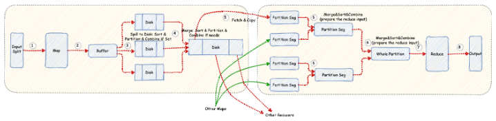

① : 每个数据的Split对应一个Map任务作为Map的输入，一般来说是HDFS的一个Block。
② : Map产生的数据会先写入到一个环形的内存的Buffer空间里。
③ : 当Buffer满了以后, 会Spill溢出数据到磁盘里。在溢出之前会先按照Partition函数对数据进行分区(默认是取key的hash值然后根据Reducer的个数进行取模)，然后按照Key进行排序(快速排序)。如果设置了Combiner会在写入磁盘前，对数据进行Combine操作，通过减少key的数据量来减轻Reducer拉取数据的网络传输。
④ : 最后将所有的溢出文件合并为一个文件，合并的过程中按照分区按照key进行排序（归并排序）, 如果溢出文件超过一定的数量（可配置)， 会在合并的前还会执行Combine操作（如果设置了Combiner）。
⑤ : 当Map端有任务完成后，Reducer端就会启动对应的fetch & copy线程去从Map端复制数据。
⑥ : 当Copy过来的数据内存中放不下后，会往磁盘写，写之前会先进行merge和sort操作（归并排序），combiner操作，最终会合并得到一份Reduce的输入数据。
⑦ : 当输入数据准备好后，进行Reduce操作。
⑧ : 输出数据到指定的位置。

## 4、一站式数据分析

### (1) 由 Spark 组件组成的一站式软件栈

Spark 提供了 4 个组件：Spark SQL、Spark Structured Streaming、Spark MLlib、GraphX


#### Spark SQL

> Spark SQL 非常适合处理结构化数据

关系数据库的表或用文件（CSV、文本文件、JSON、Avro、ORC、Parquet 等文件格式）存储的结构化数据都可以被读取并构建为 Spark 的永久表或临时表

另外，当使用 Spark 提供的 Java、Python、Scala 或 R 等语言的结构化 API 时，你可以直接用 SQL 查询来访问刚读入为 Spark DataFrame 的数据

```scala
// Scala代码
// 从亚马逊云S3存储桶加载数据为Spark DataFrame
spark.read.json("s3://apache_spark/data/committers.json")
  .createOrReplaceTempView("committers")
// 发起SQL查询，并以Spark DataFrame的形式返回结果
val results = spark.sql("""SELECT name, org, module, release, num_commits
    FROM committers WHERE module = 'mllib' AND num_commits > 10
    ORDER BY num_commits DESC""")
```

#### Spark MLlib

> MLlib 提供了很多常见的机器学习算法，这些算法基于高级的 DataFrame API 构建，可用于搭建模型

这些 API 允许你提取或转化特征，构建用于训练和评估模型的流水线，并在不同环境间持久化模型（包括保存和重新加载）

```python
# Python代码
from pyspark.ml.classification import LogisticRegression
...
training = spark.read.csv("s3://...")
test = spark.read.csv("s3://...")

# 加载训练数据
lr = LogisticRegression(maxIter=10, regParam=0.3, elasticNetParam=0.8)

# 拟合模型
lrModel = lr.fit(training)

# 预测
lrModel.transform(test)
...
```

#### Spark Structured Streaming

结构化流处理（Structured Streaming）：能够将来自 Apache Kafka 或其他流式数据源的数据流和静态数据结合起来并实时响应，新模型将数据流视为持续增长的表，新的数据记录不断追加到表的最后

> 补充：开发人员只需将数据流当作结构化的表，像静态表那样用查询语句直接进行查询即可。

案例：从本机的套接字读取数据，并将单词计数结果写入 Apache Kafka

```python
# Python代码
# 从本机读取一个数据流
from pyspark.sql.functions import explode, split
lines = (spark
  .readStream
  .format("socket")
  .option("host", "localhost")
  .option("port", 9999)
  .load())

# 执行转化操作
# 将每行字符切分为单词
words = lines.select(explode(split(lines.value, " ")).alias("word"))

# 生成流式单词统计
word_counts = words.groupBy("word").count()

# 将输出写入 Kafka 数据流
query = (word_counts
  .writeStream
  .format("kafka")
  .option("topic", "output"))
```

#### GraphX

> GraphX 是用于操作图和执行并行图计算的库

社区用户为它贡献了标准的图算法，可以用于分析、连通、遍历。可供使用的算法包括 PageRank（网页排名）、Connected Components（连通分支），以及 Triangle Counting（三角计数）等

以下代码片段展示了如何用 GraphX 的 API 连接两个图

```scala
// Scala代码
val graph = Graph(vertices, edges)
val messages = spark.textFile("hdfs://...")
val graph2 = graph.joinVertices(messages) {
  (id, vertex, msg) => ...
}
```

Databricks 向社区贡献的开源项目 GraphFrames 是一个和 Spark 中的 GraphX 类似的通用图计算库，区别在于 GraphFrames 使用基于 DataFrame 的 API

### (2) Spark 的分布式执行

从整体架构上看，Spark 应用有一个驱动器程序，该程序负责控制 Spark 集群内的并行计算，驱动器会通过 SparkSession 对象访问集群内的分布式组件（一系列Spark 执行器）和集群管理器


#### Spark 驱动器

Spark 驱动器：作为 Spark 应用中负责初始化 SparkSession 的部分，其作用如下：

- 与集群管理器打交道；
- 向集群管理器申请 Spark 执行器（JVM）所需要的资源（CPU、内存等）
- 将所有的 Spark 操作转换为 DAG 运算，并负责调度，并将这些计算分成任务分发到 Spark 执行器上

> 一旦资源分配完成，创建好执行器后，驱动器就会直接与执行器通信

#### SparkSession

- SparkSession 是所有 Spark 操作和数据的统一入口，其封装了 Spark 程序之前的各种入口（如 SparkContext、SQLContext、HiveContext、SparkConf，以及 StreamingContext 等

- SparkSession 为所有的 Spark 功能提供了统一的入口，即通过这个入口，可以创建 JVM 运行时参数、定义 DataFrame 或 Dataset、从数据源读取数据、访问数据库元数据，并发起 Spark SQL 查询

```scala
// Scala代码
import org.apache.spark.sql.SparkSession

// 构建SparkSession
val spark = SparkSession
  .builder
  .appName("LearnSpark")
  .config("spark.sql.shuffle.partitions", 6)
  .getOrCreate()
...
// 用session对象读取JSON
val people = spark.read.json("...")
...
// 用session对象发起SQL查询
val resultsDF = spark.sql("SELECT city, pop, state, zip FROM table_name")
```

#### 集群管理器

集群管理器负责管理和分配集群内各节点的资源，以用于 Spark 应用的执行

Spark 支持 4 种集群管理器：Spark 自带的独立集群管理器、Apache Hadoop YARN、Apache Mesos、Kubernetes

#### Spark 执行器

- Spark 执行器在集群内各工作节点上运行，执行器与驱动器程序通信，并负责在工作节点上执行任务

- 在大多数部署模式中，每个工作节点上只有一个执行器

#### 部署模式


#### 分布式数据与分区

> 实际的物理数据是以分区的形式分布在 HDFS 或云存储上

数据分区遍布整个物理集群，而 Spark 将每个分区在逻辑上抽象为内存中的一个 DataFrame

出于数据本地性要求，在分配任务时，根据要读取的数据分区与各 Spark 执行器在网络上的远近，最好将任务分配到最近的 Spark 执行器上


分区可以实现高效的并行执行：将数据切割为数据块或分区的分布式结构可以让 Spark 执行器只处理靠近自己的数据，从而最小化网络带宽使用率，即执行器的每个核心都能分到自己要处理的数据分区


案例：将存储在集群中的物理数据分入 8 个分区，这样每个执行器都可以分到一个或多个分区，然后加载到执行器的内存中

```python
# Python代码
log_df = spark.read.text("path_to_large_text_file").repartition(8)
print(log_df.rdd.getNumPartitions())
```

以下代码会在内存中创建一个包含 8 个分区、共 10000 个整型数的DataFrame

```python
# Python代码
df = spark.range(0, 10000, 1, 8)
print(df.rdd.getNumPartitions())
```

# 二、spark 架构与应用

## 1、Spark系统架构

Spark也采用 Master-Worker结构：

- 每个Worker进程存在一个或多个ExecutorRunner对象，每个 ExecutorRunner对象管理一个Executor，Executor持有一个线程池，每个 线程执行一个task
- Worker进程通过持有ExecutorRunner对象来控制 CoarseGrainedExecutorBackend进程的启停
- 每个Spark应用启动一个Driver和多个Executor，每个Executor里面运行的task都属于同一个Spark应用


Master节点和Worker节点的具体功能：

- **Master 节点上常驻 Master 进程**：该进程负责管理全部的Worker节点，如将Spark任务分配给Worker节点，收集Worker节点上任务的运行 信息，监控Worker节点的存活状态等
- **Worker节点上常驻Worker进程**：该进程除了与Master节点通信， 还负责管理Spark任务的执行，如启动Executor来执行具体的Spark任 务，监控任务运行状态等

---

案例：提交一个名为 SparkPi 的应用。Master 节点接收到应用后首先会通知 Worker 节点启动 Executor，然后分配 Spark 计算任务(task)到 Executor上执行，Executor 接收到 task 后，为每个 task 启动 1 个线程来执行

- `Spark application`：即 Spark 应用，指的是1个可运行的Spark程序， 如WordCount.scala

    > 该程序包含main()函数，其数据处理流程一般先从数据源读取数据，再处理数据，最后输出结果
    >
    > 同时，应用程序也包 含了一些配置参数，如需要占用的 CPU 个数，Executor 内存大小等

- `Spark Driver`：即 Spark 驱动程序，指实际在运行 Spark 应用中 main() 函数的进程。如果是YARN集群，那么 Driver也可能被调度到Worker节点上运行

- `Executor`：即 Spark 执行器，是Spark计算资源的一个单位。 Spark先以Executor为单位占用集群资源，然后可以将具体的计算任务分配给Executor执行

    > 由于 Spark 由 Scala 语言编写，Executor 在物理上是一个JVM进程，可以运行多个线程(计算任务)
    >
    > Worker 进程实际只负责启停和观察 Executor 的执行情况

- `task`：即 Spark 应用的计算任务，Driver在运行Spark应用的 main()函数时，会将应用拆分为多个计算任务，然后分配给多个 Executor执行

    - task 是 Spark 中最小的计算单位，不能再拆分
    - task 以线程方式运行在 Executor 进程中，执行具体的计算任务，如map算子、reduce 算子等
    - 由于 Executor 可以配置多个CPU，而1个task一般使用1个CPU， 因此当Executor具有多个CPU时，可以运行多个task

## 2、spark 案例分析

### (1) 案例代码

以 Spark 自带的 example 包中的 GroupByTest.scala 为例：模拟了SQL中的GroupBy语句，即将具有相同Key的 `<Key， Value>record` 聚合在一 起

---

启动命令：

```shell
GroupByTest.scala [numMappers] [numKVPairs] [valSize] [numReducers]
bin/run-example GroupByTest 3 4 1000 2
```

该命令启动 GroupByTest 应用:

- 该应用包括 3 个map task，每个 task 随机生成4个 `<K，V>record`，record 中的 Key 从[0，1，2，3]中随 机抽取一个产生，每个 Value 大小为 1000 byte

- 由于 Key 随机产生具有重复性，所以可以通过 GroupBy 将具有相同 Key 的 record 聚合在一 起，这个聚合过程最终使用 2 个 reduce task 并行执行

---

注意：

- **不需要指定 map task 个数**，因为 map task 的个数可以通过“输入数据大小/每个分片大小”来确定

    > 例如：HDFS上的默认文件 block 大小为 128MB，假设有1GB 的文件需要处理，那么系统会自动算出需要启动 `1GB/128MB=8个 map task` 

- reduce task 的个数一般在使用算子时通过设置 partition number 来间接设置

---

GroupByTest 具体代码如下：


执行步骤拆解如下：

- **初始化 SparkSession**：主要是初始化 Spark 的一些环境变量，得到 Spark 的一些上下文信息 sparkContext，使得后面的一些操作函 数(如flatMap()等)能够被编译器识别和使用，这一步同时创建 GroupByTest Driver，并初始化Driver所需要的各种对象

- 设置参数 numMappers=3，numKVPairs=4，valSize=1000， numReducers=2

- 使用 `sparkContext.parallelize(0 until numMappers，numMappers)` 将[0，1，2]划分为3份，即每一份包含一个数字 *p* ={ *p* =0， *p* =1， *p* =2}

    > 接下来flatMap()的计算逻辑是对于每一个数字 *p* (如 *p* =0)，生成一个数组arr1:Array[(Int，Byte[])]，数组长度为 numKVPairs=4
    >
    > 数组中的每个元素是一个(Int，Byte[])对，其中Int为 [0，3]上随机生成的整数，Byte[]是一个长度为1000的数组
    >
    > 因为 *p* 只 有3个值，所以该程序总共生成3个arr1数组，被命名为pairs1，pairs1被 声明为需要缓存到内存中

- 接下来，执行一个 action() 操作 pairs1.count() 来统计 pairs1 中所有 arr1 中的元素个数，执行结果应该是 numMappers*numKVPairs=3×4=12

    > 注意：缓存操作在这一步才执行，因为pairs1实际在执行action()操作后才会被生成，这种延迟(lazy)计算的方式与普通Java程序有所区别。
    >
    > action()操作的含义是触发Spark执行数据处理流程、进行计算的操作，即需要输出结果

- 在已经被缓存的pairs1上执行 groupByKey()操作将具有相同Key的 `<Int，Byte[]>record` 聚合在一起，得到&lt;Int，list (Byte[1000]， Byte[1000]，...，Byte[1000])&gt;，总的结果被命名为results

    > Spark 实际在执行这一步时，由多个 reduce task 来完成，reduce task 的个数等于 numReducers

- 最后执行 results.count()，count()将results中所有record个数进 行加和，得到结果4，这个结果也是pairs1中不同Key的总个数

### (2) 逻辑处理流程

**Spark 的实际执行流程**：

- 先建立 DAG 型的逻辑处理流程(Logical plan)
- 然后根据逻辑处理流程生成物理执行计划(Physical plan)，物理执行计划中包含具体的计算任务(task)
- 最后 Spark 将 task 分配到多台机器上执行

---

由于 GroupByTest 进行了两次 action() 操作: pairs1.count()和results.count()，所以会生成两个Spark作业 (job)：

- **第1个job，即 pairs1.count() 的执行流程如下所述**：

    - input 是输入一个 [0，1，2] 的普通 Scala 数组

    - 执行 input.parallelize() 操作产生一个 ParrallelCollectionRDD，共 3个分区，每个分区包含一个整数 *p* 

        > **这一步的重要性**：
        >
        > - 将 input 转化成 Spark 系统可以操作的数据类型 ParrallelCollectionRDD，即 input 数组仅仅是一个普通的 Scala 变量，并不是Spark 可以并行操作的数据类型
        > - 在对 input 进行划分后生成了 ParrallelCollectionRDD，这个 RDD 是 Spark 可以识别和并行操作的类型
        > - ParrallelCollectionRDD 可以有多个分区，分区的意义在于可以使不同的 task 并行处理这些分区
        >
        > RDD(Resilient Distributed Datasets)的含义 是“并行数据集的抽象表示”，实际上是 Spark 对数据处理流程中形成的中间数据的一个抽象表示或者叫抽象类，这个类就像 一个“分布式数组”，包含相同类型的元素，但元素可以分布在不同机器 上

    - 在ParrallelCollectionRDD上执行flatMap()操作，生成 MapPartitionsRDD，该RDD同样包含3个分区，每个分区包含一个通过 flatMap()代码生成的arr1数组

    - 执行 paris1.count() 操作，先在 MapPartitionsRDD 的每个分区上进行 count()，得到部分结果，然后将结果汇总到 Driver 端，在 Driver 端进行加和得到最终结果

    - 由于 MapPartitionsRDD 被声明要缓存到内存中，缓存的意思是将某些可以重用的输入数据或中间计算结果存放到内存中，以减少后续计算时间

- **第2个job，即 results.count() 的执行流程如下所述**：

    - 在已经被缓存的 MapPartitionsRDD 上执行 groupByKey() 操作， 产生了另外一个名为 ShuffledRDD 的中间数据，即 results

        > ShuffledRDD 与 MapPartitionsRDD 具有不同的分区个数，这样MapPartitionsRDD与ShuffledRDD之间的分区关系就不是一对 一的，而是多对多

    - ShuffledRDD 中的数据是 MapPartitionsRDD 中数据聚合的结果，而且在不同的分区中具有不同 Key 的数据

    - 执行 results.count()，首先在 ShuffledRDD 中每个分区上进行 count() 的运算，然后将结果汇总到 Driver 端进行加和，得到最终结果


### (3) 物理执行计划

Spark 根据数据依赖关系，来将逻辑处理流程转化为物理执行计划，包括执行阶段 (stage)和执行任务(task)，具体包括以下3个步骤：

1. **首先，确定应用会产生哪些作业(job)**：在 GroupByTest 中， 有两个 count() 的 action() 操作，因此会产生两个 job

2. **其次，根据逻辑处理流程中的数据依赖关系，将每个 job 的处理流程拆分为执行阶段(stage)** 

    > job 0 中的两个RDD虽然独立，但这两个RDD之间的数据依赖是一对一 的关系，因此可以将这两个RDD放在一起处理，形成 一个stage，编号为stage 0
    >
    > job 1 中的 MapPartitionsRDD 与 ShuffledRDD 是多对多的关系，Spark将这两个RDD分别处理，形成两个执行阶段stage 0和stage 1

3. **最后，对于每一个stage，根据 RDD 的分区个数确定执行的 task个数和种类**。

    > job 0 中的RDD包含3个分 区，因此形成3个计算任务(task)
    >
    > - 首先，每个 task 从 input 中读取数据，进行 flatMap() 操作，生成一个 arr1 数组
    > - 然后，对该数组进行 count() 操作得到结果4，完成计算
    > - 最后，Driver 将每个 task 的执行结果收集起来，加和计算得到结果 12
    >
    > 对于job 1：
    >
    > - stage 0 只包含 MapPartitionsRDD，共3个分区，因此生成3个task。每个task从内存中读取已经被缓存的数据，根据这些数据Key的Hash值将数据写到磁盘中的不同文件中，这一步是为了将数据分配到下一个阶段的不同 task中
    > - stage 1只包含 ShuffledRDD，共两个分区，也就是生成两个task，每个task从上一阶段输出的数据中根据Key的Hash值得到属于 自己的数据
    >
    > 从 stage 0 到 stage 1 的数据分区和获取的过程称为**Shuffle机制**，即数据经过了混洗、重新分配，并且从一个阶段传递到了下一个阶段
    >
    > stage 1 中的task将相同 Key 的 record 聚合在 一起，统计 Key 的个数作为 count() 的结果，完成计算
    >
    > Driver 再将所有 task 的结果进行加和输出，完成计算


4. **生成执行任务 task 后，可以将 task 调度到 Executor 上执行，在同一个 stage 中的 task 可以并行执行**

---

**为什么要拆分为执行阶段**：

- 如果将每个操作都当作一个任务，那么效率太低，而且错误容忍比较困难
- 将 job 划分为执行阶段 stage 后：
    - 第1个好处是 stage 中生成的 task 不会太大，也不会太小，而且是同构的，便于并行执行
    - 第2个好处是可以将多个操作放在一个 task 里处理，使得操作可以进行串行、流水线式的处理，这样可以提高数据处理效率
    - 第3个好处是 stage 可以方便错误容忍，如一个stage失效，可以重新运行这个 stage，而不需要运行整个job

# 三、spark 逻辑处理流程

## 1、Spark 逻辑处理流程概览

**一个典型的 Spark 逻辑处理流程**：


**这个典型的逻辑处理流程主要包含四部分**：

1. **数据源(Data blocks)**：其表示原始数据，数据可以存放在本地文件系统和分布式文件系统中，如 HDFS、分布式Key- Value数据库(HBase)等

2. **数据模型**：需要对数据进行操作处理，即如何对输入/输出、中间数据进行抽象表示，使得程序能够识别处理

    > Hadoop MapReduce 框架将输入/输出、中间数据抽象为 `<K，V>record`，这样 map()/reduce() 按照这个格式读入并处理数据，最后输出也是这个格式
    >
    > - **这种数据表示方式的优点**：简单易操作
    > - **缺点**：过于细粒度。没有对这些 &lt;K，V&gt;record进行更高层的抽象，导致只能使用map(K，V) 这样的固定形式去处理数据，而无法使用类似面向对象程序的灵活数据处理方式
    >
    > ---
    >
    > Spark 将输入/输出、中间数据抽象表示为统一的数据模型(数据结构)，命名为RDD，每个输入/输出、中间数据可以是一个具体的实例化的 RDD
    >
    > RDD与普通数据结构(如ArrayList)的主要区别有两点：
    >
    > - RDD只是一个逻辑概念，在内存中并不会真正地为某个 RDD 分配存储空间(除非该RDD需要被缓存)。RDD中的数据只会在计算中产 生，而且在计算完成后就会消失，而ArrayList等数据结构常驻内存
    > - RDD可以包含多个数据分区，不同数据分区可以由不同的任务 (task)在不同节点进行处理

3. **数据操作**：Spark 将数据操作分为两种：transformation() 操作和 action() 操作

    - 两者区别：

        - **transformation() 操作**：单向操作，即 rdd1 使用 transformation() 后会生成新的 rdd2，而不能对 rdd1 本身进行修改

            > 在 Spark 中，因为数据操作一般是单向操作，通过流水线执行，还需要进行错误容忍等，所以RDD被设计成一个不可变类型
            >
            > 一直使用 transformation()操作可以不断生成新的RDD，而action()操作用来计算最后的数据结果

        - **action() 操作**：对数据结果进行后处理(post-processing)，产生输出结果，而且会触发 Spark 提交 job 真正执行数据处理任务

4. **计算结果处理**：由于RDD实际上是分布在不同机器上的，所以大数据应用的结果计算分为两种方式：

    - 一种方式：直接将计算结果存放到分布式文件系统中，如rdd.save(“hdfs://file_location”)，这种方式一般不需要在Driver端进行集中计算
    - 另一种方式：需要在 Driver 端进行集中计算，如统计RDD中元素数目，需要先使用多个 task 统计每个RDD中分区(partition)的元素数目，然后将它们汇集到 Driver 端进行加和计算

## 2、Spark 逻辑处理流程生成方法

Spark 要有一套通用的方法，其能够将应用程序自动转化为确定性的逻辑处理流程，即 RDD 及其之间的数据依赖关系，因此需要解决以下3个问题：

- 根据应用程序如何产生 RDD，产生什么样的 RDD? 
- 如何建立 RDD 之间的数据依赖关系? 
- 如何对RDD内部的数据进行分区?
- 如何计算 RDD 中的数据?

### (1) 根据应用程序如何产生RDD，产生什么样的 RDD

- 虽然用 RDD 来对输入/输出、中间数据进行统一抽象，但这些数据本身可能具有不同的类型，而且是由不同的计算逻辑得到，可能具有不同的依赖关系。

- 因此需要多种类型的 RDD 来表示这些不同的数据类型、不同的计算逻辑，以及不同的数据依赖。

Spark 实际产生的 RDD 类型和个数与 transformation() 的计算逻辑有关：

- 如在 rdd1上使用map(func)进行操作时，是对rdd1中每一个元素执行 func()函数得到一个新的元素，因此只会生成一个rdd2

- 如 join()、distinct() 等，需要对中间数据进行一系列子操作，那么一个 transformation() 会创建多个RDD

    > 例如，rdd3=rdd1.join(rdd2)需要先将rdd1和rdd2中的元素聚合在一起，然后使用笛卡儿积操作生成关联后的结果，在这个过程中会生成多个 RDD。Spark依据这些子操作的顺序，将生成的多个RDD串联在一起， 而且只返回给用户最后生成的RDD

### (2) 如何建立RDD间的数据依赖关系

数据依赖关系包括两 方面：

- 一方面是 RDD 之间的依赖关系，如一些 transformation() 会对多个 RDD 进行操作，则需要建立这些 RDD 之间的关系
- 另一方面是 RDD 本身具有分区特性，需要建立 RDD 自身分区之间的关联关系

具体地， 需要解决以下3个问题：

1. 如何建立 RDD 之间的数据依赖关系？例如，生成的RDD是依赖于一个parent RDD，还是多个parent RDD?

    > 对于一元操作，如 rdd2=rdd1.transformation() 可以确定 rdd2 只依赖 rdd1，所以关联关系是 `rdd1 => rdd2`
    >
    > 对于二元操作，如 rdd3=rdd1.join(rdd2)，可以确定 rdd3 同时依赖 rdd1和 rdd2，关联关系是 `(rdd1，rdd2) => rdd3`

2. 新生成的 RDD 应该包含多少个分区？

    > 在Spark中，新生成的 RDD 分区个数由用户和 parent RDD 共同决定：
    >
    > - 对于一些 transformation()，如 join() 操作，可以指定其生成的分区的个数，如果个数不指定，则一般取其 parent RDD 的分区个数最大值
    >
    > - 还有 一些操作，如 map()，其生成的 RDD 的分区个数与数据源的分区个数相同

3. 新生成的 RDD 与其 parent RDD 中的分区间是什么依赖关系?是依赖 parent RDD 中的一个分区还是多个分区呢？

    > 分区之间的依赖关系既与 transformation() 的语义有关，也与 RDD 的分区个数有关
    >
    > 例如：
    >
    > - 在执行 rdd2=rdd1.map() 时，map() 对 rdd1 的每个分区中的每个元素进行计 算，可以得到新的元素，类似一一映射，所以并不需要改变分区个数， 即 rdd2 的每个分区唯一依赖 rdd1 中对应的一个分区
    > - 而对于 groupByKey() 之类的聚合操作，在计算时需要对 parent RDD 中各个分 区的元素进行计算，需要改变分区之间的依赖关系，使得 RDD 中的每个分区依赖其 parent RDD 中的多个分区

---

Spark 是怎么设计出一个通用的方法来解决第3个问题，Spark通过总结这些数据操作的数据依 赖关系，将其分为两大类：

- **窄依赖(NarrowDependency)**：新生成的 child RDD 中每个分区都依赖 parent RDD 中的一部分分区

    > 窄依赖可以进一步细分为4种依赖：
    >
    > 

    - **一对一依赖(OneToOneDependency)**：表示child RDD 和 parent RDD 中的分区个数相同，并存在一一映射关系，比如 map()、fliter() 等
    - **区域依赖(RangeDependency)**：表示 child RDD 和 parent RDD 的分区经过区域化后存在一一映射关系，比如 union() 等
    - **多对一依赖(ManyToOneDependency)**：表示 child RDD 中的一个分区同时依赖多个 parent RDD 中的分区，比如具有特殊性质的 cogroup()、join() 等
    - **多对多依赖(ManyToManyDependency)**：表示 child RDD 中的一 个分区依赖 parent RDD 中的多个分区，同时 parent RDD 中的一个分区被 child RDD 中的多个分区依赖，比如：cartesian()

- **宽依赖(ShuffleDependency)**：新生成的 child RDD 中的分区依赖 parent RDD 中的每个分区的一部分

    > ShuffleDependency 中 RDD 2 的每个分区虽然依赖 RDD 1 中的所有分区， 但只依赖这些分区中id为1或2的部分
    >
    > ManyToManyDependency 中 RDD 2 的每个分区依赖 RDD 1 中每个分区的所有部分

**总结**：

- 如果 parent RDD 的一个或多个分区中的数据需要**全部流入**child RDD 的某一个或者多个分区，则是**窄依赖**

- 如果 parent RDD 分区中的数据需要一**部分流入** child RDD 的某一个 分区，另外一部分流入 child RDD 的另外分区，则是**宽依赖**

---

**对数据依赖进行分类的作用**：

- 首先，可以明确 RDD 分区之间的数据依赖关系，在执行时 Spark 可以确定从哪里获取数据，输出数据到哪里

- 其次，对数据依赖进行分类有利于生成物理执行计划

    > NarrowDependency 在执行时可以在同一个阶段进行流水线(pipeline)操作，不需要进行Shuffle，而 ShuffleDependency 需要进行 Shufle

- 最后，对数据依赖进行分类有利于代码实现

    > 如 OneToOneDependency 可以采用一种实现方式，而 ShuffleDependency 采用另一种实现方式
    >
    > 这样，Spark 可以根据 transformation() 操作的计算逻辑选择合适的数据依赖进行实现

### (3) 如何对RDD内部的数据进行分区

> 在确定了数据依赖关系后，便知道了child RDD 中每个分区的输入数据是什么，那么只需要使用 transformation(func) 处理这些输入数据，将生成的数据推送到child RDD 中对应的分区即可

**如何对RDD内部的数据进行分区，常用的数据分区方法(Partitioner)包括3种**：

- **水平划分**：按照 record 的索引进行划分

    > `sparkContext.parallelize(list(1,2,3,4,5,6,7,8,9),3)` 就是按照元素的下标划分，`(1,2,3)` 为一组，`(4,5,6)` 为一组， `(7,8,9)` 为一组
    >
    > 使用 Spark处理大数据时，先将输入数据上传到HDFS上，HDFS自动对数据进行水平划分，即按照128MB为单位将输入数据划分为很多个小数据块，之后每个 Spark task 可以只处理一个数据块

- **Hash 划分**：使用 record 的 Hash 值来对数据进行划分，该划分方法的好处是只需要知道分区个数，就能将数据确定性地划分到某个分区

    > 在水平划分中，由于每个 RDD 中的元素数目和排列顺序不固定，同一个元素在不同 RDD 中可能被划分到不同分区
    >
    > 而使用 HashPartitioner，可以根据元素的Hash值，确定性地得出该元素的分区，该划分方法经常被用于数据 Shuffle 阶段

- **Range 划分**：该划分方法一般适用于排序任务，核心思想是按照元素的大小关系将其划分到不同分区，每个分区表示一个数据区域

    > 例如：对一个数组进行排序，数组里每个数字是 [0,100] 中的随机数，Range 划分
    >
    > - 首先将上下界 [0,100] 划分为若干份(如10份)
    > - 然后将数组中的每个数字分发到相应的分区，如将18分 发到(10，20]的分区
    > - 最后对每个分区进行排序，这个排序过程可以并行执行，排序完成后是全局有序的结果
    >
    > Range 划分需要提前划分好数据区域，因此要统计 RDD 中数据的最大值和最小值，为了简化统计过程，Range 划分常采用抽样方法估算数据区域边界

### (4) 如何计算 RDD 中的数据

Spark 的大多数 transformation() 类似数学中的映射函数，具有固定的计算方式，如 map(func) 操作要每读入一个record 就处理，然后输出一个 record

reduceByKey(func) 操作中的 func 对中间结果和下一个 record 进行聚合 计算并输出结果

Spark 也提供了一些类似普通程序的操作，如 mapPartitions() 可以对分区中 的数据进行多次操作后再输出结果

---

`map()` 和 `mapPartitions()` 的区别： 假设 rdd 1 中某个分区的数据是[1，2，3，4， 5]

- rdd2=rdd1.map(func) 的计算逻辑类似于下面的单机程序：

    

- rdd2=rdd1.mapPartitions(func)的计算逻辑类似于下面的单机程序：

    > Spark中的 mapPartitions()可以在对分区中所有record处理后，再集中输出

    

## 3、常用 transformation() 数据操作

### (1) **map**()和**mapValues**()操作

map()和mapValues()操作都会生成一个MapPartitionsRDD，这 两个操作生成的数据依赖关系都是OneToOneDependency


### (2) **filter**()和**filterByRange**()操作

filter() 和 filterByRange() 操作都会生成一个 MapPartitionsRDD，这两个操作生成的数据依赖关系都是 OneToOneDependency


### (3) **flatMap**()和**flatMapValues**()操作

flatMap()和flatMapValues()操作都会生成一个 MapPartitionsRDD，这两个操作生成的数据依赖关系都是 OneToOneDependency

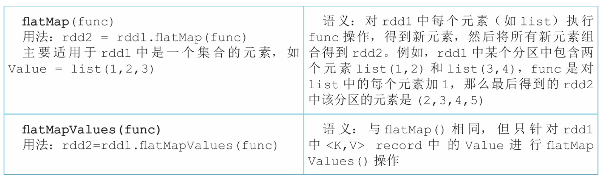

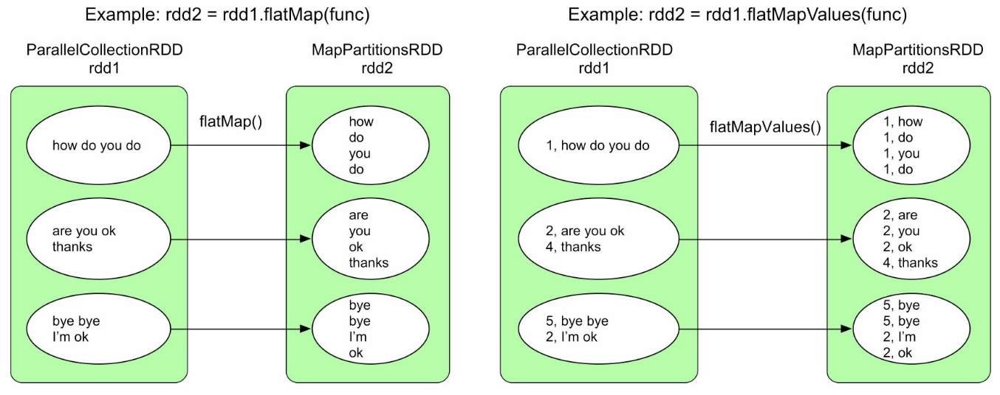


### (4) sample()和sampleByKey()操作

sample()操作生成一个PartitionwiseSampledRDD，而 sampleByKey()操作生成一个MapPartitionsRDD，这两个操作生成的 数据依赖关系都是OneToOneDependency

- sample(false)与 sample(true)的区别
    - 前者使用伯努利抽样模型抽样，也就是每个 record有fraction×100%的概率被选中
    - 后者使用泊松分布抽样，也就是生成泊松分布，然后按照泊松分布采样，抽样得到的record个数可能大于rdd1 中的record个数
- sampleByKey() 与sample() 的区别：sampleByKey() 可以为每个 Key 设定被抽取的概率，如在下面sampleByKey()代码中，通过 Map数据结构设定了在每个分区中，Key=1的数据会被抽取80%，Key=2 的数据会被抽取50%。

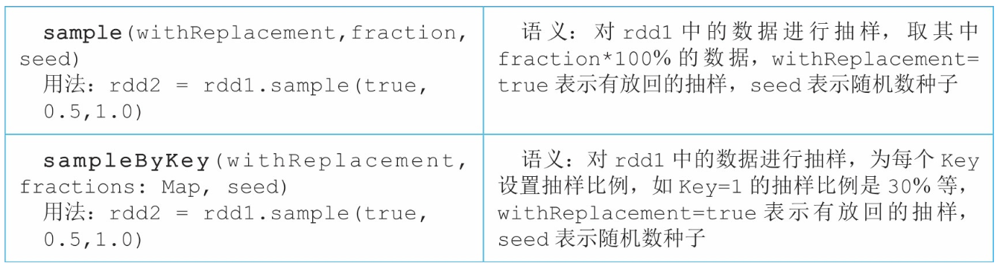


### (5) **mapPartitions**()和**mapPartitionsWithIndex**()操作

mapPartitions()和mapPartitionsWithIndex()操作更像是过程式 编程，给定了一组数据后，可以使用数据结构持有中间处理结果，也可 以输出任意大小、任意类型的一组数据


若想知道这个RDD中包含多少个分区，以及每个分区中包含了哪些record，可以使用 mapPartitionsWithIndex() 来输出这些数据：


### (6) **partitionBy**()操作


使用 HashPartitioner 对rdd1进行重新分区：Key=2和Key=4的record被分到rdd2中的partition1，Key=1和Key=3的 record被分到rdd2中的partition2

使用 RangePartitioner 对rdd1进行重新分区：Key值较小的record被分到 partition1，Key值较大的record被分到partition2


### (7) **groupByKey**()操作

groupByKey()引入了 ShuffleDependency，可以对child RDD的数据进行重新分区组合，因 此 groupByKey()输出的parent RDD的分区个数更加灵活，分区个数可以由用户指定，如果用户没有指定就默认为parent RDD中的分区个数

> 注意：groupByKey()的缺点是在Shuffle时会产生大量的中间数据、占用内存大，因此建议使用 reduceByKey()


**左图**：rdd1和 rdd2 的 partitioner 不同，rdd1是水平划分且分区个数为3，而rdd2是Hash划分 (groupByKey()默认使用Hash划分)且分区个数为2。为了将数据按 照Key聚合在一起，需要使用ShuffleDependency对数据进行重新分配

**右图**：rdd1已经提前使用Hash划分进行了分区，具有相同 Hash值的数据已经在同一个分区，而且设定的groupByKey()生成的RDD的分区个数与rdd1一致，则只需要在每个分区中进行 groupByKey()操作，不需要再使用ShuffleDependency


**无Shuffle的groupByKey()**：


### (8) **reduceByKey**()操作

与 groupByKey() 只在 ShuffleDependency 后按 Key 对数据进行聚合不同，reduceByKey() 实际包括两步聚合：

- 第1步：在 ShuffleDependency 之前对 RDD 中每个分区中的数据进行一个本地化的 combine() 聚合操作

    > 首先对 ParallelCollectionsRDD 中的每个分区进行combine() 操作，将具有相同 Key 的 Value 聚合在一起，并利用 func 进行 reduce() 聚合操作，这一步由 Spark 自动完成，并不形成新的 RDD

- 第2步：reduceByKey() 生成新的 ShuffledRDD，将来自 rdd1 中不同分区且具有相同 Key 的数据聚合在一起，同样利用 func 进行 reduce() 聚合操作

    > reduceByKey() 中 combine()和 reduce() 的计算逻辑一样，采用同一个func
    >
    > 注意：func 需要满足交换律和结合律，因为 Shuffle 并不保证数据到达顺序，另外因为 ShuffleDependency 需要对Key进行Hash划分，所以 Key不能是特别复杂的类型，如Array

---

在性能上，相比groupByKey()、 reduceByKey()可以在Shuffle之前使用func对数据进行聚合，减少了 数据传输量和内存用量，效率比groupByKey()的效率高


### (9) **aggregateByKey**()操作

> 若在 combine() 中想使用一个 sum() 函数，而在 reduce() 中想使用 max() 函数，那么 reduceByKey() 就不满足要求

aggregateByKey() 将 combine() 和 reduce() 两个函数的计算逻辑分开：

- `combine()` 使用 seqOp 将同一个分区中的 &lt;K，V&gt;record 聚 合在一起
- `reduce()` 使用 combineOp 将经过 seqOp 聚合后的不同分区的 &lt;K，V *′* &gt;record 进一步聚合

> 进行 reduce(func)操作时需要一个初始值，而reduceByKey(func)没有初始值，因此 aggregateByKey() 还提供了一个zeroValue参数，来为 seqOp提供初始值zeroValue


aggregateByKey()对于 ParallelCollectionRDD中的每一个分区，首先使用seqOp对分区中的每条 数据进行聚合，如在第3个分区中对3个record进行如下计算:


combineOp 计算过程：在 ShuffledRDD 中对相同 Key 的 record 进行如下计算，以Key=2为例


示例代码：

- **示例一**：将 inputRDD 中的数据使用下画线符号和@符号连接在一起，在seqOp中使用初始值 *x* 和下画线符号对数据进行连接， 在combineOp中使用@符号对数据进行连接

    

- **示例二**：在FPGrowthModel代码中使用aggregateByKey()

    

- 示例三：在NaiveBayes代码中使用aggregateByKey()

    

### (10) **combineByKey**()操作

- aggregateByKey() 基于combineByKey()实现，如：aggregateByKey() 中的 zeroValue 对应 combineByKey() 中的 createCombiner，seqOp 对应mergeValue，combOp 对应 mergeCombiners
- 区别是 combineByKey() 的 createCombiner 是一个初始化函数， 而 aggregateByKey() 包含的 zeroValue 是一个初始化的值，显然 createCombiner 函数的功能比一个固定的 zeroValue 值更强大


---

下图案例：先执行createCombiner函数，可以根据每个record的Value值为 每个record定制初始值。之后的mergeValue功能与seqOp功能一样， mergeCombiner功能也与combOp功能一样


### (11) **foldByKey**()操作

foldByKey()也是基于 aggregateByKey()实现的，功能介于reduceByKey()和 aggregateByKey()之间

- 相比reduceByKey()，foldByKey()多了 初始值zero Value
- 相比aggregateByKey()，foldByKey()要求 seqOp=combOp=func


### (12) **cogroup**()**/groupWith**()操作

> cogroup() 与 groupByKey() 的不同 在于 cogroup() 可以将多个RDD聚合为一个RDD，其生成的 RDD与多个parent RDD存在依赖关系

cogroup() 最多支持4个RDD同时进行cogroup()，如 rdd5=rdd1.cogroup (rdd2，rdd3，rdd4)

- cogroup() 实际生成了两个 RDD：CoGroupedRDD 将数据聚合在一起，MapPartitionsRDD 将数据类 型转变为CompactBuffer(类似于Java 的ArrayList)
- 当cogroup() 聚合的RDD包含很多数据时，Shuffle 这些中间数据会增加网络传输，而且需要很大内存来存储聚合后的数据，效率较低


将inputRDD1中的数据与 inputRDD2中的数据聚合在一起：

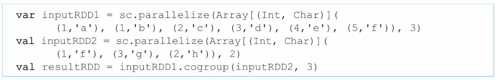

- 上图展示的CoGroupedRDD与rdd1、 rdd2之间都是 ShuffleDependency

    > 原因：rdd1 和 CoGroupedRDD 具有相同的 partitioner(都是HashPartitioner)且分区个数相同，rdd1中每个record可以直接流入CoGroupedRDD进行聚合，不需要 ShuffleDependency

- 下图展示的 CoGroupedRDD与rdd1之间是 OneToOneDependency

    > 对于rdd2，其分区个数和 partitioner 都与 CoGroupedRDD不一致，因此还需要将rdd2中的数据通过 ShuffleDependency分发到CoGroupedRDD中


> 总结：Spark在决定RDD之间的数据依赖时除了考虑 transformation()的计算逻辑，还考虑child RDD和parent RDD的分区信 息，当分区个数和partitioner都一致时，说明parent RDD中的数据可以直 接流入child RDD，不需要ShuffleDependency，这样可以避免数据传 输，提高执行效率

### (13) **join**()操作


将inputRDD1中的数据与inputRDD2中的数据关联在一 起：


join() 操作实际上建立在 cogroup()之上：

- 首先利用 CoGroupedRDD 将具有相同 Key 的 Value 聚合 在一起，形成 `<K，[list(V)，list(W)]>`
- 然后对 `[list(V)，list(W)]` 进行笛卡儿积计算并输出结果 `<K，(V，W)>`，这里用 list 来表示 CompactBuffer

在实际实现中：

- join()首先调用 cogroup() 生成 CoGroupedRDD 和 MapPartitionsRDD
- 然后计算 MapPartitionsRDD 中 [list(V)，list(W)] 的笛卡儿积，生成 MapPartitionsRDD


- 第1个图：rdd1、rdd2、CoGroupedRDD 具有不同的 partitioner

    > 直接执行示例中的代码，会得到第1个图的结果，由于各个RDD的 partitioner不同，相同Key的record在不同的RDD中分布在不同的分区 中，因此需要ShuffleDependency将这些相同Key的record聚合在一起

- 第2个图：rdd1、CoGroupedRDD 的 partitioner 都为 HashPartitioner(3)

    > 如果只去掉第1个注释代码，那么会得到第2个图，也就是rdd1中的 数据已经预先按照HashPartitioner(3)进行了分区，与CoGroupedRDD 中的数据分布相同，没有必要再进行Shuffle，因此只需要 OneToOneDependency

- 第3个图：rdd2、CoGroupedRDD的partitioner 都为 HashPartitioner(3)

    > 如果只去掉第2个注释代码，那么会得到第3个图，原理与第2个图 的原理相同

- 第4个图：rdd1、rdd2、CoGroupedRDD 的 partitioner 都为 HashPartitioner(3)

    > 如果同时去掉第1个和第2个注释代码，那么会得到第4个图，原理 与第2个图的原理相同。此时，整个join()操作就不存在 ShuffleDependency，在下一章我们会看到，该逻辑处理流程图不会产生 Shuffle阶段

### (14) **cartesian**()操作

cartesian()操作形成的数据依赖关系虽然比较复杂，但归属于多对多的NarrowDependency，并不是ShuffleDependency


计算inputRDD1与inputRDD2中数据的笛卡儿积：

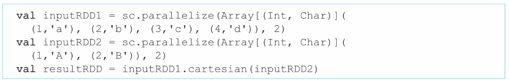

假设rdd1中的分区个数为 *m* ，rdd2的 分区个数为 *n* ，cartesian()操作会生成 *m* × *n* 个分区。rdd1和rdd2中的 分区两两组合，组合后形成CartesianRDD中的一个分区，该分区中的数据是rdd1和rdd2相应的两个分区中数据的笛卡儿积


### (15) **sortByKey**()操作

sortByKey() 为了保证生成的RDD中的数据是全局有序(按照Key排 序)的，采用Range划分来分发数据

> Range划分可以保证在生成的 RDD中，partition 1中的所有record的Key小于(或大于)partition 2中所 有的record的Key

sortByKey() 的缺点：record 的 Key 有序，但 Value 无序，如何解决：

- 方法一：同 Hadoop MapReduce 一样使用 SecondarySort，首先使用map()操作进行 `<Key， Value> => <(Key，Value)，null>`，然后将(Key， Value)定义为新的class，并重新定义其排序函数compare()，最后使用sortByKey()进行排序，只输出Key即可
- 方法二：先使用 groupByKey() 将数据聚合成 `<Key，list(Value)>`，然 后再使用 rdd.mapValues(sort function) 操作对 list(Value) 进行排序


将 inputRDD 中的数据按照 Key 进行排序：


- sortByKey() 操作首先将rdd1中不同 Key的record分发到ShuffledRDD中的不同分区中
- 然后在 ShuffledRDD 的每个分区中，按照Key对record进行排序，形成的数据依赖关系为 ShuffleDependency


### (16) **coalesce**()操作


- **减少分区个数**：当使用 coalesce(2) 减少分区时，Spark 会将相邻的分区直接合并在一起得到 rdd2，形成的数据依赖关系是多对一的 NarrowDependency

    > 缺点：当 rdd1 中不同分区中的数据量差别较大时，直接合并容易造成数据倾斜(rdd2中某些分区个数过多或过少)

- **增加分区个数**：当使用 coalesce(6) 增加分区时，会发现生成的 rdd2 的分区个数并没有增加，这是因为 coalesce() 默认使用 NarrowDependency，不能将 一个分区拆分为多份

- **使用Shuffle来减少分区个数**：为了解决数据倾斜的问题，可以使用 coalesce(2，Shuffle=true) 来减少 RDD 的分区个数。使用Shuffle=true后，Spark可以随机将数据打乱，从而使得生成的RDD中每个分区中的数据比较均衡

    > 具体方法：
    >
    > - 为 rdd1中的每个 record 添加一个特殊的 Key，如第3个图中的 MapPartitionsRDD，Key是Int类型，并从[0，numPartitions)中随机生成，如&lt;3，f&gt;=&gt;&lt;2，(3，f)&gt;中，2 是随机生成 的Key，接下来的 record 的Key递增 1，如&lt;1，a&gt;=&gt;&lt;3， (1，a)>
    > - 这样，Spark可以根据Key的Hash值将 rdd1 中的数据分发到rdd2的不同的分区中，然后去掉Key即可(见最后的 MapPartitionsRDD)

- **使用Shuffle来增加分区个数**：通过使用 ShuffleDepedency，可以对分区进行拆分和重新组合，解决分区不能增加的问题

### (17) **repartition**()操作


### (18) **repartitionAndSortWithinPartitions**()操作


对inputRDD中的数据重新划分并在分区内排序：


- 左图：repartitionAndSortWithinPartitions() 操作首先使用用户定义的 partitioner 将数据分发到不同分区，然后对每个分区中的数据按照Key进行排序

    > 与repartition()操作相比， repartitionAndSortWithinPartitions()操作多了分区数据排序功能

- 右图：repartitionAndSortWithinPartitions() 中的 partitioner 可定义，不一定是 sortByKey() 默认的 RangePartitioner，因此 repartitionAndSortWithinPartitions() 操作得到的结果不能保证 Key 全局有序


### (19) **intersection**()操作

intersection() 核心思想：

- 先利用 cogroup() 将 rdd1 和 rdd2 的相同 record 聚合在一起
- 然后过滤出在 rdd1 和 rdd2 中都存在的 record


具体方法：

- 先将 rdd1 中的 record 转化为 &lt;K，V&gt; 类 型，V为固定值null
- 然后将 rdd1 和 rdd2 中的 record 聚合在一起，过滤掉出现“()”的record
- 最后只保留 Key，得到交集元素


### (20) **distinct**()操作

distinct()操作先将数据转化为&lt;K，V&gt;类型，其中Value为 null类型，然后使用reduceByKey()将这些record聚合在一起，最后使用map()只输出Key就可以得到去重后的元素


### (21) **union**()操作

union() 将 rdd1 和 rdd2 中的 record 组合在一起，形成新的 rdd3，形成的数据依赖关系是 RangeDependency


union()形成的逻辑执行流程有以下两种：

- **第一种：左图和示例代码1**，rdd1和rdd2是两个非空的RDD，而且两者的partitioner 不一致，且合并后的 rdd3 为 UnionRDD，其分区个数是rdd1和rdd2的分区个数之和，rdd3的每个分区 也一一对应rdd1或rdd2中相应的分区
- **第二种：右图和示例代码2**，rdd1和rdd2是两个非空的RDD，且两者都使用Hash划分，得到rdd1 *′* 和rdd2 *′* 。因此，rdd1 *′* 和rdd2 *′* 的partitioner是一致的，都是Hash划分且分区个数相同。rdd1 *′* 和rdd2 *′* 合并后的rdd3为PartitionerAwareUnionRDD，其分区个数与rdd1 和rdd2的分区个数相同，且rdd3中的每个分区的数据是rdd1 *′* 和rdd2 *′* 对 应分区合并后的结果


### (22) **zip**()操作

zip()操作像拉链一样将rdd1和rdd2 中的record按照一一对应关系连接在一起，形成新的&lt;K，V&gt; record，生成的RDD名为ZippedPartitionsRDD2


### (23) **zipPartitions**()操作

zipPartitions()操作首先像拉链一样 将rdd1和rdd2中的分区(而非分区中的每个record)按照一一对应关系 连接在一起，并提供两个迭代器rdd1Iter和rdd2Iter，来分别迭代每个分 区中来自rdd1和rdd2的record

- zipPartitions()的要求是参与连接的rdd都包含相同的分区个数，但不要求每个分区中的record数 目相同

- 参数 preservePartitioning(默认false)：意即zipPartitions()生成的rdd 继承 parent RDD 的partitioner，因为继承partitioner可以提升后续操作的执行效率

    > 当参与zipPartitions()的多个 rdd具有相同的partitioner时，preservePartitioning才有意义


同时迭代rdd1和rdd2中的record，并使用下画线连接索引相同的record：


### (24) **zipWithIndex**()和**zipWithUniqueId**()操作


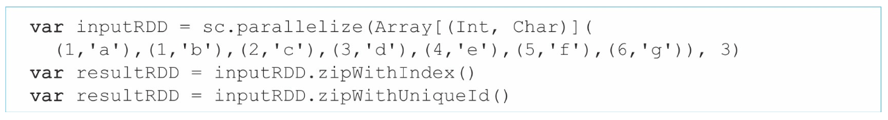

- 左图：zipWithIndex() 对 rdd1 中的每 个 record 都进行编号，编号方式是从0开始依次递增(跨分区)的，生成的RDD类型是ZippedWithIndexRDD

- 右图：zipWithUniqueId() 对 rdd1 中的每个 record 都进行编号，编号方式是按照 round-robin 方式，即将编号发给每个分区中的record，不可以轮空

    > zipWithUniqueId()操作生成的RDD类型是MapPartitionsRDD


### (25) **subtractByKey**()操作

SubtractedRDD结构和数据依赖模式都 类似于CoGroupedRDD，可以形成OneToOneDependency或者 ShuffleDependency，但实现比CoGroupedRDD更高效


- 该操作首先将rdd1和rdd2中的&lt;K， V&gt;record按Key聚合在一起，得到SubtractedRDD，该过程类似 cogroup()
- 然后，只保留[(a)，(b)]中b为()的record，从而得到在rdd1中而不在rdd2中的元素


### (26) **subtract**()操作

- subtract()的语义与subtractByKey()类似，不同点是 subtract()适用面更广，可以针对非&lt;K，V&gt;类型的RDD

- subtract()的底层实现基于subtractByKey()来完成


- 先将rdd1和rdd2表示为&lt;K，V&gt;record，Value为 null
- 然后按照Key将这些record聚合在一起得到SubtractedRDD，只保留 [(a)，(b)]中b为()的record，从而得到在rdd1中但不在rdd2中的 record


### (27) **sortBy**(**func**)操作

sortBy(func)与sortByKey()的语义类似，不同点是 sortByKey()要求RDD是&lt;K，V&gt;类型，并且根据Key来排 序，而sortBy(func)不对RDD类型作要求，只是根据每个record经过 func的执行结果进行排序


将&lt;K，V&gt;数据按照Value进行排序：


想对rdd1中的&lt;K，V&gt;record按 照Value进行排序，则设计的排序函数func为record=&gt; record._2：

- 首先将rdd1 中每个record的形式进行改变，将&lt;K，V&gt;record转化为&lt; V，(K，V)&gt;record，如将(D，2)转化为&lt;2，(D，2) &gt; 
- 然后利用sortByKey()对转化后的record进行排序
- 最后，只保留第二项，也就是&lt;V，(K，V)&gt;中的(K，V)，即可得 到排序后的record，也就是rdd2

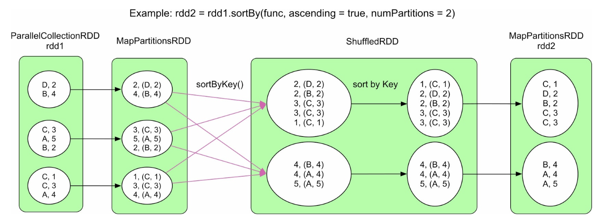

### (28) **glom**()操作


## 4、常用 action() 数据操作

- action() 数据操作是用来对计算结果进行后处理的，同时提交计算job，经常在一连串transformation()后使用

- transformation()操作一般 返回RDD类型，而action()操作一般返回数值、数据结构(如Map) 或者不返回任何值(如写磁盘)

### (1) **count**()**/countByKey**()**/countByValue**()操作


- count() 操作：首先计算每 个分区中 record 的数目，然后在 Dirver 端进行累加操作，得到最终结果
- countByKey() 操作：只统计每个 Key 出现的次 数，因此首先利用 mapValues() 操作将&lt;K，V&gt;record的Value 设置为1(去掉原有的Value)，然后利用 reduceByKey() 统计每个Key 出现的次数，最后汇总到Driver端，形成Map
- countByValue() 操作：统计每个 record 出现的次数，先将 record 变为 &lt;record，null&gt;类型，这样转化是为了接下来使用 reduceByKey()得到每个record出现的次数，最后汇总到Driver端，形 成Map

---

countByKey()和countByValue() 需要在 Driver 端存放一个Map，当数据量比较大时，这个Map会超过Driver的内存大小，所以在数据量较大时，建议先使用 reduceByKey() 对数据进行统计，然后将结果写入分布式文件系统


### (2) **collect**() 和 collectAsMap() 操作


这两个操作都是将RDD中的数据直接汇总到 Driver端，类似count()操作的流程图

- collect()将record直接汇总到Driver端
- collectAsMap()将 &lt;K，V&gt;record 都汇集到Driver端

> 在数据量较大时，两者都会造成大量内存消耗，所以需要注意内存用量

### (3) **foreach**() 和 foreachPartition() 操作


foreach()和foreachPartition()的关系类似于map()和 mapPartitions()的关系

- foreach() 操作：使用 func 对 rdd1中的每个 record 进行计算，

    > 不同于 map() 操作的是：foreach() 操作一般会直接输出计算结果，并不形成新的RDD

- foreachPartition() 的用法也类似于mapPartitions()，但不形成新的 RDD


### (4) **fold**()**/reduce**()**/aggregate**()操作


- fold(func)：首先在 rdd1的每个分区中计算局部结果，如0_a_b_c，然后在Driver端将局部结果聚合成最终结果

    > - func 的语义与foldByKey(func)中的func相同，区别是foldByKey()生成一个 新的RDD，而fold()直接计算出结果
    >
    > - 每次聚合时初始值 zeroValue 都会参与计算，而foldByKey()在聚合来自不同分区的record时并不使用初始值

- reduce(func)：可以看作是 aggregate(seqOp， combOp) 中 seqOp=combOp=func 的场景

-  aggregate(seqOp，combOp)：使用 seqOp 在每个分区中计算局部结果，然后使用 combOp 在 Driver 端将局部结果聚合成最终结果

    > - 在 aggregate()中，seqOp和combOp聚合时初始值zeroValue都会参与计 算，而在aggregateByKey()中，初始值只参与seqOp的计算
    >
    > - 与 aggregateByKey  区别是aggregateByKey()生成一个新的RDD，而aggregate()直接计算出结果


共同问题：当需要merge的部分结果很大时，数据传输量很 大，而且Driver是单点merge，存在效率和内存空间限制问题

解决：Spark对这些聚合操作进行了优化，提出了treeAggregate() 和treeReduce()操作

### (5) **treeAggregate** ()和**treeReduce**()操作


-  treeAggregate(seqOp，combOp)：使用树形聚合方法来优化全局聚合阶段，来减轻Driver端聚合的压力(数据传输量和内存用量)

    > 在树形聚合时，非根节点实际上是局部聚合，只有根节点是全局聚合：
    >
    > - 利用之前的聚合操作(如reduceByKey()、aggregateByKey())来实现非根节点的局部聚合
    > - 将最后的根节点聚合放在Driver端进行，只是需要为每个非根节点分配合理的数据
    >
    > 即 treeAggregate()首先对rdd1中的每个分区进行局部聚合，然后不断利用foldByKey()进行树形聚合
    >
    > ---
    >
    > 基于这个思想，Spark采用 foldByKey() 实现非根节点的聚合，并使用 fold() 实现根节点的聚合

- treeReduce()的逻辑：实际是调用treeAggregate()实现，唯一区别是没有初始值 zeroValue


---


### (6) **reduceByKeyLocality**()操作


reduceByKeyLocality()：

- 首先在 rdd1 的每个分区中对数据进行聚合，并使用HashMap来存储聚合结果
- 然后，把数据汇总到Driver端进行全局聚合，仍然是将聚合结果存放到 HashMap而不是RDD中


### (7) **take**()**/f irst**()**/takeOrdered**()**/top**()操作


- take(num)操作：
    - 首先取出 rdd1中第一个分区的前num个record，如果num大于partition1中record的总数，则take()继续从后面的分区中取出record
    - 为了提高效率， Spark在第一个分区中取record的时候会估计还需要对多少个后续的分区 进行操作
- first()操作：流程等价于take(1)

- takeOrdered(num)：目的是从 rdd1中找到最小的num个record，因此要求 rdd1 中的 record 可比较
    - 首先使用map在每个分区中寻找最小的 num个 record，因为全局最小的 *n* 个元素一定是每个分区中最小的 *n* 个元素的子集
    - 然后将这些record收集到Driver端，进行排序，然后取出前num个 record
- top(num) 执行逻辑与takeOrdered(num)相同，只是取出最大的num个record


### (8) **max**()和**min**()操作

max()和min()操作都是基于reduce(func)实现的，func的语义是选取最大值或最小值

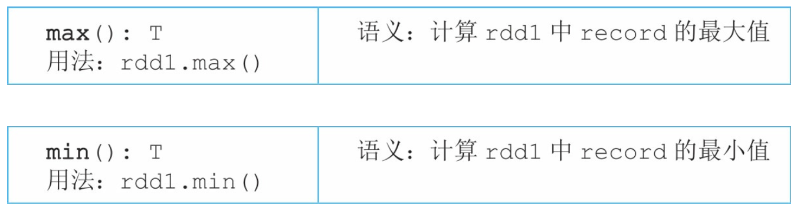

### (9) **isEmpty**()操作


isEmpty()操作：主要用来判断rdd中 是否包含 record。如果对rdd执行一些数据操作(如过滤、求交集等) 后，rdd为空的话，那么执行其他操作的结果肯定也为空，因此，提前判断rdd是否为空，可以避免提交冗余的 job


### (10) **lookup**()操作


- lookup() 首先过滤出给定 Key 的 record，然后使用 map() 得到相应的Value，最后使用collect() 将这些Value收集到Driver端形成list
- 如果rdd1的partitioner已经确定，如 HashPartitioner(3)，那么在过滤前，可以通过Hash(Key)直接确 需要操作的分区，这样可以减少操作的数据


### (11) **saveAsTextFile**()/saveAsObjectFile()/saveAsHadoopFile()/saveAsSequ操作


- saveAsTextFile()针对String类型的record，将record转化为&lt; NullWriter，Text&gt;类型，然后一条条输出，NullWriter的意思是空 写，也就是每条输出数据只包含类型为文本的Value
-  saveAsObjectFile()针对普通对象类型，将record进行序列化，并且以 每10个record为一组转化为SequenceFile&lt;NullWritable， Array[Object]&gt;格式，调用saveAsSequenceFile()写入HDFS中
- saveAsSequenceFile()针对&lt;K，V&gt;类型的record，将record进 行序列化后，以SequenceFile形式写入分布式文件系统中。这些操作都 是基于saveAsHadoopFile()实现的
- saveAsHadoopFile()连接 HDFS，进行必要的初始化和配置，然后把文件写入HDFS中

## 5、对比MapReduce，Spark的优缺点

从编程模 型角度来说，Spark的编程模型更具有通用性和易用性：

- 通用性：

    - MapReduce：基于函数式编程思想，将数据类型抽象为&lt;K，V&gt;格式，并将数据处理操作抽象为map()和 reduce()两个算子，这两个算子可以表达一大部分数据处理任务。因 此，MapReduce为这两个算子设计了固定的处理流程map—Shuffle— reduce。

        > map—Shuffle—reduce 模式只适用于表达类似foldByKey()、 reduceByKey()、aggregateByKey()的处理流程，
        >
        > 而像 cogroup()、join()、cartesian()、coalesce()的流程需要更灵活的表达方式

    - Spark 在两方面进行 了优化改进：

        - 一方面借鉴了 DryadLINQ/FlumeJava 的思想，将输入/输出、中间数据抽象表达为一个数据结构RDD，相当于在Java中定义了 class，然后可以根据不同类型的中间数据，生成不同的RDD(相当于 Java中生成不同类型的object)

            > 这样，数据结构不再拘泥于MapReduce中的&lt;K，V&gt;格式，而且中间数据变得可定义、可表示、可操作、可连接

        - 另一方面通过可定义的数据依赖关系来灵活连接中间数据，比如 ShuffleDependency、NarrowDependency(包含多种子依赖关系)，这样可以根据数据操作的计算逻辑灵活选择数据依赖关系来实现

            > 另外，Spark使用DAG图来组合数据处理操作，比固定的 map—Shuffle—reduce处理流程表达能力更强
            >
            > 在MapReduce中，数据依赖关系只有 ShuffleDependency

- 易用性：

    - 基于灵活的数据结构和依赖关系，Spark原生实现了很多常见的数据操作，如MapReduce中的map()、reduceByKey()， SQL中的filter()、groupByKey()、join()、sortByKey()，Pig Latin中的cogroup()，集合操作union()、intersection()，以及特 殊的zip()等。通过使用和组合这些操作，开发人员容易实现复杂的数据处理流程
    - 另外，由于数据结构RDD上的操作可以由Spark自动并 化，程序开发时更像在写普通程序，不用考虑这些操作到底是本地的还是由Spark分布执行的
    - 另外，使用RDD上的数据操作，开发人员更 容易将数据操作与普通程序的控制流进行结合。例如，在实现迭代程序 时，可以使用普通程序的while语句，而while循环内部可以使用RDD操 作

    > 在MapReduce中，实现迭代程序比较困难，需要不断手动提交job， 
    >
    > 而Spark提供了action()操作，job分割和提交都完全由Spark框架来进行，易用性得到了进一步提高

---

Spark存在两个缺点：

- 第一个，Spark中的操作都是单向操作，单向的意思是中间数据不可修改

    > 在普通Java程序中，在数据结构中存放的数据是可以直接被修改的，而Spark只能生成新的数据作为修改后的结果

- 第二个，Spark中的操作是粗粒度的，指RDD上的操作是面向分区的，即每个分区上的数据操作是相同的

    > 假设处理 partition1上的数据时需要partition2中的数据，并不能通过RDD的操作 访问到partition2的数据，只能通过添加聚合操作来将数据汇总在一起处理

当然，这两个缺点也是并行化设计权衡后的结果，即这两个缺点是并行化的优点，粗粒度可以方便并行执行，如一台机器处理一个分区，而单向操作有利于错误容忍

# 四、spark 物理执行计划

> 首先以一个典型的Spark应用为例，概览该应用对应的物理执行计划，然后讨论Spark物理执行计划生成方法，最后讨论常用数据操 作生成的物理执行计划

## 1、Spark物理执行计划概览

构建一个 ComplexApplication应用，该应用包含map()、partitionBy()、 union()和join()等多种数据操作

```scala
ComplexApplication应用的示例代码:

//构建一个 <K, V> 类型的 rdd1
val data1 = Array[(Int, Char)]((1,'a'),(2,'b'),3'c),(4,'d'),(5,'e'),(3,f),(2,'g'),(1,'h'))
val rdd1 = sc.parallelize(data1, 3)
//使用 HashPartitioner 对 rdd1 进行重新划分
var partitionRDD = rdd1.partitionBy(new HashPartitioner(3))

//构建一个 <K,V> 类型的 rdd2，并对 rdd2 中的 record 的 Value 进行复制
val data2 = Array[(Int,String)]((1,"A"),(2,"B"),(3,"C"),(4,"D"))
val rdd2 = sc.parallelize(data2, 2).map(x => (x._1, x._2 + "" + x._2))

//构建一个 <K,V> 类型的 rdd3
val data3 = Array[(Int,String)]((3,"X"),(5,"Y"),(3,"Z"),(4,"Y"))
val rdd3 = sc.parallelize(data3, 2)

//将 rdd2 和 rdd3 进行 union 操作
val unionRDD = rdd2.union(rdd3)
//将被重新划分过的 rdd1 与 unionRDD 进行 join 操作
val resultRDD = partitionRDD.join(unionRDD)
//输出 join 操作后的结果，包括每个 record 及其 index
resultRDD.foreach(println)
```

**核心问题：如何将逻辑处理流程转化为物理执行计划**

- **想法一**：将每个具体的数据操作作为一个执行阶段，即将前后关联的RDD组成一个执行阶段，下图中的每个箭头都生成一个执行任务

    对于2个RDD聚合成1个RDD的情况(图中的ShuffledRDD、UnionRDD、CoGroupedRDD)，将这3个RDD组成一 个stage。这样虽然可以解决任务划分问题，但存在多个性能问题：

    - 第一个性能问题：会产生很多个任务，图中有36个箭头，会生成36个任 务，当然可以对ShuffleDependency进行优化，将指向child RDD中同一个分区的箭头合并为一个task，使得一个task从parent RDD中的多个分区中获取数据，但是仍然会有多达21个任务
    - 第2个严重的性能问题：过多的任务不仅会增加调度压力，也需要存储大量的中间数据。一般来说，每个任务需要将执行结果存到磁盘或者内存中，这样方便下一个任务读取数据、进行计算。如果每个箭头都是计算任务的话，那么存储这些中间计算结果(RDD中的数据)需要大量的内存和磁 盘空间，效率较低

- **想法二**：减少任务数量，仔细观察逻辑处理流程图，会发现中间数据只是暂时有用，中间数据(RDD)产生以后，只用于下一步计算操作(图中的箭头)，而下一步计算操作完成后，中间数据可以被删除

    一个大胆的想法：将这些计算操作串联起来，只用一个执行阶段来执行这些串联的多个操作，使得上一步操作在内存中生成的数据被下一步操作处理完后能够及时回收，减少内存消耗


---

基于这个串联思想，接下来需要解决的两个问题分别是：

- 第一：每个RDD包含多个分区，而图中的RDD在每个分区的计算逻辑相同，可以独立计算，因此可以将每个分区上的操作串联为一个task，即最后的MapPartitionsRDD的每个分区分配一个task

- 第二：将串联的顺序调整为从后往前，从图中最后的MapPartitionsRDD开始向前串联，当遇到ShuffleDependency时，将该分区所依赖的上游数据(parent RDD)及操作都纳入一个task中

    > 仍然存在性能问题：当遇到 ShuffleDependency 时，task包含很多数据依赖和操作，导致划分出的 task 可能太大，而且会出现重复计算
    >
    > 例如，从rdd2到 UnionRDD所有的数据和操作都被纳入task0中，造成task0的计算量过大，而且其他task会重复处理这些数据，如使用虚线表示的task1仍然需 要计算rdd2=&gt;UnionRDD中的数据
    >
    > 当然可以在task0计算完后 缓存这些需要重复计算的数据，以便后续task的计算，但这样缓存会占 用存储空间，而且会使得task0与其他task不能同时并行计算，降低了并行度


---

- **想法三**：既然 ShuffleDependency 包含复杂的多对多的依赖关系，导致任务划分困难，为何不对该 ShuffleDependency 关系进行划分呢?如将 ShuffleDependency 前后的计算逻辑分开，形成不同的计算阶段和任务， 这样就不会出现 task 过大的情况

## 2、Spark物理执行计划生成方法

### (1) 执行步骤

Spark 具体采用3个步骤来生成物理执行计划：

- 首先，根据 action() 操作顺序将应用划分为作业(job)
- 然后，根据每个 job 的逻辑处理流程中的 ShuffleDependency 依赖关系，将 job 划分为执行阶段(stage)
- 最后，在每个stage中，根据最后生成的RDD的分区个数生成多个计算任务 (task)

#### (1) 根据 action() 操作顺序将应用划分为作业(job)

主要解决何时生成 job，以及如何生成 job 逻辑处理流程的问题

- 当应用程序出现 action() 操作时，表示应用会生成一个 job，该 job 的逻辑处理流程为从输入数据到 resultRDD 的逻辑处理流程
- 如果应用程序中有很多 action() 操作， 那么Spark会按照顺序为每个 action() 操作生成一个job，每个 job 的逻辑处理流程也都是从输入数据到最后action()操作

#### (2) 根据 ShuffleDependency 依赖关系将 job 划分为执行阶段 (stage)

对于每个job，从其最后的RDD往前回溯整个逻辑处理流程：

- 如果遇到 NarrowDependency，则将当前RDD的parent RDD纳入，并继续往前回溯
- 当遇到 ShuffleDependency 时，停止回溯，将当前已经纳入的所有 RDD按照其依赖关系建立一个执行阶段，命名为stage 

---

如图：

- 首先从 results 之前的 MapPartitionsRDD 开始向前回溯，回溯到 CoGroupedRDD 时，发现其包含两个parent RDD，其中一个是 UnionRDD。因为CoGroupedRDD与UnionRDD的依赖关系是 ShuffleDependency，对其进行划分
- 并继续从 CoGroupedRDD 的另一个 parent RDD回溯，回溯到ShuffledRDD时，同样发现了 ShuffleDependency，对其进行划分得到了一个执行阶段stage 2
- 接着从 stage 2之前的UnionRDD开始向前回溯，由于都是NarrowDependency， 将一直回溯到读取输入数据的RDD2和RDD3中，形成stage 1
- 最后，只 剩余RDD1成为一个stage 0


#### (3) 根据分区计算将各个 stage 划分为计算任务(task)

>  执行第2步后，可以发现整个job被划分成了大小适中、逻辑分明的执行阶段stage

接下来的问题：**如何生成计算任务**

**想法**：每个分区上的计算逻辑相同且独立，因此每个分区上的计算可以独立成为一个 task，根据每个 stage 中最后一个 RDD 的分区个数决定生成 task 的个数

- 如在图中 stage 2 的最后一个MapPartitionsRDD的分区个数为 3，那么stage 2就生成3个task。在stage 2中，每 个task负责 ShuffledRDD=&gt;CoGroupedRDD=&gt; MapPartitionsRDD=&gt;MapPartitionsRDD 中一个分区的计算
- 同样， 在stage 1中生成4个task，前2个task负责Data blocks=&gt;RDD2=&gt; MapPartitionsRDD=&gt;UnionRDD中2个分区的计算，后2个task负责 Data blocks=&gt;RDD3=&gt;UnionRDD中2个分区的计算
- 在stage 0 中，生成3个task，负责Data blocks=&gt;RDD1的计算

### (2) 相关问题

> 经过以上3个步骤，Spark 可以将一个应用的逻辑处理流程划分为多 个job，每个job又可以划分为多个stage，每个stage可以生成多个task， 而同一个阶段中的task可以同时分发到不同的机器并行执行

有3个执行方面的问题：

- 一个应用生成了多个job、 stage和task，如何确定它们的计算顺序?
- task内部如何存储和计算中间数据?
- 前后 stage 中的 task 间如何传递和计算数据?

#### (1) job、stage和task的计算顺序

**计算顺序从包含输入数据的stage开始，从前到后依次执行，仅当上游的stage都执行完成后，再执行下游的stage**

- job 提交时间与 action() 被调用时间有关，当应用程序执行到 rdd.action() 时，就会立即将 rdd.action() 形成的 job 提交给 Spark

- job 的逻辑处理流程实际上是一个 DAG 图，经过 stage 划分后，仍然是 DAG 图形状

- 每个 stage 的输入数据，要么是 job 的输入数据，要么是上游 stage 的输出结果

#### (2) task内部数据的存储与计算问题(流水线计算)

**“流水线”式计算的好处**：可以有效地减少内存使用空间，在task计算时只需要在内存中保留当前被处理的单个record即可，不需要保存其 他record或者已经被处理完的record

> 例如，在第1个pattern中，没有必要在执行 *f* (record1)之前将record2和record3提前算出来放入内存中


对于其他类型的操作，是否还可以采用“流水线”式计算呢?第2个 pattern中的 *g* ()函数、第3个pattern中的 *f* ()函数、第4个pattern中的 *f* ()和 *g* ()函数都需要一次性读取上游分区中所有的record来计算。 这样的函数主要出现在mapPartitions(func *f* )，zipPartitions(func *g* ) 等操作中。举个例子， *f* ()和 *g* ()函数可以是第3章中介绍的 mapPartitions(func)，具体代码如下，其中iter是读取上游分区中 record的迭代器

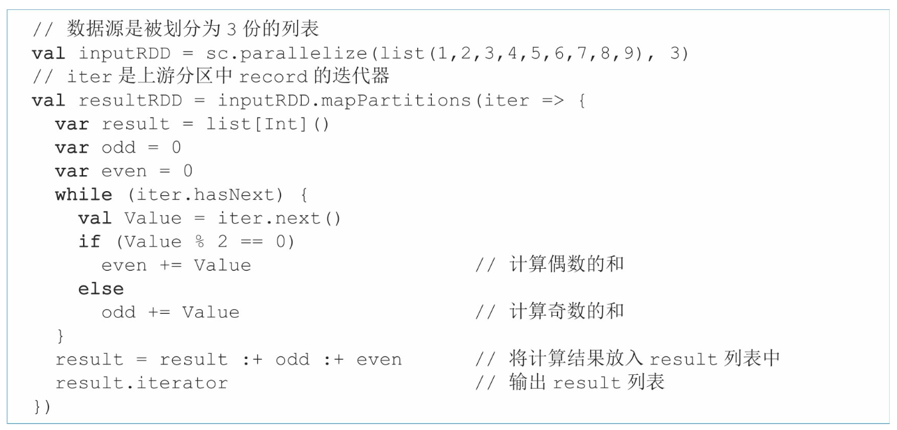

在第2个pattern中，由于 *f* ()函数仍然是一一映射的，所以仍然可 以采用“流水线”式计算，计算流程如下:

1、读取record1=&gt; *f* (record1)=&gt;record1 *′* =&gt; *g* (record1 *′* )=&gt;record1 *′* 进入 *g* ()函数中的iter.next()进行计算 =&gt; *g* ()函数将计算结果存入 *g* ()函数中的list。

2、读取record2=&gt; *f* (record2)=&gt;record2 *′* =&gt; *g* (record2 *′* )=&gt;record2 *′* 进入 *g* ()函数中的iter.next()进行计算 =&gt; *g* ()函数将计算结果存入 *g* ()函数中的list。

3、读取record3=&gt; *f* (record3)=&gt;record3 *′* =&gt; *g* (record3 *′* )=&gt;record3 *′* 进入 *g* ()函数中的iter.next()进行计算 =&gt; *g* ()函数将计算结果存入 *g* ()函数中的list。

4、*g* ()函数一条条输出list中的record

从计算流程可以看到， *f* ()函数每生成一条数据，都进入类似上 面mapPartitions()的例子 *g* ()函数的iter.next()中进行计算， *g* ()函数需要在内存中保存这些中间计算结果，并在输出时将中间结果 依次输出。当然，有些 *g* ()函数逻辑简单，不需要使用数据结构来保 存中间结果，如求record的max值，只需要保存当前最大的record即可。

在第3个pattern中，由于 *f* ()函数需要将[record1，record2， record3]都算出后才能计算得到[record1 *′* ，record2 *′* ，record3 *′* ]，因此 会先执行 *f* ()函数，完成后再计算 *g* ()函数。实际的执行过程:首 先执行 *f* ()函数算出[record1 *′* ，record2 *′* ，record3 *′* ]，然后使用 *g* ()函数依次计算 *g* (record1 *′* )=&gt;record1 *′′* ， *g* (record2 *′* ) =&gt;record2 *′′* ， *g* (record3 *′* )=&gt;record3 *′′* 。也就是说， *f* () 函数的输出结果需要保存在内存中，而 *g* ()函数计算完每个record *′* 并得到record *′′* 后，可以对record *′* 进行回收。

在第4个pattern中，计算顺序仍然是从前到后，但不能进行record 的“流水线”式计算。与第3个pattern类似， *f* ()函数需要一次性读取 [record1，record2，record3]后才能算出[record1 *′* ，record2 *′* ，record3 *′* ]，同样， *g* ()函数需要一次性读取[record1 *′* ，record2 *′* ，record3 *′* ] 且计算后才能输出[record1 *′′* ，record2 *′′* ，record3 *′′* ]。这两个函数只是 依次执行，“流水线”式计算退化到“计算-回收”模式:每执行完一个操 作，回收之前的中间计算结果。

总结:Spark采用“流水线”式计算来提高task的执行效率，减少内存

使用量。这也是Spark可以在有限内存中处理大规模数据的原因。然 而，对于某些需要聚合中间计算结果的操作，还是需要占用一定的内存 空间，也会在一定程度上影响流水线计算的效率。


#### (3) task间的数据传递与计算问题

不同stage之间的task如何传递数据进行计算。

回顾一 下，stage之间存在的依赖关系是 ShuffleDependency，而 ShuffleDependency是部分依赖的，也就是下游stage中的每个task需要从 parent RDD的每个分区中获取部分数据。

ShuffleDependency的数据划分 方法包括Hash划分、Range划分等，也就是要求上游stage预先将输出数 据进行划分，按照分区存放，分区个数与下游task的个数一致，这个过 程被称为“Shuffle Write”。

按照分区存放完成后，下游的task将属于自己分区的数据通过网络传输获取，然后将来自上游不同分区的数据聚合在 一起进行处理，这个过程被称为“Shuffle Read”。

总的来说，不同stage的 task之间通过Shuffle Write+Shuffle Read传递数据

### (3) **stage**和**task**命名方式

在MapReduce中，stage只包含两类：map stage和reduce stage

- map stage中包含多个执行map()函数的任务，被称为map task
- reduce stage中包含多个执行reduce()函数的任务，被称为reduce task

> 在 Spark中，stage可以有多个，有些 stage 既包含类似 reduce() 的聚合操作，又包含 map() 操作，所以一般不区分是map stage还是reduce stage，而直接使用stage *i* 来命名

对 stage 中的 task 使用不同的命名：

- ShuffleMapTasks：如果task的输出结果需要进行Shuffle Write，以便传输给下一个 stage
- ResultTasks：如果task的输出结果被 汇总到Driver端或者直接写入分布式文件系统

## 3、常用数据操作生成的物理执行计划

### (1) 基本概念回顾

数据依赖关系：

- 宽依赖(ShuffleDependency)和窄依赖(NarraowDependency)的区别是child RDD的各个分区中的数据是否完全依赖其parent RDD的一个或者多个分区
- 完全依赖指 parent RDD 中的一个分区不需要进行划分就可以流入 child RDD 的分区中
    - 如果是完全依赖，那么数据依赖关系是窄依赖
    - 如果是不完全依赖，即 parent RDD 的一个分区中的数据需要经过划分(如HashPartition或者 RangePartition)后才能流入child RDD的不同分区中，那么数据依赖关系是宽依赖

---

NarrowDependency和ShuffleDependency的stage划分原则：

- 对于NarrowDependency，parent RDD和child RDD的分区之间是完全依赖的，可以将parent RDD和child RDD直接合并为一 个stage。在合成的stage中(图4.12中为stage 0)，对于 OneToOneDependency，每个task读取parent RDD中的一个分区，并计算 child RDD中的一个分区
- 对于ManyToOneDependency或者 ManyToManyDependency，每个task读取parent RDD中多个分区，并计算出child RDD中的一个分区
- 对于ShuffleDependency，将parent RDD和child RDD进行划分，形成两个或多个stage，每个stage 产生多个task，stage之间通过Shuffle Write和Shuffle Read来传递数据


### (2) **OneToOneDependency**类型的操作


图中展示了 flatMap() 和 mapPartitionsWithIndex() 操作的 stage 和 task 划分图，这两个操作都生成了一个stage，stage中不同颜色的箭头表示不同的task。

每个task负责处理一个分区，进行流水线计算，且计算逻辑清晰。

这两个操作唯一不同的是：

- flatMap()每读入一条record就处理和输出一条
- mapPartitionsWithIndex()等到全部record都处理完后再输出record

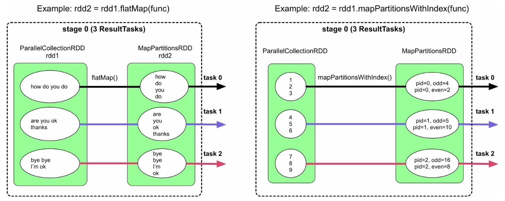

### (3) **RangeDependency**类型的操作

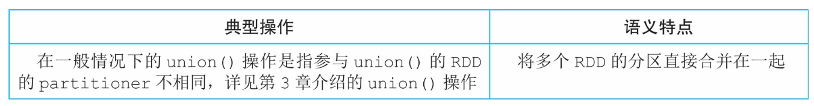

图中展示了在一般情况下union()操作的stage和task划分图，该操作将两个RDD合并为一个RDD，只生成了一个stage，stage中不同颜色的箭头表示不同的task，每个task负责处理一个分区


### (4) **ManyToOneDependency**类型的操作


如图所示，coalesce(shuffle=false)、特殊情况下的union()、zipPartitions() 操作对应的数据依赖关系都是ManyToOneDependency，child RDD中的每个分区需要从parent RDD 中获取所依赖的多个分区的全部数据。

由于ManyToOneDependency是窄依赖，所以Spark将parent RDD和child RDD组合为一个stage，该stage生成的task个数与最后的RDD的分区个数相等

> 与OneToOneDependency形 成的task相比，这里每个task需要同时在parent RDD中获取多个分区中的数据


### (5) **ManyToManyDependency**类型的操作


如图所示，cartesian()操作对应的数据依赖关系是ManyToManyDependency，child RDD中的每个分区需要从两个parent RDD中获取所依赖的分区的全部数据

Spark 将 parent RDD 和 child RDD 组合为一个stage，该stage生成的task个数与最后的 RDD的分区个数相等


### (6) 单一**ShuffleDependency**类型的操作


如图所示，aggregateByKey()和sortByKey()操作形成的是单一的ShuffleDependency数据依赖关系，也就是只与一个parent RDD形成ShuffleDependency。

根据划分原则，Spark将parent RDD和child RDD 分开，分别形成一个stage，每个stage中的task个数与该stage中最后一个 RDD中的分区个数相等。

为了进行跨stage的数据传递，上游stage中的task将输出数据进行Shuffle Write，child stage中的task 通过Shuffle Read 同时获取parent RDD中多个分区中的数据

> 与NarrowDependency不同， 这里从parent RDD的分区中获取的数据是划分后的部分数据


### (7) 多**ShuffleDependency**类型的操作


如图所示，join()操作在不同配置下会生成多种不同类型的数据依赖关系

- 图(d)中，由于rdd1、rdd2和CoGoupedRDD具有相同的partitioner，parent RDD和child RDD之间只存在窄依赖 ManyToOneDependency，因此只形成一个stage

- 图(b)、图(c)都同时包含OneToOneDependency和ShuffleDependency，根据 Spark的stage划分原则，只对ShuffleDependency进行划分，得到两个 stage，stage 1中的task既需要读取上游stage中的多个分区中的数据，也需要处理通过OneToOneDependency连接的RDD中的数据
- 图(a)最复杂，包含了多个ShuffleDependency，依据Spark的划分原则，需要对多个ShuffleDependency都进行划分，得到多个stage(这里划分出3个 stage)。下游stage需要等待上游stage完成后再执行，Shuffle Read获取 上游stage的输出数据


# 五、Shuffle 机制

## 1、 Shuffle的意义及设计挑战

**Shuffle机制**：上游和 游stage之间如何传递数据，即运行在不同stage、不同节点上的 task 间如何进行数据传递

**Shuffle解决的问题**：如何将数据重新组织，使其能够在上游和下游 task 之间进行传递和计算

---

Shuffle的设计和实现需要面对多个挑战：

- (1) **计算的多样性**：如何建立一个统一的Shuffle框架来支持这些操作呢?如何根据不同数据操作的特点，灵活地构建Shuffle Write/Read过程呢?如何确定聚合函数、数据分区、数据排序的执行顺序呢?

    Shuffle机制分为Shuffle Write和Shuffle Read两 个阶段，前者主要解决上游stage输出数据的分区问题，后者主要解决下游stage从上游stage获取数据、重新组织、并为后续操作提供数据的问题

    > 如图所示，在进行Shuffle Write/Read时，有些操作需要对数据进行一定的计算
    >
    > - groupByKey() 需要将 Shuffle Read的&lt;K，V&gt;record 聚合为&lt;K，list(V)&gt; record
    >
    >     > 第1个图中的&lt;K，CompactBuffer(V)&gt;， Spark 采用 CompactBuffer 来实现 list
    >
    > - reduceByKey() 需要在 Shuffle Write 端进行 combine()
    >
    > - sortByKey() 需要对Shuffle Read 的数据按照 Key 进行排序。那么，

- (2) **计算的耦合性**：对于Shuffle Read数据需要聚合的情况，具体在什么时候调用这些聚合函数呢?是先读取数据再进行聚合，还是边读取数据边进行聚合呢?

    > 如图所示，有些操作包含用户自定义聚合函数，如aggregateByKey (seqOp，combOp)中的seqOp和combOp，以及reduceByKey(func)中的func，这些函数的计算过程和数据的Shuffle Write/Read过程耦合在一起
    >
    > 例如，aggregateByKey(seqOp， combOp)在Shuffle Write数据时需要调用seqOp来进行combine()，在 Shuffle Read数据时需要调用combOp来对数据进行聚合

- (3) **中间数据存储问题**：在Shuffle机制中需要对数据进行重新组织(分区、聚合、排序等)，也需要进行一些计算(执行聚合函数)， 那么在Shuffle Write/Read过程中的中间数据如何表示?如何组织?如何 存放?如果Shuffle的数据量太大，那么内存无法存下怎么办?


## 2、Shuffle的设计思想

> 为了方便讨论，在单个ShuffleDependency情况下，我们将上游的 stage称为map stage，将下游stage称为reduce stage。相应地，map stage包 含多个map task，reduce stage包含多个reduce task

### (1) 解决数据分区和数据聚合问题

- **数据分区问题**：针对Shuffle Write阶段，如何对 map task 输出结果进行分区，使得 reduce task 可以通过网络获取相应的数据?

    > 该问题包含两个子问题：
    >
    > - 第1个问题：**如何确定分区个数**?
    >
    >     > 分区个数与下游 stage 的 task 个数一致
    >     >
    >     > ---
    >     >
    >     > 分区个数可以由用户自定义，如groupByKey(numPartitions)中的 numPartitions一般被定义为集群中可用CPU个数的1~2倍，即将每个 map task的输出数据划分为 numPartitions 份，相应地，在 reduce stage 中启动 numPartitions 个 task 来获取并处理这些数据
    >     >
    >     > 如果用户没有定义，则默认分区个数是parent RDD的分区个数的最大值
    >     >
    >     > 如左图所示，没有定义join(numPartitions)中的分区个数numPartitions下，取两个parent RDD的分区的最大值为2
    >     >
    >     > 
    >
    > - 第2个问题：**如何对 map task 输出数据进行分区**?
    >
    >     > 解决方法：对 map task 输出的每一个&lt;K， V&gt;record，根据Key计算其partitionId，具有不同partitionId的record 被输出到不同的分区(文件)中
    >     >
    >     > 如上右图所示，下游 stage中只有两个task，分区个数为2。map task需要将其输出数据分为两份，方法是让map()操作计算每个输出record的partitionId=Hash(Key)%2，根据partitionId将record直接输出到不同分区中
    >     >
    >     > 备注：这种方法非常简单，容易 实现，但不支持Shuffle Write端的combine()操作

- **数据聚合问题**：针对 Shuffle Read 阶段，即如何获取上游不同 task 的输出数据并按照 Key 进行聚合?

    > 如 groupByKey() 中需要将不同 task 获取到的 &lt;K，V&gt;record 聚合为&lt;K，list(V) &gt;(实现时为&lt;K，CompactBuffer(V)&gt;)， reduceByKey()将&lt;K，V&gt;record聚合为&lt;K， func(list(V))&gt; 
    >
    > ---
    >
    > **数据聚合问题解决方案**：
    >
    > - 数据聚合的本质：将相同Key的record放在一起，并进行必要的计算，可以利用 HashMap 实现
    > - 方法：**使用两步聚合(two-phase aggregation)**
    >     - 先将不同 tasks 获取到的 &lt;K，V&gt;record 存放到HashMap中，HashMap中的Key是K，Value是list(V)
    >     - 然后，对于 HashMap 中每一个 &lt;K， list(V)&gt;record，使用 func 计算得到&lt;K，func(list(V)) &gt;record
    >
    > 如上右图所示，join()在Shuffle Read阶段将来自不同 task 的数据以 HashMap 方式聚合在一起，由于join()没有聚合函数， 将record 按 Key 聚合后直接执行下一步操作，使用 cartesian() 计算笛卡儿积
    >
    > 而对于reduceByKey(func)来说，需要进一步使用func()对相同Key的record进行聚合。如下左图所示，两步聚合的第1步是将 record存放到HashMap中，第2步是使用func()(此处是sum())函 数对list(V)进行计算，得到最终结果
    >
    > 
    >
    > **两步聚合方案的优点**：可以解决数据聚合问题，逻辑清晰、容易实现
    >
    > **缺点**：所有 Shuffle 的 record 都会先被存放在HashMap中，占用内存空间较大。另外，对于包含聚合函数的操作，如 reduceByKey(func)，需要先将数据聚合到HashMap中以后再执行 func()聚合函数，效率较低
    >
    > **优化方案**：对于reduceByKey(func)等包含聚合函数的操作来说，可以采用一种在线聚合(Online aggregation)的方法来减少内 存空间占用。如右图所示，该方案在每个record加入HashMap 时，同时进行func()聚合操作，并更新相应的聚合结果
    >
    > 具体地，对于每一个新来的&lt;K，V&gt;record：
    >
    > - 首先，从HashMap中get出已经存在的结果V *′* =HashMap.get(K)
    > - 然后，执行聚合函数得到新的中间结果 V *′′* =func(V，V *′* )
    > - 最后，将V *′′* 写入HashMap中，即 HashMap.put(K，V *′′* )。
    >
    > 对于不包含聚合函数的操作，如groupByKey()等，在线聚合和两步聚合没有差别，因为这些操作不包含聚合函数，无法减少中间数据规模

### (2) 解决 map() 端 combine 问题

**考虑如何支持 Shuffle Write 端的 combine 功能**：

- **需要进行 combine 操作**：进行 combine 操作的目的是减少 Shuffle 的数据量

- - 只有包含聚合函数的数据操作需要进行 map() 端的 combine，具体包括reduceByKey()、foldByKey()、 aggregateByKey()、combineByKey()、distinct()等
    - 对于不包含聚合函数的操作，即使进行combine操作， 也不能减少中间数据的规模，如 groupByKey()

- **combine 解决方案**：采用Shuffle Read端基于HashMap的解决方案

    - 首先利用HashMap进行combine
    - 然后对HashMap中每一个record进行分区， 输出到对应的分区文件中

    > - combine和Shuffle Read端的聚合过程没有区别，都是将&lt;K，V&gt;record聚合成&lt;K， func(list(V))>
    > - 不同点：Shuffle Read 端聚合的是来自所有 map task 输出的数据，而combine聚合的是来自单一task输出的数据

### (3) 解决 sort 问题

考虑如何支持数据排序功能：

- (1) **在哪里执行sort?**

    - 首先，**在Shuffle Read端必须执行sort**，因为从每个task获取的数据组合起来以后不是全局按Key进行排序的

    - 其次，理论上，在Shuffle Write端不需要排序，但如果进行了排序，那么Shuffle Read获取到(来 自不同task)的数据是已经部分有序的数据，可以减少Shuffle Read端排 序的复杂度

- (2) **何时进行排序，即如何确定排序和聚合的顺序?**

    > Spark选择的是第3种方案，设计了特殊的HashMap来高效完 成先聚合再排序的任务

    - **第1种方案：先排序再聚合**，先使用线性数据结构如 Array，存储Shuffle Read的&lt;K，V&gt;record，然后对Key进行排序，排序后的数据可以直接从前到后进行扫描聚合，不需要再使用HashMap进行hash-based聚合

        > 这种方案也是Hadoop MapReduce采用的方案
        >
        > 方案优点：既可以满足排序要求又可以满足聚合要求
        >
        > 缺点：需要较大内存空间来存储线性数据结构，同时排序和聚合过程不能同时进行，即不能使用在线聚合，效率较低

    - **第2种方案：排序和聚合同时进行**，可以使用带有排序功能的 Map，如TreeMap来对中间数据进行聚合，每次Shuffle Read获取到一个 record，就将其放入TreeMap中与现有的record进行聚合，过程与 HashMap类似，只是TreeMap自带排序功能

        > 方案优点：排序和聚合可以同时进行
        >
        > 缺点：相比HashMap，TreeMap的排序复杂度较高，TreeMap的插入时间复杂度是 *O* ( *n* log *n* )，而且需要不断调整树的结构，不适合数据规模非常大的情况

    - **第3种方案：先聚合再排序**，即维持现有基于 HashMap 的聚合方案 不变，将 HashMap 中的 record 或 record 的引用放入线性数据结构中进行排序

        > 方案优点：聚合和排序过程独立，灵活性较高，而且之前的在线聚合方案不需要改动
        >
        > 缺点：需要复制(copy)数据或引用，空间占用较大

### (4) 解决内存不足问题

解决方案：**使用内存+磁盘混合存储方案** 

- 先在内存(如 HashMap)中进行数据聚合，如果内存空间不足，则将内存中的数据 spill 到磁盘上，此时空闲出来的内存可以继续处理新的数据。此过程可以不断重复，直到数据处理完成

- 然而，问题是spill到磁盘上的数据实 际上是部分聚合的结果，并没有和后续的数据进行过聚合。因此，为了 得到完整的聚合结果，需要在进行下一步数据操作之前对磁盘上和 内存中的数据进行再次聚合，这个过程我们称为“全局聚合”

    > 为了加速 全局聚合，我们需要将数据spill到磁盘上时进行排序，这样全局聚合才 能够按顺序读取spill到磁盘上的数据，并减少磁盘I/O

## 3、Spark中Shuffle框架的设计

在Shuffle机制中Spark典型数据操作的计算需求：


> 在Shuffle Write端，目前只支持combine功 能，并不支持按Key排序功能

### (1) Shuffle Write 框架设计和实现

> 在 Shuffle Write 阶段，数据操作需要**分区、聚合、排序**3个功能，但每个数据操作实际只需要其中的一个或两个功能

Spark 为了支持所有的情况，设计了一个通用的Shuffle Write框架，**框架的计算顺序为“map()输出→数据聚合→排序→分区”输出**


如图所示：

> 聚合 (aggregate，即combine)和排序(sort)过程可选，如果数据操作不需要聚合或排序，那么可以去掉相应的聚合或排序过程

- map task 每计算出一个 record 及其 partitionId，就将 record 放入类似 HashMap 的数据结构中进行聚合

- 聚合完成后，再将 HashMap中的数据放入类似 Array 的数据结构中进行排序，既可按照 partitionId，也可以按照 partitionId+Key 进行排序
- 最后根据 partitionId 将数据写入不同的数据分区中，存放到本地磁盘上。其中

---

在实现过程中，Spark 对不同的情况进行分类，以及针对性的优化调整，形成了不同的 Shuffle Write 方式：

- (1) **不需要 map() 端聚合(combine)和排序**

    > 只需要实现分区功能
    >
    > ---
    >
    > 如图所示，map() 依次输出&lt;K，V&gt;record，并计算其partitionId(PID)，Spark根据 partitionId，将record依次输出到不同的buffer中，每当buffer填满就将 record 溢写到磁盘上的分区文件中
    >
    > 分配buffer的原因是map()输出 record的速度很快，需要进行缓冲来减少磁盘I/O
    >
    > ---
    >
    > 在实现中，Spark将这种Shuffle Write方式称为**BypassMergeSortShuffleWriter**，即不需要进行排序的Shuffle Write方式
    >
    > 
    >
    > **优点**：速度快，直接将 record 输出到不同的分区文件中
    >
    > **缺点**：资源消耗过高，每个分区都需要一个buffer(大小由 spark.Shuffle.file.buffer控制，默认为32KB)，且同时需要建立多个分区文件进行溢写，该Shuffle方案适合分区个数较少的情况(&lt;200)
    >
    > ---
    >
    > 该模式适用的操作类型：map()端不需要聚合(combine)、Key 不需要排序且分区个数较少(&lt; =spark.Shuffle.sort.bypassMergeThreshold，默认值为200)，如：groupByKey(100)，partitionBy(100)，sortByKey(100)

- (2) **不需要map()端聚合(combine)，但需要排序**

    > 在这种情况下需要按照 partitionId+Key 进行排序
    >
    > ---
    >
    > Spark 实现方法：建立一个Array(图中的 PartitionedPairBuffer)来存放map()输出的record，并对Array中元素 的Key进行精心设计，将每个&lt;K，V&gt;record转化为&lt; (PID，K)，V&gt;record存储；然后按照partitionId+Key对record进行排序；最后将所有record写入一个文件中，通过建立索引来标示每个分区
    >
    > - 如果Array存放不下，则会先扩容，如果还存放不下，就将Array中 的record排序后spill到磁盘上，等待map()输出完以后，再将Array中 的record与磁盘上已排序的record进行全局排序，得到最终有序的 record，并写入文件中
    > - 该Shuffle模式被命名为**SortShuffleWriter(KeyOrdering=true)**，使用的 Array 被命名为 PartitionedPairBuffer
    >
    > 
    >
    > **优点**：只需要一个 Array 结构就可以支持按照 partitionId+Key 进行排序，Array大小可控，而且具有扩容和spill到磁盘上的功能，支持从小规模到大规模数据的排序，同时输出的数据已经按照partitionId进行排序，因此只需要一个分区文件存储，即可标 示不同的分区数据，克服了BypassMergeSortShuffleWriter中建立文件数过多的问题，适用于分区个数很大的情况
    >
    > **缺点**：排序增加计算时延
    >
    > ---
    >
    > 该 Shuffle 模式适用的操作：map() 端不需要聚合(combine)、 Key需要排序、分区个数无限制

- (3) **需要map()端聚合(combine)，需要或者不需要按 Key 进行排序**

    > 在这种情况下，需要实现按Key进行聚合(combine)的功能
    >
    > ---
    >
    > **Spark 实现方法**：建立一个类似 HashMap 的数据结构对 map() 输出的 record 进行聚合
    >
    > - HashMap 中的 Key 是“partitionId+Key”，HashMap 中的 Value 是经过相同 combine 的聚合结果
    >
    > - 聚合完成后，Spark对HashMap中的 record进行排序。如果不需要按 Key 进行排序，那么只按partitionId进行排序
    > - 如果需要按Key进行排序，那么按 partitionId+Key 进行排序
    > - 最后，将排序后的record写入一个分区文件中
    >
    > 如果HashMap存放不下，则会先扩容为两倍大小，如果还存放不下，就将HashMap中的record排序后spill到磁盘上
    >
    > 当map()输出完成后，将此时HashMap中的reocrd与磁盘上已排序的record进行再次聚合(merge)，得到最终的record，输出到分区文件中
    >
    > 
    >
    > **优点**：只需要一个 HashMap 结构就可以支持 map() 端的 combine 功能，HashMap具有扩容和 spill 到磁盘上的功能，支持小规模到大规模数据的聚合，也适用于分区个数很大的情况。 在聚合后使用Array排序，可以灵活支持不同的排序需求
    >
    > **缺点**：在内存中进行聚合，内存消耗较大，需要额外的数组进行排序，而且如果有数据spill到磁盘上，还需要再次进行聚合
    >
    > 在实现中，Spark在Shuffle Write端使用 PartitionedAppendOnlyMap，可以同时支持聚合和排序操作，相当于HashMap和Array的合体
    >
    > 该Shuffle模式适用的操作：适合map()端聚合(combine)、需要 或者不需要按Key进行排序、分区个数无限制的应用，如 reduceByKey()、aggregateByKey()等，称为 **sort-based Shuffle Write** 

### (2) Shuffle Read 框架设计和实现

在 Shuffle Read 阶段，数据操作需要3个功能：**跨节点数据获取、聚合、排序** 

Spark 为了支持所有的情况，设计了一个通用的Shuffle Read框架，框架的计算顺序为“**数据获取→聚合→排序**”输出

- reduce task 不断从各个map task的分区文件中获取数 据(Fetch records)
- 然后使用类似 HashMap 的结构来对数据进行聚合 (aggregate)，该过程是边获取数据边聚合
- 聚合完成后，将 HashMap 中的数据放入类似Array的数据结构中按照Key进行排序(sort by Key)
- 最后将排序结果输出或者传递给下一个操作


- (1) **不需要聚合，不需要按Key进行排序**

    > 这种情况最简单，只需要实现数据获取功能即可。如图6.9所示， 等待所有的map task结束后，reduce task开始不断从各个map task获取 &lt;K，V&gt;record，并将record输出到一个buffer中(大小为 spark.reducer.maxSizeInFlight=48MB)，下一个操作直接从buffer中获取 数据即可
    >
    > 
    >
    > 该Shuffle模式的优缺点:优点是逻辑和实现简单，内存消耗很小。
    >
    > 缺点是不支持聚合、排序等复杂功能。
    >
    > 该Shuffle模式适用的操作:适合既不需要聚合也不需要排序的应用，如partitionBy()等

- (2)不需要聚合，需要按Key进行排序

    > 在这种情况下，需要实现数据获取和按Key排序的功能。如图6.10 所示，获取数据后，将buffer中的record依次输出到一个Array结构 (PartitionedPairBuffer)中。由于这里采用了本来用于Shuffle Write端的 PartitionedPairBuffer结构，所以还保留了每个record的partitionId。然 后，对Array中的record按照Key进行排序，并将排序结果输出或者传递 给下一步操作。
    >
    > 当内存无法存下所有的record时，PartitionedPairBuffer将record排序 后spill到磁盘上，最后将内存中和磁盘上的record进行全局排序，得到 最终排序后的record。
    >
    > 
    >
    > 该Shuffle模式的优缺点:优点是只需要一个Array结构就可以支持 按照Key进行排序，Array大小可控，而且具有扩容和spill到磁盘上的功 能，不受数据规模限制。缺点是排序增加计算时延。
    >
    > 该Shuffle模式适用的操作:适合reduce端不需要聚合，但需要按 Key进行排序的操作，如sortByKey()、sortBy()等。

- (3)需要聚合，不需要或需要按Key进行排序

    > 在这种情况下，需要实现按照Key进行聚合，根据需要按Key进行 排序的功能。如图6.11的上图所示，获取record后，Spark建立一个类似 HashMap的数据结构(ExternalAppendOnlyMap)对buffer中的record进 行聚合，HashMap中的Key是record中的Key，HashMap中的Value是经过 相同聚合函数(func())计算后的结果。在图6.11中，聚合函数是 sum()函数，那么Value中存放的是多个record对应Value相加后的结 果。之后，如果需要按照Key进行排序，如图6.11的下图所示，则建立 一个Array结构，读取HashMap中的record，并对record按Key进行排序， 排序完成后，将结果输出或者传递给下一步操作
    >
    > 
    >
    > 如果HashMap存放不下，则会先扩容为两倍大小，如果还存放不 下，就将HashMap中的record排序后spill到磁盘上。此时，HashMap被清 空，可以继续对buffer中的record进行聚合。如果内存再次不够用，那么 继续spill到磁盘上，此过程可以重复多次。当聚合完成以后，将此时 HashMap中的reocrd与磁盘上已排序的record进行再次聚合，得到最终的 record，输出到分区文件中。
    >
    > 该Shuffle模式的优缺点:优点是只需要一个HashMap和一个Array结 构就可以支持reduce端的聚合和排序功能，HashMap 具有扩容和spill到 磁盘上的功能，支持小规模到大规模数据的聚合。边获取数据边聚合， 效率较高。缺点是需要在内存中进行聚合，内存消耗较大，如果有数据 spill到磁盘上，还需要进行再次聚合。另外，经过HashMap聚合后的数
    >
    > 据仍然需要拷贝到Array中进行排序，内存消耗较大。在实现中，Spark 使用的HashMap是一个经过特殊优化的HashMap，命名为 ExternalAppendOnlyMap，可以同时支持聚合和排序操作，相当于 HashMap和Array的合体，其实现细节将在6.4节中介绍。
    >
    > 该Shuffle模式适用的操作:适合reduce端需要聚合、不需要或需要 按Key进行排序的操作，如reduceByKey()、aggregateByKey()等

Shuffle Read框架需要执行的3个步骤是“数据获取→聚合→排序输 出”。如果应用中的数据操作不需要聚合，也不需要排序，那么获取数 据后直接输出。对于需要按Key进行排序的操作，Spark 使用基于Array 的方法来对Key进行排序。对于需要聚合的操作，Spark提供了基于 HashMap的聚合方法，同时可以再次使用Array来支持按照Key进行排 序。总体来讲，Shuffle Read框架使用的技术和数据结构与Shuffle Write 过程类似，而且由于不需要分区，过程比Shuffle Write更为简单。当 然，还有一些可优化的地方，如聚合和排序如何进行统一来减少内存 copy和磁盘I/O等，这部分内容将在6.4节中介绍。

## 4、支持高效聚合和排序的数据结构


## 5、与Hadoop MapReduce的Shuffle机制对比


# ===

# 二、spark 使用

## 1、spark 相关概念

### (1) spark 应用与 SparkSession

> 所有 Spark 应用的核心都是 Spark 驱动器程序，其负责创建 SparkSession对象
>
> 特殊情况：当使用 Spark shell 时，驱动器是 shell 的一部分，SparkSession 对象（可通过变量 spark 进行访问）自动创建

在 Spark 分布式架构中，Spark 组件通过 Spark 驱动器通信：


### (2) Spark 作业

在用 Spark shell 进行的交互式会话中：

- 驱动器会将 Spark 应用转为一个或多个 Spark 作业，然后驱动器会将每个作业转为一个 DAG
- 这个DAG 本质上就是 Spark 的执行计划，其中每个节点可能是一个或多个 Spark 执行阶段


### (3) Spark 执行阶段

> Spark 执行阶段可以作为 DAG 节点

- Spark 会根据操作能否并行执行或必须串行执行来创建执行阶段

    > 不是所有的 Spark 操作都只对应一个执行阶段，有些操作会分为多个执行阶段

- 执行阶段的划分处通常被认为是算子的计算边界，执行阶段间会触发 Spark 执行器间的数据传输


### (4) Spark 任务

- 执行阶段是由 Spark 任务（执行的一个单位）组成，这些任务由 Spark 的各个执行器一起执行

- 每个任务对应一个处理器核心，并处理一个数据分区，即有 16 个处理器核心的执行器可以同时执行 16 个任务，而且可以并行处理 16 个数据分区，从而让 Spark 的任务执行高度并行化


> Spark 执行阶段创建一个或多个任务，以分发到执行器上

## 2、转化、行动操作及惰性求值

### (1) 简介

Spark 对分布式数据的操作可以分为两种类型：转化操作和行动操作

- **转化操作**：将 Spark DataFrame 转化为新的 DataFrame，而不改变原有数据的操作，这赋予了 DataFrame 不可变的属性

    > 比如：像 select() 或 filter() 这样的操作不会改变原有的 DataFrame，这些操作只会将转化结果作为新的 DataFrame 返回
    >
    > ---
    >
    > 所有转化操作都是惰性求值：
    >
    > - 具体结果不会立即计算出来，Spark 只是将具体的转化关系作为血缘（lineage）记录下来
    > - 记录下来的血缘允许 Spark 在后续生成执行计划时重新安排要做的转化操作，比如：合并多个转化操作，或者优化为不同的执行阶段来提高执行效率
    >
    > 惰性求值是 Spark 的策略，目的是直到调用行动操作或“碰”到数据（从硬盘上读取或向硬盘写入）时才真正执行

- **行动操作**：会触发所记录下来的所有转化操作的实际求值，调用行动操作前，查询计划完全不会执行

    > 如图：在调用行动操作 A 前，所有的转化操作 T 都只是被记录下来，而每个转化操作 T 都会生成一个新的 DataFrame


**优点**：惰性求值允许 Spark 通过综合分析整个转化操作链来优化查询，而血缘和数据不可变的性质则让 Spark 具有容错性

> 因为 Spark 在血缘中记录了所有的转化操作，而 DataFrame 在转化操作间是不可变的，所以 Spark 可以通过重放记录下来的血缘来重新构建出 DataFrame，这样 Spark 便能够在失败时依然有机会恢复

### (2) 窄转化与宽转化

**惰性求值如何优化计算步骤**：包括将一些操作连起来放在一个执行阶段中进行管道化执行，或者根据是否需要跨集群节点进行数据交换或混洗，将操作分为多个执行阶段来执行

根据依赖关系属于窄依赖还是宽依赖，转化操作可以分为两类：

- **窄转化**：输出中的单个数据分区是由单个输入分区计算得来，比如：filter() 和 contains() 属于窄转化，因为在每个数据分区上的操作是独立的，生成输出的数据分区时不需要跨分区交换任何数据

- **宽转化**：要从其他分区读取数据并进行整合，可能要写入硬盘，比如：groupBy() 和 orderBy() 

    > 因为每个分区对于存在单词“Spark”的行都有计数的值，所以求总计数（调用 groupBy()）会要求从每个执行器上将来自各个分区的数据跨集群混洗，而 orderBy() 需要来自其他分区的输出数据来完成最终的聚合


# 三、Spark 的结构化数据 API

## 1、RDD 的背后

RDD 是 Spark 最基本的抽象。RDD 关联着三个至关重要的属性：

- **依赖关系**：告诉 Spark 如何从必要的输入构建 RDD，需要重算时，Spark 可以根据这些依赖关系重新执行操作，以此重建出 RDD

    > 这一属性赋予了 RDD 容错的弹性

- **分区(包括一些位置信息)**：允许 Spark 将工作以分区为单位，分配到多个执行器上进行并行计算

    > 在某些情况下，比如从 HDFS 读取数据时，Spark 会使用位置信息，将工作发给靠近数据的执行器，减少跨网络传输的数据

- **计算函数**：Partition => Iterator[T]，可用于生成 RDD 所表示数据的Iterator[T] 对象

---

问题：

- RDD 的计算函数对 Spark 不透明；
- 数据类型 Iterator[T] 对 Python RDD 也不透明，Spark 只能知道它是一个 Python 对象；
- 由于不能掌握函数中的计算或表达式，因此 Spark 无法对表达式进行优化；
- 因为 Spark 无法获知相关信息，当在对象内访问一个具体类型的列时，Spark 只能将这个不透明的对象序列化成字节序列，而无法使用任何数据压缩技术

## 2、Spark 支持结构化数据

Spark 引入了用于支持结构化数据的方案：

- 其中之一是使用数据分析中的常见模式来表达计算

    - 通过在 DSL 中使用一组通用算子，可以进一步减少计算表达的特异性

    - 这些算子能够告诉 Spark 希望计算出什么样的数据，Spark 能够以此为依据为实际执行构建出高效的查询计划

- 另一个方案：允许将数据以表格型的格式组织起来，就像 SQL 中的表或电子表格那样

---

**关键优点与好处**：

结构化可以带来一系列好处，包括在 Spark 组件间获得更好的性能和更优的空间效率

- **表达能力强**
- **简洁**
- **易组合**
- **风格一致** 

## 3、DataFrame API

### (1) Spark 的基本数据类型

**数字类型**

- `ByteType`：代表一个字节的整数，范围是-128到127

- `ShortType`：代表两个字节的整数，范围是-32768到32767

- `IntegerType`：代表4个字节的整数，范围是-2147483648到2147483647

- `LongType`：代表8个字节的整数，范围是-9223372036854775808到9223372036854775807

- `FloatType`：代表4字节的单精度浮点数

- `DoubleType`：代表8字节的双精度浮点数

- `DecimalType`：代表任意精度的10进制数据，通过内部的java.math.BigDecimal支持

    > BigDecimal 由一个任意精度的整型非标度值和一个32位整数组成

- `StringType`：代表一个字符串值

- `BinaryType`：代表一个 byte 序列值

- `BooleanType`：代表 boolean 值

- `Datetime` 类型：

    - `TimestampType`：代表包含字段年，月，日，时，分，秒的值
    - `DateType`：代表包含字段年，月，日的值

---

**复杂类型**

- `ArrayType(elementType, containsNull)`：代表由 elementType 类型元素组成的序列值

    > containsNull 用来指明 ArrayType 中的值是否有 null 值

- `MapType(keyType, valueType, valueContainsNull)`：表示包括一组键 - 值对的值，通过 keyType 表示 key 数据的类型，通过valueType 表示 value 数据的类型。

    > valueContainsNull 用来指明 MapType 中的值是否有 null 值

- `StructType(fields)`：表示一个拥有 StructFields (fields) 序列结构的值

- `StructField(name, dataType, nullable)`：代表 StructType 中的一个字段，字段的名字通过 name 指定，dataType 指定 field 的数据类型

    > nullable 表示字段的值是否有 null 值

### (2) 表结构与 DataFrame

相较于在读取数据时确定表结构，提前定义表结构有如下三个优点：

- 可以避免 Spark 推断数据类型的额外开销

- 可以防止 Spark 为决定表结构而单独创建一个作业来从数据文件读取很大一部分内容

    > 因为对于较大的数据文件而言，这个过程可能相当耗时

- 如果数据与表结构不匹配，则可以尽早发现错误

建议：从数据源读取大文件时，应该总是提前定义好表结构

---

**定义表结构的两种方式**：

- **编程方式**：可以使用 Spark 的 DataFrame API 以编程的方式为 DataFrame 定义表结构

    ```scala
    import org.apache.spark.sql.types._
    val schema = StructType(Array(StructField("author", StringType, false),
      								StructField("title", StringType, false),
      								StructField("pages", IntegerType, false)))
    ```

- **数据定义语言(DDL)**：

    ```scala
    val schema = "author STRING, title STRING, pages INT"
    ```

### (3) 列与表达式

**DataFrame 中的具名列**：描述的是一种字段

- 既可以列出所有列的名字，也可以使用关系型或计算型的表达式对相应列的值进行操作

    > 在 Spark 所支持的编程语言中，列是具有公有方法的对象（以Column 类表示）

- 也可以对列使用逻辑表达式或数学表达式

    > 比如：可以用 expr("columnName * 5") 或 (expr("columnName - 5") > col(anothercolumnName)) 创建一个简单的表达式

---

**col 和 Column 的区别**：Column 是列对象的类名，而 col() 是标准的内建函数，返回一个 Column 对象

```scala
// Scala 代码示例
scala> import org.apache.spark.sql.functions._
scala> blogsDF.columns
res2: Array[String] = Array(Campaigns, First, Hits, Id, Last, Published, Url)

// 用col访问特定的一列，返回Column类型的对象
scala> blogsDF.col("Id")
res3: org.apache.spark.sql.Column = id

// 使用表达式计算结果
scala> blogsDF.select(expr("Hits * 2")).show(2)
// 也可以用col计算结果
scala> blogsDF.select(col("Hits") * 2).show(2)

+----------+
|(Hits * 2)|
+----------+
|      9070|
|     17816|
+----------+

// 用表达式找出点击量较高的博客
// 这给DataFrame添加了新列Big Hitters，来自条件表达式
blogsDF.withColumn("Big Hitters", (expr("Hits > 10000"))).show()

+---+---------+-------+---+---------+-----+--------------------+-----------+
| Id|    First|   Last|Url|Published| Hits|           Campaigns|Big Hitters|
+---+---------+-------+---+---------+-----+--------------------+-----------+
|  1|    Jules|  Damji|...| 1/4/2016| 4535| [twitter, LinkedIn]|      false|
|  2|   Brooke|  Wenig|...| 5/5/2018| 8908| [twitter, LinkedIn]|      false|
|  3|    Denny|    Lee|...| 6/7/2019| 7659|[web, twitter, FB...|      false|
|  4|Tathagata|    Das|...|5/12/2018|10568|       [twitter, FB]|       true|
|  5|    Matei|Zaharia|...|5/14/2014|40578|[web, twitter, FB...|       true|
|  6|  Reynold|    Xin|...| 3/2/2015|25568| [twitter, LinkedIn]|       true|
+---+---------+-------+---+---------+-----+--------------------+-----------+

// 将三列拼接起来，组建新列，并展示
// 拼接出来的列
blogsDF
    .withColumn("AuthorsId", (concat(expr("First"), expr("Last"), expr("Id"))))
    .select(col("AuthorsId"))
    .show(4)

+-------------+
|    AuthorsId|
+-------------+
|  JulesDamji1|
| BrookeWenig2|
|    DennyLee3|
|TathagataDas4|
+-------------+

// 这些语句会返回同样的结果
// 因为expr和col方法调用相同
blogsDF.select(expr("Hits")).show(2)
blogsDF.select(col("Hits")).show(2)
blogsDF.select("Hits").show(2)

+-----+
| Hits|
+-----+
| 4535|
| 8908|
+-----+

// 按照"Id"列降序排列
blogsDF.sort(col("Id").desc).show()
blogsDF.sort($"Id".desc).show()

+--------------------+---------+-----+---+-------+---------+-----------------+
|           Campaigns|    First| Hits| Id|   Last|Published|              Url|
+--------------------+---------+-----+---+-------+---------+-----------------+
| [twitter, LinkedIn]|  Reynold|25568|  6|    Xin| 3/2/2015|https://tinyurl.6|
|[web, twitter, FB...|    Matei|40578|  5|Zaharia|5/14/2014|https://tinyurl.5|
|       [twitter, FB]|Tathagata|10568|  4|    Das|5/12/2018|https://tinyurl.4|
|[web, twitter, FB...|    Denny| 7659|  3|    Lee| 6/7/2019|https://tinyurl.3|
|  [twitter,LinkedIn]|   Brooke| 8908|  2|  Wenig| 5/5/2018|https://tinyurl.2|
| [twitter, LinkedIn]|    Jules| 4535|  1|  Damji| 1/4/2016|https://tinyurl.1|
+--------------------+---------+-----+---+-------+---------+-----------------+
```

### (4) 行

**Spark 中的行是用 Row 对象来表示**：包含一列或多列

- 各列既可以是相同的类型（比如整型或字符串），也可以是不同的类型（整型、字符串、映射表、数组等）
- 由于 Row 是 Spark 中的对象，表示一系列字段的有序集合，因此可以在 Spark 支持的编程语言中实例化 Row 对象并用自 0 开始的下标访问该对象的各字段

```scala
// Scala代码
import org.apache.spark.sql.Row
// 创建一个Row对象
val blogRow = Row(6, "Reynold", "Xin", "https://tinyurl.6", 255568, "3/2/2015",
  Array("twitter", "LinkedIn"))
// 用下标访问单个元素
blogRow(1)
res62: Any = Reynold
```

---

要想快速创建 DataFrame 来进行交互式操作并随意探索，可以使用 Row 对象来构造 DataFrame

```scala
// Scala代码
val rows = Seq(("Matei Zaharia", "CA"), ("Reynold Xin", "CA"))
val authorsDF = rows.toDF("Author", "State")
authorsDF.show()

+-------------+-----+
|       Author|State|
+-------------+-----+
|Matei Zaharia|   CA|
|  Reynold Xin|   CA|
+-------------+-----+
```

### (5) 常见的 DataFrame 操作

对 DataFrame 执行常见的数据操作之前，首先需要从提供结构化数据的数据源读出 DataFrame

#### 1. 使用 DataFrameReader 和 DataFrameWriter

如果不想指定表结构，Spark 可以通过采样以较小的代价推断出表结构

案例：可以使用 samplingRatio 选项来控制采样率

```scala
//函数 spark.read.csv() 读入 CSV 文件，并返回一个多行 DataFrame，其中每列的名字和类型符合表结构的定义
val sampleDF = spark
  .read
  .option("samplingRatio", 0.001)
  .option("header", true)
  .csv("""/databricks-datasets/learning-spark-v2/sf-fire/sf-fire-calls.csv""")

val fireSchema = StructType(Array(StructField("CallNumber", IntegerType, true),
                   StructField("UnitID", StringType, true),
                   StructField("IncidentNumber", IntegerType, true),
                   StructField("CallType", StringType, true),
                   StructField("Location", StringType, true),
                   ...
                   ...
                   StructField("Delay", FloatType, true)))

// 使用读取 CSV 的 DataFrameReader 来读入文件
val sfFireFile="/databricks-datasets/learning-spark-v2/sf-fire/sf-fire-calls.csv"
val fireDF = spark.read.schema(fireSchema)
  .option("header", "true")
  .csv(sfFireFile)
```

DataFrameWriter 也支持多种数据源，默认格式是 Parquet(列式存储格式)，Parquet 可以用 snappy 压缩算法来压缩数据

#### 2. 将 DataFrame 保存为 Parquet 文件或 SQL 表

一种常见的数据操作是先探索并转化数据，然后将 DataFrame 以 Parquet 格式存储或者写入 SQL 表

案例：在读取后将其写成一个文件

```scala
// 用来保存Parquet文件的Scala代码
val parquetPath = ...
fireDF.write.format("parquet").save(parquetPath)
```

同样，也可以将它存为一张表，并将元数据注册到 Hive 元数据库

```scala
// 用于保存为表的Scala代码
val parquetTable = ... // 表的名字
fireDF.write.format("parquet").saveAsTable(parquetTable)
```

#### 3. 投影和过滤条件

> 在关系代数表达式中，投影表示使用过滤条件，从而只返回符合特定条件的行

spark 中，投影对应的是 select() 方法，过滤条件则以filter() 方法或 where() 方法表示

```scala
// Scala代码
val fewFireDF = fireDF
  .select("IncidentNumber", "AlarmDtTm", "CallType")
  .where($"CallType" =!= "Medical Incident")
fewFireDF.show(5, false)

+--------------+----------------------+--------------+
|IncidentNumber|AlarmDtTm             |CallType      |
+--------------+----------------------+--------------+
|2003235       |01/11/2002 01:47:00 AM|Structure Fire|
|2003235       |01/11/2002 01:51:54 AM|Structure Fire|
|2003235       |01/11/2002 01:47:00 AM|Structure Fire|
|2003235       |01/11/2002 01:47:00 AM|Structure Fire|
|2003235       |01/11/2002 01:51:17 AM|Structure Fire|
+--------------+----------------------+--------------+
```

筛选 CallType 的类型：

```scala
// Scala代码
import org.apache.spark.sql.functions._
fireDF
  .select("CallType")
  .where(col("CallType").isNotNull)
  .agg(countDistinct('CallType) as 'DistinctCallTypes)
  .show()

+-----------------+
|DistinctCallTypes|
+-----------------+
|               32|
+-----------------+
```

列出 CallType 的不同类型：

```scala
// Scala代码
fireDF
  .select("CallType")
  .where($"CallType".isNotNull())
  .distinct()
  .show(10, false)

+-----------------------------------+
|CallType                           |
+-----------------------------------+
|Elevator / Escalator Rescue        |
|Marine Fire                        |
|Aircraft Emergency                 |
|Confined Space / Structure Collapse|
|Administrative                     |
|Alarms                             |
|Odor (Strange / Unknown)           |
|LightningStrike(Investigation)     |
|Citizen Assist / Service Call      |
|HazMat                             |
+-----------------------------------+
```

#### 4. 修改&增加&删除列

修改列名的方式：

- 方式一：在表结构中使用 StructField 指定所需的列名，通过这种方式，可以高效地修改所得 DataFrame 的所有列名

- 方式二：可以使用 withColumnRenamed() 方法选择性地修改列名

    > 比如：可以将 Delay 列改名为 ResponseDelayedinMins，然后看看响应时间超过 5 分钟的延迟情况

```scala
// Scala代码
val newFireDF = fireDF.withColumnRenamed("Delay", "ResponseDelayedinMins")
newFireDF
  .select("ResponseDelayedinMins")
  .where($"ResponseDelayedinMins" > 5)
  .show(5, false)

+---------------------+
|ResponseDelayedinMins|
+---------------------+
|5.233333             |
|6.9333334            |
|6.116667             |
|7.85                 |
|77.333336            |
+---------------------+
```

> 由于 DataFrame 不可变，并且转化操作生成的都是新的 DataFrame 对象，因此在使用 withColumnRenamed() 修改列名时，所获得的同样是新的 DataFrame，原来的 DataFrame 依然保持着旧列名

---

Spark 支持时间戳和日期类型，且可以在转化操作和行动操作中轻松地进行操作（比如基于时间或日期分析数据）

```scala
//spark.sql.functions 包含了一组字符串与时间戳/日期类型间相互转化的函数，比如 to_timestamp() 和 to_date()

// Scala代码
val fireTsDF = newFireDF
  .withColumn("IncidentDate", to_timestamp(col("CallDate"), "MM/dd/yyyy"))
  .drop("CallDate")
  .withColumn("OnWatchDate", to_timestamp(col("WatchDate"), "MM/dd/yyyy"))
  .drop("WatchDate")
  .withColumn("AvailableDtTS", to_timestamp(col("AlarmDtTm"), "MM/dd/yyyy hh:mm:ss a"))
  .drop("AlarmDtTm")

// 选出转换好的列
fireTsDF
  .select("IncidentDate", "OnWatchDate", "AvailableDtTS")
  .show(5, false)

+-------------------+-------------------+-------------------+
|IncidentDate       |OnWatchDate        |AvailableDtTS      |
+-------------------+-------------------+-------------------+
|2002-01-11 00:00:00|2002-01-10 00:00:00|2002-01-11 01:58:43|
|2002-01-11 00:00:00|2002-01-10 00:00:00|2002-01-11 02:10:17|
|2002-01-11 00:00:00|2002-01-10 00:00:00|2002-01-11 01:47:00|
|2002-01-11 00:00:00|2002-01-10 00:00:00|2002-01-11 01:51:54|
|2002-01-11 00:00:00|2002-01-10 00:00:00|2002-01-11 01:47:00|
+-------------------+-------------------+-------------------+
```

- 将现有列的数据类型从字符串转为 Spark 支持的时间戳 / 日期类型
- 用格式字符串 "MM/dd/yyyy" 或 "MM/dd/yyyy hh:mm:ss a" 指定合适的格式来转换数据类型。

- 转换好数据类型后，调用 drop() 删除旧列，并使用 withColumn() 方法将第一个参数指定的列添加到 DataFrame 中

- 将修改后的 DataFrame 赋值给变量 fireTsDF

#### 5. 聚合

groupBy()、orderBy() 和 count() 等 DataFrame 转化操作和行动操作提供了按列名聚合并计数的功能

````scala
// Scala代码
fireTsDF
  .select("CallType")
  .where(col("CallType").isNotNull)
  .groupBy("CallType")
  .count()
  .orderBy(desc("count"))
  .show(10, false)

+-------------------------------+-------+
|CallType                       |count  |
+-------------------------------+-------+
|Medical Incident               |2843475|
|Structure Fire                 |578998 |
|Alarms                         |483518 |
|Traffic Collision              |175507 |
|Citizen Assist / Service Call  |65360  |
|Other                          |56961  |
|Outside Fire                   |51603  |
|Vehicle Fire                   |20939  |
|Water Rescue                   |20037  |
|Gas Leak (Natural and LP Gases)|17284  |
+-------------------------------+-------+
````

- collect()：会返回整个DataFrame 或 Dataset 中所有的 Row 对象

    > 会非常耗费资源，而且很危险，因为有可能会导致内存不足

- count()：只会将一个数值返回到驱动器
- take(n)：只会返回 DataFrame 的前 n 个 Row 对象

#### 6. 其他常用的 DataFrame 操作

DataFrame API 提供了描述型的统计方法，比如 min()、max()、sum() 和 avg()

```scala
// Scala代码
import org.apache.spark.sql.{functions => F}
fireTsDF
  .select(F.sum("NumAlarms"), F.avg("ResponseDelayedinMins"),
  			F.min("ResponseDelayedinMins"), F.max("ResponseDelayedinMins"))
  .show()

+--------------+--------------------------+--------------------------+---------+
|sum(NumAlarms)|avg(ResponseDelayedinMins)|min(ResponseDelayedinMins)|max(...) |
+--------------+--------------------------+--------------------------+---------+
|       4403441|         3.902170335891614|               0.016666668|1879.6167|
+--------------+--------------------------+--------------------------+---------+
```

> 高级统计 API：stat()、describe()、correlation()、covariance()、sampleBy()、approxQuantile()、frequentItems()

## 4、Dataset API

Dataset 主要区分两种特性：有类型和无类型


- Dataset 由 Scala 中强类型的 JVM 对象或 Java 中同一类的对象所组成的集合

    > Dataset 是一种由领域专用对象组成的强类型集合，可以使用函数式或关系型的操作将其并行转化

- DataFrame 可以看作 Dataset[Row] 这种由普通对象组成的集合的一个别称，其中 Row 是 JVM 中普通的无类型对象，可以包含不同数据类型的字段

    > Scala 中的每个 Dataset 都有一个无类型的版本——DataFrame，后者是由 Row 对象组成的 Dataset

### (1) 有类型、无类型对象及普通行

> 在 Scala 语言中，DataFrame 只是无类型的 Dataset[Row] 的一个别名

- Row 是 Spark 中的通用对象类型，包含不同数据类型的值所组成的集合，可以通过下标进行访问

- Spark 在内部掌控 Row 对象，将其转换为等价类型

```scala
// Scala代码
import org.apache.spark.sql.Row
val row = Row(350, true, "Learning Spark 2E", null)

// 使用 Row 对象的下标后，可以通过公有的 getter 方法访问单个字段
row.getInt(0)
res23: Int = 350
row.getBoolean(1)
res24: Boolean = true
row.getString(2)
res25: String = Learning Spark 2E
```

> 有类型对象实际上是 JVM 中的 Java 类对象或 Scala 类对象，Dataset 中的每个元素都对应一个 JVM 对象

### (2) Dataset 操作

创建 Dataset 时，需要知道表结构，即知道数据类型

> 创建 Dataset 时，在 Scala 中使用样例类(case class)，在 Java 中使用 JavaBean 类

```scala
//生成 Dataset
case class DeviceTempByCountry(temp: Long, device_name: String, device_id: Long, cca3: String)
val dsTemp = ds
  .filter(d => {d.temp > 25})
  .map(d => (d.temp, d.device_name, d.device_id, d.cca3))
  .toDF("temp", "device_name", "device_id", "cca3")
  .as[DeviceTempByCountry]
dsTemp.show(5, false)

+----+---------------------+---------+----+
|temp|device_name          |device_id|cca3|
+----+---------------------+---------+----+
|34  |meter-gauge-1xbYRYcj |1        |USA |
|28  |sensor-pad-4mzWkz    |4        |USA |
|27  |sensor-pad-6al7RTAobR|6        |USA |
|27  |sensor-pad-8xUD6pzsQI|8        |JPN |
|26  |sensor-pad-10BsywSYUF|10       |USA |
+----+---------------------+---------+----+

//查看 Dataset 的第一行数据
val device = dsTemp.first()
println(device)

//查询，并将结果转换为Dataset[DeviceTempByCountry]
device: DeviceTempByCountry = DeviceTempByCountry(34,meter-gauge-1xbYRYcj,1,USA)

//用列名表达同样的查询，然后将结果转换为Dataset[DeviceTempByCountry]
val dsTemp2 = ds
  .select($"temp", $"device_name", $"device_id", $"device_id", $"cca3")
  .where("temp > 25")
  .as[DeviceTempByCountry]
```

> 在使用 Dataset 时，底层的 Spark SQL 引擎会处理 JVM 对象的创建、转换，以及反序列化，还会在 Dataset 编码器的帮助下管理 Java 的堆外内存

## 5、对比 DataFrame 和 Dataset

- 如果想告诉 Spark 要去做什么，而不是如何去做，那么 DataFrame 和 Dataset 都可以

- 如果想要丰富的语法和高层抽象，以及 DSL 算子支持，那么 DataFrame 和 Dataset 都可以

- 如果对编译时类型安全性有严格的要求，并且不介意为特定 Dataset[T] 对象创建多个样例类，那么建议使用 Dataset

- 如果处理需要高层的表达式、过滤器、映射函数、聚合、求平均值或总和、SQL 查询、列式访问，或需要对半结构化数据使用关系型算子，那么 DataFrame 和 Dataset 都可以

- 如果处理用类似 SQL 查询的方式进行关系型的转化，那么应该使用 DataFrame

- 如果想利用 Tungsten 的高效序列化编码器，那么请使用 Dataset

- 如果想在 Spark 的各组件间保持一致的代码风格、优化效果并简化 API，那么应该选择 DataFrame

- 如果你是 R 用户，那么请使用 DataFrame

- 如果你是 Python 用户，那么请使用 DataFrame，在需要更精细的控制时可以使用 RDD

- 如果想在高效执行的同时高效利用空间，那么建议使用 DataFrame

- 如果想在编译时（而不是在运行时）发现错误，那么不妨参照图 3-2 来选择合适的 API


**何时选用 RDD**：

> RDD API 会继续受支持，不过 Spark 2.x 和 Spark 3.0 的后续开发工作都会提供 DataFrame 接口和语法，而不是使用 RDD

有时，使用 RDD 更合适，比如在以下场景中。

- 使用了用 RDD 编写的第三方包
- 不看重 DataFrame 和 Dataset 提供的代码优化、高效的空间利用、性能优势等优点
- 想精确控制 Spark 怎样执行一条查询
- 另外，其实可以在 DataFrame 或 Dataset 与 RDD 间随心所欲地无缝切换，简单调用 API 方法 df.rdd 即可

归根结底，DataFrame 和 Dataset 还是基于 RDD 构建的，它们会在全局代码生成阶段被解构为 RDD，从而生成紧凑的二进制代码

## 6、Spark SQL 及其底层引擎

除了可以对数据发起类似 SQL 的查询，Spark SQL 引擎还有下列功能：

- 统一 Spark 的各组件，允许在不同语言编写的程序中将结构化数据集抽象为 DataFrame 或 Dataset，从而简化编程工作
- 连接 Apache Hive 的元数据库和表
- 从结构化的文件格式（JSON、CSV、Text、Avro、Parquet、ORC 等）使用给定的表结构读写结构化数据，并将数据转换为临时表
- 为快速的数据探索提供交互式 Spark SQL shell
- 通过标准的 JDBC/ODBC 连接器，提供与外部工具互相连接的纽带
- 生成优化后的查询计划和紧凑的 JVM 二进制代码，用于最终执行

---

**Spark SQL 及其生态**：

> Spark SQL 引擎的核心是 Catalyst 优化器和 Tungsten 项目


### (1) Catalyst 优化器

Catalyst 优化器接受计算查询作为参数，并将查询转化为执行计划，共分四个转化阶段：

- 解析
- 逻辑优化
- 生成物理计划
- 生成二进制代码


经过最初的解析阶段之后，查询计划被 Catalyst 优化器转化和重排：


上图是以一条特定查询的转化过程为例

#### 第 1 阶段：解析

Spark SQL 引擎首先为 SQL 或 DataFrame 查询生成相应的抽象语法树 `AST` 

在第 1 阶段中，所有的列名和表名都会通过查询内部元数据而解析出来，全部解析完成后，查询就会进入下一个阶段

> 内部元数据是 Spark SQL 提供的一个编程接口，存放着列名、数据类型、函数、表、数据库等信息

#### 第 2 阶段：逻辑优化

这个阶段在内部分为两步。

- 通过应用基于规则的优化策略，Catalyst 优化器首先会构建出多个计划
- 然后使用基于代价的优化器 `CBO` 为每个计划计算出执行开销

这些计划以算子树的形式呈现，最终获得的逻辑计划会作为下一阶段的输入，用于生成物理计划

> 优化过程可能包括常量折叠、谓词下推、列裁剪、布尔表达式简化等

#### 第 3 阶段：生成物理计划

在这个阶段，Spark SQL 会为选中的逻辑计划生成最佳的物理计划，这个物理计划由 Spark 执行引擎可用的物理算子组成

#### 第 4 阶段：生成二进制代码

> 在查询优化的最终阶段，Spark 会生成高效的 Java 字节码，用于在各机器上执行

因为 Spark SQL 可以操作加载到内存中的数据集，所以 Spark 可以使用先进的编译器技术，从而生成二进制代码来加速执行，即 Spark 充当了编译器

> 这个过程用到了 Tungsten 项目，其实现了执行计划的全局代码生成

全局代码生成：这是物理计划的一个优化阶段，将整个查询合并为一个函数，避免虚函数调用，利用 CPU 寄存器存放中间数据

> 这种高效策略可以显著提升 CPU 效率和性能

# 四、Spark SQL 与 DataFrame：内建数据源概览

下图为 Spark SQL 连接器与数据源


## 1、应用 Spark SQL

> SparkSession 为使用结构化数据 API 编写 Spark 程序提供了统一入口，只需要在代码中引入 SparkSession 类，并创建实例，就可以用来调用 Spark 的各项功能

通过使用像 `spark.sql("SELECT * FROM myTableName")` 命令，可以利用 SparkSession 的实例 spark 提供的 sql() 方法来发起任意 SQL 查询

> 以 spark.sql 这种方式执行的查询会返回 DataFrame，如果需要，可以对它执行进一步的操作

---

**基础查询示例**：通过使用表结构定义，可以将数据读入DataFrame，然后将 DataFrame 注册为临时视图，这样就可以用 SQL 查询

 ```scala
 // Scala代码
 import org.apache.spark.sql.SparkSession
 val spark = SparkSession
   .builder
   .appName("SparkSQLExampleApp")
   .getOrCreate()
 
 // 数据集的路径
 val csvFile="/databricks-datasets/learning-spark-v2/flights/departuredelays.csv"
 
 // 读取数据并创建临时视图
 // 推断表结构（注意，如果文件较大，最好手动指定表结构）
 val df = spark.read.format("csv")
   .option("inferSchema", "true")
   .option("header", "true")
   .load(csvFile)
 
 // 创建临时视图
 df.createOrReplaceTempView("us_delay_flights_tbl")
 
 //要手动指定表结构，可以使用 DDL 格式的字符串
 val schema = "date STRING, delay INT, distance INT, origin STRING, destination STRING"
 
 //开始进行 SQL 查询
 //案例一：找出 distance 超过 1000 的数据
 spark.sql("""SELECT distance, origin, destination FROM us_delay_flights_tbl WHERE distance > 1000 ORDER BY distance DESC""").show(10)
 
 //案例二：
 spark.sql("""SELECT date, delay, origin, destination FROM us_delay_flights_tbl WHERE delay > 120 AND ORIGIN = 'SFO' AND DESTINATION = 'ORD' ORDER by delay DESC""").show(10)
 
 //案例三：
 spark.sql("""SELECT delay, origin, destination,
               CASE
                   WHEN delay > 360 THEN 'Very Long Delays'
                   WHEN delay > 120 AND delay < 360 THEN 'Long Delays'
                   WHEN delay > 60 AND delay < 120 THEN 'Short Delays'
                   WHEN delay > 0 and delay < 60 THEN 'Tolerable Delays'
                   WHEN delay = 0 THEN 'No Delays'
                   ELSE 'Early'
               END AS Flight_Delays
               FROM us_delay_flights_tbl
               ORDER BY origin, delay DESC""").show(10)
 ```

## 2、SQL 表和视图

表存放数据，Spark 中的每张表都关联有相应的元数据。这些元数据是表及其数据的一些信息，包括表结构、描述、表名、数据库名、列名、分区、实际数据所在的物理位置等。这些全都存放在中心化的元数据库中。

Spark 表没有专门的元数据库，Spark 默认使用 Apache Hive 的元数据库来保存表的所有元数据，仓库路径位于 /user/hive/warehouse。如果要修改默认路径，可以将 Spark 配置变量 spark.sql.warehouse.dir 设置为别的路径。这个路径既可以是本地路径，也可以指向外部的分布式存储。

### (1) 有管理表和无管理表

Spark 允许创建两种表：有管理表和无管理表。对于有管理表，Spark 既管理元数据，又管理文件存储上的数据。这里的文件存储既可以是本地文件系统或 HDFS，也可以是亚马逊的对象存储系统 S3 或 Azure 的 Blob 存储。对于无管理表，Spark 只管理元数据，你需要自行管理外部数据源（如 Cassandra）中的数据。

对于有管理表，由于 Spark 管理着一切，因此像 DROP TABLE table_name 这样的 SQL 命令可以同时删除元数据和数据。但对于无管理表，同样的命令只会删除元数据，而无法删除实际数据。下一节会通过一些示例介绍如何创建有管理表和无管理表。


### (2)  创建 SQL 数据库和 SQL 表

表存在于数据库中。在默认情况下，Spark 将表创建在 default 数据库中。可以从 Spark 应用或代码笔记本发起 SQL 命令，以创建自己命名的数据库。针对美国航班延误数据集，我们分别创建一张有管理表和一张无管理表。首先，创建一个名为 learn_spark_db 的数据库，然后让 Spark 使用该数据库。

```
// Scala代码或Python代码
spark.sql("CREATE DATABASE learn_spark_db")
spark.sql("USE learn_spark_db")
```

从现在开始，我们在应用中发起的任何建表命令都会将表创建在这个数据库中，数据位于 learn_spark_db 数据库的路径下。

#### 创建有管理表

要想在 learn_spark_db 数据库中创建一张有管理表，可以用如下 SQL 查询来实现。

```
// Scala代码或Python代码
spark.sql("CREATE TABLE managed_us_delay_flights_tbl (date STRING, delay INT,
  distance INT, origin STRING, destination STRING)")
```

也可以用 DataFrame API 实现，代码如下所示。

```
# Python代码
# 美国航班延误数据CSV文件的路径
csv_file = "/databricks-datasets/learning-spark-v2/flights/departuredelays.csv"
# 表结构和前面的示例相同
schema="date STRING, delay INT, distance INT, origin STRING, destination STRING"
flights_df = spark.read.csv(csv_file, schema=schema)
flights_df.write.saveAsTable("managed_us_delay_flights_tbl")
```

这两种方式都会在 learn_spark_db 数据库中创建名为managed_us_delay_flights_tbl 的有管理表。

#### 创建无管理表

你也可以从数据源（比如文件存储系统上的 Parquet 文件、CSV 文件、JSON 文件）创建无管理表，Spark 应用能访问该数据源就行。

例如，将 CSV 文件作为数据源创建无管理表，可以用 SQL 实现。

```
spark.sql("""CREATE TABLE us_delay_flights_tbl(date STRING, delay INT,
  distance INT, origin STRING, destination STRING)
  USING csv OPTIONS (PATH
  '/databricks-datasets/learning-spark-v2/flights/departuredelays.csv')""")
```

如果使用 DataFrame API，则代码如下所示。

```
(flights_df
  .write
  .option("path", "/tmp/data/us_flights_delay")
  .saveAsTable("us_delay_flights_tbl"))
```


### (3) 创建视图

除了创建表，Spark 还可以基于已有的表创建视图。视图既可以是全局的（对给定集群的所有 SparkSession 可见），也可以是会话级别的（只对单个SparkSession 可见）。会话级别的视图就是临时视图，这些视图随 Spark 应用结束而消失。

创建视图的语法与创建数据库表的相似。创建好的视图也可以像表那样进行查询。视图和表的区别是，视图不会存放实际数据。Spark 应用结束后，表依然存在，但临时视图会消失。

你可以用 SQL 基于已有的表创建视图。如果你想只操作美国航班延误数据集的一个子集，只包含起飞地为纽约（JFK 机场）和旧金山（SFO 机场）的数据，那么如下查询会分别创建包含原表一部分数据的全局临时视图和临时视图。

```
-- SQL查询
CREATE OR REPLACE GLOBAL TEMP VIEW us_origin_airport_SFO_global_tmp_view AS
  SELECT date, delay, origin, destination from us_delay_flights_tbl WHERE
  origin = 'SFO';

CREATE OR REPLACE TEMP VIEW us_origin_airport_JFK_tmp_view AS
  SELECT date, delay, origin, destination from us_delay_flights_tbl WHERE
  origin = 'JFK'
```

也可以用 DataFrame API 实现同样的功能，具体如下所示。

```
# Python代码
df_sfo = spark.sql("SELECT date, delay, origin, destination FROM
  us_delay_flights_tbl WHERE origin = 'SFO'")
df_jfk = spark.sql("SELECT date, delay, origin, destination FROM
  us_delay_flights_tbl WHERE origin = 'JFK'")

# 创建临时视图和全局临时视图
df_sfo.createOrReplaceGlobalTempView("us_origin_airport_SFO_global_tmp_view")
df_jfk.createOrReplaceTempView("us_origin_airport_JFK_tmp_view")
```

创建好视图后，可以像表那样对其发起查询。记住，在访问全局临时视图时，需要像 global_temp.<view_name> 这样加上前缀，因为 Spark 将全局临时视图都创建在一个名为 global_temp 的全局临时数据库中。代码如下所示。

```
-- SQL查询
SELECT * FROM global_temp.us_origin_airport_SFO_global_tmp_view
```

访问一般的临时视图时，无须添加 global_temp 这个前缀。

```
-- SQL查询
SELECT * FROM us_origin_airport_JFK_tmp_view

// Scala代码或Python代码
spark.read.table("us_origin_airport_JFK_tmp_view")
// 或者
spark.sql("SELECT * FROM us_origin_airport_JFK_tmp_view")
```

删除视图的方式也和表类似。

```
-- SQL查询
DROP VIEW IF EXISTS us_origin_airport_SFO_global_tmp_view;
DROP VIEW IF EXISTS us_origin_airport_JFK_tmp_view

// Scala代码或Python代码
spark.catalog.dropGlobalTempView("us_origin_airport_SFO_global_tmp_view")
spark.catalog.dropTempView("us_origin_airport_JFK_tmp_view")
```

#### 临时视图与全局临时视图

临时视图与全局临时视图之间的区别不大，这可能会给初学 Spark 的开发人员带来小小的困惑。临时视图被绑定到 Spark 应用内的单个 SparkSession 对象。全局临时视图位于 Spark 应用内，多个 SparkSession 均可见。是的，可以在单个Spark 应用中创建多个 SparkSession，有时这个特性很方便，比如要用两个SparkSession 分别连到不同的 Hive 元数据库，并访问和组合数据。


### (4) 查看元数据

前面提到过，Spark 管理着各个有管理表和无管理表的元数据。元数据存放在元数据存储 Catalog 中，这是 Spark SQL 存储元数据的高层抽象。Spark 2.x 扩展了元数据存储的功能，提供了新的公有方法，允许用户查看数据库、表和视图的元数据。Spark 3.0 还将元数据存储扩展到允许使用外部元数据存储（第 12 章将简单介绍相关内容）。

举例来说，在一个 Spark 应用内创建出 SparkSession 的实例变量 spark 后，可以用如下方式通过调用方法访问所有存储下来的元数据。

```
// Scala代码或Python代码
spark.catalog.listDatabases()
spark.catalog.listTables()
spark.catalog.listColumns("us_delay_flights_tbl")
```


### (5) 缓存 SQL 表

尽管后文会具体讨论表的缓存策略，但现在还是要提一下，用户可以像对DataFrame 那样缓存 SQL 表与视图，或删除缓存。在 Spark 3.0 中，除了缓存命令原有的一些选项，还可以将表声明为 LAZY，这样它就不会立即被缓存，直到第一次使用时才会真正缓存。

```
-- SQL查询
CACHE [LAZY] TABLE <table-name>
UNCACHE TABLE <table-name>
```


### (6) 将表读取为 DataFrame

通常情况下，数据工程师会构建数据流水线，以作为常规数据接入和数据清洗流程的一部分。他们会将清洗好的数据放入 Spark SQL 的数据库和表内，供下游应用消费和使用。

我们假设你已经有了数据库 learn_spark_db 和表us_delay_flights_tbl，可以直接使用。与从外部 JSON 文件读取DataFrame 不同，简单地使用 SQL 进行查询，将返回的结果赋值到 DataFrame 即可。

```
// Scala代码
val usFlightsDF = spark.sql("SELECT * FROM us_delay_flights_tbl")
val usFlightsDF2 = spark.table("us_delay_flights_tbl")

# Python代码
us_flights_df = spark.sql("SELECT * FROM us_delay_flights_tbl")
us_flights_df2 = spark.table("us_delay_flights_tbl")
```

现在我们从已有的 Spark SQL 表读出了清洗好的 DataFrame。你也可以使用Spark 的内建数据源去读取其他格式的数据，这些内建数据源为操作各种常见的文件格式提供了便利。


## 3、DataFrame 和 SQL 表的数据源

### (1) DataFrameReader

DataFrameReader 是从数据源读取数据到 DataFrame 所用到的核心结构。它的用法有固定的格式和推荐的使用模式。

```
DataFrameReader.format(args).option("key", "value").schema(args).load()
```

这种将一串方法串起来的使用模式在 Spark 中很常见，可读性也不错。第 3 章在探索常见的数据分析模式时已经介绍过。

注意，只能通过 SparkSession 实例访问 DataFrameReader。也就是说，不能自行创建 DataFrameReader 实例。获取该实例句柄的方式如下所示。

```
SparkSession.read
// 或者
SparkSession.readStream
```

read 方法返回的 DataFrameReader 句柄可以用来从静态数据源读取DataFrame，而 readStream 方法返回的实例则用于读取流式数据源。（后续章节会介绍结构化流处理。）

DataFrameReader 的各个公有方法接受不同的参数。表 4-1 列举了一些方法和所支持的参数。


下图为DataFrameReader的方法、参数和选项


虽然这里无法完整列出所有参数和选项的全部组合，但是 Python、Scala、R 和Java 的文档会提供建议和指南。不妨来看几个例子。

```
// Scala代码
// 使用Parquet
val file = """/databricks-datasets/learning-spark-v2/flights/summarydata/
parquet/2010-summary.parquet"""
val df = spark.read.format("parquet").load(file)
// 使用Parquet；可以省略format("parquet")，因为它是默认格式
val df2 = spark.read.load(file)
// 使用CSV
val df3 = spark.read.format("csv")
  .option("inferSchema", "true")
  .option("header", "true")
  .option("mode", "PERMISSIVE")
  .load("/databricks-datasets/learning-spark-v2/flights/summary-data/csv/*")
// 使用JSON
val df4 = spark.read.format("json")
  .load("/databricks-datasets/learning-spark-v2/flights/summary-data/json/*")
```

一般来说，从静态的 Parquet 数据源读取数据不需要提供表结构。Parquet 文件的元数据通常包含表结构信息，因此可以推断出来。不过，对于流式数据源，表结构信息还是需要提供的。（第 8 章将介绍从流式数据源读取数据的相关内容。）

Parquet 是 Spark 默认并且推荐的数据源。它高效，使用列式存储结构，并且利用了快速的压缩算法。以后你还会看到它的其他优点（比如列式下推），我们会在深入介绍 Catalyst 优化器时提及。


### (2) DataFrameWriter

DataFrameWriter 是 DataFrameReader 的反面：它将数据保存或写入特定的数据源。与 DataFrameReader 不同的是，DataFrameWriter 的实例不从SparkSession 获取，而是从要保存的 DataFrame 获取的。它有下列推荐的使用模式。

```
DataFrameWriter.format(args)
  .option(args)
  .bucketBy(args)
  .partitionBy(args)
  .save(path)

DataFrameWriter.format(args).option(args).sortBy(args).saveAsTable(table)
```

要想获取实例的句柄，可以使用如下方法。

```
DataFrame.write
// 或者
DataFrame.writeStream
```

DataFrameWriter 的各个方法的参数也接受不同的值。表 4-2 列出了一些方法，以及部分支持的参数。


下图为DataFrameWriter的方法、参数和选项


以下这个简短的示例代码片段展示了上述方法及其参数的用法。

```
// Scala代码
// 使用JSON格式
val location = ...
df.write.format("json").mode("overwrite").save(location)
```


### (3) Parquet

我们将 Parquet 作为探索数据源的第一站，因为它是 Spark 的默认数据源。很多大数据处理框架和平台支持 Parquet。它是一种开源的列式存储文件格式，提供多种 I/O 优化措施（比如压缩，以节省存储空间，支持快速访问数据列）。

鉴于 Parquet 拥有的高效率与优化措施，我们推荐在转化并清洗好数据后，将DataFrame 存储为 Parquet 格式，供下游消费。（Parquet 也是 Delta Lake 的默认表格式，第 9 章会介绍相关内容。）

#### 将 Parquet 文件读入 DataFrame

存储 Parquet 文件的目录结构包含数据文件、元数据、一些经过压缩的文件，以及一些状态文件。脚注中的元数据包括文件格式的版本、表结构信息，以及像路径这样的列数据。

例如，Parquet 文件的一个目录可能包含如下这些文件。

```
_SUCCESS
_committed_1799640464332036264
_started_1799640464332036264
part-00000-tid-1799640464332036264-91273258-d7ef-4dc7-<...>-c000.snappy.parquet
```

在一个目录中可能有很多像 part-XXXX 这样的压缩文件（受限于页面宽度，这里展示的名字不全）。

指定格式和路径后，就可以将 Parquet 文件读入 DataFrame。

```
// Scala代码
val file = """/databricks-datasets/learning-spark-v2/flights/summary-data/
  parquet/2010-summary.parquet/"""
val df = spark.read.format("parquet").load(file)

# Python代码
file = """/databricks-datasets/learning-spark-v2/flights/summary-data/parquet/
  2010-summary.parquet/"""
df = spark.read.format("parquet").load(file)
```

除非读取的是流式数据源，否则没有必要提供表结构，因为 Parquet 已经将表结构作为元数据的一部分保存下来了。

#### 将 Parquet 文件读入 SQL 表

除了将 Parquet 文件读入 DataFrame，也可以直接使用 SQL 创建出 Spark SQL 无管理表或视图。

```
-- SQL查询
CREATE OR REPLACE TEMPORARY VIEW us_delay_flights_tbl
    USING parquet
    OPTIONS (
      path "/databricks-datasets/learning-spark-v2/flights/summary-data/parquet/
      2010-summary.parquet/" )
```

创建好表或视图后，可以像前面的例子展示的那样，使用 SQL 将数据读入DataFrame。

```
// Scala代码
spark.sql("SELECT * FROM us_delay_flights_tbl").show()

# Python代码
spark.sql("SELECT * FROM us_delay_flights_tbl").show()
```

这些操作返回的结果都相同。

```
+-----------------+-------------------+-----+
|DEST_COUNTRY_NAME|ORIGIN_COUNTRY_NAME|count|
+-----------------+-------------------+-----+
|United States    |Romania            |1    |
|United States    |Ireland            |264  |
|United States    |India              |69   |
|Egypt            |United States      |24   |
|Equatorial Guinea|United States      |1    |
|United States    |Singapore          |25   |
|United States    |Grenada            |54   |
|Costa Rica       |United States      |477  |
|Senegal          |United States      |29   |
|United States    |Marshall Islands   |44   |
+-----------------+-------------------+-----+
only showing top 10 rows
```

#### 将 DataFrame 写为 Parquet 文件

将 DataFrame 写入或保存为文件或表是 Spark 的常见操作。使用本章介绍过的DataFrameWriter 所提供的方法和参数，填上保存 Parquet 文件的位置，就可以将 DataFrame 写下来。

```
// Scala代码
df.write.format("parquet")
  .mode("overwrite")
  .option("compression", "snappy")
  .save("/tmp/data/parquet/df_parquet")

# Python代码
(df.write.format("parquet")
  .mode("overwrite")
  .option("compression", "snappy")
  .save("/tmp/data/parquet/df_parquet"))
```

重申一下，Parquet 是默认的文件格式。即使没有带上 format() 方法，DataFrame 也依然会保存为 Parquet 文件。

这会在指定路径下创建一组紧凑、经压缩的 Parquet 文件。因为这里选择使用snappy 作为压缩算法，所以我们会得到用该算法压缩的文件。为简洁起见，这个例子只生成了一个文件，但通常情况下，往往会创建不少文件。

```
-rw-r--r--  1 jules wheel    0 May 19 10:58 _SUCCESS
-rw-r--r--  1 jules wheel  966 May 19 10:58 part-00000-<...>-c000.snappy.parquet
```

#### 将 DataFrame 写为 SQL 表

将 DataFrame 写为 SQL 表与写为文件一样简单，使用 saveAsTable() 替换save() 方法即可。这会创建一个名为 us_delay_flights_tbl 的有管理表。

```
// Scala代码
df.write
  .mode("overwrite")
  .saveAsTable("us_delay_flights_tbl")

# Python代码
(df.write
  .mode("overwrite")
  .saveAsTable("us_delay_flights_tbl"))
```

总结一下，Parquet 是 Spark 原生支持的数据源文件格式，也是 Spark 推荐和默认的格式，许多其他框架也支持 Parquet。我们推荐在 ETL 和数据接入流程中使用 Parquet 格式。

### (4) JSON

JSON 的全称是 JavaScript Object Notation，它是一种常见的数据格式。相比XML，JSON 的可读性更强，更容易解析，因此声名鹊起。JSON 有两种表示格式：单行模式和多行模式。这两种模式 Spark 都支持。

在单行模式中，每行表示一个 JSON 对象；在多行模式中，整个多行对象组成一个 JSON 对象。要想用多行模式读取数据，只需在 option 方法中将multiLine 设置为 true 即可。

#### 将 JSON 文件读入 DataFrame

将 JSON 文件读入 DataFrame 的方式和 Parquet 相同，只需在 format() 方法中指定参数为

```
// Scala代码
val file = "/databricks-datasets/learning-spark-v2/flights/summary-data/json/*"
val df = spark.read.format("json").load(file)

# Python代码
file = "/databricks-datasets/learning-spark-v2/flights/summary-data/json/*"
df = spark.read.format("json").load(file)
```

#### 将 JSON 文件读入 SQL 表

像 Parquet 一样，你可以从 JSON 文件创建 SQL 表。

```
-- SQL查询
CREATE OR REPLACE TEMPORARY VIEW us_delay_flights_tbl
    USING json
    OPTIONS (
      path "/databricks-datasets/learning-spark-v2/flights/summary-data/json/*"
    )
```

创建好表后，可以使用 SQL 将数据读入 DataFrame。

```
// Scala代码或Python代码
spark.sql("SELECT * FROM us_delay_flights_tbl").show()

+-----------------+-------------------+-----+
|DEST_COUNTRY_NAME|ORIGIN_COUNTRY_NAME|count|
+-----------------+-------------------+-----+
|United States    |Romania            |15   |
|United States    |Croatia            |1    |
|United States    |Ireland            |344  |
|Egypt            |United States      |15   |
|United States    |India              |62   |
|United States    |Singapore          |1    |
|United States    |Grenada            |62   |
|Costa Rica       |United States      |588  |
|Senegal          |United States      |40   |
|Moldova          |United States      |1    |
+-----------------+-------------------+-----+
only showing top 10 rows
```

#### 将 DataFrame 写为 JSON 文件

将 DataFrame 写为 JSON 文件很简单。选择恰当的 DataFrameWriter 方法和参数，并填上 JSON 文件的保存路径即可。

```
// Scala代码
df.write.format("json")
  .mode("overwrite")
  .option("compression", "snappy")
  .save("/tmp/data/json/df_json")

# Python代码
(df.write.format("json")
  .mode("overwrite")
  .option("compression", "snappy")
  .save("/tmp/data/json/df_json"))
```

这会在指定的路径下创建一个目录，其中会有一些紧凑的 JSON 文件。

```
-rw-r--r--  1 jules wheel   0 May 16 14:44 _SUCCESS
-rw-r--r--  1 jules wheel  71 May 16 14:44 part-00000-<...>-c000.json
```

#### JSON 数据源选项

DataFrameReader和DataFrameWriter中的JSON选项


### (5) CSV

CSV 文件和普通的文本文件一样被广泛使用，它是一种将所有的数据字段用逗号隔开的文本文件格式。在这些用逗号隔开的字段中，每行表示一条记录。虽然默认使用逗号作为字段分隔符，但也可以在数据中包含逗号时，使用其他分隔符代替逗号来分隔不同字段。由于常见的电子表格可以生成 CSV 文件，因此 CSV 在数据分析师和商业分析师群体中颇为流行。

#### 将 CSV 文件读入 DataFrame

和其他的内建数据源一样，可以用 DataFrameReader 方法和参数将 CSV 文件读入 DataFrame。

```
// Scala代码
val file = "/databricks-datasets/learning-spark-v2/flights/summary-data/csv/*"
val schema = "DEST_COUNTRY_NAME STRING, ORIGIN_COUNTRY_NAME STRING, count INT"

val df = spark.read.format("csv")
  .schema(schema)
  .option("header", "true")
  .option("mode", "FAILFAST")  // 遇到错误即退出
  .option("nullValue", "")     // 用空的引号替换null数据
  .load(file)

# Python代码
file = "/databricks-datasets/learning-spark-v2/flights/summary-data/csv/*"
schema = "DEST_COUNTRY_NAME STRING, ORIGIN_COUNTRY_NAME STRING, count INT"
df = (spark.read.format("csv")
  .option("header", "true")
  .schema(schema)
  .option("mode", "FAILFAST")  # 遇到错误即退出
  .option("nullValue", "")     # 用空的引号替换null数据
  .load(file))
```

#### 将 CSV 文件读入 SQL 表

从 CSV 数据源创建 SQL 表与使用 Parquet 或者 JSON 没什么区别。

```
-- SQL查询
CREATE OR REPLACE TEMPORARY VIEW us_delay_flights_tbl
    USING csv
    OPTIONS (
      path "/databricks-datasets/learning-spark-v2/flights/summary-data/csv/*",
      header "true",
      inferSchema "true",
      mode "FAILFAST"
    )
```

创建好表后，就可以和前面一样，用 SQL 查询将数据读入 DataFrame 了。

```
// Scala代码或Python代码
spark.sql("SELECT * FROM us_delay_flights_tbl").show(10)

+-----------------+-------------------+-----+
|DEST_COUNTRY_NAME|ORIGIN_COUNTRY_NAME|count|
+-----------------+-------------------+-----+
|United States    |Romania            |1    |
|United States    |Ireland            |264  |
|United States    |India              |69   |
|Egypt            |United States      |24   |
|Equatorial Guinea|United States      |1    |
|United States    |Singapore          |25   |
|United States    |Grenada            |54   |
|Costa Rica       |United States      |477  |
|Senegal          |United States      |29   |
|United States    |Marshall Islands   |44   |
+-----------------+-------------------+-----+
only showing top 10 rows
```

#### 将 DataFrame 写为 CSV 文件

将 DataFrame 保存为 CSV 文件很简单。选择恰当的 DataFrameWriter 方法和参数，并填入 CSV 文件的保存路径即可。

```
// Scala代码
df.write.format("csv").mode("overwrite").save("/tmp/data/csv/df_csv")

# Python代码
df.write.format("csv").mode("overwrite").save("/tmp/data/csv/df_csv")
```

以上代码会在指定的路径下生成一个文件夹，其中有一组压缩过的紧凑文件。

```
-rw-r--r--  1 jules  wheel   0 May 16 12:17 _SUCCESS
-rw-r--r--  1 jules  wheel  36 May 16 12:17 part-00000-251690eb-<...>-c000.csv
```

#### CSV 数据源选项

DataFrameReader和DataFrameWriter中的CSV选项


### (6) Avro

Spark 2.4 引入了对 Avro 格式的支持。例如，在序列化和反序列化消息时，Apache Kafka 就会使用 Avro 格式。Avro 格式有很多优点，包括直接映射JSON、快速且高效、支持多种编程语言。

#### 将 Avro 文件读入 DataFrame

用 DataFrameReader 将 Avro 文件读入 DataFrame 与本节介绍的其他数据源的用法一致。

```
// Scala代码
val df = spark.read.format("avro")
  .load("/databricks-datasets/learning-spark-v2/flights/summary-data/avro/*")
df.show(false)

# Python代码
df = (spark.read.format("avro")
  .load("/databricks-datasets/learning-spark-v2/flights/summary-data/avro/*"))
df.show(truncate=False)

+-----------------+-------------------+-----+
|DEST_COUNTRY_NAME|ORIGIN_COUNTRY_NAME|count|
+-----------------+-------------------+-----+
|United States    |Romania            |1    |
|United States    |Ireland            |264  |
|United States    |India              |69   |
|Egypt            |United States      |24   |
|Equatorial Guinea|United States      |1    |
|United States    |Singapore          |25   |
|United States    |Grenada            |54   |
|Costa Rica       |United States      |477  |
|Senegal          |United States      |29   |
|United States    |Marshall Islands   |44   |
+-----------------+-------------------+-----+
only showing top 10 rows
```

#### 将 Avro 文件读入 SQL 表

使用 Avro 数据源创建 SQL 表，依然和使用 Parquet、JSON 或 CSV 没有什么不同。

```
-- SQL查询
CREATE OR REPLACE TEMPORARY VIEW episode_tbl
    USING avro
    OPTIONS (
      path "/databricks-datasets/learning-spark-v2/flights/summary-data/avro/*"
    )
```

创建表后，可以用 SQL 查询将数据读入 DataFrame。

```
// Scala代码
spark.sql("SELECT * FROM episode_tbl").show(false)

# Python代码
spark.sql("SELECT * FROM episode_tbl").show(truncate=False)

+-----------------+-------------------+-----+
|DEST_COUNTRY_NAME|ORIGIN_COUNTRY_NAME|count|
+-----------------+-------------------+-----+
|United States    |Romania            |1    |
|United States    |Ireland            |264  |
|United States    |India              |69   |
|Egypt            |United States      |24   |
|Equatorial Guinea|United States      |1    |
|United States    |Singapore          |25   |
|United States    |Grenada            |54   |
|Costa Rica       |United States      |477  |
|Senegal          |United States      |29   |
|United States    |Marshall Islands   |44   |
+-----------------+-------------------+-----+
only showing top 10 rows
```

#### 将 DataFrame 写为 Avro 文件

将 DataFrame 写为 Avro 文件很简单。和平常一样，选择合适的DataFrameWriter 方法和参数，提供 Avro 文件的保存路径即可。

```
// Scala代码
df.write
  .format("avro")
  .mode("overwrite")
  .save("/tmp/data/avro/df_avro")

# Python代码
(df.write
  .format("avro")
  .mode("overwrite")
  .save("/tmp/data/avro/df_avro"))
```

这会在指定路径下生成一个文件夹，其中有一些压缩过的紧凑文件。

```
-rw-r--r--  1 jules  wheel    0 May 17 11:54 _SUCCESS
-rw-r--r--  1 jules  wheel  526 May 17 11:54 part-00000-ffdf70f4-<...>-c000.avro
```

#### Avro 数据源选项

DataFrameReader和DataFrameWriter中的Avro选项


### (7) ORC

作为另一种优化后的列式存储文件格式，Spark 2.x 支持 ORC 的向量化读。Spark 用两个配置项来控制使用哪种 ORC 实现。当 spark.sql.orc.impl 被设为native 并且 spark.sql.orc.enableVectorizedReader 被设为 true 时，Spark 会对 ORC 使用向量化读。向量化读会成块（通常 1024 行组成 1 块）读入数据，而不是一次读一行。同时，操作会串起来，降低扫描、过滤、聚合、连接等集中操作时的 CPU 使用率。

对于用 SQL 命令 USING HIVE OPTIONS (fileFormat 'ORC') 创建的使用Hive ORC SerDe（序列化和反序列化）的表，Spark 会在配置参数spark.sql.hive.convertMetastoreOrc 设为 true 时使用向量化读。

#### 将 ORC 文件读入 DataFrame

可以使用常规的 DataFrameReader 方法和选项，调用 ORC 向量化读，将数据读入 DataFrame。

```
// Scala代码
val file = "/databricks-datasets/learning-spark-v2/flights/summary-data/orc/*"
val df = spark.read.format("orc").load(file)
df.show(10, false)

# Python代码
file = "/databricks-datasets/learning-spark-v2/flights/summary-data/orc/*"
df = spark.read.format("orc").option("path", file).load()
df.show(10, False)

+-----------------+-------------------+-----+
|DEST_COUNTRY_NAME|ORIGIN_COUNTRY_NAME|count|
+-----------------+-------------------+-----+
|United States    |Romania            |1    |
|United States    |Ireland            |264  |
|United States    |India              |69   |
|Egypt            |United States      |24   |
|Equatorial Guinea|United States      |1    |
|United States    |Singapore          |25   |
|United States    |Grenada            |54   |
|Costa Rica       |United States      |477  |
|Senegal          |United States      |29   |
|United States    |Marshall Islands   |44   |
+-----------------+-------------------+-----+
only showing top 10 rows
```

#### 将 ORC 文件读入 SQL 表

使用 ORC 数据源创建 SQL 视图，与 Parquet、CSV 或 Avro 没有什么区别。

```
-- SQL查询
CREATE OR REPLACE TEMPORARY VIEW us_delay_flights_tbl
    USING orc
    OPTIONS (
      path "/databricks-datasets/learning-spark-v2/flights/summary-data/orc/*"
    )
```

创建好表后，就可以像平常那样使用 SQL 查询，将数据读入 DataFrame。

```
// Scala代码或Python代码
spark.sql("SELECT * FROM us_delay_flights_tbl").show()

+-----------------+-------------------+-----+
|DEST_COUNTRY_NAME|ORIGIN_COUNTRY_NAME|count|
+-----------------+-------------------+-----+
|United States    |Romania            |1    |
|United States    |Ireland            |264  |
|United States    |India              |69   |
|Egypt            |United States      |24   |
|Equatorial Guinea|United States      |1    |
|United States    |Singapore          |25   |
|United States    |Grenada            |54   |
|Costa Rica       |United States      |477  |
|Senegal          |United States      |29   |
|United States    |Marshall Islands   |44   |
+-----------------+-------------------+-----+
only showing top 10 rows
```

#### 将 DataFrame 写为 ORC 文件

读取数据后，用 DataFrameWriter 将转化好的 DataFrame 写回文件也很简单。

```
// Scala代码
df.write.format("orc")
  .mode("overwrite")
  .option("compression", "snappy")
  .save("/tmp/data/orc/df_orc")

# Python代码
(df.write.format("orc")
  .mode("overwrite")
  .option("compression", "snappy")
  .save("/tmp/data/orc/flights_orc"))
```

以上代码会在指定路径下生成一个文件夹，其中包含一些经过压缩的 ORC 文件。

```
-rw-r--r--  1 jules  wheel    0 May 16 17:23 _SUCCESS
-rw-r--r--  1 jules  wheel  547 May 16 17:23 part-00000-<...>-c000.snappy.orc
```


### (8) 图像

在 Spark 2.4 中，开发社区引入了图像文件这种新的数据源，以支持像TensorFlow 和 PyTorch 这样的深度学习和机器学习框架。对于基于计算机视觉的机器学习应用，读取和处理图像数据集至关重要。

#### 将图像文件读入 DataFrame

和前面介绍的所有文件格式一样，可以使用 DataFrameReader 方法和选项来读取图像文件，代码如下所示。

```
// Scala代码
import org.apache.spark.ml.source.image

val imageDir = "/databricks-datasets/learning-spark-v2/cctvVideos/train_images/"
val imagesDF = spark.read.format("image").load(imageDir)

imagesDF.printSchema

imagesDF.select("image.height", "image.width", "image.nChannels", "image.mode",
  "label").show(5, false)

# Python代码
from pyspark.ml import image

image_dir = "/databricks-datasets/learning-spark-v2/cctvVideos/train_images/"
images_df = spark.read.format("image").load(image_dir)
images_df.printSchema()

root
|-- image: struct (nullable = true)
|    |-- origin: string (nullable = true)
|    |-- height: integer (nullable = true)
|    |-- width: integer (nullable = true)
|    |-- nChannels: integer (nullable = true)
|    |-- mode: integer (nullable = true)
|    |-- data: binary (nullable = true)
|-- label: integer (nullable = true)

images_df.select("image.height", "image.width", "image.nChannels",
  "image.mode", "label").show(5, truncate=False)

+------+-----+---------+----+-----+
|height|width|nChannels|mode|label|
+------+-----+---------+----+-----+
|288   |384  |3        |16  |0    |
|288   |384  |3        |16  |1    |
|288   |384  |3        |16  |0    |
|288   |384  |3        |16  |0    |
|288   |384  |3        |16  |0    |
+------+-----+---------+----+-----+
only showing top 5 rows
```


### (9) 二进制文件

Spark 3.0 添加了对二进制文件数据源的支持。DataFrameReader 将每个二进制文件转为 DataFrame 中的一行（一条记录），其中包含文件的原始内容和元数据。二进制文件数据源生成的 DataFrame 有如下列。

```
path: StringType
modificationTime: TimestampType
length: LongType
content: BinaryType
```

#### 将二进制文件读入 DataFrame

要想读取二进制文件，只需要指定数据源格式为 binaryFile。可以用数据源选项 pathGlobFilter 指定全局的通配模板，读取所有路径匹配的文件，同时保留分区发现的行为。例如，以下代码会从输入目录的所有分区子目录下读出所有 JPG 文件。

```
// Scala代码
val path = "/databricks-datasets/learning-spark-v2/cctvVideos/train_images/"
val binaryFilesDF = spark.read.format("binaryFile")
  .option("pathGlobFilter", "*.jpg")
  .load(path)
binaryFilesDF.show(5)

# Python代码
path = "/databricks-datasets/learning-spark-v2/cctvVideos/train_images/"
binary_files_df = (spark.read.format("binaryFile")
  .option("pathGlobFilter", "*.jpg")
  .load(path))
binary_files_df.show(5)

+--------------------+-------------------+------+--------------------+-----+
|                path|   modificationTime|length|             content|label|
+--------------------+-------------------+------+--------------------+-----+
|file:/Users/jules...|2020-02-12 12:04:24| 55037|[FF D8 FF E0 00 1...|    0|
|file:/Users/jules...|2020-02-12 12:04:24| 54634|[FF D8 FF E0 00 1...|    1|
|file:/Users/jules...|2020-02-12 12:04:24| 54624|[FF D8 FF E0 00 1...|    0|
|file:/Users/jules...|2020-02-12 12:04:24| 54505|[FF D8 FF E0 00 1...|    0|
|file:/Users/jules...|2020-02-12 12:04:24| 54475|[FF D8 FF E0 00 1...|    0|
+--------------------+-------------------+------+--------------------+-----+
only showing top 5 rows
```

要想忽略从目录结构中发现的分区列数据，可以将 recursiveFileLookup 设为true。

```
// Scala代码
val binaryFilesDF = spark.read.format("binaryFile")
  .option("pathGlobFilter", "*.jpg")
  .option("recursiveFileLookup", "true")
  .load(path)
binaryFilesDF.show(5)

# Python代码
binary_files_df = (spark.read.format("binaryFile")
  .option("pathGlobFilter", "*.jpg")
  .option("recursiveFileLookup", "true")
  .load(path))
binary_files_df.show(5)

+--------------------+-------------------+------+--------------------+
|                path|   modificationTime|length|             content|
+--------------------+-------------------+------+--------------------+
|file:/Users/jules...|2020-02-12 12:04:24| 55037|[FF D8 FF E0 00 1...|
|file:/Users/jules...|2020-02-12 12:04:24| 54634|[FF D8 FF E0 00 1...|
|file:/Users/jules...|2020-02-12 12:04:24| 54624|[FF D8 FF E0 00 1...|
|file:/Users/jules...|2020-02-12 12:04:24| 54505|[FF D8 FF E0 00 1...|
|file:/Users/jules...|2020-02-12 12:04:24| 54475|[FF D8 FF E0 00 1...|
+--------------------+-------------------+------+--------------------+
only showing top 5 rows
```

注意，将 recursiveFileLookup 选项设为 true 时，label 列不见了。

目前，二进制文件数据源不支持将读出来的 DataFrame 以原来的文件格式写回去。

# 五、Spark SQL 与 DataFrame：读写外部数据源

## 1、Spark SQL 之自定义函数

Spark 提供了大量内建函数，它的灵活性让数据工程师和数据科学家可以定义自己的函数。这些函数被称为用户自定义函数（user-defined function，UDF）。

### Spark SQL UDF

自己创建 PySpark UDF 或 Scala UDF 的好处是，你可以直接在 Spark SQL 中调用。比如，数据科学家可以将一个机器学习模型封装在 UDF 中，这样一来，数据分析师可以用 Spark SQL 直接得出预测结果，而无须理解模型的内部原理。

以下是创建 Spark SQL UDF 的一个简化示例。注意，创建的 UDF 是会话级别的，不会保存在底层的元数据库中。

```
// Scala代码
// 创建函数cubed
  val cubed = (s: Long) => {
s * s * s
}

// 注册UDF
spark.udf.register("cubed", cubed)

// 创建临时视图
spark.range(1, 9).createOrReplaceTempView("udf_test")

# Python代码
from pyspark.sql.types import LongType

# 创建函数cubed
def cubed(s):
  return s * s * s

# 注册UDF
spark.udf.register("cubed", cubed, LongType())

# 创建临时视图
spark.range(1, 9).createOrReplaceTempView("udf_test")
```

现在可以用 Spark SQL 调用 cubed() 函数了。

```
// Scala代码或Python代码
// 用cubed UDF查询
spark.sql("SELECT id, cubed(id) AS id_cubed FROM udf_test").show()

+---+--------+
| id|id_cubed|
+---+--------+
|  1|       1|
|  2|       8|
|  3|      27|
|  4|      64|
|  5|     125|
|  6|     216|
|  7|     343|
|  8|     512|
+---+--------+
```

### Spark SQL 计算顺序与空值检查

Spark SQL（包括 SQL、DataFrame API 和 Dataset API）不保证表达式的计算顺序。举例来说，以下查询不保证 s is NOT NULL 子句在 strlen(s) > 1 子句之前计算。

```
spark.sql("SELECT s FROM test1 WHERE s IS NOT NULL AND strlen(s) > 1")
```

因此，空值检查最好采用如下方式。

- 让 UDF 本身能处理空值。在 UDF 内部检查空值
- 用 IF 表达式或 CASE WHEN 表达式进行空值检查，在条件分支上调用 UDF

### 用 Pandas UDF 加速和分布式执行 PySpark UDF

过去使用 PySpark UDF，性能经常比 Scala UDF 差很多。这是因为 PySpark UDF 会在 JVM 和 Python 之间移动数据，这并不高效。为了解决这一问题，Pandas UDF（也称作向量化 UDF）作为 Spark 2.3 的一部分应运而生。Pandas UDF 使用 Apache Arrow 来传输数据，并使用 Pandas 操作数据。你既可以使用关键字 pandas_udf 作为修饰符来定义 Pandas UDF，也可以用 pandas_udf将函数包起来。只要数据是 Apache Arrow 格式，就无须序列化和反序列化，因为Python 进程可以直接消费这种格式。在使用 Pandas UDF 时，操作对象为Pandas 的 Series 或 DataFrame 对象（向量化执行），而不是一行一行地处理

在 Spark 3.0 和 Python 3.6 以上的版本中，Pandas UDF 分出了两种 API：Pandas UDF 和 Pandas 函数 API。

### Pandas UDF

在使用 Spark 3.0 时，Pandas UDF 会从函数的 Python 类型提示推断出Pandas UDF 的类型，这些类型提示包括 pandas.Series、pandas.DataFrame、Tuple，以及 Iterator。

在之前的版本中，你需要手动定义和指定每个 Pandas UDF 的类型。目前Pandas UDF 支持的 Python 类型提示有 Series 到 Series、Series 的迭代器到Series 的迭代器、多个 Series 的迭代器到 Series 的迭代器，以及 Series 到Scalar（纯量）。

### Pandas 函数 API

Pandas 函数 API 允许你直接将本地的输入输出均为 Pandas 实例的 Python 函数运用于 PySpark DataFrame。就 Spark 3.0 而言，支持的 Pandas 函数 API 有分组映射、映射、协同分组映射。

## 2、DataFrame 和 Spark SQL 的高阶函数

操作复杂数据类型的典型方案有两种：

- 方案一：将嵌套的结构打散到多行，调用某个函数，然后重建嵌套结构
- 方案二：构建用户自定义函数。这两种方式都有助于让用户以表格格式处理问题

> 会涉及 `get_json_object()、from_json()、to_json()、explode() 和selectExpr()` 等工具函数

### (1) 方式一：打散再重组

下面的嵌套 SQL 语句：先执行 explode(values)，为 values 的每个元素（value）创建新的一行（包括 id字段）

```sql
-- SQL查询
SELECT id, collect_list(value + 1) AS values
FROM (SELECT id, EXPLODE(values) AS value
       FROM table) x
GROUP BY id
```

collect_list() 返回的是未去重的对象列表，由于 GROUP BY 语句会触发数据混洗操作，因此重新组合的数组顺序和原数组不一定相同。

因为 values 可能维度很高（是一个非常宽或非常长的数组），而我们又在使用 GROUP BY，所以这种方法可能开销巨大。

### (2) 方式二：用户自定义函数

要想执行等价的任务（为 values 中的每个元素加 1），也可以创建 UDF，用map() 迭代各元素（value）并执行额外的操作。

```sql
val plusOneInt = (values: Array[Int]) => {
  values.map(value => value + 1)
}
// 注册UDF
spark.udf.register("plusOneInt", plusOneInt)
```

然后可以用如下方式在 Spark SQL 中使用这个 UDF

```sql
spark.sql("SELECT id, plusOneInt(values) AS values FROM table").show()
```

由于没有顺序问题，这种方法比使用 explode() 和 collect_list() 好一些，但序列化和反序列化过程本身开销较大。

同样值得注意的是，collect_list()可能会导致执行器在数据集较大时发生内存不足的问题，而使用 UDF 就不会出现这种情况。

### (3) 针对复杂数据类型的内建函数

除了使用开销可能会很大的技术，也可以使用 Spark 2.4 或以上版本附带的一些专为复杂数据类型准备的内建函数

- 数组类型函数


- 映射表函数


### (4) 高阶函数

除了前面提到的内建函数，有种高阶函数可以接受匿名 lambda 函数作为参数

```sql
-- SQL查询
transform(values, value -> lambda expression)
```

transform() 函数接受一个数组（values）和匿名函数（lambda 表达式）作为输入。通过对数组的每个元素应用匿名函数，该函数将结果赋值到输出数组，透明地创建出一个新数组（与 UDF 那种方式类似，但更高效）。

## 3、常用的 DataFrame 和 Spark SQL 操作

> Spark SQL 的部分能力来自其所支持的丰富的 DataFrame 操作（也称作无类型Dataset 操作）

### (1) 联合


### (2) 连接


### (3) 窗口


### (4) 修改


# 六、Spark SQL 与 Dataset

## 1、Dataset 与 DataFrame 的内存管理

- 使用基于 RDD 的 Java 对象，会占用较多资源且速度也较慢，同时存储空间是从 Java 堆内存中分配出来的，因此JVM 的垃圾回收会对大型数据集产生较大影响

- Spark 1.x 的 Tungsten 项目的新行式结构，可以将 Dataset 和 DataFrame 放在堆外内存中，并使用偏移量和指针进行访问，分配堆外内存意味着 Spark 减少了来自垃圾回收的限制

    > Spark 使用被称为编码器的高效机制在 JVM 和内部的 Tungsten 格式间做序列化和反序列化

- Spark 2.x 的第二代 Tungsten 引擎，有着全局代码生成和向量化列式内存结构的特性

    > 第二代 Tungsten 引擎是基于现代编译器的原理和技术构建的，还利用了现代 CPU 和缓存架构的“一条指令多条数据”特性进行快速的并行数据访问

---

备注：Tungsten 格式也可以分配在堆内，用堆内的 ByteBuffer

## 2、Dataset 编码器

> Spark 支持自动生成原生类型（如字符串、整型、长整型）、Scala 样例类和JavaBean 的编码器

- 编码器将堆外内存中的数据从 Tungsten 格式转为 JVM 对象

- 编码器在 Spark 内部格式和 JVM 对象（包括原生数据类型）之间序列化和反序列化Dataset 对象

---

显式创建编码器：

```sql
Encoder<UsageCost> usageCostEncoder = Encoders.bean(UsageCost.class);
```

### (1) Spark 内部格式与 Java 对象格式

> Spark 不为 Dataset 或 DataFrame 创建基于 JVM 的对象，而会分配 Java 堆外内存来存放数据，并使用编码器将内存表示的数据转为 JVM 对象

图为 JVM 对象以紧挨在一起的方式存储在 Spark 管理的 Java 堆外内存中


> 当数据以这种紧挨在一起的方式存储并且通过指针和偏移量访问时，编码器可以快速序列化或反序列化数据

### (2) 序列化与反序列化

> 在分布式计算中，数据频繁地跨网络在集群内的计算节点间传输
>
> 而序列化是指发送方将有类型对象编码为二进制格式的过程；反序列化则是指接收方将数据从二进制格式解码成相应数据类型的对象的过程
>
> 因为 JVM 创建的 Java 对象在堆内存中占用了过多空间，因此 JVM 的内建序列化器和反序列化器的效率不高

Dataset 编码器的优势：

- Spark 内部的 Tungsten 二进制格式将对象存储在 Java 的堆内存之外，存储的方式很紧凑，因此对象占用的空间更小。同时通过使用指针和计算出的内存地址与偏移量来访问内存，编码器可以实现快速序列化

- 在接收端，编码器能快速地将二进制格式反序列化为 Spark 内部的表示形式，且编码器不受 JVM 垃圾回收暂停的影响

----

Spark 内部的 Tungsten 行式格式:

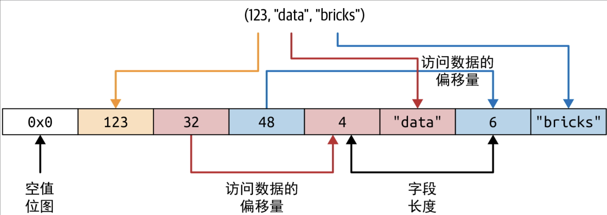


## 3、减少 Dataset 开销的策略

避免多余的序列化和反序列化的策略：

- 第一种策略：在查询中使用 DSL 表达式，避免过多地使用 lambda 表达式的匿名函数作为高阶函数的参数

    > 因为 lambda 表达式是匿名，运行前对 Catalyst 优化器不透明，所以 Catalyst 优化器不能有效分辨出你在做什么，因而无法优化查询

- 第二种策略：将查询串起来，以尽量减少序列化和反序列化

# 七、Spark 应用的优化和调优

## 1、为效率而优化与调优

### (1) 查看与设置 Spark 配置

**获取和设置 Spark 配置属性的方式**：

- 第一种方式：通过一组配置文件，即修改这些文件中的默认值，并将其保存为没有 `.template` 后缀的文件，Spark 就会使用这些新配置的值

    > `$SPARK_HOME` 目录下：conf/spark-defaults.conf.template、conf/log4j.properties.template、conf/spark-env.sh.template
    >
    > 补充：修改 conf/spark-defaults.conf 文件中的配置参数，这种方式适用于 Spark 集群，以及所有提交到集群的 Spark 应用

- 第二种方式：直接在 Spark 应用内指定配置参数，或者在用 `spark-submit` 提交应用的命令行中以 `--conf` 标识指定配置参数

    ``` shell
    spark-submit --conf spark.sql.shuffle.partitions=5 --conf "spark.executor.
    memory=2g" --class main.scala.chapter7.SparkConfig_7_1 jars/main-scalachapter7_
    2.12-1.0.jar
    ```

- 第三种方式：通过 Spark shell 的编程接口，即通过 SparkSession 对象，用户可以访问大多数的 Spark 配置参数

### (2) 为大型作业扩展 Spark

Spark 的三个组件：驱动器、执行器，以及执行器上运行的数据混洗服务

> 驱动器负责协调集群管理器，以便在集群内启动执行器，并向执行器调度 Spark 任务

#### 1. 静态资源分配与动态资源分配

Spark 的动态资源分配功能：驱动器会根据大型作业的峰谷分别申请更多或更少的资源。即启用动态资源分配让 Spark 能够实现更高的资源利用率，释放空闲的执行器，并在需要时申请新的执行器

> 若通过 spark-submit 的命令行参数指定计算资源，则上限就固定。因此使用动态资源分配有助于应对突发的大量资源需求

动态变化的两种场景：

- 场景一：数据流量不均匀的流式计算
- 场景二：按需的数据分析，高峰期可能有大量 SQL 查询需要执行

启用并配置动态资源分配功能，可以使用如下设置：

```
spark.dynamicAllocation.enabled true
spark.dynamicAllocation.minExecutors 2
spark.dynamicAllocation.schedulerBacklogTimeout 1m
spark.dynamicAllocation.maxExecutors 20
spark.dynamicAllocation.executorIdleTimeout 2min
```

启用动态资源分配功能后：

- Spark 驱动器会在启动时先向集群管理器申请两个执行器，其根据配置的最小值 `spark.dynamicAllocation.minExecutors` 决定

- 随着积压任务增加，每次积压超时 `spark.dynamicAllocation.schedulerBacklogTimeout` 时，驱动器都会再申请新的执行器

    > 上述配置中，当等待的任务超过 1 分钟还未被调度时，驱动器就会申请启动一个新的执行器，以调度积压任务，直到达到 20 个执行器的上限 `spark.dynamicAllocation.maxExecutors` 
    >
    > 反过来，如果一个执行器完成所有任务后空闲时间超过 2 分钟 `spark.dynamicAllocation.executorIdleTimeout`，那么驱动器会关掉这个执行器

#### 2. 配置 Spark 执行器的内存与数据混洗服务

每个执行器可用的内存由 `spark.executor.memory` 控制，这块内存分为 3 个部分：**运行内存、存储内存、保留内存**

> 默认的划分方式是先扣除 300MB 的保留内存以防止内存不足，剩余的 60% 用于运行内存，40%用于存储内存

- 运行内存：用于混洗、连接、排序、聚合等操作

- 存储内存：主要用来缓存用户的数据结构和从 DataFrame 获取的分区

> 补充：当存储内存没有全部使用时，Spark 可以将存储内存也拿来用于运行，反之亦然


下图整理了 Spark 用来调节映射和数据混洗阶段I/O参数的配置项，可以让映射、溢写、合并等过程不受低效 I/O 的困扰，以便这些操作在最终写入硬盘的混洗分区前使用内存缓冲，在每个执行器上运行的混洗服务优化同样有助于提高大规模 Spark 作业的整体性能表 7-1 摘录了一些推荐调整的参数，可以让映射、溢写、合并等过程不受低效 I/O 的困扰，以便这些操作在最终写入硬盘的混洗分区前使用内存缓冲，在每个执行器上运行的混洗服务优化同样有助于提高大规模 Spark 作业的整体性能

> 在进行映射和数据混洗操作时，Spark 需要读写本地硬盘上的数据混洗文件，因此I/O 压力较大，这可能会造成性能瓶颈


#### 3. 最大化 Spark 并发度

> 要想学会如何最大化并发度，即尽最大可能并行读取并处理数据，需要先了解 Spark 如何将数据从存储系统读入内存，以及分区对于 Spark 的意义

**分区**：将数据划分为硬盘上连续存储的一组可控可读数据块的方式，且这些数据块都是原数据的一部分，可以独立读取和处理，如有必要可以并行化

> 分区是并发的最小单位：核心、线程、分区是 1∶1∶1的关系，如果分区比集群内所有执行的核心总数还多，则所有的核心都会用起来
>
> 对于大规模作业：
>
> - Spark 作业可能包含很多执行阶段，每个执行阶段又会包含很多任务
> - Spark 会尽量给每个线程分配一个核心，这个线程一次执行一个任务，每个任务会处理一个分区
> - 要想优化资源利用率和最大化并发度，理想情况是分区数至少和所有执行器的核心总数一样

图：Spark 任务、核心、分区与并行度之间的关系


#### 4. 分区是如何创建的

**Spark 任务将数据以分区为单位从硬盘读入内存**，而分区大小由 `spark.sql.files.maxPartitionBytes` 控制，默认值为 128MB

> 可以减小这个参数来提高并发度，但可能导致“小文件问题”：小分区文件过多，导致引入过量的硬盘 I/O 操作和性能下降，因为在分布式文件系统中打开文件、关闭文件、列目录等文件系统操作可能会因为文件多而变得很慢

在显式调用 DataFrame API 的某些方法时，也会创建分区，比如：创建一个大型 DataFrame 或从硬盘上读取大文件时，可以显式控制 Spark 创建指定数量的分区

```scala
// Scala代码
val ds = spark.read.textFile("../README.md").repartition(16)
ds: org.apache.spark.sql.Dataset[String] = [value: string]

ds.rdd.getNumPartitions
res5: Int = 16

val numDF = spark.range(1000L * 1000 * 1000).repartition(16)
numDF.rdd.getNumPartitions

numDF: org.apache.spark.sql.Dataset[Long] = [id: bigint]
res12: Int = 16
```

**混洗分区**：

- 在混洗阶段创建，其默认分区数为 200，由 `spark.sql.shuffle.partitions` 决定

    > 备注：其默认值对于小负载作业或流式作业而言太高了，可以将其调低到执行器核心总数甚至更低

- 在执行 groupBy() 或 join() 等操作时创建，会使用网络和硬盘 I/O 的资源，而数据混洗会将结果溢写到执行器的本地硬盘上，具体路径由 `spark.local.directory` 确定

## 2、数据的缓存与持久化

缓存和持久化调用都能为频繁访问的 DataFrame 和表带来更好的性能表现，两个函数：

- `cache()` 
- `persist()`：可以控制数据如何存储(序列化和不序列化)、存储在哪里(内存和硬盘)

> 补充：在使用 cache() 或 persist() 时，直到触发需要遍历所有记录的行动操作时，DataFrame 才会被完全缓存。如果使用 take(1) 这样的行动操作，那么只会缓存一个分区，因为 Catalyst 认为你不需要计算所有分区即可获取一条记录

### (1) DataFrame.cache

- 在内存允许的前提下，`cache()` 会尽可能将所有读到的分区都存储在 Spark 执行器的内存中

- DataFrame 可以被部分缓存，而分区只能被完整地缓存

    > 如果有 8 个分区，内存中能放下 4.5 个分区，那么实际缓存的就是 4 个分区
    >
    > 如果所有的分区没有全部缓存下来，那么再次访问数据时，未缓存的数据必须重新计算得出，这会拖慢 Spark 作业的执行速度

---

示例：用来说明缓存大型 DataFrame 如何提高访问 DataFrame 时的性能

```scala
// Scala代码
// 创建具有1000万条记录的DataFrame
val df = spark.range(1 * 10000000).toDF("id").withColumn("square", $"id" * $"id")
df.cache() // 缓存数据
df.count() // 物化缓存

res3: Long = 10000000
Command took 5.11 seconds

df.count() // 这次从缓存中获取
res4: Long = 10000000
Command took 0.44 seconds
```

- 第一次调用 count() 时，缓存才真正生成
- 第二次调用就直接读取缓存好的数据了，因此对该数据集的访问时间大约缩短为原来的 1/12

### (2) DataFrame.persist

`persist()` 允许用户通过 StorageLevel 控制数据如何缓存

补充：每种存储级别（除了 OFF_HEAP）都对应一种加上 _2 后缀的存储级别，比如MEMORY_ONLY_2 和 MEMORY_AND_DISK_SER_2，区别是带 _2 后缀的存储级别会将数据存储两份，每个分区的两份数据会存到两个 Spark 执行器上。这种存储级别的代价较大，可以在两个地方实现数据本地性，这样可以容错，同时让 Spark 在将任务调度到有本地数据的地方时多一个选择。

---

示例：

```scala
// Scala代码
import org.apache.spark.storage.StorageLevel

// 创建具有1000万条记录的DataFrame
val df = spark.range(1 * 10000000).toDF("id").withColumn("square", $"id" * $"id")
df.persist(StorageLevel.DISK_ONLY) // 序列化数据并在硬盘上缓存
df.count() // 生成缓存数据

res2: Long = 10000000
Command took 2.08 seconds

df.count() // 从缓存获取
res3: Long = 10000000
Command took 0.38 seconds
```

### (3) 何时缓存和持久化

- 在迭代式机器学习训练中经常使用 DataFrame
- 在执行 ETL 作业或构建数据流水线时，需要频繁对某些 DataFrame 进行转化操作，并需要经常访问这些 DataFrame

### (4) 何时不该缓存和持久化

- DataFrame 过大，无法全部放入内存
- 不论 DataFrame 大小，仅进行开销不大的转化操作时，DataFrame 不会被频繁使用
- 原则上，将数据缓存到内存中时需要慎重，因为根据使用的存储级别，可能会带来额外的序列化和反序列化开销

## 3、Spark 的各种连接算法

- 转化操作的核心是 Spark 如何计算出要生成的数据，如何将数据以键和值的对应形式写入硬盘，如何在 groupBy()、join()、agg()、sortBy() 和reduceByKey() 等操作中传输这些键值形式的数据(这种数据移动过程通常被称为混洗)
- 连接操作是大数据分析领域经常使用的转化操作类型，操作两个数据集(表或 DataFrame)，通过公共的键进行合并
- Spark 的DataFrame API 和 Dataset API 提供了各种连接操作：内连接、外连接、左外连接、右外连接等。这些操作都会引发数据在 Spark 执行器间大量移动

- Spark 有 5 种连接算法，区别主要是跨执行器进行数据交换、移动、排序、分组、合并的方式

    > 这 5 种算法具体是：
    >
    > - 广播哈希连接（broadcast hash join）
    > - 混洗哈希连接（shuffle hash join）
    > - 混洗排序合并连接（shuffle sort merge join）
    > - 广播嵌套循环连接（broadcast nested loop join）
    > - 及混洗-复制嵌套循环连接（shuffle-and-replicated nested loop join，也称为笛卡儿积连接）
    >
    > 最常用的两种算法：广播哈希连接和混洗排序合并连接

### (1) 广播哈希连接

广播哈希连接：也称为映射端连接，用于连接一大一小两个数据集，这种连接需要基于某些条件或列

- 小数据集要能在 Spark 驱动器和执行器的内存中放得下，大数据集可以免于数据移动

- 小数据集使用 Spark 广播变量从 Spark 驱动器分发到所有的执行器，然后在各执行器上跟大数据集进行连接

> 这种算法策略避免了大量数据交换


在默认情况下，当较小的数据集小于 10MB 时，Spark 会使用广播连接，可通过 `spark.sql.autoBroadcastJoinThreshold` 设置，根据执行器和驱动器的可用内存，可以对这个大小进行增减

> 如果相信内存足够，即使 DataFrame 超过 10MB（甚至 100MB），也可以使用广播连接
>
> 补充：只要小数据集小于 `spark.sql.autoBroadcastJoinThreshold`    所设的值，Spark 就总会采用广播连接

---

广播哈希连接是 Spark 中最简单和最快的连接，因为它不涉及数据集混洗

广播完成后，任务所需所有数据都会在执行器本地，只要确保 Spark 驱动器和执行器都有足够内存，能将较小的数据集全部放入内存

> 如下方式可以查看物理计划中选用的连接策略：`joinedDF.explain(mode)` ，可用的 'mode' 包括 `'simple'、'extended'、'codegen'、'cost'、'formatted'`

#### 什么时候使用广播哈希连接

当符合如下条件时，使用广播哈希连接效果最好。

- Spark 可以将一大一小两个数据集的每一对等值的键都通过哈希算法分到同一个分区
- 一个数据集比另一个数据集小很多（并且小于默认配置的 10MB 阈值，或者内存充足时配置的更大阈值）
- 只是进行等值连接，将两个数据集根据匹配的无序键整合起来
- 无须担心将小数据集广播分发到所有 Spark 执行器而引起的网络带宽使用过多或内存不足的错误

如果将 spark.sql.autoBroadcastJoinThreshold 设置为 -1，那么 Spark 始终会选用混洗排序合并连接

### (2) 混选排序合并连接

**排序合并算法**：是一种根据公共键合并两个数据集的高效方式，这里公共键需要是可排序、不重复的，并且能分到同一个分区内，即两个数据集的公共键经过哈希算法必须分入同一个分区

> 从 Spark 的角度来说，这意味着每个数据集中所有键相同的行经过哈希算法处理后都必须出现在同一个执行器的同一个分区内。显然，这说明必须在执行器之间交换数据，以便键一致的数据都放在一起。

这种连接算法分为两个阶段：

- 先是排序阶段，即将要连接的数据集根据连接键进行排序
- 然后是合并阶段，即遍历各数据集的所有行，并将键匹配的行合并起来

#### 什么时候使用混洗排序合并连接

在下列条件下使用这种连接算法是最合适的

- Spark 可以将两个大数据集的所有键排序并通过哈希算法将等值的记录分到同一个分区中
- 仅基于匹配的排序键使用等值连接来整合两个数据集
- 希望避免 Exchange 操作和 Sort 操作，从而规避跨网络混洗大量数据

# 八、结构化流处理

> 由于 Spark 中的 DataFrame 是表在程序中的表示，因此可以使用 DataFrame API 来表达流式数据的计算

Structured Streaming 的原则：

- **流批一体的统一编程模型和接口**：可以对数据流使用熟悉的 SQL 或类似批处理的 DataFrame 查询，和批处理一样操作数据流，将底层复杂的容错、优化、迟到数据处理等琐事交给引擎来处理

- **广义的流处理**：拓宽传统流处理的适用范围，以满足更丰富的数据处理需求

    > 在进行结构化流处理时，任何间断性(每几小时一次)或持续性(传统的流处理应用)处理数据的应用都应该具有强大的表达能力

## 1、Structured Streaming 的编程模型

> Structured Streaming 编程模型把数据流作为无边界表，即数据流中的新记录 == 无边界表中新添加的行

**Structured Streaming 的处理模型**：

- **增量化**：
    - 每当收到新记录，Structured Streaming 会搞定更新结果所需维护的状态信息，最后由开发人员指定触发策略来控制何时更新结果
    - 每当满足触发条件时，Structured Streaming 就会检查新数据（如输入表新增的行），并增量更新结果
- 编程模型的最后一块是输出模式：每当结果表更新时，就将更新数据写入存储中。一般情况下，以增量方式写输出


**Structured Streaming 提供的三种输出模式**：

- **追加模式**：仅将上次触发执行后新追加到结果表中的数据写入外部存储系统

    > 这种模式只适用于结果表中已有的行不会被查询修改的场景，比如：对输入流执行映射操作

- **更新模式**：只有结果表上次执行后更新的行才会被修改

    > 这种模式适用于支持原地更新的输出池，比如 MySQL 表

- **完整模式**：更新后的整张结果表都会被写入外部存储系统

## 2、Structured Streaming 查询

### (1) 五步定义流式查询

**流式查询的步骤**：通过构建从套接字读取文本数据流进行单词计数的示例查询

**第 1 步：定义输入源**，即首先要从流式数据源定义输入的 DataFrame

> 从批式数据源读取数据时，用 spark.read 来创建 DataFrameReader
>
> 对于流式数据源，用 spark.readStream 来创建 DataStreamReader
>
> ```scala
> val spark = SparkSession...
> val lines = spark
>   .readStream.format("socket")
>   .option("host", "localhost")
>   .option("port", 9999)
>   .load()
> ```
>
> - 从 localhost: 9999 读取的换行符分隔文本数据的无边界表
> - 这个操作不会立刻开始读取流式数据，而只会设置好读取数据所需的配置，在流式查询启动执行时即会读取数据
> - 除了套接字，Spark 也支持从 Kafka、DataFrameReader 所支持的各种文件格式读取数据流
> - 一个流式查询可以定义多个数据源，数据源既可以是流式的，也可以是批式的，多个数据源可以通过 union 和 join 等DataFrame 操作进行整合

**第 2 步：转化数据**，即执行常规的 DataFrame 操作

> 比如将每行打散为单词，然后进行计数
>
> - 流式查询一启动就会开始计算，并不断处理流式输入数据
>
> ```scala
> import org.apache.spark.sql.functions._
> 
> val words = lines.select(split(col("value"), "\\s").as("word"))
> val counts = words.groupBy("word").count()
> ```
>
> 数据转化操作的两大类型：
>
> - **无状态的转化操作**：像 select()、filter()、map() 这样的操作，在处理下一行时不需要从之前的行获取信息，每行可以独立处理
> - **有状态的转化操作**：count() 这样的聚合操作需要维护状态来跨多行组合数据，即任何涉及分组、连接或聚合的操作都是有状态的转化操作。而 Structured Streaming 仅支持部分操作

**第 3 步：定义输出池和输出模式**，即对数据进行转化后，可以用 DataFrame.writeStream 定义如何将处理得到的输出数据写出去

> 会创建类似 DataFrameWriter 的 DataStreamWriter，但后者多出几个方法，用于指定下列方面：
>
> - 输出结果写到哪里？如何写？
> - 如何处理数据？如何从错误中恢复？
>
> ```scala
> //将得到的 counts 写入控制台: 指定 "console" 作为输出流的接收池，同时指定 "complete" 作为输出模式
> val writer = counts.writeStream.format("console").outputMode("complete")
> ```
>
> 流式查询的输出模式指定了处理新输入的数据后写出更新结果的哪一部分
>
> - **追加模式(默认)**：只会将上次触发计算后新添加到结果表或 DataFrame 中的行输出到接收池
>
>     > - 这种模式确保了输出的所有行都不会在查询后续执行中被修改或更新
>     >
>     > - 追加模式只支持永远不会更新之前输出数据的查询（无状态查询）
>
> - **完整模式**：结果表或 DataFrame 的所有行都会在每次触发执行结束时输出
>
>     > 这种模式只支持结果表大小远小于输入数据的查询，这样才可能将数据保持在内存中
>
> - **更新模式**：只有结果表或 DataFrame 中上次触发执行后更新的行才会在执行结束时输出
>
>     > 与追加模式相反，更新模式允许查询在后续执行时修改已输出的行，并再次输出。大多数查询支持更新模式

**第 4 步：指定如何处理数据**，即启动查询前的最后一步是指定如何处理数据

> ```scala
> import org.apache.spark.sql.streaming._
> 
> val checkpointDir = "..."
> val writer2 = writer
>   .trigger(Trigger.ProcessingTime("1 second"))
>   .option("checkpointLocation", checkpointDir)
> ```
>
> 用 DataFrame.writeStream 创建的 DataStreamWriter 从两个方面指定了如何处理数据：
>
> - **触发条件**：指定了发现并处理新增流式数据的触发时间，共有 4 种选项
>
>     - **默认情况**：当没有明确指定触发器时，默认情况下流式查询以微型批方式执行，每个微型批在前一个微型批完成后触发
>
>     - **根据固定间隔触发**：可以用触发间隔显式指定 ProcessingTime 触发器，查询会以固定间隔触发微型批
>
>     - **单次执行**：流式查询会且只会执行一次微型批，会在这个批次中处理所有新数据，然后自动停止
>
>         > 利用这种模式，可以用外部调度器根据自定义调度规则重启查询，从而自行控制触发和处理，比如每天执行一次查询
>
>     - **持续执行**：流式查询会持续处理数据，而不是以微型批形式处理，但相比微型批触发模式，能提供毫秒级的延迟时间
>
>         > 只有少量 DataFrame 操作允许使用这种模式
>
> - **检查点保存位置**：这是任何兼容 HDFS 的文件系统中的目录，流式查询用这个目录存储进度信息，也就是哪些数据已经成功处理
>
>     - 当处理失败时，重启失败的查询会使用这里存储的元数据，从上次成功处理的地方开始执行
>     - 如果需要提供“精确一次”保证的错误恢复能力，那么设置这个选项很有必要

**第 5 步：启动查询**

> 类型 streamingQuery 的返回对象表示一条活跃的查询，可以用来管理该查询
>
> ```scala
> val streamingQuery = writer2.start()
> ```
>
> - `start()` 是非堵塞的方法，即查询在后台启动后，方法调用会马上返回
> - `awaitTermination()`：支持主线程堵塞直到查询终止，若查询在后台因发生错误而失败，也会以同样的异常失败
> - `stop()`：显式停止执行查询

----

**完整代码**：查询启动后，后台线程会持续从流式数据源读取新数据并处理，然后将结果写入流式输出池

```scala
import org.apache.spark.sql.functions._
import org.apache.spark.sql.streaming._

val spark = SparkSession...
val lines = spark
  .readStream.format("socket")
  .option("host", "localhost")
  .option("port", 9999)
  .load()

val words = lines.select(split(col("value"), "\\s").as("word"))
val counts = words.groupBy("word").count()

val checkpointDir = "..."
val streamingQuery = counts.writeStream
  .format("console")
  .outputMode("complete")
  .trigger(Trigger.ProcessingTime("1 second"))
  .option("checkpointLocation", checkpointDir)
  .start()

streamingQuery.awaitTermination()
```

### (2) 探究活跃的流式查询

**增量执行流式查询**：

- DataFrame 操作会转为逻辑计划，逻辑计划是 Spark SQL 在规划查询时所使用的计算的抽象表示形式

- Spark SQL 对逻辑计划进行解析并优化，以确保可以在流式数据上增量并高效地执行

- Spark SQL 启动后台线程，以持续执行下列循环

    1. 根据配置的触发间隔，后台线程会检查流式数据源，看看有没有新的可用数据

    2. 如果有新的可用数据，Spark 就会运行一个微型批来执行

        > Spark 会根据优化后的逻辑计划生成优化后的执行计划，然后根据这个执行计划从数据源读取新数据、增量计算更新的结果，然后根据配置的输出模式将输出数据写入输出池

    3. 对于每个微型批来说，处理数据的精确范围和任何相关的状态都会保存到配置的检查点路径，这样查询可以在必要时再次确定性地处理精确范围内的数据

- 该循环会一直持续到查询终止，查询可能因下列原因终止：
    - 查询失败了（处理错误或集群崩溃）
    - 使用 streamingQuery.stop() 显式停止了查询
    - 如果触发模式被设置为单次执行，那么查询会在执行完单个包含所有可用数据的微型批之后自行停止


> 补充：Structured Streaming 的底层使用 Spark SQL 执行数据，因此能充分利用 Spark SQL 经过全面优化的执行引擎，从而实现流处理吞吐量的最大化，并获得关键的性能优势

### (3) 失败恢复与“精确一次”语义

- 要想在一个全新的进程中重启已终止的查询，需要创建一个新的 SparkSession对象，重新定义所有的 DataFrame，并使用与第一次执行时相同的检查点路径，基于之前的最终结果启动流式查询

- 重启时，使用的检查点路径必须保持一致，因为这个目录包含该流式查询的唯一标识符，且能决定该查询的生命周期

- 如果检查点路径被删除，或者从不同的检查点目录启动了这条查询，那么就和从头开始执行一条新查询是一样的

    > 即检查点数据中有记录级别的信息（如 Kafka 偏移量），可以用来跟踪上一个未完成的微型批所处理的数据范围
    >
    > 而重启的查询会使用这一信息，准确地从最近成功完成的微型批完成的位置开始处理数据

- 若先前的查询已经规划好了微型批，但在执行完成前终止，则在处理新数据前，重启的查询会再次处理与最后一个微型批相同范围的数据

- 得益于 Spark 的确定性任务执行方式，重新生成的输出结果也会和重启前预期得到的结果保持一致

---

当满足下列条件时，Structured Streaming 可以确保端到端的“精确一次”语义，即输出结果等价于每条输入记录被处理了恰好一次

- **可重放的流式数据源**：最后一个未完成的微型批读取的数据范围，可以从数据源再次读取
- **确定性计算**：所有的数据转化操作都具有确定性，即当输入数据一致时，始终生成同样的结果
- **幂等的输出池**：输出池可以识别重新执行的微型批，并忽略重启可能导致的重复写入

---

关于重启查询，需要注意：**重启前可以对查询进行少量修改**，下面是修改查询的一些方式

- **DataFrame 转化操作**：可以在重启前对转化操作进行少量修改

    > 例如：在流式单词计数示例中，想忽略乱码字节串，则可以在转化操作中添加过滤条件

    ```scala
    //用修改后的 DataFrame words 重启后，查询会对所有重启后处理过的数据运用该过滤条件，以防查询再次因此崩溃
    
    // val isCorruptedUdf = udf，用来检测字符串是否出错
    val filteredLines = lines.filter("isCorruptedUdf(value) = false")
    val words = filteredLines.select(split(col("value"), "\\s").as("word"))
    ```

- **输入源与输出池的选项**：选项 readStream 或 writeStream 能否在重启前修改取决于具体的输入源或输出池的语义

    > 例如：对于套接字数据源，如果数据要发到特定的主机名和端口，那么主机名和端口选项就不能修改。但是可以为输出池添加选项，打印最多100 条每次触发执行后修改的计数结果
    >
    > ```scala
    > writeStream.format("console").option("numRows", "100")...
    > ```

- **处理细节**：检查点路径在重启前不能改变，但像触发间隔这样的其他处理细节是可以修改的，也不会影响容错保证

### (4) 监控活跃的查询

> 运行生产环境的流式查询流水线时，要点之一是跟踪健康状态

可以使用 StreamingQuery 实例来确定活跃的查询当前的健康状态：

- **使用 StreamingQuery 获取当前指标**：当查询任务在一个微型批中处理一些数据时，认为这个查询任务有进展

    > 其中 lastProgress() 方法返回最近完成的微型批的相关信息

- **用 Dropwizard Metrics 发布指标**：Spark 支持通过常用的 Dropwizard Metrics 工具库汇报指标

    > 启用指标需要配置 Dropwizard Metrics，且在启动查询前将 SparkSession 配置参数 `spark.sql.streaming.metricsEnabled` 设置为 true

- **用自定义 StreamingQueryListener 发布指标**：StreamingQueryListener 是一个事件监听器接口，用户可以通过这个接口注入任意逻辑来持续发布指标

    > 使用自定义监听器分两步：
    >
    > - **实现自定义监听器**：StreamingQueryListener 接口提供了 3 个可供自行实现的方法，以分别获取流式查询中的 3 类事件：启动、进展、终止
    >
    >     ```scala
    >     // Scala代码
    >     import org.apache.spark.sql.streaming._
    >     
    >     val myListener = new StreamingQueryListener() {
    >       override def onQueryStarted(event: QueryStartedEvent): Unit = {
    >         println("Query started: " + event.id)
    >       }
    >       override def onQueryTerminated(event: QueryTerminatedEvent): Unit = {
    >         println("Query terminated: " + event.id)
    >       }
    >       override def onQueryProgress(event: QueryProgressEvent): Unit = {
    >         println("Query made progress: " + event.progress)
    >       }
    >     }
    >     ```
    >
    > - **在启动查询前将监听器添加到 SparkSession**：
    >
    >     ```scala
    >     // Scala代码
    >     spark.streams.addListener(myListener)
    >     ```
    >
    >     添加好监听器后，这个 SparkSession 运行的所有流式查询事件都会调用监听器定义的相应方法

---

返回对象（在 Scala 或 Java 中是 StreamingQueryProgress 类型的对象，在 Python 中是字典类型的对象）打印出来：

- `id`：绑定到检查点路径的唯一标识符，这个值在查询的整个生命周期（不论是否重启）中保持不变

- `runId`：该查询对应当前这次启动（或重启）的唯一标识符，这个值每次重启都会改变
- `numInputRows`：在上一个微型批中处理的输入的行数
- `inputRowsPerSecond`：数据源生成输入行的当前速率（最近的微型批的区间均值）
- `processedRowsPerSecond`：处理行并将结果写入输出池的当前速率（最近的微型批的区间均值）。如果这个速率持续低于输入速率，那么说明查询任务处理数据的速度无法跟上数据源生成数据的速度。这是查询健康程度的一项关键指标

- `sources 和 sink`：提供上一个微型批中处理的输入源/输出池相关数据的详细情况

```json
{
  "id" : "ce011fdc-8762-4dcb-84eb-a77333e28109",
  "runId" : "88e2ff94-ede0-45a8-b687-6316fbef529a",
  "name" : "MyQuery",
  "timestamp" : "2016-12-14T18:45:24.873Z",
  "numInputRows" : 10,
  "inputRowsPerSecond" : 120.0,
  "processedRowsPerSecond" : 200.0,
  "durationMs" : {
    "triggerExecution" : 3,
    "getOffset" : 2
  },
  "stateOperators" : [ ],
  "sources" : [ {
    "description" : "KafkaSource[Subscribe[topic-0]]",
    "startOffset" : {
      "topic-0" : {
        "2" : 0,
        "1" : 1,
        "0" : 1
      }
    },
    "endOffset" : {
      "topic-0" : {
        "2" : 0,
        "1" : 134,
        "0" : 534
      }
    },
    "numInputRows" : 10,
    "inputRowsPerSecond" : 120.0,
    "processedRowsPerSecond" : 200.0
  } ],
  "sink" : {
    "description" : "MemorySink"
  }
}
```

## 3、流式数据源与数据池

> 可以使用SparkSession.readStream() 从流式数据源创建 DataFrame，并使用DataFrame.writeStream() 将输出的结果 DataFrame 写出去。在两种情况下，都可以用 format() 方法指定数据类型

### (1) 文件

> Structured Streaming 支持从文件读取数据流，所支持的文件格式与批处理一致：普通文本文件、CSV、JSON、Parquet、OR

- **从文件读取数据**

    > ```scala
    > import org.apache.spark.sql.types._
    > 
    > val inputDirectoryOfJsonFiles = ...
    > 
    > //返回的流式 DataFrame 会使用给定的表结构
    > val fileSchema = new StructType()
    >   .add("key", IntegerType)
    >   .add("value", IntegerType)
    > 
    > val inputDF = spark.readStream
    >   .format("json")
    >   .schema(fileSchema)
    >   .load(inputDirectoryOfJsonFiles)
    > ```
    >
    > - 所有文件必须是同一格式，而且应该具有相同的表结构
    >
    > - 每个文件在列目录的操作必须保持原子性，即读取的文件必须整体可用，一旦进入可用状态，文件就不可以再更新或修改
    >
    > - 若要处理多个新文件，而部分文件只能在下一个微型批中进行处理，则会优先选择时间戳最早的文件进行处理
    >
    >     > 在一次微型批内部，读取所选文件时并没有顺序，所有的文件会并行读取

- **写入文件**

    > 以文件作为输出时，只支持使用追加模式
    >
    > ```scala
    > val outputDir = ...
    > val checkpointDir = ...
    > val resultDF = ...
    > 
    > val streamingQuery = resultDF
    >   .writeStream
    >   .format("parquet")
    >   .option("path", outputDir) //除了使用 "path" 选项，也可以直接以 start(outputDir) 指定输出目录
    >   .option("checkpointLocation", checkpointDir)
    >   .start()
    > ```
    >
    > - 通过写文件时维护已写入目录的数据文件的记录，Structured Streaming 实现了端到端的“精确一次”语义
    >
    >     > 这份记录维护在输出目录的 `_spark_metadata` 子目录下
    >     >
    >     > - 所有查询对应输出目录的 Spark 查询都会自动使用这份记录来选择读取正确的数据文件，以此实现“精确一次”的语义，即重复数据和不完整的文件不会被读到
    >
    > - 别的处理引擎不一定会知道有这份记录，因此读取 Structured Streaming 的输出时可能无法提供同样的保证
    >
    > - 如果重启前修改了结果 DataFrame 的表结构，那么目标目录就会有多种表结构的数据。后续查询这个目录时，这些表结构需要能协调一致

### (2) Kafka

- **从 Kafka 读取数据**

    > 要想从 Kafka 分布式读取数据，首先要使用选项来指定如何连接到 Kafka 数据源
    >
    > ```scala
    > val inputDF = spark
    >   .readStream
    >   .format("kafka")
    >   .option("kafka.bootstrap.servers", "host1:port1,host2:port2")
    >   .option("subscribe", "events") //topic 为 events
    >   .load()
    > ```

- **写入 Kafka** 

    > ```scala
    > val counts = ... // DataFrame[word: string, count: long]
    > val streamingQuery = counts
    >   .selectExpr("cast(word as string) as key", "cast(count as string) as value")
    >   .writeStream
    >   .format("kafka")
    >   .option("kafka.bootstrap.servers", "host1:port1,host2:port2")
    >   .option("topic", "wordCounts")
    >   .outputMode("update")
    >   .option("checkpointLocation", checkpointDir)
    >   .start()
    > ```

### (3) 自定义流式数据源与数据池

> 讨论如何读写 Structured Streaming 没有提供内建支持的存储系统，即用 foreachBatch() 方法和 foreach() 方法实现自定义逻辑来写入所用的存储系统

**写入任意存储系统**：

- `foreach()`：允许自行定义每一行的写入逻辑

    > 可以将写数据的逻辑用 3个方法分别表达出来：open()、process() 和 close()
    >
    > ```scala
    > //Structured Streaming 会使用这些方法来写出输出记录的每个分区
    > import org.apache.spark.sql.ForeachWriter
    > 
    > val foreachWriter = new ForeachWriter[String] { // 以字符串为模板类型
    > 
    >     def open(partitionId: Long, epochId: Long): Boolean = {
    >       // 打开到数据存储系统的连接
    >       // 如果应该继续写，就返回true
    >     }
    > 
    >     def process(record: String): Unit = {
    >       // 使用打开的连接将字符串写入数据存储系统
    >     }
    > 
    >     def close(errorOrNull: Throwable): Unit = {
    >       // 关闭连接
    >     }
    >  }
    > resultDSofStrings.writeStream.foreach(foreachWriter).start()
    > ```
    >
    > 

- `foreachBatch()`：允许对每个微型批定义处理逻辑，执行任意操作

    > 接受两个参数：一是含有微型批输出结果的 DataFrame 或 Dataset，二是微型批的唯一标识符
    >
    > ```scala
    > //将之前的单词计数查询的输出结果写入 Cassandra
    > import org.apache.spark.sql.DataFrame
    > 
    > val hostAddr = "<ip address>"
    > val keyspaceName = "<keyspace>"
    > val tableName = "<tableName>"
    > 
    > spark.conf.set("spark.cassandra.connection.host", hostAddr)
    > 
    > def writeCountsToCassandra(updatedCountsDF: DataFrame, batchId: Long) {
    >     // 使用批式Cassandra数据源来写入更新的计数结果
    >     updatedCountsDF
    >       .write
    >       .format("org.apache.spark.sql.cassandra")
    >       .options(Map("table" -> tableName, "keyspace" -> keyspaceName))
    >       .mode("append")
    >       .save()
    >     }
    > 
    > val streamingQuery = counts
    >   .writeStream
    >   .foreachBatch(writeCountsToCassandra _)
    >   .outputMode("update")
    >   .option("checkpointLocation", checkpointDir)
    >   .start()
    > ```
    >
    > 可以用 foreachBatch() 实现下列功能：
    >
    > - **重用现有的批式数据源**：将流式查询的结果写入现有的批式数据源（也就是支持写入批式 DataFrame 的数据源）
    >
    > - **写到多个位置**：若想将流式查询的输出结果写到多个位置，如：OLAP 数据仓库 + OLTP 数据库，只需将输出的 DataFrame 或 Dataset 多写几遍即可
    >
    >     > 为了避免重算，应该先缓存 batchOutputDataFrame，将其写入多个路径，然后将其从缓存中移除
    >     >
    >     > ```scala
    >     > def writeCountsToMultipleLocations(
    >     >   updatedCountsDF: DataFrame,
    >     >   batchId: Long) {
    >     >     updatedCountsDF.persist()
    >     >     updatedCountsDF.write.format(...).save() // 位置1
    >     >     updatedCountsDF.write.format(...).save() // 位置2
    >     >     updatedCountsDF.unpersist()
    >     >   }
    >     > ```
    >
    > - **使用额外的 DataFrame 操作**：可以对每个微型批的输出使用这些流式执行所不支持的操作。但在实现这样的操作前，应该先想清楚这么做所对应的端到端语义
    >
    >     > 因为 Structured Streaming 在很多使用场景中无法生成增量执行计划，所以流式 DataFrame 不支持 DataFrame API 的许多操作

---

**从任意存储系统读取数据**：目前还没有正式的做法可以从任意的存储系统读取数据

## 4、数据转化

> 本节将探索无状态操作与有状态操作的区别，以及在流式查询中使用这两种操作需要何种运行时配置和资源管理方式

Spark SQL 的 Catalyst 优化器会将所有的 DataFrame 操作转为优化好的逻辑计划

- Spark SQL 计划生成器会决定如何执行逻辑计划，会识别出需要在连续数据流上操作的流式逻辑计划

- 此时，计划生成器不会将逻辑计划转为一次性的物理执行计划，而是会相应地生成一串连续的执行计划

- 每个执行计划都会分别增量更新最终的结果 DataFrame，即这个计划只会处理来自输入流的一块新数据，可能再加上一些由前序执行计划计算得到的部分中间结果

- 每次执行都被视为一个微型批，在每次执行间传输的不完整的中间结果称为流式计算的“状态”
- 根据增量执行时是否有状态需要维护，DataFrame 操作可以大致分为无状态操作和有状态操作

---

**状态**：在计划序列间传输的不完整结果，即在每个微型批中，增量执行计划会将新记录的计数结果加到前一个微型批生成的计数结果上

### (1) 无状态转化操作

**无状态操作**：独立处理每条输入记录，不需要前序行的任何信息，比如：所有的投影操作（如 select()、explode()、map()、flatMap()）和选择操作（如 filter() 和 where()）

---

只有无状态操作的流式查询支持追加输出模式和更新输出模式，但是不支持完整输出模式：

- 因为这样的查询处理所得到的每行输出都不会因后来的数据而发生变化，所以能够以追加模式写到各种输出池（包括只支持追加模式的输出池，如任意格式的文件输出）
- 这样的查询天然地不会跨输入记录进行组合，因此结果中的数据量不会减少
- 之所以无法支持完整模式，是因为存储不断增长的结果数据通常代价巨大

### (2) 有状态转化操作

**有状态操作**：这个状态维护在 Spark 执行器的内存中，会在写检查点时写到配置的检查点位置，以实现容错

> 虽然 Spark SQL 会自动管理这一状态的生命周期以确保结果正确，但一般还是需要做一些调整来控制维护状态所用的资源总量

- **分布式且容错的状态管理**：对于所有的有状态操作，Structured Streaming 以分布式自动保存和恢复状态，以确保操作的正确性

    - 集群中运行的 Spark 应用有一个驱动器和一个以上的执行器

        > Spark 调度器在驱动器内运行，将用户的高层操作分解为多个小任务，并将任务放入队列，在有资源时，执行器会从队列拉取任务来执行
        >
        > 流式查询的每个微型批其实都是处理这样一组任务，从流式数据源读入新数据，并将更新后的输出结果写入流式输出池
        >
        > 对于有状态的流式查询，每个微型批中的任务除了要写入输出池，还要生成中间状态数据以供下一个微型批使用
        >
        > 这份状态数据的生成是完全分区和分布式的（所有的读写和处理都在 Spark 内进行），状态数据缓存在执行器内存中，以便高效获取

    - **Structured Streaming 的分布式状态管理**：上图展示了前面的流式单词计数查询是如何管理状态的

        > 
        >
        > - 每个微型批都会读入新的一组单词，并在执行器间混洗这些单词来分组，然后计算微型批内部的单词计数结果，最后将它们加到之前的计数结果上，由此生成新的计数结果
        >
        > - 这些新的计数结果不仅仅是输出数据，也是下一个微型批的状态数据，因此需要缓存在执行器的内存中
        > - 下一个微型批的数据也会在执行器间进行分组操作，这样每个单词总会被同一个执行器处理，所以可以本地读取和更新当前的计数结果
        >
        > - 为了避免丢失，将状态更新的键 - 值对作为变动日志同步保存到用户提供的检查点位置
        >
        >     > 这种变动是与每个批次处理的偏移量范围绑定在一起的，所需要的状态版本可以通过读取检查点日志自动重建出来
        >     >
        >     > 无论发生任何失败，通过重新处理同样的输入数据，结合微型批开始前同样的状态，Structured Streaming 都可以重新计算失败的微型批，这样得出的输出数据总是和没有发生失败的情况一样

- **有状态操作的类型**：流数据状态的本质是保留过去数据的综合结果，当要从状态中清除旧的综合结果，以便为新的结果腾出空间

    根据清理状态的方式，可以将有状态操作分为以下两类：

    - **受管理的有状态操作**：流式聚合、流与流连接、流去重
        - 每种操作都有各自对于“旧”状态的定义，根据相应的定义，这些操作会自动识别并清理这些旧状态
        - 可以调整“旧”状态的定义，以控制资源使用量（如用来存储状态的执行器内存）
    - **无管理的有状态操作**：这种操作允许我们自行定义状态的清理逻辑，比如：mapGroupsWithState、flatMapGroupsWithState

## 5、有状态的流式聚合

> 本节将探讨对不同类型的流式聚合操作进行调优的语义和操作细节，还会简单讨论流式查询中不支持的少数几种聚合类型

### (1) 不根据时间维度进行聚合

不涉及时间维度的聚合操作可以大致分为两类：

- **全局聚合**：指将流的所有数据聚合到一起

    > ```scala
    > //假设有个传感器读数数据流，称作 sensorReadings 的流式 DataFrame，可以用如下查询计算当前收到的所有读数的总数量
    > val runningCount = sensorReadings.groupBy().count()
    > ```
    >
    > 不能对流式 DataFrame 像 DataFrame.count() 和 Dataset.reduce() 那样直接使用聚合操作：因为，对于静态 DataFrame 来说，这些操作会立刻返回最终计算出的聚合结果，但对于流式 DataFrame 来说，聚合结果需要持续更新。因此，需要总是使用 DataFrame.groupBy() 或Dataset.groupByKey() 来聚合流式 DataFrame

- **分组聚合**：指对数据流聚合每组或同一个键的数据

    > ```scala
    > //若 sensorReadings 包含来自多个传感器的数据，则可以用如下查询计算每个传感器的读数的当前均值
    > val baselineValues = sensorReadings.groupBy("sensorId").mean("value")
    > ```
    >
    > 除了计数和求均值，流式 DataFrame 还支持下列类型的聚合计算：
    >
    > - **所有的内建聚合函数**：`sum()、mean()、stddev()、countDistinct()、collect_set()、approx_count_distinct()`
    > - **用户自定义的聚合函数** 

### (2) 使用事件时间窗口进行聚合

**场景**：对按照时间窗口分桶的数据进行聚合，而不是对整个数据流进行聚合

```scala
//实现 5 分钟区间计数：sensorReadings 这个 DataFrame 中有名为 eventTime 的一列，代表记录生成的时间戳
import org.apache.spark.sql.functions.*
sensorReadings
  .groupBy("sensorId", window("eventTime", "5 minutes"))
  .count()
```

>  **window() 函数**：允许用一个动态计算的分组列来表示 5 分钟的时间窗口，这条查询会对每条传感器读数高效地完成下列事项：
>
> - 用 eventTime 的值计算出这条传感器读数属于哪个 5 分钟时间窗口
> - 根据 `<computed window>, sensorId` 的组合值将这条读数分到对应的复合分组中
> - 更新这个复合分组的计数结果

**从事件时间到滚动窗口的映射**：

> 下图：两条时间轴分别展示了收到的事件被处理的时间，以及事件数据中自带的时间戳
>
> 
>
> - 基于需要计算的计数，分组时会考虑到事件时间对应的每个 5 分钟窗口
>
>     > 注意：事件可能会迟到，到达时间也未必按照事件时间递增
>
> - 事件时间为12:07 的事件在 12:11 的事件之后收到并处理
>
>     > 无论事件什么时候到达，每个事件都还是按照自身的事件时间分到适当的分组中
>
> - 根据窗口定义，每个事件可以分入多个分组

**事件时间映射到多个重叠的窗口**：

> 如果要使用每 5 分钟就滑动的 10 分钟时间窗口计算对应的计数，那么可以采用如下方式
>
> ```scala
> sensorReadings
>   .groupBy("sensorId", window("eventTime", "10 minutes", "5 minutes"))
>   .count()
> ```
>
> 下图：在这条查询中，每个事件会被分到两个重叠的窗口中
>
> 
>
> 每个独特的二元组 `<assigned time window>, sensorId` 可以被当作一个动态生成的分组，只需计算每个分组的计数即可
>
> 例如：事件 `[eventTime =12:07, sensorId = id1]` 映射到两个时间窗口，即两个分组：(12:00-12:10, id1) 和 (12:05-12:15, id1)。这两个窗口的计数都要因为这条记录而累加一次

**每隔 5 分钟触发执行后更新结果表中的计数**：

> 下图展示了每个微型批结束时结果表中的状态（计数结果）
>
> 随着事件时间推进，新的分组会自动创建，它们的聚合结果也会自动更新
>
> 迟到和乱序的事件会自动被处理，其实也只是更新旧分组的结果数据而已
>
> 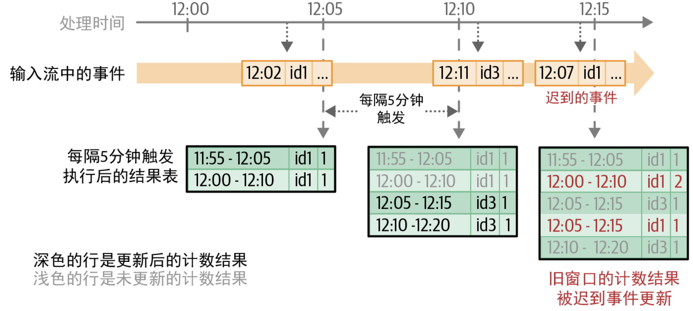
>
> 从资源使用的角度来看，这会产生另一个问题：**状态大小无限增长**，即对应最新时间窗口的新分组不断创建，而旧分组还持续占用着状态内存，等待着可能的迟到数据导致的更新
>
> 解决方案：可以通过指定**水印**来为查询设置迟到限制（防止状态无限增长）

**用水印处理迟到的数据**：

> - **水印是一个移动阈值**：在处理数据时，由当前收到的最新事件时间和允许拖后的最大时间差计算得出当前可以接受的最晚事件时间，这个阈值随最新事件时间移动
>
> - **水印延时**：拖后的最大时间差，其定义了引擎等待迟到数据的最久时间。通过了解给定分组的数据可能的最晚到达时间，引擎可以自动完成相应分组的聚合计算，并将中间数据从状态中移除，这限制了引擎为计算查询结果而需要维护的状态总量
>
> 假设知道自己的传感器数据不会迟到超过 10 分钟，那么可以按如下方式设置水印：
>
> ```scala
> //在调用 groupBy() 前，必须先调用 withWatermark()，调用使用的时间戳列也必须和窗口定义中的保持一致
> sensorReadings
>   .withWatermark("eventTime", "10 minutes")
>   .groupBy("sensorId", window("eventTime", "10 minutes", "5 minute"))
>   .mean("value")
> ```
>
> 在执行查询语句时，Structured Streaming 会持续跟踪 eventTime 列收到的最大值，相应地更新水印时间，过滤“太晚”的数据，并清理旧状态。即任何晚到超过 10 分钟的数据都会被忽略，所有晚于最新输入数据（根据事件时间）10 分钟的时间窗口都会从状态中清除
>
> ---
>
> 演示引擎如何跟踪所有事件中的最新事件时间、更新水印，以及处理迟到数据：x 轴表示记录的处理时间，y 轴表示记录的事件时间
>
> 
>
> 可以根据应用的要求设置水印延时：
>
> - 水印延时的值越大，数据就可以越晚到达，代价是运行时所维护的状态（内存使用量）也会变大
> - 反过来，水印延时的值越小，内存使用量也就越小，但允许的数据延时也就越小
>
> **水印所提供的语义保证**：10 分钟的水印确保了引擎不会丢弃任何比输入数据中最新的事件时间晚 10 分钟以内的数据，但并不能确保迟到超过 10 分钟的数据都会被丢弃，还是有可能被聚合进去。迟到超过 10 分钟的输入记录是否会被聚合进去，取决于收到记录的精确时间，以及处理它的微型批何时被触发

---

**支持的输出模式**：与不涉及时间维度的流式聚合不同，使用时间窗口的聚合操作可以使用全部 3 种输出模式

- **更新模式**：每个微型批只会输出聚合结果中更新的部分行，所有类型的聚合操作都可以使用这种模式

    > 对于基于时间窗口的聚合操作，水印机制能够确保状态可以周期性进行清理，这是运行流式聚合查询最有用和最高效的模式
    >
    > 然而，不用使用这种模式将聚合结果写入仅支持追加模式的流式输出池，比如 Parquet 和ORC 这类基于文件的格式

- **完整模式**：每个微型批会输出更新后的完整聚合结果，不论聚合数据对应的时间有多久，也不管数据是否发生了改变

    > 对于基于时间窗口的聚合操作，使用完整模式意味着即使指定了水印，状态也不会被清除
    >
    > 输出所有的聚合结果需要用到所有过去的状态，因此即使定义了水印，聚合数据也必须始终保留
    >
    > 对基于时间窗口的聚合操作使用这种模式时需要格外小心，因为这可能会导致状态大小和内存使用量无限增长

- **追加模式**：只有对事件时间窗口进行聚合，并且启用水印时，才能使用追加模式，且追加模式不允许改变之前输出的结果

    > - 对于所有没有水印的聚合操作，每条聚合结果都可能被未来的数据更新，因此这些聚合无法以追加模式输出
    >
    > - 只有对事件时间窗口使用水印机制时，查询才知道一条聚合记录何时再也不会有更新
    >
    > - 这样一来，只有水印确保部分聚合数据不会再进行更新，追加模式才可以输出其中的每个键及其对应的最终聚合值，而不是输出那些更新后的行
    >
    > 这种模式的优势：允许将聚合结果写入仅支持追加模式的流式输出池
    >
    > 缺点：输出也会推迟水印延时那么长的时间，查询必须等到水印时间超出一个键对应的时间窗口，才能完成这个键的聚合计算

## 6、流式连接

> Structured Streaming 支持将流式 Dataset 与另一个静态 Dataset 或流式Dataset 进行连接

### (1) 流与静态表连接

**以广告变现作为例子**：假设有一个静态 Dataset，其中是所有展示的广告（称为广告曝光），以及用户每次点击广告的事件流所组成的流式 Dataset

要计算广告点击的营收，需要将事件流中的每次点击与静态表中相应的广告匹配起来，假设将数据表示为两个DataFrame：一个静态的，一个流式的

```python
# Python代码
# 静态DataFrame [adId: String, impressionTime: Timestamp, ...]
# 从静态数据源读取
impressionsStatic = spark.read. ...

# 流式DataFrame [adId: String, clickTime: Timestamp, ...]
# 从流式数据源读取
clicksStream = spark.readStream. ...

// Scala代码
// 静态DataFrame [adId: String, impressionTime: Timestamp, ...]
// 从静态数据源读取
val impressionsStatic = spark.read. ...

// 流式DataFrame [adId: String, clickTime: Timestamp, ...]
// 从流式数据源读取
val clicksStream = spark.readStream. ...
```

- **内连接**：要想匹配点击与广告曝光，对这两个 DataFrame 根据公有的 adId 列进行等值内连接即可

    ```scala
    val matched = clicksStream.join(impressionsStatic, "adId")
    ```

    > 批处理使用 spark.read() 加载数据，而数据流使用的是spark.readStream()
    >
    > 在运行代码时，点击流的每个微型批都会和静态的广告曝光表执行内连接，从而生成匹配事件的输出流

- **外连接**：

    - 当左表为流式 DataFrame 时，可以使用左外连接
    - 当右表为流式 DataFrame 时，可以使用右外连接

    ```scala
    val matched = clicksStream.join(impressionsStatic, Seq("adId"), "leftOuter")
    ```

---

**数据流连接静态表的注意点**：

- 数据流与静态表连接属于无状态操作，因此不需要设置任何水印

- 静态 DataFrame 会在与流式数据的每个微型批进行连接时反复被读取，因此可以缓存其中的静态 DataFrame 以加速读取过程

- 如果静态 DataFrame 的定义所对应的数据源中的底层数据发生了变化，那么这些变化是否会影响流式查询取决于各数据源的行为

    如果静态 DataFrame 是用文件定义的，那么这些文件的修改（比如追加写）不会在流式查询重启前被读取进来

### (2) 流与流连接

> 连接两个数据流的挑战在于，两个 Dataset 在任何时间都不完整，使得在输入数据中寻找匹配数据变得很困难

Structured Streaming 将两边的输入数据作为流式状态写入缓冲区，并持续在新数据到达时检查是否有匹配的数据，以处理这种延迟


- **可用水印的内连接**：输出广告曝光事件与点击事件均收到的广告

    ```python
    # Python代码
    # 流式DataFrame [adId: String, impressionTime: Timestamp, ...]
    impressions = spark.readStream. ...
    
    # 流式DataFrame [adId: String, clickTime: Timestamp, ...]
    clicks = spark.readStream. ...
    matched = impressions.join(clicks, "adId")
    
    // Scala代码
    // 流式DataFrame [adId: String, impressionTime: Timestamp, ...]
    val impressions = spark.readStream. ...
    
    // 流式DataFrame [adId: String, clickTime: Timestamp, ...]
    val clicks = spark.readStream. ...
    val matched = impressions.join(clicks, "adId")
    ```

    - 在执行查询时，处理引擎会识别出这是一个数据流与数据流连接的操作，而不是简单的数据流与静态表连接
    - 引擎会将所有的点击数据和广告曝光数据作为状态写入缓冲区，并在收到的新点击数据与缓冲区中的广告曝光数据匹配时，生成一条匹配记录

    ---

    点击数据、广告曝光数据，以及连接操作的输出结果：

    

    在查询中，没有给引擎任何关于需要为寻找匹配事件而缓冲多久的线索，因此引擎可能会将事件永远放在缓冲区内，累积的流式状态会无限膨胀。为了限制流与流连接所维护的流式状态，需要知道使用场景的下列信息：

    - 相匹配的两个事件在相应数据源中生成时间的最大差值是多少？
    - 从数据源生成到处理引擎收到，传输一个事件花费的最长延迟时间能有多长？

    这些关于延迟限制和事件时间的约束条件可以用水印和时间范围条件写到DataFrame 操作的代码中，即需要在连接中采用下列额外步骤来确保成功清理状态：

    - 为两侧输入定义水印延时，这样引擎就知道输入数据最长能延迟多少时间（类似流式聚合中的水印使用）

    - 定义两侧输入间事件时间的约束条件，这样引擎可以搞清楚什么时候一侧输入中的旧行无须再保留（也就是不会再满足时间约束条件）用于匹配另一侧的输入

        这种约束条件可以使用下列方式中的任何一种来定义：

        - 使用时间范围的连接条件（例如：连接条件为 `leftTime BETWEEN rightTime AND rightTime + INTERVAL 1 HOUR`）
        - 根据事件时间窗口进行连接（例如：连接条件为 `leftTimeWindow =rightTimeWindow`）

        ```python
        # Python代码
        # 定义水印
        impressionsWithWatermark = (impressions
          .selectExpr("adId AS impressionAdId", "impressionTime")
          .withWatermark("impressionTime", "2 hours"))
        
        clicksWithWatermark = (clicks
          .selectExpr("adId AS clickAdId", "clickTime")
          .withWatermark("clickTime", "3 hours"))
        
        # 使用时间范围条件的内连接
        (impressionsWithWatermark.join(clicksWithWatermark,
          expr("""
            clickAdId = impressionAdId AND
            clickTime BETWEEN impressionTime AND impressionTime + interval 1 hour""")))
        
        // Scala代码
        // 定义水印
        val impressionsWithWatermark = impressions
          .selectExpr("adId AS impressionAdId", "impressionTime")
          .withWatermark("impressionTime", "2 hours ")
        
        val clicksWithWatermark = clicks
          .selectExpr("adId AS clickAdId", "clickTime")
          .withWatermark("clickTime", "3 hours")
        
        // 使用时间范围条件的内连接
        impressionsWithWatermark.join(clicksWithWatermark,
          expr("""
            clickAdId = impressionAdId AND
            clickTime BETWEEN impressionTime AND impressionTime + interval 1 hour"""))
        ```

        Structured Streaming 自动使用水印延时与时间范围条件计算状态清理的阈值：

        

        内连接的关键点：

        - 对于内连接，指定水印和事件时间约束条件都是可选的，即只要不在乎状态无限增长，可以不设置水印和事件时间约束条件。只有当两者都设置时，状态才能正常清理
        - 与聚合计算中水印机制所提供的保证类似，2 小时的水印延时确保了引擎不会漏掉延迟少于 2 小时的任何匹配数据，但延迟超过 2 小时的数据可能就不会处理了

- **使用水印的外连接**：想输出所有的广告曝光事件，无论是否有相关联的点击数据，以便进一步分析

    ```python
    # Python代码
    # 带有时间范围条件的左外连接
    (impressionsWithWatermark.join(clicksWithWatermark,
      expr("""
        clickAdId = impressionAdId AND
        clickTime BETWEEN impressionTime AND impressionTime + interval 1 hour"""),
      "leftOuter")) # 唯一的变化：设置了外连接类型
    
    // Scala代码
    // 带有时间范围条件的左外连接
    impressionsWithWatermark.join(clicksWithWatermark,
      expr("""
        clickAdId = impressionAdId AND
        clickTime BETWEEN impressionTime AND impressionTime + interval 1 hour"""),
      "leftOuter") // 唯一的变化：设置了外连接类型
    ```

    外连接的注意点：

    - 与内连接不同，外连接的水印延时和事件时间约束条件都必需。

        > 这是因为要生成 NULL 的结果，引擎需要知道何时可以断定一个事件再也不会找到任何与之匹配的事件
        >
        > 为了得出正确的外连接结果，并实现状态清理，水印延时和事件时间约束条件都是必须设置的

    - 外连接的 NULL 结果需要延迟生成，因为引擎需要等一段时间才能确定一个事件没有匹配到对应事件，也不会再匹配到对应事件

        > 这个延迟时间就是前文所述的引擎计算得出的最大缓冲时间(相对于事件时间，广告曝光事件为 4 小时，点击事件为2 小时)

## 7、任意的有状态计算

### (1) 用 mapGroupsWithState 为任意有状态操作建模

- 具有任意表结构的状态与对状态进行的任意转化操作都可以建模为用户自定义函数
- 这个函数接受前一版本的状态值与新数据作为输入，生成更新后的状态和计算的结果作为输出

```scala
// 定义一个签名如下的函数
def arbitraryStateUpdateFunction(
    key: K,
    newDataForKey: Iterator[V],
    previousStateForKey: GroupState[S]
): U
```

这个函数供使用 groupByKey() 和 mapGroupsWithState() 操作的流式查询使用

```scala
// 这条流式查询启动时，在每个微型批中，Spark 都会对当前微型批的不同键调用arbitraryStateUpdateFunction() 函数
val inputDataset: Dataset[V] = // 输入的流式Dataset

inputDataset
  .groupByKey(keyFunction) // keyFunction根据输入数据生成键
  .mapGroupsWithState(arbitraryStateUpdateFunction)
```

- `key: K`：是状态和输入所定义的共用键的数据类型，Spark 会对数据中的不同键调用该函数

- `newDataForKey: Iterator[V]`：V 是输入 Dataset 的数据类型，Spark 对一个键调用该函数时，这个参数会包含新的输入数据中所有对应这个键的数据

    > 注意：输入的数据对象出现在迭代器中的顺序不确定

- `previousStateForKey: GroupState[S]`：S 是要维护的任意状态的数据类型，GroupState[S] 则是一个有类型的包装对象，它提供用于访问和管理状态值的方法

    > Spark 对一个键调用该函数时，这个对象会提供 Spark 上次对同一个键调用该函数后所得到的状态值，即之前的某个微型批得到的状态

- `U`：该函数输出的数据类型

---

从概念上说很简单：在每个微型批中，对于每个活跃用户，都以用户的新行动来更新用户对应的“状态”。在编程时，可以用下列步骤来定义状态更新函数：

- **定义数据类型**：

    - 输入数据 `(V) = case class UserAction(userId: String, action:String)` 
    - 键 `(K) = String`（也就是 userId）
    - 状态 `(S)= case class UserStatus(userId: String, active:Boolean)` 
    - 输出 `(U)= UserStatus`，因为希望输出最新的用户状态

- **定义函数**：根据选择的类型，将想法转为代码

    > 对新的用户行动调用这个方法时，需要判断相应的键（也就是 userId）是否存在之前的状态：
    >
    > - 如果没有之前的状态，会初始化这个用户的状态
    > - 否则用新行动更新已有的状态，即使用当前的计数结果显式地更新状态，并最终返回更新后的userId-userStatus 数据对
    >
    > ```scala
    > // Scala代码
    > import org.apache.spark.sql.streaming._
    > 
    >  def updateUserStatus(
    >     userId: String,
    >     newActions: Iterator[UserAction],
    >     state: GroupState[UserStatus]): UserStatus = {
    > 
    >   val userStatus = state.getOption.getOrElse {
    >     new UserStatus(userId, false)
    >   }
    >   newActions.foreach { action =>
    >     userStatus.updateWith(action)
    >   }
    >   state.update(userStatus)
    >   return userStatus
    > }
    > ```

- 对行为调用函数：用 groupByKey() 对输入的行动 Dataset 进行分组，然后用mapGroupsWithState() 调用 updateUserStatus 函数

    ```scala
    // Scala代码
    val userActions: Dataset[UserAction] = ...
    val latestStatuses = userActions
      .groupByKey(userAction => userAction.userId)
      .mapGroupsWithState(updateUserStatus _)
    ```

    > 当这条流式查询启动起来，并配置为输出到控制台后，能看到有更新的用户状态打印出来

---

**注意点**：

- 当调用函数时，新数据的迭代器中的输入记录没有明确定义的顺序

    > 如果需要依赖输入记录以某种特定的顺序更新状态，则需要对它们显式重排（根据事件时间戳或其他某种排序编号）
    >
    > 实际上，如果从数据源读出的行动可能是乱序的，则得考虑将来的微型批也有可能收到应该排在当前批数据之前的数据。在这种情况下，必须将记录放入缓冲区，作为状态的一部分保留

- 在一个微型批内，函数只会在一个键上被调用一次，只有这个微型批中有这个键的数据才会调用

    > 如果一个用户变得不活跃，长期没有新的行动，那么默认情况下，这个函数也会很久没有调用
    >
    > 如果想根据一个用户一段时间内的不活跃程度来更新或者移除其状态数据，那么需要使用超时机制

- 像聚合操作的输出那样，增量处理引擎认为 mapGroupsWithState() 的输出会不断更新键值记录

    > 限制了查询在使用 mapGroupsWithState() 后还支持哪些操作，以及支持哪些输出池，例如：不支持将输出结果追加到文件格式
    >
    > 如果想以更灵活的方式使用任意的有状态操作，那么应该使用 flatMapGroupsWithState()

### (2) 用超时管理不活跃的分组

> 随着活跃用户越来越多，状态中键的数量也会持续增长，状态所使用的内存量也会不断增长，因此要主动清理不活跃用户的所有信息

`mapGroupsWithState()` 支持按照如下方式定义的超时时长，从而编码基于时间的不活跃度

- 每次对一个键调用这个函数时，都可以为这个键根据最大时长或最晚返回的时间戳，设置超时时长

- 如果那个键没有收到任何对应数据，那么超时条件就满足了，该键就会被标记为“超时”

    > 即使还没有对应的数据，下一个微型批还是会在这个已经超时的键上调用该函数
    >
    > 在这个特殊的函数调用中，新的输入数据迭代器为空，GroupState.hasTimedOut() 则会返回 true

---

根据时间的两种概念（处理时间和事件时间），超时可以分为两种类型：

- **处理时间超时**：根据执行流式查询的计算机的系统时间（也称为时钟时间）来判断

    > 定义如下：如果一个键上一次收到数据是在系统时间 T，并且当前时间超过了(T + < 超时时长 >)，则使用一个空的新数据迭代器再调用一次这个函数
    >
    > 案例：使用超时来清除超过 1 小时不活跃的用户状态，涉及到 3 处改动
    >
    > - 在 mapGroupsWithState() 中，使用 GroupStateTimeout.ProcessingTimeTimeout 来设置超时时长
    > - 在状态更新函数中，用新数据更新状态前，需要检查状态是否已经超时，然后分别清理或更新状态
    > - 每次使用新数据更新状态时，都要设置超时时长
    >
    > ```scala
    > // Scala代码
    > def updateUserStatus(
    >     userId: String,
    >     newActions: Iterator[UserAction],
    >     state: GroupState[UserStatus]): UserStatus = {
    > 
    >   if (!state.hasTimedOut) {            // 不是因为超时而调用
    >     val userStatus = state.getOption.getOrElse {
    >       new UserStatus(userId, false)
    >     }
    >     newActions.foreach { action => userStatus.updateWith(action) }
    >     state.update(userStatus)
    >     state.setTimeoutDuration("1 hour") // 设置超时时长
    >     return userStatus
    > 
    >   } else {
    >     val userStatus = state.get()
    >     state.remove()                     // 如果超时，则清理状态
    >     return userStatus.asInactive()     // 返回不活跃用户的状态
    >   }
    > }
    > 
    > val latestStatuses = userActions
    >   .groupByKey(userAction => userAction.userId)
    >   .mapGroupsWithState(
    >     GroupStateTimeout.ProcessingTimeTimeout)(
    >     updateUserStatus _)
    > ```
    >
    > 如果查询已经超过 1 小时没有处理过用户的数据，那么这条查询会自动清理这些用户的状态
    >
    > ---
    >
    > 关于超时的注意点：
    >
    > - 上一次调用这个函数时，设置的超时会在再次调用这个函数时自动取消，不管是因为新收到数据而调用还是因为超时而调用
    >
    >     > 要调用了这个函数，就需要显式设置超时时长或超时时间戳，以启用超时检查
    >
    > - 因为超时是在微型批执行期间处理，而微型批的执行不准时，严重依赖触发间隔和微型批本身的处理时长，所以不建议使用超时做精确的时间控制
    >
    > - 虽然处理时间超时比较容易寻找原因，但是这种超时在应对性能下降或停机的情况时不够健壮。为了避免出现这种问题，可以使用事件时间超时
    >
    >     > 如果流式查询经历了 1 小时以上的停机，那么重启后的状态中的所有键都变得超时了，因为收到这些数据之后已经过去了 1 小时以上
    >     >
    >     > 当查询处理数据的速度比数据源发出数据的速度慢时，也会出现类似的大范围超时
    >     >
    >     > 如果超时时长为 5 分钟，那么当处理速度忽然下降（或数据到达速度迎来一波洪峰）导致处理数据的时间超过 5 分钟时，就可能被误认为是超时而没收到数据

- **事件时间超时**：没有使用系统时间，而是根据数据中的事件时间(类似基于时间维度聚合)与事件时间的水印来判断是否超时

    > 定义：如果一个键配置了具体的超时时间戳 T（未使用超时时长），那么只有当水印超过 T，自上次调用这个函数以来依然没有收到新数据时，这个键才会触发超时
    >
    > - 水印是移动的阈值，距离处理数据时所看到的最新事件时间始终保持一定距离
    > - 因此，与系统时间不一样，水印时间前进的速度与数据处理速度始终保持一致
    > - 这意味着查询处理时发生的任何性能下降或停机都不会导致误触超时
    >
    > 示例改为使用事件时间超时：
    >
    > - 为输入 Dataset 定义水印（假设 UserAction 类有 eventTimestamp 字段）
    >
    > - 修改 mapGroupsWithState() 来使用 EventTimeTimeout
    >
    > - 修改设置时间戳阈值的函数，达到这个时间戳就会发生超时
    >
    >     > 注意：事件时间超时不支持像处理时间超时那样设置超时时长
    >
    > ```scala
    > // Scala代码
    > def updateUserStatus(
    >     userId: String,
    >     newActions: Iterator[UserAction],
    >     state: GroupState[UserStatus]):UserStatus = {
    > 
    >   if (!state.hasTimedOut) { // 不是因为超时而调用
    >     val userStatus = if (state.getOption.getOrElse {
    >       new UserStatus()
    >     }
    >     newActions.foreach { action => userStatus.updateWith(action) }
    >     state.update(userStatus)
    > 
    >     // 将超时时间戳设置为当前水印时间 + 1小时
    >     state.setTimeoutTimestamp(state.getCurrentWatermarkMs, "1 hour")
    >     return userStatus
    >   } else {
    >     val userStatus = state.get()
    >     state.remove()
    >     return userStatus.asInactive()
    >   }
    > }
    > 
    > val latestStatuses = userActions
    >   .withWatermark("eventTimestamp", "10 minutes")
    >   .groupByKey(userAction => userAction.userId)
    >   .mapGroupsWithState(
    >      GroupStateTimeout.EventTimeTimeout)(
    >      updateUserStatus _)
    > ```
    >
    > 事件时间超时的注意点：
    >
    > - 使用 GroupState.setTimeoutTimestamp() 而不是 GroupState.setTimeoutDuration() 的原因：
    > - - 使用处理时间超时时，使用超时时长就足以算出超时未来发生的精确时间戳，即当前系统时间加上设置的超时时长
    >     - 若使用事件时间超时，不同的应用可能要使用不同的策略来计算超时时间戳
    > - 超时时间戳必须设置为大于当前水印时间的值，因为超时应当在时间越过水印时发生，如果当前的水印时间超过设置的超时时间戳，那么不符合逻辑

### (3) 用 flatMapGroupsWithState 进行通用操作

使用 mapGroupsWithState() 时有两项关键的限制：

- 每次调用 mapGroupsWithState() 时，都需要返回刚好一条记录

    > 而对于一些应用，在某些触发条件下，可能完全不想输出任何数据

- 用 mapGroupsWithState() 时，由于状态更新函数不透明，因此引擎缺少相关信息，只能将生成的记录认为是更新后的键 - 值对数据，引擎会判断下游操作是否合理，然后允许或禁止其中一些操作

    > 例如：用 mapGroupsWithState() 生成的 DataFrame 是不允许以追加模式写到文件中的

**`flatMapGroupsWithState() ` 的不同**：

- 返回类型是迭代器，而不是单个对象，这允许函数返回任意条数的记录，有必要的话也可以是 0 条

- 接受另一个参数，即算子输出模式

    > 算子输出模式定义了输出记录到底是可以追加写的新记录，还是更新后的键值记录

案例：为某些用户变动生成警报，并将警报写入文件

```scala
// Scala代码
def getUserAlerts(
    userId: String,
    newActions: Iterator[UserAction],
    state: GroupState[UserStatus]): Iterator[UserAlert] = {

  val userStatus = state.getOption.getOrElse {
    new UserStatus(userId, false)
  }
  newActions.foreach { action =>
    userStatus.updateWith(action)
  }
  state.update(userStatus)

  // 生成一些警报
  return userStatus.generateAlerts().toIterator
}

val userAlerts = userActions
  .groupByKey(userAction => userAction.userId)
  .flatMapGroupsWithState(
    OutputMode.Append,
    GroupStateTimeout.NoTimeout)(
    getUserAlerts)
```

## 8、性能调优

**调优思路**：

- **集群资源供给**：因为运行流式查询的 Spark 集群要保证每时每刻都在运行，所以确保适量的资源供给很重要

- **混洗操作的分区数**：

- - 对于 Structured Streaming 查询，混洗操作的分区数一般要比大多数批式查询使用的分区数少得多。将计算分得太碎会增加很多额外代价，并降低吞吐量

    - 另外，由于有状态操作引起的数据混洗需要保存检查点，因此其任务的额外代价比一般任务要大得多

        > 对于使用有状态操作，并且触发间隔为秒级或分钟级的流式查询，建议将混洗操作的分区数从默认的 200 调到不超过所分配核心数的两三倍

- **限制数据源速度以保稳定**：根据查询预期的输入数据流入速度优化好资源分配和配置参数后，输入数据可能会有突发的洪峰，从而导致意外的大作业，进而带来不稳定性
