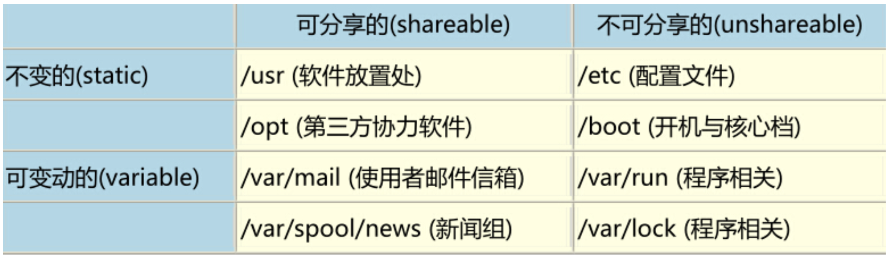
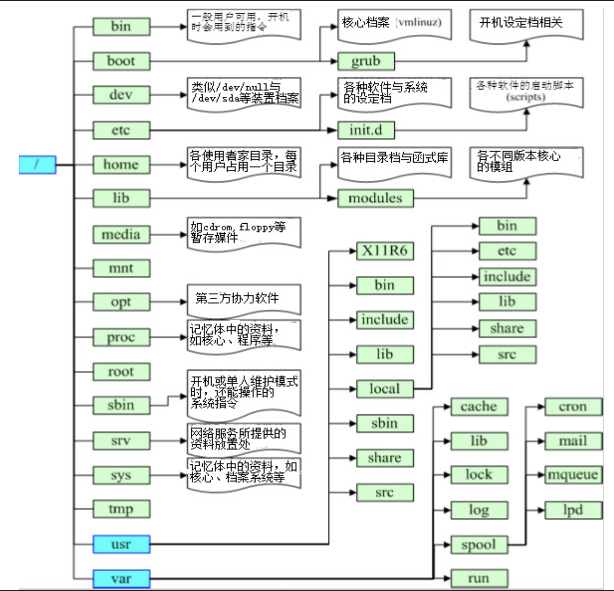
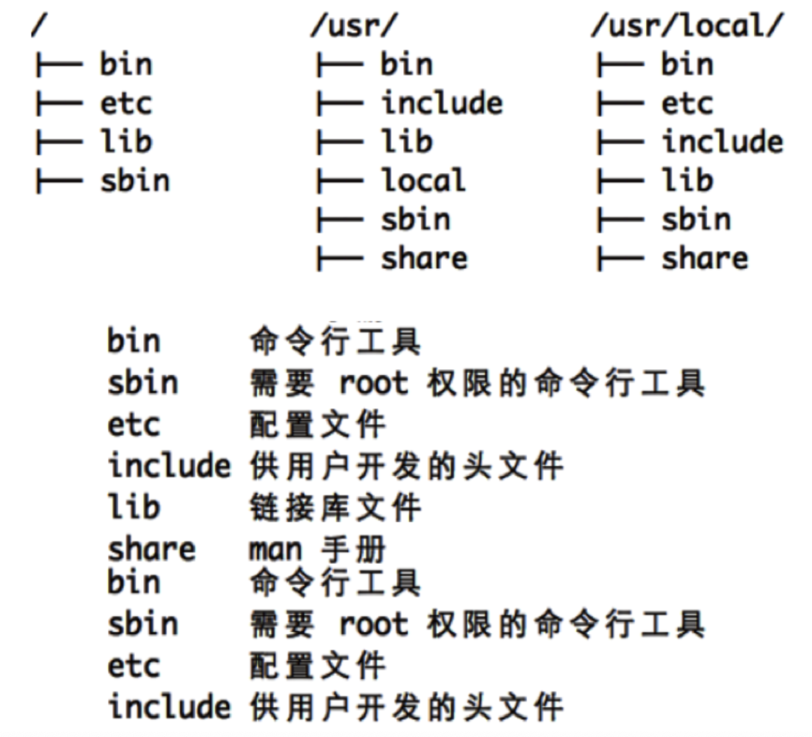
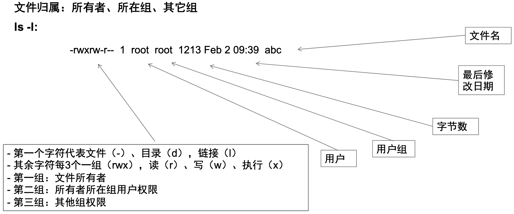
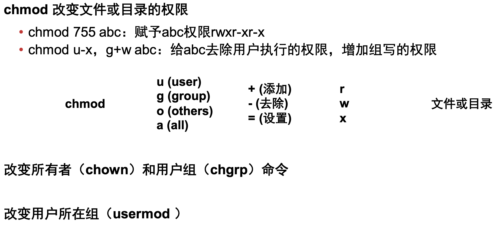
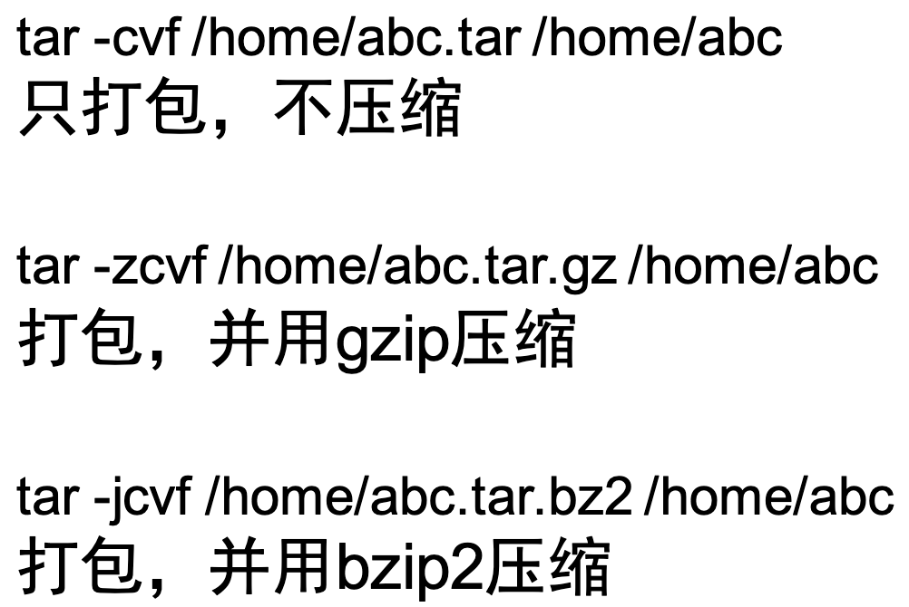

# 前沿：Shell 编程基础

## 1、Linux 目录结构

## 2、权限控制

## 3、常用命令

### (1) 基本操作

- `ls`：显示文件或目录
    - `-l`：列出文件详细信息
    - `-a`：列出当前目录下所有文件及目录(包含隐藏目录)
- `mkdir`：创建目录
    - `-p`：创建目录，若无父目录，则创建
- `cd`：切换目录
- `rmdir`：删除空目录
- `tree`：树形结构显示目录，需要安装 tree 包
- `pwd`：显示当前目录
- `ln`：创建链接文件
- `touch`：创建空文件
- `cp`：拷贝
- `mv`：移动或重命名
- `rm`：删除文件
    - `-r`：递归删除，可删除子目录及文件
    - `-f`：强制删除
- `echo`：创建带有内容的文件
- `cat`：查看文件内容
- `wc`：统计文本中行数、字数、字符数
- `more、less`：分页显示文本文件内容

### (2) 解压缩

`gzip/bzip2/tar`：打包压缩

- `-c`：归档文件
- `-x`：解压缩文件
- `-z`：gzip 压缩文件
- `-j`：bzip2 压缩文件
- `-v`：显示压缩或解压缩过程
- `-f`：使用档名

### (3) 文件查找

- `which`：查看可执行文件的位置

    > 在 PATH 变量指定的路径中搜索某系统命令(返回第一个)

- `whereis`：查看文件的位置

    > - 只搜索二进制文件(参数 `-b`)、man 说明文件(参数 `-m`)、源代码文件(参数 `-s`)
    >
    > - 使用数据库

- `locate`：配合数据库查看文件位置

- `find`：实际搜寻硬盘查询文件名称

### (4) 文件分析

#### 1. grep(查找)

#### 2. sed(编辑)

#### 3. awk(分析&处理)

