# 入门： 计算机初解

- **C 语言编译的四个阶段**： 

  - **预处理阶段**： 预处理以 `#` 开头的命令，得到 `.i` 的文件扩展名

    > 如： 读取 `#include<stdio.h>` ，则会将 `stdio.h` 头文件内容插入程序文本中

  - **编译阶段**： 将文件 `.i` 翻译成文件 `.s`，即汇编文件

  - **汇编阶段**： 将文件 `.s` 翻译成机器语音指令并打包成**可重定位目标程序**，结果保存到 `.o` 文件

  - **链接阶段**： 将 C 语言核心库链接到程序中，得到可执行文件

  

- **理解编译系统的好处**： 
  - **优化程序性能**
  - **理解链接时出现的错误**
  - **避免安全漏洞**

- **编译程序运行流程**： 

  - 可执行程序初始执行后，**shell 将字符读入寄存器，然后再存放到内存**

    

  - 输入结束后，shell 将加载可执行文件，并将文件中的代码和数据从磁盘复制到主存

    

  - 处理器开始执行程序的 main 中的机器语言指令

    > 比如： `printf("hello")` ，机器语言指令会将字符串 `hello` 所在字节从主存复制到寄存器文件，再从寄存器文件复制到显示设备，最终显示再屏幕上

    

- **高速缓存**： 静态随机访问存储器(`SRAM`)

  > - 原理： 利用高速缓存的局部性原理，即程序具有访问局部区域中的数据和代码的趋势
  > - 使用： 通过让高速缓存缓存经常访问的数据，大部分的内存操作就能快速在高速缓存中完成

  

- **存储设备的层次结构**： 

  > 寄存器文件在层次结构中位于最顶部，记为 `L0`

  

- **操作系统功能**： 通过**进程、虚拟内存、文件**来实现

  - 防止硬件被失控的应用程序滥用
  - 向应用程序提供简单一致的机制来控制复杂而又不同的低级硬件设备

  > 文件是对 I/O 设备的抽象表示
  >
  > 虚拟内存是对主存和磁盘 I/O 设备的抽象表示
  >
  > 进程是对处理器、主存、I/O 设备的抽象表示
  >
  > 
  - **进程**： 是操作系统对一个正在运行的程序的一种抽象，一个系统可以运行多个进程，每个进程独占式的使用硬件

    > 并发： 一个进程的指令和另一个进程的指令交错执行
    >
    > 上下文切换： 处理器在进程间进行切换
    >
    > 

  - **线程**： 每个线程运行在进程的上下文中，并共享同样的代码和全局数据

  - **协程**： 比线程更轻量级，由开发者控制，避免了内核陷入的性能消耗

  - **虚拟内存**： 创造进程独占主存的假象

    > - 实现： 通过**虚拟地址空间**，使每个进程看到的内存都是一致的
    >
    > - **虚拟地址空间**： 
    >
    >   - **程序代码和数据**： 直接按照可执行文件的内容初始化
    >   - **运行时堆**： 堆可以在运行时动态的扩展和收缩
    >   - **共享库**：存放共享库的代码和数据的区域 
    >   - **栈**： 编译器使用它来实现函数调用，每次函数调用，栈就增长；每次函数返回，栈就收缩
    >   - 内核虚拟内存： 需要调用内存来实现的操作
    >
    >   

  - **文件**： 字节序列

# 第一部分：程序结构和执行


# 第二部分：在系统上运行程序

## 第七章： 链接

**链接**： 将各种代码和数据收集起来并组合为一个单一文件的过程，这个文件可被加载（或拷贝）到存储器并执行

> - 链接可以执行于编译时，也就是在源代码被翻译成机器代码时
>
> - 也可以执行于加载时，也就是在程序被加载器加载到存储器并执行时
>
> - 甚至执行于运行时，由应用程序来执行
>
> 在早期的计算机系统中，链接是手动执行的；在现代系统中，链接是由叫链接器的自动执行

- 理解链接器将帮助构造大型程序
- 理解链接器将帮助避免一些危险的编程错误
- 理解链接器将帮助语言的作用域规则是如何实现的
- 理解链接器将帮助其他重要的系统概念
- 理解链接器便于利用共享库

### 1. 编译器驱动程序

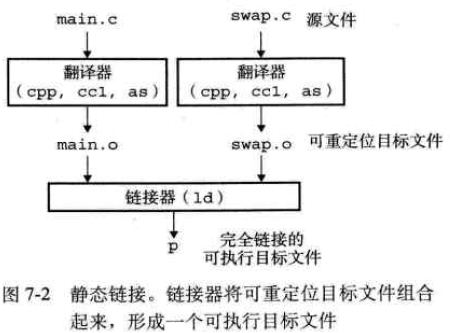

### 2. 静态链接

**静态链接器**： 以一组可重定位目标文件和命令行参数作为输入，生成一个完全链接的可以加载和运行的可执行目标文件作为输出

> 输入的可重定位目标文件由各种不同的代码和数据节组成
>
> 指令在一个节中，初始化的全局变量在另一个节中，而未初始化的变量又在另外一个节中

1. 为了构造可执行文件，链接器必须完成两个主要任务：

   - **符号解析**：目标文件定义和引用符号。符号解析的目的是将每个符号引用刚好和一个符号定义联系起来

   - **重定位**：编译器和汇编器生成从地址 0 开始的代码和数据节。链接器通过把每个符号定义与一个存储器位置联系起来，然后修改所有对这些符号的引用，使得它们指向这个存储器位置，从而重定位这些节

2. 链接器的基本事实：**目标文件纯粹是字节块的集合**，包含程序代码、程序数据、指导链接器、加载器等的数据结构，链接器将这些块连接起来，确定被连接块的运行时位置，并且修改代码和数据块中的各种位置

### 3. 目标文件

- 目标文件的三种形式：
  - **可重定位目标文件**： 包含二进制代码和数据，其形式可以在编译时与其他可重定位目标文件合并起来，创建一个可执行目标文件
  - **可执行目标文件**：包含二进制代码和数据，其形式可以被直接拷贝到存储器并执行
  - **共享目标文件**：特殊的可重定位目标文件，可以在加载或运行时被动态地加载到存储器并链接

- **编译器和汇编器生成可重定位目标文件，链接器生成可执行目标文件**

  > 从技术上来说，一个目标模块就是一个字节序列，而一个目标文件就是一个存放在磁盘文件中的目标模块

### 4. 可重定向目标文件

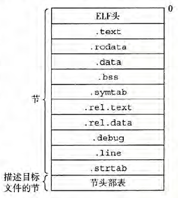

- `.text`： 已编译程序的机器代码

- `.rodata`： 只读数据

- `.data`： 已初始化的全局和静态 C 变量，局部 C 变量在运行时保存在栈中

- `.bass`： 未初始化的全局和静态 C 变量。在目标文件中，这个节不占据实际的空间，仅仅是一个占位符

  > 目标文件格式区分初始化和未初始化变量是为了空间效率

- `.symtab`： 符号表，存放程序中定义和引用的函数和全局变量的信息

  > 每个可重定位目标文件在 `.symtab` 中都有一张符号表

- `.rel.text`： 一个 `.text` 节中位置的列表，当链接器把该目标文件和其他文件结合时，需要修改这些位置

  > 任何调用外部函数或引用全局变量的指令都需要修改，但调用本地函数的指令则不需要修改
  >
  > 可执行目标文件中并不需要重定位信息，因此通常省略，除非用户显示第指示链接器包含这些信息

- `.rel.data`： 被模块引用或定义的任何全局变量的重定位信息

  > 已初始化的全局变量的初始值是一个全局变量地址或者外部定义函数的地址，都需要被修改

- `.debug`： 调试符号表，其条目是程序总定义的局部变量和类型定义，程序中定义和引用的全局变量，以及原始的 C 源文件

- `.line`： 原始 C 源文件中的行号和 `.text` 节中机器指令之间的映射

- `.strtab`： 字符串表，其内容包括 `.symtab` 和 `.debug` 节中的符号表，以及节头部中的节名字

### 5. 符号和符号表

- 每个可重定位目标模块 `m` 都有一个符号表，包含 `m` 所定义和引用的符号的信息

链接器上下文中的三种不同符号：

- **由模块 `m` 定义并能被其他模块引用的全局符号**： 全局链接器符号对应于非静态的 `C` 函数和全局变量

- **由其他模块定义并被模块 `m` 引用的全局符号(外部符号)**： 对应于其它模块中定义的非静态 `C` 函数和全局变量

- **只被模块 `m` 定义和引用的局部符号**： 对应于带 `static` 属性的 `C` 函数和全局变量

  > 这些符号在模块 `m` 中随处可见，但不能被其他模块引用

利用 `static` 属性隐藏变量和函数名字： 

- 定义为带有 `C static` 属性的本地过程变量不在栈中管理，编译器在 `.data` 和 `.bss` 中为每个定义分配空间，并在符号表中创建一个唯一有名字的本地链接器符号

- 利用 `static` 属性隐藏变量和函数名字，任何声明带有 `static` 属性的全局变量或函数都是模块私有的

**符号表示例**： 

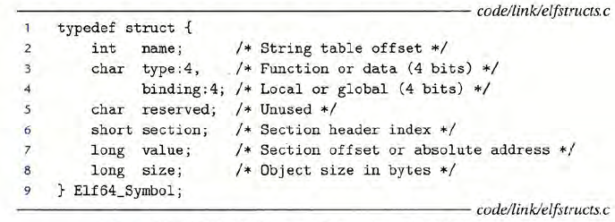

- `name` 是字符串表中的字节偏移，指向符号的以 null 结尾的字符串名字

- `value` 是符号的地址

  > - 对于可重定位的模块而言，value 是距定义目标的节的起始位置的偏移
  > - 对于可执行目标文件而言，该值是一个绝对运行时地址

- `size` 是目标的大小，以字节为单位

- `type` 是数据或函数

- `binding` 字段表示符号是本地的还是全局的

- `section` 字段表示一个到节头部表的索引

### 6. 符号解析

#### 1. 链接器解析多重定义的全局符号

- 编译时，编译器向汇编器输出每个全局符号，汇编器把信息隐含地编码在可重定位目标文件的符号表里

  > 函数和已初始化的全局变量是强符号，未初始化的全局变量是弱符号

- 根据强弱符号的定义，Unix 链接器使用下面的规则来处理多重定义的符号：
  - 规则1：**不允许有多个强符号**
  - 规则2：**如果有一个强符号和多个弱符号，那么选择强符号**
  - 规则3：**如果有多个弱符号，那么从这些弱符号中任意选择一个**

#### 2. 与静态库链接

- 可以用形式如下的命令行来**编译和链接**：

  ```shell
  gcc main.c /usr/lib/libm.a /usr/lib/libc.a
  ```

- 在 Unix 系统中，静态库以一种称为**存档**的特殊文件格式存放在磁盘中

  > 存档文件是一组连接起来的可重定位目标文件的集合，有一个头部用来描述每个成员目标文件的大小和位置，由后缀 `.a` 标识

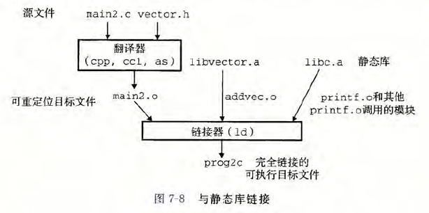

#### 3. 链接器使用静态库来解析引用

- 符号解析阶段，链接器从左到右按照在编译器驱动程序上出现的顺序来扫描可重定位目标文件和存档文件

  > 在这次扫描中，链接器维持： 
  >
  > - 一个可重定位目标文件的集合 `E`： 这个集合中的文件会被合并起来形成可执行文件
  > - 一个未解析的符号集合 `U`： 引用但尚未定义的符号
  > - 一个在前面输入文件中已定义的符号集合 `D`

  对于命令行上的每个输入文件 `f`，链接器会判断 `f` 是目标文件还是存档文件：

  - 如果 `f` 是目标文件，则链接器把 `f` 添加到 `E`， 修改 `U` 和 `D` 来反映 `f` 中的符号定义和引用，并继续下一个输入文件

  - 如果 `f` 是存档文件，则链接器就尝试匹配 `U` 中未解析的符号和由存档文件成员定义的符号

    > - 如果某个存档文件成员 `m`，定义了一个符号来解析 `U` 中的一个引用，则将 `m` 加到 `E` 中，并且链接器修改 `U` 和 `D` 来反映 `m` 中的符号定义和引用

  如果当链接器完成对命令行上输入文件的扫描后，`U` 非空，则链接器就输出一个错误并终止

  否则，它会合并和重定位 `E` 中的目标文件，从而构建输出的可执行文件

- **缺陷**： 

  - 因为命令行上的库和目标文件的顺序非常重要，则命令行中，如果定义一个符号的库出现在引用这个符号的目标文件之前，则引用就不能被解析，链接会失败

    > 关于库的一般准则： **将符号库放在命令行的结尾**

  - 如果库不相互独立，则必须排序，使得对于每个被存档文件的成员外部引用的符号 `s`，在命令行中至少有一个 `s` 的定义是在对 `s` 的引用之后

### 7. 重定位

- 链接器完成符号解析后，代码中的符号引用和确定的符号定义就已联系起来

  > 当链接器知道输入目标模块中的代码节和数据节的确切大小后，就可以开始重定位，在这个步骤中，将合并输入模块，并为每个符号分配运行时地址

- 重定位由两步组成：
  - **重定位节和符号定义**： 链接器将所有相同类型的节合并为同一类型的新的聚合节。然后，链接器将运行时存储器地址赋给新的聚合节，赋给输入模块定义的每个节，以及赋给输入模块定义的每个符号

    > 当这步完成时，程序中的每个指令和全局变量都有唯一的运行时存储器地址

  - **重定位节中的符号引用**： 链接器修改代码节和数据节中对每个符号的引用，使得它们指向正确的运行时地址，为了执行这一步，链接器依赖于称为重定位条目的可重定位目标模块中的数据结构

#### 7.1 重定位条目

- 当汇编器遇到对最终位置的目标引用时，会生成一个**重定位条目**，告诉链接器在目标文件合并成可执行文件时如何修改这个引用

  > 代码的重定位条目放在 `.rel.text` 中，已初始化的数据的重定位条目放在 `.rel.data` 中

**2.** ELF定义了11种不同的重定位类型。其中两种最基本的重定位类型：

- `R_ 386_PC32` 重定位一个使用 32 位 PC 相对地址的引用
- `R_ 386_32` 重定位一个使用 32 位绝对地址的引用

#### 7.2 重定位符号引用

链接器修改代码节和数据节中对每个符号的引用，使得他们指向正确的运行时地址

1. 重定位 PC 相对引用
2. 重定位绝对引用

### 8. 可执行目标文件

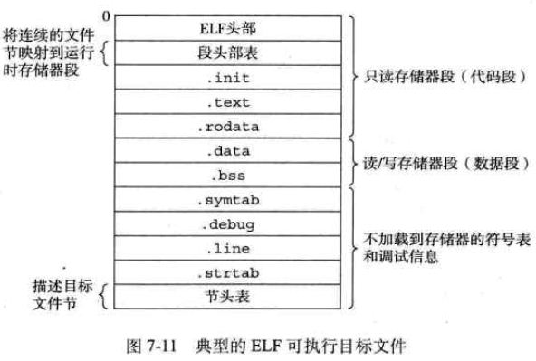

### 9. 加载可执行目标文件

- **加载**： 将程序拷贝到存储器并运行的过程

  > 任何 Unix 程序都可以通过调用 `execve` 函数来调用加载器，加载器将可执行目标文件中的代码和数据从磁盘拷贝到存储器中，然后通过跳转到程序的第一条指令或入口点来运行该程序

- **运行时存储器映象**： 

  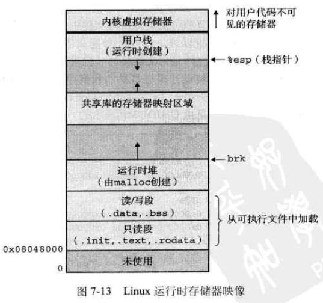

### 10. 动态链接共享库

- **动态链接**： 在运行时，共享库可以加载到任意的存储器地址，并加一个在存储器中的程序链接起来

  > 共享库也称为共享目标，Unix 系统中通常用 `.so` 后缀表示
  >
  > ```shell
  > # 调用编译器构造向量运算示例程序的共享库libvector.so：
  > gcc -shared -fPIC -o libvector.so addvec.c multvec.c
  > 
  > # 将库链接到程序中,创建一个可执行目标文件p2：
  > gcc -o p2 main.c /libvector.so
  > ```

- 动态链接器通过执行下面的重定位完成链接任务：
  - 重定位 `libc.so` 的文本和数据到某个存储器段
  - 重定位 `libvector.so` 的文本和数据到另一个存储器段
  - 重定位 `p2` 中所有对 `libc.so` 和 `libvector.so` 定义的符号的引用
  - 最后动态链接器将控制传递给应用程序，此时共享库的位置已固定，并且在程序执行的过程中不会改变

### 11. 从应用程序加载和链接共享库

- `void* dlopen(const char *libname,int flag)`： dlopen 必须在 dlerror，dlsym 和 dlclose 之前调用，表示要将库装载到内存，准备使用

  > 如果 dlopen 操作失败，返回 NULL 值；如果库已经被装载过，则 dlopen 会返回同样的句柄

  `libname`： 指库的全路径或名称

  - 若为全路径，`dlopen` 会直接装载该文件
  - 若只指定库名称，`dlopen` 会按照下面的机制搜寻：
    - 根据环境变量 `LD_LIBRARY_PATH` 查找
    - 根据 `/etc/ld.so.cache` 查找
    - 查找依次在 `/lib` 和 `/usr/lib` 目录查找

  `flag` 参数表示处理未定义函数的方式，可以使用 `RTLD_LAZY` 或 `RTLD_NOW`

  - `RTLD_LAZY`： 表示暂时不去处理未定义函数，先把库装载到内存，等用到没定义的函数再说
  - `RTLD_NOW`： 表示马上检查是否存在未定义的函数，若存在，则 dlopen 以失败告终

- `char*dlerror(void)`： 获得最近一次 `dlopen,dlsym,dlclose` 操作的错误信息，返回 NULL 表示无错误

  > `dlerror` 在返回错误信息的同时，也会清除错误信息

- `void* dlsym(void *handle,const char *symbol)`： 在 dlopen 将库装载到内存后，获得指定函数(symbol)在内存中的位置(指针)；如果找不到指定函数，则 dlsym 会返回 NULL 值函数原型

  > 注释： 判断函数是否存在最好的方法是使用 `dlerror` 函数

- `int dlclose(void *)`： 将已经装载的库句柄减一，

  - 如果句柄减至零，则该库会被卸载
  - 如果存在析构函数，则在 `dlclose` 之后，析构函数会被调用

### 12. 位置无关代码

- 定义： 编译库代码，使不需要链接器修改库代码就可以在任何地址加载和执行这些代码，简称： `PIC`

多个进程共享程序的拷贝方式： 

- 给每个共享库分配一个事先预备的专用的地址空间片(chunk) ，然后要求加载器总是在这个地址加载共享库

- 编译库代码，使得不需要链接器修改库代码就可以在任何地址加载和执行这些代码，即位置无关代码

**全局偏移量**： 编译器在数据段开始的地方创建的表，无论在存储器中的何处加载一个目标模块，数据段总是被分配成紧随在代码段后面

### 13. 处理目标文件的工具

- `.AR`： 创建静态库，插入、删除、列出和提取成员

- `.STRINGS`： 列也一个目标文件中所有可打印的字符串

- `.STRIP`： 从目标文件中删除符号表信息

- `.NM`： 列出一个目标文件的符号表中定义的符号

- `.SIZE`： 列出目标文件中节的名字和大小

- `.READELF`： 显示一个目标文件的完整结构，包括且F 头中编码的所有信息。包含SIZE 和NM 的功能

- `.OBJDUMP`： 所有二进制工具之母，能够显示一个目标文件中所有的信息

  > 最大的作用： 反汇编 `.text` 节中的二进制指令

- `.LDD`： 列出一个可执行文件在运行时所需要的共享库

## 第八章： 异常控制流

### 1. 异常

- **异常处理程序**： 当处理器检测到有事件发生时，会通过**异常表**的跳转表，进行一个间接过程调用，到一个专门设计用来处理这类时间的操作系统子程序

- **异常**： 处理器状态中的事件，触发了从应用程序到异常处理程序的突发性控制转移

- **异常类别**： 

  - **中断**： 中断是异步发生的，是来自处理器外部的 I/O 设备的信号的结果

  - **陷阱**：在用户程序和内核之间提供一个像过程一样的接口，叫做系统调用

    > - 普通函数运行在用户模式，只能访问与调用函数相同的栈
    > - 系统调用运行在内核模式，内核模式允许系统调用执行指令，并访问定义在内核中的栈
    >
    > 每个系统调用都有一个唯一的整数号，对应于一个到内核中跳转表的偏移量

  - **故障**：由错误引起，能被故障处理程序修正

    > 当故障发生时，处理器将控制转移给故障处理程序： 
    >
    > - 若处理程序能够修正这个错误情况，它将控制返回给引起故障的指令，从而重新执行它
    > - 否则，处理程序返回到内核中的 abort 例程，终止引起故障的应用程序

  - **终止**：处理程序将控制返回给 abort 例程，该例程会终止这个应用程序 

### 2. 进程

- **进程**： 一个执行中的程序的实例，系统中每个程序都运行在某个**进程的上下文**中

  > 当用户向外壳输入一个可执行目标文件运行时，**外壳会创建一个新进程**，然后在新进程的上下文中来运行该可执行目标文件

- **逻辑控制流**： 进程轮流使用处理器，每个进程执行流的一部分，然后被抢占(暂时挂起)

  > 对于一个运行在进程中的上下文中的程序，看上去就像是在独占地使用处理器

- **并发流**： 一个逻辑流的执行在时间上与另一个流重叠，并发的执行

  > - **并发**： 多个流并发执行
  >
  >   > **并行流**： 是并发流的一个真子集，多个流同时运行在计算机中(**并行的运行，且并行地执行**)
  >
  > - **多任务**： 一个进程和其他进程轮流运行

- **私有地址空间**： 

  > - 地址空间**底部保留给用户程序**，包括： 通常的文本、数据、堆和栈段
  > - 地址空间**顶部保留给内核**，包括： 内核在代表进程执行指令时使用的代码、数据和栈
  >
  > 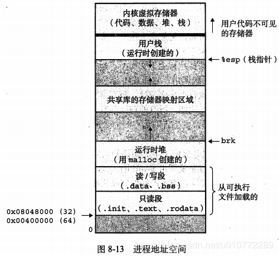

- **用户模式和内核模式**： 

  > - 运行应用程序代码的进程初始在用户模式中
  >
  > - 进程从用户模式进入内核模式的方法： 诸如中断、故障、陷入系统调用等异常
  >
  >   > - 当异常发生时，控制传递到异常处理程序，处理器将模式从用户模式变为内核模式。
  >   >
  >   > - 处理程序运行在内核模式，当它返回到应用程序代码时，处理器就把模式从内核模式改回到用户模式

- **上下文切换**： 操作系统内核通过**上下文切换**这种较高层形式的异常控制流来实现多任务

  > - **作用**： 内核为每一个进程维持一个上下文，上下文就是内核重新启动一个被抢占的进程所需的状态
  >
  > - **调度**：在内核调度一个新进程后，就抢占当前进程，并使用**上下文切换**的机制来将控制转移到新进程
  >
  >   1. 保存当前进程的上下文
  >
  >   2. 回复某个先前被抢占的进程被保存的上下文
  >   3. 将控制传递给这个新恢复的进程
  >
  > 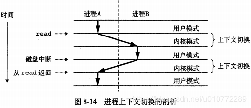

### 3. 进程控制

- **获取进程 ID**： 

  ```c
  pid_t getpid(void);  //返回调用进程的PID
  pid_t getppid(void); //返回父进程的PID
  ```

- **创建和终止进程**： 

  > **进程的三种状态**： 
  >
  > - **运行**：要么在CPU上执行，要么等待被执行
  >
  > - **停止**：进程被挂起，且不会被调度
  >
  >   > 当收到 `SIGSTOP, SIGTSTP, SIDTTIN, SIGTTOU` 信号时，进程就停止
  >   >
  >   > 当收到 `SIGCONT` 信号，进程再次开始运行
  >
  > - **终止**：进程永远停止，终止的原因：
  >
  >   - 收到一个信号，默认行为是终止进程
  >   - 从主程序返回
  >   - 调用 `exit` 函数
  >
  > **创建新进程**： `pid_t fork(void)`，子进程返回 `0`，父进程返回子进程 `PID`，出错返回 `-1` 

- **回收子进程**： 进程终止时，内核并不立即把它从系统中清除，而是保持在已终止状态，直到被其父进程回收

  > - **僵死进程**： 终止了但还未被回收的进程（仍然消耗系统的存储资源）
  >
  > - `pid_t waitpid(pid_t pid, int *status, int options)`：用于等待子进程终止或停止；如果成功，则返回子进程 PID，如果WHOHANG，则返回 0，其他错误返回 -1
  >
  >   > `waitpid` 默认挂起调用进程的执行，直到其等待集合的一个子进程终止；若等待集合的一个进程在刚调用时就已终止，则立即返回。此时，内核会完全删除已终止的子进程
  >   >
  >   > `pid_t wait(int *status)`： 等价 `waitpid(-1,&status,0)` 
  >   >
  >   > - **等待集合由 `pid` 确定**： 
  >   >
  >   >   - `pid > 0`： 等待集合就是进程 id 等于 PID 的子进程
  >   >   - `pid = -1`： 等待集合是由父进程所有的子进程组成
  >   >
  >   > - **修改默认行为 `options`**：
  >   >
  >   >   - `WNOHANG`： 若等待集合中任何子进程都没有终止，则立即返回 0
  >   >   - `WUNTRACED`： 挂起调用进程的执行，直到等待集合中一个进程变成已终止或被停止，返回导致已终止或被停止子进程的 PID
  >   >
  >   >   - `WNOHANG|WUNTRACED`： 立即返回，若等待集合中没有任何子进程被停止或已终止，则返回 0，否则返回被停止或终止子进程的 PID
  >   >
  >   > - **检查已回收子进程的退出状态 `status`**： 
  >   >
  >   >   - `WIFEXITED`： 如果子进程通过调用 `exit` 或正常终止，则返回 true
  >   >   - `WEXITSTATUS`： 当 `WIFEXITED=true` 时，返回一个正常终止的子进程的退出状态
  >   >   - `WIFSIGNALED`： 如果子进程因一个未被捕获的信号终止，则返回 true
  >   >   - `WTERMSIG`： 当 `WIFSIGNALED=true` 时，返回导致子进程终止的信号的编号
  >   >   - `WIFSTOPPED`： 如果引起返回的子进程已停止，则返回 true
  >   >   - `WSTOPSIG`： 如果子进程收到 `SIGCONT` 信号重新启动时，返回 true
  >   >
  >   > - **错误条件**： 
  >   >
  >   >   - 若调用进程没有子进程，则 `waitpid` 返回 `-1`，并设置 `errno` 为 `ECHILD`
  >   >   - 若 `waitpid` 被一个信号中断，则返回 `-1`，并设置 `errno` 为 `EINTR`

- **让进程休眠**： 

  > - `sleep`： 将一个进程挂起一段指定的时间
  > - `pause`： 让调用函数休眠，直到该进程收到一个信号

- 加载并运行程序： `execve` 在当前进程上下文中加载并运行一个新程序

  > `int execve(const char *filename, const char *argv[], const char *envp[])`： 当出现错误时，`execve` 才会返回，因此 `execve` 调用一次但不返回
  >
  > - `filename`：可执行的目标文件 
  > - `argv[]`：参数列表
  > - `envp[]`：环境变量列表
  >
  > 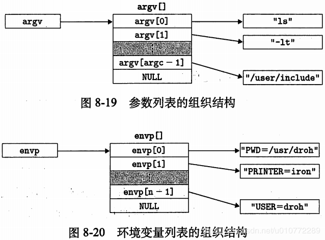

### 4. 信号

- **Unix 信号**： 一种更高层的软件形式的异常，允许进程中断其他进程

信号类型： 

- **发送信号**： Unix 系统提供的向进程发送信号的机制都基于进程组

  > - **进程组**： 每个进程都只属于一个进程组，子进程和父进程默认属于一个进程组
  >
  >   - `pid_t getpgrp(void)`： 获取当前进程的进程组 ID
  >
  >   - `int setpgid(pid_t pid, pid_t pgid)`： 将进程 pid 的进程组改为 pgid
  >
  >     > - 若 pid 为0，使用当前进程的 pgid
  >     > - 若 pgid 为0，使用 pid 作为进程组 ID
  >
  > - 发送信号的方式： 
  >
  >   - `/bin/kill -9 15213`： 发送信号9(SIGKILL)到进程15213
  >
  >     > 负 PID(如： PID=-1) 会导致信号被发送到进程组 PID 中的每个进程
  >
  >   - 从键盘发送信号： `ctrl-c` 会使内核向每个前台进程组中的成员发送一个 SIGINT 信号
  >
  >   - 函数 `kill` 发送信号： 
  >
  >     > - `pid>0`： kill 函数发送信号 sig 给进程 pid
  >     > - `pid<0`： kill 发送信号 sig 给进程组 abs(pid) 中的每个进程
  >
  >   - 函数 `alarm` 发送信号： 进程可调用 alarm 向它自己发送 SIGALRM 信号，alarm 函数安排内核在 secs 秒内发送一个 SIGALRM 信号给调用进程

- **接收信号**： 当内核把进程 p 从内核模式切换到用户模式时，会检查进程 p 的未被阻塞的待处理信号的集合： 

  - 若集合为空，则内核将控制传递到 p 的逻辑控制流中的下一条指令

  - 若集合非空，则内核选择集合中的某个信号 k，并强制 p 接收信号 k

    > 收到这个信号，会触发进程采取某种行为，一旦进程完成该行为，则控制就传递回 p 的逻辑控制流中的下一条指令，其中，每个信号都有一个预定义的默认行为： 
    >
    > - 进程终止
    > - 进程终止并转储内存
    > - 进程停止直到被 SIGCONT 信号重启
    > - 进程忽略该信号
    >
    > `sighandler_t signal(int signum,sighandler_t handler)`： 修改和信号相关联的默认行为
    >
    > - `handler` 是 `SIG_IGN`，则忽略类型为 `signum` 信号
    >
    > - `handler` 是 `SIG_DFL`，则类型为 `signum` 信号行为恢复为默认行为
    >
    > - `handler` 是用户定义的函数地址，这个函数称为信号处理程序，只要进程接收到一个类型为 `signum` 信号，就会调用该程序
    >
    >   > 设置信号处理程序： 把处理程序的地址传递到 `signal` 函数从而改变默认行为

- 阻塞和解除阻塞信号： 

  > - **隐式阻塞机制**： 内核默认阻塞任何当前处理程序正在处理信号类型的待处理的信号
  >
  >   > 例： 程序正在处理 `S`，这时捕获了 `A`，则直到 `S` 返回，`A` 会变成待处理而没有被接收
  >
  > - **显式阻塞机制**： 函数 `sigprocmask` 及其辅助函数可以明确阻塞和解除阻塞选定的信号

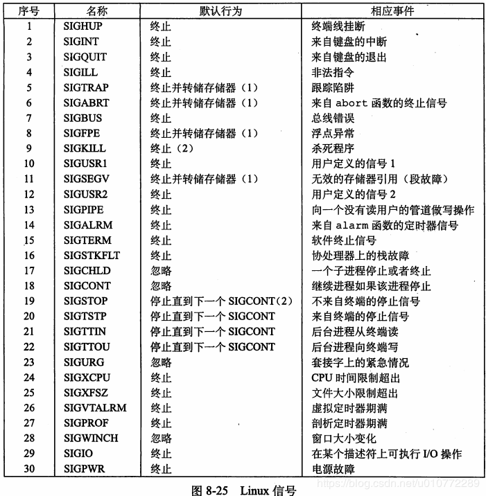

### 5. 非本地跳转

**非本地跳转**： 用户级异常控制流形式

- 可以**控制直接从一个函数转移到另一个当前正在执行的函数**，不需要经过**调用-返回**序列，通过函数 `setjmp 和 longjmp` 实现

  > - `int setjmp(jmp_buf env)`： 在 `env` 缓冲区中保存当前调用环境，以供后面的 `longjmp` 使用，并返回 0
  > - `int longjmp(sigjmp_buf env,int retval)`： 从 `env` 缓冲区中恢复调用环境，然后触发一个从最近一次初始化 `env` 的 `setjmp` 调用的返回，最后 `setjmp` 返回一个带有非零值的 `retval`

- **使一个信号处理程序分支到一个特殊的代码位置**，而不是返回到被信号到达中断了的指令的位置

  > - 在程序第一次启动时，对 `sigsetjmp` 函数的初始调用保存调用环境和信号的上下文
  > - 随后，主函数进入一个无限处理循环，当进程捕获终止信号时，处理程序完成一个非本地跳转，回到 `main` 函数的开始处

### 6. 操作进程的工具

- `STRACE`： 打印一个正在运行的程序和其子进程调用的每个系统调用的轨迹
- `PS`： 列出当前系统中的进程(包括僵死进程)
- `TOP`： 打印出关于当前进程资源使用的信息
- `PMAP`： 显示进程的内存映射

## 第九章： 虚拟内存

### 1. 寻址与地址空间

#### 1. 物理和虚拟寻址

- **物理地址**： 计算机系统的主存被组织成一个由 M 个连续的字节大小的单元组成的**数组**，每个字节都有一个唯一的物理地址
- **虚拟地址**： CPU 通过生成一个虚拟地址来访问内存，虚拟地址在被传送到存储器之前转换成物理地址

#### 2. 地址空间

- **虚拟地址空间**： CPU 从一个有 $N=2^n$ 个地址的地址空间中生成虚拟地址
- **物理地址空间**： 对应系统中物理存取器的 M 个字节

### 2. 虚拟内存作为工具

#### 1. 缓存工具

- **虚拟存储(VM)**： 被组织成存放在磁盘上的 N 个连续的字节大小的单元组成的数组，每字节都有唯一的虚拟地址，磁盘上数组的内容被缓存在主存中

- **虚拟页与物理页**： VM 系统将虚拟存储器分割成大小固定的块，称为虚拟页

  > 类似地，物理存储器也被分割成物理页

- 虚拟页面的集合可分为:

  - **未分配的**： VM 系统还未分配或的页，没有任何数据与之关联，因此不占用任何磁盘空间
  - **缓存的**： 当前缓存在物理存储器中的已分配页

  - **未缓存的**： 没有缓存在物理存储器中的已分配页

  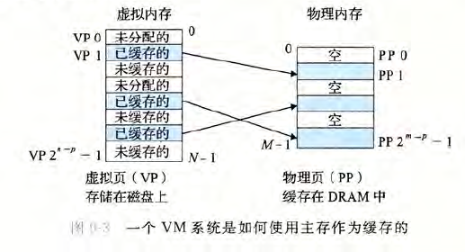

缓存的详细介绍： 

- **DRAM 缓存的组织结构**： 

  - **SRAM 缓存**： 表示位于 CPU 和主存之间的 L1,L2,L3 高速缓存
  - **DRAM 缓存**： 表示虚拟存储器系统的缓存，在主存中缓存虚拟页

- **页表**： 存放在物理存储器中，将虚拟页映射到物理页，每次地址翻译硬件将一个虚拟地址转换为物理地址时都会读取页表

  > 虚拟存储器系统必须有某种方法来判断一个虚拟页是否存放在DRAM中： 
  >
  > - 如果存在(命中)： 还得确定这个虚拟页存放在哪个物理页中
  > - 如果不存在(不命中)： 系统需判断该虚拟页在磁盘的哪个位置，在物理存储器中选择一个牺牲页，并将虚拟页从磁盘拷贝到 DRAM 中，替换这个牺牲页
  >
  > 页表就是一个页表条目(PTE) 的数组，每个 PTE 由一个有效位和一个 n 位地址字段组成，有效位表明该虚拟页当前是否被缓存在 DRAM 中：
  >
  > - 若设置了有效位，则地址字段表示 DRAM 中相应物理页的起始位置，这个物理页中缓存了该虚拟页
  >
  > - 若没有设置有效位，则空地址表示该虚拟页还未被分配，否则该地址指向虚拟页在磁盘上的起始位置
  >
  > 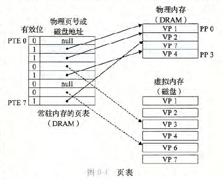

- **页命中**： 查询页表，通过地址翻译硬件来确定页面是否已被缓存

- **缺页**： 在虚拟存储器中，DRAM 缓存不命中

  > - CPU 引用 VP3 中的一个字，但 VP3 并未缓存在 DRAM 中，因此地址翻译硬件从存储器中读取 PTE3，从有效位推断 VP3 并未缓存，从而触发一个缺页异常
  >
  > - 缺页异常调用内核中的缺页异常处理程序，该程序会选择一个牺牲页，如 VP4。若 VP4 已被修改，那么内核就会将它拷贝回磁盘
  >
  > - 接着，内核从磁盘拷贝 VP3 到存储器中的 PP3，更新 PTE3，随后返回。当异常处理程序返回时，会重新启动导致缺页的指令，该指令会把导致缺页的虚拟地址重发送到地址翻译硬件。但现在VP3已经缓存在主存中，那么页命中也能由地址翻译硬件正常处理了
  >
  > 流程： 
  >
  > 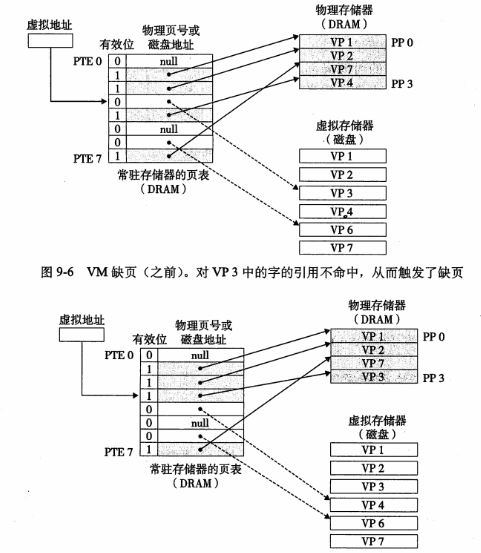

- 局部性降低不命中处罚： 局部性保证了在任意时刻，**程序往往在一个较小的活动页面集合(工作集)上工作**

  > 缺点： 如果工作集的大小超出了物理存储器的大小，则程序会**将页面不断换进换出，即颠簸(抖动)**

#### 2. 内存管理工具

- **多进程可共享页面**： 操作系统为每个进程提供一个独立的页表，即独立的虚拟地址空间，多个虚拟页面可以映射到同一个共享物理页面上

  > 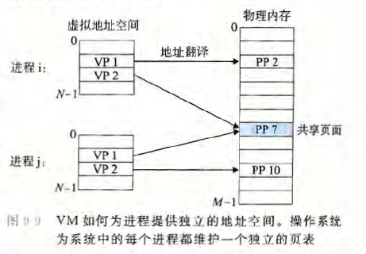

- **按需页面调度和独立的虚拟地址空间的结合**，同时 VM 简化了链接和加载、代码和数据共享，以及应用程序的存储器分配：

  - **简化链接**： 独立的地址空间允许每个进程的存储器影像使用相同的基本格式，而不管代码和数据实际存放在物理存储器的何处
  - **简化加载**： 加载器从不实际拷贝任何数据从磁盘到存储器，在每个页初次被引用时，虚拟存储器系统会按照需要自动调入数据页
  - **简化共享**： 
    - 每个进程都有自己**私有的代码、数据、堆和栈区域**，操作系统创建页表，将相应的虚拟页映射到不同的物理页面
    - 同时，操作系统通过将不同进程中适当的虚拟页面映射到相同的物理页面，从而安排多个进程共享这部分代码的一个拷贝

  - **简化存储器分配**： 当用户进程中的程序要求额外的堆空间时，操作系统分配某些连续的虚拟存储器页面，且将它们映射到物理存储器中任意位置的 k 个任意的物理页面

    > - 优点： 由于页表的工作方式，操作系统没必要分配 k 个连续的物理页面，页面可以随机分散在物理存储器中

#### 3. 内存保护工具

- 保护内容： 

  - 不允许用户进程修改操作系统的只读代码块和数据结构
  - 不允许当前进程读或写其他进程的私有内存
  - 不允许当前进程修改与其他进程共享的虚拟页面

- 实现方式： 每次 CPU 生成一个地址时，地址翻译硬件都会读 PTE，并在 PTE 上添加额外许可位来控制对一个虚拟页面内容的访问

  > 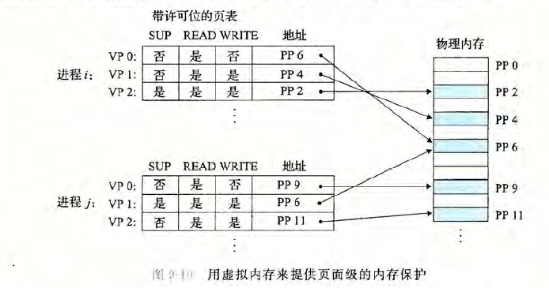

### 3. 地址翻译

- 地址翻译： 是一个 N 元素的虚拟地址空间中的元素和一个 M 元素的物理地址空间中元素之间的映射

  > MMU 利用页表来实现这种映射
  >
  > 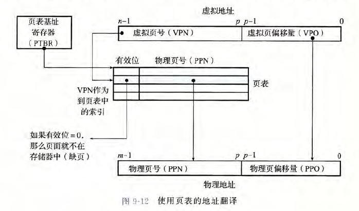
  >
  > **页面命中**时的 CPU 硬件执行步骤： 
  >
  > 1. 第一步： 处理器生成一个虚拟地址，并把它传送给 MMU
  > 2. 第二步： MMU 生成 PTE 地址，并从高速缓存/主存请求得到它
  > 3. 第三步： 高速缓存/主存向 MMU 返回 PTE
  > 4. 第四步： MMU 构造物理地址，并它传送给高速缓存/主存
  > 5. 第五步： 高速缓存/主存返回所请求的数据给处理器
  >
  > 
  >
  > **缺页**时的 CPU 执行步骤： 
  >
  > 1. 第一步到第三步同上面
  > 2. 第四步： PTE 中的有效位为零，所以 MMU 触发一次异常，传递 CPU 中的控制到操作系统内核中的缺页异常处理程序
  > 3. 第五步： 缺页处理程序确定出物理内存中的牺牲页，若该页已被修改，则换出到磁盘
  > 4. 第六步： 缺页处理程序调入新的页面，并更新内存中的 PTE
  > 5. 第七步： 缺页处理程序返回到原来的进程，再次执行导致缺页的指令，CPU 将引起缺页的虚拟地址重新发送给 MMU
  >
  > 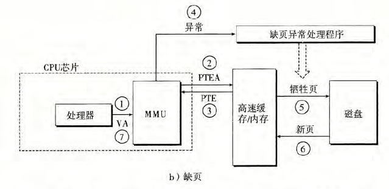

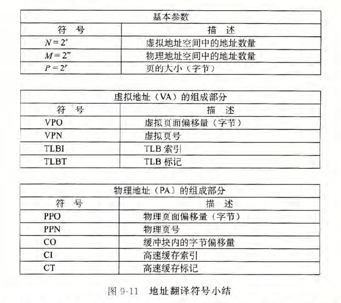

加速地址翻译： 

- **结合高速缓存和虚拟地址**： 

  > 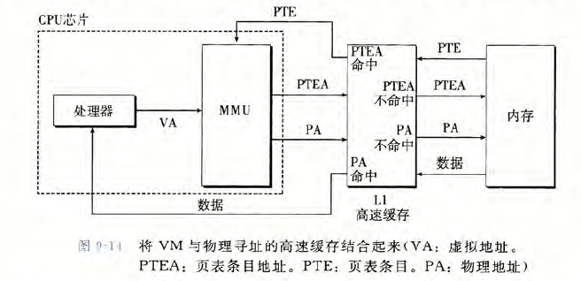

- **利用 TLB 加速地址翻译**： 

  > - 翻译后备缓冲器(TLB)： 一个小的、虚拟寻址的缓存，其中每一行都保存着一个由单个 PTE 组成的块
  >
  >   > TLB 通常有高度的相联度
  >
  > - TLB 的命中与不命中的步骤： 
  >
  >   - TLB 命中： 
  >     - 第一步： CPU 产生一个虚拟地址
  >     - 第二步和第三步： MMU 从 TLB 中取出相应的 PTE
  >     - 第四步： MMU 将该虚拟地址翻译成一个物理地址，并将它发送到高速缓存/主存
  >     - 第五步： 高速缓存/主存将所请求的数据字返回给 CPU
  >   - TLB 不命中： MMU 从 L1 缓存中取出相应的 PTE，新取出的 PTE 存放在 TLB 中，可能覆盖一个已经存在的条目
  >
  >   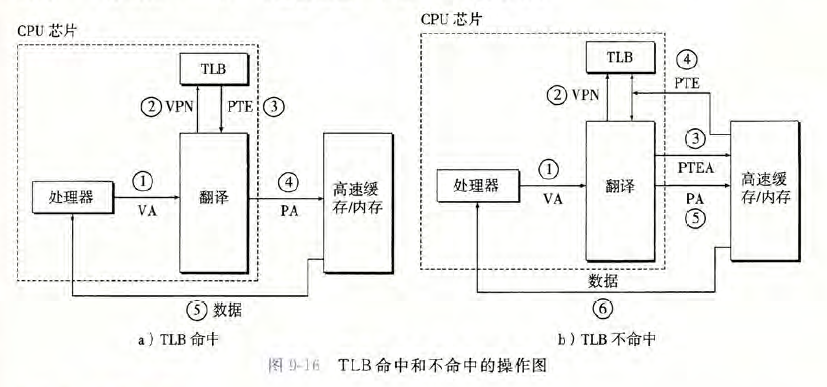

- **多级页表**： 使用层次结构的页表来压缩页表

  > 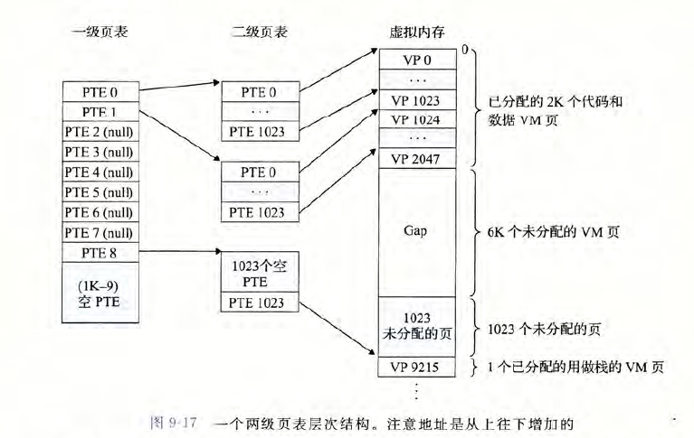

### 4. 内存映射与动态内存分配

#### 1. 内存映射

- **内存映射(存储器映射)**： Linux 通过将一个虚拟存储器区域与一个磁盘上的对象关联起来，以初始化这个虚拟存储器区域的内容

- **共享对象**： 一个对象可被映射到虚拟存储器的一个区域，要么作为**共享对象**，要么作为**私有对象**

  > - **写时拷贝**： 私有对象使用写时拷贝技术被映射到虚拟存储器
  >
  > - 私有对象操作流程： 
  >
  >   - 一个私有对象开始时和共享对象一样，在物理存储器中只保存私有对象的一份拷贝
  >
  >   - 对于每个映射私有对象的进程，相应私有区域的页表条目都被标记为只读。只要没有进程试图写它自己的私有区域，就可以继续共享物理存储器中对象的一个单独拷贝
  >   - 当一个进程试图写私有区域内的某个页面，写操作会触发一个保护故障。故障处理程序会在物理存储器中创建一个新拷贝，更新页表条目指向这个新的拷贝，然后恢复这个页面的可写权限
  >   - 当故障处理程序返回时，CPU 重新执行写操作，写时拷贝充分使用了稀有的物理存储器
  >
  > 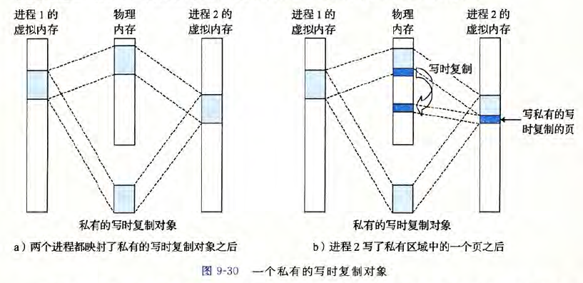
  >
  > 实际应用： 
  >
  > - `fork` 函数： 
  >
  >   - 当 fork 函数被当前进程调用时，内核为新进程创建各种数据结构，并分配一个唯一 PID
  >   - 为了创建虚拟内存， 会创建当前进程的 mm_struct、区域结构和页表的原样拷贝
  >   - 将两个进程中的每个页面都标为只读，并将两个进程中的每个区域结构都标为私有的写时拷贝
  >
  >   子进程与父进程的虚拟存储器相同，当这两个进程中有一个进行写操作，写时拷贝机制会创建新页面，也就为每个进程保持了私有地址空间
  >
  > - `execve` 函数： 进程执行 `execve(“a.out”, NULL, NULL)` 加载并运行 `a.out` 需要以下几步:
  >
  >   - 删除已存在的用户区域： 删除当前进程的虚拟地址的用户部分的已存在的区域结构
  >   - 映射私有区域： 为新程序的文本、数据、bss 和栈区域创建新的区域结构，所有新区域都是私有的，写时拷贝的
  >   - 映射共享区域： 若 `a.out` 程序与共享对象(或目标)链接，则这些对象都是动态链接到这个程序的，然后再映射到用户虚拟地址空间中的共享区域内
  >
  >   - 设置程序计数器(PC)： 设置当前进程上下文的程序计数器，使它指向文本区域的入口点
  >
  >   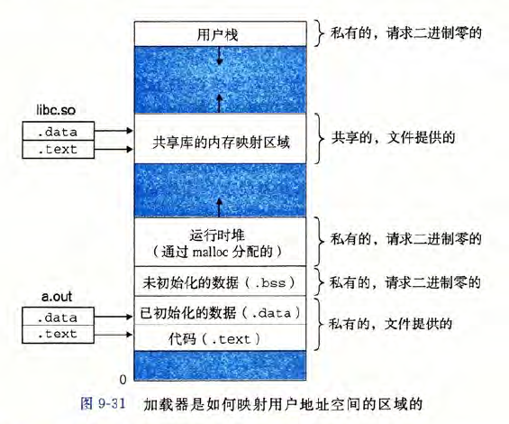

#### 2. 动态内存分配

- 动态存储器分配器维护着一个进程的虚拟存储器区域，称为**堆(heap)**

- 对于每个进程，内核维护着一个变量 `brk`，指向堆的顶部

分配器两种风格:

- **显式分配器**： 应用显式地释放任何已分配的块

  > - `void *malloc(size_t size)`： 分配至少 size 字节的存储器块
  >
  >   > 这个块会自动进行数据**对齐**后返回
  >
  > - `void *sbrk(intptr_t incr)`： 通过将内核的 brk 指针增加 incr 来扩展和收缩堆
  >
  > - `void free(void *ptr)`： `ptr` 指向从 `malloc,calloc,realloc` 获得的已分配块的起始位置
  >
  > 约束条件： 
  >
  > - 处理任意请求序列
  > - 立即响应请求
  > - 只使用堆
  > - 对齐块
  > - 不修改已分配的块
  >
  > 目标： 
  >
  > - 最大化吞吐率
  > - 最大化内存利用率

- **隐式分配器**： 分配器检测一个已分配块何时不再被程序使用，那就释放这个块

  > 隐式分配器也叫垃圾收集器，自动释放未使用的已分配块的过程称为垃圾收集

**碎片**： 有未分配的内存，但不能满足分配请求

> 假碎片： 当分配器释放一个已分配块时，可能存在多个相邻的空闲块
>
> 合并空闲块： 合并相邻的空闲块
>
> - **立即合并**： 每次块释放时，合并所有相邻块，但会出现不断合并与释放（抖动）
>
> - **带边界标记的合并**： 每个块的结尾添加“脚部”，脚部就是头部的一个副本，用于判断当前块的起始位置和状态，该脚部总是在距当前块开始位置一个字的距离
>
>   > 四种情况： 
>   >
>   > - 情况 1： 前面的块和后面的块都已分配
>   > - 情况 2： 前面的块已分配，后面的块空闲
>   > - 情况 3： 前面的块空闲，后面的块已分配
>   > - 情况 4： 前面和后面的块都空闲
>   >
>   > 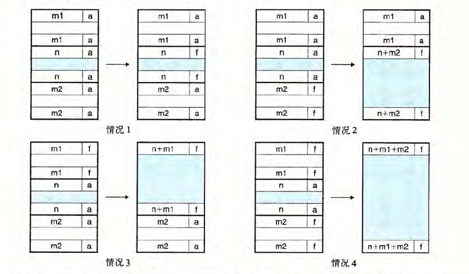

- **内部碎片**： 在一个已分配块比有效载荷大时发生

  > - 内部碎片量化： 已分配块大小和有效载荷大小之差的和
  > - 内部碎片的数量只取决于以前请求的模式和分配器的实现方式

- **外部碎片**： 当空闲内存合计能满足一个分配请求，但没有一个单独的空闲块能够满足

**分配器的数据结构**：

- **隐式空闲链表**： 

  > 堆块结构： 
  >
  > 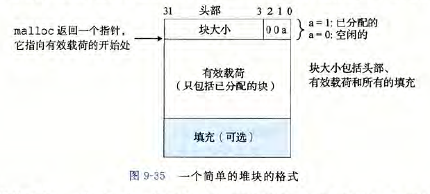
  >
  > 隐式空闲链表： 
  >
  > 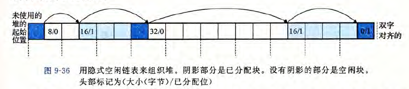
  >
  > - 隐式空闲链表的优点： 简单
  >
  > - **缺点**： 任何操作的开销，例如放置分配的块，要求对空闲链表进行搜索
  >
  >   > 该搜索所需时间与堆中已分配块和空闲块的总数呈线性关系
  >
  > **放置策略**： 当一个应用请求一个 k 字节的块时，分配器搜索空闲链表，查找一个足够大以放置所请求块的空闲块，常见策略： 
  >
  > - **首次适配**： 从头开始搜索空闲链表，选择第一个合适的空闲块
  > - **下一次适配**： 类似首次适配，但搜索开始位置为上次查询结束位置
  > - **最佳适配**： 检查每个空闲块，选择适合所需请求大小的最小空闲块

- **显示空闲链表**： 使用双向链表，使首次适配的分配时间从块总数的线性时间减少到了空闲块数量的线性时间

  > 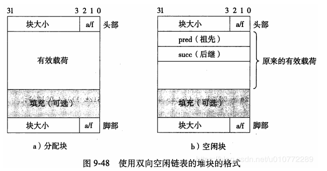