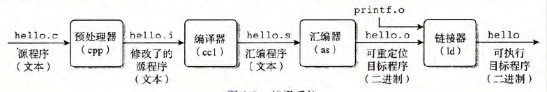
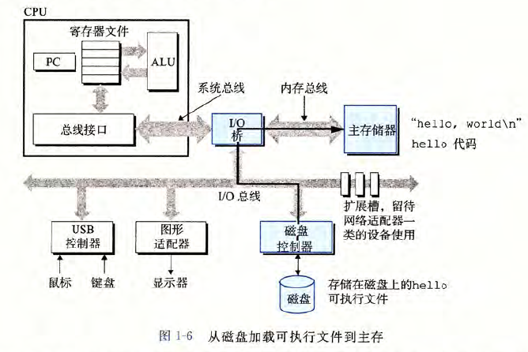
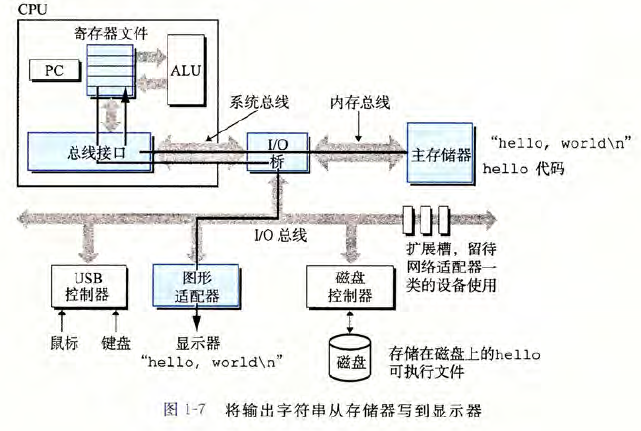
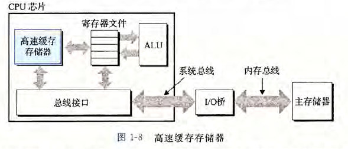
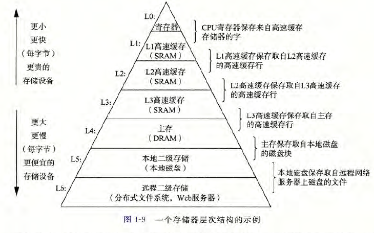
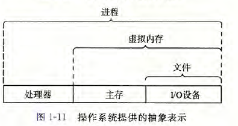
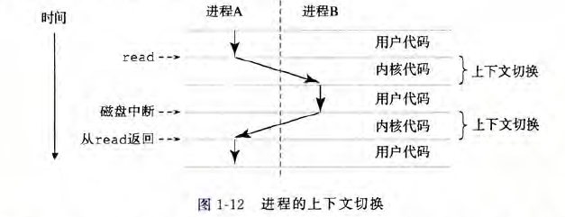
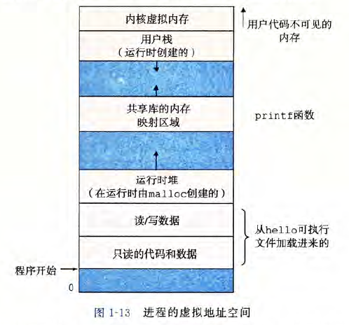

# 入门： 计算机初解

- **C 语言编译的四个阶段**： 

  - **预处理阶段**： 预处理以 `#` 开头的命令，得到 `.i` 的文件扩展名

    > 如： 读取 `#include<stdio.h>` ，则会将 `stdio.h` 头文件内容插入程序文本中

  - **编译阶段**： 将文件 `.i` 翻译成文件 `.s`，即汇编文件

  - **汇编阶段**： 将文件 `.s` 翻译成机器语音指令并打包成**可重定位目标程序**，结果保存到 `.o` 文件

  - **链接阶段**： 将 C 语言核心库链接到程序中，得到可执行文件

  

- **理解编译系统的好处**： 
  - **优化程序性能**
  - **理解链接时出现的错误**
  - **避免安全漏洞**

- **编译程序运行流程**： 

  - 可执行程序初始执行后，**shell 将字符读入寄存器，然后再存放到内存**

    

  - 输入结束后，shell 将加载可执行文件，并将文件中的代码和数据从磁盘复制到主存

    

  - 处理器开始执行程序的 main 中的机器语言指令

    > 比如： `printf("hello")` ，机器语言指令会将字符串 `hello` 所在字节从主存复制到寄存器文件，再从寄存器文件复制到显示设备，最终显示再屏幕上

    

- **高速缓存**： 静态随机访问存储器(`SRAM`)

  > - 原理： 利用高速缓存的局部性原理，即程序具有访问局部区域中的数据和代码的趋势
  > - 使用： 通过让高速缓存缓存经常访问的数据，大部分的内存操作就能快速在高速缓存中完成

  

- **存储设备的层次结构**： 

  > 寄存器文件在层次结构中位于最顶部，记为 `L0`

  

- **操作系统功能**： 通过**进程、虚拟内存、文件**来实现

  - 防止硬件被失控的应用程序滥用
  - 向应用程序提供简单一致的机制来控制复杂而又不同的低级硬件设备

  > 文件是对 I/O 设备的抽象表示
  >
  > 虚拟内存是对主存和磁盘 I/O 设备的抽象表示
  >
  > 进程是对处理器、主存、I/O 设备的抽象表示
  >
  > 
  - **进程**： 是操作系统对一个正在运行的程序的一种抽象，一个系统可以运行多个进程，每个进程独占式的使用硬件

    > 并发： 一个进程的指令和另一个进程的指令交错执行
    >
    > 上下文切换： 处理器在进程间进行切换
    >
    > 

  - **线程**： 每个线程运行在进程的上下文中，并共享同样的代码和全局数据

  - **协程**： 比线程更轻量级，由开发者控制，避免了内核陷入的性能消耗

  - **虚拟内存**： 创造进程独占主存的假象

    > - 实现： 通过**虚拟地址空间**，使每个进程看到的内存都是一致的
    >
    > - **虚拟地址空间**： 
    >
    >   - **程序代码和数据**： 直接按照可执行文件的内容初始化
    >   - **运行时堆**： 堆可以在运行时动态的扩展和收缩
    >   - **共享库**：存放共享库的代码和数据的区域 
    >   - **栈**： 编译器使用它来实现函数调用，每次函数调用，栈就会增长；每次函数返回，栈就会收缩
    >   - 内核虚拟内存： 需要调用内存来实现的操作
    >
    >   

  - **文件**： 字节序列

# 第一部分：程序结构和执行

# 第二部分：在系统上运行程序

# 第三部分： 程序间的交流和通信

