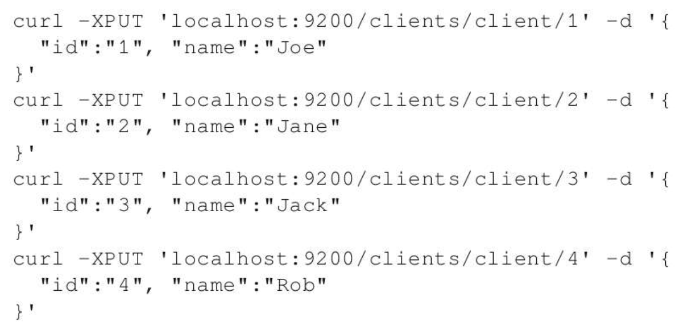
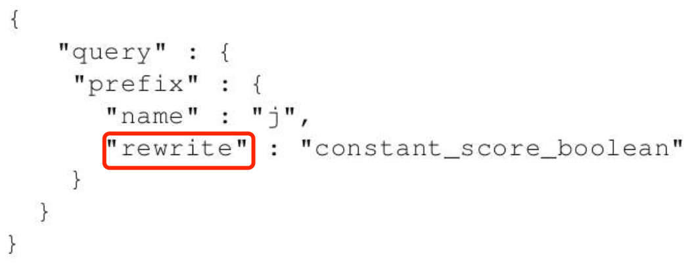
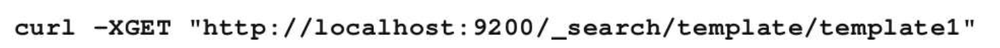
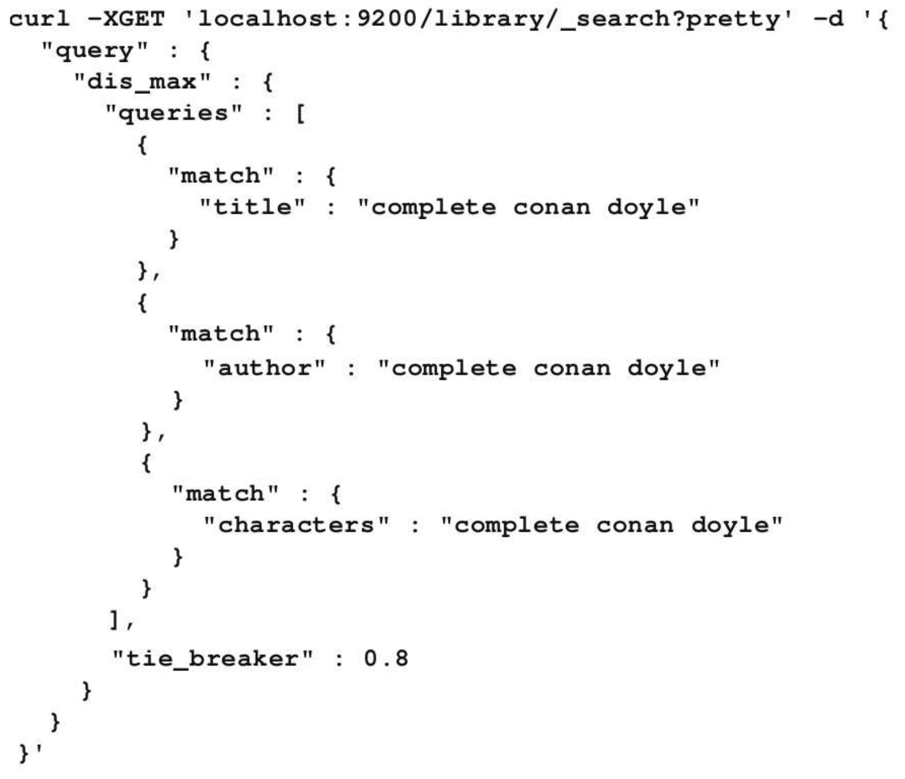
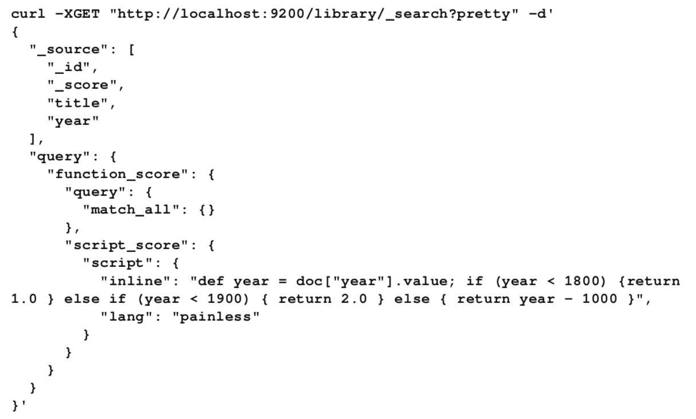

书籍地址：https://weread.qq.com/web/reader/7d13227071a486ab7d123b4

# 一、回顾与简介

## 1、Lucene 简介

### (1) Lucene 索引

- **文档 `document`**：索引与搜索的主要数据载体，包含一个或多个字段，存放将要写入索引或将从索引搜索出来的数据
- **字段 `field`**：文档的一个片段，包括字段的名称和内容两个部分
- **词项 `term`**：搜索时的一个单位，代表了文本中的一个词
- **词条 `token`**：词项在字段文本中的一次出现，包括词项的文本、开始和结束的偏移量以及类型

#### 1. 倒排索引

> `Lucene` 将写入的所有信息组织为倒排索引 `inverted index` 的结构形式

倒排索引是一种将词项映射到文档的数据结构，可以把倒排索引当作面向词项的而不是面向文档的数据结构

---

**案例**：只包含 title 字段的文档如下：


**说明**：

- 每个词项指向该词项所出现过的文档数，以及在文档中的位置
- 这种索引组织方式支持快速有效的搜索操作，如：基于词项的查询
- 除词项本身外，每个词项有一个与之关联的计数，该计数可以告诉 Lucene 该词项在多少份文档中出现过

#### 2. 段

- 索引由多个段 `segment` 组成，每个段只会写入一次但会被查询多次

- 索引期间，一个段创建后不再修改，如：段中某个文档被删除，相关信息会被单独保存在一个文件中，而段本身并没有被修改

- 多个段会在段合并 `segment merge` 阶段被合并在一起

    > - 段合并操作或被强制执行，或由 Lucene 的内在机制决定在某个时刻执行，合并后段的数量更少，但是单个段的体积更大
    > - 段合并操作 I/O 耗时严重，合并期间有些不再使用的信息将被清理掉，如：被删除的文档
    > - 对于容纳相同数据量的索引，搜索一个大段比搜索多个小段速度更快

---

注：实际的 Lucene 索引更复杂、更高深，除了词项的文档频率和出现该词项的文档列表之外，还包含其他附加信息

#### 3. norm

- `norm` 是一种与每个被索引文档相关的因子，用于存储文档的归一化结果，被用于计算查询的相关得分

- `norm` 基于索引时的文档加权值 `boost` 计算得出，与文档一起被索引
- `norm` 可以让 `Lucene` 在建立索引时考虑不同文档的权重，代价仅仅是需要一些额外的磁盘空间和内存来索引和存储 `norm` 信息

#### 4. 词项向量

- 词项向量 `term vector` 是一种针对每个文档的微型倒排索引
- 词项向量由词项和词项的出现频率结对组成，还可以包括词项的位置信息

> Lucene 和 Elasticsearch 默认都禁用词项向量索引，不过要启用诸如关键词高亮之类的功能，就需要启用这个选项

#### 5. 倒排项格式

- Lucene 的解码器架构，允许开发者控制索引文件写入磁盘的格式，倒排项就是索引中可定制的部分之一

- 倒排项可以存储字段、词项、文档、词项位置和偏移量以及载荷 `payload`

    > 载荷：一个在 Lucene 索引中随意存放的字节数组，可以包含任何需要的信息

注：针对不同目的，Lucene 提供不同倒排项格式，如：唯一标识格式专门为高散列范围字段提供

#### 6. doc values

- **倒排索引不适用场景**：操作文档而不是词项，此时 `Lucene` 要把索引翻转过来构成正排索引，然后再进行这些功能所需要的计算

- **解决**：Lucene 引入 `doc values` 和额外数据结构来进行排序和聚合。

- `doc values` 是存储字段的正排索引，Lucene 和 Elasticsearch 都允许通过配置来指定 `doc values` 的具体存储方式

    > 可选的存储方式包括：基于内存的、基于硬盘的以及二者的混合

#### 7. 文档分析

> 当把文档导入 Elasticsearch 时，会经历一个必要的分析阶段，以生成倒排索引

分析阶段由 `Lucene` 经过一系列步骤完成，如下图：


**文本分析过程**：由分析器来执行，分析器包含一个分词器、零到多个词条过滤器、零到多个字符过滤器

- **分词器**：用来将文本切割成词条，词条是携带各种额外信息的词项，包括词项在原始文本中的位置和词项的长度

    > 由分词器得到的结果被称为词条流，因为这些词条被一个接一个地推送给过滤器处理

- **过滤器**：数量可选，用于处理词条流中的词条，如：移除、修改词条流中的词条、生成新的词条

    > Lucene 有很多现成的过滤器，也可以根据需要实现新的过滤器
    >
    > 过滤器案例：
    >
    > - 小写过滤器：将所有词条转化为小写
    > - ASCII 过滤器：移除词条中所有非ASCII字符
    > - 同义词过滤器：根据同义词规则，将一个词条转化为另一个词条
    > - 多语言词干还原过滤器：将词条的文本部分转换成词根形式，即词干还原
    >
    > 当分析器中有多个过滤器时，会逐个处理，因此可以通过添加多个过滤器的方式来获得近乎无限的分析能力

- **字符过滤器**：在分词器之前被调用，分析阶段开始前完成文本预处理

    > 字符过滤器的一个例子就是 HTML 文本的去除标签处理

---

- 在查询时也会经过分析阶段，但可以选择其他路径而不分析查询条件

    > 注：Elasticsearch 有些查询会被分析，而有些则不会被分析，如：前缀查询不会被分析，而匹配查询会被分析

- 关于索引期与检索期的查询分析：只有当查询语句经过分词过程得到的词项能与索引中的词项匹配上时，才会返回预期的文档集

    > 如：若在索引期使用词干还原与小写转换，则在查询期，也应该对查询串做相同的处理，否则查询可能不会返回任何结果

#### 8. Lucene 查询语言基础

> 若查询被设置为要被分析，则预先选定的分析器将会对查询中的所有词项进行处理

Lucene 的查询被分割为词项与操作符：

- **词项**：可以是单个的词，也可以是一个短语(用双引号括起来的一组词)

- 查询可以包含布尔操作符，布尔操作符连接多个词项，使之构成从句：

    **布尔操作符**：

    - `AND`：文档匹配当前从句，当且仅当 AND 操作符左右两边的词项都在文档中出现

        > 如：当执行 apache AND lucene 这样的查询时，只有同时包含词项 apache 和词项 lucene 的文档才会被返回给用

    - `OR`：包含当前从句中任意词项的文档都被视为与该从句匹配

        > 如：当执行 apache OR lucene 这样的查询时，任意包含词项 apache 或词项 lucene 的文档都会被返回给用户

    - `NOT`：与当前从句匹配的文档必须不包含NOT操作符后面的词项

        > 如：当执行 lucene NOT Elasticsearch 这样的查询时，只有包含词项 lucene 且不包含词项 Elasticsearch 的文档才会返回

    **运算操作符**：

    - `+`：只有包含 `+` 操作符后面词项的文档才会被认为与从句匹配

        > 如：当查找那些必须包含 lucene，但 apache 可出现可不出现的文档时，可以执行查询：+lucene apache

    - `–`：与从句匹配的文档不能出现 `-` 操作符后的词项

        > 如：当查找那些包含 lucene，但是不包含 Elasticsearch 的文档时，可以执行查询：+lucene-Elasticsearch

---

补充：

- 若查询中没有出现前面提到过的任意操作符，则默认使用 `OR` 操作符

- 可以使用圆括号对从句进行分组，以构造更复杂的从句

#### 9. 对字段执行查询

> Lucene 所有数据都存储在字段中，而字段又是文档的组成单位

- 为实现针对某个字段的查询，用户需要提供字段名称，再加上冒号以及将要对该字段执行查询的从句

    > 如：若查询所有在 `title` 字段中包含词项 `Elasticsearch` 的文档，可以执行 `title:Elasticsearch`

- 也可以在一个字段中同时使用多个从句

    > 如：若查找所有在 `title` 字段中同时包含词项 `Elasticsearch` 和短语 `mastering book` 的文档，可执行 `title:(+Elasticsearch +"mastering book")` 或 `+title:Elasticsearch +title:"mastering book"` 

#### 10. 词项修饰符

> 除使用简单词项和从句的常规字段查询外，Lucene 还允许使用修饰符修改传入查询对象的词项

- 通配符：
    - `?`：匹配任意一个字符
    - `*`：匹配多个字符

- 模糊查询：`~` + 整数值

    - 当使用该修饰符修饰一个词项时，意味着搜索那些包含与该词项近似的词项的文档

    - `～` 字符后的整数值定义了近似词项与原始词项的最大编辑距离

        > 如：执行查询 `writer～2` 时，意味着包含词项 `writer` 和 `writers` 的文档都可以被视为与查询匹配

    - 当修饰符 `～` 作用于短语时，其后的整数值表示 Lucene 可以接受词项之间多大距离

        > 如：执行查询 `title:"mastering Elasticsearch"`，则在 title 字段中包含 `mastering Elasticsearch` 的文档被视为与查询匹配，而包含 `mastering book Elasticsearch` 的文档则被认为不匹配
        >
        > 但若执行查询 `title:"mastering Elasticsearch"~2`，则这两个文档都被认为与查询匹配

    - 还可以使用 `^` 字符并赋予一个浮点数对词项加权，从而提高该词项的重要程度

        > 小于1的权重值会降低文档重要性，而大于1的权重值会提高文档重要性。词项权重值默认为1

    - 也可以使用方括号和花括号来构建范围查询

        > 如：
        >
        > - 在数值类型字段上执行范围查询 `price:[10.00 TO 15.00]`，则返回文档的 price 字段值将在 `10.00 - 15.00` 间
        >
        > - 在字符串类型字段上执行范围查询 `name:[Adam TO Adria]`，则返回文档的 name 字段中，包含了按字典顺序介于 Adam 和 Adria 之间的词项
        >
        > - 执行一边受限而另一边不受限制的范围查询 `price:[10.00 TO *]`，则返回文档的 price 字段值大于等于 10.00

#### 11. 特殊字符处理

搜索某个特殊字符 `+、–、&&、||、！、(、)、{}、[]、^、"、~、*、?、：、\、/`，需要先使用反斜杠对特殊字符进行转义

> 如：搜索 `abc"efg` 这个词项，需要按如下方式处理：`abc\"efg` 

### (2) Elasticsearch 概览

#### 1. 基本概念

- **索引**：Elasticsearch 存储数据的逻辑名字空间，在有分片和副本的情况下可能由一个或多个 Lucene 索引构成

- **文档**：文档就是 JSON 对象，包含的实际数据由键值对构成

    > 注：一旦某个字段上生成了索引，Elasticsearch 就会为那个字段创建一个数据类型

- **类型**：Elasticsearch 的一个文档类型代表一类相似的文档

    > 类型有两个重要组成部分：
    >
    > - 一是名字，如：一个用户或一篇博客
    > - 二是字段的数据类型和 Lucene 配置之间的映射关系

- **映射**：存储分析链所需的信息，如：将输入文本拆分成词条、进行词条过滤和额外处理(如去除 HTML 标签)

    > 文档在生成索引之前都要经历分析阶段

- **节点**：运行在服务器上的单个 Elasticsearch 服务实例

    - 第一类节点(数据节点)：用来储存数据，同时提供对这些数据的搜索功能，Elasticsearch 可用来索引和存储数据

    - 第二类节点(主节点)：作为监督者控制其他节点的工作
    - 第三类节点(客户端节点)：只用于查询路由
    - 第四类节点(部落节点)：关联多个集群，允许在多个集群之上执行几乎所有可以在单集群 Elasticsearch 上执行的功能
    - 第五类节点(ingest 节点)：可以在生成索引之前先进行数据转换

- **集群**：多个协同工作的 Elasticsearch 节点的集合

- **分片**：存储在一个或多个节点上的容器，由 Lucene 段组成

    - 索引由一到多个分片组成，让数据可以分布开
    - 分片数量在索引创建时就配置好，之后无法增减

    > 分片也有主从之分：
    >
    > - 所有改动索引的操作都发生在主分片上，从分片的数据由主分片复制而来，支持数据快速检索和高可用
    > - 若主分片所在的服务器宕机，从分片会自动升级为主分片

- **副本**：为支持高可用而保存在分片中的另一份数据，也有助于提供快速检索体验

#### 2. 工作原理

- Elasticsearch 使用 `zen discovery` 模块来组成集群，使用单播作为默认发现机制

- 当一个 Elasticsearch 节点启动时，先尝试去搜索和发现单播主机列表，寻找主节点
    - 单播主机列表由配置文件 `elasticsearch.yml` 中的 `discovery.zen.ping.unicast.hosts` 参数指定
    - 默认单播主机列表是 `["127.0.0.1"，"[::1]"]`，因此每个节点启动时并不会自己形成一个集群

## 2、Elasticsearch 5.x 简介

### (1) 新特性

#### 1. Elasticsearch 5.x 新特性

- **`Ingest` 节点**：可用于在构建索引之前先进行简单的数据转换和处理

    > 注：任意节点都可以配置成 `ingest` 节点，而且非常轻量级

- **索引收缩**：`_shrink API` 可以让用户将现有的索引收缩成一个新索引，并且分片数更少

    > 一旦索引构建完成，就无法减少分片数量，而且每个分片都会消耗资源

- **`Painless` 脚本语言**：Painless 脚本语言，又快又安全。要变得更强大和更有适应性，Painless还有很多优化工作要做

- **快速聚合**：查询在协调节点上进行解析，并用二进制格式序列化到不同节点上，使得更高效，缓存的查询语句更多，在数据被切分为按时间分片的场景中表现得尤其突出，因此聚合速度大大提高

- **新的自动完成建议器**：自动完成建议器现在基于 Lucene 的第一版新的 suggest API 构建

    > 由于自动完成建议器对语法和响应有要求，类型补齐字段的语法和数据结构都有了变化

- **多维点**：基于 `k-d` 树地理空间数据结构构建，可以提供快速的单维和多维数字范围以及地理空间点形状过滤功能

    > 多维点有助于减少磁盘空间和内存占用，加快搜索

- **通过查询 API 删除**：支持通过 `_delete_by_query REST` 端点来删除满足查询条件的文档

#### 2. Elasticsearch 2.x 新特性

- **重建索引 API**：`_reindex API` 把数据从一个索引移到另一个索引，而且在为文档重新生成索引的同时还提供了丰富的控制手段，比如用脚本做数据转换、许多可配置参数等
- **通过查询更新**：`update_by_query REST` 端点提供了根据某些条件直接更新文档，并且无须重新索引数据的功能
- **任务 API**：通过 `_task REST` 端点提供的任务管理 API，用于从集群的一个或多个节点获取当前正在执行的任务信息
- **查询 `Profiler`**：可以调试查询语句，了解为什么有的查询很慢，并采取步骤优化它，注：需要将 `profile` 标志置 `true`

### (2) Elasticsearch 演进

> 演进方向：功能/性能/运维、节点/集群

#### 1、0.7.0

2010年5月14日发布，第一个可以查询到发版信息的版本，重要特性：

- `Zen Discovery` 自动发现模块

- `Groovy Client` 支持

- 简单的插件管理机制

- 更好支持 `ICU` 分词器

- 更多的管理 API

#### 2、1.0.0

2014年2月14日发布，重要特性：

- `Snapshot/Restore API` 备份恢复API

- 支持聚合分析 `Aggregations`

- `CAT API` 支持

- 支持联盟查询

- 断路器支持

- `Doc values` 引入

#### 3、2.0.0

2015年10月28日发布，重要特性：

- 增加了 `pipleline Aggregations`

- `query/filter` 查询合并，都合并到 query 中，根据不同的上下文执行不同的查询

- 存储压缩可配置

- `Rivers` 模块被移除

- `Multicast` 组播发现被移除，成为一个插件，生产环境必须配置单播地址

#### 4、5.0.0 (GA)

2016年10月26日发布，重要特性：

- Lucene 6.x 的支持，磁盘空间少一半；索引时间少一半；查询性能提升25%；支持 IPV6

- `Internal engine` 级别移除了用于避免同一文档并发更新的竞争锁，带来 `15%-20%` 的性能提升

- `Shrink API` 可将分片数收缩成它的因数，如：之前15个分片，可以收缩成5个或3个或1个

    > 场景：在写入压力非常大的收集阶段，设置足够多的索引，充分利用 `shard` 并行写能力，索引写完之后收缩成更少的 `shard`，提高查询性能

- 提供了第一个 Java 原生的 REST 客户端 SDK

- `IngestNode`：之前若要对数据加工，都在索引之前处理，如：`logstash` 可以对日志进行结构化和转换，现在可以直接在 es 处理

- 提供了 `Painless` 脚本，代替 `Groovy` 脚本

#### 5、6.0.0

2017年8月31日发布，重要特性：

- 稀疏性 `Doc Values` 的支持

- `Index sorting`，即索引阶段的排序

- 顺序号的支持，每个 es 的操作都有一个顺序编号(类似增量设计)

- 无缝滚动升级

- `Removal of types`，在 6.0 里面，开始不支持一个 index 里面存在多个 type

- `Index-template inheritance`，索引版本的继承，目前索引模板是所有匹配的都会合并，这样会造成索引模板有一些冲突问题， 6.0 将会只匹配一个，索引创建时也会进行验证

- `Load aware shard routing`， 基于负载的请求路由，目前的搜索请求是全节点轮询，则性能最慢的节点往往会造成整体的延迟增加，新的实现方式将基于队列的耗费时间自动调节队列长度，负载高的节点的队列长度将减少，让其他节点分摊更多的压力，搜索和索引都将基于这种机制

- 已经关闭的索引将也支持 `replica` 的自动处理，确保数据可靠

#### 6、7.0.0

2019年4月10日发布，重要特性：

- 引入了真正的内存断路器，可以更精准地检测出无法处理的请求，并防止使单个节点不稳定

- `Zen2` 是 Elasticsearch 的全新集群协调层，提高了可靠性、性能和用户体验，变得更快、更安全，并更易于使用

- 查询优化

- 更快的前 k 个查询

- 间隔查询

- Function score 2.0

# 二、查询 DSL 进阶

## 1、Lucene 文本评分机制 —— BM25

- 评分：指针对给定查询计算某个文档的分值属性的过程

- 文档得分：是一个描述文档与查询匹配程度的参数

    > Lucene 的评分算法：
    >
    > - `TF-IDF`(词频/逆文档频率)
    > - `BM25`(最佳匹配)

### (1) 理解精确率与召回率

- **精确率**：获取到的相关文档数占获取到的总文档数(包括相关与不相关)的比例，用百分数表示

- **召回率**：获取到的相关记录数占数据库中相关的记录总数的比例，用百分数表示

    > 在分析阶段中，可以控制 Lucene 的评分机制，进而提高召回率

注：Elasticsearch 提供了定制权重和函数评分查询等其他不同的功能，增强用户的控制力

### (2) 回顾 TF-IDF

#### 1. TF-IDF 评分机制简介

> `TF-IDF` 是 Lucene 评级功能的核心，融合了向量空间模型 `VSM` 和信息获取的布尔模型

- Lucene 主要理念：与一个查询词项在整个集合中出现的次数相比，该词项在文档中出现的次数越多，则文档就和查询越相关

- Lucene 也会利用查询规范的布尔逻辑，先用布尔模型来缩小要打分的文档的范围

---

用 TF-IDF 为文档打分，要考虑几个因子：

- **词频 `TF`**：一个基于词项的因子，用来表示一个词项在某文档中出现了多少次；词频越高，文档得分越高

    > 计算方法：用该词项在文档中出现的次数，除以文档的词项总数

- **逆文档频率 `IDF`**：一个基于词项的因子，用来告诉评分公式该词项有多罕见；逆文档频率越高，该词项就越罕见；评分公式利用该因子来为包含罕见词项的文档加权

    > - 计算方法：$ln{包含词项 t 的文档数除以文档总数}$ 
    >
    > - 计算IDF时要用到 log 运算，因为 the、that、is 之类的词项可能会出现非常多次，要降低这些频繁出现的词项权重，提高很少出现的词项权重

- **协调因子 `coord`**：基于文档中词项个数的协调因子，一个文档命中了查询中的词项越多，得分越高

- **字段权重 `field boost`**：查询期赋予某个字段的权重值

- **文档权重 `document boost`**：索引期赋予某个文档的权重值

- **长度范数 `Length norm`**：每个字段基于词项个数的归一化因子(在索引期被计算并存储在索引中)

    > 一个字段包含的词项数越多，该因子的权重越低，即 Lucene 评分公式更“喜欢”包含更少词项的字段

- **查询范数 `Query norm`**：一个基于查询的归一化因子，等于查询中词项的权重平方和

    > 查询范数使不同查询的得分能互相比较，尽管这种比较通常是困难和不可行的

---

- 信息获取过程中，相关性评分函数的简单实现：把每个检索词项的 `TF-IDF` 权重相加，而`每个词项的权重= TF(term) * IDF(term)`

    > 由一次检索中出现的所有词项的组合权重就可以计算出得分，用于返回排序后的结果

- Lucene 实际使用的评分公式：

    $score(q,d)=coord(q,d)*queryNorm(q)*\sum_{t \ in \ q}(tf(t \ in \ d)*idf(t)^2 * boost(t)*norm(t,d))$ 

    > 对于一次检索，`score(q,d)` 就是文档的得分

#### 2. BM25 评分机制简介

BM25 也是一种根据相关性来为文档进行打分和评级

- 两种算法都用到了词频、逆文档频率和字段长度范化，但这些因子的定义稍有不同
- 两种模型都根据某些 IDF 函数和 TF 函数为每个词项算出权重，并把所有词项的权重相加，作为这个文档对应这次查询的得分

---

BM25 使用的数学公式：$bm25(d) = \sum_{t \in q,f_{t,d}>0}log[1+\frac{N-df_t+0.5}{df_t+0.5}\cdot \frac{f_{t,d}}{f_{t,d}+k \cdot (1-b+b \frac{l(d)}{avgdl})}]$ 

- `N` 是数据集中可用的文档总数

- $df_t$ 是包含这个词项的文档总数

- `k` 或 `k1` 是饱和度参数，控制词项频率增长多快时会导致词频饱和，默认值是 `1.2`，值越小饱和越快，值越大饱和越慢

    > 饱和度是用于限制词频在具体文档中的影响的参数，通过调节参数 k 可以调节词频的影响

- `b` 是长度参数，控制字段长度归一化的影响，值为 `0.0` 时完全关闭归一化，值为 `1.0` 时进行完全泛化，默认值是 `0.75`

- `l(d)` 是文档中的词条数量

- `avgdl` 是整个数据集里所有文档的平均长度

- $f_{t，d}$ 是文档中一个词项的频率

### (3) BM25 与 TF-IDF 的不同

#### 1. 饱和点

- `TF-IDF` 中由饱合度引起的评分问题：
    - 若布尔查询条件中的 N 个词项里，某个词项在某份文档中出现了许多次，则这份文档的分值就会极高，因为其词项饱和度`sqrt(termFreq)` 很弱
    - 若查询条件是 `x or y`，而某份文档中有 1000 个 x，0 个 y，则 `TF-IDF` 不会考虑 `y` 从未出现过，仍然会给它极高的分数，协调因子 `coord` 就是用来弱化这种行为的

- `BM25` 提供了参数 `k1`，可以对词项饱和度提供更有力的控制

    - 即使查询条件中的某个词项出现了许多次，所增加的分数也远比不上另一个词项出现的次数从 0 变为 1

    - BM25 倾向尽量多的查询词项都出现过的文档，若某份文档中 x 出现过 5 次，y 只出现过一次，而另一份文档中出现过 1000 个 x和 0 个 y，则前一份文档的得分肯定会高很多

#### 2. 平均文档长度

- `TF-IDF` 和 `BM25` 的另一个显著区别是 `BM25` 考虑了文档长度的影响，比如：

    - 某篇包含了 1000 个词项的文章中，假如“旅行”这个词只出现过一两次，则内容与旅行没有太大关系
    - 但若“旅行”这个词在一篇很短的推文中就出现了两次，则这篇推文肯定和旅行有很大关系

- `TF-IDF` 在计算与文档长度相关的分数时处理得很片面，篇幅较长的文档字数自然多，因此词频也会比较高，与词项不太相关，与查询条件也不太相关

    `BM25` 引入了文档长度进行补偿，有些文档的内容涉及范围比较广，因此字数多也合理

    > 从数学公式中可以看到，BM25引入了调节参数 `b`、文档长度 `dl`、平均文档长度 `avdl` 等来调节词项因子

## 2、查询 DSL 重构

- 查询 DSL 是向 Elasticsearch 发送 JSON 格式的查询条件的接口


## 3、为任务选择合适的查询

### (1) 查询方式分类

#### 1. 基本查询

- **用途**：索引检索，其输入数据既可以分析也可以不分析

- **特征**：基本查询内部不可以包含其他查询

- **用法**：通常作为其他复杂查询的一部分或单独传递给 Elasticsearch。

    > 可以把基本查询比作修筑大厦的砖块，而大厦就是各种复杂查询

---

属于基本查询的查询方式举例如下：

- `match` 查询：适用执行全文检索且需要对输入进行分析的场景

    > 使用场景：
    >
    > - 分析输入内容却不需要完整的 Lucene 查询语法支持
    >
    > - 适合处理用户输入文本的场景，因为不需要进行查询语法解析，发生解析错误的概率极低

- `match_all` 查询：匹配所有文档，常用于需要对所有索引内容进行归类处理的场景

- `term` 查询：一种简单、无需对输入进行分析的查询方式，可以查询单个词项

    > - 使用场景：针对不需要分析的字段进行检索，如：在测试代码中检索 tags 字段
    >
    > - 经常跟过滤器配合使用，如：在测试代码中针对 category 字段进行过滤操作

---

简单查询包括：`match、multi_match、common、fuzzy_like_this、fuzzy_like_this_field、geoshape、ids、match_all、query_string、simple_query_string、range、prefix、regexp、span_term、term、terms、wildcard` 等

#### 2. 组合查询

- 唯一用途：把其他查询组合在一起使用

    > 简单查询是建造高楼的砖块，组合查询就是粘合这些砖块的水泥

- 可以把组合查询无穷次地嵌套，用来构建极其复杂的查询，唯一能够阻止这样嵌套的障碍是性能

----

组合查询的一些示例和用法如下：

- `dis_max` 查询：这种查询的文档得分结果和最高权重的子查询得分高度相关，而不是如 bool 查询那样对所有子查询得分进行求和

    > - 返回匹配所有子查询文档，并计算最终得分 = max(各子查询的得分) + tie_breaker * (非最高得分子查询的得分之和)
    >
    > - 适用场景：希望最高得分子查询能够在打分过程中起决定作用

- `bool` 查询：能够把多个查询用布尔逻辑组织在一起，可以控制查询的某个子查询部分是必须匹配、可以匹配还是不应该匹配

    > 适用场景：
    >
    > - 把匹配不同查询条件的查询组合在一起使用
    >
    > - 希望文档的最终得分为所有子查询得分的和
    >
    > ---
    >
    > 以下 Boolean 从句可以组合起来，用于匹配文档：
    >
    > - `must`：写在这个从句里面的条件必须匹配上，才能返回文档
    > - `should`：写在 should 从句中的查询条件可能被匹配上，也可能不匹配，但若 bool 查询中没有 must 从句，则至少要匹配上一个 should 条件，文档才会返回
    > - `must_not`：写在这个从句中的条件一定不能被匹配上
    > - `filter`：写在这个从句中的查询条件必须被选中的文档匹配上，只是这种匹配与评分无关
    >
    > ---
    >
    > bool查询的结构如下：
    >
    > 
    >
    > ---
    >
    > 下面这些参数 bool 查询也支持：
    >
    > - `boost`：用于控制 `must` 或 `should` 查询从句的分数
    >
    > - `minimum_should_match`：只适用于 should 从句，可以限定要返回一份文档，至少要匹配多少个 should 从句
    >
    > - `disable_coord`：bool 查询会对所有的 should 从句使用查询协调，因为匹配的从句越多，文档的得分就越高
    >
    >     > 下述情况要禁用查询协调：当在文本字段中查找同义词 turmoil 和 riot 时，并不关心文档中出现了多少同义词，此时把 disable_coord 置为 true，以禁用查询协调，让相似的从句不影响分数的计算
    >     >
    >     > 

---

组合查询包括：`bool、boosting、constant_score、dis_max、filtered、function_score、has_child、has_parent、indices、nested、span_first、span_multi、span_first、span_multi、span_near、span_not、span_or、span_term、top_children` 等

#### 3. 无分析查询

- **特征**：不会被分析，直接传递给 Lucene 索引

    > 要么确切理解分析过程，并提供合适的词项；要么直接针对无分析字段进行查询

- **分析**：这类查询会精确匹配传入的词语，不会使用语言分析器等工具对词语进行分词和其他处理

- **用途**：适用于把 Elasticsearch 当作 NoSQL 数据库使用

---

无分析查询案例：

- `term` 查询：即词项查询，可以匹配某个字段中的给定值，如：希望匹配一个拥有特定标签的文档，可以使用词项查询
- `prefix` 查询：即前缀查询，常用于自动完成功能，即用户输入一段文本，搜索系统返回所有以这个文本开头的文档

---

无分析查询包括：`common、ids、prefix、span_term、term、terms、wildcard` 等

#### 4. 全文检索查询

- **分析**：这类查询会根据索引映射配置对输入进行分析，支持 Lucene 查询语法和打分计算等功能

- **用途**：
    - 当构建类似 Google 的查询接口时，可以使用全文检索查询
    - 若查询的一部分文本来自用户输入，可以考虑 query_string、match、simple_query_string 等查询

---

全文检索查询类别的示例和用法如下：`simle_query_string` 查询构建于 Lucene 的 `SimpleQueryParser` 类

> 若不希望在遭遇解析错误时直接失败，而是想要尝试给出用户期望的答案，那么这种查询方式是不错的选择

全文检索查询包括：`match、multi_match、query_string、simple_query_string` 等

#### 5. 模式匹配查询

- 这类查询都在查询语句中支持各种通配符，如：前缀查询 prefix、通配符查询 wildcard、正则表达式查询 regexp

- 正则表达式查询：想找出其词项匹配某个固定模式的文档

- 模式匹配查询包括：`prefix、regexp、wildcard` 等

#### 6. 支持相似度操作的查询

- **用途**：可以根据给定词项查找近似词项或文档的查询方式的集合

- **案例**：

    - `fuzzy` 查询：找出包含 `crimea` 的近似词项的文档

        > 用途：提供类似“你是不是想找XXX”的功能

    - `more_like_this` 查询：找出文档标题与输入文本相似的文档

        > 可以使用本类别下的某个查询来查找包含与给定输入内容近似的词项或字段的文档

- 该查询包括：`fuzzy_like_this、fuzzy_like_this_field、fuzzy、more_like_this、more_like_this_field` 等

#### 7. 支持打分操作的查询

- 适用于和全文搜索查询组合使用的场景，包括允许在查询时修改打分计算过程的查询方式，如：function_score 查询

- **用途**：这是一组用于改善查询精度和相关度的查询方式，通过指定自定义权重因子或提供额外处理逻辑的方式来改变文档得分

- 案例：`function_score` 查询可以使用函数，从而通过数学计算的方式改变文档得

- 本类查询包括：`boosting、constant_score、function_score、indices` 等

#### 8. 位置敏感查询

> Elasticsearch 提供的各种范围查询就是这类查询的典型代表

- **特征**：不仅可以匹配特定词项，还能匹配词项的位置信息，即允许使用索引中存储的词项位置信息

- **用途**：要找出一组和其他单词保持一定距离的单词

    > 如：找出同时包含 mastering 和 Elasticsearch 且这两个单词相互临近，后面距离不超过 3 的位置包含 second 和 edition 单词

- **缺点**：这些查询开销很大，需要消耗大量CPU资源才能保证正确处理

---

本类查询包括：`match_phrase、span_first、span_multi、span_near、span_not、span_or、span_term` 等

#### 9. 结构敏感查询

- **特征**：基于结构化数据，即支持对文档结构进行检索且不需要对文档数据进行扁平化处理的查询方式

- **用途**：能够在子文档或嵌套文档中进行搜索，或查找属于给定父文档的子文档

- 这类查询包括：`nested、has_child、has_parent、top_children` 等

### (2) 使用示例

#### 1. 测试数据

- 先创建一个名为 `library` 的索引，并加入一些测试数据，library 索引的映射如下：


---

- 用到的数据在books.json文件中。文件中的示例文档如下：


---

- 运行下面的命令将会使用给定的映射创建索引，并索引数据：

    

- 将两份新文档添加到索引中的命令如下：

    

#### 2. 基本查询示例

- 需求：匹配给定取值范围的文档

- 案例：查出书籍本数在 `[1，3]` 区间内的查询如下所示：

    

#### 3. 组合查询示例

使用组合查询来组合其他查询方式：

- **对多个词项的布尔查询**：用户要显示由查询条件决定的书的若干个标签，若用户提供的标签数超过3个，只要求匹配上查询条件中标签数的75%即可；若用户提供了 3 个或更少的标签，就要全部匹配

    

- **对匹配文档加权**：包含一个可选的加权片段的 bool 查询，来实现对部分文档的权重提升，如：需要找出所有至少有一本的书籍，并对 1950 年后出版的书籍进行加权，可以使用如下查询命令：

    

- **忽略查询的较低得分部分**：`dis_max` 查询可以控制查询中得分较低部分的影响，如：希望找出所有 title 字段匹配 Young Werther 或 characters 字段匹配 Werther 的文档，并在文档打分时仅考虑得分最高的查询片段，可以执行如下查询命令：

    - **执行完整查询**：

        

        结果如下：

        

    - **分批执行查询**：

        - **查询一**：

            

            结果如下：

            

        - **查询二**：

            

    > 结论：`dis_max` 查询返回的文档得分等于打分最高的查询片段的得分(上面的第一个查询片段)

#### 4. 无分析查询示例

需求：查找出所有 tags 字段包含 novel 值的书籍，执行如下查询命令


#### 5. 全文检索查询示例

选出两个简单场景的查询示例加以展示：

- **使用 Lucene 查询语法**：

    案例：找出 title 字段包含 sorrows 和 young 词项、author 字段包含 von goethe 短语，且本数不超过5本的书，执行如下查询：

    

    > 在这个查询中，使用 Lucene 查询语法来传递所有匹配条件，让 Lucene 通过查询解析器来构造合适的查询

- **对用户查询语句进行容错处理**：

    - 错误查询：

        

        失败提示：即在构建查询时遇到了解析错误，查询无法被成功地构建出来

        

    - 解决方法：使用一个可以尝试处理用户输入错误的查询解析器，并试图猜测用户的查询用意，如：用 `simple_query_string` 查询来改写上面这个例子，代码如下：

        

        > 如果执行这个查询，Elasticsearch 能够返回合适的文档结果，尽管查询并未被恰当地构造

#### 6. 模式匹配查询示例

使用通配符的查询例子有很多，不过在这里只展示下面这两个例子：

- **使用前缀查询实现自动完成功能**：

    - 分析：前缀查询不会被分析，直接基于特定字段中被索引的词项工作

    - 案例：假定对 title 字段的所有词条提供自动完成功能，此时用户输入的前缀是 wes，符合条件的对应查询构造如下

        

- **模式匹配**：

    - 分析：若匹配特定模式，而此时索引中的词条无法支持，则可以尝试使用 regexp 查询

    - 注意：regexp 查询的执行性能与所选正则表达式相关，若选择一个能够被改写成大量词项的正则表达式，执行性能将极其糟糕

    - 案例：找出符合以下条件的文档：文档的 characters 字段中包含以 wat 开头、以 n 结尾、中间有两个任意字符的词项

        

#### 7. 支持相似度操作的查询示例

- 使用 fuzzy 查询找出包含与给定词项近似的文档，如：查找包含 younger 的近似词项的文档，可以执行如下查询命令：

    

#### 8. 支持修改得分的查询用例

- 分析：Elasticsearch 提供的 function_score 查询是个非常赞的工具，可以改变匹配到的文档的得分

- 案例：想要列出所有的书籍，不过要通过降低书籍得分的方式把那些当前无货的书籍放到结果列表的末尾。不希望按标记是否有货的字段进行排序，因为用户有时候清楚地知道要找什么书，而且全文检索查询的结果得分也是很重要的。不过，如果仅仅想把当前无货的书籍排到结果尾部，可以执行如下查询命令：

    

#### 9. 模式查询示例

因为资源消耗过于巨大，所以这类查询用得不多，与模式有关的查询可以按短语和词项的正确顺序去匹配文档，案例如下：

- **匹配短语**：

    - 分析：这是这一类对位置敏感的查询中最简单，同时也是性能最高的

    - 案例：只需要在文档的 otitle 字段中匹配到短语 leiden des jungen 的查询

        

- **无处不在的跨度查询**：

    - 分析：短语查询在处理位置敏感需求时非常简便

    - 案例：在 die词项后面不超过两个位置的地方包含一个 des jungen 短语，并且紧跟着短语后面是一个 werthers 词项，这时使用范围查询，符合这些条件的查询命令如下

        

### (3) 查询 DSL 的变化

- `missing` 查询(missing 过滤器)被彻底去除，要使用 `must_not` 代替
- 有 `bool` 查询后，`AND/OR` 过滤器被彻底去除，`must` 布尔从句可以替换 `AND`，`should` 从句可以替换 `OR`
- 查询类型 `count` 从查询 DSL 中彻底去除，若只想得到文档数量，则在使用聚合时，把 size 参数设为 0 也可以达到相同目的
- 查询类型 `scan` 也被去除，功能由 `scroll` 请求替代，后者可以按 `_doc` 的顺序将文档排序
- 过滤查询已经在 Elasticsearch 5.x 中被彻底去除

## 4、查询改写

> **查询改写**：把原本代价昂贵的查询语句改写成一组性能更高的查询语句，从而加快查询执行速度，该过程对客户端不可见

### (1) 前缀查询示例

- **假设**：索引下面数据

    

- **需求**：找出索引中所有 `name` 字段以字母 `j` 开头的文档

- **使用前缀查询**，同时设置查询改写属性以确定执行查询改写的具体方法

    

- **查询结果**：返回结果有 3 份文档，但没有显式设置待查询索引的映射，而 Elasticsearch 猜测出了 name 字段的映射，并将其设置为字符串类型并进行文本分析

    

- **结果检查命令**：

    

- **新的返回结果格式类似如下**：

    

### (2) 回到 Lucene

- **Lucene 倒排索引**：包含词项、总数、文档指针、词项在文档中的位置

    

- Lucene 内部实现会将 “找出索引中所有 `name` 字段以字母 `j` 开头的文档” 的前缀查询改为下面的 Lucene 查询：

    

- 使用 Elasticsearch API 检查重写片段，使用 Explain API 执行如下命令：

    

    执行结果如下：

    

> **结论**：Elasticsearch 对 name 字段使用了一个词项是 `joe` 的确定分值的查询

### (3) 查询改写的属性

- **作用**：多词项查询的 `rewrite` 属性可以控制查询在 Lucene 内部的改写方式，如：取值 `constant_score_boolean` 

- **使用**：将 `rewrite` 参数存放在代表实际查询的 JSON 对象中

    

- `rewrite` 参数配置：

    - `scoring_boolean`：将每个生成的词项转化为布尔查询中的一个 `should` 从句

        > - 特点：需要对每个文档都单独计算得分
        > - 缺点：比较耗费CPU(因为要计算和保存每个词项的得分)，且部分查询生成太多词项，以至于超出布尔查询默认的1024个从句限制

    - `constant_score_boolean`：类似 `scoring_boolean` 但 CPU 耗费更少

        > - 特点：并不计算每个从句的得分，而是每个从句得到一个与查询权重相同的常数得分(默认为1)，可以通过设置查询权重来改变这个默认值
        >
        > - 缺点：这种重写方法也会生成布尔 should 从句，因此也受布尔从句最大数量 `1024` 的限制

    - `constant_score`(默认属性)：一个一个按顺序去为每个词项标记文档，匹配上的文档将按查询的权重被设置为常值分数

        > 当搜索的词项很少时，性能与 `constant_score_boolean` 相近

    - `top_terms_N`：将每个生成的词项转化为布尔查询中的一个 should 从句，并保存计算出来的查询得分

        > 与 `scoring_boolean` 不同：只保留最佳的 N 个词项，以避免触及布尔从句数量的限制，并提升查询整体性能

    - `top_terms_boost_N`：类似 `top_terms_N`

        > 不同点：其文档得分不是通过计算得出，而是被设置为跟查询权重(boost)一致，默认值为 `1` 

    - `top_terms_blended_freqs_N`：先把每个词项转化为布尔查询的 should 从句，但所有词项查询都会计算分数

        > - `N` 指定选择多少个分数最高的词项
        > - 只关心得分最高的词项，所以不会超出布尔查询的限制

---

**案例**：

- 范例查询使用 `top_terms_N` 选项，且 `N=2`，则查询代码如下：

    

- **返回结果**：结果和之前使用的查询不同，这里的文档得分都不等于 1.0

    > 注：`top_terms_N` 需要保留得分最高的 N 个词项

    

## 5、查询模版

> 专用查询模板 API 端点 `_search/template` 

### (1) 引入查询模版

- **使用查询模版的背景**：知道发往 `Elasticsearch` 的查询类型，但查询结构没有最终确定
- **原理**：通过查询模板可以快速提供查询的最基础版本，让应用程序提供参数，且当查询参数改变时在 Elasticsearch 侧修改查询

---

**案例**：

- **场景**：假定一个 library 索引的查询语句，可以返回最相关的书籍记录，且允许用户选择是否对书籍的库存状态做筛选

- **初版的简化示例**：需要传入两个参数：一个查询短语和一个代表书籍库存状态的布尔变量

    > 代码中的 QUERY 和 BOOLEAN 是占位符，代表应用程序传递给查询的变量

    

- **第一个查询模版**：参数 `inline` 在创建模板时会用到，变量 `{{phrase}}` 和 `{{avail}}` 替换占位符，且添加新的 `params` 片段

    > Elasticsearch 尝试解析查询语句时，若遇到 `{{phrase}}` 变量，将尝试从 `params` 片段中查找出名为 `phrase` 的参数，并用参数值替换掉 `{{phrase}}` 变量：
    >
    > - 需把参数值放到 `params` 片段中，并在查询中使用形如 `{{var}}` 的标记来引用 `params` 片段中参数名为 `var` 的参数
    >
    > - 此外，查询本身被嵌套进一个 `inline` 元素中，从而实现查询的参数化

    

- **查询使用**：用 `HTTP GET` 请求把查询语句发送给地址为 `/library/_search/template` 的 REST 端点，请求命令构造如下

    > 注：这里不是通常使用的 `/library/_search` 端点

    

### (2) Mustache 模版引擎

> Elasticsearch 使用 `Mustache` 模板引擎来为查询模板生成可用的查询语句，其中每个变量都会被双大括号包裹

部分功能点介绍：包括条件表达式、循环、默认值

- **条件表达式**：表达式 `{{val}}` 用来插入变量 val 的值，而 `{{#val}}` 和 `{{/val}}` 则用来在变量 `val` 取值计算为 `true` 时把位于它们之间的变量标记替换为变量值

    > - 案例：这个命令将返回 `library` 索引中的所有文档
    >
    >     
    >
    > - 条件改变：把 `limit` 参数的取值改为 `true`，则再次执行查询后，只能得到两个文档

- **循环**：结构同条件表达式，位于 `{{#val}}` 和 `{{/val}}` 间，若表达式变量的取值是数组，则可以使用 `{{.}}` 指代当前变量值

    > 若需要模板引擎遍历一个词项数组来生成一个词项查询，可以执行如下命令：
    >
    > 
    >
    > 上面的请求会命中两条结果

- **默认值**：允许在未定义指定参数时设置默认值，给 `var` 变量设置默认值的语法如下：

    

    > 案例：给查询模板中的 `phrase` 参数设置默认值 `complete`，可以使用如下命令：
    >
    > 
    >
    > - 这个命令将从 Elasticsearch 中查询出所有 title 字段中包含 front 的文档
    >
    > - 若在 params 片段中不指定 phrase 参数的值，就会查出所有包含 complete 的文档

- **把查询模板保存到文件**：Elasticsearch 可以从 `config/scripts` 目录中动态地读取查询模板

    > 案例：
    >
    > - 首先，创建名为 `bookList.mustache` 的文件(在 `/etc/elasticsearch/scripts/` 目录中)，文件内容如下：
    >
    >     
    >
    > - 接着，在查询中通过模板名称来使用该文件的内容(模板文件名去掉 `.mustache` 后缀)，如：bookList 模板
    >
    >     > `file` 参数：指定从 Elasticsearch 的 `config/scripts` 目录中载入模板
    >
    >     

- **在集群中存储模板**：Elasticsearch 集群状态也可以存储模板，并通过模板的 `_id` 使用，通常都把模板名用作 `_id` 

    > 案例：
    >
    > - **模版保存**：下面的 curl 请求可用于把模板存入 Elasticsearch
    >
    >     
    >
    > - **模版索引**：执行下面的命令之后，上面的模板就可以随时在查询中使用
    >
    >     
    >
    > - **模版查询**：上面的模板已经用 `id template1` 索引，可以使用如下命令获取
    >
    >     
    >
    >     模版查询结果：Elasticsearch 使用 Mustache，并把模板内容保存成一个 JSON 字符串
    >
    >     
    >
    > - **模版删除**：
    >
    >     

# 三、不只文本搜索

## 1、多匹配类型

> `multi_match` 基于简单的 `match` 查询构建，支持在多个字段中查询

### (1) 最佳字段(best_fields)匹配

> 使用 `best_fields` 类型进行字段匹配，需要将 `multi_match` 查询的 `type` 属性值设置为 `best_fields` 查询

**最佳字段匹配**：多匹配查询会为 `fields` 字段中的每个值生成一个 `match` 查询，适合在要做最佳匹配的字段中有多个值的查询

案例：

- **查询范例**：

    

- 上述查询会被替换为下面的查询：

    

- 两个查询的返回结果：

    

---

- **文档得分计算方式**：

    - 若设置查询中的 `tie_breaker` 属性，则每份文档的得分等于最佳匹配字段得分与其他匹配字段的得分之和，只是其他被匹配上的字段得分需要乘以 tie_breaker 的值
    - 若没有设置 `tie_breaker` 属性，则文档得分等于最佳匹配字段的得分

- **最佳字段匹配的原理**：当使用 `AND` 操作符或 `minimum_should_match` 属性时，最佳字段匹配会被转换为多个 `match` 查询，且`operator、minimum_should_match` 的属性值会被应用到生成出来的 match 查询上

    - 由于这个原因，下面的查询不会返回任何命中文档：

        

    - 这是由于上面的查询被转换成下面这样：

        

    - 而这个查询与 Lucene 中的复合查询等价：

        

> 注：索引中并没有任意文档在单个字段中包含了 `complete、conan、doyle` 这3个词项。可以使用cross_fields(跨字段)匹配来实现在多个字段中命中不同的词项

### (2) 跨字段(cross_fields)匹配

> `cross_fields` 匹配适合查询条件中的所有词项都在同一份文档搜索的字段中出现

- 上节查询案例用 `cross_fields` 匹配类型替换其中的 `best_fields` 类型：

    

- 此时 Elasticsearch 返回的结果如下所示：

    

- cross_fields 查询被转化为如下等价的 Lucene 查询：

    

---

- 操作符：

    - 使用 `AND` 操作符时，只有命中所有词项(任意字段)的文档才被返回
    - 使用 `OR` 操作符，则在任意字段中只要命中了一个词项，文档就会被返回

- 当使用 cross_fields 类型时，需注意不同字段的词项频率可能带来的问题

    > Elasticsearch 对查询中涉及的多个字段中的词项频率做了平衡，即在查询涉及的字段中，为每个命中词项赋予近似权重

### (3) 最多字段(most_fields)匹配

> `most_fields` 类型用于帮助检索那些多处包含相同文本，但文本分析处理方式不同的文档

典型例子：在不同字段中包含不同语言的内容

- 例如搜索 title 或 otitle 字段中包含 Die leiden 文档的查询：

    

- Elasticsearch 内部，上面的查询会被转换成如下查询：

    

> 注：返回文档的分数是所有 match 查询的得分之和除以匹配上的 match 从句的数量

### (4) 短语(phrase)匹配

> `phrase` 匹配类似 `best_fields` 匹配，区别为后者将原始查询转换为 `match` 查询，前者将原始查询转换为 `match_phrase` 查询

- 如下面的查询范例：

    

- 因为使用了短语匹配，上面的查询被转换为下面这种形式：

    

### (5) 带前缀的短语(phrase_prefix)匹配

> `phrase_prefix` 类型类似 `phrase` 类型，只是原始查询被转换为 `match_phrase_prefix` 查询，而不是 `match_phrase` 查询

- 如下面这个查询：

    

- 在 Elasticsearch 内部，原始查询被转换为类似下面这样的查询：

    

## 2、用函数得分查询控制分数

- Elasticsearch 提供 `function_score` 查询来控制分数的计算过程，如：实现某种非常特别的评分算法、修改最终得分等

    > 注：Elasticsearch 使用默认评分算法来返回最相关的结果

- `function_score` 查询可用于完全掌控特定查询的分数计算过程，如下是 function_score 查询的语法：

    > function_score 查询有两部分：
    >
    > - 第一部分基础查询找出需要的全部结果集
    >
    > - 第二部分是一系列函数，用于调整得分，这些函数应用在主查询部分匹配到的每份文档，以改变或替换原来的查询_score
    >
    >     > 注：function_score 查询的每个函数都包含一个可选的过滤器，用于告诉 Elasticsearch 哪些记录需要调整分数(默认是所有记录)，还包括一段描述，讲解如何调整分数

    

- `function_score` 查询参数包括：

    - `boost`(可选)：为整个查询定义权重

    - `max_boost`：定义 `function_score` 要应用的最大权重

    - `boost_mode`(可选) ：默认为 `multiply`，定义评分函数的组合结果如何与子查询分数一起影响最终得分

        > 可能的值有：
        >
        > - `replace`：只采用函数得分，忽略查询得分
        > - `max`：取函数得分和查询得分的最大值
        > - `min`：取函数得分和查询得分的最小值
        > - `avg` 或 `multiply`：取函数得分和查询得分的乘积

    - `score_mode`：描述单个评分函数的结果如何聚合

        > 可能的值有：
        >
        > - `first`：采用第一个能匹配上的函数
        > - `avg、max、sum、min、multiply`

    - `min_score`：要采用的最小分数，用于排除掉因为相关程度不够，而没有达到某个得分标准的文档

## 3、函数得分查询下的内嵌函数

### (1) weight 函数

`weight` 函数可以给每个文档简单地应用一次权重，而不必将 `boost` 标准化，如：把 `weight` 值设置为 2，意味着 `2*_score`，如：

> 下面的查询将命中所有属于 `novel` 这类书，但会给 `classics` 类的书更高得分


> 注：`boost_mode` 设置为 `replace`，导致查询得到的 `_score` 值将被 `filter` 从句中的 `weight` 函数覆盖，因此查询输出结果中前面的书 `_score` 值都是2，这些书既属于 novel 类又属于 classics 类

### (2) 字段值因子(field_value_factor)函数

用文档中一个字段的得分来修改 `_score`：

- 查询将找出所有标签中有 `novel` 的书，但总分会依赖 `year` 字段，即书的出版年份不同会对总分产生不同影响，年份值越大，书的得分就越高

- `boost_mode` 值设置 `multiply`，因此最终的评分算法公式是：

    ```
    _score = _score * doc['total_experience'].value
    ```


---

- 问题：
    - 问题一：若用 `field_value_factor` 来影响得分的字段值为 `0`，则最终得分就是 `0`
    - 问题二：Lucene 的 `_score` 取值范围通常是 `0` 到 `10`，所以若字段的值大于 `0`，全文搜索的得分结果就全乱了

- 解决上述问题：除了使用 `field` 参数，`field_value_factor` 函数还提供如下可用参数：
    - `factor` 参数：一个可选的用于乘以字段得分的因子，默认值为 1
    - `modifier` 参数：可应用于修改字段得分的数学算式，可以是 `none、log、log1p、log2p、ln、ln1p、ln2p、square、sqrt、reciprocal`，默认值是 `none` 

### (3) 脚本评分(script_score)函数

> Elasticsearch 的最强大功能，用定制脚本即可完全控制评分逻辑，同时脚本也会被缓存，因此重复执行时会加快执行速度

例子如下：

```json
{
    "script_score": {
        "script": "doc['year'].value"
    }
}
```

> 注：script 参数获取字段值的特殊语法，这是 Painless 脚本语言获取字段值的方法

### (4) 衰变函数——linear(线性)、exp(指数)、gauss(高斯)

> 三种衰变函数只能用于数字、日期、地理位置字段

三种函数都使用 `origin、scale、decay、offset` 这几个参数，来控制衰变曲线的形状

- `origin` 点：用于计算距离，而对日期字段的默认值是 `now`(当前时间戳)

- 参数 `scale`：定义到 origin 点的距离，此时算出的分数与 `decay` 参数相等，可以认为参数 `origin` 和 `scale` 定义了最小值和最大值，曲线将在这个范围内波动

    > 若希望近 10 天内生成的文档可以有更大的权重，则可以将 origin 定义成当前时间戳，把 scale 定义成 10d

- 选项 `decay`：定义文档根据位置不同而降级的程度，默认值是 `0.5`

- `offset`：当文档的衰变函数距离大于定义的 `offset` 参数时，衰变函数才真的进行计算，其中默认值是 `0` 

---

案例查询如下：Elasticsearch 对距离给定 origin 的值 100 以外就应用衰变函数进行计算

- 从 origin 的年份算起，100 年以前出版的书得分会很低，但不会归零
- 但若把 `weight` 或 `field_value_factor` 等其他函数的分数查询与衰变函数一起使用，并把这些函数的结果结合在一起，100年前的书的得分仍可能变高


## 4、查询二次评分

- 查询二次评分能对查询条件返回文档的前若干个文档重新打分，即先取得某个查询(或 `post_filter` 短语)命中文档的前 N 个，然后再执行某个 `rescore` 公式为这些文档重新打分
- 二次评分的常用场景：对整个文档集运行评分算法代价过大，但可以高效地先通过快速获取的方法得到前 N 个文档，再对它们打分

- 简单案例：因为使用了 `match_all` 查询，会命中所有文档且所有命中文档得分都等于 1

    > 这个查询非常简单，但足以用来演示查询二次评分对检索结果的影响

    ```json
    {
        "query": {
            "match_all": {}
        }
    }
    ```

## 5、二次评分查询的结构

案例：

- **案例一**：使用查询二次评分的功能改写前面的查询，即将文档得分改为文档的 year 字段的值，修改后的查询如下所示：

    

    **查询执行结果**：

    - Elasticsearch 执行的第一个查询返回了所有文档
    - 查看文档得分发现，Elasticsearch 已经使用第 2 个查询对第 1 个查询的前 N 份命中文档进行重新打分
    - 最终，这些被重新打分的文档得分等于两个查询的得分之和

    

    

- 案例二：更深入理解查询二次评分以及如何使用参数来调节二次评分函数的行为

    - 首先，对索引执行主查询，命中所有在 title 字段中包含 The 或 Complete 的文档
    - 然后，对这一步的结果集执行 `rescore_query` 计算
    - 题目中同时包含 The 和 Sorrows 的文档被 `rescore_query` 修改了最终得分

    

---

> 注：二次评分不能与排序(sorting)结合使用，因为排序在重新打分前就已结束，排序并不会考虑新计算出来的文档得分

二次评分对象的查询参数：

- `window_size`：默认为 from 和 size 参数之和，指定了每个 `shard` 中需要进行二次评分的文档个数

    > 注意：`from` 和 `size` 参数的和不能大于 `index.max_result_window` 索引的值，默认值是 10000

- `score_mode` 参数：默认为 `total`，是组合每份文档最终得分的方法，支持如下参数

    - `total` 参数：将原始得分与 `rescore_query` 得分相加，是 `score_mode` 参数的默认值
    - `multiply` 参数：将原始得分与 `rescore_query` 得分相乘，对 `function_query` 二次评分很有用
    - `avg` 参数：对原始得分与 `rescore_query` 得分取平均值
    - `max` 参数：对原始得分与 `rescore_query` 得分取最大值
    - `min` 参数：对原始得分与 `rescore_query` 得分取最小值

- `query_weight`：默认为1，第1个查询的得分将乘以该参数值，之后再与二次评分查询的得分相加

- `rescore_query_weight`：默认为1，在与第1个查询的得分相加之前，二次评分查询得分将乘以该参数值

> 文档最终得分公式如下：`original_query_score * query_weight + rescore_query_score * rescore_query_weight` 

## 6、Elasticsearch 脚本

> 可以使用脚本计算分值、文本相关性、数据过滤、数据分析、对文档进行部分更新等

### (1) 语法

脚本的常见模式如下，可用于任意 Elasticsearch API：

```json
"script": {
    "lang": "...",
    "inline" | "id" | "file": "...",
    "params": {...}
}
```

脚本参数：

- `lang` 参数：定义了写脚本的语言，默认是 Painless
- `inline|id|file` 参数：脚本的来源
    - 内联的脚本可以写为 `inline` 
    - 用 `id` 标记的存储脚本可以从集群中获取
    - 文件脚本可以从 `config/scripts` 目录下的文件中获取
- `params` 参数：为任意将被传入脚本的命名参数

### (2) Elasticsearch 各版本的脚本变化

脚本的主要变化：

- MVEL 废弃与删除：Elasticsearch 1.4 版发布后，Groovy 取代它成了默认脚本语言，在最新版本中，MVEL 已彻底删除

- Groovy 废弃：从 Elasticsearch 5.0 开始，Groovy 脚本语言被废弃，新的语言 `Painless` 取代了 Groovy

    > 要使用 Groovy，需在 `elasticsearch.yml` 中开启动态脚本设置，若使用的是 `Painless` 脚本，就不需要任何额外设置

- 其他语言插件的废弃：引入 Painless 后，语言插件支持 JavaScript、Python 和 Groovy 一起在 Elasticsearch5.0.0 中被废弃

---

除 `Painless`，以下脚本语言仍被 Elasticsearch 直接支持：

- `Lucene` 表达式：主要用于快速定制评分与排序
- `Mustache`：用于查询模板
- `Java` 或原生脚本：适用于写定制插件

## 7、脚本语言 Painless

> `Painless` 专为 `Elasticsearch` 设计，可以安全地用于内联和脚本存储，不必担心任何安全问题或配置变化

### (1) Painless 脚本语法

Painless的基本语法和语义：

- **脚本中的变量定义**：Painless 允许在脚本中定义 Elasticsearch 使用的变量，用 `def` 定义新变量，后面跟着变量名和值

    - 定义 sum 变量并赋初始值 0：`def sum = 0`
    - 定义列表：`def list = [0, 1, 2, 3]`

- **条件语句**：标准的 `if...elseif...else` 结构

    ```java
    def total = 0;
    for (def i = 0; i < doc['tag'].length; i++) {
    	if (doc['tag'][i] == 'novel') {
    		total += 1;
    	} else if (doc['tags'][i] == 'classics') {
            total += 10;
        } else {
            total += 20;
        }
    }
    return total;
    ```

- **循环**：

    - `while` 循环：将一直执行，直到括号中的条件不为 true

        ```java
        def i = 2;
        def sum = 0;
        while (i > 0) {
            sum += i;
            i--;
        }
        ```

    - `for` 循环：

         ```java
         def sum = 0;
         for (def i = 0; i < 10; i++) {
             sum += i;
         }
         
         def sum = 0;
         for (i in [0, 1, 2, 3, 4, 5, 6, 7, 8, 0]) {
             sum += i;
         }
         ```

---

**注意**：在查询中使用脚本时，要把脚本格式化成一个字符串，尤其要小心换行符：


### (2) 案例

#### 1. 案例一：修改文档得分

示例脚本：

- 用它修改文档的得分，将实现如下计算分数的算法：
    - 若 year 字段的值小于 1800，给书 1.0 分
    - 若 year 字段的值在 1800 到 1900 之间，给书 2.0 分
    - 其他书的得分为 year 字段的值减 1000

- 请求如下：

    

- 执行结果如下：

    

    

#### 2. 案例二：用脚本为结果排序

- 根据一个字符串字段的值对文档进行排序：

    

- 上面的查询根据 tags 字段的值将结果降序排列，请求结果如下：

  
  
  

#### 3. 案例三：按多个字段排序

按照姓和名的顺序排序：


## 8、Lucene 表达式

> Lucene表达式的实际工作原理：支持将 JavaScript 表达式编译成 Java 字节码

### (1) 基础知识

- Lucene 表达式可以使用在 Elasticsearch 的功能：
    - 用于排序的脚本
    - 数值字段中的聚合
    - `script_score` 查询中的 `function_score` 查询
    - 使用 `script_fields` 的查询

- 用户需记住：
    - Lucene 表达式仅能在数值字段上使用
    - Lucene 表达式不能访问存储字段(stored field)
    - 没有为字段提供值时，会使用数值 0
    - 可使用 `_score` 访问文档得分，可以使用 `doc['field_name'].value` 访问文档的单值数值字段中的值
    - Lucene 表达式中不允许使用循环，只能使用单条语句

### (2) 案例

- 使用 library 索引将每份命中文档的得分赋值为其出版年份数的 10%，执行如下查询：

    - 首先，用 `function_score` 查询封装 `match_all` 查询，这是因为希望所有文档都命中，并且对文档得分使用脚本
    - 然后，设置脚本的语言为表达式(将 `lang` 属性的值设置为 `expression`)，目的是通知 Elasticsearch 脚本类型为 Lucene 脚本
    - 当然，提供了脚本，也需要提供对应的参数，就像使用其他脚本一样

    

- 执行结果如下：

    

    

# 四、数据建模与分析

## 1、Elasticsearch 中的数据建模方法

> Elasticsearch 是一个 NoSQL 型文档存储，仍提供了一些管理关系型数据的方法

Elasticsearch 中主要有 4 种定义文档结构的方法：

- **扁平式结构**：用简单的键值对索引文档，有时也用简单对象形式

    > 优点：数据存储成这种格式可以索引更快，也可以查询更快
    >
    > 缺点：会导致难以维护不同实体间的关系，因为 Elasticsearch 不知道实体间的对应关系
    >
    > 局限：使用扁平式结构后，要在应用代码中做关联，以发现文档间的关系，但对大规模数据不合适

- **数据反范式化**：把其他文档内的相关字段多复制一份，目的只是为了维护实体之间的关系

    > 应用场景：用于维护扁平式结构，也可以通过在每份文档中多保存一到多个字段来维护它们之间的关系
    >
    > 优点：速度很快
    >
    > 缺点：由于要处理很多份副本，因此会占用大量空间

- **嵌套与父子关系**：是 Elasticsearch 为管理关系型数据自带的解决方案

## 2、管理 Elasticsearch 中的关系型数据

### (1) 对象类型

> Elasticsearch 会尽量不介入数据建模和构建倒排索引的过程

Elasticsearch 能很自如地索引结构化对象：

- 处理 JSON 文档：若想工作正常，内部对象与其父对象之间必须是一对一的关系

    

- 结构调整后的 JSON 对象：

  
  
- Elasticsearch 把内部对象打平后的 JSON 结构：

  > 这种文档表示会带来问题，如：当查找包含指定 ISBN 号码及发行量的图书时，Elasticsearch 会使用跨字段匹配的功能，返回包含指定 ISBN 号码但任意发行量的图书
  
  

- 使用下面的命令索引文档并测试查询效果，索引命令如下：

    

- 若执行一个简单的查询，搜索 isbn 字段值为 1234567890 且 circulation 字段值为 2000 的图书：

    

    返回的结果：

    

- 可以通过重新排列映射和文档来避免交叉查找：

    

---

- 利用字段间关联关系的代价是会构建出更复杂的查询，从而引发更重要的问题：映射中将会包含字段所有数值的信息

    > 当文档字段中包含有多个可能的值时，结果可能出错。
    >
    > 即不允许构建某些复杂查询，如：查找所有销量大于 10000 且 ISBN 号以 23 开头的图书
    >
    > 对这种查询来说，嵌套对象是更好的解决方案

- 对象类型只适用不存在跨字段查找的场景，即不需要在嵌套对象中搜索，或只需要在单个字段中搜索而不需要关联多个字段

### (2) 嵌套文档

- 定义嵌套文档：把 object 替换为 nested 类型，例如将前面的范例修改一下，使用嵌套文档：

    > 注：object是Elasticsearch的默认类型

    

- 在使用嵌套文档时，Elasticsearch 实际上是为主对象创建一份文档，并为内部对象创建另外的文档

    > - 普通查询时，另外的文档会被自动过滤，不会被搜索到或展示出来
    > - 这在 Apache Lucene 中被称为块连接`blockjoin`，出于性能考虑，所有文档都会保存在一个段块 `segmentblock` 中

- **嵌套文档必须与主文档同时被索引**：因为在相互关联的两端，文档的存储与索引同时进行，即嵌套对象称为索引期连接

    > - 当文档都很小且主文档数据易于获取时，这种文档之间的强关联关系不会造成什么问题
    > - 但文档很大且关联双方之一变化频繁时，重建另外一部分文档不太现实
    >
    > 当一份嵌套文档属于多份主文档时，问题会变得非常棘手，解决：**父-子功能**

---

- 嵌套查询语法如下：

    

- 查询前面的例子：使用嵌套映射并重新索引相同的文档，再将查询修改为嵌套查询，嵌套查询命令如下：

    > 此时查询不会返回任何文档，这是因为嵌套文档并不会与这样的查询匹配

    

### (3) 父子关系

- **父子功能的最大优势**：处理关系两端的文档相互独立，即每端的文档都可以被独立索引

- **代价**：相互独立文档会导致更复杂的查询及更差的查询性能

- **解决**：Elasticsearch中提供了特殊的查询和过滤器来处理这种关系，因此父子关系又被称为查询期连接（query-time join）。父子关系的第二个缺点表现在大型应用及多节点Elasticsearch环境安装的场景，这一点要显著得多。

---

在多节点分布式 Elasticsearch 集群中使用父子关系：

- **集群中的父子关系**：

    - 为让问题清晰，先将父子关系的文档索引起来，即索引 `rel_pch` 有两种文档类型（包含父文档的 book 和包含子文档的 editon）

        > 在下面的映射中，edition 文档类型的映射包含了 `_parent` 参数，描述了父文档类型的名字

        

    - 然后将数据导入索引，一份示例文档内容如下：

        

- **用 parent ID 查找子文档**：Elasticsearch 对父子关系文档有两个专用查询：`has_parent` 和 `has_child`，5.0 版新增 `parent_id` 查询，用于查找某个父亲的所有子文档，例：找出所有 `parent_id` 为1的子文档

    > 这种查询需要两个参数，一是 `type` ，即子文档的 type。二是 `id`，即父文档的 `_id` 

    

### (4) 数据反范式案例

仍然用前面的书与版本的例子，以反范式的方式保存如下（在此仅展示两份文档来举例说明）：


这样保存数据就可以支持快速索引和快速查询，但有两个缺点：

- 需要占用更多的存储空间：原因是数据冗余(`book_id` 和 `book_title` 在每份文档中都存了一份)

- 若要在 `book_title` 字段中搜索，得到的文档数量等于这个 `title` 出现过的文档数量，因此若一本书有 10000 个版本，则在 Elasticsearch 的 title 中搜索这本书的数量时，会得到 10000，而不是 1

## 3、用聚合做数据分析

### (1) Elasticsearch 5.0 的快速聚合

- **分片查询缓存优点**：当查询请求可以用到一个或多个索引时，每个参与的分片都会在本地执行查询，并将本地的执行结果返回给协调节点，由它将所有这种分片级的结果汇总起来，成为完整的结果集

    > 分片请求缓存模块会在每个分片上将本地结果缓存起来，这样频繁执行的(代价大)查询请求就可以立刻得到结果

- **5.0 之前分片查询缓存的两个明显问题**：
    - 问题一：JSON 内容非确定性，即使两个请求在逻辑上一样，但生成的 JSON 字符串却可能不同，而分区缓存的键是整个 JSON 字符串，因此相同的请求也可能无法从缓存中受益
    - 问题二：许多时候的请求都是基于时间，特别是相对于当前时间，因此后续的请求就总会与前面请求的时间范围稍微不同，则启用这个缓存许多时会浪费大量内存，因为缓存很少会被命中

- 5.0 之后改进了分片级缓存的聚合速度，归功于查询执行过程中的主查询重构

    - 5.0之前：每个节点上收到的查询请求都是 JSON 格式，并会利用分片上可以得到的信息(如：映射)来解析请求，生成 Lucene 请求，再作为查询阶段的一部分执行

    - 5.0之后：完全没有这个代价了，协调节点会接受请求并完成查询解析，再把查询请求转换成一种序列化的内部格式(每个节点都能理解的内部查询对象)，并且与可用的映射无关；这些内部查询对象再在每个节点上进行解析，基于分片上可以得到的映射等信息，转换成真正的 Lucene 请求

        > - 在 Elasticsearch 5.0 中，分片请求缓存默认启用，且对所有请求都默认设置为 `"size": 0` 
        >
        > - 这个缓存对于分析型用例最有用，即用户只希望由聚合结果得到对数据的汇总信息，而不必在结果中得到具体文档内容

### (2) 重温聚合

#### 1. *指标聚合(Metric 聚合)

利用指标聚合可以得到数据的统计信息，包含以下几大类：

- 计算基础统计信息：min、max、sum、value_count 聚合等
- 一次性计算所有基础统计信息：stats 聚合
- 计算扩展统计信息：extended_stats 聚合，除包括基础统计，还会提供针对某个字段的 sum_of_squares、方差、std_deviation等信息
- 计算唯一值计数：cardinality 聚合，用于得到一个字段中所有不同值的各自总数

---

所有 metric 聚合的语法类似，如下：

- `aggregation_name`：要用的聚合的名字，如：total_unique_records
- `aggregation_type`：要用的聚合的类型，如：stats、min、max、cardinality 等
- `field`参数：包含着字段名，将会在这个字段上进行聚合运算


#### 2. 桶聚合(Bucket 聚合)

桶聚合提供了一种简单的方法来将满足某些标准的文档分组，用于将文档分类

- Elasticsearch 提供了许多种不同的“桶”来按不同的方式将文档分类，如：按日期、年龄段、流行词汇、位置的经纬度信息等

    > 工作原理相同：基于某些标准对文档进行分类

- Bucket 聚合可以相互嵌套：每个桶中定义了一个文档集，因此可以针对它再做一次聚合，并在上一级桶的上下文中执行，如：国家级别的桶可以包含省级的桶，而省级桶又可以进一步包含市级桶

- 桶聚合可以进一步分为两类：结果中只包含单个桶的单桶、结果中包含多于一个桶的多桶

#### 3. 管道聚合(Pipeline 聚合)

用于对上一阶段的聚合操作产生的结果集做计算，可以分为两大类：

- `Parent`(父管道聚合)：这类管道聚合计算自己的输出(桶或聚合)，这个输出会加入父聚合的桶或聚合
    - 派生聚合
    - 累积和聚合
    - 桶脚本聚合
    - 桶选择器聚合
    - 序列差分聚合
- `Sibling`(兄弟管道聚合)：一个已有的聚合是一个管道聚合的输入，在它的同级增加的新聚合，就是兄弟聚合，兄弟聚合不会是输入聚合的现有桶的一部分
    - avg 桶聚合
    - max 桶聚合
    - min 桶聚合
    - sum 桶聚合
    - stats 桶聚合
    - 扩展统计桶聚合
    - 百分比桶聚合
    - 移动平均桶聚合

---

管道聚合不支持子聚合，但可以用 `bucket_path` 参数支持聚合链，因此管道聚合链的最终输出包含链中每个聚合输出， `bucket_path` 语法如下：


### (3) 一类新的聚合：矩阵聚合

> **矩阵聚合**：允许用户操作多个字段，并利用从这些字段中提取的值来生成结果矩阵，

**矩阵统计**：为矩阵聚合的具体聚合类型，由给定的字段集合算出数值统计，案例分析：

- 先创建一个名为 person 的索引，里面包含 10 个人的身高及 self_esteem 值(范围从1到10)

    

    下面就是height和self_esteem之间关系的示例数据：

    

- 接下来用 bulk API 索引这份数据：

    ```shell
    curl -XPOST localhost:9200/_bulk --data-binary @persions.txt
    ```

- 然后，用 `matrix_stats` 聚合来计算描述 height 和 self_esteem 这两个变量间的关系程度统计值：

    ```shell
    curl -XPOST "http://localhost:9200/persons/_search?pretty" -d
    '{
        "aggs":{
            "matrixstats":{
                "matrix_stats":{
                    "fields":[
                        "height",
                        "self_esteem"
                    ]
                }
            }
        },
        "size":0
    }'
    ```

    上面的聚合查询输出结果如下：

    

    

- 上面用到了如下参数：
    - `count`：计算中用到的每个字段的示例数据个数
    - `mean`：每个字段的平均值
    - `variance`：对每个字段的度量值，描述示例数据离平均值的偏离有多少
    - `skewness`：对每个字段的度量值，量化描述平均值周围的非对称分布
    - `kurtosis`：对每个字段的度量值，描述分布的形状
    - `covariance`：用矩阵量化地描述一个字段的改变怎样与另一个相关
    - `correlation`：值为-1到1（包含）的转换矩阵，描述了字段分布之间的关系

----

**处理缺失值**：若对某些字段计算矩阵统计，而在某些文档中这个字段又没有值，则默认行为就会忽略这些文档

> 可以用 `missing` 参数为所有缺失的值提供一个默认值，比如：
>
> ```json
> {
>     "aggs":{
>         "matrixstats":{
>             "matrix_stats":{
>                 "fields":[
>                     "height",
>                     "self_esteem"
>                 ],
>                 "missing":{
>                     "self_esteem":6
>                 }
>             }
>         }
>     },
>     "size":0
> }
> ```

# 五、改善用户搜索体验

## 1、测试数据

索引一些从 Wikipedia dump 上下载的数据：

1. 下载 dump 文件：

    ```shell
    wget https://github.com/bharvidixit/mastering-elasticsearch-5.0/tree/master/chapter-5/enwikinews-20160926-cirrussearch-content.json.gz
    ```

2. 将已下载文件的路径声明为一个变量，并把索引名也声明为一个变量：

    ```shell
    export dump=enwikinews-20160926-cirrussearch-content.json.gz
    export index=wikinews
    ```

3. 创建一个名为chunks的目录，在目录中将下载的JSON格式的压缩文件拆分成多块：

    ```shell
    mkdir chunks
    cd chunks
    zcat ../$dump | split -a 10 -l 500 - $index
    ```

4. 用下面代码将数据索引到本机运行的 Elasticsearch 中：

    ```shell
    exportes=localhost:9200
    for file in *;do
    echo -n "${file}:  "
    took=$(curl -s -XPOST $es/$index/_bulk?pretty --data-binary @$file | grep took | cut -d ':' -f 2 | cut -d',' -f 1)
    printf '%7s\n' $took
    ["x$took" = "x"] || rm $file
    done
    ```

> 等数据导入名为 wikinews 的索引之后，索引共包含 21067 份文档

## 2、suggester

> term 和 phrase suggester可以用来改正拼写错误，completion 和 context suggester 能够用来开发出迅捷且自动化的补全功能

### (1) 在 _search 端点下使用 suggester


### (2) term suggester


### (3) phrase suggester


### (4) completion suggester


## 3、实现自定义自动完成功能


## 4、处理同义词

### (1) 为同义词搜索准备 settings


### (2) 格式化同义词


### (3) 同义词扩展与收缩


# 六、分布式索引架构

## 1、配置示例的多节点集群


## 2、选择合适数量的分片和副本

### (1) 分片和预分配


### (2) 预分配的正面例子


### (3) 多分片与多索引


## 3、路由

### (1) 分片和数据


### (2) 测试路由功能


### (3) 在索引过程中使用路由


### (4) 路由实战


### (5) 查询


### (6) 别名


### (7) 多值路由


## 4、分片分配控制

### (1) 部署意识


### (2) 确定每个节点允许的总分片数


### (3) 确定每台物理服务器允许的总分片数


## 5、查询执行偏好

### (1) preference 参数


### (2) 使用查询执行偏好案例


## 6、将数据切分到多个路径中


## 7、索引类型——创建索引的改进方法


# 七、底层索引控制

## 1、改变 Lucene 评分方式


## 2、可用的相似度模型


## 3、为每个字段配置相似度模型


## 4、相似度模型配置


## 5、选择默认的相似度模型


## 6、选择合适的目录实现——store模块


## 7、存储类型


## 8、准实时、提交、更新及事务日志

### (1) 索引更新及更新提交


### (2) 更改默认的刷新时间


### (3) 事务日志


### (4) 实时读取


## 9、控制段合并

### (1) Elasticsearch 合并策略的变化


### (2) 配置 tiered 合并策略


### (3) 合并调度


### (4) 强制合并


## 10、理解 Elasticsearch 缓存

### (1) 节点查询缓存


### (2) 分片查询缓存


### (3) 字段数据缓存


### (4) 使用 circuit breaker


# 八、管理 Elasticsearch

## 1、Elasticsearch 的节点类型

### (1) 数据节点


### (2) 主节点


### (3) lngest 节点


### (4) 部落节点


### (5) 协调节点/客户端节点


## 2、发现和恢复模块

### (1) 发现模块的配置


### (2) 网关和恢复模块的配置


### (3) 索引恢复 API


## 3、使用对人类友好的 Cat API

### (1) Cap API 的基础知识


### (2) 使用 Cat API


## 4、备份

### (1) 快照 API


### (2) 在文件系统中保存备份


### (3) 在云中保存备份


## 5、快照恢复


# 九、数据转换与联盟搜索

## 1、用 ingest 节点在 Elasticsearch 中对数据进行预处理

### (1) 使用 ingest 管道


### (2) 处理管道中的错误


### (3) 使用 ingest 处理器


## 2、联盟搜索

### (1) 测试集群


### (2) 建立部落节点


### (3) 通过部落节点读取数据


### (4) 主节点级别的读操作


### (5) 通过部落节点写入数据


### (6) 主节点级别的写操作


### (7) 处理索引冲突


### (8) 屏蔽写操作


# 十、提升性能

## 1、查询验证与分析器


## 2、热点线程


## 3、扩展 Elasticsearch 集群


## 4、用 shrink 和 rollover API 高效管理基于时间的索引


# 十一、开发 Elasticsearch 插件

## 1、创建 Maven 的项目架构


## 2、创建自定义 REST 行为插件


## 3、创建自定义分析插件


# 十二、介绍 Elastic Stack 5.0

## 1、Elastic Stack 5.0 简介


## 2、介绍 Logstash、Beats、Kibana


