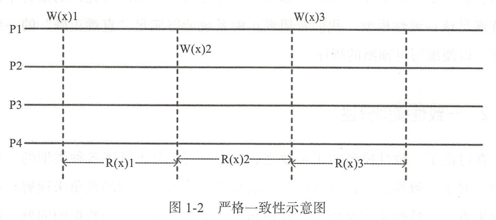
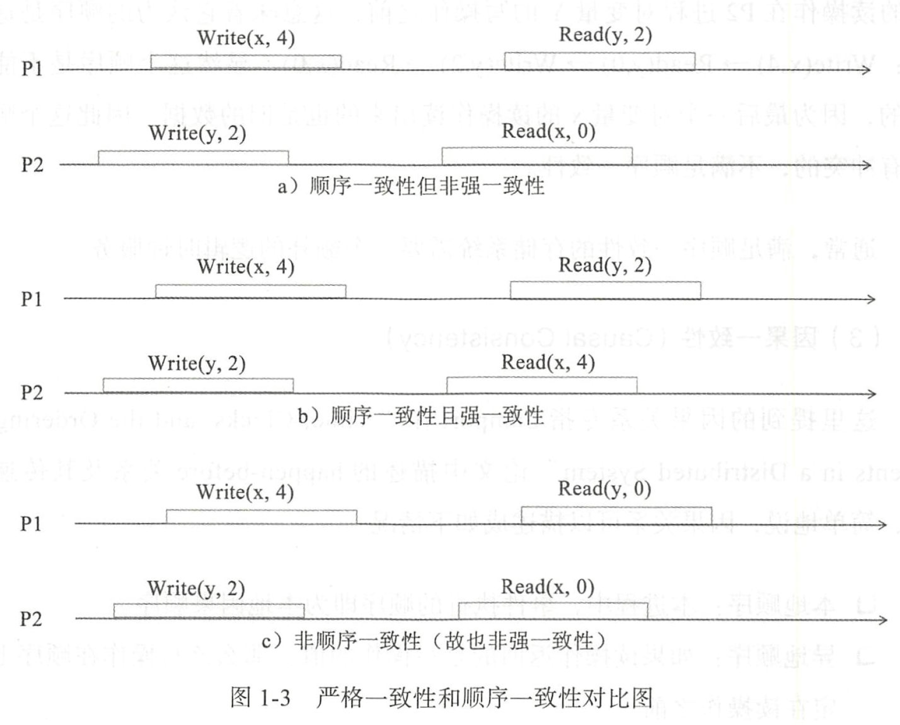
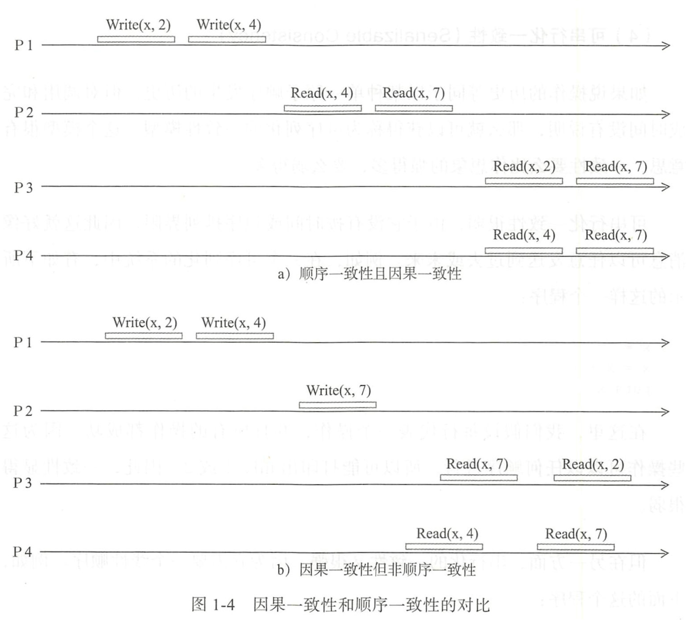
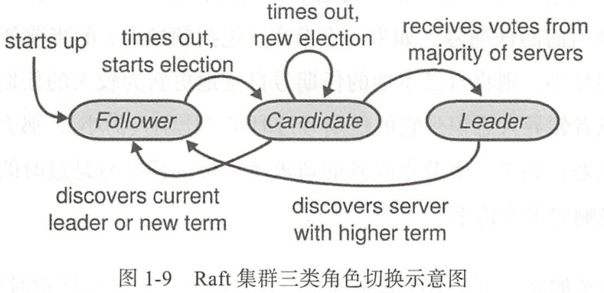
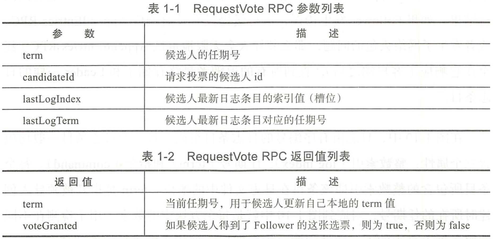
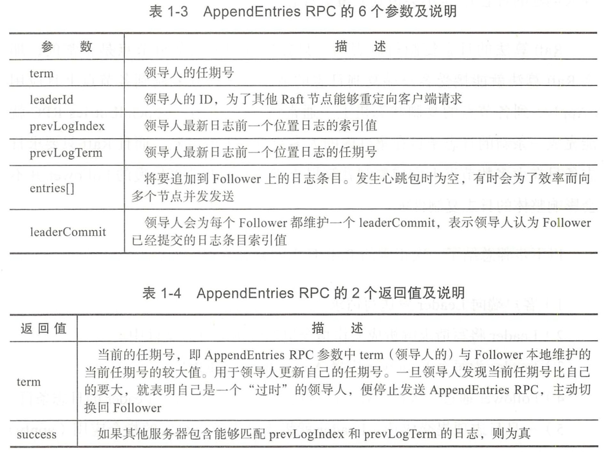

# \#第一部分：基础篇

# 第一章：分布式系统与一致性协议

**分布式系统**：是一个硬件或软件组件分布在不同的网络计算机上，彼此之间仅仅通过消息传递进行通信和协调的系统

- **设计目标**：
    - 可用性：分布式系统的核心需求，用于衡量一个分布式系统持续对外提供服务的能力
    - 可扩展性：增加机器不会改变或极少改变系统行为，并且能获得近似线性的性能提升
    - 容错性：系统发生错误时，具有对错误进行规避以及从错误中恢复的能力
    - 性能：对外服务的响应延时和吞吐率要能满足用户的需求
- 挑战：
    - 节点之间的网络通信不可靠，存在网络延时和丢包等情况
    - 存在节点处理错误的情况，节点自身随时也有宕机的情况
    - 同步调用使系统变得不具备可扩展性

## 1、CAP 原理

**CAP 定义**：

- `C(一致性)`：所有节点上的数据时刻保持同步，即所有读写都应该看起来是“原子”或串行
- `A(可用性)`：任何非故障节点都应该在有限的时间内给出请求的响应，不论请求是否成功
- `P(分区容忍性)`：当发生网络分区(即节点之间无法通信)时，在丢失任意多消息的情况下，系统仍然能够正常工作

## 2、一致性

衡量一致性算法的标准：

- **可终止性**：非失败进程在有限的时间内能够做出决定

- **一致性**：所有的进程必须对最终的决定达成一致性

- **合法性**：算法做出的决定值必须在其他进程(客户端)的期望值范围之内

    > 即客户端请求回答“是”或“否”时，不能返回“不确定”

### (1) 一致性模型

- 从客户端来看，一致性主要是指多并发访问时，如何获取更新过的数据的问题
- 从服务端来看，一致性则是更新如何复制分布到整个系统，以保证数据最终的一致性

因此，可以分为以数据为中心的一致性模型和以用户为中心的一致性模型

#### 1. 以数据为中心的一致性模型

- **严格一致性(强一致性/原子一致性/可线性化)**

    > - 任何一次读都能读到某个数据的最近一次写的数据
    > - 系统中的所有进程，看到的操作顺序都与全局时钟下的顺序一致
    >
    > **要求写操作在任一时刻对所有的进程都可见(维护一个全局时钟)**：
    >
    > 

- **顺序一致性(可序列化)**：若于强一致性，但也是能实现的最高级别的一致性模型(放弃了全局时钟，改为**分布式逻辑时钟**)

    > 顺序一致性：指所有的进程都以相同的顺序看到所有的修改
    >
    > - 读操作未必能及时得到此前其他进程对同一数据的写更新，但每个进程读到的该数据不同值的顺序却是一致的
    >
    >     > 只要求系统中的所有进程一致，即“要错一起错，要对一起对”，且不违反程序的顺序即可，并不需要整个全局顺序一致
    >
    > 
    >
    > - **图 1-3a 满足顺序一致性，但不满足强一致性**：从全局时钟的观点来看，P2 进程对变量 X 的读操作在 P1 进程对变量 X 的写操作之后，然而读出来的却是旧数据
    >
    >     > 两个进程的执行顺序：`Write(y,2) --> Read(x,0) --> Write(x,4) --> Read(y,2)` 
    >
    > - **图 1-3b 满足强一致性**：每个读操作都读到了该变量最新写的结果，同时两个进程看到的操作顺序与全局时钟的顺序一样
    >
    >     > `Write(y,2) --> Read(x,4) --> Write(x,4) -- > Read(y,2)` 
    >
    > - **图 1-3c 不满足顺序一致性**：P1 进程对变量 Y 的读操作在 P2 进程对变量 Y 的写操作之前
    >
    >     > `Write(x,4) --> Read(y,0) --> Write(y,2) --> Read(x,0)` 

- **因果一致性**：

    > 因果关系：
    >
    > - 本地顺序：本进程中，事件执行的顺序即为本地因果顺序
    > - 异地顺序：若读操作返回的是写操作的值，则该写操作在顺序上一定在读操作之前
    > - 闭包传递：与时钟向量中定义的一样，，即若 `a --> b` 且 `b --> c`，则肯定有 `a --> c` 
    >
    > 因果一致性弱于顺序一致性：
    >
    > 

- **可串行化一致性**：若操作的历史等同于以某种单一原子顺序发生的历史，但对调用和完成时间没有说明

    > 可串行化一致性很弱，由于没有按时间或顺序排列界限，因此就好像消息可以任意发送到过去或未来

#### 2. 以用户为中心的一致性模型

- **最终一致性**：若更新的时间间隔比较长，则所有的副本都能最终达到一致性
- **不一致性窗口**：用户读到某一操作对系统特定数据的更新需要一段时间
- **满足**：系统能保证用户最终读取到某操作对系统特定数据的更新

### (2) 复制状态机

- **复制状态机**：
    - 一个分布式的复制状态机系统由多个复制单元组成，每个复制单元均是一个状态机，它的状态保存在一组状态变量中
    - 状态机的状态能够并且只能通过外部命令来改变

- **“一组状态变量”通常是基于操作日志来实现**：

    - 每个复制单元存储一个包含一系列指令的日志，并且严格按照顺序逐条执行日志上的指令
    - 因为每个状态机都是确定的，所以每个外部命令都将产生相同的操作序列(日志)
    - 又因为每一个日志都是按照相同的顺序包含相同的指令，所以每个服务器都将执行相同的指令序列，并且最终到达相同的状态

    > 在复制状态机模型下，一致性算法的主要工作变为如何保证操作日志的一致性

- 服务器上的一致性模块负责接收外部命令，然后追加到自己的操作日志中
- 与其他服务器上的一致性模块进行通信以保证每个服务器上的操作日志最终都以相同的顺序包含相同的指令
- 一旦指令被正确复制，则每个服务器的状态机都将按照操作日志的顺序来处理，然后将输出结果返回客户端

---

**复制状态机基于以下假设**：复制状态机在分布式系统中常被用于解决各种容错相关问题，如：GFS、HDFS、Chubby、ZooKeeper、etcd

- 若一些状态机具有相同的初始状态，并且接收到的命令也相同，处理这些命令的顺序也相同，则处理完这些命令后的状态也应该相同
- 因为所有的复制节点都具有相同的状态，它们都能独立地从自己的本地日志中读取信息作为输入命令，所以即使其中一些服务器发生故障，也不会影响整个集群的可用性
- 不论服务器集群包含多少个节点，从外部看起来都只像是单个高可用的状态机一样

---

注意：

- 指令在状态机上的执行顺序并不一定等同于指令的发出顺序或接收顺序

- 复制状态机只是保证所有的状态机都以相同的顺序执行这些命令

- 基于复制状态机模型实现的主-备系统中，若主机发生故障，则理论上备机有权以任意顺序执行未提交到操作日志的指令

    > 实际实现中，一般不这么做，例如：
    >
    > - Zookeeper 采用原子化的广播协议及增量式的状态更新
    >
    >     > 状态更新的消息由主机发给备机，一旦主机发生故障，则备机必须依然执行主机的“遗嘱”

### (3) 拜占庭将军问题

- **拜占庭将军问题**：由于硬件错误、网络阻塞、连接断开、遭到恶意攻击等原因，计算机和网络可能会出现不可预料的行为

- **拜占庭错误，即 overly pessimistic 模型(最悲观、最强的错误类型)**：在计算机科学领域特指分布式系统中的某些恶意节点扰乱系统的正常运行，包括选择性不传递消息、选择性伪造消息等

    > **这个模型的意义**：若某个一致性协议能保证系统在出现 N 个拜占庭错误时，依旧可以做出一致性决定，则这个协议也能处理系统出现 N 个其他任意类型的错误

- 反之，进程失败错误(fail-stop Failure，如同宕机)，则是一个 **overly optimistic 模型**(最乐观、最弱的错误模型)：这个模型假设当某个节点出错时，这个节点会停止运行，并且其他所有节点都知道这个节点发生了错误

    > **这个模型的意义**：若某个一致性协议在系统出现 N 个进程失败错误时都无法保证作出一致性决定，则这个协议也就无法处理出现 N 个其他任意类型的错误

---

**综上所述**：对于一个通用的、具有复制状态机语义的分布式系统，若要做到 N 个节点的容错，至少需要 2N + 1 个复制节点

> 若只是把错误类型缩小到进程失败，则至少需要 N + 1 个复制节点才能容错

### (4) FLP 不可能性

- **FLP 不可能性**(定理)：说明了在允许节点失效的场景下，基于**异步通信**方式的分布式协议，无法确保在有限的时间内达成一致性

    > 异步通信与同步通信的区别是没有时钟、不能时间同步、不能使用超时、不能探测失败、消息可任意延迟、消息可乱序

    **通俗解释**：甲乙丙三人各自分开投票(0 或 1)，彼此可以通过电话进行沟通，但有人会睡着，例如：

    - 甲投票 0，乙投票 1，这时甲和乙打平，但此时丙睡着了，在丙醒来前甲和乙都无法达成最终结果
    - 即使重新投票，也可能陷入无尽的循环中

- 根据 FLP 定理，实际的一致性协议在理论上都有缺陷，最大的问题是理论上存在不可终止性

## 3、Raft 协议

Raft 算法主要使用两种方法来提高可理解性：

1. **问题分解**：Raft 算法把问题分解成了领袖选举、日志复制、安全性、成员关系变化

    - **领袖选举**：在一个领袖节点发生故障后，必须重新给出一个新的领袖节点
    - **日志复制**：领袖节点从客户端接收操作请求，然后将操作日志复制到集群中的其他服务器上，并且强制要求其他服务器的日志必须和自己的保持一致
    - **安全性**：**状态机安全原则**，即若一个服务器已将给定索引位置的日志条目应用到状态机中，则所有其他服务器不会在该索引位置应用不同的条目
    - **成员关系变化**：配置发生变化时，集群能够继续工作

2. **减少状态空间**：通过减少需要考虑的状态数量来简化状态空间

    注意：日志条目之间不允许出现空洞，并且还要限制日志出现不一致的可能性

    - 大多数情况下，Raft 都在试图消除不确定性以减少状态空间
    - 但在选举场景下，Raft 会用随机方法来简化选举过程中的状态空间

---

**Raft 的重要创新**：

- **强领导人**：日志条目只从领导人发向其他服务器

    > 这样简化了对日志复制的管理，提高了 Raft 的可理解性

- **领袖选举**：Raft 使用随机定时器来选举领导者

- **成员变化**：Raft 在调整集群成员关系时，使用**联合一致性**方法，使得集群配置在发生改变时，集群依旧能正常工作

### (1) Raft 一致性算法

Raft 集群中的节点通过远端过程调用(RPC)来进行通信，Raft 算法的基本操作只需 2 种 RPC 即可完成：

- RequestVote RPC 在选举过程中通过旧的 Leader 触发
- AppendEntries RPC 通过领导人触发，目的是向其他节点复制日志条目和发送心跳
- 后续还会介绍 Raft 算法的第三种 RPC，用于领导人向其他节点传输快照

> 若节点没有及时收到 RPC 的响应，就会重试；并且 RPC 可以并行发出，以获得更好的性能

#### 1. 基本概念

- 分布式系统一般存在如下两种节点关系模型：
    - **对称**：所有节点都是平等的，不存在主节点，客户端可以与任意节点进行交互
    - **非对称(Raft 采用)**：基于选主模型，只有主节点拥有决策权，任意时刻有且仅有一个主节点，客户端只与主节点进行交互

- Raft 协议组织的集群中，包含三类角色：**Leader(领袖)、Candidate(候选人)、Follower(群众)** 

---

任期在 Raft 中起着逻辑时钟的作用，同时也可用于在 Raft 节点中检测过期信息

- 每个 Raft 节点各自在本地维护一个当前任期值，触发这个数字变化(增加)有两个场景：开始选举、与其他节点交换信息

- 节点间通信会交换当前的任期号：
    - 若一个节点(包括 Leader)的当前任期号比其他节点的任期号小，则将自己本地的任期号自觉地更新为较大的任期号
    - 若一个候选人或领导人意识到它的任期号过时(比别人的小)，则会立刻切换回群众状态
    - 若一个节点收到的请求所携带的任期号过时，则该节点就会拒绝响应本次请求

> 注意：由于分布式系统中节点间无法做到任意时刻完全同步，因此Raft 强制使用新的 Term 更新旧的 Term 的原因

#### 2. Leader 选举

- Raft 通过选举 Leader 并赋予它管理复制日志的方式来维护节点间日志复制的一致性
- Leader 从客户端接收日志条目，再把日志条目复制到其他服务器上，并且在保证安全性的前提下，告诉其他服务器将日志条目应用到它们的状态机中

---

Raft 选举有两个概念非常重要：心跳和选举定时器：

- 每个 Raft 节点都有一个选举定时器，所有的 Raft 节点最开始以 Follower 角色运行时都会启动这个选举定时器

    > 注意：每个节点的选举定时器时长均不相等

- Leader 在任期内必须定期向集群内的其他节点广播心跳包，昭告自己的存在

- Follower 每次收到心跳包后就会主动将自己的选举定时器清零重置

    > - 若 Follower 选举定时器超时，则意味着在 Raft 规定的一个选举超时时间周期内，Leader 的心跳包并没有发给 Follower
    > - 于是，Follower 就假定 Leader 已经不存在或发生故障，然后发起一次新的选举

---

若一个 Follower 决定开始参加选举，则会执行如下步骤：

1. 将自己本地维护的当前任期号 `current_term_id` 加 1

2. 将自己的状态切换到候选人，并为自己投票

    > 即每个候选人的第一张选票来自自己

3. 向其所在集群中的其他节点发送 `RequestVote RPC`(RPC 消息会携带 `current_term_id` 值)，要求它们投票给自己

---

一个候选人有三种状态迁移的可能性：

- 得到大多数节点的选票，成为 Leader
- 发现其他节点赢得选举，主动切换回 Follower
- 过一段时间后，发现没有人赢得选举，重新发起一次选举

---

RequestVote RPC 的发起/调用方是候选人，接收方是集群内所有的其他节点(包括 Leader、Follower、Candidate)：

RPC 接收方的逻辑：

1. 若 `term < currentTerm`，即 term 的值小于接收方本地维护的 term(currentTerm) 值，则返回 (currentTerm, false)，以提醒调用方其 term 过时，并明确告知这位候选人这张票不会投给它；否则执行步骤2

2. 若之前未把选票投给任何人或已把选票投给当前候选人，并且候选人的日志和自己的日志一样新，则返回 (term, true)

    若之前已经把选票投给其他人，则会返回 (term, false)

#### 3. 日志复制

一旦某个领导人赢得选举，则会开始接收客户端的请求：

- 每个客户端请求都将解析成一条需要复制状态机执行的指令
- 领导人会把这条指令作为一条新的日志条目加入它的日志文件中，然后并行地向其他 Raft 节点发起 AppendEntries RPC，要求其他节点复制这个日志条目
- 当这个日志条目被“安全”复制后，Leader 会将这条日志应用到它的状态机中，并且向客户端返回执行结果
- 若 Follower 发生错误，运行缓慢没有及时响应 AppendEntries RPC 或发生网络丢包，则 Leader 会重试 AppendEntries RPC，直到所有的 Follower 最终存储了和 Leader 一样的日志目录

---

日志由有序的日志条目组成，每个日志条目一般包含三个属性：

- 整数索引 `log index`：即该条目在日志文件中的槽位

- 任期号 `term`：指其被领导人创建时所在的任期号，用于检测在不同的服务器上日志的不一致性问题

- 指令 `command`：用于被状态机执行的外部命令

    > 若某个日志条目能被状态机安全执行，就可以提交了(Leader 的日志条目都可以被提交)

---

Raft 算法用于保护不同节点上日志一致性的机制：

1. 若在不同的日志中，两个条目有着相同的索引和任期号，则它们所存储的命令相同

    > 满足条件：Leader 在一个任期中，在给定的日志索引位上最多创建一条日志条目，同时该条目在日志文件中的槽位不会改变

2. 若在不同的日志中，两个条目有着相同的索引和任期号，则它们之前的所有条目完全一样

    > 满足条件：
    >
    > - Leader 在发送 AppendEntries RPC 消息试图向其他节点追加新的日志条目时，会把这些新的日志条目之前一个槽位的日志条目的任期号和索引位置包含在消息体中
    > - 若 Follower 在它的日志文件中没有找到相同的任期号和索引的日志，就会拒绝 AppendEntries RPC，即拒绝在自己的状态机中追加新日志条目

---

**Raft 日志的复制流程**：

1. 客户端向 Leader 发送写请求
2. Leader 将写请求解析成操作指令追加到本地日志文件中
3. Leader 为每个 Follower 广播 AppendEntries RPC
4. Follower 通过一致性检查，选择从哪个位置开始追加 Leader 的日志条目
5. 一旦日志项提交成功，Leader 就将该日志条目对应的指令应用到本地状态机，并向客户端返回操作结果
6. Leader 后续通过 AppendEntries RPC 将已成功提交的日志项告知 Follower
7. Follower 收到提交的日志项后，将其应用至本地状态机

RPC 接收者需要实现的步骤：

1. 若 term < currentTerm，即领导人的任期号小于 Follower 本地维护的当前任期号，则返回 (currentTerm, false)；否则继续步骤 2

2. 若 Follower 在 prevLogIndex 位置的日志的任期号与 prevLogTerm 不匹配，则返回 (term, false)；否则继续步骤 3

3. Follower 进行日志一致性检查

4. 添加任何在已有的日志中不存在的条目，删除多余的条目

5. 若 leaderCommit > commitIndex，则将 commitIndex(Follower 维护的本地已提交的日志条目索引值)更新为 min{leaderCommit, Follower 本地最新日志条目索引}

    > 即：信任 Leader 数据，将本地已提交日志的索引值“跃进”到领导为该 Follower 跟踪记录的那个值(除非 leaderCommit 比本地更新的日志条目索引值还要大)

#### 4. 安全性

> Raft 算法是强领导人模型，Follower 必须无条件服从 Leader

- 在 以 Leader 选举为基础的一致性算法中，Leader 必须要存储全部已提交的日志条目

- Leader 当前任期的某条体制条目只要存储在大多数节点上，就认为该日志记录已被提交

    > 若 Leader 在提交某个日志条目前崩溃，则未来后继的领导人会让其他节点继续复制这条日志条目

---

总结：

1. 只要一个日志条目被存在了大多数的服务器上，Leader 就知道当前任期可以提交该目录
2. 若 Leader 在提交日志前崩溃，之后的领导人会试着继续完成对日志的复制

### (2) 可用性与时序

### (3) 异常情况

### (4) 日志压缩与快照

### (5) Raft 算法性能评估

# \# 第二部分：实战篇

# 第二章：为什么使用 etcd

## 1、etcd 简介

## 2、etcd 架构

### (1) etcd 数据通道

### (2) etcd 架构

## 3、etcd 典型应用场景

### (1) 服务注册与发现

### (2) 消息发布和订阅

### (3) 负载均衡

### (4) 分布式通知与协调

### (5) 分布式锁

### (6) 分布式队列

### (7) 集群监控与 Leader 竞选

## 4、etcd 性能测试

### (1) etcd 读性能

### (2) etcd 写性能

## 5、etcd 与其他键值存储系统的对比

### (1) ZooKeeper VS etvd

### (2) Consul VS etcd

### (3) NewSQL(Cloud Spanner、CockroachDB、TiDB) VS etcd

### (4) 使用 etcd 做分布式协同

## 6、使用 etcd 的项目

## 7、etcd 概念词汇表

## 8、etcd 发展里程碑

### (1) etcd 0.4 版本

### (2) etcd 2.0 版本

### (3) etcd 3.0 版本

# 第三章：etcd 初体验

## 1、单机部署

### (1) 单实例 etcd

### (2) 多实例 etcd

## 2、多节点集群化部署

### (1) 静态配置

### (2) 服务发现

## 3、etcdctl 常用命令行

### (1) key 的常规操作

### (2) key 的历史与 watch

### (3) 租约

## 4、etcd 常用配置参数

### (1) member 相关参数项

### (2) cluster 相关参数项

### (3) proxy 相关参数项

### (4) 安全相关参数项

### (5) 日志相关参数项

### (6) 不安全参数项

### (7) 统计相关参数项

### (8) 认证相关参数项

# 第四章：etcd 开放 API 之 v2

## 1、API 保证

## 2、etcd v2 API

### (1) 集群管理 API

### (2) 键值 API

### (3) 健的 TTL

### (4) 等待变化通知：watch

### (5) 自动创建有序 key

### (6) 目录 TTL

### (7) 原子的 CAS

### (8) 原子的 CAD

### (9) 创建目录

### (10) 罗列目录

### (11) 删除目录

### (12) 获取一个隐藏节点

### (13) 通过文件设置 key

### (14) 线性读

## 3、统计数据

### (1) Leader 数据

### (2) 节点自身的数据

### (3) 更多统计数据

## 4、member API

### (1) List member

### (2) 加入一个 member

### (3) 删除一个 member

### (4) 修改 member 的 peer URL

# 第五章：etcd 开放 API 之 v3

## 1、从 v2 到 v3

### (1) gRPC

### (2) 序列化和反序列化优化

### (3) 减少 TCP 连接

### (4) 租约机制

### (5) etcd v3 的观察者模式

### (6) etcd v3 的数据存储模型

### (7) etcd v3 的迷你事务

### (8) 快照

### (9) 大规模 watch

## 2、gRPC 服务

## 3、请求和响应

## 4、KV API

### (1) 键值对

### (2) revision

### (3) 键区间

### (4) Range API

### (5) PUT 调用

### (6) 事务

### (7) Compact 调用

## 5、watch API

### (1) Event

### (2) 流式 watch

## 6、Lease API

### (1) 获得租约

### (2) Keep Alives

## 7、API 使用示例

# 第六章：etcd 集群运维与稳定性

## 1、etcd 升级

### (1) 从 v2.3 升级到 v3.0

### (2) 从 v3.0 升级到 v3.1

## 2、从 v2 切换到 v3

### (1) 切换客户端代码

### (2) 数据迁移

## 3、运行时重配置

### (1) 两阶段配置更新保证集群安全

### (2) 永久性失去半数以上 member

## 4、参数调优

### (1) 时间参数

### (2) 快照

### (3) 磁盘

### (4) 网络

## 5、监控

## 6、维护

### (1) 压缩历史版本

### (2) 消除碎片化

### (3) 存储配额

### (4) 快照备份

## 7、灾难恢复

### (1) 快照

### (2) 恢复集群

## 8、etcd 网关

### (1) 何时使用 etcd 网关

### (2) 启动 etcd 网关

## 9、gRPC 代理

### (1) 可扩展的 watch API

### (2) 限制

### (3) 可扩展的带租约的 API

### (4) 服务端保护

### (5) 启动 gRPC 代理

### (6) 客户端节点同步和域名解析

### (7) 名字空间

## 10、故障恢复

### (1) 小部分从节点故障

### (2) 主节点故障

### (3) 大部分节点故障

### (4) 网络分区

### (5) 集群启动异常

## 11、硬件

# 第七章：etcd 安全

## 1、访问安全

### (1) 权限资源

### (2) 键值资源

### (3) 配置资源

## 2、etcd 访问控制实践

### (1) User 相关命令

### (2) Role 相关命令

### (3) 启用用户权限功能

## 3、传输安全

### (1) TLS/SSL 工作原理

### (2) 使用 TLS 加密 etcd 通信

### (3) etcd 安全配置详解

# \# 第三部分：高级篇

# 第八章：多版本并发控制

## 1、MVCC

## 2、etcd v2 存储机制

## 3、etcd v3 数据模型

### (1) 逻辑视图

### (2) 物理视图

## 4、etcd v3 的 MVCC 实现

## 5、etcd v3 的 MVCC 源码分析

### (1) revision

### (2) key 到 revision 间的映射关系

### (3) 从 BoltDB 中读取 key 的 value 值

### (4) 压缩历史版本

## 6、底层存储引擎：BoltDB

# 第九章：etcd 的日志和快照管理

## 1、数据持久化和复制

## 2、etcd 的日志管理

### (1) WAL 数据结构

### (2) WAL 文件物理格式

### (3) WAL 文件的初始化

### (4) WAL 追加日志项

### (5) WAL 日志回放

### (6) Master 向 Slave 推送日志

### (7) Follower 日志追加

## 3、etcd v2 的快照管理

### (1) 快照数据结构

### (2) 创建快照

### (3) 快照复制

### (4) 快照之后的日志回收

# 第十章：etcd v3 的事务和隔离

## 1、事务 ACID

## 2、事务的隔离性

### (1) Read uncommitted(读未提交)

### (2) Read committed(读提交)

### (3) Repeatable read(重复读)

## 3、etcd 的事务

### (1) Serializability 的重要性

### (2) etcd v3 的事务实现

### (3) 软件事务内存

### (4) etcd v3 STM 实现

# 第十一章：etcd watch 机制详解

## 1、v2 的 watch 机制详解

### (1) 客户端的 watch 请求

### (2) key 发生变更时通知客户端

### (3) 带版本号的 watch

### (4) v2 watch 的限制

## 2、v3 的 watch 实现机制

