# 一、数据库基础

## 1. 数据库的好处

1. 持久化数据到本地
2. 可以实现结构化查询，方便管理

## 2. 数据库相关概念

1. **DB：** 数据库，保存一组有组织的数据的容器
2. **DBMS：** 数据库管理系统，又称为数据库软件（产品），用于管理DB中的数据
3. **SQL:**  结构化查询语言，用于和DBMS通信的语言

## 3. 数据库存储数据的特点

1. 将数据放到表中，表再放到库中
2. 一个数据库中可以有多个表，每个表都有一个的名字，用来标识自己，表名具有唯一性
3. 表具有一些特性，这些特性定义了数据在表中如何存储，类似java中 “类”的设计
4. 表由列(字段)组成，每一列类似java 中的”属性”
5. 表中的数据是按行存储的，每一行类似于java中的“对象”

# 二、 mysql 命令

## 1. 基本命令

- 查看当前所有的数据库：`show databases;`
- 打开指定的库: `use 库名` 
- 查看当前库的所有表: `show tables;` 
- 查看其它库的所有表: `show tables from 库名;` 
- 创建表: `create table 表名(...);` 
- 查看表结构: `desc 表名;` 
- 查看服务器的版本: 
  - 方式一：登录到mysql服务端: `select version();` 
  - 方式二：没有登录到mysql服务端: `mysql --version` 或 `mysql --V` 

## 2. 语法规范

- 不区分大小写，但建议关键字大写，表名、列名小写
- 每条命令最好用分号结尾
- 每条命令根据需要，可以进行缩进或换行
- 注释： 
  - 单行注释：`#` 注释文字
  - 单行注释：`--` 注释文字
  - 多行注释：`/* 注释文字  */`

## 3. SQL的语言分类

- `DQL(Data Query Language)`：数据查询语言： `select ` 
- `DML(Data Manipulate Language)`：数据操作语言: `insert 、update、delete` 
- `DDL(Data Define Languge)`：数据定义语言: `create、drop、alter` 
- `TCL(Transaction Control Language)`：事务控制语言: `commit、rollback` 

### 1. DQL语言的学习

#### 1. 基础查询

```mysql
SELECT 要查询的东西【FROM 表名】;
```

- 查询表中的**单个字段**： `SELECT last_name FROM employees;` 

- 查询表中的**多个字段**： `SELECT last_name,salary,email FROM employees;` 

- 查询表中的**所有字段**

  - 方式一：

  ```mysql
  SELECT 
      employee_id,
      first_name,
      last_name,
      phone_number,
      last_name,
      job_id,
      phone_number,
      job_id,
      salary,
      commission_pct,
      manager_id,
      department_id,
      hiredate 
  FROM
      employees ;
  ```

  - 方式二：  `SELECT * FROM employees;` 

- 查询常量值

   ```mysql
    SELECT 100;
    SELECT 'john';
   ```

- 查询表达式： `SELECT 100%98;` 

- 查询函数: `SELECT VERSION();` 

- 起别名：

  > 作用：
  >
  > - 便于理解
  > - 如果要查询的字段有重名的情况，使用别名可以区分开来

  - 方式一：**使用 as**

  ```mysql
  SELECT 100%98 AS 结果;
  SELECT last_name AS 姓,first_name AS 名 FROM employees;
  ```

  - 方式二：**使用空格**

   `SELECT last_name 姓,first_name 名 FROM employees;`

- 去重： **DISTINCT**

  `SELECT DISTINCT department_id FROM employees;` 

- `+ 号` 的作用： 运算符

  > - 两个操作数都为数值型，则做加法运算： `select 100 + 90; `
  > - 只要其中一方为字符型，试图将字符型数值转换成数值型
  >   - 如果转换成功，则继续做加法运算： `select '123'+90;`
  >   - 如果转换失败，则将字符型数值转换成0 ： `select 'john'+90;	`
  > - 只要其中一方为null，则结果肯定为null :  `select null+10; `

  案例：查询员工名和姓连接成一个字段，并显示为 姓名

  ```mysql
  SELECT CONCAT('a','b','c') AS 结果;
  SELECT CONCAT(last_name,first_name) AS 姓名 FROM employees;
  ```

**特点：**

- 通过select查询完的结果 ，是一个虚拟的表格，不是真实存在
- 要查询的东西可以是:
  - **常量值：** `select 100;` `select 'Jhon';`
  - **表达式：** `select 100 % 98;`
  - **字段：** `select name from user;`
  - **函数：** `select version();`

#### 2. 条件查询

> 根据条件过滤原始表的数据，查询到想要的数据

```mysql
select 
	要查询的字段|表达式|常量值|函数
from 
	表
where 
	条件 ;
```

- 按**条件表达式**筛选

  > 条件运算符： >  <  >=   <=  =   !=   <>

  - 案例1：查询工资 >12000 的员工信息： `SELECT * FROM employees WHERE salary>12000;`
  - 案例2：查询部门编号不等于90号的员工名和部门编号： `SELECT last_name,department_id FROM employees WHERE department_id<>90;`

- 按**逻辑表达式**筛选

  > - and（&&）：两个条件如果同时成立，结果为true，否则为false
  > - or(||)：两个条件只要有一个成立，结果为true，否则为false
  > - not(!)：如果条件成立，则not后为false，否则为true

  - 案例1：查询工资z在10000到20000之间的员工名、工资以及奖金： `SELECT last_name,salary,commission_pct FROM employees WHERE salary>=10000 AND salary<=20000;`
  - 案例2：查询部门编号不是在90到110之间，或者工资高于15000的员工信息：`SELECT * FROM employees WHERE NOT(department_id>=90 AND department_id<=110) OR salary>15000;`

- **模糊查询**

  > - **like**	
  > - **between and**
  > - **in**
  > - **is null | is not null**
  - **like：** 

    > 一般和通配符搭配使用
    > **通配符：**
    >
    > - `%` 任意多个字符,包含0个字符
    > - `_` 任意单个字符

    - 案例1：查询员工名中包含字符a的员工信息： `select * from employees where last_name like '%a%';`

    - 案例2：查询员工名中第三个字符为 n，第五个字符为 l 的员工名和工资： `select last_name,salary FROM employees WHERE last_name LIKE '__n_l%';`

    - 案例3：查询员工名中第二个字符为 _ 的员工名： `SELECT last_name FROM employees WHERE last_name LIKE '_\_%';` 或   `SELECT last_name FROM employees WHERE last_name LIKE '_$_%' ESCAPE '$';`   

      >  `ESCAPE '$'` ： 将  `$`  定义为  `\`  转义字符

  - **between and** ： 

    > - 使用 between and 可以提高语句的简洁度
    > - 包含临界值
    > - 两个临界值不要调换顺序

    - 案例1：查询员工编号在100到120之间的员工信息： `SELECT * FROM employees WHERE employee_id BETWEEN 120 AND 100;`

  - **in：** 

    > **含义：** **判断某字段的值是否属于 in 列表中的某一项**
    > **特点：**
    >
    > - 使用 in 提高语句简洁度
    > - in 列表的值类型必须一致或兼容
    > - in 列表中不支持通配符

    - 案例：查询员工的工种编号是 IT_PROGAD_VP、AD_PRES中的一个员工名和工种编号： `SELECT last_name,job_id FROM employees WHERE job_id IN('IT_PROT','AD_VP','AD_PRES');`

  - **is null：**

    > - = 或 <>不能用于判断null值
    > - is null或is not null 可以判断null值

    - 案例1：查询没有奖金的员工名和奖金率： `SELECT last_name,commission_pct FROM employees WHERE commission_pct IS NULL;`
    - 案例1：查询有奖金的员工名和奖金率： `SELECT last_name,commission_pct FROM employees WHERE commission_pct IS NOT NULL;`

  - **安全等于  <=>**： 

    - 案例1：查询没有奖金的员工名和奖金率： `SELECT last_name,commission_pct FROM employees WHERE commission_pct <=> NULL;`
    - 案例2：查询工资为12000的员工信息： `SELECT last_name,salary FROM employees WHERE salary <=> 12000;`​	

  - **is null  VS  <=>**

    > **IS NULL：**  仅仅可以判断NULL值，可读性较高，建议使用
    > **<=>：**  既可以判断NULL值，又可以判断普通的数值，可读性较低

#### 3. 排序查询	

```mysql
select
	要查询的东西
from
	表
where 
	条件
order by 排序的字段|表达式|函数|别名 【asc|desc】
//asc 代表的是升序，可以省略；desc 代表的是降序
```

- **按单个字段排序**：  `SELECT * FROM employees ORDER BY salary DESC;`

- **添加筛选条件再排序**： 
  - 案例：查询部门编号>=90的员工信息，并按员工编号降序： `SELECT * FROM employees WHERE department_id>=90 ORDER BY employee_id DESC;`

- **按表达式排序：**
  - 案例：查询员工信息 按年薪降序： `SELECT *,salary*12*(1+IFNULL(commission_pct,0)) FROM employees ORDER BY salary*12*(1+IFNULL(commission_pct,0)) DESC;`

- **按别名排序：**
  - 案例：查询员工信息 按年薪升序： `SELECT *,salary*12*(1+IFNULL(commission_pct,0)) 年薪 FROM employees ORDER BY 年薪 ASC;`

- **按函数排序：**
  - 案例：查询员工名，并且按名字的长度降序： `SELECT LENGTH(last_name),last_name FROM employees ORDER BY LENGTH(last_name) DESC;`

- **按多个字段排序：**
  - 案例：查询员工信息，要求先按工资降序，再按employee_id升序： `SELECT * FROM employees ORDER BY salary DESC,employee_id ASC;`

#### 4. 常见函数

1. **单行函数**

   - **字符函数**

     - **concat 拼接**： `SELECT CONCAT(last_name,'_',first_name) 姓名 FROM employees;`
     - **substr 截取子串**： (**索引从1开始**)
       - 截取从指定索引处后面所有字符： `SELECT SUBSTR('李莫愁爱上了陆展元',7)  out_put;`
       - 截取从指定索引处指定字符长度的字符： `SELECT SUBSTR('李莫愁爱上了陆展元',1,3) out_put;`
       - 案例：姓名中首字符大写，其他字符小写然后用_拼接，显示出来： `SELECT CONCAT(UPPER(SUBSTR(last_name,1,1)),'-',LOWER(SUBSTR(last_name,2))) out_put FROM employees;`  
     - **upper 转换成大写**： `SELECT UPPER('john');`
     - **lower 转换成小写**： `SELECT LOWER('joHn');`
     - **trim 消去前后指定的空格和字符：** `SELECT TRIM('aa' FROM 'aaaaaaaaa张aaaaaaaaaaaa翠山')  AS out_put;`
     - **ltrim 消去左边空格**： 
     - **rtrim 消去右边空格**： 
     - **replace 替换**： `SELECT REPLACE('周芷若张无忌爱上了周芷若','周芷若','赵敏') AS out_put;`
     - **lpad 用指定的字符实现左填充指定长度**： `SELECT LPAD('殷素素',2,'*') AS out_put;`
     - **rpad 用指定的字符实现右填充指定长度**： `SELECT RPAD('殷素素',12,'ab') AS out_put;`
     - **instr 返回子串第一次出现的索引，如果找不到返回0**： `SELECT INSTR('杨不殷六侠悔爱上了殷六侠','殷八侠') AS out_put;`   `SELECT LENGTH(TRIM('    张翠山    ')) AS out_put;`
     - **length 获取字节个数** ： `SELECT LENGTH('john');` 

   - **数学函数**

     - **round 四舍五入** ： `SELECT ROUND(-1.55);`
     - **rand 随机数：** 
     - **floor 向下取整，返回<=该参数的最大整数：** `SELECT FLOOR(-9.99);`
     - **ceil 向上取整,返回 >= 该参数的最小整数**： `SELECT CEIL(-1.02);`
     - **mod 取余：** `SELECT MOD(10,-3);` <==> `SELECT 10%3;`
     - **truncate 截断**： `SELECT TRUNCATE(1.69999,1);`

   - **日期函数**

     - **now 当前系统日期+时间**： `SELECT NOW();`
     - **curdate 当前系统日期，不包含时间**： `SELECT CURDATE();`
     - **curtime 当前系统时间，不包含日期**： `SELECT CURTIME();`

     > 可以获取指定的部分，年、月、日、小时、分钟、秒： 
     >
     > 年：  `SELECT YEAR(NOW());`  `SELECT YEAR('1998-1-1');`
     >
     > 月： `SELECT MONTH(NOW());`  `SELECT MONTHNAME(NOW());`

     - **str_to_date 将字符转换成日期**： `SELECT STR_TO_DATE('1998-3-2','%Y-%c-%d') AS out_put;`
     - **date_format 将日期转换成字符**： `SELECT DATE_FORMAT(NOW(),'%y年%m月%d日') AS out_put;`

   - **流程控制函数**

     - **if 处理双分支**： `SELECT IF(10<5,'大','小');`  

     - **case语句 处理多分支**： 

       - **处理等值判断，switch case 的效果**： 

         ```mysql
         SELECT salary 原始工资,department_id,
         CASE department_id
         WHEN 30 THEN salary*1.1
         WHEN 40 THEN salary*1.2
         WHEN 50 THEN salary*1.3
         ELSE salary
         END 
         AS 新工资
         FROM employees;
         ```

       - **处理条件判断，类似于多重 if**： 

         ```	mysql
         SELECT salary,
         CASE 
         WHEN salary>20000 THEN 'A'
         WHEN salary>15000 THEN 'B'
         WHEN salary>10000 THEN 'C'
         ELSE 'D'
         END 
         AS 工资级别
         FROM employees;
         ```

   - **其他函数**

     - **version 版本**： `SELECT VERSION();`
     - **database 当前库**： `SELECT DATABASE();`
     - **user 当前连接用户**： `SELECT USER();`

2. **分组函数**

   - **sum 求和**
   - **max 最大值**
   - **min 最小值**
   - **avg 平均值**
   - **count 计数**

   > **特点：**
   >
   > - 以上五个分组函数都忽略 null 值，除了count(*)*
   > - sum 和 avg 一般用于处理数值型，max、min、count可以处理任何数据类型
   > - 都可以搭配 distinct 使用，用于统计去重后的结果
   > - count的参数可以支持：字段、常量值

#### 5. 分组查询

> **特点：**
>
> - 可以按单个字段分组
>
> - 和分组函数一同查询的字段最好是分组后的字段
>
>   分组筛选              针对的表	                 位置		       关键字
>   分组前筛选：	       原始表		group by的前面		**where**
>   分组后筛选：	分组后的结果集	group by的后面		**having**
>
> - 可以按多个字段分组，字段之间用逗号隔开
> - 可以支持排序
> - having后可以支持别名

```mysql
select 查询的字段，分组函数
from 表
group by 分组的字段
【where 筛选条件】
group by 分组的字段
【order by 排序的字段】;
```

- **简单的分组**
  - 案例1：查询每个工种的员工平均工资： `SELECT AVG(salary),job_id FROM employees GROUP BY job_id;`
  - 案例2：查询每个位置的部门个数： `SELECT COUNT(*),location_id FROM departments GROUP BY location_id;`

- **分组前筛选**
  - 案例1：查询邮箱中包含 a 字符的每个部门的最高工资： `SELECT MAX(salary),department_id FROM employees WHERE email LIKE '%a%' GROUP BY department_id;`
  - 案例2：查询有奖金的每个领导手下员工的平均工资： `SELECT AVG(salary),manager_id FROM employees WHERE commission_pct IS NOT NULL GROUP BY manager_id;`

- **分组后筛选**
  - 案例1：查询哪个部门的员工个数 >5 ： 
    - ①查询每个部门的员工个数： `SELECT COUNT(*),department_id FROM employees GROUP BY department_id;`
    - ② 筛选刚才①结果： `SELECT COUNT(*),department_id FROM employees GROUP BY department_id HAVING COUNT(*)>5;`
  - 案例2：每个工种有奖金的员工的最高工资>12000的工种编号和最高工资： `SELECT job_id,MAX(salary) FROM employees WHERE commission_pct IS NOT NULL GROUP BY job_id HAVING MAX(salary)>12000;`
  - 案例3：领导编号>102的每个领导手下的最低工资大于5000的领导编号和最低工资： `SELECT manager_id,MIN(salary) FROM employees GROUP BY manager_id HAVING MIN(salary)>5000;`

- **添加排序**
  - 案例：每个工种有奖金的员工的最高工资>6000的工种编号和最高工资,按最高工资升序： `SELECT job_id,MAX(salary) m FROM employees WHERE commission_pct IS NOT NULL GROUP BY job_id HAVING m>6000 ORDER BY m ;`

- **按多个字段分组**
  - 案例：查询每个工种每个部门的最低工资,并按最低工资降序： `SELECT MIN(salary),job_id,department_id FROM employees GROUP BY department_id,job_id ORDER BY MIN(salary) DESC;`

#### 6. 多表连接查询

1. 传统模式下的连接**(sql92标准) ：等值连接——非等值连接**

   > 1. 等值连接的结果 = 多个表的交集
   > 2. n 表连接，至少需要 n-1个连接条件
   > 3. 多个表不分主次，没有顺序要求
   > 4. 一般为表起别名，提高阅读性和性能

- **等值连接**

  - 案例1：查询女神名和对应的男神名： `SELECT NAME,boyName FROM boys,beauty WHERE beauty.boyfriend_id= boys.id;`

  - 案例2：查询员工名和对应的部门名： `SELECT last_name,department_name FROM employees,departments WHERE employees.department_id=departments.department_id;`

  Ⅰ. **为表起别名**(两个表的顺序可以调换)

  > - 提高语句的简洁度
  > - 区分多个重名的字段
  >
  > **注意：** 如果为表起了别名，则查询的字段就不能使用原来的表名去限定

  - 查询员工名、工种号、工种名： `SELECT e.last_name,e.job_id,j.job_title FROM employees e,jobs j WHERE e.job_id=j.job_id;`

  - 两个表的顺序调换： `SELECT e.last_name,e.job_id,j.job_title FROM jobs j,employees e WHERE e.job_id=j.job_id;`

  Ⅱ. **可以加筛选**

  - 案例1：查询有奖金的员工名、部门名： `SELECT last_name,department_name,commission_pct FROM employees e,departments d WHERE e.department_id=d.department_id AND e.commission_pct IS NOT NULL;`
  - 案例2：查询城市名中第二个字符为o的部门名和城市名： `SELECT department_name,city FROM departments d,locations l WHERE d.location_id = l.location_id AND city LIKE '_o%';` 

  **III. 可以加分组**

  - 案例1：查询每个城市的部门个数： `SELECT COUNT(*) 个数,city FROM departments d,locations l WHERE d.location_id=l.location_id GROUP BY city;`

  - 案例2：查询有奖金的每个部门的部门名和部门的领导编号和该部门的最低工资：

    ```mysql
    SELECT department_name,d.manager_id,MIN(salary) 
    FROM departments d,employees e 
    WHERE d.department_id=e.department_id AND commission_pct IS NOT NULL 
    GROUP BY department_name,d.manager_id;
    ```

  Ⅳ. **可以加排序**

  - 案例：查询每个工种的工种名和员工的个数，并且按员工个数降序

    ```mysql
    SELECT job_title,COUNT(*)
    FROM employees e,jobs j
    WHERE e.job_id=j.job_id
    GROUP BY job_title
    ORDER BY COUNT(*) DESC;
    ```

  V. **实现三表连接**

  - 案例：查询员工名、部门名和所在的城市

    ```mysql
    SELECT last_name,department_name,city
    FROM employees e,departments d,locations l
    WHERE e.department_id = d.department_id
    AND d.location_id = l.location_id
    AND city LIKE 's%'
    ORDER BY department_name DESC;
    ```

  - **非等值连接**

    - 案例1：查询员工的工资和工资级别

      ```mysql
      SELECT salary,grade_level
      FROM employees e,job_grades g
      WHERE salary BETWEEN g.lowest_sal AND g.highest_sal
      AND g.grade_level='A';
      ```

- **自连接**

  - 案例：查询 员工名和上级的名称： 

    ```mysql
    SELECT e.employee_id,e.last_name,m.employee_id,m.last_name
    FROM employees e,employees m
    WHERE e.manager_id=m.employee_id;
    ```

2. **sql99语法**：通过join关键字实现连接

   > **支持：**
   >
   > - 等值连接、非等值连接 （内连接：**inner**）
   > - 外连接：左外：**left 【outer】**，右外：**right 【outer】**，全外：**full【outer】**
   > - 交叉连接：**cross** 

   ```mysql
   select 字段，...
   from 表1
   【inner|left outer|right outer|cross】join 表2 on  连接条件
   【inner|left outer|right outer|cross】join 表3 on  连接条件
   【where 筛选条件】
   【group by 分组字段】
   【having 分组后的筛选条件】
   【order by 排序的字段或表达式】
   ```

- **内连接**

  > **分类：** 等值、非等值、自连接
  >
  > **特点：** 
  >
  > - 添加排序、分组、筛选
  > - **inner 可以省略**
  > - 筛选条件放在 where 后面，连接条件放在 on 后面，提高分离性，便于阅读
  > - inner join 连接和sql92语法中的等值连接效果是一样的，都是查询多表的交集

  ```mysql
  select 查询列表
  from 表1 别名
  inner join 表2 别名
  on 连接条件;
  ```

  - **等值连接**

    - 案例1. 查询员工名、部门名

      ```mysql
      SELECT last_name,department_name
      FROM departments d
      JOIN employees e
      ON e.department_id = d.department_id;
      ```

    - 案例2. 查询名字中包含e的员工名和工种名（添加筛选）

      ```mysql
      SELECT last_name,job_title
      FROM employees e
      INNER JOIN jobs j
      ON e.job_id = j.job_id
      WHERE e.last_name LIKE '%e%';
      ```

    - 案例3. 查询部门个数>3的城市名和部门个数（添加分组+筛选）

      ```mysql
      SELECT city,COUNT(*) 部门个数
      FROM departments d
      INNER JOIN locations l
      ON d.location_id=l.location_id
      GROUP BY city
      HAVING COUNT(*)>3;
      ```

    - 案例4. 查询哪个部门的员工个数>3的部门名和员工个数，并按个数降序（添加排序）

      ①查询每个部门的员工个数

      ```mysql
      SELECT COUNT(*),department_name
      FROM employees e
      INNER JOIN departments d
      ON e.department_id=d.department_id
      GROUP BY department_name
      ```

      ② 在①结果上筛选员工个数>3的记录，并排序

      ```mysql
      SELECT COUNT(*) 个数,department_name
      FROM employees e
      INNER JOIN departments d
      ON e.department_id=d.department_id
      GROUP BY department_name
      HAVING COUNT(*)>3
      ORDER BY COUNT(*) DESC;
      ```

    - 案例5. 查询员工名、部门名、工种名，并按部门名降序（添加三表连接）

      ```mysql
      SELECT last_name,department_name,job_title
      FROM employees e
      INNER JOIN departments d ON e.department_id=d.department_id
      INNER JOIN jobs j ON e.job_id = j.job_id
      ORDER BY department_name DESC;
      ```

  - **非等值连接**

    - 查询员工的工资级别

      ```mysql
      SELECT salary,grade_level
      FROM employees e
      JOIN job_grades g
      ON e.salary BETWEEN g.lowest_sal AND g.highest_sal;
      ```

    - 查询工资级别的个数>20的个数，并且按工资级别降序

       ```mysql
        SELECT COUNT(),grade_level
        FROM employees e
        JOIN job_grades g ON e.salary BETWEEN g.lowest_sal AND g.highest_sal
        GROUP BY grade_level
        HAVING COUNT(*)>20
        ORDER BY grade_level DESC;
       ```

  - **自连接**

    - 查询员工的名字、上级的名字

      ```mysql
      SELECT e.last_name,m.last_name 
      FROM employees e
      JOIN employees m ON e.manager_id= m.employee_id;
      ```

    - 查询姓名中包含字符k的员工的名字、上级的名字

      ```mysql
      SELECT e.last_name,m.last_name
      FROM employees e
      JOIN employees m ON e.manager_id= m.employee_id
      WHERE e.last_name LIKE '%k%';
      ```

- **外连接**

  > **应用场景：** **用于查询一个表中有，另一个表没有的记录**
  >
  >  **特点：**
  >
  > - 外连接的查询结果为主表中的所有记录
  >   如果从表中有和它匹配的，则显示匹配的值
  >   如果从表中没有和它匹配的，则显示null
  >   外连接查询结果=内连接结果+主表中有而从表没有的记录
  > - 左外连接，left join 左边的是主表
  >   右外连接，right join 右边的是主表
  > - 左外和右外交换两个表的顺序，可以实现同样的效果 
  > - 全外连接=内连接的结果+表1中有但表2没有的+表2中有但表1没有的
  - 案例：查询哪个部门没有员工

    - **左外**

      ```mysql
      SELECT d.*,e.employee_id
      FROM departments d
      LEFT OUTER JOIN employees e
      ON d.department_id = e.department_id
      WHERE e.employee_id IS NULL;
      ```

    - **右外**

      ```mysql
      SELECT d.*,e.employee_id
      FROM employees e
      RIGHT OUTER JOIN departments d
      ON d.department_id = e.department_id
      WHERE e.employee_id IS NULL;
      ```

    - **全外**

      ```mysql
      SELECT b.,bo.
      FROM beauty b
      FULL OUTER JOIN boys bo
      ON b.boyfriend_id = bo.id;
      ```

- **交叉连接**

  ```mysql
  SELECT b.*,bo.*
  FROM beauty b
  CROSS JOIN boys bo;
  ```

#### 7. 子查询

> **含义：**一条查询语句中又嵌套了另一条完整的select语句，其中被嵌套的select语句，称为子查询或内查询，在外面的查询语句，称为主查询或外查询
>
> **特点：**
>
> - 子查询都放在小括号内
> - 子查询可以放在 from 后面、select 后面、where 后面、having 后面，但一般放在条件的右侧
> - 子查询优先于主查询执行，主查询使用了子查询的执行结果
>
> **分类：**
>
> - 按子查询出现的位置：
>   - **select后面：** 仅仅支持标量子查询
>   - **from后面：** 支持表子查询
>   - **where或having后面**：
>     - 标量子查询（单行）
>     - 列子查询（多行）	
>     - 行子查询
>   - **exists后面（相关子查询）**： 表子查询
>
> - 按结果集的行列数不同：
>   - 标量子查询（结果集只有一行一列）
>   - 列子查询（结果集只有一列多行）
>   - 行子查询（结果集有一行多列）
>   - 表子查询（结果集一般为多行多列）

**一、where或having后面**

> - 标量子查询（单行子查询）
> - 列子查询（多行子查询）
> - 行子查询（多列多行）
>
> **特点：** 
>
> - 子查询放在小括号内
> - 子查询一般放在条件的右侧
>   - 标量子查询，一般搭配着单行操作符使用： < >= <= = <>
>   - 列子查询，一般搭配着多行操作符使用： in、any/some、all
>
> - **子查询的执行优先于主查询执行，主查询的条件用到了子查询的结果**

- **标量子查询**
  - 案例1：谁的工资比 Abel 高?

    ```mysql
    SELECT *
    FROM employees
    WHERE salary > (
    	SELECT salary
    	FROM employees
    	WHERE last_name = 'Abel'
    );
    ```

  - 案例2：返回job_id与141号员工相同，salary比143号员工多的员工 姓名，job_id 和工资

    ```mysql
    SELECT last_name,job_id,salary
    FROM employees
    WHERE job_id = (
    	SELECT job_id
    	FROM employees
    	WHERE employee_id = 141
    ) AND salary>(
    	SELECT salary
    	FROM employees
    	WHERE employee_id = 143
    );
    ```

  - 案例3：返回公司工资最少的员工的last_name,job_id和salary

    ```mysql
    SELECT last_name,job_id,salary
    FROM employees
    WHERE salary=(
    	SELECT MIN(salary)
    	FROM employees
    );
    ```

  - 案例4：查询最低工资大于50号部门最低工资的部门id和其最低工资

    ```mysql
    SELECT MIN(salary),department_id
    FROM employees
    GROUP BY department_id
    HAVING MIN(salary)>(
    	SELECT MIN(salary)
    	FROM employees
    	WHERE department_id = 50
    );
    # 非法使用标量子查询
    SELECT MIN(salary),department_id
    FROM employees
    GROUP BY department_id
    HAVING MIN(salary)>(
    	SELECT salary #***
    	FROM employees
    	WHERE department_id = 250
    );
    ```

- **列子查询（多行子查询）**
  - 案例1：返回location_id是1400或1700的部门中的所有员工姓名

    ```mysql
    SELECT last_name
    FROM employees
    WHERE department_id  <>ALL(
    	SELECT DISTINCT department_id
    	FROM departments
    	WHERE location_id IN(1400,1700)
    );
    ```

  - 案例2：返回其它工种中比job_id为‘IT_PROG’工种任一工资低的员工的员工号、姓名、job_id 以及salary

    ```mysql
    SELECT last_name,employee_id,job_id,salary
    FROM employees
    WHERE salary<ANY(
    	SELECT DISTINCT salary
    	FROM employees
    	WHERE job_id = 'IT_PROG'
    ) AND job_id<>'IT_PROG';
    
    或
    
    SELECT last_name,employee_id,job_id,salary
    FROM employees
    WHERE salary<(
    	SELECT MAX(salary)
    	FROM employees
    	WHERE job_id = 'IT_PROG'
    ) AND job_id<>'IT_PROG';
    ```

  - 案例3：返回其它部门中比job_id为‘IT_PROG’部门所有工资都低的员工   的员工号、姓名、job_id 以及salary

    ```mysql
    SELECT last_name,employee_id,job_id,salary
    FROM employees
    WHERE salary<ALL(
    	SELECT DISTINCT salary
    	FROM employees
    	WHERE job_id = 'IT_PROG'
    ) AND job_id<>'IT_PROG';
    
    或
    
    SELECT last_name,employee_id,job_id,salary
    FROM employees
    WHERE salary<(
    	SELECT MIN( salary)
    	FROM employees
    	WHERE job_id = 'IT_PROG'
    ) AND job_id<>'IT_PROG';
    ```

- **行子查询（结果集一行多列或多行多列）**
  - 案例：查询员工编号最小并且工资最高的员工信息

    ```mysql
    SELECT * 
    FROM employees
    WHERE (employee_id,salary)=(
    	SELECT MIN(employee_id),MAX(salary)
    	FROM employees
    );
    
    或
    
    SELECT *
    FROM employees
    WHERE employee_id=(
    	SELECT MIN(employee_id)
    	FROM employees
    )AND salary=(
    	SELECT MAX(salary)
    	FROM employees
    );
    ```

**二、select后面**

> 仅仅支持标量子查询

- 案例：查询每个部门的员工个数

  ```mysql
  SELECT d.*,(
  	SELECT COUNT(*)
  	FROM employees e
  	WHERE e.department_id = d.department_id
   ) 个数
   FROM departments d;
  ```

- 案例2：查询员工号=102的部门名

  ```mysql
  SELECT (
  	SELECT department_name,e.department_id
  	FROM departments d
  	INNER JOIN employees e
  	ON d.department_id=e.department_id
  	WHERE e.employee_id=102
  ) 部门名;
  ```

**三、from后面**

> 将子查询结果充当一张表，要求必须起别名

- 案例：查询每个部门的平均工资的工资等级

  ```mysql
  SELECT  ag_dep.*,g.grade_level
  FROM (
  	SELECT AVG(salary) ag,department_id
  	FROM employees
  	GROUP BY department_id
  ) ag_dep
  INNER JOIN job_grades g
  ON ag_dep.ag BETWEEN lowest_sal AND highest_sal;
  ```

**四、exists后面（相关子查询）**

- 案例1：查询有员工的部门名

  ```mysql
  #in
  SELECT department_name
  FROM departments d
  WHERE d.department_id IN(
  	SELECT department_id
  	FROM employees
  )
  
  #exists
  SELECT department_name
  FROM departments d
  WHERE EXISTS(
  	SELECT *
  	FROM employees e
  	WHERE d.department_id=e.department_id
  );
  ```

- 案例2：查询没有女朋友的男神信息

  ```mysql
  #in
  SELECT bo.*
  FROM boys bo
  WHERE bo.id NOT IN(
  	SELECT boyfriend_id
  	FROM beauty
  )
  
  #exists
  SELECT bo.*
  FROM boys bo
  WHERE NOT EXISTS(
  	SELECT boyfriend_id
  	FROM beauty b
  	WHERE bo.id=b.boyfriend_id
  );
  ```

#### 8. 分页查询

> **应用场景：** 实际的web项目中需要根据用户的需求提交对应的分页查询的sql语句
>
> **语法：** 
>
> ```mysql
> select 查询列表
> from 表
> 	【join type join 表2
> 	on 连接条件
> 	where 筛选条件
> 	group by 分组字段
> 	having 分组后的筛选
> 	order by 排序的字段】
> limit 【offset,】size;
> # offset要显示条目的起始索引（起始索引从0开始）
> # size 要显示的条目个数
> ```
>
> **特点：** limit 语句放在查询语句的最后

- 案例1：查询前五条员工信息

  ```mysql
  SELECT * FROM  employees LIMIT 0,5;
  SELECT * FROM  employees LIMIT 5;
  ```

- 案例2：查询第11条——第25条

  ```mysql
  SELECT * FROM  employees LIMIT 10,15;
  ```

- 案例3：有奖金的员工信息，并且工资较高的前10名显示出来

  ```mysql
  SELECT *
  FROM employees 
  WHERE commission_pct IS NOT NULL 
  ORDER BY salary DESC 
  LIMIT 10 ;
  ```

#### 9. 联合查询

> **union 联合 合并：** 将多条查询语句的结果合并成一个结果
>
> **语法：** 
>
> ```mysql
> 语法：
> 查询语句1
> union
> 查询语句2
> union
> ```
>
> **应用场景：** 要查询的结果来自于多个表，且多个表没有直接的连接关系，但查询的信息一致时
>
> **特点：** 
>
> - 要求多条查询语句的查询列数是一致的！
> - 要求多条查询语句的查询的每一列的类型和顺序最好一致
> - union关键字默认去重，如果使用union all 可以包含重复项

- 引入的案例：查询部门编号>90或邮箱包含a的员工信息

  ```mysql
  SELECT * FROM employees WHERE email LIKE '%a%' OR department_id>90;
  
  SELECT * FROM employees  WHERE email LIKE '%a%'
  UNION
  SELECT * FROM employees  WHERE department_id>90;
  ```

- 案例：查询中国用户中男性的信息以及外国用户中年男性的用户信息

  ```mysql
  SELECT id,cname FROM t_ca WHERE csex='男'
  UNION ALL
  SELECT t_id,tname FROM t_ua WHERE tGender='male';
  ```

### 2. DML语言

#### 1. 插入

1. **经典的插入**： 

   ```mysql
   insert into 表名(字段名，...) values(值1，...);
   ```

   **特点：** 

   - 字段类型和值类型一致或兼容，而且一一对应

     ```mysql
     INSERT INTO beauty(id,NAME,sex,borndate,phone,photo,boyfriend_id)
     VALUES(13,'唐艺昕','女','1990-4-23','1898888888',NULL,2);
     ```

   - 可以为空的字段，可以不用插入值，或用null填充

     ```mysql
     INSERT INTO beauty(id,NAME,sex,borndate,phone,photo,boyfriend_id)
     VALUES(13,'唐艺昕','女','1990-4-23','1898888888',NULL,2);
     ```

   - 不可以为空的字段，必须插入值

   - 字段个数和值的个数必须一致

   - 字段可以省略，但默认所有字段，并且顺序和表中的存储顺序一致

     ```mysql
     INSERT INTO beauty
     VALUES(18,'张飞','男',NULL,'119',NULL,NULL);
     ```

2. **新方式**

   ```mysql
   insert into 表名 set 列名=值,列名=值,...
   ```

   例子：

   ```mysql
   INSERT INTO beauty SET id=19,NAME='刘涛',phone='999';
   ```

3. 两种方式比较

   - **方式一支持插入多行,方式二不支持**

     ```mysql
     INSERT INTO beauty
     VALUES(23,'唐艺昕1','女','1990-4-23','1898888888',NULL,2),
     (24,'唐艺昕2','女','1990-4-23','1898888888',NULL,2),
     (25,'唐艺昕3','女','1990-4-23','1898888888',NULL,2);
     ```

   - **方式一支持子查询，方式二不支持**

#### 2. 修改

- **修改单表语法：**

  ```mysql
  update 表名 set 字段=新值,字段=新值 【where 条件】
  ```

  - 案例1：修改beauty表中姓唐的女神的电话为13899888899

    ```mysql
    UPDATE beauty SET phone = '13899888899' WHERE NAME LIKE '唐%';
    ```

  - 案例2：修改boys表中id好为2的名称为张飞，魅力值 10

    ```mysql
    UPDATE boys SET boyname='张飞',usercp=10 WHERE id=2;
    ```

- **修改多表语法：**

  ```mysql
  # sql92语法：
  update 表1 别名,表2 别名
  set 列=值,...
  where 连接条件
  and 筛选条件;
  
  # sql99语法：
  update 表1 别名
  inner|left|right join 表2 别名
  on 连接条件
  set 列=值,...
  where 筛选条件;
  ```

  - 案例 1：修改张无忌的女朋友的手机号为114

    ```mysql
    UPDATE boys bo
    INNER JOIN beauty b ON bo.id=b.boyfriend_id
    SET b.phone='119',bo.userCP=1000
    WHERE bo.boyName='张无忌';
    ```

  - 案例2：修改没有男朋友的女神的男朋友编号都为2号

    ```mysql
    UPDATE boys bo
    RIGHT JOIN beauty b ON bo.id=b.boyfriend_id
    SET b.boyfriend_id=2
    WHERE bo.id IS NULL;
    ```

#### 3. 删除

- **delete语句** 
  - 单表的删除： ★

    ```mysql
    delete from 表名 【where 筛选条件】
    ```

    - 案例：删除手机号以9结尾的女神信息

      ```mysql
      DELETE FROM beauty WHERE phone LIKE '%9';
      ```

  - 多表的删除：

    ```mysql
    # sql92语法：
    delete 表1的别名,表2的别名
    from 表1 别名,表2 别名
    where 连接条件
    and 筛选条件;
    
    # sql99语法：
    delete 表1的别名,表2的别名
    from 表1 别名
    inner|left|right join 表2 别名 on 连接条件
    where 筛选条件;
    ```

    - 案例：删除张无忌的女朋友的信息

      ```mysql
      DELETE b
      FROM beauty b
      INNER JOIN boys bo ON b.boyfriend_id = bo.id
      WHERE bo.boyName='张无忌';
      ```

    - 案例：删除黄晓明的信息以及他女朋友的信息

      ```mysql
      DELETE b,bo
      FROM beauty b
      INNER JOIN boys bo ON b.boyfriend_id=bo.id
      WHERE bo.boyName='黄晓明';
      ```

- **truncate语句**

  ```mysql
  truncate table 表名
  ```

  - 案例：将魅力值>100的男神信息删除

    ```mysql
    TRUNCATE TABLE boys;
    ```

- **delete VS truncate** 

  > - delete 可以加where 条件，truncate不能加
  >
  > - truncate 删除，效率高一丢丢
  > - 假如要删除的表中有自增长列，如果用delete删除后，再插入数据，自增长列的值从断点开始，而truncate删除后，再插入数据，自增长列的值从1开始。
  > - truncate删除没有返回值，delete删除有返回值
  > - truncate删除不能回滚，delete删除可以回滚.

### 3. DDL语句

#### 1. 库和表的管理

**库的管理：**

- **创建库**

  ```mysql
  create database  [if not exists]库名;
  ```

  - 案例：创建库Books

    ```mysql
    CREATE DATABASE IF NOT EXISTS books ;
    ```

- **库的修改**

  ```mysql
  RENAME DATABASE books TO 新库名;
  ```

  - 更改库的字符集

    ```mysql
    ALTER DATABASE books CHARACTER SET gbk;
    ```

- **库的删除** 

  ```mysql
  DROP DATABASE IF EXISTS books;
  ```

**表的管理：**

- **创建表**	

  ```mysql
  create table 表名(
  	列名 列的类型【(长度) 约束】,
  	列名 列的类型【(长度) 约束】,
  	列名 列的类型【(长度) 约束】,
  	...
  	列名 列的类型【(长度) 约束】
  )
  ```

  - 案例：创建表Book

    ```mysql
    CREATE TABLE IF NOT EXISTS book(
    	id INT,#编号
    	bName VARCHAR(20),#图书名
    	price DOUBLE,#价格
    	authorId  INT,#作者编号
    	publishDate DATETIME#出版日期
    );
    ```

- **修改表 alter** 

  ```mysql
  ALTER TABLE 表名 ADD|MODIFY|DROP|CHANGE COLUMN 字段名 【字段类型】;
  ```

  - 修改字段名

    ```mysql
    ALTER TABLE studentinfo CHANGE COLUMN sex gender CHAR;
    ```

  - 修改表名

    ```mysql
    ALTER TABLE stuinfo RENAME [TO]  studentinfo;
    ```

  - 修改字段类型和列级约束

    ```mysql
    ALTER TABLE studentinfo MODIFY COLUMN borndate DATE ;
    ```

  - 添加字段

    ```mysql
    ALTER TABLE studentinfo ADD COLUMN email VARCHAR(20) first;
    ```

  - 删除字段

    ```mysql
    ALTER TABLE studentinfo DROP COLUMN email;
    ```

- **删除表**

  ```mysql
  DROP TABLE [IF EXISTS] studentinfo;
  ```

- **表的复制**

  - 仅仅复制表的结构

    ```mysql
    CREATE TABLE copyTmp LIKE author;
    ```

  - 复制表的结构+数据

    ```mysql
    CREATE TABLE copyTmp2 SELECT * FROM author;
    ```

  - 只复制部分数据

    ```mysql
    CREATE TABLE copyTmp3
    SELECT id,au_name
    FROM author 
    WHERE nation='中国';
    ```

  - 仅仅复制某些字段

    ```mysql
    CREATE TABLE copy4 
    SELECT id,au_name
    FROM author
    WHERE 0;
    ```

#### 2. 常见类型

> - **数值型：**
>   - **整型**
>   - **小数：**
>     - **定点数**
>     - **浮点数**
> - **字符型：**
>   - **较短的文本：** char、varchar
>   - **较长的文本：** text、blob（较长的二进制数据）
>
> - **日期型：**

**一、整型**

> **分类：**
>
> - tinyint：1
>
> - smallint： 2
>
> - mediumint： 3
> - int/integer： 4
> - bigint： 8
>
> **特点：**
>
> - 如果不设置无符号还是有符号，**默认是有符号**，如果想设置无符号，需要添加 unsigned 关键字
> - 如果插入的数值超出了**整型的范围**,会报out of range异常，并且插入临界值
> - 如果不设置长度，会**有默认的长度**，长度代表了显示的最大宽度，如果不够会用 0 在左边填充，但必须搭配 `zerofill` 使用

**二、小数**

> **原则**： 所选择的类型越简单越好，能保存数值的类型越小越好
>
> **分类：**
>
> - 浮点型： `float(M,D) double(M,D)` 
> - 定点型： `dec(M，D) decimal(M,D)` 
>
> **特点：**
>
> - M：整数部位+小数部位
>   D：小数部位
>   如果超过范围，则插入临界值
>
> - M和D都可以省略
>   如果是decimal，则M默认为10，D默认为0
>   如果是float和double，则会根据插入的数值的精度来决定精度
>
> - 定点型的精确度较高，如果要求插入数值的精度较高如货币运算等则考虑使用

**三、字符型** 

> - **较短的文本**： char、varchar
>
> - **其他：**
>   - binary 和 varbinary 用于保存较短的二进制
>   - enum 用于保存枚举
>   - set 用于保存集合
>
> - **较长的文本**： text、blob(较大的二进制)
>
> **特点：**
>
>   写法		M的意思					特点			   		空间的耗费			   效率
>
>   char		char(M)		最大的字符数，可以省略，默认为1         固定长度的字符		比较耗费高
>
> varchar 	      varchar(M)	    最大的字符数，不可以省略		     可变长度的字符		比较节省低

**四、日期型** 

> **分类：**
>
> - date  只保存日期
> - time 只保存时间
> - year  只保存年
>
> - datetime   保存日期+时间
> - timestamp  保存日期+时间
>
> **特点：**
>
>   			     字节		       范围				时区等的影响
>
> datetime	       8		1000——9999	                  不受
> timestamp	       4	        1970——2038	                    受

#### 3. 常见约束

> **含义：** 一种限制，用于限制表中的数据，为了保证表中的数据的准确和可靠性
>
> **分类：六大约束**
>
> - **NOT NULL**：非空，用于保证该字段的值不能为空
> - **DEFAULT**： 默认，用于保证该字段有默认值
> - **PRIMARY KEY**： 主键，用于保证该字段的值具有唯一性，并且非空
> - **UNIQUE**： 唯一，用于保证该字段的值具有唯一性，可以为空
> - **CHECK**： 检查约束【mysql中不支持】
> - **FOREIGN KEY**： 外键，用于限制两个表的关系，用于保证该字段的值必须来自于主表的关联列的值，在从表添加外键约束，用于引用主表中某列的值	
>
> **添加约束的时机：**
>
> - 创建表时
> - 修改表时
>
> **约束的添加分类：**  
>
> - **列级约束**：对于一个列所创建的约束
> - **表级约束**：对于两个或两个以上的列所创建的约束			
>
> **主键和唯一的大对比：** 
>
> ​			保证唯一性    是否允许为空       一个表中可以有多少个      	是否允许组合
>
> ​     主键	       		√			×				至多有1个         	  	 √，但不推荐
> ​     唯一			√			√				可以有多个         		 √，但不推荐
>
> 
>
> **外键：**
>
> - 要求在**从表设置**外键关系
> - 从表的外键列的类型和主表的关联列的类型要求一致或兼容，名称无要求
> - 主表的关联列必须是一个key（一般是主键或唯一）
> - 插入数据时，先插入主表，再插入从表
> 删除数据时，先删除从表，再删除主表

**一、创建表时添加约束**

```mysql
CREATE TABLE 表名(
	字段名 字段类型 列级约束,
	字段名 字段类型,表级约束
)
```

- **添加列级约束**

  > - 直接在字段名和类型后面追加 约束类型即可
  >
  > - 只支持：默认、非空、主键、唯一

  ```mysql
  CREATE TABLE stuinfo(
  	id INT PRIMARY KEY,#主键
  	stuName VARCHAR(20) NOT NULL UNIQUE,#非空
  	gender CHAR(1) CHECK(gender='男' OR gender ='女'),#检查
  	seat INT UNIQUE,#唯一
  	age INT DEFAULT  18,#默认约束
  	majorId INT REFERENCES major(id)#外键
  );
  CREATE TABLE major(
  	id INT PRIMARY KEY,
  	majorName VARCHAR(20)
  );
  
  # 查看stuinfo中的所有索引，包括主键、外键、唯一
  SHOW INDEX FROM stuinfo;
  ```

- **添加表级约束**

  > 语法：在各个字段的最下面
  > 【constraint 约束名】 约束类型(字段名) 

  ```mysql
  CREATE TABLE stuinfo(
  	id INT,
  	stuname VARCHAR(20),
  	gender CHAR(1),
  	seat INT,
  	age INT,
  	majorid INT,
  	CONSTRAINT pk PRIMARY KEY(id),#主键
  	CONSTRAINT uq UNIQUE(seat),#唯一键
  	CONSTRAINT ck CHECK(gender ='男' OR gender  = '女'),#检查
  	CONSTRAINT fk_stuinfo_major FOREIGN KEY(majorid) REFERENCES major(id)#外键
  );
  或
  CREATE TABLE IF NOT EXISTS stuinfo(
  	id INT PRIMARY KEY,
  	stuname VARCHAR(20),
  	sex CHAR(1),
  	age INT DEFAULT 18,
  	seat INT UNIQUE,
  	majorid INT,
  	CONSTRAINT fk_stuinfo_major FOREIGN KEY(majorid) REFERENCES major(id)
  );
  
  
  SHOW INDEX FROM stuinfo;
  ```

**二、修改表时添加约束**

> - 添加列级约束： `alter table 表名 modify column 字段名 字段类型 新约束;`
> - 添加表级约束： `alter table 表名 add 【constraint 约束名】 约束类型(字段名) 【外键的引用】;`

- 添加非空约束

  ```mysql
  ALTER TABLE stuinfo MODIFY COLUMN stuname VARCHAR(20)  NOT NULL;
  ```

- 添加默认约束

  ````mysql
  ALTER TABLE stuinfo MODIFY COLUMN age INT DEFAULT 18;
  ````

- 添加主键
  - 列级约束

    ```mysql
    ALTER TABLE stuinfo MODIFY COLUMN id INT PRIMARY KEY;
    ```

  - 表级约束

    ```mysql
    ALTER TABLE stuinfo ADD PRIMARY KEY(id);
    ```

- 添加唯一
  - 列级约束

    ```mysql
    ALTER TABLE stuinfo MODIFY COLUMN seat INT UNIQUE;
    ```

  - 表级约束

    ```mysql
    ALTER TABLE stuinfo ADD UNIQUE(seat);
    ```

- 添加外键

  ```mysql
  ALTER TABLE stuinfo ADD CONSTRAINT fk_stuinfo_major FOREIGN KEY(majorid) REFERENCES major(id); 
  ```

**三、修改表时删除约束**

- 删除非空约束

  ```mysql
  ALTER TABLE stuinfo MODIFY COLUMN stuname VARCHAR(20) NULL;
  ```

- 删除默认约束

  ```mysql
  ALTER TABLE stuinfo MODIFY COLUMN age INT ;
  ```

- 删除主键

  ```mysql
  ALTER TABLE stuinfo DROP PRIMARY KEY;
  ```

- 删除唯一

  ```mysql
  ALTER TABLE stuinfo DROP INDEX seat;
  ```

- 删除外键

  ```mysql
  ALTER TABLE stuinfo DROP FOREIGN KEY fk_stuinfo_major;
  ```

# 三、mysql 进阶

## 1. 数据库事务(TCL)

> **含义**： 通过一组逻辑操作单元（一组DML——sql语句），将数据从一种状态切换到另外一种状态s
>
> **事务**： 一个或一组sql语句组成一个执行单元，这个执行单元要么全部执行，要么全部不执行
>
> **特点**：
>
> - **原子性**：要么都执行，要么都回滚
> - **一致性**：保证数据的状态操作前和操作后保持一致
> - **隔离性**：多个事务同时操作相同数据库的同一个数据时，一个事务的执行不受另外一个事务的干扰
> - **持久性**：一个事务一旦提交，则数据将持久化到本地，除非其他事务对其进行修改

### 1. 事务的创建

- **隐式事务**： 事务没有明显的开启和结束的标记

  > 比如insert、update、delete语句 

- **显式事务**：事务具有明显的开启和结束的标记

  >  前提：必须先设置自动提交功能为禁用 ==> `set autocommit=0;` 

  - 步骤1：**开启事务**

    ```mysql
    set autocommit=0;
    start transaction;(可选的)
    ```

  - 步骤2：**编写事务中的sql语句**(select insert update delete)

  - 步骤3：**结束事务**： **commit;提交事务、rollback;回滚事务**

- 使用到的关键字

  ```mysql
  set autocommit=0;
  start transaction;
  commit;
  rollback;
  
  savepoint  断点 # 设置保存点
  commit to 断点
  rollback to 断点
  ```

### 2. 事务的隔离级别

> 事务**并发问题**如何发生： 当多个事务同时操作同一个数据库的相同数据时
>
> - **脏读**：一个事务读取到了另外一个事务未提交的数据
> - **不可重复读**：同一个事务中，多次读取到的数据不一致
> - **幻读**：一个事务读取数据时，另外一个事务进行更新，导致第一个事务读取到了没有更新的数据
>
> 避免事务的并发问题：
>
> - 通过设置事务的隔离级别： `set session|global  transaction isolation level 隔离级别名;`
>
>   > 查看隔离级别：`select @@tx_isolation;` 
>
>   - `READ UNCOMMITTED` 
>   - `READ COMMITTED`  可以避免脏读
>   - `REPEATABLE READ`  可以避免脏读、不可重复读和一部分幻读
>   - `SERIALIZABLE` 可以避免脏读、不可重复读和幻读

|                  | 脏读 | 不可重复读 | 幻读 |
| :--------------: | :--: | :--------: | :--: |
| read uncommitted |  √   |     √      |  √   |
|  read committed  |  ×   |     √      |  √   |
| repeatable read  |  ×   |     ×      |  √   |
|   serializable   |  ×   |     ×      |  ×   |

> mysql中默认第三个隔离级别 repeatable read
> oracle中默认第二个隔离级别 read committed

- **演示事务的使用步骤**

  - 开启事务

    ```mysql
    SET autocommit=0;
    START TRANSACTION;
    ```

  - 编写一组事务的语句 

    ```mysql
    UPDATE account SET balance = 1000 WHERE username='张无忌';
    UPDATE account SET balance = 1000 WHERE username='赵敏';
    ```

  - 结束事务

    ```mysql
    ROLLBACK;
    ```

- **演示savepoint 的使用**

  ```mysql
  SET autocommit=0;
  START TRANSACTION;
  
  DELETE FROM account WHERE id=25;
  #设置保存点
  SAVEPOINT a;
  
  DELETE FROM account WHERE id=28;
  #回滚到保存点
  ROLLBACK TO a;
  ```

## 2. 视图

>  **含义**： 理解成一张虚拟的表，和普通表一样使用

**视图和表的区别：**

|      | 使用方式 |        占用物理空间         |
| :--: | :------: | :-------------------------: |
| 视图 | 完全相同 | 不占用，仅仅保存的是sql逻辑 |
|  表  | 完全相同 |            占用             |

**视图的好处：**

- sql语句提高重用性，效率高
- 和表实现了分离，提高了安全性

### 1. 创建视图

```mysql
CREATE VIEW  视图名
AS
查询语句;
```

- 案例1： 查询姓名中包含a字符的员工名、部门名和工种信息

  - 创建

    ```mysql
    CREATE VIEW myv1
    AS
    SELECT last_name,department_name,job_title
    FROM employees e
    JOIN departments d ON e.department_id  = d.department_id
    JOIN jobs j ON j.job_id  = e.job_id;
    ```

  - 使用

    ```mysql
    SELECT * FROM myv1 WHERE last_name LIKE '%a%';
    ```

- 案例2： 查询各部门的平均工资级别

  - 创建视图查看每个部门的平均工资

    ```mysql
    CREATE VIEW myv2
    AS
    SELECT AVG(salary) ag,department_id
    FROM employees
    GROUP BY department_id;
    ```

  - 使用

    ```mysql
    SELECT myv2.ag,g.grade_level
    FROM myv2
    JOIN job_grades g
    ON myv2.ag BETWEEN g.lowest_sal AND g.highest_sal;
    ```

- 案例3： 查询平均工资最低的部门名和工资

  ```mysql
  # 创建
  CREATE VIEW myv3
  AS
  SELECT * FROM myv2 ORDER BY ag LIMIT 1;
  # 使用
  SELECT d.*,m.ag
  FROM myv3 m
  JOIN departments d
  ON m.department_id=d.department_id;
  ```

### 2. 视图的修改

```mysql
# 方式一：
create or replace view  视图名
as
查询语句;

# 方式二：
语法：
alter view 视图名
as 
查询语句;
```

例子：

```mysql
# 方式一：
CREATE OR REPLACE VIEW myv3
AS
SELECT AVG(salary),job_id
FROM employees
GROUP BY job_id;

# 方式二：
ALTER VIEW myv3
AS
SELECT * FROM employees;
```

### 3. 删除视图

```mysql
drop view 视图名,视图名,...;
```

### 4. 查看视图

```mysql
DESC myv3;
SHOW CREATE VIEW myv3;
```

### 5. 视图的更新

> 某些视图不能更新： 
>
> - 包含以下关键字的sql语句：分组函数、distinct、group  by、having、union或者union all
> - 常量视图
> - Select中包含子查询
> - join
> - from 一个不能更新的视图
> - where 子句的子查询引用了from子句中的表

## 3. 存储过程

> 含义：一组经过预先编译的sql语句的集合(理解成批处理语句)
> 好处：
>
> - 提高了sql语句的重用性，减少了开发程序员的压力
> - 提高了效率
> - 减少了传输次数

### 1. 创建存储过程

```mysql
create procedure 存储过程名(in|out|inout 参数名  参数类型,...)
begin
	存储过程体（一组合法的SQL语句）
end
```

> **注意**：
>
> - 参数列表包含三部分：**参数模式  参数名  参数类型**
>
>   **参数模式：**
>
>   - `in`：该参数可以作为输入，也就是该参数需要调用方传入值
>   - `out`：该参数可以作为输出，也就是该参数可以作为返回值
>   - `inout`：该参数既可以作为输入又可以作为输出，也就是该参数既需要传入值，又可以返回值
>
>   举例：`in stuname varchar(20)`
>
> - 存储过程体中可以有多条sql语句，如果仅仅一条sql语句，则可以省略begin end
>
>   - 存储过程体中的每条sql语句的结尾要求必须加**分号**
>   - 存储过程的结尾可以使用 delimiter 重新设置
>
>   > 语法：`delimiter 结束标记` 
>   > 案例：delimiter $

### 2. 调用存储过程

```mysql
call 存储过程名(实参列表)
```

- **空参列表**

  - 案例：插入到admin表中五条记录

    ```mysql
    DELIMITER $
    CREATE PROCEDURE myp1()
    BEGIN
    	INSERT INTO admin(username,`password`) 
    	VALUES('john1','0000'),('lily','0000'),('rose','0000'),('jack','0000'),('tom','0000');
    END $
    
    # 调用
    CALL myp1()$
    ```

- 创建带 in 模式参数的存储过程
  - 案例1：创建存储过程实现 根据女神名，查询对应的男神信息

    ```mysql
    CREATE PROCEDURE myp2(IN beautyName VARCHAR(20))
    BEGIN
    	SELECT bo.*
    	FROM boys bo
    	RIGHT JOIN beauty b ON bo.id = b.boyfriend_id
    	WHERE b.name = beautyName;
    END $
    
    # 调用
    CALL myp2('柳岩')$
    ```

  - 案例2 ：创建存储过程实现，用户是否登录成功

    ```mysql
    CREATE PROCEDURE myp4(IN username VARCHAR(20),IN PASSWORD VARCHAR(20))
    BEGIN
    	DECLARE result INT DEFAULT 0;#声明并初始化
    	SELECT COUNT(*) INTO result#赋值
    	FROM admin
    	WHERE admin.username = username
    	AND admin.password = PASSWORD;
    
    	SELECT IF(result>0,'成功','失败');#使用
    END $
    
    # 调用
    CALL myp3('张飞','8888')$
    ```

- 创建 out 模式参数的存储过程
  - 案例1：根据输入的女神名，返回对应的男神名

    ```mysql
    CREATE PROCEDURE myp6(IN beautyName VARCHAR(20),OUT boyName VARCHAR(20))
    BEGIN
    	SELECT bo.boyname INTO boyname
    	FROM boys bo
    	RIGHT JOIN
    	beauty b ON b.boyfriend_id = bo.id
    	WHERE b.name=beautyName ;
    END $
    ```

  - 案例2：根据输入的女神名，返回对应的男神名和魅力值

    ```mysql
    CREATE PROCEDURE myp7(IN beautyName VARCHAR(20),OUT boyName VARCHAR(20),OUT usercp INT) 
    BEGIN
    	SELECT boys.boyname ,boys.usercp INTO boyname,usercp
    	FROM boys 
    	RIGHT JOIN beauty b ON b.boyfriend_id = boys.id
    	WHERE b.name=beautyName ;	
    END $
    
    # 调用
    # 系统为了区分系统变量，规定用户自定义变量必须使用一个 @ 符号
    CALL myp7('小昭',@name,@cp)$
    SELECT @name,@cp$
    ```

- 创建带 inout 模式参数的存储过程
  - 案例1：传入a和b两个值，最终a和b都翻倍并返回

    ```mysql
    CREATE PROCEDURE myp8(INOUT a INT ,INOUT b INT)
    BEGIN
    	SET a=a2;
    	SET b=b2;
    END $
    
    # 调用
    SET @m=10
    SET @n=20
    CALL myp8(@m,@n)
    SELECT @m,@n
    ```

### 3. 删除存储过程

```mysql
drop procedure 存储过程名(只能有一个过程名)
```

### 4. 查看存储过程的信息

```mysql
SHOW CREATE PROCEDURE  myp2;
```

## 4. 函数

> **含义**：一组预先编译好的SQL语句的集合(理解成批处理语句)
>
> **优点**：
>
> - 提高代码的重用性
> - 简化操作
> - 减少了编译次数并且减少了和数据库服务器的连接次数，提高了效率
>
> **区别**：
>
> - **存储过程**：可以有 0 个返回，也可以有多个返回，**适合做批量插入、批量更新**
> - **函数**：有且仅有 1 个返回，**适合做处理数据后返回一个结果**

|          |  关键字   |    调用语法     |     返回值      |           应用场景           |
| :------: | :-------: | :-------------: | :-------------: | :--------------------------: |
|   函数   | FUNCTION  |  SELECT 函数()  |   只能是一个    | 用于查询结果为一个值并返回时 |
| 存储过程 | PROCEDURE | CALL 存储过程() | 可以有0个或多个 |           用于更新           |

### 1. 创建函数

> **注意：**
>
> - 参数列表包含两部分： 参数名 参数类型
>
> - 函数体：肯定会有return语句，如果没有会报错；如果return语句没有放在函数体的最后也不报错，但不建议 return 值;
>
> - 函数体中仅有一句话，则可以省略begin end
> - 使用 delimiter 语句设置结束标记

```mysql
CREATE FUNCTION 函数名(参数名 参数类型,...) RETURNS 返回类型
BEGIN
	函数体
END
```

### 2. 调用函数

```mysql
SELECT 函数名（实参列表）
```

**案例演示**： 

- **无参有返回**

  - 案例：返回公司的员工个数

    ```mysql
    CREATE FUNCTION myf1() RETURNS INT
    BEGIN
    	DECLARE c INT DEFAULT 0;#定义局部变量
    	SELECT COUNT(*) INTO c#赋值
    	FROM employees;
    	
    	RETURN c;
    END $
    
    # 调用
    SELECT myf1()$
    ```

- **有参有返回**
  - 案例1：根据员工名，返回它的工资

    ```mysql
    CREATE FUNCTION myf2(empName VARCHAR(20)) RETURNS DOUBLE
    BEGIN
    	SET @sal=0;#定义用户变量 
    	SELECT salary INTO @sal   #赋值
    	FROM employees
    	WHERE last_name = empName;
    	
    	RETURN @sal;
    END $
    
    # 调用
    SELECT myf2('k_ing') $
    ```

  - 案例2：根据部门名，返回该部门的平均工资

    ```mysql
    CREATE FUNCTION myf3(deptName VARCHAR(20)) RETURNS DOUBLE
    BEGIN
    	DECLARE sal DOUBLE ;
    	SELECT AVG(salary) INTO sal
    	FROM employees e
    	JOIN departments d ON e.department_id = d.department_id
    	WHERE d.department_name=deptName;
    	
    	RETURN sal;
    END $
    
    # 调用
    SELECT myf3('IT')$
    ```

### 3. 查看函数

```mysql
SHOW CREATE FUNCTION myf3;
```

### 4. 删除函数

```mysql
DROP FUNCTION myf3;
```

- 案例：创建函数，实现传入两个float，返回二者之和

  ```mysql
  CREATE FUNCTION test_fun1(num1 FLOAT,num2 FLOAT) RETURNS FLOAT
  BEGIN
  	DECLARE res FLOAT DEFAULT 0;
  	SET res = num1+num2;
  	
  	RETURN res;
  END $
  
  # 调用
  SELECT test_fun1(1,2)$
  ```

## 5. 变量

### 1. 系统变量

> **说明**：变量由系统定义，不是用户定义，属于服务器层面
> **注意**：
>
> - 全局变量需要添加 `global` 关键字
> - 会话变量需要添加 `session` 关键字
> - 如果不写，默认会话级别
>
> **使用步骤**：
>
> - 查看所有系统变量：` show global|【session】variables;` 
> - 查看满足条件的部分系统变量： `show global|【session】 variables like '%char%';` 
> - 查看指定的系统变量的值：`select @@global|【session】系统变量名;` 
> - 为某个系统变量赋值
>   - 方式一： `set global|【session】系统变量名=值;`
>   - 方式二： `set @@global|【session】系统变量名=值;` 

#### 1. 全局变量

> **作用域**：针对于所有会话（连接）有效，但不能跨重启

- 查看所有全局变量： `SHOW GLOBAL VARIABLES;`
- 查看满足条件的部分系统变量： `SHOW GLOBAL VARIABLES LIKE '%char%';`
- 查看指定的系统变量的值： `SELECT @@global.autocommit;`
- 为某个系统变量赋值： `SET @@global.autocommit=0;` 或 `SET GLOBAL autocommit=0;`

#### 2. 会话变量

> **作用域**：针对于当前会话（连接）有效

- 查看所有会话变量： `SHOW SESSION VARIABLES;`
- 查看满足条件的部分会话变量： `SHOW SESSION VARIABLES LIKE '%char%';`
- 查看指定的会话变量的值： `SELECT @@autocommit;` 或 `SELECT @@session.tx_isolation;`
- 为某个会话变量赋值： `SET @@session.tx_isolation='read-uncommitted';` 或 `SET SESSION tx_isolation='read-committed';`

### 2. 自定义变量

> **说明**：变量由用户自定义，而不是系统提供的
> **使用步骤**： 声明、赋值、使用（查看、比较、运算等）

#### 1. 用户变量

> **作用域**：针对于当前会话（连接）有效，作用域同于会话变量
>
> **赋值操作符**：`= 或 :=` 

- **声明并初始化**

  ```mysql
  SET @变量名=值;
  SET @变量名:=值;
  SELECT @变量名:=值;
  ```

- **赋值**（更新变量的值）

  - 方式一：一般用于赋简单的值

    ```mysql
    SET @变量名=值;
    SET @变量名:=值;
    SELECT @变量名:=值;
    ```

  - 方式二：一般用于赋表 中的字段值

    ```mysql
    SELECT 字段 INTO @变量名
    FROM 表;
    ```

- **使用**（查看变量的值）

  ```mysql
  SELECT @变量名;
  ```

#### 2. 局部变量

> **作用域**：仅仅在定义它的begin end块中有效(**BEGIN END的第一句话**)

- **声明**

  ```mysql
  DECLARE 变量名 类型;
  DECLARE 变量名 类型 【DEFAULT 值】;
  ```

- **赋值** 

  - 方式一：一般用于赋简单的值

    ```mysql
    SET 变量名=值;
    SET 变量名:=值;
    SELECT 变量名:=值;
    ```

  - 方式二：一般用于赋表 中的字段值

    ```mysql
    SELECT 字段名或表达式 INTO 变量
    FROM 表;
    ```

- **使用**

  ```mysql
  select 变量名
  ```

- **案例**：声明两个变量，求和并打印
  - 用户变量

    ```mysql
    SET @m=1;
    SET @n=1;
    SET @sum=@m+@n;
    SELECT @sum;
    ```

  - 局部变量

    ```mysql
    DECLARE m INT DEFAULT 1;
    DECLARE n INT DEFAULT 1;
    DECLARE SUM INT;
    SET SUM=m+n;
    SELECT SUM;
    ```

#### 3. 二者的区别：

|          |       作用域        |      定义位置       |           语法           |
| :------: | :-----------------: | :-----------------: | :----------------------: |
| 用户变量 |      当前会话       |   会话的任何地方    |  加@符号，不用指定类型   |
| 局部变量 | 定义它的BEGIN END中 | BEGIN END的第一句话 | 一般不用加@,需要指定类型 |

## 6. 流程控制结构

### 1. 分支

#### 1. if函数

> 特点：可以用在任何位置

```mysql
if(条件，值1，值2)
```

#### 2. case 语句

```mysql
# 情况一：类似于switch
case 表达式
when 值1 then 结果1或语句1(如果是语句，需要加分号) 
when 值2 then 结果2或语句2(如果是语句，需要加分号)
...
else 结果n或语句n(如果是语句，需要加分号)
end 【case】（如果是放在begin end中需要加上case，如果放在select后面不需要）

# 情况二：类似于多重if
case 
when 条件1 then 结果1或语句1(如果是语句，需要加分号) 
when 条件2 then 结果2或语句2(如果是语句，需要加分号)
...
else 结果n或语句n(如果是语句，需要加分号)
end 【case】（如果是放在begin end中需要加上case，如果放在select后面不需要）
```

- 案例1：创建函数，实现传入成绩，如果成绩>90,返回A，如果成绩>80,返回B，如果成绩>60,返回C，否则返回D

  ```mysql
  CREATE FUNCTION test_case(score FLOAT) RETURNS CHAR
  BEGIN 
  	DECLARE ch CHAR DEFAULT 'A';
  	CASE 
  	WHEN score>90 THEN SET ch='A';
  	WHEN score>80 THEN SET ch='B';
  	WHEN score>60 THEN SET ch='C';
  	ELSE SET ch='D';
  	END CASE;
  	RETURN ch;
  END $
  
  # 调用
  SELECT test_case(56)$
  ```

#### 3. if elseif语句

> **特点**： 只能用在begin end中

```mysql
if 情况1 then 语句1;
elseif 情况2 then 语句2;
...
else 语句n;
end if;
```

- 案例1：创建函数，实现传入成绩，如果成绩>90,返回A，如果成绩>80,返回B，如果成绩>60,返回C，否则返回D

  ```mysql
  CREATE FUNCTION test_if(score FLOAT) RETURNS CHAR
  BEGIN
  	DECLARE ch CHAR DEFAULT 'A';
  	IF score>90 THEN SET ch='A';
  	ELSEIF score>80 THEN SET ch='B';
  	ELSEIF score>60 THEN SET ch='C';
  	ELSE SET ch='D';
  	END IF;
  	RETURN ch;	
  END $
  
  # 调用
  SELECT test_if(87)$
  ```

- 案例2：创建存储过程，如果工资<2000,则删除，如果5000>工资>2000,则涨工资1000，否则涨工资500

  ```mysql
  CREATE PROCEDURE test_if_pro(IN sal DOUBLE)
  BEGIN
  	IF sal<2000 THEN DELETE FROM employees WHERE employees.salary=sal;
  	ELSEIF sal>=2000 AND sal<5000 
  		THEN UPDATE employees SET salary=salary+1000 WHERE employees.salary=sal;
  	ELSE UPDATE employees SET salary=salary+500 WHERE employees.salary=sal;
  	END IF;	
  END $
  
  # 调用
  CALL test_if_pro(2100)$
  ```

#### 4. 三者比较：

|           |     应用场合     |
| :-------: | :--------------: |
|  if 函数  |    简单双分支    |
| case 结构 | 等值判断的多分支 |
|  if 结构  | 区间判断的多分支 |

### 2. 循环

> 循环控制：
>
> - `iterate` 类似于 continue，继续，结束本次循环，继续下一次
> - `leave` 类似于  break，跳出，结束当前所在的循环

#### 1. while

```mysql
【标签:】while 循环条件 do
	循环体;
end while【 标签】;
```

#### 2. loop

```mysql
【标签:】loop
	循环体;
end loop 【标签】;
```

#### 3. repeat

```mysql
【标签：】repeat
	循环体;
until 结束循环的条件
end repeat 【标签】;
```

#### 4. 案例

- **没有添加循环控制语句**

  - 案例：批量插入，根据次数插入到admin表中多条记录

    ```mysql
    CREATE PROCEDURE pro_while1(IN insertCount INT)
    BEGIN
    	DECLARE i INT DEFAULT 1;
    	WHILE i<=insertCount DO
    		INSERT INTO admin(username,`password`) VALUES(CONCAT('Rose',i),'666');
    		SET i=i+1;
    	END WHILE;
    END $ 
    
    # 调用
    CALL pro_while1(100)$
    ```

- **添加 leave 语句**
  - 案例：批量插入，根据次数插入到admin表中多条记录，如果次数>20则停止

    ```mysql
    CREATE PROCEDURE test_while1(IN insertCount INT)
    BEGIN
    	DECLARE i INT DEFAULT 1;
    	a:WHILE i<=insertCount DO
    		INSERT INTO admin(username,`password`) 
    			VALUES(CONCAT('xiaohua',i),'0000');
    		IF i>=20 THEN LEAVE a;
    		END IF;
    		SET i=i+1;
    	END WHILE a;
    END $
    
    # 调用
    CALL test_while1(100)$
    ```

- **添加 iterate 语句**

  - 案例：批量插入，根据次数插入到admin表中多条记录，只插入偶数次

    ```mysql
    CREATE PROCEDURE test_while1(IN insertCount INT)
    BEGIN
    	DECLARE i INT DEFAULT 0;
    	a:WHILE i<=insertCount DO
    		SET i=i+1;
    		IF MOD(i,2)!=0 THEN ITERATE a;
    		END IF;
    		INSERT INTO admin(username,`password`) 
    			VALUES(CONCAT('xiaohua',i),'0000');
    	END WHILE a;
    END $
    
    # 调用
    CALL test_while1(100)$
    ```

---

# 高级

# 一、mysql 架构

## 1. 修改字符集

- 查看字符集： 

  - `show variables like '%char%';`

  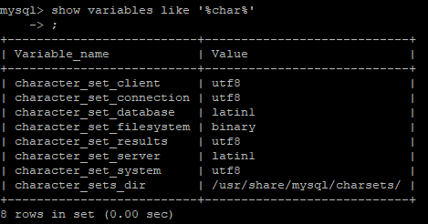

  - `show variables like 'collation_%';`

    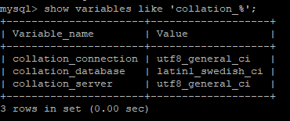

- 修改字符集

  - `set variable_name=utf8`，如： `set character_set_database=utf8;`
  - `set variables_name=utf8_general_ci`，如： `set collation_database=utf8_general_ci;`

-  转换需要插入汉字的数据表编码为utf8： `alter table table_name convert to character set utf8;` 

  > 这样，插入汉字就不会报错或乱码

## 2. 配置文件

- **二进制日志 log-bin**： 用于主从复制
- **错误日志 log-error**： 记录严重的警告和错误信息，每次启动和关闭的详细信息，默认关闭
- **查询日志 log**： 记录查询的 sql 语句，默认关闭
- **数据文件**： 
  - `frm` 文件： 存放表结构
  - `myd` 文件： 存放表数据
  - `myi` 文件： 存放表索引

## 3. 逻辑架构


- 插件式的存储引擎架构将查询处理与其他系统任务以及数据存储提取分离

- 查看存储引擎：

  - `show engines;`

    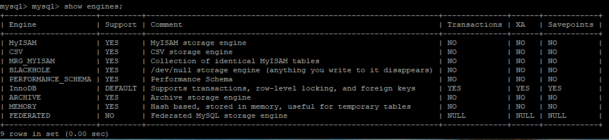

  - `show variables like '%storage_engine%';`

    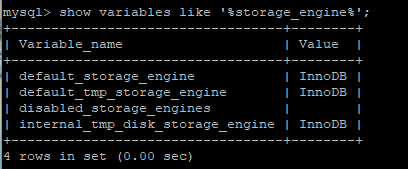

# 二、索引优化

## 1. SQL 性能下降

> - 等待时间长
> - 执行时间长

- 查询语句写的烂
- 索引失效，分为单值索引和复合索引
- 关联过多 join ( 设计缺陷或不得已的需求)
- 服务器调优及各个参数设置(缓冲、线程数等)

## 2. Join 查询

### 1. SQL 执行顺序

```mysql
# SQL 语句
SELECT 
DISTINCT <select_list>
FROM <left_table> 
<join_type> JOIN <right_table> ON <join_condition>
WHERE <where_condition>
GROUP BY <group_by_list>
HAVING <having_condition>
ORDER BY <order_by_condition>
LIMIT <limit_number>

#机器阅读顺序
1. FROM <left_table>
2. ON <join_condition>
3. <join_type> JOIN <right_table>
4. WHERE <where_condition>
5. GROUP BY <group_by_list>
6. HAVING <having_condition>
7. SELECT 
8. DISTINCT <select_list>
9. ORDER BY <order_by_condition>
10. LIMIT <limit_number>
```


### 2. 7 种Join查询

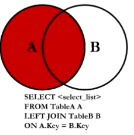  

​                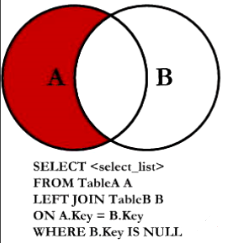                                    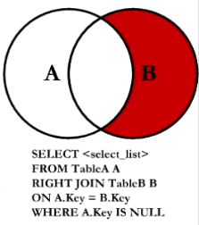 

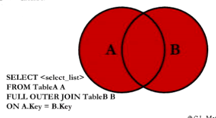 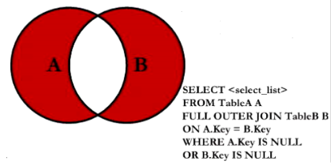

## 3. 索引简介

### 1. 简介

- 是帮助 MySQL 高效获取数据的数据结构
- 以索引文件的方式(`.frm`)存储在硬盘上

### 2. 优势

- 提高数据检索的效率，降低数据库的 IO 成本
- 通过索引进行排序，降低排序成本，减少 CPU 消耗

### 3. 劣势

- 索引会增加内存消耗，因为索引表保存了主键和索引字段
- 索引会降低更新表的速度，因为更新表时，还得向索引表中添加索引列字段

### 4. 分类

- **单值索引**：一个索引只包含单个列，一个表可有多个单列索引
- **唯一索引**：索引列的值必须唯一，但允许有空值
- **复合索引**：一个索引包含多个列

### 5. 基本语法

- **创建**： 

  - `CREATE [UNIQUE] INDEX index_name ON table_name(column_name(length));`

  - `ALTER table_name ADD [UNIQUE] INDEX [index_name] ON (column_name(length));`

    > - `ALTER TABLE tbl1 ADD PRIMARY KEY(column_list);`
    >
    >   添加了一个主键，则索引值必须唯一且不能为NULL
    >
    > - `ALTER TABLE tbl2 ADD UNIQUE index_name(column_list)`
    >
    >   创建的索引值必须唯一(NULL 除外)
    >
    > - `ALTER TABLE tbl3 ADD INDEX index_name(column_list)`
    >
    >   添加普通索引，索引值可多次出现
    >
    > - `ALTER TABLE tbl4 ADD FULLTEXT indx_name(column_list)`
    >
    >   指定索引为 `FULLTEXT `，用于全文索引

- **删除**： `DROP INDEX [index_name] ON table_name;`

- **查看**： `SHOW INDEX FROM table_name\G`

### 6. 索引结构

- `BTree` 索引
- `Hash` 索引
- `full-text` 全文索引
- `R-Tree` 索引

### 7. 是否需要索引

**创建索引情况**：

> 只应为最经常查询和最经常排序的数据列建立索引

- 主键自动建立唯一索引
- 频繁作为查询条件的字段应创建索引
- 查询中与其他表关联的字段，外键关系建立索引

**不适合索引情况**：

- 频繁更新的字段不适合创建索引

- Where 条件中用不到的字段不创建索引

- 表记录太少

- 经常增删改的表

  > - 提高了查询速度，但降低了更新表的速度
  > - 因为更新表时，不仅要保存数据，同时要保存索引文件

- 数据重复且分布平均的字段

**索引选择**：

- 单键/组合索引选择： 在高并发下，倾向组合索引
- 查询中排序的字段：排序字段若通过索引去访问将大大提高排序速度
- 查询中统计或分组字段

## 4. 性能分析

### 1. MySQL Query Optimizer

- MySQL 中专门负责优化 SELECT 语句的优化器模块

  > 主要功能： 通过计算分析系统中收集到的统计信息，为客户端请求的  Query 提供最优的执行计划

- 当客户端向 MySQL 请求一条 Query 时，命令解析模块完成请求分类，区分出 SELECT 并转发给 MySQL Query Optimizer 

  > - MySQL Query Optimizer 首先对整条 Query 进行优化，将查询条件进行简化和转换
  >   - 将一些常量表达式转换为常量值
  >   - 去掉一些无用条件
  > - 分析 Query 中的 Hint 信息来确定执行计划
  > - 若无 Hint 信息，则会读取所涉及对象的统计信息，根据 Query 进行写相应的计算分析，然后得出执行计划

### 2. MySQL 常见瓶颈

- **CPU**： 在数据装入内存或从磁盘上读取数据时，CPU 可能会饱和
- **IO**： 在装入数据远大于内存容量时，会出现磁盘 IO 瓶颈
- **服务器硬件的性能瓶颈**： `top,free,vmstat` 可查看系统的性能状态

### 3. Explain

####1. 简介

- 使用 `EXPLAIN` 关键字可模拟优化器执行 SQL 查询语句，从而知道 MySQL 如何处理 SQL 语句
- 分析查询语句或表结构的性能瓶颈

#### 2. 作用

> 对应 “使用” 理解

- 表的读取顺序
- 数据读取操作的操作类型
- 哪些索引可使用
- 哪些索引被实际使用
- 表之间的引用
- 每张表有多少行被优化器查询

#### 3. 使用

`Explain + SQL 语句`

结果：

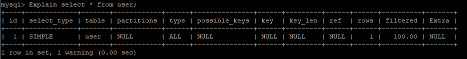

- `id`： select 查询的序列号，包含一组数字，表示查询中执行select子句或操作表的顺序

  > - id 相同：执行顺序由上至下
  > - id 不同：若是子查询，id 序列号会递增，id 越大优先级越高
  >
  > 对应作用：**表的读取顺序**

- `select_type`： 查询类型，主要用于区别普通查询、联合查询、子查询等

  > - `SIMPLE`： 简单的 select 查询不包含子查询或 UINON
  > - `PRIMARY`： 查询中包含任何复杂的子部分，最外层查询被标记为 PRIMARY
  > - `SUBQUERY`： 在 SELECT 或 WHERE 列表中包含子查询
  > - `DERIVED`： 在 FROM 列表中包含的子查询被标记为 DERIVED(衍生)；MySQL 会递归执行这些子查询，把结果放在临时表中
  > - `UNION`： 若第二个 SELECT 出现在 UNION 之后，则被标记为 UNION；若 UNION 包含在 FROM 子句的子查询中，外层 SELECT 被标记为 DERIVED
  > - `UNION RESULT`： 从 UNION 表获取结果的 SELECT

- `table`： 显示这一行数据是关于哪张表的

- `partitions`

- `type`： 显示查询使用了何种类型，**建议参考**： [MySQL高级 之 explain执行计划详解](https://blog.csdn.net/wuseyukui/article/details/71512793)

  > 最好到最差依次是： `system>const>eq_ref>ref>range>index>all`
  >
  > - `system`： 表只有一行记录，const 类型的特例
  >
  > - `const`： 表示通过索引一次就找到，用于比较 primary key 或 unique 索引
  >
  >   > 因为只匹配一行数据，所以很快，若将主键置于 where 列表中，MySQL 就能将查询转换为一个 const
  >
  > - `eq_ref`： 唯一性索引扫描，对于每个索引键，表中只有一条记录与之匹配，常见于主键或唯一索引扫描
  >
  > - `ref`： 非唯一性索引扫描，返回匹配某个单独值的所有行
  >
  >   > - 本质是也是一种索引访问，它返回所有匹配某个单独值的行
  >   > - 可能会找到多个符合条件的行，所以应属于查找和扫描的混合体 
  >
  > - `range`： 只检索给定范围的行，使用一个索引来选择行
  >
  >   > - key 列显示使用了那个索引
  >   > - 一般就是在where语句中出现了bettween、<、>、in等的查询
  >   > - 这种索引列上的范围扫描比全索引扫描要好
  >   > - 只需要开始于某个点，结束于另一个点，不用扫描全部索引 
  >
  > - `index`： Full Index Scan，index与ALL区别为index类型只遍历索引树
  >
  >   > - 这通常为ALL块，因为索引文件通常比数据文件小
  >   > - Index与ALL虽然都是读全表，但index是从索引中读取，而ALL是从硬盘读取
  >
  > - `all`： Full Table Scan，遍历全表以找到匹配的行 

- `possible_keys`： 查询涉及到的字段上存在索引，则该索引将被列出，但不一定被查询实际使用

- `key`： 实际使用的索引，如果为NULL，则没有使用索引

  > 查询中如果使用了覆盖索引，则该索引仅出现在key列表中

- `key_len`： 表示索引中使用的字节数，查询中使用的索引的长度(最大可能长度)，并非实际使用长度，理论上长度越短越好

  > key_len是根据表定义计算而得的，不是通过表内检索出的

- `ref`： 显示索引的那一列被使用了，如果可能，是一个常量 const

- `rows`： 根据表统计信息及索引选用情况，大致估算出找到所需的记录所需要读取的行数

- `filtered`

- `Extra`： 不适合在其他字段中显示，但是十分重要的额外信息

  > - `Using filesort`： mysql 对数据使用一个外部的索引排序，而不是按照表内的索引进行排序读取，即 mysql 无法利用索引完成的排序操作称为 “文件排序”
  >
  > - `Using temporary`： 使用临时表保存中间结果，即 mysql 在对查询结果排序时使用了临时表，常见于order by 和 group by 
  >
  > - `Using index`： 表示相应的select操作中使用了**覆盖索引**，避免了访问表的数据行，效率高 
  >
  >   > - 如果同时出现Using where，表明索引被用来执行索引键值的查找
  >   > - 如果没用同时出现 Using where，表明索引用来读取数据而非执行查找动作 
  >
  > - `Using where `： 使用了 where 过滤
  >
  > - `Using join buffer`： 使用了链接缓存
  >
  > - `Impossible WHERE`： where子句的值总是false，不能用来获取任何元组
  >
  > - `select tables optimized away`： 在没有 group by 子句的情况下，基于索引优化 MIN/MAX 操作或者对于MyISAM存储引擎优化COUNT（*）操作，不必等到执行阶段在进行计算，查询执行计划生成的阶段即可完成优化
  >
  > - `distinct`： 优化distinct操作，在找到第一个匹配的元祖后即停止找同样值得动作

## 5. 索引优化

推荐阅读： **[MYSQL中IN与EXISTS的区别](https://blog.csdn.net/weixin_39539399/article/details/80851817)**

### 1. 索引分析

#### 1. 单表

- 建表

  ```mysql
  CREATE TABLE author
  (
      id int(10) unsigned not null primary key auto_increment,
      author_id int(10),
      category_id int(10),
      views int(10),
      comments int(10),
      title varchar(255),
      content text
  );
  ```

- 插入数据

  ```mysql
  insert into article(author_id,category_id,views,comments,title,content) 
  	values (1,1,1,1,'1','1'), (2,2,2,2,'2','2'), (1,1,3,3,'3','3');
  ```

- 查询  category_id 为 1 且 comments 大于 1 的情况下，views 最多为  author_id： 

  `EXPLAIN SELECT id,author_id FROM article WHERE category_id = 1 AND comments > 1 ORDER BY views DESC LIMIT 1; `

  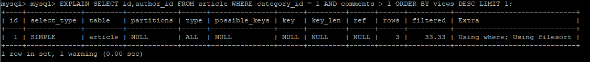

  结果：type 是 ALL，即全表扫描 ==> 最坏情况；Extra 出现 Using filesort，即文件内排序 ==> 最坏情况，因此必须优化

  **开始优化**：

  首先查看原始索引： `show index from article;`

  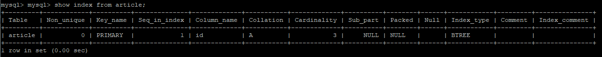

  新建索引：`create index idx_article_ccv on article(category_id,comments,views); 或 alter table article add index idx_article_ccv(category_id,comments,views);`

  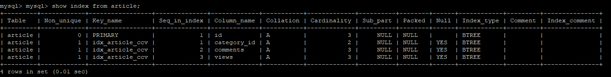

  再次查看(解决了全表扫描问题)：`EXPLAIN SELECT id,author_id FROM article WHERE category_id = 1 AND comments > 1 ORDER BY views DESC LIMIT 1; `

  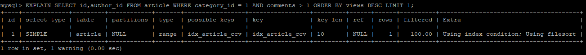

  更改语句(观察变化)： `EXPLAIN SELECT id,author_id FROM article WHERE category_id = 1 AND comments = 1 ORDER BY views DESC LIMIT 1; `

  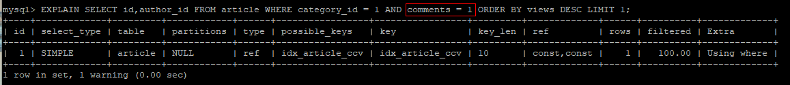

  **上述优化结论**：

  - type 变成 range，可以忍受；但 extra 仍然为 Using filesort，不能忍受
  - 因为根据 BTree 索引的工作原理，先排序 category_id ，若遇到相同的 category_id 则再排序 comments，若遇到相同的 comments则再排序 views
  - 因 comments 字段在联合索引中处于中间位置且条件 comment > 1是一个范围值，所以 MySQL 无法利用索引再对后面的 views 部分进行检索，即 range 类型查询字段后的索引无效

  **继续重新优化**：

  删除不合适索引： `drop index idx_article_ccv on article;`

  新建一个索引： `create index idx_article_cv on article(category_id,views);`

  查看新的索引： `show index from article;`

  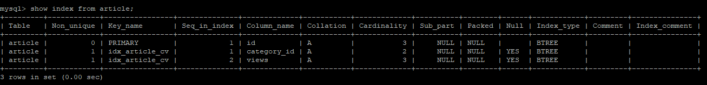

  **查看优化结果(解决了全表查询与内排序问题，优化成功)**： `EXPLAIN SELECT id,author_id FROM article WHERE category_id = 1 AND comments > 1 ORDER BY views DESC LIMIT 1;`

  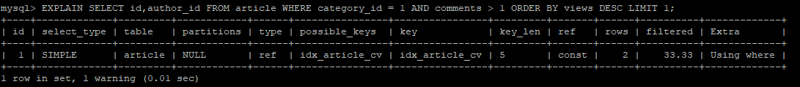

#### 2. 双表

- 建表

  ```mysql
  CREATE TABLE class
  (
  	id int(10) primary key auto_increment,
      card int(10)
  );
  CREATE TABLE book
  (
      bookid int(10) PRIMARY KEY AUTO_INCREMENT,
      card int(10)
  );
  ```

- 插入数据

  ```mysql
  # 重复执行 20 次
  insert into class(card) values(floor(1 + rand() * 20));
  insert into book(card) values(floor(1 + rand() * 20));
  ```

- 查看： `select * from book inner join class on book.card=class.card;`

  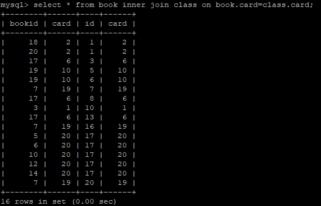

- **开始分析**：`explain select * from class left join book on book.card=class.card;`

  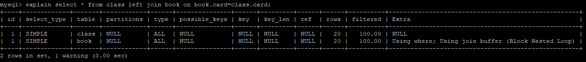

  > - type 为 ALL，即全表查询

  **添加索引优化**： `alter table book add index y(card);`

  再次查看： `explain select * from class left join book on book.card=class.card;`

  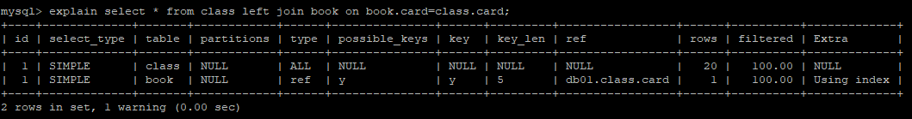

  **再次重新优化**：`drop index y on book;`

  添加新的索引： `alter table class add index y(card);`

  再次查看： `explain select * from class left join book on book.card=class.card;`

  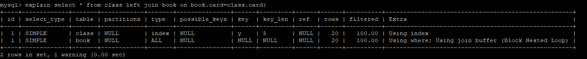

  两次比较的**结论**： **左连接加右表索引，右连接加左表索引**：这是由坐连接特性决定，LEFT JOIN 条件用于确定如何从右表搜索行，左边一定都有

#### 3. 三表

- 建表

  ```mysql
  CREATE TABLE phone
  (
      phoneid int(10) PRIMARY KEY AUTO_INCREMENT,
      card int(10)
  );
  ```

- 插入数据

  ```mysql
  # 重复执行 20 次
  insert into phone(card) values(floor(1 + rand() * 20));
  ```

- 开始分析： `explain select * from class left join book on book.card=class.card LEFT JOIN phone ON book.card=phone.card;`

  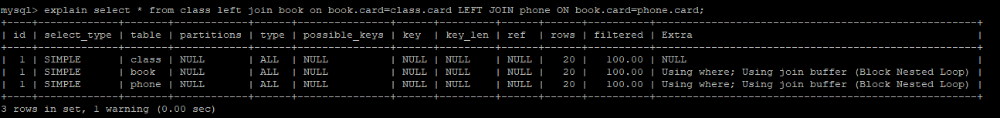

  建立新索引： `alter table phone add index z(card);alter table book add index y(card);`

  再次查看： `explain select * from class left join book on book.card=class.card LEFT JOIN phone ON book.card=phone.card;`

  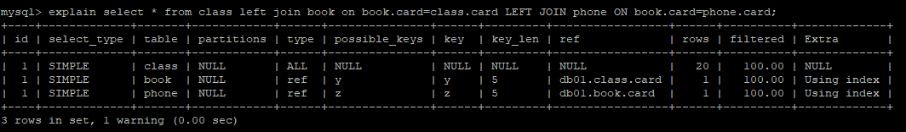

  结论： **索引最好设置在需要经常查询的字段中**

#### 4. 总结

- 尽可能减少 join 语句中的 NestedLoop 的循环总次数： 永远用小结果集驱动大结果集
- 优先优化 NestedLoop 的内层循环
- 保证 join 语句中被驱动表上 join 条件字段已经被索引
- 当无法保证被驱动表的 join 条件字段被索引且内存资源充足情况下，不要太吝啬 JoinBuffer 的设置

### 2. 索引失效

#### 1. 建表

```mysql
# 建表
CREATE TABLE staffs
(
    id int PRIMARY KEY AUTO_INCREMENT,
    name VARCHAR(225) COMMENT '姓名',
    age INT DEFAULT 0 COMMENT '年龄',
    pos VARCHAR(225) COMMENT '职位',
    add_time TIMESTAMP DEFAULT CURRENT_TIMESTAMP COMMENT '入职时间'
)CHARSET UTF8 COMMENT '员工记录表';

# 插入记录
INSERT INTO staffs(name,age,pos,add_time) values('z3',22,'manager',NOW());
INSERT INTO staffs(name,age,pos,add_time) values('july',23,'dev',NOW());
INSERT INTO staffs(name,age,pos,add_time) values('2000',22,'manager',NOW());

# 建立索引
alter table staffs add index idx_staffs_nap(name,age,pos);

# 查看索引
 show index from staffs;
```

初次查看索引：

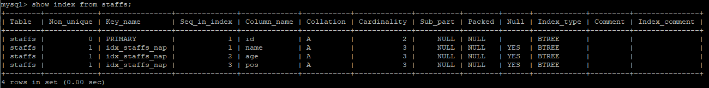

#### 2. 案例

初次分析： `explain select * from staffs where name='july';`

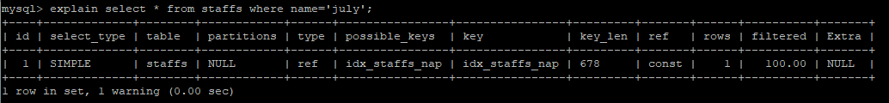

再次分析： `explain select * from staffs where name='july' and age=25;`

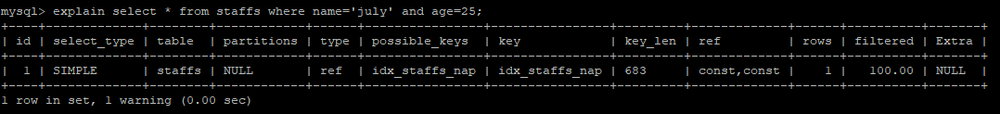

接着分析： `explain select * from staffs where name='july' and age=25 and pos='dev';`

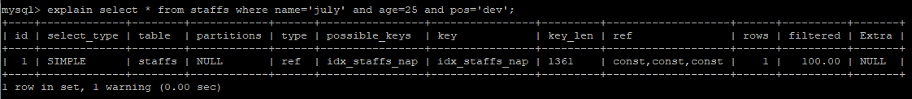

---

**索引失效查询(未从索引最左前列开始)**： `explain select * from staffs where pos='dev';`

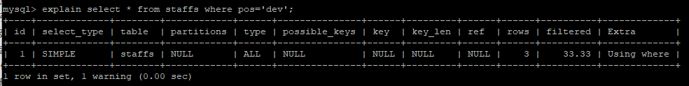

但查询： `explain select * from staffs where name='july';` 有效


**索引查询失效(跳过了索引)**： `explain select * from staffs where name='july' and pos='dev';`

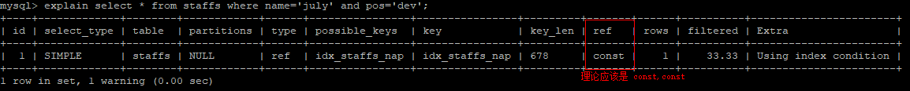

- **最佳左前缀法则： 查询从索引的最左前列开始且不跳过索引中的列(索引多列时，遵循最佳左前缀法则)**

---

初次分析： `explain select * from staffs where name='july';`


**索引失效(索引上操作函数)**： `explain select * from staffs where left(name,4)='july';`

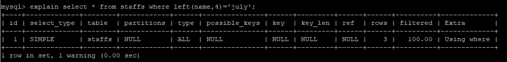

- 结论： **在索引列上做任何操作(计算，函数，(自动or手动)类型转换)，会导致索引失效而转向全表扫描**

---

初次分析： `explain select * from staffs where name='july' and age=25 and pos='dev';`

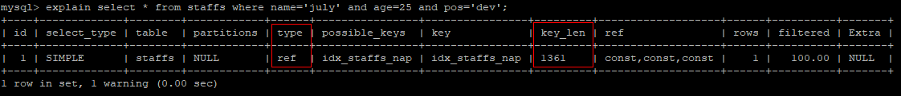

**索引失效(使用了范围条件)**： `explain select * from staffs where name='july' and age>11 and pos='dev';`


- 结论： **存储引擎不能使用索引总范围条件右边的列** 

---

初次分析： `explain select * from staffs where name='july' and age=25 and pos='dev';`


**索引优化(只使用索引查询)**： `explain select name,age,pos from staffs where name='july' and age=25 and pos='dev';`

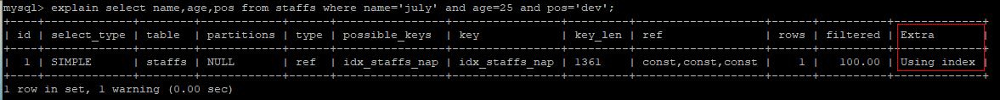

再次分析： `explain select name,age,pos from staffs where name='july' and age>25 and pos='dev';`

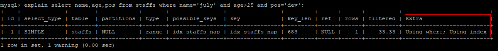

- 结论： **尽量使用覆盖索引(只访问索引的查询(索引列和查询列一致))，减少 `select *`**

---

初次分析： `explain select * from staffs where name='july';`


再次分析： `explain select * from staffs where name!='july';`

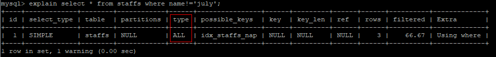

接着分析： `explain select * from staffs where name<>'july';`

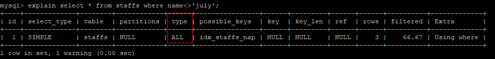

- 结论： **使用不等号(!=或<>)时，无法使用索引会导致全表扫描**

---

初次分析： `explain select * from staffs where  name is null;`

再次分析： `explain select * from staffs where  name is not null;`

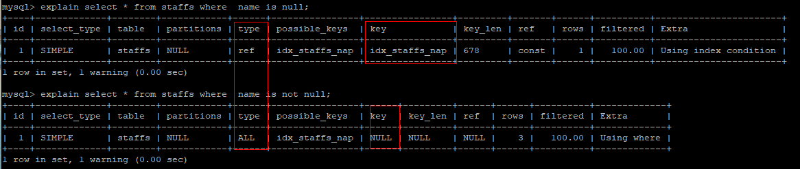

- 结论： **`is not null` 无法使用索引(某些版本的 `is null` 也无法使用索引)**

---

初次分析： `explain select * from staffs where name like '%july%';`

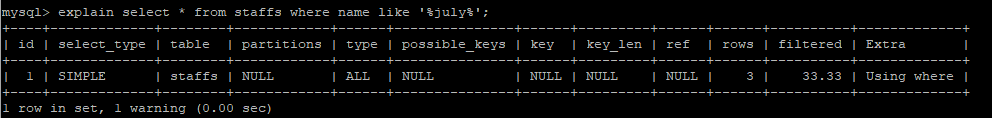

再次分析：`explain select * from staffs where name like '%july';`

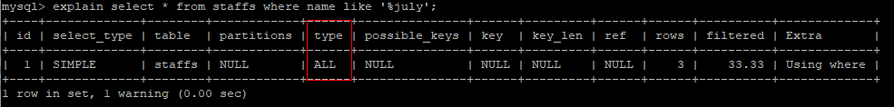

接着分析：  `explain select * from staffs where name like 'july%';`

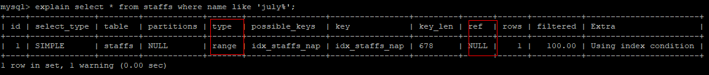

- 结论： **like 以通配符左开头('%abc..') 的索引会失效，因此记住： ==like 的 % 加右边==** 

---

问题： 解决 like "%xxx%" 时，索引失效的方法？

建表：

```mysql
# 建表
CREATE TABLE tbl_user
(
    id int PRIMARY KEY AUTO_INCREMENT,
    name VARCHAR(225),
    age int,
    email VARCHAR(20)
)AUTO_INCREMENT=1 DEFAULT CHARSET=utf8;

# 插入数据
INSERT INTO tbl_user(name,age,email) values('1aa1',21,'b@163.com');
INSERT INTO tbl_user(name,age,email) values('2aa2',222,'a@163.com');
INSERT INTO tbl_user(name,age,email) values('3aa3',265,'c@163.com');
INSERT INTO tbl_user(name,age,email) values('4aa4',21,'d@163.com');

# 创建索引
CREATE INDEX idx_user_ng ON tbl_user(name,age);
```

初次分析： `explain select name,age from tbl_user where name like '%aa%';`

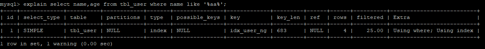

再次分析： `explain select id from tbl_user where name like '%aa%';`

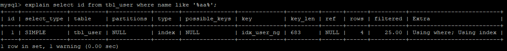

索引失效： `explain select * from tbl_user where name like '%aa%';`

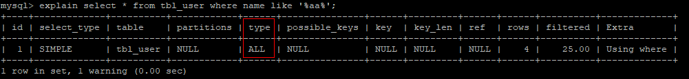

索引失效： `explain select id,name,age,email from tbl_user where name like '%aa%';`

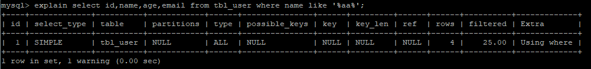

- 结论： **使用覆盖索引解决 like % 失效问题**

---

初次分析： `explain select * from staffs where name='2000';`

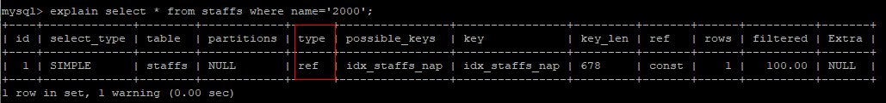

索引分析(自动类型转换)： `explain select * from staffs where name=2000;`

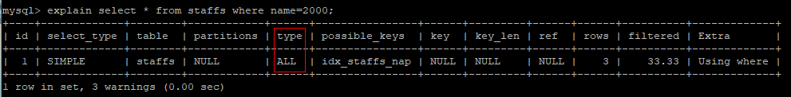

- 结论： **字符串不加单引号索引失效**

---

索引失效(使用了 or)： `explain select * from staffs where name='july' or name='z3';`

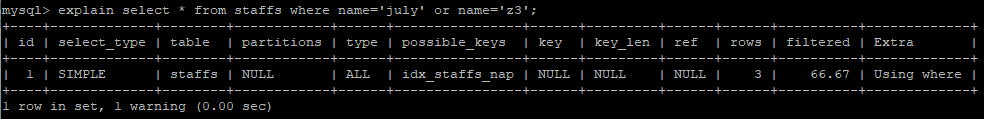

- 结论： **使用 `or` 连接时会导致索引失效**

---

**&&总结&&**：假设 `index(a,b,c)`

| where 语句                                           | 索引是否被使用                            |
| ---------------------------------------------------- | ----------------------------------------- |
| where a = 3                                          | Yes，使用到 a                             |
| where a = 3 and b = 5                                | Yes，使用到 a, b                          |
| where a = 3 and b = 5 and c = 4                      | Yes，使用到 a, b, c                       |
| where b = 3 或 where b = 3 and c  = 4 或 where c = 4 | No                                        |
| where a = 3 and c = 5                                | 使用到 a，但 c 不可以，b 中间断了         |
| where a = 3 and b > 4 and c = 5                      | 使用到 a 和 b，c 不能用在范围之后，b 断了 |
| where a = 3 and b like 'kk%' and c = 4               | a，b 能用，c 不能用                       |

#### 3. 例题

建表

```mysql
# 建表
CREATE TABLE test03
(
    id int PRIMARY KEY AUTO_INCREMENT,
    c1 char(10),
    c2 char(10),
    c3 char(10),
    c4 char(10),
    c5 char(10)
);

# 插入数据
INSERT INTO test03(c1,c2,c3,c4,c5) values('a1','a2','a3','a4','a5');
INSERT INTO test03(c1,c2,c3,c4,c5) values('b1','b2','b3','b4','b5');
INSERT INTO test03(c1,c2,c3,c4,c5) values('c1','c2','c3','c4','c5');
INSERT INTO test03(c1,c2,c3,c4,c5) values('d1','d2','d3','d4','d5');
INSERT INTO test03(c1,c2,c3,c4,c5) values('e1','e2','e3','e4','e5');

# 建立索引
create index idx_test03_c1234 on test03(c1,c2,c3,c4);
```

问题： 创建了复合索引 idx_test03_c1234，根据 SQL 语句分析索引使用情况？

1） `explain select * from test03 where c1='a1' and c2='a2' and c4='a4' and c3='a3';`

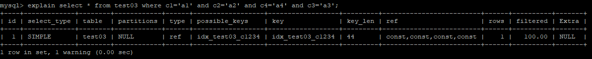

- 结论： **改变索引顺序结果不变**，因为MySQL底层优化器会进行相关优化操作

2）`explain select * from test03 where c1='a1' and c2='a2' and c3>'a3' and c4='a4';`

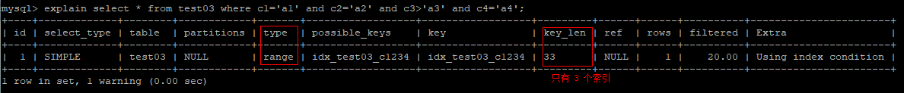

- 结论： **范围查询之后的索引失效**

3）`explain select * from test03 where c1='a1' and c2='a2' and c4='a4' order by c3;`

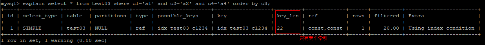

- 结论： **索引中断之后的索引失效**

4）`explain select * from test03 where c1='a1' and c2='a2' order by c4;`

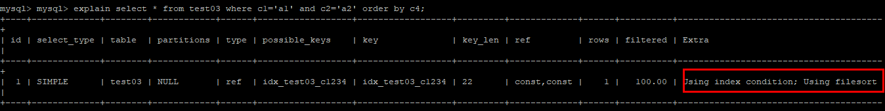

- 结论： **索引建造与排序顺序尽量一致，避免内排序**

5） `explain select * from test03 where c1='a1' and c5='a5' order by c2,c3;`


`explain select * from test03 where c1='a1' and c5='a5' order by c3,c2;`


- 结论： **order by 排序顺序尽量与索引顺序一致，避免内排序**

6） `explain select * from test03 where c1='a1' and c2='a2' order by c3,c2;`


- 结论： 因为有 `where c2='c2'`，则此时的 `c2` 可看成一个常量，因此不会出现上述的内排序情况

**&&总结&&**：

- 定值，范围还是排序，一般 order by 是给个范围
- group by 基本上都需要进行排序，会有临时表产生

### 3. 一般建议

- 对于单键索引，尽量选择针对当前 query 过滤性更好的索引
- 在选择组合索引时，当前 query 中过滤性最好的字段在索引字段顺序中，位置越靠前越好
- 在选择组合索引时，尽量选择能包含当前 query 中的 where 子句中更多字段的索引
- 尽可能通过分析统计信息和调整 query 的写法来达到选择合适索引的目的

# 三、查询截取分析

## 1. 查询优化

### 1. 小表驱动大表

- 优化原则(RBO)： 小表驱动大表，即**小的数据集驱动大的数据集**

```mysql
# 当 B 表的数据集小于 A 表的数据集时，in 优于 exists &&&&
select * from A where id in (select id from B);
等价于
for select id from B
for select * from A where A.id=B.id

# 当 A 表的数据集小于 B 表的数据集时，exists 优于 in &&&&
select * from A where exists (select * from A where B.id=A.id)
等价于
for select * from A
for select * from B where B.id=A.id
```

`EXISTS` 语法： `SELECT ... FROM table_name WHERE EXISTS(subquery);`

- **解释**： 将主查询的数据放到子查询中做条件验证，根据验证结果(TRUE 或 FALSE)来决定主查询的数据结果是否得以保留

- **提示**：
  - `EXISTS(subquery)` 只返回 TRUE 或 FALSE，因此子查询中的 `SELECT *` 也可以是 `SELECT 1 或 SELECT 'X'`，官方说法是：实际执行时会忽略 SELECT 清单，因此无区别
  - EXISTS 子查询的实际执行过程可能经过了优化而不是我们理解上的逐条对比，如果担忧效率问题，可进行实际检验以确定是否有效率问题
  - EXISTS 子查询往往也可以用条件表达式、其他子查询或 JOIN 来替代，何种最优需具体分析

### 2. order by 关键字优化

- **`ORDER BY` 子句尽量使用 Index 方式排序，避免使用 FileSort(内排序) 方式排序** 

  **Index 效率高，指 MySQL 扫描索引本身完成排序；filesort 方式效率较低**

  - **Index： 扫描有序索引排序**
  - **filesort： 文件排序**

  > 建表
  >
  > ```mysql
  > # 建表
  > CREATE TABLE tblA
  > (
  >     age int,
  >     birth TIMESTAMP
  > );
  > 
  > # 插入数据
  > INSERT INTO tblA(age,birth) values(22,NOW());
  > INSERT INTO tblA(age,birth) values(23,NOW());
  > INSERT INTO tblA(age,birth) values(24,NOW());
  > 
  > # 建立索引
  > CREATE INDEX idx_A_ab ON tblA(age,birth);
  > ```
  >
  > 初次分析： `explain select * from tblA where age>20 order by age;`
  >
  > 
  >
  > 再次分析： `explain select * from tblA where age>20 order by birth;`
  >
  > 
  >
  >  接着分析： `explain select * from tblA order by birth;`
  >
  > 
  >
  > 继续分析： `explain select * from tblA where birth > '2018-12-11 14:49:50' order by birth;`
  >
  > 
  >
  > 再继续分析： `explain select * from tblA where birth > '2018-12-11 14:49:50' order by age;`
  >
  > 
  >
  > 接着分析： `explain select * from tblA order by age ASC,birth DESC;`
  >
  > 
  >
  > - 结论： `ORDER BY` 满足两种情况会使用 Index 方式排序：
  >   - **`ORDER BY` 语句使用索引最左前列**
  >   - **使用 `WHERE` 子句与 `ORDER BY` 子句条件列组合满足索引最左前列**

- **尽可能在索引列上完成排序操作，遵循索引建的==最佳左前缀==**

- **若不在索引列上，filesort 有两种算法：双路排序、单路排序** 

  > - **双路排序**： 对磁盘进行两次扫描
  >   - 两次扫描磁盘，最终得到数据，读取行指针和 orderby 列，对他们进行排序，然后扫描已排序号的列表，按照列表中的值重新从列表中读取对应的数据输出
  >   - 从磁盘取排序字段，在 buffer 进行排序，再从磁盘取其他字段
  > - **单路排序**： 
  >   - 从磁盘读取查询需要的**所有列**，按照 orderby 列在 buffer 对它们进行排序，然后扫描排序后的列表进行输出
  >   - 避免二次读取数据，且把随机 IO 变成顺序 IO，将每行数据保存在内存中
  > - **单路排序的缺陷**：若取出的数据大小超过了 `sort_buffer` 容量，导致需要进行多次 IO 操作，性能反而会下降

- **优化策略**

  > - 增大 `sort_buffer_size` 参数设置
  >
  >   > 该参数针对每个进程，所以提高这个参数会提高所有算法的效率，但应根据系统的能力进行提高
  >
  > - 增大 `max_length_for_sort_data` 参数的设置
  >
  >   > - 提高该参数会增加使用改进算法的概率
  >   > - 若设的太高，数据总量超出 sort_buffer_size 的概率就会增加，则会出现： 高的磁盘 IO 活动和低的处理器使用效率

- **提高 `ORDER BY` 的速度**

  - 禁用 `select *` 全表查询

    > - 当查询的字段大小总和小于 `max_length_for_sort_data` 且排序字段不是 `TEXT/BLOB` 类型时，会使用单路排序，否则使用多路排序
    > - 两种算法都可能超出 `sort_buffer` 容量，则会创建 tmp 文件进行合并排序，导致多次 IO，另单路排序超出的风险更大

  - 尝试提高 `sort_buffer_size `

  - 尝试提高 `max_length_for_sort_data`

**总结**：

- MySQL 的两种排序方式： 文件排序、扫描有序索引排序
- MySQL 能为排序与查询使用相同的索引

对于索引： `KEY a_b_c(a,b,c)`

- order by 能使用最左前缀
  - `ORDER BY a`
  - `ORDER BY a,b`
  - `ORDER BY a,b,c`
  - `ORDER BY a DESC,b DESC,c DESC`
- 若 WHERE 使用索引的最左前缀定义为常量，则 order by 能使用索引
  - `WHERE a = const ORDER BY b,c`
  - `WHERE a = const AND b = const ORDER BY c`
  - `WHERE a = const AND b > const ORDER BY b,c`
- 不能使用索引进行排序的可能情况
  - `ORDER BY a ASC,b DESC,c DESC ==> 排序不一致`
  - `WHERE g = const ORDER BY b,c ==> 丢失 a 索引`
  - `WHERE a = const ORDER BY c ==> 丢失 b 索引`
  - `WHERE a = const ORDER BY a,d ==> d 不是索引的一部分`
  - `WHERE a in(...) ORDER BY b,c ==> 对于排序来说，多个相等条件也是范围查询`

### 3. group by 关键字优化

与 order by 的规则基本一致，但注意以下几点：

- group by 实质是先排序后进行分组，遵照索引建的最佳左前缀
- 当无法使用索引列时，增大 `sort_buffer_size 与 max_length_for_sort_data` 参数的设置
- where 高于 having，能写在 where 限定条件下就不要用 having

## 2. 慢查询日志

### 1. 简介

- 是 MySQL 的一种日志记录，用来记录在 MySQL 中响应时间超过阙值的语句
- 具体指运行时间超过 `long_query_time` 值的 SQL，则会被记录到慢查询日志中，默认为 10(s)

### 2. 如何使用

- **说明**：

  > - 默认慢查询日志关闭
  > - 若不需要调优，建议关闭该功能，因为会影响性能
  > - 支持将日志记录写入文件

- **查看是否开启及如何开启**： 

  > - 查看是否开启： `SHOW VARIABLES LIKE '%slow_query_log%';`
  >
  >   
  >
  > - 开启： `SET GLOBAL slow_query_log=1;` 
  >
  >   注：
  >
  >   - **只对当前数据库有效，若 MySQL  重启则会失效**
  >
  >   - 若想永久生效，必须修改配置文件 `my.cnf`
  >
  >     ```mysql
  >     slow_query_log = 1
  >     slow_query_log_file=文件路径
  >     ```
  >

- **哪种 SQL 会被记录到慢查询日志中**： 

  > - 运行时间 `大于 long_query_time` 的 SQL 语句会被记录到慢查询日志中
  >
  > - 命令 `SHOW VARIABLES LIKE 'long_query_time%';` 可查看该值，默认为 10秒
  >
  >   
  >
  > - 可使用命令修改，也可修改 `my.cnf` 配置文件：`SET GLOBAL long_query_time=XX;`
  >
  >   注意：需要重新连接或新开一个会话才能看到修改值：`SHOW VARIABLES LIKE 'long_query_time%'; 或 SHOW GLOBAL VARIABLES LIKE 'long_query_time';` 

- **查看当前系统有多少条慢查询记录**：`SHOW GLOBAL STATUS LIKE '%Slow_queries%';`

### 3. 日志分析工具 mysqldumpslow

> 日志分析工具 mysqldumpslow 用于在生产环境中分析日志，查找和分析 SQL

命令 `mysqldumpslow --help` 查看帮助：


**相关参数信息**：


使用举例：


## 3. 批量插入数据脚本

**建表**： 

```mysql
# 建表 dept
CREATE TABLE dept
(
    id int PRIMARY KEY AUTO_INCREMENT,
    deptno MEDIUMINT DEFAULT 0,
    dname VARCHAR(20) DEFAULT "",
    loc VARCHAR(13) DEFAULT ""
);
# 建表 emp
CREATE TABLE emp
(
    id int PRIMARY KEY AUTO_INCREMENT,
    empno MEDIUMINT DEFAULT 0,
    ename VARCHAR(20),
    job VARCHAR(9),
    mgr MEDIUMINT,
    hiredate DATE,
    sal DECIMAL(7,2),
    comm DECIMAL(7,2),
    deptno MEDIUMINT
);
```

**设置参数** `log_bin_trust_function_creators`：

- 查看： `show variables like 'log_bin_trust_function_creators';`
- 设置： `set global log_bin_trust_function_creators=1;` (此种方式设置，当 MySQL 重启后，参数就会消失)
- 注意： **要记得开启慢查询日志，方便容灾测试分析** 

**创建函数，保证每条数据都不同**：

- 用于随机产生字符串

  ```mysql
  DELIMITER $$
  CREATE FUNCTION rand_string(n INT) RETURNS VARCHAR(255)
  BEGIN
  	DECLARE chars_str VARCHAR(100) DEFAULT 'abcdefghijklmnopqrstuvwxyzABCDEFGHIJKLMNOPQRSTUVWXYZ';
  	DECLARE return_str VARCHAR(255) DEFAULT '';
  	DECLARE i INT DEFAULT 0;
  	WHILE i < n DO
  		SET return_str = CONCAT(return_str,SUBSTRING(chars_str,FLOOR(1+RAND()*52),1));
  		SET i=i+1;
  	END WHILE;
  	RETURN return_str;
  END $$
  ```

- 用于随机产生部门编号

  ```mysql
  DELIMITER $$
  CREATE FUNCTION rand_num() RETURNS INT(5)
  BEGIN 
  	DECLARE i INT DEFAULT 0;
  	SET i=FLOOR(100+RAND()*10);
  	RETURN i;
  END $$
  ```

**创建存储过程**：

- 创建往 emp 表中插入数据从存储过程

  ```mysql
  DELIMITER $$
  CREATE PROCEDURE insert_emp(IN START INT(10),IN max_num INT(10))
  BEGIN
  	DECLARE i INT DEFAULT 0;
  	SET autocommit=0;
  	REPEAT
  	SET i=i+1;
  	INSERT INTO emp(empno,ename,job,mgr,hiredate,sal,comm,deptno) values((START+i),rand_string(6),'SALEMAN',0001,CURDATE(),2000,400,rand_num());
  	UNTIL i=max_num
  	END REPEAT;
  	COMMIT;
  END $$
  ```

- 创建往 dept 表中插入数据的存储过程

  ```mysql
  DELIMITER $$
  CREATE PROCEDURE insert_dept(IN START INT(10),IN max_num INT(10))
  BEGIN
  	DECLARE i INT DEFAULT 0;
  	SET autocommit=0;
  	REPEAT
  	SET i=i+1;
  	INSERT INTO dept(deptno,dname,loc) 
  		values((START+i),rand_string(10),rand_string(8));
  	UNTIL i=max_num
  	END REPEAT;
  	COMMIT;
  END $$
  ```

**调用存储过程**： 

- `dept`

  ```mysql
  DELIMITER ;
  CALL insert_dept(100,10);
  ```

- `emp`

  ```mysql
  # 执行存储过程，往 emp 表添加 50 万条数据
  CALL insert_emp(100001,500000); # 需要等待一段时间
  ```

## 4. Show Profile

- **简介**： 是 MySQL 提供的可以用来分析当前会话中语句执行的资源消耗情况，可用于 SQL 的调优测量

- 默认参数处于关闭状态，并保存最近 15 次的运行结果

- **分析步骤**：

  - 查看当前 MySQL 版本是否支持：`show variables like 'profiling';`
  - 开启功能：`set profiling=on; `
  - 运行 SQL(任意SQL语句都行)： `select * from emp group by id limit 150000; select * from emp group by id order by 5;`

  - 查看结果： `show profiles;`

    

  - 诊断 SQL： `show profile cpu,block io for query [Query_ID]`

    如： `show profile cpu,block io for query 3` ==> 此处的 3 对应上图的 Query_ID 的 3

    

    **所有配置参数及解释**：

    

  - **日常开发需要注意的结论**：
    - `converting HEAP to MyISAM` 查询结果太大，内存不够用了往磁盘上搬
    - `creating tmp table` 创建临时表：拷贝数据到临时表，用完再删除
    - `copying to tmp table on disk` 把内存中临时表复制到磁盘，危险
    - `locked`

## 5. 全局查询日志

> - 记录执行的 SQL 语句
> - **永远不要在生产环境中开启此功能**

- **配置启用**：

  ```mysql
  # 在 mysql 的 my.cnf 中设置如下：
  # 开启
  general_log=1
  # 记录日志文件的路径
  general_log_file=/path/logfile
  # 输出格式
  log_output=FILE
  ```

- **编码启用**：

  ```mysql
  set global general_log=1;
  set global log_output='TABLE';
  # 接着，你编写的 sql 语句将会记录到 mysql 库中的 general_log 表中
  # 查看 general_log 表
  select * from mysql.general_log;
  ```

# 四、MySQL 锁机制

## 1. 概述

- **定义**： 锁是计算机协调多个进程或线程并发访问某一资源的机制
- **锁的分类**：
  - 从对数据的操作类型(读/写)：
    - **读锁(共享锁)**： 针对同一份数据，多个读操作可同时进行而不会相互影响
    - **写锁(排他锁)**： 当前写操作没有完成前，会阻断其他写锁和读锁
  - 从对数据操作的粒度分：
    - **表锁**
    - **行锁**

## 2. 三锁

### 1. 表锁(偏读)

#### 1. 特点

- 偏向 MyISAM 存储引擎，开销小，加锁快，无死锁
- 锁粒度大，发生锁冲突的概率最高，并发度最低

#### 2. 案例分析

**建表**：

```mysql
# 建表
create table mylock
(
    id int PRIMARY KEY AUTO_INCREMENT,
    name varchar(20)
)engine myisam;

# 插入数据
insert into mylock(name) values('a');
insert into mylock(name) values('b');
insert into mylock(name) values('c');
insert into mylock(name) values('d');
insert into mylock(name) values('e');
```

**手动增加表锁**：

`lock table 表名 read/write,表名2 read/write,其它;`

**查看表加过的锁**： `show open tables;` 

**删去表加的锁**： `unlock tables;`

---

开始分析： 

给 `mylock` **加读锁**： `lock table mylock read;` 


给 `mylock` **加写锁**： `lock table mylock write;`  

> 记得 `unlock tables` 删掉 mylock 的读锁


新开一个终端，执行 `select * from mylock;` 将一直处于**阻塞状态**


---

结论：

- MyISAM 在执行查询语句前，会自动给涉及的所有表加读锁，在执行增删改操作前，会自动给涉及的表加写锁

- MySQL 的表级锁模式： 表共享锁和表独占锁

  | 锁类型 | 可否兼容 | 读锁 | 写锁 |
  | ------ | -------- | ---- | ---- |
  | 读锁   | 是       | 是   | 否   |
  | 写锁   | 是       | 否   | 否   |

  可得：

  - 对 MyISAM 表的读操作不会阻塞其他线程对同一表的读请求，但会阻塞对同一表的写请求。只有当读锁释放后，才会执行其他进程的写操作
  - 对 MyISAM 表的写操作会阻塞其他线程对同一表的读与写请求。只有当写锁释放后，才会执行其他进程的读写操作

#### 3. 表锁分析

- 可通过检查 `table_locks_waited 和 table_locks_immediate` 状态变量来分析系统上的表锁定： `show status like 'table%';` 

  

  - `table_locks_immediate`：产生表级锁定次数，表示可立即获取锁的查询字数，每立即获取锁时值加1
  - `table_locks_waited `： 出现表级锁定争用而发生等待的次数(不能立即获取锁的次数，每等待一次，锁值加1)，此值高说明存在较严重的表级锁争用情况

> MyISAM 的读写锁调度是**写优先**，因此不适合做写操作为主的表的引擎

### 2. 行锁(偏写)

#### 1. 特点

- 偏向 InnoDB 存储引擎，开销大，加锁慢，会出现死锁
- 锁粒度最小，发生锁冲突的概率最低，并发度也最高

InnoDB 与 MyIASM 的不同点：

- **支持事务**
- **采用了行级锁**

#### 2. 复习

- **事务及其ACID属性**

  

- 并发事务处理带来的问题

  - **更新丢失**

    

  - **脏读**

    )

  - **不可重复读**

    

  - **幻读** 

    

- **事务隔离级别**

  

#### 3. 案例分析

建表

```mysql
# 建表
CREATE TABLE test_innodb_lock
(
    a int(11),
    b varchar(16)
)engine=innodb;

# 插入数据
insert into test_innodb_lock values(1,'b2');
insert into test_innodb_lock values(3,'3');
insert into test_innodb_lock values(4,'4000');
insert into test_innodb_lock values(5,'5000');
insert into test_innodb_lock values(6,'6000');
insert into test_innodb_lock values(7,'7000');
insert into test_innodb_lock values(8,'8000');
insert into test_innodb_lock values(9,'9000');
insert into test_innodb_lock values(1,'b1');

# 创建索引
create index test_innodb_a on test_innodb_lock(a);
create index test_innodb_b on test_innodb_lock(b);
```

**&&行锁定演示&&**： 同时开启两个终端，一个终端对表进行修改，然后查看效果


进行 `commit;` 提交后，再查看效果


---

同时对表的两行进行操作：


---

**&&无索引行锁升级为表锁&&**：因字段 `b varchar(16)` 为字符串类型，而下述调用会导致自动类型转换，进而导致索引失效，行锁升级为表锁，因此另一个进程无法对表的其他行进行写操作


当 `commit;` 提交后，终端1 则会释放表，终端2执行写操作：


---

**&&间隙锁危害&&**： 


- **间隙锁**： 当我们用范围条件而不是相等条件检索数据，并请求共享或排他锁时，InnoDB 会给符合条件的已有数据记录的索引项加锁；对于**键值在条件范围内但并不存在的记录**，叫做“**间隙(GAP)**”，InnoDB 会对该“间隙”加锁

- **危害**：在 Query 执行过程中，通过范围查找的话，他会锁定整个范围内所有的索引键值，即使该键值不存在

  > 即当锁定一个范围键值后，即使某些不存在的键值也会被无辜的锁定，而造成在锁定的时候无法插入锁定键值范围内的任何数据，进而导致性能的下降

---

**&&如何锁定一行&&**：

`SELECT ... FOR UPDATE` 锁定某一行后，其他操作会被阻塞，直到锁定行的会话提交 commit


---

**&&总结&&**：

- InnoDB 存储引擎由于实现了行级锁定，虽然在锁定机制方面的损耗比表锁更高，但整体的并发性能要远远优于 MyISAM 的表锁

  > 但 InnoDB 也有缺陷，比如：索引不当会导致行锁变表锁，性能降低

#### 4. 行锁分析

- 通过检查 `InnoDB_row_lock` 状态变量来分析系统上的行锁的争夺情况： `show status like 'innodb_row_lock%';`

  

  - `Innodb_row_lock_current_waits`： 当前系统正在等待锁定的数量
  - `Innodb_row_lock_time`： 从系统启动到现在锁定总时间长度
  - `Innodb_row_lock_time_avg`： 每次等待所花平均时间
  - `Innodb_row_lock_time_max`： 从系统启动到现在等待最长的一次所花时间
  - `Innodb_row_lock_waits`： 系统启动到现在总共等待的次数

  > 当等待次数很多，且每次等待时间也长时，就需要分析系统进行优化

#### 5. 优化建议

- 尽可能让所有数据检索都**通过索引来完成，避免无索引行锁升级为表锁**
- 合理设计索引，缩小锁的范围
- 尽可能较少检索条件，**避免间隙锁**
- 尽量控制事务大小，减锁定资源量和时间长度
- 尽可能低级别事务隔离

### 3. 页锁

- 开锁和加锁时间介于表锁与行锁之间，会出现死锁
- 锁定粒度界于行锁与表锁之间，并发度一般

# 五、主从复制

## 1. 复制的基本原理

- slave 会从 master 读取 binlog 来进行数据同步

- 步骤：

  - master 将改变记录到二进制日志，这些记录过程叫做二进制日志事件(binary log events)
  - slave 将 master 的 binary log events 拷贝到它的中继日志(relay log)
  - slave 重做中继日志中的事件，将改变应用到自己的数据库中

  > MySQL 复制是异步且串行化的

  

## 2. 复制的基本原则

- 每个 slave 只有一个 master
- 每个 slave 只能有一个唯一的服务器 ID
- 每个 master 可以有多个 slave

## 3. 复制的最大问题

- **延时**

## 4. 一主一从配置

- MySQL 版本一致且后台以服务运行
- 主从都配置在 [mysqld] 节点下，都是小写
