### [数据库自增主键可能的问题](https://www.cnblogs.com/moonandstar08/p/5641870.html) 

### [数据库主从复制延迟的问题](https://www.cnblogs.com/happyday56/p/3862804.html) 

# 一、MySQL体系结构和存储引擎

**数据库与实例的区别**：

- **数据库(文件)**：物理操作系统文件或其他形式文件类型的【集合】

    > 在 MySQL 数据库中，数据库文件可以是 frm、MYD、MYI、idb 结尾的文件，还可能是存放于内存中的文件

- **实例(程序)**：数据库实例是真正用于操作数据库文件的，在系统上的表现为一个进程

数据库是逻辑概念，可以理解为文件的集合，实例是单台服务器上的一个数据库的访问进程，一个实例仅操作一个数据库

> 注：在 MySQL 数据库中，数据库与实例一一对应，除非是集群模式下，一个数据库可以被多个实例使用

## 1、mysql 体系结构

> MySQL 实例是「单进程多线程」、「插件式表存储引擎」的架构，提供了一系列标准的管理和服务支持(与存储引擎无关)


- `Connectors`： 指的是**不同语言与SQL的交互**

- `Management Serveices & Utilities`： **系统管理和控制工具**，系统管理和控制工具，例如备份恢复、Mysql 复制、集群等 

- `Connection Pool`： **连接池**，管理缓冲用户连接，线程处理等需要缓存的需求

- `SQL Interface`： **SQL接口**，接受用户的SQL命令，并且返回用户需要查询的结果

- `Parser`： **解析器**，SQL命令传递到解析器的时候会被解析器验证和解析

  > 解析器是由 `Lex和YACC` 实现的，是一个很长的脚本
  >
  > **主要功能**：
  >
  > - 将 SQL 语句分解成数据结构，并将该结构传递到后续步骤，即用于 SQL 语句的传递和处理
  >
  > - 如果在分解构成中遇到错误，则说明该 sql 语句不合理

- `Optimizer`： **查询优化器**，SQL语句在查询之前会使用查询优化器对查询进行优化

  > 查询策略： “**选取-投影-联接**”

- `Cache和Buffer`： **查询缓存**，如果查询缓存有命中的查询结果，查询语句就可以直接去查询缓存中取数据

- `Engine` ：**存储引擎**，是MySql中具体的与文件打交道的子系统

  >  Mysql的存储引擎是**插件式**的，它根据MySql AB公司提供的文件访问层的一个抽象接口来定制一种文件访问机制（这种访问机制就叫存储引擎）

### (1) 连接器

- 连接器：负责跟客户端建立连接、获取权限、维持和管理连接

> 注：由于验证通过后，连接器会获取该用户权限，因此建立连接后，即使管理员对该用户权限做了修改，也不会影响已经存在连接的权限，修改完后，只有再新建的连接才会使用新的权限设置

### (2) 查询缓存

**查询缓存**：以 `(key,value)` 形式存储执行过的语句和结果

- 在解析一个查询语句前，若查询缓存打开，则 MySQL 会优先检查这个查询是否命中查询缓存中的数据

- 查询缓存默认关闭，开启方式：运行时设置 `set query_cache_type=1` 或在 `my.cnf` 文件中添加 `query_cache_type=1`

- 通过语句 `show variables like '%query_cache%';` 可以查看关于查询缓存相应的信息

> 注：不建议使用查询缓存，因为更新操作后，所有的查询缓存都会被清空

查询缓存的详细信息可以参考文档：[MySql 查询缓存笔记](https://segmentfault.com/a/1190000003039232) 

### (3) 分析器

- 分析器：包括词法分析、语法分析等

- 这个阶段检查：(1) 是否使用了错误的关键字；(2) 使用的关键字顺序是否正确；(3) 检查数据表和数据列是否存在等

    > “You have an error in your SQL syntax”提示，就是在这个阶段判断出来的错误

### (4) 优化器

- 优化器作用：在保证返回结果相同的前提下，找到一条查询中最优的一种执行方法，最后都是

- MySQL 使用基于成本的查询优化器，即根据统计信息和代价模型预测一个查询使用某种执行计划的成本，并选择其中成本最少的

    > 查询优化器有两个依赖：统计信息和代价模型，统计信息的准确与否、代价模型的合理与否都会影响优化器选择最优计划

### (5) 执行器

- 通过调用存储引擎定义好的 API，操作存储引擎，并将结果返回给客户端

## 2、一条查询语句的执行过程

### (1) 案例说明

```sql
CREATE TABLE `Test` (
  `id` int(11) unsigned NOT NULL AUTO_INCREMENT,
  `a` int(11) DEFAULT NULL,
  `b` int(11) NOT NULL,
  PRIMARY KEY (`id`),
  KEY `IDX_a` (`a`),
  KEY `IDX_b` (`b`)
) ENGINE=InnoDB DEFAULT CHARSET=utf8mb4;
```

`select * from Test where a = 3 and b = 4;` 的执行路径：

1. 若查询缓存打开，会优先检查查询缓存，若命中缓存，则立刻返回存储在缓存中的结果，否则进入下一阶段

2. 分析器对 SQL 进行词法分析、语法分析，再由优化器从存储引擎获取统计信息，根据代价模型生成对应的执行计划

    > 索引 `b` 就是在这个阶段完成

3. 根据优化器生成的执行计划，再调用存储引擎的 API 来执行查询，并将结果返回给客户端，具体如下：

    1. 调用 InnoDB 存储引擎的接口取满足 `b=4` 条件的第一条记录返回给执行器
    2. 执行器判断该记录中的 a 字段是否等于 3，若不等于则跳过，否则放入结果集
    3. 调用 InnoDB 存储引擎的接口取满足 `b=4` 条件的下一条记录并返回给执行器
    4. 重复第二、三步，直至循环遍历结束
    5. 执行器将结果集返回给客户端

> 注：MySQL 将结果返回客户端是一个增量、逐步返回的过程，并不一定等到所有的结果集都查出来再返回
>
> 这样处理有两个好处：
>
> 1. 服务器无需存储太多的结果，也就不会因为要返回太多的结果而消耗太多的内存
> 2. 这样的处理也让 MySQL 客户端第一时间获得返回的结果

### (2) 扩展

查询过程中的两种情况：

1. 所在的数据页已经在内存 `buffer pool` 中，则直接查询。

2. 所在的数据页不在内存 `buffer pool` 中

    1. 若 `buffer pool` 空间不足，则淘汰 `buffer pool` 中的最久不使用的数据页，若该数据页为脏页，则会在淘汰前刷脏页到磁盘

        > 若此时脏页较多，则可能导致该次查询会较慢，而直观感受是 MySQL “抖”了一下
        >
        > 为避免这种情况的建议：在编写 SQL 语句时，习惯性使用 `limit` 字段来加以限制，避免一个查询要淘汰的脏页个数太多

    2. 若此时 `change buffer` 中该数据页有更新，则会在磁盘中读取该数据页之后与 change buffer 中的内容进行 `merge` 作为新的数据页，然后查询结果并返回

        > `change buffer` 是一种重要的数据变更日志，主要目的是将对二级索引的数据操作缓存下来，以减少二级索引的随机 IO，并达到操作合并的效果

### (3) 问题思考

- 语句：`select * from Test2 where (a between 1 and 1000) and (b between 50000 and 100000)  limit 1` 

    - 分析：若选择索引 a 则最多会扫描 1000 行，最少 1 行；若选择索引 b 则最多会扫描 50000 行，最少 1 行

    - 结论：执行器会选择索引 a

- 语句：`select * from Test2 where (a between 1 and 1000) and (b between 50000 and 100000) order by b limit 1` 

    - 分析：若选择索引 a 则最多会扫描 1000 行，最少 1 行，但排序还要耗时；若选择索引 b 则最多会扫描 50000 行，最少 1 行，但不用排序
    - 结论：选择索引 b，因为 `order by b` 引导了优化器选择索引 b

## 3、mysql 存储引擎

> 数据库和文件系统最大的区别在于：数据库是支持事务的
>
> - 查看数据库引擎命令： `SHOW ENGINES;`
> - 查看数据库默认使用哪个引擎： `SHOW VARIABLES LIKE 'storage_engine';`

### (1) InnoDB存储引擎

- MySQL5.5.8之后默认的存储引擎，主要**面向OLTP（联机事务处理**，面向基本的、日常的事务处理）

- **支持事务，外键、行锁**（有的情况下也会锁住整个表）、**非锁定读**(默认读取操作不会产生锁)

- 通过使用 **MVCC(多版本并发控制)** 来获取高并发性，并且实现 sql 标准的4种隔离级别，默认为可重复读级别

  > MVCC 通过保存数据在某个时间点的快照来实现

- 使用一种被称成 **next-key locking**的策略来避免幻读(phantom)现象

- 提供了**插入缓存、二次写、自适应哈希索引、预读**等高性能技术

- 表数据采用聚集方式，每张表的存储都按主键的顺序进行存放

### (2) MyISAM存储引擎

- **不支持事务、支持全文索引，不支持表锁**，主要面向一些**OLAP（联机分析处理**，数据仓库的主要应用）

- **只缓冲索引文件**，而不缓冲数据文件

- 该存储引擎表由 MYD 和 MYI 组成，**MYD用来存放数据文件，MYI用来存放索引文件**

### (3) Maria 存储引擎

- 取代 MyISAM 存储引擎
- 支持缓存数据和索引文件
- 行锁
- 提供 MVCC 能力
- 支持事务和非事务安全的选项
- 更好的 BLOB 字符类型的处理性能

### (4) NDB Cluster 存储引擎

- 是一个**集群存储引擎**，其特点是**数据全部放在内存中** 

    > - share nothing 的集群架构
    > - 添加 NDB 节点可以线性提高数据库性能
    >
    > 注：MySQL 5.1 之后，非索引数据可以存放在磁盘上

- **主键查找速度快**，并通过添加 NDB 数据库存储节点可以线性提高数据库性能，是高可用，高性能的集群系统

- JOIN 操作是在数据库层完成，而不是在存储引擎内部，需要很大的网络开销，导致 JOIN 的查询速度慢

### (5) Memory 存储引擎

- **表中的数据存放在内存中**，如果数据库重启或发生崩溃，表中的数据都将消失，同时表大小也有限制

- **适合用作存储临时数据的临时表，以及数据仓库中的维度表** 

- 默认采用哈希索引，只支持表锁，并发性较差，不支持 text 和 blob 类型

- 存储变长字段时按照定长字段存储，浪费内存

- MySQL 使用 Memory 存储引擎作为临时表来存放查询的中间结果集

    > 若表中含有 BLOB 或 TEXT 数据，或中间结果集大于 Memory 容量设置，则会转到 MyISAM 存储引擎表而存放到磁盘中
    >
    > ---
    >
    > 临时表：只在当前连接可见，当关闭连接时，MySQL 会自动删除表并释放所有空间
    >
    > - **外部临时表**：通过 `CREATE TEMPORARY TABLE` 创建的临时表，只对当前用户可见，当前会话结束时，该临时表会自动闭
    >
    >     > 这种临时表的命名与非临时表可以同名（同名后非临时表将对当前会话不可见，直到临时表被删除）
    >
    > - **内部临时表**：一种特殊轻量级的临时表，用来进行性能优化，会被 MySQL 自动创建并用来存储某些操作的中间结果。这些操作可能包括在优化阶段或执行阶段
    >
    >     > 这种内部表对用户不可见，但通过 `EXPLAIN` 或 `SHOW STATUS` 可以查看 MYSQL 是否使用了内部临时表来帮助完成操作
    >
    >     - **HEAP 临时表**：这种临时表的所有数据都会存在内存中，对于这种表的操作不需要 IO 操作
    >     - **OnDisk 临时表**：这种临时表会将数据存储在磁盘上，用来处理中间结果比较大的操作
    >
    > 注：
    >
    > - 若 HEAP 临时表存储的数据大于 MAX_HEAP_TABLE_SIZE，HEAP 临时表将会被自动转换成 OnDisk 临时表
    > - OnDisk 临时表在 5.7 中可以通过 `INTERNAL_TMP_DISK_STORAGE_ENGINE` 系统变量选择使用 MyISAM 引擎或 InnoDB 引擎

### (6) Archive 存储引擎

- 只支持 insert 和 select
- 行锁 insert
- 5.1 之后支持索引
- zlib 压缩
- 适合归档存储如日志信息

### (7) Federated 存储引擎

- 本身不存储数据，而是指向一台远程 MySQL 数据库服务器上的表

## 4、对比

### (1) InnoDB 与 MyISAM 区别

- **事务安全**（MyISAM不支持事务，INNODB支持事务）

- **外键** （MyISAM 不支持外键， INNODB支持外键）

- **锁机制**（MyISAM 支持表锁，innodb 支持行锁）

  > **InnoDB 默认行级锁，行级锁基于索引，如果一条SQL语句用不到索引，则不会使用行级锁，会使用表级锁把整张表锁住** 

- **查询和添加速度**（MyISAM批量插入速度快）

- **支持全文索引**（MyISAM支持全文索引，INNODB不支持全文索引）

- MyISAM内存空间使用率比InnoDB低

### (2) 各存储引擎的详细对比

| Feature            | MyISAM | NDB  | Archive | InnoDB | Memory |
| ------------------ | ------ | ---- | ------- | ------ | ------ |
| 支持事物           | No     | Yes  | No      | Yes    | No     |
| 存储限制           | No     | Yes  | No      | 64TB   | Yes    |
| 存储使用率         | Small  | Med  | Small   | Med    | NA     |
| 支持复制           | Yes    | Yes  | Yes     | Yes    | Yes    |
| MVCC 快照读        | No     | No   | No      | Yes    | No     |
| 空间使用率         | Low    | High | Low     | High   | High   |
| 锁粒度             | Table  | Row  | Row     | Row    | Table  |
| 索引缓存           | Yes    | Yes  | No      | Yes    | NA     |
| Geospatial support | Yes    | No   | Yes     | Yes    | No     |
| 支持外键           | No     | No   | No      | Yes    | No     |
| 数据缓存           | No     | Yes  | No      | Yes    | NA     |
| 支持数据压缩       | Yes    | No   | Yes     | No     | No     |
| 大数据插入速度     | High   | High | Highest | Med    | High   |
| 支持集群可用性     | No     | Yes  | No      | No     | No     |

## 5、发展简介

### (1) MySQL 5.0

- MySQL 5.0 提供了视图、存储过程等功能

### (2) MySQL 5.1

- MySQL 5.1 提供了分区、事件管理，以及基于行的复制和基于磁盘的 NDB 集群系统，同时修复了大量的 Bug

### (3) MySQL 5.5

> MySQL 5.5 的主要新特性包括半同步复制及对 `SIGNAL/RESIGNAL` 的异常处理功能的支持，同时 InnoDB 变为默认存储引擎

MySQL5.5 在企业级特性的加强：

- **性能提升**：

    - 默认存储引擎更改为 InnoDB 引擎，具有提交、回滚和宕机恢复功能和 ACID 兼容，同时支持行级锁

    - 表与索引存储在表空间中，表大小无限制

    - InnoDB 存储引擎的文件格式，支持表压缩、节约存储、提供内存命中率、truncate table速度更快

    - 支持 dynamic(primary key 缓存内存 避免主键查询引起的IO )与 compressed(支持数据及索引压缩)行格式

    - 原 InnoDB 只有一个 UndoSegment(回滚段)，最多支持 1023 的并发；现在有 128 个 Segments(片段)，支持 128K 个并发

    - `Innodb_thread_concurrency` 默认为0，线程并发数无限制，可根据具体应用设置最佳值

    - `Innodb_io_capacity` 可以动态调整刷新脏页的数量，改善大批量更新时刷新脏页跟不上导致的性能下降问题

        > Default：200，具体值跟硬盘的 IOPS 有关

    - `innodb_read_io_threads` (`1-64`)根据数据库的读写比灵活设置，充分发挥多CPU、高性能存储设备的性能，不支持动态加载 

    - buffer pool 多实例 ：`innodb_buffer_pool_instances` 参数增加 `innodb_buffer_pool` 实例个数，大大降低 buffer pool 的mutex 争抢过热情况

    - 自适应刷新脏页

    - 热数据存活更久

    - 支持组提交

    - Linux 上实现异步IO

- **稳定性提升**：

    - 支持半同步 Replication
    - 增加 Relay Log 自我修复功能
    - Crash recovery
    - 引入红-黑树做插入排序的中间数据结构，时间复杂度大大降低，减少恢复时间
    - Thread Pool 分组排队限流

### (4) MySQL 5.6

- 默认参数改变

    - Back_log  排队队列
    - 支持 online DDL create、alter、drop
    - 可以在建表时指定表空间位置： `create table external (x int unsigned not null primary key)data directory = '/volumes/external1/data';`
    - 整合了 memcached API，可以使用 API 来直接访问 innodb 表，并非 SQL(减少SQL解析、查询优化代价)
    - 减少内部数据结构开销，减少 read view
    - 非只读事务依然需要 TRX_ID

- innoDB 改进

    - innodb 表空间在线迁移(TransportableTablespaces)
    - undo log 可独立出系统表空间
    - redo log 最大可增长到 512G
    - innodb 后台线程独立出来
    - innoDB 支持全文索引，支持设置页面大小，通过 innodb_page_size 指定，默认是16KB
    - innodb 只读事务，不需要设置 TRX_ID 字段

- 优化器改进

    - `ICP`：可以在引擎层直接过滤数据，避免二次回表；节省 BP 空间，提高查询性能
    - `BKA(Batch Key Access)`：SQL 通过辅助索引访问表数据时，将大量随机访问放入缓存，交给 MRR 接口合并为顺序访问

    - `MRR(Multi Range Read)`：合并随机访问为顺序访问，再去检索表数据。

        > 在通过辅助索引检索大量数据时，性能提升明显。磁头无需来回寻道，page只需读取一次，且较好利用了innodb线性预读功能（每次预读64个连续page）

    - 统计信息持久化，mysqld 重启后不丢失

    - `explain` 语句支持 `insert，update，delete，replace` 语句，并且支持 JSON 格式

    - 子查询优化提升

### (5) MySQL 5.7

- 安全性

    - 用户表 mysql.user 的 plugin字段不允许为空， 默认值是 `mysql_native_password`，不再支持旧密码格式
    - 增加密码过期机制，过期后需要修改密码，否则可能会被禁用或进入沙箱模式
    - 提供了更为简单 SSL 安全访问配置，并且默认连接就采用 SSL 的加密方式

- 灵活性

    - MySQL数据库从 5.7.8 版本开始，提供对 JSON 的支持
    - 可以混合存储结构化数据和非结构化数据，同时拥有关系型数据库和非关系型数据库的优点
    - 能够提供完整的事务支持
    - MySQL 5.7 引入 `generated column`，即数据库中这一列由其他列计算而得

- 易用性

    - MySQL 5.7 之前，`ctrl+c` 在”结束”SQL语句运行的同时，也会退出当前会话；MySQL 5.7 不再退出会话

    - MySQL 5.7可以 explain 一个正在运行的 SQL，对于 DBA 分析运行时间较长的语句将会非常有用

    - MySQL 5.7.7 引入 `sys schema` 系统库，包含了一系列视图、函数和存储过程， 该项目专注于 MySQL 的易用性

        > 例如：如何查看数据库中的冗余索引；如何获取未使用的索引；如何查看使用全表扫描的SQL语句

- 性能

    - 临时表的性能改进：临时表只在当前会话中可见，临时表的生命周期是当前连接（MySQL宕机或重启，则当前连接结束）

    - 只读事务性能改进：通过避免为只读事务分配事务 ID ，不为只读事务分配回滚段，减少锁竞争等多种方式，优化了只读事务的开销，提高了数据库的整体性能

    - 加速连接处理：

        - MySQL 5.7之前，变量的初始化操作(THD、VIO)都在连接接收线程中完成

        - MySQL 5.7 将这些工作下发给工作线程，以减少连接接收线程的工作量，提高连接的处理速度

            > 这个优化对那些频繁建立短连接的应用非常有用

    - 复制性能的改进(支持多线程复制`MTS`)：默认配置是库级别的并行复制，可将 `slave-parallel-type` 配置成 `LOGICAL_CLOCK`

    - 支持多源复制

### (6) MySQL 8.0

- 优化器索引

    - 隐藏索引：应用场景为软删除，灰度发布
    - 降序索引
    - 函数索引：支持索引中使用函数的值；支持JSON数据索引(基于虚拟列功能实现)

- 通用表表达式

    - 非递归：支持通用表达式，及 WITH 子句
    - 递归：递归查询使用 recursive 关键字；递归查询必须指定终止条件

- 窗口函数

- innoDB增强

    - 支持原子 DDL 操作

    - 集成数据字典，简化information_schema表，提高访问性能

    - 自增列持久化，自增列计数器的最大值写入 redo log，同时每次检查点将其写入引擎私有的系统表，解决自增列字段值重复 bug

        - Mysql8.0之前，使用 `innodb_autoinc_lock_mode` 模式为1，即每次查询都会加锁，同时执行 2 个 insert语 句每个10条，会保证每次插入数据的自增列的连续性
        - Mysql8.0 之后，使用的模式为2，即使用交叉锁，执行相同的insert语句，不能保证自增列的连续性，但可以并发保存

    - 死锁检查控制：`innodb_deadlock_detect` 控制系统是否执行 InnoDB 死锁检查，高并发系统禁止死锁检查会提高性能

    - 其他

        - 删除了之前版本的元数据文件，例如：.frm、.opt等；

        - 默认字符集由 latin1 变为 utf8mb4

        - 将系统表(mysql数据库)和数据字典由之前的 MyISAM 存储引擎改为 InnoDB 存储引擎，支持快速DDL

        - InnoDB 临时表使用共享的临时表空间 ibtmp1

        - 新增静态变量 `innodb_dedicated_server` 会自动配置 InnoDB 内存参数：`innodb_buffer_pool_size、innodb_log_file_size`

        - 新增表 `information_schema.innodb_cache_indexes` 显示每个索引缓存在 InnoDB 缓冲池中的索引页数

        - 新增视图 `information_schema.innodb_tablespace_brief` 为 InnoDB 表空间提供相关元数据信息

        - 支持 `alter tablespace ... rename to... ` 重命名通用表空间

        - 默认创建 2 个 undo 表空间，不在使用系统表空间

        - 支持 innod_directories 选项在服务器停止时将表空间文件移动到新的位置

        - InnoDB 表空间加密特性支持重做日志和撤销日志

        - 增加参数`innodb_undo_log_encrypt、innodb_undo_log_truncate` 用于控制redo & undo 日志加密

            > - `innodb_undo_log_truncate` 参数在 8.0.2 版本默认值由 OFF 变为 ON，默认开启 undo日志表空间自动回收
            > - `innodb_undo_tablespaces` 参数在8.0.2版本默认为 2，当一个undo表空间被回收时，还有另外一个提供正常服务
            > - `innodb_max_undo_log_size` 参数定义 undo 表空间回收的最大值，当undo表空间超过这个值，该表空间被标记为可回收

        - 在 sql 语法中增加 SET_VAR 语法，动态调整部分参数，有利于提升语句性能

- JSON 增强

    - 内联路径操作符
    - JSON 聚合函数：新增 `json_arrayagg()` 用于生产 json 数组，``json_objectagg()`` 用于生产 json 对象
    - JSON 实用函数：Mysql8.0（Mysql5.7.22）增加了 `json_pretty()` 用于格式化 json，增加了 `json_storage_size()` 用于查询json 占用空间大小，`json_storage_free()`用于查询更新列后释放的存储空间
    - JSON 合并函数：Mysql8.0（Mysql5.7.22）增加了 `json_merge_patch()` 和 `json_merge_preserve()`，用于合并 json 数据，区别在于前者重复属性会使用最新的属性值，后者会保留所有的属性值，并且废弃了 json_merge() 函数
    - JSON 表函数：`json_table()` 格式化 json 为关系表

# 二、InnoDB 存储引擎

## 1、InnoDB 体系架构

- **后台线程**：
    - 刷新内存池中的数据，保证内存缓存的是最近的数据
    - 将已修改的数据文件刷新到磁盘文件
    - 保证数据库发生异常的情况下 InnoDB 能够恢复到正常运行状态
- **内存池**：
    - 维护所有进程/线程需要访问的多个内部数据结构
    - 缓存磁盘数据，方便快速读取，同时在对磁盘文件的数据修改之前在这里缓存
    - 对 redo log 做缓冲
- **文件**：存放数据

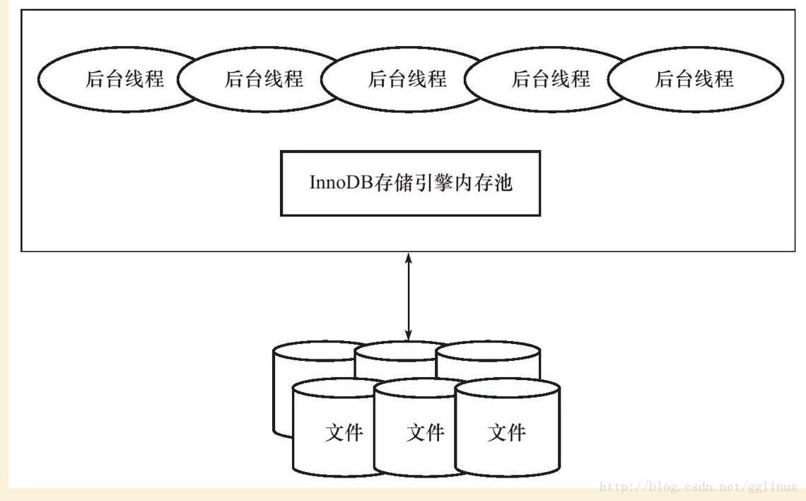

### (1) 后台线程

- `Master Thread`： 将更新的数据（包括新增和被修改的数据）异步刷新到磁盘，**维护内存池和磁盘中的数据的一致性**；包括赃页的刷新、合并插入缓冲、UNDO 页的回收等

- `IO Thread` ： 主要**负责 AIO(Async IO) 请求的回调处理**(call back)，分为 `Insert buffer,log IO,read ,write ` 

  > 查看命令： `SHOW ENGINE INNODB STATUS\G` 

- `purge thread`： **回收 undo log**，支持多个 Purge Thread

  > 查看命令： `SHOW VARIABLES LIKE "innodb_purge_threads"\G`

- `Page cleaner thread`： **刷新脏页到磁盘**


### (2) 内存

#### 1. 缓冲池


> - InnoDB 存储引擎基于磁盘存储，记录按照页的方式管理，由于 CPU 速度和磁盘速度之间的鸿沟，InnoDB 引擎使用缓冲池技术来提高数据库的整体性能
>
> - 脏页从缓冲池刷新回磁盘的操作通过 **Checkpoint 机制** 刷新回磁盘
> - 缓冲池的大小是可以调整配置参数调控的
> - 数据库服务器的缓冲池可以设置多个，增加效率

缓冲池简单来说就是一块**内存区域**： 

- 数据库**读取页**：
  - 首先将从磁盘读到的页存放在缓冲池中
  - 下一次读取相同的页时，首先判断该页是不是在缓冲池中：
    - 若在，称该页在缓冲池中被命中，直接读取该页
    - 否则，读取磁盘上的页
- 数据库**页的修改**：
  - 首先修改在缓冲池中页
  - 然后再以**一定的频率刷新到磁盘**，并不是每次页发生改变就刷新回磁盘

缓冲池的大小直接影响数据库的整体性能，对于 InnoDB 存储引擎而言，缓冲池配置通过参数 `innodb_buffer_pool_size`  来设置

> 查看命令： `SHOW VARIABLES LIKE 'innodb_buffer_pool_size'\G` 

#### 2. 重做日志(Redo Log)缓冲

>  InnoDB 存储引擎先**将重做日志信息放入日志缓冲区，然后以一定频率将其刷新到重做日志文件**

下列三种情况**重做日志缓冲中的内容会刷新到磁盘的重做日志文件**：

- **Master Thread 每一秒**将重做日志缓冲刷新到重做日志文件
- **每个事物提交时**会将重做日志缓冲刷新到重做日志文件
- 当**重做日志缓冲剩余空间小于 1/2 时**，重做日志缓冲刷新到重做日志文件

#### 3. WAL(预写式日志)

> `WAL`(Write-ahead logging，预写式日志)是数据库系统提供原子性和持久化的一系列技术

在使用 WAL 的系统中，所有的修改都先被写入到日志中，然后再被应用到系统状态中，通常包含 `redo` 和 `undo` 两部分信息

> MySQL 用 `redo log` 来在系统 Crash 重启之类的情况时修复数据(事务持久性)，而 `undo log` 来保证事务的原子性

- `redo log`(重做日志)：每当有操作时，在数据变更前将操作写入redo log，这样当发生掉电之类的情况时系统可以在重启后继续操作
- `undo log`(撤销日志)：当一些变更执行到一半无法完成时，可以根据撤销日志恢复到变更之间的状态

---

`WAL` 是消息中间件的基础，也是所有存储类系统的基础：在消息中间件中，消息直接存储在 redo log 中，`WAL` 只要写 redo log 完成，则消息就写入完成

1. 消息写入redo log就表明持久化
2. 不会出现原子性的问题，消息写入即成功，没写入即失败

---

使用 `WAL` 存储数据需要组织存储文件，如：MySQL 的 `binlog` 文件，消息中间件中也需要“消息的存储文件”来组织 redo log：

- 采用固定大小的存储文件，则在索引消息时，只要知道偏移量，就能找到对应的存储文件
- 同时，需要一个“偏移量+大小”来索引消息

问题：

1. 消息具体的存储协议，即存储文件中消息需要包含哪些内容
2. 如何优化索引结构，支持消息回溯、消息过滤等功能

---

使用 redo log 进行系统状态的恢复(`Crash Recovery`)：

- 消息一旦构建索引，就记录 checkpoint

    > checkpoint可以定期刷盘

- 系统恢复过程中，读取 checkpoint 之后的消息构建索引；若读取的消息不完整，则丢弃消息

    > 可以采用 `CRC` 验证之类的方式来校验消息是否完成

#### 4. 额外内存池

- 在 InnoDB 存储引擎中，**对一些数据结构本身的内存进行分配时，需要从额外的内存池中进行申请**

  > 例如：分配了缓冲池，但每个缓冲池中的帧缓冲及对应的缓冲控制对象的内存需要从额外的内存池中申请
  >
  > - 这些对象记录一些诸如 LRU, 锁,等待等信息

#### 5. LRU Free Flush

- **LRU 列表**： LRU 列表用来**管理已经读到的页**，对于这些缓冲页采用 **LRU 算法**管理

  >  - 新读的页放在 LRU 列表的 **midpoint 位置**，默认设置为 LRU 列表长度的 5/8，可由参数 `innodb_old_blocks_pct` 设置
  >
  >      > midpoint 之前的称为 new 列表，之后的称为 old 列表
  >
  >  - 引入 `innodb_old_blocks_time` 用于表示页读取到 mid 位置后需要等待多久才会被加入到 LRU 列表的热端
  >
  >  查看命令： `show variables like 'innodb_old_blocks_pct'\G` 
  >
  >  ---
  >
  >  好处：
  >
  >  - 对于首次查询，认为并非活跃的热点数据，避免 scan 大量数据的操作将一些真正热点的数据挤出内存
  >  - 尽可能保证 LRU 的热点数据不会被刷出
  >
  >  注：InnoDB 支持压缩页功能，可以将原本 16kb 的页压缩到 1，2，4，8kb，压缩页在 unzip_LRU 列表中存储，对于不同大小的页分配内存采用伙伴算法

- **Free 列表**： Free 列表其实就是维持一个存储结构的链表，这个**链表结点数表示 LRU 列表可以存储页的数量** 

    > 利用 Free List 空闲列表管理空闲页，数据库刚启动时，LRU 列表为空，页都放在空闲列表中，随后需要分配页时从 Free 列表申请，从中删除后添加到 LRUList 中

- **Flush 列表**： Flush 列表中为**脏页**，**LRU 列表用来管理缓冲实现的可用性，Flush 列表用来管理页刷新回磁盘** 

    > 页发生修改则为脏页，需要通过 checkpoint 机制刷回磁盘
    >
    > 注：脏页既存在于 LRU List 也存在于 Flush List，LRU List 负责管理页的使用，Flush List 负责管理需要刷回磁盘的页的引用

## 2、checkpoint技术

> **将缓冲池的数据刷新到磁盘**

### (1) 使用背景

- **日常DML语句并没有将操作的缓冲池数据立即写入到磁盘**，可能会导致内存中数据与磁盘中的数据不一致
- **脏页： 与磁盘数据不一致的缓冲池页**
- **checkpoint 的工作就是将内存中的脏页，在一定条件下刷新到磁盘**

- **策略**：为了避免从缓冲池将页数据刷新到磁盘的过程中宕机情况的发生，采用了 **Write Ahead Log 策略**
  
  > 即**当事务提交时，先写重做日志，再修改页**，这样发生宕机也可以通过重做日志进行恢复

### (2) 目的　

- 如果重做日志太大，那么数据库启动的时候恢复时间过长

- 缓冲池不够用时，需要先将脏页数据刷新到磁盘中

- 重做日志不可用时，刷新脏页到磁盘

### (3) 运作机制

InnoDB存储引擎内部，Checkpoint 分为了两种：

- `Sharp Checkpoint`： 发生**在数据库关闭时，将所有的脏页都刷新回磁盘**(默认工作方式)

  >  参数：`innodb_fast_shutdown = 1` 

- `Fuzzy Checkpoint`： **InnoDB存储引擎运行时，使用 Fuzzy Checkpoint 进行页刷新，只刷新一部分脏页**

  以下四种情况下会触发 Fuzzy Checkpoint：

  - `Master Thread Checkpoint`： 对于Master Thread，**以每秒或者每N秒的速度将缓冲池的脏页列表刷新一定比例的页回磁盘**，这个**过程是异步的**，用户查询线程不会阻塞

  - `FLUSH_LRU_LIST Checkpoint`： 为了保证 LRU 列表中有100个左右的空闲页可使用，用户查询线程会检查 LRU 列表是否有足够的空间操作：如果没有，根据 LRU 算法，溢出 LRU 列表尾端的页，如果这些页有脏页，需要进行 checkpoint

    > 参数 `innodb_lru_scan_depth` 控制 LRU 列表中可用页的数量，默认为 1024
    >
    > 查询命令： `show variables like 'innodb_lru_scan_depth'\G` 

  - `Async/Sync Flush Checkpoint`： **发生在重做日志不可用时**（满了），将 buffer pool 中的一部分脏页刷新到磁盘中，在脏页写入磁盘后，事物对应的重做日志可以释放

  - `Dirty Page too much Checkpoint`： 即**脏页太多，强制 checkpoint，保证缓冲池有足够可用的页**

    >  参数设置：`innodb_max_dirty_pages_pct` = 75 表示：当缓冲池中脏页的数量占75%时，强制checkpoint ，默认为 75
    >
    > 查看命令： `show variables like 'innodb_max_dirty_pages_pct'\G`

## 3、Master Thread工作方式

### (1) InnoDB1.0X版本之前的Master Thread

> **Master Thread 具有最高的线程优先级别**，内部由多个循环组成：
>
> **主循环(loop)、后台循环(background loop)、刷新循环(flush loop)、暂停循环(suspend loop)**
>
> Master Thread会根据数据库运行的状态进行循环之间的切换

Loop主循环（大多数操作都在这个循环下）有两大部分操作，**每秒和每10秒操作**：

```c
void master_thread() {
    loop:
    for(int i=0; i<10; i++) {
        do thing once per second
        sleep 1 second if necessary
    }
    do things once per then seconds
    goto loop;
}
```

> 可以发现： 
>
> - **loop循环是通过 thread sleep 来实现的**
> - **意味着每秒或者每10每秒的操作并不是十分的精确**
> - 在负载大的情况下，可能会有不同程度的延迟（delay）

**每秒一次的操作**包括：

- **日志缓冲刷新到磁盘（总是）**：**即使事务没有提交，InnoDB 也会每秒将重做日志缓冲刷新到重做日志文件中**

- **合并插入缓冲(可能)**：**并不会每秒刷新**，若前一秒的 IO 次数小于5，则可以执行合并插入缓冲操作

- **最多刷新100个InnoDB的缓冲池脏页到磁盘(可能)**：判断当前缓冲池中脏页的比例(`buf_get_modifyed_ratio_pct`) 是否超过了配置文件中 `innodb_max_dirty_pages_pct` 这个参数（默认为90）如果超过了这个阈值，InnoDB存储引擎认为需要做同步操作，将100个脏页写入磁盘中

- **如果当前没有用户活动，切换到 background loop(可能)**
  -  **删除无用的 undo 页(总是)**

  - **合并 20 个插入缓冲(总是)**

  - **跳回到主循环(总是)**

  - **不断刷新 100 个页，直到符合条件(可能，跳转到flush loop中完成)**：如果 fulsh loop 页没有什么事情可以做了，InnoDB 存储引擎会切换到 suspend loop，将 Master Thread 挂起

**每10秒**的操作：

- **刷新100个脏页到磁盘(可能)**

- **合并至多5个插入缓冲(总是)**

- **将日志缓冲刷新到磁盘(总是)**

- **删除无用的 undo 页(总是)**

- **刷新100个或者10个脏页到磁盘(总是)**

### (2) InnoDB1.2.X之前的版本的Master Thread

参数 `innodb_io_capacity` 表示 IO 的吞吐量，**默认200**，对于刷新到磁盘页的数量，按照百分比控制：

- **在合并插入缓冲时，合并插入缓冲的数量为 innodb_io_capacity 值 5%**

- **在从缓冲池刷新脏页时，刷新脏页的数量为 innodb_io_capcity**

```c
void master_thread() {
    loop:
    for(int i=0; i<10; i++) {
        thread_sleep(1)    // sleep 1秒
        do log buffer flush to dish

        if (last_one_second_ios < 5% innodb_io_capacity) {
            do merget 5% innodb_io_capacity insert buffer
        }
		// 如果缓冲池中的脏页比例大于innodb_max_dirty_pages_pct(默认是75时)
        if (buf_get_modified_ratio_pct > innodb_max_dirty_pages_pct) {  
            do buffer pool flush 100% innodb_io_capacity dirty page // 刷新全部脏页到磁盘
        } else if (enable adaptive flush) {    // 如果开启了自适应刷新
            // 通过判断产生redo log的速度决定最合适的刷新脏页的数量
            do buffer pool flush desired amount dirty page 
        }

        if (no user activety) {
            goto background loop
        }
    }
	// 如果过去10s内磁盘IO次数小于设置的innodb_io_capacity的值（默认是200）
    if (last_ten_second_ios < innodb_io_capacity) {  
        do buffer pool flush 100%  innodb_io_capacity dirty page
    }
	// 合并插入缓冲是innodb_io_capacity的5%（10）（总是）
    do merge 5% innodb_io_capacity insert buffer  
    do log buffer flush to dish
    do flush purge

    if (buf_get_modified_ratio_pct > 70%) {
        do buffer pool flush 100% innodb_io_capacity dirty page
    } else {
        do buffer pool flush 10% innodb_io_capacity dirty page
    }
    goto loop

    backgroud loop:   // 后台循环
    	do full purge     // 删除无用的undo页 （总是）
    	// 合并插入缓冲是innodb_io_capacity的5%（10）（总是）
    	do merger 5% innodb_io_capacity insert buffer  
    	if not idle:      // 如果不空闲，就跳回主循环，如果空闲就跳入flush loop
    		goto loop:    // 跳到主循环
    	else:
        	goto flush loop
    flush loop:  // 刷新循环
    	// 刷新200个脏页到磁盘
    	do buf_get_modified_ratio_pct pool flush 100% innodb_io_capacity dirty page 
    	// 如果缓冲池中的脏页比例大于innodb_max_dirty_pages_pct的值（默认75%）
    	if ( buf_get_modified_ratio_pct > innodb_max_dirty_pages_pct ) 
        	goto flush loop            // 跳到刷新循环，不断刷新脏页，直到符合条件
        goto suspend loop          // 完成刷新脏页的任务后，跳入suspend loop
    suspend loop:
   		suspend_thread()               //master线程挂起，等待事件发生
    	waiting event
    goto loop;
}
```

### (3) InnoDB1.2.x版本的Master Thread

> 同时对于刷新脏页的操作，从 Master Thread 线程分离到单独的 Page Cleaner Thread，从而减轻了 Master Thread 的工作，同时提高了系统的并发性

```c
if (InnoDB is idle) {
    srv_master_do_idle_tasks();    // 每10秒操作
} else {
    srv_master_do_active_tasks();    // 每秒操作
}
```

## 4、InnoDB 关键特性

### (1) 插入缓冲

#### 1. Insert Buffer

- Insert Buffer 和数据页一样，也是物理页的一个组成部分
- **一般情况下，主键是行唯一的标识符**
  - 通常行记录的插入顺序按照主键递增的顺序插入，**插入聚集索引一般是顺序的，不需要磁盘的随机读取**
  - 若**索引非聚集且不唯一**，则由于**随机读取的存在会导致插入操作性能下降**
- Insert Buffer： **先判断插入非聚集索引页是否在缓冲池中**
  - 若存在，则直接插入
  - 不存在，则先放入一个 Insert Buffer 对象中
    - 然后再以一定的频率**进行 Insert Buffer 和辅助索引页子节点的 merge(合并)操作**，这时通常能将多个**插入合并到一个操作中**，大大提高了对于非聚集索引插入的性能

需要满足的两个条件：

- **索引是辅助索引**
- **索引不唯一**

> 辅助索引不能唯一，因为在插入缓冲时，数据库并不去查找索引页来判断插入的记录的唯一性，如果去查找肯定又会有离散读取的情况发生，从而导致 Insert Buffer 失去了意义

#### 2. Change Buffer

> Change Buffer 适用的对象是**非唯一的辅助索引**

从这个版本开始，**InnoDB存储引擎可以对DML操作——INSERT、DELETE、UPDATE都进行缓冲**，他们分别是：`Insert Buffer、Delete Buffer、Purge buffer`

对一条记录进行 UPDATE 操作可能分为两个过程：

- **将记录标记为已删除（Delete Buffer）**： Delete Buffer 对应第一个过程，即将记录标记为删除
- **真正将记录删除（Purge buffer）**：Purge Buffer 对应 UPDATE 操作的第二个过程，即将记录真正的删除

InnoDB存储引擎提供参数 `innodb_change_buffering`，**用来开启各种Buffer的选项**，该参数可选的值为：`inserts、deletes、purges、changes、all、none`，该参数**默认值为 all**

- `inserts、deletes、purges` 就是前面讨论过的三种情况

- `changes` 表示启用 inserts 和 deletes 

- `all` 表示启用所有

- `none` 表示都不启用

可以通过参数 `innodb_change_buffer_max_size` 来**控制 Change Buffer最 大使用内存的数量，默认为25**，表示最多使用 1/4 的缓冲池内存空间，**该参数的最大有效值为50**

#### 3. Merge Insert Buffer

Merge Insert Buffer 的操作可能发生在以下几种情况下：

- **辅助索引页被读取到缓冲池时**

  > 例如： 执行正常的 SELECT 查询操作，需要检查 Insert Buffer Bitmap 页，然后**确认该辅助索引页是否有记录存放于 Insert Buffer B+树中**；若有，则将 Insert Buffer B+树中该页的记录插入到该辅助索引页
  >
  > 可以看到对该页多次的记录操作通过一次操作合并到了原有的辅助索引页中，因此性能会有大幅提高

- **Insert Buffer Bitmap 页追踪到该辅助索引页已无可用空间时**

  > Insert Buffer Bitmap 页用来追踪每个辅助索引页的可用空间，并至少有 1/32 页的空间
  >
  > 若插入辅助索引记录时检测到插入记录后可用空间会小于1/32页，则会强制进行一个合并操作，即强制读取辅助索引页，将Insert Buffer B+树中该页的记录及待插入的记录插入到辅助索引页中

- **Master Thread**

  > 在Master Thread线程中每秒或每10秒会进行一次Merge Insert Buffer的操作，不同之处在于每次进行merge操作的页的数量不同

### (2) 两次写

#### 1. doublewrite应用场景
> innodb 的数据页一般大小是16KB，MySQL存取数据的最小单位也是页

**部分写失效**：当写入数据时，有可能在一个页中写入一半时数据库宕机，从而导致数据丢失

**根据 redo log 进行数据恢复**，要分为两种情况：

- 数据库宕机，**物理文件完好无损**，可以通过 redo log 进行崩溃恢复
- 数据库宕机，正在刷新到磁盘的页发生 partial page write，而正好在磁盘上的这个**数据页由于宕机发生损坏**，这时无法通过redo log进行数据恢复

#### 2.  doublewrite体系结构及工作流程
doublewrite 由两部分**组成**：

- 一部分为内存中的 `doublewrite buffer`，其大小为2MB
- 一部分是**磁盘上共享表空间中连续的128个页**，即2个区（extent），大小也是2M

doublewrite **工作流程**：

- 当一系列机制触发数据缓冲池中的脏页进行刷新时，并**不直接写磁盘，而是会通过 memcpy 函数将脏页先复制到内存中的 doublewrite buffer**，之后通过doublewrite buffer再分两次、每次1MB顺序写入共享表空间的物理磁盘上

- 接着**调用 fsync 函数，同步脏页进磁盘**

  > - 在这个过程中，**doublewrite 页的存储是连续的，因此写入磁盘为顺序写，性能很高**
  >
  > - **完成 doublewrite 后，再将脏页写入实际的各个表空间文件，这时写入是离散的**

各模块协作情况如下图：


> 查看命令： `show global/ status like 'innodb_dblwr%'\G`

#### 3. 崩溃恢复

在恢复过程中，innodb 存储引擎可以从共享表空间的 doublewrite 中找到该页的一个最近副本，将其复制到表空间文件，再应用 redo log，完成恢复过程

>  因为有副本所以也不担心表空间中数据页是否损坏

### (3) 自适应哈希索引

> InnoDB 存储引擎会监控对表上各索引页的查询
>
> 参数 `innodb_adaptive_hash_index` 可以禁止和启动此特性

- 如果观察到哈希索引可以提升速度，则建立哈希索引，称之为**自适应哈希索引(AHI)**

- **AHI 由缓冲池的B+树页构造**，因此建立的速度非常快，且不要对整张表构建哈希索引

- InnoDB 存储引擎会**自动根据访问的频率和模式来自动的为某些热点页建立哈希索引**

- AHI 有一个要求，即**对这个页的连续访问模式(查询条件)必须一样** 


**AHI 还有如下要求**：

- 以该模式访问了100次
- 页通过该模式访问了N次，其中N=页中记录 / 16

> 根据官方文档显示，启用AHI后：
>
> - 读取和写入的速度可以提高2倍
> - 负责索引的链接操作性能可以提高5倍
> - 其设计思想是数据库自由化的，无需 DBA 对数据库进行人为调整

### (4) 异步IO

>  为了提高磁盘操作性能，当前的数据库系统都采用异步IO的方式来处理磁盘操作

- `Sync IO`： 每进行一次IO操作，需要等待此次操作结束才能继续接下来的操作

- `AIO`： 在发出一个IO请求后立即再发出另外一个IO请求，当全部IO请求发送完毕后，等待所有IO操作完成

  > 在InnoDB存储引擎中，read ahead 方式的读取都是通过AIO完成，脏页的刷新，也是通过AIO完成

实现：

- 在InnoDB 1.1.x之前，AIO 的实现是**通过InnoDB存储引擎中的代码来模拟的**

- 从这之后，提供了**内核级别的AIO的支持**，称为 `Native AIO`

  >  Native AIO需要操作系统提供支持；Windows和Linux都支持，而**Mac则未提供**

> 参数 `innodb_use_native_aio`决定是否启用 Native AIO

### (5) 刷新邻接页

**InnoDB 存储引擎在刷新一个脏页时，会检测该页所在区的所有页，如果是脏页，则一起刷新**

>  **好处**： 通过AIO可以将多个IO写操作合并为一个IO操作，该工作机制在传统机械磁盘下有显著优势

需要考虑两个问题:

- 是不是将不怎么脏的页进行了写入，而该页之后又会很快变成脏页？
- 固态硬盘有很高IOPS，是否还需要这个特性？

> 参数 `innodb_flush_neighbors` 决定是否启用
>
> 对于传统机械硬盘建议使用，而对于固态硬盘可以关闭

# 三、文件

## 1. 参数文件

> 查看数据库中的参数：
>
>  `show variables like 'innodb_buffer%'\G` 
>
> 或 
>
> `select * from globle_variables where variable_name like 'innodb_buffer%'\G`

参数分为两类：

- **动态参数**：可以在 mysql 实例运行中进行变更

  > 通过  set 命令对动态参数值进行修改：
  >
  > ```mysql
  > set
  > | [global/1 | session] system_var_name = expr
  > | [@@global/. | @@session. | @@] system_var_name = expr
  > ```

- **静态参数**： 在整个实例生命周期中不得修改

## 2. 日志文件

> 日志可以帮助我们定位 mysqld 内部发生的事件，数据库性能故障，记录数据变更历史，用户恢复数据库等

### 1. 错误日志

> 查看命令： `show variables like 'log_error;'`

- 在对应的数据目录中，以**主机名+.err**命名的文件，错误日志记录的信息类型：
  - 记录了服务器运行中产生的错误信息
  - 记录了服务在启动和停止是所产生的信息
  - 在从服务器上如果启动了复制进程的时候，复制进程的信息也会被记录
  - 记录event错误日志
- `flush logs` 命令可以将错误日志中的内容做备份并重新开始记录，备份文件名以 `.old` 结尾

配置mysql的主配置文件：

```mysql
# 指定错误日志的位置，默认是在数据目录下，这个位置mysql用户必须有写权限
log_error = /mydata/data/mysql.test.com.err 
# 默认开启，服务器运行中的警告日志也会记录在错误日志中
log_warning = {0|1} 
```

### 2. 慢查询日志

> - 查看默认阙值时间命令： `show variables like 'long_query_time\G;'`
> - 查看是否开启慢查询（默认关闭）命令： `show variables like 'show_query_log\G;'`
> - 开启慢查询日志命令： `set global/ show_query_log='ON';`
> - 查看日志存放位置命令： `show variables like 'slow_query_log_file'\G;`
> - 查看慢查询日志的默认存储方式命令： `show variables like 'log_output'\G;`
> - 改变慢查询日志的存储方式为 TABLE 命令： `set global/ log_output='TABLE';`
> - 查看 mysql 日志命令： `mysqldumpslow xxx.log`

- 用来记录在 MySQL 中响应时间超过阀值(long_query_time，默认为 10s)的语句，则会被记录到慢查询日志文件中，默认为关闭状态
- 从 mysql5.1 开始，long_query_time 开始以**微秒**记录运行时间
- 参数 `long_query_io` 将超过指定逻辑 IO 次数的 SQL 语句记录到 slow log 中，默认为 100；参数 `slow_query_type` 用来表示启用 slow log 的方式：
  - 0 表示不将 SQL 语句记录到 slow log
  - 1 表示根据运行时间将 SQL 语句记录到 slow log
  - 2 表示根据逻辑 IO 次数将 SQL 语句记录到 slow log
  - 3 表示根据运行时间及逻辑 IO 次数将 SQL 语句记录到 slow log

```mysql
slow_query_log  = {ON | OFF} #是否开启慢慢查询日志，默认是关闭的 
slow_query_log_file = /mydata/data/mysql-slow.log #慢查询日志的存放位置，默认在数据目录下
log_query_time = 10 #定义默认的时长，默认时长为10秒
log_query_not_using_indexes = {ON|OFF} #设定是否将没有使用索引的查询操作记录到慢查询日志 
log_output = {TABLE|FILE|NONE} #定义一般查询日志和慢查询日志的保存方式，可以是TABLE、FILE、NONE，也可以是TABLE及FILE的组合(用逗号隔开)，默认为FILE。如果组合中出现了NONE，那么其它设定都将失效，同时，无论是否启用日志功能，也不会记录任何相
```

### 3. 查询日志

- 查询日志记录 MySQL 中所有的 query 查询记录，无论是否正确执行；默认文件名： **主机名.log**
- mysql 5.1 开始将查询日志记录放入到 mysql 架构下的 general_log 表中

```mysql
log = {ON|OFF} #是否启用查询日志，该指令在mysq5.6中已废弃
general_log = {ON|OFF} #启动或关闭查询日志，默认是关闭的
general_log_file = /mydata/data/mysql.log #指定查询日志的位置，默认在数据目录下
log_output = {TABLE|FILE|NONE} #指定存放查询日志的位置，可以放在文件中，也可以放在数据库的表中
```

### 4. 二进制日志

> - 查看 log_bin 状态命令： `show variables like 'log_bin%';`
>
> - 启用二进制日志功能并给二进制文件命名： `log-bin="filename-bin"`
>
> - 设定二进制文件上限命令： `max_binlog_size={4096..1073741824};`
>
>   > 单位为字节，最小为 4K ，最大为 1G ，默认为 1G
>
> - 查看所有二进制文件： `show binary logs;`
>
> - 查看当前正在使用的二进制文件： `show master status;`

- 精确的记录了对 MySQL 数据库**执行更改的所有操作**   
- 通过参数 `log-bin[=name]` 启动二进制日志，**默认为主机名，后缀为二进制日志的序列号，所在路径为数据库所在目录(datadir)**

- 配置参数：

  - `max_binlog_size`： 指定单个二进制文件的最大值，若超过该值，则产生新的二进制文件，后缀名 +1，并记录到 .index 文件(默认为 1G)

  - `binlog_cache_size `：当使用事务的表存储引擎时，所有未提交的二进制日志会被记录到缓存中，等待事务提交时直接将缓存中的二进制日志写入二进制日志文件，缓存大小由 `binlog_cache_size` 决定（默认为 32K）

    > binlog_cache_size 是基于会话的，线程开始一个事务时会自动分配一个

  - `sync_binlog`： 表示每写缓存 sync_binlog 次就同步到磁盘，默认为 0

  - `binlog-do-db` 与 `binlog-ignore-db`： 表示需要写入或忽略写入哪些库的日志；默认为空，表示需要同步所有库的日志到二进制日志

  - `log-slave-update`： 如果当前数据库是复制中的 slave 角色，则它不会从 master 取得并执行的二进制写入自己的二进制文件中；若需要写入，要设置 `log-slave-update`

  - `binlog_format`： 影响记录二进制日志的格式

    > - 设置 binlog_format 命令： `set @@session.binlog_format='ROW | STATEMENT;'`
    > - 查询 binlog_format  命令： `select @@session.binlog_format;`

    参数值有：

    - `STATEMENT`： 二进制日志文件记录的是日志的逻辑 SQL 语句
    - `ROW`： 记录的表的更改情况；若设置为 ROW，则可以将 InnoDB 的事务隔离级别设为 READ COMMITTED
    - `MIXED`： 默认采用 STATEMENT 记录二进制文件，但以下情况会采用 ROW 格式：
      - 表的存储引擎为 NDB，这时对表的 DML 操作采用 ROW
      - 使用了 UUID(), USER(), CURRENT_USER(), FOUND_ROWS(), ROW_COUNT() 等不确定函数
      - 使用了 INSERT DELAY 语句
      - 使用了用户定义函数（UDF）
      - 使用了临时表(temporary table)

- 二进制日志文件的作用：

  - **恢复**： 提供了数据基于时间点的恢复，恢复的时间点可以由用户控制
  - **复制**： 提供了增量备份的功能，为 mysql 的复制架构提供基础，将这主服务器的二进制日志复制到从服务器上并执行同样的操作，就可将数据进行同步
  - **审计**： 可以通过二进制日志中的信息来进行审计，判断是否有对数据库进行注入攻击

- 二进制日志事件：
  - position 基于位置
  - datetime 基于时间

二进制日志的查看与删除方式：

```mysql
mysql>show master status; # 查看当前正在使用的二进制日志 
mysql>show binlog events in 'mysql-bin.000001'; # 查看二进制日志记录的事件[from position]  
mysql>flush logs; # 二进制日志滚动  
mysql>show binary logs; # 查看所有二进制日志  
mysql>purge binary logs to 'mysql-bin.000003'; # 删除二进制日志
```

文件系统中查看二进制日志的命令：

```mysql
mysqlbinlog
相关选项， 
--start-position #开始位置  
--stop-position #结束位置  
--start-datetime 'yyyy-mm-dd hh:mm:ss'; #开始时间  
--stop-datetime ''; #结束时间
```

配置mysql的主配置文件：  

```mysql
sql_log_bin = {ON|OFF} #用于控制二进制日志信息是否记录进日志文件。默认为ON，表示启用记录功能。用户可以在会话级别修改此变量的值，但其必须具有SUPER权限
binlog_cache_size = 32768 #默认值32768 Binlog Cache 用于在打开了二进制日志（binlog）记录功能的环境，是 MySQL 用来提高binlog的记录效率而设计的一个用于短时间内临时缓存binlog数据的内存区域。一般来说，如果我们的数据库中没有什么大事务，写入也不是特别频繁，2MB～4MB是一个合适的选择。但是如果我们的数据库大事务较多，写入量比较大，可与适当调高binlog_cache_size。同时，我们可以通过binlog_cache_use 以及 binlog_cache_disk_use来分析设置的binlog_cache_size是否足够，是否有大量的binlog_cache由于内存大小不够而使用临时文件（binlog_cache_disk_use）来缓存了 
binlog_stmt_cache_size = 32768 #当非事务语句使用二进制日志缓存，但是超出binlog_stmt_cache_size时，使用一个临时文件来存放这些语句  
log_bin = mysql-bin #指定binlog的位置，默认在数据目录下
binlog-format = {ROW|STATEMENT|MIXED} #指定二进制日志的类型，默认为MIXED。如果设定了二进制日志的格式，却没有启用二进制日志，则MySQL启动时会产生警告日志信息并记录于错误日志中。 
sync_binlog = 10 #设定多久同步一次二进制日志至磁盘文件中，0表示不同步，任何正数值都表示对二进制每多少次写操作之后同步一次。当autocommit的值为1时，每条语句的执行都会引起二进制日志同步，否则，每个事务的提交会引起二进制日志同步  
max_binlog_cache_size = {4096 .. 18446744073709547520} #二进定日志缓存空间大小，5.5.9及以后的版本仅应用于事务缓存，其上限由max_binlog_stmt_cache_size决定。  
max_binlog_stmt_cache_size = {4096 .. 18446744073709547520} #二进定日志缓存空间大小，5.5.9及以后的版本仅应用于事务缓存  
expire_log_days = {0..99} #设定二进制日志的过期天数，超出此天数的二进制日志文件将被自动删除。默认为0，表示不启用过期自动删除功能。如果启用此功能，自动删除工作通常发生在MySQL启动时或FLUSH日志时
```

注：一般建议将binlog日志与数据文件分开存放，不但可以提高mysql性能，还可以增加安全性！

## 3. 套接字文件

> 查看命令： `show variables like 'socket'\G`

当用 Unix 域套接字方式进行连接时需要的文件

## 4. pid 文件

> 查看命令：`show variables like 'pid_file'\G`

- 当 MySQL 实例启动时，会将自己的进程 ID 写入到一个 pid 文件中

- 该文件由参数 `pid_file` 控制，默认位于数据库目录下，文件名： **主机名.pid**

## 5. 表结构定义文件

- MySQL 有后缀名为 `frm` 的文件，用于记录表的表结构定义
- `frm` 还用来存放视图的定义

## 6. InnoDB 存储引擎文件

### 1. 表空间文件

- InnoDB 将存储的数据按表空间进行存放，默认有初始大小为 10M 的名为 ibdata1 的文件

- ibdata1 文件就是默认的表空间文件，且该文件可自动增长

  参数 `innodb_data_file_path` 可进行设置：

  > innodb_data_file_path = datafile_spec1[;datafile_spec2...]
  >
  > 设置该参数后，所有基于 InnoDB 的表的数据都会记录到该共享表空间中

- `innnodb_file_per_table`： 可使每个基于 InnoDB 存储引擎的表产生独立表空间，命名为： **表名.idb**

  > 单独表空间仅存放表的数据、索引、插入缓冲 BITMAP 等信息，其余信息还存放在默认的表空间


### 2. 重做日志文件

> 查看重做日志组命令： `show variables like 'innodb%log%'\G`

- 重做日志文件： 默认在 InnoDB 数据目录下有名为 `ib_logfile0,ib_logfile1` 文件，记录了对于 InnoDB 的事务日志，用于当实例或介质失败时的恢复

- 用户可以设置多个镜像日志组，将不同的文件组放在不同的磁盘上，以提高重做日志的高可用性

- 日志组中的重做日志文件大小一致，并以循环写入方式运行

  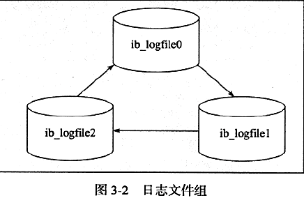

- 日志文件的参数属性：

  - `innodb_log_file_size`： 指定每个重做日志文件的大小
  - `innodb_log_files_in_group`： 指定日志文件组中重做日志文件的数量，默认为 2
  - `innodb_mirrored_log_groups`： 指定了日志镜像文件组的数量，默认为 1（表示只有一个日志文件组，没有镜像）
  - `innodb_log_group_home_dir`： 指定了日志文件组所在路径，默认为 `./`(表示在MySQL 数据目录下)

- 重做日志条目结构：

  - `redo_log_type`： 表示重做日志类型，占用 1 字节
  - `space`： 表示表空间 ID，但采用压缩方式
  - `page_no`： 表示页的偏移量，也采用压缩方式
  - `redo_log_body`： 表示每个重做日志的数据部分，恢复时需要调用相应函数进行解析

  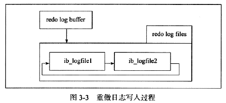

- 参数 `innodb_flush_log_at_trx_commit`： 触发写磁盘的过程，表示在提交操作时，处理重做日志（另一个写磁盘是 master thread 每秒会将重做日志写入磁盘的重做日志文件中）

  有效值：

  - 0 代表当前提交事务时，并不将事务的重做日志写入磁盘上的日志文件，而是**等待主线程每秒的刷新**
  - 1 表示在执行 commit 时，将重做日志缓冲**同步写到磁盘**，即伴有 fsync 调用
  - 2 表示将重做日志**异步写到磁盘**，即写到文件系统的缓存中

**与二进制日志的区别**：

- 二进制日志记录所有与 MySQL 数据库有关的日志记录，如：InnoDB, MyISAM, Heap 等；而 InnoDB 重做日志只记录其本身的事务日志
- 二进制日志记录关于一个事务的具体操作内容，即为逻辑日志；而 InnoDB 重做日志记录关于每个页的更改物理情况
- 二进制日志文件仅在事务提交前进行提交，即只写磁盘一次；而在事务进行时，不断有重做日志条目被写入到重做日志文件中

# 四、表

## 1. 索引组织表

- **索引组织表(IOT)**： 在InnoDB存储引擎中，**表根据主键顺序组织存放**

- 在InnoDB存储引擎中，每张表都有主键，若创建表时未定义主键，则InnoDB存储引擎会选择表中符合条件的列去**创建主键**：

  -  首先判断表中是否有**非空的唯一索引**（Unique NOT NULL），如果有，则该列即为主键

    > 当表中存在多个非空的唯一索引的时候，InnoDB 存储引擎会根据建表时所创建的**第一个非空唯一索引作为主键**

  - 如果不符合上述条件，InnoDB存储引擎**自动创建一个6字节大小的指针**

- **主键**： 唯一标识表中的每行的字段，目的在于索引

## 2. InnoDB 逻辑存储结构

- **表空间**： 所有数据都被逻辑地存放在一个空间内，由段、区、页（块）组成


### 1. 表空间

> 可参看 三.6.1 表空间文件

- **独立表空间**：仅存放表的数据、索引、插入缓冲 BITMAP 等信息，其余信息还存放在默认的表空间
- **共享表空间**： 所有基于 InnoDB 的表的数据都会记录到该共享表空间中

### 2. 段

- 表空间由各个段组成，常见的段有**数据段、索引段、回滚段**等

- InnoDB 存储引擎是索引组织，因此数据即索引，索引即数据

- **数据段为B+树段叶子节点(Leaf node segment)，索引段为B+树段非叶节点(Non-leaf node segment)**

### 3. 区

- 区是由连续的页(Page)组成的空间，每个**区大小为 1MB**，为保证页的连续性，InnoDB 存储引擎每次从磁盘一次申请4-5个区

  > 默认情况下，InnoDB存储引擎的**页大小为16KB**，即一个区中有64个连续的页

- InnoDB1.0.x版本开始引入**压缩页**，每个页的大小可以通过参数KEY_BLOCK_SIZE设置为2K、4K、8K，因此每个区对应的页尾512、256、128

- InnpDB1.2.x版本新增参数 `innodb_page_size`，可以**将默认页的大小设置为4K、8K**，但页中的数据不压缩

### 4. 页

- **页是InnoDB存储引擎磁盘管理的最小单**位，每个页默认**16KB**

- InnoDB存储引擎从1.2.x版本开始，可以通过参数 `innodb_page_size` 将页的大小设置为4K、8K、16K

  > - 若设置完成，则所有表中页的大小都为 innodb_page_size，不可以再次对其进行修改
  > - 除非通过 mysqldump 导入和导出操作来产生新的库

InnoDB存储引擎中，常见的页类型有：

- 数据页（B-tree Node)

- undo页（undo Log Page）

- 系统页 （System Page）

- 事物数据页 （Transaction System Page）

- 插入缓冲位图页（Insert Buffer Bitmap）

- 插入缓冲空闲列表页（Insert Buffer Free List）

- 未压缩的二进制大对象页（Uncompressed BLOB Page）

- 压缩的二进制大对象页 （compressed BLOB Page）

### 5. 行

- **InnoDB 存储引擎是面向列的**（row-oriented)，即**数据按行存放**
- **每个页存放的行记录最多为16KB/2-200，即7992行记录**

## 3. InnoDB 行记录格式

### 1. 简介

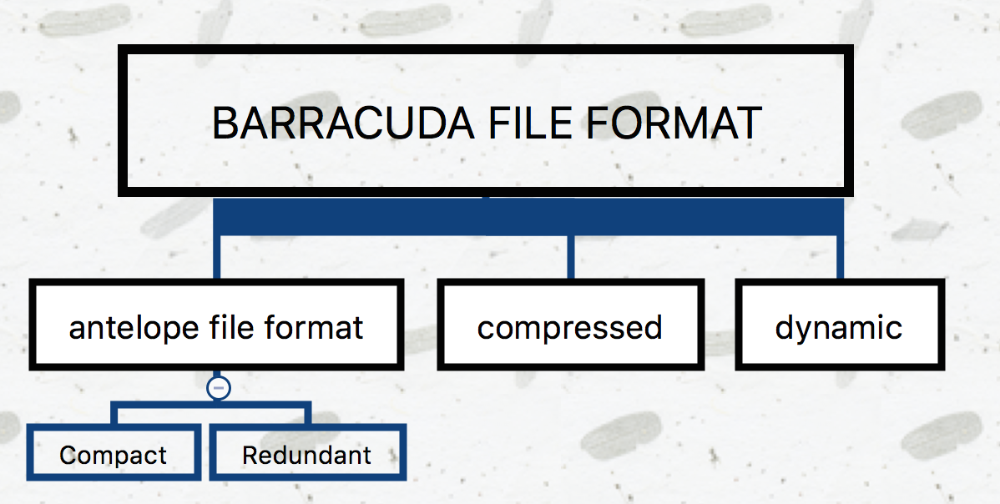

- `Antelope`：先前未命名的，**原始的InnoDB文件格式：COMPACT 和 REDUNDANT**

  > MySQL5.6的默认文件格式，可以与早期的版本保持最大的兼容性，不支持 Barracuda 文件格式

- `Barracuda`： 新的文件格式，**支持InnoDB的所有行格式**，包括：COMPRESSED 和 DYNAMIC

  > 新的行格式功能：InnoDB表的压缩，长列数据的页外存储和索引建前缀最大长度为3072字节

**在 msyql 5.7.9 及以后版本**：

- 行格式由 `innodb_default_row_format` 变量决定，默认值是`DYNAMIC`

  > 可以在 create table 的时候指定 `ROW_FORMAT=DYNAMIC`

- 查看当前表使用的行格式命令： `SHOW TABLE STATUS LIKE'table_name'` 

  > `row_format` 列表示当前所使用的行记录结构类型

**修改现有表的行模式为`compressed`或`dynamic`：**

- **先将文件格式设置成Barracuda**：`set global/ innodb_file_format=Barracuda;`
- **再修改**： `ALTER TABLE [tablename] ROW_FORMAT=COMPRESSED;` 

**InnoDB行存储简介**：

- InnoDB 表的数据存储在页中，每个页可以存放多条记录，**页以树形结构组织**，即**B树索引**

- 表中数据和辅助索引都使用B树结构，维护表中所有数据的B树索引称为**聚簇索引，通过主键来组织**

- **聚簇索引的叶子节点包含行中所有字段的值，辅助索引的叶子节点包含索引列和主键列**

  > **变长字段是个例外**，例如：`BLOB, VARCHAR`
  >
  > - 当页不能完全容纳列数据时，会将此列的数据存放在**溢出页的单独磁盘页上**，称这些列为**页外列**
  >
  > - 这些列的**值存储在以单链表形式存在的溢出页列表中，每个列都有自己溢出页列表**
  >
  > - 某些情况下，**为了避免浪费存储空间和消除读取分隔页，列的所有或前缀数据会存储在B+树索引中**

### 2. Compact 与 Redundant 行记录格式

#### 1. Compact 

**目的**：为了高效的存储数据

> 简单的说：**一个页（Page）存放的行数据越多，这样性能就越高**

行记录格式如下：


- **变长字段长度列表**：**按列的逆序放置**

  >  长度规则：
  >
  > - 若列的长度**小于** 255 字节，则用 1 字节表示
  > - 若列的长度**大于** 255 字节，则用 2 字节表示
  >
  > **变长字段长度最大不超过2字节**（MySQL数据库varcahr类型的最大长度限制为65535）

- **NULL标识位**：该位指示了该行数据中**是否有NULL值，有则为 1**

- **记录头信息**：固定占用 5 字节（40位）

  

-  **列 N 数据**：实际存储每列的数据，**NULL 不占该部分存储空间**

####2. Redundant 


-  **字段偏移列表**：**按列的逆序放置**

  > 若列的长度小于255字节，用1字节表示；若大于255字节，用2字节表示

- **记录头信息**：占用6字节（48位）

  

### 3. 行溢出数据

- 当行记录的长度没有超过行记录最大长度时，所有数据都会存储在当前页

- 当行记录的长度超过行记录最大长度时，变长列（`variable-length column`）会选择外部溢出页（`overflow page`，一般是`Uncompressed BLOB Page`）进行存储

> `Compact + Redundant`：保留前 768Byte 在当前页（B+Tree叶子节点），其余数据存放在溢出页，768Byte后面跟着20Byte的数据，用来存储指向溢出页的指针


**VARCHAR(N)**： 其中的 N 指字符的长度，最大支持 65535 字节；其中 65535 是指所有 VARCHAR 列的长度总和

### 4. Compressed和Dynamic行记录格式

- InnoDB1.0x 引入新的文件格式 `Barracuda`，新的格式拥有两种新的行记录格式：`Compressed, Dynamic` 

- 新的两种记录格式**对于存放BLOB中的数据采用完全行溢出方式**

- 数据页中只存放 20 个字节的指针，实际的数据都存放在 Off Page 中

  

- **Dynamic 行格式**：**列存储是否放到 off-page 页取决于行大小**，把行中最长的列放到 off-page，直到数据页能存放下两行

- **Compressed行记录格式**： 物理结构上与Dynamic类似，其另一个功能就是**存储在其中的行数据会以zlib的算法进行压缩**，因此对于BLOB、TEXT、VARCHAR这类大长度数据能够进行有效的存储（减少40%，但对CPU要求更高）

### 5. CHAR行结构存储

- **VARCHAR 是存储变长长度**的字符类型，**CHAR 是存储固定长度**的字符类型

- CHAR(N) 中的 **N 是指字符长度**，即不同字符集下，CHAR 类型存储的数据可能字节长度不等

- **在多字节字符集情况下，CHAR 和 VARCHAR 的实际存储没有区别**

## 4. InnoDB 数据页结构

> - 页是 InnoDB 存储引擎管理数据库的最小磁盘单位
>
> - 类型为 B-tree Node 的页存放的是表中行的实际数据

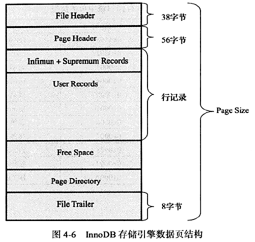

InnoDB 数据页由 7 个部分组成：

- **File Header(文件头，固定为38字节)**： 记录页的头信息

  

  

- **Page Header（页头，固定为56字节）**： 记录数据页的状态信息

  

  

- **Infimun 和 Supremum Records**： 每个数据页中有两个虚拟的行记录，**用来限定记录的边界**

  > - `Infimun` 记录是比该页中任何主键值**都小**的值
  > - `Supremum` 指比任何可能大的值还**要大**的值
  >
  > 这两个值**在页被创建时被建立，且不会被删除**

  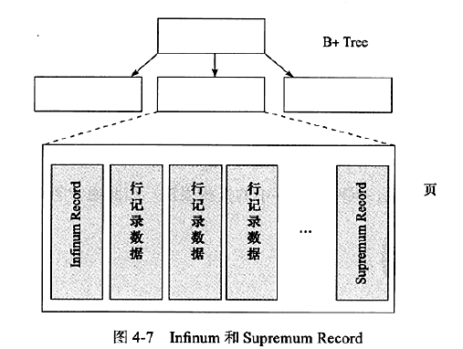

- **User Records(用户记录，即行记录)**： 实际存储行记录的内容

- **Free Space（空闲空间）**： 是一个空闲链表数据结构，在一条记录被删除后，该空间被加入到空闲链表中

- **Page Directory（页目录）**： 存放记录的相对位置（页的相对位置），记录指针称为 Slots(槽) 或 Directory Slots(目录槽)

- **File Trailer（文件结尾信息，固定为8字节）**： 检测页是否已经完整写入磁盘

  > 前 4 字节代表该页的  checksum 值，后 4 字节代表该页最后被修改的日志序列位置 LSN（同 File Header 的 FIL_PAGE_LSN）

## 5. Named File Formats机制

> **Named File Formats机制用来解决不同版本下页结构兼容性问题**

## 6. 约束

### 1. 数据完整性

> **关系型数据库与文件系统的不同点**： 
>
> - 关系型数据库本身能保证存储数据的完整性，不需要应用程序的控制
> - 文件系统需要在程序端进行控制

数据完整性的三种形式：

- **实体完整性**： **保证表中有一个主键**

  > - 用户可以定义 `Primary Key` 和 `Unique Key` 约束来保证实体完整性
  > - 用户来可编写触发器来保证

- **域完整性**： **保证数据每列的值满足特定条件**

  - 选择合适的数据类型确保一个数据值满足特定条件
  - 外键约束
  - 编写触发器
  - 可用 `DEFAULT` 约束作为强制域完整性

- **参照完整性： 保证两张表间的关系**

  > - 用户可定义外键以强制参照完整性
  >
  > - 也可定义触发器以强制执行

**约束分类**：`Primary Key, Unique Key, Foreign Key, Default, NOT NULL`

### 2. 约束的创建和查找

**约束创建的方式**：

- 表建立时进行约束定义
- 利用 `ALTER TABLE` 命令进行约束创建

> 对于 Unique Key(唯一约束)的约束，还可通过命令 `CREATE UNIQUE INDEX` 来创建

**约束名**：

- 对于主键约束，其默认约束名为 `PRIMARY KEY`
- 对于 Unique Key 约束，默认约束名誉列名相同，当然也可人为指定

### 3. 约束和索引的区别

- **约束是一个逻辑概念，用来保证数据的完整性**
- **索引是一个数据结构，即有逻辑概念，还在数据库中代表物理存储方式**

### 4. 对错误数据的约束

**默认设置下，MySQL 数据库允许非法或不正确的数据的插入或更新，又或者可以在数据库内部将其转化为合法的值，即数据库本身没有对数据的正确性进行约束**

> 如： 向 NOT NULL 字段插入 NULL 值时，会将其改为 0 再进行插入

### 5. ENUM 和 SET 约束

MySQL 通过 ENUM 和 SET 来解决部分 CHECK 约束

### 6. 触发器与约束

- 触发器作用： 在执行 `INSERT, DELETE, UPDATE` 命令之前或之后自动调用 SQL 命令或存储过程

- 具有 Super 权限的用户可以**执行创建触发器命令： `CREATE TRIGGER`**

  ```mysql
  CREATE [DEFINER = {USER | CURRENT_USER}]
  TRIGGER trigger_name BEFORE|AFTER   INSERT|UPDATE|DELETE
  ON tb1_name FOR EACH ROW trigger_stmt
  ```

  > - 一个表最多创建 6 个触发器，即 INSERT、UPDATE、DELETE 的 BEFORE、AFTER 各一个
  > - BEFORE、AFTER  代表触发器发生的时间，之前还是之后发生
  > - 只支持 FOR EACH ROW 的触发方式，即**按每行记录进行触发**

### 7. 外键约束

- 外键用来保证参照完整性

- 外键定义如下：

  ```mysql
  [CONSTRAINT [symbol]] FOREIGN KEY
  [index_name](index_col_name,...)
  REFERENCES tb1_name(index_col_name,...)
  [ON DELETE reference_option]
  [ON UPDATE reference_option]
  reference_option: RESTRICT | CASCADE | SET NULL | NO ACTION
  ```

- 子表操作：

  - `CASCADE`： 表示当父表发生 DELETE 或 UPDATE 操作时，相应的子表中的数据也进行 DELETE 或 UPDATE 操作
  - `SET NULL`： 表示当父表发生 DELETE 或 UPDATE 操作时，相应的子表中的数据更新为 NULL 值，但对应的列必须允许为 NULL
  - `NO ACTION`： 表示当父表发生 DELETE 或 UPDATE 操作时，抛出错误，不允许这类操作发生
  - `RESTRICT`： 没有指定  ON DELETE 或 ON UPDATE时，默认外键设置为 RESTRICT

## 7. 视图

- 视图是一个命名的虚表，由一个 SQL 查询来定义，可以当作表使用
- 视图中的数据没有实际的物理存储

## 8.分区表

推荐阅读： **[千万数据的 CRUD 优化](http://www.cainiaoxueyuan.com/sjk/5178.html)**

### 1. 概述

> 查看分区是否启用命令： `show variables like '%partition%'\G` 或 `show plugins\G`

- 分区的过程是将一个表或索引分解为更小、更可管理的部分

- 每个分区都是独立的对象，可以独自处理，也可以作为更大对象的一部分处理

- MySQL 支持水平分区，且是局部分区索引

  > 分区类型：
  >
  > - **水平分区**： 指将同一表中**不同行**的记录分配到不同的物理文件中
  > - **垂直分区**： 指将同一表中**不同列**的记录分配到不同的物理文件中
  >
  > 分区索引：
  >
  > - **局部分区索引**： 一个分区中**既存放数据又存放索引**
  > - **全局分区索引**： **数据存放在各个分区中，但所有数据的索引放在一个对象中**

- MySQL 支持的**分区类型**：

  - **RANGE 分区**： 行数据基于一个给定连续区间的列值被放入分区

    > - 启用分区之后，表不再由一个ibd文件组成了，而是由建立分区时的各个分区ibd文件组成
    > - 对于RANGE分区的查询，优化器只能对 `YEAR()、TO_DAYS()、TO_SECONDS()、UNIX_TIMESTAMP()` 这类函数进行优化选择

  - **LIST 分区**： 同 RANGE 分区，只是 LIST 分区面向离散值

  - **HASH 分区**： 根据用户自定义的表达式的返回值来进行分区，返回值不能为负数

  - **KEY 分区**： 根据 MySQL 数据库提供的 hash 函数来进行分区

  - **COLUMNS分区**： 直接使用非整型的数据进行分区，分区根据类型直接比较而得，不需要转化为整型，且RANGE COLUMNS分区可以对多个列的值进行分区

    > **支持的数据类型**：
    >
    > - **所有的整型类型**，如INT、SMALLINT、TINYINT、BIGINT。FLOAT和DECIMAL则不予支持
    >
    > - **日期类型**，如DATE和DATETIME(其余的日期类型不予支持)
    >
    > - **字符串类型**，如CHAR、VARCHAR、BINARY和VARBINARY(BLOB和TEXT类型不予支持)

  > 注： **若表中存在主键或唯一索引，分区列必须是唯一索引的一部分**

### 2. 子分区

- **在分区的基础上再进行分区，也称复合分区**

- MySQL数据库允许在RANGE和LIST的分区上再进行HASH或者是KEY的子分区

子分区的建立需要**注意的问题**：

- **每个子分区的数量必须相同**

- 如果在一个分区表上的任何分区上使用SUBPARTITION来明确定义任何子分区，那么就必须定义所有的子分区
- **每个 SUBPARTITION 子句必须包括子分区的一个名称**
- 在每个分区内，**子分区的名称必须是唯一的**

> 子分区可以用于特别大的表，在多个磁盘间分别分配数据和索引

### 3. 分区中的NULL值

MYSQL数据库的分区总是**把NULL值视为小于任何一个非NULL值**，即对于不同的分区类型，MySQL数据库对于NULL值的处理是不一样的

- **RANGE分区**： 将**NULL 值放入最左边的分区**
- **LIST分区**： 必须**显式地指出哪个分区中放入NULL值，否则会报错**
- **HASH 和 KEY 分区**：任何分区函数都会**将含有NULL值的记录返回为 0**

### 4. 分区和性能

数据库的应用分为两类：

- 一类是**OLTP（在线事务处理）**，如博客、电子商务、网络游戏等

  > **对于OLAP的应用，分区可以很好地提高查询的性能** 

- 一类是**OLAP（在线分析处理）**，如数据仓库、数据集市

  > **对于OLTP的应用，分区应该非常小心**；在这种应用下，不可能会获取一张大表中10%的数据，大部分都是通过索引返回几条记录即可

# 五、索引与算法

## 1、InnoDB 索引概述


### (1) 物理存储角度

- **聚集(聚簇)索引**
- **非聚集索引**

> 详解见后续

### (2) 索引结构角度

- **B+ 树索引**： 是关系型数据库中查找最为常用和最为有效的索引

  > B+ 树索引只是查找数据行所在的页，然后数据库通过把页读入内存，再在内存中进行查找

- **全文索引**

- **hash 索引**： InnoDB 支持的 hash 索引是自适应的，会根据表的使用情况自动为表生成hash索引

## 2、B+ 树

- **推荐阅读： [b+树图文详解](https://blog.csdn.net/qq_26222859/article/details/80631121)** 

---

**一个m阶的B树的特征**： 

- 根结点至少有两个子女

- 每个中间节点包含 k-1 个元素和 k 个孩子，其中 m/2 <= k <= m

- 每个叶子节点包含 k-1 个元素，其中 m/2 <= k <= m

- 所有的叶子结点都位于同一层

- 每个节点中的元素从小到大排列，节点当中 k-1 个元素正好是 k 个孩子包含的元素的值域划分

**一个m阶的B+树的特征：**

- 只有叶子节点有卫星数据，其余节点仅仅是索引，无任何数据关联

  > 卫星数据： 索引元素所指向的数据记录
  >
  > - 聚集索引中，叶子节点直接包含卫星数据
  >
  > - 非聚集索引中，叶子节点带有指向卫星数据的指针

- 所有叶子结点包含全部数据，且每个叶子节点都带有指向下一个节点的指针，形成了一个有序链表

- 所有父节点元素都存在于子节点中，在子节点元素中是最大（或最小）元素

  > 根节点的最大元素等同于整个 B+ 树的最大元素

**B+ 树的优点**： 

- 单一节点存储更多的元素，使得查询的IO次数更少
- 所有查询都要查找到叶子节点，查询性能稳定
- 所有叶子节点形成有序链表，便于范围查询


`B, B+ B*` 树对比： 

- ==B- 树== 是一种**平衡**的多路**查找(又称排序)**树，文件系统中用作文件的索引
- ==B+ 树== 方便扫库，B 树必须用中序遍历的方法按序扫库，而 B+ 树可以直接扫描叶子结点 

------

- **B+ 树支持区间查询**非常方便，而 B 树不支持，这是数据库选用 B+ 树的最主要原因 
- 当值恰好处在非叶子节点时，B 树查找到该节点就会成功并结束查询，而 B+ 树由于非叶节点只是索引部分

------

- ==B*树== 在 B+ 树的非根和非叶子结点再增加指向兄弟的指针

- ==B+ 树的分裂==：当一个结点满时，分配一个新的结点，并将原结点中 1/2 的数据复制到新结点，最后在父结点中增加新结点的指针

  > B+树的分裂只影响原结点和父结点，而不会影响兄弟结点，所以不需要指向兄弟的指针

- ==B*树的分裂==：当一个结点满时： 

  - 如果它的下一个兄弟结点未满，那么将一部分数据移到兄弟结点中，再在原结点插入关键字，最后修改父结点中兄弟结点的关键字（因为兄弟结点的关键字范围改变了）
  - 如果兄弟也满了，则在原结点与兄弟结点之间增加新结点，并各复制1/3的数据到新结点，最后在父结点增加新结点的指针

------

- B\* 树分配新结点的概率比 B+ 树要低，空间使用率更高

## 3、B+ 树索引

> 数据库中B+树索引分为聚集索引和非聚集索引
>
> - **共同点**是内部都是B+树，高度都是平衡的，**叶节点存放着所有数据**
> - **不同点**是叶节点是否存放着一整行数据
>
> 聚簇索引的叶子节点是数据节点，而非聚簇索引的叶子节点是索引节点，即指向对应数据块的指针
>
> - **一级索引**： 聚簇索引
> - **二级索引**： 其他非聚簇索引，又叫辅助索引
>
> InnoDB 默认创建的主键索引是聚簇索引，其它索引都属于辅助索引，也称为二级索引或非聚簇索引

推荐阅读： **[聚集索引和非聚集索引根本区别以及使用方式](https://blog.csdn.net/jiadajing267/article/details/54581262)** 

### (1) 聚集索引

- Innodb存储引擎表是索引组织表，即**表中数据按主键顺序存放**，查询效率快

  > **优点**： 数据在表中按物理顺序存储，索引可以包含多个列，对于搜索范围值的列特别有效
  >
  > **缺点**： 修改慢，为了保证表中记录的物理和索引顺序一致，在记录插入时，会对数据页重新排序

- 聚集索引**按表的主键构造B+树，且叶节点存放表的行记录数据**，每张表只能有一个聚集索引（一个主键）

  > B+ 树索引只是查找数据行所在的页，而页中存储着所有的数据，所以**称叶子节点为数据页**

- 每个数据页通过双向链表进行链接，按照主键的顺序排序

- 聚集索引的存储并不是物理上连续，而是逻辑上连续

> - 聚集索引能够特别快的访问针对范围值的查询
>
> - 聚集索引对于主键的排序查找和范围的速度非常快


### (2) 辅助索引(非聚集索引)

- **叶子节点包含行记录数据的指针，即主键的值** 

  > 指定了表中记录的逻辑顺序，但是记录的物理和索引不一定一致

- 辅助索引**不影响数据在聚集索引中的组织**，因此每张表上**可以有多个辅助索引**

- 通过辅助索引寻找数据时，**先遍历辅助索引查找到主键值，再通过主键索引找到完整的行记录** 

- 非聚集索引层次多，不会造成数据重排

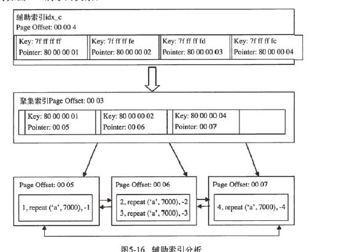

### (3) B+树索引的创建

**创建索引**：

1. 通过 `ALTER TABLE`

   ```mysql
   ALTER [ONLINE | OFFLINE] [IGNORE] TABLE tbl_name| ADD {INDEX|KEY} [index_name]   [index_type] (index_col_name,...) [index_option]
   ```

2. 通过 `CREATE`

   ```mysql
   CREATE [ONLINE|OFFLINE] [UNIQUE|FULLTEXT|SPATIAL] INDEX index_name [index_type] ON tbl_name (index_col_name,...)
   ```

> - CREATE INDEX一个语句一次只能建立一个索引，ALTER TABLE可以在一个语句建立多个
>
> - 只有ALTER TABLE 才能创建主键

**删除索引**：

1. 通过 `ALTER`

   ```mysql
   ALTER [ONLINE | OFFLINE] [IGNORE] TABLE tbl_name | DROP PRIMARY KEY | DROP {INDEX|KEY} index_names
   ```

2. 通过 `DROP`

   ```mysql
   DROP [ONLINE|OFFLINE] INDEX index_name ON tbl_name
   ```

**查看索引**：

```mysql
SHOW INDEX FROM 表名
```

查看结果中每列的含义：

- `Table`： 索引所在的列表
- `Non_unique`： 非唯一的索引
- `Key_name`： 索引的名字
- `Seq_in_index`： 索引中该列的位置
- `Column_name`： 索引列的名称
- `Collation`： 列以什么方式存储在索引中；A：数据排序，NULL： 数据不排序
- `Cardinality`： 表示索引中唯一值的数目的估计值
- `Sub_part`： 是否是列的部分被索引
- `Packed`： 关键字如何被压缩，若没被压缩，值为 NULL
- `Null`： 索引的列是否含有 NULL 值
- `Index_type`： 索引的类型
- `Comment`： 注释

**例子**：

```mysql
# CREATE 方式创建
CREATE INDEX index_test2 on table_test(age);
# ALTER 创建唯一性索引
ALTER TABLE index14 ADD UNIQUE INDEX index14_id(course_id(100)); 
# ALTER 创建全文索引
ALTER TABLE index15 ADD FULLTEXT INDEX index15_info(info); 
# ALTER 创建空间索引
ALTER TABLE index18 ADD SPATIAL INDEX index18_line(line); 
# ALTER 创建多列索引
ALTER TABLE index17 ADD INDEX index17_na(name,address); 
```

### (4) Cardinatity

- **如果某个字段的取值范围很广， 几乎没有重复， 即属于高选择性， 此时使用 B+ 树索引最合适**（通过 show index 结构中 Cardinality 来判断高选择性）

- **Cardinality  表示索引中不重复记录数量的预估值**
- 数据库对于 Cardinality  的统计通过**采样的方法完成**

InnoDB 对更新 Cardinality  信息的策略为：

- **表中 1/16 的数据已发生过变化**： 适用于整体数据发生变化

- `stat_modified_counter > 2000000000` ： **适用于表中某一行数据频繁更新**

  > stat_modified_counter  用来表示发生变化的次数

**默认 InnoDB 对 8 个叶子节点进行采样**：

- 取得 B+ 树索引中**叶子节点的数量，记为 A**
- 随机取得B+树索引中的8个叶子节点，**统计每个页不同记录的个数，即为P1,P2,...,P8**
- 根据采样信息给出 **Cardinality 的预估值: Cardinality=(P1+P2+…+P8)*A/8**

**对 Cardinality 统计进行设置的参数**：


### 5. B+ 树索引的使用

#### 1. 联合索引

- **联合索引是指对表上的多个列进行索引**

  > 规定了 mysql 从左到右地使用索引字段，对字段的顺序有一定要求(==最左优先==)
  
  ```mysql
  # idx_a_b 为联合索引；a,b 为索引的列
  CREATE TABLE t(a INT,b INT,PRIMARY KEY (a),KEY idx_a_b(a,b))ENGINE=INNODB;
  ```

#### 2. 前缀索引

- 定义： 将值的前一部分作为索引，既可以节约空间，又可以提高查询效率
- 缺陷： 无法使用前缀索引做 ORDER BY 和 GROUP BY，也无法使用前缀索引做覆盖扫描
- 适用对象： 对于列的值较长，比如 BLOB、TEXT、VARCHAR

#### 3. 覆盖索引

- **覆盖索引**： **从辅助索引中就可以得到查询的记录**，不需要查询聚集索引中的记录

  > 只用从索引中就能够取得，不必从数据表中读取

- **好处**： 辅助索引不包含整行记录的所有信息，故其大小要远小于聚集索引，因此**可以减少大量的IO操作**

#### 4. 优化

##### 1. 优化

- 当访问的**数据量很小，优化器通过辅助索引来查找**
- 当访问的**数据量比较大时，优化器通过聚集索引来查找**

##### 2. 索引提示

> **数据库支持索引提示(INDEX HINT)显示告诉优化器使用哪个索引**

以下两种情况可能需要用到 INDEX HINT：

- MySQL 数据库的**优化器错误地选择了某个索引**，导致SQL语句运行的很慢（很少见）

- **某 SQL 语句可以选择的索引非常多**，这时优化器选择执行计划时间的开销可能会大于SQL语句本身

##### 3. Multi-Range Read(MRR) 优化

- **目的**： 减少磁盘的随机访问，**将随机访问转化为顺序数据访问** 

- **好处**：
  - **MRR 使数据访问变得较为顺序** 

    > 查询辅助索引时，先根据得到的查询结果，按照主键进行排序，并按照主键排序的顺序进行书签查找

  - **减少缓冲池中页被替换的次数**

  - **批量处理对键值的查询操作**

- 对于 InnoDB 和 MyISAM 存储引擎的范围查询和 JOIN 查询操作，MRR 的工作方式如下:
  - **将查询得到的辅助索引键值存放于缓存中** 
  - **将缓存中的键值根据 RowID 进行排序**
  - **根据 RowID 的排序顺序来访问实际的数据文件**

- **将 MRR 设为开启状态**： `SET @@optimizer_switch = 'mrr=on,mrr_cost_based=off'`

- **参数 `read_rnd_buffer_size` 用来控制键值的缓冲区大小**

  > 大于该值时，执行器对缓存的数据根据 RowID 进行排序，并通过 RowID 来取得行数据，默认为 256K
  >
  > `SELECT @@read_rnd_buffer_size \G`

##### 4. Index Condition Pushdown(ICP) 优化

> ICP 优化支持 `range、ref、 eq_ref、 ref_or_null` 类型的查询

- 在取出索引时，判断是否可以进行 WHERE 条件过滤，即将 WHERE 的过滤操作放在存储引擎层

- 在某些查询下，可以大大减少上层 SQL 层对记录的索取(fetch)，从而提高数据库的整体性能

## 4. hash 索引

> 只有 Memory 存储引擎支持 Hash 索引

### 1. hash 算法

- **InnoDB 存储引擎使用哈希算法来对字典进行查找，其冲突机制采用链表方式，哈希函数采用除法散列方式**

- **对于缓冲池页的哈希表**，在缓冲池中的Page页都有一个 chain 指针，指向相同哈希函数值的页

- **对于除法散列，m 的取值略大于2倍的缓冲池页数量的质数** 

对于 InnoDB 缓冲池中的页的查找，且将查找的页转换成自然数：

- InnoDB 存储引擎的表空间都有一个 space_id，用户所要查询的应该是某个表空间的某个连续16KB的页，即偏移量 offset
- InnoDB 存储引擎将 space_id 左移20位，然后加上这个 space_id和 offset，即关键字 `K = space_id<<20 + space_id + offset`

- 然后通过除法散列到各个槽中去

### 2. 自适应 hash 索引(AHI)

-  AHI 通过缓冲池的B+树构造，且不需要对整张表构建哈希索引

  > InnoDB存储引擎会自动根据访问的频率和模式来自动地为某些热点页建立哈希索引

- 自适应哈希索引经哈希函数映射到一个哈希表中，因此对于字典类型的查找非常快速

- 参数 `innodb_adaptive_hash_index` 可以用来禁止或启动此特性，**默认为开启** 

## 5. 全文索引

> B+ 树可以通过索引字段的前缀进行查找

- **全文检索**：将存储于数据库中的整本书或整篇文章中的任意内容信息查找出来的技术

  > 可以根据需要获得全文中有关章、节、段、句、词等信息，也可以进行各种统计和分析

### 1. 倒排索引

- **全文检索通常使用倒排索引来实现**，记录着关键词到其所在文档的映射，通常利用关联数组实现
- 其拥有两种表现形式:
  - `inverted file index`： 其表现形式为{单词,单词所在文档的ID}
  - `full inverted index`： 其表现形式为{单词，(单词所在文档的ID，在具体文档中的位置)

### 2. 全文索引

- InnoDB 存储引擎中，为提高全文检索的并行性能，共有6张辅助表，每张表根据 word 的 Latin 编码分区

- **辅助表是持久的表，存放于磁盘上**

  > **InnoDB 会批量对辅助表进行更新**

- FTS Index Cache(**全文检索索引缓存**)：用来提高全文检索的性能

  > - FTS Index Cache 是一个红黑树，根据 (word, ilist) 进行排序

- 对全文检索进行查询时，辅助表先将 FTS Index Cache 中对应的 word 字段合并到辅助表中，再进行查询

- InnoDB 在事务提交时，将分词写入到 FTS Index Cache，然后再通过批量更新写入磁盘

- 参数 `innodb_ft_cache_size` 用来控制 FTS Index Cache 的大小，默认值为32M

  > - 当该缓存满时，会将其中的 (word,ilist) 分词信息同步到磁盘的 Auxiliary Table中
  >
  > - 增大该参数可以提高全文检索的性能；在宕机时，未同步到磁盘中的索引信息需要长时间进行恢复

- `FTS_DOC_ID` ： 为了支持全文检索，FTS_DOC_ID 列与word进行映射

  > - 其类型必须是 `BIGINT UNSIGNED NOT NULL`
  >
  > - InnoDB存储引擎自动会在该列上加入一个名为 `FTS_DOC_ID_INDEX` 的Unique Index

- 设置参数 `innodb_ft_aux_table` 可用来查看分词信息
- 命令 `OPTIMIZE TABLE` 可将记录彻底删除，且删除的文档 ID 会记录到表 `INNODB_FT_BEING_DELETED` 中

### 3. 全文检索

**语法**：MySQL 数据库通过 `MATCH()… AGAINST()` 语法支持全文检索查询

- `MATCH` ： 指定需要被查询的列

- `AGAINST` ： 指定使用何种方法进行查询

```mysql
MATCH (col1,col2,...) AGAINST (expr [search_modifier])
search_modifier:
{
	IN NATURAL LANGUAGE MODE
	| IN NATURAL LANGUAGE MODE WITH QUERY EXPANSION
	| IN BOOLEAN MODE
	| WITH OUERY EXPANSION
}
```

- InnoDB 全文索引考虑因素：

  - 查询的 word 在 stopword 列中，忽略该字符串的查询

    > 参数 `innodb_ft_min_token_size, innodb_ft_max_token_size` 控制 InnoDB 存储引擎查询字符的长度，超过该区间，会忽略该词的搜索；默认值分别为 3 和 84

  - 查询的 word 的字符长度是否在区间 `[ innodb ft min token size, innodb_ft_max_token_size]` 

**查询模式**：

- `Natural Language`： 表示查询带有指定word的文档

  > - 全文检索通过 MATCH 函数进行查询，默认采用 Natural Language 模式
  >
  > - 在 WHRE 条件中使用 MATCH 函数，查询返回的结果是根据相关性进行降序排序的，即**相关性最高的结果放在第一位**
  >
  > - **相关性的值是一个非负的浮点数字，0表示没有任何的相关性**
  >
  >   相关性的计算依据以下四个条件：
  >
  >   - word 是否在文档中出现
  >   - wod 在文档中出现的次数
  >   - word 在索引列中的数量
  >
  >   - 多少个文档包含该 word

- `Boolean` ： 当使用该修饰符时，査询字符串的前后字符会有特殊的含义

  > Boolean全文检索支持以下几种操作符：
  >
  > - `+` 表示该word必须存在
  > - `-` 表示该word必须被排除
  > - `(no operator)` 表示该word是可选的，但是如果出现，其相关性会更高
  > - `@distance` 表示查询的多个单词之间的距离是否在 distance之内,，distance的单位是字节（这种全文检索的查询也称为Proximity Search）
  >
  > - `>` 表示出现该单词时增加相关性
  > - `<` 表示出现该单词时降低相关性
  > - `~` 表示允许出现该单词，但是出现时相关性为负(全文检索查询允许负相关性)
  > - `*`表示以该单词开头的单词
  > - `"` 表示短语

- `Query Expansion`： 通常在查询的关键词太短，用户需要 implied knowledge(隐含知识)时进行；通过在查询短语中添加 `WITH QUERY EXPANSION或 IN NATURAL LANGUAGE MODE WITH QUERY EXPANSION` 可以开启 blind query expansion(又称为 automatic relevance feedback)

  > 该查询分为两个阶段：
  >
  > - 第一阶段： 根据搜索的单词进行全文索引查询
  >
  > - 第二阶段： 根据第一阶段产生的分词再进行一次全文检索的查询

# 六、锁

推荐阅读： 

- **[java高并发下的数据安全](https://www.cnblogs.com/wirr/p/8548156.html)**

- **[SELECT FOR UPDATE](https://www.cnblogs.com/chenwenbiao/archive/2012/06/06/2537508.html)**

## 1、什么是锁

- 锁是数据库系统区别于文件系统的一个关键特性
- **锁机制用于管理对共享资源的并发访问**
-  数据库系统使用锁是为了支持对共享资源进行并发访问，提供数据的完整性和一致性

## 2、lock 和 latch

- `latch` ： 称为**闩锁(轻量级的锁)**，要求**锁定时间非常短**；若持续的时间长，则应用的性能会非常差

  > - 在 InnoDB存储引擎中, latch又分为 **mutex(互斥量)和 relock(读写锁)**
  >
  > - **目的**： 用来保证并发线程操作临界资源的正确性，并且通常**没有死锁检测的机制**
  > - 查看命令： `show engine innodb mutex`

- `lock` ： 对象是事务，用来锁定数据库中的对象，如表、页、行；且一般 lock 的对象仅在事务 commit或 rollback 后进行释放(不同事务隔离级别释放的时间可能不同)

  > **lock 是有死锁机制的**​					

|          |                           lock                           |                            latch                             |
| :------- | :------------------------------------------------------: | :----------------------------------------------------------: |
| 对象     |                           事务                           |                             线程                             |
| 保护     |                        数据库内容                        |                         内存数据结构                         |
| 持续时间 |                       整个事务过程                       |                           临界资源                           |
| 模式     |                    行锁、表锁、意向锁                    |                        读写锁、互斥量                        |
| 死锁     | 通过 waits-for graph、 time out 等机制进行死锁检测与处理 | 无死锁检测与处理机制，仅通过应用程序加锁的顺序( lock leveling)保证无死锁的情况发生 |
| 存在     |                 Lock Manager 的哈希表中                  |                     每个数据结构的对象中                     |

**命令SHOW ENGINE INNODB MUTEX输出结果说明**

|     名称      |                             说明                             |
| :-----------: | :----------------------------------------------------------: |
|     count     |                      mutex被请求的次数                       |
|  spin_waits   | spin lock(自旋锁)的次数，InnoDB 存储引擎 latch 在不能获得锁时首先进行自旋，若自旋后还不能获得锁,则进入等待状态 |
|  spin_rounds  | 自旋内部循环的总次数，每次自旋的内部循环是一个随机数；spin rounds/spain waits表示平均每次自旋所需的内部循环次数 |
|   os_waits    | 表示操作系统等待的次数；当 spin lock 通过自旋还不能获得 latch 时，则会进入操作系统等待状态,等待被唤醒 |
|   os_yields   |             进行 os_thread_yield 唤醒操作的次数              |
| os_wait_times |                 操作系统等待的时间，单位是ms                 |

## 3、InnoDB 中的锁

### 1. 锁分类

> **行级锁**：
>
> - **共享锁(S Lock)**： 允许事务读一行数据
> - **排他锁(X Lock)**： 允许事务删除或更新一行数据
>
> 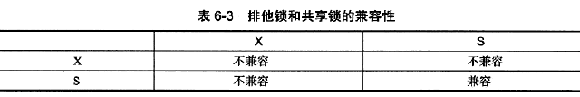
>
> **意向锁**：将锁定的对象分为多个层次，在更细粒度上进行加锁
>
> - **意向共享锁(IS Lock)**： 事务想要获得一张表中某几行的共享锁
> - **意向排他锁(IX Lock)**： 事务想要获得一张表中某几行的排他锁
>
> 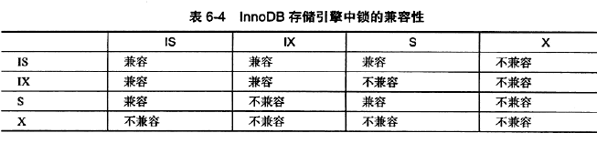

### 2. 一致性锁

- **一致性的非锁定读**： 指 InnoDB 存储引擎通过多版本控制的方式来读取当前执行时间数据库中行的数据

  > - 若读取的行正在执行 DELETE或 UPDATE 操作，InnoDB 存储引擎会去读取行的一个**快照数据**
  > - **快照数据**： 指该行的之前版本的数据，该实现是通过 undo 段来完成，而 undo 用来在事务中回滚数据，因此快照数据本身是没有额外的开销，且读取快照数据不需要上锁
  >
  > 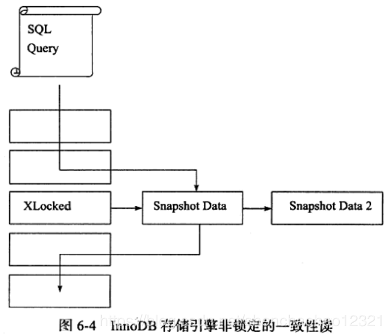
  >
  > - **非锁定读**： 不需要等待访问的行上 X 锁的释放
  >
  > - **多版本并发控制(MVCC)**： 每行记录有多个快照，并由此而带来的并发控制

- **一致性锁定读**：需要显示的对数据库读取的操作进行加锁以保证数据逻辑的一致性

  InnoDB 对于 SELECT 语句支持一致性锁定读的操作：(务必在下述两个操作前，加上 `BEGIN, START TRANSACTION, SET AUTOCOMMIT = 0`)

  - `SELECT ... FOR UPDATE`： 对读取的行记录加一个 X 锁
  - `SELECT ... LOCK IN SHARE MODE`： 对读取的行记录加上一个 S 锁

### 3. 自增长与锁

- 在 InnoDB 存储引擎的内存结构中，对每个含有自增长值的表都有一个自增长计数器，当对含有自增长的计数器的表进行插入操作时，这个计数器会被初始化

- 得到计数器值： `SELECT MAX(auto_inc_col) FROM t FOR UPDATE;`

- `AUTO-INC Locking`： 插入操作会依据自增长的计数器值加1赋予自增长列

  > - 为提高插入性能，锁不是在一个事务完成后释放，而是在完成对自增长值插入的 SQL 语句后释放
  > - **不足**： 
  >   - 对于有自增长值的列的并发插入性能较差，事务必须等待前一个插入的完成
  >   - 对于 INSERT… SELECT 的大数据量的插人会影响插人的性能，因为另一个事务中的插入会被阻塞

- 参数 `innodb_autoinc_lock_mode` 来控制新的轻量级的自增长的模式，默认值为 1

  

- **插入类型分类**：

  

## 4、锁算法

### 1. 行锁的3种算法

- `Record Lock`： **单个行记录上的锁**

  > Record Lock 总是会去**锁住索引记录，如果建表时没有设置任何索引，则会使用隐式的主键来进行锁定**

- `Gap Lock`： 间隙锁，**锁定一个范围，但不包含记录本身**

  > **作用**： 阻止多个事务将记录插入到同范围内，而这会导致 Phantom(幻读) 的产生
  >
  > **显式地关闭 Gap Lock**： 
  >
  > - 将事务的隔离级别设置为 READ COMMITTED
  > - 将参数 `innodb_locks_unsafe_for_binlog` 设置为 1

- `Next-Key Lock`： Gap Lock+ Record Lock，**锁定一个范围，并且锁定记录本身**

  > 目的： 解决 Phantom Problem(幻读)

---

> **对于唯一键值的锁定**： 
>
> - Next-Key Lock 降级为Record Lock 仅存在于查询所有的唯一索引列
> - 若唯一索引由多个列组成，而查询仅是查找多个唯一索引列中的其中一个，那么查询其实是 range 类型查询，而不是 point类型查询，故 InnoDB 存储引擎依然使用 Next-Key Lock 进行锁定

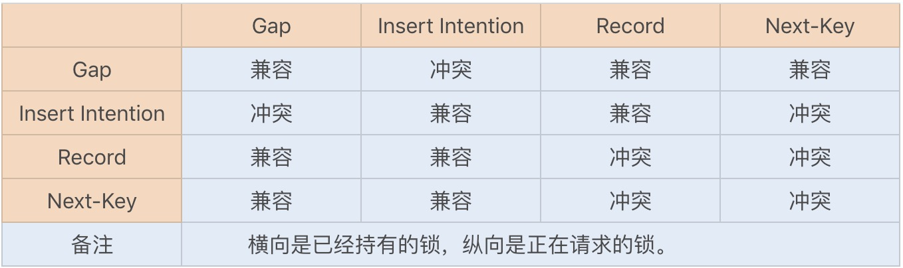

### 2. 解决Phantom(幻读)

- `Phantom Problem`： 指在同一事务下，连续执行两次同样的 SQL 语句可能导致不同的结果，第二次的SQL语句可能会返回之前不存在的行

- InnoDB存储引擎**采用 Next-Key Locking 机制来避免幻读**

## 5、锁问题

### 1. 脏读

- **脏页**： 指在缓冲池中已经被修改的页，但是还没有刷新到磁盘中，即数据库实例内存中的页和磁盘中的页的数据是不一致的，当然在刷新到磁盘之前，日志都已经被写入到了重做日志文件中

  > - 脏页是因为数据库实例内存和磁盘的异步造成的，这并不影响数据的一致性(或者说两者最终会达到一致性，即当脏页都刷回到磁盘)
  > - 因为脏页的刷新是异步的，不影响数据库的可用性，因此可以带来性能的提高

- **脏数据**： 是指事务对缓冲池中行记录的修改，并且还没有被提交，即指未提交的数据

  > 如果读到了脏数据，即一个事务可以读到另外一个事务中未提交的数据，则显然违反了数据库的隔离性

- **脏读**： 指的就是在不同的事务下，当前事务可以读到另外事务未提交的数据，即读到脏数据

### 2. 不可重复读

- **不可重复读**： 是指在一个事务内多次读取同一数据集合

  > - 在这个事务还没有结束时，另外一个事务也访问该同一数据集合，并做了一些DML操作
  >
  > - 因此，在第一个事务中的两次读数据之间，由于第二个事务的修改，那么第一个事务两次读到的数据可能是不一样的
  >
  > - 这样就发生了在一个事务内两次读到的数据是不一样的情况，称为不可重复读

- **不可重复读和脏读的区别**： 脏读是读到未提交的数据，而不可重复读读到的却是已经提交的数据，但是其违反了数据库事务一致性的要求

### 3. 幻读

- 事务在插入已经检查过不存在的记录时，惊奇的发现这些数据已经存在了，之前的检测获取到的数据如同鬼影一般
- **不可重复读与幻读的区别**：  
  - 不可重复读针对数据的修改造成的读不一致
  - 幻读针对数据的插入和删除造成的读不一致

### 4. 丢失更新

- **丢失更新**： 就是一个事务的更新操作会被另一个事务的更新操作所覆盖，从而导致数据的不一致

  > **例如**：
  >
  > - 事务 T1 将行记录 r 更新为 v1，但是事务 T1 并未提交
  >
  > - 与此同时，事务 T2 将行记录 r 更新为 v2，事务 T2 未提交
  >
  > - 事务 T1 提交
  >
  > - 事务 T2 提交

- 下面的情况会发生丢失更新：
  - 事务 T1 查询一行数据，放人本地内存，并显示给一个终端用户User1
  - 事务 T2 也查询该行数据，并将取得的数据显示给终端用户User2
  - User1 修改这行记录，更新数据库并提交
  - User2 修改这行记录，更新数据库并提交

## 6、阻塞

- 参数 `innodb_lock_wait_timeout` ： 用来控制等待的时间，默认为 50s

  > - 是动态的，可以在 MySQL 数据库运行时进行调整

- 参数 `innodb_rollback_on_timeout`： 用来设定是否在等待超时时对进行中的事务进行回滚操作(默认是OFF，代表不回滚)

  > - 是静态的，不可在启动时进行修改
  > - 在默认情况下，InnoDB 存储引擎不会回滚超时引发的错误异常

## 7、死锁

推荐阅读： [mysql死锁问题分析](https://www.cnblogs.com/LBSer/p/5183300.html) 

### (1) 简介

- **死锁**： 是指两个或两个以上的事务在执行过程中，因争夺锁资源而造成的一种互相等待的现象

- 解决死锁问题方法：

  - **超时**： 即当两个事务互相等待时，当一个等待时间超过设置的某一阈值时，其中一个事务进行回滚，另一个等待的事务就能继续进行

    > 参数 `innodb_lock_wait_timeout`  用来设置超时的时间

  - `wait-for graph`(等待图)： **进行死锁检测**，这是一种更为主动的死锁检测方式

    > wait-for graph 要求数据库保存以下两种信息：
    >
    > - **锁的信息链表**
    > - **事务等待链表**
    >
    > 通过上述链表可以构造出一张图，而在这个图中**若存在回路，就代表存在死锁**

### (2) 死锁概率

事务发生死锁的概率与以下几点因素有关：

- 系统中事务的数量(n)越多，发生死锁的概率越大
- 每个事务操作的数量(r)越多，发生死锁的概率越大
- 操作数据的集合(R)越小，发生死锁的概率越大

### (3) 死锁成因

- 不同表相同记录行锁冲突
- 相同表记录行锁冲突
- 不同索引锁冲突
- gap 锁冲突

### (4) 定位死锁

- 通过应用业务日志定位到问题代码，找到相应的事务对应的 sql
- 确定数据库隔离级别： `select @@global/.tx_isolation` 
- 找DBA执行 `show InnoDB STATUS` 看看最近死锁的日志

### (5) 死锁案例

#### 1. 案例说明

- 首先，创建一张订单记录表，该表主要用于校验订单重复创建：

    ```sql
    CREATE TABLE `order_record`  (
      `id` int(11) NOT NULL AUTO_INCREMENT,
      `order_no` int(11) DEFAULT NULL,
      `status` int(4) DEFAULT NULL,
      `create_date` datetime(0) DEFAULT NULL,
      PRIMARY KEY (`id`) USING BTREE,
      INDEX `idx_order_status`(`order_no`,`status`) USING BTREE
    ) ENGINE = InnoDB
    ```

- 为了模拟问题，将事务设置为手动提交

    > - 查看自动提交事务是否开启：`show variables like 'autocommit';`
    > - 将 mysql 事务提交设置为手动提交：`set autocommit = 0;`

- 场景：订单在做幂等性校验时，先是通过订单号检查订单是否存在，若不存在则新增订单记录

    模拟创建产生死锁的运行 SQL 语句：

    - 首先，模拟新建两个订单，并按照以下顺序执行幂等性校验 SQL 语句(垂直方向代表执行的时间顺序)：

        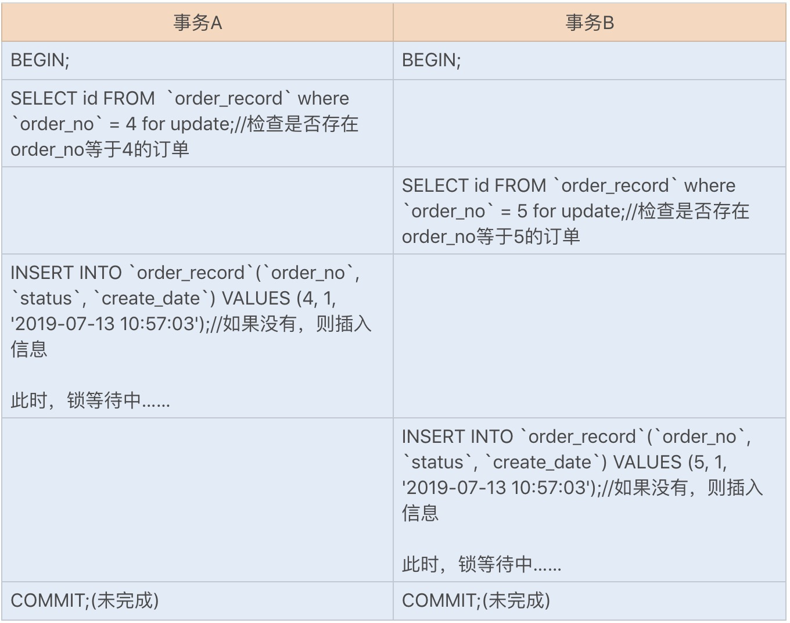

    - 此时，会发现两个事务已经进入死锁状态，可以在 information_schema 数据库中查询到具体的死锁情况，如下图所示：

        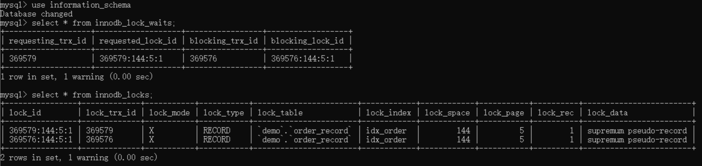

---

使用 `SELECT ... for update` 排他锁，而不是使用共享锁的原因：若两个订单号一样的请求同时进来，就有可能出现幻读

- 一开始事务 A 中的查询没有该订单号，后来事务 B 新增了一个该订单号的记录
- 此时事务 A 再新增一条该订单号记录，就会创建重复的订单记录
- 面对这种情况，可以使用锁间隙算法来防止幻读

#### 2. 死锁分析

行锁的具体实现算法有三种：

- `record lock` 专门对索引项加锁

- `gap lock` 对索引项之间的间隙加锁

    > MySQL 中的 `gap lock` 默认开启，即 `innodb_locks_unsafe_for_binlog` 参数值是 disable，且默认 RR 事务隔离级别

- `next-key lock` 则是前面两种的组合，对索引项以其之间的间隙加锁

> 注：
>
> - 只在可重复读或以上隔离级别下的特定操作才会取得 gap lock 或 next-key lock，
>
> - 在 Select、Update、Delete 时，除基于唯一索引的查询外，其它索引查询会获取 gap lock 或 next-key lock，即锁住扫描范围
> - 主键索引也属于唯一索引，所以主键索引是不会使用 gap lock 或 next-key lock

---

- 当执行查询 `SELECT id FROM demo.order_record where order_no = 4 for update;` 时，由于 `order_no` 为非唯一索引，此时又是 RR 事务隔离级别，所以 SELECT 的加锁类型为 gap lock 且范围是 `(4,+∞)`

- 上述 SQL 并不会导致阻塞，而当执行插入 `INSERT INTO demo.order_record(order_no, status, create_date) VALUES (5, 1, ‘2019-07-13 10:57:03’);` 时，会在插入间隙上再次获取插入意向锁

    > 插入意向锁是一种 gap 锁，与 gap lock 冲突，所以当其它事务持有该间隙的 gap lock 时，需要等待其它事务释放 gap lock 之后，才能获取到插入意向锁


### (6) 其他死锁问题

> 死锁的四个必要条件：互斥、占有且等待、不可强占用、循环等待

---

案例：

- 若先使用辅助索引来更新数据库，就需要修改为使用聚簇索引来更新数据库
- 若两个更新事务使用了不同的辅助索引，或一个使用了辅助索引，一个使用了聚簇索引，就都有可能导致锁资源的循环等待

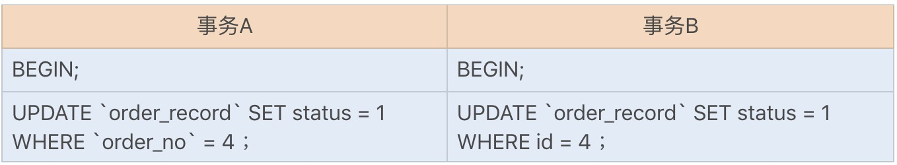

出现死锁的步骤：

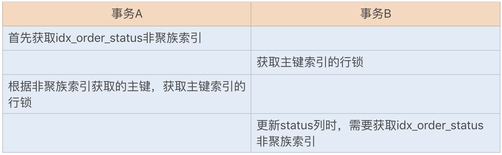

## 8、锁升级

- **锁升级**： 是指将当前锁的粒度降低

在以下情况下可能发生锁升级：

- 由一句单独的 SQL 语句在一个对象上持有的锁的数量超过了阈值(默认为5000)

  > **注**： 如果是不同对象，则不会发生锁升级

- 锁资源占用的内存超过了激活内存的 40% 时就会发生锁升级

# 七、事务

## 1. 简介

- **事务**： 是访问并更新数据库中各种数据项的一个程序执行单元

- **事务的目的**： 把数据库从一种一致状态转换为另一种一致状态

  >  在数据库提交时，要么确保所有修改都已保存，要么所有修改都不保存

- ACID：

  - **Atomicity 原子性**： 数据库事务是不可分割的工作单位,，要么都做，要么都不做
  - **Consistency 一致性**： 事务不会破坏事务的完整性约束，事务将数据库从一个一致状态转变为另一个一致状态
  - **Isolation 隔离性**： 事务之间相互分离，在提交之前相互不可见

  - **Durability 持久性**： 事务一旦提交，其产生的效果就是永久的

- 事务分类：

  - **扁平事务**： 其由 BEGIN WORK 开始，由 COMMIT WORK 或 ROLLBACK WORK 结束，其间的操作是原子的，要么都执行，要么都回滚；因此扁平事务是应用程序成为原子操作的基本组成模块

    

  - **带有保存点的扁平事务**：允许在事务执行过程中回滚到同一事务中较早的一个状态，保存点用来通知系统应该记住事务当前的状态，以便当之后发生错误时，事务能回到保存点当时的状态

    > - 保存点用 `SAVE WORK` 函数来建立，通知系统记录当前的处理状态
    >
    > - 当出现问题时，保存点能用作内部的重启动点，根据应用逻辑,决定是回到最近一个保存点还是其他更早的保存点
    >
    > 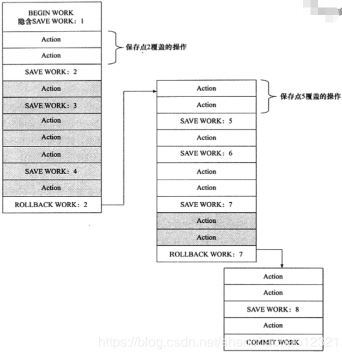

  - **链事务**： 在提交一个事务时，释放不需要的数据对象，将必要的处理上下文隐式地传给下一个要开始的事务

    ​	**注意**：提交事务操作和开始下一个事务操作将合并为一个原子操作，这意味着下一个事务将看到上一个事务的结果

    > - **可视为保存点模式的一种变种**，当发生系统崩溃时，所有的保存点都将消失，因为其保存点是易失的，意味着当进行恢复时，事务需要从开始处重新执行，而不能从最近的一个保存点继续执行
    > - **链事务与带有保存点的扁平事务不同的是**： 
    >   - **回滚不同**：带有保存点的扁平事务能回滚到任意正确的保存点，而链事务中的回滚仅限于当前事务，即只能恢复到最近一个的保存点
    >   - **锁的处理不同**： 链事务在执行 COMMIT 后即释放了当前事务所持有的锁，而带有保存点的扁平事务不影响迄今为止所持有的锁

  - **嵌套事务**： 是一个层次结构框架，由一个顶层事务控制着各个层次的事务，顶层事务之下嵌套的事务被称为子事务，其控制每一个局部的变换

    > InnoDB 不原生支持嵌套事务，用户可以通过带有保存点的事务来模拟串行的嵌套事务
    >
    > Moss对嵌套事务的定义： 
    >
    > - 嵌套事务是由若干事务组成的一棵树，子树既可以是嵌套事务，也可以是扁平事务
    > - 处在叶节点的事务是扁平事务，但每个子事务从根到叶节点的距离可以是不同的
    > - 位于根节点的事务称为顶层事务，其他事务称为子事务；事务的前驱称为父事务，事务的下一层称为儿子事务
    > - 子事务既可以提交也可以回滚，但是它的提交操作并不马上生效，除非其父事务已经提交，因此任何子事物都在顶层事务提交后才真正的提交
    >
    > - 树中的任意一个事务的回滚会引起它的所有子事务一同回滚，故子事务仅保留A、C、I 特性,不具有D的特性

  - **分布式事务**： 在分布式环境下运行的扁平事务，因此需要根据数据所在位置访问网络中的不同节点

## 2. 事务的实现

- 事务隔离性由锁来实现

- `redo log`： 称为重做日志，用来保证事务的原子性和持久性，用于恢复提交事务修改的页操作，通常是物理日志，记录的是页的物理修改操作

- `undo log`： 用来保证事务的一致性，用于回滚行记录到某个特定版本，是逻辑日志，根据每行记录进行记录

### 1. redo

#### 1. 基本概念

- **重做日志用来实现事务的持久性**，其由两部分组成：一是内存中的重做日志缓冲，其是易失的；二是重做日志文件，其是持久的

- **InnoDB 通过Force Log at Commit 机制实现事务的持久性**，即当事务提交(COMMIT)时，必须先将该事务的所有重做日志写入到重做日志文件进行持久化，待事务的 COMMIT 操作完成才算完成
- InnoDB 的重做日志由两部分组成：redo log 和 undo log
  - redo log 用来保证事务的持久性；redo log 基本上都是顺序写的，在数据库运行时不需要对redo log 的文件进行读取操作
  - undo log 用来帮助事务回滚及MvCC的功能；undo log 需要进行随机读写

- 每次将重做日志缓冲写入重做日志文件后，InnoDB 存储引擎都需要调用一次 fsync 操作

  > - 重做日志文件打开并没有使用 O_DIRECT 选项，因此重做日志缓冲先写入文件系统缓存
  >
  > - 为了确保重做日志写入磁盘，必须进行一次 fsync 操作
  >
  > - 由于 fsync 的效率取决于磁盘的性能，因此磁盘的性能决定了事务提交的性能，也就是数据库的性能

- 参数 `innodb_flush_log_at_trx_commit` 用来控制重做日志刷新到磁盘的策略，默认值为 1

  > - 0 表示事务提交时不进行写人重做日志操作，这个操作仅在 master thread 中完成，而在 master thread 中每1秒会进行一次重做日志文件的 fync 操作
  >
  > - 1 表示事务提交时必须调用一次 fsync 操作
  > - 2 表示事务提交时将重做日志写入重做日志文件，但仅写入文件系统的缓存中，不进行 fync 操作

#### 2. log block

- **重做日志块(redo log block)**： 在 InnoDB 存储引擎中，重做日志以 512 字节进行存储，即重做日志缓存、重做日志文件都是以块的方式进行保存，每块的大小为512字节

  > - 若一个页中产生的重做日志数量大于 512 字节，则需要分割为多个重做日志块进行存储
  >
  > - 由于重做日志块的大小和磁盘扇区大小一样，因此重做日志的写入可以保证原子性，不需要 doublewrite 技术

- 重做日志块由日志块头、日志内容、日志块尾组成（重做日志头占 12 字节，日志内容占 492 字节，重做日志尾占 8 字节）

  > **日志头组成部分**：
  >
  > - `LOG_BLOCK_HDR_NO` ： 用来标记 log buffer 数组中 log block 的位置，其是递增并且循环使用，占 4 个字节。但是由于第一位用来判断是否是 flush bit，所以最大的值为2G
  >
  > - `LOG_BLOCK_HDR_DATA_LEN` ： 占 2 字节，表示 log block 所占用的大小
  >
  >   > 当 log blok 被写满时，该值为0x200，表示使用全部log block空间，即占用512字节
  >
  > - `LOG_BLOCK_FIRST_REC_GROUP`： 占用2个字节，表示 log block 中第一个日志所在的偏移量
  >
  >   > 如果该值的大小和 LOG_BLOCK_HDR_DATA_LEN 相同，则表示当前 log block 不包含新的日志
  >
  > - `LOG_BLOCK_CHECKPOINT_NO`： 占用4字节，表示该 log block 最后被写入时的检查点第4字节的值
  >
  > 日志尾组成：
  >
  > - `LOG_BLOCK_TRL_NO`：占 4 字节，其值和 LOG_BLOCK_HDR_NO 相同，并在函数 log block init 中被初始化

#### 3. log group

- **log group 为重做日志组**，其中有多个重做日志文件，每个 log group 中的日志文件大小是相同的，InnoDB存储引擎实际只有一个 log group

- **log buffer 将内存中的 log block 刷新到磁盘**的规则：

  - 事务提交时
  - 当 log buffer 中有一半的内存空间已经被使用时

  - log checkpoint 时

- log group中的第一个 redo log file，**其前 2KB 的部分保存 4个512字节大小的块**，其余 redo log file 仅保留这些空间，但不保存上述信息

  > |      名称       | 大小(字节) |
  > | :-------------: | :--------: |
  > | log file header |    512     |
  > |   checkpoint1   |    512     |
  > |       空        |    512     |
  > |   checkpoint2   |    512     |

#### 4. 重做日志格式

通用**头部格式**由以下3部分组成：


- `redo_log_type`： 重做日志的类型
- `space`： 表空间的ID
- `page_no`： 页的偏移量

之后的  redo log body 部分根据重做日志类型的不同会有不同的存储内容

#### 5. LSN

- **LSN(Log Sequence Number) 日志序列号**：InnoDB 存储引擎中，LSN 占用8字节，并且单调递增

- **LSN 表示的含义**有：
  - 事务写入重做日志的字节的总量
  - checkpoint 的位置
  - 页的版本

- `Log sequence number` ： 表示当前的LSN， `Log flushed up to`： 表示刷新到重做日志文件的LSN，`Last checkpoint at`： 表示刷新到磁盘的LSN

#### 6. 恢复

- 由于 checkpoint 表示已经刷新到磁盘页上的LSN，因此在恢复过程中仅需恢复 checkpoint 开始的日志部分

- 由于重做日志是物理日志，因此其是幂等： $f(f(x))=f(x)$ 

### 2. undo

#### 1. 概念

- `undo`： **将数据回滚到修改之前的样子**

  > **InnoDB 中的 MVCC 通过 undo 来完成**： 当用户读取一行记录时，若该记录已经被其他事务占用，当前事务可以通过 undo 读取之前的行版本信息，以此实现非锁定读取

- undo 存放在数据库内部称为 undo 段的一个特殊段中，**undo段位于共享表空间内**

-  undo log 的产生会伴随着 redo log 的产生，这是因为 undo log 也需要持久性的保护

#### 2. undo 存储管理

- InnoDB存储引擎有回滚段，每个回滚段记录了1024个 undo log 段，而在每个 undo log 段中进行 undo 页的申请

- 共享表空间偏移量为 5 的页(0,5)记录了所有回滚段头所在的页，这个页的类型为 `FIL_PAGE_TYPE_SYS`

- 参数对回滚段进行设置：

  - `innodb_undo_directory`： **用于设置回滚段文件所在的路径**

    > - 意味着回滚段可以存放在共享表空间以外的位置，即可以设置为独立表空间
    >
    > - 该参数的**默认值为 “.”**，表示当前 InnoDB 存储引擎的目录

  - `innodb_undo_logs`： **用来设置回滚段的个数，默认值为128**

  - `innodb_undo_tablespaces`： **用来设置构成回滚段文件的数量**，这样回滚段可以较为平均地分布在多个文件中

    > 设置该参数后，会在路径 innodb_undo_directory 看到 undo 为前缀的文件，该文件就代表回滚段文件

- 事务在 undo log 段分配页并写人undo log 的过程同样需要写入重做日志

  > 事务提交时, InnoDB存储引擎会做以下两件事情：
  >
  > - 将 undo log 放入列表中，以供之后的 purge 操作
  > - 判断 undo log 所在的页**是否可以重用**，若可以分配给下个事务使用

- 事务提交后并不能马上删除 undo log 及 undo log 所在的页

  > - 因为可能还有其他事务需要通过 undo log 来得到行记录之前的版本
  >
  > - 故**事务提交时将 undo log 放入一个链表中**
  >
  > - **是否可以最终删除 undo log 及 undo log 所在页由 purge 线程来判断**

#### 3. undo log 格式

在 InnoDB 存储引擎中，undo log分为：

- `Insert undo log`： 指在 Insert 操作中产生的 undo log

  > Insert 操作的记录，只对事务本身可见，对其他事务不可见(事务隔离性)，故该 undo log 可以在事务提交后直接删除

- `update undo log`： 记录的是对 delete 和 update 操作产生的 undo log

  > 该 undo log 可能需要提供MVCC机制，因此不能在事务提交时就进行删除，提交时放入undo log链表，等待 purge线程进行最后的删除

### 3. purge

- `purge`： 用于最终完成 delete 和 update 操作，这是因为 InnoDB 存储引擎支持 MVCC，所以记录不能在事务提交时立即进行处理

- InnoDB存储引擎**先从 history list中找 undo log，然后再从 undo page 中找undo log**

  > 设计目的： 为了**避免大量的随机读取操作，从而提高 purge的效率**

- 全局动态参数 `innodb purge batch size` 用来设置每次 purge 操作需要清理的 undo page 数量

  > - 该参数设置得越大，每次回收的 undo page 也就越多，这样可供重用的 undo page 就越多，减少了磁盘存储空间与分配的开销
  >
  > - 若该参数设置得太大，则每次需要 purge 处理更多的 undo page，从而导致CPU和磁盘IO过于集中于对 undo log的处理，使性能下降

- 全局动态参数 `innodb_max_purge_lag` 用来控制 history list 的长度，若长度大于该参数时，其会“延缓”DML的操作

  > - 默认值为0： 表示不对history list做任何限制
  >
  > - 大于 0 时：就会延缓DML的操作
  >
  > - 延缓算法：$delay =((length(history\_list)-innodb\_max\_purge\_lag)*10)-5$
  >
  >   delay 单位为毫秒，且 delay 对象是行

- 全局动态参数 `innodb_max_purge_lag_delay` ： 用来控制 delay 的最大毫秒数

  > 当上述计算得到的 delay 值大于该参数时，将 delay 设置为 innodb_max_purge_lag_delay，避免由于 purge 操作缓慢导致其他SQL线程出现无限制的等待

### 4. group commit

- `group commit`： **一次 fsync 可以刷新确保多个事务日志被写入文件**

  > - 若事务为非只读事务，则每次事务提交时需要进行一次 fsync 操作，以此保证重做日志都已经写入磁盘
  >
  > - 当数据库发生宕机时，可以通过重做日志进行恢复，但磁盘的 fync 性能是有限的

- 对于 InnoDB 存储引擎，事务提交时会进行两个阶段的操作:

  - 修改内存中事务对应的信息，并且将日志写入重做日志缓冲

  - 调用 fsync 将确保日志都从重做日志缓冲写入磁盘

- **在开启二进制日志后，InnodB存储引擎的 group commit 功能会失效，从而导致性能的下降**

  > 原因： 在开启二进制日志后，为了保证存储引擎层中的事务和二进制日志的一致性，二者之间使用了两阶段事务：
  >
  > - 当事务提交时 InnoDB 存储引擎进行 Prepare 操作
  > -  MySQL 数据库上层写入二进制日志
  > - InnoDB 存储引擎层将日志写入重做日志文件
  >   - 修改内存中事务对应的信息，并且将日志写人重做日志缓冲
  >   - 调用 fsync 将确保日志都从重做日志缓冲写入磁盘

- `Binary Log Group Commit(BLGC)`： 在 MySQL 数据库上层进行提交时首先按顺序将其放入一个队列中，队列中的第一个事务称为 leader，其他事务称为 follower，leader 控制着 follower 的行为

  > BLGC的步骤分为以下三个阶段：
  >
  > - **Flush 阶段**： 将每个事务的二进制日志写入内存中
  > - **Sync 阶段**： 将内存中的二进制日志刷新到磁盘，若队列中有多个事务，那么仅一次fsync 操作就完成了二进制日志的写入
  >
  > - **Commit 阶段**： leader 根据顺序调用存储引擎层事务的提交，InnoDB 存储引擎支持 group commit，因此修复了原先由于锁 prepare_commit_mutex 导致 group commit失效的问题
  >
  > 当有一组事务在进行Commit阶段时，其他新事物可以进行 Flush阶段，从而使 group commit 不断生效

- 参数 `binlog max flush queue time` ： 用来控制 Flush阶段中等待的时间，即使之前的一组事务完成提交，当前一组的事务也不马上进入Sync 阶段，而是至少需要等待一段寸间

  > - **好处**： 使 group commit 的事务数量更多，这可能会导致事务的响应时间变慢
  >
  > - **默认值为0，且推荐设置为0**；除非用户的 MySQL 数据库系统中有着大量的连接，并且不断地在进行事务的写入或更新操作

## 3. 事务控制语句

- MySQL 命令行的默认设置： **事务都是自动提交**，即执行SQL语句后就会马上执行 COMMIT 操作

- 事务控制语句：

  - `START TRANSACTION | BEGIN`： 显式地开启一个事务

    > 在存储过程中只能使用 START TRANSACTION 语句来开启一个事务

  - `COMMIT`： COMMIT 会提交事务，并使得已对数据库做的所有修改成为永久性的

    > - `COMMIT WORK` 用来控制事务结束后的行为是 `CHAN` 还是 `RELEASE`，如果是CHAIN 方式，那么事务就变成了链事务
    >
    > - 参数 `completion_type` 控制 COMMIT WORK 方式
    >   - **默认为 0**： 表示没有任何操作，在这种设置下 COMMIT 和 COMMIT WORK 是完全等价的
    >   - **当值为 1 时**： COMMIT WORK 等同于 COMMIT AND CHAIN，表示马上自动开启一个相同隔离级别的事务
    >   - 当值为 2 时：  COMMIT WORK 等同于 COMMIT AND RELEASE，表示在事务提交后会自动断开与服务器的连接

  - `ROLLBACK`： 回滚会结束用户的事务，并撤销正在进行的所有未提交的修改

    > ROLLBACK 和 ROLLBACK WORK 与 COMMIT和 COMMIT WORK的工作一样

  - `SAVEPOINT identifier`： 允许在事务中创建一个保存点，一个事务中可以有多个 SAVEPOINT

    > - SAVEPOINT 记录了一个保存点，可以通过 ROLLBACK TO SAVEPOINT 来回滚到某个保存点
    > - 若回滚到一个不存在的保存点，会抛出异常
    > -  即使执行了 ROLLBACK TO SAVEPOINT，之后也需要显式地运行 COMMIT或 ROLLBACK 命令

  - `RELEASE SAVEPOINT identifier`： 删除一个事务的保存点

  - `ROLLBACK TO [SAVEPOINT] identifier`： 与 SAVEPOINT命令一起使用，可以把事务回滚到标记点

  - `SET TRANSACTION`： 用来设置事务的隔离级别。

    > InnoDB 提供的事务隔离级别有: 
    >
    > - `READ UNCOMMITTED`
    > - `READ COMMITTED`
    > - `REPEATABLE READ`
    > - `SERIALIZABLE`

## 4. 隐式提交的 SQL 语句

**隐式提交操作**：即执行完这些语句后，会有一个隐式的 COMMIT操作

- **DDL语句**： 

  ```mysql
  ALTER DATABASE...UPGRADE DATA DIRECTORY NAME
  ALTER EVENT
  ALTER PROCEDURE
  ALTER TABLE
  ALTER VIEW
  CREATE DATABASE
  CREATE EVENT
  CREATE INDEX
  CREATE PROCEDURE
  CREATE TABLE
  CREATE TRIGGER
  CREATE VIEW
  DROP DATABASE
  DROP EVENT
  DROP INDEX 
  DROP PROCEDURE
  DROP TABLE
  DROP TRIGGER
  DROP VIEW
  RENAME TABLE
  TRUNCATE TABLE
  ```

- **用来隐式地修改 MySQL 架构的操作**： 

  ```mysql
  CREATE USER
  DROP USER 
  GRANT
  RENAME USER
  REVOKE
  SET PASSWORD
  ```

- **管理语句**：

  ```mysql
  ANALYZE TABLE
  CACHE INDEX 
  CHECK TABLE
  LOAD INDEX INTO CACHE
  OPTIMIZE TABLE
  REPAIR TABLE
  ```

## 5. 对事务操作的统计

- InnoDB 存储引擎支持事务，因此 InnoDB 存储引擎的应用**需要在考虑每秒请求数(Question Per Second QPS)的同时，关注每秒事务处理的能力(Transaction Per Second TPS)**

- **计算 TPS 的方法**： `(com_commit + com_rollback)/time`

  > **计算前提**： 所有的事务必须都是显式提交的，如果存在隐式地提交和回滚(默认autocommit=1)，不会计算到 com_commit 和 com_rollback 变量中

- **参数 `com_commit 和 com_rollback`： 用于统计事务次数**

  >  **前提**： 用户程序都是显式控制事务的提交和回滚

## 6. 事务隔离级别

SQL 标准定义的四个隔离级别为：

- `READ UNCOMMITTED`： **称为浏览访问，仅仅针对事务而言**

  > 允许读取尚未提交的数据变更，**可能会导致脏读、幻读或不可重复读** 

- `READ COMMITTED`： **称为游标稳定**，避免脏读，但导致不可重复读

  > 允许读取并发事务已经提交的数据，**可以阻止脏读，但是幻读或不可重复读仍可能发生** 

- `REPEATABLE READ`： **是 2.9999° 的隔离，没有幻读的保护**，避免不可重复读

  > 对同一字段的多次读取结果一致，**可以阻止脏读和不可重复读，但幻读仍可能发生** 

- `SERIALIZABLE`： **称为隔离或 3° 的隔离 ** 

  > 所有事务依次执行，事务之间不会产生干扰，**该级别可以防止脏读、不可重复读以及幻读** 

> - SQL 和 SQL2 标准的默认事务隔离级别是 SERIALIZABLE
>
> - InnoDB存储引擎默认支持的隔离级别是 REPEATABLE READ
>
>   > InnoDB 使用 **Next-Key Lock 锁的算法来避免幻读**的产生
>
> - 在 READ COMMITTED 事务隔离级别下，需要唯一性的约束检查及 gap lock 锁算法实现的外键约束检查
>
> - 隔离级别越低，事务请求的锁越少或保持锁的时间就越短

- InnoDB 可以使用以下命令来设置当前会话或全局的事务隔离级别：

  ```mysql
  SET [GLOBAL | SESSION] TRANSACTION ISOLATION LEVEL
  {
  	READ UNCOMMITTED
  	| READ COMMITTED
  	| REPEATABLE READ
  	| SERIALIZABLE
  }
  ```

- 在 MySQL数据库启动时就设置事务的默认隔离级别，需要修改MyQL的配置文件，在[mysqld]中添加如下行：`transaction-isolation=READ-COMMITTED`

- 查看当前会话的事务隔离级别： `SELECT @@tx_isolation;`
- 查看全局的事务隔离级别： `SELECT @@global/.tx_isolation;`

## 7. 分布式事务

- **分布式事务**： 指的是允许多个独立的事务资源参与到一个全局的事务中，事务资源通常是关系型数据库系统

  > InnoDB 通过 XA 事务来支持分布式事务的实现

- **在使用分布式事务时, InnoDB 存储引擎的事务隔离级别必须设置为 SERIALIZABLE**

- XA 事务由一个或多个资源管理器、一个事务管理器以及一个应用程序组成

  - **资源管理器： 提供访问事务资源的方法**，通常一个数据库就是一个资源管理器
  - **事务管理器： 协调参与全局事务中的各个事务**，需要和参与全局事务的所有资源管理器进行通信
  - **应用程序**： 定义事务的边界，指定全局事务中的操作

  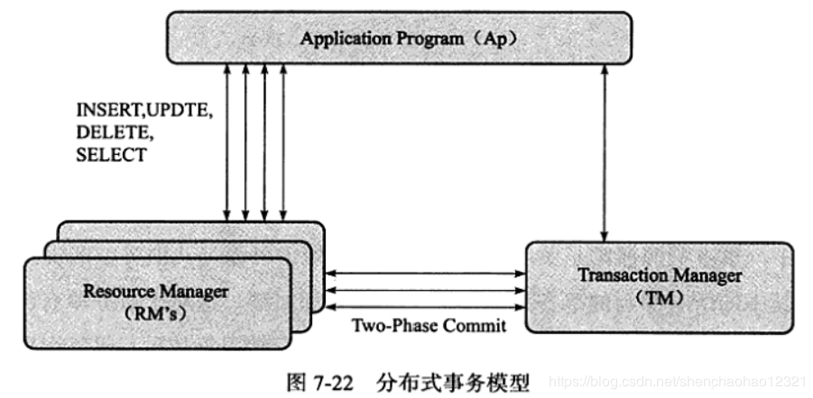

- **分布式事务使用两段式提交的方式**： 

  - 第一阶段，所有参与全局事务的节点都开始准备，告诉**事务管理器**准备好提交
  - 第二阶段，事务管理器告诉**资源管理器**执行 ROLLBACK 还是 COMMIT

  > - 如果任何一个节点显示不能提交，则所有的节点都被告知需要回滚
  >
  > - 与本地事务不同： 分布式事务需要多一次的 PREPARE 操作，待收到所有节点的同意信息后，再进行 COMMIT 或是 ROLLBACK 操作

- MySQL 数据库 XA 事务的SQL语法：

  ```mysql
  XA {START | BEGIN} xid [JOIN | RESUME]
  XA END xid [ SUSPEND [FOR MIGRATE]]
  XA PREPARE xid
  XA COMMIT xid [ONE PHASE]
  XA ROLLBACK xid
  XA RECOVER
  ```

- 分布式事务分类：

  - **分布式外部事务： 资源管理器是 MySQL 数据库本身**

  - **内部 XA 事务**： 在存储引擎与插件之间，又或者在存储引擎与存储引擎之间

    > - 存在于 binlog 与 InnoDB 存储引擎之间
    >
    > - binlog 功能： 在事务提交时，先写二进制日志，再写 InnoDB 存储引擎的重做日志

 ## 8. 其他事务

 ### 1. 不好的事务习惯

- **在循环中提交**

- **使用自动提交**

- **使用自动回滚**

### 2. 长事务

**长事务**： 就是执行时间较长的事务

# 八、备份与恢复

## 1. 概述

**根据备份的方法不同**可以分为： 

- **Hot Backup(热备)**： 指数据库运行中直接备份，对正在运行的数据库操作没有任何的影响

  > 在 MySQL官方手册中称为 **Online Backup(在线备份)**

- **Cold Backup(冷备)**： 指备份操作是在数据库停止的情况下，一般只需要复制相关的数据库物理文件即可

  > 在 MySQL官方手册中称为 **Offline Backup(离线备份)**

- **Warm Backup(温备)**： 同样是在数据库运行中进行的，但是会对当前数据库的操作有所影响，如：加一个全局读锁以保证备份数据的一致性

**按照备份后文件的内容**可以分为： 

- **逻辑备份**： 指备份出的文件内容是可读的，一般是文本文件

  > - 内容一般是由一条条 SQL 语句或者是表内实际数据组成
  > - 一般适用于数据库的升级、迁移等工作
  > - **缺点**： 是恢复所需要的时间往往较长

- **裸文件备份**： 指复制数据库的物理文件，既可以是在数据库运行中的复制，也可以是在数据库停止运行时直接的数据文件复制

  > 这类备份的恢复时间往往较逻辑备份短很多

**按照备份数据库的内容**可以分为：

- **完全备份**： 指对数据库进行一个完整的备份
- **增量备份**： 指在上次完全备份的基础上，对于更改的数据进行备份
- **日志备份**： 指对 MySQL 数据库二进制日志的备份

**MySQL数据库复制的原理**： 异步实时地将二进制日志重做传送并应用到从数据库

## 2. 冷备

- **备份方法**： 只需要**备份 MySQL 数据库的 frm 文件，共享表空间文件，独立表空间文件(*.ibd)，重做日志文件**；另外建议定期备份 MySQL 数据库的配置文件 my.cnf，这样有利于恢复的操作

- **冷备的优点**是：
  - 备份简单，只要复制相关文件即可
  - 备份文件易于在不同操作系统，不同 MySQL版本上进行恢复
  - 恢复相当简单，只需要把文件恢复到指定位置即可
  - 恢复速度快，不需要执行任何SQL语句，也不需要重建索引

- **冷备的缺点**是:

  - InnoDB 存储引擎冷备的文件通常比逻辑文件大很多，因为表空间中存放着很多其他的数据

  - 冷备也不总是可以轻易地跨平台。操作系统、MySQL的版本、文件大小写敏感、浮点数格式都是问题

## 3. 热备

### 1. ibbackup

- `ibbackup`： InnoDB存储引擎官方提供的热备工具，可以同时备份 MyISAM存储引擎和 InnoDB存储引擎表

- 对于 InnoDB 存储引擎表，其备份工作原理如下：
  - 记录备份开始时，InnoDB 存储引擎重做日志文件检查点的 LSN
  - 复制共享表空间文件以及独立表空间文件
  - 记录复制完表空间文件后，InnoDB 存储引擎重做日志文件检查点的 LSN
  - 复制在备份时产生的重做日志

- **ibbackup 的优点**:
  - 在线备份，不阻塞任何的SQL语句
  - 备份性能好，备份的实质是复制数据库文件和重做日志文件
  - 支持压缩备份，通过选项，可以支持不同级别的压缩
  - 跨平台支持，backup可以运行在 Linux、 Windows以及主流的UNX系统平台上

- **ibbackup 对 InnoDB 存储引擎表的恢复步骤为**:
  - 恢复表空间文件
  - 应用重做日志文件

> ibackup 提供了一种高性能的热备方式，是 InnoDB存储引擎备份的首选方式，不过是收费软件

### 2. XtraBackup

- 二进制日志的恢复应该是 point-in-time 的恢复而不是增量备份

- XtraBackup工具支持对于 InnoDB 存储引擎的增量备份

  其工作原理如下：

  - 首选完成一个全备，并记录下此时检查点的 LSN

  - 在进行增量备份时，比较表空间中每个页的 LSN 是否大于上次备份时的LSN，如果是，则备份该页，同时记录当前检查点的 LSN

## 4. 逻辑备份

### 1. mysqldump

- mysqldump 的语法如下： `mysqldump [arguments] >file name`
- 如果想要备份所有的数据库，可以使用 --all-databases 选项： `mysqldump --all-databases >dump.sql`
- 如果想要备份指定的数据库，可以使用 --databases 选项： `mysqldump --databases db1 db2 db3 >dump.sql`
- 如果想要对 test 这个架构进行备份： `mysqldump --single-transaction test >test_backup.sql`

- 可以通过使用 `mysqldump --help` 命令来查看所有的 mysqldump  参数

#### 2. SELECT...INTO OUTFILE

- `SELECT...INTO` 语句也是一种逻辑备份的方法，更准确地说是导出一张表中的数据

- 语法： 

  ```mysql
  SELECT [column 1],[column 2] ...
  INTO 
  OUTFILE 'file_name'
  [
      {FIELDS | COLUMNS}
      [TERMINATED BY 'string']
      [[OPTIONALLY] ENCLOSED BY 'char']
      [ESCAPED BY 'char']
  ]
  [
      LINES
      [STARTING BY 'string']
      [TERMINATED BY 'string']
  ]
  FROM TABLE WHERE ...
  ```

  - `FIELDS [TERMINATED BY 'string']`： 表示每个列的分隔符

  - `[[OPTIONALLY] ENCLOSED BY 'char']`： 表示对于字符串的包含符

  - `[ESCAPED BY 'char']`： 表示转义符

  - `[STARTING BY 'string']`： 表示每行的开始符号

  - `[TERMINATED BY 'string']`： 表示每行的结束符号

  - `file_name`： 表示导出的文件

    > 但文件所在的路径的权限必须是 mysql:mysql 的，否则 MySQL会报没有权限导出

## 5. 快照备份

- **快照备份**： 是指通过文件系统支持的快照功能对数据库进行备份

  > **备份的前提**： 是将所有数据库文件放在同一文件分区中，然后对该分区进行快照操作

- LVM 使用写时复制(Copy-on- write)技术来创建快照

  > - 当创建一个快照时，仅复制原始卷中数据的元数据( meta data)，并不会有数据的物理操作
  >
  > - **写时复制**： 当快照创建完成，原始卷上有写操作时，快照会跟踪原始卷块的改变，将要改变的数据在改变之前复制到快照预留的空间里
  >
  > - **快照读取**： 如果读取的数据块是创建快照后没有修改过的，那么会将读操作直接重定向到原始卷上；如果要读取的是已经修改过的块，则将读取保存在快照中该块在原始卷上改变之前的数据
  >
  > - 采用写时复制机制保证了读取快照时得到的数据与快照创建时一致
  >
  > 

## 6. 二进制日志备份与恢复

- 推荐的二进制日志的服务器配置：

  ```sql
  [mysqld]
  log-bin=mysql-bin
  sync_binlog = 1
  innodb_support_xa = 1
  ```

- 在备份二进制日志文件前，可以通过 `FLUSH LOGS` 命令来生成一个新的二进制日志文件，然后备份之前的二进制日志
- mysqlbinlog 用于恢复二进制日志，使用方法：`mysqlbinlog [options] log_file ...`

## 7. 复制

- **复制(replication)**： 就是一个完全备份加上二进制日志备份的还原

  > 是MySQL数据库提供的一种高可用高性能的解决方案，一般用来建立大型的应用

- replication 的工作原理分为以下3个步骤：

  - 主服务器(master)把数据更改记录到二进制日志(binlog)中
  - 从服务器(save)把主服务器的二进制日志复制到自己的中继日志(relay log)中

  - 从服务器重做中继日志中的日志，把更改应用到自己的数据库上，以达到数据的最终一致性

- **不同点**： 

  - 二进制日志的还原操作基本上实时进行
  - 复制是异步实时，因为存在主从服务器之间的执行延时

- 复制可以用来作为备份，但功能不仅限于备份，其**主要功能**如下： 

  - **数据分布**： 由于 MySQL 数据库提供的复制并不需要很大的带宽要求，因此可以在不同的数据中心之间实现数据的复制
  - **读取的负载平衡**： 通过建立多个从服务器，可将读取平均地分布到这些从服务器中，并且减少了主服务器的压力
  - **数据库备份**： 复制对备份很有帮助，但是从服务器不是备份，不能完全代替备份

  - **高可用性和故障转移**： 通过复制建立的从服务器有助于故障转移，减少故障的停机时间和恢复时间


- 命令 `SHOW SLAVE STATUS`： 可以观察当前复制的运行状态

  ​				**SHOW SLAVE STATUS的主要变量**

|         变量          | 说明                                                         |
| :-------------------: | ------------------------------------------------------------ |
|    Slave_IO_State     | 显示当前IO线程的状态                                         |
|    Master_Log_File    | 显示当前同步的主服务器的二进制日志                           |
|  Read_master_Log_Pos  | 显示当前同步到主服务器上二进制日志的偏移量位置,单位是字节    |
| Relay_Master_Log_File | 当前中继日志同步的二进制日志                                 |
|    Relay_Log_File     | 显示当前写入的中继日志                                       |
|     Relay_Log_Pos     | 显示当前执行到中继日志的偏移量位置                           |
|   Slave_IO_Running    | 从服务器中 IO 线程的运行状态，YES表示运行正常                |
|   Slave_SQL_Running   | 从服务器中 SQL 线程的运行状态，YES表示运行正常               |
|  Exec_master_Log_Pos  | 表示同步到主服务器的二进制日志偏移量的位置  `(Read_Master_Log_Pos - Exec_Master_Log_Pos)`： 表示当前SQL 线程运行的延时，单位是字节 |

- 命令 `SHOW MASTER STATU`： 可以用来查看主服务器中二进制日志的状态

# 九、性能调优

性能调优的几种方法：

- **选择合适的CPU**
- **内存的重要性**
- **硬盘对数据库性能的影响**
- **合理地设置RAID**
- **操作系统的选择也很重要**
- **不同文件系统对数据库的影响**
- **选择合适的基准测试工具** 

## 1. 选择合适的CPU

- **OLAP（在线分析处理）**： 多用在数据仓库或数据集市中，一般需要执行复杂的SQL语句来进行查询

  > **OLAP 是 CPU 密集型操作**

- **OLTP（在线事务处理）**： 多用在日常的事物处理应用中，相对于OLAP，数据库的容量较小

  > InnoDB存储引擎一般都应用于OLTP的数据库应用，这种应用的特点如下: 
  >
  > - 用户操作的并发量大
  > - 事务处理的时间一般比较短
  > - 查询的语句较为简单,一般都走索引
  >
  > - 复杂的查询较少
  >
  > **OLTP 是 IO 密集型操作**

## 2. 内存的重要性

- 内存的大小是最能直接反映数据库的性能

  > 因为 InnoDB存储引擎既缓存数据，又缓存索引，并且将它们缓存于缓冲池中

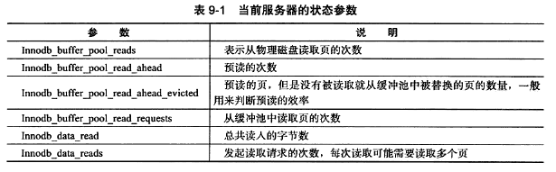

- $缓冲池命中率 = \frac{Innodb\_buffer\_pool\_read\_requests}{Innodb\_buffer\_pool\_read_requests + Innodb\_buffer\_pool\_read\_ahead + Innodb\_buffer\_pool\_reads}$

- $平均每次读取的字节数 = \frac{Innodb\_data\_read}{Innodb\_data\_reads}$

## 3. 硬盘对数据库性能的影响

- **传统机械硬盘**： 一个是**寻道时间**，另一个是**转速**

  > - **最大的问题**： 在于读写磁头，读写磁头的设计使硬盘可以随机访问，但机械硬盘的访问需要耗费长时间的磁头旋转和定位来查找
  > - 可以将多块机械硬盘组成 RAID 来提高数据库的性能，也可以将数据文件分布在不同硬盘上来达到访问负载的均衡

- **固态硬盘**： 是基于闪存的固态硬盘，其内部由闪存( Flash Memory)组成，闪存具有低延迟性、低功耗和防震性，可以通过并联多块闪存来进一步提高数据传输的吞吐量

  > - 闪存是一个完全的电子设备，没有传统机械硬盘的读写磁头，不需要耗费大量时间的磁头旋转和定位来查找数据，所以**固态硬盘可以提供一致的随机访问时间**
  > - 闪存中的数据是不可以更新的，只能通过扇区的覆盖重写，而在覆盖重写之前，需要执行耗时的擦除操作
  > - 擦除操作不能在所含数据的扇区上完成，而需要在删除整个被称为擦除块的基础上完成，擦除块的尺寸通常为 128KB 或者 256KB，且每个擦除块有擦写次数的限制
  >
  > 

## 4. 合理地设置 RAID

- **RAID(独立磁盘冗余数组)**： 基本思想是把多个相对便宜的硬盘组合起来，成为一个磁盘数组，使性能达到甚至超过一个价格昂贵、容量巨大的硬盘

  > - 由于将多个硬盘组合成为一个逻辑扇区，RAID 看起来就像一个单独的硬盘或逻辑存储单元，因此操作系统只会把它当作一个硬盘
  >
  > - RAID 的作用是：
  >
  >   - 增强数据集成度
  >   - 增强容错功能
  >
  >   - 增加处理量或容量

- 根据不同磁盘的组合方式，常见的RAID组合方式可分为RAID0、RAID1、RAID5、RAID10和RAID50： 

  - `RAD0(带区集)`： **将多个磁盘合并成一个大的磁盘**，不会有冗余，并行IO，速度最快

    > - 在存放数据时，其将数据按磁盘的个数进行分段，同时将这些数据写进这些盘中
    >
    > - 在所有的级别中，RAID0 的速度是最快的
    > - RAID0 没有冗余功能，如果一个磁盘(物理)损坏，则所有的数据都会丢失
    > - 受限于总线 IO 瓶颈及其他因素的影响，RAID效能会随边际递减，小于理论值： **(单一磁盘效能)×(磁盘数)**

    

  - **RAD1**： **两组以上的 N 个磁盘相互作为镜像**

    > - 只要一个磁盘正常即可维持运作，可靠性最高
    > - **RAID1 原理**： 在主硬盘上存放数据的同时也在镜像硬盘上写相同的数据；当主硬盘(物理〕损坏时，镜像硬盘则代替主硬盘的工作
    > - 因为有镜像硬盘做数据备份，所以 **RAID1 的数据安全性在所有的 RAID 级别上来说是最好的**
    > - **RAID1 的磁盘利用率在所有 RAID 中是最低的**

    

  - **RAID5**： 是一种存储性能、数据安全和存储成本兼顾的存储解决方案，**使用的是 Disk Striping(硬盘分区)技术**

    > - RAID5至少需要三个硬盘，RAID5 不对存储的数据进行备份，而是把数据和相对应的奇偶校验信息存储到组成 RAID5 的各个磁盘上，并且奇偶校验信息和相对应的数据分别存储于不同的磁盘上
    >
    > - 当 RAID5 的一个磁盘数据发生损坏后，利用剩下的数据和相应的奇偶校验信息去恢复被损坏的数据
    >
    > - RAID5 数据读取速度快，数据写入速度慢

    

  - **RAID10 和 RAD01**：

    -  RAID10 是先镜像再分区数据，将所有硬盘分为两组，视为 RAID0 的最低组合，然后将这两组各自视为 RAID1 运作
    - RAID01 则相反，先分区再将数据镜射到两组硬盘，RAID01将所有的硬盘分为两组，变成RAID1 的最低组合，而将两组硬盘各自视为 RAID0 运作

    > - 只要同一组的硬盘全部损毁，RAID01就会停止运作，而RAID10可以在牺牲 RAID0 的优势下正常运作
    >
    > - **RAID10 的缺点**： 需要较多的硬盘，至少拥有四个以上的偶数硬盘才能使用

    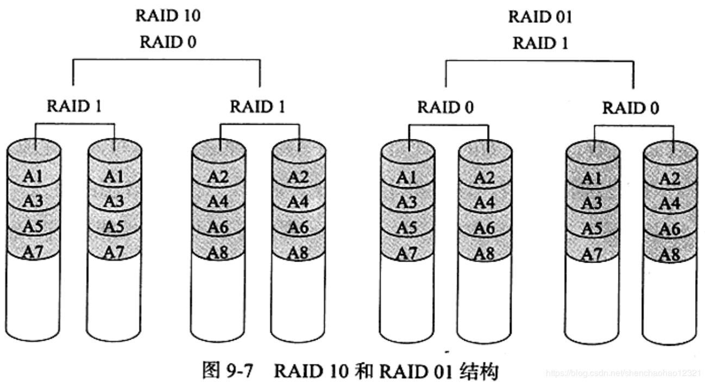

  - **RAD50(镜像阵列条带)**： 由至少六块硬盘组成

    > - 像 RAID0 一样，数据被分区成条，在同一时间内向多块磁盘写人
    > - 像 RAID5 一样，也是以数据的校验位来保证数据的安全，且校验条带均匀分布在各个磁盘上，其目的在于提高RAID5的读写性能

    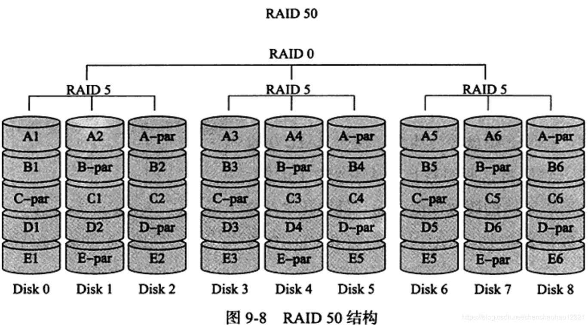

- **RAID Write Back 功能**： 是指 RAID 控制器能够将写入的数据放入自身的缓存中，并把它们安排到后面再执

  > **好处**： 不用等待物理磁盘实际写入的完成，因此写入变得更快

## 5. 合理的操作系统选择


## 6. 选择合适的数据库文件系统


## 7. 选择合适的基准测试工具

两款优秀的基准测试工具： `sysbench 与 mysql-tpcc` 


# 十、慢查询日志详解


