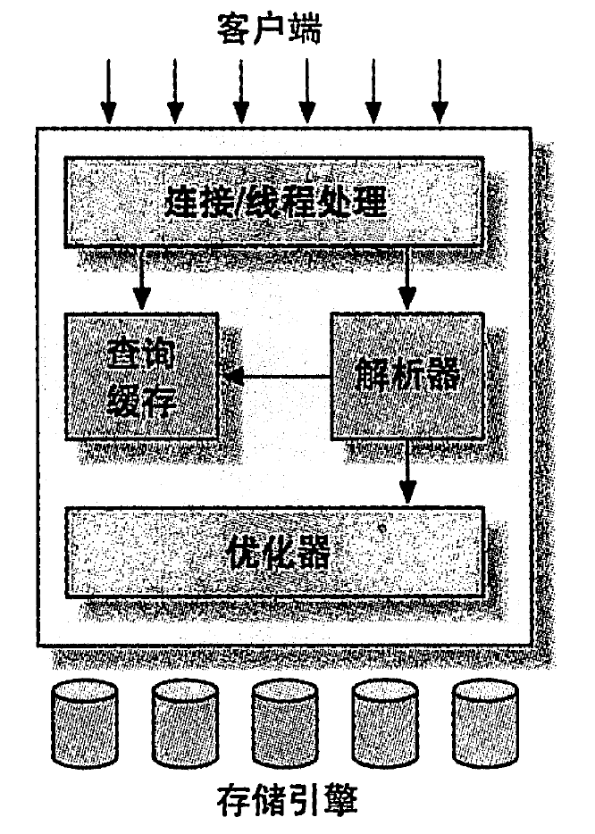

# 一、MySQL 架构与历史

## 1、逻辑架构

# 二、MySQL 基准测试

# 三、服务器性能剖析

# 四、Schema 与数据类型优化

# 五、创建高性能的索引

# 六、查询性能优化

# 七、MySQL 高级特性

# 八、优化服务器设置

# 九、操作系统和硬件优化

# 十、复制

# 十一、可扩展的 MySQL

# 十二、高可用性

# 十三、云端的 MySQL

# 十四、应用层优化

# 十五、备份与恢复

# 十六、MySQL 用户工具

