Redisson 包装工具：[Redisson](https://github.com/redisson/redisson) 

---

**推荐阅读**： 

- [redis 文档中心](http://www.redis.cn/documentation.html) 
- [reids 面试题汇总](https://www.w3cschool.cn/redis/redis-ydwp2ozz.html) 

---

源码阅读建议： [如何阅读 Redis 源码](http://blog.huangz.me/diary/2014/how-to-read-redis-source-code.html) 

Redis 命令速查： [Redis命令参考](http://redisdoc.com/) 

作者博客： [huangz/blog](http://blog.huangz.me/) 

# # 第一部分：数据结构与对象

- [redis3.2 基本数据结构](http://czrzchao.com/redisSourceSds#sds) 

# 一、简单动态字符串(SDS)

## 1. 定义

每个 `sds.h/sdshdr` 结构表示一个 SDS 值

```c
//保存字符串对象的结构
struct sdshdr {
    // buf 中已占用空间的长度，不计算结尾空字符，如：下图值为 5
    int len;
    // buf 中剩余可用空间的长度
    int free;
    // 数据空间，用于保存字符串，实际长度：len + free + 1(\0)
    char buf[];
};
```

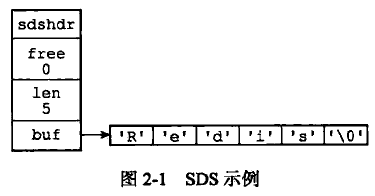

## 2. SDS 与 C 字符串的区别

> C 语言使用长度为 N+1 的字符数组来表示长度为 N 的字符串，且字符数组的最后一个元素总是空字符 '\0'

### 1. 常数复杂度获取字符串长度

- C 字符串不记录自身长度信息，为获取字符串长度我们要一个个遍历字符数组，则复杂度是O(N)

  而 SDS 在 len 属性中记录了 SDS 本身的长度，所以获取 SDS 长度复杂度为 O(1)

  > 设置和更新 SDS 长度由 SDS 的 API 在执行时自动完成，无需任何手动修改

### 2. 杜绝缓冲区溢出

- SDS API 在对 SDS 修改前，会先检查 SDS 的空间是否满足修改的需求

  > 若不满足，API 会自动将 SDS 的空间扩展至执行修改所需的大小

### 3. 减少修改字符串时带来的内存重分配次数

- C 语言每次增长或缩短 C 字符串时，都需要重新分配内存

  - 若增长字符串，如拼接，则执行之前，程序需先通过内存重分配来扩展底层数组的空间大小，否则可能会产生缓冲区溢出
  - 若缩短字符串，如截断，在执行之前，程序需通过内存重分配来释放字符串不再使用的空间，否则可能会产生内存泄漏

- SDS 通过 free 字段，实现空间预分配和惰性空间释放两种优化策略

  - **空间预分配： 用于优化 SDS 字符串增长操作**： 程序不仅为 SDS 分配所需空间，还会为 SDS 分配额外的未使用空间

    > 当 free 小于需要的空间时，会进行空间预分配，额外分配未使用空间数量的公式：
    >
    > - 若 SDS 修改后，属性 len 值小于 1 MB，则程序分配和 len 同样长度的未使用空间，即 buf.size = 2* len
    >- 若 SDS 修改后，属性 len 值大于 1 MB，则程序会分配 1 MB的未使用空间，即： 若 len >= 1MB，则 free = 1MB
    > 
    >通过空间预分配策略， Redis 可减少连续执行字符串增长操作所需的内存重分配次数
  - **惰性空间释放：用于优化 SDS 的字符串缩短操作**： 当 缩短 SDS 的字符串时，程序并不立即回收多出来的字节，而是使用 free 属性将这些字节数量记录下来，并等待将来使用
  
      > SDS 提供了专门的 API `sdsfree` 来真正释放内存空间

### 4. 二进制安全

> C 字符串的字符必须符合某种编码（如： ASCII），且字符串中不能包含空字符（末尾除外），则使得 C 字符串只能保存文本数据

- **SDS 会以处理二进制的方式来处理 buf 数组中的数据** 

注：SDS 的字节数组存储的数据总会在末尾带有 "\0"，这样就可以在存储字符串时方便的使用部分 <string.h> 库

### 5. 兼容部分 C 字符串函数

- SDS 总是将保存的数据末尾设置为空字符，且总会为 buf 数组分配空间时多分配一个字节来容纳

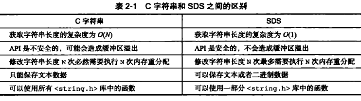

## 3. SDS API

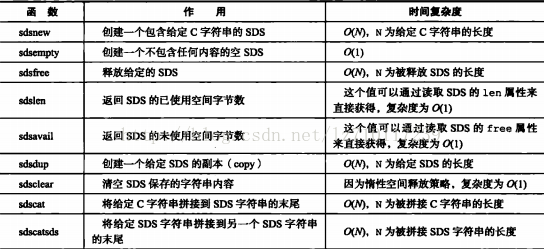

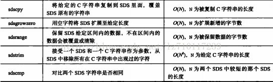

# 二、链表

- 链表提供了高效的节点重排能力、顺序性的节点访问方式，且可通过增删节点来灵活调整链表的长度
- 当一个列表键包含了数量较多的元素或列表中的元素字符串较长，则redis 会使用链表作为列表键的底层实现

**链表实现**： 

使用 `adlist.h/listNode` 结构来实现：

```c
typedef struct listNode{
    struct listNode *prev; //前置节点
    struct listNode *next; //后置节点
    void *value; //节点的值
}listNode;
```


使用 `adlist.h/list` 来操作链表

```c
typedef struct list{
    listNode *head; //表头节点
    listNode *tail; //表尾节点
    unsigned long len; //链表所包含的节点数量
    void *(*dup)(void *ptr); //节点值复制函数；dup 函数用于复制链表节点所保存的值
    void (*free)(void *ptr); //节点值释放函数；free 函数用于释放链表节点所保存的值
    int (*match)(void *ptr,void *key); //节点值对比函数；match 函数用于对比链表节点所保存的值和另一个输入值是否相等
}list;
```


**redis的链表特性如下**：

- **双端**：每个 listNode 节点带有 prev 和 next 指针，具有双向性

- **无环**：表头节点的 prev 与表尾节点的 next 都指向 NULL，对链表的访问以 NULL 为终点

- **带表头指针和尾指针**：通过 list 结构的 head 和 tail，获取头指针和尾指针的时间复杂度O(1)

- **带链表长度计数器**： 通过 list 的 len 属性，记录节点个数，获取节点个数的时间复杂度O(1)

- **多态**： 链表**使用 void\* 指针来保存节点的值**，通过 list 的 dup、free、match 三个属性为节点值设置类型特定函数，所以链表可以用于保存不同类型的值

  > <font color=red>问题</font>： `dup,free,match` 三个函数的具体作用

相关 API：

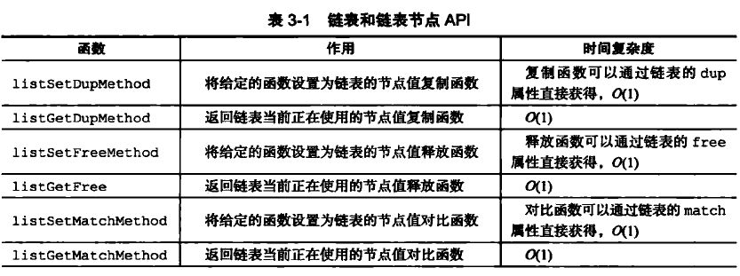

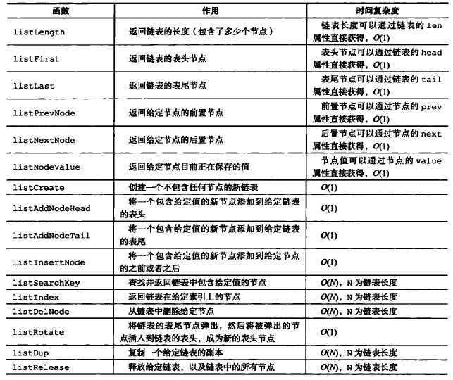

# 三、字典

- 字典，又称符号表、关联数组、映射，是一种保存键值对的抽象数据结构

- 每个键（key）和唯一的值（value）关联，键是独一无二的，通过对键的操作可以对值进行增删改查

- redis 中字典应用广泛，对 redis 数据库的增删改查就是通过字典实现的，且是采用 hash 的方式进行处理

- 当 hash 键包含了许多元素，或者元素是比较长的字符串的时候，就会用到字典作为 hash 键的底层实现

## 1. 字典的实现

- redis 的字典，底层是使用哈希表实现，每个哈希表有多个哈希节点，每个哈希节点保存了一个键值对

### 1. 哈希表

redis 字典所使用的哈希表由 `dict.h/dictht` 结构定义：

```c
//哈希表：每个字典都使用两个哈希表，从而实现渐进式 rehash 
typedef struct dictht {
    // 哈希表数组，里面的每个元素指向 dictEntry(哈希表节点)结构的指针
    dictEntry **table;
    // 哈希表大小，即table数组的大小
    unsigned long size;
    // 哈希表大小掩码，用于计算索引值，总是等于 size - 1
    // 与哈希值一起决定一个属性应该放到table的哪个位置
    unsigned long sizemask;
    // 该哈希表已有节点的数量，即table目前已有的键值对节点数量
    unsigned long used;
} dictht;
```

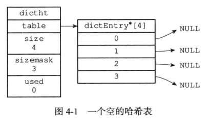

### 2. 哈希表节点

哈希表节点使用 `dictEntry` 结构表示，每个 dictEntry 结构都保存着一个键值对：

```c
//哈希表节点
typedef struct dictEntry {
    // 键
    void *key;
    // 值
    union {
        void *val;
        uint64_t u64;
        int64_t s64;
    } v;
    // 指向下个哈希表节点，形成链表
    // 将多个哈希值相同的键值对连接在一起，避免因为哈希值相同导致的冲突
    struct dictEntry *next;
} dictEntry;
```


### 3. 字典

redis 中的字典由 `dict.h/dict` 结构表示：

```c
//字典
typedef struct dict {
    // 类型特定函数
    dictType *type;
    // 私有数据
    void *privdata;
    // 哈希表
    // 每项是一个哈希表，一般只用ht[0]，只有在对ht[0]进行rehash时，才会使用ht[1]
    dictht ht[2];
    // rehash 索引，当 rehash 不在进行时，值为 -1
    int rehashidx; 
    // 目前正在运行的安全迭代器的数量
    int iterators; 
} dict;
```

type 属性和 privdata 属性是针对不同类型的键值对，为创建多态字典而设置的：

- **type 属性**： 是一个指向 dictType 结构的指针，每个 dictType 结构保存了一簇用于操作特定类型键值对的函数，Redis 会为用途不同的字典设置不同的类型特定函数
- **privdata 属性**： 保存了需要传给那些类型特定函数的可选参数

```c
// 字典类型特定函数
typedef struct dictType {
    // 计算哈希值的函数
    unsigned int (*hashFunction)(const void *key);
    // 复制键的函数
    void *(*keyDup)(void *privdata, const void *key);
    // 复制值的函数
    void *(*valDup)(void *privdata, const void *obj);
    // 对比键的函数
    int (*keyCompare)(void *privdata, const void *key1, const void *key2);
    // 销毁键的函数
    void (*keyDestructor)(void *privdata, void *key);
    // 销毁值的函数
    void (*valDestructor)(void *privdata, void *obj);
} dictType;
```

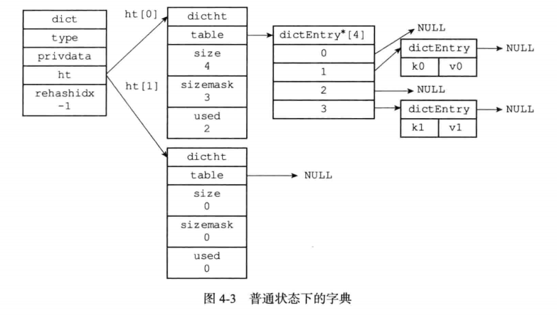

## 2. 哈希算法

- 当要将一个新的键值对添加到字典里面时，程序需要先根据键值对的键计算出哈希值和索引值，然后再根据索引值，将包含新键值对的哈希表节点放到哈希表数组的指定索引上面

- **Redis 计算哈希值和索引值的方法如下**：

  - 使用字典设置的哈希函数，计算键 key 的哈希值： 

    `hash = dict->type->hashFunction(key)`

  - 使用哈希表的 sizemask 属性和哈希值，计算出索引值；根据情况不同，ht[x]可以是ht[0]或者ht[1]

    `index = hash & dict->ht[x].sizemask;`

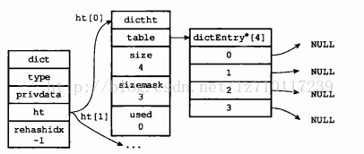

## 3. 解决键冲突

- **键冲突**： 当有两个或以上数量的键被分配到了哈希数组的同一个索引上面时

- **解决： 使用链地址法**

  > 每个哈希表节点都有一个 next 指针，多个哈希表节点可以用 next 指针构成一个单向链表，被分配到同一个索引上的多个节点用该单向链表连接起来

- **程序总是将新节点添加到链表的表头位置**

  > 因为 dictEntry 节点组成的链表没有指向链表表尾的指针

  

## 4. rehash

- **rehash（重新散列）： 扩展和收缩哈希表**

  > - 随着操作的不断执行，哈希表保存的键值对会逐渐地增多或者减少
  > - 为了让哈希表的负载因子维持在一个合理的范围内，当哈希表保存的键值对数量太多或者太少时，程序需要对哈希表的大小进行相应的扩展或者收缩

- **rehash 步骤**： 
  - **为字典的 ht[1] 哈希表分配空间**，空间大小取决于要执行的操作和 ht[0] 当前包含的键值对数量（ht[0].used属性的值）：
    - 如果执行的是扩展操作，则 ht[1] 的大小为第一个大于等于 ht[0].used * 2 的 $2^n$
    - 如果执行的是收缩操作，则 ht[1] 的大小为第一个大于等于 ht[0].used 的 $2^n$
  - **将保存在 ht[0] 中的所有键值对 rehash 到ht[1]上面**： rehash 是指重新计算键的哈希值和索引值，然后将键值对放置到 ht[1] 哈希表的指定位置上
  - 当 ht[0] 包含的所有键值对都迁移到了 ht[1] 之后（ht[0]变为空表），释放ht[0]，**将 ht[1] 设置为ht[0]**，并在 ht[1] 新创建一个空白哈希表，为下一次rehash做准备

- **rehash 条件**： 

  > 负载因子计算公式： **负载因子 = 哈希表已保存节点数量 / 哈希表大小**
  >
  > $load\_factor = \frac{ht[0].used}{ht[0].size}$
  >
  > 即负载因子大小等于当前哈希表的键值对数量除以当前哈希表的大小

  - **扩展条件**： 

    - 服务器目前**没有在执行** BGSAVE 或者 BGREWRITEAOF 命令，且**负载因子 >=1**

    - 服务器目前**正在在执行** BGSAVE 或者 BGREWRITEAOF 命令，且**负载因子 >=5**

  - **收缩条件**：当**负载因子 <0.1** 时

## 5. 渐进式rehash

- redis 对 ht[0] 扩展或收缩到 ht[1] 的过程是渐进式、分多次的完成，以避免如果哈希表中存有大量键值对，一次性复制过程中，占用资源较多，会导致redis服务停用的问题

- 渐进式 rehash 过程如下：
  - 为 ht[1] 分配空间，让字典同时持有 ht[0] 和 ht[1] 两张哈希表

  - 将字典中的 rehashidx 设置成 0，表示正在rehash；rehashidx 的值默认是 -1，表示没有在rehash

  - 在 rehash 进行期间，程序处理正常对字典进行增删改查外，还顺带将 ht[0] 哈希表在 rehashidx 索引上的所有键值对数据 rehash 到 ht[1]，当 rehash 结束后 rehashidx 的值加1

  - 当某个时间节点，全部的 ht[0] 都迁移到 ht[1] 后，rehashidx 的值重新设定为 -1，表示rehash完成

-  **好处**：渐进式 rehash 采用分而治之的方式，将 rehash 键值对所需的计算均摊到对字典的每个增删改查中，避免集中 rehash 导致的庞大计算量

 - **注意**： 字典的删除、查找、更新会在 ht[0] 与 ht[1] 上同时进行；添加只保存到 ht[1] 上

## 6. API

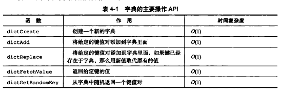

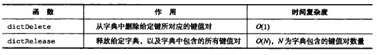

# 四、跳跃表

- 跳跃表： 是一种有序的数据结构，它通过每个节点中维持多个指向其他节点的指针，从而实现快速访问

  > 跳跃表**平均O(logN)，最坏O(N)，支持顺序遍历查找**

- 在 redis 中，跳跃表作为**有序集合**的其中一种实现方式

  > 当有序集合的元素较多，或者集合中的元素是比较长的字符串，则会使用跳跃表来实现

- 推荐阅读： **[跳跃表的原理及实现](https://blog.csdn.net/qpzkobe/article/details/80056807)** 

## 1. 跳跃表的实现

### 1. 跳跃表节点

由 `redis.h/zskiplistNode` 结构定义：

```c
// 跳跃表节点
typedef struct zskiplistNode {
    // 成员对象：指向一个字符串对象(保存着一个 SDS 值)
    robj *obj;
    // 分值：节点都按分值从大到小来排序
    double score;
    // 后退指针：用于从表尾向表头方向访问节点，每次只能后退至前一个节点
    struct zskiplistNode *backward;
    // 层： 层数数量越多，访问其他节点的速度越快
    // 创建跳跃表节点时，根据幂次定律随机生成 1-32 间的值作为 level 数组大小，该大小就是层的“高度”
    // 幂次定律： 越大的数出现的概率越小
    struct zskiplistLevel {
        // 前进指针：指向表尾方向，用于从表头向表尾方向访问节点
        struct zskiplistNode *forward;
        // 跨度：用于记录两个节点间的距离（指向NULL的前进指针的跨度为 0）
        unsigned int span;
    } level[];
} zskiplistNode;
```

### 2. 跳跃表

```c
// 跳跃表
typedef struct zskiplist {
    // 表头节点和表尾节点：分别指向跳跃表的表头和表尾节点
    // 通过这两个节点，程序定位表头和表尾的复杂度为 O(1)
    struct zskiplistNode *header, *tail;
    // 表中节点的数量
    unsigned long length;
    // 表中层数最大的节点的层数
    int level;
} zskiplist;
```

### 3. 过程

- 跳跃表初始状态： 

  > 

- 插入元素 2，首先是在底部插入元素 2： 

  > 

- 然后"抛硬币"，结果是正面，那么我们要将 2 插入到 L2 层： 

  > 

- 继续抛硬币，结果是反面，那么元素 2 的插入操作就停止了，插入后的表结构就是上图所示

- 接下来，我们插入元素 33，跟元素2的插入一样，现在 L1 层插入 3： 

  > 

- 然后抛硬币，结果是反面，那么元素 33 的插入操作就结束了，插入后的表结构就是上图所示

- 接下来，我们插入元素 55，首先在 L1 插入 55： 

  > 

- 然后抛硬币，结果是正面，那么 L2 层需要插入 55： 

  > 

- 继续抛硬币，结果又是正面，那么 L3 层需要插入 55： 

  > 


## 2. API

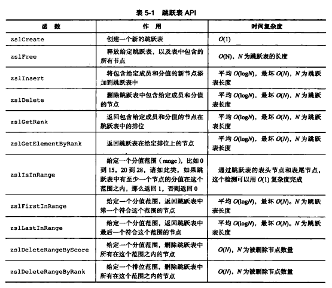

# 五、整数集合

- **整数集合**： 是**集合键**的底层实现之一，当一个集合只包含整数值元素，并且这个集合的元素数量不多时，Redis就会使用整数集合作为集合键的底层实现
- **整数集合**： 是 redis 用于保存整数值的集合抽象数据结构，以保存类型为 `int16_t、int32_t、int64_t` 的整数值，并且保证集合中不会出现重复元素

## 1. 实现

`intset.h/intset` 结构表示一个整数集合：

```c
typedef struct intset {
    // 编码方式： 决定 contents 的真正编码方式
    uint32_t encoding;
    // 集合包含的元素数量，即 contents 数组长度
    uint32_t length;
    // 保存元素的数组：是整数集合的底层实现
    // 集合数组的每个元素都是 contents 数组的一个数组项，各项在数组中按值从小到大排序，且不含重复项
    int8_t contents[];
} intset;
```

## 2. 升级

- 每当我们要将一个新元素添加到整数集合里面，并且新元素的类型比整数集合现有所有元素的的类型都要长时，整数集合需要先进行升级，然后才能将新元素添加到整数集合里面

- **升级整数集合并添加新元素的步骤**：

  - 根据新元素的类型，扩展整数集合底层数组的空间大小，并为新元素分配空间
  - 将底层数组现有的所有元素都转换成与新元素相同的类型，并将类型转换后的元素放置到正确的位上，而且在放置元素的过程中，需要继续位置底层数组的有序性质不变

  - 将新元素添加到底层数组里面

- **好处**：
  - **提升整数集合的灵活性**，可以随意将 `int16，int32，int64` 的值放入集合
  - **尽可能地节约内存**

- **新元素摆放位置**：
  - 在新元素小于所有现有元素时，新元素被放置在底层数组的最开头（索引 0）
  - 在新元素大于所有现有元素时，新元素被放置在底层数组的最末尾（索引 length - 1）

- 整数集合不支持降级操作

## 3. API

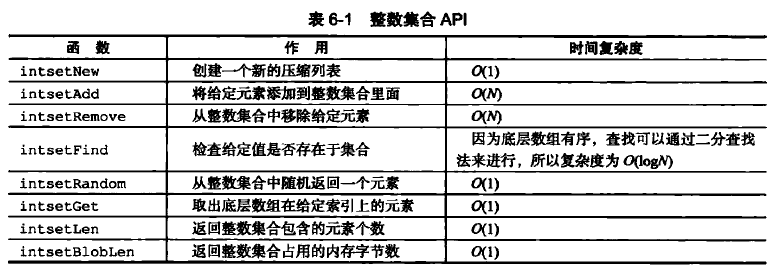

# 六、压缩列表

- **压缩列表(ziplist)**： 是**列表键和哈希键**的底层实现之一
- 当一个列表键只包含少量列表项，并且每个**列表项要么就是小整数值，要么就是长度比较短的字符串**，那么Redis就会使用压缩列表来做列表键的底层实现
- 推荐阅读： **[redis 压缩列表详解](https://blog.csdn.net/WhereIsHeroFrom/article/details/84718315)** 

## 1. 压缩表构成

- 压缩列表是 Redis 为了节约内存而开发的，是由一系列特殊编码的连续内存块组成的顺序型数据结构

- 一个压缩表可包含多个节点，每个节点可保存一个字节数组或一个整数值

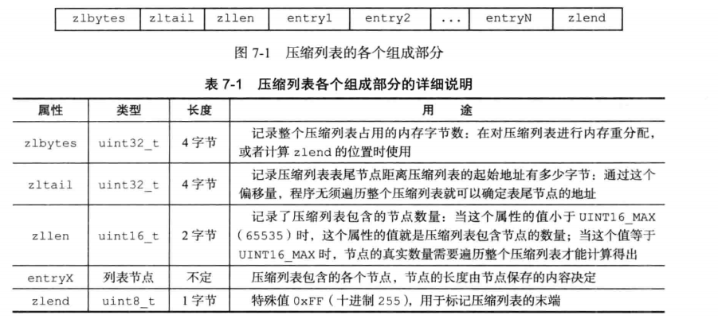

## 2. 压缩表节点的构成

- **每个压缩列表节点可以保存一个字节数组或者一个整数值**

  > - **字节数组**：
  >   - 长度 $<= 63(2^6 - 1)$ 字节的字节数组
  >   - 长度 $<= 16383(2^{14} - 1)$ 字节的字节数组
  >   - 长度 $<= 4294967295(2^{32} - 1)$ 字节的字节数组
  > - **整数值**：
  >   - 4 位长，介于0到12之间的无符号整数
  >   - 1 字节长的有符号整数
  >   - 3 字节长的有符号整数
  >   - int16_t 类型整数
  >   - int32_t 类型整数
  >   - int64_t 类型整数

- 每个压缩列表节点都由 `previous_entry_length、encoding、content` 三个部分组成：

  - `previous_entry_length`：以字节为单位，记录了压缩列表中**前一个节点的长度**

    > previous_entry_length **属性长度为 1 字节或 5 字节**：
    >
    > - 若前一节点的长度 **<254 字节**，则属性长度为 1 字节：前一节点的长度就保存在这一字节里
    > - 若前一节点的长度 **>=254 字节**，则属性长度为 5 字节：第一个字节被设置为 0xFE，之后的四字节保存前一节点的长度

    > 因为有了这个长度，所以程序可以通过指针运算，根据当前节点的起始地址来计算出前一个节点的起始地址，压缩列表的从表尾向表头遍历操作就是使用这一原理实现的

  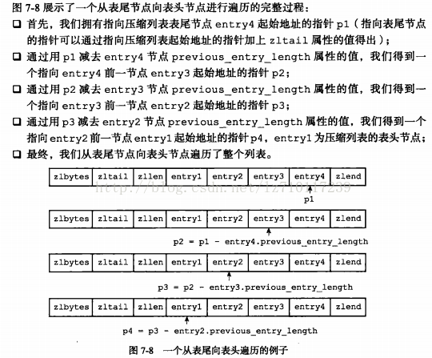

  - `encoding`：**记录了节点的 content 属性所保存数据的类型以及长度**：

    > - **一字节、两字节或者五字节长，值的最高位为00、01或者10的是字节数组编码**：
    >
    >   这种编码表示节点的 content 属性**保存着字节数组**，数组的长度由编码出去最高两位之后的其他位记录
    >
    > - **一字节长，值的最高位以11开头的是整数编码**：
    >
    >   这种编码表示节点的 content 属性**保存着整数值**，整数值的类型和长度由编码除去最高两位之后的其它位记录

     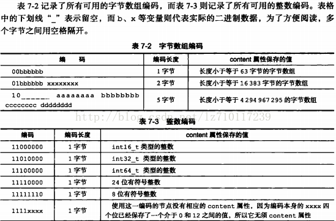

  - `content`：**负责保存节点的值**，节点值可以是一个**字节数组**或者**整数**，值的类型和长度由节点的 encoding 属性决定

## 3. 连锁更新

- **连锁更新： 连续多次空间扩展操作**

  > - 根本是由于新增节点或删除节点造成的对 previous_entry_length 的改变
  >
  > - 添加新节点或删除节点都会引发连锁更新

- 每次空间重分配的最坏复杂度为O(N)，所以连锁更新的最坏复杂度为 $O(N^2)$，平均时间复杂度为 O(N)

  > 连锁更新影响性能的概率很低：
  >
  > - 首先，压缩列表里要恰好有多个连续的、长度介于 250 字节至 253 字节之间的节点，连锁更新才可能引发（实际情况很少发生）
  > - 其次，即使出现连锁更新，一般更新节点数量不多

## 4. API

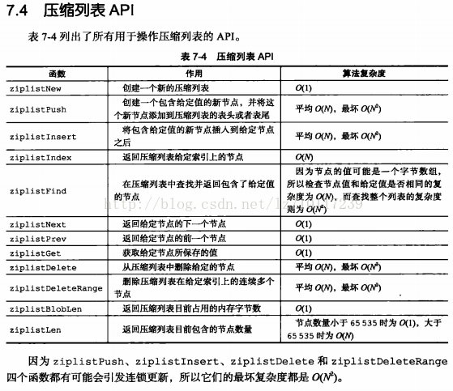

# 七、对象

- **对象好处**：
  - redis 可根据对象的类型来判断该对象是否可以执行给定的命令
  - 可针对不同的使用场景，为对象设置多种不同的数据结构实现，从而优化对象的使用效率

- **对象分类**：**字符串对象、列表对象、哈希对象、集合对象、有序集合对象**

## 1. 对象的类型与编码

- Redis 使用对象来表示数据库中的键和值

redis 中的每个对象都由 `redisObject` 结构表示

```c
// Redis 对象  
typedef struct redisObject {  
    // 类型  ***
    unsigned type:4;          
    // 不使用(对齐位)  
    unsigned notused:2;  
    // 编码方式  ***
    unsigned encoding:4;  
    // LRU 时间（相对于 server.lruclock）  
    unsigned lru:22;  
    // 引用计数  
    int refcount;  
    // 指向底层实现数据结构的指针，即对象的值  ***
    void *ptr;  
} robj;
```

- 对象的 type 属性记录对象的类型

  > |   类型常量   |   对象名称   |
  > | :----------: | :----------: |
  > | REDIS_STRING |  字符串对象  |
  > |  REDIS_LIST  |   列表对象   |
  > |  REDIS_HASH  |   哈希对象   |
  > |  REDIS_SET   |   集合对象   |
  > |  REDIS_ZSET  | 有序集合对象 |

- 命令 `TYPE` 返回数据库键对应的**值对象的类型**
- 对象的 ptr 指针指向的对象的底层实现数据结构是由对象的 encoding 属性决定(编码)


## 2. 字符串对象

> 字符串对象的编码可以是 `int, raw, embstr` 

- 如果一个字符串对象保存的是**整数值**，并且这个整数值可以用 long 整型来表示，那么字符串对象会将整数值保存在字符串对象结构的 ptr 属性中（将void* 转换成long），并将字符串对象的**编码设置为 int**
- 如果字符串对象保存的是一个**字符串值**，并且这个**字符串的长度大于32字节**，那么字符串对象将使用一个简单动态字符串（SDS）来保存这个字符串值，并将其**编码设置为 raw**

- 如果字符串对象保存的是一个**字符串值**，并且这个**字符串的长度小于等于 32 字节**，那么字符串对象将**使用 embstr 编码方式**来保存这个值

对于 embstr 编码：

- **embstr 通过调用一次内存分配函数**来分配一块连续空间，而 **raw 调用两次**，来分别**创建redisObject 结构和 sdshdr 结构**

- **好处**：
  - embstr 编码将创建字符串对象所需内存分配次数从 raw 编码的两次降为一次
  - embstr 释放内存的次数也由两次变为一次
  - embstr 编码的字符串对象的所有数据都保存在一块连续内存中，则字符串对象能更好的利用缓存带来的优势

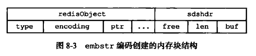

- **编码转换**： int 编码的字符串对象和 embstr 编码的字符串对象在满足条件情况下，会被转换为 raw 编码的字符串对象

  ​							**字符串命令的实现**

|    命令     | int 编码的实现方法                                           | embstr 编码的实现方法                                        | raw 编码的实现方法                                           |
| :---------: | ------------------------------------------------------------ | ------------------------------------------------------------ | ------------------------------------------------------------ |
|     SET     | 使用 int 编码保存值                                          | 使用 embstr 编码保存值                                       | 使用 raw 编码保存值                                          |
|     GET     | 拷贝对象所保存的整数值并转换成字符串值， 然后返回给客户端    | 直接向客户端返回字符串值                                     | 直接向客户端返回字符串值                                     |
|   APPEND    | 将对象转换成 raw 编码， 然后按 raw编码的方式执行此操作       | 将对象转换成 raw 编码， 然后按 raw 编码的方式执行此操作      | 调用 sdscatlen 函数， 将给定字符串追加到现有字符串的末尾     |
| INCRBYFLOAT | 取出整数值并转换成 long double 类型的浮点数，并进行加法计算且将结果保存起来 | 取出字符串值并转换成long double 类型的浮点数， 并进行加法计算且将结果保存起来；若不能被转换成浮点数，则返回错误 | 取出字符串值并转换成 long double 类型的浮点数，并进行加法计算且将结果保存起来；若不能被转换成浮点数， 则返回错误 |
|   INCRBY    | 对整数值进行加法计算， 得出的计算结果会作为整数被保存起来    | embstr 编码不能执行此命令， 向客户端返回一个错误             | raw 编码不能执行此命令， 向客户端返回一个错误                |
|   DECRBY    | 对整数值进行减法计算， 得出的计算结果会作为整数被保存起来    | embstr 编码不能执行此命令， 向客户端返回一个错误             | raw 编码不能执行此命令， 向客户端返回一个错误                |
|   STRLEN    | 拷贝对象所保存的整数值且转换成字符串值， 计算并返回这个字符串值的长度 | 调用 sdslen 函数， 返回字符串的长度                          | 调用 sdslen 函数， 返回字符串的长度                          |
|  SETRANGE   | 将对象转换成 raw 编码， 然后按 raw编码的方式执行此命令       | 将对象转换成 raw 编码， 然后按 raw 编码的方式执行此命令      | 将字符串特定索引上的值设置为给定的字符                       |
|  GETRANGE   | 拷贝对象所保存的整数值且转换成字符串值， 然后取出并返回字符串指定索引上的字符 | 直接取出并返回字符串指定索引上的字符                         | 直接取出并返回字符串指定索引上的字符                         |

## 3. 列表对象

> 列表对象的编码可以是 `ziplist, linkedlist`

- ziplist 编码的列表对象**使用压缩列表作为底层实现**，每个压缩列表节点保存一个列表元素
- linkedlist 编码的列表对象**使用双端链表作为底层实现**，每个双端链表节点都保存了一个字符串对象，而每个字符串对象都保存了一个列表元素

- **编码转换**：

  > 当列表对象满足以下两个条件时，使用 ziplist 编码；不能满足使用 linklist 编码

  - 列表对象保持的所有字符串元素的长度小于 64 字节

  - 列表对象保存的元素数量小于 512 个

    ​							**列表命令的实现**

|  命令   | ziplist 编码的实现方法                                       | linkedlist 编码的实现方法                                    |
| :-----: | ------------------------------------------------------------ | ------------------------------------------------------------ |
|  LPUSH  | 调用 ziplistPush 函数， 将新元素推入到压缩列表的表头         | 调用 listAddNodeHead 函数， 将新元素推入到双端链表的表头     |
|  RPUSH  | 调用 ziplistPush 函数， 将新元素推入到压缩列表的表尾         | 调用 listAddNodeTail 函数， 将新元素推入到双端链表的表尾     |
|  LPOP   | 调用 ziplistIndex 函数定位压缩列表的表头节点， 在向用户返回节点所保存的元素之后， 调用 ziplistDelete 函数删除表头节点 | 调用 listFirst 函数定位双端链表的表头节点， 在向用户返回节点所保存的元素之后， 调用 listDelNode 函数删除表头节点 |
|  RPOP   | 调用 ziplistIndex 函数定位压缩列表的表尾节点， 在向用户返回节点所保存的元素之后， 调用 ziplistDelete 函数删除表尾节点 | 调用 listLast 函数定位双端链表的表尾节点， 在向用户返回节点所保存的元素之后， 调用 listDelNode 函数删除表尾节点 |
| LINDEX  | 调用 ziplistIndex 函数定位压缩列表中的指定节点， 然后返回节点所保存的元素 | 调用 listIndex 函数定位双端链表中的指定节点， 然后返回节点所保存的元素 |
|  LLEN   | 调用 ziplistLen 函数返回压缩列表的长度                       | 调用 listLength 函数返回双端链表的长度                       |
| LINSERT | 插入新节点到压缩列表的表头或者表尾时， 使用 ziplistPush 函数； 插入新节点到压缩列表的其他位置时， 使用 ziplistInsert 函数 | 调用 listInsertNode 函数， 将新节点插入到双端链表的指定位置  |
|  LREM   | 遍历压缩列表节点， 并调用 ziplistDelete 函数删除包含了给定元素的节点 | 遍历双端链表节点， 并调用 listDelNode 函数删除包含了给定元素的节点 |
|  LTRIM  | 调用 ziplistDeleteRange 函数， 删除压缩列表中所有不在指定索引范围内的节点 | 遍历双端链表节点， 并调用 listDelNode 函数删除链表中所有不在指定索引范围内的节点 |
|  LSET   | 调用 ziplistDelete 函数， 先删除压缩列表指定索引上的现有节点， 然后调用 ziplistInsert 函数， 将一个包含给定元素的新节点插入到相同索引上面 | 调用 listIndex 函数， 定位到双端链表指定索引上的节点， 然后通过赋值操作更新节点的值 |

## 4. 哈希对象

> 哈希对象的编码可以是 ziplist 或者 hashtable

- ziplist 编码的哈希对象使用压缩列表作为底层实现，当有新的键值对要加入到哈希对象的时候，程序先将保存了键的压缩列表节点推入到压缩列表表尾，然后将保存了值的压缩列表节点推入到压缩列表表尾

  > 因此：
  >
  > - **键值对总相邻，键在前，值在后**
  > - **先添加的键值对在表头，后添加的在表尾**

- hashtable 编码的哈希对象使用字典作为底层实现，哈希对象中的每个键值对用字典键值对保存：

  - 字典的每个**键**都是一个字符串对象，对象中**保存了键值对的键**
  - 字典的每个**值**都是一个字符串对象，对象中**保存了键值对的值**

- **编码转换**：

  > 当哈希对象满足下面两个条件时，哈希对象使用 ziplist 编码，否则使用 hashtable 编码：

  - 哈希对象保存的所有键值对的键和值的字符串的长度都小于 64 字节
  - 哈希对象保存的键值对数量小于 512 个


​							**哈希命令的实现**

|  命令   | ziplist 编码实现方法                                         | hashtable 编码的实现方法                                     |
| :-----: | ------------------------------------------------------------ | ------------------------------------------------------------ |
|  HSET   | 先调用 ziplistPush 函数， 将键推入到压缩列表的表尾， 然后再次调用 ziplistPush 函数， 将值推入到压缩列表的表尾 | 调用 dictAdd 函数， 将新节点添加到字典里面                   |
|  HGET   | 先调用 ziplistFind 函数， 在压缩列表中查找指定键所对应的节点， 然后调用 ziplistNext 函数， 将指针移动到键节点旁边的值节点， 最后返回值节点 | 调用 dictFind 函数， 在字典中查找给定键， 然后调用 dictGetVal 函数， 返回该键所对应的值 |
| HEXISTS | 调用 ziplistFind 函数， 在压缩列表中查找指定键所对应的节点   | 调用 dictFind 函数， 在字典中查找给定键                      |
|  HDEL   | 调用 ziplistFind 函数， 在压缩列表中查找指定键所对应的节点， 然后将相应的键节点、 以及键节点旁边的值节点都删除掉 | 调用 dictDelete 函数， 将指定键所对应的键值对从字典中删除掉  |
|  HLEN   | 调用 ziplistLen 函数， 取得压缩列表包含节点的总数量， 将这个数量除以 2 ， 得出的结果就是压缩列表保存的键值对的数量 | 调用 dictSize 函数， 返回字典包含的键值对数量， 这个数量就是哈希对象包含的键值对数量 |
| HGETALL | 遍历整个压缩列表， 用 ziplistGet 函数返回所有键和值（都是节点） | 遍历整个字典， 用 dictGetKey 函数返回字典的键， 用 dictGetVal 函数返回字典的值 |

## 5. 集合对象

> 集合对象的编码可以是 `intset, hashtable`

- intset 编码的集合对象使用整数集合作为底层实现，集合对象包含的所有元素都被保存在整数集合中
- hashtable 编码的集合对象使用字典作为底层实现，**字典的每个键都是一个字符串对象**，每个字符串对象包含了一个集合元素，**字典的值则全部被设置为NULL**

- 编码转换：

  > 满足条件时，对象使用 intset 编码；不满足时，使用 hashtable 编码

  - 集合对象保存的所有元素都是整数值
  - 集合对象保存的元素数量不超过 512个


|    命令     | intset 编码的实现方法                                        | hashtable 编码的实现方法                                     |
| :---------: | ------------------------------------------------------------ | ------------------------------------------------------------ |
|    SADD     | 调用 intsetAdd 函数， 将所有新元素添加到整数集合里面         | 调用 dictAdd ， 以新元素为键， NULL 为值， 将键值对添加到字典里面 |
|    SCARD    | 调用 intsetLen 函数， 返回整数集合所包含的元素数量           | 调用 dictSize 函数， 返回字典所包含的键值对数量              |
|  SISMEMBER  | 调用 intsetFind 函数， 在整数集合中查找给定的元素；若找到了说明元素存在，否则不存在 | 调用 dictFind 函数， 在字典的键中查找给定的元素；若找到了说明元素存在，否则不存在 |
|  SMEMBERS   | 遍历整个整数集合， 使用 intsetGet 函数返回集合元素           | 遍历整个字典， 使用 dictGetKey 函数返回字典的键作为集合元素  |
| SRANDMEMBER | 调用 intsetRandom 函数， 从整数集合中随机返回一个元素        | 调用 dictGetRandomKey 函数， 从字典中随机返回一个字典键      |
|    SPOP     | 调用 intsetRandom 函数， 从整数集合中随机取出一个元素， 再返回给客户端之后， 调用 intsetRemove 函数删除 | 调用 dictGetRandomKey 函数， 从字典中随机取出一个字典键， 再返回给客户端之后， 调用 dictDelete 函数删除 |
|    SREM     | 调用 intsetRemove 函数， 从整数集合中删除所有给定的元素      | 调用 dictDelete 函数， 从字典中删除所有键为给定元素的键值对  |

## 6. 有序集合对象

> 有序集合的编码： 一种是 `ziplist`，另一种是 `skiplist与dict的结合`

- ziplist 编码的压缩列表对象使用压缩列表对象作为底层实现，每个集合元素使用两个紧挨在一起的压缩节点来保存，**第一个节点保存元素的成员，第二个节点保存元素的分值**

  > 集合元素按分值从小到大排序，即**分值小靠近表头，分值大靠近表尾**

- skiplist 编码的有序集合对象使用 zset 结构作为底层实现，一个 zset 结构包含一个字典和一个跳跃表

- **编码的转换**：

  > 当有序集合对象满足下面条件时，使用ziplist编码；否则使用 skiplist 编码

  - 有序集合保存的元素数量小于128个
  - 有序集合保存的所有元素成员的长度都小于64 字节


|   命令    | ziplist 编码的实现方法                                       | zset 编码的实现方法                                          |
| :-------: | ------------------------------------------------------------ | ------------------------------------------------------------ |
|   ZADD    | 调用 ziplistInsert 函数， 将成员和分值作为两个节点分别插入到压缩列表 | 先调用 zslInsert 函数， 将新元素添加到跳跃表， 然后调用 dictAdd 函数， 将新元素关联到字典 |
|   ZCARD   | 调用 ziplistLen 函数， 获得压缩列表包含节点的数量， 并除以 2 得出集合元素的数量 | 访问跳跃表数据结构的 length 属性， 直接返回集合元素的数量    |
|  ZCOUNT   | 遍历压缩列表， 统计分值在给定范围内的节点的数量              | 遍历跳跃表， 统计分值在给定范围内的节点的数量                |
|  ZRANGE   | 从表头向表尾遍历压缩列表， 返回给定索引范围内的所有元素      | 从表头向表尾遍历跳跃表， 返回给定索引范围内的所有元素        |
| ZREVRANGE | 从表尾向表头遍历压缩列表， 返回给定索引范围内的所有元素      | 从表尾向表头遍历跳跃表， 返回给定索引范围内的所有元素        |
|   ZRANK   | 从表头向表尾遍历压缩列表， 查找给定的成员， 沿途记录经过节点的数量， 当找到给定成员之后， 途经节点的数量就是该成员所对应元素的排名 | 从表头向表尾遍历跳跃表， 查找给定的成员， 沿途记录经过节点的数量， 当找到给定成员之后， 途经节点的数量就是该成员所对应元素的排名 |
| ZREVRANK  | 从表尾向表头遍历压缩列表， 查找给定的成员， 沿途记录经过节点的数量， 当找到给定成员之后， 途经节点的数量就是该成员所对应元素的排名 | 从表尾向表头遍历跳跃表， 查找给定的成员， 沿途记录经过节点的数量， 当找到给定成员之后， 途经节点的数量就是该成员所对应元素的排名 |
|   ZREM    | 遍历压缩列表， 删除所有包含给定成员的节点， 以及被删除成员节点旁边的分值节点 | 遍历跳跃表， 删除所有包含了给定成员的跳跃表节点。 并在字典中解除被删除元素的成员和分值的关联 |
|  ZSCORE   | 遍历压缩列表， 查找包含了给定成员的节点， 然后取出成员节点旁边的分值节点保存的元素分值 | 直接从字典中取出给定成员的分值                               |

## 7. 类型检查与命令多态

Redis 中用于操作键的命令可以分为两种类型：

- **可以对任何类型的键执行**： `DEL、EXPIRE、RENAME、TYPE、OBJECT`

- **只对特定类型的键执行**： 
- `SET、 GET、 APPEND、 STRLEN` 等命令**只能对字符串**键执行
  - `HDEL、 HSET、 HGET、 HLEN` 等命令**只能对哈希键**执行
  - `RPUSH、 LPOP、 LINSERT、 LLEN` 等命令**只能对列表键**执行
  - `SADD、 SPOP、 SINTER、 SCARD` 等命令**只能对集合键**执行
  
- `ZADD、 ZCARD、 ZRANK、 ZSCORE` 等命令**只能对有序集合键**执行

### 1. 类型检查

- 在执行一个特定类型的命令之前，Redis 会**检查输入键的类型**，再决定是否执行命令

- 类型特定命令所进行的类型检查是通过 redisObject 结构的 type 属性来实现：

  - 在执行一个类型特定命令之前，**服务器会先检查输入数据库键的值对象是否为执行命令所需的类型**

    > - 如果是的话，服务器就对键执行指定的命令
    >
    > - 否则，服务器将拒绝执行命令，并向客户端返回一个类型错误

### 2. 多态命令

- Redis 会根据**值对象的编码方式**，选择正确的命令实现代码来执行命令

**基本的流程就是**：

1. 客户端发送命令
2. 服务器检查键的值对象是否是符合的类型对象(类型检查)， 如果不是，直接返回类型错误
3. 检查对象的编码
4. 根据编码的不同选择不同的命令来执行

## 8. 内存回收

- Redis 在对象系统中构建了一个**引用计数(`reference counting`)技术来实现内存回收机制**

  > 程序可以通过跟踪对象的引用计数对象，在适当的时候自动释放对象并进行内存回收

- 每个对象的引用计数信息由 `redisObject` 结构中的 `refcount` 属性记录：

  ```c
  typedef struct redisObject{
      // ...
      // 引用计数
      int refcount;
      // ...
  }robj;
  ```

- 对象的引用计数信息会随着对象的使用状态而不断变化：

  - 在创建一个新对象，引用计数的值被初始化为 `1` 
  - 当对象被一个新程序使用时，引用计数值 `+ 1` 
  - 当对象不再被程序使用的时候，引用计数值 `- 1`
  - 引用计数值为 `0` 时，对象所占用的内存会被释放

  |     函数      | 作用                                                         |
  | :-----------: | ------------------------------------------------------------ |
  | incrRefCount  | 将对象的引用计数值增一                                       |
  | decrRefCount  | 将对象的引用计数值减一， 当对象的引用计数值等于 0 时， 释放对象 |
  | resetRefCount | 将对象的引用计数值设置为 0 ， 但并不释放对象， 这个函数通常在需要重新设置对象的引用计数值时使用 |

## 9. 对象共享

- **对象的引用计数属性还有对象共享的作用**

- redis 让多个键共享同一个值对象需要执行的步骤：
  - **将数据库键的值指针指向一个现有的值对象**
  - **将被共享的值对象的引用计数 +1**

- 创建共享字符串对象的数量可以修改 `redis.h/REDIS_SHARED_INTEGERS` 常量

- 注意： **redis 只对包含整数值的字符串对象进行贡献**

  > 当服务器考虑将一个共享对象设置为键的值对象时， 程序需要**先检查给定的共享对象和键想创建的目标对象是否完全相同**
  >
  > - 如果共享对象是保存整数值的字符串对象， 那么验证操作的复杂度为 O(1) ；
  > - 如果共享对象是保存字符串值的字符串对象， 那么验证操作的复杂度为 O(N) ；
  > - 如果共享对象是包含了多个值对象， 那么验证操作的复杂度将会是 O(N^2) 

## 10. 对象的空转时长

- redisObject 结构包含的**属性`lru`记录了对象最后一次被命令程序访问的时间**

- `BJECT IDLETIME` 命令可以打印出给定键的空转时长

  > **空转时长**： 是通过将当前时间减去键的值对象的 `lru` 时间计算得出

- `BJECT IDLETIME` 命令在访问键的值对象时，不会修改值对象的lru属性

- **键的空转时长作用**： 

  - 可以被 `OBJECT IDLETIME` 命令打印出来

  - 空转时长较高的键会优先被服务器释放， 从而回收内存

    > - 如果服务器打开了 `maxmemory` 选项， 且服务器用于回收内存的算法为 `volatile-lru` 或者 `allkeys-lru` 
    > - 且当服务器占用的内存数超过了 `maxmemory` 选项所设置的上限值时

# 8、Stream 

- Stream 是 Redis5.0 新推出的数据结构，是一个新的强大的支持多播的可持久化消息队列

  - 有一个消息链表，将所有加入的消息都串起来，每个消息都有一个唯一的 ID 和对应的内容

  - 消息是持久化的，Redis 重启后，内容还在

  - 每个 Stream 都有唯一的名称(key)，在首次使用 xadd 指令追加消息时自动创建

  - 每个 Stream 可以挂多个消费组，每个消费组会有个游标 last_delivered_id 在 Stream 数组之上往前移动，表示当前消费组已经消费到哪条消息了

  - 每个消费组都有一个 Stream 内唯一的名称，消费组通过 `xgroup create` 创建，需要制定从 Stream 的某个消息 ID 开始消费

    > 这个 ID 用来初始化 last_delivered_id 变量

  - 每个消费组的状态都是独立的，即同一 Stream 内部的消息会被每个消费组都消费到

  - 同一个消费组可以挂接多个消费者，这些消费者之间是竞争关系，任意一个消费者读取了消息都会使游标 last_delivered_id 往前移动，每个消费者有一个组内唯一名称

  - 消费者内部会有一个状态变量 pending_ids(PEL，即 Pending Entries List)，记录当前已经被客户端读取，但还没有 ack 的消息

    > 若客户端没有 ack，这个变量里的消息 ID 就会越来越多，一旦某个消息被 ack，它就开始减少
    >
    > - PEL 是一个核心的数据结构，用来确保客户端至少消费了消息一次，而不会在网络传输的中途丢失了而没被处理
    >
    >   > PEL 避免消息丢失：PEL 保存了发出去的消息 ID，待客户端重新连接后，可以再次收到 PEL 中的消息 ID 列表
    >
    > - Stream 在每个消费者结构中保存了正在处理中的消息 ID 列表 PEL，若消费者收到了消息，处理完毕但没有回复 ack，就会导致 PEL 列表不断增长
    >
    >   > 若有很多消费组，则这个 PEL 占用的内存就会放大
    >   >
    >   > 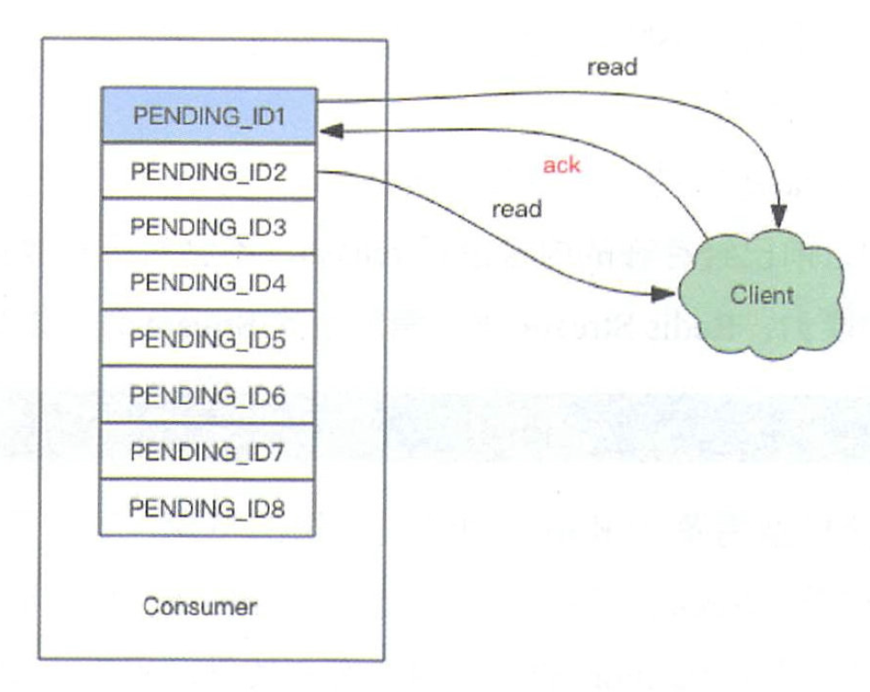

---

- **消息 ID**：形式为 `timestamplnMillis-sequence`，例如：1527846880572-5 表示当前的消息在毫米时间戳 1527846880572 时产生，并且是该毫秒内产生的第 5 条消息

  > 消息D 可以由服务器自动生成，也可以由客户端自己指定，但是形式必须是“整数-整数” ，而且后面加入的消息的ID 必须要大于前面的消息ID 

- **消息内容**：就是键值对

---

**指令**：

- `xadd`：向 Strearn 追加消息

  > xadd 提供了一个定长长度参数 maxlen，可以将老的消息干掉，确保链表不超过指定长度

- `xdel`：从Stream 中删除消息，这里的删除仅仅是设置标志位，不影响消息总长度

- `xrange`：获取 Stream 中的消息列表，会自动过滤已经删除的消息

- `xlen`：获取 Stream 消息长度

- `del`：删除整个Stream 消息列表中的所有消息

- `xread`：可以将 Stream 当成普通的消息队列来使用，忽略消费组的存在

- `xgroup create`：创建消费组，需要提供起始消息 ID 参数用来初始化 last_delivered_id 变量

  > 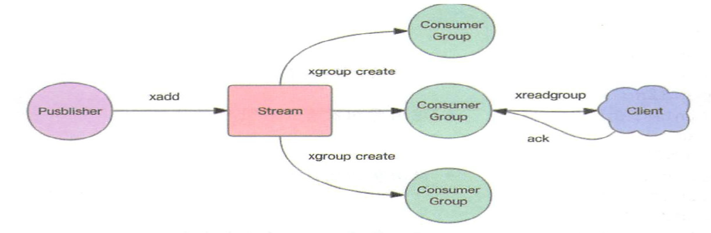

- `xreadgroup`：可以进行消费组的组内消费，需要提供消费组名称、消费者名称和起始消息 ID

  > 同 xread 一样，可以阻塞等待新消息。
  >
  > 读到新消息后，对应的消息 ID 就会进入消费者的 PEL 中，客户端处理完毕后，使用 xack 指令通知服务器，本条消息已经处理完毕，该消息 ID 就会从 PEL 中移除

# \# 单机数据库的实现

# 八、数据库

## 1. 服务器中的数据库

- redis 服务器将所有数据库都保存在服务器状态 `redis.h/redisServer` 结构的 db 数组中

- db 数组的每项都是一个 `redis.h/redisDb` 结构

- 每个 redisDb 结构代表一个数据库：

  ```c
  struct redisServer{
      //...
      //一个数组，保存服务器中的所有数据库
      redisDb *db;
      //服务器的数据库数量：值由服务器配置的 database 选项决定，默认为 16
      int dbnum;
      //...
  };
  ```

  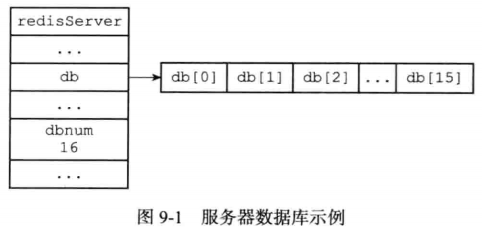

## 2. 切换数据库

- redis 客户**端默认目标数据库为0号数据库**，可以通过 **SELECT 命令来切换目标数据库**

- 客户端状态 redisClient 结构的 db 属性记录了客户端当前的目标数据库，这个属性是指向redisdb 结构的指针

  > redisClient.db 指针指向 redisServer.db 数组的其中一个元素，而被指向的元素就是客户端的目标数据库

  ```c
  typedef struct redisClient{
      //记录客户端当前正在使用的数据库
      redisDb *db;
      //...
  } redisClient;
  ```

> redis 之所以分这么多个数据库，也是**为了区分业务，不同的业务存放在不同的库** 

## 3. 数据库键空间

```c
typedef struct redisDb {
    dict *dict;                 /* DB键空间 */
    dict *expires;              /* 键过期集合 */
    int id;                     /* Database ID */
} redisDb;
```

- Redis 是一个键值对数据库服务器，服务器中的每个数据库都由一个 `redis.h/redisDb` 结构表示

- redisDB 的 dict 字典保存了数据库中的所有键值对，我们将这个字典称为**键空间**

**键空间和用户所见的数据库是直接对应的**：

- **键空间的键也就是数据库的键**，每个键都是一个字符串对象

- **键空间的值也就是数据库的值**，每个值可以是字符串对象，列表对象，哈希表对象，集合对象和有序集合对象中任意一种 Redis 对象

**读写键空间时的维护操作**：

> 当使用 Redis 命令对数据库进行读写时，服务器不仅对键空间执行指定的读写操作，还会执行维护工作

- 更新服务器的键空间命中次数和未命中次数

  > 可在 INFO stats 命令的 keyspace_hits 属性和 keyspace_misses 属性中查看

- 读取一个键之后，服务器会更新键的 LRU 时间，可用于计算键的闲置时间

  > 可使用命令 `OBJECT idletime<key>` 查看 

- 读取一个键发现键已经过期了，那么服务器会删除这个过期键，然后才执行余下的其他操作

- 如果有客户端使用 `WATCH` 命令监视某个键，被修改之后会记为脏（dirty），让事务程序注意到修改

- 每次修改一个键之后，都会对脏（dirty）键计数器的值增 1，这个计数器会触发服务器的持久化以及复制操作

- 若开启数据库通知功能，则键的修改触发数据库通知功能

## 4. 过期键

**设置键的生存时间或过期时间**：

- 通过命令 `EXPIRE 或 PEXPIRE`，可以**以秒或者毫秒为键设置生存时间**

  > 命令 `SETEX` 在设置一个字符串键的同时可为键设置过期时间

　　数据库主要由 dict 和 expires 两个字典构成，其中 dict 负责保存键值对，expires 负责保存键的过期时间

- 设置键的生存时间或过期时间命令：
  - `EXPIRE <key> <ttl>`： 用于将键 key 的生存时间设置为 ttl 秒
  - `PEXPIRE <key> <ttl>`： 用于将键 key 的生存时间设置为 ttl 毫秒
  - `EXPIREAT <key> <timestamp>`： 用于将键 key 的过期时间设置为 timestamp 所指定的秒数时间戳
  - `PEXPIREAT <key> <timestamp>`： 用于将键 key 的过期时间设置为 timestamp 所指定的毫秒数时间戳

**保存过期时间**： redisDb 结构的 expires 字典保存了数据库中所有键的过期时间，该字典成为过期字典：

- **过期字典的键是一个指针**，指向键空间中的某个键对象（即某个数据库键）
- **过期字典的值是一个 long long 类型的整数**，保存键所指向的数据库键的过期时间(毫秒精度的UNIX时间戳)

**移除过期时间**： 命令 `PERSIST` 可以移除一个键的过期时间

**计算并返回剩余生存时间**： **命令 TTL 以秒为单位返回， PTTL 以毫秒为单位返回**

**过期键删除**：

> redis 服务器实际使用的是惰性删除和定期删除，合理达到使用 CPU 时间与内存浪费的平衡

- **定时删除**： 设置键的过期时间时，创建一个定时器，让定时器在键的过期时间来临时，执行对键的删除操作

  > **优点**：（对内存友好） 保证键及时删除，且所占用内存
  >
  > **缺点**： （对 CPU 不友好） 过期键较多时，会占用许多 CPU 时间，影响服务器的响应时间和吞吐量

- **惰性删除**： 每次从键空间获取键时，都检查键是否过期；若过期则删除该键，否则返回该键

  > **优点**：（对 CPU 友好） 取键时才进行过期检查且仅删除当前处理的键
  >
  > **缺点**： （对内存不友好） 不能及时释放过期键所占内存，有内存泄漏危险
  >
  > **实现**： 由 `db.c/expireIfNeeded` 函数实现

- **定期删除**： 每隔一段时间，程序就对数据库进行检查，删除里面的过期键

  > **实现**： 由 `redis.c/activeExpireCycle` 函数实现

**AOF、RDB和复制功能对过期键的处理**：

- **RDB**：

  - **生成 RDB 文件**： 命令 `SAVE 或 BGSAVE` 创建新 RDB 文件时，会过滤已过期的键

  - **载入 RDB 文件**：

    - **若以<font color=red>主</font>服务器模式运行，会过滤过期键** 

    - **若以<font color=red>从</font>服务器模式运行，会载入所有键** 

      > 因为主从服务器进行数据同步时，从服务器会被清空，所以过期键不会影响从服务器

- **AOF**： 
  - **AOF 文件写入**： 过期键不会影响 AOF 文件；当过期键被删除后，AOF 文件会追加一条 DEL 命令来显示记录该键已被删除
  - **AOF 重写**：重写时，会过滤过期键

- **复制**： **复制模式下，从服务器的过期键删除由主服务器控制**

## 5. 数据库通知

- 该功能可让客户端通过订阅给定的频道或模式，来获知数据库中键的变化，以及数据库中命令的执行情况
- 配置 `notify-keyspace-events` 决定服务器发送通知类型：
  - `AKE`： 发送所有类型的键空间通知和键事件通知
  - `AK`： 发送所有类型的键空间通知
  - `AE`： 发送所有类型的键事件通知
  - `K$`： 只发送和字符串键有关的键空间通知
  - `El`： 只发送和列表键有关的键空间通知

**发送通知**： 发送数据库的通知的功能是由 `notif.c/notifyKeyspaceEvent` 函数实现： 

> `void notifyKeyspaceEvent(int type, char *event, robj *key, int dbid)`
>
> - `type`： 就是想要发送的通知类型
> - `event、key 和 dbid`： 分别是事件的名称、产生事件的键以及产出时间的数据库号码

# 九、RDB 与 AOF 持久化

## 1. RDB 持久化

- **数据库状态**： 服务器中的非空数据库以及他们的键值对统称

- **RDB持久化**： 将 Redis 在内存中的数据库状态保存到磁盘里面，避免数据意外丢失

  > - RDB 可以手动执行，也可以定期执行
  >
  > - 可以将某个时间点上的数据库状态保存到RDB文件中
  > - 通过该文件也可以还原数据库状态

- **RDB文件**： 是一个经过压缩的二进制文件，由多个部分组成

### 1. RDB 文件的创建与载入

**RDB 文件的创建**： 命令 `SAVE、BGSAVE `

- `SVAE`： 会阻塞 Redis 服务器进程，直到 RDB 文件创建完毕为止，在服务器进程阻塞期间，服务器不能处理任何命令请求
- `BGSAVE`： 派生出一个子进程，由子进程负责创建 RDB 文件，服务器进程(父进程)继续处理命令请求

**RDB 文件的载入**：服务器启动时，会自动载入，由函数 `rdb.c/rdbLoad` 完成

> **注意**： 只有 AOF 关闭时，才会使用 RDB 文件来还原数据库状态

**自动间隔性保存**： `save` 选项可让服务器每隔一段时间自动执行一次 `BGSAVE` 命令

> - 服务器程序根据 save 选项设置的保存条件，设置服务器状态 `redisServer` 结构的 `sasveparams` 属性
>
> - `sasveparams`属性是一个数组，数组中的每一个元素都是一个`sasveparam`结构，，每个`sasveparam`结构都保存了一个save选项设置的保存条件：
>
>   ```c
>   struct saveparam{
>       // 秒数
>       time_t seconds;
>       // 修改数
>       int change;
>       //修改计数器：记录距上次 SAVE或BGSAVE 后，数据库状态的修改次数
>       long long dirty;
>       //UNIX时间戳：记录上一次执行 SAVE或BGSAVE 的时间
>       time_t lastsave;
>   };
>   ```

### 2. RDB 文件结构

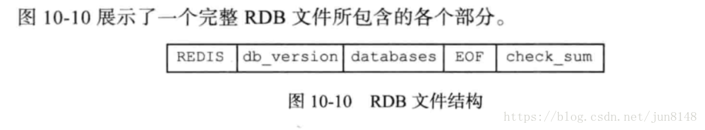

- `REDIS`： 长度5字节，保存着“REDIS”五个字符，**用于快速检查所载入的文件是否是RDB文件**
- `db_version`： 长度4字节，值是一个字符串表示的整数，这个整数**记录了RDB文件的版本号**
- `databases`： 包含零个或任意多个数据库，以及各个数据库中的键值对数据：

> 每个非空数据库都可以保存为 `SELECTDB、db_number、key_value_pairs` 三个部分
>
> 
>
> - `SELECTDB`： 长度是1字节，通知读入程序确定下一个要读入的是数据库号码
>
> - `db_number`： 保存着一个数据库号码，根据号码的大小不同，长度可以是1字节、2字节、5字节
>
>   > 当程序读入 db_number 部分后，服务器会调用 SELECT 命令，根据读入的数据库号码进行数据库切换，使得之后读入的键值对可以载入到正确的数据库中
>
> - `key_value_pairs`： 保存着数据库中的所有键值对数据
>
>   > - 如果键值对中带有过期时间，那么过期时间会和键值对保存在一起
>   >
>   > - 不带过期时间的键值对在RDB文件中由`TYPE`、`key`、`value`三部分组成
>   >
>   >   - `TYPE`： 记录 value 的类型，长度为 1 字节
>   >
>   >   - `key`： 是一个字符串对象
>   >   - `value`： 保存值对象
>   >
>   > - 带过期时间的键值对在RDB文件中由`EXPIRETIME`_MS、`ms`、`TYPE`、`key`、`value`组成
>   >
>   >   - `EXPIRETIME_MS`： 长度为 1 字节，它告知读入程序，接下来读入的是一个以毫秒为单位的过期时间
>   >   - `ms`： 是一个 8 字节长的带符号整数，记录着一个以毫秒为单位的UNIX时间戳，这个时间戳就是键值对的过期时间
>

- 如果服务器的数据库状态为空，则这个部分也为空，长度为 0 字节

- 如果服务器的数据库状态为非空，则这个部分也为非空

  > 根据数据库所保存键值对的数量、类型和内容不同，这个部分的长度也不同

- `EOF`： 长度是 1 字节，这个常量标识着 RDB 文件正文内容的结束，当程序遇到这个值的时候，就表明所有数据库中的**键值对已载入完毕**

- `check_sum`： 8 字节长的无符号整数，保存着一个校验和

  > - 该校验和是程序通过对 REDIS、db_version、databases、EOF 四个部分进行计算得到
  > - 服务器在载入 RDB 文件时，会将载入数据所计算出的校验和与 check_sum 所记录的校验和进行对比，以此来**检查 RDB 文件是否有出错或者损坏的情况出现**

## 2. AOF 持久化

> - AOF 持久化是通过保存Redis服务器**所执行的写命令**来记录数据库状态的
> - RDB 持久化是通过保存数据库中的键值对来记录数据库状态

### 1. AOF 的实现

AOF 持久化功能实现的三个步骤：

- **命令追加**： 当服务器执行完一个**写命令**之后，就会以协议格式**将被执行的写命令追加到服务器状态的`aof_buf`缓冲区的末尾**

- **文件写入**
- **文件同步**

> - 为了提高文件的写入效率，现代操作系统通常会将写入数据暂时保存在一个内存缓冲区里面， 等到缓冲区的空间被填满、或者超过了指定的时限之后， 才真正地将缓冲区中的数据写入到磁盘里面
>
> - 系统提供 `fsync 和 fdatasync` 同步函数， 强制让操作系统立即将缓冲区中的数据写入到硬盘里面， 从而确保写入数据的安全性

### 2. AOF 的效率和安全性

服务器配置 `appendfsync` 选项的值直接决定 AOF 持久化功能的效率和安全性

- 值为 `always` ： 服务器在每个事件循环都要将 `aof_buf` 缓冲区中的所有内容写入到 AOF 文件，并且**同步 AOF 文件**

  > - 效率最慢
  > - 最安全

- 值为 `everysec`： 服务器在每个事件循环都要将 `aof_buf` 缓冲区中的所有内容写入到 AOF 文件，并且**每隔一秒**就要在子线程中对 AOF 文件进行一次同步

- 值为 `no` ： 服务器在每个事件循环都要将 `aof_buf` 缓冲区中的所有内容写入到 AOF 文件中，由操作系统控制何时对 AOF 文件进行同步

  > - 速度最快

### 3. AOF 文件的载入与还原

- 因为 AOF 文件里包含了重建数据库状态的所有写命令，所以服务器**只要读入并重新执行一遍 AOF 文件中保存的写命令**，就可以还原服务器关闭之前的数据库状态

- Redis 读取 AOF 文件并还原数据库状态的详细步骤：

  - 创建一个不带网络连接的伪客户端

    > - Redis 的命令只能在客户端上下文执行，且载入 AOF 文件时的命令来源于AOF 文件
    > - 服务器使用一个伪客户端来执行 AOF 文件保存的写命令

  - 从AOF文件中分析并读取出一条写命令

  - 使用伪客户端执行被读出的写命令

  - 重复步骤2、步骤3直到 AOF 文件的所有写命令被处理完为止

### 4. AOF 重写

- **AOF文件重写**：**为解决 AOF 文件体积膨胀问题**，通过读取服务器当前数据库状态来实现

  > - 创建一个新的 AOF 文件替代现有的AOF文件
  >
  > - 新旧文件保存的数据库状态相同
  > - 新的文件不包含任何浪费空间的冗余命令

- **AOF 重写通过子进程来完成**

  > 目的：
  >
  > - 子进程进行 AOF 重写时，服务器进程(父进程)能继续执行命令请求
  > - 子进程带有服务器进程的数据副本，使用子进程可以在避免使用锁的情况下，保证数据的安全性

- redis 设置一个 **AOF 重写缓冲区**来解决子进程重写的数据不一致问题

  > - redis 执行一个写命令后，会同时将写命令发送给 AOF 缓冲区和 AOF 重写缓冲区
  >
  > - 子进程重写期间，服务器执行的工作：
  >
  >   - 执行客户端发来的命令
  >   - 将执行后的写命令追加到 AOF 缓冲区
  >   - 将执行后的写命令追加到 AOF 重写缓冲区
  >
  >   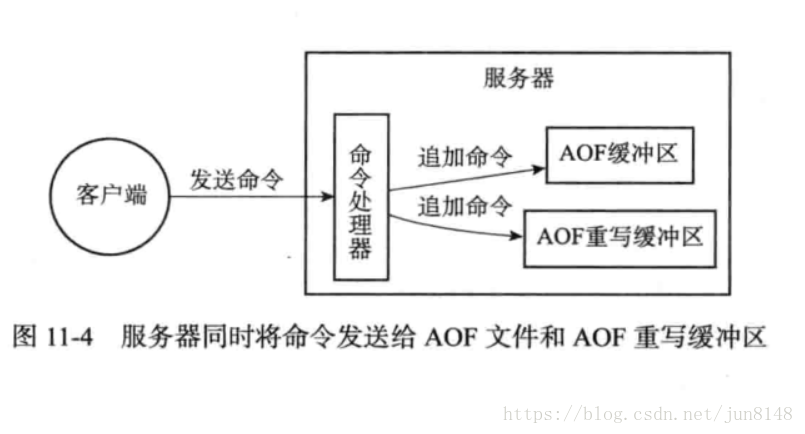
  >
  > - 这样就能保证：
  >
  >   - AOF 缓冲区的内容会被定期被写入和同步到AOF文件，对现有AOF文件的处理工作会如常进行
  >   - 从创建子进程开始，服务器执行的所有写命令都会被记录到 AOF 重写缓冲区中

- 当**子进程完成重写工作后**，父进程会调用一个信号处理函数，并执行以下工作：

  - 将 AOF 重写缓冲区的所有内容写入到新 AOF 文件中
  - 将新的 AOF 文件进行改名，原子地覆盖现有的AOF文件

- 重写过程中，**只有调用信号处理函数会阻塞服务器进程**

# 十、事件

Redis 服务器是一个事件驱动程序，服务器需处理两类事件：

- **文件事件**： Redis 服务器通过套接字与客户端进行连接，而文件事件就是服务器对套接字操作的抽象

  > 服务器与客户端的通信会产生相应的文件时间，而服务器则通过监听并处理这些事件来完成一系列的网络通信操作

- **时间事件**： Redis服务器中的一些操作需要在给定时间点执行，而时间事件就是对这类定时操作的抽象

## 1. 文件事件

- **文件时间处理器**： Redis 基于**Reactor模式**开发的网络事件处理器

  > - 文件时间处理器使用 **I/O 多路复用程序来同时监听多个套接字**，并根据套接字目前执行的任务为套接字关联不同的事件处理器
  > - 当被监听的套接字准备好执行连接应答、读取、写入、关闭等操作时，与操作相对应的文件事件就产生，这时文件时间处理器就会调用套接字之前关联好的时间处理器来处理这些事件
  >
  > 文件处理器通过使用 I/O 多路复用程序来监听多个套接字：
  >
  > - 既实现了高性能的网络通信模型
  > - 又很好的与 Redis 服务器中其他单线程运行模块进行对接

- **文件事件处理器的构成**：

  - **套接字**： 当一个套接字准备好执行连接应答、写入、读取、关闭等操作时，会产生一个文件事件，**多个文件事件可能会并发出现**
  - **I/O 多路复用程序**： 总是会将所有产生事件的套接字放到一个队列里面，然后通过这个队列以有序、同步、每次一个套接字的方式向文件事件分派器传送套接字
  - **文件事件分派器**： 接收I/O多路复用程序传来的套接字，根据套接字的时间类型，调用相应事件处理器
  - **事件处理器**： 是一个函数，定义某个时间发生时，服务器应执行的动作

  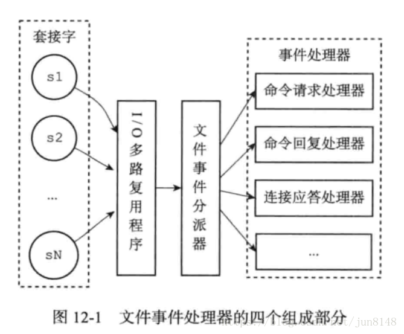

## 2. 时间事件

- 时间事件分类：
  - **定时事件**：让一段程序在指定时间执行一次
  - **周期性事件**：让一段程序每隔指定时间执行一次

- **时间事件的三个属性**：

  - `id`： 服务器为时间事件创建的全局唯一ID，从小到大递增

  - `when`：记录时间事件到达时间， 毫秒精度的UNIX时间戳

  - `timeProc`： 时间事件处理器，一个函数

    > 时间事件到达时，服务器调用相应的服务器处理事件

- 时间事件类型取决于时间事件处理器的返回值：

  - 如果事件处理器返回 `ae.h/AE_NOMORE`，则为定时事件

    > 该事件达到一次之后就会被删除，之后不会到达

  - 如果返回一个`非 AE_NOMORE` 的整数值，则为周期性事件

    > - 当一个时间事件到达后，服务器会根据事件处理器的返回值，对属性 when 进行更新
    >
    > - 让这个事件在一段时间之后再次到达，并以这种方式一直更新并运行

## 3. 事件的调度与执行

- 事件的调度和执行由 `ae.c/aeProcessEvents` 函数执行

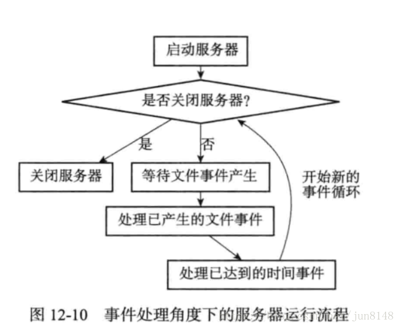

- 事件的调度和执行规则：

  - `aeApiPoll` 函数的最大阻塞时间由到达时间最接近当前时间的时间事件决定

    > - 既可避免服务器对时间事件进行频繁的轮询
    >
    > - 也可确保 `aeApiPoll` 函数不会阻塞过长时间

  - 等待并处理完随机出现的文件事件后，若未有时间事件到达，则继续处理文件事件

    > 随着文件事件的执行，时间会逐渐向时间事件所设置的到达时间逼近，并最终处理时间事件

  - 对文件事件和时间事件的处理都是同步、有序、原子的执行

    > 服务器不会中断事件处理，也不会对事件进行抢占

  - 时间事件的实际处理时间会比所设定的到达时间稍晚

    > 因为时间事件在文件事件后执行，且事件之间不会出现抢占

# 十一、客户端与服务器

- redis 服务器是典型的一对多服务器程序，一个服务器与多个客户端建立网络连接，每个客户端可以向服务器发送命令请求，而服务器则接收并处理客户端发送的命令请求，并向客户端返回命令回复

- 通过使用由 I/O 多路复用技术实现的文件事件处理器，Redis 服务器使用单线程单进程的方式来处理命令求，并与多个客户端进行网络通信

- 对于每个与服务器进行连接的客户端，服务器都为这些客户端建立了相应的 `redis.h/redisClient` 结构(客户端状态)，这个结构保存了客户端当前的状态信息，以及执行相关功能时需要用到的数据结构，其中包括：

  ```c
  typedef struct redisClient {
      // 套接字描述符
      int fd;
      // 当前正在使用的数据库
      redisDb *db;
      // 当前正在使用的数据库的 id （号码）
      int dictid;
      // 客户端的名字
      robj *name;            
      // 查询缓冲区
      sds querybuf;
      // 查询缓冲区长度峰值
      size_t querybuf_peak;  
      // 参数数量
      int argc;
      // 参数对象数组
      robj **argv;
      // 记录被客户端执行的命令
      struct redisCommand *cmd, *lastcmd;
      // 请求的类型：内联命令还是多条命令
      int reqtype;
      // 剩余未读取的命令内容数量
      int multibulklen;      
      // 命令内容的长度
      long bulklen;         
      // 回复链表
      list *reply;
      // 回复链表中对象的总大小
      unsigned long reply_bytes; 
      // 已发送字节，处理 short write 用
      int sentlen;            
      // 创建客户端的时间
      time_t ctime;          
      // 客户端最后一次和服务器互动的时间
      time_t lastinteraction; 
      // 客户端的输出缓冲区超过软性限制的时间
      time_t obuf_soft_limit_reached_time;
      // 客户端状态标志
      int flags;             
      // 当 server.requirepass 不为 NULL 时,代表认证的状态:  0 代表未认证， 1 代表已认证
      int authenticated;      
      // 复制状态
      int replstate;          
      // 用于保存主服务器传来的 RDB 文件的文件描述符
      int repldbfd;           
      // 读取主服务器传来的 RDB 文件的偏移量
      off_t repldboff;       
      // 主服务器传来的 RDB 文件的大小
      off_t repldbsize;      
      
      sds replpreamble;      
      // 主服务器的复制偏移量
      long long reploff;     
      // 从服务器最后一次发送 REPLCONF ACK 时的偏移量
      long long repl_ack_off; 
      // 从服务器最后一次发送 REPLCONF ACK 的时间
      long long repl_ack_time;
      // 主服务器的 master run ID
      // 保存在客户端，用于执行部分重同步
      char replrunid[REDIS_RUN_ID_SIZE+1]; 
      // 从服务器的监听端口号
      int slave_listening_port;
      // 事务状态
      multiState mstate;      
      // 阻塞类型
      int btype;              
      // 阻塞状态
      blockingState bpop;    
      // 最后被写入的全局复制偏移量
      long long woff;         
      // 被监视的键
      list *watched_keys;     
      // 这个字典记录了客户端所有订阅的频道
      // 键为频道名字，值为 NULL
      // 也即是，一个频道的集合
      dict *pubsub_channels;  
   
      // 链表，包含多个 pubsubPattern 结构,记录了所有订阅频道的客户端的信息
      list *pubsub_patterns; // 新 pubsubPattern 结构总是被添加到表尾
      sds peerid;           
      // 回复偏移量
      int bufpos;
      // 回复缓冲区
      char buf[REDIS_REPLY_CHUNK_BYTES];
  } redisClient;
  ```

## 1. 客户端

### 1. 客户端属性

客户端状态包含的属性：

- **比较通用的属性**： 无论客户端执行的是什么工作，都要用到这些属性

- **和特定功能相关的属性**

#### 1. 套接字描述符

- 客户端状态的 `fd` 属性记录了客户端正在使用的套接字描述符

- 根据客户端类型的不同，fd 属性的值可以是-1或者大于-1的整数：
  - **伪客户端的 fd 属性的值为 -1**： 伪客户端处理的命令请求来源于 AOF 文件或者 Lua 脚本
  - **普通客户端的 fd 属性的值为大于 -1 的整数**：普通客户端使用套接字来与服务器进行通信

> 命令 `CLIENT list` 可以列出目前所有连接到服务器的普通客户端，命令输出中的 fd 域显示了连接客户端所使用的套接字描述符

#### 2. 名字

- 默认情况下，连接到服务器的客户端是没有名字的。

- 命令`CLIENT setname` 可为客户端设置一个名字，让客户端的身份变得更清晰

- 客户端的名字记录在客户端状态的`name` 属性中

#### 3. 标志

- 客户端的标志属性 `flags` 记录了客户端的角色，以及客户端目前所处的状态

- 每个标志使用一个常量表示

  一部分标志**记录了客户端的角色**：

  - `REDIS_MASTER` 标志表示客户端代表一个主服务器， `REDIS_SLAVE` 标志表示客户端代表一个从服务器

  - `REDIS_PRE_PSYNC` 标志表示客户端代表的是一个版本低于 Redis 2.8 的从服务器， 主服务器不能使用 PSYNC 命令与这个从服务器进行同步

    > 这个标志只能在 `REDIS_SLAVE` 标志处于打开状态时使用

  - `REDIS_LUA_CLIENT` 标识表示客户端是专门用于处理 Lua 脚本里面包含的 Redis 命令的伪客户端

  另外一部分标志记**录了客户端目前所处的状态**：

  - `REDIS_MONITOR` 标志表示客户端正在执行 `MONITOR` 命令

  - `REDIS_UNIX_SOCKET` 标志表示服务器使用 UNIX 套接字来连接客户端

  - `REDIS_BLOCKED` 标志表示客户端正在被 `BRPOP, BLPOP` 等命令阻塞

  - `REDIS_UNBLOCKED` 标志表示客户端已从 `REDIS_BLOCKED` 标志所表示的阻塞状态中脱离出来， 不再阻塞

    > REDIS_UNBLOCKED 标志只能在 REDIS_BLOCKED 标志已经打开的情况下使用

  - `REDIS_MULTI` 标志表示客户端正在执行事务

  - `REDIS_DIRTY_CAS` 标志表示事务使用 `WATCH` 命令监视的数据库键已经被修改，`REDIS_DIRTY_EXEC` 标志表示事务在命令入队时出现了错误

    > - 以上两个标志都表示事务的安全性已经被破坏， 只要这两个标记中的任意一个被打开， EXEC 命令必然会执行失败
    > - 这两个标志只能在客户端打开了 REDIS_MULTI 标志的情况下使用

  - `REDIS_CLOSE_ASAP` 标志表示客户端的输出缓冲区大小超出了服务器允许的范围， 服务器会在下一次执行 serverCron 函数时关闭这个客户端， 以免服务器的稳定性受到这个客户端影响

    >  即存在输出缓冲区中的所有内容会直接被释放， 不会返回给客户端

  - `REDIS_CLOSE_AFTER_REPLY` 标志表示有用户对这个客户端执行了 `CLIENT_KILL` 命令， 或者客户端发送给服务器的命令请求中包含了错误的协议内容

    > 服务器会将客户端积存在输出缓冲区中的所有内容发送给客户端， 然后关闭客户端

  - `REDIS_ASKING` 标志表示客户端向集群节点（运行在集群模式下的服务器）发送了 ASKING 命令
  - `REDIS_FORCE_AOF` 标志强制服务器将当前执行的命令写入到 AOF 文件里面
  - `REDIS_FORCE_REPL` 标志强制主服务器将当前执行的命令复制给所有从服务器

  - 在主从服务器进行命令传播期间， 从服务器需要向主服务器发送 `REPLICATION ACK` 命令， 在发送这个命令之前， 从服务器必须打开主服务器对应的客户端的 `REDIS_MASTER_FORCE_REPLY` 标志， 否则发送操作会被拒绝执行

#### 4. 输入缓冲区

- 输入缓冲区用于保存客户端发送的命令请求

#### 5. 命令与命令参数

- 服务器将客户端发送的命令请求保存到客户端的 `querybuf` 属性中后
- 服务器会对命令请求的内容进行解析
- 并将得出的命令参数以及命令参数的个数分别保存到客户端状态的 `argv` 属性和 `argc` 属性

#### 6. 命令的实现函数

- 当服务器分析得到 `argv` 属性和 `argc` 属性之后，服务器根据`argv[0]`的值，在**命令表**中查找命令所对应的命令实现函数

#### 7. 输出缓冲区

- 执行命令后得到的命令回复会被保存到客户端状态的输出缓冲区里
- 每个客户端都有两个缓冲区可用：
  - 一个固定大小缓冲区： 保存长度较小的回复
  - 一个可变大小缓冲区： 板寸长度较大的回复

#### 8. 身份验证

- 客户端状态的 `authenticated` 属性记录客户单是否通过了身份验证

#### 9. 时间

- `ctime` 属性： 记录了创建客户端的时间，用于计算客户端与服务器已经连接了多少秒

  > `CLIENT list` 命令的 age 域记录了这个秒数

- `lastinteraction` 属性： 记录客户端与服务器最后一次互动的时间

  > 互动： 指的是客户端向服务器发送命令请求，或者服务器向客户端发送命令回复

- `obuf_soft_limit_reached_time` 属性： 记录了输出缓冲区第一次到达软件限制的时间

### 2. 客户端的创建与关闭

#### 1. 普通客户端

- **创建**： 普通客户端使用 `connect` 函数连接服务器的时候，服务器会调用事件处理器，为客户端创建相应的客户端状态，并将这个新的客户端状态添加到服务器状态结构 `clients` 链表的末尾

- **关闭**：

  **关闭的原因**：

  - 客户端进程退出或被杀死

  - 客户端向发送了不符合协议格式的命令请求

  - 客户端成为 `CLIENT KILL` 命令的目标

  - 客户端的空转时间超过服务器设置的 `timeout` 选项

  - 客户端发送的命令请求的代销超过了输入缓冲区的显示大小(默认1GB)

  - 客户端的命令回复超过了输出缓冲区的限制大小

  **服务器使用两种方式限制客户端输出缓冲区的大小**：

  - **硬性限制**： 如果输出缓冲区超过了硬性限制，立马关闭客户端

  - **软性限制**： 
    - 输出缓冲区超过了软性限制，而没超过硬性限制，则服务器将使用客户端状态结构的`obuf_soft_limit_reached_time` 属性记录客户端达到软性限制的起始时间，监视客户端
    - 输出缓冲区一直超过软性限制，并且持续时间超过服务器设定的时长，则服务器将关闭客户端
    - 在指定时间内，不再超过软性限制，那么客户单不会被关闭，并且`obuf_soft_limit_reached_time` 的值会被清零

- 使用 `client-output-buffer-limit` 选项为普通、从服务器、执行发布与订阅功能的客户端分别设置不同的软性或者硬性限制：

  命令格式：`client-output-buffer-limit <class> <hard limt> <soft limit< <soft seconds>`

#### 2. Lua 脚本的伪客户端

- 服务器会在初始化时创建负责执行 Lua 脚本中包含的Redis命令的伪客户端，并将这个伪客户端关联在服务器状态结构的 `lua_client` 属性中

- `lua_client` 伪客户端会在服务器运行的整个生命周期中一直存在，当服务器关闭时才关闭

#### 3. AOF 文件的伪客户端

- 服务器在载入 AOF 文件时，会创建用于执行 AOF 文件包含的 Redis 命令的伪客户端
- 在载入 AOF 完成之后，关闭这个伪客户端

## 2. 服务器

- Redis 服务器负责与多个客户端建立网络连接，处理客户端发送的命令请求
- 在数据库中保存客户端执行命令所产生的数据，并通过资源管理来维持服务器自身的运转

### 1. 命令请求的执行过程

#### 1. 发送命令请求

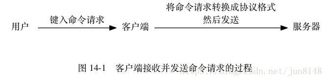

#### 2. 读取命令请求

当客户端与服务器之间的连接套接字因为客户端的写入变成可读时，服务器会调用命令请求处理器执行一下操作： 

- 读取套接字中协议格式的命令请求，并保存到客户端状态的输入缓冲区中
- 对输入缓冲区中的命令请求进行分析，提取出命令请求中包含的命令参数，以及命令参数的个数，然后分别将参数和参数个数保存到客户端状态的 argv 和 argc 属性中去

- 调用命令执行器，执行客户端指定的命令

#### 3. 命令执行器

##### 1. 查找命令

- 命令执行器的第一件事是根据客户端状态的 `argv[0]` 参数，在命令表中查找参数所指定的命令，并将找到的命令保存到客户端的 `cmd` 属性中

- 命令表是一个字典，键是命令的名字，值是 `redisCommand` 结构，每个 `redisCommand` 记录了一个 Redis 命令的实现信息

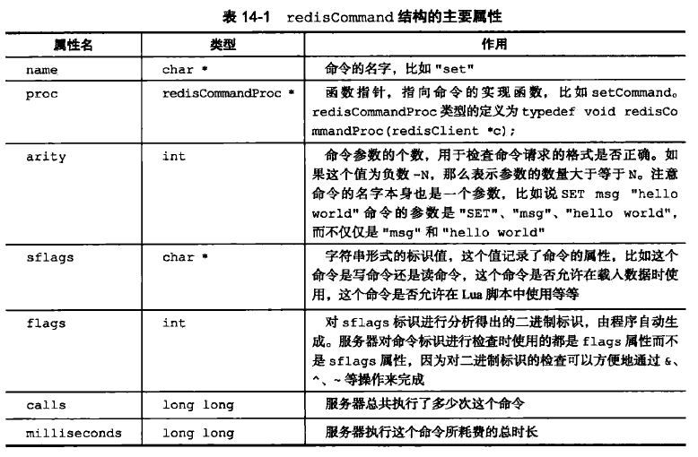

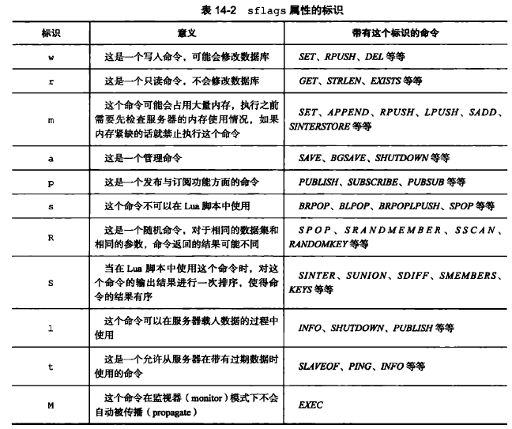

##### 2. 执行预备操作

在真正执行命令之前， 程序还需要进行一些预备操作：

- 检查客户端状态的 cmd 指针是否指向 NULL 

  > 如果是的话，那么说明用户输入的命令名字找不到相应的命令实现，服务器不再执行后续步骤， 并向客户端返回一个错误

- 根据客户端 cmd 属性指向的 redisCommand 结构的 arity 属性， 检查命令请求所给定的参数个数是否正确

  > 当参数个数不正确时，不再执行后续步骤，直接向客户端返回一个错误

- 检查客户端是否已经通过了身份验证， 未通过身份验证的客户端只能执行 AUTH 命令

  > 如果未通过身份验证的客户端试图执行除 AUTH 命令之外的其他命令， 那么服务器将向客户端返回一个错误

- 如果服务器打开了 maxmemory 功能，那么在执行命令之前，先检查服务器的内存占用情况，并在有需要时进行内存回收，从而使得接下来的命令可以顺利执行

  > 如果内存回收失败，那么不再执行后续步骤，向客户端返回一个错误

- 如果服务器上一次执行 `BGSAVE` 命令时出错，并且服务器打开了 `stop-writes-on-bgsave-error` 功能，且服务器即将要执行的命令是一个写命令，则服务器将拒绝执行这个命令，并向客户端返回一个错误

- 如果客户端当前正在用 `SUBSCRIBE` 命令订阅频道，或者正在用 `PSUBSCRIBE` 命令订阅模式

  > 则服务器只会执行客户端发来的 `SUBSCRIBE, PSUBSCRIBE, UNSUBSCRIBE, PUNSUBSCRIBE` 四个命令

- 如果服务器正在进行数据载入，那么客户端发送的命令必须带有 `l` 标识才会被服务器执行

- 如果服务器因为执行 Lua 脚本而超时并进入阻塞状态，那么服务器只会执行客户端发来的 `SHUTDOWN nosave` 命令和 `SCRIPT KILL` 命令

- 如果客户端正在执行事务， 那么服务器只会执行客户端发来的 `EXEC, DISCARD, MULTI, WATCH` 四个命令

- 如果服务器打开了监视器功能，那么服务器会将要执行的命令和参数等信息发送给监视器

当完成了以上预备操作之后， 服务器就可以开始真正执行命令了

##### 3. 调用命令的实现函数

当服务器要执行命令时，它执行以下语句：`client->cmd->proc(client);`

##### 4. 执行后续操作

在执行完实现函数之后，服务器还需要执行一些后续工作：

- 如果服务器开启了慢查询日志功能，那么慢查询日志模块会检查是否需要为刚刚执行完的命令请求添加一条新的慢查询日志
- 根据刚刚执行命令所耗费的时长，更新被执行命令的 `redisCommand` 结构的 `milliseconds` 属性， 并将命令的 `redisCommand` 结构的 `calls` 计数器的值增一
- 如果服务器开启了 AOF 持久化功能，那么 AOF 持久化模块会将刚刚执行的命令请求写入到 AOF 缓冲区里面

- 如果有其他从服务器正在复制当前这个服务器，那么服务器会将刚刚执行的命令传播给所有从服务器

#### 4. 将命令回复发给客户端

- 当客户端套接字为可写状态时，命令回复处理器会将保存在客户端输出缓冲器中的命令回复发给客户端
- 命令回复发送完后，回复处理器会清空客户端状态的输出缓冲区

#### 5. 客户端接收并打印命令回复

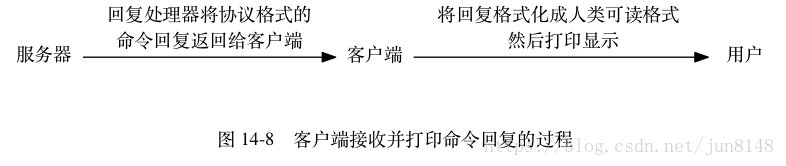

### 2. serverCron 函数

- `erverCron` 函数每100毫秒执行一次，负责管理服务器资源，并保持服务器自身的良好运转

#### 1. 更新服务器时间缓存

- 服务器状态中的 `unixtime` 属性和 `mstime` 属性被用作当前时间的缓存

  > `serverCron`函数每100毫秒更新一次这个数据

#### 2. 更新 LRU 时钟

- 服务器状态中的 `lruclock` 属性保存服务器的 LRU 时钟，是服务器时间缓存之一
- 每个对象都有一个 lru 属性，用于保存对象最后一次被命令访问的时间
- 当服务器要计算一个数据库键的空转时间，程序会用服务器的 `lruclock` 属性减对象的 `lru` 属性的值，得出结果

> `serverCron` **每10秒**更新一次 lruclock 的值

#### 3. 更新服务器每秒执行命令次数

#### 4. 更新服务器内存峰值记录

#### 5. 处理 SIGTERM 信号

#### 6. 管理客户端资源

#### 7. 管理数据库资源

#### 8. 执行被延迟的 BGREWRITEAOF

#### 9. 检查持久化操作的运行状态

#### 10. 将 AOF 缓冲区的内容写入到AOF文件

#### 11. 关闭异步客户端

#### 12. 增加 cronloops 计数器的值

### 3. 初始化服务器

#### 1. 初始化服务器状态结构

- 第一步： 创建一个 `struct redisServer` 类型的实例变量 `server` 作为服务器的状态，并为结构中的各个属性设置默认值

- 初始化 `server` 变量的工作由 `redis.c/initServerConfig` 函数完成

  ```c
  void initServerConfig(void){
      // 设置服务器的运行id
      getRandomHexChars(server.runid,REDIS_RUN_ID_SIZE);
      // 为运行id加上结尾字符
      server.runid[REDIS_RUN_ID_SIZE] = '\0';
      // 设置默认配置文件路径
      server.configfile = NULL;
      // 设置默认服务器频率
      server.hz = REDIS_DEFAULT_HZ;
      // 设置服务器运行架构
      server.arch_bits = (sizeof(long) == 8) ? 64 : 32;
      // 设置默认服务器端口
      server.port = REDIS_SERVERPORT;
      // 设置服务器的默认RDB持久化条件和AOF持久化条件
      // 初始化服务器的 LRU 时钟
      // 创建命令表
      
      // ...
  }
  ```

#### 2. 载入配置选项

- 启动服务器的时候，用户可以通过给定配置参数或者指定配置文件来修改服务器的默认配置

#### 3. 初始化服务器数据结构

服务器状态的数据结构：

- 命令表

- `server.clients` 链表：记录了与服务器相连的客户端状态结构

  > 链表的每个节点都包含了一个 `redisClient` 结构实例

- `server.db` 数组： 包含了服务器的所有数据库

- `server.pubsub_channels` 字典：用于保存频道订阅信息

- `server.pubsub_patterns` 链表： 用于保存模式订阅信息

- `server.lua`：用于执行 Lua 脚本的 Lua 环境

- `server.slowlog` 属性：用于保存慢查询日志

除初始化数据结构，initServer 还进行一些设置：

- 为服务器设置进程信号处理器
- 创建共享对象
- 打开服务器的监听端口，并为监听套接字关联连接应答事件处理器，等待服务器正式运行时接受客户端的连接
- 为 `serverCron` 函数创建时间事件
- 若 AOF 持久化功能已打开，则打开现有 AOF 文件，否则创建并打开一个新的 AOF 文件
- 初始化服务器后台 I/O 模块

#### 4. 还原数据库状态

- 初始化 server 变量后，服务器会载入 RDB 文件或 AOF 文件，并根据文件内容来还原服务器的数据库状态

- 根据服务器是否启用了AOF持久化功能，服务器载入数据所使用的目标文件有所不同：
  - 如果开启了，那么载入 AOF 文件来还原数据库状态
  - 如果没开启，那么服务器使用 RDB 文件来还原数据库状态

#### 5. 执行事件循环

# \# 多机数据库的实现

# 十二、复制

- Redis中，可以使用 `SLAVEOF` 命令或者设置 `slaveof` 选项，让一个服务器去复制另外一个服务器，被复制的服务器称为**主服务器**，对主服务器进行复制的服务器称为**从服务器**

## 1. 旧版复制

Redis 的复制功能分为两步：

- **同步**： 用于将从服务器的数据库状态更新至主服务器当前所处的数据库状态

  > 从服务器通过向主服务器发送 `SYNC` 命令完成同步操作，步骤如下：
  >
  > - 从服务器向主服务器发送 `SYNC` 命令
  > - 收到 `SYNC` 命令的主服务器执行 `BGSAVE` 命令，在后台生成一个 RDB文件，并使用一个缓冲区记录从现在开始执行的所有写命令
  > - 当主服务器的 `BGSAVE` 命令执行完毕时，主服务器将 `BGSAVE` 命令生成的 RDB 文件发送给从服务器，从服务器接收并载入这个 RDB 文件，将自己的数据库状态更新至主服务器执行 BGSAVE 命令时的数据库状态
  >
  > - 主服务器将记录在缓冲区里面的所有写命令发送给从服务器，从服务器执行这些写命令，将自己的数据库状态更新至主服务器数据库当前的所处状态
  >
  > 

- **命令传播**： 用于在主服务器上的数据库状态被修改，导致主从服务器的数据库状态出现不一致时，让主从服务器的数据库状态重新回到一致

  > 主服务器将自己执行的写命令，即导致主从服务器不一致的那条写命令发送给从服务器执行，当从服务器执行了相同的写命令之后，主从服务器又回到了一致状态

Redis 复制分为两种情况：

- **初次复制**： 从服务器以前没有复制过任何主服务器，或者从服务器当前要复制的主服务器和上次复制的主服务器不同

- **断线后重复制**： 处于命令传播阶段的主从服务器因为网络原因而中断了复制，但从服务器通过自动重连接重新连接上了主服务器，并继续复制主服务器

**旧版本复制缺陷**： 对于断线后重复制，旧版本复制效率很低

## 2. 新版复制

- **新版复制**： 为解决旧版复制断线后重连后的低效问题

  > 采用 `PSYNC` 命令来代替 `SYNC` 命令来执行复制时的同步操作

- PSYNC 的两种模式：

  - **完整重同步**： **用于处理初次复制情况**

    > 步骤基本和 SYNC 命令的执行步骤一样：都是主服务器创建并发送RDB文件，向从服务器发送保存在缓冲区里面的写命令来进行同步

  - **部分重同步**： **用于断线后重复制情况**

    > 当从服务器断线后重新连接主服务器时： 如果条件允许，主服务器可以将主从服务器连接断开期间执行的写命令发送给从服务器，从服务器只要接收并执行这些写命令，就可以将数据库更新至主服务器当前所处的状态

### 1. 部分重同步

**部分重同步由三个部分构成**：

- **主服务器的复制偏移量和从服务器的复制偏移量**： 通过对比主从服务器的复制偏移量，可以知道主从服务器是否处于一致状态

  > 主从服务器都分别维护着一个复制偏移量：
  >
  > - 主服务器每次向从服务器传播 N 个字节的数据时，就将自己的复制偏移量的值加上 Ｎ
  > - 从服务器每次接收到主服务传播来的 N 个字节的数据，就将自己的复制偏移量的值加上N

- **主服务器的复制积压缓冲区**

  > - 复制积压缓冲区是由**主服务器维护**一个**固定长度先进先出队列**，默认1MB
  >
  > - 当主服务器进行命令传播时，不仅将命令发送给所有从服务器，还将写命令入队到复制积压缓冲区
  >
  > 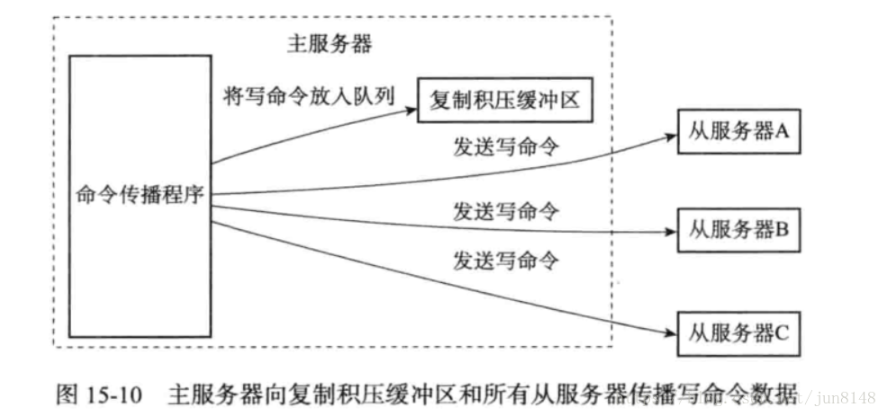
  >
  > - 断线后重连上主服务器时，从服务器会将自己的复制偏移量发送给主服务器，主服务器根据这个复制偏移量来决定对从服务器执行何种同步操作：
  >
  >   - 如果这个偏移量之后的数据(即偏移量offse+1后的开始的数据)，仍然存在于复制积压缓冲区里，主服务器将对从服务器执行部分重同步操作
  >
  >   - 若该偏移量之后的数据不存在复制积压缓冲区，那么主服务器对从服务器执行完整重同步操作

- **服务器的运行 ID**

  > - 每个Redis 服务器都会有自己的运行 ID
  > - 运行ID在服务器启动时自动生成，由40个随机的十六进制字符组成
  >
  >----
  >
  > - 当从服务器对主服务器进行初次复制时，主服务器会将自己的运行ID传送给从服务器，从服务器将这个ID保存下来
  >
  > - 当从服务器断线后重连主服务器时，从服务器将向当前连接的主服务器发送之前保存的ID：
  >
  >   - 如果ID相同，则表示当前连接的主服务器是断线之前连接的那个服务器，主服务器可以继续执行部分重同步
  >
  >   - 如果不同，则表示当前连接的主服务器不是断线之前连接的那个主服务器，主服务器对从服务器执行完整重同步操作

### 2. PSYNC 命令实现

PSYNC 命令调用的两种方式：

- 从服务器以前**没有复制过任何主服务器**，或者之前执行过 `SLAVEOF no one` 命令，那么从服务器在开始新的复制时将向主服务器发送 `PSYNC ? -1` 命令，主动请求主服务器**进行完整重同步**

- 如果已经复制过，那么从服务器在开始一次新的复制时将向主服务器发送 `PSYNC <runid> <offset>` 命令：

  >
  > 主服务器通过这两个参数判断应该对从服务器执行哪种同步操作
  >
  > - runid 是上一次复制的主服务器的运行 ID
  > - offset 是从服务器当前的复制偏移量

- 根据命令的不同，主服务器向从服务器返回的回复也不同：

  - 如果主服务器返回 `+FULLRESYNC <runid> <offset>`  回复，则表示主服务器将与从服务器**执行完整重同步**操作

    > - runid 是这个主服务器的运行ID，从服务器将这个ID保存下来
    > - offset 则是主服务器当前的复制偏移量，从服务器将这个值作为自己的初始化偏移量

  - 如果主服务器返回 `+CONTINUE` 回复，则**执行部分重同步**

  - 如果主服务器返回 `-ERR` 回复，表示识别不了 PSYNC 命令，从服务器将向主服务器发送 SYNC 命令，并与主服务器**执行完整同步操作**

  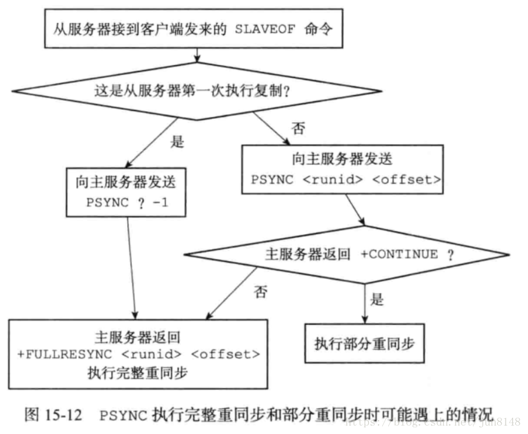

## 3. 复制的实现

- 通过对从服务器发送 `SLAVEOF` 命令，可以让从服务器去复制主服务器：`SLAVEOF <master_ip> <master_port>`

**redis 2.8 以上版本复制功能实现步骤**：

- 步骤1：**设置主服务器的地址和端口**

- 步骤2：**建立套接字连接**

- 步骤3：**发送 `PING` 命令**
- 步骤4：**身份验证**
- 步骤5：**发送端口信息**
- 步骤6：**同步**
- 步骤7：**命令传播**

## 4. 心跳检测

- 在命令传播阶段，从服务器默认会以每秒一次的频率，向主服务器发送命令： `REPLCONF ACK <replication_offset>`

  该命令作用：

  - **检测主从服务器的网络连接状态**

    > - 如果主服务器超过一秒钟没有收到从服务器发来的 `REPLCONF ACK` 命令，那么主服务器就知道主从服务器之间的连接出现问题了
    >
    > - 通过向主服务器发送 `INFO replication` 命令，可以看到 REPLCONF ACK 命令过去时间

  - **辅助实现 `min-slaves` 选项**

    > redis的 `min-slaves-to-write` 和 `min-slaves-max-lag` 两个选项可以**防止主服务器在不安全的情况下执行写命令**

  - **检测命令丢失**

    > 主服务器根据从服务器提交的复制偏移量，在复制积压缓冲区里找到从服务器缺少的数据，并将这些数据重新Fagin从服务器

# 十三、Sentinel(哨兵)

- Sentinel 负责持续监控主从节点，当主节点挂掉时，自动选择最优的从节点切换成主节点

  - 客户端来连接集群时，会首先连接 Sentinel，通过 Sentinel 来查询主节点的地址，然后再连接主节点进行数据交互
  - 当主节点发生故障时，客户端会重新向 Sentinel 要地址，Sentinel 会将最新的主节点地址告诉客户端

  > 原先挂掉的主节点会变成从节点，从新的主节点那里建立复制关系
  >
  > Sentinel 默认端口为 26379

- 消息丢失：Sentinel 无法保证消息完全不丢失，但尽量保证少丢失

  > 限制主从延迟过大的两个选项：
  >
  > - 第一个参数：表示主节点必须至少有一个从节点在进行正常复制，否则就停止对外写服务，丧失可用性
  > - 第二个参数：表示若在 10s 内没有收到从节点的反馈，则意味着从节点同步不正常

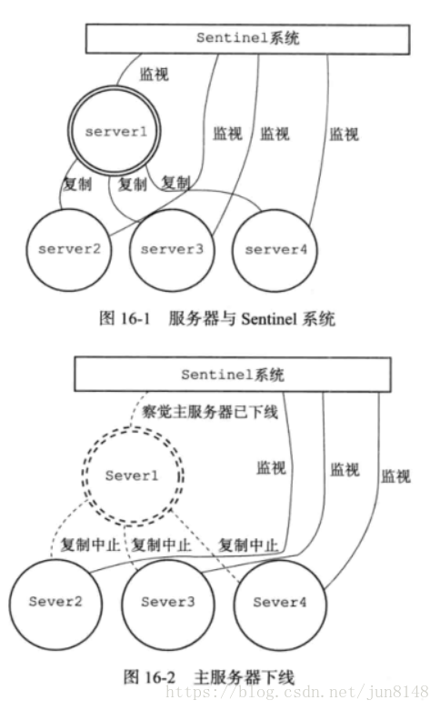

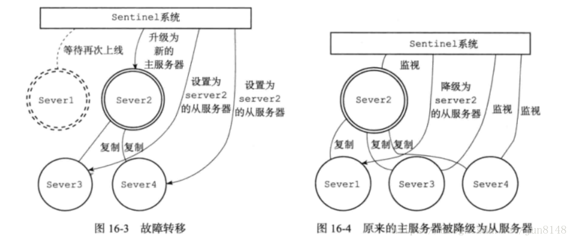

## 1. 启动并初始化Sentinel

- 启动 Sentinel 命令：

  ```shell
  $ redis-sentinel /path/to/your/sentinel.conf
  或者
  $ redis-sentinel /path/to/your/sentinel.conf --sentinel
  ```

- Sentinel启动后，会执行五个步骤：

  - **初始化服务器**

    > Sentinel 的本质是一个运行在特殊模式下的 Redis 服务器

  - **将普通 redis 服务器使用的代码转换成 Sentinel 专用代码**

  - **初始化 Sentinel 状态**

    > - 服务器会初始化一个 `sentinel.c/sentinelState` 结构(简称 “Sentinel状态”)
    >
    > - 该结构保存了服务器所有和Sentinel功能有关的状态，服务器的一般状态仍然由 `redis.h/redisServer` 结构保存
    >
    > ```c
    > typedef struct sentinelState{
    >     // 当前纪元，用于实现故障转移
    >     uint64_t current_epoch;
    >     // 保存了所有被这个 Sentinel监视的主服务器
    >     // 字典的键是主服务器的名字
    >     // 字典的值是一个指向 sentinelRedisInstance 结构的指针
    >     dict *masters;
    >     // 是否进入了 TILT 模式
    >     int tilt;
    >     // 目前正在执行的脚本数量
    >     int running_scripts;
    >     // 进入 TILT 模式的时间
    >     mstime_t tilt_start_time;
    >     // 最后一次执行事件处理器的时间
    >     mstime_t previous_time;
    >     // 一个 FIFO 队列，包含了所有需要执行的用户脚本
    >     list *scripts_queue;
    > }sentinel;
    > ```

  - **初始化 Sentinel 状态的 `masters` 属性** 

    > Sentinel 状态中的 masters 字典记录了所有被 Sentinel 监视的主服务器信息：
    >
    > - 字典的键是被监视主服务器的名字
    > - 字典的值是被监视主服务器对应的 `sentinel.c/sentinelRedisInstance` 结构
    >
    > ```c
    > typedef struct sentinelRedisInstance{
    >     // 标识值，记录了实例的类型，以及该实例的当前状态
    >     int flags;
    >     // 实例的名字
    >     // 主服务器的名字有用户在配置文件
    >     // 从服务器以及sentinel的名字有Sentinel自动设置
    >     // 格式 为ip：port，例如“127.0.0.1:26379”
    >     char *name;
    >     // 实例的运行ID
    >     char *runid;
    >     // 配置纪元，用于实现故障转移
    >     uint64_t config_epoch;
    >     // 实例的地址
    >     sentinelAddr *addr;
    >     // SENTINEL down-after-millseconds 选项设定的值
    >     // 实例无响应多少毫秒之后才会被判断为主观下线
    >     mstime_t down_after_period;
    >     //SENTINEL monitor <master-name> <IP> <port> <quorum>选项中的quorum参数
    >     // 判断这个实例为客观下线(objectively down)所需的支持投票数量
    >     int quorum;
    >     // SENTINEL parallel-syncs <master-name> <number> 选项的值
    >     // 在执行故障转移操作时，可以同时对新的主服务器进行同步的从服务器数量
    >     int parallel_syncs;
    >     // SENTINEL failover-timeout <master-name> <ms> 选项的值
    >     // 刷新故障迁移状态的最大时限
    >     mstime_t failover_timeout;
    >     
    >     // ...
    > }sentinelRedisInstance;
    > 
    > //其中的 addr 属性是一个指向 sentinel.c/sentinelAddr 结构的指针，这个结构保存实例的IP地址和端口号:
    > typedef struct sentinelAddr{
    >     char *p;
    >     int port;
    > }sentinelAddr;
    > ```

  - **创建连向主服务器的网络连接**

    > - Sentinel 将成为主服务器的客户端，可以向主服务器发送命令，并从命令回复中获取相关的信息
    >
    > - 每个被 Sentinel 监视的主服务器，Sentinel 会创建两个连向主服务器的异步网络连接：
    >
    >   - **命令连接**： 用于向主服务器发送命令，并接收命令回复
    >
    >   - **订阅连接**： 用于订阅主服务器的 ` __sentinel__:hello` 频道

## 2. 获取服务器信息

### 1. 获取主服务器信息

- Sentinel 默认每十秒一次，通过命令连接向被监视的主服务器发送 `INFO` 命令，并通过分析 INFO 命令回复来获取主服务器当前信息

  - **关于服务器本身的信息**： 包括 `run_id` 域记录的服务器运行 ID，以及 `role` 域记录的服务器角色

  - **关于主服务器属下的所有从服务器信息**： 根据 IP 地址和端口号，Sentinel 可以自动发现从服务器

    > 每个从服务器： 
    >
    > - 一个 “slave” 字符串开头的行记录
    >
    > -  `ip=` 域记录了从服务器的IP地址
    >
    > - `port=` 域记录了从服务器的端口号

- 根据 run_id 域和 role 域的信息，Sentinel 将对主服务器的实例结构进行更新；主服务器返回的从服务器信息，将会被用于更新主服务器实例结构的 slaves 字典

  > - 字典的键是由 Sentinel 自动设置的从服务器名字，格式为 `ip:port`
  > - 字典的值是从服务器对应的实例结构

- Sentinel 分析 INFO 命令中包含的从服务器信息时，会检查从服务器对应的实例结构是否已经存在于 slaves 字典

  > - 如果存在，就对从服务器的实例结构进行更新
  >
  > - 如果不存在(表明这个从服务器是新发现的从服务器)，Sentinel 会在 slaves 字典中为这个从服务器创建一个新的实例结构

- **主从服务器实例结构的区别**：

  - 主服务器实例结构的 flags 值为 `SRI_MASTER`，从服务器是 `SRI_SLAVE`

  - 主服务器实例结构的 **name 由用户使用 Sentinel 配置文件设置**

    从服务器的 name 是**由 Sentinel 根据服务器 ip+port 自动设置**

### 2. 获取从服务器信息

当 Sentinel 发现主服务器**有新从服务器**时：

- **为这个新从服务器创建相应的实例结构**
- **创建连接到从服务器的命令连接和订阅连接**

**创建命令连接后，每10秒一次向从服务器发送 INFO 命令**

并根据回复分析提取以下信息：

- 从服务器的运行 ID `run_id`
- 从服务器的角色 `role`
- 主服务器的ip地址 `master_host` 以及主服务器的端口号 `master_port`
- 主从服务器的连接状态 `master_link_status`
- 从服务器的优先级 `slave_priority`
- 从服务器的复制偏移量 `slave_repl_offset`

>  根据这些信息，Sentinel 会对从服务器的实例结构进行更新

## 3. 向服务器发送信息

- **每两秒一次**，Sentinel 通过命令连接向所有被监视的主服务器和从服务器发送以下格式的命令：

  ```c
  PUBLISH __sentinel__:hello "<s_ip>,<s_port>,<s_runid>,s_epoch>,<m_name>,<m_ip>,<m_port>,<m_epoch>"
  ```

- 这条命令就表示向服务器的 `__sentinel__:hello` 频道发送一条信息，信息由以下部分组成：

- 以 `s_` 开头的参数记录 Sentinel 本身的信息
- 以 `m_` 开头的参数则是主服务器的信息，若监视的是从服务器，这个信息表示的是从服务器的信息

## 4. 接收服务器的频道信息

- 在建立起订阅连接后，Sentinel 会通过该连接，向服务器发送以下命令： `SUBSCRIBE __sentinel__:hello`

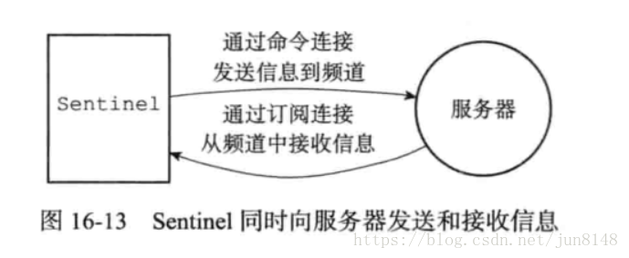

## 5. 检测下线状态

### 1. 检测主观下线状态

- 默认情况下，Sentinel 会以每秒一次的频率向所有与它创建了命令连接的实例发送 PING 命令，并通过实例返回的 PING 命令回复来判断实例是否在线

- 实例对 PING 指令的回复情况：

  - **有效回复**：实例返回 `+PONG, -LOADING, -MASTERDOWN` 三种中的一种
  - **无效回复**：除了上面三种之外的其它回复，或者在指定时限内没有返回任何回复

- `down-after-millseconds` 选项： 指定了 Sentinel 判断实例进入主观下线所需的时间长度

  > - 如果一个实例在 down-after-millseconds 毫秒内，连续向Sentinel返回无效回复，那么Sentinel会修改这个实例所对应的实例结构
  >
  > - 在结构的 flags 属性中打开 `SRI_S_DOWN` 标识，用于表示这个实例已经进入主观下线状态

- **注**：

  - **主观下线时长选项**，即 down-after-down 的值

    > - 不仅会被Sentinel用于判断主服务器的主观下线状态
    >
    > - 还会被用于判断主服务器属下的所有从服务器，以及所有同样监视这个主服务器的其他Sentinel的主观下线状态

  - **多个 Sentinel 设置的主观下线时长可能不同**

    > 设置的 down-after-milliseconds 选项的值可能不同：
    >
    > 当一个 Sentinel 将主服务器判断为主观下线时，其它 Sentinel 可能任认为主服务器处于在线状态

### 2. 检测客观下线状态

- 当 Sentinel 将一个主服务器判断为主观下线之后，为确定这个服务器是否真的下线，它会向同样监视这个主服务器的其它Sentinel进行询问
- 当接收到足够数量的已下线判断之后，Sentinel 就会将从服务器判定为客观下线，并对主服务器进行故障转移操作

**检测客观下线状态**：

- 发送 `SENTINEL is-master-down-by-addr` 命令

  > Sentinel会发送下面的命令询问其它Sentinel是否同意主服务器下线：`SENTINEL is-master-down-by-addr <ip> <port> <current_epoch> <runid>`

- 接收 `SENTINEL is-master-down-by-addr` 命令

  > - 当目标 Sentinel 接收到源 Sentinel 发来的 `SENTINEL is-master-by-addr` 命令时
  >
  > - 目标 Sentinel 会分析并取出命令请求中包含的各个参数，并根据其中的IP和port，判断主服务器是否已经下线
  >
  > - 然后向源 Sentinel 返回一个包含三个参数的 `Multi Bulk` 回复：
  >
  >   - `<down_state>`： 返回目标 Sentinel 对主服务器的检查结果，1表示主服务器已下线，0表示主服务器未下线 
  >
  >   - `<leader_runid>`： 可以是 `*` 符号或者目标Sentinel的局部领头Sentinel的运行ID
  >
  >     > - `*` 表示命令仅仅用于检测主服务器的下线状态
  >     > - 局部领头Sentinel的运行ID则用于选举领头Sentinel
  >
  >   - `<leader_epoch>`： 目标Sentinel的局部领头Sentinel的配置纪元，用于选举领头Sentinel
  >
  >     > - 仅在 leader_runid 值不为 `*` 时有效
  >     >
  >     > - 如果其值为 `*` ，则 leader_epoch 总为 0

- 接收 `SENTINEL is-master-down-by-addr` 命令的回复

  > - Sentinel将统计同意主服务器下线的数量
  > - 当这个值达到配置指定的判断客观下线所需的数量时(即 quorum 属性的值)：
  >   - Sentinel 会将主服务器实例结构中 flags 属性的 `SRI_O_DOWN` 标识打开，标识主服务器已经进入客观下线状态

## 6. 选举领头Sentinel

- 当一个主服务器被判断为客观下线时，监视这个下线主服务器的各个 Sentinel 会进行协商，选举出一个领头Sentinel，并**由领头Sentinel对下线主服务器进行故障转移操作**

- **选举领头Sentinel的规则和方法**：
  - 所有在线 Sentinel 都有成为领头 Sentinel 的机会
  - 无论选举成功与否，所有 Sentinel 配置纪元都会进行自增
  - 在配置纪元里，所有 Sentinel 都有一次将某个 Sentinel 设置为局部领头的机会；且一旦设置，不能更改
  - 每个发现主服务器进入客观下线的 Sentinel 都会要求其他 Sentinel 将自己设置为局部领头
  - 当源 Sentinel 向目标 Sentinel 发送 `SENTINEL is-master-down-by-addr` 命令，且命令中的 `runid` 参数不是 `*` 符号而是源 Sentinel  的运行 ID时，表示目标 Sentinel  将前者设置为后者的局部领头 Sentinel 
  - **设置局部领头规则是先到先得**
  - 若某个 Sentinel 被半数以上的 Sentinel  设置为局部领头，则这个 Sentinel  会成为领头 Sentinel 
  - 在每个配置纪元里，只会出现一个领头 Sentinel 
  - 在给定时间内，没有选出领头 Sentinel ，则会进行再次选举，直到选出为止

## 7. 故障转移

- 在选举产生出领头Sentinel之后，**领头Sentinel将对已下线的主服务器进行故障转移操作**：

**操作步骤**：

- **选出新的主服务器**： 在已下线的主服务器属下的所有从服务器中，挑选一个从服务器作为主服务器

- **修改从服务器的复制目标**： 让已下线的主服务器的所有从服务器改为复制新的主服务器

- **将旧的主服务器变为从服务器**： 将已下线主服务器设置为新的主服务器的从服务器，这个旧的主服务器重新上线时，就会成为新的主服务器的从服务器

# 十四、集群

- Redis 集群是分布式数据库方案，**通过分片来进行数据共享**，并提供复制和故障转移功能

## 1. 节点

- 一个Redis 集群通常由多个节点组成，当要组成真正可工作的集群时，需要将独立的节点连接起来，构建成一个包含多个节点的集群

  > - 连接各节点： `CLUSTER MEET <ip> <port>`
  > - 向一个节点发送上面的命令，可以让节点与 ip和port 所指定的节点进行握手，握手成功，节点就会将 ip和port 指定的节点添加到当前的集群中

### 1. 启动节点

- 节点的本质还是服务器，服务器会根据 `cluster-enabled` 配置选项来决定是否开启集群模式

  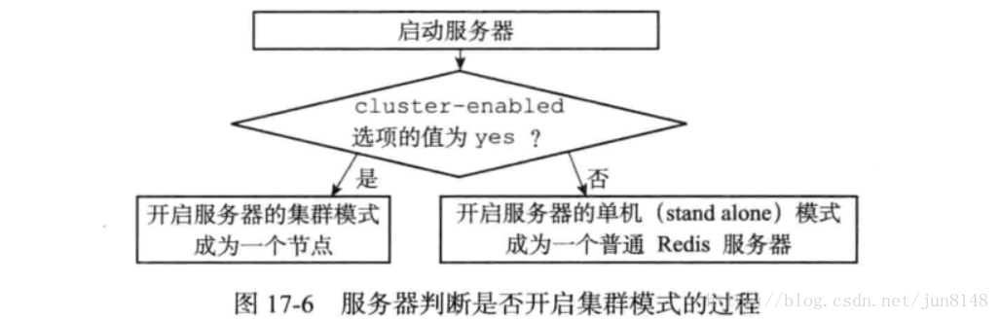

- 运行在集群模式下的节点会继续使用所有在单机模式中使用的服务器组件

### 2. 集群数据结构

- 每个节点会使用 `clusterNode` 结构来记录自己的状态，并为集群中的所有其他节点创建一个该结构

  ```c
  //一个节点的当前状态
  struct clusterNode{    
      // 创建节点的时间    
      mstime_t ctime;    
      // 节点的名字，由40个16进制字符组成    
      char name[REDIS_CLUSTER_NAMELEN];    
      // 节点标识    
      int flags;    
      // 节点当前的配置纪元，用于实现故障转移    
      uint64_t configEpoch;    
      // 节点的ip地址    
      char ip[REDIS_IP_STR_LEN];    
      // 节点的端口号    
      int port；    
      // 保存连接节点所需的有关信息   
      clusterLink *link；    
      //……
  };
  ```

  **link 属性保存了连接节点所有的有关信息**：

  ```c
  typedef struct clusterLink {
      // 连接的创建时间
      mstime_t ctime;
      // TCP 套接字描述符
      int fd;
      // 输出缓冲区，保存着等待发送给其他节点的消息（message）。
      sds sndbuf;
      // 输入缓冲区，保存着从其他节点接收到的消息。
      sds rcvbuf;
      // 与这个连接相关联的节点，如果没有的话就为 NULL
      struct clusterNode *node;
  } clusterLink;
  ```

- 每个节点的 `clusterState` 结构，用于记录当前节点的视角下，集群目前所处状态

  ```c
  typedef struct clusterState {
      // 指向当前节点的指针
      clusterNode *myself;
      // 集群当前的配置纪元，用于实现故障转移
      uint64_t currentEpoch;
      // 集群当前的状态：是在线还是下线
      int state;
      // 集群中至少处理着一个槽的节点的数量
      int size;
      // 集群节点名单（包括 myself 节点）
      // 字典的键为节点的名字，字典的值为节点对应的 clusterNode 结构
      dict *nodes;
      // ...
  } clusterState;
  ```

### 3. CLUSTER MEET 命令实现

- 向节点A发送 `CLUSTER MEET` 命令，能让接收命令的节点 A 将另一个节点 B 添加到节点 A 当前所处的集群里

- 收到命令的**节点 A  和节点 B 进行握手**：

  - **节点 A 为节点 B 创建一个 clusterNode 结构**，并将该结构添加到自己的 `clusterState.nodes` 字典中

  - 节点 A 根据 `ip和port` **发送 meet 消息**给节点B

  - 节点 B 收到 meet 消息，**为节点 A 创建一个 clusterNode**，并添加到自己的`clusterState.nodes` 字典

  - 节点 B 向节点 A **返回 PONG 消息**

  - **节点 A 向节点 B 返回 PING 消息**

  - 当节点 B 接收到 PING 消息，节点 A 接收到 PONG 消息，表示握手完成

  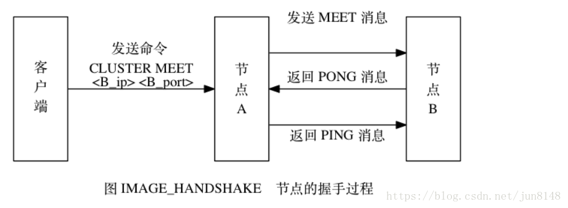

## 2. 槽指派

- Redis Cluster 将所有数据划分为 16384 个槽位，每个节点负责其中一部分槽位，槽位的信息存储于每个节点中

- 当 Redis Cluster 的客户端来连接集群时，也会得到一份集群的槽位配置信息，当要查找某个 key 时，可以直接定位到目标节点

  > Redis Cluster 的每个节点会将集群的配置信息持久化到配置文件中

向节点发送 `CLUSTER ADDSLOTS` 命令，可将一个或多个槽指派给节点负责

### (1) 记录节点的槽指派信息

- 结构 `clusterNode` 的 `slots, numslots` 属性记录了节点负责处理哪些槽 

  - 属性 `slots`： 二进制位数组，长度为 `16384/8=2048` 个字节，共包含 16384 个二进制位

    > redis 以 0 为起始索引，16384 为终止索引，对 slots 数组进行编号：
    >
    > - 若 slots 数组在索引 i 上的 二进制位值为 1，则表示节点负责处理槽 i
    > - 若 slots 数组在索引 i 上的 二进制位值为 0，则表示节点==不==负责处理槽 i

### (2) 传播节点的槽指派信息

- 节点除将自己负责处理的槽记录在 `clusterNode` 结构的 `slots` 属性和 `numslots`属性
- 还会将自己的 slots 数组通过消息发送给集群中其他的节点，来告知其他节点自己负责处理哪些槽

- 集群中的每个节点都会知道数据库中的 16384 个槽被指派给了哪些节点

### (3) 记录集群的槽指派信息

- 结构 `clusterState` 的 `slots` 数组记录了集群中所有的 16384 个槽指派信息

  > slots 的每项都指向一个 `clusterNode` 结构的指针：
  >
  > - 若 `slots[i]` 指向 NULL，表示槽 i 未指派给任何节点
  > - 若 `slots[i]` 指向一个 `clusterNode` 结构，表示槽 i 指派给 `clusterNode` 结构所代表的节点

### (4) CLUSTER ADDSLOTS 命令实现

- 该命令接受一个或多个槽作为参数，并将所有输入的槽指派给接收该命令的节点负责：`CLUSTER ADDSLOTS <slot> [slot ...]`

- 命令实现的**伪代码**：

  ```python
  def CLUSTER_ADDSLOTS(*all_input_slots):
      # 遍历所有输出槽,检查他们是否都是未指派槽
      for i in all_input_slots;
          # 如果有任意一个槽已经被指派给了某个节点，那么向客户端返回错误，并终止命令执行
          if clusterState.slots[i] != NULL
              reply_error()
              return;
  	# 如果所有输入槽都是未指派槽 
  	# 如果通过检查，再一次遍历所有槽，将这些槽指派给当前节点
      for i in all_input_slots;
  		# 设置clusterState.slots数组,
  		# 将slots[i]的指针指向代表当前节点的clusterNode结构
  		clusterState.slots[i] = clusterState.myself
  		# 访问当前节点的clusterNode结构的slots数组，将数组在索引i上的二进制位设置位1
  		setSlotBit(clusterState.myself.slots,i)
  	# 发送消息告知集群中的其他节点，自己目前正在负责处理那些槽
  ```

### (5) 其他信息

- **槽定位算法**：默认对 key 值使用 crc16 算法进行 hash，得到一个整数值，然后用这个整数值对 16384 进行取模来得到具体槽位

  > 通过在 key 字符串里嵌入 tag 标记，允许用户强制把某个 key 挂在 tag 所在的槽位

- **跳转**：当客户端向一个错误节点发出指令后，该节点会向客户端发送一个特殊的跳转指令携带目标操作的节点地址，告诉客户端去连接这个节点以获取数据

- **迁移**：工具 redis-trib 可以让运维人员手动调整槽位的分配情况

  > Redis 迁移的单位是槽，当一个槽正在迁移时，这个槽就处于中间过渡状态
  >
  > - redis-trib 先在源节点和目标节点设置好中间过渡状态，然后一次性获取源节点槽位的所有 key 列表，再挨个 key 进行迁移
  > - 每个 key 的迁移是以源节点作为目标节点的“客户端”，源节点对当前的 key 执行 dump 指令得到序列化内容
  > - 然后通过“客户端”向目标节点发送 restore 指令携带序列化的内容作为参数，目标节点再进行反序列化就可以将内容恢复到目标节点的内存中
  > - 然后返回“客户端”OK，源节点“客户端”收到后再把当前节点的 key 删除掉，就完成了单个 key 迁移的全过程
  >
  > 大致流程：从源节点获取内容 --> 存到目标节点 --> 从源节点删除内容
  >
  > 注意：**迁移过程是同步**的，在目标节点执行 restore 指令到源节点删除 key 之间，源节点的主线程阻塞，直到 key 被成功删除
  >
  > - 因此，在集群环境下，要避免产生很大的 key，因为迁移的 migrate 指令会阻塞业务，导致源节点与目标节点卡顿
  > - 若迁移过程中突然出现网络故障，整个槽的迁移只进行了一半，这时两个节点依旧处于中间过渡状态，待重新连上时，会提示用户继续进行迁移
  >
  > 迁移过程中，客户端的访问：
  >
  > - 客户端先尝试访问旧节点，若旧节点还有对应数据，则正常处理；否则向客户端返回一个 `-ASK targetNodeAddr` 的重定向指令
  >
  > - 客户端收到指令后，先去目标节点执行一个不带任何参数的 ASKING 指令，然后在目标节点再重新执行原先的操作指令
  >
  >   > ASKING 指令就是打开目标节点，让目标节点将下条指令当成自己的槽位来处理
  >
  > 
  >
  > 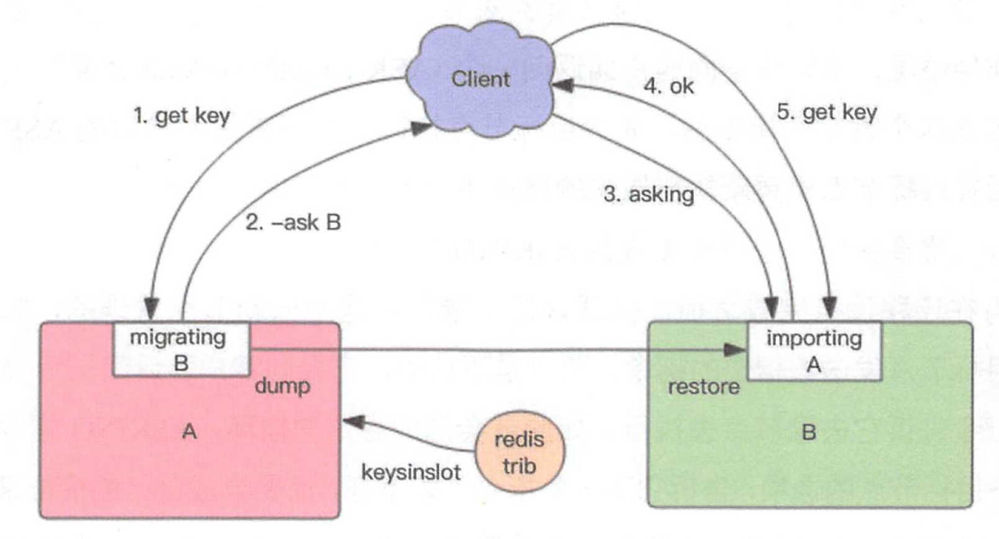
  >
  > 这个槽源节点状态为 `migrating`，目标节点状态为 `importing`，表示数据正在从源节点流向目标节点

- **容错**：

  - 方式一：Redis Cluster 可以为每个主节点设置若干个从节点，当主节点故障则从节点替换
  - 方式二：选项 `require-full-coverage` 可以允许部分节点发生故障，其他节点还可以继续提供对外访问

- **网络抖动**：

  - `cluster-node-timeout` 表示当某个节点持续 timeout 的时间失联时，才可以认定该节点出现故障，需要进行主从切换

    > 若没有该选项，网络抖动会导致主从频繁切换

  - `cluster-slave-validity-factor` 作为倍乘系数放大这个超时时间来宽松容错的紧急程度

    > - 若系数为零，则主从切换不会抗拒网络抖动
    > - 若系数大于 1，就成了主从切换的松弛系数

- **集群节点状态**：Redis 集群节点采用 **Gossip 协议**来广播自己的状态

  > 比如：一个节点发现某个节点失联，其会将这条信息向整个集群广播，若收到某个节点失联的节点数量已经达到了集群的大多数，就可以标记该失联节点为确定下线状态，然后向整个集群广播，并立即对该失联节点进行主从切换

---

- **槽位迁移感知**：客户端保存了槽位和节点的映射关系表

  - Redis Cluster 的两个特殊 error 指令：

    - `MOVED`：用来纠正槽位，若指令发送到了错误的节点，则会将目标节点的地址随同 MOVED 指令回复给客户端，通知客户端去目标节点访问。同时会刷新自己的槽位关系表，然后重试指令，后续所有打在该槽位的指令都会转到目标节点

    - `ASKING`：也用来纠正槽位，若当前槽位正处于迁移中，指令会先被发送到槽位所在的旧节点。若旧节点存在数据，则直接返回结果。否则，旧节点会给客户端返回一个 asking error 携带目标节点的地址，同志客户端去目标节点尝试拿数据

      > 此情况，客户端**不会刷新槽位映射关系表**，因为它只是临时纠正该指令的槽位信息，不影响后续指令

  - **客户端重试两次的情况**：一条指令被发送到错误的节点，该节点会先给你一个 MOVED 错误告知你去另一个节点重试，但此时运维人员对这个槽位进行迁移操作，于是客户端回复了一个 ASKING 指令告知客户端去目标节点重试指令

- **集群变更感知**：当服务器节点变更时，客户端会立即得到通知以实时刷新自己的节点关系表

  - 情况一：目标节点挂掉，客户端抛出一个 ConnectionError，紧接着会随机挑一个节点来重试，这时被重试的节点会通过 MOVED 指令告知槽位被分配到新的节点地址
  - 情况二：运维手动修改了集群信息，将主节点切换到其他节点，并将旧的主节点移出集群，这时打在旧的主节点上的指令会收到一个 ClusterDown 错误，告知当前节点所在集群不可用。这时客户端就会关闭所有的连接，清空槽位映射关系表，然后向上层抛错，待下一条指令过来时，就会重新尝试初始化节点信息

## 3. 集群中执行命令

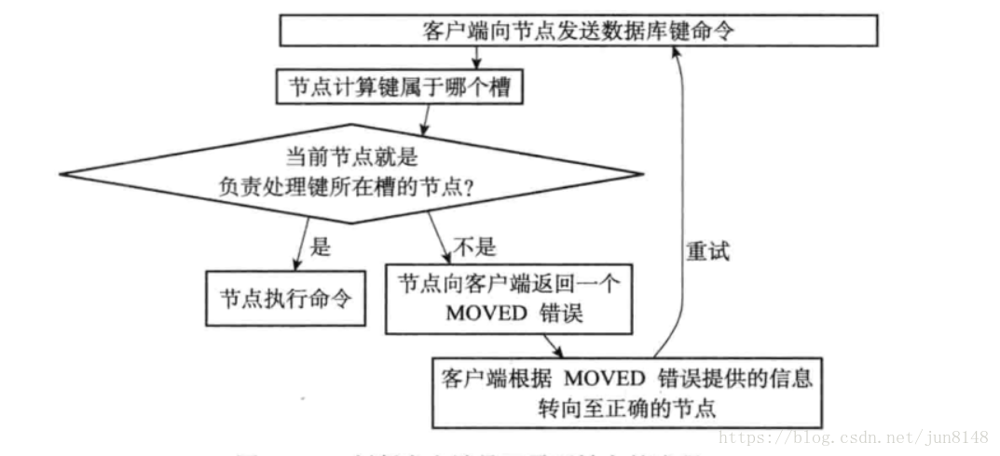

- **计算键属于哪个槽**：

  ```python
  # 计算算法
  def slot_number(key):
      # CRC16(key)： 用于计算键 key 的 CRC-16 校验和 
      # &16383: 用于计算出介于 0-16383 之间的整数作为键 key 的槽号
  	return CRC16(key) & 16383
  ```

  > 命令 `CLUSTER KETSLOT <key>`： 用于查看一个给定键属于哪个槽
  >
  > 该命令**伪代码**：
  >
  > ```python
  > def CLUSTER_KEYSLOT(key):
  > 	# 计算槽号
  > 	slot = slot_number(key);
  >     # 将槽号返回给客户端
  >     reply_client(slot);
  > ```

- **判断槽是否由当前节点负责处理**： 当节点计算出键所属槽 `i` 之后，节点会检查自己在 `clusterState.slots` 数组中的项 `i` ，判断键所处的槽是否由自己负责：

  - 如果 `clusterState.slots[i] 等于 clusterState.myself` ，说明**槽 i 由当前节点负责**，节点可以执行客户端发送的命令

  - 否则，槽 `i` 不由当前节点负责，节点会根据 `clusterState.slots[i] 所指向的 clusterNode` 结构所记录的节点 `IP和port`，向客户端返回 MOVED 错误并指引客户端转向正在处理槽 `i` 的节点

- **MOVED 错误**： 当节点发现键所在的槽并非由自己负责处理的时候，就会向客户端返回一个 `MOVED` 错误，指引客户端转向正在负责槽的节点，格式为： `MOVED <slot> <ip>:<port>`

## 4. 节点数据库的实现

- **区别**： **节点只能使用 0 号数据库**，单机服务器没有限制
- 相同点： 都能**保存键值对及键值对过期时间**，且实现方式相同

- 节点还会用 `clusterState` 结构中的 `slots_to_keys` 跳跃表来保存槽和键之间的关系

- `slots_to_keys` 跳跃表每个节点的分值都是一个槽号，节点的成员都是一个数据库键：

  - 当节点往数据库**添加**键值对时，节点会将这个键以及键的槽号关联到 slots_to_keys 跳跃表中
  - 当节点**删除**某个键值对时，节点就会在这个跳跃表中解除被删除键和槽号之间的关联

  > 通过这个跳跃表中记录各个数据库键对应的槽，节点可以对某个或某些槽的所有数据库键进行批量操作

## 5. 重新分片

- **重新分片**： 可以将任意数量已经指派给某个节点（源节点）的槽改为指派给另一个节点（目标节点），并且相关槽所属的键值对也会从源节点移动到目标节点
- **重新分片可以在线进行，在这过程中，集群不用下线，且源节点和目标节点都可以继续处理命令请求**

**重新分片的实现原理**：

- 集群管理软件 `redis-trib`： 负责执行重新分片操作

  > `redis-trib` 通过向源节点和目标节点发送命令来进行重新分片

- `redis-trib` 对集群的单个槽 `slot` 进行重新分片的步骤：

  - 对目标节点发送 `CLUSTER SETSLOT <slot> IMPORTING <source_id>` 命令，让目标节点准备好从源节点导入槽 slot 的键值对

  - 对源节点发送 `CLUSTER SETSLOT <slot> MIGRATING <source_id>` 命令，让源节点准备好将属于槽 slot 的键值对迁移至目标节点

  - 对源节点发送 `CLUSTER GETKEYSINSLOT <slot> <count>` 命令，获得最多 count 个属于槽 slot 的键值对的键名

  - 向源节点发送一个 `MIGRATE <target_ip> <target_port> <key_name> 0 <timeout>` 命令，将被选中的键原子的从源节点迁移至目标节点
  - **重复步骤3和4**，直到源节点保存的所有属于槽 `slot` 的键值对都被迁移到目标节点为止
  - 向集群中的任意一个节点发送 `CLUSTER SETSLOT <slot> NODE <target_id>` 命令，将槽`slot`指派给目标节点的信息发送给整个集群


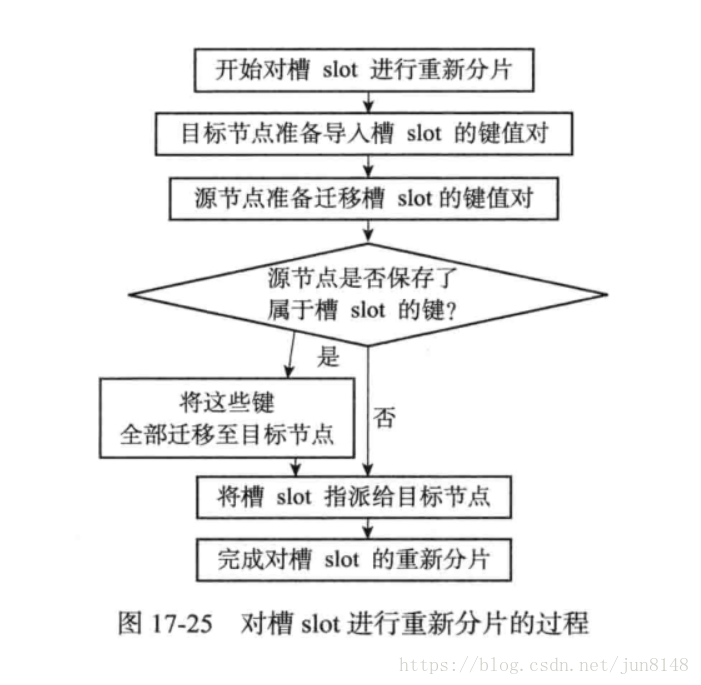

## 6. ASK 错误

- 在重新分片期间，源节点向目标节点迁移一个槽的过程中，可能会出现这样一种情况：属于被迁移槽的一部分键值对保存在源节点里面，而另一部分键值对保存在目标节点中
- 当客户端向源节点发送与数据库键有关的命令，且命令要处理的数据库键恰好属于正被迁移的槽时： 
  - 源节点先在自己的数据库里查找这个键，如果**找到就直接返回执行客户端命令**
  - 如果没找到，则这个键可能已经被迁移到了目标节点，源节点将向客户端返回一个 **ASK 错误**，指引客户端转向正在导入槽的目标节点，并再次发送之前要执行的命令

- 接到 ASK 错误的客户端会根据错误提供的IP地址和端口号，转向至正在导入槽的目标节点，然后向目标节点发送一个 `ASKING` 命令， 之后再重新发送原本想要执行的命令

- **ASK 错误和 MOVED 错误的区别**：
  - `MOVED` 错误： 代表槽的负责全已经从一个结点转移到了另一个节点
  - `ASK` 错误： 只是两个节点在迁移槽的过程中使用的一种临时措施

## 7. 命令实现

### 1. `CLUSTER SETSLOT IMPORTING`

- 格式： `CLUSTER SETSLOT <slot> IMPORTING <source_id>`
- `clusterState` 结构的 `importing_slots_from` 数组记录了当前节点正在从其他节点导入的槽

- 对集群进行重新分片时，向目标节点发送命令 `CLUSTER SETSLOT <i> IMPORTING <source_id>` 可将目标节点 `clusterState.importing_slots_from[i]` 的值设置为 `source_id` 所代表节点的 `clusterNode` 结构

### 2. `CLUSTER SETSLOT MIGRTING`

- 格式： `CLUSTER SETSLOT <i> MTGRATING <target_id>`
- `clusterState` 结构的 `migrating_slots_to` 数组记录了当前节点正在迁移至其他节点的槽
- 对集群进行重新分片时，向目标节点发送命令 `CLUSTER SETSLOT <i> MTGRATING <target_id>` 可将源节点 `clusterState.migrating_slots_to[i]` 的值设置为 `target_id` 所代表节点的 `clusterNode` 结构

### 3. `ASKING`

- **ASKING命令**： 用于打开发送该命令的客户端的 `REDIS_ASKING` 标识

  伪代码：

  ```python
  def ASKING():
  	# 打开标识
  	client.flags |= REDIS_ASKING
  	# 向客户端返回OK回复
  	reply("OK")
  ```

  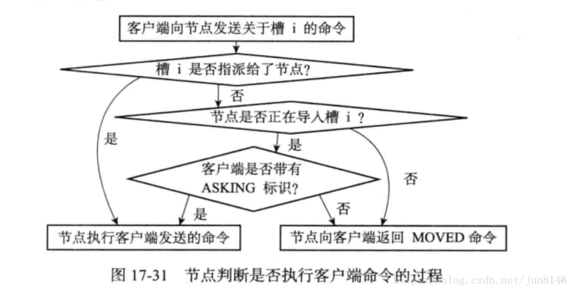

## 8. 复制与故障转移

redis 集群的节点分为：

- **主节点**： 用于处理槽
- **从节点**： 用于复制某个主节点，并在被复制的主节点下线时，代替主节点继续处理命令请求

### 1. 设置从节点

- 向一个节点发送命令：`CLUSTER REPLICATE <node_id>`

- 该命令可以让接收命令的节点成为 `node_id` 所指定的从节点，并开始对主节点进行复制：

  - 接收到该命令的节点会先在自己的 `clusterState.nodes` 字典中找到 `node_id` 所对应节点的 `clusterNode` 结构，并将自己的 `clusterState.myself.slaveof` 指针指向这个结构，以此来记录这个节点正在复制的主节点
  - 然后节点修改自己在 `clusterState.myself.flags` 中的属性，关闭原本的 `REDIS_NODE_MASTER` 标识，打开 `REDIS_NODE_SLAVE` 标识，表示这个节点由原来的主节点变成了从节点

  - 最后，节点调用复制代码，并跟据 `clusterState.myself.slaveof` 指向的 `clusterNode` 结构所保存的IP地址和端口号，对主节点进行复制

    > 从节点复制主节点： 相当于向从节点发送命令 `SLAVEOF <master_ip> <maste_port>`

### 2. 故障检测

- 集群中的每个节点都会定期地想集群中的其他节点发送 PING 消息，以此来检测对方是否在线

  > 如果接受 PING 消息的节点没有在规定时间内返回 PONG ，那么发送 PING 的节点就会将接受 PING 消息的节点标记为意思下线(PFAIL)
  >
  > - 集群中的各节点会通过互相发送消息的方式来交换集群中各节点的状态信息

- 当一个主节点 A 通过消息得知主节点 B 认为主节点 C 进入疑似下线状态

  > - 主节点 A 会在自己的 `clusterState.nodes` 字典中找到主节点 C 所对应的 `clusterNode`结构，并将主节点 B 的下线报告添加到这个结构的 `fail_reports` 链表里
  >
  > - 每个下线报告由结构 `clusterNodeFailReport` 表示：
  >
  >   ```c
  >   struct clusterNodeFailReport{
  >       // 报告目标节点已经下线的节点
  >       struct clusterNode *node;
  >       // 最后一次从node节点收到下线报告的时间,程序使用这个时间戳来检查下线报告是否过期
  >       // (与当前时间相差太久的下线报告会被删除)
  >       mstime_t time;
  >   }
  >   ```

- 集群半数以上负责处理槽的主节点都将某个主节点 X 报告为疑似下线，则主节点 X 将被标记为已下线(FAIL)

  > - 将主节点 X 标记为已下线的节点会向集群广播一条关于主节点X的 FAIL 消息
  > - 所有收到这条 FAIL 消息的节点都会立即将主节点 X 标记为已下线

### 3. 故障转移

当一个从节点发现自己正在复制的主节点进入了已下线状态，从节点将开始对下线主节点进行故障转移:

- 复制下线主节点的所有从节点里面，会有一个从节点被选中
- 被选中的从节点将执行 `slaveof no one` 命令，成为新的主节点
- 新的主节点会撤销对已下线主节点的槽指派槽，并将这些槽全部指派给自己
- 新的主节点向集群广播一条 PONG 消息，告诉集群中的其他节点自己成为了新的主节点
- 新的主节点开始接收和自己负责处理的槽有关的命令请求，故障转移完成

### 4. 选举新的主节点

**新的主节点通过选举产生**：

- 集群的配置纪元是一个自增计数器，初始值为 0
- 当集群里的某个节点开始一次故障转移操作时，集群配置纪元的值就会加一
- 对于每个配置纪元，集群中的每个负责处理槽的主节点都有一次投票机会，而第一个向主节点要求投票的从节点将获得主节点的投票
- 当从节点发现自己正在复制的主节点已下线时，从节点会向集群广播一条 `CLUSTERMSG_TYPE_FAILOVER_AUTH_REQUEST` 消息，要求所有收到这条消息、并具有投票权的主节点向这个从节点投票
- 如果一个主节点具有投票权，并且这个主节点尚未投票给其他从节点，那么主节点将向要求投票的从节点返回一条 `CLUSTERMSG_TYPE_FAILOVER_AUTH_ACK` 消息，表示这个主节点支持从节点成为新的主节点
- 每个参与选举的从节点都会接受 `CLUSTERMSG_TYPE_FAILOVER_AUTH_ACK` 消息，并根据自己收到了多少条这种消息来统计自己获得了多少主节点的支持
- 如果集群有 N 个具有投票权的主节点，那么当一个从节点收集到 `>=N/2+1` 张支持票时，这个从节点当选为新的主节点
- 每个具有投票权的主节点只能投一次票，则具有 `>=N/2+1` 张支持票的从节点只会有一个，即确保新主节点只会有一个
- 如果在一个配置纪元里没有从节点能收集到足够多的支持票，那么集群进入一个新的配置纪元，并再次进行选举，直到选出新的主节点为止

---

### 5. 主从同步

- **增量同步**：**Redis 同步的是指令流**

  - 主节点会将那些对自己的状态产生修改性影响的指令记录在本地的内存 buffer 中，然后异步将 buffer 中的指令同步到从节点
  - 从节点一边执行同步的指令流来达到和主节点一样的状态，一边向主节点反馈自己同步到哪里了

  > **Redis 的复制内存 buffer 是一个定长的环形数组**，若数组内容满了，就会从头开始覆盖前面的内容
  >
  > 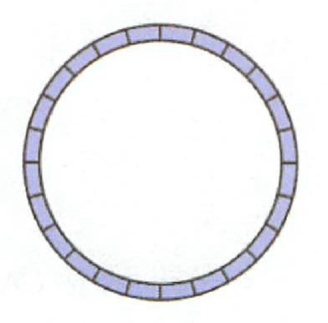
  >
  > 若 Redis 的主节点中，还有未同步的指令在 buffer 中被覆盖，则会使用快照同步

- **快照同步**：快照同步很耗费资源

  - 首先在主节点上进行一次 bgsave，将当前内存的数据全部快照到磁盘文件中，然后再将快照文件的内容全部传送到从节点
  - 从节点将快照文件接受完毕后，立即执行一次全量加载
  - 加载之前先要将当前内存的数据清空，加载完毕后通知主节点继续进行增量同步

  **不足**：

  - 在整个快照同步过程中，主节点的复制 buffer 还在不停往前移动，若快照同步的时间过长或复制 buffer 太小，都会导致同步期间的增量指令在复制 buffer 中被覆盖
  - 这样会导致快照同步完成后无法进行增量复制，然后会再次发起快照同步，如此极可能会陷入快照同步的死循环

  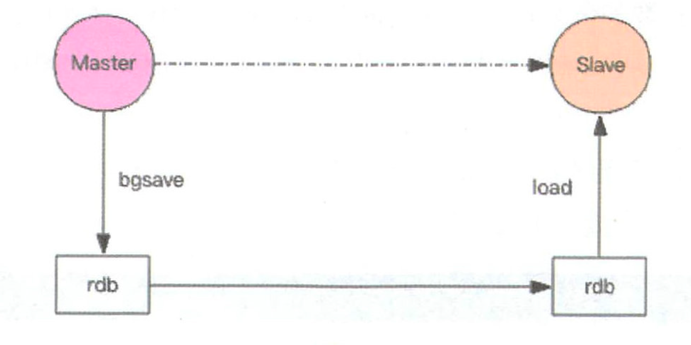

- **从节点增加**：当从节点刚刚加入到集群时，必须先进行一次快照同步，同步完成后，再继续进行增量同步

- **无盘复制**：指主服务器直接通过套接字将快照内容发送到从节点，主节点会一边遍历内存，一边将序列化的内容发送到从节点，从节点还是先将接收到的内容存储到磁盘文件中，再进行一次性加载(Redis 2.8.18以后)

- **`wait` 指令**：可以让异步复制变身同步复制，确保系统的强一致性(不严格，Redis3.0后)

  > wait 提供两个参数，第一个参数是从节点的数量 N，第二个参数是时间 t(ms)
  >
  > 参数含义：等待 wait 指令之前的所有写操作同步到 N 个从节点(确保 N 个从节点的同步没有滞后)，最多等待时间 t
  >
  > > 若 t = 0，则表示无限制等待直到 N 个从节点同步完成

## 9. 消息

### 1. 概述

- 集群中的各节点通过发送和接收消息来进行通信

- 节点发送的**消息正文分类**：

  - `MEET` 消息：当发送者接到客户端发送的 `CLUSTER MEET` 命令时，发送者会向接收者发送 MEET 消息，请求接收者加入发送者当前所处的集群中
  - `PING` 消息：集群里的每个节点默认每隔一秒钟就会从已知节点列表中随机选出五个节点，然后对这五个节点中最长时间没有发送过 PING 消息的节点发送 PING 消息，以此来检测选中的节点是否在线
  - `PONG` 消息：当接收者收到发送者发来的 MEET 消息或者 PING 消息时，为了向发送者确认这条 MEET 消息或者 PING 消息已到达，接收者会向发送者返回一条 PONG 消息
  - `FAIL` 消息：当一个主节点 A 判断另一个主节点 B 已经进入 FAIL 状态时，节点 A 会向集群广播一条关于 B 的 FAIL 消息，所有收到这条消息的节点都会立即将节点 B 标记为已下线

  - `PUBLISH` 消息：当节点接收到一个 PUBLISH 命令时，节点会执行这个命令，并向集群广播一条 PUBLISH 消息，所有接收到这条 PUBLISH 消息的节点都会执行相同的 PUBLISH 消息

- **消息组成**：

  - **消息头**： 记录了消息发送者自身的一些消息

    > 每个消息头都由一个 `cluster.h/clushterMsg` 结构表示：
    >
    > ```c
    > typedef struct{
    >     // 消息的长度（包括这个消息头的长度和消息正文的长度）
    >     unit32_t totlen;
    >     // 消息的类型
    >     uint16_t type;
    >     // 消息正文包含的节点信息数量,只在发送MEET、PING、PONG 等Gossip协议消息时使用
    >     uint16_t count;
    >     // 发送者所处的配置纪元
    >     uint64_t currentEpoch;
    >     // 如果发送者是一个主节点，那么这里记录的是发送者的配置纪元
    >     // 如果发送者是一个从节点，那么这里记录的是发送者正在复制的主节点的配置纪元
    >     uint64_t configEpoch;
    >     // 发送者的名字（ID）
    >     char sender[REDIS_CLUSTER_NAMELEN];
    >     // 发送者目前的槽指派信息
    >     unsigned char myslots[REDIS_CLUSTER_SLOTS/8];
    >     // 如果发送者是一个从节点，那么这里记录的是发送者正在复制的主节点的名字
    >     // 如果发送者是一个主节点，那么这里记录的是REDIS_NONE_NULL_NAME
    >     // (一个40字节长，值全为0的字节数组)
    >     char slaveof[REDIS_CLUSTER_NAMELEN];
    >     // 发送者的端口号
    >     uint16_t port;
    >     // 发送者的标识值
    >     uint16_t flags;
    >     // 发送者所处集群的状态
    >     unsigned char state;
    >     // 消息的正文
    >     union clusterMsgData data;
    > }clusterMsg;
    > ```
    >
    > `clusterMsg.data` 属性指向联合 `clusterh/clusterMsgData`，这个联合就是消息正文：
    >
    > ```c
    > union clusterMsgData{
    >     // MEET、PING、PONG消息的正文
    >     struct{
    >         // 每条MEET、PING、PONG消息都包括两个clusterMsgDataGossip结构
    >         clusterMsgDataGossip gossip[1];
    >     }ping;
    >     // FAIL消息的正文
    >     struct{
    >         clusterMsgDataFail about;
    >     }fail;
    >     // PUBLISH消息的正文
    >     struct{
    >         clusterMsgDataPublish msg;
    >     }publish;
    >     // 其他消息的正文...
    > };
    > ```
    >
    > - `clusterMsg` 结构的`currentEpoch`、`sender`、`myslots` 等属性记录了发送者自身的节点信息
    > - 接收者会根据这些信息，在自己的 `clusterState.nodes` 字典里找到发送者对应的 `clusterNode` 结构，并对结构进行更新

  - **消息正文**： 由 `MEET, PING, PONG, FAIL, PUBLISH` 等组成

### 2. 消息实现

#### 1. `MEET, PING, PONG`

- 集群中的各节点通过 `Gossip` 协议来交换各自关于不同节点的状态信息

  > - `Gossip` 协议由 `MEET, PING, PONG` 三种消息实现
  > - 这三种消息的正文都由两个 `cluster.h/clusterMsgDataGossip` 结构组成

- 节点通过消息头的 `type` 属性判断是三种消息中的哪一种

- 每次发送 `MEET、PING、PONG` 消息时，发送者都会从自己的已知节点中随机选出两个节点，并将这两个被选中节点的信息分别保存到两个 `clusterMsgDataGossip` 中

  ```c
  typedef struct {
      // 节点的名字
      char nodename[REDIS_CLUSTER_NAMELEN];
      // 最后一次向该节点发送PING消息的时间戳
      uint32_t ping_sent;
      // 最后一次从该节点接收到PONG消息的时间戳
      uint32_t pong_received;
      // 节点的IP地址
      char ip[16];
      // 节点的端口号
      uint16_t port;
      // 节点的标识值
      uint16_t flags;
  }clusterMsgDataGossip;
  ```

- 接收者收到消息，会取出这两个 `clusterMsgDataGossip` 结构 ，并根据其中的信息对自己的 `clusterState.nodes` 进行操作：

  - 如果被选中节点**不存在**与接收者的已知节点列表

    > 表明接收者第一次接触到被选中节点，接收者将根据结构中的 IP地址和端口号等信息，与被选中节点进行握手

  - 如果**在列表中**

    > 说明接收者已与被选中节点进行过接触，接收者将根据 `clusterMsgDataFossip` 结构记录的信息，对被选中节点所对应的 `clusterNode` 结构进行更新

#### 2. `FAIL`

- 在集群的节点数量比较大的情况下，单纯用 Gossip 协议来传播节点的已下线信息会给节点的信息更新带来一定延迟
- `FAIL` 消息可让集群中的所有节点立即知道某主节点已下线

- `FAIL` 消息的正文由 `cluster.h/clusterMsgDataFail` 结构表示，该结构只包含一个 `nodename` 属性，记录已下线节点的名字：

  ```c
  typedef struct {
      // 记录已下线节点的名字(名字是唯一的哦)
      char nodename[REDIS_CLUSTER_NAMELEN];
  }clusterMsgDataFail;
  ```

#### 3. `PUBLISH`

- 当客户端向集群中的某节点发送命令 `PUBLISH <channel> <message>` 时

  > - 接收到 `PUBLISH` 命令的节点不仅会向 `channel 频道`发送`消息 message`
  > - 还会向集群广播一条 PUBLISH 消息，接收这条消息的节点都会向 channel 频道发送 message 消息

- PUBLISH 消息的正文由 `cluster.h/clusterMsgDataPublish` 结构表示：

  ```c
  typedef struct{
      // 保存了channel参数的长度
      uint32_t channel_len;
      // 保存了message参数的长度
      uint32_t message_len;
      // 1. 定义为 8 字节只是为了对齐其他消息结构
      // 2. 保存了客户单通过PUBLISH命令发送给节点的channel和message参数
      // 3. 0-channel_len-1 字节保存的是channel参数；channel_len - (channel_len+message_len-1) 字节保存的是message参数
      unsigned char bulk_data[8];
  }clusterMsgDataPublish;
  ```

# \# 独立功能实现

# 十五、发布与订阅

- Redis 通过发布订阅提供一对多甚至是多对多的节点消息通信，发布订阅由 `PUBLISH、SUBSCRIBE、PSUBSCRIBE、PUBSUB` 等命令组成

## 1. 频道的订阅与退订

- 当客户端执行 `SUBSCRIBE` 命令订阅某个或某些频道时，则客户端与被订阅频道间就建立了订阅关系
- 频道订阅关系保存在 `pubsub_channels` 字典中，**键是被订阅的频道，值的一个记录所有订阅频道的客户端**

### 1. 订阅

- 每当客户端进行订阅时，客户端与被订阅频道在 `pubsub_channels` 字典中进行关联
- 根据是否已有其他订阅者，关联操作可分为：
  - 若已有其他订阅者，程序将客户端添加到订阅者链表的末尾
  - 若无订阅者，程序首先在 `pubsub_channels` 字典中为频道创建一个键，且将值设为空链表，然后将客户端添加到链表中

### 2. 退订

- 当客户端进行退订时，服务器将从 `pubsub_channels` 中解除客户端与被退订频道间的关联：
  - 程序会根据被退订频道的名字，在 `pubsub_channels` 字典中找到频道对应的订阅者链表，然后从订阅者链表中删除退订客户端信息
  - 若删除退订客户端后，链表变为空链表，则程序将从 `pubsub_channels` 字典中删除频道对应的键

## 2. 模式的订阅与退订

- 模式订阅关系保存在属性 `pubsub_patterns` 中

- 属性 `pubsub_patterns` 是一个链表，链表中的每个节点保存着 `pubsubPattern` 结构：

  ```c
  typedef struct pubsubPattern{
      //订阅模式客户端
      redisClient *client;
      //被订阅的模式
      robj *pattern;
  }pubsubPattern;
  ```

### 1. 订阅

- 客户端执行命令 `PSUBSCRIBE` 订阅模式时，服务器会对订阅模式执行以下两个操作：
  - 新建一个 `pubsubPattern` 结构，将结构的 pattern 属性设置为被订阅的模式，client 属性设置为订阅模式的客户端
  - 将 `pubsubPattern` 结构添加到 `pubsub_patterns` 链表的表尾

### 2. 退订

- 退订命令 `PUNSUBSCRIBE`： 当客户端退订模式时，服务器将在 `pubsub_patterns` 链表中查找并删除那些为被退订模式的 `pattern` 属性，且 `client` 属性为执行退订命令的客户端的 `pubsubPattern` 结构

## 3. 发送消息

客户端执行 `PUBLISH <channel> <message>` 命令将消息 `message` 发送给频道 `channel` 时，服务器执行操作：

- 将消息 `message` 发送给 `channel` **频道的订阅者**

  > - 在字典 `pubsub_channels` 中找到频道 `channel` 的所有订阅者名单
  > - 将消息发送给名单上的客户端

- 若模式与频道相匹配，则将消息 `message` 发送给 `pattern` **模式的订阅者**

  > - 遍历链表 `pubsub_patterns`，查找与频道 `channel` 相匹配的模式
  > - 将消息发送给这些模式的客户端

## 4. 查看订阅消息

- 命令 `PUBSUB`： 可用来查看频道或模式的相关信息

- 命令 `PUBSUB` 的三个子命令：

  - `PUBSUB CHANNELS [pattern]`： 用于返回服务器当前被订阅的频道

    > pattern 参数可选：
    >
    > - 若不给定 pattern，命令返回服务器当前被订阅的所有频道
    > - 若给定 pattern，命令返回服务器当前与 pattern 模式相匹配的频道
    >
    > 实现伪代码：
    >
    > ```python
    > def pubsub_channels(pattern=None):
    >     # 一个列表，用于记录所有符合条件的频道
    >     channel_list = []
    >     # 遍历服务器中的所有频道，即 pubsub 字典的所有键
    >     for channel in server.pubsub_channels:
    >         # 当以下两个条件任意满足一个时，将频道添加到链表中
    >         # 1）未指定 pattern 参数
    >         # 2）指定 pattern 参数，且 channel 与 pattern 相匹配
    >         if(pattern is None) or match(channel,pattern):
    >             channel_list.append(channel)
    >     # 向客户端返回频道列表
    >     return channel_list
    > ```

  - `PUBSUB NUMSUB [channel-1,channel-2...]`： 接受任意多个频道作为输入参数，并返回这些频道的订阅者数量

    > 实现伪代码：
    >
    > ```python
    > def pubsub_numsub(*all_input_channels):
    >     # 遍历输入的所有频道
    >     for channel in all_input_channels:
    >         # 若 pubsub_channels 字典中无键 channel，则说明频道 channel 无订阅者
    >         if channel not in server.pubsub_channels:
    >             # 返回频道名
    >             reply_channel_name(channel)
    >             # 订阅者数量为 0
    >             reply_subscribe_count(0)
    >         # 若字典 pubsub_channels 存在键 channel,则说明频道 channel 有订阅者
    >         else:
    >             # 返回频道名
    >             reply_channel_name(channel)
    >             # 订阅者链表的长度就是订阅者数量
    >             reply_subscribe_count(len(server.pubsub_channels[channel]))
    > ```

  - `PUBSUB NUMPAT`：用于返回服务器当前被订阅模式的数量

# 十六、事务

- redis 通过 `MULTI, EXEC, WATCH` 等命令来实现事务功能

- 事务： 是一次性、按顺序的执行多个命令的机制，且在事务执行期间，服务器不会中断事务

  > 事务会先将命令执行完毕后，才会去处理其他客户端的命令请求

## 1. 事务的实现

事务会经历三个阶段：

- **事务开始**： `MULTI` 命令标志事务的开始

  > `MULT` 可将执行该命令的客户端从非事务状态转换为事务状态，在属性 `flags` 中打开标识 `REDIS_MULTI`

- **命令入队**： 

  > - 当客户端处于==非事务状态==时，客户端发送的命令会立即被服务器执行
  > - 当客户端处于==事务状态==时，服务器会根据客户端发送的不同命令来执行不同的操作：
  >   - **立即执行的命令**：`EXEC, DISCARD, WATCH, MULTI`
  >   - **将命令放入事务队列中，并向客户端返回 `QUEUED` 回复的命令**：除上述四个命令的其他命令
  >
  > 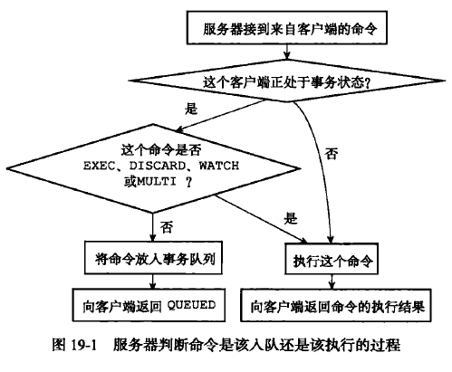
  >
  > 事务状态包含一个事务队列及一个已入队命令的计数器(即事务队列的长度)：
  >
  > ```c
  > typedef struct multiState{
  >     //事务队列，FIFO 顺序
  >     multiCmd *commands;
  >     //已入队命令计数
  >     int count;
  > }multiState;
  > ```
  >
  > 事务队列的 multiCmd 结构包含已入队命令的相关信息：
  >
  > ```c
  > //事务队列：以 FIFO 方式保存入队命令
  > typedef struct multiCmd{
  >     //参数
  >     robj **argv;
  >     //参数数量
  >     int argc;
  >     //命令指针
  >     struct redisCommand *cmd;
  > }multiCmd;
  > ```

- **事务执行**： 命令 `EXEC` 让客户端执行事务

  > - 服务器会遍历客户端的事务队列
  > - 执行队列中保存的所有命令
  > - 最后将执行命令所得的结果返回给客户端
  >
  > EXEC 命令实现原理的伪代码：
  >
  > ```python
  > def EXEC():
  >     # 创建空白的回复队列
  >     reply_queue = []
  >     # 遍历事务队列中的每项，读取命令参数，参数个数，要执行的命令
  >     for argv,argc,cmd in client.mstate.commands:
  >         # 执行命令，并取得命令的返回值
  >         reply = execute_command(cmd,argv,argc)
  >         # 将返回值追加到回复队列末尾
  >         reply_queue.append(reply)
  >     # 移除 REDIS_MULTI 标识，让客户端回到非事务状态
  >     client.flags &= ~REDIS_MULTI
  >     # 清空客户端的事务状态，包括清零入队命令计数器，释放事务队列
  >     client.mstate.count = 0
  >     release_transaction_queue(client.mstate.commands)
  >     # 将事务的执行结果返回给客户端
  >     send_reply_to_client(client,reply_queue)
  > ```

## 2. WATCH 命令的实现

- 命令 `WATCH`： 是一个乐观锁

  - 在命令 EXEC ==执行前==，监视任意数量的数据库键

  - 在命令 EXEC ==执行时==，检查被监视的键是否至少有一个已被修改

    > 若有，服务器将拒绝执行事务，并向客户端返回代表事务执行失败的空回复

- 字典 `watched_keys`： **键是被监视的数据库键**，值是一个记录了所有监视相应数据库键的客户端**链表**

  > 通过字典 `watched_keys`，服务器可知道哪些数据库键正被监视及哪些客户端正监视这些数据库键

- **监视机制的触发**： 函数 `multi.c/touchWatchKey`： 所有数据库修改命令执行后都会调用该函数对字典 `watched_keys` 进行检查

  > 查看是否有客户端在监视刚被命令修改过的数据库键：
  >
  > - 若有的话，`touchWatchKey` 函数会将监视被修改键的客户端的 `REDIS_DIRTY_CAS` 标识打开，表示该客户端的事务安全性已被破坏

- **判断事务是否安全**： 服务器会根据标识 `REDIS_DIRTY_CAS` 来决定是否执行事务

  - ###### 若标识已打开，表示键已被修改，客户端提交的事务不再安全，服务器将拒绝执行

  - 若标识未打开，表示键未被修改，客户端提交的事务安全，服务器将执行客户端提交的事务

## 3. 事务的 ACID 属性

- redis 中，事务总有 ACI(原子性，一致性，隔离性) 性质，只在某种特定持久化模式下，才具有 D(持久性) 性质

- **原子性**： 数据库将事务中的多个操作当作一个整体来执行

  > 要么执行事务的所有操作，要么都不执行
  >
  > - redis 不支持事务回滚

- **一致性**： 若数据库在执行事务前是一致的，则在事务执行后，无论事务是否成功，数据库也仍然一致

  > **一致**： 指数据符合数据库本身的定义和要求，没有包含非法或无效的错误数据
  >
  > redis 为保持事务一致性二处理错误：
  >
  > - **入队错误**： 若一个事务在入队过程中，出现命令不存在或命令格式不正确等错误，redis 将拒绝执行该事务
  >
  > - **执行错误**： 事务在执行时发生的错误
  >
  >   > **说明**：
  >   >
  >   > - 这些错误在入队时不会被发现，只会在执行时被触发
  >   > - 即使执行出错，服务器也不会中断事务的执行，且已执行的命令不会被出错的命令影响
  >
  > - **服务器停机**： 根据服务器使用的持久化模式，可分为以下情况：
  >
  >   - 若运行在无持久化的内存模式下，则重启后的数据库将是空白的
  >   - 若运行在 RDB 模式下，服务器会根据 RDB 文件来恢复数据
  >   - 若运行在 AOF 模式下，服务器会根据 AOF 文件来恢复数据

- **隔离性**： 即使数据库中有多个事务并发执行，各事务间也不会互相影响

  > - redis 使用单线程串行方式执行事务
  >
  > - 服务器在执行事务期间不会对事务进行中断

- **持久性**： 当一个事务执行完毕时，所得结果被保存到永久性存储介质中，即使服务器停机，执行事务结果也不会丢失

  > - 当服务器运行在无持久化模式下时： 一旦停机，所有服务器数据都会丢失（**不具有持久性**）
  > - 当在 RDB 模式下时，只有满足特定条件时，才会执行 `BGSAVE` 命令，且异步的 BGSAVE 不能保证数据立即保存到硬盘（**不具有持久性**）
  > - 当在 AOF 模式下且选项 `appendfsync` 值为 `always` 时，服务器将同步数据到硬盘（**具有持久性**）
  > - 当在 AOF 模式下且选项 `appendfsync` 值为 `everysec` 时，服务器每秒同步数据到硬盘，可能导致数据丢失（不具有持久性）
  > - 当在 AOF 模式下且选项 `appendfsync` 值为 `no` 时，操作系统负责同步数据到硬盘，可能在同步过程中丢失数据（不具有持久性）

## 4. 并发

推荐阅读： **[Redis实现CAS的乐观锁](<https://www.jianshu.com/p/d777eb9f27df>)**

- Redis 为单进程单线程模式，采用队列模式将并发访问变为串行访问

- **客户端并发连接问题**： 

  - **客户端角度**： 为保证每个客户端间正常有序与Redis进行通信，对连接进行池化，同时对客户端读写Redis 操作采用内部锁 synchronized

  - **服务器角度**： 利用 setnx 实现锁，MULTI，EXEC，DISCARD，WATCH 是 Redis 事务的四个基础命令：

    - MULTI： 告诉 Redis 服务器开启一个事务。注意，只是开启，而不是执行
    - EXEC： 告诉 Redis 开始执行事务
    - DISCARD： 告诉 Redis 取消事务

    - WATCH： 监视某一个键值对，作用是在事务执行之前如果监视的键值被修改，事务会被取消

# 十六、Lua 脚本


# 十七、排序

- redis 的 `SORT` 命令可对列表键、集合键、有序集合键的值进行排序

## 1. SORT \<key\> 命令实现

- 命令格式： `SORT <key>`，该命令会对包含数字值的键 key 进行排序
- 例如： `RPUSH numbers 3 1 2`，执行 `SORT numbers` 的**详细步骤**：
  - 创建一个与 numbers 长度相等的数组，数字的每项都是一个 `redis.h/redisSortObject` 结构
  - 遍历数组，将数组各项的 obj 指针指向 numbers 列表的各项，构成一对一关系
  - 遍历数组，将 obj 指针指向的列表项转换成一个 double 类型的浮点数，并保存到相应数组项的 `u.score` 属性中
  - 根据属性 `u.score` 的值，对数组进行排序
  - 遍历数组，将各数组项的 obj 指针所指向的列表项的排序结果返回给客户端

## 2. ALPHA 选项实现

- 选项 `ALPHA`： 可使 SORT 命令对字符串进行排序： `SORT <key> ALPHA`
- 例如： `SADD fruits apple banana cherry`，执行 `SORT fruits ALPHA` 的详细步骤：
  - 创建一个长度为 fruits 集合大小的 `redisSortObject` 结构数组
  - 遍历数组，将各数组项的 obj 指针指向 fruits 集合的各元素
  - 根据 obj 指针所指向的集合元素，对数组进行字符串排序
  - 遍历数组，将各数组项的 obj 指针所指向的元素返回给客户端

## 3. 选项 ASC 与 DESC 实现

- 默认情况与 `SORT <key> ASC` 执行升序排序； `SORT <key> DESC` 执行降序排序

## 4. BY 选项实现

- 默认情况，SORT 命令使用被排序键包含的元素作为排序的权重

  > 元素本身决定了元素在排序后所处的位置

- 例如： `SADD fruits "apple" "banana" "cherry"`，`MSET apple-price 8 banana-price 5.5 cherry-price 7`

  执行 `SORT fruits BY *-price` 的详细步骤：

  - 创建一个长度为 fruits 集合大小的 `redisSortObject` 结构数组
  - 遍历数组，将各数组项的 obj 指针指向 fruits 集合的各元素
  - 遍历数组，根据各数组项的 obj 指针所指向的集合元素及 BY 选项所给定的模式 `*-price` ，查找相应的权重键
  - 将各权重键转换成一个 double 类型的浮点数，并保存到相应数组项的 `u.score` 属性中
  - 根据属性 `u.score` 的值，对数组进行排序
  - 遍历数组，将各数组项的 obj 指针所指向的集合元素返回给客户端

## 5. LIMIT 选项实现

- 只返回其中的一部分元素，格式： `LIMIT <offset> <count>`

  > - `offset`：表示要跳过的已排序元素数量
  > - `count`： 表示跳过给定数量的已排序元素后，要返回的已排序元素数量

## 6. GET 选项实现

- 默认情况下，SORT 命令对键进行排序后，总是返回被排序键本身所包含的元素
- **GET 选项**： 可让 SORT 命令对键进行排序后，根据被排序的元素及 GET 选项所指定的模式，查找并返回某些键的值

## 7. STORE 选项实现

- 默认情况下，SORT 命令之向客户端返回排序结果，而不保存排序结果
- STORE 选项： 可将排序结果保存在指定的键中，如： `SORT stu ALPHA STORE sorted_stu`

## 8. 多个选项的执行顺序

- **执行过程顺序**：
  - **排序**：使用命令 `ALPHA, ASC或DESC,BY`
  - **限制排序结果集的长度**：使用命令 `LIMIT`
  - **获取外部键**：使用命令 `GET`
  - **保存排序结果集**：使用命令 `STORE`
  - **向客户端返回排序结果集**：

- **改变选项摆放顺序不会影响 SORT 命令执行顺序**（GET 选项除外）

# 十八、二进制位数组

- 命令 `SETBIT, GETBIT, BITCOUNT, BITOP` ： 用于处理二进制位数组
  - `SETBIT`： 为位数组指定偏移量的二进制位设置值，偏移量从 0 开始计数，二进制位值可为 0 或 1
  - `GETBIT`： 用于获取位数组指定偏移量上的二进制位的值 
  - `BITCOUNT`： 用于统计位数组中值为 1 的二进制位的数量
  - `BITOP`： 可对多个位数组进行**按位与、按位或、按位异或、取反运算**

## 1. 位数组表示

- redis 使用字符串对象来表示位数组

  > - 字符串对象使用的 SDS 数据结构是二进制安全的
  > - 程序可直接使用 SDS 结构来保存位数组，并使用 SDS 结构的操作函数来处理位数组

## 2. 命令实现

### 1. `GETBIT`

- 命令 `GETBIT`： 用于返回位数组 bitarray 在 offset 偏移量上的二进制位的值
- 格式： `GETBIT <bitarray> <offset>`，执行过程：
  - 计算 `byte = offset / 8(向下取整)`，**byte 值**记录 offset 偏移量指定的二进制位保存在位数组**哪个字节**
  - 计算 `bit = (offset mod 8) + 1`，**bit  值**记录了 offset 偏移量指定的二进制位是 byte 字节的**第几位二进制位**
  - 根据 byte 值和 bit 值，在位数组 bitarray 中定位 offset 偏移量指定的二进制位，并返回这个位的值

### 2. `SETBIT`

- 命令 `SETBIT` ： 用于将位数组 bitarray 在 offset 偏移量上的二进制位的值设置为 value，并向客户端返回二进制位被设置前的旧值
- 格式： `SETBIT <bitarray> <offset> <value>`，执行过程：
  - 计算 `len = offset / 8 + 1(向下取整)`，len 值记录保存 offset 偏移量指定的二进制位**需要多少字节**
  - 检查 bitarray 键保存的位数组的长度是否小于 len，若小于，则将 SDS 的长度扩展为 len 字节，并将所有新扩展空间的二进制位的值设置为 0
  - 计算 `byte = offset / 8(向下取整)`，byte 值记录了 offset 偏移量指定的二进制位保存在位数组的**哪个字节**
  - 计算 `bit = (offset mod 8) + 1`，**bit  值**记录了 offset 偏移量指定的二进制位是 byte 字节的**第几位二进制位**
  - 根据 byte 和 bit 值，将指定二进制位值保存在 oldvalue 变量，然后将新值 value 设置为该二进制位的值
  - 向客户端返回 oldvalue 变量的值

### 3. `BITCOUNT`

- 命令 `BITCOUNT`： 用于统计给定位数组中，值为 1 的二进制位的数量

- **二进制位统计算法**：

  - **遍历算法**： 遍历位数组中的每个二进制位，遇到值为 1 的二进制位时，将计数器值增一

  - **查表算法**：表的键是某种排列的位数组，表的值是相应位数组中值为 1 的二进制位的数量

    > 查表法是用空间换时间的方式

  - `variable-precision SWAR` 算法：32 位长度位数组的实现

    **汉明重量**： 统计一个位数组中非 0 二进制位的数量

    ```c
    uint32_t swar(uint32_t i){
        //步骤 1：表示可按每两个二进制位为一组进行分组，各组的十进制表示就是改组的汉明重量
        i = (i & 0x55555555) _ ((i >> 1) & 0x55555555);
        //步骤 2： 表示可按*每四个*二进制位为一组进行分组，各组的十进制表示就是改组的汉明重量
        i = (i & 0x33333333) + ((i >> 2) & 0x33333333);
        //步骤 3： 表示可按*每八个*二进制位为一组进行分组，各组的十进制表示就是改组的汉明重量
        i = (i & 0x0F0F0F0F) + ((i >> 4) & 0x0F0F0F0F);
        //步骤 4：i * (0x01010101)计算出汉明重量并保存在高八位，>>24 将汉明重量移到低八位
        i = (i * (0x01010101) >> 24);
        
        return i;
    }
    ```

- **redis 的实现**：

  - 若未处理的二进制位数量**大于等于 128 位**，使用 SWAR 算法计算汉明重量
  - 若未处理的二进制位数量**小于 128 位**，使用查表法计算汉明重量

  > - 查表法使用键长为 8 位的表
  > - SWAR 算法每次载入 128 个二进制位，通过调用四次 32 位 SWAR 算法来实现

### 4. `BITOP`

- 在执行 `BITOP AND` 命令时，程序用 ==&== 操作计算出所有输入二进制位的**逻辑与**结果，并保存在制定的键上面
- 在执行 `BITOP OR` 命令时，程序用 ==|== 操作计算出所有输入二进制位的**逻辑或**结果，并保存在制定的键上面
- 在执行 `BITOP XOR` 命令时，程序用 ==^== 操作计算出所有输入二进制位的**逻辑异或**结果，并保存在制定的键上面
- 在执行 `BITOP NOT` 命令时，程序用 ==~== 操作计算出所有输入二进制位的**逻辑非**结果，并保存在制定的键上面

# 十九、慢查询日志

- **慢查询日志**： 用于记录执行时间超过给定时长的命令请求

  > 用户可通过该功能产生的日志来监视和优化查询速度

- 与慢查询日志有关的配置选项：
  - 选项 `slowlog-log-slower-than`： 指定执行时间超过多少微秒的命令请求会被记录到日志上
  - 选项 `slowlog-max-len`： 指定服务器最多保存多少条慢查询日志

## 1. 慢查询记录的保存

- 命令 `SLOWLOG GET` ： 用于查看服务器所保存的慢查询日志

- 与慢查询日志功能有关的属性：

  ```c
  struct redisServer{
      //下一条慢查询日志的 ID：初始值为 0，每当创建新的慢查询日志时，会作为新日志的 id 值，并增一
      long long slowlog_entry_id;
      //保存了所有慢查询日志的链表，每个节点保存一个 slowlogEntry 结构
      list *slowlog;
      //服务器配置 slowlog-log-slower-than 选项的值
      long long slowlog_log_slower_than;
      //服务器配置 slowlog-max-len 选项的值
      unsigned long slowlog_max_len;
      //...
  }
  ```

  每个 `slowlogEntry` 结构代表一个慢查询日志：

  ```c
  typedef struct slowlogEntry{
      //唯一标识符
      long long id;
      //命令执行时的时间，格式为 UNIX 时间戳
      time_t time;
      //执行命令消耗的时间，以微秒为单位
      long long duration;
      //命令与命令参数
      robj **argv;
      //命令与命令参数的数量
      int argc;
  }slowlogEntry;
  ```

## 2. 慢查询日志的阅览与删除

- 查看日志的 `SLOWLOG GET` 命令伪代码：

  ```python
  def SLOWLOG_GET(number=None):
      # 用户未给定 number 参数，则打印服务器包含的全部慢查询日志
      if number is None:
          number = SLOWLOG_LEN()
      # 遍历服务器中的慢查询日志
      for log in redisServer.slowlog:
          if number <= 0:
              # 打印的日志数量已经足够，跳出循环
              break
          else:
              # 继续打印，将计数器值减一
              number -= 1
          # 打印日志
          printLog(log)
  ```

- 查看日志数量的  `SLOWLOG LEN` 命令伪代码：

  ```python
  def SLOWLOG_LEN():
      # slowlog 链表的长度就是慢查询日志的条目数量
      return len(redisServer.slowlog)
  ```

- 用于清除所有慢查询日志的 `SLOWLOG RESET` 命令的伪代码：

  ```python
  def SLOWLOG_RESET():
      # 遍历服务器中的所有慢查询日志
      for log in redisServer.slowlog:
          # 删除日志
          deleteLog(log)
  ```

## 3. 添加新日志

- 函数 `slowlogPushEntryIfNeeded`： **负责检查是否需要为此次执行的命令创建慢查询日志**

  伪代码：

  ```python
  # 记录执行命令前的时间
  before = unixtime_now_in_us()
  # 执行命令
  execute_command(argv,argc,client)
  # 记录执行命令后的时间
  after = unixtime_now_in_us()
  # 检查是否需要创建新的慢查询日志
  slowlogPushEntryIfNeeded(argv,argc,before - after)
  ```

  > 函数 `slowlogPushEntryIfNeeded` 的作用：
  >
  > - 检查命令的执行时长是否超过 `slowlog-log-slower-than` 选项所设置的时间
  >
  >   > 若超过，就为命令创建一个新的日志，并将新日志添加到 `slowlog` 链表的表头
  >
  > - 检查慢查询日志的长度是否超过 `slowlog-max-len` 选项所设置的长度
  >
  >   > 若超过，将多出来的日志从 `slowlog` 链表中方删除

# 二十、监视器

## 1. 成为监视器

- 命令 `MONITOR`：客户端可将自己变为一个监视器，实时接收并打印出服务器当前处理的命令请求的相关信息

  实现原理伪代码：

  ```python
  def MONITOR():
      # 打开客户端的监视器标志
      client.flags |= REDIS_MONITOR
      # 将客户端添加到服务器状态的 monitors 链表的末尾
      server.monitors.append(client)
      # 向客户端返回 ok
      send_reply("OK")
  ```

## 2. 向监视器发送命令信息

- 函数 `replicationFeedMonitors`： 将被处理的命令请求的相关信息发送给各监视器

  伪代码定义：

  ```python
  def replicationFeedMonitors(client,monitors,dbid,argv,argc):
      # 根据执行命令的客户端、当前数据库的号码、命令参数、命令参数的个数 创建要发送给各监视器的信息
      msg = create_message(client,dbid,argv,argc)
      # 遍历所有监视器
      for monitor in monitors:
          # 将信息发送给监视器
          send_message(monitor,msg)
  ```

# \# 应用

# 二十一、redis 使用

## 1、redis 的应用

- 记录帖子的点赞数、评论数和点击数（hash）
- 记录用户的帖子ID 列表(排序)，便于快速显示用户的帖子列表（zset）

- 记录帖子的标题、摘要、作者和封面信息， 用于列表页展示（hash ）
- 记录帖子的点赞用户ID 列表，评论ID 列表，用于显示和去重计数（zset）
- 缓存近期热帖内容（帖子内窑的空间占用比较大〉，减少数据库压力（hash）
- 记录帖子的相关文章ID ，根据内容推荐相关帖子（list）
- 如果帖子ID 是整数自增的，可以使用 Redis 来分配帖子 ID（计数器）

- 收藏集和帖子之间的关系（zset）
- 记录热榜帖子ID 列表、总热榜和分类热榜（zset）

- 缓存用户行为历史，过滤恶意行为（zset、hash）

## 2、分布式锁

推荐阅读：[Redis 分布式锁](https://ifeve.com/redis-lock/) 

---

- 实现高效分布式锁的基础：
  1. 安全属性：**互斥**，任何时候只有一个客户端能持有同一个锁
  2. 效率属性A：**不会死锁**，最终一定会得到锁，就算一个持有锁的客户端宕掉或发生网络分区
  3. 效率属性B：**容错**，只要大多数 Redis 节点正常工作，客户端应该都能获取和释放锁

### (1) 键值实现

- Redis 分布式锁的**最简单方式**：在实例里创建一个有过期时间的键值，当过期或客户端删除时，锁便释放

  > 问题：当客户端 A 在  master 节点拿到锁，且在 master 将锁同步到 slave 之前，master 宕机，slave 变成了 master，此时客户端 B 从新 master 拿到了和 A 一样的锁

### (2) 单实例实现

- **单实例方式**：`SET lock_name NX PX 30000`，当 key 不存在时才会设置这个 key 的值(`NX` 作用)，超时时间为 30000 ms(`PX` 作用)

  > 这个值必须在所有获取锁请求的客户端里保持唯一，基本上这个随机值就是用来保证能安全地释放锁

### (3) RedLock 算法

**RedLock 算法**：在分布式环境下，假设有 N 个 master 节点，这些节点完全独立，不用任何复制或其他隐含的分布式协调算法

假设在不同的计算机或虚拟机上运行 5 个 master 节点来保证大多数情况下不会同时宕机，一个客户端需要做如下操作来获取锁：

1. 获取当前时间(单位：毫秒)

2. 轮流用相同的 key 和随机值在 N 个节点上请求锁

   > 在这一步里，客户端在每个 master 上请求锁时，会有一个和总的锁释放时间相比小的多的超时时间
   >
   > 比如：如果锁自动释放时间是10s，那每个节点锁请求的超时时间可能是 5～50ms，可以防止一个客户端在某个宕掉的  master节点上阻塞过长时间，如果一个 master 节点不可用，则应该尽快尝试下一个 master 节点

3. 客户端计算第二步中获取锁所花的时间，只有当客户端在大多数 master 节点上成功获取了锁，而且总共消耗的时间不超过锁释放时间，这个锁获取成功

   > 解释：只有客户端能在 T 时间内完成所做的工作才能保证锁有效，`T = 锁失效时间 T1 - 用来补偿不同进程间时钟差异的 delta 值`

4. 如果锁获取成功，那现在锁自动释放时间就是(最初的锁释放时间 - 获取锁所消耗的时间)

5. 如果锁获取失败，客户端会到每个 master 节点上释放锁

   > 当一个客户端获取锁失败时，这个客户端应该在一个随机延时后进行重试

**局限**：因为开启了多个独立的 master，会导致性能下降

### (4) Redisson

Redisson 的 github：[https://github.com/redisson/redisson](https://github.com/redisson/redisson) 

- [Redisson](https://redisson.org/) 是在 Redis 基础上的一个 Java 驻内存数据网格：
  - 基于 Java 实用工具包中常用接口，为使用者提供了一系列具有分布式特性的常用工具类
  - 使得原本作为协调单机多线程并发程序的工具包获得了协调分布式多机多线程并发系统的能力，大大降低了设计和研发大规模分布式系统的难度
  - 同时结合各富特色的分布式服务，更进一步简化了分布式环境中程序相互之间的协作

- **适用场景**：分布式应用，分布式缓存，分布式回话管理，分布式服务（任务，延迟任务，执行器），分布式redis客户端

## 3、位图

> 位图最小单位是比特(bit)，每个 bit 取值只能是 0 或 1
>
> Redis 的位数组自动扩展，若设置的某个偏移位置超出了现有的内容范围，就会自动将位数组进行零扩充

- 基本用法： 

  > - **零存整取**： 使用 `setbit` 对位值进行逐个设置，使用 `get` 批量获取
  >
  >   ```shell
  >   > setbit s 13 1
  >   > get s
  >   ```
  >
  > - **零存零取**： 使用 `setbit` 单个位操作设置位值， 使用 `getbit` 单个位操作获取具体位值
  >
  >   ```shell
  >   > setbit w 1 1
  >   > getbit w 1  # 获取某个具体位置的值 0/1
  >   ```
  >
  > - **整存零取**： 使用 `set` 字符串操作批量设置位值，使用 `getbit` 单个位操作获取具体位值
  >
  >   ```shell
  >   > set w h  #整存
  >   > getbit w 1
  >   ```
  >
  > 注： 若对应位的字节是不可打印字符， redis-cli 会显示该字符的十六进制形式

- **统计和查找**： 

  - **位图统计指令 `bitcount`**： 用来统计指定位置范围内 1 的个数

  - **位图查找指令 `bitpos`**： 用来查找指定范围内出现的第一个 0 或 1

    > 注： 范围参数是字节索引，即指定的位范围必须是 8 的倍数

- **魔术指令 `bitfield`**： 子指令 `get, set, incrby` 能对指定位片段进行读写，但最多处理 64 个连续的位

  > - `incrby`： 用来对指定范围的位进行自增操作
  >
  > 案例： 
  >
  > ```shell
  > > set w hello
  > OK
  > > bitfield w get u4 0 # 从第一个位开始取 4 个位，结果是无符号数(u)
  > (integer) 6
  > > b 工tfield w get u3 2 # 从第三个位开始取 4 个位，结果是无符号数(u)
  > (integer) 5
  > > bitfield w get i4 0 # # 从第一个位开始取 4 个位，结果是有符号数(i)
  > 1) (integer) 6
  > 
  > # 使用 set 子指令将第二个字符 e 改成 a, a 的 ASCII 码是97
  > > bitfield w set u8 8 97  # 从第 9 位开始，将接下来的 8 个位用无符号数 97 替换
  > 1) (integer) 101
  > > get w
  > "hallo"
  > 
  > # incrby
  > > set w hello
  > OK
  > > bitfield w incrby u4 2 1 # 从第三个位开始，对接下来的 4 位元符号数＋ 1
  > 1) (integer) 11
  > > bitfield w incrby u4 2 1
  > 1) (integer) 12
  > > b 工tfield w incrby u4 2 1
  > 1) (integer) 13
  > > bitfield w incrby u4 2 1
  > 1) (integer) 14
  > > b 工tfield w incrby u4 2 1
  > 1) (integer) 15
  > > bitfield w incrby u4 2 1 # 溢出折返了
  > 1) (integer) 0
  > ```
  >
  > - **溢出策略子指令 `overflow`**：用户可以选择溢出行为
  >
  >   > overflow 指令只影响接下来的第一条指令，该指令执行后，溢出策略会变成默认值折返(wrap)
  >
  >   - `wrap`： 折返（默认）
  >   - `fail`： 失败，即报错不执行
  >   - `sat`： 饱和截断，即超过了范围就停留在最大或最小值

## 4、HyperLogLog

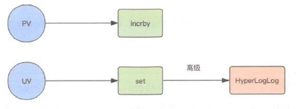

图解： 给定一系列的随机整数 `maxbit `，并记录下低位连续零位的最大长度 K ，通过 K 值估算出随机数的数量 N

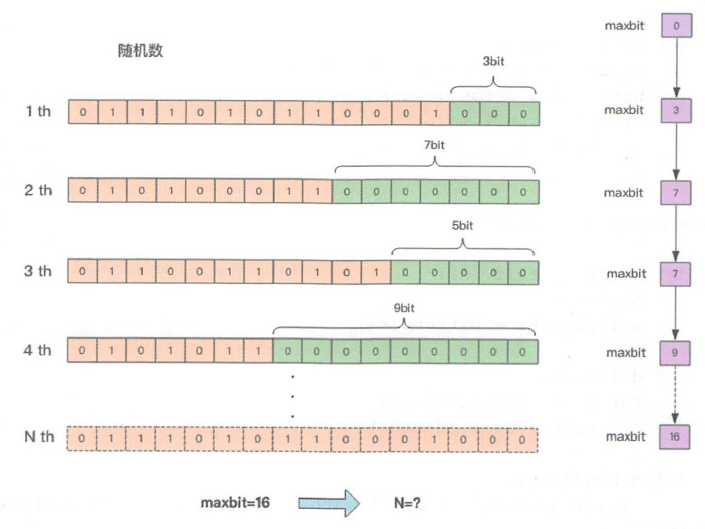

## 5、布隆过滤器

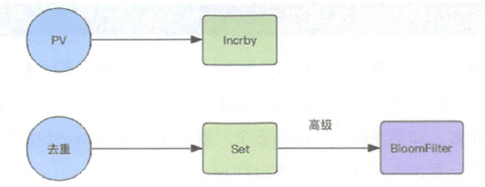

- `bf.add`： 添加元素，只能一次添加一个元素
- `bf.exists`： 查询元素是否存在
- `bf.madd`： 一次添加多个元素
- `bf.mexists`： 一次查询多个元素是否存在
- `bf.reserve(key, error_rate(错误率), initial_size)`： 自定义创建布隆过滤器
  - `error_rate` 越低， 需要的空间越大（默认 0.01）
  - `initial_size` 表示预计放入的元素数量，当实际数量超出该数值时，误判率会上升（默认 100）

## 6、漏斗限流


## 7、GeoHash

> 用于位置计算，Geo 存储结构使用 `zset`，编码为 `base32`

- `geoadd`： 包含集合名称及多个经纬度名称三元组

  > ```shell
  > > geoadd company 116.48105 39.996794 juejin
  > > geoadd company 116.514203 39.905409 ireader
  > > geoadd company 116.489033 40.007669 meituan
  > > geoadd company 116.562108 39.787602 jd 116.334255 40.027400 xiaomi
  > ```

- `geodist`： 用来计算两个元素之间的距离，包含集合名称、两个名称和距离单位

  > ```shell
  > > geodist company juejin ireader km
  > "10.5501"
  > ```

- `geopos`： 获取集合中任意元素的经纬度坐标，可以一次获取多个

  > ```shell
  > > geopos company juejin
  > 1) 1) "116.48104995489120483"
  >    2) "39.99679348858259686"
  > ```
  >
  > 注： 有少许误差，原因是 GeoHash 对二维坐标进行的一维映射是有损的，通过映射再还原回来的值会出现较小的差别

- `geohash`： 获取元素的经纬度编码字符串

  > ```shell
  > > geohash company ireader
  > 1) "wx4g52e1ce0"
  > ```

- `georadiusbymember`： 用来查询指定元素附近的其他元素， 参数非常复杂

  > ```shell
  > # 范围 20 公里内最多 3 个元素按距离正排，不会排除自身
  > > georadiusbymember company ireader 20 km count 3 asc
  > 1) "ireader"
  > 2) "juejin"
  > 3) "meituan"
  > # 范围 20 公里内最多 3 个元素按距离倒排
  > > georadiusbymember company ireader 20 km count 3desc
  > 1) "jd"
  > 2) "meituan"
  > 3) "juejin"
  > # 三个可选参数 withcoord, withdist(可以用来显示距离), withhash 用来携带附加参数
  > > georadiusbymember company ireader 20 km withcoord withdist withhash count 3 asc
  > 1) 1) "ireader"
  >    2) "0.0000"
  >    3) (integer) 4069886008361398
  >    4)  1) "116.5142020583152771"
  >        2) "39.90540918662494363"
  > 2) 1) "juejin"
  >    2) "10.5501"
  >    3) (integer) 4069887154388167
  >    4)  1) "116.48104995489120483"
  >        2) "39.99679348858259686"
  > 3) 1) "meituan"
  >    2) "11.5748"
  >    3) (integer) 4069887179083478
  >    4)  1) "116.48903220891952515"
  >        2) "40.00766997707732031"
  > ```

- `georadius`： 根据坐标值来查询附近的元素，比如： 根据用户的定位来计算“附近的车，附近的餐馆”等

  > 参数和 georadiusbymember基本一致，唯一的差别是将目标元素改成经纬度坐标值

## 8、scan

**从海量的 key 中找出满足特定前缀的 key 列表**： 

- 方式一： 使用指令 `keys` 用来列出所有满足特定正则字符串规则的 key

  > 缺点： 
  >
  > 1. 没有 offset、limit 参数，**一次性吐出所有满足条件的 key**，当数据量大时，很难受
  > 2. keys 算法是遍历算法，复杂度是 O(n)，当数据量大时，会导致 Redis 服务卡顿

- 方式二： 指令 `scan` 

  > `scan` 相比 keys 具备以下特点： 
  >
  > 1. 复杂度虽然也是 O(n)，但通过游标分步进行，不会阻塞线程
  > 2. 提供 limit 参数，可以控制每次返回结果的最大条数
  > 3. 同 keys 一样，也提供模式匹配功能
  > 4. 服务器不需要为游标保存状态，游标的唯一状态就是 scan 返回给客户端的游标整数
  > 5. 返回的结果可能会有重复，**需要客户端去重**(非常重要)
  > 6. 遍历的过程中如果有数据修改，改动后的数据能不能遍历到是不确定的
  > 7. 单次返回的结果是空的并不意昧着遍历结束，而要**看返回的游标值是否为零**

---

**字典结构**： 同 Java 中的 HashMap，即**一维数组+二维链表**结构

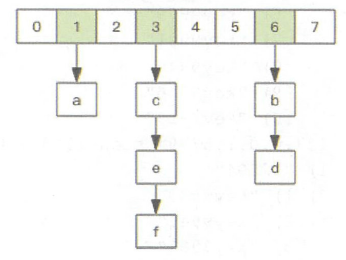

- `scan` 指令返回的游标是第一维数组的位置索引，即==槽(slot)== 

  > 若不考虑字典的扩容缩容，则可以直接按数组下标挨个遍历

- `limit` 参数表示需要遍历的槽位数，每次遍历后会将 limit 数量的槽位上挂接的所有链表元素进行模式匹配过滤后，一次性返回给客户端

  > 之所以返回结果可能多可能少，是因为有的槽位为空，有的槽位挂接的链表元素有多个

---

**`scan` 遍历顺序**： 采用高位进位加法来遍历，因为考虑字典的扩容和缩容时，避免槽位的遍历重复和遗漏

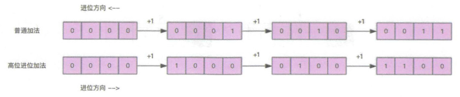

- Java 的 HashMap 扩容： 会一次性将旧数组下挂接的元素全部转移到新数组下

  > 问题： 若 HashMap 中元素特别多，线程就会出现卡顿现象

- **Redis 的 渐进式 rehash**： 同时保留旧数组和新数组，然后在定时任务中以及后续对 hash 的指令操作中渐渐地将旧数组中挂接的元素迁移到新数组上

  > - 问题： 要操作处于 rehash 中的字典，则需要同时访问新旧两个数组结构。若旧数组下找不到元素，则需要去新数组下寻找
  > - 解决： 对于 rehash 中的字典，需要同时扫描新旧槽位，然后将结果融合后返回给客户端

---

**大 key 扫描**： 对于 `scan` 扫描出的 key，使用 type 指令获得 key 的类型，然后使用相应数据结构的 size 或 len 来获得其大小，对于每种类型，将大小排名的前若干名作为扫描结果展示

- 问题： 上述过程需要编写脚本，比较繁琐

- 改进： `redis-cli` 提供的扫描功能

  > `redis-cli -h 127.0.0.1 -p 7001 -bigkeys -i 0.1`： 每隔100 条 scan 指令就会休眠 0.1s

## 9、Info 指令

Info 指令可以清晰的知道 Redis 内部一系列的运行参数，分为9大块：

1. `Server `：服务器运行的环境参数
2. `Clients`： 客户端相关信息
3. `Memorγ`： 服务器运行内存统计数据
4. `Persistence`：持久化信息
5. `Stats`：通用统计数据
6. `Replication`：主从复制相关信息
7. `CPU`: CPU 使用情况
8. `Cluster`： 集群信息
9. `KeySpace`： 键值对统计数量信息

# 二十二、Redis 原理解析

## 1、线程 IO 模型

### (1) IO 模型简介

- **非阻塞 IO**：在套接字对象上提供了一个选项 `Non_Blocking`

  > 当 `Non_Blocking` 选项打开时，读写方法不会阻塞(读写方法会通过返回值来告知程序实际读写了多少字节)：
  >
  > - **读多少**取决于**内核为套接字分配的读缓冲区**内部的数据字节数
  > - **写多少**取决于**内核为套接字分配的写缓冲区**的空闲空间字节数
  >
  > 有了非阻塞 IO，线程在读写 IO 时可以瞬间完成
  >
  > 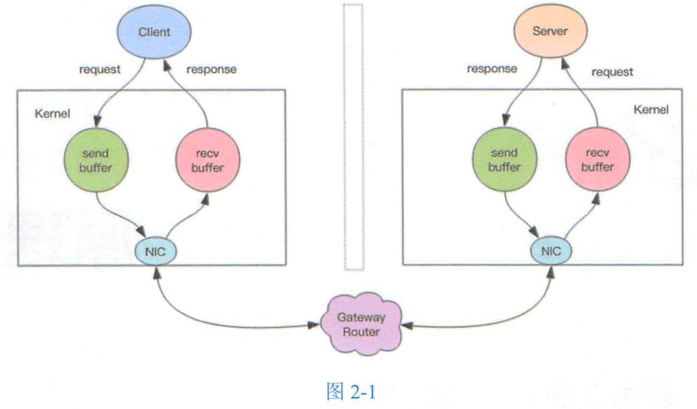

- **多路复用(事件轮询)**：通知程序的执行状态，如：selector、poll、epoll

  > 文件 IO 操作不能使用多路复用 API

- **指令队列**：redis 会将每个客户端套接字都关联一个指令队列，客户端的指令**通过队列来排队进行顺序处理，先到先服务**

- **响应队列**：redis 服务器通过响应队列来将指令的返回结果回复给客户端

- **定时任务**：redis 定时任务会记录在**最小堆**中，最快要执行的任务排在堆的最上方

  > - 在每个循环周期内，redis 会对最小堆中快到时间点的任务进行处理
  >
  > - 处理完后，将最快要执行的任务还需时间记录下来，即 select 的 timeout 参数
  >
  >   > 睡眠 timeout 的时间后，redis 将再度执行

### (2) redis 线程模型

#### a、redis 与 memcached 区别

- **性能上**：性能上都很出色
  - Redis 使用单核，而 Memcached 使用多核，所以平均每一个核上 Redis 在存储小数据时比 Memcached 性能更高
  - 在 100k 以上的数据中，Memcached 性能要高于 Redis
- **内存空间和数据量大小**：
  - MemCached 可以修改最大内存，采用 LRU 算法
  - Redis 增加了 VM 特性，突破了物理内存的限制
- **操作便利上**：
  - MemCached 数据结构单一，仅用来缓存数据
  - Redis 支持更丰富的数据类型，也可以在服务器端直接对数据进行操作，可以减少网络IO次数和数据体积
- **可靠性上**：
  - MemCached 不支持数据持久化，断电或重启后数据消失，但其稳定性有保证
  - Redis 支持数据持久化和数据恢复，允许单点故障，但同时也会付出性能的代价
- **应用场景**：
  - Memcached：
    - 动态系统中减轻数据库负载，提升性能
    - 做缓存，适合多读少写，大数据量的情况
  - Redis：适用于对读写效率要求都很高，数据处理业务复杂和对安全性要求较高的系统

#### b、redis 线程模型

- redis 内部使用文件事件处理器 `file event handler` 

  > 该文件事件处理器是单线程，所以 redis 才叫做单线程的模型

- **采用 IO 多路复用机制同时监听多个 socket**，根据 socket 上的事件来选择对应的事件处理器进行处理

  文件事件处理器的结构包含 4 个部分：

  - 多个 socket
  - IO 多路复用程序
  - 文件事件分派器
  - 事件处理器（连接应答处理器、命令请求处理器、命令回复处理器）

  > 多个 socket 可能会并发产生不同的操作，每个操作对应不同的文件事件： 
  >
  > - IO 多路复用程序会监听多个 socket，会将 socket 产生的事件放入队列中排队
  > - 事件分派器每次从队列中取出一个事件，把该事件交给对应的事件处理器进行处理

#### c、redis 通信过程


- 客户端 socket01 向 redis 的 server socket 请求建立连接，此时 server socket 会产生一个 `AE_READABLE` 事件，IO 多路复用程序监听到 server socket 产生的事件后，将该事件压入队列中
- 文件事件分派器从队列中获取该事件，交给连接应答处理器，连接应答处理器会创建一个能与客户端通信的 socket01，并将该 socket01 的 `AE_READABLE` 事件与命令请求处理器关联

- 假设此时客户端发送了一个 `set key value` 请求，此时 redis 中的 socket01 会产生 `AE_READABLE` 事件，IO 多路复用程序将事件压入队列，此时事件分派器从队列中获取到该事件，由于前面 socket01 的 `AE_READABLE` 事件已经与命令请求处理器关联，因此事件分派器将事件交给命令请求处理器来处理
- 命令请求处理器读取 socket01 的 `key value` 并在内存中完成 `key value` 的设置，操作完成后，会将 socket01 的 `AE_WRITABLE` 事件与命令回复处理器关联

- 如果此时客户端准备好接收返回结果，则 redis 中的 socket01 会产生一个 `AE_WRITABLE` 事件，同样压入队列中，事件分派器找到相关联的命令回复处理器，由命令回复处理器对 socket01 输入本次操作的一个结果，比如 `ok`，之后解除 socket01 的 `AE_WRITABLE` 事件与命令回复处理器的关联

#### d、单线程 redis 效率高

- 纯内存操作
- 核心是基于非阻塞的 IO 多路复用机制
- 单线程反而避免了多线程的频繁上下文切换问题

## 2、通信协议

> redis 使用了浪费流量的**文本协议**
>
> - 数据库服务瓶颈在于数据库自身内部逻辑处理上
>
> - reids 将数据都放在内存中，用一个单线程对外提供服务，单个节点在跑满一个 CPU 核心的情况下可以达到 10w/s 的超高 QPS

- **Redis 序列化协议 `RESP`**：一种直观的文本协议，实现简单，解析性能极好

  > redis 协议将传输的结构数据分为 5 种最小单元类型，单元结束统一加上回车换行符 `\r\n`：
  >
  > 1. 单行字符串以 `+` 开头：`+hello workld\r\n`
  >
  > 2. 多行字符串以 `$` 开头，后跟字符串长度：`$11 hello world\r\n ` 
  >
  >    > - `NULL` 用多行字符串表示，不过长度要写成 `-1`：`$-1\r\n`
  >    > - 空串用多行字符串表示，长度填 0：`$0\r\n\r\n`
  >
  > 3. 整数值以 `:` 开头，后跟整数的字符串形式：`:1024\r\n`
  >
  > 4. 错误消息以 `-` 开头：`-xxx\r\n`
  >
  > 5. 数组以 `*` 开头，后跟数组的长度：`*\r\n:1\r\n:2\r\n:3\r\n`

- **客户端 --> 服务器**：客户端向服务器发送的指令只有一种格式，多行字符串数组

  > 比如：`set author codehole` 变为 `*3\r\n$3\r\nset\r\n$6\r\nauthor\r\n$8\r\ncodehole\r\n`

- **服务器 --> 客户端**：服务器向客户端回复的响应支持多种数据结构

> ==技术领域，性能并不总是一切，还有简单性、易理解性、易实现性，这些都需要进行适当权衡== 

## 3、持久化

|      | 快照(RDB)                                | AOF 日志                   |
| ---- | ---------------------------------------- | -------------------------- |
| 备份 | 全量备份                                 | 连续的增量备份             |
| 格式 | 内存数据的二进制序列化形式，存储上很紧凑 | 内存数据修改的指令记录文本 |

- **快照原理(RDB)**：Redis 使用操作系统的==多进程COW`Copy On Write` 机制==来实现快照持久化

  > Redis 在持久化时会调用 glibc 的函数 fork 产生一个子进程，快照持久化交给子进程来处理，父进程继续处理客户端请求
  >
  > > 子进程与父进程共享内存中的代码段和数据段
  >
  > - 子进程做数据持久化，不会修改现有的内存数据结构，只是对数据结构进行遍历读取，然后序列化写到磁盘中
  > - 父进程会持续服务客户端请求，然后对内存数据结构进行不间断的修改
  >
  > 流程：
  >
  > - Redis 使用操作系统的 COW 机制进行数据段页面的分离
  >
  >   > 数据段由很多操作系统的页面组合而成
  >
  > - 当父进程对其中一个页面的数据进行修改时，会将被共享的页面复制一份分离出来，然后**对这个复制的页面进行修改** 
  >
  >   > 此时子进程的页面没有变化
  >
  > - 随着父进程修改操作的持续进行，越来越多的共享页面被分离，内存会持续增长，但不会超过原有内存的 2 倍
  >
  > - 由于 Redis 实例中的冷数据较多，因此被分离的页面只占一部分
  >
  >   > 每个页面大小仅为 4KB，而一个 Redis 实例有成千上万个页面
  >
  > - 子进程看到的数据没有变化，遍历数据，进行序列化写磁盘
  >
  > 

- **AOF 原理**：可以通过对一个空的 Redis 实例顺序执行所有的指令，来恢复 Redis 当前实例的内存数据结构的状态

  - AOF 只记录对内存进行修改的指令记录

  - Redis 会在收到客户端修改指令后，进行参数校验、逻辑处理，若没有问题，则立即将指令文本存储到 AOF 日志中

    > **先执行指令，才将日志存盘**，不同于 leveldb、hbase

  - 问题：随着 AOF 日志越来越大，重放 AOF 日志会非常耗时，因此需要对 AOF 日志瘦身

    > Redis 提供了 `bgrewriteaof` 指令用于对 AOF 日志进行瘦身
    >
    > 原理：
    >
    > - 开辟一个子进程对内存进行遍历，转换成一系列 Redis 的操作指令，序列化到一个新的 AOF 日志文件中
    > - 序列化完毕后，再将操作期间发生的增量 AOF 日志追加到新的 AOF 日志文件中

  - **避免日志丢失**：Linux 的 glibc 提供了 `fsync(int fd)` 函数将指定文件的内容强制从内核缓存刷到磁盘

    > - AOF 写操作：当程序对 AOF 日志文件进行写操作时，先将内容写到内核为文件描述符分配的一个内存缓存中，然后内核异步将脏数据刷回到磁盘
    > - `fsync` 缺点：fsync 是一个磁盘 IO 操作，很慢
    > - 解决：Reids 默认每隔 1s 执行一次 fsync 操作(可配置)

- **混合持久化**：将 RDB 文件的内容和增量的 AOF 日志文件放到一起

  > 此处的 AOF 文件是自持久化开始到持久化结束的这段时间发生的增量 AOF 日志
  >
  > 重启 Redis 时，先加载 RDB 内容，再重放增量 AOF 日志
  >
  > 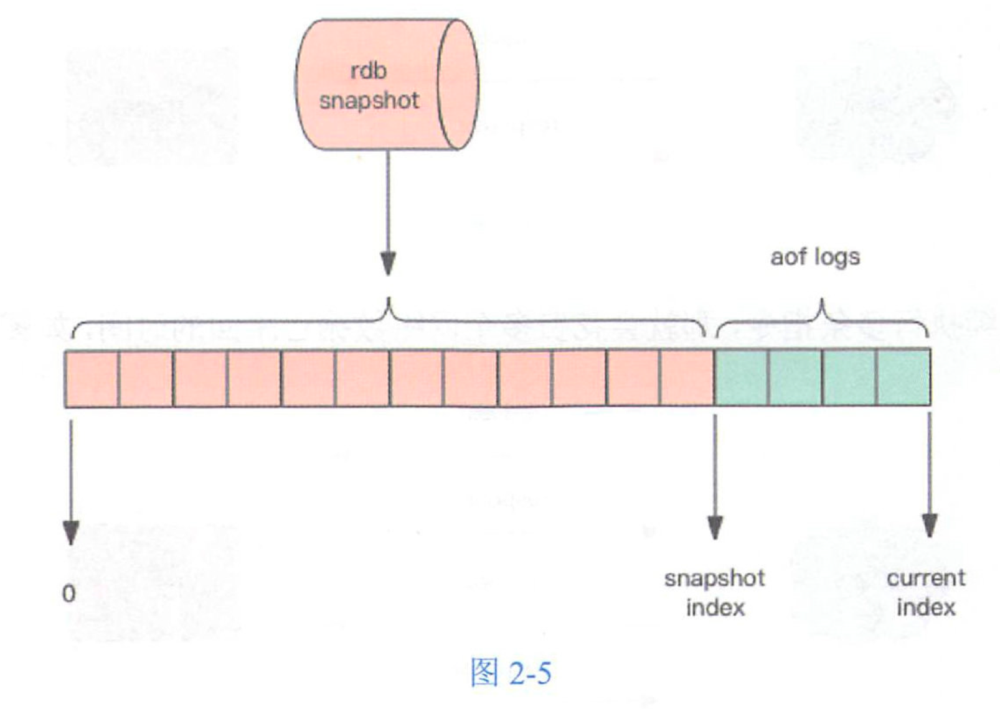

## 4、管道

> Redis 管道本质由客户端提供

- **消息交互**：

  > **传统方式**：
  >
  > 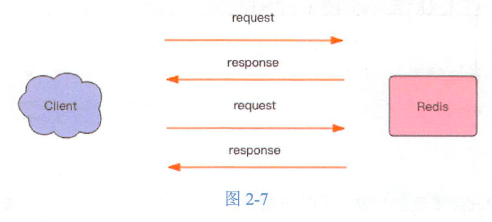
  >
  > **改进**：
  >
  > 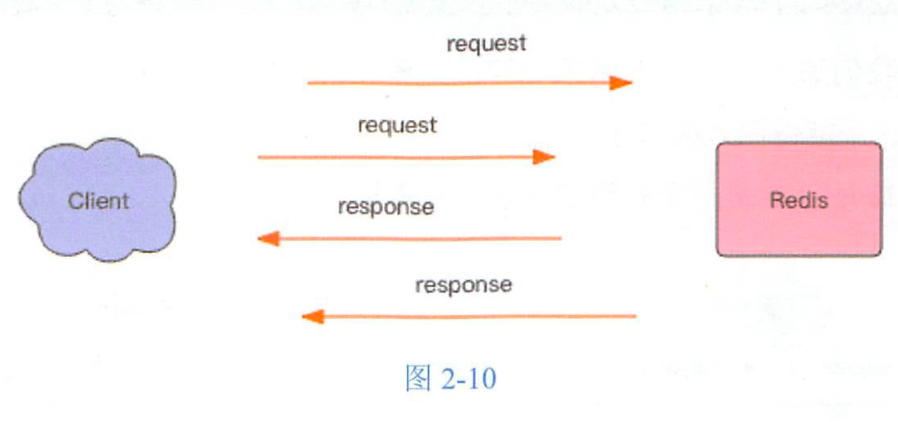
  >
  > ---
  >
  > 操作展示：
  >
  > **传统操作**：
  >
  > 
  >
  > **改进**：
  >
  > 
  >
  > ---
  >
  > **Redis 管道本质**：客户端通过**对管道中的指令列表改变读写顺序**可以大幅节省 IO 时间
  >
  > - 管道中指令越多，效果越好

- **管道本质**：

  > 
  >
  > **完整的请求交互流程**：
  >
  > 1. 客户端进程调用 write 将消息写到操作系统内核为套接字分配的发送缓冲 send buffer 中
  > 2. 客户端操作系统内核将发生缓冲的内容发送到网卡，网卡硬件将数据通过“网际路由”送到服务器的网卡
  > 3. 服务器操作系统内核将网卡的数据放到内核为套接字分配的接收缓冲 recv buffer 中
  > 4. 服务器进程调用 read 从接收缓冲中取出消息进行处理
  > 5. 服务器进程调用 write 将响应消息写到内核为套接字分配的发送缓冲 send buffer 中
  > 6. 服务器操作系统内核将发生缓冲的内容发送到网卡，网卡硬件将数据通过“网际路由”送到客户端的网卡
  > 7. 客户端操作系统内核将网卡的数据放到内核为套接字分配的接收缓冲 recv buffer 中
  > 8. 客户端进程调用 read 从接收缓冲中取出消息返回给上层业务逻辑进行处理
  > 9. 结束
  >
  > ---
  >
  > - **写 IO 操作的耗时**：若发送缓冲满了，则需要等待缓冲空出空闲空间
  > - **管道处理**：
  >   - 连续的 write 操作没有耗时
  >   - 第一个 read 操作会等待一个网络的来回开销，然后所有的响应消息就都送回内核的读缓冲，后续的 read 操作直接可以从缓冲中拿结果
  >
  > ---
  >
  > **Redis 管道本质**：客户端通过**对管道中的指令列表改变读写顺序**可以大幅节省 IO 时间
  >
  > - 管道中指令越多，效果越好

## 5、事务

- redis 对应事务的 `begin、commit、rollback` 的指令为 `multi、exec、discard`

- Redis 事务不具备“原子性”，仅满足了事务“隔离性”中的串行化(即当前执行的事务有着不被其他事务打断的权利)

  > redis 事务在遇到指令执行失败后，后面的指令还会继续执行

- **事务优化**：

  - 场景：Redis 事务在发送每个指令到事务缓存队列时，都要经过一次网络读写，当指令较多时，需要的网络 IO 时间也会线性增长
  - 优化：Redis 客户端在执行事务时结合 pipeline 使用，将多次 IO 操作压缩为单次 IO 操作

- `discard` 指令：用于丢弃事务缓存队列中的所有指令

- `watch` 机制：一种乐观锁，watch 会在事务开始之前盯住一个或多个关键变量，当服务执行时，Redis 会检查关键变量自 watch 之后是否被修改。若关键变量被修改，exec 指令会返回 NULL 回复告知客户端事务执行失败，此时客户端会重试

  > Redis 禁止在 multi 和 exec 之间执行 watch 指令

## 6、PubSub

> **消息队列的缺点：不支持消息的多播机制**

- **消息多播**：允许生产者只生产一次消息，由中间件负责将消息复制到多个消息队列，每个消息队列由相应的消费者进行消费

  > 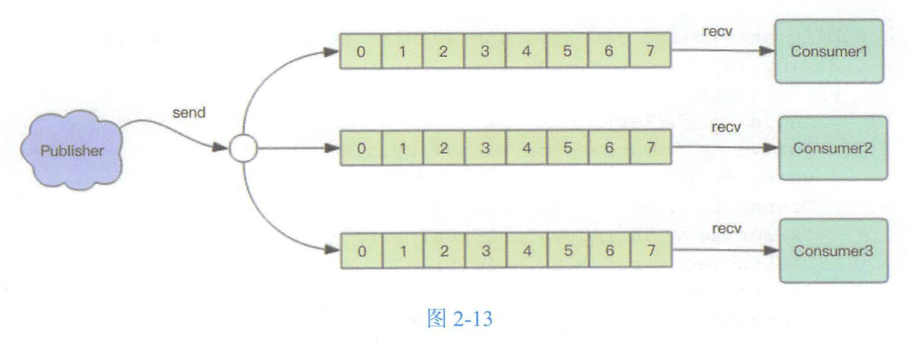
  >
  > **消息队列下的情况**：
  >
  > 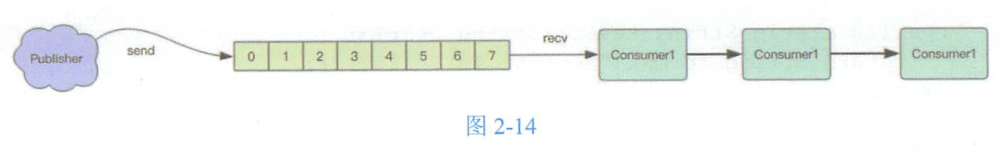

- **发布者/订阅者模式(PubSub)**：

  - 客户端发起**订阅命令**后，Redis 会立即给予一个反馈消息通知订阅成功，但因网络传输延迟，过段时间通过 `get_message` 拿到反馈消息

  - 客户端执行**发布命令**后，同样因网络延迟，过段时间通过 `get_message` 拿到发布消息

    > 若当前没有消息，`get_message` 会返回空，告知当前没有消息(注：`get_message` 不是阻塞)

- **PubSub 缺点**：当无消费者时，消息会被直接丢弃，即 PubSub 消息不会持久化

## 7、小对象压缩

- Redis 若使用 32bit 进行编译，内部所有数据结构所使用的指针空间占用会少一半(注：==为什么==)

- `ziplist`：

  > 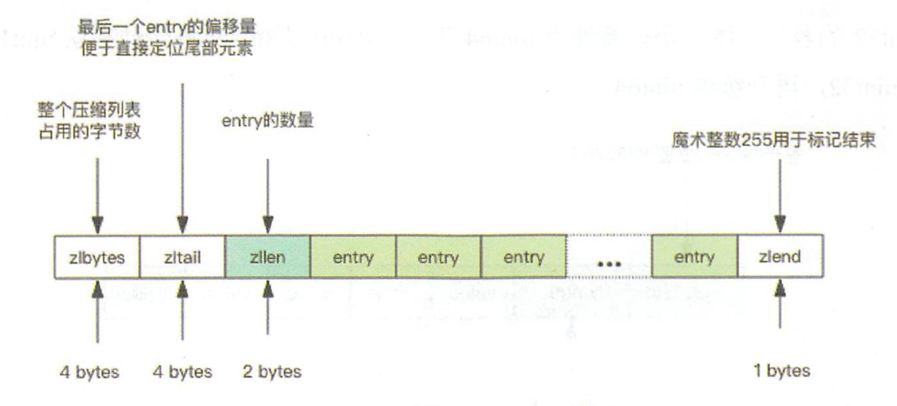

- **内存回收机制**：懒惰删除，操作系统上**以页为单位来回收内存**

  > `flushdb` 会回收所有已用内存，即干掉所有的 key

- **内存分配算法**：Redis 使用 `jemalloc` 来管理内存，也可切换到 `tcmalloc`

  > 可通过 `info memory` 查看

# 二十三、面试题

## 1、redis 的注意事项

- **使用 key 值前缀来作命名空间** 

- **创建一个类似 ”registry” 的 key 用于标记 key 使用情况** 

- **注意垃圾回收** 

- **设计好 Sharding 机制** 

- **合适使用 redis 时再使用**

## 2、redis 内存设置

`info memory`： 查看内存统计信息

- `used_memory`: Redis分配的内存总量，即存储的所有数据占用的内存

- `used_memory_human`: 以可读格式返回使用的内存量

- `used_memory_rss`：从系统角度显示 Redis 进程占用的物理内存总量

- `used_memory_rss_human`：以可读格式返回Redis进程占用的物理内存总量

- `used_memory_peak`：内存使用的最大值，表示 used_memory 峰值

- `used_memory_peak_human`： 以可读格式返回内存使用的最大值

- `total_system_memory`：系统总内存

- `total_system_memory_human`：以可读格式返回系统总内存

- `used_memory_lua`：Lua进程使用内存

- `used_memory_lua_human`：以可读格式返回Lua进程使用内存

- `mem_fragmentation_ratio`：内存碎片率，等价于(used_memory_rss /used_memory)

- `mem_allocator`：redis使用的内存分配器

### 1. 内存消耗划分

Redis 进程的内存主要包括：

- **自身内存**： Redis 自身内存消耗很少，通常 used_memory_rss 在3MB左右，used_memory在800k左右

- **对象内存**： 存储着用户所有数据，避免使用过长的 key-Value 对象

- **缓冲内存**： 

  - **客户端缓冲**：指所有连接到 Redis 服务器 tcp 连接输入输出缓冲

    > - 输入缓冲无法控制，最大空间1G
    > - 输出缓冲可通过 client-output-buffer-limit 控制
    >
    > 查看： `config get client-output-buffer-limit` 
    >
    > 结果： **缓冲区软限制，硬限制和以秒为单位的超时**

    - **普通客户端**：client-output-buffer-limit normal 0 0 0

      > 默认没有对输出缓冲区做限制，但是如果有大量的慢连接客户端接入时，不能忽略
      >
      > 可以设置 maxclients 做限制

    - **从客户端**：client-output-buffer-limit slave 256mb 64mb 60

      > 主节点会在每一个从节点单独建立一条连接用于命令复制
      >
      > 建议主节点挂载从节点最好不要超过2个

    - **订阅客户端**：client-output-buffer-limit pubsub 32mb 8mb 60 

      > 当生产消息的速度快于消费的速度时，输出缓冲区容易积压消息

  - **复制积压缓冲区**：用于实现部分复制功能的可重用的固定大小缓冲区

    > - 根据 repl-backlog-size 参数控制，默认1MB
    >
    > - 对于复制积压缓冲区，主节点有一个，所有从节点共享这个缓冲区，可以有效避免全量复制

  - **AOF 缓冲区**：用于 AOF 重写期间保存最近写入的命令，等待被刷到磁盘

- **内存碎片**： 

  > - Redis 默认的内存分配器是 `jemalloc`
  > - 内存分配器的作用： 更好的管理和重复利用内存，但当存储的数据长短差异较大时，容易出现高内存碎片
  > - 易产生高内存碎片的操作： 
  >   - 频繁更新： 对已经存在的 key 进行 append setrange 操作
  >   - 大量过期键删除： 键对象过期删除后，释放的空间无法得到拆分利用
  > - 解决办法：
  >   - 尽量数据对齐，视业务情况而定
  >   - 安全重启：重启可以做到内存碎片重新整理

### 2. 子进程内存消耗

- **子进程内存**： 指 AOF/RDB 重写时 Redis 创建的子进程内存消耗

  > - Redis 执行 fork 操作产生子进程内存占用对外表现为与父进程相同，理论上需要一倍的相同物理内存来完成重写操作
  > - 但 Linux 的 copy-on-write 机制使得父子进程共享相同的物理内存页，当父进程处理写请求时会对需要修改的页复制出一份副本完成写操作，而子进程依旧读取 fork 时整个父进程内存快照

- Redis 子进程并不需要消耗1倍的父进程内存，但是依然要预留一些内存防止内存溢出

- 需要设置 `sysctl vm.overcommit_memory=1` 允许内核可以分配所有的物理内存，防止 Redis 进程执行fork时因系统剩余内存不足而失败

- 排查当前系统是否支持并开启 THP，如果开启，建议关闭

### 3. 内存管理

- **设置内存上限**： Redis通过 maxmemory 参数限制最大可用内存

  >  命令 `config set maxmemory 8GB`
  >
  > 限制内存目的：
  >
  > - 用于缓存场景，当超出内存上限 maxmemory 时，使用LRU等删除策略释放空间
  > - 防止所用内存超过服务器物理内存

动态调整内存上限

- 内存回收： 

  - **删除过期的 key**： 

    - **惰性删除**： 当客户端读取超时的 key 时，执行删除操作并返回空

      > 问题：当过期键一直没有访问将无法得到及时删除，从而导致内存不能及时释放

    - **定时任务删除**：Redis内部维护一个定时任务，默认每秒运行10次，通过配置 hz 属性控制

  - 内存使用达到 maxmeory 上限时触发内存溢出的控制策略： 具体策略受 maxmeory-policy 参数控制

    Redis支持6种策略：

    - `volatile-lru`： 根据 LRU 算法删除设置了超时属性的键，直到腾出足够空间为止

    - `allkeys-lru`： 根据 LRU 算法删除键，不管有没有设置超时属性，直到腾出足够空间为止

    - `volatile-random`： 随即删除过期键，直到腾出足够空间为止

    - `allkeys-random`： 随即删除所有键，直到腾出足够空间为止

    - `volatile-ttl`： 根据 ttl 属性，删除最近将要过期的数据，如果没有回退到noeviction策略

      > TTL： 从过期时间的表中随机挑选几个键值对，取出其中 ttl 最大的键值对淘汰

    - `noeviction`： 不会删除任何数据，拒绝所有写入操作，并返回错误信息，此时只是响应读

### 4. 内存优化

- **redisObject 对象** 

- **缩减键值对象**： 降低Redis内存使用最直接的方式就是缩减key和value的长度
  - key的设计：越短越好，如user:{userid}:friends:notify:{fid}，可以简化为u:{uid}:fs:nt:{fid} 
  - value： 值对象缩减比较复杂，常见的需求是把业务对象序列化放入Redis

3.2 缩减键值对象

- **共享对象池**

- **字符串优化**

- **编码优化**
- **控制键的数量**： 比如通过hash数据结构就可以减少key的数量，从而减少了RTT的时间，还可以减少key，这样也节约了内存

## 3、redis 比较

### 1. redis3 

- **内部通讯机制**：
  - 集群中的每个节点都会单独开辟一个TCP通道， 用于节点间通信， 通信端口号在基础端口上加10000
  - 每个节点在固定周期内通过特定规则选择几个节点发送 ping 消息
  - 接收到 ping 消息的节点用 pong 消息作为响应

- **数据共享**：Redis提供多个节点实例间的数据共享，也就是Redis A,B,C,D彼此之间的数据是同步的，同样彼此之间也可以通信，而对于客户端操作的keys是由Redis系统自行分配到各个节点中
- **主从复制**：Redis的多个实例间通信时，做到一旦节点A故障了，那么其从节点A1和A2就可以接管并继续提供与A同样的工作服务，当然如果节点A,A1,A2节点都出现问题，那么同样这个集群不会继续保持工作，但是这种情况比较罕见，即使出现了，也会及时发现并修复使用。建议：部署主从复制机制（Master-Slave）

- **哈希槽值**：Redis集群中使用哈希槽来存储客户端的keys，而在Redis中，目前存在16384个哈希槽，它们被全部分配给所有的节点

### 2. memcached

推荐阅读： **[Memcached 教程](<http://www.runoob.com/memcached/memcached-tutorial.html>)** 

- **组成结构**： 

  - MemCache 将内存空间分为一组 slab

  - 每个 slab 分为若干个 page，page 默认 1M

    > 如果一个slab占用100M内存的话，那么这个slab下应该有100个page

  - 每个 page 包含一组 chunk，chunk 是真正存放数据的地方，同一 slab 中的 chunk 大小固定

    > 申请到 page 后，slab 会将 page 的内存按 chunk 的大小切分成一个 chunk 数组，最后从这个chunk数组中选择一个用于存储数据

  - 相同大小 chunk 的 slab 被组织在一起，称为 slab_class

    > 相邻 slab 内的 chunk 默认以 1.25 比例进行增长，MemCache 启动时可以用 `-f` 指定该比例

- **MemCache 内存分配及回收算法**： 

  - MemCache 的内存分配 chunk 会有内存浪费，但避免了管理内存碎片的问题

    > 88 字节的 value 分配在 128 字节（紧接着大的用）的chunk中，就损失了30字节

  - MemCache 的 LRU 算法不针对全局，只针对 slab

  - MemCache 存放的 value 大小限制原因： 对于一个新数据，slab 先以 page 为单位申请一块内存，申请的内存最多只有1M

- **MemCache 的限制和特性**： 

  - MemCache 可以保存的 item 数据量没有限制，只要内存足够

  - MemCache 单进程在32位机中最大使用内存为 2G，64位机则没有限制

  - Key 最大为 250 字节，超过该长度无法存储

  - 单个 item 最大数据是1MB，超过1MB的数据不存储

  - MemCache 服务端不安全，比如已知某个MemCache节点，可以直接telnet过去，并通过flush_all让已经存在的键值对立即失效

  - 不能够遍历 MemCache 中所有的 item，因为这个操作的速度相对缓慢且会阻塞其他的操作

  - MemCache 的高性能源自于两阶段哈希结构：

    - 第一阶段在客户端，通过Hash算法根据Key值算出一个节点

    - 第二阶段在服务端，通过一个内部的Hash算法，查找真正的item并返回给客户端

      > 从实现的角度看，MemCache是一个非阻塞的、基于事件的服务器程序

  - MemCache 设置添加某一个Key值时，传入 expiry 为 0 表示Key值永久有效，但也会在30天之后失效

- **Memcached 使用 libevent 库实现网络连接服务**

### 3. redis VS memcached

#### 1. 简单对比

推荐阅读： **[memcache、redis原理对比](https://www.cnblogs.com/work115/p/5584646.html)**

- **性能上**：性能上都很出色
  - Redis 使用单核，而 Memcached 使用多核，所以平均每一个核上 Redis 在存储小数据时比Memcached性能更高
  - 在 100k 以上的数据中，Memcached 性能要高于 Redis

- **内存空间和数据量大小**：
  - MemCached 可以修改最大内存，采用 LRU 算法
  - Redis 增加了 VM 特性，突破了物理内存的限制

- **操作便利上**：
  - MemCached 数据结构单一，仅用来缓存数据
  - Redis 支持更丰富的数据类型，也可以在服务器端直接对数据进行操作，可以减少网络IO次数和数据体积

- **可靠性上**：

  - MemCached 不支持数据持久化，断电或重启后数据消失，但其稳定性有保证
  - Redis 支持数据持久化和数据恢复，允许单点故障，但同时也会付出性能的代价

- **应用场景**：

  - Memcached：
    - 动态系统中减轻数据库负载，提升性能
    - 做缓存，适合多读少写，大数据量的情况

  - Redis：适用于对读写效率要求都很高，数据处理业务复杂和对安全性要求较高的系统

#### 2. 内存管理

- Redis： 

  - Redis 的数据并不一直存储在内存中，当物理内存用完时，将很久没用到的value交换到磁盘，Redis 只会缓存所有的 key 信息

  - Redis 内存的使用量超过某一个阀值，将触发 swap 操作，将 key 对应的 value 持久化到磁盘，同时在内存中清除

    > 计算公式： `swappability = age*log(size_in_memory)`

  - 系统内存必须要能够保持所有的 key，因为 key 不会进行 swap 操作

  - Redis 执行 swap 操作时，提供服务的主线程和进行 swap 操作的子线程会共享内存，所以当更新 swap 数据时，Redis 将阻塞这个操作，直到子线程完成 swap 操作后才可以进行修改

  - Redis 使用 I/O 线程池，对需要从 swap 文件中加载数据的读取请求进行并发操作，减少阻塞时间

- Memcached： 默认使用 Slab Allocation 机制管理内存
  - 主要思想： 按照预先规定的大小，将分配的内存分割成特定长度的块以存储相应长度的 key-value 数据记录，以完全解决内存碎片问题
  - Slab Allocation 机制只为存储外部数据而设计，而 Memcached 的其它内存请求则通过普通的malloc/free 来申请

## 4、Redis 选举算法和流程

推荐阅读： **[Raft协议详解](https://zhuanlan.zhihu.com/p/27207160)**

### 1. 选举算法
- 采用心跳机制触发 Leader 选举

- 系统启动后，全部节点初始化为 Follower：
  - 如果收到 RequestVote或AppendEntries，就会保持 Follower 身份
  - 如果一段时间内没收到 AppendEntries 消息直到选举超时，说明在该节点的超时时间内还没发现Leader，Follower 就会转换成 Candidate，自己开始竞选 Leader
- 一旦转化为 Candidate，该节点立即开始下面几件事情：
  - 增加自己的 term
  - 启动一个新的定时器
  - 给自己投一票
  - 向所有其他节点发送 RequestVote，并等待其他节点的回复

选举过程： 

- 如果在选举过程中收到其他节点发送的 AppendEntries，说明已有 Leader 产生，自己就转换成Follower，选举结束

- 计时器超时前，节点收到多数节点的同意投票，就转换成Leader，同时向所有其他节点发送AppendEntries，告知自己成为了Leader

- 每个节点在一个 term 内只能投一票，采取先到先得的策略，Follower 会投给第一个收到 RequestVote 的节点，每个 Follower 有一个计时器，在计时器超时时仍然没有接受到来自 Leader 的心跳 RPC, 则自己转换为Candidate, 开始请求投票，就是上面的的竞选Leader步骤

- 如果多个 Candidate 发起投票，每个 Candidate 都没拿到多数的投票，那么就会等到计时器超时后重新成为Candidate，重复前面竞选 Leader 步骤

- Raft协议的定时器**采取随机超时时间**，每个节点定时器的超时时间随机设置，随机选取配置时间的1倍到2倍

  > - 由于随机配置，各个 Follower 转成 Candidate 的时间不同，在同一个 term 内，先转为 Candidate 的节点会先发起投票，从而获得多数票
  >
  > - 多个节点同时转换为 Candidate 的可能性很小，即使几个 Candidate 同时发起投票，在该 term 内有几个节点获得一样高的票数，只是这个 term 无法选出Leader
  > - 由于各个节点定时器的超时时间随机生成，则最先进入下一个 term 的节点，将更有机会成为Leader

### 2. 选举流程

Sentinel 集群正常运行时每个节点 epoch 相同，当需要故障转移时，会在集群中选出 Leader 执行故障转移操作

Sentinel 采用 Raft 协议实现 Sentinel 间选举 Leader 的算法

选举流程：

- 某个 Sentinel 认定 master 下线后，该 Sentinel 会先看看自己有没有投过票

  - 如果已经投过票给其他Sentinel，在 2 倍故障转移的超时时间自己就不会成为Leader
  - 如果该 Sentinel 还没投过票，那么它就成为 Candidate

- 和 Raft 协议描述的一样，成为Candidate，Sentinel需要完成几件事情

  - 更新故障转移状态为 start
  - 当前 epoch 加1，相当于进入一个新 term，在Sentinel中epoch就是Raft协议中的term
  - 更新自己的超时时间为当前时间随机加上一段时间，随机时间为 1s 内的随机毫秒数
  - 向其他节点发送 is-master-down-by-addr 命令请求投票，命令会带上自己的epoch
  - 给自己投一票，在Sentinel中，投票的方式是把自己master结构体里的leader和leader_epoch改成投给的Sentinel和它的epoch

- 其他 Sentinel 会收到 Candidate 的 is-master-down-by-addr 命令

  > 如果 Sentinel 当前 epoch 和 Candidate 传给他的 epoch 一样，说明他已经把自己 master 结构体里的leader 和 leader_epoch 改成其他 Candidate，相当于把票投给了其他 Candidate，投过票给别的Sentinel 后，在当前 epoch 内自己就只能成为 Follower

- Candidate 会不断的统计自己的票数，直到票数超过一半且超过它配置的quorum

  > Sentinel 比 Raft 协议增加 quorum，这样一个Sentinel能否当选Leader还取决于它配置的quorum

- 如果在一个选举时间内，Candidate 没有获得超过一半且超过配置的quorum的票数，则选举失败

- 如果在一个 epoch 内，没有一个 Candidate 获得更多的票数，则等待超过2倍故障转移的超时时间后，Candidate 增加 epoch 重新投票

- 如果某个 Candidate 获得超过一半且超过它配置的quorum的票数，那么它就成为 Leader

- 与 Raft 协议不同，Leader 不会把自己成为 Leader 的消息发给其他 Sentinel，其他 Sentinel 等待 Leader 从slave 选出 master 并检测到新的 master 正常工作后，去掉客观下线的标识，从而不需要进入故障转移流程

## 5、Redis 持久化机制

- Redis的持久化机制：

  - **RDB 持久化**： 将 Reids 在内存中的数据库记录定时 dump 到磁盘上

  - **AOF 持久化**： 将 Redis 的操作日志以追加的方式写入文件

- **AOF 和 RDB 区别**：

  - RDB 持久化： 指在指定的时间间隔内将内存中的数据集快照写入磁盘

    > 实际操作过程是 fork 一个子进程，先将数据集写入临时文件，写入成功后，再替换之前的文件，用二进制压缩存储 

  - AOF 持久化： 以日志的形式记录服务器所处理的每一个写、删除操作，查询操作不会记录，以文本的方式记录，可以打开文件看到详细的操作记录

- **RDB 优势**：

  - 整个 Redis 数据库将只包含一个文件，这对于文件备份非常完美

    > 比如： 打算每个小时归档一次最近 24 小时的数据，同时还要每天归档一次最近30天的数据。通过这样的备份策略，一旦系统出现灾难性故障，可以非常容易恢复

  - 对于灾难恢复，RDB是不错的选择，因为可以轻松的将一个单独的文件压缩后再转移到其它存储介质上

  - 性能最大化，对于 Redis 服务进程而言，在开始持久化时，fork 子进程，之后由子进程完成持久化工作，这样可以避免服务进程执行 IO 操作

  - 相比于 AOF 机制，如果数据集很大，RDB 的启动效率会更高

- **RDB 劣势**：

  - RDB 不能保证数据的高可用性，即最大限度的避免数据丢失，因为系统一旦在定时持久化之前出现宕机现象，此前没有来得及写入磁盘的数据都将丢失
  - 由于 RDB 通过 fork 子进程来协助完成数据持久化工作，因此当数据集较大时，可能会导致整个服务器停止服务较长时间

- **AOF 优势**： 

  - 可以带来更高的数据安全性，即数据持久性

    > Redis 提供三种同步策略： **每秒同步、每修改同步和不同步**
    >
    > - 每秒同步：异步完成，区别是一旦系统出现宕机现象，则一秒钟之内修改的数据将会丢失
    > - 每修改同步： 视为同步持久化，即每次发生的数据变化都会被立即记录到磁盘中，效率最低
    > - 无同步

  - 如果本次操作只写入一半数据就出现系统崩溃，则在 Redis 下一次启动前，可以通过 redis-check-aof 工具来帮助解决数据一致性问题

  - 如果日志过大，Redis 可以自动启用 rewrite 机制。即 Redis 创建一个新的文件用于记录此期间有哪些修改命令被执行

  - AOF 包含一个格式清晰、易于理解的日志文件用于记录所有的修改操作

- **AOF 劣势**：

  - 对于相同数量的数据集，AOF 文件要大于RDB文件

  - RDB 在恢复大数据集时的速度比 AOF 的恢复速度要快

  - 根据同步策略的不同，AOF在运行效率上往往会慢于RDB

    > 每秒同步策略的效率是比较高的，同步禁用策略的效率和RDB一样高效

## 6、redis 集群同步数据

**[集群 redis-cluster & redis主从同步](https://www.cnblogs.com/amei0/p/8177076.html)**： 通过主从复制来实现

## 7、redis 优化操作

**最多容纳 $2^{32}$ 个key**： redis 的key 和 string 类型 value 限制均为 512MB

- String 类型：一个 String 类型的value最大可以存储 512M

- List 类型：list 的元素个数最多为 $2^{32}-1$ 个，也就是 4294967295 个

- Set 类型：元素个数最多为 $2^{32}-1$ 个，也就是 4294967295 个

- Hash 类型：键值对个数最多为 $2^{32}-1$ 个，也就是 4294967295 个

- Sorted set 类型：跟Set类型相似

---

**[Redis优化经验](https://www.cnblogs.com/duanxz/p/5447402.html)**

| 项目             | 说明                                                         |
| ---------------- | ------------------------------------------------------------ |
| List             | 无个数限制，单个元素最大值为 512 MB，推荐元素个数小于 8192，value 最大长度不超过 1 MB |
| Set              | 无个数限制，单个元素最大值为 512 MB，推荐元素个数小于 8192，value 最大长度不超过 1 MB |
| Sorted set       | 无个数限制，单个元素最大值为 512 MB，推荐元素个数小于 8192， value 最大长度不超过 1 MB |
| Hash             | 无个数限制，单个元素最大值为 512 MB，推荐元素个数小于 8192， value 最大长度不超过 1 MB |
| DB 数            | 每个实例支持 256 个 DB                                       |
| 监控报警         | 云数据库 Redis 未提供容量警告，需要用户到云监控中进行配置， 建议设置好以下监控的报警：实例故障、实例主备切换、已使用连接百分比、操作失败数、已用容量百分比、写入带宽使用率、读取带宽使用率 |
| 数据过期删除策略 | 主动过期，系统后台会周期性的检测，发现已过期的key时，会将其删除<br/>被动过期，当用户访问某个key时，如果该key已经过期，则将其删除 |
| 空闲连接回收机制 | 服务端不主动回收 Redis 空闲连接，由用户管理                  |
| 数据持久化策略   | 采用 AOF_FSYNC_EVERYSEC 方式，每秒 fysnc                     |

- **进行 redis 内存优化**
- **使用 IO 连接池管理连接**
- **使用合适的数据结构** 
- **使用 key 命名空间替换数据库切换** 
- **服务端使用 Lua 脚本**

## 8、主从复制原理

推荐阅读： **[redis系列之主从复制原理](<https://blog.csdn.net/simba_1986/article/details/77528250>)**

- 主从的意义： 

  - redis 要高可用、高并发，必须以集群的形式提供服务，而集群中又以多个主从组成

  - 主从指多个 redis，以一个 master 多个 slave 为模式对外提供服务，master 主要以写为主，slave 提供读，即读写分离

    > 以读多写少为准，如果写比较多则以异步的形式提供服务

- **master 与 slave 通讯及数据复制原理**：

  - redis 采用异步的形式复制数据到 slave，slave 会周期性地确认自己每次复制的数据量
  - 一个master node 可以连接多个 slave node
  - slave node 也可以连接其他 slave node
  - slave node 复制数据时不会block master node 的正常工作
  - slave node 复制数时也不会 block 自己的查询操作，它会用旧的数据对外提供服务，但复制完成后，需要删除旧的数据，加载新数据，这个时候会暂停对外服务
  - slave node 主要用来进行横向扩容，扩容可以提高更高的读的吞吐量

- **master 持久化对主从架构的安全保障的意义**
  - 如果采用主从架构，就必须开启 master node 持久化
  - 不要把 slave node 作为 master 的热备份，若 master 没有做持久化，master 宕机重启后，master上的数据是空的，会覆盖掉 slave node 中的数据
  - 即使采用了高可用机制，slave自动接管了master，但是也可能sentinal还没有检测到master failure，master node就重启了，还是有可能导致所有的slave node数据被清空

- **主从架构核心原理**： 

  - 当启动一个 slave node 时，会发送一个 PSYNC 命令给 master

  - 如果是 slave node 重新链接 master，master 会将缺少的数据发送给 slave

    如果是第一次连接 master，则会触发一次 full resynchronization，开始 full resynchronization 时，master启动一个后台线程，先将现有数据生成一个零时的 rdb 文件，并发送给 slave，slave 会先把这个rdb文件存放到本地磁盘，然后加载到内存，最后 master 会将生成 rdb 这段时间内接收到的数据发送给slave，slave 也会接收这份数据

  - 若果 slave 与 master 连接断开，当重新连接后，master 发现有多个slave都来重新连接，master会生成一个 rdb 文件，将这个文件同时发送个多个 slave node

- **主从复制的断点续传**： 
  - 断点续传：当 slave 与 master 断开后，重新连接时，会继续从上一次断开的点继续传送数据
  - master 会在内存中创建一个 backlog，master 和 slave 都会在 backlog  中保存一个 offset，slave 还有一个 master id，如果 slave 和 master 网络断开，重新连接后 slave 会让 master 从 offset 开始续传，但是如果没有找到 offset，则会触发 full resynchronization

- **无磁盘化复制**： 
  - master在内存中直接创建rdb,然后直接发送给slave,不会存入本地磁盘
  - 参数配置
       repl-diskless-sync
       repl-diskless-sync-delay, 等待一定时长在复制，因为要等更多的slave重新连接

- **过期 key 处理**： slave 没有过期 Key，只有 master 有过期 key
  
- 如果 key 过期或通过 LRU 算法淘汰 key，则 master 会模拟发送一个 del 命令给 slave
  
- **复制完整流程**： 
  - slave node 的启动，仅仅保存 master node 信息，包括master的host 和IP，但是复制还没有开始，host和ip都配置在redis.conf中
  - slave 内部有一个自动任务，每秒自动检查一次是否有 master 需要连接，如果发现有master连接，则向该 master 发送 socket 连接
  - slave 发送 ping 命令给 master
  - 口令认证，如果 master 设置了 requirepass，slave必须发送 requireauth 口令进行认证
  - master node 第一次触发全量复制命令，将所有数据发送给 slave
  - master 持续将写命令异步发送给 slave

- **数据异步相关核心机制**： 指第一次 slave 全量复制
  - master 和 slave 都会维护一个 offset，并会不断累加
  - slave 每秒都会将 offset 发送给 master，同时 master 保存每个 slave 的 offset，用于判断数据不一致
  - master 会有一个 backlog，默认是1M，master 给 slave 复制数据时，也会将数据同步到 backlog 中，backlog 主要是用来全量复制中 断续 的增量复制
  - slave 根据不同的 master run id 区分，run id 不同就做全量复制，相同就做续传
  - slave 使用 psync 从master 进行复制，psync runid offset，master 会根据自身的情况适时响应信息

- 全量复制
  - master 执行 bgsave，在本地生成一份 rdb 快照文件
  - master 把 rdb 文件发送给 slave，若 rdb 复制超过60秒，则 slave 认为复制失败
  - master 会将生成 rdb 时间内接收到的在内存中的数据发送给 slave，slave 也会接收这份数据
  - client-output-buffer-limit slave 256MB 64MB  60，如果在复制期间，内存缓冲区持续超过60MB或者一次性超过256MB，那么停止复制，复制失败
  - slave 接收到数据后，清空旧的数据，然后重新加载 rdb 到内存，加载期间，基于旧的数据对外提供服务
  - 如果开启 aof，则会立即执行 berewriteaof，重写 aof
  - rdb 生成，rdb 通过网络拷贝，slave 旧数据的清理，slave aof rewrite 都很耗时，如果复制数据在4G-6G之间，那么复制时间很可能超过1分半到2分钟

## 9、redis 线程模型

- **[Redis线程模型](https://www.cnblogs.com/barrywxx/p/8570821.html)**


