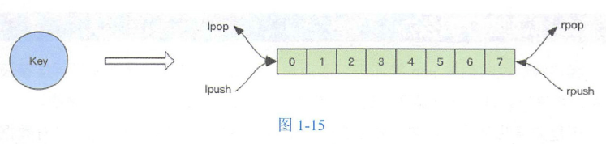
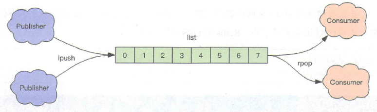

> 注： 该笔记只是初步阅读记录，==后续会和《redis设计与实现》整理合并==，所以很多地方只是简略记录

# 第一篇：基础和应用篇

## 1、开篇

**Redis 的应用**： 

- 记录帖子的点赞数、评论数和点击数（hash）
- 记录用户的帖子ID 列表(排序)，便于快速显示用户的帖子列表（zset）

- 记录帖子的标题、摘要、作者和封面信息， 用于列表页展示（hash ）
- 记录帖子的点赞用户ID 列表，评论ID 列表，用于显示和去重计数（zset）
- 缓存近期热帖内容（帖子内窑的空间占用比较大〉，减少数据库压力（hash）
- 记录帖子的相关文章ID ，根据内容推荐相关帖子（list）
- 如果帖子ID 是整数自增的，可以使用 Redis 来分配帖子 ID（计数器）

- 收藏集和帖子之间的关系（zset）
- 记录热榜帖子ID 列表、总热榜和分类热榜（zset）

- 缓存用户行为历史，过滤恶意行为（zset、hash）

## 2、Redis 基础结构

略。。。

## 3、分布式锁

- **分布式锁本质**： 在 Redis 里**占“坑”**，当别的进程也要来占坑时，就只好放弃或稍后重试

  > - `setnx` 指令： 只允许被一个客户端占坑
  > - `del` 指令： 释放坑位
  >
  > 样例：
  >
  > ```shell
  > > setnx lock-codehole true
  > OK
  > > expire lock-codehole 5 # 设置过期时间，防止死锁
  > do something critical
  > > del lock-codehole
  > (integer) 1
  > ```
  >
  > `expire` 问题： 若 setnx 和 expire 间服务器进程突然挂掉，会导致 expire 得不到执行，也会造成死锁
  >
  > 
  >
  > 解决： `set` 指令
  >
  > ```shell
  > > set lock-codehole true ex 5 nx
  > OK
  > do something er 工tical
  > > del lock-codehole
  > ```

- **超时问题**： Redis 分布式锁不要用于较长时间的任务

  > 若偶尔出现问题，造成的数据小错乱可能需要人工介入解决

## 4、延时队列

> Redis 消息队列非专业消息队列，没有很多高级特性， 没有 ack 保证，若对消息的可靠性要求高，则不适用

- **异步消息队列**： `list`(列表)常用来作异步消息队列

  > - 操作人队列： `rpush` 和 `lpush`
  > - 操作出队列： `lpop` 和 `rpop` 
  >
  > 
  >
  > 可以支持多个生产者和多个消费者并发进出消息，每个消费者拿到的消息都是不同的列表元素
  >
  > 

- **队列空**： 

  > - 问题： 
  >
  >   - 若队列空了，客户端就会陷入 pop 死循环，不停 pop ，没有数据，接着再pop，还没有数据
  >   - 空轮询不但拉高了客户端的 CPU 消耗， Redis 的 QPS 也会被拉高
  >
  > - 解决： 使用 `sleep` 来解决，让线程睡一会，客户端的 CPU 消耗能下降， Redis 的 QPS 也会下降
  >
  >   > 问题： 睡眠会导致消息的延迟增大

- **阻塞读**： 在队列没有数据时，立即进入休眠状态，一旦数据到来，则立刻醒过来，消息的延迟几乎为零

  > 用 `blpop/brpop` 替代前面的 `lpop/rpop` 
  >
  > - **问题**： 当线程阻塞，连接闲置过久，服务器会主动断开连接，这时 `blpop/brpop` 会抛出异常

- **锁冲突问题**： 

  > 加锁失败的处理： 
  >
  > - **直接抛出异常**：适合由用户直接发起的请求
  > - **sleep 后再重试**： 会导致消息延迟，不适合碰撞比较频繁或队列消息较多的情况
  > - **将请求转移至延时队列，过会再试**： 比较适合异步消息处理

- **延时队列实现**： 通过 `zset`(有序列表)实现，将消息序列化成一个字符串作为 zset 的 value，消息的到期处理时间作为 score ，然后用多个线程轮询 zset 获取到期的任务进行处理

  > - 多个线程目的： 为了保障可用性，同时要考虑并发争抢任务，确保任务不被多次执行

## 5、位图

> 位图最小单位是比特(bit)，每个 bit 取值只能是 0 或 1
>
> Redis 的位数组自动扩展，若设置的某个偏移位置超出了现有的内容范围，就会自动将位数组进行零扩充

- 基本用法： 

  > - **零存整取**： 使用 `setbit` 对位值进行逐个设置，使用 `get` 批量获取
  >
  >   ```shell
  >   > setbit s 13 1
  >   > get s
  >   ```
  >
  > - **零存零取**： 使用 `setbit` 单个位操作设置位值， 使用 `getbit` 单个位操作获取具体位值
  >
  >   ```shell
  >   > setbit w 1 1
  >   > getbit w 1  # 获取某个具体位置的值 0/1
  >   ```
  >
  > - **整存零取**： 使用 `set` 字符串操作批量设置位值，使用 `getbit` 单个位操作获取具体位值
  >
  >   ```shell
  >   > set w h  #整存
  >   > getbit w 1
  >   ```
  >
  > 注： 若对应位的字节是不可打印字符， redis-cli 会显示该字符的十六进制形式

- **统计和查找**： 

  - **位图统计指令 `bitcount`**： 用来统计指定位置范围内 1 的个数

  - **位图查找指令 `bitpos`**： 用来查找指定范围内出现的第一个 0 或 1

    > 注： 范围参数是字节索引，即指定的位范围必须是 8 的倍数

- **魔术指令 `bitfield`**： 子指令 `get, set, incrby` 能对指定位片段进行读写，但最多处理 64 个连续的位

  > - `incrby`： 用来对指定范围的位进行自增操作
  >
  > 案例： 
  >
  > ```shell
  > > set w hello
  > OK
  > > bitfield w get u4 0 # 从第一个位开始取 4 个位，结果是无符号数(u)
  > (integer) 6
  > > b 工tfield w get u3 2 # 从第三个位开始取 4 个位，结果是无符号数(u)
  > (integer) 5
  > > bitfield w get i4 0 # # 从第一个位开始取 4 个位，结果是有符号数(i)
  > 1) (integer) 6
  > 
  > # 使用 set 子指令将第二个字符 e 改成 a, a 的 ASCII 码是97
  > > bitfield w set u8 8 97  # 从第 9 位开始，将接下来的 8 个位用无符号数 97 替换
  > 1) (integer) 101
  > > get w
  > "hallo"
  > 
  > # incrby
  > > set w hello
  > OK
  > > bitfield w incrby u4 2 1 # 从第三个位开始，对接下来的 4 位元符号数＋ 1
  > 1) (integer) 11
  > > bitfield w incrby u4 2 1
  > 1) (integer) 12
  > > b 工tfield w incrby u4 2 1
  > 1) (integer) 13
  > > bitfield w incrby u4 2 1
  > 1) (integer) 14
  > > b 工tfield w incrby u4 2 1
  > 1) (integer) 15
  > > bitfield w incrby u4 2 1 # 溢出折返了
  > 1) (integer) 0
  > ```
  >
  > - **溢出策略子指令 `overflow`**：用户可以选择溢出行为
  >
  >   > overflow 指令只影响接下来的第一条指令，该指令执行后，溢出策略会变成默认值折返(wrap)
  >
  >   - `wrap`： 折返（默认）
  >   - `fail`： 失败，即报错不执行
  >   - `sat`： 饱和截断，即超过了范围就停留在最大或最小值

## 6、 HyperLogLog


---

图解： 给定一系列的随机整数 `maxbit `，并记录下低位连续零位的最大长度 K ，通过 K 值估算出随机数的数量 N


## 7、布隆过滤器

> ==原理详见《算法导论总结》最后一章== 


- `bf.add`： 添加元素，只能一次添加一个元素
- `bf.exists`： 查询元素是否存在
- `bf.madd`： 一次添加多个元素
- `bf.mexists`： 一次查询多个元素是否存在
- `bf.reserve(key, error_rate(错误率), initial_size)`： 自定义创建布隆过滤器
  - `error_rate` 越低， 需要的空间越大（默认 0.01）
  - `initial_size` 表示预计放入的元素数量，当实际数量超出该数值时，误判率会上升（默认 100）

## 8、漏斗限流

没看懂，先略过。。。

## 9、GeoHash

> 用于位置计算，Geo 存储结构使用 `zset`，编码为 `base32`

- `geoadd`： 包含集合名称及多个经纬度名称三元组

  > ```shell
  > > geoadd company 116.48105 39.996794 juejin
  > > geoadd company 116.514203 39.905409 ireader
  > > geoadd company 116.489033 40.007669 meituan
  > > geoadd company 116.562108 39.787602 jd 116.334255 40.027400 xiaomi
  > ```

- `geodist`： 用来计算两个元素之间的距离，包含集合名称、两个名称和距离单位

  > ```shell
  > > geodist company juejin ireader km
  > "10.5501"
  > ```

- `geopos`： 获取集合中任意元素的经纬度坐标，可以一次获取多个

  > ```shell
  > > geopos company juejin
  > 1) 1) "116.48104995489120483"
  >    2) "39.99679348858259686"
  > ```
  >
  > 注： 有少许误差，原因是 GeoHash 对二维坐标进行的一维映射是有损的，通过映射再还原回来的值会出现较小的差别

- `geohash`： 获取元素的经纬度编码字符串

  > ```shell
  > > geohash company ireader
  > 1) "wx4g52e1ce0"
  > ```

- `georadiusbymember`： 用来查询指定元素附近的其他元素， 参数非常复杂

  > ```shell
  > # 范围 20 公里内最多 3 个元素按距离正排，不会排除自身
  > > georadiusbymember company ireader 20 km count 3 asc
  > 1) "ireader"
  > 2) "juejin"
  > 3) "meituan"
  > # 范围 20 公里内最多 3 个元素按距离倒排
  > > georadiusbymember company ireader 20 km count 3desc
  > 1) "jd"
  > 2) "meituan"
  > 3) "juejin"
  > # 三个可选参数 withcoord, withdist(可以用来显示距离), withhash 用来携带附加参数
  > > georadiusbymember company ireader 20 km withcoord withdist withhash count 3 asc
  > 1) 1) "ireader"
  >    2) "0.0000"
  >    3) (integer) 4069886008361398
  >    4)  1) "116.5142020583152771"
  >        2) "39.90540918662494363"
  > 2) 1) "juejin"
  >    2) "10.5501"
  >    3) (integer) 4069887154388167
  >    4)  1) "116.48104995489120483"
  >        2) "39.99679348858259686"
  > 3) 1) "meituan"
  >    2) "11.5748"
  >    3) (integer) 4069887179083478
  >    4)  1) "116.48903220891952515"
  >        2) "40.00766997707732031"
  > ```

- `georadius`： 根据坐标值来查询附近的元素，比如： 根据用户的定位来计算“附近的车，附近的餐馆”等

  > 参数和 georadiusbymember基本一致，唯一的差别是将目标元素改成经纬度坐标值

## 10、scan

**从海量的 key 中找出满足特定前缀的 key 列表**： 

- 方式一： 使用指令 `keys` 用来列出所有满足特定正则字符串规则的 key

  > 缺点： 
  >
  > 1. 没有 offset、limit 参数，**一次性吐出所有满足条件的 key**，当数据量大时，很难受
  > 2. keys 算法是遍历算法，复杂度是 O(n)，当数据量大时，会导致 Redis 服务卡顿

- 方式二： 指令 `scan` 

  > `scan` 相比 keys 具备以下特点： 
  >
  > 1. 复杂度虽然也是 O(n)，但通过游标分步进行，不会阻塞线程
  > 2. 提供 limit 参数，可以控制每次返回结果的最大条数
  > 3. 同 keys 一样，也提供模式匹配功能
  > 4. 服务器不需要为游标保存状态，游标的唯一状态就是 scan 返回给客户端的游标整数
  > 5. 返回的结果可能会有重复，**需要客户端去重**(非常重要)
  > 6. 遍历的过程中如果有数据修改，改动后的数据能不能遍历到是不确定的
  > 7. 单次返回的结果是空的并不意昧着遍历结束，而要**看返回的游标值是否为零**

---

**字典结构**： 同 Java 中的 HashMap，即**一维数组+二维链表**结构


- `scan` 指令返回的游标是第一维数组的位置索引，即==槽(slot)== 

  > 若不考虑字典的扩容缩容，则可以直接按数组下标挨个遍历

- `limit` 参数表示需要遍历的槽位数，每次遍历后会将 limit 数量的槽位上挂接的所有链表元素进行模式匹配过滤后，一次性返回给客户端

  > 之所以返回结果可能多可能少，是因为有的槽位为空，有的槽位挂接的链表元素有多个

---

**`scan` 遍历顺序**： 采用高位进位加法来遍历，因为考虑字典的扩容和缩容时，避免槽位的遍历重复和遗漏


- Java 的 HashMap 扩容： 会一次性将旧数组下挂接的元素全部转移到新数组下

  > 问题： 若 HashMap 中元素特别多，线程就会出现卡顿现象

- **Redis 的 渐进式 rehash**： 同时保留旧数组和新数组，然后在定时任务中以及后续对 hash 的指令操作中渐渐地将旧数组中挂接的元素迁移到新数组上

  > - 问题： 要操作处于 rehash 中的字典，则需要同时访问新旧两个数组结构。若旧数组下找不到元素，则需要去新数组下寻找
  > - 解决： 对于 rehash 中的字典，需要同时扫描新旧槽位，然后将结果融合后返回给客户端

---

**大 key 扫描**： 对于 `scan` 扫描出的 key，使用 type 指令获得 key 的类型，然后使用相应数据结构的 size 或 len 来获得其大小，对于每种类型，将大小排名的前若干名作为扫描结果展示

- 问题： 上述过程需要编写脚本，比较繁琐

- 改进： `redis-cli` 提供的扫描功能

  > `redis-cli -h 127.0.0.1 -p 7001 -bigkeys -i 0.1`： 每隔100 条 scan 指令就会休眠 0.1s

# 第二篇：原理篇


# 第三篇：集群篇


# 第四篇：拓展篇


# 第五篇：源码篇


