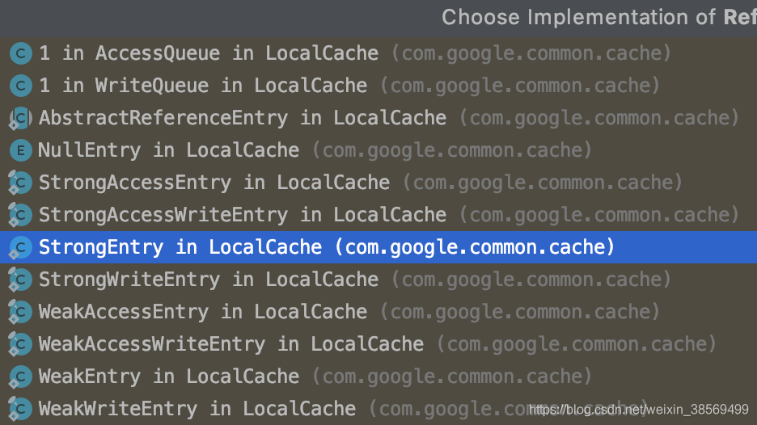

# 一、基础知识

## 1、简介

### (1) 选择缓存

#### 1. 合适的进程缓存

| 比较项       | ConcurrentHashMap | LRUMap         | Ehcache            | Guava Cache      | Caffeine         |
| ------------ | ----------------- | -------------- | ------------------ | ---------------- | ---------------- |
| 读写性能     | 很好，分段锁      | 一般，全局加锁 | 好                 | 好，有淘汰操作   | 很好             |
| 淘汰算法     | 无                | LRU，一般      | 支持LRU、LFU、FIFO | LRU，一般        | W-TinyLFU, 很好  |
| 功能丰富程度 | 功能比较简单      | 功能单一       | 功能丰富           | 支持刷新和虚引用 | 类似 Guava Cache |
| 工具大小     | jdk 自带          | LinkedHashMap  | 很大               | 较小             | 一般             |
| 是否持久化   | 否                | 否             | 是                 | 否               | 否               |
| 是否支持集群 | 否                | 否             | 是                 | 否               | 否               |

- `ConcurrentHashMap`：适合缓存改变不大的元素，且缓存数量较小

- `LRUMap`：基于 LinkedHashMap 自实现的淘汰算法

- `Ehcache`：较重量级，适合需要持久化和集群的功能

    > 可以选择分布式缓存来替代 Ehcache

- `Guava Cache`：轻量级且功能丰富

- `Caffeine`：在命中率、读写性能上都比 Guava Cache 好

#### 2. 合适的分布式缓存

| 比较项   | MemCache  | Redis                               | Tair                            |
| -------- | --------- | ----------------------------------- | ------------------------------- |
| 数据结构 | 只支持 KV | String、Hash、List、Set、Sorted Set | String、HashMap、List、Set      |
| 持久化   | 不支持    | 支持                                | 支持                            |
| 容量大小 | 纯内存    | 数据全内存                          | 可配置全内存或内存+磁盘         |
| 读写性能 | 很高      | 很高(RT0.5ms左右)                   | String 类型比较高，复杂类型比较 |

### (2) 多级缓存 


---

为了解决进程内缓存的问题，设计进一步优化：


## 2、缓存算法和缓存策略

### (1) 缓存算法

> **缓存算法：** 通过设计良好的数据分块、预取、顺序预取、缓存替换等算法来提高对缓存内容的命中率

- **分类**：**[缓存详解](https://cmlocker.github.io/2016/08/01/cache/#缓存详解)**

#### 1. 贝莱蒂算法与 OPT

- **贝莱蒂算法(Belady‘s Algorithm)**： 丢掉未来最长时间内不使用的数据

    > **缺点**： 预计数据多久后被使用基本不可能，所以没有实际的可操作性
    >
    > **作用**： 为不同的缓存算法订立一个优劣标准
    
- **OPT(clairvoyant replacement algorithm)**： 替换缓存中某个将来最长时间内都不会被访问的页面

    > 该算法只是理论上的一种理想化算法，实际应用中设计的算法都是该算法的近似算法

#### 2. FIFO

- **FIFO(First in First out)**： 速度快，低负载，但不适用

- **Second Chance**： FIFO 的改进版，该算法会检查待淘汰对象的引用标志位

    > - 如果对象被引用过，该对象引用位清零，重新插入队列尾部，像新的对象一样
    > - 如果该对象未被引用过，则将被淘汰
    >
    > 工作原理： 
    >
    > - 为缓存中的所有对象增加一个“引用标志位”
    >
    > - 每次对象被使用时，设置标志位为 1
    >
    > - 新对象加入缓存时，设置其标志位为 0
    >
    > - 在淘汰对象时，查看它的标志位，如果为0，则淘汰该对象；如果为1，则设置其标志位为0，重新加入队列末尾
    >
    > 缺点： **频繁需要把对象插入到队列尾部，位移很耗时** 

#### 3. LFU

- **LFU(LeastFrequentlyUsed)**： 按每个缓存块的被访问频率将缓存中的各块排序，当缓存空间已满时，替换掉缓存队列中访问频率最低的一项

    > - 实现： **每个数据块都有一个引用计数，并按照引用计数排序，具有相同引用计数的数据块则按照时间排序** 
    >
    >     - 新加入数据插入到队列尾部（因为引用计数为1）
    >     - 队列中的数据被访问后，引用计数增加，队列重新排序
    >
    >     
    >
    > - **缺点**： 与 LRU 类似，LFU 仅维护各项的被访问频率信息，对于某项缓存，如果该项的过去有着极高的访问频率，而最近访问频率较低，当缓存空间已满时该项很难被从缓存中替换出来，进来导致命中率下降

- **Window-LFU**： LFU 的改进版，Window-LFU 不记录所有数据的访问历史，只记录过去一段时间内的访问历史

    > 与 LFU 差别： 不需要记录所有数据的历史访问数据，只记录过去一段时间内的访问历史
    >
    > - 记录过去 W 个访问记录
    > - 需要淘汰时，将W个访问记录按照 LFU 规则排序淘汰
    >
    > 
    >
    > **运行流程**： 
    >
    > - 将一段时间内的缓存页面放入 Request stream 中
    > - 然后统计访问频率，将缓存页面按频率高低放入 CACHE 中

#### 4. LRU

- **LRU(LeastRecentlyUsed)**： 维护一个缓存项队列，队列中的缓存项按照最后被访问时间排序，当缓存空间已满时，当缓存空间已满时，将处于队尾缓存删除，将新的区段放入队列首部

    > - 缺点： 没有考虑文件访问的规律，有些情况下可能会出现 LRU 将一个用户访问次数多的文件从 lru list 中替换出来，而插入一个用户访问次数低的文件，引起 cache pollution 问题
    > - 改进： 为了完善LRU出现了 LRU2 和 2Q 

- **LRU-K**： LRU-K 多维护一个队列，用于记录所有缓存数据被访问的历史。只有当数据的访问次数达到 K 次时，才将数据放入缓存，当需要淘汰数据时，LRU-K 会淘汰第 K 次访问时间距当前时间最大的数据

    > **运行流程**： 
    >
    > - 数据第一次被访问，加入到访问历史列表
    > - 如果数据在访问历史列表里但没有达到 K 次访问，则按照一定规则（FIFO，LRU）淘汰
    > - 当访问历史队列中的数据访问次数达到 K 次后，将数据索引从历史队列删除，将数据移到缓存队列中，并缓存此数据，缓存队列重新按照时间排序
    > - 缓存数据队列中被再次访问后，重新排序
    > - 需要淘汰数据时，淘汰缓存队列中排在末尾的数据
    >
    > 
    >
    > - **目的**： 解决 LRU 算法“缓存污染”问题
    >
    > - **核心思想**： 将“最近使用过1次”的判断标准扩展为“最近使用过K次”
    >
    > - **缓存污染**： LRU 算法对热点数据命中率是很高的，但如果突然大量偶发性的数据访问，会让内存中存放大量冷数据
    >
    > - **应用**： LRU-2 是综合各种因素后最优的选择，K 值过大时，需要大量的数据访问才能将历史访问记录清除掉

- **Two Queues(2Q)**： 2Q 将 LRU-2 算法中的访问历史队列改为 FIFO 缓存队列

    > 当数据第一次访问时，将数据缓存在 FIFO 队列中，当数据第二次被访问时，则将数据从 FIFO 队列移到LRU 队列中，两个队列各自按照自己的方法淘汰数据
    >
    > ---
    >
    > **运行流程**：
    >
    > - 新访问的数据插入到 FIFO 队列
    > - 如果数据在 FIFO 队列中一直没有被再次访问，则最终按照FIFO规则淘汰
    > - 如果数据在 FIFO 队列中被再次访问，则将数据移到 LRU 队列头部
    > - 如果数据在 LRU 队列再次被访问，则将数据移到 LRU 队列头部
    > - LRU 队列淘汰末尾的数据
    >
    > 

- **MRU(Most Recently Used)**： 首先丢弃最近最常使用的数据

    > 当文件在顺序访问时，MRU算法是最佳选择，倾向于保留旧的数据

- **NRU(Not recently used)**： 保留最近使用过的对象

    > - 缓存维护两个标记位，初始值为 0： 
    >     - **标记位 R**： 标识对象是否被使用过，当一个对象在缓存中找到时，R 置为 1
    >     - **标记位 M**： 标识对象是否被修改过，当一个对象被修改时，M 置为 1
    >
    > - **对象标记位的 4 种状态**：当缓存已满，但新对象需要加入缓存时，从等级最低的对象中随机淘汰一个
    >     - 3：referenced, modified
    >
    >     - 2：referenced, not modified
    >
    >     - 1：not referenced, modified
    >
    >     - 0：not referenced, not modified
    >
    > - **周期性时钟**： 在每个时间间隔内，把所有对象的 R 清零，但 M 不清零
    >
    > 注意： 该算法认为最近被使用过的对象，比最近被修改过的对象更重要

- **FBR(Frequency Based Replacement)**： 维护一个 LRU 队列，并将队列分为 New、Middle、Old 三段，对队列中的每一缓存项均维护一个计数值

    > - 当缓存中的一项被命中时，被命中的缓存项被移至 New 段的 MRU 端
    > - 如果该项原本位于 Old 或 Middle 段，则其计数值加 1，原位于New段则计数值不变
    > - 当进行替换操作时，删除 Old 段计数值最小的一项(LRU端)

#### 5. ARC 与 LRFU

- **Adaptive Replacement Cache(ARC)**： 介于 LRU 和 LFU 之间，由2个 LRU 组成

    > - 第一个 L1： 包含最近只被使用过一次的页面
    > - 第二个 L2： 包含最近被使用过两次的页面
    >
    > 即：L1 存放新对象，而 L2 存放常用对象
    >
    > - L1 存储最近访问的页，L2 存储最近频繁被访问的页，即 L1 捕获“最近”，L2 捕获最“频繁”
    >
    > - 被认为是性能最好的缓存算法之一，能够自调，并且低负载
    >
    > ---
    >
    > 运行过程：首先存放在 L1 中，然后根据是否被再次访问，移到 L2 中，或者移到 LRU Ghost 中
    >
    > 推荐阅读： **[缓存机制Cache ARC算法](<https://blog.csdn.net/WSKINGS/article/details/46416451>)** 
    >
    > 

- **LRFU(LeastRecently FrequentlyUsed)**： 为每一个缓存项维护一个权值C(x)，其初始值为0

    > C(x)按以下公式变化： 
    >
    > - 在 t 时刻： `C(x) =1+2-λC(x)`： 
    >     - x 被访问到 `2-λC(x)`　: x未被访问进行替换操作时,C(x)值最小的一项被删除。当时, LRFU算法行为类似于LFU;而当时,该算法行为逼近LRU算法。该算法通过选用合适的λ值来获得时间与频率因素的平衡。LRFU虽然通过一个值来兼顾访问时间与频率因素,但由于值固定,当访问模式变化时,该算法无法做出相应的调整而造成性能下降。ALRFU[8](Adaptive LRFU)在此方面对LRFU进行了改进。通过对数据访问模式的历史进行监控,ALRFU动态调整值来适应数据访问模式的改变,表现出比LRFU更好的适应性

#### 6. Clock

- **Clock：** 采用装有缓存对象的环形列表，头指针指向列表中最老的缓存对象，且每个缓存中的对象都维护一个标记位

    > **工作原理**： 
    >
    > - 当待缓存对象在缓存中时，对象标记位设置为 1，同时，指针指向该对象的下一个对象
    >
    > - 若不在缓存中时，检查指针指向对象的标记位： 
    >     - 如果是 0，则用待缓存对象替换该对象
    >     - 如果是 1，则置为 0，指针指向下一个对象
    >
    > 比较： 比 Second Chance 算法更高效
    >
    > 

- **Gclock(Generalized clock page replacement algorithm)**： Clock的变种，相对于Clock标志位采用二进制0和1表示，Gclock 的标志位采用整数

    > **工作原理**： 
    >
    > - 当待缓存对象在缓存中时，把其标记位的值加 1，同时，指针指向该对象的下一个对象
    >
    > - 若不在缓存中时，检查指针指向对象的标记位： 
    >     - 如果是 0，则用待缓存对象替换该对象
    >     - 否则，把标记位的值减 1，指针指向下一个对象

- **WSclock(Working set clock page replacement algorithm)**： clock的变种，算法数据结构为循环链表，每个缓存对象保存了"最近使用的时间"rt和"是否引用"的R标志位，使用周期计时器 t，age 表示为当前时间和 rt 的差值。[ws算法](http://52weis.com/2016/11/13/the-working-set-page-replacement-algorithm%E8%BD%AC/)

    > **工作原理**： 
    >
    > - 当待缓存对象存在缓存中时，更新 rt 为当前时间，同时，指针指向该对象的下一个对象
    > - 若不存在于缓存中时：
    >     - 如果缓存没满，则更新指针指向位置的 rt 为当前时间，R 设为 1，指针指向下一个对象
    >     - 如果满了，则淘汰一个对象，检查指针指向的对象： 
    >         - R 为 1，说明对象在 working set 中，则重置 R 为 0，指针指向下一个对象
    >         - R为 0：
    >             - 如果 age 大于 t，说明对象不在 working set 中，则替换该对象，并置R为 1，rt 为当前时间
    >             - 如果 age 不大于 t，则继续寻找淘汰对象。如果回到指针开始的位置，还未寻找到淘汰对象，则淘汰遇到的第一个 R 为 0 的对象

#### 7. time-based

- **Simple time-based：** 通过绝对的时间周期去失效那些缓存对象，对于新增的对象，会保存特定的时间
- **Extended time-based expiration**： 通过相对时间去失效缓存对象，对新增缓存对象会保存特定的时间
- **Sliding time-based expiration**： 被管理的缓存对象的生命起点是在这个缓存的最后被访问时间算起

#### 8. LIRS

**LIRS(Low Inter-ReferenceRecenty Set)**： 通过使用两次访问同一页之间的距离作为一种尺度去动态地将访问页排序，从而去做一个替换的选择

- **度量尺度**： 从该页最近一次访问的时刻到此时，访问过的其他**非重复页的数量** 

- LIRS 算法使用 IRR 和 Recency 两个参数： 
    - IRR：一个页面最近两次的访问间隔

    - Recency：页面上次访问至今访问了多少其他页

推荐阅读： 

- **[LIRS缓存替换算法](<https://www.cnblogs.com/dyllove98/archive/2013/06/08/3127492.html>)** 
- **[Cache 替换算法之：LIRS](<https://www.jianshu.com/p/036f82975f81>)**

---

原理： 

- 首先替换 IRR 最大的页面，当 IRR 相同时，替换 Recency 最大的页

- 在获取 IRR 时，只要有一个 Infinite，就不需要比较其他结果，如果有多个Infinite，比如C和D，需要进一步比较 Recency

- LIRS的实现过程给出基于 LIRS stack 的近似值，根据 IRR 的不同，将页面分为 LIR（Low IRR）和HIR（High IRR）两类，并尽量使得 LIR 页面更多地再 Cache 命中，当发生冲突时，优先替换HIR中的页面

- LIRS Stack 包含一个 LRU Stack，Stack 的大小固定，由 Cache 决定，存放 cache 中有效的页面

- 淘汰页面时使用LRU算法，算法使用了两个队列：

    - LIRS Stack S： 保存参数 Recency 不超过其最大值(Rmax)的 LIR 和 HIR，其中HIR可能不在cache中，但依然使用LRU算法，其长度可变，用于判断IRR的大小
    - LIRS Stack Q： 维护cache中的HIR页面，以加快其索引速度，在需要释放页面时，首先淘汰这类。淘汰操作会引起一系列连锁反应


### (2) 缓存策略

**缓存策略**： 

- 缓存什么内容

- 何时进行缓存： 使用预取策略来提前将部分磁盘数据放入缓存，减少磁盘 I/O，加大缓存命中率

    > 通过记录、分析以往的数据请求模式来预测可能被请求到的数据段，将访问可能性大的数据段放入缓存

- 当缓存空间已满时如何进行替换，即缓存替换算法

**缓存策略的数据块分割**：首部缓存和分块缓存策略普遍应用于 VoD 影片文件

- **首部缓存**： **将影片文件开始的一部分放入缓存以减小点播用户的启动延迟**，对于影片文件其他部分的访问需要直接读取磁盘

- **分块缓存**： 将影片文件切分成小块，以块为单位进行缓存操作

    分块缓存分为定长分块与变长分块： 

    - **定长分块**： 将文件切分为大小相同的块
    - **变长分块**： 基于影片文件越靠后被访问的概率越低的推断，将文件按照首尾位置分块，各块大小按指数递增

    > 定长与变长分块的忽略点:
    >
    > - 影片文件会存在一些“**热点片段**”，而这些热点片段并不均处于影片首部
    > - 同一影片内“热点片段”的热度会随着时间不断改变，不同影片的热度也随时间不断变化
    >
    > 需设计良好的算法自适应影片热点的不同位置与变化

**缓存策略分类**： 

- **基于访问时间：** 按各缓存项的被访问时间来组织缓存队列，决定替换对象，如 LRU(LeastRecentlyUsed)

- **基于访问频率：** 用缓存项的被访问频率来组织缓存，如 LFU、LRU-2、2Q、LIRS

- **访问时间与频率兼顾： ** 兼顾访问时间与频率，使得在数据访问模式变化时缓存策略仍有较好性能，如FBR、LRFU、ALRFU

    此类算法具有一个可调或自适应参数，通过该参数的调节使缓存策略在基于访问时间与频率间取得平衡

- **基于访问模式：** 某些应用有较明确的的数据访问特点，进而产生与其相适应的缓存策略

    > 如： 专为VoD系统设计的 A&L 缓存策略，同时适应随机、顺序两种访问模式的 SARC 策略

- **时间距离分布策略** 

- **基于 VoD 系统架构策略** 

## 3、缓存与数据库一致性

### (1) 一致性方法

- 读的顺序是**先读缓存，后读数据库**
- 写的顺序是**先写数据库，然后写缓存**
- 每次**更新了相关的数据，都要把该缓存清理掉**
- 为了避免极端条件下造成的缓存与数据库之间的数据不一致，**缓存需要设置一个失效时间**。时间到了，缓存自动被清理，达到缓存和数据库数据的“最终一致性”

### (2) 分布式下的一致性

- 采用更新前后双删除缓存策略
- 可以通过“串行化”解决，保证**同一个数据的读写落在同一个后端服务上**

### (3) 缓存删除失败的解决方式

通过订阅 binlog 获取需要重新删除的 Key 值数据

> 在应用程序中，另起一段程序，获得这个订阅程序传来的消息，进行删除缓存操作


## 4、缓存更新

推荐阅读： **[Redis 缓存设计](https://www.cnblogs.com/BigJunOba/p/9166937.html)** 

### (1) 缓存代价

- **数据不一致性**：缓存层和存储层的数据存在着一定时间窗口的不一致性，时间窗口跟更新策略有关
- **代码维护成本**：加入缓存后，需要同时处理缓存层和存储层的逻辑，增大了开发者维护代码的成本
- **运维成本**：以Redis Cluster为例，加入后无形中增加了运维成本

**缓存的使用场景**：

- **开销大的复杂计算**：复杂的操作或者计算，如果不加缓存，会给 MySQL 带来巨大的负担
- **加速请求响应**：Redis 每秒可以完成数万次读写，并且提供的批量操作可以优化整个 IO 链的响应时间

### (2) 缓存更新策略

#### 1. LRU/LFU/FIFO 算法剔除

- **使用场景**： 用于缓存使用量超过预设的最大值时，对现有的数据进行剔除

    > 例如： Redis 使用 maxmemory-policy 这个配置作为内存最大值后对于数据的剔除策略

- **一致性**： 清理哪些数据由具体算法决定，开发人员只决定使用哪种算法，所以数据的一致性最差

- **维护成本**： 只需配置最大 maxmemory 和对应的策略，开发人员只需知道每种算法的含义，选择适合的算法

#### 2. 超时剔除

- **使用场景**： 给缓存数据设置过期时间，例如 Redis 的 expire 命令
- **一致性**： 一段时间窗口内存在一致性问题，即缓存数据和真实数据源的数据不一致
- **维护成本**： 只需设置 expire 过期时间即可

#### 3. 主动更新

- **使用场景**： 对于数据一致性要求高，需要在真实数据更新后，立即更新缓存数据，可以利用消息系统或其他方式通知缓存更新
- **一致性**： 建议结合超时剔除一起使用效果会更好
- **维护成本**： 维护成本会比较高，开发者需要自己来完成更新，并保证更新操作的正确性

## 5、缓存击穿和雪崩

- **缓存穿透**：指收到的请求在缓存中不存在，只能去数据库中查询，然后放进缓存

    > - 原因： 恶意构造一个逻辑上不存在的数据，然后大量发送这个请求，这样每次都会被发送到数据库，最总导致数据库挂掉
    >
    > - 解决的办法：
    >     - **先做校验**： 对恶意数据直接过滤掉，不要发送至数据库层
    >     - **缓存空结果**： 对查询不存在的数据也记录在缓存中，有效减少查询数据库的次数

- **缓存击穿**：对于热点数据，当缓存失效的一瞬间，所有请求都被下放到数据库去请求更新缓存，数据库被压垮

    > 解决的办法：
    >
    > - **加全局锁**： 访问某个数据的请求共享一个锁，获得锁的才有资格去访问数据库，其他线程必须等待，比如 Redis 的 setnx 实现全局锁
    > - **对即将过期的数据进行主动刷新**： 新起一个线程轮询数据或把所有的数据划分为不同的缓存区间，定期分区间刷新数据

- **缓存雪崩**：缓存数据同一时刻全部过期，然后瞬间所有的请求都被抛向数据库，数据库崩溃

    > 解决的办法：
    >
    > - **分治**： 划分更小的缓存区间，按区间过期
    > - **随机值**： 给每个 key 的过期时间加一个随机值，避免同时过期，实现错峰刷新缓存

- **缓存刷新**：既清空缓存 ，一般在insert、update、delete操作后就需要刷新缓存，如果不执行就会出现脏数据。但当缓存请求的系统蹦掉后，返回给缓存的值为null

# 二、LinkedHashMap

- LinkedHashMap 维持了一个链表结构，用来存储节点的插入或访问顺序，只需覆盖 `removeEldestEntry` 方法，便可实现缓存的LRU 淘汰策略

- 此外，利用读写锁保障缓存的并发安全性

```java
//注意：这个示例不支持过期时间淘汰的策略
public class LRUCache extends LinkedHashMap {
	//可重入读写锁，保证并发读写安全性
    private ReentrantReadWriteLock readWriteLock = new ReentrantReadWriteLock();
    private Lock readLock = readWriteLock.readLock();
    private Lock writeLock = readWriteLock.writeLock();

    private int maxSize; //缓存大小限制

    public LRUCache(int maxSize) {
        super(maxSize + 1, 1.0f, true);
        this.maxSize = maxSize;
    }

    @Override
    public Object get(Object key) {
        readLock.lock();
        try {
            return super.get(key);
        } finally {
            readLock.unlock();
        }
    }

    @Override
    public Object put(Object key, Object value) {
        writeLock.lock();
        try {
            return super.put(key, value);
        } finally {
            writeLock.unlock();
        }
    }

    @Override
    protected boolean removeEldestEntry(Map.Entry eldest) {
        return this.size() > maxSize;
    }
}
```

# 三、Guava Cache


## 1、核心参数


- 容量：
    - `initialCapacity`：初始容量
    - `maximumSize`：最大容量
    - `maximumWeight`：最大权重，每条缓存的默认权重为 1，可以增加单条缓存的权重
    - `weither`：权重器，用于衡量不同缓存条目的权重

- 超时时长：
    - `expireAfterAccess`：超时计算方式：在访问请求之后重置超时计时器
    - `expireAfterWrite`：超时计算方式：在写请求之后重置超时计时器

- 刷新：
    - `refreshAfterWrite`：写操作后多久刷新缓存内容，刷新使用下面的加载器
    - `build(CacheLoader loader)`：构造LoadingCache实例，入参是用于刷新的加载器
    - `removalListener`：移除监听器，接收条目被移除的通知，可以过滤需要的缓存条目，进行相应处理

- 引用强度：
    - `weakValues`：指定所有的 value 都是弱引用
    - `weakKeys`：指定所有的 key 都是弱引用
    - `softValues`：指定所有的 key 都是软引用

- 其他：
    - `concurrencyLevel`：并发级别，级别越高支持的最大并发数越大
    - `recordStats`：启用缓存统计，即缓存操作期间的性能相关的统计
    - `ticker`：指定纳秒精度的时间源，默认使用 System.nanoTime()

---

**三种缓存删除函数**：

- `invalidate(Object key)`：从缓存中清除指定 key 的数据
- `invalidateAll(Iterable<?> keys)`：批量清除
- `invalidateAll()`：清空缓存所有的数据

### (1) 初始容量 `initialCapacity` 

```java
Cache<String,String> cache = CacheBuilder.newBuilder()
        .initialCapacity(1024) //初始容量
        .build();
```

#### 1. 主要作用

`initialCapacity` 表示初始容量，在缓存创建的过程中进行设置：

- **不可重复设置**：初始容量只能设置一次有效值，否则会抛出异常

- **最小值限制**：初始容量应该大于等于 0，否则会抛出异常

- **最大值限制**：选取 $2^{30}$、`maximumWeight`、`CacheBuilder` 中的最小值

- **并发性相关**：建议设置为段数 `segmentCount` 的整数倍

    > `segmentCapacity = initialCapacity / segmentCount`(向上取整)

#### 2. 核心代码

- `CacheBuilder` 中的初始容量：

    ```java
    public CacheBuilder<K, V> initialCapacity(int initialCapacity) {
        checkState(this.initialCapacity == UNSET_INT, 
                   "initial capacity was already set to %s", 
                   this.initialCapacity);
        checkArgument(initialCapacity >= 0);
        this.initialCapacity = initialCapacity;
        return this;
    }
    ```

- `LocalCache` 构造器中的取值：

    ```java
    int initialCapacity = Math.min(builder.getInitialCapacity(), MAXIMUM_CAPACITY);
    if (evictsBySize() && !customWeigher()) {
        initialCapacity = Math.min(initialCapacity, (int) maxWeight);
    }
    
    static final int MAXIMUM_CAPACITY = 1 << 30;
    
    boolean evictsBySize() {
        return maxWeight >= 0;
    }
    
    boolean customWeigher() {
        return weigher != OneWeigher.INSTANCE; //INSTANCE = 1
    }
    ```

- `LocalCache` 构造器中用来计算段的初始容量：

    ```java
    int segmentCapacity = initialCapacity / segmentCount;
    if (segmentCapacity * segmentCount < initialCapacity) {
        ++segmentCapacity;
    }
    ```

### (2) 最大容量 `maximumSize` 

```java
Cache<String,String> cache = CacheBuilder.newBuilder()
        .maximumSize(2)//缓存最大个数
        .build();

cache.put("a","1");
cache.put("b","2");
cache.put("c","3");

System.out.println(cache.getIfPresent("a")); //null
System.out.println(cache.getIfPresent("b")); //2
System.out.println(cache.getIfPresent("c")); //3
```

#### 1. 主要作用

- 实质：`maximumSize` 主要是用来设置 `maxWeight`，缓存内部通过 maxWeight 限制缓存容量

- 不可重复设置：最大容量只能设置一次有效值，否则会抛出异常

    > 最大容量和最大权重 maxWeight 只允许设置一个，否则会抛出异常

---

和最大权重 `maxWeight` 对比：

- 相同性：在缓存没有特殊加权计算的情况下，两者等价，只需设置任意即可
- 差异性一：有特殊加权值计算(指定 weigher)的场景，只能使用最大权重 `maximumWeight`
- 差异性二：在没有特殊加权值计算(指定 weigher)的场景，只能使用最大大小 `maximumSize`
- 差异性三：在缓存实例内部，成员变量使用最大权重 `maximumWeight`，而 maximumSize 会通过转化成 maxWeight 生效

#### 2. 核心代码

- `CacheBuilder` 中设置最大容量的代码：

    ```java
    public CacheBuilder<K, V> maximumSize(long size) {
        checkState(this.maximumSize == UNSET_INT, "maximum size was already set to %s", this.maximumSize);
        checkState(
            this.maximumWeight == UNSET_INT, 
            "maximum weight was already set to %s",
            this.maximumWeight);
        checkState(this.weigher == null, "maximum size can not be combined with weigher");
        checkArgument(size >= 0, "maximum size must not be negative");
        
        this.maximumSize = size;
        return this;
    }
    ```

- `CacheBuilder` 中获取最大加权值：maximumSize 和 maximumWeight 是否生效取决于是否指定了weigher

    ```java
    long getMaximumWeight() {
        if (expireAfterWriteNanos == 0 || expireAfterAccessNanos == 0) {
            return 0;
        }
        return (weigher == null) ? maximumSize : maximumWeight;
    }
    ```

### (3) 加权器 `weigher` 和最大加权值 `maximumWeight` 

```java
Cache<String,String> cache = CacheBuilder.newBuilder()
        .maximumWeight(1024 * 1024 * 1024) //最大容量为 1M
        .weigher(new Weigher<String, String>() { //用来计算容量的 Weigher
            @Override
            public int weigh(String key, String value) {
                return key.getBytes().length + value.getBytes().length;
            }
        })
        .build();

cache.put("x","1");
cache.put("y","2");
cache.put("z","3");

System.out.println(cache.getIfPresent("x")); //1
System.out.println(cache.getIfPresent("y")); //2
System.out.println(cache.getIfPresent("z")); //3
```

#### 1. 加权作用

加权器 `weigher` 根据缓存的 key-value 来设置不同的加权值：

> 加权值表示占据的内存的基本单元数据的多少

- **缺省值**：
    - `CacheBuilder` 中可以不设置 weigher，此时 weigher 为 null
    - 构造缓存 `LocalCache` 实例时，若 `weigher` 为 null，则使用 `OneWeigher.INSTANCE`
- **和最大容量参数的关系**：
    - 指定 `weigher` 时，最大容量只能使用 `maximumWeight`
    - 不指定 `weigher` 时，最大容量只能使用 `maximumSize`
- **自定义方式**：实现 weigher 接口

#### 2. 最大加权值作用

 最大加权值：用来描述缓存的最大容量，不设置为 `-1`

> `CacheBuilder` 中名称为 `maximumWeight`，`LocalCache` 中名称为 `maxWeight`

- 使用场景：只有在设置了 `weigher` 时，才会使用 `maximumWeight`，否则使用 `maximumSize`
- 生效方式：对每个分段计算一个最大分段加权值

#### 3. 核心代码

- `LocalCache` 中调用 Builder 方法获取最大加权值：

    ```java
    maxWeight = builder.getMaximumWeight();
    
    //CacheBuilder
    long getMaximumWeight() {
        if (expireAfterWriteNanos == 0 || expireAfterAccessNanos == 0) {
            return 0;
        }
        return (weigher == null) ? maximumSize : maximumWeight;
    }
    ```

- `LocalCache` 中对段生效方式：

    ```java
    int segmentShift = 0;
    int segmentCount = 1;
    while (segmentCount < concurrencyLevel && (!evictsBySize() || segmentCount * 20 <= maxWeight)) {
        ++segmentShift;
        segmentCount <<= 1;
    }
    this.segmentShift = 32 - segmentShift;
    segmentMask = segmentCount - 1;
    
    // 构造器中 maxWeight 对段生效代码
    int segmentCapacity = initialCapacity / segmentCount;
    if (segmentCapacity * segmentCount < initialCapacity) {
        ++segmentCapacity;
    }
    
    // segmentSize = 不小于 segmentCapacity 的最小的 2 的整数幂
    int segmentSize = 1; // segmentSize 用作段的初始容量
    while (segmentSize < segmentCapacity) {
        segmentSize <<= 1;
    }
    // 是否限制容量
    if (evictsBySize()) { 
        long maxSegmentWeight = maxWeight / segmentCount + 1; // 段容量基础值 = 总容量 / 段数 (向上取整)
        long remainder = maxWeight % segmentCount;
        for (int i = 0; i < this.segments.length; ++i) {
            if (i == remainder) { // 从第余数段开始，段容量减 1，以保证各段容量之和等于总容量
                maxSegmentWeight--;
            }
            this.segments[i] =
                createSegment(segmentSize, maxSegmentWeight, builder.getStatsCounterSupplier().get());
        }
    } else {
        for (int i = 0; i < this.segments.length; ++i) { // 若未设置总的最大容量，则每个分段都不设置最大容量
            this.segments[i] 
                = createSegment(segmentSize, UNSET_INT, builder.getStatsCounterSupplier().get());
        }
    }
    
    // 是否会根据容量进行淘汰
    boolean evictsBySize() {
        return maxWeight >= 0;
    }
    ```

---

实现 `weigher` 例子：

```java
private static class MyWeigher implements Weigher<String, String> {
    @Override
    public int weigh(String key, String value) {
        return value.length() / 1000;
    }
}
```

### (4) 写后超时 `expireAfterWrite` 和读后超时 `expireAfterRead`

#### 1. 写后超时作用

> 写后超时 `expireAfterWrite`：缓存写入多长时间后会失效

缓存失效后的处理：

- 若设置了加载器 `CacheLoader`，会重新加载

- 若未设置 `CacheLoader` 或 `CacheLoader` 未获取到相应缓存，则会返回异常，提示获取不到相应的缓存

> 注：每次写入时，会重置访问时间

```java
@Test
public void expireTest() throws InterruptedException {
    Cache<String,String> cache = CacheBuilder.newBuilder()
            .maximumSize(100)//缓存最大个数
            .expireAfterWrite(5, TimeUnit.SECONDS)//写入后5分钟过期
            .build();
    
    cache.put("a","1");
    int i = 1;
    while(true){
        System.out.println("第" + i + "秒获取到的数据为：" + cache.getIfPresent("a"));
        i++;
        Thread.sleep(1000);
    }
}

//结果：
第1秒获取到的数据为：1
第2秒获取到的数据为：1
第3秒获取到的数据为：1
第4秒获取到的数据为：1
第5秒获取到的数据为：1
第6秒获取到的数据为：null
第7秒获取到的数据为：null
...
```

#### 2. 读后超时作用

> 读后超时 `expireAfterAccess`：缓存读取多长时间后会失效

缓存失效后的处理：

- 若设置了加载器 `CacheLoader`，会重新加载
- 若未设置 `CacheLoader` 或 `CacheLoader` 未获取到相应缓存，则会返回异常，提示获取不到相应的缓存

> 注：每次访问(包括读和写)都会重置时间

```java
@Test
public void expireAfterAccessTest() throws InterruptedException {
    Cache<String,String> cache = CacheBuilder.newBuilder()
            .maximumSize(100) //缓存最大个数
            .expireAfterAccess(5, TimeUnit.SECONDS) //5秒没有被访问，就过期
            .build();
    
    cache.put("a","1");
    Thread.sleep(3000);
    System.out.println("休眠3秒后访问：" + cache.getIfPresent("a"));
    Thread.sleep(4000);
    System.out.println("休眠4秒后访问：" + cache.getIfPresent("a"));
    Thread.sleep(5000);
    System.out.println("休眠5秒后访问：" + cache.getIfPresent("a"));

}

//结果：
休眠3秒后访问：1
休眠4秒后访问：1
休眠5秒后访问：null
```

#### 3. 核心代码

- `LocalCache` 中的记录写操作：

    ```java
    @GuardedBy("this")
    void recordWrite(ReferenceEntry<K, V> entry, int weight, long now) {
        drainRecencyQueue();
        totalWeight += weight;
    
        if (map.recordsAccess()) {
            entry.setAccessTime(now);
        }
        if (map.recordsWrite()) {
            entry.setWriteTime(now);
        }
        accessQueue.add(entry);
        writeQueue.add(entry);
    }
    
    @GuardedBy("this")
    void drainRecencyQueue() {
        ReferenceEntry<K, V> e;
        while ((e = recencyQueue.poll()) != null) {
            if (accessQueue.contains(e)) {
            	accessQueue.add(e);
            }
        }
    }
    
    boolean recordsAccess() {
        return expiresAfterAccess();
    }
    
    boolean expiresAfterAccess() {
        return expireAfterAccessNanos > 0;
    }
    
    boolean recordsWrite() {
        return expiresAfterWrite() || refreshes();
    }
    
    boolean expiresAfterWrite() {
        return expireAfterWriteNanos > 0;
    }
    
    boolean refreshes() {
        return refreshNanos > 0;
    }
    ```

- `LocalCache` 中的记录读操作：

    ```java
    void recordRead(ReferenceEntry<K, V> entry, long now) {
        if (map.recordsAccess()) {
            entry.setAccessTime(now);
        }
        recencyQueue.add(entry);
    }
    
    boolean recordsAccess() {
        return expiresAfterAccess();
    }
    
    boolean expiresAfterAccess() {
        return expireAfterAccessNanos > 0;
    }
    ```

- `LocalCache` 中的缓存超时淘汰：

    ```java
    @GuardedBy("this")
    void expireEntries(long now) {
        drainRecencyQueue();
    
        ReferenceEntry<K, V> e;
        while ((e = writeQueue.peek()) != null && map.isExpired(e, now)) {
            if (!removeEntry(e, e.getHash(), RemovalCause.EXPIRED)) {
                throw new AssertionError();
            }
        }
        while ((e = accessQueue.peek()) != null && map.isExpired(e, now)) {
            if (!removeEntry(e, e.getHash(), RemovalCause.EXPIRED)) {
                throw new AssertionError();
            }
        }
    }
    ```

- `LocalCache` 中的超限淘汰：

    ```java
    @GuardedBy("this")
    void evictEntries(ReferenceEntry<K, V> newest) {
        if (!map.evictsBySize()) {
            return;
        }
        drainRecencyQueue();
        if (newest.getValueReference().getWeight() > maxSegmentWeight) {
            if (!removeEntry(newest, newest.getHash(), RemovalCause.SIZE)) {
                throw new AssertionError();
            }
        }
        while (totalWeight > maxSegmentWeight) {
            ReferenceEntry<K, V> e = getNextEvictable();
            if (!removeEntry(e, e.getHash(), RemovalCause.SIZE)) {
                throw new AssertionError();
            }
        }
    }
    ```

### (5) 写后刷新 `refreshAfterWrite` 

```java
//有些键不需要刷新，并且我们希望刷新是异步完成的
LoadingCache<Key, Graph> graphs = CacheBuilder.newBuilder()  
    .maximumSize(1000)
    .refreshAfterWrite(1, TimeUnit.MINUTES)
    .build(
        new CacheLoader<Key, Graph>() {
            @Override
            public Graph load(Key key) { // 同步
                return getGraphFromDatabase(key);
            }
            @Override
            public ListenableFuture<Key, Graph> reload(final Key key, Graph prevGraph) { //异步
                if (neverNeedsRefresh(key)) {
                    return Futures.immediateFuture(prevGraph);
                }else{
                    ListenableFutureTask<Key, Graph> task= 
                        			ListenableFutureTask.create(new Callable<Key, Graph>() {
                            public Graph call() {
                            return getGraphFromDatabase(key);
                        }
                    });
                    executor.execute(task);
                    return task;
                }
            }
    });

```

#### 1. 主要作用

主要作用：在缓存写入一定时间后，再次访问会先使用 `CacheLoader` 去刷新缓存

> 若刷新失败或有其他任务正在刷新缓存，则会返回现有的缓存值

- 异步和同步：刷新异步进行，但第一次请求刷新的服务线程，会阻塞等待异步刷新完成
- 并发性：对于同一个key，若正在刷新，则后续的所有任务不会阻塞，而是直接返回现在的旧值

#### 2. refreshAfterWrite 和 expireAfterWrite 对比

- 若指定 `CacheLoader`：
    - `refreshAfterWrite` 在 CacheLoader 加载不到结果时，会返回现有的旧值
    - `expireAfterWrite` 在 CacheLoader 加载不到结果时，会抛出异常提示获取不到缓存
- 若未指定 `CacheLoader`：
    - 不允许设置 `refreshAfterWrite`，否则会报错
    - 但可以设置 `expireAfterWrite`，但此时在 get 方法中必须指定 CacheLoader
- 并发访问超时情况下：
    - `refreshAfterWrite` 超时机制使第一次访问的线程阻塞等待刷新线程结果，但刷新过程中若有其他线程访问，直接返回旧值
    - `expireAfterWrite` 超时机制会清除现有值，并让全部访问这个 key 的缓存线程都阻塞等待异步刷新的结果

#### 3. 核心代码

第一条线程发现超过 `refreshNanos`，执行刷新，后面的线程访问到正在刷新的缓存时，直接返回旧值：

```java
V scheduleRefresh(ReferenceEntry<K, V> entry, K key, int hash, V oldValue, long now, 
                  CacheLoader<? super K, V> loader) {
    if (map.refreshes() 
        	&& (now - entry.getWriteTime() > map.refreshNanos) 
        	&& !entry.getValueReference().isLoading()) {
        V newValue = refresh(key, hash, loader, true);
        if (newValue != null) {
        	return newValue;
        }
    }
    return oldValue;
}

boolean refreshes() {
    return refreshNanos > 0;
}

//第一条触发refresh逻辑的线程，阻塞等待异步执行结果
@Nullable
V refresh(K key, int hash, CacheLoader<? super K, V> loader, boolean checkTime) {
    final LoadingValueReference<K, V> loadingValueReference 
        	= insertLoadingValueReference(key, hash, checkTime);
    if (loadingValueReference == null) {
        return null;
    }
    ListenableFuture<V> result = loadAsync(key, hash, loadingValueReference, loader);
    if (result.isDone()) {
        try {
            return Uninterruptibles.getUninterruptibly(result);
        } catch (Throwable t) {
            // don't let refresh exceptions propagate; error was already logged
        }
    }
    return null;
}

//异步刷新缓存的具体逻辑
ListenableFuture<V> loadAsync(final K key, final int hash, 
            final LoadingValueReference<K, V> loadingValueReference, CacheLoader<? super K, V> loader) {
    final ListenableFuture<V> loadingFuture = loadingValueReference.loadFuture(key, loader);
    loadingFuture.addListener(new Runnable() {
            @Override
            public void run() {
                try {
                    getAndRecordStats(key, hash, loadingValueReference, loadingFuture);
                } catch (Throwable t) {
                    logger.log(Level.WARNING, "Exception thrown during refresh", t);
                    loadingValueReference.setException(t);
                }
            }
    	}, directExecutor());
    
    return loadingFuture;
}
```

### (6) 并发级别 `concurrencyLevel`

#### 1. 主要作用

`concurrencyLevel` 用来控制缓存的并发处理能力：

- 最大值是 $2^{16} = 65535$，最小值是 `1`，缺省值是 `4`

- 通过设置分段数量 `segmentCount` 来生效

    > `concurrencyLevel` 并不一定完全等同于 segmentCount，segmentCount 的取值还跟最大加权值 maxWeight 有关

#### 2. 分段数量 segmentCount 的取值规则

- segmentCount 是 2 的整数倍
- segmentCount 在允许的取值范围内取最大值
- concurrencyLevel 约束：`1/2 * segmentCount < concurrencyLevel`
- maxWeight 约束：
    - 若 `maxWeight < 0`(不限制缓存最大容量)，则对 segmentCount 无影响
    - 若设置了有效的 `maxWeight`，则 `1/2 * segmentCount <= 1/20 * maxWeight` 

#### 3. concurrencyLevel 取值特点

- 若不设置 maxWeight 或 maxWeight 远大于 concurrencyLevel，则 concurrencyLevel 不小于 maxWeight 的最小 2 的整数倍

    > 如：concurrencyLevel = 7 或 concurrencyLevel = 8时，若可以忽略 maxWeight 影响，则 segmentCount 值为8

- 若设置合理 maxWeight，则 concurrencyLevel 小于最大加权值 maxWeight，即 `concurrencyLevel >= 1/20 * maxWeight + 1` 

#### 4. 核心代码

- `segmentCount` 计算逻辑：

    ```java
    int segmentShift = 0;
    int segmentCount = 1;
    while (segmentCount < concurrencyLevel && (!evictsBySize() || segmentCount * 20 <= maxWeight)) {
        ++segmentShift; // 这时的 segmentShift 还是表示 segmentCount 是 2 的多少次幂
        segmentCount <<= 1; // segmentCount 满足 while 条件的最大值的 2 倍
    }
    // 最终的segmentShift用于取hash的高位的相应位数，用来计算寻找一个元素在哪个segment中
    this.segmentShift = 32 - segmentShift;
    // 掩码，取hash的低位的相应位数的值，即为在segment中的角标
    segmentMask = segmentCount - 1;
    
    // 是否限制容量
    boolean evictsBySize() {
        return maxWeight >= 0;
    }
    ```

- `concurrencyLevel` 取值限制：

    ```java
    // 构造器中获取concurrencyLevel.最大值是2的16次幂
    concurrencyLevel = Math.min(builder.getConcurrencyLevel(), MAX_SEGMENTS);
    
    // CacheBuilder的方法，用来提供设置的concurrencyLevel，或者默认的concurrencyLevel。默认为4
    int getConcurrencyLevel() {
        return (concurrencyLevel == UNSET_INT) ? DEFAULT_CONCURRENCY_LEVEL : concurrencyLevel;
    }
    ```

### (7) 时间源 `ticker`

#### 1. 主要作用

 `Ticker` 是缓存内部获取时间的工具，精确到 `ns`。

- 作用：用来在缓存内部测量流逝时间，从而计算缓存是否超时、是否需要刷新等

- 使用：
    - 可以实现 Ticker 接口，自定义 Ticker
    - 默认使用 `Ticker.SYSTEM_TICKER`，调用 System.nanoTime() 获取时间戳

#### 2. 核心代码

定制 Ticker：

```java
private static class MyTicker extends Ticker {
    private long start = Ticker.systemTicker().read();
    private long elapsedTime = 0L;

    @Override
    public long read() {
        return start + elapsedTime;
    }

    // 开发给使用者，用来加速时间流逝
    public void setElapsedTime(long nanos) {
        this.elapsedTime = nanos;
    }
}
```

### (8) 缓存移除监听器 `removalListener` 

```java
//给 Cache 中的对象加一个监听，当有对象被删除时会有事件通知
@Test
public void removeListenerTest() throws InterruptedException {
    Cache<String,String> cache = CacheBuilder.newBuilder()
        .maximumSize(3)
        .expireAfterWrite(Duration.ofSeconds(5)) //5秒后自动过期
        .removalListener(new RemovalListener<Object, Object>() { //添加一个 remove 监听器
            @Override
            public void onRemoval(RemovalNotification<Object, Object> notification) {
                System.out.println("[" + notification.getKey() + ":" + notification.getValue() + "] 被删除");
            }
        })
        .build();

    cache.put("a","1");
    Thread.sleep(2000);
    cache.put("b","2");
    cache.put("c","3");
    Thread.sleep(2000);
    cache.put("d","4");
    Thread.sleep(5000);
    cache.put("e","5");
    cache.invalidate("e");
}

//结果：
[a:1] 被删除
[b:2] 被删除
[c:3] 被删除
[d:4] 被删除
```


#### 1. 主要作用

- 作用：在缓存被移除时会收到一条通知，通知携带被移除缓存的 key、value、移除原因

#### 2. 移除原因

`RemovalCause` 取值：

- `EXPLICIT`：用户显式移除了缓存；非被驱逐，即 wasEvicted 方法返回 false
- `REPLACED`：用户显式替换了缓存；非被驱逐，即 wasEvicted 方法返回 false
- `COLLECTED`：被垃圾回收器回收了 key 或 value；被驱逐，即 wasEvicted 方法返回 true
- `EXPIRED`：缓存超时被移除；被驱逐，即 wasEvicted 方法返回 true
- `SIZE`：容量超限被移除；被驱逐，即 wasEvicted 方法返回 true

#### 3. 核心代码

定制 `RemovalListener`：

```java
private static class MyRemoveListener implements RemovalListener<String, String> {
    @Override
    public void onRemoval(RemovalNotification<String, String> notification) {
        System.out.println(String.format("remove, key: %s, value: %s, cause: %s, wasEvicted: %s", 
                             notification.getKey(), 
                             notification.getValue(), notification.getCause(), notification.wasEvicted()));
    }
}
```

### (9) 软引用和弱引用

#### 1. 主要作用

- **软引用特点**：若垃圾回收没有回收到足够空间，即将产生内存溢出时，会再次进行垃圾回收，回收掉内存中的软引用

    > 可以通过 `softValue` 设置缓存中的 value 为软引用

-  **弱引用特点**：每次垃圾回收时都会被回收，可以通过 weakKeys 和 weakValues 分别设置缓存中的 key 和 value 为弱引用

#### 2. 核心代码

- 软应用 value 相关：Strength 枚举值 `SOFT`，重写的创建弱引用 Value 的方法

    ```java
    SOFT {
        @Override
        <K, V> ValueReference<K, V> referenceValue(Segment<K, V> segment, ReferenceEntry<K, V> entry, 
                                                   V value, int weight) {
            return (weight == 1) 
                ? new SoftValueReference<K, V>(segment.valueReferenceQueue, value, entry) 
                : new WeightedSoftValueReference<K, V>(segment.valueReferenceQueue, value, entry, weight);
        }
    
        @Override
        Equivalence<Object> defaultEquivalence() {
            return Equivalence.identity();
        }
    }
    ```
    
- 弱引用 Value 相关：Strength 枚举值 `WEAK`，重写的创建弱引用 Value 的方法

    ```java
    WEAK {
        @Override
        <K, V> ValueReference<K, V> referenceValue(Segment<K, V> segment, ReferenceEntry<K, V> entry, 
                                                   V value, int weight) {
            return (weight == 1) 
                ? new WeakValueReference<K, V>(segment.valueReferenceQueue, value, entry) 
                : new WeightedWeakValueReference<K, V>(segment.valueReferenceQueue, value, entry, weight);
    }
    ```
    
- 弱引用 Key 相关：Entry 工厂，keyStrength 表示 key 的引用强度

    ```java
    static final EntryFactory[] factories = {
        STRONG,
        STRONG_ACCESS,
        STRONG_WRITE,
        STRONG_ACCESS_WRITE,
        WEAK,
        WEAK_ACCESS,
        WEAK_WRITE,
        WEAK_ACCESS_WRITE,
    };
    
    static EntryFactory getFactory(
        Strength keyStrength, boolean usesAccessQueue, boolean usesWriteQueue) {
        int flags = ((keyStrength == Strength.WEAK) ? WEAK_MASK : 0) 
            | (usesAccessQueue ? ACCESS_MASK : 0) 
            | (usesWriteQueue ? WRITE_MASK : 0);
        return factories[flags];
    }
    ```

### (10) 结果统计 `recordStats` 

```java
@Test
public void recordStatsTest(){
    Cache<String,String> cache = CacheBuilder.newBuilder()
            .maximumSize(3)
            .recordStats()
            .build();
    
    cache.put("a","1");
    cache.put("b","2");
    cache.put("c","3");
    cache.put("d","4");
    cache.put("e","5");
    cache.put("f","6");

    cache.getIfPresent("a");
    cache.getIfPresent("a");
    cache.getIfPresent("e");
    cache.getIfPresent("f");
    cache.getIfPresent("h");
    cache.getIfPresent("t");
    System.out.println(cache.stats());
}

//结果：
CacheStats{hitCount=2, missCount=4, loadSuccessCount=0, loadExceptionCount=0, totalLoadTime=0, evictionCount=3}
```

#### 1. 主要作用

- 作用：开启统计功能，可以统计缓存的相关性能指标，包括命中率、错过率等

#### 2. 重要方法

缓存提供了 `stats()` 方法，返回一个 CacheStats 实例，可以用来统计缓存的命中率等指标，主要方法如下：


### (11) 缓存加载器 `CacheLoader`

#### 1. 主要作用

- 作用：`CacheLoader` 用于加载缓存

- CacheBuilder 提供了 build() 方法的两种重载，提供了两种设置 CacheLoader 的方式：
    - 构造缓存时设置 CacheLoader：使用 `build(CacheLoader loader)` 构造缓存，此时会构造 `LoadingCache` 实例

        > 传入的 loader 会被设置成默认的 loader

    - 获取缓存时指定 CacheLoader：使用 `build()` 构造缓存，会构造 `LocalCache.LocalMaualCache` 实例

        > 由于没有指定默认的 loader，需要在 get 方法中传入 loader，用于获取不到缓存、缓存超时、缓存需要刷新时加载缓存

    - 获取缓存时指定 CacheLoader：使用 `build(CacheLoader loader)` 构造缓存，会构造 `LoadingCache` 实例

        > - 依然可以在 get 方法中传入 CacheLoader
        >
        > - 若存在获取不到缓存、缓存超时、缓存需要刷新等情况，会优先使用 get 方法中传入的 CacheLoader 加载缓存

#### 2. 核心代码

定制 `CacheLoader`：

```java
private static class Loader extends CacheLoader<String, String> {
    @Override
    public String load(String key) throws Exception {
        return "value";
    }
}
```

## 2、基本原理

### (1) 数据结构

Guava Cache 数据结构类似 JDK7 的 ConcurrentHashMap：

- 分段 `segment`：最外层是分段 segment，用于控制最大的写并发数量
- 分段内的数组 `table`：每个分段内维护一个原子引用数组 table，根据元素的 hash 值确定在数组中的位置
- 数组内的链表：数组的任一元素，存放的都是一个链表用于解决哈希碰撞

> 与 JDK7 的 ConcurrentHashMap 的区别：Guava Cache 数组中始终存放的都是链表，不会变成红黑树

#### 1. 分段 segment 数量

> 一个缓存可能会有多个 `segment`，所有 segment 的内容之和，表示整个缓存

`segmentCount` 值：主要取决 `CacheBuilder` 的 `concurrencyLevel`，还会受到 `CacheBuilder` 的 `maximumWeight` 的影响

- segmentCount 是 2 的整数倍
- segmentCount 在允许的取值范围内取最大值
- `concurrencyLevel` 约束：`segmentCount < concurrencyLevel`
- `maxWeight` 约束：
    - 若 `maxWeight < 0`(不限制缓存最大容量)，则对 segmentCount 无影响
    - 若设置了有效的 maxWeight，则 `segmentCount * 20 <= maxWeight`

---

 分段数量 segmentCount 的计算代码(取自 LocalCache.LocalLoadingCache 构造器)：

```java
int segmentShift = 0;
int segmentCount = 1;
while (segmentCount < concurrencyLevel && (!evictsBySize() || segmentCount * 20 <= maxWeight)) {
    ++segmentShift; //表示 segmentCount 是 2 的多少次幂
    segmentCount <<= 1; //满足 while 条件的最大值的2倍
}
this.segmentShift = 32 - segmentShift; //值为取 hash 高位的位数，用来计算寻找一个元素在哪个segment中
segmentMask = segmentCount - 1; //掩码，取 hash 的低位的相应位数的值，即为在 segment 中的角标

//是否限制容量
boolean evictsBySize() {
    return maxWeight >= 0;
}
```

#### 2. 分段 segment 定位

> 缓存更新 or 缓存查询，必须先根据缓存 key 匹配到一个 segment，才能进行后续操作

- **相关的核心参数**：==通过**高位哈希**原理给缓存分配 segment？==

    - `segmentCount`：segment 数量

    - `segmentShift`：计算 segment 使用的位数，即段数量为 32 减去 1 左移后的值

        > 如：若 segmentCount = 4，则 segmentShift = 32 - 2 = 30，表示计算 segment 时，使用 hash 值的 30~32 位

    - `segmentMask`：计算 segment 使用的掩码，其所有位的值都是 1，位数等于 `32 - segmentShift`，值为 `segmentCount - 1`

        > 如：若 segmentCount = 4，则 segmentMask 为 11

- **定位方式**：Cache 维护一个 segment 的数组 segments，数组大小是 segmentCount

    ```java
    public V get(@Nullable Object key) {
        if (key == null) {
            return null;
        }
        int hash = hash(key); //计算 key 的 hash 值
        return segmentFor(hash).get(key, hash);
    }
    ```

    - 第一步：计算缓存 key 的 hash 值

        ```java
        int hash(@Nullable Object key) {
            int h = keyEquivalence.hash(key);
            return rehash(h);
        }
        
        public final int hash(@Nullable T t) {
            if (t == null) {
                return 0;
            }
            return doHash(t); //Object.hash
        }
        
        static int rehash(int h) {
            h += (h << 15) ^ 0xffffcd7d;
            h ^= (h >>> 10);
            h += (h << 3);
            h ^= (h >>> 6);
            h += (h << 2) + (h << 14);
            
            return h ^ (h >>> 16);
        }
        ```

    - 第二步：让 hash 右移 segmentShift 位，得到 hash 从第 segmentShift 位开始的高位的值

        > 如：当 segmentCount = 4 时，segmentShift = 30，此时会右移 30 位，得到从 30~32 位的值

    - 第三步：将得到的 hash 高位值与掩码 segmentMask 进行与操作，值为 segments 数组的角标

        > 如：当 segmentCount = 4 时，segmentMask = 11，此时与操作的结果为 hash 的 30~32 位的值本身
        >
        > ---
        >
        > 注：
        >
        > - 与 segmentMask 与操作是为了保证 segments 角标不会数组越界，因为 segmentMask 是 segments 的最大角标
        >
        > - 使用 hash 高位原因：在 segment 的数组中定位元素使用的是 hash 低位
        >
        >     > 两者分开可以让缓存在 segments 中的分布和缓存在 segment 的 table 中的分布互相正交，减少哈希碰撞

        ```java
        Segment<K, V> segmentFor(int hash) {
            return segments[(hash >>> segmentShift) & segmentMask];
        }
        ```

    - 第四步：从 Segment 中获取值

        ```java
        @Nullable
        V get(Object key, int hash) {
            try {
                if (count != 0) { // read-volatile
                    long now = map.ticker.read();
                    ReferenceEntry<K, V> e = getLiveEntry(key, hash, now);
                    if (e == null) {
                        return null;
                    }
                    V value = e.getValueReference().get();
                    if (value != null) {
                        recordRead(e, now);
                        return scheduleRefresh(e, e.getKey(), hash, value, now, map.defaultLoader);
                    }
                    tryDrainReferenceQueues();
                }
                return null;
            } finally {
                postReadCleanup();
            }
        }
        ```

#### 3. 原子数组 table

- segment 维护一个原子引用数组 `AtomicReferenceArray` 实例 `table`

    > `table` 类似一个数组，数组中的不同元素的 hash 值不同

- segment 通过 hash 低位定位缓存在 table 中的位置

    > key 在数组 table 中的位置为 key 的 hash 值，和 table 的长度 -1，进行与运算，得到的数值就是 

```java
ReferenceEntry<K, V> getFirst(int hash) {
    AtomicReferenceArray<ReferenceEntry<K, V>> table = this.table;
    return table.get(hash & (table.length() - 1));
}
```

#### 4. 链表节点 ReferenceEntry

> table 中维护的是一个链表，链表的每个节点的类型是 `ReferenceEntry`

 ReferenceEntry是个接口，有多个实现类，Guava Cache会构造时设置的引用强度，选择相应的实现类：



### (2) 并发控制

- 并发控制：通过参数并发级别 `concurrencyLevel` 设置，还会受参数最大加权值 `maximumWeight` 影响，最终通过分段 `segment` 的数量起作用

- 缓存写操作(包括：显式写操作、读操作触发的缓存失效、缓存加载等)需要加锁，而加锁的基本单元是 segment

    > 类 Segment 是 Java 的重入锁 ReentrantLock 的子类
    >
    > - 在写操作前后会分别调用 ReentrantLock 的 lock() 和 unlock() 方法，进行加锁和解锁操作

### (3) 缓存淘汰

> 枚举类 `RemovalCause` 用来标识缓存被移除原因
>
> - `RemovalCause` 要求枚举值分别实现 `wasEvicted()` 方法，表示缓存是被淘汰，还是被用户显式清除

```java
@GwtCompatible
public enum RemovalCause {
    EXPLICIT { //用户显示淘汰：通过 invalite() 或 invalidateAll()
        @Override
        boolean wasEvicted() {
            return false;
        }
    },

    REPLACED { //用户使用新值替换：通过 put() 方法替换
        @Override
        boolean wasEvicted() {
            return false;
        }
    },

    COLLECTED { //GC 淘汰：softValues()、weakValues()、weakKeys()
        @Override
        boolean wasEvicted() {
            return true;
        }
    },

    EXPIRED { //超时淘汰：每次读取或写入都会刷新访问时间
        	  //如果下次访问时，发现访问时长超时，则通过 expireAfterAccess() 或 expireAfterWrite() 让缓存失效
        @Override
        boolean wasEvicted() {
            return true;
        }
    },

    SIZE { //容量超限淘汰：若设置 maximumSize 或 maximumWeight，则添加缓存时，会去判断当前容量是否已经超限
           //若缓存容量超限，则通过 LRU 算法淘汰掉最久没有访问的缓存
        @Override
        boolean wasEvicted() {
            return true;
        }
    };

    abstract boolean wasEvicted();
}
```

## 3、核心源码：缓存淘汰

### (1) 简介

缓存淘汰主要包括三方面：

- **垃圾回收软引用、弱引用缓存**：通过 JVM 进行，不需要程序主动进行回收
- **缓存超时淘汰**：分为访问时间超时 `expireAfterAccess` 和写时间超时 `expireAfterWrite`
- **容量超限淘汰**：通过 LRU 算法淘汰最久没有访问/写入最晚的缓存

> GuavaCache 没有独立线程管理缓存，主要通过读写操作时清理缓存，用户也可主动清理

---

 LocalCache 的 Segment 中实现了一些队列，用来协助完成缓存的淘汰：

- `Queue<ReferenceEntry<K, V>> recencyQueue`：记录节点访问顺序，会在写操作执行或 DRAIN_THRESHOLD 被触发时全部出队
- `ReferenceQueue<V> valueReferenceQueue`：值引用队列，记录被垃圾回收且需要被内部清理的值
- `ReferenceQueue<V> keyReferenceQueue`：值键引用队列，记录被垃圾回收且需要被内部清理的节点
- `Queue<ReferenceEntry<K, V>> writeQueue`：缓存的全部节点，按写顺序排序，最近加入的元素会被加到队列的尾部
- `Queue<ReferenceEntry<K, V>> accessQueue`：缓存的全部节点，按访问顺序排序，最近访问(读写)的元素会被加到队列的尾部

### (2) 写方法缓存回收

**主要步骤**：

1. 执行写入操作
2. 检查是否 `totalWeight > maxSegmentWeight`，若是则执行移除操作
3. 从当前 segment 的第一个节点开始删除，循环进行直到 `totalWeight <= maxSegmentWeight` 

---

- **循环逻辑**：

    ```java
    @GuardedBy("this")
    void evictEntries(ReferenceEntry<K, V> newest) {
        if (!map.evictsBySize()) {
            return;
        }
        drainRecencyQueue();
        if (newest.getValueReference().getWeight() > maxSegmentWeight) {
            if (!removeEntry(newest, newest.getHash(), RemovalCause.SIZE)) {
                throw new AssertionError();
            }
        }
        while (totalWeight > maxSegmentWeight) {
            ReferenceEntry<K, V> e = getNextEvictable();
            if (!removeEntry(e, e.getHash(), RemovalCause.SIZE)) {
                throw new AssertionError();
            }
        }
    }
    ```

- **删除逻辑**：

    ```java
    boolean removeEntry(ReferenceEntry<K, V> entry, int hash, RemovalCause cause) {
        int newCount = this.count - 1;
        AtomicReferenceArray<ReferenceEntry<K, V>> table = this.table;
        int index = hash & (table.length() - 1);
        ReferenceEntry<K, V> first = table.get(index);
        for (ReferenceEntry<K, V> e = first; e != null; e = e.getNext()) {
            if (e == entry) {
                ++modCount;
                ReferenceEntry<K, V> newFirst = 
                    removeValueFromChain(first, e, e.getKey(), hash, 
                                         e.getValueReference().get(), e.getValueReference(), cause);
                newCount = this.count - 1;
                table.set(index, newFirst);
                this.count = newCount; // write-volatile
                return true;
            }
        }
        return false;
    }
    ```

- **具体删除逻辑**：

    ```java
    @GuardedBy("this")
    @Nullable
    ReferenceEntry<K, V> removeValueFromChain(ReferenceEntry<K, V> first, ReferenceEntry<K, V> entry, 
                                              @Nullable K key, int hash, V value, 
                                              ValueReference<K, V> valueReference, RemovalCause cause) {
        enqueueNotification(key, hash, value, valueReference.getWeight(), cause);
        writeQueue.remove(entry);
        accessQueue.remove(entry);
    
        if (valueReference.isLoading()) {
            valueReference.notifyNewValue(null);
            return first;
        } else {
            return removeEntryFromChain(first, entry);
        }
    }
    ```

### (3) 读方法缓存回收

**核心过程**：

1. 读操作完成后进行清理工作

2. 若读操作次数 `readCount` 达到 `DRAIN_THRESHOLD = 0x3F`，则执行清理，为避免长期没有写操作，导致缓存长时间没有被清理

    > 清理逻辑：根据选择的超时方式(expireAfterAccess 或 expireAfterWrite)，分别从 writeQueue 或 accessQueue 删除元素

  注：读操作次数 `readCount` 会在每次清空缓存、写操作、读之后的清理工作进行后，被清零

```java
void cleanUp() {
    long now = map.ticker.read();
    runLockedCleanup(now);
    runUnlockedCleanup();
}

void runLockedCleanup(long now) {
    if (tryLock()) {
        try {
            drainReferenceQueues();
            expireEntries(now); // calls drainRecencyQueue
            readCount.set(0);
        } finally {
            unlock();
        }
    }
}

@GuardedBy("this")
void expireEntries(long now) {
    drainRecencyQueue();
    ReferenceEntry<K, V> e;
    while ((e = writeQueue.peek()) != null && map.isExpired(e, now)) {
        if (!removeEntry(e, e.getHash(), RemovalCause.EXPIRED)) {
            throw new AssertionError();
        }
    }
    while ((e = accessQueue.peek()) != null && map.isExpired(e, now)) {
        if (!removeEntry(e, e.getHash(), RemovalCause.EXPIRED)) {
            throw new AssertionError();
        }
    }
}
```

### (4) 缓存刷新

**缓存刷新机制**：在缓存超时前，可以使用 `refreshAfterWrite` 设置刷新时间，在缓存写入后多久进行刷新。刷新时间在构造缓存时使用方法进行设置

- 缓存刷新异步实现，但第一条触发缓存刷新的线程，会阻塞等待异步任务完成
- 若缓存刷新任务获取新的缓存失败，则触发缓存刷新的线程，会返回缓存中现有的旧值
- 第一条请求后的其他线程，若发现该缓存正在被刷新，不会阻塞等待刷新任务的完成，而是会直接返回缓存中现有的旧值

---

核心代码：

- 第一条线程发现超过 `refreshNanos`，执行刷新；后面的线程访问到正在刷新的缓存时，直接返回旧值：

    ```java
    V scheduleRefresh(ReferenceEntry<K, V> entry, K key, int hash, V oldValue, long now, 
                      CacheLoader<? super K, V> loader) {
        // 判断： 是否需要刷新 && 并不是正在刷新
        if (map.refreshes() && (now - entry.getWriteTime() > map.refreshNanos) 
            && !entry.getValueReference().isLoading()) {
            V newValue = refresh(key, hash, loader, true);
            if (newValue != null) {
                return newValue;
            }
        }
        return oldValue; // 不需要刷新，或者有其他线程这个字刷新，就返回现在的旧值
    }
    ```

- 第一条触发 `refresh` 逻辑的线程，阻塞等待异步执行结果：

    ```java
    @Nullable
    V refresh(K key, int hash, CacheLoader<? super K, V> loader, boolean checkTime) {
        // 插入一个LoadingValueReference，这样后面的线程访问到的时候，可以知道这个缓存正在被刷新
        final LoadingValueReference<K, V> loadingValueReference 
            = insertLoadingValueReference(key, hash, checkTime);
        if (loadingValueReference == null) {
            return null;
        }
        // 异步执行，生成future占位符
        ListenableFuture<V> result = loadAsync(key, hash, loadingValueReference, loader);
        // 服务线程阻塞等待异步任务执行完成
        if (result.isDone()) {
            try {
                return Uninterruptibles.getUninterruptibly(result);
            } catch (Throwable t) {
                // don't let refresh exceptions propagate; error was already logged
            }
        }
        return null;
    }
    ```

- 异步刷新缓存的具体逻辑：

    ```java
    ListenableFuture<V> loadAsync(final K key, final int hash, 
                                  final LoadingValueReference<K, V> loadingValueReference, 
                                  CacheLoader<? super K, V> loader) {
        final ListenableFuture<V> loadingFuture = loadingValueReference.loadFuture(key, loader);
        loadingFuture.addListener(
            new Runnable() {
                @Override
                public void run() {
                    try {
                        // 异步任务执行完成时，回调getAndRecordStats方法去设置缓存的值，并记录统计结果
                        getAndRecordStats(key, hash, loadingValueReference, loadingFuture);
                    } catch (Throwable t) {
                        logger.log(Level.WARNING, "Exception thrown during refresh", t);
                        loadingValueReference.setException(t);
                	}
            	}
        	}, directExecutor());
        return loadingFuture;
    }
    ```

## 4、核心源码：主流程

### (1) 构造缓存

#### 1. CacheBuilder 构造

- `CacheBuilder.build` 构造：
    - **使用 `build()` 无参方法**：构造 Cache 的直接实现类
    - **使用 `build(CacheLoader loader)` 方法**：构造 LoadingCache 实现类，并指定默认的缓存加载器

- `Cache.get` 查询：
    - `get(K key, Callable<? extends V> loader)`：从 Cache 的直接实现类查询缓存，loader 在缓存失效或不存在时加载缓存
    - `get(K key)`：从 LoadingCache 的实现类获取缓存，而 LoadingCache 的实现类有默认的 loader

- `LoadingCache` 的其他方法：

    - `V getUnchecked(K key)`：将 ExecutionException 转换成 UncheckedExecutionException 并抛出

    - `ImmuableMap<K, V> getAll(Iterale<? extends K> keys)`：获取一批缓存

    - `V apply(K key)`：继承自 Function，内部通过 get 方法或 getUnchecked 方法实现

    - `void refresh(K key)`：刷新 key 对应的缓存值

        > LocalLoadingCache 是异步刷新，但会同步等待异步结果

#### 2. LocalLoadingCache

- `CacheBuilder.build(CacheLoader loader)` 创建 `LocalLoadingCache` 实例：

    ```java
    public <K1 extends K, V1 extends V> LoadingCache<K1, V1> build(CacheLoader<? super K1, V1> loader) {
        checkWeightWithWeigher();
        return new LocalCache.LocalLoadingCache<>(this, loader);
    }
    ```

- LocalLoadingCache 是 LocalManuelCache 的子类，最终调用了 LocalManuelCache 构造器：

    ```java
    // LocalLoadingCache 构造器，CacheBuilder 直接调用
    LocalLoadingCache(CacheBuilder<? super K, ? super V> builder, CacheLoader<? super K, V> loader) {
        //Cache 实例通过 LocalCache 实例，对缓存的内部逻辑进行管理
        super(new LocalCache<K, V>(builder, checkNotNull(loader))); 
    }
    
    // 上面 LocalLoadingCache 构造器 super 的调用目标
    private LocalManualCache(LocalCache<K, V> localCache) {
        this.localCache = localCache;
    }
    ```

#### 3. LocalCache

```java
class LocalCache<K, V> extends AbstractMap<K, V> implements ConcurrentMap<K, V>
```

LocalCache 构造器的主要逻辑是将 CacheBuilder 参数转换成自身参数

。。。

### (2) 查询缓存

> Cache 查询缓存的两种方式：`get(K key)`、`get(K key, Callable loader)`

#### 1. get 方法

- `LocalLoadingCache.get(K key)` 逻辑：

    ```java
    public V get(K key) throws ExecutionException {
        return localCache.getOrLoad(key);
    }
    
    V getOrLoad(K key) throws ExecutionException {
        return get(key, defaultLoader);
    }
    
    public V get(K key, final Callable<? extends V> valueLoader) throws ExecutionException {
        checkNotNull(valueLoader);
        return localCache.get(key, new CacheLoader<Object, V>() {
            @Override
            public V load(Object key) throws Exception {
                return valueLoader.call();
            }
        });
    }
    ```

- `localCache.get` 方法：

    - 检查 key 是否有效(不是 null)
    - 根据 key 计算 hash
    - 根据 hash 的高位使用 hash 算法寻找相应的 segment
    - 调用 segment 的 get 方法，查询或加载缓存

    ```java
    V get(K key, CacheLoader<? super K, V> loader) throws ExecutionException {
        int hash = hash(checkNotNull(key));
        return segmentFor(hash).get(key, hash, loader);
    }
    ```

    segmentFor 方法用来根据 hash 的高位从 segments 数组中取出相应的 segment 实例：

    ```java
    Segment<K, V> segmentFor(int hash) {
        return segments[(hash >>> segmentShift) & segmentMask];
    }
    ```

    `segment.get` 方法：

    - 预操作：检查参数 key 和 loader 是否有效(不是null)

    - 主流程

        - 判断 segment 是否为空，若为空则去加载缓存
        - 根据 hash 和 key 获取键值对，若键值对为空，则去加载缓存
        - 根据取到的键值对，获取存活的 value，若 value 不存在、已被清理、已超时，则去加载或等待加载结果
        - 此时说明存在有效的缓存，统计缓存的访问，并返回结果或刷新再返回结果

        >  对于最后异步：
        >
        > - 若未达到 refreshAfterWrite 设置的超时时间，则直接返回结果
        > - 若达到，则第一个线程会阻塞等待后台异步刷新，后面的线程不会等待，而是直接返回现有结果

    - 后操作：若上次写操作或清理操作后，经过多次(readCount == 0x3F，即 63 次)读操作，则清理超时节点并重置 readCount

    ```java
    V get(K key, int hash, CacheLoader<? super K, V> loader) throws ExecutionException {
        checkNotNull(key);
        checkNotNull(loader);
        try {
            if (count != 0) { // count 指当前 segment 中的元素数量，count == 0 表示当前 segment 为空
                ReferenceEntry<K, V> e = getEntry(key, hash); // 校验 key，若 key 被回收，则返回 null
                if (e != null) {
                    long now = map.ticker.read(); // 计算纳秒时间戳，用于判断是否超时、是否需要刷新
                    // 获取有效value：若超时、GC，则返回 null(若只是超过 refreshAfterWrite 时间，会取到有效值)
                    V value = getLiveValue(e, now); 
                    if (value != null) {
                        recordRead(e, now); // 记录缓存被访问，并刷新 expireAfterAccess 时间
                        statsCounter.recordHits(1); // 记录缓存击中
                        // 判断是直接返回现有 value，还是等待刷新
                        return scheduleRefresh(e, key, hash, value, now, loader);
                    }
                    ValueReference<K, V> valueReference = e.getValueReference();
                    // 走到此处情况：若 key 存在但 value 不存在、缓存超时等(若已有线程在加载缓存，则后续线程会等待加载结果)
                    if (valueReference.isLoading()) {
                        return waitForLoadingValue(e, key, valueReference);
                    }
                }
            }
            // 走到此处情况：segment 为空、key 或 value 不存在、缓存超时(expireAfterAccess 或 expireAfterWrite)
            return lockedGetOrLoad(key, hash, loader);
        } catch (ExecutionException ee) {
            Throwable cause = ee.getCause();
            if (cause instanceof Error) {
                throw new ExecutionError((Error) cause);
            } else if (cause instanceof RuntimeException) {
                throw new UncheckedExecutionException(cause);
            }
            throw ee;
        } finally {
            postReadCleanup(); // 读后清理：若上次写操作或清理操作后，已有多次(0x3F)读操作，就会清理超时节点
        }
    }
    ```

#### 2. 步骤详解：查询和刷新

- `getEntry`：根据 hash 和 key 获取键值对

    ```java
    ReferenceEntry<K, V> getEntry(Object key, int hash) {
        for (ReferenceEntry<K, V> e = getFirst(hash); e != null; e = e.getNext()) {
            if (e.getHash() != hash) { // 若 hash 不相等，则 key 肯定不相等
                continue;
            }
            K entryKey = e.getKey();
            if (entryKey == null) { // 若 key 为软引用或弱引用，且已被 GC 回收
                tryDrainReferenceQueues();
                continue;
            }
            if (map.keyEquivalence.equivalent(key, entryKey)) {
                return e;
            }
        }
        return null;
    }
    
    // 根据 hash 获取 table 中相应位置的链表头元素
    ReferenceEntry<K, V> getFirst(int hash) {
        AtomicReferenceArray<ReferenceEntry<K, V>> table = this.table;
        return table.get(hash & (table.length() - 1));
    }
    ```

    `tryDrainReferenceQueues`：清理被回收缓存(只在查询缓存结果、判断缓存是否存在的场景才会触发)

    ```java
    void tryDrainReferenceQueues() {
        if (tryLock()) {
            try {
                drainReferenceQueues();
            } finally {
                unlock();
            }
        }
    }
    
    // 继承自 ReentrantLock: 尝试获取锁，成功获取到锁则返回 true
    public boolean tryLock() {
        return sync.nonfairTryAcquire(1); //ReentrantLock.nonfairTryAcquire
    }
    
    // 用来清空 key 和 value 的非强引用队列(队列存储的是 ReferenceEntry)
    void drainReferenceQueues() {
        if (map.usesKeyReferences()) {
            drainKeyReferenceQueue();
        }
        if (map.usesValueReferences()) {
            drainValueReferenceQueue();
        }
    }
    
    // 清理 key 的非强引用队列
    void drainKeyReferenceQueue() {
        Reference<? extends K> ref;
        int i = 0;
        while ((ref = keyReferenceQueue.poll()) != null) {
            ReferenceEntry<K, V> entry = (ReferenceEntry<K, V>) ref;
            map.reclaimKey(entry); // 清理 key 被垃圾回收的缓存键值对 ReferenceEntry
            if (++i == DRAIN_MAX) {
                break;
            }
        }
    }
    
    // 清理 value 的非强引用队列
    void drainValueReferenceQueue() {
        Reference<? extends V> ref;
        int i = 0;
        while ((ref = valueReferenceQueue.poll()) != null) {
            ValueReference<K, V> valueReference = (ValueReference<K, V>) ref;
            map.reclaimValue(valueReference);
            if (++i == DRAIN_MAX) {
                break;
            }
        }
    }
    ```

- `getLiveValue`：获取存活 value

    ```java
    V getLiveValue(ReferenceEntry<K, V> entry, long now) {
        if (entry.getKey() == null) {
            tryDrainReferenceQueues(); // 清理非强引用队列
            return null;
        }
        V value = entry.getValueReference().get();
        if (value == null) {
            tryDrainReferenceQueues(); // 清理非强引用队列
            return null;
        }
        if (map.isExpired(entry, now)) {
            tryExpireEntries(now); // 若获取锁成功，则清理超时缓存
            return null;
        }
        return value;
    }
    ```

- `scheduleRefresh`：获取结果或刷新缓存

    ```java
    V scheduleRefresh(ReferenceEntry<K, V> entry, K key, int hash, V oldValue, long now,
                      CacheLoader<? super K, V> loader) {
        if (map.refreshes() //判断是否开启自动刷新，即是否配置了 refreshAfterWrite
            && (now - entry.getWriteTime() > map.refreshNanos) // 是否达到刷新时间
            && !entry.getValueReference().isLoading()) { // 是否已有线程触发该条缓存的刷新操作
            
            V newValue = refresh(key, hash, loader, true); // 调用 refresh 刷新缓存
            if (newValue != null) {
                return newValue;
            }
        }
        return oldValue; //直接返回现有 value
    }
    ```

    `refresh`：刷新缓存逻辑

    ```java
    V refresh(K key, int hash, CacheLoader<? super K, V> loader, boolean checkTime) {
        // 用 LoadingValueReference 替换现在的 ValueReference(特点: isLoading 方法返回 true)
        final LoadingValueReference<K, V> loadingValueReference 
            				= insertLoadingValueReference(key, hash, checkTime);
        if (loadingValueReference == null) {
            return null;
        }
        ListenableFuture<V> result = loadAsync(key, hash, loadingValueReference, loader); //异步刷新缓存
        if (result.isDone()) { //同步等待
            try {
                return Uninterruptibles.getUninterruptibly(result); // 轮询阻塞，调用 Future.get 获取结果
            } catch (Throwable t) {
                // don't let refresh exceptions propagate; error was already logged
            }
        }
        return null;
    }
    ```

- `waitForLoadingValue`：等待其他线程刷新

    ```java
    V waitForLoadingValue(ReferenceEntry<K, V> e, K key, ValueReference<K, V> valueReference) 
        					throws ExecutionException {
        if (!valueReference.isLoading()) { // double check: 方法调用前，验证 valueReference.isLoading() 为 true
            throw new AssertionError();
        }
        checkState(!Thread.holdsLock(e), "Recursive load of: %s", key); //检查当前线程是否持有锁，若有则抛异常
        try {
            V value = valueReference.waitForValue(); // 阻塞获取锁，底层是 getUninterruptibly(futureValue)
            if (value == null) {
                throw new InvalidCacheLoadException("CacheLoader returned null for key " + key + ".");
            }
            long now = map.ticker.read();
            recordRead(e, now);
            return value;
        } finally {
            statsCounter.recordMisses(1); // 记录缓存没有击中
        }
    }
    ```

- `lockedGetOrLoad`：加锁获取缓存

    > 走到此处的前提：segment 为空、key 或 value 不存在(无缓存或被 GC)、缓存超时(expireAfterAccess 或 expireAfterWrite)

    代码详情看下节。。。

#### 3. 步骤详解：加锁并加载

> 走到此处的前提：segment 为空、key 或 value 不存在(无缓存、被 GC)、缓存超时(expireAfterAccess 或 expireAfterWrite)

主要逻辑：

1. 加锁
2. 清理无效节点(被 GC 回收的非强引用节点、超时节点)
3. 根据 key 查询缓存，并验证 value 是否存在、是否有效
4. 若需要加载缓存，则创建 LoadingValueReference 节点并加载缓存
5. 释放锁，并执行清理操作(发布缓存清理事件)
6. 等待缓存加载

```java
//根据 key，使用 loader 获取到 value 并写入到缓存中，然后再返回
V lockedGetOrLoad(K key, int hash, CacheLoader<? super K, V> loader) throws ExecutionException {
    ReferenceEntry<K, V> e;
    ValueReference<K, V> valueReference = null;
    LoadingValueReference<K, V> loadingValueReference = null;
    boolean createNewEntry = true;

    lock(); // 加锁，避免并发问题
    try {
        long now = map.ticker.read(); // 计算现在时间，应对加锁前有其他线程插入 key 的缓存场景
        preWriteCleanup(now); // 写前清理：清理被回收的弱引用、清理超时节点、readCount 重置为0
        // 若读到超时缓存或被 GC 回收，则清理读到的缓存，同时让 count-1，然后再去加载缓存
        int newCount = this.count - 1;
        AtomicReferenceArray<ReferenceEntry<K, V>> table = this.table;
        int index = hash & (table.length() - 1);
        ReferenceEntry<K, V> first = table.get(index);

        for (e = first; e != null; e = e.getNext()) { // 遍历是否存在 key 相应的缓存
            K entryKey = e.getKey();
            // 判断是否存在缓存
            if (e.getHash() == hash && entryKey != null && map.keyEquivalence.equivalent(key, entryKey)) {
                valueReference = e.getValueReference();
                if (valueReference.isLoading()) { // 判断读到的缓存引用是否正在加载缓存
                    createNewEntry = false; // 若已有其他线程在加载缓存，则本线程不再触发加载操作，而是等待加载结果
                } else {
                    V value = valueReference.get();
                    if (value == null) {
                        // 此时 value 已被 GC 回收，enqueueNotification 表示发布缓存回收事件，原因是 COLLECTED
                        enqueueNotification(entryKey, hash, value, valueReference.getWeight(),
                                            RemovalCause.COLLECTED);
                    } else if (map.isExpired(e, now)) {
                        // preWriteCleanup 已清理超时节点，但此处还是重复检查是否超时
                		// double check 避免加锁前的检查和加锁之间其他触发了影响操作目标的操作
                        enqueueNotification(entryKey, hash, value, valueReference.getWeight(), 
                                            RemovalCause.EXPIRED);
                    } else {
                        recordLockedRead(e, now); // 若读到的 value 存在且没有超时，则 value 有效，并记录一次加锁读
                        statsCounter.recordHits(1); // 记录一次缓存命中
                        return value; // 返回有效值
                    }
                    // 此时说明读到的 value 无效，应移除相应缓存，并让缓存数量减 1
                    writeQueue.remove(e);
                    accessQueue.remove(e);
                    this.count = newCount;
                }
                break;
            }
        }
        // 判断是否需要新建一个 LoadingValueReference 加载缓存
        //注：若上面的 for 循环中读到了LoadingValueReference 类型节点，就不用再加载缓存
        if (createNewEntry) { 
            loadingValueReference = new LoadingValueReference<K, V>();
            if (e == null) {
                e = newEntry(key, hash, first);
                e.setValueReference(loadingValueReference);
                table.set(index, e);
            } else {
                e.setValueReference(loadingValueReference);
            }
        }
    } finally {
        unlock(); // 针对 key 的写操作处理完成，释放锁
        postWriteCleanup(); // 写后清理(无锁清理): 发布缓存清理事件(缓存清理事件通过 enqueueNotification 加入队列)
    }

    if (createNewEntry) {
        try {
            synchronized (e) { // 若当前线程触发了缓存加载操作，则针对 e 加锁等待加载完成
                return loadSync(key, hash, loadingValueReference, loader);
            }
        } finally {
            statsCounter.recordMisses(1);
        }
    } else {
        // 若当前线程不是触发缓存加载的操作线程，就调用 waitForLoadingValue 方法同步等待缓存加载完成
        return waitForLoadingValue(e, key, valueReference);
    }
}
```

- `preWriteCleanup`：写前加锁清理

    ```java
    void preWriteCleanup(long now) {
        runLockedCleanup(now);
    }
    ```

    `runLockedCleanUp` 清理内容：GC 回收的非强引用节点、超时节点，并将 readCount 重置为 0

      readCount 重置的场景：

    - 写操作：preWriteClean 调用 runLockedCleanUp
    - 读操作：postReadCleanup，readCount 达到一定门限 `63` 时会调用 runLockedCleanUp
    - clear() 方法被调用：清除全部缓存时，重置 readCount

    ```java
    void runLockedCleanup(long now) {
        if (tryLock()) {
            try {
                drainReferenceQueues();
                expireEntries(now);
                readCount.set(0);
            } finally {
                unlock();
            }
        }
    }
    ```

- `postWriteCleanup`：写后无锁清理，其实主要用来发布缓存清理通知

    ```java
    void postWriteCleanup() {
        runUnlockedCleanup();
    }
    ```

    `runUnlockedCleanup`(无锁清理方法)：当前线程无锁时，才会去发布缓存清理通知

    ```java
    void runUnlockedCleanup() {
        if (!isHeldByCurrentThread()) {
            map.();
        }
    }
    ```

    `processPendingNotifications`(发布通知)：从通知队列中取出所有缓存清理通知，并分别传入缓存移除器的 onRemoval 方法

    ```java
    void processPendingNotifications() {
        RemovalNotification<K, V> notification;
        while ((notification = removalNotificationQueue.poll()) != null) {
            try {
                removalListener.onRemoval(notification);
            } catch (Throwable e) {
                logger.log(Level.WARNING, "Exception thrown by removal listener", e);
            }
        }
    }
    ```

### (3) 添加/更新缓存

#### 1. 添加缓存(put)

```java
public void put(K key, V value) {
    localCache.put(key, value);
}

public V put(K key, V value) {
    checkNotNull(key);
    checkNotNull(value);
    int hash = hash(key);
    return segmentFor(hash).put(key, hash, value, false);
}

Segment<K, V> segmentFor(int hash) {
    return segments[(hash >>> segmentShift) & segmentMask];
}
```

---

`segment` 的 `put` 方法：

1. 加锁
2. 清理无效节点(被 GC 回收的非强引用节点、超时节点)
3. 判断缓存数量是否达到扩容门限，若达到则进行扩容
4. 根据 key 查询缓存，并验证 value 是否存在、是否有效
5. 创建缓存节点并保存
6. 判断是否需要由于容量超限驱逐节点
7. 释放锁，并执行清理操作(发布缓存清理事件)

```java
V put(K key, int hash, V value, boolean onlyIfAbsent) {
    lock();
    try {
        long now = map.ticker.read();
        preWriteCleanup(now); // 写前清理：清理被 GC 的节点和超时节点，同时将 readCount 置 0
        int newCount = this.count + 1;
        if (newCount > this.threshold) { // 门限是当前长度的0.75倍：this.threshold = newTable.length() * 3 / 4
            expand(); // 扩容
            newCount = this.count + 1;
        }
        AtomicReferenceArray<ReferenceEntry<K, V>> table = this.table;
        int index = hash & (table.length() - 1);
        ReferenceEntry<K, V> first = table.get(index);
        
        for (ReferenceEntry<K, V> e = first; e != null; e = e.getNext()) { // 在表中寻找节点是否已经存在
            K entryKey = e.getKey();
            // 判断节点是否存在
            if (e.getHash() == hash && entryKey != null && map.keyEquivalence.equivalent(key, entryKey)) {
                ValueReference<K, V> valueReference = e.getValueReference();
                V entryValue = valueReference.get();
                // 判断 value 是否存在：key 存在而 value 不存在，说明 value 不是强引用而被 GC 回收
                if (entryValue == null) {
                    // modCount 记录修改 table 大小的次数
                    ++modCount; // 作用：判断批量读取的缓存是否来自同一个内存镜像，若不是则重试
                    // 若包含有效 value、已驱逐 value、已被 GC 回收的 value，都会返回 true(即：曾存在过缓存)
                    if (valueReference.isActive()) {
                        enqueueNotification(key, hash, entryValue, valueReference.getWeight(), 
                                            RemovalCause.COLLECTED); // 发布缓存清理事件
                        setValue(e, key, value, now);
                        newCount = this.count;
                    } else {
                        setValue(e, key, value, now);
                        newCount = this.count + 1;
                    }
                    this.count = newCount; // write-volatile
                    evictEntries(e); // 驱逐缓存: 判断是否容量超限，若超限则按 LRU 清除而保证容量不超限
                    return null;
                } else if (onlyIfAbsent) { // 此时 value 存在，且 put 方法要求 onlyIfAbsent 才会写入缓存
                    recordLockedRead(e, now);
                    return entryValue; // 若缓存已存在，则返回旧值
                } else {
                    ++modCount;
                    enqueueNotification(key, hash, entryValue, valueReference.getWeight(), 
                                        RemovalCause.REPLACED);
                    setValue(e, key, value, now);
                    evictEntries(e); // 驱逐缓存: 判断是否容量超限，若超限则按 LRU 清除而保证容量不超限
                    return entryValue; // 若缓存已存在，则返回旧值
                }
            }
        }
        ++modCount; // 创建新节点，所以需要修改 modCount
        ReferenceEntry<K, V> newEntry = newEntry(key, hash, first);
        setValue(newEntry, key, value, now);
        table.set(index, newEntry);
        newCount = this.count + 1;
        this.count = newCount; // write-volatile
        evictEntries(newEntry); // 驱逐缓存
        return null;
    } finally { // 释放锁和写后清理
        unlock();
        postWriteCleanup();
    }
}
```

#### 2. 扩容

- 需要重新计算的变量：
    - 扩容门限：`threshold = newTable.length() * 3 / 4`
    - Hash 计算的掩码：`newMask = newTable.length() - 1`

- 扩容的基本逻辑：
    1. 长度是否超限`(MAXIMUM_CAPACITY = 1 << 30）`
    2. 生成新的数组 newTable，长度是现有数组的 2 倍
    3. 重新计算数组的相应变量，包括 threshold 和 newMask
    4. 旧数组中的元素迁移到新数组
    5. 新表替换旧表

- 数组迁移的详细逻辑：
    1. 遍历旧数组，找到数组每个位置的头节点
    2. 若头节点不为空，则从头节点开始遍历链表
    3. 对每个节点判断是否 key、value 被 GC 回收，若回收则清理节点
    4. 对每个没有被 GC 的节点，使用新的掩码 newMask 和 key 的哈希，得到一个新的值，这个新值就是在新数组中的位置
    5. 若上一步计算得到的位置不再是现在的位置，则放入新位置

```java
void expand() {
    AtomicReferenceArray<ReferenceEntry<K, V>> oldTable = table;
    int oldCapacity = oldTable.length();
    if (oldCapacity >= MAXIMUM_CAPACITY) {
        return;
    }
    int newCount = count;
    AtomicReferenceArray<ReferenceEntry<K, V>> newTable = newEntryArray(oldCapacity << 1);
    threshold = newTable.length() * 3 / 4;
    int newMask = newTable.length() - 1;
    
    for (int oldIndex = 0; oldIndex < oldCapacity; ++oldIndex) {
        ReferenceEntry<K, V> head = oldTable.get(oldIndex);
        if (head != null) {
            ReferenceEntry<K, V> next = head.getNext();
            int headIndex = head.getHash() & newMask;
            if (next == null) {
                newTable.set(headIndex, head);
            } else {
                ReferenceEntry<K, V> tail = head;
                int tailIndex = headIndex;
                for (ReferenceEntry<K, V> e = next; e != null; e = e.getNext()) {
                    int newIndex = e.getHash() & newMask;
                    if (newIndex != tailIndex) {
                        tailIndex = newIndex;
                        tail = e;
                    }
                }
                newTable.set(tailIndex, tail);
                for (ReferenceEntry<K, V> e = head; e != tail; e = e.getNext()) {
                    int newIndex = e.getHash() & newMask;
                    ReferenceEntry<K, V> newNext = newTable.get(newIndex);
                    ReferenceEntry<K, V> newFirst = copyEntry(e, newNext);
                    if (newFirst != null) {
                        newTable.set(newIndex, newFirst);
                    } else {
                        removeCollectedEntry(e);
                        newCount--;
                    }
                }
            }
        }
    }
    table = newTable;
    this.count = newCount;
}
```

#### 3. 驱逐缓存

`evictEntries`：新加入缓存后触发，用来从访问队列中按 LRU 算法驱逐缓存，直到 segment 的当前权重值不大于最大权重值

> 注：由于容量限制进行 LRU 算法时，按访问时间进行 LRU 而不是按照写入时间进行

  主要逻辑：

1. 先将最近访问的元素按顺序从 recencyQueue 存入到 accessQueue
2. 判断新加入的元素是否过大而超过 segment 容量，若超过容量，则直接丢弃
3. 若最大权重仍然超限，则不断从 accessQueue 中获取元素并进行驱逐，直到不再超限

```java
void evictEntries(ReferenceEntry<K, V> newest) {
    if (!map.evictsBySize()) {
        return;
    }
    drainRecencyQueue(); // 把 recencyQueue 内容按 FIFO 顺序放入到 accessQueue，并把 recencyQueue 清空
    // 若新加入的节点权重太高而超过 segment 的最大容量，则直接驱逐
    if (newest.getValueReference().getWeight() > maxSegmentWeight) {
        if (!removeEntry(newest, newest.getHash(), RemovalCause.SIZE)) {
            throw new AssertionError();
        }
    }
    // 若目前的全部权重 totalWeight 仍然大于最大权重，则不断从 accessQueue 中取出元素并驱逐
    while (totalWeight > maxSegmentWeight) {
        ReferenceEntry<K, V> e = getNextEvictable();
        if (!removeEntry(e, e.getHash(), RemovalCause.SIZE)) {
            throw new AssertionError();
        }
    }
}
```

- `drainRecencyQueue`：排空 recencyQueue 队列

    涉及两个队列：

    - `recencyQueue`：
        - 每次读操作会将访问的元素添加到 recencyQueue 队尾
        - 每次写操作会将 recencyQueue 元素都放入 accessQueue，并清空 recencyQueue
    - `accessQueue`：用于存放访问元素的顺序，每次写入元素时，会把元素在 accessQueue 写入前的位置替换成队尾，而不是直接放到队尾，避免一个元素在队列的多个位置重复存在

    ```java
    void drainRecencyQueue() {
        ReferenceEntry<K, V> e;
        while ((e = recencyQueue.poll()) != null) {
            // accessQueue 不包含的场景：有其他线程并行的移除了这个元素
            if (accessQueue.contains(e)) {
                accessQueue.add(e); // 每次写入元素时，会将元素写入到 accessQueue
            }
        }
    }
    ```

- `AccessQueue.offer` 方法：

    ```java
    public boolean offer(ReferenceEntry<K, V> entry) {
        // 拼接入参的两个节点，用来将元素从现有顺序中移除
        connectAccessOrder(entry.getPreviousInAccessQueue(), entry.getNextInAccessQueue());
        // 将 entry 放到 head 和 head.previous 之间
        // 清理时: 从 head.next 开始，即 head.next 是实际的队首元素，head.previous 是实际的队尾元素
        connectAccessOrder(head.getPreviousInAccessQueue(), entry);
        connectAccessOrder(entry, head);
    
        return true;
    }
    
    // 用来拼接入参中的两个节点
    static <K, V> void connectAccessOrder(ReferenceEntry<K, V> previous, ReferenceEntry<K, V> next) {
        previous.setNextInAccessQueue(next);
        next.setPreviousInAccessQueue(previous);
    }
    ```

- `removeEntry`：移除节点，即从 table 中找到 entry 节点，然后调用 removeValueFromChain 方法删除节点

    ```java
    boolean removeEntry(ReferenceEntry<K, V> entry, int hash, RemovalCause cause) {
        int newCount = this.count - 1;
        AtomicReferenceArray<ReferenceEntry<K, V>> table = this.table;
        int index = hash & (table.length() - 1);
        ReferenceEntry<K, V> first = table.get(index);
    
        for (ReferenceEntry<K, V> e = first; e != null; e = e.getNext()) {
            if (e == entry) {
                ++modCount;
                ReferenceEntry<K, V> newFirst = removeValueFromChain(first, e, e.getKey(), hash, 
                                                                     e.getValueReference().get(), 
                                                                     e.getValueReference(), cause);
                newCount = this.count - 1;
                table.set(index, newFirst);
                this.count = newCount; // write-volatile
                return true;
            }
        }
        return false;
    }
    ```

    `removeValueFromChain`：从链表移除 value，包括：

    - 入队缓存删除通知
    - 从 `writeQueue` 队列移除(记录写 entry 顺序)
    - 从 `accessQueue` 移除(记录访问 accessQueue 顺序)
    - 若节点正在加载，则节点类型是 `LoadingValueReference`，此时就失效掉旧值，即把旧值 oldValue 设置为 UNSET
    - 若节点不在加载，就删除掉整个 entry

    ```java
    ReferenceEntry<K, V> removeValueFromChain(ReferenceEntry<K, V> first, ReferenceEntry<K, V> entry, 
                                              @Nullable K key, int hash, V value, 
                                              ValueReference<K, V> valueReference, RemovalCause cause) {
        
        enqueueNotification(key, hash, value, valueReference.getWeight(), cause);
        writeQueue.remove(entry);
        accessQueue.remove(entry);
    
        if (valueReference.isLoading()) {
            valueReference.notifyNewValue(null);
            return first;
        } else {
            return removeEntryFromChain(first, entry);
        }
    }
    ```

    `removeEntryFromChain`：从链表移除节点 entry

    对于 entry 所在的链表：

    - entry 后面的节点先拼在链表的头节点后面
    - 然后使用头插法从头节点开始一个节点一个节点往链表的最前面插，直到碰到 entry 为止

    > 示例：原链表：1->2->3->4->5->6，其中 4 是需要删除的节点，则使用下面的逻辑移除 4 以后，顺序变成：3->2->1->5->6

    ```java
    ReferenceEntry<K, V> removeEntryFromChain(ReferenceEntry<K, V> first, ReferenceEntry<K, V> entry) {
        int newCount = count;
        ReferenceEntry<K, V> newFirst = entry.getNext();
        for (ReferenceEntry<K, V> e = first; e != entry; e = e.getNext()) {
            //复制 e 并生成新节点 next，同时将 next 的下一个节点设置为 newFirst
            ReferenceEntry<K, V> next = copyEntry(e, newFirst); 
            if (next != null) {
                newFirst = next;
            } else {
                removeCollectedEntry(e);
                newCount--;
            }
        }
        this.count = newCount;
        return newFirst;
    }
    ```

## 5、限流器(RateLimiter)

> 常见限流算法：计数器算法、漏桶算法、令牌桶算法

### (1) guava 的 RateLimiter

> guava 的 RateLimiter 基于令牌桶算法，可以有效限定单个 JVM 实例上某个接口的流量

#### 1. 创建：create

```java
public static RateLimiter create(double permitsPerSecond) {
    return create(SleepingStopwatch.createFromSystemTimer(), permitsPerSecond);
}

@VisibleForTesting
static RateLimiter create(SleepingStopwatch stopwatch, double permitsPerSecond) {
    RateLimiter rateLimiter = new SmoothBursty(stopwatch, 1.0);
    rateLimiter.setRate(permitsPerSecond);
    return rateLimiter;
}

public static RateLimiter create(double permitsPerSecond, long warmupPeriod, TimeUnit unit) {
    checkArgument(warmupPeriod >= 0, "warmupPeriod must not be negative: %s", warmupPeriod);
    return create(SleepingStopwatch.createFromSystemTimer(), permitsPerSecond, warmupPeriod, unit, 3.0);
}

@VisibleForTesting
static RateLimiter create(SleepingStopwatch stopwatch, double permitsPerSecond, long warmupPeriod, 
                          TimeUnit unit, double coldFactor) {
    RateLimiter rateLimiter = new SmoothWarmingUp(stopwatch, warmupPeriod, unit, coldFactor);
    rateLimiter.setRate(permitsPerSecond);
    return rateLimiter;
}

public static final SleepingStopwatch createFromSystemTimer() {
    return new SleepingStopwatch() {
        final Stopwatch stopwatch = Stopwatch.createStarted();
        @Override
        protected long readMicros() {
            return stopwatch.elapsed(MICROSECONDS);
        }
        @Override
        protected void sleepMicrosUninterruptibly(long micros) {
            if (micros > 0) {
                Uninterruptibles.sleepUninterruptibly(micros, MICROSECONDS);
            }
        }
    };
}
```

#### 2. 获取：tryAcquire

```java
public boolean tryAcquire(long timeout, TimeUnit unit) {
    return tryAcquire(1, timeout, unit);
}

public boolean tryAcquire(int permits) {
    return tryAcquire(permits, 0, MICROSECONDS);
}

public boolean tryAcquire() {
    return tryAcquire(1, 0, MICROSECONDS); // 默认获取一个令牌, 超时时间设置为 0
}

public boolean tryAcquire(int permits, long timeout, TimeUnit unit) {
    long timeoutMicros = max(unit.toMicros(timeout), 0); // 此处 timeoutMicros = 0
    checkPermits(permits); // 检查获要获取的令牌个数，permits > 0 才合法
    long microsToWait;
    synchronized (mutex()) { // RateLimiter 实例中的所有操作都使用同一个对象来加锁
        long nowMicros = stopwatch.readMicros(); // 获取当前微秒时间戳
        if (!canAcquire(nowMicros, timeoutMicros)) {
            return false;
        } else {
            // permits 这里为 1，nowMicros 是当前微秒时间戳
            microsToWait = reserveAndGetWaitLength(permits, nowMicros); //计算从现在开始获取一个令牌的等待时间
        }
    }
    // 使用 SleepingStopwatch 等待指定实现，当时间到表示获取到锁，返回 true
    stopwatch.sleepMicrosUninterruptibly(microsToWait); 
    return true;
}

private Object mutex() {
    Object mutex = mutexDoNotUseDirectly;
    if (mutex == null) {
        synchronized (this) {
            mutex = mutexDoNotUseDirectly;
            if (mutex == null) {
                mutexDoNotUseDirectly = mutex = new Object();
            }
        }
    }
    return mutex;
}

// “能获取令牌时间”保存在 SmoothRateLimiter 的 nextFreeTicketMicros
// 若当前时间(微秒时间戳)在 nextFreeTicketMicros 之前，不能获取令牌，反之则可以
private boolean canAcquire(long nowMicros, long timeoutMicros) {
    return queryEarliestAvailable(nowMicros) - timeoutMicros <= nowMicros;
}

final long reserveAndGetWaitLength(int permits, long nowMicros) {
    long momentAvailable = reserveEarliestAvailable(permits, nowMicros);
    return max(momentAvailable - nowMicros, 0);
}

final long reserveEarliestAvailable(int requiredPermits, long nowMicros) {
    resync(nowMicros); // 采用“惰性”方式创建令牌
    long returnValue = nextFreeTicketMicros; // 返回上一个“能够开始创建令牌的时间”
    // storedPermitsToSpend = 请求令牌数和令牌桶中令牌数较小的那一个
    double storedPermitsToSpend = min(requiredPermits, this.storedPermits);
    // 当令牌桶中令牌足够，则 freshPermits = 0；当令牌桶中令牌不够，则 freshPermits = 还缺少的令牌数
    double freshPermits = requiredPermits - storedPermitsToSpend;
    // 生产出不够部分的令牌所需要的时间
    long waitMicros = storedPermitsToWaitTime(this.storedPermits, storedPermitsToSpend) 
        										+ (long) (freshPermits * stableIntervalMicros);
    //关键: 限流器将 ${waitMicros} 等待时间加到 nextFreeTicketMicros，因此“下个开始生产令牌时间”就往后推迟
    this.nextFreeTicketMicros = LongMath.saturatedAdd(nextFreeTicketMicros, waitMicros);
    this.storedPermits -= storedPermitsToSpend; // 从令牌桶中减去实际消费掉的令牌数
    return returnValue;
}

void resync(long nowMicros) {
    if (nowMicros > nextFreeTicketMicros) {
        // coolDownIntervalMicros() 返回 SmoothRateLimiter 的 stableIntervalMicros
      	// stableIntervalMicros 表示当前限流器每隔多长时间创建一个令牌需要的微秒数
      	// 所以 newPermits 表示从下个开始能够开始创建令牌的时间到当前时间，一共创建出来的令牌数
        double newPermits = (nowMicros - nextFreeTicketMicros) / coolDownIntervalMicros();
        // 将令牌数加到 SmoothRateLimiter#storedPermits 上
        storedPermits = min(maxPermits, storedPermits + newPermits); 
        // 将下个能够开始创建令牌的时间更新为当前时间
        nextFreeTicketMicros = nowMicros;
    }
}
```

#### 3. 惰性加载思想

**“惰性加载”思想**：当需要请求令牌时，再去令牌桶取，避免 RateLimiter 不工作时还要系统分配资源进行运算

- GUAVA RateLimiter 没有单独采用一个线程来去定时生成令牌，而是采用“惰性加载”方式，只有当请求令牌时，才会去根据当前时间戳和令牌开始生产的时间戳，来计算当前令牌桶中应该有多少个令牌

    > - 创建令牌的时间间隔 = 1秒 / qps，qps 即每秒钟允许被消费的令牌个数 
    > - 令牌桶的令牌数量 = Math.min(令牌桶容量, (当前时间戳 - 令牌开始生产时间戳) / 创建令牌的时间间隔 + 现存的令牌数)

- 然后，让 consumer 消费，若令牌数不够，就让 consumer 提前消费，再计算出生产这些不够令牌数所需时间：

    > 生产不够的令牌数所需时间 = 创建令牌的时间间隔 * 不够令牌数

- 接着，更新令牌开始生产的时间戳，即在{令牌开始生产的时间戳}之前，令牌桶中是没有令牌的，只有到了令牌开始生产的时间戳之前，令牌桶中是没有令牌的，只有到了{令牌开始生产的时间戳}，才会生产出第一个令牌：

    > 令牌开始生产的时间戳 = 原本开始生产令牌时间戳 + 预支时间戳(上一步产生)

- 之后，若要再从 RateLimiter 请求令牌数，就会判断当前时间是否在${令牌开始生产的时间戳}之前，若是则请求不到令牌

### (1) 自定义令牌桶限流器

#### 1. 初版自定义限流器

- 限流器接口定义如下：

    ```java
    public interface IRateLimiter {
    
        /**
         * 返回 true: 表示拿到令牌，请求可以通过
         * 返回 falase: 表示没有拿到令牌，请求不能通过
         */
        boolean tryAcquire();
    }
    ```

- 自定义限流器：

    ```java
    import java.util.concurrent.Executors;
    import java.util.concurrent.ScheduledExecutorService;
    import java.util.concurrent.TimeUnit;
    import java.util.concurrent.atomic.AtomicInteger;
    
    public class MyRateLimiter implements IRateLimiter {
        private final AtomicInteger tokenBucket;
        private final int qps;
        private final long mircroSecondsPerToken; // 生成一个令牌需要的微秒数
        private final ScheduledExecutorService executor = Executors.newScheduledThreadPool(1);
    
        /**
         * 构造方法
         * @param qps 每秒钟请求数量
         */
        public MyRateLimiter(int qps) {
            this.qps =  qps;
            this.tokenBucket = new AtomicInteger(qps);
            this.mircroSecondsPerToken = 1 * 1000 * 1000 / qps; // 生成一个令牌需要的微妙数
            executor.schedule(() -> { // 创建一个定时任务，每隔 ${mircroSecondsPerToken} 生成一个令牌
                if (this.tokenBucket.get() < qps) {
                    this.tokenBucket.incrementAndGet();
                }
            }, mircroSecondsPerToken, TimeUnit.MICROSECONDS);
        }
    
        @Override
        public boolean tryAcquire() {
            if (this.tokenBucket.get() < 1) {
                return false;
            } else {
                synchronized (this) {
                    if (this.tokenBucket.get() < 1) {
                        return false;
                    } else {
                        this.tokenBucket.decrementAndGet();
                    }
                }
                return true;
            }
        }
    }
    ```

#### 2. 优化自定义限流器：惰性加载

```java
import java.util.concurrent.CountDownLatch;
import java.util.concurrent.ExecutorService;
import java.util.concurrent.Executors;
import java.util.concurrent.atomic.AtomicInteger;

//注：将类型改为 double 类型，可以提高精度
public class MyRateLimiter implements IRateLimiter {
    private double tokenBucket;
    private final double qps;
    private final double nanoSecondsPerToken; // 生成一个令牌需要的纳秒数
    private long timeBeginToCreateToken; // 开始创建令牌的纳秒时间戳

    /**
     * 构造方法
     * @param qps 每秒钟请求数量
     */
    public MyRateLimiter(double qps) {
        this.qps =  qps;
        this.tokenBucket = qps;
        this.nanoSecondsPerToken = 1 * 1000 * 1000 * 1000 / qps; // 生成一个令牌需要的微妙数
        this.timeBeginToCreateToken = System.nanoTime();
    }

    @Override
    public boolean tryAcquire() {
        synchronized (this) {
            long now = System.nanoTime();
            double newToken = (now - timeBeginToCreateToken) / nanoSecondsPerToken; // 创建令牌
            tokenBucket = Math.min(qps, newToken + tokenBucket); // 更新令牌桶中的令牌数
            timeBeginToCreateToken = now; // 更新开始创建令牌的时间

            if (tokenBucket > 0) {
                System.out.println("tokenBucket = " + tokenBucket);
                tokenBucket = tokenBucket - 1;
                return true;
            } else {
                return false;
            }
        }
    }
}
```

# 四、Caffeine

## 1、使用

```xml
<dependency>
    <groupId>com.github.ben-manes.caffeine</groupId>
    <artifactId>caffeine</artifactId>
    <version>2.8.8</version>
</dependency>
```

```java
private static LoadingCache<String, String> cache = Caffeine.newBuilder()
    .maximumSize(256L) //最大个数限制
    .initialCapacity(1) //初始化容量
    .expireAfterAccess(2, TimeUnit.DAYS) //访问后过期（包括读和写）
    .expireAfterWrite(2, TimeUnit.HOURS) //写后过期
    .refreshAfterWrite(1, TimeUnit.HOURS) //写后自动异步刷新
    .recordStats() //记录下缓存的一些统计数据，例如命中率等
    .writer(new CacheWriter<Object, Object>() { //cache 对缓存写的通知回调
        @Override
        public void write(@NonNull Object key, @NonNull Object value) {
            log.info("key={}, CacheWriter write", key);
        }

        @Override
        public void delete(@NonNull Object key, @Nullable Object value, @NonNull RemovalCause cause) {
            log.info("key={}, cause={}, CacheWriter delete", key, cause);
        }
    })
    .build(new CacheLoader<String, String>() { //使用 CacheLoader 创建一个 LoadingCache
        @Nullable
        @Override
        public String load(@NonNull String key) throws Exception { //同步加载数据
            return "value_" + key;
        }
        
        @Nullable
        @Override
        public String reload(@NonNull String key, @NonNull String oldValue) throws Exception { //异步加载数据
            return "value_" + key;
        }
    });
```

### (1) 缓存填充

Caffeine 提供了三种缓存填充策略

- **手动加载**：

    ```java
    public Object manulOperator(String key) {
        Cache<String, Object> cache = Caffeine.newBuilder()
            .expireAfterWrite(1, TimeUnit.SECONDS)
        	.expireAfterAccess(1, TimeUnit.SECONDS)
        	.maximumSize(10)
        	.build();
        //若 key 不存在，则自定义生成 value
        Object value = cache.get(key, t -> setValue(key).apply(key)); 
        cache.put("hello",value);
        //判断是否存在，若不存则返回 null
        Object ifPresent = cache.getIfPresent(key); 
        //移除一个key
        cache.invalidate(key); 
        
        return value;
    }
    
    public Function<String, Object> setValue(String key){
        return t -> key + "value";
    }
    ```

- **同步加载**：

    ```java
    public Object syncOperator(String key){
        LoadingCache<String, Object> cache = Caffeine.newBuilder()
            .maximumSize(100)
            .expireAfterWrite(1, TimeUnit.MINUTES)
            .build(k -> setValue(key).apply(key));
        return cache.get(key);
    }
    
    public Function<String, Object> setValue(String key){
        return t -> key + "value";
    }
    ```

- **异步加载**：

    ```java
    public Object asyncOperator(String key){
        AsyncLoadingCache<String, Object> cache = Caffeine.newBuilder()
            .maximumSize(100)
            .expireAfterWrite(1, TimeUnit.MINUTES)
            .buildAsync(k -> setAsyncValue(key).get());
    
        return cache.get(key);
    }
    
    public CompletableFuture<Object> setAsyncValue(String key){
        return CompletableFuture.supplyAsync(() -> {
            return key + "value";
        });
    }
    ```

### (2) 缓存回收

Caffeine 提供了 3 种回收策略：

- **基于大小回收**：maximumWeight 与 maximumSize 不可以同时使用

    ```java
    // 根据缓存的计数进行驱逐
    LoadingCache<String, Object> cache = Caffeine.newBuilder()
        .maximumSize(10000)
        .build(key -> function(key));
    
    
    // 根据缓存的权重来进行驱逐(权重只用于确定缓存大小，不会用于决定该缓存是否被驱逐)
    LoadingCache<String, Object> cache1 = Caffeine.newBuilder()
        .maximumWeight(10000)
        .weigher(key -> function1(key))
        .build(key -> function(key));
    ```

- **基于时间回收**：

    ```java
    // 基于固定的到期策略进行退出
    LoadingCache<String, Object> cache = Caffeine.newBuilder()
        .expireAfterAccess(5, TimeUnit.MINUTES) //在最后一次访问或写入后开始计时
        .build(key -> function(key));
    
    LoadingCache<String, Object> cache1 = Caffeine.newBuilder()
        .expireAfterWrite(10, TimeUnit.MINUTES) //在最后一次写入缓存后开始计时
        .build(key -> function(key));
    
    // 基于不同的到期策略进行退出
    LoadingCache<String, Object> cache2 = Caffeine.newBuilder()
        .expireAfter(new Expiry<String, Object>() { //自定义策略，过期时间由 Expiry 实现独自计算
            @Override
            public long expireAfterCreate(String key, Object value, long currentTime) {
                return TimeUnit.SECONDS.toNanos(seconds);
            }
    
            @Override
            public long expireAfterUpdate(@Nonnull String s, @Nonnull Object o, long l, long l1) {
                return 0;
            }
    
            @Override
            public long expireAfterRead(@Nonnull String s, @Nonnull Object o, long l, long l1) {
                return 0;
            }
        }).build(key -> function(key));
    ```

- **基于引用回收**：`Caffeine.weakValues()` 和 `Caffeine.softValues()` 不可以一起使用

    ```java
    // 当 key 和 value 都没有引用时驱逐缓存
    LoadingCache<String, Object> cache = Caffeine.newBuilder()
        .weakKeys() //使用弱引用存储 key
        .weakValues()
        .build(key -> function(key));
    
    // 当垃圾收集器需要释放内存时驱逐
    LoadingCache<String, Object> cache1 = Caffeine.newBuilder()
        .softValues() //使用弱引用存储 value
        .build(key -> function(key));
    ```

    | 引用类型 | 垃圾回收时间 | 用途                                                         | 生存时间           |
    | -------- | ------------ | ------------------------------------------------------------ | ------------------ |
    | 强引用   | 从来不会     | 对象的一般状态                                               | JVM 停止运行时终止 |
    | 软引用   | 内存不足时   | 对象缓存                                                     | 内存不足时终止     |
    | 弱引用   | 垃圾回收时   | 对象缓存                                                     | gc 运行后终止      |
    | 虚引用   | 从来不会     | 可以用虚引用来跟踪对象被垃圾回收器回收的活动<br/>当一个虚引用关联的对象被垃圾收集器回收之前会收到一条系统通知 | JVM 停止运行时终止 |

### (3) 移除事件监听

```java
Cache<String, Object> cache = Caffeine.newBuilder()
    .removalListener((String key, Object value, RemovalCause cause) -> 
                     						System.out.printf("Key %s was removed (%s)%n", key, cause))
    .build();
```

### (4) 写入外部存储

```java
//适用于有多级缓存的情况
LoadingCache<String, Object> cache2 = Caffeine.newBuilder()
    .writer(new CacheWriter<String, Object>() {
        @Override public void write(String key, Object value) {
            // 写入到外部存储
        }
        @Override public void delete(String key, Object value, RemovalCause cause) {
            // 删除外部存储
        }
    })
    .build(key -> function(key));
```

### (5) 统计

```java
Cache<String, Object> cache = Caffeine.newBuilder()
    .maximumSize(10_000)
    .recordStats()
    .build();
```

通过 `Caffeine.recordStats()` 转化成一个统计集合，再通过 `Cache.stats()` 返回一个 CacheStats，提供以下统计方法：

- `hitRate()`：返回缓存命中率
- `evictionCount()`：缓存回收数量
- `averageLoadPenalty()`：加载新值的平均时间

## 2、原理简介

### (1) W-TinyLFU

> W-TinyLFU 目标：利用有限空间记录随时间变化的访问频率

#### 1. LRU 与 LFU

**LRU(最近最少使用) 和 LFU(最不经常使用) 缺点**

- LRU：	

    - 优点：实现简单，对突发性的稀疏流量表现很好
    - 缺点：会产生缓存污染，例：若偶然性的要对全量数据进行遍历，则“历史访问记录”就会被刷走，造成污染

- LFU：

    - 优点：若数据分布在一段时间内固定，则 LFU 可以达到最高的命中率

    - 缺点：

        - 第一：需要给每个记录项维护频率信息，每次访问都需要更新，这是个巨大的开销

        - 第二：对突发性的稀疏流量无力

            > 因为前期经常访问的记录占用缓存，偶然流量不太可能会被保留下来

#### 2. TinyLFU

TinyLFU 专门为解决上述 LFU 的两个问题而被设计

- 解决一：采用 Count–Min Sketch 算法

- 解决二：当新记录插入时，让其与老记录 PK，输者淘汰(这样一些老的、不再需要的记录就会被剔除)


---

##### 统计频率 Count–Min Sketch 算法

> 可以把 Count–Min Sketch 看作“数值”版的 Bloom Filter

TinyLFU 的近似频率统计：对一个 key 进行多次 hash 函数后，index 到多个数组位置后进行累加，查询时取多个值中的最小值即可

> 通过多次 hash 降低冲突概率


---

Caffeine 实现在 `FrequencySketch` 类，同时 Caffeine 有进一步优化，如：

- Count–Min Sketch 使用二维数组，而 Caffeine 只是用一个一维数组
- 数值需要用 int 或 long 来存储，但 Caffeine 认为缓存访问频率不大，只需 15 即可


caffeine 的 `FrequencySketch` 类实现：

- 若缓存大小是 100，则 long 数组大小为 100 最接近的 $2^n$，即 128，而这个数组会记录访问频率

- caffeine 规定频率最大为 15(二进制位 1111)，总共 4 位，而 Long 是 64 位，每个 Long 型分为四段，每段保存四个算法频率

    > 好处：进一步减少 Hash 冲突，原先 128 大小的 hash，变成 128X4


**案例**：假设 size=100，若添加一个访问 50 的数字的频率

> 规定：分为 4 个段 A、B、C、D，每段的四个算法为 s1、s2、s3、s4

- 首先，确定 50 这个 hash 位于哪个段，通过 `hash & 3`(3的二进制是11)必能获得小于 4 的数字，假设 hash & 3=0，则在 A 段

- 然后，再次进行一次 hash，得到 long 数组位置，即在长度 128 数组中的位置

    > 假设用 s1 算法得到 1，s2 算法得到 3，s3 算法得到 4，s4 算法得到 0

- 最后，因为 S1 算法得到 1，所以在 long[1] 的 A 段的 s1 位置进行 `+1`，其他类似


---

##### 保新机制

`Freshness Mechanism`：让缓存保持“新鲜”，剔除掉过往频率很高但之后不经常的缓存，即当整体的统计计数(所有记录的频率统计之和)达到某个值时，则所有记录的频率统计除以 2

```java
if (added && (++size == sampleSize)) {
    reset();
}

void reset() {
    int count = 0;
    for (int i = 0; i < table.length; i++) {
        count += Long.bitCount(table[i] & ONE_MASK);
        table[i] = (table[i] >>> 1) & RESET_MASK;
    }
    size = (size >>> 1) - (count >>> 2);
}
```

#### 3. W-TinyLFU

> TinyLFU 不足：面对突发性的稀疏流量时表现很差，因为新记录还未建立足够的频率就被剔除出去，使得命中率下降

**W-TinyLFU 的设计如下所示(两图等价)**：

主要包括两个缓存模块：

- **SLRU(Segmented LRU，即分段 LRU)**：包含 protected 和 probation 两个缓存区
- **Window Cache**：当有新记录插入时，会先在 window 区呆一下，避免上述 sparse bursts 问题


> 当 window 区配置为总容量的 1%，protected 区为 80%，probation 区为 20% 时，整体性能和命中率表现最好

---

##### 淘汰策略

- 若 window 区满，就会根据 LRU 把 candidate(即淘汰的元素)放到 probation 区
- 若 probation 区满，将 candidate 和 probation 要淘汰的元素进行“PK”，胜者留在 probation，输者淘汰

### (2) 读写性能

- guava cache 不足：其读写操作夹杂过期时间的处理，即 put 操作中可能会做淘汰操作
- caffeine 改进：异步进行这些操作，即将事件提交至 RingBuffer 队列，然后通过 `ForkJoinPool.commonPool()` 或自定义的线程池，进行取队列操作，然后在进行后续的淘汰/过期操作

---

读写有不同的队列：

- 写操作是所有线程共享一个 Ringbuffer：因为 caffeine 认为缓存读比写多

    

- 读操作为每个线程配备一个 RingBuffer，因为比写操作更加频繁，进一步减少竞争：

    

### (3) 数据淘汰策略

> - guava cache 自己实现了个类似 ConcurrentHashMap 结构
> - caffeine 所有的数据都在 ConcurrentHashMap 中

caffeine 中有三个记录引用的 `LRU` 队列：

- `Eden` 队列：记录新到的数据，防止突发流量由于之前没有访问频率，而导致被淘汰

    > caffeine 规定其为缓存容量的 `1%`

- `Probation` 队列(缓刑队列)：这个队列的数据马上要被淘汰

    > 大小约为 20%

- `Protected` 队列：这个队列的数据暂时不会被淘汰，有效大小为：`(size - eden) * 80%`，即约为 80%

    - 淘汰策略：若 Probation 队列没有数据或 Protected 数据满，则会进行淘汰操作
    - 进入策略：在 Probation 访问一次之后，会提升为 Protected 队列


**流程**：

1. 所有新数据都会进入 Eden
2. Eden 满了，淘汰进入 Probation
3. 若在 Probation 中访问了其中某个数据，则这个数据升级为 Protected
4. 若 Protected 满了，又会继续降级为 Probation

---

淘汰逻辑：通过 Count-Min Sketch 中的记录的频率数据的判断

- 若攻击者大于受害者，则受害者直接淘汰
- 若攻击者<=5，则直接淘汰攻击者
- 其他情况，随机淘汰


# 五、Encache


# 六、tair


