# 一、绪论

## 1. 四个基本概念

### 1. 数据(data)

- **数据**： 是数据库中存储的基本对象
- **数据(广义定义)**： 描述事物的符号记录

### 2. 数据库(DB)

- **数据库**： 存放数据的仓库，该仓库在计算机存储设备上，且数据按一定格式存放

  > - 数据库是长期存储在计算机内的、有组织的、可共享的大量数据的集合
  > - 数据库中的数据按一定的数据模型组织、描述、存储
  > - 具有较小的冗余度、较高的数据独立性、易扩展性，并可为各种用户共享

- **数据库特点**： **永久存储、有组织、可共享**

### 3. 数据库管理系统(DBMS)

- **数据库管理系统(DBMS)**： 是位于用户与操作系统之间的一层数据管理软件

  > - 在数据库建立、运用和维护时对数据库进行统一控制，以保证数据的完整性和安全性
  > - 在多用户同时使用数据库时进行并发控制
  > - 在发生故障后对数据库进行恢复

- **功能**：

  - **数据定义能力**： 提供数据定义语言(DDL)，可对数据库中的数据对象的组成与结构进行定义

  - **数据组织、存储和管理**： 提高存储空间利用率和方便存取，提供多种存储方法来提高存取效率

  - **数据操纵功能**： 提供数据操纵语言(DML)，实现对数据库的增删改查

  - **数据库的事务管理和运行管理**： 

    - 数据的建立、运行和维护由数据库管理系统统一管理和控制
    - 以保证事务的正确运行
    - 保证数据的安全性、完整性、多用户对数据的并发使用及发生故障后的系统恢复

  - **数据库的建立和维护功能**： 下述功能由实用程序和管理工具完成

    - 数据库的初始数据的输入、转换功能
    - 数据库的存储、恢复功能

    - 数据库的重组织功能和性能监视、分析功能

  - **其他功能**： 

    - 与其他软件的通信功能
    - 与其他数据库的数据转换功能
    - 异构数据库之间的互访和互操作功能

### 4. 数据库系统(DBS)

- **数据库系统(DBS)**： 由数据库、数据库管理系统、应用程序和数据库管理员(DBA)组成的存储、管理、处理和维护数据的系统

  > 使信息系统从以加工数据的程序为中心转向围绕共享的数据库为中心

- **特点**： 

  - **数据结构化**： 实现整体数据的结构化

    > - **与文件系统的本质区别**
    > - 整体结构化： 
    >   - 是指数据库中的数据是面向组织或企业
    >   - 数据内部和整体都是结构化的，数据之间具有联系

  - **数据的共享性高、冗余度低且易扩充**： 

    - 数据共享可减少数据冗余，节约存储空间
    - 数据共享还能避免数据之间的不相容性与不一致性
    - 易扩充是由于数据面向整个系统且是有结构的数据

  - **数据独立性高**： 是借助数据库管理数据的优点，由 DBMS 提供的**二级映像功能**来保证，分为：

    - **物理独立性**： 指用户的应用程序与数据库中数据的物理存储是相互独立的

    - **逻辑独立性**： 指用户的应用程序与数据库的逻辑结构是相互独立的

      > 即数据的逻辑结构改变时用户程序不变

  - **数据由数据库管理系统统一管理和控制**： 

    - **数据的安全性保护**： 指保护数据以防止不合法使用造成的数据泄密和破坏

    - **数据的完整性检查**： 指数据的正确性、有效性、相容性

      > 完整性检查将数据控制在有效的范围内，并保证数据之间满足一定的关系

    - **并发控制**： 对多用户的并发操作加以控制和协调

    - **数据库恢复**： 将数据库从错误状态恢复到某一已知的正确状态

- **优点**： 

  - 提高应用开发的效率
  - 方便用户的使用
  - 减轻数据库系统管理人员维护的负担

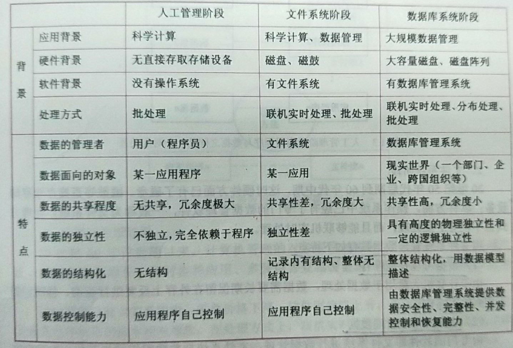

- **适合文件系统例子**： 数据的备份、软件或应用程序使用过程中的临时数据存储
- **适合数据库系统例子**： 企业的信息系统

## 2. 数据模型

###1. 数据模型概述

- **数据模型**： 对现实世界数据特征的抽象，用来描述数据、组织数据、对数据进行操作

- **数据模型是数据库系统的核心和基础**

- **特征**： 

  - 客观真实的反映对象
  - 直观容易被人所理解
  - 便于在计算机上实现

- **分类**： 

  - **概念模型**： 按用户的观点来对数据和信息建模，主要用于数据库设计

  - **逻辑模型和物理模型**

    > - **逻辑模型**： 是按计算机系统的观点对数据建模，主要用于数据库管理系统的实现
    >
    >   > 包括： 层次模型、网状模型、关系模型、面向对象数据模型、对象关系数据模型、半结构化数据模型
    >
    > - **物理模型**： 是对数据最底层的抽象，描述数据在系统内部的表示方式和存取办法，或在磁盘、磁带上的存储方式和存取办法，是面向计算机系统的

- **组成要素**： 

  - **数据结构**： 描述数据库的组成对象以及对象之间的联系

  - **数据操作**： 指对数据库中各种对象的实例允许执行的操作的集合，包括操作及有关的操作规则

  - **数据的完整性约束条件**： 是一组完整性规则

    > **完整性规则**： 是给定的数据模型中数据及其联系所具有的制约和依存规则，用以限定符合数据模型的数据库状态以及状态的变化，以保证数据的正确、有效、相容

### 2. 概念模型

####1. 概述

- **概念模型**： 用于信息世界的建模，是现实世界到信息世界的第一层抽象

- **概念模型作用**： 

  - 是数据库设计人员进行数据库设计的有力工具
  - 是数据库设计人员和用户之间进行交流的语言

- 信息世界的概念：

  > - **实体**： 客观存在并可相互区别的事物
  > - **属性**： 实体所具有的某一特性
  > - **码**： 唯一标识实体的属性集
  > - **实体型**： 用实体名及其属性名集合来抽象和刻画**同类实体**
  > - **实体集**： 同一类型实体的集合
  > - **联系**： 
  >   - **实体内部的联系**： 指组成实体的各属性之间的联系
  >   - **实体之间的联系**： 指不同实体集之间的联系，分为： **一对一、一对多、多对多**

- **实体-联系方法**： 概念模型的一种表示方法，使用 ==E-R 图(E-R 模型)== 来描述现实世界

#### 2. E-R 图

> **结构冲突**： 当合并 E-R 图时，某一实体或属性在一个局部 E-R 图中为实体，在另一个 E-R 图中为属性

- **实体**： 

  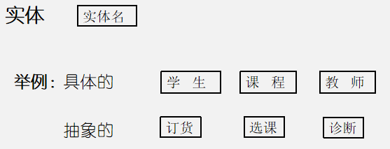

- **属性**： 

  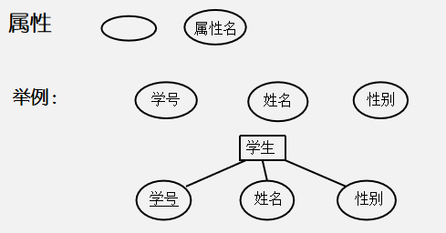

- **联系**： 

  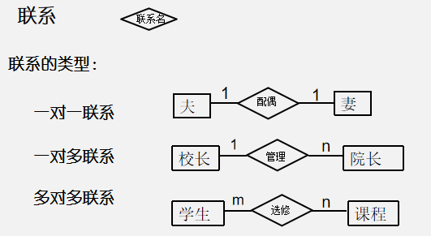

- **ISA 联系**：父类与子类的联系

  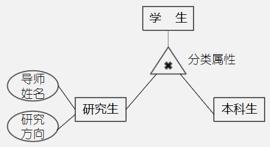

- **Part-of 联系**：表示某个实体型是另外实体型的一个部分

  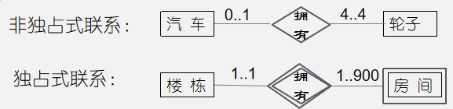

**举例**： 

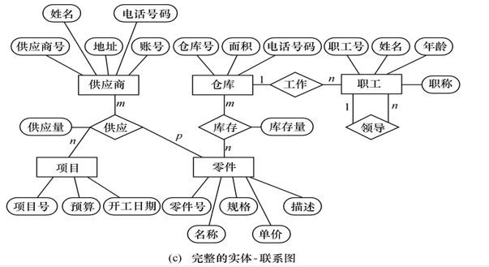

#### ==练习== 

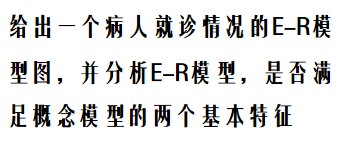

### 3. 常用数据模型

#### 1. 层次模型

- 层次模型使用**树形结构**来表示各类实体以及实体间的联系

- **基本特点**： 任何一个给定的记录值只能按其层次路径查看，没有一个子女记录值能够脱离双亲记录值而独立存在

- **层次模型满足的条件**：

  - 只有根结点没有双亲结点
  - 根以外的其他结点有且只有一个双亲结点

- 层次模型中，每个结点表示一个记录类型，记录类型之间的联系用结点之间的连线(有向边)表示(==一对多==)

  > - 每个记录类型可包含若干个字段
  >
  >   - 记录类型描述的是实体
  >
  >   - 字段描述实体的属性
  >
  > - 各个记录类型及其字段必须命名，但不能同名
  >
  > - 每个记录类型可以定义一个**排序字段(码字段)**

- 层次模型中，同一双亲的子女结点称为**兄弟结点**，没有子女结点的结点称为**叶节点**

- **层次模型的增删改查**： 

  > - **插入操作**： 若没有相应的双亲结点值就不能插入它的子女结点值
  > - **删除操作**： 若删除双亲结点值，则相应的子女结点值也将被删除

- **优点**： 

  - 层次模型的数据结构比较简单清晰
  - 层次数据库的查询效率高
  - 层次数据模型提供了良好的完整性支持

- **缺点**： 

  - 现实世界的许多联系是非层次性的
  - 若一个结点具有多个双亲结点，则只能通过冗余数据或创建非自然数据结构来解决
  - 查询子女结点必须通过双亲结点
  - 由于结构严密，层次命令趋于程序化

#### 2. 网状模型

- 典型代表： **DBTG 系统，也称 CODASYL 系统**

- **网状模型满足的条件**： 

  - 允许一个以上的结点无双亲
  - 一个结点可有多个双亲

- 网状模型中，每个结点表示一个记录类型(实体)，每个记录类型包含若干个字段，结点间的连线表示记录类型之间一对多的父子联系

- **优点**： 

  - 能够更为直接的描述现实世界
  - 具有良好的性能，存取效率高

- **缺点**： 

  - 结构复杂

  - DDL 和 DML 复杂，且要嵌入某一高级语言中，不易掌握和使用

  - 用户必须了解系统结构的细节，才能正常使用

    > - 记录之间的联系是通过存取路径实现
    >
    > - 应用程序在访问数据时必须选择适当的存取路径

#### ==练习==


#### 3. 关系模型

- **基本术语**：

  > - **关系**： 一个关系对应一张表
  > - **元组**： 表中的一行
  > - **属性**： 表中的一列
  > - **码(或码键)**： 表中的某个属性组，可以唯一确定一个元组
  > - **域**： 是一组具有相同数据类型的值的集合，如： 属性的取值范围
  > - **分量**： 元组中的一个属性值
  > - 关系模式： 对关系的描述，表示： `关系名(属性1，属性2，...)`

- 关系模型要求关系必须规范化，且关系的每个分量必须是一个不可分的数据项

- 关系的完整性约束条件分为： **实体完整性、参照完整性、用户定义完整性**

- **优点**： 

  - 建立在严格的数据概念基础之上

  - 关系模型的概念单一

  - 关系模型的存取路径对用户透明，即**用户不需要知道存储路径**

    > - 具有更高的数据独立性
    > - 更好的安全保密性
    > - 简化了程序员的工作和数据库开发建立的工作

- **缺点**：
  - 存取路径对用户隐蔽，即**用户无法获取存储路径**
  - 为提高性能，需对数据库进行优化

## 3. 数据库系统结构

###1. 数据库系统模式概念

- **模式**： 数据库中全体数据的逻辑结构和特征的描述，仅涉及型的描述，反映数据结构及其联系，且相对稳定

  > - 模式的具体值称为模式的实例
  >
  > - 同一个模式可有多个实例

### 2. 三级模式结构

分为：

- **外模式**： 也称**子模式或用户模式**，即**用户视图**

  - 是数据库用户能够看见和使用的局部数据的逻辑结构和特征的描述
  - 是数据库用户的数据视图
  - 是与某一应用有关的数据的逻辑表示

  > - 外模式为模式的子集
  >
  > - **数据库可有多个外模式**
  >
  > - 外模式可保证数据库安全性
  >
  >   > 每个用户只能看见和访问对应的外模式中的数据，其余数据不可见
  >
  > - 定义在逻辑模式之上，独立于存储模式和存储设备
  >
  > - **设计外模式应考虑到应用的扩充性**

- **模式**： 也称**逻辑模式**，即**全局逻辑结构**，是数据库的中心与关键

  - 是数据库中全体数据的逻辑结构和特征的描述
  - 是所有用户的公共数据视图

  > - 一个数据库只有一个模式
  > - 定义模式时，既要定义数据的逻辑结构，也要定义数据之间的联系，定义与数据有关的安全性、完整性要求
  > - **设计模式应先确定数据库的逻辑模式**

- **内模式**： 也称**存储模式**，

  - 是数据物理结构和存储方式的描述
  - 是数据在数据库内部的组织形式

  > - **一个数据库只有一个内模式**
  > - 依赖于全局逻辑结构(模式)，但独立于数据库的用户视图(外模式)，也独立于具体的存储设备

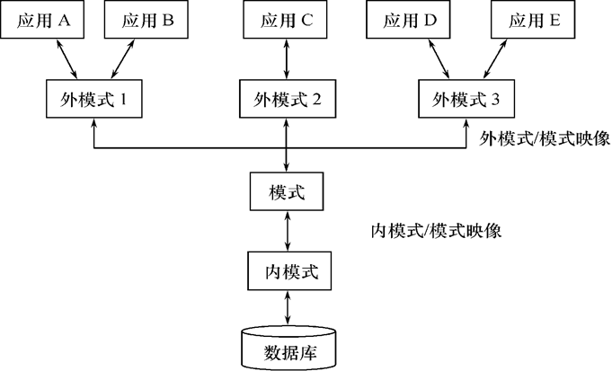

### 3. 两级映像功能

- **外模式/模式映像**： 定义了外模式与模式之间的对应关系，映像定义通常包含在各自外模式描述中
  - 模式描述的是数据的全局逻辑结构，外模式描述的是数据的局部逻辑结构
  - **数据的逻辑独立性**： 模式改变时，外模式不变，从而应用程序不必修改，保证数据与程序的逻辑独立性
- **模式/内模式映像**： 定义了数据全局逻辑结构与存储结构之间的对应关系，映像定义包含在模式描述中
  - **数据的物理独立性**： 数据库的存储结构改变时，模式保持不变，从而应用程序不变，保证数据与程序的物理独立性

> - 数据库的二级映像保证了数据库外模式的稳定，从而从底层上保证了应用程序的稳定性
> - 数据与程序之间的独立性使得数据的定义和描述可从应用程序中分离出去
> - 由于数据的存取由数据库管理系统管理，从而减少了应用程序的维护和修改

## 4. 数据库系统组成

- 数据库系统一般由**数据库、数据库管理系统（及其开发工具）、应用系统、数据库管理员和用户**构成

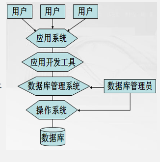

### 1. 硬件平台及数据库

- 有足够大的内存，存取操作系统、数据库管理系统的核心模块、数据缓冲区和应用程序
- 有足够大的磁盘或磁盘阵列等设备存放数据库，有足够大的磁带做数据备份
- 要求系统有较高的通道能力，以提高数据传送率

### 2. 软件

- 数据库管理系统： 用于数据库的建立、使用、维护配置
- 支持数据库管理系统运行的操作系统
- 具有与数据库接口的高级语言及其编译系统，便于开发应用程序
- 以数据库管理系统为核心的应用开发工具
- 为特定应用环境开发的数据库应用系统

### 3. 人员

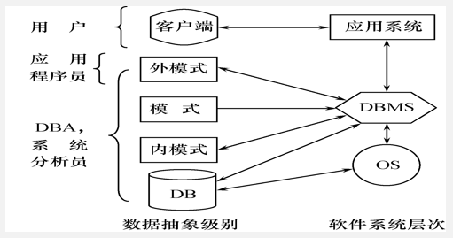

- **数据库管理员(DBA)**： 负责全面地管理和控制数据库系统

  - 决定数据库中的信息内容和结构
  - 决定数据库的存储结构和存取策略
  - 定义数据的安全性要求和完整性约束条件
  - 监控数据库的使用和运行
  - 数据库的改进和重组、重构

- **系统分析员和数据库设计人员**： 
  - **系统分析员**： 负责应用系统的需求分析和规范说明，要和 DBA 相结合，确定系统的软硬件配置，并参与数据库系统的概要设计
  - **数据库设计人员**： 负责数据库中数据的确定及数据库各级模式的设计，需参加用户需求调查和系统分析

- **应用程序员**： 负责设计和编写应用系统的程序模块，并进行调试和安装

- **用户**： 通过应用程序的用户接口使用数据库，分为： 偶然用户、简单用户、复杂用户

  用户访问数据库的过程：

  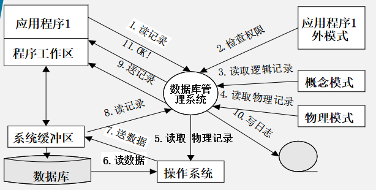

# 二、关系数据库

- 关系模型由**关系数据结构、关系操作集合、关系完整性约束**三部分组成

##1. 关系数据结构

###1. 概述

- 关系模型中数据的逻辑结构是一张扁平的二维表

- **域**： 是一组具有相同数据类型的值的集合

- **基数**： 一个域允许的不同取值个数

- **笛卡儿积**： $D_1*D_2*...*D_n=\{(d_1,d_2,...,d_n) | d_i \in D_i,i = 1,2,...,n\}$

  > 若 $D_i$ 为有限集，其基数为 $m_i$，则 $D_1*D_2*...*D_n$ 的基数 M 为： $M = \prod_{i=1}^{n} m_i$

- **关系**： $D_1*D_2*...*D_n$ 的子集叫做在域 $D_1,D_2,...,D_n$ 上的关系，表示为 $R(D_1,D_2,...,D_n)$

  > - 一个关系通常对应一张表
  > - R 为关系的名字，n 是关系的目或度
  > - 关系中的每个元素是关系中的元组，用 `t` 表示

- **候选码**： 关系中的某一属性组的值能唯一的标识一个元组，而其子集不能

  > - 若有多个候选码，则选中其中一个为**主码** 
  > - 候选码的诸属性称为**主属性**，不包含在任何候选码中的属性称为**非主属性或非码属性**
  > - **全码**： 关系模式的所有属性是这个关系模式的候选码
  > - **外码**：某个关系的主码相应的属性在另一关系中出现，此时该主码就是另一关系的外码

- 关系分为三种类型： 

  - **基本关系(基本表)**： 实际存在的表，是实际存储数据的逻辑表示

    > 具有的6条性质：
    >
    > - 列是同质的，即每列中的分量是同一类型的数据，来自同一个域
    > - 不同列可出自同一个域，称其中的每列为一个属性，不同的属性给予不同的属性名
    > - 列的顺序无所谓，即列的次序可任意交换
    > - 任意两个元组的候选码不能取相同的值
    > - 行的顺序无所谓，即行的次序可以任意交换
    > - 分量必须取原子值，即每个分量都必须是不可分的数据项

  - **查询表**： 是查询结果对应的表

  - **视图表**： 由基本表或其他视图表导出的表，是虚表，不对应实际存储的数据

### 2. 关系模式

- **关系模式**： 关系的描述，表示为 `R(U,D,DOM,F)`

  > - `R`： 关系名
  > - `U`： 组成该关系的属性名集合
  > - `D`： 为 U 中属性所来自的域
  > - `DOM`： 为属性向域的映像集合
  > - `F`： 为属性间数据的依赖关系集合

- **关系数据库**： 
  - 关系数据库的**型**： 也称**关系数据库模式**，是对关系数据库的描述
  - 关系数据库的**值**： 也称**关系数据库**，是对关系模式在某一时刻对应的关系的集合

## 2. 关系操作

- **关系数据语言**： 
  - **关系代数语言**： 如 `ISBL`
  - **关系演算语言**：
    - 元组关系演算语言： 如 `ALPHA, QUEL`
    - 域关系演算语言： 如 `QBE`
  - **具有关系代数和关系演算双重特点的语言**，如 `SQL`

- **共同特点**： 语言具有完备的表达能力，是非过程化的集合操作语言，功能强，能够嵌入高级语言中使用

## 3. 关系完整性

- 关系完整性分为： 实体完整性、参照完整性、用户定义完整性

  > - 实体完整性和参照完整性是必须满足的完整性约束条件，称为**关系的两个不变性**
  > - 用户定义完整性是应用领域需遵循的约束条件，体现了具体领域中的语义约束

- **实体完整性规则**： 若属性 A 是基本关系 R 的主属性，则 A 不能取空值

  > 空值指“不知道”、“不存在”、“无意义”的值

- **参照完整性规则**： 若属性 F 是基本关系 R 的外码，与基本关系 S 的主码 $K_s$ 对应，则对于 R 中的每个元组在 F 上的值必须：
  - 或为空值
  - 或等于 S 中某个元组的主码值

- **用户定义完整性**： 针对某一具体关系数据库的约束条件，反映某一具体应用所涉及的数据须满足的语义要求

## 4. 关系代数

- **关系代数**： 是一种抽象的查询语言，用对关系的运算来表达查询

- 关系代数运算分类：

  - **传统集合运算**： 将关系看成元组的集合，其运算从==行==的角度进行

    > - **并 $\bigcup$** ：`R∪S={t|t∈R∨t∈S}`
    > - **差 $-$**： `R-S={t|t∈R∧t∉S}`
    > - **交 $\bigcap$** ：`R∩S={t|t∈R∧t∈S}`
    > - **笛卡儿积 $\times$** ：`R X S={trts|tr∈R∧ts∈S}` 
    >
    > **当子查询的结果主键一致时，可执行并、交、差运算**

  - **专门关系运算**： 涉及==行、列==运算

    > - **选择 $\sigma$**： $\sigma_F(R) = \{t|t \in R \bigwedge F(t) = '真' \}$
    >
    > - **投影 $\prod$**： $\prod_A(R) = \{ t[A] | t \in R \}$
    >
    > - **连接** ： 
    >
    >   > - **等值连接**：连接条件为‘=’，从关系 R 与 S 的广义笛卡尔积中选取 A，B 属性值相等的元组
    >   > - **自然连接**： 是一种特殊的等值连接，它要求两个关系中进行比较的分量必须是相同的属性组，并且在结果中把重复的属性列去掉
    >   > - **外连接**： 允许属性值为 NULL 的连接
    >   > - **左外链接**： 只保留左边关系 R 的悬浮属性
    >   > - **右外连接**： 只保留右边关系 S 的悬浮属性
    >
    > - **除 $\div$**：$R \div S = \{ t_r[X] | t_r \in R \bigwedge \prod_Y(S) \subseteq Y_x \}$ 

- **关系代数的基本运算**： **并、差、笛卡尔积、投影和选择**

### ==例题== 

- **例题一： 连接运算**

  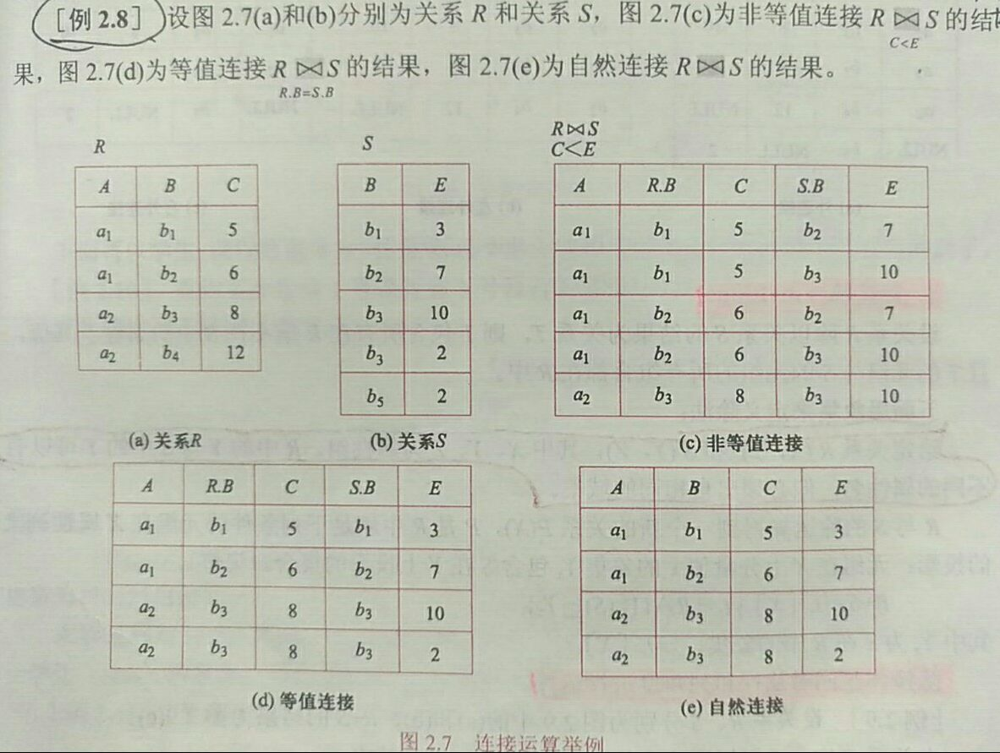

  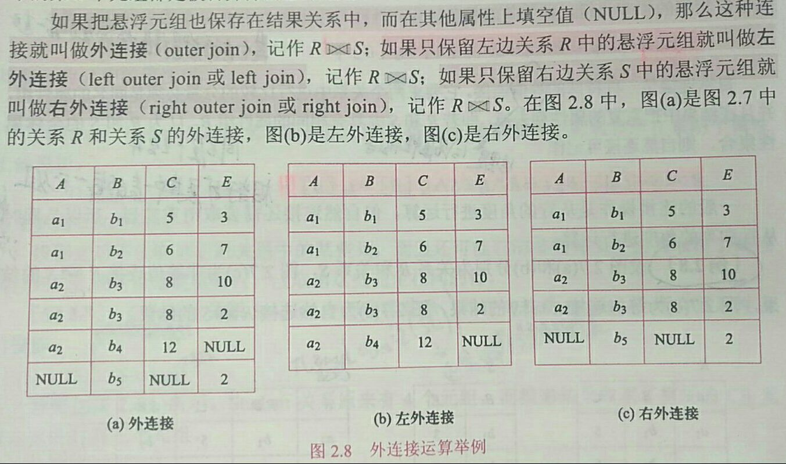

- **例题二： 除运算**

  查询选修了全部课程的学生号码和姓名： $\prod_{Sno,Cno}(SC) \div \prod_{Con}(Course)$  $\prod_{Sno,Sname}(Student)$

  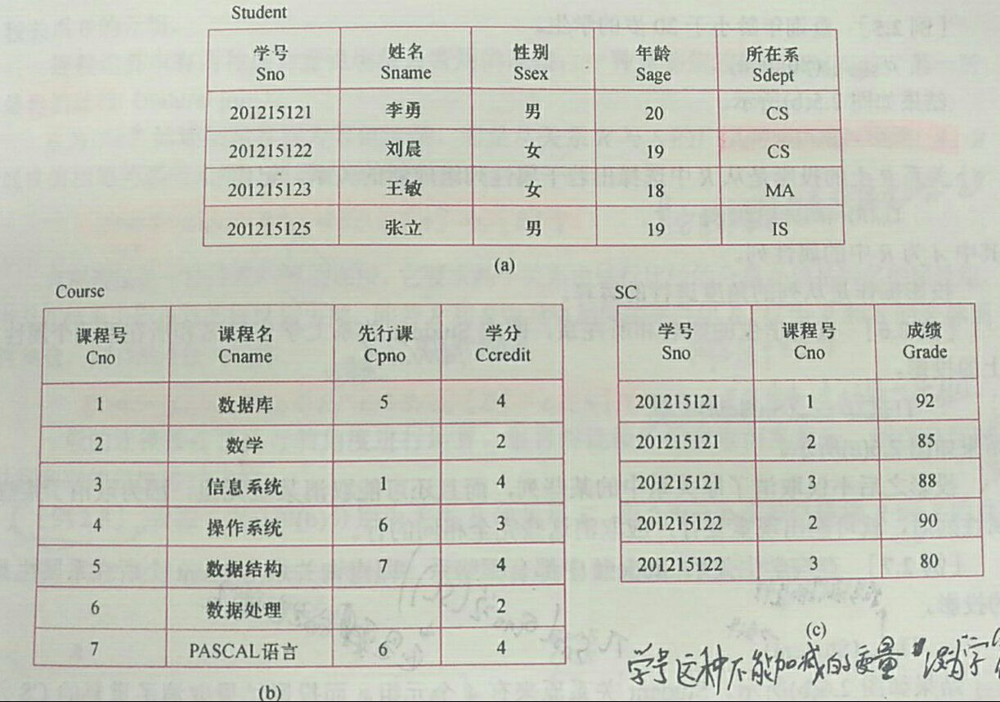

- **例题三：** 

  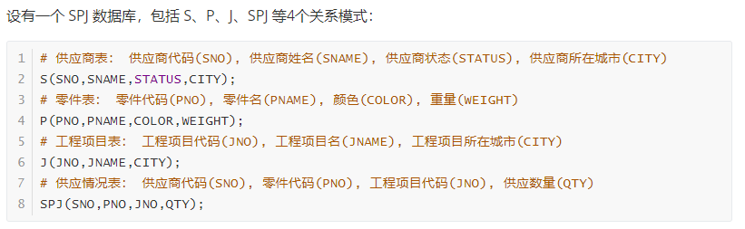

  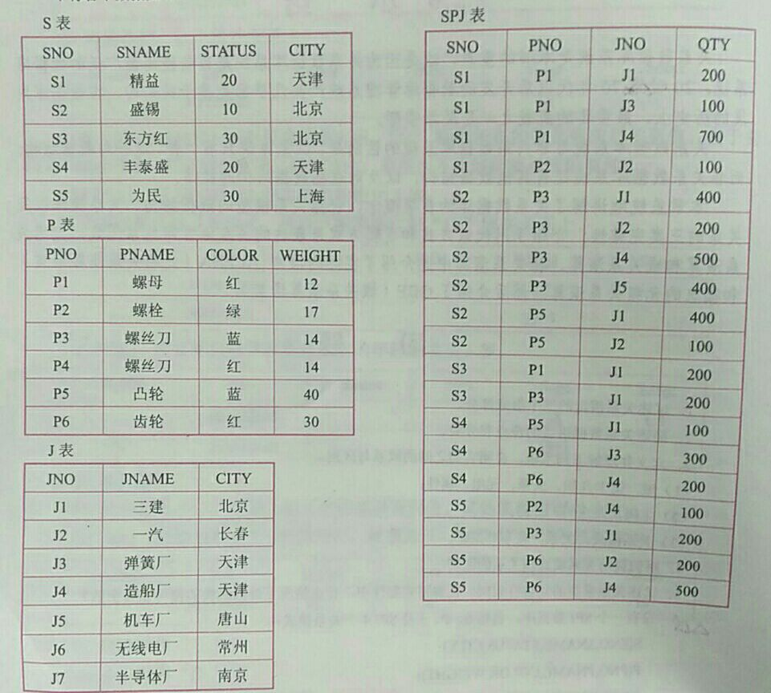

  **试用关系代数语言完成查询：** 

  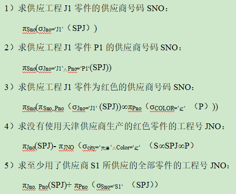

  **用 SQL 语言完成查询：** 

  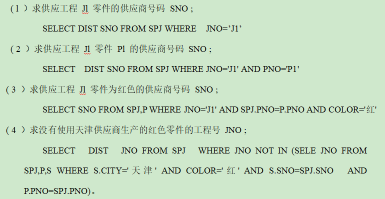

  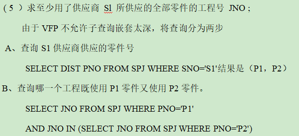

# 三、SQL

**SQL 基本特点**： 

- **综合统一**： SQL 语言集数据定义语言 DDL 、数据操纵语言 DML 、数据控制语言 DCL 的功能于一体

- **高度非过程化**： 无需了解存取路径，存取路径的选择以及 SQL 语句的操作过程由系统自动完成

- **面向集合的操作方式**

- **以同一种语法结构提供多种使用方式**： 既是自含式语言，又是嵌入式语言

  > - 作为自含式语言，它能够独立地用于联机交互的使用方式
  > - 作为嵌入式语言，它能够嵌入到高级语言程序中，供程序员设计程序时使用

- **语言简洁，易学易用**

SQL 语言： 

- **数据定义语言(DDL)**：用来定义数据库模式、外模式、内模式的语言
- **数据操纵语言(DML)**：用来对数据库中的数据进行查询、插入、删除和修改的语句

## 1. 数据定义

- **SQL 的数据定义语句**： 

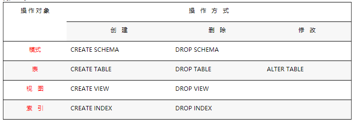

- **模式**： 

  > - **定义**： `CREATE SCHEMA <模式名> AUTHORIZATION <用户名> [<表定义子句>|<视图定义子句>|<授权定义子句>];`
  > - **删除**： `DROP SCHEMA <模式名><CASCADE|RESTRICT>`
  >   - `CASCADE(级联)`： 表示在删除模式的同时把该模式中所有的数据库对象全部删除
  >   - `RESTRICT(限制)`： 表示如果该模式中已定义了下属的数据库对象，则拒绝该删除语句的执行

- **基本表**： 本身独立存在的表，SQL 中一个关系就对应一个表

  > - **定义**： `CREATE TABLE <表名> (<列名><数据类型>[列级完整性约束条件]...[,<表级完整性约束条件>]);`
  >
  >   | 数据类型                        | 含义                                     |
  >   | ------------------------------- | ---------------------------------------- |
  >   | CHAR(n), CHARACTER(n)           | 长度为 n 的定长字符串                    |
  >   | VARCHAR(n), CHARACTERVARYING(n) | 最大长度为 n 的变长字符串                |
  >   | CLOB                            | 字符串大对象                             |
  >   | BLOB                            | 二进制大对象                             |
  >   | INT, INTEGER                    | 长整数(4 字节)                           |
  >   | SMALLINT                        | 长整数(2 字节)                           |
  >   | BIGINT                          | 长整数(8 字节)                           |
  >   | NUMERIC(p,d)                    | 定点数，由 p 位数字组成，小数点后有 d 位 |
  >   | DECIMAL(p,d), DEC(p,d)          | 同 NUMERIC                               |
  >   | REAL                            | 取决于机器精度的单精度浮点数             |
  >   | DOUBLE PRECISION                | 取决于机器精度的双精度浮点数             |
  >   | FLOAT(n)                        | 可选精度浮点数，精度至少为 n 位数字      |
  >   | BOOLEAN                         | 逻辑布尔量                               |
  >   | DATE                            | 日期，格式为： YYYY-MM-DD                |
  >   | TIME                            | 时间，格式： HH:MM:SS                    |
  >   | TIMESTAMP                       | 时间戳类型                               |
  >   | INTERVAL                        | 时间间隔类型                             |
  >
  > - **修改**： 
  >
  >   ```mysql
  >   ALTER TABLE <表名>
  >   [ADD <新列名> <数据类型> [完整性约束]]
  >   [ADD <表级完整性约束>]
  >   [DROP [COLUMN] <列名> [CASCADE|RESTRICT]]
  >   [DROP CONSTRAINT <完整性约束名> [CASCADE|RESTRICT]]
  >   [ALTER COLUMN <列名> <数据类型>]；
  >   ```
  >
  > - **删除**： `DROP TABLE<表名>[CASCADE|RESTRICT];`

- **视图**： 从一个或几个基本表导出的表，本身不独立存储在数据库中，是一个虚表，但概念上与基本表等同

  > - **建立**：  `CREATE VIEW <视图名> [(<列名> [,<列名>]...)] AS <子查询> [WITH CHECK OPTION];`
  >
  >   > `WITH CHECK OPTION`： 表示对视图进行 增删改 操作时要保证更新、插入或删除的行满足视图定义中的谓词条件
  >
  > - **删除**： `DROP VIEW <视图名> [CASCADE]`
  >
  > - **修改**： `ALTER VIEW <视图名> AS 查询语句`
  >
  > - **查看**： `DESC <视图名>; 或 SHOW CREATE VIEW <视图名>;`
  >
  > - **作用**： 
  >
  >   - 简化用户操作
  >   - 使用户能以多种角度看待同一数据
  >   - 对重构数据库提供了一定程度的逻辑独立性
  >   - 能够对机密数据提供安全保护
  >   - 适当利用视图可更清晰的表达查询
  >
  > - **是否可更新**： 
  >
  >   - **可更新**： 基本表的行列子集视图一般可更新
  >   - **不可更新**： 若视图的属性来自集合函数、表达式，则该视图不可更新
  >
  > - **部分视图不可更新原因**： 
  >
  >   - 视图是不实际存储数据的虚表，因此对视图的更新，最终要转换为对基本表的更新
  >   - 但**有些视图的更新不能惟一有意义地转换成对相应基本表的更新**，所以并不是所有视图都可更新

- **索引**： 

  > - **建立**： `CREATE [UNIQUE][CLUSTER] INDEX <索引名> ON <表名>(<列名>[<次序>][,<列名>]...);`
  >
  >   > - `UNIQUE`： 表明此索引的每一个索引值之对应唯一的数据记录
  >   > - `CLUSTER`： 表示要建立的索引是聚簇索引
  >
  > - **修改**： `ALTER INDEX <旧索引名> RENAME TO <新索引名>;`
  >
  > - **删除**： `DROP INDEX <索引名>;`

- **数据字典**： 是关系数据库管理系统内部的一组系统表，记录了数据库中所有的定义信息

## 2. 数据查询

- **一般格式**：

  ```mysql
  SELECT [ALL|DISTINCT] <目标表达式>...
  FROM <表名或视图名>|(<SELECT 语句> [AS] <别名>)
  [WHERE <条件表达式>]
  [GROUP BY <列名>...]
  [ORDER BY <列名> [ASC|DESC]];
  ```

- **常用查询条件**：

  | 查询条件                    | 谓词                                                         |
  | --------------------------- | ------------------------------------------------------------ |
  | 比较                        | `=, >, <, >=, <=, !=|<>, !>, !<`                             |
  | 确定范围                    | `BETWEEN AND,  NOT BETWEEN AND`                              |
  | 确定集合                    | `IN, NOT IN`                                                 |
  | 字符匹配                    | `LIKE, NOT LIKE`                                             |
  | 换码字符                    | `ESCAPE`，如： ESCAPE '\' 表示 “\” 为换码字符，即 “\” 后面字符为其原意 |
  | 空值                        | `IS NULL, IS NOT NULL`                                       |
  | 多重条件                    | `AND, OR, NOT`                                               |
  | **上面为 WHERE 的子句实现** |                                                              |
  | 消除重复值                  | `DISTINCT`                                                   |
  | 所有值                      | `ALL`，如： SELECT Sno 等价于 SELECT ALL Sno                 |
  | 升降序                      | `ORDER BY [ASC|DESC]`，ASC 为升序(默认)，DESC 为降序         |
  | 分组                        | `GROUP BY`                                                   |
  | 条件判断，类似 WHERE        | `HAVING`                                                     |
  | 空值与另一值的比较结果      | `UNKNOWN`                                                    |

- 聚集函数：

  | 聚集函数 | 意义         |
  | -------- | ------------ |
  | `COUNT`  | 统计元组个数 |
  | `SUM`    | 计算总和     |
  | `AVG`    | 计算平均值   |
  | `MAX`    | 求最大值     |
  | `MIN`    | 求最小值     |

- **连接查询**： `LEFT|RIGHT OUTER JOIN ... ON ...`

- **嵌套查询**： 

- **集合查询**： `并 UNION, 交 INTERSECT, 差 EXCEPT` 

- **派生查询**： ==P111==

## 3. 数据更新

- **插入**：  `INSERT INTO ...(...) VALUES (...);` 或 `INSERT INTO ...(...) 子查询;`
- **修改**： `UPDATE ... SET ...=... [WHERE ...];`
- **删除**： `DELETE FROM ... [WHERE ...];`

## ==练习==

- **练习一**： 

  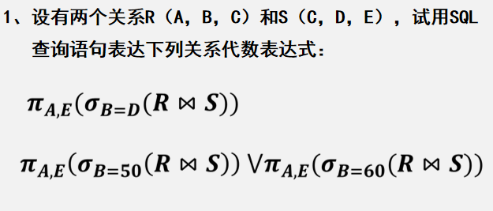

- **练习二**： 

  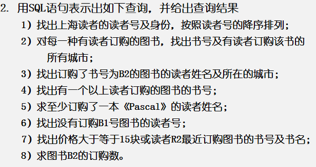

  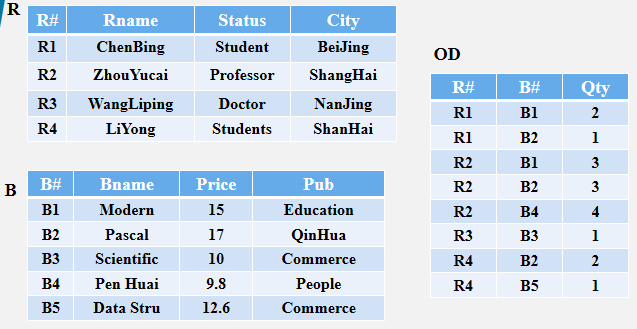

  **解答**： 

  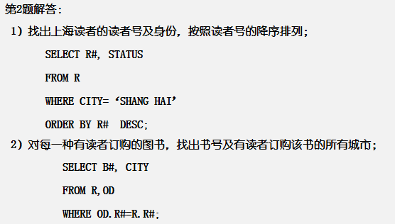

  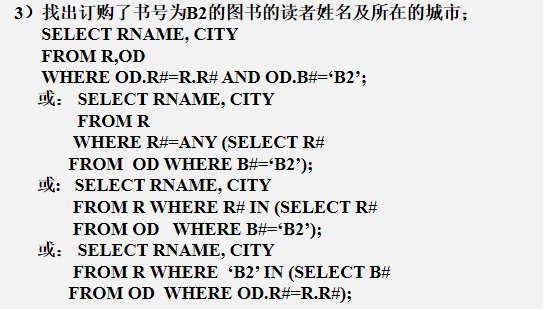

  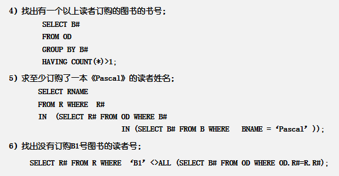

  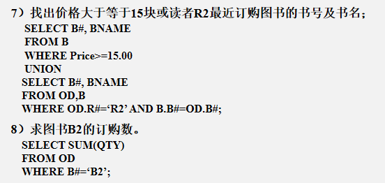

- **练习三**： 

  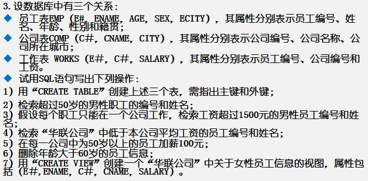

# 四、数据库安全性

## 1. 概述

- **数据库安全性**： 指保护数据库以防止不合法的使用所造成的数据泄露、更改或破坏

- **数据库的不安全因素**： 

  - 非授权用户对数据库的恶意存取和破坏
  - 数据库中重要或者敏感的数据被泄露
  - 安全环境的脆弱性

- **数据库安全性控制的常用方法和技术**： 

  - **用户身份鉴别**
  - **存取控制**
  - **视图机制**
  - **审计**
  - **数据加密**

- **安全标准**： 

  - `TCSEC 标准`： 

    > - `TCSEC/TDI` 从四个方面来描述安全性级别划分的指标：**安全策略、责任、保证、文档**
    >
    > - 按系统可靠或可信程度逐渐增高，各安全级别之间偏序向下兼容
    >
    >   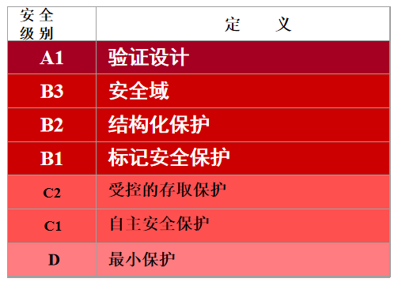
    >
    >   - `D 级`： 将一切不符合更高标准的系统均归于 D 组
    >
    >   - `C1 级`： 非常初级的自主安全保护
    >
    >     > 能够实现对用户和数据的分离，进行自主存取控制(DAC)，保护或限制用户权限的传播
    >
    >   - `C2 级`： 安全产品的最低档次
    >
    >     > 提供受控的存取保护，将 C1 级的 DAC 进一步细化，以个人身份注册负责，并实施审计和资源隔离
    >
    >   - `B1 级`： 标记安全保护
    >
    >     > 对系统的数据加以标记，对标记的主体和客体实施强制存取控制(MAC)、审计等安全机制
    >
    >   - `B2 级`： 结构化保护
    >
    >     > 建立形式化的安全策略模型并对系统内的所有主体和客体实施 DAC 和 MAC
    >
    >   - `B3 级`： 安全域
    >
    >     > 该级的 TCB 必须满足访问监控器的要求，审计跟踪能力更强，并提供系统恢复过程
    >
    >   - `A1 级`： 验证设计
    >
    >     > 提供 B3 级保护的同时给出系统的形式化设计说明和验证以确信各安全保护真正实现

  - `CC 标准 `： 提出国际公认的表述信息技术安全性的结构

    > - **把信息产品的安全要求分为： 安全功能要求和安全保证要求**
    >
    > - **CC 文本组成**： **简介和一般模型、安全功能要求、安全保证要求** 
    >
    > - CC 评估保证级划分：
    >
    >   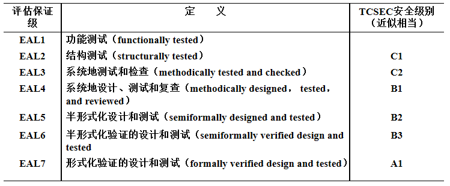

## 2. 安全性控制

### 1. 用户身份鉴别

- **概述**： 

  - 由系统提供一定的方式让用户标识自己的名字或身份
  - 每次用户要求进入系统时，由系统进行核对，通过鉴定后才提供系统的使用权

- **分类**： 

  - **静态口令鉴别**： 由用户自己设定，鉴别时按要求输入正确口令，系统将允许用户使用数据库管理系统

  - **动态口令鉴别**： 鉴别时需使用动态产生的新口令登录数据库管理系统，如： 短信密码、动态口令牌

  - **生物特征鉴别**： 通过生物特征进行认证

    > 生物特征： 指生物体唯一具有的，可测量的、识别和验证的稳定生物特征

  - **智能卡技术**： 智能卡是一种不可复制的硬件，内置集成电路的芯片，具有硬件加密功能

    > 智能卡由用户随时携带，登录数据库管理系统时将智能卡插入专用的读卡器进行身份验证

### 2. 存取控制

- **概述**： **通过用户权限定义和合法权限检查确保只有合法权限的用户访问数据库**

- **存取控制机制组成**：用户权限定义和合法权检查机制一起组成了 DBMS 的安全子系统

  - **定义用户权限**：

    > - **权限**： 用户对某一数据对象的操作权力
    > - **安全规则或授权规则**： DBMS 提供适当语言定义的用户权限经编译后存放在数据字典中

  - **合法权限检查**： 用户发出操作数据请求后，DBMS 会先查找数据字典，根据安全规则进行合法权限检查，若操作超过了用户权限，则拒绝执行该操作

- **常用存取控制方法**： 

  - **自主存取控制(DAC)**： C1 级，灵活

    **概述**： **定义各个用户对不同数据对象的存取权限，当用户对数据库访问时首先检查用户的存取权限，防止不合法用户对数据库的存取**

    - 用户对于不同的数据库对象有不同的存取权限
    - 不同的用户对同一对象也有不同的权限
    - 用户还可以将其拥有的存取权限转授给其它用户

    > - **缺点**： 可能存在数据的“无意泄露”
    > - **原因**：这种机制仅仅通过对数据的存取权限来进行安全控制，而数据本身并无安全性标记
    > - **解决**：对系统控制下的所有主客体实施强制存取控制策略

  - **强制存取控制(MAC)**：B1 级，严格

    **概述**： **每一个数据对象被强制地标以一定的密级，每一个用户也被强制地授予某一个级别的许可证，系统规定只有具有某一许可证级别的用户才能存取某一个密级的数据对象**

    - 每一个数据对象被标以一定的密级
    - 每一个用户也被授予某一个级别的权限
    - 对于任意一个数据对象，只有具有合法许可证的用户才可以存取

    > - **主体**：是系统中的活动实体，既包括 DBMS 所管理的实际用户，也包括代表用户的各进程
    >
    > - **客体**：是系统中的被动实体，是受主体操纵的对象，包括文件、基表、索引、视图
    >
    > - **敏感度标记**： 绝密(TS)、机密(S)、可信(C)、公开(P)
    >
    >   > - 主体的敏感度标记称为许可证级别
    >   > - 客体的敏感度标记称为密级
    >
    > - **强制存取控制规则**：
    >
    >   - 当主体的许可证级别**大于等于**客体的密级，主体可以**读**相应客体
    >   - 当主体的许可证级别**小于等于**客体的密级，主体可以**写**相应客体
    >
    > - **规则的共同点**：
    >
    >   - 禁止拥有高许可证级别的主体更新低密级的数据对象      
    >   - 对数据本身进行密级标记，无论数据如何复制，标记与数据是一个不可分的整体，只有符合密级要求的用户才可以操作数据，从而提供了更高级别的安全性

- **用户权限组成**： **数据对象、操作类型**

- **授权**： 定义存取权限

  - `GRANT`： 将对指定操作对象的指定操作权限授予指定的用户

    ```mysql
    GRANT  <权限> [,<权限>]... 
    ON   <对象类型> <对象名> [,<对象类型> <对象名>]...
    TO   <用户> [,<用户>]...
    [WITH GRANT OPTION];
    ```

    **关系数据库系统中的存取权限**：

    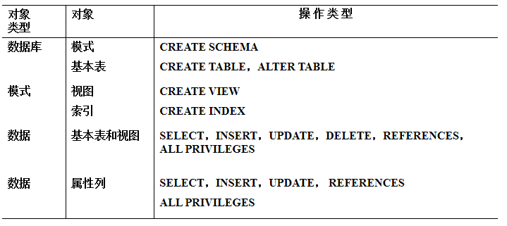

  - `REVOKE`： 授予的权限可以由 DBA 或其他授权者用 REVOKE 语句收回

    ```mysql
    REVOKE <权限> [,<权限>]... 
    ON <对象类型> <对象名> [,<对象类型> <对象名>]...
    FROM <用户> [,<用户>]...
    [CASCADE|RESTRICT];
    ```

- **创建数据库模式的权限**： 对创建数据库模式一类的数据库对象的授权由 DBA 在创建用户时实现

  `CREATE USER <username>［WITH][DBA|RESOURCE|CONNECT];`

  > - 只有系统的超级用户才有权创建一个新的数据库用户
  >
  > - 新创建的数据库用户权限：
  >
  >   - `CONNECT ` 特权： 
  >     - 不能创建新用户，不能创建模式和基本表
  >     - 可以与数据库连接，能根据授权进行数据库中数据的查询、更新
  >   - `RESOURCE` 特权： 
  >     - 具有CONNECT特权
  >     - 能创建表、索引，修改表结构
  >     - 能将自己创建的数据对象的访问权授予其他用户或从其他用户收回
  >     - 对自己创建的数据对象能进行跟踪审查
  >   - `DBA` 特权： 能进行所有的数据库操作
  >
  >   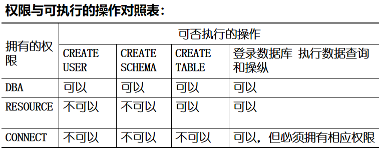

- **数据库角色**： 被命名的一组与数据库操作相关的权限，==P144-145 例题==

  - 角色是权限的集合 
  - 可以为一组具有相同权限的用户创建一个角色
  - 使用角色来管理数据库权限可以简化授权的过程

  > - **角色的创建**： `CREATE ROLE <角色名>;`
  >
  > - **对角色授权**： 
  >
  >   ```mysql
  >   GRANT <权限>［,<权限>]...
  >   ON <对象类型>对象名  
  >   TO <角色>［,<角色>]...
  >   ```
  >
  > - **将一个角色授予其他的角色或用户**： 
  >
  >   ```mysql
  >   GRANT <角色1>［,<角色2>]...
  >   TO <角色3>［,<用户1>]...
  >   [WITH ADMIN OPTION］#可将权限转移
  >   ```
  >
  > - **角色权限的收回**： 
  >
  >   ```mysql
  >   REVOKE <权限>［,<权限>]...
  >   ON <对象类型> <对象名>
  >   FROM <角色>［,<角色>]...
  >   ```

## 3. 视图机制

- **概述**： **为不同的用户定义视图，通过视图机制把要保密的数据对无权存取的用户隐藏起来，从而自动地对数据提供一定程度的安全保护**
- **主要功能**： 
  - 提供数据独立性
  - 支持存取谓词的用户权限

## 4. 审计 

- **概述**： **建立审计日志，把用户对数据库的所有操作自动记录到审计日志中** 

- **审计原因**： **DBA 可利用审计跟踪的信息，重现导致数据库现有状况的一系列事件，找出非法存取数据的人、时间和内容等** 

- 审计功能是数据库管理系统达到 **C2 以上安全级别**必不可少的一项指标

- 数据库管理系统将审计设置为可选，允许根据具体应用对安全性的要求灵活地打开或者关闭审计功能

  > 因为审计通常很费时间和空间

- **可审计事件**： 

  - **服务器事件**： 审计数据库服务器发生的事件，包括数据库服务器的启动、停止、配置文件的重新加载

  - **系统权限**： 对系统拥有的结构或者模式对象进行操作的审计，要求该操作通过系统权限获得

  - **语句事件**： 对 SQL 语句的审计

  - **模式对象事件**： 对特定模式对象上进行的 SELECT 或者 DML 操作的审计

    > 模式对象包括表、视图、存储过程、函数等，但不包括依附于表的索引、约束、触发器、分区表等

- **审计功能**： 

  - **基本功能**：提供多种审计查阅方式

  - **提供多套审计规则**，审计规则一般在数据库初始化时设定，以方便审计员管理

  - **提供审计分析和报表功能**

  - **审计日志管理功能**

    > - 为防止审计员误删审计记录，审计日志必须先转储后删除
    > - 对转储的审计日志提供完整性和保密性保护
    > - 只允许审计员查阅和转储审计记录，不允许任何用户新增或者修改审计记录

  - **系统提供查询审计设置及审计记录信息的专门视图**

- **审计分类**： 
  - **用户级审计**： 
    - 针对自己创建的数据库表或视图进行审计
    - 记录所有用户对这些表或视图的一切成功和不成功的访问要求以及各种类型的SQL操作  
  - **系统级审计**： 
    - DBA 设置 
    - 监测成功或失败的登录要求
    - 监测 GRANT 和 REVOKE 操作以及其他数据库级权限下的操作

- **审计操作**： 
  - `AUDIT` 语句：设置审计功能 
  - `NOAUDIT` 语句：取消审计功能 

## 5. 数据加密

- **概述**： **对存储和传输的数据进行加密处理，从而使得不知道解密算法的人无法获知数据的内容**
- **加密的基本思想**： 根据一定的算法，将原始数据——明文变换为不可直接识别的格式——密文
- **存储加密**： 一般提供透明和非透明两种存储加密方式
  - **透明存储加密**：由于数据加密对用户透明，数据库的应用程序不需要作任何修改
    - 是内核级的加密保护方式，对用户完全透明
    - 数据在写到磁盘时对数据进行加密，授权用户读取数据时再对其解密
  - **非透明存储加密**：通过多个加密函数实现
- **传输加密**： 
  - **链路加密**：对传输数据在链路层进行加密，对报头和报文均加密    
  - **端到端加密**：在发送端加密，在接收端解密，只加密报文，不加密报头

## ==例题== 

- **题目描述**： 

  

- ① **请用 SQL 的 GRANT 语句完成授权定义** 

  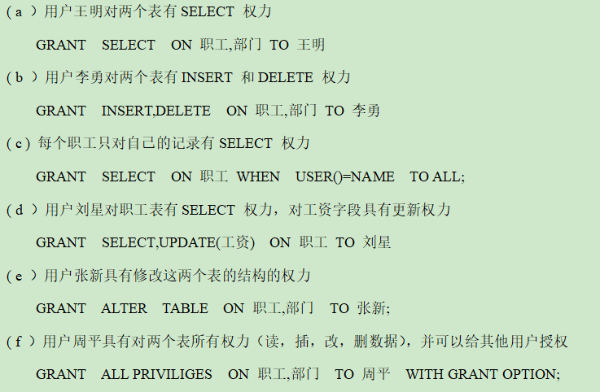

  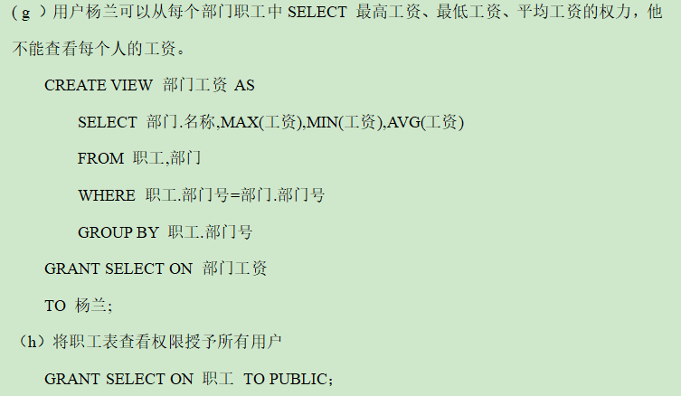

- ② **请用 SQL 的 REVOKE 语句针对上述每种情况撤销用户授权**

  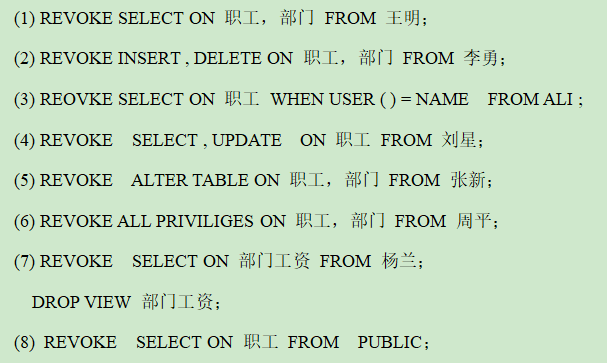

# 五、数据库完整性

##1. 概述

- **数据库的完整性**： **数据的正确性和相容性**
- **完整性与安全性的区别**：
  - 完整性： 
    - 防止数据库中存在不符合语义的数据，也就是防止数据库中存在不正确的数据
    - 防范对象：不合语义的、不正确的数据
  - 安全性： 
    - 保护数据库防止恶意的破坏和非法的存取
    - 防范对象：非法用户和非法操作

- 为维护数据库的完整性，DBMS 必须实现的功能：
  - 提供定义完整性约束条件的机制
  - 提供完整性检查的方法
  - 违约处理

- **数据库的完整性约束条件**： 指数据库中的数据应该满足的语义约束条件

  >  分类： 
  >
  > - **静态列级约束**： 是对一个列的取值域的说明
  >
  >   > 对数据类型的约束、对数据格式的约束、对取值范围或取值集合的约束、对空值的约束、其他约束
  >
  > - **静态元组约束**： 规定组成一个元组的各个列之间的约束关系，只局限在单个元组上
  >
  > - **静态关系约束**： 在一个关系的各个元组之间或若干关系之间常常存在各种联系或约束
  >
  >   > 实体完整性约束、参照完整性约束、函数依赖约束
  >
  > - **动态列级约束**： 修改列定义或列值时应满足的约束条件
  >
  >   > 修改列定义时的约束、修改列值时的约束
  >
  > - **动态元组约束**： 指修改某个元组的值时需要参照其旧值，并且新旧值之间需要满足某种约束条件
  >
  > - **动态关系约束**： 指加在关系变化前后状态上的限制条件，例如事务一致性、原子性等约束条件

- **RDBMS 的完整性控制机制应具有的功能**： 
  - **定义功能**： 即提供定义完整性约束条件的机制
  - **检查功能**： 即检查用户发出的操作请求是否违背了完整性约束条件
  - **违约反应**： 若发现用户的操作请求使数据违背了完整性约束条件，则采取一定动作来保证数据的完整性

## 2. 实体完整性

- **实体完整性规则**： 若属性 A 是基本关系的主属性，则 A 不能取空值

- 关系模型的实体完整性用 `PRIMARY KEY` 定义

  > - **单属性**构成的码有两种说明方法 
  >   - 定义为列级约束条件
  >   - 定义为表级约束条件
  >
  > - **多个属性**构成的码只有一种说明方法
  >   - 定义为表级约束条件 

- 插入或对主码列进行更新操作时，RDBMS 按照实体完整性规则自动进行检查：

  - 检查主码的各个属性是否为空，只要有一个为空就拒绝插入或修改
  - 检查主码值是否唯一，如果不唯一则拒绝插入或修改

## 3. 参照完整性

- **参照完整性规则**： 属性 F 是关系 R 的外码，与关系 S 的主码相对应，则 F 的取值等于 S 中某主码值或空

- 关系模型的参照完整性用 `FOREIGN KEY`定义，用 `REFERENCES` 指明参照哪些表的主码

- **参照完整性违约处理**： 

  - 拒绝(NO ACTION)执行： 默认策略
  - 级联(CASCADE)操作
  - 设置为空值(SET-NULL)

  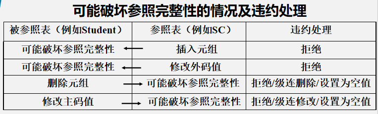

- **RDBMS 在实现参照完整性时需要考虑的方面**： 

  - **外码是否可以接受空值**

  - **删除被参照关系的元组**： 级联删除`CASCADES `、受限删除`RESTRICTED`、置空值删除`NULLIFIES`

  - **参照关系中插入元组**： 受限插入、递归插入

  - **修改关系中的主码**： 先删除该元组，然后再把具有新主码值的元组插入到关系中

    > 若允许修改主码： 
    >
    > - 先保证主码的惟一性和非空，否则拒绝修改
    > - 然后要区分是参照关系还是被参照关系

###==例题== 

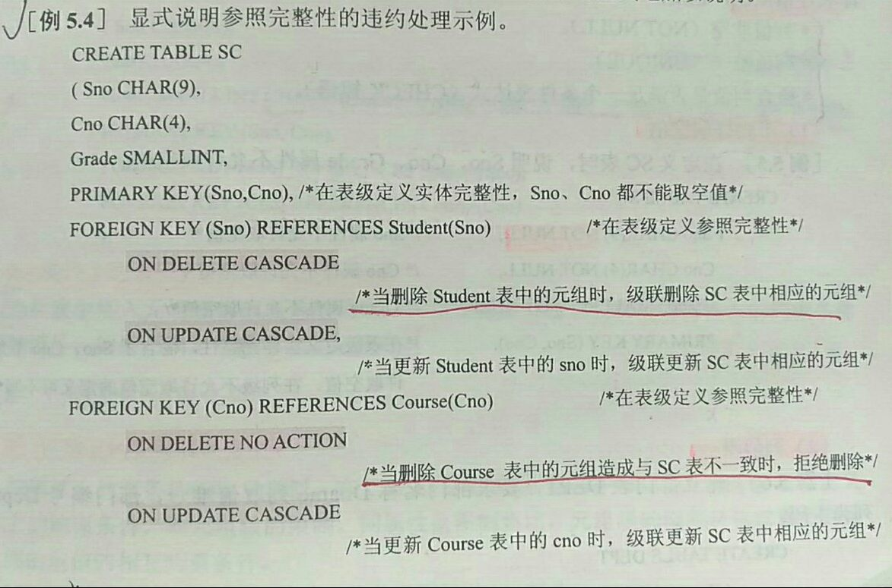

## 4. 用户定义完整性

> - 用户定义的完整性就是针对某一具体应用的数据必须满足的语义要求 
> - RDBMS 提供了定义和检验这类完整性的机制，不必由应用程序承担

- **属性上的约束条件**

  > - **定义**：CREATE TABLE 时定义
  >   - 列值非空 `NOT NULL` 
  >   - 列值唯一 `UNIQUE` 
  >   -  检查列值是否满足一个布尔表达式 `CHECK`
  > - **检查和违约处理** 

- **元组上的约束条件**

  > - **定义**： 在 CREATE TABLE 时可以用 `CHECK` 短语定义元组上的约束条件
  >
  > - **检查和违约处理**

## 5. 完整性约束命名子句

- **创建**： `CONSTRAINT <完整性约束条件名>[NOT NULL|UNIQUE|PRIMARY KEY短语|FOREIGN KEY短语|CHECK短语]`

- **修改**： 使用 `ALTER TABLE` 语句修改表中的完整性限制

### ==例题== 

- **例题一： 创建** 

  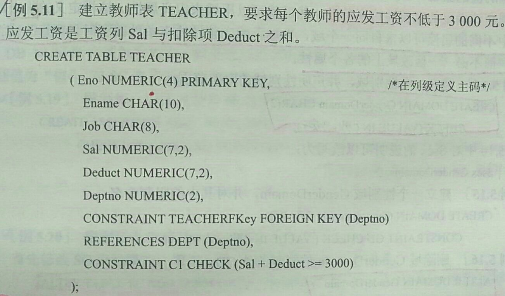

- **例题二： 修改** 

  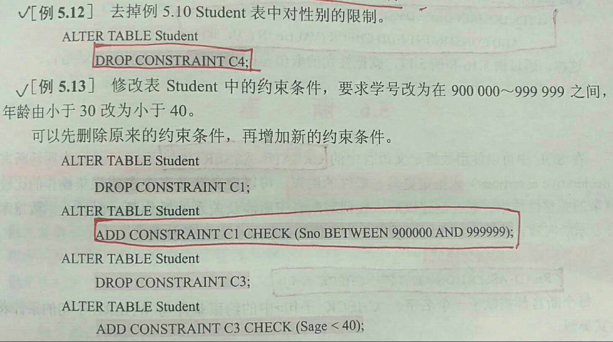

> - **域**中的完整性约束： `CREATE DOMAIN` 
>
>   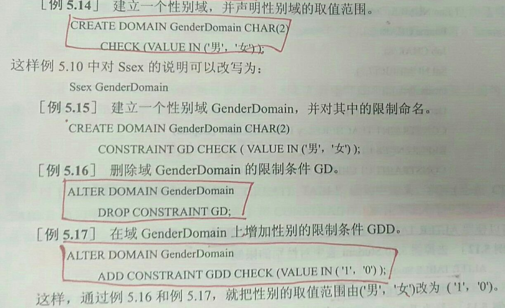

## 6. 断言

- **创建**： `CREATE ASSERTION  <断言名> <CHECK 子句>`

  > - 每个断言都被赋予一个名字
  > - 可以定义涉及多个表或者聚集操作的比较复杂的完整性约束条件
  > - 断言创建后，任何对断言中所涉及的操作都会触发关系数据库管理系统对断言的检查，使断言不为真值的操作都会被拒绝

- **删除**： `DROP ASSERTION <断言名>`

### ==例题== 

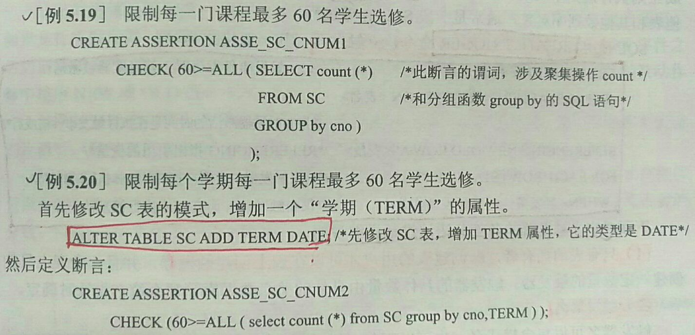

## 7. 触发器

- **触发器**： 是用户定义在关系表上的一类由事件驱动的特殊过程，又叫“事件 - 条件 - 动作”规则

  > 一旦定义，对表的增、删、改操作均由服务器自动激活相应的触发器，在 DBMS 核心层进行完整性控制

- **创建**：  

  ```mysql
  CREATE TRIGGER <触发器名>  
  { BEFORE|AFTER } <触发事件> ON <表名>
  FOR EACH { ROW|STATEMENT }
  [WHEN <触发条件>］<触发动作体>
  ```

  - **创建者**：表的拥有者，一个表上创建触发器的数目由具体的 DBMS 确定;

  - **表名**：触发器的目标表，不能定义在视图上

  - **触发事件**：`INSERT, DELETE, UPDATE, INSERT OR UPDATE, UPDATE OF <字段>`

  - **触发器类型**：执行次数会有所不同
    - 行级触发器 `FOR EACH ROW`
    - 语句级触发器 `FOR EACH STATEMENT`

  - **触发条件**： 省略WHEN触发条件: 触发动作在触发器激活后立即执行

  - **触发动作体**： 可以是一个匿名 SQL 过程块，也可以是对已创建存储过程的调用
    - 如果是**行级触发器**，可以在过程体中使用 `NEW和OLD` 引用 UPDATE/ INSERT 前后的旧值和新值
    - 如果是**语句级触发器**，则**不能**用 NEW和OLD 引用

- **激活**： 触发器的执行，是由触发事件激活的，并由数据库服务器自动执行

  > - 一个数据表上可能定义了多个触发器
  >
  > - 同一个表上的多个触发器激活时遵循如下的执行顺序：
  >
  >   - 执行该表上的 BEFORE 触发器
  >   - 激活触发器的 SQL 语句
  >   - 执行该表上的 AFTER 触发器
  >
  >   对于同一表上有多个触发器，遵循“谁先创建谁先执行” 的原则

- **删除**： `DROP TRIGGER <触发器名> ON <表名>;`

### ==例题== 

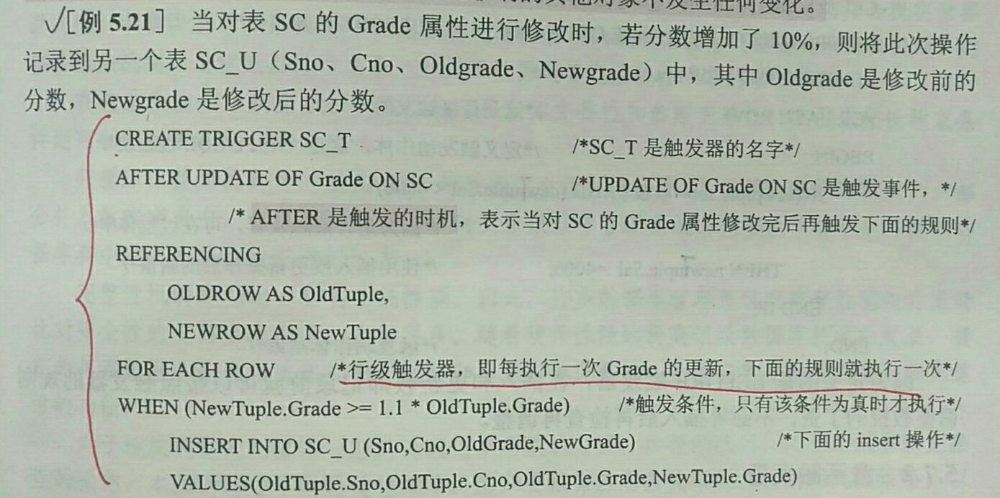

# 六、关系数据库理论

##1. 概述

- 对于 `R(U, D, DOM, F)`

  > - `R`： 关系名
  > - `U`： 组成该关系的属性名集合
  > - `D`： 属性组U中属性所来自的域
  > - `DOM`： 属性向域的映象集合
  > - `F`： 属性间数据的依赖关系集合

- 简化为一个三元组： `R(U,F)`

  > **当且仅当 U 上的关系 r 满足 F 时，r 称为关系模式 R(U,F) 的一个关系**

- **数据依赖**： 
  - 一个关系内部属性与属性之间的约束关系，通过属性间值的相等与否体现出来的数据间相关联系
  - 现实世界属性间相互联系的抽象
  - 数据内在的性质
  - 语义的体现

- **数据依赖的类型**： **函数依赖(FD) 和多值依赖(MVD)**

- **函数依赖**： 设 `R(U)` 是属性集 U 上的关系模式，X, Y 是 U 的子集，设 t,s 是关系 R 中的任意两个元组，若 t[X] = s[X]，则 t[Y] = s[Y]，那么称 X 函数确定 Y 或 Y 函数依赖于 X，记作 $X \to Y$

  > - **X 为决定因子，Y 为依赖因子**
  > - **非平凡函数依赖**：  $X \to Y，但 Y \not\subseteq X$
  > - **平凡函数依赖**： $X \to Y，但 Y \subseteq X$
  > - $若 X \to Y,  Y \to X,则 X \leftrightarrow Y$
  > - 若 Y 不函数依赖于 X，则 $X \not\to Y$
  > - **完全函数依赖**： 若 $X \to Y$，且 X 的任一真子集 $X^{'}$，有 $X^{'} \not\to Y$，记作 $X \to^{F}  Y$
  > - **部分函数依赖**： 若 $X \to Y$，但 Y 不安全函数依赖于 X，记作 $X \to^P Y$
  > - **传递函数依赖**： $X \to Y(Y \not\subseteq X), Y \not\to X, Y \to Z$，记作 $X \to^{传递} Z$ 

- **码**： 

  > - **候选码**： 若 $K \to^{F} U$，则 K 为 R 的候选码
  > - **超码**： 若 $K \to^{P} U$，候选码是最小的超码
  > - **主属性**： 包含在任何一个候选码中的属性
  > - **非主属性或非码属性**： 不包含在任何候选码中的属性
  > - **全码**：整个属性组是码
  > - **外码**： 关系模式 R 中属性或属性组 X 并非 R 的码，但 X 是另一个关系模式的码，则称 X 是 R 的外码

## 2. 范式

- **第一范式(1NF)**： 一个关系模式 R 的所有属性都是**不可分的基本数据项**

- **第二范式(2NF)**： 满足第一范式，且**每一个非主属性都完全函数依赖于码**

- **第三范式(3NF)**： 满足第一范式，且**不存在传递函数依赖** 

- **BC范式(BCNF)**： 满足第一范式，且**每个推导式都包含码**

  > 满足 BCNF 的关系模式：
  >
  > - 所有非主属性对每一个码都是完全函数依赖
  > - 所有主属性对每一个不包含它的码也是完全函数依赖
  > - 没有任何属性完全函数依赖于非码的任何一组属性
  >
  > 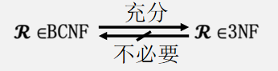

- **第四范式(4NF)**： 满足第一范式，且对于  v  R 的每个非平凡多值依赖 $X \to \to Y (Y \not\subseteq X)$，X 都含有码

- **第五范式(5NF)**： 

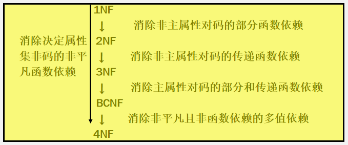

## 3. 数据依赖的公理系统

- **定义**： 对于满足一组函数依赖 F 的关系模式 R<U,F>，设 t,s 是关系 R 中的任意两个元组，若 t[X] = s[X]，则 t[Y] = s[Y]，称 F 逻辑蕴含 $X \to Y$ 

- **Armstrong 公理系统**： 设 U 为属性集总体，F 是 U 上的一组函数依赖

  - **自反律**： 若 $Y \subseteq X \subseteq U$，则 $X \to Y$ 为 F 所蕴涵

  - **增广律**： 若 $X \to Y$ 为 F 所蕴涵，且 $Z \subseteq U$，则 $XZ \to YZ$ 为 F 所蕴涵

  - **传递律**： 若 $X \to Y \, \, 及\,\, Y \to Z$ 为 F 所蕴涵，则 $X \to Z$ 为 F 所蕴涵

  - **有效性**： 由 F 出发根据 Armstrong 公理推到出来的每一个函数依赖一定在 $F^+$ 中

  - **完备性**： $F^+$ 中的每个函数依赖，必定可由 F 出发根据 Armstrong 公理推导出来

    > 证明： 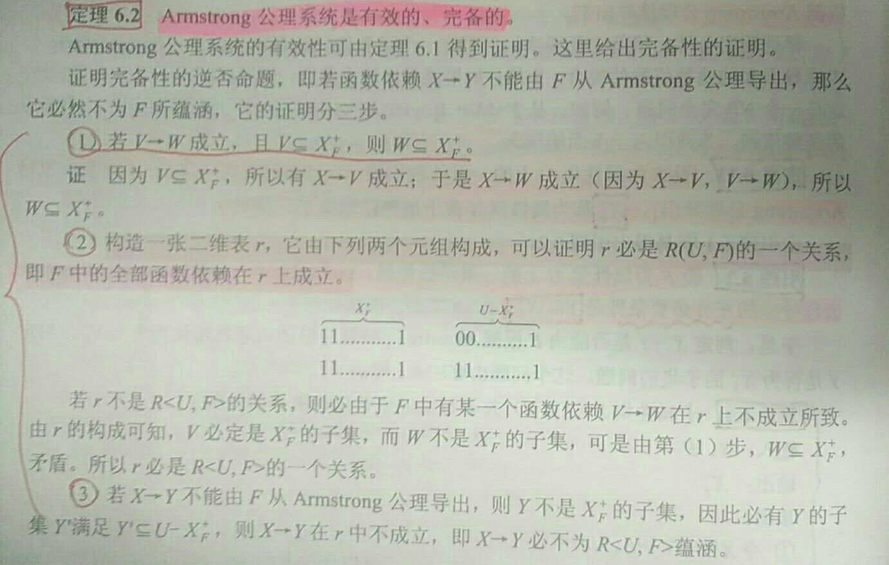

  > 三条推理规则： 
  >
  > - $X \to Y, X \to Z  \,\,\,\, \Rightarrow \,\,\,\,    X \to YZ$ 
  > - $X \to Y, WY \to Z \,\,\,\,  \Rightarrow \,\,\,\,  XW \to Z$ 
  > -  $X \to Y, Z \subseteq Y \,\,\,\,  \Rightarrow \,\,\,\,  X \to Z$

- **闭包**： 关系模式 R<U,F> 中为 F 所逻辑蕴涵的函数依赖的全体叫做 F 的**闭包**，记为 $F^+$
- 设 F 为属性集 U 上的一组函数依赖， $X, Y \subseteq U, \,\, X_F^+ = \{ A | X \to A 能由 \, F \, 根据 Armstrong 公理导出 \}$ ，则 $X_F^+$ 称为属性集 X 关于函数依赖集 F 的闭包

- 设 F 为属性集 U 上的一组函数依赖，$X,Y \subseteq U、X \to Y$ 能由 F 根据 Armstrong 公理导出的充分必要条件是 $Y \subseteq X_F^+$ 

- 若 $G^+ = F^+$，则说函数依赖集 F 覆盖 G(G 是 F 的覆盖，或 F 是 G 的覆盖)或 F 与 G 等价

- $F^+ = G^+$ 的充分必要条件是 $F^+ \subseteq G^+$ 和 $G^+ \subseteq F^+$ 

  >  证明： 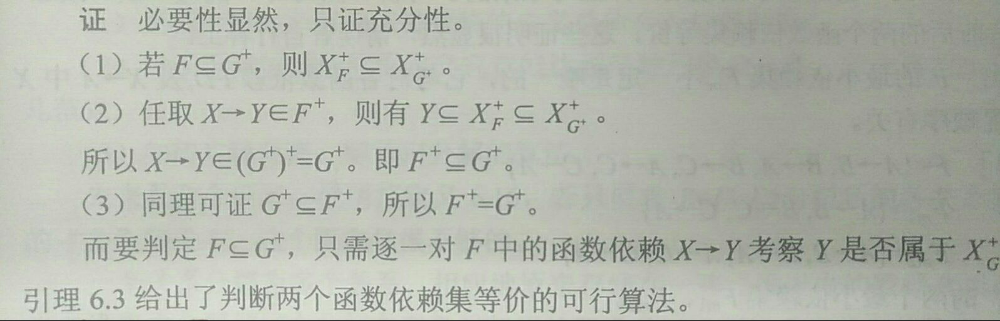

- **最小函数依赖集 F** 满足的条件： 

  - F 中任一函数依赖的右部仅含一个属性
  - F 中不存在这样的函数依赖 $X \to A$，使得 F 与 $F - \{ X \to A \}$ 等价
  - F 中不存在这样的函数依赖 $X \to A$，X 有真子集 Z 使得 $F - \{ X \to A \} \cup \{ Z \to A \}$ 与 F 等价 

- 每个函数依赖集 F 均等价于一个极小函数依赖集 $F_m$，$F_m$ 称为 F 的最小依赖集

  > 证明： 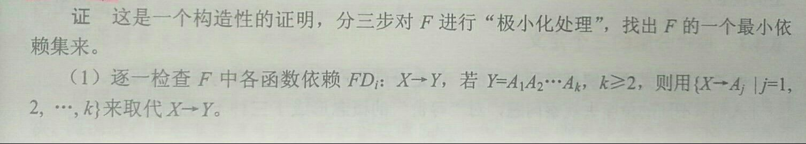
  >
  > 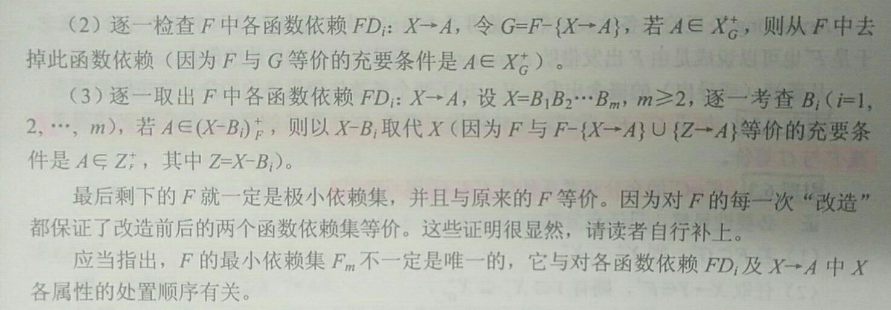

## 4. 模式分解

- 关系模式 R<U,F> 的一个**分解**指： $\rho = \{ R_1<U_1,F_1>,R_2<U_2,F_2>,...,R_n<U_n,F_n> \}$

  > 其中
  >
  > - $U = \bigcup_{i=1}^{2}U_i$ 
  > - $F_i$ 是 F 在 $U_i$ 上的投影
  >
  > 函数依赖集合 $\{ X \to Y | X \to Y \in F^+ \wedge XY \subseteq U_i \}$ 的一个覆盖 $F_i$ 叫做 F 在属性 $U_i$ 上的投影

- 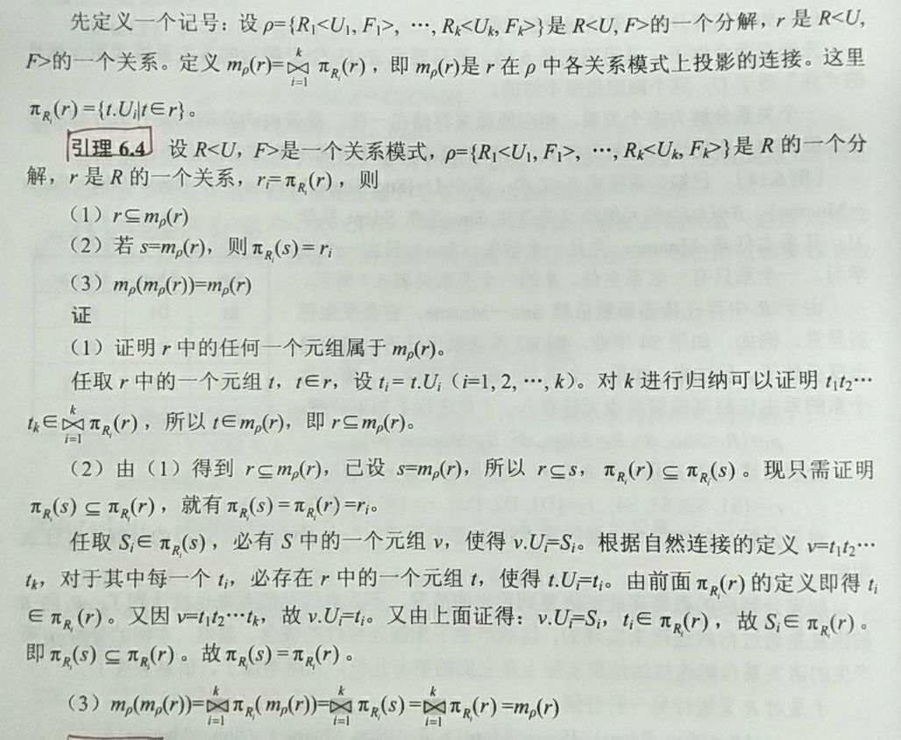

- **无损分解**： 对 R<U,F> 的任何一个关系 r 均有 $r = m_\rho(r)$ 成立，则称分解 $\rho$ 具有无损连接性

  即**分解后能否恢复**

  > - 对于分解 $\rho$ ，若 $U_1 \cap U_2 \to U_1 - U_2 \in F^+$ 或 $U_1 \cap U_2 \to U_2 - U_1 \in F^+$，则 $\rho$ 具有无损连接性 
  >
  > - 判断分解的无损连接性算法： 
  >
  >   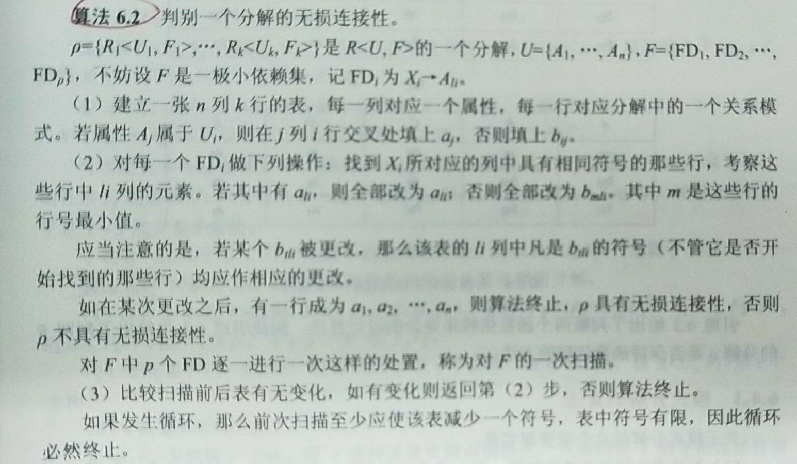

- **保持函数依赖**： 若 $F^+ = (\bigcup^k_{i = 1} F_i)^+$，则称分解 $\rho$ 保持函数依赖 

  即**分解前后的语义是否一致**

## ==例题== 

- **例题一**： 

  **问题描述**： 

  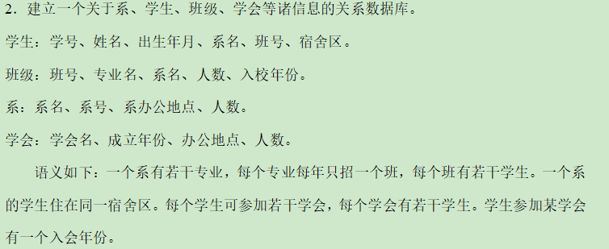

  **问题解答**： 

  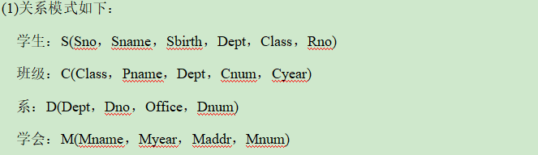

  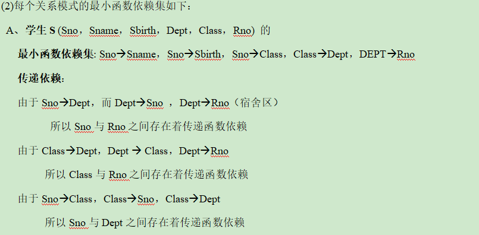

  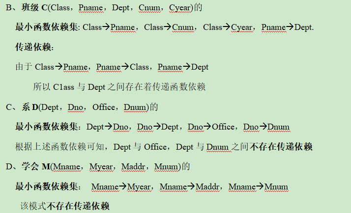

  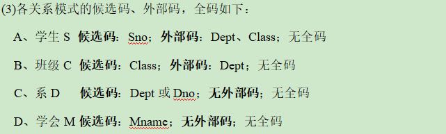

- **例题二**： 

  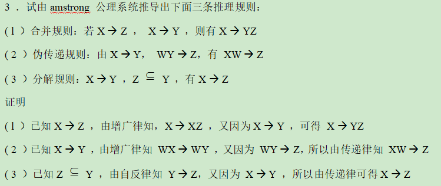

- **例题三**： 求属性集 $X(X \subseteq U)$ 关于 U 上的函数依赖集 F 的闭包 $X^+_F$ 

  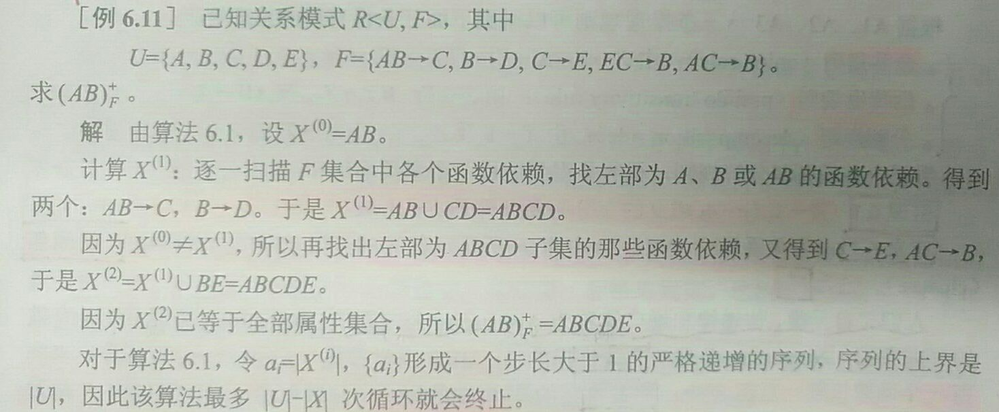

- **例题四**： 

  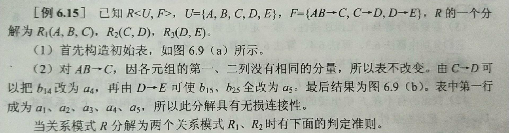

  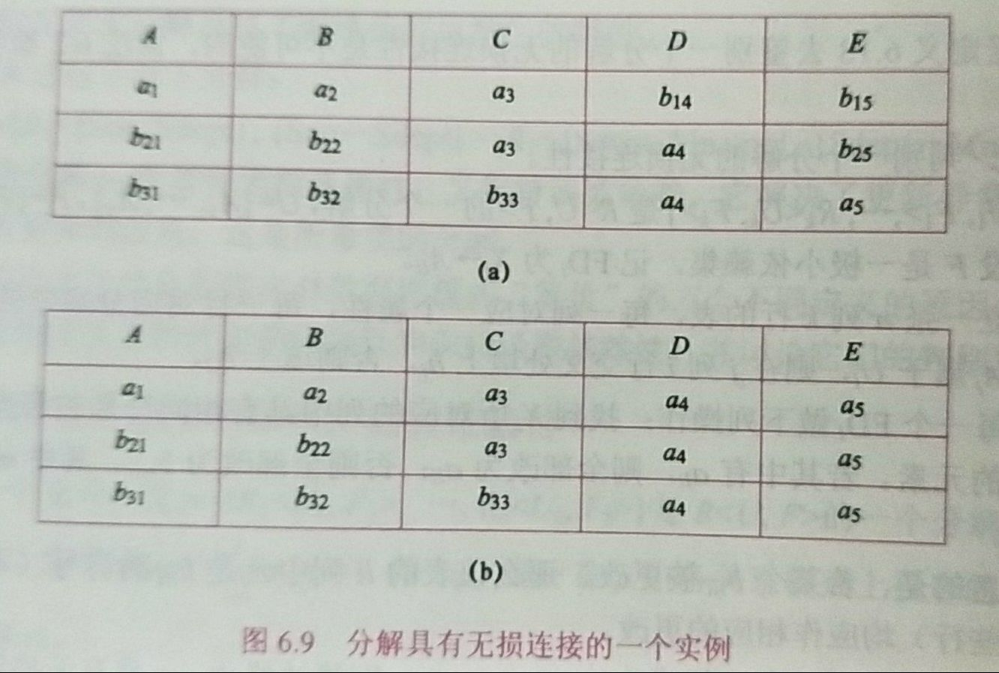


# 七、关系查询处理和查询优化

## 1. 关系数据库系统的查询处理

查询处理的四个阶段 ：

- **查询分析**： 对查询语句进行扫描、词法分析和语法分析

  > - 词法分析：从查询语句中识别出正确的语言符号，如SQL关键字、属性名和关系名等
  > - 语法分析 ：进行语法检查，判断查询语句是否符合SQL语法规则

- **查询检查**： 查询检查的任务为有效性检查、视图转换、安全性检查、完整性初步检查

- **查询优化**： 选择一个高效执行的查询处理策略

  > - 查询优化分类：
  >   - **代数优化**：指关系代数表达式的优化
  >   - **物理优化**：指存取路径和底层操作算法的选择
  > - 查询优化方法选择的依据：**基于规则、基于代价、基于语义**

- **查询执行**： 依据优化器得到的执行策略生成查询计划，**代码生成器**生成执行查询计划的代码 

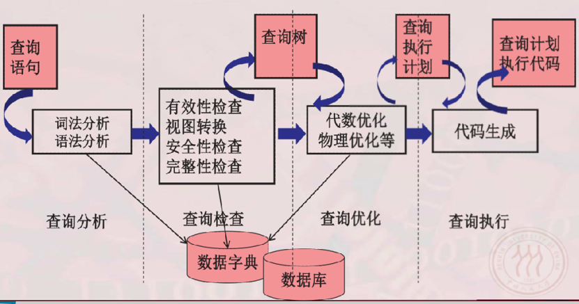

## 2. 查询优化

- **不同数据库的执行代价**：  

  - **集中式数据库**： 磁盘存取块数(I/O代价)、 处理机时间(CPU代价)、查询的内存开销 

    > I/O 代价是最主要的，因此在计算查询代价时，一般用查询处理的块数作为衡量单位

  - **分布式数据库**：  **总代价 = I/O代价 + CPU代价 + 内存代价＋通信代价** 

- **查询优化的总目标**：
  - 选择有效的策略
  - 求得给定关系表达式的值
  - 使得查询代价最小

- **查询优化的重要性**： 
  - 减轻了用户选择存取路径的负担
  - 提高了查询效率
- **查询优化的可能性**：

  - 优化器可以从数据字典中获取许多统计信息，并根据这些信息选择有效的执行计划，而用户程序则难以获得这些信息
  - 若数据库的物理统计信息改变，则系统可以自动对查询进行重新优化以选择相适应的执行计划
  - 优化器可以考虑多种不同的执行计划，而程序员一般只能考虑有限的几种可能性
  - 优化器包括很多复杂的优化技术，系统的自动优化相当于使得所有人都拥有这些优化技术

- **查询树的启发式优化(一般准则)**： 
  - 选择运算应尽可能先做(最重要、最基本)
  - 把投影运算和选择运算同时进行
  - 把投影同其前或其后的双目运算结合起来
  - 把某些选择同在它前面要执行的笛卡尔积结合起来成为一个连接运算
  - 找出公共子表达式

- **查询优化的一般步骤**： 
  - 把查询转化成某种内部表示，通常用的内部表示是语法树
  - 把语法树转换标准（优化）形式，即利用优化算法，把原始的语法树转换成优化的形式
  - 选择低层的存取路径
  - 生成查询计划，选择代价最小的

### 1. 代数优化

- **代数优化**： 通过对关系代数表达式的等价变换来提高查询效率

- 常用的等价变换规则：

  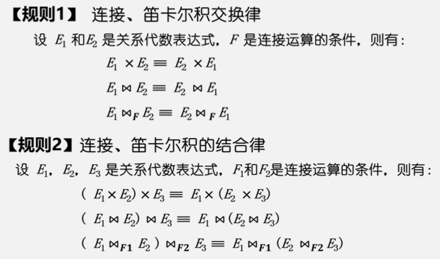

  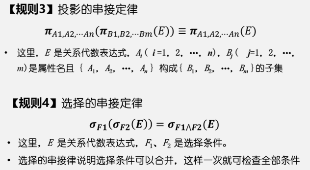

  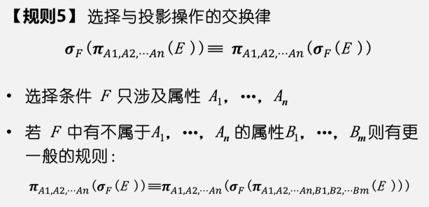

  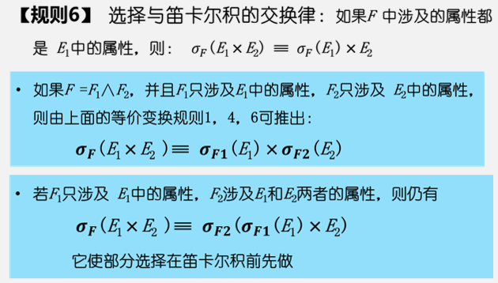

  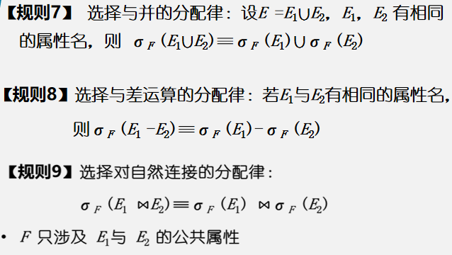

  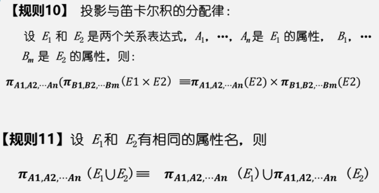


#### ==例题== 

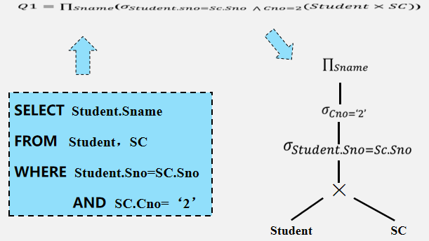

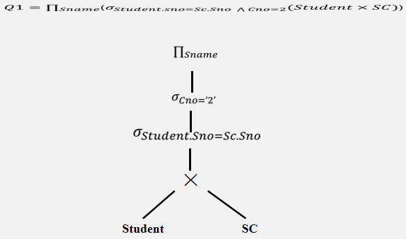

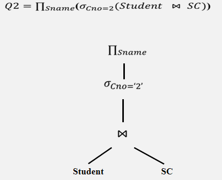

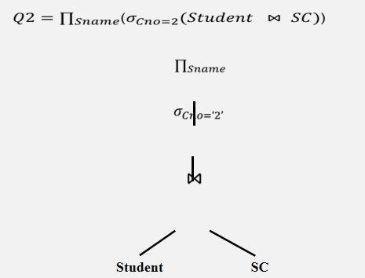

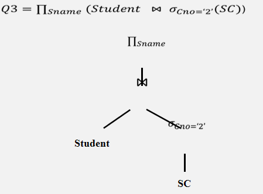

---

#### ==练习==

- **练习一**：

  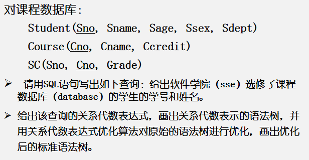

- **练习二**： 

  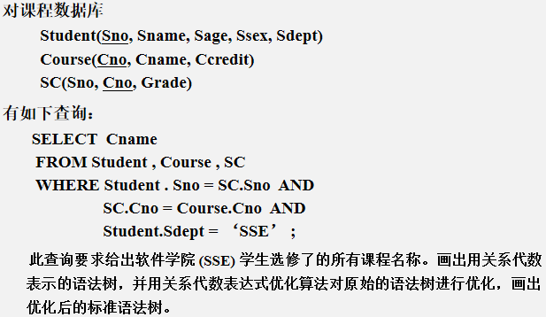

### 2. 物理优化

- **物理优化**： 选择高效合理的操作算法或存取路径，求得优化的查询计划

- **选择的方法**： 

  - **基于规则的启发式优化**

    > - 选择操作的启发式规则 
    >
    >   > 对于**小关系**，使用全表顺序扫描，即使选择列上有索引
    >   >
    >   > 对于**大关系**，启发式规则有： 
    >   >
    >   > - 对于选择条件是 "主码＝值" 的查询，查询结果最多是一个元组，可以选择主码索引
    >   >
    >   >   > 一般的DBMS会自动建立主码索引
    >   >
    >   > - 对于选择条件是 “非主属性＝值” 的查询，并且选择列上有索引，则要估算查询结果的元组数目： 如果比例较小(<10%)可以使用索引扫描方法； 否则还是使用全表顺序扫描
    >   >
    >   > - 对于选择条件是属性上的非等值查询或者范围查询，并且选择列上有索引，也要要估算查询结果的元组数目： 如果比例较小(<10%)可以使用索引扫描方法；否则还是使用全表顺序扫描
    >   >
    >   > - 对于用 AND 连接的合取选择条件：
    >   >
    >   >   - 如果有涉及这些属性的组合索引： 优先采用组合索引扫描方法
    >   >   - 如果某些属性上有一般的索引： 则用索引扫描方法，否则使用全表顺序扫描
    >   >
    >   > - 对于用 OR 连接的析取选择条件，一般使用全表顺序扫描
    >
    > - 连接操作的启发式规则
    >
    >   > - 如果两个表都已经按照连接属性排序：选用排序-合并方法
    >   > - 如果一个表在连接属性上有索引： 选用索引连接方法
    >   > - 如果上面两个规则都不适用，其中一个表较小： 选用 Hash join 方法
    >   > - 最后可以选用嵌套循环方法，并选择其中占用的块数较少的表，作为外表(外循环的表)

  - **基于代价估算的优化**

    > - **统计信息**：
    >
    >   - **对每个基本表**： 该表的元组总数(N)、元组长度(l)、占用的块数(B)、占用的溢出块数(BO)
    >
    >   - **对基表的每个列**： 该列不同值的个数(m)、选择率(f)、该列最大值、该列最小值、该列上是否已经建立了索引、索引类型(B+树索引、Hash索引、聚集索引)
    >
    >     > 选择率(f)：
    >     >
    >     > - 如果不同值的分布是均匀的，`f＝1/m`
    >     >
    >     > - 如果不同值的分布不均匀，则`每个值的选择率＝具有该值的元组数/N`
    >
    >   - **对索引**： 索引的层数(L)、不同索引值的个数、索引的选择基数S(有S个元组具有某个索引值)、索引的叶结点数(Y) 
    >
    > - **代价估算示例**： ==P286== 
    >
    >   - **全表扫描算法的代价估算公式**：
    >     - 如果基本表大小为B块，全表扫描算法的代价 `cost＝B`
    >     - 如果选择条件是码＝值，那么平均搜索代价 `cost＝B/2`
    >   - **索引扫描算法的代价估算公式**： 
    >   - **嵌套循环连接算法的代价估算公式**
    >   - **排序-合并连接算法的代价估算公式**

  - **两者结合的优化方法**

# 八、数据库恢复技术

## 1. 事务的概念与特性

- **事务**： 定义的一个数据库操作序列，是一个不可分割的工作单位，也是恢复和并发控制的基本单位
- **事务定义语句**： 
  - `BEGIN TRANSACTION`： 为事务的开始
  - `COMMIT`： 提交事务的所有操作
  - `ROLLBACK`： 当出现错误时，将已完成操作全部撤销，回滚到事务开始时的状态

- **定义方式**： 
  - **显示定义**： 显示调用数据库定义语句
  - **隐式定义**： 系统按默认规则自动进行

- **事务的 ACID 特性**：

  - **原子性(A)**： 事务中的操作要么全做，要么全不做

    > - 系统崩溃后，DBMS 将恢复或撤销系统崩溃时处于活动状态的事务对数据库产生的影响，从而保证事务的原子性
    > - 事务原子性由事务管理部件处理
    > - **原子性由系统保障**

  - **一致性(C)**： 事务执行的结果必须是使数据库从一个一致性状态变到另一个一致性状态

    > - **一致性由用户和程序员保障**

  - **隔离性(I)**： 一个事务的执行不能被其它事务干扰

  - **永久性(D)**： 事务一旦提交，对数据库的改变永久地留在数据库中

## 2. 故障的种类

- **事务内部的故障**： 有的是可以通过事务程序本身发现的、有的是非预期的

- **系统故障**： 称为软故障，是指造成系统停止运转的任何事件，使得系统要重新启动

  > - 整个系统的正常运行突然被破坏
  > - 所有正在运行的事务都非正常终止
  > - 不破坏数据库
  > - 内存中数据库缓冲区的信息全部丢失
  >
  > 系统故障的常见原因： 
  >
  > - 特定类型的硬件错误（如CPU故障）
  > - 操作系统故障
  > - DBMS 代码错误
  > - 系统断电
  >
  > 系统故障的恢复： 
  >
  > - 发生系统故障时，**事务未提交**
  >
  >   恢复策略：**强行撤消（UNDO）**所有未完成事务
  >
  > - 发生系统故障时，**事务已提交**，但缓冲区中的信息尚未完全写回到磁盘上
  >
  >   恢复策略：**重做（REDO）**所有已提交的事务

- **介质故障**： 称为硬故障，指外存故障，如：磁盘损坏、磁头碰撞、操作系统的潜在错误、瞬时强磁场干扰

  > 介质故障的恢复： 
  >
  > - 装入数据库发生介质故障前某个时刻的数据副本
  > - 重做自此时始的所有成功事务，将这些事务已提交的结果重新记入数据库

- **计算机病毒**

## 3. 恢复的实现技术

- **数据转储**： 指 DBA 将整个数据库复制到磁带或磁盘上保存起来的过程，备用的数据称为后备副本或后援副本

  > 重装后备副本只能将数据库恢复到转储时的状态
  >
  > - **静态转储**： 在系统中无运行事务时进行的转储操作
  >
  >   - 转储开始时数据库处于一致性状态
  >   - 转储期间不允许对数据库的任何存取、修改活动
  >   - 得到的一定是一个数据一致性的副本 
  >
  >   > - **优点**：实现简单
  >   >
  >   > - **缺点**：降低了数据库的可用性
  >   >
  >   >   > - 转储必须等待正运行的用户事务结束 
  >   >   > - 新的事务必须等转储结束
  >
  > - **动态转储**： 转储操作与用户事务并发进行转储期间允许对数据库进行存取或修改
  >
  >   > - **优点**： 
  >   >   - 不用等待正在运行的用户事务结束
  >   >
  >   >   - 不会影响新事务的运行
  >   > - **缺点**： 不能保证副本中的数据正确有效
  >   > - 利用动态转储得到的副本进行故障恢复： 
  >   >   - 需要把动态转储期间各事务对数据库的修改活动登记下来，建立日志文件
  >   >   - 后备副本加上日志文件才能把数据库恢复到某一时刻的正确状态
  >
  > - **海量转储**: 每次转储全部数据库
  >
  > - **增量转储**: 只转储上次转储后更新过的数据
  >
  > 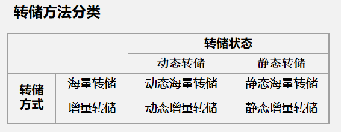

- **登记日志文件**： 日志文件是用来记录事务对数据库的更新操作的文件

  - **日志文件的格式和内容**： 

    - **日志文件的格式**： 

      - 以记录为单位的日志文件

        > - 各个事务的开始标记(BEGIN TRANSACTION)
        > - 各个事务的结束标记(COMMIT或ROLLBACK)
        > - 各个事务的所有更新操作

      - 以数据块为单位的日志文件

        > - 事务标识（标明是那个事务）
        > - 被更新的数据块

    - **记录内容**： 

      - 事务标识（标明是哪个事务） 
      - 操作类型（插入、删除或修改）
      - 操作对象（记录内部标识）
      - 更新前数据的旧值（对插入操作而言，此项为空值）
      - 更新后数据的新值（对删除操作而言, 此项为空值）

  - **日志文件的作用**： 

    - 进行事务故障恢复
    - 进行系统故障恢复
    - 协助后备副本进行介质故障恢复

  - **登记日志文件**： 遵循的基本准则

    - 登记的次序严格按事务执行的时间次序

    - 必须先写日志文件，后写数据库

      > - **写日志文件操作**：把表示这个修改的日志记录写到日志文件
      > - **写数据库操作**：把对数据的修改写到数据库中

## 4. 恢复策略

- **事务故障的恢复**： 事务在运行至正常终止点前被终止

  > - **恢复方法**:
  >
  >   - 由恢复子系统应利用日志文件撤消（UNDO）此事务已对数据库进行的修改
  >   - 事务故障的恢复由系统自动完成，对用户是透明的，不需要用户干预
  >
  > - **恢复步骤**： 
  >
  >   - 反向扫描文件日志（即从最后向前扫描日志文件），查找该事务的更新操作
  >
  >   - 对该事务的更新操作执行逆操作，即将日志记录中“更新前的值” 写入数据库
  >
  >     > - 插入操作： “更新前的值”为空，则相当于做删除操作
  >     > - 删除操作： “更新后的值”为空，则相当于做插入操作
  >     > - 修改操作： 则相当于用修改前值代替修改后值
  >
  >   - 继续反向扫描日志文件，查找该事务的其他更新操作，并做同样处理
  >
  >   - 如此处理下去，直至读到此事务的开始标记，事务故障恢复就完成了

- **系统故障的恢复**： 由系统在重新启动时自动完成，不需要用户干预

  > - **恢复方法**： 
  >
  >   - Undo 故障发生时未完成的事务
  >
  >   - Redo 已完成的事务
  >
  > - **恢复步骤**： 
  >
  >   - **正向扫描日志文件**
  >
  >     > - 重做(REDO) 队列： 在故障发生前已经提交的事务
  >     > - 撤销 (Undo)队列： 故障发生时尚未完成的事务
  >
  >   - **对撤销(Undo)队列事务进行撤销(UNDO)处理**
  >
  >     > 反向扫描日志文件，对每个UNDO事务的更新操作执行逆操作
  >
  >   - **对重做(Redo)队列事务进行重做(REDO)处理**
  >
  >     > 正向扫描日志文件，对每个REDO事务重新执行登记的操作

- **介质故障的恢复**： 

  > - **恢复方法**： 
  >
  >   - 重装数据库
  >   - 重做已完成的事务
  >
  > - **恢复步骤**： 
  >
  >   - 装入最新的后备数据库副本，使数据库恢复到最近一次转储时的一致性状态
  >
  >   - 装入有关的日志文件副本，重做已完成的事务
  >
  >     > - 首先扫描日志文件，找出故障发生时已提交的事务的标识，将其记入重做队列
  >     > - 然后正向扫描日志文件，对重做队列中的所有事务进行重做处理

## 5. 具有检查点的恢复技术

- **具有检查点的恢复技术**： 

  - 在日志文件中增加检查点记录
  - 增加重新开始文件
  - 恢复子系统在登录日志文件期间动态地维护日志

  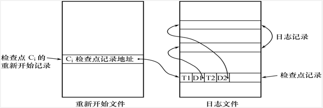

- **检查点记录内容**： 

  - 建立检查点时刻所有正在执行的事务清单

  - 这些事务的最近一个日志记录的地址

- **检查点技术优点**： 

  - 缩短日志扫描时间
  - 已写入数据库的更新操作不用重做

- **动态维护日志文件的方法**： 

  - 将当前日志缓冲区中的所有日志记录写入磁盘的日志文件上
  - 在日志文件中写入一个检查点记录
  - 将当前数据缓冲区的所有数据记录写入磁盘的数据库中
  - 把检查点记录在日志文件中的地址写入一个重新开始文件

- **使用检查点恢复步骤**：

  - 从重新开始文件中找到最后一个检查点记录在日志文件中的地址，由该地址在日志文件中找到最后一个检查点记录

  - 由该检查点记录得到检查点建立时刻所有正在执行的事务清单 `ACTIVE-LIST`

    > 建立两个事务队列
    >
    > - `UNDO-LIST`
    > - `REDO-LIST`
    >
    > 把 `ACTIVE-LIST` 暂时放入 `UNDO-LIST` 队列，`REDO-LIST` 队列暂为空

  - 从检查点开始正向扫描日志文件，直到日志文件结束

  - 对 `UNDO-LIST` 中的每个事务执行 `UNDO` 操作，对 `REDO-LIST` 中的每个事务执行 `REDO` 操作

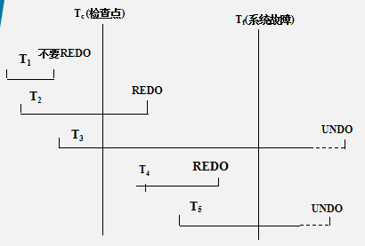

## 6. 数据库镜像

- 数据库镜像： 

  - DBMS 自动把整个数据库或其中的关键数据复制到另一个磁盘上
  - DBMS 自动保证镜像数据与主数据库的一致性 , 当主数据库更新时，DBMS 自动把更新后的数据复制过去

  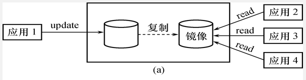


- **没有出现故障时**： 可用于并发操作

- **出现介质故障时**：

  - 可由镜像磁盘继续提供使用 
  - 同时 DBMS 自动利用镜像磁盘数据进行数据库的恢复
  - 不需要关闭系统和重装数据库副本

  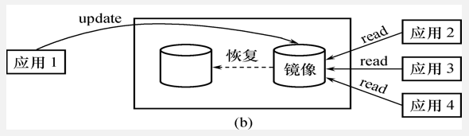

- **冗余磁盘阵列(RAID)**： 将一组磁盘驱动器用某种逻辑方式联系起来，作为逻辑上的一个磁盘驱动器来使用

  > - **优点**： 
  >
  >   - 成本低，功耗小，传输速率高 
  >
  >   - 可以提供容错功能 
  >
  >   - 具备数据校验功能 
  >
  > - **RAID 的分级**： 
  >
  >   - `RAID 0`： 无冗余无校验的磁盘阵列，并行读/写于多个磁盘上
  >
  >   - `RAID 1`： 镜象磁盘阵列，成对的独立磁盘上产生互为备份的数据
  >
  >   - `RAID 10`： 在分割数据且并行读/写多个磁盘的同时，为每块磁盘做磁盘镜像
  >
  >     > - `RAID 10` 至少使用4个硬盘
  >     > - `RAID 10` 是存储性能和数据安全兼顾的方案
  >
  >   - `RAID 2`：纠错海明码磁盘阵列
  >
  >   - `RAID 3/ RAID 4`：奇校验或偶校验的磁盘阵列
  >
  >   - `RAID 5`：无独立校验盘的奇偶校验磁盘阵列
  >
  >   - `RAID 6`：与RAID 5相比，RAID 6增加了第2个独立的奇偶校验信息块
  >
  >   - `RAID 7`：优化的高速数据传送磁盘结构

## ==例题== 

- **日志记录**： 

  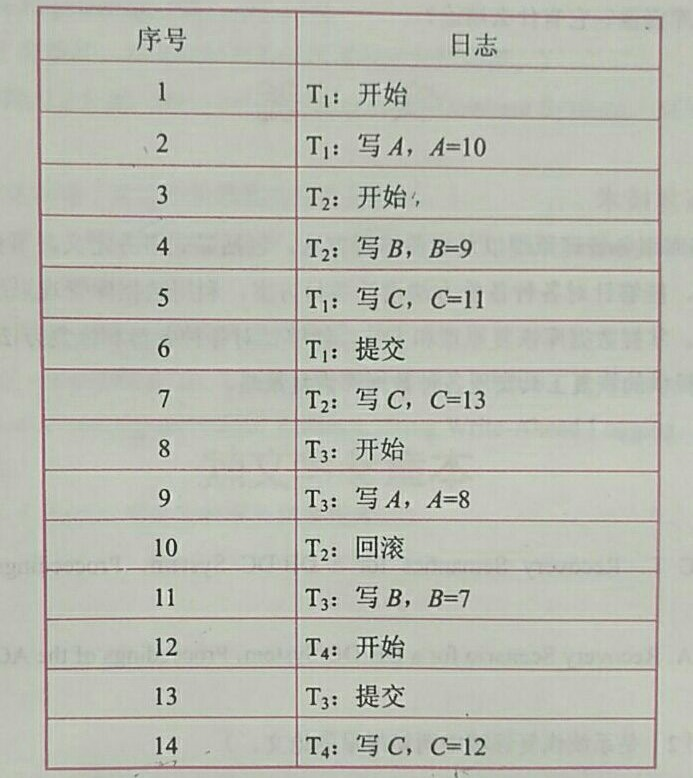

- **例题一**： 

  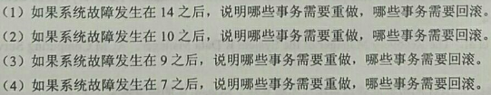

- **例题二**： 

  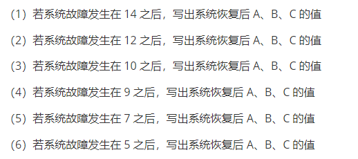


# 九、并发控制

## 1. 概述

- **不同的多事务执行方式**： 

  - **事务串行执行**： 每个时刻只有一个事务运行

  - **交叉并发方式**： 并行事务的并行操作轮流交叉运行
  - **同时并发方式**： 每个处理机可以运行一个事务，多个处理机可以同时运行多个事务

- **并发控制原因**： 防止多个事务并发存取数据库时产生的同时读取和/或修改同一数据而造成的数据不一致性

- 并发控制能保证事务的一致性，**事务是并发控制的基本单位**

- **事务并发执行带来的数据不一致问题**： 

  - **丢失修改**： 事务 T1 和 T2 读入同一数据并修改，T2 提交的结果破坏 T1 的提交，导致 T1 的修改被丢失

  - **不可重复读**： 事务 T1 读取数据后，事务 T2 执行更新操作，使 T1 无法再现前一次读取结果

    > 包含三种情况： 后两种不可重复读有时也称为**幻影现象**
    >
    > - 事务 T1 读取某数据后，事务 T2 对其**修改**，当事务 T1 再次读该数据时，得到与前一次不同的值
    > - 事务 T1 读取某数据后，事务  T2 **删除**其中部分记录，当 T1 再次读该数据时，发现某些记录消失
    > - 事务 T1 读取某数据后，事务 T2 **插入**一些记录，当 T1 再次读该数据时，发现多了一些记录

  - **读脏数据**： 事务 T2 读取事务 T1 修改的数据后，数据库回滚到 T1 修改前，则 T2 读取的数据即为脏数据

  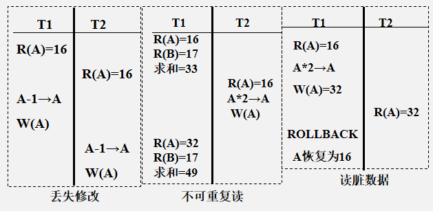

## 2. 封锁

- **封锁**： 事务 T 在对某个数据对象操作之前，先向系统发出请求，对其加锁

  > 加锁后事务 T 就对该数据对象有了一定的控制，在事务 T 释放锁之前，其它的事务不能更新此数据对象

- **封锁类型**： 

  - **排它锁(X锁)**： 又称**写锁**，若事务 T 对数据对象 A 加上 X 锁，则只允许 T 读取和修改 A
  - **共享锁(S锁)**： 又称**读锁**，若事务 T 对数据对象 A 加上 S 锁，则其它事务只能读取 A，不能修改 A

  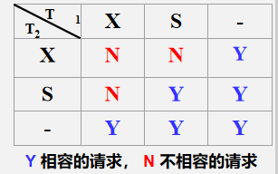

- **封锁协议**：

  - **一级封锁协议**：事务 T 在修改数据 A 之前，先对其加 X 锁，直到事务结束才释放

    > **解决了丢失修改问题**

  - **二级封锁协议**：事务 T 在读数据 A 之前，先对其加 S 锁，读完后释放

    > **解决了丢失修改与读脏数据问题**

  - **三级封锁协议**：事务 T 在读数据 A 之前，先对其加 S 锁，直到事务结束后释放

    > **解决了丢失修改、读脏数据、不可重复读问题**

  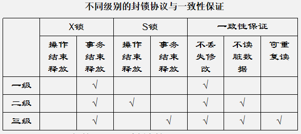

## 3. 活锁和死锁

### 1. 活锁

- 事务 T1 封锁了数据 R
- 事务 T2 又请求封锁 R，于是 T2 等待
- T3 也请求封锁 R，当 T1 释放了 R 上的封锁之后系统首先批准了 T3 的请求，T2 仍然等待
- T4 又请求封锁 R，当 T3 释放了 R 上的封锁之后系统又批准了T4的请求……
- T2 有可能永远等待，这就是活锁的情形 

**避免活锁**：采用**先来先服务**的策略

### 2. 死锁

- **死锁**： 多个事务因竞争资源而出现的互相等待现象

- **死锁的预防**： 

  - **一次封锁法**： 要求每个事务必须一次将所有要使用的数据全部加锁，否则不能继续执行
  - **顺序封锁法**： 预先对数据对象规定一个封锁顺序，所有事物都按该顺序实施封锁

- **破坏死锁产生条件的预防方法**： 

  - **破坏互斥条件**：让资源允许共享
  - **破坏不可剥夺条件**：有两种方法
    - ① 当其申请的资源得不到满足时，放弃其原先占有的资源
    - ② 高优先级进程申请的资源被占用时，将强迫该低优先级进程放弃已占有资源
  - **破坏零散请求条件**：采用静态分配策略，即当一个进程在得到其所需要的所有资源之后才执行
  - **破坏循环等待条件**：按照资源的特性，给资源从小到大编号，进程必须按照从小到大的顺序申请资源，且规定进程占有的资源号必须小于申请的资源号才能提出申请

- **死锁的诊断**： 

  - **超时法**： 若事务等待时间超过规定时限，就认为发生死锁

    > - 时间设置短，容易误判
    > - 时间设置长，死锁不能及时发现

  - **等待图法**： 采用`有向图 G = (T, U)`

    - `T`： 为结点集合，每个结点表示正在运行的事务
    - `U`： 为边的集合，每条边表示事务等待的情况

    > 若 T1 等待 T2，则画一条从 T1 指向 T2 的边

## 4. 并发调度的可串行性

- **可串行化调度**： 多个事务的并发执行正确，当且仅当其结果与按某一次序串行执行这些事务时的结果相同

  > - **可串行性是并发事务正确调度的准则**
  >
  > - 一个给定的并发调度，当且仅当它是可串行化的，才认为是正确调度

- **冲突可串行化调度**： 调度 Sc 在保证冲突操作次序不变的情况下，通过交换两个事务不冲突操作的次序得到另一个调度 Sc'，如果 Sc' 是串行的，称调度 Sc 为冲突可串行化的调度

  > 一个调度是冲突可串行化，一定是可串行化的调度

- **冲突操作**： 指不同的事务对同一个数据的读写操作和写写操作

## 5. 两段锁封锁协议

- **封锁协议**：运用封锁方法时，对数据对象加锁时需要约定一些规则：
  - 何时申请封锁
  - 持锁时间
  - 何时释放封锁

- **两段锁协议(2PL)**： 指所有事务必须分两个阶段对数据项加锁和解锁

  - **获得封锁(扩展阶段)**： 在对任何数据进行读、写操作之前，事务首先要获得对该数据的封锁
  - **释放封锁(收缩阶段)**： 在释放一个封锁之后，事务不再申请和获得任何其他封锁

  

- 若并发的事务都遵守 2PL， 则这些事务的任何并发调度都是可串行化的

  

- **严格两段锁协议**：满足两段锁协议的同时，还要求事务的排它锁必须在事务提交之后释放 

  > 避免脏读问题

- **强两段锁协议**：满足两段锁协议的同时，还要求事务的所有锁都必须在事务提交之后释放

## 6. 封锁的粒度

###1. 概述

- **封锁粒度**： 封锁对象的大小

  > **封锁的对象：逻辑单元，物理单元** 

- **选择封锁粒度原则**： 

  - 封锁粒度与系统的并发度和并发控制的开销密切相关

    > - 封锁的粒度越大，数据库所能够封锁的数据单元就越少，并发度就越小，系统开销也越小
    > - 封锁的粒度越小，并发度较高，但系统开销也就越大

  - 同时考虑封锁开销和并发度两个因素，适当选择封锁粒度

    > - 需要处理多个关系的大量元组的用户事务：以数据库为封锁单位
    > - 需要处理大量元组的用户事务：以关系为封锁单元
    > - 只处理少量元组的用户事务：以元组为封锁单位

### 2. 多粒度封锁

- **多粒度封锁**： 在一个系统中同时支持多种封锁粒度供不同的事务选择

- **多粒度树**：以树形结构来表示多级封锁粒度，根结点是整个数据库，表示最大的数据粒度，叶结点表示最小的数据粒度

  - 允许多粒度树中的每个结点被独立地加锁
  - 对一个结点加锁意味着这个结点的所有后裔结点也被加以同样类型的锁

  

- 数据对象的封锁方式：

  - **显式封锁**： 直接加到数据对象上的封锁
  - **隐式封锁**： 该数据对象没有独立加锁，是由于其上级结点加锁而使该数据对象加上了锁

- 对某个数据对象加锁，系统要检查： 
  - **该数据对象**： 有无显式封锁与之冲突
  - **所有上级结点**： 检查本事务的显式封锁是否与该数据对象上的隐式封锁冲突
  - **所有下级结点**： 看上面的显式封锁是否与本事务的隐式封锁冲突

### 3. 意向锁

- **意向锁**： 
  - 对一个结点加意向锁，则说明该结点的下层结点正在被加锁
  - 对任一结点加基本锁，必须先对它的上层结点加意向锁
- **意向锁目的**： 提高对某个数据对象加锁时系统的检查效率

- **常用意向锁**： 

  - **意向共享锁(IS锁)**： 如果对一个数据对象加 IS锁，表示它的后裔结点拟（意向）加 S 锁
  - **意向排它锁(IX锁)**： 如果对一个数据对象加 IX锁，表示它的后裔结点拟（意向）加 X 锁
  - **共享意向排它锁(SIX锁)**： 如果对一个数据对象加 SIX锁，表示先加 S 锁，再加 IX 锁

  

- **锁的强度**： 指它对其他锁的排斥程度

- 申请封锁时应该按自上而下的次序进行，释放封锁时则应该按自下而上的次序进行

- 具有意向锁的多粒度封锁方法，提高了系统的并发度，减少了加锁和解锁的开销

# 十、数据库设计

## 1.  数据库设计概述
- **数据库应用系统**： 数据库领域内，使用数据库的各类信息系统

- **数据库设计**： 

  - 广义的讲，是数据库及其应用系统的设计，即设计整个数据库应用系统
  - 狭义的讲，是设计数据库本身，即设计数据库的各级模式并建立数据库

- **数据库设计定义**： 

  - 是指对于一个给定的应用环境，构造（设计）优化的数据库逻辑模式和物理结构
  - 并据此建立数据库及其应用系统，使之能够有效地存储和管理数据
  - 满足各种用户的应用需求，包括“信息管理要求”和“数据操作要求”

  > - 信息管理要求： 指在数据库中应该存储和管理哪些数据对象
  > - 数据操作要求： 指对数据对象需要进行哪些操作

- **数据库设计目标**： 为用户和各种应用系统提供一个信息基础设施和高效率的运行环境

  > **高效的运行环境**： 指数据库数据的存储效率、数据库存储空间的利用率、数据库系统运行管理的效率都很高

- **数据库设计的特点**： 

  - 数据库建设的基本规律： **三分技术，七分管理，十二分基础数据**

    > 十二分基础数据： 强调了数据的收集、整理、组织和不断更新是数据库建设的重要环节

  - 结构(数据)设计和行为(处理)设计相结合： **将数据库设计和应用程序的设计密切结合**

    

- **数据库设计方法**： 

  - **早期的数据库设计**： 手工与经验相结合方法

    > - 设计质量与设计人员的经验和水平有直接关系
    > - 数据库运行一段时间后常常不同程度地发现各种问题，增加了维护代价

  - **规范设计法**： 基本思想是过程迭代和逐步求精

    - **新奥尔良方法**： 将数据库设计分为若干阶段和步骤 ，按照一定设计规程用工程化的方法设计数据库
    - **基于 E-R 模型的数据库设计方法**： 用 E-R 模型来设计数据库的概念模型(**概念模型阶段采用**)
    - **3NF（第三范式）的设计方法**： 以关系数据理论为指导来设计数据库的逻辑模型(**逻辑阶段采用**)
    - **ODL 方法**： 用面向对象的概念和术语来说明数据库结构，可以直接转换为面向对象的数据库
    - **统一建模语言(UML)方法**

- **数据库设计的基本步骤**： 

  - **需求分析**： 准确了解与分析用户需求（包括数据与处理）

    > 最困难、最耗费时间的一步

  - **概念结构设计**： 通过对用户需求进行综合、归纳与抽象，形成一个独立于具体 DBMS 的概念模型

    > 数据库设计的关键

  - **逻辑结构设计**： 将概念结构转换为某个 DBMS 所支持的数据模型，对其进行优化

  - **物理结构设计**： 为逻辑数据模型选取一个最适合应用环境的物理结构

  - **数据库实现**： 建立数据库、编制与调试应用程序、组织数据入库、进行试运行

  - **数据库运行管理与维护**： 在数据库系统运行过程中必须不断地对其进行评价、调整与修改

  > - 需求分析和概念设计独立于任何数据库管理系统 
  > - 逻辑设计和物理设计与选用的 DBMS 密切相关

  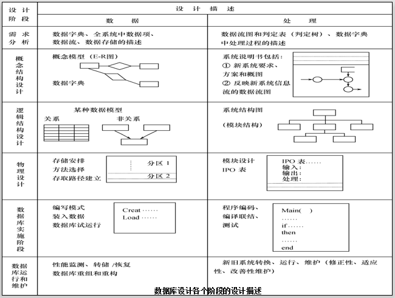

  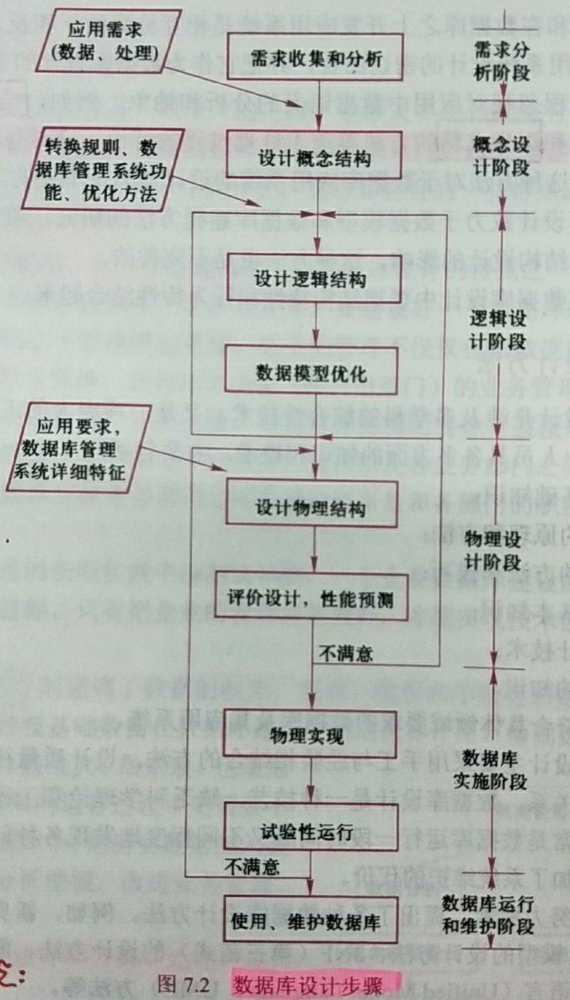

- **数据库设计过程中的各级模式**： 

  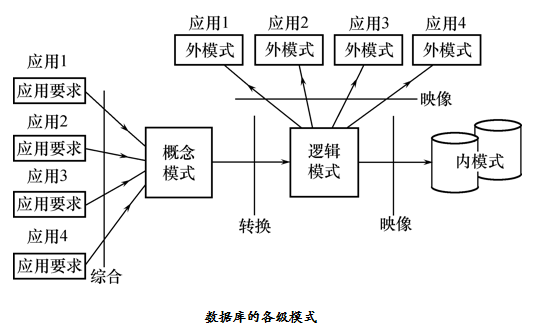

##2. 需求分析

###1. 需求分析任务

- **需求分析的任务(目标)**： 

  - 详细调查现实世界要处理的对象（组织、部门、企业等）
  - 充分了解原系统（手工系统或计算机系统）
  - 明确用户的各种需求
  - 确定新系统的功能
  - 充分考虑今后可能的扩充和改变

  > 调查的重点是“数据”和“处理”，获得用户对数据库要求： 
  >
  > - **信息要求**：用户需要从数据库中获得信息的内容与性质，由信息要求可以导出数据要求，及数据库中要存哪些数据
  > - **处理要求**：指用户要完成什么样的处理功能，对处理的响应时间有什么要求，处理的方式是什么
  > - **安全性与完整性要求**
  > - **确定用户最终需求**： 用户缺少计算机知识、设计人员缺少用户的专业知识
  > - **解决方法**： 设计人员必须不断深入地与用户进行交流

###2. 需求分析方法

- **调查用户需求的具体步骤**： 
  - 调查组织机构情况
  - 调查各部门的业务活动情况
  - 在熟悉业务活动的基础上，协助用户明确对新系统的各种要求
  - 确定新系统的边界

- **常用调查方法**： 
  - 跟班作业
  - 开调查会
  - 请专人介绍
  - 询问
  - 设计调查表请用户填写 
  - 查阅记录

- **需求分析方法**： 
  - **结构化分析方法(SA方法)**： 从最上层的系统组织机构入手，自顶向下、逐层分解分析系统

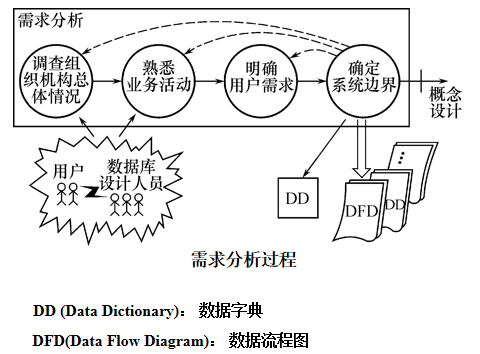

###3. 数据字典

- **数据字典**： 是**系统中各类数据描述的集合**

- **数据字典的内容**： 数据字典通过对数据项和数据结构的定义来描述数据流和数据存储的逻辑内容

  - **数据项**： 是不可再分的最小数据单位

    > 数据项描述＝｛ 数据项名，数据项含义说明，别名， 数据类型，长度，取值范围，取值含义，
    > ​                            与其他数据项的逻辑关系，数据项之间的联系｝

  - **数据结构**： 反映了数据之间的组合关系

    > 数据结构描述＝｛  数据结构名，含义说明，组成:｛数据项或数据结构｝｝

  - **数据流**： 是数据结构在系统内传输的路径

    > 数据流描述＝｛   数据流名，说明，数据流来源，数据流去向，
    >
    > ​			      组成:｛数据结构｝，平均流量，高峰期流量 ｝

  - **数据存储**： 是数据结构停留或保存的地方，也是数据流的来源和去向之一

    > 数据存储描述＝｛  数据存储名，说明，编号， 输入的数据流 ，输出的数据流 ， 
    >
    > ​				 组成:｛数据结构｝，数据量，存取频度，存取方式  ｝
    >
    > 存取频度：指每小时或者每天存取几次、每次存取多少数据等信息
    > 存取方式：是批处理还是联机处理，是检索还是更新，是顺序检索还是随机检索等

  - **处理过程**： 具体处理逻辑一般用判定表或判定树来描述，数据字典中只需描述处理过程的说明性信息

    > 处理过程描述＝｛  处理过程名，说明，输入:｛数据流｝，输出:｛数据流｝，处理:｛简要说明｝｝

- **数据字典的作用**：数据字典是关于数据库中数据的描述，在需求分析阶段建立，是下一步进行概念设计的基础，并在数据库设计过程中不断修改、充实、完善

##3. 概念结构设计

- **概念结构**： 是信息世界的结构，即概念模型

- **概念结构设计**： 将需求分析得到的用户需求抽象为信息结构即概念模型的过程，是整个数据库设计的关键

- **概念结构设计的特点**： 
  - **能真实、充分地反映现实世界**：包括事物和事物之间的联系，能满足用户对数据的处理要求
  - **易于理解**：可以用它和不熟悉计算机的用户交换意见，用户的积极参与是数据库设计成功的关键
  - **易于更改**：当应用环境和应用要求改变时，容易对概念模型修改和扩充
  - **易于向关系、网状、层次等各种数据模型转换**

- **概念结构设计的方法**： 

  - **自顶向下**： 首先定义全局概念结构的框架，然后逐步细化

    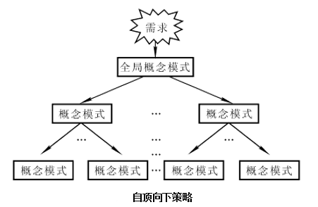

  - **自底向上**： 首先定义各局部应用的概念结构，然后将它们集成起来，得到全局概念结构

    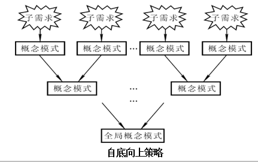

  - **逐步扩张**： 首先定义最重要的核心概念结构，然后向外扩充，逐步生成其他概念结构

    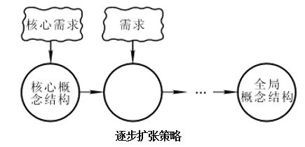

  - **混合策略**： 用自顶向下策略设计全局概念结构框架，然后集成由自底向上策略设计的各局部概念结构

    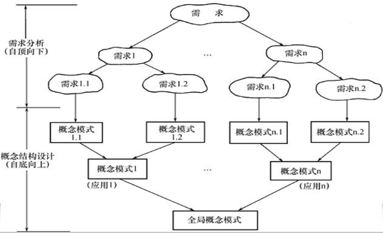

- **数据抽象**： 

  - **分类**： 定义某一类概念作为现实世界中一组对象的类型

    > 抽象了对象值和型之间的 `is member of` 的语义

  - **聚集**： 定义某一类型的组成成分

    > 抽象了对象内部类型和成分之间 `is part of` 的语义

  - **概括**： 定义类型之间的一种子集联系

    > 抽象了类型之间的 `is subset of` 的语义

- **E-R 图集成**： 

  - **合并**
  - **修改和重构**

  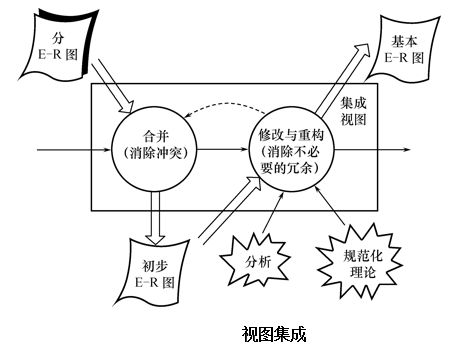

- **E-R 图合并冲突**： 
  - **属性冲突**： 属性值的类型、取值范围、取值集合不同
  - **命名冲突**： 
    - 同名异义：不同意义的对象在不同的局部应用中具有相同的名字
    - 异名同义（一义多名）：同一意义的对象在不同的局部应用中具有不同的名字
  - **结构冲突**： 
    - 同一对象在不同应用中具有不同的抽象
    - 同一实体在不同分 E-R 图中所包含的属性个数和属性排列次序不完全相同
    - 实体之间的联系在不同局部视图中呈现不同的类型

- **消除冗余**： 

  - 冗余的数据是指可由基本数据导出的数据
  - 冗余的联系是指可由其他联系导出的联系 

  > 方法： 
  >
  > - **分析方法**： 以数据字典和数据流图为依据，根据数据字典中关于数据项之间的逻辑关系来消除冗余
  > - **规范化理论**

  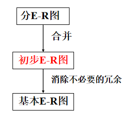

##4. 逻辑结构设计

- **逻辑结构设计的任务**： 把概念结构设计阶段设计好的基本 E-R 图转换为与选用 DBMS 产品所支持的数据模型相符合的逻辑结构，即**将概念结构转化为具体的数据模型**

- **逻辑结构设计的步骤**： 

  - 将概念结构转化为一般的关系、网状、层次模型
  - 将转换来的关系、网状、层次模型向特定DBMS支持下的数据模型转换
  - 对数据模型进行优化

  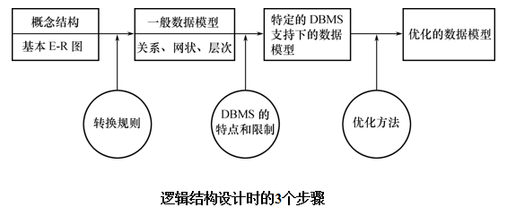

- **E-R 图向关系模型的转换**： 

  - **转换内容**： 将 E-R 图转换为关系模型，即将实体、实体的属性和实体之间的联系转换为关系模式

    > 实体型间的联系有以下不同情况 ：
    >
    > - 一个 1:1 联系可以转换为一个独立的关系模式，也可以与任意一端对应的关系模式合并
    > - 一个 1:n 联系可以转换为一个独立的关系模式，也可以与 n 端对应的关系模式合并
    > - 一个 m:n 联系转换为一个关系模式
    > - 三个或三个以上实体间的一个多元联系转换为一个关系模式
    > - 具有相同码的关系模式可合并

- **数据模型的优化**： 得到初步数据模型后，适当地修改、调整数据模型的结构，以提高数据库应用系统的性能

  > 关系数据模型的优化通常以**规范化理论**为指导

- **优化数据模型的方法**： 

  - **确定数据依赖**： 按需求分析阶段所得到的语义，分别写出每个关系模式内部各属性之间的数据依赖以及不同关系模式属性之间数据依赖
  - **消除冗余的联系**： 对于各个关系模式之间的数据依赖进行极小化处理，消除冗余的联系
  - **确定所属范式**
    - 按照数据依赖的理论对关系模式逐一进行分析
    - 考查是否存在部分函数依赖、传递函数依赖、多值依赖等
    - 确定各关系模式分别属于第几范式
  - **是否进行分解或合并**： 按照需求分析阶段得到的各种应用对数据处理的要求，分析对于这样的应用环境这些模式是否合适，确定是否要对它们进行合并或分解
  - **进行分解或合并**： 按照需求分析阶段得到的各种应用对数据处理的要求，对关系模式进行必要的分解，以提高数据操作的效率和存储空间的利用率
    - **水平分解**： 把(基本)关系的元组分为若干子集合，定义每个子集合为一个子关系，以提高系统的效率
    - **垂直分解**： 把关系模式 R 的属性分解为若干子集合，形成若干子关系模式

- **定义用户外模式时应该注重的问题**： 
  - 使用更符合用户习惯的别名
  - 针对不同级别的用户定义不同的视图 ，以满足系统对安全性的要求
  - 简化用户对系统的使用

##5. 物理数据库设计

- **数据库的物理结构**： 数据库在物理设备上的存储结构与存取方法，依赖于选定的数据库管理系统
- **数据库的物理设计**： 为一个给定的逻辑数据模型选取一个最适合应用环境的物理结构的过程

- **数据库物理设计的步骤**： 
  - **确定数据库的物理结构**，在关系数据库中主要指存取方法和存储结构
  - **评价物理结构的时间和空间效率**

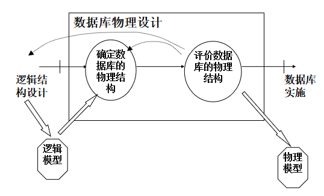

- **设计物理数据库结构的准备工作**： 
  - 对要运行的事务进行详细分析，获得选择物理数据库设计所需参数
  - 充分了解所用 DBMS 的内部特征，特别是系统提供的存取方法和存储结构

- **选择物理数据库设计所需参数**： 
  - 数据库查询事务： 
    - 查询的关系
    - 查询条件所涉及的属性

    - 连接条件所涉及的属性
    - 查询的投影属性
  - 数据更新事务： 
    - 被更新的关系
    - 每个关系上的更新操作条件所涉及的属性

    - 修改操作要改变的属性值
  - 每个事务在各关系上运行的频率和性能要求

- **关系数据库物理设计的内容**： 
  - 为关系模式选择存取方法(建立存取路径)

  - 设计关系、索引等数据库文件的物理存储结构

- **关系模式存取方法**： 

  - **B+ 树索引存取方法**： 

  - **hash 索引存取方法**： 若一个关系的属性主要出现在等值连接条件中或主要出现在等值比较条件中，且还需满足下列条件之一： 

    - 一个关系大小可预知且不变
    - 关系大小动态改变，但 DBMS 提供了动态 hash 存取方法

  - **聚簇存取方法**： 为了提高某个属性（或属性组）的查询速度，把这个或这些属性（称为聚簇码）上具有相同值的元组集中存放在连续的物理块中

    > 优点： 
    >
    > - 大大提高按聚簇码进行查询的效率
    > - 节省存储空间
    >
    > 局限性： 
    >
    > - 聚簇只能提高某些特定应用的性能
    > - 建立与维护聚簇的开销相当大
    >
    > 适用范围： 
    >
    > - 既适用于单个关系独立聚簇，也适用于多个关系组合聚簇
    > - 当通过聚簇码进行访问或连接是该关系的主要应用，与聚簇码无关的其他访问很少或者是次要的时，可以使用聚簇
    >
    > 设计候选聚簇： 
    >
    > - 对经常在一起进行连接操作的关系可以建立聚簇
    > - 如果一个关系的一组属性经常出现在相等比较条件中，则该单个关系可建立聚簇
    > - 如果一个关系的一个(或一组)属性上的值重复率很高，则此单个关系可建立聚簇。即对应每个聚簇码值的平均元组数不太少。太少了，聚簇的效果不明显
    >
    > 优化聚簇设计： 
    >
    > - 从聚簇中删除经常进行全表扫描的关系；
    > - 从聚簇中删除更新操作远多于连接操作的关系；
    > - 不同的聚簇中可能包含相同的关系，一个关系可以在某一个聚簇中，但不能同时加入多个聚簇

- **确定数据库的存储结构**： 
  - **确定数据的存放位置和存储结构**
  - **确定系统配置**

- **评价物理结构**： 
  - **评价内容**： 对数据库物理设计过程中产生的多种方案进行细致的评价，从中选择一个较优的方案作为数据库的物理结构
  - **评价方法**： 
    - 定量估算各种方案的存储空间、存取时间、维护代价
    - 对估算结果进行权衡、比较，选择出一个较优的合理的物理结构

##6. 数据库实施和维护

- **数据库实施阶段**： 

  - **数据的载入**： 人工方法、计算机辅助数据入库
  - **应用程序的编码和调试**： 数据库应用程序的设计应该与数据设计并行进行，在组织数据入库的同时还要调试应用程序

- **数据库运行阶段**： 在原有系统的数据有一小部分已输入数据库后，就可以开始对数据库系统进行联合调试

  > 数据库试运行主要工作包括：
  >
  > - **功能测试**： 实际运行数据库应用程序，执行对数据库的各种操作，测试应用程序的功能是否满足设计要求，否则进行修改
  > - **性能测试**： 测量系统的性能指标，分析是否达到设计目标，否则进行调整
  >
  > 注意问题： 
  >
  > - 先输入小批量数据供调试用，待试运行合格再大批量输入数据，逐步增加数据量，逐步完成运行评价
  > - 注意数据库的转储和恢复，尽量减少对数据库的破坏

- **数据库维护阶段**： 

  - **数据库的转储和恢复**

  - **数据库的安全性、完整性控制**

  - **数据库性能的监督、分析和改进**

  - **数据库的重组织和重构造**

    > - **数据库的重组织**： 按原设计要求，重新安排存储位置，回收垃圾，减少指针链
    >
    >   > 数据库的重组织不会改变原设计的数据逻辑结构和物理结构
    >
    > - **数据库的重构造**： 根据新环境调整数据库的模式和内模式
    >
    >   - 增加新的数据项
    >   - 改变数据项的类型
    >   - 改变数据库的容量
    >   - 增加或删除索引
    >   - 修改完整性约束条件

