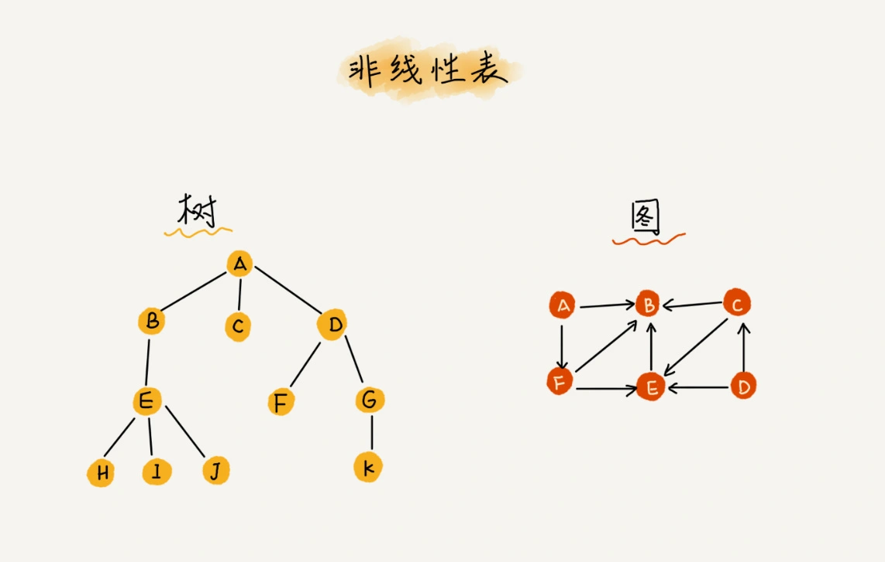
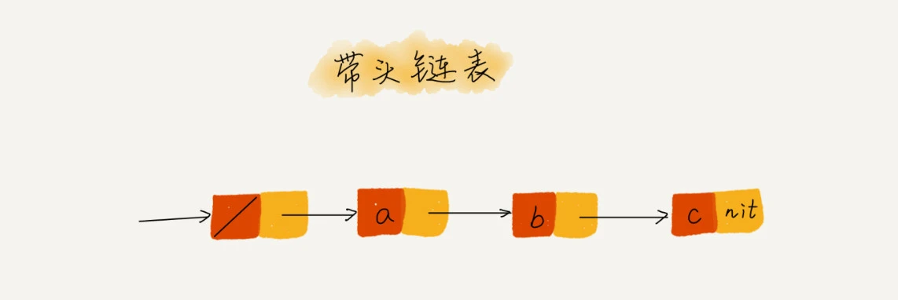
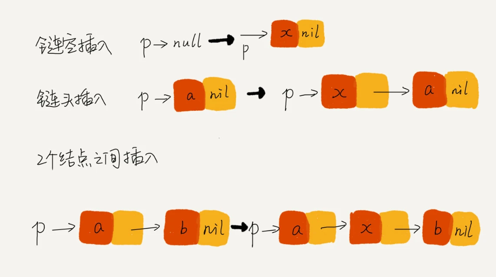
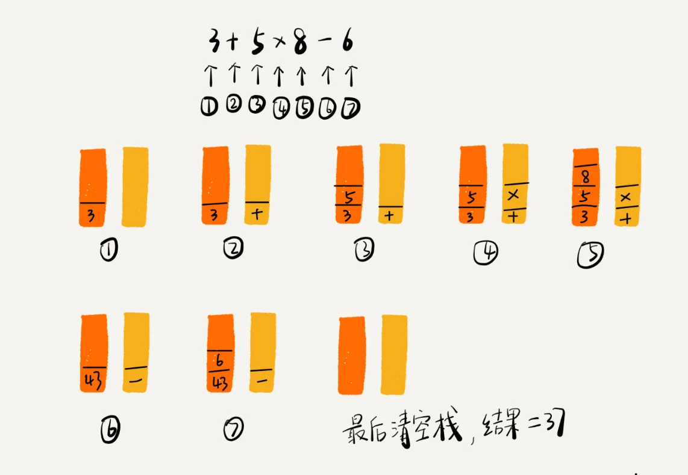
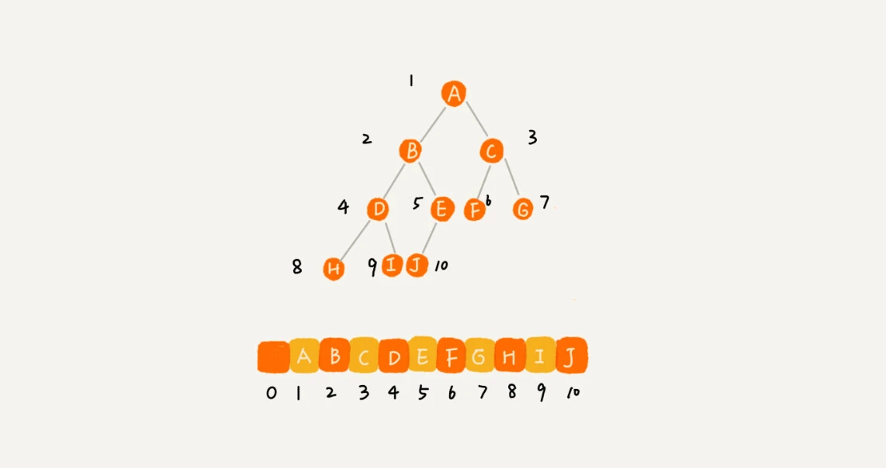
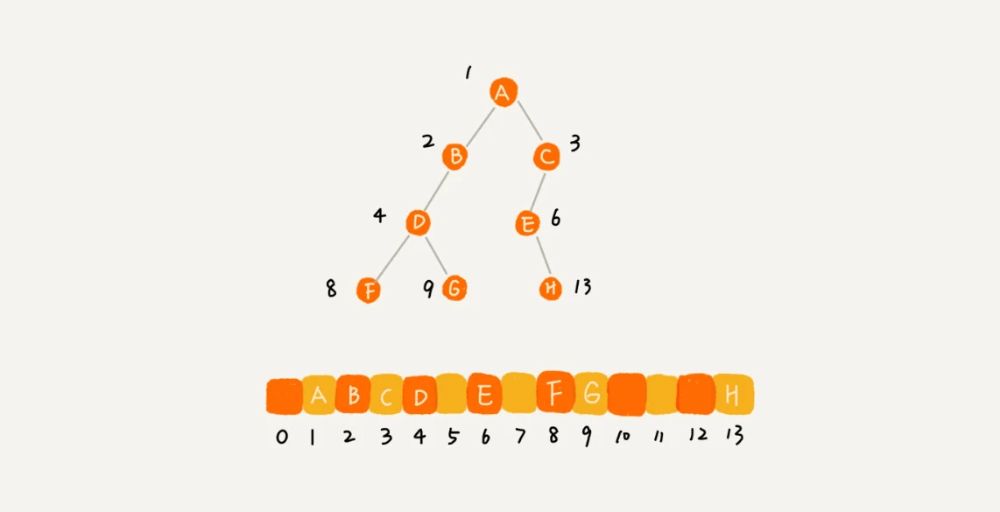
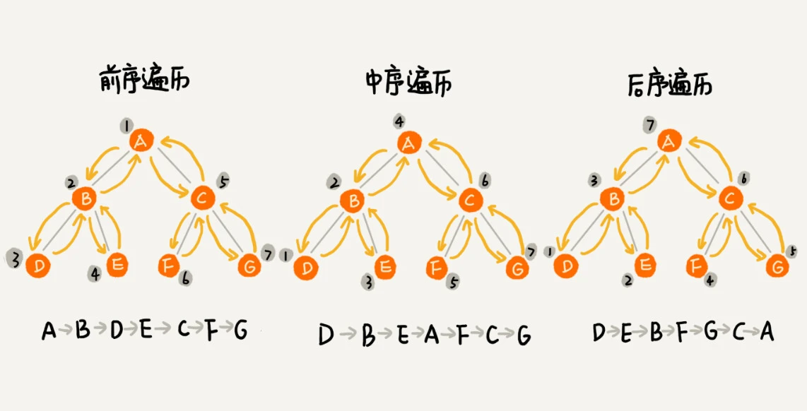

# 一、并查集

推荐阅读： **[并查集](https://www.cnblogs.com/cyjb/p/UnionFindSets.html)**

## 1. 简介

- 并查集 `Union-find Sets` 用于解决动态连通性问题，能动态连接两个点，并且判断两个点是否连通

  > 常见用途：求连通子图、求最小生成树的 Kruskal 算法和求最近公共祖先(LCA)等

- 使用并查集时，会存在不相交的动态集合 S={S1,S2,⋯,Sk}，**一般都会使用一个整数表示集合中的一个元素**


并查集的基本操作有三个：

| 方法 | 描述 |
| :---: | :---: |
| `makeSet(int N)` | 构造一个大小为 N 的并查集 |
| `void unionSet(int p, int q)` | 连接 p 和 q 节点 |
| `int find(int x)` | 查找 p 所在的连通分量 |
| `boolean connected(int p, int q)` | 判断 p 和 q 节点是否连通 |

```java
public abstract class UF {

    protected int[] id;

    public makeSet(int N) {
        id = new int[N];
        for (int i = 0; i < N; i++) {
            id[i] = i;
        }
    }

    public boolean connected(int p, int q) {
        return find(p) == find(q);
    }

    public abstract int find(int x);

    public abstract void unionSet(int p, int q);
}
```

## 2. Quick Find 操作

- 如果每次都沿着父节点向上查找，则时间复杂度就是树的高度

- **路径压缩**：在每次查找时，令查找路径上的每个节点都直接指向根节点


```java
//递归版
int find(int x) {
    if (x != uset[x]) //判断是否为根节点
        uset[x] = find(uset[x]); //递归往父节点
    return uset[x];
}
//非递归版
int find(int x) {
    int p = x, t;
    while (uset[p] != p) //找到当前节点集合的根节点
        p = uset[p];
    while (x != p) { //若节点 x 不是根节点
        t = uset[x]; //指向父节点
        uset[x] = p; //节点 x 直接指向根节点
        x = t; //遍历到父节点
    }
    return x; //返回当前集合的根节点
}
```

## 3. Quick Union 操作

合并操作： 将一个集合的树根指向另一个集合的树根


- **按秩合并**： 使用秩来表示树高度的上界，合并时，将具有较小秩的树根指向具有较大秩的树根，即将比较矮的树作为子树，添加到较高的树中

  > 为了保存秩，需要额外使用一个与 uset 同长度的数组 `rank[]`，并将所有元素都初始化为 0

```java
void unionSet(int x, int y) {
    if ((x = find(x)) == (y = find(y))) //x 与 y 的根节点相同，则不合并
        return;
    if (rank[x] > rank[y]) //x 秩大于 y 秩
        uset[y] = x; //y 指向 x
    else { //x 秩 <= y 秩
        uset[x] = y; //x 指向 y
        if (rank[x] == rank[y]) //x 秩 == y 秩
            rank[y]++; //y 秩 +1
    }
}
```

# 二、数组

## 1、基本概念

**数组 `Array`**：是一种线性表数据结构，用一组连续的内存空间，来存储一组具有相同类型的数据

- **线性与非线性数据结构**：

    - **线性表**：数据排成像一条线一样的结构，每个线性表上的数据最多只有前和后两个方向

        > 数组、链表、队列、栈等都是线性表结构
        >
        > 

    - 非线性表：数据之间并不是简单的前后关系

        > 二叉树、堆、图等都是非线性表
        >
        > 

- **连续的内存空间和相同类型的数据**：

    - 优势：可以实现“随机访问”
    - 劣势：让数组的很多操作很低效，比如要想在数组中删除、插入一个数据，为了保证连续性，就需要做大量的数据搬移工作

## 2、随机访问

> **数组根据下标随机访问数组元素**：计算机给每个内存单元分配一个地址，计算机通过地址来访问内存数据，当需要随机访问数组中的某个元素时，会首先通过寻址公式，计算出该元素存储的内存地址： `a[i]_address = base_address + i * data_type_size`

案例：拿一个长度为 10 的 int  类型的数组 int[] a = new int[10] 来举例

- 计算机给数组 `a[10]` 分配了一块连续内存空间 `1000～1039`，其中，内存块的首地址为 base_address = 1000

    > - Int 长度是4个字节，所以分配的内存长度是10×4=40，此处内存分配从 1000-1039 共 40 个字节长度
    >
    > - 此处使用 Java 语言定义 int 类型，基本类型 byte、short、int、long 长度分别为1、2、4、8，所以 int 每个值长度为 4

    

- 计算机会给每个内存单元分配一个地址，计算机通过地址来访问内存中的数据，当计算机需要随机访问数组中的某个元素时，它会首先通过下面的寻址公式，计算出该元素存储的内存地址：

    ```c
    a[i]_address = base_address + i * data_type_size
    ```

---

**数组和链表的区别**：

- 链表适合插入、删除，时间复杂度 O(1)
- 数组支持随机访问，根据下标随机访问的时间复杂度为 O(1)

## 3、低效的插入和删除

> 数组为了保持内存数据的连续性，会导致插入、删除这两个操作比较低效

- **插入操作**：假设数组长度为 n，将数据插入到数组中的第 k 个位置，需要将第  k～n 元素都顺序地往后挪一位

    > 分析时间复杂度：
    >
    > - 若在数组的末尾插入元素，那就不需要移动数据了，这时的时间复杂度为 O(1)
    > - 若在数组的开头插入元素，那所有的数据都需要依次往后移动一位，所以最坏时间复杂度是 O(n)
    >
    > 因为我们在每个位置插入元素的概率是一样的，所以平均情况时间复杂度为 `(1+2+...n)/n=O(n)` 

- **删除操作**：类似插入，若要删除第 k 个位置数据，为了内存的连续性，也需要搬移数据，不然中间就会出现空洞，内存就不连续

    > 将多次删除操作集中执行，提高删除效率：类似 JVM 标记清除垃圾回收算法
    >
    > - 先记录已经删除的数据，即每次的删除操作并不是真正地搬移数据，只是记录数据已经被删除
    >
    > - 当数组没有更多空间存储数据时，再触发执行一次真正的删除操作，这样就大大减少了删除操作导致的数据搬移
    >
    > 适用场景：不一定非得追求数组中数据的连续性

## 4、数组不移位置插入

- **操作**：不移动数据位置，根据数据具有随机访问的特点直接交换数据值

- **前提**：数组只是一个容器作为存储功能，数组中的数据元素是无序的

    > 若数组是有序的的元素与元素之间存在顺序关系，则只能采取移动数据元素的方式

- **案例说明**：假设数组 a[10] 中存储了如下 5 个元素：a，b，c，d，e。将元素 x 插入到第 3 个位置，只需要将 c 放入到 a[5]，将 a[2]赋值为 x 即可，最后数组中的元素如下： a，b，x，d，e，c

    

- 特定场景下，直接调换指定位置数据，不需要把后面的数据整体移动，即在第 k 个位置插入一个元素的时间复杂度就会降为 O(1)

    > 这个处理思想在快排中也会用到

## 5、容器能否代替数组

针对数组类型，很多语言都提供了容器类，比如：Java 的 ArrayList、C++ STL 的 vector

- ArrayList 优势是可以将很多数组操作的细节封装，并支持动态扩容

    > 每次存储空间不够时，会将空间自动扩容为 1.5 倍大小

- 数组定义时要预先指定大小，当连续内存空间不够用时，需重新分配一块更大的空间，将原来的数据复制过去，然后再插入新数据

----

数组更合适的场景：

- ArrayList 无法存储基本类型，需要封装为 Integer、Long 类，而拆箱装箱都有一定的性能消耗，若特别关注性能或希望使用基本类型，可以选用数组
- 若数据大小事先已知，且数据操简单，用不到 ArrayList 提供的大部分方法，也可以直接使用数组
- 当要表示多维数组时，用数组往往会更加直观，如：Object[][] array；而用容器为 `ArrayList<ArrayList<object> > array` 

# 三、链表

> 链表不需要一块连续的内存空间，通过“指针”将一组零散的内存块串联起来使用


## 1、基本概念

- **单链表**：为了将所有的结点串起来，每个链表的结点除了存储数据之外，还需要记录链上的下一个结点的地址(后继指针 next)

    > - 头结点用来记录链表的基地址
    >
    > - 尾结点指向一个空地址 NULL，表示这是链表上最后一个结点
    >
    >     > 防止尾节点的后继指针 next 成为一个野指针，导致遍历链表根本停不下来或出现一堆本不属于该链表的垃圾数据等
    >
    > 
    >
    > 针对链表的插入和删除操作，只需要考虑相邻结点的指针改变，所以对应的时间复杂度是 O(1)
    >
    > 

- **循环链表**：单链表的尾结点指针指向空地址，而循环链表的尾结点指针是指向链表的头结点

    > 优点：从链尾到链头比较方便，当要处理的数据具有环型结构特点时，就特别适合采用循环链表，如：“约瑟夫问题”

    

- **双链表**：支持两个方向，每个结点不止有一个后继指针 next 指向后面的结点，还有一个前驱指针 prev 指向前面的结点

    > 优于单向链表：
    >
    > - 删除操作分析：
    >
    >     - 情况一：删除结点中"值等于某个给定值"的结点
    >
    >         > 不管是单链表还是双向链表，为了查找到值等于给定值的结点，都需要从头结点开始一个一个依次遍历对比，直到找到值等于给定值的结点，然后再通过指针操作将其删除
    >
    >     - 情况二：删除给定指针指向的结点
    >
    >         > 此时，已经找到要删除的结点，但是删除某个结点 q 需要知道其前驱结点，而单链表并不支持直接获取前驱结点，所以，为了找到前驱结点，还是要从头结点开始遍历链表，直到 p->next=q(p 是 q 的前驱结点)
    >         >
    >         > 单链表删除操作需要 O(n) 的时间复杂度，而双向链表只需要 O(1) 的时间复杂度
    >
    > - 插入操作分析：双向链表需要 O(1) 时间复杂度，而单向链表需要 O(n) 的时间复杂度
    >
    >     > 单链表插入操作其实是o(1)，但插入需要前驱节点，寻找前驱节点时间复杂度是o(n)
    >
    > - 有序链表的按值查询的效率：双向链表可以记录上次查找的位置 p，每次查询时，根据要查找的值与 p 的大小关系，决定是往前还是往后查找，所以平均只需要查找一半的数据
    >
    > 注：LinkedHashMap 用到了双向链表

    

## 2、链表实现

- 技巧一：**理解指针或引用的含义** 

    > 指针的理解：
    >
    > - 理解一：将某个变量赋值给指针，就是将这个变量的地址赋值给指针
    > - 理解二：指针中存储了这个变量的内存地址，指向了这个变量，通过指针就能找到这个变量

- 技巧二：**警惕指针丢失和内存泄漏** 

    > 删除链表结点时，也一定要记得手动释放内存空间

- 技巧三：**利用哨兵简化实现难度** 

    > 针对链表的插入、删除操作，需要对插入第一个结点和删除最后一个结点的情况进行特殊处理
    >
    > ---
    >
    > 哨兵结点：任何时候，不管链表是不是空，head 指针都会一直指向这个哨兵结点
    >
    > - 有哨兵节点的链表叫带头链表，而没有哨兵结点的链表就叫作不带头链表
    >
    > 
    >
    > 哨兵结点不存储数据，由于哨兵结点一直存在，所以插入第一个结点和插入其他结点，删除最后一个结点和删除其他结点，都可以适用相同的代码逻辑

- 技巧四：**重点留意边界条件处理** 

    - 如果链表为空时，代码是否能正常工作？
    - 如果链表只包含一个结点时，代码是否能正常工作？
    - 如果链表只包含两个结点时，代码是否能正常工作？
    - 代码逻辑在处理头结点和尾结点的时候，是否能正常工作？

- 技巧五：**举例画图，辅助思考** 

    

- 技巧六：**多写多练，没有捷径** 

    - 单链表反转
    - 链表中环的检测
    - 两个有序的链表合并
    - 删除链表倒数第 n 个结点
    - 求链表的中间结点

# 四、栈和队列

推荐阅读： [java数据结构与算法之栈（Stack）设计与实现](https://blog.csdn.net/javazejian/article/details/53362993) 

> - 栈和队列都是动态集合：
>   - 栈规定元素是先进后出（FILO）
>   - 队列规定元素是先进先出（FIFO）
>
> - 栈和队列的实现可以采用数组和链表进行实现
>
> - 栈与队列的基本操作：
>
>   - 栈的基本操作包括：入栈push和出栈pop，栈有一个栈顶指针top，指向最新如栈的元素，入栈和出栈操作操作都是从栈顶端进行的
>
>   - 队列的基本操作包括： 入队enqueue和出队dequeue，队列有队头head和队尾tail指针
>
>     > - 元素总是从队头出，从队尾入
>     > - 采用数组实现队列时候，为合理利用空间，可以采用循环实现队列空间的有效利用
>
> 

## 1、栈

### (1) 简介

- 栈属于动态集合，采用先进后出策略（LIFO）

- 基本操作是压入（PUSH）和弹出（POP）

- 如果s.top=0，表示栈空，如果试图对空栈进行POP操作会发生下溢（underflow）

  如果s.top>n，表示栈满，如果进行PUSH操作会发生上溢（overflow）

### (2) 伪代码

```c
STACK-EMPTY(S):
	if S.top == 0
        return TRUE
    else retrun FALSE
    
PUSH(S,x):
	S.top = S.top + 1
    S[S.top] = x
    
POP(S):
	if STACK-EMPTY(S)
        error "underflow"
    else S.top = S.top - 1
        return S[S.top + 1]
```

### (3) 实现

```java
public interface MyStack<Item> extends Iterable<Item> {
    MyStack<Item> push(Item item); //push 操作
    Item pop() throws Exception; //pop 操作
    boolean isEmpty(); //是否为空
    int size(); //尺寸
}
```

#### 3.1 数组实现

- **实现方式一**：

```java
public class ArrayStack<Item> implements MyStack<Item> {
    // 栈元素数组，只能通过转型来创建泛型数组
    private Item[] a = (Item[]) new Object[1];
    // 元素数量
    private int N = 0;
    @Override
    public MyStack<Item> push(Item item) {
        check();
        a[N++] = item;
        return this;
    }
    @Override
    public Item pop() throws Exception {
        if (isEmpty()) {
            throw new Exception("stack is empty");
        }
        Item item = a[--N];
        check();
        // 避免对象游离
        a[N] = null;
        return item;
    }
    //判断栈是否溢出从而对底层数组进行调整
    private void check() {
        if (N >= a.length) {
            resize(2 * a.length);
        } else if (N > 0 && N <= a.length / 4) {
            resize(a.length / 2);
        }
    }
    //调整数组大小，使得栈具有伸缩性
    private void resize(int size) {
        Item[] tmp = (Item[]) new Object[size];
        for (int i = 0; i < N; i++) {
            tmp[i] = a[i];
        }
        a = tmp; //使 a 指向 tmp 地址，从而实现数组 a 的扩容
    }
    @Override
    public boolean isEmpty() {
        return N == 0;
    }
    @Override
    public int size() {
        return N;
    }
    @Override
    public Iterator<Item> iterator() {
        // 返回逆序遍历的迭代器
        return new Iterator<Item>() {
            private int i = N;
            @Override
            public boolean hasNext() {
                return i > 0;
            }
            @Override
            public Item next() {
                return a[--i];
            }
        };
    }
}
```

- **实现方式二**：

```java
// 基于数组实现的顺序栈
public class ArrayStack {
  	private String[] items;  // 数组
  	private int count;       // 栈中元素个数
  	private int n;           //栈的大小

  	// 初始化数组，申请一个大小为n的数组空间
  	public ArrayStack(int n) {
    	this.items = new String[n];
    	this.n = n;
    	this.count = 0;
  	}

  	// 入栈操作
  	public boolean push(String item) {
    	// 数组空间不够了，直接返回false，入栈失败。
    	if (count == n) return false;
    	// 将item放到下标为count的位置，并且count加一
    	items[count] = item;
    	++count;
    	return true;
  	}
  
  	// 出栈操作
  	public String pop() {
    	// 栈为空，则直接返回null
    	if (count == 0) return null;
    	// 返回下标为count-1的数组元素，并且栈中元素个数count减一
    	String tmp = items[count-1];
    	--count;
    	return tmp;
  	}
}
```

#### 3.2 链表实现

需要使用链表的头插法来实现，因为头插法中最后压入栈的元素在链表的开头，它的 next 指针指向前一个压入栈的元素，在弹出元素时就可以通过 next 指针遍历到前一个压入栈的元素从而让这个元素称为新的栈顶元素

```java
public class ListStack<Item> implements MyStack<Item> {
    private Node top = null;
    private int N = 0;
    
    private class Node {
        Item item;
        Node next;
    }
    @Override
    public MyStack<Item> push(Item item) {
        Node newTop = new Node();
        newTop.item = item;
        newTop.next = top;
        top = newTop;
        N++;
        return this;
    }
    @Override
    public Item pop() throws Exception {
        if (isEmpty()) {
            throw new Exception("stack is empty");
        }
        Item item = top.item;
        top = top.next;
        N--;
        return item;
    }
    @Override
    public boolean isEmpty() {
        return N == 0;
    }
    @Override
    public int size() {
        return N;
    }
    @Override
    public Iterator<Item> iterator() {
        return new Iterator<Item>() {
            private Node cur = top;
            @Override
            public boolean hasNext() {
                return cur != null;
            }
            @Override
            public Item next() {
                Item item = cur.item;
                cur = cur.next;
                return item;
            }
        };
    }
}
```

### (4) 应用

**表达式求值**：编译器通过两个栈实现，一个栈保存操作数，另一个栈保存运算符

> 从左向右遍历表达式，当遇到数字，就直接压入操作数栈；当遇到运算符，就与运算符栈的栈顶元素进行比较
>
> - 若比运算符栈顶元素的优先级高，就将当前运算符压入栈；
> - 若比运算符栈顶元素的优先级低或相同，从运算符栈中取栈顶运算符，从操作数栈的栈顶取 2 个操作数，然后进行计算，再把计算完的结果压入操作数栈，继续比较



## 2、队列

### (1) 简介

- 队列属于动态集合，采用先进先出策略（FIFO）

- 基本操作是入队（enqueue）和出队（dequeue）

- 如果 head=tail，表示队列为空，如果试图对空队列进行 dequeue 操作会发生下溢（underflow）

  如果 head=tail+1，表示队列满，如果进行 enqueue 操作会发生上溢（overflow）

### (2) 伪代码

```c
//入队
ENQUEUE(Q,x):
	Q[Q.tail] = x
	if Q.tail == Q.length:
		Q.tail = 1 //队列为循环的
    else Q.tail = Q.tail + 1
  
//出队
DEQUEUE(Q):
	x = Q[Q.head]
	if Q.head = Q.length
		Q.head = 1
    else Q.head = Q.head + 1
    return x
```

### (3) 实现

```java
public interface MyQueue<Item> extends Iterable<Item> {
    int size();
    boolean isEmpty();
    MyQueue<Item> add(Item item); //入队
    Item remove() throws Exception; //出队
}
```

- **链表实现**：

```java
public class ListQueue<Item> implements MyQueue<Item> {
    private Node first;
    private Node last;
    int N = 0;

    private class Node {
        Item item;
        Node next;
    }

    @Override
    public boolean isEmpty() {
        return N == 0;
    }

    @Override
    public int size() {
        return N;
    }

    @Override
    public MyQueue<Item> add(Item item) {
        Node newNode = new Node();
        newNode.item = item;
        newNode.next = null;

        if (isEmpty()) {
            last = newNode;
            first = newNode;
        } else {
            last.next = newNode;
            last = newNode;
        }
        N++;
        return this;
    }

    @Override
    public Item remove() throws Exception {
        if (isEmpty()) {
            throw new Exception("queue is empty");
        }
        Node node = first;
        first = first.next;
        N--;
        if (isEmpty()) {
            last = null;
        }
        return node.item;
    }

    @Override
    public Iterator<Item> iterator() {
        return new Iterator<Item>() {
            Node cur = first;
            @Override
            public boolean hasNext() {
                return cur != null;
            }
            @Override
            public Item next() {
                Item item = cur.item;
                cur = cur.next;
                return item;
            }
        };
    }
}
```

- **数组实现**：

```java
public class ArrayQueue {
    private String[] items; // 数组：items，数组大小：n
    private int n = 0;
    
    // head表示队头下标，tail表示队尾下标
    private int head = 0;
    private int tail = 0;

    // 申请一个大小为 capacity 的数组
    public ArrayQueue(int capacity) {
        items = new String[capacity];
        n = capacity;
    }

    
    // 入队操作，将item放入队尾
    public boolean enqueue(String item) {
        if (tail == n) {
            if (head == 0) return false; // tail == n && head==0，表示整个队列都占满了
            for (int i = head; i < tail; ++i) { // 数据搬移
                items[i - head] = items[i];
            }
            tail -= head; // 搬移完之后重新更新head和tail
            head = 0;
        }
        items[tail++] = item;
        return true;
    }

    // 出队
    public String dequeue() {
        // 如果head == tail 表示队列为空
        if (head == tail) return null;
        return items[head++];
    }
}
```

### (4) 循环队列

> 循环队列可以避免数组队列在 tail==n 时的数据搬移操作

```java
public class CircularQueue {
    private String[] items; // 数组：items，数组大小：n
    private int n = 0;
    
    // head表示队头下标，tail表示队尾下标
    private int head = 0;
    private int tail = 0;

    // 申请一个大小为capacity的数组
    public CircularQueue(int capacity) {
        items = new String[capacity];
        n = capacity;
    }

    // 入队
    public boolean enqueue(String item) {
        // 队列满了
        if ((tail + 1) % n == head) return false;
        items[tail] = item;
        tail = (tail + 1) % n;
        return true;
    }

    // 出队
    public String dequeue() {
        // 如果head == tail 表示队列为空
        if (head == tail) return null;
        String ret = items[head];
        head = (head + 1) % n;
        return ret;
    }
}
```

# 五、散列表

## 1、直接寻址表

- 当关键字的全域 U 较小时，直接寻址简单有效

- **直接寻址表**： 为表示动态集合，用一个**数组 `T[0..m-1]` 对应全域  U 中的每个关键字(一对一)**

  > - 其中，每个位置称为“槽”
  >
  > - 增删查的每个操作所需时间均为 `O(1)` 


## 2、散列表

- 直接寻址表不适合数据较大的情况

- **散列表**： 通过散列函数 h 计算出每个关键字 k 对应槽的位置 `h(k)` ，即散列值
- **碰撞**： 多个关键字映射到同一个数组下标位置
- **目的**： 缩小需要处理的目标范围，从而降低空间开销


## 3、散列函数

- 对于一个大小为 M 的散列表，散列函数能够把任意键转换为 [0, M-1] 内的正整数，该正整数即为 hash 值

- 散列函数应该满足以下三个条件：
  - **一致性**：相等键的 hash 值相等

  - **高效性**：计算简便，有必要可把 hash 值缓存起来，在调用 hash 函数时直接返回

  - **均匀性**：所有键的 hash 值应当均匀地分布到 [0, M-1] 之间

    > 如果不能满足这个条件，有可能产生很多冲突，从而导致散列表的性能下降

- 常见散列函数：

  - **除法散列法**：`h(k) = k mod m`

  - **乘法散列法**： `h(k) = m(kA mod 1)` 

    > 用关键字 k 乘上常数A（0<A<1），并抽取 k*A 的小数部分，然后用 m 乘以这个值，再取结果的底

  - **全域散列**： 给定一组散列函数 H，每次进行散列时候从 H 中随机的选择一个散列函数 h，使得 h 独立于要存储的关键字

    > 全域散列函数类的**平均性能比较好**

- Java 中的 `hashCode()` 函数实现： `int hash = (x.hashCode() & 0x7fffffff) % M;` 

  > 若内存地址是 32 位整数，则我们只需要 31 位的非负整数，因此应当屏蔽符号位之后再使用除留余数法
  >
  >  
  >
  > 自定义类型实现 hashCode()：
  >
  > ```java
  > public class Transaction {
  > 
  >     private final String who;
  >     private final Date when;
  >     private final double amount;
  > 
  >     public Transaction(String who, Date when, double amount) {
  >         this.who = who;
  >         this.when = when;
  >         this.amount = amount;
  >     }
  > 
  >     public int hashCode() {
  >         int hash = 17;
  >         int R = 31;
  >         hash = R * hash + who.hashCode();
  >         hash = R * hash + when.hashCode();
  >         hash = R * hash + ((Double) amount).hashCode();
  >         return hash;
  >     }
  > }
  > ```

## 4、碰撞解决算法

### (1) 链接法

#### 1. 简介

- 使用链表来存储 hash 值相同的键，从而解决冲突

- 若选定的散列表长度为 m，则可将散列表定义为一个由 m 个头指针组成的指针数组 `T[0..m-1]`

- 凡是散列地址为 `i` 的结点，均插入到以 `T[i]` 为头指针的单链表中，T 中各分量的初值均应为空指针

- 查找分两步：
  - 查找 Key 所在的链表
  - 在链表中顺序查找

用除余法构造散列函数，初始情况如下：


最终结果如下图所示：


#### 2. 优缺点

- **优点**：
    - 链表法对内存的利用率比开放寻址法要高，因为链表结点可以在需要的时候再创建，并不需要像开放寻址法那样事先申请好
    - 链表法比起开放寻址法，对大装载因子的容忍度更高

- **缺点**：
    - 链表因为要存储指针，所以对于比较小的对象的存储，是比较消耗内存的，还有可能会让内存的消耗翻倍
    - 而且链表中的结点零散分布在内存中，不连续，所以对 CPU 缓存不友好，会影响执行效率

### (2) 开放寻址法

- 所有的元素都在散列表中，每一个表项或包含动态集合的一个元素，或包含 NIL
- 当要插入一个元素时，可以连续地检查或探测散列表的各项，直到有一个空槽来放置待插入的关键字为止
- 分类： **线性探测、二次探测、双重探测**

#### 1. 线性探测法

- 线性探测方法采用的散列函数为：$h(k,i) = (h'(k)+i)mod \ m，i=0,1,....,m-1$ 

  > - 探测从 i=0 开始，首先探查 `T[h'(k)]`，然后依次探测 `T[h'(k)+1],...`，直到 `T[h'(k)+m-1]`，此后又循环到 T[0]，T[1],...，直到探测到 T[h'(k) - 1] 为止
  >
  > - 探测过程终止于三种情况： 
  >   - 若当前探测的单元为空，则表示查找失败（若是插入则将key写入其中）
  >   - 若当前探测的单元中含有key，则查找成功，但对于插入意味着失败
  >   - 若探测到 T[h'(k)-1] 仍未发现空单元也未找到 key，则查找与插入均失败(即表满)

- 线性探测法使用空位来解决冲突，当冲突发生时，向前探测一个空位来存储冲突的键

- 使用线性探测法，数组的大小 M 应当大于键的个数 N（M>N)

**用除余法构造散列函数**，初始情况如下图所示：


散列过程如下图所示：


**Java 代码实现**： 

```java
public class LinearProbingHashST<Key, Value> implements UnorderedST<Key, Value> {

    private int N = 0;
    private int M = 16;
    private Key[] keys;
    private Value[] values;

    //相关构造函数
    public LinearProbingHashST() {
        init();
    }

    public LinearProbingHashST(int M) {
        this.M = M;
        init();
    }

    private void init() {
        keys = (Key[]) new Object[M];
        values = (Value[]) new Object[M];
    }

    //hash 函数
    private int hash(Key key) {
        return (key.hashCode() & 0x7fffffff) % M;
    }
    
    //查找
    public Value get(Key key) {
    	for (int i = hash(key); keys[i] != null; i = (i + 1) % M){
        	if (keys[i].equals(key))
            	return values[i];
        }
        return null;
    }
    
    //插入
    public void put(Key key, Value value) {
        resize(); //调整存储的数组大小
        putInternal(key, value); //插入数据
    }

    //删除
    public void delete(Key key) {
        int i = hash(key);
        while (keys[i] != null && !key.equals(keys[i])){
            i = (i + 1) % M;
        }
        // 不存在，直接返回
        if (keys[i] == null)
            return;

        keys[i] = null;
        values[i] = null;
        // 将之后相连的键值对重新插入
        i = (i + 1) % M;
        while (keys[i] != null) {
            Key keyToRedo = keys[i];
            Value valToRedo = values[i];
            keys[i] = null;
            values[i] = null;
            N--;
            putInternal(keyToRedo, valToRedo);
            i = (i + 1) % M;
        }
        N--;
        resize();
    }
    
    /**
    * α = N/M，把 α 称为使用率
    * 理论证明，当 α 小于 1/2 时探测的预计次数只在 1.5 到 2.5 之间
    * 为了保证散列表的性能，应当调整数组的大小，使得 α 在 [1/4, 1/2] 之间
    */
    private void resize() {
        if (N >= M / 2) {
            resize(2 * M);
        } else if (N <= M / 8) {
            resize(M / 2);
        }
    }
    private void resize(int cap) {
        LinearProbingHashST<Key,Value> t = new LinearProbingHashST<Key,Value>(cap);
        for (int i = 0; i < M; i++) {
            if (keys[i] != null) {
                t.putInternal(keys[i], values[i]);
            }
        }
        keys = t.keys;
        values = t.values;
        M = t.M;
    }
    //数据插入
    private void putInternal(Key key, Value value) {
        int i;
        for (i = hash(key); keys[i] != null; i = (i + 1) % M){
            if (keys[i].equals(key)) {
                values[i] = value;
                return;
            }
        }
        keys[i] = key;
        values[i] = value;
        N++;
    }
}
```

#### 2. 二次探测

- 二次探测的散列函数：$h(k,i) =(h'(k) + c_1*i + c_2*i^2) mod\ m ,0≤i≤m-1$ 

- 初次的探测位置为 `T[h'(k)]`，后序的探测位置在上次基础上加一个偏移量

  > 该偏移量以二次的方式依赖于 `i`

- 缺陷： 不易探查到整个散列空间

#### 3. 双重散列

- 是开放寻址的最好方法之一，因为其产生的排列具有随机选择的排列的许多特性

- **核心**：使用一组散列函数 hash1(key)，hash2(key)，hash3(key)...，先用第一个散列函数，如果计算得到的存储位置已经被占用，再用第二个散列函数，依次类推，直到找到空闲的存储位置

- 采用的散列函数为：$h(k,i)=(h_1(k)+i * h_2(k)) mod\ m$

  > 其中 `h1和h2` 为辅助散列函数

- 初始探测位置为 `T[h1(k)]`，后续的探测位置在此基础上加上**偏移量 h2(k) 模 m**

#### 4. 优缺点

- **优点**：

    - 散列表中的数据都存储在数组中，可以有效地利用 CPU 缓存加快查询速度
    - 这种方法实现的散列表，序列化起来比较简单

- **缺点**：

    - 用开放寻址法解决冲突的散列表，删除数据的时候比较麻烦，需要特殊标记已经删除掉的数据

    - 所有的数据都存储在一个数组中，比起链表法来说，冲突的代价更高

        > 使用开放寻址法解决冲突的散列表，装载因子的上限不能太大，这也导致这种方法比链表法更浪费内存空间

> 注：当数据量比较小、装载因子小的时候，适合采用开放寻址法，因此 **ThreadLocalMap** 使用开放寻址法解决散列冲突

## 5、字符串散列

- 将元素的 key 转换为数字进行散列，如果 key 本身就是整数，那么散列函数可以采用 `key mod tablesize`（要保证 tablesize 是质数）

- 实现方法：

  - **方法1：**将字符串的所有的字符的 ASCII 码值进行相加，将所得和作为元素的关键字

    > - **缺点**： 不能有效的分布元素，大部分槽没有用到，分布不均匀，从而效率低下
    >
    > ```c
    > int hash(const string& key,int tablesize)
    > {
    >    	int hashVal = 0;
    >     	for(int i=0;i<key.length();i++)
    >            hashVal += key[i];
    >     	return hashVal % tableSize;
    > }
    > ```

  - **方法2：**假设关键字至少有三个字母构成，散列函数只取前三个字母进行散列

    > - 得到的最大数值是2851
    >
    >   如果散列的长度为10007，那么只有 28% 的空间被用到，大部分空间没有用到
    >
    > - 因此如果散列表太大，就不太适用
    >
    > ```c
    > int hash(const string& key,int tablesize)
    > {
    >        //27 represents the number of letters plus the blank
    >        return (key[0]+27*key[1]+729*key[2])%tablesize;
    > }
    > ```

  - **方法3**：借助Horner's 规则，构造一个质数（通常是37）的多项式

    > - 计算公式为： $key[keysize-i-1]37^i,0<=i<keysize$ 
    >
    > - 缺陷： 若字符串关键字比较长，散列函数的计算过程就变长，可能导致计算的 hashVal 溢出
    >
    >   针对这种情况可以采取字符串的部分字符进行计算
    >
    > ```c
    > int hash(const string & key,int tablesize)
    > {
    >         int hashVal = 0;
    >         for(int i = 0;i < key.length();i++)
    >             hashVal = 37*hashVal + key[i];
    >         hashVal %= tableSize;
    >         if(hashVal<0)  //计算的hashVal溢出
    >            hashVal += tableSize;
    >        return hashVal;
    > }
    > ```

## 6、再散列

- **再散列**： 若散列表已满，则扩展散列表为原散列表的 2 倍多一些，重新计算各个元素的 hash 值，插入到新的散列表中

- 何时进行再散列：

  - 给定一个再散列范围

    > 如： 散列表已经使用了 80%，则这个时候进行再散列

  - 当插入一个新元素失败时候，进行再散列

  - 根据装载因子进行判断，当装载因子达到一定的阈值时候，进行在散列

    > - 装载因子 `α = n/m`： 即每个链子中的平均存储的元素数目
    >
    >   存放 n 个元素的、具有 m 个槽位的散列表 T
    >
    > - 在采用链接法处理碰撞问题时，采用该方法进行再散列效率最好

　# 六、二叉树

- 节点的高度 = 节点到叶子节点的最长路径(边数)
- 节点的深度 = 根节点到这个节点所经历的边的个数
- 节点的层数 = 节点的深度 + 1
- 树的高度 = 根节点的高度

## 1、定义

- **二叉树**： 是一种特殊的树型结构，每个节点至多有两棵子树，且二叉树的子树有左右之分，次序不能颠倒

二叉树形状如下下图所示：


## 2、性质

- 在二叉树中的第 `i` 层上至多有 $2^{(i-1)}$ 个结点（i>=1)

- 深度为 `k` 的二叉树至多有 $2^{k-1}$个节点（k>=1)

- 对任何一棵二叉树 T，如果其终端结点数目为 $n_0$，度为 2 的节点数目为 $n_2$，则 $n_0=n_2+1$

- 具有 n 个节点的完全二叉树的深度为 $log_2n + 1$ 

---

- **满二叉树**：深度为 `k` 且具有 $2^{k-1}$ 个结点的二叉树

  > 即满二叉树中的每一层上的结点数都是最大的结点数，或者说“除了叶子节点之外，每个节点都有左右两个子节点”

- **完全二叉树**：深度为 `k` 具有 `n` 个结点的二叉树，当且仅当每一个结点与深度为 `k` 的满二叉树中的编号从1至n 的结点一一对应

  > 即最后一层的叶子节点都靠左排列，并且除了最后一层，其他层的节点个数都要达到最大
  >
  > - 指最后一层的子节点，从左数到右是连续，中间没有断开
  > - 结合数组的顺序存储法，可知基于数组实现的完全二叉树能节省内存
  >
  > 满二叉树肯定是完全二叉树


## 3、存储结构

> 存储二叉树： 可采用**顺序存储数组**和**链式存储二叉链表**两种方法

### (1) 链式存储

二叉链表存储结构：

```c
typedef struct binary_tree_node {
    int elem;
    struct binary_tree_node *left;
    struct binary_tree_node *right;
} binary_tree_node,*binary_tree;
```

二叉链表存储过程：

> 从图中可以看出：在还有n个结点的二叉链表中有n+1个空链域


### (2) 数组的顺序存储

把根节点存储在下标 `i = 1` 的位置，则左子节点存储在下标 `2 * i = 2` 的位置，右子节点存储在 `2 * i + 1 = 3` 的位置。以此类推，B 节点的左子节点存储在 `2 * i = 2 * 2 = 4` 的位置，右子节点存储在 `2 * i + 1 = 2 * 2 + 1 = 5` 的位置



> 上述例子的完全二叉树仅“浪费”了一个下标为 0 的存储位置

---

若是非完全二叉树，则会浪费比较多的数组存储空间：



> 若某棵二叉树是一棵完全二叉树，那用数组存储无疑是最节省内存的一种方式

- 补充：堆其实就是一种完全二叉树，最常用的存储方式就是数组

## 4、遍历二叉树

**遍历二叉树**： 按照指定的路径方式访问书中每个结点一次，且仅访问一次

> 二叉树的前、中、后序遍历就是一个递归的过程
>
> - 写递推公式的关键就是，如果要解决问题 A，就假设子问题 B、C 已经解决，然后再来看如何利用 B、C 来解决 A

- 前序遍历：对于树中的任意节点来说，先打印这个节点，然后再打印它的左子树，最后打印它的右子树
- 中序遍历：对于树中的任意节点来说，先打印它的左子树，然后再打印它本身，最后打印它的右子树
- 后序遍历：对于树中的任意节点来说，先打印它的左子树，然后再打印它的右子树，最后打印这个节点本身



### (1) 先根遍历(先序遍历)

- 递推公式：`preOrder(r) = print r->preOrder(r->left)->preOrder(r->right)` 

- 伪代码：

    ```java
    void preOrder(Node* root) {
        if (root == null) return;
        print root // 此处为伪代码，表示打印root节点
        preOrder(root->left);
        preOrder(root->right);
    }
    ```

---

详细实现：

- 如果二叉树为空，进行空操作
- 否则，先访问根节点，然后先根遍历左子树，最后先根遍历右子树

```c
//递归实现
void preorder_traverse_recursive(binary_tree root) {
    if(NULL != root) {
        printf("%d\t",root->elem);
        preorder_traverse_recursive(root -> left);
        preorder_traverse_recursive(root -> right);
    }
}

//非递归实现
void preorder_traverse(binary_tree root) {
    if(NULL != root) {
        stack<binary_tree_node*> s;
        binary_tree_node *ptmpnode;
        s.push(root);
        while(!s.empty()) {
            ptmpnode = s.top();
            cout<<ptmpnode->elem<<" ";
            s.pop();
            if(NULL != ptmpnode->left)
                s.push(ptmpnode->left);
            if(NULL != ptmpnode->right)
                s.push(ptmpnode->right);
        }
    }
}
```


### (2) 中根遍历(中序遍历)

- 递推公式：`inOrder(r) = inOrder(r->left)->print r->inOrder(r->right)`

- 伪代码：

    ```java
    void inOrder(Node* root) {
        if (root == null) return;
        inOrder(root->left);
        print root // 此处为伪代码，表示打印root节点
        inOrder(root->right);
    }
    ```

---

详细实现：

- 如果二叉树为空，进行空操作
- 否则，先中根遍历左子树，然后访问根结点，最后中根遍历右子树

```c
//递归实现
void inorder_traverse_recursive(binary_tree root) {
    if(NULL != root) {
        inorder_traverse_recursive(root->left);
        printf("%d\t",root->elem);
        inorder_traverse_recursive(root->right);
    }
}

//非递归实现
void inorder_traverse(binary_tree root) {
    if(NULL != root) {
        stack<binary_tree_node*> s;
        binary_tree_node *ptmpnode;
        s.push(root);
        while(!s.empty()) {
            ptmpnode = s.top();
            while(NULL != ptmpnode) {
                s.push(ptmpnode->left);
                ptmpnode = s.top();
            }
            s.pop();//空结点出栈
            if(!s.empty()) {
                ptmpnode = s.top();
                cout<<ptmpnode->elem<<" ";
                s.pop();
                //右子树结点如栈
                s.push(ptmpnode->right);
            }
        }
    }
}
```


### (3) 后根遍历(后序遍历)

- 递推公式：`postOrder(r) = postOrder(r->left)->postOrder(r->right)->print r`

- 伪代码：

    ```java
    void postOrder(Node* root) {
        if (root == null) return;
        postOrder(root->left);
        postOrder(root->right);
        print root // 此处为伪代码，表示打印root节点
    }
    ```

---

详细实现：

- 如果二叉树为空，进行空操作
- 否则，先后根遍历左子树，然后后根遍历右子树，最后访问根结点

```c
//递归实现
void postorder_traverse_recursive(binary_tree root) {
    if(NULL != root) {
        postorder_traverse_recursive(root->left);
        postorder_traverse_recursive(root->right);
        printf("%d\t",root->elem);
    }
}
```


### (4) 练习

```c
#include <stdio.h>
#include <stdlib.h>

//the structure of binary tree
typedef struct binary_tree_node
{
    int elem;
    struct binary_tree_node *left;
    struct binary_tree_node *right;
}binary_tree_node,*binary_tree;

void init_binary_tree(binary_tree *root);
void create_binary_tree(binary_tree *root);

//previous root
void preorder_traverse_recursive(binary_tree root);
//inorder root
void inorder_traverse_recursive(binary_tree root);
//post order root
void postorder_traverse_recursive(binary_tree root);

int main()
{
    binary_tree root;
   init_binary_tree(&root);
    create_binary_tree(&root);
    preorder_traverse_recursive(root);
    inorder_traverse_recursive(root);
    postorder_traverse_recursive(root);
    exit(0);
}

void init_binary_tree(binary_tree *root)
{
    *root = NULL;
}

void create_binary_tree(binary_tree* root)
{
    int elem;
    printf("Enter the node value(0 is end): ");
    scanf("%d",&elem);
    if(elem == 0)
        *root = NULL;
    else
    {
        *root = (binary_tree)malloc(sizeof(binary_tree_node));
        if(NULL == root)
        {
             printf("malloc error.\n");
             exit(-1);
        }
        (*root)->elem = elem;
        printf("Creating the left child node.\n");
        create_binary_tree(&((*root)->left));
        printf("Createing the right child node.\n");
        create_binary_tree(&((*root)->right));
    }
}

void preorder_traverse_recursive(binary_tree root)
{
    if(NULL != root)
    {
        printf("%d\t",root->elem);
        preorder_traverse_recursive(root->left);
        preorder_traverse_recursive(root->right);
    }
}

void inorder_traverse_recursive(binary_tree root)
{
    if(NULL != root)
    {
        inorder_traverse_recursive(root->left);
        printf("%d\t",root->elem);
        inorder_traverse_recursive(root->right);
    }
}

void postorder_traverse_recursive(binary_tree root)
{
    if(NULL != root)
    {
        postorder_traverse_recursive(root->left);
        postorder_traverse_recursive(root->right);
        printf("%d\t",root->elem);
    }
}
```

### (5) 层次遍历

```c
void levelorder_traverse(binary_tree root) {
    if(NULL != root) {
        queue<binary_tree_node*> q;
        binary_tree_node *ptmpnode;
        q.push(root);
        while(!q.empty()) {
            ptmpnode = q.front();
            q.pop();
            cout<<ptmpnode->elem<<" ";
            if(NULL != ptmpnode->left)
                q.push(ptmpnode->left);
            if(NULL != ptmpnode->right)
                q.push(ptmpnode->right);
        }
    }
}
```

# 七、二叉查找树

> 二叉查找树最大的特点就是，支持动态数据集合的快速插入、删除、查找操作

## 1、定义

- 设 x 为二叉查找树中的一个结点：
  - 如果 y 是 x 的左子树中的一个结点，则 `key[y]≤key[x]`
  - 如果 y 是 x 的右子树中的一个结点，则 `key[x]≤key[y]` 

- 采用中根遍历二叉查找树，可以得到树中关键字有小到大的序列

- 二叉查找树中执行插入删除操作的时间与树的高度成正比
- 二叉查找树的期望高度为 $O(lgn)$，从而基本动态集合的操作平均时间为 $θ(lgn)$ 


## 2、与堆的区别

- 二叉查找树的每个结点的值均大于其左子树上所有结点的值，小于其右子树上所有结点的值

  > - 对二叉排序树进行中序遍历可得到一个有序序列
  > - 二叉排序树是结点之间满足一定次序关系的二叉树

- 堆是一个完全二叉树，且每个结点的值都大于或等于(最大堆)其左右孩子结点的值

  > 堆是结点之间满足一定次序关系的完全二叉树

---

- 具有 n 个结点的二叉查找树，其深度取决于给定集合的初始排列顺序
  - 最好情况下其深度为 `logn`
  - 最坏情况下其深度为 `n`

- 具有 n 个结点的堆，其深度即为堆所对应的完全二叉树的深度 `logn` 

---

- 二叉查找树中，某结点的右孩子结点的值一定大于该结点的左孩子结点的值

- 堆只限定了某结点的值大于（或小于）其左右孩子结点的值，但没有限定左右孩子结点之间的大小关系

---

- 二叉查找树中，最小值结点是最左下结点，其左指针为空；最大值结点是最右下结点，其右指针为空

- 堆中(最大堆为例)，最小值结点位于某个叶子结点，而最大值结点是大根堆的堆顶(即根结点)

---

- 二叉查找树是为了实现动态查找而设计的数据结构，它是面向查找操作的，在二叉查找树中查找一个结点的平均时间复杂度是 `O(logn)`
- 堆是为了实现排序而设计的一种数据结构，它不是面向查找操作的，因而在堆中查找一个结点需要进行遍历，其平均时间复杂度是 `O(n)`

## 3、查询

### (1) 查找

- **查找过程**：首先是**关键字 k 与树根的关键字进行比较**，如果 k 大，则在根的右子树中查找，否则在根的左子树中查找，重复此过程，直到找到与遇到空结点为止

  > 查找过程每次在左右子树中做出选择，减少一半的工作量


伪代码：

```c
//递归实现
TREE_SEARCH(x,k)
  if x=NULL or k=key[x]
      then return x
  if(k<key[x])
      then return TREE_SEARCH(left[x],k)
   else
      then return TREE_SEARCH(right[x],k)
//非递归实现     
ITERATIVE_TREE_SEARCH(x,k)
  while x!=NULL and k!=key[x]
      do if k<key[x]
              then x=left[x]
           else
              then x=right[x]
   return x
```

### (2) 查找最大与最小关键字

- 查找二叉树中的**最小关键字**：从根结点开始，沿着各个节点的left指针查找下去，直到遇到NULL时结束

  > 如果一个结点 x 无左子树，则以 x 为根的子树中，最小关键字就是 key[x]

- 查找二叉树中的**最大关键字**：从根结点开始，沿着各个结点的right指针查找下去，直到遇到NULL时结束

伪代码：

```c
//最小值
TREE_MINMUM(x)
    while left[x] != NULL
       do x=left[x]
    return x
//最大值 
TREE_MAXMUM(x)
    while right[x] != NULL
         do x= right[x]
    return x
```

### (3) 前驱与后继

> - 给定一个二叉查找树中的结点，找出在中序遍历顺序下某个节点的前驱和后继
>
> - 根据二叉查找树的结构和性质，不用对关键字做任何比较，就可以找到某个结点的前驱和后继

- 若树中所有关键字都不相同
  - 则某一结点 x 的前驱就是小于 key[x] 的所有关键字中最大的那个结点
  - 后继即是大于 key[x] 中的所有关键字中最小的那个结点

**查找前驱步骤**：

- 先判断 x 是否有左子树，如果有则在 left[x] 中查找关键字最大的结点，即是 x 的前驱
- 如果没有左子树，则从 x 继续向上执行此操作，直到遇到某个结点是其父节点的右孩子结点


**查找后继步骤**：

- 先判断 x 是否有右子树，如果有则在 right[x] 中查找关键字最小的结点，即是 x 的后继
- 如果没有右子树，则从 x 的父节点开始向上查找，直到遇到某个结点是其父结点的左儿子的结点时为止


伪代码：

```c
TREE_PROCESSOR(x)
    if right[x] != NULL
        then return TREE_MINMUM(right(x))
    y=parent[x]
    while y!= NULL and x ==right[y]
    	do x = y
        	y=parent[y]
    return y
```

### (4) 代码实现

```java
public class BinarySearchTree {
    private Node tree;

    public Node find(int data) {
        Node p = tree;
        while (p != null) {
            if (data < p.data) p = p.left;
            else if (data > p.data) p = p.right;
            else return p;
        }
        return null;
    }

    public static class Node {
        private int data;
        private Node left;
        private Node right;

        public Node(int data) {
            this.data = data;
        }
    }
}
```

## 4、插入与删除

### (1) 插入

- 插入结点的位置对应着查找过程中查找不成功时候的结点位置

- 需要从根结点开始查找带插入结点位置，找到位置后插入即可


伪代码：

```c
TREE_INSERT(T,z)
    y = NULL;
    x =root[T]
    while x != NULL
        do y =x
            if key[z] < key[x]
                 then x=left[x]
            else  x=right[x]
     parent[z] =y
     if y=NULL
     	then root[T] =z
     else if key[z]>key[y]
        then  keft[y]  = z
     else right[y] =z
```

代码实现：

```java
public void insert(int data) {
    if (tree == null) {
        tree = new Node(data);
        return;
    }

    Node p = tree;
    while (p != null) {
        if (data > p.data) {
            if (p.right == null) {
                p.right = new Node(data);
                return;
            }
            p = p.right;
        } else { // data < p.data
            if (p.left == null) {
                p.left = new Node(data);
                return;
            }
            p = p.left;
        }
    }
}
```

### (2) 删除

分三种情况讨论：

- 结点 z 没有左右子树，则修改其父节点 p[z]，使其为NULL

  

- 结点 z 只有一个子树（左子树或者右子树），通过在其子结点与父节点建立一条链来删除 z

  

- 节点 z 有两个子女，则先删除 z 的后继 y（y没有左孩子），再用 y 的内容来替代 z 的内容

  

伪代码：

```c
TREE_DELETE(T,z)
	if left[z] ==NULL or right[z] == NULL
       then y=z
    else  y=TREE_SUCCESSOR(z)
    if left[y] != NULL
       then x=left[y]
    else  x=right[y]
    if x!= NULL
       then parent[x] = parent[y]
    if p[y] ==NULL
    	then root[T] =x
    else if y = left[[prarnt[y]]
    	then left[parent[y]] = x
    else  right[parent[y]] =x
    if y!=z
        then key[z] = key[y]
              copy y's data into z
     return y
```

代码实现：

```java
public void delete(int data) {
    Node p = tree; // p指向要删除的节点，初始化指向根节点
    Node pp = null; // pp记录的是p的父节点
    while (p != null && p.data != data) {
        pp = p;
        if (data > p.data) p = p.right;
        else p = p.left;
    }
    if (p == null) return; // 没有找到

    // 要删除的节点有两个子节点
    if (p.left != null && p.right != null) { // 查找右子树中最小节点
        Node minP = p.right;
        Node minPP = p; // minPP表示minP的父节点
        while (minP.left != null) {
            minPP = minP;
            minP = minP.left;
        }
        p.data = minP.data; // 将minP的数据替换到p中
        p = minP; // 下面就变成了删除minP了
        pp = minPP;
    }

    // 删除节点是叶子节点或者仅有一个子节点
    Node child; // p的子节点
    if (p.left != null) child = p.left;
    else if (p.right != null) child = p.right;
    else child = null;

    if (pp == null) tree = child; // 删除的是根节点
    else if (pp.left == p) pp.left = child;
    else pp.right = child;
}
```

## 5、Java 实现

基本数据结构：

```java
public class BST<Key extends Comparable<Key>,Value> implements OrderedST<Key,Value>{
    protected Node root;

    protected class Node {
        Key key;
        Value val;
        Node left;
        Node right;
        // 以该节点为根的子树节点总数
        int N;
        // 红黑树中使用
        boolean color;
        Node(Key key, Value val, int N) {
            this.key = key;
            this.val = val;
            this.N = N;
        }
    }

    @Override
    public int size() {
        return size(root);
    }

    private int size(Node x) {
        if (x == null)
            return 0;
        return x.N;
    }

    protected void recalculateSize(Node x) {
        x.N = size(x.left) + size(x.right) + 1;
    }
}
```

### 1. get()

- 如果树是空的，则查找未命中
- 如果被查找的键和根节点的键相等，查找命中
- 否则递归地在子树中查找：如果被查找的键较小就在左子树中查找，较大就在右子树中查找

```java
@Override
public Value get(Key key) {
    return get(root, key);
}

private Value get(Node x, Key key) {
    if (x == null)
        return null;
    int cmp = key.compareTo(x.key);
    if (cmp == 0)
        return x.val;
    else if (cmp < 0)
        return get(x.left, key);
    else
        return get(x.right, key);
}
```

### 2. put()

当插入的键不存在于树中，则创建一个新节点，且更新上层节点的链接指向该节点，使得该节点正确地链接到树中


```java
@Override
public void put(Key key, Value value) {
    root = put(root, key, value);
}

private Node put(Node x, Key key, Value value) {
    if (x == null)
        return new Node(key, value, 1);
    int cmp = key.compareTo(x.key);
    if (cmp == 0)
        x.val = value;
    else if (cmp < 0)
        x.left = put(x.left, key, value);
    else
        x.right = put(x.right, key, value);
    recalculateSize(x);
    return x;
}
```

### 3. 分析

二叉查找树的算法运行时间取决于树的形状，而树的形状又取决于键被插入的先后顺序

最好的情况下树是完全平衡的，每条空链接和根节点的距离都为 logN


在最坏的情况下，树的高度为 N。


### 4. floor()

floor(key)：小于等于键的最大键

- 如果键小于根节点的键，那么 floor(key) 一定在左子树中
- 如果键大于根节点的键，则先判断右子树中是否存在 floor(key)，若存在就返回，否则根节点就是 floor(key)

```java
public Key floor(Key key) {
    Node x = floor(root, key);
    if (x == null)
        return null;
    return x.key;
}

private Node floor(Node x, Key key) {
    if (x == null)
        return null;
    int cmp = key.compareTo(x.key);
    if (cmp == 0)
        return x;
    if (cmp < 0)
        return floor(x.left, key);
    Node t = floor(x.right, key);
    return t != null ? t : x;
}
```

### 5. rank()

rank(key) 返回 key 的排名

- 如果键和根节点的键相等，返回左子树的节点数
- 如果小于，递归计算在左子树中的排名
- 如果大于，递归计算在右子树中的排名，加上左子树的节点数，再加上 1（根节点）

```java
@Override
public int rank(Key key) {
    return rank(key, root);
}

private int rank(Key key, Node x) {
    if (x == null)
        return 0;
    int cmp = key.compareTo(x.key);
    if (cmp == 0)
        return size(x.left);
    else if (cmp < 0)
        return rank(key, x.left);
    else
        return 1 + size(x.left) + rank(key, x.right);
}
```

### 6. min()

```java
@Override
public Key min() {
    return min(root).key;
}

private Node min(Node x) {
    if (x == null)
        return null;
    if (x.left == null)
        return x;
    return min(x.left);
}
```

### 7. deleteMin()

令指向最小节点的链接指向最小节点的右子树


```java
public void deleteMin() {
    root = deleteMin(root);
}

public Node deleteMin(Node x) {
    if (x.left == null)
        return x.right;
    x.left = deleteMin(x.left);
    recalculateSize(x);
    return x;
}
```

### 8. delete()

- 如果待删除的节点只有一个子树，  那么只需要让指向待删除节点的链接指向唯一的子树即可
- 否则，让右子树的最小节点替换该节点


```java
public void delete(Key key) {
    root = delete(root, key);
}
private Node delete(Node x, Key key) {
    if (x == null)
        return null;
    int cmp = key.compareTo(x.key);
    if (cmp < 0)
        x.left = delete(x.left, key);
    else if (cmp > 0)
        x.right = delete(x.right, key);
    else {
        if (x.right == null)
            return x.left;
        if (x.left == null)
            return x.right;
        Node t = x;
        x = min(t.right);
        x.right = deleteMin(t.right);
        x.left = t.left;
    }
    recalculateSize(x);
    return x;
}
```

### 9. keys()

利用二叉查找树中序遍历的结果为递增的特点

```java
@Override
public List<Key> keys(Key l, Key h) {
    return keys(root, l, h);
}

private List<Key> keys(Node x, Key l, Key h) {
    List<Key> list = new ArrayList<>();
    if (x == null)
        return list;
    int cmpL = l.compareTo(x.key);
    int cmpH = h.compareTo(x.key);
    if (cmpL < 0)
        list.addAll(keys(x.left, l, h));
    if (cmpL <= 0 && cmpH >= 0)
        list.add(x.key);
    if (cmpH > 0)
        list.addAll(keys(x.right, l, h));
    return list;
}
```

### 10. 分析

二叉查找树所有操作在最坏的情况下所需要的时间都和树的高度成正比

# 八、平衡查找树

推荐阅读： [树形数据结构总结二（AVL，2-3树，红黑树，B树，B+树）](https://juejin.im/post/5cf67382f265da1bd04ecd31) 

## 1、平衡二叉树(AVL)

### 1. 简介

- **AVL(平衡二叉树)**： 一种二分搜索树，特点是每个节点的左右子树的深度之差不超过 1
- **好处**： 对树进行旋转操作来达到平衡，防止树退化为链表

### 2. 旋转操作

- **LL 右单旋转**： 

  

- **RR 左单旋转**： 

  

- **LR 先左后右**： 

  

  

- **RL 先右后左**： 

  

  

### 3. 平衡因子

```java
private class Node{
    public K key;
    public V value;
    public Node left, right;
    public int height;//节点的当前高度
}

private int getBalanceFactor(Node node){
    if(node == null)
        return 0;
    //返回平衡因子，如果结果小于-1说明右倾；结果大于1说明左倾；结果在-1到1之间说明节点平衡
    return node.left.height - node.right.height;
}
```

## 2、2-3 树

详解请阅读： **[平衡查找树之2-3树](https://blog.csdn.net/deram_boy/article/details/53157402)** 

- 2-3 树是一种绝对平衡树，节点的元素个数可以为1个或2个

  

## 3、红黑树

推荐阅读： **[平衡查找树之红黑树](https://www.cnblogs.com/yangecnu/p/Introduce-Red-Black-Tree.html)**

### 1. 性质

- 红黑树是一种二叉查找树，但在每个结点上增加了一个存储位表示结点的颜色，可以是RED或BLACK

- 通过对任何一条从根到叶子的路径上各个着色方式的限制，红黑树确保没有一条路径会比其他路径长出两倍，因而是接近平衡的

- 红黑树中的每个结点包含五个域：`color, key, left, right, parent`

- 如果某结点没有一个子结点或父结点，则该结点相应的指针 parent 域包含值为NIL

  > 把 NIL 视为指向红黑树的外结点（叶子）的指针，而把带关键字的结点视为红黑树的内结点

结构：

```java
private class Node{
    public K key;//排序也是通过key进行排序
    public V value;
    public Node left, right;
    public boolean color;//红为true，黑为false，默认节点为红
}
```

**红黑树的性质**如下：

- 每个结点或是红色，或是黑色
- **根结点是黑色**
- 每个叶子**结点（NIL）是黑色**
- 如果有**一个结点是红色，则它的两个儿子都是黑色**
- 对每个结点，**从该结点到其孙子结点的所有路径上包含相同数目的黑色结点**


> - 从图可以看出 NIL 不是空指针，而是一个叶子结点
> - 实际操作的时候可以将 NIL 视为哨兵，这样便于对红黑树进行操作
> - 红黑树的操作主要是对内部结点操作，因为内部结点存储了关键字的值

- **黑高度**：从某个结点 x 出发（不包含该结点）到达一个叶子结点的任意一条路径上，黑色结点的个数称为该结点的黑高度

  > - 从任一结点出发的所有下降路径都有相同的黑色结点个数
  > - 红黑树的黑高度定义为其根结点的黑高度
  > - 一棵有 n 个内结点的红黑树的高度之多为 $2lg(n+1)$

---

- 2-3 树与红黑树

  > 可以将 2-3 树中的 3 节点中的左元素弄成一个新节点，这个节点就是红黑树中的红节点，并且将红节点统一进行左偏向，得出右边的红黑树，这样的红黑树也叫左倾红黑树

  

### 2. 旋转

- 为了保证每次插入和删除操作后，仍能维持红黑树的性质，需要改变树中某些结点的颜色和指针结构

  > 其中的指针结构的改变通过旋转完成


伪代码：

```c
//左旋转
LEFT_ROTATE(T,x)
   y = right[x]   //获取右孩子
   rihgt[x] = left[y]  //设置x的右孩子为y的左孩子
   if left[y] != NIL
       then parent[left[x]] = x
    parent[y] = parent[x]  //设置y的父节点为x的父节点
    if parent[x] == NIL
       then root[T] = y
       else if x==left[parent[x]
              then left[parent[x]] = y
              else  right[[parent[x]] = y
    left[y] = x  //设置y的左孩子为x
    parent[x] =y
                          
//右旋转
RIGHT_ROTATE(T,y)
     x = left[y]    //获取左孩子
     left[y] = right[x] //设置y的左孩子为x的右孩子
     if right[x] != NIL
        then parent[right[x]] = y
     parent[x] = parent[y]  //设为x的父节点为y的父结点
     if parent[y] == NIL
         then root = x
         else if y== left[parent[y]]
               then left[parent[y]] = x
               else  right[parent[y]] = x
     right[x] = y //设置x的右孩子为y
     parent[y] = x
```

- **左旋转**： 

  ```java
  //   node                     x
  //  /   \     左旋转         /  \
  // T1   x   --------->   node   T3
  //     / \              /   \
  //    T2 T3            T1   T2
  private Node leftRotate(Node node){
      Node x = node.right;
      // 左旋转
      node.right = x.left;
      x.left = node;
      x.color = node.color;
      node.color = RED;
      return x;
  }
  ```

- 右旋转： 

  ```java
  //     node                   x
  //    /   \     右旋转       /  \
  //   x    T2   ------->   y   node
  //  / \                       /  \
  // y  T1                     T1  T2
  private Node rightRotate(Node node){
      Node x = node.left;
      // 右旋转
      node.left = x.right;
      x.right = node;
      x.color = node.color;
      node.color = RED;
      return x;
  }
  ```

- 颜色翻转： 

  ```java
  // 颜色翻转
  private void flipColors(Node node){
      node.color = RED;
      node.left.color = BLACK;
      node.right.color = BLACK;
  }
  ```

例子：


### 3. 插入

**红黑树插入**：

- 先按照二叉查找树的插入过程插入到红黑树中
- 然后将新插入的结点**标记为红色**
- 然后调用一个辅助的过程 `RB_INSERT_FIXUP` 来调整结点并重新着色，使得满足红黑树的性质

**注意**： 每次插入新的结点只会破坏一个性质，并且不是性质2就是性质4

- 违反性质 2 是因为 z 是根且为红色
- 违反性质 4 是因为 z 和其父节点 parent[z] 都是红色

**解决方法**：

- 若违反性质 2： 则红色的根必定是新增的结点 z，它是树中唯一的内结点，直接将其结点变成黑色即可

- 若违反性质 4：分三种情况讨论

  - **情况 1**： z 的叔叔结点 y 是红色的，此时 parent[z] 和 y 都是红色的

    > 解决办法：
    >
    > - 将 z 的父节点 parent[z] 和叔叔结点 y 都着为黑色，而 z 的祖父结点 parent[parent[z]] 着为红色
    > - 然后从祖父结点 parent[parent[z]] 继续向上判断是否破坏红黑树的性质
    >
    > 

  - **情况 2**： z 的叔叔 y 是黑色的，且 z 是右孩子

  - **情况 3**： z 的叔叔 y 是黑色的，且 z 是左孩子

    


**完整例子**： 


**伪代码**：

```c
RB_INSERT(T,z)
	y = NIL
  	x = root(T)
  	while x != NIL do
		y=x
        if key[z]<key[x]
        	then x=left[x]
        else  x=right[x]
  	parent[z] = y
  	if y =NIL
     	then root =z
    else if key[z] < key[y]
        then left[y] =z
    else  right[y] =z
   	left[z] = NIL
   	right[z] =NIL
   	color[z] = RED  //新插入结点标记为红色
   	RB_INSERT_FIXUP(T,z)  //进行调整，使得满足红黑树性质
               
RB_INSERT_FIXUP(T,z)
	while color[parent[z]] = RED do
    	if parent[z] == left[parent[parent[z]]]
        	then y = right[parent[parent[z]]]
            if color[y] == RED    //情况1，z的叔叔为红色
            	color[parent[z]] = BLACK
                color[y] = BLACK
                color[parent[parent[z]]=RED 
                z= parent[parent[z]]
             else if z == right[parent[z]] //情况2，z的叔叔为黑色，z为右孩子
                then z = parent[z]
                LEFT_ROTATE(T,z)
             color[parent[z]]=BLACK //情况3，z的叔叔为黑色，z为左孩子
             color[parent[parent[z]] = RED
             RIGHT_ROTATE(T, parent[parent[z]])
    	else (same as then clause with “right” and “left” exchanged)
	color(root(T)) = BLACK; //将根结点设置为黑色
```

### 4. 删除

- **情况 1**：x 的兄弟 w 是红色的

  

- **情况 2**：x的兄弟w是黑色的，而且w的两个孩子都是黑色的

  

- **情况 3**：x的兄弟w是黑色的，w的左孩子是红色的，右孩子是黑色的

  

- **情况 4**：x的兄弟w是黑色的，而且w的右孩子是红色的

  


伪代码：

```c
RB_DELETE(T,z)
    y = z
    y-original-color = y.color
    if z.left == NIL
    	x = z.right
    	RB-TRANSPLANT(T,z,z.right)
    else if z.right == NIL
    	x = z.left
    	RB-TRANSPLANT(T,z,z.left)
    else y = TREE-MINIMUM(z.right)
        y-original-color = y.color
        x = y.right
        if y.p == z
        	x.p = y
        else 
            RB-TRANSPLANT(T,y,y.right)
            y.right = z.right
            y.right.p = y
        RB-TRANSPLANT(T,y,z)
        y.left = z.left
        y.left.p = y
        y.color = z.color
    if y-original-color = BLACK
    	RB_DELETE_FIXUP(T,x)
        
RB_DELETE_FIXUP(T,x)
 　　while x!= root[T] and color[x] == BLACK
    	if x == left[parent[x]]
        	w = right[parent[x]]
            if color[w] == RED  //case 1 x的兄弟w是红色的
            	color[w] = BLACK
                color[parent[x]] = RED
                LEFT_ROTATE(T,PARENT[x])
                w = right[parent[x]]
            if color[left[w]] == BLACK and color[right[w]] = BLACK
            	color[w] = RED  //case 2
                x = parent[x]
            else if color[right[w]] == BLACK
            	color[left[w]] = BLACK //case 3
                color[w] = RED
                RIGHT_ROTATE(T,w)
                w = right[parent[x]]
            color[w] = color[parent[x]] //case 4
            color[parent[x]] = BLACK
            color[right[w]] = BLACK
            LEFT_ROTATE(T,parent[x])
            x = root(T)
		else(same as then clasue with “right” and “left” exchanged)
	color[x]=BLACK
```

### 5. Java 实现

红黑树是 2-3 查找树，但它不需要分别定义 2- 节点和 3- 节点，而是在普通的二叉查找树之上，为节点添加颜色。指向一个节点的链接颜色如果为红色，那么这个节点和上层节点表示的是一个 3- 节点，而黑色则是普通链接。


红黑树具有以下性质：

- 红链接都为左链接；
- 完美黑色平衡，即任意空链接到根节点的路径上的黑链接数量相同

画红黑树时可以将红链接画平


```java
public class RedBlackBST<Key extends Comparable<Key>, Value> extends BST<Key, Value> {

    private static final boolean RED = true;
    private static final boolean BLACK = false;

    private boolean isRed(Node x) {
        if (x == null)
            return false;
        return x.color == RED;
    }
}
```

#### 1. 左旋转

因为合法的红链接都为左链接，如果出现右链接为红链接，那么就需要进行左旋转操作


```java
public Node rotateLeft(Node h) {
    Node x = h.right;
    h.right = x.left;
    x.left = h;
    x.color = h.color;
    h.color = RED;
    x.N = h.N;
    recalculateSize(h);
    return x;
}
```

#### 2. 右旋转

进行右旋转是为了转换两个连续的左红链接，这会在之后的插入过程中探讨


```java
public Node rotateRight(Node h) {
    Node x = h.left;
    h.left = x.right;
    x.color = h.color;
    h.color = RED;
    x.N = h.N;
    recalculateSize(h);
    return x;
}
```

#### 3. 颜色转换

一个 4- 节点在红黑树中表现为一个节点的左右子节点都是红色的。分裂 4- 节点除了需要将子节点的颜色由红变黑之外，同时需要将父节点的颜色由黑变红，从 2-3 树的角度看就是将中间节点移到上层节点


```java
void flipColors(Node h) {
    h.color = RED;
    h.left.color = BLACK;
    h.right.color = BLACK;
}
```

#### 4. 插入

先将一个节点按二叉查找树的方法插入到正确位置，然后再进行如下颜色操作：

- 如果右子节点是红色的而左子节点是黑色的，进行左旋转
- 如果左子节点是红色的，而且左子节点的左子节点也是红色的，进行右旋转
- 如果左右子节点均为红色的，进行颜色转换


```java
@Override
public void put(Key key, Value value) {
    root = put(root, key, value);
    root.color = BLACK;
}

private Node put(Node x, Key key, Value value) {
    if (x == null) {
        Node node = new Node(key, value, 1);
        node.color = RED;
        return node;
    }
    int cmp = key.compareTo(x.key);
    if (cmp == 0)
        x.val = value;
    else if (cmp < 0)
        x.left = put(x.left, key, value);
    else
        x.right = put(x.right, key, value);

    if (isRed(x.right) && !isRed(x.left))
        x = rotateLeft(x);
    if (isRed(x.left) && isRed(x.left.left))
        x = rotateRight(x);
    if (isRed(x.left) && isRed(x.right))
        flipColors(x);

    recalculateSize(x);
    return x;
}
```

可以看到该插入操作和二叉查找树的插入操作类似，只是在最后加入了旋转和颜色变换操作即可。

根节点一定为黑色，因为根节点没有上层节点，也就没有上层节点的左链接指向根节点。flipColors() 有可能会使得根节点的颜色变为红色，每当根节点由红色变成黑色时树的黑链接高度加 1.

### 6. 红黑树对比 AVL 树的优势

- 红黑树并没有像 AVL 追求平衡，即不像 AVL 要求每个节点的平衡因子绝对值必须小于等于 1，则相对于 AVL来说红黑树的旋转操作会更
- 红黑树最多只需要 3 次就可以实现平衡O(1)，所以红黑树更适合增删多的场景

## 4、B 树

推荐阅读： 

- **[平衡查找树之B树](https://www.cnblogs.com/yangecnu/p/Introduce-B-Tree-and-B-Plus-Tree.html)** 
- **[B-树，B+树，B*树详解](https://blog.csdn.net/aqzwss/article/details/53074186)**

### 1. B 树(B- 树)

如果一棵 B 树有M阶(层)：

> 可以看作是对 2-3 查找树的一种扩展，即允许每个节点有 M-1 个子节点

- 根节点至少有两个孩子节点
- 每个节点有 M-1 个关键字 key(节点中的每一个元素叫关键字)，并且以升序排列
- 除去叶子节点和根节点其它节点至少有 M/2 个孩子节点


**作用**： B 树大多用在磁盘上用于查找磁盘的地址

> - 因为磁盘有大量数据，可能没办法一次将需要的所有数据加入到内存中，所以只能逐一加载磁盘页，每个磁盘页对应一个节点
> - B 树很好的将树的高度降低，减少 IO 查询次数，虽然加载到内存的数据变多，但速度快于AVL或红黑树

### 2. B+ 树

**B+ ** 树是对B树的一种变形树，与 B 树的差异在于：

- 有 k 个子结点的结点必然有 k 个关键码
- 非叶结点仅具有索引作用，跟记录有关的信息均存放在叶结点中
- 树的所有叶结点构成一个有序链表，可以按照关键码排序的次序遍历全部记录


### 3. B* 树

- B+ 树的变体，在 B+ 树的非根和非叶子结点再增加指向兄弟的指针

### 4. 优缺点对比

- ==B- 树== 是一种**平衡**的多路**查找(又称排序)**树，文件系统中用作文件的索引
- ==B+ 树== 方便扫库，B 树必须用中序遍历的方法按序扫库，而 B+ 树可以直接扫描叶子结点 

---

- **B+ 树支持区间查询**非常方便，而 B 树不支持，这是数据库选用 B+ 树的最主要原因 

- 当值恰好处在非叶子节点时，B 树查找到该节点就会成功并结束查询，而 B+ 树由于非叶节点只是索引部分

---

- ==B*树== 在 B+ 树的非根和非叶子结点再增加指向兄弟的指针

- ==B+ 树的分裂==：当一个结点满时，分配一个新的结点，并将原结点中 1/2 的数据复制到新结点，最后在父结点中增加新结点的指针

  > B+树的分裂只影响原结点和父结点，而不会影响兄弟结点，所以不需要指向兄弟的指针

- ==B*树的分裂==：当一个结点满时： 

  - 如果它的下一个兄弟结点未满，那么将一部分数据移到兄弟结点中，再在原结点插入关键字，最后修改父结点中兄弟结点的关键字（因为兄弟结点的关键字范围改变了）
  - 如果兄弟也满了，则在原结点与兄弟结点之间增加新结点，并各复制1/3的数据到新结点，最后在父结点增加新结点的指针

---

- B\* 树分配新结点的概率比 B+ 树要低，空间使用率更高

## 5、LSM 树

推荐阅读： [LSM树（Log-Structured Merge Tree）存储引擎](https://blog.csdn.net/u014774781/article/details/52105708) 

- **B+ 树最大的性能问题是会产生大量的随机 IO**，随着新数据的插入，叶子节点会慢慢分裂，逻辑上连续的叶子节点在物理上往往不连续，甚至分离的很远，但做范围查询时，会产生大量读随机 IO

  > 为了克服 B+ 树的弱点，HBase 引入了 LSM 树的概念，即 **Log-Structured Merge-Trees**

**磁盘读写的取舍**： 假设有 1000 个节点的随机 key

- **对于写入来说**，**将节点顺序写入磁盘最快**，但节点在磁盘中完全无序，每次读取都要全扫描

- **对于读取来说**，**使数据在磁盘中有序**，但会产生大量的随机 IO，磁盘寻道速度跟不上

  > B+ 树的原理就是使数据在磁盘中有序

---

**LSM 树本质上在读写之间取得平衡，牺牲部分读性能，用来大幅提高写性能**

原理： 

- 把一颗大树拆分成 N 棵小树， 首先写入到内存中，在内存中构建一颗有序小树

  > 内存没有寻道速度的问题，随机写的性能得到大幅提升

- 随着小树越来越大，内存的小树会 flush 到磁盘上

- 当读时，会遍历所有的小树，但在每颗小树内部数据有序


具体的相关技术： 

- **WAL(Write Ahead Log)**： 在磁盘上先记录 `logfile`，当内存中的数据 flush 到磁盘上时，就抛弃

  > 因为数据先写到内存，如果断电，内存中的数据会丢失，用于保护内存中的数据

- **memstore, storefile**： 内存中的小树即 memstore，每次 flush 就变成磁盘上一个新的 storefile

- **compact**： 在适当时，对磁盘中的小树进行 merge，多棵小树变成一颗大树

  > 因为随着小树越来越多，读的性能会越来越差

- **Bloom filter**： 带随即概率的 bitmap，只需简单计算就知道数据是否在某个小集合里，效率得到提升，但付出的是空间代价

---

Hbase 中，内存中达到一定阈值后，整体flush到磁盘上、形成一个文件（B+树），HDFS不支持update操作，所以Hbase做整体flush而不是merge update。flush到磁盘上的小树，定期会合并成一个大树

# 九、符号表

推荐阅读： [符号表及其基本实现](https://www.cnblogs.com/yangecnu/p/Introduce-Symbol-Table-and-Elementary-Implementations.html) 

## 1. 简介

- 符号表(Symbol Table) 是一种存储键值对的数据结构，可以支持快速查找操作

- 符号表分为有序和无序两种：
  - 有序符号表主要指支持 min()、max() 等根据键的大小关系来实现的操作
  - 有序符号表的键需要实现 Comparable 接口

```java
public interface UnorderedST<Key, Value> {
    int size();
    Value get(Key key);
    void put(Key key, Value value);
    void delete(Key key);
}
```

```java
public interface OrderedST<Key extends Comparable<Key>, Value> {
    int size();
    void put(Key key, Value value);
    Value get(Key key);
    Key min();
    Key max();
    int rank(Key key);
    List<Key> keys(Key l, Key h);
}
```

## 2. 链表实现无序符号表

```java
public class ListUnorderedST<Key, Value> implements UnorderedST<Key, Value> {

    private Node first;

    private class Node {
        Key key;
        Value value;
        Node next;

        Node(Key key, Value value, Node next) {
            this.key = key;
            this.value = value;
            this.next = next;
        }
    }

    @Override
    public int size() {
        int cnt = 0;
        Node cur = first;
        while (cur != null) {
            cnt++;
            cur = cur.next;
        }
        return cnt;
    }

    @Override
    public void put(Key key, Value value) {
        Node cur = first;
        // 如果在链表中找到节点的键等于 key 就更新这个节点的值为 value
        while (cur != null) {
            if (cur.key.equals(key)) {
                cur.value = value;
                return;
            }
            cur = cur.next;
        }
        // 否则使用头插法插入一个新节点
        first = new Node(key, value, first);
    }

    @Override
    public void delete(Key key) {
        if (first == null)
            return;
        if (first.key.equals(key))
            first = first.next;
        Node pre = first, cur = first.next;
        while (cur != null) {
            if (cur.key.equals(key)) {
                pre.next = cur.next;
                return;
            }
            pre = pre.next;
            cur = cur.next;
        }
    }

    @Override
    public Value get(Key key) {
        Node cur = first;
        while (cur != null) {
            if (cur.key.equals(key))
                return cur.value;
            cur = cur.next;
        }
        return null;
    }
}
```

## 3. 二分查找实现有序符号表

```java
public class BinarySearchOrderedST<Key extends Comparable<Key>, Value> 
		implements OrderedST<Key, Value> {

    private Key[] keys;
    private Value[] values;
    private int N = 0;

    public BinarySearchOrderedST(int capacity) {
        keys = (Key[]) new Comparable[capacity];
        values = (Value[]) new Object[capacity];
    }

    @Override
    public int size() {
        return N;
    }

    @Override
    public int rank(Key key) {
        int l = 0, h = N - 1;
        while (l <= h) {
            int m = l + (h - l) / 2;
            int cmp = key.compareTo(keys[m]);
            if (cmp == 0)
                return m;
            else if (cmp < 0)
                h = m - 1;
            else
                l = m + 1;
        }
        return l;
    }

    @Override
    public List<Key> keys(Key l, Key h) {
        int index = rank(l);
        List<Key> list = new ArrayList<>();
        while (keys[index].compareTo(h) <= 0) {
            list.add(keys[index]);
            index++;
        }
        return list;
    }

    @Override
    public void put(Key key, Value value) {
        int index = rank(key);
        // 如果找到已经存在的节点键为 key，就更新这个节点的值为 value
        if (index < N && keys[index].compareTo(key) == 0) {
            values[index] = value;
            return;
        }
        // 否则在数组中插入新的节点，需要先将插入位置之后的元素都向后移动一个位置
        for (int j = N; j > index; j--) {
            keys[j] = keys[j - 1];
            values[j] = values[j - 1];
        }
        keys[index] = key;
        values[index] = value;
        N++;
    }

    @Override
    public Value get(Key key) {
        int index = rank(key);
        if (index < N && keys[index].compareTo(key) == 0)
            return values[index];
        return null;
    }

    @Override
    public Key min() {
        return keys[0];
    }

    @Override
    public Key max() {
        return keys[N - 1];
    }
}
```

## 小结

### 1. 符号表算法比较

| 算法 | 插入 | 查找 | 是否有序 |
| :---: | :---: | :---: | :---: |
| 二分查找实现的有序表 | N | logN | yes |
| 二叉查找树 | logN | logN | yes |
| 2-3 查找树 | logN | logN | yes |
| 链表实现的有序表 | N | N | no |
| 拉链法实现的散列表 | N/M | N/M | no |
| 线性探测法实现的散列表 | 1 | 1 | no |

应当优先考虑散列表，当需要有序性操作时使用红黑树。

### 2. Java 的符号表实现

- java.util.TreeMap：红黑树
- java.util.HashMap：拉链法的散列表

### 3. 稀疏向量乘法

当向量为稀疏向量时，可以使用符号表来存储向量中的非 0 索引和值，使得乘法运算只需要对那些非 0 元素进行

```java
public class SparseVector {
    private HashMap<Integer, Double> hashMap;

    public SparseVector(double[] vector) {
        hashMap = new HashMap<>();
        for (int i = 0; i < vector.length; i++)
            if (vector[i] != 0)
                hashMap.put(i, vector[i]);
    }

    public double get(int i) {
        return hashMap.getOrDefault(i, 0.0);
    }

    public double dot(SparseVector other) {
        double sum = 0;
        for (int i : hashMap.keySet())
            sum += this.get(i) * other.get(i);
        return sum;
    }
}
```
