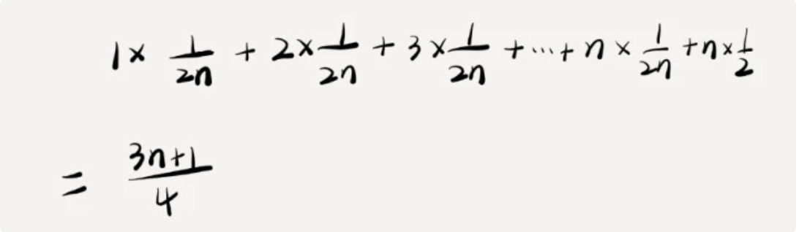
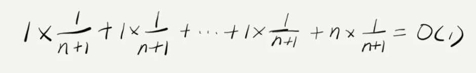

# 一、复杂度分析

- **渐进时间复杂度**：表示算法的执行时间与数据规模之间的增长关系
- **渐进空间复杂度**：表示算法的存储空间与数据规模之间的增长关系

## 1、时间复杂度

- `O(1)`：常量级时间复杂度的表示方法，并不是指只执行了一行代码，如：

    ```java
    int i = 8;
    int j = 6;
    int sum = i + j;
    ```

- `O(logn)、O(nlogn)`：

    ```java
    i=1;
    while (i <= n)  {
    	i = i * 2;
    }
    ```

- `O(m+n)、O(m*n)`：此类代码的复杂度由两个数据的规模决定

    > m 和 n 表示两个数据规模，无法事先评估 m 和 n 谁的量级大，因此不能简单地利用加法法则，省略其中一个

    ```java
    int cal(int m, int n) {
    	int sum_1 = 0;
    	int i = 1;
    	for (; i < m; ++i) {
    		sum_1 = sum_1 + i;
    	}
    
    	int sum_2 = 0;
    	int j = 1;
    	for (; j < n; ++j) {
    		sum_2 = sum_2 + j;
    	}
    	return sum_1 + sum_2;
    }
    ```

## 2、空间复杂度

暂时忽略。。。


## 3、最好、最坏、平均、均摊时间复杂度分析

### (1) 最好、最坏、平均时间情况复杂度

```json
// n表示数组array的长度
int find(int[] array, int n, int x) {
    int i = 0;
    int pos = -1;
    for (; i < n; ++i) {
        if (array[i] == x) {
            pos = i;
            break;
        }
    }
    return pos;
}
```

- **最好情况时间复杂度**：在最理想的情况下，执行这段代码的时间复杂度，上述为 `O(n)`

- **最坏情况时间复杂度**：在最糟糕的情况下，执行这段代码的时间复杂度，上述为 `O(1)`

- **(加权)平均情况时间复杂度**：表示一般情况下的时间复杂度，上述为 `O(n)`

    > - 分析一(结论正确，计算过程有问题)：n 个数据，就是 n 种情况，在加上一个不在 n 个数据中的情况，所以共有 n+1 中情况，则  1+..+n 为 n(n+1)/2  ，则再加个 n 就为 n(n+3)/2 ，在除以 n+1 为 n(n+3)/2(n+1)，大 O 表示为 O(n)
    >
    > - **分析二(加权平均值或期望值)**：假设在数组中与不在数组中的概率都为 1/2。另外，要查找的数据出现在  0～n-1 这 n 个位置的概率也是一样的，为 1/n。所以，根据概率乘法法则，要查找的数据出现在 0～n-1 中任意位置的概率就是 1/(2n)
    >
    >     

注：一般使用一个复杂度就可以，只有同一块代码在不同情况下，时间复杂度有量级差距，才会使用这三种复杂度表示法来区分

### (2) 均摊时间复杂度

代码解释：这段代码实现了一个往数组中插入数据的功能

- 当数组满了之后，即 `count == array.length` 时，用 for 循环遍历数组求和，并清空数组，将求和之后的 sum 值放到数组的第一个位置，然后再将新的数据插入
- 若数组一开始就有空闲空间，则直接将数据插入数组

```java
// array 表示一个长度为 n 的数组
int[] array = new int[n];
int count = 0;

void insert(int val) {
    if (count == array.length) {
        int sum = 0;
        for (int i = 0; i < array.length; ++i) {
            sum = sum + array[i];
        }
        array[0] = sum;
        count = 1;
    }
    array[count] = val;
    ++count;
}
```

代码时间复杂度分析：

- **最好情况时间复杂度**为 `O(1)`

- **最坏情况时间复杂度**为 `O(n)` 

- **平均时间复杂度**：若数组的长度是 n，根据数据插入的位置不同，可以分为 n 种情况，每种情况的时间复杂度是 O(1)。除此之外，还有一种“额外”的情况，就是在数组没有空闲空间时插入一个数据，这个时候的时间复杂度是 O(n)。而且，这 n+1 种情况发生的概率一样，都是 1/(n+1)。所以，根据加权平均的计算方法，求得的平均时间复杂度就是：

    

---

函数 `insert` 与 `find` 的区别：

- 首先，find() 函数在极端情况下，复杂度才为 O(1)

    但 insert() 在大部分情况下，时间复杂度都为 O(1)，只有个别情况下，复杂度才比较高，为 O(n)

- 其次，对于 insert() 函数，O(1) 时间复杂度的插入和 O(n) 时间复杂度的插入，出现频率非常有规律，而且有一定的前后时序关系，一般都是一个 O(n) 插入之后，紧跟着 n-1 个 O(1) 的插入操作，循环往复

    > 针对这种特殊的场景，可采用摊还分析法

---

**均摊时间复杂度**：通过摊还分析得到的时间复杂度

> 以 `insert` 理解均摊分析的大致思路：每一次 O(n) 的插入操作，都会跟着 n-1 次 O(1) 的插入操作，所以把耗时多的那次操作均摊到接下来的 n-1 次耗时少的操作上，均摊下来，这一组连续的操作的均摊时间复杂度就是 O(1)


# 二、基础数据结构与算法

## 1、数组：编号从 0 开始


## 2、链表

### (1) LRU 缓存淘汰算法


### (2) 链表实现


## 3、栈：实现浏览器的前进和后退功能


## 4、队列：在线程池的应用


## 5、递归：三行代码找到“最终推荐人”


## 6、排序

### (1) 插入排序优于冒泡排序


### (2) 快排在 O(n) 内查找第 K 大元素


## 7、线性排序：根据年龄给 100 万用户数据排序


## 8、排序优化：实现一个通用、高性能的排序函数


## 9、二分查找

### (1) 最省内存方式实现快速查找功能


### (2) 快速定位 IP 对应的省份地址


## 10、跳表：redis 使用跳表实现有序集合


## 11、散列表

### (1) 实现 word 单词拼写检查功能


### (2) 打造工业级水平的散列表


### (3) 散列表与链表同时使用


## 12、哈希算法

### (1) 防止数据库中的用户信息被脱库


### (2) 哈希算法在分布式系统中的应用


## 13、二叉树

### (1) 适合用数组存储的二叉树


### (2) 对比散列表与二叉树


## 14、红黑树


## 15、递归树：解析递归算法的时间复杂度


## 16、堆

### (1) 堆排序


### (2) 堆的应用：获取 top10 最热门搜索关键词


## 17、图：存储社交网络的好友关系


## 18、深度和广度优先搜索：找出社交网络中的三度好友关系


## 19、字符串匹配基础

### (1) 借助哈希算法实现高效字符串匹配


### (2) 实现文本编辑器的查找功能


### (3) 借助 BM 算法理解 KMP 算法


## 20、Trie 树：实现搜索引擎的搜索关键词的提示功能


## 21：AC 自动机：用多模式串匹配实现敏感词过滤功能


## 22、贪心算法：实现 Huffman 压缩编码


## 23、分治算法：MapReduce 的分治思想


## 24、回溯算法：从《蝴蝶效应》学习回溯的核心思想


## 25、动态规划

### (1) 解决“双十一”购物时的凑单问题


### (2) 理解最优子结构、无后效性、重复子问题


### (3) 实现搜索引擎中的拼写纠错功能


# 三、进阶算法

## 1、拓扑排序：确定源代码的编译依赖关系


## 2、最短路径：计算最优出行路径


## 3、位图：实现网页爬虫的 URL 去重功能


## 4、概率统计：利用朴素贝叶斯算法过滤垃圾短信


## 5、向量空间：实现简单的音乐推荐系统


## 6、B+树：实现 MySQL 数据库索引


## 7、搜索：用 A* 搜索算法实现游戏的寻路功能


## 8、索引：海量数据查找某个数据


## 9、并行算法：利用并行处理提高算法执行效率


# 四、实战篇

## 1、实战一：剖析 Redis 常用数据类型对应的数据结构


## 2、实战二：剖析搜索引擎背后的经典数据结构和算法


## 3、实战三：剖析高性能队列 Disruptor 背后的数据结构和算法


## 4、实战四：剖析微服务接口鉴权限流背后的数据结构和算法


## 5、实战五：用学过的数据结构和算法实现一个短网址系统

