# 一、概述

## 1. 算法表述

- **自然语言**（ENGLISH）


- **算法描述语言**（Pseudo-code）
- **计算机程序语言**(C++,Java)
- **硬件设计**（DSP）

## 2. 算法一般特性

- **正确性：**对于符合输入类型的任意输入数据，都产生正确的输出
- **有效性：**每一步指令能够被有效的执行，并且规定了指令的执行效果，结果应该具有的数据类型，而且是可以预期的
- **确定性：**每一步之后都要有确定的下一步指令
- **有穷性：**有限步内结束

## 3. 算法效率

#### 1. 有限资源

- **计算时间**
- **存储空间**
- **网络带宽**

#### 2. 资源开销与输入

- **资源开销与输入大小相关：**文本长度、排序记录条目数量
- **资源开销与输入的组织结构有关：**无序、有序

## 4. 渐进分析

### 1. 渐进分析目的

 **得到一个开销函数的渐进表达式**，如：

​			$${rate(T)}_{n\rightarrow+\infty} = O(f(n))$$

- n：**问题规模**
- T（n）：**资源开销函数**
- f（n）：**问题规模的整函数表达式**

### 2. 渐进分析与阶的增长

- 开销函数的估计是相对的而不是绝对的
- 独立于机器的算法开销估计
- 独立于实现技术的算法自身测度表示
- 关心的是大规模输入的情况

### 3. 符号表示

- $O$ 记号：`f(n) = O(g(n)) if ∃c > 0, n0 > 0, ∀n ≥ n0: 0 ≤ f(n) ≤ c ⋅ g(n)` 
- $Ω$ 记号：`f(n) = Ω(g(n)) if ∃c > 0, n0 > 0, ∀n ≥ n0: 0 ≤ c ⋅ g(n) ≤ f(n) `
- $Θ$ 记号：`f(n) = Θ(g(n)) if ∃c1, c2 > 0, n0 > 0, ∀n ≥ n0: c1 · g(n) ≤ f(n) ≤ c2 ⋅ g(n)`
- $ω$ 记号：`f(n) = ω(g(n)) if ∀c > 0 ∃n0 > 0, ∀n ≥ n0: f(n) ≥ c ⋅ g(n)`
- $o$ 记号：`f(n) = o(g(n)) if ∀c > 0 ∃n0 > 0, ∀n ≥ n0: f(n) ≤ c ⋅ g(n)`


> $o 或 w 对比 O 或 Θ$ 


- $f(n) = O(f(n)) ; f(n) = Ω(f(n)) ; f(n) = Θ(f(n))$ 
- $f(n) = O(g(n))  且 g(n) = O(h(n)) ⇒ f(n) = O(h(n))$ 
- $f(n) = Ω(g(n)) 且g(n) = Ω(h(n)) ⇒ f(n) = Ω(h(n))$ 
- $f(n) = Θ(g(n)) 且g(n) = Θ(h(n)) ⇒ f(n) = Θ(h(n))$
- $ f(n) = O(g(n)) ⇐⇒ g(n) = Ω(f(n))$
- $ f(n) = o(g(n)) ⇐⇒ g(n) = ω(f(n))$ 
- $f(n) = O(g(n)) 且f(n) = Ω(g(n)) ⇒ f(n) = Θ(g(n))$
- $f1(n) = O(g1(n)) 且f2(n) = O(g2(n)) ⇒ f1(n) + f2(n) = O(g1(n) + g2(n))$
- $f(n) = O(g(n)) ⇒ f(n) + g(n) = O(g(n))$ 


- $If \lim_{n\rightarrow+\infty} \frac{f(n)}{g(n)} = 0, then f(n) = o(g(n))$
- $If \lim_{n\rightarrow+\infty} \frac{f(n)}{g(n)} = +\infty, then f(n) = w(g(n))$
- $If \lim_{n\rightarrow+\infty} \frac{f(n)}{g(n)} = c,∃  c > 0,then f(n) = \theta(g(n))$
- $If \lim_{n\rightarrow+\infty} \frac{f(n)}{g(n)} = 0,then  a^{f(n)} = o(a^{g(n)}),∀a > 1$
- $f(n) = o(g(n)) \Rightarrow a^{f(n)} = o(a^{g(n)}),∀a > 1$
- $f(n) = \theta(g(n)) !=> a^{f(n)} = o(a^{g(n)}),∀a > 1$

## 5. 最坏、最好和平均情况

- 输入量为n时的**最大运行步骤数目**
- 输入量为n时的**最小运行步骤数目**
- 输入量为n时的**平均运行步骤数目**

## 6. 伪代码中的约定

- **缩进**表示程序中的分程序（程序块）结构

- **while、for、repeat-until** 等循环结构和 **if、then、else** 条件结构与Pascal相同

  > **for 循环** ： 当循环终止，循环计数器的值为第一个超出 for 循环界限的值
  >
  > **to 关键字：**每次迭代增加循环计数器值
  >
  > **downto 关键字：**每次循环减少循环计数器值
  >
  > **by 关键字：**改变循环计数器的该变量，如：by 2 表示循环计数器改变为 1，3，5...

- `//`  表示后面部分是注释

- 多重赋值 `i=j=e` 是将表达式 e 的值赋给变量 i 和 j

- **变量是局部于给定**过程的，在没有显示说明的情况下，我们不使用全局变量

- 数组元素是通过“**数组名[下标]**”这样的形式来进行访问的，**数组下标从 1 开始（伪代码中）**

- 复合数据组织成对象，对象由属性组成；如：**串联访问**`x.f.g`  

- **参数采用按值传递方式**：被调用的过程会收到参数的的一份副本

- return 语句将控制返回到调用点，**允许一个 return 返回多个值（伪代码中）**

- **布尔运算符 `and` 和 `or` 都具有短路能力**，如：

  > 求表达式 `x and y` 的值时：
  >
  > - 首先计算x的值。如果x的值为FALSE，那么整个表达式的值就不可能为TRUE了，因而就无需再对y求值了
  > - 如果x的值为TRUE的话，就必须进一步计算出y的值，才能确定整个表达式的值

- **关键字 error** ：表示调用出现错误，调用过程处理该错误

# 二、排序算法

表格版

| 排序方法 | 时间复杂度(平均) | 时间复杂度(最坏) | 时间复杂度(最好) | 空间复杂度    | 稳定性 | 复杂性 |
| -------- | ---------------- | ---------------- | ---------------- | ------------- | ------ | ------ |
| 插入排序 | $O(n^2)$         | $O(n^2)$         | $O(n)$           | $O(1)$        | 稳定   | 简单   |
| 冒泡排序 | $O(n^2)$         | $O(n^2)$         | $O(n)$           | $O(1)$        | 稳定   | 简单   |
| 选择排序 | $O(n^2)$         | $O(n^2)$         | $O(n^2)$         | $O(1)$        | 不稳定 | 简单   |
| 基数排序 | $O(d(n+r))$      | $O(d(n+r))$      | $O(d(n+r))$      | $O(n+r)$      | 稳定   | 较复杂 |
| 希尔排序 | $O(nlog_2 n)$    | $O(n^2)$         | $O(n)$           | $O(1)$        | 不稳定 | 较复杂 |
| 归并排序 | $O(nlog_2 n)$    | $O(nlog_2 n)$    | $O(nlog_2 n)$    | $O(n)$        | 稳定   | 较复杂 |
| 快速     | $O(nlog_2 n)$    | $O(n^2)$         | $O(nlog_2 n)$    | $O(nlog_2 n)$ | 不稳定 | 较复杂 |
| 堆排序   | $O(nlog_2 n)$    | $O(nlog_2 n)$    | $O(nlog_2 n)$    | $O(1)$        | 不稳定 | 较复杂 |

## 1. 插入排序

### 1. 伪代码

```c
InsertionSort(A, n) {
	for i = 2 to n {
		key = A[i]
		j = i - 1
		while (j > 0) and (A[j] > key) {
			A[j+1] = A[j]
			j = j - 1
		}
		A[j+1] = key
	}
}
```

### 2. 详解

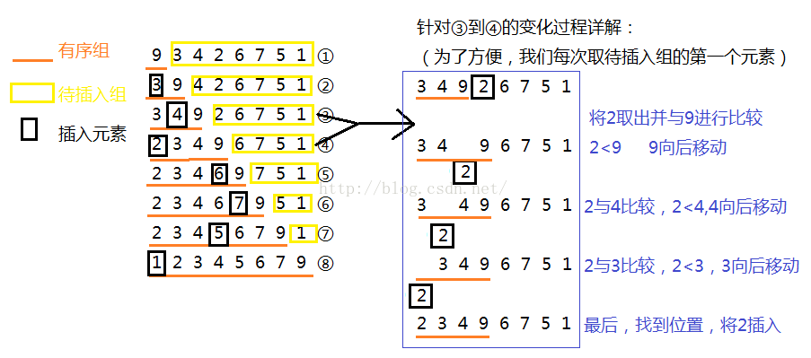

### 3. 时间复杂度

​								$$T(n) = n^2$$

## 2. 冒泡排序

### 1. 伪代码

```c
void bubble_sort(int arr[], int len) {  
    int i, j;  
    for (i = 0; i < len - 1; i++)          //外层循环控制趟数，总趟数为len-1
        for (j = 0; j < len - 1 - i; j++)  //内层循环为当前i趟数 所需要比较的次数
            if (arr[j] > arr[j + 1])  
                swap(arr[j], arr[j + 1]);          
} 
```

### 2. 详解

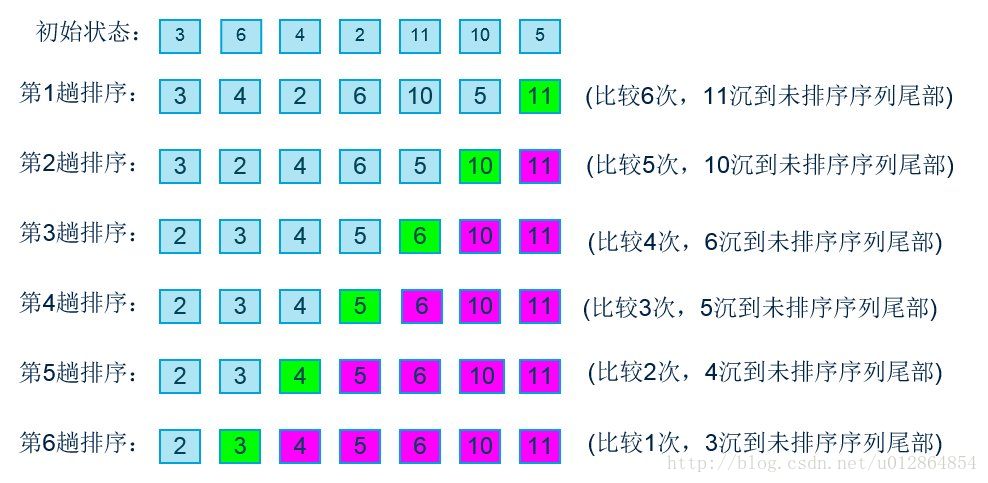

详细步骤： 

1. 比较相邻的元素，如果第一个比第二个大(或小)就交换

2. 对每一对相邻元素作同样的工作，从开始第一对到结尾的最后一对

   > 这步做完后，最后的元素会是最大（小）的数

3. 针对所有的元素重复以上的步骤，除了最后已经选出的元素（有序）

4. 持续每次对越来越少的元素（无序元素）重复上面的步骤，直到没有任何一对数字需要比较，则序列最终有序

## 3. 选择排序

### 1. 代码

```c
//a -> 待排序的数组；n -> 数组的长度
void select_sort(int a[], int n){
    int i;        // 有序区的末尾位置
    int j;        // 无序区的起始位置
    int min;    // 无序区中最小元素位置

    for(i=0; i<n; i++){
        min=i;
        // 找出"a[i+1] ... a[n]"之间的最小元素，并赋值给min。
        for(j=i+1; j<n; j++){
            if(a[j] < a[min])
                min=j;
        }
        // 若min!=i，则交换 a[i] 和 a[min]。
        // 交换之后，保证了a[0] ... a[i] 之间的元素是有序的
        if(min != i)
            swap(a[i], a[min]);
    }
}
```

### 2. 详解

- 首先在未排序的数列中找到最小(or最大)元素，然后将其存放到数列的起始位置
- 接着，再从剩余未排序的元素中继续寻找最小(or最大)元素，然后放到已排序序列的末尾
- 以此类推，直到所有元素均排序完毕


排序流程： 

- 第1趟：i=0。找出a[1...5]中的最小值a[3]=10，然后将a[0]和a[3]互换。 数列变化：20,40,30,10,60,50 -- > 10,40,30,20,60,50
- 第2趟：i=1。找出a[2...5]中的最小值a[3]=20，然后将a[1]和a[3]互换。 数列变化：10,40,30,20,60,50 -- > 10,20,30,40,60,50
- 第3趟：i=2。找出a[3...5]中的最小值，由于该最小值大于a[2]，该趟不做任何处理
- 第4趟：i=3。找出a[4...5]中的最小值，由于该最小值大于a[3]，该趟不做任何处理
- 第5趟：i=4。交换a[4]和a[5]的数据。 数列变化：10,20,30,40,60,50 -- > 10,20,30,40,50,60

## 4. 计数排序

### 1. 伪代码

```c
//A 输入数组，B 存放排序的输出，C 提供临时储存空间
COUNTING-SORT(A, B, n, k){//假设n个输入元素为0-k之间的整数
	let C[0..k] be a new array
	for i ← 0 to k
		do C[ i ] ← 0
	//计算 C[i]包含等于i的元素的个数
	for j ← 1 to n
		do C[A[ j ]] ← C[A[ j ]] + 1
	//计算 C[i] 包含小于或等于i的元素的个数
	for i ← 1 to k
		do C[ i ] ← C[ i ] + C[i -1]
	for j ← n downto 1
		B[C[A[ j ]]] ← A[ j ]
		C[A[ j ]] ← C[A[ j ]] - 1
}
```

### 2. 详解

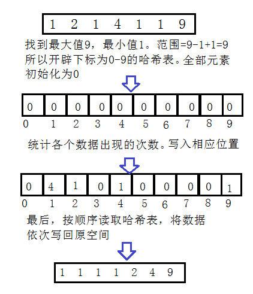

**上图帮助理解思路（与伪代码不符），下图为完整的作答过程（与伪代码相符）：**


### 3. 时间复杂度

​					$$T(n) = θ(n+k)$$

## 5. 基数排序

### 1. 伪代码

```c
RADIX-SORT(A,d){
	for i = 1 to d
		use a table sort to sort array A on digit i
}
```

### 2. 详解

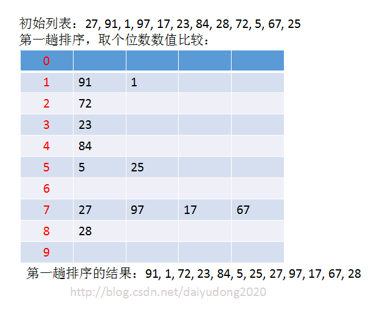


### 3. 时间复杂度

​					$$T(n) = O(n + k)$$

## 6. 桶排序

### 1. 伪代码

```c
BUCKET-SORT(A){
	n = A.length
	let B[0..n-1] be a new array
	for i ← 1 to n
		insert A[i] into list B[nA[i]] （注意下标）
	for i ← 0 to n - 1
		sort list B[i] with insertion sort （桶内插入排序）
	concatenate lists B[0], B[1], . . . , B[n -1]together in order
	return the concatenated lists
}
```

### 2. 详解

**下图和伪代码不一样（思想一样）：**


**操作步骤说明：**

- 设置桶的数量为5个空桶，找到**最大值110，最小值7**，**每个桶的范围 20.8=(110-7+1)/5** 

- 遍历原始数据，以链表结构，放到对应的桶中

  > - 数字7，桶索引值为0：((7 – 7) / 20.8) 余 0
  > - 数字36，桶索引值为1：floor((36 – 7) / 20.8) 余 1

- 当向同一个索引的桶，**第二次插入数据时，判断桶中已存在的数字与新插入数字的大小，按照左到右，从小到大的顺序插入**

  >  如：索引为2的桶，在插入63时，桶中已存在4个数字56，59，60，65，则数字63，插入到65的左边

  **或者按先后顺序存放，然后再进行桶内插入排序（符合伪代码）**

- 合并非空的桶，按从左到右的顺序合并0，1，2，3，4桶。

- 得到桶排序的结果

### 3. 时间复杂度

​					$$T(n) = O(n)$$

## 7. 希尔排序

- 希尔排序是插入排序的一种，它是针对直接插入排序算法的改进。该方法又称**缩小增量排序** 

详解： 

- 将无序数组相隔特定增量分割为若干个子序列，对各个子序列进行插入排序
- 然后再选择一个更小的增量，再将数组分割为多个子序列进行排序
- 最后选择增量为1，即用直接插入排序，使最终数组成为有序


## 8. 归并排序

### 1. 伪代码

```c
MERGE(A,p,q,r){//p,q,r 是数组下标，p<=q<=r
	n1 ← q – p + 1
	n2 ← r – q
	let L and R 为左右临时数组 //其中 L 与 R 分别已经排好序
	for i = 1..n1
		do L[i] ← A[p + i – 1]
	for j = 1..n2
		do R[j] ← A[q + j]
	//A:（结束标志）
	L[n1 + 1] ← ∞
	R[n2 + 1] ← ∞
	i ← 1
	j ← 1
	for k = p to r	//遍历 L 与 R 并比较两者元素，将小的放入结果数组 A 中
		do if L[i] ≤ R[j]
			then A[k] ← L[i]
			i ← i + 1
		else A[k] ← R[j]
			j ← j + 1
}

MergeSort(A, p, r){
	if p < r
		//将数组一分为二
		q ← (p + r) / 2
		//分治策略排序子数组，然后再进行合并
		MergeSort(A, p, q)
		MergeSort(A, q + 1, r)
		//合并过程中进行的排序
		Merge(A, p, q, r)
}
```

### 2. 详解

**下图过程没用调用新的数组来存储结果，而是通过交换数组元素顺序来达到存储排序结果的目的：**


### 3. 时间复杂度

推导式：

$$T(n) = 2 * T(n/2) + O(n)$$

时间复杂度：

$$T(n) = O(n∗logn)$$ 

## 9. 快速排序

### 1. 伪代码

```c
QUICKSORT(A,p,r){
	if p < r
        //使当前数组分为主元左边元素小，右边元素大
		q = PARTITION(A,p,r)
        //对各子数组进行快排
		QUICKSORT(A,p,q-1)
		QUICKSORT(A,q+1,r)
}

PARTITION(A,p,r){//r 为选取的主元
	x = A[r]
	i = p - 1
	for j = p to r - 1
		if A[j] <= x
			i = i + 1
			exchange A[i] with A[j]
	exchange A[i + 1] with A[r] //交换使主元左边元素比其小，右边元素比其大
	return i + 1 //返回主元最终的位置
}
```

### 2. 详解

**对着伪代码一步一步来：** 

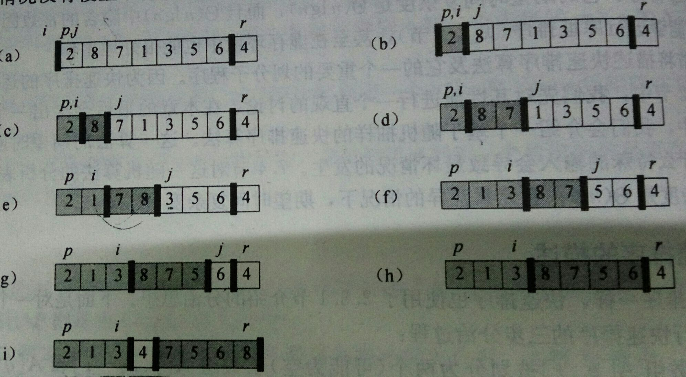

### 3. 时间复杂度

​					$$T(n) = O(n∗logn)$$ 

> 推导式：
>
> $$T(n) = 2 * T(n/2) + O(n)$$
>
> 时间复杂度：
>
> $$T(n) = O(n∗logn)$$

- 随机快速排序算法同快速排序，只是**主元的选取是随机的** 

## 10. 堆排序

### 1. 伪代码

```c
//实现最大堆
MAX-HEAPIFY(A,i)
	l = LEFT(i)
	r = RIGHT(i)
	if l <= A.heap-size and A[l] > A[i]
		largest = l
	else largest = i
	if r <= A.heap-size and A[r] > A[largest]
		largest = r
	if largest != i
		exchange A[i] and A[largest]
		MAX-HEAPIFY(A,largest)
      
//建最大堆
BUILD-MAX-HEAP(A)
	A.heap-size = A.length
	for i = A.length / 2 downto 1
		MAX-HEAPIFY(A,i)
      
//堆排序      
HEAPSORT(A)
	BUILD-MAX-HEAP(A)
	for i = A.length downto 2
		exchange A[1] with A[i]
		A.heap-size = A.heap-size - 1
		MAX-HEAPIFY(A,1)
```

### 2. 详解

**将无序数组构造为最大堆：**

- 首先遍历叶节点，检查其父节点是否比其小，如果是，则与值大的叶节点交换直至满足父节点比子节点大为止
- 然后往上重复进行，直至满足最大堆（**父节点比子节点大**）为止


**堆排序：**

- **交换第一个元素与最后一个元素**
- **堆大小减 1**
- **对剩余堆进行最大堆算法**，然后重复上述步骤直到堆无元素为止


### 3. 时间复杂度

- **MAX-HEAPIFY** 
  - 推导式：$$T(n) = T(2n/3) + \theta(1)$$
  - 时间复杂度：$$T(n) = lg(n)$$
- **BUILD-MAX-HEAP**
  - 时间复杂度： $$T(n) = O(n)$$

- **HEAPSORT**
  - 时间复杂度：$$T(n)=O(n * logn)$$​					

# 三、分治策略

## 1. 最大子数组

### 1. 详解

用分治法求出其最大的子数组，首先将数组划分为两个规模尽量相等的子数组，找到数组的中央位置，比如mid，然后考虑求解两个子数组A[low..mid]和A[mid+1..high]

那么子数组A[i..j]所有的情况都逃脱不了一下三种：

- 完全位于子数组A[low..mid]中，**low<=i<=j<=mid**
- 完全位于子数组A[mid+1..high]中，**mid<i<=j<=high**
- 跨越了中点，因此 **low<=i<=mid<j<=high**

**求跨越中点的伪代码：**

```c
FIND-MAX-CROSSING-SUBARRAY(A,low,mid,high){
	left_sum = 负无穷
	sum = 0
	for i = mid downto low //从中间点往左遍历
		sum = sum + A[i]
		if sum > left_sum
			left_sum = sum //记录中间点左边最大值
			max_left = i
	right_sum = 负无穷
	sum = 0
	for j = mid + 1 to high //从中间点往右遍历
		sum = sum + A[j]
		if sum > right_sum
			right_sum = sum //记录中间点右边最大值
			max_right = j
	return (max_left,max_right,left_sum + right_sum)
}
```

**主的递归伪代码：**

```c
FIND-MAXIMUM-SUBARRAY(A,low,high){
	if high == low
		return (low,high,A[low])
	else 
		mid = (low + high) / 2
        //递归分治求解左右子数组最大值
		(left_low,left_high,left_sum) = FIND-MAXIMUM-SUBARRAY(A,low,mid)
		(right_low,right_high,right_sum) = FIND-MAXIMUM-SUBARRAY(A,mid + 1,high)
        //求解跨越中间点的最大值
		(cross_low,cross_high,cross_sum) = FIND-MAX-CROSSING-SUBARRAY(A,low,mid,high)
		if left_sum >= right_sum and left_sum >= cross_sum
			return (left_low,left_high,left_sum)
		else if right_sum >= left_sum and right_sum >= cross_sum
			return (right_low,right_high,right_sum)
		else 
			return (cross_low,cross_high,cross_sum)
}
```

### 2. 时间复杂度

**T(n) 递归式：**

$$T(n) = \begin{cases}\theta(1) & \text if &n = 1 \\2 * T(n/2) + \theta(n) & \text if & n > 1\end{cases}$$

**时间复杂度：**	

$$T(n) = n * logn$$

### 3. 非递归，线性时间实现

```java
public static int findMaxByLine(int[] array) {
    int max = Integer.MIN_VALUE;
    int tmp = Integer.MIN_VALUE;
    for (int i = 0; i < array.length; i++) {
        if (tmp + array[i] >= array[i]){
            tmp += array[i];
        }else {
            tmp = array[i];
        }
        if (tmp > max){
            max = tmp;
        }
    }
    return max;
}
```

## 2. 矩阵乘法的 Strassen

### 1. 伪代码 

```c
//数学方法
SQUARE-MATRIX-MULTIPLY(A,B){
	m = A.rows
	let C be a new nXn matrix
	for i = 1 to n
		for j = 1 to n
			C[i][j] = 0
			for k = 1 to n
				C[i][j] = C[i][j] + A[i][k] * B[k][j]
	return C
 }
```

//**分治法**


### 2. 详解

**伪代码反正我是没看懂，建议看看书P45-47 的讲解吧（表示不一定能看懂，难受）**

### 3. 时间复杂度

**T(n) 递归式：**

$$T(n) = \begin{cases}\theta(1) & \text if & n = 1 \\7 * T(n) + \theta(n^2) & \text if & n > 1   \end{cases}$$

时间复杂度：

$$T(n) = \theta(n^{lg7})$$

## 3. 大整数相乘

### 1. 伪代码

```c
MULT(X,Y){
	if |X| = |Y| = 1 
		then do return XY
	else 
		return MULT(a, c)*2^n + (MULT(a, d) + MULT(b,c))2^(n / 2) + MULT(b, d)
}
```

### 2. 详解

- 假如有两个n位的M进制大整数x，y，利用一个小于n的正数k（通常k的取值为n/2左右），将x，y分解成如下形式：$x = a *  10 ^ {n/2} + ；y = c * 10 ^ {n/2} + d$
- 则，x，y的乘积可计算为：$x * y = a * c * 10^n + (a * d + b * c) * 10^{n/2} + b * d$

### 3. 时间复杂度

​	$$T(n) = \begin{cases}1 & \text if &n = 1 \\4 * T(n/2) + \theta(n) & \text if & n > 1\end{cases}$$

​	$$T(n) = \theta(n^2)$$ 

## 4. Karatsuba 算法

### 1. 伪代码

```c
//思路参考，并非真的伪代码
MULT(X,Y){
	if |X| = |Y| = 1 
		then do return X * Y
	else
		A1 = MULT(a,c);
		A2 = MULT(b,d);
		A3 = MULT((a+b)(c+d));
}
```

### 2. 详解

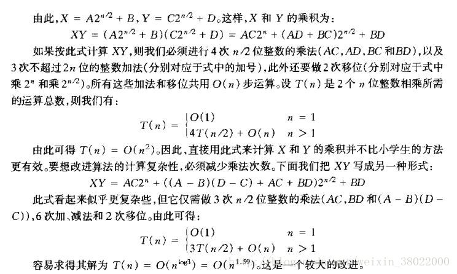

### 3. 时间复杂度

​	$$T(n) = \begin{cases}1 & \text if &n = 1 \\3 * T(n/2) + \theta(n) & \text if & n > 1\end{cases}$$

​	$$T(n) = \theta(n ^ {log_23}) = \theta(n ^ {1.58})$$	 

## 5. 最近点对问题

### 1. 详解

- **划分阶段：** 用一条垂直线 L 把 S 划分成两个尽可能大小接近的子集 $S_L$、$S_R$ ，$S_L$ 与 $S_R$ 分别包含 n/2 个点，分别**计算出 $S_L$ 、$S_R$ 中的最近点对距离 $δ_L$ 、$δ_R$** ，再计算 $S_L$ 的点与 $S_R$ 的点之间的最小距离 $δ’$ 

- **治理阶段(求  $δ’$ )：** 设 $δ=min\{δ_L，δ_R\}$，删除所有到 L 的距离大于 δ 的点，只剩在下图中的灰色部分 $T$ 

  > **T 中的每个点最多需要和 T 中的7个点进行比较** 
  >
  > 原因：
  >
  > - 划分出 $δ*2δ$ 的矩形
  > - 如果该矩形内任意两点之间的距离不超过 δ，这个矩形最多能容纳8个点，其中至多4个点属于 $S_L$ ，至多4个点属于 $S_R$ 
  > - 但有两个点分别在矩形上下边的中点时，可以取得最大点数
  > - 因此最多只需要比较7次
  >
  > **将 T 中的点按 y 轴坐标的增序排列，遍历所有点，但每次只计算某一点和它上面7个点的距离**

  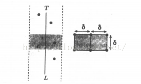

- **组合阶段：** $δ=min\{δ_L，δ_R，δ’ \}$ 

### 2. 时间复杂度

递归表达式：

$$T(N)=2T(N/2)+O(N) $$

时间复杂度：

$$T(n) = O(n * logn)$$

### 3. 伪代码(仅供参考)

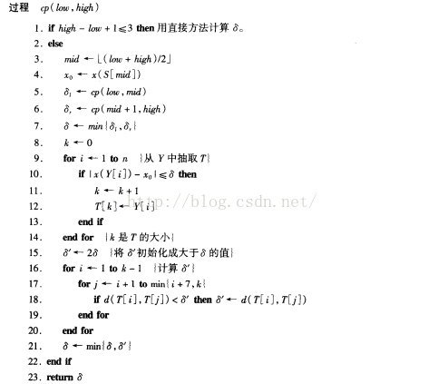

## 6. 递归式求解的三种方法

### 1. 主方法求解递归式

 **递归式：** $T(n) = a * T(n/b) + f(n)$ **其中 a>=1，b>1，f(n)是给定的函数，T(n)是定义在非负整数上的递归式**


> **将 f(n) 于函数 $n^{log_ba}$ 进行比较：**
>
> - **若函数 $n^{log_ba}$  更大，则解为 $T(n) = \theta(n^{logba})$**
> - **若函数 f(n) 更大，则解为 $T(n) = \theta(f(n))$**
> - **若两个函数相当，则解为 $T(n) = \theta(n^{log_ba} * lgn) = \theta(f(n) * lgn)$**

**例子：**

对于 $T(n) = 9 * T(n/3) + n$ ，可得 a = 9，b = 3，f(n) = n

因此 $n^{log_ba} = n^{log_39} = n^2$ ，而 $f(n) = n <  n^2$ ，所以解为 $T(n) = \theta(n^{log_ba}) = \theta(n^2)$ 

### 2. 递归树求解

> - **用主方法求解不了的递归式，可以用递归树来猜测解的上界，然后用代入法来证明解的正确性**
> - **递归树的求解精确度取决于你画递归树的精确度**

**例子：**

$T(n) = 3 * T(n/4) + \theta(n^2)$ 的递归树 


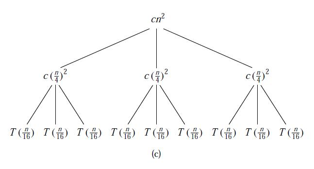


> **把递归树扩展到 T(1) 的层，然后以 T(1) 为单位把每层的代价求和，最后就是总的代价**

### 3. 代入法

- **猜测解的形式**
- **用数学归纳法求出解中方的常数，并证明是正确的**

**例子：**

递归式 $T(n) = 2T(n/2)+n$ 

- 猜测解是 O(nlgn) ，我们要寻找到一个常数c,使得 $T(n)<=cnlgn$ 
- 即 $T(n) <= 2c(n/2)lg(n/2)+n <= cnlgn-cnlg2+n = cnlgn-cn+n<= cnlgn $ 
- 只要 c>=1，则T(n)<=cnlgn，所以我们的猜测是正确的

>  **注意：**
>
> - **代入法全凭经验**
> - **通常用递归树来确定上界，然后用代入法再证明**

# 三、随机算法***

- [算法导论第五章：概率分析和随机算法](https://blog.csdn.net/longhuihu/article/details/5864442) 

## 1. 随机数


## 2. 数值概率算法


# 四、统计算法

## 1. 求最大最小值

#### 1. 伪代码

```c
//求最小值：时间复杂度为 n - 1
Minimum(A)
	min ← A[1]
	for i = 2..n
		do if A[ i ] < min
			then min ← A[ i ]
	return min
//同时求最大最小值: 时间复杂度为 3n/2 - 2
Min-Max(A)
	for i = 1..n/2
	do if A[2i – 1] ≤ A[2i] //分治的思想，将数组分成存小数和大数的两个数组
		then B[i] ← A[2i – 1]
		C[i] ← A[2i]
	else B[i] ← A[2i]
		 C[i] ← A[2i – 1]
	min ← Minimum(B) //求小数组中的最小数
	max ← Maximum(C) //求大数组中的最大数
	return (min, max) 
```

#### 2. 详解

根据伪代码的步骤理解即可

## 2. 随机选择算法

### 1. 期望为线性时间的选择算法

#### 1. 伪代码

```c
//返回数组中第 i 小的元素
RANDOMIZED-SELECT(A, p, r, i )
	if p == r
		then return A[p]
	q ←RANDOMIZED-PARTITION(A, p, r) //返回一个随机主元，随机快速排序中的算法：二.7.1
	k ← q - p + 1 //(分割中心所在位置)，比 A[q] 元素小的个数
	if i == k //判断 i 与 k 的大小,若相等，即A[q]为第 i 小，返回A[q] 
		then return A[q]
	else if i < k
		then return RANDOMIZED-SELECT(A, p, q-1, i ) //若i < k,则所需元素落在划分的低区
	else return RANDOMIZED-SELECT(A, q + 1, r, i-k) //若i > k,则所需元素落在划分的高区
```

#### 2. 详解（参照伪代码）

- 调用q=Randomized_Partition(A,p,r) **随机返回一个主元**，在数组[p,r]中**第  q-p 小**（q 左边元素都比q所在值小）
- **k=q-p+1 为比A[q]元素小的个数（包括本身）** 
- 判断 i 与 k 的大小,若相等，即A[q]为第 i 小，返回A[q] 
- 若i < k,则所需元素落在划分的低区 递归调用 Randomized_Select(A,p,q-1,i) 
- 若i > k,则所需元素落在划分的高区 因为已经知道有k个值小于第 i 小的元素，则递归调用 Randomized_Select(A,q+1,r,i-k)

> 可以理解为不断使用**二分算法**，先通过随机快排将元素分成两组，然后判断在哪一组，在再二分

### 2. 最坏情况为线性时间的选择算法

**详解：**

- 将输入数组的n个元素**划分为 n/5 组**，每组5个元素，且至多只有一组由剩下的n mod 5个元素组成
- 首先对每组元素进行插入排序，然后**确定每组有序元素的中位数**
- 递归调用Select()，**找出上述所有组中位数的中位数**，若为偶数个，可以约定用哪一个
- 调用 Partition(int *A,int p,int r,int x)（**二.6.1 快排的修订版，x为上一步中的中位数的中位数**）令 k 比低区元素数目多1，因此 x 为第 k 小的元素，并且有 n - k 个元素划分在高区

> **上述步骤为寻找主元**（采用了分治的思想，将数组元素划分为5个小数组，降低了运算复杂度），可以结合参照上面的伪代码，更容易理解

- **若 i == k ,返回 x ,如果i < k,则在低区递归调用Select()，若 i > k ，则在高区递归查找第i -k小的元素**（同上伪代码的递归调用）

# 五、动态规划

## 1. 概念

- **采用动态规划的前提：具有最优子结构和重叠子问题的性质**
- **动态规划是通过组合子问题的解而解决整个问题的**
- **动态规划算法对每个子问题只求解一次，将其结果存放到一张表中，以供后面的子问题参考，从而避免每次遇到各个子问题时重新计算答案**
- **动态规划通常用于最优化问题**

**步骤：**

- **描述最优解的结构**
- **递归定义最优解的值**
- **按<u>自底向上</u>的方式计算最优解的值**
- **由计算出的结果构造一个最优解**

## 2. 装配线调度问题

### 1. 伪代码


### 2. 详解

**根据伪代码一步一步来**（下图深颜色箭头有问题）：

**以第一步为例：**

- 首先令 $f_1[1] = e_1 + S_{1,1} = 2 + 7 = 9, f_2[1] = e_2 + S_{2,1} = 4 + 8 = 12$
- **求 $f_1[2]$：** 
  - 因为 9 + 9 < 12 + 2 + 9($f_1[1] + S_{1,2} < f_2[1] + t_{2,2} + S_{1,2}$)，所以  $f_1[2]$ 取 18，$l_1[2] = 1$ 
- 求 $f_2[2]$： 
  - 因为 9 + 2 + 5 < 12 + 5($f_1[1] + t_{1,2} + S_{2,2} < f_2[1] + S_{2,2}$)，所以 $f_2[2]$ 取 16，$l_2[2] = 1$

**经过的各个节点：** 

`7-->5-->3-->4-->5-->4-->end` 


### 3. 递归表达式

$$f_1[j] = \begin{cases} e_1 + a_{1,1} & \text if & j = 1 \\ min(f_1[j - 1] + a_{1,j},f_2[j - 1] + t_{2,j - 1} + a_{1,j})   & \text if & j > 1\end{cases}$$

$$f_2[j] = \begin{cases} e_2 + a_{2,1} & \text if & j = 1 \\ min(f_2[j - 1] + a_{2,j},f_1[j - 1] + t_{1,j - 1} + a_{2,j})  & \text if & j > 1\end{cases}$$

$$f^* = min(f_1[n] + x_1,f_2[n] + x_2)$$

## 3. 钢条切割

- **问题描述：** 给定一段长度为n英寸的钢条和一个价格表 $p_i(i=1,2,…n)$,求切割钢条方案,使得销售收益最大

  > **注意：** 如果长度为n英寸的钢条的价格pn足够大，最优解可能就是完全不需要切割

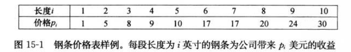 

### 1. 自顶向下递归实现	

#### 1. 伪代码

```c
//自顶向下递归实现
CUT-ROD(p,n)//p 为价格表，n 为长度
	if n == 0
		return 0
	q = -1//q 为收益
	for i = 1 to n
		q = max(q,p[i] + CUT-ROD(p,n - i))
	return q
```

#### 2. 详解

当 n = 4时，递归调用树如下：


#### 3. 时间复杂度

**表达式：**

$$T(n) = 1 + \sum_{i=1}^{n - 1}{T(i)}$$

**时间复杂度：**

$$T(n) = 2^n$$

### 2. 带备忘的自顶向下法	

#### 1. 伪代码

```c
//带备忘的自顶向下法	
MEMOIZED-CUT-ROD(p,n)
	let r[0..n] be a new array
	for i = 0 to n
		r[i] = -1
	return MEMOIZED-CUT-ROD-AUX(p,n,r)

MEMOIZED-CUT-ROD-AUX(p,n,r)
	if r[n] >= 0
		return r[n] //如果有保存的值，直接返回
	if n == 0
		q = 0
	else //没有保存，进行计算
		q = -1
		for i = 1 to n
			q = max(q,p[i] + MEMOIZED-CUT-ROD-AUX(p,n - i,r))
	r[n] = q //将值保存
	return q
```

#### 2. 详解

- 仍按自然的递归形式编写过程，但过程会**保存每个子问题的解**（通常保存在一个数组或散列表中）
- 当需要一个子问题的解时，过程**首先检查是否已经保存过此解**；如果是，则直接返回保存的值，从而节省了计算时间；否则，按通常方式计算这个子问题

#### 3. 时间复杂度

​	$$T(n) = \theta(n^2)$$

### 3. 自底向上法

#### 1. 伪代码

```c
//自底向上法
BOTTOM-UP-CUT-ROD(p,n)
	let r[0..n] be a new array
	r[0] = 0
	for j = 1 to n
		q = -1
		for i = 1 to j
			q = max(q,p[i] + r[j - i])
		r[j] = q //将子问题的解保存
	return r[n]
```

#### 2. 详解(看懂伪代码)

- 恰当定义子问题“规模”的概念，**使得任何子问题的求解都只依赖于“更小的”子问题的求解**
- 将子问题按照规模顺序，由小至大顺序进行求解
- 当求解某个子问题时，它所依赖的那些更小的子问题都已求解完毕，结果已经保存
- 每个子问题只需求解一次，当我们求解它时，它的所有前提子问题都已求解完成

#### 3. 时间复杂度

> 该算法的递归调用迭代次数是一个**等差数列**

​	$$T(n) = \theta(n^2)$$

#### 4. 重构解 

```c
//重构解：不仅保存最优收益值，还保存对应的切割方案
EXTENDED-BOTTOM-UP-CUT-ROD(p,n)
	let r[0..n] and s[0..n] be new arrays
	r[0] = 0
	for j = 1 to n
		q = -1
		for i = 1 to j
			if q < p[i] + r[j - i]
				q = p[i] + r[j - i]
				s[j] = i //保存切割方案
		r[j] = q //保存最优收益
	return r and s
```

## 4. 矩阵链乘法

### 1. 伪代码

```c
MAXTRIX_CHAIN_ORDER(p)
	n = p.length-1
	let m[1..n,1..n] and s[1..n-1,2..n] be new tables
	for i=1 to n 
		do m[i][i] = 0
	for l = 2 to n  //j 从 2 开始取值（下图中对应的 j）
		for i=1 to n-l+1 //i 从 1 开始取值（下图中对应的 i）
			j=i+l-1
			m[i][j] = MAXLIMIT
			for k=i to j-1 //计算可能存在的矩阵乘法种类
				q = m[i][k] + m[k+1][j] + p(i-1)p(k)p(j) //计算
				if q < m[i][j]
					then m[i][j] = q //保存各结果最小值
					s[i][j] = k	//保存取最小结果时，与哪个矩阵相乘
	return m and s
```

### 2. 详解（仅供参考，看实例）

- **问题描述：** 给定n个矩阵的链< A1, A2, …, An>，矩阵$A_i$ 的规模为 $p_{i-1}$  × $P_i$，求完全括号化方案，使得计算乘积A1A2…An所需的乘法次数最少

- **最优括号化方案的结构特征：** $A_{i..j}$ 表示 $A_iA_{i+1}....A_j$ 乘积的结果矩阵，对某个整数 k，先计算 $A_{i..k}$ 和 $A_{k+1..j}$ ，然后再递归求解

- **一个递归解**： 设 **m[i,j]为计算机矩阵 $A_{i...j}$ 所需的标量乘法运算次数的最小值**，对计算 $A_{1...n}$ 的最小代价就是m[1,n]；**s[i,j] 保存 $A_iA_{i+1}....A_j$ 最优括号化方案的分割点位置 k** 

  分两种情况进行讨论如下：

  - **当i==j时：** **m[i,j] = 0** 
  - **当i<j 时：m[i,j] ＝min{m[i,k]+m[k+1,j]+$p_{i-1}p_kp_j$} (i≤k<j)** 

- **计算最优代价：** 采用自底向上表格法逐级记录

- **构造一个最优解**： 上步中已经计算出来最小代价，并保存了相关的记录信息。因此只需对s表格进行递归调用展开既可以得到一个最优解

  ```c
  PRINT_OPTIMAL_PARENS(s,i,j)
    if i== j 
       then print "A_i"
    else
       print "(";
       PRINT_OPTIMAL_PARENS(s,i,s[i][j]);
       PRINT_OPTIMAL_PARENS(s,s[i][j]+1,j);
       print")";
  ```

**实例：（看懂这个就ok，可以考虑理解一下伪代码）**

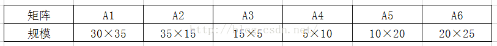 

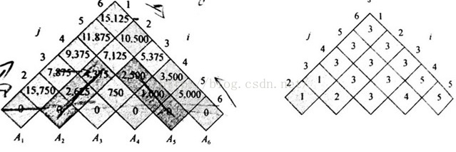

**一步一步计算：** （动手算一下）

- 首先计算最下面的结果

  > **如：$A_{12}$ --> i = 1,j = 2 <==> 30 X 35 X 15;  $A_{23}$ --> i = 2,j = 3 <==> 35 X 15 X 5 等等**

- 然后再计算上面一行的值，如：**$A_{13}$ --> i = 1,j = 3 有两种可能 $A_1$ * $A_{23}$ 或 $A_{12} * A_3$ ，取两者最小值**

### 3. 时间复杂度

**递归式：**

$$m[i,j] = \begin{cases} 0 & \text if & i = j \\min_{i<=k<j}(m[i,k] + m[k+1,j]+p_{i-1}p_kp_j) & \text if & i < j \end{cases}$$

**时间复杂度：**

$$T(n) = O(n^3)$$

## 5. 最长公同子序列

### 1. 伪代码

```c
LCS-Length(X,Y)
	m = X.length
	n = Y.length
	let b[1..m,1..n] and c[0..m,0..n] be new tables
	for i = 1 to m
		c[i 0] = 0
	for j = 0 to n
		c[0,j] = 0
	for i = 1 to m
		for j = 1 to n
			if x(i) = y(j)
				c[i, j] = c[i-1, j-1]+1  //相等时：取左上角值 + 1
				b[i, j] = “ 左上箭头”
			else if c[i-1,j] >= c[i, j-1] //上方值比左边值大时：取上方值
				c[i,j] = c[i-1, j]		
				b[i, j] = "向上箭头"
			else c[i, j] = c[i, j-1]	//左边值比上方值大时：取左边值
				b[i, j] = "向左箭头"
	return c and b
```

### 2. 详解

**描述：返回两个字符串的最长公共子序列的长度**

- 描述最优解的结构

- 递归定义最优解的值：**c[i,j] 表示 $X_i 和 Y_i$  的 LCS 长度** 

  $$c[i,j] = \begin{cases} 0 & \text if &i = 0 或 j = 0 \\c[i - 1,j - 1] + 1 & \text if & i,j > 0 且 x_i = y_i \\max(c[i,j - 1],c[i - 1,j]) & \text if & i,j > 0 且 x_i != y_i \end{cases}$$

- 计算 LCS 长度

- 构造 LCS


**一步一步计算右下角图（结合上面的伪代码）：** 

> **最终结果：跟着深色部分箭头从右下往左上走**，即：BCBA

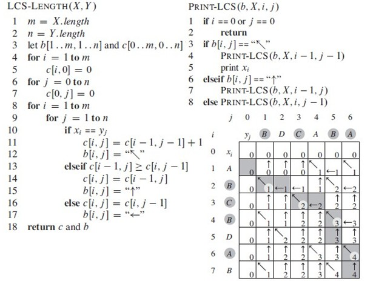

### 3. 时间复杂度

​	$$T(n) = \theta(m * n)$$

## 6. 最优二叉搜索树

### 1. 伪代码

```c
OPTIMAL-BST(p, q, n)
    let e[],w[],root[] be new tables
    for i = 1 to n + 1	//初始化 e 和 w 表格对角线处的初始概率
        e[i,i - 1] = q_(i-1)
        w[i,i - 1] = q_(i - 1)
    for l = 1 to n	//对所有节点遍历
    	for i = 1 to n - l + 1	//遍历 i 节点对应的 j 节点（对应图中的 i 和 j）
            j = i + l - 1
            e[i,j] = 正无穷
            //注意：下面提到的表格，都是未旋转的表格
            w[i,j] = w[i,j - 1] + p_j + q_j //w 表格中，左边一位（j 小一位）+ p + q 值 
            for r = i to j
            	//e 表格中，左边(j 小 r+1 位) + 下面（i 大 r-1 位） + w[i,j] 值
            	t = e[i,r - 1] + e[r + 1,j] + w[i,j] 
            	if t < e[i,j]
            		e[i,j] = t //取小的值
            		root[i,j] = r //保存根节点 k_r 的下标 r
    return e and root
```

//**下图作为参照：**


### 2. 详解

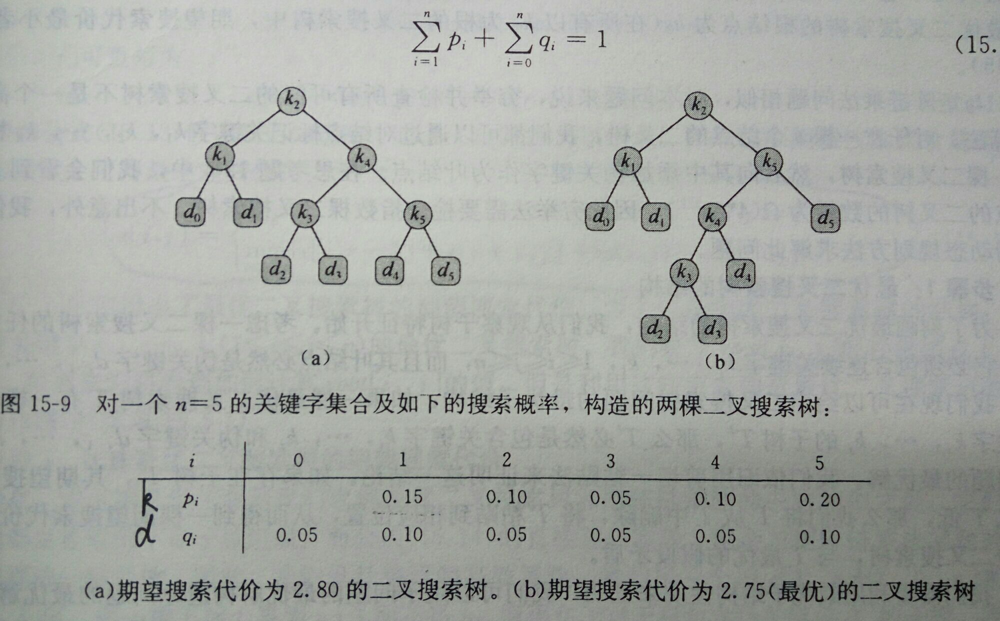

**根据上图(a)可以逐点计算期望搜索代价：** 

> 二叉树搜索树中搜索一个关键字需要访问的结点数等于包含关键字的结点的深度加1


> ****

**最优二叉搜索树：期望代价最小的二叉搜索树** 

**步骤：** 

- 描述最优解的结构

- 递归定义最优解的值：**e[i,j] 表示在包含关键字 $k_i，... ，k_j$ 的最优二叉搜索树中进行一次搜索的期望代价；root[i,j] 保存根节点 $k_r$  的下标 r**

  

  ​			$$w[i,j] = \begin{cases}q_{i-1} & \text if & j = i - 1 \\w[i,j - 1] + p_j + q_j & \text if & i != j - 1 \end{cases}$$

- 按自底而上的方式计算最优解的值

- 由计算出的结果创造一个最优解

**根据伪代码一步一步计算（同5.4 5.5 的计算方法）：**


根据上图，**对一个 n = 5 的关键字集合计算其最优二叉搜索树：** （**伪代码步骤注解**）


**问题：如何根据 root[i,j] 的结果构造出二叉搜索树？P230——15.5-1**

### 3. 时间复杂度

​	$$T(n) = O(n^3)$$

# 六、贪婪算法

## 1. 概述

- **贪心选择性质：** 若一个问题的全局最优解可以通过局部最优解来得到，则说明该问题具有贪心选择性质

- **优化子结构：** 当一个问题的最优解包含其子问题的最优解时，称此问题具有最优子结构性质

- 该算法**存在问题：** 

  - 不能保证求得的最后解是最佳的
  - 不能用来求最大或最小解问题
  - 只能求满足某些约束条件的可行解的范围

- 实现该**算法的过程：** 

  >  从问题的某一初始解出发
  >
  >  while 能朝给定总目标前进一步 do 
  >
  >  ​	求出可行解的一个解元素 
  >
  >  由所有解元素组合成问题的一个可行解

- 贪心算法和动态规划的**区别：** 

  -  **贪心算法是自顶向下的，而动态规划则是自底向上的**
  - **贪婪算法总是找当前最大值，动态规划则是根据子问题的比较找最优解的值**

## 2. 作业(活动)选择问题

### 1. 描述

> - 对n个作业进行排程，这些作业在执行期间需要专用某个共同的资源
> - **选出最多个不冲突的作业**

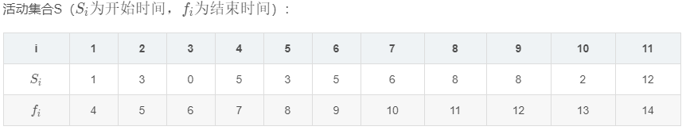 

### 2. 递归求解

#### 1. 伪代码

```c
//***********活动编号已经按结束时间排序**********
//递归
REC-ACT-SEL (s, f, k, n)
	m ← i + 1
	while m ≤ n and s[m] < f[k] //find the first activity in S(k) to finish
		do m ← m + 1
	if m ≤ n
		then return {a(m)} and REC-ACT-SEL(s, f, m, n)
	else return null
```

#### 2. 详解

> **P239 定理16.1 的定理证明**

如上述伪代码所示

#### 3. 时间复杂度

**递归式：**

$$c[i,j] = \begin{cases}0 & \text if & S_{i,j} = \phi \\max(c[i,k] + c[k,j] + 1) & \text if & S_{i,j} \neq \phi \end{cases}$$

**时间复杂度：**

$$T(n) = \theta(n)$$

### 3. 迭代求解

#### 1. 伪代码

```c
//***********活动编号已经按结束时间排序**********
//迭代
GREEDY-ACTIVITY-SELECTOR(s, f)
	n = s.length
	A ← {a1}
	k ← 1
	for m ← 2 to n
		do if s[m] ≥ f[k]  //activity a(m) is compatible with a(k)
			then A ← A and {a(m)}
			k ← m // a(i) is most recent addition to A
	return A
```

#### 2. 详解

如上述伪代码所示

#### 3. 时间复杂度

​	$$T(n) = \theta(n)$$

## 3. Huffman 编码

### 1. 伪代码(仅供参考)

```c
HUFFMAN(C)
	n = |C|
	Q = C
	for i = 1 to n – 1
		do allocate a new node z
		z.left = x = EXTRACT-MIN(Q)
		z.right = y = EXTRACT-MIN(Q)
		z.freq = x.freq + y.freq
		INSERT (Q, z)
	return EXTRACT-MIN(Q)
```

### 2. 详解

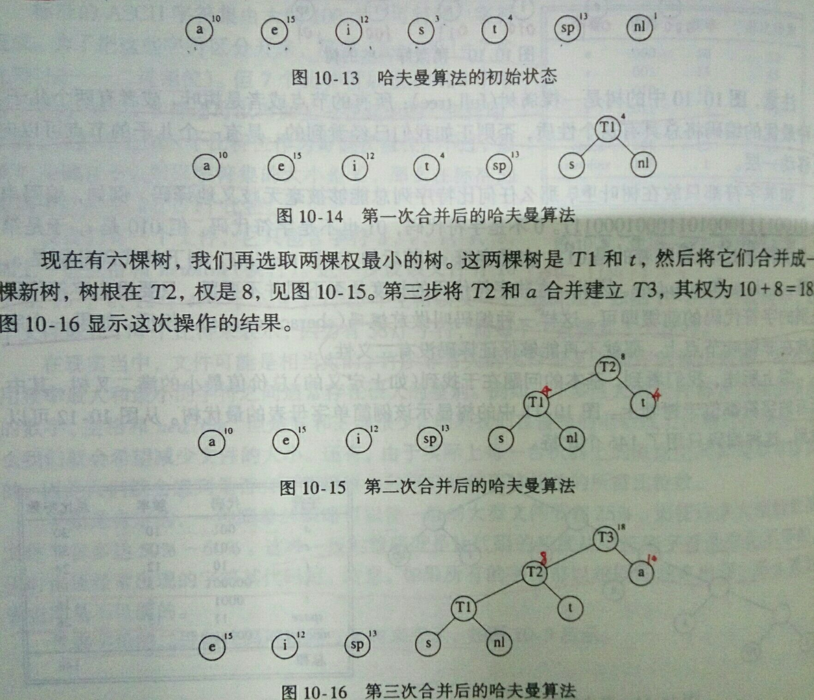

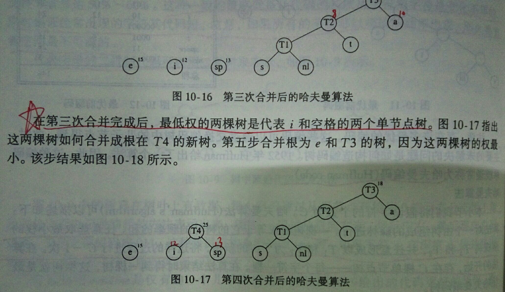

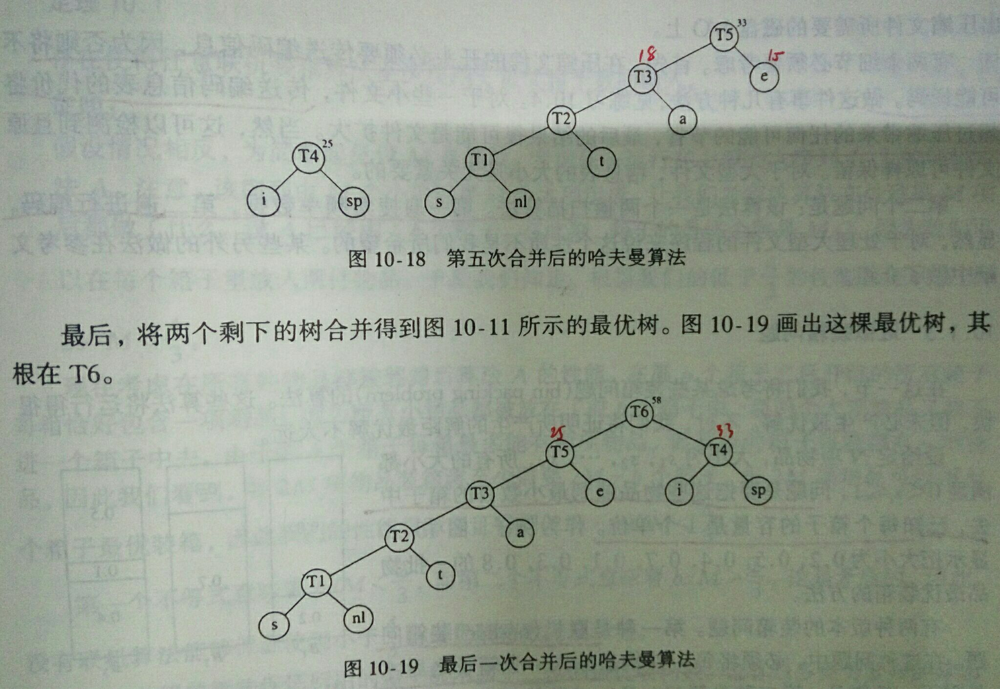

### 3. 时间复杂度

​	$$T(n)=O(n∗logn)$$

## 4. 0/1背包问题与部分背包问题

### 1. 描述 

> 给定一组物品，每种物品都有自己的重量和价格，在限定的总重量内，我们如何选择，才能使得物品的总价格最高
>

### 2. 详解

- 利用动态规划思想 ，子问题为：$f[i][v]$ 表示前 i 件物品恰放入一个容量为v的背包可以获得的最大价值

- 状态转移方程是：**$f[i][v]=max(f[i-1][v],f[i-1][v-c[i]]+w[i])$**     //**这个方程非常重要，基本上所有跟背包相关的问题的方程都是由它衍生出来的**

  > 如果只考虑第i件物品放或者不放，那么就可以转化为只涉及前i-1件物品的问题
  >
  > - 1、如果**不放第 i 件物品**，则问题转化为“**前i-1件物品放入容量为v的背包中**”
  > - 2、如果**放第 i 件物品**，则问题转化为“**前i-1件物品放入剩下的容量为v-c[i]的背包中”(此时能获得的最大价值就是 $f [i-1][v-c[i]]$ 再加上通过放入第i件物品获得的价值w[i]**)，则 $f[i][v]$ 的值就是1、2中最大的那个值

- **初始化的细节问题：**

  - 要求“**恰好装满背包**”时的最优解
  - 求**小于等于背包容量的最优解**，即不一定恰好装满背包

---

**根据物品是否可以分割**，分为两类背包问题：

- 如果物品不可以分割，称为 **0—1 背包问题（动态规划）**
- 如果物品可以分割，则称为 **部分背包问题（贪心算法）**

有3种方法来选取物品：

- 当作 0—1 背包问题，用动态规划算法，获得最优值 220
- 当作 0—1 背包问题，用贪心算法，按性价比从高到底顺序选取物品，获得最优值 160。由于物品不可分割，剩下的空间白白浪费
- 当作部分背包问题，用贪心算法，按性价比从高到底的顺序选取物品，获得最优值 240。由于物品可以分割，剩下的空间装入物品 3 的一部分，而获得了更好的性能

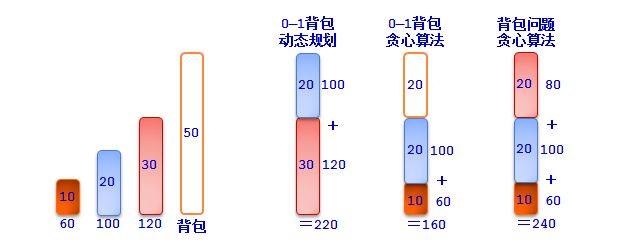

### 3. 时间复杂度

​	$$T(n) = O(N * V)$$

# 七、图算法

## 1. 基本图算法

### 1. 广度优先搜索(BFS)

#### 1. 伪代码

```c
BFS(G,s)
	for each vertex u 属于 G.V - {S}
		u.color = WHITE
		u.d = 无穷
		u.pi = NIL
	s.color = GRAY
	s.d = 0
	s.pi = NIL
	Q = null
	ENQUEUE(Q,s) 
	while Q != null
		u = DEQUEUE(Q)
		for each v 属于 G.Adj[u]
			if v.color == WHITE
				v.color = GRAY
				v.d = u.d + 1
				v.pi = u
				ENQUEUE(Q,v)
		u.color = BLACK
```

#### 2. 详解

> 从临近源顶点s最近的顶点开始，通过对图G的边的探索发现从源顶点s能够抵达的每个顶点

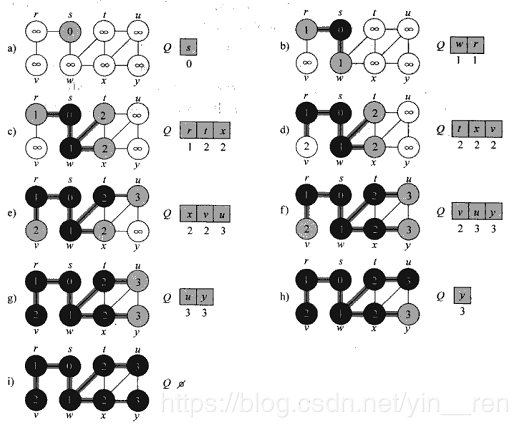

#### 3. 时间复杂度

​	$$T(n)=O(V+E)$$

### 2. 深度优先搜索(DFS)

#### 1. 伪代码

```c
DFS(G)
	for each vertex u 属于 G.V
		u.color = WHITE
		u.pi = NIL
	time = 0
	for each vertex u 属于 G.V
		if u.color == WHITE
			DFS-VISIT(G,u)

DFS-VISIT(G,u)
	time = time + 1	//white vertex u has just been discovered
	u.d = time
	u.color = GRAY
	for each v 属于 G:Adj[u]
		if v.color == WHITE 
			v.pi = u
			DFS-VISIT(G,v)
	u.color = BLACK		//blacken u;it is finished
	time = time + 1
	u.f = time
```

#### 2. 详解

> 从当前访问顶点开始，探索图的边以发现图中的每个顶点

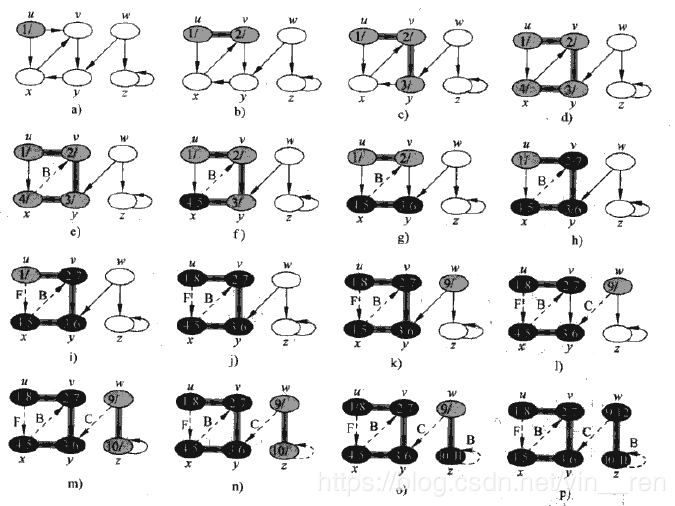

#### 3. 时间复杂度

​	$$T(n)=θ(V+E)$$

### 3. 拓扑排序

#### 1. 伪代码

```c
//对有向无环图
TOPOLOGICAL-SORT(G)
	call DFS(G) to compute finish times v.f for each vertex v
	as each vertex is finished,insert it onto the front of a linked list
	return the link list of vertices
```

#### 2. 详解

> 找出有向无回路图G = (V, E) 中顶点的一个线性序，使得(u, v)如果是图中的一条边，那么在这个线性序中u在v前出现(如果 G 包含环路，可能就有多个解)

**步骤（很重要）：**

- **在有向图中选一个没有前驱的顶点并且输出**

- **从图中删除该顶点和所有和它有关的边**

- **重复上述两步，直至所有顶点输出**

  >  或者当前图中不存在无前驱的顶点为止，后者代表我们的有向图是有环的，因此，也**可以通过拓扑排序来判断一个图是否有环**


该图的拓扑排序为： `v6 –-> v1--> v4 --> v3 --> v5 --> v2` 

#### 3. 时间复杂度

​	$$T(n)=θ(V+E)$$

### 4. 强连通分支

#### 1. 伪代码(参考)

```c
STRONGLY-CONNECTED-COMPONENTS(G)
	call DFS(G) to compute finishing times u.f for each vertex u
	compute G^T
	call DFS(G^T),but in the main loop of DFS,consider the vertices
		in order of decreasing u.f(as computed in line 1)
	output the vertices of each tree in the depth-first forest formed in line 3 as a separate strongly connected component
```

#### 2. 相关概念

- **割点：** 若删掉某点后，原连通图分裂为多个子图，则称该点为割点

- **割点集合：** 在一个无向连通图中，如果有一个顶点集合，删除这个顶点集合，以及这个集合中所有顶点相关联的边以后，原图变成多个连通块，就称这个点集为割点集合

- **点连通度：** 最小割点集合中的顶点数

- **割边(桥)：** 删掉它之后，图必然会分裂为两个或两个以上的子图

- **割边集合：** 如果有一个边集合，删除这个边集合以后，原图变成多个连通块，就称这个点集为割边集合

- **边连通度：** 一个图的边连通度的定义为，**最小割边集合中的边数**

- **缩点：** 把没有割边的连通子图缩为一个点，此时满足**任意两点之间都有两条路径可达**

- **双连通分量：** 分为**点双连通和边双连通**，满足任意两点之间，能通过两条或两条以上没有任何重复边的路到达的图称为双连通图

  > - **点连通度大于1的图称为点双连通图**
  > - **边连通度大于1的图称为边双连通图**
  > - **无向图G的极大双连通子图称为双连通分量** 

---

- **强连通图**： 在一个强连通图中，**任意两个点都通过一定路径互相连通**

  > 比如**图一是一个强连通图，而图二不是** （因为没有一条路使得点4到达点1、2或3） 

  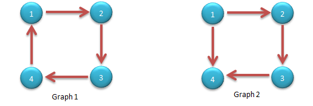

-  **强连通分量**： **在一个非强连通图中极大的强连通子图就是该图的强连通分量**

  >  比如图三中子图{1,2,3,5}是一个强连通分量，子图{4}是一个强连通分量

  

#### 3. 详解

> **在任何深度优先搜索中，同一强连通分量内的所有顶点均在同一棵深度优先搜索树中**

- 从任意一个点开始深搜，**对图进行 DFS**
- **求图的反图**


- **根据第1步得到的排序，从最晚完成的一个点开始搜索并染色**
- **第三步每一次深搜完成就是一个强连通分量**

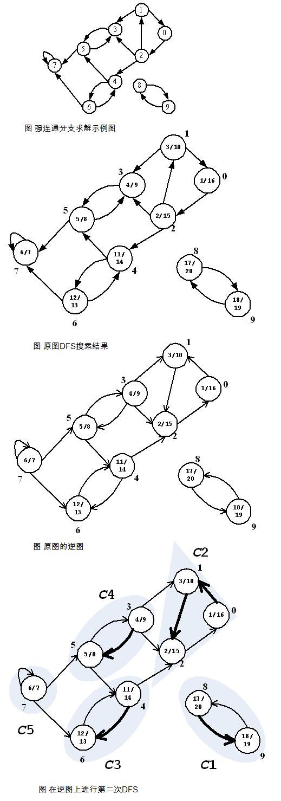

#### 4. 时间复杂度

​	$$T(n) = \theta(V + E)$$

## 2. 最小生成树(贪婪)

### 1. 概念

- **连通图：** 在**无向图**中，若任意两个顶点 $v_i$ 与 $v_j$ 都有路径相通，则称该无向图为连通图
- **强连通图：** 在**有向图**中，若任意两个顶点 $v_i$ 与 $v_j$ 都有路径相通，则称该有向图为强连通图
- **连通网：** 在连通图中，若图的边具有一定的意义，每一条边都对应着一个数，称为权；权代表着连接连个顶点的代价，称这种连通图叫做连通网
- **生成树：** 一个连通图的生成树是指一个连通子图，它**含有图中全部n个顶点**，但只有足以构成**一棵树的n-1条边**。一颗有n个顶点的生成树有且仅有n-1条边，如果生成树中再添加一条边，则必定成环
- **最小生成树：** 在连通网的所有生成树中，**所有边的代价和最小的生成树**，称为最小生成树


### 1. Kruskal算法（加边法）

#### 1. 伪代码

```c
MST-KRUSKAL(G,w)
	A = null
	for each vertex v 属于G.V
		MAKE-SET(v)
	sort the edges of G.E into nondecreasing order by weight w
	for each edges(u,v)属于G.E,taken in nondecreasing order by weight
		if FIND-SET(v) != FIND-SET(v)
			A = A and {(u,v)}
			UNION(u,v)
	return A
```

#### 2. 详解

初始最小生成树边数为0，每迭代一次就选择一条满足条件的最小代价边，加入到最小生成树的边集合里：

- 把图中的**所有边按代价从小到大排序**
- 把图中的n个顶点看成独立的n棵树组成的森林
- **按权值从小到大选择边**，所选的边连接的两个顶点 **$u_i , v_i$ 应属于两颗不同的树**，则成为最小生成树的一条边，并将这两颗树合并作为一颗树
- 重复(3),**直到所有顶点都在一颗树内或者有n-1条边为止**


####  3. 时间复杂度

​	$$T(n) = E * lgV$$

### 2. Prim算法（加点法）

#### 1. 伪代码

```c
MST-PRIM(G,w,r)
	for each u 属于 G.V
		v:key = 无穷
		v:pi = NIL
	r:key = 0
	Q = G.V
	while Q != null
		u = EXTRACT-MIN(Q)
		for each v属于G.Adj[u]
			if v 属于 Q and w(u,v) < v.key
				v.pi = u
				v.key = w(u,v)
```

#### 2. 详解

每次迭代选择代价最小的边对应的点，加入到最小生成树中：

- 图的所有顶点集合为 $V$ ；初始令集合 u={s} , v=V−u
- 在两个集合 $u,v$ 能够组成的边中，**选择一条代价最小的边(u0,v0)，加入到最小生成树中，并把 $v_0$ 并入到集合u中** 
- 重复上述步骤，**直到最小生成树有n-1条边或者n个顶点为止**


#### 3. 时间复杂度

​	$$T(n) = E * lgV$$

## 3. 单源最短路径

- **给定源顶点 $s∈V$  到分别到其他顶点 $v∈V−\{ s \}$ 的最短路径的问题** 

### 1. Bellman-Ford 算法

#### 1. 伪代码

```c
BELLMAN-FORD(G, w, s)
   INITIALIZE-SINGLE-SOURCE(G, s)
   for i  1 to |V[G]| - 1
        do for each edge (u, v)  E[G]
             do RELAX(u, v, w)
   // 检查是否存在权值为负的环
   for each edge (u, v)  E[G]
        do if d[v] > d[u] + w(u, v)
             then return FALSE
   return TRUE
```

#### 2. 详解（动态规划）

- **初始化：** 将除源点外的所有顶点的最短距离估计值 dist[v] ← +∞, dist[s] ←0


- **迭代求解：** **反复对边集E中的每条边进行松弛操作**，使得顶点集V中的每个顶点v的最短距离估计值逐步逼近其最短距离（运行|v|-1次） 

- **检验负权回路： **判断边集E中的每一条边的两个端点是否收敛

  > - 如果存在未收敛的顶点，则算法返回false，表明问题无解；否则算法返回true
  > - 从源点可达的顶点v的最短距离保存在 dist[v]中

  

#### 3. 时间复杂度

​	$$T(n)=O(E∗V)$$

### 2. Dijkstra 算法(权值非负)

#### 1. 伪代码

```c
DIJKSTRA(G,w,s)
	INITIALIZE-SINGLE-SORT(G,s)
	S = null
	Q = G.V
	while Q != null
		u = EXTRACT-MIN(Q)
		S = S + {u}
		for each vertex v 属于G.Adj[u]
			RELAX(u,v,w)
```

#### 2. 详解（贪婪算法）

> - **按路径长度递增的顺序，逐个产生各顶点的最短路径**
>
>
> - **顶点集 S 保存已经找到最短路径的顶点** 
> - 距离数组dist, **dist[i] 表示第i个顶点与源结点s的距离长度**

- $S$ 初始化时只包括源节点s
  dist[] 初始化：dist[i]= $arc[s][i]$ ,arc为图的邻接矩阵
  $V−S$ 表示未被找到最短的路径的顶点集合

- 把 dist 按递增的顺序，选择一个最短路径，从 $V−S$ 把对应顶点加入到 S 中，每次 S 中加入一个新顶点 u , 需要对 dist 更新，即 s 能否通过顶点 u 达到其他顶点更近

  即若 $dist[u] + arc[u][v] < dist[v]$ ,则更新 $dist[v]=dist[u]+arc[u][v]$ 

- 重复上述步骤，直到 S = V


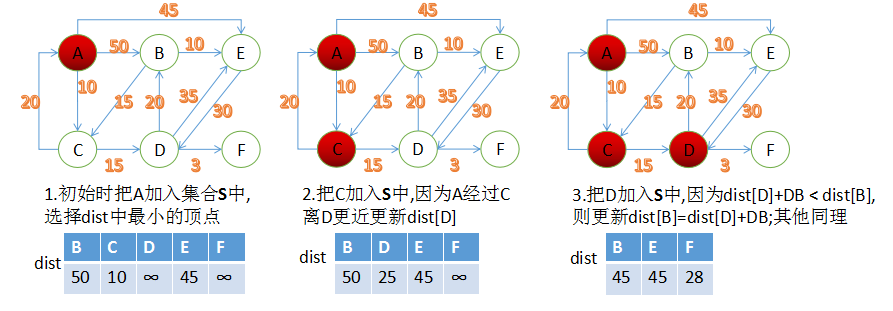


#### 3. 时间复杂度

​	$$T(n)=O(E+VlogV)$$

## 4. 全源最短路径

### 1. Floyd-Warshall 算法

#### 1. 伪代码

```c
FLOYD-WARSHALL(W)
	n = W.rows
	D(0) = W
	for k = 1 to n
		let D(k) = d(k)_ij be a new nXn matrix
		for i = 1 to n
			for j = 1 to n
				d(k)_ij = min(d(k-1)_ij,d(k-1)_ik + d(k-1)_kj)
	return D(n)
```

#### 2. 详解(动态规划)


#### 3. 时间复杂度

​	$$T(n) = \theta(n^3)$$

### 2. Johnson 算法

#### 1. 伪代码

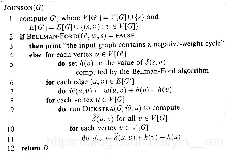

#### 2. 详解

**算法步骤简述：**

- 给定图 G = (V, E)，增加一个新的顶点 s，使 s 指向图 G 中的所有顶点都建立连接，设新的图为 G’
- 对于每个边 (u, v)，其**新的权值为 w(u, v) + (h[u] - h[v])** （u-->v）
- 移除新增的顶点 s，对每个顶点**运行Dijkstra 算法求得最短路径**
- **图 c~g 中，每个顶点包含两个值，分别为 新权值和老权值 的计算结果**，**用 / 分割**

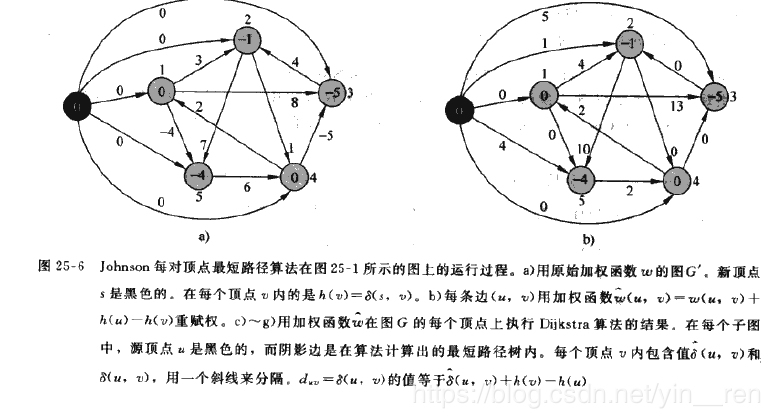

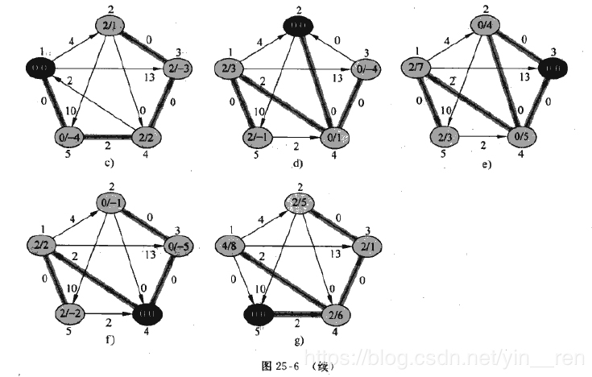

#### 3. 时间复杂度

​	$$T(n)=O(V^2∗logV+V∗E)$$

## 5. 最大网络流

### 1. 概念

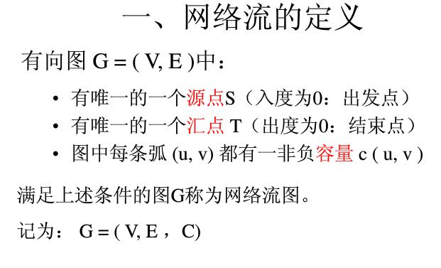


### 2. Ford-Fulkerson 算法

#### 1. 残存网络与增广路径

##### 1. 残存网络 

- **是指给定网络和一个流，其对应还可以容纳的流组成的网络** 

> 例如： 
>
> - 从 u 到 v 已经有了3个单位流量，那么从反方向上看，也就是从v到u就有了3个单位的残留网络，这时r（v，u）=3
> - 可以这样理解，**从u到v有3个单位流量，那么从v到u就有了将这3个单位流量的压回去的能力**

我们来具体看一个例子，如下图所示一个流网络


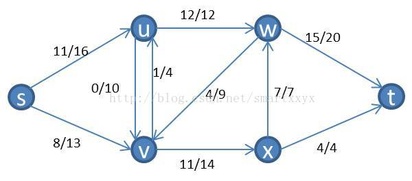

**对应残存网络：**

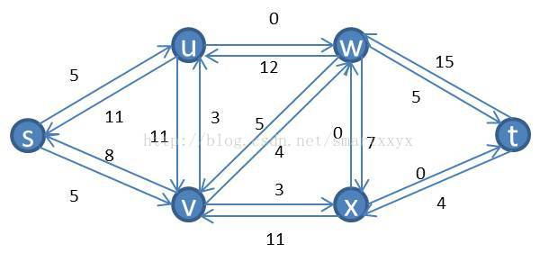

##### 2. 增广路径 

- 已知一个流网络G和流f，增广路径 p 是其残留网络 G-f 中从 s 到 t 的一条简单路径
- 形象的理解为**从 s 到 t 存在一条不违反边容量的路径**，向这条路径压入流量，可以增加整个网络的流值

**上面的残留网络中，存在这样一条增广路径：**


> 继续在新的流网络上用同样的方法寻找增广路径，直到找不到为止，这时我们就得到了一个最大的网络流

##### 3. 流网络的割

- 流网络G（V，E）的割（S，T）将V划分为 S 和 T=V-S 两部分，使得 s 属于S，t 属于T
- **割（S，T）的容量** 是指从集合S到集合T的所有边（有方向）的容量之和
- 如果 f 是一个流，则穿过割（S，T）的净流量被定义为f（S，T）

随便画一个割，如下图所示：


- **割的容量：** `c(u,w)+c(v,x)=26` 
- **穿过割的净流量：** `f(u,w)+f(v,x)-f(w,v)=12+11-4=19`

**流网络的流量守恒的原则：** 对网络的任意割，其净流量的都是相等的

##### 4. 定理

> **当残存网络中不存在一条从 s 到 t 的增广路径，那么该图已经达到最大流**

#### 2. 伪代码

```c
FORK-FULKERSON(G,s,t)
	for each edge(u,v) 属于 G.E
		(u,v).f = 0
	while there exists a path p form s to t in the residual network G_f
		c_f(p) = min{c_f(u,v):(u,v) is in p}
		for each edge(u,v) in p
			if (u,v) 属于 E
				(u,v).f = (u,v).f + c_f(p)
			else (v,u).f = (v,u).f - c_f(p)
```

#### 3. 详解

- 该图初始状态，绿色线条为正流量权重，灰色线条为反流量权重：

  

- 找到一条从s->t的路径：s->v1->v2->t，该路径的最大流量为2，则更新完流量以后的图如下图所示：

  

- 找到一条由s->t的路径：s->v1->t，该路径的流量限制为2,则更新完流量以后如下图所示：

  

- 找到另外一条由s->的路径：s->v2->v1->t，该路径的流量限制为2。则更新完流量以后如图所示：

  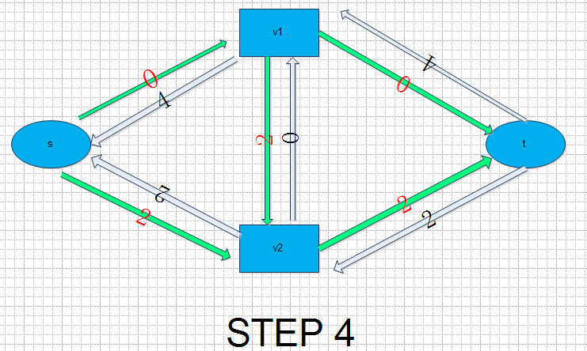

- 找到另一条由s->t的路径：s->v2->t,该路径的流量限制为2,则更新完流量以后如下图所示：

  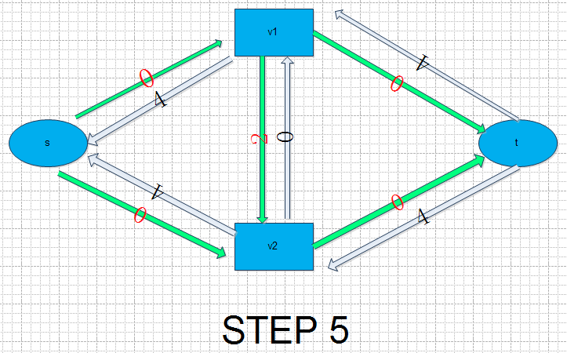

- **找不到其它由s->t的路径，则增广结束，找到最大流值为8**

> **算法导论书 P425 图26-6 ==> 可以只看左边的残存网络**

#### 4. 时间复杂度

​	$$T(n)=O(E∗∣f∣)$$

### 2. Edmonds-Karp 算法

#### 1. 简介

> **使用 BFS 来改善 Ford-Fulkerson 算法的效率**

#### 2. 详解

步骤同上，只不过通过 BFS 来寻找增广路径

#### 3. 时间复杂度

​	$$T(n) = O(V * E^2)$$

### 3. 最大二分匹配

#### 1. 概念

- **二分图**：设G=(V,E)是一个无向图，如果顶点V可分割为两个互不相交的子集(A,B)，并且图中的每条边（i，j）所关联的两个顶点 i 和 j 分别属于这两个不同的顶点集(i in A,j in B)，则称图G为一个二分图
- **匹配**：如果子集 M 中的某条边与结点 v 相连，则称结点 v 由 M 所匹配
- **最大匹配**：一个图所有匹配中，所含匹配边数最多的匹配，称为这个图的最大匹配
- **完美匹配**：如果一个图的某个匹配中，所有的顶点都是匹配点，那么它就是一个完美匹配

#### 2. 求解

> **二分图 G 中的一个最大匹配 M 的基数等于其对应的流网络 $G'$ 中某一最大流 f 的值** 

# 八、互联网公司常用算法

推荐阅读： **[面试必须掌握的十个海量数据问题及解决方案](https://blog.csdn.net/hitxueliang/article/details/52153476)** 

## 1. TopN 算法

推荐阅读： 

- **[面试必须掌握的十个海量数据问题及解决方案](https://blog.csdn.net/hitxueliang/article/details/52153476)** 
- [深度解析某头条的一道TopN面试题](https://blog.csdn.net/bntX2jSQfEHy7/article/details/80276225) 

### 1. TopN问题描述

问题一：找出海量数据中出现次数最多的N个数据

问题二：找出两个超大文件中的相同字符串

问题三：找出超多整数中没有重复出现的整数，或多少以内没出现的整数

### 2. 解决方案

通用方案：分而治之的思想，先拆分成很多小文件，每个文件分别统计和排序，然后归并排序

问题一：除分而治之方案外，如果**无内存限制，则可用字典树**

问题二：除分而治之方案外，如果**容许有错，可用布隆过滤器**

问题三：可用位集或BitMap，将这组数据映射到BitSet，然后遍历BitSet，对应位为0的数表示没有出现过的数据

## 2. 数据结构

### 1. 字典树(Trie)

推荐阅读： **[字典树(前缀树)](https://blog.csdn.net/weixin_39778570/article/details/81990417)** 

- 字典树： 哈希树的变种，**有序**，**可用排序和保存大量的字符串**，常被搜索引擎系统用于文本词频统计

- 特点： 利用字符串的公共前缀来减少查询时间，最大限度地减少无谓的字符串比较，查询效率比哈希树高

  > 在查询时最大限度的减少无谓的字符串比较
  >
  > - 当字典树预处理好后，查询字符串的效率异常高效，故而常用于搜索引擎

- 缺点： 比较耗内存

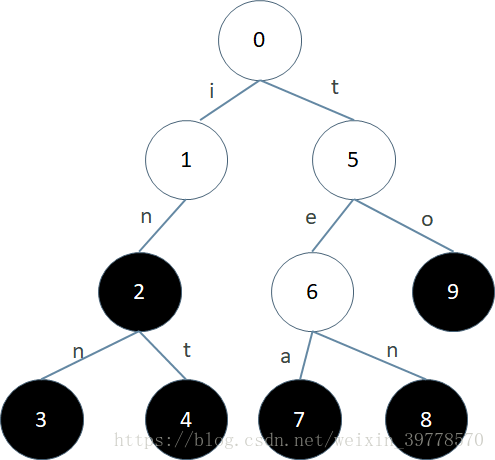

> 这棵 Trie 树包含的字符串集合是`{in, inn, int, tea, ten, to}`
>
> 这些字符可以是任意一个字符集中的字符，比如： 
>
> - 对于都是小写字母的字符串，字符集就是’a’-‘z’
> - 对于都是数字的字符串，字符集就是’0’-‘9’
> - 对于二进制字符串，字符集就是0和1
>
> > 节点编号是为了描述方便加上去的

---

**实现思路**： Trie 树的创建从根节点开始，通过依次将 W1, W2, W3, … WN 插入实现，即关键是插入操作

支持的操作： 

- `Trie.insert(W)`：插入操作，就是将一个字符串 W 加入到集合中

  > 假设我们要插入字符串”in”： 
  >
  > - 开始从根节点开始，即 0 号节点(用 `P=0` 表示)，先查看是否标有 `i` 的节点，若没有则创建
  >
  >   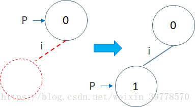
  >
  > - 然后再插入 `n`，同上，先查询是否存在 `n`，若没有则创建
  >
  >   > 因为 `n` 是 `in` 的最后一个字符，所以将 `P=2` 这个节点标记为终节点 
  >
  >   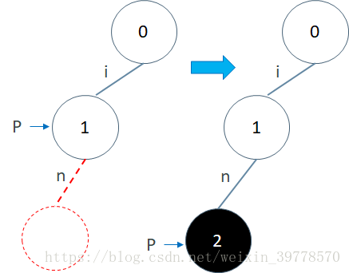
  >
  > - 接着再插入字符串 `inn`，过程同上，因为 `i` 和 `n` 都存在所以只用创建 `n`(第二个 n)
  >
  >   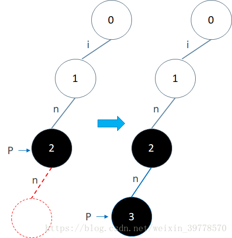
  >
  > - 将后面的字符串int tea ten to都插入之后，就得到了我们一开始给出的Trie：
  >
  >   

- `Trie.search(S)`：查询操作，就是查询一个字符串 S 是不是在集合中

  > 查找操作： 从根节点开始，沿着 `S[1] -> S[2] -> S[3] -> ... -> S[S.len]` 移动：
  >
  > - 如果最后成功到达一个终结点，则说明 `S` 存在 Trie 树中
  > - 如果最后无路可走或没有到达终结点，则说明 `S` 不在 Trie 树中

### 2. 布隆过滤器(Bloom Filter)

推荐阅读： **[布隆过滤器(Bloom Filter)详解](https://www.cnblogs.com/liyulong1982/p/6013002.html)** 

- **简介**： bloom 算法类似 hash set，用来判断某个元素(key)是否在某个集合中，但该算法无需存储 key 的值，对于每个key，只需要 k 个比特位，每个存储一个标志，用来判断 key 是否在集合中
  
- **算法流程**： 
  
  - 首先需要 k 个 hash 函数，每个函数把 key 散列成为 1 个整数

  - 初始化时，需要一个长度为 n 比特的数组，每个比特位初始化为 0
  
  - 某个 key 加入集合时，用 k 个 hash 函数计算出 k 个散列值，并把数组中对应的比特位置为 1
  
  - 判断某个 key 是否在集合时，用 k 个 hash 函数计算出 k 个散列值，并查询数组中对应的比特位，如果所有的比特位都是 1，认为在集合中
  
- 优点： **空间效率和查询时间**都远远超过一般的算法

  > - 存储空间和插入/查询时间都是常数`O(k)`
  > - 散列函数之间没有关系，方便硬件并行实现
  > - **不需要存储 key，节省空间**

- 缺点： 
  - 判断 key 在集合中时，有一定的概率 key 其实不在集合中
  - 删除困难或无法删除

**典型应用场景**：某些存储系统中，存在空查询缺陷：当查询不存在的 key 时，需要访问慢设备，导致效率低下

> 比如： 
>
> - 一个前端页面的缓存系统，可能这样设计：先查询某个页面在本地是否存在，如果存在就直接返回，如果不存在，就从后端获取
> - 但是当频繁从缓存系统查询一个页面时，缓存系统将会频繁请求后端，把压力导入后端


### 3. Counting Bloom Filter

- **实现**： 将标准 Bloom Filter 位数组的每一位扩展为一个小的计数器(Counter)，在插入元素时给对应的 k 个Counter 的值分别加1，删除元素时给对应的 k 个 Counter 的值分别减 1

  > Counting Bloom Filter 通过多占用几倍的存储空间的代价，给 Bloom Filter 增加了删除操作

- 问题： 到底要**多占用几倍空间**

  > 推导出 4 位(即 $2^4 = 16$) 比较合适
  >
  > 具体详细计算，请参看： **[Bloom Filter 算法与 Counting Bloom Filter 算法](https://my.oschina.net/kiwivip/blog/133498)**
  >
  > 

### 4. BitMap

推荐阅读： [BitMap算法详解](https://www.cnblogs.com/senlinyang/p/7885685.html) 

- BitMap： 用一个 `bit` 位来标记某个元素所对应的 value，而 key 即是该元素

  > 由于 BitMap 使用了 bit 位来存储数据，因此可以大大节省存储空间

- **适用情况**： 适用于大规模数据，但数据状态不是很多的情况

  > 通常用来判断某个数据是否存在

- **基本思想**： 

  > 假设要对 `0-7` 内的 5 个元素(4,7,2,5,3)进行排序，使用 BitMap 算法达到排序目的
  >
  > 要表示 8 个数，我们需要 8 个 byte：
  >
  > - 首先我们开辟一个字节(8byte)的空间，将这些空间的所有的 byte 位都设置为 0
  >
  > - 然后遍历这 5 个元素，第一个元素是4，因为下边从0开始，因此我们把第五个字节的值设置为1
  >
  > - 然后再处理剩下的四个元素，最终8个字节的状态如下图
  >
  > 　　
  >
  > - 现在我们遍历一次 bytes 区域，把值为 1 的byte的位置输出(2,3,4,5,7)，这样便达到了排序的目的
  >
  > BitMap 算法的思想比较简单，关键问题是如何确定 10 进制的数到 2 进制的==映射图== 

- **运用范围**： 可以运用在快速查找、去重、排序、压缩数据等

------

**大数据处理场景**： 

1. 给定 40 亿个不重复的 int 整数(未排序)，然后再给一个数，如何快速判断这个数是否在这 40 亿个数中

   > 解法：遍历40亿数字，映射到 BitMap 中，然后对于给出的数，直接判断指定的位上存在不存在即可

2. 使用位图法判断整形数组是否存在重复

   > 解法：遍历一遍，存在之后设置成1，每次放之前先判断是否存在，如果存在，就代表该元素重复

3. 使用位图法进行元素不重复的整形数组排序

   > 解法：遍历一遍，设置状态 1，然后再次遍历，对状态等于 1 的进行输出，参考计数排序的原理

4. 在2.5亿个整数中找出不重复的整数，注，内存不足以容纳这2.5亿个整数

   > - 解法1：采用2-Bitmap(每个数分配2bit，00表示不存在，01表示出现一次，10表示多次，11无意义)
   > - 解法2：采用两个BitMap，即第一个Bitmap存储的是整数是否出现，接着，在之后的遍历先判断第一个BitMap里面是否出现过，如果出现就设置第二个BitMap对应的位置也为1，最后遍历BitMap，仅仅在一个BitMap中出现过的元素，就是不重复的整数
   > - 解法3：分治+Hash取模，拆分成多个小文件，然后一个个文件读取，直到内存装的下，然后采用Hash+Count的方式判断即可

### 5. 位集(BitSet)

推荐阅读： 

- [Java中BitSet的使用及详解](https://blog.csdn.net/jiangnan2014/article/details/53735429)

- **[一道面试题与Java位操作 和 BitSet 库的使用](https://www.cnblogs.com/yellowb/p/3647442.html)**

---

> **Java BitSet 是 BitMap 的实现** 

- BitSet 是位操作的对象，值只有 0 或 1，即 false 和 true，内部维护了一个 long 数组，初始只有一个 long

  > 因此 BitSet 最小的 size 是 64，当随着存储的元素越来越多，BitSet 内部会动态扩充，最终内部是由 N 个long来存储，这些针对操作都是透明的

- 用 1 位来表示一个数据是否出现过，0为没有出现过，1表示出现过

  >  一个1G的空间，有 $8*1024*1024*1024=8.58*10^9$ bit，也就是可以表示85亿个不同的数

- 内存增长方式： 分配内存时以字节为单位，因此以 `64,128,192,...` 方式递增

  > 注意： 标准库在实现 bitset 时**以字为基本单位**分配内存(不是字节)，即分配的内存必定是 `4byte` 整数倍

使用场景： 

- 统计 40 亿个数据中没有出现的数据

  > **等同计数排序** 

- 将 40 亿个不同数据进行排序等

  > **等同计数排序**
  >
  > ```java
  > public class BitSort {
  >     public static void main(String[]args){
  >         final int size=10;
  >         int A[]={23,44,1,2,34,56,11,7,9,25};
  >         bitSort(A);
  >         for(int i=0;i<A.length;i++){
  >             System.out.print(A[i]+" ");
  >         }
  >     }
  >     public static void bitSort(int[]A){
  >         int size=A.length;
  >         //这个数的大小必须大于数组 A 中元素的最大值
  >         final int number_range = 60;
  >         BitSet bits = new BitSet(number_range);
  >         for(int i = 0;i < size;i++){
  >             bits.set(A[i]);
  >         }
  >         for(int i=0,j=0;i<number_range;i++){
  >             if(bits.get(i)){
  >                 A[j++]=i;
  >             }
  >         }
  >         System.out.println("bits的内存："+bits.size());
  >     }
  > }
  > ```

- 在内存对 40 亿个数据进行压缩存储

- 有1千万个范围在1到1亿之间的随机数，现在将1到1亿之间没有在随机数中的数求出来

- 快速找出 0-255 中哪个数字可用

---

BitSet 与 Byte 数组互转：

```java
import java.util.Arrays;
import java.util.BitSet;

public class BitSetConvert {
	public static byte[] bitSet2ByteArray(BitSet bitSet) {
		byte[] bytes = new byte[bitSet.size() / 8];
		for (int i = 0; i < bitSet.size(); i++) {
			int index = i / 8;
			int offset = 7 - i % 8;
			bytes[index] |= (bitSet.get(i) ? 1 : 0) << offset;
		}
		return bytes;
	}

	public static BitSet byteArray2BitSet(byte[] bytes) {
		BitSet bitSet = new BitSet(bytes.length * 8);
		int index = 0;
		for (int i = 0; i < bytes.length; i++) {
			for (int j = 7; j >= 0; j--) {
				bitSet.set(index++, (bytes[i] & (1 << j)) >> j == 1 ? true
						: false);
			}
		}
		return bitSet;
	}
	
	public static void main(String[] args) {
		BitSet bitSet = new BitSet();
		bitSet.set(0, true);
		bitSet.set(10, true);
		//将BitSet对象转成byte数组
		byte[] bytes = bitSet2ByteArray(bitSet);
		System.out.println(Arrays.toString(bytes));
		
		//在将byte数组转回来
		bitSet = byteArray2BitSet(bytes);
		System.out.println(bitSet.get(0));
		System.out.println(bitSet.get(10));
	}
}
```
