推荐教程：

- **[w3c 之 Nginx教程](https://www.w3cschool.cn/nginx/ycn81k97.html)** 
- **[agentzh 的 Nginx 教程](http://openresty.org/download/agentzh-nginx-tutorials-zhcn.html)** 

# # nginx.conf 简单配置

```shell
user  nobody;
worker_processes  1;
error_log  logs/error.log  info;

events {
	worker_connections  1024;
}

http {  
	server {  
    	listen          80;  
        server_name     www.linuxidc.com;  
        access_log      logs/linuxidc.access.log main;  
        location / {  
        	index index.html;  
            root  /var/www/linuxidc.com/htdocs;  
        }  
	}  

    server {  
    	listen          80;  
        server_name     www.Androidj.com;  
        access_log      logs/androidj.access.log main;  
        location / {  
            index index.html;  
            root  /var/www/androidj.com/htdocs;  
        }  
    }  
}

mail {
	auth_http  127.0.0.1:80/auth.php;
    pop3_capabilities  "TOP"  "USER";
    imap_capabilities  "IMAP4rev1"  "UIDPLUS";

	server {
    	listen     110;
        protocol   pop3;
        proxy      on;
	}
    server {
        listen      25;
        protocol    smtp;
        proxy       on;
        smtp_auth   login plain;
        xclient     off;
    }
}
```

# # nginx.conf 详细配置

```shell
# 定义 Nginx 运行的用户和用户组
user www www;

# nginx 进程数，建议设置为 CPU 核数
worker_processes 8;
 
# 全局错误日志类型与存储位置，[ debug | info | notice | warn | error | crit ]
error_log /usr/local/nginx/logs/error.log info;

# 进程 pid 文件
pid /usr/local/nginx/logs/nginx.pid;

# nginx 进程可以打开的描述符最大数目
worker_rlimit_nofile 65535; # linux2.6 内核开启文件数最大为65535，应填写最大值，防止实际进程数超过配置值而报错

events {
    # 参考事件模型: kqueue | rtsig | epoll | /dev/poll | select | poll; linux 建议 epoll，FreeBSD 建议 kqueue
    use epoll;

    # 单个进程最大连接数
    worker_connections 65535; # 理论每台 nginx 服务器的最大连接数为 linux 内核开启文件最大数

    # keepalive 超时时间
    keepalive_timeout 60;

    # 客户端请求头部的缓冲区大小，建议不超过 4k，但必须设为“系统分页大小”整倍数，分页大小可以用命令 getconf PAGESIZE 取得
    client_header_buffer_size 4k;

    # 为打开文件指定缓存，默认未启用。max 指定缓存数量，建议和打开文件数一致；inactive 指经过多长时间文件没被请求后删除缓存
    open_file_cache max=65535 inactive=60s;

    # 指多长时间检查一次 open_file_cach 中缓存的有效信息，默认值 60s
    open_file_cache_valid 80s;

    # open_file_cache 中 inactive 时间内文件的最少使用次数。若超过这个数字，文件描述符一直在缓存中打开，默认值 1
    open_file_cache_min_uses 1;
    
    # 指定是否在搜索一个文件时记录 cache 错误，默认值 off
    open_file_cache_errors on;
}

# 设定 http 服务器，利用反向代理功能提供负载均衡支持
http {
    # 文件扩展名与文件类型映射表
    include mime.types;

    # 默认文件类型
    default_type application/octet-stream;

    # 默认编码
    charset utf-8;

    # 保存服务器名字的 hash 表实际大小(server_names_hash_max_size 设置最大值)
    server_names_hash_bucket_size 128;

    # 客户端请求头部的缓冲区大小，可以根据系统分页大小设置，分页大小可以用命令 getconf PAGESIZE 取得
    client_header_buffer_size 32k;

    # 客户请求头缓冲大小
    # 默认先用 client_header_buffer_size 读取 header；若 header 过大，则使用 large_client_header_buffers 读取
    large_client_header_buffers 4 64k;

    # 设定通过 nginx 上传文件的大小
    client_max_body_size 8m;

    # 指定 nginx 是否调用 sendfile 函数来输出文件，普通应用为 on
    # 磁盘 IO 应用，设置为 off，以平衡磁盘与网络 I/O 处理速度，降低系统的负载 uptime。注意：若图片显示不正常，则设为 off
    sendfile on;

    # 开启目录列表访问，合适下载服务器，默认 off
    autoindex on;

    # 允许或禁用 socke 的 TCP_CORK 选项，仅在使用 sendfile 时使用
    tcp_nopush on;
     
    tcp_nodelay on;

    # 长连接超时时间，单位是秒
    keepalive_timeout 120;

    # FastCGI相关参数是为了改善网站的性能：减少资源占用，提高访问速度
    fastcgi_connect_timeout 300;
    fastcgi_send_timeout 300;
    fastcgi_read_timeout 300;
    fastcgi_buffer_size 64k;
    fastcgi_buffers 4 64k;
    fastcgi_busy_buffers_size 128k;
    fastcgi_temp_file_write_size 128k;

    # gzip模块设置
    gzip on; 				# 开启 gzip 压缩输出
    gzip_min_length 1k;     # 最小压缩文件大小
    gzip_buffers 4 16k;     # 压缩缓冲区
    gzip_http_version 1.0;  # 压缩版本(默认1.1，前端如果是 squid2.5 请使用 1.0)
    gzip_comp_level 2;    	# 压缩等级
    gzip_types text/plain application/x-javascript text/css application/xml; # 压缩类型，默认已包含text/html
    gzip_vary on;

    # 开启限制 IP 连接数时使用
    limit_zone crawler $binary_remote_addr 10m;

	# 负载均衡配置
    upstream jh.w3cschool.cn {
        # upstream 的负载均衡，weigth 表示权值，权值越高被分配到的几率越大
        server 192.168.80.121:80 weight=3;
        server 192.168.80.122:80 weight=2;
        server 192.168.80.123:80 weight=3;
        
        client_body_in_file_only on # 将 client post 过来的数据记录到文件中用来做 debug
        client_body_temp_path xxx/xxx/xx # 设置记录文件的目录 最多设置 3 层目录

        # nginx 的 upstream 目前支持的分配方式：
        	# 1、轮询(默认): 每个请求按时间顺序逐一分配到不同的后端服务器，若后端服务器 down，则自动剔除
        	# 2、weight: 指定轮询几率，weight 和访问比率成正比，用于后端服务器性能不均的情况
        		#upstream bakend {
        		#    server 192.168.0.14 weight=10;
        		#    server 192.168.0.15 weight=10;
        		#}
        	# 3、ip_hash: 每个请求按访问 ip 的 hash 结果分配，这样每个访客固定访问一个后端服务器，解决 session 问题
        		#upstream bakend {
        		#    ip_hash;
        		#    server 192.168.0.14:88;
        		#    server 192.168.0.15:80;
        		#}
        	# 4、fair(第三方): 按后端服务器的响应时间来分配请求，响应时间短的优先分配
        		#upstream backend {
        		#    server server1;
        		#    server server2;
        		#    fair;
        		#}
        	# 5、url_hash(第三方): 按访问 url 的 hash 结果分配请求，使每个 url 定向到同一个服务器，服务器为缓存时推荐
        		#例：upstream 中加入hash语句，server 中不能写入weight等其他的参数，hash_method 指定 hash 算法
        		#upstream backend {
        		#    server squid1:3128;
        		#    server squid2:3128;
        		#    hash $request_uri;
        		#    hash_method crc32;
        		#}
        #综合案例: 在需要使用负载均衡的server中增加 proxy_pass http://bakend/;
        #upstream bakend{#定义负载均衡设备的Ip及设备状态}{
        #    ip_hash;
        #    server 127.0.0.1:9090 down; 	 # down 表示当前的 server 暂时不参与负载
        #    server 127.0.0.1:8080 weight=2; # weight越大，负载的权重就越大
        	 # 当超过最大次数时，返回 proxy_next_upstream 模块定义的错误
        	 # fail_timeout: 表示 max_fails 次失败后，暂停的时间
        #    server 127.0.0.1:6060 max_fails=1; # 允许请求失败的次数，默认为 1
        #    server 127.0.0.1:7070 backup;   # 其它非 backup 机器 down 或忙时，请求 backup 机器
        #}
    }

    # 虚拟主机的配置
    server {
        # 监听端口
        listen 80;

        # 域名可以有多个，用空格隔开
        server_name www.w3cschool.cn w3cschool.cn;
        index index.html index.htm index.php;
        root /data/www/w3cschool;

		# location 对 URL 进行匹配，可以进行重定向或者进行新的代理 负载均衡
        location ~ .*.(php|php5)?$ {
            fastcgi_pass 127.0.0.1:9000;
            fastcgi_index index.php;
            include fastcgi.conf;
        }
         
        # 图片缓存时间设置
        location ~ .*.(gif|jpg|jpeg|png|bmp|swf)$ {
            expires 10d;
        }
         
        # JS 和 CSS 缓存时间设置
        location ~ .*.(js|css)?$ {
            expires 1h;
        }
         
        # 日志格式设定
        	# 1、$remote_addr 与 $http_x_forwarded_for：用以记录客户端的 ip 地址
        	# 2、$remote_user：用来记录客户端用户名称
        	# 3、$time_local：用来记录访问时间与时区
        	# 4、$request：用来记录请求的 url 与 http 协议
        	# 5、$status：用来记录请求状态；成功是 200
        	# 6、$body_bytes_sent：记录发送给客户端文件主体内容大小
        	# 7、$http_referer：用来记录从哪个页面链接访问过来的
        	# 8、$http_user_agent：记录客户浏览器的相关信息
        log_format access '$remote_addr - $remote_user [$time_local] "$request" '
        						'$status $body_bytes_sent "$http_referer" '
        						'"$http_user_agent" $http_x_forwarded_for';
         
        # 定义本虚拟主机的访问日志
        access_log  /usr/local/nginx/logs/host.access.log  main;
        access_log  /usr/local/nginx/logs/host.access.404.log  log404;
         
        # 对 "/" 启用反向代理
        location / {
            proxy_pass http://127.0.0.1:88;
            proxy_redirect off;
            proxy_set_header X-Real-IP $remote_addr;
             
            # 后端的 Web 服务器可以通过 X-Forwarded-For 获取用户真实 IP
            proxy_set_header X-Forwarded-For $proxy_add_x_forwarded_for;
             
            # 以下是一些反向代理的配置(可选)
            proxy_set_header Host $host;

            # 允许客户端请求的最大单文件字节数
            client_max_body_size 10m;

            # 缓冲区代理缓冲用户端请求的最大字节数，使用默认的 client_body_buffer_size(操作系统页面大小的两倍，8k或16k)
            client_body_buffer_size 128k;

            # 表示使 nginx 阻止 HTTP 应答代码为 400或更高的应答
            proxy_intercept_errors on;

            # nginx 跟后端服务器连接超时时间(代理连接超时): 发起握手等候响应超时时间
            proxy_connect_timeout 90;

            # 后端服务器数据回传时间(代理发送超时): 在规定时间之内后端服务器必须传完所有的数据
            proxy_send_timeout 90;

            # 连接成功后，后端服务器响应时间(代理接收超时): 即后端服务器处理请求的时间
            proxy_read_timeout 90;

            # 设置代理服务器（nginx）保存用户头信息的缓冲区大小，默认大小为指令 proxy_buffers 中指定的一个缓冲区的大小
            proxy_buffer_size 4k;

            # 设置用于读取应答(来自被代理服务器)的缓冲区数目和大小，默认情况为分页大小，根据操作系统的不同可能是 4k 或 8k
            proxy_buffers 4 32k;

            # 高负荷下缓冲大小(proxy_buffers*2)
            proxy_busy_buffers_size 64k;

            # 设置写入 proxy_temp_path 数据大小，预防一个工作进程在传递文件时阻塞太长，大于该值，从 upstream 服务器传
            proxy_temp_file_write_size 64k;
        }
           
        # 设定查看 Nginx 状态的地址
        location /NginxStatus {
            stub_status on;
            access_log on;
            auth_basic "NginxStatus";
            auth_basic_user_file confpasswd;
        }
         
        # 本地动静分离反向代理配置
        # 所有 jsp 的页面均交由 tomcat 或 resin 处理
        location ~ .(jsp|jspx|do)?$ {
            proxy_set_header Host $host;
            proxy_set_header X-Real-IP $remote_addr;
            proxy_set_header X-Forwarded-For $proxy_add_x_forwarded_for;
            proxy_pass http://127.0.0.1:8080;
        }
         
        #所有静态文件由 nginx 直接读取不经过 tomcat 或 resin
        location ~ .*.(htm|html|gif|jpg|jpeg|png|bmp|swf|ioc|rar|zip|txt|flv|mid|doc|ppt|pdf|xls|mp3|wma)$ 
        {
            expires 15d; 
        }
         
        location ~ .*.(js|css)?$ {
            expires 1h;
        }
    }
}
```

# 一、初识 Nginx

## 1. Nginx 应用场景

- **静态资源服务**： 通过本地文件系统提供服务
- **反向代理服务**： 
  - Nginx 的强大性能
  - 缓存
  - 负载均衡
- **API 服务**： OpenResty

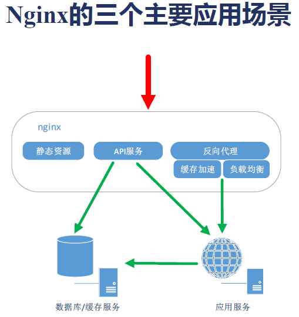

## 2. 组成

- **目录结构**： 

```vim
[root@www ~]# tree /application/nginx/
/application/nginx/
|-- client_body_temp
|-- conf                    　　　　　　　　　　　#这是Nginx所有配置文件的目录，极其重要
|   |-- fastcgi.conf         　　　　　　 　　　　#fastcgi相关参数的配置文件
|   |-- fastcgi.conf.default     　　  　　　　　#fastcgi.conf的原始备份
|   |-- fastcgi_params          　　　　　　　　　#fastcgi的参数文件
|   |-- fastcgi_params.default
|   |-- koi-utf
|   |-- koi-win
|   |-- mime.types          　　　　　　　　　　　　#媒体类型
|   |-- mime.types.default
|   |-- nginx.conf         　　　　　　　　　　　　 #这是Nginx默认的主配置文件
|   |-- nginx.conf.default
|   |-- scgi_params         　　　　　　　　　　　 #scgi相关参数文件，一般用不到
|   |-- scgi_params.default
|   |-- uwsgi_params               　　　　　　  #uwsgi相关参数文件，一般用不到
|   |-- uwsgi_params.default
|   `-- win-utf
|-- fastcgi_temp               　　　　　　　　   #fastcgi临时数据目录
|-- html     　　　 #这是编译安装时Nginx的默认站点目录，类似Apache的默认站点htdocs目录
|   |--50x.html       #错误页面优雅替代显示文件，例如：出现502错误时会调用此页面
|   |-- index.html    #默认的首页文件，首页文件名字是在nginx.conf中事先定义好的
|-- logs           #这是Nginx默认的日志路径，包括错误日志及访问日志
|   |-- access.log    #Nginx默认访问日志，tail -f access.log 可以实时观网站用户访问情况信息
|   |-- error.log     #Nginx错误日志文件
|   |-- nginx.pid     #Nginx的pid文件，Nginx进程启动后，会把所有进程的ID号写到此文件
|-- proxy_temp     #临时目录
|-- sbin           #Nginx命令的目录，如Nginx的启动命令nginx
|   |-- nginx      #Nginx的启动命令nginx
|-- scgi_temp      #临时目录
|-- uwsgi_temp      #临时目录
```

- **配置语法**： 

  > - 配置文件由指令与指令块构成
  > - 每条指令以 `;` 分号结尾，指令与参数间以空格分隔
  > - 指令块以 `{}` 大括号将多条指令组织在一起
  > - `include` 语句允许组合多个配置文件以提升可维护性
  > - 使用 `#` 添加注释
  > - 使用 `$` 使用变量
  > - 部分指令的参数支持正则表达式
  >
  > 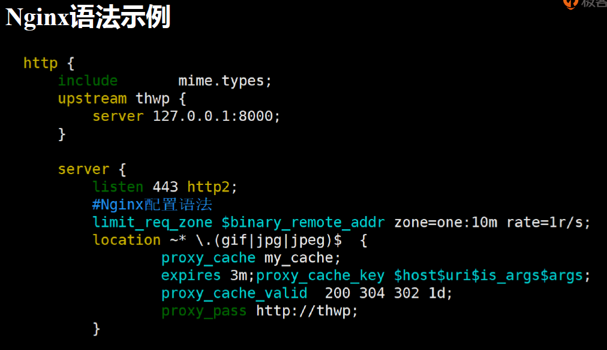

- 配置模块： [**Nginx 配置详解**](https://www.runoob.com/w3cnote/nginx-setup-intro.html) 

  > - **全局块**：影响 nginx 全局的指令
  >
  >   > 运行 nginx 服务器的用户组，nginx 进程 pid 存放路径，日志存放路径，配置文件引入，允许生成worker process数等
  >
  > - **events块**：影响 nginx 服务器或与用户的网络连接
  >
  >   > 每个进程的最大连接数，选取哪种事件驱动模型处理连接请求，是否允许同时接受多个网路连接，开启多个网络连接序列化等
  >
  > - **http块**：可以嵌套多个 server，配置代理，缓存，日志定义等绝大多数功能和第三方模块的配置
  >
  >   > 如文件引入，mime-type定义，日志自定义，是否使用sendfile传输文件，连接超时时间，单连接请求数等
  >
  > - **server块**：配置虚拟主机的相关参数，一个http中可以有多个server
  >
  > - **location块**：配置请求的路由，以及各种页面的处理情况
  >
  > ```bash
  > ...              #全局块
  > 
  > events {         #events块
  >    ...
  > }
  > 
  > http {      #http块
  >     ...     #http全局块
  >     server {      #server块
  >         ...       #server全局块
  >         location [PATTERN] {  #location块
  >             ...
  >         }
  >         location [PATTERN] {
  >             ...
  >         }
  >     }
  >     server {
  >       ...
  >     }
  >     ...     #http全局块
  > }
  > ```
  >
  > 一个配置文件详解： 
  >
  > ```bash
  > ########### 每个指令必须有分号结束#################
  > #user administrator administrators;  #配置用户或者组，默认为nobody nobody
  > #worker_processes 2;  #允许生成的进程数，默认为1
  > #pid /nginx/pid/nginx.pid;   #指定 nginx 进程运行文件存放地址
  > error_log log/error.log debug;  #指定日志路径，级别。可以放入全局块，http块，server块
  > 					  #级别依次为：debug|info|notice|warn|error|crit|alert|emerg
  > events {
  >     accept_mutex on;   #设置网路连接序列化，防止惊群现象发生，默认为on
  >     multi_accept on;  #设置一个进程是否同时接受多个网络连接，默认为off
  >     #use epoll;#事件驱动模型，select|poll|kqueue|epoll|resig|/dev/poll|eventport
  >     worker_connections  1024;    #最大连接数，默认为512
  > }
  > http {
  >     include       mime.types;   #文件扩展名与文件类型映射表
  >     default_type  application/octet-stream; #默认文件类型，默认为text/plain
  >     #access_log off; #取消服务日志    
  >     log_format myFormat '$remote_addr–$remote_user [$time_local] $request $status $body_bytes_sent $http_referer $http_user_agent $http_x_forwarded_for'; #自定义格式
  >     access_log log/access.log myFormat;  #combined为日志格式的默认值
  >     sendfile on; #允许sendfile方式传输文件，默认off，可在http块，server块，location块
  >     sendfile_max_chunk 100k;  #每个进程每次调用传输数量不能大于设定的值，默认0，即无上限
  >     keepalive_timeout 65;  #连接超时时间，默认为75s，可以在http，server，location块
  > 
  >     upstream mysvr {   
  >       server 127.0.0.1:7878;
  >       server 192.168.10.121:3333 backup;  #热备
  >     }
  >     error_page 404 https://www.baidu.com; #错误页
  >     server {
  >         keepalive_requests 120; #单连接请求上限次数
  >         listen       4545;   #监听端口
  >         server_name  127.0.0.1;   #监听地址       
  >         location  ~*^.+$ {    #请求的url过滤，正则匹配，~为区分大小写，~*为不区分大小写
  >            #root path;  #根目录
  >            #index vv.txt;  #设置默认页
  >            proxy_pass  http://mysvr;  #请求转向mysvr 定义的服务器列表
  >            deny 127.0.0.1;  #拒绝的ip
  >            allow 172.18.5.54; #允许的ip           
  >         } 
  >     }
  > }
  > ```

- **配置参数**： 

  - 时间单位： 

    > 

  - 空间单位：

    >  

- **基本命令行**： 

  > 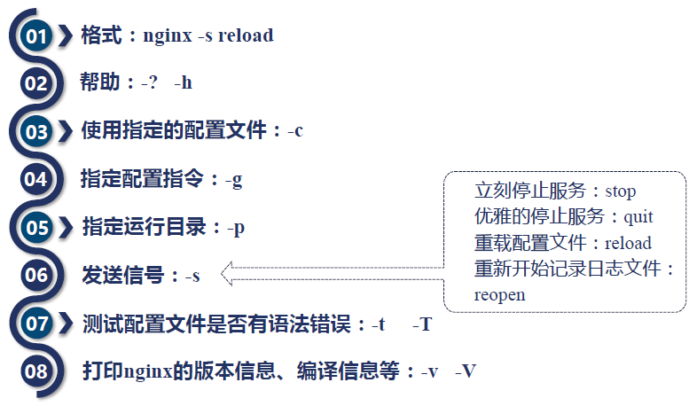

# 二、Nginx 架构

- **Nginx 请求处理流程**： 

  > 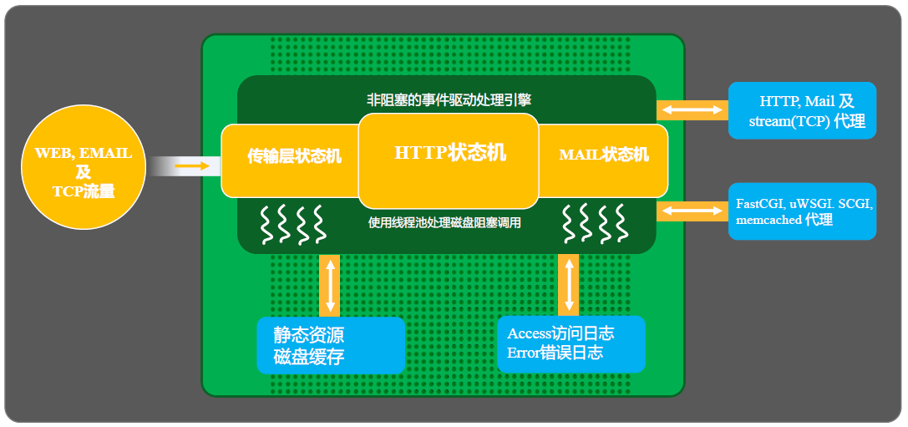

- **Nginx 进程结构**： 多进程，单线程

  > 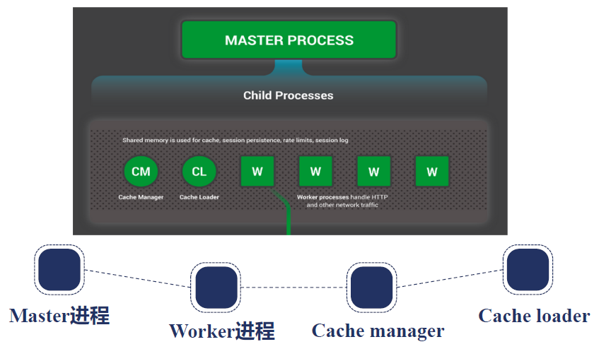

- **Nginx 进程管理**： **信号**

  > - master 进程： [Nginx进程管理](https://blog.csdn.net/m18706819671/article/details/80720965) 
  >
  > 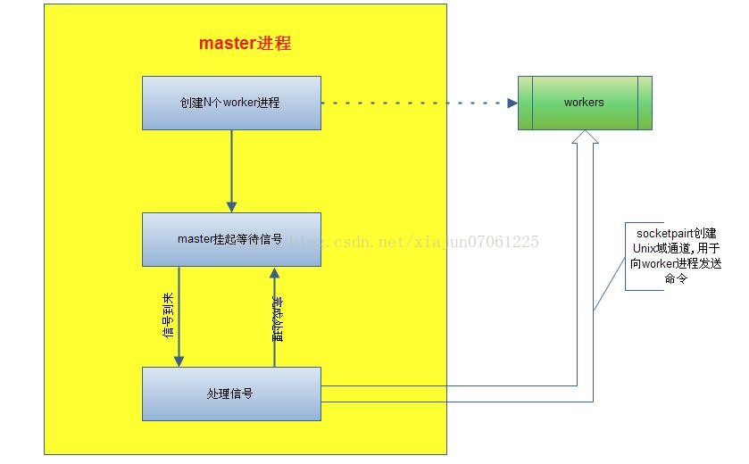
  >
  > 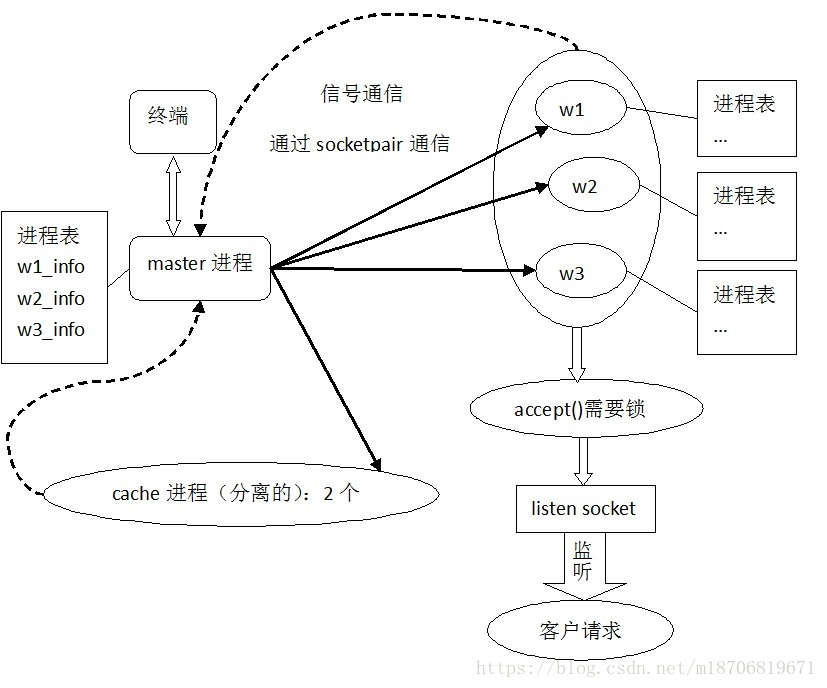
  >
  > |   信号    | 进程的全局标志位  | 意义                             |
  > | :-------: | :---------------: | -------------------------------- |
  > |   CHLD    |     ngx_reap      | 有子进程结束，需要监控所有子进程 |
  > | TERM或INT |   ngx_terminate   | 强制关闭整个服务                 |
  > |   QUIT    |     ngx_quit      | 优雅地关闭整个服务               |
  > |    HUP    |  ng_reconfigure   | 重读配置文件                     |
  > |   USR1    |    ngx_reopen     | 重新打开服务中的所有文件         |
  > |   WINCH   |   ngx_noaccept    | 子进程不再接受新连接             |
  > |   USR2    | ngx_change_binary | 平滑升级到新版本的Nginx程序      |
  >
  > 
  >
  > 

- **reload 流程**： 

  > 1. 向 master 进程发送 HUP 信号(reload 命令)
  > 2. master 进程校验配置语法是否正确
  > 3. master 进程打开新的监听端口
  > 4. master 进程用新配置启动新的 worker子进程
  > 5. master 进程向老 worker 子进程发送 QUIT 信号
  > 6. 老 worker 进程关闭监听句柄，处理完当前连接后结束进程
  >
  > 演示： 
  >
  > 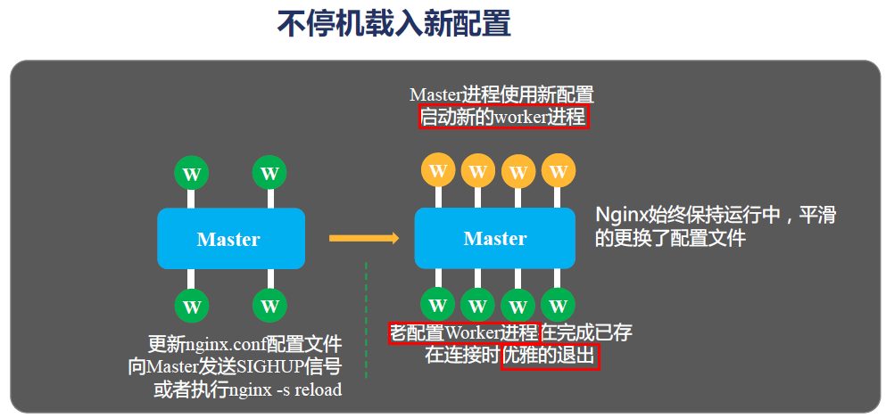

- **热升级流程**： 

  > 1. 将旧 Nginx 文件换成新 Nginx 文件(注意备份)
  > 2. 向 master 进程发送 USR2 信号
  > 3. master 进程修改 pid 文件名，加后缀 `.oldbin`
  > 4. master 进程用心 Nginx 文件启动新 master 进程
  > 5. 向老 master 进程发送 WINCH 信号
  > 6. 回滚： 向老 master 发送 HUP，向新 master 发送 QUIT
  >
  > 演示： 
  >
  > 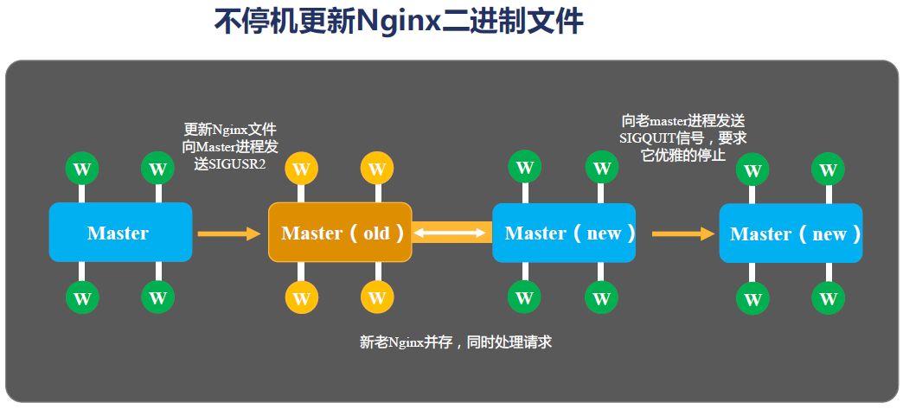

- **woker 进程关闭**： 优雅的关闭

  > 1. 设置定时器 `worker_shutdown_timeout`
  > 2. 关闭监听句柄
  > 3. 关闭空闲连接
  > 4. 在循环中等待全部连接关闭
  > 5. 退出进程

- **Nginx 事件驱动模型 `epoll`**： 

  > 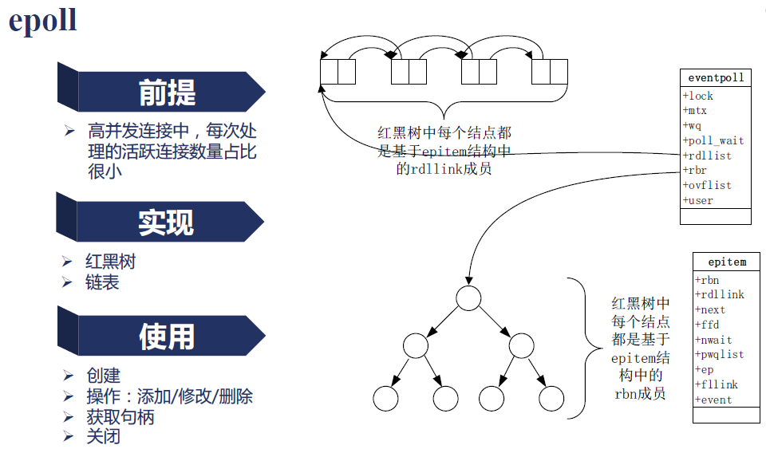

- **Nginx 请求切换**： 不通过 OS 切换

  > - 传统的请求切换： 当请求数量过多时，通过 OS 调度的进程切换的时间消耗会很庞大
  >
  >   > 
  >
  > - Nginx 请求切换：不通过 OS 进行进程间的切换，即不陷入内核，在用户态完成
  >
  >   > 
  >
  > nginx 在时间片内，当请求不满足时，直接在当前 process 内切换请求，直到分配的时间片消耗完毕
  >
  > - 一般把 worker 的优先级调到最高 `-19`，减少 process 内的切换

- **Nginx 模块分类**：

  > 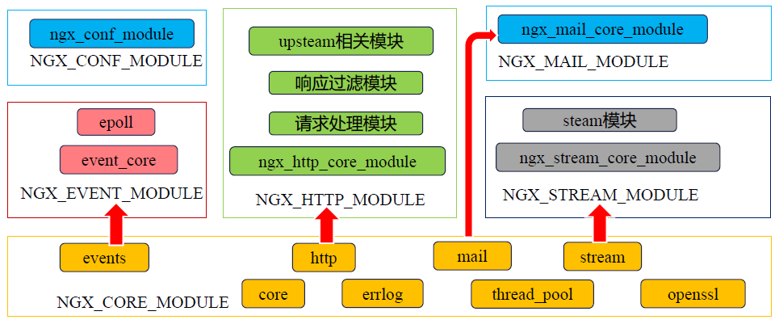

- **Nginx 连接池**：

  > - 对下游客户端的连接
  > - 对上游服务器的连接
  >
  > 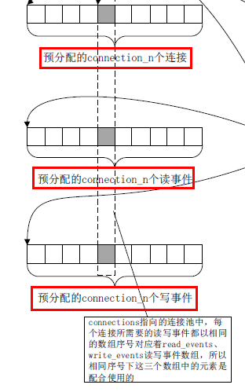
  >
  > 核心数据结构： 
  >
  > 

- **Nginx 进程间通信**： 

  > 
  >
  > 共享内存使用者： 
  >
  > 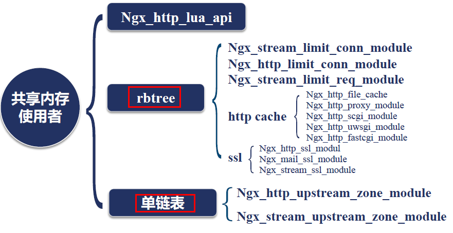
  >
  > **Slab 内存管理**： Bestfit 方式，即内存大小为 2 的倍数

- **Nginx 容器**： 数组、链表、队列、哈希表、红黑树、基数树

  > - 哈希表： 大小固定为 maxSize，实际大小为 BucketSize
  >
  >   > 使用的地方：
  >   >
  >   > 
  >
  > - 红黑树： 
  >
  >   > 使用的地方： 
  >   >
  >   > 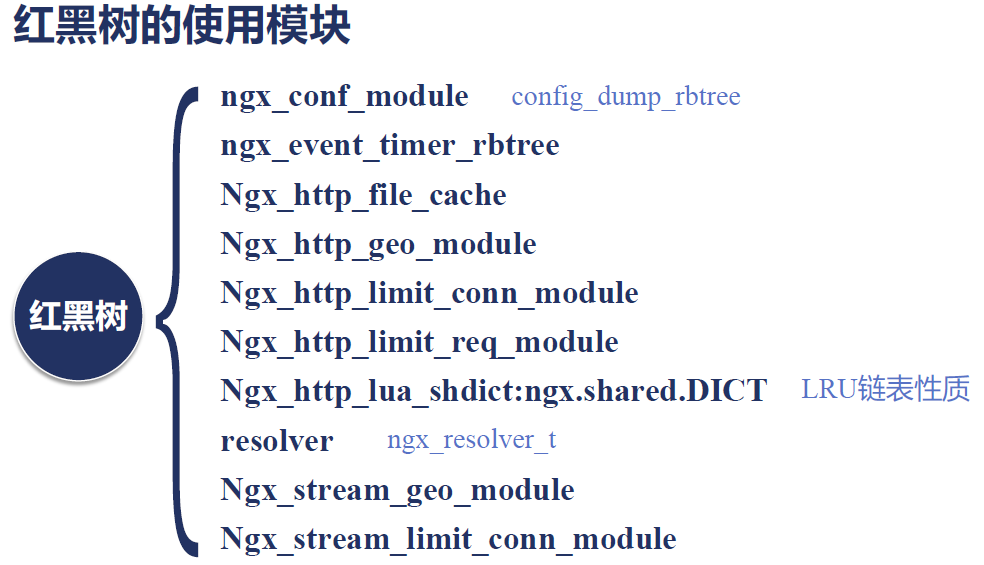

- **动态模块**： 减少编译环节

  > 
  >
  > **替换动态库**步骤： 即替换 `Module Shared Object` 动态模块
  >
  > 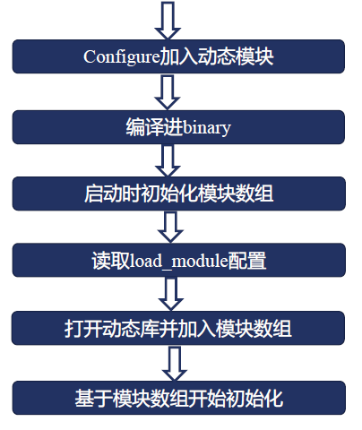

# 三、详解 HTTP 模块

存储值的指令继承规则： **向上覆盖**

- 子配置不存在时，直接使用父配置块
- 子配置存在时，直接覆盖父配置块

正则表达式： 

- 元字符： 

  > - `.`： 匹配除换行符以外的任意字符
  > - `\w`： 匹配字母或数字或下划线或汉字
  > - `\s`： 匹配任意的空白符
  > - `\d`： 匹配数字
  > - `\b`： 匹配单词的开始或结束
  > - `^`： 匹配字符串的开始
  > - `$`：匹配字符串的结束

- 重复： 

  > - `*`： 重复零次或多次
  > - `+`： 重复一次或多次
  > - `?`： 重复零次或一次
  > - `{n}`： 重复 n 次
  > - `{n,}`： 重复 n 次或更多次
  > - `{n,m}`： 重复 n 到 m 次

`server_name` 指令： 

- 指令后可以跟多个域名，第一个是主域名
- `*` 泛域名： 仅支持在最前或最后
- 正则表达式： 加 `~` 前缀
- 用正则表达式创建变量： 用小括号 `()`

---

## 1. 接收请求事件模块

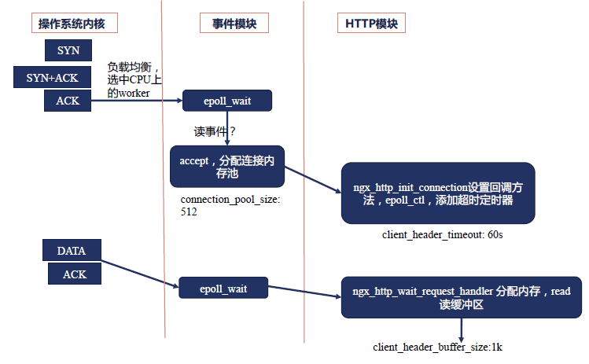

## 2. 接收请求 HTTP 模块

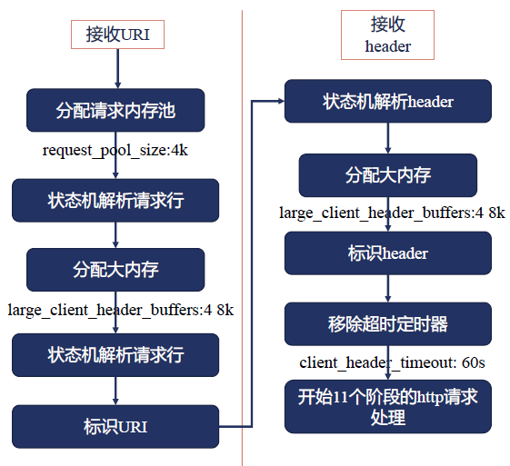

## 3. HTTP 请求处理时的 11 个阶段

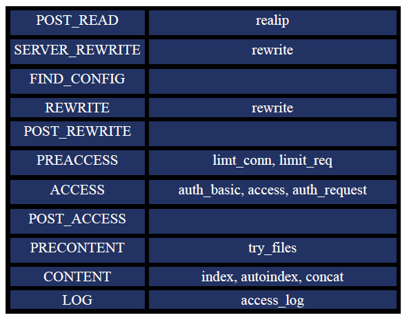

处理顺序：

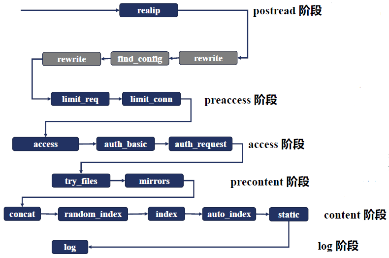

获取真实的用户 IP 地址，HTTP 头部的两个字段：

- `X-Forward-For`： 存放一个 IP 列表，存放通过的各服务器地址，包括：CDN，反向代理等
- `X-Real-IP`：只能存放一个 IP，即用户 IP 地址

Nginx 存放 IP 地址变量： `binary_remote_addr, remote_addr` 存放真实 IP

---

**`postread` 阶段**： 

- **`realip` 模块**： 允许从请求 Headers 里更改客户端的 IP 地址，即：获取真实客户端地址

  > - 优势： 如果没有 realip 模块，nginx 的 access_log 里记录的 IP 是反向代理服务器的 IP
  >
  > - 默认不会编译进 Nginx： `--with-http_realip_module` 启用该功能
  >
  > - 变量： `realip_remote_addr,realip_remote_port` 用户获取 IP 与 端口
  >
  > - 指令： 
  >
  >   - `set_real_ip_from address|CIDR|unix`： 
  >
  >     > - 默认值： 无
  >     > - 作用： 描述了值得信赖的地址，可以让 Nginx 更准确的替换地址
  >     > - 作用域： http, server, location
  >
  >   - `real_ip_header X-Real_IP|X-Forwarded-For|proxy protocol`： 
  >
  >     > - 默认值： X-Real-IP
  >     > - 作用： 告诉 Nginx 从何处获取用户 IP 地址
  >     > - 作用域： http, server, location
  >
  >   - `real_ip_recursive on|off`： 
  >
  >     > - 默认值： off
  >     >
  >     > - 作用： 
  >     >
  >     >   - `off`： nginx 会把 real_ip_header 指定的 HTTP 头的最后一个 IP 当成真实 IP
  >     >
  >     >   - `on`： nginx 会把 real_ip_header 指定的 HTTP 头的最后一个不信任 IP 当成真实 IP
  >     >
  >     >     > 即： 若最后一个 IP 地址与客户端地址相同时，会 pass 掉，再取上一个
  >     >
  >     > - 作用域： http, server, location

---

**`rewrite` 阶段**： 

- **`rewrite` 模块**： 

  > - `return` 指令： 返回状态码
  >
  >   > - 语法： `return code[text]|code URL|URL` 
  >   > - 默认： 空
  >   > - 作用域： server, location, if
  >   >
  >   > 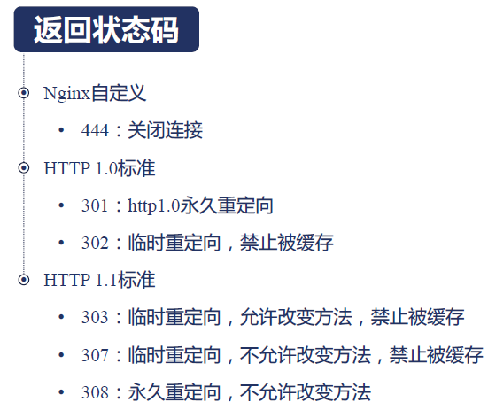
  >
  > - `error_page`：
  >
  >   > - 语法： `error_page code...[=[response]] uri` 
  >   > - 默认： 无
  >   > - 作用域： http, server, location, if in location
  >   >
  >   > 
  >   >
  >   > ---
  >   >
  >   > `return` 与 `error_page` 对比： 
  >   >
  >   > - 例子一： 返回 403.html 页面
  >   >
  >   >   ```bash
  >   >   server {
  >   >   	server_name return.taohui.tech;
  >   >   	listen 8080;
  >   >   	root html/;
  >   >   	error_page 404 /403.html;
  >   >   	# return 403;
  >   >   	location /{
  >   >   		# return 404 "find nothing!";
  >   >   	}
  >   >   }
  >   >   ```
  >   >
  >   > - 例子二： 返回 `find nothing!` 语句
  >   >
  >   >   ```bash
  >   >   server {
  >   >   	server_name return.taohui.tech;
  >   >   	listen 8080;
  >   >   	root html/;
  >   >   	error_page 404 /403.html;
  >   >   	# return 403;
  >   >   	location /{
  >   >   		return 404 "find nothing!";
  >   >   	}
  >   >   }
  >   >   ```
  >   >
  >   > - 例子三： 返回 `403` 数字
  >   >
  >   >   ```bash
  >   >   server {
  >   >   	server_name return.taohui.tech;
  >   >   	listen 8080;
  >   >   	root html/;
  >   >   	error_page 404 /403.html;
  >   >   	return 403;
  >   >   	location /{
  >   >   		return 404 "find nothing!";
  >   >   	}
  >   >   }
  >   >   ```
  >
  > - `rewrite` 指令： `rewrite regex replacement[flag]` 重写 URL
  >
  >   > - 作用域： server, location, if
  >   >
  >   > 功能： 
  >   >
  >   > - 将 regex 指定的 url 替换成 replacement 这个新的 url
  >   > - 当 replacement 以 `http://, https://,$schema` 开头，则直接返回 302 重定向
  >   > - 替换后的 url 根据 flag 指定的方式进行处理： 
  >   >   - `last`： 用 replacement 这个 url 进行新的  location 匹配
  >   >   - `break`： 停止当前脚本指令的执行
  >   >   - `redirect`： 返回 302 重定向
  >   >   - `permanent`：返回 301 重定向
  >
  > - `if` 指令： 条件判断 `if(condition){...}`
  >
  >   > - 作用域： server, location
  >   >
  >   > - 规则： 条件 condition 为真，则执行大括号内的指令；遵循值指令的继承规则
  >   >
  >   > - 具体使用： 
  >   >
  >   >   - 检查变量为空或值是否为 0，直接使用
  >   >
  >   >   - 将变量与字符串做匹配，使用 `=` 或 `!=`
  >   >
  >   >   - 将变量与正则表达式做匹配
  >   >
  >   >     > 大小写敏感： `~` 或 `!~`
  >   >     >
  >   >     > 大小写不敏感： `~*` 或 `!~*`
  >   >
  >   >   - 检查文件是否存在，使用 `-f` 或 `!-f`
  >   >
  >   >   - 检查目录是否存在，使用 `-d` 或 `!-d`
  >   >
  >   >   - 检查文件、目录、软链接是否存在，使用 `-e` 或 `!-e`
  >   >
  >   >   - 检查是否为可执行文件，使用 `-x` 或 `!-x`

---

**`find_config` 阶段**： 

- **`find_config` 模块**： 找到处理请求的 location 指令块

  >  `location` 指令： 
  >
  > - 语法： `location [=|~|~*|^~]uri{...}` 或 `location @name{...}`
  >
  > - 作用域： server, location
  >
  > - 匹配规则： 仅匹配 URI，忽略参数
  >
  > - 匹配顺序：
  >
  >   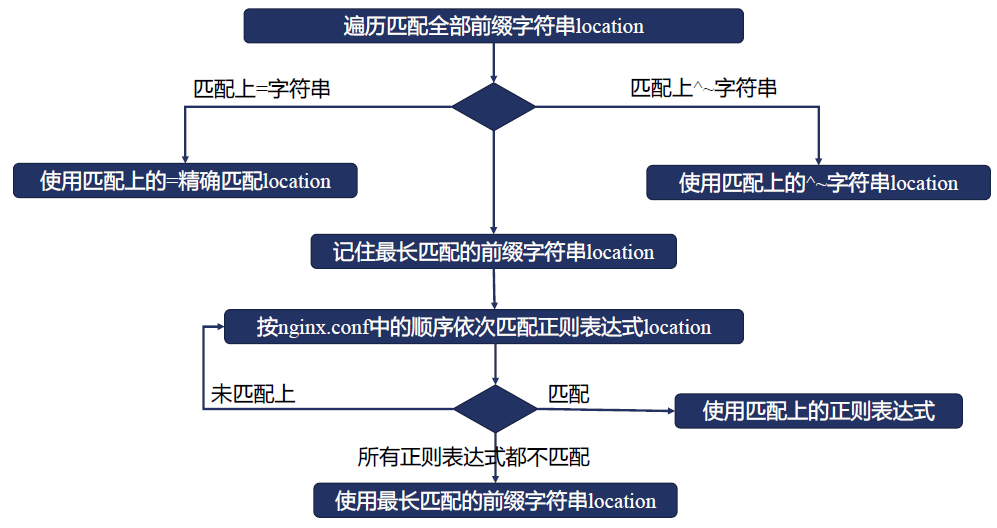
  >
  > 案例： 
  >
  > ```bash
  > location ~ /Test1/$ {
  > 	return 200 'first regular expressions match!';
  > }
  > location ~* /Test1/(\w+)$ {
  > 	return 200 'longest regular expressions match!';
  > }
  > location ^~ /Test1/ {
  > 	return 200 'stop regular expressions match!';
  > }
  > location /Test1/Test2 {
  > 	return 200 'longest prefix string match!';
  > }
  > location /Test1 {
  > 	return 200 'prefix string match!';
  > }
  > location = /Test1 {
  > 	return 200 'exact match!';
  > }
  > ```
  >
  > - 访问 `/Test1`： 返回 `exact match!` 
  > - 访问 `/Test1/`： 返回 `stop regular expressions match!`
  > - 访问 `/Test1/Test2`： 返回 `longest regular expressions match!`
  > - 访问 `/Test1/Test2/`： 返回 `longest prefix string match!` 

---

**`preacess` 阶段**： 

- **`limit_conn` 模块**： 对连接进行限制

  > - 默认编译，通过 `--without-http_limit_conn_module` 禁用
  >
  > - 步骤： 
  >
  >   - 定义共享内存(包括大小)，以及 key 关键字
  >
  >     > 语法： `limit_conn_zone key zone=name:size`
  >     >
  >     > 作用域： http
  >
  >   - 限制并发连接数
  >
  >     > 语法： `limit_conn zone number`
  >     >
  >     > 作用域： http, server, location
  >
  > - 限制发生时的日志级别： `limit_conn_log_level info|notice|warn|error` 
  >
  >   > 默认： `error`
  >   >
  >   > 作用域： http, server, location
  >
  > - 限制发生时向客户端返回的错误码： `limit_conn_status code`
  >
  >   > 默认： `503`
  >   >
  >   > 作用域： http, server, location

- **`limit_req` 模块**： 对请求进行限制

  > - 步骤： 
  >
  >   - 定义共享内存(包括大小)，以及 key 关键字和限制速率
  >
  >     > 语法： `limit_req_zone key zone=name:size rate=rate;`
  >
  >   - 限制并发连接数
  >
  >     > 语法： `limit_req zone=name[burst=number][nodelay]`
  >     >
  >     > - `burst` 默认为 0，`nodelay` 对 burst 中的请求立刻处理
  >
  > - 限制发生时的日志级别： `limit_req_log_level info|notice|warn|error`
  >
  > - 限制发生时向客户端返回的错误码： `limit_req_status code`
  >
  > `limit_req` 与 `limit_conn` 配置同时生效时，`limit_req` 有效

---

**`access` 阶段**： 

- **`access` 模块**： 对 IP 进行限制

  > - `allow address|CIDR|unix:|all`
  > - `deny address|CIDR|unix:|all`

- **`auth_basic` 模块**： 基于 HTTP Basic Authutication 协议进行用户名密码的认证

  > - 默认编译进 Nginx： 通过 `--without-http_auth_basic_module` 或 `disable ngx_http_auth_basic_module` 禁用
  > - `auth_basic string|off`： 默认不开启，string 为配置的用户名密码的字符串
  > - `auth_basic_user_file file`： 指定用户名密码的配置文件
  > - 文件格式： `name:password:comment`
  > - 生成工具 `htpassword`： `htpassword -c file -b user pass`，依赖安装包`httpd-tools`

- **`auth_request` 模块**： 统一的用户权限验证，即：使用第三方进行权限控制

  > - 默认未编译进 Nginx： `--with-http_auth_request_module` 开启
  > - 功能： 向上游的服务转发请求
  >   - 若上游服务返回的响应码是 `2xx`，则继续执行
  >   - 若上游服务返回的是 `401` 或 `403`，则将响应返回客户端
  > - 原理： 收到请求后，生成子请求，通过反向代理技术把请求传递给上游服务
  >
  > - `auth_request uri|off`： 子请求会访问该 uri，根据 uri 返回的结果决定请求是否继续执行
  > - `auth_request_set $variable value`： 可以设置变量与值

`satisfy` 指令： 限制 `access` 阶段的模块，`satisfy all|any`

- `satisfy all`： 只有 `access` 阶段的所有模块都放行，才能继续执行
- `satisfy any`： 当 `access` 阶段的任意一个模块放行，就可以继续执行

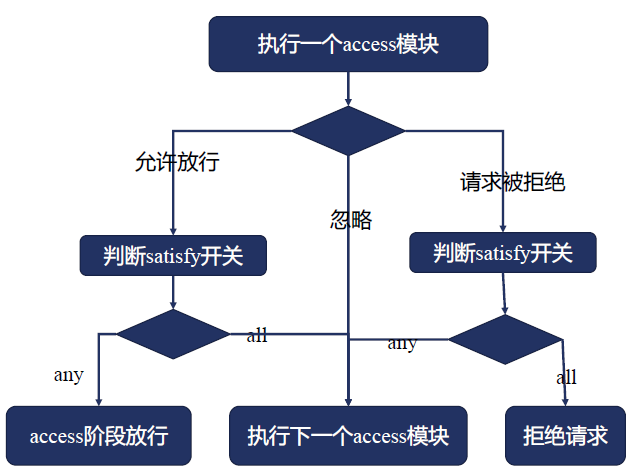

注意： 

- 如果有 `return` 指令，`access` 阶段不会生效
- 多个 `access` 模块的顺序对执行有影响

---

**`precontent` 阶段**： 

- **`try_files` 模块**： 按序访问资源

  > - 语法： `try_files file...uri` 或 `try_files fiel...=code` 
  > - 功能： 依次试图访问多个 url 对应的文件，当文件存在时直接返回文件内容，若所有文件都不存在，则按最后一个 url 结果或 code 返回

- **`mirror` 模块**： 实时拷贝流量

  > - 默认编译进 Nginx： 通过 `--without-http_mirror_module` 移除
  >
  > - 作用： 处理请求时，生成子请求访问其他服务，对子请求的返回值不做处理
  >
  > - `mirror uri|off`： 同步复制的请求放到另一个 uri 上，该 uri 会指向一个反向代理
  >
  >   > 默认 `mirror off`
  >
  > - `mirror_request_body on|off`： 指定是否需要将请求中的 body 转发到上游服务中
  >
  >   > 默认： `mirror_request_body on` 

---

**`content` 阶段**： 

- **`static` 模块**： 

  > - `root path` 与 `alias path`： 将 url 映射为文件路径，以返回静态文件内容
  >
  >   > `root` 会将完整 url 映射进文件路径
  >   >
  >   > `alias` 只会将 location 后的 URL 映射到文件路径
  >   >
  >   > 
  >   >
  >   > 例子： 
  >   >
  >   > ```bash
  >   > location /root {
  >   > 	root html;
  >   > }
  >   > location /alias {
  >   > 	alias html;
  >   > }
  >   > location ~ /root/(\w+\.txt) {
  >   > 	root html/first/$1;
  >   > }
  >   > location ~ /alias/(\w+\.txt) {
  >   > 	alias html/first/$1;
  >   > }
  >   > ```
  >   >
  >   > - 访问 `/root`： 返回 404，该文件不存在
  >   > - 访问 `/alias`： 返回 index.html 文件
  >   > - 访问 `/root/1.txt`： 返回 404
  >   > - 访问 `/alias/1.txt`： 返回 1.txt 文件
  >
  > - 生成待访问文件的三个相关变量： 
  >
  >   > - `request_filename`： 待访问文件的完整路径
  >   > - `document_root`： 由 URI 和 root/alias 规则生成的文件夹路径
  >   > - `realpath_root`： 将 document_root 中的软链接换成真实路径
  >
  > - 静态文件返回时的 `content_type`：
  >
  >   > - `types {...}`： 映射文件扩展名，并将结果放入 hash 表中
  >   >
  >   >   > 默认： `types {text/html html;image/gif gif;image/jpeg jpg;}`
  >   >
  >   > - `default_type mime-type`： 设置媒体文件的类型
  >   >
  >   >   > 默认： `default_type text/plain`
  >   >
  >   > - `types_hash_bucket_size size`： 
  >   >
  >   >   > 默认： `types_hash_bucket_size 64`
  >   >
  >   > - `types_hash_max_size size`： 
  >   >
  >   >   > 默认： `types_hash_max_size 1024` 
  >
  > - 未找到文件时的错误日志： `log_not_found on|off`，默认打开
  >
  > 问题： 访问目录时，URL 最后没有带 `/` 
  >
  > - 解决： `static` 模块实现了 `root/alias` 功能时，发现访问目标是目录，但 URL 末尾未加 `/` 时，会返回 301 重定向
  > - 重定向跳转的域名： 
  >   - `server_name_in_redirect on|off`： 默认关闭
  >   - `port_in_redirect on|off`：默认打开
  >   - `absolute_redirect on|off`： 默认打开

- **`index` 模块**： 指定 `/` 访问时返回 index 文件内容

  > 语法： `index file...;`
  >
  > 默认： `index index.html`

- **`autoindex` 模块**： 当 URL 以 `/` 结尾时，尝试以 `html/xml/json/jsonp` 等格式返回 root/alias 中指向目录的目录结构

  > - 默认编译进 Nginx： 通过 `--without-http_autoindex_module` 禁用
  > - `autoindex on|off`： 默认关闭
  > - `autoindex_exact_size on|off`： 默认开启
  > - `autoindex_format html|xml|json|jsonp`： 默认 html
  > - `autoindex_localtime on|off`： 默认关闭

- **`concat` 模块**： 当页面要访问多个小文件时，把内容合并到一次 http 响应中返回，提升性能

  > - 模块开发者： Tengine -> `https://github.com/alibaba/nginx-http-concat`
  > - 添加： `--add-module=../nginx-http-concat/` 
  > - 使用： 在 URI 后加上 `??`，然后多个文件用 `,` 分隔，参数在最后通过 `?` 分隔
  > - 指令：
  >   - `concat: on|off`： 默认关闭
  >   - `concat_delimiter: string`：定义多个文件间的分隔符
  >   - `concat_types: MIME types`： 默认 `concat_types: text/css application/x-javascript`，对哪些文件做合并
  >   - `concat_unique: on|off`：默认开启，是否只对一种类型文件进行合并
  >   - `concat_ignore_file_error: on|off`： 默认关闭，是否忽略错误文件
  >   - `concat_max_files: numberp`： 默认 `concat_max_files 10`，最多合并多少文件

---

**`log` 阶段**： 

- **`access_log` 日志**： 

  > - 功能： 将 HTTP 请求相关信息记录到日志
  >
  > - 日志格式： `log_format name[escape=default|json|none]string...;`
  >
  >   > 默认： `log_format combined "...";`
  >   >
  >   > - 默认的 combined 日志格式： 
  >   >
  >   >   ```
  >   >   log_format combined '$remote_addr - $remote_user[$time_local]'
  >   >   	'"$request" $status $body_bytes_sent' 
  >   >   	'"$http_referer" "$http_user_agent"';
  >   >   ```
  >
  > - 配置日志文件路径： `access_log path[format[buffer=size][gzip[=level]][flush=time][if=condition]]` 或 `access_log off` 
  >
  >   > - 默认： `access_log logs/access.log combined` 
  >   >
  >   > - `path` 可以包含变量：不打开 cache 时，每记录一条日志都需要打开、关闭日志文件
  >   >
  >   > - `if` 通过变量值控制请求日志是否记录
  >   >
  >   > - 日志缓存： 批量将内存中的日志写入磁盘
  >   >
  >   >   > 写入条件： 
  >   >   >
  >   >   > - 所有待写入磁盘的日志大小超出缓存大小
  >   >   > - 达到 flush 指定的过期时间
  >   >   > - worker 进程执行 reopen 命令，或者正在关闭
  >   >
  >   > - 日志压缩： 批量压缩内存中的日志，再写入磁盘
  >   >
  >   >   > buffer 默认大小为 64KB
  >   >   >
  >   >   > 压缩级别默认为 1（1 最快压缩率最低，9 最慢压缩率最高）
  >
  > - 对日志文件名包含变量时的优化： 
  >
  >   > 语法： `open_log_file_cache max=N[inactive=time][min_uses=N][valid=time]` 或 `open_log_file_cache off`，默认关闭
  >   >
  >   > - `max`： 缓存内的最大文件句柄数，超出后用 LRU 算法淘汰
  >   > - `inactive`： 文件访问完后，在这段时间内不会被关闭，默认 10 秒
  >   > - `min_uses`： 在 inactive 时间内使用次数超过 min_uses 才会继续存在内存中，默认 1
  >   > - `valid`： 超出 valid 时间后，将检查缓存的日志文件是否存在，默认 60 秒
  >   > - `off`： 关闭缓存功能

## 4. 过滤模块

- **过滤模块位置**： 

  > 

- **返回响应-加工响应内容**：

  > 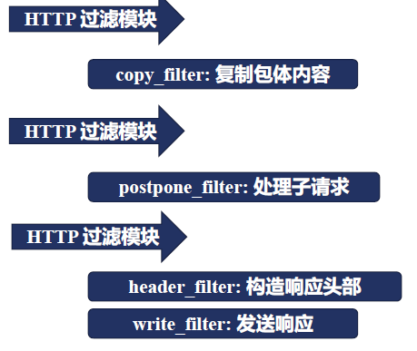

- **sub 模块**： 更改响应中的字符串

  > - 默认未编译进 Nginx： 通过 `--with-http_sub_module` 启用
  > - 指令： 
  >   - `sub_filter string replacement`： 字符串替换
  >   - `sub_filter_last_modified on|off`：默认关闭，是否返回已替换的内容
  >   - `sub_filter_once on|off`： 默认开启，是否只修改一次
  >   - `sub_filter_types mime-type...`： 默认为 `text/html`，只针对什么类型的响应进行替换

- **addition 模块**： 在响应的前后添加内容，增加内容的方式是通过新增子请求的响应完成

  > - 默认未编译进 Nginx： 通过 `--with-http_addition_module` 启用
  > - 指令： 
  >   - `add_before_body uri`： 响应前添加，通过访问 uri 来获取添加内容
  >   - `add_after_body uri`： 响应后添加，同上
  >   - `addition_types mime-type ...`： 默认 `text/html`，指定什么类型文件才能执行响应添加

## 5. 变量

### 1. nginx 变量分类

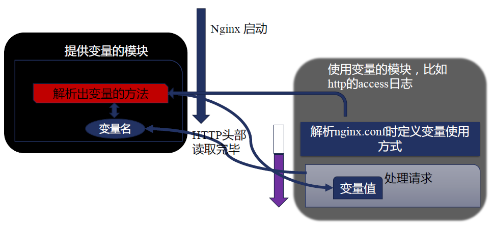

变量特性： **惰性求值**，即变量值可以时刻变化，其值为使用的那一时刻的值

---

HTTP 框架提供的变量： 

- **HTTP 请求相关的变量**： 

  > - `arg_参数名`：URL 中某个具体参数的值
  >
  > - `query_string`： 与 args 变量完全相同
  >
  > - `args`： 全部 URL 参数
  >
  > - `is_args`： 如果请求 URL 中有参数，则返回 ？，否则返回空
  >
  > - `content_length`： HTTP 请求中标识包体长度的 Content-Length 头部的值
  >
  > - `content_type`： 标识请求包体类型的 Content-Type 头部的值
  >
  > - `uri`： 请求的 URI(不同于 URL，不包括 ？后的参数)
  >
  > - `document_uri`： 与 uri 完全相同
  >
  > - `request_uri`： 请求的 URL(包括 URI 以及完整的参数)
  >
  > - `scheme`： 协议名，例如： HTTP 或 HTTPS
  >
  > - `request_method`： 请求方法，例如： GET 或 POST
  >
  > - `request_length`： 所有请求内容的大小，包括请求行、头部、包体等
  >
  > - `remote_user`： 由 HTTP Basic Authentication 协议传入的用户名
  >
  > - `request_body_file`： 临时存放请求包体的文件
  >
  >   > `client_body_in_file_noly` 强制所有包体存入文件，且可决定是否删除
  >
  > - `request_body`： 请求中的包体，当且仅当使用反向代理，且设定用内存暂存包体时才有效
  >
  > - `request`： 原始的 url 请求，含有方法和协议版本，例如： GET /?a=1&b=22 HTTP/1.1
  >
  > - `host`： 先从请求行中获取；若含有 Host 头部，则用其值替换请求行中的主机名；若都不匹配，则使用匹配上的 server_name
  >
  > - `http_头部名字`： 返回一个具体请求头部的值
  >
  >   > 如： `http_host, http_user_agent, http_referer, http_via, http_x_forwarded_for, http_cookie` 

- **TCP 连接相关的变量**： 

  > - `binary_remote_addr`： 客户端地址的整型格式，对 IPv4 是 4 字节，IPv6 是 16 字节
  > - `connection`： 递增的连接序号
  > - `connection_requests`： 当前连接上执行过的请求数，对 keepalive 连接有意义
  > - `remote_addr`： 客户端地址
  > - `remote_port`： 客户端端口
  > - `proxy_protocol_addr`： 若使用了 proxy_protocol 协议，则返回协议中的地址，否则返回空
  > - `proxy_protocol_port`： 若使用了 proxy_protocol 协议，则返回协议中的端口，否则返回空
  > - `server_addr`： 服务器地址
  > - `server_port`： 服务器端口
  > - `TCP_INFO`： tcp 内核层参数，包括 `$tcpinfo_rtt, $tcpinfo_rttvar, $tcpinfo_snd_cwnd, $tcpinfo_rcv_space`
  > - `server_protocol`： 服务器端协议，例如： HTTP/1.1

- **Nginx 处理请求过程中产生的变量**： 

  > - `request_time`： 请求处理到现在的耗时，单位 `s`，精确到 `ms`
  > - `server_name`： 匹配上请求的 server_name 值
  > - `https`： 若开启了 TLS/SSL，则返回 on，否则返回空
  > - `request_completion`： 若请求处理完，则返回 OK，否则返回空
  > - `request_id`： 以 16 进制输出的请求标识 id，该 id 共含有 16 个字节，随机生成
  > - `request_filename`： 待访问文件的完整路径
  > - `document_root`： 由 URI 和 root/alias 规则生成的文件夹路径
  > - `realpath_root`： 将 document_root 中的软链接替换成真实路径
  > - `limit_rate`： 返回客户端响应时的速度上限，单位为每秒字节数，可通过指令 `set` 修改

- **发送 HTTP 响应时相关的变量**： 

  > - `body_bytes_sent`： 响应中 body 包体的长度
  >
  > - `bytes_sent`： 从客户端接收到的字节数
  >
  > - `bytes_sent`： 全部 http 响应的长度
  >
  > - `status`： http 响应中的返回码
  >
  > - `sent_trailer_名字`： 把响应结尾内容里的值返回
  >
  > - `sent_http_头部名字`： 响应中某个具体头部的值
  >
  >   > 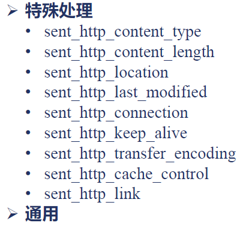

- **Nginx 系统变量**： 

  > - `time_local`： 以本地时间标准输出的当前时间，例如： 14/Nov/2018:15:55:37 +0800
  > - `time_iso8601`： 使用 ISO 8601 标准输出的当前时间，例如： 2018-11-14T15:55:37+08:00
  > - `nginx_version`： Nginx 版本号
  > - `pid`： 所属 worker 进程的进程 id
  > - `pipe`： 使用了管道，则返回 `p`，否则返回 `.` 
  > - `hostname`： 所在服务器的主机名，与 hostname 命令输出一致
  > - `msec`： 1970年1月1日到现在的时间，单位为秒，精确到毫秒

### 2. 变量控制模块

- **`map` 模块**： 基于已有变量，使用类似 `switch-case` 语法创建新变量，为其他基于变量值实现功能的模块提供更多可能性

  > - 默认编译进 Nginx： 通过 `--without-http_map_module` 禁用
  >
  > - 规则： 
  >
  >   - case 规则： 
  >
  >     > - 字符串严格匹配
  >     > - 使用 hostnames 指令，可以对域名前缀或后缀 `*` 泛域名匹配
  >     > - `~` 和 `~*` 正则表达式匹配，后者忽略大小写
  >
  >   - default 规则： 没有匹配到任何规则时使用；缺失时，返回空字符串给新变量
  >
  >   - 其他： 
  >
  >     > - 使用 include 语法提升可读性
  >     > - 使用 volatile 禁止变量值缓存
  >
  > - 指令： 
  >
  >   - `map string $variable{...}`： 保证在 string 选中时，将值放入 $variable 中
  >
  >     > `string`： 可以是字符串、一个或多个变量、变量与字符串的组合
  >
  >   - `map_hash_bucket_size size`： 默认尺寸 `32|64|128`
  >
  >   - `map_hash_max_size size`： 默认尺寸 `2048` 
  >
  > 样例： 
  >
  > ```bash
  > # 格式类似： switch-case-default
  > map $http_host $name {
  > 	hostnames;
  > 	
  > 	default 0;
  > 	
  > 	~map\.tao\w+\.org.cn 1;
  > 	*.taohui.org.cn 2;
  > 	map.taohui.tech 3;
  > 	map.taohui.* 4;
  > }
  > 
  > map $http_user_agent $mobile {
  > 	default 0;
  > 	"~Opera Mini" 1;
  > }
  > ```
  >
  > 当发生以下请求时，name 变量值是： 
  >
  > - `'Host: map.taohui.org.cn’`： 返回 `2`
  > - `'Host: map.tao123.org.cn’`：返回 `1`
  > - `'Host: map.taohui.pub’`： 返回 `3` 

-  **`geo` 模块**： 根据客户端 IP 地址创建新变量

  > - 默认编译进 Nginx： 通过 `--without-http_geo_module` 禁用
  >
  > - `geo [$address] $variable{...}`： 将地址保存到 $variable 变量中
  >
  > - 规则： 
  >
  >   - 若 geo 指令后不输入 `$address`，则默认使用 `$remote_addr` 变量作为 IP 地址
  >
  >   - `{}` 内的指令匹配： 优先最长匹配
  >
  >     > - 通过 IP 地址及子网掩码定义 IP 范围，当 IP 地址在范围内时，新变量使用其后的参数值
  >     > - default 指定了当以上范围都未匹配时，新变量的默认值
  >     > - 通过 proxy 指令指定可信地址(参考 realip)，此时 `remote_addr` 值为 `X-Forwarded-For` 头部值中最后一个 IP 地址
  >     > - proxy_recursive 允许循环地址搜索
  >     > - delete 删除指定网络

- **`geoip` 模块**： 基于 MaxMind 数据库从客户端地址获取流量

  > - 默认未编译进 Nginx： 通过 `--with-http_geoip_module` 禁用
  >
  > - `geoip_country` 指令提供的变量
  >
  >   > 指令： 
  >   >
  >   > - `geoip_country file`： 
  >   > - `geoip_proxy address|CDIR`： 
  >   >
  >   > 变量： 
  >   >
  >   > - `$geoip_country_code`： 两个字母的国家代码，如： CN 或 US
  >   > - `$geoip_country_code3`： 三个字母的国家代码，如： CHN 或 USA
  >   > - `$geoip_country_name`： 国家名称，如： China 或 United States
  >
  > - `geoip_city` 指令提供的变量： 
  >
  >   > 指令： 
  >   >
  >   > - `geoip_city file`： 
  >   >
  >   > 变量： 
  >   >
  >   > - `$geoip_latitude`： 纬度
  >   > - `$geoip_longitude`： 经度
  >   > - `$geoip_city_continent_code`： 属于哪个洲，如： EU 或 AS
  >   > - `$geoip_region`： 州或省的编码，如： 02
  >   > - `$geoip_region_name`： 州或省的名称，如： Zhejiang 或 Saint Peterburg
  >   > - `$geoip_city`： 城市名
  >   > - `$geoip_postal_code`： 邮编号
  >   > - `$geoip_area_code`： 仅美国使用的电话区号，如： 408
  >   > - `$geoip_dma_code`： 仅美国使用的 DMA 编号，如： 807

- **`split_clients` 模块**： 基于已有变量创建新变量，为其他 AB 测试提供更多的可能性

  > - 默认编译进 Nginx： 通过 `--without-http_split_clients_module` 禁用
  > - `split_clients string $variable{...}`： 同 `map` 指令

## 6. 防盗链

### 1. referer 模块

> 场景： 某网站通过 url 引用了你的页面，当用户在浏览器上点击 url 时，http 请求的头部会通过 referer 头部将该网站当前页面的 url 带上，告诉服务器本次请求是由这个页面发起的

- 默认编译进 Nginx： 通过 `--without-http_referer_module` 禁用

- **目的**： 拒绝非正常网站访问我们站点的资源

- **思路**： 通过 referer 模块，用 `invalid_referer` 变量根据配置判断 referer 头部是否合法

- 指令： 

  - `valid_referers none|blocked|server_names|string`： 

    > - 可**同时携带多个参数**，表示多个 referer 头部都生效
    >
    > 参数值： 
    >
    > - `none`： 允许缺失 referer 头部的请求访问
    >
    > - `block`： 允许 referer 头部没有对应的值的请求访问
    >
    > - `server_names`： 若 referer 站点域名与 server_name 本机域名某个匹配，则允许该请求访问
    >
    > - `string`： 
    >
    >   - 表示域名及 URL 的字符串，对域名可在前缀或后缀中含有 `*` 通配符
    >
    >     > 若 referer 头部的值匹配字符串后，则允许访问
    >
    >   - 正则表达式： 若 referer 头部的值匹配正则表达式后，则允许访问
    >
    > `invalid_referer` 变量： 
    >
    > - 允许访问时，变量值为空
    > - 不允许访问时，变量值为 1

  - `referer_hash_bucket_size size`： 默认尺寸 `64` 

  - `referer_hash_max_size size`： 默认尺寸 `2048` 

案例：

```bash
server_name referer.taohui.tech;
location /{
	valid_referers none blocked server_names
		*.taohui.pub www.taohui.org.cn/nginx/
		~\.google\.;
	if ($invalid_referer) {
		return 403;
	}
}
```

- `curl -H 'referer: http://www.taohui.org.cn/ttt' referer.taohui.tech/`： 返回 `403`
- `curl -H 'referer: http://www.taohui.pub/ttt' referer.taohui.tech/`： 返回 `valid`
- `curl -H 'referer: ' referer.taohui.tech/`： 返回 `valid`
- `curl referer.taohui.tech/`： 返回 `valid`
- `curl -H 'referer: http://www.taohui.tech' referer.taohui.tech/`： 返回 `403`
- `curl -H 'referer: http://referer.taohui.tech' referer.taohui.tech/`： 返回 `valid`
- `curl -H 'referer: http://image.baidu.com/search/detail' referer.taohui.tech/`： 返回 `403`
- `curl -H 'referer: http://image.google.com/search/detail' referer.taohui.tech/`： 返回 `valid`

### 2. secure_link 模块

- 默认未编译进 Nginx： 通过 `--with-http_secure_link_module` 添加

- 功能： 通过验证 URL 中哈希值的方式防盗链

- **过程**： 

  - 由某服务器生成加密后的安全链接 url，返回给客户端
  - 客户端使用安全 url 访问 nginx，由 nginx 的 secure_link 变量判断是否验证通过

- **原理**： 

  - 哈希算法不可逆，客户端只能拿到执行过哈希算法的 URL
  - 仅生成 URL 的服务器和验证 URL 是否安全的 nginx 才保存原始字符串

  原始字符串的组成： 

  - **资源位置**，例如： HTTP 中指定资源的 URI

    > 防止攻击者拿到一个安全 URL 后，可以访问任意资源

  - **用户信息**，例如： 用户 IP 地址

    > 限制其他用户盗用安全 URL

  - **时间戳**

    > 使安全 URL 及时过期

  - **密钥**

    > 仅服务器拥有，增加攻击者猜测出原始字符串的难度

- 指令： 

  - `secure_link expression`： 
  - `secure_link_md5 expression`： 
  - `secure_link_secret word`： 

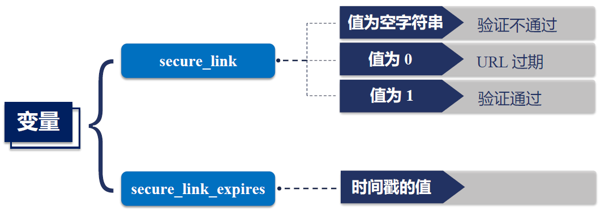

---

对客户端 `keepalive` 行为控制的指令： 

- 功能： 多个 HTTP 请求通过复用 TCP 连接实现以下功能

  > - 减少握手次数
  > - 通过减少并发连接数减少了服务器资源的消耗
  > - 降低 TCP 拥塞控制的影响

- 协议： 

  - `Connection` 头部： 
    - 取值为 `close`： 表示请求处理完后，即关闭连接
    - 取值为 `keepalive`： 表示复用连接处理下一条请求

  - `Keep-Alive` 头部： 值为 `timeout=n`，单位 `s`，告诉客户端连接至少保留 `n` 秒

- 指令： 

  - `keepalive_disable none|browser ...`： 默认 `msie6`，对什么浏览器不使用 keepalive
  - `keepalive_requests number`： 默认 `100`，表示一个 TCP 连接，最多执行多少个 HTTP 请求
  - `keepalive_timeout timeout[header_timeout]`： 默认 `75s`，连接保持的时间

# 四、反向代理与负载均衡

## 1. 负载均衡

- **Nginx 在 AKF 扩展立方体上的应用**：

  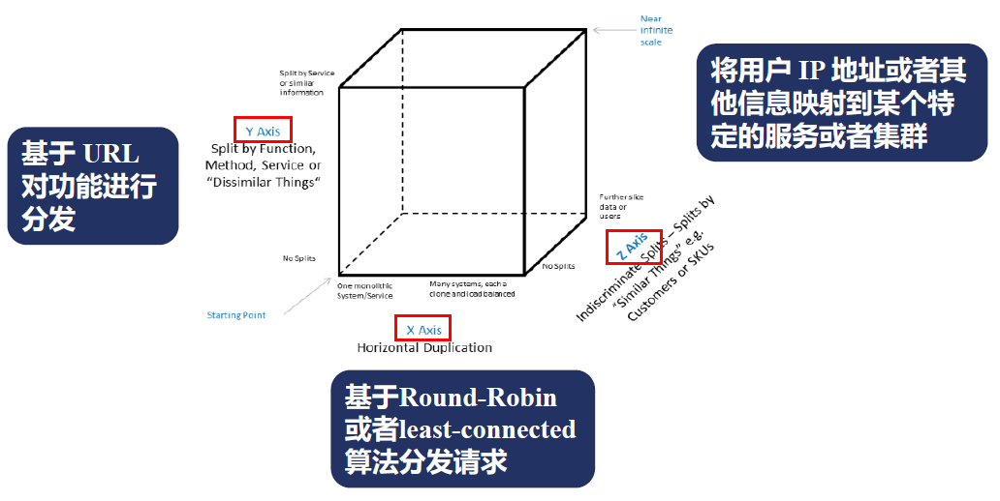

- **指定上游服务地址**： 指定一组上游服务器地址(域名，IP，Unix Socket)与域名(默认 80)

  > 通用参数： 
  >
  > - `backup`： 指定当前 server 为备份服务，仅当非备份 server 不可用时，请求才会转发到该 server
  > - `down`： 标识某台服务已经下线，不在服务

  - `upstream name{...}`： 指定应用服务集群的名字，其中包含很多 server

  - `server address[parameters]`： 规定地址与参数，来控制负载均衡的行为

    > 作用域： `upstream`

- **对上游服务使用 `keepalive` 长连接**： 

  > - 默认编译进 Nginx： 通过 `--without-http_upstream_keepalive_module` 移除
  >
  > - **功能**： 通过复用连接，降低nginx与上游服务器建立、关闭连接的消耗，提升吞吐量的同时降低时延
  >
  > - 对上游连接的 http 头部设定：`proxy_http_version 1.1` 与 `proxy_set_header COnnection ""` 
  >
  > - `upstream_keepalive` 指令： 
  >
  >   - `keepalive connections`： 规定保持多少个空闲连接用于上游的 keepalive 请求
  >
  >     > 作用域： `upstream`
  >
  >   - `keepalive_requests number`： 默认 `100`
  >
  >   - `keepalive_timeout timeout`： 默认 `60s`

- **指定上游服务域名解析的 `resolver` 指令**： 

  > - `resolver address ...[valid=time][ipv6=on|off]`： 指定域名访问上游服务
  > - `resolver_timeout time`： 默认 `30s`

---

**加权 `Round-Robin` 负载均衡算法**：以加权轮询的方式访问 server 指令指定的上游服务

- 集成在 Nginx 的 upstream 框架中

指令：

-  `weight`： 服务访问的权重，默认 1

- `max_conns`： server 的最大并发连接数，仅作用于单 worker 进程。默认 0，表示没有限制

- `max_fails`： 在 `fail_tomeout` 时间段内，最大的失败次数

  > 当达到最大失败时，会在 fail_timeout 秒内，这台 server 不允许再次被选择

- `fail_timeout`：单位 `s`，默认值 `10s`，有两个功能

  - 指定一段时间内，最大的失败次数 `max_fails`
  - 到达 `max_fails` 后，该 server 不能访问的时间

---

**`upstream` 模块**： 

- **`upstream_ip_hash` 模块**： 基于客户端 IP 地址的 hash 算法实现负载均衡

  > - 默认编译进 Nginx： 通过 `--with-http_upstream_ip_hash_module` 禁用
  >
  > - **功能**： 以客户端的 IP 地址作为 hash 算法的关键字，映射到特定的上游服务器中
  >
  >   > - 对 IPv4 地址使用前 3 个字节作为关键字，对 IPv6 使用完整地址
  >   > - 可以使用 `Round-Robin` 算法的参数
  >   > - 可以基于 realip 模块修改用于执行算法的 IP 地址
  >
  > - `ip_hash`： 作用域为 `upstream` 

- **`upstream_hash` 模块**： 基于任意关键字实现 hash 算法的负载均衡

  > - 默认编译进 Nginx： 通过 `--without-http_upstream_ip_hash` 禁用
  > - **功能**： 通过指定关键字作为 hash key，基于 hash 算法映射到特定的上游服务器中
  > - **问题**： 宕机或扩容时，hash 算法引发大量路由变更，可能导致缓存大范围失效
  >
  > **一致性 hash 算法**： `hash key [consistent]`，即： 添加 `consistent` 关键字就开启
  >
  > 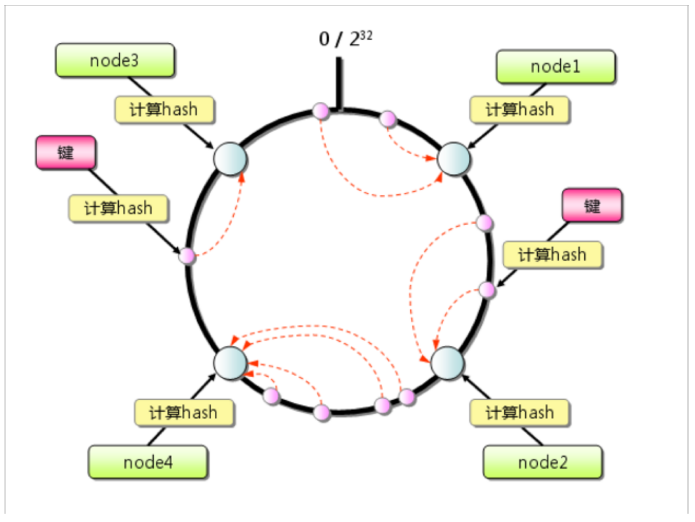

- **`upstream_least_conn` 模块**： 优先选择连接最少的上游服务器

  > - 默认编译进 Nginx： 通过 `--with-http_upstream_ip_hash_module` 禁用
  >
  > - **功能**： 从所有上游服务器中，找出当前并发连接数最少的一个，将请求转发给它
  >
  >   > 若出现多个最少连接服务器，使用 `Round-Robin` 算法
  >
  > - `least_conn`： 作用域 `upstream` 

- **`upstream_zone` 模块**： 使用共享内存使负载均衡策略对所有 worker 进程失效

  > - 默认编译进 Nginx： 通过 `--without-http_upstream_zone_module` 禁用
  > - **功能**： 分配出共享内存，将其他 upstream 模块定义的负载均衡策略数据、运行时每个上游服务的状态数据存放在共享内存上，以对所有 nginx worker 进程失效
  > - `zone name [size]`： 作用域 upstream

**`upstream` 模块间的顺序**： 

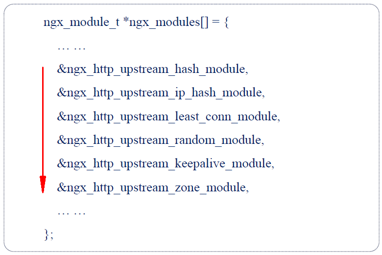

**`upstream` 模块提供的变量(不含 cache)**：

- `upstream_addr`： 上游服务器的 IP 地址，格式： 可读字符串
- `upstream_connect_time`： 与上游服务建立连接消耗的时间，单位 `s`，精确到 `ms`
- `upstream_header_time`： 接收上游服务发回响应中 http 头部所消耗的时间，单位 `s`，精确到 `ms` 
- `upstream_response_time`： 接收完整的上游服务响应所消耗的时间，单位 `s`，精确到 `ms` 
- `upstream_http_名称`： 从上游服务返回的响应头部的值
- `upstream_bytes_received`： 从上游服务接收到的响应长度，单位字节
- `uptream_response_length`： 从上游服务返回的响应包体长度，单位字节
- `upstream_status`： 上游服务返回的 HTTP 响应中的状态码；若未连接，则值为 502
- `upstream_cookie_名称`： 从上游服务发回的响应头 Set-Cookie 中取出的 cookie 值
- `upstream_trailer_名称`： 从上游服务的响应尾部取到的值

## 2. 请求处理

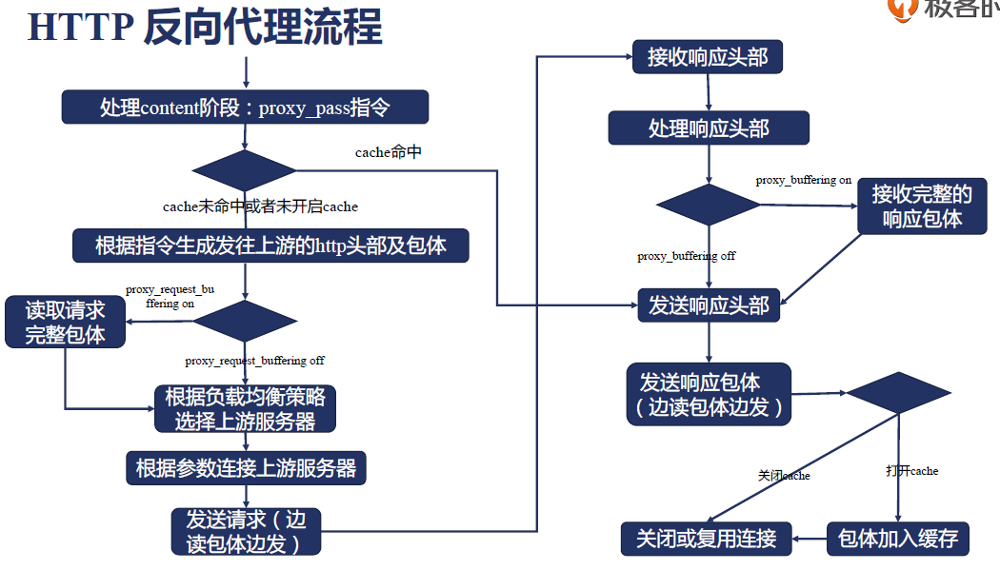

---

### 1. proxy 模块

> 对 HTTP 协议的反向代理

- 默认编译进 Nginx： 通过 `--with-http_proxy_module` 禁用

- 功能： 对上游服务使用 http/https 协议进行反向代理

- 开启指令： `proxy_pass URL`

  > URL 参数规则： 以 http:// 或 https:// 开头，接下来是域名、IP、Unix Socket 地址或 upstream 名字
  >
  > - URL 参数中携带 URI 与否，会导致发向上游请求的 URL 不同
  >
  >   - 不携带 URI，则将客户端请求中的 URL 直接转发给上游
  >
  >     > location 后使用正则表达式、@名字时，采用该方式
  >
  >   - 携带 URI，则对用户请求中的 URL 做操作：将 location 参数中匹配上的一段替换为该 URI

- 指令： 

  **生成发往上游的请求行**： 

  - `proxy_method method`： 请求方式
  - `proxy_http_version 1.0|1.1`： 默认 `1.0`

  **生成发往上游的请求头部**： 

  - `proxy_set_header field value`： 默认 `Host $proxy_host` 或 `Connection close`
  - `proxy_pass_request_headers on|off`： 默认 `on` 

  **生成发往上游的包体**： 

  - `proxy_pass_request_body on|off`： 默认 `on`
  - `proxy_set_body value`： 

  **接收客户端请求的包体**： 

  - `proxy_request_buffering on|off`： 

    > - `on`： 客户端网速较慢，上游服务并发处理能力低，适应高吞吐量场景
    > - `off`： 更及时响应，降低 nginx 读写磁盘的消耗，开始发送则proxy_next_upstream 功能失败

  **客户端包体的接收**： 

  - `client_body_buffer_size size`： 默认 `8k|16k` 

    > - 若接收头部时，已经接收完所有包体，则不分配
    > - 若剩余待接收包体 `< client_body_buffer_size`，则仅分配所需大小
    > - 否则，分配 `client_body_buffer_size` 大小内存接收包体

  - `client_body_in_single_buffer on|off`： 默认 `off`

  - `client_max_body_size size`： 默认 `1M`，最大包体长度限制

    > 仅对请求头部含有 Content-Length 有效超出最大长度后，返回 413 错误

  **临时文件路径格式**： 

  - `client_body_temp_path path[level1[level2[level3]]]`： 默认 `client_body_temp`
  - `client_body_in_file_only on|clean|off`： 默认 `off` 

  读取包体时的超时： 

  - `client_body_timeout time`： 默认 `60s`

    > 读取包体时超时，则返回 408 错误

---

### 2. 向上游服务建立连接

**与上游服务建立连接**： 

- **向上游服务建立连接**： `proxy_connect_timeout time`，默认 `60s`

  > 超时后，会向客户端生成 http 响应，响应码为 502
  >
  > - `proxy_next_upstream http_502|...`： 设置响应码，默认 `error timeout`

- **上游连接启用 TCP keepalive**： `proxy_socket_keepalive on|off`，默认 `off` 

  > 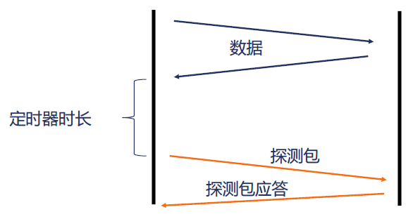

- **上游连接启用 HTTP keepalive**： `keepalive connections`

  > - `keepalive_requests number`： 默认 `100`

- **修改 TCP 连接中的 local address**： `proxy_bind address[transparent]|off`

  > - 可以使用变量： `proxy_bind $remote_addr`
  > - 可以使用不属于所在机器的 IP 地址： `proxy_bind $remote_addr transparent` 

- **当客户端关闭连接时**： `proxy_ignore_client_abort on|off`，默认 `off`
- **向上游发送 HTTP 请求**： `proxy_send_timeout time`，默认 `60s` 

---

### 3. 接收上游的响应

- **接收上游的 HTTP 响应头部**： `proxy_buffer_size size`，默认 `4k|8k`，设置 header 的最大尺寸

- **接收上游的 HTTP 包体**： `proxy_buffers number size`，默认 `8 4k|8k`

  > 当不能存放 body 时，会向磁盘写入 body： 
  >
  > - `proxy_buffering on|off`： 默认 `on`
  > - `proxy_max_temp_file_size size`： 默认 `1024M`
  > - `proxy_temp_file_write_size size`： 默认 `8k|16k`
  > - `proxy_temp_path path[level1[level2[level3]]]`： 默认 `proxy_temp`

- **及时转发包体**： `proxy_busy_buffers_size size`，默认 `8k|16k` 

- **接收上游时网络速度**：

  > - `proxy_read_timeout time`： 默认 `60s`
  > - `proxy_limit_rate rate`： 默认 `0`，限制上游响应速度，0 表示不限制

- **上游包体的持久化**： 

  > - `proxy_store_access users:permissions ...`： 默认 `user:rw`
  > - `proxy_store on|off|string`： 默认 `off`

---

### 4. 处理上游的响应头部

- **返回响应-加工响应内容**： 

  > 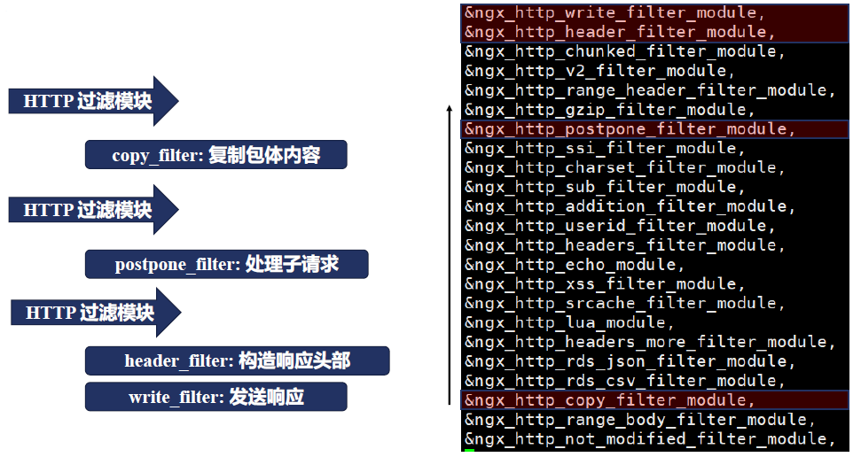

- **禁用上游响应头部的功能**： 

  > `proxy_ignore_headers field ...`： 可以禁止某些响应头部改变 nginx 的行为
  >
  > 可以禁用功能的头部： 
  >
  > - `X-Accel-Redirect`： 由上游服务指定在 nginx 内部重定向，控制请求的执行
  > - `X-Accel-Limit-Rate`： 由上游设置发往客户端的速度限制，等同 limit_rate 指令
  > - `X-Accel-Buffering`： 由上游控制是否缓存上游的响应
  > - `X-Accel-Charset`： 由上游控制 Content-Type 中的 Charset
  >
  > 与缓存相关的禁用头部： 
  >
  > - `X-Accel-Expires`： 设置响应在 nginx 中的缓存时间，单位 `s`，`@` 开头表示一天内某时刻
  > - `Expires`： 控制 nginx 缓存时间，优先级低于 `X-Accel-Expires`
  > - `Cache-Control`： 控制 nginx 缓存时间，优先级低于 `X-Accel-Expires`
  > - `Set-Cookie`： 响应中出现 Set-Cookie 则不缓存，可通过 proxy_ignore_headers 禁止生效
  > - `Vary`： 响应中出现 `Vary:*` 则不缓存，可以禁用

- **转发上游的响应**： `proxy_hide_header field`

  > - 功能： 对于上游响应中的某些头部，设置不向客户端转发
  > - **默认不转发响应头部**： 
  >   - `Date`： 由 ngx_http_header_filter_module 过滤模块填写，值为 nginx 发送响应头部时的时间
  >   - `Server`： 由 ngx_http_header_filter_module 过滤模块填写，值为 nginx 版本
  >   - `X-Pad`： 通常是 Apache 为避免浏览器 BUG 生成的头部，默认忽略
  >   - `X-Accel-`： 用于控制 nginx 行为的响应，不需要向客户端转发
  >
  > `proxy_pass_header field`： 对于已经被 proxy_hide_header 的头部，设置向上游转发

- **修改返回的 `Set-Cookie` 头部**： 

  > - `proxy_cookie_domain off|domain replacement`： 默认 `off`
  > - `proxy_cookie_path off|path replacement`： 默认 `off`

- 修改返回的 Location 头部： `proxy_redirect default|off|redirect replacement`，默认 `default` 

---

### 5. 上游出现失败时的处理办法

- `proxy_next_upstream error|timeout|invalid_header|http_500|http_502|http_503|http_504 |http_403|http_404|http_429|non_idempotent|off ...`： 默认 `error timeout`

  > - 前提： 没有客户端发送任何内容
  >
  > 配置： 
  >
  > - `error`： 与上游建立连接、读取请求、发送响应时，发生网络错误时的处理场景
  > - `timeout`： 当超时时，将重选另一个上游服务
  > - `invalid_header`： 收到的上游的 header 不合法
  > - `http_`： 针对收到错误码时，重选新的上游服务
  > - `non_idempotent`： 
  > - `off`： 关闭

- **限制 `proxy_next_upstream` 的时间与次数**：

  > - `proxy_next_upstream_timeout time`： 默认 `0`
  > - `proxy_next_upstream_tries number`： 默认 `0`

- **用 `error_page` 拦截上游失败响应**： `proxy_intercept_errors on|off`，默认 `off`

  > - 当上游响应的响应码 `>= 300` 时，应决定将响应返回客户端，还是按 `error_page` 指令处理

---

### 6. 认证与证书

双向认证时的指令示例：

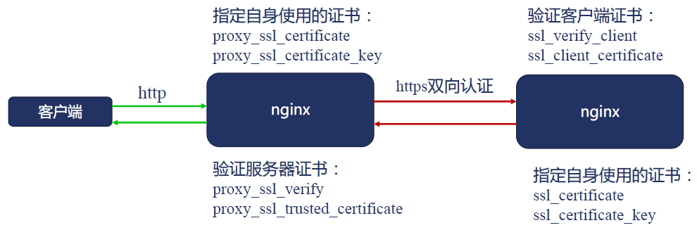

- **对下游使用证书**： 

  > - `ssl_certificate file`
  > - `ssl_certificate_key file`

- **验证下游证书**： 

  > - `ssl_verify_client on|off|optional|optional_no_ca`： 默认 `off`
  > - `ssl_client_certificate file`： 

- **对上游使用证书**： 

  > - `proxy_ssl_certificate file`： 
  > - `proxy_ssl_certificate_key file`： 

- **验证上游证书**： 

  > - `proxy_ssl_trusted_certificate file`： 
  > - `proxy_ssl_verify on|off`： 默认 `off`

---

### 7. ssl 模块提供的变量

- **安全套件**： 
  - `ssl_cipher`： 本次通讯选用的安全套件，例如： ECDHE-RSA-AES128-GCM-SHA256
  - `ssl_ciphers`： 客户端支持的所有安全套件
  - `ssl_protocol`： 本次通讯选用的 TLS 版本，例如： TLSv1.2
  - `ssl_curves`： 客户端支持的椭圆曲线，例如： secp384r1:secp521r1
- **证书**： 
  - `ssl_client_raw_cert`： 原始客户端证书内容
  - `ssl_client_escaped_cert`： 返回客户端证书进行 urlencode 编码后的内容
  - `ssl_client_cert`： 对客户端证书每一行内容前，加 `tab` 制表符，增强可读性
  - `ssl_client_fingerprint`： 客户端证书的 SHA1 指纹
- **证书结构化信息**： 
  - `ssl_server_name`： 通过 TLS 插件 SNI 获取到的服务器域名
  - `ssl_client_i_dn`： 依据 RFC2253 获取到证书 issuer dn 信息，例如： CN=…,O=…,L=…,C=…
  - `ssl_client_i_dn_legacy`：  依据 RFC2253 获取到证书 issuer dn 信息，如：/C=…/L=…/O=…/CN=…
  - `ssl_client_s_dn`： 依据 RFC2253 获取证书 subject dn 信息，如： CN=…,OU=…,O=…,L=…,ST=…,C=…
  - `ssl_client_s_dn_legacy`： 依据 RFC2253 获取证书 subject dn 信息，如： /C=…/ST=…/L=…/O=…/OU=…/CN=…
- **证书有效期**： 
  - `ssl_client_v_end`： 返回客户端证书的过期时间，例如： Dec 1 11:56:11 2028 GMT
  - `ssl_client_v_remain`： 返回还有多少天，客户端证书过期
  - `ssl_client_v_start`： 客户端证书的颁发日期，例如： Dec 4 11:56:11 2018 GMT
- **连接有效性**： 
  - `ssl_client_serial`： 返回连接上客户端证书的序列号，例如： 8BE947674841BD44
  - `ssl_early_data`： 在 TLS1.3 协议中，使用了 early data 且握手未完成返回 1，否则返回空字符串
  - `ssl_client_verify`： 若验证失败为 FAILED，验证成功为 SUCCESS，未验证为 NONE
  - `ssl_session_id`： 已建立连接的 sessionid
  - `ssl_session_reused`： 若 session 被复用，则为 `r`，否则为 `.` 

---

创建证书命令示例：

- **创建根证书**： 

  - **创建 CA 私钥**： `openssl genrsa -out ca.key 2048`
  - **制作 CA 公钥**： `openssl req -new -x509 -days 3650 -key ca.key -out ca.crt`

- **签发证书**： 

  - **创建私钥**： 

    > - `openssl genrsa -out a.pem 1024`
    > - `openssl rsa -in a.pem -out a.key`

  - **生成签发请求**： `openssl req -new -key a.pem -out a.csr`

  - **使用 CA 证书进行签发**： `openssl x509 -req -sha256 -in a.csr -CA ca.crt -CAkey ca.key -CAcreateserial -days 3650 -out a.crt`

  - **验证签发证书是否正确**： `openssl verify -CAfile ca.crt a.crt` 

## 3. 缓存

### 1. 浏览器缓存

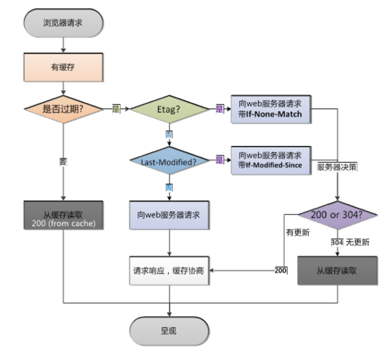

- **`ETag` 头部**： 资源的特定版本标识符

  > 作用： 
  >
  > - 若资源没有改变，Web 服务器不需要发送完整的响应
  > - 若资源发生改变，ETag 可以防止资源更新时的相互覆盖
  >
  > 指令： `etag on|off`
  >
  > 生成规则： 
  >
  > ```
  > ngx_sprintf(etag->value.data, "\"%xT-%xO\"",
  > 				r->headers_out.last_modified_time,
  > 				r->headers_out.content_length_n)
  > ```

- **`If-None-Match` 首部**： 

  > - 对于 GET 与 HEAD 请求，当服务器没有资源的 ETag 属性值与该首部中所列出的相匹配时，服务器才会返回所请求的资源，响应码为 200
  > - 对于其他方法，当最终确认没有已存在的资源的 ETag 属性值与该首部中所列出的相匹配时，才会对请求进行相应的处理
  >
  > 常用场景： 
  >
  > - 采用 GET 或 HEAD 方法，来更新拥有特定的 ETag 属性值的缓存
  > - 采用其他方法，尤其是 PUT，将 `If-None-Match used` 的值设为 `*`，用来生成事先并不知道是否存在的文件，可以确保先前并没有进行过类似的上传操作，防止操作数据的丢失(更新丢失问题)
  >
  > > 与 `If-Modified-Since` 一同使用时，`If-None-Match` 优先级更高

- **`If-Modified-Since` 首部**： 

  > 服务器只在所请求的资源在给定日期时间之后对内容进行过修改的情况才会将资源返回，状态码为 `200`
  >
  > - 若请求的资源从那时起未经修改，则返回一个不带有消息主体的 `304` 响应，而在 `Last-Modified` 首部中会带有上次修改时间
  >
  > > 只用于 `GET` 或 `HEAD` 请求中
  > >
  > > 与 `If-None-Match` 同时出现时，会被忽略

- **`not_modified` 过滤模块**： 

  > - **场景**： 客户端拥有缓存，但不确认缓存是否过期
  > - **功能**： 该模块通过将 `If-Modified-Since` 或 `If-None-Match` 头部与 `Last-Modified` 值比较，决定通过 200 返回全部内容，还是仅返回 304 NotModified 头部，表示浏览器仍使用之前的缓存
  >
  > 指令： 
  >
  > - `expires [modified] time` 或 `expires epoch|max|off`： 默认 `off` 
  >
  >   > - `max`： 
  >   >
  >   >   > `Expires: Thu,31 Dec 2037 23:55:55 GMT`
  >   >   >
  >   >   > `Cache-Control: max-age=315360000(10年)`
  >   >
  >   > - `off`： 不添加或修改 Expires 和 Cache-Control 字段
  >   >
  >   > - `epoch`： 
  >   >
  >   >   > `Expires: Thu,01 Jan 1970 00:00:01 GMT`
  >   >   >
  >   >   > `Cache-Control: no-cache`
  >   >
  >   > - `time`： 设定具体时间，可以携带单位
  >   >
  >   >   > 一天内的具体时刻，可以加 `@`，例如： 下午六点半 --> `@18h30m` 
  >   >   >
  >   >   > - 正数： 设定 `Cache-Control` 时间，计算出 Expires
  >   >   > - 负数： `Cache-Control:no-cache`，计算出 Expires
  >
  > - `if_modified_since off|exact|before`： 默认 `exact`
  >
  >   > - `off`： 忽略请求中的 `if_modified_since` 头部
  >   > - `exact`： 精确匹配 `if_modified_since` 头部与 `last_modified` 的值
  >   > - `before`： 若值 `if_modified_since >= last_modified`，则返回 `304`

- **`If-Match` 首部**： 

  > - GET 和 HEAD 请求时，服务器仅在请求资源满足此首部列出的 ETag 之一时，才会返回资源
  > - 对于 PUT 或其他非安全方法，只有在满足条件的情况下，才可以将资源上传
  >
  > 应用场景： 
  >
  > - 对于 GET 和 HEAD 方法，搭配 Range 首部，可以用来保证新请求的范围与之前请求的范围是同一份资源的请求
  >
  >   > 若 ETag 无法匹配，则返回 `416` 响应
  >
  > - 对于其他方法，尤其是 PUT，`If-Match` 首部可以用来避免更新丢失问题，可以用来检测用户想要上传的不会覆盖获取原始资源之后做出的更新
  >
  >   > 若请求条件不满足，则返回 `412`(先决条件失败)响应

- **`If-Unmodified-Since` 消息头**： 

  > 用于请求中，使得当前请求成为条件式请求： 
  >
  > - 只有当资源在指定时间之后没有进行过修改的情况下，服务器才会返回请求的资源，或是接受 POST 或其他 non-safe 方法的请求
  > - 若所请求的资源在指定的时间之后发生了修改，则返回 `412` 错误
  >
  > 应用场景： 
  >
  > - 与 non-safe 方法(如： POST)搭配使用，可以用来优化并发控制
  >
  >   > **案例**： 假如在原始副本获取后，服务器存储的文档已经被修改，则对其作出的编辑会被拒绝提交
  >
  > - 与含有 `If-Range` 消息头的范围请求搭配使用，用来确保新的请求片段来自于未经修改的文档

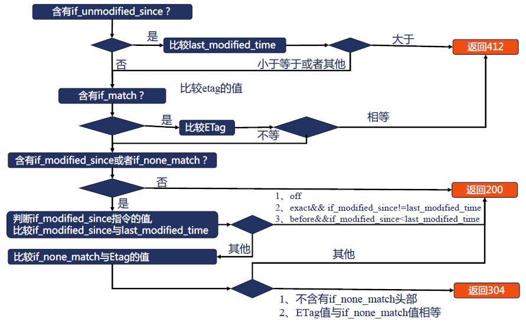

### 2. nginx 缓存

**nginx 缓存操作指令**： 

- 定义存放缓存的载体： 

  > - `proxy_cache zone|off`： 默认 `off`
  > - `proxy_cache_path path [levels=levels] [use_temp_path=on|off]
  >   keys_zone=name:size [inactive=time] [max_size=size] [manager_files=number]
  >   [manager_sleep=time] [manager_threshold=time] [loader_files=number]
  >   [loader_sleep=time] [loader_threshold=time] [purger=on|off] [purger_files=number]
  >   [purger_sleep=time] [purger_threshold=time];`

- `proxy_cache_path`： 

  > - `manager_files`： cache manager 进程在一次淘汰过程中，淘汰的最大文件数，默认 `100`
  > - `manager_sleep`： 执行一次淘汰循环后 cache manager 进程的休眠时间，默认 `200ms`
  > - `manager_threshold`： 执行一次淘汰循环的最大耗时，默认 `50ms`
  > - `loader_files`： cache loader 进程载入磁盘的缓存文件至共享内存，每批最多处理的文件数，默认 `100`
  > - `loader_sleep`： 执行一次缓存文件至共享内存后，进程休眠时间，载入默认 `200ms`
  > - `loader_threshold`： 每次载入缓存文件至共享内存的最大耗时，默认 `50ms`

- 缓存的关键字： `proxy_cache_key string`： 默认 `$scheme$proxy_host$request_uri`

- 缓存什么样的响应： `proxy_cache_valid[code...]time`

  > - 对不同的响应码缓存不等的时长
  >
  > - 只标识时间
  >
  > - 通过响应头部控制缓存时长
  >
  >   > - `X-Accel-Expires`： 通过 `@` 设置缓存到一天中的某一时刻，为 `0` 表示禁止 nginx 缓存内容
  >   > - 响应头若含有 `Set-Cookie` 或 `Vary:*`，则不缓存

- 不使用缓存： 

  > - `proxy_no_cache string`： 参数为真时，响应不存入缓存
  > - `proxy_cache_bypass string ...`： 参数为真时，不使用缓存内容

- 变更 HEAD 方法： `proxy_cache_convert_head on|off`： 默认 `on`

`upstream_cache_status` 变量： 

- `MISS`： 未命中缓存
- `HIT`： 命中缓存
- `EXPIRED`： 缓存已过期
- `STALE`： 命中了陈旧的缓存
- `UPDATING`： 内容陈旧，但正在更新
- `REVALIDATED`： Nginx 验证了陈旧的内容依然有效
- `BYPASS`： 响应式从原始服务器获得

---

**nginx 对于缓存的处理**： 

- **客户端请求的缓存处理流程**： 

  > - `proxy_cache_methods GET|HEAD|POST...`： 默认 `GET HEAD`，对哪个 method 方法使用缓存返回响应
  >
  > 头部： 
  >
  > - `X-Accel-Expires` 头部： 从上游服务定义缓存多长时间
  >
  >   > `X-Accel-Expires off|seconds`： 默认 `off`
  >   >
  >   > - `0` 表示不缓存当前响应
  >   > - `@` 前缀表示缓存到当天的某个时间
  >
  > - `Vary` 头部： 决定了请求头应该用缓存回复，还是向源服务器请求一个新的回复。被服务器用来表明在内容协商算法中选择一个资源代表时，应该使用哪些头部信息
  >
  >   - `Vary: *`： 所有请求被视为唯一且非缓存
  >
  >     > 使用 `Cache-Control:private` 来实现更适用
  >
  >   - `Vary: <header-name>,<header-name>...`：`,` 分隔 http 头部名称，用于确定缓存是否可用
  >
  > - `Set-Cookie` 头部： 若没有被 `proxy_ignore_headers` 设置忽略，则不对响应进行缓存
  >
  >   > ```
  >   > Set-Cookie: <cookie-name>=<cookie-value>
  >   > Set-Cookie: <cookie-name>=<cookie-value>; Expires=<date>
  >   > Set-Cookie: <cookie-name>=<cookie-value>; Max-Age=<non-zero-digit>
  >   > Set-Cookie: <cookie-name>=<cookie-value>; Domain=<domain-value>
  >   > Set-Cookie: <cookie-name>=<cookie-value>; Path=<path-value>
  >   > Set-Cookie: <cookie-name>=<cookie-value>; Secure
  >   > Set-Cookie: <cookie-name>=<cookie-value>; HttpOnly
  >   > Set-Cookie: <cookie-name>=<cookie-value>; SameSite=Strict
  >   > Set-Cookie: <cookie-name>=<cookie-value>; SameSite=Lax
  >   > Set-Cookie: <cookie-name>=<cookie-value>; Domain=<domain-value>; Secure; HttpOnly
  >   > ```
  >
  > 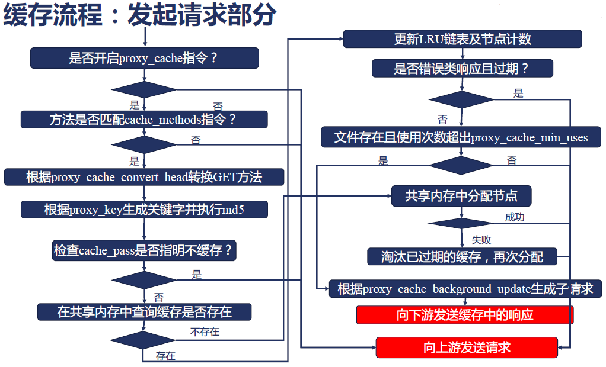

- **接收上游响应的缓存处理流程**： 

  > 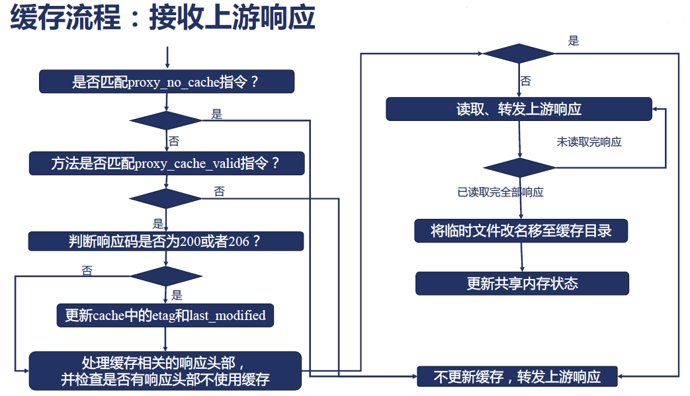

- **减轻缓存失效时上游服务的压力**： 

  > - **合并回源请求**： 减轻峰值流量下的压力
  >
  >   > - `proxy_cache_lock on | off`： 默认 `off`
  >   >
  >   >   > 同一时间，仅第一个请求发向上游，其他请求等待第一个响应返回或超时后，使用缓存响应客户端
  >   >
  >   > - `proxy_cache_lock_timeout time`： 默认 `5s `
  >   >
  >   >   > 等待第一个请求返回响应的最大时间，到达后直接向上游发送请求，但不缓存响应
  >   >
  >   > - `proxy_cache_lock_age time`： 默认 `5s`
  >   >
  >   >   > 上一个请求返回响应的超时时间，到达后再放行一个请求发向上游
  >   >
  >   > 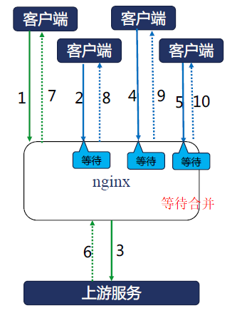
  >
  > - **减少回源请求**： 使用 stale 陈旧的缓存
  >
  >   > - `proxy_cache_use_stale error|timeout|invalid_header|updating|http_500| http_502|http_503|http_504|http_403|http_404|http_429| off...`： 默认 `off` 
  >   > - `proxy_cache_background_update on|off`： 默认 `off` 
  >   >
  >   > 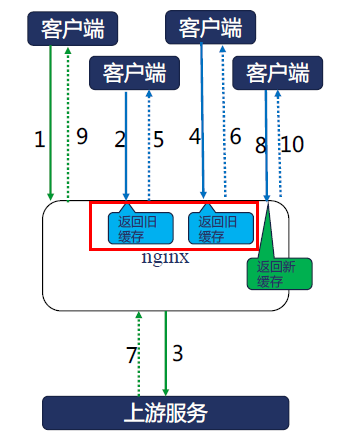
  >
  > ---
  >
  > - `proxy_cache_use_stale`： 定义陈旧缓存的用法
  >
  >   > - `updating`： 当缓存内容过期，有一个请求正在访问上游试图更新缓存时，其他请求直接使用过期内容返回客户端
  >   >
  >   >   > - `stale-while-revalidate`： 缓存内容过期后，定义一段时间，在这段时间内 `updating` 设置有效，否则请求仍然访问上游服务
  >   >   > - `stale-if-error`： 缓存内容过期后，定义一段时间，在这段时间内上游服务出错后就继续使用缓存，否则请求仍然访问上游服务
  >   >
  >   > - `error`： 当与上游建立连接、发送请求、读取响应头部等情况**出错**时，使用缓存
  >   >
  >   > - `timeout`： 当与上游建立连接、发送请求、读取响应头部等情况出现**定时器超时**，使用缓存
  >   >
  >   > - `http_code`： 缓存以上错误响应码的内容
  >
  > - 缓存有问题的响应： 
  >
  >   > - `proxy_cache_background_update on|off`： 默认 `off`
  >   >
  >   >   > 当使用 proxy_cache_use_stale 允许使用过期响应时，将同步生成一个子请求，通过访问上游服务更新过期的缓存
  >   >
  >   > - `proxy_cache_revalidate on|off`： 默认 `off`
  >   >
  >   >   > 更新缓存时，使用 `If-Modified-Since` 和 `If-None-Match` 作为请求头部，预期内容未发生变更时，通过 304 来减少传输的内容

- **及时清除缓存**： 

  > - 第三方模块： `ngx_cache_purge`，使用 `--add-module` 指令添加模块到 nginx 中
  > - 功能： 接收到指定 HTTP 请求后，立刻清除缓存

## 4. 反向代理

### 1. uwsgi, fastcgi, scgi, http反向代理对照表

- **构造请求内容**： 

  > 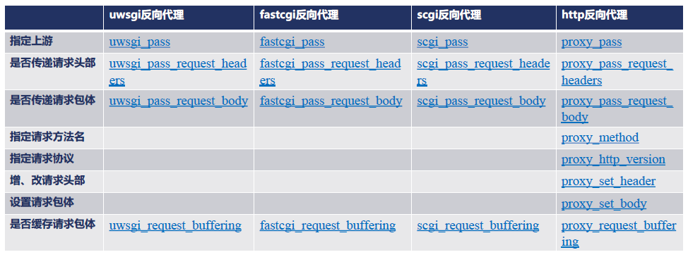

- **建立连接并发送请求**：

  > 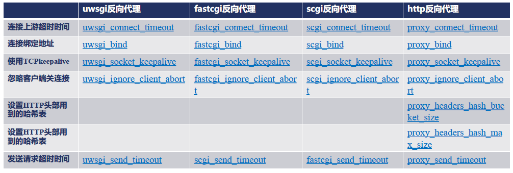

- **接收上游响应**： 

  > 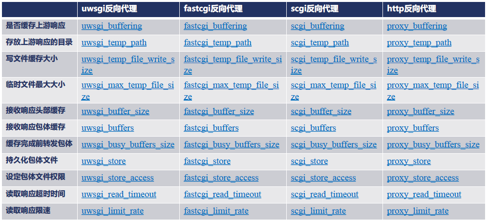

- **转发响应**： 

  > 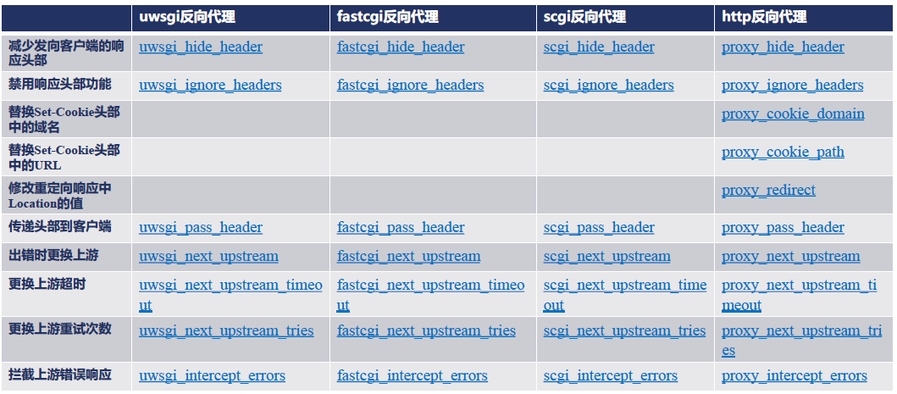

- **SSL**： 

  > 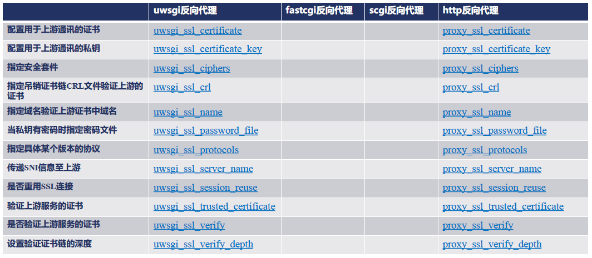

- 缓存类指令： 

  > 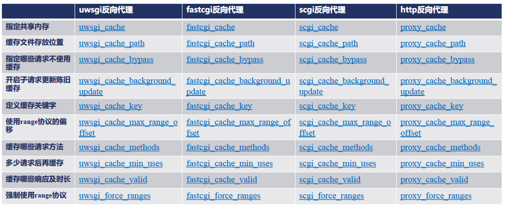
  >
  > 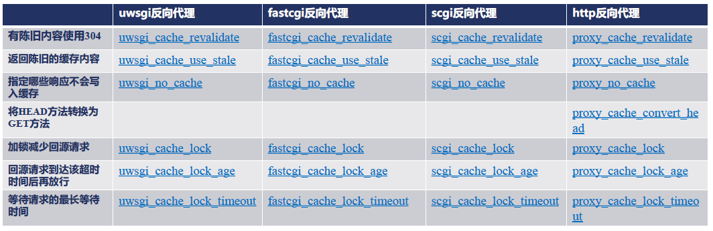

- **独有配置**： 

  > 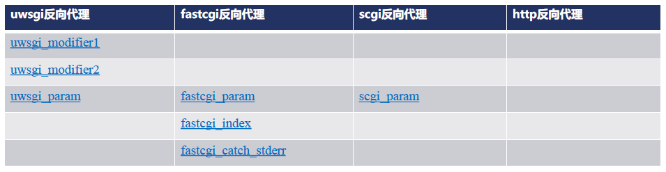

### 2. 反向代理

- **memcached 反向代理**：

  > - 默认编译进 Nginx： 通过 `--without-http_memcached_module` 禁用
  > - 功能： 将 HTTP 请求转换为 memcached 协议中的 get 请求，转发请求至上游 memcached 服务
  >
  > memcached 指令： 
  >
  > 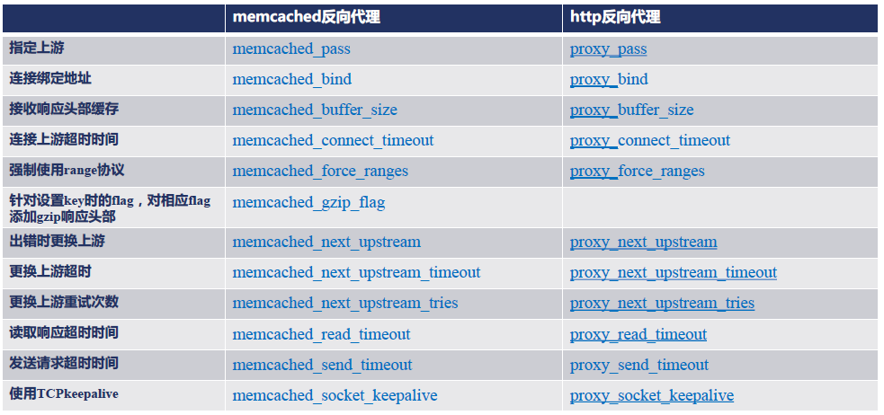

- **websocket 反向代理**： 

  > - 由 `ngx_http_proxy_module` 模块实现
  >
  > - 配置
  >
  >   ```
  >   proxy_http_version 1.1;
  >   proxy_set_header Upgrade $http_upgrade;
  >   proxy_set_header Connection "upgrade";
  >   ```
  >
  > websocket 协议和扩展： 
  >
  > - 数据分片
  >
  > - 不支持多路复用
  >
  > - 不支持压缩
  >
  > - 扩展头部： 
  >
  >   > - `Sec-WebSocket-Version`： 客户端发送，表示想使用的 WebSocket 协议版本
  >   >
  >   >   > 若服务器不支持该版本，则必须回应自己支持的版本
  >   >
  >   > - `Sec-WebSocket-Key`： 客户端发送，自动生成的一个键，以验证服务器支持请求的协议版本
  >   >
  >   > - `Sec-WebSocket-Accept`： 服务器响应，包含 `Sec-WebSocket-Key` 的签名值，证明它支持请求的协议版本
  >   >
  >   > - `Sec-WebSocket-Protocol`： 用于协商应用子协议：客户端发送支持的协议列表，服务器必须回应一个协议名
  >   >
  >   > - `Sec-WebSocket-Extensions`： 用于协商本次连接要使用的 WebSocket 扩展： 客户端发送支持的扩展，服务器通过返回相同的首部确认自己支持一个或多个扩展

- **grpc 反向代理**： 

  > - 通过 `--without-http_grpc_module` 禁用
  >
  > 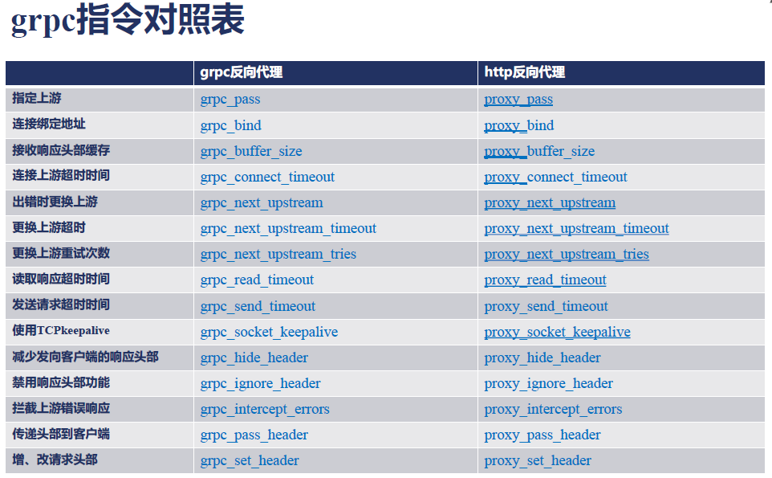
  >
  > 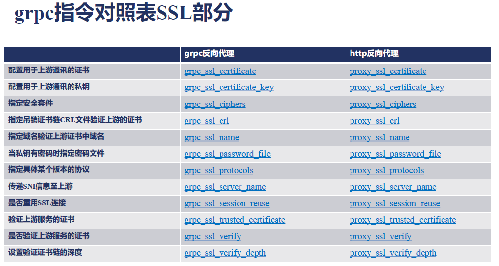

---

- `slice` 模块： 通过 range 协议将大文件分解为多个小文件，更好的用缓存为客户端的 range 协议服务

  > - 通过 `--with-http_slice_module` 启用
  >
  > slice 模块运行流程： 
  >
  > 

- `open_file_cache` 指令： 

  > - `open_file_cache off|max=N[inactive=time]`： 默认 `off`
  > - `open_file_cache_errors on|off`： 默认 `off`
  > - `open_file_cache_min_uses number`： 默认 `1`
  > - `open_file_cache_valid time`： 默认 `60s`

---

`HTTP2.0`： 

- 核心概念： 

  > - **连接 Connection**：一个 TCP 连接，包含一个或多个 Stream
  > - **数据流 Stream**： 一个双向通讯数据流，包含多个 Message
  > - **消息 Message**： 对应 HTTP1 中的请求或响应，包含一条或多条 Frame
  > - **数据帧 Frame**： 最小单位，以二进制压缩格式存放 HTTP1 中的内容

- **协议分层**： 

  > 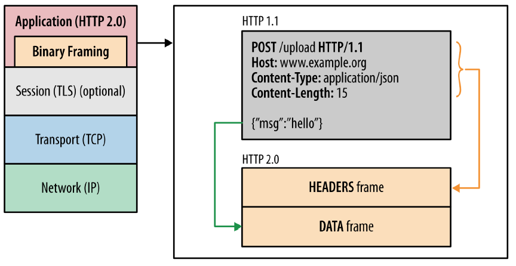

- **多路复用**： 

  > 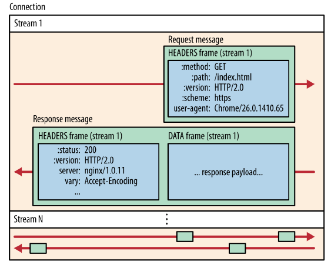

- **传输中无序，接收时组装** 
- **标头压缩**
- **服务器推送**

**Frame 格式**： 


TYPE 类型： 

- HEADERS： 帧仅包含 HTTP 标头信息
- DATA： 帧包含消息的所有或部分有效负载
- PRIORITY： 指定分配给流的重要性
- RST_STREAM： 错误通知：一个推送承诺遭到拒绝，终止流
- SETTINGS： 指定连接配置
- PUSH_PROMISE： 通知一个将资源推送到客户端的意图
- PING： 检测信号和往返时间
- GOAWAY： 停止为当前连接生成流的停止通知
- WINDOW_UPDATE： 用于管理流的流控制
- CONTINUATION： 用于延续某个标头碎片序列

**http2 模块**： 

- 通过 `with-http_v2_module` 编译 nginx 加入 http2 协议的支持
- 功能： 对客户端使用 http2 协议提供基本功能
- 前提： 开启 TLS/SSL 协议
- 使用方法： `listen 443 ssl http2`

---

**Nginx 推送资源**： 

- Nginx 推送： 

  > - `http2_push_preload on|off`： 默认 `off`
  > - `http2_push uri|off`： 默认 `off`

- 最大并行推送数： `http2_max_concurrent_pushes number`，默认 `10`

- 超时控制： 

  > - `http2_recv_timeout time`： 默认 `30s`
  > - `http2_idle_timeout time`： 默认 `3m`

- 并发请求控制： 

  > - `http2_max_concurrent_pushes number`： 默认 `10`
  > - `http2_max_concurrent_streams number`： 默认 `128`
  > - `http2_max_field_size size`： 默认 `4k`

- 连接最大处理请求数： 

  > - `http2_max_requests number`： 默认 `1000`
  > - `http2_chunk_size size`： 默认 `8k`

- 设置响应包体的分片大小： `http2_chunk_size size`，默认 `8k`

- 缓冲区大小设置： 

  > - `http2_recv_buffer_size size`： 默认 `256k`
  > - `http2_max_header_size size`： 默认 `16k`
  > - `http2_body_preread_size size`： 默认 `64k`

## 5. stream 模块处理请求的七个阶段

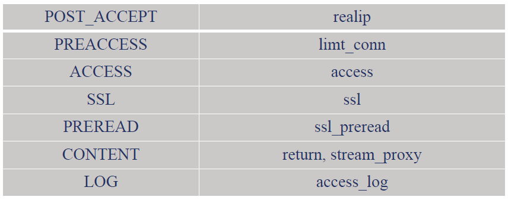

**stream 处理 proxy_protocol 流程**： 

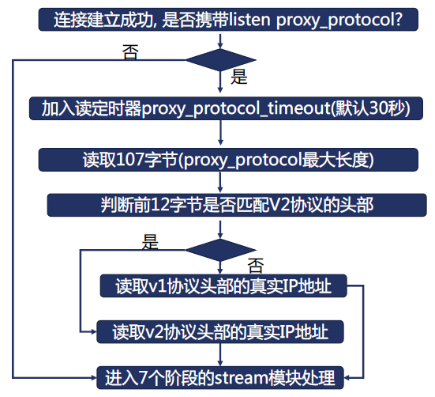

- **`post_accept` 阶段**： `realip` 模块，`set_real_ip_from address|CDIR`

  > - 通过 `--with-stream_realip_module` 功能
  > - 功能： 通过 proxy_protocol 协议取出客户端真实地址，并写入 remote_addr 及 remote_port 变量，同时使用 realip_remote_addr 和 realip_remote_port 保留 TCP 连接中获得的原始地址

- `preaccess` 阶段： `limit_conn` 模块

  > - 通过 `--without-stream_limit_conn_module` 禁用模块
  > - 功能： 限制客户端的并发连接数，使用变量自定义限制依据，基于共享内存所有 worker 进程都生效
  > - 指令： 
  >   - `limit_conn_zone key zone=name:size`
  >   - `limit_conn zone number`
  >   - `limit_conn_log_level info|notice|warn|error`： 默认 `error` 

- `access` 阶段： `access` 模块

  > - 通过 `--without-stream_access_module` 禁用
  > - 功能： 根据客户端地址(realip 模块可以修改地址)决定连接的访问权限
  > - 指令： 
  >   - `allow address|CIDR|unix:|all`
  >   - `deny address|CIDR|unix:|all`

- `log` 阶段： `stream_log` 模块

  > - `access_log off|path format[buffer=size][gzip[=level]][flush=time][if=condition]` 
  >
  >   >  默认 `off`
  >
  > -  `log_format name[escape=default|json|none] string ...`
  >
  > - `open_log_file_cache off|max=N[inactive=time][min_uses=N][valid=time]`

# 五、Nginx 的系统层性能优化

## 1. 增大 CPU 利用率

- 增大 Nginx 使用 CPU 的有效时长

  > - 使用全部 CPU 资源： master-worker 多进程架构，worker 进程数量应大于等于 CPU 核数
  >
  > - Nginx 进程间不做无用功浪费 CPU 资源： worker 进程间不应在繁忙时，主动让出 CPU
  >
  >   > - worker 进程数量应当等于 CPU 核数
  >   > - worker 进程不应调用一些 API 导致主动让出 CPU
  >
  > - 不被其他进程争抢资源： 提升优先级占用 CPU 更长时间，减少操作系统上的非 Nginx 进程
  >
  > 设置 worker 进程的数量： `worker_process number|auto`，默认 `1`
  >
  > 设置 worker 进程的静态优先级： `worker_priority number`，默认 `0 `
  >
  > 绑定 worker 到指定 CPU： `worker_cpu_affinity cpumask|auto`

- 多队列网卡对多核 CPU 的优化：

  > - `RSS`： 硬中断负载均衡
  > - `RPS`： 软中断负载均衡
  > - `RFS`： 

## 2. 增大内存利用率之优化TCP连接

**TCP 连接**： 

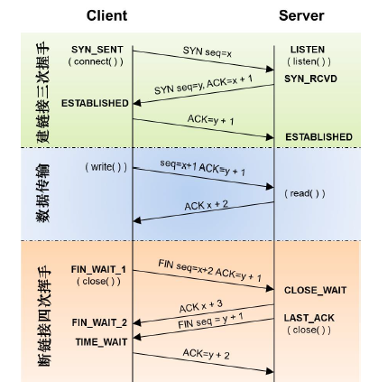

- `SYN_SENT` 状态： 

  > - `net.ipv4.tcp_syn_retries = 6`： 主动建立连接时，发 SYN 的重试次数
  > - `net.ipv4.ip_local_port_range = 32768 60999`： 建立连接时的本地端口可用范围
  >
  > 主动建立连接时应用层超时时间： 
  >
  > - `proxy_connect_timeout time`： 默认 `60s`

- `SYN_RCVD` 状态： 

  > - `net.ipv4.tcp_max_syn_backlog`： SYN_RCVD 状态连接的最大个数
  > - `net.ipv4.tcp_synack_retries`： 被动建立连接时，发 SYN/ACK 的重试次数

---

**服务器端处理三次握手**： 

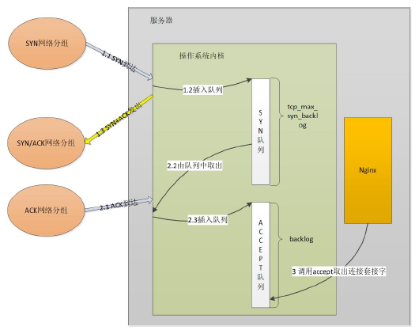

- **SYN 攻击**： 攻击者短时间伪造不同 IP 地址的 SYN 报文，快速占满 backlog 队列，使服务器不能正常服务

  > - `net.core.netdev_max_backlog`： 接收自网卡、但未被内核协议栈处理的报文队列长度
  > - `net.ipv4.tcp_max_syn_backlog`： SYN_RCVD 状态连接的最大个数
  > - `net.ipv4.tcp_abort_on_overflow`： 超出处理能力时，对新来的 SYN 直接回包 RST，丢弃连接

- `worker_connections number`： 默认 `512`，设置 worker 进程最大连接数量

- **两个队列的长度**： 

  > - SYN 队列未完成握手： `net.ipv4.tcp_max_syn_backlog = 262144`
  > - ACCEPT 队列已完成握手： `net.core.somaxconn`，系统级最大 backlog 队列长度

- **滑动窗口**： 用于限制连接的网速，解决报文乱序和可靠传输问题

---

**TCP 消息处理**： 

- **发送 TCP 消息**： 

  > 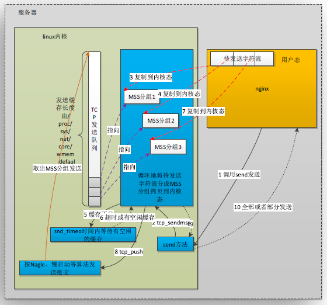

- **TCP 接收消息**： 

  > 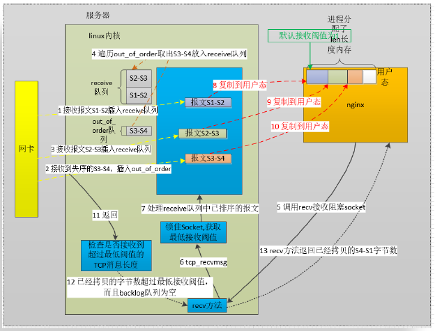

- **TCP 接收消息发生 CS**： 

  > 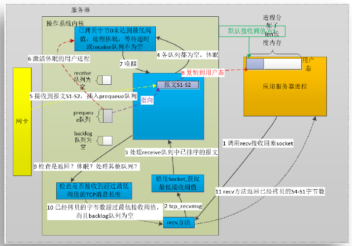

- **TCP 接收消息时新报文到达**： 

  > 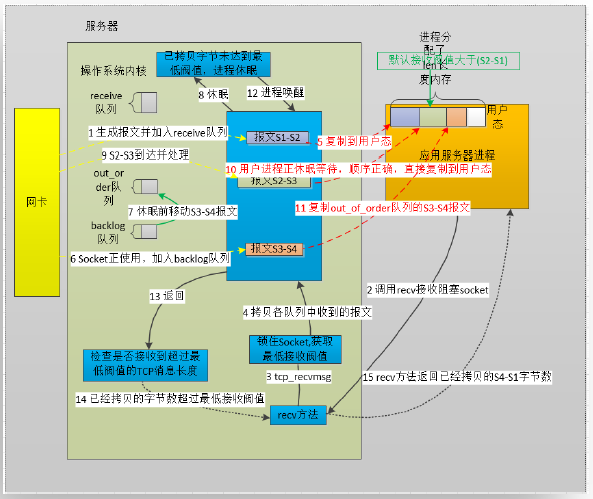

---

**Nginx 的超时指令与滑动窗口**： 

- 两次读操作间的超时： `client_body_timeout time`，默认 `60s`
- 两次写操作间的超时： `send_timeout time`，默认 `60s`
- 两者兼具： `proxy_timeout timeout`，默认 `10m`

---

Nginx 调整操作： 

- **丢包重传限制次数**： 

  > - `net.ipv4.tcp_retries1 = 3`： 达到上限后，更新路由缓存
  > - `net.ipv4.tcp_retries2 = 15`： 达到上限后，关闭 TCP 连接

- **TCP 缓冲区**： 

  > - `net.ipv4.tcp_rmem=4096 87380 6291456`：读缓存最小值、默认值、单位字节
  >
  >   > 覆盖 net.core.rmem_max
  >
  > - `net.ipv4.tcp_wmem = 4096 16384 4194304`： 写缓存最小值、默认值、最大值单位字节
  >
  >   > 覆盖 net.core.rmem_max
  >
  > - `net.ipv4.tcp_mem = 1541646 2055528 3083292`： 系统无内存压力、启动压力模式阀值、最大值，单位为页的数量
  >
  > - `net.ipv4.tcp_moderate_rcvbuf = 1`： 开启自动调整缓存模式

- **调整接收窗口**： `net.ipv4.tcp_adv_win_scale = 1`

- **调整应用缓存**： `应用缓存 = buffer / (2^tcp_adv_win_scale)`

- **Nagle 算法**： 合并多个小报文，使一个连接只存在一个小报文

  > - 吞吐量优先： 启用 Nagle 算法，`tcp_nodelay off`
  > - 低时延优先： 禁用 Nagle 算法，`tcp_nodelay on`
  >
  > `postpone_output size`： 默认 `1460`，避免发送小报文

- **CORK 算法**： 完全禁止小报文的发送，提升网络效率，仅针对 `sendfile on` 开启时有效

  > `tcp_nopush on|off`： 默认 `off`

---

**流量控制**： 

- **拥塞窗口**： 发送方主动限制流量

- **通告窗口**(对端接收窗口)：接收方限制流量

- **实际流量**： 拥塞窗口与通告窗口的最小值

- **慢启动**： 指数扩展拥塞窗口(cwnd 为拥塞窗口大小)

  > - 每收到一个 ACK： `cwnd = cwnd + 1`
  > - 每过一个 RTT： `cwnd = cwnd * 2` 

- **拥塞避免**： 窗口大于 threshold，线性扩展拥塞窗口

  > - 每收到一个 ACK： `cwnd = cwnd + 1/cwnd`
  > - 每过一个 RTT： `cwnd = cwnd + 1` 

- **拥塞发生**： 急速降低拥塞窗口

  > - RTO 超时，`threshold = cwnd / 2,cwnd = 1`
  > - Fast Retransmit，收到三个 duplicate ACK，`cwnd = cwnd / 2, threshold = cwnd`

- **快速恢复**： 当 Fast Retransmit 出现时，`cwnd = threshold + 3 * MSS` 

---

**连接关闭**： 

- 被动关闭连接端的状态： 

  > - `CLOSE_WAIT` 状态： 应用进程没有及时响应对端关闭连接
  > - `LAST_ACK` 状态： 等待接收主动关闭端操作系统发来的针对 FIN 的 ACK 报文

- 主动关闭连接端的状态： 

  > - `fin_wait1` 状态： `net.ipv4.tcp_orphan_retries = 0`，发送 FIN 报文的重试次数，0 相当于 8
  > - `fin_wait2` 状态： `net.ipv4.tcp_fin_timeout = 60`，保持在 FIN_WAIT_2 状态的时间
  > - `TIME_WAIT` 状态： 
  >   - `net.ipv4.tcp_tw_reuse = 1`： 开启后，作为客户端时新连接可以使用仍然处于 TIME-WAIT 状态的端口
  >   - `net.ipv4.tcp_tw_recycle = 0`： 开启后，同时作为客户端和服务器都可以使用 TIME-WAIT 状态的端口
  >   - `net.ipv4.tcp_max_tw_buckets = 262144`： TIME-WAIT 状态连接的最大数量，超出后直接关闭连接

- `lingering_close` 延迟关闭： 

  > - 意义： 当 Nginx 处理完成调用 close 关闭连接后，若接收缓冲区仍然收到客户端发来的内容，则服务器会向客户端发送 RST 包关闭连接，导致客户端由于收到 RST 而忽略 http response
  >
  > 指令： 
  >
  > - `lingering_close off|on|always`： 默认 `on`
  >
  >   > - `off`： 关闭功能
  >   > - `on`： 由 Nginx 判断，当用户请求完，但未接收完时启用，否则及时关闭连接
  >   > - `always`： 无条件启用
  >
  > - `lingering_time time`： 默认 `30s`，当功能启用时，最长的读取用户请求内容的时长，达到后立刻关闭连接
  >
  > - `lingering_timeout time`： 默认 `5s`，当功能启用时，检测客户端是否仍然请求内容到达，若超时后仍没有数据到达，则立刻关闭连接

---

TLS/SSL： 

- **优化握手性能**： `ssl_session_cache off|none|[builtin[:size]][shared:name:size]`

  - `off`： 不使用 session 缓存，且 Nginx 在协议中明确告诉客户端 session 缓存不被使用

  - `none`： 不使用 session 缓存

  - `builtin`： 使用 openSSL 的 session 缓存

    > 由于在内存中使用，所以当同一客户端的两次连接都命中到同一个 worker 进程时，session 缓存才失效

  - `shared:name:size`： 定义共享内存

- **会话票证 tickets**： 破坏了 TLS/SSL 的安全机制，有安全风险

  > - 是否开启会话票证服务： `ssl_session_tickets on|off`，默认 `on`
  > - 使用会话票证时，加密 tickets 的密钥文件： `ssl_session_ticket_key file`

---

**gzip 压缩**： `gzip on|off`，默认 `off`

- 通过 `--without-http_gzip_module` 禁用
- 功能： 通过实时压缩 http 包体，提升网络传输效率

其他指令： 

- `gzip_types mime-type ...`： 默认 `text/html`
- `gzip_min_length length`： 默认 `20`
- `gzip_disable regex ...`
- `gzip_http_version 1.0 | 1.1`： 默认 `1.1`

- `gzip_proxied off|expired|no-cache|no-store|private|no_last_modified|no_etag|auth|any...` 

  > 默认 `off` 
  >
  > - `off`： 不压缩来自上游的响应
  > - `expired`： 若上游响应中含有 Expires 头部，且其值中的时间与系统时间比较后确定不会缓存，则压缩响应
  > - `no-cache`： 若上游响应中含有 Cache-Control 头部，且含有 no-cache，则压缩响应
  > - `no-store`： 若上游响应中含有 Cache-Control 头部，且含有 no-store，则压缩响应
  > - `private`： 若上游响应中含有 Cache-Control 头部，且含有 private，则压缩响应
  > - `no-last-modified`： 若上游响应中没有 Last-Modified 头部，则压缩响应
  > - `no-etag`： 若上游响应中没有ETag 头部，则压缩响应
  > - `auth`： 若客户端请求中含有 Authorization 头部，则压缩响应
  > - `any`： 压缩所有来自上游的响应

- `gzip_comp_level level`：默认 `1`
- `gzip_buffers number size`： 默认 `32 4k|16 8k`
- `gzip_vary on|off`： 默认 `off` 

## 3. 增大磁盘 IO 利用率

- **优化读取**： 

  - **零拷贝**： 即直接 IO(适用大文件)： 当磁盘文件大小超过 size 后，直接 IO，避免 Buffered IO 模式下磁盘页缓存中的拷贝消耗

    > - `directio size|off`： 默认 `off`
    > - `directio_alignment size`： 默认 `512`

  - 内存盘、SSD 盘

- **减少写入**： 

  - AIO： 

    > - `aio on|off|threads[=pool]`： 默认 `off` 
    > - `aio_write on|off`： 默认 `off` 
    > - `output_buffers number size`： 默认 `2 32k`，将磁盘文件读入缓存中待处理

  - 增大 error_log 级别： `error_log memory:32m debug`

  - 关闭 access_log： 

  - 压缩 access_log： `access_log path[format[buffer=size][gzip[=level]][flush=time][if=condition]]`，默认 `logs/access.log combined`

    > `buffer` 默认 `64KB`，`gzip` 默认级别为 `1`

  - 启用 proxy buffering： 

  - syslog 替代本地 IO： 

- **线程池**： `thread_pool name threads=number[max_queue=number]`，默认 `default threads=32 max_queue=65536` 

## 4. 增大网络带宽利用率