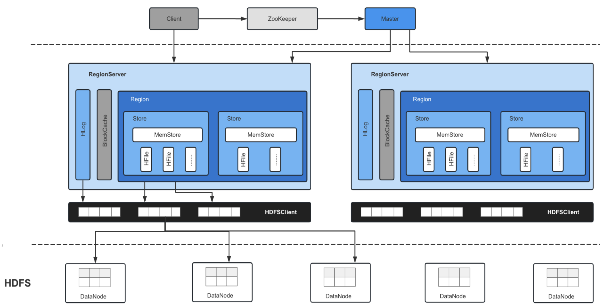

# 一、供应链

## 1、系统总体架构

``` mysql
graph TB
    subgraph 基础设施层
        I1[Kubernetes集群]
        I2[Service Mesh]
        I3[分布式存储]
    end
    
    subgraph 核心服务层
        C1[库存服务] -->|状态同步| C2[仓储服务]
        C2 -->|任务下发| C3[调度服务]
        C3 -->|指令传输| C4[设备控制服务]
        C1 -->|事件发布| C5[消息中心]
    end
    
    subgraph 支撑系统
        S1[监控告警] -->|指标采集| S2[Prometheus]
        S3[日志采集] -->|日志传输| S4[ELK Stack]
        S5[分布式追踪] -->|Span数据| S6[Jaeger]
    end
    
    subgraph 接入层
        A1[API网关] -->|路由| A2[负载均衡]
        A2 -->|服务发现| C1
        A2 -->|服务发现| C2
    end
```

## 2、库存服务

### 2.1 简述

- 架构特性：

    - **单元化部署**：按区域划分库存单元（华北/华东/华南）
    - **读写分离设计**

- 关键技术：

    - **分布式锁**：改进版Redlock实现（增加本地缓存降低Redis压力）

        > 解决高并发下的库存扣减问题，避免超卖，并且保证补货与销售操作的有序性
        >
        > 时钟漂移
        >
        > 通过分桶或分段锁来减少热点商品的竞争

    - **库存快照**：基于RocksDB的本地状态持久化

        > 为了快速恢复或查询历史状态，比如在系统崩溃后恢复数据，或者进行对账

    - **变更流水**：通过CDC(binlog Kafka)同步至数据仓库

        > 追踪库存变化的详细记录，用于审计、对账或补偿操作
        >
        > 监控数据库的binlog，将变更事件发送到Kafka，再由消费者处理到数据仓库或ES
        >
        > 需要强调**顺序性和幂等性**处理，避免重复或丢失数据

### 2.2 库存事务处理

- **分布式事务方案**

    > - **幂等性保障**：通过全局事务ID（txId）实现重复请求过滤
    > - **异步重试**：失败操作进入延迟队列，按指数退避策略重试
    > - **状态跟踪**：Redis存储事务状态机

    ```java
    // 库存扣减的Saga模式实现
    public class InventorySaga {
        @SagaStart
        public void deductInventory(Long skuId, Integer count) {
            // Step1: 预占库存
            inventoryService.tempDeduct(skuId, count); 
            
            // Step2: 创建订单
            orderService.createOrder(...);
            
            // Compensation:
            inventoryService.cancelDeduct(skuId, count);
        }
    }
    
    本地库存预扣：提前将库存分配到边缘节点
    异步化扣减：先返回成功再异步持久化
    库存预热：提前加载热点数据到缓存
    ```

- **性能优化**：

    - 热点库存处理：本地缓存+Redis分片+数据库批量合并

        > **本地缓存消峰**(Guava令牌桶实现)
        >
        > **分段锁优化**(将库存拆分为10个分段)
        >
        > **批量合并提交**(合并5ms内的库存变更)

    - 批量操作接口：合并短时间内的多次库存变更

### 2.3 存储架构设计

- **核心存储矩阵**：

    | 数据类型 | 存储方案 | 技术特性          |
    | :------- | :------- | :---------------- |
    | 实时库存 | TiDB集群 | 强一致/HATP       |
    | 操作日志 | Kafka+ES | 顺序写入/快速检索 |
    | 设备状态 | TDengine | 时序数据压缩      |
    | 库存快照 | RocksDB  | 本地持久化        |

- **分库分表策略**：

    ```sql
    -- 库存表分片规则
    CREATE TABLE inventory_${tenant}_${region} (
      sku_id BIGINT,
      warehouse_id INT,
      stock INT,
      PRIMARY KEY(sku_id, warehouse_id)
    ) PARTITION BY HASH(warehouse_id) PARTITIONS 16;
    ```

### 2.4 缓存体系设计

- **三级缓存架构**：

    ```
    本地缓存(Caffeine) → 分布式缓存(Redis) → 持久层(TiDB)
    ```

- **缓存更新策略**：

    ``` java
    // 库存缓存更新示例
    @Cacheable(value = "inventory", key = "#skuId")
    public Inventory getInventory(Long skuId) {
        return dao.get(skuId);
    }
    
    @CacheEvict(value = "inventory", key = "#skuId")
    public void updateInventory(Long skuId) {
        // 更新逻辑
    }
    ```

### 2.5 典型库存操作流程

1. 获取分布式锁（SKU级别）
2. 记录变更预写日志（WAL）
3. 执行数据库更新
4. 生成变更事件（CDC）
5. 释放锁并更新快照
6. 异步处理下游事件

### 2.6 性能优化对比

| 优化前指标      | 优化后指标       | 优化手段                   |
| :-------------- | :--------------- | :------------------------- |
| 锁竞争率：35%   | 锁竞争率：8%     | 分段锁+本地缓存优化        |
| 快照延迟：15秒  | 快照延迟：3秒    | 内存表分片+并行持久化      |
| 流水处理TPS：5K | 流水处理TPS：50K | Kafka批量压缩+消费者组优化 |
| 恢复时间：5分钟 | 恢复时间：30秒   | 快照预热+增量日志回放      |

## 3、仓储调度服务

**架构设计**：

- 任务队列分级：

    | 队列等级 | 响应要求 | 典型场景 |
    | :------- | :------- | :------- |
    | L0       | <100ms   | 紧急补货 |
    | L1       | <1s      | 常规补货 |
    | L2       | <5s      | 库存盘点 |

- 设备通信协议栈：

    ``` 
    TCP长连接 → Protobuf协议编解码 → 指令优先级队列 → 应答确认机制
    ```

## 4、前置仓管理系统

### 4.1 简述

- **核心组件**：
    - 容量监控服务：实时计算仓容水位
    - 温控监管服务：对接IoT设备数据流
    - 动态路由服务：与配送系统实时联动
- **数据同步机制**：
    - 前置仓终端->>边缘计算节点: 上报库存变更
    - 边缘计算节点->>区域中心: 批量同步数据(每5s)
    - 区域中心->>中央库存服务: 最终一致性同步
    - 中央库存服务-->>前置仓终端: 反向配置更新

### 4.2 服务治理体系

- **核心能力矩阵**：

    | 治理维度 | 技术方案         | 关键指标         |
    | :------- | :--------------- | :--------------- |
    | 流量控制 | Sentinel集群流控 | QPS阈值/异常比例 |
    | 服务容错 | Resilience4j熔断 | 失败率阈值       |
    | 灰度发布 | Istio流量染色    | 版本分流比例     |
    | 异常隔离 | Hystrix舱壁模式  | 线程池隔离度     |

- **服务网格集成**：

    ```
    # Istio VirtualService配置示例
    apiVersion: networking.istio.io/v1alpha3
    kind: VirtualService
    metadata:
      name: inventory-vs
    spec:
      hosts:
      - inventory-service
      http:
      - route:
        - destination:
            host: inventory-service
            subset: v1
        mirror:
          host: inventory-service
          subset: v2
        retries:
          attempts: 3
          retryOn: 5xx
    ```

# 二、基础

## 1、spring

### 1.1 Bean 的作用域

- `singleton`：默认，每个容器中只有一个 bean 实例，由 BeanFactory 自身来维护
- `prototype`：为每一个 bean 请求提供一个实例
- `request`：为每一个网络请求创建一个实例，在请求完成以后，bean 会失效并被垃圾回收器回收
- `session`：与request范围类似，确保每个 session 有一个 bean 实例，session 过期后，bean 会随之失效
- `global-session`：全局作用域，与 Portlet 应用相关，所有 Portlet 可以共用存储在 global-session 中的全局变量，全局作用域与Servlet中的session作用域效果相同

### 1.2 Bean 创建与循环依赖

- Bean 的创建流程：
  - `createBeanInstance`：实例化，即调用对象的构造方法实例化对象
  - `populateBean`：填充属性，主要是对 bean 的依赖属性进行填充

  - `initializeBean`：调用 spring xml 中的 init 方法

- 解决单例的循环依赖问题，使用了**三级缓存**： 

  - 三级缓存 `singletonFactories`： 单例对象工厂的 cache 

    > 解决循环依赖的诀窍是 singletonFactories，这个cache的类型是 ObjectFactory

  - 二级缓存 `earlySingletonObjects`：提前曝光的单例对象的 cache 

  - 一级缓存 `singletonObjects`：单例对象的 cache

三级缓存流程： A 的某个 field 或 setter 依赖 B 的实例对象，同时 B 的某个 field 或 setter 依赖 A 的实例对象： 

> 1. A 首先完成初始化的第一步，将自己提前曝光到 singletonFactories 中
>
> 2. 进行初始化的第二步时，发现自己依赖对象 B，此时尝试 get(B)，发现 B 还未 create，所以走 create B 流程
>
> 3. B 在初始化第一步时，发现依赖对象 A，于是尝试 get(A)，尝试一级缓存 singletonObjects，二级缓存 earlySingletonObjects 都没有，在三级缓存 singletonFactories 中拿到
>
>    > 由于 A 通过 ObjectFactory 将自己提前曝光，所以 B 能够通过 ObjectFactory.getObject 拿到 A 对象
>
> 4. B 拿到 A 对象后顺利完成了初始化阶段 1、2、3，完全初始化之后将自己放入到一级缓存
>
> 5. B 创建完成后返回 A 中，A 此时能拿到 B 的对象顺利完成自己的初始化阶段2、3，并放入一级缓存 singletonObjects 中
>
>    > 更加幸运的是，由于 B 拿到了 A 的对象引用，所以 B 现在 hold 住的 A 对象完成了初始化
>
> **加入 singletonFactories 三级缓存的前提是执行了构造器**，所以**构造器的循环依赖没法解决**

### 1.3 事务管理

- **事务管理**： 用来确保数据的完整性和一致性

  - **原子性(atomicity)**：事务的原子性确保动作要么全部完成，要么完全不起作用
  - **一致性(consistency)**: 一旦所有事务动作完成，事务就被提交
  - **隔离性(isolation)**: 每个事物都应与其他事务隔离开来，防止处理相同数据时导致数据损坏
  - **持久性(durability)**:  事务的结果被写到持久化存储器中

- **并发事务所导致的问题**： 

  - **脏读**： 对于两个事物 T1、T2，T1  读取了已经被 T2 更新但还没有被提交的字段后，若 T2 回滚，T1读取的内容就是临时且无效
  - **修改丢失**： 对于两个事物 T1、T2，T1  修改了一个字段，同时 T2 也修改了该字段，则 T1 修改的结果丢失
  - **不可重复读**： 对于两个事物 T1、T2，T1  读取了一个字段，然后 T2 更新了该字段后，T1再次读取同一个字段，值发生变化
  - **幻读**： 对于两个事物 T1、T2，T1  从一个表中读取了一个字段，然后 T2 在该表中插入了一些新的行后，如果 T1 再次读取同一个表，就会多出几行

- **五个隔离级别**：

  - `TransactionDefinition.ISOLATION_DEFAULT`： 使用底层数据库的默认隔离级别

    > Mysql 默认采用的 `REPEATABLE_READ` 隔离级别
    >
    > Oracle 默认采用的 `READ_COMMITTED` 隔离级别

  - `TransactionDefinition.ISOLATION_READ_UNCOMMITTED`： 最低隔离级别(默认)，允许读取尚未提交的数据变更

    > 可能会导致脏读、幻读或不可重复读

  - `TransactionDefinition.ISOLATION_READ_COMMITTED`： 允许读取并发事务已经提交的数据

    > 可以阻止脏读，但幻读或不可重复读仍可能发生

  - `TransactionDefinition.ISOLATION_REPEATABLE_READ`： 确保事务可以多次从一个字段中读取相同的值，在事务持续期间，禁止其他事务对这个字段进行更新

    > 可以阻止脏读和不可重复读，但幻读仍可能发生

  - `TransactionDefinition.ISOLATION_SERIALIZABLE`： 确保事务可以从一个表中读取相同的行，在这个事务持续期间，禁止其他事务对该表执行插入、更新、删除操作，所有并发问题都可以避免，但性能低下

- **事务传播机制**：
  - **支持当前事务的情况**： 
    - `TransactionDefinition.PROPAGATION_REQUIRED`： 如果当前存在事务，则加入该事务；如果当前没有事务，则创建一个新的事务
    - `TransactionDefinition.PROPAGATION_SUPPORTS`： 如果当前存在事务，则加入该事务；如果当前没有事务，则以非事务的方式继续运行
    - `TransactionDefinition.PROPAGATION_MANDATORY`： 如果当前存在事务，则加入该事务；如果当前没有事务，则抛出异常(mandatory：强制性)
  - **不支持当前事务的情况**： 
    - `TransactionDefinition.PROPAGATION_REQUIRES_NEW`： 创建一个新的事务，如果当前存在事务，则把当前事务挂起
    - `TransactionDefinition.PROPAGATION_NOT_SUPPORTED`： 以非事务方式运行，如果当前存在事务，则把当前事务挂起
    - `TransactionDefinition.PROPAGATION_NEVER`： 以非事务方式运行，如果当前存在事务，则抛出异常
  - **其他情况：**
    - `TransactionDefinition.PROPAGATION_NESTED`： 如果当前存在事务，则创建一个事务作为当前事务的嵌套事务来运行；如果当前没有事务，则等价于 TransactionDefinition.PROPAGATION_REQUIRED

- **事务超时**： 指一个事务所允许执行的最长时间，如果超过该时间限制但事务还没有完成，则自动回滚事务

- **事务只读属性**： 指对事务性资源进行只读操作或读写操作

- **回滚规则**： 定义哪些异常会导致事务回滚而哪些不会

  > - 默认情况下，只有未检查异常(`RuntimeException和Error`类型的异常)会导致事务回滚
  > - @Transactional 注解的 `rollbackFor 和 noRollbackFor` 属性定义回滚类型
  > - xml 文件中，可以在 `<tx:method>` 元素中指定回滚规则，可用用逗号分隔多个规则

- **@Transactional 注解属性详解**： 

  - `propagation`： 指定事务的传播行为，即当前的事务方法被另外一个事务方法调用时如何使用事务

    > 默认取值为 REQUIRED，即使用调用方法的事务

  - `isolation`： 指定事务的隔离级别，最常用的取值为 `READ_COMMITTED`

  - `noRollbackFor`： 设置异常是否回滚，默认情况下 Spring 的声明式事务对所有的运行时异常进行回滚

  - `readOnly`： 指定事务是否为只读，表示这个事务只读取数据但不更新数据

  - `timeout`： 指定强制回滚之前事务可以占用的时间

### 1.4 设计模式应用

- **工厂设计模式**： Spring 使用工厂模式通过 `BeanFactory`、`ApplicationContext` 创建 bean 对象
- **代理设计模式**： Spring AOP 功能的实现
- **单例设计模式**： Spring 中的 Bean 默认都是单例
- **模板方法模式**： Spring 中 `jdbcTemplate`、`hibernateTemplate` 等以 Template 结尾的对数据库操作的类
- **包装器设计模式**： 我们的项目需要连接多个数据库，而且不同的客户在每次访问中根据需要会去访问不同的数据库。这种模式让我们可以根据客户的需求能够动态切换不同的数据源
- **观察者模式**： Spring 事件驱动模型就是观察者模式很经典的一个应用
- **适配器模式**： Spring AOP 的增强或通知(Advice)使用到了适配器模式、spring MVC 中也是用到了适配器模式适配 `Controller` 

## 2、mybatis

### 2.1 核心组件

- `SqlSessionFactory`：全局单例，用于创建 `SqlSession`。
- `SqlSession`：执行SQL、管理事务的会话（线程不安全，需每次请求创建）。
- `Mapper` 接口：通过动态代理绑定到XML或注解的SQL。
- `Executor`：SQL执行器（Simple、Reuse、Batch）

### 2.2 SQL 映射与动态 SQL

1. **参数与结果映射**

    - `#{}` 和 `${}` 的区别：预编译（防SQL注入） vs. 字符串替换

        > 如何防止 SQL 注入？

    - `@Param` 注解的作用：多参数映射。

    - `resultMap`：自定义结果集映射（处理复杂对象、关联查询）

        > `<resultMap>` 的作用是什么？如何映射复杂对象（如嵌套对象）？

1. **动态 SQL 标签**
    - `<if>`、`<choose>/<when>/<otherwise>`：条件分支
    - `<foreach>`：遍历集合（IN查询、批量插入）
    - `<where>`、`<set>`、`<trim>`：智能处理SQL片段

### 2.3 缓存机制

1. **一级缓存（本地缓存）**
    - 默认开启，`SqlSession` 级别，执行`commit`、`close`或`clearCache`后失效
    - 问题：重复查询可能命中缓存，导致脏读（需注意作用域）

2. **二级缓存（全局缓存）**

    > 二级缓存开启后，同一个 namespace 下的所有 SQL 语句都是共用同一个 Cache，即二级缓存被多个 SqlSession 共享

    - `Mapper` 级别，需手动配置（`<cache>`标签或`@CacheNamespace`）
    - 缓存策略：LRU、FIFO、SOFT/WEAK（内存敏感场景）
    - 注意事项：序列化、事务提交后才生效、多表关联可能脏读

#### 2.4 与 Spring 集成

1. **MyBatis-Spring 整合**
    - 配置方式：`SqlSessionFactoryBean`、`MapperScannerConfigurer`。
    - `SqlSessionTemplate`：线程安全的`SqlSession`封装。
    - 事务管理：由Spring的`DataSourceTransactionManager`控制。
2. **Mapper 接口原理**
    - 动态代理：通过`MapperProxy`将接口方法绑定到XML或注解SQL。
    - `@MapperScan`：自动扫描并注册Mapper接口

### 2.5 分页实现

- **物理分页**：数据库方言（如MySQL的`LIMIT`）

  > - **优点**：直接由数据库处理，性能较高。
  > - **缺点**：`OFFSET` 过大时性能下降（需扫描大量数据）
  > - 优化：使用游标分页

  ```sql
  SELECT * FROM table LIMIT 10 OFFSET 20; -- 第3页（每页10条）
  ```

- **逻辑分页**：`RowBounds`（内存分页，不推荐大数据量）

  > 一次性查询所有数据，在应用层（如 Java）进行分页

- **游标分页**：使用索引列（如自增ID）作为游标，避免 `OFFSET`

  > - 优点：高性能，适合大数据量
  > - 缺点：仅支持顺序翻页，不能跳页

  ```sql
  SELECT * FROM table WHERE id > last_id ORDER BY id LIMIT 10;
  ```

---

**PageHelper(自动改写SQL)**：

- **实现**：通过拦截器动态修改 SQL 实现分页

- **原理**：将分页参数（页码、每页条数）存入 `ThreadLocal`，确保线程安全

- 改写：

  ```sql
  原始SQL --> SELECT * FROM table WHERE condition;
  改写后 --> SELECT * FROM table WHERE condition LIMIT pageSize OFFSET offset;
  ```

### 2.8 批量插入

如何优化 MyBatis 的批量插入性能？

- 批量插入性能问题：

  - **逐条插入**：每条 INSERT 语句单独提交，网络 I/O 和事务开销极大。
  - **内存溢出**：一次性加载过多数据到内存。
  - **未启用批处理**：未正确利用 JDBC 的批处理能力

- **使用 `foreach` 标签合并单条 SQL（适合小批量）**：

  - **原理**：将多条 INSERT 合并为一条 SQL，减少网络交互次数。
  - **缺点**：
    - SQL 长度可能超出数据库限制（如 MySQL 的 `max_allowed_packet`）。
    - 不适合超大数据量（如 10 万条以上）

- **使用 `ExecutorType.BATCH` + JDBC 批处理（推荐大批量）**：

  - **原理**：通过 MyBatis 的批量执行器，利用 JDBC 的 `addBatch()` 机制

  ```java
  // 获取批量模式的 SqlSession
  SqlSession sqlSession = sqlSessionFactory.openSession(ExecutorType.BATCH);
  UserMapper mapper = sqlSession.getMapper(UserMapper.class);
  
  try {
      for (int i = 0; i < list.size(); i++) {
          mapper.insert(list.get(i));
          if (i % 1000 == 0 || i == list.size() - 1) {
              sqlSession.flushStatements(); // 刷入批处理
              sqlSession.clearCache();       // 清空缓存防止内存溢出
          }
      }
      sqlSession.commit(); // 统一提交事务
  } finally {
      sqlSession.close();
  }
  ```

### 2.9 N+1 问题

- **N+1 查询问题**：指通过一次主查询（1次）获取 N 条主数据后，再通过额外的 N 次子查询获取关联数据

- **如何解决**：

  - **JOIN 查询 + 手动映射（推荐）**：通过单次 JOIN 查询一次性获取主数据和关联数据，利用 MyBatis 的 ResultMap 手动映射结果

    > - **优点**：查询次数降为 1 次，性能最优。
    > - **缺点**：JOIN 可能导致结果集膨胀（重复主数据），需手动去重

  - **批量查询（Batch Query）**：先查询主数据，收集所有主键，再通过一次子查询获取所有关联数据，最后在代码层组装

    > - **优点**：总查询次数降为 2 次，适合主数据量大的场景。
    > - **缺点**：需手动处理数据组装逻辑

  - **启用懒加载（Lazy Loading）**：延迟加载关联数据，仅在访问关联属性时触发查询

    > ```xml
    > <collection 
    >   property="items" 
    >   column="id" 
    >   ofType="OrderItem"
    >   select="selectOrderItemsByOrderId"
    >   fetchType="lazy"/> <!-- 标记为懒加载 -->
    > ```
    >
    > - **优点**：避免一次性加载所有关联数据。
    > - **缺点**：
    >   - 若遍历所有主数据并访问关联属性，仍会触发 N+1 查询。
    >   - 需确保 Session 生命周期管理（如使用 Open Session In View 模式）

## 3、设计模式


## 4、mysql

### 4.1 索引

B+ 树：

> 相对于跳表，减少寻址次数

- 单一节点存储更多的元素，使得查询的IO次数更少
- 所有查询都要查找到叶子节点，查询性能稳定
- 所有叶子节点形成有序链表，便于范围查询


- **聚簇索引**：索引的叶子节点直接存储完整的行数据

  - **物理有序**：数据按聚簇索引键值的顺序存储，因此主键范围查询效率高

- **非聚簇索引**：索引的叶子节点存储的是**主键值（而非数据行）+ 索引列**

  - 回表查询：**先遍历辅助索引查找到主键值，再通过主键索引找到完整的行记录** 

    > 原理：当查询的列未完全包含在非聚簇索引中时，需通过主键值回到聚簇索引中检索完整数据行
    > 解决：设计索引时，让索引包含查询需要的所有列，避免回表

- 索引优化：
  - 覆盖索引：即非聚簇索引包含查询需要的所有列，避免回表
  - 最左前缀原则：索引字段顺序指定，避免跳过索引字段

- **检测 sql**：通过 `EXPLAIN` 分析执行计划，关注 `rows`、`key`、`type`，避免全表扫描

### 4.2 锁

- 行锁模式：
  - **共享锁（S Lock）**：允许其他事务读，阻塞写（`SELECT ... LOCK IN SHARE MODE`）
  - **排他锁（X Lock）**：禁止其他事务读写（`SELECT ... FOR UPDATE`、DML 语句）

- 行锁类型：
  - **记录锁(Record Lock)**：锁定索引中的一条记录
  - **间隙锁(Gap Lock)**：锁定索引记录之间的间隙（防止幻读），仅存在于 **可重复读（RR）** 隔离级别
  - **临键锁(Next-Key Lock)**：记录锁 + 间隙锁，锁定左开右闭区间（如 `(5, 10]`），解决幻读问题（RR 隔离级别默认）

- 意向锁（Intention Lock）：
  - **意向共享锁（IS）**：事务准备对某些行加 S 锁
  - **意向排他锁（IX）**：事务准备对某些行加 X 锁

- 死锁检测与处理：
  - **自动检测**：InnoDB 使用等待图（Wait-For Graph）检测死锁
  - **解决方案**：强制回滚代价较小的事务（通过 `SHOW ENGINE INNODB STATUS` 查看死锁日志）

| **隔离级别**         | **脏读** | **不可重复读** | **幻读** | **锁机制**                    |
| :------------------- | :------- | :------------- | :------- | :---------------------------- |
| **读未提交（RU）**   | 可能     | 可能           | 可能     | 不加锁（通过 MVCC 实现）      |
| **读已提交（RC）**   | 不可能   | 可能           | 可能     | 仅加记录锁，无间隙锁          |
| **可重复读（RR）**   | 不可能   | 不可能         | 可能     | 记录锁 + 间隙锁（默认防幻读） |
| **串行化（Serial）** | 不可能   | 不可能         | 不可能   | 强制加锁，最高隔离            |

### 4.3 事务

- 事务**并发问题**如何发生： 当多个事务同时操作同一个数据库的相同数据时

  - **脏读**：一个事务读取到了另外一个事务未提交的数据

  - **不可重复读**：同一个事务中，多次读取到的数据不一致

  - **幻读**：一个事务读取数据时，另外一个事务进行更新，导致第一个事务读取到了没有更新的数据


- 四个隔离级别为：

  - `READ UNCOMMITTED`(读未提交)： **称为浏览访问，仅仅针对事务而言**

    > 允许读取尚未提交的数据变更，**可能会导致脏读、幻读或不可重复读** 
  
  
    - `READ COMMITTED`(读已提交)： **称为游标稳定**，避免脏读，但导致不可重复读
  
      > 允许读取并发事务已经提交的数据，**可以阻止脏读，但是幻读或不可重复读仍可能发生** 
  
  
    - `REPEATABLE READ`(可重复读)： **是 2.9999° 的隔离，没有幻读的保护**，避免不可重复读
  
      > 对同一字段的多次读取结果一致，**可以阻止脏读和不可重复读，但幻读仍可能发生** 
  
  
    - `SERIALIZABLE`(序列化)： **称为隔离或 3° 的隔离 ** 
  
      > 所有事务依次执行，事务之间不会产生干扰，**该级别可以防止脏读、不可重复读以及幻读** 
  

### 4.4 MVCC

通过保存数据的多个版本来实现高并发读写，同时保证事务的隔离性

> 是 InnoDB 引擎实现 **可重复读（RR）** 和 **读已提交（RC）** 隔离级别的核心机制

- **数据多版本**：每条记录的每次修改都会生成一个版本链，旧版本数据存储在 **Undo Log** 中

  > **Undo Log**：
  >
  > - 支持事务回滚
  > - 支持 MVCC 读取历史快照

- **快照读（Snapshot Read）**：事务读取数据时，基于某个时间点的快照版本，而非实时数据

- **版本链访问**：当查询数据时，InnoDB 会根据当前事务的 ReadView，沿版本链找到符合可见性条件的记录

- **不同隔离级别的 MVCC 表现**：

  - **读已提交**：每次执行 SELECT 语句时生成新的 ReadView

    > - 能读到其他事务已提交的最新数据。
    > - 可能出现不可重复读（同一事务两次查询结果不一致）

  - **可重复读**：事务第一次 SELECT 时生成，后续复用同一个 ReadView

    > - 保证同一事务内多次查询结果一致（避免不可重复读）
    > - 通过 **间隙锁（Gap Lock）** 避免幻读（当前读），但快照读（普通 SELECT）仍可能因版本链覆盖而出现幻读

| **问题**       | **解决方式**                                                 |
| :------------- | :----------------------------------------------------------- |
| **脏读**       | 只读取已提交事务的版本（通过 ReadView 过滤未提交事务的修改） |
| **不可重复读** | 在 RR 级别下，复用同一个 ReadView，保证事务内看到一致的数据快照 |
| **幻读**       | 快照读通过 MVCC 避免幻读；当前读（如 `SELECT ... FOR UPDATE`）通过间隙锁解决 |

### 4.5 Binlog、Redo Log、Undo Log

| 特性         | Binlog (二进制日志)       | Redo Log (重做日志)          | Undo Log (回滚日志)         |
| :----------- | :------------------------ | :--------------------------- | :-------------------------- |
| **所属层级** | MySQL Server层            | InnoDB存储引擎层             | InnoDB存储引擎层            |
| **日志类型** | 逻辑日志（SQL语句）       | 物理日志（页级修改）         | 逻辑日志（行记录前镜像）    |
| **主要用途** | 主从复制、数据恢复        | 崩溃恢复                     | 事务回滚、MVCC              |
| **写入时机** | 事务提交后                | 事务执行过程中               | 数据修改前                  |
| **生命周期** | 可配置保留时间            | 循环覆盖写入                 | 随事务结束可清理            |
| **文件形式** | 独立文件（binlog.000001） | 固定大小文件组（ib_logfile） | 存储在系统表空间/undo表空间 |

### 4.6 主从复制与读写分离

- **主从复制**：

    - **基本概念**

      - **主库（Master）**：处理所有写操作（INSERT/UPDATE/DELETE），并将数据变更记录到二进制日志（Binary Log）

      - **从库（Slave）**：从主库同步二进制日志，并在本地重放这些操作，实现数据复制。从库通常用于读操作（SELECT）

    - **从库同步流程**
      - **I/O线程**：从库通过I/O线程连接到主库，读取主库的二进制日志并保存为中继日志（Relay Log）。
      - **SQL线程**：从库的SQL线程读取中继日志中的事件，并在本地重放这些操作，实现数据同步
    - 复制方式：
      - **异步复制(默认)**：主库提交事务后无需等待从库确认，性能高但存在短暂数据不一致风险
      - **半同步复制(保证数据一致性)**：主库提交事务时，至少等待**一个从库确认收到 Binlog 事件**后才返回成功给客户端
      - **GTID + 一致性读**：
        - 使用全局事务标识（GTID）跟踪事务，确保从库应用完特定事务后再读取
        - 客户端记录主库的 GTID，查询从库时等待其同步到该 GTID

- **读写分离**：

    - **核心思想**

      - **写操作**：仅由主库处理（INSERT/UPDATE/DELETE）

      - **读操作**：分发到从库或多个从库（SELECT）

    - **应用层控制**：数据库中间件（如MyCat、ProxySQL、MaxScale）自动路由请求

      - 写请求：连接主库
      - 读请求：轮询或随机选择从库

### 4.7 分库分表

- **分库分表的核心思想**

  - **垂直拆分**：按业务模块或字段拆分表或库（如订单库、用户库）

  - **水平拆分**：将单表数据按规则（如哈希、范围）分散到多个库或表中

- **分库分表的挑战**

  - **跨库查询**：JOIN、排序、分页需合并结果（ShardingSphere 支持有限）

  - **分布式事务**：使用 Seata、XA 协议或最终一致性补偿

  - **扩容**：数据迁移复杂，推荐初期预留分片或使用一致性哈希

- 分库分表后如何实现全局唯一ID？（雪花算法、Redis自增）

> **旧数据归档**：将历史数据迁移到归档表或归档库

---

分库分表后，如何实现跨分片的排序和分页？

- **全局表/索引方案**：维护额外的全局表
- **内存排序方案**：从所有分片查询满足条件的数据，在应用内存中进行合并、排序

- **二次查询方案**：第一次查询只获取排序字段和主键，在内存中排序并确定最终需要的主键，第二次查询根据主键获取完整数据

---

订单表数据量过大，如何设计分表策略？

- **按时间维度分表（推荐）**：订单有明显的时间特征，查询常按时间范围筛选
- **按用户ID哈希分表**：用户维度查询频繁
- **按订单ID范围分表**：ID自增且查询多按ID范围

### 4.8 应用

- **扣减一致性**：

    - **超卖问题**：通过事务+行锁（`SELECT ... FOR UPDATE`）或乐观锁（版本号）保证原子性。
    - **预扣库存**：下单时预扣库存，支付成功后实际扣减，超时未支付回滚。

    > 电商场景中，如何解决超卖问题？除了锁还有什么方案？

- **热点行优化**：

    - **批量扣减**：将单行库存拆分为多行（如库存分桶），减少锁竞争。
    - **异步队列**：通过消息队列（如 Kafka）削峰，异步处理库存更新。

- **高频问题**：

    - 如何设计一个支持高并发秒杀的库存系统？
    - 分桶库存的实现原理是什么？

- **事务一致性**：
    - 订单创建需保证：扣库存、生成订单、记录流水的事务原子性。
    - 最终一致性方案：TCC（Try-Confirm-Cancel）、本地消息表。
- **数据分片**：
    - 订单表按用户ID分片，避免单表过大。
    - 历史订单归档：按时间分区，冷热数据分离。
- **高频问题**：
    - 如何处理订单支付超时？（定时任务扫描+状态回滚）

- **复杂查询优化**：
    - 多表关联查询（订单、物流、库存）使用覆盖索引或冗余字段。
    - 聚合查询（如库存周转率）使用物化视图或预计算。
- **数据一致性**：
    - 分布式事务：跨库存、物流系统的数据同步（如基于 Binlog 的 CDC 技术）。
- **高频问题**：
    - 如何实时监控库存周转率？（定时任务+聚合表）

- **缓存结合**：
    - 读多写少场景（如商品详情）使用 Redis 缓存，缓存击穿/穿透/雪崩解决方案。
    - 库存缓存：**Redis 预扣库存，异步同步到数据库**。
- **容灾备份**：
    - 主从切换（Keepalived）、跨机房容灾（双活架构）。
    - 数据备份：全量备份（mysqldump）+ Binlog 增量恢复。

## 5、redis

### 5.1 分布式锁(redLock)

> 用于在分布式环境下实现跨多个 Redis 节点的互斥锁

RedLock 算法核心思想是：**在大多数 Redis 节点上获取锁**，而不是依赖单个 Redis 实例。基本步骤如下：

1. 获取当前时间（毫秒精度）
2. 依次尝试从 N 个独立的 Redis 实例获取锁
3. 计算获取锁花费的总时间（当前时间 - 步骤1的时间）
4. 如果满足以下条件则认为获取锁成功：
   - 从大多数（N/2 + 1）节点获取到了锁
   - 总耗时小于锁的过期时间

注意点：

1. **时钟同步问题**：RedLock 依赖于系统时钟的正确性。如果某些 Redis 节点的时钟不同步，可能会导致锁提前过期或被错误持有
2. **锁续期**：对于长时间操作，需要考虑实现锁续期机制（watchdog）
3. **性能考虑**：由于需要与多个 Redis 节点通信，RedLock 的性能比单节点锁要低
4. **网络分区**：在网络分区情况下，可能会出现多个客户端同时持有锁的情况

```java
// 改进版Redlock实现（Java示例）
public class InventoryLock {
    private static final String LOCK_PREFIX = "lock:sku:";
    private static final int LOCK_EXPIRE = 3000; // 3秒
    
    public boolean tryLock(String skuId, String requestId) {
        String key = LOCK_PREFIX + skuId;
        return redisTemplate.execute((RedisCallback<Boolean>) conn -> {
            // 使用Lua脚本保证原子性
            String luaScript = 
                "if redis.call('setnx', KEYS[1], ARGV[1]) == 1 then " +
                "   redis.call('pexpire', KEYS[1], ARGV[2]); " +
                "   return 1; " +
                "else " +
                "   return 0; " +
                "end";
            Object result = conn.eval(
                luaScript.getBytes(), 
                ReturnType.INTEGER, 
                1, 
                key.getBytes(), 
                requestId.getBytes(), 
                String.valueOf(LOCK_EXPIRE).getBytes()
            );
            return (Long)result == 1;
        });
    }
}
```

**多级锁优化策略**

```
graph TD
    A[请求进入] --> B{本地锁竞争}
    B -->|成功| C[Redis集群锁]
    B -->|失败| D[快速失败返回]
    C -->|成功| E[执行库存操作]
    C -->|失败| F[进入等待队列]
```

**工程实践要点**

- **锁粒度优化**：采用分段锁（如将SKU_1001拆分为SKU_1001_01~SKU_1001_10）
- **锁续期机制**：后台线程自动延长锁有效期
- **故障转移**：通过ZooKeeper实现锁服务高可用

### 5.2 ThreadLocal 与 Caffeine

- **`ThreadLocal`**：

  - **数据结构**

    - 每个线程（`Thread` 类）内部维护一个 `ThreadLocalMap`，其键为 `ThreadLocal` 实例，值为线程局部变量
    - `ThreadLocalMap` 的 `Entry` 使用**弱引用（`WeakReference`）**包装 `ThreadLocal` 实例，避免内存泄漏

    > 强引用：可以直接访问目标对象，垃圾收集器不会回收掉强引用对象
    >
    > 软引用：在内存不够时会被回收
    >
    > **弱引用**：只能存活到下一次垃圾回收发生前
    >
    > 虚引用：对象是否有虚引用，不会对其生存时间构成影响，也无法通过虚引用取得一个对象

  - **变量隔离机制**

    - 当调用 `ThreadLocal.set(value)` 时，数据存储在当前线程的 `ThreadLocalMap` 中
    - 调用 `ThreadLocal.get()` 时，从当前线程的 `ThreadLocalMap` 中取出与当前 `ThreadLocal` 关联的值

  - **哈希冲突处理**

    - `ThreadLocalMap` 使用线性探测法（而非链地址法）解决哈希冲突，通过顺序查找下一个空槽

  - **内存泄漏问题**：

    - **根源**
      - `ThreadLocalMap` 的键（`ThreadLocal` 实例）是弱引用，但值是强引用
      - 若 `ThreadLocal` 实例被回收，但 `ThreadLocalMap` 中值的强引用未被清除，会导致 Entry 无法回收
    - **解决方案**
      - **及时调用 `remove()`**：在使用完毕后（尤其是线程池场景），必须调用 `remove()` 清理数据
      - **避免长生命周期线程**：线程池中的线程可能长期存活，需确保每次任务结束后清理 `ThreadLocal`

- **`Caffeine`**：

  - **缓存淘汰策略**：Window-TinyLFU 算法，其核心思想：

    - **LRU（最近最少使用）**：维护一个“最近使用”队列

    - **TinyLFU（频率统计）**：通过 Count-Min Sketch 算法统计数据的访问频率

    - **窗口缓存（Window Cache）**：新数据先进入窗口缓存区，高频访问的数据晋升到主缓存区

  - **并发优化**

    - **无锁读操作**：读操作完全无锁，依赖 `ConcurrentHashMap` 实现高并发读

    - **分段写锁**：写操作采用分段锁（类似 `ConcurrentHashMap`），减少锁竞争

    - **缓冲队列**：将并发写入操作缓冲到队列中，批量合并处理，减少锁冲突

  - **内存管理**

    - **权重控制**：支持按条目数或内存权重（如对象大小）限制缓存容量

    - **弱引用/软引用**：允许缓存键或值使用弱引用或软引用，避免内存溢出

    - **自动过期**：支持基于时间（访问后、写入后）或自定义策略的自动过期

### 5.3 数据结构与适用场景

- **String**：缓存、计数器（库存预扣）、分布式锁。
- **Hash**：存储对象（用户信息、商品详情）。
- **List**：消息队列、最新消息排行（如订单流水）。
- **Set**：唯一性集合（抽奖去重、共同好友）。
- **ZSet**：排行榜（商品销量、用户积分）。
- **BitMap**：签到统计、用户行为标记。
- **HyperLogLog**：UV 统计（近似去重计数）。
- **Stream**：消息队列（替代 List，支持多消费者组）

### 5.4 持久化机制

- **RDB（快照）**：
    - 定时生成数据快照，适合备份恢复。
    - 缺点：可能丢失最后一次快照后的数据。
- **AOF（追加日志）**：
    - 记录写操作命令，数据丢失风险低。
    - 重写机制（Rewrite）压缩日志文件。

### 5.5 主从复制

主从复制是**异步复制**机制，主节点（Master）处理写操作后，通过异步方式将数据变更同步到从节点（Slave）

- **主从不一致解决**：
  - **强制读主**：在写操作后的关键时间窗口内（如 1s），强制后续读请求访问主节点。
  - **使用 `WAIT` 命令（同步复制）**：确保写操作在多个从节点持久化，实现**强一致性**
  - **优化主从复制性能**：增大主节点复制缓冲区、控制主节点写入速率、硬件及网络优化
  - **最终一致性补偿**：
    - **异步校验**：定期对比主从数据（如使用 `SCAN` 遍历键）
    - **消息队列补偿**：写操作同时发送消息到队列，从节点消费消息后二次校验数据

| **方案**       | **一致性强度** | **延迟影响**   | **实现复杂度** | **适用场景**                     |
| :------------- | :------------- | :------------- | :------------- | :------------------------------- |
| 强制读主       | 强一致性       | 增加主节点负载 | 低             | 金融交易、库存扣减               |
| `WAIT` 命令    | 强一致性       | 高延迟         | 中             | 极小规模集群、关键配置更新       |
| 监控告警       | 最终一致性     | 无影响         | 高             | 配合运维体系使用                 |
| 优化主从性能   | 降低延迟概率   | 无影响         | 中             | 所有主从架构通用                 |
| 最终一致性补偿 | 最终一致性     | 低延迟         | 高             | 对一致性要求宽松的场景（如缓存） |

### 5.6 性能与内存管理

- **内存淘汰策略**：
    - `volatile-lru`（最近最少使用）、`allkeys-lfu`（最不经常使用）等。
- **缓存穿透**：恶意查询不存在的数据。
    - 解决方案：布隆过滤器（Bloom Filter）、空值缓存。
- **缓存击穿**：热点数据过期后高并发请求穿透到数据库。
    - 解决方案：互斥锁（SETNX）、永不过期 + 异步更新。
- **缓存雪崩**：大量数据同时过期导致请求打到数据库。
    - 解决方案：随机过期时间、多级缓存（Redis + 本地缓存）

### 5.7  Redis 实现延迟队列

- 基于 **有序集合（Sorted Set）** 的延迟队列：将任务的到期时间作为分数（score），任务内容作为成员（member），通过轮询有序集合中到期的任务实现延迟消费

  > - **添加延迟任务**：将任务按执行时间戳（延迟时间 + 当前时间）存入 Sorted Set
  > - **轮询到期任务**：消费者定期查询当前时间之前的所有任务
  > - **处理任务**：消费者遍历获取的任务列表，执行业务逻辑

- 基于 **过期事件监听（Key Notifications）** 的延迟队列：利用 Redis 的键过期事件（`expired`），将任务 ID 设为键，过期时间作为延迟时间，过期时触发事件，将任务推入处理队列

  > - **启用 Redis 键空间通知**：修改 Redis 配置，开启过期事件监听
  > - **添加延迟任务**：将任务 ID 设为键，设置过期时间（即延迟时间）
  > - **订阅过期事件**：通过订阅 `__keyevent@0__:expired` 频道，监听过期事件
  > - **处理任务**：从处理队列（如 List）中消费任务

| **方案**                   | **优点**                        | **缺点**                      | **适用场景**                 |
| :------------------------- | :------------------------------ | :---------------------------- | :--------------------------- |
| **有序集合（Sorted Set）** | 支持精确时间控制 可批量处理任务 | 需要轮询，资源消耗较大        | 高精度延迟任务（如定时调度） |
| **过期事件监听**           | 无轮询开销，事件驱动            | 过期事件可能丢失 无法批量处理 | 简单延迟任务（如会话超时）   |

### 5.8  Redis 单线程高性能

- **纯内存操作，避免磁盘 I/O 瓶颈**：Redis 数据存储在内存中，读写操作直接在内存完成

- **非阻塞 I/O 多路复用**：通过 `epoll`（Linux）、`kqueue`（BSD）等系统调用，单线程监听多个 Socket 事件
- **高效数据结构与算法**

- **异步持久化机制**

### 5.9 应用

- **库存管理**

  - **预扣库存**：
      - Redis 原子操作扣减库存（`DECR`），避免超卖。
      - 异步同步到数据库（通过消息队列确保最终一致性）。

  - **库存分桶**：
      - 将库存拆分为多个 Key（如 `stock:product_1001:1` ~ `stock:product_1001:10`），分散热点。

  - **库存回滚**：
      - 支付超时后，通过定时任务回滚 Redis 库存。


- **秒杀与高并发**

  - **流量削峰**：
      - 使用 Redis 计数器限制用户请求频率。
      - 请求排队：Redis List 或 Stream 实现队列，异步处理订单。

  - **分布式锁**：
      - 使用 `SET key value NX EX` 实现锁，避免重复下单。
      - 问题：锁超时导致并发问题（需结合 WatchDog 续期）。


- **订单与交易**

  - **订单唯一性**：
      - 使用 Redis 全局唯一 ID（`INCR` 或雪花算法）。

  - **购物车**：
      - 使用 Hash 存储用户购物车（`hset cart:user_1001 product_2001 2`）。


- **数据一致性**

  - **缓存与数据库双写**：
      - 策略：先更新数据库，再删除缓存（延迟双删避免脏数据）。
      - 问题：缓存删除失败导致不一致（通过重试机制或订阅 Binlog 同步）。

  - **最终一致性**：
      - 通过消息队列（如 Kafka）异步同步数据。


- **实时统计与监控**

  - **排行榜**：
      - 使用 ZSet 实时统计商品销量 Top 10。

  - **用户行为分析**：
      - 使用 BitMap 记录用户签到，HyperLogLog 统计 UV


## 6、hbase

### 6.1 概览

机器配置：64C-256G-16320G，其中 256G 的一半给了hdfs一半给了hbase，128G 的一部分给了MemStore一部分给了blockcache

- 分表：单表最多两个 family、每个 family 最多20个 qualifer
- 数据有效期：默认表级别的有效期为两天

- compaction：每天6点40进行一次 compaction，且之后不允许 bulkload 写入

---

- **存储引擎**：
  - 基于LSM树（Log-Structured Merge Tree）：数据先写入内存（MemStore），再合并成HFile持久化到HDFS
  - 写优化：顺序写、批量合并
- **读写流程**：
  - **写流程**：Client → ZooKeeper → RegionServer → MemStore（WAL预写日志） → HFile
  - **读流程**：Client → RegionServer → MemStore → BlockCache（缓存热数据） →  HFile合并结果

---

- **高扩展性**：通过Region分片支持PB级数据
- **强一致性**：单行事务（ACID）
- **稀疏存储**：仅存储非空列，适合半结构化数据
- **多版本控制**：按时间戳保留历史版本数据

---

以下是两者的对比:

1. 数据模型：HBase 是一种列式存储的数据库，而 RocksDB 是 key-value 的
2. 使用场景：HBase 适用于处理大数据，查询操作比较频繁的情况。而 RocksDB 适用于在 SSD 等硬盘上，存储 Key-Value 类型的数据
3. 性能：RocksDB 的读写性能会更好一些
4. 依赖环境：Hbase 基于 Hadoop，环境依赖较大，而 RocksDB 是一种嵌入式数据库，独立性更强
5. 扩展性：HBase 具有很好的水平扩展性，适合处理 PB 级别以上的数据，RocksDB 具备垂直扩展性，适用于存储 TB 级别以下的数据



> 创建表时，提前设定好 region，尽量避免 region 分裂

### 6.2  数据模型与架构

- **数据模型**：
    - **表（Table）**：由行（Row）和列（Column）组成
    - **行键（RowKey）**：唯一标识一行，按字典序排序，设计需避免热点
    - **列族（Column Family）**：物理存储单元，同一列族的数据存储在同一个HFile中
    - **时间戳（Timestamp）**：支持多版本数据，按时间倒序排列
    
    > **`cell`(单元格)**：由五元组(row, column, timestamp, type, value)组成的结构，其中 `(row, column,timestamp, type)` 是K，value字段对应 KV 结构的 V
    >
    > - `type` 表示 `Put/Delete` 这样的操作类型
    > - `timestamp` 代表这个 cell 的版本
- **架构组件**：
    - **HMaster**：负责元数据管理（表结构、Region分配）、负载均衡
    - **RegionServer**：管理多个Region，处理读写请求
    - **Region**：表的分片，按RowKey范围划分，可水平扩展
    - **ZooKeeper**：协调集群状态（RegionServer存活、元数据存储）

### 6.3 性能优化

- **RowKey设计**：
    - 避免热点：散列（Hash前缀）、时间戳反转（如 `reverse(timestamp)`）
    - 查询模式优先：根据查询需求设计RowKey（如 `用户ID_订单ID`）
- **预分区（Pre-splitting）**：避免 Region 自动拆分导致性能波动
- **缓存机制**：
    - **BlockCache**：缓存HFile数据块（读优化）
    - **MemStore**：写缓存，定期刷写到HFile
- **压缩与编码**：使用Snappy或GZIP压缩HFile，减少存储和IO开销

### 6.4 BlockCache与MemStore

- **MemStore：写入加速器**

    - **功能与作用**

        - **写缓冲**：每个 Region 的**每个列族（Column Family）对应一个MemStore**，用于临时存储客户端写入的数据

        - **数据排序**：在内存中**按RowKey排序**，确保写入StoreFile时数据有序，提升读取效率

        - **批量持久化**：通过定期 Flush 将内存数据写入HDFS，减少磁盘 I/O 次数

    - **写入流程**

        - 客户端写入数据时，首先追加到WAL（Write-Ahead Log）保证持久性

        - 数据写入对应Region的MemStore

        - 当MemStore大小达到阈值（`hbase.hregion.memstore.flush.size`，默认128MB），触发Flush操作：

            - 生成新的StoreFile（HFile格式）写入HDFS

            - 清空MemStore，释放内存空间

    - **触发Flush的条件**

        - **大小阈值**：单个MemStore达到配置大小

        - **全局内存限制**：RegionServer所有MemStore总和超过`hbase.regionserver.global.memstore.size`（默认堆内存的40%），触发强制Flush

        - **手动触发**：通过HBase Shell或API执行`flush`命令

        - **WAL数量限制**：WAL文件数量超过`hbase.regionserver.maxlogs`，触发Flush以减少日志数量

    - **配置参数**

        - `hbase.hregion.memstore.flush.size`：单个MemStore的Flush阈值

        - `hbase.regionserver.global.memstore.size`：RegionServer总MemStore内存占比

        - `hbase.regionserver.optionalcacheflushinterval`：MemStore最大空闲时间（默认1小时），超时未写入则Flush

    - **优化建议**

        - **避免频繁Flush**：增大`hbase.hregion.memstore.flush.size`（如256MB），减少StoreFile数量

        - **预分区与RowKey设计**：均衡Region负载，防止单个Region写入过热

        - **监控MemStore使用**：通过HBase UI或JMX观察`MemStoreSize`指标，及时调整配置

- **BlockCache：读取加速器**

    - **功能与作用**

        - **数据块缓存**：缓存HFile中的数据块（默认64KB），减少磁盘读取次数

        - **LRU策略**：优先保留最近访问的数据块，提升缓存命中率

        - **读路径优化**：读请求优先访问BlockCache，未命中时从HFile加载并缓存

    - **缓存结构**

        - **LRUBlockCache（默认）**：
            - 基于JVM堆内存，分三个优先级队列：
                - **Single Access**：单次访问块，优先被淘汰
                - **Multi Access**：多次访问块，保留时间较长
                - **In-Memory**：标记为常驻内存的块（如元数据）

        - **BucketCache（可选）**：
            - 支持堆外内存（Off-Heap）、SSD或文件存储，减少GC压力
            - 与LRUBlockCache配合使用（组合模式），LRU管理元数据，BucketCache存储数据块

    - **读流程**

        - 客户端请求读取某 RowKey

        - RegionServer 先查询 BlockCache：

            - 命中则直接返回数据

            - 未命中则从HFile读取数据块，并缓存至BlockCache

    - **配置参数**

        - `hfile.block.cache.size`：BlockCache占堆内存的比例（默认40%）

        - `hbase.bucketcache.ioengine`：BucketCache存储介质（如`offheap`、`file:/path`）

        - `hbase.bucketcache.size`：BucketCache大小（若启用）

    - **优化建议**

        - **调整缓存比例**：根据读写负载平衡`hfile.block.cache.size`和`hbase.regionserver.global.memstore.size`

        - **启用BucketCache**：堆外缓存减少GC停顿，适合大内存场景

        - **冷热数据分离**：对频繁访问的列族设置`IN_MEMORY=true`，提升缓存优先级

---

**MemStore与BlockCache的协同与权衡**

- **堆内存划分**：总内存 ≈ MemStore（40%） + BlockCache（40%） + 其他（20%）

- **性能影响**

    - **写密集场景**：需增大MemStore比例，避免频繁Flush

    - **读密集场景**：需增大BlockCache比例，提升缓存命中率

---

读取流程：MemStore、BlockCache、HFile

HBase通过多版本（MVCC）管理数据，读取时会选择时间戳最新的版本

- **数据块**：按 Key 排序存储数据
- **索引块**：记录每个数据块的起始 Key 和偏移量，加速查询
- **元数据块**：包含 Bloom Filter（快速判断 Key 是否存在）、压缩信息等

> BloomFilter：每一个文件都有一个block相关的索引，每次读的时候都会去判断一下BlockCache里面有没有我需要的全部block，没有的话会把需要的block全都加载上来

- 执行流程：
    - **读时间戳确定**：客户端读取时会获取一个**全局一致的读时间戳**（例如 Region Server 的当前时间戳 `T_read`）
    - **版本筛选**：从 BlockCache 和 HFile 中收集所有时间戳 **≤ `T_read`** 的数据版本
    - **缓存更新**：
        - 如果 HFile 中的 `T2` 版本符合条件且更新，则返回 `T2` 数据，并将该数据块加载到 BlockCache 中，替换旧版本 `T1`。
        - 如果 BlockCache 中的 `T1` 仍然是最新有效版本，则直接返回

- **MVCC 对并发写入的隔离**：
    - **写操作**：新写入的数据会先写入 MemStore，并分配一个递增的时间戳（例如 `T3`）。在写入完成（MemStore 刷写到 HFile）前，这些数据对读操作不可见
    - **读操作**：基于 MVCC 的快照隔离，读取时会忽略所有时间戳 **> `T_read`** 的未提交数据，即使这些数据正在写入 MemStore 或 HFile
- **MVCC 事务隔离**：通过维护 **Write Number（写序号）** 和 **Read Point（读点）**，确保读操作不会看到未提交的中间状态

### 6.5 LSM 树

- **核心思想**：

    > 通过**顺序写入**和**异步合并**来最大化写入性能，牺牲部分读取效率以换取更高的写入吞吐量

    - **顺序写入优先**：将随机写操作转换为顺序写，利用磁盘顺序写入的高效性（尤其是对 HDD/SSD 的物理特性优化）

    - **分层存储结构**：数据按时间顺序分层存储（内存 + 多级磁盘文件），通过后台合并（Compaction）实现数据有序化和去重
    - **权衡读写性能**
        - **写入优先**：写入仅需追加，无需原地更新
        - **读取代价**：需多级查询（内存 → 磁盘多级文件），可能触发读放大（Read Amplification）

- **核心组件**：

    - **MemTable（内存表）**

        - **作用**：所有写入操作首先写入内存中的 MemTable，本质是一个**有序数据结构**（如跳表、红黑树）

        - **特点**：
            - 支持快速插入和范围查询
            - 达到阈值（如 64MB）后，转为 Immutable MemTable，并触发刷盘（Flush）到磁盘

    - **SSTable（Sorted String Table）**

        - **作用**：磁盘上的不可变数据文件，存储有序的键值对

        - **结构**：
            - **数据块**：按 Key 排序存储数据
            - **索引块**：记录每个数据块的起始 Key 和偏移量，加速查询
            - **元数据块**：包含 Bloom Filter（快速判断 Key 是否存在）、压缩信息等

    - **WAL（Write-Ahead Log）**

        - **作用**：在写入 MemTable 前，先顺序追加到 WAL 日志，用于崩溃恢复

        - **特点**：保证数据持久化，但写入完成后可删除或截断日志

    - **Compaction（合并）**

        - **作用**：将多个小 SSTable 合并为更大的 SSTable，同时清理过期/重复数据

        - **策略**：
            - **Leveled Compaction**（RocksDB 默认）：分层合并，每层 SSTable 的 Key 范围不重叠
            - **Size-Tiered Compaction**（Cassandra）：合并大小相近的 SSTable，允许范围重叠

- **工作流程**：

    - **写入流程**

        - 写入操作首先追加到 WAL 日志（保证持久化）

        - 数据插入 MemTable（内存中的有序结构）

        - 当 MemTable 写满后，转为 Immutable MemTable，异步刷盘生成 L0 层 SSTable

        - 后台线程根据策略（Leveled/Size-Tiered）合并 SSTable，生成更高层的有序文件

    - **读取流程**

        - 先查询 MemTable 和 Immutable MemTable

        - 若未找到，按层级（L0 → L1 → L2…）依次查询 SSTable

        - 每个 SSTable 通过索引块和 Bloom Filter 快速定位数据

    - **删除流程**
        - **逻辑删除**：插入一条墓碑（Tombstone）标记，在 Compaction 时物理删除旧数据

- **优缺点**：
    - **优点**：
        - **超高写入吞吐**
            - 写入只需追加操作，无随机磁盘 I/O
            - 适合日志、时序数据、实时分析等场景
        - **天然支持数据版本管理**：数据按时间分层，易于实现快照和历史查询
        - **压缩优化存储**：合并过程可压缩数据，减少存储占用
    - **缺点**：
        - **读放大（Read Amplification）**：读取可能需要扫描多级文件（尤其是未合并的 L0 层）
        - **写放大（Write Amplification）**：Compaction 过程会多次重写数据
        - **延迟波动**：Compaction 可能阻塞写入（Write Stall）

- **优化策略**：

    - **提升读取性能**

        - **Bloom Filter**：快速判断 Key 是否在某个 SSTable 中，减少无效磁盘访问

        - **缓存机制**：使用 Block Cache（缓存热数据块）和 Row Cache（缓存整行数据）

        - **前缀压缩**：对 Key 前缀去重，减少存储和查询开销

    - **降低写放大**

        - **动态 Level 大小**（`level_compaction_dynamic_level_bytes`）：自动调整每层数据量，减少合并次数

        - **并行 Compaction**：多线程合并不同层或不同范围的 SSTable

    - **避免写停顿**

        - **速率限制**（Rate Limiter）：限制后台 Compaction 的 I/O 带宽，保证前台写入流畅

        - **优先级调度**：优先合并高层的 SSTable（如 L0 → L1）

### 6.6 Get 与 Scan 操作

HBase的Get和Scan操作有什么区别？

| **特性**     | **Get**                        | **Scan**                             |
| :----------- | :----------------------------- | :----------------------------------- |
| **用途**     | 精确获取单行数据（基于RowKey） | 范围扫描多行数据（按RowKey区间遍历） |
| **返回结果** | 单行数据（或指定列）           | 多行数据（可逐行迭代）               |
| **性能特点** | 低延迟（直接定位Region）       | 高吞吐但延迟较高（需遍历多个Region） |
| **实现机制** | 通过Region定位直接读取         | 基于游标（Cursor）逐批拉取数据       |
| **适用场景** | 点查（如订单查询）             | 范围查询（如时间范围日志）、全表扫描 |
| **资源消耗** | 低（单次RPC）                  | 高（多次RPC，可能触发大量磁盘IO）    |

**优化Scan性能**：

- **限制扫描范围**：明确指定RowKey的起始和结束范围，避免全表扫描
- **减少数据传输量**：指定列族或列、使用过滤器
- **优化 RPC 交互**：调整`setCaching`和`setBatch`
- **关闭缓存块**：对大规模Scan，禁用BlockCache缓存，避免挤出热点数据的缓存
- 合理设置 RowKey：
    - **预分区（Pre-splitting）**：避免Region热点，确保Scan操作均匀分布到多个RegionServer
    - **有序RowKey**：有序RowKey（如时间戳倒序）可提升范围扫描效率，但需避免单调递增导致热点
- **使用反向 Scan `setReversed(true)`**：如果需要逆序扫描（如查询最新数据），直接启用反向扫描，避免客户端排序
- **版本控制 `setMaxVersions(1)`**：若不需要多版本数据，限制返回的版本数

### 6.7 应用

#### 1. **库存管理**

- **实时库存更新**：
    - 利用HBase的高吞吐写入能力，记录库存变更流水（如 `RowKey=商品ID_时间戳`）。
    - 结合Redis缓存实时查询库存（HBase存储全量流水，Redis缓存当前值）。
- **库存历史追溯**：
    - 利用多版本特性，按时间戳查询库存变更记录。
- **热点商品优化**：
    - **RowKey散列**：将热门商品的RowKey添加随机前缀（如 `商品ID % 10_商品ID`），分散到不同Region。

#### **2. 订单与交易流水**

- **海量订单存储**：
    - 设计RowKey为 `用户ID反转_订单时间戳`，支持按用户维度快速查询。
    - 使用列族分离冷热数据（如订单基础信息 vs. 物流详情）。
- **订单状态追踪**：
    - 通过HBase的Get操作快速查询单条订单详情。
    - 利用Filter按条件扫描（如状态为“未支付”的订单）。

#### **3. 用户行为分析**

- **行为日志存储**：
    - 存储用户点击、搜索、购买行为（RowKey=用户ID_行为时间戳）。
    - 结合Phoenix实现SQL化查询（如统计用户活跃度）。
- **实时推荐**：
    - 基于HBase存储用户画像（标签、偏好），实时匹配推荐规则。

#### **4. 供应链数据聚合**

- **分布式统计**：
    - 利用MapReduce或Spark on HBase计算库存周转率、供应商履约率。
    - 通过协处理器（Coprocessor）实现局部聚合，减少网络开销。
- **物流轨迹存储**：
    - 按订单ID+时间戳存储物流节点，支持时间范围查询

## 7、kafka

### 7.1 变更流水核心点

- **顺序保证**：通过Kafka分区键（SKU哈希）保证同一商品顺序性

- **幂等处理**：

    ```java
    // 消费者幂等处理示例
    public void handleMessage(InventoryChange change) {
        if (redis.setnx("change_id:"+change.getChangeId(), "1")) {
            // 实际处理逻辑
            processChange(change);
            redis.expire("change_id:"+change.getChangeId(), 86400);
        }
    }
    ```

- **压缩存储**：

    - 实时流水：Parquet列式存储（Kafka→HDFS）
    - 归档流水：ZSTD压缩+冷存储

### 7.2 架构与核心组件

- **核心角色**：
    - **Broker**：Kafka 服务节点，负责消息存储和转发。
    - **Topic**：消息的逻辑分类（如 `order_events`、`inventory_updates`）。
    - **Partition**：Topic 的物理分片，支持并行读写和水平扩展。
    - **Producer**：消息生产者，按分区策略（Round-Robin、Key Hash）发送消息。
    - **Consumer**：消息消费者，通过消费者组（Consumer Group）实现负载均衡。
    - **ZooKeeper**：管理集群元数据（Broker 状态、Topic 配置）。
- **核心特性**：
    - 高吞吐：顺序磁盘 I/O + 零拷贝（Zero-Copy）技术。
    - 持久化：消息按时间保留（默认 7 天），支持重放。
    - 分布式：Partition 多副本（Replica）机制，Leader-Follower 同步

### 7.3 消息传递语义

**消息可靠性**：

- **At Least Once**（至少一次）：Producer 重试 + Consumer 手动提交 Offset。
- **Exactly Once**（精确一次）：需事务支持（Producer 事务 API）或幂等性设计。
- **At Most Once**（至多一次）：Producer 不重试，Consumer 自动提交 Offset

### 7.4 consumer

```java
@KafkaListener(topics = {"bg_action"}, containerFactory = "bgActionContainerFactory")
public void listenerBgAction(List<ConsumerRecord<String, Object>> records, 
                             Acknowledgment acknowledgment) throws Exception {
    try {
            //。。。
        } finally {
            acknowledgment.acknowledge(); //手动提交
        }
}

@Bean(value = "bgActionContainerFactory")
public KafkaListenerContainerFactory<ConcurrentMessageListenerContainer<String, String>> 
        recallExpectContainerFactory() {
    ConcurrentKafkaListenerContainerFactory<String, String> factory = 
                new ConcurrentKafkaListenerContainerFactory<String, String>();
    factory.setConsumerFactory(bgActionConsumer());
    factory.setConcurrency(15);
    factory.setBatchListener(true);
    factory.getContainerProperties()
        .setAckMode(ContainerProperties.AckMode.MANUAL_IMMEDIATE); //设置手动提交
    return factory;
}

//bg_action:https://datastar.kanzhun-inc.com/dashboard/kafka/topic_detail/28264
private ConsumerFactory<String, String> bgActionConsumer() {
    Map<String, Object> properties = new HashMap<String, Object>();
    properties.put(ConsumerConfig.BOOTSTRAP_SERVERS_CONFIG, bg_action_server);
    properties.put(ConsumerConfig.GROUP_ID_CONFIG, "xxx");
    properties.put(ConsumerConfig.ENABLE_AUTO_COMMIT_CONFIG, false);
    properties.put(ConsumerConfig.AUTO_COMMIT_INTERVAL_MS_CONFIG, "1000");
    properties.put(ConsumerConfig.AUTO_OFFSET_RESET_CONFIG, "latest");
    
    properties.put(ConsumerConfig.FETCH_MAX_WAIT_MS_CONFIG, "500");
    properties.put(ConsumerConfig.MAX_POLL_RECORDS_CONFIG, "2000");
    properties.put(ConsumerConfig.FETCH_MIN_BYTES_CONFIG, "10");
    //100MB(默认为50MB)
    properties.put(ConsumerConfig.FETCH_MAX_BYTES_CONFIG, "104857600"); 
    
    properties.put(ConsumerConfig.SESSION_TIMEOUT_MS_CONFIG, "30000");
    properties.put(ConsumerConfig.KEY_DESERIALIZER_CLASS_CONFIG, StringDeserializer.class);
    properties.put(ConsumerConfig.VALUE_DESERIALIZER_CLASS_CONFIG, StringDeserializer.class);
    properties.put("security.protocol", "SASL_PLAINTEXT");
    properties.put("sasl.mechanism", "SCRAM-SHA-256");
    properties.put("sasl.jaas.config", "org.apache.kafka.common.security.scram.ScramLoginModule required username=\"xxx\" password=\"xxx\";");
    return new DefaultKafkaConsumerFactory<String, String>(properties);
}
```

### 7.5 producer

```java
@Slf4j
@Configuration
public class LogProducer {
    private final static String TOPIC_NAME = "xxx";

    private Producer<String, String> producer;

    @Resource
    private ExecutorSupport executorSupport;

    @PostConstruct
    private void init() {
        log.info("#TimeUtils.init#start...");
        Properties props = new Properties();
        props.put("bootstrap.servers", "xxx");
        props.put("acks", "all");
        props.put("key.serializer", "org.apache.kafka.common.serialization.StringSerializer");
        props.put("value.serializer", "org.apache.kafka.common.serialization.StringSerializer");
        props.put("compression.type", "gzip"); // 开启GZIP压缩

        //权限需要添加的配置
        props.put("security.protocol", "SASL_PLAINTEXT");
        props.put("sasl.mechanism", "SCRAM-SHA-256");
        props.put("sasl.jaas.config", "org.apache.kafka.common.security.scram.ScramLoginModule required username=\"xxx\" password=\"xxx\";");

        producer = new KafkaProducer<>(props);
        log.info("#TimeUtils.init#end...");
    }

    public void log2Hive(String log) {
        Map<String, String> map = Maps.newHashMap();
        map.put("log", log);
        producer.send(new ProducerRecord<>(TOPIC_NAME, JSON.toJSONString(map)));
    }
}
```

### 7.6 高吞吐量&低延时

- 读取：

    -  Broker 在处理消息时，会在==**内存**==中缓存一部分消息，以便快速响应消费者的请求

    -  支持生产者和消费者的==**批处理**==操作，批处理可以减少网络通信的频率和内存的使用，提高整体吞吐量

    -  支持对==**消息压缩**==，压缩后的数据占用更少的内存和带宽

    -  多 broker 和多分区

- 写入：
    - 数据写入采用==**顺序写入磁盘**==的方式，可以充分利用磁盘的带宽
    - 利用==**零拷贝**==将数据从磁盘复制到 Socket，数据不需要经过应用程序内存，减少了 CPU 和内存的使用，提高了性能
    - ==**多 broker**==和==**多个分区 `Partition`**==，每个分区可以分布在不同的服务器上，实现数据的并行处理，提升吞吐量和性能

### 7.7 Kafka 索引

- **Offset 索引(Index File)**： 通过 Offset 索引文件来存储消息的偏移量和在日志文件中的物理位置，从而支持高效的消息查找

    - **特点**：

        - 每个日志段（Log Segment）都有一个对应的索引文件（`.index`）

        - 索引存储 **消息偏移量** 和 **消息的物理偏移地址**（在日志文件中的字节位置）

        - 索引是 **稀疏索引**，即不为每条消息建立索引，而是每隔一定间隔（如 4KB）存储一条索引记录，以减少索引文件的大小

    - **索引文件结构**：索引文件中的每条记录包含

        - **相对偏移量（Relative Offset）**：相对于该日志段起始偏移量的偏移值。
        - **物理地址（Position）**：该消息在日志文件中的字节偏移量。

    - **查找过程**：Kafka 采用二分查找快速定位索引项，然后从日志文件中顺序读取数据

- **时间索引(Time Index File)**：基于 **时间戳** 的索引（`.timeindex`），用于支持基于时间戳的消息查找

    - **特点**

        - 记录 **时间戳 -> 偏移量** 的映射，方便按照时间戳查找消息

        - 适用于 `log.message.timestamp.type=CreateTime` 配置时，用户可以基于消息创建时间快速查找数据

    - **索引文件结构**

        - **时间戳（Timestamp）**：消息的时间戳。

        - **相对偏移量（Relative Offset）**：对应的 Kafka 消息的相对偏移量

    - **查找过程**：Kafka 采用二分查找快速找到最近的时间戳，然后使用 Offset 索引进一步查找实际消息

### 7.4 高可用与容灾

- **副本机制**：
    - Leader 处理读写请求，Follower 异步/同步复制数据。
    - **ISR（In-Sync Replicas）**：与 Leader 保持同步的副本集合。
    - 故障恢复：Leader 宕机时，从 ISR 中选举新 Leader。
- **数据一致性**：
    - **acks 参数**：
        - `acks=0`：不等待确认（可能丢失数据）。
        - `acks=1`：Leader 确认（默认，平衡性能与可靠性）。
        - `acks=all`：所有 ISR 副本确认（最高可靠性）

### 7.5 性能优化

- **分区策略**：
    - 合理分区数：根据吞吐量和消费者并行度设置（避免过多小文件）。
    - 分区键（Key）设计：保证相同 Key 的消息写入同一分区（如订单 ID）。
- **批量与压缩**：
    - 批量发送（`linger.ms` 和 `batch.size`）减少网络开销。
    - 消息压缩（Snappy、GZIP）减少传输数据量。
- **消费者组**：
    - 分区分配策略：Range、Round-Robin、StickyAssignor。
    - 消费者延迟监控：通过 `Consumer Lag` 检测处理滞后

### 7.6 高频问题

- Kafka 为什么吞吐量高？（顺序 I/O、批量处理、零拷贝）
- 如何保证消息顺序性？（单分区内有序，多分区需业务逻辑处理）
- 如何解决重复消费？（幂等性设计、数据库唯一约束）
- 分区数如何影响性能？（分区数过多增加元数据开销）
- Kafka 如何保证消息不丢失？（Producer acks、Broker 副本、Consumer 手动提交）
- 如何实现 Kafka 消息的全局有序？（单分区写入 + 单消费者）
- 消费者组中消费者数量多于分区数会发生什么？（部分消费者闲置）
- 分区 Leader 选举的流程是怎样的？（基于 ZooKeeper 或 KRaft）
- 如何监控 Kafka 集群的健康状态？（JMX 指标、Consumer Lag、Broker 日志）
- 为什么 Kafka 适合日志场景？（高吞吐、持久化、顺序读写）
- 如何解决 Kafka 消费者重复消费？（幂等处理、事务）
- Kafka 与 RabbitMQ 的核心区别是什么？（吞吐量、协议、设计目标）
- 如何设计一个支持百万级 TPS 的 Kafka 集群？（分区规划、硬件优化、副本策略）
- 在电商场景中，如何用 Kafka 实现订单和库存的最终一致性？


### 7.7 应用

#### **订单与交易**

- **订单异步处理**：
    - 用户下单后，订单消息写入 `order_created` Topic，由下游服务异步处理（库存扣减、支付回调、物流通知）。
    - 优势：解耦系统，提高吞吐量。
- **订单状态流转**：
    - 通过多个 Topic（如 `order_paid`、`order_shipped`）实现状态机驱动，保证最终一致性。

#### **2. 库存管理**

- **实时库存更新**：
    - 库存变更（扣减、回滚）通过 `inventory_updates` Topic 广播，多个服务订阅更新（如数据库、缓存）。
    - 示例：用户支付成功后，发送库存扣减消息，确保缓存（Redis）与数据库（MySQL）一致。
- **库存流水溯源**：
    - 所有库存操作记录到 Kafka，供后续对账或审计（如 `inventory_audit` Topic）。

#### **3. 日志与监控**

- **用户行为采集**：
    - 用户点击、搜索、加购行为实时写入 Kafka（如 `user_behavior` Topic），供 Flink/Spark 实时分析。
- **系统监控告警**：
    - 服务日志（如错误日志、性能指标）集中写入 Kafka，对接 ELK 或 Prometheus 实现监控。

#### **4. 流量削峰与错峰处理**

- **秒杀场景**：
    - 瞬时高并发请求写入 Kafka，下游服务按可控速率消费，避免压垮数据库。
    - 示例：用户抢购请求先进入 `seckill_requests` Topic，由库存服务批量处理。
- **批量任务调度**：
    - 定时任务（如每日库存盘点）通过 Kafka 触发，避免集中执行导致资源争抢。

#### **5. 数据一致性保障**

- **跨系统事务**：
    - 通过 Kafka 事务消息实现分布式事务（如扣减库存后发送支付消息，失败则回滚）。
    - 方案：本地事务表 + Kafka 事务 API（两阶段提交）


熟悉 Kafka 的 Log 存储结构、网络模型（Reactor 模式）、ISR 同步机制

如何通过 Kafka 解决高并发、数据一致性等问题


## 8、java 锁

### 8.1 synchronized

- **java 对象头**：有 `1 bit` 偏向锁 + `2 bit` 锁的标志位

- **`monitor`(管程)**：每个对象有一个监视器锁(monitor)，当 monitor 被占用时就会处于锁定状态

    - 若其他线程已经占用 monitor，则该线程进入阻塞状态，直到 monitor 的进入数为0，再重新尝试获取monitor 的所有权
    - wait/notify 等方法也依赖于 monitor 对象

- **锁优化**：

    - **CAS**：V 内存地址存放的实际值；O 预期的值(旧值)；N 更新的新值

        - **ABA 问题**： 旧值 A 变为 B，然后再变成 A，但在做 CAS 时检查发现旧值并没有变化依然为A，但是实际上的确发生了变化

            > 解决方案： 沿袭数据库中常用的乐观锁方式，**添加版本号**

        - 只能保证一个共享变量的原子操作

    - **偏向锁**：主要用来**优化同一线程(无多线程)多次申请同一个锁的竞争**

        - 当线程再次访问同步代码或方法时，只需判断对象头的 Mark Word 中是否有其线程 ID
        - **偏向锁升级**： 当其他线程竞争锁时，若持有锁的线程还在执行方法，则偏向锁升级为轻量级锁

    - **轻量级锁**：适用于**线程交替执行**同步块的场景，绝大部分的锁在整个同步周期内都不存在长时间的竞争

        > 通过**CAS 操作**将偏向锁升级为轻量级锁

    - **自旋锁**：通过自旋方式不断尝试获取锁，从而避免线程被挂起阻塞

        > 大多数情况下，线程持有锁的时间都不会太长，毕竟线程被挂起阻塞可能会得不偿失
        >
        > 若持有锁的线程在很短的时间内释放资源，则自旋锁可以避免申请锁资源

    - **重量级锁**：通过对象内部的监视器 monitor 实现，即实现线程间的切换需要**从用户态到内核态的切换**，切换成本非常高

        - 采用**操作系统的互斥锁（Mutex）**机制，会让线程进入 **阻塞** 或 **等待队列**

        - 适用于**线程竞争严重的场景**，但由于涉及线程挂起与唤醒，**开销较大**


### 8.2 AQS

- **`volatile int state`**：通过原子变量表示同步状态，当 `state > 0` 时表示已经获取了锁，当 `state = 0` 时表示释放了锁

    > **Happens-Before 规则**：
    >
    > - 顺序性规则：对于线程 T1，value+=1 Happens-Before 释放锁的操作 unlock()
    > - volatile 变量规则：由于 state = 1 先读取 state，则线程 T1 的 unlock() 操作 Happens-Before 线程 T2 的 lock() 操作
    > - 传递性规则：线程 T1 的 value+=1 Happens-Before 线程 T2 的 lock() 操作

- **CLH 同步队列**：是一个 FIFO 双向队列，AQS 依赖它来完成同步状态的管理

    > - **管理锁竞争**：当多个线程尝试获取锁时，CLH队列负责将未成功获取锁的线程排队，按FIFO顺序分配锁。
    > - **实现公平锁**：CLH队列是公平锁的基础，确保线程按申请顺序获取锁

    - **FIFO双向队列**：通过`Node`节点构成的队列管理等待线程，每个节点包含线程引用及状态（如`CANCELLED`、`SIGNAL`）
    - **无锁入队/出队**：使用`CAS`操作维护队列的头部（`head`）和尾部（`tail`），避免锁竞争

- **Lock 与 Condition**：Lock 用于解决互斥问题，Condition 用于解决同步问题

    - **Lock**：锁的基本操作通过乐观锁来实现，但由于 Lock 锁也会在阻塞时被挂起，因此依然属于悲观

        > 通过park()阻塞线程、unpark()唤醒线程，响应中断

    - **Condition(等待队列)**：对象 Object 只能拥有一个同步队列和一个等待队列，而 Lock 拥有**一个同步队列和多个等待队列**

        > 等待队列：单向链表
        >
        > **实现条件等待**：当线程需要等待某个条件成立时（如生产者-消费者模式中的队列满/空），进入条件队列
        >
        > 与 CLH 区别：获取锁失败时进入 CLH 队列，当不满足条件时，进入等待队列

        - await()： 调用 Condition 的 await() 方法会**使当前线程进入等待状态**，同时会加入到 Condition 等待队列同时释放锁

        - signal/signalAll： 唤醒等待队列中等待最长时间的节点，在唤醒节点前，会将节点移到CLH同步队列中

- **独占式与共享式**：

    - **资源占用**：独占式同一时刻仅允许**一个线程**持有锁，共享式允许**多个线程**共享锁
    - **资源分配**：
        - **获取锁**：独占式获取锁成功则直接占用，失败则加入 CLH 队列；共享式获取锁成功后会返回可用资源数
        - **释放锁**：独占式完全释放(`state=0`)后唤醒后继节点；共享式释放资源后**传播唤醒**后续等待线程
    - **典型应用**：
        - 独占式：`ReentrantLock、ReentrantReadWriteLock.WriteLock`
        - 共享式：`Semaphore、CountDownLatch、ReentrantReadWriteLock.ReadLock`

- **锁自旋**：核心思想为，线程在进入阻塞队列前，先短暂尝试获取锁（自旋），避免立即挂起

    - **自旋触发条件**：
        - **非公平锁模式**：线程在调用 `lock()` 时，**先直接尝试 CAS 获取锁**（快速路径），失败后再进入队列
        - **入队前的自旋优化**：在 **真正调用 `LockSupport.park()` 阻塞前**，再次检查锁状态
    - **自旋的实现方式**：通过 **CAS + 有限次重试** 实现
    - **自旋的终止条件**：
        - **成功获取锁**：通过 `tryAcquire()` 返回 `true` 
        - **需要阻塞**：前驱节点的 `waitStatus` 标记为 `SIGNAL`（表示需要唤醒）
        - **超时或中断**：线程被外部中断或达到超时时间（如 `tryLock(timeout)`）
    - **自旋的优势**：减少线程切换开销、提高吞吐量、CLH 队首的线程自旋获取锁、非公平锁自旋插队

- **ReentrantLock 可重入锁**： 递归无阻塞的同步机制，是一个**独占锁**，同一时间只允许一个线程访问

    > 可重入，同一线程可以多次获得同一个锁

    - 特性：

        - **可重入性**：同一线程可多次获取锁（`state` 递增），需对应次数的释放
        - **公平性选择**：支持公平锁（按等待顺序获取）和非公平锁（允许插队，默认）
        - **可中断锁**：线程在等待锁时可响应中断（`lockInterruptibly()`）
        - **超时机制**：支持尝试获取锁（`tryLock(timeout)`），避免死锁
        - **条件变量**：可通过 `Condition` 实现精细的线程等待/唤醒机制

    - 若一个线程没有获得锁，就会进入等待队列，当有线程释放锁时，就需要从等待队列中唤醒一个等待的线程

    - 若是公平锁，唤醒策略就是等待时长；若是非公平锁，则可能等待时间短的线程反而先被唤醒

        > 公平锁与非公平锁的区别在于获取锁的时候**是否按照 FIFO 的顺序来**

- **ReentrantReadWriteLock 读写锁**：读写锁将变量 state 切分成两部分，**高 16 位表示读，低 16 位表示写**

    - 写锁：判断 state 是否为 0，不为 0 则直接进入等待队列

    - 读锁：判断 state 是否为 0，不为 0 则直接进入等待队列，但多个线程可以共享读锁

- **synchronized 与 Lock 的核心区别**：

    - lock 支持中断响应

    - lock 支持超时返回

    - lock 支持非阻塞获取锁

    - lock 配合 Condition 可以支持多个管程中的条件变量