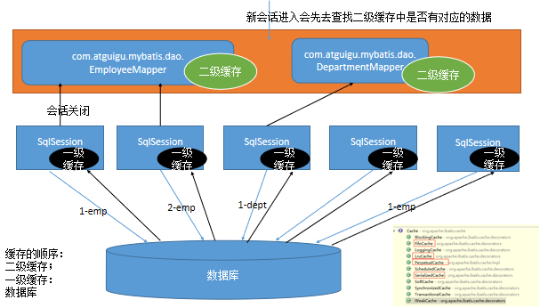
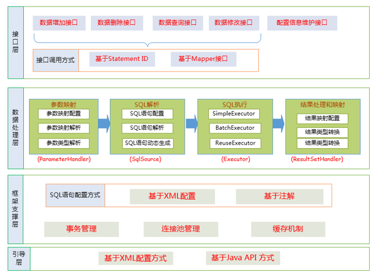
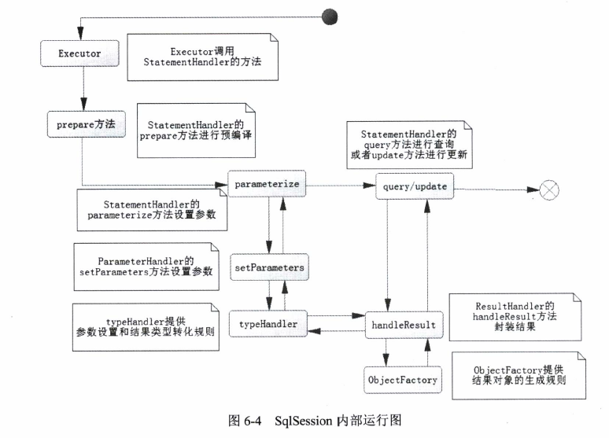
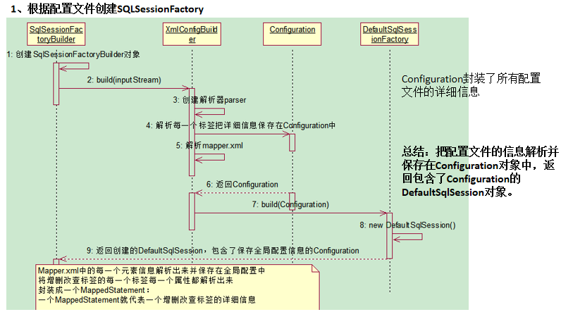
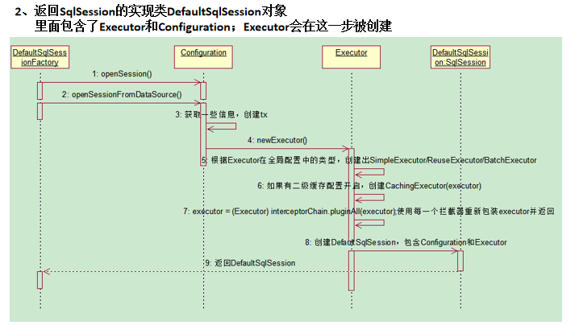
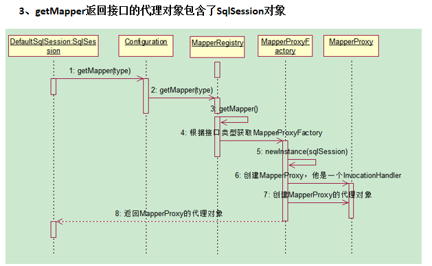
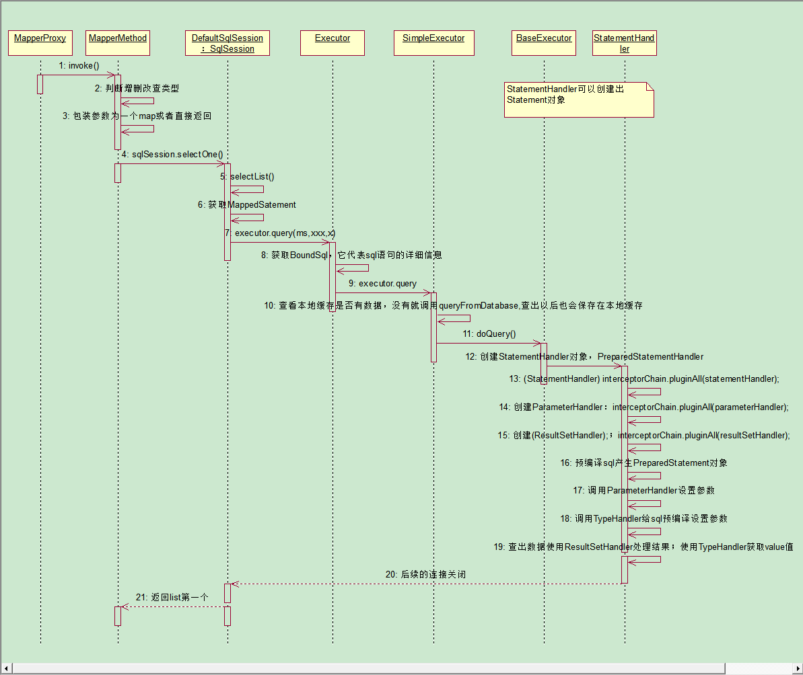

- [mybatis 中文文档](http://www.mybatis.org/mybatis-3/zh/index.html) 
- [PageHelper github 仓库](https://github.com/pagehelper/Mybatis-PageHelper) 

# 一、入门

## 1. 基本构成

MyBatis 核心组件： 

- `SqlSessionFactoryBuilder`（构造器）：可以根据配置信息或代码来生成SqlSessionFactory(工厂接口)

- `SqlSessionFactory`：依靠工厂来生成 SqlSession

- `SqlSession`：是一个既可以发送 SQL 去执行并返回结果，也可以获取 Mapper 的接口

- `SQL Mapper`：由一个 java 接口和 XML 文件(或注解)构成，需要给出对应的 SQL 和映射规则

  > 作用： 负责发送 SQL 去执行，并返回结果

### 1. 构建 SqlSessionFactory

- **重要性**： 每个 MyBatis 的应用都是以 SqlSessionFactory 的实例为中心
- **作用**： 创建 SqlSession，SqlSession 类似 JDBC 的 Connection 对象
- **注意**： SqlSessionFactory 是一个工厂接口而不是实现类，可以通过 SqlSessionFactoryBuilder 获得

MyBatis 提供了两种模式去创建 SqlSessionFactory：

> 尽量使用配置文件，既可以避免硬编码，也方便日后配置人员修改

- **XML 配置的方式**： 

  > ```xml
  > <?xml version="1.0" encoding="UTF-8" ?>  
  > <!DOCTYPE configuration
  > 	PUBLIC "-//mybatis.org//DTD Config 3.0//EN"  
  > 	"http://mybatis.org/dtd/mybatis-3-config.dtd">  
  > <configuration>
  >     <!-- 定义别名 -->
  >     <typeAliases>
  >         <typeAlias alias="role" type="com.learn.chapter2.po.Role"/>
  >     </typeAliases>
  >     <!-- 定义数据库信息，默认使用development数据库构建环境 -->
  >     <environments default="development">  
  >         <environment id="development">  
  >             <!-- 采用 jdbc 事务管理 -->
  >             <transactionManager type="JDBC">
  >                 <property name="autoCommit" value="false"/>
  >             </transactionManager>
  >             <!-- 配置数据库链接信息 -->
  >             <dataSource type="POOLED">  
  >                 <property name="driver" value="com.mysql.jdbc.Driver" />  
  >                 <property name="url" 
  >                           value="jdbc:mysql://localhost:3306/mybatis" />
  >                 <property name="username" value="root" />  
  >                 <property name="password" value="root" />
  >             </dataSource>  
  >         </environment>  
  >     </environments>  
  >     <!--定义映射器 -->
  >      <mappers>
  >          <mapper resource="com/learn/chapter2/mapper/roleMapper.xml"/>
  >      </mappers>
  > </configuration>
  > ```
  >
  > 代码实现创建 SqlSessionFactory：
  >
  > ```java
  > String resource="mybatis-config.xml";
  > InputStream inputStream=null;
  > inputStream = Resources.getResourceAsStream(resource);
  > sqlSessionFactory = new SqlSessionFactoryBuilder().build(inputStream);
  > ```

- **代码方式**： 

  > ```java
  > //构建数据库连接池
  > PooledDataSource dataSource = new PooledDataSource();
  > dataSource.setDriver("com.mysql.jdbc.Driver");
  > dataSource.setUrl("jdbc:mysql://localhost:3306/mybatis");
  > dataSource.setUsername("root");
  > dataSource.setPassword("root");
  > 
  > //构建数据库事务方式
  > TransactionFactory transactionFactory = new JdbcTransactionFactory();
  > //创建数据库运行环境
  > Environment environment = 
  >     new Environment("development",transactionFactory,dataSource);
  > //构建 Configuration 对象
  > Configuration configuration = new Configuration(environment);
  > //注册一个 MyBatis上下文别名
  > configuration.getTypeAliasRegistry().registerAlias("role",Role.class);
  > //加入一个映射器
  > configuration.addMapper(RoleMapper.class);
  > //使用 SqlSessionFactoryBuilder 构建 SqlSessionFactory
  > SqlSessionFactory sqlSessionFactory = 
  >     new SqlSessionFactoryBuilder().build(configuration);
  > 
  > return sqlSessionFactory;
  > ```

### 2. 构建 SqlSession

SqlSession 用途： 

- 获取映射器，让映射器通过命名空间和方法名称找到对应的 SQL，发送给数据库执行后返回结果
- 直接通过命名信息去执行 SQL 返回结果

```java
//定义 SqlSession
SqlSession sqlSession = null;
try{
    //打开 SqlSession 会话
    sqlSession = sqlSessionFactory.openSession();
    //some code...
    sqlSession.commit();
}catch(Exception e){
    System.err.println(e.getMessage());
    sqlSession.rollback();
}finally{
    if(sqlSession != null){
        sqlSession.close();
    }
}
```

### 3. 映射器

实现方式： 

- **XML 文件配置方式**： 

  > 实现步骤： 
  >
  > 1. **给出 Java 接口**
  >
  >    ```java
  >    //文件位置： com.learn.chapter2.mapper.RoleMapper
  >    public interface RoleMapper {
  >        public Role getRole(Long id);
  >    }
  >    ```
  >
  > 2. **给出映射文件**
  >
  >    ```xml
  >    <?xml version="1.0" encoding="UTF-8" ?>
  >    <!DOCTYPE mapper
  >            PUBLIC "-//mybatis.org//DTD Mapper 3.0//EN"
  >            "http://mybatis.org/dtd/mybatis-3-mapper.dtd">
  >    
  >    <mapper namespace="com.learn.chapter2.mapper.RoleMapper">
  >        <select id="getRole"  resultType="role" parameterType="long">
  >            select id,role_name as roleName,note from t_role where id=#{id}
  >        </select>
  >    </mapper>
  >    ```
  >
  > 3. **使用 SqlSession 来获取这个 Mapper**
  >
  >    ```java
  >    RoleMapper roleMapper = sqlSession.getMapper(RoleMapper.class);
  >    Role role=roleMapper.getRole(1L);
  >    ```

- **Java 注解方式**： 

  > ```java
  > public interface RoleMapper2 {
  >     @Select(value="select id,role_name as roleName,note from t_role where id = #{id}")
  >     public Role getRole(Long id);
  > }
  > ```
  >
  > 注册该接口为映射器：
  >
  > ```java
  > configuration.addMapper(RoleMapper2.class);
  > ```

## 2. 生命周期

- `SqlSessionFactoryBuilder`：只存在于方法的局部，用于生成 SessionFactory 对象

  > SessionFactory 对象一旦生成，就可以 GC

- `SqlSessionFactory`：存在于 MyBatis 应用的整个生命周期中，用于创建 SqlSession

  > 采用**单例模式**可以防止创建多个 SqlSessionFactory，耗尽资源

- `SqlSession`：一个会话，相当于 JDBC 的 Connection 对象，生命周期在请求数据库处理事务的过程中

  > 是一个**线程不安全对象**，每次创建后都必须及时关闭

- `Mapper`：一个接口，没有任何实现类，作用是执行 SQL 语句

  > - 在一个 SqlSession 事务方法之内，是一个方法级别的东西
  > - 在一个 SqlSession 事务的方法中使用，然后 GC


# 二、配置

全局配置文件： `mybatis-config.xml`

```xml
<?xml version="1.0" encoding="UTF-8" ?>
<!DOCTYPE configuration
  	PUBLIC "-//mybatis.org//DTD Config 3.0//EN"
  	"http://mybatis.org/dtd/mybatis-3-config.dtd">
<!-- 配置 -->
<configuration>
    <properties/>    <!-- 属性 -->
    <settings/>      <!-- 设置 -->
    <typeAliases/>   <!-- 类型命名 -->
    <typeHandlers/>  <!-- 类型处理器 -->
    <objectFactory/> <!-- 对象工厂 -->
    <plugins/>       <!-- 插件 -->
    <!-- 配置环境 -->
  	<environments default="development">
    	<environment id="development">    <!-- 环境变量 -->
      	<transactionManager type="JDBC"/> <!-- 事务管理器 -->
      	<dataSource type="POOLED">  <!-- 数据源 -->
        	<property name="driver" value="${driver}"/>
        	<property name="url" value="${url}"/>
        	<property name="username" value="${username}"/>
        	<property name="password" value="${password}"/>
      	</dataSource>
    	</environment>
  	</environments>
    
    <databaseIdProvider/> <!-- 数据库厂商标识 -->
    <!-- 映射器 -->
  	<mappers>
    	<mapper resource="xxxMapper.xml"/>
  	</mappers>
</configuration>
```

## 1. properties

properties 是一个配置属性的元素，有三种配置方式： 

- **property 子元素**： 静态配置

  ```xml
  <properties>
  	<property name="driver" value="com.mysql.cj.jdbc.Driver"></property>
      <property name="url" value="jdbc:mysql://localhost:3306/xxx"></property>
      <property name="username" value="root"></property>
      <property name="password" value="root"></property>
  </properties>
  
  <!-- 数据源处使用 -->
  <dataSource type="POOLED">  
      <property name="driver" value="${driver}"/>
      <property name="url" value="${url}"/>
      <property name="username" value="${username}"/>
      <property name="password" value="${password}"/>
  </dataSource>
  ```

- **properties 配置文件**： 动态配置

  > `jdbc.properties` 配置文件： 
  >
  > ```properties
  > driver=om.mysql.cj.jdbc.Driver
  > url=jdbc:mysql://localhost:3306/xxx
  > username=root
  > password=root
  > ```
  >
  > 在 `mybatis-config.xml` 中进行引入： 
  >
  > ```xml
  > <properties resource="jdbc.properties"/>
  > ```

- **程序参数传递**： 运维人员会对配置文件中的**用户名和密码进行加密**，需要系统进行解密

  > ```java
  > InputStream cfgStream = null;
  > Reader cfgReader = null;
  > InputStream proStream = null;
  > Reader proReader = null;
  > Properties properties = null;
  > 
  > try{
  >     //读入配置文件流
  >     cfgStream = Resources.getResourceAsStream("mybatis-config.xml");
  >     cfgReader = new InputStreamReader(cfgStream);
  >     //读入属性文件
  >     proStream = Resources.getResourceAsStream("jdbc.properties");
  >     proReader = new InputStreamReader(proStream);
  >     
  >     properties = new Properties();
  >     properties.load(proReader);
  >     
  >     //解密为明文
  >     properties
  >         .setProperty("username",decode(properties.getProperty("username")));
  >     properties
  >         .setProperty("password",decode(properties.getProperty("password")));
  > }catch(Exception e){
  >     
  > }
  > synchronized(CLASS_LOCK){
  >     if(sqlSessionFactory == null){
  >         //使用属性来创建 sqlSessionFactory
  >         sqlSessionFactory = new SqlSessionFactoryBuilder()
  >             						.build(cfgReader,properties);
  >     }
  > }
  > ```

**三种配置下的 MyBatis 优先级加载顺序**：

- 先读取 properties 元素体内指定的属性（静态配置）
- 然后根据 properties 元素中的 resource 属性读取类路径下属性文件或根据 url 属性指定的路径读取属性文件，并覆盖已读取的同名属性（动态配置）
- 最后读取作为方法参数传递的属性，并覆盖已读取的同名属性

## 2. settings

- 详细内容参考： ==[settings 配置](http://www.mybatis.org/mybatis-3/zh/configuration.html#settings)==  

一个完整的配置

```xml
<settings>
  	<setting name="cacheEnabled" value="true"/>
  	<setting name="lazyLoadingEnabled" value="true"/>
  	<setting name="multipleResultSetsEnabled" value="true"/>
    <setting name="useColumnLabel" value="true"/>
    <setting name="useGeneratedKeys" value="false"/>
    <setting name="autoMappingBehavior" value="PARTIAL"/>
    <setting name="autoMappingUnknownColumnBehavior" value="WARNING"/>
    <setting name="defaultExecutorType" value="SIMPLE"/>
    <setting name="defaultStatementTimeout" value="25"/>
    <setting name="defaultFetchSize" value="100"/>
    <setting name="safeRowBoundsEnabled" value="false"/>
    <setting name="mapUnderscoreToCamelCase" value="false"/>
    <setting name="localCacheScope" value="SESSION"/>
    <setting name="jdbcTypeForNull" value="OTHER"/>
    <setting name="lazyLoadTriggerMethods" value="equals,clone,hashCode,toString"/>
</settings>
```

## 3. typeAliases

- 详细内容参考： ==[settings 配置](http://www.mybatis.org/mybatis-3/zh/configuration.html#typeAliases)==  

别名定义方式：

- **手动定义**别名： 

  ```xml
  <typeAliases>
      <typeAlias alias="Author" type="domain.blog.Author"/>
      <typeAlias alias="Blog" type="domain.blog.Blog"/>
  </typeAliases>
  ```

- 通过**自动扫描包定义**： ，MyBatis 会在包名下面搜索需要的 Java Bean

  ```xml
  <typeAliases>
      <package name="domain.blog"/>
  </typeAliases>
  ```

- 通过**注解定义**：

  ```java
  @Alias("author")
  public class Author {
      ...
  }
  ```

## 4. typeHandlers

> MyBatis 在预处理语句（PreparedStatement）中设置一个参数或从结果集（ResultSet）中取出一个值时， 都会用类型处理器（typeHandlers）将值进行类型转换

详细内容参考： ==[settings 配置](http://www.mybatis.org/mybatis-3/zh/configuration.html#typeHandlers)==  

重写类型处理器或创建自己的类型处理器来处理不支持的或非标准的类型： 

> 实现方式： 实现 `org.apache.ibatis.type.TypeHandler` 接口， 或继承 `org.apache.ibatis.type.BaseTypeHandler` 类， 然后选择性地将它映射到一个 JDBC 类型
>
> ```java
> //该注解可以不标注，在使用时申明，java 可以通过泛型来进行判断
> @MappedTypes({String.class})
> @MappedJdbcTypes(JdbcType.VARCHAR)
> public class ExampleTypeHandler extends BaseTypeHandler<String> {
> 
>     @Override
>     public void setNonNullParameter(PreparedStatement ps, int i, 
>                        				String parameter, JdbcType jdbcType) 
>         	throws SQLException {
>     	ps.setString(i, parameter);
>     }
> 
>     @Override
>     public String getNullableResult(ResultSet rs, String columnName) 
>         	throws SQLException {
>     	return rs.getString(columnName);
>     }
> 
>     @Override
>     public String getNullableResult(ResultSet rs, int columnIndex) 
>         	throws SQLException {
>     	return rs.getString(columnIndex);
>     }
> 
>     @Override
>     public String getNullableResult(CallableStatement cs, int columnIndex) 
>         	throws SQLException {
>     	return cs.getString(columnIndex);
>     }
> }
> ```
>
> 进行注册： 
>
> ```xml
> <!-- mybatis-config.xml -->
> <typeHandlers>
>        <typeHandler handler="org.mybatis.example.ExampleTypeHandler"/>
> </typeHandlers>
> ```
>
> 进行使用： 
>
> ```xml
> <?xml version="1.0" encoding="UTF-8" ?>
> <!DOCTYPE mapper PUBLIC "-//mybatis.org//DTD Mapper 3.0//EN" "http://mybatis.org/dtd/mybatis-3-mapper.dtd" >
> <mapper namespace="org.mybatis.example.ExampleMapper">
>     <resultMap id="BaseResultMap" type="org.mybatis.example.Example">
>         <!-- 方式一 -->
>         <id column="id" property="id" jdbcType="INTEGER"/>
>         <!-- 方式二 -->
>         <result column="ex_name" property="exName" jdbcType="VARCHAR" 
>                 javaType="string"/>
>         <!-- 方式三 -->
>         <result column="note" property="note" 
>                 typeHandler="org.mybatis.example.ExampleTypeHandler"/>
>     </resultMap>
> </mapper>
> ```

## 5. objectFactory

- MyBatis 每次**创建结果对象的新实例**时，都会使用一个对象工厂（ObjectFactory）实例来完成

- **默认对象工厂**通过默认构造方法或在参数映射存在时通过参数构造方法来实例化目标类

  > 默认对象工厂为： `org.apache.ibatis.reflection.factory.DefaultObjectFactory` 

- **自定义对象工厂**，覆盖默认对象工厂： 

  > 定义新的 objectFactory： 
  >
  > ```xml
  > <!-- mybatis-config.xml -->
  > <objectFactory type="org.mybatis.example.ExampleObjectFactory">
  >     <property name="name" value="ExampleObjectFactory"/>
  > </objectFactory>
  > ```
  >
  > ExampleObjectFactory 类： 实现 ObjectFactory 接口或继承 DefaultObjectFactory 类
  >
  > ```java
  > public class ExampleObjectFactory extends DefaultObjectFactory {
  >     public Object create(Class type) {
  >         return super.create(type);
  >     }
  >     public Object create(Class type, List<Class> constructorArgTypes, 
  >                          List<Object> constructorArgs) {
  >     	return super.create(type, constructorArgTypes, constructorArgs);
  >     }
  >     public void setProperties(Properties properties) {
  >     	super.setProperties(properties);
  >     }
  >     public <T> boolean isCollection(Class<T> type) {
  >     	return Collection.class.isAssignableFrom(type);
  >     }
  > }
  > ```

## 6. plugins


## 7. environments

```xml
<!-- default 指定使用的 environment ID -->
<environments default="development"> 
    <!-- id 设置数据源标志 -->
    <environment id="development">
        <!-- 配置数据库事务,type 的3种配置方式：
			JDBC: 采用 JDBC 方式管理事务，常用于独立编码中
			MANAGED: 采用容器方式管理事务，常用于 JNDI 数据源
 			自定义： 使用者自定义数据库事务管理方式，适用于特殊应用
		-->
        <transactionManager type="JDBC">
            <!-- property 元素可以配置数据源的各类属性 -->
            <property name="autoCommit" value="false"/> <!-- 配置数据源不自动提交 -->
        	<property name="..." value="..."/>
        </transactionManager>
        <!-- 配置数据源连接信息，type 配置数据库连接方式：
 			UNPOOLED: 非连接池数据库
			POOLED: 连接池数据库
			JNDI: JNDI 数据源
			自定义数据源
		-->
        <dataSource type="POOLED">
            <!-- property 定义数据库的各类参数 -->
          	<property name="driver" value="${driver}"/>
          	<property name="url" value="${url}"/>
          	<property name="username" value="${username}"/>
          	<property name="password" value="${password}"/>
        </dataSource>
    </environment>
</environments>
```

数据源配置： 

- `UNPOOLED`： 每次被请求时打开和关闭连接，用于简单应用

  > 使用 `org.apache.ibatis.datasource.unpooled.UnpooledDataSource` 实现
  >
  > 需要配置的 5 种属性： 
  >
  > - `driver`： JDBC 驱动的 Java 类的完全限定名（并不是 JDBC 驱动中可能包含的数据源类）
  > - `url`： 数据库的 JDBC URL 地址
  > - `username`： 登录数据库的用户名
  > - `password`： 登录数据库的密码
  > - `defaultTransactionIsolationLevel`： 默认的连接事务隔离级别
  >
  > > 可选项： `driver.encoding=UTF8`

- `POOLED`： 启用数据库连接池

  > 使用 `org.apache.ibatis.datasource.pooled.PooledDataSource` 实现
  >
  > 包括上述 5 种属性，另外： 
  >
  > - `poolMaximumActiveConnections`： 存活的最大连接数量，默认值：10
  >
  > - `poolMaximumIdleConnections`： 存在的最大空闲连接数
  >
  > - `poolMaximumCheckoutTime`： 返回前，连接被检出时间，默认值：20000 毫秒（即 20 秒）
  >
  > - `poolTimeToWait`： 获取连接花费的时间，超过该时间，会打印状态日志并重新尝试获取连接
  >
  >   > 作用： 避免在误配置的情况下一直安静的失败
  >   >
  >   > 默认值：20000 毫秒（即 20 秒）
  >
  > - `poolMaximumLocalBadConnectionTolerance`： 数据源允许线程尝试重新获取连接的次数
  >
  >   > 尝试次数不超过 `poolMaximumIdleConnections` 与 `poolMaximumLocalBadConnectionTolerance` 之和
  >   >
  >   > 默认值：3 （新增于 3.4.5）
  >
  > - `poolPingQuery`： 发送到数据库的侦测查询，用来检验连接是否正常工作并准备接受请求
  >
  >   > 默认 `NO PING QUERY SET`，这会导致多数数据库驱动失败时带有一个恰当的错误消息
  >
  > - `poolPingEnabled`： 是否启用侦测查询
  >
  >   > 若开启，需要设置 `poolPingQuery` 属性为一个可执行的 SQL 语句，默认值：false
  >
  > - `poolPingConnectionsNotUsedFor`： 配置 poolPingQuery 的频率
  >
  >   > - 可以设置为与数据库连接超时时间一样，来避免不必要的侦测
  >   >
  >   > - 默认值：0（即所有连接每一时刻都被侦测 — 当然仅当 poolPingEnabled 为 true 时适用）

- `JNDI`： 为了能在如 EJB 或应用服务器这类容器中使用

  > 使用 `org.apache.ibatis.datasource.jndi.JndiDataSourceFactory` 来获取数据源
  >
  > - `initial_context`： 用来在 `InitialContext` 中寻找上下文，可选属性
  >
  >   > 如果忽略，将会直接从 `InitialContext` 中寻找 `data_source` 属性
  >
  > - `data_source`： 引用数据源实例位置的上下文的路径
  >
  >   > - 提供 `initial_context` 配置时，则在其返回的上下文中进行查找
  >   >
  >   > - 没有提供时，则直接在 `InitialContext` 中查找
  >
  > 和其他数据源配置类似，可以通过添加前缀“env.”直接把属性传递给初始上下文。比如：
  >
  > - `env.encoding=UTF8`

## 8. databaseIdProvider

MyBatis 可以根据 `databaseId` 来根据不同的数据库厂商执行不同的语句： 

- MyBatis 会加载不带 `databaseId` 属性和带有匹配当前数据库 `databaseId` 属性的所有语句
- 如果同时找到带有 `databaseId` 和不带 `databaseId` 的相同语句，则后者会被舍弃

在 `mybatis-config.xml` 文件中加入 `databaseIdProvider` 即可： 

```xml
<databaseIdProvider type="DB_VENDOR">
    <property name="SQL Server" value="sqlserver"/>
    <property name="DB2" value="db2"/>
    <property name="Oracle" value="oracle" />
    <property name="MySQL" value="mysql" />
</databaseIdProvider>
```

执行流程： 

> `type="DB_VENDOR"` 是启动 MyBatis 内部注册的策略器

- 首先 MyBatis 会将配置读入 `Configuration` 类中

- 再连接数据库，调用 `getDatabaseProductName()` 方法获取数据库信息

- 然后用配置的 `name` 值去做匹配来得到 `DatabaseId`

- 最后用下面代码来获得数据库 ID：

  > ```java
  > sqlSessionFactory.getConfiguration().getDatabaseId();
  > ```
  >
  > 定义数据库标签： 
  >
  > ```xml
  > <!-- databaseId 对应 databaseIdProvider 中的 mysql -->
  > <select id="getExample" resultType="String" parameterType="string" 
  >         databaseId="mysql">
  > 	...
  > </select>
  > ```

拥有 `databaseId` 属性时的规则：

- 如果没有配置 `databaseIdProvider` 标签，则 `databaseId` 会返回 null
- 如果配置了 `databaseIdProvider` 标签，则会用配置的 `name` 值去匹配数据库信息
  - 如果匹配得上，则设置 `databaseId`
  - 否则，返回 null

- 如果 `Configuration` 的 `databaseId` 不为空，则只会找到配置 `databaseId` 的 SQL 语句

- MyBatis 会加载不带 `databaseId` 属性和带有匹配当前数据库 `databaseId` 属性的所有语句

  > 如果同时找到带有 `databaseId` 和不带 `databaseId` 的相同语句，则后者会被舍弃

## 9. mappers

```xml
<mappers>
    <!-- 使用相对于类路径的资源引用 -->
  	<mapper resource="org/mybatis/builder/AuthorMapper.xml"/>
    <!-- 使用完全限定资源定位符（URL） -->
    <mapper url="file:///var/mappers/AuthorMapper.xml"/>
    <!-- 使用映射器接口实现类的完全限定类名 -->
    <mapper class="org.mybatis.builder.AuthorMapper"/>
    <!-- 将包内的映射器接口实现全部注册为映射器 -->
    <package name="org.mybatis.builder"/>
</mappers>
```

# 三、映射器

## 1. select

|       属性       | 描述                                                         |
| :--------------: | :----------------------------------------------------------- |
|       `id`       | 命名空间的唯一标识符，可以被用来引用这条语句                 |
| `parameterType`  | 传入该语句的参数类的完全限定名或别名（可选）<br>MyBatis 通过 TypeHandler 推断出具体传入语句的参数，默认为 unset |
| ~~parameterMap~~ | ~~已被废弃，请使用内联参数映射和 parameterType 属性~~        |
|   `resultType`   | 返回期望类型的完全限定名或别名                               |
|   `resultMap`    | 外部 resultMap 的命名引用，返回期望集合                      |
|   `flushCache`   | 该语句调用会导致本地缓存和二级缓存被清空，默认值：false      |
|    `useCache`    | 会导致本条语句的结果被二级缓存，默认值：对 select 元素为 true |
|    `timeout`     | 抛出异常前，驱动程序等待数据库返回请求结果的秒数。默认为  unset |
|   `fetchSize`    | 尝试让驱动程序每次批量返回的结果行数和该设置值相等。 默认为 unset |
| `statementType`  | `STATEMENT，PREPARED 或 CALLABLE` 中的一个，会让 MyBatis 分别使用 Statement，PreparedStatement 或 CallableStatement，默认值：PREPARED |
| `resultSetType`  | `FORWARD_ONLY，SCROLL_SENSITIVE, SCROLL_INSENSITIVE 或 DEFAULT(等价 unset)` 中的一个，默认为 unset |
|   `databaseId`   | 加载所有不带 databaseId 或匹配当前 databaseId 的语句<br/>如果带或者不带的语句都有，则不带的会被忽略 |
| `resultOrdered`  | 仅针对嵌套 select 语句适用：如果为 true，就是假设包含了嵌套结果集或是分组，这样的话当返回一个主结果行的时候，就不会发生有对前面结果集的引用的情况。 这就使得在获取嵌套的结果集的时候不至于导致内存不够用，默认值：`false` |
|   `resultSets`   | 仅对多结果集适用，将列出语句执行后返回的结果集并给每个结果集一个名称，名称用逗号分隔 |

- 自动映射： 在 `settings` 中配置 `autoMappingBehavior` 来设置： 

  > 如果数据库与 POJO 命名规范，则设置 `mapUnderscoreToCamelCase` 为 `true` 实现数据库到 POJO 自动映射 
  >
  > - 数据库规范命名： 每个单词都用下划线分隔
  > - POJO 规范命名： 采用对应的驼峰命名方式

  - `NONE`： 取消自动映射
  - `PARTIAL`： 只会自动映射，没有定义嵌套结果集映射的结果集，默认值
  - `FULL`： 会自动映射任意复杂的结果集

- **使用 resultMap 映射结果集**： 

  > ```xml
  > <resultMap id="roleMap" type="com.xxx.Role">
  >     <id column="id" property="id" jdbcType="INTEGER"/>
  >     <result column="role_name" property="roleName" jdbcType="VARCHAR"/>
  >     <result column="note" property="note" jdbcType="VARCHAR"/>
  > </resultMap>
  > ```

- **传递多个参数**： 

  > `#{}` 规定的参数规则： 
  >
  > `javaType、jdbcType、mode（存储过程）、numericScale、resultMap、typeHandler、jdbcTypeName、expression（未来准备支持的功能）`
  >
  > - `jdbcType`： 取值为 `CURSOR` 时，会自动设为 `ResultMap`
  > - `mode`：取值为 `IN,OUT,INOUT` 
  > - `numericScale`： 指定小数点后保留的位数
  > - `typeHandler`： 指定处理器类

  - **使用 Map 传递参数**： 会导致业务可读性丧失，后期扩展维护困难，不建议采用

    > 接口方法： 
    >
    > ```java
    > public List<Role> findByMap(Map<String,String> params);
    > ```
    >
    > xml 对应： 
    >
    > ```xml
    > <select id="findByMap" parameterType="map" resultMap="roleMap">
    > 	select * from role where role_name=#{roleName} and note=#{note}
    > </select>
    > ```
    >
    > 调用： 
    >
    > ```java
    > Map<String,String> paramMap = new HashMap<>();
    > paramMap.put("roleName","xxx");
    > paramMap.put("note","xxx");
    > roleMapper.findByMap(paramMap);
    > ```
    >
    > 注意： Map 中的 roleName 与 note 必须与 xml 中的完全对应

  - **使用注解传递参数**： 建议参数个数 `<= 5` 时使用

    > 接口方法： 
    >
    > ```java
    > public List<Role> findByAnnotation(@Param("roleName") String rolename, 
    >                                    @Param("note") String note);
    > ```
    >
    > xml 对应： 
    >
    > ```xml
    > <select id="findByMap" resultMap="roleMap">
    > 	select * from role where role_name=#{roleName} and note=#{note}
    > </select>
    > ```
    >
    > 注意： @Param 中的名称必须与 xml 中的完全对应

  - **使用 JavaBean 传递参数**： 建议参数个数 `> 5` 时使用

    > 接口方法： 
    >
    > ```java
    > public List<Role> findByParams(RoleParam params);
    > ```
    >
    > xml 对应： 
    >
    > ```xml
    > <select id="findByMap" resultMap="roleMap" 
    >         parameterType="com.xxx.RoleParam">
    > 	select * from role where role_name=#{roleName} and note=#{note}
    > </select>
    > ```
    >
    > JavaBean： 
    >
    > ```java
    > public class RoleParam{
    >     private String roleName;
    >     private String note;
    >     
    >     //setter,getter ...
    > }
    > ```

## 2. insert,update,delete

|        属性        | 描述                                                         |
| :----------------: | :----------------------------------------------------------- |
|        `id`        | 命名空间的唯一标识符，可以被用来引用这条语句                 |
|  `parameterType`   | 传入该语句的参数类的完全限定名或别名（可选） MyBatis 通过 TypeHandler 推断出具体传入语句的参数，默认为 unset |
|  ~~parameterMap~~  | ~~已被废弃，请使用内联参数映射和 parameterType 属性~~        |
|    `flushCache`    | 该语句调用会导致本地缓存和二级缓存被清空，默认值：false      |
|     `useCache`     | 会导致本条语句的结果被二级缓存，默认值：对 select 元素为 true |
|     `timeout`      | 抛出异常前，驱动程序等待数据库返回请求结果的秒数。默认为  unset |
|  `statementType`   | `STATEMENT，PREPARED 或 CALLABLE` 中的一个，会让 MyBatis 分别使用 Statement，PreparedStatement 或 CallableStatement，默认值：PREPARED |
| `useGeneratedKeys` | 使用 JDBC 的 getGeneratedKeys 方法来取出由数据库内部生成的主键，默认: false (仅对 insert 与 update) |
|   `keyProperty`    | 通过 getGeneratedKeys 的返回值或 insert 语句的 selectKey 子元素设置它的键值<br/>(仅对 insert 与 update) |
|    `keyColumn`     | 通过生成的键值设置表中的列名，当主键列不是表中的第一列的时候需要设置<br>如果希望使用多个生成的列，也可以设置为逗号分隔的属性名称列表<br/>(仅对 insert 与 update) |
|    `databaseId`    | 加载所有不带 databaseId 或匹配当前 databaseId 的语句 如果带或者不带的语句都有，则不带的会被忽略 |

INSERT 主键回填： 

- 返回**自动生成的主键**：

  ```xml
  <insert id="insertAuthor" useGeneratedKeys="true" keyProperty="id">
    insert into Author (username, password, email, bio) values
    <foreach item="item" collection="list" separator=",">
      (#{item.username}, #{item.password}, #{item.email}, #{item.bio})
    </foreach>
  </insert>
  ```

- 返回**不自动生成的主键**： 

  ```xml
  <insert id="insertAuthor">
    <selectKey keyProperty="id" resultType="int" order="BEFORE">
      select CAST(RANDOM()*1000000 as INTEGER) a from SYSIBM.SYSDUMMY1
    </selectKey>
    insert into Author (id, username, password, email,bio, favourite_section)
    	values (#{id}, #{username}, #{password}, #{email}, #{bio}, 
      		#{favouriteSection,jdbcType=VARCHAR})
  </insert>
  ```

## 3. sql,selectKey

- `sql`： 可以用来定义可重用的 SQL 代码段，通过 `<include>` 来引用

  > ```xml
  > <sql id="userColumns"> ${alias}.id,${alias}.username,${alias}.password </sql>
  > 
  > <!-- 引用 -->
  > <select id="selectUsers" resultType="map">
  >   select
  >     <include refid="userColumns">
  >         <property name="alias" value="t1"/>
  >     </include>,
  >     <include refid="userColumns">
  >         <property name="alias" value="t2"/>
  >     </include>
  >   from some_table t1
  >     cross join some_table t2
  > </select>
  > ```

- `selectKey`： 

  > |      属性       | 描述                                                         |
  > | :-------------: | :----------------------------------------------------------- |
  > |  `keyProperty`  | selectKey 语句结果应该被设置的目标属性<br>如果希望得到多个生成的列，可以是逗号分隔的属性名称列表 |
  > |   `keyColumn`   | 匹配属性的返回结果集中的列名称<br>如果希望得到多个生成的列，也可以是逗号分隔的属性名称列表 |
  > |  `resultType`   | 结果的类型                                                   |
  > |     `order`     | 可设为 `BEFORE 或 AFTER`<br/>`BEFORE`： 会先生成主键，设置 keyProperty，然后执行插入语句<br/>`AFTER`：先执行插入语句，然后是 selectKey 中的语句 |
  > | `statementType` | 支持 `STATEMENT，PREPARED 和 CALLABLE` 语句的映射类型，分别代表 Statement，PreparedStatement 和 CallableStatement 类型 |

## 4. resultMap

```xml
<!-- 高级结果映射 -->
<select id="selectBlogDetails" resultMap="detailedBlogResultMap">
  select
       B.id as blog_id,
       B.title as blog_title,
       B.author_id as blog_author_id,
       A.id as author_id,
       A.username as author_username,
       A.password as author_password,
       A.email as author_email,
       A.bio as author_bio,
       A.favourite_section as author_favourite_section,
       P.id as post_id,
       P.blog_id as post_blog_id,
       P.author_id as post_author_id,
       P.created_on as post_created_on,
       P.section as post_section,
       P.subject as post_subject,
       P.draft as draft,
       P.body as post_body,
       C.id as comment_id,
       C.post_id as comment_post_id,
       C.name as comment_name,
       C.comment as comment_text,
       T.id as tag_id,
       T.name as tag_name
  from Blog B
       left outer join Author A on B.author_id = A.id
       left outer join Post P on B.id = P.blog_id
       left outer join Comment C on P.id = C.post_id
       left outer join Post_Tag PT on PT.post_id = P.id
       left outer join Tag T on PT.tag_id = T.id
  where B.id = #{id}
</select>

<!-- 等价于 -->

<resultMap id="detailedBlogResultMap" type="Blog">
	<constructor>
    	<idArg column="blog_id" javaType="int"/>
  	</constructor>
  	<result property="title" column="blog_title"/>
  	<association property="author" javaType="Author">
    	<id property="id" column="author_id"/>
    	<result property="username" column="author_username"/>
    	<result property="password" column="author_password"/>
    	<result property="email" column="author_email"/>
    	<result property="bio" column="author_bio"/>
   		<result property="favouriteSection" column="author_favourite_section"/>
  	</association>
  	<collection property="posts" ofType="Post">
    	<id property="id" column="post_id"/>
    	<result property="subject" column="post_subject"/>
    	<association property="author" javaType="Author"/>
    	<collection property="comments" ofType="Comment">
      		<id property="id" column="comment_id"/>
    	</collection>
    	<collection property="tags" ofType="Tag" >
      		<id property="id" column="tag_id"/>
    	</collection>
    	<discriminator javaType="int" column="draft">
      	<case value="1" resultType="DraftPost"/>
    	</discriminator>
  	</collection>
</resultMap>
```

**字段详解**： 

- `constructor`： 用于在实例化类时，注入结果到构造方法中
  - `idArg`： ID 参数，标记出作为 ID 的结果可以帮助提高整体性能
  - `arg`： 将被注入到构造方法的一个普通结果
- `id`： 一个 ID 结果，标记出作为 ID 的结果可以帮助提高整体性能
- `result`： 注入到字段或 JavaBean 属性的普通结果
- `association`： 一个复杂类型的关联;许多结果将包装成这种类型
  - 嵌套结果映射： 关联可以指定为一个 `resultMap` 元素，或者引用一个
- `collection`： 一个复杂类型的集合
  - 嵌套结果映射： 集合可以指定为一个 `resultMap` 元素，或者引用一个
- `discriminator`： 使用结果值来决定使用哪个 resultMap
  - `case`： 基于某些值的结果映射
    - 嵌套结果映射： 一个 `case` 也是一个映射它本身的结果,因此可以包含很多相 同的元素，或者它可以参照一个外部的 `resultMap` 

实用详解： 

- `association`： 

  - 嵌套结果集： 

    ```xml
    <resultMap type="bean.Lock" id="myLock2">
    	<id column="id" property="id"/>
        <result column="lockName" property="lockName"/>
        <association property="key" javaType="bean.Key">
        	<id column="key_id" property="id"/>
            <result column="keyName" property="keyName"/>
        </association>
    </resultMap>
    ```

  - 分段查询： 

    ```xml
    <resultMap type="bean.Lock" id="myLock3">
    	<id column="id" property="id"/>
        <result column="lockName" property="lockName"/>
        <!--
    		select：调用目标的方法查询当前属性的值
    		column：将指定列的值传入目标方法
    	-->
        <association property="key" column="key_id"
                     select="dao.KeyMapper.getKeyById">
        </association>
    </resultMap>
    ```

  - 分段查询&延迟加载

    ```xml
    <!-- 开启延迟加载和属性按需加载 -->
    <settings>
    	<setting name="lazyLoadingEnabled" value="true"/>
        <setting name="aggressiveLazyLoading" value="false"/>
    </settings>
    ```

- `Collection`： 

  - 集合类型&嵌套结果集： 

    ```xml
    <resultMap type="bean.Dapartment" id="myDept">
    	<id column="d_id" property="id"/>
        <result column="d_deptName" property="deptName"/>
        <collection property="emps" ofType="bean.Employee" columnPrefix="e_">
            <id column="id" property="id"/>
        	<result column="lastName" property="lastName"/>
            <result column="eamil" property="eamil"/>
            <result column="gender" property="gender"/>
        </collection>
    </resultMap>
    
    <select id="getDeptById" resultMap="MyDept">
    	SELECT d.d_id d_id,d.dept_name d_dept_name,e.id e_id,
        e.last_name e_lastname,e.email e_email,e.gender e_gender,
        e.dept_id e_deptId
        FROM department d
        LEFT JOIN employee e ON e.`dept_id` = d.`id`
        WHERE d.`id`=#{id}
    </select>
    ```

  - 分布查询&延迟加载

    ```xml
    <resultMap type="bean.Dapartment" id="myDeptStep">
    	<id column="d_id" property="id"/>
        <result column="dept_name" property="deptName"/>
        <collection property="emps" column="id"
                    select="dao.EmployeeMapper.getEmpsByDeptId">
        </collection>
    </resultMap>
    ```

`resultMap` 的字段属性： 

|     属性      | 描述                                                         |
| :-----------: | ------------------------------------------------------------ |
|     `id`      | 当前命名空间中的一个唯一标识，用于标识一个结果映射           |
|    `type`     | 类的完全限定名或类型别名                                     |
| `autoMapping` | 用于为结果开启或关闭自动映射，会覆盖全局的属性 autoMappingBehavior，默认 unset |

`id & result` 的字段属性：

|     属性      | 描述                                   |
| :-----------: | :------------------------------------- |
|  `property`   | 映射到列结果的字段或属性               |
|   `column`    | 数据库中的列名，或列的别名             |
|  `javaType`   | Java 类的完全限定名或类型别名          |
|  `jdbcType`   | JDBC 类型                              |
| `typeHandler` | 类型处理器实现类的完全限定名或类型别名 |

## 5. cache

`<cache/>`： 只作用于 cache 标签所在的映射文件中的语句

> 如果想混合使用 Java API 和 XML 映射文件，需要使用 `@CacheNamespaceRef` 注解指定缓存作用域

- 映射语句文件中的所有 select 语句的结果将会被缓存

- 映射语句文件中的所有 insert、update 和 delete 语句会刷新缓存

- 缓存会使用最近最少使用算法（LRU, Least Recently Used）算法来清除不需要的缓存

- 缓存不会定时进行刷新（即：没有刷新间隔）

- 缓存会保存列表或对象的 1024 个引用

- 缓存会被视为读/写缓存

  >  **视为读/写缓存**： 获取到的对象不共享，可以安全地被调用者修改，而不干扰其他调用者或线程的修改

`cache` 字段属性： 

- `eviction`： 清除策略，默认 LRU

  > 可用的清除策略： 
  >
  > - `LRU` – 最近最少使用：移除最长时间不被使用的对象
  > - `FIFO` – 先进先出：按对象进入缓存的顺序来移除它们
  > - `SOFT` – 软引用：基于垃圾回收器状态和软引用规则移除对象
  > - `WEAK` – 弱引用：更积极地基于垃圾收集器状态和弱引用规则移除对象

- `flushInterval`(刷新间隔)： 可设为任意的正整数，以毫秒为单位

  > 默认不设置，即没有刷新间隔，缓存仅仅会在调用语句时刷新

- `size`(引用数目)： 可设为任意正整数，注意缓存对象的大小和运行环境中可用的内存资源。默认：1024

- `readOnly`(只读)： 可设为 true 或 false，默认： false
  - 只读缓存： 会给所有调用者返回缓存对象的相同实例，但对象不能被修改
  - 可读写的缓存： 会返回缓存对象的拷贝

缓存分类： 

- **一级缓存**： 作用域为 sqlSession，默认开启

  > 一级缓存失效： 
  >
  > - 不同的 SqlSession 
  > - SqlSession相同，但查询条件不同
  > - 同一个 SqlSession 两次查询期间执行了一次增删改操作
  > - 同一个 SqlSession 两次查询期间手动清空了缓存
  >
  > `sqlSession.clearCache()` 可用来清除一级缓存

- **二级缓存**： 作用域为 sqlSessionFactory，即基于 namespace 级别的缓存

  > 效果： 
  >
  > - 数据会从二级缓存中获取
  > - 查出的数据都会被默认先放在一级缓存中
  > - 只有会话提交或者关闭以后，一级缓存中的数据才会转移到二级缓存中
  >
  > 使用： 
  >
  > - 开启全局二级缓存配置：`<setting name="cacheEnabled" value="true"/>`
  > - 在 `mapper.xml` 中配置使用二级缓存： `<cache></cache>` 



# 四、动态 SQL

|          元素           | 作用                  | 备注                     |
| :---------------------: | --------------------- | ------------------------ |
|          `if`           | 判断语句              | 单条件分支判断           |
| `choose,when,otherwise` | 相当于 when case 语句 | d多条件分支判断          |
|    `trim,where,set`     | 辅助元素              | 用于处理 SQL 拼装        |
|        `foreach`        | 循环语句              | 在 in 语句等列举条件常用 |

## 1. if

```xml
<!-- if:判断 -->
<select id="getEmpsByConditionIf" resultType="mybatis.bean.Employee">
	select * from tbl_employee
    <!-- mybatis 会将 where 标签中的 sql，多出来的 and 或者 or 去掉 -->
	<where>
        <!-- test：判断表达式（OGNL） -->
		<if test="id!=null">
			id=#{id}
		</if>
		<if test="lastName!=null &amp;&amp; lastName!=&quot;&quot;">
		 	and last_name like #{lastName}
		</if>
		<if test="email!=null and email.trim()!=&quot;&quot;">
		 	and email=#{email}
		</if> 
		<!-- ognl会进行字符串与数字的转换判断  "0"==0 -->
		<if test="gender==0 or gender==1">
		 	and gender=#{gender}
		</if>
	</where>
</select>
```

## 2. choose,when,otherwise

```xml
<select id="getEmpsByConditionChoose" resultType="mybatis.bean.Employee">
	select * from tbl_employee 
	<where>
		<!-- 如果带了id就用id查，如果带了lastName就用lastName查;只会进入其中一个 -->
	 	<choose>
	 		<when test="id!=null">
	 			id=#{id}
	 		</when>
	 		<when test="lastName!=null">
	 			last_name like #{lastName}
	 		</when>
	 		<when test="email!=null">
	 			email = #{email}
	 		</when>
	 		<otherwise>
	 			gender = 0
	 		</otherwise>
	 	</choose>
	</where>
</select>
```

## 3. trim,where,set

- `trim`： 自定义字符串的截取规则

  > 字段属性： 
  >
  > - `prefix=""`： 给拼串后的整个字符串加一个前缀 
  > - `prefixOverrides=""`： 去掉整个字符串前面多余的字符
  > - `suffix=""`： 给拼串后的整个字符串加一个后缀 
  > - `suffixOverrides=""`： 去掉整个字符串后面多余的字符

  ```xml
  <select id="getEmpsByConditionTrim" resultType="mybatis.bean.Employee">
  	select * from tbl_employee
  
  	<!-- 等价于 <where> 标签 -->
  	<trim prefix="where" suffixOverrides="and | or">
  	 	<if test="id!=null">
  		 	id=#{id} and
  		</if>
  		<if test="lastName!=null &amp;&amp; lastName!=&quot;&quot;">
  		 	last_name like #{lastName} and
  		</if>
  		<if test="email!=null and email.trim()!=&quot;&quot;">
  		 	email=#{email} and
  		</if> 
  		<!-- ognl会进行字符串与数字的转换判断  "0"==0 -->
  		<if test="gender==0 or gender==1">
  		 	gender=#{gender}
  		</if>
  	</trim>
  </select>
  ```

- `set`： 类似 `<trim>` 的动态更新语句

  ```xml
  <update id="updateEmp">
  	<!-- Set标签的使用 -->
  	update tbl_employee 
  	<set>
  		<if test="lastName!=null">
  			last_name=#{lastName},
  		</if>
  		<if test="email!=null">
  			email=#{email},
  		</if>
  		<if test="gender!=null">
  			gender=#{gender}
  		</if>
  	</set>
  	where id=#{id} 
  </update>
  
  等价于： 
  
  <update>
  	<!-- Trim：更新拼串 -->
  	update tbl_employee 
  	<trim prefix="set" suffixOverrides=",">
  		<if test="lastName!=null">
  			last_name=#{lastName},
  		</if>
  		<if test="email!=null">
  			email=#{email},
  		</if>
  		<if test="gender!=null">
  			gender=#{gender}
  		</if>
  	</trim>
  	where id=#{id}
  </update>
  ```

## 4. foreach

字段属性： 

- `collection`： 指定要遍历的集合，list 类型的参数会特殊处理封装在 map 中，map 的 key 就叫 list

- `item`：将当前遍历出的元素赋值给指定的变量

  > `#{变量名}` 就能取出变量的值也就是当前遍历出的元素

- `separator`： 每个元素之间的分隔符

- `open`：遍历出所有结果拼接一个开始的字符

- `close`： 遍历出所有结果拼接一个结束的字符

- `index`： 

  - 遍历 list 时，index 就是索引，item 就是当前值	
  - 遍历 map 时，index 就是 map 的 key，item 就是 map 的值

```xml
<select id="getEmpsByConditionForeach" resultType="mybatis.bean.Employee">
	select * from tbl_employee
	<foreach collection="ids" item="item_id" separator="," 
             open="where id in("close=")">
	 	#{item_id}
	</foreach>
    <!-- 拼接结果：select * from tbl_employee where id in (?,?);  -->
</select>

<insert id="addEmps">
	insert into tbl_employee(last_name,email,gender,d_id)
    values
	<foreach collection="emps" item="emp" separator=",">
		(#{emp.lastName},#{emp.email},#{emp.gender},#{emp.dept.id})
	</foreach>
</insert>
<!-- 这种方式需要数据库连接属性 allowMultiQueries=true； -->
<insert id="addEmps">
	<foreach collection="emps" item="emp" separator=";">
	 	insert into tbl_employee(last_name,email,gender,d_id)
	 	values(#{emp.lastName},#{emp.email},#{emp.gender},#{emp.dept.id})
	</foreach>
</insert>
```

## 5. bind

- `bind`：可以将 OGNL 表达式的值绑定到一个变量中，方便后来引用这个变量的值

```xml
<select id="selectBlogsLike" resultType="Blog">
  <bind name="pattern" value="'%' + _parameter.getTitle() + '%'" />
  SELECT * FROM BLOG
  WHERE title LIKE #{pattern}
</select>

<select id="getEmpsTestInnerParameter" resultType="mybatis.bean.Employee">
	<!-- bind：可以将 OGNL 表达式的值绑定到一个变量中，方便后来引用这个变量的值 -->
	<bind name="lastName" value="'%'+lastName+'%'"/>
	<if test="_databaseId=='mysql'">
	  	select * from tbl_employee
		<if test="_parameter!=null">
	  		where last_name like #{lastName}
		</if>
	</if>
	<if test="_databaseId=='oracle'">
	  	select * from employees
	  	<if test="parameter!=null">
	  		where last_name like #{_parameter.lastName}
	  	</if>
	</if>
</select>
```

# 五、原理解析



**工作原理**： 


## 1. 构建 sqlSessionFactory

**采用构造模式去构造 sqlSessionFactory**： 

> 构造模式： 对于复杂对象，通过分布步骤来构建，避免通过构造方法来构建
>
> 比如： sqlSessionFactory 的构建： 先使用 `Configuration`  参数类总领全局，然后分步构建

1. 通过 `XMLConfigBuilder` 解析配置的 XML 文件，读出配置参数，并将读取的数据存入 `Configuration` 类

2. 使用 `Configuration` 对象去创建 sqlSessionFactory

   > MyBatis 提供了默认的实现类： `DefaultSqlSessionFactory`

### 1. 构建 Configuration

`Configuration` 作用： 

- **读入配置文件**

  > 包括基础配置的 XML 文件和映射器的 XML 文件

- **初始化基础配置** 

  > 比如： 插件、映射器、ObjectFactory、typeHandler

- **提供单例，为后续创建 SessionFactory 服务提供配置的参数**

- 执行一些重要的对象方法，**初始化配置信息**

`Configuration` 通过 `XMLConfigBuilder` 构建： 

- 首先，MyBatis 读出所有 XML 配置的信息
- 然后，将这些信息保存到 Configuration 类的单例中
- 最后，进行 MyBatis 配置的初始化，如： properties...

### 2. 映射器的内部组成

映射器的组成： 

- `MappedStatement`： 保存映射器的一个节点(select|insert|delete|update)

- `SqlSource`： 接口，提供 `BoundSql` 对象的地方，是 `MappedStatement` 的一个属性

  > 作用： 根据参数和其他的规则组装 SQL

- `BoundSql`： 建立 SQL 和参数的地方

  > 三个常用属性： `SQL,parameterObject,parameterMappings`


## 2. sqlSession 运行过程

> 旧版使用 SqlSession，新版使用 Mapper

SqlSession 的四大对象： 

- `Executor` 执行器： 用来调度 `StatementHandler, ParameterHandler, ResultHandler` 来执行对应 SQL

  > mybatis 的三种执行器：
  >
  > 可配置 `setting` 元素的 `defaultExecutorTyep` 属性
  >
  > - `SIMPLE`： 简易执行器，默认
  > - `REUSE`： 执行器重用预处理语句
  > - `BATCH`：执行器重用语句和批量更新，针对批量专用的执行器

- `StatementHandler` 数据库会话器： 使用数据库的 `Statement` 执行操作

  > 四大对象的核心，起承上启下作用
  >
  > 三种类型： `SimpleStatementHandler,PreparedStatementHandler,CallableStatementHandler` 

- `ParameterHandler` 参数处理器： 用于 SQL 对参数的处理

- `ResultHandler` 结果处理器： 进行最后数据集 `ResultSet` 的封装返回处理



> - SqlSession 通过 Executor 创建 StatementHandler 
>
> - StatementHandler 经过以下三步：
>
>   - prepared 预编译 SQL
>
>   - parameterize 设置参数
>
>     > parameterize 是调用 parameterHandler 方法设置，参数根据 typeHandler 处理
>
>   - query/update 执行 SQL
>
>     > query/update 通过 resultHandler 进行处理结果的封装

## 3. 总结

源码运行过程：







​          **4、查询过程：** 



# 六、插件

## 1. 插件理解

在 MyBatis 中使用插件，必须实现 `Interceptor` 接口：

> 采用了模板模式，即提供一个骨架并说明骨架中方法的作用，具体实现由开发者完成 

- `intercept(Invocation in)`： 将直接覆盖所拦截对象原有的方法，是插件的核心方法

  > `Invocation` 参数可以通过反射来调度原来对象的方法

- `plugin(Object target)`： 参数 `target` 是被拦截对象，作用是给被拦截对象生成一个代理对象并返回

- `setProperties(Properties pro)`： 允许在 plugin 元素中配置所需参数

  > 方法在插件初始化时就被调用一次，然后把插件对象存入到配置中，以便后面再取出

插件的流程： 

> 插件的实例对象在一开始时，就被初始化，使用时可以直接使用，有助于性能的提高

- 在 MyBatis 的上下文初始化时，就开始读入插件节点和配置的参数，同时使用反射技术生成对应的插件实例
- 然后调用插件方法中的 `setProperties` 方法，设置配置的参数
- 接着将插件实例保存到配置对象中，以便读取和使用

插件的构成： 采用**责任链模式**，由 `interceptorChain` 定义

> 作用： 让每个在责任链上的角色都有机会去拦截这个对象

## 2. 插件开发

- **确定需要拦截的签名**： 

  - 确定需要**拦截的对象**： `Executor,StatementHandler,ParameterHandler,ResultSetHandler` 

    > `StatementHandler` 接口方法： 
    >
    > - `Statement prepare(Connection connection)`
    > - `void parameterize(Statement statement)`
    > - `batch(Statement statement)`
    > - `update(Statement statement)`
    > - `<E> List<E> query(Statement statement,ResultHandler resultHandler)`
    > - `BoundSql getBoundSql()`
    > - `ParameterHandler getParameterHandler()`

  - 确定需要**拦截的方法和参数** 

- **实现拦截方法**： 

  ```java
  //完成插件签名：告诉MyBatis当前插件用来拦截哪个对象的哪个方法
  @Intercepts({
  			@Signature(type=StatementHandler.class,//确定要拦截的对象
                         method="parameterize",//确定要拦截的方法
                         args=java.sql.Statement.class)//拦截方法的参数
  		})
  public class MyFirstPlugin implements Interceptor{
  	
      //intercept：拦截目标对象的目标方法的执行
      //Invocation： 责任链对象
  	@Override
  	public Object intercept(Invocation invocation) throws Throwable {
  		System.out.println("MyFirstPlugin...intercept:"+invocation.getMethod());
  		//动态的改变一下sql运行的参数：以前1号员工，实际从数据库查询3号员工
  		Object target = invocation.getTarget();
  		System.out.println("当前拦截到的对象："+target);
  		//拿到：StatementHandler==>ParameterHandler===>parameterObject
  		//拿到target的元数据
  		MetaObject metaObject = SystemMetaObject.forObject(target);
  		Object value = metaObject.getValue("parameterHandler.parameterObject");
  		System.out.println("sql语句用的参数是："+value);
  		//修改完sql语句要用的参数
  		metaObject.setValue("parameterHandler.parameterObject", 11);
  		/**执行目标方法：
           * 	- 如果是非代理对象，则回调拦截对象的方法
           *	- 如果不是，则调度下一个插件代理对象的 invoke 方法
           */
  		Object proceed = invocation.proceed();
  		//返回执行后的返回值
  		return proceed;
  	}
  
  	//plugin：为目标对象创建一个代理对象
      //target： 被代理的对象
  	@Override
  	public Object plugin(Object target) {
  		//借助Plugin的wrap方法来生成当前 Interceptor 包装我们目标对象
  		System.out.println("MyFirstPlugin...plugin:mybatis将要包装的对象"+target);
  		Object wrap = Plugin.wrap(target, this);
  		//返回为当前target创建的动态代理
  		return wrap;
  	}
  
  	//setProperties：将插件注册时 的property属性设置进来
  	@Override
  	public void setProperties(Properties properties) {
  		System.out.println("插件配置的信息："+properties);
  	}
  }
  ```

- **配置和运行**： 

  ```xml
  <!--plugins：注册插件  -->
  <plugins>
      <plugin interceptor="com.mybatis.dao.MyFirstPlugin">
          <property name="username" value="root"/>
          <property name="password" value="123456"/>
      </plugin>
  </plugins>
  ```

## 3. 实例

**功能要求**：对 MySQL 数据库查询返回的数据量需要有限制 

实现： 拦截 `StatementHandler` 的 `prepare()` 方法，在预编译前重写 SQL： 

- **拦截方法**： 

  ```java
  @Intercepts({
  			@Signature(type=StatementHandler.class,//确定要拦截的对象
                         method="prepare",//确定要拦截的方法
                         args=Connection.class)//拦截方法的参数
  		})
  public class QueryLimitPlugin implements Interceptor{
      
      //默认限制查询返回行数
      private int limit;
      private String dbType;
      //限制表中间别名，避免表重名
      private static final String LMT_TABLE_NAME = "limit_Table_Name_xxx";
  	
      //intercept：拦截目标对象的目标方法的执行
      //Invocation： 责任链对象
  	@Override
  	public Object intercept(Invocation invocation) throws Throwable {
  		//取出被拦截对象
          StatementHandler stmtHandler 
              	= (StatementHandler)invocation.getTarget();
          MetaObject metaStmtHandler = SystemMetaObject.forObject(stmtHandler);
          //分离代理对象，从而形成多次代理，MyBatis 使用 JDK 代理
          while(metaStmtHandler.hasGetter("h")){
              Object object = metaStmtHandler.getValue("h");
              metaStmtHandler = SystemMetaObject.forObject(object);
          }
          //取出即将要执行的 SQL
          String sql = (String)metaStmtHandler.getValue("delegate.boundSql.sql");
          String limitSql;
          //判断参数是不是 MySQL 数据库且 SQL 有没有被插件重写过
          if("mysql".equals(this.dbType) && sql.indexOf(LMT_TABLE_NAME) == -1){
              //去掉前后空格
              sql = sql.trim();
              //将参数写入 SQL
              limitSql = "select * from ("+ sql +")" 
                  		+ LMT_TABLE_NAME + "limit " + limit;
              //重写要执行的 SQL
              metaStmtHandler.setValue("delegate.boundSql.sql",limitSql);
          }
          //调用原来对象的方法，进入责任链的下一层级
          return invocation.proceed();
  	}
  
  	//plugin：为目标对象创建一个代理对象
      //target： 被代理的对象
  	@Override
  	public Object plugin(Object target) {
  		//使用默认的 MyBatis 提供的类生成代理对象
  		return Plugin.wrap(target,this);
  	}
  
  	//setProperties：读取配置插件的参数： 数据库名称和限制数
  	@Override
  	public void setProperties(Properties properties) {
  		String strLimit = properties.getProperty("limit","50");
          this.limit = Integer.parseInt(strLimit);
          //读取设置的数据库类型
          this.dbType = (String)properties.getProperty("dbType","mysql");
  	}
  }
  ```

- **XML 配置**： 

  ```xml
  <!--plugins：注册插件  -->
  <plugins>
      <plugin interceptor="com.mybatis.xxx.QueryLimitPlugin">
          <property name="dbType" value="mysql"/>
          <property name="limit" value="50"/>
      </plugin>
  </plugins>
  ```

# 七、实用场景

## 1. 读写 BLOB 字段

> MyBatis 提供的默认类型处理器：
>
> - `BlobTypeHandler`：最常用
> - `BlobByteObjectArrayTypeHandler`： 用于数据库兼容性的，不常用

实现： `BLOB` 类型对应 Java 的 `byte[]` 

> 注意： 推荐将文件存入系统文件夹，数据库保存文件夹路径

- 建表：

  ```sql
  CREATE TABLE t_file (
  	id INT PRIMATY KEY,
      file BLOB
  )
  ```

- POJO 类：

  ```java
  public class TFile {
      private Long id;
      private byte[] file; //用于保存 BLOB 字段
      
      //getter, setter
  }
  ```

- xml 映射文件：

  ```xml
  <insert id="insertFile" keyProperty="id" useGeneratedKeys="true" 
          parameterType="com.xxx.TFile">
      insert into t_file(file) values (#{file})
  </insert>
  ```

- BLOB 字段的读取测试：

  ```java
  public void insertTest(){
      File file = new File("test.txt");
      FileInputStream in = new FileInputStream(file);
      byte[] bytes = new byte[(int)file.length];
      try{
          in.read(bytes);
      }finally{
          in.close();
      }
      TFile tFile = new TFile();
      tFile.setFile(bytes);
      
      SqlSession sqlSession = SqlSessionFactoryUtil.openSession();
      try{
          FileMapper mapper = sqlSession.getMapper(FileMapper.class);
          mapper.inserFile(tFile);
          sqlSession.commit();
      }
  }
  ```

## 2. 批量更新

开启批量更新： 

> 注意： 开启批量更新模式后，只有在 `commit` 后才发送 SQL 到数据库

- 法一： 修改配置文件中 `settings` 的 `defaultExecutorType` 为批量执行器

  ```xml
  <settings>
  	<setting name="defaultExecutorType" value="BATCH"/>
  </settings>
  ```

- 法二： 用 Java 代码来开启批量执行器

  ```java
  sqlSessionFactory.openSession(ExecutorType.BATCH);
  ```

- 法三： spring 环境中，定义 spring 的 Bean

  ```xml
  <bean id="sqlSessionTemplate" class="org.mybatis.spring.SqlSessionTemplate">
      <!-- 指定采用批量更新 -->
      <constructor-arg index="1" value="BATCH"/>
  </bean>
  ```

## 3. 分表

> MyBatis 允许把表名作为参数传递到 SQL 中

**场景**： 通过年份和账单编号查找账单(每年一个账单，如： t_bill_2015，t_bill_2016)

- 接口函数： 

  ```java
  public Bill getBill(@Param("year")int year,@Param("id")Long id);
  ```

- xml 映射器： `${year}` 含义为直接让参数加入到 SQL 中

  ```xml
  <select id="getBill" resultTyep="com.xxx.Bill">
  	SELECT id,bill_name as BillName,note FROM t_bill_${year} WHERE id=#{id}
  </select>
  ```

## 4. 分页

### 1. RowBounds 分页

**该分页方式问题**： 会**查询出所有的结果数据**，然后根据从第几条到第几条数据返回，当数据很多时，易内存溢出

> 注意： 当数据量比较大时，慎重使用

```java
public class RowBounds {

    public static final int NO_ROW_OFFSET = 0;
    public static final int NO_ROW_LIMIT = Integer.MAX_VALUE;
    public static final RowBounds DEFAULT = new RowBounds();

    private final int offset; //表示从第几行开始读取数据
    private final int limit; //限制返回的记录数

    public RowBounds() {
        this.offset = NO_ROW_OFFSET; //默认为 0
        this.limit = NO_ROW_LIMIT; //默认为最大值
    }

    public RowBounds(int offset, int limit) {
        this.offset = offset;
        this.limit = limit;
    }

    public int getOffset() {
        return offset;
    }

    public int getLimit() {
        return limit;
    }
}
```

案例： 

- 接口函数： 

  ```java
  public List<Role> findRolesByName(String roleName,RowBounds rowBounds);
  ```

- xml 映射器： 

  ```xml
  <select id="findRolesByName" parameterType="string" resultMap="roleResultMap">
  	SELECT role_name,note FROM t_role WHERE role_name=#{roleName}
  </select>
  ```

- 测试： 

  ```java
  RoleMapper mapper = sqlSession.getMapper(RoleMapper.class);
  List<Role> roleList = mapper.findRolesByName("role",new RowBounds(0,5));
  ```

### 2. 插件分页

推荐： **`PageHelper` 插件** 