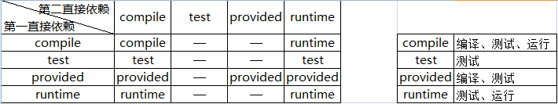
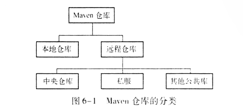
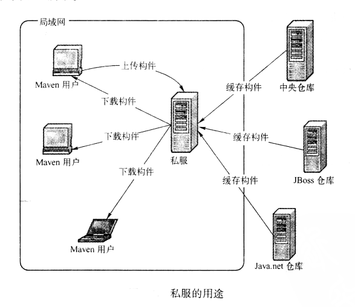
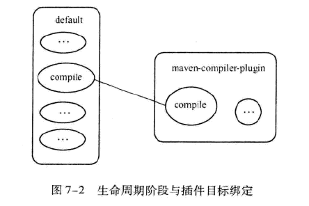
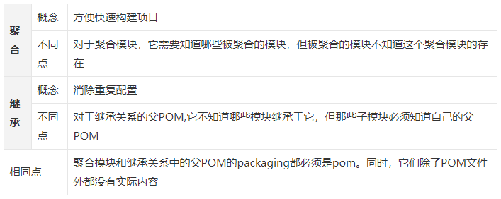
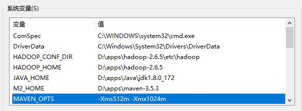

推荐阅读： 

- [maven系列--pom.xml标签详解](https://www.cnblogs.com/hyhnet/p/7956197.html) 

# 一、Maven 简介

## 1. 介绍

maven：是一个**跨平台的项目管理工具**，主要服务于 Java 平台的**项目构建、依赖管理和项目信息管理**

- 项目构建：通过插件帮你完成项目的清理、编译、测试、打包、部署
- 依赖管理：通过坐标从maven仓库导入java类库（jar文件）
- 项目信息管理：项目描述、开发者列表、版本控制系统地址、许可证、缺陷管理系统地址等

## 2. 目录

| 目录 | 说明                                                         |
| :--- | :----------------------------------------------------------- |
| bin  | **mvn 运行脚本**，用来配置 java 命令, `mvn / mvnDebug`       |
| boot | 只包含一个 `plexus-classworlds.jar` 包，是 Maven 类加载器框架 |
| conf | `settings.xml` 全局 maven 配置文件，【推荐】复制该文件至 `~/.m2/` 目录下(在用户范围定制 maven 行为) |
| lib  | Maven 运行需要的 Java 类库，Maven jar 包以及第三方依赖 jar 包 |

## 3. 最佳实践

|         配置         | 作用                                                         |
| :------------------: | ------------------------------------------------------------ |
| 环境变量`MAVEN_OPTS` | MAVEN_OPTS 值默认为 `-Xms128m -Xmx512m`，因为**mvn命令实际执行java命令**，项目较大时，容易得到**java.lang.OutOfMemeryException** |
|    `settings.xml`    | 全局范围： `$M2_HOME/conf/settings.xml`，用户范围： `~/.m2/settings.xml` |

## 4. 入门

### 1. pom.xml

```xml
<!-- 指定 xml 文档版本和编码方式 -->
<?xml version="1.0" encoding="UTF-8"?>
<!-- 声明 POM 相关的命名空间和 xsd 元素 -->
<project xmlns="http://maven.apache.org/POM/4.0.0" 
         xmlns:xsi="http://www.w3.org/2001/XMLSchema-instance"
         xsi:schemaLocation="http://maven.apache.org/POM/4.0.0 
                             http://maven.apache.org/xsd/maven-4.0.0.xsd">
    <!-- 指定当前 POM 模型的版本 -->
    <modelVersion>4.0.0</modelVersion>
    <!-- 定义项目属于哪个组，类似包名，域名反写+实际项目名，如：org.sonatype.nexus -->
    <groupId>club.zudianlv</groupId>
    <!-- 定义项目的唯一 ID,可理解为项目名，推荐格式：实际项目名-模块名 如：nexus-indexer -->
    <artifactId>zudianlv</artifactId>
    <!-- 指定项目当前版本 -->
    <version>0.0.1-SNAPSHOT</version>
    <!-- 声明一个对用户更为友好的项目名称，非必须，推荐声明，方便信息交流 -->
    <name>zudianlv</name>
    <!-- 声明项目描述 -->
    <description>zudianlv 微信小程序后台</description>

    <!-- 定义当前项目的 JDK 版本 -->
    <properties>
        <java.version>1.8</java.version>
    </properties>

    <!-- 声明打包类型：
		- jar: 默认，内部调用或做服务使用
		- war: 需要部署的项目
		- pom: 父类型
	-->
    <packaging>pom</packaging>

    <!-- 多模块项目的标签 -->
    <modules>
        <module>zudianlv-common</module>
        <module>zudianlv-pojo</module>
        <module>zudianlv-mapper</module>
        <module>zudianlv-service</module>
        <module>zudianlv-mini-api</module>
    </modules>
    
    <!-- 定义项目的编译版本 -->
    <build>
    	<plugins>
    		<plugin>
        		<groupId>org.apache.maven.plugins</groupId>
        		<artifactId>maven-compile-plugin</artifactId>
        		<configuration>
            		<source>1.8</source><!-- 1.8 可改为 ${java.version} -->
            		<target>1.8</target><!-- 1.8 可改为 ${java.version} -->
        		</configuration>
    		</plugin>
		</plugins>
    </build>

</project>
```

默认情况下 Maven 的项目目录： 

```
|-src
  |-main
    |-java                   Java代码
      |-groupId.artifactId    定义包名为项目组.项目名，所有java类都在该包下创建
    |-resources              资源目录
  |-test                     测试目录
    |-java                   测试Java代码
      |-groupId.artifactId
```

- **项目编译命令**： `mvn clean compile`

  > 该命令执行的三个插件：
  >
  > |       插件命令       | 作用                                                         |
  > | :------------------: | ------------------------------------------------------------ |
  > |    `clean:clean`     | 删除 target 目录，默认 Maven 构建的所有输出都在 target 目录中 |
  > | `resource:resources` | 主项目资源处理                                               |
  > |  `compile:compile`   | 将项目主代码编译至 target/classes 目录                       |

- **项目测试命令**： `mvn clean test`

  > 该命令执行的五个插件
  >
  > |        插件命令         | 作用                         |
  > | :---------------------: | ---------------------------- |
  > |      `clean:clean`      | 项目清理，即删除 target 目录 |
  > |  `resource:resources`   | 项目主资源处理               |
  > |    `compile:compile`    | 主代码编译                   |
  > | `resource:testResource` | 测试资源处理                 |
  > |  `compile:testCompile`  | 测试代码编译                 |

- **项目打包**： `mvn clean package`

  > 默认打包成 `jar` 包，可通过 `packaging` 标签修改

- **项目安装**： `mvn clean install`

  > 将 jar 包安装到本地仓库 repository 下
  >
  > - 其他 Maven 项目依赖此项目时，需将 jar 包安装到 Maven 本地仓库中

- `jar` 包运行： 

  > 可执行 jar 包需要： 
  >
  > - 设置 `META-INF/MANIFEST.MF` 文件中编辑 `Main-Class` 一行
  >
  > - 也可通过配置 `maven-shade-plugin` 或 `maven-jar-plugin` 等插件实现
  >
  >   ```xml
  >   <plugin>
  >       <groupId>org.apache.maven.plugins</groupId>
  >       <artifactId>maven-jar-plugin</artifactId>
  >       <configuration>
  >           <classesDirectory>target/classes/</classesDirectory>
  >           <archive>
  >               <manifest>
  >                   <!-- 主函数的入口 -->
  >                   <mainClass>cn.roylion.snake.Snake</mainClass>
  >                   <!-- 打包时 MANIFEST.MF文件不记录的时间戳版本 -->
  >                   <useUniqueVersions>false</useUniqueVersions>
  >                   <addClasspath>true</addClasspath>
  >                   <classpathPrefix>lib/</classpathPrefix>
  >               </manifest>
  >               <manifestEntries>
  >                   <Class-Path>.</Class-Path>
  >               </manifestEntries>
  >           </archive>
  >       </configuration>
  >   </plugin>
  >   ```

### 2. Archetype

- 简介： Archetype 是 Maven 工程的模板工具包，定义了要做的相同类型事情的初始样式或模型

- 使用： 运行插件 `maven-archetype-plugin` 生成项目骨架

  > 格式：`mvn groupId:artifactId:version:goal`
  >
  > - maven 2 格式： `mvn org.apache.maven.plugins:maven-archetype-plugin:2.0-alpha-5:generate`
  > - maven 3 格式： `mvn archetype:generate`

|         Archetype ID          | 说明                                                         |
| :---------------------------: | ------------------------------------------------------------ |
|  `maven-archetype-archetype`  | 一个样例原型                                                 |
| `maven-archetype-j2ee-simple` | 简单的 J2EE 应用程序样例                                     |
|    `maven-archetype-mojo`     | Maven插件样本的示例                                          |
|   `maven-archetype-plugin`    | Maven插件样本                                                |
| `maven-archetype-plugin-site` | Mave插件网站的样例                                           |
|   `maven-archetype-portlet`   | JSR-268门户样例                                              |
|   `maven-archetype-simple`    | 一个简单的Maven工程                                          |
|    `maven-archetype-site`     | Maven 网站的样例，它演示了对诸如APT、XDoc和FML等文档类型的支持，并演示了如果把网站国际化（i18n） |
| `maven-archetype-site-simple` | Maven网站样例                                                |
| `maven-archetype-quickstart`  | 默认 Archetype，包含： <br/>junit 依赖声明的 pom.xml<br/>src/main/java 主代码目录及一个名为 App 的类<br/>src/test/java 测试代码目录及一个名为 AppTest 的测试用例 |
|   `maven-archetype-webapp`    | 最简单的 Maven war 项目模板，用于快速创建一个 Web 应用，包含：<br/>packaging 为 war 且带有 junit 依赖声明的 pom.xml<br/>src/main/webapp/ 目录；src/main/webapp/index.jsp文件<br/>src/main/webapp/WEB-INF/web.xml 文件 |

# 二、Maven 详解

## 1. 坐标和依赖

### 1. maven 坐标

- 简介： Maven 定义了一组规则，世界上任何一个构件都可以使用 Maven 坐标唯一标识

- 中央仓库：Maven 通过坐标从中央仓库寻找相应的构件

- 坐标包含的元素： 

  > `groupId、artifactId、version` 必须定义，`packaging` 可选(默认 jar)，`classifier` 不能直接定义

  - `groupId`： 定义当前 Maven 项目隶属的实际项目，**域名反写+实际项目名**，如：org.sonatype.nexus
  - `artifactId`： 定义实际项目中的一个Maven项目(模块)，**实际项目名+模块名**，如： nexus-indexer
  - `version`： 定义 Maven 项目当前所处的版本
  - `packaging`： 定义 Maven 项目的打包方式，未定义时，默认为 jar
  - `classifier`： 帮助定义构建输出的一些附属构件，如： javadoc 和 resource

### 2. maven 依赖

```xml
<dependencies>
    <dependency>
        <!-- 依赖的基本坐标 -->
        <groupId>...</groupId>
        <artifactId>...</artifactId>
        <version>...</version>
        <!-- 依赖的类型，对应于项目坐标定义的 packaing，默认为 jar -->
        <type>...</type>
        <!-- 依赖的范围 -->
        <scope>...</scope>
        <!-- 标记依赖是否可选 -->
        <optional>...<optional>
        <!-- 排除传递性依赖 -->
        <exclustion>
            ...
        </exclustion>
    </dependency>
    ...
</dependencies>
```

- **依赖范围 `scope`**： 

  > 依赖范围用来控制依赖与**三种 classpath(编译、测试、运行)**的关系

  - `compile`： 编译依赖范围，默认使用该范围，如： spring-core

    > 有效范围： 编译、测试、运行

  - `test`： 测试依赖范围，只对测试有效，如： JUnit

    > 有效范围： 测试

  - `provided`： 已提供依赖范围，如： servlet-api，运行时不再需要

    > 有效范围： 编译、测试

  - `runtime`： 运行时依赖范围，编译代码时无效，如： JDBC 驱动，编译时只需要 JDK 的 JDBC 接口

    > 有效范围： 测试、运行

  - `system`： 系统依赖范围，必须通过 systemPath 元素显式指定依赖文件的路径，此类依赖不通过 maven 仓库

    > 有效范围： 编译、测试

  - `import`： 导入依赖范围

    > 有效范围： 不会对三种 classpath 产生实际的影响

- **传递性依赖**： 

  - **简介**： 当项目 A 依赖于 B 包，而 B 包又依赖于 C 包，故使用 Maven只 需要引入 B 包即可，C 包由Maven 通过传递性依赖引入

  - **作用**： Maven 通过传递性依赖机制，解析各个直接依赖的POM，将必要的间接依赖，以传递性依赖的形式引入到当前的项目中

  - **范围**： 由第一直接依赖和第二直接依赖决定

    > A 依赖 B -> 第一直接依赖
    > B 依赖 C -> 第二直接依赖
    >
    > 
    >
    > 总结：
    >
    > - 第二直接依赖范围是 compile，传递性依赖范围与第一直接依赖范围一致
    > - 第二直接依赖范围是 test，依赖不能传递
    > - 第二直接依赖范围是 provided，只第一直接依赖范围也为 provided 时，传递性范围同样为provided
    > - 第二直接依赖范围是 runtime，除第一直接依赖范围为 compile 时为 runtime，传递性依赖范围与第一直接依赖范围一致

  - **依赖调解**： 传递性依赖机制引入不同版本时，**发生依赖重复**，Maven 遵循**路径最近者优先**

- **可选依赖 `optional`**： 理想状态下，不应该使用可选依赖

  > 可选依赖是基于一个项目实现多个特性，违背了面向对象设计中的单一职责性原则

- **排除依赖 `exclustion`**： 声明 exclusion 时只需要 groupId 和 artifactId，不需要 version

- **归类依赖**： 引入同一项目的不同模块时，这些依赖的版本都相同

  > 首先使用 `properties` 元素声明 Maven 属性(定义版本)，并在 dependency声明中引用这个版本 `${}` 
  >
  > ```xml
  > <project>
  >     ...
  >     <properties>
  >         <springframework.version>2.5.6</springframework.version>
  >     </properties>
  >     
  >     <dependencies>
  >         <dependency>
  >             <groupId>org.springframework</groupId>
  >             <artifactId>spring-core</artifactId>
  >             <version>${springframework.version}</version>
  >         </dependency>
  >         <dependency>
  >             <groupId>org.springframework</groupId>
  >             <artifactId>spring-beans</artifactId>
  >             <version>${springframework.version}</version>
  >         </dependency>
  >         ...
  >     </dependencies>
  >     ...
  > </project>
  > ```

- 父类依赖 `parent`： 通过该标签，子类继承父类

  > ```xml
  > <parent> 
  >     <groupId>org.codehaus.mojo</groupId> 
  >     <artifactId>my-parent</artifactId> 
  >     <version>2.0</version> 
  >     <!-- 为可选项，maven 会首先搜索该地址，然后再搜索远程仓库 -->
  >     <relativePath>../my-parent</relativePath> 
  > </parent>
  > ```

#### 依赖优化

- 简介： 了解 Maven 项目的依赖，**去除多余的依赖，显式地声明某些必要的依赖**

  > Maven 会自动解析所有项目的直接依赖和传递性依赖： 
  >
  > - 根据规则正确判断每个依赖的范围
  > - 对于一些依赖冲突进行调节，以确保一个构件只有唯一的版本在依赖中存在

- 命令： 

  - `mvn dependency:list`： 查看已解析依赖列表及其依赖范围

  - `mvn dependency:tree`： 查看当前项目的依赖树

  - `mvn dependency:analyze`： 帮助分析当前项目的依赖

    > 通过分析依赖树，可以得到两个重要结果：
    >
    > - `Used undeclared dependencies`： 指项目中使用到的，但是没有显式声明的依赖(存在隐患)
    >
    >   > 注意： 显式声明任何项目中直接用到的依赖
    >
    > - `Unused declared dependencies`： 指项目中未使用的，但显式声明的依赖
    >
    >   > 注意： 对于这类依赖，不要简单的直接删除其声明，而应该仔细分析

## 2. 仓库

### 1. 仓库简介

- 构件： Maven 中，任何一个依赖、插件或项目构建的输出，都可以称为**构件**，如： jar、war 包

- Maven 仓库： Maven 在某个位置上**统一存储所有 Maven 项目共享的构件**

  > Maven 项目只需**声明依赖的坐标**，需要时(编译、运行、打包)，Maven 会自动根据坐标找到 Maven 仓库中的构件，并使用它们

### 2. 仓库布局

- **maven 仓库布局**： 通过坐标定义其在仓库中的唯一存储路径
- 存储路径： `groupId/artifactId/version/artifactId-version[-classifier].packaging` 

### 3. 仓库分类



- **本地仓库**： 本地仓库的路径为 `~/.m2/repository`(`~` 是用户目录)

  > - 修改 `settings.xml` 中的 `localRepository` 属性来自定义 `respository` 位置
  > - 安装构件到本地仓库： 
  >   - `mvn clean install`： 构建项目输出文件并安装到本地仓库
  >   - `mvn install:install-file -Dfile=x -DgroupId=x -DartifactId=x -Dversion=x -Dpackaging=x`： 自定义安装

- **远程仓库**： 

  > - Maven **本地仓库只有一个，但可配置多个远程仓库**
  > - 当输入第一条 Maven 命令后，Maven 才会创建本地仓库，然后根据配置和需要，从远程仓库下载构件至本地仓库

- **中央仓库**： 默认的远程仓库

  > 超级 POM： 在 Maven 安装目录 `/lib/maven-model-builder-xx.jar` 中访问路径`org/apache/maven/model/pom-4.0.0.xml` 
  >
  > ```xml
  > <repositories>
  >     <repository>
  >         <id>central</id>
  >         <name>Central Repository</name>
  >         <url>https://repo.maven.apache.org/maven2</url>
  >         <layout>default</layout>
  >         <snapshots>
  >             <enabled>false</enabled>
  >         </snapshots>
  >     </repository>
  > </repositories>
  > ```

- **私服**： 一种特殊的远程仓库，它是架设在局域网内的仓库服务

  > **建立私服的优点**： 
  >
  > -  节省自己的外网带宽： 消除对外的重复构件下载，降低外网带宽的压力
  > - 加速 Maven 构建： 使用私服，Maven 只需检查局域网内私服数据，提高构建速度
  > - 部署第三方构建： 安装组织内部生成的私有构件到私服，供内部 Maven 用户使用
  > - 提高稳定性，增强控制： 避免 Internet 的不稳定，且可提供额外自定义功能
  > - 降低中央仓库的负荷： 使用私服可以避免很多对中央仓库的重复下载
  >
  > 

### 4. 远程仓库的配置

**在 POM 中配置远程仓库**： 

```xml
<repositories>
    <repository>
        <!-- 仓库唯一标识，重复会覆盖上一个远程仓库 -->
        <id>...</id>    
        <!-- 仓库名称 -->
        <name>...</name>    
        <!-- 仓库地址 -->
        <url>...</url>    
        <!-- 重要： 控制 Maven 对于发布版本构件的下载 -->
        <releases>    
            <!-- true/false 控制发布版本构件的下载 -->
            <enabled>...</enabled>    
            <!-- 更新策略：
										daily(默认，每天一次)
										never(从不)
										always（每次构建）
										interval:X（间隔X分钟） 
						-->
            <updatePolicy>...</updatePolicy>    
            <!-- 检查检验和文件的策略： 
										warn(默认，校验失败，输出警告信息)
										fail（校验失败，无法完成构建）
										ignore(忽略校验失败) 
						-->
            <checksumPolicy>...</checksumPolicy>    
        </releases>
        <!-- 重要： 控制 Maven 对于快照版本构件的下载 -->
        <snapshots>    
            <!-- true/false 控制快照版本构件的下载 -->
            <enabled>...</enabled>   
            <!-- 更新策略： 同上 -->
            <updatePolicy>...</updatePolicy>   
            <!-- 检查检验和文件的策略： 同上 -->
            <checksumPolicy>...</checksumPolicy>    
        </snapshots>
         <!-- 仓库布局方式 -->
        <layout>default</layout>   
    </repository>
    ...
</repositories>
```

- **远程仓库认证**： 认证信息配置在 `settings.xml` 中，因为 POM 会提交到代码仓库中供所有成员访问

  ```xml
  <settings>
      ...
      <servers>
          <server>
              <id>..</id>    <!-- 需要提供认证信息才能访问的远程仓库ID -->
              <username>...</username>    <!-- 用户名 -->
              <password>...</password>    <!-- 密码 -->
          </server>
      </servers>
      ...
  </settings>
  ```

- **部署至远程仓库**： 

  > 步骤： 
  >
  > - 编辑项目的 pom.xml 
  >
  >   ```xml
  >   <project>
  >       <distributionManagement>
  >           <repository>    <!-- 指定发布版本构件的仓库 -->
  >               <id>...</id>
  >               <name>...</name>
  >               <url>...</url>
  >           </repository>
  >           <snapshotRepository>    <!-- 指定快照版本构件的仓库 -->
  >                <id>...</id>
  >               <name>...</name>
  >               <url>...</url>
  >           </snapshotRepository>
  >       </distyibutionManagement>
  >   </project>
  >   ```
  >
  > - 在 `settings.xml` 中配置认证信息： 往远程仓库部署构件时，往往需要认证
  >
  > - 执行 `mvn clean deploy`，部署到远程仓库

### 5. 快照版本

在Maven世界中。任何一个项目或者构件都必须有自己的版本，而Maven又将版本分为两种：

- **发布版本**：稳定，格式如：1.0.0、1.3-alpha-4、2.0

- **快照版本**：不稳定，格式如：2.1-SNAPSHOT、2.1-20091214.221414-13

  > Maven 在发布项目快照版本时，会自动打上时间戳，如： 2.1-20091214.221414-13 表示 2009年12月14日22时14分14秒 第13次快照
  >
  > 通过时间戳，Maven 就能找到该构件的最新快照版本

默认情况下，Maven 会每天检查一次更新（由仓库配置的 `updatePolicy` 控制），也可通过 `-U` 命令强制更新，如： `mvn clean install -U`

### 6. 从仓库解析依赖的机制

- 当本地仓库没有依赖构件时，Maven 会自动从远程仓库下载
- 当依赖版本为快照版本时，Maven 会自动找到最新的快照

**依赖解析机制如下**： 

> Maven 基于更新策略来检查更新，与远程仓库配置中 `<release>` 和 `<snapshot>` 中的子元素 `<enable>、<updatePolicy>` 有关： 
>
> - 只有 `<enable>` 为 true，才能访问该仓库对应发布版本/快照版本的构件信息，并基于 `<updatePolicy>` 更新策略检查更新，使用 `-U` 可以强制更新
> - 当 Maven 检查完更新策略，并决定检查依赖版本，就需要检查仓库元数据 `maven-metadata.xml`

- 依赖范围是 system，Maven 直接从本地文件系统解析构件
- 根据依赖坐标计算仓库路径，Maven 直接从本地仓库寻找构件： 
  - 如果发现相应构件，则解析成功
  - **本地仓库不存在**： 
    - 依赖版本是**显式的发布版本**构件，遍历所有远程仓库，发现后下载并解析使用
    - 如果依赖版本是 `RELEASE` 或 `LATEST`，则基于更新策略读取所有远程仓库的元数据`groupId/artifactId/maven-metadata.xml`，将其与本地仓库的对应元数据合并后，计算出RELEASE 或 LATEST 的真实的值，然后基于这个值检查本地和远程仓库
    - 如果依赖版本是 `SNAPSHOT`，则基于更新策略读取所有远程仓库的元数据`groupId/artifactId/version/maven-metadata.xml`，将其与本地仓库的对应元数据合并后，得到最新快照版本的值，然后基于该值检查本地仓库和远程仓库
- 如果最后解析得到的构件版本是时间戳格式的快照，如1.4.1-20091104.121450-121，则复制其时间戳格式文件至非时间戳格式，如 SNAPSHOT，并使用该非时间戳格式的构件

`LATEST和RELEASE` 的基于 groupId 和 artifactId 的 `maven-metadata.xml`： 

> 不推荐依赖声明中使用 `LATEST和RELEASE`，Maven 随机解析到不同的构件，当构件变化，可能会造成项目构建失败，且不易排查

```xml
<?xml version="1.0" encoding="UTF-8"?>
<metadata>
  <groupId>org.sonatype.nexus</groupId>
  <artifactId>nexus</artifactId>
  <versioning>
    <latest>1.4.2-SNAPSHOT</latest>    <!-- 指向最新版本 -->
    <release>1.4.0</release>    <!-- 指向最新发布版本 -->
    <versions>    <!-- 版本历史记录 -->
      <version>1.3.5</version>
      <version>1.3.6</version>
      <version>1.4.0-SNAPSHOT</version>
      <version>1.4.0.1-SNAPSHOT</version>
      <version>1.4.1-SNAPSHOT</version>
      <version>1.4.2-SNAPSHOT</version>
    </versions>
    <lastUpdated>20091214221557</lastUpdated>    <!-- 记录最近更新时间 -->
  </versioning>
</metadata>
```

快照版本的基于 groupId、artifactId 和 version 的 `maven-metadata.xml`： 

> 元数据并非永远正确，当某些构件无法解析，或解析错误时，需手工或使用工具（如Nexus）进行修复

```xml
<?xml version="1.0" encoding="UTF-8"?>
<metadata modelVersion="1.1.0">
	<groupId>org.sonatype.nexus</groupId>
  	<artifactId>nexus</artifactId>
  	<version>1.4.2-SNAPSHOT</version>
  	<versioning>
        <!-- 基于快照的时间戳和构建号得最新构建版本： 1.4.2-20091214.221414-13 -->
    	<snapshot>
        	<!-- 快照的时间戳 -->
        	<timestamp>20091214.221414</timestamp>
        	<!-- 快照的构建号 -->
        	<buildNumber>13</buildNumber>
    	</snapshot>
    	<lastUpdated>20091214221414</lastUpdated>
  	</versioning>
</metadata>
```

### 7. 镜像

- **定义**： 如果仓库 X 可以提供仓库 Y 存储的所有内容，则 X 是 Y 的一个镜像

- 可以配置 Maven 使用该镜像来替代中央仓库，编辑 `settings.xml`： 

  > 若镜像仓库需要认证，则配置一个 id 为 internal-repository 的 `<server>`

  ```xml
  <settings>
      ...
      <mirrors>
          <mirror>
              <id>...</id>    <!-- 镜像仓库id -->
              <name>...</name>    <!-- 镜像仓库名称 -->
              <url>...</url>    <!-- 镜像仓库地址 -->
              <!--  
  				* -> 匹配所有远程仓库 
  				external:* -> 匹配所有远程仓库，localhost 除外
  				central -> 匹配中央仓库
  				a,b -> 匹配 a 和 b 仓库，多个仓库用 , 隔开
  				*,!a -> 匹配所有远程仓库，a除外，使用 ! 将仓库从匹配中排除
  			-->
              <mirrorOf>...</mirrorOf>    
          </mirror>
      </mirrors>
      ...
  </settings>
  ```

### 8. 仓库搜索

- 仓库搜索服务可以根据关键字得到 Maven 坐标

|       名称       |                             地址                             | 简介                                                         |
| :--------------: | :----------------------------------------------------------: | ------------------------------------------------------------ |
| `Sonatype Nexus` | [http://repository.sonatype.org](http://repository.sonatype.org/) | 提供关键字搜索、类名搜索、坐标搜索、校验和搜索等功能，坐标和构件下载 |
|  `aliyun Nexus`  |     [http://maven.aliyun.com](http://maven.aliyun.com/)      | aliyun 架设的公共 Nexus 仓库实例，服务较快，功能同上         |
|    `Jarvana`     |               <http://www.jarvana.com/jarvana>               | 提供基于关键字、类型搜索，坐标，构件下载，支持浏览构件内部内容和便捷的 Java 文档浏览功能 |
|   `MVNbrowser`   |   [http://www.mvnbrowser.com](http://www.mvnbrowser.com/)    | 只提供关键字搜索，坐标，还可查看构件依赖于哪些构件以及该构件被哪些其他构件依赖 |
| `MVNrepository`  |    [http://mvnrepository.com](http://mvnrepository.com/)     | 提供关键字搜索，坐标，构件下载，依赖于被依赖关系信息，构件所含信息，还能提供一个简单图表，显示某个构件各版本间的大小变化 |

## 3. 生命周期和插件

### 1. 生命周期

- 简介： Maven的生命周期对所有的构建过程进行抽象和统一，包括项目的**清理、初始化、编译、测试、打包、集成测试、验证、部署和站点生成**等几乎所有构建步骤

  > - Maven 的生命周期定义项目构建的流程，插件负责实现流程中每个步骤，最后将插件与生命周期流程中每个步骤绑定即可完成项目构建
  > - 在这个过程中，插件可以在多个项目中复用，而通过更换插件绑定亦可实现差异化构建

Maven 拥有三套相互独立的生命周期： 

> 每个生命周期包含一些阶段，且这些阶段有顺序，后面的阶段依赖于前面的阶段

- `clean` 生命周期： 清理项目

  |     阶段     | 说明                     |
  | :----------: | ------------------------ |
  | `pre-clean`  | 执行清理前需要完成的工作 |
  |   `clean`    | 清理上一次构建生成的文件 |
  | `post-clean` | 执行清理后需要完成的工作 |

- `default` 生命周期： 构建项目

  |           阶段            | 说明                                                         |
  | :-----------------------: | ------------------------------------------------------------ |
  |        `vaildate`         | 验证，确保当前配置和 POM 内容有效，包含对 POM 文件树的验证   |
  |       `intianlize`        | 初始化，执行构建生命周期的主任务之前的初始化                 |
  |    `generate-sources`     | 生成源码，代码生成器生成后期阶段中处理或编译的源代码         |
  |    `proccess-sources`     | 处理源码，提供解析、修改和转换源码                           |
  |   `generate-resoureces`   | 生成资源，生成非源码资源，通常包括元数据文件和配置文件       |
  |    `process-resources`    | 处理资源，处理非源码资源，修改、转换和重定位资源都能在该阶段发生 |
  |         `compile`         | 编译，编译源码，编译过的类被放到目标目录树中                 |
  |     `process-classes`     | 处理类，处理类文件转换和增强步骤，字节码交织器和常用工具常在该阶段操作 |
  |  `generate-test-sources`  | 生成测试源码，生成要操作的单元测试代码                       |
  |  `process-test-sources`   | 处理测试源码，在编译前对测试源码执行任何必要的处理，如： 修改、转换或复制源代码 |
  | `generate-test-resources` | 生成测试资源，生成与测试相关的非源码资源                     |
  | `process-test-resources`  | 处理测试资源，处理、转换或重新定位测试相关的资源             |
  |      `test-compile`       | 测试编译，编译单元测试的源码                                 |
  |  `process-test-classes`   | 处理测试类，对编译生成文件做后期处理                         |
  |          `test`           | 测试，运行编译过的单元测试并累计结果                         |
  |     `prepare-package`     | 执行打包前的所有操作                                         |
  |         `package`         | 打包，将可执行的二进制文件打包到一个分布式归档文件中，如 jar或war |
  |  `pre-integration-test`   | 前集成测试，准备集成测试，将归档文件部署到一个服务器上执行   |
  |    `integration-test`     | 集成测试，执行真正的集成测试，指在一个受到一定控制的模拟的真实部署环境中测试代码 |
  |  `post-integration-test`  | 后集成测试，解除集成测试准备，涉及环境重置或重新初始化       |
  |         `verify`          | 检验，检验可部署归档文件的有效性和完整性，通过后，将安装该归档 |
  |         `install`         | 安装，将项目包安装到本地仓库，供其他项目依赖                 |
  |         `deploy`          | 部署，将项目发布到远程仓库，供其他开发人员与项目共享         |

- `site` 生命周期： 建立项目站点

  |     阶段      | 说明                                     |
  | :-----------: | ---------------------------------------- |
  |  `pre-site`   | 执行一些在生成项目站点之前需要完成的工作 |
  |    `site`     | 生成项目站点文档                         |
  |  `peo-site`   | 执行一些在生成项目站点之后需要完成的工作 |
  | `site-deploy` | 将生成的项目站点发布到服务器上           |

以常见的 Maven 命令来解释生命周期阶段： 

- `mvn clean`： 调用 clean 生命周期的 clean 阶段，实际执行 pre-clean,clean 阶段
- `mvn test`：调用 default 生命周期的 test 阶段，实际执行 vaildate 至 test 所有阶段
- `mvn clean install`： 调用 clean 生命周期的 clean 阶段及 default 生命周期的 install 阶段，实际执行clean生命周期中的 pre-clean,clean 阶段，及 default 生命周期的 vaildate 至 install 所有阶段
- `mvn clean deploy site-deploy`： 调用 clean 生命周期的 clean 阶段、default 生命周期的 deploy 阶段以及 site 生命周期的 site-deploy 阶段，实际执行 clean 生命周期中的 pre-clean,clean 阶段、default 生命周期的所有阶段以及 site 生命周期的所有阶段

### 2. 插件

#### 1. 插件目标

- 对于插件本身，为了代码复用，往往具备多个功能，而每个功能都统称为插件目标

语法： 冒号前面是插件前缀，后面是该插件目标

- **完整命令**： `mvn groupId:artifactId:version:goal` 

  > 如： `mvn org.apache.maven.plugins:maven-dependency-plugin:3.0.2:tree`

- **简化 version**： `mvn groupId:artifactId:goal`

  > 如： `mvn org.apache.maven.plugins:maven-dependency-plugin:tree`

- **使用插件前缀**： `mvn 插件前缀:goal` 

  > 如： `mvn dependency:tree`

#### 2. 插件绑定

Maven 的生命周期与插件目标相互绑定，用以完成实际的构建任务

> 具体来说，是生命周期的阶段与插件的目标相互绑定



- **内置绑定**： Maven 在核心为一些主要的生命周期阶段绑定了很多插件的目标

  > 当用户通过命令行调用生命周期时，对应的插件目标就会执行相应的任务
  >
  > - clean 生命周期：
  >
  >   |    阶段    |         内置插件         | 执行任务           |
  >   | :--------: | :----------------------: | ------------------ |
  >   | pre-clean  |                          |                    |
  >   |   clean    | maven-clean-plugin:clean | 删除项目的输出目录 |
  >   | psot-clean |                          |                    |
  >
  > - default 生命周期：
  >
  >   |          阶段           |               内置插件               | 执行任务                       |
  >   | :---------------------: | :----------------------------------: | ------------------------------ |
  >   |        vaildate         |                                      |                                |
  >   |       intianlize        |                                      |                                |
  >   |    generate-sources     |                                      |                                |
  >   |    proccess-sources     |                                      |                                |
  >   |   generate-resoureces   |                                      |                                |
  >   |    process-resources    |   maven-resources-plugin:resources   | 复制主资源文件至主输出目录     |
  >   |         compile         |    maven-compiler-plugin:compile     | 编译主代码至主输出目录         |
  >   |     process-classes     |                                      |                                |
  >   |  generate-test-sources  |                                      |                                |
  >   |  process-test-sources   |                                      |                                |
  >   | generate-test-resources |                                      |                                |
  >   | process-test-resources  | maven-resources-plugin:testResources | 复制测试资源文件至测试输出目录 |
  >   |      test-compile       |  maven-compiler-plugin:testCompile   | 编译测试代码至测试输出目录     |
  >   |  process-test-classes   |                                      |                                |
  >   |          test           |      maven-surefire-plugin:test      | 执行测试用例                   |
  >   |     prepare-package     |                                      |                                |
  >   |         package         |         maven-jar-plugin:jar         | 创建项目jar包                  |
  >   |  pre-integration-test   |                                      |                                |
  >   |    integration-test     |                                      |                                |
  >   |  post-integration-test  |                                      |                                |
  >   |         verify          |                                      |                                |
  >   |         install         |     maven-install-plugin:install     | 将项目输出构件安装到本地仓库   |
  >   |         deploy          |      maven-deploy-plugin:deploy      | 将项目输出构件安装到远程仓库   |
  >
  > - site 生命周期：
  >
  >   |    阶段     |         内置插件         | 执行任务                     |
  >   | :---------: | :----------------------: | ---------------------------- |
  >   |  pre-site   |                          |                              |
  >   |    site     |  maven-site-plugin:site  | 生成项目站点                 |
  >   |  peo-site   |                          |                              |
  >   | site-deploy | maven-site-plugin:deploy | 将项目站点部署到远程服务器上 |

- **自定义绑定**： 

  > ```xml
  > <build>
  >     <plugins>
  >         <plugin>
  >             <groupId>org.apache.maven.plugins</groupId>
  >             <artifactId>maven-source-plugin</artifactId>
  >             <version>3.0.1</version>
  >             <executions>    <!-- 插件执行配置 -->
  >                 <execution>    <!-- 每个execution子元素可以配置执行一个任务 -->
  >                     <id>attach-sources</id>    <!-- 配置任务id -->
  >                     <!-- phase元素配置绑定生命周期阶段 -->
  >                		<phase>verify</phase>
  >                     <goals>    <!-- 配置要执行的插件目标 -->
  >                         <goal>jar-no-fork</goal>
  >                     </goals>
  >                 <execution>
  >             </executions>
  >         </plugin>
  >     </plugins>
  > </build>
  > ```
  >
  > 完成自定义插件绑定后，运行 `mvn verify` 即可
  >
  > - 使用 `maven-help-plugin` 查看插件详细信息，了解插件目标的默认绑定阶段
  >
  >   `mvn help:describe -Dplugin=groupId:artifactId:version` 
  >
  > - 当插件目标绑定到不同的生命周期时，其执行顺序会由生命周期阶段的先后顺序决定
  >
  >   > 如果多个目标被绑定到同一个阶段，这些插件声明的先后顺序决定目标的执行顺序

#### 3. 插件配置

- **命令行插件配置**： 使用 `-D` 参数，并伴随一个 `参数名=参数值` 的形式，来配置参数

- **POM 中插件全局配置**： 

  ```xml
  <build>
      <plugins>
          <plugin>
              <groupId>...</groupId>
              <artifactId>...</artifactId>
              <version>...</version>
              <!-- 声明插件全局配置 所有基于该插件目标的任务，都会使用这些配置 -->
              <configuration>    
                  ...
              </configuration>
          </plugin>
      </plugins>
  </builds>
  ```

- **POM 中插件任务配置**： 为某个插件任务配置特定的参数

  ```xml
  <build>
      <plugins>
          <plugin>
              <groupId>...</groupId>
              <artifactId>...</artifactId>
              <version>...</version>
              <executions>
                  <execution>
                      <id>...</id>
                      <phase>...</phase>
                      <goals>
                          <goal>...</goal>
                      </goals>
                      <configuration>    <!-- 插件任务一配置 -->
                          ...
                      </configuration>
                  </execution>
                  <execution>
                      <id>...</id>
                      <phase>...</phase>
                      <goals>
                          <goal>...</goal>
                      </goals>
                      <configuration>    <!-- 插件任务二配置 -->
                          ...
                      </configuration>
                  </execution>
                  ...
              </executions>
          </plugin>
      </plugins>
  </builds>
  ```

#### 4. 获取插件信息

> 实现一个构建任务，用户需知道去哪找到合适的插件，并详细了解该插件的配置点

- **在线插件信息**： 

  - `apache`： 

    |   说明   |                  官方插件，用户多，稳定性好                  |
    | :------: | :----------------------------------------------------------: |
    | 详细列表 | [http://maven.apache.org/plugi...](http://maven.apache.org/plugins/index.html) |
    | 下载地址 | [http://repo1.maven.org/maven2...](http://repo1.maven.org/maven2/org/apache/maven/plugins) |

  - `Codehaus`： 

    |   说明   |      文档和可靠性相对较差，遇到问题，往往需要自己看源码      |
    | :------: | :----------------------------------------------------------: |
    | 详细列表 | [http://mojo.codehaus.org/plug...](http://mojo.codehaus.org/plugins.html) |
    | 下载地址 | [http://repository.codehaus.or...](http://repository.codehaus.org/org/codehaus/mojo/) |

- **使用 `maven-help-plugin` 插件**： 

  > 执行 `maven-help-plugin` 的 describe 目标，指定要查询的插件的坐标，可查询插件的坐标，前缀，目标信息
  >
  > `mvn help:describe -Dplugin = (groupId:artifactId[:version] | Goal Prefix) -Dgoal = goal -Ddetail`

#### 5. 插件解析机制

> 在命令行中执行插件目标，可使用插件前缀替代坐标，方便用户使用和配置插件
>
> 如：`help` 是 `maven-help-plugin` 的目标前缀，`dependency` 是 `maven-dependency-plugin` 的目标前缀

- **插件仓库**： 类似依赖

  > Maven 内置了插件仓库指向中央仓库，并关闭了对 SNAPSHOT 的支持

  ```xml
  <pluginRepositories>
      <pluginRepository>
          ...    <!-- 此处与依赖远程仓库配置一样，可参考阅读总结二查看 -->
      </pluginRepository>
      ...
  </pluginRepositoties>
  ```

- **插件默认的 groupId**： 在 POM 中配置插件时，如果该插件是Maven官方插件，则可以省略 groupId 配置

  > 官方插件： groupId 为 `org.apache.maven.plugins`

- **解析插件版本**： 用户未提供插件的版本时，Maven 会自动解析插件版本

  > Maven 在超级 POM 中为所有核心插件设定了版本，所有项目都继承超级 POM 配置
  >
  > 所以用户使用插件**未设定插件版本**的情况有以下几种：
  >
  > - **核心插件**：通过超级 POM 继承设定版本
  >
  > - **非核心插件**：通过仓库元数据 `groupId/artifactId/maven-metadata.xml`，遍历并归并本地仓库和远程仓库的仓库元数据，根据 `latest和release` 计算出插件的版本
  >
  >   > Maven3 之后使用 `release`，避免使用 `latest` 获取到快照版本，因为快照版本的频繁更新会导致插件行为的不稳定

- **解析插件前缀**： mvn 命令行支持使用插件前缀来简化插件的调用

  > - 插件前缀与 `groupId:artifactId` 一一对应
  >
  > - 这种匹配关系存储在仓库元数据中，位于 `groupId/maven-metadate.xml`
  >
  > - Maven 在解析插件仓库元数据时，会默认使用 `org.apache.maven.plugins` 和 `org.codehaus.mojo` 两个 groupId，可在 `settings.xml` 中配置其他 groupId
  >
  >   ```xml
  >   <settings>
  >       ...
  >       <pluginGroups>
  >           <pluginGroup>...</pluginGroup>
  >       </pluginGroups>
  >       ...
  >   <settings>
  >   ```
  >
  > 注意： 
  >
  > - 插件仓库元数据中存储了所有插件前缀与 `group:artifactId` 的对应关系
  > - 插件仓库元数据检查顺序：`apache -> codehaus -> 用户自定义插件组 -> 都不包含，则报错`

## 4. 聚合与继承

> - Maven 聚合特性：将项目的各个模块聚合在一起**构建** 
> - Maven 继承特性：**抽取**各模块相同的依赖和插件等配置

### 1. 聚合

通常情况下，聚合项目的目录结构如下： 

```xml
|-parent             <!-- 父工程是一个 Maven 项目 -->
  |-parent_POM       <!-- 父工程自己的 POM 文件，packaging 元素值为 pom，在 modules 中添加module 元素实现项目聚合 -->
  |-sub1             <!-- 子工程通常位于父工程目录下，常与子工程 artifactId 相同，但不必须 -->
    |-sub1_POM       <!-- 父工程POM中module的值为子工程POM所在目录（相对目录） -->
  |-sub2             <!--  -->
    |-sub2_POM       <!--  -->
```

### 2. 继承

- **继承声明**： 在父工程 POM 文件中声明复用依赖或插件等配置，安装到本地仓库即可由其他子项目继承

  > ```xml
  > <parent>
  >     		<groupId>...</groupId>              <!-- 必须，声明父工程的groupId -->
  >     		<artifactId>...</artifactId>        <!-- 必须，声明父工程的artifactId -->
  >     		<version>...</version>              <!-- 必须，声明父工程的version -->
  >     		<relativePath>...</relativePath>    <!-- 可省略，默认为../pom.xml,声明父工程的POM文件所在路径 -->
  > </parent>
  > 
  > <dependencies>
  > 	...
  > </dependencies>
  > ```
  >
  > 子项目构建时，Maven 会根据 relativePath 检查父 POM，如果找不到，再从仓库查找

- **可继承的 POM 元素**： 

  |        元素名称        |                             解释                             |
  | :--------------------: | :----------------------------------------------------------: |
  |        groupId         |                项目组 ID，项目坐标的核心元素                 |
  |        version         |                 项目版本，项目坐标的核心元素                 |
  |      description       |                        项目的描述信息                        |
  |      organization      |                        项目的组织信息                        |
  |     inceptionYear      |                        项目的创始年份                        |
  |          url           |                       项目的 URL 地址                        |
  |       developers       |                       项目的开发者信息                       |
  |      contributors      |                       项目的贡献者信息                       |
  | distributionManagement |                        项目的部署配置                        |
  |    issueManagement     |                    项目的缺陷跟踪系统信息                    |
  |     ciMananagement     |                    项目的持续集成系统信息                    |
  |          scm           |                    项目的版本控制系统信息                    |
  |      mailingLists      |                      项目的邮件列表信息                      |
  |       properties       |                     自定义的 Maven 属性                      |
  |      dependencies      |                        项目的依赖配置                        |
  |  dependencyManagement  |                      项目的依赖管理配置                      |
  |      repositories      |                        项目的仓库配置                        |
  |         build          | 包括项目的源码目录配置、输出目录配置、插件配置、插件管理配置等 |
  |       reporting        |          包括项目的报告输出目录配置、报告插件配置等          |

- **依赖管理**： `dependencyManagement` 依赖管理配置，在该元素中声明的依赖不会被引入，而是起到约束并简化子项目依赖的作用

  > - 子项目会继承其声明的依赖配置，如 version,scope
  > - import 依赖范围，只在 dependencyManagement 元素中生效
  >
  > ```xml
  > <dependencyManagement>
  >     <dependencies>
  >         <dependency>
  >             <groupId>...</groupId>
  >             <artifactId>...</artifactId>
  >             <version>...</version>
  >             <type>pom</type>
  >             <scope>import</scope>
  >         </dependency>
  >         ...
  >     </dependencies>
  > </dependencyManagement>
  > ```

- **插件管理**： `pluginManagement` 元素用于管理插件，在该元素中配置的依赖不会造成实际的插件调用方式，当其子类声明该插件依赖时，可复用该配置，起到约束和简化作用

### 3. 聚合与继承的关系



### 4. 约定优于配置

- **遵循 Maven 的约定**：

  |     目录     |     包路径     |
  | :----------: | :------------: |
  |   源码目录   | src/main/java  |
  | 编译输出目录 | target/classes |
  |   打包方式   |      jar       |
  |  包输出目录  |     target     |

- **Maven 自定义源码目录**：  不推荐

  ```xml
  <build>
      <sourceDirectory>...</sourceDirectory>   <!-- 不推荐自定义源码目录，提高交流成本 -->
  </build>
  ```

- **超级 POM**： 任何一个 Maven 项目都隐式继承了超级POM

  > - 该文件位于 `lib/maven-model-builder-x.x.x.jar` 中的 `org/apache/maven/model/pom-4.0.0.xml`
  > - 超级 POM 定义了中央仓库和插件仓库，两者的地址都为中央仓库，且都关闭 SNAPSHOT 支持，同时定义了项目结构
  >
  > ```xml
  > <!-- 主输出目录 -->
  > <directory>${project.basedir}/target</directory>
  > <!-- 主代码输出目录 -->
  > <outputDirectory>${project.build.directory}/classes</outputDirectory>
  > <!-- 最终构件的名称格式 -->
  > <finalName>${project.artifactId}-${project.version}</finalName>
  > <!-- 测试代码输出目录 -->
  > <testOutputDirectory>
  >     ${project.build.directory}/test-classes 
  > </testOutputDirectory>
  > <!-- 主源码目录 -->
  > <sourceDirectory>${project.basedir}/src/main/java</sourceDirectory>
  > <!-- 脚本源码目录 -->
  > <scriptSourceDirectory>
  >     ${project.basedir}/src/main/scripts
  > </scriptSourceDirectory>
  > <!-- 测试源码目录  -->
  > <testSourceDirectory>${project.basedir}/src/test/java</testSourceDirectory>
  > <!-- 主资源目录 -->
  > <resources>
  >   	<resource>
  >     	<directory>${project.basedir}/src/main/resources</directory>
  >   	</resource>
  > </resources>
  > <!-- 测试资源目录 -->
  > <testResources>
  >   	<testResource>
  >     	<directory>${project.basedir}/src/test/resources</directory>
  >   	</testResource>
  > </testResources>
  > ```
  >
  > 超级 POM 通过插件管理为核心插件设定了版本，防止由于插件版本的变化而造成构建不稳定

### 5. 反应堆（Reactor）

- 在一个多模块的 Maven 项目中，反应堆是指所有模块组成的一个构建结构
- 对于单模块项目，反应堆是其本身，对于多模块项目，反应堆包含模块间继承与依赖的关系，从而能自动计算出合理的模块构建顺序

#### 1. 反应堆的构建顺序

- Maven 按序读取 POM，如果该 POM 没有依赖模块，则构建该模块，否则就先构建其依赖模块，如果该依赖还依赖于其他依赖，则进一步构建依赖的依赖

- 模块间的依赖关系会将反应堆构成一个有向非循环图，各个模块是该图的节点，依赖关系构成了有向边

  > 此图不允许循环，因此，当出现 A 依赖 B，而 B 又依赖 A 时，Maven 就会报错

#### 2. 裁剪反应堆

- 一般来说，用户会选择构建整个项目或选择构建单个模块
- 但有时，用户会想要构建完整反应堆中的部分模块，即裁剪反应堆

Mave 提供很多命令行选择支持裁剪反应堆，输入 `mvn -h` 可以看到这些选项：

|             选项             | 作用                           |
| :--------------------------: | ------------------------------ |
|      `-am,--also-make`       | 同时构建所列模块的依赖模块     |
| `-amd,-alse-make-dependents` | 同时构建依赖于所列模块的模块   |
|    `-pl,--projects <arg>`    | 构建指定模块，模块间用逗号分隔 |
|   `-rf,-resume-from <arg>`   | 从指定的模块回复反应堆         |

# 三、Maven 应用

推荐阅读： [使用 Nexus 建立私服](<https://segmentfault.com/a/1190000014430330>) 

## 1. 两个基本操作

### 1. maven 的 JVM 参数的设置方法

- `Linux`： 在 `~/.bash_profile` 文件中添加

  > `export MAVEN_OPTS="-Xms512m -Xmx1024m"`

- `Windows`： 

  > 

### 2. 用户级别的 maven 配置

把 `MAVEN_HOME/conf/seettings.xml` 复制到 `~/.m2/` 下： 

- 在 `.m2` 下的 `settings.xml` 中所作的配置就是用户级别的配置
- 直接编辑 `MAVEN_HOME/conf/seettings.xml` 所作的配置是全局的配置

## 2. maven 命令

**maven 最常用命令**： 

- `mvn archetype:create`： 创建 Maven 项目

- `mvn archetype:generate`： 生成项目骨架

  > maven 2 运行： `mvn org.apache.maven.plugins:maven-archetype-plugin:2.0-alpha-5:generate`

- `mvn compile`： 编译主程序源代码，不会编译 test 目录的源代码

  > - 第一次运行时，会下载相关的依赖包，可能会比较费时
  > - compile 后会生成 target 文件夹，主程序编译在 classes 下，测试程序放在 test-classes 下

- `mvn test-compile`： 编译测试代码
- `mvn test`： 运行应用程序中的单元测试 
- `mvn site`： 生成项目相关信息的网站
- `mvn clean`： 清除目标目录中的生成结果
- `mvn package`： 依据项目生成 jar 文件，打包之前会进行编译，测试
- `mvn install`： 在本地 Repository 中安装 jar
- `mvn eclipse:eclipse`： 生成 Eclipse 项目文件及包引用定义
- `mvn deploy`： 在整合或发布环境下执行，将最终版本的包拷贝到远程 repository，实现共享

**常用参数**： 

- 跳过测试类 ： `-Dmaven.test.skip=true`

- 下载 jar 包源码： `-DdownloadSource=true`

- 下载 javadocs： `-DdownloadJavadocs=true`

```
[mvn -v]: 查看 maven 版本
[mvn -h]: 查看帮助
[mvn help:system]: 查看 java 的系统属性和环境变量
[mvn help:active-profiles]: 查看激活的 profile
[mvn help:all-profiles]: 列出所有的 profile
[mvn help:effective-pom]: 查看项目的所有 pom 元素(包括父元素中的默认配置)
[mvn clean/compile/test/package/install/deploy]: maven 的不同阶段的命令,可以互相组合使用
[mvn archetype:generate]: 创建项目骨架
[mvn dependency:list]: 显示项目中所有已解析依赖
[mvn dependency:tree]: 查看当前项目的依赖树
[mvn dependency:analyze]: 分析项目依赖
[mvn clean install-U]: 强制 maven 检查更新
[mvn help:describe -Dplugin=org.apache.maven.plugins:maven-source-plugin:3.0.1 -Ddetail]: 查看某插件的详细信息
[mvn help:describe -Dplugin=source]: 上一个命令的简写
[mvn help:describe -Dplugin=compile -Dgoal=compile]: 只查看 goal 相关的信息
[mvn install -Dmaven.test.skip=true]: 构建时跳过测试(不编译测试代码,不运行测试代码)
[mvn package -DskipTests]: 构建时跳过测试(编译测试代码,不运行测试代码)
[mvn clean install -pl module1,module2]: 构建指定的模块
[mvn clean install -pl module -am]: 构建指定模块及其依赖的模块
[mvn clean install -pl module -amd]: 构建指定模块及依赖其的模块
[mvn clean install -rf module]: 在完整的反应堆构建顺序基础上指定从哪个模块开始构建
[mvn clean install -pl module1 -amd -rf module2]: 构建module1以及依赖其的模块,并且从module2开始构建
[mvn clean install -P dev]: 激活 id 为 dev 的 profile
[mvn clean install -P profile1,profile2]: 激活多个 profile
[mvn clean install -Dkey=value]: 设置系统属性值
[mvn test -Dtest=A]: 测试A类
[mvn test -Dtest=A*B]: 测试以A开头B结尾的类
[mvn test -Dtest=A,B]: 测试A类和B类
[mvn test -Dtest=A*B,C]: 测试以A开头B结尾的类以及C类
[mvn test -Dtest -DfailIfNoTests=false]: 即使没有运行测试也不要报错
[mvn cobertura:cobertura]: 生成测试覆盖率报告,文件为target/site/cobertura/index.html
[mvn jetty:run]: 使用 jetty-maven-plugin 进行测试
[mvn jetty:run -Djetty.port=9999]: 启动 jetty 服务进行测试,并指定端口号
[mvn cargo:start]: 发布 war 包到本地服务器
[mvn cargo:deploy]: 发布 war 包到远程服务器
[mvn release:clean]: 发布新版本前 clean
[mvn release:prepare]: 发布新版本前的准备工作
[mvn release:prepare -DautoVersionSubmodules=true]: 子模块与父模块使用相同的版本
[mvn release:rollback]: prepare 后如果发现错误,可以回滚
[mvn release:perform]: 发布新版本
[mvn release:branch -DbranchName=0.0.1 -DupdateBranchVersions=true -DupdateWorkingCopyVersions=false]: 创建分支,分支使用新版本,不更新主干(trunk)的代码
[mvn clean deploy -Dgpg.passphrase=passwd]: 发布已经签名的构件
[mvn gpg:sign-and-deploy-file -DgroupId=com.bonc.rdpe -DartifactId=maven001 -Dversion=0.0.1-SNAPSHOT -Dpomfile=target/maven001-0.0.1-SNAPSHOT.pom -Dfile=target/maven001-0.0.1-SNAPSHOT.jar -Durl=http://192.168.138.129:8081/repository/maven-snapshots/ -DrepositoryId=nexus-snapshots]: 发布没有签名的文件并对其签名
[mvn site]: 生成站点
[mvn site:stage -DstagingDirectory=D:\tmp]: 把站点预发布到某个临时文件夹下
```

## 3. settings.xml 文件

```xml
<settings xmlns="http://maven.apache.org/SETTINGS/1.0.0"
          xmlns:xsi="http://www.w3.org/2001/XMLSchema-instance"
          xsi:schemaLocation="http://maven.apache.org/SETTINGS/1.0.0 
                              http://maven.apache.org/xsd/settings-1.0.0.xsd">

    <!--自定义本地仓库路径 -->
    <localRepository>path/to/maven/repo</localRepository>
    <!-- maven 是否与用户交互 -->
    <interactiveMode>true</interactiveMode>
    <!-- 离线模式 -->
    <offline>false</offline>
    <!-- 设置自定义的解析插件元数据的地址,主要用于得到插件的前缀,简化 mvn 命令 -->
    <pluginGroups>
        <!-- 
        当插件的 groupId 为 org.apache.maven.plugins 和 org.codehaus.mojo 时
		插件的命令支持简写的形式,例如: mvn help:system
        其他插件如果你想要使用简写的命令,需要在这里声明该插件的groupId
        这里声明了 jetty-maven-plugin 的 groupId,可以简写该插件的命令,如: mvn jetty:run
        如果不声明,完整命令为: mvn jetty:run -Dplugin=org.mortbay.jetty:jetty-maven-plugin:8.1.16.v20140903
        -->
        <pluginGroup>org.eclipse.jetty</pluginGroup>
        <pluginGroup>com.your.plugins</pluginGroup>
    </pluginGroups>

    <!-- 设置HTTP代理 -->
    <proxies>
        <proxy>
            <id>dev3-proxy</id>
            <active>true</active>
            <protocol>http</protocol>
            <username>root</username>
            <password>root</password>
            <host>172.16.13.185</host>
            <port>9999</port>
            <nonProxyHosts>
                https://repo.maven.apache.org/maven2|*.google.com
            </nonProxyHosts>
        </proxy>
    </proxies>

    <!-- 配置仓库的认证信息 -->
    <servers>
        <server>
            <id>nexus-releases</id>
            <username>hadoop</username>
            <password>hadoop</password>
        </server>
        <server>
            <id>nexus-snapshot</id>
            <username>hadoop</username>
            <password>hadoop</password>
        </server>
    </servers>

    <mirrors>
        <!-- 配置远程仓库的镜像(这是一个私服) -->
        <mirror>
            <id>Public Repositories</id>
            <name>Public Repositories</name>
            <!-- * 代表这个私服可以作为所有远程仓库的镜像 -->
            <mirrorOf>*</mirrorOf>
            <!-- 
            	<mirrorOf>external:*</mirrorOf> : 匹配所有不在本机上的远程仓库
            	<mirrorOf>repo1,repo2</mirrorOf> : 只匹配repo1和repo2这两个仓库
            	<mirrorOf>*,!repo1</mirrorOf> : 匹配除了repo1之外的所有远程仓库
        	-->
            <url>http://172.16.13.185:9000/nexus/content/groups/public/</url>
        </mirror>
        <!-- 阿里云的镜像 -->
        <mirror>
            <id>alimaven</id>
            <name>aliyun maven</name>
            <url>http://maven.aliyun.com/nexus/content/groups/public/</url>
            <mirrorOf>central</mirrorOf>
        </mirror>
    </mirrors>

    <!-- 自定义的配置 -->
    <profiles>
        <!-- 激活方式1: 默认激活 -->
        <!-- 设置 maven 编译时的 jdk 版本 -->
        <profile>    
            <id>jdk-1.8</id>
            <activation>
                <!--默认为激活状态-->
                <activeByDefault>true</activeByDefault>
                <jdk>1.8</jdk>
            </activation>
            <properties>
                <maven.compiler.source>1.8</maven.compiler.source>
                <maven.compiler.target>1.8</maven.compiler.target>
                <maven.compiler.compilerVersion>1.8</maven.compiler.compilerVersion>
            </properties>
        </profile>
        <!-- 激活方式2: 在 activeProfiles 中激活 -->
        <!-- 这是一个自定义的数据库配置 -->
        <profile>
            <id>profile1</id>
            <properties>
                <db.driver>com.mysql.jdbc.Driver</db.driver>
                <db.url>jdbc:mysql://192.168.138.101:3306/test</db.url>
                <db.username>dev</db.username>
                <db.password>dev-pwd</db.password>
            </properties>
        </profile>
        <!--激活方式3: 当系统属性的值为指定值时激活-->
        <!-- 
            该 profile 在系统属性(one.of.system.property)为指定值(expected.value)时被激活
            可在命令行设置系统属性值: 
				mvn clean install -Done.of.system.property=expected.value
        -->
        <profile>
            <id>profile2</id>
            <activation>
                <property>
                    <name>one.of.system.property</name>
                    <value>expected.value</value>
                </property>
            </activation>
            <properties>
                <!-- ...... -->
            </properties>
        </profile>
        <!-- 激活方式4: 根据操作系统的环境激活 -->
        <profile>
            <id>profile3</id>
            <activation>
                <os>
                    <name>Windows 10</name>
                    <family>Windows</family>
                    <arch>amd64</arch>
                    <version>10.0</version>
                </os>
            </activation>
            <properties>
                <!-- ...... -->
            </properties>
        </profile>
        <!-- 激活方式5: 文件存在与否激活: x.properties存在激活,y.properties不存在激活 -->
        <profile>
            <id>profile4</id>
            <activation>
                <file>
                    <exists>x.properties</exists>
                    <missing>y.properties</missing>
                </file>
            </activation>
            <properties>
                <!-- ...... -->
            </properties>
        </profile>

        <!-- 说明: 
            1. 若任意一个 profile 通过非默认方式激活,则默认激活的 profile 就会失效 
            2. 在 settings.xml 中设置的 profile 不允许修改大部分 pom 元素
			   在项目的 pom.xml 中的 profile 可以修改 pom 原始配置
        -->
    </profiles>

    <!-- 激活已经配置的profile -->
    <activeProfiles>
        <activeProfile>dev</activeProfile>
    </activeProfiles>

</settings>
```

## 4. pom.xml 文件

```xml
<project xmlns="http://maven.apache.org/POM/4.0.0" 
         xmlns:xsi="http://www.w3.org/2001/XMLSchema-instance"
  		 xsi:schemaLocation="http://maven.apache.org/POM/4.0.0 
                             http://maven.apache.org/xsd/maven-4.0.0.xsd">
	<!--  -->
    <modelVersion>4.0.0</modelVersion>
    <!-- 项目唯一标识 -->
    <groupId>com.bonc.rdpe</groupId>
    <!-- 项目通用名称 -->
    <artifactId>maven001</artifactId>
    <!-- 项目版本 -->
    <version>0.0.1-SNAPSHOT</version>
    <!-- 打包类型,默认为 jar,web项目应该是war,其他还有: maven-plugin/ear/pom等 -->
    <packaging>jar</packaging>
    <!-- 用户描述项目的名称，非必须 -->
    <name>maven001</name>
    <!-- 开发团队官方地址，非必须 -->
    <url>http://xxx</url>
    <!-- 附属构件,不能直接定义 -->
    <classifier></classifier>

    <!-- 自定义maven属性 -->
    <properties>
        <hadoop.version>2.7.6</hadoop.version>
        <junit.version>4.7</junit.version>
        <spark.version>2.3.0</spark.version>
        <springframework.version>2.5.6</springframework.version>
    </properties>

    <repositories>
        <!-- maven中央仓库,不需要配置,这里是为了说明各配置的功能 -->
        <repository>
            <!-- id值必须唯一,否则会覆盖 -->
            <id>central</id>
            <name>Central Repository</name>
            <url>https://repo.maven.apache.org/maven2</url>
            <layout>default</layout>
            <releases> 
                <!-- 下载发布版构件 -->
                <enabled>true</enabled>
                <!-- 
                    Maven 从远程仓库更新的频率
                    	never(从不)
                    	daily(每天一次,默认)
                    	always(每次构建都检查更新)
                    	interval:X(每隔X分钟检查一次,X为任意整数) 
                -->
                <updatePolicy>never</updatePolicy>
                <!-- 
                    检验文件的策略,如果校验失败: 
                    	warn(默认):输出警告信息
                    	fail: 构建失败
                    	ignore: 忽略 
                -->
                <checksumPolicy>warn</checksumPolicy>
            </releases> 
            <snapshots>
                <!-- 不从中央仓库下载快照版本的构件 -->
                <enabled>false</enabled>
            </snapshots>
        </repository>
    </repositories>

    <!-- 配置下载插件的远程仓库,各配置和 repositories 中的意义是一样的 -->
    <pluginRepositories>
        <pluginRepository>
            <id></id>
            <name></name>
            <url></url>
            <layout></layout>
            <releases>
                <updatePolicy></updatePolicy>
            </releases>
            <snapshots>
                <enabled></enabled>
            </snapshots>
        </pluginRepository>
    </pluginRepositories>

    <!-- 项目输出的构件部署的远程仓库 -->
    <distributionManagement>
        <!-- 发布版的构件部署的仓库 -->
        <repository>
            <id>dev3-repository</id>
            <name>Dev3 Release Repository</name>
            <url>
                http://172.16.13.185:9000/nexus/content/repositories/releases/
            </url>
        </repository>
        <!-- 快照版的构件部署的仓库 -->
        <snapshotRepository>
            <id>dev3-snapshots-repository</id>
            <name>Dev3 Snapshot Repository</name>
            <url>
                http://172.16.13.185:9000/nexus/content/repositories/snapshots/
            </url>
        </snapshotRepository>
    </distributionManagement>

    <!-- 
		此处声明的依赖会被子模块继承,但不是声明了就一定会被继承
		如果子模块不引入这些依赖，就不会强制加给子模块 
		-->
    <dependencyManagement>
        <dependencies>
            <dependency>
                <groupId>org.springframework</groupId>
                <artifactId>spring-core</artifactId>
                <version>${springframework.version}</version>
            </dependency>
            <dependency>
                <groupId>junit</groupId>
                <artifactId>junit</artifactId>
                <version>${junit.version}</version>
                <scope>test</scope>
            </dependency>
            <!-- 合并其他 maven 工程中的 dependencyManagement下定义的依赖到本模块 -->
            <dependency>
                <groupId>com.bonc.rdpe</groupId>
                <artifactId>account-xxx</artifactId>
                <version>0.0.1-SNAPSHOT</version>
                <!-- import 只在 dependencyManagement 中,
					 					 且目标 POM 的 packaging 必须为 pom,本项目 POM 的 type 为 pom -->
                <type>pom</type>
                <scope>import</scope>
            </dependency>
        </dependencies>
    </dependencyManagement>

    <!-- 本模块使用的构件,添加依赖 -->
    <dependencies>
        <dependency>
            <groupId>org.apache.spark</groupId>
            <artifactId>spark-sql_2.11</artifactId>
            <version>${spark.version}</version>
            <!-- 依赖类型,默认是 jar -->
            <type>jar</type>
            <!-- 依赖范围,默认 compile,可以是 test/provided/runtime/system,
				 				 当为 system 时需要 systemPath 指定 jar 包路径-->
            <scope>system</scope>
            <systemPath>${JAVA_HOME}/lib/rt.jar</systemPath>
            <!-- 是否可选,默认 false,如果是 ture,则当其他项目依赖此项目时,
				 				 其他项目不会依赖这个jar包,不建议在项目中使用可选依赖 -->
            <optional>true</optional>
            <exclusions>
                <!--排除掉spark-sql_2.11-2.3.0.jar依赖的hadoop-client-x.x.x.jar -->
                <exclusion>
                    <groupId>org.apache.hadoop</groupId>
                    <artifactId>hadoop-client</artifactId>
                </exclusion>
            </exclusions>
        </dependency>
        <!-- 排除掉spark-sql依赖的jar后,需要手动添加项目需要的版本的hadoop-client包 -->
        <dependency>
            <groupId>org.apache.hadoop</groupId>
            <artifactId>hadoop-client</artifactId>
            <version>${hadoop.version}</version>
        </dependency>
    </dependencies>

    <!-- maven工程需要的额外配置 -->
    <!--
        以下例子为: 配置了两套不同的数据库环境
        开发人员和测试人员使用时可以根据自己的角色激活对应profile
    -->
    <profiles>
        <profile>
            <id>dev</id>
            <properties>
                <db.driver>com.mysql.jdbc.Driver</db.driver>
                <db.url>jdbc:mysql://192.168.138.101:3306/dev</db.url>
                <db.username>dev</db.username>
                <db.password>dev-pwd</db.password>
            </properties>
        </profile>
        <profile>
            <id>dev</id>
            <properties>
                <db.driver>com.mysql.jdbc.Driver</db.driver>
                <db.url>jdbc:mysql://192.168.138.101:3306/test</db.url>
                <db.username>test</db.username>
                <db.password>test-pwd</db.password>
            </properties>
        </profile>
    </profiles>

    <build>
        <!-- 在这里声明的插件会被子模块继承 -->
        <pluginManagement>
            <plugins>
                <plugin>
                    <groupId>org.apache.maven.plugins</groupId>
                    <artifactId>maven-compiler-plugin</artifactId>
                    <configuration>
                        <source>1.8</source>
                        <target>1.8</target>
                    </configuration>
                </plugin>
                <plugin>
                    <groupId>org.apache.maven.plugins</groupId>
                    <artifactId>maven-resources-plugin</artifactId>
                    <configuration>
                        <encoding>UTF-8</encoding>
                    </configuration>
                </plugin>
            </plugins>
        </pluginManagement>

        <plugins>
            <!-- 以下是一些maven的默认路径配置,你可以自定义,但不建议 -->
            <!-- 主输出目录 -->
            <directory>${project.basedir}/target</directory>
            <!-- 主代码输出目录 -->
            <outputDirectory>${project.build.directory}/classes</outputDirectory>
            <!-- 最终构建的名称格式 -->
            <finalName>${project.artifactId}-${project.version}</finalName>
            <!-- 测试代码输出目录 -->
            <testOutputDirectory>
                ${project.build.directory}/test-classes
            </testOutputDirectory>
            <!-- 主源码目录 -->
            <sourceDirectory>${project.basedir}/src/main/java</sourceDirectory>
            <!-- 脚本源码目录 -->
            <scriptSourceDirectory>src/main/scripts</scriptSourceDirectory>
            <!-- 测试源码目录 -->
            <testSourceDirectory>
                ${project.basedir}/src/test/java
            </testSourceDirectory>
            <!-- 主资源目录 -->
            <resources>
                <resource>
                    <directory>${project.basedir}/src/main/resources</directory>
                    <!-- 开启资源过滤,作用: 资源目录下的配置为文件中就可以识别profile中定义的maven属性 -->
                    <filtering>true</filtering>
                </resource>
            </resources>
            
            <!-- 测试资源目录 -->
            <testResources>
                <testResource>
                    <directory>${project.basedir}/src/test/resources</directory>
                    <filtering>true</filtering>
                </testResource>
            </testResources>

            <!-- maven编译插件 -->
            <plugin>
                <!-- 如果插件的groupId=org.apache.maven.plugins,可以省略 -->
                <groupId>org.apache.maven.plugins</groupId>
                <artifactId>maven-compiler-plugin</artifactId>
                <!-- 如果没有设置插件版本,maven会获取最新的发布版 -->
                <configuration>
                    <source>1.8</source>
                    <target>1.8</target>
                    <!-- 是否跳过测试代码的编译,默认为false,不建议设置为true -->
                    <skip>true</skip>
                </configuration>
            </plugin>

            <!-- maven源码生成插件 -->
            <plugin>
                <groupId>org.apache.maven.plugins</groupId>
                <artifactId>maven-source-plugin</artifactId>
                <!-- 对于自定义绑定的插件,建议手动指定一个非快照的版本 -->
                <version>3.0.1</version>
                <executions>
                    <!-- 每个execution用来配置一个任务 -->
                    <execution>
                        <id>attach-source</id>
                        <!-- 绑定到default生命周期的verify阶段 -->
                        <phase>verify</phase>  
                        <!-- 任务目标 -->
                        <goals>  
                            <goal>jar-no-fork</goal>  
                        </goals>
                    </execution>
                </executions>
            </plugin>

            <!-- maven打包插件: 相对于默认的maven-jar-plugin,这个插件打的包是可执行的 -->
            <plugin>  
                <groupId>org.apache.maven.plugins</groupId>  
                <artifactId>maven-shade-plugin</artifactId>  
                <version>3.1.1</version>  
                <executions>  
                    <execution>  
                        <phase>package</phase>  
                        <goals>  
                            <goal>shade</goal>  
                        </goals>  
                        <configuration>  
                            <transformers>
                                <!--设置主类-->
                                <transformer implementation="org.apache.maven.plugins.shade.resource.ManifestResourceTransformer">  
                                    <mainClass>
                                        com.bonc.rdpe.maven001.HelloWorld
                                    </mainClass>  
                                </transformer>  
                            </transformers>  
                        </configuration>  
                    </execution>  
                </executions>  
            </plugin>

            <!-- maven默认的打包插件 -->
            <plugin>
                <groupId>org.apache.maven.plugins</groupId>
                <artifactId>maven-jar-plugin</artifactId>
                <version>3.1.0</version>
                <executions>
                    <execution>
                        <goals>
                            <!-- 设置打包的时候把测试代码也打包,默认为jar(即只打包主代码) -->
                            <goal>test-jar</goal>
                        </goals>
                    </execution>
                </executions>
            </plugin>

            <!-- web项目打包插件 -->
            <plugin>
                <groupId>org.apache.maven.plugins</groupId>
                <artifactId>maven-war-plugin</artifactId>
                <version>3.2.2</version>
                <configuration>
                    <webResources>
                        <webResource>
                            <directory>src/main/webapp</directory>
                            <filtering>true</filtering>
                            <!-- 所有的css文件和js文件或被打到war包中 -->
                            <includes>
                                <include>**/*.css</include>
                                <include>**/*.js</include>
                            </includes>
                        </webResource>
                    </webResources>
                </configuration>
            </plugin>

            <!-- maven测试插件 -->
            <plugin>
                <groupId>org.apache.maven.plugins</groupId>
                <artifactId>maven-surefire-plugin</artifactId>
                <version>2.22.0</version>
                <configuration>
                    <!-- 修改测试报告的存放为位置，默认为${project.build.directory}/surefire-reports -->
                    <reportsDirectory>
                        ${project.build.directory}/test-reports
                    </reportsDirectory>
                    <!-- 是否跳过测试代码的运行,默认为false,不建议设置为true -->
                    <skipTests>true</skipTests>
                    <!-- 
                        默认情况下,maven会测试以Test开头和结尾、以TestCase结尾的类
                        你可以设置让maven测试不符合测试类命名规范的类
                        **/*Tests.java: 测试任意路径下的以Tests结尾的类
                    -->
                    <includes>
                        <include>**/*Tests.java</include>
                    </includes>
                    <!-- 
                        当然,也可以设置排除掉一些测试类
                        **/*ServiceTest.java: 任意路径下的ServiceTest结尾的类都不会测试
                        **/ArrayTest.java: 任意路径下的ArrayTest这个类都不会被测试
                    -->
                    <excludes>
                        <exclude>**/*ServiceTest.java</exclude>
                        <exclude>**/ArrayTest.java</exclude>
                    </excludes>
                    <!-- 
                        在外部自定义的 xml 文件来设置测试哪些类,该配置用来声明该外部文件的位置
                        这个功能需要使用 TestNG 这个 jar 包,而不是 JUnit
                    -->
                    <suiteXmlFiles>
                        <suiteXmlFile>testng.xml</suiteXmlFile>
                    </suiteXmlFiles>
                    <!-- 
                        @Test方法可以声明其属于哪个组,这个设置测试哪些组中的方法,例如
                        @Test(groups = {"group1"}) public void testXXX() {...}
                        这个功能需要使用TestNG这个jar包,而不是JUnit 
                    -->
                    <groups>group1</groups>
                </configuration>
            </plugin>
        </plugins>
    </build>
</project>
```

## 5. 超级 pom.xml 

```xml
<?xml version="1.0" encoding="UTF-8"?>
<project>
    <modelVersion>4.0.0</modelVersion>

    <repositories>
        <repository>
            <id>central</id>
            <name>Central Repository</name>
            <url>https://repo.maven.apache.org/maven2</url>
            <layout>default</layout>
            <snapshots>
                <enabled>false</enabled>
            </snapshots>
        </repository>
    </repositories>

    <pluginRepositories>
        <pluginRepository>
            <id>central</id>
            <name>Central Repository</name>
            <url>https://repo.maven.apache.org/maven2</url>
            <layout>default</layout>
            <snapshots>
                <enabled>false</enabled>
            </snapshots>
            <releases>
                <updatePolicy>never</updatePolicy>
            </releases>
        </pluginRepository>
    </pluginRepositories>

    <build>
        <directory>${project.basedir}/target</directory>
        <outputDirectory>${project.build.directory}/classes</outputDirectory>
        <finalName>${project.artifactId}-${project.version}</finalName>
        <testOutputDirectory>
            ${project.build.directory}/test-classes
        </testOutputDirectory>
        <sourceDirectory>${project.basedir}/src/main/java</sourceDirectory>
        <scriptSourceDirectory>
            ${project.basedir}/src/main/scripts
        </scriptSourceDirectory>
        <testSourceDirectory>${project.basedir}/src/test/java</testSourceDirectory>
        <resources>
            <resource>
                <directory>${project.basedir}/src/main/resources</directory>
            </resource>
        </resources>
        <testResources>
            <testResource>
                <directory>${project.basedir}/src/test/resources</directory>
            </testResource>
        </testResources>
        
        <pluginManagement>
            <plugins>
                <plugin>
                    <artifactId>maven-antrun-plugin</artifactId>
                    <version>1.3</version>
                </plugin>
                <plugin>
                    <artifactId>maven-assembly-plugin</artifactId>
                    <version>2.2-beta-5</version>
                </plugin>
                <plugin>
                    <artifactId>maven-dependency-plugin</artifactId>
                    <version>2.8</version>
                </plugin>
                <plugin>
                    <artifactId>maven-release-plugin</artifactId>
                    <version>2.5.3</version>
                </plugin>
            </plugins>
        </pluginManagement>
    </build>

    <reporting>
        <outputDirectory>${project.build.directory}/site</outputDirectory>
    </reporting>

    <profiles>
        <profile>
            <id>release-profile</id>
            <activation>
                <property>
                    <name>performRelease</name>
                    <value>true</value>
                </property>
            </activation>
            <build>
                <plugins>
                    <plugin>
                        <inherited>true</inherited>
                        <artifactId>maven-source-plugin</artifactId>
                        <executions>
                            <execution>
                                <id>attach-sources</id>
                                <goals>
                                    <goal>jar</goal>
                                </goals>
                            </execution>
                        </executions>
                    </plugin>
                    <plugin>
                        <inherited>true</inherited>
                        <artifactId>maven-javadoc-plugin</artifactId>
                        <executions>
                            <execution>
                                <id>attach-javadocs</id>
                                <goals>
                                    <goal>jar</goal>
                                </goals>
                            </execution>
                        </executions>
                    </plugin>
                    <plugin>
                        <inherited>true</inherited>
                        <artifactId>maven-deploy-plugin</artifactId>
                        <configuration>
                            <updateReleaseInfo>true</updateReleaseInfo>
                        </configuration>
                    </plugin>
                </plugins>
            </build>
        </profile>
    </profiles>
</project>
```
