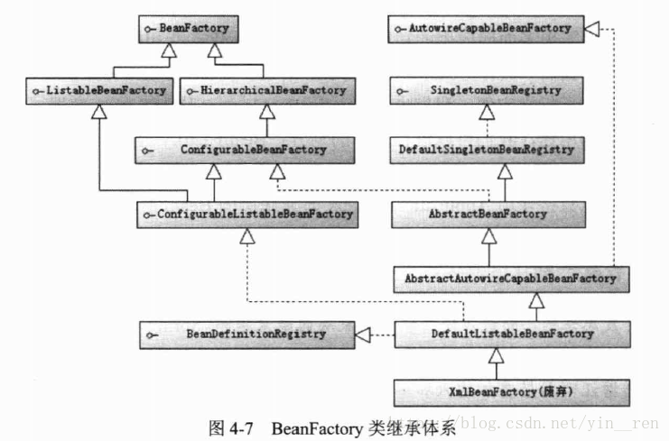

# 一、IoC

## 1. 基础

- **控制反转 IoC**： 创建对象的控制权进行转移，以前创建对象的主动权和创建时机是由自己把控的，而现在这种权力转移到第三方

  > 推荐阅读： [谈谈对Spring IOC的理解](https://www.cnblogs.com/xdp-gacl/p/4249939.html) 

### 1. IoC 类型

- **构造函数注入**： 通过调用类的构造函数，将接口实现类通过构造函数变量传入

  > ```java
  > public class MoAttack {
  >     private GeLi geli;
  >     
  >     //① 构造函数注入
  >     public MoAttack(GeLi geli){
  >         this.geli = geli;
  >     }
  >     
  >     public void cityGateAsk(){
  >         System.out.println("sayHello...");
  >     }
  > }
  > 
  > //调用
  > public class Director {
  >        public void direct(){
  >        GeLi geli = new LiuDeHua();
  >           //调用构造器注入
  >        MoAttack moAttack = new MoAttack(geli);
  >        moAttack.cityGateAsk();
  >        }
  > }
  > ```

- **属性注入**： 可以通过 setter 方法将相应的依赖对象设置到被注入对象中

  > ```java
  > public class MoAttack {
  >     private GeLi geli;
  >     
  >     //① 属性注入
  >     public void setGeli(GeLi geli){
  >         this.geli = geli;
  >     }
  >     
  >     public void cityGateAsk(){
  >         System.out.println("sayHello...");
  >     }
  > }
  > 
  > //调用
  > public class Director {
  >        public void direct(){
  >         GeLi geli = new LiuDeHua();
  >         MoAttack moAttack = new MoAttack();
  >            //调用属性 setter 方法注入
  >            moAttack.setGeli(geli);
  >         moAttack.cityGateAsk();
  >        }
  > }
  > ```

- **接口注入**： 将调用类所有依赖注入的方法抽取到一个接口中，调用类通过实现该接口提供相应的注入方法 

  > ```java
  > //抽象的接口
  > public interface ActorArrangable {
  >        void injectGeli(GeLi geli);
  > }
  > 
  > //接口实现类
  > public class MoAttack implements ActorArrangable {
  > 	private GeLi geli;
  > 
  > 	public void injectGeli(GeLi geli) {
  > 		this.geli = geli;		
  > 	}
  > 	
  > 	public void cityGateAsk() {
  > 		geli.responseAsk("墨者革离");
  > 	}
  > }
  > 
  > //调用
  > public class Director {
  >        public void direct(){
  > 	   GeLi geli = new LiuDeHua();
  > 	   MoAttack moAttack = new MoAttack();
  >           moAttack.setGeli(geli);
  > 	   moAttack.cityGateAsk();
  >        }
  > }
  > ```

- **通过容器注入**： 

  > 通过配置文件或注解描述类和类之间的依赖关系，自动完成类的初始化和依赖注入工作
  >
  > ```xml
  > <!-- beans.xml -->
  > <?xml version="1.0" encoding="UTF-8" ?>
  > <beans xmlns="http://www.springframework.org/schema/beans"
  > 	xmlns:xsi="http://www.w3.org/2001/XMLSchema-instance"
  > 	xmlns:p="http://www.springframework.org/schema/p"
  > 	xsi:schemaLocation="http://www.springframework.org/schema/beans 
  >        http://www.springframework.org/schema/beans/spring-beans-4.0.xsd">
  >    <bean id="geli" class="LiuDeHua"/>
  >    <bean id="moAttack" class="com.smart.ioc.MoAttack" p:geli-ref="geli"/>
  > </beans>
  > ```
  >
  > 通过 `new XmlBeanFactory(“beans.xml”)`  可启动容器
  >
  > 在容器启动时，spring 根据配置文件的描述信息，自动化实例化 Bean 并完成依赖关系的装配，从容器中即可返回准备就绪的 Bean 实例，后续可直接使用

### 2. Bean 工厂与应用上下文

#### 1. BeanFactory

> BeanFactory 是 Spring 框架的基础设施，面向 Spring 本身

- BeanFactory 是类的通用工厂，可以创建并管理各种类的对象(JavaBean)

  > JavaBean 规范： 必须有不带参的构造函数，不依赖某一特定容器

**BeanFactory 类体系结构**： 

> 主要方法 `getBean`： 从容器中返回指定名称的 Bean

- `ListableBeanFactory`： 定义了访问容器中 Bean 基本信息的若干方法

  > 如： 查看 Bean 的个数、获取某一类型 Bean 的配置名、查看容器是否包含某一 Bean

- `HierarchicalBeanFactory`： 父子级联 IoC 容器的接口，子容器可以通过接口方法访问父容器

- `ConfigurableBeanFactory`： 增强了 IoC 容器的可定制性，定义了设置类装载器、属性编辑器、容器初始化后置处理器等方法

- `AutowireCapableBeanFactory`： 定义了将容器中的 Bean 按某种规则进行自动装配的方法

- `SingletonBeanRegistry`： 定义了允许在运行期向容器注册单实例 Bean 的方法

- `BeanDefinitionRegistry`： xml 配置文件的 `<bean>` 节点都由一个 `BeanDefinition` 对象表示

  > `BeanDefinition` 描述了 Bean 的配置信息，`BeanDefinitionRegistry` 提供手工注册 `BeanDefinition` 对象的方法




#### 2. ApplicationContext

> ApplicationContext 面向使用 Spring 框架的开发者


## 2. 装配 Bean


## 3. 进阶


# 二、AOP

## 1. 基础


## 2. 进阶


# 三、SpEL


