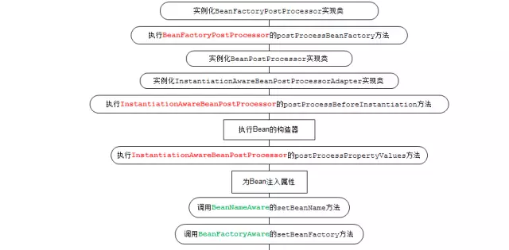
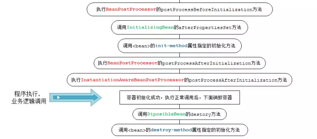
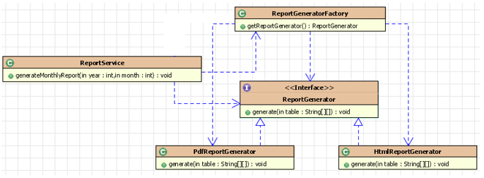
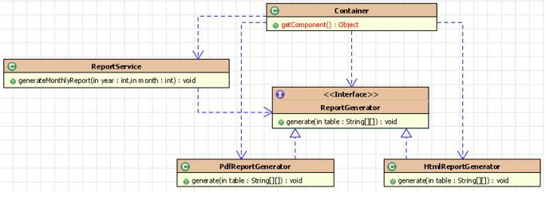
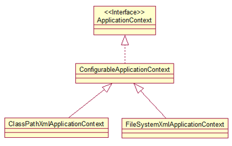
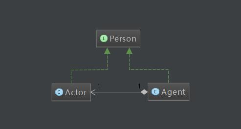
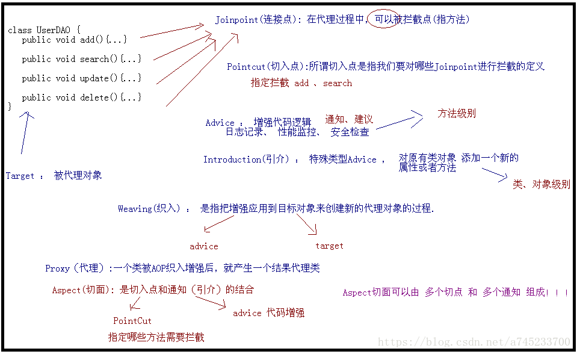
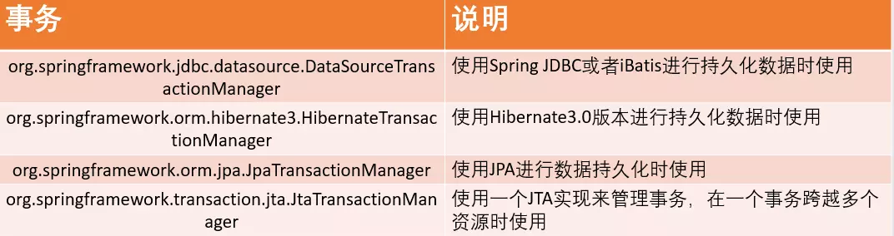
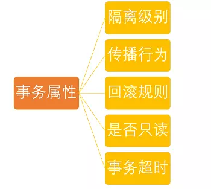

# 一、概述

## 1. 具体描述

- **轻量级**：Spring 是非侵入性的，即基于 Spring 开发的应用中的对象可以不依赖于 Spring 的 API

- **依赖注入**： `DI-->dependency injection 或 IOC` 

- **面向切面编程**： `AOP-->aspect oriented programming` 

- **容器**： Spring 是一个容器，其包含并管理应用对象的生命周期

- **框架**： Spring 可以使用简单的组件配置(XML 文件或Java 注解)组合成一个复杂的应用

- **一站式**： 在 IOC 和 AOP 的基础上可以整合各种企业应用的开源框架和优秀的第三方类库

  > 实际上 Spring 自身也提供了**展现层的 SpringMVC 和 持久层的 Spring JDBC** 

> Spring 的 6 个特征:
>
> - **核心技术** ：依赖注入(DI)，AOP，事件(events)，资源，i18n，验证，数据绑定，类型转换，SpEL
> - **测试** ：模拟对象，TestContext框架，Spring MVC 测试，WebTestClient
> - **数据访问** ：事务，DAO支持，JDBC，ORM，编组XML
> - **Web支持** : Spring MVC和Spring WebFlux Web框架
> - **集成** ：远程处理，JMS，JCA，JMX，电子邮件，任务，调度，缓存
> - **语言** ：Kotlin，Groovy，动态语言

## 2. spring 优点

- **方便解耦，简化开发**： 通过 Spring 提供的 IoC 容器，用户可以将对象之间的依赖关系交由 Spring 进行控制
- **AOP 的支持**： 方便进行面向切面编程
- **声明式事务的支持**： 通过声明的方式灵活进行事务支持，提高开发效率和质量
- **方便集成其他框架**： Spring 支持各种优秀框架

## 3. 组成的模块


- **核心模块(`Spring Core`)**： Spring 框架最基础部分，提供了依赖注入特征来实现容器对 Bean 的管理

  > BeanFactory 是 Spring 应用的核心，使用 IoC 将应用配置和依赖说明从实际的应用代码中分离出来
  >
  > XmlBeanFactory： 从 XML 文件读取配置元数据并用它创建一个完全配置的系统或应用

- **应用上下文模块(`Spring Context`)**：

  - 扩展 `BeanFactory` 概念，增加对国际化(`I18N`)消息、事件传播以及验证的支持
  - 提供许多企业服务，如：电子邮件、JNDI访问、EJB集成、远程以及时序调度（scheduling）服务
  - 也包括了对模版框架的支持，如： Velocity和FreeMarker集成

- **Spring AOP模块**： 

  - 提供对面向切面编程的支持
  - 支持基于 AOP 联盟定义的API
  - 将元数据编程引入 Spring

  > AOP联盟： 通过定义一组共同的接口和组件来促进 AOP 的使用以及不同 AOP 实现间的互用性

- **JDBC 抽象和 DAO 模块**： 保证数据库代码的简洁，并能避免数据库资源错误关闭导致的问题

  > - 在各种不同的数据库的错误信息之上，提供统一的异常访问层
  > - 利用 Spring AOP 模块给 Spring 应用中的对象提供事务管理服务

- **对象/关系映射集成模块(`Spring ORM`)**：为 ORM 框架提供集成方案，但不实现它自己的 ORM 解决方案

- **Spring Web模块**： 

  - 建立于应用上下文模块之上，提供适合于 Web 应用的上下文
  - 支持多种面向 web 的任务

- **Spring MVC框架**： 

  - 使用 IoC 对控制逻辑和业务对象提供完全分离
  - 允许声明性地将请求参数绑定到业务对象中

## 4. Spring 处理线程并发

- Spring 采用 ThreadLocal 进行处理，解决 bean 线程安全问题
- ThreadLocal 为每个线程提供独立的变量副本，从而隔离多个线程对数据的访问冲突

## 5. Spring 不同类型事件

- **上下文更新事件(ContextRefreshedEvent)**：调用 ConfigurableApplicationContext 接口的 `refresh()` 方法时被触发

- **上下文开始事件(ContextStartedEvent)**：调用 ConfigurableApplicationContext 的 `Start()` 方法开始/重新开始容器时触发该事件

- **上下文停止事件(ContextStoppedEvent)**：调用 ConfigurableApplicationContext 的 `Stop()` 方法停止容器时触发该事件

- **上下文关闭事件(ContextClosedEvent)**：当 ApplicationContext 被关闭时触发该事件

  > 容器被关闭时，其管理的所有单例 Bean 都被销毁

- **请求处理事件(RequestHandledEvent)**：Web 应用中，一个http请求（request）结束触发该事件

> 如果一个 bean 实现了 ApplicationListener 接口，当一个ApplicationEvent 被发布以后，bean 会被通知

## 6. spring 用到的设计模式

- **工厂设计模式**： Spring 使用工厂模式通过 `BeanFactory`、`ApplicationContext` 创建 bean 对象
- **代理设计模式**： Spring AOP 功能的实现
- **单例设计模式**： Spring 中的 Bean 默认都是单例
- **模板方法模式**： Spring 中 `jdbcTemplate`、`hibernateTemplate` 等以 Template 结尾的对数据库操作的类
- **包装器设计模式**： 我们的项目需要连接多个数据库，而且不同的客户在每次访问中根据需要会去访问不同的数据库。这种模式让我们可以根据客户的需求能够动态切换不同的数据源
- **观察者模式**： Spring 事件驱动模型就是观察者模式很经典的一个应用
- **适配器模式**： Spring AOP 的增强或通知(Advice)使用到了适配器模式、spring MVC 中也是用到了适配器模式适配 `Controller` 

# 二、Bean

## 1. 生命周期

- **实例化 Bean**：

  - 对于 BeanFactory 容器，当客户向容器请求一个尚未初始化的 bean 时，或初始化 bean 时需要注入另一个尚未初始化的依赖时，容器就会调用 createBean 进行实例化
  - 对于 ApplicationContext 容器，当容器启动结束后，通过获取 BeanDefinition 对象中的信息，实例化所有 bean

- **设置对象属性(依赖注入)**：实例化后的对象被封装在 BeanWrapper 对象中，Spring 根据 BeanDefinition 中的信息以及通过 BeanWrapper 提供的设置属性的接口完成依赖注入

- **处理 Aware 接口**：Spring 会检测对象是否实现 xxxAware 接口，并将相关的 xxxAware 实例注入给Bean

  - 如果 Bean 实现了 BeanNameAware 接口，会调用它实现的 setBeanName(String beanId) 方法，传递的是 Spring 配置文件中 Bean 的 id 值
  - 如果 Bean 实现了 BeanFactoryAware 接口，会调用它实现的 setBeanFactory() 方法，传递的是Spring工厂自身
  - 如果 Bean 实现了 ApplicationContextAware 接口，会调用 setApplicationContext(ApplicationContext)方法，传入 Spring 上下文

- **BeanPostProcessor**：上述三个过程 Bean 已被正确构造，使用前通过 BeanPostProcessor 进行自定义处理

  > - `postProcessBeforeInitialzation(Object bean, String beanName)`：先于 InitialzationBean 执行，所有 Aware 接口的注入就是在这一步完成的，称为**前置处理**
  >
  >   >  该方法在 Bean 初始化结束时调用，所以可以被应用于内存或缓存技术
  >
  > - `postProcessAfterInitialzation(Object bean, String beanName)`： 当前正在初始化的bean对象会被传递进来，在 InitialzationBean 完成后执行，因此称为**后置处理**

- **InitializingBean 与 init-method**：Bean 在 Spring 配置文件中配置了 init-method 属性，则会自动调用其配置的初始化方法

----------------------------------以上步骤完成后，Bean 就被正确创建-------------------------------

- **DisposableBean**：Bean 实现 DisposableBean 接口，会调用其实现的 destroy() 方法
- **destroy-method**：如果 Bean 的 Spring 配置中配置了destroy-method 属性，会自动调用配置的销毁方法


## 2. 作用域

- `singleton`：默认，每个容器中只有一个 bean 实例，由 BeanFactory 自身来维护
- `prototype`：为每一个 bean 请求提供一个实例
- `request`：为每一个网络请求创建一个实例，在请求完成以后，bean 会失效并被垃圾回收器回收
- `session`：与request范围类似，确保每个 session 有一个 bean 实例，session 过期后，bean 会随之失效
- `global-session`：全局作用域，与 Portlet 应用相关，所有 Portlet 可以共用存储在 global-session 中的全局变量，全局作用域与Servlet中的session作用域效果相同

## 3. 循环依赖问题

推荐阅读： [Spring-bean的循环依赖以及解决方式](https://blog.csdn.net/chejinqiang/article/details/80003868)  

- 简介： 循环依赖就是循环引用，即两个或以上的 bean 互相持有对方，最终形成闭环

  > 比如： A 依赖于 B，B 依赖于 C，C 又依赖于 A
  >
  > 
  >
  > **理论依据： 基于Java的引用传递**，当获取到对象的引用时，对象的 field 或属性可以延后设置

- Spring 中**循环依赖场景**： 
  - 构造器的循环依赖 
  - field 属性的循环依赖

- **检测循环依赖**： Bean 在创建时可以**打标**，如果递归调用回来发现正在创建中，即说明 Bean 循环依赖

- **解决循环依赖**： ==构造器的循环依赖没法解决==

  > 解决： 使用注解 `@Autowired` 或 `setter` 方法依赖注入
  >
  > 底层解析： 
  >
  > - spring **单例对象的初始化步骤**： 
  >
  >   > 
  >   >
  >   > 1. `createBeanInstance`：实例化，即调用对象的构造方法实例化对象
  >   >
  >   > 2. `populateBean`：填充属性，主要是对 bean 的依赖属性进行填充
  >   >
  >   > 3. `initializeBean`：调用 spring xml 中的 init 方法
  >   >
  >   > 由上知： **循环依赖主要发生在第一、二步**，即构造器循环依赖和 field 循环依赖
  >
  > - Spring为了解决单例的循环依赖问题，使用了**三级缓存**： 
  >
  >   > 1. 三级缓存 `singletonFactories`： 单例对象工厂的 cache 
  >   >
  >   >    > 解决循环依赖的诀窍是 singletonFactories，这个cache的类型是 ObjectFactory
  >   >
  >   > 2. 二级缓存 `earlySingletonObjects`：提前曝光的单例对象的 cache 
  >   >
  >   > 3. 一级缓存 `singletonObjects`：单例对象的 cache
  >
  > - 三级缓存流程： 
  >
  >   > A 的某个 field 或 setter 依赖 B 的实例对象，同时 B 的某个 field 或 setter 依赖 A 的实例对象： 
  >   >
  >   > 1. A 首先完成初始化的第一步，将自己提前曝光到 singletonFactories 中
  >   >
  >   > 2. 进行初始化的第二步时，发现自己依赖对象 B，此时尝试 get(B)，发现 B 还未 create，所以走 create B 流程
  >   >
  >   > 3. B 在初始化第一步时，发现依赖对象 A，于是尝试 get(A)，尝试一级缓存 singletonObjects，二级缓存 earlySingletonObjects 都没有，在三级缓存 singletonFactories 中拿到
  >   >
  >   >    > 由于 A 通过 ObjectFactory 将自己提前曝光，所以 B 能够通过 ObjectFactory.getObject 拿到 A 对象
  >   >
  >   > 4. B 拿到 A 对象后顺利完成了初始化阶段 1、2、3，完全初始化之后将自己放入到一级缓存
  >   >
  >   > 5. B 创建完成后返回 A 中，A 此时能拿到 B 的对象顺利完成自己的初始化阶段2、3，并放入一级缓存 singletonObjects 中
  >   >
  >   >    > 更加幸运的是，由于 B 拿到了 A 的对象引用，所以 B 现在 hold 住的 A 对象完成了初始化
  >   >
  >   > **加入 singletonFactories 三级缓存的前提是执行了构造器**，所以**构造器的循环依赖没法解决**

## 4. 配置

### 1. XML 文件方式

#### 1. 配置方式

- **通过全类名方式配置 Bean**： 

  ```xml
  <!-- 通过全类名方式来配置 bean -->
  <bean id="helloWorld" class="com.spring.helloworld.HelloWorld"></bean>
  <!-- 
  	id: Bean 的名称
  		1. 在 IOC 容器中必须唯一
  		2. 若 id 没有指定，Spring 自动将类名作为 Bean 的名字
  		3. id 可以指定多个名字，名字之间可用逗号、分号、或空格分隔
   -->
  ```

- **通过工厂方法配置 Bean**： 不需要关心对象的创建细节

  - **静态工厂方法**：将对象创建的过程封装到静态方法中，使用时只需简单地调用静态方法

    > 通过静态方法创建 Bean： 
    >
    > - 在 Bean 的 class 属性里指定拥有该工厂的方法的类
    > - 在 `factory-method` 属性里指定工厂方法的名称
    > - 使用 `<constrctor-arg>` 元素为该方法传递方法参数

    ```xml
    <!-- 在 class 中指定静态工厂方法的全类名,在 factory-method 中指定静态工厂方法的方法名 -->
    <bean id="dateFormat" class="java.text.DateFormat" 
          factory-method="getDateInstance">
        <!-- 可以通过 constructor-arg 子节点为静态工厂方法指定参数 -->
        <constructor-arg value="2"></constructor-arg>
    </bean>
    ```

  - **实例工厂方法**： 将对象创建过程封装到另外一个对象实例的方法里，当客户端请求对象时，只需简单的调用该实例方法

    > **通过实例工厂方法创建 Bean**： 
    >
    > - 在 bean 的 `factory-bean` 属性里指定拥有该工厂方法的 Bean
    > - 在 `factory-method` 属性里指定该工厂方法的名称
    > - 使用 `construtor-ar`g 元素为工厂方法传递方法参数

    ```xml
    <!-- 实例工厂方法: 先需要创建工厂对象, 再调用工厂的非静态方法返回实例(了解) -->
    <!-- ①. 创建工厂对应的 bean -->
    <bean id="simpleDateFormat" class="java.text.SimpleDateFormat">
        <constructor-arg value="yyyy-MM-dd hh:mm:ss"></constructor-arg>
    </bean>
    
    <!-- ②. 有实例工厂方法来创建 bean 实例 -->
    <!-- factory-bean 指向工厂 bean, factory-method 指定工厂方法(了解) -->
    <bean id="datetime" factory-bean="simpleDateFormat" factory-method="parse">
        <!-- 通过 constructor-arg 执行调用工厂方法需要传入的参数 -->
        <constructor-arg value="1990-12-12 12:12:12"></constructor-arg>
    </bean>
    ```

- **实现 FactoryBean 接口在 Spring IOC 容器中配置 Bean**： Spring 中 Bean 的类型： **普通 Bean 和工厂Bean(FactoryBean)** 

  > 工厂 Bean 返回的是该工厂 Bean 的 getObject 方法所返回的对象

#### 2. 依赖注入方式

- **依赖注入的方式**： 属性注入、构造器注入、工程方法注入(很少使用)

  - **属性注入**： 即通过 setter 方法注入Bean 的属性值或依赖的对象，最常用的注入方式

    ```xml
    <!-- 
    	属性注入使用 <property> 元素
    	name 属性指定 Bean 的属性名称
    	value 属性或 <value> 子节点指定属性值  
    -->
    <bean id="helloWorld" class="com.spring.helloworld.HelloWorld">
        <!-- 为属性赋值 -->
        <!-- 属性注入: 通过 setter 方法注入属性值 -->
        <property name="user" value="Tom"></property>
    </bean>
    ```

  - **构造器注入**： 通过构造方法注入 Bean 的属性值或依赖对象，保证 Bean 在实例化后就可以使用

    ```xml
    <!-- 构造器注入在 <constructor-arg> 元素里声明属性 -->
    <!-- 
    	若一个 bean 有多个构造器,可以根据 index 和 type 进行更加精确的定位 
    		1. index: 按索引匹配入参
    		2. type: 按类型匹配入参
    -->
    <bean id="car" class="com.spring.helloworld.Car">
        <constructor-arg value="KUGA" index="1"></constructor-arg>
        <constructor-arg value="ChangAnFord" index="0"></constructor-arg>
        <constructor-arg value="250000" type="float"></constructor-arg>
    </bean>
    
    <bean id="car2" class="com.spring.helloworld.Car">
        <constructor-arg value="ChangAnMazda"></constructor-arg>
        <!-- 若字面值中包含特殊字符, 则可以使用 DCDATA 来进行赋值 -->
        <constructor-arg>
            <value><![CDATA[<ATARZA>]]></value>
        </constructor-arg>
        <constructor-arg value="180" type="int"></constructor-arg>
    </bean>
    ```

#### 3. 引用 Bean

- **引用 Bean**： 可以通过 `<ref>` 元素或 ref  属性为 Bean 的属性或构造器参数指定对 Bean 的引用

  > 也可以在属性或构造器里包含 Bean 的声明，这样的 Bean 称为**内部 Bean** 
  >
  > 内部 Bean 声明直接包含在 `<property> 或 <constructor-arg>` 元素里，不需要设置任何 id 或 name 属性

  ```xml
  <bean id="service" class="com.spring.ref.Service"></bean>
  
  <bean id="action" class="com.spring.ref.Action">
      <!-- 通过 ref 属性值指定当前属性指向哪一个 bean! -->
      <property name="service" ref="service"></property>
  </bean>
  	
  <!-- 声明使用内部 bean -->
  <bean id="service2" class="com.spring.ref.Service">
      <property name="dao">
          <!-- 内部 bean：不能被外部的 bean 来引用, 也没有必要设置 id 属性 -->
          <bean class="com.spring.ref.Dao">
              <property name="dataSource" value="c3p0"></property>
          </bean>
      </property>
  </bean>
  ```

#### 4. 注入 null 值

- **注入 null 值**：使用专用的 `<null/>` 标签为 Bean 的字符串或其它对象类型的属性注入 null 值

  ```xml
  <bean id="dao" class="com.spring.ref.Dao">
      <!-- 为 Dao 的 dataSource 属性赋值为 null -->
      <property name="dataSource"><null/></property>
  </bean>
  ```

#### 5. 属性

- **级联属性**： 当两个 bean 关联时，从一个 bean 给 另一个 bean 赋值

  > 注意： 属性需要先初始化后，才可以为级联属性赋值，否则会有异常

  ```xml
  <bean id="action" class="com.spring.ref.Action">
      <property name="service" ref="service2"></property>
      <!-- 为级联属性赋值 -->
      <property name="service.dao.dataSource" value="DBCP2"></property>
  </bean>
  ```

- **集合属性**： 

  - `java.util.List` 类型的属性对应  `<list>`  标签
  - `java.util.Set` 类型属性对应 `<set>` 标签

  通过 `<value>` 指定简单的常量值，通过 `<ref>` 指定对其他 Bean 的引用

  - `java.util.Map` 类型属性对应 `<map>` 标签

    使用 `<key>` 标签定义键，`<entry>` 标签定义值

  - `java.util.Properties` 属性对应 `<props>` 标签，使用多个 `<prop>` 作为子标签，`<prop>` 标签必须定义 key 属性

#### 6. p命名空间

- **p 命名空间**： 可以通过 `<bean>` 元素属性的方式配置 Bean 的属性，简化 XML 的配置

  ```xml
  <bean id="user3" class="com.spring.helloworld.User" p:cars-ref="cars" 
        p:userName="Titannic"></bean>
  ```

#### 7. 自动装配

- **bean 装配**： 指在 Spring 容器中把 bean 组装到一起

  > 前提： 容器知道 bean 的依赖关系，通过依赖注入来装配到一起

- **自动装配**： Spring 容器能自动装配相互合作的 bean，即容器不需要 `<constructor-arg>和<property>` 配置，能通过 Bean 工厂自动处理 bean 之间的协作

  **实现**： 在 `<bean>` 的 autowire 属性里指定自动装配的模式

  ```xml
  <bean id="car" class="com.spring.Car" p:brand="Audi" p:price="3000"></bean>
  <bean id="address" class="com.spring.Address" p:city="BeiJing" 
        p:street="Hui"></bean>
  <!-- 原始配置 -->
  <bean id="person" class="com.spring.Person" p:name="Tom" 
        p:car-ref="car" p:address-ref="address"></bean>
  ```

  - **`byType`(根据类型自动装配)**： 通过参数类型自动装配和该 bean 的属性具有相同类型的 bean

    > 注意： 若 IOC 容器中有多个 Bean 类型一致，则 Bean不能执行自动装配，会抛出错误

    ```xml
    <!-- 根据 bena 的类型和当前 bean 的属性类型进行自动装配 -->
    <bean id="person" class="com.spring.Person" p:name="Tom" 
          autowire="byType"></bean>
    ```

  - **`byName`(根据名称自动装配)**： 通过参数名自动装配和该 bean 的属性具有相同名字的 bean

    > 注意： 必须将目标 Bean 的名称和属性名设置相同

    ```xml
    <!-- 根据 bean 的名称和当前 bean 的 setter 风格的属性名称进行自动装配 -->
    <bean id="person" class="com.spring.Person" p:name="Tom" 
          autowire="byName"></bean>
    ```

  - **`constructor`(通过构造器自动装配)**： 类似于byType， 但是要提供给构造器参数，如果没有确定的带参数的构造器参数类型，将会抛出异常

  - **`autodetect`**： 首先尝试使用 constructor 来自动装配，如果无法工作，则使用 byType 方式

  > **自动装配的缺点**： (很少使用)
  >
  > - 在 Bean 配置文件里设置 autowire 属性会装配 Bean 的所有属性
  > - autowire 属性要么根据类型自动装配，要么根据名称自动装配，不能两者兼有

- **自动装配的局限性**： 

  - **重写**： 需用 `<constructor-arg>和 <property>` 配置来定义依赖，即要重写自动装配
  - **基本数据类型**： 不能自动装配简单的属性，如基本数据类型，String字符串，和类
  - **模糊特性：**自动装配不如显式装配精确，如果有可能，建议使用显式装配

#### 8. bean 之间的关系

- **bean 之间的关系**：继承和依赖

  - **继承 Bean**： Spring 允许继承 bean 的配置

    - 子 Bean 从父 Bean 中既可以**继承配置**，也可以**覆盖**从父 Bean 继承的配置

    - 父 Bean 既可以作为配置模板，也可以作为 Bean 实例

      > 设置 `<bean>` 的 abstract 属性为 true 就可以把父 Bean 作为模板
      >
      > 因为 Spring 将不会实例化这个 Bean

    - 不是 `<bean>` 元素里的所有属性都会被继承，比如: autowire, abstract 等

    - 可以忽略父 Bean 的 class 属性，让子 Bean 指定自己的类，而共享相同的属性配置，但此时 abstract 必须设为 true

    ```xml
    <bean id="user" class="com.spring.helloworld.User">
        <property name="userName" value="Jack"></property>
    </bean>
    
    <bean id="user2" parent="user" p:userName="Bob"></bean>
    ```

  - **依赖 Bean**： Spring 允许通过 `depends-on` 属性设定 Bean 前置依赖的 Bean，前置依赖的 Bean 会在本 Bean 实例化之前创建好

    > 如果前置依赖于多个 Bean，则可以通过逗号，空格的方式配置 Bean 的名称

    ```xml
    <bean id="user5" parent="user" p:userName="Backham" depends-on="user2"></bean>
    ```

#### 9. bean 的作用域

- **bean 的作用域**：可以通过 `<bean>` 中的 `scope` 标签来配置，默认是 singleton

  - `singleton(默认)`： IOC 容器中只有一个 Bean 实例，且能共享该实例

  - `prototype`： 每次调用 getBean() 时，都会返回一个新的实例

  - **WEB 环境作用域**： 作用域为 WebApplicationContext 环境

    - `request `： 每次 HTTP 请求都会创建一个新的 Bean
    - `session`： 同一个 HTTP Session 共享一个 Bean，不同的 HTTP Session 使用不同的 Bean
    - `global-session`：在一个全局的HTTP Session中，一个bean定义对应一个实例

  - **使用外部属性文件**： Spring 提供一个 `PropertyPlaceholderConfigurer` 的 `BeanFactory` 后置处理器，允许用户将 Bean 配置的部分内容外移到属性文件中

    - 在 Bean 配置文件中使用 `${var}` 形式从属性文件里加载属性，并使用这些属性来替换变量
    - 也可以在属性文件中使用 `${propName}`，实现属性之间的相互引用

    ```xml
    <!-- 注册 PropertyPlaceholderConfigurer -->
    <bean class
         ="org.springframework.beans.factory.config.PropertyPlaceholderConfigurer">
    	<property name="location" value="classpath:jdbc.properties"></property>
    </bean>
    <!-- 等价于(<beans> 中添加 context Schema 定义) -->
    <context:property-placeholder location="classpath:jdbc.properties"/>
    ```

#### 10. SpEL

- **Spring表达式语言(SpEL)**： 支持运行时查询和操作对象的表达式语言，语法为 `#{}` 

  > **通过 SpEL 可以实现**：
  >
  > - **表达字面量**
  >
  > ```xml
  > <property name="count" value="#{5}"/> <!-- 整数 -->
  > <property name="frequency" value="#{89.7}"/><!-- 小数 -->
  > <property name="capacity" value="#{1e4}"/><!-- 科学计数法 -->
  > <!-- 用单引号或者双引号作为字符串的定界符号 -->
  > <property name=“name” value="#{'Chuck'}"/> 
  > <property name='name' value='#{"Chuck"}'/>
  > <property name="enabled" value="#{false}"/><!-- Boolean -->
  > ```
  >
  > - **引用 Bean、属性和方法**
  >
  > ```xml
  > <!-- 引用其他对象 -->
  > <!-- 通过 value 属性和 SpEL 配置 Bean 之间的应用关系 -->
  > <property name="prefix" value="#{prefixGenerator}"/>
  > 
  > <!-- 引用其他对象的属性 -->
  > <!-- 通过value 属性和SpEL 配置suffix 属性值为另一个Bean 的suffix 属性值 -->
  > <property name="suffix" value="#{sequenceGenerator2.suffix}"/>
  > 
  > <!-- 调用其他方法，还可以链式操作 -->
  > <!-- 通过value 属性和SpEL 配置suffix 属性值为另一个Bean 的方法返回值 -->
  > <property name="suffix" value="#{sequenceGenerator2.toString()}"/>
  > <!--  方法的连缀-->
  > <property name="suffix" 
  >          value="#{sequenceGenerator2.toString().toUpperCase()}"/>
  > ```
  >
  > - **调用静态方法或静态属性**： 通过 `T()` 调用一个类的静态方法，它将返回一个 Class Object，然后再调用相应的方法或属性
  >
  > ```xml
  > <property name="initValue" value="#{T(java.lang.Math).PI}"/>
  > ```
  >
  > - **计算表达式的值**： 
  >   - 算数运算符：`+, -, *, /, %, ^`
  >   - 比较运算符：` <, >, ==, <=, >=, lt, gt, eq, le, ge`
  >   - 逻辑运算符号： `and, or, not, |`
  >   - if-else 运算符：`?: (ternary), ?: (Elvis)`
  > - **正则表达式的匹配**

#### 11. IOC 生命周期

- **IOC 容器中 Bean 的生命周期**： 在 Bean 的声明里设置 `init-method 和 destroy-method` 属性，为 Bean 指定初始化和销毁方法

  > - 对应注解： `@PostConstruct, @PreDestroy` 
  > - bean 生命周期方法
  >   - `setup`： 在容器加载 bean时调用
  >   - `teardown`： 在容器卸载类时调用

  Spring IOC 容器对 Bean 的生命周期进行**管理的过程**： 

  - **创建 Bean**： 通过构造器或工厂方法创建 Bean 实例
  - **赋值 Bean**： 设置 Bean 的属性值，引用其他 Bean
  - **初始化 Bean**：调用 Bean 的初始化方法
  - **使用 Bean** 
  - **销毁 Bean**： 当容器关闭时, 调用 Bean 的销毁方法

  > - Spring 容器从 XML 文件中读取 bean 并实例化 bean
  > - Spring 根据 bean 的定义填充所有的属性
  > - 如果 bean 实现 BeanNameAware 接口，Spring 传递 bean 的ID 到 setBeanName方法
  > - 如果 Bean 实现了 BeanFactoryAware 接口， Spring 传递 beanfactory 给 setBeanFactory 方法
  > - 如果有任何与bean相关联的BeanPostProcessors，Spring会在postProcesserBeforeInitialization()方法内调用它们
  > - 如果 bean 实现 IntializingBean，调用它的afterPropertySet方法，如果bean声明了初始化方法，调用此初始化方法
  > - 如果有BeanPostProcessors 和bean 关联，bean的postProcessAfterInitialization() 方法将被调用
  > - 如果bean实现了 DisposableBean，它将调用destroy()方法

- **创建 Bean 后置处理器**： 

  - Bean 后置处理器允许在调用初始化方法前后对 Bean 进行额外处理

  - Bean 后置处理器对 IOC 容器里的所有 Bean 实例逐一处理

    > 典型应用： 检查 Bean 属性的正确性或根据特定的标准更改 Bean 的属性

  - Bean 后置处理器需要实现 `BeanPostProcessor` 接口，在初始化方法被调用前后，Spring 将把每个 Bean 实例分别传递给上述接口的以下两个方法： `postProcessorBeforeInitialization 和 postProcessorAfterInitialization ` 

  **添加 Bean 后置处理器后 Bean 的生命周期**： 

  - **创建 Bean**： 通过构造器或工厂方法创建 Bean 实例
  - **赋值 Bean**： 设置 Bean 的属性值，引用其他 Bean
  - 将 Bean 实例传递给 Bean 后置处理器的 postProcessBeforeInitialization 方法
  - **初始化 Bean**：调用 Bean 的初始化方法
  - 将 Bean 实例传递给 Bean 后置处理器的 postProcessAfterInitialization 方法
  - **使用 Bean** 
  - **销毁 Bean**： 当容器关闭时，调用 Bean 的销毁方法





### 2. 注解方式

- **在 classpath 中扫描组件**： Spring 能够从 classpath 下自动扫描、侦测和实例化具有特定注解的组件

  > **Spring 对组件的默认命名策略**： 使用非限定类名，第一个字母小写；也可以在注解中通过 value 属性值标识组件的名称

  - `@Component`： 标识受 Spring 管理的组件
  - `@Respository`： 标识持久层组件
  - `@Service`： 标识服务层(业务层)组件
  - `@Controller`： 标识表现层组件

  在组件类上使用特定注解后，还需要在 Spring 的配置文件中声明： 

  - `<context:component-scan>`：会扫描指定路径下的包，还会自动注册 AutowiredAnnotationBeanPostProcessor 实例，该实例可以自动装配具有 `@Autowired,@Resource, @Inject` 注解的属性

    > - `base-package`： 指定需要扫描的基类包，会扫描这个基类包里及其子包中的所有类；当需要扫描多个包时, 可以使用逗号分隔
    > - `resource-pattern`： 过滤基类包下的特定类

  - `<context:include-filter>`： 表示要包含的目标类

  - `<context:exclude-filter>`： 表示要排除在外的目标类

  |     类别     | 说明                                                         |
  | :----------: | ------------------------------------------------------------ |
  | `annotation` | 所有标注了 XxxAnnotation 的类，该类型采用目标类是否标注了某个注解进行过滤 |
  | `assinable`  | 所有继承或扩展 XxxService 的类，该类型采用目标类是否继承或扩展某特定类进行过滤 |
  |  `aspectJ`   | 所有类名以 Service 结束的类及继承或扩展的类，该类型采用 AspectJ 表达式进行过滤 |
  |   `regex`    | 所有 com.anno 包下的类，该类型采用正则表达式根据类名进行过滤 |
  |   `custom`   | 采用 XxxTypeFilter 通过代码的方式定义过滤规则，该类必须实现com.springframework.core.TypeFilter 接口 |

  ```xml
  <!-- 例子 -->
  <context:component-scan base-package="com.spring.beans">
  	<context:exclude-filter type="annotation"
                             expression="org.springframework.stereotype.Repository"/>
  </context:component-scan>
  ```

- **自动装配 Bean**： 

  - `@Autowired(建议采用)`： 自动装配具有兼容类型的单个 Bean 属性

    - **构造器、普通字段、具有参数的方法**都可以应用 `@Authwired` 注解

    - 默认情况下，当 Spring 找不到匹配的 Bean 装配 @Authwired 注解的属性时, 会抛出异常

      可以设置 @Authwired 注解的 required 属性为 false，允许某一属性不被设置 

    - 默认情况下，当 IOC 容器里存在多个类型兼容的 Bean 时，可以在 `@Qualifier` 注解里提供 Bean 的名称或使用 `@Primary` 标注优先级

    > `@Authwired` 注解可以标注的属性： 
    >
    > - **在数组类型属性上**，Spring 将会把所有匹配的 Bean 进行自动装配
    > - **在集合属性上**，Spring 读取该集合的类型信息，然后自动装配所有与之兼容的 Bean
    > - **在 java.util.Map 上**，Spring 将自动装配与 Map 值类型兼容的 Bean

  - `@Resource`：要求提供 Bean 名称的属性，若该属性为空，则自动采用标注处的变量或方法名作为 Bean 名称

  - `@Inject`：  和 @Autowired 注解一样也是按类型匹配注入的 Bean， 但没有 reqired 属性

### 3. 泛型依赖注入

> **泛型依赖注入**： 可以为子类注入子类对应的泛型类型的成员变量的引用

- Spring 允许通过 `<import>` 将多个配置文件引入到一个文件中，进行配置文件的集成
- import 元素的 resource 属性支持 Spring 的标准路径资源

|   地址前缀   | 对应资源类型                                   |
| :----------: | ---------------------------------------------- |
| `classpath:` | 从类路径下加载资源                             |
|   `file:`    | 从系统目录中装在资源，可采用绝对路径和相对路径 |
|  `http://`   | 从 WEB 服务器中加载资源                        |
|   `ftp://`   | 从 FTP 服务器中加载资源                        |

```java
//BaseDao 类
public class BaseDao<T> {
	public void save(T entity){
		System.out.println("Save:" + entity);
	}
}

//BaseService 类
public class BaseService<T> {
	@Autowired
	private BaseDao<T> dao;
	
	public void addNew(T entity){
		System.out.println("addNew by " + dao);
		dao.save(entity);
	}
}

//UserDao 类
@Repository
public class UserDao extends BaseDao<User>{

}

//UserService 类
@Service
public class UserService extends BaseService<User>{

}

//User 类
public class User {
}

//测试类
public class Main {
	public static void main(String[] args) {
		ApplicationContext ctx = 
            new ClassPathXmlApplicationContext("beans-annotation.xml");
		
		UserService userService = (UserService) ctx.getBean("userService");
		userService.addNew(new User());
		
		RoleService roleService = (RoleService) ctx.getBean("roleService");
		roleService.addNew(new Role()); 
	}	
}

//xml 配置文件
<!-- 配置自动扫描的包: 需要加入 aop 对应的 jar 包 -->
<context:component-scan base-package="com.spring.annotation.generic"/>
```

##  5. 自动装配

- spring 中，对象无需自己查找或创建与其关联的其他对象，由容器负责把需要相互协作的对象引用赋予各个对象，使用 `autowire` 来配置自动装载模式

- **xml 配置文件**的自动装配：

  - `no`：默认方式，不进行自动装配，通过手工设置 ref 属性来装配 bean
  - `byName`：通过 bean 名称进行自动装配，若 bean 的 property 与另一 bean 的 name 相同，则自动装配
  - `byType`：通过参数的数据类型进行自动装配
  - `constructor`：利用构造函数进行装配，并且构造函数的参数通过 byType 进行装配
  - `autodetect`：自动探测，若有构造方法，通过 construct 方式自动装配，否则用 byType方式自动装配

- **基于注解方式**：`@Autowired` 注解自动装配指定的 bean

  > 需要在 Spring 配置文件进行配置 `<context:annotation-config />`

  **原理**： 启动 spring IoC 时，容器自动装载 `AutowiredAnnotationBeanPostProcessor` 后置处理器，当容器扫描到 `@Autowied、@Resource、Inject` 时，在 IoC 容器自动查找需要 的bean，并装配给该对象的属性

  在容器中查询对应类型的bean：

  - 如果查询结果刚好为一个，就将该 bean 装配给 @Autowired 指定的数据

  - 如果查询的结果不止一个，则 @Autowired 会根据名称来查找

  - 如果查找的结果为空，则抛出异常

    > 解决方法： 使用 `required=false`

  `@Autowired和@Resource` 区别：

  - `@Autowired` 默认按照类型装配注入，要求依赖对象必须存在（可以设置required=false）
  - `@Resource` 默认按照名称装配注入，当找不到与名称匹配的 bean 时，会按照类型来装配注入

# 三、IOC

## 1. 概述

- **Spring IoC **： 负责创建对象，管理对象(通过依赖注入)，装配对象，配置对象，管理对象的整个生命周期

- **IoC 的优点**： 

  - IOC 把应用的代码量降到最低，使应用容易测试

    > 单元测试不再需要单例和JNDI查找机制

  - 最小的代价和最小的侵入性使松散耦合得以实现

  - IOC 容器支持饿汉式初始化和懒加载

- `IOC(Inversion of Control)`：反转资源获取方向

  - **传统资源查找方式**： 要求组件向容器发起请求查找资源；作为回应，容器适时的返回资源
  - **IOC 方式**： 容器主动地将资源推送给所管理的组件，组件选择合适的方式来接受资源

- `DI(Dependency Injection)`：组件以预先定义好的方式(如: setter 方法)接受来自容器的资源注入

  - 不用创建对象，只需描述如何被创建
  - 不在代码中组装组件和服务，但要在配置文件中描述哪些组件需要哪些服务，之后 IOC容器负责组装

- **IOC 前生**： 

  - **分离接口**与实现

    

  - 采用**工厂设计模式**

    

  - 采用**反转控制 ** 

    

## 2. BeanFactory & ApplicationContext

> 在 Spring IOC 容器读取 Bean 配置创建 Bean 实例之前，必须对它进行实例化

Spring 提供两种类型的 **IOC 容器实现**： 

- `BeanFactory`：IOC 容器的基本实现，包含各种 Bean 的定义，读取 bean 配置文档，管理 bean 的加载、实例化，控制 bean 的生命周期，维护 bean 之间的依赖关系

  > BeanFactory 是 Spring **框架的基础设施**，面向 Spring 本身

- `ApplicationContext`： 提供更多的高级特性，是 BeanFactory 的子接口

  > ApplicationContext 面向使用 Spring **框架的开发者**，可直接使用
  >
  > 提供更完整的框架功能：
  >
  > - 继承 MessageSource，因此支持国际化
  > - 统一的资源文件访问方式
  > - 在监听器中注册 bean 事件
  > - 同时加载多个配置文件
  > - 载入多个（有继承关系）上下文 ，使得每一个上下文都专注于一个特定的层次，比如应用的web层

**区别**： 

- BeanFactroy 采用延迟加载来注入 Bean，即使用 Bean 时，才对该 Bean 进行加载实例化
- ApplicationContext 在容器启动时，一次性创建所有 Bean
- BeanFactory 需要手动注册，而 ApplicationContext 则自动注册

**`ApplicationContext` 的主要实现类**：

> ApplicationContext 在初始化上下文时就实例化所有单例 Bean

- `ClassPathXmlApplicationContext`：从类路径下加载配置文件
- `FileSystemXmlApplicationContext`： 从文件系统中加载配置文件
- `ConfigurableApplicationContext`： 扩展于 ApplicationContext，新增方法：`refresh() 和 close()`， 让 ApplicationContext 具有启动、刷新和关闭上下文的能力
- `WebApplicationContext`：  为 WEB 应用而准备，允许从相对于 WEB 根目录的路径中完成初始化工作



```java
//测试
public static void main(String[] args) throws SQLException {
    ClassPathXmlApplicationContext ctx = 
        new ClassPathXmlApplicationContext("beans.xml");
    Action action = ctx.getBean(Action.class);
    action.execute();
    ctx.close();
}
```

## 3. IOC 注入方式

- **构造器依赖注入**： 通过容器触发类的构造器来实现，该类有一系列参数，每个参数代表一个对其他类的依赖

  > 不建议采用

- **Setter方法注入**： 容器通过调用无参构造器或无参 static 工厂方法实例化 bean 后，调用该 bean 的 setter 方法

# 四、AOP

推荐阅读： [spring源码剖析（六）AOP实现原理剖析](https://blog.csdn.net/fighterandknight/article/details/51209822) 

> AOP 的实现基于**代理模式** ， 同时支持 `CGLIB, ASPECTJ, JDK动态代理` 
>
> > JDK 动态代理模式只能代理接口而不能代理类
>
> - 如果目标对象的实现类**实现了接口**，Spring AOP 将会**采用 JDK 动态代理**来生成 AOP 代理类
> - 如果目标对象的实现类**没有实现接口**，Spring AOP 将会**采用 CGLIB** 来生成 AOP 代理类

## 1. 代理



### 1. 静态代理

- **接口类**： 

  ```java
  interface Person {
      void speak();
  }
  ```

- **真实实体类**： 

  ```java
  class Actor implements Person {
      private String content;
      public Actor(String content) {
          this.content = content;
      }
      @Override
      public void speak() {
          System.out.println(this.content);
      }
  }
  ```

- **代理类**： 

  ```java
  class Agent implements Person {
      private Actor actor;
      private String before;
      private String after;
      public Agent(Actor actor, String before, String after) {
          this.actor = actor;
          this.before = before;
          this.after = after;
      }
      @Override
      public void speak() {
          //before speak
          System.out.println("Before actor speak, Agent say: " + before);
          //real speak
          this.actor.speak();
          //after speak
          System.out.println("After actor speak, Agent say: " + after);
      }
  }
  ```

测试： 

```java
public class StaticProxy {
    public static void main(String[] args) {
        Actor actor = new Actor("I am a famous actor!");
        Agent agent = new Agent(actor, "Hello I am an agent.", "That's all!");
        agent.speak();
    }
}

/**结果： 
 *
 * Before actor speak, Agent say: Hello I am an agent.
 * I am a famous actor!
 * After actor speak, Agent say: That's all!
 */
```

### 2. 动态代理之JDK

**JDK 的核心接口和方法**： 

- `java.lang.reflect` 的 `InvocationHandler` 接口： 

  > ```java
  > public interface InvocationHandler {
  >       public Object invoke(Object proxy, Method method, Object[] args) 
  >           throws Throwable;
  > }
  > ```
  >
  > - `proxy`：被代理的类的实例
  > - `method`：调用被代理的类的方法
  > - `args`：该方法需要的参数
  >
  > 首先需要实现该接口，并且在 `invoke` 方法中调用被代理类的方法并获得返回值

- `java.lang.reflect` 的 `Proxy` 类的 `newProxyInstance` 方法： 

  > ```java
  > public static Object newProxyInstance(ClassLoader loader, 
  >                                       Class<?>[] interfaces,
  >                          			  InvocationHandler h) 
  >     			throws IllegalArgumentException
  > ```
  >
  > - `loader`：被代理的类的类加载器
  > - `interfaces`：被代理类的接口数组
  > - `invocationHandler`：调用处理器类的对象实例
  >
  > 该方法会返回一个被修改过的类的实例，从而可以自由的调用该实例的方法

---

**样例**： 

- **Fruit 接口**：

  ```java
  public interface Fruit {
      public void show();
  }
  ```

- **Apple 实现 Fruit 接口**：

  ```java
  public class Apple implements Fruit{
      @Override
      public void show() {
          System.out.println("<<<<show method is invoked");
      }
  }
  ```

- **代理类**：

  ```java
  public class DynamicAgent {
      //实现InvocationHandler接口，并且可以初始化被代理类的对象
      static class MyHandler implements InvocationHandler {
          private Object proxy;
          public MyHandler(Object proxy) {
              this.proxy = proxy;
          }
          //自定义invoke方法
          @Override
          public Object invoke(Object proxy, Method method, Object[] args) 
              		throws Throwable {
              System.out.println(">>>>before invoking");
              //真正调用方法的地方
              Object ret = method.invoke(this.proxy, args);
              System.out.println(">>>>after invoking");
              return ret;
          }
      }
      //返回一个被修改过的对象
      public static Object agent(Class interfaceClazz, Object proxy) {
          return Proxy.newProxyInstance(interfaceClazz.getClassLoader(), 
                                        new Class[]{interfaceClazz},
                  					  new MyHandler(proxy));
      }    
  }
  ```

测试： 

```java
public class ReflectTest {
    public static void main(String[] args) 
        	throws InvocationTargetException, IllegalAccessException {
        //注意一定要返回接口，不能返回实现类否则会报错
        Fruit fruit = (Fruit) DynamicAgent.agent(Fruit.class, new Apple());
        fruit.show();
    }
}

/**结果： 
 * >>>>before invoking
 * <<<<show method is invoked
 * >>>>after invoking
 */
```

### 3. 动态代理之CGLIB

> [CGlib](https://github.com/cglib/cglib) 是一个字节码增强库，为 AOP 等提供了底层支持

```java
import net.sf.cglib.proxy.Enhancer;
import net.sf.cglib.proxy.MethodInterceptor;
import net.sf.cglib.proxy.MethodProxy;
import java.lang.reflect.Method;

public class CGlibAgent implements MethodInterceptor {
    private Object proxy;

    public Object getInstance(Object proxy) {
        this.proxy = proxy;
        Enhancer enhancer = new Enhancer();
        enhancer.setSuperclass(this.proxy.getClass());
        // 回调方法
        enhancer.setCallback(this);
        // 创建代理对象
        return enhancer.create();
    }
    //回调方法
    @Override
    public Object intercept(Object o, Method method, Object[] objects, 
                            MethodProxy methodProxy) throws Throwable {
        System.out.println(">>>>before invoking");
        //真正调用
        Object ret = methodProxy.invokeSuper(o, objects);
        System.out.println(">>>>after invoking");
        return ret;
    }
	//测试
    public static void main(String[] args) {
        CGlibAgent cGlibAgent = new CGlibAgent();
        Apple apple = (Apple) cGlibAgent.getInstance(new Apple());
        apple.show();
    }
}

/**结果： 
 * >>>>before invoking
 * <<<<show method is invoked
 * >>>>after invoking
 */
```

---

**原理**： 使用一个代理将对象包装起来，然后用该代理对象取代原始对象，任何对原始对象的调用都要通过代理，代理对象决定是否以及何时将方法调用转到原始对象上

- **基本接口类**： `ArithmeticCalculator`

  ```java
  public interface ArithmeticCalculator {
  	int add(int i, int j);
  	int sub(int i, int j);
  	int mul(int i, int j);
  	int div(int i, int j);
  }
  ```

- **原始实现方法**： `ArithmeticCalculatorLoggingImpl` 类

  ```java
  public class ArithmeticCalculatorLoggingImpl implements ArithmeticCalculator {
  	@Override
  	public int add(int i, int j) {
  		System.out.println("The method add begins with [" + i + "," + j + "]");
  		int result = i + j;
  		System.out.println("The method add ends with " + result);
  		return result;
  	}
  
  	@Override
  	public int sub(int i, int j) {
  		System.out.println("The method sub begins with [" + i + "," + j + "]");
  		int result = i - j;
  		System.out.println("The method sub ends with " + result);
  		return result;
  	}
  
  	@Override
  	public int mul(int i, int j) {
  		System.out.println("The method mul begins with [" + i + "," + j + "]");
  		int result = i * j;
  		System.out.println("The method mul ends with " + result);
  		return result;
  	}
  
  	@Override
  	public int div(int i, int j) {
  		System.out.println("The method div begins with [" + i + "," + j + "]");
  		int result = i / j;
  		System.out.println("The method div ends with " + result);
  		return result;
  	}
  }
  ```

- **动态代理实现**： 

  ```java
  //消除冗余代码的新继承类
  public class ArithmeticCalculatorImpl implements ArithmeticCalculator {
  	@Override
  	public int add(int i, int j) {
  		int result = i + j;
  		return result;
  	}
  
  	@Override
  	public int sub(int i, int j) {
  		int result = i - j;
  		return result;
  	}
  
  	@Override
  	public int mul(int i, int j) {
  		int result = i * j;
  		return result;
  	}
  
  	@Override
  	public int div(int i, int j) {
  		int result = i / j;
  		return result;
  	}
  }
  
  //动态代理实现类
  public class ArithmeticCalculatorLoggingProxy {
  	//要代理的对象
  	private ArithmeticCalculator target;
  
      public ArithmeticCalculatorLoggingProxy(ArithmeticCalculator target) {
  		super();
  		this.target = target;
  	}
  	//返回代理对象
  	public ArithmeticCalculator getLoggingProxy(){
  		ArithmeticCalculator proxy = null;
  		//代理对象中由哪个类加载器负责加载
  		ClassLoader loader = target.getClass().getClassLoader();
          //代理对象的类型，即其中有哪些方法
  		Class [] interfaces = new Class[]{ArithmeticCalculator.class};
          //当调用代理对象的方法时，应该执行的代码
  		InvocationHandler h = new InvocationHandler() {
  			/**
  			 * proxy: 代理对象，一般不使用该对象
  			 * method: 正在被调用的方法
  			 * args: 调用方法传入的参数
  			 */
  			@Override
  			public Object invoke(Object proxy, Method method, Object[] args)
  					throws Throwable {
  				String methodName = method.getName();
  				//打印日志
  				System.out.println("[before] The method " + methodName 
                                     + " begins with " + Arrays.asList(args));
  				//调用目标方法
  				Object result = null;
  				try {
  					//前置通知
  					result = method.invoke(target, args);
  					//返回通知, 可以访问到方法的返回值
  				} catch (NullPointerException e) {
  					e.printStackTrace();
  				}
  				//打印日志
  				System.out.println("[after] The method ends with " + result);
  				return result;
  			}
  		};
  		proxy = 
              (ArithmeticCalculator) Proxy.newProxyInstance(loader, interfaces, h);
  		return proxy;
  	}
  }
  ```
  
- 测试类： 

  ```java
  public class Main {
  	public static void main(String[] args) {
  		ArithmeticCalculator arithmeticCalculator = 
              new ArithmeticCalculatorImpl();
  		
  		arithmeticCalculator = 
              	new ArithmeticCalculatorLoggingProxy(arithmeticCalculator)
              	.getLoggingProxy();
  		int result = arithmeticCalculator.add(11, 12);
  		System.out.println("result:" + result);
  		
  		result = arithmeticCalculator.div(21, 3);
  		System.out.println("result:" + result);
  	}
  }
  ```

### 4. JDK 与 CGLIB 对比

**实现对比**： 

- JDK 动态代理

  - 利用拦截器(实现 InvocationHanlder )加上**反射机制**生成一个实现代理接口的匿名类

  - 在调用具体方法前调用 InvokeHandler 来处理

- CGLIB 动态代理

  - 利用 ASM 开源包，对代理对象类的 class 文件加载进来，通过**修改其字节码**生成子类来处理

**何时使用 JDK 还是 CGLIB**： Spring 会自动在 JDK 动态代理和 CGLIB 之间转换

- 如果目标对象实现了接口，默认采用 JDK 的动态代理实现 AOP

- 如果目标对象实现了接口，可以强制使用 CGLIB 实现 AOP

- 如果目标对象没有实现接口，必须采用 CGLIB 库

**JDK 动态代理和 CGLIB 字节码生成的区别**： 

- JDK 动态代理只能对实现了接口的类生成代理，而不能针对类

- CGLIB 是针对类实现代理，主要是对指定的类生成一个子类，覆盖其中的方法，并覆盖其中方法实现增强

  > CGLIB 采用的是继承，所以该类或方法最好不要声明成 final

## 2. AOP

### 1. 简介

**简介**： 

- 用于将与业务无关，但对多个对象产生影响的公共行为和逻辑，抽取并封装为一个可重用的模块
- 减少系统中的重复代码，降低模块间的耦合度，同时提高系统的可维护性

**AOP 的好处**： 

- 每个事物逻辑位于一个位置，代码不分散，便于维护和升级
- 业务模块更简洁，只包含核心业务代码

**AOP 代理**： 

- **静态代理**： 代表为 `AspectJ` 
  - AOP 框架在编译阶段生成 AOP 代理类，也称编译时增强
  - 会在编译阶段将 AspectJ(切面)织入到 Java 字节码中，运行增强之后的 AOP 对象
- **动态代理**： 代表为 `Spring AOP` 
  - AOP 框架不修改字节码，而是每次运行时在内存中临时为方法生成一个 AOP 对象
  - 这个 AOP 对象包含目标对象的全部方法，并且在特定的切点做了增强处理，并回调原对象的方法

**静态代理与动态代理区别**： 生成 AOP 代理对象的时机不同，AspectJ 静态代理方式具有更好的性能，但 AspectJ 需要特定的编译器进行处理，而 Spring AOP 无需特定的编译器处理

**动态代理的实现方式**： 

- **JDK 动态代理**： 只提供接口的代理，不支持类的代理。核心 InvocationHandler 接口和Proxy类，
  - `InvocationHandler` 通过 `invoke()` 方法反射来调用目标类代码，动态地将横切逻辑和业务编织在一起
  - Proxy 利用 `InvocationHandler` 动态创建一个符合某一接口的的实例,  生成目标类的代理对象
- **CGLIB 代理**：
  - CGLIB 是一个代码生成的类库，可以在运行时动态的生成指定类的一个子类对象，并覆盖其中特定方法并添加增强代码，从而实现 AOP
  - CGLIB 通过继承方式实现动态代理

**AOP 术语**： 

- **连接点(Joinpoint)**： 指方法，Spring AOP 中，一个连接点代表一个方法的执行

  > **确定连接点**： 
  >
  > - 方法表示的程序执行点
  > - 相对点表示的方位

- **切点(pointcut)**： AOP 通过切点定位到特定的连接点，切点通过 `org.springframework.aop.Pointcut` 接口进行描述，它使用类和方法作为连接点的查询条件

  > **类比**：连接点相当于数据库中的记录，切点相当于查询条件，**一个切点匹配多个连接点**

- **通知(Advice)**： 在切面的某个特定的连接点上执行的动作

- **引入(Introduction)**：声明额外的方法或某个类型的字段，Spring 允许引入新的接口到任何被代理的对象

  > 特殊类型 Advice，**对原有类对象添加一个新的属性或方法**

- **切面(Aspect)**： 被抽取的公共模块，切面可以使用通用类或在普通类中以 `@AspectJ` 注解实现

  > **切入点和通知(引入)的结合**

- **目标对象(Target)**： 被一个或者多个切面所通知的对象

- **织入(Weaving)**：指把**增强应用到目标对象来创建新的代理对象的过程**，Spring 在运行时完成织入




### 2. AspectJ

> 采用动态代理技术来构建 Spring AOP 的内部机制(动态织入)，与 AspectJ(静态织入)最根本的区别

- **AspectJ 配置**： 

  - 添加 AspectJ 类库: aopalliance.jar、aspectj.weaver.jar 和 spring-aspects.jar
  - 将 aop Schema 添加到 `<beans>` 根元素中
  - 在 Bean 配置文件中定义一个空的 XML 元素 `<aop:aspectj-autoproxy>`

- **AspectJ 的使用**： 在 AspectJ 注解中, 切面只是一个带有 `@Aspect` 注解的 Java 类

  > **让通知访问当前连接点的细节**： 在通知方法中声明一个类型为 `JoinPoint` 的参数，然后访问链接细节

  - `@Before`： **前置通知**，在方法执行之前执行

    ```java
    @Aspect
    @Component
    public class LoggingAspect {
    	@Before("execution(public int com.aop.ArithmeticCalculator.*(int, int))")
    	public void beforeMethod(JoinPoint joinPoint){
    		String methodName = joinPoint.getSignature().getName();
    		Object [] args = joinPoint.getArgs();
    		
    		System.out.println("The method " + methodName 
                               + " begins with " + Arrays.asList(args));
    	}
    }
    ```

  - `@After`： **后置通知**，在方法执行之后执行，**不能**访问目标方法的执行结果

    > 无论连接点是正常返回还是抛出异常，后置通知都会执行
    >
    > 如果只想在连接点返回的时候记录日志，应使用返回通知
    >
    > ```java
    > @Aspect
    > @Component
    > public class LoggingAspect {
    > 	@After("execution(* com.spring.aop.*.*(..))")
    > 	public void afterMethod(JoinPoint joinPoint){
    > 		String methodName = joinPoint.getSignature().getName();
    > 		System.out.println("The method " + methodName + " ends");
    > 	}
    > }
    > ```

  - `@AfterRunning`： **返回通知**，在方法返回结果之后执行，**可以**访问目标方法的执行结果

    > **在返回通知中访问连接点的返回值**： 
    >
    > - 将 `returning` 属性添加到 @AfterReturning 注解中，就可以访问连接点的返回值，该属性的值即为用来传入返回值的参数名称. 
    > - 必须在通知方法的签名中添加一个同名参数，运行时，Spring AOP 会通过这个参数传递返回值
    > - 原始的切点表达式需要出现在 pointcut 属性中
    >
    > ```java
    > @AfterRunning(pointcut="execution(* *.*(..))",returning="result")
    > public void logAfterReturning(JoinPoint joinPoint,Object result){
    >  	log.info("The method " + joinPoint.getSignature().getName()
    >                            + " ends with " + result);
    > }
    > ```

  - `@AfterThrowing`： **异常通知**，在方法抛出异常之后

    > - 将 `throwing` 属性添加到 @AfterThrowing 注解中，可以访问连接点抛出的异常
    > - 也可以将参数声明为其他异常的参数类型，然后通知只抛出这个类型及其子类的异常时才被执行
    >
    > ```java
    > @AfterThrowing(pointcut="execution(* *.*(..))",throwing="e")
    > public void logAfterThrowing(JoinPoint joinPoint,Exception e){
    >  	log.info("An exception " + e + "has been throwing in " 
    >              + joinPoint.getSignature().getName());
    > }
    > ```

  - `@Around`： **环绕通知**，围绕着方法执行

    > - 环绕通知能够全面地控制连接点，甚至可以控制是否执行连接点
    >
    > - 环绕通知的连接点的参数类型必须是 `ProceedingJoinPoint`，控制何时执行，是否执行连接点
    >
    > - 需要明确调用 `ProceedingJoinPoint 的 proceed()` 方法来执行被代理的方法
    >
    >   > 如果忘记这样做会导致通知被执行，但目标方法没有被执行
    >
    > - **注意**： 环绕通知的方法需要返回目标方法执行之后的结果，即调用 `joinPoint.proceed()` 的返回值，否则会出现空指针异常
    >
    > ```java
    > @Around("execution(public int com.spring.aop.ArithmeticCalculator.*(..))")
    > public Object aroundMethod(ProceedingJoinPoint pjd){
    >     Object result = null;
    >      String methodName = pjd.getSignature().getName();
    >      try {
    >         //前置通知
    >          System.out.println("The method " + methodName + " begins with " 
    >                                   + Arrays.asList(pjd.getArgs()));
    >            //执行目标方法
    >         result = pjd.proceed();
    >            //返回通知
    >            System.out.println("The method " + methodName + " ends with " 
    >                                   + result);
    >        } catch (Throwable e) {
    >         //异常通知
    >          System.out.println("The method " + methodName 
    >                                   + " occurs exception:" + e);
    >            throw new RuntimeException(e);
    >     }
    >        //后置通知
    >      System.out.println("The method " + methodName + " ends");
    >      return result;
    >  }
    > ```
  
- **方法签名**： 

  - `execution * com.spring.ArithmeticCalculator.*(..)`： 匹配 ArithmeticCalculator 声明的所有方法

    - 第一个 `*` 代表任意修饰符及任意返回值
    - 第二个 `*` 代表任意方法. 
    - `..` 匹配任意数量的参数.

    **若目标类与接口与该切面在同一个包中，可以省略包名**

  - `execution public * ArithmeticCalculator.*(..)`： 匹配 ArithmeticCalculator **接口**所有公有方法

  - `execution public double ArithmeticCalculator.*(..)`： 匹配 ArithmeticCalculator 中返回 double 类型数值的方法

  - `execution public double ArithmeticCalculator.*(double, ..)`： 匹配第一个参数为 double 类型的方法

  - `execution public double ArithmeticCalculator.*(double, double)`： 匹配参数类型为 double, double 类型的方法

- **合并切入点表达式**： 切入点表达式可以通过操作符 `&&, ||, ! ` 结合起来

  ```java
  @Before("execution(* *.add(int, ..)) || execution(* *.sub(int, ..))")
  public void logBefore(JoinPoint joinPoint){
      log.info("The method " + joinPoint.getSignature().getName()
                           + " begins with " + Arrays.toString(joinPoint.getArgs()))
  }
  ```

### 3. 指定切面的优先级

> 在同一连接点上应用多个切面时，除非明确指定，否则它们的优先级是不确定的

切面的优先级可以通过实现 `Ordered 接口`或利用 `@Order` 注解指定： 

- 实现 Ordered 接口，getOrder() 方法的返回值越小, 优先级越高.
- 若使用 @Order 注解，序号出现在注解中

```java
@Order(1)
@Aspect
@Component
public class VlidationAspect {

@Order(2)
@Aspect
@Component
public class LoggingAspect {
```

### 4. 重用切入点

- 通过 `@Pointcut` 注解将一个切入点声明成简单的方法
- 切入点的方法体通常是空的
- 切入点方法的访问控制符同时也控制着这个切入点的可见性

```java
//声明重用切入点
@Pointcut("execution(* *.add(int, ..)) || execution(* *.sub(int, ..))")
private void loggingOperation(){}

@Before("loggingOperation()") //引用切入点
public void logBefore(JoinPoint joinPoint){
    log.info("The method " + joinPoint.getSignature().getName()
                         + " begins with " + Arrays.toString(joinPoint.getArgs()))
}
```

### 5. 引入通知

- **定义**： 引入允许在已存在的类中增加新的方法和属性
- **作用**： 为接口提供实现类，允许对象动态地实现接口，就像对象已经在运行时扩展了实现类一样
- **注意**： 引入通知也必须在切面中声明
- **声明**： 为字段添加 `@DeclareParents` 注解

```java
//MaxCalculatorImpl 和 MinCalculatorImpl 动态地实现 MaxCalculator 和 MinCalculator 接口
@Aspect
public class CalculatorAspect {
    //value 属性: 表示哪些类是当前引入通知的目标
    //defaultImpl 属性: 指定这个接口使用的实现类
    @DeclareParents(value="* *.Arithmetic*",defaultImpl=MaxCalculatorImpl.class)
    private MaxCalculator maxCalculator;
    
    @DeclareParents(value="* *.Arithmetic*",defaultImpl=MinCalculatorImpl.class)
    private MinCalculator minCalculator;
}
```

### 6. 基于 XML 配置

> 基于注解的声明要优先于基于 XML 的声明

- **声明切面**： 

  - 所有的 Spring AOP 配置都必须定义在 `<aop:config>` 元素内部

  - 每个切面都要创建一个 `<aop:aspect>` 元素来为具体的切面实现引用后端 Bean 实例

    > 切面 Bean 必须有一个标示符供 `<aop:aspect>` 元素引用

- **声明切入点**： 

  - 切入点使用 `<aop:pointcut>` 元素声明

  - 切入点必须定义在 `<aop:aspect>` 元素下，或者直接定义在 `<aop:config>` 元素下

    > - 定义在 `<aop:aspect>` 元素下： 只对当前切面有效
    > - 定义在 `<aop:config>` 元素下： 对所有切面都有效

  - 基于 XML 的 AOP 配置不允许在切入点表达式中用名称引用其他切入点

- **声明通知**： 通知元素需要使用 `<pointcut-ref>` 来引用切入点，或用 `<pointcut>` 直接嵌入切入点表达式  

  > method 属性指定切面类中通知方法的名称

- **声明引入**： 可以利用 `<aop:declare-parents>` 元素在切面内部声明引入

```xml
<!-- 配置 bean -->
<bean id="arithmeticCalculator" 
    class="com.spring.aop.xml.ArithmeticCalculatorImpl"></bean>

<!-- 配置切面的 bean -->
<bean id="loggingAspect"
    class="com.spring.aop.xml.LoggingAspect"></bean>

<bean id="vlidationAspect"
    class="com.spring.aop.xml.VlidationAspect"></bean>

<!-- 配置 AOP -->
<aop:config>
    <!-- 配置切点表达式 -->
    <aop:pointcut expression=
                  "execution(* com.spring.aop.xml.ArithmeticCalculator.*(int, int))" 
        id="pointcut"/>
    <!-- 配置切面及通知 -->
    <aop:aspect ref="loggingAspect" order="2">
        <aop:before method="beforeMethod" pointcut-ref="pointcut"/>
        <aop:after method="afterMethod" pointcut-ref="pointcut"/>
        <aop:after-throwing method="afterThrowing" pointcut-ref="pointcut" 
                            throwing="e"/>
        <aop:after-returning method="afterReturning" pointcut-ref="pointcut" 
                             returning="result"/>
        <!--  
        <aop:around method="aroundMethod" pointcut-ref="pointcut"/>
        -->
    </aop:aspect>	
    <aop:aspect ref="vlidationAspect" order="1">
        <aop:before method="validateArgs" pointcut-ref="pointcut"/>
    </aop:aspect>
</aop:config>
```

## 3. AOP 实现原理


- Spring AOP 代理由 Spring IoC 容器负责生成、管理，其依赖关系也由 IoC 容器负责管理
- AOP 代理可以直接使用容器中的其他 Bean 实例作为目标，这种关系可由 IoC 容器的依赖注入提供

开发者所需任务： 

- 定义普通业务组件
- 定义切入点，一个切入点可能横切多个业务组件
- 定义增强处理，增强处理就是在 AOP 框架为普通业务组件织入的处理动作

# 五、事务

## 1. 事务管理

- **事务管理**： 用来确保数据的完整性和一致性

  - **原子性(atomicity)**：事务的原子性确保动作要么全部完成，要么完全不起作用
  - **一致性(consistency)**: 一旦所有事务动作完成，事务就被提交
  - **隔离性(isolation)**: 每个事物都应与其他事务隔离开来，防止处理相同数据时导致数据损坏
  - **持久性(durability)**:  事务的结果被写到持久化存储器中

- **Spring 中的事务管理**： Spring 既支持编程式事务管理，也支持声明式的事务管理

  - **编程式事务管理**： 将事务管理代码嵌入到业务方法中来控制事务的提交和回滚

    > 在编程式管理事务时，必须在每个事务操作中包含额外的事务管理代码
    >
    > 使用 `TransactionTemplate`

  - **声明式事务管理**：将事务管理代码从业务方法中分离出来，以声明的方式来实现事务管理

    > Spring 通过 Spring AOP 框架支持声明式事务管理

- **Spring 的核心事务管理抽象**： `Interface PlatformTransactionManager`

  为事务管理封装了一组独立于技术的方法(事务管理器)

- **Spring 事务管理的优点**： 

  - 为不同的事务 API 提供一个不变的编程模式
  - 为编程式事务管理提供一套简单的 API
  - 支持声明式事务管理
  - 和 Spring 各种数据访问抽象层很好集成

## 2. 事务管理的接口

### 1. PlatformTransactionManager

> (平台)事务管理器

```java
Public interface PlatformTransactionManager()...{  
    // 根据指定的传播行为，返回当前活动的事务或创建一个新事务
    TransactionStatus getTransaction(TransactionDefinition definition) 
        throws TransactionException; 
    // 使用事务目前的状态提交事务
    Void commit(TransactionStatus status) throws TransactionException;  
    // 对执行的事务进行回滚
    Void rollback(TransactionStatus status) throws TransactionException;  
} 
```

Spring 中 PlatformTransactionManager 根据不同持久层框架实现所对应的接口实现类，常见如下： 



### 2. TransactionDefinition

> 事务定义信息(事务隔离级别、传播行为、超时、只读、回滚规则)，即定义基本的事务属性



```java
public interface TransactionDefinition {
    // 返回事务的传播行为
    int getPropagationBehavior(); 
    // 返回事务的隔离级别，事务管理器根据它来控制另外一个事务可以看到本事务内的哪些数据
    int getIsolationLevel(); 
    //返回事务的名字
    String getName();
    // 返回事务必须在多少秒内完成
    int getTimeout();  
    // 返回是否优化为只读事务
    boolean isReadOnly();
} 
```

#### 1. 事务隔离级别

> 定义了一个事务可能受其他并发事务影响的程度

**并发事务所导致的问题**： 

- **脏读**： 对于两个事物 T1、T2，T1  读取了已经被 T2 更新但还没有被提交的字段后，若 T2 回滚，T1读取的内容就是临时且无效的
- **修改丢失**： 对于两个事物 T1、T2，T1  修改了一个字段，同时 T2 也修改了该字段，则 T1 修改的结果丢失
- **不可重复读**： 对于两个事物 T1、T2，T1  读取了一个字段，然后 T2 更新了该字段后，T1再次读取同一个字段，值发生变化
- **幻读**： 对于两个事物 T1、T2，T1  从一个表中读取了一个字段，然后 T2 在该表中插入了一些新的行后，如果 T1 再次读取同一个表，就会多出几行

**TransactionDefinition 定义的五个隔离级别**：

- `TransactionDefinition.ISOLATION_DEFAULT`： 使用底层数据库的默认隔离级别

  > Mysql 默认采用的 `REPEATABLE_READ` 隔离级别
  >
  > Oracle 默认采用的 `READ_COMMITTED` 隔离级别

- `TransactionDefinition.ISOLATION_READ_UNCOMMITTED`： 最低隔离级别(默认)，允许读取尚未提交的数据变更

  > 可能会导致脏读、幻读或不可重复读

- `TransactionDefinition.ISOLATION_READ_COMMITTED`： 允许读取并发事务已经提交的数据

  > 可以阻止脏读，但幻读或不可重复读仍可能发生

- `TransactionDefinition.ISOLATION_REPEATABLE_READ`： 确保事务可以多次从一个字段中读取相同的值，在事务持续期间，禁止其他事务对这个字段进行更新

  > 可以阻止脏读和不可重复读，但幻读仍可能发生

- `TransactionDefinition.ISOLATION_SERIALIZABLE`： 确保事务可以从一个表中读取相同的行，在这个事务持续期间，禁止其他事务对该表执行插入、更新、删除操作，所有并发问题都可以避免，但性能低下

#### 2. 事务的传播行为

> 为了解决业务层方法之间互相调用的事务问题
>
> - 当事务方法被另一个事务方法调用时，必须指定事务应该如何传播

TransactionDefinition 定义的事务传播行为：

- **支持当前事务的情况**： 
  - `TransactionDefinition.PROPAGATION_REQUIRED`： 如果当前存在事务，则加入该事务；如果当前没有事务，则创建一个新的事务

    > 

  - `TransactionDefinition.PROPAGATION_SUPPORTS`： 如果当前存在事务，则加入该事务；如果当前没有事务，则以非事务的方式继续运行

  - `TransactionDefinition.PROPAGATION_MANDATORY`： 如果当前存在事务，则加入该事务；如果当前没有事务，则抛出异常(mandatory：强制性)

- **不支持当前事务的情况**： 
  - `TransactionDefinition.PROPAGATION_REQUIRES_NEW`： 创建一个新的事务，如果当前存在事务，则把当前事务挂起

    > 

  - `TransactionDefinition.PROPAGATION_NOT_SUPPORTED`： 以非事务方式运行，如果当前存在事务，则把当前事务挂起

  - `TransactionDefinition.PROPAGATION_NEVER`： 以非事务方式运行，如果当前存在事务，则抛出异常

**其他情况：**

- `TransactionDefinition.PROPAGATION_NESTED`： 如果当前存在事务，则创建一个事务作为当前事务的嵌套事务来运行；如果当前没有事务，则等价于 TransactionDefinition.PROPAGATION_REQUIRED

---

```java
@Service("bookShopService")
public class BookShopServiceImpl implements BookShopService {
	@Autowired
	private BookShopDao bookShopDao;
	
	//添加事务注解
	@Transactional(propagation=Propagation.REQUIRES_NEW,
			isolation=Isolation.READ_COMMITTED,
			readOnly=false,
			timeout=3)
	@Override
	public void purchase(String username, String isbn) {
		try {
			Thread.sleep(5000);
		} catch (InterruptedException e) {}
		//1. 获取书的单价
		int price = bookShopDao.findBookPriceByIsbn(isbn);
		//2. 更新书的库存
		bookShopDao.updateBookStock(isbn);
		//3. 更新用户余额
		bookShopDao.updateUserAccount(username, price);
	}
}
```

#### 3. 事务超时

> 一个事务允许执行的最长时间

- **事务超时**： 指一个事务所允许执行的最长时间，如果超过该时间限制但事务还没有完成，则自动回滚事务

  > 在 TransactionDefinition 中以 int 的值来表示超时时间，其单位是秒

#### 4. 事务只读

> 对事物资源是否执行只读操作

- **事务只读属性**： 指对事务性资源进行只读操作或读写操作

- **事务性资源**： 指被事务管理的资源，比如数据源、 JMS 资源，以及自定义的事务性资源等等

> 若只对事务性资源进行只读操作，则可以将事务标志为只读，以提高事务处理的性能
>
> - 在 TransactionDefinition 中以 boolean 类型来表示该事务是否只读

#### 5. 回滚规则

> 定义事务回滚规则

- **回滚规则**： 定义哪些异常会导致事务回滚而哪些不会

  > - 默认情况下，事务遇到**运行期异常会回滚**，遇到检查型异常不会回滚
  >
  > - 但可以声明事务在遇到特定的检查型异常时回滚，还可以声明事务遇到特定的异常不回滚

- **回滚属性**： 
  - 默认情况下，只有未检查异常(`RuntimeException和Error`类型的异常)会导致事务回滚
  - @Transactional 注解的 `rollbackFor 和 noRollbackFor` 属性定义回滚类型
  - xml 文件中，可以在 `<tx:method>` 元素中指定回滚规则，可用用逗号分隔多个规则

### 3. TransactionStatus

> 事务运行状态

```java
public interface TransactionStatus{
    boolean isNewTransaction(); // 是否是新的事物
    boolean hasSavepoint(); // 是否有恢复点
    void setRollbackOnly();  // 设置为只回滚
    boolean isRollbackOnly(); // 是否为只回滚
    boolean isCompleted; // 是否已完成
} 
```

## 3. 声明式事务

**步骤**： 

- **xml 配置**： 

  ```xml
  <!-- 配置事务管理器 -->
  <bean id="transactionManager" 
      class="org.springframework.jdbc.datasource.DataSourceTransactionManager">
      <property name="dataSource" ref="dataSource"></property>
  </bean>
  
  <!-- 启用事务注解 -->
  <tx:annotation-driven transaction-manager="transactionManager"/>
  ```

- **方法添加 `@Transactional` 注解**： 

  ```java
  @Service("bookShopService")
  public class BookShopServiceImpl implements BookShopService {
      @Autowired
      private BookShopDao bookShopDao;
  
      @Transactional
      @Override
      public void purchase(String username, String isbn) {
          //1. 获取书的单价
          int price = bookShopDao.findBookPriceByIsbn(isbn);
          //2. 更新书的库存
          bookShopDao.updateBookStock(isbn);
          //3. 更新用户余额
          bookShopDao.updateUserAccount(username, price);
      }
  }
  ```

## 4. 配置详解

**@Transactional 注解属性详解**： 

- `propagation`： 指定事务的传播行为，即当前的事务方法被另外一个事务方法调用时如何使用事务

  > 默认取值为 REQUIRED，即使用调用方法的事务

- `isolation`： 指定事务的隔离级别，最常用的取值为 `READ_COMMITTED`

- `noRollbackFor`： 设置异常是否回滚，默认情况下 Spring 的声明式事务对所有的运行时异常进行回滚

- `readOnly`： 指定事务是否为只读，表示这个事务只读取数据但不更新数据

- `timeout`： 指定强制回滚之前事务可以占用的时间

**xml 配置**： 

- `<tx:advice>` 元素声明事务通知
- `<aop:config>` 元素声明增强器通知与切入点关联
- `<tx:method>` 元素设定传播事务属性

```xml
<!-- 1. 配置事务管理器 -->
<bean id="transactionManager" 		
      class="org.springframework.jdbc.datasource.DataSourceTransactionManager">
    <property name="dataSource" ref="dataSource"></property>
</bean>

<!-- 2. 配置事务属性 -->
<tx:advice id="txAdvice" transaction-manager="transactionManager">
    <tx:attributes>
        <!-- 根据方法名指定事务的传播属性 -->
        <tx:method name="purchase" propagation="REQUIRES_NEW"/>
        <tx:method name="get*" read-only="true"/>
        <tx:method name="find*" read-only="true"/>
        <tx:method name="*"/>
    </tx:attributes>
</tx:advice>

<!-- 3. 配置事务切入点, 以及把事务切入点和事务属性关联起来 -->
<aop:config>
    <aop:pointcut expression="execution(* com.atguigu.spring.tx.xml.service.*.*(..))" 
        id="txPointCut"/>
    <aop:advisor advice-ref="txAdvice" pointcut-ref="txPointCut"/>	
</aop:config>
```

# 六、MVC

- 推荐阅读： **[SpringMVC常见面试题总结](https://blog.csdn.net/a745233700/article/details/80963758)** 

## 1. 简介

- Spring MVC 是一个基于 Java 的实现了 MVC 设计模式的请求驱动类型的轻量级Web框架
- 通过把 Model，View，Controller 分离，将 web 层进行职责解耦，把复杂的web应用分成逻辑清晰的几部分，简化开发，减少出错，方便组内开发人员之间的配合


> - SpringMVC 框架是**以请求为驱动，围绕 Servlet 设计，将请求发给控制器，然后通过模型对象，分派器来展示请求结果视图**
>
> - 核心类是 DispatcherServlet，它是一个 Servlet，顶层是实现的 Servlet 接口

## 2. MVC 流程

- 用户发送请求至前端控制器 DispatcherServlet
- DispatcherServlet 收到请求后，调用 HandlerMapping 处理器映射器，请求获取 Handler
- 处理器映射器根据请求 url 找到具体的处理器，生成处理器对象及处理器拦截器并返回给 DispatcherServlet
- DispatcherServlet 调用 HandlerAdapter 处理器适配器
- HandlerAdapter 经过适配调用具体处理器(Handler，也叫后端控制器)
- Handler 执行完成返回 ModelAndView
- HandlerAdapter 将 Handler 执行结果 ModelAndView 返回给 DispatcherServlet
- DispatcherServlet 将 ModelAndView 传给 ViewResolver 视图解析器进行解析
- ViewResolver 解析后返回具体 View
- DispatcherServlet 对 View 进行渲染视图（即将模型数据填充至视图中）
- DispatcherServlet 响应用户


## 3. MVC 重要组件

1. 前端控制器 `DispatcherServlet`，由框架提供

   > - Spring MVC 的入口函数，接收请求，响应结果，相当于转发器，中央处理器
   > - 减少其它组件间的耦合度，整个流程控制的中心，由它调用其它组件处理用户的请求

2. 处理器映射器 `HandlerMapping`，由框架提供

   > - 根据请求的 url 查找 Handler

3. 处理器适配器 `HandlerAdapter`

   > - 按照特定规则去执行 Handler 
   > - 通过 HandlerAdapter 对处理器进行执行（适配器模式），通过扩展适配器可以对更多类型的处理器进行执行

4. 处理器 `Handler`，(需要工程师开发)

   > - Handler 对具体的用户请求进行处理

5. 视图解析器 `ViewResolver`，由框架提供

   > 进行视图解析，根据逻辑视图名解析成真正的视图：
   >
   > - 首先根据逻辑视图名解析成物理视图名即具体的页面地址
   > - 再生成 View 视图对象
   > - 最后对 View 进行渲染将处理结果通过页面展示给用户
   >
   > 需要通过页面标签或页面模版技术将模型数据通过页面展示给用户，根据业务需求开发具体的页面

6. 视图 `View`，(需要工程师开发)

   > - View 是一个接口，实现类支持不同的 View 类型（jsp、freemarker、pdf 等）

## 4. 与 struts2 区别

- **springmvc 入口**： 是一个 servlet 即前端控制器（DispatchServlet）

  **struts2 入口**： 是一个filter过虑器（StrutsPrepareAndExecuteFilter）

- **springmvc 基于方法开发**(一个url对应一个方法)，请求参数传递到方法的形参，可以设计为单例或多例

  **struts2 基于类开发**，传递参数是通过类的属性，只能设计为多例

- **Struts2 采用值栈存储请求和响应的数据**，通过 OGNL 存取数据

  **springmvc 通过参数解析器解析 request 请求，并给方法形参赋值**，将数据和视图封装成ModelAndView对象，最后将 ModelAndView 中的模型数据通过 reques 域传输到页面，Jsp 视图解析器默认使用 jstl

## 5. 与 AJAX 相互调用

通过 Jackson 框架可以把 Java 对象直接转化成 Js 可以识别的 Json 对象

具体步骤如下 ：

- 加入Jackson.jar
- 在配置文件中配置 json 映射
- 在接受 Ajax 方法里面可以直接返回 Object,List 等,但方法前面要加上 @ResponseBody 注解

## 6. 解决 GET 与 POST 乱码

- **解决 post 请求乱码**： 在 web.xml 中配置一个 CharacterEncodingFilter 过滤器，设置成 utf-8

  ```xml
  <filter>
      <filter-name>CharacterEncodingFilter</filter-name>
      <filter-class>
          org.springframework.web.filter.CharacterEncodingFilter
      </filter-class>
      <init-param>
          <param-name>encoding</param-name>
          <param-value>utf-8</param-value>
      </init-param>
  </filter>
  
  <filter-mapping>
      <filter-name>CharacterEncodingFilter</filter-name>
      <url-pattern>/*</url-pattern>
  </filter-mapping>
  ```

- **解决 get 请求乱码**： 

  - 修改 tomcat 配置文件添加编码与工程编码一致

    ```xml
    <ConnectorURIEncoding="utf-8" connectionTimeout="20000" port="8080" 
                          protocol="HTTP/1.1" redirectPort="8443"/>
    ```

  - 对参数进行重新编码： `String userName = new String(request.getParamter("userName").getBytes("ISO8859-1"),"utf-8")` 

# 七、对 JDBC 的支持

## 1. JdbcTemplate 

- 为了简化 JDBC 模板查询，可以在 IOC 容器中声明它的单个实例，并将这个实例注入到所有的 DAO 实例中
- `JdbcDaoSupport` 类用于简化 DAO 实现，声明了 jdbcTemplate 属性，可以从 IOC 容器中注入，或者自动从数据源中创建

**xml 配置文件**： 

```xml
<context:component-scan base-package="com.spring"></context:component-scan>
<!-- 导入资源文件 -->
<context:property-placeholder location="classpath:db.properties"/>

<!-- 配置 C3P0 数据源 -->
<bean id="dataSource"
    class="com.mchange.v2.c3p0.ComboPooledDataSource">
    <property name="user" value="${jdbc.user}"></property>
    <property name="password" value="${jdbc.password}"></property>
    <property name="jdbcUrl" value="${jdbc.jdbcUrl}"></property>
    <property name="driverClass" value="${jdbc.driverClass}"></property>

    <property name="initialPoolSize" value="${jdbc.initPoolSize}"></property>
    <property name="maxPoolSize" value="${jdbc.maxPoolSize}"></property>
</bean>

<!-- 配置 Spirng 的 JdbcTemplate -->
<bean id="jdbcTemplate" class="org.springframework.jdbc.core.JdbcTemplate">
    <property name="dataSource" ref="dataSource"></property>
</bean>
```

**Dao 类**： 

```java
@Repository
public class EmployeeDao {
	@Autowired
	private JdbcTemplate jdbcTemplate;
	
	public Employee get(Integer id){
		String sql 
            = "SELECT id, last_name lastName, email FROM employees WHERE id = ?";
		RowMapper<Employee> rowMapper = new BeanPropertyRowMapper<>(Employee.class);
		Employee employee = jdbcTemplate.queryForObject(sql, rowMapper, id);
		return employee;
	}
}
```

测试类： 

```java
public class JDBCTest {
	
	private ApplicationContext ctx = null;
	private JdbcTemplate jdbcTemplate;
	private EmployeeDao employeeDao;
	private DepartmentDao departmentDao;
	
	{
		ctx = new ClassPathXmlApplicationContext("applicationContext.xml");
		jdbcTemplate = (JdbcTemplate) ctx.getBean("jdbcTemplate");
		employeeDao = ctx.getBean(EmployeeDao.class);
		departmentDao = ctx.getBean(DepartmentDao.class);
	}
    
    //测试数据库是否可以正常连接
	@Test
	public void testDataSource() throws SQLException {
		DataSource dataSource = ctx.getBean(DataSource.class);
		System.out.println(dataSource.getConnection());
	}
    
    //测试 jdbcTemplate 是否可以正常使用
	@Test
	public void testUpdate(){
		String sql = "UPDATE employees SET last_name = ? WHERE id = ?";
		jdbcTemplate.update(sql, "Jack", 5);
	}
	
    //测试 EmployeeDao 类
	@Test
	public void testEmployeeDao(){
		System.out.println(employeeDao.get(1));
	}
    
    /**
	 * 从数据库中获取一条记录, 实际得到对应的一个对象
	 * 调用 queryForObject(String sql, RowMapper<Employee> rowMapper, Object... args)
	 * 
	 * 1. 其中的 RowMapper 指定如何去映射结果集的行, 常用的实现类为 BeanPropertyRowMapper
	 * 2. 使用 SQL 中列的别名完成列名和类的属性名的映射. 例如 last_name lastName
	 * 3. 不支持级联属性. JdbcTemplate 到底是一个 JDBC 的小工具, 而不是 ORM 框架
	 */
	@Test
	public void testQueryForObject(){
		String sql = "SELECT id, last_name lastName, email, dept_id" 
            + "as \"department.id\" FROM employees WHERE id = ?";
		RowMapper<Employee> rowMapper = new BeanPropertyRowMapper<>(Employee.class);
		Employee employee = jdbcTemplate.queryForObject(sql, rowMapper, 1);
		System.out.println(employee);
	}
	
	/**
	 * 获取单个列的值, 或做统计查询
	 * 使用 queryForObject(String sql, Class<Long> requiredType) 
	 */
	@Test
	public void testQueryForObject2(){
		String sql = "SELECT count(id) FROM employees";
		long count = jdbcTemplate.queryForObject(sql, Long.class);
		
		System.out.println(count);
	}
	
	//查询实体类的集合
	@Test
	public void testQueryForList(){
		String sql 
            = "SELECT id, last_name lastName, email FROM employees WHERE id > ?";
		RowMapper<Employee> rowMapper = new BeanPropertyRowMapper<>(Employee.class);
		List<Employee> employees = jdbcTemplate.query(sql, rowMapper,5);
		
		System.out.println(employees);
	}
	
	//执行批量更新: 批量的 INSERT, UPDATE, DELETE
	@Test
	public void testBatchUpdate(){
		String sql 
            = "INSERT INTO employees(last_name, email, dept_id) VALUES(?,?,?)";
		
		List<Object[]> batchArgs = new ArrayList<>();
		
		batchArgs.add(new Object[]{"AA", "aa@atguigu.com", 1});
		batchArgs.add(new Object[]{"BB", "bb@atguigu.com", 2});
		batchArgs.add(new Object[]{"CC", "cc@atguigu.com", 3});
		batchArgs.add(new Object[]{"DD", "dd@atguigu.com", 3});
		batchArgs.add(new Object[]{"EE", "ee@atguigu.com", 2});
		
		jdbcTemplate.batchUpdate(sql, batchArgs);
	}
}
```

## 2. 具名参数

- **定义**： **SQL 按名称(以冒号开头)进行指定**，具名参数只在 `NamedParameterJdbcTemplate` 中得到支持 

- **使用**： 

  - 可以在一个 `Map` 中提供参数值，参数名为键
  - 也可以使用 `SqlParameterSource` 参数

  > **批量更新时可以提供 Map 或 SqlParameterSource 的数组**

**xml 配置文件**： 

```xml
<!-- 
	配置 NamedParameterJdbcTemplate
	该对象可以使用具名参数, 其没有无参数的构造器, 所以必须为其构造器指定参数 
-->
<bean id="namedParameterJdbcTemplate"
    class="org.springframework.jdbc.core.namedparam.NamedParameterJdbcTemplate">
    <constructor-arg ref="dataSource"></constructor-arg>	
</bean>
```

**测试代码**： 

```java
private NamedParameterJdbcTemplate namedParameterJdbcTemplate 
					= ctx.getBean(NamedParameterJdbcTemplate.class);

/**
 * 可以为参数起名字. 
 * 1. 好处: 若有多个参数, 则不用再去对应位置, 直接对应参数名, 便于维护
 * 2. 缺点: 较为麻烦. 
 */
@Test
public void testNamedParameterJdbcTemplate(){
    String sql = "INSERT INTO employees(last_name, email, dept_id)"
        	+ "VALUES(:ln,:email,:deptid)";

    Map<String, Object> paramMap = new HashMap<>();
    paramMap.put("ln", "FF");
    paramMap.put("email", "ff@atguigu.com");
    paramMap.put("deptid", 2);

    namedParameterJdbcTemplate.update(sql, paramMap);
}

/**
 * 使用具名参数时, 使用 update(String sql, SqlParameterSource paramSource) 方法进行更新操作
 * 1. SQL 语句中的参数名和类的属性一致!
 * 2. 使用 SqlParameterSource 的 BeanPropertySqlParameterSource 实现类作为参数. 
 */
@Test
public void testNamedParameterJdbcTemplate2(){
    String sql = "INSERT INTO employees(last_name, email, dept_id) "
            + "VALUES(:lastName,:email,:dpetId)";

    Employee employee = new Employee();
    employee.setLastName("XYZ");
    employee.setEmail("xyz@sina.com");
    employee.setDpetId(3);

    SqlParameterSource paramSource = new BeanPropertySqlParameterSource(employee);
    namedParameterJdbcTemplate.update(sql, paramSource);
}
```