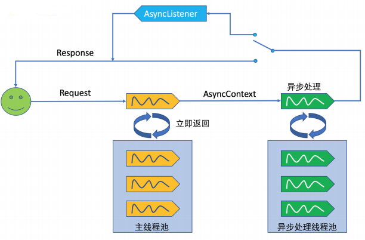

# 一、容器

## 1. 组件添加

- `@Configuration`： 告诉 Spring 这是一个配置类，等价于配置文件

  > 加载该配置类： 
  >
  > ```java
  > public class MainTest {
  > 	public static void main(String[] args) {
  >         //xml 加载
  >         /**
  > 			ApplicationContext applicationContext = 
  >         		new ClassPathXmlApplicationContext("beans.xml");
  > 			Person bean = (Person) applicationContext.getBean("person");
  > 			System.out.println(bean);
  > 		*/
  >         //配置类加载
  > 		ApplicationContext applicationContext = 
  >             new AnnotationConfigApplicationContext(MainConfig.class);
  > 		Person bean = applicationContext.getBean(Person.class);
  > 		System.out.println(bean);
  > 		
  > 		String[] namesForType = 
  >             applicationContext.getBeanNamesForType(Person.class);
  > 		for (String name : namesForType) {
  > 			System.out.println(name);
  > 		}
  > 	}
  > }
  > ```

- `@Bean`： 等价于 xml 配置文件中的 `<bean>` 

  > 配置 person 类： 
  >
  > ```java
  > public class MainConfig {
  > 	//给容器中注册一个Bean;类型为返回值的类型，id默认是用方法名作为id
  > 	@Bean("person")
  > 	public Person person(){
  > 		return new Person("lisi", 20);
  > 	}
  > }
  > ```

  **指定初始化和销毁方法**： 

  > **Bean 的生命周期**： bean创建---初始化----销毁
  >
  > 容器管理 bean 的生命周期

  - 通过 `@Bean` 指定 `init-method` 和 `destroy-method`

    > ```java
    > //pojo 类： 
    > public class Car {
    > 	
    > 	public Car(){
    > 		System.out.println("car constructor...");
    > 	}
    > 	
    > 	public void init(){
    > 		System.out.println("car ... init...");
    > 	}
    > 	
    > 	public void detory(){
    > 		System.out.println("car ... detory...");
    > 	}
    > }
    > 
    > //在配置类中进行注册
    > /** 构造（对象创建）
    >  * 单实例：在容器启动的时候创建对象
    >  * 多实例：在每次获取的时候创建对象
    >  */
    > //@Scope("prototype")
    > //initMethod：指定 Bean 初始化方法
    > //destroyMethod： 指定 Bean 销毁方法
    > @Bean(initMethod="init",destroyMethod="detory")
    > public Car car(){
    >     return new Car();
    > }
    > 
    > //测试
    > public void test(){
    >     //创建ioc容器
    >     AnnotationConfigApplicationContext applicationContext = new AnnotationConfigApplicationContext(MainConfigOfLifeCycle.class);
    >     System.out.println("容器创建完成...");
    > 
    >     //applicationContext.getBean("car");
    >     /** 关闭容器
    >      * 销毁：
    >  	 * 单实例：容器关闭时
    >  	 * 多实例：容器不会调用销毁方法
    >      */
    >     applicationContext.close();
    > }
    > ```

  - 通过让 Bean 实现 `InitializingBean`(初始化逻辑)与 `DisposableBean`(销毁逻辑) 

    ```java
    @Component
    public class Cat implements InitializingBean,DisposableBean {
    	public Cat(){
    		System.out.println("cat constructor...");
    	}
    
    	@Override
    	public void destroy() throws Exception {
    		System.out.println("cat...destroy...");
    	}
    
    	@Override
    	public void afterPropertiesSet() throws Exception {
    		System.out.println("cat...afterPropertiesSet...");
    	}
    }
    ```

  - 可以使用 `JSR250`： 

    - `@PostConstruct`：在 bean 创建完成且属性赋值完成时执行初始化方法

    - `@PreDestroy`：在容器销毁 bean 之前通知进行清理工作

    ```java
    @Component
    public class Dog implements ApplicationContextAware {
    	
    	public Dog(){
    		System.out.println("dog constructor...");
    	}
    	
    	//对象创建并赋值之后调用
    	@PostConstruct
    	public void init(){
    		System.out.println("Dog....@PostConstruct...");
    	}
    	
    	//容器移除对象之前
    	@PreDestroy
    	public void destory(){
    		System.out.println("Dog....@PreDestroy...");
    	}
    }
    ```

  - `BeanPostProcessor[interface]`：bean 的后置处理器，在 bean 初始化前后进行一些处理工作
    - `postProcessBeforeInitialization`： 在初始化之前工作
    - `postProcessAfterInitialization`： 在初始化之后工作

    ```java
    //将后置处理器加入到容器中
    @Component
    public class MyBeanPostProcessor implements BeanPostProcessor {
    	@Override
    	public Object postProcessBeforeInitialization
            (Object bean, String beanName) throws BeansException {
    		System.out.println
                ("postProcessBeforeInitialization..."+beanName+"=>"+bean);
    		return bean;
    	}
    
    	@Override
    	public Object postProcessAfterInitialization
            (Object bean, String beanName) throws BeansException {
    		System.out.println
                ("postProcessAfterInitialization..."+beanName+"=>"+bean);
    		return bean;
    	}
    }
    ```

- `@ComponentScans`： 扫描包规则

  > 等价于 xml 配置文件中的 `<context:component-scan base-package="com.xxx"/>` ，如： 
  >
  > ```java
  > @ComponentScans(
  >     value = {
  >         //value: 指定要扫描的包
  >         //excludeFilters：指定扫描的时候按照什么规则排除那些组件
  >         //includeFilters：指定扫描的时候只需要包含哪些组件
  >         @ComponentScan(value="com.xxx",includeFilters = {
  >             //FilterType.ANNOTATION：按照注解
  >             @Filter(type=FilterType.ANNOTATION,classes={Controller.class}),
  >             //FilterType.ASSIGNABLE_TYPE：按照给定的类型
  >             @Filter(type=FilterType.ASSIGNABLE_TYPE,
  >                     classes={BookService.class}),
  >             //FilterType.CUSTOM：使用自定义规则
  >             @Filter(type=FilterType.CUSTOM,classes={MyTypeFilter.class})
  >             //FilterType.ASPECTJ：使用ASPECTJ表达式
  >             //FilterType.REGEX：使用正则指定
  >         },useDefaultFilters = false)	
  >     }
  > )
  > ```
  >
  > 自定义的 `MyTypeFilter`： 
  >
  > ```java
  > public class MyTypeFilter implements TypeFilter {
  > 
  > 	/**
  > 	 * @metadataReader：读取到的当前正在扫描的类的信息
  > 	 * @metadataReaderFactory: 可以获取到其他任何类信息
  > 	 */
  > 	@Override
  > 	public boolean match(MetadataReader metadataReader, 
  >                          MetadataReaderFactory metadataReaderFactory)
  > 			throws IOException {
  > 		//获取当前类注解的信息
  > 		AnnotationMetadata annotationMetadata = 
  >             metadataReader.getAnnotationMetadata();
  > 		//获取当前正在扫描的类的类信息
  > 		ClassMetadata classMetadata = metadataReader.getClassMetadata();
  > 		//获取当前类资源（类的路径）
  > 		Resource resource = metadataReader.getResource();
  > 		
  > 		String className = classMetadata.getClassName();
  > 		System.out.println("--->" + className);
  > 		if(className.contains("er")){
  > 			return true;
  > 		}
  > 		return false;
  > 	}
  > }
  > ```

- `@Scope`： 调整作用域

  > ```java
  > /**
  >  * @Scope: 调整作用域 
  >  * prototype：多实例，ioc 容器启动并不会去调用方法创建对象放在容器中
  >  *				每次获取时才会调用方法创建对象
  >  * singleton：单实例（默认值），ioc 容器启动时调用方法创建对象放到 ioc 容器中
  >  *              每次获取就是直接从容器（map.get()）中拿 
  >  * request(web)：同一次请求创建一个实例
  >  * session(web)：同一个session创建一个实例
  >  */
  > // 默认是单实例
  > @Scope("prototype")
  > @Bean("person")
  > public Person person() {
  >     System.out.println("给容器中添加Person....");
  >     return new Person("张三", 25);
  > }
  > ```

- `@Lazy`： 懒加载，只针对单实例 Bean

  > ```java
  > //单实例 Bean：默认在容器启动的时候创建对象
  > //懒加载：容器启动不创建对象，第一次使用(获取)Bean创建对象，并初始化
  > @Lazy
  > @Bean("person")
  > public Person person() {
  >     System.out.println("给容器中添加Person....");
  >     return new Person("张三", 25);
  > }
  > ```

- `@Conditional`：  按照一定的条件进行判断，满足条件给容器中注册 bean(也可以对类进行统一设置)

  > ```java
  > /**
  >  *  如果系统是windows，给容器中注册("bill")
  >  *  如果是linux系统，给容器中注册("linus")
  >  */
  > @Conditional({ WindowsCondition.class })
  > @Bean("bill")
  > public Person person01() {
  >     return new Person("Bill Gates", 62);
  > }
  > 
  > @Conditional(LinuxCondition.class)
  > @Bean("linus")
  > public Person person02() {
  >     return new Person("linus", 48);
  > }
  > ```
  >
  > `LinuxCondition` 类： 
  >
  > ```java
  > //判断是否linux系统
  > public class LinuxCondition implements Condition {
  > 	/**
  > 	 * ConditionContext：判断条件能使用的上下文（环境）
  > 	 * AnnotatedTypeMetadata：注释信息
  > 	 */
  > 	@Override
  > 	public boolean matches(ConditionContext context, 
  >                            AnnotatedTypeMetadata metadata) {
  > 		// 是否linux系统
  > 		//1、能获取到ioc使用的beanfactory
  > 		ConfigurableListableBeanFactory beanFactory = 
  >             context.getBeanFactory();
  > 		//2、获取类加载器
  > 		ClassLoader classLoader = context.getClassLoader();
  > 		//3、获取当前环境信息
  > 		Environment environment = context.getEnvironment();
  > 		//4、获取到bean定义的注册类
  > 		BeanDefinitionRegistry registry = context.getRegistry();
  > 		
  > 		String property = environment.getProperty("os.name");
  > 		
  > 		//可以判断容器中的bean注册情况，也可以给容器中注册bean
  > 		boolean definition = registry.containsBeanDefinition("person");
  > 		if(property.contains("linux")){
  > 			return true;
  > 		}
  > 		return false;
  > 	}
  > }
  > ```
  >
  > `WindowsCondition` 类： 
  >
  > ```java
  > //判断是否windows系统
  > public class WindowsCondition implements Condition {
  > 
  > 	@Override
  > 	public boolean matches(ConditionContext context, 
  >                            AnnotatedTypeMetadata metadata) {
  > 		Environment environment = context.getEnvironment();
  > 		String property = environment.getProperty("os.name");
  > 		if(property.contains("Windows")){
  > 			return true;
  > 		}
  > 		return false;
  > 	}
  > }
  > ```
  >
  > 测试类： 
  >
  > ```java
  > public void test03() {
  >     AnnotationConfigApplicationContext applicationContext = 
  >         new AnnotationConfigApplicationContext(MainConfig2.class);
  >     String[] namesForType = 
  >         applicationContext.getBeanNamesForType(Person.class);
  >     ConfigurableEnvironment environment = applicationContext.getEnvironment();
  >     // 动态获取环境变量的值；Windows 10
  >     String property = environment.getProperty("os.name");
  >     System.out.println(property);
  >     for (String name : namesForType) {
  >         System.out.println(name);
  >     }
  > }
  > ```

- `@Import`：快速给容器中导入一个组件

  >  **给容器中注册组件**的方式： 
  >
  > - 包扫描+组件标注注解（@Controller/@Service/@Repository/@Component）[自己写的类]
  >
  > - @Bean[导入的第三方包里面的组件] 
  >
  > - @Import[快速给容器中导入一个组件]
  >
  >   - @Import(要导入到容器中的组件)： 容器中就会自动注册这个组件，id 默认是全类名
  >
  >     如： `@Import({ Color.class, Red.class})` 
  >
  >   - `ImportSelector`： 返回需要导入的组件的全类名数组
  >
  >     ```java
  >     //自定义逻辑返回需要导入的组件
  >     public class MyImportSelector implements ImportSelector {
  >     	//返回值，就是到导入到容器中的组件全类名
  >     	//AnnotationMetadata:当前标注@Import注解的类的所有注解信息
  >     	@Override
  >     	public String[] selectImports
  >             (AnnotationMetadata importingClassMetadata) {
  >     		//方法不要返回null值
  >             //此处导入 Blue 与 Yellow 类
  >     		return new String[]{"com.bean.Blue","com.bean.Yellow"};
  >     	}
  >     }
  >     
  >     //然后再在配置类中导入： 
  >      @Import({ MyImportSelector.class})
  >     ```
  >
  >   - `ImportBeanDefinitionRegistrar`： 手动注册 bean 到容器中
  >
  >     ```java
  >     public class MyImportBeanDefinitionRegistrar 
  >         implements ImportBeanDefinitionRegistrar {
  >     	/**
  >     	 * AnnotationMetadata：当前类的注解信息
  >     	 * BeanDefinitionRegistry: BeanDefinition注册类；
  >     	 * 		把所有需要添加到容器中的bean,调用
  >     	 * 		BeanDefinitionRegistry.registerBeanDefinition 手工注册进来
  >     	 */
  >     	@Override
  >     	public void registerBeanDefinitions
  >             (AnnotationMetadata importingClassMetadata, 
  >              BeanDefinitionRegistry registry) {
  >             //指定Bean定义信息；（Bean的类型，Bean。。。）
  >             RootBeanDefinition beanDefinition = new RootBeanDefinition(RainBow.class);
  >             //注册一个Bean，指定bean名
  >             registry.registerBeanDefinition("rainBow", beanDefinition);
  >     	}
  >     }
  >     
  >     //RainBow 类
  >     public class RainBow {
  >     
  >     }
  >     
  >     //然后再在配置类中导入： 
  >      @Import({ MyImportBeanDefinitionRegistrar.class})
  >     ```
  >
  > - 使用 Spring 提供的 FactoryBean（工厂Bean）
  >
  >   ```java
  >   //创建一个Spring定义的FactoryBean
  >   public class ColorFactoryBean implements FactoryBean<Color> {
  >   
  >   	//返回一个Color对象，这个对象会添加到容器中
  >   	@Override
  >   	public Color getObject() throws Exception {
  >   		System.out.println("ColorFactoryBean...getObject...");
  >   		return new Color();
  >   	}
  >   
  >   	@Override
  >   	public Class<?> getObjectType() {
  >   		return Color.class;
  >   	}
  >   	
  >       /** 是否是单例： 
  >        * true：这个bean是单实例，在容器中保存一份
  >        * false：多实例，每次获取都会创建一个新的bean
  >        */
  >   	@Override
  >   	public boolean isSingleton() {
  >   		return false;
  >   	}
  >   }
  >   
  >   //在配置类中注册
  >   @Bean
  >   public ColorFactoryBean colorFactoryBean() {
  >       return new ColorFactoryBean();
  >   }
  >   
  >   //测试
  >   public void testImport() {
  >       AnnotationConfigApplicationContext applicationContext = new 
  >           AnnotationConfigApplicationContext(MainConfig2.class);
  >   
  >       // 默认获取到的是工厂 bean 调用 getObject 创建的对象
  >       Object bean2 = applicationContext.getBean("colorFactoryBean");
  >       System.out.println("bean的类型：" + bean2.getClass());
  >   	//要获取工厂 Bean 本身，我们需要给 id 前面加一个 &，如： &colorFactoryBean
  >       Object bean4 = applicationContext.getBean("&colorFactoryBean");
  >       System.out.println(bean4.getClass());
  >   }
  >   ```

- `@Component`：可以标注所有组件，相当于配置文件中的 `<bean id="" class=""/>` 

- `@Service`： 用于标注业务层组件

- `@Controller`： 用于标注控制层组件

- `@Repository`：用于标注数据访问组件

- `@Primary` ： 当一个接口有两个不同实现时，解决 @Autowired 注解使用时的异常

  > 也可以用 `@Qualifier` 来实现

  ```java
  @Component("metalSinger") 
  public class MetalSinger implements Singer{
      @Override
      public String sing(String lyrics) {
          return "I am singing with DIO voice: " + lyrics;
      }
  }
  
  //默认优先选择
  @Primary
  @Component("operaSinger")
  public class OperaSinger implements Singer {
      @Override
      public String sing(String lyrics) {
          return "I am singing in Bocelli voice: " + lyrics;
      }
  }
  
  public interface Singer {
      String sing(String lyrics);
  }
  
  @Component
  public class SingerService {
      //等同于 @Primary 的作用
      //@Qualifier("beanName")
      @Autowired
      private Singer singer;
      
      public String sing(){
          return singer.sing("song lyrics");
      }
  
      public static void main(String[] args) {
          ApplicationContext context = 
              new AnnotationConfigApplicationContext("context.annotation.primary");
          SingerService singerService = context.getBean(SingerService.class);
          System.out.println(singerService.sing());
      }
  }
  ```

## 2. 组件赋值与注入

- `@Value`： 实现赋值操作，等价于 `<bean>` 中的 `<property name="" value="">` 

  ```java
  //1、基本数值
  @Value("张三")
  private String name;
  
  //2、可以写SpEL； #{}
  @Value("#{20-2}")
  private Integer age;
  
  //3、可以写${}；取出配置文件【properties】中的值（在运行环境变量里面的值）
  @Value("${person.nickName}")
  private String nickName;
  ```

- `@Autowired`： 自动注入，**spring 注解规范**

  > `AutowiredAnnotationBeanPostProcessor` 解析完成自动装配功能
  >
  > 自动装配默认一定要将属性赋值好，没有就会报错
  >
  > 可以使用 `@Autowired(required=false)` 来避免报错

  - `@Autowired` **查找规则**： 

    - 默认优先按照类型去容器中找对应的组件，找到就赋值

    - 如果找到多个相同类型的组件，再将属性的名称作为组件的 id 去容器中查找

    - `@Qualifier("xxx")`：使用 @Qualifier 指定需要装配的组件的 id，而不是使用属性名

      `@Primary`：让 Spring 进行自动装配时，默认使用首选的 bean，也可继续使用 @Qualifier 指定需要装配的 bean 的名字

  - `@Autowired` **赋值规则**： **构造器，参数，方法，属性**；都是从容器中获取参数组件的值

    - 标注在**方法**位置：**@Bean+方法参数**，参数从容器中获取，默认不写，自动装配

    - 标注在**构造器**上

    - 放在参数位置

  - **同 `@Autowired` 功能的方法**： Spring 支持 `@Resource(JSR250)和@Inject(JSR330)` [**java规范的注解**]

    - `@Resource`：  同 @Autowired，默认按照组件名称进行装配，不支持 @Primary 和 @Autowired(reqiured=false)

    - `@Inject`： 同 @Autowired，不支持 @Autowired(reqiured=false)，需要导入 `javax.inject` 包

  - **自定义组件使用 Spring 容器底层组件**： 如： ApplicationContext，BeanFactory

    - 自定义组件实现 `xxxAware`，在创建对象时，会调用接口规定的方法注入相关组件

     \*      把Spring底层一些组件注入到自定义的Bean中；

     \*      xxxAware：功能使用xxxProcessor；

     \*          ApplicationContextAware==》ApplicationContextAwareProcessor

- `@PropertySource`：读取外部配置文件中的 k/v 保存到运行的环境变量中，加载完外部的配置文件以后使用 `${}` 取出配置文件的值，如： `@PropertySource(value={"classpath:/person.properties"})` 

- `@PropertySources`： 

- `@Profile`： **切换运行环境**，即指定组件在哪个环境下才能被注册到容器中

  - 加了环境标识的 bean，只有这个环境被激活的时候才能注册到容器中，默认是 default 环境

  - 写在配置类上，只有是指定的环境的时候，整个配置类里面的所有配置才能开始生效

  - 没有标注环境标识的 bean 在任何环境下都可以加载

  > **切换方式**： 
  >
  > - **命令行动态参数**： 在虚拟机参数位置加载 `-D spring.profiles.active = xxx`
  >
  > - **代码方式**： 
  >
  >   ```java
  >   public void test01(){
  >       //1、创建一个applicationContext
  >       AnnotationConfigApplicationContext applicationContext = 
  >               new AnnotationConfigApplicationContext();
  >       //2、设置需要激活的环境
  >       applicationContext.getEnvironment().setActiveProfiles("xxx");
  >       //3、注册主配置类
  >       applicationContext.register(MainConfigOfProfile.class);
  >       //4、启动刷新容器
  >       applicationContext.refresh();
  >   
  >   
  >       String[] namesForType = 
  >           applicationContext.getBeanNamesForType(DataSource.class);
  >       for (String string : namesForType) {
  >           System.out.println(string);
  >       }
  >       applicationContext.close();
  >   }
  >   ```

## 3. AOP

### 1. aop 配置

- **业务逻辑类**： 

  ```java
  public class MathCalculator {
  	public int div(int i,int j){
  		System.out.println("MathCalculator...div...");
  		return i/j;	
  	}
  }
  ```

- **切面类**： 

  ```java
  @Aspect //告诉Spring当前类是一个切面类
  public class LogAspects {
  	
  	//抽取公共的切入点表达式
  	@Pointcut("execution(public int com.atguigu.aop.MathCalculator.*(..))")
  	public void pointCut(){};
  	
  	//@Before 在目标方法之前切入；切入点表达式（指定在哪个方法切入）
  	@Before("pointCut()") //本类引用切入点表达式
  	public void logStart(JoinPoint joinPoint){
  		Object[] args = joinPoint.getArgs();
  		System.out.println(""+joinPoint.getSignature().getName()
                             +"运行。。。@Before:参数列表是：{"
                             +Arrays.asList(args)+"}");
  	}
  	
  	@After("com.atguigu.aop.LogAspects.pointCut()") //其他的切面引用切入点表达式
  	public void logEnd(JoinPoint joinPoint){
  		System.out.println(""+joinPoint.getSignature().getName()
                             +"结束。。。@After");
  	}
  	
  	//JoinPoint一定要出现在参数表的第一位
  	@AfterReturning(value="pointCut()",returning="result")
  	public void logReturn(JoinPoint joinPoint,Object result){
  		System.out.println(""+joinPoint.getSignature().getName()
                             +"正常返回。。。@AfterReturning:运行结果：{"+result+"}");
  	}
  	
  	@AfterThrowing(value="pointCut()",throwing="exception")
  	public void logException(JoinPoint joinPoint,Exception exception){
  		System.out.println(""+joinPoint.getSignature().getName()
                             +"异常。。。异常信息：{"+exception+"}");
  	}
  }
  ```

- **配置类**： 

  ```java
  //开启基于注解版的切面功能
  //等同于 xml 文件中的 <aop:aspectj-autoproxy></aop:aspectj-autoproxy>
  @EnableAspectJAutoProxy 
  @Configuration //告诉 spring，该类是一个配置类
  public class MainConfigOfAOP {
  	//业务逻辑类加入容器中
  	@Bean
  	public MathCalculator calculator(){
  		return new MathCalculator();
  	}
  
  	//切面类加入到容器中
  	@Bean
  	public LogAspects logAspects(){
  		return new LogAspects();
  	}
  }
  ```

- **测试**： 

  ```java
  public class IOCTest_AOP {
  	@Test
  	public void test(){
  		AnnotationConfigApplicationContext applicationContext = 
              new AnnotationConfigApplicationContext(MainConfigOfAOP.class);
  		
  		//不要自己创建对象，否则无法调用切面功能
  //		MathCalculator mathCalculator = new MathCalculator();
  //		mathCalculator.div(1, 1);
  		MathCalculator mathCalculator = 
              applicationContext.getBean(MathCalculator.class);
  		
  		mathCalculator.div(1, 0);
  		applicationContext.close();
  	}
  }
  ```

**详细步骤**： 

- **导入 aop 模块**：`spring-aspects` 

- **定义业务逻辑类**： 业务逻辑运行时，将日志进行打印(方法之前、方法运行结束、方法出现异常等等)

- **定义一个日志切面类**：切面类里面的方法需要动态感知业务逻辑类运行到哪里然后执行

   通知方法：

  - **前置通知(@Before)**：在目标方法运行之前运行

  - **后置通知(@After)**：在目标方法运行结束之后运行（无论方法正常结束还是异常结束）

  - **返回通知(@AfterReturning)**：在目标方法正常返回之后运行

  - **异常通知(@AfterThrowing)**：在目标方法出现异常以后运行

  - **环绕通知(@Around)**：动态代理，手动推进目标方法运行（joinPoint.procced()）

- 给切面类的**目标方法标注何时何地运行**（通知注解）

- 将切面类和业务逻辑类都**加入到容器中**

- **标注切面类**(注解：`@Aspect`)

- **开启基于注解的aop模式**，给配置类中加 `@EnableAspectJAutoProxy` 

### 2. aop 原理

**`@EnableAspectJAutoProxy` 详解**： 

- `@Import(AspectJAutoProxyRegistrar.class)`：给容器中导入 AspectJAutoProxyRegistrar

  > 利用 AspectJAutoProxyRegistrar 自定义给容器中注册 bean

- 给容器中注册一个 `AnnotationAwareAspectJAutoProxyCreator` 

**`@EnableAspectJAutoProxy` 调用过程**： 

AnnotationAwareAspectJAutoProxyCreator：

​	AnnotationAwareAspectJAutoProxyCreator

​		--> AspectJAwareAdvisorAutoProxyCreator

​			--> AbstractAdvisorAutoProxyCreator

​				--> AbstractAutoProxyCreator

​					implements SmartInstantiationAwareBeanPostProcessor, BeanFactoryAware

**AOP 流程**： 

1. 传入配置类，创建 ioc 容器

2. 注册配置类，调用 `refresh()` 刷新容器

3. `registerBeanPostProcessors(beanFactory)` 注册 bean 的后置处理器来方便拦截 bean 的创建

   - 先获取 ioc 容器已经定义了的需要创建对象的所有 BeanPostProcessor

   - 给容器中加别的 BeanPostProcessor

   - 优先注册实现了 PriorityOrdered 接口的 BeanPostProcessor

   - 再给容器中注册实现了 Ordered 接口的 BeanPostProcessor

   - 注册没实现优先级接口的 BeanPostProcessor

   - 注册 BeanPostProcessor，实际上就是创建 BeanPostProcessor 对象，保存在容器中

     例子： 创建 internalAutoProxyCreator 的

     ​			BeanPostProcessor【AnnotationAwareAspectJAutoProxyCreator】

     - 创建 Bean 的实例

     - populateBean： 给 bean 的各种属性赋值

     - initializeBean：初始化 bean

       1. invokeAwareMethods()：处理 Aware 接口的方法回调

       2. applyBeanPostProcessorsBeforeInitialization()：应用后置处理器的postProcessBeforeInitialization()

       3. invokeInitMethods()： 执行自定义的初始化方法

       4. applyBeanPostProcessorsAfterInitialization()： 执行后置处理器的postProcessAfterInitialization()

     - BeanPostProcessor(AnnotationAwareAspectJAutoProxyCreator)创建成功

       --> aspectJAdvisorsBuilder

   - 把 BeanPostProcessor 注册到 BeanFactory 中

     --> beanFactory.addBeanPostProcessor(postProcessor)

   —— 以上是**创建和注册 `AnnotationAwareAspectJAutoProxyCreator` 的过程** ——

4. `finishBeanFactoryInitialization(beanFactory)` 完成 BeanFactory 初始化工作，创建单实例 bean

   - 遍历获取容器中所有的 Bean，依次创建对象 getBean(beanName)

   - 创建 bean

     【AnnotationAwareAspectJAutoProxyCreator 在所有 bean 创建之前会有一个拦截，InstantiationAwareBeanPostProcessor，会调用 postProcessBeforeInstantiation()】

     - 先从缓存中获取当前 bean，如果能获取到，说明 bean 之前被创建过，直接使用，否则再创建；只要创建好的 Bean 都会被缓存起来

     - createBean()： 创建 bean

       AnnotationAwareAspectJAutoProxyCreator 会在任何 bean 创建前先尝试返回 bean 的实例【BeanPostProcessor 是在 Bean 对象创建完成初始化前后调用的】【InstantiationAwareBeanPostProcessor 是在创建Bean实例前先尝试用后置处理器返回对象】

       1. `resolveBeforeInstantiation(beanName, mbdToUse)`： 解析 `BeforeInstantiation`

          希望后置处理器在此能返回一个代理对象；如果能返回代理对象就使用，如果不能就继续

          - 后置处理器先尝试返回对象： 

            `bean = applyBeanPostProcessorsBeforeInstantiation()` 

            拿到所有后置处理器，如果是 InstantiationAwareBeanPostProcessor，就执行postProcessBeforeInstantiation

       2. `doCreateBean(beanName, mbdToUse, args)`： 真正的去创建一个bean实例

          > 过程同上述创建 bean 流程

**`AnnotationAwareAspectJAutoProxyCreator【InstantiationAwareBeanPostProcessor】 ` 的作用**：

1. 每一个 **bean 创建前**，调用 `postProcessBeforeInstantiation()`

   关心 MathCalculator(业务逻辑类) 和 LogAspect(切面类) 的创建： 

   - **判断当前 bean 是否在 advisedBeans 中**（保存了所有需要增强bean）

   - **判断当前 bean 是否是基础类型**的 Advice、Pointcut、Advisor、AopInfrastructureBean 或者是否是切面（@Aspect）

   - **是否需要跳过**

     - 获取候选的增强器 `List<Advisor> candidateAdvisors`

       每一个封装的通知方法的增强器是 InstantiationModelAwarePointcutAdvisor；

       判断每一个增强器是否是 AspectJPointcutAdvisor 类型的；返回true

     - 永远返回 false

2. **创建对象**： postProcessAfterInitialization

   1. **获取当前 bean 的所有增强器(通知方法)**

      - 找到候选的所有的增强器（找哪些通知方法是需要切入当前bean方法的）

      - 获取到能在bean使用的增强器

      - 给增强器排序

   2. **保存当前 bean 在 advisedBeans 中**

   3. 如果当前 bean 需要增强，创建当前 bean 的代理对象

      - 获取所有增强器（通知方法）

      - 保存到 proxyFactory

      - 创建代理对象：Spring 自动决定

        JdkDynamicAopProxy(config) --> jdk 动态代理

        ObjenesisCglibAopProxy(config) --> cglib 动态代理

   4. 容器中返回当前组件使用 cglib 增强的代理对象

   5. 以后容器获取的是这个组件的代理对象，执行目标方法时，代理对象就会执行通知方法的流程

3. **目标方法执行**： 容器中保存了组件的代理对象(cglib 增强后的对象)，该对象保存了详细信息

   1. `CglibAopProxy.intercept()`： **拦截目标方法的执行** 

   2. 根据 ProxyFactory 对象**获取将要执行的目标方法拦截器链**

      `List<Object> chain = this.advised.getInterceptorsAndDynamicInterceptionAdvice(method, targetClass);`

      - `List<Object> interceptorList` 保存所有拦截器

        > 一个默认的 `ExposeInvocationInterceptor` 和 4个增强器

      - **遍历所有的增强器**，将其转为 `Interceptor`，`registry.getInterceptors(advisor)`

      - **将增强器转为 `List<MethodInterceptor>`** 

        > - 如果是 `MethodInterceptor`，直接加入到集合中
        >
        > - 如果不是，使用 `AdvisorAdapter` 将增强器转为 `MethodInterceptor`
        >
        >   转换完成返回 MethodInterceptor 数组

   3. **若无拦截器链，直接执行目标方法**

      > 拦截器链（每一个通知方法又被包装为方法拦截器，利用 MethodInterceptor 机制）

   4. **若有拦截器链**，把需要执行的目标对象，目标方法，拦截器链等信息传入一个创建好的 `CglibMethodInvocation` 对象，并调用 `Object retVal =  mi.proceed();`

   5. **拦截器链的触发过程** 

      - 如果没有拦截器执行目标方法，或拦截器的索引和拦截器数组大小一样，则执行目标方法

      - 链式获取每一个拦截器，拦截器执行 invoke 方法，每一个拦截器等待下一个拦截器执行完成返回以后再来执行

        > 拦截器链的机制，保证通知方法与目标方法的执行顺序

**总结**：

1. `@EnableAspectJAutoProxy` 开启 AOP 功能

2. `@EnableAspectJAutoProxy` 会给容器中注册一个组件 `AnnotationAwareAspectJAutoProxyCreator` 

3. `AnnotationAwareAspectJAutoProxyCreator` 是一个后置处理器

4. 容器的创建流程：

   - `registerBeanPostProcessors()` 注册后置处理器，创建 `AnnotationAwareAspectJAutoProxyCreator`对象

   - `finishBeanFactoryInitialization()` 初始化剩下的单实例 bean

     - 创建业务逻辑组件和切面组件

     - `AnnotationAwareAspectJAutoProxyCreator` 拦截组件的创建过程

     - 组件创建完后，判断组件是否需要增强

       是：切面的通知方法，包装成增强器(Advisor)；给业务逻辑组件创建一个代理对象(cglib)

5. 执行目标方法：

   - 代理对象执行目标方法

   - `CglibAopProxy.intercept()`： 

     - 得到目标方法的拦截器链（增强器包装成拦截器 MethodInterceptor ）

     - 利用拦截器的链式机制，依次进入每一个拦截器进行执行

     - 效果：

       正常执行：前置通知-》目标方法-》后置通知-》返回通知

       出现异常：前置通知-》目标方法-》后置通知-》异常通知

## 4. 声明式事务

### 1. 事务配置

**环境搭建**： 

- 导入相关依赖 数据源、数据库驱动、Spring-jdbc 模块

- 配置数据源、JdbcTemplate(Spring 提供的简化数据库操作的工具)操作数据 

- 给方法上标注 `@Transactional`，即： 表示当前方法是一个事务方法

- `@EnableTransactionManagement` 开启基于注解的事务管理功能

- 配置事务管理器来控制事务

  ```java
  @Bean 
  public PlatformTransactionManager transactionManager()
  ```

**实例展示**： 

- `UserDao` 类： 

  ```java
  @Repository
  public class UserDao {
  	@Autowired
  	private JdbcTemplate jdbcTemplate;
  
  	public void insert() {
  		String sql = "INSERT INTO `tbl_user`(username,age) VALUES(?,?)";
  		String username = UUID.randomUUID().toString().substring(0, 5);
  		jdbcTemplate.update(sql, username, 19);
  	}
  }
  ```

- `UserService` 类： 

  ```java
  @Service
  public class UserService {
  	@Autowired
  	private UserDao userDao;
  
  	@Transactional //表示当前方法是一个事务方法
  	public void insertUser() {
  		userDao.insert();
  		System.out.println("插入完成...");
  		int i = 10 / 0;
  	}
  }
  ```

- `TxConfig` 类： 

  ```java
  @EnableTransactionManagement //开启基于注解的事务管理功能
  @ComponentScan("com.tx")
  @Configuration // Spring对@Configuration类会特殊处理；
  			   //给容器中加组件的方法，多次调用都只是从容器中找组件
  public class TxConfig {
  	// 数据源
  	@Bean
  	public DataSource dataSource() throws Exception {
  		ComboPooledDataSource dataSource = new ComboPooledDataSource();
  		dataSource.setUser("root");
  		dataSource.setPassword("123456");
  		dataSource.setDriverClass("com.mysql.jdbc.Driver");
  		dataSource.setJdbcUrl("jdbc:mysql://localhost:3306/test");
  		return dataSource;
  	}
  
  	//JdbcTemplate： Spring 提供的简化数据库操作的工具
  	@Bean
  	public JdbcTemplate jdbcTemplate() throws Exception {
  		JdbcTemplate jdbcTemplate = new JdbcTemplate(dataSource());
  		return jdbcTemplate;
  	}
  	// 配置事务管理器来控制事务
  	@Bean
  	public PlatformTransactionManager transactionManager() throws Exception {
  		return new DataSourceTransactionManager(dataSource());
  	}
  }
  ```

### 2. 事务原理

**原理**： 

- `@EnableTransactionManagement`： 

  > 利用 TransactionManagementConfigurationSelector 给容器中导入两个组件
  >
  > `AutoProxyRegistrar 和 ProxyTransactionManagementConfiguration` 

- `AutoProxyRegistrar`： 给容器中注册一个 `InfrastructureAdvisorAutoProxyCreator` 组件

  > 利用后置处理器机制在对象创建以后，包装对象，返回一个代理对象（增强器），代理对象执行方法利用拦截器链进行调用

- `ProxyTransactionManagementConfiguration` 做了什么： 

  **给容器中注册事务增强器**： 

  - 事务增强器要用事务注解信息，AnnotationTransactionAttributeSource 解析事务注解 

  - 事务拦截器： `TransactionInterceptor` 保存了事务属性信息，事务管理器

    在目标方法执行时，执行拦截器链： 

    事务拦截器： 

    - 先获取事务相关的属性

    - 再获取 PlatformTransactionManager，如果事先没有添加指定任何 transactionmanger，最终会从容器中按照类型获取一个 PlatformTransactionManager

    - 执行目标方法

      如果异常，获取到事务管理器，利用事务管理回滚操作

      如果正常，利用事务管理器，提交事务

# 二、扩展原理&&&

- `BeanFactoryPostProcessor`： beanFactory 的后置处理器

  > `BeanPostProcessor`：bean 后置处理器，bean 创建对象初始化前后进行拦截工作
  >
  > `BeanFactoryPostProcessor` 原理： 
  >
  > - ioc 容器创建对象
  >
  > - invokeBeanFactoryPostProcessors(beanFactory)
  >
  >   如何找到所有的 BeanFactoryPostProcessor 并执行他们的方法： 
  >
  >   - 直接在 BeanFactory 中找到所有类型是 BeanFactoryPostProcessor 组件，并执行他们的方法
  >
  >   - 在初始化创建其他组件前面执行

  - 在 BeanFactory 标准初始化后调用，来定制和修改 BeanFactory 的内容
  - 所有的 bean 定义已经保存加载到 beanFactory，但是 bean 的实例还未创建

  ```java
  @Component
  public class MyBeanFactoryPostProcessor implements BeanFactoryPostProcessor {
  	@Override
  	public void postProcessBeanFactory
          (ConfigurableListableBeanFactory beanFactory) throws BeansException {
  		System.out.println("MyBeanFactoryPostProcessor...");
  		int count = beanFactory.getBeanDefinitionCount();
  		String[] names = beanFactory.getBeanDefinitionNames();
  		System.out.println("当前BeanFactory中有"+count+" 个Bean");
  		System.out.println(Arrays.asList(names));
  	}
  }
  ```

- `BeanDefinitionRegistryPostProcessor extends BeanFactoryPostProcessor`： 

  `postProcessBeanDefinitionRegistry()`： 在所有 bean 定义信息将要被加载，bean 实例还未创建

  优先于 BeanFactoryPostProcessor 执行；

  利用 BeanDefinitionRegistryPostProcessor 给容器中再额外添加一些组件

  > **原理**：
  >
  > - ioc 创建对象
  >
  > - refresh() --> invokeBeanFactoryPostProcessors(beanFactory)
  >
  > - 从容器中获取到所有的 BeanDefinitionRegistryPostProcessor 组件
  >
  >   - 依次触发所有的 postProcessBeanDefinitionRegistry() 方法
  >
  >   - 再来触发 postProcessBeanFactory() 方法 BeanFactoryPostProcessor
  >
  > - 再来从容器中找到BeanFactoryPostProcessor组件；然后依次触发postProcessBeanFactory()方法

  ```java
  @Component
  public class MyBeanDefinitionRegistryPostProcessor 
      implements BeanDefinitionRegistryPostProcessor{
  
  	@Override
  	public void postProcessBeanFactory
          (ConfigurableListableBeanFactory beanFactory) throws BeansException {
  		System.out.println("MyBeanDefinitionRegistryPostProcessor...bean的数量："
                             + beanFactory.getBeanDefinitionCount());
  	}
  
  	//BeanDefinitionRegistry: Bean定义信息的保存中心
      //以后 BeanFactory 按照 BeanDefinitionRegistry 中保存的每个bean定义信息创建bean实例
  	@Override
  	public void postProcessBeanDefinitionRegistry
          (BeanDefinitionRegistry registry) throws BeansException {
  		System.out.println("postProcessBeanDefinitionRegistry...bean的数量："
                             + registry.getBeanDefinitionCount());
  		//RootBeanDefinition beanDefinition = new RootBeanDefinition(Blue.class);
  		AbstractBeanDefinition beanDefinition = BeanDefinitionBuilder
              .rootBeanDefinition(Blue.class).getBeanDefinition();
  		registry.registerBeanDefinition("hello", beanDefinition);
  	}
  }
  ```

- `ApplicationListener`： 监听容器中发布的事件，事件驱动模型开发

  `public interface ApplicationListener<E extends ApplicationEvent>` 监听 ApplicationEvent 及其下面的子事件

  > **步骤**：
  >
  > - 写一个监听器(ApplicationListener实现类)来监听某个事件(ApplicationEvent及其子类)
  >
  >   `@EventListener` 原理：
  >
  >   使用 EventListenerMethodProcessor 处理器来解析方法上的 @EventListener
  >
  > - 把监听器加入到容器
  >
  > - 只要容器中有相关事件的发布，就能监听到这个事件
  >
  >   `ContextRefreshedEvent`：容器刷新完成(所有bean都完全创建)会发布这个事件
  >
  >   `ContextClosedEvent`：关闭容器会发布这个事件
  >
  > - 发布一个事件：`applicationContext.publishEvent()`
  >
  > **原理**：
  >
  > 1. ContextRefreshedEvent事件：
  >
  >    - 容器创建对象：refresh()
  >
  >    - finishRefresh() 容器刷新完成会发布 ContextRefreshedEvent 事件
  >
  > 2. 自己发布事件
  >
  > 3. 容器关闭会发布 ContextClosedEvent

# 三、spring 容器创建过程&&&

**Spring 容器的 refresh()【创建刷新】**： 

1. `prepareRefresh()`： 刷新前的预处理
   - `initPropertySources()`： 初始化一些属性设置，子类自定义个性化的属性设置方法
   - `getEnvironment().validateRequiredProperties()`： 检验属性的合法
   - `earlyApplicationEvents = new LinkedHashSet<ApplicationEvent>()`： 保存容器中的早期事件

2. `obtainFreshBeanFactory()`： 获取 BeanFactory

   - `refreshBeanFactory()`： 刷新【创建】BeanFactory

     创建了一个 `this.beanFactory = new DefaultListableBeanFactory()`

   - `getBeanFactory()`： 返回刚才 `GenericApplicationContext` 创建的 BeanFactory 对象
   - 将创建的 `BeanFactory【DefaultListableBeanFactory】` 返回

3. `prepareBeanFactory(beanFactory)`： BeanFactory 的预准备工作(BeanFactory进行一些设置)

   - 设置 BeanFactory 的类加载器、支持表达式解析器

   - 添加部分 BeanPostProcessor【ApplicationContextAwareProcessor】

   - 设置忽略的自动装配的接口 EnvironmentAware、EmbeddedValueResolverAware、xxxAware

   - 注册可以解析的自动装配，能直接在任何组件中自动注入：

     BeanFactory、ResourceLoader、ApplicationEventPublisher、ApplicationContext

   - 添加 BeanPostProcessor【ApplicationListenerDetector】
   - 添加编译时的 AspectJ
   - 给 BeanFactory 中注册一些能用的组件： environment【ConfigurableEnvironment】、systemProperties【Map<String, Object>】、systemEnvironment【Map<String, Object>】

4. `postProcessBeanFactory(beanFactory)`： BeanFactory 准备工作完成后进行的后置处理工作

   - 子类通过重写这个方法来在 BeanFactory 创建并预准备完成以后做进一步的设置

   —— 以上是 BeanFactory 的创建及预准备工作 ——

5. `invokeBeanFactoryPostProcessors(beanFactory)`： 执行 BeanFactoryPostProcessor 的方法
   BeanFactoryPostProcessor：BeanFactory 的后置处理器，在 BeanFactory 标准初始化后执行
   包含两个接口：BeanFactoryPostProcessor、BeanDefinitionRegistryPostProcessor

   执行 `BeanFactoryPostProcessor` 的方法： 

   - 先执行 `BeanDefinitionRegistryPostProcessor`： 
     - 获取所有的 `BeanDefinitionRegistryPostProcessor`
     - 先执行实现 `PriorityOrdered` 优先级接口的 `BeanDefinitionRegistryPostProcessor、
       postProcessor.postProcessBeanDefinitionRegistry(registry)`
     - 再执行实现 `Ordered` 顺序接口的 `BeanDefinitionRegistryPostProcessor、
       postProcessor.postProcessBeanDefinitionRegistry(registry)`
     - 最后执行没有实现任何优先级或者是顺序接口的 `BeanDefinitionRegistryPostProcessors、
       postProcessor.postProcessBeanDefinitionRegistry(registry)` 

   - 再执行 `BeanFactoryPostProcessor` 的方法： 
     - 获取所有的BeanFactoryPostProcessor
     - 先执行实现 `PriorityOrdered` 优先级接口的 `BeanFactoryPostProcessor、
       postProcessor.postProcessBeanFactory()`
     - 再执行实现 `Ordered` 顺序接口的 `BeanFactoryPostProcessor、
       postProcessor.postProcessBeanFactory()`
     - 最后执行没有实现任何优先级或者是顺序接口的 `BeanFactoryPostProcessor、
       postProcessor.postProcessBeanFactory()` 		

6. `registerBeanPostProcessors(beanFactory)`： 注册 BeanPostProcessor(Bean的后置处理器)
   不同接口类型的 BeanPostProcessor 在Bean创建前后的执行时机不同
   如： BeanPostProcessor、DestructionAwareBeanPostProcessor、InstantiationAwareBeanPostProcessor、SmartInstantiationAwareBeanPostProcessor、MergedBeanDefinitionPostProcessor
   - 获取所有的 BeanPostProcessor： 后置处理器都默认可以通过 PriorityOrdered、Ordered 接口来执行优先级
   - 先注册 PriorityOrdered 优先级接口的 BeanPostProcessor： 把每一个 BeanPostProcessor 添加到BeanFactory中，如： beanFactory.addBeanPostProcessor(postProcessor)
   - 再注册 Ordered 接口
   - 最后注册没有实现任何优先级接口
   - 最终注册 MergedBeanDefinitionPostProcessor
   - 注册一个 ApplicationListenerDetector 来在 Bean 创建完成后检查是否是 ApplicationListener，如果是就执行 applicationContext.addApplicationListener((ApplicationListener<?>) bean)

7. `initMessageSource()`： 初始化 MessageSource 组件(做国际化功能：消息绑定，消息解析)

   - 获取 BeanFactory

   - 检查容器中是否有 id 为 messageSource 的，类型是 MessageSource 的组件
     如果有赋值给 messageSource

     如果没有自己创建一个DelegatingMessageSource；

     > MessageSource：取出国际化配置文件中的某个key的值，能按照区域信息获取

   - 将 MessageSource 注册在容器中，以后获取国际化配置文件值的时候，可以自动注入 MessageSource
     beanFactory.registerSingleton(MESSAGE_SOURCE_BEAN_NAME, this.messageSource);	
     MessageSource.getMessage(String code, Object[] args, String defaultMessage, Locale locale);

8. `initApplicationEventMulticaster()`： 初始化事件派发器

   - 获取BeanFactory
   - 从 BeanFactory 中获取 applicationEventMulticaster 的 ApplicationEventMulticaster
   - 如果上一步没有配置，则创建一个 SimpleApplicationEventMulticaster
   - 将创建的 ApplicationEventMulticaster 添加到 BeanFactory 中，以后其他组件直接自动注入

9. `onRefresh()`： 留给子容器(子类)，子类重写这个方法，在容器刷新的时候可以自定义逻辑

10. `registerListeners()`： 给容器中将所有项目里面的 ApplicationListener 注册进来

    - 从容器中拿到所有的 ApplicationListener
    - 将每个监听器添加到事件派发器中
      getApplicationEventMulticaster().addApplicationListenerBean(listenerBeanName)
    - 派发之前步骤产生的事件

11. `finishBeanFactoryInitialization(beanFactory)`： 初始化所有剩下的单实例 bean
    beanFactory.preInstantiateSingletons() 初始化后剩下的单实例bean

    - 获取容器中的所有Bean，依次进行初始化和创建对象

    - 获取 Bean 的定义信息： RootBeanDefinition

    - Bean不是抽象的，是单实例的，是懒加载

      - 判断是否是 FactoryBean；是否是实现 FactoryBean 接口的 Bean

      - 不是工厂Bean，利用getBean(beanName);创建对象

        - getBean(beanName)； ioc.getBean();

        - doGetBean(name, null, null, false);

        - 先获取缓存中保存的单实例Bean，如果能获取到说明这个 Bean 之前被创建过(所有创建过的单实例Bean都会被缓存起来)，从 `private final Map<String, Object> singletonObjects = new ConcurrentHashMap<String, Object>(256)` 获取

        - 缓存中获取不到，开始 Bean 的创建对象流程

        - 标记当前 bean 已经被创建

        - 获取 Bean 的定义信息

        - 获取当前 Bean 依赖的其他 Bean，如果有按照 getBean() 把依赖的 Bean 先创建出来

        - 启动单实例 Bean 的创建流程：

          1. `createBean(beanName, mbd, args)` 

          2. `Object bean = resolveBeforeInstantiation(beanName, mbdToUse)`，让BeanPostProcessor 先拦截返回代理对象： 
             【InstantiationAwareBeanPostProcessor】：提前执行；
             先触发：postProcessBeforeInstantiation()；
             如果有返回值：触发postProcessAfterInitialization()；

          3. 如果前面的 InstantiationAwareBeanPostProcessor 没有返回代理对象；调用4）

          4. `Object beanInstance = doCreateBean(beanName, mbdToUse, args)` 创建Bean

             1. 创建 Bean 实例： `createBeanInstance(beanName, mbd, args)` 
                利用工厂方法或者对象的构造器创建出Bean实例

             2. applyMergedBeanDefinitionPostProcessors(mbd, beanType, beanName);
                调用MergedBeanDefinitionPostProcessor的postProcessMergedBeanDefinition(mbd, beanType, beanName)

             3. Bean属性赋值： populateBean(beanName, mbd, instanceWrapper)

                赋值之前：

                - 拿到 InstantiationAwareBeanPostProcessor 后置处理器postProcessAfterInstantiation()；
                - 拿到 InstantiationAwareBeanPostProcessor 后置处理器
                  postProcessPropertyValues()；

                ——**赋值之前**——

                - 应用Bean属性的值；为属性利用setter方法等进行赋值；
                  applyPropertyValues(beanName, mbd, bw, pvs);

             4. 【Bean初始化】initializeBean(beanName, exposedObject, mbd);

                1. 【执行Aware接口方法】invokeAwareMethods(beanName, bean);执行xxxAware接口的方法BeanNameAware\BeanClassLoaderAware\BeanFactoryAware
                2. 【执行后置处理器初始化之前】applyBeanPostProcessorsBeforeInitialization(wrappedBean, beanName); BeanPostProcessor.postProcessBeforeInitialization（）;
                3. 执行初始化方法】invokeInitMethods(beanName, wrappedBean, mbd);
                   - 是否是InitializingBean接口的实现；执行接口规定的初始化；
                   - 是否自定义初始化方法；

                4. 执行后置处理器初始化之后】applyBeanPostProcessorsAfterInitialization
                   BeanPostProcessor.postProcessAfterInitialization()；

             5. 注册Bean的销毁方法；

          5. 将创建的 Bean 添加到缓存中 singletonObjects；ioc 容器就是这些Map；很多的Map里面保存了单实例Bean，环境信息等
             所有 Bean 都利用 getBean 创建完成以后，检查所有的 Bean 是否是SmartInitializingSingleton接口的；如果是就执行afterSingletonsInstantiated()

12. `finishRefresh()`： 完成 BeanFactory 的初始化创建工作，IOC容器就创建完成

    - `initLifecycleProcessor()`： 初始化和生命周期有关的后置处理器

      LifecycleProcessor 默认从容器中找是否有 lifecycleProcessor的组件【LifecycleProcessor】

      如果没有 `new DefaultLifecycleProcessor()` 加入到容器

      > 写一个 LifecycleProcessor 的实现类
      > void onRefresh();
      > void onClose();	

    - `getLifecycleProcessor().onRefresh()`： 拿到前面定义的生命周期处理器(BeanFactory)，回调onRefresh()
    - `publishEvent(new ContextRefreshedEvent(this))`： 发布容器刷新完成事件
    - `liveBeansView.registerApplicationContext(this)`

**总结**： 

1. Spring容器在启动时，先会保存所有注册进来的Bean的定义信息
   - xml 注册bean： `<bean>`
   - 注解注册Bean： `@Service、@Component、@Bean、xxx`
2. Spring 容器会在合适的时机创建这些Bean
   - 用到这个 bean 时： 利用 getBean 创建bean，创建好以后保存在容器中
   - 统一创建剩下所有 bean 时： finishBeanFactoryInitialization()
3. 后置处理器；BeanPostProcessor： 每一个 bean 创建完成，都会使用各种后置处理器进行处理来增强 bean的功能
   - AutowiredAnnotationBeanPostProcessor： 处理自动注入
   - AnnotationAwareAspectJAutoProxyCreator： 来做AOP功能
   - AsyncAnnotationBeanPostProcessor： 增强的功能注解
4. 事件驱动模型： 
   - ApplicationListener： 事件监听
   - ApplicationEventMulticaster： 事件派发			

# 四、web

## 1. servlet3.0

- `ServletContainerInitializer` 类

  ```java
  //容器启动时，会将 @HandlesTypes 指定类（实现类，子接口等）传递过来；
  @HandlesTypes(value={HelloService.class})
  public class MyServletContainerInitializer implements ServletContainerInitializer {
  	/**
  	 * 应用启动的时候，会运行 onStartup 方法；
  	 * 
  	 * Set<Class<?>>：感兴趣的类型的所有子类型
  	 * ServletContext: 代表当前 Web 应用对应的 ServletContext
  	 * 
  	 * 步骤： 
  	 * 1）、使用 ServletContext 注册Web组件（Servlet、Filter、Listener）
  	 * 2）、使用编码的方式，在项目启动的时候给 ServletContex t里面添加组件
  	 * 		1）、ServletContainerInitializer 得到的 ServletContext
  	 * 		2）、ServletContextListener 得到的 ServletContext
  	 */
  	@Override
  	public void onStartup(Set<Class<?>> arg0, ServletContext sc) 
          throws ServletException {
  		System.out.println("感兴趣的类型：");
  		for (Class<?> claz : arg0) {
  			System.out.println(claz);
  		}
  		
  		//注册组件  ServletRegistration  
  		ServletRegistration.Dynamic servlet = 
              sc.addServlet("userServlet", new UserServlet());
  		//配置servlet的映射信息
  		servlet.addMapping("/user");
  		
  		//注册Listener
  		sc.addListener(UserListener.class);
  		
  		//注册Filter  FilterRegistration
  		FilterRegistration.Dynamic filter = 
              sc.addFilter("userFilter", UserFilter.class);
  		//配置Filter的映射信息
  		filter.addMappingForUrlPatterns
              (EnumSet.of(DispatcherType.REQUEST), true, "/*");
  	}
  }
  
  //UserServlet 类
  public class UserServlet extends HttpServlet {
  	@Override
  	protected void doGet(HttpServletRequest req, HttpServletResponse resp) 
          throws ServletException, IOException {
  		resp.getWriter().write("tomcat...");
  	}
  }
  
  //HelloServlet 类
  @WebServlet("/hello")
  public class HelloServlet extends HttpServlet {
  	@Override
  	protected void doGet(HttpServletRequest req, HttpServletResponse resp) 
          throws ServletException, IOException {
  		System.out.println(Thread.currentThread()+" start...");
  		try {
  			sayHello();
  		} catch (Exception e) {
  			e.printStackTrace();
  		}
  		resp.getWriter().write("hello...");
  		System.out.println(Thread.currentThread()+" end...");
  	}
  	
  	public void sayHello() throws Exception{
  		System.out.println(Thread.currentThread()+" processing...");
  		Thread.sleep(3000);
  	}
  }
  ```

- `UserFilter` 类

  ```java
  public class UserFilter implements Filter {
  
  	@Override
  	public void destroy() {
  	}
  
  	@Override
  	public void doFilter(ServletRequest arg0, ServletResponse arg1, 
                           FilterChain arg2)throws IOException, ServletException {
  		// 过滤请求
  		System.out.println("UserFilter...doFilter...");
  		//放行
  		arg2.doFilter(arg0, arg1);
  	}
  
  	@Override
  	public void init(FilterConfig arg0) throws ServletException {
  	}
  }
  ```

- `UserListener` 类

  ```java
  //监听项目的启动和停止
  public class UserListener implements ServletContextListener {
  	
  	//监听ServletContext销毁
  	@Override
  	public void contextDestroyed(ServletContextEvent arg0) {
  		System.out.println("UserListener...contextDestroyed...");
  	}
  
  	//监听ServletContext启动初始化
  	@Override
  	public void contextInitialized(ServletContextEvent arg0) {
  		ServletContext servletContext = arg0.getServletContext();
  		System.out.println("UserListener...contextInitialized...");
  	}
  }
  ```

## 2. 异步请求

```java
@WebServlet(value="/async",asyncSupported=true)
public class HelloAsyncServlet extends HttpServlet {
	@Override
	protected void doGet(HttpServletRequest req, HttpServletResponse resp) 
        throws ServletException, IOException {
		//1、支持异步处理asyncSupported=true
		//2、开启异步模式
		System.out.println("主线程开始。。。" + Thread.currentThread()
                           + "==>"+System.currentTimeMillis());
		AsyncContext startAsync = req.startAsync();
		
		//3、业务逻辑进行异步处理;开始异步处理
		startAsync.start(new Runnable() {
			@Override
			public void run() {
				try {
					System.out.println("副线程开始。。。" + Thread.currentThread()
                                       + "==>"+System.currentTimeMillis());
					sayHello();
					startAsync.complete();
					//获取到异步上下文
					AsyncContext asyncContext = req.getAsyncContext();
					//4、获取响应
					ServletResponse response = asyncContext.getResponse();
					response.getWriter().write("hello async...");
					System.out.println("副线程结束。。。" + Thread.currentThread()
                                       + "==>"+System.currentTimeMillis());
				} catch (Exception e) {
				}
			}
		});		
		System.out.println("主线程结束。。。" + Thread.currentThread()
                           + "==>"+System.currentTimeMillis());
	}

	public void sayHello() throws Exception{
		System.out.println(Thread.currentThread()+" processing...");
		Thread.sleep(3000);
	}
}
```

**图解**： 


