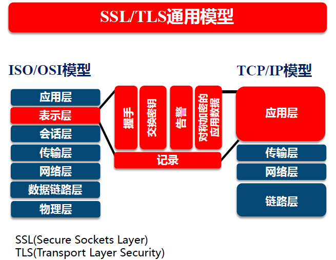

# 第一章：SSL、TLS和密码学

> `SSL` --> 安全套接字层；`TLS` 传输层安全

## 1. 传输层安全

TLS 的四个主要目标： 

- **加密安全**： 为任意愿意交换信息的双方启用安全通信

- **互操作性**： 独立的编程人员应该能够使用通用的加密参数开发程序和库，使它们可以相互通信

- **可扩展性**： 独立于实际使用的加密基元，从而不需要创建新的协议，就允许从一个基元迁移到另一个

- **效率**： 在实现上述所有目标的基础上保持性能成本在可接受的范围内

  > 尽量减少昂贵的加密操作的执行次数，并提供一个会话缓存方案，以避免加密操作在随后的连接中被执行

## 2. 网络层

开放系统互联模型 `OSI`： 

| 层号 |   OSI 层   |            描述            |      协议示例      |
| :--: | :--------: | :------------------------: | :----------------: |
|  7   |   应用层   |          应用数据          | `HTTP、SMTP、IMAP` |
|  6   |   表示层   |    数据表示、转换和加密    |     `SSL/TLS`      |
|  5   |   会话层   |         多连接管理         |        `-`         |
|  4   |   传输层   |      包和流的可靠运输      |     `TCP、UDP`     |
|  3   |   网络层   | 网络节点间的路由和数据分发 |    `IP、IPSec`     |
|  2   | 数据链路层 |  可靠的本地数据连接 `LAN`  |       以太网       |
|  1   |   物理层   |   直接物理数据连接(电缆)   |       `CAT5`       |

- 不同层次的协议可以加入通信或从通信中删除，一种底层协议可以服务多种上层协议

  > `SSL/TLS` 用于 `TCP` 之上，`HTTP` 之下

## 3. 密码学

> 密码的三个核心需求： 保持秘密(机密性)、验证身份(真实性)、保证传输安全(完整性)

### 1. 构建基块

- **对称加密**： 通信双方通过私有密钥进行数据的加密与解密

  > 密码分类： 
  >
  > - **序列密码**： 1 字节的明文输入加密算法，可以得到 1 字节的密文输出
  >
  >   > - 核心： 生成一串密钥序列
  >   > - 案例： `RC4` 加密算法
  >
  > - **分组密码**： 每次加密一整块数据，实现少量的输入得到大量的输出
  >
  >   > - 挑战： 处理数据长度小于加密块大小的数据加密
  >   >
  >   > - **填充**： 当输入小于额定加密长度时，需要进行填充
  >   >
  >   >   > 在 `TLS` 中，加密块的最后 1 字节包含填充长度，指示填充多少字节，填充的每字节都被设置成与填充长度字节相同的值
  >   >
  >   > - 案例：高级加密模式 `AES` 

- **散列函数**： 将任意长度的输入转化为定长输出，可用于验证数据完整性

  > 密码学散列的额外特性： 
  >
  > - 抗原像性(单向性)： 给定一个散列，计算上无法找到或构造出生成它的消息
  > - 抗第二原像性(弱抗碰撞性)：给定一条消息和其散列，计算上无法找到一条不同的消息具有的散列
  > - 强抗碰撞性： 计算上无法找到两条散列相同的消息
  >
  > 应用场景： 以紧凑的方式表示并比较大量数据
  >
  > 散列算法： `SHA1` --> 160 位，`SHA2` --> 256 位

- **消息验证代码 `MAC`**： 以身份验证扩展了散列函数的密码学函数

  > - 注意： 只有拥有散列密钥，才能生成合法的 MAC

- **分组密码模式**： 为了加密任意长度的数据，是对分组密码的扩展

  > - 所有分组密码模式都支持机密性，不过有些将其与身份验证联系，有些将分组密码转换成序列密码
  >
  > - 输出模式： `ECB,CBC,CFB,OFB,CTR,GCM` 
  >
  >   - 电码本模式 `ECB`： 最简单，只支持数据长度正好是块大小的整数倍情况
  >
  >     > - 如果数据长度不满足该条件，就得事先填充
  >     > - 加密就是将数据按块切分，再分别加密每一块
  >     > - 缺陷： 密文中的模式对应明文中的模式，攻击者可以观察密文并尝试提交密文来猜测
  >
  >   - 加密块链接模式 `CBC`： 引入了初始向量 `IV`，即使输入相同，使每次输出不同
  >
  >     > - 重点： 整个过程开始于生成的一个随机 `IV`，长度与加密块相等
  >     > - 过程： 
  >     >   - 加密前，明文第一块内容与 `IV` 进行异或操作，保证密文不尽相同
  >     >   - 对于下一个加密块，使用上一块的密文作为 `IV` 

- **非对称加密**： 利用公钥加密数据，只有对应的私钥才能解密

  > - 注意： 利用私钥加密数据，任何人都可以用公钥解密，该操作可以作用数字签名
  > - 案例： `RSA` 算法

- **数字签名**： 用于验证身份或真实性

  > 以 `RSA` 为例： 使用私钥加密，公钥解密
  >
  > - 计算希望签名的文档散列： 不论输入文档的长度如何，输出长度固定
  > - 对结果散列和额外的元数据进行编码
  > - 使用私钥加密编码过的数据，得到“签名”，并追加到文档中作为身份验证
  >
  > 验证签名： 
  >
  > - 接收方使用相同的散列算法独立计算文档散列
  > - 接着，使用公钥对消息进行解密，将散列解码出来，再确认使用的散列算法是否正确

- **随机数生成**： 安全性依赖于生成随机数的质量

  > - 真随机数生成器 `TRNG`： 通过收集熵的方式生成随机数
  >
  >   > 缺陷： 该方式不可靠，例如：要生成 4096 位的密钥，但系统可能只有数百位的熵可用
  >
  > - 伪随机数生成器 `PRNG`： 利用种子，PRNG 根据需要构造出无限数量的伪随机数
  >
  >   > 种子设定： PRNG 需要利用少量的真随机数
  >   >
  >   > 缺陷： 普通的 PRNG 常用于编程，但不适用于密码学
  >
  > - 加密安全伪随机数生成器 `CPRNG`： 是不可预测的 PRNG

### 2. 攻击与加密

安全防范： 

1. **使用 `AES` 对称加密**： 攻击者可以修改消息

2. **使用散列密钥计算每个消息的 MAC 用于身份验证**： 攻击者可以丢弃和重发任意消息

3. **为每条消息指定序号，并将序号作为 MAC 计算数据的一部分** 

   > - 若发现序号出现空缺，就知道消息丢失
   > - 若发现序号重复，就检测到重放攻击

4. 注意： 使用 RSA 非对称加密来保证密钥的安全传输

### 3. 中间人攻击

> 针对传输层安全性的攻击绝大多数来自中间人攻击 `MITM`： 

- **取得访问权**： 攻击者需要接近受害人或服务器，或取得通信设施的访问权

  > MITM 攻击的最简单方法： 加入网络，然后将受害者的通信重新路由到恶意节点
  >
  > - ARP 欺骗：进入网络的攻击者可以声明任何 IP 地址，并对网络流量进行有效的重路由
  >
  >   > 地址解析协议 ARP 用于在局域网中将 MAC 地址与 IP 地址进行关联
  >
  > - WPAD 劫持：攻击者在局域网中启动一台服务器并将其通知到那些寻找服务的本地客户端
  >
  >   > 浏览器使用 Web 代理自动发现协议 WPAD 自动获取 HTTP 代理的配置
  >
  > - DNS 劫持： 攻击者能通过注册或改变 DNS 配置来劫持某个域名，进而劫持访问该域名的所有流量
  >
  > - DNS 缓存中毒： 攻击者利用 DNS 缓存服务器的缺陷在缓存中注入非法域名信息的攻击方式，受影响的 DNS 服务器的所有用户都将收到攻击者构造的非法信息
  >
  > - BGP 路由劫持： 若某个非法路由信息被一个或多个路由器所接受，所有通往某个特定 IP 地址段的流量都将被重定向到另一处，即攻击者处
  >
  >   > 边界网关协议 BGP 是一种互联网骨干网络，用于精确定位 IP 地址段的路由协议

- **被动网络攻击**： 攻击者只是监听双方的会话
- **主动网络攻击**： 攻击者主动改变数据流或影响双方的会话

# 第二章： 协议

> TLS 定义了四个核心子协议： 握手协议、密钥规格变更协议、应用数据协议、警报协议

## 1. 记录协议

> 宏观上，TLS 以记录协议实现

- **记录协议**： 负责在传输连接上交换所有底层消息，并可以配置加密

  > 每条 TLS 记录以一个短标头开始，消息数据紧跟其后
  >
  > 标头： 包含记录内容的类型(或子协议)、协议版本、长度
  >
  > 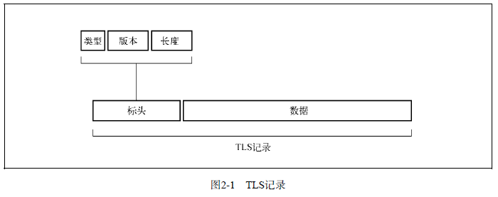

- 从多个宏观角度对通信进行考量： 
  - **消息传输**： 记录协议传输由其他协议层提交的不透明数据缓冲区
  - **加密以及完整性验证**： 一旦握手完成，记录层就开始按照协商取得的连接参数进行加密和完整性验证
  - **压缩**： 理论上，要加密前对数据进行压缩，但每个应用在 HTTP 层都进行过压缩，所以不再被使用
  - **扩展性**： 记录协议只关注数据传输和加密，而将所有其他特性转交给子协议，该方式使 TLS 可以扩展

## 2. 握手协议

> 握手过程中，通信双方协商连接参数，并完成身份验证

握手的常见流程： 

- **完整的握手**，对服务器进行身份验证

  > 握手过程中，**客户端和服务器将进行四个主要步骤**： 
  >
  > 1. 交换各自支持的功能，对需要的连接参数达成一致
  > 2. 验证出示的证书，或使用其他方式进行身份验证
  > 3. 对将用于保护会话的共享主密钥达成一致
  > 4. 验证握手消息并未被第三方团体修改
  >
  > **TLS 握手流程**： 
  >
  > 1. 客户端开始新的握手，并将自身支持的功能提交给服务器
  > 2. 服务器选择连接参数
  > 3. 服务器发送其证书链(仅当需要服务器身份验证时)
  > 4. 根据选择的密钥交换方式，服务器发送生成主密钥的额外信息
  > 5. 服务器通知自己完成了协商过程
  > 6. 客户端发送生成主密钥所需的额外信息
  > 7. 客户端切换加密方式并通知服务器
  > 8. 客户端计算发送和接收到的握手信息的 MAC 并发送
  > 9. 服务器切换加密方式并通知客户端
  > 10. 服务器计算发送和接收到的握手消息的 MAC 并发送
  >
  > 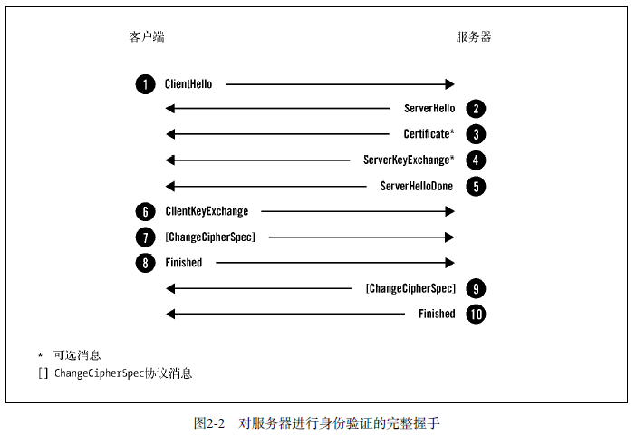
  >
  > - `ClientHello`： 将客户端的功能和首选项传送给服务器
  >
  >   > 客户端在新建连接后，希望重新协商或响应服务器发起的重新协商请求时，发送该消息
  >   >
  >   > 包含信息： 
  >   >
  >   > - `Version`： 协议版本，指示客户端支持的最佳协议版本
  >   > - `Random`： 随机数字段，包含 32 字节数据，28 字节随机生成，4 字节包含额外信息
  >   > - `Session ID`： 会话 ID 保存会话的唯一标识
  >   > - `Cipher Suites`： 密码套件块，由客户端支持的所有密码套件组成的列表
  >   > - `Compression`： 客户端可以提交一个或多个支持压缩的方法
  >   > - `Extensions`： 扩展块，有任意数量的扩展组成，这些扩展会携带额外数据
  >
  > - `ServerHello`： 将服务器选择的连接参数传回客户端
  >
  >   > 消息结构与 `ClientHello` 类似，只是每个字段只包含一个选项
  >
  > - `Certificate`： 可选，用于携带服务器 `X.509` 证书链
  >
  >   > - 证书链是以 `ASN.1 DER` 编码的一系列证书组合而成，主证书首先发送，中间证书按照正确的顺序跟在主证书之后
  >
  > - `ServerKeyExchange`： 携带密钥交换的额外数据，消息内容对于不同的协商算法套件都存在差异
  >
  > - `ServerHelloDone`： 表明服务器已将所有预计的握手消息发送完毕
  >
  > - `ClientKeyExchange`： 携带客户端为密钥交换提供的所有信息
  >
  >   > 受协商的密码套件影响，内容随着不同的协商密码套件而不同
  >
  > - `ChangeCipherSpec`： 表明发送端已取得用以生成连接参数的足够信息，已生成加密密钥，并将切换到加密模式
  >
  >   > 客户端和服务器在条件成熟时，都会发送这个消息
  >
  > - `Finished`： 该消息意味着握手已经完成
  >
  >   > - 消息内容将加密，以便双方可以安全的交换验证整个握手完整性所需的数据
  >   >
  >   > - 包含 `verify_data` 字段： 值是握手过程中所有消息的散列值，通过伪随机函数 `PRF` 完成
  >   >
  >   >   > `verify_data=PRF(master_secret,finished_label,Hash(handshake_messages))`

- **恢复之前会话的简短握手**： 在一次完整协商的连接断开时，客户端和服务器都会将会话的安全参数保存一段时间，希望使用会话恢复的服务器为会话指定唯一的标识(会话 ID)

  > - 会话恢复时，将会话 ID 放入 `ClientHello` 消息，然后提交
  > - 服务器若愿意恢复会话，就将相同的会话 ID 放入到 `ServerHello` 消息返回
  > - 接着使用之前协商的主密钥生成一套新的密钥，再切换到加密模式，发送 `Finished` 消息
  > - 客户端收到会话已恢复的消息后，也进行相同的操作
  >
  > 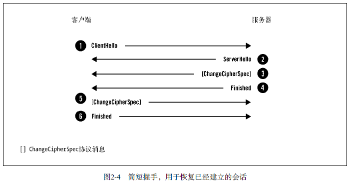
  >
  > 可以使用**会话票证**来替代服务器会话缓存和恢复

- **客户端和服务器进行身份验证的握手**： 一般选择对服务器的身份验证

  > - 服务器通过发送 `CertificateRequest` 消息请求对客户端进行身份验证，消息中列出所有可接受的客户端证书
  > - 作为响应，客户端发送自己的 `Certificate` 消息，并附上证书
  > - 此后，客户端发送`CertificateVerify` 消息，证明自己拥有对应的私钥
  >
  > 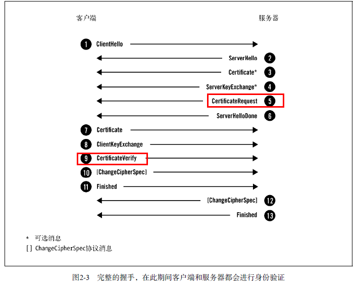

## 3. 密钥交换

> TLS 中，会话安全取决于主密钥的 48 字节共享密钥
>
> 会话交换的目的： 计算**预主密钥**，值是组成主密钥的来源

常用的密钥交换算法： 

|   密钥交换    | 描述                                         |
| :-----------: | -------------------------------------------- |
|   `DH_ANON`   | Diffie-Hellman（DH）密钥交换，未经身份验证   |
|   `DHE_RSA`   | 临时DH密钥交换，使用RSA身份验证              |
|  `ECDH_ANON`  | 临时椭圆曲线DH（ECDH）密钥交换，未经身份验证 |
|  `ECDHE_RSA`  | 临时ECDH密钥交换，使用RSA身份验证            |
| `ECDHE_ECDSA` | 临时ECDH密钥交换，使用ECDSA身份验证          |
|    `KRB5`     | Kerberos密钥交换                             |
|     `RSA`     | RSA密钥交换和身份验证                        |
|     `PSK`     | 预共享密钥（PSK）密钥交换和身份验证          |
|   `DHE_PSK`   | 临时DH密钥交换，使用PSK身份验证              |
|   `RSA_PSK`   | PSK密钥交换，使用RSA身份验证                 |
|     `SRP`     | 安全远程密码（SRP）密钥交换和身份验证        |

- **RSA 密钥交换**： 客户端生成预主密钥(46 字节随机数)，使用服务器公钥对其加密，包含在 `ClientKeyExchange` 中发送出去

  > - 作用： **用于加密预主密钥的服务器公钥，一般会保持多年不变**
  > - 缺陷： 任何接触到私钥的人都可以恢复预主密钥，并构建相同的主密钥，从而危害到会话安全性
  > - 改进： 使用**支持前向保密**，即每个连接使用的主密钥相互独立

- **Diffie-Hellman 密钥交换**： 一种密钥协定的协议

  > - 注意： 共享密钥时，不会受到被动攻击的威胁，但主动攻击却可以劫持通信信道，冒充对端
  > - 改进： 与身份验证联合使用
  >
  > - 问题： 
  >   - DH 参数的安全性： 取决于域参数的质量
  >   - DH 参数协商： TLS 没有为客户端提供传递期望使用的 DH 参数的强度的设施
  >   - 参数强度不够

- **椭圆曲线 Diffie-Hellman 密钥交换**： 类似 DH，但使用了不同的数学基础

## 4. 加密

- **序列加密**： 

  > 加密由两步组成： 
  >
  > - 第一步： 计算 MAC 值，范围包括记录序列号、标头、明文
  >
  >   > - MAC 包含标头能确保未进行加密的标头不会遭受篡改
  >   >
  >   > - MAC 包含序列号，能确保消息不被重放
  >
  > - 第二 步： 加密明文和 MAC，生成密文
  >
  > 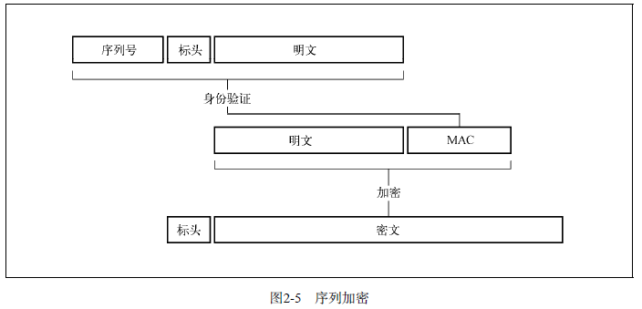

- **分组加密**： 

  > 步骤： 先计算 MAC，再加密
  >
  > - 计算序列号、标头、明文的 MAC
  >
  > - 构造填充，确认加密前的数据长度是分组大小的整数倍
  >
  > - 生成一个长度与分组大小一致的不可预期的初始向量 `IV` 
  >
  >   > `IV` 能保证加密是不确定的
  >
  > - 使用 CBC 分组模式加密明文、MAC、填充
  >
  > - 将 IV 和密文一起发送
  >
  > 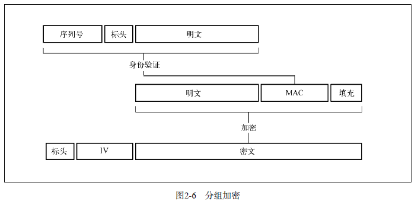
  >
  > 另一方案： 先加密，再计算 MAC，即首先对明文和填充进行加密，再将结果交给 MAC 算法
  >
  > - 优点： 可以保证主动网络攻击不能操纵任何加密数据

- **已验证的加密 AEAD**： 不用填充和初始向量，而使用一个 `nonce`，该值必须唯一

  > `nonce`： 在加密通信中仅使用一次的密钥
  >
  > 步骤： 
  >
  > - 生成一个唯一的 64 位nonce
  > - 使用已验证加密算法加密明文，同时将序列号和记录标头作为完成性验证依据的额外数据交给算法
  > - 将 nonce 和密文一起发送
  >
  > 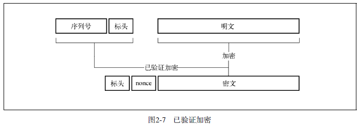

## 5. 重新协商

> - TLS 连接以握手作为起点，经过应用数据的交换，最后关闭会话
> - 但如果请求重新协商，就会发起一次新的握手

应用场景： 

- **客户端证书**： 不常用，可以提供双因素身份验证

- **隐藏消息**

- **改变加密强度**

- **服务网关密码 SGC**

- **TLS 记录的计数器溢出**： TLS 内部将数据包装成记录，并为每个记录指定唯一的 64 位序列号

  > 每当发生记录交换时，序列号就随之增长。一旦序列号接近溢出，协议就会强制执行重新协商

## 6. 密码操作

- **伪随机函数 PRF**： 用于生成任意数量的伪随机数据

- **主密钥**： 密钥交换过程中的输出是**预主密钥**，对其使用 PRF 生成 48 字节的主密钥

  > ```
  > msater_secrect=PRF(pre_msater_secret,"master secret",
  > 					ClientHello.random+ServerHello.random)
  > ```

- **密钥生成**： 连接的密钥块是用基于主密钥和客户端、服务器的随机数生成

  > ```
  > key_block = PRF(master_secret, "key expansion",
  > 				server_random + client_random)
  > ```
  >
  > - 密钥块的长度根据协商的参数而有所不同
  > - 密钥块分为： **两个 MAC 密钥、两个加密密钥、两个初始向量(可选)** 

---

密码套件： 一组选定的加密基元和其他参数，可以精确定义如何实现安全

> 属性： 
>
> - 身份验证方法
> - 密钥交换方法
> - 加密算法
> - 加密密钥大小
> - 密码模式
> - MAC 算法
> - PRF
> - 用于 `Finished` 消息的散列函数
> - `verify_data` 结构的长度
>
> 

## 7. 扩展

> 扩展以扩展块的形式加在 `ClientHello` 和 `ServerHello` 消息的末尾

- **应用层协议协商 ALPN**：能在 TLS 连接上协商不同的应用层协议

  > ALPN 类似 NPN
  >
  > - NPN 偏爱将协议选择结果加密
  > - ALPN 以明文传输，使中间设备可以检查它们并根据观察所得信息为流量选择路由

- **证书透明度**： CA 将每一张证书都提交给一组公开的日志服务器；反过来，这些 CA 将收到提交的证明，称为已签名证书时间戳 `SCT`，并中继给最终用户

  > 目的： 通过保持所有公开的服务器证书来改进互联网 PKI

- **椭圆曲线功能**： 两个扩展可以在握手时，通告客户端的 EC 功能
  - `elliptic_curves` 扩展： 在 `ClientHello` 中列出支持的曲线名称，使服务器可以在其中选择一条双方都支持的曲线
  - `ec_point_formats` 扩展： 可以在协商时，对椭圆曲线顶点进行可选压缩

- **心跳**： 添加了支持链接保活的功能，以及为 TLS 和 DTLS 发现路径最大传输单元 `PMTU` 

- **次协议协商 NPN**： 启用 SPDY 支持的客户端提交的 TLS 握手中，集成了一个空的 `next_protocol_negotiation` 扩展

- **安全重新协商**： `renegotiation_info` 扩展以验证重新协商的双方仍是先前完成握手的双方来改进 TLS

- **服务器名称指示 SNI**： 通过 `server_name` 扩展实现，客户端可以利用该机制告知服务器希望与之建立连接的服务器名称

  > 该扩展为安全虚拟主机提供支持： 为服务器提供足够的信息，使之可以在所有可用的安全虚拟主机中寻找匹配的证书
  >
  > - 若没有该机制，每个 IP 地址只能部署一张证书

- **会话票证**： 新的会话恢复机制，该机制不需要任何服务器端存储

  > 思路： 
  >
  > - 服务器取出所有会话数据(状态)并进行加密，再以票证的方式发回客户端
  > - 然后，客户端将票证提交回服务器，由服务器检查票证的完整性，解密其内容，再使用其中的信息恢复会话
  >
  > 优点： 使扩展服务器集群更为简单，因为传统方式需要在服务集群的各个节点之间同步会话
  >
  > 缺陷： 破坏了 TLS 安全模型，相同的票证密钥在会话中重用，无法保证前向保密

- **签名算法**： `signature_algoritms` 扩展使客户端可以通告自己支持的各种签名和散列算法

  > 使用 `signature_algoritms` 扩展，客户端可以提交其支持的签名-散列算法对

- **OCSP stapling**： 客户端使用 `status_request` 扩展指示支持 OCSP stapling

  > - 服务器使用该特性发送最新的证书吊销信息给客户端

---

协议限制： 

- 加密保护 TCP 连接的内容，但 TCP 和所有其他更低层的协议的元数据仍是明文传输

- 即使在 TLS 层，也有很多信息以明文形式暴露出去

  > 第一次握手是非加密的，可以让被动观察者： 
  >
  > 1. 了解客户端的功能，并使用其作为指纹
  > 2. 检查 SNI 信息确定期望访问的虚拟主机
  > 3. 检查主机证书，以及何时会使用客户端证书
  > 4. 存在得到足够信息以识别用户身份的可能性

- 启动加密后，某些协议信息仍能被探查到

## 8. 协议版本间的差异

- `TLS 1.0`： 
  - 定义基于标准 HMAC 的 PRF 的第一个版本，将 PRF 以 HMAC-MD5 和 HMAC-SHA 的结合实现
  - 生成主密钥使用 PRF，而不是定制的构造方法
  - `verify_data` 的值基于 PRF，而不是定制的构造方法
  - 使用官方 HMAC 作为完整性验证
  - 修改填充格式，使其更可靠
  - 去掉了 FORTEZZA 套件
- `TLS 1.1`： 
  - CBC 加密使用包含在每个 TLS 记录中的显示 IV，弥补了 IV 可预测的弱点
  - 使用 `bad_record_mac` 警报作为填充问题的响应，用于抵抗填充攻击

- `TLS 1.2`： 
  - 添加已验证加密支持
  - 添加对 HMAC-SHA256 密码套件的支持
  - 删除IDEA 和 DES 密码套件
  - 将扩展和协议的主规格说明书进行了集成
  - 客户端可以使用新扩展 `signature_algotithms` 来通报愿意接受的散列和签名算法
  - 使用 `TLS 1.2` 时，在 PRF 中，使用 SHA256 代替 MD5/SHA1 组合
  - 允许密码套件定义其自身的 PRF
  - 使用单一散列代替用于数字签名的 MD5/SHA1 组合，默认使用 SHA256
  - 密码套件可以显式指定`Finished` 消息中的 `verify_data` 成员的长度

# 第三章：公钥基础设施 PKI

## 1. 简介

- PKI 目标： 实现不同成员在不见面的情况下进行安全通信

- 采用的模型： 基于可信的第三方机构，即证书颁发机构 `CA` 签发的证书
- PKI 证书组成： 
  - **订阅人**： 指需要证书来提供安全服务的团体
  - **登记机构 RA**： 完成证书签发的相关管理工作
  - **证书颁发机构 CA**： 指信任的证书颁发机构，会在确认申请用户的身份后签发证书
  - **信赖方**： 指证书使用者

- PKI 证书生命周期： 

  > 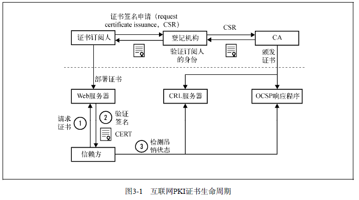

## 2. 证书

- **证书字段**： 

  > - 版本： 共有3个版本号，用0、1、2编码表示版本1、版本2和版本3
  >
  >   > 版本1只支持简单的字段
  >   >
  >   > 版本2增加了两个标识符（新增的字段）
  >   >
  >   > 版本3则增加了扩展功能
  >
  > - 序列号： 是每个CA用来唯一标识其所签发的证书
  >
  > - 签名算法： 指明证书签名所用的算法，需要放到证书里面，这样才能被证书签名保护
  >
  > - 颁发者： 包括了证书颁发者的可分辨名称 `DN` 
  >
  > - 有效期： 包括开始日期和结束日期
  >
  > - 使用者： 是实体的可分辨名称，和公钥一起用于证书的签发
  >
  > - 公钥： 以使用者公钥信息结构呈现（主要是算法ID，可选参数以及公钥本身）

- **证书扩展**： 每个扩展都包括唯一的对象标识符 `OID`、关键扩展标识器、ASN.1 格式的值

  > - 使用者可选名称： 为了替换使用者字段，支持通过DNS名称、IP地址和URI 将多个身份绑定在一起
  > - 名称约束： 可以限制 CA 签发证书的对象
  > - 基础约束： 表明证书是否为 CA 证书，同时通过路径长度约束字段，来限制二级CA证书路径的深度
  > - 密钥用法： 定义了证书中密钥可以使用的场景
  > - 扩展密钥用法： 可以通过OID支持更多的场景
  > - 证书策略： 包含了一个或多个策略，每个策略都包括一个OID和可选限定符
  > - CRL 分发点： 用来确定证书吊销列表 `CRL` 的 LDAP 或 HTTP URI 地址
  > - 颁发机构信息访问： 表明如何访问签发 CA 提供的额外信息和服务
  > - 使用者密钥标识符： 包含了唯一的值，可以用来识别包含特别公钥的证书
  > - 授权密钥标识符： 签发此证书的 CA 的唯一标识符，用于在构建证书链时找到颁发者的证书

- **证书链**： 

  > - 保证根证书安全：
  >
  >   > 
  >
  > - 交叉证书： 可以让新的 CA 立即投入运营
  >
  > - 划分： 将操作分散给很多二级 CA
  >
  > - 委派： CA 给外部其他组织签发一个二级 CA

- **证书颁发机构**： 

  > - 建立 CA 组织
  >   - 在 PKI 和 CA 的运营上非常专业
  >   - 设计一个健壮、安全、隔离的网络，以便在支持商业运作的同时，能够保护根证书以及二级证书密钥的安全
  >   - 支持证书生命周期管理流程
  >   - 符合 Baseline Requirements 的规定
  >   - 符合 EV SSL 证书指导规范
  >   - 提供全球化的 CRL 和 OCSP 基础服务
  > - 符合当地法律，即按照当地的法规要求获取相应许可证
  > - 通过根证书库认可的审计
  > - 将根证书内置到尽可能多的设备、软件中
  > - 找个已经内置的 CA 完成交叉证书

- **证书生命周期**： 在订阅人准备证书签名申请 `CSR` 文件，并将它提交给所选 CA  时开始

  > CA 会根据不同类型的证书申请，执行不同的验证流程： 
  >
  > - 域名验证 DV： 需要 CA 验证订阅人对域名的所有权之后才能进行签发
  >
  > - 组织验证 OV： 会对身份和真实性进行验证
  >
  > - 扩展验证 EV： 以更加严格的要求验证身份和真实性
  >
  >   > 解决 OV 证书缺乏的前后一致性而引入

- **吊销**： 当出现私钥泄露或不再需要使用时，需要吊销证书

  > 证书吊销标准： 
  >
  > - 证书吊销列表 CRL： 是一组未过期、但却已经被吊销的证书序列号列表
  > - 在线证书状态协议 OCSP： 允许信赖方获得一张证书的吊销信息

- **弱点**： 

  > 缺陷： 
  >
  > - 未经域名所有者授权就可以签发证书
  > - 缺少信任灵活度
  > - 弱域名验证
  > - 吊销不生效
  > - 证书警告让加密意图完全失效

- **根密钥泄露** 

---

改进： 

- **透视**： 在 TLS 验证过程中，引入独立公证人

  > 由客户端推荐可信的公证人，而不是直接单独对证书颁发机构资质的有效性作出决定

- **收敛**： 透视的一个分支，为增加隐私，发给公证人的请求需要经过多个服务器，这样公证人只知道客户端的身份，但是不知道请求的内容

- **公钥钉扎**： 网站的拥有者可以选择（钉）一个或多个信任的CA，创造单独的、比全球生态系统小很多的可信生态系统

- **DANE**： DNSSEC 在 DNS 基础上扩展了完整性检查的一组新协议，DANE 是 DNSSEC 和 TLS 验证间的桥梁

- **主权密钥**： 域名可以声明使用主权密钥，会记录在公开的、可验证的日志里

- **互信CA基础设施 MECAI**：服务器处理所有的工作，然后将最新的证人发送给客户端

  >  CA是在一种公证人的概念上运行的体，MECA 则是这种公证人的一个变种

- **证书透明度 CI**： 是一套审计和监控公开证书的框架，CA将签发的每一张证书都提交到公开证书日志里面，然后获得一个此次已提交的加密证明

- **证书密钥可信保证 TACK**： 是钉扎的一个变种，用来钉住服务器提供的签名密钥

# 第四章：攻击 PKI


# 第五章：HTTP 和浏览器问题

## 1. 会话劫持之sidejacking

- sidejacking 的网络应用会话劫持的一种特殊情况，攻击者会从一条未加密的连接上获取会话令牌
  - 若网站未使用加密流量，攻击者只需观察网络流量并从中提取会话令牌即可
  - 若网站只是部分启用加密，则会出现的问题： 
    - 设计导致的会话泄露： 使用加密保护账号密码，但当身份验证结束后，就切换回明文
    - 错误导致的会话泄露： 同一域名下的一个单独的明文资源可能引起会话泄露

> sidejacking 可以针对任何类型的会话令牌进行攻击，因为攻击者可以完全获取受害者与服务器间的通信

## 2. Cookie 窃取

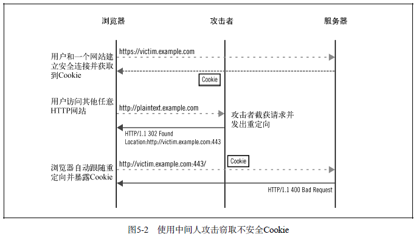

## 3. Cookie 篡改

- Cookie： 一种用来在客户端保存少量数据的扩展机制

  > 客户端使用 cookie-jar 存储 Cookie
  >
  > - 属性： 名称和值对，以及描述作用范围和生命周期的元数据
  > - 创建： 通过 `Set-Cookie` 响应头实现

- Cookie 篡改攻击： 

  - **Cookie 驱逐**： 针对浏览器的 Cookie 存储攻击，提交大量假 Cookie，使浏览器丢弃掉所有的真 Cookie

  - **直接 Cookie 注入**： 面对的是使用安全 Cookie 的网站，因此无法看到 Cookie，但可以创建新 Cookie 或覆盖已有的 Cookie，**利用 Cookie 存在于同一个命名空间中**

    > 过程： 攻击者截获受害者发出的任意明文 HTTP 事务并用它来强制向目标网站发起明文 HTTP 请求，然后攻击者截获并在响应中包含任意的 Cookie

  - **从相关主机名进行 Cookie 注入**： 当直接注入不行时，攻击者可以基于 Cookie 在相关主机名之间共享这一点展开攻击

    > 流程： 
    >
    > - 取得第一个 Cookie
    > - 使用相关主机名覆盖 Cookie
    > - 用假的相关主机名覆盖 Cookie

---

Cookie 篡改的应用： 

- XSS
- 跨站请求伪造(CSRF)防御绕过
- 应用程序状态改变
- 会话固定

---

缓解方法： 防止攻击者伪造 Cookie 以及检查接收到的 Cookie 是否合法

- 使用 HSTS 并覆盖子域名
- Cookie 完整性验证

## 4. SSL 剥离

- **SSL 剥离**： 利用用户在访问网站时，从明文部分开始或在输入网站地址时没有显示的使用 `https://` 前缀

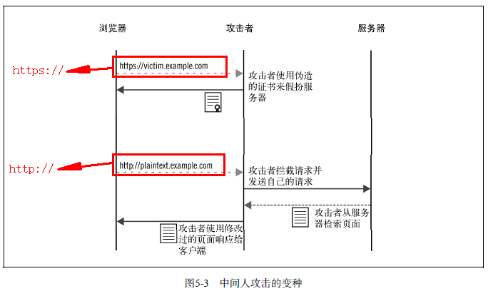

## 5. 中间人攻击证书

- **利用安全漏洞**： 若验证证书的逻辑实现存在问题，攻击者就可能使用无效的证书或证书链
- **伪造证书**： 即假的 CA 证书
- **自签名证书**： 使用一个复制真实证书各项值的自签名证书来欺骗受害者

# 第六章： 实现问题

> 攻击： 
>
> - FREAK 攻击
> - Logjam 攻击

## 1. 证书校验缺陷

- 确保 TLS 连接可信，客户端执行的基本检查： **检查证书属于预期的域名以及检查证书在有效期内且可信**

- **在库和平台中的证书校验缺陷**： 
  - Microsoft Crypto API 基本约束检查缺陷
  - GnuTLS 证书链校验缺陷
  - OpenSSL 中，DSA 和 ECDSA 签名校验缺陷
  - iOS 基本约束检查缺陷
  - iOS 和 OSX 中的连接验证缺陷
  - GnuTLS 证书链校验缺陷
  - OpenSSL 的 ChangCipherSpec 消息注入缺陷
  - OpenSSL 可选链证书伪造

- **应用程序校验缺陷** 
- **主机名校验问题** 

## 2. 攻击方式

- **FREAK 攻击**：攻击者可以记录握手的全部数据，之后进行暴力破解以获得预主密钥，并解密所有的信息

  > **出口密码套件**：
  >
  > - 正常 RSA 握手过程，客户端随机生成预主密钥，并用服务器的公钥加密后发送给服务器
  >
  >   > 如果RSA的密钥强度足够高，则密钥交换过程也是强安全级别的
  >
  > - 当出口密码套件被协商后，服务器生成一个弱强度的 RSA 公钥，使用高强度的 RSA 私钥对其签名，并使用 ServerKeyExchange 消息将签名后的弱 RSA 公钥发给客户端

- **Logjam 攻击**： 

  - 针对不安全 DHE 密钥交换的主动攻击
  - 针对不安全 DHE 密钥交换的预先计算攻击
  - 针对弱 DH 密钥交换的状态 —> 水平威胁

- **协议降级攻击**： 指攻击者作为中间人企图修改TLS握手过程中的连接参数

  > 具体思路： 攻击者希望迫使握手使用一个低等级的协议或使用低强度的密码套件

- **截断攻击**： 攻击者可以提前结束一条安全连接，以阻断一条或多条消息到达对端

# 第七章：协议攻击

## 1. 不安全重新协商

- **重新协商漏洞**： 服务器并不会验证新旧两条 TLS 连接的另外一端是同一个

  > - 在旧的和新的 TLS 连接之间没有连续性，即使这两个连接发生在同一个 TCP 连接上
  > - 即使存在完整性校验，也无法保证每次重新协商后，与服务器通信的客户端都相同

- **中间人攻击该漏洞**： 

  - 拦截一个受害客户端到服务器的 TCP 连接
  - 新建一个到服务器的 TLS 连接，包含攻击负载
  - 从这时起，在受害客户端和服务器之间扮演透明代理

  > - 对于客户端，连接刚开始，将开始一个新的 TLS 握手
  > - 对于服务器，在一个已经建立 TLS 连接上接收到攻击数据，并且将客户端的 TLS 握手理解为进行重新协商
  > - 一旦重新协商完成，客户端和服务器便开始交换应用层数据。攻击者的攻击负载和客户端的正常数据将会被服务器合并处理，从而使得攻击成功
  >
  > 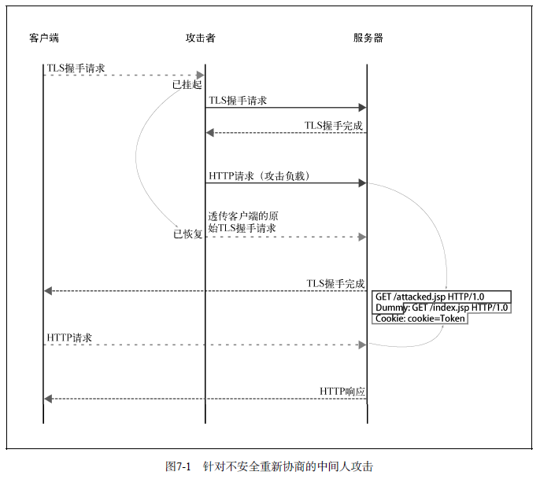

- **针对 HTTP 协议攻击**： 

  > - 执行任意 GET 请求攻击： 攻击者可以在受害者的请求之前加上任意的明文
  >
  >   > - **挑战**： 如何利用这种能力来控制攻击向量，以便使真正的请求无效，然后利用含有关键信息的部分来成功进行身份验证
  >   > - 攻击过程： 
  >   >   - 首先将攻击负载的开头设置成一个完整的 HTTP 请求行，这里将是攻击的目标 URL
  >   >   - 然后添加一个不完整的请求头行，会使受害者请求的第一行无效
  >   >   - 受害者请求中所有之后的请求头都会成为攻击请求的一部分
  >   > - 攻击要点： 
  >   >   - 攻击者可以选择将请求发到任何路径，并且随意使用受害者的身份凭据
  >   >   - 但攻击者无法获取到受害者的身份信息，此外相应的 HTTP 响应也将返回给受害者
  >
  > - 身份凭据窃取： 使用另外的身份将数据提交到网站，然后只需要从网站上获取数据
  >
  >   > - 关键： 
  >   >   - 设法将受害者的身份凭据信息作为自己的消息发出
  >   >   - 受害者的请求被作为 status 参数的内容在请求体中提交
  >   > - 挑战： 获得正确的 Content-Length 值
  >   > - 解决： 设置一个大到可以覆盖受害者请求中敏感数据的长度就可以成功地实施攻击
  >
  > - 用户重定向： 攻击者在一个网站上找到某个进行重定向的资源
  >
  >   > - 将用户重定向到恶意网站
  >   > - 连接降级至 HTTP
  >   > - 通过重定向 POST 请求截获身份凭据
  >
  > - 跨站点脚本`XSS`： 攻击者可能会向受害者的浏览器中注入 HTML 和 JavaScript 脚本

---

缓解方法： 

- 升级以支持安全的重新协商
- 禁用重新协商

## 2. BEAST

- 原理： 针对 TLS 1.0 和更早版本的协议中对称加密算法的 CBC 模式

  > 主要问题： `IV` 可以预测，攻击者可以将 CBC 模式削弱为 ECB(电子密码本)模式，而 ECB 不安全

- `ECB Oracle`： 

  > - ECB 最简单的操作模式：将数据分割成固定大小的块并分别进行加密
  >
  > - 分块加密的问题： 攻击者能提交任意数据进行加密，然后通过猜测获取之前加密数据的内容
  >
  > - 流程： 
  >
  >   - 截获一段加密数据，数据的大小取决于加密算法
  >
  >   - 对 16 字节的明文进行加密。因为块加密的特性，所以攻击者每次都猜测整块数据
  >
  >     > 块加密特性： 输入中任一位的变化将导致整个输出的变化
  >
  >   - 将加密数据与第一步截获的加密数据对比，若两者一致，则猜测正确，否则继续执行第二步

- 可预测 IV 的 CBC： 

  > - CBC 和 ECB 最大区别： CBC 使用一个初始向量 `IV` 来在加密之前掩码明文
  >
  >   > - 主要目的： 隐藏最终密文中的模式规律，采用掩码手段，即使在明文相同的情况下，加密后的密文也会完全不同
  >
  > 

---

缓解方法： BEAST 是发生在客户端的一种缺陷

- **客户端缓解方法**： 

  > - 方式一： 在每个真 TLS 记录前插入一个空 TLS 记录来解决此问题
  >
  >   > - 原理： 该方法下，虽然攻击者可以预测下一个 IV，但该 IV 是给没有内容的 0 长度 TLS 记录使用，有效的数据在之后的 TLS 记录中传输，使得攻击者无法进一步得知 IV
  >   > - 局限： 有些浏览器对 0 长度TLS记录支持得十分不好
  >
  > - 方式二： 浏览器使用 $1/n－1$ 分割，一种空记录技术的变种来抵御 BEAST 攻击
  >
  >   > - 原理： 发送两个 TLS 记录，但将应用层数据的第一字节放在第一个记录中，其余的字节放在第二个记录中
  >   >
  >   >   > - 第二个记录中的数据是安全的
  >   >   > - 第一字节仍使用可预测 IV，但该字节所在的加密块中，存在随机的且每个记录都不相同的其他 7 字节(或15字节)，所以攻击者无法很容易地猜测到这些字节
  >   >
  >   > - 开销： 每次客户端发送数据的时候，都有额外的 37 字节要发送

- **服务器端缓解方法**： 使用 `RC4` 算法

## 3. 压缩旁路攻击

所有的无损压缩算法都是通过去掉重复的方式展开工作

## 4. Lucky 13 攻击

- 填充经常在 CBC 模式中使用，但却没有被 TLS 的完整性检查机制所保护
- 攻击者可以修改填充字节并观察服务器作出的反应

## 5. RC4 缺陷

**RC4 原理**： 

- 初始化完成后，该算法产生一个无穷的流数据，数据完全随机
- 然后此数据被用于与明文内容进行异或，一次一字节
- 这个异或操作会让明文被完全掩码成随机数据，除非在拥有 RC4 密钥的情况下，否则无法破解

---

- **密钥调度弱点**： 密钥中的一小部分可以决定初始化输出的大部分内容

- **加密偏差**： 

  - **单字节偏差**： 密钥流的第二字节更倾向于为 0 的概率是 1/128（比正常的1/256高了2倍）

    > 因为 1 与 0 异或，结果为 1。因此，只要知道 RC4 密钥流的第二字节倾向 0，那么就知道经过加密的密文的第二字节与明文相同

  - **前 256 字节偏差**： 需要 $2^{32}$ 个数据样本来破解全部的 256 字节的内容，成功率几乎是100%

  - **双字节偏差**： 基于 $13×2^{30}$ 个数据样本破解出 16 字节的明文数据

    > 优点： 不需要使用大量不同 RC4 密钥加密的数据样本

## 6. 三次握手攻击

> 三次握手攻击利用了两个独立的 TLS 漏洞，对重新协商再次展开了攻击

攻击步骤： 利用了 TLS 协议的两个漏洞

- **第一步： 未知共享密钥缺陷** 

  > - 利用： 第一个被利用的缺陷发生在 RSA 的密钥交换过程中
  >
  > - 难关： 预主密钥是加密传输，攻击者就无法破解，除非攻击者能获取到服务器的私钥
  >
  > - 实现： 
  >
  >   - 客户端生成一个预主密钥和一个随机值，并发送给恶意服务器
  >
  >   - 预主密钥是加密的，但恶意网站是该值的目标接收方，因此可以解密开
  >
  >   - 在与客户端的握手完成之前，恶意网站使用客户端发来的预主密钥和随机值，向目标网站发起一个连接，之后恶意网站将目标服务器的随机数传给客户端
  >
  >   - 当密钥交换结束后，将会形成两个 TLS 连接，涉及三方的通信局面
  >
  >     > 这三方共享相同的连接参数，因此拥有相同的主密钥
  >
  > 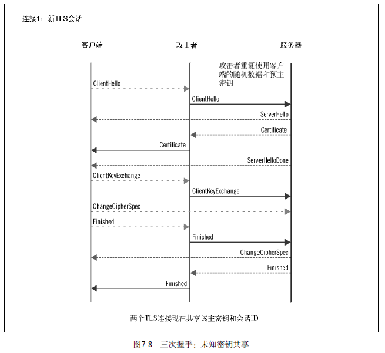

- **第二步： 全同步** 

  > - 攻击者无法对重新协商进行攻击： 因为每个连接都含有不同的 verify_data 值
  >
  >   > 证书不一样：第一个连接是恶意网站域名的证书，第二个连接是目标网站的证书
  >
  > - 攻击者利用会话恢复机制并利用后续的短握手
  >   
  >   - 当会话恢复时，没有进行身份验证，会话恢复仅用主密钥就可以实现对通信双方的身份验证
  >
  > 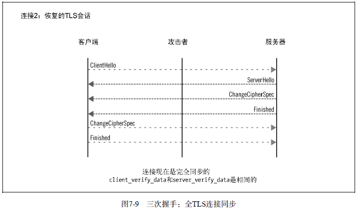

- **第三步： 仿冒身份** 

  > - 攻击者可以发起重新协商，并利用客户端的证书伪造身份
  > - 攻击者完全控制了两边的连接，并可以发送任意数据。
  > - 在目标网站这边，攻击者浏览到一个需要进行身份验证的资源，对此目标服务器发出重新协商请求并要求客户端提供证书
  >
  > 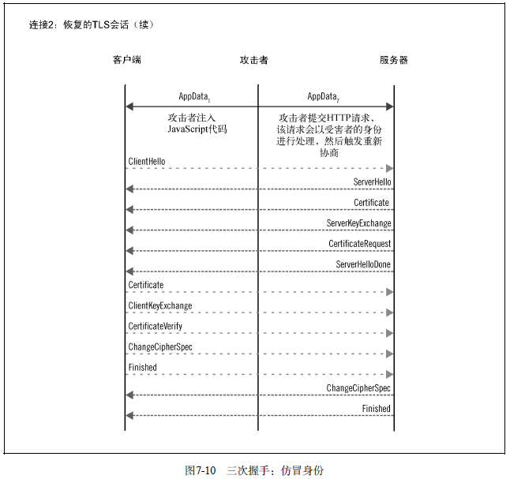