# \#第一部分： Web 基础

# 第一章：HTTP概述

## 1. 资源

### 1. 媒体类型

**HTTP 采用 MIME 来描述并标记多媒体内容**

> MIME 类型是一种文本标记，表示一种主要的对象类型和特定的子类型，中间由一条斜杠来分隔

- HTML 格式的文本文档由 `text/html` 类型来标记
- 普通的 ASCII 文本文档由 `text/plain` 类型来标记
- JPEG 版本的图片为 `image/jpeg` 类型
- GIF 格式的图片为 `image/gif` 类型
- Apple 的 QuickTime 电影为 `video/quicktime` 类型
- 微软的 PowerPoint 演示文件为 `application/vnd.ms-powerpoint` 类型

### 2. URI

- 服务器资源名为**统一资源标识符 `URI`** 唯一标识并定位信息资源

  > 如： `http://www.nipic.com/show/4/137/5176302k37386609.html` 
  >
  > URI 分为 URL 与 URN

### 3. URL

- 统一资源定位符 `URL` 描述了一台特定服务器上某资源的特定位置

  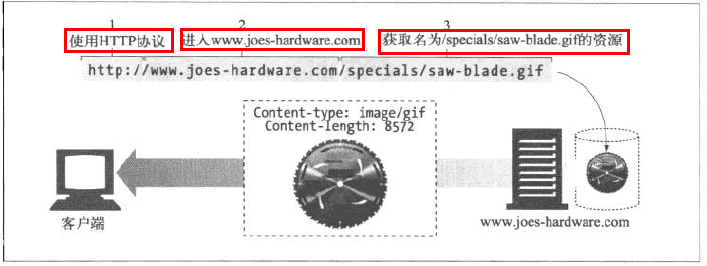

URL 遵循的标准格式： 

- 第一部分： 方案，说明了访问资源所使用的协议类型

  > 通常为 HTTP 协议

- 第二部分： 服务器的因特网地址

- 其余部分： 指定了 Web 服务器的某个资源

### 4. URN

统一资源名 `URN` 作为特定内容的唯一名称使用，与目前资源所在地无关

> 可以用同一个名字通过多种网络访问协议来访问资源

## 2. 事务

> HTTP 事务由请求命令和响应结果组成

### 1. 方法

| HTTP方法 | 描述                                 |
| :------: | ------------------------------------ |
|   GET    | 从服务器想客户端发送命名资源         |
|   PUT    | 将来自客户端的数据存储到服务器中     |
|   POST   | 将客户端数据发送到服务器网关应用程序 |
|  DELETE  | 从服务器删除命名资源                 |
|   HEAD   | 仅发送命名资源响应中的 HTTP 首部     |

### 2. 状态码

- `1xx`：指示信息–表示请求已接收，继续处理 
- `2xx`：成功–表示请求已被成功接收、理解、接受 
- `3xx`：重定向–要完成请求必须进行更进一步的操作 
- `4xx`：客户端错误–请求有语法错误或请求无法实现 
- `5xx`：服务器端错误–服务器未能实现合法的请求

## 3. 报文

HTTP 报文结构： 

- **起始行**： 在请求报文中用来说明要做些什么，在响应报文中说明出现了什么情况
- **首部字段**： 包含一个名字和一个值，用 `:` 分隔，以一个空行结束
- **主体**： 包含所有类型数据，可以是任意的二进制数据、文本等

## 4. HTTP 版本


- `HTTP/0.9`： 只允许客户端发送 GET 请求，且不支持请求头

  > - 由于没有协议头，造成了 HTTP 0.9 协议**只支持纯文本** 
  > - HTTP 0.9具有典型的无状态性，每个事务独立进行处理，事务结束时就释放这个连接
  > - 请求的页面不存在，也不会返回任何错误码

- `HTTP/1.0`： 

  - 请求与响应支持头域
  - 响应对象以一个响应状态行开始
  - 响应对象不只限于超文本
  - 开始支持客户端通过 POST 方法向Web服务器提交数据，支持 GET、HEAD、POST 方法
  - 支持长连接(但默认还是使用短连接)，缓存机制，以及身份认证 

- `HTTP/1.1`： 引入keepalive连接，chunked编码传输，字节范围请求，请求流水线等

  - **Persistent Connection(`keepalive`(持久) 连接)**：允许 HTTP 设备在事务处理结束后，将 TCP 连接保持打开状态，以便未来的HTTP请求重用现在的连接，直到客户端或服务器端决定将其关闭为止

    > - HTTP1.0 中使用长连接需要添加请求头 `Connection: Keep-Alive`
    >
    > - HTTP 1.1 连接默认长连接，除非特殊声明 `Connection: close` 
    >
    > 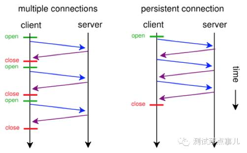

  - **chunked 编码传输**： 对于动态生成的响应类容，可以使用分块传输，边生成边发送

    > 在实体长度未知时特别有用(比如： 由数据库动态产生的数据)

  - **字节范围请求**： 支持传送一部分内容

    > 比如： 当客户端已经有内容的一部分，为了节省带宽，可以只向服务器请求一部分
    >
    > - 在请求消息中引入 `range` 头域来实现，允许只请求资源的某个部分
    > - 在响应消息中 `Content-Range` 头域声明了返回的这部分对象的偏移值和长度
    >
    > > 如果服务器相应地返回了对象所请求范围的内容，则响应码206（Partial Content）

  - **Pipelining(管道机制)**：同一个 TCP 连接里，客户端可以同时发送多个请求，但服务器还是按顺序响应

    > 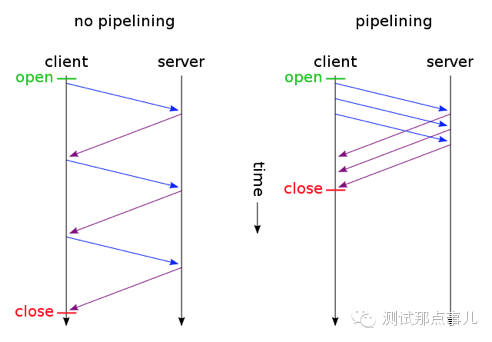

  - **新增 Request method**：`OPTIONS, PUT, DELETE, TRACE, CONNECT` 

  - **支持 Host 头域**：  实现在一台 WEB 服务器上可以在同一个IP地址和端口号上使用不同的主机名来创建多个虚拟 WEB 站点

    > 在一台物理服务器上可以存在多个虚拟主机，并且共享一个 IP 地址
    >
    > ```html
    > GET /pub/WWW/TheProject.html HTTP/1.1
    > Host: www.w3.org
    > ```

- `HTTP/2.0`： 

  - **多路复用(二进制分帧)**： 将所有传输的信息分割为更小的消息和帧，并采用二进制格式的编码

    > HTTP1.x 首部信息会被封装到 Headers 帧，而 request body 则封装到 Data 帧里
    >
    > 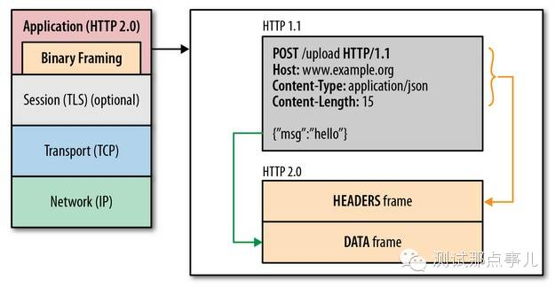

  - **头部压缩**： 当一个客户端向相同服务器请求许多资源时，会采用压缩技术处理请求的相同信息

  - **随时复位**： HTTP2.0 的 `RST_STREAM` 能随时停止一个信息传输，启动新的信息，在不中断连接的情况下提高带宽利用效率

  - **服务器端推流**： 客户端请求一个资源 `X`，服务器端判断也许客户端还需要资源 `Z`，在无需事先询问的情况下将资源 `Z` 推送到客户端，客户端接受到后，可以缓存起来以备后用

  - **优先权和依赖**： 客户端会指定哪个流最重要，一个流可以依赖另外一个流

    > 优先级别可以在运行时动态改变，当用户滚动页面时，可以告诉浏览器哪个图像最重要

## 5. Web 结构组件

- **代理**： 位于客户端和服务器之间的 HTTP 中间实体，接收客户端的 HTTP 请求，并转发给服务器

- **缓存**： 将经过代理传送的常用文档复制保存起来，下一个请求同一文档的客户端就可以享受缓存的私有副本所提供的服务

- **网关**： 连接其他应用程序的特殊 Web 服务器，通常用于将 HTTP 流量转换成其他协议

  > 例如： HTTP/FTP 网关会通过 HTTP 请求接收对 FTP URI 的请求，但通过 FTP 协议来获取文档
  >
  > 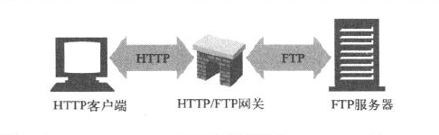

- **隧道**： 隧道建立后，会在两条连接之间对原始数据进行**盲转发**的 HTTP 应用程序

  > 用途： 通过 HTTP 连接承载加密的安全套接字层 `SSL` 流量，这样 SSL 流量就可以穿过只允许 Web 流量通过的防火墙了
  >
  > 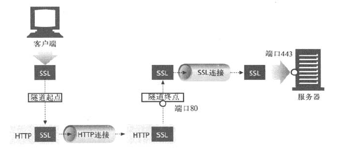

- **Agent 代理**： 发起自动 HTTP 请求的半智能 Web 客户端

  > 用户 Agent 代理是代表用户发起 HTTP 请求的客户端程序

# 第二章：URL 与资源

## 1. 语法

`<scheme>://<user>:<password>@<host>:<port>/<path>;<params>?<query>#<frag>`

| 组件 | 描述                                                         |    默认值     |
| :--: | ------------------------------------------------------------ | :-----------: |
| 方案 | 访问服务器以获取资源时要使用的协议                           |      无       |
| 用户 | 某些方案访问资源时需要的用户名                               |     匿名      |
| 密码 | 用户名后可能包含的密码，用 `:` 分隔                          | <E-mail 地址> |
| 主机 | 资源宿主服务器的主机名或点分 IP 地址                         |      无       |
| 端口 | 资源宿主服务器正在监听的端口号                               | 各个方案特有  |
| 路径 | 服务器上资源的本地名                                         |      无       |
| 参数 | 指定输入参数(**名/值对**)，多个参数用 `;` 分隔               |      无       |
| 查询 | 用该组件传递参数以激活应用程序                               |      无       |
| 片段 | 资源名称，引用对象时不会将 `frag` 传给服务器，在客户端内部使用 |      无       |

- **方案(使用的协议)**：规定如何访问指定资源的主要标识符，会告诉**使用什么协议** 
- **用户名与密码**： 没有用户名和密码时，会默认插入 `anonymous(匿名用户)` 
- **主机与端口**： 
  - 主机标识了因特网能够访问资源的宿主机器
  - 端口标识了服务器正在监听的网络端口

- **路径**： 说明资源位于服务器的什么地方

- **参数**： 用于正确的与服务器进行交互

  > 例子： `http://www.joes-hardware.com/hammemers;sale=false/index.html;graphics=true`
  >
  > - `hammemers` 路径段： 参数 `sale` 值为 `false`
  > - `index.html` 路径段： 参数 `graphics` 值为 `true` 

- **查询字符串**： 查询指定的内容

  > 例子： `http://www.joes-hardware.com/inventory-check.cgi?item=123&color=blue`
  >
  > 该例中，有两个 名/值 对： `item=123` 和 `color=blue` 

- **片段**： 为了应用部分资源或资源的一个片段，使用片段组件来表示一个资源内部的片段

  > 例子： `http://www.joes-hardware.com/tools.html#drills`
  >
  > - HTTP 服务器通常只处理整个对象，而不是对象的片段，客户端不能将片段传送给服务器
  >
  > - 浏览器从服务器获得整个资源后，会根据片段来显示指定的资源
  >
  > 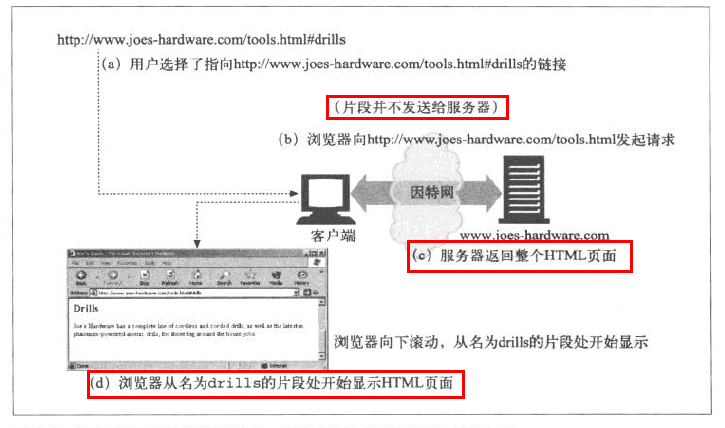

## 2. 快捷方式

### 1. 相对 URL

- **绝对 URL**： 包含访问资源所需的全部信息
- **相对 URL**： 相对于另一个 URL 进行解析

---

**相对 URL 的转换处理**： 

1. **基础 URL**： 最为相对 URL 的参考点使用

   > 来源： 
   >
   > - 在资源中显示提供
   > - 将所属资源的 URL 作为基础
   > - 没有基础 URL（此 URL 不完整）

2. **解析相对引用**： 将相对 URL 和基础 URL 划分成组件段

   > 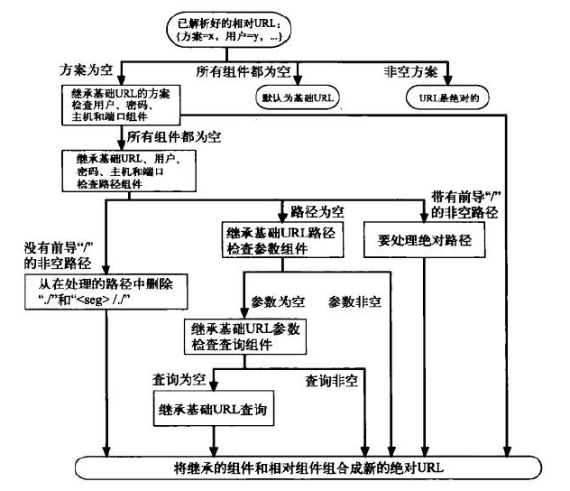

### 2. 自动扩展 URL

- **主机名扩展**： 将用户输入的主机名扩展为完整的主机名
- **历史扩展**： 将用户以前访问的 URL 历史存储起来

## 3. 字符与编码

- **URL 字符集**： 为 `US-ASCII`，通过**转义序列**，用 US-ASCII 字符集的有限子集对任意字符值或数据进行编码

- **编码机制**：用来在 URL 中表示各种不安全的字符，

  > 转义表示法： 包含一个百分号 `%`，后面跟着两个表示字符 `ASCII` 码的十六进制数
  >
  > 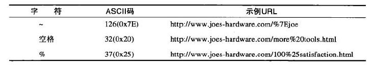

- 保留字符： 将其使用在保留用途之外的场合时，要在 URL 中对其进行编码

  > 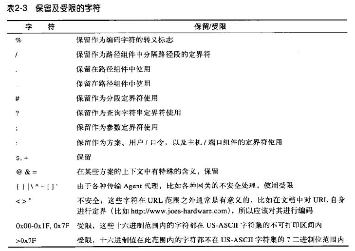

# 第三章：HTTP 报文

## 1. 报文组成

### 1. 语法

- 请求报文： 

  ```xml
  <method> <request-URL> <version>
  <headers>
      
  <entity-body>
  ```

- 响应报文： 

  ```xml
  <version> <status> <reason-phrase>
  <headers>
      
  <entity-body>
  ```

---

- 方法 `method`： 客户端希望服务器对资源执行的动作，如： `GET, POST`

- 请求 URL `request-URL`： 命名了所请求资源，或 URL 路径组件的完整 URL

- 版本 `version`：报文所使用的 HTTP 版本，格式： `HTTP/<major>.<minor>`

- 状态码 `status`： 描述了请求过程中所发生的情况，如： `200`

- 原因短语 `reason-phrase`： 数字状态码的可读版本，包含行终止序列之前的所有文本，如： `OK`

- 首部 `header`： 包含一个名字，后面为冒号 `:`，然后是一个可选空格，接着是一个值，最后是 CRLF

  > 可以有零个或多个首部

- 实体的主体部分 `entity-body`： 包含一个由任意数据组成的数据块（可选）

### 2. 组成

#### 1. 起始行

- **请求行**： 请求报文进行请求服务器对资源进行一些操作

  > 请求报文的起始行(请求行)： 
  >
  > - 包含了一个方法和一个请求 URL
  >   - 方法描述了服务器应该执行的操作
  >   - 请求 URL 描述了要对哪个资源执行该方法
  > - 包含了 HTTP 版本： 用来告知服务器，客户端使用的是哪种 HTTP

- **响应行**： 响应报文承载了状态信息和操作产生的所有结果数据，将其返回给客户端

  > 包含了响应报文使用的 HTTP 版本、数字状态码、描述操作状态的文本形式的原因短语

- **方法**： 请求的起始行以方法作为开始，用来告诉服务器做什么事情

  > | HTTP方法 | 描述                                             | 是否包含主体 |
  > | :------: | ------------------------------------------------ | :----------: |
  > |   GET    | 从服务器获取一份文档                             |      否      |
  > |   HEAD   | 只从服务器获取文档的首部                         |      否      |
  > |   POST   | 向服务器发送需要处理的数据                       |      是      |
  > |   PUT    | 将请求的主体部分存储到服务器中                   |      是      |
  > |  TRACE   | 将可能经过代理服务器传送到服务器上的报文进行追踪 |      否      |
  > | OPTIONS  | 决定可以在服务器上执行哪些方法                   |      否      |
  > |  DELETE  | 从服务器删除一份资源                             |      否      |

- **状态码**： 用来告诉客户端发生了什么事情

  > | 整体范围 | 已定义范围 |    分类    |
  > | :------: | :--------: | :--------: |
  > | 100~199  |  100~101   |  信息提示  |
  > | 200~299  |  200~206   |    成功    |
  > | 300~399  |  300~305   |   重定向   |
  > | 400~499  |  400~415   | 客户端错误 |
  > | 500~599  |  500~505   | 服务器错误 |

- **原因短语**： 为状态码提供了文本形式的解释，是状态码的可读版本

- **版本号**： 以 `HTTP/x.y` 的形式出现在请求和响应报文的起始行中，将所遵循的协议版本告知对方

  > - 目的： 为使用 HTTP 的应用程序提供一种线索，以便互相了解对方的能力和报文格式
  > - 注意： 版本号不会被当作分数来处理，版本中的每个数字都会被当作一个单独数字来处理

#### 2. 首部

格式： 名字后面跟着冒号 `:`，然后可选的空格，再跟上字段值，最后是一个 CRLF

- 分类： 
  - **通用首部**： 既可以出现在请求报文中，也可以出现在响应报文中
  - **请求首部**： 提供更所有关请求的信息
  - **响应首部**： 提供更多有关响应的信息
  - **实体首部**： 描述主体的长度和内容，或资源本身
  - **扩展首部**： 规范中没有定义的新首部

- **首部延续行**： 将长的首部行分为多行以提高可读性，多出来的每行前面至少要有一个空格或制表符

#### 3. 主体部分

- 报文主体： 存储 HTTP 要传输的内容

## 2. 方法

> 安全方法： `GET,HEAD`，即： `GET` 或 `POST` 的 HTTP 请求都不会产生什么动作，进而不会产生什么结果

- `GET`： 用于请求服务器发送某个资源

- `HEAD`： 类似 GET，但服务器在响应中只返回首部，不返回实体的主体部分

  > 优势： 
  >
  > - 在不获取资源的情况下，了解资源的情况
  > - 通过查看响应中的状态码，看看某个对象是否存在
  > - 通过查看首部，测试资源是否被修改

- `PUT`： 会向服务器写入文档

- `POST`： 用来向服务器输入数据

- `TRACE`： **诊断**，即用于验证请求是否如愿穿过了请求/响应链

  > 可以用来查看代理和其他应用程序对用户请求所产生的效果
  >
  > - TRACE 请求中，不能带有实体的主体部分
  > - TRACE 响应实体的主体部分包含了响应服务器收到的请求的精确副本

- `OPTIONS`： 请求 Web 服务器告知其支持的功能

  > 使客户端应用程序不用实际访问资源，就能判定访问各种资源的最优方式
  >
  > 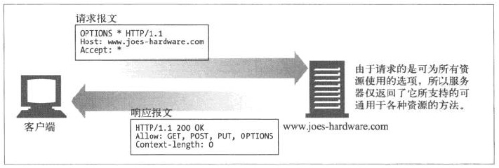

- `DELETE`： 请求服务器删除指定 URL 所指定的资源

  > 客户端无法保证删除操作一定会被执行，因为 HTTP 规范允许服务器在不通知客户端的情况下撤销请求

### 扩展方法

> HTTP 被设计为字段可扩展，扩展方法指没有在 HTTP/1.1 规范中定义的方法

如： `WebDAV HTTP` 扩展方法，有助于通过 HTTP 将 Web 内容发布到 Web 服务器上

| 方法  |          描述          |
| :---: | :--------------------: |
| LOCK  |   允许用户“锁定”资源   |
| MKCOL |    允许用户创建资源    |
| COPY  | 便于在服务器上复制资源 |
| MOVE  |   在服务器上移动资源   |

## 3. 状态码

### 1. 100~199 信息性状态码

- `100 continue`： 说明收到请求的初始部分，请客户端继续发送
- `101 switching protocols`： 说明服务器正在根据客户端的指定，将协议切换成 Update 首部所列的协议

### 2. 200~299 成功状态码

- `200 OK`： 请求成功，实体的主体部分包含了所请求的资源

- `201 created`： 用于创建服务器对象的请求

  > 创建好对象后，服务器才会发生该状态码
  >
  > - 响应实体的主体部分包含各种引用了已创建的资源的 URL
  >
  > - Location 首部包含的则是最具体的引用

- `202 accepted`： 请求已被接受，但服务器还未对其执行任何动作

- `203 non-authoritative infomation`： 实体首部包含的信息不是来自源服务器，而是来自资源的一份副本

  > 如果中间节点有一份资源副本，但无法或没有对它所发送的与资源有关的元信息(首部)进行验证，就会出现该状况

- `204 no content`： 响应报文中包含若干首部和一个状态行，但没有实体的主体部分

  > 主要用于在浏览器不转为显示新文档的情况下，对其进行更新

- `205 partial content`： 成功执行了一个部分或 range(范围) 请求

  > 206 响应必须包含 `content-range,date,ETag 或 content-location` 

### 3. 300~399 重定向状态码

- `300 multiple choices`： 客户端请求一个实际指向多个资源的 URL 时会返回这个状态码

- `301 moved permanently`： 在请求的 URL 已被移除时使用

  > 响应的 Location 首部中应该包含资源现在所处的 URL

- `302 found`： 类似 301，但客户端使用 Location 首部的 URL 来临时定位资源，将来的请求仍使用老 URL

- `303 see other`： 告知客户端应该用另一个 URL 来获取资源，新的 URL 位于响应报文的 Location 首部

  > 目的： 允许 POST 请求的响应将客户端定向到某个资源中

- `304 not modified`： 客户端可以通过所包含的请求首部，使其请求变成有条件的

  > 如果客户端发起一个 GET 请求，而最近资源未被修改，就可以用 304 来说明资源未被修改
  >
  > - 带有 304 的响应不应该包含实体的主体部分

- `305 use proxy`： 用来说明必须通过一个代理来访问资源，代理位置由 Location 首部给出

- `307 temparary redirect`： 类似 301，但客户端应该使用 Location 首部给出的 URL 来临时定位资源，将来的请求应该使用老的 URL

### 4. 400~499 客户端错误状态码

- `400 Bad Request`： 用于告知客户端，它发送了一个错误请求

- `401 Unauthorized`： 在返回的首部中，请求客户端在获取对资源的访问权之前，对自己进行验证

- `402 Payment Required`： 未使用

- `403 Forbidden`： 用于说明请求被服务器拒绝了

- `404 Not Found`：用于说明服务器无法找到所请求的 URL

- `405 Method Not Allowed`： 发起的请求中带有所请求的 URL 不支持的方法时使用

- `406 Not Acceptable`： 客户端可以指定参数来说明愿意接收什么类型的实体

- `407 Proxy Authentication`： 类似 401，但用于要求对资源进行认证的代理服务器

- `408 Request Timeout`： 请求时间太长，服务器返回该状态码，并关闭连接

- `409 Conflict`： 用于说明请求可能在资源上引发的一些冲突

  > 响应中，应包含描述冲突的主体

- `410 Gone`： 类似 404，只是服务器曾拥有过该资源，主要用于 Web 站点的维护

  > 这样服务器的管理者就可以在资源被移除的情况下通知客户端

- `411 Length Required`： 服务器要求在请求报文中包含 `Content-Length` 首部时使用

- `412 Precondition Failed`： 客户端发起的条件请求中，有一个条件失败

  > 客户端包含 `Expect` 首部时，发起的是条件请求

- `413 Request Entity Tool Large`： 客户端发送的实体主体部分比服务器能够或希望处理的要大时使用

- `414 Request URI Tool Long`： 客户端所发请求中的请求 URL 比服务器能够或希望处理的要长时使用

- `415 Unsupported Media Type`： 服务器无法理解或无法支持客户端所发实体的内容类型时使用

- `416 Requested Range Not Satisfiable`： 请求报文所请求的是指定资源的某个范围，而该范围无效或无法满足时使用

- `417 Expectation Failed`： 请求的 `Expect` 请求首部包含一个期望值，但服务器无法满足此期望时使用

### 5. 500~599 服务器错误状态码

- `500 Internal Server Error`： 服务器遇到一个妨碍它为请求提供服务的错误时，使用

- `501 Not Implemented`： 客户端发起的请求超出服务器的能力范围时，使用

- `502 Bad Gateway`：作为代理或网关使用的服务器从请求响应链的下一条链路上收到一条伪响应时，使用

- `503 Service Unavailable`： 用来说明服务器现在无法为请求提供服务，但将来可以

  > 如果服务器知道什么时候资源变为可用，可在响应中包含一个 `Retry-After` 首部

- `504 Gateway Timeout`： 类似 408，响应来自一个网关或代理，在等待另一服务器对其请求进行响应超时

- `505 HTTP Version Not Supported`： 服务器收到的请求使用了无法或不愿支持的协议版本时，使用

## 4. 首部

- **通用首部**： 提供了与报文相关的最基本信息

  > **通用的信息性首部**： 
  >
  > |       首部        | 描述                                                         |
  > | :---------------: | ------------------------------------------------------------ |
  > |    Connection     | 允许客户端和服务器指定与请求/响应连接有关的选项              |
  > |       Date        | 提供日期和时间标志，说明报文是什么时间创建的                 |
  > |   MIME-Version    | 给出了发送端使用的 MIME 版本                                 |
  > |      Trailer      | 若报文采用分块传输编码，则使用该首部列出位于报文拖挂部分的首部集合 |
  > | Transfer-Encoding | 告知接收端为保证报文的可靠传输，对报文采用了什么编码方式     |
  > |      Update       | 给出了发送端可能想要”升级“是哟个的新版本或协议               |
  > |        Via        | 显示报文经过的中间节点(代理、网关)                           |
  >
  > **通用缓存首部**： 
  >
  > |     首部      | 描述                                       |
  > | :-----------: | ------------------------------------------ |
  > | Cache-Control | 用于随报文传送缓存指示                     |
  > |    Pragma     | 另一种随报文传送指示的方式，但不专用于缓存 |

- **请求首部**： 只在请求报文中有意义的首部

  > **请求的信息性首部**： 
  >
  > |    首部    | 描述                                         |
  > | :--------: | -------------------------------------------- |
  > | Client_IP  | 提供了运行客户端的机器的 IP 地址             |
  > |    From    | 提供了客户端用户的 E-mail 地址               |
  > |    Host    | 给出了接收请求的服务器的主机名和端口号       |
  > |  Referer   | 提供了包含当前请求 URI 的文档的 URL          |
  > |  UA-Color  | 提供了与客户端显示器的显示颜色有关的信息     |
  > |   UA-CPU   | 给出了客户端 CPU 的类型或制造商              |
  > |  UA-Disp   | 提供了与客户端显示器能力有关的信息           |
  > |   UA-OS    | 给出了运行在客户端机器上的操作系统名称及版本 |
  > | UA-Pixels  | 提供了客户端显示器的像素信息                 |
  > | User-Agent | 将发起请求的应用程序名称告知服务器           |
  >
  > **Accept 首部**： 将客户端的喜好和能力告知服务器
  >
  > |      首部       | 描述                                   |
  > | :-------------: | -------------------------------------- |
  > |     Accept      | 告诉服务器能够发送哪些**媒体类型**     |
  > | Accept-Charset  | 告诉服务器能够发送哪些**字符集**       |
  > | Accept-Encoding | 告诉服务器能够发送哪些**编码方式**     |
  > | Accept-Language | 告诉服务器能够发送哪些**语言**         |
  > |       TE        | 告诉服务器可以使用哪些**扩展传输编码** |
  >
  > **条件请求首部**： 
  >
  > |        首部         | 描述                                                   |
  > | :-----------------: | ------------------------------------------------------ |
  > |       Expect        | 允许客户端列出某请求所要求的服务器行为                 |
  > |      If-Match       | 若实体标记与文档当前标记匹配，则获取该文档             |
  > |  If-Modified-Since  | 除非某个指定的日期之后资源被修改过，否则限制该请求     |
  > |    If-None-Match    | 若实体标记与文档当前标记不相符，则获取该文档           |
  > |      If-Range       | 允许对文档的某个范围进行条件请求                       |
  > | If-Unmodified-Since | 除非某个指定的日期之后资源没有被修改过，否则限制该请求 |
  > |        Range        | 若服务器支持范围请求，就请求资源的指定范围             |
  >
  > **安全请求首部**： 
  >
  > | 首部          | 描述                                               |
  > | ------------- | -------------------------------------------------- |
  > | Authorization | 包含了客户端提供服务器，以便对其自身进行认证的数据 |
  > | Cookie        | 客户端用它向服务器传送令牌                         |
  > | Cookie2       | 用来说明请求端支持的 cookie 版本                   |
  >
  > **代理请求首部**： 
  >
  > |        首部         | 描述                                                         |
  > | :-----------------: | ------------------------------------------------------------ |
  > |     Max-Forward     | 在通往源端服务器的路径上，将请求转发给其他代理或网关的最大次数 |
  > | Proxy-Authorization | 同 Authorization，但在与代理及逆行认证时，使用               |
  > |  Proxy-Connection   | 同 Connection，但在与代理建立连接时，使用                    |

- **响应首部**： 

  > **响应的信息性首部**： 
  >
  > |    首部     | 描述                                   |
  > | :---------: | -------------------------------------- |
  > |     Age     | 响应持续时间                           |
  > |   Public    | 服务器为其资源支持的请求方法列表       |
  > | Retry-After | 若资源不可用，则在此日期或事件后重试   |
  > |   Server    | 服务器应用程序软件的名称和版本         |
  > |    Title    | 对 HTML 文档来说，就是 HTML 文档的标题 |
  > |   Warning   | 比原因短语中更详细的警告报文           |
  >
  > **协商首部**： 
  >
  > |     首部      | 描述                                           |
  > | :-----------: | ---------------------------------------------- |
  > | Accept-Ranges | 服务器可接受的范围类型                         |
  > |     Vary      | 服务器查看的其他首部的列表，可能使响应发生变化 |
  >
  > **安全响应首部**： 
  >
  > |       首部       | 描述                           |
  > | :--------------: | ------------------------------ |
  > | Proxy-Authencate | 来自代理的对客户端的质询列表   |
  > |    Set-Cookie    | 非真正安全首部，但隐含安全功能 |
  > |   Set-Cookie2    | 类似 Set-Cookie                |
  > | WWW-Authenticate | 来自服务器的对客户端的质询列表 |

- **实体首部**：

  > **实体的信息性首部**： 
  >
  > |   首部   | 描述                                                         |
  > | :------: | ------------------------------------------------------------ |
  > |  Allow   | 列出了可以对此实体执行的请求方法                             |
  > | Location | 告知客户端实体实际上位于何处，用于将接收端定向到资源的 URL 上 |
  >
  > **内容首部**： 
  >
  > |       首部       | 描述                                    |
  > | :--------------: | --------------------------------------- |
  > |   Content-Base   | 解析主体中的相对 URL 时，使用的基础 URL |
  > | Content-Encoding | 对主体执行的任意编码方式                |
  > | Content-Language | 理解主体时，最适宜使用的自然语言        |
  > |  Content-Length  | 主体的长度或尺寸                        |
  > | Content-Location | 资源实际所处的位置                      |
  > |   Content-MD5    | 主体的 MD5 校验和                       |
  > |  Content-Range   | 在整个资源中，此实体表示的字节范围      |
  > |   Content-Type   | 该主体的对象类型                        |
  >
  > **实体缓存首部**： 
  >
  > |     首部      | 描述                           |
  > | :-----------: | ------------------------------ |
  > |     ETag      | 与此实体相关的实体标记         |
  > |    Expires    | 过期实体不再有效               |
  > | Last-Modified | 实体最后一次被修改的日期和时间 |

# 第四章：连接管理

## 1. TCP 性能

### 1. HTTP 事务的延迟

下图描绘了 HTTP 事务主要的连接、传输、处理时延


HTTP 事务时延的原因： 

- 客户端首先需要根据 URI 确定 Web 服务器的 IP 地址和端口号

  > 通过 DNS 解析系统将 URI 中的主机名转换成 IP 地址会花费较长时间

- 客户端向服务器发送的连接请求，并等待服务器回送应答，每条新的 TCP 连接都会有连接建立时延

- 连接建立后，客户端就会通过新建立的 TCP 管道来发送 HTTP 请求，服务器会对请求做处理

  > 因特网传输请求报文，以及服务器处理请求报文都需要时间

- Web 服务器回送 HTTP 响应，也需要花费时间

### 2. 性能聚焦区域

#### 1. TCP 连接的握手时延

> 小的 HTTP 事务可能会在 TCP 建立上花费 50% 或更多时间
>
> - 通过**重用现存连接**来减小该时延


#### 2. 延迟确认

> TCP 确认机制： 每个 TCP 段都有一个序列号和数据完整性校验和，每个段的接收者收到完整段时，都会向发送者会送小的确认分组；若未在规定时间回复确认信息，则会重发数据

**延迟确认算法**： 会在一个特定的窗口时间内将输出确认存放在缓冲区中，以寻找能够捎带它的输出数据分组；若在那个时间段内没有输出数据分组，就将确认信息放在单独的分组中传送

- 作用： 增加确认保温找到同向传输数据分组的可能性

- 缺点： HTTP 具有双峰特征请求，应答行为降低了捎带信息的可能，即： 当希望有相反方向回传分组时，却没有那么多

  > 延迟算法会引入相当大的时延

> 注意： TCP 中的相应算法是防止设计欠佳的应用程序对因特网造成破坏，对 TCP 配置的任意修改都要注意

#### 3. TCP 慢启动时延

- **TCP 慢启动**： 起初会限制连接的最大速度，如果数据成功传输，会随着时间的推移提高传输的速度

  > 作用： 用于防止因特网的突然过载和拥塞

- TCP 慢启动限制了一个 TCP 端点在任意时刻可以传输的分组数

  > 即： 每成功接收一个分组，发送端就有了发送另外两个分组的权限，以此类推，称为： **打开拥塞窗口**

#### 4. 数据聚集的 Nagle 算法

> TCP 有一个数据流接口，应用程序可以通过它将任意尺寸的数据放入 TCP 栈中
>
> - 每个 TCP 段中都至少装载了 40 个字节的标记和首部，若 TCP 发送了大量包含少量数据的分组，网络性能就会严重下降

**Nagle 算法**： 试图在发送一个分组前，将大量 TCP 数据绑定在一起，以提高网络效率

> - Nagle 算法鼓励发送全尺寸段，只有当其他分组都被确认后，Nagle 算法才允许发送非全尺寸的分组
>
> - 如果其他分组仍在传输过程中，就将那部分数据缓存起来
> - 只有当挂起分组被确认，或缓存中积累了足够发送一个全尺寸的数据时，才会将缓存的数据发送出去

Nagle 算法会**引发的 HTTP 性能问题**： 

- 小的 HTTP 报文可能无法填满一个分组，进而导致因等待额外数据而产生时延
- Nagle 算法会阻止数据的发送，直到确认分组抵达，但确认分组自身会被延迟确认算法延迟 100~200ms

**禁用 Nagle 算法**： 在 TCP 栈中设置参数 `TCP_NODELAY` 来禁用 Nagle，提高性能

> 禁用 Nagle 算法后，一定要确保会向 TCP 写入大块数据

#### 5. TIME_WAIT时延和端口耗尽

> 大多数遇到性能基准问题的都会碰到 TIME_WAIT 端口耗尽问题

- 当某个 TCP 端口关闭 TCP 连接时，会在内存中维护一个小的控制块，用来记录最近所关闭连接的 IP 地址和端口号，以确保在这段时间内不会创建具有相同地址和端口号的新连接

  > 这类信息只会维持一小段时间，通常是所估计的最大分段使用期的两倍，即： `2MSL`，约 2 分钟

- 若将 2MSL 设置为较小的值，此时分组可能会被复制，如果来自之前连接的复制分组插入了具有相同连接值的新 TCP 流，会破坏 TCP 数据

## 2. HTTP 连接的处理

### 1. 简介

> HTTP 允许在客户端和最终的源端服务器之间存在一串 HTTP 中间实体

- **Connection 首部**： 有一个由逗号分隔的连接标签列表，该标签列表为此连接指定了一些不会传播到其他连接中去的选项

  > 可以承载的3种不同类型的标签： 
  >
  > - HTTP 首部字段名，列出了只与此连接有关的首部
  > - 任意标签值，用于描述此连接的非标准选项
  > - 值 close 说明操作完成之后需关闭这条持久连接
  >
  > > 1. HTTP 应用程序收到一条带有 Connection 首部的报文时，接收端会解析发送端请求的所有选项，并应用
  > > 2. 然后在将此报文转发给下一条地址前，删除 Connection 首部以及 Connection 中列出的所有首部

- **串行事务处理时延**： 当同时请求多个资源时，串行请求会使速度大大减慢

  > 提高 HTTP 的连接性能： 
  >
  > - 并行连接： 通过多条 TCP 连接发起并发的 HTTP 请求
  > - 持久连接： 重用 TCP 连接，以消除连接及关闭时延
  > - 管道化连接： 通过共享的 TCP 连接发起并发的 HTTP 请求
  > - 复用连接： 交替传送请求和响应报文

### 2. 并行连接

- 并行连接可能会提高页面的加载速度： 

  > 下图： 首先装载封闭的 HTML 页面，然后并行处理其余的 3 个事务，每个事务都有自己的连接
  >
  > 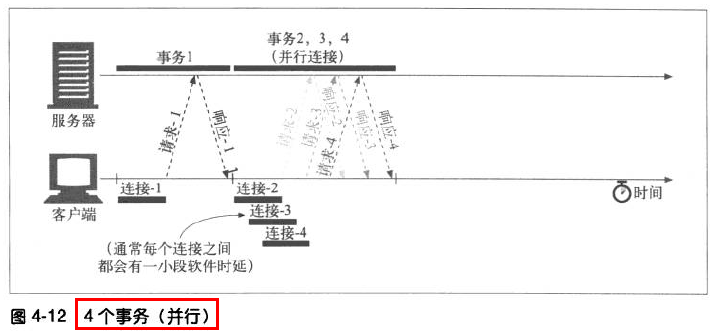

- 并行连接不一定更快： 若一个连接已耗尽带宽，加载的多个对象都会去竞争有限的带宽，这样性能反而没有提升，而且打开的大量连接会消耗很多内存资源

---

**并行连接的缺点**： 

- 每个事务都会打开/关闭一条新的连接，会耗费时间和带宽
- 由于 TCP 慢启动特性的存在，每条新连接的性能都会有所降低
- 可打开的并行连接数量实际上的有限的

### 3. 持久连接

- **站点本地性**： 许多 HTTP 请求对象的超链接都会指向同一个站点，因此初始化了对某服务器 HTTP 请求的应用程序会在不久的将来对那台服务器发起更多的请求

- **持久连接**： 在事务处理结束后，仍然保持在打开状态的 TCP 连接

  > 非持久连接会在每个事务结束后关闭
  >
  > 持久连接会在不同事务之间保持打开状态，直到客户端或服务器决定将其关闭为止

  - 优点： 降低了时延和连接建立的开销，减少了打开连接的潜在数量
  - 缺点： 可能会积累大量的空闲连接，耗费本地以及远程客户端和服务器上的资源

持久连接的分类： 

- **`HTTP/1.0 + keep-alive` 连接**： 

  > - 使用 `HTTP/1.0 keep-alive` 连接的客户端可以通过包含 `Connection:Keep-Alive` 首部请求将一条连接保持在打开状态
  > - `keep-alive` 请求后，客户端与服务器不一定进行 `keep-alive` 会话，可以在任意时刻关闭空闲的 `keep-alive` 连接，并可限制 `keep-alive` 连接所处理的事务数量
  >
  > `Keep-Alive` 首部选项： 
  >
  > - `timeout`：估计了服务器希望将连接保持在活跃状态的时间 
  > - `max`： 估计了服务器还希望为多少个事务保持此连接的活跃状态
  > - 还支持任意未经处理的属性，用于诊断和调试，语法： `name[=value]` 
  >
  > ```js
  > Connection: Keep-Alive
  > Keep-Alive: max=5,timeout=120
  > ```
  >
  >  `Keep-Alive` 连接的限制和规则： 
  >
  > - `HTTP/1.0` 中，`Keep-Alive` 不是默认使用，必须发送 `Connection:Keep-Alive` 来激活连接
  >
  > - `Connection:Keep-Alive` 首部必须随所有希望保持持久连接的报文一起发送
  >
  >   > 若客户端没有发送该首部，服务器就会在那条请求后关闭连接
  >
  > - 响应报文中没有 `Connection:Keep-Alive`，则会关闭该连接
  >
  > - 只有在无需检测连接的关闭来确定报文实体主体部分长度的情况下，才能将连接保持在打开状态
  >
  >   > 即： 实体的主体部分必须有正确的 `Content-Length`，多媒体类型，用分块传输编码
  >
  > - 代理和网关必须执行 `Connection` 首部的规则
  >
  > - 不应与无法确定是否支持 `Connection` 首部的代理服务器建立 `keep-alive` 连接，以防**哑代理问题**
  >
  > ---
  >
  > `Keep-Alive` 和哑代理： ==？？？== 
  >
  > - **Connection 首部和盲中继**： 
  >
  >   > **盲中继**： 只是将字节从一个连接转发到另一个连接中去，不对 `Connection` 首部进行特殊的处理
  >   >
  >   > 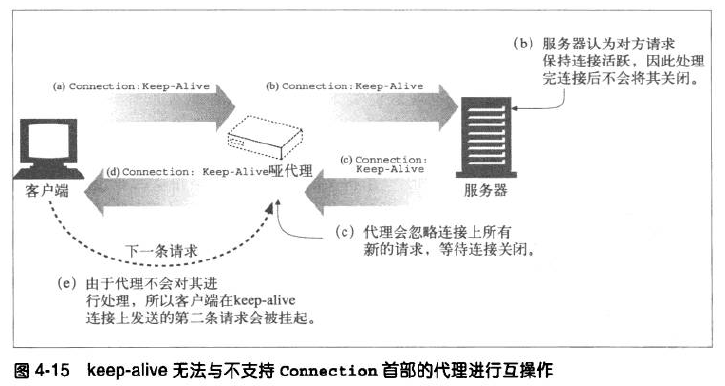
  >
  > - **代理和逐跳首部**： 若一个代理收到了 `Connection:Keep-Alive` 首部，是不应转发 `Connection` 首部，或所有名为 `Keep-Alive` 的首部
  >
  > - `Proxy-Connection`： 解决了在客户端后面紧跟着一个盲中继所带来的问题 ==？？？== 

- **`HTTP/1.1 persistent` 连接**：  默认激活，显示使用 `Connection:close` 首部才能关闭持久连接

  > 客户端和服务器仍可以随时关闭空闲的连接

### 4. 管道化连接

- `HTTP/1.1` 允许在持久连接上，可选的使用**请求管道**，在响应到达前，将多条请求放入队列

  > 当第一条请求通过网络流向服务器时，第二条和第三条请求也可以开始发送了
  >
  > 在高时延网络条件下，可以降低网络的环回时间，提高性能

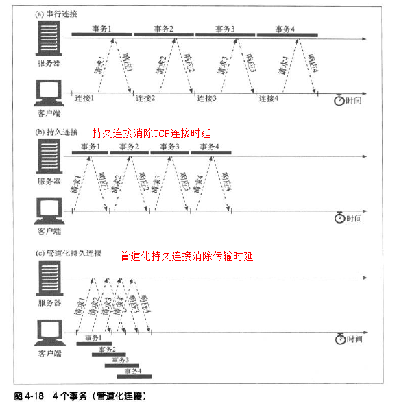

## 3. 关闭连接

- "任意"解除连接： 所有 HTTP 客户端、服务器或代理都可以在任意时刻关闭一条 TCP 传输连接

- **`Content-Length` 及截尾操作**： 老的 HTTP 服务器会忽略 `Content-Length` 首部，或包含错误长度的指示，此时就要依赖服务器发出的连接关闭来说明数据的真实末尾

- 幂等： 一个事务不管执行多少次，等到的结果都相同

- 正常关闭： 

  - **完全关闭或半关闭**： 应用程序可以关闭 TCP 输入和输出信道中的任意一个，或者两者都关闭

    > - 全关闭： 套接字调用 `close()`
    >
    > - 半关闭： 套接字调用 `shutdown()` 
    >
    >   > 半关闭可以防止对等实体收到非预期的写入错误
    >   >
    >   > - 关闭连接的输出信道总是安全的

  - **TCP 连接重置**： 另一端向已关闭的输入信道发送数据，操作系统就会向另一端的机器回送一条 **TCP 连接被对端重置**报文

    > 大多数操作系统会删除对端还未读取的所有缓存数据
    >
    > > 因此，**关闭连接的输入信道比较危险**

  - 正常关闭： 首先关闭输出信道，然后等待连接的另一端的对等实体关闭它的输出信道

    > - 当两端都告诉对方不再发送任何数据后，连接就被完全关闭，不会有重置危险
    >
    > - 注意： **无法确保对等实体会实现半关闭，或对其进行检查**
    >
    >   > 解决： 先半关闭其输出信道，然后周期性的检查其输入信道的状态(查找数据，或流的末尾)，如果在一定的时间区间内对端没有关闭输入信道，应用程序可以强制关闭连接，以节省资源

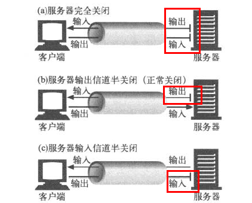

# \#第二部分： HTTP 结构

# 第五章：Web服务器

Web 服务器的工作流程： 

1. 建立连接----接受一个客户端连接，或关闭连接
2. 接收请求----从网络中读取一条 HTTP 请求报文
3. 处理请求----对请求报文进行解释，并采取行动
4. 访问资源----访问报文中指定的资源
5. 构建响应----创建带有正确首部的 HTTP 响应报文
6. 发送响应----将响应回送给客户端
7. 记录事务处理过程----将与已完成事务有关的内容记录在一个日志文件中

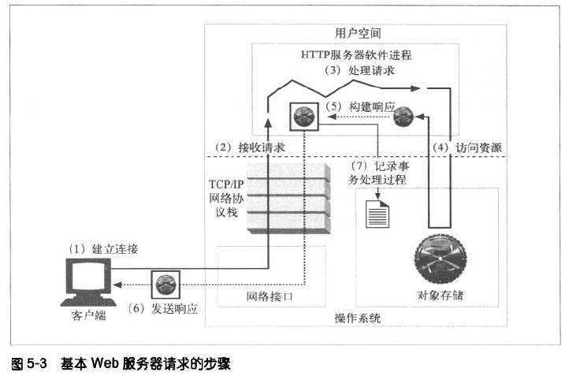

## 1. 第一步：接受客户端连接

- **处理新连接**： 客户端请求一条到 Web 服务器的 TCP 连接时，Web 服务器会建立连接

  > - 一旦新连接建立并被接受，服务器就会将新连接添加到其现存 Web 服务器连接列表中，做好监视连接上数据传输的准备
  > - Web 服务器可以随意拒绝或立即关闭任意一条连接

- **客户端主机名识别**： 通过**反向 DNS** 可以将客户端 IP 地址转换成客户端主机名

  > - 主机名查找会花费很长时间，会降低 Web 事务处理的速度
  >
  >   > 解决： 要么禁止主机名解析，要么只允许对特定的内容进行解析

- **通过 ident 确定客户端用户**： 服务器可以通过 ident 协议找到发起 HTTP 连接的主机名

  > - 如果客户端支持 ident 协议，就在 TCP 端口 113 上监听 ident 请求
  >
  > - ident 适用于组织内部，但不适用公共因特网，原因： 
  >   - 很多客户端 PC 没有运行 ident 识别协议守护进程软件
  >   - indet 协议会使 HTTP 事务处理产生严重的延迟
  >   - 很多防火墙不允许 ident 流量进入
  >   - ident 协议不安全，容易被伪造
  >   - ident 协议不支持虚拟 IP 地址
  >   - 暴露客户端的用户名还涉及隐私问题

## 2. 第二步：接收请求报文

数据到达时，Web 服务器会从网络连接中读取数据，并将请求报文中的内容解析出来： 

- 解析请求行，查找请求方法、指定的资源标识符(URI)、版本号

  > 各项之间由空格分隔，并以回车换行(CRLF) 做为结束

- 读取以 CRLF 结尾的报文首部

- （可选）检测到以 CRLF 结尾的、标识首部结束的空行

- （可选）读取请求主体

---

报文结构： 

- **报文的内部表示法**： 部分 Web 服务器会采用便于进行报文操作的内部数据结构来存储请求报文

  > 比如： 数据结构中，含有指向请求报文中，各个片段的指针及其长度，将这些首部存放在一个快速查询表中，以便快速访问特定首部的具体值

- **连接的输入/输出的处理结构**： 

  > 不同的服务请求方式： 
  >
  > - 单线程服务器
  > - 多进程及多线程服务器
  > - 复用 I/O 服务器
  > - 复用的多线程服务器
  >
  > 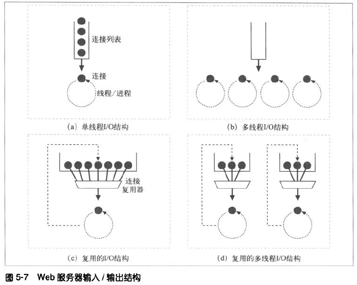

## 3. 第三步：处理请求

一旦 Web 服务器收到请求，就可以根据方法、资源、首部、可选主体等对请求进行处理

## 4. 第四步：对资源的映射及访问

> - Web 服务器是资源服务器，负责发送预先创建好的内容
> - 在 Web 服务器将内容发送给客户端之前，要将请求报文中的 URI 映射为 Web 服务器上适当的内容或内容生成器，以识别出内容的源头

- **docroot**： 即 `document root`，文档根目录，专门用于存放 Web 内容

  > Web 服务器从请求报文中获取 URI，并将其附加在文档根目录的后面

- **目录列表**： Web 服务器可以接收对目录 URL 的请求，其路径解析为一个目录

  > 请求目录 URL 时可采取的动作： 
  >
  > - 返回一个错误
  > - 不返回目录，返回一个特殊的默认“索引文件”
  > - 扫描目录，返回一个包含目录内容的 HTML 页面

- **动态内容的资源映射**： 可以将 URL 映射到按需动态生成内容的程序上

- **服务器端包含项(SSI)**： 若某资源被标识为存在服务端包含项，服务器就会在将其发送给客户端前对资源内容进行护理

- **访问控制**： 请求访问受控资源时，Web 服务器可以根据客户端的 IP 地址进行访问控制，或输入密码访问资源

## 5. 第五步：构建响应

- **响应实体**： 

  > 响应报文中通常包括： 
  >
  > - 描述了响应主体 MIME 类型的 `Content-Type` 首部
  > - 描述了响应主体长度的 `Content-Length` 首部
  > - 实际报文的主体内容

- **MIME 类型**： Web 服务器负责确定响应主体的 MIME 类型

  > MIME 类型： 
  >
  > 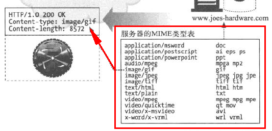
  >
  > - **魔法分类**： Apache Web 服务器可以扫描每个资源的内容，并将其与一个已知模式表(称为魔法文件)进行匹配，以决定每个文件的 MIME 类型
  >
  >   > - 缺点： 速度比较慢
  >   > - 优点： 很方便，尤其是文件没有标准扩展名时
  >
  > - **显式分类**： 不考虑文件的扩展名或内容，强制特定文件或目录内容拥有某个 MIME 类型
  >
  > - **类型协商**： 某些 Web 服务器以多种文档格式来存储资源，可以通过与用户协商来决定使用哪种格式

- **重定向**： Web 服务器有时会返回重定向响应而不是成功报文

  > 重定向可用于下列情况： 
  >
  > - 永久删除的资源： `301 Moved Permanently`
  > - 临时删除的资源： `303 See Other` 与 `307 Temporary Redirect`
  > - URL 增强： 重写 URL 嵌入上下文，`303 See Other` 与 `307 Temporary Redirect` 
  > - 负载均衡：  `303 See Other` 与 `307 Temporary Redirect` 
  > - 服务器关联：  `303 See Other` 与 `307 Temporary Redirect` 
  > - 规范目录名称： 客户端请求的 URI 不带尾部斜线 `/`时，会自动添加尾部 `/` 

## 6. 第六步：发送响应

- 服务器要记录连接的状态，因为服务器可能有很多条到各客户端的连接，有些空闲，有些在发送数据，还有些在向客户端回送响应数据

## 7. 第七步：记录日志

- 当事务结束时，Web 服务器会在日志文件中添加一个条目，来描述已执行的事务

# 第六章：代理

> - **代理**连接的是两个或多个使用**相同协议**的应用程序
>
> - **网关**连接的是两个或多个使用**不同协议**的端点
>
>   > 网关类似**协议转换器**，即使客户端和都完全使用不同协议，也可以完成客户端与服务器间的事务处理

## 1. 代理作用

- 儿童过滤器
- 文档访问控制
- 完全防火墙
- Web 缓存： 代理缓存维护了常用文档的本地副本
- 反向代理： 假扮 Web 服务器接收发给 Web 服务器的真实请求
- 内容路由器： 根据因特网流量状况和内容类型，将请求导向特定的 Web 服务器
- 转码器： 代理服务器在将内容发送给客户端之前，可以修改内容的主体格式
- 匿名者： 匿名者代理会主动从 HTTP 报文中删除身份特性，从而提高私密性和匿名性

## 2. 代理部署

### 1. 代理服务器的部署

部署代理服务器的几种方式： 

- **出口代理**： 可以控制本地网络与大型因特网间的流量

- **访问(入口)代理**： 放在 ISP 访问点上，用以处理来自客户的聚合请求

  > ISP 使用缓存代理来存储常用文档的副本，以提高用户的下载速度，降低因特网带宽耗费

- **反向代理**： 部署在网络边缘，可以处理所有传送给 Web 服务器的请求，并只必要时向 Web 服务器请求资源

  > 可以提高 Web 服务器的安全性，提高服务器性能

- **网络交换代理**： 将具有足够处理能力的代理放在网络之间的因特网对等交换点上，通过缓存来减轻因特网节点的拥塞，并对流量进行监视

### 2. 代理的层次结构

> 可以通过代理层次结构将代理级联起来，将报文从一个代理传给另一个代理，直到抵达原始服务器

动态选择父代理例子： 

- **负载均衡**： 子代理会根据当前父代理上的工作负载级别来决定如何选择一个父代理，以负载均衡
- **地理位置附近的路由**： 子代理可能会选择负责原始服务器所在物理区域的父代理
- **协议/类型路由**： 子代理可能会根据 URI 将报文转发到不同的父代理和原始服务器上
- **基于订购的路由**： 若为高性能服务额外付费，则URI 会被转发到大型缓存或压缩引擎上，以提高性能

### 3. 代理的流量获取

使客户端流向代理的四种方式： 

- **修改客户端**： 若将客户端配置为使用代理服务器，客户端就会将 HTTP 请求发给代理，而不是原始服务器

- **修改网络**： 网络基础设施可以拦截网络流量并将其导入代理

  > 拦截代理： 依赖于监视 HTTP 流量的交换设备及路由设备，并将流量导入一个代理

- **修改 DNS 命名空间**： 手工编辑 DNS 名称列表，或用特殊的动态 DNS 服务器来确定适当的代理或服务器

- **修改 Web 服务器**： 将 Web 服务器配置为向客户端发送一条 HTTP 重定向命令，将客户端请求重定向到代理

## 3. 客户端的代理设置

> 浏览器提供的代理配置方式： 
>
> - **手工配置**： 显示设置要使用的代理
> - **预先配置浏览器** 
> - **代理的自动配置**： 提供一个 URI，指向一个用 JS 编写的代理自动配置文件
> - **WPAD 的代理发现**： Web 代理自动发现协议，会自动检测出浏览器可以从哪个“配置服务器”下载到一个自动配置文件

### 1. 手工配置

各浏览器都支持手工配置来为代理指定主机和端口

### 2. PAC 文件

> PAC 文件的后缀为 `.pac`，MIME 类型为 `application/x-ns-proxy-autoconfig`

- 简介： PAC 文件是一些小型的 JS 程序，可以在运行过程中计算代理设置

- 使用： 要用 JS PAC 文件的 URI 来配置浏览器，浏览器会从这个 URI 上获取 PAC 文件， 并用 JS 逻辑为每次访问计算恰当的代理服务器

- 注意： 每个 PAC 文件都必须定义一个名为 `FindProxyForURL(url,host)` 的函数，用来计算访问 URI 时使用的适当的代理服务器

  > 函数返回值为： 
  >
  > |     返回值      | 描述                         |
  > | :-------------: | ---------------------------- |
  > |     DIRECT      | 不经过任何代理，直接进行连接 |
  > | PROXY host:port | 应该使用指定的代理           |
  > | SOCKS host:port | 应该使用指定的 SOCKS 服务器  |

### 3. WPAD

- 简介： WPAD 协议算法会使用发现机制的逐级上升策略，自动为浏览器查找合适的 PAC 文件
- 实现 WPAD 协议的客户端，需要： 
  - 用 WPAD 找到 PAC 的 URI
  - 从指定的 URI 获取 PAC 文件
  - 执行 PAC 文件来判定代理服务器
  - 为请求使用代理服务器

- 当前 WPAD 协议规范按顺序定义的下列技术： 
  - 动态主机配置协议 DHCP
  - 服务定位协议 SLP
  - DNS 知名主机名
  - DNS SRV 记录
  - TXT 记录中的 DNS 服务 URL

## 4. 代理的注意问题

- **代理 URI 与服务器 URI 区别**： 代理 URI 为完整 URI，服务器 URI 可以为部分 URI

  > 即： 将部分 URI 发送给服务器，将完整 URI 发送给代理
  >
  > - 没有设置客户端使用代理，会发生部分 URI
  > - 设置客户端使用代理时，会发送完整 URI
  >
  > ```txt
  > //服务器 URI
  > GET /index.html HTTP/1.1
  > User-Agent:SuperBrowser v1.3
  > 
  > //代理 URI
  > GET http://xxx.com/index.html HTTP/1.1
  > User-Agent:SuperBrowser v1.3
  > ```

- **代理缺少方案/主机/端口**： 

  > 该问题同虚拟主机 Web 服务器： 当部分 URI 请求到达时，虚拟主机 Web 服务器需要知道目的 Web 的主机名
  >
  > - 显示的代理要求在请求报文中使用**完整 URI** 来解决该问题
  > - 虚拟主机 Web 服务器要求使用 **Host 首部**来承载主机和端口信息
  >
  > > ==`HTTP/1.1` 要求为代理请求和服务器请求都提供完整的 URI 信息== 
  >
  > **拦截和反向代理隐藏服务器主机信息**： 客户端不会总是发送完整 URI
  >
  > - **反向代理**： 一个用来取代原始服务器的代理服务器，会假扮服务器的主机名或 IP 地址
  >
  >   > 收到 Web 请求后，可能会向真正的服务器提供缓存的响应或代理请求，因此会发送部分 URI
  >
  > - **拦截代理**： 会拦截客户端发往服务器的请求，并提供一个缓存响应，或对其进行转发
  >
  >   > 由于拦截了从客户端到服务器的流量，所以会收到发送给 Web 服务器的部分 URI
  >
  > 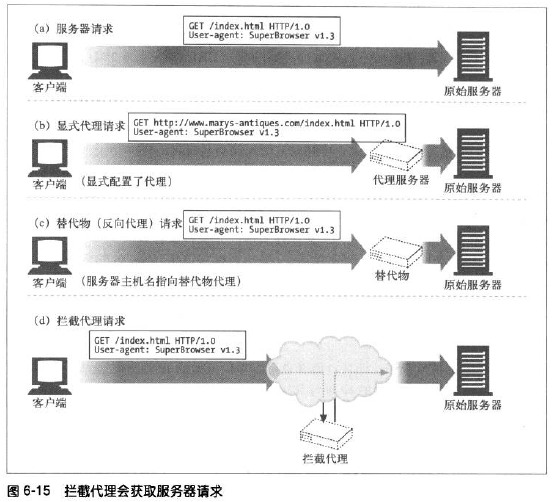
  >
  > 使用完整 URI 或部分 URI 规则： 
  >
  > - 如果提供完整 URI，代理就应该使用该完整 URI
  > - 如果提供部分 URI，而且有 Host 首部，就应用 Host 首部来确定原始服务器的名字和端口号
  > - 如果提供部分 URI，但没有 Host 首部，就要使用以下方法确定原始服务器： 
  >   - 如果是反向代理，可以用真实服务器的地址和端口号来配置代理
  >   - 如果是拦截代理，且拦截代理可以提供原始的 IP 地址和端口号，就使用提供的 IP 和端口号
  >   - 如果所有方法都失败，就必须返回一条错误报文

- **修改 URI 规则**： 代理服务器在转发报文时修改请求 URI 时，要特别小心

- **URI 的客户端自动扩展和主机名解析**： 根据是否有代理，浏览器对请求 URI 的解析会有所不同

  - **没有代理**时 URI 的解析：浏览器会获取输入的 URI，尝试寻找相应的 IP 地址

    - 如果找到主机名，浏览器会尝试相应的 IP 地址直到获得成功连接为止
    - 如果没有找到主机，浏览器会尝试提供主机名自动“扩展”机制，以防输入的是主机“简短”的缩写形式

    > 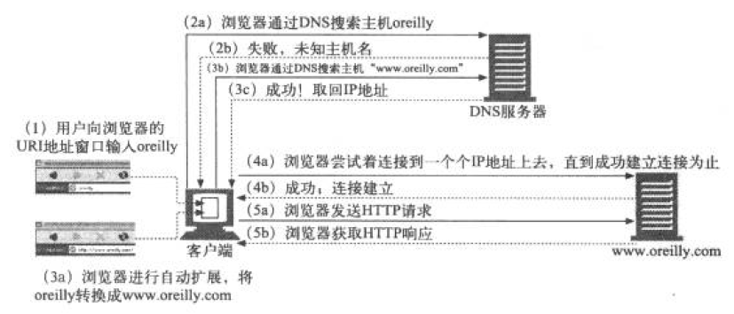

  - 有**显示代理**时 URI 的解析： 此时用户的 URI 会被直接发送给代理，浏览器不需要执行任何扩展功能

    > 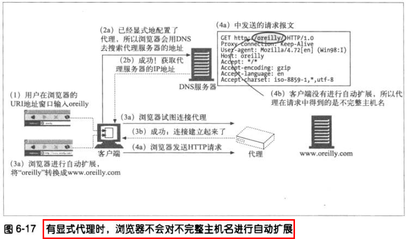

  - 有**拦截代理**时 URI 的解析： 类似无代理情况，浏览器会自动扩展主机名，直到 DNS 成功为止

    > 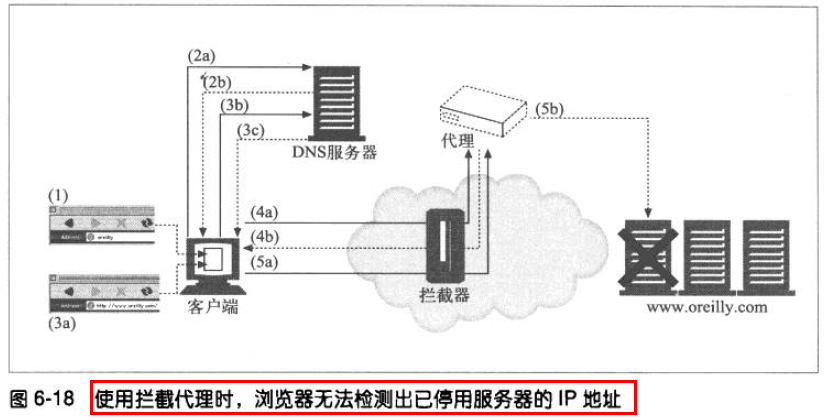

## 5. 报文追踪

- **`Via` 首部**： `Via` 首部字段列出了与报文途径的每个中间节点的信息，报文没经过一个节点就必须将该节点添加到 `Via` 列表的末尾

  > 作用： `Via` 首部字段用于记录报文的转发，诊断报文循环，标识请求/响应链上所有发送者的协议
  >
  > > 代理也可以用 Via 首部来检测网络中的路由循环
  >
  > - **`Via` 语法**： Via 首部字段包含一个由逗号分隔的路标，每个路标表示一个独立的代理服务器或网关
  >
  >   > 包含： 协议名，协议版本，节点名，节点注释
  >
  > - **`Via` 请求和响应路径**： 若一条请求报文经过代理 A、B、C，响应报文会经过代理 C、B、A 回传
  >
  > - **`Via` 与 `Server`**：若响应报文通过代理转发，要确保没有修改 Server 首部
  >
  >   > `Server` 响应首部字段对原始服务器使用的软件进行了描述，代理应该添加的是 `Via`  
  >
  > - **`Via` 安全问题**： 代理应将一个有序 Via 路标条目序列合并成一个联合条目
  >
  >   > 例子： 
  >   >
  >   > 将 `Via: 1.0 foo, 1.1 devirus.company.com, 1.1 access-logger.company.com`
  >   >
  >   > 压缩成： `Via: 1.0 foo, 1.1 concealed-stuff` 

- **`TRACE` 方法**： 可以追踪经代理链传输的请求报文

  > `TRACE` 响应的 `Content-Type` 为 `message/http`，状态为 `200 OK`
  >
  > - 作用： 
  >   - 当 `TRACE` 请求到达目的服务器时，整条请求报文都会被封装在一条 HTTP 响应的主体中回送给发送端
  >   - 当 `TRACE` 响应到达时，客户端可以检查服务器收到的确切报文，以及它所经过的代理列表
  >
  > - `Max-Forwards`： 用来限制 `TRACE` 和 `OPTIONS` 请求所经过的代理跳数
  >
  >   > `Max-Forwards` 请求首部字段包含一个整数，用来说明这条请求报文可以被转发的次数

## 6. 代理认证

> 代理可以作为访问控制设别使用

- **代理认证**： 可以阻止对内容的请求，直到用户向代理提供了有效的访问权限证书

- **过程**： 
  - 访问受限内容的请求到达代理服务器时，会返回要求使用访问证书的 `407 Proxy Authorization Required` 以及一个用于描述怎样提供这些证书的 `Proxy-Authoricate` 首部字段
  - 客户端收到 407 响应时，会尝试搜集证书
  - 获得证书后，客户端会重新请求，在 `Proxy-Authoricate` 首部字段提供所要求的证书
  - 若证书有效，代理就会将请求沿传输链路向下发送，否则会再回传 407 应答

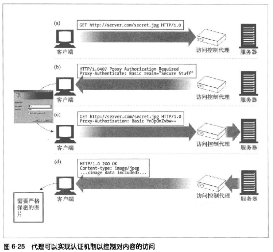

# 第七章：缓存

> 缓存优点：
>
> - **减少了冗余的数据传输**
> - **缓解了网络带宽瓶颈**，不需要更多带宽就能更快加载页面
> - **避免了瞬间拥塞**，服务器可以更快的响应，避免过载问题
> - **降低了距离时延**

## 1. 缓存命中

- **再验证**： 缓存要不时进行检测，看看保存的副本是否是最新值

  > 大多数缓存只在客户端发起请求，并且副本旧的足以检测时，才会对副本进行再验证
  >
  > 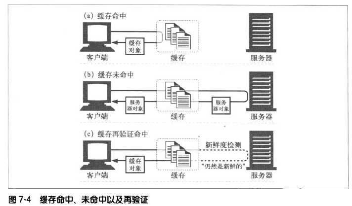
  >
  > 服务器收到 `GET If-Modified-Since` 请求时，会发生的情况： 
  >
  > - **再验证命中**： 缓存未被修改，会返回一个小的 `HTTP 34 Not Modified` 响应
  > - **再验证未命中**： 缓存已修改，返回一条普通的、带有完整内容的 `HTTP 200 OK` 响应
  > - **对象被删除**： 若服务器对象被删除，会返回一个 `404 Not Found` 响应，缓存也会删除副本
  >
  > 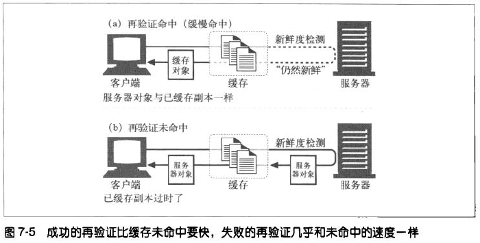

- **缓存命中率**：或称文档命中率，由缓存提供服务的请求所占的比例 
- **字节命中率**： 缓存提供的字节在传输的所有字节中所占的比例

- **缓存判断**： 通过 `Date` 首部的值与当前时间的比较，来判断是否为缓存

## 2. 缓存拓扑结构

- **私有缓存**： 专用缓存，包含了单个用户最常用的页面

- **公有缓存**：特殊的共享代理服务器，称为**缓存代理服务器**或**代理缓存**

  > 代理缓存会从本地缓存中提供文档，或代表用户与服务器进行联系

---

缓存结构： 

- **层次结构**： 在靠近客户端的地方使用小型廉价缓存，而更高层次中，则逐步采用更大、功能更强的缓存来装载多用户共享的文档

  > 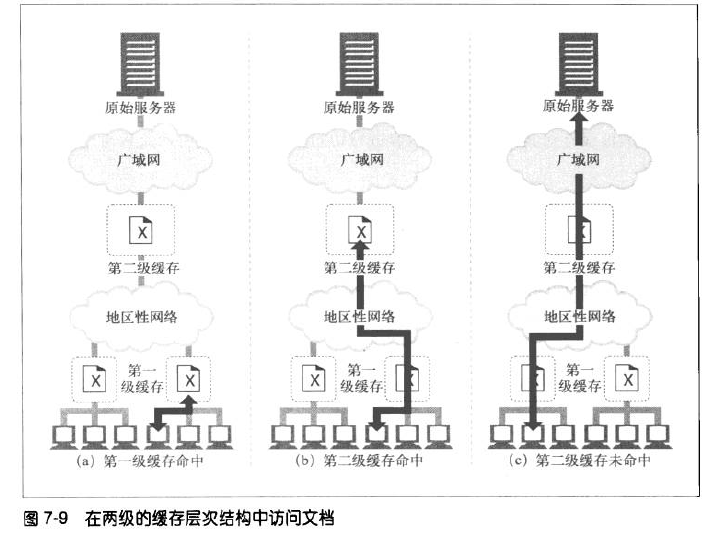

- **网状结构**： 这种代理缓存会决定选择何种路由对内容进行访问、管理和传送，因此称为**内容路由器** 

  > 网状缓存中为内容路由设计的缓存要完成下列所有功能： 
  >
  > - 根据 URL 在父缓存或原始服务器之间进行动态选择
  > - 根据 URL 动态的选择一个特定的父缓存
  > - 前往父缓存之前，在本地缓存中搜索已缓存的副本
  > - 允许其他缓存对其缓存的内容进行访问，但不允许因特网流量通过它们的缓存

- **对等结构**： 允许不同的组织互为对等实体，将它们的缓存连接起来以实现共赢

  > 兄弟缓存： 提供可选的对等支持的缓存

## 3. 缓存处理步骤

1. **接收**： 缓存从网络中读取抵达的请求报文
2. **解析**： 缓存对报文进行解析，提取出 URL 和各种首部
3. **查询**： 缓存查看是否有本地副本可用，若没有，就获取一份副本
4. **新鲜度检测**： 缓存查看已缓存副本是否足够新鲜，如果不是，就询问服务器是否有更新
5. **创建响应**： 缓存会用新的首部和已缓存的主体来构建一条响应报文
6. **发送**： 缓存通过网络将响应发回给客户端
7. **日志**： 缓存可选的创建一个日志文件条目来描述这个事务

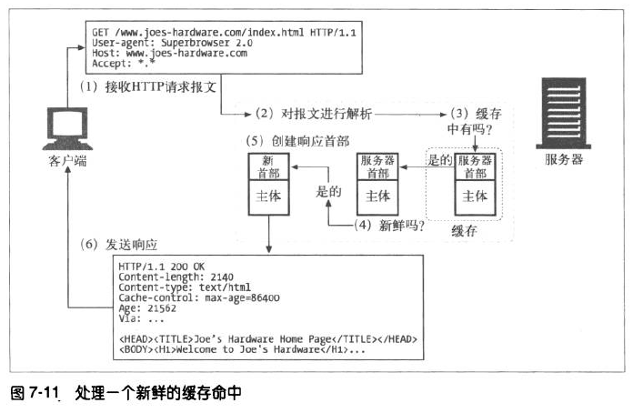

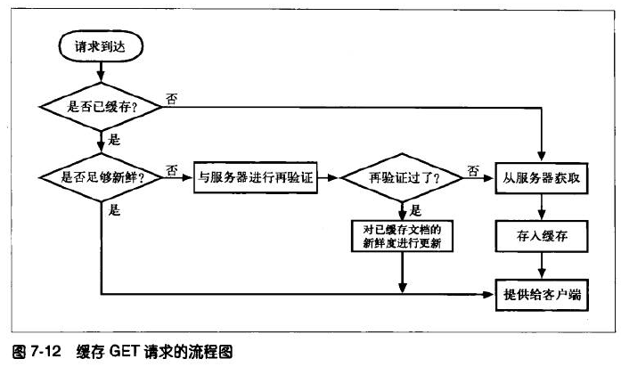

## 4. 缓存更新

- **文档过期**： 通过首部 `HTTP/1.1 Cache-Control` 或 `HTTP/1.0 Expires` 向每个文档附加一个过期时间

  > - `Cache-Control`： 使用相对时间，如： `Cache-Control:max-age`，其中 `max-age=484200`
  > - `Expires`： 使用绝对日期。如： `Expires: Fri,05 Jul 2002,05:00:00 GMT`

- **服务器再验证**： 缓存需要询问原始服务器文档是否发生了变化

  > **条件再验证**： HTTP 允许缓存向原始服务器发送一个“条件 GET”，请求服务器只有在文档与缓存中现有的副本不同时，才回送对象主体

  - **`If-Modified-Since:<date>` 再验证**： 如果从指定日期之后文档被修改，就执行请求的方法，可与 `Last-Modified` 服务器响应首部配合使用，只有在内容被修改后与已缓存版本有所不同时才获取内容

  - **`If-None-Match:<tags>` 实体标签再验证**： 服务器可以为文档提供特殊标签

    > 如果已缓存标签与服务器文档中的标签有所不同，`If-None-Match` 首部就会执行所请求的方法

## 5. 缓存控制

### 1. 缓存优先级

> `no-store` 与 `no-cache` 可以防止缓存提供未经证实的已缓存对象

- `Cache-Control: no-store`： 会禁止缓存对响应进行复制，在向客户端发送后删除对象

- `Cache-Control: no-cache`： 可以缓存在本地缓存区，但在新鲜度验证前，缓存不能将其提供给客户端

- `Cache-Control: must-revalidate`： 可以使用过期对象，以提高性能

  > 在事先没有跟原始服务器进行再验证的情况下，不能提供该对象的陈旧副本

- `Cache-Control: max-age`： 从服务器将文档传来之时起，文档处于新鲜度的秒数

  > `s-maxage` 同 `max-age` 但仅适用于共享(公有)缓存

- `Expires`： 指定实际过期时间，不推荐使用

- 不附加过期信息，让缓存确定自己的过期时间

### 2. 试探性过期

**试探性过期**： 若响应没有 `Cache-Control` 与 `Expires`，缓存可以计算一个试探性最大的使用期

> 若计算的最大使用期 `>24h`，则应向响应首部添加一个 `Heuristic Expiration Warning`(试探性过期警告)

- `LM-Factor` 算法： 试探性过期算法，将文档的最后修改日期作为依据，来估计文档的易变性

  > - 若已缓存文档最后一次修改发生在很久以前，则可能是一份稳定文档
  > - 若已缓存文档最近被修改过，则可能不稳定，因此与服务器进行再验证之前，只应将其缓存很短时间
  >
  > `LM-Factor` 会计算缓存与服务器对话的时间和服务器声明文档最后被修改时间的差值，然后取这个间隔时间的一部分，将其作为缓存中的新鲜度持续时间
  >
  > 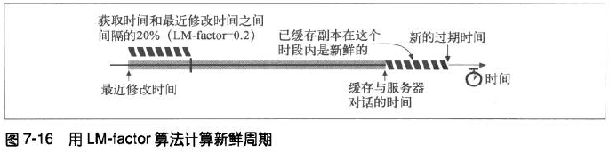

### 3. 客户端的新鲜度限制

**客户端的新鲜度限制**： Web 浏览器都有 Refresh(刷新)或 Reload(重载)按钮，可以强制对浏览器或代理缓存中可能过期的内容进行刷新

- Refresh 会发送附件 `Cache-Control` 请求首部的 GET 请求，强制进行再验证，或无条件从服务器获取文档

- 客户端可以用 `Cache-Control` 首部来强化或放松对过期时间的限制

  > |             指令              | 目的                                         |
  > | :---------------------------: | -------------------------------------------- |
  > |   Cache-Control: max-stale    | 缓存可以提供过期的文件                       |
  > | Cache-Control: max-stale=\<s> | 参数 \<s> 指定该段时间，文档不能过期         |
  > | Cache-Control: min-fresh=\<s> | 至少在未来 \<s> 秒文档要保持新鲜             |
  > |  Cache-Control: max-age=\<s>  | 缓存无法返回缓存时间长于 \<s> 秒的文档       |
  > |    Cache-Control: no-cache    | 除非再验证，否则客户端不接受已缓存的资源     |
  > |       Pragma: no-cache        | 同上                                         |
  > |    Cache-Control: no-store    | 应删除存储器中文档的所有缓存                 |
  > | Cache-Control: only-if-cached | 只有缓存有副本存在时，客户端才会获取一份副本 |

### 4. 设置缓存控制

- **控制 Apache 的 HTTP 首部**： 提供了几种设置 HTTP 缓存控制首部的机制

  > - `mod_headers`： 可以对单独的首部进行设置
  >
  >   > - 可以用设置单个 HTTP 首部的指令来扩充 Apache 的配置文件
  >   > - 可以将这些设置于 Apache 的常用表达式及过滤器结合使用
  >   >
  >   > 例子： 将某目录下所有的 HTML 文件都标识为非缓存
  >   >
  >   > ```html
  >   > <Files *.html>
  >   >     Header set Cache-control no-cache
  >   > </Files>
  >   > ```
  >
  > - `mod_expires`：可以自动生成带有正确过期日期的 Expires 首部
  >
  >   > 该模块可以在文档最后一次被访问后，或在最近修改日期后，将过期日期设置为某个时间区间
  >   >
  >   > 例子： 
  >   >
  >   > ```
  >   > ExpiresDefault A3600
  >   > ExpiresDefault M86400
  >   > ExpiresDefault "access plus 1 week"
  >   > ExpiresByType text/html "modification plus 2 days 6 hours 12 minutes"
  >   > ```
  >
  > - `mod_cern_meta`： 可以将一个包含 HTTP 首部的文件与特定的对象联系起来
  >
  >   > 启动该模块时，就创建了一个“元文件”，每个需要控制的文档一个，且还会为每个元文件添加所期望的首部

- **通过  HTTP-EQUIV 控制 HTML 缓存**：HTML 2.0 定义的 `<META HTTP-EQUIV>` 标签

  >  不推荐使用
  >
  > 例子： 将 HTML 文档标记为非缓冲的： 
  >
  > ```html
  > <html>
  >     <head>
  >         <title>xxx</title>
  >         <meta http-equiv="Cache-Control" content="no-cache"/>
  >     </head>
  > </html>
  > ```
  >
  > 推荐： 由经过正确配置的服务器发生的 HTTP 首部来交流对文档的缓存控制请求的唯一可靠的方法

## 6. 缓存时间算法

> 缓存计算的两个值： 
>
> - **已缓存副本的使用期**： 服务器发布响应之后经过的总时间
> - **已缓存副本的新鲜生存期**： 已缓存副本在不能提供给客户端使用之前能够存在的时间长度

### 1. 使用期计算

- **使用期**： 服务器发布响应之后经过的总时间
- 使用期组成： 
  - 响应在因特网路由器和网关中游荡的时间
  - 在中间节点缓存中存储的时间
  - 响应在缓存中停留的时间

- **使用期计算**： 

  - **表面使用期**是基于 Date 首部的：当前时间减去服务器发送文档的时间

    > -  若所有计算机都共享同样的、完全精确的时钟，缓存使用期就是表面使用期
    > - **时钟偏差**： 两台计算机时钟设置不同

  - **逐跳使用期计算**： 去除时钟偏差造成的负数使用期，每台设备都将相对使用期累加到 Age 首部

  - **对网络时延的补偿**： 计算往返时延

  > 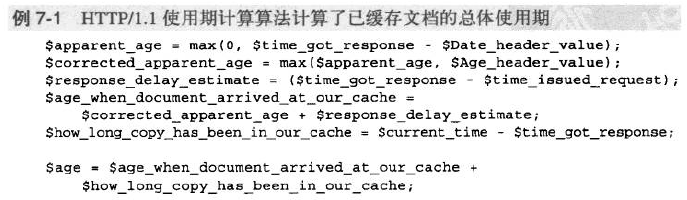

### 2. 新鲜生存期计算

**新鲜生存期计算**： 服务器新鲜度+客户端新鲜度

# 第八章：集成点：网关、隧道及中继

## 1. 网关

> <客户端协议>/<服务器协议>： 如，HTTP/NNTP
>
> - 服务器网关： 通过 HTTP 与客户端对话，通过其他协议与服务器通信 `HTTP/*`
> - 客户端网关： 通过其他协议与客户端对话，通过 HTTP 与服务器通信 `*/HTTP`

### 1. 协议网关

- `HTTP/*` 服务器端 Web 网关： 将客户端 HTTP 请求转换为其他协议

- `HTTP/HTTPS` 服务器端安全网关： 通过网关对所有的输入 Web 请求加密，以提供额外的隐私和安全性保护

  > 客户端可以用普通 HTTP 浏览器浏览 Web 内容，但网关会自动加密用户对话

- `HTTPS/HTTP` 客户端安全加速器网关： 位于 Web 服务器之前，作为拦截网关或反向代理使用

  > 接收安全的 HTTPS 流量，对安全流量进行解密，并向 Web 服务器发送普通的 HTTP 请求

### 2. 资源网关

> - 资源网关： 将目标服务器与网关结合在一个服务器中实现
>
> - 网关应用编程接口 `API`： 应用程序服务器将请求通过 API 发送给运行在服务器上的应用程序

- **CGI**： 通用网关接口，第一个流行的应用程序网关 API

  > Web 服务器可以用它来装载程序以响应对特定 URL 的 HTTP 请求，并将响应回送
  >
  > - 优点： 在服务器与资源类型间处理各种需要的转换，还能防止糟糕的扩展对它造成的破坏
  > - 缺点： 会造成性能的浪费，为每条 CGI 请求引发一个新进程的开销很高，会限制使用 CGI 服务器的性能
  > - **快速 CGI**：模拟 CGI，但作为持久守护运行，消除了为每个请求建立或拆除新进程所带来的性能损耗
  >
  > 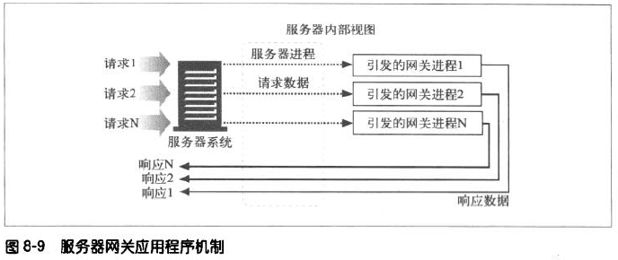

- **服务器扩展 API**： 允许将自定义代码嫁接到服务器上，或用自定义代码替换服务器的组件

## 2. 隧道

- Web 隧道： 允许通过 HTTP 连接发送非 HTTP 流量

  > 作用： 在 HTTP 连接中嵌入非 HTTP 流量，可以穿过只允许 Web 流量通过的防火墙

- **用 CONNECT 建立 HTTP 隧道**： CONNECT 方法请求隧道网关创建一条到达任意目的服务器和端口的 TCP 连接，并对客户端和服务器之间的后继数据进行盲转发

  > - **CONNECT 请求**： 
  >
  >   ```
  >   CONNECT home.netspace.com:443 HTTP/1.0
  >   User-Agent: Mozilla/4.0
  >   ```
  >
  > - **CONNECT 响应**： 
  >
  >   ```
  >   HTTP/1.0 200 Connection Established
  >   Proxy-agent: Netscape-Proxy/1.1
  >   ```
  >
  > 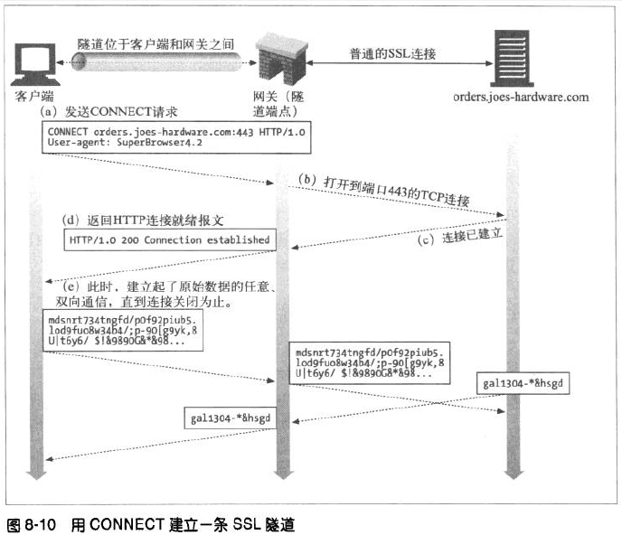

---

隧道分类： 

- **数据隧道**： 允许客户端在发送 CONNECT 请求后，接收响应前，发送隧道数据，更快将数据发送给服务器

  > - 网关必须能正确处理跟在请求后的数据
  > - 如果隧道的任意一个端点断开连接，则数据会被丢弃

- **SSL 隧道**： 将原始的加密数据放在 HTTP 报文中，通过普通的 HTTP 信息传送

  > 加密协议，如 SSL 无法通过传统的代理服务器转发
  >
  > 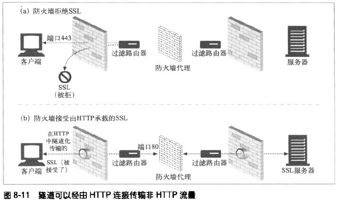
  >
  > 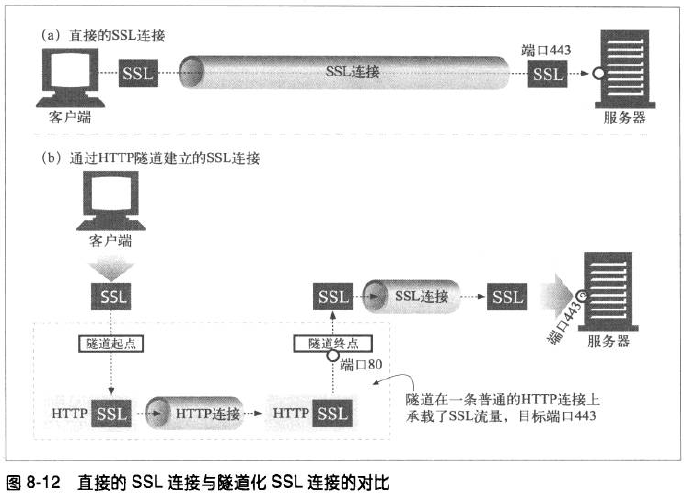

## 3. 中继

- 中继： 负责处理 HTTP 中建立连接的部分，然后对字节进行盲转发

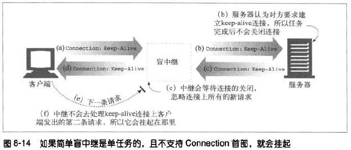

# 第九章：Web机器人

Web 爬虫对其访问过的地址进行管理时，使用的技术： 

- 树和散列表： 用搜索树或散列表来记录已访问的 URL

- 有损的存在范围： 用一个散列函数将每个 URL 都转换成一个定长的数字

  > 该数字在数组中有个相关的“存在位”，爬行过一个 URL 时，就将相应的“存在位”置位

- 检查点： 一定要将已访问 URL 列表保存到硬盘上，以防止机器人程序崩溃
- 分类： 为每个机器人分配特定 URL 片，机器人之间互相通信，来回传送 URL

---

URL 别名： 两个 URL 看起来不一样，但实际指向同一资源

- 解决： 规范化 URL

# 第十章：HTTP-NG/HTTP2.0

> HTTP/1.1 问题： **复杂性、扩展性差、性能低效、传输依赖** 

## 1. 模块化及功能增强

- **第一层： 报文传输层**： 致力于端点间报文的不透明传输，提高报文传输性能，不考虑报文的功能

  > - 对报文进行管道话和批量化传输，以降低往返时延
  > - 重用连接，以降低时延，提高传输带宽
  > - 在同一条连接上并行地复用多个报文流，在防止报文流饿死的同时优化共享连接
  > - 对报文进行有效的分段，使报文边界的确定更加容易

- **第二层： 远程调用层**： 定义了请求/响应框架，客户端可通过此框架调用对服务器资源的操作

  > 本层不关心特定操作的实现与语义，只关心允许客户端远程调用服务器操作的接口
  >
  > - 本层采用二进制连接协议

- **第三层： Web 应用层**： 是执行语义和应用程序特定逻辑的地方

  > - Web 应用层描述了一个用于提供应用程序特定服务的系统
  > - 允许多个应用共存于本层，共享底层特性

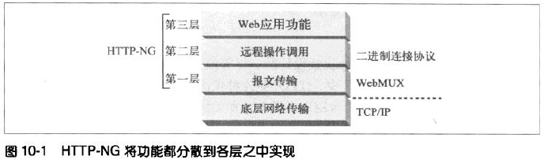

## 2. WebMUX

- WebMUX： 一个复杂的高性能报文系统
  - 可以在一个复用的 TCP 连接上并行地传输报文
  - 可以对以不同速度产生和消耗的独立报文流进行高效的分组，并将其复用到一条或少数几条 TCP 连接上

- 特性： 
  - **设计简单**
  - **高性能**
  - **复用**： 可以在一条连接上动态、高效的交错传递多个数据流
  - **基于信用的流量控制**： 接收者可以预先声明期望的数据接收速度，防止出现资源缺乏产生的死锁
  - **保持对齐**： 保持复用流中数据的对齐，以便有效的发送并处理二进制数据
  - **丰富的功能** 

## 3. 二进制连接协议

- 使用二进制连接协议来提高远程操作的能力
- 二进制连接协议通过一条有状态的连接承载了从客户端发往服务器的操作调用请求，以及从服务器发往客户端的操作结果应答

# \#第三部分： 识别、认证与安全

# 第十一章：客户端识别与cookie机制

## 1. 相关简介

- **HTTP 首部**：

  > | 首部            | 首部类型   | 描述                 |
  > | --------------- | ---------- | -------------------- |
  > | From            | 请求       | 用户的 E-mail 地址   |
  > | User-Agent      | 请求       | 用户的浏览器软件     |
  > | Referer         | 请求       | 用户来源页面的 URL   |
  > | Authorization   | 请求       | 用户名和密码         |
  > | Client-IP       | 扩展(请求) | 客户端 IP 地址       |
  > | X-Forwarded-For | 扩展(请求) | 客户端 IP 地址       |
  > | Cookie          | 扩展(请求) | 服务器产生的 ID 标签 |

- **胖 URL**： 改动后包含了用户状态信息的 URL

  > - 用户首次访问 Web 站点时，会生成一个唯一 ID，用服务器可以识别的方式将该 ID 添加到 URL 中
  > - 然后服务器就会将客户端重新导向这个胖 URL
  >
  > 问题： 
  >
  > - 丑陋URL： 浏览器中显示的胖 URL 会给新用户带来困扰
  > - 无法共享 URL： 胖 URL 中包含了与特定用户和会话有关的状态信息
  > - 破坏缓存： 为每个 URL 生成用户特有的版本就意味着不再有可供公共访问的 URL 缓存
  > - 额外的服务器负荷： 服务器需要重写 HTML 页面使 URL 变胖
  > - 逃逸口： 用户跳转到其他站点或请求一个特定的 URL 时，很容易在无意中“逃离”胖 URL 会话
  > - 会话间是非持久的： 除非用户收藏了特定的胖 URL，否则用户退出登录时，所有信息都会丢失

## 2. Cookie

- **cookie 类型**： 
  - **会话 cookie**： 一种临时 cookie，记录了用户访问站点时的设置和偏好

    > 用户退出浏览器时，会话 cookie 就被删除

  - **持久 cookie**： 存储在硬盘上，浏览器退出、计算机重启时，仍然存在

- **cookie 如何工作**： 通过 Set-Cookie 或 Set-Cookie2 HTTP 响应首部设置

  > 浏览器会记住从服务器返回的 Set-Cookie 或 Set-Cookie2 首部中的 cookie 内容，并存储 cookie 集

- **cookie 作用**： 让浏览器积累一组服务器特有的信息，每次访问服务器时都将这些信息提供给服务器

  > 因为浏览器要存储 cookie 信息，所以称为**客户端侧状态**，正式名称为 **HTTP 状态管理机制**

- **cookie 属性**： 
  - **cookie 的域属性**： 向 Set-Cookie 响应首部添加 `Domain` 属性来控制哪些站点可以看到该 cookie
  - **cookie 路径属性**： 允许将 cookie 与部分 Web 站点关联起来，通过属性 `path` 来实现

- **cookie 版本**： 

  - **cookie 版本0(Netscape)**：

    > 格式：
    >
    > ```
    > Set-Cookie:name=value[;expires=date][;path=path][;domain=domain][;secure]
    > Cookie:name1=value1[;name2=value2]...
    > ```
    >
    > > `secure`： 若包含该属性，则只有在 HTTP 使用 SSL 安全连接时才会发送 cookie

  - **cookie 版本1(RFC 2965)**： 

    > `Set-Cookie2` 属性： 
    >
    > |    属性    | 描述                                                         |
    > | :--------: | ------------------------------------------------------------ |
    > | name=value | 必须，不能以 `$` 开头                                        |
    > |  Version   | 必须，值为整数，对应 cookie 规范的版本                       |
    > |  Comment   | 可选，说明服务器如何使用该 cookie，值必须采用 UTF-8 编码     |
    > | CommentURL | 可选，提供 URL 指针，指向详细描述了 cookie 目的及策略的文档<br>用户可以通过查看此此策略来判定是否允许使用带有该 cookie 的会话 |
    > |  Discard   | 可选，会在客户端程序终止时，指示客户端放弃该 cookie          |
    > |   Domain   | 可选，浏览器只向指定域中的服务器主机名发送 cookie            |
    > |  Max-Age   | 可选，值是整数，用于设置以秒为单位的 cookie 生存期           |
    > |    Path    | 可选，可以为服务器上的特定文档指定 cookie                    |
    > |    Port    | 可选，可以作为单独关键字使用，也可以包含由 `,` 分隔的端口列表<br>只会向服务器端口与列表中的端口相匹配的服务器提供 cookie |
    > |   Secure   | 可选，包含该属性，只有在 HTTP 使用 SSL 安全连接时才会发送 cookie |

# 第十二章：基本认证机制

> ==认证分为基本认证和摘要认证== 

## 1. 认证简介

- **HTTP 的质询/响应认证框架**： 简化了对用户的认证过程
  - 收到请求报文时，服务器以一个“认证质询”进行响应，要求用户提供保密信息，从而对其进行质询
  - 客户端再次发起请求时，要附上保密证书：
    - 如果证书不匹配，服务器可以再次质询客户端，或产生一条错误信息
    - 如果证书匹配，就可以正常完成请求

- **认证步骤**： 

  > | 步骤 |        首部         | 描述                                                         |    方法/状态     |
  > | :--: | :-----------------: | ------------------------------------------------------------ | :--------------: |
  > | 请求 |                     | 无认证信息                                                   |       GET        |
  > | 质询 |  WWW-Authenticate   | 401 状态拒绝响应，认证算法在 WWW-Authenticate 首部中指定     | 401 Unauthorized |
  > | 授权 |    Authorization    | 客户端重新请求，但会附加 GET Authorization 首部，用来说明认证算法、用户名、密码 |       GET        |
  > | 成功 | Authentication-Info | 若授权证书正确，服务器会将 200 OK 文档返回                   |      200 OK      |
  >
  > 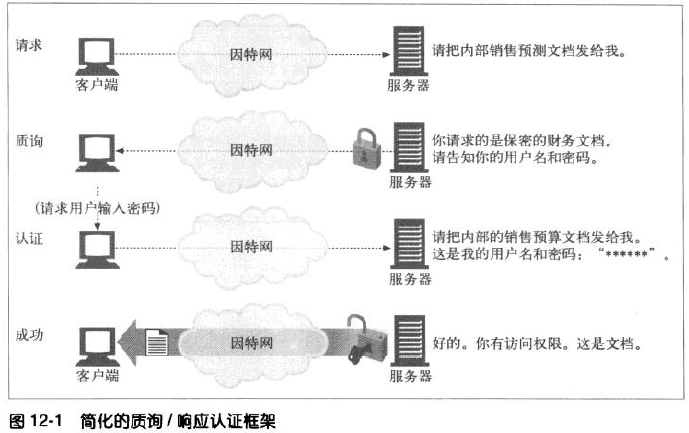

## 2. 基本认证协议

**基本认证**： Web 服务器可以拒绝一个事务，质询客户端，请用户提供有效的用户名和密码

> - 服务器返回 401 状态码来初始化认证质询，用 `WWW-Authenticate` 响应首部指定要访问的安全域
>
> - 客户端收到质询后，会用 `Authorization` 请求首部回送给服务器
>
> 基本认证首部： 
>
> |       质询/响应        | 首部语法及描述                                               |
> | :--------------------: | ------------------------------------------------------------ |
> | 质询(服务器发送客户端) | 域是一个引用字符串，用来命名所请求的文档集<br>例子： `WWW-Authenticate:Basic realm=quoted-realm` |
> | 响应(客户端发往服务器) | 用 `:` 将用户名与密码连接，然后转换成 Base64 编码            |
>
> 
>
> **安全缺陷**： 
>
> - 基本认证会通过网络发送用户名和密码
> - 第三方用户会将获取的用户名和密码重放给原始服务器，以获得对服务器的访问权
> - 用户习惯使用相同用户名和密码
> - 基本认证没有提供任何对代理和作为中间人的中间节点的防护措施
> - 假冒服务器很容易骗过基本认证

# 第十三章：摘要认证

> 摘要认证并不是最安全的协议，可以使用**传输层安全 `TLS` 和安全 HTTP `HTTPS`** 

## 1. 摘要认证的改进

- **用摘要保护密码**： 客户端不发送密码，而是发送密码的“摘要”，服务器可以验证该摘要是否与密码匹配

  > **密码的“摘要”是密码的不可逆扰码** 
  >
  > 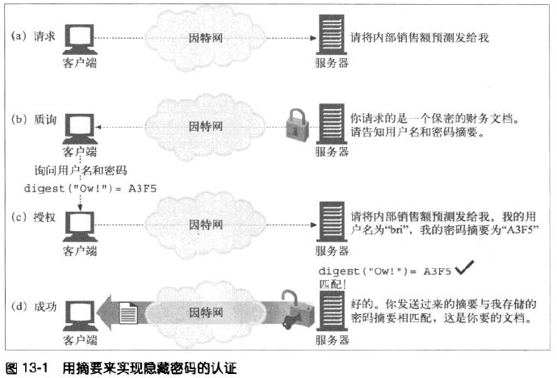

- **单向摘要**： 采用单向加密算法，如： `MD5` 会将任意长度的字节序列转换为一个 128 位的摘要

  > 摘要是一种单向函数，用于将无限的输入值转换为有限的浓缩输出值

- **用随机数防止重放攻击**： 服务器可以向客户端发送一个**“随机数”的特殊令牌**

  > - **重放攻击**： 即使不知道密码，第三方也可以截获摘要，并一遍遍的重放给服务器
  > - 优势： 在密码中加入随机数会使摘要只对特定的随机值有效
  > - 确认： 随机数是在 `WWW-Authenticate` 质询中从服务器传送给客户端

- **摘要认证的握手机制**： 

  > - 第一步： 服务器计算出一个随机数
  >
  > - 第二步： 服务器将该随机数放在 `WWW-Authenticate` 质询报文中，与服务器所支持的算法列表一同发给客户端
  >
  > - 第三步： 客户端选择一个算法，计算出密码和其他数据的摘要
  >
  > - 第四步： 将摘要放在 `Authorization` 报文中发回服务器
  >
  >   > 如果客户端要对服务器进行验证，可以发送客户端随机数
  >
  > - 第五步： 服务器接收摘要、选中算法、支撑数据，计算出与客户端相同的摘要，然后比较是否匹配
  >
  >   > 如果客户端反过来用客户端随机数对服务器进行质询，就会创建客户端摘要
  >   >
  >   > - 服务器可以先将下一个随机数计算出来，提前将其传递给客户端，这样下一次客户端就可以预先发送正确的摘要
  >
  > 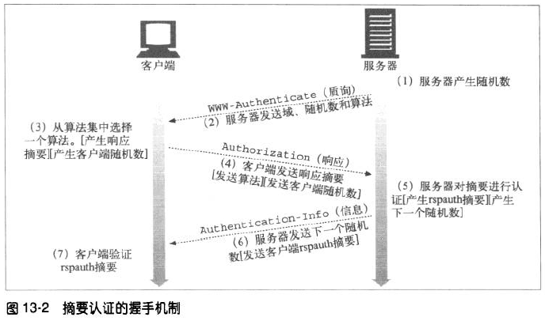

## 2. 摘要的计算

摘要计算的三个组件： 

- 单向散列函数 `H(d)` 和摘要 `KD(s,d)` 组成的一对函数，`s` 表示密码，`d` 表示数据

  > - 建议算法为： `MD5` 和 `MD5-sess`，默认为 `MD5`
  > - 用函数 `H` 来计算数据的 `MD5`，用摘要函数 `KD` 来计算以冒号连接的密码和非保密数据的 `MD5` 

- 一个包含了安全信息的数据块（安全性相关数据），包括密码，称为 `A1` 

  > > ==`A1` 只涉及安全信息==，与底层报文无关
  >
  > 两种计算 A1 方式： 
  >
  > - `MD5`： 为每条请求运行单向散列函数，`A1` 是由冒号连接的用户名、域、密码三元组
  >
  > - `MD5-sess`： 只在第一次 `WWW-Authenticate` 握手时运行一次散列函数
  >
  >   > 对用户名、域、密码进行一次 CPU 密集型散列，并将其放在当前随机数和客户端随机数的前面

- 一个包含了请求报文中非保密属性的数据块（报文相关数据），称为 `A2` 

  > > `A2` 有助于防止方法、资源、报文被篡改
  >
  > 根据所选择的保护质量，为 `A2` 定义了两种策略： 
  >
  > - 策略一： 只包含 HTTP 请求方法和 URL，当 `qop=auth` 时使用，默认
  > - 策略二： 添加了报文实体的主体部分，以提供一定程度的报文完整性检测，当 `qop=auth-int` 使用

---

> 可以在三种摘要首部提供 `qop` 字段： `WWW-Authenticate,Authorization,Authentication-Info` 
>
> 通过 `qop` 字段，客户端和服务器可以对不同类型及质量的保护进行协商

## 3. 注意问题

- **多重质询**： 客户端面对多重质询时，必须以它所支持的最强的质询机制来应答

  > 服务器可能既提供基本认证质询，又提供摘要认证质询

- **差错处理**： 

  - 若某指令或值使用不当，或缺少必要指令，就应响应 `400 Bad Request`

  - 若请求的摘要不匹配，就应该记录一次登录失败

    > 若客户端连续多次失败，可能说明有攻击者正在猜测密码

- **保护空间**： **域值**与被访问服务器的标准根 URL 结合在一起，定义了保护空间

  > - 通过域可以将服务器的受保护资源划分为一组保护空间，每个空间都有认证机制和/或授权数据库
  >
  > - 保护空间确定了可以自动应用证书的区域
  >
  >   > 若前面的某条请求已被授权，一段时间内，该保护空间中所有其他请求都可以重用同一个证书
  >
  > 在保护空间的具体计算取决于认证机制： 
  >
  > - 基本认证中，客户端会假定请求 URI 中或其下的所有路径都与当前的质询处于同一个保护空间
  > - 摘要认证中，质询的 `WWW-Authenticate:domain` 字段对保护空间作了更精确的定义

- **重写 URI**：代理可以通过改变 URI 语法，而不改变所描述的实际资源的方式来重写 URI

  > 比如： 
  >
  > - 可以对主机名进行标准化，或用 IP 地址来取代
  > - 可以用 `%` 转义形式来取代嵌入的字符

- **缓存**： 共享的缓存收到包含 `Authorization` 首部的请求和转接那条请求产生的响应时，除非提供了下列两种指令之一，否则不能将那条响应作为对其他请求的应答使用： 

  - `Cache-Control: must-revelidate`： 缓存可以在应答后继请求时，使用那条响应的尸体部分
  - `Cache-Control: public`： 对任意后继请求的应答都可以返回响应的实体部分

## 4. 安全问题

- **首部篡改**： 可以进行**端到端加密**或**对首部进行数字签名**

  > 摘要认证的重点在于提供一种防篡改认证机制

- **重放攻击**： 指有人将从某个事务中窃取的认证证书用于另一个事务

  > - 解决： 服务器产生随机数包含根据客户端 IP 地址、时间戳、资源 Etag、私有服务器密钥算出的摘要
  >
  >   > 缺陷： 用客户端 IP 地址来创建的随机数会破坏经过代理集群的传输
  >
  > - 完全避免重放攻击方法： 为每个事务都是用一个唯一的随机数
  >
  >   > - 该方式中，服务器会为每个事务发布唯一的随机数和一个超时值
  >   > - 发布的随机数只对指定的事务有效，而且只在超时值的持续区间内有效

- **多重认证机制**：由于没有要求客户端选择功能最强的认证机制，所以得到的认证效果差不多

  > 解决： 让客户端总是选择可用认证方案中功能最强的 

- **词典攻击**： 典型的密码猜测型攻击，对某个事务进行窃听，并对随机数/响应对使用标准的密码猜测程序

- **恶意代理攻击和中间人攻击**： 防止该攻击的唯一简便方式是**使用 SSL**

- **选择明文攻击**： 被恶意代理拦截流量而获取响应随机数，进而使用已知密钥来计算响应

  > 变体形式： 
  >
  > - **预先计算的词典攻击**： 词典攻击与选择明文攻击的组合
  >
  >   > - 首先，发起攻击的服务器用预先确定的随机数和常见密码的变化形式产生一组响应，创建词典
  >   > - 一旦有了规模客观的词典，攻击服务器或代理就可以完成对流量的封锁，向客户端发送预先确定的随机数
  >   > - 攻击者从客户端得到一个响应式，会搜索生成的词典，寻找匹配项
  >
  > - **批量暴力型攻击**： 不去匹配预先计算出的摘要，而是用一组机器枚举指定空间内所有可能的密码
  >
  >   > 随着机器运行速度越快，暴力型攻击的可行性也越强

- **存储密码**： 若摘要认证密码文件被入侵，攻击者马上就能使用域中所有文件，不需要进行解码

  > 解决： 
  >
  > - 认真保护
  > - 确保域名在所有域中唯一

# 第十四章：安全 HTTP

## 1. 数字加密

### 1. 密码

- 密码： 特殊报文的编码方式与相应解码方式的结合体
- 明文： 加密之前的原始报文
- 密文： 使用密码后的编码报文

### 2. 密钥

- **密钥**： 密码参数的集合

### 3. 对称密钥加密

- 对称加密： 发送端用共享密钥加密，接收端用共享密钥解密
- 加密算法： `DES, Triple-DES, RC2, RC4`

### 4. 非对称密钥加密

- 加密的公钥与解密的私钥

### 5. 公开密钥加密

- 公开密钥加密： 使用两个非对称密钥，**一个用于对主机报文编码，一个用于对主机报文解码** 

  > 公开的编码密钥，私有的解码密钥

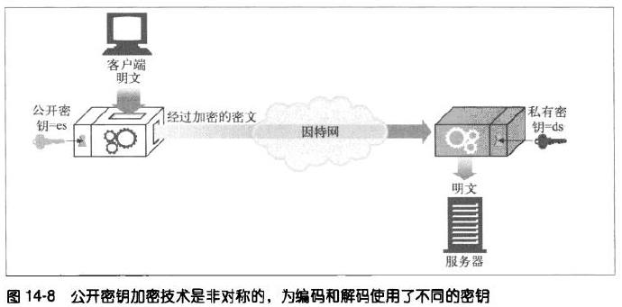

### 6. 数字签名

- 数字签名： 是附加在报文上的特殊加密校验码
- 好处： 
  - 签名可以证明是作者编写了这条报文
  - 签名可以防止报文被篡改

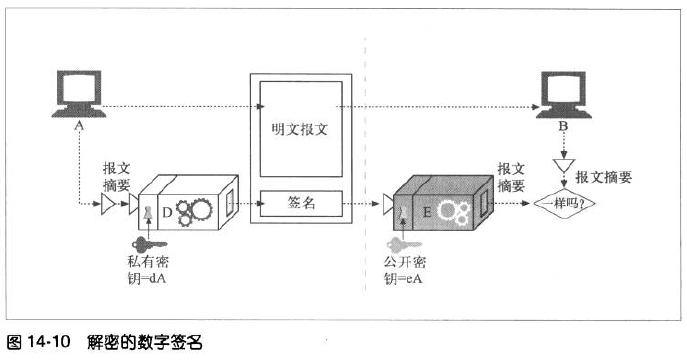

### 7. 数字证书

- 数字证书： 包含了由某个受信任组织担保的用户或公司的相关信息
- 证书主要内容： 对象的名称、过期时间、证书发布者、来自证书发布者的数字签名


## 密码学

### 1. 密码算法

- **凯撒密码**： 将明文报文中的每个字母用字母表中该字母 k 个字母后的那个字母替换，允许绕回

- **单码代替密码**： 使用字母表中的一个字母唯一的替换另一个字母，即提前约定好替换规则

  > 此种加密方式的三种可能攻击情况：
  >
  > - **唯密文攻击**： 入侵者只截取到密文
  >
  >   > 由于字母出现概率的不同，统计分析将有助于对加密方案的唯密文攻击
  >
  > - **已知明文攻击**： 入侵者知道（明文，密文）的部分匹配
  >
  > - **选择明文攻击**： 入侵者已知某段明文对应的密文形式

- **多码代替密码**： 使用多个单码代替加密，因此报文不同位置的字母可能以不同的方式编码

- **对称加密**：

  - **块密码**： 将被加密的报文以 k 比特的块独立加密，对每个加密的块，密码采用**一对一映射**

    > - k 块密码的可能映射数量为 $2^k$
    > - 块密码采用模拟随机改变次序表功能，即将每块继续划分，用多张转置表存储密钥，降低全块表存储密钥的不可行性
    > - 一些块密码(DES, 3DES, AES) 使用转置函数来替代转置表

  - **DES**： 使用 56 位的密钥对一个 64 位的明文块进行加密

    > 推荐阅读： **[安全体系（一）—— DES算法详解](https://www.cnblogs.com/songwenlong/p/5944139.html)**

  - **3DES**： 增强型的 DES，使用 3 次DES，即用三个不同的 5 6位的DES密钥(共168位密钥)对明文进行加密

  - **AES**： 

  - **IDEA**： 

- **非对称加密**：

  - **RSA 算法**： 

    > **计算公钥和私钥**：
    >
    > - 选择素数 `p, q`
    >
    >   > 因 p，q 值越大，越难破解，所以建议 p，q 的乘积为 1024 比特的数量级
    >
    > - 计算 `n=pq, z=(p-1)(q-1)`
    >
    > - 选择小于 n 的数 `e`，且 `e` 与 `z` 互质（e 将用于加密）
    >
    > - 选择一个数 `d`，满足 `(ed-1) mod z = 0`（d 将用于解密）
    >
    > - 公钥为 `(n,e)`，私钥为 `(n,d)` 
    >
    > **加密与解密的过程**： 
    >
    > - 报文 m 加密结果： $c = m^e modn$ 
    > - 密文 c 解密结果： $m = c^d modn$
    >
    > **注**： **对于公钥 $K_A$ 和私钥 $K_B$ 满足： $K_A(K_B(m)) = K_B(K_A(m))$** 

  - **DH 算法**： 只适用于 VPN

### 2. 密码散列函数

- 散列函数以 m 为输入，经过计算得到一个称为散列的固定长度的字符串，以**验证数据的完整性**
- 密码散列函数的性质： 对于任意两个不同报文 x 和 y，使得 `x!= y` 
- **MD5 散列算法**： 通过计算得到 128 比特的散列：
  - 填充： 先填 1，然后填充足够多的 0，直到报文长度满足一定条件
  - 添加： 在填充前，添加一个 64 比特的报文长度表示
  - 初始化累加器
  - 在最后循环步骤中，对报文的 16 字的块进行 4 轮处理
- **SHA1 散列算法**： 
- **SHA2 散列算法**： 

### 3. 报文鉴别码(MAC)

- **报文鉴别码(MAC)**： 用鉴别密钥 s 级连报文 m 生成 m+s ，并计算散列 H(m+s)，则 H(m+s) 即为报文鉴别码
- **报文鉴别码(MAC)的好处**： 不需要加密算法

### 4. 数字签名

- 数字签名的应用： **公钥认证**，即证实一个公钥属于某个特定的实体，即： **对称加密与非对称加密的组合**

  > 加密过程：
  >
  > 1. 使用对称密钥加密明文得到密文
  > 2. 用非对称密钥的私钥加密明文的对称密钥得到密钥包
  >
  > 解密过程：
  >
  > 1. 适用对方的公钥解密密钥包从而得到明文的对称密钥
  > 2. 用对称密钥解密密文，得到明文数据

- **认证中心(CA)**： 验证身份和发行证书

  > 作用：
  >
  > - CA 证实一个实体的真实身份
  >
  > - 身份认定后，CA 生成一个把身份与试图的公钥绑定的**证书**
  >
  >   > - 该证书包含这个公钥和公钥所有者全局唯一的身份标识信息
  >   > - 由 CA 对这个证书进行数字签名


## 2. HTTPS

> HTTPS 将未加密的 HTTP 报文发送给 TCP 之前，先将其发送给安全曾，对其进行加密
>
> - HTTP 安全层是通过 SSL 或 TLS 来实现
>
> 

### 1. 建立安全传输

- 在未加密 HTTP 中，客户端会打开一条到 Web 服务器端口 80 的 TCP 连接，发送报文，接收响应，关闭连接
- 在 HTTPS 中： 
  - 客户端首先打开一条到 Web 服务器端口 443 的连接
  - 一旦建立 TCP 连接，客户端和服务器就会初始化 SSL 层，对加密参数进行沟通，并交换密钥
  - 握手完成后，SSL 初始化就完成了，客户端就可以将请求报文发送给安全层

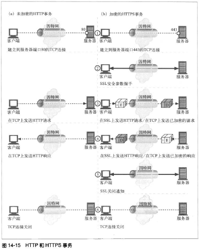

### 2. SSL 握手

在发送已加密的 HTTP 报文前，客户端和服务器要进行一次 SSL 握手： 

- 交换协议版本号
- 选择一个两端都了解的密码
- 对两端的身份进行认证
- 生成临时的会话密钥，以便加密信道

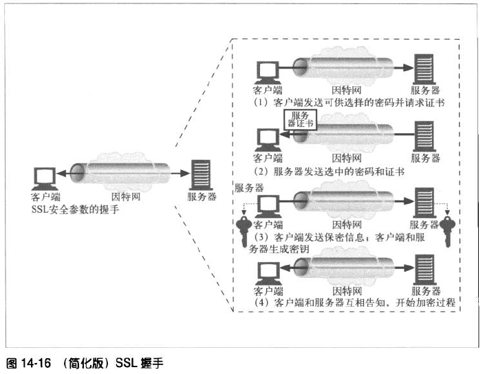

### 3. 证书检查

> SSL 自身不要求用户检查 Web 服务器证书，但浏览器会对证书进行简单的完整性检查

站点证书有效性验证步骤： 

- **日期检测**： 检查证书的起始日期和结束日期，以确保证书仍然有效

- **签名颁发者可信度检测**： 每个证书都由某些证书颁发机构 `CA` 签发，它们负责为服务器担保

- **签名检测**： 一旦判定签名授权可信，浏览器就要对签名使用签名颁发机构的公开密钥，并将其与校验码进行比较，以查看证书的完整性

- **站点身份检测**： 为防止服务器复制其他人证书，或拦截其他人的流量，浏览器会试着去验证证书中的域名与它们所对话的服务器的域名是否匹配

  > 服务器证书中通常都包含一个域名

# \#第四部分 实体、编码和国际化

# 第十五章：实体和编码

> 实体首部是一个纯文本文档，只有18字节长

## 1. 实体首部字段

HTTP/1.1 定义的10个基本的实体首部字段： 

- `Content-Type`： 实体中所承载对象的类型，即标准的 MIME 类型

  > |           媒体类型            | 描述                                                     |
  > | :---------------------------: | -------------------------------------------------------- |
  > |           text/html           | 实体主体是 HTML 文档                                     |
  > |          text/plain           | 实体主体是纯文本文档                                     |
  > |           image/gif           | 实体主体是 GIF 格式的图像                                |
  > |          image/jpeg           | 实体主体是 JPEG 格式的图像                               |
  > |          audio/x-wav          | 实体主体包含 WAV 格式声音数据                            |
  > |          model/vrml           | 实体主体是三维 VRML 模型                                 |
  > | application/vnd.ms-powerpoint | 实体主体是 PPT 演示文档                                  |
  > |     multipart/byteranges      | 实体主体有若干部分，每个部分包含完整文档中不同的字节范围 |
  > |         message/http          | 实体主体包含完整的 HTTP 报文                             |
  >
  > - 字符编码 `charset`：说明把实体的比特转换为文本文件中字符的方法
  >
  >   > 如： `Content-Type:text/html;charset=iso-8859-4` 
  >
  > - 多部份表格提交： `Content-Type:multipart/form-data` 或 `Content-Type:multipart/mixed` 
  >
  > - 多部份范围响应： `Content-Type:multipart/byteranges` 

- `Content-Length`： 所传送实体主体的长度或大小

  > - 除非使用分块编码，否则 `Content-Length` 首部必须是带有实体的报文必有的
  >
  > - 作用： 检测出服务器崩溃而导致的报文截尾，并对共享持久连接的多个报文进行正确分段
  >
  > - 报文截尾： 需要 `Content-Length` 来检测客户端报文是正常关闭，还是崩溃关闭
  >
  >   > 早期 HTTP 采用关闭连接的办法来划分报文的结束

- `Content-Language`： 与所传送对象最相配的人类语言

- `Content-Encoding`： 对象数据所做的任意交换

- `Content-Location`： 备用位置，请求时可通过它获得对象

- `Content-Range`： 如果这是部分实体，这个首部说明它是整体的哪个部分

- `Content-MD5`： 实体主体内容的校验和

- `Last-Modified`： 所传输内容在服务器上创建或最后修改的时间

- `Expires`： 实体数据将要失效的日期时间

- `Allow`： 该资源所允许的各种请求方法，如： GET，POST

- `ETag`： 这份文档特定实例的唯一验证码

  > `ETag` 首部没有正式定义为实体首部，但很重要

- `Cache-Control`： 指出应如何缓存该文档，`Cache-Control` 首部也没有正式定义为实体首部

- `Want-Digest`： 允许客户端说明期望响应的摘要类型，并使用**质量值**来建议多种摘要算法并说明优先级

## 2. 内容编码

> HTTP 发送内容前，会进行内容编码： 
>
> - 对内容进行压缩，有助于减少传输实体的时间
> - 对内容加密，防止未经授权的第三方看到文档内容

**内容编码过程**： 

- 服务器生成响应报文，含有 `Content-Type` 和 `Content-Length`
- 内容编码服务器创建编码后的报文，增加了 `Content-Encoding`，用于解码
- 接收到编码后的报文，进行解码，获得原始报文

---

**内容编码类型**： 允许用扩展编码的形式添加更多的编码

| Content-Encoding 值 | 描述                                                   |
| :-----------------: | ------------------------------------------------------ |
|        gzip         | 采用 `GNU zip` 编码                                    |
|      compress       | 采用 Unix 的文件压缩程序                               |
|       deflate       | 采用 `zlib` 格式压缩                                   |
|      identity       | 不对实体进行编码，没有 `Content-Encoding` 时的默认情况 |

---

`Accept-Encoding` 首部： 保存客户端支持的内容编码方式，可以附带 `Q`(质量)参数来说明编码的优先级

> `Q` 取值为 `0-1`，`0` 说明客户端不想接受该编码方式，`1.0` 说明客户端最希望的编码方式
>
> 例子： `Accept-Encoding: compress;q=0.5, gzip;q=1.0`

## 3. 传输编码

> - 内容编码： 对报文的主体进行的可逆变换，与内容的具体格式紧密相关，只对报文实体部分进行编码
> - 传输编码： 也是作用在实体上的可逆变换，但编码作用在整个报文上，报文自身结构发生改变

报文问题： 

- **未知尺寸**： 应用程序和内容编码器无法确定报文主体的最终大小

  > 解决： 使用 `Content-Length` ，通过传输编码来发送数据，并使用特殊的结束脚注表明数据结束

- **安全性**： 可以使用传输编码把报文内容打乱，然后再传输，或者使用 SSL

---

**传输编码**： 

- `Transfer-Encoding`： 告知接收方为了可靠传输报文，对报文进行的编码方式
- `TE`：用于请求首部，告知服务器可以使用哪些传输编码扩展

---

**分块编码**： 把报文分割为若干大小已知的块，逐块发送，是一种传输编码

- 优点： 使用持久连接时，若服务器动态创建内容，可能在发生前无法知道主体的长度，此时使用分块编码
- 服务器拒绝： `411 Length Required` 响应拒绝分块请求
- **分块报文的拖挂**： 可以包含附带的首部字段，其值在报文开始时，无法确定

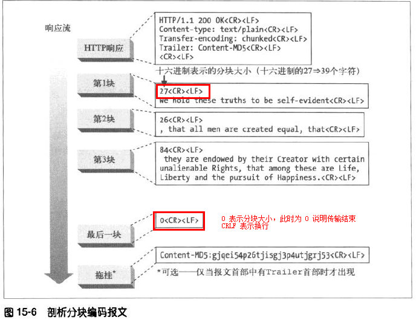

## 4. 其他特性

- **实例操控**： 用以控制对象的实例，如： 范围请求和差异编码

  > 要求客户端能够识别所拥有的资源的特定副本，并在一定条件下请求新的实例

- **条件请求**： 要求客户端使用验证码来告知服务器，它当前拥有的版本号，并仅当它当前副本不再有效时才要求发送新的副本

  > - **新鲜度**： 服务器告知客户端能够将内容缓存的时间，`Expires` 与 `Cache-Control` 
  >
  >   > `Cache-Control` 首部指令： 
  >   >
  >   > |       指令       | 报文类型 | 描述                                                         |
  >   > | :--------------: | :------: | ------------------------------------------------------------ |
  >   > |     no-cache     |   请求   | 重新向服务器验证前，不要返回文档的缓存副本                   |
  >   > |     no-store     |   请求   | 不返回文档的缓存副本，不保存服务的响应                       |
  >   > |     max-age      |   请求   | 缓存中的文档不能超过指定的使用期                             |
  >   > |    max-stale     |   请求   | 文档允许过期，但不能超过指令中指定的过期值                   |
  >   > |    min-fresh     |   请求   | 文档使用期不能小于指定时间与存活时间之和<br>响应至少在指定的这段时间内保持新鲜 |
  >   > |   no-transform   |   请求   | 文档在发送之前，不允许被转换                                 |
  >   > |  noly-if-cached  |   请求   | 只有当文档在缓存中才发送，不要联系原始服务器                 |
  >   > |      public      |   响应   | 响应可以被任何服务器缓存                                     |
  >   > |     private      |   响应   | 响应可以被缓存，但只能被单个客户端访问                       |
  >   > |     no-cache     |   响应   | 若该指令伴随一个首部列表，内容可以被缓存并提供给客户端，但必须先删除所列出的首部<br>若没有指定首部，缓存中的副本在没有重新向服务器验证前，不能提供给客户端 |
  >   > |     no-store     |   响应   | 响应不允许被缓存                                             |
  >   > |   no-transform   |   响应   | 响应提供给客户端之前，不能做任何形式的修改                   |
  >   > | must-revalidate  |   响应   | 响应在提供给客户端之前，必须重新向服务器验证                 |
  >   > | proxy-revalidate |   响应   | 共享的缓存在提供给客户端之前，必须重新向原始服务器验证<br>私有的缓存可以忽略该指令 |
  >   > |     max-age      |   响应   | 指定文档可以被缓存的时间以及新鲜度的最长时间                 |
  >   > |    s-max-age     |   响应   | 指定文档作为共享缓存时的最长使用时间<br>私有缓存可以忽略该指令 |
  >
  > - **有条件的请求**： 仅当资源改变时，才请求副本
  >
  >   > 因为已过期的缓存副本与原始服务器的文档相同时，再次更新缓存副本会浪费带宽
  >   >
  >   > - 有条件请求通过验证码来发挥作用
  >
  > - **验证码**： 文档的特殊属性，用来测试条件是否为真
  >
  > |      请求类型       |    验证码     | 描述                                                         |
  > | :-----------------: | :-----------: | ------------------------------------------------------------ |
  > |  If-Modified-Since  | Last_Modefied | 在 Last_Modefied 首部中的事件之后 资源版本发生变化，发送副本 |
  > | If-Unmodified-Since | Last_Modefied | 在 Last_Modefied 首部中的事件之后 资源版本没有变化，发送副本 |
  > |      If-Match       |     ETag      | 实体标记与前一次 `ETag` 相同，发送资源副本                   |
  > |    If-None-Match    |     ETag      | 实体标记与前一次 `ETag` 不同，发送资源副本                   |

- **范围请求**： 允许客户端只请求文档的一部分

  > 前提： 从客户端上一次请求该实体到这次发出范围请求的时间段内，该对象没有被改变过

- **差异编码**： 通过交换对象改变的部分而不是完整的对象来优化传输性能

  >  差异编码所用首部：
  >
  > |     首部      | 描述                                                         |
  > | :-----------: | ------------------------------------------------------------ |
  > |     ETag      | 文档每个实例的唯一标识符                                     |
  > | If-None-Match | 客户端发送的请求首部，仅当客户端的文档版本与服务器不同时，<br>才向服务器请求该文档 |
  > |     A-IM      | 客户端请求首部，说明可以接受的实力操控类型                   |
  > |      IM       | 服务器响应首部，说明作用在响应上的实例操控类型               |
  > |  Delta-Base   | 服务器响应首部，寿命用于计算差异的基线文档的 ETag 值         |
  >
  > 在 IANA 注册的实例操控类型： 
  >
  > |   类型   | 说明                                                         |
  > | :------: | ------------------------------------------------------------ |
  > |  vcdiff  | 用 vcdiff 算法计算差异                                       |
  > |  diffe   | 用 Unix 系统的 diff-e 命令计算差异                           |
  > |  gdiff   | 用 gdiff 算法计算差异                                        |
  > |   gzip   | 用 gzip 算法压缩                                             |
  > | deflate  | 用 deflate 算法压缩                                          |
  > |  range   | 用在服务器响应中，说明响应是针对范围选择得到的部分内容       |
  > | identity | 用在客户端请求中的 A-IM 首部中，说明客户端愿意接受恒等实例操控 |
  >
  > 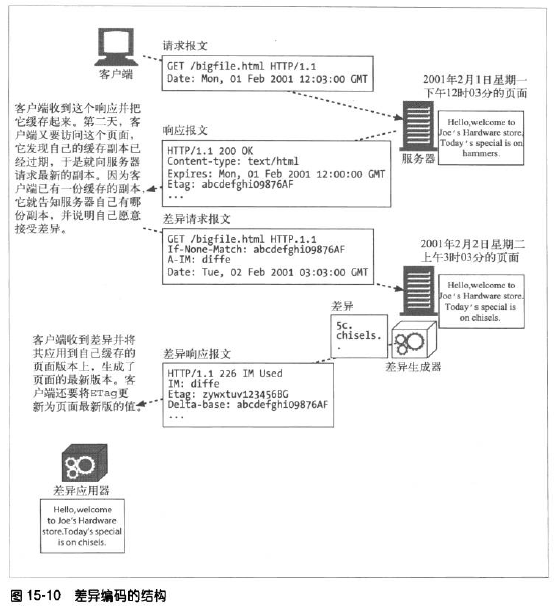

# 第十六章：国际化

> - 客户端发送 `Accept-Charset` 和 `Accept-Language` 首部，告知服务器它接受的字符集编码和语言
> - 服务器通过 HTTP 协议的 `Content-Type` 首部中的 `charset` 参数和 `Content-Language` 首部告知客户端文档的字母表和语言
>
> 例子：
>
> ```
> Accept-Language: fr, en;q=0.8
> Accept-Charset: iso-8859-1, utf-8
> ```

## 1. 字符集与 HTTP

- **字符集**： 把字符转换为二进制码的编码

- 字符集与编码的**工作流程**： 

  > 把二进制码转换为字符的步骤： 
  >
  > - 文档中的二进制码被转换成字符代码，表示了特定编码字符集中某个特定编码的字符
  > - 字符代码用于从编码的字符集中选择特定的元素
  >
  > 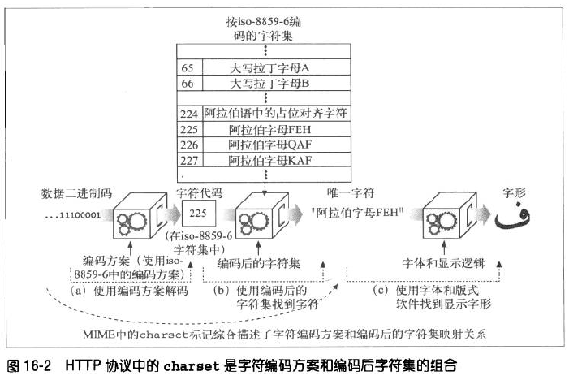

- **标准化的 MIME charset 值**： 特定的字符编码和特定的已编码字符集组合成一个 MIME 字符集

  > 

- **META 标志**： 对于 HTML 内容来说，可以在 `<MEAT HTTP-EQUIV="Content-Type">` 中规定字符集

  > 例子： 
  >
  > ```html
  > <head>
  >     <MEAT HTTP-EQUIV="Content-Type" Content="text/html;charset=iso-8859-2">
  > </head>
  > ```

## 2. 语言标记与 HTTP

> 语言标记是命名口语的标准化字符串短语

子标记： 语言的标记有一个或多个部分，用连字号分隔

- **第一个子标记**： 通常是标准化的语言记号

  > 若第一个子标记含有：
  >
  > - 2个字符： 来自 `ISO 639` 和  `639-1` 标准的语言代码
  > - 3个字符： 来自 `ISO 639-2` 标准及其扩展的语言代码
  > - 字母 `i`： 该语言标记是在 IANA 显示注册
  > - 字母 `x`： 该语言是私有的、非标准的，或扩展的子标记

- **第二个子标记**： 通常是标准化的国家记号

  > 若第二个子标记含有： 
  >
  > - 2 个字符： `ISO 3166` 定义的国家/地区
  > - 3~8 个字符： 在 IANA 中注册的值
  > - 单个字符： 非法情况

- **其余子标记**： 没有特殊规则

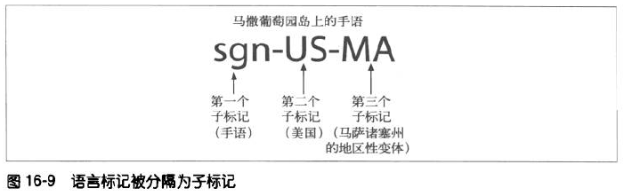

# 第十七章：内容协商与转码

## 1. 内容协商

> 内容协商： 决定服务器上哪个页面最适合客户端

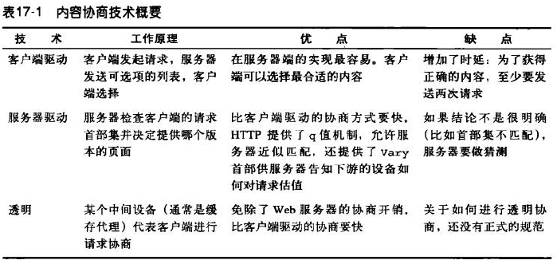

### 1. 客户端驱动协商

- **客户端协商**： 客户端发起请求，服务器发送可选项的列表，客户端选择

  > 服务器有两种方法为客户端提供选择： 
  >
  > 1. 发生会一个 HTML 文档，里面有到该页面的各种版本的链接和每个版本的描述信息
  >
  >    > 客户端收到响应时，会显示一个带有链接的页面
  >
  > 2. 发送回 `HTTP/1.1` 响应时，使用 `300 Multiple Choices` 响应代码
  >
  >    > 可能会弹出对话窗口，让用户做选择

- 优点： 服务器实现很容易，客户端可以选择最合适的内容

- 缺点： 

  - 增加时延，且对每个页面都要进行繁琐的多次请求

    > 客户端需要请求两次，**第一次获取列表，第二次获取选择的副本** 

  - 需要多个 URL： 公共页面一个，其他每个特殊页面一个

### 2. 服务器驱动协商

- **服务器驱动协商**： 服务器检查客户端的请求首部集并决定提供哪个版本的页面

  > 两种机制供 HTTP 服务器发送什么响应给客户端： 
  >
  > - 检查内容协商首部集
  >
  >   > 服务器查看客户端的 `Accept` 首部集，设法用相应的响应首部与之匹配
  >
  > - 根据其他首部(非内容协商)进行变通
  >
  >   > 服务器可以根据客户端发送的 `User-Agent` 首部来发送响应

- **优点**： 比客户端协商快，HTTP 提供了  `q` 值，允许服务器近似匹配，还提供了 `Vary` 首部供服务器告知下游设备如何请求估值

- **缺点**： 若结论不正确，服务器要做猜测

### 3. 透明协商

- **透明协商**： 试图从服务器上去除服务器驱动协商所需的负载，并用中间代理来代表客户端以使与客户端的报文交换最小化

  > 前提： 服务器必须有能力告知代理，服务器需要检查哪些请求首部，以便对客户端的请求进行最佳匹配
  >
  > > `Vary` 首部来告知中间节点需要哪些请求首部进行内容协商

- 优点： 免除了 Web 服务器的协商开销，比客户端驱动的协商要快

- 缺点： 关于透明协商还没有正式的规范

## 2. 内容协商首部

> - **实体首部集**： 描述了把报文从服务器传输给客户端的过程中，必须的各种报文主体属性
> - **内容协商首部集**： 由客户端发送给服务器用于交换偏好信息，以便服务器可以从文档的不同版本中选择最符合客户端的服务
>
> HTTP 是无状态协议： 服务器不会在不同请求间，追踪客户端的偏好

- **首部集**：客户端可以用 `Accept` 首部集发送用户的偏好信息： 

  > |      首部       | 描述                       | 匹配的实体首部   |
  > | :-------------: | -------------------------- | ---------------- |
  > |     Accept      | 告知服务器发送何种媒体类型 | Content-Type     |
  > | Accept-Language | 告知服务器发送何种语言     | Content-Language |
  > | Accept-Charset  | 告知服务器发送何种字符集   | Content-Type     |
  > | Accept-Encoding | 告知服务器采用何种编码     | Content-Encoding |

- **首部中的质量值**： HTTP 协议中定义了质量值 `q`，允许客户端为每种偏好类别列出多种选项，并为每种偏好选项关联一个优先次序
- **随其他首部集而变化**： 服务器也可以根据其他客户端请求首部集来匹配响应

## 3. 转码

- **转码**： 服务器把现存的文档转换成某种客户端可用的文档

- 转码类别： 

  - **格式转换**： 指将数据从一种格式转换成另一种格式，使之可以被客户端查看

  - **信息综合**： 从文档中提取关键的信息片段

    > 应用： Web 页面分类系统

  - **内容注入**： 增加文档内容

- **转码与静态预生成对比**： 转码的替代做法是在 Web 服务器上建立 Web 页面的不同副本 ==???== 

# \#第五部分 内容发布与分发

# 第十八章：Web主机托管

## 1. 简介

> - Web 主机托管： 服务器提供商提供专用 Web 托管服务
> - 虚拟主机托管： 让顾客共享一台计算机，来提供便宜的 Web 主机托管服务

- **通过 URL 路径进行虚拟主机托管**： 通过分配不同的 URL 路径，将共享服务器上的虚拟站点隔离开
- **通过端口号进行主机托管**： 为每个站点分配不同的端口号
- **通过 IP 地址进行主机托管**： 为不同的虚拟站点分配专门的 IP 地址
- **通过 Host 首部进行主机托管**： Host 请求首部携带网站名称，因此可以通过 Host 首部识别虚拟站点

## 2. 使网站更可靠

网站出现问题： 

- 服务器宕机
- 交通拥堵，即突然大流量访问
- 网络中断或掉线

---

预判和处理问题的方法： 

- **镜像服务器集群**： 一组配置相同的 Web 服务器，可以互相替换，每个服务器上的内容可以通过镜像复制

  > 把客户端的请求导向特定的服务器： 
  >
  > - **HTTP 重定向**： 该内容的 URL 会解析到主服务器的 IP 地址，然后发送重定向到复制服务器
  > - **DNS 重定向**： 该内容的 URL 会解析到 4 个 IP 地址，DNS 服务器可以选择发送给客户端的 IP 地址

- **内容分发网络(CDN)**： 对特定内容进行分发的专门网络，网络中的节点可以的 Web 服务器、反向代理、缓存

  - **CDN 反向代理缓存**： 可以像镜像服务器一样接受服务器请求

    > - 反向代理与镜像服务器的区别： 反向代理是**需求驱动**的，不会保存原始服务器的全部内容副本，只保存客户端请求的内容
    >
    >   > - 反向代理中的高速缓存取决于收到的请求，原始服务器不负责更新其中的内容
    >   > - 为了更容易访问“热点”内容，可以采取“预取”，即在用户请求之前就从服务器上载入内容

  - **CDN 代理缓存**： 能收到发往任何 Web 服务器的请求，但不能对原始服务器内容精确复制

# 第十九章：发布系统


# 第二十章：重定向与负载均衡

## 重定向

**通用的重定向方法**： 

- **HTTP 重定向**： 服务器将短的重定向报文发回给客户端

  > - 优点： 重定向服务器知道客户端的 IP 地址
  > - 缺点： 
  >   - 需要原始服务器进行大量处理来判断重定向到哪台服务器上
  >   - 增加了用户时延，因为访问页面时要进行两次往返
  >   - 若重定向服务器出故障，站点就会瘫痪

- **DNS 重定向**： DNS 允许将几个 IP 地址关联到一个域中，可以配置 DNS 解析程序，以返回可变的 IP 地址

  > DNS 重定向算法： 
  >
  > - 负载均衡算法： 追踪 Web 服务器的负载，将负载最轻的 Web 服务器放在列表的最前面
  > - 邻接路由算法： 服务器集群在地理上分散时，DNS 尝试将用户导向最近的 Web 服务器
  > - 故障屏蔽算法： DNS 会监视网路状况，并将请求绕过出现服务中断或其他故障的地方

- **任播路由**： 分散的服务器拥有相同的 IP 地址，通过骨干路由器的最短路径路由功能将客户端的请求发送给最近的服务器

  > 前提： 每台服务器都要向邻近的骨干路由器广告，表明自己是一台路由器

- **IP MAC 转发**： 交换机将服务器或代理的目标 MAC 地址赋予分组

  > 优点： 节省带宽，提高 QOS
  >
  > 缺点： 服务器和代理的跳距必须是 1

- **IP 地址转发**： 交换机或第四层设备会检测输入分组中的 TCP/IP 地址，并通过修改目的 IP 地址，转发分组

  > - 优点： 目标服务器不需要位于一跳远的地方，只需要位于交换机的上游
  >
  > - 控制响应的返回路径：  NAT 即： 网络地址转换
  >
  >   - 完全 NAT： 将分组的源 IP 地址改成交换机的 IP 地址
  >
  >     > 优点： 响应分组会被发送给交换机
  >     >
  >     > 缺点： 服务器不知道客户端的 IP 地址
  >
  >   - 半 NAT：源 IP 地址仍是客户端 IP 地址，但要确保没有从服务器到客户端的直接路由
  >
  >     > 优点： 服务器知道客户端的 IP 地址
  >     >
  >     > 缺点： 要对客户端和服务器之间的整个网络都有某种程度的控制

---

**代理与缓存重定向技术**：

- **显示浏览器配置**： 配置 Web 浏览器，使其将 HTTP 报文发送给附近的代理

  > 缺点： 取决于浏览器的能力

- **代理自动配置(PAC)**： 浏览器从配置服务器中解析出 PAC 文件，获取 URL 使用的代理

  > 必须配置浏览器，使其去查询配置服务器

- **Web 代理自动发现协议(WPAD)**： 浏览器向配置服务器查询一个 PAC 文件的 URL，不需使用特定配置服务器

- **Web 缓存协调协议(WCCP)**： 路由器会评估分组的目的地址，并用代理或镜像服务器的 IP 地址将重定向分组封装

- **因特网缓存协议(ICP)**： 代理缓存会在一组兄弟代理缓存中查询所请求的内容

  > 缺点： 请求内容时，只使用了 URL，所以会降低缓存命中率

- **缓存分组路由协议(CARP)**： 代理缓存散列协议，允许缓存将请求转发给一个父缓存

- **超文本缓存协议(HTCP)**： 参与的代理缓存可以向一组兄弟缓存查询所请求的内容

# 第二十一章：日志记录与使用情况跟踪
