# 一、概述

## 1. 因特网

### 1. 构成描述

- **公共因特网**：是一个世界范围的计算机网络，所有设备称为**主机或端系统**
- **内联网**： 网络内的主机不与专用网络外部的主机交换信息的专用网络
- 端系统通过通信链路和分组交换机连接，通过因特网服务提供商接入因特网
- **分组**： 将要发送的数据分段并为每段加上首部字节而形成的信息包

### 2. 服务描述

- **因特网第二种描述**： 根据基础设施向分布式应用程序提高的服务

- 因特网应用程序运行在端系统上，该端系统提供一个应用程序编程接口(API)

  > API 规定了运行在一个端系统上的软件请求因特网基础设施向运行在另一个端系统上的特定目的地软件交付数据的方式

### 3. 协议

- **协议**： 定义了在两个或多个通信实体间交换报文格式和次序，以及在报文传输和/或接收或其他事件方面所采取的动作

## 2. 网络边缘

- **客户机程序**： 运行在一个端系统上的程序

  > 它发出请求，并从运行在另一个端系统上的服务器程序接收服务

- 客户机-服务器因特网应用程序是分布式应用程序
- **接入网**： 将端系统连接到其边缘路由器的物理链路
- **边缘路由器**： 是端系统到任何其他远程系统路径上的第一台服务器

**网络接入分类**：

- **住宅接入**：将家庭端系统与边缘路由器相连

  > - 一种接入形式： 通过普通模拟电话线用**拨号调制解调器与住宅 ISP** 相连
  >
  > - 家庭调制解调器： 将 PC 输出的数字信号转换为模拟形式
  >
  > - ISP 调制解调器： 将模拟信号转换为数字信号，作为 ISP 路由器的输入
  >
  > - 宽带分类： **数字用户线(DSL)**和**混合光纤同轴电缆(HFC)**
  >
  >   > - DSL 在家庭与ISP 之间建立了一条点对点连接，因此 DSL 带宽的专用的
  >   >
  >   > - DSL 调制解调器分为三个频段
  >   >
  >   >   - 高速下行信道： 位于 50kHz 到 1 MHz 频段
  >   >   - 中速上行信道： 位于 4 kHz 到 50 kHz 频段
  >   >   - 普通的双向电话信道： 位于 0 到 4 kHz 频段
  >   >
  >   > - 电缆调制解调器： 通过一个以太网端口与家庭 PC 相连，同时其**共享广播媒体**，导致多用户在线会降低网速
  >   >
  >   >   将 HFC 网络划分为两个信道：
  >   >
  >   >   - 下行信道： 拥有更大的带宽，因而有更高的传输速率
  >   >   - 上行信道

- **公司接入**： 将商业或教育机构中的端系统与网络相连

  > - **局域网**： 用于公司和大学校园，如： 以太网

- **无线接入**： 将移动端系统与网络相连

  > - **无线局域网(wireless LAN)**： 无线用户与位于几十米半径内的基站之间传输/接收分组
  > - **广域无线接入网**： 分组经用于蜂窝电话的相同无线基础设施进行发送，基站由电信提供商管理

物理媒体分类：

- **导引型媒体**： 电波沿着固体媒体被引导
- **非导引型媒体**： 电波在空气或外层空间中传播

物理媒体具体体现：

- **双绞铜线**：最便宜且最普遍，非屏蔽双绞线(UTP) 常用在建筑物内的计算机网络中，即**局域网(LAN)**

- **同轴电缆**： 由两个**同心铜导体**组成，**能被用作引导式共享媒体**

- **光纤**：  能够引导光脉冲的媒体，能支持极高的比特速率，但成本较高

- **陆地无线电信道**： 承载电磁频谱中的信号，不需要物理线路

  > 分为两类：
  >
  > - 一类是运行在本地区域
  > - 一类是运行在广域

- **卫星无线电信道**： 

  > - 地面站： 通信卫星连接两个或多个位于地球的微波发射方/接收方
  > - 卫星在一个频段上接收传输，使用一个转发器再生信号，并在另一个频率上传输信号
  > - 两类卫星： 同步卫星和低地球轨道卫星

## 3. 网络核心

通过网络链路和交换机移动数据的基本方法：

- **电路交换**： 端系统通信期间，预留通信路径所需要的资源，通过**频分复用(FDM)**和**时分复用(TDM)**实现

  > - 当两台主机要通信时，该网络在两台主机之间创建一条**专用的端到端连接**
  >
  
- **分组交换**： 每个分组通过分组交换机（包括路由器、链路层交换机）和通信链路传送

  > - **分组**： 源端系统将报文划分的较小数据块
  > - **存储转发传输**：交换机开始向输出链路传输该分组的第一个比特前，必须接受到整个分组
  >
  > 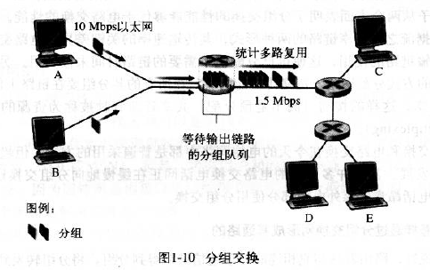
  >
  > - **输出缓存(输出队列)**： 用于存储路由器准备发往链路的分组
  >- **分组丢失(丢包)**：输出缓存被其他分组占满，丢弃到达的分组或者已经排队的分组
  > - **吞吐量**： 主机间文件传输速率
  > 

**时延分类**： **总时延 = 传输时延 + 传播时延 + 处理时延 + 排队时延** 

- **处理时延**：包括检查分组首部，将分组导向何处，检查比特级别的差错等

- **排队时延**：在输出缓存中等待传输

  > **流量强度**：比率 $La/R$，即**比特到达队列的速率与输出速率的对比**，系统设计的流量强度 ==<=1== 
  >
  > - `a` 表示分组到达队列的平均速率
  > - `R` 表示路由器间的链路传输速率
  > - `L` 表示分组长度
  >
  > 

- **传输时延(存储转发时延)**：由于存储转发机制，将所有的分组从输出缓存传输到链路的时延，与分组长度和链路传输速率有关

- **传播时延**：从链路的起点到链路的终点传播的时间，与传输介质和传播距离有关

**分组交换与电路交换对比**： 

- **统计多路复用**： 按需共享资源

- **分组交换**：
  - **缺点**：端到端时延是变动不可预测的
  - **优点**：分组交换按需分配，链路的传输能力在所有用户之间逐分组的共享，利用率高

- **电路交换**：
  - **优点**： 时延可预测，适合实时服务
  - **缺点**： 不考虑需求，预先分配传输链路，利用率低

**ISP 与因特网主干**： 

> **汇集点(POP)**： 某 ISP 与其他 ISP 的连接点

- **第一层 ISP(因特网主干)**： 覆盖国际区域，与其他每个第一层 ISP 相连 
- **第二层 ISP**： 具有区域性或国家性覆盖规模，仅与少数第一层 ISP 相连
- **接入 ISP**： 位于该层次的底部，公共因特网中，网络边缘的接入网络通过分层的 ISP 层次结构与因特网的其他部分相连

## 4. 协议层次

- **层的服务模型**： 使用下层的服务，执行某些动作，向上层提供服务 

**协议分层**：

- **优点**：简化每层的功能，单层功能的改变不影响其它组件
- **缺点**：冗余较低层的功能，由于数据耦合导致不同层间未完全分离

 

**五层因特网协议栈**：

> ==链路层交换机实现了第一层到第二层；路由器实现了第一层到第三层== 

- **应用层**：网络应用程序及其应用层协议存留的地方，应用层信息分组称为**报文**

  > 应用层协议：
  >
  > - `HTTP`： 为 web 文档提供请求和传送
  > - `SMTP`： 提供电子邮件报文的传输
  > - `FTP`： 提供端系统间的文件传送

- **运输层**：**为进程**提供通用数据传输服务，将运输层分组称为**报文段**

  > 两个运输层协议：
  >
  > - 传输控制协议 `TCP`： 提供面向连接、可靠的数据传输服务，数据单位为报文段
  > - 用户数据报协议 `UDP`：提供无连接、尽最大努力的数据传输服务，数据单位为用户数据报
  >
  > TCP 主要提供完整性服务，UDP 主要提供及时性服务

- **网络层**：**为主机**提供数据传输服务，运输层协议是为主机中的进程提供传输服务，将网络层分组称为**数据报**

  > - 网络层把运输层传递下来的报文段或者用户数据报封装成分组
  >
  > 网络层协议：
  >
  > - `IP`： 定义了数据报中的各个字段以及端系统和路由器如何作用于这些字段

- **链路层**：**为同一链路的主机**提供数据传输服务，数据链路层把网络层传下来的分组封装成**帧**

  > 链路层提供的服务取决于应用于特定链路层协议

- **物理层**：将帧中的比特从一个节点移动到下一个节点

  > 尽可能屏蔽传输媒体和通信手段的差异，使数据链路层感觉不到这些差异，与链路的实际传输媒体相关

**不同分层中的分组**：

> 每层的分组由两部分组成：**首部字段和有效载荷字段**，其中有效载荷字段来自上一层的分组

- 源主机将应用层报文传给运输层

- 运输层接收报文并附上运输层首部信息，构成运输层报文段

  > 附加信息： 差错检测比特信息等

- 网络层接收报文段并附上源和目的端系统地址等网络层首部信息，构成网络层数据报

- 链路层接收数据报并附上链路层首部信息，构成链路层帧

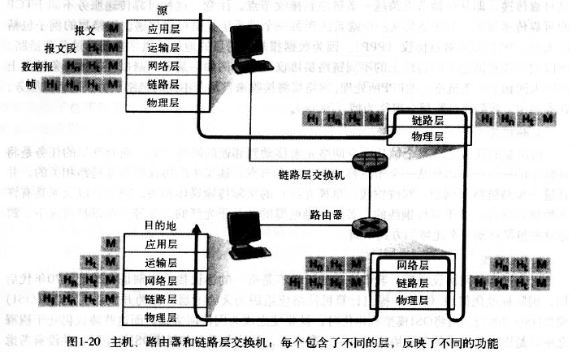

**七层 ISO 模型**：**开放系统互连模型(OSI)**

- 应用层
- **表示层**： 使通信的应用程序能解释交换数据的含义，提供数据压缩、数据加密、数据描述等服务
- **会话层**： 提供了数据交换的定界和同步功能，包括建立检查点和恢复方案的方法
- 运输层
- 网络层
- 链路层
- 物理层

## 5. 网络威胁

- **将恶意软件装入计算机**

  > - **僵尸网络**： 数以千计的受害主机构成的网络
  > - **病毒**： 需要某种形式的用户交互来感染用户设备的恶意软件
  > - **蠕虫**： 无需任何明显用户交互就能进入设备的恶意软件

- **攻击服务器和网络基础设施**

  > **拒绝服务(DoS)攻击**：使用户不能使用网络、主机或其他基础设施部分
  >
  > DoS 分类：
  >
  > - **弱点攻击**： 向易受攻击部分发送精细报文，使该部分服务停止运行甚至崩溃
  > - **带宽洪泛**： 向目标主机发送大量分组，导致阻塞接入链路
  > - **连接洪泛**： 在目标主机上创建大量半开或全开 TCP 连接
  >
  > **分布式 DoS(DDoS)**：控制多个源向目标猛烈发送流量

- **嗅探分组**：记录流经的每个分组并拷贝的被动接收机称为**分组嗅探器**

- **伪装用户**： 生成某源的地址、分组内容和目的地址的分组，并传输到因特网执行分组内容

  > **IP 哄骗**： 将具有虚假源地址的分组注入因特网的能力
  >
  > **端点鉴别**： 确保报文来自正确位置

- **中间人攻击**： 嗅探在因特网中传递的分组，进而修改或删除报文来危及数据的完整性

# 二、应用层

## 1. 应用层协议原理

### 1. 网络应用程序体系结构

- **客户机/服务器(C/S)体系结构**：服务器响应客户机请求，客户机间不直接通信，服务器具有固定的、周知的地址(IP 地址)

- **对等(P2P)体系结构**：对服务器依赖很小，具有**自扩展性**

  > - 任意间断连接的主机对称为**对等方**，直接相互通信
  > - 对等方为用户的 PC 所有
  > - 大多数流量密集型应用程序都是 P2P 体系结构

### 2. 进程通信

- 网络应用程序由**成对的进程(客户机与服务器)**组成，这些进程通过网络相互发送报文

  > - **客户机**： 发起通信的进程
  > - **服务器**： 在会话开始时等待联系的进程

- 进程通过**套接字(socket)**的软件接口在网络上发送和接收报文

  > - 套接字也称为应用程序和网络之间的**应用程序编程接口(API)**
  > - 套接字是应用程序进程和运输层协议之间的接口
  >
  > 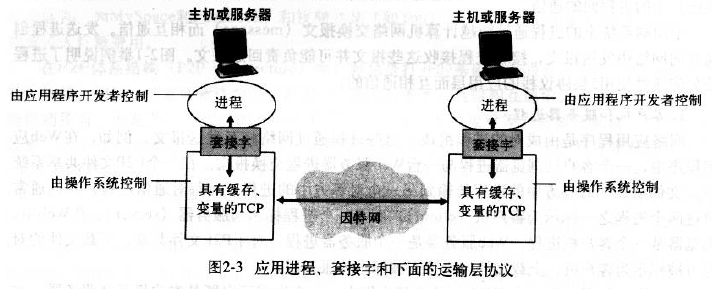

### 3. 应用程序服务要求

> 应用程序服务要求**由运输层协议提供** 

- **可靠数据传输**：确保数据正确、完全的交付

  > **运输层协议**提供可靠数据传输

- **吞吐量**：发送进程向接收进程交付比特的速率

  > - **运输层协议**以特定速率提供确保的可用吞吐量
  > - **带宽敏感应用**： 具有吞吐量要求的应用程序
  > - **弹性应用**： 根据需要充分利用可供使用的吞吐量

- **定时**

- **安全性**

### 4. 因特网提供的运输服务

- `TCP 服务`： 

  > **拥塞控制机制**： 当出现拥塞时，将抑制发送进程
  >
  > - 试图限制每个 TCP 连接，达到公平共享网络带宽目的
  > - 对有最低带宽限制的实时音频/视频应用而言，有害，此时使用 UDP 协议

  - **面向连接服务**： 

    > - **握手阶段**：数据传送之前，客户机与服务器交换运输层控制信息，提示客户机与服务器做好传输分组的准备
    > - **握手阶段之后**： 已建立了 TCP 连接，该连接是全双工的，即连接双方进程可在此连接上同时进行报文收发；报文发送结束后，连接断开

  - **可靠数据传输**： TCP 协议可保证字节传输时**无字节丢失和冗余**

- `UDP 服务`： 一种不提供不必要服务的轻量级运输层协议，仅提供最小服务

  > - UDP 无连接，即不需要握手过程
  > - UDP 不保证报文被接收，且接收的报文也可能是乱序的
  > - UDP 无拥塞控制机制
  >
  > 防火墙常被配置为阻塞 UDP 流量，所以更多使用 TCP 服务

**注意**： 

- TCP 与 UDP 未提供加密机制
- **安全套接字层(SSL)**：提供 TCP 加强的安全服务，如：加密、数据完整性和端点鉴别

### 5. 应用层协议

- **应用层协议**： 定义了运行在不同端系统上的应用程序进程如何相互传递报文
  - **交换的报文类型**： 如请求报文和响应报文
  - **各种报文类型的语法**： 如报文中的各个字段及其详细描述
  - **字段的语义**： 即包含在字段中的信息含义
  - 进程何时、如何发送报文及对报文进行**响应的规则** 

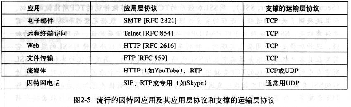

## 2. HTTP

### 1. 简介

- `HTTP`： **超文本传输协议**，web 的应用层协议，web 的核心；定义了报文的格式及客户机和服务器如何交换报文

  > - **HTTP 使用 TCP 协议**
  > - **HTTP 是一个无状态协议**，即 HTTP 服务器不保存关于客户机的任何信息

- **HTTP 默认使用流水线方式的持久连接**

  - **非持久连接**： 每个请求/响应对是经一个单独的 TCP 连接发送

    > **缺点**： 
    >
    > - 必须为每一个请求的对象建立和维护一个全新连接，会增加服务器负担
    > - 总是请求建立连接，增加网络时延

    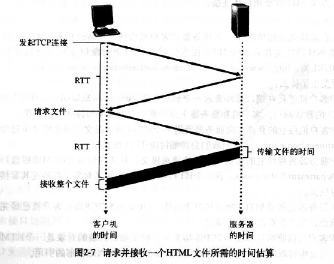

  - **持久连接**： 所有的请求及响应经相同的 TCP 连接发送

    > - 持久连接时，TCP 连接会保持打开，不同请求会通过相同连接来响应
    > - 经过一个时间间隔后，HTTP 服务器将关闭该 TCP 连接

### 2. HTTP 报文格式

- **请求报文**： 由客户端向服务器端发出的报文

  > - **请求行**： 为区分是请求报文还是响应报文，以及记录相应的 URL 和协议版本
  >
  >   > - **请求方法**：
  >   >
  >   >   - `GET`： 要求服务器将URL定位的资源放在响应报文的数据部分，回送给客户端
  >   >
  >   >   - `POST`： 将请求参数封装在HTTP请求数据中，以名称/值的形式出现，可以传输大量数据
  >   >   - `HEAD`： 只返回响应头，而不会发送响应内容；当检查页面状态时，HEAD 很高效
  >   >
  >   >   - `PUT`： 从客户端向服务器传送的数据取代指定的文档的内容
  >   >
  >   >   - `DELETE`： 请求服务器删除指定的页面
  >   >
  >   >   - `OPTIONS`： 允许客户端查看服务器的性能
  >   >
  >   >   - `TRACE`：回显服务器收到的请求，主要用于测试或诊断
  >   >   - `CONNECT`： HTTP/1.1 协议中预留给能够将连接改为管道方式的代理服务器
  >   >
  >   > - **URL**： 
  >   >
  >   > - **协议版本**： 
  >
  > - **请求头**： 用来通知服务器有关客户端请求的一些信息，由关键字/值对构成
  >
  >   > | 请求头            | 说明                                                |
  >   > | ----------------- | --------------------------------------------------- |
  >   > | `Host`            | 接受请求的服务器地址，可以是IP:端口号，也可以是域名 |
  >   > | `User-Agent`      | 发送请求的应用程序名称                              |
  >   > | `Connection`      | 指定与连接相关的属性，如Connection:Keep-Alive       |
  >   > | `Accept-Charset`  | 通知服务端可以发送的编码格式                        |
  >   > | `Accept-Encoding` | 通知服务端可以发送的数据压缩格式                    |
  >   > | `Accept-Language` | 通知服务端可以发送的语言                            |
  >
  > - **请求包体**： 用来传输具体数据报文
  >
  >   > 请求头和请求正文之间会有一个空行，告诉服务器端请求头已经结束
  >
  > 
  >
  
- **响应报文**： 从服务端到客户端的报文

  > - **状态行**： 
  >
  >   - **协议版本**： 
  >
  >   - **状态码**： 
  >
  >     > - `1xx`：指示信息--表示请求已接收，继续处理
  >     > - `2xx`：成功--表示请求已被成功接收、理解、接受
  >     > - `3xx`：重定向--要完成请求必须进行更进一步的操作
  >     > - `4xx`：客户端错误--请求有语法错误或请求无法实现
  >     > - `5xx`：服务器端错误--服务器未能实现合法的请求
  >     >
  >     > 常见状态码：
  >     >
  >     > - `200 OK`·：客户端请求成功
  >     > - `400 Bad Request`：客户端请求有语法错误，不能被服务器所理解
  >     > - `401 Unauthorized`：请求未经授权
  >     > - `403 Forbidden`：服务器收到请求，但是拒绝提供服务
  >     > - `404 Not Found`：请求资源不存在
  >     > - `500 Internal Server Error`：服务器发生不可预期的错误
  >     > - `503 Server Unavailable`：服务器当前不能处理客户端的请求
  >
  >   - **状态描述符**： 
  >
  > - **响应头部**： 
  >
  >   > | 响应头             | 说明                                     |
  >   > | ------------------ | ---------------------------------------- |
  >   > | `Server`           | 服务器应用程序软件的名称和版本           |
  >   > | `Content-Type`     | 响应正文的类型（是图片还是二进制字符串） |
  >   > | `Content-Length`   | 响应正文长度                             |
  >   > | `Content-Charset`  | 响应正文使用的编码                       |
  >   > | `Content-Encoding` | 响应正文使用的数据压缩格式               |
  >   > | `Content-Language` | 响应正文使用的语言                       |
  >
  > - **响应正文**： 用来传输响应数据
  >
  > 

### 3. Cookie

- 允许站点跟踪用户

- 组成： 

  > - HTTP 响应报文中有一个 cookie 首部行
  > - HTTP 请求报文中有一个 cookie 首部行
  > - 用户端系统中保留一个 cookie 文件，由用户浏览器管理
  > - web 站点有一个后端数据库

  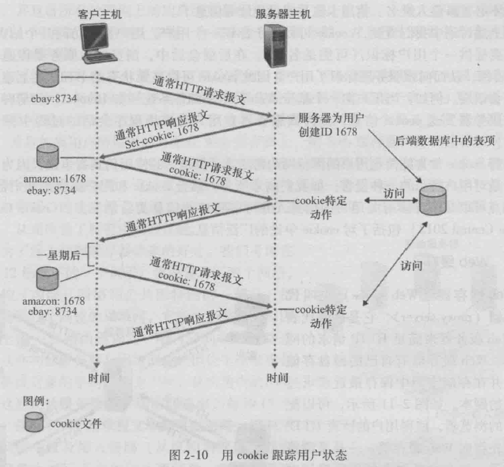

### 4. web 缓存

- **web 缓存(代理服务器)**： 能代表初始 web 服务器来满足 HTTP 请求的网络实体

  > web 缓存器有自己的磁盘空间，并在该存储空间中保存最近请求过的拷贝
  >
  > 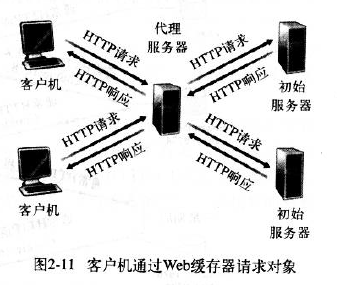

- **过程**： 

  - 浏览器建立Web缓存器的TCP连接，向缓存器发送HTTP请求
  - Web缓存器检查是否本地存储了该副本对象：
    - 若有，则向浏览器用 HTTP 响应报文返回对象
    - 若没有，则建立与该对象初始服务器的TCP连接，通过向初始服务器发送 HTTP 请求接受 HTTP 响应
  - Web缓存器接收到该对象后，在本地存储一份副本，并向客户浏览器用HTTP响应发送该副本

- **优点**： 

  - 大大减少对客户请求的响应时间
  - 减少一个机构到因特网的通信量

- **更新：条件GET方法更新缓存**

  > 满足条件：
  >
  > - 请求报文使用 GET 方法
  > - 请求报文包含一个 `If-modified-since:首部行`
  >
  > 执行过程：
  >
  > - 代理缓存器先向 web 服务器发送请求报文
  >
  > - 代理缓存器缓存响应报文
  >
  > - 通过缓存器请求同一对象时，缓存器将发送一个条件 GET 执行更新检查
  >
  >   > 根据 `If-modified-since:首部行` 中的日期是否修改过来决定是否进行更新操作
  >
  > - web 服务器向缓存器发送响应报文

## 3. FTP：文件传输协议

- **FTP(文件传输协议)**： 运行在 TCP 上，但使用两个并行的 TCP 连接来传输文件：

  > 控制连接贯穿整个用户会话期间，即 FTP 将保存用户状态信息
  >
  > 每一次文件传输都需要建立一个数据连接

  - **控制连接**： 用于在两个主机间传递控制信息，如： 用户标识、口令、操作命令
  - **数据连接**： 用于传输文件

  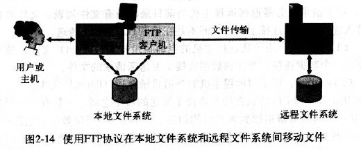

- 根据数据连接是否是服务器端主动建立，FTP 有主动和被动两种模式：

  > - **主动模式**要求客户端开放端口号给服务器端，需要去配置客户端的防火墙
>
  > - **被动模式**只需要服务器端开放端口号即可，无需客户端配置防火墙
>
  >   > 但被动模式会导致服务器端的安全性减弱，因为开放了过多的端口号

  - **主动模式**：服务器端主动建立数据连接，其中服务器端的端口号为 20，客户端的端口号随机，但是必须大于 1024，因为 0\~1023 是熟知端口号

    

  - **被动模式**：客户端主动建立数据连接，其中客户端的端口号由客户端自己指定，服务器端的端口号随机

    
  
- FTP 常见命令：

  - `USER username`： 用于向服务器传送用户标识

  - `PASS password`： 用户向服务器传送用户口令

  - `LIST`： 用于请求服务器返回远程主机当前目录的所有文件列表

    > 文件列表在数据连接(新建的非持久连接)上传送

  - `RETR filename`： 用于从远程主机的当前目录检索文件

    > 该命令触发远程主机发起一个数据连接，并在该数据连接上发送所请求的文件

  - `STOR filename`： 用于向远程主机的当前目录存放文件

## 4. 电子邮件协议

> - 一个电子邮件系统由三部分组成：用户代理、邮件服务器以及邮件协议
> - 邮件协议包含发送协议和读取协议，**发送协议常用 SMTP，读取协议常用 POP3 和 IMAP**
>
> 

### 1. SMTP: 简单邮件传输协议

> 电子邮件的主要应用层协议，使用 TCP 可靠数据传输服务

- 发送邮件前后，需要进行**二进制多媒体数据与 ASCII 码的转换**

**与 HTTP 的对比**：

- 相同点：
  - 都是从一台主机向另一台主机传送文件
  - 都是用持久连接

- 不同点：
  - SMTP是推协议，由发送方发起；HTTP是拉协议，有接收方发起
  - SMTP 邮件采用 `7bit ASCII` 编码，HTTP 没有限制
  - 对于包含文本和图形的文档：SMTP 把所有对象放在一个报文里，HTTP 把每个对象放在响应报文中

非 ASCII 码数据的 **MIME(多用途因特网邮件扩展)** 扩展：

- 支持多媒体的两个关键 MIME 首部：
  - `Content-Type`： 首部允许接收用户代理对报文采取适当的动作
  - `Content-Transfer-Encoding`： 提示接收用户代理该报文主体已使用了 ASCII 编码，并指出所有的编码类型
- 接收的报文： 接收服务器在报文顶部添加 `Received`
  - `Received`： 定义了发送该报文的 SMTP 服务器的名称，接收该报文的 SMTP 服务器名称，以及接收服务器接收到的时间

### 2. POP3: 第三版邮局协议

POP3 只能将邮件下载到本地，没有提供远程操作

按照三个阶段工作：

- **特许阶段**： 用户代理发送(明文发送)用户名和口令以鉴别用户
- **事务处理阶段**： 用户代理取回报文，对报文做删除标记、取消报文删除标记、获取邮件的统计信息
- **更新阶段**： 结束该 POP3 会话，出现在客户机发出 quit 命令之后

### 3. IMAP: 因特网邮件访问协议

- IMAP 给用户提供远程操作报文的方法，如：远程移动报文、远程创建文件夹、远程条件查询邮件
- 允许用户代理获取报文组件

### 4. HTTP 邮件

- 基于 web 的电子邮件，使用**HTTP**在浏览器和邮件服务器之间发送和接受邮件，但是邮件服务器之间使用SMTP发送接收邮件

## 5. DNS

> - DNS 为应用层协议，可以使用 UDP 或者 TCP 进行传输，使用的端口号都为 53
>
> - DNS 一般用 UDP 进行传输，这就要求域名解析器和域名服务器都必须自己处理超时和重传来保证可靠性
>
>   在两种情况下会使用 TCP 进行传输：
>   - 如果返回的响应超过 512 字节（UDP 最大只支持 512 字节的数据）
>   - 区域传送（区域传送是主域名服务器向辅助域名服务器传送变化的那部分数据）

### 1. DNS 提供的服务

- **DNS 是**：
  - 一个由分层的 DNS 服务器实现的分布式数据库
  - 一个允许主机查询分布式数据库的应用层协议
- DNS 提供的服务：
  - **进行主机名到 IP 地址的转换**
  - **主机别名**： 应用程序可调用 DNS 来获得主机别名对应的规范主机名和主机的 IP 地址
  - **邮件服务器别名**： 电子邮件应用程序调用 DNS 对提供的邮件服务器别名进行解析，以获得该主机的规范主机名及其 IP 地址
  - **负载分配**： DNS 可用于在冗余的服务器间进行负载分配

### 2. DNS 工作机理

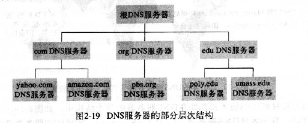

- **分布式、层次数据库**

  > - **根 DNS 服务器**： 因特网有 13 个根 DNS 服务器，每台服务器都是冗余服务器的集群，以提供安全性和可靠性
  > - **顶级域(TLD) DNS 服务器**： 负责顶级域名(如： com、org、net 等)和所有国家的顶级域名
  > - **权威 DNS 服务器**： 提供可访问主机的组织同时提供可访问的 DNS 记录，记录了主机名与 IP 地址的映射关系
  > - **本地 DNS 服务器**： 主要用于局域网中的 DNS 请求分发(实际并不属于 DNS 服务器的层次结构)
  >
  > 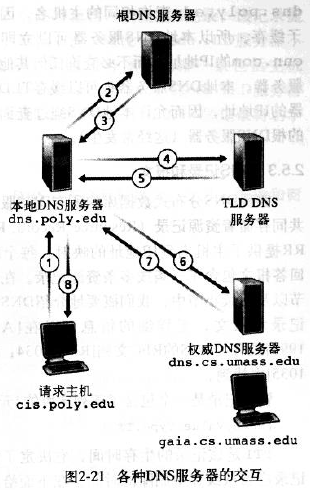

- **DNS 缓存**： 为了改善时延性能并减少在因特网上到处传输的 DNS 报文数量

  > - 当 DNS 服务器接收 DNS 回答时，会将回答中的信息缓存在本地存储器
  > - 当请求 DNS 服务器时，若该 DNS 服务器有相应缓存，则直接返回，不用再递归查询 DNS 服务器

### 3. DNS 记录和报文

- **资源记录(RR)**： 由所有 DNS 服务器共同存储，提供了主机名到 IP 地址的映射

  > - 每个 DNS 回答报文包含了一条或多条资源记录

- 资源记录包含一个四元组 `(Name,Value,Type,TTL)`：

  > - `TTL`： 是该资源记录的生存时间，决定了资源记录应当从缓存中删除的时间
  >
  > - 若 `Type=A`，则 Name 是主机名，Value 是主机名的 IP 地址
  >
  > - 若 `Type=NS`，则 Name 是域，Value 是该域的权威 DNS 服务器的主机名
  >
  >   > 用于沿着查询链路进一步路由 DNS 查询
  >
  > - 若 `Type=CNAME`，则 Value 是别名为 Name 的主机对应的规范主机名
  >
  >   > 用于向请求主机提供一个主机名对应的规范主机名
  >
  > - 若 `Type=MX`，则 Value 是别名为 Name 的邮件服务器的规范主机名
  >
  >   > 通过使用 MX 记录，邮件服务器可与其他类型服务器同名
  >   >
  >   > - 为获得邮件服务器的规范主机名，应请求 MX 记录
  >   > - 为获得其他类型服务器的规范主机名，应请求 CNAME 记录

- **DNS 报文**： 

  > 
  >
  > - **头部区域**：占 12 字节
  >
  >   - **会话标识(2 字节)**： 是 DNS 报文的 ID 标识，通过它可以区分 DNS 应答报文对应的请求报文
  >
  >   - **标志(2 字节)**： 
  >
  >     > |    标志位    | 作用                                                      |
  >     > | :----------: | --------------------------------------------------------- |
  >     > |   QR(1bit)   | 查询/响应标志，0为查询，1为响应                           |
  >     > | opcode(4bit) | 0 表示标准查询，1 表示反向查询，2 表示服务器状态请求      |
  >     > |   AA(1bit)   | 表示授权回答                                              |
  >     > |   TC(1bit)   | 表示可截断的                                              |
  >     > |   RD(1bit)   | 表示期望递归                                              |
  >     > |   RA(1bit)   | 表示可用递归                                              |
  >     > | rcode(4bit)  | 表示返回码，0表示没有差错，3表示名字差错，2表示服务器错误 |
  >
  >   - **数量字段（总共8字节）：**
  >
  >     > - `Questions`： 表示查询问题区域节的数量
  >     > - `Answers`： 表示回答区域的数量
  >     > - `Authoritative namesversers`： 表示授权区域的数量
  >     > - `Additional recoreds`： 表示附加区域的数量
  >
  > - **问题区域**：
  >
  >   > 
  >   >
  >   > - **查询名：**长度不固定，且不使用填充字节
  >   >
  >   > - **查询类型**： 
  >   >
  >   >   | 类型 | 助记符 | 说明               |
  >   >   | :--- | :----- | ------------------ |
  >   >   | 1    | A      | 由域名获得IPv4地址 |
  >   >   | 2    | NS     | 查询域名服务器     |
  >   >   | 5    | CNAME  | 查询规范名称       |
  >   >   | 6    | SOA    | 开始授权           |
  >   >   | 11   | WKS    | 熟知服务           |
  >   >   | 12   | PTR    | 把IP地址转换成域名 |
  >   >   | 13   | HINFO  | 主机信息           |
  >   >   | 15   | MX     | 邮件交换           |
  >   >   | 28   | AAAA   | 由域名获得IPv6地址 |
  >   >   | 252  | AXFR   | 传送整个区的请求   |
  >   >   | 255  | ANY    | 对所有记录的请求   |
  >   >
  >   > - **查询类**：通常为1，表明是 Internet 数据
  >
  > - **资源记录(RR)区域（包括回答区域，授权区域和附加区域）**：
  >
  >   > 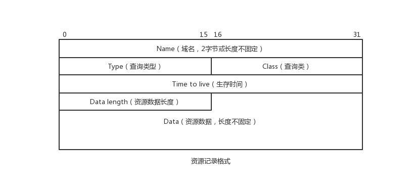
  >   >
  >   > - **域名(2字节或不定长)**： 格式与 Queries 区域的查询名字字段相同，但当报文中域名重复出现时，该字段使用 2 个字节的偏移指针来表示
  >   >
  >   > - **查询类型**： 表明资源纪录的类型
  >   >
  >   > - **查询类**： 对于Internet信息，总是 IN
  >   >
  >   > - **生存时间(TTL)：**： 以秒为单位，表示的是资源记录的生命周期
  >   >
  >   >   > - 用于当地址解析程序取出资源记录后决定保存及使用缓存数据的时间
  >   >   > - 也可以表明该资源记录的稳定程度，极为稳定的信息会被分配一个很大的值
  >   >
  >   > - **资源数据**：是一个可变长字段，表示按照查询段的要求返回的相关资源记录的数据

- **DNS 攻击**： DDoS 带宽洪泛攻击，中间人攻击等

## 6. P2P: 对等请求

### 1. P2P 文件分发

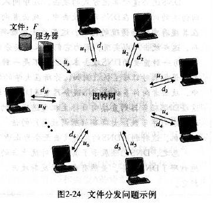

- **P2P 体系结构的扩展性**： 每个对等方都能重新分发该文件的任何部分，从而协助服务器进行分发操作

- `BitTorrent`： 用于文件分发的流行 P2P 协议

  > - **洪流**：  参与一个特定文件分发的所有对等方的集合
  >
  > - **追踪器**： 洪流的基础设施节点，当对等方加入洪流，则会向追踪器注册并周期性的通知追踪器
  >
  > - **最稀罕优先**： 周围对等方中拷贝数量最少的文件块，并优先请求
  >
  >   > - 目标： 均衡每个块在洪流中的拷贝数量，使最稀罕块更迅速的重新分发
  >
  > - **对换算法**： 优先响应那些能以最高速率供给数据的对等方的请求
  >
  >   > - 每次选择最高速率的四个对等方
  >   >
  >   > - 每 10s 重新计算速率并可能修改这四个对等方
  >   >
  >   > - 每 30s 随机选择一个探测对等方并与原始的其中一个对等方进行对换
  >   >
  >   >   > 目的： 让新的对等方得到块，从而消除某对等方只下载文件而不上传文件的问题

### 2. P2P 区域信息搜索

> **信息索引**： 信息到主机位置的映射，并动态更新和搜索索引

- **集中式索引**： 定位文件的最直接办法

  > 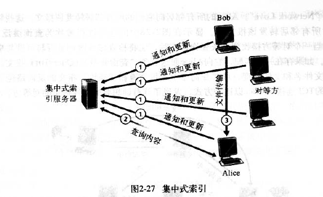
  >
  > **缺点**：
  >
  > - 单点故障
  > - 性能瓶颈和基础设施费用
  > - 版权侵犯

- **查询洪泛**： 建立在 `Gnutella` 协议之上，索引分布式的分布在对等方区域中，每个对等方索引提供共享文件但不索引其他文件

  > 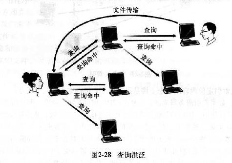

- **层次覆盖**： 将少量更强大的对等方指派为超级对等方

  > 

## 7. DHCP: 动态主机配置协议

- `DHCP`作用： 可以为本组织内的主机或路由器分配 IP 地址

  > DHCP 使主机自动获取 IP 地址等网络配置信息并使主机接入网络，所以也称为**即插即用协议** 
  >
  > - 当有一台主机加入时，DHCP服务器从其当前可用的地址池中分配一个任意地址给它
  > - 当一台主机离开时，其地址便被收回到这个池中

DHCP 工作过程如下：

- **DHCP 服务器发现**： 新加入的主机发送 Discover UDP 报文，该报文被广播到同一个子网的所有主机

  > 该报文的目的地址为 `255.255.255.255:67`，源地址为 `0.0.0.0:68`

- **DHCP 服务器提供**： DHCP 服务器收到一个 DHCP Discover 报文时，将响应 DHCP offer 报文

  > - 这里仍然会使用广播地址 `255.255.255.255` 作为目的地址（现在客户主机并没有地址）
  > - 一个子网中可能会存在好几台 DHCP 服务器，因此客户主机会在几个 DHCP 服务器间进行优越选择
  >
  > DHCP offer 报文包含：发现报文的事务 ID、向客户推荐的 IP 地址、网络掩码、以及IP地址租用期(IP地址的有效时间量)

- **DHCP 请求**： DHCP offer 报文到达客户主机后，客户主机发送 DHCP request  报文进行响应，回显配置参数

  > 这里的数据报目的 IP 地址仍为广播地址，且只有被客户主机选中的 DHCP 服务器会响应

- **DHCP ACK**： DHCP 服务器使用 `DHCP ACK` 报文对 DHCP 请求报文进行响应，证实所要求的参数

  > 如果服务器无法分配包含在 `DHCP REQUEST` 消息中的地址，该服务器将会响应一个 `DHCP NAK` 消息

**客户主机更新租约**： 

- 若一个主机已有一个 IP 地址并希望更新其租约，则可以跳过最初的 `DHCP DISCOVER/DHCP OFFER` 消息，直接通过 `DHCP REQUSEST` 消息请求当前当前正在使用的地址，然后协议运作流程如前所述，服务器可能同意或拒绝该要求

- 客户需要配置其他信息，可使用 `DHCP INFORM` 消息代替 `DHCP REQUEST` 消息向服务器发出请求，表明想获取其他配置信息，此消息导致服务器会返回一个 `DHCP ACK` 消息，其中包含请求的额外信息

## 8. Web 页面请求过程

1. **DHCP 配置主机信息**

2. **ARP 解析 MAC 地址**

3. **DNS 解析域名**

4. **HTTP 请求页面**

# 三、运输层

## 1. 简介

- **运输层与网络层的关系**： 
  - 运输层为不同主机上的**进程**提供逻辑通信
  - 网络层提供**主机**之间的逻辑通信

- **运输层的多路复用与多路分解**： 将主机间的交付扩展到进程间交付
  - **多路分解**： 将运输层报文段中的数据交付到正确的套接字的工作
  - **多路复用**： 从源主机的不同套接字收集数据块并封装上首部信息从而生成报文段，然后将报文段传递到网络层的工作

## 2. UDP

**UDP 优势**：

- 应用层能更好的控制要发送的数据和发送时间
- 无需建立连接
- 无连接状态
- 分组首部开销小，仅有 8 字节的首部开销

### 1. UDP 报文段结构

### 2. UDP 校验和

- **UDP 校验和**： 提供差错检测功能，即用于确定当 UDP 报文段从源主机到达目的主机时，其中的比特是否会发生改变

  > 发送方的UDP报文段中的所有 16 比特字的和进行反码运算，求和时的溢出被回卷，结果放入检验和字段

- UDP 必须在端到端基础上在运输层进行差错检测，即**端到端原则**

## 3. TCP

### 1. TCP 首部结构

- **序号**  ：用于对字节流进行编号

  > 如果第一个字节的编号为 301，如果携带的数据长度为 100 字节，那么下一个报文段的序号应为 401

- **确认号**  ：期望收到的下一个报文段的序号

  > 如果 B 正确收到 A 发送来的一个报文段，序号为 501，携带的数据长度为 200 字节，因此 B 期望下一个报文段的序号为 701，B 发送给 A 的确认报文段中确认号就为 701

- **数据偏移**  ：指的是数据部分距离报文段起始处的偏移量，实际上指的是首部的长度

- **确认 ACK**  ：当 `ACK=1` 时确认号字段有效，否则无效

  > TCP 规定，在连接建立后所有传送的报文段都必须把 ACK 置 1

- **同步 SYN**  ：在连接建立时用来同步序号

  > 当 `SYN=1，ACK=0` 表示这是一个连接请求报文段；若对方同意建立连接，则响应报文中 `SYN=1，ACK=1`

- **终止 FIN**  ：用来释放一个连接，当 `FIN=1` 时，表示此报文段发送方的数据已发送完毕，并要求释放连接

- **窗口**  ：窗口值作为接收方让发送方设置其发送窗口的依据，因为接收方的数据缓存空间有限

### 2. TCP 三次握手

TCP 连接建立过程(**三次握手**)：假设 A 为客户端，B 为服务器端

- **第一步**： A 向 B 发送连接请求报文，`SYN=1，ACK=0`，选择一个初始的序号 `x`

  > 客户端的 TCP 首先向服务器端的 TCP 发送一个特殊的 TCP 报文段(SYN 报文段)
  >
  > - 该报文段不含应用层数据
  > - 报文段首部的 `SYN` 标志位置为 1

- **第二步**： B 收到连接请求报文，如果同意建立连接，则向 A 发送连接确认报文 `SYN=1，ACK=1`，确认号为 `x+1`，同时也选择一个初始的序号 `y`

  > 提取 TCP SYN 报文段，为该 TCP 连接**分配 TCP 缓存和变量**，并向客户机 TCP 发送允许连接的报文段(SYNACK 报文段)
  >
  > - 该阶段易受 SYN 洪泛拒绝服务攻击
  > - 该报文段也不含应用层数据
  > - 首部的 `SYN` 被置为 1，确认号字段被置为 `client_isn+1`，服务器选择的初始序号(`server_isn`) 被放置到 TCP 报文段首部的序号字段中

- **第三步**： A 收到 B 的连接确认报文后，还要向 B 发出确认，确认号为 `y+1`，序号为 `x+1`

  > 收到 SYNACK 报文段后，客户机为该连接分配缓存和变量
  >
  > - 客户机还会向服务器发送一个报文段，用于对服务器的允许连接进行确认
  >
  >   > 客户机通过将 `server_isn+1` 放置到 TCP 报文段首部的确认字段来完成此项工作
  >
  > - 首部的 `SYN` 置为 0

- B 收到 A 的确认后，连接建立

**三次握手的原因** 

- 第三次握手是为了防止失效的连接请求到达服务器，让服务器错误打开连接

  > - 客户端发送的连接请求如果在网络中滞留，则会隔很长时间才能收到服务器端发回的连接确认，客户端等待一个超时重传时间之后，就会重新请求连接
  >
  > - 滞留的连接请求最后还是会到达服务器，如果不进行三次握手，那么服务器就会打开两个连接
  > - 如果有第三次握手，客户端会忽略服务器之后发送的对滞留连接请求的连接确认，不进行第三次握手，因此就不会再次打开连接

### 3. TCP 四次挥手

以下描述不讨论序号，确认号，ACK：

- A 发送连接释放报文，`FIN=1`
- B 收到之后发出确认，此时 TCP 属于半关闭状态，B 能向 A 发送数据但 A 不能向 B 发送数据
- 当 B 不再需要连接时，发送连接释放报文，`FIN=1`
- A 收到后发出确认，进入 `TIME-WAIT` 状态，等待 `2 MSL`（最大报文存活时间）后释放连接
- B 收到 A 的确认后释放连接

**四次挥手的原因** 

- 客户端发送 FIN 连接释放报文后，服务器收到这个报文，就进入 `CLOSE-WAIT` 状态。这个状态是为了让服务器端发送还未传送完毕的数据，传送完毕之后，服务器会发送 `FIN` 连接释放报文

**TIME_WAIT** 

客户端接收到服务器端的 FIN 报文后进入此状态，此时并不是直接进入 CLOSED 状态，还需要等待一个时间计时器设置的时间 2MSL。这么做有两个理由：

- 确保最后一个确认报文能够到达。如果 B 没收到 A 发送来的确认报文，那么就会重新发送连接释放请求报文，A 等待一段时间就是为了处理这种情况的发生
- 等待一段时间是为了让本连接持续时间内所产生的所有报文都从网络中消失，使得下一个新的连接不会出现旧的连接请求报文

### 4. TCP 可靠数据传输

- **可靠数据传输协议(停等协议)**： 

  > 防差错机制：
  >
  > - **差错检测(检验和)**： 检测何时出现比特差错
  >
  > - **重传**： 接收方收到有差错的分组时，发送方将重传该分组
  >
  >   > 重传的情况：TCP 采用**超时/重传机制**来处理报文段的丢失
  >   >
  >   > - **超时**： 
  >   >
  >   >   > - **重传超时(RTO)**： 在发送方发送后一段时间未收到 ACK 后会重传
  >   >   >
  >   >   >   > `RTO=EstimatedRTT  + 4*DevRTT`： **往返延时的均值 + 4倍的偏差**
  >   >
  >   > - **基于计时器的重传**： 
  >   >
  >   >   > - TCP 会为每个报文设立重传计时器，当收到 ACK 后就会取消
  >   >   > - **发生超时重传后，会让超时时间加倍**
  >   >
  >   > - **快速重传**： 
  >   >
  >   >   > - **快速重传的原因**： 收到了多个重复的 ACK，一般设置为 3
  >   >   >
  >   >   >   > 因为这种情况说明某个数据报丢失，而之后的数据报抵达，所以期望收到的是同一个数据报
  >   >
  >   > - **带选择确认的重传**： 
  >   >
  >   >   > - 在 TCP 中有一个 `SACK` 选项用于实现选择重传
  >   >   >
  >   >   > 让发送方仅重传那些可能出错的分组，从而避免不必要的重传
  >
  > - **序号**： 将发送的数据分组进行编号，避免冗余分组
  >
  > - **确认号(ACK 分组)**： 发送方若接收到对同一分组的**两个 ACK**，说明**接收方没有正确接收**到正确分组
  >
  >   > - 当接收到正确分组时，接收方发送一个**肯定确认(ACK)**
  >   > - 当接收到受损分组时，发送一个**否定确认(NAK)**
  >   > - 如果不发送NAK，而是对上次正确接收的分组发送一个ACK，也可以实现一样的效果
  >
  > - **倒计数定时器**： 在一个给定的时间过期后，可进行数据重传
  >
  >   > 发送方：
  >   >
  >   > - 每次发送一个分组时，启动一个定时器
  >   > - 响应定时器中断
  >   > - 终止定时器
  >
  > 相关协议：
  >
  > - **自动重传请求协议(ARQ)**：控制报文让接收方可以确认哪些内容需要重传
  >
  > - **停等协议**： 接收到 NAK 分组，则进行重传；接收到 ACK 时，接收方才继续获取数据；发送方确认接收方正确接收当前分组时，才会发送新数据

- **流水线可靠数据传输协议**：  

  >**数据传输过程中可能出现的情况**：
>
  >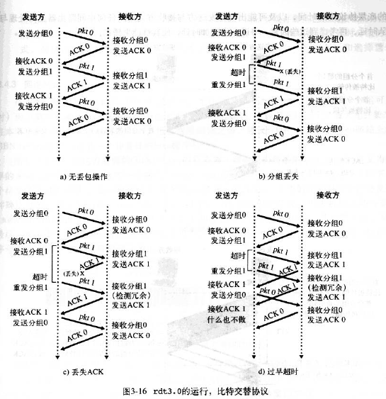
>
  >- **流水线技术**：  发送方连续发送多个分组而无需等待确认
  >
  >  > 带来的影响：
  >  >
  >  > - 增加序号范围
  >  > - 增加分组缓存器容量
  >  > - 流水线差错恢复：回退 N 步、选择重传
  >
  >**停等协议与流水线协议的对比**：明显加快了分组传输效率
  >
  >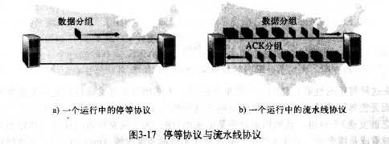
  
- **回退 N 步(GBN)**： 

  >GBN 下的序号分为：
  >
  >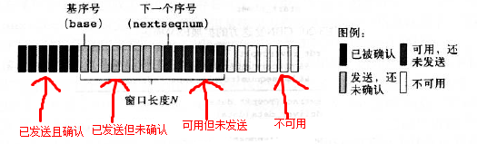
  >
  >- **基序号**： 最早的未确认分组的序号
  >- **下一个序号**： 最小的未使用序号

### 5. TCP 滑动窗口

- 窗口用来暂时存放字节流，接收方通过 TCP 报文段中的窗口字段告诉发送方自己的窗口大小，发送方根据这个值和其它信息设置自己的窗口大小

- 发送窗口内的字节都允许被发送，接收窗口内的字节都允许被接收

  > - 如果发送窗口左部的字节已经发送并且收到了确认，就将发送窗口向右滑动一定距离，直到左部第一个字节不是已发送并且已确认的状态
  > - 接收窗口的滑动类似，接收窗口左部字节已经发送确认并交付主机，就向右滑动接收窗口

- 接收窗口只会对窗口内最后一个按序到达的字节进行确认

  > 例如： 接收窗口已经收到的字节为 {31, 34, 35}，其中 {31} 按序到达，而 {34, 35} 就不是，因此只对字节 31 进行确认。发送方得到一个字节的确认之后，就知道这个字节之前的所有字节都已经被接收

### 6. TCP 流量控制

流量控制是为了控制发送方发送速率，保证接收方来得及接收

接收方发送的确认报文中的窗口字段可以用来控制发送方窗口大小，从而影响发送方的发送速率。将窗口字段设置为 0，则发送方不能发送数据

- **流量控制**： 以消除发送方使接收方缓存溢出的可能性，即抑制发送方的发送速率（**与拥塞控制不同**）

  > - **拥塞控制是一个全局性的过程**
  > - **流量控制指点对点通信量的控制**

- TCP 通过让连接两端的发送方都维护一个**接收窗口**变量来提供流量控制

  > **接收窗口用于告诉发送方，该接收方还有多少可用的缓存空间** 

### 7. 拥塞控制

- **拥塞控制**： 是为防止过多的数据注入网络中，防止网络中的路由器或链路过载

  > - **拥塞控制是一个全局性的过程**
  >
  > - **流量控制指点对点通信量的控制**

- **满开始与拥塞避免**

  > - 发送方维持一个**拥塞窗口(cwnd)**，大小取决于拥塞程度，会动态变化
  >
  > - **满开始**： 先探测网络的拥塞程度，即由小到大逐渐增加拥塞窗口的大小
  >
  > - **拥塞避免**： 为防止 cwnd 增长过大引起网络拥塞，还需设置一个慢开始门限 `ssthresh` 状态变量
  >
  >   >  当判断网络出现拥塞，就把慢开始门限设置为**发送窗口的一半**，然后把拥塞窗口设置为 1
  >   >
  >   > - `cwnd < ssthresh`： 使用慢开始算法
  >   > - `cwnd > ssthresh`： 改用拥塞避免算法
  >   > - `cwnd = ssthresh`： 慢开始与拥塞避免算法任意
  >   >
  >   > 两种算法： 
  >   >
  >   > - **拥塞避免算法**： 每经过一个往返时间 RTT 就把发送方的拥塞窗口 cwnd 加 1，而不是加倍
  >   > - **慢开始算法**：每经过一个往返时间 RTT 就把发送方的拥塞窗口 cwnd 加倍

- **快重传与快恢复**

  > - **快重传**： 要求接收方在收到一个失序的报文段后就立即发出重复确认
  >
  > - **快重传算法**： 发送方只要一连收到3个(默认为 3)重复确认就应当立即重传对方尚未收到的报文段
  >
  > - **快恢复算法**： 当发送方连续收到三个重复确认时，就执行“乘法减小”算法，把 ssthresh 门限减半，同时将 cwnd 设置为 ssthresh 的大小，并执行拥塞避免算法
  >
  >   > 收到好几个重复的确认使发送方认为网络可能没有出现拥塞，从而不执行慢开始算法

- **随机早期检测 RED**

  > - **路由器尾部丢弃策略**： 路由器通常按照先进先出的策略处理到来的分组，当路由器的缓存装不下分组的时候就丢弃到来的分组
  >
  > - **全局同步**： 许多 TCP 连接在同一时间进入慢开始状态，网络恢复正常后，通信量又突然增大
  >
  >   > - 第一： 路由器尾部丢弃策略会导致分组丢失，进而使发送方认为网络产生拥塞
  >   > - 第二： 网络中的TCP连接中的报文段通常是复用路由路径，若发生路由器的尾部丢弃，可能影响到很多条TCP连接，**导致许多 TCP 连接在同一时间进入慢开始状态**
  >
  > - **路由器采用随机早期检测(RED)**： 以概率 p 随机丢弃分组，让拥塞控制只在个别的 TCP 连接上执行，因而避免全局性的拥塞控制
  >
  >   > - 首先，路由器队列维持两个参数： **队列长队最小门限 min 和最大门限 max**，每当一个分组到达时，RED 就计算平均队列长度
  >   > - 然后，分情况处理到来的分组：
  >   >   - 平均队列长度**小于**最小门限： 把新到达的分组放入队列排队
  >   >   - 平均队列长度在最小门限与最大门限之间： 按照某一概率将分组丢弃
  >   >   - 平均队列长度**大于**最大门限： 丢弃新到达的分组

# 四、网络层

> 网络层的三个主要主件：
>
> - **IP 协议**： 编址规则、数据报格式、分组处理规则
> - **选路协议**： 路径选择、RIP、OSPF、BGP
> - **互联网控制报文协议(ICMP)**： 差错报告、路由器信令
>
> 与 IP 协议配套使用的还有三个协议：
>
> - 地址解析协议 `ARP`
>
> - 网际控制报文协议 `ICMP`
>
> - 网际组管理协议 `IGMP` 
>
>   

## 1. 简介

- **网络层作用**： 将分组从一台发送主机移动到一台接收主机

- **网络层功能**：

  - **转发**： 当一个分组到达某路由器的一条输入链路时，该路由器将分组移动到适当的输出链路

  - **选路**： 当分组从发送方流向接收方时，网络层将决定这些分组所采用的路由或路径(选路算法)

    > - 每个路由器都具有一张**转发表**
    > - 路由器通过检查到达分组的首部的字段的值并在转发表中索引查询，从而来决定转发一个分组
    > - 查询转发表的结果是分组将被转发的路由器的链路接口

  - **连接建立**： 源到目的地的路径进行握手，以便在分组交换前，确定在源到目的地连接之间建立起连接状态，类似运输层的 TCP 握手

- **分组交换机**：分组交换设备，根据分组首部字段中的值，从输入链路接口到输出链路接口传送分组

  - **链路层交换机**： 基于**链路层字段中的值**作转发决定
  - **路由器**： 基于**网络层字段中的值**作转发决定

- **网络服务模型**： 定义网络的一侧边缘到另一侧边缘之间分组的端到端运输特性

- 当运输层向网络层传递分组时，网络层提供的服务：
  - **确保交付**： 该服务确认分组最终达到目的地
  - **具有时延上界的确保交付**： 确保在时延上界内交付
  - **有序分组交付**： 该服务确保分组以它们被发送的顺序到达目的地
  - **确保最小带宽**： 发送主机以==低于==特定比特率的速率传输比特，分组就不会丢失
  - **确保最大时延抖动**： 确保发送方发送的两个相继分组之间的时间量等于在目的地接收到之间的时间量
  - **安全性服务**： 网络层提供**数据加密、数据完整性、源鉴别**服务

- **虚电路(VC)网络**： 仅在网络层提供==连接服务==的计算机网络

  > - **虚电路组成**：
  >   - 源和目的主机之间的路径
  >   - VC 号： 沿着该路径的每段链路分配一个号码
  >   - 沿着该路径的每台路由器中的转发表项
  >
  > - 虚电路的三个阶段：
  >
  >   > - 虚电路建立： 
  >   >
  >   >   > 虚电路建立期间，网络层可预留虚电路路径上的资源
  >   >   >
  >   >   > - 网络层确定发送方与接收方之间的路径，即分组要经过的一系列链路与路由器
  >   >   > - 网络层沿着该路径确定一个 VC 号
  >   >   > - 网络层在沿着路径的每台路由器的转发表中增加一项
  >   >
  >   > - 数据传送： 
  >   >
  >   > - 虚电路拆除： 
  >   >
  >   >   > - 网络层通知网络另一侧的端系统结束呼叫
  >   >   > - 更新路径上的每台路由器中的转发表
  >   >
  >   > 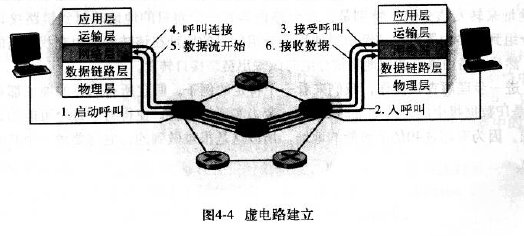
  >
  > - 虚电路网络中，路由器为连接维持**连接状态信息** 

- **数据报网络**： 仅在网络层提供==无连接服务==的计算机网络

  > - 每当一个端系统要发送分组时，就为该分组添加目的地端系统的地址，然后将该分组推进网络中

## 2. 路由器

> 路由器使用最长前缀匹配规则： 在转发表中寻找最长的匹配项，并向与最长前缀匹配的链路接口转发该分组

路由器组成：

- **输入端口**： 

  > 需要执行的功能：
  >
  > - 将一条输入的物理链路端接到路由器的物理层
  > - 与位于入链路远端的数据链路层交互
  > - 完成查找与转发，以便转发到路由器交换结构部分的分组能出现在适当的输出端口
  > - 控制分组从输入端口转发到选路处理器

- **交换结构**： 将路由器的输入端口连接到输出端口，**交换结构是网络路由器的网络**

- **输出端口**： 存储转发给它的分组，并将这些分组传输到链路

  > 执行的功能与输入端口相反

- **选路处理器**： 执行选路协议，维护选路信息和转发表，并执行路由器中的网络管理功能

### 1. 输入端口

**输入端口功能视图**： 

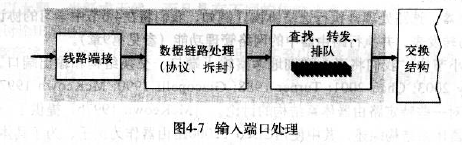

- 输入端口的选择是通过转发表中的信息进行的

- 输入端口存放转发表的拷贝，选路处理器进行转发表的计算

  > - 可在本地做出转发决策
  > - 避免在路由器中的某个单点产生转发处理的瓶颈
  > - 当输入端口处理能力受限时，可将分组转发给中央选路处理器，然后该处理器执行转发表查找并将分组转发到恰当的输出端口

- 加快转发表的查找速度：

  - 法一： 将转发表表项存放在一个树形数据结构中，树的每一级与目的地址的 1bit 对应

    > - 从树的根节点开始查找
    > - 若比特值为 0，则转向左子树；若比特值为 1，则转向右子树

  - 法二： 内容可寻址内存(CAM)： 允许一个 32bit IP 地址提交给 CAM，由它再以基本常数时间返回该地址对应的转发表表项内容

  - 法三： 将最近访问的转发表表项保存在高速缓存中

### 2. 交换结构

- 交换结构位于路由器的核心部位
- 通过交换结构，实现分组从一个输入端口交换到一个输出端口
- **交换结构速率**： 交换结构能从输入端口到输出端口移动分组的速率
- 三种交换技术：
  - **经内存交换**： 在 CPU(选路处理器)的直接控制下完成
  - **经一根总线交换**： 输入端口经一根共享总线将分组直接传送到输出端口，不需要选路处理器的干预
  - **经一个互联网交换**： 一个到达某输入端口的分组沿着连到输入端口的水平总线穿行，直至该水平总线与连到所希望的输出端口的垂直总线的交叉点

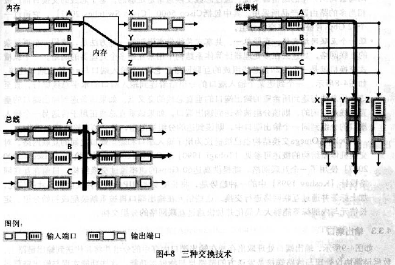

### 3. 输出端口

- **输出端口**： 处理取出存放在输出端口内存中的分组并将其传送到输出链路上

- 随着队列的增长，路由器的缓存空间将最终耗尽，且出现丢包

  > 分组丢失位置取决于流量的负载、交换结构的相对速率和线路速率

- **缓存空间长度**：
  
  
  - 法一： $缓存量(B) = 平均往返时延(RTT) * 链路容量(C)$
  
- 法二： $缓存量(B) = RTT * C / \sqrt{TCP 流(N)}$
  
- **分组调度程序**： 调度排队中的分组，如： 先来先服务(FCFS)调度，加权公平排队(WFQ)

- **主动队列管理(AQM)算法**： 实现分组丢弃与标记策略，解决缓存溢出时对新到来的分组的处理

  > - **随机早期检测(RED)算法**： 为一种 AQM 算法，为输出队列维护着一个加权平均值
  >
  >   > - 若队列长度小于最小阙值 min： 分组进入队列
  >   >
  >   > - 若队列长度大于最大阙值 max：分组被标记或丢弃
  >   >
  >   > - 若队列长度在 [min,max] 之间： 分组以某种概率值被标记或丢弃
  >   >
  >   >   > 该概率值取决于平均队列长度、min、max

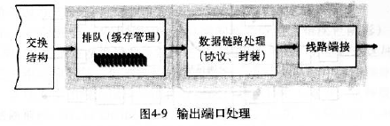

## 3. 数据报格式

- **IPv4 数据报**

  > 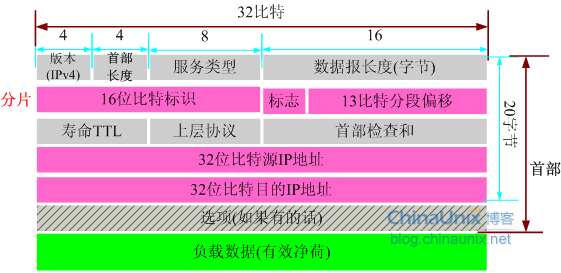
  >
  > - **版本号(version)**： 不同的IP协议版本使用不同的数据报格式
  >
  > - **首部长度(HL)**： IP 数据报首部长度一般为20字节
  >
  >   > 但 IPv4 数据报包含可选项，故用 4bit 来确定 IP 数据报中数据部分实际从哪里开始
  >
  > - **服务类型(TOS)**： 更好地区分并服务不同类型 IP 数据报
  >
  > - **数据报长度(TL)**： IP 数据报的总长度，即首部 + 数据
  >
  > - **分片(标识、标志、段位移)**： 与 IP 分片有关
  >
  >   > - 当目的主机从同一个源收到一批数据报时，需要确定这些数据报是完整数据报还是分片后的数据报，数据报首部标识字段解决这个问题，检查数据报的标识号确定哪些数据报真正是同一个较大数据报的片
  >   > - 如何判断最后一个分片已收到，数据报首部标志字段解决这个问题，将最后一片的标志为0，其他标记为1
  >   > - 如何顺序重组这些片，这就需要记录每个片的在数据报有效净荷的偏移量，这也确定了片是否丢失。若丢失某些片，则丢弃这个不完整的数据报(不会交给传输层)。需要可靠传输怎么办呢，由传输层让源重传原始数据摄中的数据(如TCP)
  >
  > - **寿命(TTL)**：每次数据报经过一台路由器时，该字段的值减 1，若 TTL 字段减为 0，则丢弃该数据报，从而确保数据报不会永远在网络循环
  >
  > - **上层协议(Protocol)**： 用于指明 IP 数据报的数据部分应该交给哪个传输层协议(6为TCP、17为UDP)
  >
  > - **首部检查和**： 只对 IP 首部进行检验，对整个T CP/UDP 报文段检验交由 TCP/UDP 完成
  >
  >   > 检验计算：
  >   >
  >   > - 将首部中的每两个字节当作一个数，用反码运算对这些数求和，该反码的和按 1 补码值存放在检查和字段
  >   > - 当路由器收到 IP 数据报时，计算其首部检查和，与该字段值比较，若出错则丢弃该数据报
  >   >
  >   > 注：因为 TTL 字段及选项字段可能改变，所以路由器上的检查和都须重新计算并存放在原处(检查后，再更新)
  >
  > - **源和目的 IP 地址**： 存放源和目的 IP 地址
  >
  > - **选项**： 允许 IP 首部被扩展，由此导致数据报首部长度可变，导致数据报处理麻烦
  >
  > - **数据(有效载荷)**： 当使用 TCP/UDP 协议时，数据即为传输层报文段(TCP/UDP)
  >
  >   > 数据字段也可承载其他类型数据，如 ICMP 报文段

- **IPv6 数据报**

  > 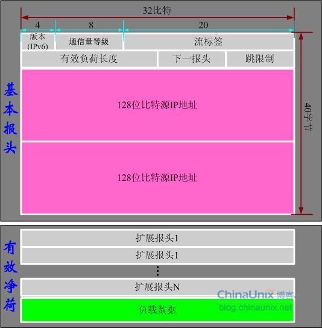
  >
  > - **版本号**： 不同的 IP 协议版本使用不同的数据报格式
  >
  > - **通信量等级**： 使得源节点和路由器能够识别 IPv6 信息包的优先级，与 IPv4 的服务类型(TOS)类似
  >
  > - **流标签**： 标记那些需要 IPv6 路由器特殊处理的信息包顺序
  >
  > - **有效负载长度**： 40 字节数据报首部后面的字节数量，包括扩展报头和负载数据，即`数据报长度 - 40`
  >
  > - **下一个首部**： 
  >   - 当 IPv6 没有扩展报头时，该字段的作用和 IPv4 的上层协议字段一样
  >   - 当 IPv6 含有扩展报头时，该字段的值即为第一个扩展报头的类型
  >
  > - **跳限制**： 转发数据报的每台路由器对该字段的值减 1，若减为 0 则丢弃该数据报
  >
  > - **源和目的 IP 地址**： 各为 128 bit
  >
  > - **数据**： 当数据报到达目的地时，有效载荷就从 IP 数据报移出，并交给下一个首部字段中指定的协议

- **IPv4 与 IPv6 的区别**： 

  > - IPv6 首部无选项字段
  > - IPv6 的分片与重组从路由器移到端系统，即只在源与目的地上执行
  > - IPv6 无首部检查和

- **IPv4 向 IPv6 的迁移**：

  > - **IPv6/IPv4 节点**： IPv6 节点具有完整的 IPv4 实现，最直接引入 IPv6 使能节点的方法的**双栈**
  >
  >   > IPv6 使能节点可通过 DNS 解决
  >
  > - **隧道**： IPv6 路由器之间的 IPv4 路由器的集合

## 4. IP 地址

### 1. 简介

- **IPv4 编址**

  > - **IP 地址**： 长度为 32bit(4 字节)，由于 $2^{10}$ 可近似看作 $10^3$ ，所以可按**点分十进制记法**，如： `255.255.255.0` 
  >
  >   > 每台主机和路由器的每个接口都必须有一个唯一 IP 地址
  >
  > - **子网**： 具有前缀相同 IP 地址的互联主机或路由器组成的网络，如： `223.1.1.xxx`
  >
  >   > - **子网掩码**： 子网地址的 `223.1.1.0/24` 中的 `/24` 记法，其中 `24` 指示了在地址的第一部分中的比特数，即子网的 IP 地址范围： $2^8 - 2 = 254, 8 = 32 - 24$
  >   > - **地址聚合(路由聚合、路由摘要)**： 使用单个网络前缀通告多个网络的能力
  >
  > - **无类别域间选路(CIDR)**： 使用网络前缀和主机号来对 IP 地址进行编码
  >
  >   > - CIDR 记法：  IP 地址 + 网络前缀长度，如： 128.14.35.7/20 表示前 20 位为网络前缀
  >   > - CIDR 地址掩码： 称为子网掩码，子网掩码首长度为网络前缀的长度
  >   > - 路由聚合(**构成超网**)： 通过使用网络前缀来减少路由表项的方式
  >
  > - **分类编址**： 采用 CIDR 前，IP 地址的网络部分被限制长度为 8，16，24 比特的编址方案
  >
  >   > 具有 8，16，24 比特子网地址的网络被分别称为 **A、B、C 类网络**
  >
  > - 当主机目的 IP 地址为 `255.255.255.255` 时，该数据报将会被交付给同一子网下的所有主机

- **主机或子网获取 IP 地址**：

  > - **获取一块地址**： 
  >
  >   > IP 地址由**因特网名字与号码分配机构(ICANN)** 管理：
  >   >
  >   > - 分配 IP 地址
  >   > - 管理 DNS 根服务器
  >   > - 分配域名与解决域名纷争
  >
  > - **获取主机地址： 动态主机配置协议**
  >
  >   > - **动态主机配置协议(DHCP)**： 为子网内的主机或路由器分配 IP 地址，同时允许主机获取子网掩码、它的第一跳路由器地址(默认网关)、它的本地 DNS 服务器地址 
  >   >
  >   >   > 由于 DHCP 能将主机自动化的连接进一个网络，故又称为**即插即用协议**
  >   >
  >   > - DHCP 协议的 4 个步骤：
  >   >
  >   >   > - **DHCP 服务器发现**：通过 **DHCP 发现报文**发现一个要交互的 DHCP 服务器
  >   >   >
  >   >   >   > DHCP 客户机将包含 DHCP 发现报文的 IP 数据报传递给链路层，链路层将该帧广播道所有与该子网连接的子网
  >   >   >   >
  >   >   >   > 其中该 IP 数据报的广播目的地址为`255.255.255.255` 和本机地址为 `0.0.0.0`
  >   >   >
  >   >   > - **DHCP 服务器提供**： 收到 DHCP 发现报文时，用一个 DHCP 提供报文对客户机做出响应，使用的 IP 广播地址仍为 `255.255.255.255`
  >   >   >
  >   >   >   > DHCP 提供报文含有收到的**发现报文的事务 ID、向客户机推荐的 IP 地址、网络掩码、IP 地址租用期**
  >   >   >
  >   >   > - **DHCP 请求**： 从一个或多个 DHCP 服务器中选择一个 DHCP 服务器，并用 DHCP 请求报文对选中的服务器进行响应，回显配置参数
  >   >   >
  >   >   > - **DHCP ACK**： DHCP 服务器用 DHCP ACK 报文对 DHCP 请求报文进行响应，证实所请求的参数
  >
  > - **网络地址转换(NAT)**： 将单一的 IP 地址转换为多个专用地址的地域，即**内网**
  >
  >   > - **专用地址的地域**： 指其地址仅对该网络中的设备有意义的网络，如： `10.0.0/24`
  >   > - NAT 转换表： 记录了端口号和 IP 地址，用于转换的实现
  >   > - NAT 会妨碍 P2P 应用程序，但可通过**中继处理**来解决
  >
  > - **通用即插即用(UPnP)**： 一种允许主机发现并配置邻近 NAT 的协议
  >
  >   > - 能为某些请求的公共端口号请求一个位于（专用 IP 地址，专用端口号）与（公共 IP 地址，公共端口号）之间的 **NAT 映射**
  >   > - 若 NAT 接受该请求并生成该映射，则外部节点能发起到（公共 IP 地址，公共端口号）的 TCP 连接

### 2. 虚拟专用网 VPN

- 由于 IP 地址的紧缺，一个机构能申请到的 IP 地址数往往远小于本机构所拥有的主机数。并且一个机构并不需要把所有的主机接入到外部的互联网中，机构内的计算机可以使用仅在本机构有效的 IP 地址（专用地址）

**三个专用地址块**：

- `10.0.0.0 ~ 10.255.255.255`
- `172.16.0.0 ~ 172.31.255.255`
- `192.168.0.0 ~ 192.168.255.255`

VPN 使用公用的互联网作为本机构各专用网之间的通信载体

- 专用指机构内的主机只与本机构内的其它主机通信

**场景**： 

1. 场所 A 的主机 X 和另一个场所 B 的主机 Y 通信，数据报先发送到与互联网相连的路由器 R1

2. R1 对内部数据进行加密，然后重新加上数据报的首部，源地址是路由器 R1 的全球地址 125.1.2.3，目的地址是路由器 R2 的全球地址 194.4.5.6

3. 路由器 R2 收到数据报后将数据部分进行解密，恢复原来的数据报，此时目的地址为 10.2.0.3，就交付给 Y

### 3. 网络地址转换 NAT

- NAT 来将本地 IP 转换为全球 IP

- NAT 转换表使用运输层的端口号，使得多个专用网内部的主机共用一个全球 IP 地址

  > 使用端口号的 NAT 也叫做网络地址与端口转换 NAPT

## 5. 地址解析协议(ARP)

> 网络层实现主机之间的通信，而链路层实现每段链路之间的通信。
>
> 因此在通信过程中，IP 数据报的源地址和目的地址始终不变，而 MAC 地址随着链路的改变而改变
>
> 

**ARP 实现由 IP 地址得到 MAC 地址**： 

- 每个主机都有一个 ARP 高速缓存，里面有本局域网上的各主机和路由器的 IP 地址到 MAC 地址的映射表

- 如果主机 A 知道主机 B 的 IP 地址，但 ARP 高速缓存中没有该 IP 地址到 MAC 地址的映射，此时主机 A 通过广播的方式发送 ARP 请求分组，主机 B 收到该请求后会发送 ARP 响应分组给主机 A 告知其 MAC 地址，随后主机 A 向其高速缓存中写入主机 B 的 IP 地址到 MAC 地址的映射

## 6. 网际控制报文协议(ICMP)

> ICMP 不是高层协议，而是 IP 层的协议
>
> ICMP 报文作为 IP 层数据报的数据，加上数据报的首部，组成 IP 数据报发送出去

- 为了提高 IP 数据报交付成功的机会，在网际层使用了网际控制报文协议 ICMP 

- ICMP 允许主机或路由器报告差错情况和提供有关异常情况的报告

ICMP 报文分为差错报告报文和询问报文： 

**ICMP 询问报文**：

- **回送请求和回答报文**：主机或路由器向特定目的主机发出询问，收到此报文的主机必须发 ICMP 回答报文，可用于**测试目的站是否可达以及了解其有关状态**
- **时间戳请求和回答报文**： 请求某台主机或路由器回答当前的日期和时间，可用于**时钟同步和时间测量**

**不应发送 ICMP 差错报告报文的几种情况** ：

- 对 ICMP 差错报告报文不再发送 ICMP 差错报告报文
- 对第一个分片的数据报片的所有后续数据报片都不发送 ICMP 差错报告报文
- 对具有多播地址的数据报都不发送 ICMP 差错报告报文

- 对具有特殊地址(如127.0.0.0 或 0.0.0.0)的数据报不发送 ICMP 差错报告报文

下面几种 ICMP 报文不再使用： 

- 信息请求与回答报文
- 掩码地址请求和回答报文
- 路由器询问和通告报文

主要应用： 

- `ping` 用来测试两台主机之间的连通性

  > 原理： 通过向目的主机发送 ICMP Echo 请求报文，目的主机收到之后会发送 Echo 回答报文后，ping 会根据时间和成功响应的次数估算出数据包往返时间以及丢包率

- `traceroute` 用来跟踪一个分组从源点到终点的路径

  > `traceroute` 发送的 IP 数据报封装的是无法交付的 UDP 用户数据报，并由目的主机发送终点不可达差错报告报文

## 7. 选路

- **选路算法的目的**： 给定一组路由器及连接路由器的链路，找到一条从源路由器到目的路由器的最好路径

### 1. 选路算法的分类

- 根据**算法的全局性与分布式**来区分：

  - 全局选路算法： 用完整的、全局性的网络知识来计算从源到目的之间的最低费用路径

    > **链路状态(LS)算法**： 具有全局状态信息的算法，由链路状态广播算法来获取网络节点中的链路信息
    >
    > 包含： **Dijkstra 算法和 Prim 算法**

  - **分布式选路算法**： 以迭代的、分布式的方式计算出最低费用路径

    > **距离向量(DV)算法**： 是迭代的、异步的、分布式的算法
    >
    > - 分布式： 每个节点都从一个或多个直接相连的邻居接收信息，执行计算，然后将结果返回邻居
    > - 迭代： 计算过程持续到邻居之间没有更多信息交换为止
    > - 异步： 不要求所有节点相互之间步伐一致的操作

- 根据**算法的静态性和动态性**来区分： 
  - **静态选路算法**： 路由器的变化很缓慢，通过由人工干预调整
  - **动态选路算法**： 能在网络流量负载或拓扑变化时改变选路路径
- 根据**负载的是敏感的还是迟钝**的来区分：
  - **负载敏感算法**：链路费用会动态变化以反映出底层链路的当前拥塞水平
  - **负载迟钝算法**： 某条链路的费用不明显的反映当前拥塞水平，**现今因特网选路算法都是负载迟钝的**

### 2. 路由选择协议(算法)

- **自治系统(AS)**： 是一组处于相同的管理与技术控制下的路由器集合，AS 之间都运行相同的选路协议

#### 1. 自治系统(AS)内部选路(RIP和OSPF)

> **AS 内部选路协议(内部网关协议)**： 用于确定在一个自治系统内执行选路的方式

- **选路信息协议(RIP)**：

  > - 是一种距离向量协议，使用**跳数作为其费用测度**，即每条链路费用为 1
  >
  >   > - **跳**： 沿着从源路由器到目的子网的最短路径所经过的子网数量
  >
  > - 一条路径的最大跳数限制为 15
  >
  > - 通过 RIP 响应报文(RIP 通告) 30s 交换一次选路更新信息
  >
  > - 每台路由器维护一张称为**选路表的 RIP 表**，该选路表包括路由器的距离向量和路由器的转发表
  >
  >   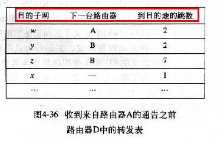

- **开放最短路径优先(OSRF)**： 

  > - OSPF 被设置在较顶层的 ISP 中，RIP 被设置在较低层 ISP 和企业网中
  >
  > - OSPF 中的选路协议规约是开放的
  >
  > - OSPF 的核心是一个使用洪泛链路状态信息的链路状态协议和一个 Dijstra 最低费用路径算法
  >
  >   > - 路由器使用 OSPF 构建整个自治系统的拓扑图
  >   > - 然后根据拓扑图，路由器本地运行 Dijstra 算法来确定以自身为根节点的到所有子网的最短路径树
  >
  > - 当一条链路信息发生变化或经过一段时间(至少30分钟)时，路由器便会广播链路状态信息
  >
  > - OSPF 优点：
  >
  >   - **安全**： OSPF 路由器之间的交换都是经过鉴别的
  >   - **多条相同费用的路径**： 当存在多条相等费用路径时，OSPF 允许使用多条路径来分担流量
  >   - **对单播选路与多播选路的综合支持**： 多播 OSPF(MOSPF) 使用 OSPF 链路数据库为 OSPF 链路状态广播机制增加新的链路状态公告(多播选路)
  >   - **支持在单个选路域内的层次结构**： OSPF 按层次结构构造一个自治系统
  >
  > - OSPF 自治系统可配置成多个区域，每个区域都运行自己的 OSPF 链路状态选路算法
  >
  >   > - 一个区域内，一台或多台**区域边界路由器**负责为发送到该区域以外的分组选路
  >   > - **主干区域**： 为 AS 内其他区域之间的流量选路，包含 AS 内的所有区域边界路由器
  >
  > - 4 种 OSPF 路由器：
  >
  >   - ###### **内部路由器**： 位于非主干区域且只执行 AS 内部选路
  >
  >   - **区域边界路由器**： 同时位于区域与主干
  >
  >   - **主干路由器(非边界路由器)**： 执行主干中的选路
  >
  >   - **边界路由器**： 与其他自治系统的路由器交换选路信息

#### 2. 自治系统(AS)间的选路(BGP)

- **边界网关协议(BGP)**： 为一个自治系统(AS)间的选路协议，用于处理：

  - 从相邻 AS 处获得子网可达性信息
  - 向该 AS 内部的所有路由器传播这些可达性信息
  - 基于可达性信息的 AS 策略，决定到达子网的更好路由

- **BGP 基础**：

  > - **BGP 对等方**： 位于 TCP 连接端点的两台路由器
  > - **BGP 会话**： 沿着该连接发送所有 BGP 报文的 TCP 连接
  >   - 外部 BGP 会话： 跨越两个 AS 的 BGP 会话
  >   - 内部 BGP 会话： 同一个 AS 中的两台路由器之间的 BGP 会话

- **路径属性和BGP路由**： 

  > - 在 BGP 中，AS 中有其全局唯一的**自治系统号(ASN)**，ASN 由 ICANN 地区注册机构分配
  >
  >   > **桩 AS 没有 ASN**，这种桩 AS 仅承载源地址或目的地址为本 AS 的流量

- **BGP 路由选择**： 

  > - BGP 使用 eBGP 和 iBGP 向 AS 中的所有路由器发布路由
  > - 当存在多条相同前缀的路由时，BGP 顺序调用下列消除规则：
  >   - 路由被指派一个本地偏好值作为其属性之一
  >   - 在余下的路由(具有相同的本地偏好值)中，将选择具有最短 `AS-PATH` 的路由
  >   - 在余下路由(具有相同的本地偏好值和 `AS-PATH` 长度)中，将选择最靠近 `NEXT-HOP` 路由器的路由
  >   - 最后，路由器使用 BGP 标识符来选择路由

- **选路策略**： 

### 3. 广播和多播选路

- **广播选路算法**： 

  > - **N 次单播**： 用单播选路向 N 个目的地传输 N 份分组拷贝实现的广播通信
  >
  >   > 缺点：低效率
  >
  > - **无控制洪泛**： 洪泛要求源节点向所有邻居节点发送分组的拷贝，然后邻居继续转发
  >
  >   > 缺陷： 若网络图存在圈，则分组拷贝将会无休止传播(**广播风暴**)
  >
  > - **受控洪泛**： 
  >
  >   > - **序号控制洪泛**：源节点将其地址及**广播序号**放入广播分组，再向邻居节点发送分组拷贝
  >   >
  >   >   > 节点收到广播分组时，先检查该分组是否在序号列表中；若在，则丢弃；若不在，则转发该分组
  >   >
  >   > - **反向路径转发(RPF)或反向路径广播(RPB)**： 当路由器接收到的广播分组到达的链路位于它自己到其源的最短单播路径上时，才转发该分组，否则丢弃该分组
  >
  > - **生成树广播**： 避免冗余广播分组的传播，通过网络节点构造一棵生成树，广播的分组在生成树的特定链路中发送分组
  >
  >   > 构造分布式生成树算法：
  >   >
  >   > - 基于中心方法： 建立生成树时，定义一个中心节点(汇合点或核)，节点向中心节点单播**加入数报文**

- **多播**： 可以将多播分组仅交付给网络节点的一个子集

  > **相关概念**： 
  >
  > - 多播数据报使用**间接地址**来编址： 用一个标识来表示一组接收方，寻址到的分组拷贝被交付给所有与该分组相关的多播接收方，该单一标识为一个 D 类多播地址
  >
  > - **多播组**： 与一个 D 类地址相关联的接收方组
  >
  > - 因特网中的网络层多播由 **ICMP 与多播选路协议**两个互补组件组成
  >
  > - **因特网组管理协议(IGMP)**： 
  >
  >   > - IGMP 报文承载(封装)在一个 IP 数据报中， IP 协议号为 2
  >   > - 路由器向所有与主机相连的接口发送一个 `membership_query` 报文，以确定该接口上的主机已加入的所有多播组集合；主机用一个 `membership_report` 报文来响应
  >
  > **多播算法**： 
  >
  > - **多播选路的目标**： 发现一棵链路树，该树连接了所有与属于该多播组的主机相连的路由器
  > - 确定多播选路树的方法：
  >   - **使用一棵组共享树进行多播选路**： 该树包含所有具有属于该多播组相连主机的边缘路由器，构建单一的、共享的选路树来路由所有发送方的分组
  >   - **使用一棵基于源的树进行多播选路**： 为多播组中的每个源构建一棵多播选路树
  >
  > **因特网中的多播选路**： 
  >
  > - **距离向量多播选路协议(DVMRP)**： 第一个用于因特网中的多播选路协议，DVMRP 实现了具有反向路径转发与剪枝算法的基于源的树

## 8. 路由器

### 1. 路由器结构

路由器从功能上可以划分为：**路由选择和分组转发** 

分组转发结构由三个部分组成：**交换结构、一组输入端口和一组输出端口**

### 2. 路由器分组转发流程

- 从数据报的首部提取目的主机的 IP 地址 D，得到目的网络地址 N
- 若 N 就是与此路由器直接相连的某个网络地址，则进行直接交付
- 若路由表中有目的地址为 D 的特定主机路由，则把数据报传送给表中所指明的下一跳路由器
- 若路由表中有到达网络 N 的路由，则把数据报传送给路由表中所指明的下一跳路由器
- 若路由表中有一个默认路由，则把数据报传送给路由表中所指明的默认路由器
- 报告转发分组出错

# 五、链路层

将网络层传下来的分组添加首部和尾部，用于标记帧的开始和结束

## 1. 概述

- 两种不同类型的链路层信道：
  - 第一种类型由**广播信道组成**
  - 第二种类型是**点对点通信链路**

- **链路层协议**： 定义了在链路两端的节点之间交互的分组格式，以及当发送和接收分组时这些节点采取的动作

- **链路层协议的任务**： 将网络层的数据报通过路径上的单段链路节点到节点的传送

- **链路层的特点**： 数据报在路径的不同链路上可能由不同链路层协议来承载

- **链路层协议的基本服务**： 将数据报通过单一通信链路从一个节点移动到相邻节点

- **链路层协议的可能服务**：

  > - **成帧**： 传送前，将网络层数据报用链路层帧封装起来，帧的结构由链路层协议规定
  >
  > - **链路接入**： MAC 用来协调多个节点的帧传输，**媒体访问控制(MAC)**协议规定帧在链路上传输的规则
  >
  > - **可靠交付**： 保证无差错的经链路层移动每个网络层数据报
  >
  > - **流量控制**： 链路每一端的节点都具有有限容量的帧缓存能力
  >
  > - **差错检测**： 发送节点在帧中设置差错检测比特，接收节点进行差错检测
  >
  >   > 差错比特由于信号衰减和电磁噪声导致
  >
  > - **差错纠正**： 接收方能判断差错位置并纠正该差错
  >
  >   > 差错检测与纠错(EDC)：
  >   >
  >   > - **奇偶校验**
  >   > - **检验和**
  >   > - **循环冗余检测**
  >
  > - **半双工和全双工**： 全双工传输时，链路两端的节点可以同时传输分组；半双工传输时，一个节点不能同时进行传输和接收

- 链路层的主体部分在**网络适配器(也称网络接口卡 NIC)**中实现

  > 网络适配器的内核是链路层控制器，该控制器是实现了许多链路层服务的单个特定功能的芯片，如： 成帧、链路接入等

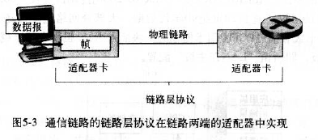

## 2. 多路访问协议

- 两种网络链路： 
  - **点对点链路**： 由链路一端的单个发送方和链路另一端的单个接收方组成

    > **点对点协议(PPP) 和高级数据链路控制(HDLC)** 是为点对点链路设计

  - **广播链路**： 能够让多个发送和接收节点都连接到相同的、单一的、共享的广播信道上

    > **以太网和无线 LAN** 是广播链路的实现

- **多路访问协议**： 节点通过计网协议来规范它们在共享的广播信道上的传输行为，分为：信道划分协议、随机接入协议、轮流协议

- **多路访问协议的理想特性**：

  > - 当只有一个节点活跃，则该节点具有 R bps 的吞吐量
  > - 当有 M 个节点活跃，则每个节点的吞吐量接近 `R/M bps`

### 1. 信道划分协议

- **时分多路复用(TDM)和频分多路复用(FDM)**是两种能在所有共享信道节点之间用于划分广播信道带宽的技术

  > - TDM 与 FDM 的优缺点类似
  >
  >   > - 优点： 避免了碰撞，在 N 个节点之间公平的划分了带宽
  >   > - 缺点： 限制一个节点只能使用 `R/N` 的带宽，即使只有唯一一个分组要发送节点时
  >
  > - TDM 将时间划分为时间帧，并进一步划分每个时间帧为 N 个时隙，然后把每个时隙分配给 N 个节点中的一个
  >
  >   > - 时隙长度的选择通常使得在一个时隙内能传输单个分组
  >   > - **缺陷**： 
  >   >   - 节点被限制于 `R/N bps` 的平均速率，即使它是唯一一个有帧要发送的节点
  >   >   - 节点必须总是等待它在传输序列中的轮次，即使它是唯一一个有帧要发送的节点
  >
  > - FDM 将 R bps 信道划分为不同的频段，每个频段具有 `R/N` 带宽，并把每个频率分配给 N 个节点

- **码分多址(CDMA)**： 对每个节点分配一种不同的编码，然后每个节点用唯一的编码来对其发送的数据进行编码

### 2. 随机接入协议

- **随机接入协议过程**： 
  - 一个传输节点总是以信道的**全部速率进行发送**，即具有 `R bps` 吞吐量
  - 当有碰撞时，涉及碰撞的每个节点**反复的重发它的帧**，直到帧无碰撞通过为止
  - 在重发帧之前，等待一个随机时延

- **时隙 ALOHA 协议**： 要求所有节点同步它们的传输，以在每个时隙开始处进行传输

  > 纯 ALOHA ： 在一个帧首次到达时，节点立刻将帧完整的传输进广播通道，若遇到碰撞，则该帧立即以概率 p 重传或等待一个帧时间后以概率 p 重传帧

- **载波侦听多路访问(CSMA)**： 一个节点在传输前先听信道，若有其他帧正在信道上传输，则等待一段时间；若信道空闲，则开始传输帧，即一个传输节点在传输时一直在侦听信道

  > 若检测到另一个节点在传输干扰帧，则该帧停止传输，用某个协议来确定什么时候再次尝试传输

### 3. 轮流协议

- **轮询协议**： 指定一个主节点，且主节点以循环的方式轮询每个节点，告知每个节点能传输的最大帧数

  > - 优点： 消除了随机接入协议的碰撞和空时隙
  > - 缺点： 
  >   - 引入了轮询时延，因为必须轮询每个节点，包括非活跃节点
  >   - 若主节点故障，则信道将会不可操作

- **令牌传递协议**： 一个称为令牌的特殊目的帧在节点之间以某种固定的次序进行交换，当一个节点收到令牌时，仅当它有帧要发送时，才持有这个令牌，否则立即向下一个节点转发该令牌

  > - **优点**： 令牌传递是分散的，且效率很高
  > - **缺点**： 若一个节点故障或某节点忘记释放令牌，可能导致令牌无法继续传递

## 3. 链路层编址

> **主机和路由器具有链路层地址(MAC 地址)**，地址解析协议(ARP) 可将 IP 地址转换为链路层地址

### 1. MAC 协议

- IEEE 管理着 MAC 地址空间，MAC 地址以十六进制标记法来表示，用于唯一标识网络适配卡(网卡)

  > 一台主机拥有多少个网络适配器就有多少个 MAC 地址

- 对于大多数 LAN 而言，MAC 地址长度为 6 字节(48位)，共有 $2^{48}$ 个可能的 LAN 地址

- 适配器的 MAC 地址具有扁平结构，且不会改变

### 2. 地址解析协议

- **地址解析协议(ARP)**： 可实现 IP 地址与链路层地址的转换
- 每个节点的 ARP 模块在其 RAM 中有一个 ARP 表，用于存储 IP 地址到 MAC 地址的映射关系，且包含生存(TTL)值，指出从表中删除映射的时间

## 4. 以太网

### 1. 以太网帧结构

- **前同步码**(8 字节，位于目的地址之前)：前 7 个字节用于“唤醒”接收适配器，并将其时钟和发送方的时钟同步
- **目的地址**： 包含目的适配器的 MAC 地址
- **源地址**： 包含了传输该帧到 LAN 上的适配器的 MAC 地址
- **类型**： 允许以太网复用多种网络层协议
- **数据段**： 承载 IP 数据报，取值范围为 46~1500 字节
- **循环冗余检测(CRC)**： 用于检测比特差错

### 2. 以太网多路访问协议: CSMA/CD

- 当某适配器传输一帧时，LAN 上的所有适配器都收到该帧，因为以太网能应用广播，故它需要多路访问协议

- CSMA/CD 使用的机制：

  > - **没有时隙**： 适配器可在任何时刻开始传输
  > - **载波侦听**： 当适配器侦听到有其他适配器在传输，则不会传输帧
  > - **碰撞检测**： 当传输中的帧检测到另一个适配器在传输，则会中止传输；重传之前，会等待一个比传输一帧短的随机时间
  
- CSMA/CD 的工作方式：

  > - 适配器从网络层得到一个数据报，准备一个以太网帧，并把该帧放到适配器缓存区中
  >
  > - 若适配器侦听到信道空闲，则开始传输该帧；否则，等待到信道空闲
  >
  > - 传输过程中，适配器监视其他适配器的信号能量：
  >
  >   - 若整个传输过程没有检测到其他适配器的信号能量，则完成该帧的传输
  >
  >     > 记端到端的传播时延为 τ，最先发送的站点最多经过 2τ 就可以知道是否发生了碰撞，称 2τ 为  **争用期** 
  >     >
  >     > 只有经过争用期之后还没有检测到碰撞，才能肯定这次发送不会发生碰撞
  >
  >   - 若适配器在传输过程中检测到其他适配器的信号能量，则停止帧的传输，代之以传输一个 48 bite的阻塞信号，等待一段时间再发送
  >
  >     > - 阻塞信号的目的： 确保所有其他传输中的适配器都意识到此次碰撞
  >     >
  >     > - 等待的时间采用  **截断二进制指数退避算法**  来确定
  >     >
  >     >   > 从离散的整数集合 {0, 1, .., (2k-1)} 中随机取出一个数，记作 r，然后取 r 倍的争用期作为重传等待时间
  >
  > - 在适配器中止后，适配器进入**指数后退**阶段
  >
  > 

- **以太网效率**： 当有大量的活跃节点，且每个点有大量的帧要发送时，帧在信道中无碰撞的传输的那部分时间占长期运行时的份额

## 5. 链路层交换机

### 1. 交换机转发和过滤

- **过滤**： 指交换机决定一个帧是应转发到某个接口还是应当将其丢弃

- **转发**： 决定一个帧应被导向哪个接口，并把该帧接口移动到这些接口的交换机功能

- 交换机的过滤和转发借助于**交换机表**完成

  > 交换机表项包含：
  >
  > - 节点的 MAC 地址
  > - 到达该接待你的交换机接口
  > - 用于节点的表项防止在表中的时间

- 交换机表的自动的、动态的、自治建立的，即是**自学习**

  > - 交换机表初始为空
  > - 当某接口接收到入帧时，交换机表会存储相应信息
  > - 一段时间(老化期)后，交换机未接收到以该址作为源地址的帧时，就会删除这个地址

- 交换机是即插即用设备

### 2. 链路层交换机的性质

交换机的优点：

- **消除碰撞**： 交换机缓存帧且不会再网段上同时传输多个帧
- **异质的链路**： 交换机将链路彼此隔离，LAN 中的不同链路能以不同的速率运行且能在不同的媒体上运行
- **管理**： 易于进行网络管理

**交换机毒化**： 向交换机发送大量的具有不同伪造源 MAC 地址的分组，最终填满交换机表

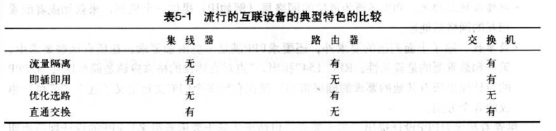

## 6. 点对点协议(PPP)

- **点对点协议(PPP)**： 运行于点对点链路之上的链路层协议，即一条直接连接两个节点的链路

  > 是用户计算机和 ISP 进行通信时所使用的数据链路层协议

- PPP 的要求功能：
  - **分组成帧**： PPP 协议链路层的发送方必须能携带网络层的分组，并将其封装在 PPP 链路层帧中，以便接收方能确定链路层帧的起始和结束位置和该帧中的网络层分组
  - **透明性**： PPP 协议不能对出现在网络层分组中的数据做任何限制
  - **多种网络层协议**： PPP 协议必须支持同时运行在不同的物理链路的多种网络层协议
  - **多种类型链路**： PPP 必须能运行在各种不同链路类型上
  - **差错检测**： 能检测接收帧中的特比差错
  - **连接的活性**： 能检测链路层的故障，且向网络层通知该差错的情况
  - **网络层地址协商**： 为通信的网络层提供一个机制，来获知或配置相互的网络层地址
  - **简单性**： 附加的要求

- **PPP 帧包含的字段**：
  - **标志字段**： 用值为 `01111110` 的 1 字节的标志字段作为开始金额结束
  - **地址字段**： 唯一值为 `11111111`
  - **控制字段**： 唯一值为 `00000011`
  - **协议**： 告诉 PPP 接收方所接收的封装数据所属的上层协议
  - **信息**： 包含上层协议在 PPP 链路上发送的被封装分组(数据)，默认长度为 1500 字节
  - **检验和**： 用于检测已传输帧中的比特差错

- **字节填充**：若标志字段的值出现在其他地方，PPP 就在该标志模式实例前插入控制转移字节

# 六、物理层

## 1. 通信方式

根据信息在传输线上的传送方向，分为以下三种通信方式：

- 单工通信：单向传输
- 半双工通信：双向交替传输
- 全双工通信：双向同时传输

## 2. 带通调制

模拟信号是连续的信号，数字信号是离散的信号，带通调制把数字信号转换为模拟信号

# 七、无线网络与移动网络

## 1. 概述

- **无线主机**： 可连接无线链路的端系统设备

- **无线链路**： 主机可通过无线通信链路连接到一个基站或另一个无线主机

- **基站**： 负责向与之关联的无线主机发送数据和从主机那里接收数据，负责协调与之相关联的多个无线主机的传输

  > 无线主机与基站相关联：
  >
  > - 主机位于该基站的无线通信覆盖范围内
  > - 主机使用该基站中继它和更大网络之间的数据
  >
  > 蜂窝塔和 802.11 无线 LAN 中的接入点都是基站

- **切换**： 当一台移动主机移动范围超过一个基站的覆盖范围而到达另一个基站的覆盖范围后，它将改变其连接的基站

- **不同的网络模式**：
  - **基础设施模式网络**： 所有的传统网络服务都由网络向通过基站相连的主机提供
  - **自组织网络**： 主机自身完成网络通信服务，如： 地址分配、DNS 转换等

- **无线网络的分类准则**：
  - 该无线网络中的分组是否跨越了一个或多个无线跳
  - 网络中是否有基站等基础设施
- **依据分类准则的无线网络分类**：
  - **单跳，基于基础设施**： 具有与较大有线网络连接的基站，且基站与无线主机的通过只经过一个无线跳
  - **单跳，无基础设施**： 存在与无线网络相连的基站，且网络的节点可协调其他节点的传输
  - **多跳，基于基础设施**： 具有与较大有线网络连接的基站，且必须经过其他无线节点来中继通信
  - **多跳，无基础设施**： 无基站，且须经过其他节点来中继通信；如： 移动自组织网络，车载自组织网络

- **有线链路与无线链路的区别**：

  - **递减的信号强度**： 信号强度随着发送方与接收方距离的增加而减弱
  - **来自其他源的干扰**： 同一个频段发送信号的电波源将相互干扰
  - **多路径传播**： 电磁波由于反射导致在发送方与接收方之间走了不同长度的路径

- 隐藏终端问题和衰减使得多路访问在无线网络中更复杂

  > **隐藏终端**： 若基站 A 向基站 B 发送信息，但基站 C 未侦测到 A 也向 B 发送信息，故 A 和 C 同时将信号发送至 B，引起信号冲突，最终导致发送至 B 的信号都丢失

- **信噪比(SNR)**： 所接收到的信号和噪声强度的相对测量，单位为分贝(dB)

- **物理层的比特差错率(BER)与信噪比(SNR)的关系**：
  - 对于给定的调制方案，**SNR 越高，BER 越低**
  - 对于给定的 SNR，具有较高传输率的调制技术将具有较高的 BER
  - 物理层调制技术的动态选择能用于适配对信道条件的调制技术

- **码分多址(CDMA)**： 属于信道划分协议，指要发送的每一个比特都乘以一个信号(编码)的比特来进行编码，则这个信号的变化速率(码分速率)比初始数据比特序列速率快很多

## 2. WiFi：802.11 无线 LAN

​								**IEEE 802.11 标准**

| 标准    | 频率范围     | 数据率         |
| ------- | ------------ | -------------- |
| 802.11b | 2.4~2.485GHz | 最高为 11 Mbps |
| 802.11a | 5.1~5.8GHz   | 最高为 54 Mbps |
| 802.11g | 2.4~2.485GHz | 最高为 54 Mbps |

### 1. 802.11 体系结构

- 802.11 体系结构的基本构件模块： **基本服务集(BSS)**

  > 一个 BSS 包含： 
  >
  > - 一个或多个**无线站点**
  > - 一个在 802.11 中称为接入点(AP)的**中央基站**

- **基础设施无线 LAN**： 配置 AP 的无线 LAN

  > - 在 802.11 中，每个无线站点在能发送或接收网络层数据之前，必须与一个 AP 相关联
  > - 安装一个 AP 时，必须为接入点分配一个单字或双字的**服务集标识符(SSID)**

- **WiFi 丛林**： 在任意一个物理位置，此处无线站点能从两个或多个 AP 中接收到很强的信号

- 每个 AP 会周期性的发送信号帧，每个信号帧包括该 AP 的 SSID 和 MAC 地址

- 扫描分类：

  - **被动扫描**： 扫描信道和监听信标帧的过程

  - **主动扫描**： 通过向位于无线主机范围内的所有 AP 广播探测帧完成

    > AP 用一个探测响应帧应答该探测请求帧，无线主机则能在响应的 AP 中选择某 AP 与之关联

### 2. 802.11 MAC 协议

- 802.11 无线 LAN 选择称为**带碰撞避免的 CSMA(CSMA/CA)** 的随机访问协议

  > - 802.11 使用**碰撞避免**
  >
  >   > - 若两个站点侦听到信道忙，则立即回退一个随机不同值
  >   > - 一旦信道空闲，则其中一个站点将发送，且此时另一个站点将冻结它的计数器，抑制传输直到上一个站点传输完成
  >
  > - 802.11 使用链路层**确认/重传(ARQ)**机制，避免无线信道相对较高的误比特率
  >
  >   > - 目的站点接收到通过 CRC 检验的帧后，等待一个**短帧间间隔(SIFS)**的时间，然后发回一个确认帧
  >   > - 若发送站点在给定时间内未收到确认帧，则会假定出现错误并重传该帧，使用 CSMA/CA 协议访问该信道
  >   > - 在若干次固定重传后仍未收到确认，则发送站将放弃发送并丢弃该帧

- 802.11 下，出现以下情况仍可能出现碰撞：
  - **两个站点可能相互隐藏**
  - **两个站点可能选择的随机回退值很接近**

- 解决方法： **处理隐藏终端: RTS 和 CTS**

  > 802.11 MAC 协议允许站点使用**短请求发送(RTS)控制帧**和**允许发送(CTS)控制帧**来预约对信道的访问：
  >
  > - 当发送方要发送一 DATA 帧时，先向 AP 发送 RTS 帧，指出传输 DATA 帧和确认帧需要的总时间
  >
  > - 当 AP 收到 RTS 帧后，它广播一个 CTS 帧作为响应
  >
  >   > 该 CTS 帧的作用：
  >   >
  >   > - 给发送方明确的发送允许
  >   > - 指示其他站点在预约期内不要发送

### 3. IEEE 802.11 帧

#### 1. 数据帧

#### 2. 控制帧

#### 3. 管理帧

### 4. 802.11 以外的标准

#### 1. IEEE802.15.1：蓝牙

- IEEE802.15.1 以小范围、低功率、低成本运行，有时称为**无线个人区域网络(WPAN)**

- IEEE802.15.1 网络以 TDM 方式工作于无需许可证的 2.4 GHz无线电波段，每个时隙长度为 625 微秒

  > - 每个时隙内，发送方利用 79 个信道中的一个进行传输
  > - 从时隙到时隙以一个已知的伪随机方式变更信道(**跳频扩展频谱 FHSS**)，将传输及时扩展到整个频谱

#### 2. IEEE802.16：WiNAX

- IEEE802.16 目标： 通过广阔的区域向大量的用户交付无线数据

## 3. 蜂窝因特网

### 1. 蜂窝网体系结构

- **蜂窝**： 指一个地理区域被分成许多称作**发射区**的地理覆盖区域

  > 每个发射区包括一个基站，负责向/从位于其发射区内的移动站点发送或接收信号

- **基本网络体系结构**： 每个基站通过一个有线基础设施连接到一个广域网中，如： **移动交换中心(MSC)**

  > MSC 负责管理来自移动用户的呼叫的建立和拆除

- **空中接口接入技术**： 同一发射区需要共享分配给蜂窝服务提供商无线电频谱

  > 共享无线电频谱的方式：
  >
  > - **频分多路复用(FDM)和时分多路复用(TDM)的组合**
  > - **码分多址(CDMA)**

### 2. 蜂窝网标准和技术

#### 1G

#### 2G

#### 3G

#### 4G

## 4. 移动管理

- **归属网络**： 一个移动节点的固定”居所“

- **归属代理**： 在归属网络中，代表移动节点执行移动管理功能的实体

  > 功能：
  >
  > - 负责与外部代理交互以跟踪移动节点的 COA
  > - 监视寻址到某些节点的到达数据报，并通过其 COA 转发给外部代理

- **外部(被访)网络**： 移动节点当前所在网络

- **外部代理**： 在外部网络中，帮助移动节点完成移动管理功能的实体

### 1. 寻址

- 当一个移动节点位于一个外部网络时，所有指向此节点固定地址的流量需要导向外部网络，从而使移动节点的地址保持不变

  > 一种实现方法： 
  >
  > - 通过交换域内或域间选路信息来实现向其他网络发通告，告知移动节点在该网络中
  > - 该网络告诉其他网络其有一条正确的路径可将数据报导向该移动节点的固定地址
  > - 其他网络将在全网传播该选路信息
  > - 当移动节点进入一个新的网络时，新的外部网络会通告一条心的通向该移动节点的特别路由，旧的外部网络将撤销其余该移动节点有关的选路信息
  >
  > 另一种实现方法：将移动性功能从网络核心搬到网络边缘，通过移动节点的归属网络来实现
  >
  > - 将外部代理放置在外部网络的边缘路由器上
  >
  >   > 外部代理作用： 
  >   >
  >   > - 为移动节点创建一个**转交地址(COA)**，COA 用于将数据报通过外部代理**”重新选路“到移动节点**
  >   > - 告诉归属代理，该移动节点在它的外部代理网络中且有给定的 COA

### 2. 选路到移动节点

在只有归属代理知道移动节点的位置时，数据发送给移动节点的方法： 

- **移动节点的间接选路**： 通信者**只将**数据报寻址到移动节点的固定地址，并将数据报发送到网络中，则这些数据报将先导向移动节点的归属网络

  > 归属代理将监视寻址到某些节点的到达数据报，并通过移动节点的 COA ，**数据报将先转发给外部代理，然后再从该外部代理转发给移动节点**
  >
  >  
  >
  > 移动选路过程：
  >
  > - **移动节点到外部代理的协议**： 移动节点与外部网络连接时，其向外部代理注册；离开外部网络时，其向外部代理取消注册
  > - **外部代理到归属代理的注册协议**： 外部代理将向移动代理注册移动节点的 COA
  > - **归属代理数据报封装协议**： 将通信者的原始数据报封装在一个目的地址为 COA 的数据报内，并转发之
  > - **外部代理拆封协议**： 从封装好的数据报中取出通信者的原始数据报，然后再将该原始数据报转发给移动节点
  >
  >  
  >
  > **存在低效问题(三角选路问题)**：即使在通信者与移动节点之间存在一条更有效的路由，发往移动节点的数据报也要先发给归属代理，然后再发送到外部网络
  >
  >  
  >
  > 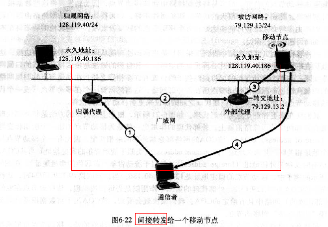

- **移动节点的直接选路**： 

  >  实现详解：
  >
  > - **移动用户定位协议**： 以便通信者代理向归属代理查询获得移动节点的 COA
  >
  >   > 注意： 归属代理仅在会话开始时被通信者代理询问一次
  >   >
  >   > 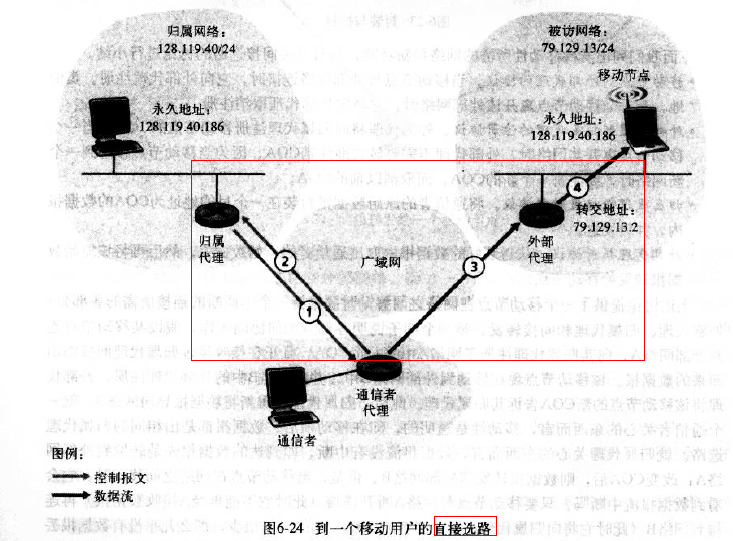
  >
  > - 当移动节点**移动到一个新的外部网络时**： 
  >
  >   - 假设数据当前正转发给位于某个外部网络中的移动节点，且在会话刚开始时该移动节点就位于该网络中(步骤 1)
  >
  >     > **锚外部代理**： 移动节点首次被发现的外部网络中的外部代理
  >
  >   - 当移动节点到达新的外部网络后(步骤 2)
  >   - 移动节点向新的外部代理注册(步骤 3)
  >   - 新的外部代理向锚外部代理提供移动节点新的 COA(步骤 4)
  >
  >   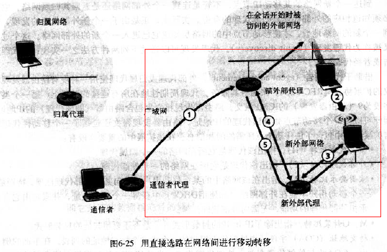

### 3. 移动 IP

- **移动 IP**： 支持移动性的因特网体系结构与协议的合称

- **移动标准的组成**：

  - **代理发现**：移动 IP 定义了一个归属代理或外部代理向移动节点通告其服务所使用的协议，以及移动节点请求一个外部代理或归属代理的服务所使用的协议

    > - **代理发现定义**： 由于一个新外部代理的发现，得到一个新的网络地址，进而使移动节点中的网络层知道它已进入一个新的外部网络的过程
    >
    > - 实现方法：
    >   - **经代理通告**
    >   - **经代理请求**

  - **向归属代理注册**： 移动 IP 定义了移动节点和/或外部代理向一个移动节点的归属代理注册或注销 COA 所使用的协议

    > - 向归属代理注册可通过**外部代理或直接通过移动 IP 节点**来完成
    > - 通过外部代理完成的过程：
    >   - 收到一个外部代理通告后，移动节点立即向外部代理发送一个移动 IP 注册报文
    >   - 外部代理收到注册报文并记录移动节点的永久 IP 地址
    >   - 归属代理接收注册请求并检查真伪和正确性
    >   - 外部代理接收注册响应，然后将其转发给移动节点

  - **数据报间接选路**： 定义了数据报被一个归属代理转发给移动节点的方式，包括：转发规则、差错处理规则、不同封装形式

### 4. 蜂窝网的移动性

- **蜂窝网络体系结构(GSM)**： 采用间接选路方法，即先将通信者的呼叫选路到移动节点的归属网络，再从那到达被访网络

  > GSM 术语中，移动主机的归属网络被称作该移动主机的**归属公共地域移动网络(PLMN)**

- **归属网络**： 维护一个**归属位置注册器(HLR)**，存储它的每个用户的永久蜂窝电话号码及用户个人概要信息，同时也包含用户当前的位置信息

  > 当一个呼叫定位到一个移动用户后，通信者将于归属网络中的叫**网关移动服务交换中心(GMSC)**的特殊交换机联系，GMSC 也可称为**归属 MSC**

- **被访网络**： 维护一个**访问者位置注册器(VLR)**，为每一个当前在其服务网络中的移动用户包含一个表项，VLR 表项因此随着移动用户进入和离开网络而出现或消失

- **呼叫移动用户的选路步骤**：

  - 通信者拨移动用户的电话号码，号码中的前几位数字可用于判别移动用户的归属网络

  - 呼叫者从通信者通过公共交换电话网到达移动用户归属网络中的归属 MSC

  - 归属 MSC 收到该呼叫并查询 HLR 来确定移动用户的位置

  - HLR 返回**移动站点漫游号码(MSRN)**，通过漫游号码，归属 MSC 建立通过网络到达被访问网络的 MSC 呼叫

    > - 漫游号码是短暂存在的
    > - 漫游号码的作用： 相当于移动 IP 中转交地址的作用
    > - 若 HLR 不具有漫游号码，则返回被访网络中的 VLR 地址

- **GSM 中的切换**： 

  > 基站切换移动用户时的步骤：
  >
  > - 旧基站(BS) 通知被访问 MSC 即将要进行一个切换，通知移动用户切换时所涉及的 BS
  >
  > - 被访 MSC 开始建立到新 BS 的路径，分配承载重选路的呼叫所需的资源，以及用信令告知新 BS 一个切换即将出现
  >
  > - 新 BS 发出信令返回被访 MSC 和旧 BS，即已建立了被访 MSC 到新 BS 的路径且告知移动用户即将发生的切换
  >
  >   > 新 BS 提供移动用户与新 BS 相关联所需要的所有信息
  >
  > - 移动用户被告知应当进行切换
  >
  > - 移动用户和新 BS 交换一个或多个报文，以完成激活新 BS 中新的信道
  >
  > - 移动用户向新 BS 发送一个切换完成报文，该报文随后向上转发给被访 MSC
  >
  >   > 被访 MSC 将重新选路正在进行的到移动用户的呼叫，使其经过新 BS
  >
  > - 沿着到旧 BS 的路径分配的资源随后被释放
  >
  > 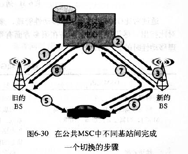

# 八、网络安全

## 1. 简介

**安全通信的特性**：

- **机密性**： 仅发送方和接收方能理解传输的报文内容
- **报文完整性**： 确保通信内容在传输过程中未改变
- **端点鉴别**： 发送方和接收方都能证实通信过程所涉及的另一方，以确信通信的另一方的身份
- **运行安全性**： 能反制网络攻击

## 2. 密码学

### 1. 密码算法

- **凯撒密码**： 将明文报文中的每个字母用字母表中该字母 k 个字母后的那个字母替换，允许绕回

- **单码代替密码**： 使用字母表中的一个字母唯一的替换另一个字母，即提前约定好替换规则

  > 此种加密方式的三种可能攻击情况：
  >
  > - **唯密文攻击**： 入侵者只截取到密文
  >
  >   > 由于字母出现概率的不同，统计分析将有助于对加密方案的唯密文攻击
  >
  > - **已知明文攻击**： 入侵者知道（明文，密文）的部分匹配
  >
  > - **选择明文攻击**： 入侵者已知某段明文对应的密文形式

- **多码代替密码**： 使用多个单码代替加密，因此报文不同位置的字母可能以不同的方式编码

- **对称加密**：

  - **块密码**： 将被加密的报文以 k 比特的块独立加密，对每个加密的块，密码采用**一对一映射**

    > - k 块密码的可能映射数量为 $2^k$
    > - 块密码采用模拟随机改变次序表功能，即将每块继续划分，用多张转置表存储密钥，降低全块表存储密钥的不可行性
    > - 一些块密码(DES, 3DES, AES) 使用转置函数来替代转置表

- **公开密钥加密**：

  - **RSA 算法**： 

    > **计算公钥和私钥**：
    >
    > - 选择素数 `p, q`
    >
    >   > 因 p，q 值越大，越难破解，所以建议 p，q 的乘积为 1024 比特的数量级
    >
    > - 计算 `n=pq, z=(p-1)(q-1)`
    >
    > - 选择小于 n 的数 `e`,且 `e` 与 `z` 互质（e 将用于加密）
    >
    > - 选择一个数 `d`，满足 `(ed-1) mod z = 0`（d 将用于解密）
    >
    > - 公钥为 `(n,e)`，私钥为 `(n,d)` 
    >
    > **加密与解密的过程**： 
    >
    > - 报文 m 加密结果： $c=m^e modn$ 
    > - 密文 c 解密结果： $m = c^dmodn$
    >
    > **注**： **对于公钥 $K_A$ 和私钥 $K_B$ 满足： $K_A(K_B(m)) = K_B(K_A(m))$**

### 2. 密码散列函数

- 散列函数以 m 为输入，经过计算得到一个称为散列的固定长度的字符串

- 密码散列函数的性质： 对于任意两个不同报文 x 和 y，使得 `x!= y` 

- MD5 散列算法： 通过计算得到 128 比特的散列：
  - 填充： 先填 1，然后填充足够多的 0，直到报文长度满足一定条件
  - 添加： 在填充前，添加一个 64 比特的报文长度表示
  - 初始化累加器
  - 在最后循环步骤中，对报文的 16 字的块进行 4 轮处理

### 3. 报文鉴别码(MAC)

- **报文鉴别码(MAC)**： 用鉴别密钥 s 级连报文 m 生成 m+s ，并计算散列 H(m+s)，则 H(m+s) 即为报文鉴别码
- **报文鉴别码(MAC)的好处**： 不需要加密算法

### 4. 数字签名

- 数字签名的应用： **公钥认证**，即证实一个公钥属于某个特定的实体

- **认证中心(CA)**： 验证身份和发行证书

  > 作用：
  >
  > - CA 证实一个实体的真实身份
  >
  > - 身份认定后，CA 生成一个把身份与试图的公钥绑定的**证书**
  >
  >   > - 该证书包含这个公钥和公钥所有者全局唯一的身份标识信息
  >   > - 由 CA 对这个证书进行数字签名

## 3. 鉴别

- **鉴别协议 ap1.0**：  发送方**直接信息**告诉接收方

- **鉴别协议 ap2.0**： 接收方通过验证发送方的 **IP 数据报的源地址来鉴别**

- **鉴别协议 ap3.0**： 接收方与发送方通过**秘密口令**来进行鉴别(但口令可能被监听泄露)

- **鉴别协议 ap3.1**： 接收方与发送方通过**加密口令**来进行鉴别(不能防止**回放攻击**)

- **鉴别协议 ap4.0**： 接收方与发送方通过**对称密钥密码和不重数**来进行鉴别

- **鉴别协议 ap5.0**： 接收方与发送方通过**公钥密码和不重数**来进行鉴别

## 4. 加密应用

### 1. 电子邮件安全：PGP

### 2. TCP 连接安全：SSL

### 3. 网络层安全： IPsec

### 4. 无线 LAN 安全

### 5. 防火墙和入侵检测系统

