> 推荐阅读： ==[设计模式图解与代码实现](https://github.com/ToryZhou/design-pattern)== 
>
> ---
>
> 每个设计模式都应该由两部分组成：
>
> - 第一部分是应用场景，即这个模式可以解决哪类问题
> - 第二部分是解决方案，即这个模式的设计思路和具体的代码实现
>
> ==设计模式之间的主要区别还是在于设计意图，即想要解决的问题场景==

# 一、UML 的类交互关系

- **泛化**：可以简单理解为继承关系

    ```java
    public class A { ... }
    public class B extends A { ... }
    ```

- **实现**：指接口和实现类之间的关系

    ```java
    public interface A {...}
    public class B implements A { ... }
    ```

- **聚合**：一种包含关系，A 对象包含 B 对象，B 对象不依赖 A 对象，即单独销毁 A 类对象而不影响 B 对象

    ```java
    public class A {
        private B b;
        
        public A(B b) {
            this.b = b;
        }
    }
    ```

- **组合**：也是一种包含关系，A 对象包含 B 类对象，B 类对象依赖 A 对象，即 B 对象不可单独存在

    ```java
    public class A {
        private B b;
        
        public A() {
            this.b = new B();
        }
    }
    ```

- **关联**：是一种非常弱的关系，包含聚合、组合两种关系

    ```java
    public class A {
        private B b;
        
        public A(B b) {
            this.b = b;
        }
    }
    
    或
    
    public class A {
        private B b;
        
        public A() {
            this.b = new B();
        }
    }
    ```

- **依赖**：

    ```java
    public class A {
        private B b;
        
        public A(B b) {
            this.b = b;
        }
    }
    
    或
    
    public class A {
        private B b;
        
        public A() {
            this.b = new B();
        }
    }
    
    或
    
    public class A {
        public void func(B b) { ... }
    }
    ```

# 二、设计原则

- **SOLD 原则**：

    - **单一职责原则**： 一个类只负责一项职责，防止职责扩散

    - **开闭原则**： 当软件变化时，通过扩展软件实体的行为来实现变化，而不是通过修改已有的代码来实现变化

    - **里氏替换原则**： 类 B 继承类 A 时，除添加新的方法完成新增功能外，尽量不要重写父类 A 的方法，也尽量不要重载父类 A 的方法

    - **接口隔离原则**： 将臃肿的接口拆分为独立的几个接口，类A和类C分别与他们需要的接口建立依赖关系

    - **依赖倒置原则**： 高层模块不依赖低层模块，二者都依赖其抽象；抽象不依赖细节，细节应该依赖抽象

        > 类 B 和类 C 各自实现接口 I，类 A 通过接口 I 间接与类B或者类C发生联系，则会降低修改类A的几率

- **KISS(保持简单)原则**：
- **YAGNI(不需要)原则**：
- **DRY(不要重复)原则**：
- **LOD(迪米特法则)**：尽量降低类与类之间的耦合

## 1、单一职责原则(SRP)

**核心**：一个类或模块只负责完成一个职责或功能

> 即不要设计大而全的类，要设计粒度小、功能单一的类

### (1) 判断类的职责是否足够单一

判断原则：

- 类中的代码行数、函数、属性过多，会影响代码的可读性和可维护性，需要考虑对类进行拆分
- 类依赖的其他类过多或依赖类的其他类过多，不符合高内聚、低耦合的设计思想，需要考虑对类进行拆分
- 私有方法过多，需要考虑能否将私有方法独立到新的类中，设置为 public 方法，供更多的类使用，从而提高代码的复用性
- 类中大量的方法都是集中操作类中的某几个属性，可以考虑将这几个属性和对应的方法拆分出来
- 比较难给类起一个合适名字，很难用一个业务名词概括，或只能用一些笼统的 Manager、Context 之类的词语来命名，这就说明类的职责定义得可能不够清晰

### (2) 类的职责并非越单一越好

- 单一职责原则通过避免设计大而全的类，避免将不相关的功能耦合在一起，来提高类的内聚性

- 同时，类职责单一，类依赖的和被依赖的其他类也会变少，减少了代码的耦合性，以此来实现代码的高内聚、低耦合
- 但若拆分得过细，会适得其反，降低内聚性，影响代码的可维护性

## 2、开闭原则(OCP)

**核心**：软件实体(模块、类、方法等)应该“对扩展开放、对修改关闭”

> 添加一个新的功能应该是：在已有代码基础上扩展代码(新增模块、类、方法等)，而非修改已有代码(修改模块、类、方法等)
>
> 注：尽量让修改操作更集中、更少、更上层，尽量让最核心、最复杂的那部分逻辑代码满足开闭原则

### (1) 理解“对扩展开放、对修改关闭”

> 添加新功能，应该通过在已有代码基础上扩展代码(新增模块、类、方法、属性等)，而非修改已有代码的方式来完成

关于定义的两点注意：

- 第一点：开闭原则并不是说完全杜绝修改，而是以最小修改代码的代价来完成新功能的开发
- 第二点：同样的代码改动，在粗代码粒度下，可能被认定为“修改”；在细代码粒度下，可能又被认定为“扩展”

### (2) 做到“对扩展开放、对修改关闭”

- 要时刻具备扩展意识、抽象意识、封装意识：写代码时，要思考这段代码未来可能有哪些需求变更，如何设计代码结构，事先留好扩展点，以便在未来需求变更时，在不改动代码整体结构、做到最小代码改动的情况下，将新的代码灵活地插入到扩展点上
- 常用的提高代码扩展性的方法：多态、依赖注入、基于接口而非实现编程、大部分设计模式(如：装饰、策略、模板、职责链、状态)

## 3、里氏替换原则(LSP)

**核心**：子类对象能够替换程序中父类对象出现的任何地方，并且保证原程序的逻辑行为不变及正确性不被破坏

---

**多态和里式替换的区别**：

- 多态是面向对象编程的一大特性，也是面向对象编程语言的一种语法，是一种代码实现的思路

- 里式替换是一种设计原则，用来指导继承关系中子类该如何设计，即子类的设计要保证在替换父类时，不改变原有程序的逻辑以及不破坏原有程序的正确性

    > 子类可以改变父类函数的内部实现逻辑，但不能改变函数原有的行为约定
    >
    > 该行为约定包括：函数声明要实现的功能；对输入、输出、异常的约定；注释中所罗列的任何特殊说明

## 4、接口隔离原则(ISP)

**核心**：接口的调用或使用者不应该被强迫依赖不需要的接口，即函数的设计要功能单一，不要将多个不同的功能逻辑在一个函数中实现

### (1) 理解 ISP

- 若把“接口”理解为一组接口集合(某个微服务接口或某个类库接口)：若部分接口只被部分调用者使用，则需要将这部分接口隔离，单独给这部分调用者使用，而不强迫其他调用者也依赖这部分不会被用到的接口

- 若把“接口”理解为单个 API 接口或函数：部分调用者只需要函数中的部分功能，则需要把函数拆分成粒度更细的多个函数，让调用者只依赖需要的那个细粒度函数

- 若把“接口”理解为 OOP 中的接口或面向对象编程语言中的接口语法：接口设计要尽量单一，不要让接口的实现类和调用者，依赖不需要的接口函数

### (2) 接口隔离原则与单一职责原则的区别

- **侧重方向不同**：单一职责原则针对模块、类、接口的设计；接口隔离原则更侧重接口的设计，另一方面它的的。

- **思考角度不同**：接口隔离原则提供一种判断接口的职责是否单一的标准，即通过调用者如何使用接口来间接地判定

    > 若调用者只使用部分接口或接口的部分功能，则接口的设计就不够职责单一

## 5、依赖倒置(反转)原则(DIP)

### (1) 控制反转(IOC)

> 控制反转并不是一种具体的实现技巧，而是一个比较笼统的设计思想，一般用来指导框架层面的设计

- 框架提供了一个可扩展的代码骨架，用来组装对象、管理整个执行流程。

    > 程序员利用框架开发时，只需往预留的扩展点上添加业务代码，就可以利用框架来驱动整个程序流程的执行

- 此处“控制”：指对程序执行流程的控制

    “反转”：指没有使用框架之前，程序员控制整个程序的执行；使用框架之后，整个程序的执行流程可以通过框架来控制

    > 流程的控制权从程序员“反转”到了框架

```java
//简易 IOC 框架
public abstract class TestCase {
    public void run() {
        if (doTest()) {
            System.out.println("Test succeed.");
        } else {
            System.out.println("Test failed.");
        }
    }

    public abstract boolean doTest();
}

public class JunitApplication {
    private static final List<TestCase> testCases = new ArrayList<>();

    public static void register(TestCase testCase) {
        testCases.add(testCase);
    }

    public static final void main(String[] args) {
        for (TestCase case: testCases) {
            case.run();
        }
    }
}

//填充测试代码
public class UserServiceTest extends TestCase {
    @Override
    public boolean doTest() {
        // ... 
    }
}

// 注册操作还可以通过配置的方式来实现，不需要程序员显示调用register()
JunitApplication.register(new UserServiceTest();
```

### (2) 依赖注入(DI)

> 依赖注入跟控制反转恰恰相反，是一种具体的编码技巧

**依赖注入**：不通过 new() 的方式在类内部创建依赖类对象，而是将依赖的类对象在外部创建好之后，通过构造函数、函数参数等方式传递(或注入)给类使用

- **非依赖注入实现方式**：

    ```java
    public class Notification {
        private MessageSender messageSender;
    
        public Notification() {
            this.messageSender = new MessageSender(); //此处有点像hardcode
        }
    
        public void sendMessage(String cellphone, String message) {
            //...省略校验逻辑等...
            this.messageSender.send(cellphone, message);
        }
    }
    
    public class MessageSender {
        public void send(String cellphone, String message) {
            //....
        }
    }
    
    // 使用Notification
    Notification notification = new Notification();
    ```

- **依赖注入的实现方式**：通过依赖注入的方式来将依赖的类对象传递进来，提高了代码的扩展性，可以灵活地替换依赖的类

    ```java
    public class Notification {
      private MessageSender messageSender;
      
      // 通过构造函数将messageSender传递进来
      public Notification(MessageSender messageSender) {
        this.messageSender = messageSender;
      }
      
      public void sendMessage(String cellphone, String message) {
        //...省略校验逻辑等...
        this.messageSender.send(cellphone, message);
      }
    }
    //使用Notification
    MessageSender messageSender = new MessageSender();
    Notification notification = new Notification(messageSender);
    ```

- 进一步优化：基于接口而非实现编程

    ```java
    public class Notification {
        private MessageSender messageSender;
    
        public Notification(MessageSender messageSender) {
            this.messageSender = messageSender;
        }
    
        public void sendMessage(String cellphone, String message) {
            this.messageSender.send(cellphone, message);
        }
    }
    
    public interface MessageSender {
        void send(String cellphone, String message);
    }
    
    // 短信发送类
    public class SmsSender implements MessageSender {
        @Override
        public void send(String cellphone, String message) {
            //....
        }
    }
    
    // 站内信发送类
    public class InboxSender implements MessageSender {
        @Override
        public void send(String cellphone, String message) {
            //....
        }
    }
    
    //使用Notification
    MessageSender messageSender = new SmsSender();
    Notification notification = new Notification(messageSender);
    ```

### (3) 依赖注入框架(DIF)

**依赖注入框架**：只需要通过依赖注入框架提供的扩展点，简单配置所需创建的类对象、类与类之间的依赖关系，就可以实现由框架来自动创建对象、管理对象的生命周期、依赖注入等


### (4) 依赖反转原则(DIP)

**依赖反转原则**：高层模块不依赖低层模块，高层模块和低层模块通过抽象互相依赖，且抽象不依赖具体实现细节，具体实现细节依赖抽象

> 高层模块和低层模块的划分：在调用链上，调用者属于高层，被调用者属于低层


## 6、KISS(保持简单)、YAGNI(不需要)原则

### (1) KISS(保持简单)

**案例**：IP 地址的表达方式

- **方式一**：使用正则表达式

    > 代码行数最少，但不符合 KISS 原则：看似最简单，实际上却很复杂
    >
    > - 一方面，正则表达式本身比较复杂，写出完全没有 bug 的正则表达式比较有挑战
    > - 另一方面，正则表达式的维护也比较困难，这种实现方式会导致代码的可读性和可维护性变差
    >
    > 所以，从 KISS 原则的设计初衷上来讲，这种实现方式并不符合 KISS 原则

    ```java
    public boolean isValidIpAddressV1(String ipAddress) {
        if (StringUtils.isBlank(ipAddress)) return false;
            String regex = "^(1\\d{2}|2[0-4]\\d|25[0-5]|[1-9]\\d|[1-9])\\."
                  + "(1\\d{2}|2[0-4]\\d|25[0-5]|[1-9]\\d|\\d)\\."
                  + "(1\\d{2}|2[0-4]\\d|25[0-5]|[1-9]\\d|\\d)\\."
                  + "(1\\d{2}|2[0-4]\\d|25[0-5]|[1-9]\\d|\\d)$";
            return ipAddress.matches(regex);
        }
    }
    ```

- **方式二**：使用 StringUtils 类、Integer 类提供的一些现成的工具函数，来处理 IP 地址字符串

    > 相对于方式三，方式二的代码逻辑更清晰、更好理解，因此方式二更加“简单”，更加符合 KISS 原则

    ```java
    public boolean isValidIpAddressV2(String ipAddress) {
        if (StringUtils.isBlank(ipAddress)) return false;
        
        String[] ipUnits = StringUtils.split(ipAddress, '.');
        if (ipUnits.length != 4) {
            return false;
        }
        
        for (int i = 0; i < 4; ++i) {
            int ipUnitIntValue;
            try {
                ipUnitIntValue = Integer.parseInt(ipUnits[i]);
            } catch (NumberFormatException e) {
                return false;
            }
            if (ipUnitIntValue < 0 || ipUnitIntValue > 255) {
                return false;
            }
            if (i == 0 && ipUnitIntValue == 0) {
                return false;
            }
        }
        return true;
    }
    ```

- **方式三**：不使用任何工具类，而是通过逐一处理 IP 地址中的字符，来判断是否合法

    > 方式三虽然实现起来稍微复杂，但性能要比方式二高
    >
    > 注：实现三其实是一种过度优化，除非 isValidIpAddress() 函数是影响系统性能的瓶颈代码，但这样优化的投入产出比并不高，增加了代码实现的难度、牺牲了代码的可读性，性能上的提升却并不明显

    ```java
    public boolean isValidIpAddressV3(String ipAddress) {
        char[] ipChars = ipAddress.toCharArray();
        int length = ipChars.length;
        int ipUnitIntValue = -1;
        boolean isFirstUnit = true;
        int unitsCount = 0;
        for (int i = 0; i < length; ++i) {
            char c = ipChars[i];
            if (c == '.') {
                if (ipUnitIntValue < 0 || ipUnitIntValue > 255) return false;
                if (isFirstUnit && ipUnitIntValue == 0) return false;
                if (isFirstUnit) isFirstUnit = false;
                ipUnitIntValue = -1;
                unitsCount++;
                continue;
            }
            if (c < '0' || c > '9') {
                return false;
            }
            if (ipUnitIntValue == -1) ipUnitIntValue = 0;
                ipUnitIntValue = ipUnitIntValue * 10 + (c - '0');
            }
            if (ipUnitIntValue < 0 || ipUnitIntValue > 255) return false;
            if (unitsCount != 3) return false;
            return true;
        }
    }
    ```

---

**KISS 原则的代码**：

- 不要使用同事可能不懂的技术来实现代码

- 不要重复造轮子，要善于使用已经有的工具类库

- 不要过度优化，不要过度使用一些奇技淫巧来优化代码，牺牲代码的可读性

### (2) YAGNI(不需要)

**YAGNI**：不要去设计当前用不到的功能；不要去编写当前用不到的代码，即不要做过度设计


## 7、DRY(不要重复)原则

### (1) 重复案例分类

- **实现逻辑重复**：

    - 案例代码：

        ```java
        public class UserAuthenticator {
            public void authenticate(String username, String password) {
                if (!isValidUsername(username)) {
                    // ...throw InvalidUsernameException...
                }
                if (!isValidPassword(password)) {
                    // ...throw InvalidPasswordException...
                }
                //...省略其他代码...
            }
        
            private boolean isValidUsername(String username) {
                // check not null, not empty
                if (StringUtils.isBlank(username)) {
                    return false;
                }
                // check length: 4~64
                int length = username.length();
                if (length < 4 || length > 64) {
                    return false;
                }
                // contains only lowcase characters
                if (!StringUtils.isAllLowerCase(username)) {
                    return false;
                }
                // contains only a~z,0~9,dot
                for (int i = 0; i < length; ++i) {
                    char c = username.charAt(i);
                    if (!(c >= 'a' && c <= 'z') || (c >= '0' && c <= '9') || c == '.') {
                        return false;
                    }
                }
                return true;
            }
        
            private boolean isValidPassword(String password) {
                // check not null, not empty
                if (StringUtils.isBlank(password)) {
                    return false;
                }
                // check length: 4~64
                int length = password.length();
                if (length < 4 || length > 64) {
                    return false;
                }
                // contains only lowcase characters
                if (!StringUtils.isAllLowerCase(password)) {
                    return false;
                }
                // contains only a~z,0~9,dot
                for (int i = 0; i < length; ++i) {
                    char c = password.charAt(i);
                    if (!(c >= 'a' && c <= 'z') || (c >= '0' && c <= '9') || c == '.') {
                        return false;
                    }
                }
                return true;
            }
        }
        ```

    - **重构代码**：函数 `isValidUserName()` 和 `isValidPassword()` 合并为一个更通用的函数 `isValidUserNameOrPassword()` 

        > 隐患：合并的函数有潜在问题，若以后修改密码的校验逻辑，则就要把合并后的函数，重新拆成合并前的那两个函数

        ```java
        public class UserAuthenticatorV2 {
            public void authenticate(String userName, String password) {
                if (!isValidUsernameOrPassword(userName)) {
                    // ...throw InvalidUsernameException...
                }
        
                if (!isValidUsernameOrPassword(password)) {
                    // ...throw InvalidPasswordException...
                }
            }
        
            private boolean isValidUsernameOrPassword(String usernameOrPassword) {
                //省略实现逻辑，跟原来的isValidUsername()或isValidPassword()的实现逻辑一样...
                return true;
            }
        }
        ```

- **功能语义重复**：

    案例代码：函数 `isValidIp()` 和 `checkIfIpValid()` 都是用来判定 IP 地址是否合法

    > 此例子与上个例子相反：
    >
    > - 上一个例子是代码实现逻辑重复，但语义不重复，并不认为其违反了 DRY 原则
    > - 这个例子中，尽管两段代码的实现逻辑不重复，但语义重复，也就是功能重复，认为其违反了 DRY 原则

    ```java
    public boolean isValidIp(String ipAddress) {
        if (StringUtils.isBlank(ipAddress)) return false;
        
        String regex = "^(1\\d{2}|2[0-4]\\d|25[0-5]|[1-9]\\d|[1-9])\\."
              + "(1\\d{2}|2[0-4]\\d|25[0-5]|[1-9]\\d|\\d)\\."
              + "(1\\d{2}|2[0-4]\\d|25[0-5]|[1-9]\\d|\\d)\\."
              + "(1\\d{2}|2[0-4]\\d|25[0-5]|[1-9]\\d|\\d)$";
        return ipAddress.matches(regex);
    }
    
    public boolean checkIfIpValid(String ipAddress) {
        if (StringUtils.isBlank(ipAddress)) return false;
        String[] ipUnits = StringUtils.split(ipAddress, '.');
        if (ipUnits.length != 4) {
            return false;
        }
        for (int i = 0; i < 4; ++i) {
            int ipUnitIntValue;
            try {
                ipUnitIntValue = Integer.parseInt(ipUnits[i]);
            } catch (NumberFormatException e) {
                return false;
            }
            if (ipUnitIntValue < 0 || ipUnitIntValue > 255) {
                return false;
            }
            if (i == 0 && ipUnitIntValue == 0) {
                return false;
            }
        }
        return true;
    }
    ```

- **代码执行重复**：

    案例：下述代码既没有逻辑重复，也没有语义重复，但代码中存在“执行重复”，因此仍然违反 DRY 原则

    > 重复执行的地方：
    >
    > - 重复执行位置一：login() 函数的 email 校验逻辑被执行了两次：一次是在调用 checkIfUserExisted() 函数时，另一次是调用 getUserByEmail() 函数时
    >
    >     > 解决：将校验逻辑从 UserRepo 中移除，统一放到 UserService 中
    >
    > - 重复执行位置二：login() 函数并不需要调用 checkIfUserExisted() 函数，只需要调用一次 getUserByEmail() 函数，从数据库中获取到用户的 email、password 等信息，然后跟用户输入的 email、password 信息做对比，依次判断是否登录成功

    ```java
    public class UserService {
        private UserRepo userRepo;//通过依赖注入或者IOC框架注入
    
        public User login(String email, String password) {
            boolean existed = userRepo.checkIfUserExisted(email, password);
            if (!existed) {
                // ... throw AuthenticationFailureException...
            }
            User user = userRepo.getUserByEmail(email);
            return user;
        }
    }
    
    public class UserRepo {
        public boolean checkIfUserExisted(String email, String password) {
            if (!EmailValidation.validate(email)) {
                // ... throw InvalidEmailException...
            }
    
            if (!PasswordValidation.validate(password)) {
                // ... throw InvalidPasswordException...
            }
    
            //...query db to check if email&password exists...
        }
    
        public User getUserByEmail(String email) {
            if (!EmailValidation.validate(email)) {
                // ... throw InvalidEmailException...
            }
            //...query db to get user by email...
        }
    }
    ```

### (2) 代码复用性

#### 1. 理解代码复用性

**代码复用性、代码复用、DRY 原则三个概念区分**：

- 代码复用表示一种行为：在开发新功能时，尽量复用已经存在的代码

- 代码的可复用性表示一段代码可被复用的特性或能力：在编写代码时，让代码尽量可复用

- DRY 原则是一条原则：不要写重复的代码

**共同点**：为了减少代码量，提高代码的可读性、可维护性

---

- 首先，**“不重复”并不代表“可复用”**：在一个项目代码中，可能不存在任何重复的代码，但也并不表示里面有可复用的代码

    > 不重复和可复用完全是两个概念，因此 DRY 原则跟代码的可复用性是两回事

- 其次，**“复用”和“可复用性”关注角度不同**：代码“可复用性”是从代码开发者的角度来讲，“复用”是从代码使用者的角度来讲

    > 比如：A 同事编写了一个 UrlUtils 类，代码的“可复用性”很好；B 同事开发新功能时，直接“复用”A 同事编写的 UrlUtils 类

#### 2. 提高代码复用性

- **减少代码耦合**：高度耦合的代码会影响到代码的复用性

- **满足单一职责原则**：若职责不够单一，模块、类设计得大而全，则依赖它的代码或它依赖的代码就会比较多，增加了代码的耦合

    > 高耦合代码会影响到代码的复用性；越细粒度代码的通用性会越好，越容易被复用

- **模块化**：要善于将功能独立的代码，封装成模块，可以直接拿来搭建更加复杂的系统

- **业务与非业务逻辑分离**：越是跟业务无关的代码越是容易复用，越是针对特定业务的代码越难复用

- **通用代码下沉**：越底层的代码越通用、会被越多的模块调用，越应该设计得足够可复用

    > 为避免交叉调用导致调用关系混乱，只允许上层代码调用下层代码及同层代码之间的调用，杜绝下层代码调用上层代码

- **继承、多态、抽象、封装**：

    - 利用继承，可以将公共的代码抽取到父类，子类复用父类的属性和方法
    - 利用多态，可以动态地替换一段代码的部分逻辑，让这段代码可复用
    - 抽象和封装：越抽象、越不依赖具体的实现，越容易复用；代码封装成模块，隐藏可变的细节、暴露不变的接口，就越容易复用

- **应用模板等设计模式**：一些设计模式，也能提高代码的复用性，比如：模板模式利用多态来实现，可以灵活替换部分代码，整个流程的模板代码可复用

## 8、迪米特法则(LOD)

### (1) 理解“高内聚、松耦合”

> “高内聚、松耦合”是一个非常重要的设计思想，能够有效地提高代码的可读性和可维护性，缩小功能改动导致的代码改动范围

“高内聚”用来指导类本身的设计，“松耦合”用来指导类与类之间依赖关系的设计：

- **高内聚**：指相近的功能应该放到同一个类中，不相近的功能不要放到同一个类中
- **松耦合**：类与类之间的依赖关系简单清晰，即使两个类有依赖关系，一个类的代码改动不会或很少导致依赖类的代码改动

---

**“内聚”与“耦合”的关系**：图中左边部分的代码结构是“高内聚、松耦合”；右边部分是“低内聚、紧耦合”

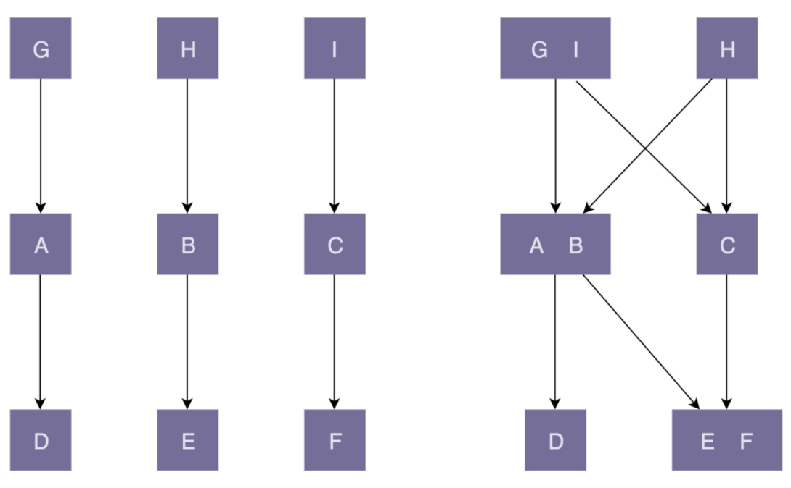

- 图中左边部分的代码设计中，类的粒度比较小，每个类的职责都比较单一：相近的功能都放到一个类中，不相近的功能被分割到多个类中，这样类更加独立，代码的内聚性更好

    > 因为职责单一，所以每个类被依赖的类就会比较少，代码低耦合
    >
    > 一个类的修改，只会影响到一个依赖类的代码改动

- 图中右边部分的代码设计中，类粒度比较大，低内聚，功能大而全，不相近的功能放到一个类中，会导致很多其他类都依赖这个类

    > 当修改这个类的某一个功能代码时，会影响依赖它的多个类

### (2) 迪米特法则(LOD)

**迪米特法则(LOD)**：不该有直接依赖关系的类之间，不要有依赖；有依赖关系的类之间，尽量只依赖必要的接口

- **案例一**：理解“不该有直接依赖关系的类之间，不要有依赖”

    下述例子实现了简化版的搜索引擎爬取网页的功能

    ```java
    //负责底层网络通信，根据请求获取数据
    public class NetworkTransporter {
        // 省略属性和其他方法...
        public Byte[] send(HtmlRequest htmlRequest) {
            //...
        }
    }
    
    //用来通过 URL 获取网页
    public class HtmlDownloader {
        private NetworkTransporter transporter; //通过构造函数或IOC注入
    
        public Html downloadHtml(String url) {
            Byte[] rawHtml = transporter.send(new HtmlRequest(url));
            return new Html(rawHtml);
        }
    }
    
    //表示网页文档，后续的网页内容抽取、分词、索引都是以此为处理对象
    public class Document {
        private Html html;
        private String url;
    
        public Document(String url) {
            this.url = url;
            HtmlDownloader downloader = new HtmlDownloader();
            this.html = downloader.downloadHtml(url);
        }
        //...
    }
    ```

    代码的三个类的设计缺陷：

    - 类 `NetworkTransporter`：作为一个底层网络通信类，希望功能尽可能通用，而不只是服务于下载 HTML，因此不应该直接依赖太具体的发送对象 HtmlRequest，即违背迪米特法则，依赖了不该有直接依赖关系的HtmlRequest 类

        代码重构：

        ```java
        public class NetworkTransporter {
            // 省略属性和其他方法...
            public Byte[] send(String address, Byte[] data) {
                //...
            }
        }
        ```

    - 类 `HtmlDownloader` 的设计没有问题

    - 类 `Document`：有三点问题

        - 第一：构造函数中的 downloader.downloadHtml() 逻辑复杂，耗时长，不应该放到构造函数中，会影响代码的可测试性
        - 第二：HtmlDownloader 对象在构造函数中通过 new 来创建，违反了基于接口而非实现编程的设计思想，也会影响到代码的可测试性
        - 第三：从业务含义上来讲，Document 网页文档没必要依赖 HtmlDownloader 类，违背了迪米特法则

        代码重构：

        ```java
        public class Document {
            private Html html;
            private String url;
        
            public Document(String url, Html html) {
                this.html = html;
                this.url = url;
            }
            //...
        }
        
        // 通过一个工厂方法来创建Document
        public class DocumentFactory {
            private HtmlDownloader downloader;
        
            public DocumentFactory(HtmlDownloader downloader) {
                this.downloader = downloader;
            }
        
            public Document createDocument(String url) {
                Html html = downloader.downloadHtml(url);
                return new Document(url, html);
            }
        }
        ```

- **案例二**：理解“有依赖关系的类之间，尽量只依赖必要的接口”

    下述例子的 Serialization 类负责对象的序列化和反序列化

    ```java
    public class Serialization {
        public String serialize(Object object) {
            String serializedResult = ...;
            //...
            return serializedResult;
        }
    
        public Object deserialize(String str) {
            Object deserializedResult = ...;
            //...
            return deserializedResult;
        }
    }
    ```

    基于迪米特法则后半部分的“有依赖关系的类之间，尽量只依赖必要的接口”，则只用到序列化操作的类不应该依赖反序列化接口，只用到反序列化操作的类不应该依赖序列化接口

    因此，将 Serialization 类拆分为两个更小粒度的类，一个只负责序列化(Serializer 类)，一个只负责反序列化(Deserializer 类)

    > 拆分后的代码更能满足迪米特法则，但却违背了高内聚的设计思想
    >
    > 高内聚要求相近的功能要放到同一个类中，这样可以方便功能修改时，修改的地方不至于过于分散

    ---

    通过引入两个接口能满足既不违背高内聚的设计思想，也不违背迪米特法则

    ```java
    public interface Serializable {
        String serialize(Object object);
    }
    
    public interface Deserializable {
        Object deserialize(String text);
    }
    
    public class Serialization implements Serializable, Deserializable {
        @Override
        public String serialize(Object object) {
            String serializedResult = ...;
            ...
            return serializedResult;
        }
    
        @Override
        public Object deserialize(String str) {
            Object deserializedResult = ...;
            ...
            return deserializedResult;
        }
    }
    
    public class DemoClass_1 {
        private Serializable serializer;
    
        public Demo(Serializable serializer) {
            this.serializer = serializer;
        }
        //...
    }
    
    public class DemoClass_2 {
        private Deserializable deserializer;
    
        public Demo(Deserializable deserializer) {
            this.deserializer = deserializer;
        }
        //...
    }
    ```

# 三、规范与重构

## 1、理论一：重构的why、what、when、how

### (1) 重构目的(why)

重构：在保持功能不变的前提下，利用设计思想、原则、模式、编程规范等理论来优化代码，修改设计上的不足，提高代码质量

- 重构一：**提高代码可维护性**，即重构是时刻保证代码质量的一个极其有效的手段，不至于让代码腐化到无可救药的地步
- 重构二：**提高项目架构的可迭代性**，即优秀的代码或架构是迭代出来的
- 重构三：**有效避免前期过度设计**，即遇到问题时，再对代码进行重构，能有效避免前期投入太多时间做过度的设计

> 重构实际上是对学习的经典设计思想、设计原则、设计模式、编程规范的一种应用

### (2) 重构对象(what)

根据重构的规模，可以笼统地分为大规模高层次重构(即“大型重构”)和小规模低层次的重构(即“小型重构”)

- **大型重构**：指对顶层代码设计的重构，包括：系统、模块、代码结构、类与类之间的关系等的重构

    > 重构的手段有：分层、模块化、解耦、抽象可复用组件等等

- **小型重构**：指对代码细节的重构，主要是针对类、函数、变量等代码级别的重构

    > 比如规范命名、规范注释、消除超大类或函数、提取重复代码等等

### (3) 重构时机(when)

持续重构：

- 平时没有事情时，可以看看项目中有哪些写得不够好的、可以优化的代码，主动去重构一下
- 在修改、添加某个功能代码时，也可以顺手把不符合编码规范、不好的设计重构一下

> 若能把持续重构作为开发的一部分，成为一种开发习惯，对项目、对自己都会很有好处

### (4) 重构方法(how)

进行**大型重构**时，要提前做好完善的重构计划，有条不紊地分阶段来进行

- 每个阶段完成一小部分代码的重构，然后提交、测试、运行，发现没有问题之后，再继续进行下一阶段的重构，保证代码仓库中的代码一直处于可运行、逻辑正确的状态

- 每个阶段，都要控制好重构影响到的代码范围，考虑好如何兼容老的代码逻辑，必要时还要写一些兼容过渡代码

## 2、理论二：重构手段

### (1) 理解单元测试(what)

- **单元测试**：由研发工程师编写，用来测试自己写的代码的正确性

- 集成测试的测试对象是整个系统或某个功能模块，是一种端到端的测试

    单元测试的测试对象是类或函数，用来测试一个类和函数是否都按照预期的逻辑执行

### (2) 单元测试目的(why)

- 单元测试能有效地帮助发现代码中的 bug

- 写单元测试能帮助发现代码设计上的问题

    > 比如：没有使用依赖注入、大量使用静态函数、全局变量、代码高度耦合等

- 单元测试是对集成测试的有力补充

- 写单元测试的过程本身就是代码重构的过程

- 阅读单元测试能帮助快速熟悉代码

- 单元测试是 TDD(测试驱动开发) 可落地执行的改进方案

### (3) 编写单元测试(how)

> 写单元测试就是针对代码设计各种测试用例，以覆盖各种输入、异常、边界情况，并将其翻译成代码

对于单元测试的正确认知：

- 编写单元测试尽管繁琐，但并不是太耗时
- 可以稍微放低对单元测试代码质量的要求
- 覆盖率作为衡量单元测试质量的唯一标准是不合理的
- 单元测试不要依赖被测代码的具体实现逻辑
- 单元测试框架无法测试，多半是因为代码的可测试性不好

## 3、理论三：代码的可测试性

### (1) 什么是代码的可测试性

**代码的可测试性：就是针对代码编写单元测试的难易程度**

- 一段代码若很难为其编写单元测试或单元测试写起来很费劲，则需要依靠单元测试框架中很高级的特性，那往往就意味着代码设计得不够合理，代码的可测试性不好


### (2) 写出可测试的代码

**依赖注入是编写可测试性代码的最有效手段**

- 通过依赖注入，在编写单元测试时，可以通过 mock 的方法解依赖外部服务


### (3) 常见的不好测试的代码

- 代码中包含未决行为逻辑

    > **未决行为逻辑**：代码的输出是随机或不确定，比如：跟时间、随机数有关的代码

- 滥用可变全局变量

    > 全局变量是一种面向过程的编程风格，有种种弊端。实际上，滥用全局变量也让编写单元测试变得困难

- 滥用静态方法

- 使用复杂的继承关系

- 高度耦合的代码

## 4、理论四：通过封装、抽象、模块化、中间层等接耦代码

### (1) 解耦的重要性

> 过于复杂的代码往往在可读性、可维护性上都不友好

- 解耦保证代码松耦合、高内聚，是控制代码复杂度的有效手段。

- 代码高内聚、松耦合，意味着代码结构清晰、分层模块化合理、依赖关系简单、模块或类之间的耦合小，那代码整体的质量不会差

### (2) 判断代码是否需要解耦

- 间接衡量标准：修改代码是否会牵一发而动全身

- 直接衡量标准：把模块与模块之间、类与类之间的依赖关系画出来，根据依赖关系图的复杂性来判断是否需要解耦重构

    > 若依赖关系复杂、混乱，那从代码结构上来讲，可读性和可维护性肯定不太好，这时就需要考虑是否可以通过解耦的方法，让依赖关系变得清晰、简单
    >
    > 当然，这种判断还是有比较强的主观色彩，但是可以作为一种参考和梳理依赖的手段，配合间接的衡量标准一块来使用

### (3) 代码解耦的方法

1. **封装与抽象**：封装和抽象可以有效地隐藏实现的复杂性，隔离实现的易变性，给依赖的模块提供稳定且易用的抽象接口

2. **中间层**：引入中间层能简化模块或类之间的依赖关系

    > 除此之外，在进行重构时，引入中间层可以起到过渡的作用，能够让开发和重构同步进行，不互相干扰
    >
    > ---
    >
    > 为了让重构能小步快跑，可以分下面四个阶段来完成接口的修改：
    >
    > - 第一阶段：引入一个中间层，包裹老的接口，提供新的接口定义
    > - 第二阶段：新开发的代码依赖中间层提供的新接口
    > - 第三阶段：将依赖老接口的代码改为调用新接口
    > - 第四阶段：确保所有的代码都调用新接口之后，删除掉老的接口

3. **模块化**：将每个模块都当作一个独立的 lib，只提供封装内部实现细节的接口给其他模块使用，可以减少不同模块间的耦合度

4. **其他设计思想和原则**：

    - 单一职责原则：模块或类的职责设计得单一，而不是大而全，则依赖它的类和它依赖的类就会比较少，降低代码耦合

    - 基于接口而非实现编程：能通过接口这样一个中间层，隔离变化和具体的实现

        > 好处：在有依赖关系的两个模块或类之间，一个模块或类的改动，不会影响到另一个模块或类
        >
        > 即将一种强依赖关系（强耦合）解耦为了弱依赖关系（弱耦合）

    - 依赖注入：管依赖注入无法将本应该有依赖关系的两个类，解耦为没有依赖关系，但可以让耦合关系没那么紧密，容易插拔替换

    - 多用组合少用继承：组合是一种弱依赖关系，对于继承结构比较复杂的代码，利用组合来替换继承，也是一种解耦的有效手段

        > 继承是一种强依赖关系，父类与子类高度耦合，且耦合关系很脆弱，牵一发而动全身，父类的每次改动都会影响所有子类

    - 迪米特法则：不该有直接依赖关系的类之间，不要有依赖；有依赖关系的类之间，尽量只依赖必要的接口

## 5、理论五：改善代码质量的 20 条编程规范

### (1) 命名与注释

- **命名**：
    - **命名长度**：作用域小的，命名可以短小一些；作用域大的，推荐用命名长的
    - **利用上下文简化命名** 
    - **命名要可读、可搜索**：不要用一些特别生僻、难发音的英文单词来命名
    - **命名接口和抽象类**：
        - 接口命名：
            - 方式一：接口加前缀 `I`，比如 IUserService，表示 Interface，对应的实现类命名为 UserService
            - 方式二：不加前缀，比如 UserService，对应的实现类加后缀 `Impl`，比如 UserServiceImpl
        - 抽象类命名：
            - 方式一：带上前缀 `Abstract`，比如 AbstractConfiguration
            - 方式二：不带前缀 `Abstract`
- **注释**：
    - **注释该写什么**：注释的内容主要包含这样三个方面：做什么、为什么、怎么做
        - 注释比代码承载的信息更多
        - 注释起到总结性作用、文档的作用
        - 一些总结性注释能让代码结构更清晰
    - **注释不能太多也不能太少**：
        - 类和函数一定要写注释，而且要写得尽可能全面、详细
        - 函数内部的注释要相对少一些，一般都是靠好的命名、提炼函数、解释性变量、总结性注释来提高代码的可读性

### (2) 代码风格

- **类和函数的大小**：当一个类的代码读起来让你感觉头大，实现某个功能时不知道该用哪个函数，想用哪个函数翻半天都找不到，只用到一个小功能要引入整个类(类中包含很多无关此功能实现的函数)时，这就说明类的行数过多

- **一行代码的合适长度**：一行代码最长不能超过 IDE 显示的宽度

    > - 需要滚动鼠标才能查看一行的全部代码，显然不利于代码的阅读
    >
    > - 限制也不能太小，太小会导致很多稍长点的语句被折成两行，也会影响到代码的整洁，不利于阅读

- **善用空行分割单元块**：对于较长函数，若逻辑上可以分为几个独立的代码块，在不方便将这些独立的代码块抽取成小函数的情况下，为了让逻辑更加清晰，除了用总结性注释外，还可以使用空行来分割各个代码块

    > 在类的成员变量与函数之间、静态成员变量与普通成员变量之间、各函数之间、各成员变量之间，都可以通过添加空行的方式，让这些不同模块的代码之间，界限更加明确
    >
    > 写代码就类似写文章，善于应用空行，让代码的整体结构看起来更加有清晰、有条理

- **四格缩进还是两格缩进**：不管是用两格缩进还是四格缩进，一定不要用 tab 键缩进

    > 若在同一个项目中，不同的同事使用不同的缩进方式(空格缩进或 tab 键缩进)，可能会导致有的代码显示为两格缩进、有的代码显示为四格缩进

- **大括号是否要另起一行**：大括号跟上条语句同行，还是另起新的一行，只要团队统一、业内统一、跟开源项目看齐就好

    > - 将括号放到跟语句同一行的风格，可以节省代码行数
    >
    > - 将大括号另起新的一行，则左右括号可以垂直对齐，哪些代码属于哪一个代码块，更一目了然

- **类中成员的排列顺序**：在类中：

    - 成员变量排在函数前面。成员变量或函数之间，按照“先静态(静态函数或静态成员变量)、后普通(非静态函数或非静态成员变量)”的方式排列

    - 成员变量或函数之间，还会按照作用域范围从大到小的顺序排列，先写 public 成员变量或函数，然后 protected，最后 private

        > 另一种排列：把有调用关系的函数放到一块。比如，一个 public 函数调用了另外一个 private 函数，则把这两者放到一块

### (3) 编程技巧

- **把代码分割成更小的单元块**：要有模块化和抽象思维，善于将大块的复杂逻辑提炼成类或函数，屏蔽掉细节，让阅读代码的人不至于迷失在细节中，这样能极大地提高代码的可读性

    > 只有代码逻辑比较复杂时，才建议提炼类或函数
    >
    > 若提炼出的函数只包含两三行代码，阅读代码时，还得跳过去看一下，这样反倒增加了阅读成本(通用实现除外)

- **避免函数参数过多**：函数参数建议最多 3、4 个，大于等于 5 个时，会影响到代码的可读性，使用起来也不方便

    > 参数过多的 2 种处理方法：
    >
    > - 考虑函数是否职责单一，是否能通过拆分成多个函数的方式来减少参数
    >
    > - 将函数的参数封装成对象
    >
    >     > 若函数是对外暴露的远程接口，将参数封装成对象，还可以提高接口的兼容性

- **勿用函数参数来控制逻辑**：

    - 情况一：不要在函数中使用布尔类型的标识参数来控制内部逻辑，true 走这块逻辑，false 走另一块逻辑

        > 建议将其拆成两个函数，可读性上也要更好
        >
        > 注：若函数是 private 私有函数，影响范围有限，或拆分后的两个函数经常同时被调用，可以酌情考虑保留标识参数

    - 情况二：不要根据参数是否为 null 来控制逻辑

        > 针对这种情况，也应该将其拆分成多个函数，拆分之后的函数职责更明确，不容易用错

- **函数设计要职责单一**：函数设计更要满足单一职责原则，相对于类和模块，函数的粒度比较小，代码行数少，所以在应用单一职责原则时，没有像应用到类或模块那样模棱两可，能多单一就多单一

- **移除过深的嵌套层次**：嵌套最好不超过两层，超过两层之后就要思考一下是否可以减少嵌套

    > 代码嵌套层次过深往往是因为 if-else、switch-case、for 循环过度嵌套导致
    >
    > ---
    >
    > 解决嵌套过深的 4 种常见思路：
    >
    > - 去掉多余的 if-else 语句
    > - 使用编程语言提供的 continue、break、return 关键字，提前退出嵌套
    > - 调整执行顺序来减少嵌套，比如：提前判空返回
    > - 将部分嵌套逻辑封装成函数调用，以此来减少嵌套
    >
    > 注：第 5 种思路为通过使用多态来替代 if-else、switch-case 条件判断

- **学会使用解释性变量**：

    - 常量取代魔法数字
    - 使用解释性变量来解释复杂表达式

## 6、总结

### (1) 如何发现代码质量问题

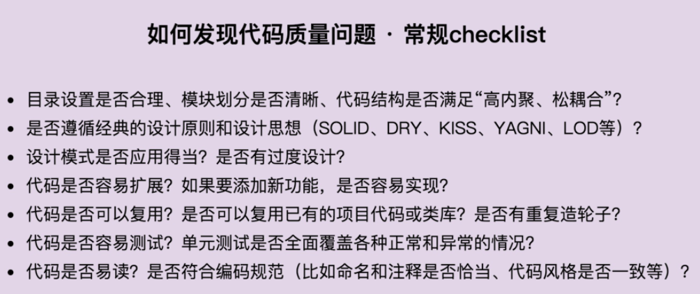

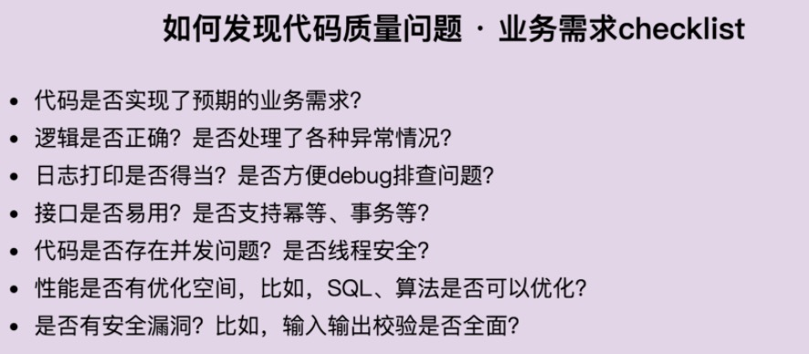

### (2) 编写高质量代码

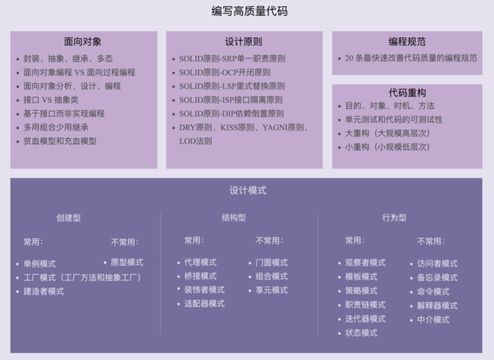

#### 1. 代码质量评判标准

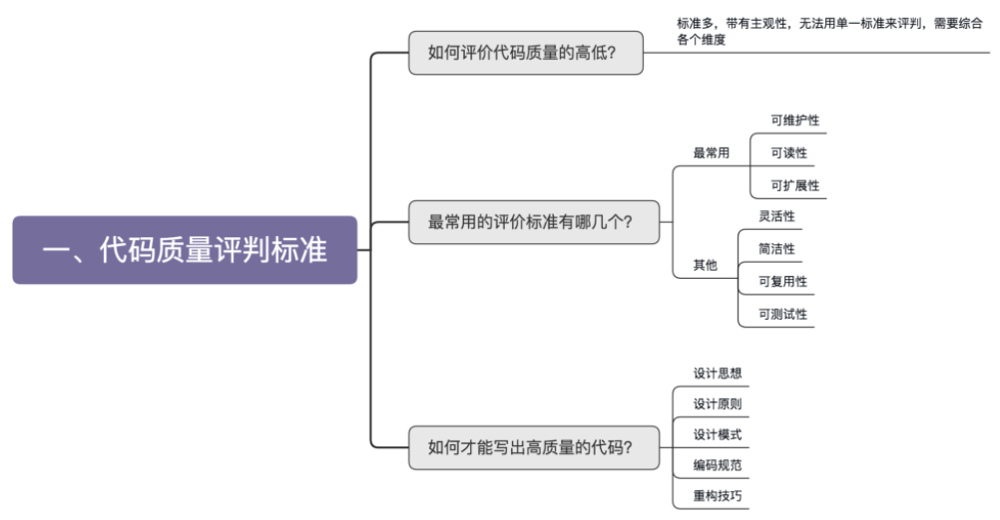

#### 2. 面向对象总结

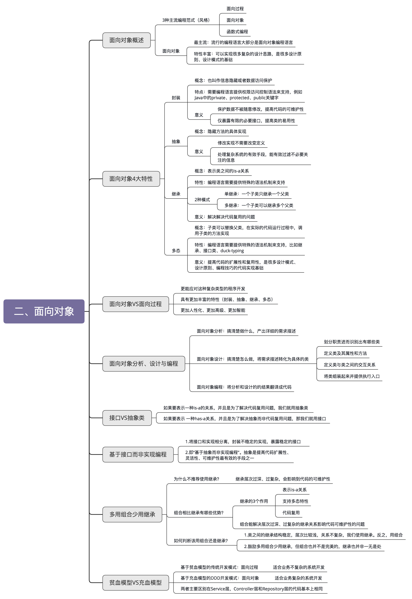

#### 3. 设计原则总结

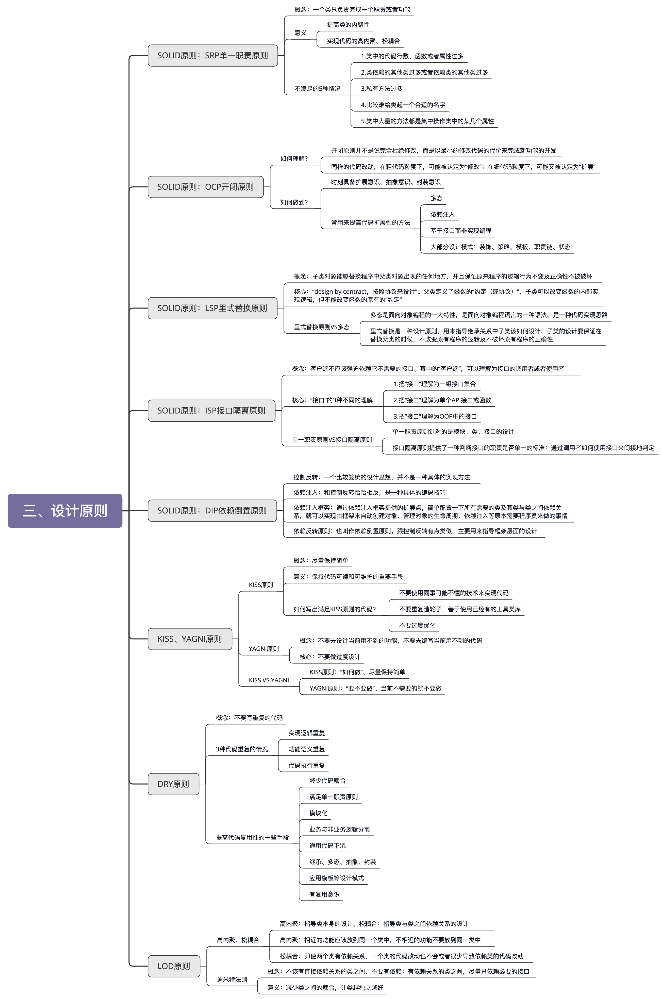

#### 4. 规范与重构总结

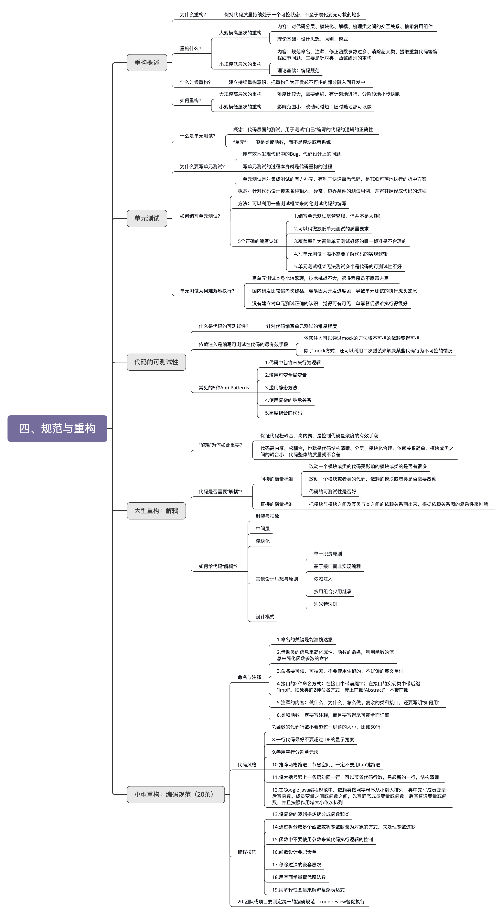

# 四、创建型

> 很多设计模式都是试图将庞大的类拆分成更细小的类，然后再通过某种更合理的结构组装在一起

- 创建型设计模式主要解决“对象的创建”问题，即将创建和使用代码解耦

- 结构型设计模式主要解决“类或对象的组合或组装”问题，即将不同功能代码解耦

- 行为型设计模式主要解决的就是“类或对象之间的交互”问题，即将不同的行为代码解耦

> 创建型模式主要解决对象的创建问题，封装复杂的创建过程，解耦对象的创建代码和使用代码
>
> - 单例模式用来创建全局唯一对象
> - 工厂模式用来创建不同但相关类型的对象(继承同一父类或接口的一组子类)，由给定的参数来决定创建哪种类型的对象
> - 建造者模式用来创建复杂对象，可以通过设置不同的可选参数，“定制化”创建不同对象
> - 原型模式针对创建成本比较大的对象，利用对已有对象进行复制的方式进行创建，以达到节省创建时间的目的

## 1、单例模式(Singleton)

> **定义**：一个类只允许创建一个对象或实例，那这个类就是一个单例类，这种设计模式就叫单例模式

### (1) 简介

- **意图**： 保证一个类仅有一个实例，并提供一个全局访问点

- **主要解决**： 一个全局使用的类频繁地创建与销毁，减少内存开销

- **何时使用**： 当想控制实例数目，节省系统资源时

- **缺点**： 没有接口，不能继承，与单一职责原则冲突，一个类应该只关心内部逻辑，而不关心外面怎么样来实例化

### (2) 关注点

- 构造函数为 `private` 访问权限，避免外部通过 new 创建实例
- 考虑对象创建时的线程安全问题
- 考虑是否支持延迟加载
- 考虑 `getInstance()` 性能是否高(是否加锁)

### (3) 代码实现

#### 1. 懒汉式-线程不安全

- 私有静态变量 `uniqueInstance` 被延迟实例化

  > 好处： 如果没有用到该类，则不用实例化 `uniqueInstance`，从而节约资源

- 在多线程环境下不安全

```java
public class Singleton {
    private static Singleton uniqueInstance;
    private Singleton() {
    }
    public static Singleton getUniqueInstance() {
        if (uniqueInstance == null) {
            uniqueInstance = new Singleton();
        }
        return uniqueInstance;
    }
}
```

#### 2. 饿汉式-线程安全

- 采取直接实例化 `uniqueInstance` 方式解决线程不安全问题

- 缺点： 直接实例化方式丢失了延迟实例化带来的节约资源的好处

```java
private static Singleton uniqueInstance = new Singleton();
```

#### 3. 懒汉式-线程安全

通过加锁避免实例化多次 `uniqueInstance`

- 优点：支持延迟加载

- 缺点： 不支持高并发，即每次获取单例时加锁，若频繁使用，会影响调用效率

    > 当一个线程进入该方法之后，其它试图进入该方法的线程都必须等待

```java
public static synchronized Singleton getUniqueInstance() {
    if (uniqueInstance == null) {
        uniqueInstance = new Singleton();
    }
    return uniqueInstance;
}
```

#### 4. 双重校验锁-==线程安全== 

- 只有当 `uniqueInstance` 没有被实例化时，才需要进行加锁

```java
public class Singleton {
    //使用 volatile 可以禁止 JVM 的指令重排，保证在多线程环境下也能正常运行
    private volatile static Singleton uniqueInstance; 
    private Singleton() {
    }
    public static Singleton getUniqueInstance() {
        if (uniqueInstance == null) {
            synchronized (Singleton.class) {
                if (uniqueInstance == null) {
                    uniqueInstance = new Singleton();
                }
            }
        }
        return uniqueInstance;
    }
}
```

`uniqueInstance = new Singleton();`  其实分为三步执行：

1. 为 uniqueInstance 分配内存空间
2. 初始化 uniqueInstance
3. 将 uniqueInstance 指向分配的内存地址

例如，线程 T<sub>1</sub> 执行了 1 和 3，此时 T<sub>2</sub> 调用 getUniqueInstance() 后发现 uniqueInstance 不为空，因此返回 uniqueInstance，但此时 uniqueInstance 还未被初始化

使用 volatile 可以禁止 JVM 的指令重排，保证在多线程环境下也能正常运行

#### 5. 静态内部类实现(==最优==)

- 当 Singleton 类加载时，静态内部类 SingletonHolder 没有被加载进内存，当调用 `getUniqueInstance()` 方法从而触发 `SingletonHolder.INSTANCE` 时 SingletonHolder 才会被加载，

- 这种方式不仅具有延迟初始化的好处，而且由 JVM 提供了对线程安全的支持

```java
public class Singleton {
    private Singleton() {
    }

    private static class SingletonHolder {
        private static final Singleton INSTANCE = new Singleton();
    }

    public static Singleton getUniqueInstance() {
        return SingletonHolder.INSTANCE;
    }
}
```

#### 6. 枚举实现

 ```java
public enum Singleton {
    INSTANCE;
    private String objName;

    public String getObjName() {
        return objName;
    }
    public void setObjName(String objName) {
        this.objName = objName;
    }
    public static void main(String[] args) {
        // 单例测试
        Singleton firstSingleton = Singleton.INSTANCE;
        firstSingleton.setObjName("firstName");
        System.out.println(firstSingleton.getObjName());
        Singleton secondSingleton = Singleton.INSTANCE;
        secondSingleton.setObjName("secondName");
        System.out.println(firstSingleton.getObjName());
        System.out.println(secondSingleton.getObjName());
        // 反射获取实例测试
        try {
            Singleton[] enumConstants = Singleton.class.getEnumConstants();
            for (Singleton enumConstant : enumConstants) {
                System.out.println(enumConstant.getObjName());
            }
        } catch (Exception e) {
            e.printStackTrace();
        }
    }
}
 ```

> Java 规范字规定：每个枚举类型及其定义的枚举变量在 JVM 中唯一

枚举类型的序列化和反序列化的特殊规定：

- 序列化时，Java 仅将枚举对象的 name 属性输到结果中；反序列化时，则是通过 `java.lang.Enum` 的 `valueOf()` 方法来根据名字查找枚举对象
- 即：序列化时，只将 `DATASOURCE` 这个名称输出；反序列化时，再通过这个名称查找对应的枚举类型，因此反序列化后的实例也会和之前被序列化的对象实例相同

> 该实现在多次序列化再进行反序列化之后，不会得到多个实例

### (5) 单例问题

#### 1. 单例对 OOP 特性的支持不友好

单例模式对 OOP 中的抽象、继承、多态都支持得不好：

- 单例的使用方式违背了基于接口而非实现的设计原则，也就违背了广义上理解的 OOP 抽象特性

    > 例如：希望针对不同的业务采用不同的 ID 生成算法，则需要修改所有用到 IdGenerator 类的地方，这样代码的改动会比较大
    >
    > ```java
    > public class Order {
    >     public void create(...) {
    >         //...
    >         long id = IdGenerator.getInstance().getId();
    >         // 需要将上面一行代码，替换为下面一行代码
    >         long id = OrderIdGenerator.getIntance().getId();
    >         //...
    >     }
    > }
    > 
    > public class User {
    >     public void create(...) {
    >         // ...
    >         long id = IdGenerator.getInstance().getId();
    >         // 需要将上面一行代码，替换为下面一行代码
    >         long id = UserIdGenerator.getIntance().getId();
    >     }
    > }
    > ```

- 除此之外，单例对继承、多态特性的支持也不友好

    > 一旦选择将某个类设计成到单例类，也就意味放弃了继承和多态，即损失了可以应对未来需求变化的扩展性

#### 2. 单例会隐藏类之间的依赖关系

> 某个类要是依赖了单例，降低了代码的可读性，不能一眼就看出这个类对其他类的依赖关系

- 通过构造函数、参数传递等方式声明的类之间的依赖关系，可以通过查看函数的定义，就能很容易识别出来

- 单例类不需要显示创建、不需要依赖参数传递，在函数中直接调用就可以，若代码比较复杂，这种调用关系会非常隐蔽

    > 阅读代码时，需要仔细查看每个函数的代码实现，才能知道这个类到底依赖了哪些单例类

#### 3. 单例对代码的扩展性不友好

> 单例类只能有一个对象实例，若未来需要在代码中创建两个或多个实例，则代码会有较大的改动

例如：对于慢 SQL，除了采用读写分离和 SQL 语句优化外，还可以创建两个数据库连接池，用于将慢 SQL 和其他 SQL 分离

因此，数据库连接池、线程池这类的资源池，最好不要设计成单例类

#### 4. 单例对代码的可测试性不友好

- 若单例类依赖较重的外部资源(如：DB)，则在写单元测试时，希望通过 mock 方式替换，而单例导致无法实现 mock 替换

- 同时，若单例类持有成员变量，由于实例只有一个，相当于全局静态变量，会被所有的代码共享

    > 若是可变全局变量，则在编写单元测试时，还要注意不同测试用例间，修改了单例类中的同一个成员变量的值，从而导致测试结果互相影响的问题

#### 5. 单例不支持有参数的构造函数

比如：创建一个连接池的单例对象，则没法通过参数来指定连接池的大小，解决思路：

- 解决思路一：创建实例后，再调用 `init()` 函数传递参数

    > 注意：在使用这个单例类时，要先调用 `init()` 方法，然后才能调用 `getInstance() `方法，否则代码会抛出异常

    ```java
    public class Singleton {
        private static Singleton instance = null;
        
        private final int paramA;
        private final int paramB;
    
        private Singleton(int paramA, int paramB) {
            this.paramA = paramA;
            this.paramB = paramB;
        }
    
        public static Singleton getInstance() {
            if (instance == null) {
                throw new RuntimeException("Run init() first.");
            }
            return instance;
        }
    
        public synchronized static Singleton init(int paramA, int paramB) {
            if (instance != null){
                throw new RuntimeException("Singleton has been created!");
            }
            instance = new Singleton(paramA, paramB);
            return instance;
        }
    }
    
    Singleton.init(10, 50); // 先init，再使用
    Singleton singleton = Singleton.getInstance();
    ```

- 解决思路二：将参数放到 `getInstance()` 方法中

    ```java
    public class Singleton {
        private static Singleton instance = null;
        
        private final int paramA;
        private final int paramB;
    
        private Singleton(int paramA, int paramB) {
            this.paramA = paramA;
            this.paramB = paramB;
        }
    
        public synchronized static Singleton getInstance(int paramA, int paramB) {
            if (instance == null) {
                instance = new Singleton(paramA, paramB);
            }
            return instance;
        }
    }
    
    Singleton singleton = Singleton.getInstance(10, 50);
    ```

    问题：若两次执行 `getInstance(paramA, paramB)` 方法，第二次传递进去的参数不生效，而构建过程也没有提示，会误导用户

    思考：

    1. 若需要一个全局唯一类，且这个类只能被初始化一次，则应采用“解决思路三”，即将所需参数放到全局配置文件中，从而避免多次初始化参数被忽略或抛出运行时异常问题
    2. 若是要根据不同参数构造出不同的对象，并且相同参数的对象只被构造一次，则应改成在 Singleton 类中维护一个 HashMap，然后每次调用 `getInstance()` 方法时，根据参数去判断对象是否已经存在(可以采用双重检测)，存在则直接返回；不存在再去创建，然后存储返回，即单例+简单工厂的结合

- 解决思路三：将参数放到另外一个全局变量中

    > Config 是存储了 paramA 和 paramB 值的全局变量，其中的值可以通过静态常量来定义，也可以从配置文件中加载得到

    ```java
    public class Config {
        public static final int PARAM_A = 123;
        public static final int PARAM_B = 245;
    }
    
    public class Singleton {
        private static Singleton instance = null;
        
        private final int paramA;
        private final int paramB;
    
        private Singleton() {
            this.paramA = Config.PARAM_A;
            this.paramB = Config.PARAM_B;
        }
    
        public synchronized static Singleton getInstance() {
            if (instance == null) {
                instance = new Singleton();
            }
            return instance;
        }
    }
    ```

### (6) 单例的替代方案

- 替代方案一：使用静态方法来实现

- 替代方案二：将单例生成的对象作为参数传递给函数(也可以通过构造函数传递给类的成员变量)，解决单例隐藏类间依赖关系问题

    ```java
    // 1. 老的使用方式
    public demofunction() {
      //...
      long id = IdGenerator.getInstance().getId();
      //...
    }
    
    // 2. 新的使用方式：依赖注入
    public demofunction(IdGenerator idGenerator) {
      long id = idGenerator.getId();
    }
    IdGenerator idGenerator = IdGenerator.getInsance(); // 外部调用demofunction()的时候，传入idGenerator
    demofunction(idGenerator);
    ```

> 注：对于单例存在的其他问题，比如：对 OOP 特性、扩展性、可测性不友好等问题，还是无法解决

### (7) 实现集群环境下的分布式单例模式

#### 1. 理解单例模式中的唯一性

> 一个单例类只允许创建唯一一个对象或实例，而单例模式创建的对象是**进程唯一** 
>
> 注：对于 Java 语言来说，单例类对象的唯一性的作用范围并非进程，而是**类加载器** 
>
> - `ClassLoaderX + package.class` 唯一确定一个类对象，而单例指一个类或对象，若有不同的 ClassLoaderX 就可以有不同的类，也就有不同的对象

进程间不共享地址空间，若在一个进程中创建另外一个进程，操作系统会给新进程分配新的地址空间，并且将老进程地址空间的所有内容，重新拷贝一份到新进程的地址空间中，这些内容包括代码、数据

#### 2. 实现线程唯一的单例

- 进程唯一：指的是进程内唯一，进程间不唯一
- 线程唯一：指的是线程内唯一，线程间可以不唯一
- 区别：进程唯一代表了线程内、线程间都唯一

---

**线程唯一实现**：通过 HashMap 存储对象，key 是线程 ID，value 是对象，实现不同线程对应不同对象，一个线程只能对应一个对象

`ThreadLocal` 可以轻松实现线程唯一单例：

```java
public class IdGenerator {
    private AtomicLong id = new AtomicLong(0);
    private static final ConcurrentHashMap<Long, IdGenerator> instances = new ConcurrentHashMap<>();

    private IdGenerator() {}

    public static IdGenerator getInstance() {
        Long currentThreadId = Thread.currentThread().getId();
        instances.putIfAbsent(currentThreadId, new IdGenerator());
        return instances.get(currentThreadId);
    }

    public long getId() {
        return id.incrementAndGet();
    }
}
```

#### 3. 实现集群环境下的单例

- **集群唯一**：相当于是进程内唯一、进程间也唯一，即不同进程间共享同一个对象，不能创建同一个类的多个对象

- **实现**：把单例对象序列化并存储到外部共享存储区(如文件)

    > 进程在使用单例对象时，先从外部共享存储区读取到内存，并反序列化成对象再使用，使用完成后再存储回外部共享存储区

- 注意点：

    - 为保证进程间只有一份对象存在，一个进程在获取到对象后，要将对象加锁，避免其他进程再将其获取

    - 在进程使用完这个对象后，还要显式地将对象从内存中删除，并且释放对对象的加锁

```java
//代码实现
public class IdGenerator {
    private AtomicLong id = new AtomicLong(0);
    private static IdGenerator instance;
    private static SharedObjectStorage storage = FileSharedObjectStorage("file.txt");
    private static DistributedLock lock = new DistributedLock();

    private IdGenerator() {}

    public synchronized static IdGenerator getInstance() {
        if (instance == null) {
            lock.lock();
            instance = storage.load(IdGenerator.class);
        }
        return instance;
    }

    public synchroinzed void freeInstance() {
        storage.save(this, IdGeneator.class);
        instance = null; //释放对象
        lock.unlock();
    }

    public long getId() { 
        return id.incrementAndGet();
    }
}

// IdGenerator使用举例
IdGenerator idGeneator = IdGenerator.getInstance();
long id = idGenerator.getId();
IdGenerator.freeInstance();
```

#### 4. 实现多例模式

- 单例指一个类只能创建一个对象；多例指一个类可以创建多个对象，但个数有限制

- 另一种理解：同一类型的只能创建一个对象，不同类型的可以创建多个对象

    ```java
    public class Logger {
        private static final ConcurrentHashMap<String, Logger> instances= new ConcurrentHashMap<>();
    
        private Logger() {}
    
        public static Logger getInstance(String loggerName) {
            instances.putIfAbsent(loggerName, new Logger());
            return instances.get(loggerName);
        }
    
        public void log() {
            //...
        }
    }
    
    //l1==l2, l1!=l3
    Logger l1 = Logger.getInstance("User.class");
    Logger l2 = Logger.getInstance("User.class");
    Logger l3 = Logger.getInstance("Order.class");
    ```

    代码中：logger name 就是“类型”，同一个 logger name 获取到的对象实例相同，不同的 logger name 获取到的对象实例不同

    > 与工厂模式的不同之处：多例模式创建的对象是同一个类的对象，而工厂模式创建的是不同子类的对象
    >
    > 注：枚举类型也相当于多例模式，一个类型只能对应一个对象，一个类可以创建多个对象

### JDK使用

- [java.lang.Runtime#getRuntime()](http://docs.oracle.com/javase/8/docs/api/java/lang/Runtime.html#getRuntime%28%29)
- [java.awt.Desktop#getDesktop()](http://docs.oracle.com/javase/8/docs/api/java/awt/Desktop.html#getDesktop--)
- [java.lang.System#getSecurityManager()](http://docs.oracle.com/javase/8/docs/api/java/lang/System.html#getSecurityManager--) 

## 2、三种工厂模式

### (1) 简单/静态工厂模式(Simple Factory)

#### 1. 简介

- **使用场景**：当每个对象的创建逻辑都比较简单时，将多个对象的创建逻辑放到一个工厂类中

- **实现**：`if-else` 创建不同的对象 或 用单例模式 + 简单工厂模式结合来实现

#### 2. 使用案例

- **初始实现**：

    ```java
    public class RuleConfigSource {
        public RuleConfig load(String ruleConfigFilePath) {
            String ruleConfigFileExtension = getFileExtension(ruleConfigFilePath);
            IRuleConfigParser parser = createParser(ruleConfigFileExtension);
            if (parser == null) {
                throw new InvalidRuleConfigException("Rule config file format is not supported: " 
                                                     + ruleConfigFilePath);
            }
    
            String configText = "";
            //从ruleConfigFilePath文件中读取配置文本到configText中
            RuleConfig ruleConfig = parser.parse(configText);
            return ruleConfig;
        }
    
        private String getFileExtension(String filePath) {
            //...解析文件名获取扩展名，比如rule.json，返回json
            return "json";
        }
    
        private IRuleConfigParser createParser(String configFormat) {
            IRuleConfigParser parser = null;
            if ("json".equalsIgnoreCase(configFormat)) {
                parser = new JsonRuleConfigParser();
            } else if ("xml".equalsIgnoreCase(configFormat)) {
                parser = new XmlRuleConfigParser();
            } else if ("yaml".equalsIgnoreCase(configFormat)) {
                parser = new YamlRuleConfigParser();
            } else if ("properties".equalsIgnoreCase(configFormat)) {
                parser = new PropertiesRuleConfigParser();
            }
            return parser;
        }
    }
    ```

- **简单工厂模式类**：为让类的职责更加单一、代码更加清晰，将 `createParser()` 函数剥离到独立类中，让这个类只负责对象的创建

    ```java
    public class RuleConfigSource {
        public RuleConfig load(String ruleConfigFilePath) {
            String ruleConfigFileExtension = getFileExtension(ruleConfigFilePath);
            IRuleConfigParser parser = RuleConfigParserFactory.createParser(ruleConfigFileExtension);
            if (parser == null) {
            throw new InvalidRuleConfigException("Rule config file format is not supported: " 
                                                 + ruleConfigFilePath);
            }
            String configText = "";
            //从ruleConfigFilePath文件中读取配置文本到configText中
            RuleConfig ruleConfig = parser.parse(configText);
            return ruleConfig;
        }
    
        private String getFileExtension(String filePath) {
            //...解析文件名获取扩展名，比如rule.json，返回json
            return "json";
        }
    }
    
    public class RuleConfigParserFactory {
        public static IRuleConfigParser createParser(String configFormat) {
            IRuleConfigParser parser = null;
            if ("json".equalsIgnoreCase(configFormat)) {
                parser = new JsonRuleConfigParser();
            } else if ("xml".equalsIgnoreCase(configFormat)) {
                parser = new XmlRuleConfigParser();
            } else if ("yaml".equalsIgnoreCase(configFormat)) {
                parser = new YamlRuleConfigParser();
            } else if ("properties".equalsIgnoreCase(configFormat)) {
                parser = new PropertiesRuleConfigParser();
            }
            return parser;
        }
    }
    ```

- **简单工厂模式的第二种实现**：

    > 若 parser 可以复用，为了节省内存和对象创建的时间，可以将 parser 事先创建好缓存起来，当调用 createParser() 函数时，从缓存中取出 parser 对象直接使用

    ```java
    public class RuleConfigParserFactory {
        private static final Map<String, RuleConfigParser> cachedParsers = new HashMap<>();
    
        static {
            cachedParsers.put("json", new JsonRuleConfigParser());
            cachedParsers.put("xml", new XmlRuleConfigParser());
            cachedParsers.put("yaml", new YamlRuleConfigParser());
            cachedParsers.put("properties", new PropertiesRuleConfigParser());
        }
    
        public static IRuleConfigParser createParser(String configFormat) {
            if (configFormat == null || configFormat.isEmpty()) {
                return null;//返回null还是IllegalArgumentException全凭你自己说了算
            }
            IRuleConfigParser parser = cachedParsers.get(configFormat.toLowerCase());
            return parser;
        }
    }
    ```

#### JDK使用

- [java.util.Calendar](http://docs.oracle.com/javase/8/docs/api/java/util/Calendar.html#getInstance--)
- [java.util.ResourceBundle](http://docs.oracle.com/javase/8/docs/api/java/util/ResourceBundle.html#getBundle-java.lang.String-)
- [java.text.NumberFormat](http://docs.oracle.com/javase/8/docs/api/java/text/NumberFormat.html#getInstance--)
- [java.nio.charset.Charset](http://docs.oracle.com/javase/8/docs/api/java/nio/charset/Charset.html#forName-java.lang.String-)
- [java.net.URLStreamHandlerFactory](http://docs.oracle.com/javase/8/docs/api/java/net/URLStreamHandlerFactory.html#createURLStreamHandler-java.lang.String-)
- [java.util.EnumSet](https://docs.oracle.com/javase/8/docs/api/java/util/EnumSet.html#of-E-)
- [javax.xml.bind.JAXBContext](https://docs.oracle.com/javase/8/docs/api/javax/xml/bind/JAXBContext.html#createMarshaller--)

### (2) 工厂方法模式(Factory Method)

#### 1. 简介

- **使用场景**：
    - 当每个对象的创建逻辑都比较复杂时，为避免设计一个过于庞大的简单工厂类，将创建逻辑拆分得更细，每个对象的创建逻辑独立到各自的工厂类中
    - 避免很多 `if-else` 分支逻辑时
- **实现**：
    - 定义相应的 `ParserFactory` 接口，每个工厂定义一个实现类，这种方式会有多个 if-else
    - 创建工厂的工厂，可以解决多个 if-else 问题

#### 2. 使用案例

目标：将"将简单工厂模式"案例中的 if 分支逻辑去掉

- **多态实现**：

    ```java
    public interface IRuleConfigParserFactory {
        IRuleConfigParser createParser();
    }
    
    public class JsonRuleConfigParserFactory implements IRuleConfigParserFactory {
        @Override
        public IRuleConfigParser createParser() {
            return new JsonRuleConfigParser();
        }
    }
    
    public class XmlRuleConfigParserFactory implements IRuleConfigParserFactory {
        @Override
        public IRuleConfigParser createParser() {
            return new XmlRuleConfigParser();
        }
    }
    
    public class YamlRuleConfigParserFactory implements IRuleConfigParserFactory {
        @Override
        public IRuleConfigParser createParser() {
            return new YamlRuleConfigParser();
        }
    }
    
    public class PropertiesRuleConfigParserFactory implements IRuleConfigParserFactory {
        @Override
        public IRuleConfigParser createParser() {
            return new PropertiesRuleConfigParser();
        }
    }
    ```

- **工厂模式实现**：为工厂类再创建一个简单工厂，即额外创建诸多 Factory 类来实现同一接口

    ```java
    //工厂模式
    public class RuleConfigSource {
        public RuleConfig load(String ruleConfigFilePath) {
            String ruleConfigFileExtension = getFileExtension(ruleConfigFilePath);
            //获取指定接口实现
            IRuleConfigParserFactory parserFactory 
                	= RuleConfigParserFactoryMap.getParserFactory(ruleConfigFileExtension);
            
            if (parserFactory == null) {
                throw new InvalidRuleConfigException("Rule config file format is not supported: " 
                                                     + ruleConfigFilePath);
            }
            IRuleConfigParser parser = parserFactory.createParser();
    
            String configText = "";
            //从ruleConfigFilePath文件中读取配置文本到configText中
            RuleConfig ruleConfig = parser.parse(configText);
            return ruleConfig;
        }
    
        private String getFileExtension(String filePath) {
            //...解析文件名获取扩展名，比如rule.json，返回json
            return "json";
        }
    }
    
    //简单工厂模式的第二种实现思路：因为工厂类只包含方法，不包含成员变量，完全可以复用，不需要每次都创建新的工厂类对象
    public class RuleConfigParserFactoryMap { //工厂的工厂
        private static final Map<String, IRuleConfigParserFactory> cachedFactories = new HashMap<>();
    
        static {
            cachedFactories.put("json", new JsonRuleConfigParserFactory());
            cachedFactories.put("xml", new XmlRuleConfigParserFactory());
            cachedFactories.put("yaml", new YamlRuleConfigParserFactory());
            cachedFactories.put("properties", new PropertiesRuleConfigParserFactory());
        }
    
        public static IRuleConfigParserFactory getParserFactory(String type) {
            if (type == null || type.isEmpty()) {
                return null;
            }
            IRuleConfigParserFactory parserFactory = cachedFactories.get(type.toLowerCase());
            return parserFactory;
        }
    }
    ```

### (3) 抽象工厂模式(Abstract Factory)

#### 1. 简介

- **使用场景**：有多种分类方式，如：方式一要用一套工厂方法，方式二要用一套工厂方法
- **实现**：让一个工厂负责创建多个不同类型的对象，而不是只创建一种 parser 对象

#### 2. 使用案例

> 抽象工厂可以让一个工厂负责创建多个不同类型的对象，而不是只创建一种 parser 对象，这样可以有效地减少工厂类个数

例如：8 个 parser 类

```shell
#针对规则配置的解析器：基于接口IRuleConfigParser
JsonRuleConfigParser
XmlRuleConfigParser
YamlRuleConfigParser
PropertiesRuleConfigParser

#针对系统配置的解析器：基于接口ISystemConfigParser
JsonSystemConfigParser
XmlSystemConfigParser
YamlSystemConfigParser
PropertiesSystemConfigParser
```

代码实现：

```java
public interface IConfigParserFactory {
    IRuleConfigParser createRuleParser();
    ISystemConfigParser createSystemParser();
    //此处可以扩展新的parser类型，比如IBizConfigParser
}

public class JsonConfigParserFactory implements IConfigParserFactory {
    @Override
    public IRuleConfigParser createRuleParser() {
        return new JsonRuleConfigParser();
    }

    @Override
    public ISystemConfigParser createSystemParser() {
        return new JsonSystemConfigParser();
    }
}

public class XmlConfigParserFactory implements IConfigParserFactory {
    @Override
    public IRuleConfigParser createRuleParser() {
        return new XmlRuleConfigParser();
    }

    @Override
    public ISystemConfigParser createSystemParser() {
        return new XmlSystemConfigParser();
    }
}

// 省略YamlConfigParserFactory和PropertiesConfigParserFactory
```

#### JDK使用

- [javax.xml.parsers.DocumentBuilderFactory](http://docs.oracle.com/javase/8/docs/api/javax/xml/parsers/DocumentBuilderFactory.html)
- [javax.xml.transform.TransformerFactory](http://docs.oracle.com/javase/8/docs/api/javax/xml/transform/TransformerFactory.html#newInstance--)
- [javax.xml.xpath.XPathFactory](http://docs.oracle.com/javase/8/docs/api/javax/xml/xpath/XPathFactory.html#newInstance--)

### (4) 总结

#### 1. 重点回顾

当创建逻辑比较复杂，是一个“大工程”时，可以考虑使用工厂模式，封装对象的创建过程，将对象的创建和使用相分离：

- **情况一**：类似规则配置解析案例，代码中存在 if-else 分支判断，动态地根据不同的类型创建不同的对象

    > 针对这种情况，我们就考虑使用工厂模式，将这一大坨 if-else 创建对象的代码抽离出来，放到工厂类中
    >
    > - 当每个对象的创建逻辑都比较简单时，推荐使用简单工厂模式，将多个对象的创建逻辑放到一个工厂类中
    >
    > - 当每个对象的创建逻辑都比较复杂时，为避免设计一个过于庞大的简单工厂类，推荐使用工厂方法模式，将创建逻辑拆分得更细，每个对象的创建逻辑独立到各自的工厂类中

- **情况二**：单个对象本身的创建过程比较复杂，比如：要组合其他类对象，做各种初始化操作

    > 这种情况下，也可以考虑使用工厂模式，将对象的创建过程封装到工厂类中
    >
    > - 因为单个对象本身的创建逻辑就比较复杂，所以建议使用工厂方法模式

#### 2. 使用工厂模式的参考标准

判断是否使用工厂模式的最本质参考标准：

- **封装变化**：创建逻辑有可能变化，封装成工厂类后，创建逻辑的变更对调用者透明
- **代码复用**：创建代码抽离到独立的工厂类之后可以复用
- **隔离复杂性**：封装复杂的创建逻辑，调用者无需了解如何创建对象
- **控制复杂度**：将创建代码抽离出来，让原本的函数或类职责更单一，代码更简洁

#### 3. 工厂类命名方案

- `valueOf()` 返回与入参相等的对象，例如：`Integer.valueOf()`
- `getInstance()` 返回单例对象，例如：`Calendar.getInstance()`
- `newInstance()` 每次调用时返回新的对象，例如：`HelloWorld.class.getConstructor().newInstance()`
- 在反射中的工厂方法，例如：`XXX.class.getField(String name)` 返回成员

#### 4. 静态工厂方法优点

- 静态工厂方法子类可以继承，但不能重写，这样返回类型确定，可以返回对象类型或 primitive 类型
- 静态工厂方法的名字更有意义，例如：Collections.synchronizedMap()
- 静态工厂方法可以封装创建对象的逻辑，还可以做其他事情，让构造方法只初始化成员变量
- 静态工厂方法可以控制创建实例的个数，例如：单例模式或多例模式，使用本质上是可以用静态工厂方法实现

### (5) 工厂模式替代方案

#### 1. 替代一：getBean

将同一接口的不同的实现类按照 `@Component(value = "xxx")` 命名注入，获取时调用 `SpringUtils.getBean(beanName)` 

```java
@Component
public class SpringUtils implements ApplicationContextAware {
    private static ApplicationContext applicationContext; // Spring应用上下文环境

    //实现ApplicationContextAware接口的回调方法，设置上下文环境
    @Override
    public void setApplicationContext(ApplicationContext applicationContext) {
        SpringUtils.applicationContext = applicationContext;
    }

    public static ApplicationContext getApplicationContext() {
        return applicationContext;
    }

    /**
     * 获取对象 这里重写了bean方法，起主要作用
     *
     * @return Object 一个以所给名字注册的bean的实例
     */
    public static <T> T getBean(String name) throws BeansException {
        if (applicationContext == null) {
            return null;
        }
        return (T) applicationContext.getBean(name);
    }

    /**
     * 获取对象 这里重写了bean方法，起主要作用
     *
     * @return Object 一个以所给名字注册的bean的实例
     */
    public static Object getBean(Class classType) throws BeansException {
        if (applicationContext == null) {
            return null;
        }
        return applicationContext.getBean(classType);
    }
}
```

#### 2. 替代二：函数式编程

- 定义一个 `FunctionFactory`，内部维护一组 `Function<String,String>` 函数和一个 `Map` 容器映射 `mapping type` 和 `Function` 

    ```java
    public BiConsumer<AbstractProductServiceRequest, 
    			Function<ProductServiceQueryRequest, ProductServiceQueryResponse>> operateConsumer() {
        switch (serviceOperationEnum) {
            case OPEN:
                return openConsumer();
            case CLOSE:
                return closeConsumer();
            default:
                throw new RuntimeException("not support OperationType");
        }
    }
    ```

- 若是对象，直接使用 `Map<Supply>` 函数

    ```java
    public class ShapeFactory {
        final static Map<String, Supplier<Shape>> map = new HashMap<>();
        
        static {
            map.put("CIRCLE", Circle::new);
            map.put("RECTANGLE", Rectangle::new);
        }
        
        public Shape getShape(String shapeType){
            Supplier<Shape> shape = map.get(shapeType.toUpperCase());
            if(shape != null) {
                return shape.get();
            }
            throw new IllegalArgumentException("No such shape " + shapeType.toUpperCase());
        }
    }
    ```

### (6) 实现一个 Dependency Injection 框架

#### 1. 工厂模式和 DI 容器的联系与区别

> DI 容器底层最基本的设计思路是基于工厂模式

- DI 容器相当于一个大的工厂类，负责在程序启动时，根据配置(要创建哪些类对象，每个类对象的创建要依赖哪些其他类对象)事先创建好对象

    > 当应用程序需要使用某个类对象时，直接从容器中获取即可

- 一个工厂类只负责某个类对象或某一组相关类对象(继承自同一抽象类或接口的子类)的创建，而 DI 容器负责整个应用中所有类对象的创建

#### 2. DI 容器的核心功能

- **配置解析**：将需要由 DI 容器来创建的类对象和创建类对象的必要信息放到配置文件中，容器读取配置文件，根据配置文件提供的信息来创建对象

    > Spring 容器读取配置文件，解析出要创建的两个对象：rateLimiter 和 redisCounter，并且得到两者的依赖关系：rateLimiter 依赖 redisCounter

    ```java
    public class RateLimiter {
        private RedisCounter redisCounter;
        
        public RateLimiter(RedisCounter redisCounter) {
            this.redisCounter = redisCounter;
        }
        
        public void test() {
            System.out.println("Hello World!");
        }
        //...
    }
    
    public class RedisCounter {
        private String ipAddress;
        private int port;
        
        public RedisCounter(String ipAddress, int port) {
            this.ipAddress = ipAddress;
            this.port = port;
        }
        //...
    }
    
    配置文件beans.xml：
    <beans>
       <bean id="rateLimiter" class="com.xzg.RateLimiter">
          <constructor-arg ref="redisCounter"/>
       </bean>
     
       <bean id="redisCounter" class="com.xzg.redisCounter">
         <constructor-arg type="String" value="127.0.0.1">
         <constructor-arg type="int" value=1234>
       </bean>
    </beans>
    ```

- **对象创建**：将所有类对象的创建都放到一个工厂类中完成，比如 `BeansFactory`

    > “反射”机制能在程序运行的过程中，动态地加载类、创建对象，不需要事先在代码中写死要创建哪些对象

- **对象生命周期管理**：

    > - 简单工厂模式的两种实现方式：`scope=prototype` 表示返回新创建的对象，`scope=singleton` 表示返回单例对象
    >     - 方式一：每次都返回新创建的对象
    >     - 方式二：每次都返回同一个事先创建好的对象，即单例对象
    >
    > - 配置对象是否支持懒加载：`lazy-init=true` 表示对象在真正被使用时才被创建；`lazy-init=false` 表示对象在应用启动时就事先创建好
    >
    > - 配置对象的 `init-method` 和 `destroy-method` 方法：
    >     - DI 容器在创建好对象之后，会主动调用 `init-method` 属性指定的方法来初始化对象
    >     - 在对象被最终销毁前，DI 容器会主动调用 `destroy-method` 属性指定的方法来做清理工作，如：释放数据库连接池
    >
    > 生命周期管理需要考虑的：新对象还是缓存对象(单例)、是否延迟加载、构造函数和析构函数

#### 3. 实现 DI 容器

> 核心逻辑：配置文件解析、根据配置文件通过“反射”语法来创建对象

- **最小原型设计**：

    - 支持配置文件中涉及的配置语法：

        ```xml
        配置文件beans.xml
        <beans>
           <bean id="rateLimiter" class="com.xzg.RateLimiter">
              <constructor-arg ref="redisCounter"/>
           </bean>
         
           <bean id="redisCounter" class="com.xzg.redisCounter" scope="singleton" lazy-init="true">
             <constructor-arg type="String" value="127.0.0.1">
             <constructor-arg type="int" value=1234>
           </bean>
        </bean
        ```

    - 使用方式：

        ```java
        public class Demo {
            public static void main(String[] args) {
                ApplicationContext applicationContext = new ClassPathXmlApplicationContext("beans.xml");
                RateLimiter rateLimiter = (RateLimiter) applicationContext.getBean("rateLimiter");
                rateLimiter.test();
                //...
            }
        }
        ```

- **提供执行入口**：这里的执行入口就是一组暴露给外部使用的接口和类

    > 执行入口主要包含两部分：`ApplicationContext` 和 `ClassPathXmlApplicationContext` 

    ClassPathXmlApplicationContext 负责组装 BeansFactory 和 BeanConfigParser 两个类，串联执行流程：

    - 从 classpath 中加载 XML 格式的配置文件，通过 BeanConfigParser 解析为统一的 BeanDefinition 格式
    - 然后，BeansFactory 根据 BeanDefinition 来创建对象

    ```java
    public interface ApplicationContext {
        Object getBean(String beanId);
    }
    
    public class ClassPathXmlApplicationContext implements ApplicationContext {
        private BeansFactory beansFactory;
        private BeanConfigParser beanConfigParser;
    
        public ClassPathXmlApplicationContext(String configLocation) {
            this.beansFactory = new BeansFactory();
            this.beanConfigParser = new XmlBeanConfigParser();
            loadBeanDefinitions(configLocation);
        }
    
        private void loadBeanDefinitions(String configLocation) {
            InputStream in = null;
            try {
                in = this.getClass().getResourceAsStream("/" + configLocation);
                if (in == null) {
                    throw new RuntimeException("Can not find config file: " + configLocation);
                }
                List<BeanDefinition> beanDefinitions = beanConfigParser.parse(in);
                beansFactory.addBeanDefinitions(beanDefinitions);
            } finally {
                if (in != null) {
                    try {
                        in.close();
                    } catch (IOException e) {
                        // TODO: log error
                    }
                }
            }
        }
    
        @Override
        public Object getBean(String beanId) {
            return beansFactory.getBean(beanId);
        }
    }
    ```

- **配置文件解析**：主要包含 `BeanConfigParser` 接口和 `XmlBeanConfigParser` 实现类，负责将配置文件解析为 `BeanDefinition` 结构，以便 BeansFactory 根据这个结构来创建对象

    ```java
    public interface BeanConfigParser {
        List<BeanDefinition> parse(InputStream inputStream);
        List<BeanDefinition> parse(String configContent);
    }
    
    public class XmlBeanConfigParser implements BeanConfigParser {
        @Override
        public List<BeanDefinition> parse(InputStream inputStream) {
            String content = null;
            // TODO:...
            return parse(content);
        }
    
        @Override
        public List<BeanDefinition> parse(String configContent) {
            List<BeanDefinition> beanDefinitions = new ArrayList<>();
            // TODO:...
            return beanDefinitions;
        }
    }
    
    public class BeanDefinition {
        private String id;
        private String className;
        private List<ConstructorArg> constructorArgs = new ArrayList<>();
        private Scope scope = Scope.SINGLETON;
        private boolean lazyInit = false;
        // 省略必要的getter/setter/constructors
    
        public boolean isSingleton() {
            return scope.equals(Scope.SINGLETON);
        }
    
        public static enum Scope {
            SINGLETON,
            PROTOTYPE
        }
    
        public static class ConstructorArg {
            private boolean isRef;
            private Class type;
            private Object arg;
            // 省略必要的getter/setter/constructors
        }
    }
    ```

#### 4. 核心工厂类设计

> `BeansFactory` 负责根据从配置文件解析得到的 BeanDefinition 来创建对象

- 若对象的 scope 属性是 singleton，则对象创建后会缓存在 `singletonObjects`(map 结构)中，下次再请求此对象时，直接从 map 中取出返回，不需要重新创建
- 若对象的 scope 属性是 prototype，则每次请求对象，BeansFactory 都会创建一个新的对象返回

---

`BeansFactory` 创建对象用到的反射语法，一种动态加载类和创建对象的机制：

- JVM 在启动时，会根据代码自动地加载类、创建对象
- 若某个对象的创建并不是写死在代码中，而是放到配置文件中，则需要在程序运行期间，动态地根据配置文件来加载类、创建对象

```java
public class BeansFactory {
    private ConcurrentHashMap<String, Object> singletonObjects = new ConcurrentHashMap<>();
    private ConcurrentHashMap<String, BeanDefinition> beanDefinitions = new ConcurrentHashMap<>();

    public void addBeanDefinitions(List<BeanDefinition> beanDefinitionList) {
        for (BeanDefinition beanDefinition : beanDefinitionList) {
            this.beanDefinitions.putIfAbsent(beanDefinition.getId(), beanDefinition);
        }

        for (BeanDefinition beanDefinition : beanDefinitionList) {
            if (beanDefinition.isLazyInit() == false && beanDefinition.isSingleton()) {
                createBean(beanDefinition);
            }
        }
    }

    public Object getBean(String beanId) {
        BeanDefinition beanDefinition = beanDefinitions.get(beanId);
        if (beanDefinition == null) {
            throw new NoSuchBeanDefinitionException("Bean is not defined: " + beanId);
        }
        return createBean(beanDefinition);
    }

    @VisibleForTesting
    protected Object createBean(BeanDefinition beanDefinition) {
        if (beanDefinition.isSingleton() && singletonObjects.contains(beanDefinition.getId())) {
            return singletonObjects.get(beanDefinition.getId());
        }
        Object bean = null;
        try {
            Class beanClass = Class.forName(beanDefinition.getClassName());
            List<BeanDefinition.ConstructorArg> args = beanDefinition.getConstructorArgs();
            if (args.isEmpty()) {
                bean = beanClass.newInstance();
            } else {
                Class[] argClasses = new Class[args.size()];
                Object[] argObjects = new Object[args.size()];
                for (int i = 0; i < args.size(); ++i) {
                    BeanDefinition.ConstructorArg arg = args.get(i);
                    if (!arg.getIsRef()) {
                        argClasses[i] = arg.getType();
                        argObjects[i] = arg.getArg();
                    } else {
                        BeanDefinition refBeanDefinition = beanDefinitions.get(arg.getArg());
                        if (refBeanDefinition == null) {
                            throw new NoSuchBeanDefinitionException("Bean is not defined: " + arg.getArg());
                        }
                        argClasses[i] = Class.forName(refBeanDefinition.getClassName());
                        argObjects[i] = createBean(refBeanDefinition);
                    }
                }
                bean = beanClass.getConstructor(argClasses).newInstance(argObjects);
            }
        } catch (ClassNotFoundException | IllegalAccessException 
                 | InstantiationException | NoSuchMethodException | InvocationTargetException e) {
            throw new BeanCreationFailureException("", e);
        }

        if (bean != null && beanDefinition.isSingleton()) {
            singletonObjects.putIfAbsent(beanDefinition.getId(), bean);
            return singletonObjects.get(beanDefinition.getId());
        }
        return bean;
    }
}
```

## 3、建造者模式(Builder)

> 建造者模式又叫构建者模式或生成器模式，建造者主要解决**参数过多、参数检验、控制对象创建后不可变的问题** 

### (1) builder 模式优势

**建造者模式解决的问题**：

- 参数有依赖校验、必填项校验和约束校验：建造者模式提供了 `builder` 方法来校验
- 创建的对象不可变：建造者模式中对象的构造函数被设置成 private，只能通过 builder 方法去创建

```java
public class ResourcePoolConfig {
    private String name;
    private int maxTotal;
    private int maxIdle;
    private int minIdle;

    private ResourcePoolConfig(Builder builder) {
        this.name = builder.name;
        this.maxTotal = builder.maxTotal;
        this.maxIdle = builder.maxIdle;
        this.minIdle = builder.minIdle;
    }
    //...省略getter方法...

    //将 Builder 类设计成了 ResourcePoolConfig 的内部类，也可以将 Builder 类设计成独立的非内部类
    public static class Builder {
        private static final int DEFAULT_MAX_TOTAL = 8;
        private static final int DEFAULT_MAX_IDLE = 8;
        private static final int DEFAULT_MIN_IDLE = 0;

        private String name;
        private int maxTotal = DEFAULT_MAX_TOTAL;
        private int maxIdle = DEFAULT_MAX_IDLE;
        private int minIdle = DEFAULT_MIN_IDLE;

        public ResourcePoolConfig build() {
            // 校验逻辑放到这里来做，包括必填项校验、依赖关系校验、约束条件校验等
            if (StringUtils.isBlank(name)) {
                throw new IllegalArgumentException("...");
            }
            if (maxIdle > maxTotal) {
                throw new IllegalArgumentException("...");
            }
            if (minIdle > maxTotal || minIdle > maxIdle) {
                throw new IllegalArgumentException("...");
            }
            return new ResourcePoolConfig(this);
        }

        public Builder setName(String name) {
            if (StringUtils.isBlank(name)) {
                throw new IllegalArgumentException("...");
            }
            this.name = name;
            return this;
        }

        public Builder setMaxTotal(int maxTotal) {
            if (maxTotal <= 0) {
                throw new IllegalArgumentException("...");
            }
            this.maxTotal = maxTotal;
            return this;
        }

        public Builder setMaxIdle(int maxIdle) {
            if (maxIdle < 0) {
                throw new IllegalArgumentException("...");
            }
            this.maxIdle = maxIdle;
            return this;
        }

        public Builder setMinIdle(int minIdle) {
            if (minIdle < 0) {
                throw new IllegalArgumentException("...");
            }
            this.minIdle = minIdle;
            return this;
        }
    }
}

// 这段代码会抛出 IllegalArgumentException，因为 minIdle>maxIdle
ResourcePoolConfig config = new ResourcePoolConfig.Builder()
        .setName("dbconnectionpool")
        .setMaxTotal(16)
        .setMaxIdle(10)
        .setMinIdle(12)
        .build();
```

### (2) 与工厂模式区别

> 建造者模式是让建造者类来负责对象的创建工作

- 工厂模式是用来创建类型不同但有关联的对象(继承同一父类或接口的一组子类)，由给定的参数来决定创建哪种类型的对象
- 建造者模式是用来创建一种类型的复杂对象，通过设置不同的可选参数，“定制化”地创建不同的对象

### JDK使用

- [java.lang.StringBuilder](http://docs.oracle.com/javase/8/docs/api/java/lang/StringBuilder.html)
- [java.nio.ByteBuffer](http://docs.oracle.com/javase/8/docs/api/java/nio/ByteBuffer.html#put-byte-)
- [java.lang.StringBuffer](http://docs.oracle.com/javase/8/docs/api/java/lang/StringBuffer.html#append-boolean-)
- [java.lang.Appendable](http://docs.oracle.com/javase/8/docs/api/java/lang/Appendable.html)
- [Apache Camel builders](https://github.com/apache/camel/tree/0e195428ee04531be27a0b659005e3aa8d159d23/camel-core/src/main/java/org/apache/camel/builder)

## 4、原型模式(Prototype)

### (1) 简介

**原型模式**：若对象的创建成本较大，而同一个类的不同对象之间差别不大(大部分字段都相同)，则可以利用对已有对象(原型)进行复制(或拷贝)的方式来创建新对象，以达到节省创建时间的目的

> **创建成本较大的对象**：对象中的数据要经过复杂计算得到，或需从 RPC、网络、数据库、文件系统等非常慢速的 IO 中读取

### (2) 实现方式：深拷贝与浅拷贝

> 原型模式的两种实现方法：深拷贝和浅拷贝

#### 1. 深拷贝与浅拷贝的区别

浅拷贝和深拷贝的区别：

- 浅拷贝只会复制图中的索引(散列表)，不会复制数据(SearchWord 对象)本身；深拷贝不仅仅会复制索引，还会复制数据本身

- 浅拷贝得到的对象跟原始对象共享数据(SearchWord 对象)，而深拷贝得到的是一份完完全全独立的对象

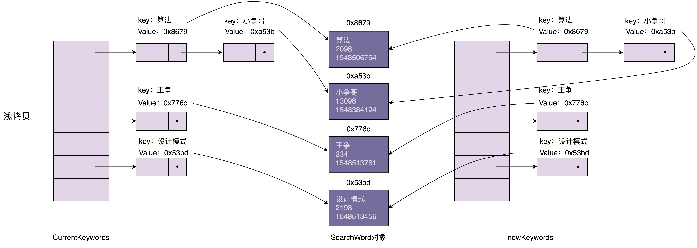

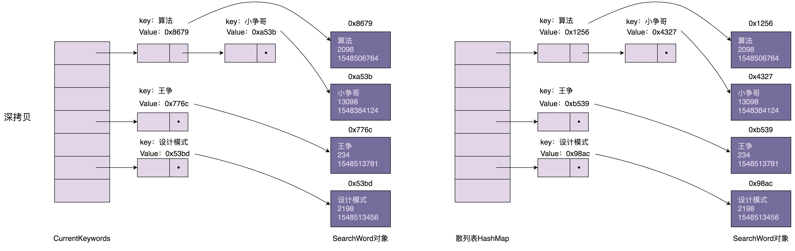

> Java 中的 Object 类的 `clone()` 是浅拷贝，只拷贝基本数据类型的数据，以及引用对象的内存地址，不会递归地拷贝引用对象本身

#### 2. 深拷贝实现

**深拷贝的两种实现方法**：

- **方法一**：递归拷贝对象、对象的引用对象及引用对象的引用对象 ... 直到要拷贝的对象只包含基本数据类型数据，没有引用对象为止

    ```java
    public class Demo {
        private HashMap<String, SearchWord> currentKeywords=new HashMap<>();
        private long lastUpdateTime = -1;
    
        public void refresh() {
            HashMap<String, SearchWord> newKeywords = new HashMap<>();
            for (HashMap.Entry<String, SearchWord> e : currentKeywords.entrySet()) {
                SearchWord searchWord = e.getValue();
                SearchWord newSearchWord = new SearchWord(searchWord.getKeyword(), 
                                                          searchWord.getCount(), 
                                                          searchWord.getLastUpdateTime());
                newKeywords.put(e.getKey(), newSearchWord);
            }
            // 从数据库中取出更新时间 > lastUpdateTime的数据，放入到newKeywords中
            List<SearchWord> toBeUpdatedSearchWords = getSearchWords(lastUpdateTime);
            long maxNewUpdatedTime = lastUpdateTime;
            for (SearchWord searchWord : toBeUpdatedSearchWords) {
                if (searchWord.getLastUpdateTime() > maxNewUpdatedTime) {
                    maxNewUpdatedTime = searchWord.getLastUpdateTime();
                }
                if (newKeywords.containsKey(searchWord.getKeyword())) {
                    SearchWord oldSearchWord = newKeywords.get(searchWord.getKeyword());
                    oldSearchWord.setCount(searchWord.getCount());
                    oldSearchWord.setLastUpdateTime(searchWord.getLastUpdateTime());
                } else {
                    newKeywords.put(searchWord.getKeyword(), searchWord);
                }
            }
            lastUpdateTime = maxNewUpdatedTime;
            currentKeywords = newKeywords;
        }
    
        private List<SearchWord> getSearchWords(long lastUpdateTime) {
            // TODO: 从数据库中取出更新时间>lastUpdateTime的数据
            return null;
        }
    }
    ```

- **方法二**：先将对象序列化，然后再反序列化成新的对象

    ```java
    public Object deepCopy(Object object) {
        ByteArrayOutputStream bo = new ByteArrayOutputStream();
        ObjectOutputStream oo = new ObjectOutputStream(bo);
        oo.writeObject(object);
    
        ByteArrayInputStream bi = new ByteArrayInputStream(bo.toByteArray());
        ObjectInputStream oi = new ObjectInputStream(bi);
    
        return oi.readObject();
    }
    ```

- 方法三：先采用浅拷贝创建 newKeywords，对于需要更新的 SearchWord 对象，再使用深度拷贝方式创建一份新的对象，替换 newKeywords 中的老对象(**典型的 Copy On Write 思想**)

    ```java
    public class Demo {
        private HashMap<String, SearchWord> currentKeywords=new HashMap<>();
        private long lastUpdateTime = -1;
    
        public void refresh() {
            // Shallow copy
            HashMap<String, SearchWord> newKeywords = (HashMap<String, SearchWord>) currentKeywords.clone();
    
            // 从数据库中取出更新时间>lastUpdateTime的数据，放入到newKeywords中
            List<SearchWord> toBeUpdatedSearchWords = getSearchWords(lastUpdateTime);
            long maxNewUpdatedTime = lastUpdateTime;
            for (SearchWord searchWord : toBeUpdatedSearchWords) {
                if (searchWord.getLastUpdateTime() > maxNewUpdatedTime) {
                    maxNewUpdatedTime = searchWord.getLastUpdateTime();
                }
                if (newKeywords.containsKey(searchWord.getKeyword())) {
                    newKeywords.remove(searchWord.getKeyword());
                }
                newKeywords.put(searchWord.getKeyword(), searchWord);
            }
            lastUpdateTime = maxNewUpdatedTime;
            currentKeywords = newKeywords;
        }
    
        private List<SearchWord> getSearchWords(long lastUpdateTime) {
            // TODO: 从数据库中取出更新时间>lastUpdateTime的数据
            return null;
        }
    }
    ```

### JDK使用

- [java.lang.Object#clone()](http://docs.oracle.com/javase/8/docs/api/java/lang/Object.html#clone%28%29)

# 五、结构型

> 很多设计模式都是试图将庞大的类拆分成更细小的类，然后再通过某种更合理的结构组装在一起

- 创建型设计模式主要解决“对象的创建”问题，即将创建和使用代码解耦

- 结构型设计模式主要解决“类或对象的组合或组装”问题，即将不同功能代码解耦

- 行为型设计模式主要解决的就是“类或对象之间的交互”问题，即将不同的行为代码解耦

> 结构型模式主要总结了一些类或对象组合在一起的经典结构，这些经典的结构可以解决特定应用场景的问题

## 1、代理模式(Proxy/wrapper)

### (1) 简介

- 定义：在不改变原始类(又叫被代理类)代码的情况下，通过引入代理类来给原始类附加功能
- 目的：解耦代码
- 应用场景：常用在业务系统中开发一些非功能性需求，如：监控、统计、鉴权、限流、事务、幂等、日志等

### (2) 使用案例

#### 1. 案例一：接口实现

代理类 UserControllerProxy 和原始类 UserController 实现相同的接口 IUserController：

- `UserController` 类只负责业务功能
- 代理类 `UserControllerProxy` 负责在业务代码执行前后附加其他逻辑代码，并通过委托的方式调用原始类来执行业务代码

```java
//基于接口而非实现编程
public interface IUserController {
    UserVo login(String telephone, String password);
    UserVo register(String telephone, String password);
}

public class UserController implements IUserController {
    //...省略其他属性和方法...

    @Override
    public UserVo login(String telephone, String password) {
        //...省略login逻辑...
        //...返回UserVo数据...
    }

    @Override
    public UserVo register(String telephone, String password) {
        //...省略register逻辑...
        //...返回UserVo数据...
    }
}

public class UserControllerProxy implements IUserController {
    private MetricsCollector metricsCollector;
    private UserController userController;

    public UserControllerProxy(UserController userController) {
        this.userController = userController;
        this.metricsCollector = new MetricsCollector();
    }

    @Override
    public UserVo login(String telephone, String password) {
        long startTimestamp = System.currentTimeMillis();
        UserVo userVo = userController.login(telephone, password); // 委托
        
        long endTimeStamp = System.currentTimeMillis();
        long responseTime = endTimeStamp - startTimestamp;
        RequestInfo requestInfo = new RequestInfo("login", responseTime, startTimestamp);
        metricsCollector.recordRequest(requestInfo);

        return userVo;
    }

    @Override
    public UserVo register(String telephone, String password) {
        long startTimestamp = System.currentTimeMillis();
        UserVo userVo = userController.register(telephone, password);
        
        long endTimeStamp = System.currentTimeMillis();
        long responseTime = endTimeStamp - startTimestamp;
        RequestInfo requestInfo = new RequestInfo("register", responseTime, startTimestamp);
        metricsCollector.recordRequest(requestInfo);

        return userVo;
    }
}

//将UserController类对象替换为UserControllerProxy类对象，不需要改动太多代码
IUserController userController = new UserControllerProxy(new UserController());
```

#### 2. 案例二：继承实现

- 若原始类没有定义接口，且没办法直接修改原始类，给其重新定义一个接口。对于这种外部类的扩展，一般采用继承的方式

```java
public class UserControllerProxy extends UserController {
    private MetricsCollector metricsCollector;

    public UserControllerProxy() {
        this.metricsCollector = new MetricsCollector();
    }

    public UserVo login(String telephone, String password) {
        long startTimestamp = System.currentTimeMillis();
        UserVo userVo = super.login(telephone, password); //super.login

        long endTimeStamp = System.currentTimeMillis();
        long responseTime = endTimeStamp - startTimestamp;
        RequestInfo requestInfo = new RequestInfo("login", responseTime, startTimestamp);
        metricsCollector.recordRequest(requestInfo);

        return userVo;
    }

    public UserVo register(String telephone, String password) {
        long startTimestamp = System.currentTimeMillis();
        UserVo userVo = super.register(telephone, password); //super.register

        long endTimeStamp = System.currentTimeMillis();
        long responseTime = endTimeStamp - startTimestamp;
        RequestInfo requestInfo = new RequestInfo("register", responseTime, startTimestamp);
        metricsCollector.recordRequest(requestInfo);

        return userVo;
    }
}
//UserControllerProxy使用举例
UserController userController = new UserControllerProxy();
```

### (3) 动态代理

- 定义：不事先为每个原始类编写代理类，而是在运行时，动态地创建原始类对应的代理类，然后在系统中用代理类替换掉原始类

```java
public class MetricsCollectorProxy {
    private MetricsCollector metricsCollector;

    public MetricsCollectorProxy() {
        this.metricsCollector = new MetricsCollector();
    }

    public Object createProxy(Object proxiedObject) {
        Class<?>[] interfaces = proxiedObject.getClass().getInterfaces();
        DynamicProxyHandler handler = new DynamicProxyHandler(proxiedObject);
        return Proxy.newProxyInstance(proxiedObject.getClass().getClassLoader(), interfaces, handler);
    }

    private class DynamicProxyHandler implements InvocationHandler {
        private Object proxiedObject;

        public DynamicProxyHandler(Object proxiedObject) {
            this.proxiedObject = proxiedObject;
        }

        @Override
        public Object invoke(Object proxy, Method method, Object[] args) throws Throwable {
            long startTimestamp = System.currentTimeMillis();
            Object result = method.invoke(proxiedObject, args);
            long endTimeStamp = System.currentTimeMillis();
            long responseTime = endTimeStamp - startTimestamp;
            String apiName = proxiedObject.getClass().getName() + ":" + method.getName();
            RequestInfo requestInfo = new RequestInfo(apiName, responseTime, startTimestamp);
            metricsCollector.recordRequest(requestInfo);
            return result;
        }
    }
}

//MetricsCollectorProxy使用举例
MetricsCollectorProxy proxy = new MetricsCollectorProxy();
IUserController userController = (IUserController) proxy.createProxy(new UserController());
```

### JDK使用

- java.lang.reflect.Proxy
- RMI

## 2、桥接模式(Bridge)

### (1) 简介

- 理解一(GoF)：将抽象和实现解耦，让它们可以独立变化

- 理解二：一个类存在两个(或多个)独立变化的维度，通过组合方式，让这两个(或多个)维度可以独立进行扩展

    > 通过组合关系来替代继承关系，避免继承层次的指数级爆炸

### (2) 案例

JDBC 查询数据库案例：

```java
Class.forName("com.mysql.jdbc.Driver");//加载及注册JDBC驱动程序
String url = "jdbc:mysql://localhost:3306/sample_db?user=root&password=your_password";
Connection con = DriverManager.getConnection(url);
Statement stmt = con.createStatement()；
String query = "select * from test";
ResultSet rs=stmt.executeQuery(query);

while(rs.next()) {
	rs.getString(1);
	rs.getInt(2);
}
```

- 当执行 `Class.forName(“com.mysql.jdbc.Driver”)` 时，做了两件事情：

    - 第一件事是要求 JVM 查找并加载指定的 Driver 类
    - 第二件事是执行该类的静态代码，即将 MySQL Driver 注册到 DriverManager 类中

    ```java
    package com.mysql.jdbc;
    import java.sql.SQLException;
    
    public class Driver extends NonRegisteringDriver implements java.sql.Driver {
        static {
            try {
                java.sql.DriverManager.registerDriver(new Driver());
            } catch (SQLException E) {
                throw new RuntimeException("Can't register driver!");
            }
        }
    
        public Driver() throws SQLException {
            // Required for Class.forName().newInstance()
        }
    }
    ```

- 当把具体的 Driver 实现类(如：`com.mysql.jdbc.Driver`)注册到 DriverManager 后，后续所有对 JDBC 接口的调用，都会委派到对具体的 Driver 实现类来执行

    > Driver 实现类都实现了相同的接口 `java.sql.Driver`，这也是可以灵活切换 Driver 的原因

    ```java
    public class DriverManager {
        private final static CopyOnWriteArrayList<DriverInfo> registeredDrivers 
            													= new CopyOnWriteArrayList<DriverInfo>();
    
        //...
        static {
            loadInitialDrivers();
            println("JDBC DriverManager initialized");
        }
        //...
    
        public static synchronized void registerDriver(java.sql.Driver driver) throws SQLException {
            if (driver != null) {
                registeredDrivers.addIfAbsent(new DriverInfo(driver));
            } else {
                throw new NullPointerException();
            }
        }
    
        public static Connection getConnection(String url, String user, String password) 
            																throws SQLException {
            java.util.Properties info = new java.util.Properties();
            if (user != null) {
                info.put("user", user);
            }
            if (password != null) {
                info.put("password", password);
            }
            return (getConnection(url, info, Reflection.getCallerClass()));
        }
        //...
    }
    ```

### (3) 理解

桥接模式定义：将抽象和实现解耦，让它们可以独立变化

- JDBC 本身相当于“抽象”，此处“抽象”指跟具体数据库无关的、被抽象出来的一套“类库”

- 具体的 Driver(如：`com.mysql.jdbc.Driver`)相当于“实现”，此处“实现”指跟具体数据库相关的一套“类库”

JDBC 和 Driver 独立开发，通过对象之间的组合关系，组装在一起，JDBC 的所有逻辑操作，最终都委托给 Driver 来执行

### (4) 应用举例

- **初版告警代码**：

    ```java
    public enum NotificationEmergencyLevel {
        SEVERE, URGENCY, NORMAL, TRIVIAL
    }
    
    @Setter
    public class Notification {
        private List<String> emailAddresses;
        private List<String> telephones;
        private List<String> wechatIds;
    
        public void notify(NotificationEmergencyLevel level, String message) {
            if (level.equals(NotificationEmergencyLevel.SEVERE)) {
                //...自动语音电话
            } else if (level.equals(NotificationEmergencyLevel.URGENCY)) {
                //...发微信
            } else if (level.equals(NotificationEmergencyLevel.NORMAL)) {
                //...发邮件
            } else if (level.equals(NotificationEmergencyLevel.TRIVIAL)) {
                //...发邮件
            }
        }
    }
    
    //在 API 监控告警的例子中，如下方式来使用 Notification 类：
    public class ErrorAlertHandler extends AlertHandler {
        public ErrorAlertHandler(AlertRule rule, Notification notification){
            super(rule, notification);
        }
    
        @Override
        public void check(ApiStatInfo apiStatInfo) {
            if (apiStatInfo.getErrorCount() > rule.getMatchedRule(apiStatInfo.getApi()).getMaxErrorCount()){
                notification.notify(NotificationEmergencyLevel.SEVERE, "...");
            }
        }
    }
    ```

- **重构代码**：

    - 将不同渠道的发送逻辑剥离，形成独立的消息发送类(`MsgSender` 相关类)

    - Notification 类相当于抽象，MsgSender 类相当于实现，两者独立开发，通过组合关系(即桥梁)任意组合在一起

        > 任意组合：不同紧急程度的消息和发送渠道间的对应关系，不在代码中固定写死，可以动态指定

    ```java
    public interface MsgSender {
        void send(String message);
    }
    
    public class TelephoneMsgSender implements MsgSender {
        private List<String> telephones;
    
        public TelephoneMsgSender(List<String> telephones) {
            this.telephones = telephones;
        }
    
        @Override
        public void send(String message) {
            //...
        }
    }
    
    public class EmailMsgSender implements MsgSender {
        // 与TelephoneMsgSender代码结构类似，所以省略...
    }
    
    public class WechatMsgSender implements MsgSender {
        // 与TelephoneMsgSender代码结构类似，所以省略...
    }
    
    public abstract class Notification {
        protected MsgSender msgSender;
    
        public Notification(MsgSender msgSender) {
            this.msgSender = msgSender;
        }
    
        public abstract void notify(String message);
    }
    
    public class SevereNotification extends Notification {
        public SevereNotification(MsgSender msgSender) {
            super(msgSender);
        }
    
        @Override
        public void notify(String message) {
            msgSender.send(message);
        }
    }
    
    public class UrgencyNotification extends Notification {
        // 与SevereNotification代码结构类似，所以省略...
    }
    public class NormalNotification extends Notification {
        // 与SevereNotification代码结构类似，所以省略...
    }
    public class TrivialNotification extends Notification {
        // 与SevereNotification代码结构类似，所以省略...
    }
    ```

## 3、装饰器模式(Decorator/wrapper)

装饰器模式主要解决继承关系过于复杂的问题，通过组合来替代继承

- 主要作用：给原始类添加增强功能，这也是判断是否用装饰器模式的重要依据

- 特点：可以对原始类嵌套使用多个装饰器，因此设计时，装饰器类需要跟原始类继承相同的抽象类或接口

### (1) IO 类设计

#### 1. 基于继承的设计方案

- 若 InputStream 只有一个子类 FileInputStream，则在 FileInputStream 基础上，可以再设计一个孙子类 BufferedFileInputStream
- 但继承 InputStream 的子类有很多，需要给每个 InputStream 子类，再继续派生支持缓存读取的子类
- 若需要附加更多的增强功能，就会导致组合爆炸，类继承结构变得无比复杂，代码既不好扩展，也不好维护

#### 2. 基于装饰器模式的设计方案

> 使用组合替代继承来解决“继承结构过于复杂的问题”

```java
//细节可参看 Java IO 源码
public abstract class InputStream {
    //...
    public int read(byte b[]) throws IOException {
        return read(b, 0, b.length);
    }

    public int read(byte b[], int off, int len) throws IOException {
        //...
    }

    public long skip(long n) throws IOException {
        //...
    }

    public int available() throws IOException {
        return 0;
    }

    public void close() throws IOException {}

    public synchronized void mark(int readlimit) {}

    public synchronized void reset() throws IOException {
        throw new IOException("mark/reset not supported");
    }

    public boolean markSupported() {
        return false;
    }
}

public class BufferedInputStream extends InputStream {
    protected volatile InputStream in;

    protected BufferedInputStream(InputStream in) {
        this.in = in;
    }

    //...实现基于缓存的读数据接口...  
}

public class DataInputStream extends InputStream {
    protected volatile InputStream in;

    protected DataInputStream(InputStream in) {
        this.in = in;
    }

    //...实现读取基本类型数据的接口
}
```

### (2) 装饰器模式与组合继承的区别

- **特殊点一**：装饰器类和原始类继承同样的父类，这样可以对原始类“嵌套”多个装饰器类

    > 对 FileInputStream 嵌套两个装饰器类：BufferedInputStream 和 DataInputStream，让其既支持缓存读取，又支持按照基本数据类型来读取数据
    >
    > ```java
    > InputStream in = new FileInputStream("/user/wangzheng/test.txt");
    > InputStream bin = new BufferedInputStream(in);
    > DataInputStream din = new DataInputStream(bin);
    > int data = din.readInt();
    > ```

- **特殊点二**：装饰器类是对功能的增强

    > 组合关系的设计模式对比：
    >
    > - 代理模式中，代理类附加的是跟原始类无关的功能
    > - 装饰器模式中，装饰器类附加的是跟原始类相关的增强功能
    >
    > ```java
    > // 代理模式的代码结构(下面的接口也可以替换成抽象类)
    > public interface IA {
    >     void f();
    > }
    > 
    > public class A impelements IA {
    >     public void f() { //... }
    > }
    >     
    > public class AProxy implements IA {
    >     private IA a;
    >     
    >     public AProxy(IA a) {
    >         this.a = a;
    >     }
    > 
    >     public void f() {
    >         // 新添加的代理逻辑
    >         a.f();
    >         // 新添加的代理逻辑
    >     }
    > }
    > 
    > // 装饰器模式的代码结构(下面的接口也可以替换成抽象类)
    > public interface IA {
    >     void f();
    > }
    >     
    > public class A implements IA {
    >     public void f() { //... }
    > }
    >     
    > public class ADecorator implements IA {
    >     private IA a;
    >     
    >     public ADecorator(IA a) {
    >         this.a = a;
    >     }
    > 
    >     public void f() {
    >         // 功能增强代码
    >         a.f();
    >         // 功能增强代码
    >     }
    > }
    > ```

---

> 注：BufferedInputStream 的方法需要转发请求，若不实现 InputStream 方法，就不能转发到传进来的 InputStream，而是请求到抽象类 inputStream 了，而传进来的 inputStream 不一定是那个抽象类，可能是添加其他附加功能的类
>
> 因此，BufferedInputStream 继承父类 FilterInputStream，而 FilterInputStream 实现了通用方法，且由于不是抽象类，继承它不需要强制复写所有的方法

### JDK使用

- java.io.BufferedInputStream(InputStream)
- java.io.DataInputStream(InputStream)
- java.io.BufferedOutputStream(OutputStream)
- java.util.zip.ZipOutputStream(OutputStream)
- java.util.Collections#checked[List|Map|Set|SortedSet|SortedMap]

## 4、适配器模式(Adapter/wrapper)

### (1) 原理与实现

#### 1. 原理

- 适配器模式用来做适配，即将不兼容的接口转换为可兼容的接口，让原本由于接口不兼容而不能工作的类可以一起工作

- 两种实现模式：类适配器(使用继承实现)及对象适配器(使用组合实现)

    > 类适配器使用继承关系来实现，对象适配器使用组合关系来实现
    >
    > ---
    >
    > 使用哪种的判断标准:
    >
    > - (1) 根据接口的个数，接口个数不多两种都可以使用
    > - (2) 根据契合程度，接口个数很多且接口实现都类似则用类适配器，否则用组合适配器

- 使用适配器的情况： 

    - 封装有缺陷的接口设计
    - 统一多个类的接口设计
    - 替换依赖的外部系统
    - 兼容老版本接口
    - 适配不同格式的数据

    #### 2. 实现

    ```java
    // 类适配器: 基于继承
    public interface ITarget {
        void f1();
        void f2();
        void fc();
    }
    
    public class Adaptee {
        public void fa() { //... }
        public void fb() { //... }
        public void fc() { //... }
    }
    
    public class Adaptor extends Adaptee implements ITarget {
        public void f1() {
            super.fa();
        }
    
        public void f2() {
            //...重新实现f2()...
        }
    
        // 这里fc()不需要实现，直接继承自Adaptee，这是跟对象适配器最大的不同点
    }
    
    // 对象适配器：基于组合
    public interface ITarget {
        void f1();
        void f2();
        void fc();
    }
    
    public class Adaptee {
        public void fa() { //... }
        public void fb() { //... }
        public void fc() { //... }
    }
    
    public class Adaptor implements ITarget {
        private Adaptee adaptee;
    
        public Adaptor(Adaptee adaptee) {
            this.adaptee = adaptee;
        }
    
        public void f1() {
            adaptee.fa(); //委托给Adaptee
        }
    
        public void f2() {
            //...重新实现f2()...
        }
    
        public void fc() {
            adaptee.fc();
        }
    }
    ```

    类适配器和对象适配器选择的判断标准（一个是 Adaptee 接口的个数，另一个是 Adaptee 和 ITarget 的契合程度）：

    - 若 Adaptee 接口并不多，则两种实现方式都可以

    - 若 Adaptee 接口很多，且 Adaptee 和 ITarget 接口定义大部分都相同，则推荐使用类适配器

        > 因为 Adaptor 复用父类 Adaptee 的接口，比起对象适配器的实现方式，Adaptor 的代码量要少一些

    - 若 Adaptee 接口很多，且 Adaptee 和 ITarget 接口定义大部分不相同，则推荐使用对象适配器，因为组合结构比继承更灵活

### (2) 应用场景

> 适配器模式可以看作一种“补偿模式”，用来补救设计上的缺陷

#### 1. 封装有缺陷的接口设计

- 背景：假设依赖的外部系统在接口设计方面有缺陷，引入后会影响自身代码的可测试性。

- 目标：为隔离设计上的缺陷，希望对外部系统提供的接口进行二次封装，抽象出更好的接口设计

```java
public class CD { //这个类来自外部sdk，我们无权修改它的代码
    public static void staticFunction1() { //... }

    public void uglyNamingFunction2() { //... }

    public void tooManyParamsFunction3(int paramA, int paramB, ...) { //... }

    public void lowPerformanceFunction4() { //... }
}

// 使用适配器模式进行重构
public class ITarget {
    void function1();
    void function2();
    void fucntion3(ParamsWrapperDefinition paramsWrapper);
    void function4();
    //...
}
        
// 注意：适配器类的命名不一定非得末尾带 Adaptor
public class CDAdaptor extends CD implements ITarget {
    //...
    public void function1() {
        super.staticFunction1();
    }

    public void function2() {
        super.uglyNamingFucntion2();
    }

    public void function3(ParamsWrapperDefinition paramsWrapper) {
        super.tooManyParamsFunction3(paramsWrapper.getParamA(), ...);
    }

    public void function4() {
        //...reimplement it...
    }
}
```

#### 2. 统一多个类的接口设计

- 背景：某个功能的实现依赖多个外部系统

- 目标：通过适配器模式，将接口适配为统一的接口定义，然后就可以使用多态的特性来复用代码逻辑

```java
// A敏感词过滤系统提供的接口
public class ASensitiveWordsFilter { 
    //text是原始文本，函数输出用***替换敏感词之后的文本
    public String filterSexyWords(String text) {
        // ...
    }

    public String filterPoliticalWords(String text) {
        // ...
    } 
}

// B敏感词过滤系统提供的接口
public class BSensitiveWordsFilter  { 
    public String filter(String text) {
        //...
    }
}

// C敏感词过滤系统提供的接口
public class CSensitiveWordsFilter { 
    public String filter(String text, String mask) {
        //...
    }
}

// 未使用适配器模式之前的代码：代码的可测试性、扩展性不好
public class RiskManagement {
    private ASensitiveWordsFilter aFilter = new ASensitiveWordsFilter();
    private BSensitiveWordsFilter bFilter = new BSensitiveWordsFilter();
    private CSensitiveWordsFilter cFilter = new CSensitiveWordsFilter();

    public String filterSensitiveWords(String text) {
        String maskedText = aFilter.filterSexyWords(text);
        maskedText = aFilter.filterPoliticalWords(maskedText);
        maskedText = bFilter.filter(maskedText);
        maskedText = cFilter.filter(maskedText, "***");
        return maskedText;
    }
}

// 使用适配器模式进行改造
public interface ISensitiveWordsFilter { // 统一接口定义
    String filter(String text);
}

public class ASensitiveWordsFilterAdaptor implements ISensitiveWordsFilter {
    private ASensitiveWordsFilter aFilter;
    
    public String filter(String text) {
        String maskedText = aFilter.filterSexyWords(text);
        maskedText = aFilter.filterPoliticalWords(maskedText);
        return maskedText;
    }
}
//...省略BSensitiveWordsFilterAdaptor、CSensitiveWordsFilterAdaptor...

// 扩展性更好，更加符合开闭原则，如果添加一个新的敏感词过滤系统，
// 这个类完全不需要改动；而且基于接口而非实现编程，代码的可测试性更好。
public class RiskManagement { 
    private List<ISensitiveWordsFilter> filters = new ArrayList<>();

    public void addSensitiveWordsFilter(ISensitiveWordsFilter filter) {
        filters.add(filter);
    }

    public String filterSensitiveWords(String text) {
        String maskedText = text;
        for (ISensitiveWordsFilter filter : filters) {
            maskedText = filter.filter(maskedText);
        }
        return maskedText;
    }

```

#### 3. 替换依赖的外部系统

- 背景：当把项目中依赖的一个外部系统替换为另一个外部系统时，利用适配器模式，可以减少对代码的改动

```java
// 外部系统A
public interface IA {
    //...
    void fa();
}

public class A implements IA {
    //...
    public void fa() { //... }
}
    
// 在我们的项目中，外部系统 A 的使用示例
public class Demo {
    private IA a;
    
    public Demo(IA a) {
        this.a = a;
    }
    //...
}
Demo d = new Demo(new A());

// 将外部系统 A 替换成外部系统 B
public class BAdaptor implemnts IA {
    private B b;
    
    public BAdaptor(B b) {
        this.b= b;
    }
    
    public void fa() {
        //...
        b.fb();
    }
}
// 借助BAdaptor，Demo的代码中，调用IA接口的地方都无需改动，只需要将BAdaptor如下注入到Demo即可
Demo d = new Demo(new BAdaptor(new B()));
```

#### 4. 兼容老版本接口

- 背景：在做版本升级时，对于一些要废弃的接口，不直接将其删除，而是暂时保留，并且标注为 `deprecated`，并将内部实现逻辑委托为新的接口实现

- 好处：让使用它的项目有个过渡期，而不是强制进行代码修改

```java
//Itertor 替代 Enumeration 的方式：暂时保留 Enumeration 类，并将其实现替换为直接调用 Itertor
public class Collections {
    public static Emueration emumeration(final Collection c) {
        return new Enumeration() {
            Iterator i = c.iterator();

            public boolean hasMoreElments() {
                return i.hashNext();
            }

            public Object nextElement() {
                return i.next()；
            }
        }
    }
}
```

#### 5. 适配不同格式的数据

适配器模式主要用于接口的适配，还可以用在不同格式的数据之间的适配：

- 比如：把从不同征信系统拉取的不同格式的征信数据，统一为相同的格式，以方便存储和使用
- 再比如：Java 中的 Arrays.asList() 也可以看作一种数据适配器，将数组类型的数据转化为集合容器类型

```java
List<String> stooges = Arrays.asList("Larry", "Moe", "Curly");
```

### (3) 剖析适配器模式在 Java 日志中的应用

- `Slf4j` 提供了一套打印日志的统一接口规范，不过其只定义了接口，并没有提供具体的实现，需要配合其他日志框架 `log4j` 等使用
- `Slf4j` 不仅仅提供了统一的接口定义，还提供了针对不同日志框架的适配器

```java
// slf4j统一的接口定义
package org.slf4j;

public interface Logger {
    public boolean isTraceEnabled();
    public void trace(String msg);
    public void trace(String format, Object arg);
    public void trace(String format, Object arg1, Object arg2);
    public void trace(String format, Object[] argArray);
    public void trace(String msg, Throwable t);

    public boolean isDebugEnabled();
    public void debug(String msg);
    public void debug(String format, Object arg);
    public void debug(String format, Object arg1, Object arg2)
    public void debug(String format, Object[] argArray)
    public void debug(String msg, Throwable t);

    //...省略info、warn、error等一堆接口
}

// log4j日志框架的适配器: Log4jLoggerAdapter实现了LocationAwareLogger接口，
// 其中LocationAwareLogger继承自Logger接口，也就相当于Log4jLoggerAdapter实现了Logger接口
package org.slf4j.impl;

public final class Log4jLoggerAdapter extends MarkerIgnoringBase 
    							implements LocationAwareLogger, Serializable {
    final transient org.apache.log4j.Logger logger; // log4j

    public boolean isDebugEnabled() {
        return logger.isDebugEnabled();
    }

    public void debug(String msg) {
        logger.log(FQCN, Level.DEBUG, msg, null);
    }

    public void debug(String format, Object arg) {
        if (logger.isDebugEnabled()) {
            FormattingTuple ft = MessageFormatter.format(format, arg);
            logger.log(FQCN, Level.DEBUG, ft.getMessage(), ft.getThrowable());
        }
    }

    public void debug(String format, Object arg1, Object arg2) {
        if (logger.isDebugEnabled()) {
            FormattingTuple ft = MessageFormatter.format(format, arg1, arg2);
            logger.log(FQCN, Level.DEBUG, ft.getMessage(), ft.getThrowable());
        }
    }

    public void debug(String format, Object[] argArray) {
        if (logger.isDebugEnabled()) {
            FormattingTuple ft = MessageFormatter.arrayFormat(format, argArray);
            logger.log(FQCN, Level.DEBUG, ft.getMessage(), ft.getThrowable());
        }
    }

    public void debug(String msg, Throwable t) {
        logger.log(FQCN, Level.DEBUG, msg, t);
    }
    
    //...省略一堆接口的实现...
}
```

> 具体使用哪种日志框架实现，通过 Java 的 `SPI` 技术可以动态指定
>
> `SPI`：service provider interface 服务发现机制，动态替换发现

### (4) 代理、桥接、装饰器、适配器区别

`Wrapper` 模式，即通过 `Wrapper` 类二次封装原始类：

- **代理模式**：在不改变原始类接口的条件下，为原始类定义一个代理类

    > 主要目的是控制访问，而非加强功能，这是与装饰器模式最大的不同

- **桥接模式**：将接口部分和实现部分分离，从而让它们可以较为容易、也相对独立地加以改变

- **装饰器模式**：在不改变原始类接口的情况下，对原始类功能进行增强，并且支持多个装饰器的嵌套使用

- **适配器模式**：一种事后补救策略，适配器提供跟原始类不同的接口，而代理模式、装饰器模式提供的都是跟原始类相同的接口

### JDK使用

- [java.util.Arrays#asList()](http://docs.oracle.com/javase/8/docs/api/java/util/Arrays.html#asList%28T...%29)
- [java.util.Collections#list()](https://docs.oracle.com/javase/8/docs/api/java/util/Collections.html#list-java.util.Enumeration-)
- [java.util.Collections#enumeration()](https://docs.oracle.com/javase/8/docs/api/java/util/Collections.html#enumeration-java.util.Collection-)
- [javax.xml.bind.annotation.adapters.XMLAdapter](http://docs.oracle.com/javase/8/docs/api/javax/xml/bind/annotation/adapters/XmlAdapter.html#marshal-BoundType-)

## 5、外观/门面模式(Facade)

> - 目标：设计合理的接口粒度以兼顾接口的易用性和通用性
>
> - 定义：门面模式为子系统提供一组统一的接口，定义一组高层接口让子系统更易用

### (1) 应用场景

#### 1. 解决易用性问题

门面模式可以用来封装系统的底层实现，隐藏系统的复杂性，提供一组更加简单易用、更高层的接口：

- 门面模式类似迪米特法则和接口隔离原则：两个有交互的系统，只暴露有限的必要的接口，即隐藏实现复杂性，提供更易用接口
- 门面模式还类似之前提到封装、抽象的设计思想，提供更抽象的接口，封装底层实现细节

#### 2. 解决性能问题

从代码实现的角度来看，如何组织门面接口和非门面接口：

- 若门面接口不多，完全可以跟非门面接口放到一块，也不需要特殊标记，当作普通接口来用即可
- 若门面接口很多，可以在已有的接口之上，再重新抽象出一层，专门放置门面接口，从类、包的命名上跟原来的接口层做区分
- 若门面接口特别多，且很多都跨多个子系统，可以将门面接口放到一个新的子系统中

#### 3. 解决分布式事务问题

- 背景：一个金融系统中，用户注册时，不仅会创建用户(数据库 User 表中)，还会给用户创建一个钱包(数据库 Wallet 表中)

- 常规实现：通过依次调用用户和钱包的创建接口来完成

- 要求：用户注册需要支持事务，即创建用户和钱包的两个操作，要么都成功，要么都失败

    > 要支持两个接口调用在一个事务中执行，比较难实现，这涉及分布式事务问题

- 简单解决方案：利用数据库事务或 Spring 框架提供的事务，在一个事务中，执行创建用户和创建钱包这两个 SQL 操作

- 门面模式方案：设计一个包裹这两个操作的新接口，让新接口在一个事务中执行两个 SQL 操作

### (2) 接口设计原则

- 尽量保持接口的可复用性，但针对特殊情况，允许提供冗余的门面接口，来提供更易用的接口


### (3) 适配器模式与门面模式对比

适配器模式和门面模式的对比

- 共同点：将不好用的接口适配成好用的接口
- 区别：
    - 适配器主要是为了解决接口不兼容的问题，而门面模式主要用于设计接口的易用性问题
    - 适配器在代码结构上主要是继承加组合，门面模式在代码结构上主要是封装
    - 适配器是事后行为，是一种“补偿模式”，用来完善设计上的不足，而门面模式是在设计接口时考虑，是一种事前行为

## 6、组合模式(Composite)

> 目标：组合模式主要是用来处理树形结构数据
>
> 定义：将一组对象组织成树形结构，以表示一种“部分-整体”的层次结构，组合让客户端可以统一单个对象和组合对象的处理逻辑

### (1) 原理与实现

#### 1. 文件系统的简单实现

假设需求：设计一个类来表示文件系统中的目录，能方便地实现下面这些功能：动态地添加、删除某个目录下的子目录或文件；统计指定目录下的文件个数；统计指定目录下的文件总大小

```java
//把文件和目录统一用 FileSystemNode 类表示，并且通过 isFile 属性来区分
public class FileSystemNode {
    private String path;
    private boolean isFile;
    private List<FileSystemNode> subNodes = new ArrayList<>();

    public FileSystemNode(String path, boolean isFile) {
        this.path = path;
        this.isFile = isFile;
    }
    
    //对于文件，直接返回文件的个数或大小
    //对于目录，遍历目录中每个子目录或文件，递归计算个数或大小，然后求和，就是这个目录下的文件个数和文件大小
    public int countNumOfFiles() {
        if (isFile) {
            return 1;
        }
        int numOfFiles = 0;
        for (FileSystemNode fileOrDir : subNodes) {
            numOfFiles += fileOrDir.countNumOfFiles();
        }
        return numOfFiles;
    }

    public long countSizeOfFiles() {
        if (isFile) {
            File file = new File(path);
            if (!file.exists()) return 0;
            return file.length();
        }
        long sizeofFiles = 0;
        for (FileSystemNode fileOrDir : subNodes) {
            sizeofFiles += fileOrDir.countSizeOfFiles();
        }
        return sizeofFiles;
    }

    public String getPath() {
        return path;
    }

    public void addSubNode(FileSystemNode fileOrDir) {
        subNodes.add(fileOrDir);
    }

    public void removeSubNode(FileSystemNode fileOrDir) {
        int size = subNodes.size();
        int i = 0;
        for (; i < size; ++i) {
            if (subNodes.get(i).getPath().equalsIgnoreCase(fileOrDir.getPath())) {
                break;
            }
        }
        if (i < size) {
            subNodes.remove(i);
        }
    }
}
```

#### 2. 重构实现

- 对文件和目录进行区分设计，定义为 File 和 Directory 两个类

```java
public abstract class FileSystemNode {
    protected String path;

    public FileSystemNode(String path) {
        this.path = path;
    }

    public abstract int countNumOfFiles();
    public abstract long countSizeOfFiles();

    public String getPath() {
        return path;
    }
}

public class File extends FileSystemNode {
    public File(String path) {
        super(path);
    }

    @Override
    public int countNumOfFiles() {
        return 1;
    }

    @Override
    public long countSizeOfFiles() {
        java.io.File file = new java.io.File(path);
        if (!file.exists()) return 0;
        return file.length();
    }
}

public class Directory extends FileSystemNode {
    private List<FileSystemNode> subNodes = new ArrayList<>();

    public Directory(String path) {
        super(path);
    }

    @Override
    public int countNumOfFiles() {
        int numOfFiles = 0;
        for (FileSystemNode fileOrDir : subNodes) {
            numOfFiles += fileOrDir.countNumOfFiles();
        }
        return numOfFiles;
    }

    @Override
    public long countSizeOfFiles() {
        long sizeofFiles = 0;
        for (FileSystemNode fileOrDir : subNodes) {
            sizeofFiles += fileOrDir.countSizeOfFiles();
        }
        return sizeofFiles;
    }

    public void addSubNode(FileSystemNode fileOrDir) {
        subNodes.add(fileOrDir);
    }

    public void removeSubNode(FileSystemNode fileOrDir) {
        int size = subNodes.size();
        int i = 0;
        for (; i < size; ++i) {
            if (subNodes.get(i).getPath().equalsIgnoreCase(fileOrDir.getPath())) {
                break;
            }
        }
        if (i < size) {
            subNodes.remove(i);
        }
    }
}
```

---

用它们来表示一个文件系统中的目录树结构：

```java
public class Demo {
    public static void main(String[] args) {
        /**
        * /
        * /wz/
        * /wz/a.txt
        * /wz/b.txt
        * /wz/movies/
        * /wz/movies/c.avi
        * /xzg/
        * /xzg/docs/
        * /xzg/docs/d.txt
        */
        Directory fileSystemTree = new Directory("/");
        Directory node_wz = new Directory("/wz/");
        Directory node_xzg = new Directory("/xzg/");
        fileSystemTree.addSubNode(node_wz);
        fileSystemTree.addSubNode(node_xzg);

        File node_wz_a = new File("/wz/a.txt");
        File node_wz_b = new File("/wz/b.txt");
        Directory node_wz_movies = new Directory("/wz/movies/");
        node_wz.addSubNode(node_wz_a);
        node_wz.addSubNode(node_wz_b);
        node_wz.addSubNode(node_wz_movies);

        File node_wz_movies_c = new File("/wz/movies/c.avi");
        node_wz_movies.addSubNode(node_wz_movies_c);

        Directory node_xzg_docs = new Directory("/xzg/docs/");
        node_xzg.addSubNode(node_xzg_docs);

        File node_xzg_docs_d = new File("/xzg/docs/d.txt");
        node_xzg_docs.addSubNode(node_xzg_docs_d);

        System.out.println("/ files num:" + fileSystemTree.countNumOfFiles());
        System.out.println("/wz/ files num:" + node_wz.countNumOfFiles());
    }
}
```

### (2) 应用场景

假设在开发一个 OA 系统(办公自动化系统)，公司的组织结构包含部门和员工两种数据类型

其中，部门又可以包含子部门和员工，在数据库中的表结构如下所示：

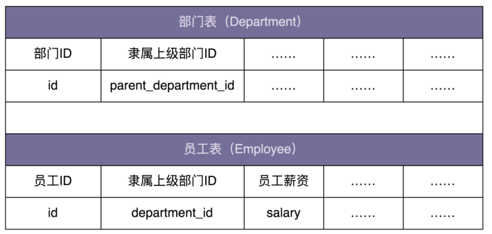

希望在内存中构建整个公司的人员架构图(部门、子部门、员工的隶属关系)，并且提供接口计算出部门的薪资成本(隶属于这个部门的所有员工的薪资和)：

- 部门包含子部门和员工，这是一种嵌套结构，可以表示成树这种数据结构

- 计算每个部门的薪资开支这样一个需求，也可以通过在树上的遍历算法来实现

所以，从这个角度来看，这个应用场景可以使用组合模式来设计和实现

```java
public abstract class HumanResource {
    protected long id;
    protected double salary;

    public HumanResource(long id) {
        this.id = id;
    }

    public long getId() {
        return id;
    }

    public abstract double calculateSalary();
}

public class Employee extends HumanResource {
    public Employee(long id, double salary) {
        super(id);
        this.salary = salary;
    }

    @Override
    public double calculateSalary() {
        return salary;
    }
}

public class Department extends HumanResource {
    private List<HumanResource> subNodes = new ArrayList<>();

    public Department(long id) {
        super(id);
    }

    @Override
    public double calculateSalary() {
        double totalSalary = 0;
        for (HumanResource hr : subNodes) {
            totalSalary += hr.calculateSalary();
        }
        this.salary = totalSalary;
        return totalSalary;
    }

    public void addSubNode(HumanResource hr) {
        subNodes.add(hr);
    }
}

// 构建组织架构的代码
public class Demo {
    private static final long ORGANIZATION_ROOT_ID = 1001;
    private DepartmentRepo departmentRepo; // 依赖注入
    private EmployeeRepo employeeRepo; // 依赖注入

    public void buildOrganization() {
        Department rootDepartment = new Department(ORGANIZATION_ROOT_ID);
        buildOrganization(rootDepartment);
    }

    private void buildOrganization(Department department) {
        List<Long> subDepartmentIds = departmentRepo.getSubDepartmentIds(department.getId());
        for (Long subDepartmentId : subDepartmentIds) {
            Department subDepartment = new Department(subDepartmentId);
            department.addSubNode(subDepartment);
            buildOrganization(subDepartment);
        }
        List<Long> employeeIds = employeeRepo.getDepartmentEmployeeIds(department.getId());
        for (Long employeeId : employeeIds) {
            double salary = employeeRepo.getEmployeeSalary(employeeId);
            department.addSubNode(new Employee(employeeId, salary));
        }
    }
}
```

### JDK使用

- javax.swing.JComponent#add(Component)
- java.awt.Container#add(Component)
- java.util.Map#putAll(Map)
- java.util.List#addAll(Collection)
- java.util.Set#addAll(Collection)

## 7、享元模式(Flyweight)

> - 享元模式的意图是复用对象，节省内存，前提是享元对象是不可变对象
> - 不可变对象：一旦通过构造函数初始化完成后，状态(对象的成员变量或属性)不会再被修改

### (1) 原理与实现

#### 1. 原理

- 当一个系统中存在大量重复对象时，若这些重复的对象不可变，就可以利用享元模式将对象设计成享元，在内存中只保留一份实例，供多处代码引用，这样可以减少内存中对象的数量，节省内存

- 不仅仅相同对象，对于相似对象，也可以将这些对象中相同的部分提取出来，设计成享元，让这些大量相似对象引用这些享元

#### 2. 案例一：棋盘的简单实现

- ChessPiece 类表示棋子，ChessBoard 类表示一个棋局，里面保存了象棋中 30 个棋子的信息

```java
public class ChessPiece {//棋子
    private int id;
    private String text;
    private Color color;
    private int positionX;
    private int positionY;

    public ChessPiece(int id, String text, Color color, int positionX, int positionY) {
        this.id = id;
        this.text = text;
        this.color = color;
        this.positionX = positionX;
        this.positionY = positionX;
    }

    public static enum Color {
        RED, BLACK
    }

    // ...省略其他属性和getter/setter方法...
}

public class ChessBoard {//棋局
    private Map<Integer, ChessPiece> chessPieces = new HashMap<>();

    public ChessBoard() {
        init();
    }

    private void init() {
        chessPieces.put(1, new ChessPiece(1, "車", ChessPiece.Color.BLACK, 0, 0));
        chessPieces.put(2, new ChessPiece(2,"馬", ChessPiece.Color.BLACK, 0, 1));
        //...省略摆放其他棋子的代码...
    }

    public void move(int chessPieceId, int toPositionX, int toPositionY) {
        //...省略...
    }
}
```

#### 3. 案例二：棋盘的享元实现

- 为了记录每个房间当前的棋局情况，需要给每个房间都创建一个 ChessBoard 棋局对象，因为游戏大厅中有成千上万的房间

- 将棋子的 id、text、color 属性拆分并设计成独立的类，作为享元供多个棋盘复用，而棋盘只需记录每个棋子的位置信息

```java
// 享元类
public class ChessPieceUnit {
    private int id;
    private String text;
    private Color color;

    public ChessPieceUnit(int id, String text, Color color) {
        this.id = id;
        this.text = text;
        this.color = color;
    }

    public static enum Color {
        RED, BLACK
    }

    // ...省略其他属性和getter方法...
}

public class ChessPieceUnitFactory {
    private static final Map<Integer, ChessPieceUnit> pieces = new HashMap<>();

    static {
        pieces.put(1, new ChessPieceUnit(1, "車", ChessPieceUnit.Color.BLACK));
        pieces.put(2, new ChessPieceUnit(2,"馬", ChessPieceUnit.Color.BLACK));
        //...省略摆放其他棋子的代码...
    }

    public static ChessPieceUnit getChessPiece(int chessPieceId) {
        return pieces.get(chessPieceId);
    }
}

public class ChessPiece {
    private ChessPieceUnit chessPieceUnit;
    private int positionX;
    private int positionY;

    public ChessPiece(ChessPieceUnit unit, int positionX, int positionY) {
        this.chessPieceUnit = unit;
        this.positionX = positionX;
        this.positionY = positionY;
    }
    // 省略getter、setter方法
}

public class ChessBoard {
    private Map<Integer, ChessPiece> chessPieces = new HashMap<>();

    public ChessBoard() {
        init();
    }

    private void init() {
        chessPieces.put(1, new ChessPiece(ChessPieceUnitFactory.getChessPiece(1), 0,0));
        chessPieces.put(1, new ChessPiece(ChessPieceUnitFactory.getChessPiece(2), 1,0));
        //...省略摆放其他棋子的代码...
    }

    public void move(int chessPieceId, int toPositionX, int toPositionY) {
        //...省略...
    }
}
```

#### 4. 案例总结

- 利用工厂类来缓存 ChessPieceUnit 信息(即 id、text、color)，通过工厂类获取到的 ChessPieceUnit 就是享元

- 所有的 ChessBoard 对象共享这 30 个 ChessPieceUnit 对象(象棋中只有 30 个棋子)

- 使用享元模式前，记录 1 万个棋局，要创建 30 万（30*1 万）个棋子的 ChessPieceUnit 对象

    利用享元模式，只需要创建 30 个享元对象供所有棋局共享使用即可，大大节省内存

---

享元模式的代码结构：主要通过工厂模式，在工厂类中，通过一个 Map 来缓存已经创建过的享元对象，来达到复用目的

### (2) 文本编辑器的应用

#### 1. 初始实现

- 把每个文字都当作一个独立的对象来看待，并且在其中包含它的格式信息

```java
public class Character {//文字
    private char c;
    private Font font;
    private int size;
    private int colorRGB;

    public Character(char c, Font font, int size, int colorRGB) {
        this.c = c;
        this.font = font;
        this.size = size;
        this.colorRGB = colorRGB;
    }
}

public class Editor {
    private List<Character> chars = new ArrayList<>();

    public void appendCharacter(char c, Font font, int size, int colorRGB) {
        Character character = new Character(c, font, size, colorRGB);
        chars.add(character);
    }
}
```

#### 2. 享元模式重构

- 对于字体格式，可以将它设计成享元，让不同的文字共享使用

```java
public class CharacterStyle {
    private Font font;
    private int size;
    private int colorRGB;

    public CharacterStyle(Font font, int size, int colorRGB) {
        this.font = font;
        this.size = size;
        this.colorRGB = colorRGB;
    }

    @Override
    public boolean equals(Object o) {
        CharacterStyle otherStyle = (CharacterStyle) o;
        return font.equals(otherStyle.font) && size == otherStyle.size && colorRGB == otherStyle.colorRGB;
    }
}

public class CharacterStyleFactory {
    private static final List<CharacterStyle> styles = new ArrayList<>();

    public static CharacterStyle getStyle(Font font, int size, int colorRGB) {
        CharacterStyle newStyle = new CharacterStyle(font, size, colorRGB);
        for (CharacterStyle style : styles) {
            if (style.equals(newStyle)) {
                return style;
            }
        }
        styles.add(newStyle);
        return newStyle;
    }
}

public class Character {
    private char c;
    private CharacterStyle style;

    public Character(char c, CharacterStyle style) {
        this.c = c;
        this.style = style;
    }
}

public class Editor {
    private List<Character> chars = new ArrayList<>();

    public void appendCharacter(char c, Font font, int size, int colorRGB) {
        Character character = new Character(c, CharacterStyleFactory.getStyle(font, size, colorRGB));
        chars.add(character);
    }
}
```

### (3) 享元模式 VS 单例、缓存、对象池

#### 1. 享元模式与单例的区别

- 在单例模式中，一个类只能创建一个对象

- 在享元模式中，一个类可以创建多个对象，每个对象被多处代码引用共享

    > 享元模式有点类似之前讲到的单例的变体：多例

---

享元模式与多例的区别：

- 应用享元模式是为了对象复用，节省内存
- 应用多例模式是为了限制对象的个数

#### 2. 享元模式与缓存的区别

- 享元模式的实现中，通过工厂类来“缓存”已经创建好的对象

- 缓存：主要是为了提高访问效率，而非复用

#### 3. 享元模式与对象池的区别

- 对象池：为了避免频繁地进行对象创建和释放导致内存碎片，可以预先申请一片连续的内存空间，每次创建对象时，从对象池中直接取出一个空闲对象来使用，对象使用完成后，再放回到对象池中以供后续复用，而非直接释放掉

对比：

- 池化技术的“复用”为“重复使用”，主要目的是节省时间，即在任意时刻，每个对象、连接、线程，并不会被多处使用，而是被一个使用者独占，当使用完成之后，放回到池中，再由其他使用者重复利用

    > 池化技术：对象池、连接池、线程池等

- 享元模式中的“复用”为“共享使用”，在整个生命周期中，都是被所有使用者共享的，主要目的是节省空间

### (4) 享元模式的应用

#### 1. 在 Java Integer 中的应用

```java
Integer i1 = 56;
Integer i2 = 56;
Integer i3 = 129;
Integer i4 = 129;
System.out.println(i1 == i2); //true
System.out.println(i3 == i4); //false
```

Integer 使用享元模式来复用对象，即 Integer 对象值在 -128 到 127 间，从 IntegerCache 中直接返回，否则才调用 new 方法创建

```java
public static Integer valueOf(int i) {
    if (i >= IntegerCache.low && i <= IntegerCache.high)
        return IntegerCache.cache[i + (-IntegerCache.low)];
    return new Integer(i);
}

private static class IntegerCache {
    static final int low = -128;
    static final int high;
    static final Integer cache[];

    static {
        int h = 127;
        String integerCacheHighPropValue = 
            sun.misc.VM.getSavedProperty("java.lang.Integer.IntegerCache.high");
        if (integerCacheHighPropValue != null) {
            try {
                int i = parseInt(integerCacheHighPropValue);
                i = Math.max(i, 127);
                h = Math.min(i, Integer.MAX_VALUE - (-low) -1);
            } catch( NumberFormatException nfe) {
                // If the property cannot be parsed into an int, ignore it.
            }
        }
        high = h;

        cache = new Integer[(high - low) + 1];
        int j = low;
        for(int k = 0; k < cache.length; k++)
            cache[k] = new Integer(j++);

        // range [-128, 127] must be interned (JLS7 5.1.7)
        assert IntegerCache.high >= 127;
    }
    private IntegerCache() {}
}

//-128~127 调整的 JVM 设置：
方法一：-Djava.lang.Integer.IntegerCache.high=255
方法二：-XX:AutoBoxCacheMax=255
```

---

同理：Long 类型对应的 LongCache 享元工厂类及 valueOf() 函数代码

```java
private static class LongCache {
    private LongCache(){}

    static final Long cache[] = new Long[-(-128) + 127 + 1];

    static {
        for(int i = 0; i < cache.length; i++)
            cache[i] = new Long(i - 128);
    }
}

public static Long valueOf(long l) {
    final int offset = 128;
    if (l >= -128 && l <= 127) { // will cache
        return LongCache.cache[(int)l + offset];
    }
    return new Long(l);

```

#### 2. 在 Java String 中的应用

```java
String s1 = "小争哥";
String s2 = "小争哥";
String s3 = new String("小争哥");

System.out.println(s1 == s2); //true
System.out.println(s1 == s3); //false
```

String 与 Integer 享元模式设计的区别：

- Integer 类中要共享的对象，在类加载时，就集中一次性创建好

- 对于字符串，只能在某个字符串常量第一次被用到时，存储到常量池中，当之后再用到时，直接引用常量池中已经存在的即可

### (5) 不可滥用享元模式

- 享元工厂类一直保存对享元对象的引用，导致享元对象在没有任何代码使用的情况下，也不会被 JVM 垃圾回收机制自动回收掉
- 若对象的生命周期很短，也不会被密集使用，利用享元模式反倒可能会浪费更多的内存。

除非经过线上验证，利用享元模式真的可以大大节省内存，否则，就不要过度使用这个模式

### JDK使用

Java 利用缓存来加速大量小对象的访问时间。

- java.lang.Integer#valueOf(int)
- java.lang.Boolean#valueOf(boolean)
- java.lang.Byte#valueOf(byte)
- java.lang.Character#valueOf(char)

# 六、行为型

> 很多设计模式都是试图将庞大的类拆分成更细小的类，然后再通过某种更合理的结构组装在一起

- 创建型设计模式主要解决“对象的创建”问题，即将创建和使用代码解耦

- 结构型设计模式主要解决“类或对象的组合或组装”问题，即将不同功能代码解耦

- 行为型设计模式主要解决的就是“类或对象之间的交互”问题，即将不同的行为代码解耦

## 1、观察者模式(Observer)

> - 在对象之间定义一个一对多的依赖，当一个对象状态改变时，所有依赖的对象都会自动收到通知
>
> - 被依赖的对象叫被观察者 `Observable`，依赖的对象叫观察者 `Observer`，或 `Subject-Observer、Publisher-Subscriber、Producer-Consumer、EventEmitter-EventListener、Dispatcher-Listener`

### (1) 原理与实现

#### 1. 实现一：简单案例

```java
public interface Subject {
    void registerObserver(Observer observer);
    void removeObserver(Observer observer);
    void notifyObservers(Message message);
}

public interface Observer {
    void update(Message message);
}

public class ConcreteSubject implements Subject {
    private List<Observer> observers = new ArrayList<Observer>();

    @Override
    public void registerObserver(Observer observer) {
        observers.add(observer);
    }

    @Override
    public void removeObserver(Observer observer) {
        observers.remove(observer);
    }

    @Override
    public void notifyObservers(Message message) {
        for (Observer observer : observers) {
            observer.update(message);
        }
    }
}

public class ConcreteObserverOne implements Observer {
    @Override
    public void update(Message message) {
        //TODO: 获取消息通知，执行自己的逻辑...
        System.out.println("ConcreteObserverOne is notified.");
    }
}

public class ConcreteObserverTwo implements Observer {
    @Override
    public void update(Message message) {
        //TODO: 获取消息通知，执行自己的逻辑...
        System.out.println("ConcreteObserverTwo is notified.");
    }
}

public class Demo {
    public static void main(String[] args) {
        ConcreteSubject subject = new ConcreteSubject();
        subject.registerObserver(new ConcreteObserverOne());
        subject.registerObserver(new ConcreteObserverTwo());
        subject.notifyObservers(new Message());
    }
}
```

#### 2. 实现二：功能变动案例

```java
public interface RegObserver {
    void handleRegSuccess(long userId);
}

public class RegPromotionObserver implements RegObserver {
    private PromotionService promotionService; // 依赖注入

    @Override
    public void handleRegSuccess(long userId) {
        promotionService.issueNewUserExperienceCash(userId);
    }
}

public class RegNotificationObserver implements RegObserver {
    private NotificationService notificationService;

    @Override
    public void handleRegSuccess(long userId) {
        notificationService.sendInboxMessage(userId, "Welcome...");
    }
}

public class UserController {
    private UserService userService; // 依赖注入
    private List<RegObserver> regObservers = new ArrayList<>();

    // 一次性设置好，之后也不可能动态的修改
    public void setRegObservers(List<RegObserver> observers) {
        regObservers.addAll(observers);
    }

    public Long register(String telephone, String password) {
        //省略输入参数的校验代码
        //省略userService.register()异常的try-catch代码
        long userId = userService.register(telephone, password);

        for (RegObserver observer : regObservers) {
            observer.handleRegSuccess(userId);
        }
        return userId;
    }
}
```

当要添加新观察者时(如：用户注册成功后，推送用户注册信息给大数据征信系统)，基于观察者模式的实现，UserController 的 register 函数不需要修改，只需再添加一个实现 RegObserver 接口的类，并通过 setRegObservers() 函数将其注册到 UserController 中即可

### (2) 基于不同应用场景的不同实现方式

- **同步阻塞的观察者模式**：观察者和被观察者代码在同一个线程内执行，被观察者一直阻塞，直到所有的观察者代码都执行完成之后，才执行后续的代码
- **异步非阻塞的观察者模式**：
    - 方式一：在每个 handleRegSuccess() 函数中，创建一个新的线程执行代码
    - 方式二：基于 `EventBus` 来实现

- **跨进程的观察者模式**：调用 RPC 接口或消息队列实现

    > 基于消息队列的实现方式，被观察者和观察者解耦更加彻底，两部分的耦合更小
    >
    > 被观察者只管发送消息到消息队列，观察者只管从消息队列中读取消息来执行相应的逻辑

### (3) 异步非阻塞观察者模式的简易实现

异步非阻塞观察者模式的两种实现方式：

- 方式一：在每个 handleRegSuccess() 函数中创建一个新的线程执行代码逻辑

    ```java
    // 第一种实现方式，其他类代码不变，就没有再重复罗列
    public class RegPromotionObserver implements RegObserver {
        private PromotionService promotionService; // 依赖注入
    
        @Override
        public void handleRegSuccess(Long userId) {
            Thread thread = new Thread(new Runnable() {
                @Override
                public void run() {
                    promotionService.issueNewUserExperienceCash(userId);
                }
            });
            thread.start();
        }
    }
    ```

    > 对于第一种实现方式，频繁地创建和销毁线程比较耗时，并且并发线程数无法控制，创建过多的线程会导致堆栈溢出

- 方式二：在 UserController 的 register() 函数中使用线程池来执行每个观察者的 handleRegSuccess() 函数

    ```java
    // 第二种实现方式，其他类代码不变，就没有再重复罗列
    public class UserController {
        private UserService userService; // 依赖注入
        private List<RegObserver> regObservers = new ArrayList<>();
        private Executor executor;
    
        public UserController(Executor executor) {
            this.executor = executor;
        }
    
        public void setRegObservers(List<RegObserver> observers) {
            regObservers.addAll(observers);
        }
    
        public Long register(String telephone, String password) {
            //省略输入参数的校验代码
            //省略userService.register()异常的try-catch代码
            long userId = userService.register(telephone, password);
    
            for (RegObserver observer : regObservers) {
                executor.execute(new Runnable() {
                    @Override
                    public void run() {
                        observer.handleRegSuccess(userId);
                    }
                });
            }
            return userId;
        }
    }
    ```

    > 尽管利用线程池解决了第一种实现方式的问题，但线程池、异步执行逻辑都耦合在 register() 函数中，增加业务代码的维护成本

### (4) EventBus 框架

`EventBus` 提供了实现观察者模式的骨架代码，可以很容易在业务场景中实现观察者模式，不需要从零开始开发

其中，`Google Guava EventBus` 不仅仅支持异步非阻塞模式，同时也支持同步阻塞模式

#### 1. 上述案例的 EventBus 实现

> 基于 EventBus，不需要定义 Observer 接口，任意类型的对象都可以注册到 EventBus 中，通过 `@Subscribe` 注解来标明类中哪个函数可以接收被观察者发送的消息

```java
public class UserController {
    private UserService userService; // 依赖注入
    private EventBus eventBus;
    private static final int DEFAULT_EVENTBUS_THREAD_POOL_SIZE = 20;

    public UserController() {
        //eventBus = new EventBus(); // 同步阻塞模式
        // 异步非阻塞模式
        eventBus = new AsyncEventBus(Executors.newFixedThreadPool(DEFAULT_EVENTBUS_THREAD_POOL_SIZE)); 
    }

    public void setRegObservers(List<Object> observers) {
        for (Object observer : observers) {
            eventBus.register(observer);
        }
    }

    public Long register(String telephone, String password) {
        //省略输入参数的校验代码
        //省略userService.register()异常的try-catch代码
        long userId = userService.register(telephone, password);
        eventBus.post(userId);

        return userId;
    }
}

public class RegPromotionObserver {
    private PromotionService promotionService; // 依赖注入

    @Subscribe
    public void handleRegSuccess(Long userId) {
        promotionService.issueNewUserExperienceCash(userId);
    }
}

public class RegNotificationObserver {
    private NotificationService notificationService;

    @Subscribe
    public void handleRegSuccess(Long userId) {
        notificationService.sendInboxMessage(userId, "...");
    }
}
```

#### 2. Guava EventBus 的主要的类和函数

- `EventBus、AsyncEventBus`：EventBus 实现同步阻塞的观察者模式，AsyncEventBus 提供异步非阻塞的观察者模式

    >  注：AsyncEventBus 继承自 EventBus
    >
    > ```java
    > EventBus eventBus = new EventBus(); // 同步阻塞模式
    > EventBus eventBus = new AsyncEventBus(Executors.newFixedThreadPool(8))；// 异步阻塞模式
    > ```

- `register` 函数：用来注册观察者

    > 可以接受任何类型(Object)的观察者，而在经典的观察者模式实现中，register 函数必须接受实现同一 Observer 接口的类对象
    >
    > ```java
    > public void register(Object object);
    > ```

- `unregister` 函数：用来从 EventBus 中删除某个观察者

    > ```java
    > public void unregister(Object object);
    > ```

- `post` 函数：用来给观察者发送消息

    > ```java
    > public void post(Object event);
    > ```
    >
    > 与经典观察者模式的不同：调用 post() 函数发送消息时，并非把消息发送给所有观察者，而是发送给可匹配的观察者
    >
    > 可匹配：能接收的消息类型是发送消息(post 函数定义中的 event)类型的父类

- `@Subscribe` 注解：标明某个函数能接收哪种类型的消息

    > ```java
    > public DObserver {
    >     //...省略其他属性和方法...
    > 
    >     @Subscribe
    >     public void f1(PMsg event) { //... }
    > 
    >     @Subscribe
    >     public void f2(QMsg event) { //... }
    > }
    > ```
    >
    > - 当通过 `register` 函数将 DObserver 类对象注册到 EventBus 时，EventBus 会根据 `@Subscribe` 注解找到 f1() 和 f2()，并且将两个函数能接收的消息类型记录下来(PMsg -> f1，QMsg -> f2)
    >
    > - 当通过 `post` 函数发送消息时，EventBus 会通过之前的记录(QMsg -> f2)，调用相应的函数(f2)

### (5) 实现 EventBus 框架

`Observer` 注册表：记录了消息类型和可接收消息函数的对应关系

- 当调用 `register` 函数注册观察者时，EventBus 通过解析 `@Subscribe` 注解，生成 Observer 注册表
- 当调用 `post` 函数发送消息时，EventBus 通过注册表找到相应的可接收消息的函数，然后通过 Java 的反射语法来动态地创建对象、执行函数
- 对于同步阻塞模式，EventBus 在一个线程内依次执行相应函数，对于异步非阻塞模式，EventBus 通过一个线程池执行相应函数

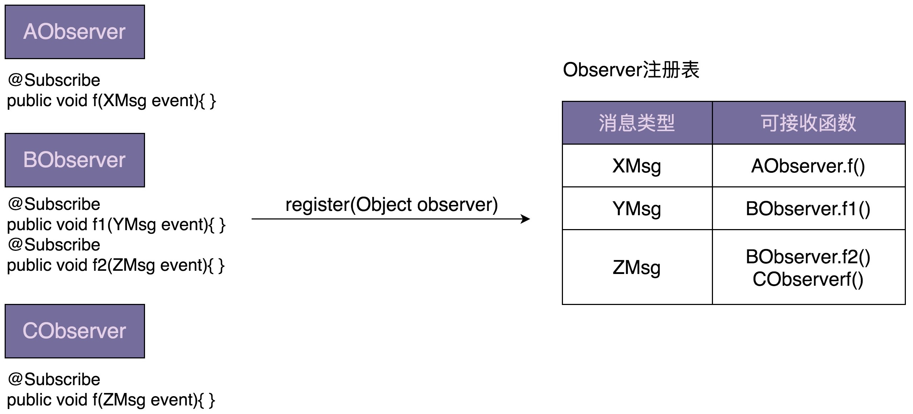

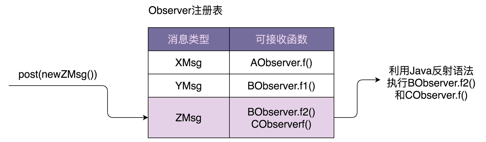

#### 1. Subscribe

> Subscribe 是一个注解，用于标明观察者中的哪个函数可以接收消息

```java
@Retention(RetentionPolicy.RUNTIME)
@Target(ElementType.METHOD)
@Beta
public @interface Subscribe {}
```

#### 2. ObserverAction

`ObserverAction` 类表示 `@Subscribe` 注解的方法，其中 `target` 表示观察者类，``method` 表示方法，主要用在 `ObserverRegistry` 观察者注册表中

```java
public class ObserverAction {
    private Object target;
    private Method method;

    public ObserverAction(Object target, Method method) {
        this.target = Preconditions.checkNotNull(target);
        this.method = method;
        this.method.setAccessible(true);
    }

    public void execute(Object event) { // event是method方法的参数
        try {
            method.invoke(target, event);
        } catch (InvocationTargetException | IllegalAccessException e) {
            e.printStackTrace();
        }
    }

```

#### 3. ObserverRegistry

`ObserverRegistry` 类就是 `Observer` 注册表，框架所有的核心逻辑都在这个类中

```java
public class ObserverRegistry {
    private ConcurrentMap<Class<?>, CopyOnWriteArraySet<ObserverAction>> registry 
        								= new ConcurrentHashMap<>();

    public void register(Object observer) {
        Map<Class<?>, Collection<ObserverAction>> observerActions = findAllObserverActions(observer);
        for (Map.Entry<Class<?>, Collection<ObserverAction>> entry : observerActions.entrySet()) {
            Class<?> eventType = entry.getKey();
            Collection<ObserverAction> eventActions = entry.getValue();
            CopyOnWriteArraySet<ObserverAction> registeredEventActions = registry.get(eventType);
            if (registeredEventActions == null) {
                registry.putIfAbsent(eventType, new CopyOnWriteArraySet<>());
                registeredEventActions = registry.get(eventType);
            }
            registeredEventActions.addAll(eventActions);
        }
    }

    public List<ObserverAction> getMatchedObserverActions(Object event) {
        List<ObserverAction> matchedObservers = new ArrayList<>();
        Class<?> postedEventType = event.getClass();
        for (Map.Entry<Class<?>, CopyOnWriteArraySet<ObserverAction>> entry : registry.entrySet()) {
            Class<?> eventType = entry.getKey();
            Collection<ObserverAction> eventActions = entry.getValue();
            if (postedEventType.isAssignableFrom(eventType)) {
                matchedObservers.addAll(eventActions);
            }
        }
        return matchedObservers;
    }

    private Map<Class<?>, Collection<ObserverAction>> findAllObserverActions(Object observer) {
        Map<Class<?>, Collection<ObserverAction>> observerActions = new HashMap<>();
        Class<?> clazz = observer.getClass();
        for (Method method : getAnnotatedMethods(clazz)) {
            Class<?>[] parameterTypes = method.getParameterTypes();
            Class<?> eventType = parameterTypes[0];
            if (!observerActions.containsKey(eventType)) {
                observerActions.put(eventType, new ArrayList<>());
            }
            observerActions.get(eventType).add(new ObserverAction(observer, method));
        }
        return observerActions;
    }

    private List<Method> getAnnotatedMethods(Class<?> clazz) {
        List<Method> annotatedMethods = new ArrayList<>();
        for (Method method : clazz.getDeclaredMethods()) {
            if (method.isAnnotationPresent(Subscribe.class)) {
                Class<?>[] parameterTypes = method.getParameterTypes();
                Preconditions.checkArgument(parameterTypes.length == 1, 
                                            "Method %s has @Subscribe annotation but has %s parameters."
                                            + "Subscriber methods must have exactly 1 parameter.", 
                                            method, parameterTypes.length);
                annotatedMethods.add(method);
            }
        }
        return annotatedMethods;
    }
}
```

#### 4. EventBus

`MoreExecutors.directExecutor()` 看似多线程，实际单线程，主要为了跟 AsyncEventBus 统一代码逻辑，做到代码复用

```java
public class EventBus {
    private Executor executor;
    private ObserverRegistry registry = new ObserverRegistry();

    public EventBus() {
        this(MoreExecutors.directExecutor());
    }

    protected EventBus(Executor executor) {
        this.executor = executor;
    }

    public void register(Object object) {
        registry.register(object);
    }

    public void post(Object event) {
        List<ObserverAction> observerActions = registry.getMatchedObserverActions(event);
        for (ObserverAction observerAction : observerActions) {
            executor.execute(new Runnable() {
                @Override
                public void run() {
                    observerAction.execute(event);
                }
            });
        }
    }
}
```

#### 5. AsyncEventBus

`AsyncEventBus` 为实现异步非阻塞的观察者模式，不使用 MoreExecutors.directExecutor，而是在构造函数中，由调用者注入线程池

```java
public class AsyncEventBus extends EventBus {
    public AsyncEventBus(Executor executor) {
        super(executor);
    }
}
```

### JDK使用

- [java.util.Observer](http://docs.oracle.com/javase/8/docs/api/java/util/Observer.html)
- [java.util.EventListener](http://docs.oracle.com/javase/8/docs/api/java/util/EventListener.html)
- [javax.servlet.http.HttpSessionBindingListener](http://docs.oracle.com/javaee/7/api/javax/servlet/http/HttpSessionBindingListener.html)
- [RxJava](https://github.com/ReactiveX/RxJava) 

## 2、模板模式(Template)

> 模板模式主要是用来解决复用和扩展两个问题

### (1) 原理与实现

**模板模式**：在方法中定义一个业务逻辑骨架，并将某些步骤推迟到子类中实现，让子类在不改变业务逻辑整体结构的情况下，重新定义业务逻辑中的某些步骤

```java
public abstract class AbstractClass {
    public final void templateMethod() {
        //...
        method1();
        //...
        method2();
        //...
    }

    protected abstract void method1();
    protected abstract void method2();
}

public class ConcreteClass1 extends AbstractClass {
    @Override
    protected void method1() {
        //...
    }

    @Override
    protected void method2() {
        //...
    }
}

public class ConcreteClass2 extends AbstractClass {
    @Override
    protected void method1() {
        //...
    }

    @Override
    protected void method2() {
        //...
    }
}

AbstractClass demo = ConcreteClass1();
demo.templateMethod();
```

### (2) 模板模式作用一：复用

模板模式把一个算法中不变的流程抽象到父类的模板方法 templateMethod() 中，将可变的部分 method1()、method2() 留给子类 ContreteClass1 和 ContreteClass2 来实现，所有的子类都可以复用父类中模板方法定义的流程代码

#### 1. Java InputStream

```java
public abstract class InputStream implements Closeable {
    //...省略其他代码...

    public int read(byte b[], int off, int len) throws IOException {
        if (b == null) {
            throw new NullPointerException();
        } else if (off < 0 || len < 0 || len > b.length - off) {
            throw new IndexOutOfBoundsException();
        } else if (len == 0) {
            return 0;
        }

        int c = read();
        if (c == -1) {
            return -1;
        }
        b[off] = (byte)c;

        int i = 1;
        try {
            for (; i < len ; i++) {
                c = read();
                if (c == -1) {
                    break;
                }
                b[off + i] = (byte)c;
            }
        } catch (IOException ee) {
        }
        return i;
    }

    public abstract int read() throws IOException;
}

public class ByteArrayInputStream extends InputStream {
    //...省略其他代码...

    @Override
    public synchronized int read() {
        return (pos < count) ? (buf[pos++] & 0xff) : -1;
    }
}
```

#### 2. Java AbstractList

```java
public boolean addAll(int index, Collection<? extends E> c) {
    rangeCheckForAdd(index);
    boolean modified = false;
    for (E e : c) {
        add(index++, e);
        modified = true;
    }
    return modified;
}

public void add(int index, E element) {
    throw new UnsupportedOperationException();
}
```

### (3) 模板模式作用二：扩展

**扩展**：不是指代码的扩展性，而是指框架的扩展性，类似控制反转

> 基于这个作用，模板模式常用在框架的开发中，让框架用户可以在不修改框架源码的情况下，定制化框架的功能

#### 1. Java Servlet

继承 HttpServlet 的类，并重写 doGet() 或 doPost() 方法，来分别处理 get 和 post 请求：

```java
public class HelloServlet extends HttpServlet {
    @Override
    protected void doGet(HttpServletRequest req, HttpServletResponse resp) 
        								throws ServletException, IOException {
        this.doPost(req, resp);
    }

    @Override
    protected void doPost(HttpServletRequest req, HttpServletResponse resp) 
        								throws ServletException, IOException {
        resp.getWriter().write("Hello World.");
    }
}
```

`web.xml` 配置：

```xml
<servlet>
    <servlet-name>HelloServlet</servlet-name>
    <servlet-class>com.xzg.cd.HelloServlet</servlet-class>
</servlet>

<servlet-mapping>
    <servlet-name>HelloServlet</servlet-name>
    <url-pattern>/hello</url-pattern>
</servlet-mapping>
```

`service()` 方法：HttpServlet 的 service() 方法就是一个模板方法，实现了整个 HTTP 请求的执行流程，doGet()、doPost() 是模板中可以由子类来定制的部分

> 相当于 Servlet 框架提供了一个扩展点(doGet()、doPost() 方法)，让框架用户在不用修改 Servlet 框架源码的情况下，将业务代码通过扩展点镶嵌到框架中执行

```java
public void service(ServletRequest req, ServletResponse res) throws ServletException, IOException {
    HttpServletRequest  request;
    HttpServletResponse response;
    if (!(req instanceof HttpServletRequest && res instanceof HttpServletResponse)) {
        throw new ServletException("non-HTTP request or response");
    }
    request = (HttpServletRequest) req;
    response = (HttpServletResponse) res;
    service(request, response);
}

protected void service(HttpServletRequest req, HttpServletResponse resp) 
    														throws ServletException, IOException {
    String method = req.getMethod();
    if (method.equals(METHOD_GET)) {
        long lastModified = getLastModified(req);
        if (lastModified == -1) {
            // servlet doesn't support if-modified-since, no reason
            // to go through further expensive logic
            doGet(req, resp);
        } else {
            long ifModifiedSince = req.getDateHeader(HEADER_IFMODSINCE);
            if (ifModifiedSince < lastModified) {
                // If the servlet mod time is later, call doGet()
                // Round down to the nearest second for a proper compare
                // A ifModifiedSince of -1 will always be less
                maybeSetLastModified(resp, lastModified);
                doGet(req, resp);
            } else {
                resp.setStatus(HttpServletResponse.SC_NOT_MODIFIED);
            }
        }
    } else if (method.equals(METHOD_HEAD)) {
        long lastModified = getLastModified(req);
        maybeSetLastModified(resp, lastModified);
        doHead(req, resp);
    } else if (method.equals(METHOD_POST)) {
        doPost(req, resp);
    } else if (method.equals(METHOD_PUT)) {
        doPut(req, resp);
    } else if (method.equals(METHOD_DELETE)) {
        doDelete(req, resp);
    } else if (method.equals(METHOD_OPTIONS)) {
        doOptions(req,resp);
    } else if (method.equals(METHOD_TRACE)) {
        doTrace(req,resp);
    } else {
        String errMsg = lStrings.getString("http.method_not_implemented");
        Object[] errArgs = new Object[1];
        errArgs[0] = method;
        errMsg = MessageFormat.format(errMsg, errArgs);
        resp.sendError(HttpServletResponse.SC_NOT_IMPLEMENTED, errMsg);
    }
}
```

#### 2. JUnit TestCase

- 使用 JUnit 测试框架来编写单元测试时，编写的测试类都要继承框架提供的 TestCase 类

- TestCase 类中的 runBare() 函数是模板方法，定义了执行测试用例的整体流程：先执行 setUp() 做些准备工作，然后执行 runTest() 运行真正的测试代码，最后执行 tearDown() 做扫尾工作

```java
public abstract class TestCase extends Assert implements Test {
    public void runBare() throws Throwable {
        Throwable exception = null;
        setUp();
        try {
            runTest();
        } catch (Throwable running) {
            exception = running;
        } finally {
            try {
                tearDown();
            } catch (Throwable tearingDown) {
                if (exception == null) exception = tearingDown;
            }
        }
        if (exception != null) throw exception;
    }

    /**
    * Sets up the fixture, for example, open a network connection.
    * This method is called before a test is executed.
    */
    protected void setUp() throws Exception {
    }

    /**
    * Tears down the fixture, for example, close a network connection.
    * This method is called after a test is executed.
    */
    protected void tearDown() throws Exception {
    }
}
```

### (4) 模板模式与 Callback 回调函数

#### 1. 回调原理解析

> A 类事先注册某个函数 F 到 B 类，A 类在调用 B 类 P 函数时，B 类反过来调用 A 类注册的 F 函数，此处的 F 函数就是“回调函数”

A 类将回调函数传递给 B 类：C 语言使用函数指针，Java 需要使用包裹回调函数的类对象

```java
public interface ICallback {
    void methodToCallback();
}

public class BClass {
    public void process(ICallback callback) {
        //...
        callback.methodToCallback();
        //...
    }
}

public class AClass {
    public static void main(String[] args) {
        BClass b = new BClass();
        b.process(new ICallback() { //回调对象
            @Override
            public void methodToCallback() {
                System.out.println("Call back me.");
            }
        });
    }
}
```

> 同步回调指在函数返回之前执行回调函数，更像模板模式；异步回调指在函数返回之后执行回调函数，更像观察者模式

#### 2. 案例一：JdbcTemplate

> Spring 提供的 Template 类基于同步回调，而非基于模板模式实现来，而同步回调从应用场景上很像模板模式

JdbcTemplate 通过回调机制，将不变的执行流程抽离出来，放到模板方法 `execute()` 中，将可变的部分设计成回调 StatementCallback，由用户来定制

> query() 函数是对 execute() 函数的二次封装，让接口用起来更加方便

```java
@Override
public <T> List<T> query(String sql, RowMapper<T> rowMapper) throws DataAccessException {
    return query(sql, new RowMapperResultSetExtractor<T>(rowMapper));
}

@Override
public <T> T query(final String sql, final ResultSetExtractor<T> rse) throws DataAccessException {
    Assert.notNull(sql, "SQL must not be null");
    Assert.notNull(rse, "ResultSetExtractor must not be null");
    if (logger.isDebugEnabled()) {
        logger.debug("Executing SQL query [" + sql + "]");
    }

    class QueryStatementCallback implements StatementCallback<T>, SqlProvider {
        @Override
        public T doInStatement(Statement stmt) throws SQLException {
            ResultSet rs = null;
            try {
                rs = stmt.executeQuery(sql);
                ResultSet rsToUse = rs;
                if (nativeJdbcExtractor != null) {
                    rsToUse = nativeJdbcExtractor.getNativeResultSet(rs);
                }
                return rse.extractData(rsToUse);
            } finally {
                JdbcUtils.closeResultSet(rs);
            }
        }
        @Override
        public String getSql() {
            return sql;
        }
    }
    return execute(new QueryStatementCallback());
}

@Override
public <T> T execute(StatementCallback<T> action) throws DataAccessException {
    Assert.notNull(action, "Callback object must not be null");

    Connection con = DataSourceUtils.getConnection(getDataSource());
    Statement stmt = null;
    try {
        Connection conToUse = con;
        if (this.nativeJdbcExtractor != null 
            		&& this.nativeJdbcExtractor.isNativeConnectionNecessaryForNativeStatements()) {
            conToUse = this.nativeJdbcExtractor.getNativeConnection(con);
        }
        stmt = conToUse.createStatement();
        applyStatementSettings(stmt);
        Statement stmtToUse = stmt;
        if (this.nativeJdbcExtractor != null) {
            stmtToUse = this.nativeJdbcExtractor.getNativeStatement(stmt);
        }
        T result = action.doInStatement(stmtToUse);
        handleWarnings(stmt);
        return result;
    } catch (SQLException ex) {
        // Release Connection early, to avoid potential connection pool deadlock
        // in the case when the exception translator hasn't been initialized yet.
        JdbcUtils.closeStatement(stmt);
        stmt = null;
        DataSourceUtils.releaseConnection(con, getDataSource());
        con = null;
        throw getExceptionTranslator().translate("StatementCallback", getSql(action), ex);
    }
    finally {
        JdbcUtils.closeStatement(stmt);
        DataSourceUtils.releaseConnection(con, getDataSource());
    }
}
```

#### 3. 案例二：setClickListener

- 从代码结构上看，事件监听器很像回调，即传递一个包含回调函数 `onClick()` 的对象给另一个函数
- 从应用场景上看，又像观察者模式，即事先注册观察者 `OnClickListener`，当用户点击按钮时，发送点击事件给观察者，并且执行相应的 onClick() 函数

```java
Button button = (Button)findViewById(R.id.button);

button.setOnClickListener(new OnClickListener() {
    @Override
    public void onClick(View v) {
        System.out.println("I am clicked.");
    }
});
```

#### 4. 案例三：addShutdownHook

> Hook(钩子) 是 Callback 的一种应用，`Callback` 更侧重语法机制的描述，`Hook` 更加侧重应用场景的描述

Hook 比较经典的应用场景是 Tomcat 和 JVM 的 shutdown hook

JVM 提供 `Runtime.addShutdownHook(Thread hook)` 方法，可以注册一个 JVM 关闭的 Hook，当应用程序关闭时，JVM 会自动调用 Hook 代码

```java
public class ShutdownHookDemo {
    private static class ShutdownHook extends Thread {
        public void run() {
            System.out.println("I am called during shutting down.");
        }
    }

    public static void main(String[] args) {
        Runtime.getRuntime().addShutdownHook(new ShutdownHook());
    }
}
```

`addShutdownHook()` 代码：有关 Hook 的逻辑都被封装到 ApplicationShutdownHooks 类中

- 当应用程序关闭时，JVM 会调用这个类的 runHooks() 方法，创建多个线程，并发执行多个 Hook
- 在注册完 Hook 后，并不需要等待 Hook 执行完成，这也算一种异步回调

```java
public class Runtime {
    public void addShutdownHook(Thread hook) {
        SecurityManager sm = System.getSecurityManager();
        if (sm != null) {
            sm.checkPermission(new RuntimePermission("shutdownHooks"));
        }
        ApplicationShutdownHooks.add(hook);
    }
}

class ApplicationShutdownHooks {
    private static IdentityHashMap<Thread, Thread> hooks;
    static {
        try {
            hooks = new IdentityHashMap<>();
        } catch (IllegalStateException e) {
            hooks = null;
        }
    }

    static synchronized void add(Thread hook) {
        if(hooks == null)
            throw new IllegalStateException("Shutdown in progress");

        if (hook.isAlive())
            throw new IllegalArgumentException("Hook already running");

        if (hooks.containsKey(hook))
            throw new IllegalArgumentException("Hook previously registered");

        hooks.put(hook, hook);
    }

    static void runHooks() {
        Collection<Thread> threads;
        synchronized(ApplicationShutdownHooks.class) {
            threads = hooks.keySet();
            hooks = null;
        }

        for (Thread hook : threads) {
            hook.start();
        }
        for (Thread hook : threads) {
            while (true) {
                try {
                    hook.join();
                    break;
                } catch (InterruptedException ignored) {
                }
            }
        }
    }
}
```

#### 5. 模板模式 VS 回调

- 从应用场景上来看，同步回调跟模板模式几乎一致：都是在一个大的算法骨架中，自由替换其中的某个步骤，起到代码复用和扩展的目的；而异步回调跟模板模式有较大差别，更像观察者模式

- 从代码实现上来看，回调和模板模式完全不同：回调基于组合关系来实现，把一个对象传递给另一个对象，是一种对象之间的关系；模板模式基于继承关系来实现，子类重写父类的抽象方法，是一种类之间的关系

代码实现上，回调相对于模板模式会更加灵活：

- 像 Java 这种只支持单继承的语言，基于模板模式编写的子类，已经继承了一个父类，不再具有继承的能力
- 回调可以使用匿名类来创建回调对象，可以不用事先定义类；而模板模式针对不同的实现都要定义不同的子类
- 若某个类中定义了多个模板方法，每个方法都有对应的抽象方法，即使只用其中的一个模板方法，子类也必须实现所有的抽象方法；而回调更加灵活，只需要往用到的模板方法中注入回调对象即可

### JDK使用

- java.util.Collections#sort()
- java.io.InputStream#skip()
- java.io.InputStream#read()
- java.util.AbstractList#indexOf()

## 3、策略模式(Strategy)

### (1) 原理与实现

> 工厂模式解耦对象的创建和使用，观察者模式解耦观察者和被观察者，策略模式解耦策略的定义、创建、使用这三部分
>
> 即定义一族算法类，将每个算法分别封装起来，让它们可以互相替换，策略模式可以使算法的变化独立于使用它们的客户端

#### 1. 策略的定义

策略类：包含一个策略接口和一组实现这个接口的策略类

> 所有策略类都实现相同接口，所以客户端代码基于接口而非实现编程，可以灵活地替换不同的策略

```java
public interface Strategy {
    void algorithmInterface();
}

public class ConcreteStrategyA implements Strategy {
    @Override
    public void  algorithmInterface() {
        //具体的算法...
    }
}

public class ConcreteStrategyB implements Strategy {
    @Override
    public void  algorithmInterface() {
        //具体的算法...
    }
}
```

#### 2. 策略的创建

- 使用策略模式时，通过类型 `type` 来判断创建哪个策略使用

    > 为了封装创建逻辑，需要对客户端代码屏蔽创建细节，可以把根据 `type` 创建策略的逻辑抽离出来，放到工厂类中

- 若策略类无状态，不包含成员变量，只是纯粹的算法实现，则可以被共享使用，不需要在每次调用 getStrategy 时，都创建一个新的策略对象

    > 可以使用下面工厂类的实现方式，事先创建好每个策略对象，缓存到工厂类中，用的时候直接返回

    ```java
    public class StrategyFactory {
        private static final Map strategies = new HashMap<>();
    
        static {
            strategies.put("A", new ConcreteStrategyA());
            strategies.put("B", new ConcreteStrategyB());
        }
    
        public static Strategy getStrategy(String type) {
            if (type == null || type.isEmpty()) {
                throw new IllegalArgumentException("type should not be empty.");
            }
            return strategies.get(type);
        }
    }
    ```

- 若策略类有状态，根据业务场景需要，每次从工厂方法中，获得的都是新创建的策略对象：

    ```java
    public class StrategyFactory {
        public static Strategy getStrategy(String type) {
            if (type == null || type.isEmpty()) {
                throw new IllegalArgumentException("type should not be empty.");
            }
            if (type.equals("A")) {
                return new ConcreteStrategyA();
            } else if (type.equals("B")) {
                return new ConcreteStrategyB();
            }
            return null;
        }
    }
    ```

#### 3. 策略的使用

**运行时动态确定使用哪种策略**：在程序运行期间，根据配置、用户输入、计算结果等这些不确定因素决定使用的策略

```java
// 策略接口：EvictionStrategy
// 策略类：LruEvictionStrategy、FifoEvictionStrategy、LfuEvictionStrategy...
// 策略工厂：EvictionStrategyFactory
public class UserCache {
    private Map cacheData = new HashMap<>();
    private EvictionStrategy eviction;

    public UserCache(EvictionStrategy eviction) {
        this.eviction = eviction;
    }

    //...
}

// 运行时动态确定，根据配置文件的配置决定使用哪种策略
public class Application {
    public static void main(String[] args) throws Exception {
        EvictionStrategy evictionStrategy = null;
        Properties props = new Properties();
        props.load(new FileInputStream("./config.properties"));
        String type = props.getProperty("eviction_type");
        evictionStrategy = EvictionStrategyFactory.getEvictionStrategy(type);
        UserCache userCache = new UserCache(evictionStrategy);
        //...
    }
}

// 非运行时动态确定，在代码中指定使用哪种策略
public class Application {
    public static void main(String[] args) {
        //...
        EvictionStrategy evictionStrategy = new LruEvictionStrategy();
        UserCache userCache = new UserCache(evictionStrategy);
        //...
    }
}
```

### (2) 利用策略模式避免分支判断

> 策略模式和状态模式都能移除分支判断逻辑

应用场景：策略模式适用于根据不同类型的动态，决定使用哪种策略

#### 1. 常见 if-else 逻辑

```java
public class OrderService {
    public double discount(Order order) {
        double discount = 0.0;
        OrderType type = order.getType();
        if (type.equals(OrderType.NORMAL)) { // 普通订单
            //...省略折扣计算算法代码
        } else if (type.equals(OrderType.GROUPON)) { // 团购订单
            //...省略折扣计算算法代码
        } else if (type.equals(OrderType.PROMOTION)) { // 促销订单
            //...省略折扣计算算法代码
        }
        return discount;
    }
}
```

#### 2. 策略模式重构

```java
// 策略的定义
public interface DiscountStrategy {
    double calDiscount(Order order);
}
// 省略NormalDiscountStrategy、GrouponDiscountStrategy、PromotionDiscountStrategy类代码...

// 策略的创建
public class DiscountStrategyFactory {
    private static final Map strategies = new HashMap<>();

    static {
        strategies.put(OrderType.NORMAL, new NormalDiscountStrategy());
        strategies.put(OrderType.GROUPON, new GrouponDiscountStrategy());
        strategies.put(OrderType.PROMOTION, new PromotionDiscountStrategy());
    }

    public static DiscountStrategy getDiscountStrategy(OrderType type) {
        return strategies.get(type);
    }
}

// 策略的使用
public class OrderService {
    public double discount(Order order) {
        OrderType type = order.getType();
        DiscountStrategy discountStrategy = DiscountStrategyFactory.getDiscountStrategy(type);
        return discountStrategy.calDiscount(order);
    }
}
```

### (3) 实现支持给文件排序的小程序

#### 1. 问题与解决思路

- **需求**：写一个小程序，实现对一个文件进行排序，文件中只包含整型数，且相邻的数字通过逗号来区隔

- **简单思路**：读取文件内容，并通过逗号分割成一个个数字，放到内存数组中，然后通过排序算法对数组进行排序，最后再将数组中的数据写入文件

- **问题与方案**：

    - 若文件很大(如：10GB)，而内存有限，没办法一次性加载文件中的所有数据到内存中，这时就要利用外部排序算法

    - 若文件更大(如：100GB)，为利用 CPU 多核优势，可以在外部排序基础上，加入多线程并发排序功能

        > 有点类似“单机版”的 MapReduce

    - 若文件非常大(如：1TB)，可以使用真正的 MapReduce 框架，利用多机的处理能力，提高排序的效率

#### 2. 代码简单实现

```java
public class Sorter {
    private static final long GB = 1000 * 1000 * 1000;

    public void sortFile(String filePath) {
        // 省略校验逻辑
        File file = new File(filePath);
        long fileSize = file.length();
        if (fileSize < 6 * GB) { // [0, 6GB)
            quickSort(filePath);
        } else if (fileSize < 10 * GB) { // [6GB, 10GB)
            externalSort(filePath);
        } else if (fileSize < 100 * GB) { // [10GB, 100GB)
            concurrentExternalSort(filePath);
        } else { // [100GB, ~)
            mapreduceSort(filePath);
        }
    }

    private void quickSort(String filePath) {
        // 快速排序
    }

    private void externalSort(String filePath) {
        // 外部排序
    }

    private void concurrentExternalSort(String filePath) {
        // 多线程外部排序
    }

    private void mapreduceSort(String filePath) {
        // 利用 MapReduce 多机排序
    }
}

public class SortingTool {
    public static void main(String[] args) {
        Sorter sorter = new Sorter();
        sorter.sortFile(args[0]);
    }
}
```

#### 3. 代码重构

```java
public interface ISortAlg {
    void sort(String filePath);
}

public class QuickSort implements ISortAlg {
    @Override
    public void sort(String filePath) {
        //...
    }
}

public class ExternalSort implements ISortAlg {
    @Override
    public void sort(String filePath) {
        //...
    }
}

public class ConcurrentExternalSort implements ISortAlg {
    @Override
    public void sort(String filePath) {
        //...
    }
}

public class MapReduceSort implements ISortAlg {
    @Override
    public void sort(String filePath) {
        //...
    }
}

public class Sorter {
    private static final long GB = 1000 * 1000 * 1000;

    public void sortFile(String filePath) {
        // 省略校验逻辑
        File file = new File(filePath);
        long fileSize = file.length();
        ISortAlg sortAlg;
        if (fileSize < 6 * GB) { // [0, 6GB)
            sortAlg = new QuickSort();
        } else if (fileSize < 10 * GB) { // [6GB, 10GB)
            sortAlg = new ExternalSort();
        } else if (fileSize < 100 * GB) { // [10GB, 100GB)
            sortAlg = new ConcurrentExternalSort();
        } else { // [100GB, ~)
            sortAlg = new MapReduceSort();
        }
        sortAlg.sort(filePath);
    }
}
```

#### 4. 代码优化

```java
public class SortAlgFactory {
    private static final Map algs = new HashMap<>();

    static {
        algs.put("QuickSort", new QuickSort());
        algs.put("ExternalSort", new ExternalSort());
        algs.put("ConcurrentExternalSort", new ConcurrentExternalSort());
        algs.put("MapReduceSort", new MapReduceSort());
    }

    public static ISortAlg getSortAlg(String type) {
        if (type == null || type.isEmpty()) {
            throw new IllegalArgumentException("type should not be empty.");
        }
        return algs.get(type);
    }
}

public class Sorter {
      private static final long GB = 1000 * 1000 * 1000;

    public void sortFile(String filePath) {
        // 省略校验逻辑
        File file = new File(filePath);
        long fileSize = file.length();
        ISortAlg sortAlg;
        if (fileSize < 6 * GB) { // [0, 6GB)
            sortAlg = SortAlgFactory.getSortAlg("QuickSort");
        } else if (fileSize < 10 * GB) { // [6GB, 10GB)
            sortAlg = SortAlgFactory.getSortAlg("ExternalSort");
        } else if (fileSize < 100 * GB) { // [10GB, 100GB)
            sortAlg = SortAlgFactory.getSortAlg("ConcurrentExternalSort");
        } else { // [100GB, ~)
            sortAlg = SortAlgFactory.getSortAlg("MapReduceSort");
        }
        sortAlg.sort(filePath);
    }
}
```

#### 5. 代码优化二

```java
public class Sorter {
    private static final long GB = 1000 * 1000 * 1000;
    private static final List algs = new ArrayList<>();
    
    static {
        algs.add(new AlgRange(0, 6*GB, SortAlgFactory.getSortAlg("QuickSort")));
        algs.add(new AlgRange(6*GB, 10*GB, SortAlgFactory.getSortAlg("ExternalSort")));
        algs.add(new AlgRange(10*GB, 100*GB, SortAlgFactory.getSortAlg("ConcurrentExternalSort")));
        algs.add(new AlgRange(100*GB, Long.MAX_VALUE, SortAlgFactory.getSortAlg("MapReduceSort")));
    }

    public void sortFile(String filePath) {
        // 省略校验逻辑
        File file = new File(filePath);
        long fileSize = file.length();
        ISortAlg sortAlg = null;
        for (AlgRange algRange : algs) {
            if (algRange.inRange(fileSize)) {
                sortAlg = algRange.getAlg();
                break;
            }
        }
        sortAlg.sort(filePath);
    }

    private static class AlgRange {
        private long start;
        private long end;
        private ISortAlg alg;

        public AlgRange(long start, long end, ISortAlg alg) {
            this.start = start;
            this.end = end;
            this.alg = alg;
        }

        public ISortAlg getAlg() {
            return alg;
        }

        public boolean inRange(long size) {
            return size >= start && size < end;
        }
    }
}
```

### JDK使用

- java.util.Comparator#compare()
- javax.servlet.http.HttpServlet
- javax.servlet.Filter#doFilter()

## 4、责任链模式(Chain Of Responsibility)

### (1) 原理和实现

> 多个处理器依次处理同一个请求：一个请求先经过 A 处理器，然后再传递给 B 处理器，以此类推，形成一个链条，链条上的每个处理器各自承担各自的处理职责

#### 1. 实现方式一

```java
//Handler 是所有处理器类的抽象父类
public abstract class Handler {
    protected Handler successor = null;

    public void setSuccessor(Handler successor) {
        this.successor = successor;
    }

    public abstract void handle();
}

public class HandlerA extends Handler {
    @Override
    public void handle() {
        boolean handled = false;
        //...
        if (!handled && successor != null) {
            successor.handle();
        }
    }
}

public class HandlerB extends Handler {
    @Override
    public void handle() {
        boolean handled = false;
        //...
        if (!handled && successor != null) {
            successor.handle();
        } 
    }
}

//HandlerChain 是处理器链，是一个记录了链头、链尾的链表，其中记录链尾是为了方便添加处理器
public class HandlerChain {
    private Handler head = null;
    private Handler tail = null;

    public void addHandler(Handler handler) {
        handler.setSuccessor(null);

        if (head == null) {
            head = handler;
            tail = handler;
            return;
        }

        tail.setSuccessor(handler);
        tail = handler;
    }

    public void handle() {
        if (head != null) {
            head.handle();
        }
    }
}

// 使用举例
public class Application {
    public static void main(String[] args) {
        HandlerChain chain = new HandlerChain();
        chain.addHandler(new HandlerA());
        chain.addHandler(new HandlerB());
        chain.handle();
    }
}
```

#### 2. 重构方式一

上面的代码实现不够优雅：处理器类的 `handle()` 函数，不仅包含自己的业务逻辑，还包含对下一个处理器的调用，即代码中的`successor.handle()`

> 在添加新处理器类时，若忘记在 handle() 函数中调用 `successor.handle()`，则会导致代码出现 bug

```java
public abstract class Handler {
    protected Handler successor = null;

    public void setSuccessor(Handler successor) {
        this.successor = successor;
    }

    public final void handle() {
        boolean handled = doHandle();
        if (successor != null && !handled) {
            successor.handle();
        }
    }

    protected abstract boolean doHandle();
}

public class HandlerA extends Handler {
    @Override
    protected boolean doHandle() {
        boolean handled = false;
        //...
        return handled;
    }
}

public class HandlerB extends Handler {
    @Override
    protected boolean doHandle() {
        boolean handled = false;
        //...
        return handled;
    }
}

// HandlerChain和Application代码不变
```

#### 3. 实现方式二

```java
public interface IHandler {
    boolean handle();
}

public class HandlerA implements IHandler {
    @Override
    public boolean handle() {
        boolean handled = false;
        //...
        return handled;
    }
}

public class HandlerB implements IHandler {
    @Override
    public boolean handle() {
        boolean handled = false;
        //...
        return handled;
    }
}

//HandlerChain 用数组保存所有的处理器，且在 HandlerChain 的 handle() 函数中，依次调用每个处理器的 handle() 函数
public class HandlerChain {
    private List handlers = new ArrayList<>();

    public void addHandler(IHandler handler) {
        this.handlers.add(handler);
    }

    public void handle() {
        for (IHandler handler : handlers) {
            boolean handled = handler.handle();
            if (handled) {
                break;
            }
        }
    }
}

// 使用举例
public class Application {
    public static void main(String[] args) {
        HandlerChain chain = new HandlerChain();
        chain.addHandler(new HandlerA());
        chain.addHandler(new HandlerB());
        chain.handle();
    }
}
```

#### 4. 不终止的实现

```java
public abstract class Handler {
    protected Handler successor = null;

    public void setSuccessor(Handler successor) {
        this.successor = successor;
    }

    public final void handle() {
        doHandle();
        if (successor != null) {
            successor.handle();
        }
    }

    protected abstract void doHandle();
}

public class HandlerA extends Handler {
    @Override
    protected void doHandle() {
        //...
    }
}

public class HandlerB extends Handler {
    @Override
    protected void doHandle() {
        //...
    }
}

public class HandlerChain {
    private Handler head = null;
    private Handler tail = null;

    public void addHandler(Handler handler) {
        handler.setSuccessor(null);

        if (head == null) {
            head = handler;
            tail = handler;
            return;
        }

        tail.setSuccessor(handler);
        tail = handler;
    }

    public void handle() {
        if (head != null) {
            head.handle();
        }
    }
}

// 使用举例
public class Application {
    public static void main(String[] args) {
        HandlerChain chain = new HandlerChain();
        chain.addHandler(new HandlerA());
        chain.addHandler(new HandlerB());
        chain.handle();
    }
}
```

### (2) 应用场景举例

场景：禁止敏感词汇的发布

```java
public interface SensitiveWordFilter {
    boolean doFilter(Content content);
}

public class SexyWordFilter implements SensitiveWordFilter {
    @Override
    public boolean doFilter(Content content) {
        boolean legal = true;
        //...
        return legal;
    }
}
// PoliticalWordFilter、AdsWordFilter类代码结构与SexyWordFilter类似

public class SensitiveWordFilterChain {
    private List filters = new ArrayList<>();

    public void addFilter(SensitiveWordFilter filter) {
        this.filters.add(filter);
    }

    // return true if content doesn't contain sensitive words.
    public boolean filter(Content content) {
        for (SensitiveWordFilter filter : filters) {
            if (!filter.doFilter(content)) {
                return false;
            }
        }
        return true;
    }
}

public class ApplicationDemo {
    public static void main(String[] args) {
        SensitiveWordFilterChain filterChain = new SensitiveWordFilterChain();
        filterChain.addFilter(new AdsWordFilter());
        filterChain.addFilter(new SexyWordFilter());
        filterChain.addFilter(new PoliticalWordFilter());

        boolean legal = filterChain.filter(new Content());
        if (!legal) {
            // 不发表
        } else {
            // 发表
        }
    }
}
```

### (3) Servlet Filter

- ApplicationFilterChain类就是Tomcat提供的FilterChain的实现类

```java
public final class ApplicationFilterChain implements FilterChain {
    private int pos = 0; //当前执行到了哪个filter
    private int n; //filter的个数
    private ApplicationFilterConfig[] filters;
    private Servlet servlet;

    @Override
    public void doFilter(ServletRequest request, ServletResponse response) {
        if (pos < n) {
            ApplicationFilterConfig filterConfig = filters[pos++];
            Filter filter = filterConfig.getFilter();
            filter.doFilter(request, response, this); //递归调用
        } else {
            // filter都处理完毕后，执行servlet
            servlet.service(request, response);
        }
    }

    public void addFilter(ApplicationFilterConfig filterConfig) {
        for (ApplicationFilterConfig filter:filters)
            if (filter==filterConfig) 
                return;

        if (n == filters.length) {//扩容
            ApplicationFilterConfig[] newFilters = new ApplicationFilterConfig[n + INCREMENT];
            System.arraycopy(filters, 0, newFilters, 0, n);
            filters = newFilters;
        }
        filters[n++] = filterConfig;
    }
}
```

### (4) Spring Interceptor

```java
public class HandlerExecutionChain {
    private final Object handler;
    private HandlerInterceptor[] interceptors;

    public void addInterceptor(HandlerInterceptor interceptor) {
        initInterceptorList().add(interceptor);
    }

    boolean applyPreHandle(HttpServletRequest request, HttpServletResponse response) throws Exception {
        HandlerInterceptor[] interceptors = getInterceptors();
        if (!ObjectUtils.isEmpty(interceptors)) {
            for (int i = 0; i < interceptors.length; i++) {
                HandlerInterceptor interceptor = interceptors[i];
                if (!interceptor.preHandle(request, response, this.handler)) {
                    triggerAfterCompletion(request, response, null);
                    return false;
                }
            }
        }
        return true;
    }

    void applyPostHandle(HttpServletRequest request, HttpServletResponse response, ModelAndView mv) 
        		throws Exception {
        HandlerInterceptor[] interceptors = getInterceptors();
        if (!ObjectUtils.isEmpty(interceptors)) {
            for (int i = interceptors.length - 1; i >= 0; i--) {
                HandlerInterceptor interceptor = interceptors[i];
                interceptor.postHandle(request, response, this.handler, mv);
            }
        }
    }

    void triggerAfterCompletion(HttpServletRequest request, HttpServletResponse response, Exception ex)
    				throws Exception {
        HandlerInterceptor[] interceptors = getInterceptors();
        if (!ObjectUtils.isEmpty(interceptors)) {
            for (int i = this.interceptorIndex; i >= 0; i--) {
                HandlerInterceptor interceptor = interceptors[i];
                try {
                    interceptor.afterCompletion(request, response, this.handler, ex);
                } catch (Throwable ex2) {
                    logger.error("HandlerInterceptor.afterCompletion threw exception", ex2);
                }
            }
        }
    }
}
```

### JDK使用

- [java.util.logging.Logger#log()](http://docs.oracle.com/javase/8/docs/api/java/util/logging/Logger.html#log%28java.util.logging.Level,%20java.lang.String%29)
- [Apache Commons Chain](https://commons.apache.org/proper/commons-chain/index.html)
- [javax.servlet.Filter#doFilter()](http://docs.oracle.com/javaee/7/api/javax/servlet/Filter.html#doFilter-javax.servlet.ServletRequest-javax.servlet.ServletResponse-javax.servlet.FilterChain-) 

## 5、状态模式(State)

状态机组成：状态(State)、事件(Event)、动作(Action)

> 事件也称为转移条件，事件触发状态的转移及动作的执行，但动作非必须，可能只转移状态，不执行任何动作

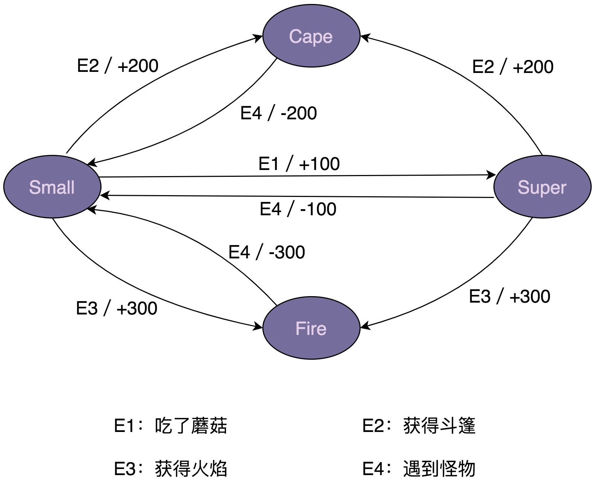

### (1) 状态机实现方式一：分支逻辑法

> 问题：分支判断逻辑较多，导致代码可读性和可维护性不好

```java
public enum State {
    SMALL(0),
    SUPER(1),
    FIRE(2),
    CAPE(3);

    private int value;

    private State(int value) {
        this.value = value;
    }

    public int getValue() {
        return this.value;
    }
}

public class MarioStateMachine {
    private int score;
    private State currentState;

    public MarioStateMachine() {
        this.score = 0;
        this.currentState = State.SMALL;
    }

    public void obtainMushRoom() {
        if (currentState.equals(State.SMALL)) {
            this.currentState = State.SUPER;
            this.score += 100;
        }
    }

    public void obtainCape() {
        if (currentState.equals(State.SMALL) || currentState.equals(State.SUPER) ) {
            this.currentState = State.CAPE;
            this.score += 200;
        }
    }

    public void obtainFireFlower() {
        if (currentState.equals(State.SMALL) || currentState.equals(State.SUPER) ) {
            this.currentState = State.FIRE;
            this.score += 300;
        }
    }

    public void meetMonster() {
        if (currentState.equals(State.SUPER)) {
            this.currentState = State.SMALL;
            this.score -= 100;
            return;
        }

        if (currentState.equals(State.CAPE)) {
            this.currentState = State.SMALL;
            this.score -= 200;
            return;
        }

        if (currentState.equals(State.FIRE)) {
            this.currentState = State.SMALL;
            this.score -= 300;
            return;
        }
    }

    public int getScore() {
        return this.score;
    }

    public State getCurrentState() {
        return this.currentState;
    }
}

public class ApplicationDemo {
    public static void main(String[] args) {
        MarioStateMachine mario = new MarioStateMachine();
        mario.obtainMushRoom();
        int score = mario.getScore();
        State state = mario.getCurrentState();
        System.out.println("mario score: " + score + "; state: " + state);
    }
}
```

### (2) 状态机实现方式二：查表法

> 查表法仅适用于非常简单的动作，比如数字的加减等，对于复杂的动作(如：写数据库，还有可能发送消息通知等)则无法胜任

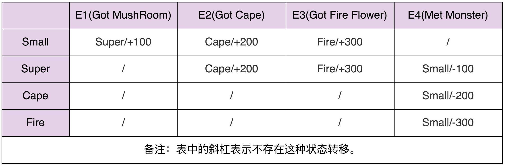

```java
public enum Event {
    GOT_MUSHROOM(0),
    GOT_CAPE(1),
    GOT_FIRE(2),
    MET_MONSTER(3);

    private int value;

    private Event(int value) {
        this.value = value;
    }

    public int getValue() {
        return this.value;
    }
}

public class MarioStateMachine {
    private int score;
    private State currentState;

    private static final State[][] transitionTable = {
          {SUPER, CAPE, FIRE, SMALL},
          {SUPER, CAPE, FIRE, SMALL},
          {CAPE, CAPE, CAPE, SMALL},
          {FIRE, FIRE, FIRE, SMALL}
    };

    private static final int[][] actionTable = {
          {+100, +200, +300, +0},
          {+0, +200, +300, -100},
          {+0, +0, +0, -200},
          {+0, +0, +0, -300}
    };

    public MarioStateMachine() {
        this.score = 0;
        this.currentState = State.SMALL;
    }

    public void obtainMushRoom() {
        executeEvent(Event.GOT_MUSHROOM);
    }

    public void obtainCape() {
        executeEvent(Event.GOT_CAPE);
    }

    public void obtainFireFlower() {
        executeEvent(Event.GOT_FIRE);
    }

    public void meetMonster() {
        executeEvent(Event.MET_MONSTER);
    }

    private void executeEvent(Event event) {
        int stateValue = currentState.getValue();
        int eventValue = event.getValue();
        this.currentState = transitionTable[stateValue][eventValue];
        this.score += actionTable[stateValue][eventValue];
    }

    public int getScore() {
        return this.score;
    }

    public State getCurrentState() {
        return this.currentState;
    }
}
```

### (3) 状态机实现方式三：状态模式

> 状态模式通过将事件触发的状态转移和动作执行，拆分到不同的状态类中，来避免分支判断逻辑

```java
public interface IMario {
    State getName();
    void obtainMushRoom(MarioStateMachine stateMachine);
    void obtainCape(MarioStateMachine stateMachine);
    void obtainFireFlower(MarioStateMachine stateMachine);
    void meetMonster(MarioStateMachine stateMachine);
}

public class SmallMario implements IMario {
    private static final SmallMario instance = new SmallMario();
    private SmallMario() {}
    
    public static SmallMario getInstance() {
        return instance;
    }

    @Override
    public State getName() {
        return State.SMALL;
    }

    @Override
    public void obtainMushRoom(MarioStateMachine stateMachine) {
        stateMachine.setCurrentState(SuperMario.getInstance());
        stateMachine.setScore(stateMachine.getScore() + 100);
    }

    @Override
    public void obtainCape(MarioStateMachine stateMachine) {
        stateMachine.setCurrentState(CapeMario.getInstance());
        stateMachine.setScore(stateMachine.getScore() + 200);
    }

    @Override
    public void obtainFireFlower(MarioStateMachine stateMachine) {
        stateMachine.setCurrentState(FireMario.getInstance());
        stateMachine.setScore(stateMachine.getScore() + 300);
    }

    @Override
    public void meetMonster(MarioStateMachine stateMachine) {
        // do nothing...
    }
}

// 省略SuperMario、CapeMario、FireMario类...

public class MarioStateMachine {
    private int score;
    private IMario currentState;

    public MarioStateMachine() {
        this.score = 0;
        this.currentState = SmallMario.getInstance();
    }

    public void obtainMushRoom() {
        this.currentState.obtainMushRoom(this);
    }

    public void obtainCape() {
        this.currentState.obtainCape(this);
    }

    public void obtainFireFlower() {
        this.currentState.obtainFireFlower(this);
    }

    public void meetMonster() {
        this.currentState.meetMonster(this);
    }

    public int getScore() {
        return this.score;
    }

    public State getCurrentState() {
        return this.currentState.getName();
    }

    public void setScore(int score) {
        this.score = score;
    }

    public void setCurrentState(IMario currentState) {
        this.currentState = currentState;
    }
}
```

## 6、迭代器模式(Iterator)

### (1) 原理和实现

#### 1. 原理

迭代器用来遍历容器，因此完整的迭代器模式会涉及**容器**和**容器迭代器**两部分

> 为了达到基于接口而非实现编程的目的，容器又包含容器接口、容器实现类，迭代器又包含迭代器接口、迭代器实现类

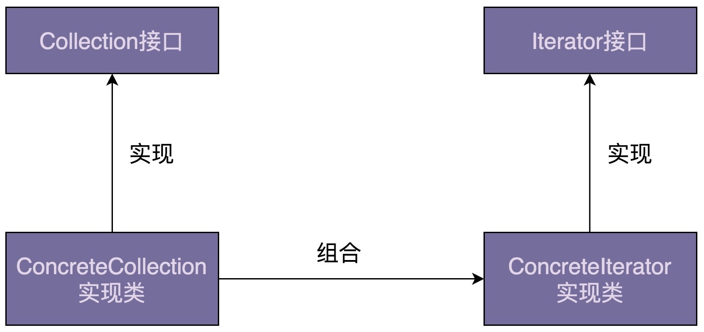

#### 2. 实现

针对 `ArrayList` 和 `LinkedList` 两个线性容器，设计实现对应的迭代器：

- 按照迭代器模式的类图，定义一个迭代器接口 `Iterator`，及针对两种容器的迭代器实现类 `ArrayIterator` 和 `ListIterator`：

    ```java
    // 接口定义方式一
    public interface Iterator {
        boolean hasNext();
        void next();
        E currentItem();
    }
    
    // 接口定义方式二
    public interface Iterator {
        boolean hasNext();
        E next();
    }
    ```

    > 第一种定义的 `next()` 函数用来将游标后移一位元素，`currentItem()` 函数用来返回当前游标指向的元素
    >
    > 第二种定义中，返回当前元素与后移一位这两个操作，要放到同一个函数 `next()` 中完成
    >
    > 因此，第一种方式更灵活，如：可以多次调用 `currentItem()` 查询当前元素

- `ArrayIterator` 的代码实现：

    ```java
    public class ArrayIterator implements Iterator {
        private int cursor;
        private ArrayList arrayList;
    
        public ArrayIterator(ArrayList arrayList) {
            this.cursor = 0;
            this.arrayList = arrayList;
        }
    
        @Override
        public boolean hasNext() {
            return cursor != arrayList.size(); //注: cursor 指向最后一个元素时，hasNext() 仍返回 true
        }
    
        @Override
        public void next() {
            cursor++;
        }
    
        @Override
        public E currentItem() {
            if (cursor >= arrayList.size()) {
                throw new NoSuchElementException();
            }
            return arrayList.get(cursor);
        }
    }
    
    public class Demo {
        public static void main(String[] args) {
            ArrayList names = new ArrayList<>();
            names.add("xzg");
            names.add("wang");
            names.add("zheng");
    
            Iterator iterator = new ArrayIterator(names);
            while (iterator.hasNext()) {
                System.out.println(iterator.currentItem());
                iterator.next();
            }
        }
    }
    ```

- 容器定义 `iterator()` 方法，创建对应的迭代器：

    > 为了能实现基于接口而非实现编程，需要将这个方法定义在 List 接口中

    ```java
    public interface List {
        Iterator iterator();
        //...省略其他接口函数...
    }
    
    public class ArrayList implements List {
        //...
        public Iterator iterator() {
            return new ArrayIterator(this);
        }
        //...省略其他代码
    }
    
    public class Demo {
        public static void main(String[] args) {
            List names = new ArrayList<>();
            names.add("xzg");
            names.add("wang");
            names.add("zheng");
    
            Iterator iterator = names.iterator();
            while (iterator.hasNext()) {
                System.out.println(iterator.currentItem());
                iterator.next();
            }
        }
    }
    ```

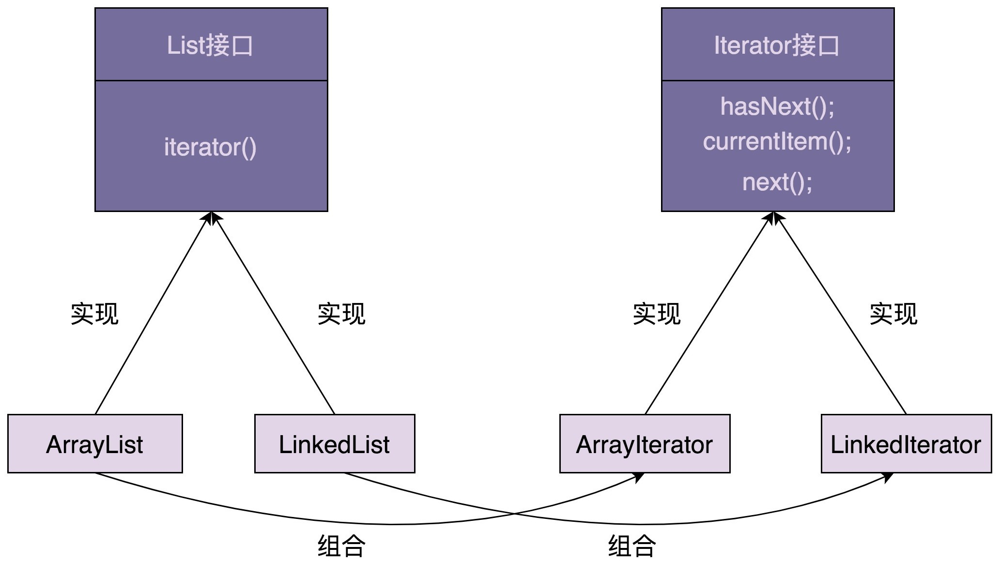

### (2) 迭代器模式的优势

#### 1. 优势

- 首先，对于类似数组和链表的数据结构，可以直接使用 `for` 循环遍历；

    但对于复杂的数据结构(如：树、图)，有各种复杂遍历方式(如：树有前中后序、按层遍历，图有深度优先、广度优先遍历等)，可以定义对应的迭代器类(如：DFSIterator、BFSIterator 分别实现深度优先遍历和广度优先遍历)

- 其次，将当前位置的游标等信息存储在迭代器类中，使得每个迭代器独享游标信息，则可以创建多个不同的迭代器，同时对同一个容器进行遍历而互不影响

- 最后，容器和迭代器都提供了抽象的接口，方便开发时基于接口而非具体的实现编程。

    > - 当切换新遍历算法时，如：从前往后遍历链表切换成从后往前遍历链表，只需将迭代器类从 LinkedIterator 切换为ReversedLinkedIterator 即可，其他代码都不需要修改
    >
    > - 除此之外，添加新的遍历算法，也只需扩展新的迭代器类，也更符合开闭原则

#### 2. 三种遍历方式对比

- **习惯用法**：

    ```java
    //1. for 循环
    List<String> list = new ArrayList<String>();
    	String[] arr = new String[]{"1,2,3,4"};
    	for(int i = 0;i < arr.length;i++){
    	    System.out.println(arr[i]);
    	}
    	for(int i = 0;i < list.size();i++){
    	    System.out.println(list.get(i));
    	}
    
    //2. foreach
    String[] arr = new String[]{"1,2,3,4"};
    List<String> list = new ArrayList<String>();
    list.add("1");
    list.add("2");
    for(String str : arr){
        System.out.println(str);
    }
    for (String item : list) {
        System.out.println(item);
    }
    
    //3. Iterator
    Iterator<String> it = list.iterator();
    while (it.hasNext()){
        System.out.println(it.next());
    }
    ```

- **速度对比**：

    ```java
    List<Long> list = new ArrayList<Long>();
    long maxLoop = 2000000;
    for(long i = 0;i < maxLoop;i++){
        list.add(i);
    }
    
    //1. for循环: 4ms
    long startTime = System.currentTimeMillis();
    for(int i = 0;i < list.size();i++){
        ;
    }
    long endTime = System.currentTimeMillis();
    System.out.println(endTime - startTime + "ms");
    
    //2. foreach 循环: 16ms
    startTime = System.currentTimeMillis();
    for(Long lon : list){
        ;
    }
    endTime = System.currentTimeMillis();
    System.out.println(endTime - startTime + "ms");
    
    //3. iterator 循环: 9ms
    startTime = System.currentTimeMillis();
    Iterator<Long> iterator = list.iterator();
    while (iterator.hasNext()) {
        iterator.next();
    }
    endTime = System.currentTimeMillis();
    System.out.println(endTime - startTime + "ms");
    ```

- **remove 操作的影响**：==禁止==遍历期间删除列表元素

    ```java
    //1. for 循环的 remove: 可以直接进行remove，不会受到任何影响
    List<String> list = new ArrayList<String>();
    list.add("1");
    list.add("2");
    for(int i = 0;i < list.size();i++){
        if("2".equals(list.get(i))){
            System.out.println(list.get(i));
            list.remove(list.get(i));
        }
    }
    
    //2. foreach 中的 remove: 抛出 modCount != expectedModCount 异常
    List<String> list = new ArrayList<String>();
    list.add("1");
    list.add("2");
    for (String item : list) {
        if ("2".equals(item)) {
            System.out.println(item);
            list.remove(item);
        }
    }
    
    //3. Iterator 的 remove:
    
    List<String> list = new ArrayList<String>();
    list.add("1");
    list.add("2");
    list.add("3");
    //正确写法
    Iterator<String> it = list.iterator();
    while (it.hasNext()){
        System.out.println(it.next());
        it.remove();
    }
    
    //错误写法
    Iterator<String> it = list.iterator();
    while (it.hasNext()){
        it.remove();
        System.out.println(it.next());
    }
    ```

### (3) 遍历时增删元素

以 `ArrayIterator` 为例：

```java
public interface Iterator {
    boolean hasNext();
    void next();
    E currentItem();
}

public class ArrayIterator implements Iterator {
    private int cursor;
    private ArrayList arrayList;

    public ArrayIterator(ArrayList arrayList) {
        this.cursor = 0;
        this.arrayList = arrayList;
    }

    @Override
    public boolean hasNext() {
        return cursor < arrayList.size();
    }

    @Override
    public void next() {
        cursor++;
    }

    @Override
    public E currentItem() {
        if (cursor >= arrayList.size()) {
            throw new NoSuchElementException();
        }
        return arrayList.get(cursor);
    }
}

public interface List {
    Iterator iterator();
}

public class ArrayList implements List {
    //...
    public Iterator iterator() {
        return new ArrayIterator(this);
    }
    //...
}
```

#### 1. 删除元素

```java
public class Demo {
    public static void main(String[] args) {
        List names = new ArrayList<>();
        names.add("a");
        names.add("b");
        names.add("c");
        names.add("d");

        Iterator iterator = names.iterator();
        iterator.next();
        names.remove("a");
    }
}
```

- `ArrayList` 底层是数组，初始时 `names` 中存储 `a、b、c、d` 四个元素，迭代器的游标 `cursor` 指向元素 `a` 

- 当执行完 `iterator.next()` 时，游标指向元素 `b` 

- 当执行 `names.remove("a")` 时，从数组中将元素 `a` 删除，`b、c、d` 会依次往前移一位，导致游标本来指向元素 `b`，现在指向元素 `c`，使得只能遍历到 `c、d` 两个元素，`b` 遍历不到

    > 注：仅限于数组结构的 list

#### 2. 增加元素

```java
public class Demo {
    public static void main(String[] args) {
        List names = new ArrayList<>();
        names.add("a");
        names.add("b");
        names.add("c");
        names.add("d");

        Iterator iterator = names.iterator();
        iterator.next();
        names.add(0, "x");
    }
}
```

- `ArrayList` 底层是数组，初始时 `names` 中存储 `a、b、c、d` 四个元素，迭代器的游标 `cursor` 指向元素 `a` 

- 当执行完 `iterator.next()` 时，游标指向元素 `b`，已经跳过元素 `a`

- 当执行 `names.add(0, "x")` 时，将 `x` 插入到下标为 0 的位置，``a、b、c、d` 依次往后移一位，使得元素 `a` 被游标重复指向两次，即元素 `a` 会被再次遍历

    > 注：仅限于数组结构的 list

#### 3. 应对遍历时改变集合

> 通过迭代器来遍历集合时，增加、删除集合元素会导致不可预期的遍历结果

两种干脆利索的解决方案：

- 一种是遍历的时候不允许增删元素
- 另一种是增删元素之后让遍历报错

---

确定遍历时，集合是否增删元素的方式：

- 在 `ArrayList` 中定义一个成员变量 `modCount`，记录集合修改次数，集合每增加或删除元素，就会给 modCount 加 1

- 当通过 `iterator()` 函数来创建迭代器时，把 `modCount` 值传给迭代器的 `expectedModCount` 成员变量，之后每次调用迭代器上的`hasNext()、next()、currentItem()` 函数，都会检查集合上的 `modCount` 是否等于 `expectedModCount`，即在创建完迭代器后，`modCount` 是否改变过

- 若两个值不同，则说明集合存储的元素已经改变，之前创建的迭代器不能正确运行，再继续使用会产生不可预期的结果，所以选择`fail-fast` 方式，抛出运行时异常，结束掉程序

```java
public class ArrayIterator implements Iterator {
    private int cursor;
    private ArrayList arrayList;
    private int expectedModCount;

    public ArrayIterator(ArrayList arrayList) {
        this.cursor = 0;
        this.arrayList = arrayList;
        this.expectedModCount = arrayList.modCount;
    }

    @Override
    public boolean hasNext() {
        checkForComodification();
        return cursor < arrayList.size();
    }

    @Override
    public void next() {
        checkForComodification();
        cursor++;
    }

    @Override
    public Object currentItem() {
        checkForComodification();
        return arrayList.get(cursor);
    }

    private void checkForComodification() {
        if (arrayList.modCount != expectedModCount)
            throw new ConcurrentModificationException();
        }
    }

    //代码示例
    public class Demo {
        public static void main(String[] args) {
        List names = new ArrayList<>();
        names.add("a");
        names.add("b");
        names.add("c");
        names.add("d");

        Iterator iterator = names.iterator();
        iterator.next();
        names.remove("a");
        iterator.next();//抛出ConcurrentModificationException异常
    }
}
```

#### 4. 遍历时安全删除元素

> `Java` 迭代器类定义了 `remove()` 方法，能够在遍历集合的同时，安全地删除集合中的元素，但没有提供添加元素的方法

注：只能删除游标指向的前一个元素，且一个 `next()` 函数之后，只能跟着最多一个 `remove()` 操作，多次调用 `remove()` 操作会报错

```java
public class Demo {
    public static void main(String[] args) {
        List names = new ArrayList<>();
        names.add("a");
        names.add("b");
        names.add("c");
        names.add("d");

        Iterator iterator = names.iterator();
        iterator.next();
        iterator.remove();
        iterator.remove(); //报错，抛出IllegalStateException异常
    }
}
```

----

源码理解：迭代器类新增的 `lastRet` 成员变量，用来记录游标指向的前一个元素，通过迭代器删除这个元素时，可以更新迭代器中的游标和 `lastRet` 值，来保证不会因为删除元素而导致某个元素遍历不到

> 若通过容器来删除元素，且希望更新迭代器中的游标值来保证遍历不出错，则要维护这个容器都创建了哪些迭代器，每个迭代器是否还在使用等信息，代码实现就变得比较复杂

```java
public class ArrayList {
    transient Object[] elementData;
    private int size;

    public Iterator iterator() {
        return new Itr();
    }

    private class Itr implements Iterator {
        int cursor;       // index of next element to return
        int lastRet = -1; // index of last element returned; -1 if no such
        int expectedModCount = modCount;

        Itr() {}

        public boolean hasNext() {
            return cursor != size;
        }

        @SuppressWarnings("unchecked")
        public E next() {
            checkForComodification();
            int i = cursor;
            if (i >= size) throw new NoSuchElementException();
            Object[] elementData = ArrayList.this.elementData;
            if (i >= elementData.length)  throw new ConcurrentModificationException();
            cursor = i + 1;
            return (E) elementData[lastRet = i];
        }

        public void remove() {
            if (lastRet < 0) throw new IllegalStateException();
            checkForComodification();
            try {
                ArrayList.this.remove(lastRet);
                cursor = lastRet;
                lastRet = -1;
                expectedModCount = modCount;
            } catch (IndexOutOfBoundsException ex) {
                throw new ConcurrentModificationException();
            }
        }
    }
}
```

### (4) 实现支持“快照”功能的迭代器

```java
public ArrayList implements List {
    // TODO: 成员变量、私有函数等随便你定义

    @Override
    public void add(E obj) {
        //TODO: 待完善
    }

    @Override
    public void remove(E obj) {
        // TODO: 待完善
    }

    @Override
    public Iterator iterator() {
        return new SnapshotArrayIterator(this);
    }
}

public class SnapshotArrayIterator implements Iterator {
    // TODO: 成员变量、私有函数等随便你定义

    @Override
    public boolean hasNext() {
        // TODO: 待完善
    }

    @Override
    public E next() {//返回当前元素，并且游标后移一位
        // TODO: 待完善
    }
}
```

#### 1. 解决方案一

- **方案一**：在迭代器类中定义一个成员变量 `snapshot` 来存储快照，每当创建迭代器时，都拷贝一份容器中的元素到快照中，后续的遍历操作都基于这个迭代器持有的快照来进行
- **局限**：每次创建迭代器时，都要拷贝一份数据到快照中，会增加内存的消耗，若一个容器同时有多个迭代器在遍历元素，就会导致数据在内存中重复存储多份

```java
public class SnapshotArrayIterator implements Iterator {
    private int cursor;
    private ArrayList snapshot;

    public SnapshotArrayIterator(ArrayList arrayList) {
        this.cursor = 0;
        this.snapshot = new ArrayList<>();
        this.snapshot.addAll(arrayList);
    }

    @Override
    public boolean hasNext() {
        return cursor < snapshot.size();
    }

    @Override
    public E next() {
        E currentItem = snapshot.get(cursor);
        cursor++;
        return currentItem;
    }
}
```

#### 2. 解决方案二

- **方案二**：

    - 为每个元素保存两个时间戳，一个是添加时间戳 `addTimestamp`，一个是删除时间戳 `delTimestamp` 

        - 当元素加入集合时，将 `addTimestamp` 设置为当前时间，将 `delTimestamp` 设置成最大长整型值 `Long.MAX_VALUE` 

        - 当元素被删除时，将 `delTimestamp` 更新为当前时间，表示已经被删除

            > 这里只是标记删除，而非真正从容器中删除

    - 同时，每个迭代器也保存迭代器对应的快照创建时间戳 `snapshotTimestamp`，若 `addTimestamp>snapshotTimestamp`，说明元素在创建了迭代器后才加入，不属于这个迭代器的快照

- **局限**：通过时间戳来标记删除，导致无法支持按照下标快速随机访问

```java
//在不拷贝容器的情况下，借助时间戳实现快照功能，但下述代码没有考虑 ArrayList 的扩容问题
public class ArrayList implements List {
  private static final int DEFAULT_CAPACITY = 10;

  private int actualSize; //不包含标记删除元素
  private int totalSize; //包含标记删除元素

  private Object[] elements;
  private long[] addTimestamps;
  private long[] delTimestamps;

  public ArrayList() {
    this.elements = new Object[DEFAULT_CAPACITY];
    this.addTimestamps = new long[DEFAULT_CAPACITY];
    this.delTimestamps = new long[DEFAULT_CAPACITY];
    this.totalSize = 0;
    this.actualSize = 0;
  }

  @Override
  public void add(E obj) {
    elements[totalSize] = obj;
    addTimestamps[totalSize] = System.currentTimeMillis();
    delTimestamps[totalSize] = Long.MAX_VALUE;
    totalSize++;
    actualSize++;
  }

  @Override
  public void remove(E obj) {
    for (int i = 0; i < totalSize; ++i) {
      if (elements[i].equals(obj)) {
        delTimestamps[i] = System.currentTimeMillis();
        actualSize--;
      }
    }
  }

  public int actualSize() {
    return this.actualSize;
  }

  public int totalSize() {
    return this.totalSize;
  }

  public E get(int i) {
    if (i >= totalSize) {
      throw new IndexOutOfBoundsException();
    }
    return (E)elements[i];
  }

  public long getAddTimestamp(int i) {
    if (i >= totalSize) {
      throw new IndexOutOfBoundsException();
    }
    return addTimestamps[i];
  }

  public long getDelTimestamp(int i) {
    if (i >= totalSize) {
      throw new IndexOutOfBoundsException();
    }
    return delTimestamps[i];
  }
}

public class SnapshotArrayIterator implements Iterator {
  private long snapshotTimestamp;
  private int cursorInAll; // 在整个容器中的下标，而非快照中的下标
  private int leftCount; // 快照中还有几个元素未被遍历
  private ArrayList arrayList;

  public SnapshotArrayIterator(ArrayList arrayList) {
    this.snapshotTimestamp = System.currentTimeMillis();
    this.cursorInAll = 0;
    this.leftCount = arrayList.actualSize();;
    this.arrayList = arrayList;

    justNext(); // 先跳到这个迭代器快照的第一个元素
  }

  @Override
  public boolean hasNext() {
    return this.leftCount >= 0; // 注意是>=, 而非>
  }

  @Override
  public E next() {
    E currentItem = arrayList.get(cursorInAll);
    justNext();
    return currentItem;
  }

  private void justNext() {
    while (cursorInAll < arrayList.totalSize()) {
      long addTimestamp = arrayList.getAddTimestamp(cursorInAll);
      long delTimestamp = arrayList.getDelTimestamp(cursorInAll);
      if (snapshotTimestamp > addTimestamp && snapshotTimestamp < delTimestamp) {
        leftCount--;
        break;
      }
      cursorInAll++;
    }
  }
}
```

#### 3. 解决方案三

可以在 `ArrayList` 中存储两个数组：

- 一个支持标记删除，用来实现快照遍历功能
- 一个不支持标记删除的(即将要删除的数据直接从数组中移除)，用来支持随机访问

> todo：实现对应代码


### JDK使用

- [java.util.Iterator](http://docs.oracle.com/javase/8/docs/api/java/util/Iterator.html)
- [java.util.Enumeration](http://docs.oracle.com/javase/8/docs/api/java/util/Enumeration.html) 

## 7、访问者模式(Visitor)

> 在没有特别必要的情况下，建议不要使用访问者模式

访问者模式不好理解，因为函数重载是静态绑定：

- 多态是一种动态绑定，可以在运行时获取对象的实际类型，来运行实际类型对应的方法
- 函数重载是一种静态绑定，在编译时并不能获取对象的实际类型，而是根据声明类型执行声明类型对应的方法

### (1) 案例理解

功能实现：把 PDF、PPT、Word 等格式的资源文件中的文本内容抽取出来放到 txt 文件中

#### 1. 多态实现

```java
//ResourceFile 是一个抽象类，包含一个抽象函数 extract2txt()
public abstract class ResourceFile {
    protected String filePath;

    public ResourceFile(String filePath) {
        this.filePath = filePath;
    }

    public abstract void extract2txt();
}

//PdfFile、PPTFile、WordFile 都继承 ResourceFile 类，并且重写了 extract2txt() 函数
public class PPTFile extends ResourceFile {
    public PPTFile(String filePath) {
        super(filePath);
    }

    @Override
    public void extract2txt() {
        //...省略一大坨从PPT中抽取文本的代码...
        //...将抽取出来的文本保存在跟filePath同名的.txt文件中...
        System.out.println("Extract PPT.");
    }
}

public class PdfFile extends ResourceFile {
    public PdfFile(String filePath) {
        super(filePath);
    }

    @Override
    public void extract2txt() {
        //...
        System.out.println("Extract PDF.");
    }
}

public class WordFile extends ResourceFile {
    public WordFile(String filePath) {
        super(filePath);
    }

    @Override
    public void extract2txt() {
        //...
        System.out.println("Extract WORD.");
    }
}

//在 ToolApplication 中，可以利用多态特性，根据对象的实际类型，来决定执行哪个方法
public class ToolApplication {
    public static void main(String[] args) {
        List<ResourceFile> resourceFiles = listAllResourceFiles(args[0]);
        for (ResourceFile resourceFile : resourceFiles) {
            resourceFile.extract2txt();
        }
    }

    private static List<ResourceFile> listAllResourceFiles(String resourceDirectory) {
        List<ResourceFile> resourceFiles = new ArrayList<>();
        //...根据后缀(pdf/ppt/word)由工厂方法创建不同的类对象(PdfFile/PPTFile/WordFile)
        resourceFiles.add(new PdfFile("a.pdf"));
        resourceFiles.add(new WordFile("b.word"));
        resourceFiles.add(new PPTFile("c.ppt"));
        return resourceFiles;
    }
}

// 运行结果是：
// Extract PDF.
// Extract WORD.
// Extract PPT.
```

局限：若功能不停扩展，不仅要抽取文本内容，还要支持压缩、提取文件元信息(文件名、大小、更新时间等)、构建索引等功能

会存在问题：

- 违背开闭原则，添加一个新的功能，所有类的代码都要修改
- 虽然功能增多，每个类的代码都不断膨胀，可读性和可维护性都变差
- 把所有比较上层的业务逻辑都耦合到 PdfFile、PPTFile、WordFile 类中，导致这些类的职责不够单一，变成了大杂烩

#### 2. 错误重构

```java
public abstract class ResourceFile {
    protected String filePath;

    public ResourceFile(String filePath) {
        this.filePath = filePath;
    }
}

public class PdfFile extends ResourceFile {
    public PdfFile(String filePath) {
        super(filePath);
    }
    
    //...
}
//...PPTFile、WordFile代码省略...

public class Extractor {
    public void extract2txt(PPTFile pptFile) {
        //...
        System.out.println("Extract PPT.");
    }

    public void extract2txt(PdfFile pdfFile) {
        //...
        System.out.println("Extract PDF.");
    }

    public void extract2txt(WordFile wordFile) {
        //...
        System.out.println("Extract WORD.");
    }
}

public class ToolApplication {
    public static void main(String[] args) {
        Extractor extractor = new Extractor();
        List<ResourceFile> resourceFiles = listAllResourceFiles(args[0]);
        for (ResourceFile resourceFile : resourceFiles) {
            extractor.extract2txt(resourceFile); //会报错...
        }
    }

    private static List<ResourceFile> listAllResourceFiles(String resourceDirectory) {
        List<ResourceFile> resourceFiles = new ArrayList<>();
        //...根据后缀(pdf/ppt/word)由工厂方法创建不同的类对象(PdfFile/PPTFile/WordFile)
        resourceFiles.add(new PdfFile("a.pdf"));
        resourceFiles.add(new WordFile("b.word"));
        resourceFiles.add(new PPTFile("c.ppt"));
        return resourceFiles;
    }
}
```

- `resourceFiles` 的对象声明类型是 ResourceFile，并没有在 Extractor 类中定义参数类型是 ResourceFile 的 extract2txt() 重载函数，所以在编译阶段通过不了

#### 3. 访问者模式实现

**解决方法**：拆分解耦，即把业务操作跟具体的数据结构解耦，设计成独立的类

```java
public abstract class ResourceFile {
    protected String filePath;
    
    public ResourceFile(String filePath) {
        this.filePath = filePath;
    }
    
    abstract public void accept(Extractor extractor);
}

public class PdfFile extends ResourceFile {
    public PdfFile(String filePath) {
        super(filePath);
    }
    
    @Override 
    public void accept(Extractor extractor) { 
        extractor.extract2txt(this);
    }
    
    //...
}

//把抽取文本内容的操作，设计成了三个重载函数
public class Extractor {
    public void extract2txt(PPTFile pptFile) {
        //...
        System.out.println("Extract PPT.");
    }

    public void extract2txt(PdfFile pdfFile) {
        //...
        System.out.println("Extract PDF.");
    }

    public void extract2txt(WordFile wordFile) {
        //...
        System.out.println("Extract WORD.");
    }
}

public class ToolApplication {
    public static void main(String[] args) {
        Extractor extractor = new Extractor();
        List<ResourceFile> resourceFiles = listAllResourceFiles(args[0]);
        for (ResourceFile resourceFile : resourceFiles) {
            resourceFile.accept(extractor); //访问者模式的关键: 根据多态特性，程序调用实际类型的 accept 函数
        }
    }

    private static List<ResourceFile> listAllResourceFiles(String resourceDirectory) {
        List<ResourceFile> resourceFiles = new ArrayList<>();
        //...根据后缀(pdf/ppt/word)由工厂方法创建不同的类对象(PdfFile/PPTFile/WordFile)
        resourceFiles.add(new PdfFile("a.pdf"));
        resourceFiles.add(new WordFile("b.word"));
        resourceFiles.add(new PPTFile("c.ppt"));
        return resourceFiles;
    }
}
```

#### 4. 访问者模式下添加新功能

```java
public abstract class ResourceFile {
    protected String filePath;
    
    public ResourceFile(String filePath) {
        this.filePath = filePath;
    }
    
    abstract public void accept(Extractor extractor);
    abstract public void accept(Compressor compressor);
}

public class PdfFile extends ResourceFile {
    public PdfFile(String filePath) {
        super(filePath);
    }

    @Override
    public void accept(Extractor extractor) {
        extractor.extract2txt(this);
    }

    @Override
    public void accept(Compressor compressor) {
        compressor.compress(this);
    }

    //...
}

//...PPTFile、WordFile跟PdfFile类似，这里就省略了...
//...Extractor代码不变

public class ToolApplication {
    public static void main(String[] args) {
        Extractor extractor = new Extractor();
        List<ResourceFile> resourceFiles = listAllResourceFiles(args[0]);
        for (ResourceFile resourceFile : resourceFiles) {
            resourceFile.accept(extractor);
        }

        Compressor compressor = new Compressor();
        for(ResourceFile resourceFile : resourceFiles) {
            resourceFile.accept(compressor);
        }
    }

    private static List<ResourceFile> listAllResourceFiles(String resourceDirectory) {
        List<ResourceFile> resourceFiles = new ArrayList<>();
        //...根据后缀(pdf/ppt/word)由工厂方法创建不同的类对象(PdfFile/PPTFile/WordFile)
        resourceFiles.add(new PdfFile("a.pdf"));
        resourceFiles.add(new WordFile("b.word"));
        resourceFiles.add(new PPTFile("c.ppt"));
        return resourceFiles;
    }
}
```

#### 5. 进一步重构

- **代码还存在的问题**：添加一个新的业务，还是需要修改每个资源文件类，违反开闭原则

- **解决**：抽象出来一个 Visitor 接口，包含三个 visit() 重载函数，分别处理三种不同类型的资源文件
    - 具体做什么业务处理，由实现这个 Visitor 接口的具体的类来决定，如：Extractor 负责抽取文本内容，Compressor 负责压缩
    - 当新添加一个业务功能时，资源文件类不需要做任何修改，只需要修改 ToolApplication 的代码就可以

```java
public abstract class ResourceFile {
    protected String filePath;
    
    public ResourceFile(String filePath) {
        this.filePath = filePath;
    }
    
    abstract public void accept(Visitor vistor);
}

public class PdfFile extends ResourceFile {
    public PdfFile(String filePath) {
        super(filePath);
    }

    @Override
    public void accept(Visitor visitor) {
        visitor.visit(this);
    }

    //...
}
//...PPTFile、WordFile跟PdfFile类似，这里就省略了...

public interface Visitor {
    void visit(PdfFile pdfFile);
    void visit(PPTFile pdfFile);
    void visit(WordFile pdfFile);
}

public class Extractor implements Visitor {
    @Override
    public void visit(PPTFile pptFile) {
        //...
        System.out.println("Extract PPT.");
    }

    @Override
    public void visit(PdfFile pdfFile) {
        //...
        System.out.println("Extract PDF.");
    }

    @Override
    public void visit(WordFile wordFile) {
        //...
        System.out.println("Extract WORD.");
    }
}

public class Compressor implements Visitor {
    @Override
    public void visit(PPTFile pptFile) {
        //...
        System.out.println("Compress PPT.");
    }

    @Override
    public void visit(PdfFile pdfFile) {
        //...
        System.out.println("Compress PDF.");
    }

    @Override
    public void visit(WordFile wordFile) {
        //...
        System.out.println("Compress WORD.");
    }
}

public class ToolApplication {
    public static void main(String[] args) {
        Extractor extractor = new Extractor();
        List<ResourceFile> resourceFiles = listAllResourceFiles(args[0]);
        for (ResourceFile resourceFile : resourceFiles) {
            resourceFile.accept(extractor);
        }

        Compressor compressor = new Compressor();
        for(ResourceFile resourceFile : resourceFiles) {
            resourceFile.accept(compressor);
        }
    }

    private static List<ResourceFile> listAllResourceFiles(String resourceDirectory) {
        List<ResourceFile> resourceFiles = new ArrayList<>();
        //...根据后缀(pdf/ppt/word)由工厂方法创建不同的类对象(PdfFile/PPTFile/WordFile)
        resourceFiles.add(new PdfFile("a.pdf"));
        resourceFiles.add(new WordFile("b.word"));
        resourceFiles.add(new PPTFile("c.ppt"));
        return resourceFiles;
    }
}
```

#### 6. 理解访问者模式

> 定义：允许一个或多个操作应用到一组对象上，解耦操作和对象本身，即分离解耦对象和操作，让操作可以独自变化

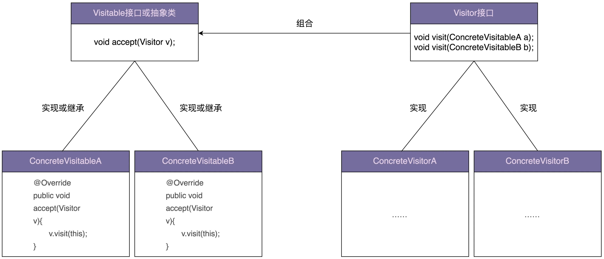

- 访问者模式针对一组类型不同的对象，尽管对象类型不同，但继承相同的父类或实现相同接口

- 不同场景下，要对这组对象进行一系列不相关的业务操作，但为了避免不断添加功能导致类不断膨胀，职责越来越不单一，以及避免频繁地添加功能导致的频繁代码修改，使用访问者模式，将对象与操作解耦，将业务操作抽离出来，定义在独立细分的访问者类中

### (2) 支持双分派的语言不需要访问者模式

#### 1. 单双分派理解

- **单分派与双分派**：
    - **`Single Dispatch`(单分派)**：
        - 执行哪个对象的方法，根据对象的运行时类型来决定
        - 执行对象的哪个方法，根据**方法参数的编译时类型**来决定
    - **`Double Dispatch`(双分派)**：
        - 执行哪个对象的方法，根据对象的运行时类型来决定
        - 执行对象的哪个方法，根据**方法参数的运行时类型**来决定

- **理解单分派与双分派**：

    - **理解 `Dispatch`**：一个对象调用另一个对象的方法，相当于给它发送一条消息，这条消息包含对象名、方法名、方法参数

        > 在面向对象编程语言中，可以把方法调用理解为一种消息传递，即 `Dispatch` 

    - **理解 `Single、Double`**：`Single、Double` 指执行哪个对象的哪个方法，跟几个因素的运行时类型有关

        - `Single Dispatch` 之所以称为 `Single`，是因为执行哪个对象的哪个方法，只跟“对象”的运行时类型有关
        - `Double Dispatch` 之所以称为 `Double`，是因为执行哪个对象的哪个方法，跟“对象”和“方法参数”两者的运行时类型有关

> 具体到编程语言的语法机制，Single Dispatch 和 Double Dispatch 跟多态和函数重载直接相关
>
> 当前主流的面向对象编程语言（比如，Java、C++、C#）都只支持 Single Dispatch，不支持 Double Dispatch

#### 2. 案例理解单双分派

Java 语言只支持 Single Dispatch：

- Java 支持多态特性，代码可以在运行时获得对象的实际类型，然后根据实际类型决定调用哪个方法

- Java 设计的函数重载的语法规则：在编译时，根据传递进函数的参数的声明类型(编译时类型)，来决定调用哪个重载函数

    即具体执行哪个对象的哪个方法，只跟对象的运行时类型有关，跟参数的运行时类型无关

    > 并不是在运行时，根据传递进函数的参数的实际类型，来决定调用哪个重载函数

```java
public class ParentClass {
    public void f() {
        System.out.println("I am ParentClass's f().");
    }
}

public class ChildClass extends ParentClass {
    public void f() {
        System.out.println("I am ChildClass's f().");
    }
}

public class SingleDispatchClass {
    public void polymorphismFunction(ParentClass p) {
        p.f();
    }

    public void overloadFunction(ParentClass p) {
        System.out.println("I am overloadFunction(ParentClass p).");
    }

    public void overloadFunction(ChildClass c) {
        System.out.println("I am overloadFunction(ChildClass c).");
    }
}

public class DemoMain {
    public static void main(String[] args) {
        SingleDispatchClass demo = new SingleDispatchClass();
        ParentClass p = new ChildClass();
        demo.polymorphismFunction(p); //执行哪个对象的方法，由对象的实际类型决定
        demo.overloadFunction(p); //执行对象的哪个方法，由参数对象的声明类型决定
    }
}

//代码执行结果:
//I am ChildClass's f().
//I am overloadFunction(ParentClass p).
```

### (3) 上述案例的其他实现方案

还可以利用工厂模式来实现：

- 定义一个包含 `extract2txt()` 接口函数的 `Extractor` 接口

- `PdfExtractor、PPTExtractor、WordExtractor` 类实现 `Extractor` 接口，并在各自的 `extract2txt()` 函数中，分别实现 Pdf、PPT、Word 格式文件的文本内容抽取

- `ExtractorFactory` 工厂类根据不同的文件类型，返回不同的 `Extractor`

```java
public abstract class ResourceFile {
    protected String filePath;
    
    public ResourceFile(String filePath) {
        this.filePath = filePath;
    }
    
    public abstract ResourceFileType getType();
}

public class PdfFile extends ResourceFile {
    public PdfFile(String filePath) {
        super(filePath);
    }

    @Override
    public ResourceFileType getType() {
        return ResourceFileType.PDF;
    }

    //...
}

//...PPTFile/WordFile跟PdfFile代码结构类似，此处省略...

public interface Extractor {
    void extract2txt(ResourceFile resourceFile);
}

public class PdfExtractor implements Extractor {
    @Override
    public void extract2txt(ResourceFile resourceFile) {
        //...
    }
}

//...PPTExtractor/WordExtractor跟PdfExtractor代码结构类似，此处省略...

public class ExtractorFactory {
    private static final Map<ResourceFileType, Extractor> extractors = new HashMap<>();
    static {
        extractors.put(ResourceFileType.PDF, new PdfExtractor());
        extractors.put(ResourceFileType.PPT, new PPTExtractor());
        extractors.put(ResourceFileType.WORD, new WordExtractor());
    }

    public static Extractor getExtractor(ResourceFileType type) {
        return extractors.get(type);
    }
}

public class ToolApplication {
    public static void main(String[] args) {
        List<ResourceFile> resourceFiles = listAllResourceFiles(args[0]);
        for (ResourceFile resourceFile : resourceFiles) {
            Extractor extractor = ExtractorFactory.getExtractor(resourceFile.getType());
            extractor.extract2txt(resourceFile);
        }
    }

    private static List<ResourceFile> listAllResourceFiles(String resourceDirectory) {
        List<ResourceFile> resourceFiles = new ArrayList<>();
        //...根据后缀(pdf/ppt/word)由工厂方法创建不同的类对象(PdfFile/PPTFile/WordFile)
        resourceFiles.add(new PdfFile("a.pdf"));
        resourceFiles.add(new WordFile("b.word"));
        resourceFiles.add(new PPTFile("c.ppt"));
        return resourceFiles;
    }
}
```

### JDK使用

- javax.lang.model.element.Element and javax.lang.model.element.ElementVisitor
- javax.lang.model.type.TypeMirror and javax.lang.model.type.TypeVisitor

## 8、备忘录模式(Memento)

> 备忘录模式应用场景：防丢失、撤销、恢复

### (1) 定义

- 定义：在不违背封装原则的前提下，捕获一个对象的内部状态，并在该对象之外保存这个状态，以便之后恢复对象为先前的状态

    > 即存储副本以便后期恢复、在不违背封装原则的前提下，进行对象的备份和恢复

- 两个问题：
    - 为什么存储和恢复副本会违背封装原则？
    - 备忘录模式是如何做到不违背封装原则的？

### (2) 案例

功能：接收命令行的输入

- 用户输入文本时，程序将其追加存储在内存文本中
- 用户输入“:list”，程序在命令行中输出内存文本的内容
- 用户输入“:undo”，程序会撤销上一次输入的文本，即从内存文本中将上次输入的文本删除掉

```java
public class InputText {
    private StringBuilder text = new StringBuilder();

    public String getText() {
        return text.toString();
    }

    public void append(String input) {
        text.append(input);
    }

    public void setText(String text) {
        this.text.replace(0, this.text.length(), text);
    }
}

public class SnapshotHolder {
    private Stack<InputText> snapshots = new Stack<>();

    public InputText popSnapshot() {
        return snapshots.pop();
    }

    public void pushSnapshot(InputText inputText) {
        InputText deepClonedInputText = new InputText();
        deepClonedInputText.setText(inputText.getText());
        snapshots.push(deepClonedInputText);
    }
}

public class ApplicationMain {
    public static void main(String[] args) {
        InputText inputText = new InputText();
        SnapshotHolder snapshotsHolder = new SnapshotHolder();
        Scanner scanner = new Scanner(System.in);
        while (scanner.hasNext()) {
            String input = scanner.next();
            if (input.equals(":list")) {
                System.out.println(inputText.getText());
            } else if (input.equals(":undo")) {
                InputText snapshot = snapshotsHolder.popSnapshot();
                inputText.setText(snapshot.getText());
            } else {
                snapshotsHolder.pushSnapshot(inputText);
                inputText.append(input);
            }
        }
    }
}
```

上面代码实现了基本的备忘录功能，但不满足“要在不违背封装原则的前提下，进行对象的备份和恢复”，主要体现在下面两方面：

- 第一，为了能用快照恢复 InputText 对象，在 InputText 类中定义 setText() 函数，但这个函数有可能会被其他业务使用，所以暴露不应该暴露的函数违背了封装原则

- 第二，快照本身不可变，不应该包含任何 set() 等修改内部状态的函数，但在上面的代码实现中，“快照“这个业务模型复用了 InputText 类的定义，而 InputText 类本身有一系列修改内部状态的函数，所以，用 InputText 类来表示快照违背了封装原则

### (3) 代码重构

针对以上问题，对代码做两点修改：

- 其一：定义独立类(Snapshot 类)表示快照，而不是复用 InputText 类，且只暴露 get() 方法，没有 set() 等任何修改内部状态的方法
- 其二：在 InputText 类中，把 setText() 方法重命名为 restoreSnapshot() 方法，用意更加明确，只用来恢复对象

```java
public class InputText {
    private StringBuilder text = new StringBuilder();

    public String getText() {
        return text.toString();
    }

    public void append(String input) {
        text.append(input);
    }

    public Snapshot createSnapshot() {
        return new Snapshot(text.toString());
    }

    public void restoreSnapshot(Snapshot snapshot) {
        this.text.replace(0, this.text.length(), snapshot.getText());
    }
}

public class Snapshot {
    private String text;

    public Snapshot(String text) {
        this.text = text;
    }

    public String getText() {
        return this.text;
    }
}

public class SnapshotHolder {
    private Stack<Snapshot> snapshots = new Stack<>();

    public Snapshot popSnapshot() {
        return snapshots.pop();
    }

    public void pushSnapshot(Snapshot snapshot) {
        snapshots.push(snapshot);
    }
}

public class ApplicationMain {
    public static void main(String[] args) {
        InputText inputText = new InputText();
        SnapshotHolder snapshotsHolder = new SnapshotHolder();
        Scanner scanner = new Scanner(System.in);
        while (scanner.hasNext()) {
            String input = scanner.next();
            if (input.equals(":list")) {
                System.out.println(inputText.toString());
            } else if (input.equals(":undo")) {
                Snapshot snapshot = snapshotsHolder.popSnapshot();
                inputText.restoreSnapshot(snapshot);
            } else {
                snapshotsHolder.pushSnapshot(inputText.createSnapshot());
                inputText.append(input);
            }
        }
    }
}
```

### JDK使用

- java.io.Serializable

## 9、命令模式(Command)

> 定义：命令模式将请求(命令)封装为一个对象，这样可以使用不同的请求参数化其他对象(将不同请求依赖注入到其他对象)，并且能够支持请求(命令)的排队执行、记录日志、撤销等(附加控制)功能
>
> - 命令模式用的最核心的实现手段，是将函数封装成对象

### (1) 案例理解

```java
public interface Command {
    void execute();
}

public class GotDiamondCommand implements Command {
    // 省略成员变量

    public GotDiamondCommand(/*数据*/) {
        //...
    }

    @Override
    public void execute() {
        // 执行相应的逻辑
    }
}
//GotStartCommand/HitObstacleCommand/ArchiveCommand类省略

public class GameApplication {
    private static final int MAX_HANDLED_REQ_COUNT_PER_LOOP = 100;
    private Queue<Command> queue = new LinkedList<>();

    public void mainloop() {
        while (true) {
            List<Request> requests = new ArrayList<>();
            //省略从epoll或者select中获取数据，并封装成Request的逻辑，
            //注意设置超时时间，如果很长时间没有接收到请求，就继续下面的逻辑处理

            for (Request request : requests) {
                Event event = request.getEvent();
                Command command = null;
                if (event.equals(Event.GOT_DIAMOND)) {
                    command = new GotDiamondCommand(/*数据*/);
                } else if (event.equals(Event.GOT_STAR)) {
                    command = new GotStartCommand(/*数据*/);
                } else if (event.equals(Event.HIT_OBSTACLE)) {
                    command = new HitObstacleCommand(/*数据*/);
                } else if (event.equals(Event.ARCHIVE)) {
                    command = new ArchiveCommand(/*数据*/);
                } // ...一堆else if...
                queue.add(command);
            }

            int handledCount = 0;
            while (handledCount < MAX_HANDLED_REQ_COUNT_PER_LOOP) {
                if (queue.isEmpty()) {
                    break;
                }
                Command command = queue.poll();
                command.execute();
            }
        }
    }
}
```

### JDK使用

- [java.lang.Runnable](http://docs.oracle.com/javase/8/docs/api/java/lang/Runnable.html)
- [Netflix Hystrix](https://github.com/Netflix/Hystrix/wiki)
- [javax.swing.Action](http://docs.oracle.com/javase/8/docs/api/javax/swing/Action.html) 

## 10、解释器模式(Interpreter)

> - 解释器模式用来描述如何构建一个简单的“语言”解释器，比如编译器、规则引擎、正则表达式
>
> - 定义：解释器模式为某个语言定义语法或文法表示，并定义一个解释器用来处理这个语法

### (1) 案例

假设定义一个新的加减乘除计算“语言”，语法规则如下：

- 运算符只包含加、减、乘、除，并且没有优先级的概念
- 表达式中，先书写数字，后书写运算符，空格隔开
- 按照先后顺序，取出两个数字和一个运算符计算结果，结果重新放入数字的最头部位置，循环上述过程，直到只剩下一个数字，这个数字就是表达式最终的计算结果

```java
public class ExpressionInterpreter {
    private Deque<Long> numbers = new LinkedList<>();

    public long interpret(String expression) {
        String[] elements = expression.split(" ");
        int length = elements.length;
        for (int i = 0; i < (length+1)/2; ++i) {
            numbers.addLast(Long.parseLong(elements[i]));
        }

        for (int i = (length+1)/2; i < length; ++i) {
            String operator = elements[i];
            boolean isValid = "+".equals(operator) || "-".equals(operator) 
                								   || "*".equals(operator) || "/".equals(operator);
            if (!isValid) {
                throw new RuntimeException("Expression is invalid: " + expression);
            }

            long number1 = numbers.pollFirst();
            long number2 = numbers.pollFirst();
            long result = 0;
            if (operator.equals("+")) {
                result = number1 + number2;
            } else if (operator.equals("-")) {
                result = number1 - number2;
            } else if (operator.equals("*")) {
                result = number1 * number2;
            } else if (operator.equals("/")) {
                result = number1 / number2;
            }
            numbers.addFirst(result);
        }

        if (numbers.size() != 1) {
            throw new RuntimeException("Expression is invalid: " + expression);
        }
        return numbers.pop();
    }
}
```

### (2) 解释器重构

```java
public interface Expression {
    long interpret();
}

public class NumberExpression implements Expression {
    private long number;

    public NumberExpression(long number) {
        this.number = number;
    }

    public NumberExpression(String number) {
        this.number = Long.parseLong(number);
    }

    @Override
    public long interpret() {
        return this.number;
    }
}

public class AdditionExpression implements Expression {
    private Expression exp1;
    private Expression exp2;

    public AdditionExpression(Expression exp1, Expression exp2) {
        this.exp1 = exp1;
        this.exp2 = exp2;
    }

    @Override
    public long interpret() {
        return exp1.interpret() + exp2.interpret();
    }
}
// SubstractionExpression/MultiplicationExpression/DivisionExpression与AdditionExpression代码结构类似省略

public class ExpressionInterpreter {
    private Deque<Expression> numbers = new LinkedList<>();

    public long interpret(String expression) {
        String[] elements = expression.split(" ");
        int length = elements.length;
        for (int i = 0; i < (length+1)/2; ++i) {
            numbers.addLast(new NumberExpression(elements[i]));
        }

        for (int i = (length+1)/2; i < length; ++i) {
            String operator = elements[i];
            boolean isValid = "+".equals(operator) || "-".equals(operator) 
                								   || "*".equals(operator) || "/".equals(operator);
            if (!isValid) {
                throw new RuntimeException("Expression is invalid: " + expression);
            }

            Expression exp1 = numbers.pollFirst();
            Expression exp2 = numbers.pollFirst();
            Expression combinedExp = null;
            if (operator.equals("+")) {
                combinedExp = new AdditionExpression(exp1, exp2);
            } else if (operator.equals("-")) {
                combinedExp = new AdditionExpression(exp1, exp2);
            } else if (operator.equals("*")) {
                combinedExp = new AdditionExpression(exp1, exp2);
            } else if (operator.equals("/")) {
                combinedExp = new AdditionExpression(exp1, exp2);
            }
            long result = combinedExp.interpret();
            numbers.addFirst(new NumberExpression(result));
        }

        if (numbers.size() != 1) {
            throw new RuntimeException("Expression is invalid: " + expression);
        }
        return numbers.pop().interpret();
    }
}
```

### (3) 解释器模式实战举例

```java
public interface Expression {
    boolean interpret(Map<String, Long> stats);
}

public class GreaterExpression implements Expression {
    private String key;
    private long value;

    public GreaterExpression(String strExpression) {
        String[] elements = strExpression.trim().split("\\s+");
        if (elements.length != 3 || !elements[1].trim().equals(">")) {
            throw new RuntimeException("Expression is invalid: " + strExpression);
        }
        this.key = elements[0].trim();
        this.value = Long.parseLong(elements[2].trim());
    }

    public GreaterExpression(String key, long value) {
        this.key = key;
        this.value = value;
    }

    @Override
    public boolean interpret(Map<String, Long> stats) {
        if (!stats.containsKey(key)) {
            return false;
        }
        long statValue = stats.get(key);
        return statValue > value;
    }
}
// LessExpression/EqualExpression跟GreaterExpression代码类似，这里就省略了

public class AndExpression implements Expression {
    private List<Expression> expressions = new ArrayList<>();

    public AndExpression(String strAndExpression) {
        String[] strExpressions = strAndExpression.split("&&");
        for (String strExpr : strExpressions) {
            if (strExpr.contains(">")) {
                expressions.add(new GreaterExpression(strExpr));
            } else if (strExpr.contains("<")) {
                expressions.add(new LessExpression(strExpr));
            } else if (strExpr.contains("==")) {
                expressions.add(new EqualExpression(strExpr));
            } else {
                throw new RuntimeException("Expression is invalid: " + strAndExpression);
            }
        }
    }

    public AndExpression(List<Expression> expressions) {
        this.expressions.addAll(expressions);
    }

    @Override
    public boolean interpret(Map<String, Long> stats) {
        for (Expression expr : expressions) {
            if (!expr.interpret(stats)) {
                return false;
            }
        }
        return true;
    }
}

public class OrExpression implements Expression {
    private List<Expression> expressions = new ArrayList<>();

    public OrExpression(String strOrExpression) {
        String[] andExpressions = strOrExpression.split("\\|\\|");
        for (String andExpr : andExpressions) {
            expressions.add(new AndExpression(andExpr));
        }
    }

    public OrExpression(List<Expression> expressions) {
        this.expressions.addAll(expressions);
    }

    @Override
    public boolean interpret(Map<String, Long> stats) {
        for (Expression expr : expressions) {
            if (expr.interpret(stats)) {
                return true;
            }
        }
        return false;
    }
}

public class AlertRuleInterpreter {
    private Expression expression;

    public AlertRuleInterpreter(String ruleExpression) {
        this.expression = new OrExpression(ruleExpression);
    }

    public boolean interpret(Map<String, Long> stats) {
        return expression.interpret(stats);
    }
}
```

### JDK使用

- [java.util.Pattern](http://docs.oracle.com/javase/8/docs/api/java/util/regex/Pattern.html)
- [java.text.Normalizer](http://docs.oracle.com/javase/8/docs/api/java/text/Normalizer.html)
- All subclasses of [java.text.Format](http://docs.oracle.com/javase/8/docs/api/java/text/Format.html)
- [javax.el.ELResolver](http://docs.oracle.com/javaee/7/api/javax/el/ELResolver.html) 

## 11、中介者模式(Mediator)

> 定义一个单独(中介)对象，来封装一组对象间的交互，将这组对象间的交互委派给与中介对象交互，避免对象之间的直接交互

### (1) 原理

- 通过引入中介这个中间层，将一组对象之间的交互关系从多对多(网状关系)转换为一对多(星状关系)
- 原来一个对象要跟 n 个对象交互，现在只需跟一个中介对象交互，从而最小化对象间的交互关系，降低代码复杂度，提高代码的可读性和可维护性

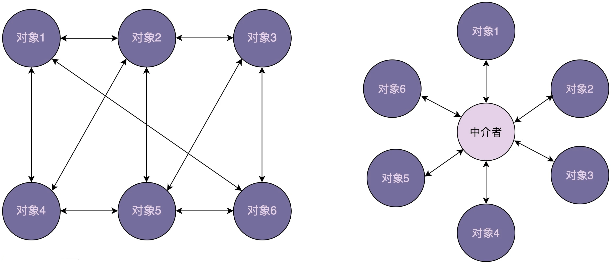

### (2) 案例分析

#### 1. 原始实现

```java
public class UIControl {
    private static final String LOGIN_BTN_ID = "login_btn";
    private static final String REG_BTN_ID = "reg_btn";
    private static final String USERNAME_INPUT_ID = "username_input";
    private static final String PASSWORD_INPUT_ID = "pswd_input";
    private static final String REPEATED_PASSWORD_INPUT_ID = "repeated_pswd_input";
    private static final String HINT_TEXT_ID = "hint_text";
    private static final String SELECTION_ID = "selection";

    public static void main(String[] args) {
        Button loginButton = (Button)findViewById(LOGIN_BTN_ID);
        Button regButton = (Button)findViewById(REG_BTN_ID);
        Input usernameInput = (Input)findViewById(USERNAME_INPUT_ID);
        Input passwordInput = (Input)findViewById(PASSWORD_INPUT_ID);
        Input repeatedPswdInput = (Input)findViewById(REPEATED_PASSWORD_INPUT_ID);
        Text hintText = (Text)findViewById(HINT_TEXT_ID);
        Selection selection = (Selection)findViewById(SELECTION_ID);

        loginButton.setOnClickListener(new OnClickListener() {
            @Override
            public void onClick(View v) {
                String username = usernameInput.text();
                String password = passwordInput.text();
                //校验数据...
                //做业务处理...
                }
            });

        regButton.setOnClickListener(new OnClickListener() {
            @Override
            public void onClick(View v) {
                //获取usernameInput、passwordInput、repeatedPswdInput数据...
                //校验数据...
                //做业务处理...
            }
        });

        //...省略selection下拉选择框相关代码....
    }
}
```

#### 2. 中介模式重构

```java
public interface Mediator {
    void handleEvent(Component component, String event);
}

public class LandingPageDialog implements Mediator {
    private Button loginButton;
    private Button regButton;
    private Selection selection;
    private Input usernameInput;
    private Input passwordInput;
    private Input repeatedPswdInput;
    private Text hintText;

    @Override
    public void handleEvent(Component component, String event) {
        if (component.equals(loginButton)) {
            String username = usernameInput.text();
            String password = passwordInput.text();
            //校验数据...
            //做业务处理...
        } else if (component.equals(regButton)) {
            //获取usernameInput、passwordInput、repeatedPswdInput数据...
            //校验数据...
            //做业务处理...
        } else if (component.equals(selection)) {
            String selectedItem = selection.select();
            if (selectedItem.equals("login")) {
                usernameInput.show();
                passwordInput.show();
                repeatedPswdInput.hide();
                hintText.hide();
                //...省略其他代码
            } else if (selectedItem.equals("register")) {
                //....
            }
        }
    }
}

public class UIControl {
    private static final String LOGIN_BTN_ID = "login_btn";
    private static final String REG_BTN_ID = "reg_btn";
    private static final String USERNAME_INPUT_ID = "username_input";
    private static final String PASSWORD_INPUT_ID = "pswd_input";
    private static final String REPEATED_PASSWORD_INPUT_ID = "repeated_pswd_input";
    private static final String HINT_TEXT_ID = "hint_text";
    private static final String SELECTION_ID = "selection";

    public static void main(String[] args) {
        Button loginButton = (Button)findViewById(LOGIN_BTN_ID);
        Button regButton = (Button)findViewById(REG_BTN_ID);
        Input usernameInput = (Input)findViewById(USERNAME_INPUT_ID);
        Input passwordInput = (Input)findViewById(PASSWORD_INPUT_ID);
        Input repeatedPswdInput = (Input)findViewById(REPEATED_PASSWORD_INPUT_ID);
        Text hintText = (Text)findViewById(HINT_TEXT_ID);
        Selection selection = (Selection)findViewById(SELECTION_ID);

        Mediator dialog = new LandingPageDialog();
        dialog.setLoginButton(loginButton);
        dialog.setRegButton(regButton);
        dialog.setUsernameInput(usernameInput);
        dialog.setPasswordInput(passwordInput);
        dialog.setRepeatedPswdInput(repeatedPswdInput);
        dialog.setHintText(hintText);
        dialog.setSelection(selection);

        loginButton.setOnClickListener(new OnClickListener() {
            @Override
            public void onClick(View v) {
                dialog.handleEvent(loginButton, "click");
            }
        });

        regButton.setOnClickListener(new OnClickListener() {
            @Override
            public void onClick(View v) {
                dialog.handleEvent(regButton, "click");
            }
        });

        //....
    }
}
```

### JDK使用

- All scheduleXXX() methods of [java.util.Timer](http://docs.oracle.com/javase/8/docs/api/java/util/Timer.html)
- [java.util.concurrent.Executor#execute()](http://docs.oracle.com/javase/8/docs/api/java/util/concurrent/Executor.html#execute-java.lang.Runnable-)
- submit() and invokeXXX() methods of [java.util.concurrent.ExecutorService](http://docs.oracle.com/javase/8/docs/api/java/util/concurrent/ExecutorService.html)
- scheduleXXX() methods of [java.util.concurrent.ScheduledExecutorService](http://docs.oracle.com/javase/8/docs/api/java/util/concurrent/ScheduledExecutorService.html)
- [java.lang.reflect.Method#invoke()](http://docs.oracle.com/javase/8/docs/api/java/lang/reflect/Method.html#invoke-java.lang.Object-java.lang.Object...-) 

# 七、设计模式总结(重要)

> 回顾每种设计模式的原理、实现、设计意图和应用场景：
>
> - 创建型设计模式主要解决“对象的创建”问题
> - 结构型设计模式主要解决“类或对象的组合”问题
> - 行为型设计模式主要解决的就是“类或对象之间的交互”问题

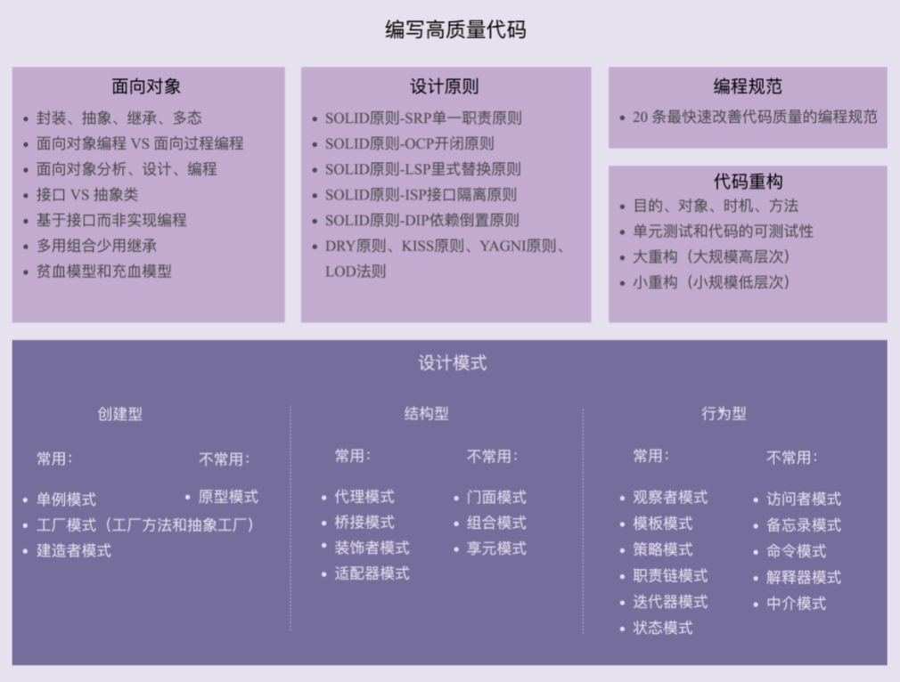

## 1、创建型模式

- 创建型设计模式包括：单例模式、工厂模式、建造者模式、原型模式

- 主要解决：对象的创建问题，封装复杂的创建过程，解耦对象的创建代码和使用代码

### (1) 单例模式(常用)

- 单例模式用来创建全局唯一的对象，即一个类只允许创建一个对象(或实例)

- 经典实现方式：饿汉式、懒汉式、双重检测、静态内部类、枚举
- 单例也是一种反模式，不推荐使用的理由：
    - 单例对 OOP 特性的支持不友好
    - 单例会隐藏类之间的依赖关系
    - 单例对代码的扩展性不友好
    - 单例对代码的可测试性不友好
    - 单例不支持有参数的构造函数

---

**==应用场景==**(单例优势)：

- 若单例类并没有后续扩展的需求，且不依赖外部系统，则设计成单例类就没有太大问题
- 对于一些全局类，在其他地方 new 的话，还要在类之间传来传去，不如直接做成单例类，使用起来简洁方便

### (2) 工厂模式(工厂方法和抽象工厂)(常用)

> 工厂模式分为简单工厂、工厂方法、抽象工厂

- 工厂模式用来创建不同但相关类型的对象(继承同一父类或接口的一组子类)，由给定的参数来决定创建哪种类型的对象

- 当创建逻辑比较复杂，可以考虑使用工厂模式封装对象的创建过程，将对象的创建和使用相分离

    > 若创建对象的逻辑不复杂，则直接通过 new 来创建对象就可以，不需要使用工厂模式

    - 当每个对象的创建逻辑都比较简单时，推荐使用简单工厂模式，将多个对象的创建逻辑放到一个工厂类中
    - 当每个对象的创建逻辑都比较复杂时，避免设计一个过于庞大的工厂类，推荐使用工厂方法模式，将创建逻辑拆分得更细，每个对象的创建逻辑独立到各自的工厂类中

---

**==应用场景==**：四个工厂模式的作用(也是判断要不要使用工厂模式最本质的参考标准)：

- **封装变化**：创建逻辑有可能变化，封装成工厂类之后，创建逻辑的变更对调用者透明
- **代码复用**：创建代码抽离到独立的工厂类之后可以复用
- **隔离复杂性**：封装复杂的创建逻辑，调用者无需了解如何创建对象
- **控制复杂度**：将创建代码抽离出来，让原本的函数或类职责更单一，代码更简洁

### (3) 建造者模式(常用)

- 建造者模式用来创建复杂对象，可以通过设置不同的可选参数，“定制化”地创建不同的对象
- 若类中有很多属性，为避免构造函数的参数列表过长，影响代码的可读性和易用性，可以通过构造函数配合 set() 方法来解决

---

**==应用场景==**：

- 把类的必填属性放到构造函数中，强制创建对象时，必填属性很多
- 若类的属性之间有一定的依赖关系或约束条件，使用构造函数配合 set() 的思路，则依赖关系或约束条件的校验逻辑无处安放
- 若希望创建不可变对象，即对象在创建好后不再修改内部属性

### (4) 原型模式

- 若对象的创建成本较大，而同一个类的不同对象之间差别不大，则可以利用对已有对象(原型)进行复制(拷贝)的方式，来创建新对象，以达到节省创建时间的目的
- 原型模式有两种实现方法，深拷贝和浅拷贝，深拷贝比浅拷贝更加耗时，更加耗内存空间
    - 浅拷贝只会复制对象中基本数据类型的数据和引用对象的内存地址，不会递归地复制引用对象，以及引用对象的引用对象
    - 深拷贝得到的是一份完完全全独立的对象

- 若要拷贝的对象是不可变对象，浅拷贝共享不可变对象没问题；对于可变对象来说，浅拷贝得到的对象和原始对象会共享部分数据，可能出现数据被修改的风险

## 2、结构型模式

> 结构型模式主要解决“类或对象的组合”问题，这些经典的结构可以解决特定应用场景的问题


### (1) 代理模式(常用)

- 代理模式在不改变原始类接口的条件下，为原始类定义一个代理类，用于控制访问，而非加强功能，这是与装饰器模式的最大不同

    > - 一般情况，让代理类和原始类实现同样的接口
    > - 若原始类并没有定义接口，且原始类代码不是我们开发维护，则可以通过让代理类继承原始类的方法来实现代理模式

- 静态代理要针对每个类都创建一个代理类，且每个代理类中的代码都有点像模板式的“重复”代码，增加了维护成本和开发成本

    动态代理可以不事先为每个原始类编写代理类，而是在运行时动态地创建原始类对应的代理类，然后在系统中用代理类替换原始类

---

**==应用场景==**：

- 在业务系统中开发一些非功能性需求，如：监控、统计、鉴权、限流、事务、幂等、日志

    > 将这些附加功能与业务功能解耦，放到代理类统一处理，让程序员只需要关注业务方面的开发

- 代理模式还可以用在 RPC、缓存等应用场景中

### (2) 桥接模式

- 桥接模式的两种理解方式：
    - 第一种理解方式：将抽象和实现解耦，让它们能独立开发”
    - 第二种理解方式：类似“组合优于继承”设计原则

### (3) 装饰器模式(常用)

- 装饰器模式主要解决继承关系过于复杂的问题，通过组合来替代继承，给原始类添加增强功能

- 特点：可以对原始类嵌套使用多个装饰器，因此在设计时，装饰器类需要跟原始类继承相同的抽象类或接口

### (4) 适配器模式

> 代理模式、装饰器模式提供的都是跟原始类相同的接口，而适配器提供跟原始类不同的接口

- 适配器模式用来做适配，将不兼容的接口转换为可兼容的接口，让原本由于接口不兼容而不能一起工作的类可以一起工作
- 适配器模式有两种实现方式：类适配器和对象适配器。其中，类适配器使用继承关系来实现，对象适配器使用组合关系来实现

- 适配器模式是一种事后的补救策略，用来补救设计上的缺陷
- 出现接口不兼容的 5 种场景：
    - 封装有缺陷的接口设计
    - 统一多个类的接口设计
    - 替换依赖的外部系统
    - 兼容老版本接口
    - 适配不同格式的数据

### (5) 门面模式

- 通过封装细粒度的接口，提供组合各个细粒度接口的高层次接口，来提高接口的易用性，或解决性能、分布式事务等问题


### (6) 组合模式

- 组合模式主要用来处理树形结构数据，即数据必须能表示成树形结构
- 组合模式将一组对象组织成树形结构，将单个对象和组合对象都看作树中的节点，以统一处理逻辑，并且利用树形结构的特点，递归处理每个子树，依次简化代码实现

### (7) 享元模式

- 享元模式的意图是复用对象，节省内存，前提是**享元对象是不可变对象**

    > 享元即被共享的单元

- 当系统中存在大量重复对象时，可以利用享元模式，将对象设计成享元，在内存中只保留一份实例，供多处代码引用，减少内存中对象的数量，起到节省内存的目的
- 对于相似对象，也可以将这些对象中相同的部分(字段)，提取出来设计成享元，让这些大量相似对象引用这些享元

## 3、行为型模式

> 行为型设计模式主要解决的就是“类或对象之间的交互”问题


### (1) 观察者模式(常用)

> 观察者模式将观察者和被观察者代码解耦

不同的应用场景和需求下，观察者模式的不同实现方式：

- 有同步阻塞的实现方式，也有异步非阻塞的实现方式；

    > 同步阻塞是最经典的实现方式，主要是为了代码解耦；异步非阻塞除了能实现代码解耦之外，还能提高代码的执行效率

- 有进程内的实现方式，也有跨进程的实现方式

    > 进程间的观察者模式解耦更加彻底，一般是基于消息队列来实现，用来实现不同进程间的被观察者和观察者之间的交互

> 观察者模式的应用场景非常广泛，小到代码层面的解耦，大到架构层面的系统解耦，再或者一些产品的设计思路

### (2) 模版模式(常用)

- 模板方法模式在一个方法中定义一个算法骨架，并将某些步骤推迟到子类中实现。

    > 模板方法模式可以让子类在不改变算法整体结构的情况下，重新定义算法中的某些步骤

- 模板模式有两大作用：复用和扩展
    - 复用：指所有的子类可以复用父类中提供的模板方法的代码
    - 扩展：指框架通过模板模式提供功能扩展点，让框架用户可以在不修改框架源码的情况下，基于扩展点定制化框架的功能

- **回调**跟模板模式具有相同的作用：代码复用和扩展

    - 回调是一种双向调用关系：A 类事先注册某函数 F 到 B 类，A 类在调用 B 类的 P 函数时，B 类反过来调用 A 类注册给它的 F 函数

        > 这里的 F 函数就是“回调函数”
        >
        > A 调用 B，B 反过来又调用 A，这种调用机制就叫作“回调”

    - 回调可以细分为同步回调和异步回调，从应用场景上来看，同步回调更像模板模式，异步回调更像观察者模式

    - 回调跟模板模式的区别：更多的是在代码实现上，而非应用场景上

        > 回调基于组合关系来实现，模板模式基于继承关系来实现，回调比模板模式更加灵活

### (3) 策略模式(常用)

- 策略模式定义一组算法类，将每个算法分别封装起来，让它们可以互相替换

    > 策略模式用来解耦策略的定义、创建、使用

- 策略类定义：包含一个策略接口和一组实现这个接口的策略类

    - 策略的创建由工厂类来完成，封装策略创建的细节

- 选择使用哪个策略的两种确定方法：编译时静态确定和运行时动态确定，其中“运行时动态确定”是策略模式最典型的应用场景

---

**应用场景**：

- 利用它来避免冗长的 if-else 或 switch 分支判断
- 可以像模板模式那样，提供框架的扩展点

---

- 策略模式主要作用：解耦策略的定义、创建和使用，控制代码的复杂度，让每个部分都不至于过于复杂、代码量过多
- 对于复杂代码，策略模式能让其满足开闭原则，添加新策略时，最小化、集中化代码改动，减少引入 bug 的风险

### (4) 责任链模式(常用)

在职责链模式中，多个处理器依次处理同一个请求

- 一个请求先经过 A 处理器处理，然后再把请求传递给 B 处理器
- B 处理器处理完后再传递给 C 处理器
- 以此类推，形成一个链条，链条上的每个处理器各自承担各自的处理职责

---

**应用场景**：用来实现过滤器、拦截器功能，让框架的使用者在不需要修改框架源码的情况下，添加新的过滤、拦截功能

### (5) 迭代器模式(常用)

> 迭代器模式也叫游标模式，用来遍历集合对象

- 主要作用：解耦容器代码和遍历代码

- 遍历集合的三种方式：for 循环、foreach 循环、迭代器遍历

- 相对于 for 循环遍历，利用迭代器来遍历有 3 个优势：

    - 迭代器模式封装集合内部的复杂数据结构，开发者不需要了解如何遍历，直接使用容器提供的迭代器即可

    - 迭代器模式将集合对象的遍历操作从集合类中拆分出来，放到迭代器类中，让两者的职责更加单一

    - 迭代器模式让添加新的遍历算法更加容易，更符合开闭原则

        > 除此之外，因为迭代器都实现自相同的接口，在开发中，基于接口而非实现编程，替换迭代器也变得更加容易

### (6) 状态模式(常用)

- 状态模式一般用来实现状态机，由 3 个部分组成：状态、事件、动作
    - 事件也称为转移条件
    - 事件触发状态的转移及动作的执行
    - 动作非必须，可能只转移状态，不执行任何动作

- 状态机的三种实现方式：

    - **分支逻辑法**：利用 if-else 或 switch-case 分支逻辑，参照状态转移图，将每一个状态转移原模原样地直译成代码

        > 对于简单的状态机来说，这种实现方式最简单、最直接，是首选

    - **查表法**：适用于状态很多、状态转移比较复杂的状态机，即通过二维数组来表示状态转移图，极大提高代码的可读性和可维护性

    - **利用状态模式**：适用于状态不多、状态转移比较简单，但事件触发执行动作包含的业务逻辑可能比较复杂的状态机

### (7) 访问者模式

- 访问者模式允许一个或多个操作应用到一组对象上，解耦操作和对象本身，保持类职责单一、满足开闭原则及应对代码的复杂性

- 访问者模式的难点：代码实现比较复杂，主要原因是函数重载在大部分面向对象编程语言中是静态绑定

    > 即调用类的哪个重载函数，是在编译期间，由参数的声明类型决定的，而非运行时，根据参数的实际类型决定的

### (8) 备忘录模式

- 备忘录模式(快照模式)：在不违背封装原则的前提下，捕获一个对象的内部状态，并在该对象之外保存这个状态，以便之后恢复对象为先前的状态

    > 两部分内容：一部分是，存储副本以便后期恢复；另一部分是，要在不违背封装原则的前提下，进行对象的备份和恢复

- 备忘录模式的应用场景：主要用来防丢失、撤销、恢复等，类似常说的“备份”

    > 两者的主要区别：备忘录模式更侧重于代码的设计和实现，备份更侧重架构设计或产品设计

- 对于大对象的备份，备份占用的存储空间会比较大，备份和恢复的耗时会比较长

    针对这个问题，不同的业务场景有不同的处理方式：

    - 只备份必要的恢复信息，结合最新的数据来恢复
    - 全量备份和增量备份相结合，低频全量备份，高频增量备份，两者结合来做恢复

### (9) 命令模式

- 命令模式的最核心实现手段：将函数封装成对象，这样就可以实现把函数当对象一样使用

    > 在大部分编程语言中，函数是没法作为参数传递给其他函数

- 命令模式的应用场景：用来控制命令的执行，如：异步、延迟、排队执行命令、撤销重做命令、存储命令、给命令记录日志等

### (10) 解释器模式

- 解释器模式为某个语言定义语法表示，并定义一个解释器用来处理这个语

- 解释器模式就是用来实现根据语法规则解读“句子”的解释器

- 解释器模式代码实现的核心思想，就是将语法解析的工作拆分到各个小类中，以此来避免大而全的解析类

    > 一般做法：将语法规则拆分一些小的独立的单元，然后对每个单元进行解析，最终合并为对整个语法规则的解析

### (11) 中介模式

- 通过引入中介这个中间层，将一组对象之间的交互关系(或依赖关系)从多对多(网状关系)转换为一对多(星状关系)

- 原来一个对象要跟 n 个对象交互，现在只需要跟一个中介对象交互，从而最小化对象之间的交互关系，降低代码的复杂度，提高代码的可读性和可维护性

- 观察者模式和中介模式都是为了实现参与者之间的解耦，简化交互关系

    两者的不同在于应用场景上：

    - 观察者模式的应用场景：参与者间的交互比较有条理，一般是单向，一个参与者只有一个身份，要么是观察者，要么是被观察者
    - 中介模式的应用场景：参与者之间的交互关系错综复杂，既可以是消息的发送者、也可以同时是消息的接收者
