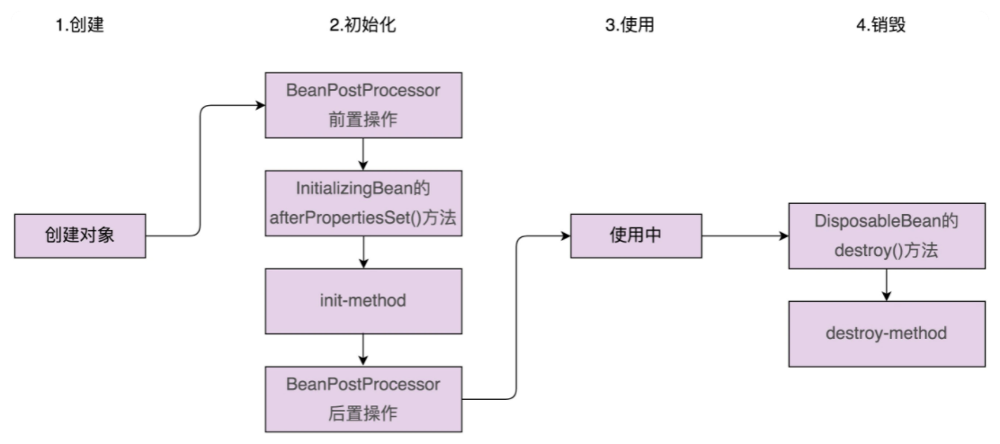
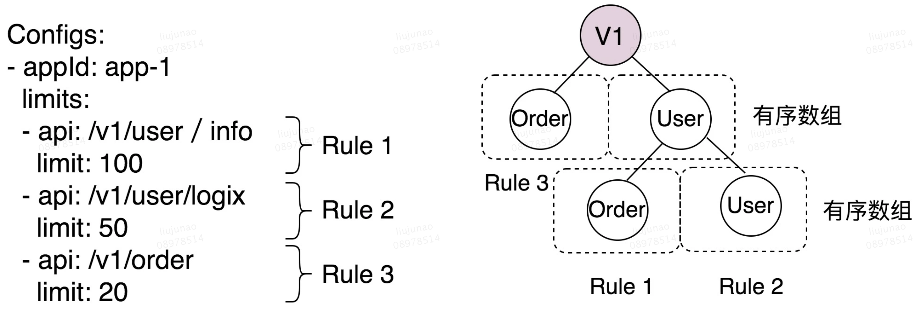

# 一、开源实战

## 1、剖析 JDK 源码设计模式

### (1) Calendar 的工厂模式

```java
public abstract class Calendar implements Serializable, Cloneable, Comparable<Calendar> {
    //getInstance() 工厂方法：根据不同 TimeZone 和 Locale 创建不同的 Calendar 子类对象
    public static Calendar getInstance(TimeZone zone, Locale aLocale){
        return createCalendar(zone, aLocale);
    }

    private static Calendar createCalendar(TimeZone zone, Locale aLocale) {
        CalendarProvider provider = LocaleProviderAdapter
            							.getAdapter(CalendarProvider.class, aLocale).getCalendarProvider();
        if (provider != null) {
            try {
                return provider.getInstance(zone, aLocale);
            } catch (IllegalArgumentException iae) {
                // fall back to the default instantiation
            }
        }

        Calendar cal = null;
        if (aLocale.hasExtensions()) {
            String caltype = aLocale.getUnicodeLocaleType("ca");
            if (caltype != null) {
                switch (caltype) {
                    case "buddhist":
                        cal = new BuddhistCalendar(zone, aLocale);
                        break;
                    case "japanese":
                        cal = new JapaneseImperialCalendar(zone, aLocale);
                        break;
                    case "gregory":
                        cal = new GregorianCalendar(zone, aLocale);
                        break;
                }
            }
        }
        if (cal == null) {
            if (aLocale.getLanguage() == "th" && aLocale.getCountry() == "TH") {
                cal = new BuddhistCalendar(zone, aLocale);
            } else if (aLocale.getVariant() == "JP" && aLocale.getLanguage() == "ja" 
                       && aLocale.getCountry() == "JP") {
                cal = new JapaneseImperialCalendar(zone, aLocale);
            } else {
                cal = new GregorianCalendar(zone, aLocale);
            }
        }
        return cal;
    }
    //...
}
```

### (2) Calendar 的建造者模式

**工厂模式与建造者模式对比**：

- 工厂模式用来创建不同但相关类型的对象(继承同一父类或接口的一组子类)，由给定的参数来决定创建哪种类型的对象
- 建造者模式用来创建一种类型的复杂对象，通过设置不同的可选参数，“定制化”地创建不同对象

```java
//建造者模式的两种实现方法：一种是单独定义一个 Builder 类，另一种是将 Builder 实现为原始类的内部类(Calendar 思路)
public abstract class Calendar implements Serializable, Cloneable, Comparable<Calendar> {
    //...
    public static class Builder {
        private static final int NFIELDS = FIELD_COUNT + 1;
        private static final int WEEK_YEAR = FIELD_COUNT;
        private long instant;
        private int[] fields;
        private int nextStamp;
        private int maxFieldIndex;
        private String type;
        private TimeZone zone;
        private boolean lenient = true;
        private Locale locale;
        private int firstDayOfWeek, minimalDaysInFirstWeek;

        public Builder() {}

        public Builder setInstant(long instant) {
            if (fields != null) {
                throw new IllegalStateException();
            }
            this.instant = instant;
            nextStamp = COMPUTED;
            return this;
        }
        //...省略n多set()方法

        public Calendar build() {
            if (locale == null) {
                locale = Locale.getDefault();
            }
            if (zone == null) {
                zone = TimeZone.getDefault();
            }
            Calendar cal;
            if (type == null) {
                type = locale.getUnicodeLocaleType("ca");
            }
            if (type == null) {
                if (locale.getCountry() == "TH" && locale.getLanguage() == "th") {
                    type = "buddhist";
                } else {
                    type = "gregory";
                }
            }
            switch (type) {
                case "gregory":
                    cal = new GregorianCalendar(zone, locale, true);
                    break;
                case "iso8601":
                    GregorianCalendar gcal = new GregorianCalendar(zone, locale, true);
                    // make gcal a proleptic Gregorian
                    gcal.setGregorianChange(new Date(Long.MIN_VALUE));
                    // and week definition to be compatible with ISO 8601
                    setWeekDefinition(MONDAY, 4);
                    cal = gcal;
                    break;
                case "buddhist":
                    cal = new BuddhistCalendar(zone, locale);
                    cal.clear();
                    break;
                case "japanese":
                    cal = new JapaneseImperialCalendar(zone, locale, true);
                    break;
                default:
                    throw new IllegalArgumentException("unknown calendar type: " + type);
            }
            cal.setLenient(lenient);
            if (firstDayOfWeek != 0) {
                cal.setFirstDayOfWeek(firstDayOfWeek);
                cal.setMinimalDaysInFirstWeek(minimalDaysInFirstWeek);
            }
            if (isInstantSet()) {
                cal.setTimeInMillis(instant);
                cal.complete();
                return cal;
            }

            if (fields != null) {
                boolean weekDate = isSet(WEEK_YEAR) && fields[WEEK_YEAR] > fields[YEAR];
                if (weekDate && !cal.isWeekDateSupported()) {
                    throw new IllegalArgumentException("week date is unsupported by " + type);
                }
                for (int stamp = MINIMUM_USER_STAMP; stamp < nextStamp; stamp++) {
                    for (int index = 0; index <= maxFieldIndex; index++) {
                        if (fields[index] == stamp) {
                            cal.set(index, fields[NFIELDS + index]);
                            break;
                        }
                    }
                }

                if (weekDate) {
                    int weekOfYear = isSet(WEEK_OF_YEAR) ? fields[NFIELDS + WEEK_OF_YEAR] : 1;
                    int dayOfWeek = isSet(DAY_OF_WEEK) 
                        				? fields[NFIELDS + DAY_OF_WEEK] : cal.getFirstDayOfWeek();
                    cal.setWeekDate(fields[NFIELDS + WEEK_YEAR], weekOfYear, dayOfWeek);
                }
                cal.complete();
            }
            return cal;
        }
    }
}
```

### (3) Collections 的装饰器模式

`UnmodifiableCollection` 的构造函数接收一个 Collection 类对象，然后对其所有的函数进行包裹：重新实现(如：add() 函数)或简单封装(如：stream() 函数)

> 从代码实现角度来看，UnmodifiableCollection 类是典型的装饰器类

```java
public class Collections {
    private Collections() {}

    public static <T> Collection<T> unmodifiableCollection(Collection<? extends T> c) {
        return new UnmodifiableCollection<>(c);
    }

    static class UnmodifiableCollection<E> implements Collection<E>, Serializable {
        private static final long serialVersionUID = 1820017752578914078L;
        final Collection<? extends E> c;

        UnmodifiableCollection(Collection<? extends E> c) {
            if (c == null) 
                throw new NullPointerException();
            this.c = c;
        }

        public int size()                   {return c.size();}
        public boolean isEmpty()            {return c.isEmpty();}
        public boolean contains(Object o)   {return c.contains(o);}
        public Object[] toArray()           {return c.toArray();}
        public <T> T[] toArray(T[] a)       {return c.toArray(a);}
        public String toString()            {return c.toString();}

        public Iterator<E> iterator() {
            return new Iterator<E>() {
                private final Iterator<? extends E> i = c.iterator();

                public boolean hasNext() {
                    return i.hasNext();
                }
                
                public E next() {
                    return i.next();
                }
                
                public void remove() {
                    throw new UnsupportedOperationException();
                }
                
                @Override
                public void forEachRemaining(Consumer<? super E> action) {
                    i.forEachRemaining(action); // Use backing collection version
                }
            };
        }

        public boolean add(E e) {
            throw new UnsupportedOperationException();
        }
        
        public boolean remove(Object o) {
            hrow new UnsupportedOperationException();
        }
        
        public boolean containsAll(Collection<?> coll) {
            return c.containsAll(coll);
        }
        
        public boolean addAll(Collection<? extends E> coll) {
            throw new UnsupportedOperationException();
        }
        
        public boolean removeAll(Collection<?> coll) {
            throw new UnsupportedOperationException();
        }
        
        public boolean retainAll(Collection<?> coll) {
            throw new UnsupportedOperationException();
        }
        
        public void clear() {
            throw new UnsupportedOperationException();
        }

        // Override default methods in Collection
        @Override
        public void forEach(Consumer<? super E> action) {
            c.forEach(action);
        }
        
        @Override
        public boolean removeIf(Predicate<? super E> filter) {
            throw new UnsupportedOperationException();
        }
        
        @SuppressWarnings("unchecked")
        @Override
        public Spliterator<E> spliterator() {
            return (Spliterator<E>) c.spliterator();
        }
        
        @SuppressWarnings("unchecked")
        @Override
        public Stream<E> stream() {
            return (Stream<E>) c.stream();
        }
        
        @SuppressWarnings("unchecked")
        @Override
        public Stream<E> parallelStream() {
            return (Stream<E>) c.parallelStream();
        }
    }
}
```

### (4) Collections 的适配器模式

```java
public static <T> Enumeration<T> enumeration(final Collection<T> c) {
    return new Enumeration<T>() {
        private final Iterator<T> i = c.iterator();

        public boolean hasMoreElements() {
            return i.hasNext();
        }

        public T nextElement() {
            return i.next();
        }
    };
}
```

### (5) Collections 的模板模式

`Collections.sort()` 的模板模式：将“比较大小”的逻辑委派给用户来实现

- 若把比较大小这部分逻辑看作整个排序逻辑的其中一个步骤，则可以把它看作模板模式
- 从代码实现角度看，有点类似 JdbcTemplate，并不是模板模式的经典代码实现，而是基于 Callback 回调机制实现

```java
public class Demo {
    public static void main(String[] args) {
        List<Student> students = new ArrayList<>();
        students.add(new Student("Alice", 19, 89.0f));
        students.add(new Student("Peter", 20, 78.0f));
        students.add(new Student("Leo", 18, 99.0f));

        Collections.sort(students, new AgeAscComparator());
        print(students);

        Collections.sort(students, new NameAscComparator());
        print(students);

        Collections.sort(students, new ScoreDescComparator());
        print(students);
    }

    public static void print(List<Student> students) {
        for (Student s : students) {
            System.out.println(s.getName() + " " + s.getAge() + " " + s.getScore());
        }
    }

    public static class AgeAscComparator implements Comparator<Student> {
        @Override
        public int compare(Student o1, Student o2) {
            return o1.getAge() - o2.getAge();
        }
    }

    public static class NameAscComparator implements Comparator<Student> {
        @Override
        public int compare(Student o1, Student o2) {
            return o1.getName().compareTo(o2.getName());
        }
    }

    public static class ScoreDescComparator implements Comparator<Student> {
        @Override
        public int compare(Student o1, Student o2) {
            if (Math.abs(o1.getScore() - o2.getScore()) < 0.001) {
                return 0;
            } else if (o1.getScore() < o2.getScore()) {
                return 1;
            } else {
                return -1;
            }
        }
    }
}
```

### (6) JDK 的观察者模式

```java
public interface Observer {
    void update(Observable o, Object arg);
}

public class Observable {
    private boolean changed = false;
    private Vector<Observer> obs;

    public Observable() {
        obs = new Vector<>();
    }

    public synchronized void addObserver(Observer o) {
        if (o == null)
            throw new NullPointerException();
        if (!obs.contains(o)) {
            obs.addElement(o);
        }
    }

    public synchronized void deleteObserver(Observer o) {
        obs.removeElement(o);
    }

    public void notifyObservers() {
        notifyObservers(null);
    }

    public void notifyObservers(Object arg) {
        Object[] arrLocal;

        synchronized (this) {
            if (!changed)
                return;
            arrLocal = obs.toArray();
            clearChanged();
        }

        for (int i = arrLocal.length - 1; i >= 0; i--)
            ((Observer)arrLocal[i]).update(this, arg);
    }

    public synchronized void deleteObservers() {
        obs.removeAllElements();
    }

    protected synchronized void setChanged() {
        changed = true;
    }

    protected synchronized void clearChanged() {
        changed = false;
    }
}
```

- **成员变量 `changed`**：用来表明被观察者 `Observable` 有没有状态更新

    - 作用：
        - 当有状态更新时，手动调用 `setChanged()` 函数将 changed 变量设置为 true，再调用 `notifyObservers()` 函数触发观察者 `Observer` 执行 `update()` 函数
        - 否则，即便调用 `notifyObservers()` 函数，观察者的 update() 函数也不会被执行

    - 目的：changed 是为多线程设计；多线程模式下，出于性能考虑，JDK 采用细粒度锁方式

        - 优势：仅仅对其中的一个代码块进行上锁；而不是为整个 notifyObservers() 函数加锁

        - 流程：当多个线程同时访问时，第一个线程在 synchronized 模块中，将 change 设置为false，后续线程不再执行 update

- **函数 `notifyObservers()`**：出于性能考虑，notifyObservers() 函数没有加 synchronized 锁

    > 为保证多线程环境下，添加、移除、通知观察者三个操作间不发生冲突，Observable 类中函数通过 synchronized 加了锁

    - notifyObservers() 函数依次执行每个观察者的 update() 函数，每个 update() 函数执行的逻辑提前未知，有可能会很耗时

        > 若在 notifyObservers() 函数上加 synchronized 锁，notifyObservers() 函数持有锁的时间就有可能会很长，这就会导致其他线程迟迟获取不到锁，影响整个 Observable 类的并发性能

    - 避免加锁的折中方案：只需要对拷贝创建快照的过程加锁，加锁的范围减少很多，并发性能提高

        - 在 notifyObservers() 函数中，先拷贝一份观察者列表，赋值给函数的局部变量(快照)

            > 局部变量是线程私有的，并不在线程间共享

        - 然后遍历快照，逐一执行每个观察者的 update() 函数

            > 遍历执行的过程是在快照这个局部变量上操作，不存在线程安全问题，不需要加锁

### (7) Runtime 的单例模式

- 每个 Java 应用在运行时会启动一个 JVM 进程，每个 JVM 进程都只对应一个 Runtime 实例，用于查看 JVM 状态及控制 JVM 行为

    > 进程内唯一，所以比较适合设计为单例

- 编程时，不能自己去实例化一个 Runtime 对象，只能通过 getRuntime() 静态方法来获得

```java
//单例实现方式：饿汉式
public class Runtime {
    private static Runtime currentRuntime = new Runtime();

    public static Runtime getRuntime() {
        return currentRuntime;
    }

    /** Don't let anyone else instantiate this class */
    private Runtime() {}

    //....
    public void addShutdownHook(Thread hook) {
        SecurityManager sm = System.getSecurityManager();
        if (sm != null) {
            sm.checkPermission(new RuntimePermission("shutdownHooks"));
        }
        ApplicationShutdownHooks.add(hook);
    }
    //...
}
```

## 2、从 Unix 学习应对大型复杂项目

### (1) 大型复杂软件的代码编写原则

**思考点**：

- 从设计原则和思想的角度来看，如何应对庞大而复杂的项目开发？
- 从研发管理和开发技巧的角度来看，如何应对庞大而复杂的项目开发？
- 聚焦在 Code Review 上来看，如何通过 Code Reviwe 保持项目的代码质量？

---

**切入点**：

- **封装与抽象**：“一切皆文件”体现了 unix 的封装和抽象的设计思想
    - 封装不同类型设备的访问细节，抽象为统一的文件访问方式，更高层的代码基于统一的访问方式，来访问底层不同类型的设备
    - 好处：隔离底层设备访问的复杂性，统一的访问方式能够简化上层代码的编写，并且代码更容易复用

- **分层与模块化**：

    - 将系统划分成各个独立的模块，不同的模块之间通过接口来进行通信，模块之间耦合很小

        > 每个团队聚焦一个独立的高内聚模块来开发，最后将各个模块组装起来，构建成一个超级复杂的系统

    - Unix 系统分为三层，分别是内核、系统调用、应用层，每一层都对上层封装实现细节，暴露抽象的接口来调用

        > 任意一层都可以被重新实现，不会影响到其他层的代码

- **基于接口通信**：设计模块(module)或层(layer)的接口时，接口从命名到定义都要抽象，尽量少涉及具体的实现细节

- **高内聚、松耦合**：内聚性好、耦合少的代码，在修改或阅读代码时，聚集在一个小范围的模块或类中，降低阅读和修改代码的难度

- **为扩展而设计**：提前预留好扩展点，以便在未来需求变更时，在不改动代码整体结构的情况下，轻松地添加新功能

- **KISS 首要原则**：简单清晰、可读性好，是任何大型软件开发要遵循的首要原则

    > 要尽量避免过度设计、过早优化，在扩展性和可读性冲突时，应选择遵循 KISS 原则，首选可读性

- **最小惊奇原则**：即遵守开发规范，在做设计或编码时，要遵守统一的开发规范，避免反直觉的设计

### (2) 大型复杂软件的研发管理

- **吹毛求疵般地执行编码规范**：严格执行代码规范，可以使一个项目乃至整个公司的代码具有完全统一的风格

    > 命名良好的变量、函数、类和注释，可以提高代码的可读性

- **编写高质量的单元测试**：高质量的单元测试不仅仅要求测试覆盖率要高，还要求测试的全面性，除了测试正常逻辑的执行之外，还要重点、全面地测试异常下的执行情况

    > 代码出问题的地方大部分都发生在异常、边界条件下

- **不流于形式的 Code Review**：要执行到位，不能流于形式

- **开发未动、文档先行**：在开发某个系统或重要模块或功能之前，应先写技术文档，在审查没有问题的情况下再开发

- **持续重构**：提倡持续的小重构，是时刻保证代码质量、防止代码腐化的有效手段

- **对项目与团队进行拆分**：面对大型复杂项目，不仅仅需要对代码进行拆分，还需要对研发团队进行拆分

### (3) Code Review

重视 Code Review。。。


## 3、guava 用到的设计模式

### (1) Builder 模式

`Guava cache` 的使用案例：

```java
public class CacheDemo {
    public static void main(String[] args) {
        Cache<String, String> cache = CacheBuilder.newBuilder()
                .initialCapacity(100)
                .maximumSize(1000)
                .expireAfterWrite(10, TimeUnit.MINUTES)
                .build();

        cache.put("key1", "value1");
        String value = cache.getIfPresent("key1");
        System.out.println(value);
    }
}
```

避免构造函数的参数列表过长、不同的构造函数过多的解决方案：

- 方案一：使用 Builder 模式
- 方案二：先通过无参构造函数创建对象，然后再通过 setXXX() 方法来逐一设置需要的设置的成员变量

---

**CacheBuilder 类中的 build() 函数**：

```java
public <K1 extends K, V1 extends V> Cache<K1, V1> build() {
    this.checkWeightWithWeigher();
    this.checkNonLoadingCache();
    return new LocalManualCache(this);
}

private void checkNonLoadingCache() {
    Preconditions.checkState(this.refreshNanos == -1L, "refreshAfterWrite requires a LoadingCache");
}

private void checkWeightWithWeigher() {
    if (this.weigher == null) {
        Preconditions.checkState(this.maximumWeight == -1L, "maximumWeight requires weigher");
    } else if (this.strictParsing) {
        Preconditions.checkState(this.maximumWeight != -1L, "weigher requires maximumWeight");
    } else if (this.maximumWeight == -1L) {
        logger.log(Level.WARNING, "ignoring weigher specified without maximumWeight");
    }
}
```

**必须使用 Builder 模式的主要原因**：不经过校验，创建的 Cache 对象有可能是不合法、不可用

- 构造 Cache 对象时，做一些必要的参数校验，即 build() 函数中前两行代码要做的工作
- 若采用无参默认构造函数加 setXXX() 方法的方案，这两个校验就无处安放

### (2) Wrapper 模式

> 代理模式、装饰器、适配器模式统称 Wrapper 模式，即通过 Wrapper 类二次封装原始类，通过组合方式将 Wrapper 类的函数实现委托给原始类的函数来实现

```java
@GwtCompatible
public abstract class ForwardingCollection<E> extends ForwardingObject implements Collection<E> {
    protected ForwardingCollection() {
    }

    protected abstract Collection<E> delegate();

    public Iterator<E> iterator() {
        return this.delegate().iterator();
    }

    public int size() {
        return this.delegate().size();
    }

    @CanIgnoreReturnValue
    public boolean removeAll(Collection<?> collection) {
        return this.delegate().removeAll(collection);
    }

    public boolean isEmpty() {
        return this.delegate().isEmpty();
    }

    public boolean contains(Object object) {
        return this.delegate().contains(object);
    }

    @CanIgnoreReturnValue
    public boolean add(E element) {
        return this.delegate().add(element);
    }

    @CanIgnoreReturnValue
    public boolean remove(Object object) {
        return this.delegate().remove(object);
    }

    public boolean containsAll(Collection<?> collection) {
        return this.delegate().containsAll(collection);
    }

    @CanIgnoreReturnValue
    public boolean addAll(Collection<? extends E> collection) {
        return this.delegate().addAll(collection);
    }

    @CanIgnoreReturnValue
    public boolean retainAll(Collection<?> collection) {
        return this.delegate().retainAll(collection);
    }

    public void clear() {
        this.delegate().clear();
    }

    public Object[] toArray() {
        return this.delegate().toArray();
    }

    //...省略部分代码...
}
```

### (3) Immutable 模式(不变模式)

- **不变模式定义**：一个对象的状态在对象创建之后就不再改变，其中涉及的类就是不变类 `Immutable Class`，对象就是不变对象

- **不变模式分类**：

    - **普通不变模式**：指对象中包含的引用对象可以改变，guava 的 Immutable 属于此种模式

        > 注：若不特别说明，通常所说的不变模式，指的就是普通的不变模式

    - **深度不变模式**：指对象包含的引用对象也不可变

    ```java
    // 普通不变模式
    public class User {
        private String name;
        private int age;
        private Address addr;
    
        public User(String name, int age, Address addr) {
            this.name = name;
            this.age = age;
            this.addr = addr;
        }
        // 只有getter方法，无setter方法...
    }
    
    public class Address {
        private String province;
        private String city;
        
        public Address(String province, String city) {
            this.province = province;
            this.city= city;
        }
        // 有getter方法，也有setter方法...
    }
    
    
    // 深度不变模式
    public class User {
        private String name;
        private int age;
        private Address addr;
    
        public User(String name, int age, Address addr) {
            this.name = name;
            this.age = age;
            this.addr = addr;
        }
        // 只有getter方法，无setter方法...
    }
    
    public class Address {
        private String province;
        private String city;
        
        public Address(String province, String city) {
            this.province = province;
            this.city= city;
        }
        // 只有getter方法，无setter方法..
    }
    ```

- **不变集合**：

    - guava 的不变集合：`ImmutableCollection、ImmutableList、ImmutableSet、ImmutableMap`
    - JDK 的不变集合：`UnmodifiableCollection、UnmodifiableList、UnmodifiableSet、UnmodifiableMap`

    ```java
    //guava 不变集合与 JDK 不变集合的区别
    public class ImmutableDemo {
        public static void main(String[] args) {
            List<String> originalList = new ArrayList<>();
            originalList.add("a");
            originalList.add("b");
            originalList.add("c");
    
            List<String> jdkUnmodifiableList = Collections.unmodifiableList(originalList);
            List<String> guavaImmutableList = ImmutableList.copyOf(originalList);
    
            //jdkUnmodifiableList.add("d"); // 抛出UnsupportedOperationException
            // guavaImmutableList.add("d"); // 抛出UnsupportedOperationException
            originalList.add("d");
    
            print(originalList); // a b c d
            print(jdkUnmodifiableList); // a b c d
            print(guavaImmutableList); // a b c
        }
    
        private static void print(List<String> list) {
            for (String s : list) {
                System.out.print(s + " ");
            }
            System.out.println();
        }
    }
    ```

## 4、剖析 Spring

> Spring 的经典设计思想和原则约定大于配置、低侵入松耦合、模块化轻量级、再封装再抽象

### (1) Spring 用来支持扩展的两种设计模式

> 常用来实现扩展特性的设计模式有：观察者模式、模板模式、职责链模式、策略模式等

#### 1. spring 的观察者模式

几种观察者模式的实现对比：

- `JDK`：只包含 java.util.Observable 和 java.util.Observer 两个类
- `Google Guava`：提供的框架功能比较完善和强大，通过 EventBus 事件总线来实现观察者模式
- `Spring`：由 `Event` 事件(相当于消息)、`Listener` 监听者(相当于观察者)、`Publisher` 发送者(相当于被观察者)三部分组成

---

```java
// Event事件
public class DemoEvent extends ApplicationEvent {
    private String message;

    public DemoEvent(Object source, String message) {
        super(source);
    }

    public String getMessage() {
        return this.message;
    }
}

// Listener监听者
@Component
public class DemoListener implements ApplicationListener<DemoEvent> {
    @Override
    public void onApplicationEvent(DemoEvent demoEvent) {
        String message = demoEvent.getMessage();
        System.out.println(message);
    }
}

// Publisher发送者
@Component
public class DemoPublisher {
    @Autowired
    private ApplicationContext applicationContext;

    public void publishEvent(DemoEvent demoEvent) {
        this.applicationContext.publishEvent(demoEvent);
    }
}
```

**框架主要包含三部分工作**：

- 定义一个继承 `ApplicationEvent` 的事件（DemoEvent）
- 定义一个实现了 `ApplicationListener` 的监听器（DemoListener）
- 定义一个发送者（DemoPublisher），发送者调用 `ApplicationContext` 来发送事件消息

---

**源码分析**：

- `ApplicationEvent` 和 `ApplicationListener` 的代码实现非常简单，内部并不包含太多属性和方法

    > 最大作用是做类型标识之用(继承自 ApplicationEvent 的类是事件，实现 ApplicationListener 的类是监听器)

    ```java
    public abstract class ApplicationEvent extends EventObject {
        private static final long serialVersionUID = 7099057708183571937L;
        private final long timestamp = System.currentTimeMillis();
    
        public ApplicationEvent(Object source) {
            super(source);
        }
    
        public final long getTimestamp() {
            return this.timestamp;
        }
    }
    
    public class EventObject implements java.io.Serializable {
        private static final long serialVersionUID = 5516075349620653480L;
        protected transient Object  source;
    
        public EventObject(Object source) {
            if (source == null)
                throw new IllegalArgumentException("null source");
            this.source = source;
        }
    
        public Object getSource() {
            return source;
        }
    
        public String toString() {
            return getClass().getName() + "[source=" + source + "]";
        }
    }
    
    public interface ApplicationListener<E extends ApplicationEvent> extends EventListener {
        void onApplicationEvent(E var1);
    }
    ```

- spring 把观察者注册到 `ApplicationContext` 对象中，此处的 ApplicationContext 相当于 Google EventBus 框架中的“事件总线”

    > ApplicationContext 只是一个接口，具体的代码实现包含在它的实现类 AbstractApplicationContext 中

    ```java
    public abstract class AbstractApplicationContext extends ... {
        private final Set<ApplicationListener<?>> applicationListeners;
    
        public AbstractApplicationContext() {
            this.applicationListeners = new LinkedHashSet();
            //...
        }
    
        public void publishEvent(ApplicationEvent event) {
            this.publishEvent(event, (ResolvableType)null);
        }
    
        public void publishEvent(Object event) {
            this.publishEvent(event, (ResolvableType)null);
        }
    
        protected void publishEvent(Object event, ResolvableType eventType) {
            //...
            Object applicationEvent;
            if (event instanceof ApplicationEvent) {
                applicationEvent = (ApplicationEvent)event;
            } else {
                applicationEvent = new PayloadApplicationEvent(this, event);
                if (eventType == null) {
                    eventType = ((PayloadApplicationEvent)applicationEvent).getResolvableType();
                }
            }
    
            if (this.earlyApplicationEvents != null) {
                this.earlyApplicationEvents.add(applicationEvent);
            } else {
                this.getApplicationEventMulticaster()
                    .multicastEvent((ApplicationEvent)applicationEvent, eventType);
            }
    
            if (this.parent != null) {
                if (this.parent instanceof AbstractApplicationContext) {
                    ((AbstractApplicationContext)this.parent).publishEvent(event, eventType);
                } else {
                    this.parent.publishEvent(event);
                }
            }
        }
      
        public void addApplicationListener(ApplicationListener<?> listener) {
            Assert.notNull(listener, "ApplicationListener must not be null");
            if (this.applicationEventMulticaster != null) {
                this.applicationEventMulticaster.addApplicationListener(listener);
            } else {
                this.applicationListeners.add(listener);
            }  
        }
      
        public Collection<ApplicationListener<?>> getApplicationListeners() {
            return this.applicationListeners;
        }
      
        protected void registerListeners() {
            Iterator var1 = this.getApplicationListeners().iterator();
    
            while(var1.hasNext()) {
                ApplicationListener<?> listener = (ApplicationListener)var1.next();     
                this.getApplicationEventMulticaster().addApplicationListener(listener);
            }
    
            String[] listenerBeanNames = this.getBeanNamesForType(ApplicationListener.class, true, false);
            String[] var7 = listenerBeanNames;
            int var3 = listenerBeanNames.length;
    
            for(int var4 = 0; var4 < var3; ++var4) {
                String listenerBeanName = var7[var4];
                this.getApplicationEventMulticaster().addApplicationListenerBean(listenerBeanName);
            }
    
            Set<ApplicationEvent> earlyEventsToProcess = this.earlyApplicationEvents;
            this.earlyApplicationEvents = null;
            if (earlyEventsToProcess != null) {
                Iterator var9 = earlyEventsToProcess.iterator();
                while(var9.hasNext()) {
                    ApplicationEvent earlyEvent = (ApplicationEvent)var9.next();
                    this.getApplicationEventMulticaster().multicastEvent(earlyEvent);
                }
            }
        }
    }
    ```

    **代码分析**：真正的消息发送实际通过 `ApplicationEventMulticaster` 类的 `multicastEvent()` 函数发送消息

    ```java
    public void multicastEvent(ApplicationEvent event) {
        this.multicastEvent(event, this.resolveDefaultEventType(event));
    }
    
    public void multicastEvent(final ApplicationEvent event, ResolvableType eventType) {
        ResolvableType type = eventType != null ? eventType : this.resolveDefaultEventType(event);
        Iterator var4 = this.getApplicationListeners(event, type).iterator();
    
        while(var4.hasNext()) {
            final ApplicationListener<?> listener = (ApplicationListener)var4.next();
            Executor executor = this.getTaskExecutor();
            if (executor != null) {
                executor.execute(new Runnable() {
                    public void run() {
                        SimpleApplicationEventMulticaster.this.invokeListener(listener, event);
                    }
                });
            } else {
                this.invokeListener(listener, event);
            }
        }
    }
    ```

#### 2. spring 的模版模式



### (2) Spring 用到的几种主要设计模式

#### 1. spring 的适配器模式

- **定义一个 Controller 的三种方式**：

    ```java
    // 方法一：通过@Controller、@RequestMapping来定义
    @Controller
    public class DemoController {
        @RequestMapping("/employname")
        public ModelAndView getEmployeeName() {
            ModelAndView model = new ModelAndView("Greeting");        
            model.addObject("message", "Dinesh");       
            return model; 
        }  
    }
    
    // 方法二：实现Controller接口 + xml配置文件: 配置DemoController与URL的对应关系
    public class DemoController implements Controller {
        @Override
        public ModelAndView handleRequest(HttpServletRequest req, HttpServletResponse resp) throws Exception {
            ModelAndView model = new ModelAndView("Greeting");
            model.addObject("message", "Dinesh Madhwal");
            return model;
        }
    }
    
    // 方法三：实现Servlet接口 + xml配置文件: 配置DemoController类与URL的对应关系
    public class DemoServlet extends HttpServlet {
        @Override
        protected void doGet(HttpServletRequest req, HttpServletResponse resp) 
            											throws ServletException, IOException {
            this.doPost(req, resp);
        }
    
        @Override
        protected void doPost(HttpServletRequest req, HttpServletResponse resp) 
            											throws ServletException, IOException {
            resp.getWriter().write("Hello World.");
        }
    }
    ```

- DispatcherServlet 需要根据不同类型的 Controller，调用不同的函数：

    ```java
    //伪代码
    Handler handler = handlerMapping.get(URL);
    if (handler instanceof Controller) {
        ((Controller)handler).handleRequest(...);
    } else if (handler instanceof Servlet) {
        ((Servlet)handler).service(...);
    } else if (hanlder 对应通过注解来定义的Controller) {
        反射调用方法...
    }
    ```

- **适配器模式对代码进行改造**：让其满足开闭原则，能更好地支持扩展

    > Spring 定义了统一的接口 HandlerAdapter，且每种 Controller 定义了对应的适配器类
    >
    > 包括：AnnotationMethodHandlerAdapter、SimpleControllerHandlerAdapter、SimpleServletHandlerAdapter 等

    ```java
    public interface HandlerAdapter {
        boolean supports(Object var1);
    
        ModelAndView handle(HttpServletRequest var1, HttpServletResponse var2, Object var3)throws Exception;
    
        long getLastModified(HttpServletRequest var1, Object var2);
    }
    
    // 对应实现Controller接口的Controller
    public class SimpleControllerHandlerAdapter implements HandlerAdapter {
        public SimpleControllerHandlerAdapter() {
        }
    
        public boolean supports(Object handler) {
            return handler instanceof Controller;
        }
    
        public ModelAndView handle(HttpServletRequest request, HttpServletResponse response, Object handler) 
            													throws Exception {
            return ((Controller)handler).handleRequest(request, response);
        }
    
        public long getLastModified(HttpServletRequest request, Object handler) {
            return handler instanceof LastModified ? ((LastModified)handler).getLastModified(request) : -1L;
        }
    }
    
    // 对应实现Servlet接口的Controller
    public class SimpleServletHandlerAdapter implements HandlerAdapter {
        public SimpleServletHandlerAdapter() {
        }
    
        public boolean supports(Object handler) {
            return handler instanceof Servlet;
        }
    
        public ModelAndView handle(HttpServletRequest request, HttpServletResponse response, Object handler) 
            										throws Exception {
            ((Servlet)handler).service(request, response);
            return null;
        }
    
        public long getLastModified(HttpServletRequest request, Object handler) {
            return -1L;
        }
    }
    
    //AnnotationMethodHandlerAdapter对应通过注解实现的Controller
    //代码太多了，我就不贴在这里了
    ```

    **改造后的使用方式**：

    ```java
    // 之前的实现方式
    Handler handler = handlerMapping.get(URL);
    if (handler instanceof Controller) {
        ((Controller)handler).handleRequest(...);
    } else if (handler instanceof Servlet) {
        ((Servlet)handler).service(...);
    } else if (hanlder 对应通过注解来定义的Controller) {
        反射调用方法...
    }
    
    // 现在实现方式
    HandlerAdapter handlerAdapter = handlerMapping.get(URL);
    handlerAdapter.handle(...);
    ```

#### 2. spring 的策略模式

> 策略模式的典型应用场景：通过环境变量、状态值、计算结果等动态地决定使用哪个策略

- `AopProxy` 是策略接口，JdkDynamicAopProxy、CglibAopProxy 是两个实现了 AopProxy 接口的策略类

    ```java
    public interface AopProxy {
        Object getProxy();
        Object getProxy(ClassLoader var1);
    }
    ```

- `AopProxyFactory` 是一个工厂类接口，``DefaultAopProxyFactory` 是一个默认的工厂类，用来创建 AopProxy 对象

    ```java
    public interface AopProxyFactory {
        AopProxy createAopProxy(AdvisedSupport var1) throws AopConfigException;
    }
    
    public class DefaultAopProxyFactory implements AopProxyFactory, Serializable {
        public DefaultAopProxyFactory() {
        }
    
        public AopProxy createAopProxy(AdvisedSupport config) throws AopConfigException {
            if (!config.isOptimize() && !config.isProxyTargetClass() 
                					 && !this.hasNoUserSuppliedProxyInterfaces(config)) {
                return new JdkDynamicAopProxy(config);
            } else {
                Class<?> targetClass = config.getTargetClass();
                if (targetClass == null) {
                    throw new AopConfigException("xxx");
                } else {
                    return (AopProxy)(!targetClass.isInterface()  && !Proxy.isProxyClass(targetClass) 
                                      								? new ObjenesisCglibAopProxy(config) 
                                      								: new JdkDynamicAopProxy(config));
                }
            }
        }
    
        //用来判断用哪个动态代理实现方式
        private boolean hasNoUserSuppliedProxyInterfaces(AdvisedSupport config) {
            Class<?>[] ifcs = config.getProxiedInterfaces();
            return ifcs.length == 0 || ifcs.length == 1 && SpringProxy.class.isAssignableFrom(ifcs[0]);
        }
    }
    ```

#### 3. spring 的组合模式

> 组合模式主要应用在能表示成树形结构的一组数据上，树中的结点分为叶子节点和中间节点两类

- Spring Cache 提供了一套抽象的 Cache 接口，统一不同缓存实现(Redis、Google Guava…)的不同的访问方式

    ```java
    public interface Cache {
        String getName();
        Object getNativeCache();
        Cache.ValueWrapper get(Object var1);
        <T> T get(Object var1, Class<T> var2);
        <T> T get(Object var1, Callable<T> var2);
        void put(Object var1, Object var2);
        Cache.ValueWrapper putIfAbsent(Object var1, Object var2);
        void evict(Object var1);
        void clear();
    }
    
    public static class ValueRetrievalException extends RuntimeException {
        private final Object key;
    
        public ValueRetrievalException(Object key, Callable<?> loader, Throwable ex) {
            super(String.format("Value for key '%s' could not be loaded using '%s'", key, loader), ex);
            this.key = key;
        }
    
        public Object getKey() {
            return this.key;
            }
        }
    
        public interface ValueWrapper {
            Object get();
        }
    }
    ```

- Spring 提供的缓存管理功能：

    - 根据缓存名字（创建 Cache 对象的时候要设置 name 属性）获取 Cache 对象
    - 获取管理器管理的所有缓存的名字列表

    ```java
    public interface CacheManager {
        Cache getCache(String var1);
        Collection<String> getCacheNames();
    }
    ```

- 叶子节点包含管理的 Cache 对象，中间节点包含其他 CacheManager 管理器

    ```java
    public class CompositeCacheManager implements CacheManager, InitializingBean {
        private final List<CacheManager> cacheManagers = new ArrayList();
        private boolean fallbackToNoOpCache = false;
    
        public CompositeCacheManager() {
        }
    
        public CompositeCacheManager(CacheManager... cacheManagers) {
            this.setCacheManagers(Arrays.asList(cacheManagers));
        }
    
        public void setCacheManagers(Collection<CacheManager> cacheManagers) {
            this.cacheManagers.addAll(cacheManagers);
        }
    
        public void setFallbackToNoOpCache(boolean fallbackToNoOpCache) {
            this.fallbackToNoOpCache = fallbackToNoOpCache;
        }
    
        public void afterPropertiesSet() {
            if (this.fallbackToNoOpCache) {
                this.cacheManagers.add(new NoOpCacheManager());
            }
        }
    
        public Cache getCache(String name) {
            Iterator var2 = this.cacheManagers.iterator();
            Cache cache;
            do {
                if (!var2.hasNext()) {
                    return null;
                }
                CacheManager cacheManager = (CacheManager)var2.next();
                cache = cacheManager.getCache(name);
            } while(cache == null);
            return cache;
        }
    
        public Collection<String> getCacheNames() {
            Set<String> names = new LinkedHashSet();
            Iterator var2 = this.cacheManagers.iterator();
            while(var2.hasNext()) {
                CacheManager manager = (CacheManager)var2.next();
                names.addAll(manager.getCacheNames());
            }
            return Collections.unmodifiableSet(names);
        }
    }
    ```

#### 4. spring 的装饰器模式

> spring 装饰器实现：将缓存的写操作和数据库的写操作，放到同一个事务中，要么都成功，要么都失败

`TransactionAwareCacheDecorator` 增加了对事务的支持，在事务提交、回滚时分别对 Cache 的数据进行处理

> TransactionAwareCacheDecorator 实现 Cache 接口，并且将所有的操作都委托给 targetCache 实现，对写操作添加事务功能

```java
public class TransactionAwareCacheDecorator implements Cache {
    private final Cache targetCache;

    public TransactionAwareCacheDecorator(Cache targetCache) {
        Assert.notNull(targetCache, "Target Cache must not be null");
        this.targetCache = targetCache;
    }

    public Cache getTargetCache() {
        return this.targetCache;
    }

    public String getName() {
        return this.targetCache.getName();
    }

    public Object getNativeCache() {
        return this.targetCache.getNativeCache();
    }

    public ValueWrapper get(Object key) {
        return this.targetCache.get(key);
    }

    public <T> T get(Object key, Class<T> type) {
        return this.targetCache.get(key, type);
    }

    public <T> T get(Object key, Callable<T> valueLoader) {
        return this.targetCache.get(key, valueLoader);
    }

    public void put(final Object key, final Object value) {
        if (TransactionSynchronizationManager.isSynchronizationActive()) {
            TransactionSynchronizationManager
              			.registerSynchronization(new TransactionSynchronizationAdapter() {
                public void afterCommit() {
                    TransactionAwareCacheDecorator.this.targetCache.put(key, value);
                }
            });
        } else {
            this.targetCache.put(key, value);
        }
    }
  
    public ValueWrapper putIfAbsent(Object key, Object value) {
        return this.targetCache.putIfAbsent(key, value);
    }

    public void evict(final Object key) {
        if (TransactionSynchronizationManager.isSynchronizationActive()) {
            TransactionSynchronizationManager
                			.registerSynchronization(new TransactionSynchronizationAdapter() {
                public void afterCommit() {
                    TransactionAwareCacheDecorator.this.targetCache.evict(key);
                }
            });
        } else {
            this.targetCache.evict(key);
        }
    }

    public void clear() {
        if (TransactionSynchronizationManager.isSynchronizationActive()) {
            TransactionSynchronizationManager
                			.registerSynchronization(new TransactionSynchronizationAdapter() {
                public void afterCommit() {
                    TransactionAwareCacheDecorator.this.targetCache.clear();
                }
            });
        } else {
            this.targetCache.clear();
        }
    }
}
```

#### 5. spring 的工厂模式

> Spring 工厂模式最经典的实现是 IOC 容器，对应的 Spring 源码主要是 BeanFactory 类和 ApplicationContext 相关类

bean 的创建方式：

- **构造函数、无参构造 + setter**：

    ```java
    @Setter
    public class Student {
        private long id;
        private String name;
    
        public Student(long id, String name) {
            this.id = id;
            this.name = name;
        }
    }
    
    // 使用构造函数来创建Bean
    <bean id="student" class="com.xzg.cd.Student">
        <constructor-arg name="id" value="1"/>
        <constructor-arg name="name" value="wangzheng"/>
    </bean>
    
    // 使用无参构造函数+setter方法来创建Bean
    <bean id="student" class="com.xzg.cd.Student">
        <property name="id" value="1"></property>
        <property name="name" value="wangzheng"></property>
    </bean>
    ```

- **工厂方法**：

    ```java
    public class StudentFactory {
        private static Map<Long, Student> students = new HashMap<>();
    
        static{
            map.put(1, new Student(1,"wang"));
            map.put(2, new Student(2,"zheng"));
            map.put(3, new Student(3,"xzg"));
        }
    
        public static Student getStudent(long id){
            return students.get(id);
        }
    }
    
    // 通过工厂方法getStudent(2)来创建BeanId="zheng""的Bean
    <bean id="zheng" class="com.xzg.cd.StudentFactory" factory-method="getStudent">
        <constructor-arg value="2"></constructor-arg>           
    </bean>
    ```

# 二、项目实战

## 1、实战一：支持各种算法的限流框架

### (1) 分析

```java
String appId = "app-1"; // 调用方APP-ID
String url = "http://www.eudemon.com/v1/user/12345"; // 请求url
RateLimiter ratelimiter = new RateLimiter();
boolean passed = ratelimiter.limit(appId, url);
if (passed) {
    // 放行接口请求，继续后续的处理
} else {
    // 接口请求被限流
}
```

限流框架的非功能性需求：

- **易用性方面**：
    - 限流规则的配置、编程接口的使用都很简单
    - 提供各种不同的限流算法，如：基于内存的单机限流算法、基于 Redis 的分布式限流算法
    - 限流框架能方便集成到使用 Spring 框架的项目中
- **扩展性、灵活性方面**：能灵活扩展各种限流算法，同时支持不同格式 `JSON、YAML、XML`、不同数据源(本地文件配置或 Zookeeper 集配置等)的限流规则的配置方式
- **性能方面**：让限流框架尽可能低延迟，尽可能减少对接口请求本身响应时间的影响
- **容错性方面**：接入限流框架是为了提高系统的可用性、稳定性，不能因为限流框架的异常，反过来影响到服务本身的可用性

### (2) 设计

> 分为限流规则、限流算法、限流模式、集成使用这 4 个模块，来讲解限流框架的设计思路

#### 1. 限流规则

> 框架需定义限流规则的语法格式，包括调用方、接口、限流阈值、时间粒度等，框架用户按照这个语法格式来配置限流规则

案例如下：

- `unit` 表示限流时间粒度，默认情况下是 1 秒
- `limit` 表示在 unit 时间粒度内最大允许的请求次数

```properties
configs:
- appId: app-1
  limits:
  - api: /v1/user
    limit: 100
    unit：60
  - api: /v1/order
    limit: 50
- appId: app-2
  limits:
  - api: /v1/user
    limit: 50
  - api: /v1/order
    limit: 50
```

第一条规则含义：调用方 app-1 对接口 /v1/user 每分钟的最大请求次数不能超过 100 次

#### 2. 限流算法

- 常见的限流算法有：固定时间窗口限流算法、滑动时间窗口限流算法、令牌桶限流算法、漏桶限流算法


#### 3. 限流模式

限流模式分为两种：

- **单机限流**：针对单个实例的访问频率进行限制

    > 注：这里的单机并不是真的一台物理机器，而是一个服务实例，因为有可能一台物理机器部署多个实例

- **分布式限流**：针对某个服务的多个实例的总访问频率进行限制

----

**案例**：假设开发了一个用户相关的微服务，为了提高服务能力，部署了 5 个实例

- 若限制某个调用方，对单个实例的某个接口的访问频率，不能超过 100 次 / 秒，这就是单机限流
- 若限制某个调用方，对 5 个实例的某个接口的总访问频率，不能超过 500 次 / 秒，这就是分布式限流

---

**从实现的角度来分析**：单机限流和分布式限流的主要区别在**接口访问计数器的实现**

- 单机限流只需要在单个实例中维护自己的接口请求计数器
- 分布式限流需要集中管理计数器(如：使用 Redis 存储接口访问计数)，这样才能做到多个实例对同一个计数器累加计数，以便实现对多个实例总访问频率的限制

#### 4. 集成使用

- 限流框架也应该满足“低侵入松耦合设计”，因为框架需要集成到应用中使用，即框架尽可能低侵入，与业务代码松耦合

- 可以借鉴 MyBatis-Spring，开发一个 Ratelimiter-Spring 类库，能够方便使用了 Spring 的项目集成限流框架，将易用性做到极致

### (3) 实现

#### 1. V1 版本功能需求

优秀的代码是重构出来的，复杂的代码是慢慢堆砌出来的，在 V1 版本中：

- 对于接口类型，只支持 HTTP 接口(即 URL)的限流，暂时不支持 RPC 等其他类型的接口限流
- 对于限流规则，只支持本地文件配置，配置文件格式只支持 YAML
- 对于限流算法，只支持固定时间窗口算法
- 对于限流模式，只支持单机限流

---

在编程开发的同时，还是要考虑代码的扩展性，预留好扩展点，这样才能轻松扩展新的限流算法、限流模式、限流规则格式和数据源

#### 2. 最小原型代码

> 项目实战实现等于面向对象设计加实现，分为：划分职责识别类、定义属性和方法、定义类之间的交互关系、组装类并提供执行入口

- 先完全不考虑设计和代码质量，先把功能完成，先把基本的流程走通，哪怕所有的代码都写在一个类中也无所谓
- 然后，再针对这个 MVP 代码(最小原型代码)做优化重构，比：将代码中比较独立的代码块抽离出来，定义成独立的类或函数

按照先写 MVP 代码的思路，把代码实现出来，目录结构如下所示：

```
com.xzg.ratelimiter
  --RateLimiter
com.xzg.ratelimiter.rule
  --ApiLimit
  --RuleConfig
  --RateLimitRule
com.xzg.ratelimiter.alg
  --RateLimitAlg
```

- `RateLimiter` 类：用来串联整个限流流程

    - 先读取限流规则配置文件，映射为内存中的 Java 对象 `RuleConfig` 
    - 然后再将这个中间结构构建成一个支持快速查询的数据结构 `RateLimitRule` 

    除此之外，这个类还提供供用户直接使用的最顶层接口(limit() 接口)

    ```java
    public class RateLimiter {
        private static final Logger log = LoggerFactory.getLogger(RateLimiter.class);
        // 为每个api在内存中存储限流计数器
        private ConcurrentHashMap<String, RateLimitAlg> counters = new ConcurrentHashMap<>();
        private RateLimitRule rule;
    
        public RateLimiter() {
            // 将限流规则配置文件ratelimiter-rule.yaml中的内容读取到RuleConfig中
            InputStream in = null;
            RuleConfig ruleConfig = null;
            try {
                in = this.getClass().getResourceAsStream("/ratelimiter-rule.yaml");
                if (in != null) {
                    Yaml yaml = new Yaml();
                    ruleConfig = yaml.loadAs(in, RuleConfig.class);
                }
            } finally {
                if (in != null) {
                    try {
                        in.close();
                    } catch (IOException e) {
                        log.error("close file error:{}", e);
                    }
                }
            }
            // 将限流规则构建成支持快速查找的数据结构RateLimitRule
            this.rule = new RateLimitRule(ruleConfig);
        }
    
        public boolean limit(String appId, String url) throws InternalErrorException {
            ApiLimit apiLimit = rule.getLimit(appId, url);
            if (apiLimit == null) {
                return true;
            }
            // 获取api对应在内存中的限流计数器（rateLimitCounter）
            String counterKey = appId + ":" + apiLimit.getApi();
            RateLimitAlg rateLimitCounter = counters.get(counterKey);
            if (rateLimitCounter == null) {
                RateLimitAlg newRateLimitCounter = new RateLimitAlg(apiLimit.getLimit());
                rateLimitCounter = counters.putIfAbsent(counterKey, newRateLimitCounter);
                if (rateLimitCounter == null) {
                    rateLimitCounter = newRateLimitCounter;
                }
            }
            // 判断是否限流
            return rateLimitCounter.tryAcquire();
        }
    }
    ```

- `RuleConfig` 类：RuleConfig 类嵌套另外两个类 `AppRuleConfig` 和 `ApiLimit`，这三个类跟配置文件的三层嵌套结构完全对应

    ```
    configs:          
    - appId: app-1    
      limits:
      - api: /v1/user 
        limit: 100
        unit：60
      - api: /v1/order
        limit: 50
    - appId: app-2
      limits:
      - api: /v1/user
        limit: 50
      - api: /v1/order
        limit: 50
    ```

    ---

    ```java
    public class RuleConfig {
        private List<AppRuleConfig> configs;
    
        public List<AppRuleConfig> getConfigs() {
            return configs;
        }
    
        public void setConfigs(List<AppRuleConfig> configs) {
            this.configs = configs;
        }
    
        public static class AppRuleConfig {
            private String appId;
            private List<ApiLimit> limits;
    
            public AppRuleConfig() {}
    
            public AppRuleConfig(String appId, List<ApiLimit> limits) {
                this.appId = appId;
                this.limits = limits;
            }
            //...省略getter、setter方法...
        }
    }
    ```

- `ApiLimit` 类：

    ```java
    public class ApiLimit {
        private static final int DEFAULT_TIME_UNIT = 1; // 1 second
        private String api;
        private int limit;
        private int unit = DEFAULT_TIME_UNIT;
    
        public ApiLimit() {}
    
        public ApiLimit(String api, int limit) {
            this(api, limit, DEFAULT_TIME_UNIT);
        }
    
        public ApiLimit(String api, int limit, int unit) {
            this.api = api;
            this.limit = limit;
            this.unit = unit;
        }
        // ...省略getter、setter方法...
    }
    ```

- `RateLimitRule` 类：

    - `RuleConfig` 存储限流规则

    - `RateLimitRule` 作用：限流过程中，会频繁查询接口对应的限流规则，为了尽可能地提高查询速度，需要将限流规则组织成一种支持按照 URL 快速查询的数据结构

        > 考虑到URL的重复度比较高，且需要按照前缀来匹配，我们这里选择使用Trie树这种数据结构
        >
        > 

    ```java
    public class RateLimitRule {
        public RateLimitRule(RuleConfig ruleConfig) {
            //...
        }
    
        public ApiLimit getLimit(String appId, String api) {
            //...
        }
    }
    ```

- `RateLimitAlg` 限流算法实现类：实现了最简单的固定时间窗口限流算法

    > 每个接口都要在内存中对应一个 `RateLimitAlg` 对象，记录在当前时间窗口内已经被访问的次数

    ```java
    public class RateLimitAlg {
        /* timeout for {@code Lock.tryLock() }. */
        private static final long TRY_LOCK_TIMEOUT = 200L;  // 200ms.
        private Stopwatch stopwatch;
        private AtomicInteger currentCount = new AtomicInteger(0);
        private final int limit;
        private Lock lock = new ReentrantLock();
    
        public RateLimitAlg(int limit) {
            this(limit, Stopwatch.createStarted());
        }
    
        @VisibleForTesting
        protected RateLimitAlg(int limit, Stopwatch stopwatch) {
            this.limit = limit;
            this.stopwatch = stopwatch;
        }
    
        public boolean tryAcquire() throws InternalErrorException {
            int updatedCount = currentCount.incrementAndGet();
            if (updatedCount <= limit) {
                return true;
            }
    
            try {
                if (lock.tryLock(TRY_LOCK_TIMEOUT, TimeUnit.MILLISECONDS)) {
                    try {
                        if (stopwatch.elapsed(TimeUnit.MILLISECONDS) > TimeUnit.SECONDS.toMillis(1)) {
                            currentCount.set(0);
                            stopwatch.reset();
                        }
                        updatedCount = currentCount.incrementAndGet();
                        return updatedCount <= limit;
                    } finally {
                        lock.unlock();
                    }
                } else {
                    throw new InternalErrorException("tryAcquire() wait lock too long:" 
                                                     + TRY_LOCK_TIMEOUT + "ms");
                }
            } catch (InterruptedException e) {
                throw new InternalErrorException("tryAcquire() is interrupted by lock-time-out.", e);
            }
        }
    }
    ```


#### 3. 重构最小原型代码

主要的修改点有两个：

- 一个是将 RateLimiter 中的规则配置文件的读取解析逻辑拆出来，设计成独立的类
- 另一个是参照基于接口而非实现编程思想，对于 RateLimitRule、RateLimitAlg 类提炼抽象接口

```
// 重构前：
com.xzg.ratelimiter
  --RateLimiter
com.xzg.ratelimiter.rule
  --ApiLimit
  --RuleConfig
  --RateLimitRule
com.xzg.ratelimiter.alg
  --RateLimitAlg
  
// 重构后：
com.xzg.ratelimiter
  --RateLimiter(有所修改)
com.xzg.ratelimiter.rule
  --ApiLimit(不变)
  --RuleConfig(不变)
  --RateLimitRule(抽象接口)
  --TrieRateLimitRule(实现类，就是重构前的RateLimitRule）
com.xzg.ratelimiter.rule.parser
  --RuleConfigParser(抽象接口)
  --YamlRuleConfigParser(Yaml格式配置文件解析类)
  --JsonRuleConfigParser(Json格式配置文件解析类)
com.xzg.ratelimiter.rule.datasource
  --RuleConfigSource(抽象接口)
  --FileRuleConfigSource(基于本地文件的配置类)
com.xzg.ratelimiter.alg
  --RateLimitAlg(抽象接口)
  --FixedTimeWinRateLimitAlg(实现类，就是重构前的RateLimitAlg)
```

- RateLimiter 类：代码的改动集中在构造函数中，通过调用 RuleConfigSource 来实现限流规则配置文件的加载

    ```java
    public class RateLimiter {
        private static final Logger log = LoggerFactory.getLogger(RateLimiter.class);
        // 为每个api在内存中存储限流计数器
        private ConcurrentHashMap<String, RateLimitAlg> counters = new ConcurrentHashMap<>();
        private RateLimitRule rule;
    
        public RateLimiter() {
            //改动主要在这里：调用RuleConfigSource类来实现配置加载
            RuleConfigSource configSource = new FileRuleConfigSource();
            RuleConfig ruleConfig = configSource.load();
            this.rule = new TrieRateLimitRule(ruleConfig);
        }
    
        public boolean limit(String appId, String url) throws InternalErrorException, InvalidUrlException {
            //...代码不变...
        }
    }
    ```

- 文件加载解析类：

    ```java
    com.xzg.ratelimiter.rule.parser
      --RuleConfigParser(抽象接口)
      --YamlRuleConfigParser(Yaml格式配置文件解析类)
      --JsonRuleConfigParser(Json格式配置文件解析类)
    com.xzg.ratelimiter.rule.datasource
      --RuleConfigSource(抽象接口)
      --FileRuleConfigSource(基于本地文件的配置类)
      
    public interface RuleConfigParser {
        RuleConfig parse(String configText);
        RuleConfig parse(InputStream in);
    }
    
    public interface RuleConfigSource {
        RuleConfig load();
    }
    
    public class FileRuleConfigSource implements RuleConfigSource {
        private static final Logger log = LoggerFactory.getLogger(FileRuleConfigSource.class);
    
        public static final String API_LIMIT_CONFIG_NAME = "ratelimiter-rule";
        public static final String YAML_EXTENSION = "yaml";
        public static final String YML_EXTENSION = "yml";
        public static final String JSON_EXTENSION = "json";
    
        private static final String[] SUPPORT_EXTENSIONS 
            				= new String[] {YAML_EXTENSION, YML_EXTENSION, JSON_EXTENSION};
        private static final Map<String, RuleConfigParser> PARSER_MAP = new HashMap<>();
    
        static {
            PARSER_MAP.put(YAML_EXTENSION, new YamlRuleConfigParser());
            PARSER_MAP.put(YML_EXTENSION, new YamlRuleConfigParser());
            PARSER_MAP.put(JSON_EXTENSION, new JsonRuleConfigParser());
        }
    
        @Override
        public RuleConfig load() {
            for (String extension : SUPPORT_EXTENSIONS) {
                InputStream in = null;
                try {
                    in = this.getClass().getResourceAsStream("/" + getFileNameByExt(extension));
                    if (in != null) {
                        RuleConfigParser parser = PARSER_MAP.get(extension);
                        return parser.parse(in);
                    }
                } finally {
                    if (in != null) {
                        try {
                            in.close();
                        } catch (IOException e) {
                            log.error("close file error:{}", e);
                        }
                    }
                }
            }
            return null;
        }
    
        private String getFileNameByExt(String extension) {
            return API_LIMIT_CONFIG_NAME + "." + extension;
        }
    }
    ```

## 2、实战二：通用的接口幂等框架

### (1) 分析

#### 1. 场景分析

若接口包含修改操作，即：插入和更新操作，多次重复执行可能导致业务上的错误，若插入的数据包含数据库唯一键，可以利用数据库唯一键的排他性，保证不会重复插入数据

建议调用方按照这样几种方式来处理：

- 第一种处理方式：调用方访问公共服务平台接口超时时，返回清晰明确的提醒给用户，告知执行结果未知，让用户自己判断是否重试

    > 问题：若重新发起转账、充值等操作，技术无能为力

- 第二种处理方式：调用方调用其他接口，来查询超时操作的结果，明确超时操作对应的业务，是执行成功还是失败，然后再基于明确的结果做处理

    > 问题：并不是所有的业务操作，都方便查询操作结果

- 第三种处理方式：调用方在遇到接口超时后，直接发起重试操作，但需要接口支持幂等

    > 若项目中需要支持超时重试的业务较多，最好是把超时重试这些非业务相关的逻辑，统一在框架层面解决

**适用场景**：

- 对响应时间敏感的调用方，若服务的是移动端用户，过长的等待时间，还不如直接返回超时给用户，所以第一种处理方式比较推荐
- 对响应时间不敏感的调用方，如：Job 类调用方，推荐选择后两种处理方式，能够提高处理的成功率
    - 第二种处理方法，本身有一定的局限性，因为并不是所有业务操作都方便查询是否执行成功
    - 第三种保证接口幂等的处理方式，是比较通用的解决方案，所以抽象出一套统一的幂等框架，简化幂等接口的开发

#### 2. 需求分析

> 需求分析整理方法，比如画线框图、写用户用例、基于测试驱动开发等

- **幂等号**：针对同一个接口，多次发起同一个业务请求，必须保证业务只执行一次

    > 如何判断两次接口请求是重试关系：给同一业务请求一个唯一标识，即幂等号
    >
    > - 幂等号需要保证全局唯一性，可以通过某种算法来随机生成没有业务含义的幂等号

- **框架的功能性需求**：借助用户用例和测试驱动开发的思想，思考若框架最终被开发出来后，会如何被使用，框架使用的 Demo 示例

    ```java
    ///////// 使用方式一: 在业务代码中处理幂等 ////////////
    // 接口调用方
    Idempotence idempotence = new Idempotence();
    String idempotenceId = idempotence.createId();
    Order order = createOrderWithIdempotence(..., idempotenceId);
    
    // 接口实现方
    public class OrderController {
        private Idempotence idempontence; // 依赖注入
    
        public Order createOrderWithIdempotence(..., String idempotenceId) {
            // 前置操作
            boolean existed = idempotence.check(idempotenceId);
            if (existed) {
                // 两种处理方式：
                // 1. 查询order，并且返回；
                // 2. 返回duplication operation Exception
            }
            idempotence.record(idempotenceId);
    
            //...执行正常业务逻辑
        }
    
        public Order createOrder(...) {
            //...
        }
    }
    
    ///////// 使用方式二：在框架层面处理幂等 //////////////
    // 接口调用方
    Idempotence idempotence = new Idempotence();
    String idempotenceId = idempotence.createId();
    //...通过 feign 框架将幂等号添加到 http header 中...
    
    // 接口实现方
    public class OrderController {
        @IdempotenceRequired
        public Order createOrder(...) {
            //...
        }
    }
    
    // 在 AOP 切面中处理幂等
    @Aspect
    public class IdempotenceSupportAdvice {
        @Autowired
        private Idempotence idempotence;
    
        @Pointcut("@annotation(com.xzg.cd.idempotence.annotation.IdempotenceRequired)")
        public void controllerPointcut() {
        }
    
        @Around(value = "controllerPointcut()")
        public Object around(ProceedingJoinPoint joinPoint) throws Throwable {
            // 从 HTTP header 中获取幂等号 idempotenceId
    
            // 前置操作
            boolean existed = idempotence.check(idempotenceId);
            if (existed) {
                // 两种处理方式：
                // 1. 查询order，并且返回；
                // 2. 返回duplication operation Exception
            }
            idempotence.record(idempotenceId);
    
            Object result = joinPoint.proceed();    
            return result;
        }
    }
    ```

    结合 Demo，从使用角度来说，幂等框架的主要处理流程如下：

    - 接口调用方生成幂等号，并且跟随接口请求，将幂等号传递给接口实现方
    - 接口实现方接收到接口请求之后，按照约定，从 HTTP Header 或接口参数中，解析出幂等号，然后通过幂等号查询幂等框架
    - 若幂等号存在，说明业务已执行或正在执行，则直接返回；若幂等号不存在，说明业务没有执行，则记录幂等号，继续执行业务

- **幂等框架的非功能性需求**：

    - 易用性方面：希望框架接入简单方便，学习成本低，只需编写简单的配置及少许代码，就能完成接入

        > 除此之外，框架最好对业务代码低侵入松耦合，在统一的地方(如：Spring AOP)接入幂等框架，而不是耦合在业务代码中

    - 性能方面：针对每个幂等接口，在正式处理业务逻辑之前，都要添加保证幂等的处理逻辑

    - 容错性方面：不能因为幂等框架本身异常，导致接口响应异常，影响服务本身的可用性

### (2) 设计

如何应对异常情况，设计一个高度容错的幂等框架：

#### 1. 幂等处理正常流程

调用方从发起接口请求到接收到响应，一般要经过三个阶段：

> 为了实现接口幂等，需要将幂等相关的逻辑，添加在这三个阶段中

- 第一个阶段：调用方发送请求并被实现方接收
- 第二个阶段：执行接口对应的业务逻辑
- 第三个阶段：将执行结果返回给调用方

---

阶段分析：

- 正常情况下，幂等号随着请求传递到接口实现方后，接口实现方将幂等号解析出来，传递给幂等框架

    > 幂等框架先去数据库中查找该幂等号是否存在：
    >
    > - 若存在，说明业务逻辑已经或正在执行，就不要重复执行
    > - 若幂等号不存在，就将幂等号存储在数据库中，然后再执行相应的业务逻辑

- 正常情况下，幂等处理流程非常简单，难点在于如何应对异常情况：

    - 若第一个阶段出现异常，如：发送请求失败或超时，幂等号还没有记录下来，重试请求会被执行，符合预期
    - 若第三个阶段出现异常，此时业务逻辑执行完成，但幂等号已经记录下来，重试请求不会被执行，符合预期

    > 即第一、第三阶段出现异常，上述的幂等处理逻辑都可以正确应对

若第二个阶段业务执行过程出现异常，处理起来就复杂很多

#### 2. 业务代码异常处理

- **问题**：当业务代码在执行过程中抛出异常，是否应该认定业务处理失败，然后将记录的幂等号删除，允许重新执行业务逻辑？

- **处理**：要分业务异常和系统异常来区分对待

    - **业务异常**：A 用户发送消息给 B 用户，但查询 B 用户不存在，抛出 UserNotExisting 异常，即业务上不符合预期

        > 处理：不删除记录的幂等号，不允许重新执行同样的业务逻辑

    - **系统异常**：因为数据库挂掉，业务代码访问数据库时，报告数据库异常，即非业务层面的、系统级的异常

        > 处理：将已经记录的幂等号删除，允许重新执行这段业务逻辑

注：为了让幂等框架尽可能灵活，低侵入业务逻辑，发生异常是否允许再重试执行业务逻辑，交给业务开发者决定最合适，而幂等框架本身只需要提供删除幂等号的接口，由业务开发者来决定遇到异常时，是否需要调用这个删除接口，删除已经记录的幂等号

#### 3. 业务系统宕机处理

业务系统宕机时，幂等框架能否正确工作：

- 


#### 4. 幂等框架异常处理


### (3) 实现


## 3、实战三：支持自定义规则的灰度发布组件

### (1) 分析


### (2) 设计


### (3) 实现


# 三、实践总结

## 1、软件开发的设计思想、原则、模式


## 2、将设计思想、原则、模式等应用到实际项目


