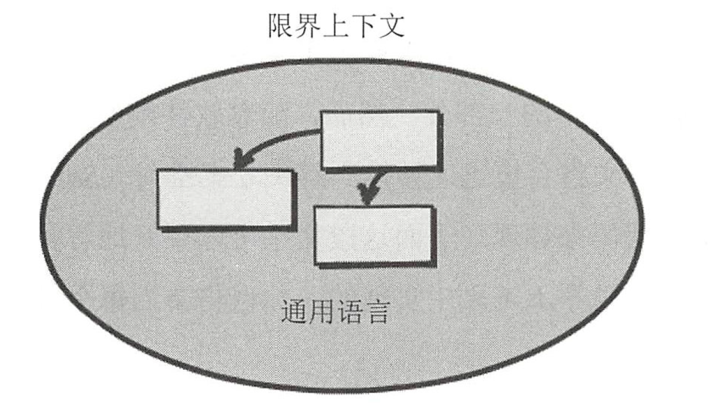

# 一、运用限界上下文与通用语言进行战略设计

## 1、限界上下文与通用语言

### (1) 限界上下文

**限界上下文**：是语义和语境上的边界，意味着边界内的每个代表软件模型的组件都有着特定的含义并处理特定的事务

- 刚开始投入到软件建模时，限界上下文可以理解为**问题空间** 

    > **问题空间**：在给定项目的约束条件下进行高级战略分析与设计各个步骤的地方
    >
    > - 可以使用简单的图表来展示讨论中高级的项目驱动因素，并记录关键目标与风险

- 随着软件模型呈现更深层次以及更清晰的含义时，限界上下文被转换到**解决方案空间**，同时软件模型将通过项目的源代码来体现

    > **解决方案空间**：通过源代码和测试代码来实现限界上下文中的解决方案，也会在解决方案空间中编写代码，来支撑与其他限界上下文之间的集成
    >
    > - 解决方案在问题空间中被识别为核心域
    > - 当限界上下文被当作组织的关键战略举措进行开发时，即被称为核心域

### (2) 通用语言

**通用语言**：团队在限界上下文中发展了**一种语言**用于表达其边界内的软件模型

- 作用：团队成员间的交流用它，软件模型的实现用它
- 要求：通用语言必须严谨、精确、紧凑

## 2、领域专家和业务驱动

## 3、案例分析

## 4、战略设计是必要根基

## 5、在质疑中统一

## 6、发展通用语言

### (1) 应用场景

### (2) 如何持续

## 7、架构

# 二、运用子域进行战略设计

## 1、子域介绍

## 2、子域类型

## 3、应对复杂性

# 三、运用上下文映射进行战略设计

## 1、映射的种类

### (1) 合作关系

### (2) 共享内核

### (3) 客户——供应商

### (4) 跟随者

### (5) 防腐层

### (6) 开放主机服务

### (7) 已发布语言

### (8) 各行其道

### (9) 大泥球

## 2、善用上下文映射

### (1) 基于 SOAP 的 RPC

### (2) RESTful HTTP

### (3) 消息机制

## 3、上下文映射示例

# 四、运用聚合进行战术设计

## 1、为何使用聚合

## 2、聚合的经验法则

### (1) 规则一：在聚合边界内保护业务规则不变性

### (2) 规则二：聚合要设计得小巧

### (3) 规则三：只能通过标识符引用其他聚合

### (4) 利用最终一致性更新其他聚合

## 3、建立聚合模型

### (1) 慎重选择抽象级别

### (2) 大小适中的聚合

### (3) 可测试的单元

# 五、运用领域事件进行战术设计

## 1、设计、实现、运用领域事件

## 2、事件溯源

# 六、加速和管理工具

## 1、事件风暴

## 2、敏捷项目中管理 DDD

### (1) 运用 SWOT 分析法

### (2) 建模 Spike 和建模债务

### (3) 任务识别与工作量估算

## 3、限制建模时间

### (1) 如何实施

### (2) 和领域专家打交道

